cola Report for Consensus Partitioning
==================

**Date**: 2019-12-06 06:09:23 CET, **cola version**: 1.3.2

----------------------------------------------------------------

<style type='text/css'>

body, td, th {
   font-family: Arial,Helvetica,sans-serif;
   background-color: white;
   font-size: 13px;
  max-width: 800px;
  margin: auto;
  margin-left:210px;
  padding: 0px 10px 0px 10px;
  border-left: 1px solid #EEEEEE;
  line-height: 150%;
}

tt, code, pre {
   font-family: 'DejaVu Sans Mono', 'Droid Sans Mono', 'Lucida Console', Consolas, Monaco, 

monospace;
}

h1 {
   font-size:2.2em;
}

h2 {
   font-size:1.8em;
}

h3 {
   font-size:1.4em;
}

h4 {
   font-size:1.0em;
}

h5 {
   font-size:0.9em;
}

h6 {
   font-size:0.8em;
}

a {
  text-decoration: none;
  color: #0366d6;
}

a:hover {
  text-decoration: underline;
}

a:visited {
   color: #0366d6;
}

pre, img {
  max-width: 100%;
}
pre {
  overflow-x: auto;
}
pre code {
   display: block; padding: 0.5em;
}

code {
  font-size: 92%;
  border: 1px solid #ccc;
}

code[class] {
  background-color: #F8F8F8;
}

table, td, th {
  border: 1px solid #ccc;
}

blockquote {
   color:#666666;
   margin:0;
   padding-left: 1em;
   border-left: 0.5em #EEE solid;
}

hr {
   height: 0px;
   border-bottom: none;
   border-top-width: thin;
   border-top-style: dotted;
   border-top-color: #999999;
}

@media print {
   * {
      background: transparent !important;
      color: black !important;
      filter:none !important;
      -ms-filter: none !important;
   }

   body {
      font-size:12pt;
      max-width:100%;
   }

   a, a:visited {
      text-decoration: underline;
   }

   hr {
      visibility: hidden;
      page-break-before: always;
   }

   pre, blockquote {
      padding-right: 1em;
      page-break-inside: avoid;
   }

   tr, img {
      page-break-inside: avoid;
   }

   img {
      max-width: 100% !important;
   }

   @page :left {
      margin: 15mm 20mm 15mm 10mm;
   }

   @page :right {
      margin: 15mm 10mm 15mm 20mm;
   }

   p, h2, h3 {
      orphans: 3; widows: 3;
   }

   h2, h3 {
      page-break-after: avoid;
   }
}
</style>


## Summary


All available functions which can be applied to this `res_list` object:


```r
res_list
```

```
#> A 'ConsensusPartitionList' object with 24 methods.
#>   On a matrix with 17288 rows and 266 columns.
#>   Top rows are extracted by 'SD, CV, MAD, ATC' methods.
#>   Subgroups are detected by 'hclust, kmeans, skmeans, pam, mclust, NMF' method.
#>   Number of partitions are tried for k = 2, 3, 4, 5, 6.
#>   Performed in total 30000 partitions by row resampling.
#> 
#> Following methods can be applied to this 'ConsensusPartitionList' object:
#>  [1] "cola_report"           "collect_classes"       "collect_plots"         "collect_stats"        
#>  [5] "colnames"              "functional_enrichment" "get_anno_col"          "get_anno"             
#>  [9] "get_classes"           "get_matrix"            "get_membership"        "get_stats"            
#> [13] "is_best_k"             "is_stable_k"           "ncol"                  "nrow"                 
#> [17] "rownames"              "show"                  "suggest_best_k"        "test_to_known_factors"
#> [21] "top_rows_heatmap"      "top_rows_overlap"     
#> 
#> You can get result for a single method by, e.g. object["SD", "hclust"] or object["SD:hclust"]
#> or a subset of methods by object[c("SD", "CV")], c("hclust", "kmeans")]
```

The call of `run_all_consensus_partition_methods()` was:


```
#> run_all_consensus_partition_methods(data = mat, mc.cores = 4)
```

Dimension of the input matrix:


```r
mat = get_matrix(res_list)
dim(mat)
```

```
#> [1] 17288   266
```

### Density distribution

The density distribution for each sample is visualized as in one column in the
following heatmap. The clustering is based on the distance which is the
Kolmogorov-Smirnov statistic between two distributions.


```r
library(ComplexHeatmap)
densityHeatmap(mat, ylab = "value", cluster_columns = TRUE, show_column_names = FALSE,
    mc.cores = 4)
```

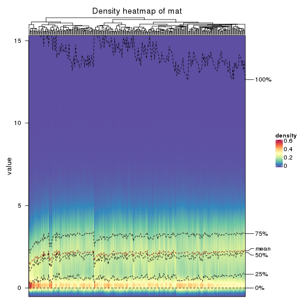


### Suggest the best k


Folowing table shows the best `k` (number of partitions) for each combination
of top-value methods and partition methods. Clicking on the method name in
the table goes to the section for a single combination of methods.

[The cola vignette](http://bioconductor.org/packages/devel/bioc/vignettes/cola/inst/doc/cola.html#toc_13)
explains the definition of the metrics used for determining the best
number of partitions.


```r
suggest_best_k(res_list)
```


|                            | The best k| 1-PAC| Mean silhouette| Concordance|   |Optional k |
|:---------------------------|----------:|-----:|---------------:|-----------:|:--|:----------|
|[SD:hclust](#SD-hclust)     |          2| 1.000|           0.990|       0.996|** |           |
|[SD:kmeans](#SD-kmeans)     |          2| 1.000|           1.000|       1.000|** |           |
|[SD:skmeans](#SD-skmeans)   |          3| 1.000|           0.974|       0.989|** |2          |
|[SD:pam](#SD-pam)           |          2| 1.000|           1.000|       1.000|** |           |
|[SD:mclust](#SD-mclust)     |          2| 1.000|           0.999|       1.000|** |           |
|[SD:NMF](#SD-NMF)           |          2| 1.000|           0.998|       0.999|** |           |
|[CV:hclust](#CV-hclust)     |          2| 1.000|           0.995|       0.998|** |           |
|[CV:kmeans](#CV-kmeans)     |          2| 1.000|           0.994|       0.997|** |           |
|[CV:pam](#CV-pam)           |          2| 1.000|           0.995|       0.998|** |           |
|[CV:mclust](#CV-mclust)     |          2| 1.000|           0.991|       0.996|** |           |
|[CV:NMF](#CV-NMF)           |          2| 1.000|           0.992|       0.997|** |           |
|[MAD:kmeans](#MAD-kmeans)   |          2| 1.000|           1.000|       1.000|** |           |
|[MAD:pam](#MAD-pam)         |          2| 1.000|           1.000|       1.000|** |           |
|[MAD:mclust](#MAD-mclust)   |          2| 1.000|           0.999|       1.000|** |           |
|[MAD:NMF](#MAD-NMF)         |          2| 1.000|           0.984|       0.994|** |           |
|[ATC:kmeans](#ATC-kmeans)   |          2| 1.000|           0.998|       0.999|** |           |
|[ATC:mclust](#ATC-mclust)   |          2| 1.000|           1.000|       1.000|** |           |
|[ATC:NMF](#ATC-NMF)         |          2| 1.000|           0.995|       0.998|** |           |
|[MAD:hclust](#MAD-hclust)   |          2| 0.992|           0.974|       0.987|** |           |
|[ATC:pam](#ATC-pam)         |          3| 0.989|           0.959|       0.981|** |2          |
|[CV:skmeans](#CV-skmeans)   |          3| 0.973|           0.939|       0.976|** |2          |
|[ATC:skmeans](#ATC-skmeans) |          3| 0.960|           0.934|       0.974|** |2          |
|[MAD:skmeans](#MAD-skmeans) |          3| 0.947|           0.923|       0.967|*  |2          |
|[ATC:hclust](#ATC-hclust)   |          2| 0.892|           0.922|       0.961|   |           |

\*\*: 1-PAC > 0.95, \*: 1-PAC > 0.9


### CDF of consensus matrices

Cumulative distribution function curves of consensus matrix for all methods.


```r
collect_plots(res_list, fun = plot_ecdf)
```

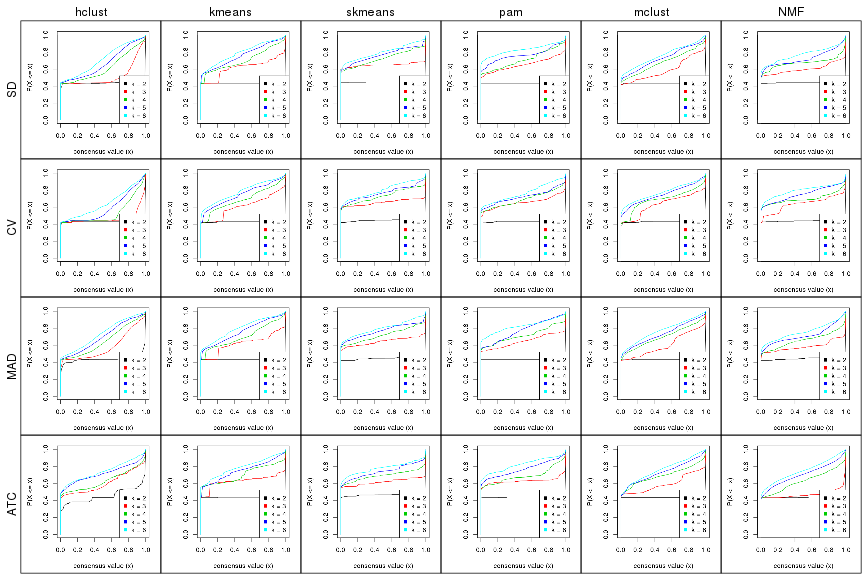


### Consensus heatmap

Consensus heatmaps for all methods. ([What is a consensus heatmap?](http://bioconductor.org/packages/devel/bioc/vignettes/cola/inst/doc/cola.html#toc_9))


<style type='text/css'>


.ui-helper-hidden {
	display: none;
}
.ui-helper-hidden-accessible {
	border: 0;
	clip: rect(0 0 0 0);
	height: 1px;
	margin: -1px;
	overflow: hidden;
	padding: 0;
	position: absolute;
	width: 1px;
}
.ui-helper-reset {
	margin: 0;
	padding: 0;
	border: 0;
	outline: 0;
	line-height: 1.3;
	text-decoration: none;
	font-size: 100%;
	list-style: none;
}
.ui-helper-clearfix:before,
.ui-helper-clearfix:after {
	content: "";
	display: table;
	border-collapse: collapse;
}
.ui-helper-clearfix:after {
	clear: both;
}
.ui-helper-zfix {
	width: 100%;
	height: 100%;
	top: 0;
	left: 0;
	position: absolute;
	opacity: 0;
	filter:Alpha(Opacity=0); 
}

.ui-front {
	z-index: 100;
}


.ui-state-disabled {
	cursor: default !important;
	pointer-events: none;
}


.ui-icon {
	display: inline-block;
	vertical-align: middle;
	margin-top: -.25em;
	position: relative;
	text-indent: -99999px;
	overflow: hidden;
	background-repeat: no-repeat;
}

.ui-widget-icon-block {
	left: 50%;
	margin-left: -8px;
	display: block;
}


.ui-widget-overlay {
	position: fixed;
	top: 0;
	left: 0;
	width: 100%;
	height: 100%;
}
.ui-accordion .ui-accordion-header {
	display: block;
	cursor: pointer;
	position: relative;
	margin: 2px 0 0 0;
	padding: .5em .5em .5em .7em;
	font-size: 100%;
}
.ui-accordion .ui-accordion-content {
	padding: 1em 2.2em;
	border-top: 0;
	overflow: auto;
}
.ui-autocomplete {
	position: absolute;
	top: 0;
	left: 0;
	cursor: default;
}
.ui-menu {
	list-style: none;
	padding: 0;
	margin: 0;
	display: block;
	outline: 0;
}
.ui-menu .ui-menu {
	position: absolute;
}
.ui-menu .ui-menu-item {
	margin: 0;
	cursor: pointer;
	
	list-style-image: url("data:image/gif;base64,R0lGODlhAQABAIAAAAAAAP///yH5BAEAAAAALAAAAAABAAEAAAIBRAA7");
}
.ui-menu .ui-menu-item-wrapper {
	position: relative;
	padding: 3px 1em 3px .4em;
}
.ui-menu .ui-menu-divider {
	margin: 5px 0;
	height: 0;
	font-size: 0;
	line-height: 0;
	border-width: 1px 0 0 0;
}
.ui-menu .ui-state-focus,
.ui-menu .ui-state-active {
	margin: -1px;
}


.ui-menu-icons {
	position: relative;
}
.ui-menu-icons .ui-menu-item-wrapper {
	padding-left: 2em;
}


.ui-menu .ui-icon {
	position: absolute;
	top: 0;
	bottom: 0;
	left: .2em;
	margin: auto 0;
}


.ui-menu .ui-menu-icon {
	left: auto;
	right: 0;
}
.ui-button {
	padding: .4em 1em;
	display: inline-block;
	position: relative;
	line-height: normal;
	margin-right: .1em;
	cursor: pointer;
	vertical-align: middle;
	text-align: center;
	-webkit-user-select: none;
	-moz-user-select: none;
	-ms-user-select: none;
	user-select: none;

	
	overflow: visible;
}

.ui-button,
.ui-button:link,
.ui-button:visited,
.ui-button:hover,
.ui-button:active {
	text-decoration: none;
}


.ui-button-icon-only {
	width: 2em;
	box-sizing: border-box;
	text-indent: -9999px;
	white-space: nowrap;
}


input.ui-button.ui-button-icon-only {
	text-indent: 0;
}


.ui-button-icon-only .ui-icon {
	position: absolute;
	top: 50%;
	left: 50%;
	margin-top: -8px;
	margin-left: -8px;
}

.ui-button.ui-icon-notext .ui-icon {
	padding: 0;
	width: 2.1em;
	height: 2.1em;
	text-indent: -9999px;
	white-space: nowrap;

}

input.ui-button.ui-icon-notext .ui-icon {
	width: auto;
	height: auto;
	text-indent: 0;
	white-space: normal;
	padding: .4em 1em;
}


input.ui-button::-moz-focus-inner,
button.ui-button::-moz-focus-inner {
	border: 0;
	padding: 0;
}
.ui-controlgroup {
	vertical-align: middle;
	display: inline-block;
}
.ui-controlgroup > .ui-controlgroup-item {
	float: left;
	margin-left: 0;
	margin-right: 0;
}
.ui-controlgroup > .ui-controlgroup-item:focus,
.ui-controlgroup > .ui-controlgroup-item.ui-visual-focus {
	z-index: 9999;
}
.ui-controlgroup-vertical > .ui-controlgroup-item {
	display: block;
	float: none;
	width: 100%;
	margin-top: 0;
	margin-bottom: 0;
	text-align: left;
}
.ui-controlgroup-vertical .ui-controlgroup-item {
	box-sizing: border-box;
}
.ui-controlgroup .ui-controlgroup-label {
	padding: .4em 1em;
}
.ui-controlgroup .ui-controlgroup-label span {
	font-size: 80%;
}
.ui-controlgroup-horizontal .ui-controlgroup-label + .ui-controlgroup-item {
	border-left: none;
}
.ui-controlgroup-vertical .ui-controlgroup-label + .ui-controlgroup-item {
	border-top: none;
}
.ui-controlgroup-horizontal .ui-controlgroup-label.ui-widget-content {
	border-right: none;
}
.ui-controlgroup-vertical .ui-controlgroup-label.ui-widget-content {
	border-bottom: none;
}


.ui-controlgroup-vertical .ui-spinner-input {

	
	width: 75%;
	width: calc( 100% - 2.4em );
}
.ui-controlgroup-vertical .ui-spinner .ui-spinner-up {
	border-top-style: solid;
}

.ui-checkboxradio-label .ui-icon-background {
	box-shadow: inset 1px 1px 1px #ccc;
	border-radius: .12em;
	border: none;
}
.ui-checkboxradio-radio-label .ui-icon-background {
	width: 16px;
	height: 16px;
	border-radius: 1em;
	overflow: visible;
	border: none;
}
.ui-checkboxradio-radio-label.ui-checkboxradio-checked .ui-icon,
.ui-checkboxradio-radio-label.ui-checkboxradio-checked:hover .ui-icon {
	background-image: none;
	width: 8px;
	height: 8px;
	border-width: 4px;
	border-style: solid;
}
.ui-checkboxradio-disabled {
	pointer-events: none;
}
.ui-datepicker {
	width: 17em;
	padding: .2em .2em 0;
	display: none;
}
.ui-datepicker .ui-datepicker-header {
	position: relative;
	padding: .2em 0;
}
.ui-datepicker .ui-datepicker-prev,
.ui-datepicker .ui-datepicker-next {
	position: absolute;
	top: 2px;
	width: 1.8em;
	height: 1.8em;
}
.ui-datepicker .ui-datepicker-prev-hover,
.ui-datepicker .ui-datepicker-next-hover {
	top: 1px;
}
.ui-datepicker .ui-datepicker-prev {
	left: 2px;
}
.ui-datepicker .ui-datepicker-next {
	right: 2px;
}
.ui-datepicker .ui-datepicker-prev-hover {
	left: 1px;
}
.ui-datepicker .ui-datepicker-next-hover {
	right: 1px;
}
.ui-datepicker .ui-datepicker-prev span,
.ui-datepicker .ui-datepicker-next span {
	display: block;
	position: absolute;
	left: 50%;
	margin-left: -8px;
	top: 50%;
	margin-top: -8px;
}
.ui-datepicker .ui-datepicker-title {
	margin: 0 2.3em;
	line-height: 1.8em;
	text-align: center;
}
.ui-datepicker .ui-datepicker-title select {
	font-size: 1em;
	margin: 1px 0;
}
.ui-datepicker select.ui-datepicker-month,
.ui-datepicker select.ui-datepicker-year {
	width: 45%;
}
.ui-datepicker table {
	width: 100%;
	font-size: .9em;
	border-collapse: collapse;
	margin: 0 0 .4em;
}
.ui-datepicker th {
	padding: .7em .3em;
	text-align: center;
	font-weight: bold;
	border: 0;
}
.ui-datepicker td {
	border: 0;
	padding: 1px;
}
.ui-datepicker td span,
.ui-datepicker td a {
	display: block;
	padding: .2em;
	text-align: right;
	text-decoration: none;
}
.ui-datepicker .ui-datepicker-buttonpane {
	background-image: none;
	margin: .7em 0 0 0;
	padding: 0 .2em;
	border-left: 0;
	border-right: 0;
	border-bottom: 0;
}
.ui-datepicker .ui-datepicker-buttonpane button {
	float: right;
	margin: .5em .2em .4em;
	cursor: pointer;
	padding: .2em .6em .3em .6em;
	width: auto;
	overflow: visible;
}
.ui-datepicker .ui-datepicker-buttonpane button.ui-datepicker-current {
	float: left;
}


.ui-datepicker.ui-datepicker-multi {
	width: auto;
}
.ui-datepicker-multi .ui-datepicker-group {
	float: left;
}
.ui-datepicker-multi .ui-datepicker-group table {
	width: 95%;
	margin: 0 auto .4em;
}
.ui-datepicker-multi-2 .ui-datepicker-group {
	width: 50%;
}
.ui-datepicker-multi-3 .ui-datepicker-group {
	width: 33.3%;
}
.ui-datepicker-multi-4 .ui-datepicker-group {
	width: 25%;
}
.ui-datepicker-multi .ui-datepicker-group-last .ui-datepicker-header,
.ui-datepicker-multi .ui-datepicker-group-middle .ui-datepicker-header {
	border-left-width: 0;
}
.ui-datepicker-multi .ui-datepicker-buttonpane {
	clear: left;
}
.ui-datepicker-row-break {
	clear: both;
	width: 100%;
	font-size: 0;
}


.ui-datepicker-rtl {
	direction: rtl;
}
.ui-datepicker-rtl .ui-datepicker-prev {
	right: 2px;
	left: auto;
}
.ui-datepicker-rtl .ui-datepicker-next {
	left: 2px;
	right: auto;
}
.ui-datepicker-rtl .ui-datepicker-prev:hover {
	right: 1px;
	left: auto;
}
.ui-datepicker-rtl .ui-datepicker-next:hover {
	left: 1px;
	right: auto;
}
.ui-datepicker-rtl .ui-datepicker-buttonpane {
	clear: right;
}
.ui-datepicker-rtl .ui-datepicker-buttonpane button {
	float: left;
}
.ui-datepicker-rtl .ui-datepicker-buttonpane button.ui-datepicker-current,
.ui-datepicker-rtl .ui-datepicker-group {
	float: right;
}
.ui-datepicker-rtl .ui-datepicker-group-last .ui-datepicker-header,
.ui-datepicker-rtl .ui-datepicker-group-middle .ui-datepicker-header {
	border-right-width: 0;
	border-left-width: 1px;
}


.ui-datepicker .ui-icon {
	display: block;
	text-indent: -99999px;
	overflow: hidden;
	background-repeat: no-repeat;
	left: .5em;
	top: .3em;
}
.ui-dialog {
	position: absolute;
	top: 0;
	left: 0;
	padding: .2em;
	outline: 0;
}
.ui-dialog .ui-dialog-titlebar {
	padding: .4em 1em;
	position: relative;
}
.ui-dialog .ui-dialog-title {
	float: left;
	margin: .1em 0;
	white-space: nowrap;
	width: 90%;
	overflow: hidden;
	text-overflow: ellipsis;
}
.ui-dialog .ui-dialog-titlebar-close {
	position: absolute;
	right: .3em;
	top: 50%;
	width: 20px;
	margin: -10px 0 0 0;
	padding: 1px;
	height: 20px;
}
.ui-dialog .ui-dialog-content {
	position: relative;
	border: 0;
	padding: .5em 1em;
	background: none;
	overflow: auto;
}
.ui-dialog .ui-dialog-buttonpane {
	text-align: left;
	border-width: 1px 0 0 0;
	background-image: none;
	margin-top: .5em;
	padding: .3em 1em .5em .4em;
}
.ui-dialog .ui-dialog-buttonpane .ui-dialog-buttonset {
	float: right;
}
.ui-dialog .ui-dialog-buttonpane button {
	margin: .5em .4em .5em 0;
	cursor: pointer;
}
.ui-dialog .ui-resizable-n {
	height: 2px;
	top: 0;
}
.ui-dialog .ui-resizable-e {
	width: 2px;
	right: 0;
}
.ui-dialog .ui-resizable-s {
	height: 2px;
	bottom: 0;
}
.ui-dialog .ui-resizable-w {
	width: 2px;
	left: 0;
}
.ui-dialog .ui-resizable-se,
.ui-dialog .ui-resizable-sw,
.ui-dialog .ui-resizable-ne,
.ui-dialog .ui-resizable-nw {
	width: 7px;
	height: 7px;
}
.ui-dialog .ui-resizable-se {
	right: 0;
	bottom: 0;
}
.ui-dialog .ui-resizable-sw {
	left: 0;
	bottom: 0;
}
.ui-dialog .ui-resizable-ne {
	right: 0;
	top: 0;
}
.ui-dialog .ui-resizable-nw {
	left: 0;
	top: 0;
}
.ui-draggable .ui-dialog-titlebar {
	cursor: move;
}
.ui-draggable-handle {
	-ms-touch-action: none;
	touch-action: none;
}
.ui-resizable {
	position: relative;
}
.ui-resizable-handle {
	position: absolute;
	font-size: 0.1px;
	display: block;
	-ms-touch-action: none;
	touch-action: none;
}
.ui-resizable-disabled .ui-resizable-handle,
.ui-resizable-autohide .ui-resizable-handle {
	display: none;
}
.ui-resizable-n {
	cursor: n-resize;
	height: 7px;
	width: 100%;
	top: -5px;
	left: 0;
}
.ui-resizable-s {
	cursor: s-resize;
	height: 7px;
	width: 100%;
	bottom: -5px;
	left: 0;
}
.ui-resizable-e {
	cursor: e-resize;
	width: 7px;
	right: -5px;
	top: 0;
	height: 100%;
}
.ui-resizable-w {
	cursor: w-resize;
	width: 7px;
	left: -5px;
	top: 0;
	height: 100%;
}
.ui-resizable-se {
	cursor: se-resize;
	width: 12px;
	height: 12px;
	right: 1px;
	bottom: 1px;
}
.ui-resizable-sw {
	cursor: sw-resize;
	width: 9px;
	height: 9px;
	left: -5px;
	bottom: -5px;
}
.ui-resizable-nw {
	cursor: nw-resize;
	width: 9px;
	height: 9px;
	left: -5px;
	top: -5px;
}
.ui-resizable-ne {
	cursor: ne-resize;
	width: 9px;
	height: 9px;
	right: -5px;
	top: -5px;
}
.ui-progressbar {
	height: 2em;
	text-align: left;
	overflow: hidden;
}
.ui-progressbar .ui-progressbar-value {
	margin: -1px;
	height: 100%;
}
.ui-progressbar .ui-progressbar-overlay {
	background: url("");
	height: 100%;
	filter: alpha(opacity=25); 
	opacity: 0.25;
}
.ui-progressbar-indeterminate .ui-progressbar-value {
	background-image: none;
}
.ui-selectable {
	-ms-touch-action: none;
	touch-action: none;
}
.ui-selectable-helper {
	position: absolute;
	z-index: 100;
	border: 1px dotted black;
}
.ui-selectmenu-menu {
	padding: 0;
	margin: 0;
	position: absolute;
	top: 0;
	left: 0;
	display: none;
}
.ui-selectmenu-menu .ui-menu {
	overflow: auto;
	overflow-x: hidden;
	padding-bottom: 1px;
}
.ui-selectmenu-menu .ui-menu .ui-selectmenu-optgroup {
	font-size: 1em;
	font-weight: bold;
	line-height: 1.5;
	padding: 2px 0.4em;
	margin: 0.5em 0 0 0;
	height: auto;
	border: 0;
}
.ui-selectmenu-open {
	display: block;
}
.ui-selectmenu-text {
	display: block;
	margin-right: 20px;
	overflow: hidden;
	text-overflow: ellipsis;
}
.ui-selectmenu-button.ui-button {
	text-align: left;
	white-space: nowrap;
	width: 14em;
}
.ui-selectmenu-icon.ui-icon {
	float: right;
	margin-top: 0;
}
.ui-slider {
	position: relative;
	text-align: left;
}
.ui-slider .ui-slider-handle {
	position: absolute;
	z-index: 2;
	width: 1.2em;
	height: 1.2em;
	cursor: default;
	-ms-touch-action: none;
	touch-action: none;
}
.ui-slider .ui-slider-range {
	position: absolute;
	z-index: 1;
	font-size: .7em;
	display: block;
	border: 0;
	background-position: 0 0;
}


.ui-slider.ui-state-disabled .ui-slider-handle,
.ui-slider.ui-state-disabled .ui-slider-range {
	filter: inherit;
}

.ui-slider-horizontal {
	height: .8em;
}
.ui-slider-horizontal .ui-slider-handle {
	top: -.3em;
	margin-left: -.6em;
}
.ui-slider-horizontal .ui-slider-range {
	top: 0;
	height: 100%;
}
.ui-slider-horizontal .ui-slider-range-min {
	left: 0;
}
.ui-slider-horizontal .ui-slider-range-max {
	right: 0;
}

.ui-slider-vertical {
	width: .8em;
	height: 100px;
}
.ui-slider-vertical .ui-slider-handle {
	left: -.3em;
	margin-left: 0;
	margin-bottom: -.6em;
}
.ui-slider-vertical .ui-slider-range {
	left: 0;
	width: 100%;
}
.ui-slider-vertical .ui-slider-range-min {
	bottom: 0;
}
.ui-slider-vertical .ui-slider-range-max {
	top: 0;
}
.ui-sortable-handle {
	-ms-touch-action: none;
	touch-action: none;
}
.ui-spinner {
	position: relative;
	display: inline-block;
	overflow: hidden;
	padding: 0;
	vertical-align: middle;
}
.ui-spinner-input {
	border: none;
	background: none;
	color: inherit;
	padding: .222em 0;
	margin: .2em 0;
	vertical-align: middle;
	margin-left: .4em;
	margin-right: 2em;
}
.ui-spinner-button {
	width: 1.6em;
	height: 50%;
	font-size: .5em;
	padding: 0;
	margin: 0;
	text-align: center;
	position: absolute;
	cursor: default;
	display: block;
	overflow: hidden;
	right: 0;
}

.ui-spinner a.ui-spinner-button {
	border-top-style: none;
	border-bottom-style: none;
	border-right-style: none;
}
.ui-spinner-up {
	top: 0;
}
.ui-spinner-down {
	bottom: 0;
}
.ui-tabs {
	position: relative;
	padding: .2em;
}
.ui-tabs .ui-tabs-nav {
	margin: 0;
	padding: .2em .2em 0;
}
.ui-tabs .ui-tabs-nav li {
	list-style: none;
	float: left;
	position: relative;
	top: 0;
	margin: 1px .2em 0 0;
	border-bottom-width: 0;
	padding: 0;
	white-space: nowrap;
}
.ui-tabs .ui-tabs-nav .ui-tabs-anchor {
	float: left;
	padding: .5em 1em;
	text-decoration: none;
}
.ui-tabs .ui-tabs-nav li.ui-tabs-active {
	margin-bottom: -1px;
	padding-bottom: 1px;
}
.ui-tabs .ui-tabs-nav li.ui-tabs-active .ui-tabs-anchor,
.ui-tabs .ui-tabs-nav li.ui-state-disabled .ui-tabs-anchor,
.ui-tabs .ui-tabs-nav li.ui-tabs-loading .ui-tabs-anchor {
	cursor: text;
}
.ui-tabs-collapsible .ui-tabs-nav li.ui-tabs-active .ui-tabs-anchor {
	cursor: pointer;
}
.ui-tabs .ui-tabs-panel {
	display: block;
	border-width: 0;
	padding: 1em 1.4em;
	background: none;
}
.ui-tooltip {
	padding: 8px;
	position: absolute;
	z-index: 9999;
	max-width: 300px;
}
body .ui-tooltip {
	border-width: 2px;
}

.ui-widget {
	font-family: Arial,Helvetica,sans-serif;
	font-size: 1em;
}
.ui-widget .ui-widget {
	font-size: 1em;
}
.ui-widget input,
.ui-widget select,
.ui-widget textarea,
.ui-widget button {
	font-family: Arial,Helvetica,sans-serif;
	font-size: 1em;
}
.ui-widget.ui-widget-content {
	border: 1px solid #c5c5c5;
}
.ui-widget-content {
	border: 1px solid #dddddd;
	background: #ffffff;
	color: #333333;
}
.ui-widget-content a {
	color: #333333;
}
.ui-widget-header {
	border: 1px solid #dddddd;
	background: #e9e9e9;
	color: #333333;
	font-weight: bold;
}
.ui-widget-header a {
	color: #333333;
}


.ui-state-default,
.ui-widget-content .ui-state-default,
.ui-widget-header .ui-state-default,
.ui-button,


html .ui-button.ui-state-disabled:hover,
html .ui-button.ui-state-disabled:active {
	border: 1px solid #c5c5c5;
	background: #f6f6f6;
	font-weight: normal;
	color: #454545;
}
.ui-state-default a,
.ui-state-default a:link,
.ui-state-default a:visited,
a.ui-button,
a:link.ui-button,
a:visited.ui-button,
.ui-button {
	color: #454545;
	text-decoration: none;
}
.ui-state-hover,
.ui-widget-content .ui-state-hover,
.ui-widget-header .ui-state-hover,
.ui-state-focus,
.ui-widget-content .ui-state-focus,
.ui-widget-header .ui-state-focus,
.ui-button:hover,
.ui-button:focus {
	border: 1px solid #cccccc;
	background: #ededed;
	font-weight: normal;
	color: #2b2b2b;
}
.ui-state-hover a,
.ui-state-hover a:hover,
.ui-state-hover a:link,
.ui-state-hover a:visited,
.ui-state-focus a,
.ui-state-focus a:hover,
.ui-state-focus a:link,
.ui-state-focus a:visited,
a.ui-button:hover,
a.ui-button:focus {
	color: #2b2b2b;
	text-decoration: none;
}

.ui-visual-focus {
	box-shadow: 0 0 3px 1px rgb(94, 158, 214);
}
.ui-state-active,
.ui-widget-content .ui-state-active,
.ui-widget-header .ui-state-active,
a.ui-button:active,
.ui-button:active,
.ui-button.ui-state-active:hover {
	border: 1px solid #003eff;
	background: #007fff;
	font-weight: normal;
	color: #ffffff;
}
.ui-icon-background,
.ui-state-active .ui-icon-background {
	border: #003eff;
	background-color: #ffffff;
}
.ui-state-active a,
.ui-state-active a:link,
.ui-state-active a:visited {
	color: #ffffff;
	text-decoration: none;
}


.ui-state-highlight,
.ui-widget-content .ui-state-highlight,
.ui-widget-header .ui-state-highlight {
	border: 1px solid #dad55e;
	background: #fffa90;
	color: #777620;
}
.ui-state-checked {
	border: 1px solid #dad55e;
	background: #fffa90;
}
.ui-state-highlight a,
.ui-widget-content .ui-state-highlight a,
.ui-widget-header .ui-state-highlight a {
	color: #777620;
}
.ui-state-error,
.ui-widget-content .ui-state-error,
.ui-widget-header .ui-state-error {
	border: 1px solid #f1a899;
	background: #fddfdf;
	color: #5f3f3f;
}
.ui-state-error a,
.ui-widget-content .ui-state-error a,
.ui-widget-header .ui-state-error a {
	color: #5f3f3f;
}
.ui-state-error-text,
.ui-widget-content .ui-state-error-text,
.ui-widget-header .ui-state-error-text {
	color: #5f3f3f;
}
.ui-priority-primary,
.ui-widget-content .ui-priority-primary,
.ui-widget-header .ui-priority-primary {
	font-weight: bold;
}
.ui-priority-secondary,
.ui-widget-content .ui-priority-secondary,
.ui-widget-header .ui-priority-secondary {
	opacity: .7;
	filter:Alpha(Opacity=70); 
	font-weight: normal;
}
.ui-state-disabled,
.ui-widget-content .ui-state-disabled,
.ui-widget-header .ui-state-disabled {
	opacity: .35;
	filter:Alpha(Opacity=35); 
	background-image: none;
}
.ui-state-disabled .ui-icon {
	filter:Alpha(Opacity=35); 
}


.ui-icon {
	width: 16px;
	height: 16px;
}
.ui-icon,
.ui-widget-content .ui-icon {
	background-image: url("images/ui-icons_444444_256x240.png");
}
.ui-widget-header .ui-icon {
	background-image: url("images/ui-icons_444444_256x240.png");
}
.ui-state-hover .ui-icon,
.ui-state-focus .ui-icon,
.ui-button:hover .ui-icon,
.ui-button:focus .ui-icon {
	background-image: url("images/ui-icons_555555_256x240.png");
}
.ui-state-active .ui-icon,
.ui-button:active .ui-icon {
	background-image: url("images/ui-icons_ffffff_256x240.png");
}
.ui-state-highlight .ui-icon,
.ui-button .ui-state-highlight.ui-icon {
	background-image: url("images/ui-icons_777620_256x240.png");
}
.ui-state-error .ui-icon,
.ui-state-error-text .ui-icon {
	background-image: url("images/ui-icons_cc0000_256x240.png");
}
.ui-button .ui-icon {
	background-image: url("images/ui-icons_777777_256x240.png");
}


.ui-icon-blank { background-position: 16px 16px; }
.ui-icon-caret-1-n { background-position: 0 0; }
.ui-icon-caret-1-ne { background-position: -16px 0; }
.ui-icon-caret-1-e { background-position: -32px 0; }
.ui-icon-caret-1-se { background-position: -48px 0; }
.ui-icon-caret-1-s { background-position: -65px 0; }
.ui-icon-caret-1-sw { background-position: -80px 0; }
.ui-icon-caret-1-w { background-position: -96px 0; }
.ui-icon-caret-1-nw { background-position: -112px 0; }
.ui-icon-caret-2-n-s { background-position: -128px 0; }
.ui-icon-caret-2-e-w { background-position: -144px 0; }
.ui-icon-triangle-1-n { background-position: 0 -16px; }
.ui-icon-triangle-1-ne { background-position: -16px -16px; }
.ui-icon-triangle-1-e { background-position: -32px -16px; }
.ui-icon-triangle-1-se { background-position: -48px -16px; }
.ui-icon-triangle-1-s { background-position: -65px -16px; }
.ui-icon-triangle-1-sw { background-position: -80px -16px; }
.ui-icon-triangle-1-w { background-position: -96px -16px; }
.ui-icon-triangle-1-nw { background-position: -112px -16px; }
.ui-icon-triangle-2-n-s { background-position: -128px -16px; }
.ui-icon-triangle-2-e-w { background-position: -144px -16px; }
.ui-icon-arrow-1-n { background-position: 0 -32px; }
.ui-icon-arrow-1-ne { background-position: -16px -32px; }
.ui-icon-arrow-1-e { background-position: -32px -32px; }
.ui-icon-arrow-1-se { background-position: -48px -32px; }
.ui-icon-arrow-1-s { background-position: -65px -32px; }
.ui-icon-arrow-1-sw { background-position: -80px -32px; }
.ui-icon-arrow-1-w { background-position: -96px -32px; }
.ui-icon-arrow-1-nw { background-position: -112px -32px; }
.ui-icon-arrow-2-n-s { background-position: -128px -32px; }
.ui-icon-arrow-2-ne-sw { background-position: -144px -32px; }
.ui-icon-arrow-2-e-w { background-position: -160px -32px; }
.ui-icon-arrow-2-se-nw { background-position: -176px -32px; }
.ui-icon-arrowstop-1-n { background-position: -192px -32px; }
.ui-icon-arrowstop-1-e { background-position: -208px -32px; }
.ui-icon-arrowstop-1-s { background-position: -224px -32px; }
.ui-icon-arrowstop-1-w { background-position: -240px -32px; }
.ui-icon-arrowthick-1-n { background-position: 1px -48px; }
.ui-icon-arrowthick-1-ne { background-position: -16px -48px; }
.ui-icon-arrowthick-1-e { background-position: -32px -48px; }
.ui-icon-arrowthick-1-se { background-position: -48px -48px; }
.ui-icon-arrowthick-1-s { background-position: -64px -48px; }
.ui-icon-arrowthick-1-sw { background-position: -80px -48px; }
.ui-icon-arrowthick-1-w { background-position: -96px -48px; }
.ui-icon-arrowthick-1-nw { background-position: -112px -48px; }
.ui-icon-arrowthick-2-n-s { background-position: -128px -48px; }
.ui-icon-arrowthick-2-ne-sw { background-position: -144px -48px; }
.ui-icon-arrowthick-2-e-w { background-position: -160px -48px; }
.ui-icon-arrowthick-2-se-nw { background-position: -176px -48px; }
.ui-icon-arrowthickstop-1-n { background-position: -192px -48px; }
.ui-icon-arrowthickstop-1-e { background-position: -208px -48px; }
.ui-icon-arrowthickstop-1-s { background-position: -224px -48px; }
.ui-icon-arrowthickstop-1-w { background-position: -240px -48px; }
.ui-icon-arrowreturnthick-1-w { background-position: 0 -64px; }
.ui-icon-arrowreturnthick-1-n { background-position: -16px -64px; }
.ui-icon-arrowreturnthick-1-e { background-position: -32px -64px; }
.ui-icon-arrowreturnthick-1-s { background-position: -48px -64px; }
.ui-icon-arrowreturn-1-w { background-position: -64px -64px; }
.ui-icon-arrowreturn-1-n { background-position: -80px -64px; }
.ui-icon-arrowreturn-1-e { background-position: -96px -64px; }
.ui-icon-arrowreturn-1-s { background-position: -112px -64px; }
.ui-icon-arrowrefresh-1-w { background-position: -128px -64px; }
.ui-icon-arrowrefresh-1-n { background-position: -144px -64px; }
.ui-icon-arrowrefresh-1-e { background-position: -160px -64px; }
.ui-icon-arrowrefresh-1-s { background-position: -176px -64px; }
.ui-icon-arrow-4 { background-position: 0 -80px; }
.ui-icon-arrow-4-diag { background-position: -16px -80px; }
.ui-icon-extlink { background-position: -32px -80px; }
.ui-icon-newwin { background-position: -48px -80px; }
.ui-icon-refresh { background-position: -64px -80px; }
.ui-icon-shuffle { background-position: -80px -80px; }
.ui-icon-transfer-e-w { background-position: -96px -80px; }
.ui-icon-transferthick-e-w { background-position: -112px -80px; }
.ui-icon-folder-collapsed { background-position: 0 -96px; }
.ui-icon-folder-open { background-position: -16px -96px; }
.ui-icon-document { background-position: -32px -96px; }
.ui-icon-document-b { background-position: -48px -96px; }
.ui-icon-note { background-position: -64px -96px; }
.ui-icon-mail-closed { background-position: -80px -96px; }
.ui-icon-mail-open { background-position: -96px -96px; }
.ui-icon-suitcase { background-position: -112px -96px; }
.ui-icon-comment { background-position: -128px -96px; }
.ui-icon-person { background-position: -144px -96px; }
.ui-icon-print { background-position: -160px -96px; }
.ui-icon-trash { background-position: -176px -96px; }
.ui-icon-locked { background-position: -192px -96px; }
.ui-icon-unlocked { background-position: -208px -96px; }
.ui-icon-bookmark { background-position: -224px -96px; }
.ui-icon-tag { background-position: -240px -96px; }
.ui-icon-home { background-position: 0 -112px; }
.ui-icon-flag { background-position: -16px -112px; }
.ui-icon-calendar { background-position: -32px -112px; }
.ui-icon-cart { background-position: -48px -112px; }
.ui-icon-pencil { background-position: -64px -112px; }
.ui-icon-clock { background-position: -80px -112px; }
.ui-icon-disk { background-position: -96px -112px; }
.ui-icon-calculator { background-position: -112px -112px; }
.ui-icon-zoomin { background-position: -128px -112px; }
.ui-icon-zoomout { background-position: -144px -112px; }
.ui-icon-search { background-position: -160px -112px; }
.ui-icon-wrench { background-position: -176px -112px; }
.ui-icon-gear { background-position: -192px -112px; }
.ui-icon-heart { background-position: -208px -112px; }
.ui-icon-star { background-position: -224px -112px; }
.ui-icon-link { background-position: -240px -112px; }
.ui-icon-cancel { background-position: 0 -128px; }
.ui-icon-plus { background-position: -16px -128px; }
.ui-icon-plusthick { background-position: -32px -128px; }
.ui-icon-minus { background-position: -48px -128px; }
.ui-icon-minusthick { background-position: -64px -128px; }
.ui-icon-close { background-position: -80px -128px; }
.ui-icon-closethick { background-position: -96px -128px; }
.ui-icon-key { background-position: -112px -128px; }
.ui-icon-lightbulb { background-position: -128px -128px; }
.ui-icon-scissors { background-position: -144px -128px; }
.ui-icon-clipboard { background-position: -160px -128px; }
.ui-icon-copy { background-position: -176px -128px; }
.ui-icon-contact { background-position: -192px -128px; }
.ui-icon-image { background-position: -208px -128px; }
.ui-icon-video { background-position: -224px -128px; }
.ui-icon-script { background-position: -240px -128px; }
.ui-icon-alert { background-position: 0 -144px; }
.ui-icon-info { background-position: -16px -144px; }
.ui-icon-notice { background-position: -32px -144px; }
.ui-icon-help { background-position: -48px -144px; }
.ui-icon-check { background-position: -64px -144px; }
.ui-icon-bullet { background-position: -80px -144px; }
.ui-icon-radio-on { background-position: -96px -144px; }
.ui-icon-radio-off { background-position: -112px -144px; }
.ui-icon-pin-w { background-position: -128px -144px; }
.ui-icon-pin-s { background-position: -144px -144px; }
.ui-icon-play { background-position: 0 -160px; }
.ui-icon-pause { background-position: -16px -160px; }
.ui-icon-seek-next { background-position: -32px -160px; }
.ui-icon-seek-prev { background-position: -48px -160px; }
.ui-icon-seek-end { background-position: -64px -160px; }
.ui-icon-seek-start { background-position: -80px -160px; }

.ui-icon-seek-first { background-position: -80px -160px; }
.ui-icon-stop { background-position: -96px -160px; }
.ui-icon-eject { background-position: -112px -160px; }
.ui-icon-volume-off { background-position: -128px -160px; }
.ui-icon-volume-on { background-position: -144px -160px; }
.ui-icon-power { background-position: 0 -176px; }
.ui-icon-signal-diag { background-position: -16px -176px; }
.ui-icon-signal { background-position: -32px -176px; }
.ui-icon-battery-0 { background-position: -48px -176px; }
.ui-icon-battery-1 { background-position: -64px -176px; }
.ui-icon-battery-2 { background-position: -80px -176px; }
.ui-icon-battery-3 { background-position: -96px -176px; }
.ui-icon-circle-plus { background-position: 0 -192px; }
.ui-icon-circle-minus { background-position: -16px -192px; }
.ui-icon-circle-close { background-position: -32px -192px; }
.ui-icon-circle-triangle-e { background-position: -48px -192px; }
.ui-icon-circle-triangle-s { background-position: -64px -192px; }
.ui-icon-circle-triangle-w { background-position: -80px -192px; }
.ui-icon-circle-triangle-n { background-position: -96px -192px; }
.ui-icon-circle-arrow-e { background-position: -112px -192px; }
.ui-icon-circle-arrow-s { background-position: -128px -192px; }
.ui-icon-circle-arrow-w { background-position: -144px -192px; }
.ui-icon-circle-arrow-n { background-position: -160px -192px; }
.ui-icon-circle-zoomin { background-position: -176px -192px; }
.ui-icon-circle-zoomout { background-position: -192px -192px; }
.ui-icon-circle-check { background-position: -208px -192px; }
.ui-icon-circlesmall-plus { background-position: 0 -208px; }
.ui-icon-circlesmall-minus { background-position: -16px -208px; }
.ui-icon-circlesmall-close { background-position: -32px -208px; }
.ui-icon-squaresmall-plus { background-position: -48px -208px; }
.ui-icon-squaresmall-minus { background-position: -64px -208px; }
.ui-icon-squaresmall-close { background-position: -80px -208px; }
.ui-icon-grip-dotted-vertical { background-position: 0 -224px; }
.ui-icon-grip-dotted-horizontal { background-position: -16px -224px; }
.ui-icon-grip-solid-vertical { background-position: -32px -224px; }
.ui-icon-grip-solid-horizontal { background-position: -48px -224px; }
.ui-icon-gripsmall-diagonal-se { background-position: -64px -224px; }
.ui-icon-grip-diagonal-se { background-position: -80px -224px; }


.ui-corner-all,
.ui-corner-top,
.ui-corner-left,
.ui-corner-tl {
	border-top-left-radius: 3px;
}
.ui-corner-all,
.ui-corner-top,
.ui-corner-right,
.ui-corner-tr {
	border-top-right-radius: 3px;
}
.ui-corner-all,
.ui-corner-bottom,
.ui-corner-left,
.ui-corner-bl {
	border-bottom-left-radius: 3px;
}
.ui-corner-all,
.ui-corner-bottom,
.ui-corner-right,
.ui-corner-br {
	border-bottom-right-radius: 3px;
}


.ui-widget-overlay {
	background: #aaaaaa;
	opacity: .3;
	filter: Alpha(Opacity=30); 
}
.ui-widget-shadow {
	-webkit-box-shadow: 0px 0px 5px #666666;
	box-shadow: 0px 0px 5px #666666;
} 
</style>
<script src='js/jquery-1.12.4.js'></script>
<script src='js/jquery-ui.js'></script>

<script>
$( function() {
	$( '#tabs-collect-consensus-heatmap' ).tabs();
} );
</script>
<div id='tabs-collect-consensus-heatmap'>
<ul>
<li><a href='#tab-collect-consensus-heatmap-1'>k = 2</a></li>
<li><a href='#tab-collect-consensus-heatmap-2'>k = 3</a></li>
<li><a href='#tab-collect-consensus-heatmap-3'>k = 4</a></li>
<li><a href='#tab-collect-consensus-heatmap-4'>k = 5</a></li>
<li><a href='#tab-collect-consensus-heatmap-5'>k = 6</a></li>
</ul>
<div id='tab-collect-consensus-heatmap-1'>
<pre><code class="r">collect_plots(res_list, k = 2, fun = consensus_heatmap, mc.cores = 4)
</code></pre>

<p>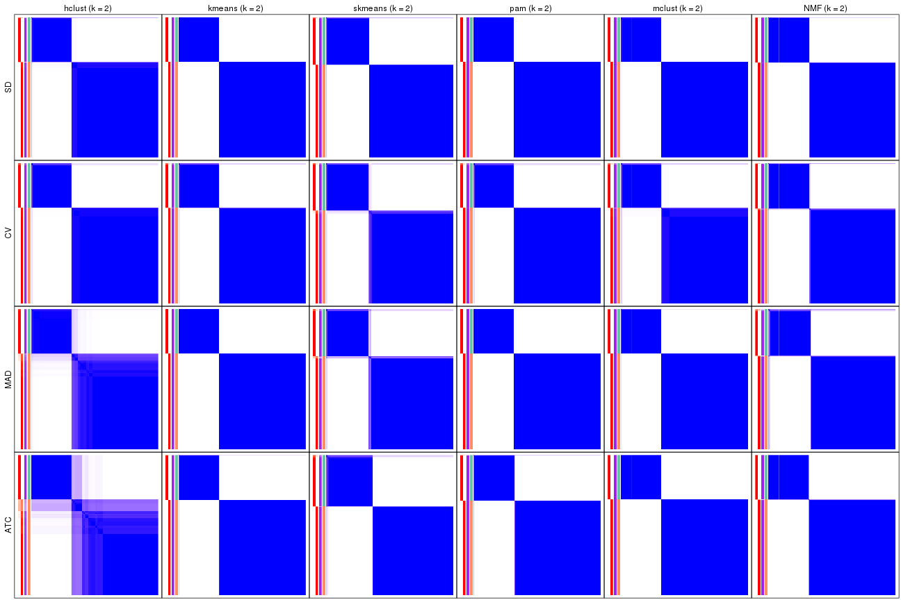</p>

</div>
<div id='tab-collect-consensus-heatmap-2'>
<pre><code class="r">collect_plots(res_list, k = 3, fun = consensus_heatmap, mc.cores = 4)
</code></pre>

<p>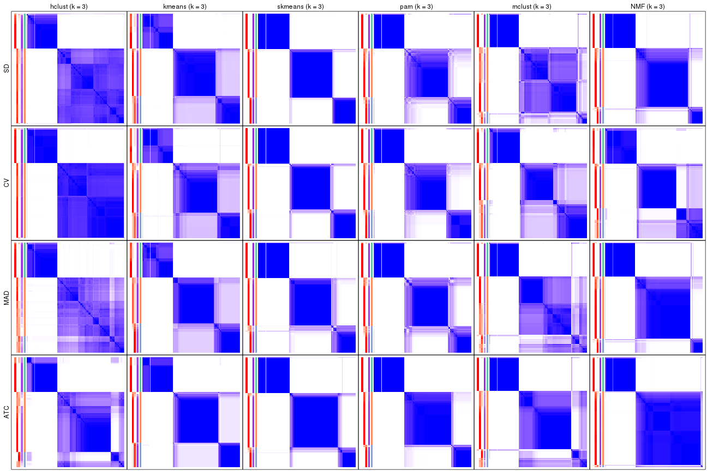</p>

</div>
<div id='tab-collect-consensus-heatmap-3'>
<pre><code class="r">collect_plots(res_list, k = 4, fun = consensus_heatmap, mc.cores = 4)
</code></pre>

<p>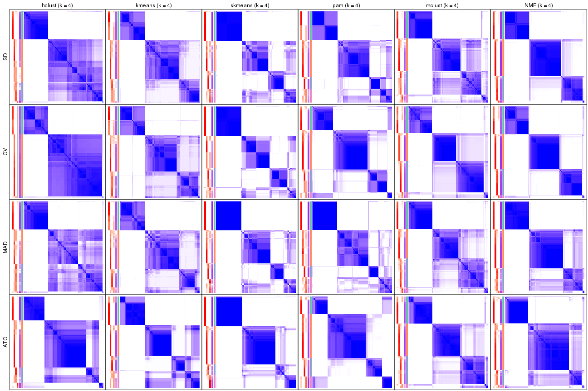</p>

</div>
<div id='tab-collect-consensus-heatmap-4'>
<pre><code class="r">collect_plots(res_list, k = 5, fun = consensus_heatmap, mc.cores = 4)
</code></pre>

<p>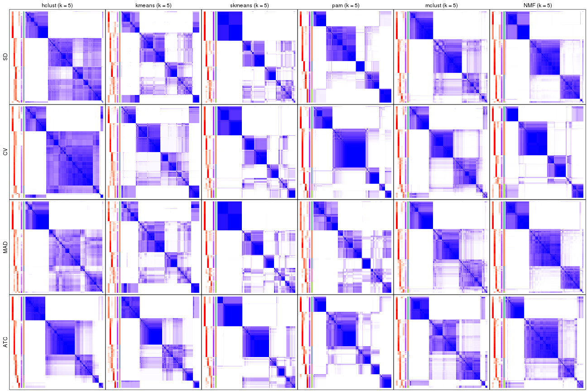</p>

</div>
<div id='tab-collect-consensus-heatmap-5'>
<pre><code class="r">collect_plots(res_list, k = 6, fun = consensus_heatmap, mc.cores = 4)
</code></pre>

<p>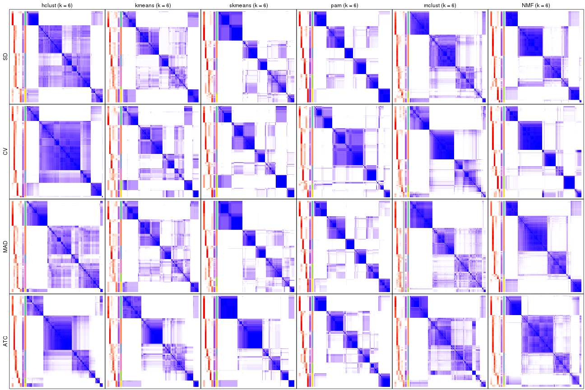</p>

</div>
</div>


### Membership heatmap

Membership heatmaps for all methods. ([What is a membership heatmap?](http://bioconductor.org/packages/devel/bioc/vignettes/cola/inst/doc/cola.html#toc_12))


<script>
$( function() {
	$( '#tabs-collect-membership-heatmap' ).tabs();
} );
</script>
<div id='tabs-collect-membership-heatmap'>
<ul>
<li><a href='#tab-collect-membership-heatmap-1'>k = 2</a></li>
<li><a href='#tab-collect-membership-heatmap-2'>k = 3</a></li>
<li><a href='#tab-collect-membership-heatmap-3'>k = 4</a></li>
<li><a href='#tab-collect-membership-heatmap-4'>k = 5</a></li>
<li><a href='#tab-collect-membership-heatmap-5'>k = 6</a></li>
</ul>
<div id='tab-collect-membership-heatmap-1'>
<pre><code class="r">collect_plots(res_list, k = 2, fun = membership_heatmap, mc.cores = 4)
</code></pre>

<p>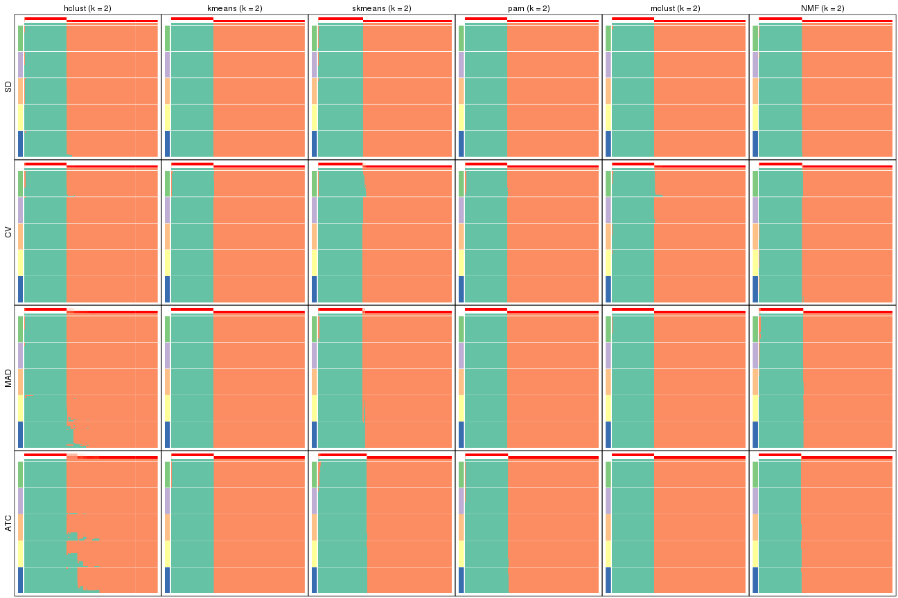</p>

</div>
<div id='tab-collect-membership-heatmap-2'>
<pre><code class="r">collect_plots(res_list, k = 3, fun = membership_heatmap, mc.cores = 4)
</code></pre>

<p>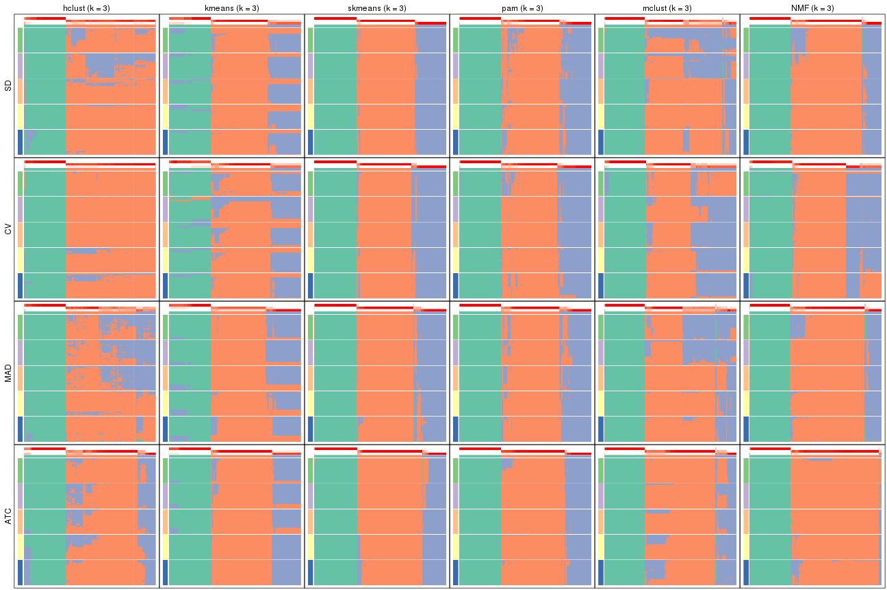</p>

</div>
<div id='tab-collect-membership-heatmap-3'>
<pre><code class="r">collect_plots(res_list, k = 4, fun = membership_heatmap, mc.cores = 4)
</code></pre>

<p>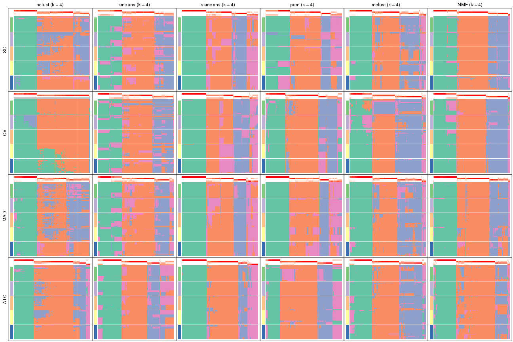</p>

</div>
<div id='tab-collect-membership-heatmap-4'>
<pre><code class="r">collect_plots(res_list, k = 5, fun = membership_heatmap, mc.cores = 4)
</code></pre>

<p>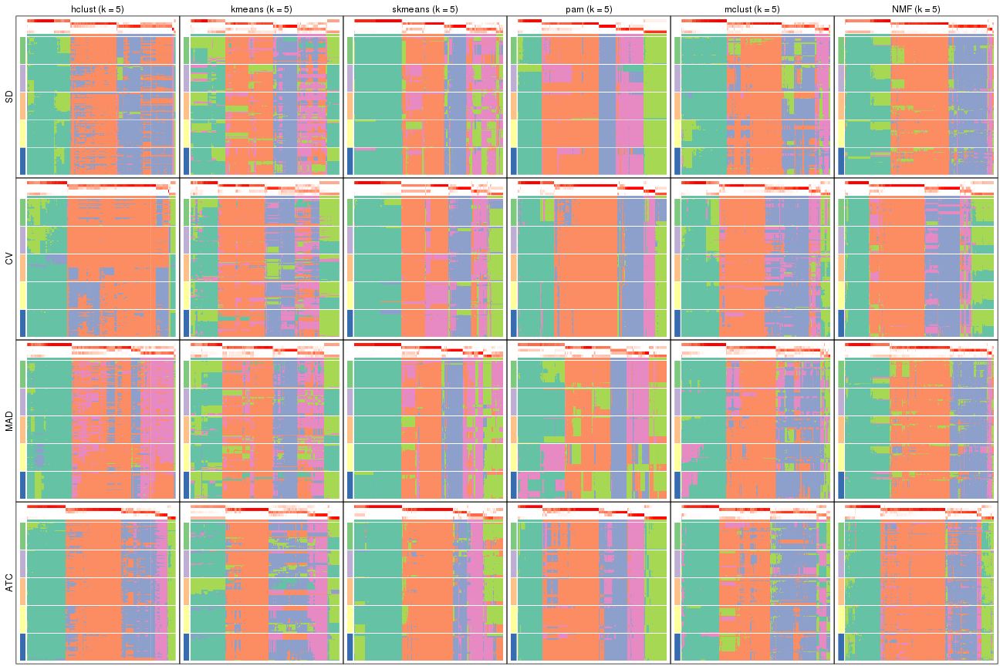</p>

</div>
<div id='tab-collect-membership-heatmap-5'>
<pre><code class="r">collect_plots(res_list, k = 6, fun = membership_heatmap, mc.cores = 4)
</code></pre>

<p>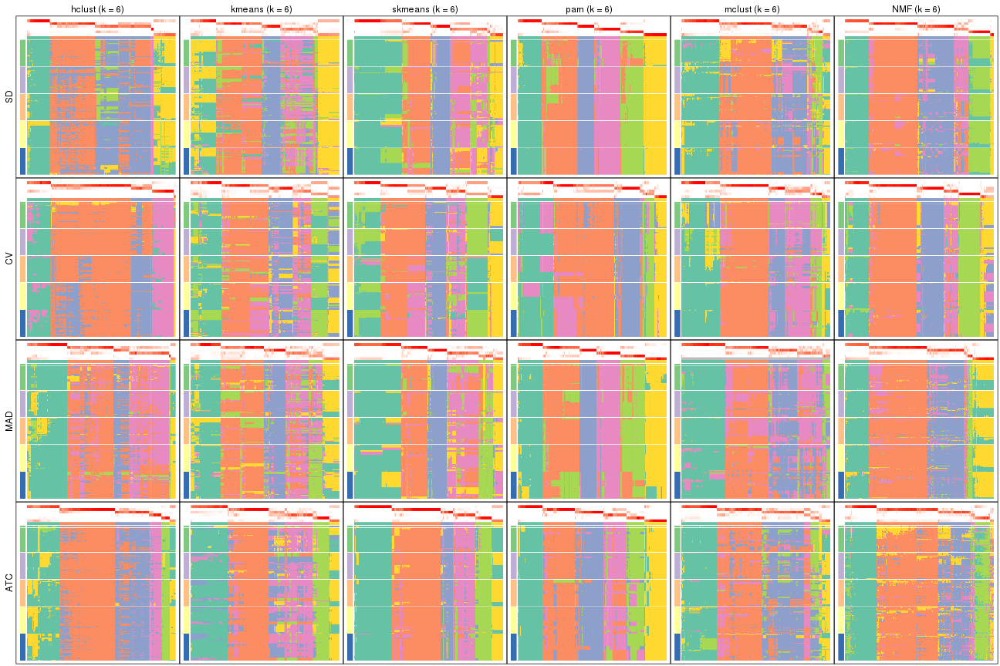</p>

</div>
</div>


### Signature heatmap

Signature heatmaps for all methods. ([What is a signature heatmap?](http://bioconductor.org/packages/devel/bioc/vignettes/cola/inst/doc/cola.html#toc_22))


Note in following heatmaps, rows are scaled.


<script>
$( function() {
	$( '#tabs-collect-get-signatures' ).tabs();
} );
</script>
<div id='tabs-collect-get-signatures'>
<ul>
<li><a href='#tab-collect-get-signatures-1'>k = 2</a></li>
<li><a href='#tab-collect-get-signatures-2'>k = 3</a></li>
<li><a href='#tab-collect-get-signatures-3'>k = 4</a></li>
<li><a href='#tab-collect-get-signatures-4'>k = 5</a></li>
<li><a href='#tab-collect-get-signatures-5'>k = 6</a></li>
</ul>
<div id='tab-collect-get-signatures-1'>
<pre><code class="r">collect_plots(res_list, k = 2, fun = get_signatures, mc.cores = 4)
</code></pre>

<p>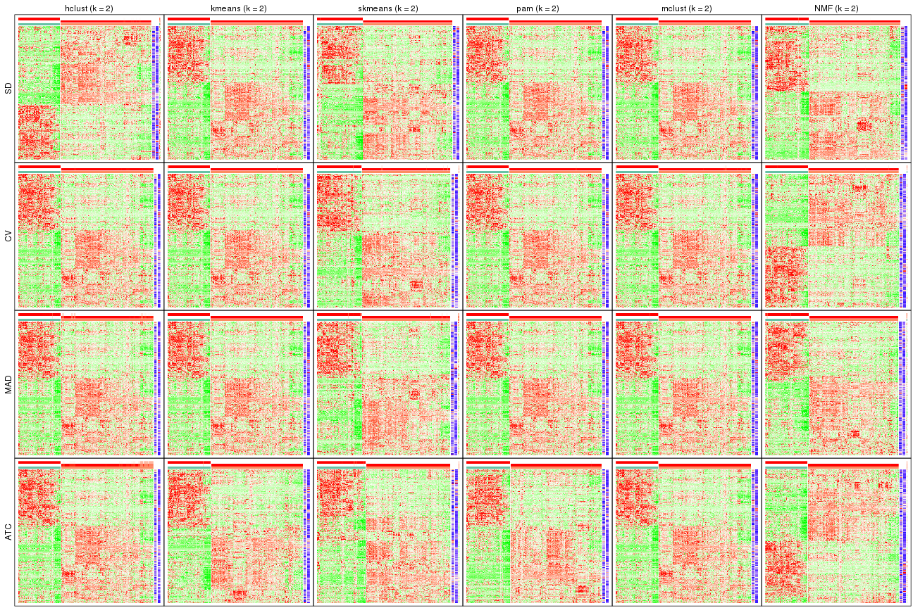</p>

</div>
<div id='tab-collect-get-signatures-2'>
<pre><code class="r">collect_plots(res_list, k = 3, fun = get_signatures, mc.cores = 4)
</code></pre>

<p>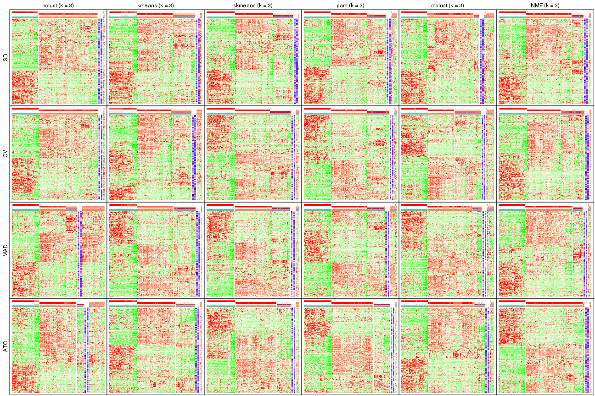</p>

</div>
<div id='tab-collect-get-signatures-3'>
<pre><code class="r">collect_plots(res_list, k = 4, fun = get_signatures, mc.cores = 4)
</code></pre>

<p>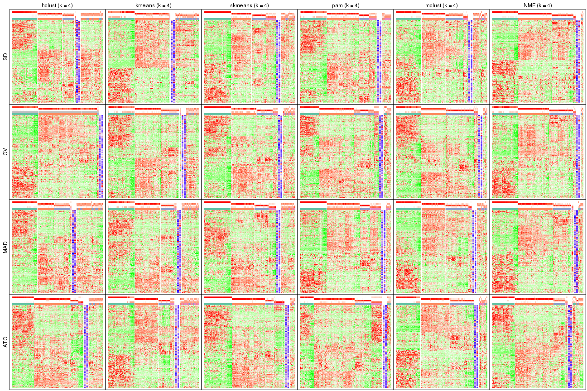</p>

</div>
<div id='tab-collect-get-signatures-4'>
<pre><code class="r">collect_plots(res_list, k = 5, fun = get_signatures, mc.cores = 4)
</code></pre>

<p>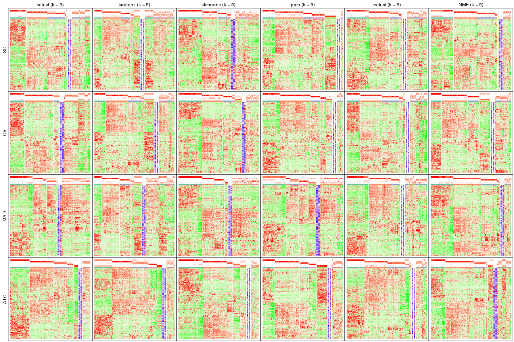</p>

</div>
<div id='tab-collect-get-signatures-5'>
<pre><code class="r">collect_plots(res_list, k = 6, fun = get_signatures, mc.cores = 4)
</code></pre>

<p>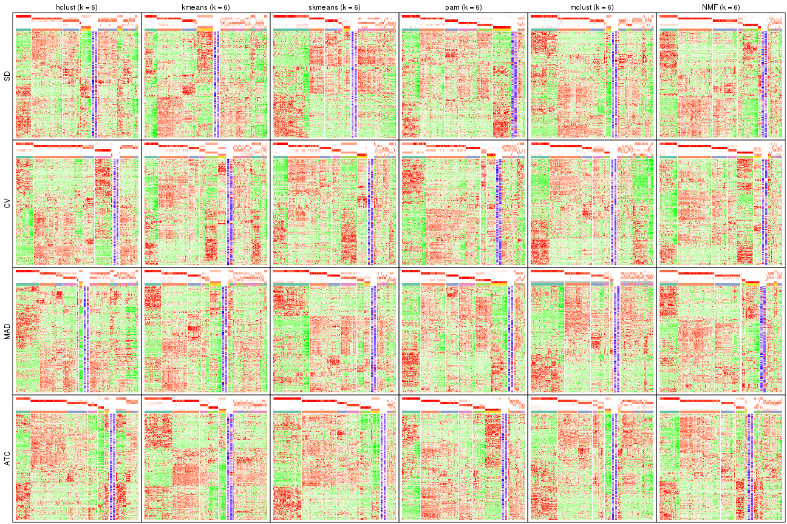</p>

</div>
</div>


### Statistics table

The statistics used for measuring the stability of consensus partitioning.
([How are they
defined?](http://bioconductor.org/packages/devel/bioc/vignettes/cola/inst/doc/cola.html#toc_13))


<script>
$( function() {
	$( '#tabs-get-stats-from-consensus-partition-list' ).tabs();
} );
</script>
<div id='tabs-get-stats-from-consensus-partition-list'>
<ul>
<li><a href='#tab-get-stats-from-consensus-partition-list-1'>k = 2</a></li>
<li><a href='#tab-get-stats-from-consensus-partition-list-2'>k = 3</a></li>
<li><a href='#tab-get-stats-from-consensus-partition-list-3'>k = 4</a></li>
<li><a href='#tab-get-stats-from-consensus-partition-list-4'>k = 5</a></li>
<li><a href='#tab-get-stats-from-consensus-partition-list-5'>k = 6</a></li>
</ul>
<div id='tab-get-stats-from-consensus-partition-list-1'>
<pre><code class="r">get_stats(res_list, k = 2)
</code></pre>

<pre><code>#&gt;             k 1-PAC mean_silhouette concordance area_increased  Rand Jaccard
#&gt; SD:NMF      2 1.000           0.998       0.999          0.439 0.561   0.561
#&gt; CV:NMF      2 1.000           0.992       0.997          0.440 0.561   0.561
#&gt; MAD:NMF     2 1.000           0.984       0.994          0.444 0.556   0.556
#&gt; ATC:NMF     2 1.000           0.995       0.998          0.436 0.566   0.566
#&gt; SD:skmeans  2 1.000           0.997       0.999          0.449 0.551   0.551
#&gt; CV:skmeans  2 1.000           0.987       0.994          0.449 0.553   0.553
#&gt; MAD:skmeans 2 1.000           0.983       0.993          0.449 0.553   0.553
#&gt; ATC:skmeans 2 1.000           0.990       0.996          0.465 0.535   0.535
#&gt; SD:mclust   2 1.000           0.999       1.000          0.434 0.566   0.566
#&gt; CV:mclust   2 1.000           0.991       0.996          0.435 0.566   0.566
#&gt; MAD:mclust  2 1.000           0.999       1.000          0.434 0.566   0.566
#&gt; ATC:mclust  2 1.000           1.000       1.000          0.434 0.566   0.566
#&gt; SD:kmeans   2 1.000           1.000       1.000          0.434 0.566   0.566
#&gt; CV:kmeans   2 1.000           0.994       0.997          0.434 0.566   0.566
#&gt; MAD:kmeans  2 1.000           1.000       1.000          0.434 0.566   0.566
#&gt; ATC:kmeans  2 1.000           0.998       0.999          0.437 0.563   0.563
#&gt; SD:pam      2 1.000           1.000       1.000          0.434 0.566   0.566
#&gt; CV:pam      2 1.000           0.995       0.998          0.433 0.566   0.566
#&gt; MAD:pam     2 1.000           1.000       1.000          0.434 0.566   0.566
#&gt; ATC:pam     2 1.000           0.995       0.998          0.440 0.561   0.561
#&gt; SD:hclust   2 1.000           0.990       0.996          0.435 0.566   0.566
#&gt; CV:hclust   2 1.000           0.995       0.998          0.434 0.566   0.566
#&gt; MAD:hclust  2 0.992           0.974       0.987          0.441 0.566   0.566
#&gt; ATC:hclust  2 0.892           0.922       0.961          0.453 0.566   0.566
</code></pre>

</div>
<div id='tab-get-stats-from-consensus-partition-list-2'>
<pre><code class="r">get_stats(res_list, k = 3)
</code></pre>

<pre><code>#&gt;             k 1-PAC mean_silhouette concordance area_increased  Rand Jaccard
#&gt; SD:NMF      3 0.874           0.908       0.960         0.3709 0.840   0.716
#&gt; CV:NMF      3 0.808           0.896       0.932         0.4553 0.779   0.607
#&gt; MAD:NMF     3 0.880           0.912       0.960         0.3220 0.856   0.745
#&gt; ATC:NMF     3 0.955           0.934       0.971         0.0812 0.977   0.960
#&gt; SD:skmeans  3 1.000           0.974       0.989         0.4456 0.784   0.614
#&gt; CV:skmeans  3 0.973           0.939       0.976         0.4609 0.778   0.602
#&gt; MAD:skmeans 3 0.947           0.923       0.967         0.4343 0.781   0.609
#&gt; ATC:skmeans 3 0.960           0.934       0.974         0.3268 0.823   0.676
#&gt; SD:mclust   3 0.670           0.750       0.812         0.3608 0.876   0.782
#&gt; CV:mclust   3 0.674           0.822       0.876         0.4536 0.765   0.585
#&gt; MAD:mclust  3 0.665           0.711       0.846         0.3883 0.829   0.699
#&gt; ATC:mclust  3 0.766           0.820       0.917         0.3656 0.829   0.699
#&gt; SD:kmeans   3 0.717           0.921       0.897         0.4165 0.781   0.614
#&gt; CV:kmeans   3 0.670           0.846       0.859         0.4031 0.789   0.627
#&gt; MAD:kmeans  3 0.696           0.909       0.893         0.4265 0.776   0.605
#&gt; ATC:kmeans  3 0.770           0.932       0.950         0.4393 0.794   0.635
#&gt; SD:pam      3 0.834           0.876       0.945         0.5025 0.786   0.622
#&gt; CV:pam      3 0.855           0.913       0.959         0.5122 0.780   0.612
#&gt; MAD:pam     3 0.856           0.865       0.945         0.4896 0.786   0.622
#&gt; ATC:pam     3 0.989           0.959       0.981         0.4313 0.803   0.651
#&gt; SD:hclust   3 0.649           0.834       0.876         0.1884 0.995   0.991
#&gt; CV:hclust   3 0.874           0.930       0.959         0.0759 0.995   0.991
#&gt; MAD:hclust  3 0.590           0.612       0.807         0.3191 0.839   0.715
#&gt; ATC:hclust  3 0.714           0.726       0.886         0.3330 0.848   0.731
</code></pre>

</div>
<div id='tab-get-stats-from-consensus-partition-list-3'>
<pre><code class="r">get_stats(res_list, k = 4)
</code></pre>

<pre><code>#&gt;             k 1-PAC mean_silhouette concordance area_increased  Rand Jaccard
#&gt; SD:NMF      4 0.880           0.893       0.946         0.1209 0.848   0.656
#&gt; CV:NMF      4 0.891           0.863       0.921         0.0929 0.954   0.870
#&gt; MAD:NMF     4 0.784           0.820       0.910         0.1272 0.842   0.656
#&gt; ATC:NMF     4 0.689           0.742       0.879         0.3366 0.816   0.666
#&gt; SD:skmeans  4 0.779           0.735       0.856         0.1184 0.898   0.720
#&gt; CV:skmeans  4 0.814           0.682       0.835         0.1181 0.927   0.791
#&gt; MAD:skmeans 4 0.790           0.755       0.891         0.1176 0.878   0.675
#&gt; ATC:skmeans 4 0.880           0.857       0.937         0.1210 0.914   0.778
#&gt; SD:mclust   4 0.651           0.708       0.844         0.1555 0.800   0.571
#&gt; CV:mclust   4 0.626           0.822       0.823         0.0944 0.926   0.790
#&gt; MAD:mclust  4 0.678           0.733       0.862         0.1606 0.803   0.561
#&gt; ATC:mclust  4 0.700           0.779       0.879         0.1702 0.810   0.577
#&gt; SD:kmeans   4 0.660           0.563       0.789         0.1473 0.980   0.942
#&gt; CV:kmeans   4 0.594           0.636       0.797         0.1365 0.939   0.837
#&gt; MAD:kmeans  4 0.684           0.652       0.804         0.1373 0.922   0.789
#&gt; ATC:kmeans  4 0.753           0.668       0.809         0.1207 0.877   0.675
#&gt; SD:pam      4 0.723           0.744       0.823         0.0881 0.890   0.711
#&gt; CV:pam      4 0.781           0.785       0.880         0.0586 0.952   0.866
#&gt; MAD:pam     4 0.748           0.805       0.867         0.1086 0.867   0.660
#&gt; ATC:pam     4 0.760           0.842       0.883         0.0931 0.952   0.871
#&gt; SD:hclust   4 0.566           0.599       0.769         0.1962 0.795   0.636
#&gt; CV:hclust   4 0.618           0.826       0.849         0.1486 0.993   0.988
#&gt; MAD:hclust  4 0.561           0.573       0.761         0.1253 0.829   0.622
#&gt; ATC:hclust  4 0.732           0.718       0.884         0.0449 0.936   0.848
</code></pre>

</div>
<div id='tab-get-stats-from-consensus-partition-list-4'>
<pre><code class="r">get_stats(res_list, k = 5)
</code></pre>

<pre><code>#&gt;             k 1-PAC mean_silhouette concordance area_increased  Rand Jaccard
#&gt; SD:NMF      5 0.807           0.714       0.857         0.0758 0.980   0.939
#&gt; CV:NMF      5 0.791           0.724       0.837         0.0771 0.912   0.732
#&gt; MAD:NMF     5 0.742           0.743       0.861         0.0868 0.969   0.910
#&gt; ATC:NMF     5 0.668           0.657       0.847         0.1221 0.872   0.680
#&gt; SD:skmeans  5 0.783           0.647       0.811         0.0543 0.918   0.727
#&gt; CV:skmeans  5 0.788           0.667       0.807         0.0457 0.924   0.748
#&gt; MAD:skmeans 5 0.822           0.668       0.842         0.0688 0.917   0.719
#&gt; ATC:skmeans 5 0.793           0.773       0.870         0.0716 0.921   0.756
#&gt; SD:mclust   5 0.633           0.615       0.799         0.0663 0.952   0.844
#&gt; CV:mclust   5 0.714           0.644       0.823         0.0838 0.924   0.757
#&gt; MAD:mclust  5 0.649           0.618       0.794         0.0516 0.968   0.896
#&gt; ATC:mclust  5 0.675           0.669       0.812         0.0566 0.966   0.891
#&gt; SD:kmeans   5 0.617           0.464       0.648         0.0794 0.843   0.564
#&gt; CV:kmeans   5 0.656           0.641       0.696         0.0831 0.856   0.582
#&gt; MAD:kmeans  5 0.620           0.495       0.676         0.0816 0.862   0.598
#&gt; ATC:kmeans  5 0.680           0.744       0.788         0.0668 0.896   0.656
#&gt; SD:pam      5 0.792           0.862       0.885         0.0790 0.914   0.724
#&gt; CV:pam      5 0.788           0.807       0.904         0.0440 0.924   0.773
#&gt; MAD:pam     5 0.665           0.570       0.710         0.0810 0.917   0.731
#&gt; ATC:pam     5 0.790           0.746       0.888         0.1173 0.863   0.608
#&gt; SD:hclust   5 0.520           0.571       0.788         0.0866 0.824   0.588
#&gt; CV:hclust   5 0.585           0.419       0.786         0.1039 0.882   0.787
#&gt; MAD:hclust  5 0.551           0.522       0.763         0.0734 0.812   0.540
#&gt; ATC:hclust  5 0.742           0.793       0.890         0.1342 0.855   0.626
</code></pre>

</div>
<div id='tab-get-stats-from-consensus-partition-list-5'>
<pre><code class="r">get_stats(res_list, k = 6)
</code></pre>

<pre><code>#&gt;             k 1-PAC mean_silhouette concordance area_increased  Rand Jaccard
#&gt; SD:NMF      6 0.785           0.753       0.854         0.0634 0.890   0.657
#&gt; CV:NMF      6 0.836           0.743       0.867         0.0564 0.919   0.693
#&gt; MAD:NMF     6 0.762           0.730       0.833         0.0576 0.925   0.769
#&gt; ATC:NMF     6 0.646           0.600       0.792         0.0620 0.942   0.817
#&gt; SD:skmeans  6 0.767           0.615       0.773         0.0442 0.899   0.646
#&gt; CV:skmeans  6 0.777           0.636       0.705         0.0467 0.898   0.619
#&gt; MAD:skmeans 6 0.756           0.705       0.788         0.0421 0.907   0.646
#&gt; ATC:skmeans 6 0.834           0.822       0.888         0.0523 0.941   0.777
#&gt; SD:mclust   6 0.661           0.605       0.774         0.0466 0.949   0.827
#&gt; CV:mclust   6 0.740           0.595       0.781         0.0344 0.928   0.737
#&gt; MAD:mclust  6 0.648           0.599       0.732         0.0502 0.910   0.709
#&gt; ATC:mclust  6 0.621           0.532       0.753         0.0416 0.947   0.815
#&gt; SD:kmeans   6 0.660           0.534       0.670         0.0418 0.931   0.723
#&gt; CV:kmeans   6 0.664           0.509       0.655         0.0481 0.922   0.684
#&gt; MAD:kmeans  6 0.655           0.543       0.696         0.0508 0.891   0.587
#&gt; ATC:kmeans  6 0.687           0.646       0.766         0.0525 0.942   0.760
#&gt; SD:pam      6 0.854           0.829       0.911         0.0788 0.921   0.681
#&gt; CV:pam      6 0.713           0.591       0.798         0.0620 0.953   0.840
#&gt; MAD:pam     6 0.815           0.766       0.864         0.0653 0.902   0.614
#&gt; ATC:pam     6 0.822           0.722       0.855         0.0689 0.854   0.476
#&gt; SD:hclust   6 0.517           0.565       0.743         0.0705 0.940   0.817
#&gt; CV:hclust   6 0.569           0.662       0.830         0.0935 0.883   0.744
#&gt; MAD:hclust  6 0.539           0.500       0.733         0.0525 0.898   0.691
#&gt; ATC:hclust  6 0.680           0.651       0.832         0.0381 0.982   0.932
</code></pre>

</div>
</div>

Following heatmap plots the partition for each combination of methods and the
lightness correspond to the silhouette scores for samples in each method. On
top the consensus subgroup is inferred from all methods by taking the mean
silhouette scores as weight.


<script>
$( function() {
	$( '#tabs-collect-stats-from-consensus-partition-list' ).tabs();
} );
</script>
<div id='tabs-collect-stats-from-consensus-partition-list'>
<ul>
<li><a href='#tab-collect-stats-from-consensus-partition-list-1'>k = 2</a></li>
<li><a href='#tab-collect-stats-from-consensus-partition-list-2'>k = 3</a></li>
<li><a href='#tab-collect-stats-from-consensus-partition-list-3'>k = 4</a></li>
<li><a href='#tab-collect-stats-from-consensus-partition-list-4'>k = 5</a></li>
<li><a href='#tab-collect-stats-from-consensus-partition-list-5'>k = 6</a></li>
</ul>
<div id='tab-collect-stats-from-consensus-partition-list-1'>
<pre><code class="r">collect_stats(res_list, k = 2)
</code></pre>

<p>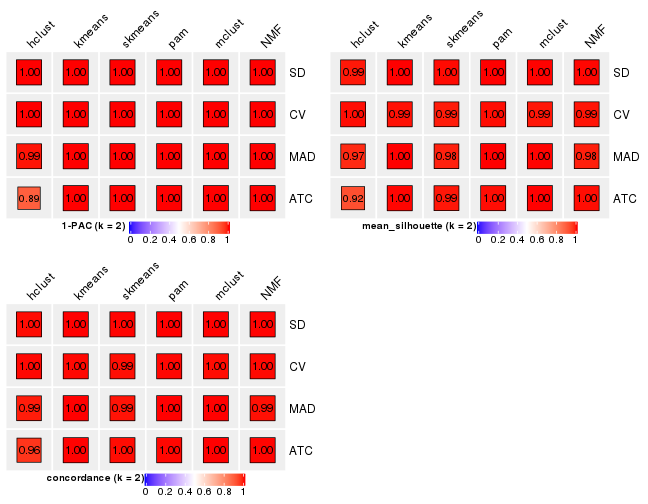</p>

</div>
<div id='tab-collect-stats-from-consensus-partition-list-2'>
<pre><code class="r">collect_stats(res_list, k = 3)
</code></pre>

<p>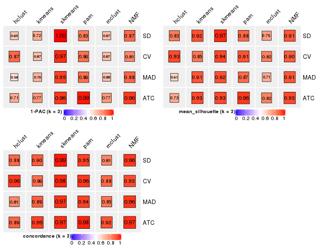</p>

</div>
<div id='tab-collect-stats-from-consensus-partition-list-3'>
<pre><code class="r">collect_stats(res_list, k = 4)
</code></pre>

<p>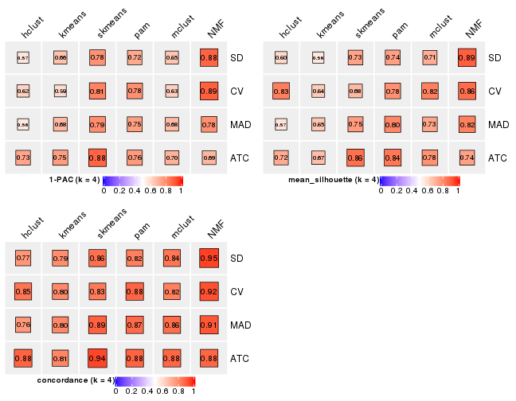</p>

</div>
<div id='tab-collect-stats-from-consensus-partition-list-4'>
<pre><code class="r">collect_stats(res_list, k = 5)
</code></pre>

<p>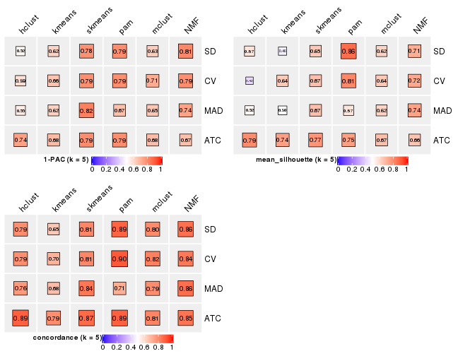</p>

</div>
<div id='tab-collect-stats-from-consensus-partition-list-5'>
<pre><code class="r">collect_stats(res_list, k = 6)
</code></pre>

<p>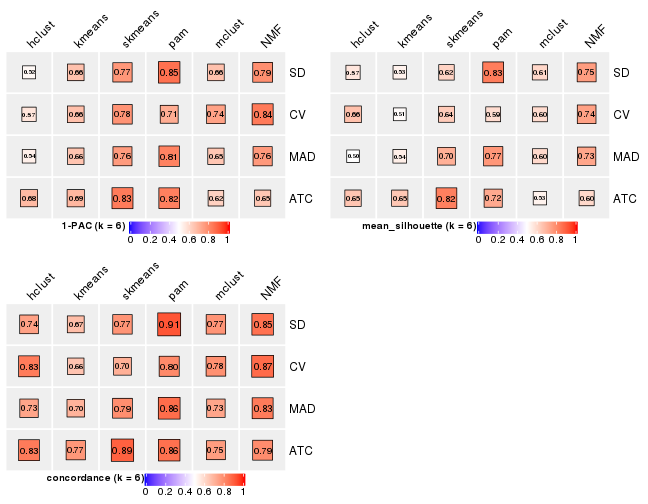</p>

</div>
</div>

### Partition from all methods


Collect partitions from all methods:


<script>
$( function() {
	$( '#tabs-collect-classes-from-consensus-partition-list' ).tabs();
} );
</script>
<div id='tabs-collect-classes-from-consensus-partition-list'>
<ul>
<li><a href='#tab-collect-classes-from-consensus-partition-list-1'>k = 2</a></li>
<li><a href='#tab-collect-classes-from-consensus-partition-list-2'>k = 3</a></li>
<li><a href='#tab-collect-classes-from-consensus-partition-list-3'>k = 4</a></li>
<li><a href='#tab-collect-classes-from-consensus-partition-list-4'>k = 5</a></li>
<li><a href='#tab-collect-classes-from-consensus-partition-list-5'>k = 6</a></li>
</ul>
<div id='tab-collect-classes-from-consensus-partition-list-1'>
<pre><code class="r">collect_classes(res_list, k = 2)
</code></pre>

<p>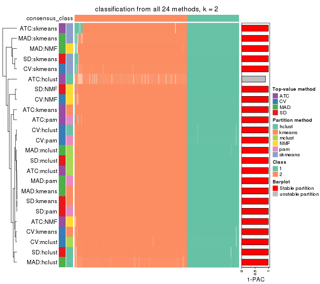</p>

</div>
<div id='tab-collect-classes-from-consensus-partition-list-2'>
<pre><code class="r">collect_classes(res_list, k = 3)
</code></pre>

<p>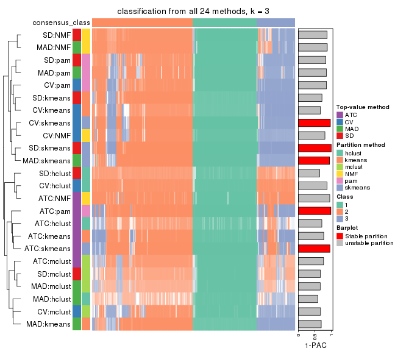</p>

</div>
<div id='tab-collect-classes-from-consensus-partition-list-3'>
<pre><code class="r">collect_classes(res_list, k = 4)
</code></pre>

<p>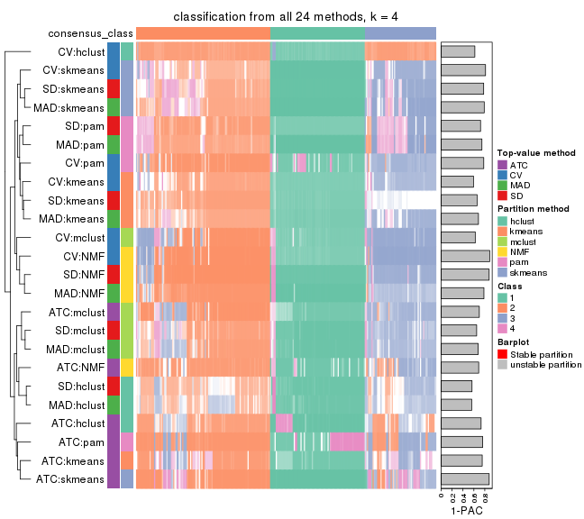</p>

</div>
<div id='tab-collect-classes-from-consensus-partition-list-4'>
<pre><code class="r">collect_classes(res_list, k = 5)
</code></pre>

<p>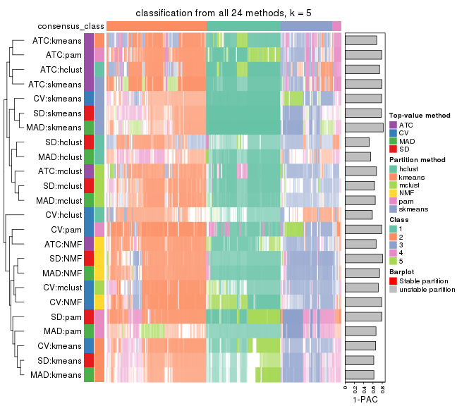</p>

</div>
<div id='tab-collect-classes-from-consensus-partition-list-5'>
<pre><code class="r">collect_classes(res_list, k = 6)
</code></pre>

<p>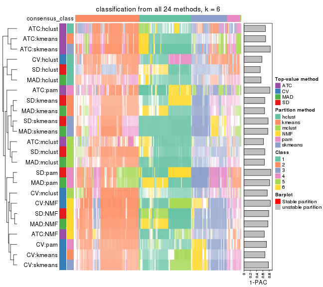</p>

</div>
</div>


### Top rows overlap


Overlap of top rows from different top-row methods:


<script>
$( function() {
	$( '#tabs-top-rows-overlap-by-euler' ).tabs();
} );
</script>
<div id='tabs-top-rows-overlap-by-euler'>
<ul>
<li><a href='#tab-top-rows-overlap-by-euler-1'>top_n = 1000</a></li>
<li><a href='#tab-top-rows-overlap-by-euler-2'>top_n = 2000</a></li>
<li><a href='#tab-top-rows-overlap-by-euler-3'>top_n = 3000</a></li>
<li><a href='#tab-top-rows-overlap-by-euler-4'>top_n = 4000</a></li>
<li><a href='#tab-top-rows-overlap-by-euler-5'>top_n = 5000</a></li>
</ul>
<div id='tab-top-rows-overlap-by-euler-1'>
<pre><code class="r">top_rows_overlap(res_list, top_n = 1000, method = &quot;euler&quot;)
</code></pre>

<p>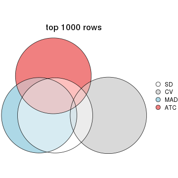</p>

</div>
<div id='tab-top-rows-overlap-by-euler-2'>
<pre><code class="r">top_rows_overlap(res_list, top_n = 2000, method = &quot;euler&quot;)
</code></pre>

<p>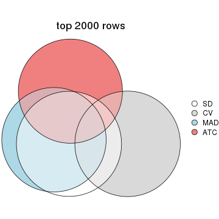</p>

</div>
<div id='tab-top-rows-overlap-by-euler-3'>
<pre><code class="r">top_rows_overlap(res_list, top_n = 3000, method = &quot;euler&quot;)
</code></pre>

<p>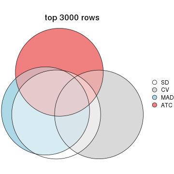</p>

</div>
<div id='tab-top-rows-overlap-by-euler-4'>
<pre><code class="r">top_rows_overlap(res_list, top_n = 4000, method = &quot;euler&quot;)
</code></pre>

<p>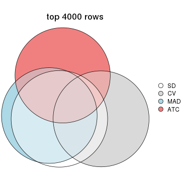</p>

</div>
<div id='tab-top-rows-overlap-by-euler-5'>
<pre><code class="r">top_rows_overlap(res_list, top_n = 5000, method = &quot;euler&quot;)
</code></pre>

<p>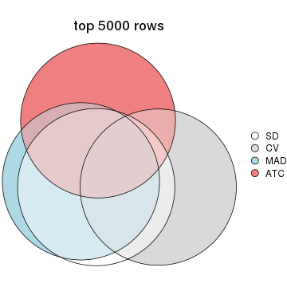</p>

</div>
</div>

Also visualize the correspondance of rankings between different top-row methods:


<script>
$( function() {
	$( '#tabs-top-rows-overlap-by-correspondance' ).tabs();
} );
</script>
<div id='tabs-top-rows-overlap-by-correspondance'>
<ul>
<li><a href='#tab-top-rows-overlap-by-correspondance-1'>top_n = 1000</a></li>
<li><a href='#tab-top-rows-overlap-by-correspondance-2'>top_n = 2000</a></li>
<li><a href='#tab-top-rows-overlap-by-correspondance-3'>top_n = 3000</a></li>
<li><a href='#tab-top-rows-overlap-by-correspondance-4'>top_n = 4000</a></li>
<li><a href='#tab-top-rows-overlap-by-correspondance-5'>top_n = 5000</a></li>
</ul>
<div id='tab-top-rows-overlap-by-correspondance-1'>
<pre><code class="r">top_rows_overlap(res_list, top_n = 1000, method = &quot;correspondance&quot;)
</code></pre>

<p>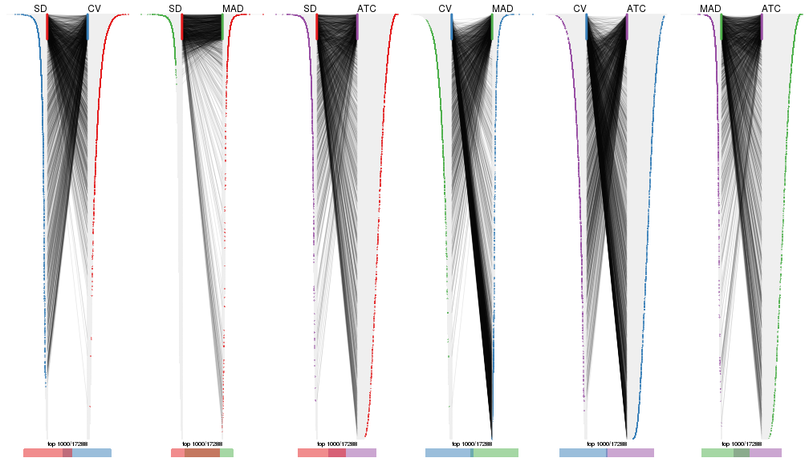</p>

</div>
<div id='tab-top-rows-overlap-by-correspondance-2'>
<pre><code class="r">top_rows_overlap(res_list, top_n = 2000, method = &quot;correspondance&quot;)
</code></pre>

<p>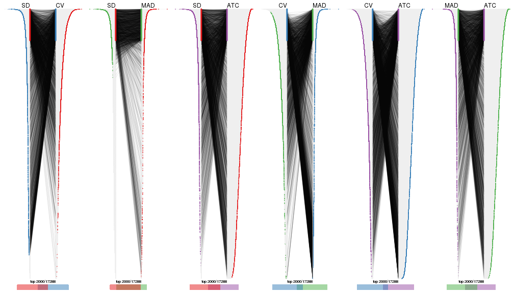</p>

</div>
<div id='tab-top-rows-overlap-by-correspondance-3'>
<pre><code class="r">top_rows_overlap(res_list, top_n = 3000, method = &quot;correspondance&quot;)
</code></pre>

<p>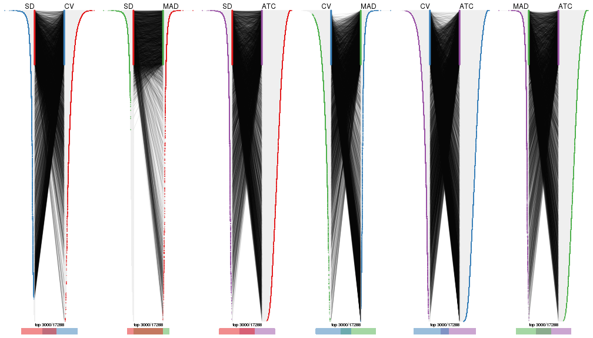</p>

</div>
<div id='tab-top-rows-overlap-by-correspondance-4'>
<pre><code class="r">top_rows_overlap(res_list, top_n = 4000, method = &quot;correspondance&quot;)
</code></pre>

<p>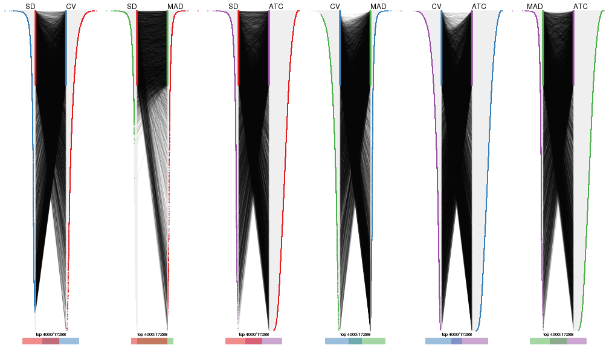</p>

</div>
<div id='tab-top-rows-overlap-by-correspondance-5'>
<pre><code class="r">top_rows_overlap(res_list, top_n = 5000, method = &quot;correspondance&quot;)
</code></pre>

<p>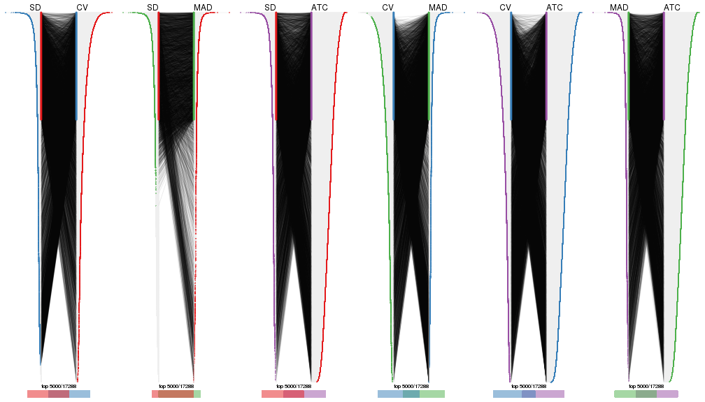</p>

</div>
</div>


Heatmaps of the top rows:


<script>
$( function() {
	$( '#tabs-top-rows-heatmap' ).tabs();
} );
</script>
<div id='tabs-top-rows-heatmap'>
<ul>
<li><a href='#tab-top-rows-heatmap-1'>top_n = 1000</a></li>
<li><a href='#tab-top-rows-heatmap-2'>top_n = 2000</a></li>
<li><a href='#tab-top-rows-heatmap-3'>top_n = 3000</a></li>
<li><a href='#tab-top-rows-heatmap-4'>top_n = 4000</a></li>
<li><a href='#tab-top-rows-heatmap-5'>top_n = 5000</a></li>
</ul>
<div id='tab-top-rows-heatmap-1'>
<pre><code class="r">top_rows_heatmap(res_list, top_n = 1000)
</code></pre>

<p>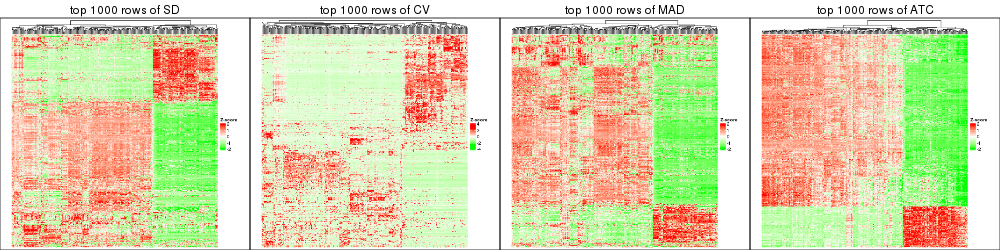</p>

</div>
<div id='tab-top-rows-heatmap-2'>
<pre><code class="r">top_rows_heatmap(res_list, top_n = 2000)
</code></pre>

<p>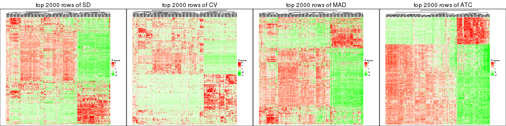</p>

</div>
<div id='tab-top-rows-heatmap-3'>
<pre><code class="r">top_rows_heatmap(res_list, top_n = 3000)
</code></pre>

<p>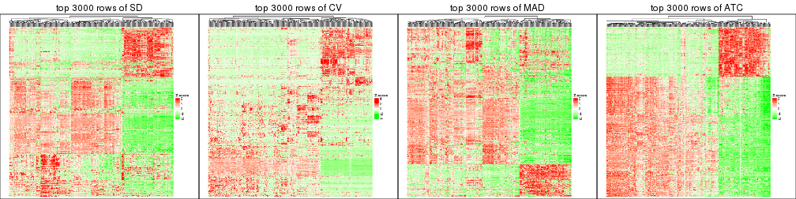</p>

</div>
<div id='tab-top-rows-heatmap-4'>
<pre><code class="r">top_rows_heatmap(res_list, top_n = 4000)
</code></pre>

<p>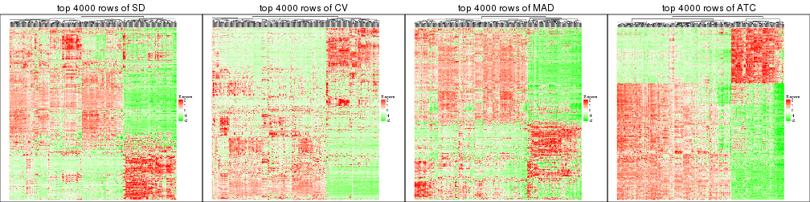</p>

</div>
<div id='tab-top-rows-heatmap-5'>
<pre><code class="r">top_rows_heatmap(res_list, top_n = 5000)
</code></pre>

<p>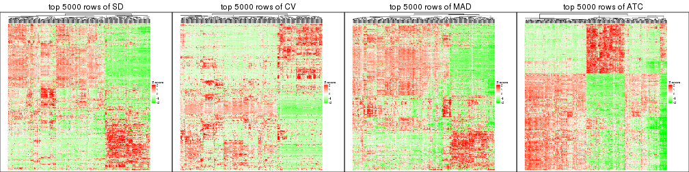</p>

</div>
</div>


 
## Results for each method


---------------------------------------------------


### SD:hclust**


The object with results only for a single top-value method and a single partition method 
can be extracted as:

```r
res = res_list["SD", "hclust"]
# you can also extract it by
# res = res_list["SD:hclust"]
```

A summary of `res` and all the functions that can be applied to it:

```r
res
```

```
#> A 'ConsensusPartition' object with k = 2, 3, 4, 5, 6.
#>   On a matrix with 17288 rows and 266 columns.
#>   Top rows (1000, 2000, 3000, 4000, 5000) are extracted by 'SD' method.
#>   Subgroups are detected by 'hclust' method.
#>   Performed in total 1250 partitions by row resampling.
#>   Best k for subgroups seems to be 2.
#> 
#> Following methods can be applied to this 'ConsensusPartition' object:
#>  [1] "cola_report"             "collect_classes"         "collect_plots"          
#>  [4] "collect_stats"           "colnames"                "compare_signatures"     
#>  [7] "consensus_heatmap"       "dimension_reduction"     "functional_enrichment"  
#> [10] "get_anno_col"            "get_anno"                "get_classes"            
#> [13] "get_consensus"           "get_matrix"              "get_membership"         
#> [16] "get_param"               "get_signatures"          "get_stats"              
#> [19] "is_best_k"               "is_stable_k"             "membership_heatmap"     
#> [22] "ncol"                    "nrow"                    "plot_ecdf"              
#> [25] "rownames"                "select_partition_number" "show"                   
#> [28] "suggest_best_k"          "test_to_known_factors"
```

`collect_plots()` function collects all the plots made from `res` for all `k` (number of partitions)
into one single page to provide an easy and fast comparison between different `k`.

```r
collect_plots(res)
```

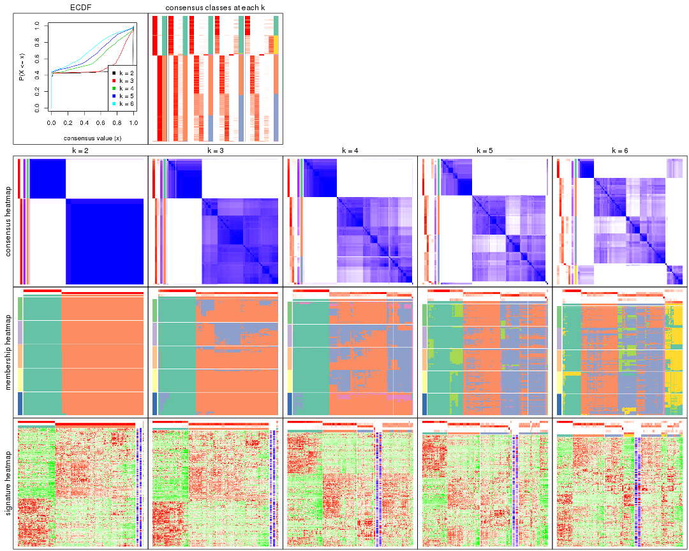

The plots are:

- The first row: a plot of the ECDF (Empirical cumulative distribution
  function) curves of the consensus matrix for each `k` and the heatmap of
  predicted classes for each `k`.
- The second row: heatmaps of the consensus matrix for each `k`.
- The third row: heatmaps of the membership matrix for each `k`.
- The fouth row: heatmaps of the signatures for each `k`.

All the plots in panels can be made by individual functions and they are
plotted later in this section.

`select_partition_number()` produces several plots showing different
statistics for choosing "optimized" `k`. There are following statistics:

- ECDF curves of the consensus matrix for each `k`;
- 1-PAC. [The PAC
  score](https://en.wikipedia.org/wiki/Consensus_clustering#Over-interpretation_potential_of_consensus_clustering)
  measures the proportion of the ambiguous subgrouping.
- Mean silhouette score.
- Concordance. The mean probability of fiting the consensus class ids in all
  partitions.
- Area increased. Denote $A_k$ as the area under the ECDF curve for current
  `k`, the area increased is defined as $A_k - A_{k-1}$.
- Rand index. The percent of pairs of samples that are both in a same cluster
  or both are not in a same cluster in the partition of k and k-1.
- Jaccard index. The ratio of pairs of samples are both in a same cluster in
  the partition of k and k-1 and the pairs of samples are both in a same
  cluster in the partition k or k-1.

The detailed explanations of these statistics can be found in [the cola
vignette](http://bioconductor.org/packages/devel/bioc/vignettes/cola/inst/doc/cola.html#toc_13).

Generally speaking, lower PAC score, higher mean silhouette score or higher
concordance corresponds to better partition. Rand index and Jaccard index
measure how similar the current partition is compared to partition with `k-1`.
If they are too similar, we won't accept `k` is better than `k-1`.

```r
select_partition_number(res)
```

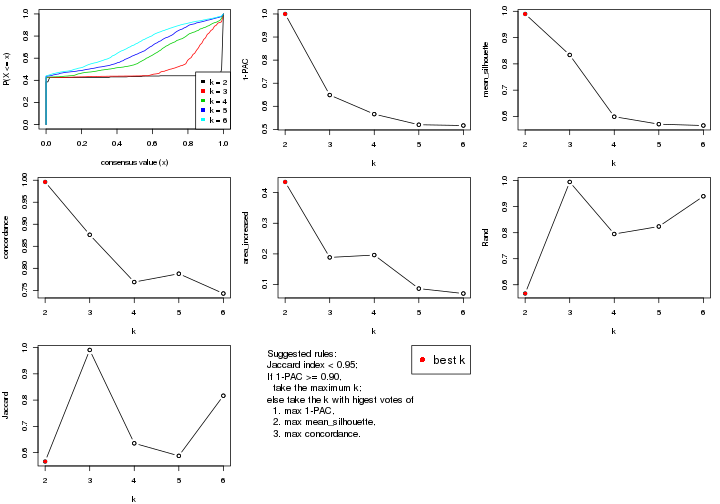

The numeric values for all these statistics can be obtained by `get_stats()`.

```r
get_stats(res)
```

```
#>   k 1-PAC mean_silhouette concordance area_increased  Rand Jaccard
#> 2 2 1.000           0.990       0.996         0.4349 0.566   0.566
#> 3 3 0.649           0.834       0.876         0.1884 0.995   0.991
#> 4 4 0.566           0.599       0.769         0.1962 0.795   0.636
#> 5 5 0.520           0.571       0.788         0.0866 0.824   0.588
#> 6 6 0.517           0.565       0.743         0.0705 0.940   0.817
```

`suggest_best_k()` suggests the best $k$ based on these statistics. The rules are as follows:

- All $k$ with Jaccard index larger than 0.95 are removed because the increase of
  the partition number does not provides enough extra information. If all $k$ are removed,
  the best $k$ is assigned by `NA`.
- For $k$ with 1-PAC larger than 0.9, the maximal $k$ is taken as the "best k". Other $k$ is called "optional k".
- If it does not fit the second rule. The $k$ with the highest vote of highest
  1-PAC, mean silhouette and concordance is taken as the "best k".

```r
suggest_best_k(res)
```

```
#> [1] 2
```


Following shows the table of the partitions (You need to click the **show/hide
code output** link to see it). The membership matrix (columns with name `p*`)
is inferred by
[`clue::cl_consensus()`](https://www.rdocumentation.org/link/cl_consensus?package=clue)
function with the `SE` method. Basically the value in the membership matrix
represents the probability to belong to a certain group. The finall class
label for an item is determined with the group with highest probability it
belongs to.

In `get_classes()` function, the entropy is calculated from the membership
matrix and the silhouette score is calculated from the consensus matrix.


<script>
$( function() {
	$( '#tabs-SD-hclust-get-classes' ).tabs();
} );
</script>
<div id='tabs-SD-hclust-get-classes'>
<ul>
<li><a href='#tab-SD-hclust-get-classes-1'>k = 2</a></li>
<li><a href='#tab-SD-hclust-get-classes-2'>k = 3</a></li>
<li><a href='#tab-SD-hclust-get-classes-3'>k = 4</a></li>
<li><a href='#tab-SD-hclust-get-classes-4'>k = 5</a></li>
<li><a href='#tab-SD-hclust-get-classes-5'>k = 6</a></li>
</ul>

<div id='tab-SD-hclust-get-classes-1'>
<p><a id='tab-SD-hclust-get-classes-1-a' style='color:#0366d6' href='#'>show/hide code output</a></p>
<pre><code class="r">cbind(get_classes(res, k = 2), get_membership(res, k = 2))
</code></pre>

<pre><code>#&gt;                                      class entropy silhouette    p1    p2
#&gt; 80D0AF10-1C61-4B67-90C1-7DBF1EF23672     2   0.000      0.996 0.000 1.000
#&gt; 87117BE1-D328-4972-85DA-6672412D8860     2   0.000      0.996 0.000 1.000
#&gt; F904C5B6-70BD-4604-8254-79BE23B152DA     1   0.000      0.995 1.000 0.000
#&gt; 3182DEA1-4239-4613-925A-7E6503766AD6     2   0.000      0.996 0.000 1.000
#&gt; 55E78EA2-2D9B-481F-8CAB-D36A33088EAE     2   0.000      0.996 0.000 1.000
#&gt; 86F94264-A6DD-4A97-9191-036F066DD0EF     2   0.000      0.996 0.000 1.000
#&gt; 09D25417-23B7-4D88-A0EA-F307985FBBBC     2   0.118      0.982 0.016 0.984
#&gt; C797F12C-40D3-4DB5-B9EF-A6821BBDE4F0     1   0.000      0.995 1.000 0.000
#&gt; 80275DB0-A226-4B6B-A08F-4ADBEEE1DB01     1   0.000      0.995 1.000 0.000
#&gt; 27FB653A-9E07-44AD-952E-9E4DE4AB5891     2   0.141      0.978 0.020 0.980
#&gt; 1A5DB9FC-2ABD-4E1B-B5EF-B1CF5E5F3872     1   0.118      0.980 0.984 0.016
#&gt; 844E4CCD-D30C-416F-A086-8923711A4E25     2   0.141      0.978 0.020 0.980
#&gt; EF18318D-3D25-4D65-803A-ED6E62871E7E     1   0.118      0.980 0.984 0.016
#&gt; 1ACB1BE0-61F6-4243-BBEC-E26A1CF90CA8     1   0.000      0.995 1.000 0.000
#&gt; 8EF0039B-D758-46AB-BAF7-6A062C7C56BA     1   0.000      0.995 1.000 0.000
#&gt; 22F4C9D9-663B-4C91-9692-E035A2640BEC     2   0.000      0.996 0.000 1.000
#&gt; FA1A0BCE-EE0F-4178-B963-62550E344B14     2   0.000      0.996 0.000 1.000
#&gt; 0B6D0C4E-5AE3-4707-A9FC-12A108E6EC2A     2   0.000      0.996 0.000 1.000
#&gt; 06FD3123-2AEB-4911-AC4E-E0E64FD5DB52     2   0.000      0.996 0.000 1.000
#&gt; 235A4492-FF80-4AA5-BC71-DFF65E1C7411     2   0.000      0.996 0.000 1.000
#&gt; A192C6C0-1443-4493-AFAC-1EE710628ADB     2   0.000      0.996 0.000 1.000
#&gt; 6FC5B56B-711B-4174-9B06-4E843124AAB6     1   0.000      0.995 1.000 0.000
#&gt; 7A813F60-A41E-4552-990E-F22287654C1D     2   0.000      0.996 0.000 1.000
#&gt; 725BBFB5-26F4-4512-9C75-47D013C1E605     1   0.000      0.995 1.000 0.000
#&gt; 39CC4E82-EBC9-472E-8BE5-6A3AB178449A     2   0.000      0.996 0.000 1.000
#&gt; 61130DEE-E267-49DF-8B41-7738A06EF738     2   0.118      0.982 0.016 0.984
#&gt; 117EC12C-B7ED-4E01-B29B-EA542D356EA1     1   0.000      0.995 1.000 0.000
#&gt; A30FF708-F7A9-41E4-8AD5-20441650FBC9     2   0.000      0.996 0.000 1.000
#&gt; 53640D52-1167-4A5D-B656-97D32CBA3934     1   0.000      0.995 1.000 0.000
#&gt; 9E85D76A-DD2A-46D5-BB59-0ED302B6258C     2   0.000      0.996 0.000 1.000
#&gt; 6F8C6F90-7E3C-4860-91DD-586708DE44AA     1   0.000      0.995 1.000 0.000
#&gt; E675AEC5-AA9A-4AAA-839C-03E6365822DB     2   0.000      0.996 0.000 1.000
#&gt; B577DEF7-2F5C-4876-A7C6-F18D5722B8C0     1   0.939      0.444 0.644 0.356
#&gt; DA8B577E-43E7-49BF-BF94-868E3194F5C9     1   0.000      0.995 1.000 0.000
#&gt; 3334280B-2A36-4AC7-A021-A76C10E958F0     2   0.000      0.996 0.000 1.000
#&gt; 5CBDDC90-11EC-4E6E-881E-AA9CCFD40FDB     2   0.000      0.996 0.000 1.000
#&gt; 8CBBF32A-8349-44F5-A8B8-4CBB1760A464     2   0.000      0.996 0.000 1.000
#&gt; B9455A9A-136D-4DC2-9F86-0FC74433589D     2   0.995      0.144 0.460 0.540
#&gt; D7EAE2A7-F9BE-4222-A452-B1F83F99CD50     2   0.000      0.996 0.000 1.000
#&gt; F803AE18-60C5-4CFE-AAAB-DB33C26A2184     1   0.000      0.995 1.000 0.000
#&gt; 5DD8CAC7-EC02-43B6-B58E-6D2E22868A3B     2   0.000      0.996 0.000 1.000
#&gt; EE98E1B4-DFB3-4AEC-8527-E1FD544C9475     1   0.000      0.995 1.000 0.000
#&gt; 3CE43921-47D5-4394-B9E1-242607775D61     2   0.000      0.996 0.000 1.000
#&gt; 46986F2B-0B0D-4187-8948-4E91D34B7C49     2   0.000      0.996 0.000 1.000
#&gt; 5D1D052E-74EF-45A8-9B1A-7CECD13EA43B     2   0.000      0.996 0.000 1.000
#&gt; 4C821AD9-A5C9-4A9A-9C5D-363B227F8064     2   0.000      0.996 0.000 1.000
#&gt; 06A4189E-A23B-4AC6-AA74-01955DD7D1E9     2   0.000      0.996 0.000 1.000
#&gt; FCCDC76F-CB02-4BCD-A616-325F258DDAA4     2   0.000      0.996 0.000 1.000
#&gt; DAC53B0A-8F35-4EA6-BBCC-4CD1C049E11F     2   0.000      0.996 0.000 1.000
#&gt; DD4F845B-CAD3-44CB-9D96-3C3F5BA1B72D     1   0.000      0.995 1.000 0.000
#&gt; D440F004-A4A4-41B6-BED8-805D67BA01C7     2   0.000      0.996 0.000 1.000
#&gt; A497C423-119F-42FA-BF17-9F6DFD2A5585     2   0.000      0.996 0.000 1.000
#&gt; 3420E573-DE12-4EF5-B1C0-2FCA904F4F4E     1   0.000      0.995 1.000 0.000
#&gt; 1AD72157-A254-44B4-BA58-4F30F1AE910E     1   0.000      0.995 1.000 0.000
#&gt; C1113977-B160-45EE-B061-750F9EA3F33F     2   0.000      0.996 0.000 1.000
#&gt; 6783AB5B-F07C-447B-BF13-C34485D246D7     2   0.000      0.996 0.000 1.000
#&gt; 1F553062-26FD-4A7F-B7FB-81184604F423     1   0.000      0.995 1.000 0.000
#&gt; BE2DCA51-1C21-4598-98A7-F2FB9B2DFCB4     2   0.000      0.996 0.000 1.000
#&gt; 38941CF3-9C54-4BA4-A005-CC88CA97D504     2   0.000      0.996 0.000 1.000
#&gt; 51CB675E-E243-4A07-BF4A-580473D26FDA     2   0.000      0.996 0.000 1.000
#&gt; C7FED0F5-C27A-4405-9232-30BF39362CF7     2   0.000      0.996 0.000 1.000
#&gt; 2A1E86E8-4713-465F-ACFF-C584864C57A1     2   0.000      0.996 0.000 1.000
#&gt; B4500785-0FAA-4D4D-8630-43D194BAB004     2   0.000      0.996 0.000 1.000
#&gt; 3FD52E66-AB76-4079-80DB-281A795D1EC0     2   0.000      0.996 0.000 1.000
#&gt; EBD355D1-1226-4DFD-AAFF-45D246B64F3C     2   0.000      0.996 0.000 1.000
#&gt; 5A040A73-CD95-487E-8AEF-9639FE4E2916     2   0.000      0.996 0.000 1.000
#&gt; CF629C65-585D-476D-B081-3E6E0575FAE3     2   0.000      0.996 0.000 1.000
#&gt; 0D4202A3-808E-413F-9BF3-9CFCCAE0ED61     2   0.000      0.996 0.000 1.000
#&gt; 43E715BF-28D9-4B5E-B762-8CD1B69A430E     1   0.000      0.995 1.000 0.000
#&gt; BFB82BE8-9DAC-4099-8B38-0950308E3EB3     2   0.000      0.996 0.000 1.000
#&gt; F7CB1825-2303-4DD2-AE1F-7205738EAF1F     1   0.000      0.995 1.000 0.000
#&gt; FE298483-C42C-4753-BABB-29A9CB1B6312     1   0.000      0.995 1.000 0.000
#&gt; A98C7561-1B42-4CD6-AE71-924B91FA4C33     2   0.000      0.996 0.000 1.000
#&gt; 58098F21-7DAB-47DA-9A41-8D20BF3B9257     2   0.000      0.996 0.000 1.000
#&gt; 18CAF708-20B9-4745-9CB3-37AB6E0B3056     2   0.000      0.996 0.000 1.000
#&gt; 2C80DD72-C9C7-4AC2-812F-9A31EF02779C     1   0.000      0.995 1.000 0.000
#&gt; 68A3F13D-319D-4603-A27F-B5DD46FE5C5B     2   0.000      0.996 0.000 1.000
#&gt; 7EE8F0CE-CDC9-40F9-A1DE-7F8140EC6D13     2   0.141      0.978 0.020 0.980
#&gt; 39019903-5B9C-4665-BD5F-7CCB19CB55C5     2   0.000      0.996 0.000 1.000
#&gt; 190EDB27-4CBC-4E9C-9B67-D51FDAB982B7     2   0.118      0.982 0.016 0.984
#&gt; EB2D95BC-62F8-4669-9308-D37D7FB79E23     2   0.000      0.996 0.000 1.000
#&gt; A08B85EA-D1E7-4B77-8DEC-36294305B9F7     1   0.000      0.995 1.000 0.000
#&gt; 130DDFAD-6EF8-4C80-BD9D-88308A6874BC     2   0.000      0.996 0.000 1.000
#&gt; 7340A5BA-E002-448F-AACC-E7A37DBB79C2     2   0.000      0.996 0.000 1.000
#&gt; A771F6E3-D266-4FE7-98C6-C40E6A701D59     1   0.000      0.995 1.000 0.000
#&gt; 015E792C-EC1B-49BF-AB07-D82B20C5989A     2   0.000      0.996 0.000 1.000
#&gt; BF79E030-47EE-4D08-B910-5685A4BD8B60     2   0.000      0.996 0.000 1.000
#&gt; FB3C7C9A-2F2D-4DD5-BE47-FAFB072C0FAB     2   0.000      0.996 0.000 1.000
#&gt; 4E5557BA-10E8-4723-908E-DD04EF6639B2     2   0.000      0.996 0.000 1.000
#&gt; 8031B550-40A9-4A3A-9F7D-CDC052288BD8     2   0.000      0.996 0.000 1.000
#&gt; 55299A06-3C1F-45A4-B166-B2C591C0CEE2     2   0.000      0.996 0.000 1.000
#&gt; EB8D5168-216E-4ABB-8B4E-9E67786CB322     1   0.000      0.995 1.000 0.000
#&gt; 78BD2D83-9A7F-42E5-BB38-654AA0761A0A     2   0.000      0.996 0.000 1.000
#&gt; AA2D53E5-D389-4332-9DD5-A736052E48F8     1   0.000      0.995 1.000 0.000
#&gt; 62945C7A-9313-4FC9-820C-B0AB820B394E     1   0.000      0.995 1.000 0.000
#&gt; 22746046-2E99-4EE9-97D2-BA2EA499634C     2   0.000      0.996 0.000 1.000
#&gt; 8671B51B-DCBE-4429-9F01-AF51CAD7014F     2   0.000      0.996 0.000 1.000
#&gt; E815AB36-5689-4A0D-8E6D-2EAA73406681     1   0.000      0.995 1.000 0.000
#&gt; A1DACB46-ED52-4E38-B2C8-57256BB22B5E     2   0.000      0.996 0.000 1.000
#&gt; 4F5498C4-A423-4B3D-AC98-D4E214A57D0E     1   0.000      0.995 1.000 0.000
#&gt; A7772CCD-FFFF-49DD-86ED-0BAD330EC9B6     2   0.000      0.996 0.000 1.000
#&gt; E6E3DF78-65B9-4F74-8DA8-E2A6D4EDBEA7     2   0.000      0.996 0.000 1.000
#&gt; 83286E2D-E708-437A-911A-E6B050273CBD     1   0.000      0.995 1.000 0.000
#&gt; EC5C7C97-EE8C-405D-A039-D96514B1D414     2   0.000      0.996 0.000 1.000
#&gt; 3E55223D-6E3D-4027-9819-67E91212531D     1   0.000      0.995 1.000 0.000
#&gt; 99A036A2-8343-4D06-8047-D84E96CE4C61     2   0.000      0.996 0.000 1.000
#&gt; CA6CDE6D-92DE-4259-9E58-A373F2D543EA     2   0.000      0.996 0.000 1.000
#&gt; BF6FA8CC-60C1-413A-B2C6-54CCACBC01D6     1   0.000      0.995 1.000 0.000
#&gt; E0594CFE-F7B6-4546-B130-30DF6A514B1F     2   0.000      0.996 0.000 1.000
#&gt; E769E41D-5949-42C5-9594-E563C05ACE52     2   0.000      0.996 0.000 1.000
#&gt; 01373725-5D3C-4D9C-AABC-911D53E62BCD     2   0.000      0.996 0.000 1.000
#&gt; 1F39DADD-3655-474E-BA4C-A5BD32C97A8B     1   0.000      0.995 1.000 0.000
#&gt; AF573EC8-E4EE-4B8F-8199-9817B9FAC67D     1   0.000      0.995 1.000 0.000
#&gt; 3F022CBC-41C8-4387-A6FB-124C4BCD1AD9     1   0.000      0.995 1.000 0.000
#&gt; 1CC32ACE-826B-494B-8B89-5BD92327A74D     2   0.000      0.996 0.000 1.000
#&gt; 22B0BD3B-EE08-4BC7-90B2-01C372A56BA2     2   0.000      0.996 0.000 1.000
#&gt; 0F3DE9EF-19CC-4D14-9A42-1435DB537F94     2   0.000      0.996 0.000 1.000
#&gt; 87F8A33F-FBC3-469E-862B-84472F796358     2   0.000      0.996 0.000 1.000
#&gt; C9F2FA0D-1A9F-40B4-BD9B-CAF1B3F3D5A7     2   0.000      0.996 0.000 1.000
#&gt; ACFC9F59-78FF-4453-B25F-8834D0EAB54A     2   0.000      0.996 0.000 1.000
#&gt; B7AC7D5B-14E9-45A7-93B7-226EE508544A     2   0.000      0.996 0.000 1.000
#&gt; 4491BF17-B168-4E96-8E09-EF1AEC9F5E9D     2   0.141      0.978 0.020 0.980
#&gt; 557A0811-A3FE-4CF4-A24D-FBB77E7F9139     2   0.000      0.996 0.000 1.000
#&gt; 6F9C955C-6816-4353-922A-8035B50FACC6     2   0.000      0.996 0.000 1.000
#&gt; 3E89FB1C-4A7D-43C7-823C-04E3716A7935     2   0.000      0.996 0.000 1.000
#&gt; 12ABE483-66EF-4237-94C4-0199FAE23FA8     2   0.000      0.996 0.000 1.000
#&gt; 7535F262-9B96-44F6-988C-4C9EBB3FFCA9     2   0.000      0.996 0.000 1.000
#&gt; 65C9D28E-303B-40E5-84F0-2507F5457374     2   0.118      0.982 0.016 0.984
#&gt; FD445384-6BA9-4297-9D9C-12ABA7D645C7     1   0.000      0.995 1.000 0.000
#&gt; 30D5E255-2AD3-44F3-8983-1B80E4FD3E2D     2   0.000      0.996 0.000 1.000
#&gt; 3E88EC60-B4A8-4259-8BC8-A234800F6955     2   0.141      0.978 0.020 0.980
#&gt; ACD73CE8-AFC5-47A0-9383-3CB97F018953     1   0.000      0.995 1.000 0.000
#&gt; 1AFDC2EA-26A8-44E2-8BCB-F34F7B66F8C8     2   0.000      0.996 0.000 1.000
#&gt; 9E327BC8-1D20-4AD8-83F7-FB2D13BCA5D0     2   0.000      0.996 0.000 1.000
#&gt; 85A86B91-4F24-4E77-AE2D-520F8E205EFC     1   0.000      0.995 1.000 0.000
#&gt; 74868C37-8143-4306-81CA-E45759D146CD     2   0.000      0.996 0.000 1.000
#&gt; 69AEA0DB-E335-48A0-A398-4FB0D581182A     2   0.000      0.996 0.000 1.000
#&gt; AE6F8B89-85C2-42B7-8D05-AFDDD4FEFD16     1   0.000      0.995 1.000 0.000
#&gt; A8A6F09C-9812-4457-9A4B-AD41F97B41A3     2   0.000      0.996 0.000 1.000
#&gt; 1A09BC4D-EF29-42DD-BB04-A3C264A3032D     1   0.000      0.995 1.000 0.000
#&gt; E0961A30-A62C-4235-9CF0-A1776827A996     2   0.000      0.996 0.000 1.000
#&gt; 134D2D90-7B08-4F20-8A3A-C77643FB208F     2   0.000      0.996 0.000 1.000
#&gt; A77C2DFF-93CF-4CB5-B3C1-81133D7F1A0F     2   0.000      0.996 0.000 1.000
#&gt; EA2DC457-9C74-4B9C-B3FA-5E72199B24A7     2   0.000      0.996 0.000 1.000
#&gt; FF34117B-5EE4-4C96-A8A2-2CE6A654CBE5     1   0.000      0.995 1.000 0.000
#&gt; 75F7B5E2-6559-4B48-A2A4-287C35C559CC     1   0.000      0.995 1.000 0.000
#&gt; 903BF591-B0AF-4BEE-B625-60B673070344     2   0.000      0.996 0.000 1.000
#&gt; 9DE1B790-C63C-41C4-9477-CE52A8119C67     2   0.000      0.996 0.000 1.000
#&gt; 9A28F80A-85F8-40E2-A32B-230EF93B2FA0     2   0.000      0.996 0.000 1.000
#&gt; 0AA2BDBB-8720-409A-AA72-1F4AA26E7CD8     2   0.000      0.996 0.000 1.000
#&gt; 5AD49F16-E974-4E5D-B1B6-073ECB73A01D     2   0.118      0.982 0.016 0.984
#&gt; CB0F961C-527D-4A48-9408-286B26BD9532     1   0.000      0.995 1.000 0.000
#&gt; 46FF25B6-D01D-4CA7-80B7-CEC2998C34E1     2   0.000      0.996 0.000 1.000
#&gt; 487CADE1-D699-4A6C-817A-B9A0AB940C61     1   0.000      0.995 1.000 0.000
#&gt; 4FF6F2D8-F869-4735-A4D1-1A8423153FBC     1   0.000      0.995 1.000 0.000
#&gt; 6005494F-5D3D-43A3-B3E8-8C91955B2A98     2   0.000      0.996 0.000 1.000
#&gt; CF10D584-CE32-45A4-A932-E9D5AF12A6A0     1   0.000      0.995 1.000 0.000
#&gt; E15CE4AB-5646-49C8-9CD6-938457036BB0     2   0.000      0.996 0.000 1.000
#&gt; 31E28D0B-0E69-4330-82ED-4F1827DC97EA     2   0.000      0.996 0.000 1.000
#&gt; DBACD3C3-CCB5-4478-BA78-85A0C847CA66     2   0.000      0.996 0.000 1.000
#&gt; 5A07041C-65EB-4FCD-8940-E90B905061B5     2   0.000      0.996 0.000 1.000
#&gt; 0EA7C916-FA47-489B-BC98-4D9E7D197628     1   0.000      0.995 1.000 0.000
#&gt; 30967F75-8499-47FF-ADA4-4DC566013F7B     1   0.000      0.995 1.000 0.000
#&gt; D2E528FF-AEA2-48D7-A60A-4C3E71EA9073     2   0.000      0.996 0.000 1.000
#&gt; 22735DCD-215E-48BC-BF44-32BD66F06E39     2   0.000      0.996 0.000 1.000
#&gt; BC2C3248-7FC6-48BC-96C1-45EA573DE7DC     1   0.000      0.995 1.000 0.000
#&gt; E72CEBCB-D686-4B12-BCBA-EC8F964330A2     1   0.000      0.995 1.000 0.000
#&gt; 23C937BB-BA20-4440-B680-914229CC3ADF     1   0.000      0.995 1.000 0.000
#&gt; 947E99C7-F402-4F1A-A6E9-81BCAAED135A     2   0.000      0.996 0.000 1.000
#&gt; 02475D11-FC81-4E88-944E-173C32DC3FE7     2   0.000      0.996 0.000 1.000
#&gt; F972A9AA-9842-4343-A533-A795E65581CE     1   0.000      0.995 1.000 0.000
#&gt; 05043AAF-3095-4C61-B5C1-EE9AA9082C75     2   0.000      0.996 0.000 1.000
#&gt; CECF7967-862E-428C-BB42-FEF553FDB3AA     2   0.000      0.996 0.000 1.000
#&gt; FB0B9483-6302-48C7-BE5B-DA667E00AE2D     2   0.000      0.996 0.000 1.000
#&gt; 78700FBA-1487-4754-9B30-18837BF7E9FB     1   0.000      0.995 1.000 0.000
#&gt; 2166F56D-54CE-4F1B-8F07-A4E13E4489E9     1   0.000      0.995 1.000 0.000
#&gt; 7CD0942E-E39A-43A7-8BAC-F25967864901     2   0.000      0.996 0.000 1.000
#&gt; 3B00BA2B-7F7D-4825-8F8D-90F04A5DE687     2   0.000      0.996 0.000 1.000
#&gt; 7465B01D-C05E-4FE0-A9FE-182920EDC489     2   0.000      0.996 0.000 1.000
#&gt; 88C31A99-F96E-4FC8-8B3D-C1AAA05062D9     1   0.000      0.995 1.000 0.000
#&gt; 53575575-3303-4F8F-B6A8-B42131CFB4AC     2   0.000      0.996 0.000 1.000
#&gt; CC8017C7-4128-48DA-8E43-503F63158D85     1   0.000      0.995 1.000 0.000
#&gt; 88449D2A-2A25-41A4-B91D-C99B58F8ECD9     2   0.000      0.996 0.000 1.000
#&gt; 46C7DDE5-A2B5-494F-96AE-0B6E2D51B003     1   0.000      0.995 1.000 0.000
#&gt; 42551D05-5EE5-4F91-93A8-32DA695D9DFA     2   0.000      0.996 0.000 1.000
#&gt; 0772DA48-3A36-422D-B166-CA1691B782C3     2   0.000      0.996 0.000 1.000
#&gt; 30346897-EC77-4153-88A2-D14593C8B741     2   0.000      0.996 0.000 1.000
#&gt; 0F00E267-C748-4A71-8B36-03C410641D88     2   0.000      0.996 0.000 1.000
#&gt; 4034703A-4DA9-4DDA-9CA9-E80FFE9CCDE6     2   0.000      0.996 0.000 1.000
#&gt; 393C8A41-CF45-4EA8-AFE3-25A08AB7692A     2   0.000      0.996 0.000 1.000
#&gt; 3354212D-A07C-435C-8B0C-9A7BAAB624B5     1   0.000      0.995 1.000 0.000
#&gt; 57E30D4E-ABF7-47DD-92BE-40CE215076B0     1   0.000      0.995 1.000 0.000
#&gt; 202B4C76-C840-4DB8-953F-AC75A4156FDD     2   0.000      0.996 0.000 1.000
#&gt; 93A0137B-1F4C-44EE-B959-2AD0CD2DF8B6     1   0.000      0.995 1.000 0.000
#&gt; C9794DB6-6E8C-4AFD-80EE-61D672A4F6E9     2   0.000      0.996 0.000 1.000
#&gt; AE4BFE63-F0C0-4624-AD97-4F7FF13E2384     1   0.000      0.995 1.000 0.000
#&gt; DCF87F27-2B54-42D9-8D28-5DFEE76E2F5B     2   0.000      0.996 0.000 1.000
#&gt; 2451D405-39FD-4812-958C-23462B66F1F1     2   0.000      0.996 0.000 1.000
#&gt; E27F5D33-3F68-4CA8-8757-A387C6EAD060     2   0.000      0.996 0.000 1.000
#&gt; 8BA9928A-5B93-477F-B4A2-D031B714D9AC     1   0.000      0.995 1.000 0.000
#&gt; 0FAACFF6-B50C-4BED-9824-B7270654F28D     2   0.000      0.996 0.000 1.000
#&gt; 3366CC3C-2BBA-4CA7-848E-4E16AA70AE7A     2   0.000      0.996 0.000 1.000
#&gt; 66237056-CA9A-4C90-AF0E-1621FEB71578     2   0.000      0.996 0.000 1.000
#&gt; C480F1FB-3100-436C-B0F5-DED63B7A580E     2   0.000      0.996 0.000 1.000
#&gt; A327DE0D-D945-4B42-9B41-A7302CF796EE     2   0.000      0.996 0.000 1.000
#&gt; E8A6871D-67FB-4306-9454-F5E7CDBA399A     2   0.000      0.996 0.000 1.000
#&gt; E9A7485B-82B6-4BD2-AFBB-DD0A82D6CDE2     1   0.000      0.995 1.000 0.000
#&gt; 93B382E4-9C9A-43F5-BD3B-502CC260B886     1   0.000      0.995 1.000 0.000
#&gt; A2792419-8E16-45FE-A524-17851F34AB9B     2   0.000      0.996 0.000 1.000
#&gt; 4DED1201-F25C-4F82-BABF-965EFAD7A8E5     2   0.000      0.996 0.000 1.000
#&gt; F1ACB2DD-E948-4F88-A249-F1BD1977D667     2   0.000      0.996 0.000 1.000
#&gt; 6CDBA203-8952-421D-A6BF-75652D9F3339     2   0.000      0.996 0.000 1.000
#&gt; 2D6C5AA7-3B33-48D7-AE0C-77A16B749D13     1   0.118      0.980 0.984 0.016
#&gt; 3F6B6D95-0720-42A0-AEB3-89FECAE7616A     2   0.000      0.996 0.000 1.000
#&gt; DED8ACF3-BBD8-46C9-85C9-A9C8F2E2BC0B     1   0.000      0.995 1.000 0.000
#&gt; 77069279-5A6F-42C0-9AA5-8C939591DFB5     1   0.000      0.995 1.000 0.000
#&gt; B2D4FCF3-FDF9-41C8-880A-6732CF6222AF     2   0.000      0.996 0.000 1.000
#&gt; 1CD71A4C-1E49-48EF-AA72-CB3C26B4C087     2   0.000      0.996 0.000 1.000
#&gt; C364E621-F85C-4B7F-842F-210B8D4DFE3A     2   0.000      0.996 0.000 1.000
#&gt; 11F1B8CA-07C1-47D2-A3C6-032FFA6A4A64     1   0.000      0.995 1.000 0.000
#&gt; 153BF804-6DC8-496B-987A-4021A2512211     2   0.000      0.996 0.000 1.000
#&gt; 5B5029C9-40F5-40D7-A36A-367022AD6A42     2   0.000      0.996 0.000 1.000
#&gt; 193CCBE6-104F-49B4-BDB2-C82EE36FDAAD     1   0.000      0.995 1.000 0.000
#&gt; E5D45E53-FCF3-4F01-9B78-6CB1ED0CFE40     2   0.000      0.996 0.000 1.000
#&gt; 5546A779-21DB-49F9-8C0D-A1E420088084     2   0.000      0.996 0.000 1.000
#&gt; E14825E0-0DC7-44C2-B265-F54672356838     1   0.000      0.995 1.000 0.000
#&gt; 8C8C09B9-EC83-45EC-BC4C-0BA92DE60ACB     1   0.000      0.995 1.000 0.000
#&gt; B388CA82-5BF7-4BDD-8821-4EC0B213121F     2   0.000      0.996 0.000 1.000
#&gt; A26025AC-9F71-4C07-9135-83593193BBB2     1   0.000      0.995 1.000 0.000
#&gt; C80E6D4B-AF21-42F0-8E20-6F7D2E99C062     2   0.000      0.996 0.000 1.000
#&gt; 5AE5D819-A6B1-4761-B7F9-8FFD3C520F31     2   0.000      0.996 0.000 1.000
#&gt; CAE8097F-A139-4C6E-9E30-35080475FF34     2   0.000      0.996 0.000 1.000
#&gt; 539C8DE3-6152-4671-B96F-ED6DC6DBD22B     1   0.000      0.995 1.000 0.000
#&gt; 5D28A8E0-4ECF-43A4-890A-BE968B9A8CB2     2   0.000      0.996 0.000 1.000
#&gt; 97A80AF8-365E-4756-A2B0-AEB1D8F5F33E     2   0.000      0.996 0.000 1.000
#&gt; B3527517-E339-46AE-8437-65303C309015     2   0.000      0.996 0.000 1.000
#&gt; 523E2183-AA20-4749-BD7E-69CD620DD6A3     2   0.000      0.996 0.000 1.000
#&gt; E553FB92-F181-47B3-9F3D-11DB51DFA3A4     2   0.000      0.996 0.000 1.000
#&gt; FFE0C4B1-8EEC-484A-AB87-3401B71BD081     2   0.000      0.996 0.000 1.000
#&gt; 73D6CA4B-9A9E-4E52-96C8-AE7F0CC8B276     2   0.000      0.996 0.000 1.000
#&gt; 485A8107-DF9A-4BC6-8A72-07FBA93F10F2     1   0.000      0.995 1.000 0.000
#&gt; 690823D9-B9AA-40EF-8302-4AD88BF89D1C     2   0.000      0.996 0.000 1.000
#&gt; B4E02660-562F-4EAC-8472-CBBD8A577688     2   0.000      0.996 0.000 1.000
#&gt; F82D5A60-90F9-4FF4-971E-73F7535FE65A     2   0.118      0.982 0.016 0.984
#&gt; C48401F7-2D56-4C6F-9896-C5435D1B44BF     2   0.000      0.996 0.000 1.000
#&gt; 94FC8991-182B-4B00-9A06-A00E8D3BDCFA     1   0.000      0.995 1.000 0.000
#&gt; FF00E80A-046D-4233-835E-CDF93403EA43     2   0.000      0.996 0.000 1.000
#&gt; C47A53F6-6479-4AD3-9D18-E4A70BE5F1DC     2   0.000      0.996 0.000 1.000
#&gt; 3487AE2D-AB1D-4DEF-AC4B-4B0FCAF8D899     2   0.000      0.996 0.000 1.000
#&gt; 479CD9BB-ECD7-41D5-B1E4-41132FF7FC95     2   0.000      0.996 0.000 1.000
#&gt; 048ADC6E-8C7E-4875-ACEE-E4787203C078     1   0.000      0.995 1.000 0.000
#&gt; 25AF81C5-B117-466D-AE9F-DD10BCB6AF2D     2   0.000      0.996 0.000 1.000
#&gt; 8B1D51D6-0B25-4289-81F0-9F95E0258877     2   0.000      0.996 0.000 1.000
#&gt; 282D390D-8E4E-4A19-B2B7-A6DB4BB2D46C     1   0.000      0.995 1.000 0.000
#&gt; BC6B92C1-F425-40C5-9941-539BFF5FE0FE     2   0.000      0.996 0.000 1.000
#&gt; 899CB9E0-48D0-413D-8566-BC151F146453     1   0.000      0.995 1.000 0.000
#&gt; 441400A9-1427-45E0-A8B4-EF2A6B7465C2     2   0.000      0.996 0.000 1.000
#&gt; CF96DDD4-DC0A-4341-BDE6-4DA2CB4978D0     1   0.000      0.995 1.000 0.000
#&gt; CE91F591-6072-4D29-9495-C78961635969     2   0.000      0.996 0.000 1.000
#&gt; 84D25635-2A38-4CFB-BFAC-38C007625C42     1   0.000      0.995 1.000 0.000
#&gt; ABF1AC12-872A-4C3D-A76C-07BC36A4DA5E     1   0.000      0.995 1.000 0.000
#&gt; B7F7F66F-1AED-4199-81C0-5C7FB0DBF438     2   0.000      0.996 0.000 1.000
#&gt; BAB786B9-6C20-425D-9886-63A0A092B59B     2   0.000      0.996 0.000 1.000
#&gt; 735D1DE3-D781-4F89-A395-09974057BBB7     1   0.000      0.995 1.000 0.000
#&gt; F6D5FBBA-05C4-4340-86D9-1A54181216A2     2   0.000      0.996 0.000 1.000
#&gt; 79C4E166-4A0D-4811-A2C8-CAE0A5AEED42     2   0.000      0.996 0.000 1.000
</code></pre>

<script>
$('#tab-SD-hclust-get-classes-1-a').parent().next().next().hide();
$('#tab-SD-hclust-get-classes-1-a').click(function(){
  $('#tab-SD-hclust-get-classes-1-a').parent().next().next().toggle();
  return(false);
});
</script>
</div>

<div id='tab-SD-hclust-get-classes-2'>
<p><a id='tab-SD-hclust-get-classes-2-a' style='color:#0366d6' href='#'>show/hide code output</a></p>
<pre><code class="r">cbind(get_classes(res, k = 3), get_membership(res, k = 3))
</code></pre>

<pre><code>#&gt;                                      class entropy silhouette    p1    p2    p3
#&gt; 80D0AF10-1C61-4B67-90C1-7DBF1EF23672     2  0.1529      0.848 0.000 0.960 0.040
#&gt; 87117BE1-D328-4972-85DA-6672412D8860     2  0.3619      0.810 0.000 0.864 0.136
#&gt; F904C5B6-70BD-4604-8254-79BE23B152DA     1  0.0000      0.954 1.000 0.000 0.000
#&gt; 3182DEA1-4239-4613-925A-7E6503766AD6     2  0.2625      0.840 0.000 0.916 0.084
#&gt; 55E78EA2-2D9B-481F-8CAB-D36A33088EAE     2  0.2959      0.834 0.000 0.900 0.100
#&gt; 86F94264-A6DD-4A97-9191-036F066DD0EF     2  0.2959      0.834 0.000 0.900 0.100
#&gt; 09D25417-23B7-4D88-A0EA-F307985FBBBC     2  0.3879      0.785 0.000 0.848 0.152
#&gt; C797F12C-40D3-4DB5-B9EF-A6821BBDE4F0     1  0.0000      0.954 1.000 0.000 0.000
#&gt; 80275DB0-A226-4B6B-A08F-4ADBEEE1DB01     1  0.0000      0.954 1.000 0.000 0.000
#&gt; 27FB653A-9E07-44AD-952E-9E4DE4AB5891     2  0.4654      0.710 0.000 0.792 0.208
#&gt; 1A5DB9FC-2ABD-4E1B-B5EF-B1CF5E5F3872     1  0.6192      0.403 0.580 0.000 0.420
#&gt; 844E4CCD-D30C-416F-A086-8923711A4E25     2  0.5216      0.619 0.000 0.740 0.260
#&gt; EF18318D-3D25-4D65-803A-ED6E62871E7E     1  0.6192      0.403 0.580 0.000 0.420
#&gt; 1ACB1BE0-61F6-4243-BBEC-E26A1CF90CA8     1  0.0000      0.954 1.000 0.000 0.000
#&gt; 8EF0039B-D758-46AB-BAF7-6A062C7C56BA     1  0.0000      0.954 1.000 0.000 0.000
#&gt; 22F4C9D9-663B-4C91-9692-E035A2640BEC     2  0.1529      0.848 0.000 0.960 0.040
#&gt; FA1A0BCE-EE0F-4178-B963-62550E344B14     2  0.3686      0.806 0.000 0.860 0.140
#&gt; 0B6D0C4E-5AE3-4707-A9FC-12A108E6EC2A     2  0.2796      0.834 0.000 0.908 0.092
#&gt; 06FD3123-2AEB-4911-AC4E-E0E64FD5DB52     2  0.2625      0.844 0.000 0.916 0.084
#&gt; 235A4492-FF80-4AA5-BC71-DFF65E1C7411     2  0.2448      0.848 0.000 0.924 0.076
#&gt; A192C6C0-1443-4493-AFAC-1EE710628ADB     2  0.2878      0.836 0.000 0.904 0.096
#&gt; 6FC5B56B-711B-4174-9B06-4E843124AAB6     1  0.2066      0.927 0.940 0.000 0.060
#&gt; 7A813F60-A41E-4552-990E-F22287654C1D     2  0.3686      0.806 0.000 0.860 0.140
#&gt; 725BBFB5-26F4-4512-9C75-47D013C1E605     1  0.0237      0.953 0.996 0.000 0.004
#&gt; 39CC4E82-EBC9-472E-8BE5-6A3AB178449A     2  0.3038      0.853 0.000 0.896 0.104
#&gt; 61130DEE-E267-49DF-8B41-7738A06EF738     2  0.4178      0.757 0.000 0.828 0.172
#&gt; 117EC12C-B7ED-4E01-B29B-EA542D356EA1     1  0.0000      0.954 1.000 0.000 0.000
#&gt; A30FF708-F7A9-41E4-8AD5-20441650FBC9     2  0.1411      0.854 0.000 0.964 0.036
#&gt; 53640D52-1167-4A5D-B656-97D32CBA3934     1  0.2066      0.927 0.940 0.000 0.060
#&gt; 9E85D76A-DD2A-46D5-BB59-0ED302B6258C     2  0.2878      0.835 0.000 0.904 0.096
#&gt; 6F8C6F90-7E3C-4860-91DD-586708DE44AA     1  0.0000      0.954 1.000 0.000 0.000
#&gt; E675AEC5-AA9A-4AAA-839C-03E6365822DB     2  0.2796      0.831 0.000 0.908 0.092
#&gt; B577DEF7-2F5C-4876-A7C6-F18D5722B8C0     1  0.8081      0.132 0.644 0.220 0.136
#&gt; DA8B577E-43E7-49BF-BF94-868E3194F5C9     1  0.0000      0.954 1.000 0.000 0.000
#&gt; 3334280B-2A36-4AC7-A021-A76C10E958F0     2  0.2959      0.834 0.000 0.900 0.100
#&gt; 5CBDDC90-11EC-4E6E-881E-AA9CCFD40FDB     2  0.5216      0.667 0.000 0.740 0.260
#&gt; 8CBBF32A-8349-44F5-A8B8-4CBB1760A464     2  0.3192      0.830 0.000 0.888 0.112
#&gt; B9455A9A-136D-4DC2-9F86-0FC74433589D     3  0.8285      0.000 0.112 0.288 0.600
#&gt; D7EAE2A7-F9BE-4222-A452-B1F83F99CD50     2  0.2959      0.844 0.000 0.900 0.100
#&gt; F803AE18-60C5-4CFE-AAAB-DB33C26A2184     1  0.2959      0.901 0.900 0.000 0.100
#&gt; 5DD8CAC7-EC02-43B6-B58E-6D2E22868A3B     2  0.4796      0.689 0.000 0.780 0.220
#&gt; EE98E1B4-DFB3-4AEC-8527-E1FD544C9475     1  0.0000      0.954 1.000 0.000 0.000
#&gt; 3CE43921-47D5-4394-B9E1-242607775D61     2  0.3619      0.810 0.000 0.864 0.136
#&gt; 46986F2B-0B0D-4187-8948-4E91D34B7C49     2  0.1643      0.847 0.000 0.956 0.044
#&gt; 5D1D052E-74EF-45A8-9B1A-7CECD13EA43B     2  0.1643      0.853 0.000 0.956 0.044
#&gt; 4C821AD9-A5C9-4A9A-9C5D-363B227F8064     2  0.3412      0.833 0.000 0.876 0.124
#&gt; 06A4189E-A23B-4AC6-AA74-01955DD7D1E9     2  0.1529      0.848 0.000 0.960 0.040
#&gt; FCCDC76F-CB02-4BCD-A616-325F258DDAA4     2  0.2066      0.858 0.000 0.940 0.060
#&gt; DAC53B0A-8F35-4EA6-BBCC-4CD1C049E11F     2  0.2537      0.844 0.000 0.920 0.080
#&gt; DD4F845B-CAD3-44CB-9D96-3C3F5BA1B72D     1  0.2356      0.919 0.928 0.000 0.072
#&gt; D440F004-A4A4-41B6-BED8-805D67BA01C7     2  0.1753      0.857 0.000 0.952 0.048
#&gt; A497C423-119F-42FA-BF17-9F6DFD2A5585     2  0.3686      0.806 0.000 0.860 0.140
#&gt; 3420E573-DE12-4EF5-B1C0-2FCA904F4F4E     1  0.0000      0.954 1.000 0.000 0.000
#&gt; 1AD72157-A254-44B4-BA58-4F30F1AE910E     1  0.0000      0.954 1.000 0.000 0.000
#&gt; C1113977-B160-45EE-B061-750F9EA3F33F     2  0.2625      0.840 0.000 0.916 0.084
#&gt; 6783AB5B-F07C-447B-BF13-C34485D246D7     2  0.3551      0.813 0.000 0.868 0.132
#&gt; 1F553062-26FD-4A7F-B7FB-81184604F423     1  0.0237      0.953 0.996 0.000 0.004
#&gt; BE2DCA51-1C21-4598-98A7-F2FB9B2DFCB4     2  0.1289      0.856 0.000 0.968 0.032
#&gt; 38941CF3-9C54-4BA4-A005-CC88CA97D504     2  0.3686      0.806 0.000 0.860 0.140
#&gt; 51CB675E-E243-4A07-BF4A-580473D26FDA     2  0.1529      0.854 0.000 0.960 0.040
#&gt; C7FED0F5-C27A-4405-9232-30BF39362CF7     2  0.1643      0.853 0.000 0.956 0.044
#&gt; 2A1E86E8-4713-465F-ACFF-C584864C57A1     2  0.2796      0.834 0.000 0.908 0.092
#&gt; B4500785-0FAA-4D4D-8630-43D194BAB004     2  0.1529      0.856 0.000 0.960 0.040
#&gt; 3FD52E66-AB76-4079-80DB-281A795D1EC0     2  0.5178      0.675 0.000 0.744 0.256
#&gt; EBD355D1-1226-4DFD-AAFF-45D246B64F3C     2  0.2796      0.840 0.000 0.908 0.092
#&gt; 5A040A73-CD95-487E-8AEF-9639FE4E2916     2  0.3686      0.806 0.000 0.860 0.140
#&gt; CF629C65-585D-476D-B081-3E6E0575FAE3     2  0.5363      0.584 0.000 0.724 0.276
#&gt; 0D4202A3-808E-413F-9BF3-9CFCCAE0ED61     2  0.1529      0.854 0.000 0.960 0.040
#&gt; 43E715BF-28D9-4B5E-B762-8CD1B69A430E     1  0.0000      0.954 1.000 0.000 0.000
#&gt; BFB82BE8-9DAC-4099-8B38-0950308E3EB3     2  0.1529      0.848 0.000 0.960 0.040
#&gt; F7CB1825-2303-4DD2-AE1F-7205738EAF1F     1  0.1860      0.930 0.948 0.000 0.052
#&gt; FE298483-C42C-4753-BABB-29A9CB1B6312     1  0.3686      0.866 0.860 0.000 0.140
#&gt; A98C7561-1B42-4CD6-AE71-924B91FA4C33     2  0.4796      0.689 0.000 0.780 0.220
#&gt; 58098F21-7DAB-47DA-9A41-8D20BF3B9257     2  0.4178      0.813 0.000 0.828 0.172
#&gt; 18CAF708-20B9-4745-9CB3-37AB6E0B3056     2  0.1643      0.853 0.000 0.956 0.044
#&gt; 2C80DD72-C9C7-4AC2-812F-9A31EF02779C     1  0.0000      0.954 1.000 0.000 0.000
#&gt; 68A3F13D-319D-4603-A27F-B5DD46FE5C5B     2  0.1643      0.847 0.000 0.956 0.044
#&gt; 7EE8F0CE-CDC9-40F9-A1DE-7F8140EC6D13     2  0.5216      0.619 0.000 0.740 0.260
#&gt; 39019903-5B9C-4665-BD5F-7CCB19CB55C5     2  0.1643      0.847 0.000 0.956 0.044
#&gt; 190EDB27-4CBC-4E9C-9B67-D51FDAB982B7     2  0.5058      0.650 0.000 0.756 0.244
#&gt; EB2D95BC-62F8-4669-9308-D37D7FB79E23     2  0.3412      0.828 0.000 0.876 0.124
#&gt; A08B85EA-D1E7-4B77-8DEC-36294305B9F7     1  0.0237      0.953 0.996 0.000 0.004
#&gt; 130DDFAD-6EF8-4C80-BD9D-88308A6874BC     2  0.4796      0.689 0.000 0.780 0.220
#&gt; 7340A5BA-E002-448F-AACC-E7A37DBB79C2     2  0.1163      0.855 0.000 0.972 0.028
#&gt; A771F6E3-D266-4FE7-98C6-C40E6A701D59     1  0.2959      0.901 0.900 0.000 0.100
#&gt; 015E792C-EC1B-49BF-AB07-D82B20C5989A     2  0.3619      0.810 0.000 0.864 0.136
#&gt; BF79E030-47EE-4D08-B910-5685A4BD8B60     2  0.3038      0.820 0.000 0.896 0.104
#&gt; FB3C7C9A-2F2D-4DD5-BE47-FAFB072C0FAB     2  0.3192      0.854 0.000 0.888 0.112
#&gt; 4E5557BA-10E8-4723-908E-DD04EF6639B2     2  0.2796      0.827 0.000 0.908 0.092
#&gt; 8031B550-40A9-4A3A-9F7D-CDC052288BD8     2  0.2878      0.846 0.000 0.904 0.096
#&gt; 55299A06-3C1F-45A4-B166-B2C591C0CEE2     2  0.4796      0.689 0.000 0.780 0.220
#&gt; EB8D5168-216E-4ABB-8B4E-9E67786CB322     1  0.0000      0.954 1.000 0.000 0.000
#&gt; 78BD2D83-9A7F-42E5-BB38-654AA0761A0A     2  0.3482      0.816 0.000 0.872 0.128
#&gt; AA2D53E5-D389-4332-9DD5-A736052E48F8     1  0.0424      0.952 0.992 0.000 0.008
#&gt; 62945C7A-9313-4FC9-820C-B0AB820B394E     1  0.0000      0.954 1.000 0.000 0.000
#&gt; 22746046-2E99-4EE9-97D2-BA2EA499634C     2  0.4796      0.689 0.000 0.780 0.220
#&gt; 8671B51B-DCBE-4429-9F01-AF51CAD7014F     2  0.4796      0.689 0.000 0.780 0.220
#&gt; E815AB36-5689-4A0D-8E6D-2EAA73406681     1  0.0000      0.954 1.000 0.000 0.000
#&gt; A1DACB46-ED52-4E38-B2C8-57256BB22B5E     2  0.1753      0.846 0.000 0.952 0.048
#&gt; 4F5498C4-A423-4B3D-AC98-D4E214A57D0E     1  0.0000      0.954 1.000 0.000 0.000
#&gt; A7772CCD-FFFF-49DD-86ED-0BAD330EC9B6     2  0.3116      0.833 0.000 0.892 0.108
#&gt; E6E3DF78-65B9-4F74-8DA8-E2A6D4EDBEA7     2  0.2796      0.834 0.000 0.908 0.092
#&gt; 83286E2D-E708-437A-911A-E6B050273CBD     1  0.0000      0.954 1.000 0.000 0.000
#&gt; EC5C7C97-EE8C-405D-A039-D96514B1D414     2  0.1529      0.856 0.000 0.960 0.040
#&gt; 3E55223D-6E3D-4027-9819-67E91212531D     1  0.0000      0.954 1.000 0.000 0.000
#&gt; 99A036A2-8343-4D06-8047-D84E96CE4C61     2  0.2625      0.840 0.000 0.916 0.084
#&gt; CA6CDE6D-92DE-4259-9E58-A373F2D543EA     2  0.3192      0.830 0.000 0.888 0.112
#&gt; BF6FA8CC-60C1-413A-B2C6-54CCACBC01D6     1  0.0000      0.954 1.000 0.000 0.000
#&gt; E0594CFE-F7B6-4546-B130-30DF6A514B1F     2  0.3038      0.832 0.000 0.896 0.104
#&gt; E769E41D-5949-42C5-9594-E563C05ACE52     2  0.2796      0.834 0.000 0.908 0.092
#&gt; 01373725-5D3C-4D9C-AABC-911D53E62BCD     2  0.4796      0.689 0.000 0.780 0.220
#&gt; 1F39DADD-3655-474E-BA4C-A5BD32C97A8B     1  0.0237      0.953 0.996 0.000 0.004
#&gt; AF573EC8-E4EE-4B8F-8199-9817B9FAC67D     1  0.0000      0.954 1.000 0.000 0.000
#&gt; 3F022CBC-41C8-4387-A6FB-124C4BCD1AD9     1  0.0237      0.953 0.996 0.000 0.004
#&gt; 1CC32ACE-826B-494B-8B89-5BD92327A74D     2  0.1964      0.859 0.000 0.944 0.056
#&gt; 22B0BD3B-EE08-4BC7-90B2-01C372A56BA2     2  0.4750      0.694 0.000 0.784 0.216
#&gt; 0F3DE9EF-19CC-4D14-9A42-1435DB537F94     2  0.1529      0.855 0.000 0.960 0.040
#&gt; 87F8A33F-FBC3-469E-862B-84472F796358     2  0.2711      0.850 0.000 0.912 0.088
#&gt; C9F2FA0D-1A9F-40B4-BD9B-CAF1B3F3D5A7     2  0.1529      0.854 0.000 0.960 0.040
#&gt; ACFC9F59-78FF-4453-B25F-8834D0EAB54A     2  0.4796      0.689 0.000 0.780 0.220
#&gt; B7AC7D5B-14E9-45A7-93B7-226EE508544A     2  0.3686      0.806 0.000 0.860 0.140
#&gt; 4491BF17-B168-4E96-8E09-EF1AEC9F5E9D     2  0.5216      0.619 0.000 0.740 0.260
#&gt; 557A0811-A3FE-4CF4-A24D-FBB77E7F9139     2  0.2796      0.834 0.000 0.908 0.092
#&gt; 6F9C955C-6816-4353-922A-8035B50FACC6     2  0.0892      0.853 0.000 0.980 0.020
#&gt; 3E89FB1C-4A7D-43C7-823C-04E3716A7935     2  0.3686      0.806 0.000 0.860 0.140
#&gt; 12ABE483-66EF-4237-94C4-0199FAE23FA8     2  0.1529      0.848 0.000 0.960 0.040
#&gt; 7535F262-9B96-44F6-988C-4C9EBB3FFCA9     2  0.1643      0.854 0.000 0.956 0.044
#&gt; 65C9D28E-303B-40E5-84F0-2507F5457374     2  0.4178      0.757 0.000 0.828 0.172
#&gt; FD445384-6BA9-4297-9D9C-12ABA7D645C7     1  0.4121      0.841 0.832 0.000 0.168
#&gt; 30D5E255-2AD3-44F3-8983-1B80E4FD3E2D     2  0.3116      0.841 0.000 0.892 0.108
#&gt; 3E88EC60-B4A8-4259-8BC8-A234800F6955     2  0.5216      0.619 0.000 0.740 0.260
#&gt; ACD73CE8-AFC5-47A0-9383-3CB97F018953     1  0.0000      0.954 1.000 0.000 0.000
#&gt; 1AFDC2EA-26A8-44E2-8BCB-F34F7B66F8C8     2  0.3686      0.824 0.000 0.860 0.140
#&gt; 9E327BC8-1D20-4AD8-83F7-FB2D13BCA5D0     2  0.5254      0.611 0.000 0.736 0.264
#&gt; 85A86B91-4F24-4E77-AE2D-520F8E205EFC     1  0.0237      0.953 0.996 0.000 0.004
#&gt; 74868C37-8143-4306-81CA-E45759D146CD     2  0.2796      0.840 0.000 0.908 0.092
#&gt; 69AEA0DB-E335-48A0-A398-4FB0D581182A     2  0.1643      0.857 0.000 0.956 0.044
#&gt; AE6F8B89-85C2-42B7-8D05-AFDDD4FEFD16     1  0.0000      0.954 1.000 0.000 0.000
#&gt; A8A6F09C-9812-4457-9A4B-AD41F97B41A3     2  0.1529      0.848 0.000 0.960 0.040
#&gt; 1A09BC4D-EF29-42DD-BB04-A3C264A3032D     1  0.0237      0.953 0.996 0.000 0.004
#&gt; E0961A30-A62C-4235-9CF0-A1776827A996     2  0.3192      0.854 0.000 0.888 0.112
#&gt; 134D2D90-7B08-4F20-8A3A-C77643FB208F     2  0.3192      0.854 0.000 0.888 0.112
#&gt; A77C2DFF-93CF-4CB5-B3C1-81133D7F1A0F     2  0.5363      0.596 0.000 0.724 0.276
#&gt; EA2DC457-9C74-4B9C-B3FA-5E72199B24A7     2  0.3038      0.832 0.000 0.896 0.104
#&gt; FF34117B-5EE4-4C96-A8A2-2CE6A654CBE5     1  0.0000      0.954 1.000 0.000 0.000
#&gt; 75F7B5E2-6559-4B48-A2A4-287C35C559CC     1  0.1860      0.930 0.948 0.000 0.052
#&gt; 903BF591-B0AF-4BEE-B625-60B673070344     2  0.3482      0.816 0.000 0.872 0.128
#&gt; 9DE1B790-C63C-41C4-9477-CE52A8119C67     2  0.3619      0.810 0.000 0.864 0.136
#&gt; 9A28F80A-85F8-40E2-A32B-230EF93B2FA0     2  0.4702      0.701 0.000 0.788 0.212
#&gt; 0AA2BDBB-8720-409A-AA72-1F4AA26E7CD8     2  0.2261      0.858 0.000 0.932 0.068
#&gt; 5AD49F16-E974-4E5D-B1B6-073ECB73A01D     2  0.5058      0.653 0.000 0.756 0.244
#&gt; CB0F961C-527D-4A48-9408-286B26BD9532     1  0.0237      0.953 0.996 0.000 0.004
#&gt; 46FF25B6-D01D-4CA7-80B7-CEC2998C34E1     2  0.3192      0.831 0.000 0.888 0.112
#&gt; 487CADE1-D699-4A6C-817A-B9A0AB940C61     1  0.0000      0.954 1.000 0.000 0.000
#&gt; 4FF6F2D8-F869-4735-A4D1-1A8423153FBC     1  0.0000      0.954 1.000 0.000 0.000
#&gt; 6005494F-5D3D-43A3-B3E8-8C91955B2A98     2  0.2356      0.853 0.000 0.928 0.072
#&gt; CF10D584-CE32-45A4-A932-E9D5AF12A6A0     1  0.2959      0.901 0.900 0.000 0.100
#&gt; E15CE4AB-5646-49C8-9CD6-938457036BB0     2  0.2796      0.834 0.000 0.908 0.092
#&gt; 31E28D0B-0E69-4330-82ED-4F1827DC97EA     2  0.3686      0.806 0.000 0.860 0.140
#&gt; DBACD3C3-CCB5-4478-BA78-85A0C847CA66     2  0.1411      0.855 0.000 0.964 0.036
#&gt; 5A07041C-65EB-4FCD-8940-E90B905061B5     2  0.5327      0.593 0.000 0.728 0.272
#&gt; 0EA7C916-FA47-489B-BC98-4D9E7D197628     1  0.0000      0.954 1.000 0.000 0.000
#&gt; 30967F75-8499-47FF-ADA4-4DC566013F7B     1  0.0237      0.953 0.996 0.000 0.004
#&gt; D2E528FF-AEA2-48D7-A60A-4C3E71EA9073     2  0.2796      0.831 0.000 0.908 0.092
#&gt; 22735DCD-215E-48BC-BF44-32BD66F06E39     2  0.4796      0.689 0.000 0.780 0.220
#&gt; BC2C3248-7FC6-48BC-96C1-45EA573DE7DC     1  0.3686      0.866 0.860 0.000 0.140
#&gt; E72CEBCB-D686-4B12-BCBA-EC8F964330A2     1  0.0000      0.954 1.000 0.000 0.000
#&gt; 23C937BB-BA20-4440-B680-914229CC3ADF     1  0.0000      0.954 1.000 0.000 0.000
#&gt; 947E99C7-F402-4F1A-A6E9-81BCAAED135A     2  0.3686      0.806 0.000 0.860 0.140
#&gt; 02475D11-FC81-4E88-944E-173C32DC3FE7     2  0.5327      0.593 0.000 0.728 0.272
#&gt; F972A9AA-9842-4343-A533-A795E65581CE     1  0.4121      0.841 0.832 0.000 0.168
#&gt; 05043AAF-3095-4C61-B5C1-EE9AA9082C75     2  0.1529      0.856 0.000 0.960 0.040
#&gt; CECF7967-862E-428C-BB42-FEF553FDB3AA     2  0.1289      0.854 0.000 0.968 0.032
#&gt; FB0B9483-6302-48C7-BE5B-DA667E00AE2D     2  0.2878      0.833 0.000 0.904 0.096
#&gt; 78700FBA-1487-4754-9B30-18837BF7E9FB     1  0.3686      0.866 0.860 0.000 0.140
#&gt; 2166F56D-54CE-4F1B-8F07-A4E13E4489E9     1  0.0000      0.954 1.000 0.000 0.000
#&gt; 7CD0942E-E39A-43A7-8BAC-F25967864901     2  0.1643      0.847 0.000 0.956 0.044
#&gt; 3B00BA2B-7F7D-4825-8F8D-90F04A5DE687     2  0.3038      0.842 0.000 0.896 0.104
#&gt; 7465B01D-C05E-4FE0-A9FE-182920EDC489     2  0.2796      0.834 0.000 0.908 0.092
#&gt; 88C31A99-F96E-4FC8-8B3D-C1AAA05062D9     1  0.2959      0.901 0.900 0.000 0.100
#&gt; 53575575-3303-4F8F-B6A8-B42131CFB4AC     2  0.2711      0.842 0.000 0.912 0.088
#&gt; CC8017C7-4128-48DA-8E43-503F63158D85     1  0.0000      0.954 1.000 0.000 0.000
#&gt; 88449D2A-2A25-41A4-B91D-C99B58F8ECD9     2  0.3686      0.806 0.000 0.860 0.140
#&gt; 46C7DDE5-A2B5-494F-96AE-0B6E2D51B003     1  0.1860      0.930 0.948 0.000 0.052
#&gt; 42551D05-5EE5-4F91-93A8-32DA695D9DFA     2  0.4796      0.689 0.000 0.780 0.220
#&gt; 0772DA48-3A36-422D-B166-CA1691B782C3     2  0.3619      0.810 0.000 0.864 0.136
#&gt; 30346897-EC77-4153-88A2-D14593C8B741     2  0.2711      0.833 0.000 0.912 0.088
#&gt; 0F00E267-C748-4A71-8B36-03C410641D88     2  0.2711      0.833 0.000 0.912 0.088
#&gt; 4034703A-4DA9-4DDA-9CA9-E80FFE9CCDE6     2  0.3686      0.806 0.000 0.860 0.140
#&gt; 393C8A41-CF45-4EA8-AFE3-25A08AB7692A     2  0.1529      0.856 0.000 0.960 0.040
#&gt; 3354212D-A07C-435C-8B0C-9A7BAAB624B5     1  0.0237      0.953 0.996 0.000 0.004
#&gt; 57E30D4E-ABF7-47DD-92BE-40CE215076B0     1  0.0000      0.954 1.000 0.000 0.000
#&gt; 202B4C76-C840-4DB8-953F-AC75A4156FDD     2  0.1643      0.847 0.000 0.956 0.044
#&gt; 93A0137B-1F4C-44EE-B959-2AD0CD2DF8B6     1  0.4178      0.839 0.828 0.000 0.172
#&gt; C9794DB6-6E8C-4AFD-80EE-61D672A4F6E9     2  0.1529      0.857 0.000 0.960 0.040
#&gt; AE4BFE63-F0C0-4624-AD97-4F7FF13E2384     1  0.2066      0.927 0.940 0.000 0.060
#&gt; DCF87F27-2B54-42D9-8D28-5DFEE76E2F5B     2  0.3686      0.806 0.000 0.860 0.140
#&gt; 2451D405-39FD-4812-958C-23462B66F1F1     2  0.4796      0.689 0.000 0.780 0.220
#&gt; E27F5D33-3F68-4CA8-8757-A387C6EAD060     2  0.4796      0.689 0.000 0.780 0.220
#&gt; 8BA9928A-5B93-477F-B4A2-D031B714D9AC     1  0.0000      0.954 1.000 0.000 0.000
#&gt; 0FAACFF6-B50C-4BED-9824-B7270654F28D     2  0.3192      0.830 0.000 0.888 0.112
#&gt; 3366CC3C-2BBA-4CA7-848E-4E16AA70AE7A     2  0.2356      0.847 0.000 0.928 0.072
#&gt; 66237056-CA9A-4C90-AF0E-1621FEB71578     2  0.3482      0.816 0.000 0.872 0.128
#&gt; C480F1FB-3100-436C-B0F5-DED63B7A580E     2  0.1289      0.854 0.000 0.968 0.032
#&gt; A327DE0D-D945-4B42-9B41-A7302CF796EE     2  0.3879      0.776 0.000 0.848 0.152
#&gt; E8A6871D-67FB-4306-9454-F5E7CDBA399A     2  0.2711      0.850 0.000 0.912 0.088
#&gt; E9A7485B-82B6-4BD2-AFBB-DD0A82D6CDE2     1  0.0000      0.954 1.000 0.000 0.000
#&gt; 93B382E4-9C9A-43F5-BD3B-502CC260B886     1  0.0000      0.954 1.000 0.000 0.000
#&gt; A2792419-8E16-45FE-A524-17851F34AB9B     2  0.3192      0.830 0.000 0.888 0.112
#&gt; 4DED1201-F25C-4F82-BABF-965EFAD7A8E5     2  0.1753      0.846 0.000 0.952 0.048
#&gt; F1ACB2DD-E948-4F88-A249-F1BD1977D667     2  0.2796      0.834 0.000 0.908 0.092
#&gt; 6CDBA203-8952-421D-A6BF-75652D9F3339     2  0.1860      0.857 0.000 0.948 0.052
#&gt; 2D6C5AA7-3B33-48D7-AE0C-77A16B749D13     1  0.6192      0.403 0.580 0.000 0.420
#&gt; 3F6B6D95-0720-42A0-AEB3-89FECAE7616A     2  0.5327      0.593 0.000 0.728 0.272
#&gt; DED8ACF3-BBD8-46C9-85C9-A9C8F2E2BC0B     1  0.4121      0.841 0.832 0.000 0.168
#&gt; 77069279-5A6F-42C0-9AA5-8C939591DFB5     1  0.0000      0.954 1.000 0.000 0.000
#&gt; B2D4FCF3-FDF9-41C8-880A-6732CF6222AF     2  0.2959      0.844 0.000 0.900 0.100
#&gt; 1CD71A4C-1E49-48EF-AA72-CB3C26B4C087     2  0.3686      0.806 0.000 0.860 0.140
#&gt; C364E621-F85C-4B7F-842F-210B8D4DFE3A     2  0.1411      0.854 0.000 0.964 0.036
#&gt; 11F1B8CA-07C1-47D2-A3C6-032FFA6A4A64     1  0.0000      0.954 1.000 0.000 0.000
#&gt; 153BF804-6DC8-496B-987A-4021A2512211     2  0.2711      0.854 0.000 0.912 0.088
#&gt; 5B5029C9-40F5-40D7-A36A-367022AD6A42     2  0.2625      0.840 0.000 0.916 0.084
#&gt; 193CCBE6-104F-49B4-BDB2-C82EE36FDAAD     1  0.0000      0.954 1.000 0.000 0.000
#&gt; E5D45E53-FCF3-4F01-9B78-6CB1ED0CFE40     2  0.1411      0.856 0.000 0.964 0.036
#&gt; 5546A779-21DB-49F9-8C0D-A1E420088084     2  0.2537      0.847 0.000 0.920 0.080
#&gt; E14825E0-0DC7-44C2-B265-F54672356838     1  0.0000      0.954 1.000 0.000 0.000
#&gt; 8C8C09B9-EC83-45EC-BC4C-0BA92DE60ACB     1  0.0237      0.953 0.996 0.000 0.004
#&gt; B388CA82-5BF7-4BDD-8821-4EC0B213121F     2  0.3879      0.776 0.000 0.848 0.152
#&gt; A26025AC-9F71-4C07-9135-83593193BBB2     1  0.1860      0.930 0.948 0.000 0.052
#&gt; C80E6D4B-AF21-42F0-8E20-6F7D2E99C062     2  0.2796      0.840 0.000 0.908 0.092
#&gt; 5AE5D819-A6B1-4761-B7F9-8FFD3C520F31     2  0.4555      0.728 0.000 0.800 0.200
#&gt; CAE8097F-A139-4C6E-9E30-35080475FF34     2  0.3619      0.810 0.000 0.864 0.136
#&gt; 539C8DE3-6152-4671-B96F-ED6DC6DBD22B     1  0.2959      0.901 0.900 0.000 0.100
#&gt; 5D28A8E0-4ECF-43A4-890A-BE968B9A8CB2     2  0.3686      0.806 0.000 0.860 0.140
#&gt; 97A80AF8-365E-4756-A2B0-AEB1D8F5F33E     2  0.3619      0.810 0.000 0.864 0.136
#&gt; B3527517-E339-46AE-8437-65303C309015     2  0.2878      0.833 0.000 0.904 0.096
#&gt; 523E2183-AA20-4749-BD7E-69CD620DD6A3     2  0.3619      0.810 0.000 0.864 0.136
#&gt; E553FB92-F181-47B3-9F3D-11DB51DFA3A4     2  0.2165      0.847 0.000 0.936 0.064
#&gt; FFE0C4B1-8EEC-484A-AB87-3401B71BD081     2  0.3192      0.854 0.000 0.888 0.112
#&gt; 73D6CA4B-9A9E-4E52-96C8-AE7F0CC8B276     2  0.1529      0.856 0.000 0.960 0.040
#&gt; 485A8107-DF9A-4BC6-8A72-07FBA93F10F2     1  0.0000      0.954 1.000 0.000 0.000
#&gt; 690823D9-B9AA-40EF-8302-4AD88BF89D1C     2  0.5327      0.593 0.000 0.728 0.272
#&gt; B4E02660-562F-4EAC-8472-CBBD8A577688     2  0.2878      0.836 0.000 0.904 0.096
#&gt; F82D5A60-90F9-4FF4-971E-73F7535FE65A     2  0.4178      0.757 0.000 0.828 0.172
#&gt; C48401F7-2D56-4C6F-9896-C5435D1B44BF     2  0.2959      0.821 0.000 0.900 0.100
#&gt; 94FC8991-182B-4B00-9A06-A00E8D3BDCFA     1  0.2066      0.927 0.940 0.000 0.060
#&gt; FF00E80A-046D-4233-835E-CDF93403EA43     2  0.2796      0.831 0.000 0.908 0.092
#&gt; C47A53F6-6479-4AD3-9D18-E4A70BE5F1DC     2  0.2625      0.844 0.000 0.916 0.084
#&gt; 3487AE2D-AB1D-4DEF-AC4B-4B0FCAF8D899     2  0.1529      0.848 0.000 0.960 0.040
#&gt; 479CD9BB-ECD7-41D5-B1E4-41132FF7FC95     2  0.3686      0.806 0.000 0.860 0.140
#&gt; 048ADC6E-8C7E-4875-ACEE-E4787203C078     1  0.0000      0.954 1.000 0.000 0.000
#&gt; 25AF81C5-B117-466D-AE9F-DD10BCB6AF2D     2  0.3686      0.806 0.000 0.860 0.140
#&gt; 8B1D51D6-0B25-4289-81F0-9F95E0258877     2  0.3192      0.831 0.000 0.888 0.112
#&gt; 282D390D-8E4E-4A19-B2B7-A6DB4BB2D46C     1  0.0000      0.954 1.000 0.000 0.000
#&gt; BC6B92C1-F425-40C5-9941-539BFF5FE0FE     2  0.3619      0.810 0.000 0.864 0.136
#&gt; 899CB9E0-48D0-413D-8566-BC151F146453     1  0.0237      0.953 0.996 0.000 0.004
#&gt; 441400A9-1427-45E0-A8B4-EF2A6B7465C2     2  0.3619      0.810 0.000 0.864 0.136
#&gt; CF96DDD4-DC0A-4341-BDE6-4DA2CB4978D0     1  0.0237      0.953 0.996 0.000 0.004
#&gt; CE91F591-6072-4D29-9495-C78961635969     2  0.1411      0.854 0.000 0.964 0.036
#&gt; 84D25635-2A38-4CFB-BFAC-38C007625C42     1  0.0000      0.954 1.000 0.000 0.000
#&gt; ABF1AC12-872A-4C3D-A76C-07BC36A4DA5E     1  0.0000      0.954 1.000 0.000 0.000
#&gt; B7F7F66F-1AED-4199-81C0-5C7FB0DBF438     2  0.3619      0.810 0.000 0.864 0.136
#&gt; BAB786B9-6C20-425D-9886-63A0A092B59B     2  0.1643      0.854 0.000 0.956 0.044
#&gt; 735D1DE3-D781-4F89-A395-09974057BBB7     1  0.0000      0.954 1.000 0.000 0.000
#&gt; F6D5FBBA-05C4-4340-86D9-1A54181216A2     2  0.0892      0.853 0.000 0.980 0.020
#&gt; 79C4E166-4A0D-4811-A2C8-CAE0A5AEED42     2  0.3686      0.806 0.000 0.860 0.140
</code></pre>

<script>
$('#tab-SD-hclust-get-classes-2-a').parent().next().next().hide();
$('#tab-SD-hclust-get-classes-2-a').click(function(){
  $('#tab-SD-hclust-get-classes-2-a').parent().next().next().toggle();
  return(false);
});
</script>
</div>

<div id='tab-SD-hclust-get-classes-3'>
<p><a id='tab-SD-hclust-get-classes-3-a' style='color:#0366d6' href='#'>show/hide code output</a></p>
<pre><code class="r">cbind(get_classes(res, k = 4), get_membership(res, k = 4))
</code></pre>

<pre><code>#&gt;                                      class entropy silhouette    p1    p2    p3    p4
#&gt; 80D0AF10-1C61-4B67-90C1-7DBF1EF23672     2  0.4981    0.06159 0.000 0.536 0.464 0.000
#&gt; 87117BE1-D328-4972-85DA-6672412D8860     2  0.0707    0.63839 0.000 0.980 0.020 0.000
#&gt; F904C5B6-70BD-4604-8254-79BE23B152DA     1  0.0188    0.95516 0.996 0.000 0.000 0.004
#&gt; 3182DEA1-4239-4613-925A-7E6503766AD6     3  0.4941    0.31988 0.000 0.436 0.564 0.000
#&gt; 55E78EA2-2D9B-481F-8CAB-D36A33088EAE     2  0.4989    0.04378 0.000 0.528 0.472 0.000
#&gt; 86F94264-A6DD-4A97-9191-036F066DD0EF     2  0.4989    0.04378 0.000 0.528 0.472 0.000
#&gt; 09D25417-23B7-4D88-A0EA-F307985FBBBC     3  0.4382    0.61419 0.000 0.296 0.704 0.000
#&gt; C797F12C-40D3-4DB5-B9EF-A6821BBDE4F0     1  0.0188    0.95516 0.996 0.000 0.000 0.004
#&gt; 80275DB0-A226-4B6B-A08F-4ADBEEE1DB01     1  0.0000    0.95576 1.000 0.000 0.000 0.000
#&gt; 27FB653A-9E07-44AD-952E-9E4DE4AB5891     3  0.3726    0.69208 0.000 0.212 0.788 0.000
#&gt; 1A5DB9FC-2ABD-4E1B-B5EF-B1CF5E5F3872     4  0.3342    1.00000 0.100 0.000 0.032 0.868
#&gt; 844E4CCD-D30C-416F-A086-8923711A4E25     3  0.2704    0.68699 0.000 0.124 0.876 0.000
#&gt; EF18318D-3D25-4D65-803A-ED6E62871E7E     4  0.3342    1.00000 0.100 0.000 0.032 0.868
#&gt; 1ACB1BE0-61F6-4243-BBEC-E26A1CF90CA8     1  0.0188    0.95516 0.996 0.000 0.000 0.004
#&gt; 8EF0039B-D758-46AB-BAF7-6A062C7C56BA     1  0.0000    0.95576 1.000 0.000 0.000 0.000
#&gt; 22F4C9D9-663B-4C91-9692-E035A2640BEC     2  0.5000   -0.08797 0.000 0.504 0.496 0.000
#&gt; FA1A0BCE-EE0F-4178-B963-62550E344B14     2  0.0469    0.63385 0.000 0.988 0.012 0.000
#&gt; 0B6D0C4E-5AE3-4707-A9FC-12A108E6EC2A     2  0.4994    0.01692 0.000 0.520 0.480 0.000
#&gt; 06FD3123-2AEB-4911-AC4E-E0E64FD5DB52     3  0.4955    0.29881 0.000 0.444 0.556 0.000
#&gt; 235A4492-FF80-4AA5-BC71-DFF65E1C7411     2  0.3123    0.63700 0.000 0.844 0.156 0.000
#&gt; A192C6C0-1443-4493-AFAC-1EE710628ADB     2  0.2589    0.64626 0.000 0.884 0.116 0.000
#&gt; 6FC5B56B-711B-4174-9B06-4E843124AAB6     1  0.2466    0.91637 0.916 0.000 0.028 0.056
#&gt; 7A813F60-A41E-4552-990E-F22287654C1D     2  0.0188    0.62937 0.000 0.996 0.004 0.000
#&gt; 725BBFB5-26F4-4512-9C75-47D013C1E605     1  0.0592    0.95185 0.984 0.000 0.000 0.016
#&gt; 39CC4E82-EBC9-472E-8BE5-6A3AB178449A     2  0.5004    0.29595 0.000 0.604 0.392 0.004
#&gt; 61130DEE-E267-49DF-8B41-7738A06EF738     3  0.4103    0.65907 0.000 0.256 0.744 0.000
#&gt; 117EC12C-B7ED-4E01-B29B-EA542D356EA1     1  0.0188    0.95516 0.996 0.000 0.000 0.004
#&gt; A30FF708-F7A9-41E4-8AD5-20441650FBC9     2  0.4961    0.12047 0.000 0.552 0.448 0.000
#&gt; 53640D52-1167-4A5D-B656-97D32CBA3934     1  0.2224    0.91953 0.928 0.000 0.032 0.040
#&gt; 9E85D76A-DD2A-46D5-BB59-0ED302B6258C     2  0.5151    0.08429 0.000 0.532 0.464 0.004
#&gt; 6F8C6F90-7E3C-4860-91DD-586708DE44AA     1  0.0000    0.95576 1.000 0.000 0.000 0.000
#&gt; E675AEC5-AA9A-4AAA-839C-03E6365822DB     2  0.4972    0.07270 0.000 0.544 0.456 0.000
#&gt; B577DEF7-2F5C-4876-A7C6-F18D5722B8C0     1  0.5657    0.29781 0.644 0.000 0.312 0.044
#&gt; DA8B577E-43E7-49BF-BF94-868E3194F5C9     1  0.0000    0.95576 1.000 0.000 0.000 0.000
#&gt; 3334280B-2A36-4AC7-A021-A76C10E958F0     2  0.2530    0.64737 0.000 0.888 0.112 0.000
#&gt; 5CBDDC90-11EC-4E6E-881E-AA9CCFD40FDB     3  0.6005    0.16917 0.000 0.460 0.500 0.040
#&gt; 8CBBF32A-8349-44F5-A8B8-4CBB1760A464     2  0.1792    0.64837 0.000 0.932 0.068 0.000
#&gt; B9455A9A-136D-4DC2-9F86-0FC74433589D     3  0.5132   -0.28216 0.000 0.004 0.548 0.448
#&gt; D7EAE2A7-F9BE-4222-A452-B1F83F99CD50     2  0.5165   -0.01760 0.000 0.512 0.484 0.004
#&gt; F803AE18-60C5-4CFE-AAAB-DB33C26A2184     1  0.3542    0.87414 0.864 0.000 0.060 0.076
#&gt; 5DD8CAC7-EC02-43B6-B58E-6D2E22868A3B     3  0.3266    0.72019 0.000 0.168 0.832 0.000
#&gt; EE98E1B4-DFB3-4AEC-8527-E1FD544C9475     1  0.0000    0.95576 1.000 0.000 0.000 0.000
#&gt; 3CE43921-47D5-4394-B9E1-242607775D61     2  0.1022    0.64139 0.000 0.968 0.032 0.000
#&gt; 46986F2B-0B0D-4187-8948-4E91D34B7C49     3  0.5000    0.10385 0.000 0.496 0.504 0.000
#&gt; 5D1D052E-74EF-45A8-9B1A-7CECD13EA43B     2  0.3688    0.60326 0.000 0.792 0.208 0.000
#&gt; 4C821AD9-A5C9-4A9A-9C5D-363B227F8064     2  0.2760    0.63491 0.000 0.872 0.128 0.000
#&gt; 06A4189E-A23B-4AC6-AA74-01955DD7D1E9     2  0.5000   -0.10717 0.000 0.500 0.500 0.000
#&gt; FCCDC76F-CB02-4BCD-A616-325F258DDAA4     2  0.4431    0.50152 0.000 0.696 0.304 0.000
#&gt; DAC53B0A-8F35-4EA6-BBCC-4CD1C049E11F     2  0.5132    0.16003 0.000 0.548 0.448 0.004
#&gt; DD4F845B-CAD3-44CB-9D96-3C3F5BA1B72D     1  0.2908    0.90101 0.896 0.000 0.040 0.064
#&gt; D440F004-A4A4-41B6-BED8-805D67BA01C7     2  0.4888    0.23534 0.000 0.588 0.412 0.000
#&gt; A497C423-119F-42FA-BF17-9F6DFD2A5585     2  0.0707    0.63636 0.000 0.980 0.020 0.000
#&gt; 3420E573-DE12-4EF5-B1C0-2FCA904F4F4E     1  0.0336    0.95420 0.992 0.000 0.000 0.008
#&gt; 1AD72157-A254-44B4-BA58-4F30F1AE910E     1  0.0000    0.95576 1.000 0.000 0.000 0.000
#&gt; C1113977-B160-45EE-B061-750F9EA3F33F     3  0.4941    0.31988 0.000 0.436 0.564 0.000
#&gt; 6783AB5B-F07C-447B-BF13-C34485D246D7     2  0.0921    0.64241 0.000 0.972 0.028 0.000
#&gt; 1F553062-26FD-4A7F-B7FB-81184604F423     1  0.0592    0.95185 0.984 0.000 0.000 0.016
#&gt; BE2DCA51-1C21-4598-98A7-F2FB9B2DFCB4     2  0.4543    0.45887 0.000 0.676 0.324 0.000
#&gt; 38941CF3-9C54-4BA4-A005-CC88CA97D504     2  0.0000    0.62690 0.000 1.000 0.000 0.000
#&gt; 51CB675E-E243-4A07-BF4A-580473D26FDA     2  0.3837    0.59325 0.000 0.776 0.224 0.000
#&gt; C7FED0F5-C27A-4405-9232-30BF39362CF7     2  0.3801    0.59556 0.000 0.780 0.220 0.000
#&gt; 2A1E86E8-4713-465F-ACFF-C584864C57A1     2  0.4994    0.01692 0.000 0.520 0.480 0.000
#&gt; B4500785-0FAA-4D4D-8630-43D194BAB004     2  0.3873    0.59469 0.000 0.772 0.228 0.000
#&gt; 3FD52E66-AB76-4079-80DB-281A795D1EC0     3  0.6010    0.15887 0.000 0.472 0.488 0.040
#&gt; EBD355D1-1226-4DFD-AAFF-45D246B64F3C     2  0.2868    0.64299 0.000 0.864 0.136 0.000
#&gt; 5A040A73-CD95-487E-8AEF-9639FE4E2916     2  0.0188    0.62848 0.000 0.996 0.004 0.000
#&gt; CF629C65-585D-476D-B081-3E6E0575FAE3     3  0.4322    0.69591 0.000 0.152 0.804 0.044
#&gt; 0D4202A3-808E-413F-9BF3-9CFCCAE0ED61     2  0.5143    0.08339 0.000 0.540 0.456 0.004
#&gt; 43E715BF-28D9-4B5E-B762-8CD1B69A430E     1  0.0000    0.95576 1.000 0.000 0.000 0.000
#&gt; BFB82BE8-9DAC-4099-8B38-0950308E3EB3     2  0.4992    0.00679 0.000 0.524 0.476 0.000
#&gt; F7CB1825-2303-4DD2-AE1F-7205738EAF1F     1  0.2124    0.92274 0.932 0.000 0.028 0.040
#&gt; FE298483-C42C-4753-BABB-29A9CB1B6312     1  0.3966    0.83867 0.840 0.000 0.088 0.072
#&gt; A98C7561-1B42-4CD6-AE71-924B91FA4C33     3  0.3266    0.72019 0.000 0.168 0.832 0.000
#&gt; 58098F21-7DAB-47DA-9A41-8D20BF3B9257     2  0.2011    0.58916 0.000 0.920 0.080 0.000
#&gt; 18CAF708-20B9-4745-9CB3-37AB6E0B3056     2  0.3801    0.59556 0.000 0.780 0.220 0.000
#&gt; 2C80DD72-C9C7-4AC2-812F-9A31EF02779C     1  0.0000    0.95576 1.000 0.000 0.000 0.000
#&gt; 68A3F13D-319D-4603-A27F-B5DD46FE5C5B     3  0.5000    0.10385 0.000 0.496 0.504 0.000
#&gt; 7EE8F0CE-CDC9-40F9-A1DE-7F8140EC6D13     3  0.2704    0.68699 0.000 0.124 0.876 0.000
#&gt; 39019903-5B9C-4665-BD5F-7CCB19CB55C5     3  0.5000    0.10385 0.000 0.496 0.504 0.000
#&gt; 190EDB27-4CBC-4E9C-9B67-D51FDAB982B7     3  0.3074    0.69880 0.000 0.152 0.848 0.000
#&gt; EB2D95BC-62F8-4669-9308-D37D7FB79E23     2  0.3123    0.63552 0.000 0.844 0.156 0.000
#&gt; A08B85EA-D1E7-4B77-8DEC-36294305B9F7     1  0.1022    0.94357 0.968 0.000 0.000 0.032
#&gt; 130DDFAD-6EF8-4C80-BD9D-88308A6874BC     3  0.3266    0.72019 0.000 0.168 0.832 0.000
#&gt; 7340A5BA-E002-448F-AACC-E7A37DBB79C2     2  0.4925    0.19335 0.000 0.572 0.428 0.000
#&gt; A771F6E3-D266-4FE7-98C6-C40E6A701D59     1  0.3542    0.87414 0.864 0.000 0.060 0.076
#&gt; 015E792C-EC1B-49BF-AB07-D82B20C5989A     2  0.1022    0.64297 0.000 0.968 0.032 0.000
#&gt; BF79E030-47EE-4D08-B910-5685A4BD8B60     3  0.4697    0.52490 0.000 0.356 0.644 0.000
#&gt; FB3C7C9A-2F2D-4DD5-BE47-FAFB072C0FAB     2  0.4898    0.16317 0.000 0.584 0.416 0.000
#&gt; 4E5557BA-10E8-4723-908E-DD04EF6639B2     3  0.4776    0.48459 0.000 0.376 0.624 0.000
#&gt; 8031B550-40A9-4A3A-9F7D-CDC052288BD8     3  0.4916    0.37638 0.000 0.424 0.576 0.000
#&gt; 55299A06-3C1F-45A4-B166-B2C591C0CEE2     3  0.3266    0.72019 0.000 0.168 0.832 0.000
#&gt; EB8D5168-216E-4ABB-8B4E-9E67786CB322     1  0.0000    0.95576 1.000 0.000 0.000 0.000
#&gt; 78BD2D83-9A7F-42E5-BB38-654AA0761A0A     2  0.1474    0.64803 0.000 0.948 0.052 0.000
#&gt; AA2D53E5-D389-4332-9DD5-A736052E48F8     1  0.1004    0.94801 0.972 0.000 0.004 0.024
#&gt; 62945C7A-9313-4FC9-820C-B0AB820B394E     1  0.0000    0.95576 1.000 0.000 0.000 0.000
#&gt; 22746046-2E99-4EE9-97D2-BA2EA499634C     3  0.3219    0.71884 0.000 0.164 0.836 0.000
#&gt; 8671B51B-DCBE-4429-9F01-AF51CAD7014F     3  0.3219    0.71884 0.000 0.164 0.836 0.000
#&gt; E815AB36-5689-4A0D-8E6D-2EAA73406681     1  0.0188    0.95516 0.996 0.000 0.000 0.004
#&gt; A1DACB46-ED52-4E38-B2C8-57256BB22B5E     3  0.4998    0.13686 0.000 0.488 0.512 0.000
#&gt; 4F5498C4-A423-4B3D-AC98-D4E214A57D0E     1  0.0000    0.95576 1.000 0.000 0.000 0.000
#&gt; A7772CCD-FFFF-49DD-86ED-0BAD330EC9B6     2  0.1474    0.64701 0.000 0.948 0.052 0.000
#&gt; E6E3DF78-65B9-4F74-8DA8-E2A6D4EDBEA7     2  0.4994    0.01692 0.000 0.520 0.480 0.000
#&gt; 83286E2D-E708-437A-911A-E6B050273CBD     1  0.0000    0.95576 1.000 0.000 0.000 0.000
#&gt; EC5C7C97-EE8C-405D-A039-D96514B1D414     2  0.4103    0.56580 0.000 0.744 0.256 0.000
#&gt; 3E55223D-6E3D-4027-9819-67E91212531D     1  0.0188    0.95516 0.996 0.000 0.000 0.004
#&gt; 99A036A2-8343-4D06-8047-D84E96CE4C61     3  0.4941    0.31988 0.000 0.436 0.564 0.000
#&gt; CA6CDE6D-92DE-4259-9E58-A373F2D543EA     2  0.1792    0.64837 0.000 0.932 0.068 0.000
#&gt; BF6FA8CC-60C1-413A-B2C6-54CCACBC01D6     1  0.0000    0.95576 1.000 0.000 0.000 0.000
#&gt; E0594CFE-F7B6-4546-B130-30DF6A514B1F     2  0.1302    0.64651 0.000 0.956 0.044 0.000
#&gt; E769E41D-5949-42C5-9594-E563C05ACE52     2  0.4994    0.01692 0.000 0.520 0.480 0.000
#&gt; 01373725-5D3C-4D9C-AABC-911D53E62BCD     3  0.3266    0.72019 0.000 0.168 0.832 0.000
#&gt; 1F39DADD-3655-474E-BA4C-A5BD32C97A8B     1  0.0592    0.95185 0.984 0.000 0.000 0.016
#&gt; AF573EC8-E4EE-4B8F-8199-9817B9FAC67D     1  0.0188    0.95520 0.996 0.000 0.000 0.004
#&gt; 3F022CBC-41C8-4387-A6FB-124C4BCD1AD9     1  0.0592    0.95185 0.984 0.000 0.000 0.016
#&gt; 1CC32ACE-826B-494B-8B89-5BD92327A74D     2  0.4888    0.23996 0.000 0.588 0.412 0.000
#&gt; 22B0BD3B-EE08-4BC7-90B2-01C372A56BA2     3  0.3266    0.71922 0.000 0.168 0.832 0.000
#&gt; 0F3DE9EF-19CC-4D14-9A42-1435DB537F94     2  0.3873    0.58897 0.000 0.772 0.228 0.000
#&gt; 87F8A33F-FBC3-469E-862B-84472F796358     2  0.3400    0.62790 0.000 0.820 0.180 0.000
#&gt; C9F2FA0D-1A9F-40B4-BD9B-CAF1B3F3D5A7     2  0.4989    0.01730 0.000 0.528 0.472 0.000
#&gt; ACFC9F59-78FF-4453-B25F-8834D0EAB54A     3  0.3219    0.71884 0.000 0.164 0.836 0.000
#&gt; B7AC7D5B-14E9-45A7-93B7-226EE508544A     2  0.0000    0.62690 0.000 1.000 0.000 0.000
#&gt; 4491BF17-B168-4E96-8E09-EF1AEC9F5E9D     3  0.2704    0.68699 0.000 0.124 0.876 0.000
#&gt; 557A0811-A3FE-4CF4-A24D-FBB77E7F9139     2  0.4994    0.01692 0.000 0.520 0.480 0.000
#&gt; 6F9C955C-6816-4353-922A-8035B50FACC6     2  0.4985    0.03716 0.000 0.532 0.468 0.000
#&gt; 3E89FB1C-4A7D-43C7-823C-04E3716A7935     2  0.0000    0.62690 0.000 1.000 0.000 0.000
#&gt; 12ABE483-66EF-4237-94C4-0199FAE23FA8     2  0.5000   -0.09048 0.000 0.504 0.496 0.000
#&gt; 7535F262-9B96-44F6-988C-4C9EBB3FFCA9     2  0.3801    0.59656 0.000 0.780 0.220 0.000
#&gt; 65C9D28E-303B-40E5-84F0-2507F5457374     3  0.4103    0.65907 0.000 0.256 0.744 0.000
#&gt; FD445384-6BA9-4297-9D9C-12ABA7D645C7     1  0.4599    0.79281 0.800 0.000 0.112 0.088
#&gt; 30D5E255-2AD3-44F3-8983-1B80E4FD3E2D     2  0.3688    0.58599 0.000 0.792 0.208 0.000
#&gt; 3E88EC60-B4A8-4259-8BC8-A234800F6955     3  0.2704    0.68699 0.000 0.124 0.876 0.000
#&gt; ACD73CE8-AFC5-47A0-9383-3CB97F018953     1  0.0000    0.95576 1.000 0.000 0.000 0.000
#&gt; 1AFDC2EA-26A8-44E2-8BCB-F34F7B66F8C8     2  0.1389    0.62754 0.000 0.952 0.048 0.000
#&gt; 9E327BC8-1D20-4AD8-83F7-FB2D13BCA5D0     3  0.4290    0.70393 0.000 0.164 0.800 0.036
#&gt; 85A86B91-4F24-4E77-AE2D-520F8E205EFC     1  0.1022    0.94357 0.968 0.000 0.000 0.032
#&gt; 74868C37-8143-4306-81CA-E45759D146CD     2  0.3024    0.63998 0.000 0.852 0.148 0.000
#&gt; 69AEA0DB-E335-48A0-A398-4FB0D581182A     2  0.4356    0.52012 0.000 0.708 0.292 0.000
#&gt; AE6F8B89-85C2-42B7-8D05-AFDDD4FEFD16     1  0.0000    0.95576 1.000 0.000 0.000 0.000
#&gt; A8A6F09C-9812-4457-9A4B-AD41F97B41A3     2  0.5000   -0.08797 0.000 0.504 0.496 0.000
#&gt; 1A09BC4D-EF29-42DD-BB04-A3C264A3032D     1  0.0592    0.95185 0.984 0.000 0.000 0.016
#&gt; E0961A30-A62C-4235-9CF0-A1776827A996     2  0.3444    0.58016 0.000 0.816 0.184 0.000
#&gt; 134D2D90-7B08-4F20-8A3A-C77643FB208F     2  0.3444    0.58016 0.000 0.816 0.184 0.000
#&gt; A77C2DFF-93CF-4CB5-B3C1-81133D7F1A0F     3  0.4423    0.69090 0.000 0.168 0.792 0.040
#&gt; EA2DC457-9C74-4B9C-B3FA-5E72199B24A7     2  0.1302    0.64662 0.000 0.956 0.044 0.000
#&gt; FF34117B-5EE4-4C96-A8A2-2CE6A654CBE5     1  0.0000    0.95576 1.000 0.000 0.000 0.000
#&gt; 75F7B5E2-6559-4B48-A2A4-287C35C559CC     1  0.2124    0.92274 0.932 0.000 0.028 0.040
#&gt; 903BF591-B0AF-4BEE-B625-60B673070344     2  0.1474    0.64803 0.000 0.948 0.052 0.000
#&gt; 9DE1B790-C63C-41C4-9477-CE52A8119C67     2  0.0921    0.64000 0.000 0.972 0.028 0.000
#&gt; 9A28F80A-85F8-40E2-A32B-230EF93B2FA0     3  0.3356    0.71831 0.000 0.176 0.824 0.000
#&gt; 0AA2BDBB-8720-409A-AA72-1F4AA26E7CD8     2  0.4431    0.48620 0.000 0.696 0.304 0.000
#&gt; 5AD49F16-E974-4E5D-B1B6-073ECB73A01D     3  0.3881    0.69971 0.000 0.172 0.812 0.016
#&gt; CB0F961C-527D-4A48-9408-286B26BD9532     1  0.0592    0.95185 0.984 0.000 0.000 0.016
#&gt; 46FF25B6-D01D-4CA7-80B7-CEC2998C34E1     2  0.2589    0.64408 0.000 0.884 0.116 0.000
#&gt; 487CADE1-D699-4A6C-817A-B9A0AB940C61     1  0.0000    0.95576 1.000 0.000 0.000 0.000
#&gt; 4FF6F2D8-F869-4735-A4D1-1A8423153FBC     1  0.0188    0.95520 0.996 0.000 0.000 0.004
#&gt; 6005494F-5D3D-43A3-B3E8-8C91955B2A98     2  0.4522    0.44414 0.000 0.680 0.320 0.000
#&gt; CF10D584-CE32-45A4-A932-E9D5AF12A6A0     1  0.3542    0.87414 0.864 0.000 0.060 0.076
#&gt; E15CE4AB-5646-49C8-9CD6-938457036BB0     2  0.4994    0.01692 0.000 0.520 0.480 0.000
#&gt; 31E28D0B-0E69-4330-82ED-4F1827DC97EA     2  0.0000    0.62690 0.000 1.000 0.000 0.000
#&gt; DBACD3C3-CCB5-4478-BA78-85A0C847CA66     2  0.4981    0.04954 0.000 0.536 0.464 0.000
#&gt; 5A07041C-65EB-4FCD-8940-E90B905061B5     3  0.4237    0.69863 0.000 0.152 0.808 0.040
#&gt; 0EA7C916-FA47-489B-BC98-4D9E7D197628     1  0.0000    0.95576 1.000 0.000 0.000 0.000
#&gt; 30967F75-8499-47FF-ADA4-4DC566013F7B     1  0.0592    0.95185 0.984 0.000 0.000 0.016
#&gt; D2E528FF-AEA2-48D7-A60A-4C3E71EA9073     2  0.4999   -0.03519 0.000 0.508 0.492 0.000
#&gt; 22735DCD-215E-48BC-BF44-32BD66F06E39     3  0.3266    0.72019 0.000 0.168 0.832 0.000
#&gt; BC2C3248-7FC6-48BC-96C1-45EA573DE7DC     1  0.3966    0.83867 0.840 0.000 0.088 0.072
#&gt; E72CEBCB-D686-4B12-BCBA-EC8F964330A2     1  0.0000    0.95576 1.000 0.000 0.000 0.000
#&gt; 23C937BB-BA20-4440-B680-914229CC3ADF     1  0.0000    0.95576 1.000 0.000 0.000 0.000
#&gt; 947E99C7-F402-4F1A-A6E9-81BCAAED135A     2  0.0000    0.62690 0.000 1.000 0.000 0.000
#&gt; 02475D11-FC81-4E88-944E-173C32DC3FE7     3  0.4237    0.69863 0.000 0.152 0.808 0.040
#&gt; F972A9AA-9842-4343-A533-A795E65581CE     1  0.4599    0.79281 0.800 0.000 0.112 0.088
#&gt; 05043AAF-3095-4C61-B5C1-EE9AA9082C75     2  0.4406    0.50099 0.000 0.700 0.300 0.000
#&gt; CECF7967-862E-428C-BB42-FEF553FDB3AA     2  0.4955    0.13621 0.000 0.556 0.444 0.000
#&gt; FB0B9483-6302-48C7-BE5B-DA667E00AE2D     2  0.4948    0.12128 0.000 0.560 0.440 0.000
#&gt; 78700FBA-1487-4754-9B30-18837BF7E9FB     1  0.3966    0.83867 0.840 0.000 0.088 0.072
#&gt; 2166F56D-54CE-4F1B-8F07-A4E13E4489E9     1  0.0000    0.95576 1.000 0.000 0.000 0.000
#&gt; 7CD0942E-E39A-43A7-8BAC-F25967864901     3  0.5000    0.10385 0.000 0.496 0.504 0.000
#&gt; 3B00BA2B-7F7D-4825-8F8D-90F04A5DE687     2  0.3024    0.63656 0.000 0.852 0.148 0.000
#&gt; 7465B01D-C05E-4FE0-A9FE-182920EDC489     2  0.4994    0.01692 0.000 0.520 0.480 0.000
#&gt; 88C31A99-F96E-4FC8-8B3D-C1AAA05062D9     1  0.3542    0.87414 0.864 0.000 0.060 0.076
#&gt; 53575575-3303-4F8F-B6A8-B42131CFB4AC     2  0.2921    0.64203 0.000 0.860 0.140 0.000
#&gt; CC8017C7-4128-48DA-8E43-503F63158D85     1  0.0000    0.95576 1.000 0.000 0.000 0.000
#&gt; 88449D2A-2A25-41A4-B91D-C99B58F8ECD9     2  0.0000    0.62690 0.000 1.000 0.000 0.000
#&gt; 46C7DDE5-A2B5-494F-96AE-0B6E2D51B003     1  0.2021    0.92347 0.936 0.000 0.024 0.040
#&gt; 42551D05-5EE5-4F91-93A8-32DA695D9DFA     3  0.3219    0.71884 0.000 0.164 0.836 0.000
#&gt; 0772DA48-3A36-422D-B166-CA1691B782C3     2  0.0921    0.64004 0.000 0.972 0.028 0.000
#&gt; 30346897-EC77-4153-88A2-D14593C8B741     2  0.5000   -0.04418 0.000 0.504 0.496 0.000
#&gt; 0F00E267-C748-4A71-8B36-03C410641D88     2  0.5000   -0.04418 0.000 0.504 0.496 0.000
#&gt; 4034703A-4DA9-4DDA-9CA9-E80FFE9CCDE6     2  0.0000    0.62690 0.000 1.000 0.000 0.000
#&gt; 393C8A41-CF45-4EA8-AFE3-25A08AB7692A     2  0.4843    0.28965 0.000 0.604 0.396 0.000
#&gt; 3354212D-A07C-435C-8B0C-9A7BAAB624B5     1  0.0592    0.95185 0.984 0.000 0.000 0.016
#&gt; 57E30D4E-ABF7-47DD-92BE-40CE215076B0     1  0.0000    0.95576 1.000 0.000 0.000 0.000
#&gt; 202B4C76-C840-4DB8-953F-AC75A4156FDD     3  0.5000    0.10385 0.000 0.496 0.504 0.000
#&gt; 93A0137B-1F4C-44EE-B959-2AD0CD2DF8B6     1  0.4843    0.78426 0.784 0.000 0.112 0.104
#&gt; C9794DB6-6E8C-4AFD-80EE-61D672A4F6E9     2  0.4193    0.54607 0.000 0.732 0.268 0.000
#&gt; AE4BFE63-F0C0-4624-AD97-4F7FF13E2384     1  0.2399    0.91765 0.920 0.000 0.032 0.048
#&gt; DCF87F27-2B54-42D9-8D28-5DFEE76E2F5B     2  0.0000    0.62690 0.000 1.000 0.000 0.000
#&gt; 2451D405-39FD-4812-958C-23462B66F1F1     3  0.3219    0.71884 0.000 0.164 0.836 0.000
#&gt; E27F5D33-3F68-4CA8-8757-A387C6EAD060     3  0.3266    0.72019 0.000 0.168 0.832 0.000
#&gt; 8BA9928A-5B93-477F-B4A2-D031B714D9AC     1  0.0592    0.95194 0.984 0.000 0.000 0.016
#&gt; 0FAACFF6-B50C-4BED-9824-B7270654F28D     2  0.1792    0.64837 0.000 0.932 0.068 0.000
#&gt; 3366CC3C-2BBA-4CA7-848E-4E16AA70AE7A     2  0.3074    0.64085 0.000 0.848 0.152 0.000
#&gt; 66237056-CA9A-4C90-AF0E-1621FEB71578     2  0.1474    0.64873 0.000 0.948 0.052 0.000
#&gt; C480F1FB-3100-436C-B0F5-DED63B7A580E     2  0.4955    0.13621 0.000 0.556 0.444 0.000
#&gt; A327DE0D-D945-4B42-9B41-A7302CF796EE     3  0.4134    0.66556 0.000 0.260 0.740 0.000
#&gt; E8A6871D-67FB-4306-9454-F5E7CDBA399A     2  0.3400    0.62790 0.000 0.820 0.180 0.000
#&gt; E9A7485B-82B6-4BD2-AFBB-DD0A82D6CDE2     1  0.0188    0.95516 0.996 0.000 0.000 0.004
#&gt; 93B382E4-9C9A-43F5-BD3B-502CC260B886     1  0.0000    0.95576 1.000 0.000 0.000 0.000
#&gt; A2792419-8E16-45FE-A524-17851F34AB9B     2  0.1389    0.64602 0.000 0.952 0.048 0.000
#&gt; 4DED1201-F25C-4F82-BABF-965EFAD7A8E5     3  0.4999    0.12056 0.000 0.492 0.508 0.000
#&gt; F1ACB2DD-E948-4F88-A249-F1BD1977D667     2  0.4994    0.01692 0.000 0.520 0.480 0.000
#&gt; 6CDBA203-8952-421D-A6BF-75652D9F3339     2  0.4730    0.39532 0.000 0.636 0.364 0.000
#&gt; 2D6C5AA7-3B33-48D7-AE0C-77A16B749D13     4  0.3342    1.00000 0.100 0.000 0.032 0.868
#&gt; 3F6B6D95-0720-42A0-AEB3-89FECAE7616A     3  0.4237    0.69863 0.000 0.152 0.808 0.040
#&gt; DED8ACF3-BBD8-46C9-85C9-A9C8F2E2BC0B     1  0.4599    0.79281 0.800 0.000 0.112 0.088
#&gt; 77069279-5A6F-42C0-9AA5-8C939591DFB5     1  0.0000    0.95576 1.000 0.000 0.000 0.000
#&gt; B2D4FCF3-FDF9-41C8-880A-6732CF6222AF     2  0.5165   -0.01760 0.000 0.512 0.484 0.004
#&gt; 1CD71A4C-1E49-48EF-AA72-CB3C26B4C087     2  0.0000    0.62690 0.000 1.000 0.000 0.000
#&gt; C364E621-F85C-4B7F-842F-210B8D4DFE3A     2  0.4961    0.12047 0.000 0.552 0.448 0.000
#&gt; 11F1B8CA-07C1-47D2-A3C6-032FFA6A4A64     1  0.0000    0.95576 1.000 0.000 0.000 0.000
#&gt; 153BF804-6DC8-496B-987A-4021A2512211     2  0.3726    0.60775 0.000 0.788 0.212 0.000
#&gt; 5B5029C9-40F5-40D7-A36A-367022AD6A42     3  0.4941    0.31988 0.000 0.436 0.564 0.000
#&gt; 193CCBE6-104F-49B4-BDB2-C82EE36FDAAD     1  0.0592    0.95194 0.984 0.000 0.000 0.016
#&gt; E5D45E53-FCF3-4F01-9B78-6CB1ED0CFE40     2  0.3837    0.59758 0.000 0.776 0.224 0.000
#&gt; 5546A779-21DB-49F9-8C0D-A1E420088084     2  0.3219    0.63366 0.000 0.836 0.164 0.000
#&gt; E14825E0-0DC7-44C2-B265-F54672356838     1  0.0000    0.95576 1.000 0.000 0.000 0.000
#&gt; 8C8C09B9-EC83-45EC-BC4C-0BA92DE60ACB     1  0.0592    0.95185 0.984 0.000 0.000 0.016
#&gt; B388CA82-5BF7-4BDD-8821-4EC0B213121F     3  0.4134    0.66556 0.000 0.260 0.740 0.000
#&gt; A26025AC-9F71-4C07-9135-83593193BBB2     1  0.2124    0.92274 0.932 0.000 0.028 0.040
#&gt; C80E6D4B-AF21-42F0-8E20-6F7D2E99C062     2  0.2868    0.64299 0.000 0.864 0.136 0.000
#&gt; 5AE5D819-A6B1-4761-B7F9-8FFD3C520F31     3  0.5349    0.52857 0.000 0.336 0.640 0.024
#&gt; CAE8097F-A139-4C6E-9E30-35080475FF34     2  0.0336    0.62931 0.000 0.992 0.008 0.000
#&gt; 539C8DE3-6152-4671-B96F-ED6DC6DBD22B     1  0.3542    0.87414 0.864 0.000 0.060 0.076
#&gt; 5D28A8E0-4ECF-43A4-890A-BE968B9A8CB2     2  0.0188    0.62937 0.000 0.996 0.004 0.000
#&gt; 97A80AF8-365E-4756-A2B0-AEB1D8F5F33E     2  0.1022    0.64297 0.000 0.968 0.032 0.000
#&gt; B3527517-E339-46AE-8437-65303C309015     2  0.4948    0.12128 0.000 0.560 0.440 0.000
#&gt; 523E2183-AA20-4749-BD7E-69CD620DD6A3     2  0.0921    0.64004 0.000 0.972 0.028 0.000
#&gt; E553FB92-F181-47B3-9F3D-11DB51DFA3A4     3  0.4998    0.15359 0.000 0.488 0.512 0.000
#&gt; FFE0C4B1-8EEC-484A-AB87-3401B71BD081     2  0.3444    0.58016 0.000 0.816 0.184 0.000
#&gt; 73D6CA4B-9A9E-4E52-96C8-AE7F0CC8B276     2  0.4916    0.19947 0.000 0.576 0.424 0.000
#&gt; 485A8107-DF9A-4BC6-8A72-07FBA93F10F2     1  0.0000    0.95576 1.000 0.000 0.000 0.000
#&gt; 690823D9-B9AA-40EF-8302-4AD88BF89D1C     3  0.4237    0.69863 0.000 0.152 0.808 0.040
#&gt; B4E02660-562F-4EAC-8472-CBBD8A577688     2  0.2589    0.64626 0.000 0.884 0.116 0.000
#&gt; F82D5A60-90F9-4FF4-971E-73F7535FE65A     3  0.4103    0.65907 0.000 0.256 0.744 0.000
#&gt; C48401F7-2D56-4C6F-9896-C5435D1B44BF     3  0.4746    0.50052 0.000 0.368 0.632 0.000
#&gt; 94FC8991-182B-4B00-9A06-A00E8D3BDCFA     1  0.2483    0.91576 0.916 0.000 0.032 0.052
#&gt; FF00E80A-046D-4233-835E-CDF93403EA43     2  0.4967    0.08429 0.000 0.548 0.452 0.000
#&gt; C47A53F6-6479-4AD3-9D18-E4A70BE5F1DC     3  0.4955    0.29881 0.000 0.444 0.556 0.000
#&gt; 3487AE2D-AB1D-4DEF-AC4B-4B0FCAF8D899     2  0.4999   -0.06964 0.000 0.508 0.492 0.000
#&gt; 479CD9BB-ECD7-41D5-B1E4-41132FF7FC95     2  0.0469    0.63385 0.000 0.988 0.012 0.000
#&gt; 048ADC6E-8C7E-4875-ACEE-E4787203C078     1  0.0000    0.95576 1.000 0.000 0.000 0.000
#&gt; 25AF81C5-B117-466D-AE9F-DD10BCB6AF2D     2  0.0000    0.62690 0.000 1.000 0.000 0.000
#&gt; 8B1D51D6-0B25-4289-81F0-9F95E0258877     2  0.2589    0.64408 0.000 0.884 0.116 0.000
#&gt; 282D390D-8E4E-4A19-B2B7-A6DB4BB2D46C     1  0.0000    0.95576 1.000 0.000 0.000 0.000
#&gt; BC6B92C1-F425-40C5-9941-539BFF5FE0FE     2  0.0336    0.62931 0.000 0.992 0.008 0.000
#&gt; 899CB9E0-48D0-413D-8566-BC151F146453     1  0.0592    0.95185 0.984 0.000 0.000 0.016
#&gt; 441400A9-1427-45E0-A8B4-EF2A6B7465C2     2  0.0921    0.64004 0.000 0.972 0.028 0.000
#&gt; CF96DDD4-DC0A-4341-BDE6-4DA2CB4978D0     1  0.0524    0.95377 0.988 0.000 0.004 0.008
#&gt; CE91F591-6072-4D29-9495-C78961635969     2  0.4961    0.12047 0.000 0.552 0.448 0.000
#&gt; 84D25635-2A38-4CFB-BFAC-38C007625C42     1  0.0000    0.95576 1.000 0.000 0.000 0.000
#&gt; ABF1AC12-872A-4C3D-A76C-07BC36A4DA5E     1  0.0000    0.95576 1.000 0.000 0.000 0.000
#&gt; B7F7F66F-1AED-4199-81C0-5C7FB0DBF438     2  0.0921    0.64004 0.000 0.972 0.028 0.000
#&gt; BAB786B9-6C20-425D-9886-63A0A092B59B     2  0.3801    0.59656 0.000 0.780 0.220 0.000
#&gt; 735D1DE3-D781-4F89-A395-09974057BBB7     1  0.0000    0.95576 1.000 0.000 0.000 0.000
#&gt; F6D5FBBA-05C4-4340-86D9-1A54181216A2     2  0.4985    0.03716 0.000 0.532 0.468 0.000
#&gt; 79C4E166-4A0D-4811-A2C8-CAE0A5AEED42     2  0.0000    0.62690 0.000 1.000 0.000 0.000
</code></pre>

<script>
$('#tab-SD-hclust-get-classes-3-a').parent().next().next().hide();
$('#tab-SD-hclust-get-classes-3-a').click(function(){
  $('#tab-SD-hclust-get-classes-3-a').parent().next().next().toggle();
  return(false);
});
</script>
</div>

<div id='tab-SD-hclust-get-classes-4'>
<p><a id='tab-SD-hclust-get-classes-4-a' style='color:#0366d6' href='#'>show/hide code output</a></p>
<pre><code class="r">cbind(get_classes(res, k = 5), get_membership(res, k = 5))
</code></pre>

<pre><code>#&gt;                                      class entropy silhouette    p1    p2    p3    p4    p5
#&gt; 80D0AF10-1C61-4B67-90C1-7DBF1EF23672     3  0.4249     0.4104 0.000 0.432 0.568 0.000 0.000
#&gt; 87117BE1-D328-4972-85DA-6672412D8860     2  0.1502     0.7868 0.000 0.940 0.056 0.000 0.004
#&gt; F904C5B6-70BD-4604-8254-79BE23B152DA     1  0.3177     0.5969 0.792 0.000 0.000 0.000 0.208
#&gt; 3182DEA1-4239-4613-925A-7E6503766AD6     3  0.3636     0.6167 0.000 0.272 0.728 0.000 0.000
#&gt; 55E78EA2-2D9B-481F-8CAB-D36A33088EAE     3  0.4235     0.3566 0.000 0.424 0.576 0.000 0.000
#&gt; 86F94264-A6DD-4A97-9191-036F066DD0EF     3  0.4235     0.3566 0.000 0.424 0.576 0.000 0.000
#&gt; 09D25417-23B7-4D88-A0EA-F307985FBBBC     3  0.3714     0.6379 0.000 0.160 0.808 0.016 0.016
#&gt; C797F12C-40D3-4DB5-B9EF-A6821BBDE4F0     1  0.3143     0.5968 0.796 0.000 0.000 0.000 0.204
#&gt; 80275DB0-A226-4B6B-A08F-4ADBEEE1DB01     1  0.0162     0.7116 0.996 0.000 0.000 0.000 0.004
#&gt; 27FB653A-9E07-44AD-952E-9E4DE4AB5891     3  0.3386     0.6353 0.000 0.088 0.856 0.020 0.036
#&gt; 1A5DB9FC-2ABD-4E1B-B5EF-B1CF5E5F3872     4  0.0000     1.0000 0.000 0.000 0.000 1.000 0.000
#&gt; 844E4CCD-D30C-416F-A086-8923711A4E25     3  0.1568     0.5817 0.000 0.000 0.944 0.020 0.036
#&gt; EF18318D-3D25-4D65-803A-ED6E62871E7E     4  0.0000     1.0000 0.000 0.000 0.000 1.000 0.000
#&gt; 1ACB1BE0-61F6-4243-BBEC-E26A1CF90CA8     1  0.3039     0.6283 0.808 0.000 0.000 0.000 0.192
#&gt; 8EF0039B-D758-46AB-BAF7-6A062C7C56BA     1  0.0162     0.7116 0.996 0.000 0.000 0.000 0.004
#&gt; 22F4C9D9-663B-4C91-9692-E035A2640BEC     3  0.4045     0.5502 0.000 0.356 0.644 0.000 0.000
#&gt; FA1A0BCE-EE0F-4178-B963-62550E344B14     2  0.1043     0.7823 0.000 0.960 0.040 0.000 0.000
#&gt; 0B6D0C4E-5AE3-4707-A9FC-12A108E6EC2A     3  0.4227     0.3695 0.000 0.420 0.580 0.000 0.000
#&gt; 06FD3123-2AEB-4911-AC4E-E0E64FD5DB52     3  0.3684     0.6135 0.000 0.280 0.720 0.000 0.000
#&gt; 235A4492-FF80-4AA5-BC71-DFF65E1C7411     2  0.3480     0.6634 0.000 0.752 0.248 0.000 0.000
#&gt; A192C6C0-1443-4493-AFAC-1EE710628ADB     2  0.2732     0.7538 0.000 0.840 0.160 0.000 0.000
#&gt; 6FC5B56B-711B-4174-9B06-4E843124AAB6     1  0.3999     0.3646 0.656 0.000 0.000 0.000 0.344
#&gt; 7A813F60-A41E-4552-990E-F22287654C1D     2  0.0865     0.7750 0.000 0.972 0.024 0.000 0.004
#&gt; 725BBFB5-26F4-4512-9C75-47D013C1E605     1  0.3707     0.5107 0.716 0.000 0.000 0.000 0.284
#&gt; 39CC4E82-EBC9-472E-8BE5-6A3AB178449A     2  0.4450    -0.1440 0.000 0.508 0.488 0.000 0.004
#&gt; 61130DEE-E267-49DF-8B41-7738A06EF738     3  0.3173     0.6415 0.000 0.112 0.856 0.016 0.016
#&gt; 117EC12C-B7ED-4E01-B29B-EA542D356EA1     1  0.3143     0.5968 0.796 0.000 0.000 0.000 0.204
#&gt; A30FF708-F7A9-41E4-8AD5-20441650FBC9     3  0.4182     0.4868 0.000 0.400 0.600 0.000 0.000
#&gt; 53640D52-1167-4A5D-B656-97D32CBA3934     1  0.3452     0.4994 0.756 0.000 0.000 0.000 0.244
#&gt; 9E85D76A-DD2A-46D5-BB59-0ED302B6258C     3  0.5003     0.3201 0.000 0.424 0.544 0.000 0.032
#&gt; 6F8C6F90-7E3C-4860-91DD-586708DE44AA     1  0.0000     0.7113 1.000 0.000 0.000 0.000 0.000
#&gt; E675AEC5-AA9A-4AAA-839C-03E6365822DB     3  0.4302     0.2409 0.000 0.480 0.520 0.000 0.000
#&gt; B577DEF7-2F5C-4876-A7C6-F18D5722B8C0     1  0.6175    -0.1477 0.528 0.000 0.160 0.000 0.312
#&gt; DA8B577E-43E7-49BF-BF94-868E3194F5C9     1  0.0703     0.6880 0.976 0.000 0.000 0.000 0.024
#&gt; 3334280B-2A36-4AC7-A021-A76C10E958F0     2  0.2813     0.7476 0.000 0.832 0.168 0.000 0.000
#&gt; 5CBDDC90-11EC-4E6E-881E-AA9CCFD40FDB     3  0.6058     0.2866 0.000 0.336 0.528 0.000 0.136
#&gt; 8CBBF32A-8349-44F5-A8B8-4CBB1760A464     2  0.2230     0.7798 0.000 0.884 0.116 0.000 0.000
#&gt; B9455A9A-136D-4DC2-9F86-0FC74433589D     3  0.5297    -0.3496 0.000 0.000 0.476 0.476 0.048
#&gt; D7EAE2A7-F9BE-4222-A452-B1F83F99CD50     3  0.4898     0.4769 0.000 0.376 0.592 0.000 0.032
#&gt; F803AE18-60C5-4CFE-AAAB-DB33C26A2184     1  0.4256    -0.0030 0.564 0.000 0.000 0.000 0.436
#&gt; 5DD8CAC7-EC02-43B6-B58E-6D2E22868A3B     3  0.1117     0.6246 0.000 0.016 0.964 0.000 0.020
#&gt; EE98E1B4-DFB3-4AEC-8527-E1FD544C9475     1  0.0000     0.7113 1.000 0.000 0.000 0.000 0.000
#&gt; 3CE43921-47D5-4394-B9E1-242607775D61     2  0.1768     0.7872 0.000 0.924 0.072 0.000 0.004
#&gt; 46986F2B-0B0D-4187-8948-4E91D34B7C49     3  0.3983     0.5660 0.000 0.340 0.660 0.000 0.000
#&gt; 5D1D052E-74EF-45A8-9B1A-7CECD13EA43B     2  0.3550     0.6500 0.000 0.760 0.236 0.000 0.004
#&gt; 4C821AD9-A5C9-4A9A-9C5D-363B227F8064     2  0.2852     0.7312 0.000 0.828 0.172 0.000 0.000
#&gt; 06A4189E-A23B-4AC6-AA74-01955DD7D1E9     3  0.4015     0.5578 0.000 0.348 0.652 0.000 0.000
#&gt; FCCDC76F-CB02-4BCD-A616-325F258DDAA4     2  0.4196     0.4323 0.000 0.640 0.356 0.000 0.004
#&gt; DAC53B0A-8F35-4EA6-BBCC-4CD1C049E11F     3  0.4803     0.2807 0.000 0.444 0.536 0.000 0.020
#&gt; DD4F845B-CAD3-44CB-9D96-3C3F5BA1B72D     1  0.4138     0.2421 0.616 0.000 0.000 0.000 0.384
#&gt; D440F004-A4A4-41B6-BED8-805D67BA01C7     3  0.4278     0.3687 0.000 0.452 0.548 0.000 0.000
#&gt; A497C423-119F-42FA-BF17-9F6DFD2A5585     2  0.1502     0.7842 0.000 0.940 0.056 0.000 0.004
#&gt; 3420E573-DE12-4EF5-B1C0-2FCA904F4F4E     1  0.1478     0.6941 0.936 0.000 0.000 0.000 0.064
#&gt; 1AD72157-A254-44B4-BA58-4F30F1AE910E     1  0.0000     0.7113 1.000 0.000 0.000 0.000 0.000
#&gt; C1113977-B160-45EE-B061-750F9EA3F33F     3  0.3636     0.6167 0.000 0.272 0.728 0.000 0.000
#&gt; 6783AB5B-F07C-447B-BF13-C34485D246D7     2  0.1121     0.7846 0.000 0.956 0.044 0.000 0.000
#&gt; 1F553062-26FD-4A7F-B7FB-81184604F423     1  0.3661     0.5228 0.724 0.000 0.000 0.000 0.276
#&gt; BE2DCA51-1C21-4598-98A7-F2FB9B2DFCB4     2  0.4074     0.3297 0.000 0.636 0.364 0.000 0.000
#&gt; 38941CF3-9C54-4BA4-A005-CC88CA97D504     2  0.0771     0.7725 0.000 0.976 0.020 0.000 0.004
#&gt; 51CB675E-E243-4A07-BF4A-580473D26FDA     2  0.3707     0.5955 0.000 0.716 0.284 0.000 0.000
#&gt; C7FED0F5-C27A-4405-9232-30BF39362CF7     2  0.3814     0.6098 0.000 0.720 0.276 0.000 0.004
#&gt; 2A1E86E8-4713-465F-ACFF-C584864C57A1     3  0.4227     0.3695 0.000 0.420 0.580 0.000 0.000
#&gt; B4500785-0FAA-4D4D-8630-43D194BAB004     2  0.3774     0.5950 0.000 0.704 0.296 0.000 0.000
#&gt; 3FD52E66-AB76-4079-80DB-281A795D1EC0     3  0.6046     0.2786 0.000 0.344 0.524 0.000 0.132
#&gt; EBD355D1-1226-4DFD-AAFF-45D246B64F3C     2  0.3074     0.7268 0.000 0.804 0.196 0.000 0.000
#&gt; 5A040A73-CD95-487E-8AEF-9639FE4E2916     2  0.1205     0.7796 0.000 0.956 0.040 0.000 0.004
#&gt; CF629C65-585D-476D-B081-3E6E0575FAE3     3  0.3656     0.5315 0.000 0.020 0.784 0.000 0.196
#&gt; 0D4202A3-808E-413F-9BF3-9CFCCAE0ED61     3  0.4299     0.5044 0.000 0.388 0.608 0.000 0.004
#&gt; 43E715BF-28D9-4B5E-B762-8CD1B69A430E     1  0.0000     0.7113 1.000 0.000 0.000 0.000 0.000
#&gt; BFB82BE8-9DAC-4099-8B38-0950308E3EB3     3  0.4150     0.5122 0.000 0.388 0.612 0.000 0.000
#&gt; F7CB1825-2303-4DD2-AE1F-7205738EAF1F     1  0.3661     0.4796 0.724 0.000 0.000 0.000 0.276
#&gt; FE298483-C42C-4753-BABB-29A9CB1B6312     1  0.4088    -0.2001 0.632 0.000 0.000 0.000 0.368
#&gt; A98C7561-1B42-4CD6-AE71-924B91FA4C33     3  0.1117     0.6246 0.000 0.016 0.964 0.000 0.020
#&gt; 58098F21-7DAB-47DA-9A41-8D20BF3B9257     2  0.2011     0.7006 0.000 0.908 0.088 0.000 0.004
#&gt; 18CAF708-20B9-4745-9CB3-37AB6E0B3056     2  0.3814     0.6098 0.000 0.720 0.276 0.000 0.004
#&gt; 2C80DD72-C9C7-4AC2-812F-9A31EF02779C     1  0.0703     0.7066 0.976 0.000 0.000 0.000 0.024
#&gt; 68A3F13D-319D-4603-A27F-B5DD46FE5C5B     3  0.3983     0.5660 0.000 0.340 0.660 0.000 0.000
#&gt; 7EE8F0CE-CDC9-40F9-A1DE-7F8140EC6D13     3  0.1648     0.5781 0.000 0.000 0.940 0.020 0.040
#&gt; 39019903-5B9C-4665-BD5F-7CCB19CB55C5     3  0.3983     0.5660 0.000 0.340 0.660 0.000 0.000
#&gt; 190EDB27-4CBC-4E9C-9B67-D51FDAB982B7     3  0.2499     0.5981 0.000 0.036 0.908 0.016 0.040
#&gt; EB2D95BC-62F8-4669-9308-D37D7FB79E23     2  0.3635     0.6640 0.000 0.748 0.248 0.000 0.004
#&gt; A08B85EA-D1E7-4B77-8DEC-36294305B9F7     1  0.4382     0.4696 0.688 0.000 0.000 0.024 0.288
#&gt; 130DDFAD-6EF8-4C80-BD9D-88308A6874BC     3  0.1117     0.6246 0.000 0.016 0.964 0.000 0.020
#&gt; 7340A5BA-E002-448F-AACC-E7A37DBB79C2     3  0.4278     0.3658 0.000 0.452 0.548 0.000 0.000
#&gt; A771F6E3-D266-4FE7-98C6-C40E6A701D59     1  0.4256    -0.0030 0.564 0.000 0.000 0.000 0.436
#&gt; 015E792C-EC1B-49BF-AB07-D82B20C5989A     2  0.1410     0.7879 0.000 0.940 0.060 0.000 0.000
#&gt; BF79E030-47EE-4D08-B910-5685A4BD8B60     3  0.3455     0.6359 0.000 0.208 0.784 0.000 0.008
#&gt; FB3C7C9A-2F2D-4DD5-BE47-FAFB072C0FAB     3  0.4390     0.4379 0.000 0.428 0.568 0.000 0.004
#&gt; 4E5557BA-10E8-4723-908E-DD04EF6639B2     3  0.3612     0.6293 0.000 0.228 0.764 0.000 0.008
#&gt; 8031B550-40A9-4A3A-9F7D-CDC052288BD8     3  0.4161     0.6109 0.000 0.280 0.704 0.000 0.016
#&gt; 55299A06-3C1F-45A4-B166-B2C591C0CEE2     3  0.1117     0.6246 0.000 0.016 0.964 0.000 0.020
#&gt; EB8D5168-216E-4ABB-8B4E-9E67786CB322     1  0.0000     0.7113 1.000 0.000 0.000 0.000 0.000
#&gt; 78BD2D83-9A7F-42E5-BB38-654AA0761A0A     2  0.1732     0.7891 0.000 0.920 0.080 0.000 0.000
#&gt; AA2D53E5-D389-4332-9DD5-A736052E48F8     1  0.3774     0.4889 0.704 0.000 0.000 0.000 0.296
#&gt; 62945C7A-9313-4FC9-820C-B0AB820B394E     1  0.0162     0.7114 0.996 0.000 0.000 0.000 0.004
#&gt; 22746046-2E99-4EE9-97D2-BA2EA499634C     3  0.1012     0.6225 0.000 0.012 0.968 0.000 0.020
#&gt; 8671B51B-DCBE-4429-9F01-AF51CAD7014F     3  0.1012     0.6225 0.000 0.012 0.968 0.000 0.020
#&gt; E815AB36-5689-4A0D-8E6D-2EAA73406681     1  0.3143     0.5968 0.796 0.000 0.000 0.000 0.204
#&gt; A1DACB46-ED52-4E38-B2C8-57256BB22B5E     3  0.3949     0.5743 0.000 0.332 0.668 0.000 0.000
#&gt; 4F5498C4-A423-4B3D-AC98-D4E214A57D0E     1  0.0000     0.7113 1.000 0.000 0.000 0.000 0.000
#&gt; A7772CCD-FFFF-49DD-86ED-0BAD330EC9B6     2  0.1571     0.7806 0.000 0.936 0.060 0.000 0.004
#&gt; E6E3DF78-65B9-4F74-8DA8-E2A6D4EDBEA7     3  0.4227     0.3695 0.000 0.420 0.580 0.000 0.000
#&gt; 83286E2D-E708-437A-911A-E6B050273CBD     1  0.0162     0.7114 0.996 0.000 0.000 0.000 0.004
#&gt; EC5C7C97-EE8C-405D-A039-D96514B1D414     2  0.3913     0.5297 0.000 0.676 0.324 0.000 0.000
#&gt; 3E55223D-6E3D-4027-9819-67E91212531D     1  0.3177     0.5919 0.792 0.000 0.000 0.000 0.208
#&gt; 99A036A2-8343-4D06-8047-D84E96CE4C61     3  0.3636     0.6167 0.000 0.272 0.728 0.000 0.000
#&gt; CA6CDE6D-92DE-4259-9E58-A373F2D543EA     2  0.2230     0.7798 0.000 0.884 0.116 0.000 0.000
#&gt; BF6FA8CC-60C1-413A-B2C6-54CCACBC01D6     1  0.0162     0.7116 0.996 0.000 0.000 0.000 0.004
#&gt; E0594CFE-F7B6-4546-B130-30DF6A514B1F     2  0.1430     0.7806 0.000 0.944 0.052 0.000 0.004
#&gt; E769E41D-5949-42C5-9594-E563C05ACE52     3  0.4227     0.3695 0.000 0.420 0.580 0.000 0.000
#&gt; 01373725-5D3C-4D9C-AABC-911D53E62BCD     3  0.1117     0.6246 0.000 0.016 0.964 0.000 0.020
#&gt; 1F39DADD-3655-474E-BA4C-A5BD32C97A8B     1  0.3661     0.5208 0.724 0.000 0.000 0.000 0.276
#&gt; AF573EC8-E4EE-4B8F-8199-9817B9FAC67D     1  0.0510     0.7089 0.984 0.000 0.000 0.000 0.016
#&gt; 3F022CBC-41C8-4387-A6FB-124C4BCD1AD9     1  0.3661     0.5208 0.724 0.000 0.000 0.000 0.276
#&gt; 1CC32ACE-826B-494B-8B89-5BD92327A74D     3  0.4278     0.3685 0.000 0.452 0.548 0.000 0.000
#&gt; 22B0BD3B-EE08-4BC7-90B2-01C372A56BA2     3  0.1117     0.6239 0.000 0.016 0.964 0.000 0.020
#&gt; 0F3DE9EF-19CC-4D14-9A42-1435DB537F94     2  0.3715     0.6138 0.000 0.736 0.260 0.000 0.004
#&gt; 87F8A33F-FBC3-469E-862B-84472F796358     2  0.3424     0.6896 0.000 0.760 0.240 0.000 0.000
#&gt; C9F2FA0D-1A9F-40B4-BD9B-CAF1B3F3D5A7     3  0.4126     0.5201 0.000 0.380 0.620 0.000 0.000
#&gt; ACFC9F59-78FF-4453-B25F-8834D0EAB54A     3  0.1012     0.6225 0.000 0.012 0.968 0.000 0.020
#&gt; B7AC7D5B-14E9-45A7-93B7-226EE508544A     2  0.0162     0.7580 0.000 0.996 0.000 0.000 0.004
#&gt; 4491BF17-B168-4E96-8E09-EF1AEC9F5E9D     3  0.1648     0.5781 0.000 0.000 0.940 0.020 0.040
#&gt; 557A0811-A3FE-4CF4-A24D-FBB77E7F9139     3  0.4227     0.3695 0.000 0.420 0.580 0.000 0.000
#&gt; 6F9C955C-6816-4353-922A-8035B50FACC6     3  0.4126     0.5180 0.000 0.380 0.620 0.000 0.000
#&gt; 3E89FB1C-4A7D-43C7-823C-04E3716A7935     2  0.0162     0.7580 0.000 0.996 0.000 0.000 0.004
#&gt; 12ABE483-66EF-4237-94C4-0199FAE23FA8     3  0.4030     0.5545 0.000 0.352 0.648 0.000 0.000
#&gt; 7535F262-9B96-44F6-988C-4C9EBB3FFCA9     2  0.3684     0.6031 0.000 0.720 0.280 0.000 0.000
#&gt; 65C9D28E-303B-40E5-84F0-2507F5457374     3  0.3173     0.6415 0.000 0.112 0.856 0.016 0.016
#&gt; FD445384-6BA9-4297-9D9C-12ABA7D645C7     1  0.4304    -0.6988 0.516 0.000 0.000 0.000 0.484
#&gt; 30D5E255-2AD3-44F3-8983-1B80E4FD3E2D     2  0.3586     0.5995 0.000 0.736 0.264 0.000 0.000
#&gt; 3E88EC60-B4A8-4259-8BC8-A234800F6955     3  0.1568     0.5817 0.000 0.000 0.944 0.020 0.036
#&gt; ACD73CE8-AFC5-47A0-9383-3CB97F018953     1  0.0000     0.7113 1.000 0.000 0.000 0.000 0.000
#&gt; 1AFDC2EA-26A8-44E2-8BCB-F34F7B66F8C8     2  0.1638     0.7519 0.000 0.932 0.064 0.000 0.004
#&gt; 9E327BC8-1D20-4AD8-83F7-FB2D13BCA5D0     3  0.3805     0.5610 0.000 0.032 0.784 0.000 0.184
#&gt; 85A86B91-4F24-4E77-AE2D-520F8E205EFC     1  0.4382     0.4696 0.688 0.000 0.000 0.024 0.288
#&gt; 74868C37-8143-4306-81CA-E45759D146CD     2  0.3143     0.7196 0.000 0.796 0.204 0.000 0.000
#&gt; 69AEA0DB-E335-48A0-A398-4FB0D581182A     2  0.4210     0.2323 0.000 0.588 0.412 0.000 0.000
#&gt; AE6F8B89-85C2-42B7-8D05-AFDDD4FEFD16     1  0.0000     0.7113 1.000 0.000 0.000 0.000 0.000
#&gt; A8A6F09C-9812-4457-9A4B-AD41F97B41A3     3  0.4045     0.5502 0.000 0.356 0.644 0.000 0.000
#&gt; 1A09BC4D-EF29-42DD-BB04-A3C264A3032D     1  0.3707     0.5107 0.716 0.000 0.000 0.000 0.284
#&gt; E0961A30-A62C-4235-9CF0-A1776827A996     2  0.3109     0.6646 0.000 0.800 0.200 0.000 0.000
#&gt; 134D2D90-7B08-4F20-8A3A-C77643FB208F     2  0.3109     0.6646 0.000 0.800 0.200 0.000 0.000
#&gt; A77C2DFF-93CF-4CB5-B3C1-81133D7F1A0F     3  0.4136     0.5405 0.000 0.048 0.764 0.000 0.188
#&gt; EA2DC457-9C74-4B9C-B3FA-5E72199B24A7     2  0.1270     0.7820 0.000 0.948 0.052 0.000 0.000
#&gt; FF34117B-5EE4-4C96-A8A2-2CE6A654CBE5     1  0.0000     0.7113 1.000 0.000 0.000 0.000 0.000
#&gt; 75F7B5E2-6559-4B48-A2A4-287C35C559CC     1  0.3661     0.4796 0.724 0.000 0.000 0.000 0.276
#&gt; 903BF591-B0AF-4BEE-B625-60B673070344     2  0.1732     0.7891 0.000 0.920 0.080 0.000 0.000
#&gt; 9DE1B790-C63C-41C4-9477-CE52A8119C67     2  0.1704     0.7872 0.000 0.928 0.068 0.000 0.004
#&gt; 9A28F80A-85F8-40E2-A32B-230EF93B2FA0     3  0.1310     0.6272 0.000 0.024 0.956 0.000 0.020
#&gt; 0AA2BDBB-8720-409A-AA72-1F4AA26E7CD8     2  0.4088     0.3759 0.000 0.632 0.368 0.000 0.000
#&gt; 5AD49F16-E974-4E5D-B1B6-073ECB73A01D     3  0.2804     0.6161 0.000 0.048 0.892 0.016 0.044
#&gt; CB0F961C-527D-4A48-9408-286B26BD9532     1  0.3661     0.5208 0.724 0.000 0.000 0.000 0.276
#&gt; 46FF25B6-D01D-4CA7-80B7-CEC2998C34E1     2  0.3177     0.7099 0.000 0.792 0.208 0.000 0.000
#&gt; 487CADE1-D699-4A6C-817A-B9A0AB940C61     1  0.0000     0.7113 1.000 0.000 0.000 0.000 0.000
#&gt; 4FF6F2D8-F869-4735-A4D1-1A8423153FBC     1  0.0510     0.7086 0.984 0.000 0.000 0.000 0.016
#&gt; 6005494F-5D3D-43A3-B3E8-8C91955B2A98     2  0.4219     0.1132 0.000 0.584 0.416 0.000 0.000
#&gt; CF10D584-CE32-45A4-A932-E9D5AF12A6A0     1  0.4256    -0.0030 0.564 0.000 0.000 0.000 0.436
#&gt; E15CE4AB-5646-49C8-9CD6-938457036BB0     3  0.4227     0.3695 0.000 0.420 0.580 0.000 0.000
#&gt; 31E28D0B-0E69-4330-82ED-4F1827DC97EA     2  0.0771     0.7725 0.000 0.976 0.020 0.000 0.004
#&gt; DBACD3C3-CCB5-4478-BA78-85A0C847CA66     3  0.4138     0.5150 0.000 0.384 0.616 0.000 0.000
#&gt; 5A07041C-65EB-4FCD-8940-E90B905061B5     3  0.3550     0.5469 0.000 0.020 0.796 0.000 0.184
#&gt; 0EA7C916-FA47-489B-BC98-4D9E7D197628     1  0.0000     0.7113 1.000 0.000 0.000 0.000 0.000
#&gt; 30967F75-8499-47FF-ADA4-4DC566013F7B     1  0.3661     0.5208 0.724 0.000 0.000 0.000 0.276
#&gt; D2E528FF-AEA2-48D7-A60A-4C3E71EA9073     3  0.4262     0.3437 0.000 0.440 0.560 0.000 0.000
#&gt; 22735DCD-215E-48BC-BF44-32BD66F06E39     3  0.1117     0.6246 0.000 0.016 0.964 0.000 0.020
#&gt; BC2C3248-7FC6-48BC-96C1-45EA573DE7DC     1  0.4088    -0.2001 0.632 0.000 0.000 0.000 0.368
#&gt; E72CEBCB-D686-4B12-BCBA-EC8F964330A2     1  0.0000     0.7113 1.000 0.000 0.000 0.000 0.000
#&gt; 23C937BB-BA20-4440-B680-914229CC3ADF     1  0.0000     0.7113 1.000 0.000 0.000 0.000 0.000
#&gt; 947E99C7-F402-4F1A-A6E9-81BCAAED135A     2  0.0771     0.7725 0.000 0.976 0.020 0.000 0.004
#&gt; 02475D11-FC81-4E88-944E-173C32DC3FE7     3  0.3586     0.5425 0.000 0.020 0.792 0.000 0.188
#&gt; F972A9AA-9842-4343-A533-A795E65581CE     5  0.4235     0.8559 0.424 0.000 0.000 0.000 0.576
#&gt; 05043AAF-3095-4C61-B5C1-EE9AA9082C75     2  0.3983     0.4170 0.000 0.660 0.340 0.000 0.000
#&gt; CECF7967-862E-428C-BB42-FEF553FDB3AA     3  0.4192     0.4782 0.000 0.404 0.596 0.000 0.000
#&gt; FB0B9483-6302-48C7-BE5B-DA667E00AE2D     3  0.4307     0.1802 0.000 0.500 0.500 0.000 0.000
#&gt; 78700FBA-1487-4754-9B30-18837BF7E9FB     1  0.3857    -0.0561 0.688 0.000 0.000 0.000 0.312
#&gt; 2166F56D-54CE-4F1B-8F07-A4E13E4489E9     1  0.0162     0.7114 0.996 0.000 0.000 0.000 0.004
#&gt; 7CD0942E-E39A-43A7-8BAC-F25967864901     3  0.3983     0.5660 0.000 0.340 0.660 0.000 0.000
#&gt; 3B00BA2B-7F7D-4825-8F8D-90F04A5DE687     2  0.3336     0.6930 0.000 0.772 0.228 0.000 0.000
#&gt; 7465B01D-C05E-4FE0-A9FE-182920EDC489     3  0.4227     0.3695 0.000 0.420 0.580 0.000 0.000
#&gt; 88C31A99-F96E-4FC8-8B3D-C1AAA05062D9     1  0.4256    -0.0030 0.564 0.000 0.000 0.000 0.436
#&gt; 53575575-3303-4F8F-B6A8-B42131CFB4AC     2  0.3109     0.7228 0.000 0.800 0.200 0.000 0.000
#&gt; CC8017C7-4128-48DA-8E43-503F63158D85     1  0.0162     0.7116 0.996 0.000 0.000 0.000 0.004
#&gt; 88449D2A-2A25-41A4-B91D-C99B58F8ECD9     2  0.0771     0.7725 0.000 0.976 0.020 0.000 0.004
#&gt; 46C7DDE5-A2B5-494F-96AE-0B6E2D51B003     1  0.3274     0.5075 0.780 0.000 0.000 0.000 0.220
#&gt; 42551D05-5EE5-4F91-93A8-32DA695D9DFA     3  0.1012     0.6225 0.000 0.012 0.968 0.000 0.020
#&gt; 0772DA48-3A36-422D-B166-CA1691B782C3     2  0.1638     0.7859 0.000 0.932 0.064 0.000 0.004
#&gt; 30346897-EC77-4153-88A2-D14593C8B741     3  0.4201     0.3974 0.000 0.408 0.592 0.000 0.000
#&gt; 0F00E267-C748-4A71-8B36-03C410641D88     3  0.4201     0.3974 0.000 0.408 0.592 0.000 0.000
#&gt; 4034703A-4DA9-4DDA-9CA9-E80FFE9CCDE6     2  0.0771     0.7725 0.000 0.976 0.020 0.000 0.004
#&gt; 393C8A41-CF45-4EA8-AFE3-25A08AB7692A     3  0.4278     0.3612 0.000 0.452 0.548 0.000 0.000
#&gt; 3354212D-A07C-435C-8B0C-9A7BAAB624B5     1  0.3661     0.5208 0.724 0.000 0.000 0.000 0.276
#&gt; 57E30D4E-ABF7-47DD-92BE-40CE215076B0     1  0.0000     0.7113 1.000 0.000 0.000 0.000 0.000
#&gt; 202B4C76-C840-4DB8-953F-AC75A4156FDD     3  0.3983     0.5660 0.000 0.340 0.660 0.000 0.000
#&gt; 93A0137B-1F4C-44EE-B959-2AD0CD2DF8B6     5  0.3876     0.7565 0.316 0.000 0.000 0.000 0.684
#&gt; C9794DB6-6E8C-4AFD-80EE-61D672A4F6E9     2  0.3990     0.5147 0.000 0.688 0.308 0.000 0.004
#&gt; AE4BFE63-F0C0-4624-AD97-4F7FF13E2384     1  0.3857     0.4089 0.688 0.000 0.000 0.000 0.312
#&gt; DCF87F27-2B54-42D9-8D28-5DFEE76E2F5B     2  0.0771     0.7725 0.000 0.976 0.020 0.000 0.004
#&gt; 2451D405-39FD-4812-958C-23462B66F1F1     3  0.1012     0.6225 0.000 0.012 0.968 0.000 0.020
#&gt; E27F5D33-3F68-4CA8-8757-A387C6EAD060     3  0.1117     0.6246 0.000 0.016 0.964 0.000 0.020
#&gt; 8BA9928A-5B93-477F-B4A2-D031B714D9AC     1  0.3551     0.5958 0.772 0.000 0.000 0.008 0.220
#&gt; 0FAACFF6-B50C-4BED-9824-B7270654F28D     2  0.2230     0.7798 0.000 0.884 0.116 0.000 0.000
#&gt; 3366CC3C-2BBA-4CA7-848E-4E16AA70AE7A     2  0.3109     0.7304 0.000 0.800 0.200 0.000 0.000
#&gt; 66237056-CA9A-4C90-AF0E-1621FEB71578     2  0.1732     0.7897 0.000 0.920 0.080 0.000 0.000
#&gt; C480F1FB-3100-436C-B0F5-DED63B7A580E     3  0.4192     0.4782 0.000 0.404 0.596 0.000 0.000
#&gt; A327DE0D-D945-4B42-9B41-A7302CF796EE     3  0.2304     0.6443 0.000 0.100 0.892 0.000 0.008
#&gt; E8A6871D-67FB-4306-9454-F5E7CDBA399A     2  0.3424     0.6896 0.000 0.760 0.240 0.000 0.000
#&gt; E9A7485B-82B6-4BD2-AFBB-DD0A82D6CDE2     1  0.3039     0.6283 0.808 0.000 0.000 0.000 0.192
#&gt; 93B382E4-9C9A-43F5-BD3B-502CC260B886     1  0.0000     0.7113 1.000 0.000 0.000 0.000 0.000
#&gt; A2792419-8E16-45FE-A524-17851F34AB9B     2  0.1851     0.7866 0.000 0.912 0.088 0.000 0.000
#&gt; 4DED1201-F25C-4F82-BABF-965EFAD7A8E5     3  0.3966     0.5704 0.000 0.336 0.664 0.000 0.000
#&gt; F1ACB2DD-E948-4F88-A249-F1BD1977D667     3  0.4227     0.3695 0.000 0.420 0.580 0.000 0.000
#&gt; 6CDBA203-8952-421D-A6BF-75652D9F3339     2  0.4734     0.2690 0.000 0.604 0.372 0.000 0.024
#&gt; 2D6C5AA7-3B33-48D7-AE0C-77A16B749D13     4  0.0000     1.0000 0.000 0.000 0.000 1.000 0.000
#&gt; 3F6B6D95-0720-42A0-AEB3-89FECAE7616A     3  0.3586     0.5425 0.000 0.020 0.792 0.000 0.188
#&gt; DED8ACF3-BBD8-46C9-85C9-A9C8F2E2BC0B     5  0.4249     0.8453 0.432 0.000 0.000 0.000 0.568
#&gt; 77069279-5A6F-42C0-9AA5-8C939591DFB5     1  0.0000     0.7113 1.000 0.000 0.000 0.000 0.000
#&gt; B2D4FCF3-FDF9-41C8-880A-6732CF6222AF     3  0.4898     0.4769 0.000 0.376 0.592 0.000 0.032
#&gt; 1CD71A4C-1E49-48EF-AA72-CB3C26B4C087     2  0.0955     0.7764 0.000 0.968 0.028 0.000 0.004
#&gt; C364E621-F85C-4B7F-842F-210B8D4DFE3A     3  0.4182     0.4868 0.000 0.400 0.600 0.000 0.000
#&gt; 11F1B8CA-07C1-47D2-A3C6-032FFA6A4A64     1  0.0000     0.7113 1.000 0.000 0.000 0.000 0.000
#&gt; 153BF804-6DC8-496B-987A-4021A2512211     2  0.3661     0.6444 0.000 0.724 0.276 0.000 0.000
#&gt; 5B5029C9-40F5-40D7-A36A-367022AD6A42     3  0.3636     0.6167 0.000 0.272 0.728 0.000 0.000
#&gt; 193CCBE6-104F-49B4-BDB2-C82EE36FDAAD     1  0.3700     0.5594 0.752 0.000 0.000 0.008 0.240
#&gt; E5D45E53-FCF3-4F01-9B78-6CB1ED0CFE40     2  0.3752     0.6007 0.000 0.708 0.292 0.000 0.000
#&gt; 5546A779-21DB-49F9-8C0D-A1E420088084     2  0.3177     0.7213 0.000 0.792 0.208 0.000 0.000
#&gt; E14825E0-0DC7-44C2-B265-F54672356838     1  0.0162     0.7114 0.996 0.000 0.000 0.000 0.004
#&gt; 8C8C09B9-EC83-45EC-BC4C-0BA92DE60ACB     1  0.3707     0.5107 0.716 0.000 0.000 0.000 0.284
#&gt; B388CA82-5BF7-4BDD-8821-4EC0B213121F     3  0.2304     0.6443 0.000 0.100 0.892 0.000 0.008
#&gt; A26025AC-9F71-4C07-9135-83593193BBB2     1  0.3561     0.4982 0.740 0.000 0.000 0.000 0.260
#&gt; C80E6D4B-AF21-42F0-8E20-6F7D2E99C062     2  0.3074     0.7268 0.000 0.804 0.196 0.000 0.000
#&gt; 5AE5D819-A6B1-4761-B7F9-8FFD3C520F31     3  0.4021     0.6105 0.000 0.200 0.764 0.000 0.036
#&gt; CAE8097F-A139-4C6E-9E30-35080475FF34     2  0.0451     0.7604 0.000 0.988 0.008 0.000 0.004
#&gt; 539C8DE3-6152-4671-B96F-ED6DC6DBD22B     1  0.4256    -0.0030 0.564 0.000 0.000 0.000 0.436
#&gt; 5D28A8E0-4ECF-43A4-890A-BE968B9A8CB2     2  0.0865     0.7748 0.000 0.972 0.024 0.000 0.004
#&gt; 97A80AF8-365E-4756-A2B0-AEB1D8F5F33E     2  0.1410     0.7879 0.000 0.940 0.060 0.000 0.000
#&gt; B3527517-E339-46AE-8437-65303C309015     2  0.4307    -0.1983 0.000 0.500 0.500 0.000 0.000
#&gt; 523E2183-AA20-4749-BD7E-69CD620DD6A3     2  0.1638     0.7859 0.000 0.932 0.064 0.000 0.004
#&gt; E553FB92-F181-47B3-9F3D-11DB51DFA3A4     3  0.3949     0.5880 0.000 0.332 0.668 0.000 0.000
#&gt; FFE0C4B1-8EEC-484A-AB87-3401B71BD081     2  0.3109     0.6646 0.000 0.800 0.200 0.000 0.000
#&gt; 73D6CA4B-9A9E-4E52-96C8-AE7F0CC8B276     3  0.4249     0.4230 0.000 0.432 0.568 0.000 0.000
#&gt; 485A8107-DF9A-4BC6-8A72-07FBA93F10F2     1  0.0000     0.7113 1.000 0.000 0.000 0.000 0.000
#&gt; 690823D9-B9AA-40EF-8302-4AD88BF89D1C     3  0.3586     0.5425 0.000 0.020 0.792 0.000 0.188
#&gt; B4E02660-562F-4EAC-8472-CBBD8A577688     2  0.2732     0.7538 0.000 0.840 0.160 0.000 0.000
#&gt; F82D5A60-90F9-4FF4-971E-73F7535FE65A     3  0.3173     0.6415 0.000 0.112 0.856 0.016 0.016
#&gt; C48401F7-2D56-4C6F-9896-C5435D1B44BF     3  0.3551     0.6303 0.000 0.220 0.772 0.000 0.008
#&gt; 94FC8991-182B-4B00-9A06-A00E8D3BDCFA     1  0.4060     0.3099 0.640 0.000 0.000 0.000 0.360
#&gt; FF00E80A-046D-4233-835E-CDF93403EA43     3  0.4306     0.2057 0.000 0.492 0.508 0.000 0.000
#&gt; C47A53F6-6479-4AD3-9D18-E4A70BE5F1DC     3  0.3684     0.6135 0.000 0.280 0.720 0.000 0.000
#&gt; 3487AE2D-AB1D-4DEF-AC4B-4B0FCAF8D899     3  0.4060     0.5456 0.000 0.360 0.640 0.000 0.000
#&gt; 479CD9BB-ECD7-41D5-B1E4-41132FF7FC95     2  0.1043     0.7823 0.000 0.960 0.040 0.000 0.000
#&gt; 048ADC6E-8C7E-4875-ACEE-E4787203C078     1  0.0000     0.7113 1.000 0.000 0.000 0.000 0.000
#&gt; 25AF81C5-B117-466D-AE9F-DD10BCB6AF2D     2  0.0771     0.7725 0.000 0.976 0.020 0.000 0.004
#&gt; 8B1D51D6-0B25-4289-81F0-9F95E0258877     2  0.3177     0.7099 0.000 0.792 0.208 0.000 0.000
#&gt; 282D390D-8E4E-4A19-B2B7-A6DB4BB2D46C     1  0.0000     0.7113 1.000 0.000 0.000 0.000 0.000
#&gt; BC6B92C1-F425-40C5-9941-539BFF5FE0FE     2  0.0451     0.7604 0.000 0.988 0.008 0.000 0.004
#&gt; 899CB9E0-48D0-413D-8566-BC151F146453     1  0.3661     0.5208 0.724 0.000 0.000 0.000 0.276
#&gt; 441400A9-1427-45E0-A8B4-EF2A6B7465C2     2  0.1638     0.7859 0.000 0.932 0.064 0.000 0.004
#&gt; CF96DDD4-DC0A-4341-BDE6-4DA2CB4978D0     1  0.3274     0.5843 0.780 0.000 0.000 0.000 0.220
#&gt; CE91F591-6072-4D29-9495-C78961635969     3  0.4182     0.4868 0.000 0.400 0.600 0.000 0.000
#&gt; 84D25635-2A38-4CFB-BFAC-38C007625C42     1  0.0000     0.7113 1.000 0.000 0.000 0.000 0.000
#&gt; ABF1AC12-872A-4C3D-A76C-07BC36A4DA5E     1  0.0000     0.7113 1.000 0.000 0.000 0.000 0.000
#&gt; B7F7F66F-1AED-4199-81C0-5C7FB0DBF438     2  0.1638     0.7859 0.000 0.932 0.064 0.000 0.004
#&gt; BAB786B9-6C20-425D-9886-63A0A092B59B     2  0.3684     0.6031 0.000 0.720 0.280 0.000 0.000
#&gt; 735D1DE3-D781-4F89-A395-09974057BBB7     1  0.0000     0.7113 1.000 0.000 0.000 0.000 0.000
#&gt; F6D5FBBA-05C4-4340-86D9-1A54181216A2     3  0.4126     0.5180 0.000 0.380 0.620 0.000 0.000
#&gt; 79C4E166-4A0D-4811-A2C8-CAE0A5AEED42     2  0.0771     0.7725 0.000 0.976 0.020 0.000 0.004
</code></pre>

<script>
$('#tab-SD-hclust-get-classes-4-a').parent().next().next().hide();
$('#tab-SD-hclust-get-classes-4-a').click(function(){
  $('#tab-SD-hclust-get-classes-4-a').parent().next().next().toggle();
  return(false);
});
</script>
</div>

<div id='tab-SD-hclust-get-classes-5'>
<p><a id='tab-SD-hclust-get-classes-5-a' style='color:#0366d6' href='#'>show/hide code output</a></p>
<pre><code class="r">cbind(get_classes(res, k = 6), get_membership(res, k = 6))
</code></pre>

<pre><code>#&gt;                                      class entropy silhouette    p1    p2    p3    p4    p5    p6
#&gt; 80D0AF10-1C61-4B67-90C1-7DBF1EF23672     3  0.3672     0.3775 0.000 0.368 0.632 0.000 0.000 0.000
#&gt; 87117BE1-D328-4972-85DA-6672412D8860     2  0.1327     0.7754 0.000 0.936 0.064 0.000 0.000 0.000
#&gt; F904C5B6-70BD-4604-8254-79BE23B152DA     6  0.5274     0.1590 0.408 0.000 0.000 0.000 0.100 0.492
#&gt; 3182DEA1-4239-4613-925A-7E6503766AD6     3  0.3176     0.5847 0.000 0.156 0.812 0.000 0.032 0.000
#&gt; 55E78EA2-2D9B-481F-8CAB-D36A33088EAE     3  0.3756     0.3504 0.000 0.352 0.644 0.000 0.004 0.000
#&gt; 86F94264-A6DD-4A97-9191-036F066DD0EF     3  0.3756     0.3504 0.000 0.352 0.644 0.000 0.004 0.000
#&gt; 09D25417-23B7-4D88-A0EA-F307985FBBBC     3  0.3877     0.5749 0.000 0.076 0.764 0.000 0.160 0.000
#&gt; C797F12C-40D3-4DB5-B9EF-A6821BBDE4F0     6  0.5372     0.1418 0.404 0.000 0.000 0.000 0.112 0.484
#&gt; 80275DB0-A226-4B6B-A08F-4ADBEEE1DB01     1  0.0146     0.8917 0.996 0.000 0.000 0.000 0.000 0.004
#&gt; 27FB653A-9E07-44AD-952E-9E4DE4AB5891     3  0.4342     0.4960 0.000 0.052 0.692 0.004 0.252 0.000
#&gt; 1A5DB9FC-2ABD-4E1B-B5EF-B1CF5E5F3872     4  0.0000     0.7276 0.000 0.000 0.000 1.000 0.000 0.000
#&gt; 844E4CCD-D30C-416F-A086-8923711A4E25     3  0.3547     0.3994 0.000 0.000 0.696 0.004 0.300 0.000
#&gt; EF18318D-3D25-4D65-803A-ED6E62871E7E     4  0.0000     0.7276 0.000 0.000 0.000 1.000 0.000 0.000
#&gt; 1ACB1BE0-61F6-4243-BBEC-E26A1CF90CA8     6  0.4818     0.4294 0.364 0.000 0.000 0.000 0.064 0.572
#&gt; 8EF0039B-D758-46AB-BAF7-6A062C7C56BA     1  0.0363     0.8853 0.988 0.000 0.000 0.000 0.000 0.012
#&gt; 22F4C9D9-663B-4C91-9692-E035A2640BEC     3  0.3351     0.5091 0.000 0.288 0.712 0.000 0.000 0.000
#&gt; FA1A0BCE-EE0F-4178-B963-62550E344B14     2  0.1333     0.7696 0.000 0.944 0.048 0.000 0.008 0.000
#&gt; 0B6D0C4E-5AE3-4707-A9FC-12A108E6EC2A     3  0.3861     0.3544 0.000 0.352 0.640 0.000 0.008 0.000
#&gt; 06FD3123-2AEB-4911-AC4E-E0E64FD5DB52     3  0.3248     0.5817 0.000 0.164 0.804 0.000 0.032 0.000
#&gt; 235A4492-FF80-4AA5-BC71-DFF65E1C7411     2  0.3351     0.6371 0.000 0.712 0.288 0.000 0.000 0.000
#&gt; A192C6C0-1443-4493-AFAC-1EE710628ADB     2  0.2871     0.7338 0.000 0.804 0.192 0.000 0.004 0.000
#&gt; 6FC5B56B-711B-4174-9B06-4E843124AAB6     6  0.3773     0.6515 0.204 0.000 0.000 0.000 0.044 0.752
#&gt; 7A813F60-A41E-4552-990E-F22287654C1D     2  0.0713     0.7664 0.000 0.972 0.028 0.000 0.000 0.000
#&gt; 725BBFB5-26F4-4512-9C75-47D013C1E605     6  0.2941     0.6614 0.220 0.000 0.000 0.000 0.000 0.780
#&gt; 39CC4E82-EBC9-472E-8BE5-6A3AB178449A     3  0.4592     0.0994 0.000 0.468 0.496 0.000 0.036 0.000
#&gt; 61130DEE-E267-49DF-8B41-7738A06EF738     3  0.3435     0.5750 0.000 0.060 0.804 0.000 0.136 0.000
#&gt; 117EC12C-B7ED-4E01-B29B-EA542D356EA1     6  0.5372     0.1418 0.404 0.000 0.000 0.000 0.112 0.484
#&gt; A30FF708-F7A9-41E4-8AD5-20441650FBC9     3  0.3547     0.4573 0.000 0.332 0.668 0.000 0.000 0.000
#&gt; 53640D52-1167-4A5D-B656-97D32CBA3934     6  0.4755     0.3408 0.460 0.000 0.000 0.000 0.048 0.492
#&gt; 9E85D76A-DD2A-46D5-BB59-0ED302B6258C     3  0.5086     0.2658 0.000 0.384 0.532 0.000 0.084 0.000
#&gt; 6F8C6F90-7E3C-4860-91DD-586708DE44AA     1  0.0000     0.8937 1.000 0.000 0.000 0.000 0.000 0.000
#&gt; E675AEC5-AA9A-4AAA-839C-03E6365822DB     3  0.4500     0.2610 0.000 0.392 0.572 0.000 0.036 0.000
#&gt; B577DEF7-2F5C-4876-A7C6-F18D5722B8C0     5  0.6503     0.0000 0.288 0.000 0.024 0.000 0.420 0.268
#&gt; DA8B577E-43E7-49BF-BF94-868E3194F5C9     1  0.0692     0.8587 0.976 0.000 0.000 0.000 0.004 0.020
#&gt; 3334280B-2A36-4AC7-A021-A76C10E958F0     2  0.2793     0.7241 0.000 0.800 0.200 0.000 0.000 0.000
#&gt; 5CBDDC90-11EC-4E6E-881E-AA9CCFD40FDB     3  0.6223     0.2148 0.000 0.320 0.420 0.000 0.252 0.008
#&gt; 8CBBF32A-8349-44F5-A8B8-4CBB1760A464     2  0.2219     0.7637 0.000 0.864 0.136 0.000 0.000 0.000
#&gt; B9455A9A-136D-4DC2-9F86-0FC74433589D     4  0.5870     0.2203 0.000 0.000 0.328 0.460 0.212 0.000
#&gt; D7EAE2A7-F9BE-4222-A452-B1F83F99CD50     3  0.4881     0.4238 0.000 0.336 0.588 0.000 0.076 0.000
#&gt; F803AE18-60C5-4CFE-AAAB-DB33C26A2184     6  0.3930     0.6042 0.144 0.000 0.000 0.000 0.092 0.764
#&gt; 5DD8CAC7-EC02-43B6-B58E-6D2E22868A3B     3  0.2912     0.5005 0.000 0.000 0.784 0.000 0.216 0.000
#&gt; EE98E1B4-DFB3-4AEC-8527-E1FD544C9475     1  0.0000     0.8937 1.000 0.000 0.000 0.000 0.000 0.000
#&gt; 3CE43921-47D5-4394-B9E1-242607775D61     2  0.1814     0.7729 0.000 0.900 0.100 0.000 0.000 0.000
#&gt; 46986F2B-0B0D-4187-8948-4E91D34B7C49     3  0.3266     0.5241 0.000 0.272 0.728 0.000 0.000 0.000
#&gt; 5D1D052E-74EF-45A8-9B1A-7CECD13EA43B     2  0.3738     0.6141 0.000 0.704 0.280 0.000 0.016 0.000
#&gt; 4C821AD9-A5C9-4A9A-9C5D-363B227F8064     2  0.2697     0.7136 0.000 0.812 0.188 0.000 0.000 0.000
#&gt; 06A4189E-A23B-4AC6-AA74-01955DD7D1E9     3  0.3309     0.5162 0.000 0.280 0.720 0.000 0.000 0.000
#&gt; FCCDC76F-CB02-4BCD-A616-325F258DDAA4     2  0.4025     0.3810 0.000 0.576 0.416 0.000 0.008 0.000
#&gt; DAC53B0A-8F35-4EA6-BBCC-4CD1C049E11F     3  0.4952     0.2196 0.000 0.408 0.524 0.000 0.068 0.000
#&gt; DD4F845B-CAD3-44CB-9D96-3C3F5BA1B72D     6  0.3646     0.6342 0.172 0.000 0.000 0.000 0.052 0.776
#&gt; D440F004-A4A4-41B6-BED8-805D67BA01C7     3  0.3717     0.3533 0.000 0.384 0.616 0.000 0.000 0.000
#&gt; A497C423-119F-42FA-BF17-9F6DFD2A5585     2  0.1501     0.7711 0.000 0.924 0.076 0.000 0.000 0.000
#&gt; 3420E573-DE12-4EF5-B1C0-2FCA904F4F4E     1  0.3122     0.5893 0.804 0.000 0.000 0.000 0.020 0.176
#&gt; 1AD72157-A254-44B4-BA58-4F30F1AE910E     1  0.0000     0.8937 1.000 0.000 0.000 0.000 0.000 0.000
#&gt; C1113977-B160-45EE-B061-750F9EA3F33F     3  0.3176     0.5847 0.000 0.156 0.812 0.000 0.032 0.000
#&gt; 6783AB5B-F07C-447B-BF13-C34485D246D7     2  0.1745     0.7661 0.000 0.924 0.056 0.000 0.020 0.000
#&gt; 1F553062-26FD-4A7F-B7FB-81184604F423     6  0.3163     0.6641 0.232 0.000 0.000 0.000 0.004 0.764
#&gt; BE2DCA51-1C21-4598-98A7-F2FB9B2DFCB4     2  0.3907     0.3111 0.000 0.588 0.408 0.000 0.004 0.000
#&gt; 38941CF3-9C54-4BA4-A005-CC88CA97D504     2  0.0632     0.7639 0.000 0.976 0.024 0.000 0.000 0.000
#&gt; 51CB675E-E243-4A07-BF4A-580473D26FDA     2  0.3668     0.5676 0.000 0.668 0.328 0.000 0.004 0.000
#&gt; C7FED0F5-C27A-4405-9232-30BF39362CF7     2  0.3619     0.5827 0.000 0.680 0.316 0.000 0.004 0.000
#&gt; 2A1E86E8-4713-465F-ACFF-C584864C57A1     3  0.3861     0.3544 0.000 0.352 0.640 0.000 0.008 0.000
#&gt; B4500785-0FAA-4D4D-8630-43D194BAB004     2  0.3620     0.5565 0.000 0.648 0.352 0.000 0.000 0.000
#&gt; 3FD52E66-AB76-4079-80DB-281A795D1EC0     3  0.6221     0.2141 0.000 0.336 0.412 0.000 0.244 0.008
#&gt; EBD355D1-1226-4DFD-AAFF-45D246B64F3C     2  0.2996     0.6995 0.000 0.772 0.228 0.000 0.000 0.000
#&gt; 5A040A73-CD95-487E-8AEF-9639FE4E2916     2  0.1007     0.7675 0.000 0.956 0.044 0.000 0.000 0.000
#&gt; CF629C65-585D-476D-B081-3E6E0575FAE3     3  0.4466     0.2857 0.000 0.016 0.536 0.000 0.440 0.008
#&gt; 0D4202A3-808E-413F-9BF3-9CFCCAE0ED61     3  0.3741     0.4707 0.000 0.320 0.672 0.000 0.008 0.000
#&gt; 43E715BF-28D9-4B5E-B762-8CD1B69A430E     1  0.1556     0.7852 0.920 0.000 0.000 0.000 0.000 0.080
#&gt; BFB82BE8-9DAC-4099-8B38-0950308E3EB3     3  0.3499     0.4730 0.000 0.320 0.680 0.000 0.000 0.000
#&gt; F7CB1825-2303-4DD2-AE1F-7205738EAF1F     6  0.4408     0.5859 0.320 0.000 0.000 0.000 0.044 0.636
#&gt; FE298483-C42C-4753-BABB-29A9CB1B6312     1  0.5644     0.0208 0.524 0.000 0.000 0.000 0.188 0.288
#&gt; A98C7561-1B42-4CD6-AE71-924B91FA4C33     3  0.2912     0.5005 0.000 0.000 0.784 0.000 0.216 0.000
#&gt; 58098F21-7DAB-47DA-9A41-8D20BF3B9257     2  0.3183     0.6124 0.000 0.828 0.112 0.000 0.060 0.000
#&gt; 18CAF708-20B9-4745-9CB3-37AB6E0B3056     2  0.3601     0.5856 0.000 0.684 0.312 0.000 0.004 0.000
#&gt; 2C80DD72-C9C7-4AC2-812F-9A31EF02779C     1  0.1075     0.8395 0.952 0.000 0.000 0.000 0.000 0.048
#&gt; 68A3F13D-319D-4603-A27F-B5DD46FE5C5B     3  0.3266     0.5241 0.000 0.272 0.728 0.000 0.000 0.000
#&gt; 7EE8F0CE-CDC9-40F9-A1DE-7F8140EC6D13     3  0.3584     0.3918 0.000 0.000 0.688 0.004 0.308 0.000
#&gt; 39019903-5B9C-4665-BD5F-7CCB19CB55C5     3  0.3266     0.5241 0.000 0.272 0.728 0.000 0.000 0.000
#&gt; 190EDB27-4CBC-4E9C-9B67-D51FDAB982B7     3  0.3619     0.3854 0.000 0.004 0.680 0.000 0.316 0.000
#&gt; EB2D95BC-62F8-4669-9308-D37D7FB79E23     2  0.3371     0.6321 0.000 0.708 0.292 0.000 0.000 0.000
#&gt; A08B85EA-D1E7-4B77-8DEC-36294305B9F7     6  0.5260     0.4078 0.212 0.000 0.000 0.024 0.112 0.652
#&gt; 130DDFAD-6EF8-4C80-BD9D-88308A6874BC     3  0.2912     0.5005 0.000 0.000 0.784 0.000 0.216 0.000
#&gt; 7340A5BA-E002-448F-AACC-E7A37DBB79C2     3  0.3717     0.3509 0.000 0.384 0.616 0.000 0.000 0.000
#&gt; A771F6E3-D266-4FE7-98C6-C40E6A701D59     6  0.3930     0.6042 0.144 0.000 0.000 0.000 0.092 0.764
#&gt; 015E792C-EC1B-49BF-AB07-D82B20C5989A     2  0.1686     0.7744 0.000 0.924 0.064 0.000 0.012 0.000
#&gt; BF79E030-47EE-4D08-B910-5685A4BD8B60     3  0.5032     0.5880 0.000 0.196 0.640 0.000 0.164 0.000
#&gt; FB3C7C9A-2F2D-4DD5-BE47-FAFB072C0FAB     3  0.3647     0.4360 0.000 0.360 0.640 0.000 0.000 0.000
#&gt; 4E5557BA-10E8-4723-908E-DD04EF6639B2     3  0.5126     0.5796 0.000 0.216 0.624 0.000 0.160 0.000
#&gt; 8031B550-40A9-4A3A-9F7D-CDC052288BD8     3  0.5196     0.5623 0.000 0.252 0.604 0.000 0.144 0.000
#&gt; 55299A06-3C1F-45A4-B166-B2C591C0CEE2     3  0.2912     0.5005 0.000 0.000 0.784 0.000 0.216 0.000
#&gt; EB8D5168-216E-4ABB-8B4E-9E67786CB322     1  0.0000     0.8937 1.000 0.000 0.000 0.000 0.000 0.000
#&gt; 78BD2D83-9A7F-42E5-BB38-654AA0761A0A     2  0.1918     0.7750 0.000 0.904 0.088 0.000 0.008 0.000
#&gt; AA2D53E5-D389-4332-9DD5-A736052E48F8     6  0.2964     0.6569 0.204 0.000 0.000 0.000 0.004 0.792
#&gt; 62945C7A-9313-4FC9-820C-B0AB820B394E     1  0.0146     0.8918 0.996 0.000 0.000 0.000 0.000 0.004
#&gt; 22746046-2E99-4EE9-97D2-BA2EA499634C     3  0.2941     0.4967 0.000 0.000 0.780 0.000 0.220 0.000
#&gt; 8671B51B-DCBE-4429-9F01-AF51CAD7014F     3  0.2941     0.4967 0.000 0.000 0.780 0.000 0.220 0.000
#&gt; E815AB36-5689-4A0D-8E6D-2EAA73406681     6  0.5372     0.1418 0.404 0.000 0.000 0.000 0.112 0.484
#&gt; A1DACB46-ED52-4E38-B2C8-57256BB22B5E     3  0.3512     0.5286 0.000 0.272 0.720 0.000 0.008 0.000
#&gt; 4F5498C4-A423-4B3D-AC98-D4E214A57D0E     1  0.0000     0.8937 1.000 0.000 0.000 0.000 0.000 0.000
#&gt; A7772CCD-FFFF-49DD-86ED-0BAD330EC9B6     2  0.2088     0.7522 0.000 0.904 0.068 0.000 0.028 0.000
#&gt; E6E3DF78-65B9-4F74-8DA8-E2A6D4EDBEA7     3  0.3861     0.3544 0.000 0.352 0.640 0.000 0.008 0.000
#&gt; 83286E2D-E708-437A-911A-E6B050273CBD     1  0.0260     0.8887 0.992 0.000 0.000 0.000 0.000 0.008
#&gt; EC5C7C97-EE8C-405D-A039-D96514B1D414     2  0.3717     0.4849 0.000 0.616 0.384 0.000 0.000 0.000
#&gt; 3E55223D-6E3D-4027-9819-67E91212531D     6  0.5368     0.1303 0.400 0.000 0.000 0.000 0.112 0.488
#&gt; 99A036A2-8343-4D06-8047-D84E96CE4C61     3  0.3176     0.5847 0.000 0.156 0.812 0.000 0.032 0.000
#&gt; CA6CDE6D-92DE-4259-9E58-A373F2D543EA     2  0.2219     0.7637 0.000 0.864 0.136 0.000 0.000 0.000
#&gt; BF6FA8CC-60C1-413A-B2C6-54CCACBC01D6     1  0.0146     0.8917 0.996 0.000 0.000 0.000 0.000 0.004
#&gt; E0594CFE-F7B6-4546-B130-30DF6A514B1F     2  0.1908     0.7548 0.000 0.916 0.056 0.000 0.028 0.000
#&gt; E769E41D-5949-42C5-9594-E563C05ACE52     3  0.3861     0.3544 0.000 0.352 0.640 0.000 0.008 0.000
#&gt; 01373725-5D3C-4D9C-AABC-911D53E62BCD     3  0.2912     0.5005 0.000 0.000 0.784 0.000 0.216 0.000
#&gt; 1F39DADD-3655-474E-BA4C-A5BD32C97A8B     6  0.3076     0.6636 0.240 0.000 0.000 0.000 0.000 0.760
#&gt; AF573EC8-E4EE-4B8F-8199-9817B9FAC67D     1  0.0891     0.8652 0.968 0.000 0.000 0.000 0.008 0.024
#&gt; 3F022CBC-41C8-4387-A6FB-124C4BCD1AD9     6  0.3076     0.6636 0.240 0.000 0.000 0.000 0.000 0.760
#&gt; 1CC32ACE-826B-494B-8B89-5BD92327A74D     3  0.4403     0.3267 0.000 0.408 0.564 0.000 0.028 0.000
#&gt; 22B0BD3B-EE08-4BC7-90B2-01C372A56BA2     3  0.3081     0.5003 0.000 0.004 0.776 0.000 0.220 0.000
#&gt; 0F3DE9EF-19CC-4D14-9A42-1435DB537F94     2  0.3835     0.5796 0.000 0.684 0.300 0.000 0.016 0.000
#&gt; 87F8A33F-FBC3-469E-862B-84472F796358     2  0.3489     0.6451 0.000 0.708 0.288 0.000 0.004 0.000
#&gt; C9F2FA0D-1A9F-40B4-BD9B-CAF1B3F3D5A7     3  0.3584     0.4875 0.000 0.308 0.688 0.000 0.004 0.000
#&gt; ACFC9F59-78FF-4453-B25F-8834D0EAB54A     3  0.2941     0.4967 0.000 0.000 0.780 0.000 0.220 0.000
#&gt; B7AC7D5B-14E9-45A7-93B7-226EE508544A     2  0.0508     0.7420 0.000 0.984 0.004 0.000 0.012 0.000
#&gt; 4491BF17-B168-4E96-8E09-EF1AEC9F5E9D     3  0.3547     0.3954 0.000 0.000 0.696 0.004 0.300 0.000
#&gt; 557A0811-A3FE-4CF4-A24D-FBB77E7F9139     3  0.3861     0.3544 0.000 0.352 0.640 0.000 0.008 0.000
#&gt; 6F9C955C-6816-4353-922A-8035B50FACC6     3  0.3464     0.4837 0.000 0.312 0.688 0.000 0.000 0.000
#&gt; 3E89FB1C-4A7D-43C7-823C-04E3716A7935     2  0.0508     0.7420 0.000 0.984 0.004 0.000 0.012 0.000
#&gt; 12ABE483-66EF-4237-94C4-0199FAE23FA8     3  0.3330     0.5131 0.000 0.284 0.716 0.000 0.000 0.000
#&gt; 7535F262-9B96-44F6-988C-4C9EBB3FFCA9     2  0.3652     0.5752 0.000 0.672 0.324 0.000 0.004 0.000
#&gt; 65C9D28E-303B-40E5-84F0-2507F5457374     3  0.3435     0.5750 0.000 0.060 0.804 0.000 0.136 0.000
#&gt; FD445384-6BA9-4297-9D9C-12ABA7D645C7     1  0.5889    -0.0913 0.476 0.000 0.000 0.000 0.260 0.264
#&gt; 30D5E255-2AD3-44F3-8983-1B80E4FD3E2D     2  0.3468     0.5801 0.000 0.712 0.284 0.000 0.004 0.000
#&gt; 3E88EC60-B4A8-4259-8BC8-A234800F6955     3  0.3547     0.3994 0.000 0.000 0.696 0.004 0.300 0.000
#&gt; ACD73CE8-AFC5-47A0-9383-3CB97F018953     1  0.0000     0.8937 1.000 0.000 0.000 0.000 0.000 0.000
#&gt; 1AFDC2EA-26A8-44E2-8BCB-F34F7B66F8C8     2  0.2510     0.6973 0.000 0.872 0.100 0.000 0.028 0.000
#&gt; 9E327BC8-1D20-4AD8-83F7-FB2D13BCA5D0     3  0.4594     0.3260 0.000 0.024 0.544 0.000 0.424 0.008
#&gt; 85A86B91-4F24-4E77-AE2D-520F8E205EFC     6  0.5260     0.4078 0.212 0.000 0.000 0.024 0.112 0.652
#&gt; 74868C37-8143-4306-81CA-E45759D146CD     2  0.3050     0.6959 0.000 0.764 0.236 0.000 0.000 0.000
#&gt; 69AEA0DB-E335-48A0-A398-4FB0D581182A     2  0.3860     0.1928 0.000 0.528 0.472 0.000 0.000 0.000
#&gt; AE6F8B89-85C2-42B7-8D05-AFDDD4FEFD16     1  0.0000     0.8937 1.000 0.000 0.000 0.000 0.000 0.000
#&gt; A8A6F09C-9812-4457-9A4B-AD41F97B41A3     3  0.3351     0.5091 0.000 0.288 0.712 0.000 0.000 0.000
#&gt; 1A09BC4D-EF29-42DD-BB04-A3C264A3032D     6  0.2941     0.6614 0.220 0.000 0.000 0.000 0.000 0.780
#&gt; E0961A30-A62C-4235-9CF0-A1776827A996     2  0.4301     0.5558 0.000 0.696 0.240 0.000 0.064 0.000
#&gt; 134D2D90-7B08-4F20-8A3A-C77643FB208F     2  0.4301     0.5558 0.000 0.696 0.240 0.000 0.064 0.000
#&gt; A77C2DFF-93CF-4CB5-B3C1-81133D7F1A0F     3  0.4912     0.2909 0.000 0.044 0.516 0.000 0.432 0.008
#&gt; EA2DC457-9C74-4B9C-B3FA-5E72199B24A7     2  0.2119     0.7545 0.000 0.904 0.060 0.000 0.036 0.000
#&gt; FF34117B-5EE4-4C96-A8A2-2CE6A654CBE5     1  0.0000     0.8937 1.000 0.000 0.000 0.000 0.000 0.000
#&gt; 75F7B5E2-6559-4B48-A2A4-287C35C559CC     6  0.4408     0.5859 0.320 0.000 0.000 0.000 0.044 0.636
#&gt; 903BF591-B0AF-4BEE-B625-60B673070344     2  0.1918     0.7750 0.000 0.904 0.088 0.000 0.008 0.000
#&gt; 9DE1B790-C63C-41C4-9477-CE52A8119C67     2  0.1765     0.7733 0.000 0.904 0.096 0.000 0.000 0.000
#&gt; 9A28F80A-85F8-40E2-A32B-230EF93B2FA0     3  0.3133     0.5086 0.000 0.008 0.780 0.000 0.212 0.000
#&gt; 0AA2BDBB-8720-409A-AA72-1F4AA26E7CD8     2  0.3817     0.3174 0.000 0.568 0.432 0.000 0.000 0.000
#&gt; 5AD49F16-E974-4E5D-B1B6-073ECB73A01D     3  0.3360     0.4756 0.000 0.004 0.732 0.000 0.264 0.000
#&gt; CB0F961C-527D-4A48-9408-286B26BD9532     6  0.3076     0.6636 0.240 0.000 0.000 0.000 0.000 0.760
#&gt; 46FF25B6-D01D-4CA7-80B7-CEC2998C34E1     2  0.3101     0.6868 0.000 0.756 0.244 0.000 0.000 0.000
#&gt; 487CADE1-D699-4A6C-817A-B9A0AB940C61     1  0.0363     0.8853 0.988 0.000 0.000 0.000 0.000 0.012
#&gt; 4FF6F2D8-F869-4735-A4D1-1A8423153FBC     1  0.0891     0.8642 0.968 0.000 0.000 0.000 0.008 0.024
#&gt; 6005494F-5D3D-43A3-B3E8-8C91955B2A98     2  0.4076     0.1053 0.000 0.540 0.452 0.000 0.008 0.000
#&gt; CF10D584-CE32-45A4-A932-E9D5AF12A6A0     6  0.3930     0.6042 0.144 0.000 0.000 0.000 0.092 0.764
#&gt; E15CE4AB-5646-49C8-9CD6-938457036BB0     3  0.3861     0.3544 0.000 0.352 0.640 0.000 0.008 0.000
#&gt; 31E28D0B-0E69-4330-82ED-4F1827DC97EA     2  0.0547     0.7626 0.000 0.980 0.020 0.000 0.000 0.000
#&gt; DBACD3C3-CCB5-4478-BA78-85A0C847CA66     3  0.3601     0.4818 0.000 0.312 0.684 0.000 0.004 0.000
#&gt; 5A07041C-65EB-4FCD-8940-E90B905061B5     3  0.4452     0.3109 0.000 0.016 0.548 0.000 0.428 0.008
#&gt; 0EA7C916-FA47-489B-BC98-4D9E7D197628     1  0.0000     0.8937 1.000 0.000 0.000 0.000 0.000 0.000
#&gt; 30967F75-8499-47FF-ADA4-4DC566013F7B     6  0.3076     0.6636 0.240 0.000 0.000 0.000 0.000 0.760
#&gt; D2E528FF-AEA2-48D7-A60A-4C3E71EA9073     3  0.4026     0.3340 0.000 0.376 0.612 0.000 0.012 0.000
#&gt; 22735DCD-215E-48BC-BF44-32BD66F06E39     3  0.2912     0.5005 0.000 0.000 0.784 0.000 0.216 0.000
#&gt; BC2C3248-7FC6-48BC-96C1-45EA573DE7DC     1  0.5644     0.0208 0.524 0.000 0.000 0.000 0.188 0.288
#&gt; E72CEBCB-D686-4B12-BCBA-EC8F964330A2     1  0.0000     0.8937 1.000 0.000 0.000 0.000 0.000 0.000
#&gt; 23C937BB-BA20-4440-B680-914229CC3ADF     1  0.0000     0.8937 1.000 0.000 0.000 0.000 0.000 0.000
#&gt; 947E99C7-F402-4F1A-A6E9-81BCAAED135A     2  0.0632     0.7639 0.000 0.976 0.024 0.000 0.000 0.000
#&gt; 02475D11-FC81-4E88-944E-173C32DC3FE7     3  0.4457     0.3038 0.000 0.016 0.544 0.000 0.432 0.008
#&gt; F972A9AA-9842-4343-A533-A795E65581CE     6  0.5809     0.1455 0.232 0.000 0.000 0.000 0.272 0.496
#&gt; 05043AAF-3095-4C61-B5C1-EE9AA9082C75     2  0.3852     0.3984 0.000 0.612 0.384 0.000 0.004 0.000
#&gt; CECF7967-862E-428C-BB42-FEF553FDB3AA     3  0.3563     0.4514 0.000 0.336 0.664 0.000 0.000 0.000
#&gt; FB0B9483-6302-48C7-BE5B-DA667E00AE2D     3  0.4482     0.2039 0.000 0.416 0.552 0.000 0.032 0.000
#&gt; 78700FBA-1487-4754-9B30-18837BF7E9FB     1  0.5276     0.2138 0.604 0.000 0.000 0.000 0.188 0.208
#&gt; 2166F56D-54CE-4F1B-8F07-A4E13E4489E9     1  0.0146     0.8918 0.996 0.000 0.000 0.000 0.000 0.004
#&gt; 7CD0942E-E39A-43A7-8BAC-F25967864901     3  0.3266     0.5241 0.000 0.272 0.728 0.000 0.000 0.000
#&gt; 3B00BA2B-7F7D-4825-8F8D-90F04A5DE687     2  0.3337     0.6716 0.000 0.736 0.260 0.000 0.004 0.000
#&gt; 7465B01D-C05E-4FE0-A9FE-182920EDC489     3  0.3861     0.3544 0.000 0.352 0.640 0.000 0.008 0.000
#&gt; 88C31A99-F96E-4FC8-8B3D-C1AAA05062D9     6  0.3930     0.6042 0.144 0.000 0.000 0.000 0.092 0.764
#&gt; 53575575-3303-4F8F-B6A8-B42131CFB4AC     2  0.3023     0.6952 0.000 0.768 0.232 0.000 0.000 0.000
#&gt; CC8017C7-4128-48DA-8E43-503F63158D85     1  0.0146     0.8917 0.996 0.000 0.000 0.000 0.000 0.004
#&gt; 88449D2A-2A25-41A4-B91D-C99B58F8ECD9     2  0.0632     0.7639 0.000 0.976 0.024 0.000 0.000 0.000
#&gt; 46C7DDE5-A2B5-494F-96AE-0B6E2D51B003     1  0.4903    -0.0707 0.568 0.000 0.000 0.000 0.072 0.360
#&gt; 42551D05-5EE5-4F91-93A8-32DA695D9DFA     3  0.2941     0.4967 0.000 0.000 0.780 0.000 0.220 0.000
#&gt; 0772DA48-3A36-422D-B166-CA1691B782C3     2  0.1501     0.7720 0.000 0.924 0.076 0.000 0.000 0.000
#&gt; 30346897-EC77-4153-88A2-D14593C8B741     3  0.3940     0.3712 0.000 0.348 0.640 0.000 0.012 0.000
#&gt; 0F00E267-C748-4A71-8B36-03C410641D88     3  0.3940     0.3712 0.000 0.348 0.640 0.000 0.012 0.000
#&gt; 4034703A-4DA9-4DDA-9CA9-E80FFE9CCDE6     2  0.0632     0.7639 0.000 0.976 0.024 0.000 0.000 0.000
#&gt; 393C8A41-CF45-4EA8-AFE3-25A08AB7692A     3  0.3890     0.3234 0.000 0.400 0.596 0.000 0.004 0.000
#&gt; 3354212D-A07C-435C-8B0C-9A7BAAB624B5     6  0.3076     0.6636 0.240 0.000 0.000 0.000 0.000 0.760
#&gt; 57E30D4E-ABF7-47DD-92BE-40CE215076B0     1  0.0000     0.8937 1.000 0.000 0.000 0.000 0.000 0.000
#&gt; 202B4C76-C840-4DB8-953F-AC75A4156FDD     3  0.3266     0.5241 0.000 0.272 0.728 0.000 0.000 0.000
#&gt; 93A0137B-1F4C-44EE-B959-2AD0CD2DF8B6     6  0.4577     0.2857 0.072 0.000 0.000 0.000 0.272 0.656
#&gt; C9794DB6-6E8C-4AFD-80EE-61D672A4F6E9     2  0.4026     0.4835 0.000 0.636 0.348 0.000 0.016 0.000
#&gt; AE4BFE63-F0C0-4624-AD97-4F7FF13E2384     6  0.4274     0.6172 0.276 0.000 0.000 0.000 0.048 0.676
#&gt; DCF87F27-2B54-42D9-8D28-5DFEE76E2F5B     2  0.0547     0.7626 0.000 0.980 0.020 0.000 0.000 0.000
#&gt; 2451D405-39FD-4812-958C-23462B66F1F1     3  0.2941     0.4967 0.000 0.000 0.780 0.000 0.220 0.000
#&gt; E27F5D33-3F68-4CA8-8757-A387C6EAD060     3  0.2912     0.5005 0.000 0.000 0.784 0.000 0.216 0.000
#&gt; 8BA9928A-5B93-477F-B4A2-D031B714D9AC     6  0.5049     0.4537 0.292 0.000 0.000 0.008 0.084 0.616
#&gt; 0FAACFF6-B50C-4BED-9824-B7270654F28D     2  0.2219     0.7637 0.000 0.864 0.136 0.000 0.000 0.000
#&gt; 3366CC3C-2BBA-4CA7-848E-4E16AA70AE7A     2  0.3175     0.6973 0.000 0.744 0.256 0.000 0.000 0.000
#&gt; 66237056-CA9A-4C90-AF0E-1621FEB71578     2  0.2118     0.7759 0.000 0.888 0.104 0.000 0.008 0.000
#&gt; C480F1FB-3100-436C-B0F5-DED63B7A580E     3  0.3563     0.4514 0.000 0.336 0.664 0.000 0.000 0.000
#&gt; A327DE0D-D945-4B42-9B41-A7302CF796EE     3  0.4222     0.5854 0.000 0.088 0.728 0.000 0.184 0.000
#&gt; E8A6871D-67FB-4306-9454-F5E7CDBA399A     2  0.3489     0.6451 0.000 0.708 0.288 0.000 0.004 0.000
#&gt; E9A7485B-82B6-4BD2-AFBB-DD0A82D6CDE2     6  0.4818     0.4294 0.364 0.000 0.000 0.000 0.064 0.572
#&gt; 93B382E4-9C9A-43F5-BD3B-502CC260B886     1  0.0000     0.8937 1.000 0.000 0.000 0.000 0.000 0.000
#&gt; A2792419-8E16-45FE-A524-17851F34AB9B     2  0.1910     0.7717 0.000 0.892 0.108 0.000 0.000 0.000
#&gt; 4DED1201-F25C-4F82-BABF-965EFAD7A8E5     3  0.3405     0.5270 0.000 0.272 0.724 0.000 0.004 0.000
#&gt; F1ACB2DD-E948-4F88-A249-F1BD1977D667     3  0.3861     0.3544 0.000 0.352 0.640 0.000 0.008 0.000
#&gt; 6CDBA203-8952-421D-A6BF-75652D9F3339     2  0.4634     0.2556 0.000 0.556 0.400 0.000 0.044 0.000
#&gt; 2D6C5AA7-3B33-48D7-AE0C-77A16B749D13     4  0.0000     0.7276 0.000 0.000 0.000 1.000 0.000 0.000
#&gt; 3F6B6D95-0720-42A0-AEB3-89FECAE7616A     3  0.4457     0.3038 0.000 0.016 0.544 0.000 0.432 0.008
#&gt; DED8ACF3-BBD8-46C9-85C9-A9C8F2E2BC0B     6  0.5914     0.0957 0.260 0.000 0.000 0.000 0.272 0.468
#&gt; 77069279-5A6F-42C0-9AA5-8C939591DFB5     1  0.0000     0.8937 1.000 0.000 0.000 0.000 0.000 0.000
#&gt; B2D4FCF3-FDF9-41C8-880A-6732CF6222AF     3  0.4881     0.4238 0.000 0.336 0.588 0.000 0.076 0.000
#&gt; 1CD71A4C-1E49-48EF-AA72-CB3C26B4C087     2  0.0935     0.7633 0.000 0.964 0.032 0.000 0.004 0.000
#&gt; C364E621-F85C-4B7F-842F-210B8D4DFE3A     3  0.3547     0.4573 0.000 0.332 0.668 0.000 0.000 0.000
#&gt; 11F1B8CA-07C1-47D2-A3C6-032FFA6A4A64     1  0.0000     0.8937 1.000 0.000 0.000 0.000 0.000 0.000
#&gt; 153BF804-6DC8-496B-987A-4021A2512211     2  0.3934     0.6000 0.000 0.676 0.304 0.000 0.020 0.000
#&gt; 5B5029C9-40F5-40D7-A36A-367022AD6A42     3  0.3176     0.5847 0.000 0.156 0.812 0.000 0.032 0.000
#&gt; 193CCBE6-104F-49B4-BDB2-C82EE36FDAAD     6  0.5348     0.3459 0.296 0.000 0.000 0.008 0.112 0.584
#&gt; E5D45E53-FCF3-4F01-9B78-6CB1ED0CFE40     2  0.3607     0.5620 0.000 0.652 0.348 0.000 0.000 0.000
#&gt; 5546A779-21DB-49F9-8C0D-A1E420088084     2  0.3101     0.6992 0.000 0.756 0.244 0.000 0.000 0.000
#&gt; E14825E0-0DC7-44C2-B265-F54672356838     1  0.0146     0.8918 0.996 0.000 0.000 0.000 0.000 0.004
#&gt; 8C8C09B9-EC83-45EC-BC4C-0BA92DE60ACB     6  0.2941     0.6614 0.220 0.000 0.000 0.000 0.000 0.780
#&gt; B388CA82-5BF7-4BDD-8821-4EC0B213121F     3  0.4222     0.5854 0.000 0.088 0.728 0.000 0.184 0.000
#&gt; A26025AC-9F71-4C07-9135-83593193BBB2     6  0.4518     0.5466 0.352 0.000 0.000 0.000 0.044 0.604
#&gt; C80E6D4B-AF21-42F0-8E20-6F7D2E99C062     2  0.2996     0.6995 0.000 0.772 0.228 0.000 0.000 0.000
#&gt; 5AE5D819-A6B1-4761-B7F9-8FFD3C520F31     3  0.4953     0.5573 0.000 0.172 0.652 0.000 0.176 0.000
#&gt; CAE8097F-A139-4C6E-9E30-35080475FF34     2  0.1151     0.7343 0.000 0.956 0.012 0.000 0.032 0.000
#&gt; 539C8DE3-6152-4671-B96F-ED6DC6DBD22B     6  0.3930     0.6042 0.144 0.000 0.000 0.000 0.092 0.764
#&gt; 5D28A8E0-4ECF-43A4-890A-BE968B9A8CB2     2  0.0865     0.7681 0.000 0.964 0.036 0.000 0.000 0.000
#&gt; 97A80AF8-365E-4756-A2B0-AEB1D8F5F33E     2  0.1686     0.7744 0.000 0.924 0.064 0.000 0.012 0.000
#&gt; B3527517-E339-46AE-8437-65303C309015     3  0.4482     0.2039 0.000 0.416 0.552 0.000 0.032 0.000
#&gt; 523E2183-AA20-4749-BD7E-69CD620DD6A3     2  0.1501     0.7724 0.000 0.924 0.076 0.000 0.000 0.000
#&gt; E553FB92-F181-47B3-9F3D-11DB51DFA3A4     3  0.3398     0.5576 0.000 0.252 0.740 0.000 0.008 0.000
#&gt; FFE0C4B1-8EEC-484A-AB87-3401B71BD081     2  0.4301     0.5558 0.000 0.696 0.240 0.000 0.064 0.000
#&gt; 73D6CA4B-9A9E-4E52-96C8-AE7F0CC8B276     3  0.3659     0.4019 0.000 0.364 0.636 0.000 0.000 0.000
#&gt; 485A8107-DF9A-4BC6-8A72-07FBA93F10F2     1  0.0000     0.8937 1.000 0.000 0.000 0.000 0.000 0.000
#&gt; 690823D9-B9AA-40EF-8302-4AD88BF89D1C     3  0.4457     0.3038 0.000 0.016 0.544 0.000 0.432 0.008
#&gt; B4E02660-562F-4EAC-8472-CBBD8A577688     2  0.2871     0.7338 0.000 0.804 0.192 0.000 0.004 0.000
#&gt; F82D5A60-90F9-4FF4-971E-73F7535FE65A     3  0.3435     0.5750 0.000 0.060 0.804 0.000 0.136 0.000
#&gt; C48401F7-2D56-4C6F-9896-C5435D1B44BF     3  0.5108     0.5810 0.000 0.208 0.628 0.000 0.164 0.000
#&gt; 94FC8991-182B-4B00-9A06-A00E8D3BDCFA     6  0.3835     0.6453 0.204 0.000 0.000 0.000 0.048 0.748
#&gt; FF00E80A-046D-4233-835E-CDF93403EA43     3  0.4597     0.2237 0.000 0.412 0.548 0.000 0.040 0.000
#&gt; C47A53F6-6479-4AD3-9D18-E4A70BE5F1DC     3  0.3248     0.5817 0.000 0.164 0.804 0.000 0.032 0.000
#&gt; 3487AE2D-AB1D-4DEF-AC4B-4B0FCAF8D899     3  0.3371     0.5047 0.000 0.292 0.708 0.000 0.000 0.000
#&gt; 479CD9BB-ECD7-41D5-B1E4-41132FF7FC95     2  0.1333     0.7696 0.000 0.944 0.048 0.000 0.008 0.000
#&gt; 048ADC6E-8C7E-4875-ACEE-E4787203C078     1  0.0000     0.8937 1.000 0.000 0.000 0.000 0.000 0.000
#&gt; 25AF81C5-B117-466D-AE9F-DD10BCB6AF2D     2  0.0632     0.7639 0.000 0.976 0.024 0.000 0.000 0.000
#&gt; 8B1D51D6-0B25-4289-81F0-9F95E0258877     2  0.3101     0.6868 0.000 0.756 0.244 0.000 0.000 0.000
#&gt; 282D390D-8E4E-4A19-B2B7-A6DB4BB2D46C     1  0.0363     0.8853 0.988 0.000 0.000 0.000 0.000 0.012
#&gt; BC6B92C1-F425-40C5-9941-539BFF5FE0FE     2  0.1151     0.7343 0.000 0.956 0.012 0.000 0.032 0.000
#&gt; 899CB9E0-48D0-413D-8566-BC151F146453     6  0.3076     0.6636 0.240 0.000 0.000 0.000 0.000 0.760
#&gt; 441400A9-1427-45E0-A8B4-EF2A6B7465C2     2  0.1556     0.7720 0.000 0.920 0.080 0.000 0.000 0.000
#&gt; CF96DDD4-DC0A-4341-BDE6-4DA2CB4978D0     6  0.5350     0.1445 0.416 0.000 0.000 0.000 0.108 0.476
#&gt; CE91F591-6072-4D29-9495-C78961635969     3  0.3547     0.4573 0.000 0.332 0.668 0.000 0.000 0.000
#&gt; 84D25635-2A38-4CFB-BFAC-38C007625C42     1  0.0000     0.8937 1.000 0.000 0.000 0.000 0.000 0.000
#&gt; ABF1AC12-872A-4C3D-A76C-07BC36A4DA5E     1  0.0000     0.8937 1.000 0.000 0.000 0.000 0.000 0.000
#&gt; B7F7F66F-1AED-4199-81C0-5C7FB0DBF438     2  0.1501     0.7724 0.000 0.924 0.076 0.000 0.000 0.000
#&gt; BAB786B9-6C20-425D-9886-63A0A092B59B     2  0.3652     0.5752 0.000 0.672 0.324 0.000 0.004 0.000
#&gt; 735D1DE3-D781-4F89-A395-09974057BBB7     1  0.0000     0.8937 1.000 0.000 0.000 0.000 0.000 0.000
#&gt; F6D5FBBA-05C4-4340-86D9-1A54181216A2     3  0.3464     0.4837 0.000 0.312 0.688 0.000 0.000 0.000
#&gt; 79C4E166-4A0D-4811-A2C8-CAE0A5AEED42     2  0.0632     0.7639 0.000 0.976 0.024 0.000 0.000 0.000
</code></pre>

<script>
$('#tab-SD-hclust-get-classes-5-a').parent().next().next().hide();
$('#tab-SD-hclust-get-classes-5-a').click(function(){
  $('#tab-SD-hclust-get-classes-5-a').parent().next().next().toggle();
  return(false);
});
</script>
</div>
</div>

Heatmaps for the consensus matrix. It visualizes the probability of two
samples to be in a same group.


<script>
$( function() {
	$( '#tabs-SD-hclust-consensus-heatmap' ).tabs();
} );
</script>
<div id='tabs-SD-hclust-consensus-heatmap'>
<ul>
<li><a href='#tab-SD-hclust-consensus-heatmap-1'>k = 2</a></li>
<li><a href='#tab-SD-hclust-consensus-heatmap-2'>k = 3</a></li>
<li><a href='#tab-SD-hclust-consensus-heatmap-3'>k = 4</a></li>
<li><a href='#tab-SD-hclust-consensus-heatmap-4'>k = 5</a></li>
<li><a href='#tab-SD-hclust-consensus-heatmap-5'>k = 6</a></li>
</ul>
<div id='tab-SD-hclust-consensus-heatmap-1'>
<pre><code class="r">consensus_heatmap(res, k = 2)
</code></pre>

<p>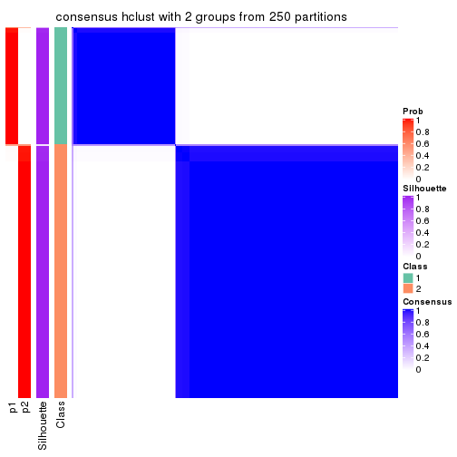</p>

</div>
<div id='tab-SD-hclust-consensus-heatmap-2'>
<pre><code class="r">consensus_heatmap(res, k = 3)
</code></pre>

<p>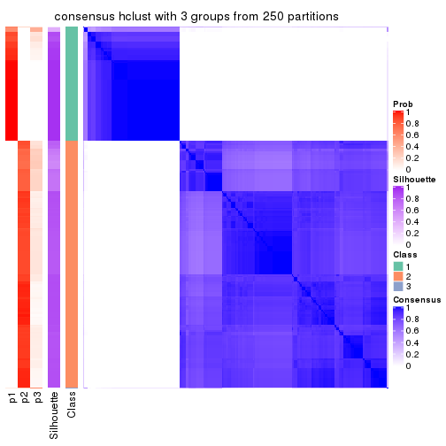</p>

</div>
<div id='tab-SD-hclust-consensus-heatmap-3'>
<pre><code class="r">consensus_heatmap(res, k = 4)
</code></pre>

<p>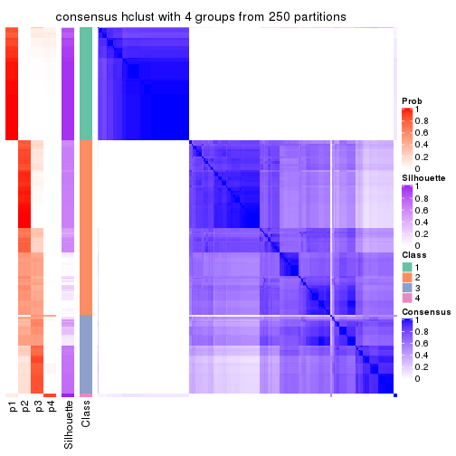</p>

</div>
<div id='tab-SD-hclust-consensus-heatmap-4'>
<pre><code class="r">consensus_heatmap(res, k = 5)
</code></pre>

<p>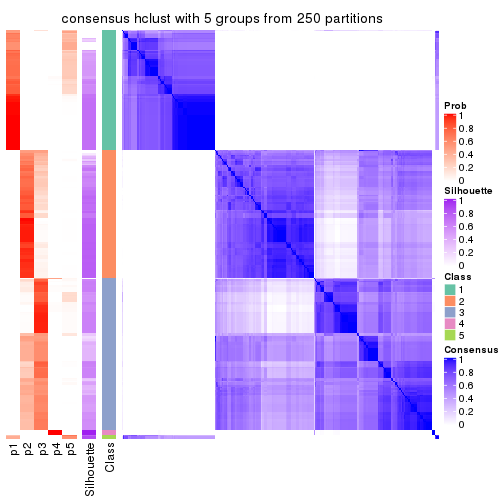</p>

</div>
<div id='tab-SD-hclust-consensus-heatmap-5'>
<pre><code class="r">consensus_heatmap(res, k = 6)
</code></pre>

<p>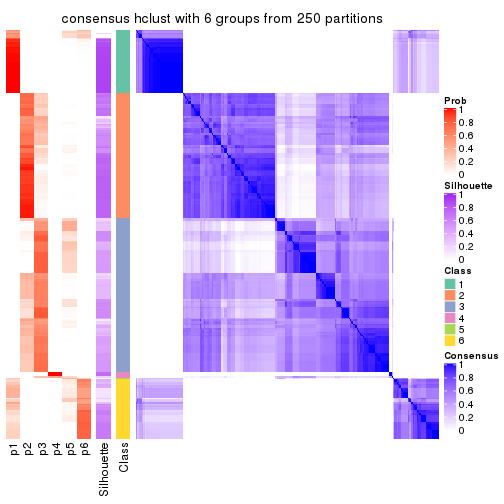</p>

</div>
</div>

Heatmaps for the membership of samples in all partitions to see how consistent they are:


<script>
$( function() {
	$( '#tabs-SD-hclust-membership-heatmap' ).tabs();
} );
</script>
<div id='tabs-SD-hclust-membership-heatmap'>
<ul>
<li><a href='#tab-SD-hclust-membership-heatmap-1'>k = 2</a></li>
<li><a href='#tab-SD-hclust-membership-heatmap-2'>k = 3</a></li>
<li><a href='#tab-SD-hclust-membership-heatmap-3'>k = 4</a></li>
<li><a href='#tab-SD-hclust-membership-heatmap-4'>k = 5</a></li>
<li><a href='#tab-SD-hclust-membership-heatmap-5'>k = 6</a></li>
</ul>
<div id='tab-SD-hclust-membership-heatmap-1'>
<pre><code class="r">membership_heatmap(res, k = 2)
</code></pre>

<p>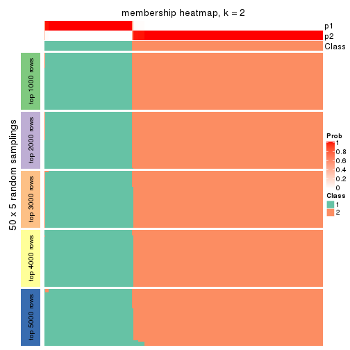</p>

</div>
<div id='tab-SD-hclust-membership-heatmap-2'>
<pre><code class="r">membership_heatmap(res, k = 3)
</code></pre>

<p>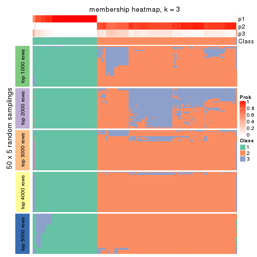</p>

</div>
<div id='tab-SD-hclust-membership-heatmap-3'>
<pre><code class="r">membership_heatmap(res, k = 4)
</code></pre>

<p>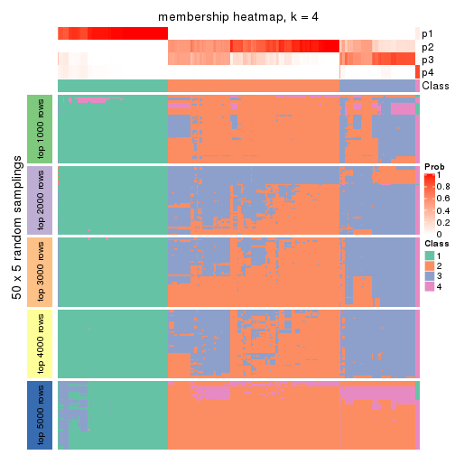</p>

</div>
<div id='tab-SD-hclust-membership-heatmap-4'>
<pre><code class="r">membership_heatmap(res, k = 5)
</code></pre>

<p>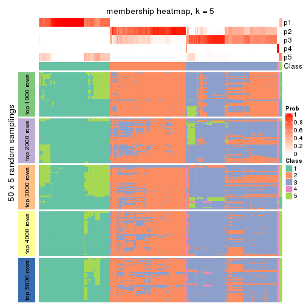</p>

</div>
<div id='tab-SD-hclust-membership-heatmap-5'>
<pre><code class="r">membership_heatmap(res, k = 6)
</code></pre>

<p>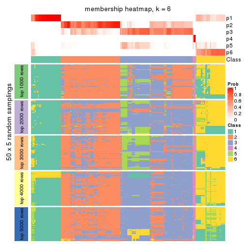</p>

</div>
</div>

As soon as we have had the classes for columns, we can look for signatures
which are significantly different between classes which can be candidate marks
for certain classes. Following are the heatmaps for signatures.


Signature heatmaps where rows are scaled:


<script>
$( function() {
	$( '#tabs-SD-hclust-get-signatures' ).tabs();
} );
</script>
<div id='tabs-SD-hclust-get-signatures'>
<ul>
<li><a href='#tab-SD-hclust-get-signatures-1'>k = 2</a></li>
<li><a href='#tab-SD-hclust-get-signatures-2'>k = 3</a></li>
<li><a href='#tab-SD-hclust-get-signatures-3'>k = 4</a></li>
<li><a href='#tab-SD-hclust-get-signatures-4'>k = 5</a></li>
<li><a href='#tab-SD-hclust-get-signatures-5'>k = 6</a></li>
</ul>
<div id='tab-SD-hclust-get-signatures-1'>
<pre><code class="r">get_signatures(res, k = 2)
</code></pre>

<p></p>

</div>
<div id='tab-SD-hclust-get-signatures-2'>
<pre><code class="r">get_signatures(res, k = 3)
</code></pre>

<p>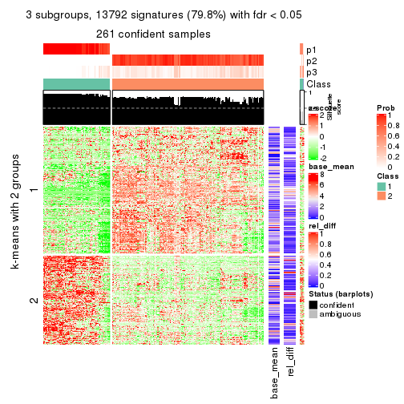</p>

</div>
<div id='tab-SD-hclust-get-signatures-3'>
<pre><code class="r">get_signatures(res, k = 4)
</code></pre>

<p>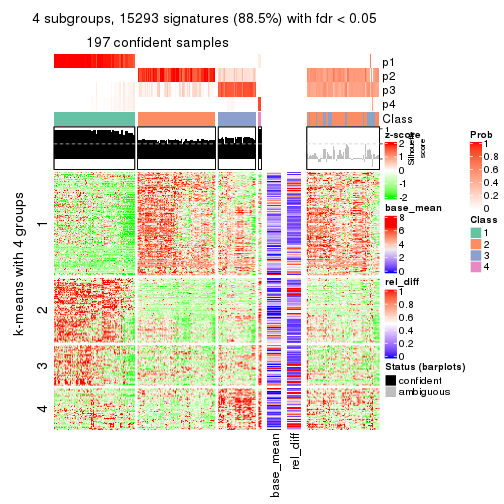</p>

</div>
<div id='tab-SD-hclust-get-signatures-4'>
<pre><code class="r">get_signatures(res, k = 5)
</code></pre>

<p>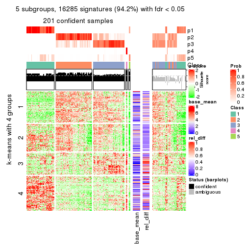</p>

</div>
<div id='tab-SD-hclust-get-signatures-5'>
<pre><code class="r">get_signatures(res, k = 6)
</code></pre>

<p>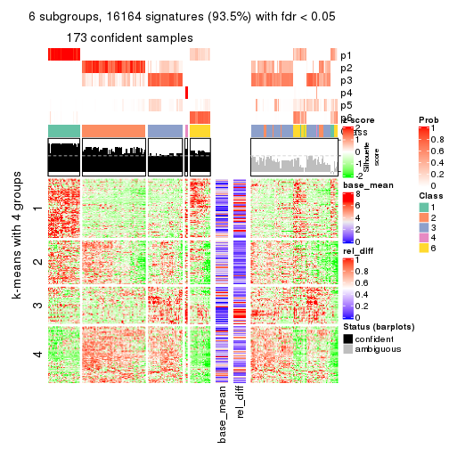</p>

</div>
</div>


Signature heatmaps where rows are not scaled:


<script>
$( function() {
	$( '#tabs-SD-hclust-get-signatures-no-scale' ).tabs();
} );
</script>
<div id='tabs-SD-hclust-get-signatures-no-scale'>
<ul>
<li><a href='#tab-SD-hclust-get-signatures-no-scale-1'>k = 2</a></li>
<li><a href='#tab-SD-hclust-get-signatures-no-scale-2'>k = 3</a></li>
<li><a href='#tab-SD-hclust-get-signatures-no-scale-3'>k = 4</a></li>
<li><a href='#tab-SD-hclust-get-signatures-no-scale-4'>k = 5</a></li>
<li><a href='#tab-SD-hclust-get-signatures-no-scale-5'>k = 6</a></li>
</ul>
<div id='tab-SD-hclust-get-signatures-no-scale-1'>
<pre><code class="r">get_signatures(res, k = 2, scale_rows = FALSE)
</code></pre>

<p>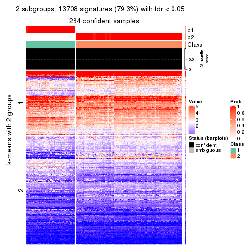</p>

</div>
<div id='tab-SD-hclust-get-signatures-no-scale-2'>
<pre><code class="r">get_signatures(res, k = 3, scale_rows = FALSE)
</code></pre>

<p>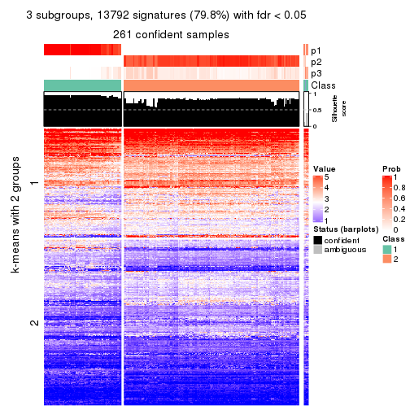</p>

</div>
<div id='tab-SD-hclust-get-signatures-no-scale-3'>
<pre><code class="r">get_signatures(res, k = 4, scale_rows = FALSE)
</code></pre>

<p>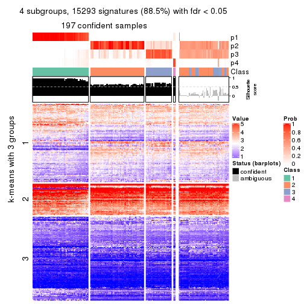</p>

</div>
<div id='tab-SD-hclust-get-signatures-no-scale-4'>
<pre><code class="r">get_signatures(res, k = 5, scale_rows = FALSE)
</code></pre>

<p>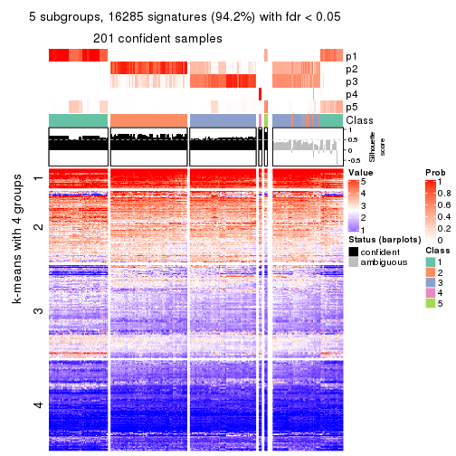</p>

</div>
<div id='tab-SD-hclust-get-signatures-no-scale-5'>
<pre><code class="r">get_signatures(res, k = 6, scale_rows = FALSE)
</code></pre>

<p>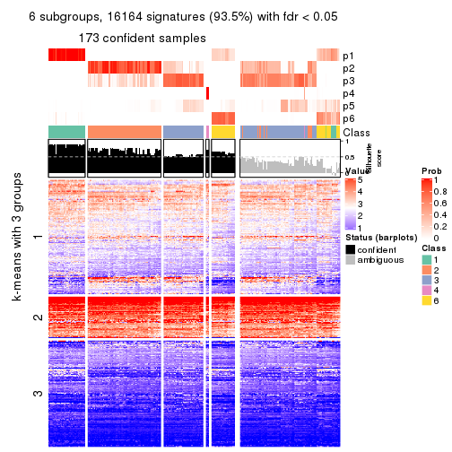</p>

</div>
</div>


Compare the overlap of signatures from different k:

```r
compare_signatures(res)
```

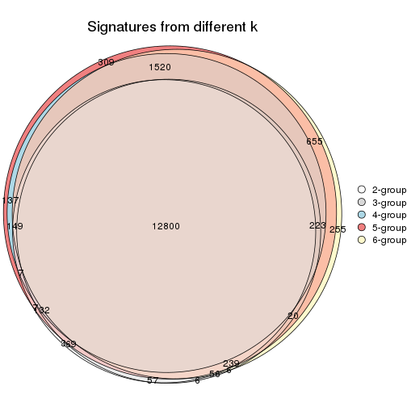

`get_signature()` returns a data frame invisibly. TO get the list of signatures, the function
call should be assigned to a variable explicitly. In following code, if `plot` argument is set
to `FALSE`, no heatmap is plotted while only the differential analysis is performed.

```r
# code only for demonstration
tb = get_signature(res, k = ..., plot = FALSE)
```

An example of the output of `tb` is:

```
#>   which_row         fdr    mean_1    mean_2 scaled_mean_1 scaled_mean_2 km
#> 1        38 0.042760348  8.373488  9.131774    -0.5533452     0.5164555  1
#> 2        40 0.018707592  7.106213  8.469186    -0.6173731     0.5762149  1
#> 3        55 0.019134737 10.221463 11.207825    -0.6159697     0.5749050  1
#> 4        59 0.006059896  5.921854  7.869574    -0.6899429     0.6439467  1
#> 5        60 0.018055526  8.928898 10.211722    -0.6204761     0.5791110  1
#> 6        98 0.009384629 15.714769 14.887706     0.6635654    -0.6193277  2
...
```

The columns in `tb` are:

1. `which_row`: row indices corresponding to the input matrix.
2. `fdr`: FDR for the differential test. 
3. `mean_x`: The mean value in group x.
4. `scaled_mean_x`: The mean value in group x after rows are scaled.
5. `km`: Row groups if k-means clustering is applied to rows.


UMAP plot which shows how samples are separated.


<script>
$( function() {
	$( '#tabs-SD-hclust-dimension-reduction' ).tabs();
} );
</script>
<div id='tabs-SD-hclust-dimension-reduction'>
<ul>
<li><a href='#tab-SD-hclust-dimension-reduction-1'>k = 2</a></li>
<li><a href='#tab-SD-hclust-dimension-reduction-2'>k = 3</a></li>
<li><a href='#tab-SD-hclust-dimension-reduction-3'>k = 4</a></li>
<li><a href='#tab-SD-hclust-dimension-reduction-4'>k = 5</a></li>
<li><a href='#tab-SD-hclust-dimension-reduction-5'>k = 6</a></li>
</ul>
<div id='tab-SD-hclust-dimension-reduction-1'>
<pre><code class="r">dimension_reduction(res, k = 2, method = &quot;UMAP&quot;)
</code></pre>

<p>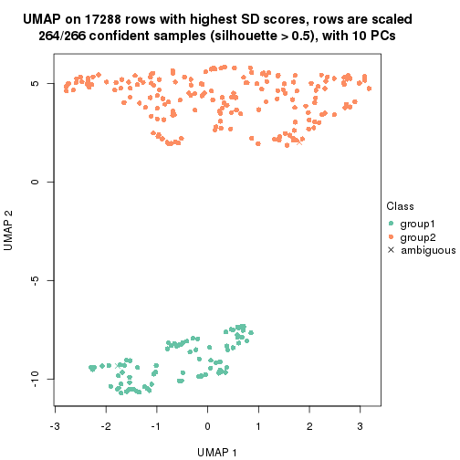</p>

</div>
<div id='tab-SD-hclust-dimension-reduction-2'>
<pre><code class="r">dimension_reduction(res, k = 3, method = &quot;UMAP&quot;)
</code></pre>

<p>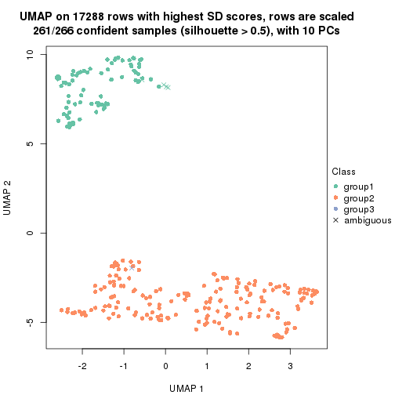</p>

</div>
<div id='tab-SD-hclust-dimension-reduction-3'>
<pre><code class="r">dimension_reduction(res, k = 4, method = &quot;UMAP&quot;)
</code></pre>

<p>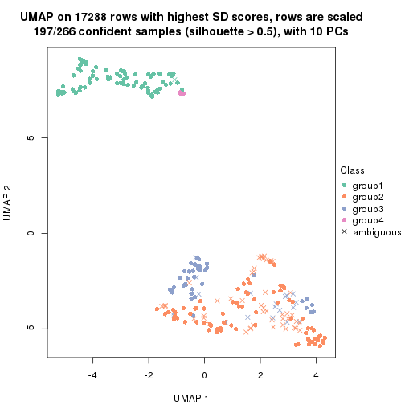</p>

</div>
<div id='tab-SD-hclust-dimension-reduction-4'>
<pre><code class="r">dimension_reduction(res, k = 5, method = &quot;UMAP&quot;)
</code></pre>

<p>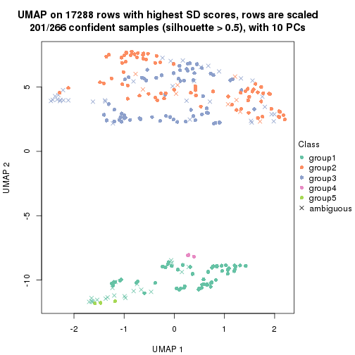</p>

</div>
<div id='tab-SD-hclust-dimension-reduction-5'>
<pre><code class="r">dimension_reduction(res, k = 6, method = &quot;UMAP&quot;)
</code></pre>

<p>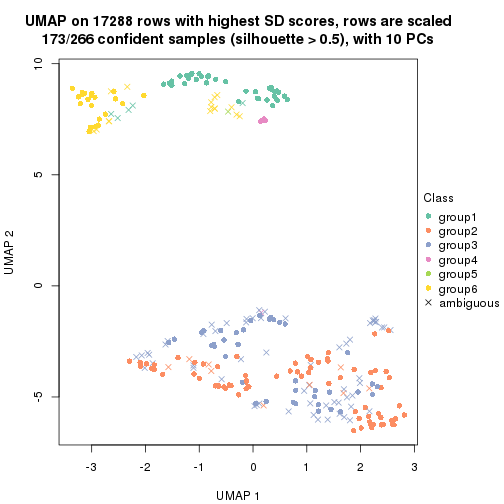</p>

</div>
</div>


Following heatmap shows how subgroups are split when increasing `k`:

```r
collect_classes(res)
```

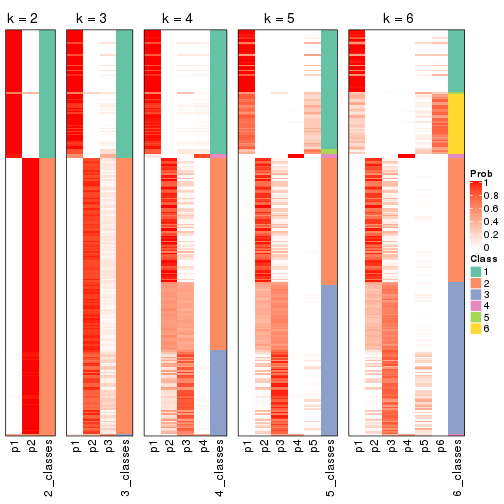


If matrix rows can be associated to genes, consider to use `GO_Enrichment(res,
...)` to perform function enrichment for the signature genes.


 

---------------------------------------------------


### SD:kmeans**


The object with results only for a single top-value method and a single partition method 
can be extracted as:

```r
res = res_list["SD", "kmeans"]
# you can also extract it by
# res = res_list["SD:kmeans"]
```

A summary of `res` and all the functions that can be applied to it:

```r
res
```

```
#> A 'ConsensusPartition' object with k = 2, 3, 4, 5, 6.
#>   On a matrix with 17288 rows and 266 columns.
#>   Top rows (1000, 2000, 3000, 4000, 5000) are extracted by 'SD' method.
#>   Subgroups are detected by 'kmeans' method.
#>   Performed in total 1250 partitions by row resampling.
#>   Best k for subgroups seems to be 2.
#> 
#> Following methods can be applied to this 'ConsensusPartition' object:
#>  [1] "cola_report"             "collect_classes"         "collect_plots"          
#>  [4] "collect_stats"           "colnames"                "compare_signatures"     
#>  [7] "consensus_heatmap"       "dimension_reduction"     "functional_enrichment"  
#> [10] "get_anno_col"            "get_anno"                "get_classes"            
#> [13] "get_consensus"           "get_matrix"              "get_membership"         
#> [16] "get_param"               "get_signatures"          "get_stats"              
#> [19] "is_best_k"               "is_stable_k"             "membership_heatmap"     
#> [22] "ncol"                    "nrow"                    "plot_ecdf"              
#> [25] "rownames"                "select_partition_number" "show"                   
#> [28] "suggest_best_k"          "test_to_known_factors"
```

`collect_plots()` function collects all the plots made from `res` for all `k` (number of partitions)
into one single page to provide an easy and fast comparison between different `k`.

```r
collect_plots(res)
```

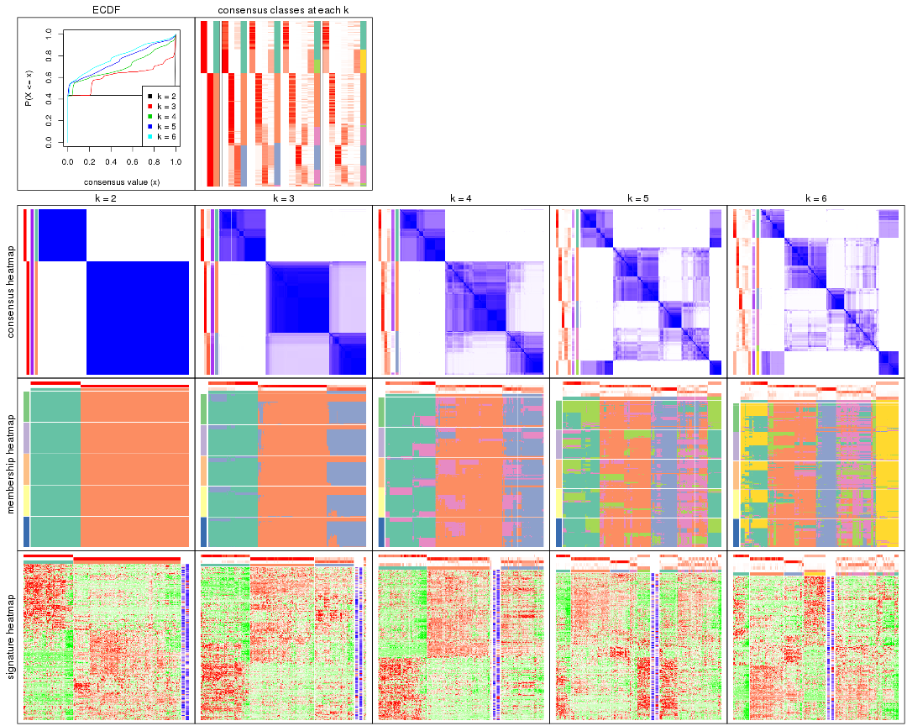

The plots are:

- The first row: a plot of the ECDF (Empirical cumulative distribution
  function) curves of the consensus matrix for each `k` and the heatmap of
  predicted classes for each `k`.
- The second row: heatmaps of the consensus matrix for each `k`.
- The third row: heatmaps of the membership matrix for each `k`.
- The fouth row: heatmaps of the signatures for each `k`.

All the plots in panels can be made by individual functions and they are
plotted later in this section.

`select_partition_number()` produces several plots showing different
statistics for choosing "optimized" `k`. There are following statistics:

- ECDF curves of the consensus matrix for each `k`;
- 1-PAC. [The PAC
  score](https://en.wikipedia.org/wiki/Consensus_clustering#Over-interpretation_potential_of_consensus_clustering)
  measures the proportion of the ambiguous subgrouping.
- Mean silhouette score.
- Concordance. The mean probability of fiting the consensus class ids in all
  partitions.
- Area increased. Denote $A_k$ as the area under the ECDF curve for current
  `k`, the area increased is defined as $A_k - A_{k-1}$.
- Rand index. The percent of pairs of samples that are both in a same cluster
  or both are not in a same cluster in the partition of k and k-1.
- Jaccard index. The ratio of pairs of samples are both in a same cluster in
  the partition of k and k-1 and the pairs of samples are both in a same
  cluster in the partition k or k-1.

The detailed explanations of these statistics can be found in [the cola
vignette](http://bioconductor.org/packages/devel/bioc/vignettes/cola/inst/doc/cola.html#toc_13).

Generally speaking, lower PAC score, higher mean silhouette score or higher
concordance corresponds to better partition. Rand index and Jaccard index
measure how similar the current partition is compared to partition with `k-1`.
If they are too similar, we won't accept `k` is better than `k-1`.

```r
select_partition_number(res)
```

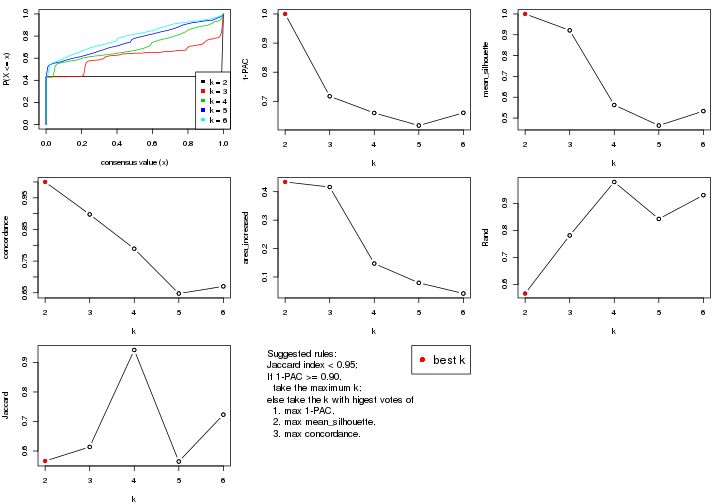

The numeric values for all these statistics can be obtained by `get_stats()`.

```r
get_stats(res)
```

```
#>   k 1-PAC mean_silhouette concordance area_increased  Rand Jaccard
#> 2 2 1.000           1.000       1.000         0.4343 0.566   0.566
#> 3 3 0.717           0.921       0.897         0.4165 0.781   0.614
#> 4 4 0.660           0.563       0.789         0.1473 0.980   0.942
#> 5 5 0.617           0.464       0.648         0.0794 0.843   0.564
#> 6 6 0.660           0.534       0.670         0.0418 0.931   0.723
```

`suggest_best_k()` suggests the best $k$ based on these statistics. The rules are as follows:

- All $k$ with Jaccard index larger than 0.95 are removed because the increase of
  the partition number does not provides enough extra information. If all $k$ are removed,
  the best $k$ is assigned by `NA`.
- For $k$ with 1-PAC larger than 0.9, the maximal $k$ is taken as the "best k". Other $k$ is called "optional k".
- If it does not fit the second rule. The $k$ with the highest vote of highest
  1-PAC, mean silhouette and concordance is taken as the "best k".

```r
suggest_best_k(res)
```

```
#> [1] 2
```


Following shows the table of the partitions (You need to click the **show/hide
code output** link to see it). The membership matrix (columns with name `p*`)
is inferred by
[`clue::cl_consensus()`](https://www.rdocumentation.org/link/cl_consensus?package=clue)
function with the `SE` method. Basically the value in the membership matrix
represents the probability to belong to a certain group. The finall class
label for an item is determined with the group with highest probability it
belongs to.

In `get_classes()` function, the entropy is calculated from the membership
matrix and the silhouette score is calculated from the consensus matrix.


<script>
$( function() {
	$( '#tabs-SD-kmeans-get-classes' ).tabs();
} );
</script>
<div id='tabs-SD-kmeans-get-classes'>
<ul>
<li><a href='#tab-SD-kmeans-get-classes-1'>k = 2</a></li>
<li><a href='#tab-SD-kmeans-get-classes-2'>k = 3</a></li>
<li><a href='#tab-SD-kmeans-get-classes-3'>k = 4</a></li>
<li><a href='#tab-SD-kmeans-get-classes-4'>k = 5</a></li>
<li><a href='#tab-SD-kmeans-get-classes-5'>k = 6</a></li>
</ul>

<div id='tab-SD-kmeans-get-classes-1'>
<p><a id='tab-SD-kmeans-get-classes-1-a' style='color:#0366d6' href='#'>show/hide code output</a></p>
<pre><code class="r">cbind(get_classes(res, k = 2), get_membership(res, k = 2))
</code></pre>

<pre><code>#&gt;                                      class entropy silhouette p1 p2
#&gt; 80D0AF10-1C61-4B67-90C1-7DBF1EF23672     2       0          1  0  1
#&gt; 87117BE1-D328-4972-85DA-6672412D8860     2       0          1  0  1
#&gt; F904C5B6-70BD-4604-8254-79BE23B152DA     1       0          1  1  0
#&gt; 3182DEA1-4239-4613-925A-7E6503766AD6     2       0          1  0  1
#&gt; 55E78EA2-2D9B-481F-8CAB-D36A33088EAE     2       0          1  0  1
#&gt; 86F94264-A6DD-4A97-9191-036F066DD0EF     2       0          1  0  1
#&gt; 09D25417-23B7-4D88-A0EA-F307985FBBBC     2       0          1  0  1
#&gt; C797F12C-40D3-4DB5-B9EF-A6821BBDE4F0     1       0          1  1  0
#&gt; 80275DB0-A226-4B6B-A08F-4ADBEEE1DB01     1       0          1  1  0
#&gt; 27FB653A-9E07-44AD-952E-9E4DE4AB5891     2       0          1  0  1
#&gt; 1A5DB9FC-2ABD-4E1B-B5EF-B1CF5E5F3872     1       0          1  1  0
#&gt; 844E4CCD-D30C-416F-A086-8923711A4E25     2       0          1  0  1
#&gt; EF18318D-3D25-4D65-803A-ED6E62871E7E     1       0          1  1  0
#&gt; 1ACB1BE0-61F6-4243-BBEC-E26A1CF90CA8     1       0          1  1  0
#&gt; 8EF0039B-D758-46AB-BAF7-6A062C7C56BA     1       0          1  1  0
#&gt; 22F4C9D9-663B-4C91-9692-E035A2640BEC     2       0          1  0  1
#&gt; FA1A0BCE-EE0F-4178-B963-62550E344B14     2       0          1  0  1
#&gt; 0B6D0C4E-5AE3-4707-A9FC-12A108E6EC2A     2       0          1  0  1
#&gt; 06FD3123-2AEB-4911-AC4E-E0E64FD5DB52     2       0          1  0  1
#&gt; 235A4492-FF80-4AA5-BC71-DFF65E1C7411     2       0          1  0  1
#&gt; A192C6C0-1443-4493-AFAC-1EE710628ADB     2       0          1  0  1
#&gt; 6FC5B56B-711B-4174-9B06-4E843124AAB6     1       0          1  1  0
#&gt; 7A813F60-A41E-4552-990E-F22287654C1D     2       0          1  0  1
#&gt; 725BBFB5-26F4-4512-9C75-47D013C1E605     1       0          1  1  0
#&gt; 39CC4E82-EBC9-472E-8BE5-6A3AB178449A     2       0          1  0  1
#&gt; 61130DEE-E267-49DF-8B41-7738A06EF738     2       0          1  0  1
#&gt; 117EC12C-B7ED-4E01-B29B-EA542D356EA1     1       0          1  1  0
#&gt; A30FF708-F7A9-41E4-8AD5-20441650FBC9     2       0          1  0  1
#&gt; 53640D52-1167-4A5D-B656-97D32CBA3934     1       0          1  1  0
#&gt; 9E85D76A-DD2A-46D5-BB59-0ED302B6258C     2       0          1  0  1
#&gt; 6F8C6F90-7E3C-4860-91DD-586708DE44AA     1       0          1  1  0
#&gt; E675AEC5-AA9A-4AAA-839C-03E6365822DB     2       0          1  0  1
#&gt; B577DEF7-2F5C-4876-A7C6-F18D5722B8C0     1       0          1  1  0
#&gt; DA8B577E-43E7-49BF-BF94-868E3194F5C9     1       0          1  1  0
#&gt; 3334280B-2A36-4AC7-A021-A76C10E958F0     2       0          1  0  1
#&gt; 5CBDDC90-11EC-4E6E-881E-AA9CCFD40FDB     2       0          1  0  1
#&gt; 8CBBF32A-8349-44F5-A8B8-4CBB1760A464     2       0          1  0  1
#&gt; B9455A9A-136D-4DC2-9F86-0FC74433589D     2       0          1  0  1
#&gt; D7EAE2A7-F9BE-4222-A452-B1F83F99CD50     2       0          1  0  1
#&gt; F803AE18-60C5-4CFE-AAAB-DB33C26A2184     1       0          1  1  0
#&gt; 5DD8CAC7-EC02-43B6-B58E-6D2E22868A3B     2       0          1  0  1
#&gt; EE98E1B4-DFB3-4AEC-8527-E1FD544C9475     1       0          1  1  0
#&gt; 3CE43921-47D5-4394-B9E1-242607775D61     2       0          1  0  1
#&gt; 46986F2B-0B0D-4187-8948-4E91D34B7C49     2       0          1  0  1
#&gt; 5D1D052E-74EF-45A8-9B1A-7CECD13EA43B     2       0          1  0  1
#&gt; 4C821AD9-A5C9-4A9A-9C5D-363B227F8064     2       0          1  0  1
#&gt; 06A4189E-A23B-4AC6-AA74-01955DD7D1E9     2       0          1  0  1
#&gt; FCCDC76F-CB02-4BCD-A616-325F258DDAA4     2       0          1  0  1
#&gt; DAC53B0A-8F35-4EA6-BBCC-4CD1C049E11F     2       0          1  0  1
#&gt; DD4F845B-CAD3-44CB-9D96-3C3F5BA1B72D     1       0          1  1  0
#&gt; D440F004-A4A4-41B6-BED8-805D67BA01C7     2       0          1  0  1
#&gt; A497C423-119F-42FA-BF17-9F6DFD2A5585     2       0          1  0  1
#&gt; 3420E573-DE12-4EF5-B1C0-2FCA904F4F4E     1       0          1  1  0
#&gt; 1AD72157-A254-44B4-BA58-4F30F1AE910E     1       0          1  1  0
#&gt; C1113977-B160-45EE-B061-750F9EA3F33F     2       0          1  0  1
#&gt; 6783AB5B-F07C-447B-BF13-C34485D246D7     2       0          1  0  1
#&gt; 1F553062-26FD-4A7F-B7FB-81184604F423     1       0          1  1  0
#&gt; BE2DCA51-1C21-4598-98A7-F2FB9B2DFCB4     2       0          1  0  1
#&gt; 38941CF3-9C54-4BA4-A005-CC88CA97D504     2       0          1  0  1
#&gt; 51CB675E-E243-4A07-BF4A-580473D26FDA     2       0          1  0  1
#&gt; C7FED0F5-C27A-4405-9232-30BF39362CF7     2       0          1  0  1
#&gt; 2A1E86E8-4713-465F-ACFF-C584864C57A1     2       0          1  0  1
#&gt; B4500785-0FAA-4D4D-8630-43D194BAB004     2       0          1  0  1
#&gt; 3FD52E66-AB76-4079-80DB-281A795D1EC0     2       0          1  0  1
#&gt; EBD355D1-1226-4DFD-AAFF-45D246B64F3C     2       0          1  0  1
#&gt; 5A040A73-CD95-487E-8AEF-9639FE4E2916     2       0          1  0  1
#&gt; CF629C65-585D-476D-B081-3E6E0575FAE3     2       0          1  0  1
#&gt; 0D4202A3-808E-413F-9BF3-9CFCCAE0ED61     2       0          1  0  1
#&gt; 43E715BF-28D9-4B5E-B762-8CD1B69A430E     1       0          1  1  0
#&gt; BFB82BE8-9DAC-4099-8B38-0950308E3EB3     2       0          1  0  1
#&gt; F7CB1825-2303-4DD2-AE1F-7205738EAF1F     1       0          1  1  0
#&gt; FE298483-C42C-4753-BABB-29A9CB1B6312     1       0          1  1  0
#&gt; A98C7561-1B42-4CD6-AE71-924B91FA4C33     2       0          1  0  1
#&gt; 58098F21-7DAB-47DA-9A41-8D20BF3B9257     2       0          1  0  1
#&gt; 18CAF708-20B9-4745-9CB3-37AB6E0B3056     2       0          1  0  1
#&gt; 2C80DD72-C9C7-4AC2-812F-9A31EF02779C     1       0          1  1  0
#&gt; 68A3F13D-319D-4603-A27F-B5DD46FE5C5B     2       0          1  0  1
#&gt; 7EE8F0CE-CDC9-40F9-A1DE-7F8140EC6D13     2       0          1  0  1
#&gt; 39019903-5B9C-4665-BD5F-7CCB19CB55C5     2       0          1  0  1
#&gt; 190EDB27-4CBC-4E9C-9B67-D51FDAB982B7     2       0          1  0  1
#&gt; EB2D95BC-62F8-4669-9308-D37D7FB79E23     2       0          1  0  1
#&gt; A08B85EA-D1E7-4B77-8DEC-36294305B9F7     1       0          1  1  0
#&gt; 130DDFAD-6EF8-4C80-BD9D-88308A6874BC     2       0          1  0  1
#&gt; 7340A5BA-E002-448F-AACC-E7A37DBB79C2     2       0          1  0  1
#&gt; A771F6E3-D266-4FE7-98C6-C40E6A701D59     1       0          1  1  0
#&gt; 015E792C-EC1B-49BF-AB07-D82B20C5989A     2       0          1  0  1
#&gt; BF79E030-47EE-4D08-B910-5685A4BD8B60     2       0          1  0  1
#&gt; FB3C7C9A-2F2D-4DD5-BE47-FAFB072C0FAB     2       0          1  0  1
#&gt; 4E5557BA-10E8-4723-908E-DD04EF6639B2     2       0          1  0  1
#&gt; 8031B550-40A9-4A3A-9F7D-CDC052288BD8     2       0          1  0  1
#&gt; 55299A06-3C1F-45A4-B166-B2C591C0CEE2     2       0          1  0  1
#&gt; EB8D5168-216E-4ABB-8B4E-9E67786CB322     1       0          1  1  0
#&gt; 78BD2D83-9A7F-42E5-BB38-654AA0761A0A     2       0          1  0  1
#&gt; AA2D53E5-D389-4332-9DD5-A736052E48F8     1       0          1  1  0
#&gt; 62945C7A-9313-4FC9-820C-B0AB820B394E     1       0          1  1  0
#&gt; 22746046-2E99-4EE9-97D2-BA2EA499634C     2       0          1  0  1
#&gt; 8671B51B-DCBE-4429-9F01-AF51CAD7014F     2       0          1  0  1
#&gt; E815AB36-5689-4A0D-8E6D-2EAA73406681     1       0          1  1  0
#&gt; A1DACB46-ED52-4E38-B2C8-57256BB22B5E     2       0          1  0  1
#&gt; 4F5498C4-A423-4B3D-AC98-D4E214A57D0E     1       0          1  1  0
#&gt; A7772CCD-FFFF-49DD-86ED-0BAD330EC9B6     2       0          1  0  1
#&gt; E6E3DF78-65B9-4F74-8DA8-E2A6D4EDBEA7     2       0          1  0  1
#&gt; 83286E2D-E708-437A-911A-E6B050273CBD     1       0          1  1  0
#&gt; EC5C7C97-EE8C-405D-A039-D96514B1D414     2       0          1  0  1
#&gt; 3E55223D-6E3D-4027-9819-67E91212531D     1       0          1  1  0
#&gt; 99A036A2-8343-4D06-8047-D84E96CE4C61     2       0          1  0  1
#&gt; CA6CDE6D-92DE-4259-9E58-A373F2D543EA     2       0          1  0  1
#&gt; BF6FA8CC-60C1-413A-B2C6-54CCACBC01D6     1       0          1  1  0
#&gt; E0594CFE-F7B6-4546-B130-30DF6A514B1F     2       0          1  0  1
#&gt; E769E41D-5949-42C5-9594-E563C05ACE52     2       0          1  0  1
#&gt; 01373725-5D3C-4D9C-AABC-911D53E62BCD     2       0          1  0  1
#&gt; 1F39DADD-3655-474E-BA4C-A5BD32C97A8B     1       0          1  1  0
#&gt; AF573EC8-E4EE-4B8F-8199-9817B9FAC67D     1       0          1  1  0
#&gt; 3F022CBC-41C8-4387-A6FB-124C4BCD1AD9     1       0          1  1  0
#&gt; 1CC32ACE-826B-494B-8B89-5BD92327A74D     2       0          1  0  1
#&gt; 22B0BD3B-EE08-4BC7-90B2-01C372A56BA2     2       0          1  0  1
#&gt; 0F3DE9EF-19CC-4D14-9A42-1435DB537F94     2       0          1  0  1
#&gt; 87F8A33F-FBC3-469E-862B-84472F796358     2       0          1  0  1
#&gt; C9F2FA0D-1A9F-40B4-BD9B-CAF1B3F3D5A7     2       0          1  0  1
#&gt; ACFC9F59-78FF-4453-B25F-8834D0EAB54A     2       0          1  0  1
#&gt; B7AC7D5B-14E9-45A7-93B7-226EE508544A     2       0          1  0  1
#&gt; 4491BF17-B168-4E96-8E09-EF1AEC9F5E9D     2       0          1  0  1
#&gt; 557A0811-A3FE-4CF4-A24D-FBB77E7F9139     2       0          1  0  1
#&gt; 6F9C955C-6816-4353-922A-8035B50FACC6     2       0          1  0  1
#&gt; 3E89FB1C-4A7D-43C7-823C-04E3716A7935     2       0          1  0  1
#&gt; 12ABE483-66EF-4237-94C4-0199FAE23FA8     2       0          1  0  1
#&gt; 7535F262-9B96-44F6-988C-4C9EBB3FFCA9     2       0          1  0  1
#&gt; 65C9D28E-303B-40E5-84F0-2507F5457374     2       0          1  0  1
#&gt; FD445384-6BA9-4297-9D9C-12ABA7D645C7     1       0          1  1  0
#&gt; 30D5E255-2AD3-44F3-8983-1B80E4FD3E2D     2       0          1  0  1
#&gt; 3E88EC60-B4A8-4259-8BC8-A234800F6955     2       0          1  0  1
#&gt; ACD73CE8-AFC5-47A0-9383-3CB97F018953     1       0          1  1  0
#&gt; 1AFDC2EA-26A8-44E2-8BCB-F34F7B66F8C8     2       0          1  0  1
#&gt; 9E327BC8-1D20-4AD8-83F7-FB2D13BCA5D0     2       0          1  0  1
#&gt; 85A86B91-4F24-4E77-AE2D-520F8E205EFC     1       0          1  1  0
#&gt; 74868C37-8143-4306-81CA-E45759D146CD     2       0          1  0  1
#&gt; 69AEA0DB-E335-48A0-A398-4FB0D581182A     2       0          1  0  1
#&gt; AE6F8B89-85C2-42B7-8D05-AFDDD4FEFD16     1       0          1  1  0
#&gt; A8A6F09C-9812-4457-9A4B-AD41F97B41A3     2       0          1  0  1
#&gt; 1A09BC4D-EF29-42DD-BB04-A3C264A3032D     1       0          1  1  0
#&gt; E0961A30-A62C-4235-9CF0-A1776827A996     2       0          1  0  1
#&gt; 134D2D90-7B08-4F20-8A3A-C77643FB208F     2       0          1  0  1
#&gt; A77C2DFF-93CF-4CB5-B3C1-81133D7F1A0F     2       0          1  0  1
#&gt; EA2DC457-9C74-4B9C-B3FA-5E72199B24A7     2       0          1  0  1
#&gt; FF34117B-5EE4-4C96-A8A2-2CE6A654CBE5     1       0          1  1  0
#&gt; 75F7B5E2-6559-4B48-A2A4-287C35C559CC     1       0          1  1  0
#&gt; 903BF591-B0AF-4BEE-B625-60B673070344     2       0          1  0  1
#&gt; 9DE1B790-C63C-41C4-9477-CE52A8119C67     2       0          1  0  1
#&gt; 9A28F80A-85F8-40E2-A32B-230EF93B2FA0     2       0          1  0  1
#&gt; 0AA2BDBB-8720-409A-AA72-1F4AA26E7CD8     2       0          1  0  1
#&gt; 5AD49F16-E974-4E5D-B1B6-073ECB73A01D     2       0          1  0  1
#&gt; CB0F961C-527D-4A48-9408-286B26BD9532     1       0          1  1  0
#&gt; 46FF25B6-D01D-4CA7-80B7-CEC2998C34E1     2       0          1  0  1
#&gt; 487CADE1-D699-4A6C-817A-B9A0AB940C61     1       0          1  1  0
#&gt; 4FF6F2D8-F869-4735-A4D1-1A8423153FBC     1       0          1  1  0
#&gt; 6005494F-5D3D-43A3-B3E8-8C91955B2A98     2       0          1  0  1
#&gt; CF10D584-CE32-45A4-A932-E9D5AF12A6A0     1       0          1  1  0
#&gt; E15CE4AB-5646-49C8-9CD6-938457036BB0     2       0          1  0  1
#&gt; 31E28D0B-0E69-4330-82ED-4F1827DC97EA     2       0          1  0  1
#&gt; DBACD3C3-CCB5-4478-BA78-85A0C847CA66     2       0          1  0  1
#&gt; 5A07041C-65EB-4FCD-8940-E90B905061B5     2       0          1  0  1
#&gt; 0EA7C916-FA47-489B-BC98-4D9E7D197628     1       0          1  1  0
#&gt; 30967F75-8499-47FF-ADA4-4DC566013F7B     1       0          1  1  0
#&gt; D2E528FF-AEA2-48D7-A60A-4C3E71EA9073     2       0          1  0  1
#&gt; 22735DCD-215E-48BC-BF44-32BD66F06E39     2       0          1  0  1
#&gt; BC2C3248-7FC6-48BC-96C1-45EA573DE7DC     1       0          1  1  0
#&gt; E72CEBCB-D686-4B12-BCBA-EC8F964330A2     1       0          1  1  0
#&gt; 23C937BB-BA20-4440-B680-914229CC3ADF     1       0          1  1  0
#&gt; 947E99C7-F402-4F1A-A6E9-81BCAAED135A     2       0          1  0  1
#&gt; 02475D11-FC81-4E88-944E-173C32DC3FE7     2       0          1  0  1
#&gt; F972A9AA-9842-4343-A533-A795E65581CE     1       0          1  1  0
#&gt; 05043AAF-3095-4C61-B5C1-EE9AA9082C75     2       0          1  0  1
#&gt; CECF7967-862E-428C-BB42-FEF553FDB3AA     2       0          1  0  1
#&gt; FB0B9483-6302-48C7-BE5B-DA667E00AE2D     2       0          1  0  1
#&gt; 78700FBA-1487-4754-9B30-18837BF7E9FB     1       0          1  1  0
#&gt; 2166F56D-54CE-4F1B-8F07-A4E13E4489E9     1       0          1  1  0
#&gt; 7CD0942E-E39A-43A7-8BAC-F25967864901     2       0          1  0  1
#&gt; 3B00BA2B-7F7D-4825-8F8D-90F04A5DE687     2       0          1  0  1
#&gt; 7465B01D-C05E-4FE0-A9FE-182920EDC489     2       0          1  0  1
#&gt; 88C31A99-F96E-4FC8-8B3D-C1AAA05062D9     1       0          1  1  0
#&gt; 53575575-3303-4F8F-B6A8-B42131CFB4AC     2       0          1  0  1
#&gt; CC8017C7-4128-48DA-8E43-503F63158D85     1       0          1  1  0
#&gt; 88449D2A-2A25-41A4-B91D-C99B58F8ECD9     2       0          1  0  1
#&gt; 46C7DDE5-A2B5-494F-96AE-0B6E2D51B003     1       0          1  1  0
#&gt; 42551D05-5EE5-4F91-93A8-32DA695D9DFA     2       0          1  0  1
#&gt; 0772DA48-3A36-422D-B166-CA1691B782C3     2       0          1  0  1
#&gt; 30346897-EC77-4153-88A2-D14593C8B741     2       0          1  0  1
#&gt; 0F00E267-C748-4A71-8B36-03C410641D88     2       0          1  0  1
#&gt; 4034703A-4DA9-4DDA-9CA9-E80FFE9CCDE6     2       0          1  0  1
#&gt; 393C8A41-CF45-4EA8-AFE3-25A08AB7692A     2       0          1  0  1
#&gt; 3354212D-A07C-435C-8B0C-9A7BAAB624B5     1       0          1  1  0
#&gt; 57E30D4E-ABF7-47DD-92BE-40CE215076B0     1       0          1  1  0
#&gt; 202B4C76-C840-4DB8-953F-AC75A4156FDD     2       0          1  0  1
#&gt; 93A0137B-1F4C-44EE-B959-2AD0CD2DF8B6     1       0          1  1  0
#&gt; C9794DB6-6E8C-4AFD-80EE-61D672A4F6E9     2       0          1  0  1
#&gt; AE4BFE63-F0C0-4624-AD97-4F7FF13E2384     1       0          1  1  0
#&gt; DCF87F27-2B54-42D9-8D28-5DFEE76E2F5B     2       0          1  0  1
#&gt; 2451D405-39FD-4812-958C-23462B66F1F1     2       0          1  0  1
#&gt; E27F5D33-3F68-4CA8-8757-A387C6EAD060     2       0          1  0  1
#&gt; 8BA9928A-5B93-477F-B4A2-D031B714D9AC     1       0          1  1  0
#&gt; 0FAACFF6-B50C-4BED-9824-B7270654F28D     2       0          1  0  1
#&gt; 3366CC3C-2BBA-4CA7-848E-4E16AA70AE7A     2       0          1  0  1
#&gt; 66237056-CA9A-4C90-AF0E-1621FEB71578     2       0          1  0  1
#&gt; C480F1FB-3100-436C-B0F5-DED63B7A580E     2       0          1  0  1
#&gt; A327DE0D-D945-4B42-9B41-A7302CF796EE     2       0          1  0  1
#&gt; E8A6871D-67FB-4306-9454-F5E7CDBA399A     2       0          1  0  1
#&gt; E9A7485B-82B6-4BD2-AFBB-DD0A82D6CDE2     1       0          1  1  0
#&gt; 93B382E4-9C9A-43F5-BD3B-502CC260B886     1       0          1  1  0
#&gt; A2792419-8E16-45FE-A524-17851F34AB9B     2       0          1  0  1
#&gt; 4DED1201-F25C-4F82-BABF-965EFAD7A8E5     2       0          1  0  1
#&gt; F1ACB2DD-E948-4F88-A249-F1BD1977D667     2       0          1  0  1
#&gt; 6CDBA203-8952-421D-A6BF-75652D9F3339     2       0          1  0  1
#&gt; 2D6C5AA7-3B33-48D7-AE0C-77A16B749D13     1       0          1  1  0
#&gt; 3F6B6D95-0720-42A0-AEB3-89FECAE7616A     2       0          1  0  1
#&gt; DED8ACF3-BBD8-46C9-85C9-A9C8F2E2BC0B     1       0          1  1  0
#&gt; 77069279-5A6F-42C0-9AA5-8C939591DFB5     1       0          1  1  0
#&gt; B2D4FCF3-FDF9-41C8-880A-6732CF6222AF     2       0          1  0  1
#&gt; 1CD71A4C-1E49-48EF-AA72-CB3C26B4C087     2       0          1  0  1
#&gt; C364E621-F85C-4B7F-842F-210B8D4DFE3A     2       0          1  0  1
#&gt; 11F1B8CA-07C1-47D2-A3C6-032FFA6A4A64     1       0          1  1  0
#&gt; 153BF804-6DC8-496B-987A-4021A2512211     2       0          1  0  1
#&gt; 5B5029C9-40F5-40D7-A36A-367022AD6A42     2       0          1  0  1
#&gt; 193CCBE6-104F-49B4-BDB2-C82EE36FDAAD     1       0          1  1  0
#&gt; E5D45E53-FCF3-4F01-9B78-6CB1ED0CFE40     2       0          1  0  1
#&gt; 5546A779-21DB-49F9-8C0D-A1E420088084     2       0          1  0  1
#&gt; E14825E0-0DC7-44C2-B265-F54672356838     1       0          1  1  0
#&gt; 8C8C09B9-EC83-45EC-BC4C-0BA92DE60ACB     1       0          1  1  0
#&gt; B388CA82-5BF7-4BDD-8821-4EC0B213121F     2       0          1  0  1
#&gt; A26025AC-9F71-4C07-9135-83593193BBB2     1       0          1  1  0
#&gt; C80E6D4B-AF21-42F0-8E20-6F7D2E99C062     2       0          1  0  1
#&gt; 5AE5D819-A6B1-4761-B7F9-8FFD3C520F31     2       0          1  0  1
#&gt; CAE8097F-A139-4C6E-9E30-35080475FF34     2       0          1  0  1
#&gt; 539C8DE3-6152-4671-B96F-ED6DC6DBD22B     1       0          1  1  0
#&gt; 5D28A8E0-4ECF-43A4-890A-BE968B9A8CB2     2       0          1  0  1
#&gt; 97A80AF8-365E-4756-A2B0-AEB1D8F5F33E     2       0          1  0  1
#&gt; B3527517-E339-46AE-8437-65303C309015     2       0          1  0  1
#&gt; 523E2183-AA20-4749-BD7E-69CD620DD6A3     2       0          1  0  1
#&gt; E553FB92-F181-47B3-9F3D-11DB51DFA3A4     2       0          1  0  1
#&gt; FFE0C4B1-8EEC-484A-AB87-3401B71BD081     2       0          1  0  1
#&gt; 73D6CA4B-9A9E-4E52-96C8-AE7F0CC8B276     2       0          1  0  1
#&gt; 485A8107-DF9A-4BC6-8A72-07FBA93F10F2     1       0          1  1  0
#&gt; 690823D9-B9AA-40EF-8302-4AD88BF89D1C     2       0          1  0  1
#&gt; B4E02660-562F-4EAC-8472-CBBD8A577688     2       0          1  0  1
#&gt; F82D5A60-90F9-4FF4-971E-73F7535FE65A     2       0          1  0  1
#&gt; C48401F7-2D56-4C6F-9896-C5435D1B44BF     2       0          1  0  1
#&gt; 94FC8991-182B-4B00-9A06-A00E8D3BDCFA     1       0          1  1  0
#&gt; FF00E80A-046D-4233-835E-CDF93403EA43     2       0          1  0  1
#&gt; C47A53F6-6479-4AD3-9D18-E4A70BE5F1DC     2       0          1  0  1
#&gt; 3487AE2D-AB1D-4DEF-AC4B-4B0FCAF8D899     2       0          1  0  1
#&gt; 479CD9BB-ECD7-41D5-B1E4-41132FF7FC95     2       0          1  0  1
#&gt; 048ADC6E-8C7E-4875-ACEE-E4787203C078     1       0          1  1  0
#&gt; 25AF81C5-B117-466D-AE9F-DD10BCB6AF2D     2       0          1  0  1
#&gt; 8B1D51D6-0B25-4289-81F0-9F95E0258877     2       0          1  0  1
#&gt; 282D390D-8E4E-4A19-B2B7-A6DB4BB2D46C     1       0          1  1  0
#&gt; BC6B92C1-F425-40C5-9941-539BFF5FE0FE     2       0          1  0  1
#&gt; 899CB9E0-48D0-413D-8566-BC151F146453     1       0          1  1  0
#&gt; 441400A9-1427-45E0-A8B4-EF2A6B7465C2     2       0          1  0  1
#&gt; CF96DDD4-DC0A-4341-BDE6-4DA2CB4978D0     1       0          1  1  0
#&gt; CE91F591-6072-4D29-9495-C78961635969     2       0          1  0  1
#&gt; 84D25635-2A38-4CFB-BFAC-38C007625C42     1       0          1  1  0
#&gt; ABF1AC12-872A-4C3D-A76C-07BC36A4DA5E     1       0          1  1  0
#&gt; B7F7F66F-1AED-4199-81C0-5C7FB0DBF438     2       0          1  0  1
#&gt; BAB786B9-6C20-425D-9886-63A0A092B59B     2       0          1  0  1
#&gt; 735D1DE3-D781-4F89-A395-09974057BBB7     1       0          1  1  0
#&gt; F6D5FBBA-05C4-4340-86D9-1A54181216A2     2       0          1  0  1
#&gt; 79C4E166-4A0D-4811-A2C8-CAE0A5AEED42     2       0          1  0  1
</code></pre>

<script>
$('#tab-SD-kmeans-get-classes-1-a').parent().next().next().hide();
$('#tab-SD-kmeans-get-classes-1-a').click(function(){
  $('#tab-SD-kmeans-get-classes-1-a').parent().next().next().toggle();
  return(false);
});
</script>
</div>

<div id='tab-SD-kmeans-get-classes-2'>
<p><a id='tab-SD-kmeans-get-classes-2-a' style='color:#0366d6' href='#'>show/hide code output</a></p>
<pre><code class="r">cbind(get_classes(res, k = 3), get_membership(res, k = 3))
</code></pre>

<pre><code>#&gt;                                      class entropy silhouette    p1    p2    p3
#&gt; 80D0AF10-1C61-4B67-90C1-7DBF1EF23672     2  0.0000      0.967 0.000 1.000 0.000
#&gt; 87117BE1-D328-4972-85DA-6672412D8860     2  0.0000      0.967 0.000 1.000 0.000
#&gt; F904C5B6-70BD-4604-8254-79BE23B152DA     1  0.2878      0.936 0.904 0.000 0.096
#&gt; 3182DEA1-4239-4613-925A-7E6503766AD6     2  0.2711      0.864 0.000 0.912 0.088
#&gt; 55E78EA2-2D9B-481F-8CAB-D36A33088EAE     3  0.5785      0.849 0.000 0.332 0.668
#&gt; 86F94264-A6DD-4A97-9191-036F066DD0EF     3  0.5327      0.910 0.000 0.272 0.728
#&gt; 09D25417-23B7-4D88-A0EA-F307985FBBBC     3  0.4750      0.946 0.000 0.216 0.784
#&gt; C797F12C-40D3-4DB5-B9EF-A6821BBDE4F0     1  0.2878      0.936 0.904 0.000 0.096
#&gt; 80275DB0-A226-4B6B-A08F-4ADBEEE1DB01     1  0.0000      0.937 1.000 0.000 0.000
#&gt; 27FB653A-9E07-44AD-952E-9E4DE4AB5891     3  0.4796      0.948 0.000 0.220 0.780
#&gt; 1A5DB9FC-2ABD-4E1B-B5EF-B1CF5E5F3872     1  0.5431      0.832 0.716 0.000 0.284
#&gt; 844E4CCD-D30C-416F-A086-8923711A4E25     3  0.4750      0.945 0.000 0.216 0.784
#&gt; EF18318D-3D25-4D65-803A-ED6E62871E7E     1  0.4605      0.907 0.796 0.000 0.204
#&gt; 1ACB1BE0-61F6-4243-BBEC-E26A1CF90CA8     1  0.0237      0.937 0.996 0.000 0.004
#&gt; 8EF0039B-D758-46AB-BAF7-6A062C7C56BA     1  0.0000      0.937 1.000 0.000 0.000
#&gt; 22F4C9D9-663B-4C91-9692-E035A2640BEC     2  0.0000      0.967 0.000 1.000 0.000
#&gt; FA1A0BCE-EE0F-4178-B963-62550E344B14     2  0.0237      0.966 0.000 0.996 0.004
#&gt; 0B6D0C4E-5AE3-4707-A9FC-12A108E6EC2A     3  0.4796      0.948 0.000 0.220 0.780
#&gt; 06FD3123-2AEB-4911-AC4E-E0E64FD5DB52     2  0.0592      0.963 0.000 0.988 0.012
#&gt; 235A4492-FF80-4AA5-BC71-DFF65E1C7411     2  0.0000      0.967 0.000 1.000 0.000
#&gt; A192C6C0-1443-4493-AFAC-1EE710628ADB     2  0.0237      0.966 0.000 0.996 0.004
#&gt; 6FC5B56B-711B-4174-9B06-4E843124AAB6     1  0.4605      0.916 0.796 0.000 0.204
#&gt; 7A813F60-A41E-4552-990E-F22287654C1D     2  0.0237      0.966 0.000 0.996 0.004
#&gt; 725BBFB5-26F4-4512-9C75-47D013C1E605     1  0.4605      0.916 0.796 0.000 0.204
#&gt; 39CC4E82-EBC9-472E-8BE5-6A3AB178449A     2  0.0592      0.959 0.000 0.988 0.012
#&gt; 61130DEE-E267-49DF-8B41-7738A06EF738     3  0.4750      0.946 0.000 0.216 0.784
#&gt; 117EC12C-B7ED-4E01-B29B-EA542D356EA1     1  0.2959      0.935 0.900 0.000 0.100
#&gt; A30FF708-F7A9-41E4-8AD5-20441650FBC9     2  0.0000      0.967 0.000 1.000 0.000
#&gt; 53640D52-1167-4A5D-B656-97D32CBA3934     1  0.2625      0.936 0.916 0.000 0.084
#&gt; 9E85D76A-DD2A-46D5-BB59-0ED302B6258C     2  0.0424      0.963 0.000 0.992 0.008
#&gt; 6F8C6F90-7E3C-4860-91DD-586708DE44AA     1  0.0000      0.937 1.000 0.000 0.000
#&gt; E675AEC5-AA9A-4AAA-839C-03E6365822DB     3  0.4750      0.946 0.000 0.216 0.784
#&gt; B577DEF7-2F5C-4876-A7C6-F18D5722B8C0     1  0.3038      0.935 0.896 0.000 0.104
#&gt; DA8B577E-43E7-49BF-BF94-868E3194F5C9     1  0.0000      0.937 1.000 0.000 0.000
#&gt; 3334280B-2A36-4AC7-A021-A76C10E958F0     2  0.0000      0.967 0.000 1.000 0.000
#&gt; 5CBDDC90-11EC-4E6E-881E-AA9CCFD40FDB     2  0.1163      0.950 0.000 0.972 0.028
#&gt; 8CBBF32A-8349-44F5-A8B8-4CBB1760A464     2  0.0892      0.951 0.000 0.980 0.020
#&gt; B9455A9A-136D-4DC2-9F86-0FC74433589D     3  0.4702      0.942 0.000 0.212 0.788
#&gt; D7EAE2A7-F9BE-4222-A452-B1F83F99CD50     2  0.1860      0.916 0.000 0.948 0.052
#&gt; F803AE18-60C5-4CFE-AAAB-DB33C26A2184     1  0.4605      0.916 0.796 0.000 0.204
#&gt; 5DD8CAC7-EC02-43B6-B58E-6D2E22868A3B     3  0.4796      0.948 0.000 0.220 0.780
#&gt; EE98E1B4-DFB3-4AEC-8527-E1FD544C9475     1  0.0000      0.937 1.000 0.000 0.000
#&gt; 3CE43921-47D5-4394-B9E1-242607775D61     2  0.0000      0.967 0.000 1.000 0.000
#&gt; 46986F2B-0B0D-4187-8948-4E91D34B7C49     2  0.0000      0.967 0.000 1.000 0.000
#&gt; 5D1D052E-74EF-45A8-9B1A-7CECD13EA43B     2  0.0237      0.966 0.000 0.996 0.004
#&gt; 4C821AD9-A5C9-4A9A-9C5D-363B227F8064     2  0.5905      0.168 0.000 0.648 0.352
#&gt; 06A4189E-A23B-4AC6-AA74-01955DD7D1E9     2  0.0000      0.967 0.000 1.000 0.000
#&gt; FCCDC76F-CB02-4BCD-A616-325F258DDAA4     2  0.0000      0.967 0.000 1.000 0.000
#&gt; DAC53B0A-8F35-4EA6-BBCC-4CD1C049E11F     2  0.0424      0.963 0.000 0.992 0.008
#&gt; DD4F845B-CAD3-44CB-9D96-3C3F5BA1B72D     1  0.4605      0.916 0.796 0.000 0.204
#&gt; D440F004-A4A4-41B6-BED8-805D67BA01C7     2  0.0000      0.967 0.000 1.000 0.000
#&gt; A497C423-119F-42FA-BF17-9F6DFD2A5585     2  0.0000      0.967 0.000 1.000 0.000
#&gt; 3420E573-DE12-4EF5-B1C0-2FCA904F4F4E     1  0.0000      0.937 1.000 0.000 0.000
#&gt; 1AD72157-A254-44B4-BA58-4F30F1AE910E     1  0.0000      0.937 1.000 0.000 0.000
#&gt; C1113977-B160-45EE-B061-750F9EA3F33F     3  0.5678      0.867 0.000 0.316 0.684
#&gt; 6783AB5B-F07C-447B-BF13-C34485D246D7     2  0.0592      0.962 0.000 0.988 0.012
#&gt; 1F553062-26FD-4A7F-B7FB-81184604F423     1  0.4555      0.917 0.800 0.000 0.200
#&gt; BE2DCA51-1C21-4598-98A7-F2FB9B2DFCB4     2  0.0237      0.966 0.000 0.996 0.004
#&gt; 38941CF3-9C54-4BA4-A005-CC88CA97D504     2  0.0592      0.962 0.000 0.988 0.012
#&gt; 51CB675E-E243-4A07-BF4A-580473D26FDA     2  0.0237      0.966 0.000 0.996 0.004
#&gt; C7FED0F5-C27A-4405-9232-30BF39362CF7     2  0.0237      0.966 0.000 0.996 0.004
#&gt; 2A1E86E8-4713-465F-ACFF-C584864C57A1     3  0.4796      0.948 0.000 0.220 0.780
#&gt; B4500785-0FAA-4D4D-8630-43D194BAB004     2  0.0000      0.967 0.000 1.000 0.000
#&gt; 3FD52E66-AB76-4079-80DB-281A795D1EC0     3  0.6168      0.691 0.000 0.412 0.588
#&gt; EBD355D1-1226-4DFD-AAFF-45D246B64F3C     2  0.0424      0.962 0.000 0.992 0.008
#&gt; 5A040A73-CD95-487E-8AEF-9639FE4E2916     2  0.0000      0.967 0.000 1.000 0.000
#&gt; CF629C65-585D-476D-B081-3E6E0575FAE3     3  0.4702      0.942 0.000 0.212 0.788
#&gt; 0D4202A3-808E-413F-9BF3-9CFCCAE0ED61     2  0.0000      0.967 0.000 1.000 0.000
#&gt; 43E715BF-28D9-4B5E-B762-8CD1B69A430E     1  0.0000      0.937 1.000 0.000 0.000
#&gt; BFB82BE8-9DAC-4099-8B38-0950308E3EB3     2  0.0000      0.967 0.000 1.000 0.000
#&gt; F7CB1825-2303-4DD2-AE1F-7205738EAF1F     1  0.4452      0.920 0.808 0.000 0.192
#&gt; FE298483-C42C-4753-BABB-29A9CB1B6312     1  0.3116      0.935 0.892 0.000 0.108
#&gt; A98C7561-1B42-4CD6-AE71-924B91FA4C33     3  0.4796      0.948 0.000 0.220 0.780
#&gt; 58098F21-7DAB-47DA-9A41-8D20BF3B9257     3  0.5835      0.830 0.000 0.340 0.660
#&gt; 18CAF708-20B9-4745-9CB3-37AB6E0B3056     2  0.0237      0.966 0.000 0.996 0.004
#&gt; 2C80DD72-C9C7-4AC2-812F-9A31EF02779C     1  0.0000      0.937 1.000 0.000 0.000
#&gt; 68A3F13D-319D-4603-A27F-B5DD46FE5C5B     2  0.0000      0.967 0.000 1.000 0.000
#&gt; 7EE8F0CE-CDC9-40F9-A1DE-7F8140EC6D13     3  0.4654      0.940 0.000 0.208 0.792
#&gt; 39019903-5B9C-4665-BD5F-7CCB19CB55C5     2  0.0000      0.967 0.000 1.000 0.000
#&gt; 190EDB27-4CBC-4E9C-9B67-D51FDAB982B7     3  0.4750      0.946 0.000 0.216 0.784
#&gt; EB2D95BC-62F8-4669-9308-D37D7FB79E23     2  0.0000      0.967 0.000 1.000 0.000
#&gt; A08B85EA-D1E7-4B77-8DEC-36294305B9F7     1  0.4605      0.916 0.796 0.000 0.204
#&gt; 130DDFAD-6EF8-4C80-BD9D-88308A6874BC     3  0.4796      0.948 0.000 0.220 0.780
#&gt; 7340A5BA-E002-448F-AACC-E7A37DBB79C2     2  0.0000      0.967 0.000 1.000 0.000
#&gt; A771F6E3-D266-4FE7-98C6-C40E6A701D59     1  0.4605      0.916 0.796 0.000 0.204
#&gt; 015E792C-EC1B-49BF-AB07-D82B20C5989A     2  0.1163      0.947 0.000 0.972 0.028
#&gt; BF79E030-47EE-4D08-B910-5685A4BD8B60     3  0.4796      0.948 0.000 0.220 0.780
#&gt; FB3C7C9A-2F2D-4DD5-BE47-FAFB072C0FAB     2  0.5363      0.442 0.000 0.724 0.276
#&gt; 4E5557BA-10E8-4723-908E-DD04EF6639B2     3  0.4796      0.948 0.000 0.220 0.780
#&gt; 8031B550-40A9-4A3A-9F7D-CDC052288BD8     3  0.4796      0.948 0.000 0.220 0.780
#&gt; 55299A06-3C1F-45A4-B166-B2C591C0CEE2     3  0.4796      0.948 0.000 0.220 0.780
#&gt; EB8D5168-216E-4ABB-8B4E-9E67786CB322     1  0.0000      0.937 1.000 0.000 0.000
#&gt; 78BD2D83-9A7F-42E5-BB38-654AA0761A0A     2  0.0592      0.962 0.000 0.988 0.012
#&gt; AA2D53E5-D389-4332-9DD5-A736052E48F8     1  0.4605      0.916 0.796 0.000 0.204
#&gt; 62945C7A-9313-4FC9-820C-B0AB820B394E     1  0.0000      0.937 1.000 0.000 0.000
#&gt; 22746046-2E99-4EE9-97D2-BA2EA499634C     3  0.4796      0.948 0.000 0.220 0.780
#&gt; 8671B51B-DCBE-4429-9F01-AF51CAD7014F     3  0.4796      0.948 0.000 0.220 0.780
#&gt; E815AB36-5689-4A0D-8E6D-2EAA73406681     1  0.2959      0.935 0.900 0.000 0.100
#&gt; A1DACB46-ED52-4E38-B2C8-57256BB22B5E     2  0.0000      0.967 0.000 1.000 0.000
#&gt; 4F5498C4-A423-4B3D-AC98-D4E214A57D0E     1  0.0000      0.937 1.000 0.000 0.000
#&gt; A7772CCD-FFFF-49DD-86ED-0BAD330EC9B6     3  0.5016      0.933 0.000 0.240 0.760
#&gt; E6E3DF78-65B9-4F74-8DA8-E2A6D4EDBEA7     3  0.4796      0.948 0.000 0.220 0.780
#&gt; 83286E2D-E708-437A-911A-E6B050273CBD     1  0.0000      0.937 1.000 0.000 0.000
#&gt; EC5C7C97-EE8C-405D-A039-D96514B1D414     2  0.0000      0.967 0.000 1.000 0.000
#&gt; 3E55223D-6E3D-4027-9819-67E91212531D     1  0.2959      0.935 0.900 0.000 0.100
#&gt; 99A036A2-8343-4D06-8047-D84E96CE4C61     3  0.4750      0.945 0.000 0.216 0.784
#&gt; CA6CDE6D-92DE-4259-9E58-A373F2D543EA     2  0.2448      0.879 0.000 0.924 0.076
#&gt; BF6FA8CC-60C1-413A-B2C6-54CCACBC01D6     1  0.0000      0.937 1.000 0.000 0.000
#&gt; E0594CFE-F7B6-4546-B130-30DF6A514B1F     3  0.4931      0.939 0.000 0.232 0.768
#&gt; E769E41D-5949-42C5-9594-E563C05ACE52     3  0.5810      0.844 0.000 0.336 0.664
#&gt; 01373725-5D3C-4D9C-AABC-911D53E62BCD     3  0.4750      0.946 0.000 0.216 0.784
#&gt; 1F39DADD-3655-474E-BA4C-A5BD32C97A8B     1  0.4555      0.917 0.800 0.000 0.200
#&gt; AF573EC8-E4EE-4B8F-8199-9817B9FAC67D     1  0.0000      0.937 1.000 0.000 0.000
#&gt; 3F022CBC-41C8-4387-A6FB-124C4BCD1AD9     1  0.4555      0.917 0.800 0.000 0.200
#&gt; 1CC32ACE-826B-494B-8B89-5BD92327A74D     3  0.4796      0.948 0.000 0.220 0.780
#&gt; 22B0BD3B-EE08-4BC7-90B2-01C372A56BA2     3  0.4796      0.948 0.000 0.220 0.780
#&gt; 0F3DE9EF-19CC-4D14-9A42-1435DB537F94     2  0.0237      0.966 0.000 0.996 0.004
#&gt; 87F8A33F-FBC3-469E-862B-84472F796358     2  0.4002      0.734 0.000 0.840 0.160
#&gt; C9F2FA0D-1A9F-40B4-BD9B-CAF1B3F3D5A7     2  0.0000      0.967 0.000 1.000 0.000
#&gt; ACFC9F59-78FF-4453-B25F-8834D0EAB54A     3  0.4796      0.948 0.000 0.220 0.780
#&gt; B7AC7D5B-14E9-45A7-93B7-226EE508544A     2  0.0237      0.966 0.000 0.996 0.004
#&gt; 4491BF17-B168-4E96-8E09-EF1AEC9F5E9D     3  0.4796      0.948 0.000 0.220 0.780
#&gt; 557A0811-A3FE-4CF4-A24D-FBB77E7F9139     3  0.5785      0.849 0.000 0.332 0.668
#&gt; 6F9C955C-6816-4353-922A-8035B50FACC6     2  0.0000      0.967 0.000 1.000 0.000
#&gt; 3E89FB1C-4A7D-43C7-823C-04E3716A7935     2  0.0237      0.966 0.000 0.996 0.004
#&gt; 12ABE483-66EF-4237-94C4-0199FAE23FA8     2  0.0000      0.967 0.000 1.000 0.000
#&gt; 7535F262-9B96-44F6-988C-4C9EBB3FFCA9     2  0.0237      0.966 0.000 0.996 0.004
#&gt; 65C9D28E-303B-40E5-84F0-2507F5457374     3  0.4796      0.948 0.000 0.220 0.780
#&gt; FD445384-6BA9-4297-9D9C-12ABA7D645C7     1  0.1860      0.935 0.948 0.000 0.052
#&gt; 30D5E255-2AD3-44F3-8983-1B80E4FD3E2D     2  0.6267     -0.300 0.000 0.548 0.452
#&gt; 3E88EC60-B4A8-4259-8BC8-A234800F6955     3  0.4796      0.948 0.000 0.220 0.780
#&gt; ACD73CE8-AFC5-47A0-9383-3CB97F018953     1  0.0000      0.937 1.000 0.000 0.000
#&gt; 1AFDC2EA-26A8-44E2-8BCB-F34F7B66F8C8     2  0.0747      0.959 0.000 0.984 0.016
#&gt; 9E327BC8-1D20-4AD8-83F7-FB2D13BCA5D0     2  0.0237      0.964 0.000 0.996 0.004
#&gt; 85A86B91-4F24-4E77-AE2D-520F8E205EFC     1  0.4605      0.916 0.796 0.000 0.204
#&gt; 74868C37-8143-4306-81CA-E45759D146CD     2  0.0424      0.962 0.000 0.992 0.008
#&gt; 69AEA0DB-E335-48A0-A398-4FB0D581182A     2  0.0000      0.967 0.000 1.000 0.000
#&gt; AE6F8B89-85C2-42B7-8D05-AFDDD4FEFD16     1  0.0000      0.937 1.000 0.000 0.000
#&gt; A8A6F09C-9812-4457-9A4B-AD41F97B41A3     2  0.0000      0.967 0.000 1.000 0.000
#&gt; 1A09BC4D-EF29-42DD-BB04-A3C264A3032D     1  0.4605      0.916 0.796 0.000 0.204
#&gt; E0961A30-A62C-4235-9CF0-A1776827A996     3  0.6180      0.695 0.000 0.416 0.584
#&gt; 134D2D90-7B08-4F20-8A3A-C77643FB208F     2  0.1163      0.950 0.000 0.972 0.028
#&gt; A77C2DFF-93CF-4CB5-B3C1-81133D7F1A0F     3  0.6204      0.661 0.000 0.424 0.576
#&gt; EA2DC457-9C74-4B9C-B3FA-5E72199B24A7     2  0.0747      0.959 0.000 0.984 0.016
#&gt; FF34117B-5EE4-4C96-A8A2-2CE6A654CBE5     1  0.0000      0.937 1.000 0.000 0.000
#&gt; 75F7B5E2-6559-4B48-A2A4-287C35C559CC     1  0.4452      0.920 0.808 0.000 0.192
#&gt; 903BF591-B0AF-4BEE-B625-60B673070344     2  0.0592      0.962 0.000 0.988 0.012
#&gt; 9DE1B790-C63C-41C4-9477-CE52A8119C67     2  0.0000      0.967 0.000 1.000 0.000
#&gt; 9A28F80A-85F8-40E2-A32B-230EF93B2FA0     3  0.4796      0.948 0.000 0.220 0.780
#&gt; 0AA2BDBB-8720-409A-AA72-1F4AA26E7CD8     2  0.0000      0.967 0.000 1.000 0.000
#&gt; 5AD49F16-E974-4E5D-B1B6-073ECB73A01D     3  0.4654      0.940 0.000 0.208 0.792
#&gt; CB0F961C-527D-4A48-9408-286B26BD9532     1  0.4555      0.917 0.800 0.000 0.200
#&gt; 46FF25B6-D01D-4CA7-80B7-CEC2998C34E1     2  0.0000      0.967 0.000 1.000 0.000
#&gt; 487CADE1-D699-4A6C-817A-B9A0AB940C61     1  0.0000      0.937 1.000 0.000 0.000
#&gt; 4FF6F2D8-F869-4735-A4D1-1A8423153FBC     1  0.0000      0.937 1.000 0.000 0.000
#&gt; 6005494F-5D3D-43A3-B3E8-8C91955B2A98     2  0.0000      0.967 0.000 1.000 0.000
#&gt; CF10D584-CE32-45A4-A932-E9D5AF12A6A0     1  0.4605      0.916 0.796 0.000 0.204
#&gt; E15CE4AB-5646-49C8-9CD6-938457036BB0     3  0.5760      0.854 0.000 0.328 0.672
#&gt; 31E28D0B-0E69-4330-82ED-4F1827DC97EA     2  0.0237      0.966 0.000 0.996 0.004
#&gt; DBACD3C3-CCB5-4478-BA78-85A0C847CA66     2  0.0000      0.967 0.000 1.000 0.000
#&gt; 5A07041C-65EB-4FCD-8940-E90B905061B5     2  0.5291      0.472 0.000 0.732 0.268
#&gt; 0EA7C916-FA47-489B-BC98-4D9E7D197628     1  0.0000      0.937 1.000 0.000 0.000
#&gt; 30967F75-8499-47FF-ADA4-4DC566013F7B     1  0.4555      0.917 0.800 0.000 0.200
#&gt; D2E528FF-AEA2-48D7-A60A-4C3E71EA9073     3  0.5733      0.855 0.000 0.324 0.676
#&gt; 22735DCD-215E-48BC-BF44-32BD66F06E39     3  0.4796      0.948 0.000 0.220 0.780
#&gt; BC2C3248-7FC6-48BC-96C1-45EA573DE7DC     1  0.4062      0.926 0.836 0.000 0.164
#&gt; E72CEBCB-D686-4B12-BCBA-EC8F964330A2     1  0.0000      0.937 1.000 0.000 0.000
#&gt; 23C937BB-BA20-4440-B680-914229CC3ADF     1  0.0000      0.937 1.000 0.000 0.000
#&gt; 947E99C7-F402-4F1A-A6E9-81BCAAED135A     2  0.0000      0.967 0.000 1.000 0.000
#&gt; 02475D11-FC81-4E88-944E-173C32DC3FE7     3  0.5621      0.858 0.000 0.308 0.692
#&gt; F972A9AA-9842-4343-A533-A795E65581CE     1  0.3192      0.935 0.888 0.000 0.112
#&gt; 05043AAF-3095-4C61-B5C1-EE9AA9082C75     2  0.0424      0.964 0.000 0.992 0.008
#&gt; CECF7967-862E-428C-BB42-FEF553FDB3AA     2  0.0000      0.967 0.000 1.000 0.000
#&gt; FB0B9483-6302-48C7-BE5B-DA667E00AE2D     3  0.4750      0.946 0.000 0.216 0.784
#&gt; 78700FBA-1487-4754-9B30-18837BF7E9FB     1  0.0000      0.937 1.000 0.000 0.000
#&gt; 2166F56D-54CE-4F1B-8F07-A4E13E4489E9     1  0.0000      0.937 1.000 0.000 0.000
#&gt; 7CD0942E-E39A-43A7-8BAC-F25967864901     2  0.0000      0.967 0.000 1.000 0.000
#&gt; 3B00BA2B-7F7D-4825-8F8D-90F04A5DE687     2  0.0000      0.967 0.000 1.000 0.000
#&gt; 7465B01D-C05E-4FE0-A9FE-182920EDC489     3  0.4750      0.946 0.000 0.216 0.784
#&gt; 88C31A99-F96E-4FC8-8B3D-C1AAA05062D9     1  0.4605      0.916 0.796 0.000 0.204
#&gt; 53575575-3303-4F8F-B6A8-B42131CFB4AC     3  0.5785      0.849 0.000 0.332 0.668
#&gt; CC8017C7-4128-48DA-8E43-503F63158D85     1  0.0000      0.937 1.000 0.000 0.000
#&gt; 88449D2A-2A25-41A4-B91D-C99B58F8ECD9     2  0.0424      0.962 0.000 0.992 0.008
#&gt; 46C7DDE5-A2B5-494F-96AE-0B6E2D51B003     1  0.2796      0.936 0.908 0.000 0.092
#&gt; 42551D05-5EE5-4F91-93A8-32DA695D9DFA     3  0.4796      0.948 0.000 0.220 0.780
#&gt; 0772DA48-3A36-422D-B166-CA1691B782C3     2  0.0000      0.967 0.000 1.000 0.000
#&gt; 30346897-EC77-4153-88A2-D14593C8B741     3  0.4796      0.948 0.000 0.220 0.780
#&gt; 0F00E267-C748-4A71-8B36-03C410641D88     3  0.5760      0.854 0.000 0.328 0.672
#&gt; 4034703A-4DA9-4DDA-9CA9-E80FFE9CCDE6     2  0.0000      0.967 0.000 1.000 0.000
#&gt; 393C8A41-CF45-4EA8-AFE3-25A08AB7692A     2  0.0000      0.967 0.000 1.000 0.000
#&gt; 3354212D-A07C-435C-8B0C-9A7BAAB624B5     1  0.4555      0.917 0.800 0.000 0.200
#&gt; 57E30D4E-ABF7-47DD-92BE-40CE215076B0     1  0.0000      0.937 1.000 0.000 0.000
#&gt; 202B4C76-C840-4DB8-953F-AC75A4156FDD     2  0.0000      0.967 0.000 1.000 0.000
#&gt; 93A0137B-1F4C-44EE-B959-2AD0CD2DF8B6     1  0.4605      0.916 0.796 0.000 0.204
#&gt; C9794DB6-6E8C-4AFD-80EE-61D672A4F6E9     2  0.0237      0.966 0.000 0.996 0.004
#&gt; AE4BFE63-F0C0-4624-AD97-4F7FF13E2384     1  0.4605      0.916 0.796 0.000 0.204
#&gt; DCF87F27-2B54-42D9-8D28-5DFEE76E2F5B     2  0.0237      0.966 0.000 0.996 0.004
#&gt; 2451D405-39FD-4812-958C-23462B66F1F1     3  0.4796      0.948 0.000 0.220 0.780
#&gt; E27F5D33-3F68-4CA8-8757-A387C6EAD060     3  0.4750      0.946 0.000 0.216 0.784
#&gt; 8BA9928A-5B93-477F-B4A2-D031B714D9AC     1  0.4452      0.920 0.808 0.000 0.192
#&gt; 0FAACFF6-B50C-4BED-9824-B7270654F28D     2  0.4605      0.640 0.000 0.796 0.204
#&gt; 3366CC3C-2BBA-4CA7-848E-4E16AA70AE7A     2  0.0000      0.967 0.000 1.000 0.000
#&gt; 66237056-CA9A-4C90-AF0E-1621FEB71578     2  0.0000      0.967 0.000 1.000 0.000
#&gt; C480F1FB-3100-436C-B0F5-DED63B7A580E     2  0.0000      0.967 0.000 1.000 0.000
#&gt; A327DE0D-D945-4B42-9B41-A7302CF796EE     3  0.4796      0.948 0.000 0.220 0.780
#&gt; E8A6871D-67FB-4306-9454-F5E7CDBA399A     3  0.5948      0.807 0.000 0.360 0.640
#&gt; E9A7485B-82B6-4BD2-AFBB-DD0A82D6CDE2     1  0.3686      0.930 0.860 0.000 0.140
#&gt; 93B382E4-9C9A-43F5-BD3B-502CC260B886     1  0.0000      0.937 1.000 0.000 0.000
#&gt; A2792419-8E16-45FE-A524-17851F34AB9B     2  0.3267      0.821 0.000 0.884 0.116
#&gt; 4DED1201-F25C-4F82-BABF-965EFAD7A8E5     2  0.0000      0.967 0.000 1.000 0.000
#&gt; F1ACB2DD-E948-4F88-A249-F1BD1977D667     3  0.4796      0.948 0.000 0.220 0.780
#&gt; 6CDBA203-8952-421D-A6BF-75652D9F3339     3  0.6274      0.586 0.000 0.456 0.544
#&gt; 2D6C5AA7-3B33-48D7-AE0C-77A16B749D13     1  0.4121      0.923 0.832 0.000 0.168
#&gt; 3F6B6D95-0720-42A0-AEB3-89FECAE7616A     2  0.0237      0.964 0.000 0.996 0.004
#&gt; DED8ACF3-BBD8-46C9-85C9-A9C8F2E2BC0B     1  0.2066      0.936 0.940 0.000 0.060
#&gt; 77069279-5A6F-42C0-9AA5-8C939591DFB5     1  0.0000      0.937 1.000 0.000 0.000
#&gt; B2D4FCF3-FDF9-41C8-880A-6732CF6222AF     2  0.0892      0.955 0.000 0.980 0.020
#&gt; 1CD71A4C-1E49-48EF-AA72-CB3C26B4C087     2  0.0237      0.966 0.000 0.996 0.004
#&gt; C364E621-F85C-4B7F-842F-210B8D4DFE3A     2  0.0000      0.967 0.000 1.000 0.000
#&gt; 11F1B8CA-07C1-47D2-A3C6-032FFA6A4A64     1  0.0000      0.937 1.000 0.000 0.000
#&gt; 153BF804-6DC8-496B-987A-4021A2512211     3  0.5621      0.873 0.000 0.308 0.692
#&gt; 5B5029C9-40F5-40D7-A36A-367022AD6A42     3  0.6095      0.751 0.000 0.392 0.608
#&gt; 193CCBE6-104F-49B4-BDB2-C82EE36FDAAD     1  0.2878      0.936 0.904 0.000 0.096
#&gt; E5D45E53-FCF3-4F01-9B78-6CB1ED0CFE40     2  0.0000      0.967 0.000 1.000 0.000
#&gt; 5546A779-21DB-49F9-8C0D-A1E420088084     2  0.0000      0.967 0.000 1.000 0.000
#&gt; E14825E0-0DC7-44C2-B265-F54672356838     1  0.0000      0.937 1.000 0.000 0.000
#&gt; 8C8C09B9-EC83-45EC-BC4C-0BA92DE60ACB     1  0.4605      0.916 0.796 0.000 0.204
#&gt; B388CA82-5BF7-4BDD-8821-4EC0B213121F     3  0.4796      0.948 0.000 0.220 0.780
#&gt; A26025AC-9F71-4C07-9135-83593193BBB2     1  0.2537      0.937 0.920 0.000 0.080
#&gt; C80E6D4B-AF21-42F0-8E20-6F7D2E99C062     2  0.0592      0.962 0.000 0.988 0.012
#&gt; 5AE5D819-A6B1-4761-B7F9-8FFD3C520F31     3  0.4750      0.945 0.000 0.216 0.784
#&gt; CAE8097F-A139-4C6E-9E30-35080475FF34     2  0.0747      0.959 0.000 0.984 0.016
#&gt; 539C8DE3-6152-4671-B96F-ED6DC6DBD22B     1  0.4605      0.916 0.796 0.000 0.204
#&gt; 5D28A8E0-4ECF-43A4-890A-BE968B9A8CB2     2  0.0000      0.967 0.000 1.000 0.000
#&gt; 97A80AF8-365E-4756-A2B0-AEB1D8F5F33E     2  0.0592      0.962 0.000 0.988 0.012
#&gt; B3527517-E339-46AE-8437-65303C309015     3  0.4931      0.939 0.000 0.232 0.768
#&gt; 523E2183-AA20-4749-BD7E-69CD620DD6A3     2  0.0000      0.967 0.000 1.000 0.000
#&gt; E553FB92-F181-47B3-9F3D-11DB51DFA3A4     2  0.5810      0.206 0.000 0.664 0.336
#&gt; FFE0C4B1-8EEC-484A-AB87-3401B71BD081     3  0.4702      0.944 0.000 0.212 0.788
#&gt; 73D6CA4B-9A9E-4E52-96C8-AE7F0CC8B276     2  0.0000      0.967 0.000 1.000 0.000
#&gt; 485A8107-DF9A-4BC6-8A72-07FBA93F10F2     1  0.0000      0.937 1.000 0.000 0.000
#&gt; 690823D9-B9AA-40EF-8302-4AD88BF89D1C     2  0.0237      0.964 0.000 0.996 0.004
#&gt; B4E02660-562F-4EAC-8472-CBBD8A577688     2  0.0237      0.966 0.000 0.996 0.004
#&gt; F82D5A60-90F9-4FF4-971E-73F7535FE65A     3  0.4750      0.946 0.000 0.216 0.784
#&gt; C48401F7-2D56-4C6F-9896-C5435D1B44BF     3  0.4750      0.946 0.000 0.216 0.784
#&gt; 94FC8991-182B-4B00-9A06-A00E8D3BDCFA     1  0.4605      0.916 0.796 0.000 0.204
#&gt; FF00E80A-046D-4233-835E-CDF93403EA43     3  0.4750      0.946 0.000 0.216 0.784
#&gt; C47A53F6-6479-4AD3-9D18-E4A70BE5F1DC     2  0.0424      0.964 0.000 0.992 0.008
#&gt; 3487AE2D-AB1D-4DEF-AC4B-4B0FCAF8D899     2  0.0000      0.967 0.000 1.000 0.000
#&gt; 479CD9BB-ECD7-41D5-B1E4-41132FF7FC95     2  0.0237      0.966 0.000 0.996 0.004
#&gt; 048ADC6E-8C7E-4875-ACEE-E4787203C078     1  0.0000      0.937 1.000 0.000 0.000
#&gt; 25AF81C5-B117-466D-AE9F-DD10BCB6AF2D     2  0.0592      0.962 0.000 0.988 0.012
#&gt; 8B1D51D6-0B25-4289-81F0-9F95E0258877     2  0.0000      0.967 0.000 1.000 0.000
#&gt; 282D390D-8E4E-4A19-B2B7-A6DB4BB2D46C     1  0.0000      0.937 1.000 0.000 0.000
#&gt; BC6B92C1-F425-40C5-9941-539BFF5FE0FE     2  0.0892      0.958 0.000 0.980 0.020
#&gt; 899CB9E0-48D0-413D-8566-BC151F146453     1  0.4555      0.917 0.800 0.000 0.200
#&gt; 441400A9-1427-45E0-A8B4-EF2A6B7465C2     2  0.0000      0.967 0.000 1.000 0.000
#&gt; CF96DDD4-DC0A-4341-BDE6-4DA2CB4978D0     1  0.2878      0.936 0.904 0.000 0.096
#&gt; CE91F591-6072-4D29-9495-C78961635969     2  0.0000      0.967 0.000 1.000 0.000
#&gt; 84D25635-2A38-4CFB-BFAC-38C007625C42     1  0.0000      0.937 1.000 0.000 0.000
#&gt; ABF1AC12-872A-4C3D-A76C-07BC36A4DA5E     1  0.0000      0.937 1.000 0.000 0.000
#&gt; B7F7F66F-1AED-4199-81C0-5C7FB0DBF438     2  0.0000      0.967 0.000 1.000 0.000
#&gt; BAB786B9-6C20-425D-9886-63A0A092B59B     2  0.0237      0.966 0.000 0.996 0.004
#&gt; 735D1DE3-D781-4F89-A395-09974057BBB7     1  0.0000      0.937 1.000 0.000 0.000
#&gt; F6D5FBBA-05C4-4340-86D9-1A54181216A2     2  0.0000      0.967 0.000 1.000 0.000
#&gt; 79C4E166-4A0D-4811-A2C8-CAE0A5AEED42     2  0.0000      0.967 0.000 1.000 0.000
</code></pre>

<script>
$('#tab-SD-kmeans-get-classes-2-a').parent().next().next().hide();
$('#tab-SD-kmeans-get-classes-2-a').click(function(){
  $('#tab-SD-kmeans-get-classes-2-a').parent().next().next().toggle();
  return(false);
});
</script>
</div>

<div id='tab-SD-kmeans-get-classes-3'>
<p><a id='tab-SD-kmeans-get-classes-3-a' style='color:#0366d6' href='#'>show/hide code output</a></p>
<pre><code class="r">cbind(get_classes(res, k = 4), get_membership(res, k = 4))
</code></pre>

<pre><code>#&gt;                                      class entropy silhouette    p1    p2    p3    p4
#&gt; 80D0AF10-1C61-4B67-90C1-7DBF1EF23672     2  0.1211     0.8331 0.000 0.960 0.000 0.040
#&gt; 87117BE1-D328-4972-85DA-6672412D8860     2  0.1109     0.8365 0.000 0.968 0.028 0.004
#&gt; F904C5B6-70BD-4604-8254-79BE23B152DA     1  0.4542     0.8378 0.752 0.000 0.020 0.228
#&gt; 3182DEA1-4239-4613-925A-7E6503766AD6     2  0.5470     0.7285 0.000 0.732 0.168 0.100
#&gt; 55E78EA2-2D9B-481F-8CAB-D36A33088EAE     3  0.4238     0.1977 0.000 0.176 0.796 0.028
#&gt; 86F94264-A6DD-4A97-9191-036F066DD0EF     3  0.4364     0.1747 0.000 0.136 0.808 0.056
#&gt; 09D25417-23B7-4D88-A0EA-F307985FBBBC     3  0.3081     0.1459 0.000 0.048 0.888 0.064
#&gt; C797F12C-40D3-4DB5-B9EF-A6821BBDE4F0     1  0.4436     0.8371 0.764 0.000 0.020 0.216
#&gt; 80275DB0-A226-4B6B-A08F-4ADBEEE1DB01     1  0.4888     0.8412 0.588 0.000 0.000 0.412
#&gt; 27FB653A-9E07-44AD-952E-9E4DE4AB5891     3  0.6052    -0.2221 0.000 0.048 0.556 0.396
#&gt; 1A5DB9FC-2ABD-4E1B-B5EF-B1CF5E5F3872     1  0.5577     0.4516 0.636 0.000 0.036 0.328
#&gt; 844E4CCD-D30C-416F-A086-8923711A4E25     3  0.6038    -0.2835 0.000 0.044 0.532 0.424
#&gt; EF18318D-3D25-4D65-803A-ED6E62871E7E     1  0.4964     0.6186 0.724 0.000 0.032 0.244
#&gt; 1ACB1BE0-61F6-4243-BBEC-E26A1CF90CA8     1  0.5428     0.8428 0.600 0.000 0.020 0.380
#&gt; 8EF0039B-D758-46AB-BAF7-6A062C7C56BA     1  0.4888     0.8412 0.588 0.000 0.000 0.412
#&gt; 22F4C9D9-663B-4C91-9692-E035A2640BEC     2  0.1211     0.8331 0.000 0.960 0.000 0.040
#&gt; FA1A0BCE-EE0F-4178-B963-62550E344B14     2  0.5460     0.6547 0.000 0.632 0.340 0.028
#&gt; 0B6D0C4E-5AE3-4707-A9FC-12A108E6EC2A     3  0.4881     0.0374 0.000 0.048 0.756 0.196
#&gt; 06FD3123-2AEB-4911-AC4E-E0E64FD5DB52     2  0.6000     0.6164 0.000 0.592 0.356 0.052
#&gt; 235A4492-FF80-4AA5-BC71-DFF65E1C7411     2  0.0921     0.8355 0.000 0.972 0.000 0.028
#&gt; A192C6C0-1443-4493-AFAC-1EE710628ADB     2  0.0817     0.8372 0.000 0.976 0.024 0.000
#&gt; 6FC5B56B-711B-4174-9B06-4E843124AAB6     1  0.0336     0.7869 0.992 0.000 0.008 0.000
#&gt; 7A813F60-A41E-4552-990E-F22287654C1D     2  0.1398     0.8358 0.000 0.956 0.040 0.004
#&gt; 725BBFB5-26F4-4512-9C75-47D013C1E605     1  0.0000     0.7868 1.000 0.000 0.000 0.000
#&gt; 39CC4E82-EBC9-472E-8BE5-6A3AB178449A     2  0.5986     0.6445 0.000 0.620 0.320 0.060
#&gt; 61130DEE-E267-49DF-8B41-7738A06EF738     3  0.6020    -0.2172 0.000 0.048 0.568 0.384
#&gt; 117EC12C-B7ED-4E01-B29B-EA542D356EA1     1  0.4472     0.8364 0.760 0.000 0.020 0.220
#&gt; A30FF708-F7A9-41E4-8AD5-20441650FBC9     2  0.0921     0.8355 0.000 0.972 0.000 0.028
#&gt; 53640D52-1167-4A5D-B656-97D32CBA3934     1  0.4348     0.8362 0.780 0.000 0.024 0.196
#&gt; 9E85D76A-DD2A-46D5-BB59-0ED302B6258C     2  0.5257     0.7450 0.000 0.752 0.144 0.104
#&gt; 6F8C6F90-7E3C-4860-91DD-586708DE44AA     1  0.5376     0.8410 0.588 0.000 0.016 0.396
#&gt; E675AEC5-AA9A-4AAA-839C-03E6365822DB     3  0.2586     0.1703 0.000 0.048 0.912 0.040
#&gt; B577DEF7-2F5C-4876-A7C6-F18D5722B8C0     1  0.5010     0.8208 0.700 0.000 0.024 0.276
#&gt; DA8B577E-43E7-49BF-BF94-868E3194F5C9     1  0.4888     0.8412 0.588 0.000 0.000 0.412
#&gt; 3334280B-2A36-4AC7-A021-A76C10E958F0     2  0.4194     0.7371 0.000 0.764 0.228 0.008
#&gt; 5CBDDC90-11EC-4E6E-881E-AA9CCFD40FDB     2  0.7214     0.4938 0.000 0.476 0.380 0.144
#&gt; 8CBBF32A-8349-44F5-A8B8-4CBB1760A464     2  0.4867     0.7172 0.000 0.736 0.232 0.032
#&gt; B9455A9A-136D-4DC2-9F86-0FC74433589D     4  0.6055     0.4766 0.000 0.044 0.436 0.520
#&gt; D7EAE2A7-F9BE-4222-A452-B1F83F99CD50     2  0.6155     0.6789 0.000 0.676 0.148 0.176
#&gt; F803AE18-60C5-4CFE-AAAB-DB33C26A2184     1  0.0336     0.7869 0.992 0.000 0.008 0.000
#&gt; 5DD8CAC7-EC02-43B6-B58E-6D2E22868A3B     3  0.6087    -0.2286 0.000 0.048 0.540 0.412
#&gt; EE98E1B4-DFB3-4AEC-8527-E1FD544C9475     1  0.4888     0.8412 0.588 0.000 0.000 0.412
#&gt; 3CE43921-47D5-4394-B9E1-242607775D61     2  0.0817     0.8372 0.000 0.976 0.024 0.000
#&gt; 46986F2B-0B0D-4187-8948-4E91D34B7C49     2  0.1211     0.8331 0.000 0.960 0.000 0.040
#&gt; 5D1D052E-74EF-45A8-9B1A-7CECD13EA43B     2  0.4328     0.7459 0.000 0.748 0.244 0.008
#&gt; 4C821AD9-A5C9-4A9A-9C5D-363B227F8064     3  0.5730    -0.0177 0.000 0.344 0.616 0.040
#&gt; 06A4189E-A23B-4AC6-AA74-01955DD7D1E9     2  0.1211     0.8331 0.000 0.960 0.000 0.040
#&gt; FCCDC76F-CB02-4BCD-A616-325F258DDAA4     2  0.1211     0.8331 0.000 0.960 0.000 0.040
#&gt; DAC53B0A-8F35-4EA6-BBCC-4CD1C049E11F     2  0.5080     0.7545 0.000 0.764 0.144 0.092
#&gt; DD4F845B-CAD3-44CB-9D96-3C3F5BA1B72D     1  0.0000     0.7868 1.000 0.000 0.000 0.000
#&gt; D440F004-A4A4-41B6-BED8-805D67BA01C7     2  0.1211     0.8331 0.000 0.960 0.000 0.040
#&gt; A497C423-119F-42FA-BF17-9F6DFD2A5585     2  0.0817     0.8372 0.000 0.976 0.024 0.000
#&gt; 3420E573-DE12-4EF5-B1C0-2FCA904F4F4E     1  0.4888     0.8412 0.588 0.000 0.000 0.412
#&gt; 1AD72157-A254-44B4-BA58-4F30F1AE910E     1  0.4888     0.8412 0.588 0.000 0.000 0.412
#&gt; C1113977-B160-45EE-B061-750F9EA3F33F     3  0.5351     0.1453 0.000 0.152 0.744 0.104
#&gt; 6783AB5B-F07C-447B-BF13-C34485D246D7     2  0.5827     0.5913 0.000 0.568 0.396 0.036
#&gt; 1F553062-26FD-4A7F-B7FB-81184604F423     1  0.0000     0.7868 1.000 0.000 0.000 0.000
#&gt; BE2DCA51-1C21-4598-98A7-F2FB9B2DFCB4     2  0.4174     0.7836 0.000 0.816 0.140 0.044
#&gt; 38941CF3-9C54-4BA4-A005-CC88CA97D504     2  0.5364     0.6616 0.000 0.652 0.320 0.028
#&gt; 51CB675E-E243-4A07-BF4A-580473D26FDA     2  0.2973     0.7998 0.000 0.856 0.144 0.000
#&gt; C7FED0F5-C27A-4405-9232-30BF39362CF7     2  0.3172     0.7917 0.000 0.840 0.160 0.000
#&gt; 2A1E86E8-4713-465F-ACFF-C584864C57A1     3  0.4633     0.0769 0.000 0.048 0.780 0.172
#&gt; B4500785-0FAA-4D4D-8630-43D194BAB004     2  0.0817     0.8372 0.000 0.976 0.024 0.000
#&gt; 3FD52E66-AB76-4079-80DB-281A795D1EC0     3  0.6537     0.0474 0.000 0.200 0.636 0.164
#&gt; EBD355D1-1226-4DFD-AAFF-45D246B64F3C     2  0.4678     0.7221 0.000 0.744 0.232 0.024
#&gt; 5A040A73-CD95-487E-8AEF-9639FE4E2916     2  0.0921     0.8369 0.000 0.972 0.028 0.000
#&gt; CF629C65-585D-476D-B081-3E6E0575FAE3     4  0.6445     0.6627 0.000 0.068 0.444 0.488
#&gt; 0D4202A3-808E-413F-9BF3-9CFCCAE0ED61     2  0.1211     0.8331 0.000 0.960 0.000 0.040
#&gt; 43E715BF-28D9-4B5E-B762-8CD1B69A430E     1  0.5376     0.8410 0.588 0.000 0.016 0.396
#&gt; BFB82BE8-9DAC-4099-8B38-0950308E3EB3     2  0.1211     0.8331 0.000 0.960 0.000 0.040
#&gt; F7CB1825-2303-4DD2-AE1F-7205738EAF1F     1  0.0804     0.7913 0.980 0.000 0.012 0.008
#&gt; FE298483-C42C-4753-BABB-29A9CB1B6312     1  0.4365     0.8358 0.784 0.000 0.028 0.188
#&gt; A98C7561-1B42-4CD6-AE71-924B91FA4C33     3  0.6087    -0.2286 0.000 0.048 0.540 0.412
#&gt; 58098F21-7DAB-47DA-9A41-8D20BF3B9257     3  0.4485     0.1623 0.000 0.152 0.796 0.052
#&gt; 18CAF708-20B9-4745-9CB3-37AB6E0B3056     2  0.3311     0.7829 0.000 0.828 0.172 0.000
#&gt; 2C80DD72-C9C7-4AC2-812F-9A31EF02779C     1  0.5376     0.8410 0.588 0.000 0.016 0.396
#&gt; 68A3F13D-319D-4603-A27F-B5DD46FE5C5B     2  0.1211     0.8331 0.000 0.960 0.000 0.040
#&gt; 7EE8F0CE-CDC9-40F9-A1DE-7F8140EC6D13     3  0.6031    -0.2702 0.000 0.044 0.536 0.420
#&gt; 39019903-5B9C-4665-BD5F-7CCB19CB55C5     2  0.1022     0.8347 0.000 0.968 0.000 0.032
#&gt; 190EDB27-4CBC-4E9C-9B67-D51FDAB982B7     3  0.6070    -0.2419 0.000 0.048 0.548 0.404
#&gt; EB2D95BC-62F8-4669-9308-D37D7FB79E23     2  0.0921     0.8369 0.000 0.972 0.028 0.000
#&gt; A08B85EA-D1E7-4B77-8DEC-36294305B9F7     1  0.1767     0.7657 0.944 0.000 0.012 0.044
#&gt; 130DDFAD-6EF8-4C80-BD9D-88308A6874BC     3  0.6087    -0.2286 0.000 0.048 0.540 0.412
#&gt; 7340A5BA-E002-448F-AACC-E7A37DBB79C2     2  0.0921     0.8355 0.000 0.972 0.000 0.028
#&gt; A771F6E3-D266-4FE7-98C6-C40E6A701D59     1  0.0336     0.7869 0.992 0.000 0.008 0.000
#&gt; 015E792C-EC1B-49BF-AB07-D82B20C5989A     2  0.6052     0.5784 0.000 0.556 0.396 0.048
#&gt; BF79E030-47EE-4D08-B910-5685A4BD8B60     3  0.6070    -0.2270 0.000 0.048 0.548 0.404
#&gt; FB3C7C9A-2F2D-4DD5-BE47-FAFB072C0FAB     2  0.6079     0.4182 0.000 0.544 0.408 0.048
#&gt; 4E5557BA-10E8-4723-908E-DD04EF6639B2     3  0.6052    -0.2453 0.000 0.048 0.556 0.396
#&gt; 8031B550-40A9-4A3A-9F7D-CDC052288BD8     3  0.6087    -0.2286 0.000 0.048 0.540 0.412
#&gt; 55299A06-3C1F-45A4-B166-B2C591C0CEE2     3  0.6087    -0.2286 0.000 0.048 0.540 0.412
#&gt; EB8D5168-216E-4ABB-8B4E-9E67786CB322     1  0.5279     0.8411 0.588 0.000 0.012 0.400
#&gt; 78BD2D83-9A7F-42E5-BB38-654AA0761A0A     2  0.5778     0.6262 0.000 0.604 0.356 0.040
#&gt; AA2D53E5-D389-4332-9DD5-A736052E48F8     1  0.0188     0.7868 0.996 0.000 0.004 0.000
#&gt; 62945C7A-9313-4FC9-820C-B0AB820B394E     1  0.5172     0.8411 0.588 0.000 0.008 0.404
#&gt; 22746046-2E99-4EE9-97D2-BA2EA499634C     3  0.6087    -0.2286 0.000 0.048 0.540 0.412
#&gt; 8671B51B-DCBE-4429-9F01-AF51CAD7014F     3  0.6087    -0.2286 0.000 0.048 0.540 0.412
#&gt; E815AB36-5689-4A0D-8E6D-2EAA73406681     1  0.4576     0.8371 0.748 0.000 0.020 0.232
#&gt; A1DACB46-ED52-4E38-B2C8-57256BB22B5E     2  0.1557     0.8290 0.000 0.944 0.000 0.056
#&gt; 4F5498C4-A423-4B3D-AC98-D4E214A57D0E     1  0.5376     0.8410 0.588 0.000 0.016 0.396
#&gt; A7772CCD-FFFF-49DD-86ED-0BAD330EC9B6     3  0.3286     0.1833 0.000 0.080 0.876 0.044
#&gt; E6E3DF78-65B9-4F74-8DA8-E2A6D4EDBEA7     3  0.6020    -0.2175 0.000 0.048 0.568 0.384
#&gt; 83286E2D-E708-437A-911A-E6B050273CBD     1  0.5376     0.8410 0.588 0.000 0.016 0.396
#&gt; EC5C7C97-EE8C-405D-A039-D96514B1D414     2  0.0921     0.8355 0.000 0.972 0.000 0.028
#&gt; 3E55223D-6E3D-4027-9819-67E91212531D     1  0.4507     0.8358 0.756 0.000 0.020 0.224
#&gt; 99A036A2-8343-4D06-8047-D84E96CE4C61     3  0.6108    -0.4146 0.000 0.048 0.528 0.424
#&gt; CA6CDE6D-92DE-4259-9E58-A373F2D543EA     2  0.5713     0.6008 0.000 0.604 0.360 0.036
#&gt; BF6FA8CC-60C1-413A-B2C6-54CCACBC01D6     1  0.4888     0.8412 0.588 0.000 0.000 0.412
#&gt; E0594CFE-F7B6-4546-B130-30DF6A514B1F     3  0.2644     0.1855 0.000 0.060 0.908 0.032
#&gt; E769E41D-5949-42C5-9594-E563C05ACE52     3  0.4281     0.1951 0.000 0.180 0.792 0.028
#&gt; 01373725-5D3C-4D9C-AABC-911D53E62BCD     3  0.6087    -0.2286 0.000 0.048 0.540 0.412
#&gt; 1F39DADD-3655-474E-BA4C-A5BD32C97A8B     1  0.0000     0.7868 1.000 0.000 0.000 0.000
#&gt; AF573EC8-E4EE-4B8F-8199-9817B9FAC67D     1  0.5376     0.8410 0.588 0.000 0.016 0.396
#&gt; 3F022CBC-41C8-4387-A6FB-124C4BCD1AD9     1  0.0000     0.7868 1.000 0.000 0.000 0.000
#&gt; 1CC32ACE-826B-494B-8B89-5BD92327A74D     3  0.5882    -0.2791 0.000 0.048 0.608 0.344
#&gt; 22B0BD3B-EE08-4BC7-90B2-01C372A56BA2     3  0.6087    -0.2286 0.000 0.048 0.540 0.412
#&gt; 0F3DE9EF-19CC-4D14-9A42-1435DB537F94     2  0.4322     0.7781 0.000 0.804 0.152 0.044
#&gt; 87F8A33F-FBC3-469E-862B-84472F796358     2  0.4950     0.5435 0.000 0.620 0.376 0.004
#&gt; C9F2FA0D-1A9F-40B4-BD9B-CAF1B3F3D5A7     2  0.1211     0.8331 0.000 0.960 0.000 0.040
#&gt; ACFC9F59-78FF-4453-B25F-8834D0EAB54A     3  0.6087    -0.2286 0.000 0.048 0.540 0.412
#&gt; B7AC7D5B-14E9-45A7-93B7-226EE508544A     2  0.4220     0.7459 0.000 0.748 0.248 0.004
#&gt; 4491BF17-B168-4E96-8E09-EF1AEC9F5E9D     3  0.6102    -0.2536 0.000 0.048 0.532 0.420
#&gt; 557A0811-A3FE-4CF4-A24D-FBB77E7F9139     3  0.4238     0.1977 0.000 0.176 0.796 0.028
#&gt; 6F9C955C-6816-4353-922A-8035B50FACC6     2  0.0921     0.8355 0.000 0.972 0.000 0.028
#&gt; 3E89FB1C-4A7D-43C7-823C-04E3716A7935     2  0.4283     0.7410 0.000 0.740 0.256 0.004
#&gt; 12ABE483-66EF-4237-94C4-0199FAE23FA8     2  0.1211     0.8331 0.000 0.960 0.000 0.040
#&gt; 7535F262-9B96-44F6-988C-4C9EBB3FFCA9     2  0.0817     0.8372 0.000 0.976 0.024 0.000
#&gt; 65C9D28E-303B-40E5-84F0-2507F5457374     3  0.6042    -0.2180 0.000 0.048 0.560 0.392
#&gt; FD445384-6BA9-4297-9D9C-12ABA7D645C7     1  0.5113     0.8378 0.684 0.000 0.024 0.292
#&gt; 30D5E255-2AD3-44F3-8983-1B80E4FD3E2D     3  0.4722     0.1281 0.000 0.300 0.692 0.008
#&gt; 3E88EC60-B4A8-4259-8BC8-A234800F6955     3  0.6094    -0.2409 0.000 0.048 0.536 0.416
#&gt; ACD73CE8-AFC5-47A0-9383-3CB97F018953     1  0.4888     0.8412 0.588 0.000 0.000 0.412
#&gt; 1AFDC2EA-26A8-44E2-8BCB-F34F7B66F8C8     2  0.5856     0.5751 0.000 0.556 0.408 0.036
#&gt; 9E327BC8-1D20-4AD8-83F7-FB2D13BCA5D0     2  0.2831     0.7920 0.000 0.876 0.004 0.120
#&gt; 85A86B91-4F24-4E77-AE2D-520F8E205EFC     1  0.1059     0.7829 0.972 0.000 0.012 0.016
#&gt; 74868C37-8143-4306-81CA-E45759D146CD     2  0.4808     0.7157 0.000 0.736 0.236 0.028
#&gt; 69AEA0DB-E335-48A0-A398-4FB0D581182A     2  0.0921     0.8355 0.000 0.972 0.000 0.028
#&gt; AE6F8B89-85C2-42B7-8D05-AFDDD4FEFD16     1  0.5376     0.8410 0.588 0.000 0.016 0.396
#&gt; A8A6F09C-9812-4457-9A4B-AD41F97B41A3     2  0.1211     0.8331 0.000 0.960 0.000 0.040
#&gt; 1A09BC4D-EF29-42DD-BB04-A3C264A3032D     1  0.0000     0.7868 1.000 0.000 0.000 0.000
#&gt; E0961A30-A62C-4235-9CF0-A1776827A996     3  0.5030     0.1342 0.000 0.188 0.752 0.060
#&gt; 134D2D90-7B08-4F20-8A3A-C77643FB208F     2  0.6139     0.5638 0.000 0.544 0.404 0.052
#&gt; A77C2DFF-93CF-4CB5-B3C1-81133D7F1A0F     3  0.7758    -0.1704 0.000 0.272 0.436 0.292
#&gt; EA2DC457-9C74-4B9C-B3FA-5E72199B24A7     2  0.6070     0.5682 0.000 0.548 0.404 0.048
#&gt; FF34117B-5EE4-4C96-A8A2-2CE6A654CBE5     1  0.4888     0.8412 0.588 0.000 0.000 0.412
#&gt; 75F7B5E2-6559-4B48-A2A4-287C35C559CC     1  0.0672     0.7913 0.984 0.000 0.008 0.008
#&gt; 903BF591-B0AF-4BEE-B625-60B673070344     2  0.5778     0.6262 0.000 0.604 0.356 0.040
#&gt; 9DE1B790-C63C-41C4-9477-CE52A8119C67     2  0.1109     0.8365 0.000 0.968 0.028 0.004
#&gt; 9A28F80A-85F8-40E2-A32B-230EF93B2FA0     3  0.6087    -0.2286 0.000 0.048 0.540 0.412
#&gt; 0AA2BDBB-8720-409A-AA72-1F4AA26E7CD8     2  0.0336     0.8368 0.000 0.992 0.000 0.008
#&gt; 5AD49F16-E974-4E5D-B1B6-073ECB73A01D     3  0.6071    -0.4833 0.000 0.044 0.504 0.452
#&gt; CB0F961C-527D-4A48-9408-286B26BD9532     1  0.0000     0.7868 1.000 0.000 0.000 0.000
#&gt; 46FF25B6-D01D-4CA7-80B7-CEC2998C34E1     2  0.0707     0.8373 0.000 0.980 0.020 0.000
#&gt; 487CADE1-D699-4A6C-817A-B9A0AB940C61     1  0.5172     0.8413 0.588 0.000 0.008 0.404
#&gt; 4FF6F2D8-F869-4735-A4D1-1A8423153FBC     1  0.5172     0.8411 0.588 0.000 0.008 0.404
#&gt; 6005494F-5D3D-43A3-B3E8-8C91955B2A98     2  0.4775     0.7198 0.000 0.740 0.232 0.028
#&gt; CF10D584-CE32-45A4-A932-E9D5AF12A6A0     1  0.0336     0.7869 0.992 0.000 0.008 0.000
#&gt; E15CE4AB-5646-49C8-9CD6-938457036BB0     3  0.4761     0.1846 0.000 0.184 0.768 0.048
#&gt; 31E28D0B-0E69-4330-82ED-4F1827DC97EA     2  0.4088     0.7575 0.000 0.764 0.232 0.004
#&gt; DBACD3C3-CCB5-4478-BA78-85A0C847CA66     2  0.0921     0.8355 0.000 0.972 0.000 0.028
#&gt; 5A07041C-65EB-4FCD-8940-E90B905061B5     2  0.6469     0.5307 0.000 0.628 0.124 0.248
#&gt; 0EA7C916-FA47-489B-BC98-4D9E7D197628     1  0.5376     0.8410 0.588 0.000 0.016 0.396
#&gt; 30967F75-8499-47FF-ADA4-4DC566013F7B     1  0.0000     0.7868 1.000 0.000 0.000 0.000
#&gt; D2E528FF-AEA2-48D7-A60A-4C3E71EA9073     3  0.2676     0.2066 0.000 0.092 0.896 0.012
#&gt; 22735DCD-215E-48BC-BF44-32BD66F06E39     3  0.6087    -0.2286 0.000 0.048 0.540 0.412
#&gt; BC2C3248-7FC6-48BC-96C1-45EA573DE7DC     1  0.2222     0.8074 0.924 0.000 0.016 0.060
#&gt; E72CEBCB-D686-4B12-BCBA-EC8F964330A2     1  0.5376     0.8410 0.588 0.000 0.016 0.396
#&gt; 23C937BB-BA20-4440-B680-914229CC3ADF     1  0.5376     0.8410 0.588 0.000 0.016 0.396
#&gt; 947E99C7-F402-4F1A-A6E9-81BCAAED135A     2  0.1209     0.8360 0.000 0.964 0.032 0.004
#&gt; 02475D11-FC81-4E88-944E-173C32DC3FE7     4  0.7060     0.5738 0.000 0.124 0.400 0.476
#&gt; F972A9AA-9842-4343-A533-A795E65581CE     1  0.4137     0.8377 0.780 0.000 0.012 0.208
#&gt; 05043AAF-3095-4C61-B5C1-EE9AA9082C75     2  0.4417     0.7746 0.000 0.796 0.160 0.044
#&gt; CECF7967-862E-428C-BB42-FEF553FDB3AA     2  0.0921     0.8355 0.000 0.972 0.000 0.028
#&gt; FB0B9483-6302-48C7-BE5B-DA667E00AE2D     3  0.2399     0.1771 0.000 0.048 0.920 0.032
#&gt; 78700FBA-1487-4754-9B30-18837BF7E9FB     1  0.4888     0.8412 0.588 0.000 0.000 0.412
#&gt; 2166F56D-54CE-4F1B-8F07-A4E13E4489E9     1  0.5376     0.8410 0.588 0.000 0.016 0.396
#&gt; 7CD0942E-E39A-43A7-8BAC-F25967864901     2  0.1118     0.8339 0.000 0.964 0.000 0.036
#&gt; 3B00BA2B-7F7D-4825-8F8D-90F04A5DE687     2  0.0817     0.8372 0.000 0.976 0.024 0.000
#&gt; 7465B01D-C05E-4FE0-A9FE-182920EDC489     3  0.5387    -0.0877 0.000 0.048 0.696 0.256
#&gt; 88C31A99-F96E-4FC8-8B3D-C1AAA05062D9     1  0.0336     0.7869 0.992 0.000 0.008 0.000
#&gt; 53575575-3303-4F8F-B6A8-B42131CFB4AC     3  0.5170     0.1411 0.000 0.228 0.724 0.048
#&gt; CC8017C7-4128-48DA-8E43-503F63158D85     1  0.4888     0.8412 0.588 0.000 0.000 0.412
#&gt; 88449D2A-2A25-41A4-B91D-C99B58F8ECD9     2  0.5078     0.6921 0.000 0.700 0.272 0.028
#&gt; 46C7DDE5-A2B5-494F-96AE-0B6E2D51B003     1  0.4238     0.8337 0.796 0.000 0.028 0.176
#&gt; 42551D05-5EE5-4F91-93A8-32DA695D9DFA     3  0.6087    -0.2286 0.000 0.048 0.540 0.412
#&gt; 0772DA48-3A36-422D-B166-CA1691B782C3     2  0.1109     0.8365 0.000 0.968 0.028 0.004
#&gt; 30346897-EC77-4153-88A2-D14593C8B741     3  0.4633     0.0769 0.000 0.048 0.780 0.172
#&gt; 0F00E267-C748-4A71-8B36-03C410641D88     3  0.3658     0.2075 0.000 0.144 0.836 0.020
#&gt; 4034703A-4DA9-4DDA-9CA9-E80FFE9CCDE6     2  0.1209     0.8360 0.000 0.964 0.032 0.004
#&gt; 393C8A41-CF45-4EA8-AFE3-25A08AB7692A     2  0.0921     0.8355 0.000 0.972 0.000 0.028
#&gt; 3354212D-A07C-435C-8B0C-9A7BAAB624B5     1  0.0000     0.7868 1.000 0.000 0.000 0.000
#&gt; 57E30D4E-ABF7-47DD-92BE-40CE215076B0     1  0.4888     0.8412 0.588 0.000 0.000 0.412
#&gt; 202B4C76-C840-4DB8-953F-AC75A4156FDD     2  0.0921     0.8355 0.000 0.972 0.000 0.028
#&gt; 93A0137B-1F4C-44EE-B959-2AD0CD2DF8B6     1  0.0336     0.7869 0.992 0.000 0.008 0.000
#&gt; C9794DB6-6E8C-4AFD-80EE-61D672A4F6E9     2  0.4322     0.7781 0.000 0.804 0.152 0.044
#&gt; AE4BFE63-F0C0-4624-AD97-4F7FF13E2384     1  0.0336     0.7869 0.992 0.000 0.008 0.000
#&gt; DCF87F27-2B54-42D9-8D28-5DFEE76E2F5B     2  0.3831     0.7744 0.000 0.792 0.204 0.004
#&gt; 2451D405-39FD-4812-958C-23462B66F1F1     3  0.6087    -0.2286 0.000 0.048 0.540 0.412
#&gt; E27F5D33-3F68-4CA8-8757-A387C6EAD060     3  0.6070    -0.2345 0.000 0.048 0.548 0.404
#&gt; 8BA9928A-5B93-477F-B4A2-D031B714D9AC     1  0.1406     0.7960 0.960 0.000 0.016 0.024
#&gt; 0FAACFF6-B50C-4BED-9824-B7270654F28D     2  0.5626     0.4957 0.000 0.588 0.384 0.028
#&gt; 3366CC3C-2BBA-4CA7-848E-4E16AA70AE7A     2  0.0921     0.8355 0.000 0.972 0.000 0.028
#&gt; 66237056-CA9A-4C90-AF0E-1621FEB71578     2  0.2214     0.8298 0.000 0.928 0.044 0.028
#&gt; C480F1FB-3100-436C-B0F5-DED63B7A580E     2  0.0921     0.8355 0.000 0.972 0.000 0.028
#&gt; A327DE0D-D945-4B42-9B41-A7302CF796EE     3  0.6087    -0.2286 0.000 0.048 0.540 0.412
#&gt; E8A6871D-67FB-4306-9454-F5E7CDBA399A     3  0.4323     0.1836 0.000 0.204 0.776 0.020
#&gt; E9A7485B-82B6-4BD2-AFBB-DD0A82D6CDE2     1  0.3161     0.8240 0.864 0.000 0.012 0.124
#&gt; 93B382E4-9C9A-43F5-BD3B-502CC260B886     1  0.4888     0.8412 0.588 0.000 0.000 0.412
#&gt; A2792419-8E16-45FE-A524-17851F34AB9B     3  0.5861    -0.4403 0.000 0.480 0.488 0.032
#&gt; 4DED1201-F25C-4F82-BABF-965EFAD7A8E5     2  0.1211     0.8331 0.000 0.960 0.000 0.040
#&gt; F1ACB2DD-E948-4F88-A249-F1BD1977D667     3  0.4633     0.0769 0.000 0.048 0.780 0.172
#&gt; 6CDBA203-8952-421D-A6BF-75652D9F3339     3  0.7698    -0.1142 0.000 0.356 0.420 0.224
#&gt; 2D6C5AA7-3B33-48D7-AE0C-77A16B749D13     1  0.3047     0.7915 0.872 0.000 0.012 0.116
#&gt; 3F6B6D95-0720-42A0-AEB3-89FECAE7616A     2  0.2654     0.8000 0.000 0.888 0.004 0.108
#&gt; DED8ACF3-BBD8-46C9-85C9-A9C8F2E2BC0B     1  0.4539     0.8407 0.720 0.000 0.008 0.272
#&gt; 77069279-5A6F-42C0-9AA5-8C939591DFB5     1  0.4888     0.8412 0.588 0.000 0.000 0.412
#&gt; B2D4FCF3-FDF9-41C8-880A-6732CF6222AF     2  0.5560     0.7272 0.000 0.728 0.116 0.156
#&gt; 1CD71A4C-1E49-48EF-AA72-CB3C26B4C087     2  0.2647     0.8134 0.000 0.880 0.120 0.000
#&gt; C364E621-F85C-4B7F-842F-210B8D4DFE3A     2  0.1211     0.8331 0.000 0.960 0.000 0.040
#&gt; 11F1B8CA-07C1-47D2-A3C6-032FFA6A4A64     1  0.5376     0.8410 0.588 0.000 0.016 0.396
#&gt; 153BF804-6DC8-496B-987A-4021A2512211     3  0.2216     0.2048 0.000 0.092 0.908 0.000
#&gt; 5B5029C9-40F5-40D7-A36A-367022AD6A42     3  0.6375     0.0813 0.000 0.312 0.600 0.088
#&gt; 193CCBE6-104F-49B4-BDB2-C82EE36FDAAD     1  0.4737     0.8369 0.728 0.000 0.020 0.252
#&gt; E5D45E53-FCF3-4F01-9B78-6CB1ED0CFE40     2  0.1109     0.8365 0.000 0.968 0.028 0.004
#&gt; 5546A779-21DB-49F9-8C0D-A1E420088084     2  0.0921     0.8355 0.000 0.972 0.000 0.028
#&gt; E14825E0-0DC7-44C2-B265-F54672356838     1  0.5376     0.8410 0.588 0.000 0.016 0.396
#&gt; 8C8C09B9-EC83-45EC-BC4C-0BA92DE60ACB     1  0.0000     0.7868 1.000 0.000 0.000 0.000
#&gt; B388CA82-5BF7-4BDD-8821-4EC0B213121F     3  0.6087    -0.2286 0.000 0.048 0.540 0.412
#&gt; A26025AC-9F71-4C07-9135-83593193BBB2     1  0.4323     0.8348 0.788 0.000 0.028 0.184
#&gt; C80E6D4B-AF21-42F0-8E20-6F7D2E99C062     2  0.5250     0.6659 0.000 0.660 0.316 0.024
#&gt; 5AE5D819-A6B1-4761-B7F9-8FFD3C520F31     3  0.6081    -0.6240 0.000 0.044 0.484 0.472
#&gt; CAE8097F-A139-4C6E-9E30-35080475FF34     2  0.5847     0.5801 0.000 0.560 0.404 0.036
#&gt; 539C8DE3-6152-4671-B96F-ED6DC6DBD22B     1  0.0336     0.7869 0.992 0.000 0.008 0.000
#&gt; 5D28A8E0-4ECF-43A4-890A-BE968B9A8CB2     2  0.1109     0.8365 0.000 0.968 0.028 0.004
#&gt; 97A80AF8-365E-4756-A2B0-AEB1D8F5F33E     2  0.5778     0.6262 0.000 0.604 0.356 0.040
#&gt; B3527517-E339-46AE-8437-65303C309015     3  0.2142     0.1917 0.000 0.056 0.928 0.016
#&gt; 523E2183-AA20-4749-BD7E-69CD620DD6A3     2  0.1109     0.8365 0.000 0.968 0.028 0.004
#&gt; E553FB92-F181-47B3-9F3D-11DB51DFA3A4     2  0.7407     0.3314 0.000 0.508 0.288 0.204
#&gt; FFE0C4B1-8EEC-484A-AB87-3401B71BD081     3  0.3818     0.1270 0.000 0.048 0.844 0.108
#&gt; 73D6CA4B-9A9E-4E52-96C8-AE7F0CC8B276     2  0.0921     0.8355 0.000 0.972 0.000 0.028
#&gt; 485A8107-DF9A-4BC6-8A72-07FBA93F10F2     1  0.4888     0.8412 0.588 0.000 0.000 0.412
#&gt; 690823D9-B9AA-40EF-8302-4AD88BF89D1C     2  0.2831     0.7920 0.000 0.876 0.004 0.120
#&gt; B4E02660-562F-4EAC-8472-CBBD8A577688     2  0.2149     0.8260 0.000 0.912 0.088 0.000
#&gt; F82D5A60-90F9-4FF4-971E-73F7535FE65A     3  0.6009    -0.2207 0.000 0.048 0.572 0.380
#&gt; C48401F7-2D56-4C6F-9896-C5435D1B44BF     3  0.6087    -0.2286 0.000 0.048 0.540 0.412
#&gt; 94FC8991-182B-4B00-9A06-A00E8D3BDCFA     1  0.0336     0.7869 0.992 0.000 0.008 0.000
#&gt; FF00E80A-046D-4233-835E-CDF93403EA43     3  0.5235    -0.0554 0.000 0.048 0.716 0.236
#&gt; C47A53F6-6479-4AD3-9D18-E4A70BE5F1DC     2  0.5343     0.6992 0.000 0.708 0.240 0.052
#&gt; 3487AE2D-AB1D-4DEF-AC4B-4B0FCAF8D899     2  0.1211     0.8331 0.000 0.960 0.000 0.040
#&gt; 479CD9BB-ECD7-41D5-B1E4-41132FF7FC95     2  0.4671     0.7397 0.000 0.752 0.220 0.028
#&gt; 048ADC6E-8C7E-4875-ACEE-E4787203C078     1  0.5376     0.8410 0.588 0.000 0.016 0.396
#&gt; 25AF81C5-B117-466D-AE9F-DD10BCB6AF2D     2  0.5442     0.6505 0.000 0.636 0.336 0.028
#&gt; 8B1D51D6-0B25-4289-81F0-9F95E0258877     2  0.0817     0.8372 0.000 0.976 0.024 0.000
#&gt; 282D390D-8E4E-4A19-B2B7-A6DB4BB2D46C     1  0.4888     0.8412 0.588 0.000 0.000 0.412
#&gt; BC6B92C1-F425-40C5-9941-539BFF5FE0FE     2  0.5888     0.5565 0.000 0.540 0.424 0.036
#&gt; 899CB9E0-48D0-413D-8566-BC151F146453     1  0.0000     0.7868 1.000 0.000 0.000 0.000
#&gt; 441400A9-1427-45E0-A8B4-EF2A6B7465C2     2  0.1109     0.8365 0.000 0.968 0.028 0.004
#&gt; CF96DDD4-DC0A-4341-BDE6-4DA2CB4978D0     1  0.4436     0.8371 0.764 0.000 0.020 0.216
#&gt; CE91F591-6072-4D29-9495-C78961635969     2  0.0921     0.8355 0.000 0.972 0.000 0.028
#&gt; 84D25635-2A38-4CFB-BFAC-38C007625C42     1  0.5376     0.8410 0.588 0.000 0.016 0.396
#&gt; ABF1AC12-872A-4C3D-A76C-07BC36A4DA5E     1  0.4888     0.8412 0.588 0.000 0.000 0.412
#&gt; B7F7F66F-1AED-4199-81C0-5C7FB0DBF438     2  0.1109     0.8365 0.000 0.968 0.028 0.004
#&gt; BAB786B9-6C20-425D-9886-63A0A092B59B     2  0.2124     0.8315 0.000 0.932 0.040 0.028
#&gt; 735D1DE3-D781-4F89-A395-09974057BBB7     1  0.5050     0.8411 0.588 0.000 0.004 0.408
#&gt; F6D5FBBA-05C4-4340-86D9-1A54181216A2     2  0.0921     0.8355 0.000 0.972 0.000 0.028
#&gt; 79C4E166-4A0D-4811-A2C8-CAE0A5AEED42     2  0.1209     0.8360 0.000 0.964 0.032 0.004
</code></pre>

<script>
$('#tab-SD-kmeans-get-classes-3-a').parent().next().next().hide();
$('#tab-SD-kmeans-get-classes-3-a').click(function(){
  $('#tab-SD-kmeans-get-classes-3-a').parent().next().next().toggle();
  return(false);
});
</script>
</div>

<div id='tab-SD-kmeans-get-classes-4'>
<p><a id='tab-SD-kmeans-get-classes-4-a' style='color:#0366d6' href='#'>show/hide code output</a></p>
<pre><code class="r">cbind(get_classes(res, k = 5), get_membership(res, k = 5))
</code></pre>

<pre><code>#&gt;                                      class entropy silhouette    p1    p2    p3    p4    p5
#&gt; 80D0AF10-1C61-4B67-90C1-7DBF1EF23672     2  0.2424     0.7335 0.000 0.868 0.000 0.000 0.132
#&gt; 87117BE1-D328-4972-85DA-6672412D8860     2  0.2439     0.6811 0.000 0.876 0.000 0.120 0.004
#&gt; F904C5B6-70BD-4604-8254-79BE23B152DA     1  0.5080     0.0353 0.628 0.000 0.000 0.056 0.316
#&gt; 3182DEA1-4239-4613-925A-7E6503766AD6     2  0.6975     0.2271 0.000 0.512 0.032 0.260 0.196
#&gt; 55E78EA2-2D9B-481F-8CAB-D36A33088EAE     4  0.7092     0.3490 0.000 0.112 0.308 0.508 0.072
#&gt; 86F94264-A6DD-4A97-9191-036F066DD0EF     4  0.7022     0.2668 0.000 0.096 0.340 0.492 0.072
#&gt; 09D25417-23B7-4D88-A0EA-F307985FBBBC     4  0.6347     0.1165 0.000 0.008 0.364 0.496 0.132
#&gt; C797F12C-40D3-4DB5-B9EF-A6821BBDE4F0     1  0.5068     0.0938 0.640 0.000 0.000 0.060 0.300
#&gt; 80275DB0-A226-4B6B-A08F-4ADBEEE1DB01     5  0.4448     0.6863 0.480 0.000 0.000 0.004 0.516
#&gt; 27FB653A-9E07-44AD-952E-9E4DE4AB5891     3  0.1503     0.8132 0.000 0.008 0.952 0.020 0.020
#&gt; 1A5DB9FC-2ABD-4E1B-B5EF-B1CF5E5F3872     1  0.7002     0.1950 0.504 0.000 0.328 0.088 0.080
#&gt; 844E4CCD-D30C-416F-A086-8923711A4E25     3  0.0854     0.8219 0.000 0.008 0.976 0.004 0.012
#&gt; EF18318D-3D25-4D65-803A-ED6E62871E7E     1  0.6784     0.2459 0.564 0.000 0.268 0.088 0.080
#&gt; 1ACB1BE0-61F6-4243-BBEC-E26A1CF90CA8     1  0.5389    -0.5494 0.508 0.000 0.000 0.056 0.436
#&gt; 8EF0039B-D758-46AB-BAF7-6A062C7C56BA     5  0.4448     0.6863 0.480 0.000 0.000 0.004 0.516
#&gt; 22F4C9D9-663B-4C91-9692-E035A2640BEC     2  0.2929     0.7220 0.000 0.840 0.000 0.008 0.152
#&gt; FA1A0BCE-EE0F-4178-B963-62550E344B14     4  0.4907     0.1912 0.000 0.484 0.000 0.492 0.024
#&gt; 0B6D0C4E-5AE3-4707-A9FC-12A108E6EC2A     3  0.5813     0.2659 0.000 0.008 0.516 0.404 0.072
#&gt; 06FD3123-2AEB-4911-AC4E-E0E64FD5DB52     4  0.5006     0.4920 0.000 0.328 0.000 0.624 0.048
#&gt; 235A4492-FF80-4AA5-BC71-DFF65E1C7411     2  0.0566     0.7248 0.000 0.984 0.000 0.012 0.004
#&gt; A192C6C0-1443-4493-AFAC-1EE710628ADB     2  0.2179     0.6945 0.000 0.896 0.000 0.100 0.004
#&gt; 6FC5B56B-711B-4174-9B06-4E843124AAB6     1  0.0955     0.5572 0.968 0.000 0.004 0.028 0.000
#&gt; 7A813F60-A41E-4552-990E-F22287654C1D     2  0.2806     0.6546 0.000 0.844 0.000 0.152 0.004
#&gt; 725BBFB5-26F4-4512-9C75-47D013C1E605     1  0.0000     0.5597 1.000 0.000 0.000 0.000 0.000
#&gt; 39CC4E82-EBC9-472E-8BE5-6A3AB178449A     4  0.5479     0.4388 0.000 0.372 0.004 0.564 0.060
#&gt; 61130DEE-E267-49DF-8B41-7738A06EF738     3  0.4372     0.7164 0.000 0.008 0.780 0.128 0.084
#&gt; 117EC12C-B7ED-4E01-B29B-EA542D356EA1     1  0.5104     0.1014 0.632 0.000 0.000 0.060 0.308
#&gt; A30FF708-F7A9-41E4-8AD5-20441650FBC9     2  0.2329     0.7350 0.000 0.876 0.000 0.000 0.124
#&gt; 53640D52-1167-4A5D-B656-97D32CBA3934     1  0.5003     0.2444 0.692 0.000 0.004 0.072 0.232
#&gt; 9E85D76A-DD2A-46D5-BB59-0ED302B6258C     2  0.6170     0.4062 0.000 0.524 0.000 0.156 0.320
#&gt; 6F8C6F90-7E3C-4860-91DD-586708DE44AA     1  0.5440    -0.6068 0.480 0.000 0.004 0.048 0.468
#&gt; E675AEC5-AA9A-4AAA-839C-03E6365822DB     4  0.6288     0.1568 0.000 0.008 0.352 0.512 0.128
#&gt; B577DEF7-2F5C-4876-A7C6-F18D5722B8C0     1  0.5658     0.0933 0.512 0.000 0.000 0.080 0.408
#&gt; DA8B577E-43E7-49BF-BF94-868E3194F5C9     5  0.4448     0.6863 0.480 0.000 0.000 0.004 0.516
#&gt; 3334280B-2A36-4AC7-A021-A76C10E958F0     2  0.4738    -0.1986 0.000 0.520 0.000 0.464 0.016
#&gt; 5CBDDC90-11EC-4E6E-881E-AA9CCFD40FDB     4  0.6955     0.4076 0.000 0.236 0.024 0.500 0.240
#&gt; 8CBBF32A-8349-44F5-A8B8-4CBB1760A464     4  0.5356     0.2579 0.000 0.448 0.008 0.508 0.036
#&gt; B9455A9A-136D-4DC2-9F86-0FC74433589D     3  0.4814     0.6682 0.000 0.020 0.752 0.076 0.152
#&gt; D7EAE2A7-F9BE-4222-A452-B1F83F99CD50     2  0.7539     0.1988 0.000 0.460 0.068 0.192 0.280
#&gt; F803AE18-60C5-4CFE-AAAB-DB33C26A2184     1  0.0955     0.5572 0.968 0.000 0.004 0.028 0.000
#&gt; 5DD8CAC7-EC02-43B6-B58E-6D2E22868A3B     3  0.0290     0.8260 0.000 0.008 0.992 0.000 0.000
#&gt; EE98E1B4-DFB3-4AEC-8527-E1FD544C9475     5  0.4302     0.6824 0.480 0.000 0.000 0.000 0.520
#&gt; 3CE43921-47D5-4394-B9E1-242607775D61     2  0.2179     0.6942 0.000 0.896 0.000 0.100 0.004
#&gt; 46986F2B-0B0D-4187-8948-4E91D34B7C49     2  0.2763     0.7262 0.000 0.848 0.000 0.004 0.148
#&gt; 5D1D052E-74EF-45A8-9B1A-7CECD13EA43B     2  0.5654     0.1943 0.000 0.536 0.000 0.380 0.084
#&gt; 4C821AD9-A5C9-4A9A-9C5D-363B227F8064     4  0.4644     0.5857 0.000 0.092 0.116 0.772 0.020
#&gt; 06A4189E-A23B-4AC6-AA74-01955DD7D1E9     2  0.2929     0.7220 0.000 0.840 0.000 0.008 0.152
#&gt; FCCDC76F-CB02-4BCD-A616-325F258DDAA4     2  0.1965     0.7358 0.000 0.904 0.000 0.000 0.096
#&gt; DAC53B0A-8F35-4EA6-BBCC-4CD1C049E11F     2  0.6100     0.4373 0.000 0.540 0.000 0.152 0.308
#&gt; DD4F845B-CAD3-44CB-9D96-3C3F5BA1B72D     1  0.0000     0.5597 1.000 0.000 0.000 0.000 0.000
#&gt; D440F004-A4A4-41B6-BED8-805D67BA01C7     2  0.2424     0.7335 0.000 0.868 0.000 0.000 0.132
#&gt; A497C423-119F-42FA-BF17-9F6DFD2A5585     2  0.2179     0.6938 0.000 0.896 0.000 0.100 0.004
#&gt; 3420E573-DE12-4EF5-B1C0-2FCA904F4F4E     5  0.4747     0.6509 0.488 0.000 0.000 0.016 0.496
#&gt; 1AD72157-A254-44B4-BA58-4F30F1AE910E     5  0.4448     0.6863 0.480 0.000 0.000 0.004 0.516
#&gt; C1113977-B160-45EE-B061-750F9EA3F33F     4  0.7503     0.3217 0.000 0.092 0.292 0.476 0.140
#&gt; 6783AB5B-F07C-447B-BF13-C34485D246D7     4  0.5512     0.4876 0.000 0.276 0.000 0.620 0.104
#&gt; 1F553062-26FD-4A7F-B7FB-81184604F423     1  0.0162     0.5596 0.996 0.000 0.000 0.004 0.000
#&gt; BE2DCA51-1C21-4598-98A7-F2FB9B2DFCB4     2  0.5464     0.5608 0.000 0.648 0.000 0.128 0.224
#&gt; 38941CF3-9C54-4BA4-A005-CC88CA97D504     4  0.4565     0.4076 0.000 0.408 0.000 0.580 0.012
#&gt; 51CB675E-E243-4A07-BF4A-580473D26FDA     2  0.3496     0.6151 0.000 0.788 0.000 0.200 0.012
#&gt; C7FED0F5-C27A-4405-9232-30BF39362CF7     2  0.4325     0.5524 0.000 0.736 0.000 0.220 0.044
#&gt; 2A1E86E8-4713-465F-ACFF-C584864C57A1     3  0.5845     0.1879 0.000 0.008 0.488 0.432 0.072
#&gt; B4500785-0FAA-4D4D-8630-43D194BAB004     2  0.2233     0.6916 0.000 0.892 0.000 0.104 0.004
#&gt; 3FD52E66-AB76-4079-80DB-281A795D1EC0     4  0.7724     0.4212 0.000 0.140 0.136 0.480 0.244
#&gt; EBD355D1-1226-4DFD-AAFF-45D246B64F3C     2  0.4740    -0.2079 0.000 0.516 0.000 0.468 0.016
#&gt; 5A040A73-CD95-487E-8AEF-9639FE4E2916     2  0.2338     0.6875 0.000 0.884 0.000 0.112 0.004
#&gt; CF629C65-585D-476D-B081-3E6E0575FAE3     3  0.7735     0.2852 0.000 0.104 0.440 0.152 0.304
#&gt; 0D4202A3-808E-413F-9BF3-9CFCCAE0ED61     2  0.2629     0.7309 0.000 0.860 0.000 0.004 0.136
#&gt; 43E715BF-28D9-4B5E-B762-8CD1B69A430E     1  0.5440    -0.6068 0.480 0.000 0.004 0.048 0.468
#&gt; BFB82BE8-9DAC-4099-8B38-0950308E3EB3     2  0.2886     0.7238 0.000 0.844 0.000 0.008 0.148
#&gt; F7CB1825-2303-4DD2-AE1F-7205738EAF1F     1  0.1168     0.5554 0.960 0.000 0.000 0.032 0.008
#&gt; FE298483-C42C-4753-BABB-29A9CB1B6312     1  0.4860     0.3061 0.720 0.000 0.008 0.068 0.204
#&gt; A98C7561-1B42-4CD6-AE71-924B91FA4C33     3  0.0290     0.8260 0.000 0.008 0.992 0.000 0.000
#&gt; 58098F21-7DAB-47DA-9A41-8D20BF3B9257     4  0.5555     0.4971 0.000 0.028 0.164 0.696 0.112
#&gt; 18CAF708-20B9-4745-9CB3-37AB6E0B3056     2  0.4914     0.4677 0.000 0.676 0.000 0.260 0.064
#&gt; 2C80DD72-C9C7-4AC2-812F-9A31EF02779C     1  0.5406    -0.6023 0.480 0.000 0.000 0.056 0.464
#&gt; 68A3F13D-319D-4603-A27F-B5DD46FE5C5B     2  0.3039     0.7198 0.000 0.836 0.000 0.012 0.152
#&gt; 7EE8F0CE-CDC9-40F9-A1DE-7F8140EC6D13     3  0.0613     0.8231 0.000 0.008 0.984 0.004 0.004
#&gt; 39019903-5B9C-4665-BD5F-7CCB19CB55C5     2  0.2763     0.7262 0.000 0.848 0.000 0.004 0.148
#&gt; 190EDB27-4CBC-4E9C-9B67-D51FDAB982B7     3  0.1168     0.8158 0.000 0.008 0.960 0.000 0.032
#&gt; EB2D95BC-62F8-4669-9308-D37D7FB79E23     2  0.2233     0.6916 0.000 0.892 0.000 0.104 0.004
#&gt; A08B85EA-D1E7-4B77-8DEC-36294305B9F7     1  0.3169     0.4885 0.856 0.000 0.000 0.084 0.060
#&gt; 130DDFAD-6EF8-4C80-BD9D-88308A6874BC     3  0.0290     0.8260 0.000 0.008 0.992 0.000 0.000
#&gt; 7340A5BA-E002-448F-AACC-E7A37DBB79C2     2  0.2424     0.7335 0.000 0.868 0.000 0.000 0.132
#&gt; A771F6E3-D266-4FE7-98C6-C40E6A701D59     1  0.0955     0.5572 0.968 0.000 0.004 0.028 0.000
#&gt; 015E792C-EC1B-49BF-AB07-D82B20C5989A     4  0.4749     0.5422 0.000 0.252 0.008 0.700 0.040
#&gt; BF79E030-47EE-4D08-B910-5685A4BD8B60     3  0.3132     0.7628 0.000 0.008 0.864 0.092 0.036
#&gt; FB3C7C9A-2F2D-4DD5-BE47-FAFB072C0FAB     4  0.6530     0.5613 0.000 0.272 0.092 0.580 0.056
#&gt; 4E5557BA-10E8-4723-908E-DD04EF6639B2     3  0.3918     0.7237 0.000 0.008 0.804 0.144 0.044
#&gt; 8031B550-40A9-4A3A-9F7D-CDC052288BD8     3  0.0290     0.8260 0.000 0.008 0.992 0.000 0.000
#&gt; 55299A06-3C1F-45A4-B166-B2C591C0CEE2     3  0.0290     0.8260 0.000 0.008 0.992 0.000 0.000
#&gt; EB8D5168-216E-4ABB-8B4E-9E67786CB322     5  0.5259     0.6117 0.480 0.000 0.004 0.036 0.480
#&gt; 78BD2D83-9A7F-42E5-BB38-654AA0761A0A     4  0.4703     0.4810 0.000 0.340 0.000 0.632 0.028
#&gt; AA2D53E5-D389-4332-9DD5-A736052E48F8     1  0.0404     0.5586 0.988 0.000 0.000 0.012 0.000
#&gt; 62945C7A-9313-4FC9-820C-B0AB820B394E     1  0.5259    -0.6415 0.480 0.000 0.004 0.036 0.480
#&gt; 22746046-2E99-4EE9-97D2-BA2EA499634C     3  0.0290     0.8260 0.000 0.008 0.992 0.000 0.000
#&gt; 8671B51B-DCBE-4429-9F01-AF51CAD7014F     3  0.0290     0.8260 0.000 0.008 0.992 0.000 0.000
#&gt; E815AB36-5689-4A0D-8E6D-2EAA73406681     1  0.5284     0.0849 0.608 0.000 0.000 0.068 0.324
#&gt; A1DACB46-ED52-4E38-B2C8-57256BB22B5E     2  0.3606     0.7018 0.000 0.808 0.004 0.024 0.164
#&gt; 4F5498C4-A423-4B3D-AC98-D4E214A57D0E     1  0.5495    -0.6028 0.480 0.000 0.004 0.052 0.464
#&gt; A7772CCD-FFFF-49DD-86ED-0BAD330EC9B6     4  0.5592     0.3865 0.000 0.008 0.276 0.628 0.088
#&gt; E6E3DF78-65B9-4F74-8DA8-E2A6D4EDBEA7     3  0.4719     0.6709 0.000 0.008 0.740 0.180 0.072
#&gt; 83286E2D-E708-437A-911A-E6B050273CBD     1  0.5406    -0.6023 0.480 0.000 0.000 0.056 0.464
#&gt; EC5C7C97-EE8C-405D-A039-D96514B1D414     2  0.2389     0.7361 0.000 0.880 0.000 0.004 0.116
#&gt; 3E55223D-6E3D-4027-9819-67E91212531D     1  0.5235     0.1265 0.620 0.000 0.000 0.068 0.312
#&gt; 99A036A2-8343-4D06-8047-D84E96CE4C61     3  0.3682     0.7347 0.000 0.008 0.832 0.096 0.064
#&gt; CA6CDE6D-92DE-4259-9E58-A373F2D543EA     4  0.5150     0.5421 0.000 0.296 0.024 0.652 0.028
#&gt; BF6FA8CC-60C1-413A-B2C6-54CCACBC01D6     5  0.4448     0.6863 0.480 0.000 0.000 0.004 0.516
#&gt; E0594CFE-F7B6-4546-B130-30DF6A514B1F     4  0.5506     0.3809 0.000 0.008 0.260 0.644 0.088
#&gt; E769E41D-5949-42C5-9594-E563C05ACE52     4  0.7140     0.3618 0.000 0.120 0.300 0.508 0.072
#&gt; 01373725-5D3C-4D9C-AABC-911D53E62BCD     3  0.0290     0.8260 0.000 0.008 0.992 0.000 0.000
#&gt; 1F39DADD-3655-474E-BA4C-A5BD32C97A8B     1  0.0000     0.5597 1.000 0.000 0.000 0.000 0.000
#&gt; AF573EC8-E4EE-4B8F-8199-9817B9FAC67D     1  0.5457    -0.6078 0.480 0.000 0.000 0.060 0.460
#&gt; 3F022CBC-41C8-4387-A6FB-124C4BCD1AD9     1  0.0000     0.5597 1.000 0.000 0.000 0.000 0.000
#&gt; 1CC32ACE-826B-494B-8B89-5BD92327A74D     3  0.6386     0.3603 0.000 0.024 0.556 0.304 0.116
#&gt; 22B0BD3B-EE08-4BC7-90B2-01C372A56BA2     3  0.0290     0.8260 0.000 0.008 0.992 0.000 0.000
#&gt; 0F3DE9EF-19CC-4D14-9A42-1435DB537F94     2  0.5877     0.4834 0.000 0.604 0.000 0.196 0.200
#&gt; 87F8A33F-FBC3-469E-862B-84472F796358     4  0.6760     0.4772 0.000 0.368 0.140 0.468 0.024
#&gt; C9F2FA0D-1A9F-40B4-BD9B-CAF1B3F3D5A7     2  0.2424     0.7335 0.000 0.868 0.000 0.000 0.132
#&gt; ACFC9F59-78FF-4453-B25F-8834D0EAB54A     3  0.0290     0.8260 0.000 0.008 0.992 0.000 0.000
#&gt; B7AC7D5B-14E9-45A7-93B7-226EE508544A     2  0.5511     0.2610 0.000 0.576 0.000 0.344 0.080
#&gt; 4491BF17-B168-4E96-8E09-EF1AEC9F5E9D     3  0.0451     0.8248 0.000 0.008 0.988 0.000 0.004
#&gt; 557A0811-A3FE-4CF4-A24D-FBB77E7F9139     4  0.7066     0.3630 0.000 0.112 0.300 0.516 0.072
#&gt; 6F9C955C-6816-4353-922A-8035B50FACC6     2  0.2488     0.7357 0.000 0.872 0.000 0.004 0.124
#&gt; 3E89FB1C-4A7D-43C7-823C-04E3716A7935     2  0.5632     0.1433 0.000 0.528 0.000 0.392 0.080
#&gt; 12ABE483-66EF-4237-94C4-0199FAE23FA8     2  0.2929     0.7220 0.000 0.840 0.000 0.008 0.152
#&gt; 7535F262-9B96-44F6-988C-4C9EBB3FFCA9     2  0.2179     0.6938 0.000 0.896 0.000 0.100 0.004
#&gt; 65C9D28E-303B-40E5-84F0-2507F5457374     3  0.2798     0.7853 0.000 0.008 0.888 0.060 0.044
#&gt; FD445384-6BA9-4297-9D9C-12ABA7D645C7     1  0.5314     0.0276 0.632 0.000 0.004 0.068 0.296
#&gt; 30D5E255-2AD3-44F3-8983-1B80E4FD3E2D     4  0.6069     0.5512 0.000 0.112 0.160 0.668 0.060
#&gt; 3E88EC60-B4A8-4259-8BC8-A234800F6955     3  0.0693     0.8230 0.000 0.008 0.980 0.000 0.012
#&gt; ACD73CE8-AFC5-47A0-9383-3CB97F018953     5  0.4302     0.6824 0.480 0.000 0.000 0.000 0.520
#&gt; 1AFDC2EA-26A8-44E2-8BCB-F34F7B66F8C8     4  0.5140     0.5255 0.000 0.252 0.000 0.664 0.084
#&gt; 9E327BC8-1D20-4AD8-83F7-FB2D13BCA5D0     2  0.5177     0.5842 0.000 0.676 0.024 0.040 0.260
#&gt; 85A86B91-4F24-4E77-AE2D-520F8E205EFC     1  0.2654     0.5069 0.888 0.000 0.000 0.064 0.048
#&gt; 74868C37-8143-4306-81CA-E45759D146CD     4  0.4897     0.2877 0.000 0.460 0.000 0.516 0.024
#&gt; 69AEA0DB-E335-48A0-A398-4FB0D581182A     2  0.2127     0.7363 0.000 0.892 0.000 0.000 0.108
#&gt; AE6F8B89-85C2-42B7-8D05-AFDDD4FEFD16     1  0.5440    -0.6068 0.480 0.000 0.004 0.048 0.468
#&gt; A8A6F09C-9812-4457-9A4B-AD41F97B41A3     2  0.3039     0.7198 0.000 0.836 0.000 0.012 0.152
#&gt; 1A09BC4D-EF29-42DD-BB04-A3C264A3032D     1  0.0000     0.5597 1.000 0.000 0.000 0.000 0.000
#&gt; E0961A30-A62C-4235-9CF0-A1776827A996     4  0.6853     0.4879 0.000 0.072 0.184 0.588 0.156
#&gt; 134D2D90-7B08-4F20-8A3A-C77643FB208F     4  0.4941     0.5453 0.000 0.208 0.004 0.708 0.080
#&gt; A77C2DFF-93CF-4CB5-B3C1-81133D7F1A0F     5  0.8407    -0.4421 0.000 0.228 0.240 0.176 0.356
#&gt; EA2DC457-9C74-4B9C-B3FA-5E72199B24A7     4  0.5490     0.5081 0.000 0.248 0.000 0.636 0.116
#&gt; FF34117B-5EE4-4C96-A8A2-2CE6A654CBE5     5  0.4448     0.6789 0.480 0.000 0.004 0.000 0.516
#&gt; 75F7B5E2-6559-4B48-A2A4-287C35C559CC     1  0.0798     0.5561 0.976 0.000 0.000 0.016 0.008
#&gt; 903BF591-B0AF-4BEE-B625-60B673070344     4  0.4763     0.4840 0.000 0.336 0.000 0.632 0.032
#&gt; 9DE1B790-C63C-41C4-9477-CE52A8119C67     2  0.2338     0.6868 0.000 0.884 0.000 0.112 0.004
#&gt; 9A28F80A-85F8-40E2-A32B-230EF93B2FA0     3  0.0290     0.8260 0.000 0.008 0.992 0.000 0.000
#&gt; 0AA2BDBB-8720-409A-AA72-1F4AA26E7CD8     2  0.1430     0.7122 0.000 0.944 0.000 0.052 0.004
#&gt; 5AD49F16-E974-4E5D-B1B6-073ECB73A01D     3  0.4571     0.7254 0.000 0.008 0.760 0.080 0.152
#&gt; CB0F961C-527D-4A48-9408-286B26BD9532     1  0.0000     0.5597 1.000 0.000 0.000 0.000 0.000
#&gt; 46FF25B6-D01D-4CA7-80B7-CEC2998C34E1     2  0.1768     0.7056 0.000 0.924 0.000 0.072 0.004
#&gt; 487CADE1-D699-4A6C-817A-B9A0AB940C61     5  0.4829     0.6532 0.480 0.000 0.000 0.020 0.500
#&gt; 4FF6F2D8-F869-4735-A4D1-1A8423153FBC     1  0.5352    -0.6229 0.480 0.000 0.000 0.052 0.468
#&gt; 6005494F-5D3D-43A3-B3E8-8C91955B2A98     4  0.4980     0.2237 0.000 0.484 0.000 0.488 0.028
#&gt; CF10D584-CE32-45A4-A932-E9D5AF12A6A0     1  0.0955     0.5572 0.968 0.000 0.004 0.028 0.000
#&gt; E15CE4AB-5646-49C8-9CD6-938457036BB0     4  0.7219     0.3012 0.000 0.120 0.328 0.480 0.072
#&gt; 31E28D0B-0E69-4330-82ED-4F1827DC97EA     2  0.4908     0.3646 0.000 0.636 0.000 0.320 0.044
#&gt; DBACD3C3-CCB5-4478-BA78-85A0C847CA66     2  0.2471     0.7324 0.000 0.864 0.000 0.000 0.136
#&gt; 5A07041C-65EB-4FCD-8940-E90B905061B5     2  0.7868     0.1741 0.000 0.440 0.124 0.156 0.280
#&gt; 0EA7C916-FA47-489B-BC98-4D9E7D197628     5  0.5259     0.6090 0.480 0.000 0.004 0.036 0.480
#&gt; 30967F75-8499-47FF-ADA4-4DC566013F7B     1  0.0000     0.5597 1.000 0.000 0.000 0.000 0.000
#&gt; D2E528FF-AEA2-48D7-A60A-4C3E71EA9073     4  0.5639     0.3056 0.000 0.020 0.304 0.616 0.060
#&gt; 22735DCD-215E-48BC-BF44-32BD66F06E39     3  0.0290     0.8260 0.000 0.008 0.992 0.000 0.000
#&gt; BC2C3248-7FC6-48BC-96C1-45EA573DE7DC     1  0.3002     0.5051 0.872 0.000 0.004 0.048 0.076
#&gt; E72CEBCB-D686-4B12-BCBA-EC8F964330A2     5  0.5259     0.6090 0.480 0.000 0.004 0.036 0.480
#&gt; 23C937BB-BA20-4440-B680-914229CC3ADF     1  0.5440    -0.6068 0.480 0.000 0.004 0.048 0.468
#&gt; 947E99C7-F402-4F1A-A6E9-81BCAAED135A     2  0.2629     0.6672 0.000 0.860 0.000 0.136 0.004
#&gt; 02475D11-FC81-4E88-944E-173C32DC3FE7     3  0.7990     0.2014 0.000 0.144 0.408 0.144 0.304
#&gt; F972A9AA-9842-4343-A533-A795E65581CE     1  0.4421     0.2571 0.704 0.000 0.004 0.024 0.268
#&gt; 05043AAF-3095-4C61-B5C1-EE9AA9082C75     2  0.5876     0.4739 0.000 0.604 0.000 0.204 0.192
#&gt; CECF7967-862E-428C-BB42-FEF553FDB3AA     2  0.2424     0.7335 0.000 0.868 0.000 0.000 0.132
#&gt; FB0B9483-6302-48C7-BE5B-DA667E00AE2D     4  0.6200     0.2169 0.000 0.008 0.332 0.536 0.124
#&gt; 78700FBA-1487-4754-9B30-18837BF7E9FB     5  0.4448     0.6766 0.480 0.000 0.000 0.004 0.516
#&gt; 2166F56D-54CE-4F1B-8F07-A4E13E4489E9     1  0.5440    -0.6068 0.480 0.000 0.004 0.048 0.468
#&gt; 7CD0942E-E39A-43A7-8BAC-F25967864901     2  0.2516     0.7312 0.000 0.860 0.000 0.000 0.140
#&gt; 3B00BA2B-7F7D-4825-8F8D-90F04A5DE687     2  0.2233     0.6916 0.000 0.892 0.000 0.104 0.004
#&gt; 7465B01D-C05E-4FE0-A9FE-182920EDC489     3  0.5592     0.3641 0.000 0.008 0.560 0.372 0.060
#&gt; 88C31A99-F96E-4FC8-8B3D-C1AAA05062D9     1  0.0955     0.5572 0.968 0.000 0.004 0.028 0.000
#&gt; 53575575-3303-4F8F-B6A8-B42131CFB4AC     4  0.7587     0.3034 0.000 0.172 0.328 0.428 0.072
#&gt; CC8017C7-4128-48DA-8E43-503F63158D85     5  0.4448     0.6863 0.480 0.000 0.000 0.004 0.516
#&gt; 88449D2A-2A25-41A4-B91D-C99B58F8ECD9     4  0.4430     0.3329 0.000 0.456 0.000 0.540 0.004
#&gt; 46C7DDE5-A2B5-494F-96AE-0B6E2D51B003     1  0.4793     0.2780 0.708 0.000 0.000 0.076 0.216
#&gt; 42551D05-5EE5-4F91-93A8-32DA695D9DFA     3  0.0290     0.8260 0.000 0.008 0.992 0.000 0.000
#&gt; 0772DA48-3A36-422D-B166-CA1691B782C3     2  0.2338     0.6868 0.000 0.884 0.000 0.112 0.004
#&gt; 30346897-EC77-4153-88A2-D14593C8B741     3  0.5845     0.1865 0.000 0.008 0.488 0.432 0.072
#&gt; 0F00E267-C748-4A71-8B36-03C410641D88     4  0.6844     0.3837 0.000 0.096 0.284 0.548 0.072
#&gt; 4034703A-4DA9-4DDA-9CA9-E80FFE9CCDE6     2  0.2583     0.6708 0.000 0.864 0.000 0.132 0.004
#&gt; 393C8A41-CF45-4EA8-AFE3-25A08AB7692A     2  0.2377     0.7344 0.000 0.872 0.000 0.000 0.128
#&gt; 3354212D-A07C-435C-8B0C-9A7BAAB624B5     1  0.0000     0.5597 1.000 0.000 0.000 0.000 0.000
#&gt; 57E30D4E-ABF7-47DD-92BE-40CE215076B0     5  0.4448     0.6863 0.480 0.000 0.000 0.004 0.516
#&gt; 202B4C76-C840-4DB8-953F-AC75A4156FDD     2  0.2488     0.7357 0.000 0.872 0.000 0.004 0.124
#&gt; 93A0137B-1F4C-44EE-B959-2AD0CD2DF8B6     1  0.0955     0.5572 0.968 0.000 0.004 0.028 0.000
#&gt; C9794DB6-6E8C-4AFD-80EE-61D672A4F6E9     2  0.5900     0.4708 0.000 0.600 0.000 0.212 0.188
#&gt; AE4BFE63-F0C0-4624-AD97-4F7FF13E2384     1  0.0865     0.5578 0.972 0.000 0.004 0.024 0.000
#&gt; DCF87F27-2B54-42D9-8D28-5DFEE76E2F5B     2  0.4425     0.4320 0.000 0.680 0.000 0.296 0.024
#&gt; 2451D405-39FD-4812-958C-23462B66F1F1     3  0.0290     0.8260 0.000 0.008 0.992 0.000 0.000
#&gt; E27F5D33-3F68-4CA8-8757-A387C6EAD060     3  0.1686     0.8083 0.000 0.008 0.944 0.020 0.028
#&gt; 8BA9928A-5B93-477F-B4A2-D031B714D9AC     1  0.2221     0.5349 0.912 0.000 0.000 0.052 0.036
#&gt; 0FAACFF6-B50C-4BED-9824-B7270654F28D     4  0.6319     0.5146 0.000 0.320 0.084 0.560 0.036
#&gt; 3366CC3C-2BBA-4CA7-848E-4E16AA70AE7A     2  0.0671     0.7239 0.000 0.980 0.000 0.016 0.004
#&gt; 66237056-CA9A-4C90-AF0E-1621FEB71578     2  0.3690     0.5533 0.000 0.764 0.000 0.224 0.012
#&gt; C480F1FB-3100-436C-B0F5-DED63B7A580E     2  0.2424     0.7335 0.000 0.868 0.000 0.000 0.132
#&gt; A327DE0D-D945-4B42-9B41-A7302CF796EE     3  0.0290     0.8260 0.000 0.008 0.992 0.000 0.000
#&gt; E8A6871D-67FB-4306-9454-F5E7CDBA399A     4  0.6635     0.4617 0.000 0.148 0.276 0.548 0.028
#&gt; E9A7485B-82B6-4BD2-AFBB-DD0A82D6CDE2     1  0.3622     0.4287 0.816 0.000 0.000 0.048 0.136
#&gt; 93B382E4-9C9A-43F5-BD3B-502CC260B886     5  0.4448     0.6863 0.480 0.000 0.000 0.004 0.516
#&gt; A2792419-8E16-45FE-A524-17851F34AB9B     4  0.5380     0.5889 0.000 0.176 0.040 0.712 0.072
#&gt; 4DED1201-F25C-4F82-BABF-965EFAD7A8E5     2  0.3039     0.7198 0.000 0.836 0.000 0.012 0.152
#&gt; F1ACB2DD-E948-4F88-A249-F1BD1977D667     3  0.5842     0.1988 0.000 0.008 0.492 0.428 0.072
#&gt; 6CDBA203-8952-421D-A6BF-75652D9F3339     5  0.8390    -0.4526 0.000 0.296 0.204 0.168 0.332
#&gt; 2D6C5AA7-3B33-48D7-AE0C-77A16B749D13     1  0.3754     0.4759 0.816 0.000 0.000 0.084 0.100
#&gt; 3F6B6D95-0720-42A0-AEB3-89FECAE7616A     2  0.4527     0.6114 0.000 0.700 0.000 0.040 0.260
#&gt; DED8ACF3-BBD8-46C9-85C9-A9C8F2E2BC0B     1  0.4743     0.0433 0.640 0.000 0.004 0.024 0.332
#&gt; 77069279-5A6F-42C0-9AA5-8C939591DFB5     5  0.4448     0.6863 0.480 0.000 0.000 0.004 0.516
#&gt; B2D4FCF3-FDF9-41C8-880A-6732CF6222AF     2  0.6884     0.3178 0.000 0.512 0.028 0.180 0.280
#&gt; 1CD71A4C-1E49-48EF-AA72-CB3C26B4C087     2  0.3300     0.6134 0.000 0.792 0.000 0.204 0.004
#&gt; C364E621-F85C-4B7F-842F-210B8D4DFE3A     2  0.2424     0.7335 0.000 0.868 0.000 0.000 0.132
#&gt; 11F1B8CA-07C1-47D2-A3C6-032FFA6A4A64     1  0.5440    -0.6068 0.480 0.000 0.004 0.048 0.468
#&gt; 153BF804-6DC8-496B-987A-4021A2512211     4  0.4737     0.3739 0.000 0.012 0.284 0.680 0.024
#&gt; 5B5029C9-40F5-40D7-A36A-367022AD6A42     4  0.8130     0.4583 0.000 0.264 0.196 0.404 0.136
#&gt; 193CCBE6-104F-49B4-BDB2-C82EE36FDAAD     1  0.5652     0.1151 0.564 0.000 0.000 0.092 0.344
#&gt; E5D45E53-FCF3-4F01-9B78-6CB1ED0CFE40     2  0.2329     0.6824 0.000 0.876 0.000 0.124 0.000
#&gt; 5546A779-21DB-49F9-8C0D-A1E420088084     2  0.0566     0.7248 0.000 0.984 0.000 0.012 0.004
#&gt; E14825E0-0DC7-44C2-B265-F54672356838     1  0.5440    -0.6068 0.480 0.000 0.004 0.048 0.468
#&gt; 8C8C09B9-EC83-45EC-BC4C-0BA92DE60ACB     1  0.0000     0.5597 1.000 0.000 0.000 0.000 0.000
#&gt; B388CA82-5BF7-4BDD-8821-4EC0B213121F     3  0.0290     0.8260 0.000 0.008 0.992 0.000 0.000
#&gt; A26025AC-9F71-4C07-9135-83593193BBB2     1  0.4850     0.2582 0.700 0.000 0.000 0.076 0.224
#&gt; C80E6D4B-AF21-42F0-8E20-6F7D2E99C062     4  0.4610     0.3879 0.000 0.432 0.000 0.556 0.012
#&gt; 5AE5D819-A6B1-4761-B7F9-8FFD3C520F31     3  0.5933     0.5714 0.000 0.020 0.644 0.136 0.200
#&gt; CAE8097F-A139-4C6E-9E30-35080475FF34     4  0.5238     0.5140 0.000 0.260 0.000 0.652 0.088
#&gt; 539C8DE3-6152-4671-B96F-ED6DC6DBD22B     1  0.0771     0.5579 0.976 0.000 0.004 0.020 0.000
#&gt; 5D28A8E0-4ECF-43A4-890A-BE968B9A8CB2     2  0.2338     0.6868 0.000 0.884 0.000 0.112 0.004
#&gt; 97A80AF8-365E-4756-A2B0-AEB1D8F5F33E     4  0.4779     0.4804 0.000 0.340 0.000 0.628 0.032
#&gt; B3527517-E339-46AE-8437-65303C309015     4  0.6175     0.2370 0.000 0.008 0.324 0.544 0.124
#&gt; 523E2183-AA20-4749-BD7E-69CD620DD6A3     2  0.2338     0.6868 0.000 0.884 0.000 0.112 0.004
#&gt; E553FB92-F181-47B3-9F3D-11DB51DFA3A4     2  0.8396    -0.1379 0.000 0.344 0.160 0.260 0.236
#&gt; FFE0C4B1-8EEC-484A-AB87-3401B71BD081     4  0.6647     0.2189 0.000 0.016 0.332 0.496 0.156
#&gt; 73D6CA4B-9A9E-4E52-96C8-AE7F0CC8B276     2  0.1012     0.7277 0.000 0.968 0.000 0.012 0.020
#&gt; 485A8107-DF9A-4BC6-8A72-07FBA93F10F2     5  0.4448     0.6863 0.480 0.000 0.000 0.004 0.516
#&gt; 690823D9-B9AA-40EF-8302-4AD88BF89D1C     2  0.4905     0.5982 0.000 0.688 0.012 0.040 0.260
#&gt; B4E02660-562F-4EAC-8472-CBBD8A577688     2  0.3086     0.6400 0.000 0.816 0.000 0.180 0.004
#&gt; F82D5A60-90F9-4FF4-971E-73F7535FE65A     3  0.3924     0.7449 0.000 0.008 0.816 0.096 0.080
#&gt; C48401F7-2D56-4C6F-9896-C5435D1B44BF     3  0.0290     0.8260 0.000 0.008 0.992 0.000 0.000
#&gt; 94FC8991-182B-4B00-9A06-A00E8D3BDCFA     1  0.0771     0.5579 0.976 0.000 0.004 0.020 0.000
#&gt; FF00E80A-046D-4233-835E-CDF93403EA43     3  0.6010     0.3152 0.000 0.008 0.532 0.364 0.096
#&gt; C47A53F6-6479-4AD3-9D18-E4A70BE5F1DC     4  0.5721     0.2868 0.000 0.424 0.000 0.492 0.084
#&gt; 3487AE2D-AB1D-4DEF-AC4B-4B0FCAF8D899     2  0.2424     0.7335 0.000 0.868 0.000 0.000 0.132
#&gt; 479CD9BB-ECD7-41D5-B1E4-41132FF7FC95     2  0.4387     0.2532 0.000 0.640 0.000 0.348 0.012
#&gt; 048ADC6E-8C7E-4875-ACEE-E4787203C078     1  0.5382    -0.6150 0.480 0.000 0.004 0.044 0.472
#&gt; 25AF81C5-B117-466D-AE9F-DD10BCB6AF2D     4  0.4546     0.3172 0.000 0.460 0.000 0.532 0.008
#&gt; 8B1D51D6-0B25-4289-81F0-9F95E0258877     2  0.2233     0.6916 0.000 0.892 0.000 0.104 0.004
#&gt; 282D390D-8E4E-4A19-B2B7-A6DB4BB2D46C     5  0.4448     0.6863 0.480 0.000 0.000 0.004 0.516
#&gt; BC6B92C1-F425-40C5-9941-539BFF5FE0FE     4  0.5064     0.5386 0.000 0.232 0.000 0.680 0.088
#&gt; 899CB9E0-48D0-413D-8566-BC151F146453     1  0.0000     0.5597 1.000 0.000 0.000 0.000 0.000
#&gt; 441400A9-1427-45E0-A8B4-EF2A6B7465C2     2  0.2338     0.6868 0.000 0.884 0.000 0.112 0.004
#&gt; CF96DDD4-DC0A-4341-BDE6-4DA2CB4978D0     1  0.5027     0.0840 0.640 0.000 0.000 0.056 0.304
#&gt; CE91F591-6072-4D29-9495-C78961635969     2  0.2377     0.7344 0.000 0.872 0.000 0.000 0.128
#&gt; 84D25635-2A38-4CFB-BFAC-38C007625C42     1  0.5440    -0.6068 0.480 0.000 0.004 0.048 0.468
#&gt; ABF1AC12-872A-4C3D-A76C-07BC36A4DA5E     5  0.4448     0.6863 0.480 0.000 0.000 0.004 0.516
#&gt; B7F7F66F-1AED-4199-81C0-5C7FB0DBF438     2  0.2338     0.6868 0.000 0.884 0.000 0.112 0.004
#&gt; BAB786B9-6C20-425D-9886-63A0A092B59B     2  0.3578     0.7135 0.000 0.820 0.000 0.048 0.132
#&gt; 735D1DE3-D781-4F89-A395-09974057BBB7     5  0.4891     0.6504 0.480 0.000 0.004 0.016 0.500
#&gt; F6D5FBBA-05C4-4340-86D9-1A54181216A2     2  0.2329     0.7350 0.000 0.876 0.000 0.000 0.124
#&gt; 79C4E166-4A0D-4811-A2C8-CAE0A5AEED42     2  0.2583     0.6708 0.000 0.864 0.000 0.132 0.004
</code></pre>

<script>
$('#tab-SD-kmeans-get-classes-4-a').parent().next().next().hide();
$('#tab-SD-kmeans-get-classes-4-a').click(function(){
  $('#tab-SD-kmeans-get-classes-4-a').parent().next().next().toggle();
  return(false);
});
</script>
</div>

<div id='tab-SD-kmeans-get-classes-5'>
<p><a id='tab-SD-kmeans-get-classes-5-a' style='color:#0366d6' href='#'>show/hide code output</a></p>
<pre><code class="r">cbind(get_classes(res, k = 6), get_membership(res, k = 6))
</code></pre>

<pre><code>#&gt;                                      class entropy silhouette    p1    p2    p3    p4    p5    p6
#&gt; 80D0AF10-1C61-4B67-90C1-7DBF1EF23672     2  0.0692     0.6383 0.000 0.976 0.000 0.004 0.000 0.020
#&gt; 87117BE1-D328-4972-85DA-6672412D8860     2  0.4348     0.5997 0.000 0.688 0.000 0.064 0.248 0.000
#&gt; F904C5B6-70BD-4604-8254-79BE23B152DA     1  0.5464    -0.0503 0.576 0.000 0.000 0.004 0.152 0.268
#&gt; 3182DEA1-4239-4613-925A-7E6503766AD6     2  0.7419    -0.2405 0.000 0.440 0.020 0.276 0.128 0.136
#&gt; 55E78EA2-2D9B-481F-8CAB-D36A33088EAE     4  0.5757     0.4850 0.000 0.072 0.188 0.648 0.008 0.084
#&gt; 86F94264-A6DD-4A97-9191-036F066DD0EF     4  0.5658     0.4790 0.000 0.064 0.204 0.644 0.004 0.084
#&gt; 09D25417-23B7-4D88-A0EA-F307985FBBBC     4  0.7281     0.3444 0.000 0.016 0.212 0.480 0.172 0.120
#&gt; C797F12C-40D3-4DB5-B9EF-A6821BBDE4F0     1  0.5409     0.1117 0.596 0.000 0.000 0.004 0.168 0.232
#&gt; 80275DB0-A226-4B6B-A08F-4ADBEEE1DB01     6  0.5479     0.9066 0.396 0.000 0.000 0.036 0.052 0.516
#&gt; 27FB653A-9E07-44AD-952E-9E4DE4AB5891     3  0.2407     0.8421 0.000 0.016 0.904 0.024 0.008 0.048
#&gt; 1A5DB9FC-2ABD-4E1B-B5EF-B1CF5E5F3872     1  0.6937     0.3527 0.504 0.000 0.232 0.008 0.156 0.100
#&gt; 844E4CCD-D30C-416F-A086-8923711A4E25     3  0.1317     0.8644 0.000 0.008 0.956 0.004 0.016 0.016
#&gt; EF18318D-3D25-4D65-803A-ED6E62871E7E     1  0.6735     0.3884 0.544 0.000 0.192 0.008 0.156 0.100
#&gt; 1ACB1BE0-61F6-4243-BBEC-E26A1CF90CA8     6  0.4815     0.8040 0.444 0.000 0.004 0.008 0.028 0.516
#&gt; 8EF0039B-D758-46AB-BAF7-6A062C7C56BA     6  0.5479     0.9066 0.396 0.000 0.000 0.036 0.052 0.516
#&gt; 22F4C9D9-663B-4C91-9692-E035A2640BEC     2  0.1679     0.6125 0.000 0.936 0.000 0.008 0.028 0.028
#&gt; FA1A0BCE-EE0F-4178-B963-62550E344B14     4  0.5999     0.1056 0.000 0.244 0.000 0.476 0.276 0.004
#&gt; 0B6D0C4E-5AE3-4707-A9FC-12A108E6EC2A     4  0.5609     0.2641 0.000 0.020 0.344 0.548 0.004 0.084
#&gt; 06FD3123-2AEB-4911-AC4E-E0E64FD5DB52     4  0.6270     0.3530 0.000 0.112 0.000 0.580 0.200 0.108
#&gt; 235A4492-FF80-4AA5-BC71-DFF65E1C7411     2  0.2613     0.6414 0.000 0.848 0.000 0.012 0.140 0.000
#&gt; A192C6C0-1443-4493-AFAC-1EE710628ADB     2  0.4247     0.6063 0.000 0.700 0.000 0.060 0.240 0.000
#&gt; 6FC5B56B-711B-4174-9B06-4E843124AAB6     1  0.1408     0.7067 0.944 0.000 0.000 0.036 0.020 0.000
#&gt; 7A813F60-A41E-4552-990E-F22287654C1D     2  0.5083     0.5163 0.000 0.604 0.000 0.116 0.280 0.000
#&gt; 725BBFB5-26F4-4512-9C75-47D013C1E605     1  0.0291     0.7120 0.992 0.000 0.000 0.004 0.004 0.000
#&gt; 39CC4E82-EBC9-472E-8BE5-6A3AB178449A     4  0.5384     0.4090 0.000 0.172 0.000 0.656 0.140 0.032
#&gt; 61130DEE-E267-49DF-8B41-7738A06EF738     3  0.5139     0.6576 0.000 0.016 0.700 0.164 0.020 0.100
#&gt; 117EC12C-B7ED-4E01-B29B-EA542D356EA1     1  0.5409     0.1353 0.596 0.000 0.000 0.004 0.168 0.232
#&gt; A30FF708-F7A9-41E4-8AD5-20441650FBC9     2  0.0146     0.6474 0.000 0.996 0.000 0.000 0.004 0.000
#&gt; 53640D52-1167-4A5D-B656-97D32CBA3934     1  0.4873     0.0476 0.628 0.000 0.000 0.040 0.024 0.308
#&gt; 9E85D76A-DD2A-46D5-BB59-0ED302B6258C     2  0.6922    -0.2928 0.000 0.448 0.008 0.104 0.332 0.108
#&gt; 6F8C6F90-7E3C-4860-91DD-586708DE44AA     6  0.4577     0.8946 0.396 0.000 0.004 0.004 0.024 0.572
#&gt; E675AEC5-AA9A-4AAA-839C-03E6365822DB     4  0.7138     0.3617 0.000 0.016 0.184 0.508 0.172 0.120
#&gt; B577DEF7-2F5C-4876-A7C6-F18D5722B8C0     1  0.6043     0.1585 0.412 0.000 0.000 0.000 0.320 0.268
#&gt; DA8B577E-43E7-49BF-BF94-868E3194F5C9     6  0.5479     0.9066 0.396 0.000 0.000 0.036 0.052 0.516
#&gt; 3334280B-2A36-4AC7-A021-A76C10E958F0     4  0.5522     0.2831 0.000 0.288 0.000 0.544 0.168 0.000
#&gt; 5CBDDC90-11EC-4E6E-881E-AA9CCFD40FDB     5  0.7169     0.2056 0.000 0.144 0.008 0.296 0.440 0.112
#&gt; 8CBBF32A-8349-44F5-A8B8-4CBB1760A464     4  0.4368     0.3747 0.000 0.296 0.000 0.656 0.048 0.000
#&gt; B9455A9A-136D-4DC2-9F86-0FC74433589D     3  0.5582     0.5124 0.000 0.016 0.616 0.008 0.240 0.120
#&gt; D7EAE2A7-F9BE-4222-A452-B1F83F99CD50     2  0.7668    -0.2891 0.000 0.424 0.028 0.184 0.244 0.120
#&gt; F803AE18-60C5-4CFE-AAAB-DB33C26A2184     1  0.1408     0.7067 0.944 0.000 0.000 0.036 0.020 0.000
#&gt; 5DD8CAC7-EC02-43B6-B58E-6D2E22868A3B     3  0.0458     0.8782 0.000 0.016 0.984 0.000 0.000 0.000
#&gt; EE98E1B4-DFB3-4AEC-8527-E1FD544C9475     6  0.5247     0.9097 0.396 0.000 0.000 0.028 0.044 0.532
#&gt; 3CE43921-47D5-4394-B9E1-242607775D61     2  0.4215     0.6066 0.000 0.700 0.000 0.056 0.244 0.000
#&gt; 46986F2B-0B0D-4187-8948-4E91D34B7C49     2  0.1599     0.6156 0.000 0.940 0.000 0.008 0.024 0.028
#&gt; 5D1D052E-74EF-45A8-9B1A-7CECD13EA43B     5  0.6688     0.1667 0.000 0.340 0.000 0.244 0.380 0.036
#&gt; 4C821AD9-A5C9-4A9A-9C5D-363B227F8064     4  0.4412     0.4797 0.000 0.052 0.044 0.784 0.100 0.020
#&gt; 06A4189E-A23B-4AC6-AA74-01955DD7D1E9     2  0.1426     0.6217 0.000 0.948 0.000 0.008 0.016 0.028
#&gt; FCCDC76F-CB02-4BCD-A616-325F258DDAA4     2  0.0777     0.6503 0.000 0.972 0.000 0.004 0.024 0.000
#&gt; DAC53B0A-8F35-4EA6-BBCC-4CD1C049E11F     2  0.6570    -0.2563 0.000 0.476 0.008 0.104 0.344 0.068
#&gt; DD4F845B-CAD3-44CB-9D96-3C3F5BA1B72D     1  0.0291     0.7120 0.992 0.000 0.000 0.004 0.004 0.000
#&gt; D440F004-A4A4-41B6-BED8-805D67BA01C7     2  0.0405     0.6431 0.000 0.988 0.000 0.004 0.000 0.008
#&gt; A497C423-119F-42FA-BF17-9F6DFD2A5585     2  0.4271     0.6046 0.000 0.696 0.000 0.060 0.244 0.000
#&gt; 3420E573-DE12-4EF5-B1C0-2FCA904F4F4E     6  0.5605     0.9003 0.404 0.000 0.000 0.048 0.048 0.500
#&gt; 1AD72157-A254-44B4-BA58-4F30F1AE910E     6  0.5479     0.9066 0.396 0.000 0.000 0.036 0.052 0.516
#&gt; C1113977-B160-45EE-B061-750F9EA3F33F     4  0.7833     0.2135 0.000 0.112 0.112 0.484 0.144 0.148
#&gt; 6783AB5B-F07C-447B-BF13-C34485D246D7     4  0.6055     0.2227 0.000 0.128 0.000 0.524 0.312 0.036
#&gt; 1F553062-26FD-4A7F-B7FB-81184604F423     1  0.0000     0.7127 1.000 0.000 0.000 0.000 0.000 0.000
#&gt; BE2DCA51-1C21-4598-98A7-F2FB9B2DFCB4     2  0.5240     0.2512 0.000 0.688 0.000 0.100 0.156 0.056
#&gt; 38941CF3-9C54-4BA4-A005-CC88CA97D504     4  0.4892     0.4085 0.000 0.176 0.000 0.660 0.164 0.000
#&gt; 51CB675E-E243-4A07-BF4A-580473D26FDA     2  0.5200     0.4765 0.000 0.604 0.000 0.116 0.276 0.004
#&gt; C7FED0F5-C27A-4405-9232-30BF39362CF7     2  0.5415     0.3813 0.000 0.564 0.000 0.128 0.304 0.004
#&gt; 2A1E86E8-4713-465F-ACFF-C584864C57A1     4  0.5539     0.3172 0.000 0.020 0.320 0.572 0.004 0.084
#&gt; B4500785-0FAA-4D4D-8630-43D194BAB004     2  0.4122     0.6136 0.000 0.724 0.000 0.064 0.212 0.000
#&gt; 3FD52E66-AB76-4079-80DB-281A795D1EC0     5  0.7704     0.1742 0.000 0.088 0.072 0.292 0.428 0.120
#&gt; EBD355D1-1226-4DFD-AAFF-45D246B64F3C     4  0.5273     0.3296 0.000 0.284 0.000 0.580 0.136 0.000
#&gt; 5A040A73-CD95-487E-8AEF-9639FE4E2916     2  0.4325     0.6021 0.000 0.692 0.000 0.064 0.244 0.000
#&gt; CF629C65-585D-476D-B081-3E6E0575FAE3     5  0.8702     0.2853 0.000 0.212 0.236 0.124 0.292 0.136
#&gt; 0D4202A3-808E-413F-9BF3-9CFCCAE0ED61     2  0.0692     0.6383 0.000 0.976 0.000 0.004 0.000 0.020
#&gt; 43E715BF-28D9-4B5E-B762-8CD1B69A430E     6  0.4577     0.8944 0.396 0.000 0.004 0.004 0.024 0.572
#&gt; BFB82BE8-9DAC-4099-8B38-0950308E3EB3     2  0.1679     0.6125 0.000 0.936 0.000 0.008 0.028 0.028
#&gt; F7CB1825-2303-4DD2-AE1F-7205738EAF1F     1  0.1232     0.7091 0.956 0.000 0.000 0.016 0.024 0.004
#&gt; FE298483-C42C-4753-BABB-29A9CB1B6312     1  0.4900     0.1114 0.636 0.000 0.000 0.036 0.032 0.296
#&gt; A98C7561-1B42-4CD6-AE71-924B91FA4C33     3  0.0458     0.8782 0.000 0.016 0.984 0.000 0.000 0.000
#&gt; 58098F21-7DAB-47DA-9A41-8D20BF3B9257     4  0.6647     0.2769 0.000 0.016 0.072 0.524 0.280 0.108
#&gt; 18CAF708-20B9-4745-9CB3-37AB6E0B3056     2  0.5777     0.2542 0.000 0.500 0.000 0.148 0.344 0.008
#&gt; 2C80DD72-C9C7-4AC2-812F-9A31EF02779C     6  0.4779     0.8995 0.396 0.000 0.004 0.016 0.020 0.564
#&gt; 68A3F13D-319D-4603-A27F-B5DD46FE5C5B     2  0.1679     0.6125 0.000 0.936 0.000 0.008 0.028 0.028
#&gt; 7EE8F0CE-CDC9-40F9-A1DE-7F8140EC6D13     3  0.0862     0.8656 0.000 0.008 0.972 0.000 0.016 0.004
#&gt; 39019903-5B9C-4665-BD5F-7CCB19CB55C5     2  0.1426     0.6217 0.000 0.948 0.000 0.008 0.016 0.028
#&gt; 190EDB27-4CBC-4E9C-9B67-D51FDAB982B7     3  0.1514     0.8599 0.000 0.016 0.948 0.004 0.016 0.016
#&gt; EB2D95BC-62F8-4669-9308-D37D7FB79E23     2  0.4271     0.6044 0.000 0.696 0.000 0.060 0.244 0.000
#&gt; A08B85EA-D1E7-4B77-8DEC-36294305B9F7     1  0.4107     0.5903 0.772 0.000 0.004 0.008 0.132 0.084
#&gt; 130DDFAD-6EF8-4C80-BD9D-88308A6874BC     3  0.0458     0.8782 0.000 0.016 0.984 0.000 0.000 0.000
#&gt; 7340A5BA-E002-448F-AACC-E7A37DBB79C2     2  0.0000     0.6465 0.000 1.000 0.000 0.000 0.000 0.000
#&gt; A771F6E3-D266-4FE7-98C6-C40E6A701D59     1  0.1408     0.7067 0.944 0.000 0.000 0.036 0.020 0.000
#&gt; 015E792C-EC1B-49BF-AB07-D82B20C5989A     4  0.5404     0.3933 0.000 0.096 0.004 0.668 0.188 0.044
#&gt; BF79E030-47EE-4D08-B910-5685A4BD8B60     3  0.4730     0.5995 0.000 0.020 0.696 0.236 0.016 0.032
#&gt; FB3C7C9A-2F2D-4DD5-BE47-FAFB072C0FAB     4  0.4874     0.4882 0.000 0.160 0.036 0.732 0.020 0.052
#&gt; 4E5557BA-10E8-4723-908E-DD04EF6639B2     3  0.5591     0.5285 0.000 0.024 0.632 0.256 0.036 0.052
#&gt; 8031B550-40A9-4A3A-9F7D-CDC052288BD8     3  0.0458     0.8782 0.000 0.016 0.984 0.000 0.000 0.000
#&gt; 55299A06-3C1F-45A4-B166-B2C591C0CEE2     3  0.0458     0.8782 0.000 0.016 0.984 0.000 0.000 0.000
#&gt; EB8D5168-216E-4ABB-8B4E-9E67786CB322     6  0.4473     0.9043 0.396 0.000 0.000 0.008 0.020 0.576
#&gt; 78BD2D83-9A7F-42E5-BB38-654AA0761A0A     4  0.5118     0.4157 0.000 0.132 0.000 0.684 0.156 0.028
#&gt; AA2D53E5-D389-4332-9DD5-A736052E48F8     1  0.0653     0.7123 0.980 0.000 0.000 0.012 0.004 0.004
#&gt; 62945C7A-9313-4FC9-820C-B0AB820B394E     6  0.4473     0.9095 0.396 0.000 0.000 0.008 0.020 0.576
#&gt; 22746046-2E99-4EE9-97D2-BA2EA499634C     3  0.0458     0.8782 0.000 0.016 0.984 0.000 0.000 0.000
#&gt; 8671B51B-DCBE-4429-9F01-AF51CAD7014F     3  0.0458     0.8782 0.000 0.016 0.984 0.000 0.000 0.000
#&gt; E815AB36-5689-4A0D-8E6D-2EAA73406681     1  0.5506     0.0592 0.556 0.000 0.000 0.000 0.180 0.264
#&gt; A1DACB46-ED52-4E38-B2C8-57256BB22B5E     2  0.3351     0.5027 0.000 0.840 0.000 0.028 0.084 0.048
#&gt; 4F5498C4-A423-4B3D-AC98-D4E214A57D0E     6  0.4679     0.8914 0.396 0.000 0.004 0.008 0.024 0.568
#&gt; A7772CCD-FFFF-49DD-86ED-0BAD330EC9B6     4  0.6293     0.3530 0.000 0.020 0.112 0.580 0.240 0.048
#&gt; E6E3DF78-65B9-4F74-8DA8-E2A6D4EDBEA7     3  0.5668     0.3513 0.000 0.020 0.548 0.344 0.008 0.080
#&gt; 83286E2D-E708-437A-911A-E6B050273CBD     6  0.4679     0.8914 0.396 0.000 0.004 0.008 0.024 0.568
#&gt; EC5C7C97-EE8C-405D-A039-D96514B1D414     2  0.0508     0.6495 0.000 0.984 0.000 0.004 0.012 0.000
#&gt; 3E55223D-6E3D-4027-9819-67E91212531D     1  0.5398     0.1653 0.580 0.000 0.000 0.000 0.180 0.240
#&gt; 99A036A2-8343-4D06-8047-D84E96CE4C61     3  0.6819     0.4358 0.000 0.024 0.568 0.156 0.116 0.136
#&gt; CA6CDE6D-92DE-4259-9E58-A373F2D543EA     4  0.3800     0.4847 0.000 0.164 0.012 0.780 0.044 0.000
#&gt; BF6FA8CC-60C1-413A-B2C6-54CCACBC01D6     6  0.5479     0.9066 0.396 0.000 0.000 0.036 0.052 0.516
#&gt; E0594CFE-F7B6-4546-B130-30DF6A514B1F     4  0.5903     0.3731 0.000 0.016 0.104 0.628 0.208 0.044
#&gt; E769E41D-5949-42C5-9594-E563C05ACE52     4  0.5796     0.4862 0.000 0.080 0.180 0.648 0.008 0.084
#&gt; 01373725-5D3C-4D9C-AABC-911D53E62BCD     3  0.0458     0.8782 0.000 0.016 0.984 0.000 0.000 0.000
#&gt; 1F39DADD-3655-474E-BA4C-A5BD32C97A8B     1  0.0146     0.7124 0.996 0.000 0.000 0.000 0.004 0.000
#&gt; AF573EC8-E4EE-4B8F-8199-9817B9FAC67D     6  0.4928     0.9008 0.396 0.000 0.004 0.020 0.024 0.556
#&gt; 3F022CBC-41C8-4387-A6FB-124C4BCD1AD9     1  0.0000     0.7127 1.000 0.000 0.000 0.000 0.000 0.000
#&gt; 1CC32ACE-826B-494B-8B89-5BD92327A74D     4  0.7499     0.1687 0.000 0.060 0.336 0.416 0.104 0.084
#&gt; 22B0BD3B-EE08-4BC7-90B2-01C372A56BA2     3  0.0458     0.8782 0.000 0.016 0.984 0.000 0.000 0.000
#&gt; 0F3DE9EF-19CC-4D14-9A42-1435DB537F94     2  0.5851     0.0252 0.000 0.588 0.000 0.128 0.244 0.040
#&gt; 87F8A33F-FBC3-469E-862B-84472F796358     4  0.5777     0.4158 0.000 0.248 0.080 0.604 0.068 0.000
#&gt; C9F2FA0D-1A9F-40B4-BD9B-CAF1B3F3D5A7     2  0.0692     0.6383 0.000 0.976 0.000 0.004 0.000 0.020
#&gt; ACFC9F59-78FF-4453-B25F-8834D0EAB54A     3  0.0458     0.8782 0.000 0.016 0.984 0.000 0.000 0.000
#&gt; B7AC7D5B-14E9-45A7-93B7-226EE508544A     5  0.6120     0.0366 0.000 0.344 0.000 0.212 0.436 0.008
#&gt; 4491BF17-B168-4E96-8E09-EF1AEC9F5E9D     3  0.0717     0.8727 0.000 0.016 0.976 0.000 0.008 0.000
#&gt; 557A0811-A3FE-4CF4-A24D-FBB77E7F9139     4  0.5757     0.4850 0.000 0.072 0.188 0.648 0.008 0.084
#&gt; 6F9C955C-6816-4353-922A-8035B50FACC6     2  0.0405     0.6490 0.000 0.988 0.000 0.004 0.008 0.000
#&gt; 3E89FB1C-4A7D-43C7-823C-04E3716A7935     5  0.6603     0.1426 0.000 0.320 0.000 0.240 0.408 0.032
#&gt; 12ABE483-66EF-4237-94C4-0199FAE23FA8     2  0.1599     0.6156 0.000 0.940 0.000 0.008 0.024 0.028
#&gt; 7535F262-9B96-44F6-988C-4C9EBB3FFCA9     2  0.4095     0.6157 0.000 0.724 0.000 0.060 0.216 0.000
#&gt; 65C9D28E-303B-40E5-84F0-2507F5457374     3  0.4239     0.7366 0.000 0.016 0.776 0.116 0.008 0.084
#&gt; FD445384-6BA9-4297-9D9C-12ABA7D645C7     1  0.5157    -0.3542 0.548 0.000 0.000 0.044 0.024 0.384
#&gt; 30D5E255-2AD3-44F3-8983-1B80E4FD3E2D     4  0.4583     0.5110 0.000 0.064 0.084 0.768 0.008 0.076
#&gt; 3E88EC60-B4A8-4259-8BC8-A234800F6955     3  0.1419     0.8697 0.000 0.016 0.952 0.004 0.012 0.016
#&gt; ACD73CE8-AFC5-47A0-9383-3CB97F018953     6  0.5302     0.9105 0.396 0.000 0.000 0.028 0.048 0.528
#&gt; 1AFDC2EA-26A8-44E2-8BCB-F34F7B66F8C8     4  0.5964     0.2668 0.000 0.108 0.000 0.548 0.300 0.044
#&gt; 9E327BC8-1D20-4AD8-83F7-FB2D13BCA5D0     2  0.5618     0.1465 0.000 0.624 0.008 0.024 0.232 0.112
#&gt; 85A86B91-4F24-4E77-AE2D-520F8E205EFC     1  0.3159     0.6343 0.836 0.000 0.000 0.004 0.108 0.052
#&gt; 74868C37-8143-4306-81CA-E45759D146CD     4  0.4645     0.3808 0.000 0.276 0.000 0.648 0.076 0.000
#&gt; 69AEA0DB-E335-48A0-A398-4FB0D581182A     2  0.0260     0.6479 0.000 0.992 0.000 0.000 0.008 0.000
#&gt; AE6F8B89-85C2-42B7-8D05-AFDDD4FEFD16     6  0.4444     0.8967 0.396 0.000 0.004 0.000 0.024 0.576
#&gt; A8A6F09C-9812-4457-9A4B-AD41F97B41A3     2  0.1679     0.6125 0.000 0.936 0.000 0.008 0.028 0.028
#&gt; 1A09BC4D-EF29-42DD-BB04-A3C264A3032D     1  0.0291     0.7120 0.992 0.000 0.000 0.004 0.004 0.000
#&gt; E0961A30-A62C-4235-9CF0-A1776827A996     4  0.7200     0.2347 0.000 0.040 0.072 0.500 0.240 0.148
#&gt; 134D2D90-7B08-4F20-8A3A-C77643FB208F     4  0.6106     0.3363 0.000 0.096 0.000 0.604 0.176 0.124
#&gt; A77C2DFF-93CF-4CB5-B3C1-81133D7F1A0F     5  0.8369     0.4288 0.000 0.256 0.132 0.108 0.364 0.140
#&gt; EA2DC457-9C74-4B9C-B3FA-5E72199B24A7     4  0.6155     0.2499 0.000 0.100 0.000 0.544 0.288 0.068
#&gt; FF34117B-5EE4-4C96-A8A2-2CE6A654CBE5     6  0.5302     0.9095 0.396 0.000 0.000 0.028 0.048 0.528
#&gt; 75F7B5E2-6559-4B48-A2A4-287C35C559CC     1  0.0912     0.7085 0.972 0.000 0.004 0.008 0.012 0.004
#&gt; 903BF591-B0AF-4BEE-B625-60B673070344     4  0.5041     0.4191 0.000 0.128 0.000 0.688 0.160 0.024
#&gt; 9DE1B790-C63C-41C4-9477-CE52A8119C67     2  0.4377     0.5997 0.000 0.688 0.000 0.068 0.244 0.000
#&gt; 9A28F80A-85F8-40E2-A32B-230EF93B2FA0     3  0.0458     0.8782 0.000 0.016 0.984 0.000 0.000 0.000
#&gt; 0AA2BDBB-8720-409A-AA72-1F4AA26E7CD8     2  0.3578     0.6293 0.000 0.784 0.000 0.052 0.164 0.000
#&gt; 5AD49F16-E974-4E5D-B1B6-073ECB73A01D     3  0.5819     0.5915 0.000 0.008 0.640 0.060 0.188 0.104
#&gt; CB0F961C-527D-4A48-9408-286B26BD9532     1  0.0000     0.7127 1.000 0.000 0.000 0.000 0.000 0.000
#&gt; 46FF25B6-D01D-4CA7-80B7-CEC2998C34E1     2  0.3974     0.6164 0.000 0.728 0.000 0.048 0.224 0.000
#&gt; 487CADE1-D699-4A6C-817A-B9A0AB940C61     6  0.5578     0.9015 0.396 0.000 0.000 0.036 0.060 0.508
#&gt; 4FF6F2D8-F869-4735-A4D1-1A8423153FBC     6  0.4985     0.9079 0.396 0.000 0.004 0.016 0.032 0.552
#&gt; 6005494F-5D3D-43A3-B3E8-8C91955B2A98     4  0.5357     0.3314 0.000 0.280 0.000 0.592 0.120 0.008
#&gt; CF10D584-CE32-45A4-A932-E9D5AF12A6A0     1  0.1408     0.7067 0.944 0.000 0.000 0.036 0.020 0.000
#&gt; E15CE4AB-5646-49C8-9CD6-938457036BB0     4  0.5917     0.4737 0.000 0.088 0.200 0.624 0.004 0.084
#&gt; 31E28D0B-0E69-4330-82ED-4F1827DC97EA     2  0.5978     0.1290 0.000 0.404 0.000 0.228 0.368 0.000
#&gt; DBACD3C3-CCB5-4478-BA78-85A0C847CA66     2  0.0806     0.6363 0.000 0.972 0.000 0.008 0.000 0.020
#&gt; 5A07041C-65EB-4FCD-8940-E90B905061B5     2  0.7975    -0.3223 0.000 0.416 0.076 0.108 0.256 0.144
#&gt; 0EA7C916-FA47-489B-BC98-4D9E7D197628     6  0.3984     0.9076 0.396 0.000 0.000 0.000 0.008 0.596
#&gt; 30967F75-8499-47FF-ADA4-4DC566013F7B     1  0.0000     0.7127 1.000 0.000 0.000 0.000 0.000 0.000
#&gt; D2E528FF-AEA2-48D7-A60A-4C3E71EA9073     4  0.5160     0.4711 0.000 0.016 0.180 0.696 0.024 0.084
#&gt; 22735DCD-215E-48BC-BF44-32BD66F06E39     3  0.0603     0.8769 0.000 0.016 0.980 0.000 0.000 0.004
#&gt; BC2C3248-7FC6-48BC-96C1-45EA573DE7DC     1  0.3219     0.6332 0.848 0.000 0.000 0.040 0.028 0.084
#&gt; E72CEBCB-D686-4B12-BCBA-EC8F964330A2     6  0.4312     0.9110 0.396 0.000 0.000 0.008 0.012 0.584
#&gt; 23C937BB-BA20-4440-B680-914229CC3ADF     6  0.4444     0.8967 0.396 0.000 0.004 0.000 0.024 0.576
#&gt; 947E99C7-F402-4F1A-A6E9-81BCAAED135A     2  0.4728     0.5693 0.000 0.652 0.000 0.092 0.256 0.000
#&gt; 02475D11-FC81-4E88-944E-173C32DC3FE7     5  0.8675     0.3278 0.000 0.252 0.224 0.112 0.276 0.136
#&gt; F972A9AA-9842-4343-A533-A795E65581CE     1  0.5447     0.0523 0.628 0.000 0.000 0.068 0.052 0.252
#&gt; 05043AAF-3095-4C61-B5C1-EE9AA9082C75     2  0.5814     0.0554 0.000 0.600 0.000 0.124 0.232 0.044
#&gt; CECF7967-862E-428C-BB42-FEF553FDB3AA     2  0.0146     0.6457 0.000 0.996 0.000 0.004 0.000 0.000
#&gt; FB0B9483-6302-48C7-BE5B-DA667E00AE2D     4  0.7115     0.3642 0.000 0.016 0.180 0.512 0.172 0.120
#&gt; 78700FBA-1487-4754-9B30-18837BF7E9FB     6  0.5255     0.9096 0.396 0.000 0.000 0.032 0.040 0.532
#&gt; 2166F56D-54CE-4F1B-8F07-A4E13E4489E9     6  0.4679     0.8914 0.396 0.000 0.004 0.008 0.024 0.568
#&gt; 7CD0942E-E39A-43A7-8BAC-F25967864901     2  0.1149     0.6294 0.000 0.960 0.000 0.008 0.008 0.024
#&gt; 3B00BA2B-7F7D-4825-8F8D-90F04A5DE687     2  0.4271     0.6044 0.000 0.696 0.000 0.060 0.244 0.000
#&gt; 7465B01D-C05E-4FE0-A9FE-182920EDC489     4  0.5640     0.1242 0.000 0.016 0.400 0.496 0.004 0.084
#&gt; 88C31A99-F96E-4FC8-8B3D-C1AAA05062D9     1  0.1408     0.7067 0.944 0.000 0.000 0.036 0.020 0.000
#&gt; 53575575-3303-4F8F-B6A8-B42131CFB4AC     4  0.6174     0.4626 0.000 0.100 0.212 0.600 0.008 0.080
#&gt; CC8017C7-4128-48DA-8E43-503F63158D85     6  0.5479     0.9066 0.396 0.000 0.000 0.036 0.052 0.516
#&gt; 88449D2A-2A25-41A4-B91D-C99B58F8ECD9     4  0.5056     0.3911 0.000 0.220 0.000 0.632 0.148 0.000
#&gt; 46C7DDE5-A2B5-494F-96AE-0B6E2D51B003     1  0.4831     0.1413 0.648 0.000 0.000 0.024 0.044 0.284
#&gt; 42551D05-5EE5-4F91-93A8-32DA695D9DFA     3  0.0458     0.8782 0.000 0.016 0.984 0.000 0.000 0.000
#&gt; 0772DA48-3A36-422D-B166-CA1691B782C3     2  0.4377     0.5997 0.000 0.688 0.000 0.068 0.244 0.000
#&gt; 30346897-EC77-4153-88A2-D14593C8B741     4  0.5552     0.3093 0.000 0.020 0.324 0.568 0.004 0.084
#&gt; 0F00E267-C748-4A71-8B36-03C410641D88     4  0.5294     0.4925 0.000 0.056 0.168 0.688 0.004 0.084
#&gt; 4034703A-4DA9-4DDA-9CA9-E80FFE9CCDE6     2  0.4641     0.5805 0.000 0.664 0.000 0.088 0.248 0.000
#&gt; 393C8A41-CF45-4EA8-AFE3-25A08AB7692A     2  0.0291     0.6468 0.000 0.992 0.000 0.004 0.004 0.000
#&gt; 3354212D-A07C-435C-8B0C-9A7BAAB624B5     1  0.0000     0.7127 1.000 0.000 0.000 0.000 0.000 0.000
#&gt; 57E30D4E-ABF7-47DD-92BE-40CE215076B0     6  0.5479     0.9066 0.396 0.000 0.000 0.036 0.052 0.516
#&gt; 202B4C76-C840-4DB8-953F-AC75A4156FDD     2  0.0436     0.6460 0.000 0.988 0.000 0.004 0.004 0.004
#&gt; 93A0137B-1F4C-44EE-B959-2AD0CD2DF8B6     1  0.1408     0.7067 0.944 0.000 0.000 0.036 0.020 0.000
#&gt; C9794DB6-6E8C-4AFD-80EE-61D672A4F6E9     2  0.5869     0.0188 0.000 0.584 0.000 0.140 0.240 0.036
#&gt; AE4BFE63-F0C0-4624-AD97-4F7FF13E2384     1  0.1408     0.7057 0.944 0.000 0.000 0.036 0.020 0.000
#&gt; DCF87F27-2B54-42D9-8D28-5DFEE76E2F5B     2  0.5879     0.2680 0.000 0.460 0.000 0.216 0.324 0.000
#&gt; 2451D405-39FD-4812-958C-23462B66F1F1     3  0.0458     0.8782 0.000 0.016 0.984 0.000 0.000 0.000
#&gt; E27F5D33-3F68-4CA8-8757-A387C6EAD060     3  0.1173     0.8676 0.000 0.016 0.960 0.000 0.008 0.016
#&gt; 8BA9928A-5B93-477F-B4A2-D031B714D9AC     1  0.2261     0.6689 0.884 0.000 0.000 0.004 0.104 0.008
#&gt; 0FAACFF6-B50C-4BED-9824-B7270654F28D     4  0.4577     0.4584 0.000 0.208 0.024 0.720 0.040 0.008
#&gt; 3366CC3C-2BBA-4CA7-848E-4E16AA70AE7A     2  0.3163     0.6371 0.000 0.820 0.000 0.040 0.140 0.000
#&gt; 66237056-CA9A-4C90-AF0E-1621FEB71578     2  0.5508     0.4297 0.000 0.564 0.000 0.212 0.224 0.000
#&gt; C480F1FB-3100-436C-B0F5-DED63B7A580E     2  0.0146     0.6457 0.000 0.996 0.000 0.004 0.000 0.000
#&gt; A327DE0D-D945-4B42-9B41-A7302CF796EE     3  0.0458     0.8782 0.000 0.016 0.984 0.000 0.000 0.000
#&gt; E8A6871D-67FB-4306-9454-F5E7CDBA399A     4  0.4877     0.5113 0.000 0.092 0.168 0.708 0.032 0.000
#&gt; E9A7485B-82B6-4BD2-AFBB-DD0A82D6CDE2     1  0.3783     0.4476 0.764 0.000 0.004 0.008 0.024 0.200
#&gt; 93B382E4-9C9A-43F5-BD3B-502CC260B886     6  0.5479     0.9066 0.396 0.000 0.000 0.036 0.052 0.516
#&gt; A2792419-8E16-45FE-A524-17851F34AB9B     4  0.5731     0.3485 0.000 0.084 0.016 0.628 0.236 0.036
#&gt; 4DED1201-F25C-4F82-BABF-965EFAD7A8E5     2  0.1679     0.6125 0.000 0.936 0.000 0.008 0.028 0.028
#&gt; F1ACB2DD-E948-4F88-A249-F1BD1977D667     4  0.5552     0.3093 0.000 0.020 0.324 0.568 0.004 0.084
#&gt; 6CDBA203-8952-421D-A6BF-75652D9F3339     5  0.8321     0.4325 0.000 0.300 0.128 0.116 0.340 0.116
#&gt; 2D6C5AA7-3B33-48D7-AE0C-77A16B749D13     1  0.4525     0.5675 0.732 0.000 0.004 0.008 0.152 0.104
#&gt; 3F6B6D95-0720-42A0-AEB3-89FECAE7616A     2  0.5533     0.1744 0.000 0.636 0.008 0.024 0.224 0.108
#&gt; DED8ACF3-BBD8-46C9-85C9-A9C8F2E2BC0B     1  0.5822    -0.2989 0.564 0.000 0.000 0.072 0.060 0.304
#&gt; 77069279-5A6F-42C0-9AA5-8C939591DFB5     6  0.5427     0.9083 0.396 0.000 0.000 0.036 0.048 0.520
#&gt; B2D4FCF3-FDF9-41C8-880A-6732CF6222AF     2  0.7200    -0.2126 0.000 0.468 0.008 0.164 0.236 0.124
#&gt; 1CD71A4C-1E49-48EF-AA72-CB3C26B4C087     2  0.5207     0.4966 0.000 0.592 0.000 0.132 0.276 0.000
#&gt; C364E621-F85C-4B7F-842F-210B8D4DFE3A     2  0.0146     0.6457 0.000 0.996 0.000 0.004 0.000 0.000
#&gt; 11F1B8CA-07C1-47D2-A3C6-032FFA6A4A64     6  0.4577     0.8944 0.396 0.000 0.004 0.004 0.024 0.572
#&gt; 153BF804-6DC8-496B-987A-4021A2512211     4  0.4345     0.4958 0.000 0.016 0.160 0.752 0.068 0.004
#&gt; 5B5029C9-40F5-40D7-A36A-367022AD6A42     4  0.8093     0.1754 0.000 0.208 0.088 0.428 0.132 0.144
#&gt; 193CCBE6-104F-49B4-BDB2-C82EE36FDAAD     1  0.5897     0.1085 0.492 0.000 0.000 0.004 0.204 0.300
#&gt; E5D45E53-FCF3-4F01-9B78-6CB1ED0CFE40     2  0.4680     0.5833 0.000 0.680 0.000 0.120 0.200 0.000
#&gt; 5546A779-21DB-49F9-8C0D-A1E420088084     2  0.2692     0.6408 0.000 0.840 0.000 0.012 0.148 0.000
#&gt; E14825E0-0DC7-44C2-B265-F54672356838     6  0.4679     0.8914 0.396 0.000 0.004 0.008 0.024 0.568
#&gt; 8C8C09B9-EC83-45EC-BC4C-0BA92DE60ACB     1  0.0291     0.7120 0.992 0.000 0.000 0.004 0.004 0.000
#&gt; B388CA82-5BF7-4BDD-8821-4EC0B213121F     3  0.0458     0.8782 0.000 0.016 0.984 0.000 0.000 0.000
#&gt; A26025AC-9F71-4C07-9135-83593193BBB2     1  0.4901     0.0617 0.636 0.000 0.004 0.020 0.040 0.300
#&gt; C80E6D4B-AF21-42F0-8E20-6F7D2E99C062     4  0.4950     0.4092 0.000 0.184 0.000 0.652 0.164 0.000
#&gt; 5AE5D819-A6B1-4761-B7F9-8FFD3C520F31     3  0.7805     0.1255 0.000 0.048 0.432 0.148 0.244 0.128
#&gt; CAE8097F-A139-4C6E-9E30-35080475FF34     4  0.5957     0.2539 0.000 0.108 0.000 0.536 0.316 0.040
#&gt; 539C8DE3-6152-4671-B96F-ED6DC6DBD22B     1  0.1408     0.7067 0.944 0.000 0.000 0.036 0.020 0.000
#&gt; 5D28A8E0-4ECF-43A4-890A-BE968B9A8CB2     2  0.4325     0.6021 0.000 0.692 0.000 0.064 0.244 0.000
#&gt; 97A80AF8-365E-4756-A2B0-AEB1D8F5F33E     4  0.5033     0.4195 0.000 0.132 0.000 0.684 0.164 0.020
#&gt; B3527517-E339-46AE-8437-65303C309015     4  0.7115     0.3642 0.000 0.016 0.180 0.512 0.172 0.120
#&gt; 523E2183-AA20-4749-BD7E-69CD620DD6A3     2  0.4377     0.5997 0.000 0.688 0.000 0.068 0.244 0.000
#&gt; E553FB92-F181-47B3-9F3D-11DB51DFA3A4     2  0.7991    -0.3646 0.000 0.392 0.076 0.276 0.168 0.088
#&gt; FFE0C4B1-8EEC-484A-AB87-3401B71BD081     4  0.7606     0.1426 0.000 0.028 0.116 0.420 0.276 0.160
#&gt; 73D6CA4B-9A9E-4E52-96C8-AE7F0CC8B276     2  0.2442     0.6418 0.000 0.852 0.000 0.004 0.144 0.000
#&gt; 485A8107-DF9A-4BC6-8A72-07FBA93F10F2     6  0.5311     0.9106 0.396 0.000 0.000 0.032 0.044 0.528
#&gt; 690823D9-B9AA-40EF-8302-4AD88BF89D1C     2  0.5533     0.1744 0.000 0.636 0.008 0.024 0.224 0.108
#&gt; B4E02660-562F-4EAC-8472-CBBD8A577688     2  0.5048     0.5248 0.000 0.612 0.000 0.116 0.272 0.000
#&gt; F82D5A60-90F9-4FF4-971E-73F7535FE65A     3  0.4932     0.6888 0.000 0.016 0.724 0.140 0.020 0.100
#&gt; C48401F7-2D56-4C6F-9896-C5435D1B44BF     3  0.0976     0.8741 0.000 0.016 0.968 0.000 0.008 0.008
#&gt; 94FC8991-182B-4B00-9A06-A00E8D3BDCFA     1  0.1334     0.7063 0.948 0.000 0.000 0.032 0.020 0.000
#&gt; FF00E80A-046D-4233-835E-CDF93403EA43     4  0.6232     0.0628 0.000 0.016 0.408 0.448 0.024 0.104
#&gt; C47A53F6-6479-4AD3-9D18-E4A70BE5F1DC     4  0.6814     0.2818 0.000 0.216 0.000 0.508 0.148 0.128
#&gt; 3487AE2D-AB1D-4DEF-AC4B-4B0FCAF8D899     2  0.0291     0.6445 0.000 0.992 0.000 0.004 0.000 0.004
#&gt; 479CD9BB-ECD7-41D5-B1E4-41132FF7FC95     2  0.6047     0.1564 0.000 0.412 0.000 0.316 0.272 0.000
#&gt; 048ADC6E-8C7E-4875-ACEE-E4787203C078     6  0.4444     0.8967 0.396 0.000 0.004 0.000 0.024 0.576
#&gt; 25AF81C5-B117-466D-AE9F-DD10BCB6AF2D     4  0.5618     0.2720 0.000 0.196 0.000 0.536 0.268 0.000
#&gt; 8B1D51D6-0B25-4289-81F0-9F95E0258877     2  0.4271     0.6044 0.000 0.696 0.000 0.060 0.244 0.000
#&gt; 282D390D-8E4E-4A19-B2B7-A6DB4BB2D46C     6  0.5479     0.9066 0.396 0.000 0.000 0.036 0.052 0.516
#&gt; BC6B92C1-F425-40C5-9941-539BFF5FE0FE     4  0.5753     0.2693 0.000 0.088 0.000 0.560 0.312 0.040
#&gt; 899CB9E0-48D0-413D-8566-BC151F146453     1  0.0000     0.7127 1.000 0.000 0.000 0.000 0.000 0.000
#&gt; 441400A9-1427-45E0-A8B4-EF2A6B7465C2     2  0.4377     0.5997 0.000 0.688 0.000 0.068 0.244 0.000
#&gt; CF96DDD4-DC0A-4341-BDE6-4DA2CB4978D0     1  0.5373     0.0589 0.596 0.000 0.000 0.004 0.152 0.248
#&gt; CE91F591-6072-4D29-9495-C78961635969     2  0.0260     0.6478 0.000 0.992 0.000 0.000 0.008 0.000
#&gt; 84D25635-2A38-4CFB-BFAC-38C007625C42     6  0.4444     0.8967 0.396 0.000 0.004 0.000 0.024 0.576
#&gt; ABF1AC12-872A-4C3D-A76C-07BC36A4DA5E     6  0.5479     0.9066 0.396 0.000 0.000 0.036 0.052 0.516
#&gt; B7F7F66F-1AED-4199-81C0-5C7FB0DBF438     2  0.4377     0.5997 0.000 0.688 0.000 0.068 0.244 0.000
#&gt; BAB786B9-6C20-425D-9886-63A0A092B59B     2  0.1151     0.6260 0.000 0.956 0.000 0.032 0.012 0.000
#&gt; 735D1DE3-D781-4F89-A395-09974057BBB7     6  0.5069     0.9139 0.396 0.000 0.000 0.028 0.032 0.544
#&gt; F6D5FBBA-05C4-4340-86D9-1A54181216A2     2  0.0146     0.6474 0.000 0.996 0.000 0.000 0.004 0.000
#&gt; 79C4E166-4A0D-4811-A2C8-CAE0A5AEED42     2  0.4641     0.5805 0.000 0.664 0.000 0.088 0.248 0.000
</code></pre>

<script>
$('#tab-SD-kmeans-get-classes-5-a').parent().next().next().hide();
$('#tab-SD-kmeans-get-classes-5-a').click(function(){
  $('#tab-SD-kmeans-get-classes-5-a').parent().next().next().toggle();
  return(false);
});
</script>
</div>
</div>

Heatmaps for the consensus matrix. It visualizes the probability of two
samples to be in a same group.


<script>
$( function() {
	$( '#tabs-SD-kmeans-consensus-heatmap' ).tabs();
} );
</script>
<div id='tabs-SD-kmeans-consensus-heatmap'>
<ul>
<li><a href='#tab-SD-kmeans-consensus-heatmap-1'>k = 2</a></li>
<li><a href='#tab-SD-kmeans-consensus-heatmap-2'>k = 3</a></li>
<li><a href='#tab-SD-kmeans-consensus-heatmap-3'>k = 4</a></li>
<li><a href='#tab-SD-kmeans-consensus-heatmap-4'>k = 5</a></li>
<li><a href='#tab-SD-kmeans-consensus-heatmap-5'>k = 6</a></li>
</ul>
<div id='tab-SD-kmeans-consensus-heatmap-1'>
<pre><code class="r">consensus_heatmap(res, k = 2)
</code></pre>

<p>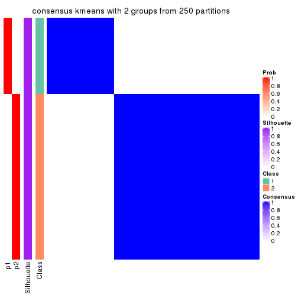</p>

</div>
<div id='tab-SD-kmeans-consensus-heatmap-2'>
<pre><code class="r">consensus_heatmap(res, k = 3)
</code></pre>

<p>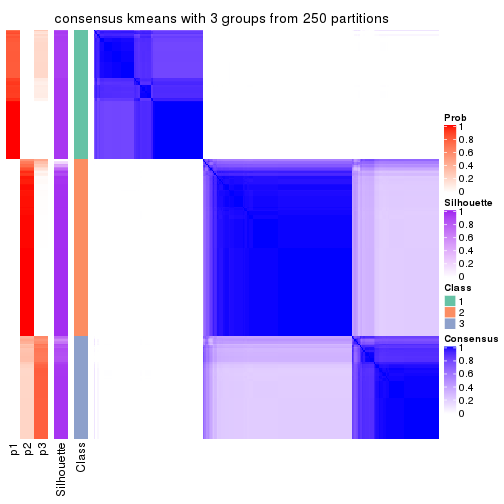</p>

</div>
<div id='tab-SD-kmeans-consensus-heatmap-3'>
<pre><code class="r">consensus_heatmap(res, k = 4)
</code></pre>

<p>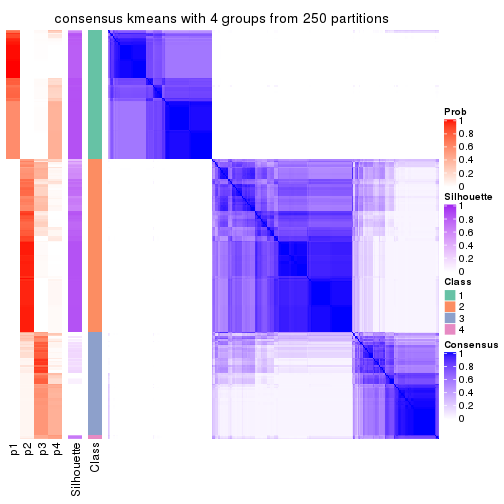</p>

</div>
<div id='tab-SD-kmeans-consensus-heatmap-4'>
<pre><code class="r">consensus_heatmap(res, k = 5)
</code></pre>

<p>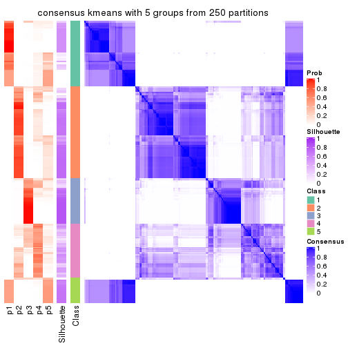</p>

</div>
<div id='tab-SD-kmeans-consensus-heatmap-5'>
<pre><code class="r">consensus_heatmap(res, k = 6)
</code></pre>

<p>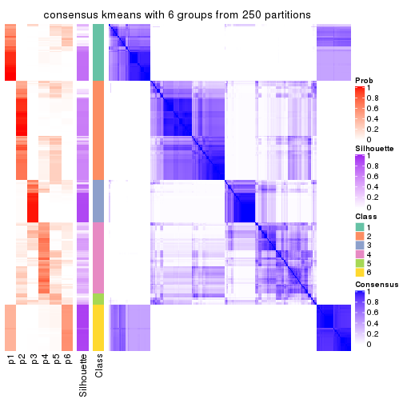</p>

</div>
</div>

Heatmaps for the membership of samples in all partitions to see how consistent they are:


<script>
$( function() {
	$( '#tabs-SD-kmeans-membership-heatmap' ).tabs();
} );
</script>
<div id='tabs-SD-kmeans-membership-heatmap'>
<ul>
<li><a href='#tab-SD-kmeans-membership-heatmap-1'>k = 2</a></li>
<li><a href='#tab-SD-kmeans-membership-heatmap-2'>k = 3</a></li>
<li><a href='#tab-SD-kmeans-membership-heatmap-3'>k = 4</a></li>
<li><a href='#tab-SD-kmeans-membership-heatmap-4'>k = 5</a></li>
<li><a href='#tab-SD-kmeans-membership-heatmap-5'>k = 6</a></li>
</ul>
<div id='tab-SD-kmeans-membership-heatmap-1'>
<pre><code class="r">membership_heatmap(res, k = 2)
</code></pre>

<p>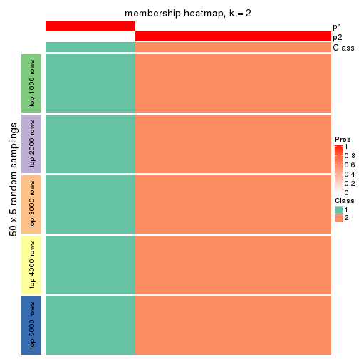</p>

</div>
<div id='tab-SD-kmeans-membership-heatmap-2'>
<pre><code class="r">membership_heatmap(res, k = 3)
</code></pre>

<p>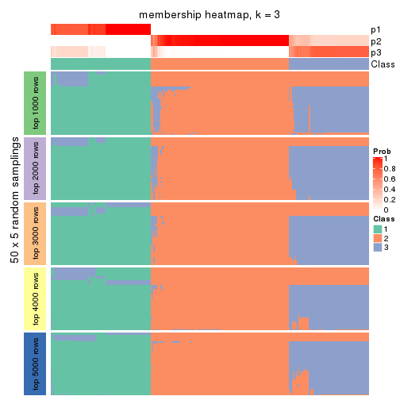</p>

</div>
<div id='tab-SD-kmeans-membership-heatmap-3'>
<pre><code class="r">membership_heatmap(res, k = 4)
</code></pre>

<p>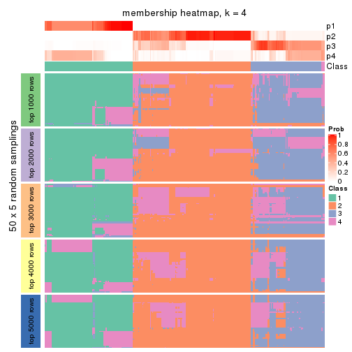</p>

</div>
<div id='tab-SD-kmeans-membership-heatmap-4'>
<pre><code class="r">membership_heatmap(res, k = 5)
</code></pre>

<p>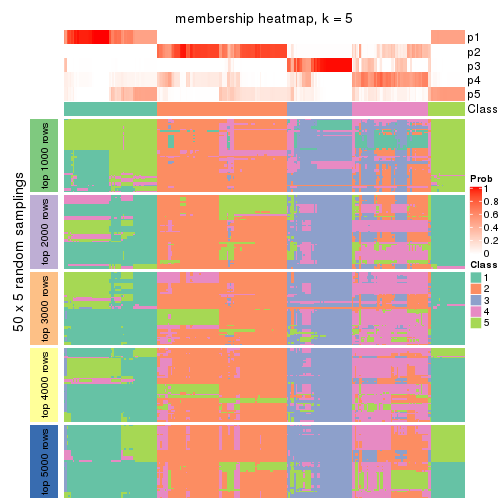</p>

</div>
<div id='tab-SD-kmeans-membership-heatmap-5'>
<pre><code class="r">membership_heatmap(res, k = 6)
</code></pre>

<p>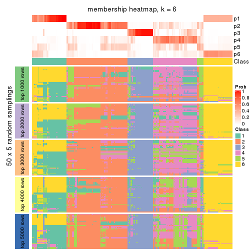</p>

</div>
</div>

As soon as we have had the classes for columns, we can look for signatures
which are significantly different between classes which can be candidate marks
for certain classes. Following are the heatmaps for signatures.


Signature heatmaps where rows are scaled:


<script>
$( function() {
	$( '#tabs-SD-kmeans-get-signatures' ).tabs();
} );
</script>
<div id='tabs-SD-kmeans-get-signatures'>
<ul>
<li><a href='#tab-SD-kmeans-get-signatures-1'>k = 2</a></li>
<li><a href='#tab-SD-kmeans-get-signatures-2'>k = 3</a></li>
<li><a href='#tab-SD-kmeans-get-signatures-3'>k = 4</a></li>
<li><a href='#tab-SD-kmeans-get-signatures-4'>k = 5</a></li>
<li><a href='#tab-SD-kmeans-get-signatures-5'>k = 6</a></li>
</ul>
<div id='tab-SD-kmeans-get-signatures-1'>
<pre><code class="r">get_signatures(res, k = 2)
</code></pre>

<p></p>

</div>
<div id='tab-SD-kmeans-get-signatures-2'>
<pre><code class="r">get_signatures(res, k = 3)
</code></pre>

<p>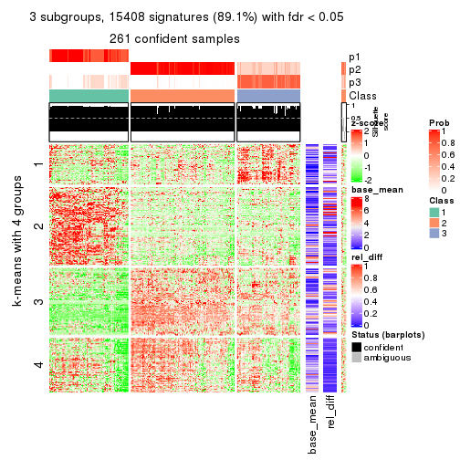</p>

</div>
<div id='tab-SD-kmeans-get-signatures-3'>
<pre><code class="r">get_signatures(res, k = 4)
</code></pre>

<p>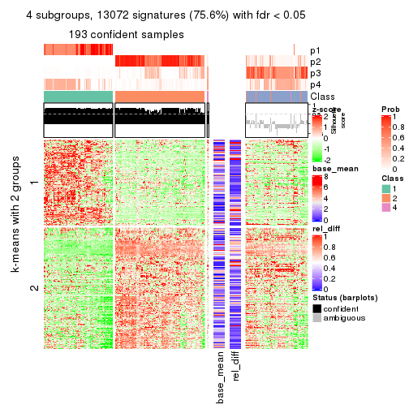</p>

</div>
<div id='tab-SD-kmeans-get-signatures-4'>
<pre><code class="r">get_signatures(res, k = 5)
</code></pre>

<p>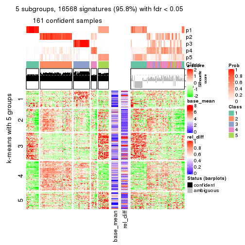</p>

</div>
<div id='tab-SD-kmeans-get-signatures-5'>
<pre><code class="r">get_signatures(res, k = 6)
</code></pre>

<p>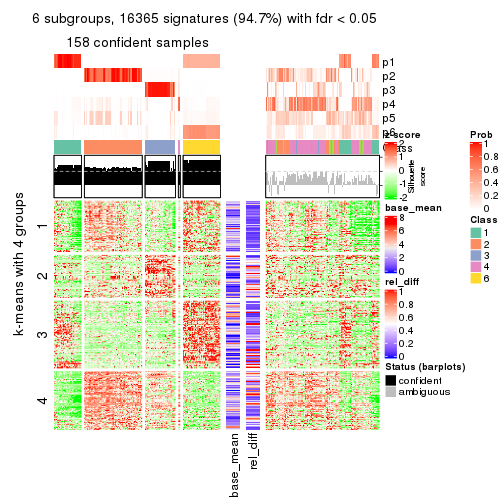</p>

</div>
</div>


Signature heatmaps where rows are not scaled:


<script>
$( function() {
	$( '#tabs-SD-kmeans-get-signatures-no-scale' ).tabs();
} );
</script>
<div id='tabs-SD-kmeans-get-signatures-no-scale'>
<ul>
<li><a href='#tab-SD-kmeans-get-signatures-no-scale-1'>k = 2</a></li>
<li><a href='#tab-SD-kmeans-get-signatures-no-scale-2'>k = 3</a></li>
<li><a href='#tab-SD-kmeans-get-signatures-no-scale-3'>k = 4</a></li>
<li><a href='#tab-SD-kmeans-get-signatures-no-scale-4'>k = 5</a></li>
<li><a href='#tab-SD-kmeans-get-signatures-no-scale-5'>k = 6</a></li>
</ul>
<div id='tab-SD-kmeans-get-signatures-no-scale-1'>
<pre><code class="r">get_signatures(res, k = 2, scale_rows = FALSE)
</code></pre>

<p>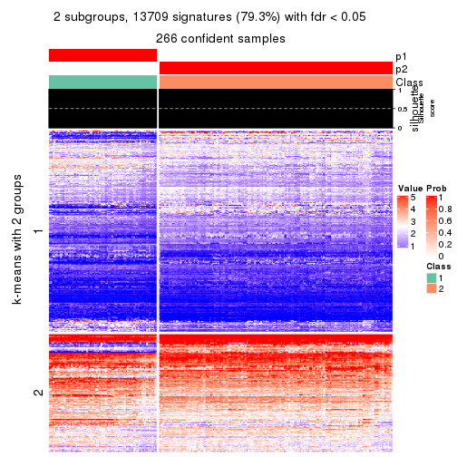</p>

</div>
<div id='tab-SD-kmeans-get-signatures-no-scale-2'>
<pre><code class="r">get_signatures(res, k = 3, scale_rows = FALSE)
</code></pre>

<p>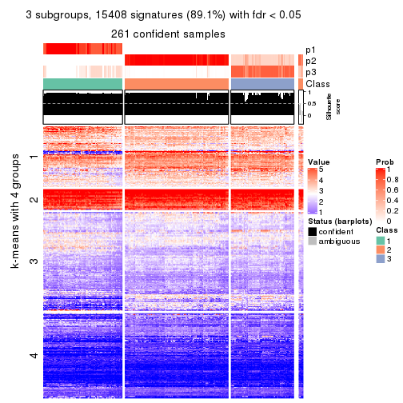</p>

</div>
<div id='tab-SD-kmeans-get-signatures-no-scale-3'>
<pre><code class="r">get_signatures(res, k = 4, scale_rows = FALSE)
</code></pre>

<p>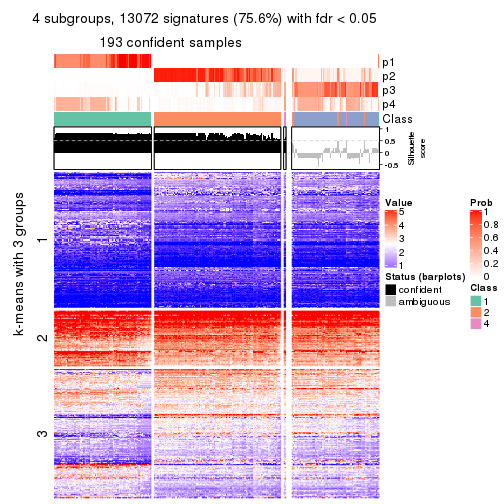</p>

</div>
<div id='tab-SD-kmeans-get-signatures-no-scale-4'>
<pre><code class="r">get_signatures(res, k = 5, scale_rows = FALSE)
</code></pre>

<p>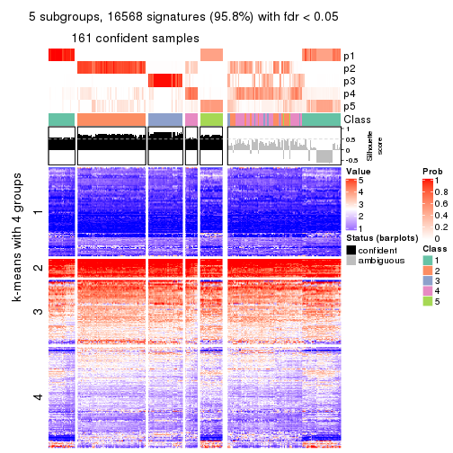</p>

</div>
<div id='tab-SD-kmeans-get-signatures-no-scale-5'>
<pre><code class="r">get_signatures(res, k = 6, scale_rows = FALSE)
</code></pre>

<p>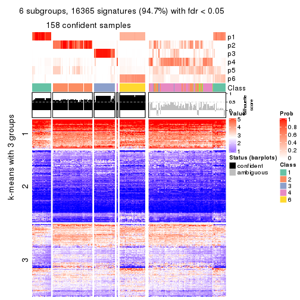</p>

</div>
</div>


Compare the overlap of signatures from different k:

```r
compare_signatures(res)
```

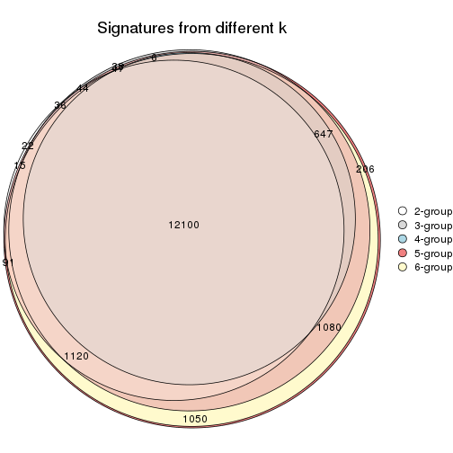

`get_signature()` returns a data frame invisibly. TO get the list of signatures, the function
call should be assigned to a variable explicitly. In following code, if `plot` argument is set
to `FALSE`, no heatmap is plotted while only the differential analysis is performed.

```r
# code only for demonstration
tb = get_signature(res, k = ..., plot = FALSE)
```

An example of the output of `tb` is:

```
#>   which_row         fdr    mean_1    mean_2 scaled_mean_1 scaled_mean_2 km
#> 1        38 0.042760348  8.373488  9.131774    -0.5533452     0.5164555  1
#> 2        40 0.018707592  7.106213  8.469186    -0.6173731     0.5762149  1
#> 3        55 0.019134737 10.221463 11.207825    -0.6159697     0.5749050  1
#> 4        59 0.006059896  5.921854  7.869574    -0.6899429     0.6439467  1
#> 5        60 0.018055526  8.928898 10.211722    -0.6204761     0.5791110  1
#> 6        98 0.009384629 15.714769 14.887706     0.6635654    -0.6193277  2
...
```

The columns in `tb` are:

1. `which_row`: row indices corresponding to the input matrix.
2. `fdr`: FDR for the differential test. 
3. `mean_x`: The mean value in group x.
4. `scaled_mean_x`: The mean value in group x after rows are scaled.
5. `km`: Row groups if k-means clustering is applied to rows.


UMAP plot which shows how samples are separated.


<script>
$( function() {
	$( '#tabs-SD-kmeans-dimension-reduction' ).tabs();
} );
</script>
<div id='tabs-SD-kmeans-dimension-reduction'>
<ul>
<li><a href='#tab-SD-kmeans-dimension-reduction-1'>k = 2</a></li>
<li><a href='#tab-SD-kmeans-dimension-reduction-2'>k = 3</a></li>
<li><a href='#tab-SD-kmeans-dimension-reduction-3'>k = 4</a></li>
<li><a href='#tab-SD-kmeans-dimension-reduction-4'>k = 5</a></li>
<li><a href='#tab-SD-kmeans-dimension-reduction-5'>k = 6</a></li>
</ul>
<div id='tab-SD-kmeans-dimension-reduction-1'>
<pre><code class="r">dimension_reduction(res, k = 2, method = &quot;UMAP&quot;)
</code></pre>

<p>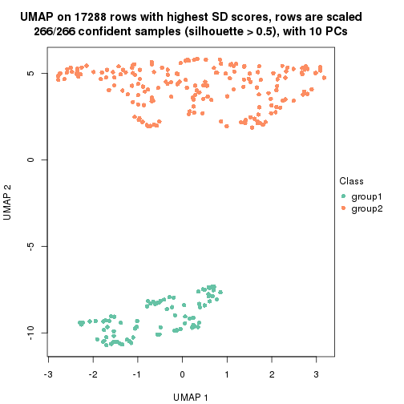</p>

</div>
<div id='tab-SD-kmeans-dimension-reduction-2'>
<pre><code class="r">dimension_reduction(res, k = 3, method = &quot;UMAP&quot;)
</code></pre>

<p>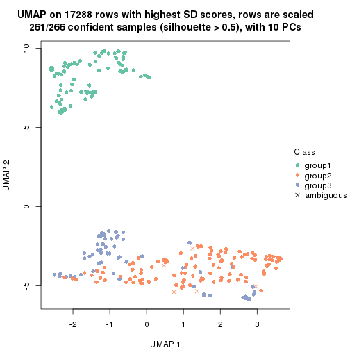</p>

</div>
<div id='tab-SD-kmeans-dimension-reduction-3'>
<pre><code class="r">dimension_reduction(res, k = 4, method = &quot;UMAP&quot;)
</code></pre>

<p>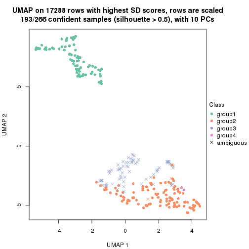</p>

</div>
<div id='tab-SD-kmeans-dimension-reduction-4'>
<pre><code class="r">dimension_reduction(res, k = 5, method = &quot;UMAP&quot;)
</code></pre>

<p>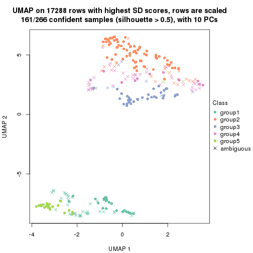</p>

</div>
<div id='tab-SD-kmeans-dimension-reduction-5'>
<pre><code class="r">dimension_reduction(res, k = 6, method = &quot;UMAP&quot;)
</code></pre>

<p>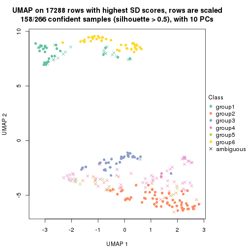</p>

</div>
</div>


Following heatmap shows how subgroups are split when increasing `k`:

```r
collect_classes(res)
```

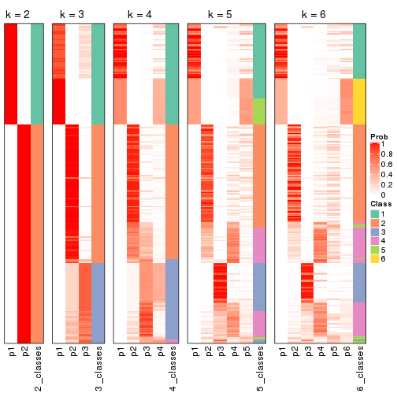


If matrix rows can be associated to genes, consider to use `GO_Enrichment(res,
...)` to perform function enrichment for the signature genes.


 

---------------------------------------------------


### SD:skmeans**


The object with results only for a single top-value method and a single partition method 
can be extracted as:

```r
res = res_list["SD", "skmeans"]
# you can also extract it by
# res = res_list["SD:skmeans"]
```

A summary of `res` and all the functions that can be applied to it:

```r
res
```

```
#> A 'ConsensusPartition' object with k = 2, 3, 4, 5, 6.
#>   On a matrix with 17288 rows and 266 columns.
#>   Top rows (1000, 2000, 3000, 4000, 5000) are extracted by 'SD' method.
#>   Subgroups are detected by 'skmeans' method.
#>   Performed in total 1250 partitions by row resampling.
#>   Best k for subgroups seems to be 3.
#> 
#> Following methods can be applied to this 'ConsensusPartition' object:
#>  [1] "cola_report"             "collect_classes"         "collect_plots"          
#>  [4] "collect_stats"           "colnames"                "compare_signatures"     
#>  [7] "consensus_heatmap"       "dimension_reduction"     "functional_enrichment"  
#> [10] "get_anno_col"            "get_anno"                "get_classes"            
#> [13] "get_consensus"           "get_matrix"              "get_membership"         
#> [16] "get_param"               "get_signatures"          "get_stats"              
#> [19] "is_best_k"               "is_stable_k"             "membership_heatmap"     
#> [22] "ncol"                    "nrow"                    "plot_ecdf"              
#> [25] "rownames"                "select_partition_number" "show"                   
#> [28] "suggest_best_k"          "test_to_known_factors"
```

`collect_plots()` function collects all the plots made from `res` for all `k` (number of partitions)
into one single page to provide an easy and fast comparison between different `k`.

```r
collect_plots(res)
```

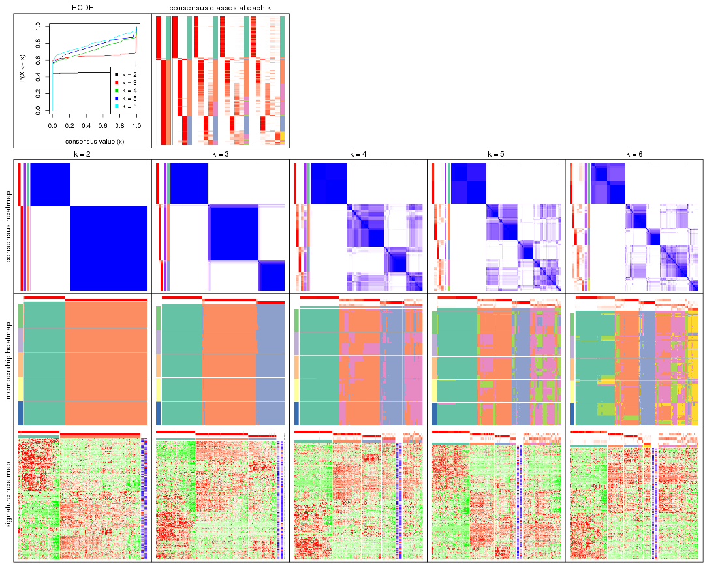

The plots are:

- The first row: a plot of the ECDF (Empirical cumulative distribution
  function) curves of the consensus matrix for each `k` and the heatmap of
  predicted classes for each `k`.
- The second row: heatmaps of the consensus matrix for each `k`.
- The third row: heatmaps of the membership matrix for each `k`.
- The fouth row: heatmaps of the signatures for each `k`.

All the plots in panels can be made by individual functions and they are
plotted later in this section.

`select_partition_number()` produces several plots showing different
statistics for choosing "optimized" `k`. There are following statistics:

- ECDF curves of the consensus matrix for each `k`;
- 1-PAC. [The PAC
  score](https://en.wikipedia.org/wiki/Consensus_clustering#Over-interpretation_potential_of_consensus_clustering)
  measures the proportion of the ambiguous subgrouping.
- Mean silhouette score.
- Concordance. The mean probability of fiting the consensus class ids in all
  partitions.
- Area increased. Denote $A_k$ as the area under the ECDF curve for current
  `k`, the area increased is defined as $A_k - A_{k-1}$.
- Rand index. The percent of pairs of samples that are both in a same cluster
  or both are not in a same cluster in the partition of k and k-1.
- Jaccard index. The ratio of pairs of samples are both in a same cluster in
  the partition of k and k-1 and the pairs of samples are both in a same
  cluster in the partition k or k-1.

The detailed explanations of these statistics can be found in [the cola
vignette](http://bioconductor.org/packages/devel/bioc/vignettes/cola/inst/doc/cola.html#toc_13).

Generally speaking, lower PAC score, higher mean silhouette score or higher
concordance corresponds to better partition. Rand index and Jaccard index
measure how similar the current partition is compared to partition with `k-1`.
If they are too similar, we won't accept `k` is better than `k-1`.

```r
select_partition_number(res)
```

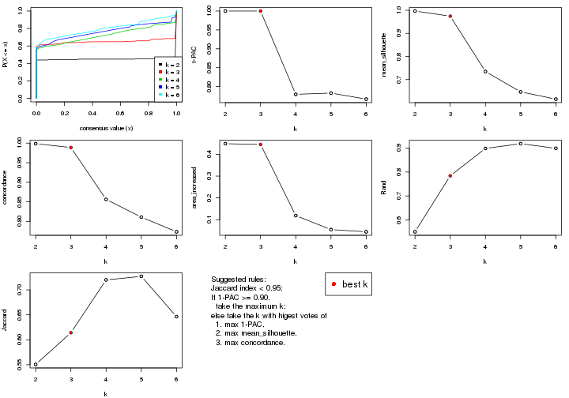

The numeric values for all these statistics can be obtained by `get_stats()`.

```r
get_stats(res)
```

```
#>   k 1-PAC mean_silhouette concordance area_increased  Rand Jaccard
#> 2 2 1.000           0.997       0.999         0.4490 0.551   0.551
#> 3 3 1.000           0.974       0.989         0.4456 0.784   0.614
#> 4 4 0.779           0.735       0.856         0.1184 0.898   0.720
#> 5 5 0.783           0.647       0.811         0.0543 0.918   0.727
#> 6 6 0.767           0.615       0.773         0.0442 0.899   0.646
```

`suggest_best_k()` suggests the best $k$ based on these statistics. The rules are as follows:

- All $k$ with Jaccard index larger than 0.95 are removed because the increase of
  the partition number does not provides enough extra information. If all $k$ are removed,
  the best $k$ is assigned by `NA`.
- For $k$ with 1-PAC larger than 0.9, the maximal $k$ is taken as the "best k". Other $k$ is called "optional k".
- If it does not fit the second rule. The $k$ with the highest vote of highest
  1-PAC, mean silhouette and concordance is taken as the "best k".

```r
suggest_best_k(res)
```

```
#> [1] 3
#> attr(,"optional")
#> [1] 2
```

There is also optional best $k$ = 2 that is worth to check.

Following shows the table of the partitions (You need to click the **show/hide
code output** link to see it). The membership matrix (columns with name `p*`)
is inferred by
[`clue::cl_consensus()`](https://www.rdocumentation.org/link/cl_consensus?package=clue)
function with the `SE` method. Basically the value in the membership matrix
represents the probability to belong to a certain group. The finall class
label for an item is determined with the group with highest probability it
belongs to.

In `get_classes()` function, the entropy is calculated from the membership
matrix and the silhouette score is calculated from the consensus matrix.


<script>
$( function() {
	$( '#tabs-SD-skmeans-get-classes' ).tabs();
} );
</script>
<div id='tabs-SD-skmeans-get-classes'>
<ul>
<li><a href='#tab-SD-skmeans-get-classes-1'>k = 2</a></li>
<li><a href='#tab-SD-skmeans-get-classes-2'>k = 3</a></li>
<li><a href='#tab-SD-skmeans-get-classes-3'>k = 4</a></li>
<li><a href='#tab-SD-skmeans-get-classes-4'>k = 5</a></li>
<li><a href='#tab-SD-skmeans-get-classes-5'>k = 6</a></li>
</ul>

<div id='tab-SD-skmeans-get-classes-1'>
<p><a id='tab-SD-skmeans-get-classes-1-a' style='color:#0366d6' href='#'>show/hide code output</a></p>
<pre><code class="r">cbind(get_classes(res, k = 2), get_membership(res, k = 2))
</code></pre>

<pre><code>#&gt;                                      class entropy silhouette    p1    p2
#&gt; 80D0AF10-1C61-4B67-90C1-7DBF1EF23672     2   0.000      1.000 0.000 1.000
#&gt; 87117BE1-D328-4972-85DA-6672412D8860     2   0.000      1.000 0.000 1.000
#&gt; F904C5B6-70BD-4604-8254-79BE23B152DA     1   0.000      0.996 1.000 0.000
#&gt; 3182DEA1-4239-4613-925A-7E6503766AD6     2   0.000      1.000 0.000 1.000
#&gt; 55E78EA2-2D9B-481F-8CAB-D36A33088EAE     2   0.000      1.000 0.000 1.000
#&gt; 86F94264-A6DD-4A97-9191-036F066DD0EF     2   0.000      1.000 0.000 1.000
#&gt; 09D25417-23B7-4D88-A0EA-F307985FBBBC     2   0.000      1.000 0.000 1.000
#&gt; C797F12C-40D3-4DB5-B9EF-A6821BBDE4F0     1   0.000      0.996 1.000 0.000
#&gt; 80275DB0-A226-4B6B-A08F-4ADBEEE1DB01     1   0.000      0.996 1.000 0.000
#&gt; 27FB653A-9E07-44AD-952E-9E4DE4AB5891     2   0.000      1.000 0.000 1.000
#&gt; 1A5DB9FC-2ABD-4E1B-B5EF-B1CF5E5F3872     1   0.000      0.996 1.000 0.000
#&gt; 844E4CCD-D30C-416F-A086-8923711A4E25     2   0.000      1.000 0.000 1.000
#&gt; EF18318D-3D25-4D65-803A-ED6E62871E7E     1   0.000      0.996 1.000 0.000
#&gt; 1ACB1BE0-61F6-4243-BBEC-E26A1CF90CA8     1   0.000      0.996 1.000 0.000
#&gt; 8EF0039B-D758-46AB-BAF7-6A062C7C56BA     1   0.000      0.996 1.000 0.000
#&gt; 22F4C9D9-663B-4C91-9692-E035A2640BEC     2   0.000      1.000 0.000 1.000
#&gt; FA1A0BCE-EE0F-4178-B963-62550E344B14     2   0.000      1.000 0.000 1.000
#&gt; 0B6D0C4E-5AE3-4707-A9FC-12A108E6EC2A     2   0.000      1.000 0.000 1.000
#&gt; 06FD3123-2AEB-4911-AC4E-E0E64FD5DB52     2   0.000      1.000 0.000 1.000
#&gt; 235A4492-FF80-4AA5-BC71-DFF65E1C7411     2   0.000      1.000 0.000 1.000
#&gt; A192C6C0-1443-4493-AFAC-1EE710628ADB     2   0.000      1.000 0.000 1.000
#&gt; 6FC5B56B-711B-4174-9B06-4E843124AAB6     1   0.000      0.996 1.000 0.000
#&gt; 7A813F60-A41E-4552-990E-F22287654C1D     2   0.000      1.000 0.000 1.000
#&gt; 725BBFB5-26F4-4512-9C75-47D013C1E605     1   0.000      0.996 1.000 0.000
#&gt; 39CC4E82-EBC9-472E-8BE5-6A3AB178449A     2   0.000      1.000 0.000 1.000
#&gt; 61130DEE-E267-49DF-8B41-7738A06EF738     2   0.000      1.000 0.000 1.000
#&gt; 117EC12C-B7ED-4E01-B29B-EA542D356EA1     1   0.000      0.996 1.000 0.000
#&gt; A30FF708-F7A9-41E4-8AD5-20441650FBC9     2   0.000      1.000 0.000 1.000
#&gt; 53640D52-1167-4A5D-B656-97D32CBA3934     1   0.000      0.996 1.000 0.000
#&gt; 9E85D76A-DD2A-46D5-BB59-0ED302B6258C     2   0.000      1.000 0.000 1.000
#&gt; 6F8C6F90-7E3C-4860-91DD-586708DE44AA     1   0.000      0.996 1.000 0.000
#&gt; E675AEC5-AA9A-4AAA-839C-03E6365822DB     2   0.000      1.000 0.000 1.000
#&gt; B577DEF7-2F5C-4876-A7C6-F18D5722B8C0     1   0.000      0.996 1.000 0.000
#&gt; DA8B577E-43E7-49BF-BF94-868E3194F5C9     1   0.000      0.996 1.000 0.000
#&gt; 3334280B-2A36-4AC7-A021-A76C10E958F0     2   0.000      1.000 0.000 1.000
#&gt; 5CBDDC90-11EC-4E6E-881E-AA9CCFD40FDB     2   0.000      1.000 0.000 1.000
#&gt; 8CBBF32A-8349-44F5-A8B8-4CBB1760A464     2   0.000      1.000 0.000 1.000
#&gt; B9455A9A-136D-4DC2-9F86-0FC74433589D     1   0.416      0.907 0.916 0.084
#&gt; D7EAE2A7-F9BE-4222-A452-B1F83F99CD50     2   0.000      1.000 0.000 1.000
#&gt; F803AE18-60C5-4CFE-AAAB-DB33C26A2184     1   0.000      0.996 1.000 0.000
#&gt; 5DD8CAC7-EC02-43B6-B58E-6D2E22868A3B     2   0.000      1.000 0.000 1.000
#&gt; EE98E1B4-DFB3-4AEC-8527-E1FD544C9475     1   0.000      0.996 1.000 0.000
#&gt; 3CE43921-47D5-4394-B9E1-242607775D61     2   0.000      1.000 0.000 1.000
#&gt; 46986F2B-0B0D-4187-8948-4E91D34B7C49     2   0.000      1.000 0.000 1.000
#&gt; 5D1D052E-74EF-45A8-9B1A-7CECD13EA43B     2   0.000      1.000 0.000 1.000
#&gt; 4C821AD9-A5C9-4A9A-9C5D-363B227F8064     2   0.000      1.000 0.000 1.000
#&gt; 06A4189E-A23B-4AC6-AA74-01955DD7D1E9     2   0.000      1.000 0.000 1.000
#&gt; FCCDC76F-CB02-4BCD-A616-325F258DDAA4     2   0.000      1.000 0.000 1.000
#&gt; DAC53B0A-8F35-4EA6-BBCC-4CD1C049E11F     2   0.000      1.000 0.000 1.000
#&gt; DD4F845B-CAD3-44CB-9D96-3C3F5BA1B72D     1   0.000      0.996 1.000 0.000
#&gt; D440F004-A4A4-41B6-BED8-805D67BA01C7     2   0.000      1.000 0.000 1.000
#&gt; A497C423-119F-42FA-BF17-9F6DFD2A5585     2   0.000      1.000 0.000 1.000
#&gt; 3420E573-DE12-4EF5-B1C0-2FCA904F4F4E     1   0.000      0.996 1.000 0.000
#&gt; 1AD72157-A254-44B4-BA58-4F30F1AE910E     1   0.000      0.996 1.000 0.000
#&gt; C1113977-B160-45EE-B061-750F9EA3F33F     2   0.000      1.000 0.000 1.000
#&gt; 6783AB5B-F07C-447B-BF13-C34485D246D7     2   0.000      1.000 0.000 1.000
#&gt; 1F553062-26FD-4A7F-B7FB-81184604F423     1   0.000      0.996 1.000 0.000
#&gt; BE2DCA51-1C21-4598-98A7-F2FB9B2DFCB4     2   0.000      1.000 0.000 1.000
#&gt; 38941CF3-9C54-4BA4-A005-CC88CA97D504     2   0.000      1.000 0.000 1.000
#&gt; 51CB675E-E243-4A07-BF4A-580473D26FDA     2   0.000      1.000 0.000 1.000
#&gt; C7FED0F5-C27A-4405-9232-30BF39362CF7     2   0.000      1.000 0.000 1.000
#&gt; 2A1E86E8-4713-465F-ACFF-C584864C57A1     2   0.000      1.000 0.000 1.000
#&gt; B4500785-0FAA-4D4D-8630-43D194BAB004     2   0.000      1.000 0.000 1.000
#&gt; 3FD52E66-AB76-4079-80DB-281A795D1EC0     2   0.000      1.000 0.000 1.000
#&gt; EBD355D1-1226-4DFD-AAFF-45D246B64F3C     2   0.000      1.000 0.000 1.000
#&gt; 5A040A73-CD95-487E-8AEF-9639FE4E2916     2   0.000      1.000 0.000 1.000
#&gt; CF629C65-585D-476D-B081-3E6E0575FAE3     1   0.000      0.996 1.000 0.000
#&gt; 0D4202A3-808E-413F-9BF3-9CFCCAE0ED61     2   0.000      1.000 0.000 1.000
#&gt; 43E715BF-28D9-4B5E-B762-8CD1B69A430E     1   0.000      0.996 1.000 0.000
#&gt; BFB82BE8-9DAC-4099-8B38-0950308E3EB3     2   0.000      1.000 0.000 1.000
#&gt; F7CB1825-2303-4DD2-AE1F-7205738EAF1F     1   0.000      0.996 1.000 0.000
#&gt; FE298483-C42C-4753-BABB-29A9CB1B6312     1   0.000      0.996 1.000 0.000
#&gt; A98C7561-1B42-4CD6-AE71-924B91FA4C33     2   0.000      1.000 0.000 1.000
#&gt; 58098F21-7DAB-47DA-9A41-8D20BF3B9257     2   0.000      1.000 0.000 1.000
#&gt; 18CAF708-20B9-4745-9CB3-37AB6E0B3056     2   0.000      1.000 0.000 1.000
#&gt; 2C80DD72-C9C7-4AC2-812F-9A31EF02779C     1   0.000      0.996 1.000 0.000
#&gt; 68A3F13D-319D-4603-A27F-B5DD46FE5C5B     2   0.000      1.000 0.000 1.000
#&gt; 7EE8F0CE-CDC9-40F9-A1DE-7F8140EC6D13     1   0.000      0.996 1.000 0.000
#&gt; 39019903-5B9C-4665-BD5F-7CCB19CB55C5     2   0.000      1.000 0.000 1.000
#&gt; 190EDB27-4CBC-4E9C-9B67-D51FDAB982B7     2   0.000      1.000 0.000 1.000
#&gt; EB2D95BC-62F8-4669-9308-D37D7FB79E23     2   0.000      1.000 0.000 1.000
#&gt; A08B85EA-D1E7-4B77-8DEC-36294305B9F7     1   0.000      0.996 1.000 0.000
#&gt; 130DDFAD-6EF8-4C80-BD9D-88308A6874BC     2   0.000      1.000 0.000 1.000
#&gt; 7340A5BA-E002-448F-AACC-E7A37DBB79C2     2   0.000      1.000 0.000 1.000
#&gt; A771F6E3-D266-4FE7-98C6-C40E6A701D59     1   0.000      0.996 1.000 0.000
#&gt; 015E792C-EC1B-49BF-AB07-D82B20C5989A     2   0.000      1.000 0.000 1.000
#&gt; BF79E030-47EE-4D08-B910-5685A4BD8B60     2   0.000      1.000 0.000 1.000
#&gt; FB3C7C9A-2F2D-4DD5-BE47-FAFB072C0FAB     2   0.000      1.000 0.000 1.000
#&gt; 4E5557BA-10E8-4723-908E-DD04EF6639B2     2   0.000      1.000 0.000 1.000
#&gt; 8031B550-40A9-4A3A-9F7D-CDC052288BD8     2   0.000      1.000 0.000 1.000
#&gt; 55299A06-3C1F-45A4-B166-B2C591C0CEE2     2   0.000      1.000 0.000 1.000
#&gt; EB8D5168-216E-4ABB-8B4E-9E67786CB322     1   0.000      0.996 1.000 0.000
#&gt; 78BD2D83-9A7F-42E5-BB38-654AA0761A0A     2   0.000      1.000 0.000 1.000
#&gt; AA2D53E5-D389-4332-9DD5-A736052E48F8     1   0.000      0.996 1.000 0.000
#&gt; 62945C7A-9313-4FC9-820C-B0AB820B394E     1   0.000      0.996 1.000 0.000
#&gt; 22746046-2E99-4EE9-97D2-BA2EA499634C     2   0.000      1.000 0.000 1.000
#&gt; 8671B51B-DCBE-4429-9F01-AF51CAD7014F     2   0.000      1.000 0.000 1.000
#&gt; E815AB36-5689-4A0D-8E6D-2EAA73406681     1   0.000      0.996 1.000 0.000
#&gt; A1DACB46-ED52-4E38-B2C8-57256BB22B5E     2   0.000      1.000 0.000 1.000
#&gt; 4F5498C4-A423-4B3D-AC98-D4E214A57D0E     1   0.000      0.996 1.000 0.000
#&gt; A7772CCD-FFFF-49DD-86ED-0BAD330EC9B6     2   0.000      1.000 0.000 1.000
#&gt; E6E3DF78-65B9-4F74-8DA8-E2A6D4EDBEA7     2   0.000      1.000 0.000 1.000
#&gt; 83286E2D-E708-437A-911A-E6B050273CBD     1   0.000      0.996 1.000 0.000
#&gt; EC5C7C97-EE8C-405D-A039-D96514B1D414     2   0.000      1.000 0.000 1.000
#&gt; 3E55223D-6E3D-4027-9819-67E91212531D     1   0.000      0.996 1.000 0.000
#&gt; 99A036A2-8343-4D06-8047-D84E96CE4C61     2   0.000      1.000 0.000 1.000
#&gt; CA6CDE6D-92DE-4259-9E58-A373F2D543EA     2   0.000      1.000 0.000 1.000
#&gt; BF6FA8CC-60C1-413A-B2C6-54CCACBC01D6     1   0.000      0.996 1.000 0.000
#&gt; E0594CFE-F7B6-4546-B130-30DF6A514B1F     2   0.000      1.000 0.000 1.000
#&gt; E769E41D-5949-42C5-9594-E563C05ACE52     2   0.000      1.000 0.000 1.000
#&gt; 01373725-5D3C-4D9C-AABC-911D53E62BCD     2   0.000      1.000 0.000 1.000
#&gt; 1F39DADD-3655-474E-BA4C-A5BD32C97A8B     1   0.000      0.996 1.000 0.000
#&gt; AF573EC8-E4EE-4B8F-8199-9817B9FAC67D     1   0.000      0.996 1.000 0.000
#&gt; 3F022CBC-41C8-4387-A6FB-124C4BCD1AD9     1   0.000      0.996 1.000 0.000
#&gt; 1CC32ACE-826B-494B-8B89-5BD92327A74D     2   0.000      1.000 0.000 1.000
#&gt; 22B0BD3B-EE08-4BC7-90B2-01C372A56BA2     2   0.000      1.000 0.000 1.000
#&gt; 0F3DE9EF-19CC-4D14-9A42-1435DB537F94     2   0.000      1.000 0.000 1.000
#&gt; 87F8A33F-FBC3-469E-862B-84472F796358     2   0.000      1.000 0.000 1.000
#&gt; C9F2FA0D-1A9F-40B4-BD9B-CAF1B3F3D5A7     2   0.000      1.000 0.000 1.000
#&gt; ACFC9F59-78FF-4453-B25F-8834D0EAB54A     2   0.000      1.000 0.000 1.000
#&gt; B7AC7D5B-14E9-45A7-93B7-226EE508544A     2   0.000      1.000 0.000 1.000
#&gt; 4491BF17-B168-4E96-8E09-EF1AEC9F5E9D     2   0.000      1.000 0.000 1.000
#&gt; 557A0811-A3FE-4CF4-A24D-FBB77E7F9139     2   0.000      1.000 0.000 1.000
#&gt; 6F9C955C-6816-4353-922A-8035B50FACC6     2   0.000      1.000 0.000 1.000
#&gt; 3E89FB1C-4A7D-43C7-823C-04E3716A7935     2   0.000      1.000 0.000 1.000
#&gt; 12ABE483-66EF-4237-94C4-0199FAE23FA8     2   0.000      1.000 0.000 1.000
#&gt; 7535F262-9B96-44F6-988C-4C9EBB3FFCA9     2   0.000      1.000 0.000 1.000
#&gt; 65C9D28E-303B-40E5-84F0-2507F5457374     2   0.000      1.000 0.000 1.000
#&gt; FD445384-6BA9-4297-9D9C-12ABA7D645C7     1   0.000      0.996 1.000 0.000
#&gt; 30D5E255-2AD3-44F3-8983-1B80E4FD3E2D     2   0.000      1.000 0.000 1.000
#&gt; 3E88EC60-B4A8-4259-8BC8-A234800F6955     2   0.000      1.000 0.000 1.000
#&gt; ACD73CE8-AFC5-47A0-9383-3CB97F018953     1   0.000      0.996 1.000 0.000
#&gt; 1AFDC2EA-26A8-44E2-8BCB-F34F7B66F8C8     2   0.000      1.000 0.000 1.000
#&gt; 9E327BC8-1D20-4AD8-83F7-FB2D13BCA5D0     2   0.000      1.000 0.000 1.000
#&gt; 85A86B91-4F24-4E77-AE2D-520F8E205EFC     1   0.000      0.996 1.000 0.000
#&gt; 74868C37-8143-4306-81CA-E45759D146CD     2   0.000      1.000 0.000 1.000
#&gt; 69AEA0DB-E335-48A0-A398-4FB0D581182A     2   0.000      1.000 0.000 1.000
#&gt; AE6F8B89-85C2-42B7-8D05-AFDDD4FEFD16     1   0.000      0.996 1.000 0.000
#&gt; A8A6F09C-9812-4457-9A4B-AD41F97B41A3     2   0.000      1.000 0.000 1.000
#&gt; 1A09BC4D-EF29-42DD-BB04-A3C264A3032D     1   0.000      0.996 1.000 0.000
#&gt; E0961A30-A62C-4235-9CF0-A1776827A996     2   0.000      1.000 0.000 1.000
#&gt; 134D2D90-7B08-4F20-8A3A-C77643FB208F     2   0.000      1.000 0.000 1.000
#&gt; A77C2DFF-93CF-4CB5-B3C1-81133D7F1A0F     1   0.876      0.581 0.704 0.296
#&gt; EA2DC457-9C74-4B9C-B3FA-5E72199B24A7     2   0.000      1.000 0.000 1.000
#&gt; FF34117B-5EE4-4C96-A8A2-2CE6A654CBE5     1   0.000      0.996 1.000 0.000
#&gt; 75F7B5E2-6559-4B48-A2A4-287C35C559CC     1   0.000      0.996 1.000 0.000
#&gt; 903BF591-B0AF-4BEE-B625-60B673070344     2   0.000      1.000 0.000 1.000
#&gt; 9DE1B790-C63C-41C4-9477-CE52A8119C67     2   0.000      1.000 0.000 1.000
#&gt; 9A28F80A-85F8-40E2-A32B-230EF93B2FA0     2   0.000      1.000 0.000 1.000
#&gt; 0AA2BDBB-8720-409A-AA72-1F4AA26E7CD8     2   0.000      1.000 0.000 1.000
#&gt; 5AD49F16-E974-4E5D-B1B6-073ECB73A01D     1   0.000      0.996 1.000 0.000
#&gt; CB0F961C-527D-4A48-9408-286B26BD9532     1   0.000      0.996 1.000 0.000
#&gt; 46FF25B6-D01D-4CA7-80B7-CEC2998C34E1     2   0.000      1.000 0.000 1.000
#&gt; 487CADE1-D699-4A6C-817A-B9A0AB940C61     1   0.000      0.996 1.000 0.000
#&gt; 4FF6F2D8-F869-4735-A4D1-1A8423153FBC     1   0.000      0.996 1.000 0.000
#&gt; 6005494F-5D3D-43A3-B3E8-8C91955B2A98     2   0.000      1.000 0.000 1.000
#&gt; CF10D584-CE32-45A4-A932-E9D5AF12A6A0     1   0.000      0.996 1.000 0.000
#&gt; E15CE4AB-5646-49C8-9CD6-938457036BB0     2   0.000      1.000 0.000 1.000
#&gt; 31E28D0B-0E69-4330-82ED-4F1827DC97EA     2   0.000      1.000 0.000 1.000
#&gt; DBACD3C3-CCB5-4478-BA78-85A0C847CA66     2   0.000      1.000 0.000 1.000
#&gt; 5A07041C-65EB-4FCD-8940-E90B905061B5     2   0.000      1.000 0.000 1.000
#&gt; 0EA7C916-FA47-489B-BC98-4D9E7D197628     1   0.000      0.996 1.000 0.000
#&gt; 30967F75-8499-47FF-ADA4-4DC566013F7B     1   0.000      0.996 1.000 0.000
#&gt; D2E528FF-AEA2-48D7-A60A-4C3E71EA9073     2   0.000      1.000 0.000 1.000
#&gt; 22735DCD-215E-48BC-BF44-32BD66F06E39     2   0.000      1.000 0.000 1.000
#&gt; BC2C3248-7FC6-48BC-96C1-45EA573DE7DC     1   0.000      0.996 1.000 0.000
#&gt; E72CEBCB-D686-4B12-BCBA-EC8F964330A2     1   0.000      0.996 1.000 0.000
#&gt; 23C937BB-BA20-4440-B680-914229CC3ADF     1   0.000      0.996 1.000 0.000
#&gt; 947E99C7-F402-4F1A-A6E9-81BCAAED135A     2   0.000      1.000 0.000 1.000
#&gt; 02475D11-FC81-4E88-944E-173C32DC3FE7     1   0.000      0.996 1.000 0.000
#&gt; F972A9AA-9842-4343-A533-A795E65581CE     1   0.000      0.996 1.000 0.000
#&gt; 05043AAF-3095-4C61-B5C1-EE9AA9082C75     2   0.000      1.000 0.000 1.000
#&gt; CECF7967-862E-428C-BB42-FEF553FDB3AA     2   0.000      1.000 0.000 1.000
#&gt; FB0B9483-6302-48C7-BE5B-DA667E00AE2D     2   0.000      1.000 0.000 1.000
#&gt; 78700FBA-1487-4754-9B30-18837BF7E9FB     1   0.000      0.996 1.000 0.000
#&gt; 2166F56D-54CE-4F1B-8F07-A4E13E4489E9     1   0.000      0.996 1.000 0.000
#&gt; 7CD0942E-E39A-43A7-8BAC-F25967864901     2   0.000      1.000 0.000 1.000
#&gt; 3B00BA2B-7F7D-4825-8F8D-90F04A5DE687     2   0.000      1.000 0.000 1.000
#&gt; 7465B01D-C05E-4FE0-A9FE-182920EDC489     2   0.000      1.000 0.000 1.000
#&gt; 88C31A99-F96E-4FC8-8B3D-C1AAA05062D9     1   0.000      0.996 1.000 0.000
#&gt; 53575575-3303-4F8F-B6A8-B42131CFB4AC     2   0.000      1.000 0.000 1.000
#&gt; CC8017C7-4128-48DA-8E43-503F63158D85     1   0.000      0.996 1.000 0.000
#&gt; 88449D2A-2A25-41A4-B91D-C99B58F8ECD9     2   0.000      1.000 0.000 1.000
#&gt; 46C7DDE5-A2B5-494F-96AE-0B6E2D51B003     1   0.000      0.996 1.000 0.000
#&gt; 42551D05-5EE5-4F91-93A8-32DA695D9DFA     2   0.000      1.000 0.000 1.000
#&gt; 0772DA48-3A36-422D-B166-CA1691B782C3     2   0.000      1.000 0.000 1.000
#&gt; 30346897-EC77-4153-88A2-D14593C8B741     2   0.000      1.000 0.000 1.000
#&gt; 0F00E267-C748-4A71-8B36-03C410641D88     2   0.000      1.000 0.000 1.000
#&gt; 4034703A-4DA9-4DDA-9CA9-E80FFE9CCDE6     2   0.000      1.000 0.000 1.000
#&gt; 393C8A41-CF45-4EA8-AFE3-25A08AB7692A     2   0.000      1.000 0.000 1.000
#&gt; 3354212D-A07C-435C-8B0C-9A7BAAB624B5     1   0.000      0.996 1.000 0.000
#&gt; 57E30D4E-ABF7-47DD-92BE-40CE215076B0     1   0.000      0.996 1.000 0.000
#&gt; 202B4C76-C840-4DB8-953F-AC75A4156FDD     2   0.000      1.000 0.000 1.000
#&gt; 93A0137B-1F4C-44EE-B959-2AD0CD2DF8B6     1   0.000      0.996 1.000 0.000
#&gt; C9794DB6-6E8C-4AFD-80EE-61D672A4F6E9     2   0.000      1.000 0.000 1.000
#&gt; AE4BFE63-F0C0-4624-AD97-4F7FF13E2384     1   0.000      0.996 1.000 0.000
#&gt; DCF87F27-2B54-42D9-8D28-5DFEE76E2F5B     2   0.000      1.000 0.000 1.000
#&gt; 2451D405-39FD-4812-958C-23462B66F1F1     2   0.000      1.000 0.000 1.000
#&gt; E27F5D33-3F68-4CA8-8757-A387C6EAD060     2   0.000      1.000 0.000 1.000
#&gt; 8BA9928A-5B93-477F-B4A2-D031B714D9AC     1   0.000      0.996 1.000 0.000
#&gt; 0FAACFF6-B50C-4BED-9824-B7270654F28D     2   0.000      1.000 0.000 1.000
#&gt; 3366CC3C-2BBA-4CA7-848E-4E16AA70AE7A     2   0.000      1.000 0.000 1.000
#&gt; 66237056-CA9A-4C90-AF0E-1621FEB71578     2   0.000      1.000 0.000 1.000
#&gt; C480F1FB-3100-436C-B0F5-DED63B7A580E     2   0.000      1.000 0.000 1.000
#&gt; A327DE0D-D945-4B42-9B41-A7302CF796EE     2   0.000      1.000 0.000 1.000
#&gt; E8A6871D-67FB-4306-9454-F5E7CDBA399A     2   0.000      1.000 0.000 1.000
#&gt; E9A7485B-82B6-4BD2-AFBB-DD0A82D6CDE2     1   0.000      0.996 1.000 0.000
#&gt; 93B382E4-9C9A-43F5-BD3B-502CC260B886     1   0.000      0.996 1.000 0.000
#&gt; A2792419-8E16-45FE-A524-17851F34AB9B     2   0.000      1.000 0.000 1.000
#&gt; 4DED1201-F25C-4F82-BABF-965EFAD7A8E5     2   0.000      1.000 0.000 1.000
#&gt; F1ACB2DD-E948-4F88-A249-F1BD1977D667     2   0.000      1.000 0.000 1.000
#&gt; 6CDBA203-8952-421D-A6BF-75652D9F3339     2   0.000      1.000 0.000 1.000
#&gt; 2D6C5AA7-3B33-48D7-AE0C-77A16B749D13     1   0.000      0.996 1.000 0.000
#&gt; 3F6B6D95-0720-42A0-AEB3-89FECAE7616A     2   0.000      1.000 0.000 1.000
#&gt; DED8ACF3-BBD8-46C9-85C9-A9C8F2E2BC0B     1   0.000      0.996 1.000 0.000
#&gt; 77069279-5A6F-42C0-9AA5-8C939591DFB5     1   0.000      0.996 1.000 0.000
#&gt; B2D4FCF3-FDF9-41C8-880A-6732CF6222AF     2   0.000      1.000 0.000 1.000
#&gt; 1CD71A4C-1E49-48EF-AA72-CB3C26B4C087     2   0.000      1.000 0.000 1.000
#&gt; C364E621-F85C-4B7F-842F-210B8D4DFE3A     2   0.000      1.000 0.000 1.000
#&gt; 11F1B8CA-07C1-47D2-A3C6-032FFA6A4A64     1   0.000      0.996 1.000 0.000
#&gt; 153BF804-6DC8-496B-987A-4021A2512211     2   0.000      1.000 0.000 1.000
#&gt; 5B5029C9-40F5-40D7-A36A-367022AD6A42     2   0.000      1.000 0.000 1.000
#&gt; 193CCBE6-104F-49B4-BDB2-C82EE36FDAAD     1   0.000      0.996 1.000 0.000
#&gt; E5D45E53-FCF3-4F01-9B78-6CB1ED0CFE40     2   0.000      1.000 0.000 1.000
#&gt; 5546A779-21DB-49F9-8C0D-A1E420088084     2   0.000      1.000 0.000 1.000
#&gt; E14825E0-0DC7-44C2-B265-F54672356838     1   0.000      0.996 1.000 0.000
#&gt; 8C8C09B9-EC83-45EC-BC4C-0BA92DE60ACB     1   0.000      0.996 1.000 0.000
#&gt; B388CA82-5BF7-4BDD-8821-4EC0B213121F     2   0.000      1.000 0.000 1.000
#&gt; A26025AC-9F71-4C07-9135-83593193BBB2     1   0.000      0.996 1.000 0.000
#&gt; C80E6D4B-AF21-42F0-8E20-6F7D2E99C062     2   0.000      1.000 0.000 1.000
#&gt; 5AE5D819-A6B1-4761-B7F9-8FFD3C520F31     2   0.000      1.000 0.000 1.000
#&gt; CAE8097F-A139-4C6E-9E30-35080475FF34     2   0.000      1.000 0.000 1.000
#&gt; 539C8DE3-6152-4671-B96F-ED6DC6DBD22B     1   0.000      0.996 1.000 0.000
#&gt; 5D28A8E0-4ECF-43A4-890A-BE968B9A8CB2     2   0.000      1.000 0.000 1.000
#&gt; 97A80AF8-365E-4756-A2B0-AEB1D8F5F33E     2   0.000      1.000 0.000 1.000
#&gt; B3527517-E339-46AE-8437-65303C309015     2   0.000      1.000 0.000 1.000
#&gt; 523E2183-AA20-4749-BD7E-69CD620DD6A3     2   0.000      1.000 0.000 1.000
#&gt; E553FB92-F181-47B3-9F3D-11DB51DFA3A4     2   0.000      1.000 0.000 1.000
#&gt; FFE0C4B1-8EEC-484A-AB87-3401B71BD081     2   0.000      1.000 0.000 1.000
#&gt; 73D6CA4B-9A9E-4E52-96C8-AE7F0CC8B276     2   0.000      1.000 0.000 1.000
#&gt; 485A8107-DF9A-4BC6-8A72-07FBA93F10F2     1   0.000      0.996 1.000 0.000
#&gt; 690823D9-B9AA-40EF-8302-4AD88BF89D1C     2   0.000      1.000 0.000 1.000
#&gt; B4E02660-562F-4EAC-8472-CBBD8A577688     2   0.000      1.000 0.000 1.000
#&gt; F82D5A60-90F9-4FF4-971E-73F7535FE65A     2   0.000      1.000 0.000 1.000
#&gt; C48401F7-2D56-4C6F-9896-C5435D1B44BF     2   0.000      1.000 0.000 1.000
#&gt; 94FC8991-182B-4B00-9A06-A00E8D3BDCFA     1   0.000      0.996 1.000 0.000
#&gt; FF00E80A-046D-4233-835E-CDF93403EA43     2   0.000      1.000 0.000 1.000
#&gt; C47A53F6-6479-4AD3-9D18-E4A70BE5F1DC     2   0.000      1.000 0.000 1.000
#&gt; 3487AE2D-AB1D-4DEF-AC4B-4B0FCAF8D899     2   0.000      1.000 0.000 1.000
#&gt; 479CD9BB-ECD7-41D5-B1E4-41132FF7FC95     2   0.000      1.000 0.000 1.000
#&gt; 048ADC6E-8C7E-4875-ACEE-E4787203C078     1   0.000      0.996 1.000 0.000
#&gt; 25AF81C5-B117-466D-AE9F-DD10BCB6AF2D     2   0.000      1.000 0.000 1.000
#&gt; 8B1D51D6-0B25-4289-81F0-9F95E0258877     2   0.000      1.000 0.000 1.000
#&gt; 282D390D-8E4E-4A19-B2B7-A6DB4BB2D46C     1   0.000      0.996 1.000 0.000
#&gt; BC6B92C1-F425-40C5-9941-539BFF5FE0FE     2   0.000      1.000 0.000 1.000
#&gt; 899CB9E0-48D0-413D-8566-BC151F146453     1   0.000      0.996 1.000 0.000
#&gt; 441400A9-1427-45E0-A8B4-EF2A6B7465C2     2   0.000      1.000 0.000 1.000
#&gt; CF96DDD4-DC0A-4341-BDE6-4DA2CB4978D0     1   0.000      0.996 1.000 0.000
#&gt; CE91F591-6072-4D29-9495-C78961635969     2   0.000      1.000 0.000 1.000
#&gt; 84D25635-2A38-4CFB-BFAC-38C007625C42     1   0.000      0.996 1.000 0.000
#&gt; ABF1AC12-872A-4C3D-A76C-07BC36A4DA5E     1   0.000      0.996 1.000 0.000
#&gt; B7F7F66F-1AED-4199-81C0-5C7FB0DBF438     2   0.000      1.000 0.000 1.000
#&gt; BAB786B9-6C20-425D-9886-63A0A092B59B     2   0.000      1.000 0.000 1.000
#&gt; 735D1DE3-D781-4F89-A395-09974057BBB7     1   0.000      0.996 1.000 0.000
#&gt; F6D5FBBA-05C4-4340-86D9-1A54181216A2     2   0.000      1.000 0.000 1.000
#&gt; 79C4E166-4A0D-4811-A2C8-CAE0A5AEED42     2   0.000      1.000 0.000 1.000
</code></pre>

<script>
$('#tab-SD-skmeans-get-classes-1-a').parent().next().next().hide();
$('#tab-SD-skmeans-get-classes-1-a').click(function(){
  $('#tab-SD-skmeans-get-classes-1-a').parent().next().next().toggle();
  return(false);
});
</script>
</div>

<div id='tab-SD-skmeans-get-classes-2'>
<p><a id='tab-SD-skmeans-get-classes-2-a' style='color:#0366d6' href='#'>show/hide code output</a></p>
<pre><code class="r">cbind(get_classes(res, k = 3), get_membership(res, k = 3))
</code></pre>

<pre><code>#&gt;                                      class entropy silhouette    p1    p2    p3
#&gt; 80D0AF10-1C61-4B67-90C1-7DBF1EF23672     2  0.0000      0.985 0.000 1.000 0.000
#&gt; 87117BE1-D328-4972-85DA-6672412D8860     2  0.0000      0.985 0.000 1.000 0.000
#&gt; F904C5B6-70BD-4604-8254-79BE23B152DA     1  0.0000      1.000 1.000 0.000 0.000
#&gt; 3182DEA1-4239-4613-925A-7E6503766AD6     2  0.0000      0.985 0.000 1.000 0.000
#&gt; 55E78EA2-2D9B-481F-8CAB-D36A33088EAE     3  0.0000      0.978 0.000 0.000 1.000
#&gt; 86F94264-A6DD-4A97-9191-036F066DD0EF     3  0.0000      0.978 0.000 0.000 1.000
#&gt; 09D25417-23B7-4D88-A0EA-F307985FBBBC     3  0.0000      0.978 0.000 0.000 1.000
#&gt; C797F12C-40D3-4DB5-B9EF-A6821BBDE4F0     1  0.0000      1.000 1.000 0.000 0.000
#&gt; 80275DB0-A226-4B6B-A08F-4ADBEEE1DB01     1  0.0000      1.000 1.000 0.000 0.000
#&gt; 27FB653A-9E07-44AD-952E-9E4DE4AB5891     3  0.0000      0.978 0.000 0.000 1.000
#&gt; 1A5DB9FC-2ABD-4E1B-B5EF-B1CF5E5F3872     1  0.0000      1.000 1.000 0.000 0.000
#&gt; 844E4CCD-D30C-416F-A086-8923711A4E25     3  0.0000      0.978 0.000 0.000 1.000
#&gt; EF18318D-3D25-4D65-803A-ED6E62871E7E     1  0.0000      1.000 1.000 0.000 0.000
#&gt; 1ACB1BE0-61F6-4243-BBEC-E26A1CF90CA8     1  0.0000      1.000 1.000 0.000 0.000
#&gt; 8EF0039B-D758-46AB-BAF7-6A062C7C56BA     1  0.0000      1.000 1.000 0.000 0.000
#&gt; 22F4C9D9-663B-4C91-9692-E035A2640BEC     2  0.0000      0.985 0.000 1.000 0.000
#&gt; FA1A0BCE-EE0F-4178-B963-62550E344B14     2  0.0000      0.985 0.000 1.000 0.000
#&gt; 0B6D0C4E-5AE3-4707-A9FC-12A108E6EC2A     3  0.0000      0.978 0.000 0.000 1.000
#&gt; 06FD3123-2AEB-4911-AC4E-E0E64FD5DB52     2  0.0000      0.985 0.000 1.000 0.000
#&gt; 235A4492-FF80-4AA5-BC71-DFF65E1C7411     2  0.0000      0.985 0.000 1.000 0.000
#&gt; A192C6C0-1443-4493-AFAC-1EE710628ADB     2  0.0000      0.985 0.000 1.000 0.000
#&gt; 6FC5B56B-711B-4174-9B06-4E843124AAB6     1  0.0000      1.000 1.000 0.000 0.000
#&gt; 7A813F60-A41E-4552-990E-F22287654C1D     2  0.0000      0.985 0.000 1.000 0.000
#&gt; 725BBFB5-26F4-4512-9C75-47D013C1E605     1  0.0000      1.000 1.000 0.000 0.000
#&gt; 39CC4E82-EBC9-472E-8BE5-6A3AB178449A     2  0.0000      0.985 0.000 1.000 0.000
#&gt; 61130DEE-E267-49DF-8B41-7738A06EF738     3  0.0000      0.978 0.000 0.000 1.000
#&gt; 117EC12C-B7ED-4E01-B29B-EA542D356EA1     1  0.0000      1.000 1.000 0.000 0.000
#&gt; A30FF708-F7A9-41E4-8AD5-20441650FBC9     2  0.0000      0.985 0.000 1.000 0.000
#&gt; 53640D52-1167-4A5D-B656-97D32CBA3934     1  0.0000      1.000 1.000 0.000 0.000
#&gt; 9E85D76A-DD2A-46D5-BB59-0ED302B6258C     2  0.0000      0.985 0.000 1.000 0.000
#&gt; 6F8C6F90-7E3C-4860-91DD-586708DE44AA     1  0.0000      1.000 1.000 0.000 0.000
#&gt; E675AEC5-AA9A-4AAA-839C-03E6365822DB     3  0.0000      0.978 0.000 0.000 1.000
#&gt; B577DEF7-2F5C-4876-A7C6-F18D5722B8C0     1  0.0000      1.000 1.000 0.000 0.000
#&gt; DA8B577E-43E7-49BF-BF94-868E3194F5C9     1  0.0000      1.000 1.000 0.000 0.000
#&gt; 3334280B-2A36-4AC7-A021-A76C10E958F0     2  0.0000      0.985 0.000 1.000 0.000
#&gt; 5CBDDC90-11EC-4E6E-881E-AA9CCFD40FDB     2  0.0000      0.985 0.000 1.000 0.000
#&gt; 8CBBF32A-8349-44F5-A8B8-4CBB1760A464     2  0.0000      0.985 0.000 1.000 0.000
#&gt; B9455A9A-136D-4DC2-9F86-0FC74433589D     3  0.0000      0.978 0.000 0.000 1.000
#&gt; D7EAE2A7-F9BE-4222-A452-B1F83F99CD50     2  0.0000      0.985 0.000 1.000 0.000
#&gt; F803AE18-60C5-4CFE-AAAB-DB33C26A2184     1  0.0000      1.000 1.000 0.000 0.000
#&gt; 5DD8CAC7-EC02-43B6-B58E-6D2E22868A3B     3  0.0000      0.978 0.000 0.000 1.000
#&gt; EE98E1B4-DFB3-4AEC-8527-E1FD544C9475     1  0.0000      1.000 1.000 0.000 0.000
#&gt; 3CE43921-47D5-4394-B9E1-242607775D61     2  0.0000      0.985 0.000 1.000 0.000
#&gt; 46986F2B-0B0D-4187-8948-4E91D34B7C49     2  0.0000      0.985 0.000 1.000 0.000
#&gt; 5D1D052E-74EF-45A8-9B1A-7CECD13EA43B     2  0.0000      0.985 0.000 1.000 0.000
#&gt; 4C821AD9-A5C9-4A9A-9C5D-363B227F8064     2  0.6045      0.382 0.000 0.620 0.380
#&gt; 06A4189E-A23B-4AC6-AA74-01955DD7D1E9     2  0.0000      0.985 0.000 1.000 0.000
#&gt; FCCDC76F-CB02-4BCD-A616-325F258DDAA4     2  0.0000      0.985 0.000 1.000 0.000
#&gt; DAC53B0A-8F35-4EA6-BBCC-4CD1C049E11F     2  0.0000      0.985 0.000 1.000 0.000
#&gt; DD4F845B-CAD3-44CB-9D96-3C3F5BA1B72D     1  0.0000      1.000 1.000 0.000 0.000
#&gt; D440F004-A4A4-41B6-BED8-805D67BA01C7     2  0.0000      0.985 0.000 1.000 0.000
#&gt; A497C423-119F-42FA-BF17-9F6DFD2A5585     2  0.0000      0.985 0.000 1.000 0.000
#&gt; 3420E573-DE12-4EF5-B1C0-2FCA904F4F4E     1  0.0000      1.000 1.000 0.000 0.000
#&gt; 1AD72157-A254-44B4-BA58-4F30F1AE910E     1  0.0000      1.000 1.000 0.000 0.000
#&gt; C1113977-B160-45EE-B061-750F9EA3F33F     3  0.3816      0.830 0.000 0.148 0.852
#&gt; 6783AB5B-F07C-447B-BF13-C34485D246D7     2  0.0000      0.985 0.000 1.000 0.000
#&gt; 1F553062-26FD-4A7F-B7FB-81184604F423     1  0.0000      1.000 1.000 0.000 0.000
#&gt; BE2DCA51-1C21-4598-98A7-F2FB9B2DFCB4     2  0.0000      0.985 0.000 1.000 0.000
#&gt; 38941CF3-9C54-4BA4-A005-CC88CA97D504     2  0.0000      0.985 0.000 1.000 0.000
#&gt; 51CB675E-E243-4A07-BF4A-580473D26FDA     2  0.0000      0.985 0.000 1.000 0.000
#&gt; C7FED0F5-C27A-4405-9232-30BF39362CF7     2  0.0000      0.985 0.000 1.000 0.000
#&gt; 2A1E86E8-4713-465F-ACFF-C584864C57A1     3  0.0000      0.978 0.000 0.000 1.000
#&gt; B4500785-0FAA-4D4D-8630-43D194BAB004     2  0.0000      0.985 0.000 1.000 0.000
#&gt; 3FD52E66-AB76-4079-80DB-281A795D1EC0     2  0.4452      0.762 0.000 0.808 0.192
#&gt; EBD355D1-1226-4DFD-AAFF-45D246B64F3C     2  0.0000      0.985 0.000 1.000 0.000
#&gt; 5A040A73-CD95-487E-8AEF-9639FE4E2916     2  0.0000      0.985 0.000 1.000 0.000
#&gt; CF629C65-585D-476D-B081-3E6E0575FAE3     1  0.0000      1.000 1.000 0.000 0.000
#&gt; 0D4202A3-808E-413F-9BF3-9CFCCAE0ED61     2  0.0000      0.985 0.000 1.000 0.000
#&gt; 43E715BF-28D9-4B5E-B762-8CD1B69A430E     1  0.0000      1.000 1.000 0.000 0.000
#&gt; BFB82BE8-9DAC-4099-8B38-0950308E3EB3     2  0.0000      0.985 0.000 1.000 0.000
#&gt; F7CB1825-2303-4DD2-AE1F-7205738EAF1F     1  0.0000      1.000 1.000 0.000 0.000
#&gt; FE298483-C42C-4753-BABB-29A9CB1B6312     1  0.0000      1.000 1.000 0.000 0.000
#&gt; A98C7561-1B42-4CD6-AE71-924B91FA4C33     3  0.0000      0.978 0.000 0.000 1.000
#&gt; 58098F21-7DAB-47DA-9A41-8D20BF3B9257     3  0.4346      0.778 0.000 0.184 0.816
#&gt; 18CAF708-20B9-4745-9CB3-37AB6E0B3056     2  0.0000      0.985 0.000 1.000 0.000
#&gt; 2C80DD72-C9C7-4AC2-812F-9A31EF02779C     1  0.0000      1.000 1.000 0.000 0.000
#&gt; 68A3F13D-319D-4603-A27F-B5DD46FE5C5B     2  0.0000      0.985 0.000 1.000 0.000
#&gt; 7EE8F0CE-CDC9-40F9-A1DE-7F8140EC6D13     3  0.0000      0.978 0.000 0.000 1.000
#&gt; 39019903-5B9C-4665-BD5F-7CCB19CB55C5     2  0.0000      0.985 0.000 1.000 0.000
#&gt; 190EDB27-4CBC-4E9C-9B67-D51FDAB982B7     3  0.0000      0.978 0.000 0.000 1.000
#&gt; EB2D95BC-62F8-4669-9308-D37D7FB79E23     2  0.0000      0.985 0.000 1.000 0.000
#&gt; A08B85EA-D1E7-4B77-8DEC-36294305B9F7     1  0.0000      1.000 1.000 0.000 0.000
#&gt; 130DDFAD-6EF8-4C80-BD9D-88308A6874BC     3  0.0000      0.978 0.000 0.000 1.000
#&gt; 7340A5BA-E002-448F-AACC-E7A37DBB79C2     2  0.0000      0.985 0.000 1.000 0.000
#&gt; A771F6E3-D266-4FE7-98C6-C40E6A701D59     1  0.0000      1.000 1.000 0.000 0.000
#&gt; 015E792C-EC1B-49BF-AB07-D82B20C5989A     2  0.0000      0.985 0.000 1.000 0.000
#&gt; BF79E030-47EE-4D08-B910-5685A4BD8B60     3  0.0000      0.978 0.000 0.000 1.000
#&gt; FB3C7C9A-2F2D-4DD5-BE47-FAFB072C0FAB     2  0.0237      0.981 0.000 0.996 0.004
#&gt; 4E5557BA-10E8-4723-908E-DD04EF6639B2     3  0.0000      0.978 0.000 0.000 1.000
#&gt; 8031B550-40A9-4A3A-9F7D-CDC052288BD8     3  0.0000      0.978 0.000 0.000 1.000
#&gt; 55299A06-3C1F-45A4-B166-B2C591C0CEE2     3  0.0000      0.978 0.000 0.000 1.000
#&gt; EB8D5168-216E-4ABB-8B4E-9E67786CB322     1  0.0000      1.000 1.000 0.000 0.000
#&gt; 78BD2D83-9A7F-42E5-BB38-654AA0761A0A     2  0.0000      0.985 0.000 1.000 0.000
#&gt; AA2D53E5-D389-4332-9DD5-A736052E48F8     1  0.0000      1.000 1.000 0.000 0.000
#&gt; 62945C7A-9313-4FC9-820C-B0AB820B394E     1  0.0000      1.000 1.000 0.000 0.000
#&gt; 22746046-2E99-4EE9-97D2-BA2EA499634C     3  0.0000      0.978 0.000 0.000 1.000
#&gt; 8671B51B-DCBE-4429-9F01-AF51CAD7014F     3  0.0000      0.978 0.000 0.000 1.000
#&gt; E815AB36-5689-4A0D-8E6D-2EAA73406681     1  0.0000      1.000 1.000 0.000 0.000
#&gt; A1DACB46-ED52-4E38-B2C8-57256BB22B5E     2  0.0000      0.985 0.000 1.000 0.000
#&gt; 4F5498C4-A423-4B3D-AC98-D4E214A57D0E     1  0.0000      1.000 1.000 0.000 0.000
#&gt; A7772CCD-FFFF-49DD-86ED-0BAD330EC9B6     3  0.0592      0.968 0.000 0.012 0.988
#&gt; E6E3DF78-65B9-4F74-8DA8-E2A6D4EDBEA7     3  0.0000      0.978 0.000 0.000 1.000
#&gt; 83286E2D-E708-437A-911A-E6B050273CBD     1  0.0000      1.000 1.000 0.000 0.000
#&gt; EC5C7C97-EE8C-405D-A039-D96514B1D414     2  0.0000      0.985 0.000 1.000 0.000
#&gt; 3E55223D-6E3D-4027-9819-67E91212531D     1  0.0000      1.000 1.000 0.000 0.000
#&gt; 99A036A2-8343-4D06-8047-D84E96CE4C61     3  0.0000      0.978 0.000 0.000 1.000
#&gt; CA6CDE6D-92DE-4259-9E58-A373F2D543EA     2  0.4178      0.790 0.000 0.828 0.172
#&gt; BF6FA8CC-60C1-413A-B2C6-54CCACBC01D6     1  0.0000      1.000 1.000 0.000 0.000
#&gt; E0594CFE-F7B6-4546-B130-30DF6A514B1F     3  0.0000      0.978 0.000 0.000 1.000
#&gt; E769E41D-5949-42C5-9594-E563C05ACE52     3  0.0000      0.978 0.000 0.000 1.000
#&gt; 01373725-5D3C-4D9C-AABC-911D53E62BCD     3  0.0000      0.978 0.000 0.000 1.000
#&gt; 1F39DADD-3655-474E-BA4C-A5BD32C97A8B     1  0.0000      1.000 1.000 0.000 0.000
#&gt; AF573EC8-E4EE-4B8F-8199-9817B9FAC67D     1  0.0000      1.000 1.000 0.000 0.000
#&gt; 3F022CBC-41C8-4387-A6FB-124C4BCD1AD9     1  0.0000      1.000 1.000 0.000 0.000
#&gt; 1CC32ACE-826B-494B-8B89-5BD92327A74D     3  0.2625      0.901 0.000 0.084 0.916
#&gt; 22B0BD3B-EE08-4BC7-90B2-01C372A56BA2     3  0.0000      0.978 0.000 0.000 1.000
#&gt; 0F3DE9EF-19CC-4D14-9A42-1435DB537F94     2  0.0000      0.985 0.000 1.000 0.000
#&gt; 87F8A33F-FBC3-469E-862B-84472F796358     2  0.5465      0.599 0.000 0.712 0.288
#&gt; C9F2FA0D-1A9F-40B4-BD9B-CAF1B3F3D5A7     2  0.0000      0.985 0.000 1.000 0.000
#&gt; ACFC9F59-78FF-4453-B25F-8834D0EAB54A     3  0.0000      0.978 0.000 0.000 1.000
#&gt; B7AC7D5B-14E9-45A7-93B7-226EE508544A     2  0.0000      0.985 0.000 1.000 0.000
#&gt; 4491BF17-B168-4E96-8E09-EF1AEC9F5E9D     3  0.0000      0.978 0.000 0.000 1.000
#&gt; 557A0811-A3FE-4CF4-A24D-FBB77E7F9139     3  0.0000      0.978 0.000 0.000 1.000
#&gt; 6F9C955C-6816-4353-922A-8035B50FACC6     2  0.0000      0.985 0.000 1.000 0.000
#&gt; 3E89FB1C-4A7D-43C7-823C-04E3716A7935     2  0.0000      0.985 0.000 1.000 0.000
#&gt; 12ABE483-66EF-4237-94C4-0199FAE23FA8     2  0.0000      0.985 0.000 1.000 0.000
#&gt; 7535F262-9B96-44F6-988C-4C9EBB3FFCA9     2  0.0000      0.985 0.000 1.000 0.000
#&gt; 65C9D28E-303B-40E5-84F0-2507F5457374     3  0.0000      0.978 0.000 0.000 1.000
#&gt; FD445384-6BA9-4297-9D9C-12ABA7D645C7     1  0.0000      1.000 1.000 0.000 0.000
#&gt; 30D5E255-2AD3-44F3-8983-1B80E4FD3E2D     3  0.3551      0.846 0.000 0.132 0.868
#&gt; 3E88EC60-B4A8-4259-8BC8-A234800F6955     3  0.0000      0.978 0.000 0.000 1.000
#&gt; ACD73CE8-AFC5-47A0-9383-3CB97F018953     1  0.0000      1.000 1.000 0.000 0.000
#&gt; 1AFDC2EA-26A8-44E2-8BCB-F34F7B66F8C8     2  0.0000      0.985 0.000 1.000 0.000
#&gt; 9E327BC8-1D20-4AD8-83F7-FB2D13BCA5D0     2  0.0000      0.985 0.000 1.000 0.000
#&gt; 85A86B91-4F24-4E77-AE2D-520F8E205EFC     1  0.0000      1.000 1.000 0.000 0.000
#&gt; 74868C37-8143-4306-81CA-E45759D146CD     2  0.0000      0.985 0.000 1.000 0.000
#&gt; 69AEA0DB-E335-48A0-A398-4FB0D581182A     2  0.0000      0.985 0.000 1.000 0.000
#&gt; AE6F8B89-85C2-42B7-8D05-AFDDD4FEFD16     1  0.0000      1.000 1.000 0.000 0.000
#&gt; A8A6F09C-9812-4457-9A4B-AD41F97B41A3     2  0.0000      0.985 0.000 1.000 0.000
#&gt; 1A09BC4D-EF29-42DD-BB04-A3C264A3032D     1  0.0000      1.000 1.000 0.000 0.000
#&gt; E0961A30-A62C-4235-9CF0-A1776827A996     3  0.5650      0.559 0.000 0.312 0.688
#&gt; 134D2D90-7B08-4F20-8A3A-C77643FB208F     2  0.0000      0.985 0.000 1.000 0.000
#&gt; A77C2DFF-93CF-4CB5-B3C1-81133D7F1A0F     2  0.5603      0.776 0.136 0.804 0.060
#&gt; EA2DC457-9C74-4B9C-B3FA-5E72199B24A7     2  0.0000      0.985 0.000 1.000 0.000
#&gt; FF34117B-5EE4-4C96-A8A2-2CE6A654CBE5     1  0.0000      1.000 1.000 0.000 0.000
#&gt; 75F7B5E2-6559-4B48-A2A4-287C35C559CC     1  0.0000      1.000 1.000 0.000 0.000
#&gt; 903BF591-B0AF-4BEE-B625-60B673070344     2  0.0000      0.985 0.000 1.000 0.000
#&gt; 9DE1B790-C63C-41C4-9477-CE52A8119C67     2  0.0000      0.985 0.000 1.000 0.000
#&gt; 9A28F80A-85F8-40E2-A32B-230EF93B2FA0     3  0.0000      0.978 0.000 0.000 1.000
#&gt; 0AA2BDBB-8720-409A-AA72-1F4AA26E7CD8     2  0.0000      0.985 0.000 1.000 0.000
#&gt; 5AD49F16-E974-4E5D-B1B6-073ECB73A01D     3  0.0000      0.978 0.000 0.000 1.000
#&gt; CB0F961C-527D-4A48-9408-286B26BD9532     1  0.0000      1.000 1.000 0.000 0.000
#&gt; 46FF25B6-D01D-4CA7-80B7-CEC2998C34E1     2  0.0000      0.985 0.000 1.000 0.000
#&gt; 487CADE1-D699-4A6C-817A-B9A0AB940C61     1  0.0000      1.000 1.000 0.000 0.000
#&gt; 4FF6F2D8-F869-4735-A4D1-1A8423153FBC     1  0.0000      1.000 1.000 0.000 0.000
#&gt; 6005494F-5D3D-43A3-B3E8-8C91955B2A98     2  0.0000      0.985 0.000 1.000 0.000
#&gt; CF10D584-CE32-45A4-A932-E9D5AF12A6A0     1  0.0000      1.000 1.000 0.000 0.000
#&gt; E15CE4AB-5646-49C8-9CD6-938457036BB0     3  0.0000      0.978 0.000 0.000 1.000
#&gt; 31E28D0B-0E69-4330-82ED-4F1827DC97EA     2  0.0000      0.985 0.000 1.000 0.000
#&gt; DBACD3C3-CCB5-4478-BA78-85A0C847CA66     2  0.0000      0.985 0.000 1.000 0.000
#&gt; 5A07041C-65EB-4FCD-8940-E90B905061B5     2  0.0000      0.985 0.000 1.000 0.000
#&gt; 0EA7C916-FA47-489B-BC98-4D9E7D197628     1  0.0000      1.000 1.000 0.000 0.000
#&gt; 30967F75-8499-47FF-ADA4-4DC566013F7B     1  0.0000      1.000 1.000 0.000 0.000
#&gt; D2E528FF-AEA2-48D7-A60A-4C3E71EA9073     3  0.0000      0.978 0.000 0.000 1.000
#&gt; 22735DCD-215E-48BC-BF44-32BD66F06E39     3  0.0000      0.978 0.000 0.000 1.000
#&gt; BC2C3248-7FC6-48BC-96C1-45EA573DE7DC     1  0.0000      1.000 1.000 0.000 0.000
#&gt; E72CEBCB-D686-4B12-BCBA-EC8F964330A2     1  0.0000      1.000 1.000 0.000 0.000
#&gt; 23C937BB-BA20-4440-B680-914229CC3ADF     1  0.0000      1.000 1.000 0.000 0.000
#&gt; 947E99C7-F402-4F1A-A6E9-81BCAAED135A     2  0.0000      0.985 0.000 1.000 0.000
#&gt; 02475D11-FC81-4E88-944E-173C32DC3FE7     1  0.0747      0.981 0.984 0.016 0.000
#&gt; F972A9AA-9842-4343-A533-A795E65581CE     1  0.0000      1.000 1.000 0.000 0.000
#&gt; 05043AAF-3095-4C61-B5C1-EE9AA9082C75     2  0.0000      0.985 0.000 1.000 0.000
#&gt; CECF7967-862E-428C-BB42-FEF553FDB3AA     2  0.0000      0.985 0.000 1.000 0.000
#&gt; FB0B9483-6302-48C7-BE5B-DA667E00AE2D     3  0.0000      0.978 0.000 0.000 1.000
#&gt; 78700FBA-1487-4754-9B30-18837BF7E9FB     1  0.0000      1.000 1.000 0.000 0.000
#&gt; 2166F56D-54CE-4F1B-8F07-A4E13E4489E9     1  0.0000      1.000 1.000 0.000 0.000
#&gt; 7CD0942E-E39A-43A7-8BAC-F25967864901     2  0.0000      0.985 0.000 1.000 0.000
#&gt; 3B00BA2B-7F7D-4825-8F8D-90F04A5DE687     2  0.0000      0.985 0.000 1.000 0.000
#&gt; 7465B01D-C05E-4FE0-A9FE-182920EDC489     3  0.0000      0.978 0.000 0.000 1.000
#&gt; 88C31A99-F96E-4FC8-8B3D-C1AAA05062D9     1  0.0000      1.000 1.000 0.000 0.000
#&gt; 53575575-3303-4F8F-B6A8-B42131CFB4AC     3  0.0000      0.978 0.000 0.000 1.000
#&gt; CC8017C7-4128-48DA-8E43-503F63158D85     1  0.0000      1.000 1.000 0.000 0.000
#&gt; 88449D2A-2A25-41A4-B91D-C99B58F8ECD9     2  0.0000      0.985 0.000 1.000 0.000
#&gt; 46C7DDE5-A2B5-494F-96AE-0B6E2D51B003     1  0.0000      1.000 1.000 0.000 0.000
#&gt; 42551D05-5EE5-4F91-93A8-32DA695D9DFA     3  0.0000      0.978 0.000 0.000 1.000
#&gt; 0772DA48-3A36-422D-B166-CA1691B782C3     2  0.0000      0.985 0.000 1.000 0.000
#&gt; 30346897-EC77-4153-88A2-D14593C8B741     3  0.0000      0.978 0.000 0.000 1.000
#&gt; 0F00E267-C748-4A71-8B36-03C410641D88     3  0.0000      0.978 0.000 0.000 1.000
#&gt; 4034703A-4DA9-4DDA-9CA9-E80FFE9CCDE6     2  0.0000      0.985 0.000 1.000 0.000
#&gt; 393C8A41-CF45-4EA8-AFE3-25A08AB7692A     2  0.0000      0.985 0.000 1.000 0.000
#&gt; 3354212D-A07C-435C-8B0C-9A7BAAB624B5     1  0.0000      1.000 1.000 0.000 0.000
#&gt; 57E30D4E-ABF7-47DD-92BE-40CE215076B0     1  0.0000      1.000 1.000 0.000 0.000
#&gt; 202B4C76-C840-4DB8-953F-AC75A4156FDD     2  0.0000      0.985 0.000 1.000 0.000
#&gt; 93A0137B-1F4C-44EE-B959-2AD0CD2DF8B6     1  0.0000      1.000 1.000 0.000 0.000
#&gt; C9794DB6-6E8C-4AFD-80EE-61D672A4F6E9     2  0.0000      0.985 0.000 1.000 0.000
#&gt; AE4BFE63-F0C0-4624-AD97-4F7FF13E2384     1  0.0000      1.000 1.000 0.000 0.000
#&gt; DCF87F27-2B54-42D9-8D28-5DFEE76E2F5B     2  0.0000      0.985 0.000 1.000 0.000
#&gt; 2451D405-39FD-4812-958C-23462B66F1F1     3  0.0000      0.978 0.000 0.000 1.000
#&gt; E27F5D33-3F68-4CA8-8757-A387C6EAD060     3  0.0000      0.978 0.000 0.000 1.000
#&gt; 8BA9928A-5B93-477F-B4A2-D031B714D9AC     1  0.0000      1.000 1.000 0.000 0.000
#&gt; 0FAACFF6-B50C-4BED-9824-B7270654F28D     2  0.4346      0.775 0.000 0.816 0.184
#&gt; 3366CC3C-2BBA-4CA7-848E-4E16AA70AE7A     2  0.0000      0.985 0.000 1.000 0.000
#&gt; 66237056-CA9A-4C90-AF0E-1621FEB71578     2  0.0000      0.985 0.000 1.000 0.000
#&gt; C480F1FB-3100-436C-B0F5-DED63B7A580E     2  0.0000      0.985 0.000 1.000 0.000
#&gt; A327DE0D-D945-4B42-9B41-A7302CF796EE     3  0.0000      0.978 0.000 0.000 1.000
#&gt; E8A6871D-67FB-4306-9454-F5E7CDBA399A     3  0.0592      0.968 0.000 0.012 0.988
#&gt; E9A7485B-82B6-4BD2-AFBB-DD0A82D6CDE2     1  0.0000      1.000 1.000 0.000 0.000
#&gt; 93B382E4-9C9A-43F5-BD3B-502CC260B886     1  0.0000      1.000 1.000 0.000 0.000
#&gt; A2792419-8E16-45FE-A524-17851F34AB9B     2  0.2796      0.891 0.000 0.908 0.092
#&gt; 4DED1201-F25C-4F82-BABF-965EFAD7A8E5     2  0.0000      0.985 0.000 1.000 0.000
#&gt; F1ACB2DD-E948-4F88-A249-F1BD1977D667     3  0.0000      0.978 0.000 0.000 1.000
#&gt; 6CDBA203-8952-421D-A6BF-75652D9F3339     2  0.4399      0.768 0.000 0.812 0.188
#&gt; 2D6C5AA7-3B33-48D7-AE0C-77A16B749D13     1  0.0000      1.000 1.000 0.000 0.000
#&gt; 3F6B6D95-0720-42A0-AEB3-89FECAE7616A     2  0.0000      0.985 0.000 1.000 0.000
#&gt; DED8ACF3-BBD8-46C9-85C9-A9C8F2E2BC0B     1  0.0000      1.000 1.000 0.000 0.000
#&gt; 77069279-5A6F-42C0-9AA5-8C939591DFB5     1  0.0000      1.000 1.000 0.000 0.000
#&gt; B2D4FCF3-FDF9-41C8-880A-6732CF6222AF     2  0.0000      0.985 0.000 1.000 0.000
#&gt; 1CD71A4C-1E49-48EF-AA72-CB3C26B4C087     2  0.0000      0.985 0.000 1.000 0.000
#&gt; C364E621-F85C-4B7F-842F-210B8D4DFE3A     2  0.0000      0.985 0.000 1.000 0.000
#&gt; 11F1B8CA-07C1-47D2-A3C6-032FFA6A4A64     1  0.0000      1.000 1.000 0.000 0.000
#&gt; 153BF804-6DC8-496B-987A-4021A2512211     3  0.0000      0.978 0.000 0.000 1.000
#&gt; 5B5029C9-40F5-40D7-A36A-367022AD6A42     3  0.5859      0.493 0.000 0.344 0.656
#&gt; 193CCBE6-104F-49B4-BDB2-C82EE36FDAAD     1  0.0000      1.000 1.000 0.000 0.000
#&gt; E5D45E53-FCF3-4F01-9B78-6CB1ED0CFE40     2  0.0000      0.985 0.000 1.000 0.000
#&gt; 5546A779-21DB-49F9-8C0D-A1E420088084     2  0.0000      0.985 0.000 1.000 0.000
#&gt; E14825E0-0DC7-44C2-B265-F54672356838     1  0.0000      1.000 1.000 0.000 0.000
#&gt; 8C8C09B9-EC83-45EC-BC4C-0BA92DE60ACB     1  0.0000      1.000 1.000 0.000 0.000
#&gt; B388CA82-5BF7-4BDD-8821-4EC0B213121F     3  0.0000      0.978 0.000 0.000 1.000
#&gt; A26025AC-9F71-4C07-9135-83593193BBB2     1  0.0000      1.000 1.000 0.000 0.000
#&gt; C80E6D4B-AF21-42F0-8E20-6F7D2E99C062     2  0.0000      0.985 0.000 1.000 0.000
#&gt; 5AE5D819-A6B1-4761-B7F9-8FFD3C520F31     3  0.0000      0.978 0.000 0.000 1.000
#&gt; CAE8097F-A139-4C6E-9E30-35080475FF34     2  0.0000      0.985 0.000 1.000 0.000
#&gt; 539C8DE3-6152-4671-B96F-ED6DC6DBD22B     1  0.0000      1.000 1.000 0.000 0.000
#&gt; 5D28A8E0-4ECF-43A4-890A-BE968B9A8CB2     2  0.0000      0.985 0.000 1.000 0.000
#&gt; 97A80AF8-365E-4756-A2B0-AEB1D8F5F33E     2  0.0000      0.985 0.000 1.000 0.000
#&gt; B3527517-E339-46AE-8437-65303C309015     3  0.0000      0.978 0.000 0.000 1.000
#&gt; 523E2183-AA20-4749-BD7E-69CD620DD6A3     2  0.0000      0.985 0.000 1.000 0.000
#&gt; E553FB92-F181-47B3-9F3D-11DB51DFA3A4     2  0.0000      0.985 0.000 1.000 0.000
#&gt; FFE0C4B1-8EEC-484A-AB87-3401B71BD081     3  0.1163      0.954 0.000 0.028 0.972
#&gt; 73D6CA4B-9A9E-4E52-96C8-AE7F0CC8B276     2  0.0000      0.985 0.000 1.000 0.000
#&gt; 485A8107-DF9A-4BC6-8A72-07FBA93F10F2     1  0.0000      1.000 1.000 0.000 0.000
#&gt; 690823D9-B9AA-40EF-8302-4AD88BF89D1C     2  0.0000      0.985 0.000 1.000 0.000
#&gt; B4E02660-562F-4EAC-8472-CBBD8A577688     2  0.0000      0.985 0.000 1.000 0.000
#&gt; F82D5A60-90F9-4FF4-971E-73F7535FE65A     3  0.0000      0.978 0.000 0.000 1.000
#&gt; C48401F7-2D56-4C6F-9896-C5435D1B44BF     3  0.0000      0.978 0.000 0.000 1.000
#&gt; 94FC8991-182B-4B00-9A06-A00E8D3BDCFA     1  0.0000      1.000 1.000 0.000 0.000
#&gt; FF00E80A-046D-4233-835E-CDF93403EA43     3  0.0000      0.978 0.000 0.000 1.000
#&gt; C47A53F6-6479-4AD3-9D18-E4A70BE5F1DC     2  0.0000      0.985 0.000 1.000 0.000
#&gt; 3487AE2D-AB1D-4DEF-AC4B-4B0FCAF8D899     2  0.0000      0.985 0.000 1.000 0.000
#&gt; 479CD9BB-ECD7-41D5-B1E4-41132FF7FC95     2  0.0000      0.985 0.000 1.000 0.000
#&gt; 048ADC6E-8C7E-4875-ACEE-E4787203C078     1  0.0000      1.000 1.000 0.000 0.000
#&gt; 25AF81C5-B117-466D-AE9F-DD10BCB6AF2D     2  0.0000      0.985 0.000 1.000 0.000
#&gt; 8B1D51D6-0B25-4289-81F0-9F95E0258877     2  0.0000      0.985 0.000 1.000 0.000
#&gt; 282D390D-8E4E-4A19-B2B7-A6DB4BB2D46C     1  0.0000      1.000 1.000 0.000 0.000
#&gt; BC6B92C1-F425-40C5-9941-539BFF5FE0FE     2  0.0000      0.985 0.000 1.000 0.000
#&gt; 899CB9E0-48D0-413D-8566-BC151F146453     1  0.0000      1.000 1.000 0.000 0.000
#&gt; 441400A9-1427-45E0-A8B4-EF2A6B7465C2     2  0.0000      0.985 0.000 1.000 0.000
#&gt; CF96DDD4-DC0A-4341-BDE6-4DA2CB4978D0     1  0.0000      1.000 1.000 0.000 0.000
#&gt; CE91F591-6072-4D29-9495-C78961635969     2  0.0000      0.985 0.000 1.000 0.000
#&gt; 84D25635-2A38-4CFB-BFAC-38C007625C42     1  0.0000      1.000 1.000 0.000 0.000
#&gt; ABF1AC12-872A-4C3D-A76C-07BC36A4DA5E     1  0.0000      1.000 1.000 0.000 0.000
#&gt; B7F7F66F-1AED-4199-81C0-5C7FB0DBF438     2  0.0000      0.985 0.000 1.000 0.000
#&gt; BAB786B9-6C20-425D-9886-63A0A092B59B     2  0.0000      0.985 0.000 1.000 0.000
#&gt; 735D1DE3-D781-4F89-A395-09974057BBB7     1  0.0000      1.000 1.000 0.000 0.000
#&gt; F6D5FBBA-05C4-4340-86D9-1A54181216A2     2  0.0000      0.985 0.000 1.000 0.000
#&gt; 79C4E166-4A0D-4811-A2C8-CAE0A5AEED42     2  0.0000      0.985 0.000 1.000 0.000
</code></pre>

<script>
$('#tab-SD-skmeans-get-classes-2-a').parent().next().next().hide();
$('#tab-SD-skmeans-get-classes-2-a').click(function(){
  $('#tab-SD-skmeans-get-classes-2-a').parent().next().next().toggle();
  return(false);
});
</script>
</div>

<div id='tab-SD-skmeans-get-classes-3'>
<p><a id='tab-SD-skmeans-get-classes-3-a' style='color:#0366d6' href='#'>show/hide code output</a></p>
<pre><code class="r">cbind(get_classes(res, k = 4), get_membership(res, k = 4))
</code></pre>

<pre><code>#&gt;                                      class entropy silhouette    p1    p2    p3    p4
#&gt; 80D0AF10-1C61-4B67-90C1-7DBF1EF23672     2  0.0000     0.7535 0.000 1.000 0.000 0.000
#&gt; 87117BE1-D328-4972-85DA-6672412D8860     2  0.3400     0.6504 0.000 0.820 0.000 0.180
#&gt; F904C5B6-70BD-4604-8254-79BE23B152DA     1  0.0000     0.9902 1.000 0.000 0.000 0.000
#&gt; 3182DEA1-4239-4613-925A-7E6503766AD6     2  0.0817     0.7448 0.000 0.976 0.000 0.024
#&gt; 55E78EA2-2D9B-481F-8CAB-D36A33088EAE     3  0.6134     0.1321 0.000 0.048 0.508 0.444
#&gt; 86F94264-A6DD-4A97-9191-036F066DD0EF     3  0.4746     0.5605 0.000 0.008 0.688 0.304
#&gt; 09D25417-23B7-4D88-A0EA-F307985FBBBC     3  0.4331     0.6286 0.000 0.000 0.712 0.288
#&gt; C797F12C-40D3-4DB5-B9EF-A6821BBDE4F0     1  0.0000     0.9902 1.000 0.000 0.000 0.000
#&gt; 80275DB0-A226-4B6B-A08F-4ADBEEE1DB01     1  0.0000     0.9902 1.000 0.000 0.000 0.000
#&gt; 27FB653A-9E07-44AD-952E-9E4DE4AB5891     3  0.0188     0.8777 0.000 0.000 0.996 0.004
#&gt; 1A5DB9FC-2ABD-4E1B-B5EF-B1CF5E5F3872     1  0.0188     0.9896 0.996 0.000 0.000 0.004
#&gt; 844E4CCD-D30C-416F-A086-8923711A4E25     3  0.0000     0.8787 0.000 0.000 1.000 0.000
#&gt; EF18318D-3D25-4D65-803A-ED6E62871E7E     1  0.0188     0.9896 0.996 0.000 0.000 0.004
#&gt; 1ACB1BE0-61F6-4243-BBEC-E26A1CF90CA8     1  0.0000     0.9902 1.000 0.000 0.000 0.000
#&gt; 8EF0039B-D758-46AB-BAF7-6A062C7C56BA     1  0.0000     0.9902 1.000 0.000 0.000 0.000
#&gt; 22F4C9D9-663B-4C91-9692-E035A2640BEC     2  0.0000     0.7535 0.000 1.000 0.000 0.000
#&gt; FA1A0BCE-EE0F-4178-B963-62550E344B14     4  0.4134     0.7044 0.000 0.260 0.000 0.740
#&gt; 0B6D0C4E-5AE3-4707-A9FC-12A108E6EC2A     3  0.1792     0.8454 0.000 0.000 0.932 0.068
#&gt; 06FD3123-2AEB-4911-AC4E-E0E64FD5DB52     4  0.4040     0.7110 0.000 0.248 0.000 0.752
#&gt; 235A4492-FF80-4AA5-BC71-DFF65E1C7411     2  0.0000     0.7535 0.000 1.000 0.000 0.000
#&gt; A192C6C0-1443-4493-AFAC-1EE710628ADB     2  0.3219     0.6689 0.000 0.836 0.000 0.164
#&gt; 6FC5B56B-711B-4174-9B06-4E843124AAB6     1  0.0188     0.9896 0.996 0.000 0.000 0.004
#&gt; 7A813F60-A41E-4552-990E-F22287654C1D     4  0.4985     0.3577 0.000 0.468 0.000 0.532
#&gt; 725BBFB5-26F4-4512-9C75-47D013C1E605     1  0.0188     0.9896 0.996 0.000 0.000 0.004
#&gt; 39CC4E82-EBC9-472E-8BE5-6A3AB178449A     4  0.4898     0.4908 0.000 0.416 0.000 0.584
#&gt; 61130DEE-E267-49DF-8B41-7738A06EF738     3  0.0336     0.8766 0.000 0.000 0.992 0.008
#&gt; 117EC12C-B7ED-4E01-B29B-EA542D356EA1     1  0.0000     0.9902 1.000 0.000 0.000 0.000
#&gt; A30FF708-F7A9-41E4-8AD5-20441650FBC9     2  0.0000     0.7535 0.000 1.000 0.000 0.000
#&gt; 53640D52-1167-4A5D-B656-97D32CBA3934     1  0.0188     0.9896 0.996 0.000 0.000 0.004
#&gt; 9E85D76A-DD2A-46D5-BB59-0ED302B6258C     2  0.4817     0.3723 0.000 0.612 0.000 0.388
#&gt; 6F8C6F90-7E3C-4860-91DD-586708DE44AA     1  0.0000     0.9902 1.000 0.000 0.000 0.000
#&gt; E675AEC5-AA9A-4AAA-839C-03E6365822DB     3  0.4985     0.3048 0.000 0.000 0.532 0.468
#&gt; B577DEF7-2F5C-4876-A7C6-F18D5722B8C0     1  0.0000     0.9902 1.000 0.000 0.000 0.000
#&gt; DA8B577E-43E7-49BF-BF94-868E3194F5C9     1  0.0000     0.9902 1.000 0.000 0.000 0.000
#&gt; 3334280B-2A36-4AC7-A021-A76C10E958F0     2  0.4972    -0.0652 0.000 0.544 0.000 0.456
#&gt; 5CBDDC90-11EC-4E6E-881E-AA9CCFD40FDB     4  0.3726     0.4482 0.000 0.212 0.000 0.788
#&gt; 8CBBF32A-8349-44F5-A8B8-4CBB1760A464     2  0.4961    -0.0318 0.000 0.552 0.000 0.448
#&gt; B9455A9A-136D-4DC2-9F86-0FC74433589D     3  0.3539     0.7512 0.000 0.004 0.820 0.176
#&gt; D7EAE2A7-F9BE-4222-A452-B1F83F99CD50     2  0.3356     0.6055 0.000 0.824 0.000 0.176
#&gt; F803AE18-60C5-4CFE-AAAB-DB33C26A2184     1  0.0188     0.9896 0.996 0.000 0.000 0.004
#&gt; 5DD8CAC7-EC02-43B6-B58E-6D2E22868A3B     3  0.0000     0.8787 0.000 0.000 1.000 0.000
#&gt; EE98E1B4-DFB3-4AEC-8527-E1FD544C9475     1  0.0000     0.9902 1.000 0.000 0.000 0.000
#&gt; 3CE43921-47D5-4394-B9E1-242607775D61     2  0.3172     0.6708 0.000 0.840 0.000 0.160
#&gt; 46986F2B-0B0D-4187-8948-4E91D34B7C49     2  0.0000     0.7535 0.000 1.000 0.000 0.000
#&gt; 5D1D052E-74EF-45A8-9B1A-7CECD13EA43B     4  0.4564     0.5614 0.000 0.328 0.000 0.672
#&gt; 4C821AD9-A5C9-4A9A-9C5D-363B227F8064     4  0.3636     0.7283 0.000 0.172 0.008 0.820
#&gt; 06A4189E-A23B-4AC6-AA74-01955DD7D1E9     2  0.0000     0.7535 0.000 1.000 0.000 0.000
#&gt; FCCDC76F-CB02-4BCD-A616-325F258DDAA4     2  0.0000     0.7535 0.000 1.000 0.000 0.000
#&gt; DAC53B0A-8F35-4EA6-BBCC-4CD1C049E11F     2  0.4830     0.3706 0.000 0.608 0.000 0.392
#&gt; DD4F845B-CAD3-44CB-9D96-3C3F5BA1B72D     1  0.0188     0.9896 0.996 0.000 0.000 0.004
#&gt; D440F004-A4A4-41B6-BED8-805D67BA01C7     2  0.0000     0.7535 0.000 1.000 0.000 0.000
#&gt; A497C423-119F-42FA-BF17-9F6DFD2A5585     2  0.3123     0.6738 0.000 0.844 0.000 0.156
#&gt; 3420E573-DE12-4EF5-B1C0-2FCA904F4F4E     1  0.0000     0.9902 1.000 0.000 0.000 0.000
#&gt; 1AD72157-A254-44B4-BA58-4F30F1AE910E     1  0.0000     0.9902 1.000 0.000 0.000 0.000
#&gt; C1113977-B160-45EE-B061-750F9EA3F33F     3  0.6033     0.3585 0.000 0.316 0.620 0.064
#&gt; 6783AB5B-F07C-447B-BF13-C34485D246D7     4  0.3528     0.7274 0.000 0.192 0.000 0.808
#&gt; 1F553062-26FD-4A7F-B7FB-81184604F423     1  0.0188     0.9896 0.996 0.000 0.000 0.004
#&gt; BE2DCA51-1C21-4598-98A7-F2FB9B2DFCB4     2  0.3764     0.5357 0.000 0.784 0.000 0.216
#&gt; 38941CF3-9C54-4BA4-A005-CC88CA97D504     4  0.4804     0.5511 0.000 0.384 0.000 0.616
#&gt; 51CB675E-E243-4A07-BF4A-580473D26FDA     2  0.4804     0.3238 0.000 0.616 0.000 0.384
#&gt; C7FED0F5-C27A-4405-9232-30BF39362CF7     2  0.4925     0.2009 0.000 0.572 0.000 0.428
#&gt; 2A1E86E8-4713-465F-ACFF-C584864C57A1     3  0.2011     0.8373 0.000 0.000 0.920 0.080
#&gt; B4500785-0FAA-4D4D-8630-43D194BAB004     2  0.3219     0.6672 0.000 0.836 0.000 0.164
#&gt; 3FD52E66-AB76-4079-80DB-281A795D1EC0     4  0.3873     0.4257 0.000 0.228 0.000 0.772
#&gt; EBD355D1-1226-4DFD-AAFF-45D246B64F3C     2  0.4967    -0.0481 0.000 0.548 0.000 0.452
#&gt; 5A040A73-CD95-487E-8AEF-9639FE4E2916     2  0.3311     0.6598 0.000 0.828 0.000 0.172
#&gt; CF629C65-585D-476D-B081-3E6E0575FAE3     1  0.4376     0.7855 0.796 0.012 0.016 0.176
#&gt; 0D4202A3-808E-413F-9BF3-9CFCCAE0ED61     2  0.0000     0.7535 0.000 1.000 0.000 0.000
#&gt; 43E715BF-28D9-4B5E-B762-8CD1B69A430E     1  0.0000     0.9902 1.000 0.000 0.000 0.000
#&gt; BFB82BE8-9DAC-4099-8B38-0950308E3EB3     2  0.0000     0.7535 0.000 1.000 0.000 0.000
#&gt; F7CB1825-2303-4DD2-AE1F-7205738EAF1F     1  0.0188     0.9896 0.996 0.000 0.000 0.004
#&gt; FE298483-C42C-4753-BABB-29A9CB1B6312     1  0.0000     0.9902 1.000 0.000 0.000 0.000
#&gt; A98C7561-1B42-4CD6-AE71-924B91FA4C33     3  0.0000     0.8787 0.000 0.000 1.000 0.000
#&gt; 58098F21-7DAB-47DA-9A41-8D20BF3B9257     4  0.4245     0.7073 0.000 0.116 0.064 0.820
#&gt; 18CAF708-20B9-4745-9CB3-37AB6E0B3056     2  0.4967     0.1501 0.000 0.548 0.000 0.452
#&gt; 2C80DD72-C9C7-4AC2-812F-9A31EF02779C     1  0.0000     0.9902 1.000 0.000 0.000 0.000
#&gt; 68A3F13D-319D-4603-A27F-B5DD46FE5C5B     2  0.0000     0.7535 0.000 1.000 0.000 0.000
#&gt; 7EE8F0CE-CDC9-40F9-A1DE-7F8140EC6D13     3  0.0000     0.8787 0.000 0.000 1.000 0.000
#&gt; 39019903-5B9C-4665-BD5F-7CCB19CB55C5     2  0.0000     0.7535 0.000 1.000 0.000 0.000
#&gt; 190EDB27-4CBC-4E9C-9B67-D51FDAB982B7     3  0.1389     0.8531 0.000 0.000 0.952 0.048
#&gt; EB2D95BC-62F8-4669-9308-D37D7FB79E23     2  0.3266     0.6640 0.000 0.832 0.000 0.168
#&gt; A08B85EA-D1E7-4B77-8DEC-36294305B9F7     1  0.0188     0.9896 0.996 0.000 0.000 0.004
#&gt; 130DDFAD-6EF8-4C80-BD9D-88308A6874BC     3  0.0000     0.8787 0.000 0.000 1.000 0.000
#&gt; 7340A5BA-E002-448F-AACC-E7A37DBB79C2     2  0.0000     0.7535 0.000 1.000 0.000 0.000
#&gt; A771F6E3-D266-4FE7-98C6-C40E6A701D59     1  0.0188     0.9896 0.996 0.000 0.000 0.004
#&gt; 015E792C-EC1B-49BF-AB07-D82B20C5989A     4  0.3942     0.7168 0.000 0.236 0.000 0.764
#&gt; BF79E030-47EE-4D08-B910-5685A4BD8B60     3  0.0000     0.8787 0.000 0.000 1.000 0.000
#&gt; FB3C7C9A-2F2D-4DD5-BE47-FAFB072C0FAB     2  0.5277    -0.1010 0.000 0.532 0.008 0.460
#&gt; 4E5557BA-10E8-4723-908E-DD04EF6639B2     3  0.0000     0.8787 0.000 0.000 1.000 0.000
#&gt; 8031B550-40A9-4A3A-9F7D-CDC052288BD8     3  0.0000     0.8787 0.000 0.000 1.000 0.000
#&gt; 55299A06-3C1F-45A4-B166-B2C591C0CEE2     3  0.0000     0.8787 0.000 0.000 1.000 0.000
#&gt; EB8D5168-216E-4ABB-8B4E-9E67786CB322     1  0.0000     0.9902 1.000 0.000 0.000 0.000
#&gt; 78BD2D83-9A7F-42E5-BB38-654AA0761A0A     4  0.4477     0.6615 0.000 0.312 0.000 0.688
#&gt; AA2D53E5-D389-4332-9DD5-A736052E48F8     1  0.0188     0.9896 0.996 0.000 0.000 0.004
#&gt; 62945C7A-9313-4FC9-820C-B0AB820B394E     1  0.0000     0.9902 1.000 0.000 0.000 0.000
#&gt; 22746046-2E99-4EE9-97D2-BA2EA499634C     3  0.0000     0.8787 0.000 0.000 1.000 0.000
#&gt; 8671B51B-DCBE-4429-9F01-AF51CAD7014F     3  0.0000     0.8787 0.000 0.000 1.000 0.000
#&gt; E815AB36-5689-4A0D-8E6D-2EAA73406681     1  0.0000     0.9902 1.000 0.000 0.000 0.000
#&gt; A1DACB46-ED52-4E38-B2C8-57256BB22B5E     2  0.0000     0.7535 0.000 1.000 0.000 0.000
#&gt; 4F5498C4-A423-4B3D-AC98-D4E214A57D0E     1  0.0000     0.9902 1.000 0.000 0.000 0.000
#&gt; A7772CCD-FFFF-49DD-86ED-0BAD330EC9B6     4  0.4274     0.6401 0.000 0.044 0.148 0.808
#&gt; E6E3DF78-65B9-4F74-8DA8-E2A6D4EDBEA7     3  0.0592     0.8738 0.000 0.000 0.984 0.016
#&gt; 83286E2D-E708-437A-911A-E6B050273CBD     1  0.0000     0.9902 1.000 0.000 0.000 0.000
#&gt; EC5C7C97-EE8C-405D-A039-D96514B1D414     2  0.0000     0.7535 0.000 1.000 0.000 0.000
#&gt; 3E55223D-6E3D-4027-9819-67E91212531D     1  0.0000     0.9902 1.000 0.000 0.000 0.000
#&gt; 99A036A2-8343-4D06-8047-D84E96CE4C61     3  0.0469     0.8747 0.000 0.000 0.988 0.012
#&gt; CA6CDE6D-92DE-4259-9E58-A373F2D543EA     4  0.4804     0.5511 0.000 0.384 0.000 0.616
#&gt; BF6FA8CC-60C1-413A-B2C6-54CCACBC01D6     1  0.0000     0.9902 1.000 0.000 0.000 0.000
#&gt; E0594CFE-F7B6-4546-B130-30DF6A514B1F     4  0.3837     0.5096 0.000 0.000 0.224 0.776
#&gt; E769E41D-5949-42C5-9594-E563C05ACE52     3  0.6204     0.1091 0.000 0.052 0.500 0.448
#&gt; 01373725-5D3C-4D9C-AABC-911D53E62BCD     3  0.0000     0.8787 0.000 0.000 1.000 0.000
#&gt; 1F39DADD-3655-474E-BA4C-A5BD32C97A8B     1  0.0188     0.9896 0.996 0.000 0.000 0.004
#&gt; AF573EC8-E4EE-4B8F-8199-9817B9FAC67D     1  0.0000     0.9902 1.000 0.000 0.000 0.000
#&gt; 3F022CBC-41C8-4387-A6FB-124C4BCD1AD9     1  0.0188     0.9896 0.996 0.000 0.000 0.004
#&gt; 1CC32ACE-826B-494B-8B89-5BD92327A74D     3  0.3598     0.7164 0.000 0.124 0.848 0.028
#&gt; 22B0BD3B-EE08-4BC7-90B2-01C372A56BA2     3  0.0000     0.8787 0.000 0.000 1.000 0.000
#&gt; 0F3DE9EF-19CC-4D14-9A42-1435DB537F94     2  0.4331     0.4178 0.000 0.712 0.000 0.288
#&gt; 87F8A33F-FBC3-469E-862B-84472F796358     4  0.7526     0.3060 0.000 0.372 0.188 0.440
#&gt; C9F2FA0D-1A9F-40B4-BD9B-CAF1B3F3D5A7     2  0.0000     0.7535 0.000 1.000 0.000 0.000
#&gt; ACFC9F59-78FF-4453-B25F-8834D0EAB54A     3  0.0000     0.8787 0.000 0.000 1.000 0.000
#&gt; B7AC7D5B-14E9-45A7-93B7-226EE508544A     4  0.4040     0.6884 0.000 0.248 0.000 0.752
#&gt; 4491BF17-B168-4E96-8E09-EF1AEC9F5E9D     3  0.0000     0.8787 0.000 0.000 1.000 0.000
#&gt; 557A0811-A3FE-4CF4-A24D-FBB77E7F9139     3  0.6134     0.1321 0.000 0.048 0.508 0.444
#&gt; 6F9C955C-6816-4353-922A-8035B50FACC6     2  0.0000     0.7535 0.000 1.000 0.000 0.000
#&gt; 3E89FB1C-4A7D-43C7-823C-04E3716A7935     4  0.4040     0.6884 0.000 0.248 0.000 0.752
#&gt; 12ABE483-66EF-4237-94C4-0199FAE23FA8     2  0.0000     0.7535 0.000 1.000 0.000 0.000
#&gt; 7535F262-9B96-44F6-988C-4C9EBB3FFCA9     2  0.3123     0.6738 0.000 0.844 0.000 0.156
#&gt; 65C9D28E-303B-40E5-84F0-2507F5457374     3  0.0188     0.8777 0.000 0.000 0.996 0.004
#&gt; FD445384-6BA9-4297-9D9C-12ABA7D645C7     1  0.0000     0.9902 1.000 0.000 0.000 0.000
#&gt; 30D5E255-2AD3-44F3-8983-1B80E4FD3E2D     4  0.4720     0.6049 0.000 0.044 0.188 0.768
#&gt; 3E88EC60-B4A8-4259-8BC8-A234800F6955     3  0.0000     0.8787 0.000 0.000 1.000 0.000
#&gt; ACD73CE8-AFC5-47A0-9383-3CB97F018953     1  0.0000     0.9902 1.000 0.000 0.000 0.000
#&gt; 1AFDC2EA-26A8-44E2-8BCB-F34F7B66F8C8     4  0.3444     0.7286 0.000 0.184 0.000 0.816
#&gt; 9E327BC8-1D20-4AD8-83F7-FB2D13BCA5D0     2  0.3356     0.6055 0.000 0.824 0.000 0.176
#&gt; 85A86B91-4F24-4E77-AE2D-520F8E205EFC     1  0.0188     0.9896 0.996 0.000 0.000 0.004
#&gt; 74868C37-8143-4306-81CA-E45759D146CD     2  0.4972    -0.0652 0.000 0.544 0.000 0.456
#&gt; 69AEA0DB-E335-48A0-A398-4FB0D581182A     2  0.0000     0.7535 0.000 1.000 0.000 0.000
#&gt; AE6F8B89-85C2-42B7-8D05-AFDDD4FEFD16     1  0.0000     0.9902 1.000 0.000 0.000 0.000
#&gt; A8A6F09C-9812-4457-9A4B-AD41F97B41A3     2  0.0000     0.7535 0.000 1.000 0.000 0.000
#&gt; 1A09BC4D-EF29-42DD-BB04-A3C264A3032D     1  0.0188     0.9896 0.996 0.000 0.000 0.004
#&gt; E0961A30-A62C-4235-9CF0-A1776827A996     4  0.5132     0.7090 0.000 0.184 0.068 0.748
#&gt; 134D2D90-7B08-4F20-8A3A-C77643FB208F     4  0.3528     0.7274 0.000 0.192 0.000 0.808
#&gt; A77C2DFF-93CF-4CB5-B3C1-81133D7F1A0F     2  0.5537     0.3413 0.004 0.588 0.016 0.392
#&gt; EA2DC457-9C74-4B9C-B3FA-5E72199B24A7     4  0.3528     0.7274 0.000 0.192 0.000 0.808
#&gt; FF34117B-5EE4-4C96-A8A2-2CE6A654CBE5     1  0.0000     0.9902 1.000 0.000 0.000 0.000
#&gt; 75F7B5E2-6559-4B48-A2A4-287C35C559CC     1  0.0188     0.9896 0.996 0.000 0.000 0.004
#&gt; 903BF591-B0AF-4BEE-B625-60B673070344     4  0.4454     0.6658 0.000 0.308 0.000 0.692
#&gt; 9DE1B790-C63C-41C4-9477-CE52A8119C67     2  0.3266     0.6640 0.000 0.832 0.000 0.168
#&gt; 9A28F80A-85F8-40E2-A32B-230EF93B2FA0     3  0.0000     0.8787 0.000 0.000 1.000 0.000
#&gt; 0AA2BDBB-8720-409A-AA72-1F4AA26E7CD8     2  0.1716     0.7301 0.000 0.936 0.000 0.064
#&gt; 5AD49F16-E974-4E5D-B1B6-073ECB73A01D     3  0.3726     0.7346 0.000 0.000 0.788 0.212
#&gt; CB0F961C-527D-4A48-9408-286B26BD9532     1  0.0188     0.9896 0.996 0.000 0.000 0.004
#&gt; 46FF25B6-D01D-4CA7-80B7-CEC2998C34E1     2  0.2011     0.7225 0.000 0.920 0.000 0.080
#&gt; 487CADE1-D699-4A6C-817A-B9A0AB940C61     1  0.0000     0.9902 1.000 0.000 0.000 0.000
#&gt; 4FF6F2D8-F869-4735-A4D1-1A8423153FBC     1  0.0000     0.9902 1.000 0.000 0.000 0.000
#&gt; 6005494F-5D3D-43A3-B3E8-8C91955B2A98     2  0.4961    -0.0435 0.000 0.552 0.000 0.448
#&gt; CF10D584-CE32-45A4-A932-E9D5AF12A6A0     1  0.0188     0.9896 0.996 0.000 0.000 0.004
#&gt; E15CE4AB-5646-49C8-9CD6-938457036BB0     3  0.5691     0.4981 0.000 0.048 0.648 0.304
#&gt; 31E28D0B-0E69-4330-82ED-4F1827DC97EA     4  0.4277     0.6742 0.000 0.280 0.000 0.720
#&gt; DBACD3C3-CCB5-4478-BA78-85A0C847CA66     2  0.0000     0.7535 0.000 1.000 0.000 0.000
#&gt; 5A07041C-65EB-4FCD-8940-E90B905061B5     2  0.3356     0.6055 0.000 0.824 0.000 0.176
#&gt; 0EA7C916-FA47-489B-BC98-4D9E7D197628     1  0.0000     0.9902 1.000 0.000 0.000 0.000
#&gt; 30967F75-8499-47FF-ADA4-4DC566013F7B     1  0.0188     0.9896 0.996 0.000 0.000 0.004
#&gt; D2E528FF-AEA2-48D7-A60A-4C3E71EA9073     4  0.4356     0.4116 0.000 0.000 0.292 0.708
#&gt; 22735DCD-215E-48BC-BF44-32BD66F06E39     3  0.0000     0.8787 0.000 0.000 1.000 0.000
#&gt; BC2C3248-7FC6-48BC-96C1-45EA573DE7DC     1  0.0188     0.9896 0.996 0.000 0.000 0.004
#&gt; E72CEBCB-D686-4B12-BCBA-EC8F964330A2     1  0.0000     0.9902 1.000 0.000 0.000 0.000
#&gt; 23C937BB-BA20-4440-B680-914229CC3ADF     1  0.0000     0.9902 1.000 0.000 0.000 0.000
#&gt; 947E99C7-F402-4F1A-A6E9-81BCAAED135A     2  0.4730     0.2574 0.000 0.636 0.000 0.364
#&gt; 02475D11-FC81-4E88-944E-173C32DC3FE7     1  0.8561     0.1489 0.440 0.332 0.052 0.176
#&gt; F972A9AA-9842-4343-A533-A795E65581CE     1  0.0000     0.9902 1.000 0.000 0.000 0.000
#&gt; 05043AAF-3095-4C61-B5C1-EE9AA9082C75     2  0.4477     0.3685 0.000 0.688 0.000 0.312
#&gt; CECF7967-862E-428C-BB42-FEF553FDB3AA     2  0.0000     0.7535 0.000 1.000 0.000 0.000
#&gt; FB0B9483-6302-48C7-BE5B-DA667E00AE2D     4  0.4661     0.2229 0.000 0.000 0.348 0.652
#&gt; 78700FBA-1487-4754-9B30-18837BF7E9FB     1  0.0000     0.9902 1.000 0.000 0.000 0.000
#&gt; 2166F56D-54CE-4F1B-8F07-A4E13E4489E9     1  0.0000     0.9902 1.000 0.000 0.000 0.000
#&gt; 7CD0942E-E39A-43A7-8BAC-F25967864901     2  0.0000     0.7535 0.000 1.000 0.000 0.000
#&gt; 3B00BA2B-7F7D-4825-8F8D-90F04A5DE687     2  0.3123     0.6742 0.000 0.844 0.000 0.156
#&gt; 7465B01D-C05E-4FE0-A9FE-182920EDC489     3  0.1022     0.8661 0.000 0.000 0.968 0.032
#&gt; 88C31A99-F96E-4FC8-8B3D-C1AAA05062D9     1  0.0188     0.9896 0.996 0.000 0.000 0.004
#&gt; 53575575-3303-4F8F-B6A8-B42131CFB4AC     3  0.5235     0.6114 0.000 0.048 0.716 0.236
#&gt; CC8017C7-4128-48DA-8E43-503F63158D85     1  0.0000     0.9902 1.000 0.000 0.000 0.000
#&gt; 88449D2A-2A25-41A4-B91D-C99B58F8ECD9     4  0.4855     0.5172 0.000 0.400 0.000 0.600
#&gt; 46C7DDE5-A2B5-494F-96AE-0B6E2D51B003     1  0.0188     0.9896 0.996 0.000 0.000 0.004
#&gt; 42551D05-5EE5-4F91-93A8-32DA695D9DFA     3  0.0000     0.8787 0.000 0.000 1.000 0.000
#&gt; 0772DA48-3A36-422D-B166-CA1691B782C3     2  0.3311     0.6598 0.000 0.828 0.000 0.172
#&gt; 30346897-EC77-4153-88A2-D14593C8B741     3  0.2081     0.8344 0.000 0.000 0.916 0.084
#&gt; 0F00E267-C748-4A71-8B36-03C410641D88     3  0.6148     0.0588 0.000 0.048 0.484 0.468
#&gt; 4034703A-4DA9-4DDA-9CA9-E80FFE9CCDE6     2  0.4697     0.2826 0.000 0.644 0.000 0.356
#&gt; 393C8A41-CF45-4EA8-AFE3-25A08AB7692A     2  0.0000     0.7535 0.000 1.000 0.000 0.000
#&gt; 3354212D-A07C-435C-8B0C-9A7BAAB624B5     1  0.0188     0.9896 0.996 0.000 0.000 0.004
#&gt; 57E30D4E-ABF7-47DD-92BE-40CE215076B0     1  0.0000     0.9902 1.000 0.000 0.000 0.000
#&gt; 202B4C76-C840-4DB8-953F-AC75A4156FDD     2  0.0000     0.7535 0.000 1.000 0.000 0.000
#&gt; 93A0137B-1F4C-44EE-B959-2AD0CD2DF8B6     1  0.0188     0.9896 0.996 0.000 0.000 0.004
#&gt; C9794DB6-6E8C-4AFD-80EE-61D672A4F6E9     2  0.4543     0.3464 0.000 0.676 0.000 0.324
#&gt; AE4BFE63-F0C0-4624-AD97-4F7FF13E2384     1  0.0188     0.9896 0.996 0.000 0.000 0.004
#&gt; DCF87F27-2B54-42D9-8D28-5DFEE76E2F5B     4  0.4454     0.6518 0.000 0.308 0.000 0.692
#&gt; 2451D405-39FD-4812-958C-23462B66F1F1     3  0.0000     0.8787 0.000 0.000 1.000 0.000
#&gt; E27F5D33-3F68-4CA8-8757-A387C6EAD060     3  0.0000     0.8787 0.000 0.000 1.000 0.000
#&gt; 8BA9928A-5B93-477F-B4A2-D031B714D9AC     1  0.0188     0.9896 0.996 0.000 0.000 0.004
#&gt; 0FAACFF6-B50C-4BED-9824-B7270654F28D     2  0.6074    -0.1589 0.000 0.500 0.044 0.456
#&gt; 3366CC3C-2BBA-4CA7-848E-4E16AA70AE7A     2  0.0188     0.7523 0.000 0.996 0.000 0.004
#&gt; 66237056-CA9A-4C90-AF0E-1621FEB71578     2  0.4866     0.1347 0.000 0.596 0.000 0.404
#&gt; C480F1FB-3100-436C-B0F5-DED63B7A580E     2  0.0000     0.7535 0.000 1.000 0.000 0.000
#&gt; A327DE0D-D945-4B42-9B41-A7302CF796EE     3  0.0000     0.8787 0.000 0.000 1.000 0.000
#&gt; E8A6871D-67FB-4306-9454-F5E7CDBA399A     4  0.6944     0.1969 0.000 0.112 0.404 0.484
#&gt; E9A7485B-82B6-4BD2-AFBB-DD0A82D6CDE2     1  0.0188     0.9896 0.996 0.000 0.000 0.004
#&gt; 93B382E4-9C9A-43F5-BD3B-502CC260B886     1  0.0000     0.9902 1.000 0.000 0.000 0.000
#&gt; A2792419-8E16-45FE-A524-17851F34AB9B     4  0.3790     0.7269 0.000 0.164 0.016 0.820
#&gt; 4DED1201-F25C-4F82-BABF-965EFAD7A8E5     2  0.0000     0.7535 0.000 1.000 0.000 0.000
#&gt; F1ACB2DD-E948-4F88-A249-F1BD1977D667     3  0.2081     0.8344 0.000 0.000 0.916 0.084
#&gt; 6CDBA203-8952-421D-A6BF-75652D9F3339     2  0.5364     0.3448 0.000 0.592 0.016 0.392
#&gt; 2D6C5AA7-3B33-48D7-AE0C-77A16B749D13     1  0.0188     0.9896 0.996 0.000 0.000 0.004
#&gt; 3F6B6D95-0720-42A0-AEB3-89FECAE7616A     2  0.3356     0.6055 0.000 0.824 0.000 0.176
#&gt; DED8ACF3-BBD8-46C9-85C9-A9C8F2E2BC0B     1  0.0000     0.9902 1.000 0.000 0.000 0.000
#&gt; 77069279-5A6F-42C0-9AA5-8C939591DFB5     1  0.0000     0.9902 1.000 0.000 0.000 0.000
#&gt; B2D4FCF3-FDF9-41C8-880A-6732CF6222AF     2  0.3356     0.6055 0.000 0.824 0.000 0.176
#&gt; 1CD71A4C-1E49-48EF-AA72-CB3C26B4C087     2  0.4898     0.2343 0.000 0.584 0.000 0.416
#&gt; C364E621-F85C-4B7F-842F-210B8D4DFE3A     2  0.0000     0.7535 0.000 1.000 0.000 0.000
#&gt; 11F1B8CA-07C1-47D2-A3C6-032FFA6A4A64     1  0.0000     0.9902 1.000 0.000 0.000 0.000
#&gt; 153BF804-6DC8-496B-987A-4021A2512211     4  0.3907     0.5186 0.000 0.000 0.232 0.768
#&gt; 5B5029C9-40F5-40D7-A36A-367022AD6A42     2  0.7256     0.0990 0.000 0.540 0.256 0.204
#&gt; 193CCBE6-104F-49B4-BDB2-C82EE36FDAAD     1  0.0000     0.9902 1.000 0.000 0.000 0.000
#&gt; E5D45E53-FCF3-4F01-9B78-6CB1ED0CFE40     2  0.3569     0.6309 0.000 0.804 0.000 0.196
#&gt; 5546A779-21DB-49F9-8C0D-A1E420088084     2  0.0000     0.7535 0.000 1.000 0.000 0.000
#&gt; E14825E0-0DC7-44C2-B265-F54672356838     1  0.0000     0.9902 1.000 0.000 0.000 0.000
#&gt; 8C8C09B9-EC83-45EC-BC4C-0BA92DE60ACB     1  0.0188     0.9896 0.996 0.000 0.000 0.004
#&gt; B388CA82-5BF7-4BDD-8821-4EC0B213121F     3  0.0000     0.8787 0.000 0.000 1.000 0.000
#&gt; A26025AC-9F71-4C07-9135-83593193BBB2     1  0.0188     0.9896 0.996 0.000 0.000 0.004
#&gt; C80E6D4B-AF21-42F0-8E20-6F7D2E99C062     4  0.4804     0.5511 0.000 0.384 0.000 0.616
#&gt; 5AE5D819-A6B1-4761-B7F9-8FFD3C520F31     3  0.3539     0.7512 0.000 0.004 0.820 0.176
#&gt; CAE8097F-A139-4C6E-9E30-35080475FF34     4  0.3444     0.7286 0.000 0.184 0.000 0.816
#&gt; 539C8DE3-6152-4671-B96F-ED6DC6DBD22B     1  0.0188     0.9896 0.996 0.000 0.000 0.004
#&gt; 5D28A8E0-4ECF-43A4-890A-BE968B9A8CB2     2  0.3311     0.6598 0.000 0.828 0.000 0.172
#&gt; 97A80AF8-365E-4756-A2B0-AEB1D8F5F33E     4  0.4543     0.6445 0.000 0.324 0.000 0.676
#&gt; B3527517-E339-46AE-8437-65303C309015     4  0.4477     0.3239 0.000 0.000 0.312 0.688
#&gt; 523E2183-AA20-4749-BD7E-69CD620DD6A3     2  0.3311     0.6598 0.000 0.828 0.000 0.172
#&gt; E553FB92-F181-47B3-9F3D-11DB51DFA3A4     2  0.1557     0.7176 0.000 0.944 0.056 0.000
#&gt; FFE0C4B1-8EEC-484A-AB87-3401B71BD081     3  0.5936     0.4453 0.000 0.056 0.620 0.324
#&gt; 73D6CA4B-9A9E-4E52-96C8-AE7F0CC8B276     2  0.0000     0.7535 0.000 1.000 0.000 0.000
#&gt; 485A8107-DF9A-4BC6-8A72-07FBA93F10F2     1  0.0000     0.9902 1.000 0.000 0.000 0.000
#&gt; 690823D9-B9AA-40EF-8302-4AD88BF89D1C     2  0.3356     0.6055 0.000 0.824 0.000 0.176
#&gt; B4E02660-562F-4EAC-8472-CBBD8A577688     2  0.4866     0.2749 0.000 0.596 0.000 0.404
#&gt; F82D5A60-90F9-4FF4-971E-73F7535FE65A     3  0.0188     0.8777 0.000 0.000 0.996 0.004
#&gt; C48401F7-2D56-4C6F-9896-C5435D1B44BF     3  0.0000     0.8787 0.000 0.000 1.000 0.000
#&gt; 94FC8991-182B-4B00-9A06-A00E8D3BDCFA     1  0.0188     0.9896 0.996 0.000 0.000 0.004
#&gt; FF00E80A-046D-4233-835E-CDF93403EA43     3  0.0592     0.8739 0.000 0.000 0.984 0.016
#&gt; C47A53F6-6479-4AD3-9D18-E4A70BE5F1DC     2  0.4955    -0.0240 0.000 0.556 0.000 0.444
#&gt; 3487AE2D-AB1D-4DEF-AC4B-4B0FCAF8D899     2  0.0000     0.7535 0.000 1.000 0.000 0.000
#&gt; 479CD9BB-ECD7-41D5-B1E4-41132FF7FC95     4  0.4888     0.4982 0.000 0.412 0.000 0.588
#&gt; 048ADC6E-8C7E-4875-ACEE-E4787203C078     1  0.0000     0.9902 1.000 0.000 0.000 0.000
#&gt; 25AF81C5-B117-466D-AE9F-DD10BCB6AF2D     4  0.4643     0.6171 0.000 0.344 0.000 0.656
#&gt; 8B1D51D6-0B25-4289-81F0-9F95E0258877     2  0.3172     0.6708 0.000 0.840 0.000 0.160
#&gt; 282D390D-8E4E-4A19-B2B7-A6DB4BB2D46C     1  0.0000     0.9902 1.000 0.000 0.000 0.000
#&gt; BC6B92C1-F425-40C5-9941-539BFF5FE0FE     4  0.3400     0.7285 0.000 0.180 0.000 0.820
#&gt; 899CB9E0-48D0-413D-8566-BC151F146453     1  0.0188     0.9896 0.996 0.000 0.000 0.004
#&gt; 441400A9-1427-45E0-A8B4-EF2A6B7465C2     2  0.3311     0.6598 0.000 0.828 0.000 0.172
#&gt; CF96DDD4-DC0A-4341-BDE6-4DA2CB4978D0     1  0.0000     0.9902 1.000 0.000 0.000 0.000
#&gt; CE91F591-6072-4D29-9495-C78961635969     2  0.0000     0.7535 0.000 1.000 0.000 0.000
#&gt; 84D25635-2A38-4CFB-BFAC-38C007625C42     1  0.0000     0.9902 1.000 0.000 0.000 0.000
#&gt; ABF1AC12-872A-4C3D-A76C-07BC36A4DA5E     1  0.0000     0.9902 1.000 0.000 0.000 0.000
#&gt; B7F7F66F-1AED-4199-81C0-5C7FB0DBF438     2  0.3311     0.6598 0.000 0.828 0.000 0.172
#&gt; BAB786B9-6C20-425D-9886-63A0A092B59B     2  0.2973     0.6287 0.000 0.856 0.000 0.144
#&gt; 735D1DE3-D781-4F89-A395-09974057BBB7     1  0.0000     0.9902 1.000 0.000 0.000 0.000
#&gt; F6D5FBBA-05C4-4340-86D9-1A54181216A2     2  0.0000     0.7535 0.000 1.000 0.000 0.000
#&gt; 79C4E166-4A0D-4811-A2C8-CAE0A5AEED42     2  0.4585     0.3529 0.000 0.668 0.000 0.332
</code></pre>

<script>
$('#tab-SD-skmeans-get-classes-3-a').parent().next().next().hide();
$('#tab-SD-skmeans-get-classes-3-a').click(function(){
  $('#tab-SD-skmeans-get-classes-3-a').parent().next().next().toggle();
  return(false);
});
</script>
</div>

<div id='tab-SD-skmeans-get-classes-4'>
<p><a id='tab-SD-skmeans-get-classes-4-a' style='color:#0366d6' href='#'>show/hide code output</a></p>
<pre><code class="r">cbind(get_classes(res, k = 5), get_membership(res, k = 5))
</code></pre>

<pre><code>#&gt;                                      class entropy silhouette    p1    p2    p3    p4    p5
#&gt; 80D0AF10-1C61-4B67-90C1-7DBF1EF23672     2  0.0000    0.71681 0.000 1.000 0.000 0.000 0.000
#&gt; 87117BE1-D328-4972-85DA-6672412D8860     2  0.4015    0.52916 0.000 0.652 0.000 0.348 0.000
#&gt; F904C5B6-70BD-4604-8254-79BE23B152DA     1  0.0000    0.98094 1.000 0.000 0.000 0.000 0.000
#&gt; 3182DEA1-4239-4613-925A-7E6503766AD6     2  0.3906    0.44649 0.000 0.744 0.000 0.240 0.016
#&gt; 55E78EA2-2D9B-481F-8CAB-D36A33088EAE     4  0.6122    0.15602 0.000 0.004 0.124 0.528 0.344
#&gt; 86F94264-A6DD-4A97-9191-036F066DD0EF     4  0.6046    0.14434 0.000 0.000 0.132 0.524 0.344
#&gt; 09D25417-23B7-4D88-A0EA-F307985FBBBC     5  0.5459    0.28156 0.000 0.000 0.236 0.120 0.644
#&gt; C797F12C-40D3-4DB5-B9EF-A6821BBDE4F0     1  0.0000    0.98094 1.000 0.000 0.000 0.000 0.000
#&gt; 80275DB0-A226-4B6B-A08F-4ADBEEE1DB01     1  0.0000    0.98094 1.000 0.000 0.000 0.000 0.000
#&gt; 27FB653A-9E07-44AD-952E-9E4DE4AB5891     3  0.2124    0.80239 0.000 0.000 0.916 0.056 0.028
#&gt; 1A5DB9FC-2ABD-4E1B-B5EF-B1CF5E5F3872     1  0.1202    0.97463 0.960 0.000 0.004 0.004 0.032
#&gt; 844E4CCD-D30C-416F-A086-8923711A4E25     3  0.0000    0.85524 0.000 0.000 1.000 0.000 0.000
#&gt; EF18318D-3D25-4D65-803A-ED6E62871E7E     1  0.1041    0.97686 0.964 0.000 0.000 0.004 0.032
#&gt; 1ACB1BE0-61F6-4243-BBEC-E26A1CF90CA8     1  0.0000    0.98094 1.000 0.000 0.000 0.000 0.000
#&gt; 8EF0039B-D758-46AB-BAF7-6A062C7C56BA     1  0.0000    0.98094 1.000 0.000 0.000 0.000 0.000
#&gt; 22F4C9D9-663B-4C91-9692-E035A2640BEC     2  0.0162    0.71432 0.000 0.996 0.000 0.000 0.004
#&gt; FA1A0BCE-EE0F-4178-B963-62550E344B14     4  0.3904    0.49605 0.000 0.156 0.000 0.792 0.052
#&gt; 0B6D0C4E-5AE3-4707-A9FC-12A108E6EC2A     5  0.6822    0.00895 0.000 0.000 0.316 0.340 0.344
#&gt; 06FD3123-2AEB-4911-AC4E-E0E64FD5DB52     4  0.3806    0.50272 0.000 0.104 0.000 0.812 0.084
#&gt; 235A4492-FF80-4AA5-BC71-DFF65E1C7411     2  0.0162    0.71692 0.000 0.996 0.000 0.004 0.000
#&gt; A192C6C0-1443-4493-AFAC-1EE710628ADB     2  0.4074    0.51521 0.000 0.636 0.000 0.364 0.000
#&gt; 6FC5B56B-711B-4174-9B06-4E843124AAB6     1  0.1041    0.97686 0.964 0.000 0.000 0.004 0.032
#&gt; 7A813F60-A41E-4552-990E-F22287654C1D     2  0.4307    0.24671 0.000 0.504 0.000 0.496 0.000
#&gt; 725BBFB5-26F4-4512-9C75-47D013C1E605     1  0.1041    0.97686 0.964 0.000 0.000 0.004 0.032
#&gt; 39CC4E82-EBC9-472E-8BE5-6A3AB178449A     4  0.2848    0.52162 0.000 0.156 0.000 0.840 0.004
#&gt; 61130DEE-E267-49DF-8B41-7738A06EF738     3  0.5142    0.53606 0.000 0.000 0.668 0.088 0.244
#&gt; 117EC12C-B7ED-4E01-B29B-EA542D356EA1     1  0.0000    0.98094 1.000 0.000 0.000 0.000 0.000
#&gt; A30FF708-F7A9-41E4-8AD5-20441650FBC9     2  0.0000    0.71681 0.000 1.000 0.000 0.000 0.000
#&gt; 53640D52-1167-4A5D-B656-97D32CBA3934     1  0.0955    0.97764 0.968 0.000 0.000 0.004 0.028
#&gt; 9E85D76A-DD2A-46D5-BB59-0ED302B6258C     5  0.4980    0.11605 0.000 0.484 0.000 0.028 0.488
#&gt; 6F8C6F90-7E3C-4860-91DD-586708DE44AA     1  0.0000    0.98094 1.000 0.000 0.000 0.000 0.000
#&gt; E675AEC5-AA9A-4AAA-839C-03E6365822DB     5  0.5396    0.25644 0.000 0.000 0.124 0.220 0.656
#&gt; B577DEF7-2F5C-4876-A7C6-F18D5722B8C0     1  0.0000    0.98094 1.000 0.000 0.000 0.000 0.000
#&gt; DA8B577E-43E7-49BF-BF94-868E3194F5C9     1  0.0000    0.98094 1.000 0.000 0.000 0.000 0.000
#&gt; 3334280B-2A36-4AC7-A021-A76C10E958F0     4  0.4364    0.51663 0.000 0.148 0.000 0.764 0.088
#&gt; 5CBDDC90-11EC-4E6E-881E-AA9CCFD40FDB     5  0.5289    0.18542 0.000 0.072 0.000 0.312 0.616
#&gt; 8CBBF32A-8349-44F5-A8B8-4CBB1760A464     4  0.4654    0.29123 0.000 0.348 0.000 0.628 0.024
#&gt; B9455A9A-136D-4DC2-9F86-0FC74433589D     3  0.3266    0.68890 0.000 0.004 0.796 0.000 0.200
#&gt; D7EAE2A7-F9BE-4222-A452-B1F83F99CD50     2  0.6234   -0.01662 0.000 0.524 0.000 0.172 0.304
#&gt; F803AE18-60C5-4CFE-AAAB-DB33C26A2184     1  0.1041    0.97686 0.964 0.000 0.000 0.004 0.032
#&gt; 5DD8CAC7-EC02-43B6-B58E-6D2E22868A3B     3  0.0000    0.85524 0.000 0.000 1.000 0.000 0.000
#&gt; EE98E1B4-DFB3-4AEC-8527-E1FD544C9475     1  0.0000    0.98094 1.000 0.000 0.000 0.000 0.000
#&gt; 3CE43921-47D5-4394-B9E1-242607775D61     2  0.3932    0.55325 0.000 0.672 0.000 0.328 0.000
#&gt; 46986F2B-0B0D-4187-8948-4E91D34B7C49     2  0.0162    0.71432 0.000 0.996 0.000 0.000 0.004
#&gt; 5D1D052E-74EF-45A8-9B1A-7CECD13EA43B     4  0.6791    0.16577 0.000 0.304 0.000 0.384 0.312
#&gt; 4C821AD9-A5C9-4A9A-9C5D-363B227F8064     4  0.3534    0.31699 0.000 0.000 0.000 0.744 0.256
#&gt; 06A4189E-A23B-4AC6-AA74-01955DD7D1E9     2  0.0000    0.71681 0.000 1.000 0.000 0.000 0.000
#&gt; FCCDC76F-CB02-4BCD-A616-325F258DDAA4     2  0.0794    0.71233 0.000 0.972 0.000 0.028 0.000
#&gt; DAC53B0A-8F35-4EA6-BBCC-4CD1C049E11F     5  0.5297    0.12708 0.000 0.476 0.000 0.048 0.476
#&gt; DD4F845B-CAD3-44CB-9D96-3C3F5BA1B72D     1  0.1041    0.97686 0.964 0.000 0.000 0.004 0.032
#&gt; D440F004-A4A4-41B6-BED8-805D67BA01C7     2  0.0000    0.71681 0.000 1.000 0.000 0.000 0.000
#&gt; A497C423-119F-42FA-BF17-9F6DFD2A5585     2  0.3895    0.56032 0.000 0.680 0.000 0.320 0.000
#&gt; 3420E573-DE12-4EF5-B1C0-2FCA904F4F4E     1  0.0000    0.98094 1.000 0.000 0.000 0.000 0.000
#&gt; 1AD72157-A254-44B4-BA58-4F30F1AE910E     1  0.0000    0.98094 1.000 0.000 0.000 0.000 0.000
#&gt; C1113977-B160-45EE-B061-750F9EA3F33F     3  0.6747    0.21476 0.000 0.144 0.512 0.316 0.028
#&gt; 6783AB5B-F07C-447B-BF13-C34485D246D7     4  0.5796    0.30737 0.000 0.116 0.000 0.572 0.312
#&gt; 1F553062-26FD-4A7F-B7FB-81184604F423     1  0.1041    0.97686 0.964 0.000 0.000 0.004 0.032
#&gt; BE2DCA51-1C21-4598-98A7-F2FB9B2DFCB4     2  0.3724    0.50116 0.000 0.788 0.000 0.028 0.184
#&gt; 38941CF3-9C54-4BA4-A005-CC88CA97D504     4  0.2488    0.52804 0.000 0.124 0.000 0.872 0.004
#&gt; 51CB675E-E243-4A07-BF4A-580473D26FDA     2  0.5576    0.36835 0.000 0.536 0.000 0.388 0.076
#&gt; C7FED0F5-C27A-4405-9232-30BF39362CF7     2  0.6233    0.20800 0.000 0.460 0.000 0.396 0.144
#&gt; 2A1E86E8-4713-465F-ACFF-C584864C57A1     4  0.6794   -0.08301 0.000 0.000 0.288 0.368 0.344
#&gt; B4500785-0FAA-4D4D-8630-43D194BAB004     2  0.3932    0.55325 0.000 0.672 0.000 0.328 0.000
#&gt; 3FD52E66-AB76-4079-80DB-281A795D1EC0     5  0.5635    0.27797 0.000 0.128 0.000 0.252 0.620
#&gt; EBD355D1-1226-4DFD-AAFF-45D246B64F3C     4  0.4469    0.51522 0.000 0.148 0.000 0.756 0.096
#&gt; 5A040A73-CD95-487E-8AEF-9639FE4E2916     2  0.3983    0.54021 0.000 0.660 0.000 0.340 0.000
#&gt; CF629C65-585D-476D-B081-3E6E0575FAE3     1  0.5521    0.44014 0.616 0.008 0.072 0.000 0.304
#&gt; 0D4202A3-808E-413F-9BF3-9CFCCAE0ED61     2  0.0000    0.71681 0.000 1.000 0.000 0.000 0.000
#&gt; 43E715BF-28D9-4B5E-B762-8CD1B69A430E     1  0.0000    0.98094 1.000 0.000 0.000 0.000 0.000
#&gt; BFB82BE8-9DAC-4099-8B38-0950308E3EB3     2  0.0000    0.71681 0.000 1.000 0.000 0.000 0.000
#&gt; F7CB1825-2303-4DD2-AE1F-7205738EAF1F     1  0.1041    0.97686 0.964 0.000 0.000 0.004 0.032
#&gt; FE298483-C42C-4753-BABB-29A9CB1B6312     1  0.0955    0.97764 0.968 0.000 0.000 0.004 0.028
#&gt; A98C7561-1B42-4CD6-AE71-924B91FA4C33     3  0.0000    0.85524 0.000 0.000 1.000 0.000 0.000
#&gt; 58098F21-7DAB-47DA-9A41-8D20BF3B9257     4  0.4015    0.19558 0.000 0.000 0.000 0.652 0.348
#&gt; 18CAF708-20B9-4745-9CB3-37AB6E0B3056     2  0.6475    0.13736 0.000 0.428 0.000 0.388 0.184
#&gt; 2C80DD72-C9C7-4AC2-812F-9A31EF02779C     1  0.0000    0.98094 1.000 0.000 0.000 0.000 0.000
#&gt; 68A3F13D-319D-4603-A27F-B5DD46FE5C5B     2  0.0162    0.71432 0.000 0.996 0.000 0.000 0.004
#&gt; 7EE8F0CE-CDC9-40F9-A1DE-7F8140EC6D13     3  0.0000    0.85524 0.000 0.000 1.000 0.000 0.000
#&gt; 39019903-5B9C-4665-BD5F-7CCB19CB55C5     2  0.0000    0.71681 0.000 1.000 0.000 0.000 0.000
#&gt; 190EDB27-4CBC-4E9C-9B67-D51FDAB982B7     3  0.0771    0.83946 0.000 0.000 0.976 0.004 0.020
#&gt; EB2D95BC-62F8-4669-9308-D37D7FB79E23     2  0.3932    0.55325 0.000 0.672 0.000 0.328 0.000
#&gt; A08B85EA-D1E7-4B77-8DEC-36294305B9F7     1  0.1041    0.97686 0.964 0.000 0.000 0.004 0.032
#&gt; 130DDFAD-6EF8-4C80-BD9D-88308A6874BC     3  0.0000    0.85524 0.000 0.000 1.000 0.000 0.000
#&gt; 7340A5BA-E002-448F-AACC-E7A37DBB79C2     2  0.0000    0.71681 0.000 1.000 0.000 0.000 0.000
#&gt; A771F6E3-D266-4FE7-98C6-C40E6A701D59     1  0.1041    0.97686 0.964 0.000 0.000 0.004 0.032
#&gt; 015E792C-EC1B-49BF-AB07-D82B20C5989A     4  0.3918    0.48954 0.000 0.096 0.000 0.804 0.100
#&gt; BF79E030-47EE-4D08-B910-5685A4BD8B60     3  0.2905    0.75180 0.000 0.000 0.868 0.096 0.036
#&gt; FB3C7C9A-2F2D-4DD5-BE47-FAFB072C0FAB     4  0.4777    0.34594 0.000 0.052 0.000 0.680 0.268
#&gt; 4E5557BA-10E8-4723-908E-DD04EF6639B2     3  0.0880    0.83199 0.000 0.000 0.968 0.032 0.000
#&gt; 8031B550-40A9-4A3A-9F7D-CDC052288BD8     3  0.0000    0.85524 0.000 0.000 1.000 0.000 0.000
#&gt; 55299A06-3C1F-45A4-B166-B2C591C0CEE2     3  0.0000    0.85524 0.000 0.000 1.000 0.000 0.000
#&gt; EB8D5168-216E-4ABB-8B4E-9E67786CB322     1  0.0000    0.98094 1.000 0.000 0.000 0.000 0.000
#&gt; 78BD2D83-9A7F-42E5-BB38-654AA0761A0A     4  0.3291    0.52341 0.000 0.120 0.000 0.840 0.040
#&gt; AA2D53E5-D389-4332-9DD5-A736052E48F8     1  0.1041    0.97686 0.964 0.000 0.000 0.004 0.032
#&gt; 62945C7A-9313-4FC9-820C-B0AB820B394E     1  0.0000    0.98094 1.000 0.000 0.000 0.000 0.000
#&gt; 22746046-2E99-4EE9-97D2-BA2EA499634C     3  0.0000    0.85524 0.000 0.000 1.000 0.000 0.000
#&gt; 8671B51B-DCBE-4429-9F01-AF51CAD7014F     3  0.0000    0.85524 0.000 0.000 1.000 0.000 0.000
#&gt; E815AB36-5689-4A0D-8E6D-2EAA73406681     1  0.0000    0.98094 1.000 0.000 0.000 0.000 0.000
#&gt; A1DACB46-ED52-4E38-B2C8-57256BB22B5E     2  0.0162    0.71432 0.000 0.996 0.000 0.000 0.004
#&gt; 4F5498C4-A423-4B3D-AC98-D4E214A57D0E     1  0.0000    0.98094 1.000 0.000 0.000 0.000 0.000
#&gt; A7772CCD-FFFF-49DD-86ED-0BAD330EC9B6     4  0.5814    0.22230 0.000 0.024 0.056 0.576 0.344
#&gt; E6E3DF78-65B9-4F74-8DA8-E2A6D4EDBEA7     3  0.6264    0.26092 0.000 0.000 0.496 0.160 0.344
#&gt; 83286E2D-E708-437A-911A-E6B050273CBD     1  0.0000    0.98094 1.000 0.000 0.000 0.000 0.000
#&gt; EC5C7C97-EE8C-405D-A039-D96514B1D414     2  0.0162    0.71692 0.000 0.996 0.000 0.004 0.000
#&gt; 3E55223D-6E3D-4027-9819-67E91212531D     1  0.0000    0.98094 1.000 0.000 0.000 0.000 0.000
#&gt; 99A036A2-8343-4D06-8047-D84E96CE4C61     3  0.2624    0.74907 0.000 0.000 0.872 0.116 0.012
#&gt; CA6CDE6D-92DE-4259-9E58-A373F2D543EA     4  0.4457    0.49119 0.000 0.092 0.000 0.756 0.152
#&gt; BF6FA8CC-60C1-413A-B2C6-54CCACBC01D6     1  0.0000    0.98094 1.000 0.000 0.000 0.000 0.000
#&gt; E0594CFE-F7B6-4546-B130-30DF6A514B1F     5  0.4744    0.04144 0.000 0.000 0.016 0.476 0.508
#&gt; E769E41D-5949-42C5-9594-E563C05ACE52     4  0.5969    0.17137 0.000 0.004 0.108 0.544 0.344
#&gt; 01373725-5D3C-4D9C-AABC-911D53E62BCD     3  0.0000    0.85524 0.000 0.000 1.000 0.000 0.000
#&gt; 1F39DADD-3655-474E-BA4C-A5BD32C97A8B     1  0.1041    0.97686 0.964 0.000 0.000 0.004 0.032
#&gt; AF573EC8-E4EE-4B8F-8199-9817B9FAC67D     1  0.0000    0.98094 1.000 0.000 0.000 0.000 0.000
#&gt; 3F022CBC-41C8-4387-A6FB-124C4BCD1AD9     1  0.1041    0.97686 0.964 0.000 0.000 0.004 0.032
#&gt; 1CC32ACE-826B-494B-8B89-5BD92327A74D     3  0.3308    0.70604 0.000 0.020 0.832 0.144 0.004
#&gt; 22B0BD3B-EE08-4BC7-90B2-01C372A56BA2     3  0.0000    0.85524 0.000 0.000 1.000 0.000 0.000
#&gt; 0F3DE9EF-19CC-4D14-9A42-1435DB537F94     2  0.5480    0.23601 0.000 0.616 0.000 0.096 0.288
#&gt; 87F8A33F-FBC3-469E-862B-84472F796358     4  0.5637    0.47572 0.000 0.088 0.088 0.716 0.108
#&gt; C9F2FA0D-1A9F-40B4-BD9B-CAF1B3F3D5A7     2  0.0000    0.71681 0.000 1.000 0.000 0.000 0.000
#&gt; ACFC9F59-78FF-4453-B25F-8834D0EAB54A     3  0.0000    0.85524 0.000 0.000 1.000 0.000 0.000
#&gt; B7AC7D5B-14E9-45A7-93B7-226EE508544A     4  0.6683    0.21280 0.000 0.272 0.000 0.436 0.292
#&gt; 4491BF17-B168-4E96-8E09-EF1AEC9F5E9D     3  0.0000    0.85524 0.000 0.000 1.000 0.000 0.000
#&gt; 557A0811-A3FE-4CF4-A24D-FBB77E7F9139     4  0.6122    0.15602 0.000 0.004 0.124 0.528 0.344
#&gt; 6F9C955C-6816-4353-922A-8035B50FACC6     2  0.0162    0.71692 0.000 0.996 0.000 0.004 0.000
#&gt; 3E89FB1C-4A7D-43C7-823C-04E3716A7935     4  0.6699    0.20486 0.000 0.268 0.000 0.428 0.304
#&gt; 12ABE483-66EF-4237-94C4-0199FAE23FA8     2  0.0000    0.71681 0.000 1.000 0.000 0.000 0.000
#&gt; 7535F262-9B96-44F6-988C-4C9EBB3FFCA9     2  0.3949    0.55082 0.000 0.668 0.000 0.332 0.000
#&gt; 65C9D28E-303B-40E5-84F0-2507F5457374     3  0.4138    0.67772 0.000 0.000 0.780 0.072 0.148
#&gt; FD445384-6BA9-4297-9D9C-12ABA7D645C7     1  0.0955    0.97764 0.968 0.000 0.000 0.004 0.028
#&gt; 30D5E255-2AD3-44F3-8983-1B80E4FD3E2D     4  0.4536    0.24258 0.000 0.008 0.008 0.640 0.344
#&gt; 3E88EC60-B4A8-4259-8BC8-A234800F6955     3  0.0000    0.85524 0.000 0.000 1.000 0.000 0.000
#&gt; ACD73CE8-AFC5-47A0-9383-3CB97F018953     1  0.0000    0.98094 1.000 0.000 0.000 0.000 0.000
#&gt; 1AFDC2EA-26A8-44E2-8BCB-F34F7B66F8C8     4  0.5306    0.30476 0.000 0.072 0.000 0.612 0.316
#&gt; 9E327BC8-1D20-4AD8-83F7-FB2D13BCA5D0     2  0.3796    0.33806 0.000 0.700 0.000 0.000 0.300
#&gt; 85A86B91-4F24-4E77-AE2D-520F8E205EFC     1  0.1041    0.97686 0.964 0.000 0.000 0.004 0.032
#&gt; 74868C37-8143-4306-81CA-E45759D146CD     4  0.4478    0.51394 0.000 0.144 0.000 0.756 0.100
#&gt; 69AEA0DB-E335-48A0-A398-4FB0D581182A     2  0.0000    0.71681 0.000 1.000 0.000 0.000 0.000
#&gt; AE6F8B89-85C2-42B7-8D05-AFDDD4FEFD16     1  0.0000    0.98094 1.000 0.000 0.000 0.000 0.000
#&gt; A8A6F09C-9812-4457-9A4B-AD41F97B41A3     2  0.0162    0.71432 0.000 0.996 0.000 0.000 0.004
#&gt; 1A09BC4D-EF29-42DD-BB04-A3C264A3032D     1  0.1041    0.97686 0.964 0.000 0.000 0.004 0.032
#&gt; E0961A30-A62C-4235-9CF0-A1776827A996     4  0.6942    0.21266 0.000 0.084 0.076 0.500 0.340
#&gt; 134D2D90-7B08-4F20-8A3A-C77643FB208F     4  0.4944    0.41902 0.000 0.092 0.000 0.700 0.208
#&gt; A77C2DFF-93CF-4CB5-B3C1-81133D7F1A0F     5  0.6612    0.34896 0.008 0.348 0.092 0.028 0.524
#&gt; EA2DC457-9C74-4B9C-B3FA-5E72199B24A7     4  0.5630    0.30581 0.000 0.096 0.000 0.580 0.324
#&gt; FF34117B-5EE4-4C96-A8A2-2CE6A654CBE5     1  0.0000    0.98094 1.000 0.000 0.000 0.000 0.000
#&gt; 75F7B5E2-6559-4B48-A2A4-287C35C559CC     1  0.1041    0.97686 0.964 0.000 0.000 0.004 0.032
#&gt; 903BF591-B0AF-4BEE-B625-60B673070344     4  0.3214    0.52410 0.000 0.120 0.000 0.844 0.036
#&gt; 9DE1B790-C63C-41C4-9477-CE52A8119C67     2  0.3932    0.55325 0.000 0.672 0.000 0.328 0.000
#&gt; 9A28F80A-85F8-40E2-A32B-230EF93B2FA0     3  0.0000    0.85524 0.000 0.000 1.000 0.000 0.000
#&gt; 0AA2BDBB-8720-409A-AA72-1F4AA26E7CD8     2  0.3242    0.63504 0.000 0.784 0.000 0.216 0.000
#&gt; 5AD49F16-E974-4E5D-B1B6-073ECB73A01D     3  0.3636    0.64554 0.000 0.000 0.728 0.000 0.272
#&gt; CB0F961C-527D-4A48-9408-286B26BD9532     1  0.1041    0.97686 0.964 0.000 0.000 0.004 0.032
#&gt; 46FF25B6-D01D-4CA7-80B7-CEC2998C34E1     2  0.3752    0.58187 0.000 0.708 0.000 0.292 0.000
#&gt; 487CADE1-D699-4A6C-817A-B9A0AB940C61     1  0.0000    0.98094 1.000 0.000 0.000 0.000 0.000
#&gt; 4FF6F2D8-F869-4735-A4D1-1A8423153FBC     1  0.0000    0.98094 1.000 0.000 0.000 0.000 0.000
#&gt; 6005494F-5D3D-43A3-B3E8-8C91955B2A98     4  0.3550    0.48472 0.000 0.236 0.000 0.760 0.004
#&gt; CF10D584-CE32-45A4-A932-E9D5AF12A6A0     1  0.1041    0.97686 0.964 0.000 0.000 0.004 0.032
#&gt; E15CE4AB-5646-49C8-9CD6-938457036BB0     4  0.6122    0.15602 0.000 0.004 0.124 0.528 0.344
#&gt; 31E28D0B-0E69-4330-82ED-4F1827DC97EA     4  0.6262    0.19845 0.000 0.304 0.000 0.520 0.176
#&gt; DBACD3C3-CCB5-4478-BA78-85A0C847CA66     2  0.0000    0.71681 0.000 1.000 0.000 0.000 0.000
#&gt; 5A07041C-65EB-4FCD-8940-E90B905061B5     2  0.4213    0.30377 0.000 0.680 0.012 0.000 0.308
#&gt; 0EA7C916-FA47-489B-BC98-4D9E7D197628     1  0.0000    0.98094 1.000 0.000 0.000 0.000 0.000
#&gt; 30967F75-8499-47FF-ADA4-4DC566013F7B     1  0.1041    0.97686 0.964 0.000 0.000 0.004 0.032
#&gt; D2E528FF-AEA2-48D7-A60A-4C3E71EA9073     4  0.5719    0.15197 0.000 0.000 0.096 0.552 0.352
#&gt; 22735DCD-215E-48BC-BF44-32BD66F06E39     3  0.0000    0.85524 0.000 0.000 1.000 0.000 0.000
#&gt; BC2C3248-7FC6-48BC-96C1-45EA573DE7DC     1  0.1041    0.97686 0.964 0.000 0.000 0.004 0.032
#&gt; E72CEBCB-D686-4B12-BCBA-EC8F964330A2     1  0.0000    0.98094 1.000 0.000 0.000 0.000 0.000
#&gt; 23C937BB-BA20-4440-B680-914229CC3ADF     1  0.0000    0.98094 1.000 0.000 0.000 0.000 0.000
#&gt; 947E99C7-F402-4F1A-A6E9-81BCAAED135A     2  0.4242    0.39000 0.000 0.572 0.000 0.428 0.000
#&gt; 02475D11-FC81-4E88-944E-173C32DC3FE7     2  0.8186   -0.31139 0.108 0.328 0.256 0.000 0.308
#&gt; F972A9AA-9842-4343-A533-A795E65581CE     1  0.0955    0.97764 0.968 0.000 0.000 0.004 0.028
#&gt; 05043AAF-3095-4C61-B5C1-EE9AA9082C75     2  0.5613    0.20752 0.000 0.604 0.000 0.108 0.288
#&gt; CECF7967-862E-428C-BB42-FEF553FDB3AA     2  0.0000    0.71681 0.000 1.000 0.000 0.000 0.000
#&gt; FB0B9483-6302-48C7-BE5B-DA667E00AE2D     5  0.5287    0.23977 0.000 0.000 0.092 0.260 0.648
#&gt; 78700FBA-1487-4754-9B30-18837BF7E9FB     1  0.0000    0.98094 1.000 0.000 0.000 0.000 0.000
#&gt; 2166F56D-54CE-4F1B-8F07-A4E13E4489E9     1  0.0000    0.98094 1.000 0.000 0.000 0.000 0.000
#&gt; 7CD0942E-E39A-43A7-8BAC-F25967864901     2  0.0000    0.71681 0.000 1.000 0.000 0.000 0.000
#&gt; 3B00BA2B-7F7D-4825-8F8D-90F04A5DE687     2  0.3932    0.55325 0.000 0.672 0.000 0.328 0.000
#&gt; 7465B01D-C05E-4FE0-A9FE-182920EDC489     3  0.6080    0.30232 0.000 0.000 0.520 0.136 0.344
#&gt; 88C31A99-F96E-4FC8-8B3D-C1AAA05062D9     1  0.1041    0.97686 0.964 0.000 0.000 0.004 0.032
#&gt; 53575575-3303-4F8F-B6A8-B42131CFB4AC     4  0.6192    0.14599 0.000 0.004 0.132 0.520 0.344
#&gt; CC8017C7-4128-48DA-8E43-503F63158D85     1  0.0000    0.98094 1.000 0.000 0.000 0.000 0.000
#&gt; 88449D2A-2A25-41A4-B91D-C99B58F8ECD9     4  0.3888    0.52451 0.000 0.120 0.000 0.804 0.076
#&gt; 46C7DDE5-A2B5-494F-96AE-0B6E2D51B003     1  0.0955    0.97764 0.968 0.000 0.000 0.004 0.028
#&gt; 42551D05-5EE5-4F91-93A8-32DA695D9DFA     3  0.0000    0.85524 0.000 0.000 1.000 0.000 0.000
#&gt; 0772DA48-3A36-422D-B166-CA1691B782C3     2  0.3932    0.55325 0.000 0.672 0.000 0.328 0.000
#&gt; 30346897-EC77-4153-88A2-D14593C8B741     4  0.6794   -0.08301 0.000 0.000 0.288 0.368 0.344
#&gt; 0F00E267-C748-4A71-8B36-03C410641D88     4  0.5855    0.17711 0.000 0.004 0.096 0.552 0.348
#&gt; 4034703A-4DA9-4DDA-9CA9-E80FFE9CCDE6     2  0.4219    0.41288 0.000 0.584 0.000 0.416 0.000
#&gt; 393C8A41-CF45-4EA8-AFE3-25A08AB7692A     2  0.0000    0.71681 0.000 1.000 0.000 0.000 0.000
#&gt; 3354212D-A07C-435C-8B0C-9A7BAAB624B5     1  0.1041    0.97686 0.964 0.000 0.000 0.004 0.032
#&gt; 57E30D4E-ABF7-47DD-92BE-40CE215076B0     1  0.0000    0.98094 1.000 0.000 0.000 0.000 0.000
#&gt; 202B4C76-C840-4DB8-953F-AC75A4156FDD     2  0.0162    0.71692 0.000 0.996 0.000 0.004 0.000
#&gt; 93A0137B-1F4C-44EE-B959-2AD0CD2DF8B6     1  0.1041    0.97686 0.964 0.000 0.000 0.004 0.032
#&gt; C9794DB6-6E8C-4AFD-80EE-61D672A4F6E9     2  0.5843    0.15235 0.000 0.572 0.000 0.124 0.304
#&gt; AE4BFE63-F0C0-4624-AD97-4F7FF13E2384     1  0.1041    0.97686 0.964 0.000 0.000 0.004 0.032
#&gt; DCF87F27-2B54-42D9-8D28-5DFEE76E2F5B     4  0.5510    0.04453 0.000 0.380 0.000 0.548 0.072
#&gt; 2451D405-39FD-4812-958C-23462B66F1F1     3  0.0000    0.85524 0.000 0.000 1.000 0.000 0.000
#&gt; E27F5D33-3F68-4CA8-8757-A387C6EAD060     3  0.0000    0.85524 0.000 0.000 1.000 0.000 0.000
#&gt; 8BA9928A-5B93-477F-B4A2-D031B714D9AC     1  0.1041    0.97686 0.964 0.000 0.000 0.004 0.032
#&gt; 0FAACFF6-B50C-4BED-9824-B7270654F28D     4  0.4400    0.39945 0.000 0.060 0.000 0.744 0.196
#&gt; 3366CC3C-2BBA-4CA7-848E-4E16AA70AE7A     2  0.2074    0.69141 0.000 0.896 0.000 0.104 0.000
#&gt; 66237056-CA9A-4C90-AF0E-1621FEB71578     4  0.4192    0.04027 0.000 0.404 0.000 0.596 0.000
#&gt; C480F1FB-3100-436C-B0F5-DED63B7A580E     2  0.0000    0.71681 0.000 1.000 0.000 0.000 0.000
#&gt; A327DE0D-D945-4B42-9B41-A7302CF796EE     3  0.0000    0.85524 0.000 0.000 1.000 0.000 0.000
#&gt; E8A6871D-67FB-4306-9454-F5E7CDBA399A     4  0.5242    0.43254 0.000 0.028 0.112 0.728 0.132
#&gt; E9A7485B-82B6-4BD2-AFBB-DD0A82D6CDE2     1  0.0771    0.97868 0.976 0.000 0.000 0.004 0.020
#&gt; 93B382E4-9C9A-43F5-BD3B-502CC260B886     1  0.0000    0.98094 1.000 0.000 0.000 0.000 0.000
#&gt; A2792419-8E16-45FE-A524-17851F34AB9B     4  0.4196    0.19510 0.000 0.004 0.000 0.640 0.356
#&gt; 4DED1201-F25C-4F82-BABF-965EFAD7A8E5     2  0.0162    0.71432 0.000 0.996 0.000 0.000 0.004
#&gt; F1ACB2DD-E948-4F88-A249-F1BD1977D667     4  0.6794   -0.08301 0.000 0.000 0.288 0.368 0.344
#&gt; 6CDBA203-8952-421D-A6BF-75652D9F3339     5  0.6512    0.30747 0.000 0.384 0.100 0.028 0.488
#&gt; 2D6C5AA7-3B33-48D7-AE0C-77A16B749D13     1  0.1041    0.97686 0.964 0.000 0.000 0.004 0.032
#&gt; 3F6B6D95-0720-42A0-AEB3-89FECAE7616A     2  0.3796    0.33806 0.000 0.700 0.000 0.000 0.300
#&gt; DED8ACF3-BBD8-46C9-85C9-A9C8F2E2BC0B     1  0.0955    0.97764 0.968 0.000 0.000 0.004 0.028
#&gt; 77069279-5A6F-42C0-9AA5-8C939591DFB5     1  0.0000    0.98094 1.000 0.000 0.000 0.000 0.000
#&gt; B2D4FCF3-FDF9-41C8-880A-6732CF6222AF     2  0.3796    0.33806 0.000 0.700 0.000 0.000 0.300
#&gt; 1CD71A4C-1E49-48EF-AA72-CB3C26B4C087     2  0.4682    0.41240 0.000 0.564 0.000 0.420 0.016
#&gt; C364E621-F85C-4B7F-842F-210B8D4DFE3A     2  0.0000    0.71681 0.000 1.000 0.000 0.000 0.000
#&gt; 11F1B8CA-07C1-47D2-A3C6-032FFA6A4A64     1  0.0000    0.98094 1.000 0.000 0.000 0.000 0.000
#&gt; 153BF804-6DC8-496B-987A-4021A2512211     4  0.5004    0.35165 0.000 0.000 0.092 0.692 0.216
#&gt; 5B5029C9-40F5-40D7-A36A-367022AD6A42     4  0.6905    0.19063 0.000 0.372 0.140 0.456 0.032
#&gt; 193CCBE6-104F-49B4-BDB2-C82EE36FDAAD     1  0.0000    0.98094 1.000 0.000 0.000 0.000 0.000
#&gt; E5D45E53-FCF3-4F01-9B78-6CB1ED0CFE40     2  0.4235    0.39461 0.000 0.576 0.000 0.424 0.000
#&gt; 5546A779-21DB-49F9-8C0D-A1E420088084     2  0.0162    0.71692 0.000 0.996 0.000 0.004 0.000
#&gt; E14825E0-0DC7-44C2-B265-F54672356838     1  0.0000    0.98094 1.000 0.000 0.000 0.000 0.000
#&gt; 8C8C09B9-EC83-45EC-BC4C-0BA92DE60ACB     1  0.1041    0.97686 0.964 0.000 0.000 0.004 0.032
#&gt; B388CA82-5BF7-4BDD-8821-4EC0B213121F     3  0.0000    0.85524 0.000 0.000 1.000 0.000 0.000
#&gt; A26025AC-9F71-4C07-9135-83593193BBB2     1  0.0955    0.97764 0.968 0.000 0.000 0.004 0.028
#&gt; C80E6D4B-AF21-42F0-8E20-6F7D2E99C062     4  0.3918    0.51714 0.000 0.096 0.000 0.804 0.100
#&gt; 5AE5D819-A6B1-4761-B7F9-8FFD3C520F31     3  0.3928    0.57531 0.000 0.004 0.700 0.000 0.296
#&gt; CAE8097F-A139-4C6E-9E30-35080475FF34     4  0.5359    0.30427 0.000 0.076 0.000 0.608 0.316
#&gt; 539C8DE3-6152-4671-B96F-ED6DC6DBD22B     1  0.1041    0.97686 0.964 0.000 0.000 0.004 0.032
#&gt; 5D28A8E0-4ECF-43A4-890A-BE968B9A8CB2     2  0.3932    0.55325 0.000 0.672 0.000 0.328 0.000
#&gt; 97A80AF8-365E-4756-A2B0-AEB1D8F5F33E     4  0.3134    0.52489 0.000 0.120 0.000 0.848 0.032
#&gt; B3527517-E339-46AE-8437-65303C309015     5  0.5287    0.23977 0.000 0.000 0.092 0.260 0.648
#&gt; 523E2183-AA20-4749-BD7E-69CD620DD6A3     2  0.3932    0.55325 0.000 0.672 0.000 0.328 0.000
#&gt; E553FB92-F181-47B3-9F3D-11DB51DFA3A4     2  0.4248    0.48781 0.000 0.784 0.160 0.032 0.024
#&gt; FFE0C4B1-8EEC-484A-AB87-3401B71BD081     3  0.6464    0.04544 0.000 0.000 0.476 0.200 0.324
#&gt; 73D6CA4B-9A9E-4E52-96C8-AE7F0CC8B276     2  0.0162    0.71692 0.000 0.996 0.000 0.004 0.000
#&gt; 485A8107-DF9A-4BC6-8A72-07FBA93F10F2     1  0.0000    0.98094 1.000 0.000 0.000 0.000 0.000
#&gt; 690823D9-B9AA-40EF-8302-4AD88BF89D1C     2  0.3796    0.33806 0.000 0.700 0.000 0.000 0.300
#&gt; B4E02660-562F-4EAC-8472-CBBD8A577688     2  0.5261    0.35730 0.000 0.528 0.000 0.424 0.048
#&gt; F82D5A60-90F9-4FF4-971E-73F7535FE65A     3  0.5066    0.55003 0.000 0.000 0.676 0.084 0.240
#&gt; C48401F7-2D56-4C6F-9896-C5435D1B44BF     3  0.0000    0.85524 0.000 0.000 1.000 0.000 0.000
#&gt; 94FC8991-182B-4B00-9A06-A00E8D3BDCFA     1  0.1041    0.97686 0.964 0.000 0.000 0.004 0.032
#&gt; FF00E80A-046D-4233-835E-CDF93403EA43     3  0.5889    0.34359 0.000 0.000 0.544 0.116 0.340
#&gt; C47A53F6-6479-4AD3-9D18-E4A70BE5F1DC     4  0.4193    0.46160 0.000 0.256 0.000 0.720 0.024
#&gt; 3487AE2D-AB1D-4DEF-AC4B-4B0FCAF8D899     2  0.0000    0.71681 0.000 1.000 0.000 0.000 0.000
#&gt; 479CD9BB-ECD7-41D5-B1E4-41132FF7FC95     4  0.3642    0.47454 0.000 0.232 0.000 0.760 0.008
#&gt; 048ADC6E-8C7E-4875-ACEE-E4787203C078     1  0.0000    0.98094 1.000 0.000 0.000 0.000 0.000
#&gt; 25AF81C5-B117-466D-AE9F-DD10BCB6AF2D     4  0.2624    0.52743 0.000 0.116 0.000 0.872 0.012
#&gt; 8B1D51D6-0B25-4289-81F0-9F95E0258877     2  0.3932    0.55325 0.000 0.672 0.000 0.328 0.000
#&gt; 282D390D-8E4E-4A19-B2B7-A6DB4BB2D46C     1  0.0000    0.98094 1.000 0.000 0.000 0.000 0.000
#&gt; BC6B92C1-F425-40C5-9941-539BFF5FE0FE     4  0.5080    0.27885 0.000 0.056 0.000 0.628 0.316
#&gt; 899CB9E0-48D0-413D-8566-BC151F146453     1  0.1041    0.97686 0.964 0.000 0.000 0.004 0.032
#&gt; 441400A9-1427-45E0-A8B4-EF2A6B7465C2     2  0.3932    0.55325 0.000 0.672 0.000 0.328 0.000
#&gt; CF96DDD4-DC0A-4341-BDE6-4DA2CB4978D0     1  0.0000    0.98094 1.000 0.000 0.000 0.000 0.000
#&gt; CE91F591-6072-4D29-9495-C78961635969     2  0.0000    0.71681 0.000 1.000 0.000 0.000 0.000
#&gt; 84D25635-2A38-4CFB-BFAC-38C007625C42     1  0.0000    0.98094 1.000 0.000 0.000 0.000 0.000
#&gt; ABF1AC12-872A-4C3D-A76C-07BC36A4DA5E     1  0.0000    0.98094 1.000 0.000 0.000 0.000 0.000
#&gt; B7F7F66F-1AED-4199-81C0-5C7FB0DBF438     2  0.3932    0.55325 0.000 0.672 0.000 0.328 0.000
#&gt; BAB786B9-6C20-425D-9886-63A0A092B59B     2  0.0865    0.69728 0.000 0.972 0.000 0.024 0.004
#&gt; 735D1DE3-D781-4F89-A395-09974057BBB7     1  0.0000    0.98094 1.000 0.000 0.000 0.000 0.000
#&gt; F6D5FBBA-05C4-4340-86D9-1A54181216A2     2  0.0000    0.71681 0.000 1.000 0.000 0.000 0.000
#&gt; 79C4E166-4A0D-4811-A2C8-CAE0A5AEED42     2  0.4161    0.45717 0.000 0.608 0.000 0.392 0.000
</code></pre>

<script>
$('#tab-SD-skmeans-get-classes-4-a').parent().next().next().hide();
$('#tab-SD-skmeans-get-classes-4-a').click(function(){
  $('#tab-SD-skmeans-get-classes-4-a').parent().next().next().toggle();
  return(false);
});
</script>
</div>

<div id='tab-SD-skmeans-get-classes-5'>
<p><a id='tab-SD-skmeans-get-classes-5-a' style='color:#0366d6' href='#'>show/hide code output</a></p>
<pre><code class="r">cbind(get_classes(res, k = 6), get_membership(res, k = 6))
</code></pre>

<pre><code>#&gt;                                      class entropy silhouette    p1    p2    p3    p4    p5    p6
#&gt; 80D0AF10-1C61-4B67-90C1-7DBF1EF23672     2  0.0146    0.77248 0.000 0.996 0.000 0.004 0.000 0.000
#&gt; 87117BE1-D328-4972-85DA-6672412D8860     4  0.3810    0.42341 0.000 0.428 0.000 0.572 0.000 0.000
#&gt; F904C5B6-70BD-4604-8254-79BE23B152DA     1  0.1528    0.88252 0.944 0.000 0.000 0.012 0.028 0.016
#&gt; 3182DEA1-4239-4613-925A-7E6503766AD6     2  0.5576    0.26074 0.000 0.656 0.000 0.172 0.072 0.100
#&gt; 55E78EA2-2D9B-481F-8CAB-D36A33088EAE     6  0.2404    0.77923 0.000 0.000 0.036 0.080 0.000 0.884
#&gt; 86F94264-A6DD-4A97-9191-036F066DD0EF     6  0.2433    0.78183 0.000 0.000 0.044 0.072 0.000 0.884
#&gt; 09D25417-23B7-4D88-A0EA-F307985FBBBC     6  0.5773    0.49913 0.000 0.000 0.060 0.108 0.212 0.620
#&gt; C797F12C-40D3-4DB5-B9EF-A6821BBDE4F0     1  0.1528    0.88252 0.944 0.000 0.000 0.012 0.028 0.016
#&gt; 80275DB0-A226-4B6B-A08F-4ADBEEE1DB01     1  0.0000    0.88440 1.000 0.000 0.000 0.000 0.000 0.000
#&gt; 27FB653A-9E07-44AD-952E-9E4DE4AB5891     3  0.2300    0.75769 0.000 0.000 0.856 0.000 0.000 0.144
#&gt; 1A5DB9FC-2ABD-4E1B-B5EF-B1CF5E5F3872     1  0.4221    0.85121 0.760 0.000 0.004 0.012 0.156 0.068
#&gt; 844E4CCD-D30C-416F-A086-8923711A4E25     3  0.0146    0.88356 0.000 0.000 0.996 0.000 0.000 0.004
#&gt; EF18318D-3D25-4D65-803A-ED6E62871E7E     1  0.4082    0.85246 0.764 0.000 0.000 0.012 0.156 0.068
#&gt; 1ACB1BE0-61F6-4243-BBEC-E26A1CF90CA8     1  0.0146    0.88443 0.996 0.000 0.000 0.000 0.004 0.000
#&gt; 8EF0039B-D758-46AB-BAF7-6A062C7C56BA     1  0.0000    0.88440 1.000 0.000 0.000 0.000 0.000 0.000
#&gt; 22F4C9D9-663B-4C91-9692-E035A2640BEC     2  0.0000    0.77218 0.000 1.000 0.000 0.000 0.000 0.000
#&gt; FA1A0BCE-EE0F-4178-B963-62550E344B14     4  0.2918    0.50019 0.000 0.048 0.000 0.868 0.020 0.064
#&gt; 0B6D0C4E-5AE3-4707-A9FC-12A108E6EC2A     6  0.2165    0.76678 0.000 0.000 0.108 0.008 0.000 0.884
#&gt; 06FD3123-2AEB-4911-AC4E-E0E64FD5DB52     4  0.4854    0.33528 0.000 0.012 0.000 0.688 0.188 0.112
#&gt; 235A4492-FF80-4AA5-BC71-DFF65E1C7411     2  0.2340    0.62828 0.000 0.852 0.000 0.148 0.000 0.000
#&gt; A192C6C0-1443-4493-AFAC-1EE710628ADB     4  0.4032    0.42415 0.000 0.420 0.000 0.572 0.008 0.000
#&gt; 6FC5B56B-711B-4174-9B06-4E843124AAB6     1  0.4436    0.84134 0.728 0.000 0.000 0.012 0.180 0.080
#&gt; 7A813F60-A41E-4552-990E-F22287654C1D     4  0.3499    0.50945 0.000 0.320 0.000 0.680 0.000 0.000
#&gt; 725BBFB5-26F4-4512-9C75-47D013C1E605     1  0.4436    0.84134 0.728 0.000 0.000 0.012 0.180 0.080
#&gt; 39CC4E82-EBC9-472E-8BE5-6A3AB178449A     4  0.4288    0.47264 0.000 0.036 0.000 0.760 0.052 0.152
#&gt; 61130DEE-E267-49DF-8B41-7738A06EF738     6  0.3997    0.05915 0.000 0.000 0.488 0.000 0.004 0.508
#&gt; 117EC12C-B7ED-4E01-B29B-EA542D356EA1     1  0.1528    0.88252 0.944 0.000 0.000 0.012 0.028 0.016
#&gt; A30FF708-F7A9-41E4-8AD5-20441650FBC9     2  0.0260    0.77178 0.000 0.992 0.000 0.008 0.000 0.000
#&gt; 53640D52-1167-4A5D-B656-97D32CBA3934     1  0.2908    0.86910 0.848 0.000 0.000 0.000 0.104 0.048
#&gt; 9E85D76A-DD2A-46D5-BB59-0ED302B6258C     2  0.5262   -0.35128 0.000 0.456 0.000 0.096 0.448 0.000
#&gt; 6F8C6F90-7E3C-4860-91DD-586708DE44AA     1  0.0000    0.88440 1.000 0.000 0.000 0.000 0.000 0.000
#&gt; E675AEC5-AA9A-4AAA-839C-03E6365822DB     6  0.5628    0.50722 0.000 0.000 0.044 0.116 0.212 0.628
#&gt; B577DEF7-2F5C-4876-A7C6-F18D5722B8C0     1  0.1777    0.88000 0.932 0.000 0.000 0.012 0.032 0.024
#&gt; DA8B577E-43E7-49BF-BF94-868E3194F5C9     1  0.0000    0.88440 1.000 0.000 0.000 0.000 0.000 0.000
#&gt; 3334280B-2A36-4AC7-A021-A76C10E958F0     4  0.4341    0.37215 0.000 0.032 0.000 0.668 0.008 0.292
#&gt; 5CBDDC90-11EC-4E6E-881E-AA9CCFD40FDB     5  0.3614    0.55957 0.000 0.028 0.000 0.220 0.752 0.000
#&gt; 8CBBF32A-8349-44F5-A8B8-4CBB1760A464     4  0.4582    0.50342 0.000 0.140 0.000 0.724 0.012 0.124
#&gt; B9455A9A-136D-4DC2-9F86-0FC74433589D     3  0.2915    0.73110 0.000 0.000 0.808 0.000 0.184 0.008
#&gt; D7EAE2A7-F9BE-4222-A452-B1F83F99CD50     2  0.5439   -0.02697 0.000 0.524 0.000 0.016 0.380 0.080
#&gt; F803AE18-60C5-4CFE-AAAB-DB33C26A2184     1  0.4436    0.84134 0.728 0.000 0.000 0.012 0.180 0.080
#&gt; 5DD8CAC7-EC02-43B6-B58E-6D2E22868A3B     3  0.0000    0.88571 0.000 0.000 1.000 0.000 0.000 0.000
#&gt; EE98E1B4-DFB3-4AEC-8527-E1FD544C9475     1  0.0000    0.88440 1.000 0.000 0.000 0.000 0.000 0.000
#&gt; 3CE43921-47D5-4394-B9E1-242607775D61     4  0.3843    0.39136 0.000 0.452 0.000 0.548 0.000 0.000
#&gt; 46986F2B-0B0D-4187-8948-4E91D34B7C49     2  0.0000    0.77218 0.000 1.000 0.000 0.000 0.000 0.000
#&gt; 5D1D052E-74EF-45A8-9B1A-7CECD13EA43B     4  0.6031    0.04748 0.000 0.248 0.000 0.392 0.360 0.000
#&gt; 4C821AD9-A5C9-4A9A-9C5D-363B227F8064     4  0.6017   -0.01332 0.000 0.000 0.000 0.424 0.260 0.316
#&gt; 06A4189E-A23B-4AC6-AA74-01955DD7D1E9     2  0.0000    0.77218 0.000 1.000 0.000 0.000 0.000 0.000
#&gt; FCCDC76F-CB02-4BCD-A616-325F258DDAA4     2  0.2730    0.55525 0.000 0.808 0.000 0.192 0.000 0.000
#&gt; DAC53B0A-8F35-4EA6-BBCC-4CD1C049E11F     2  0.5450   -0.30361 0.000 0.452 0.000 0.120 0.428 0.000
#&gt; DD4F845B-CAD3-44CB-9D96-3C3F5BA1B72D     1  0.4436    0.84134 0.728 0.000 0.000 0.012 0.180 0.080
#&gt; D440F004-A4A4-41B6-BED8-805D67BA01C7     2  0.0363    0.76941 0.000 0.988 0.000 0.012 0.000 0.000
#&gt; A497C423-119F-42FA-BF17-9F6DFD2A5585     4  0.3843    0.39136 0.000 0.452 0.000 0.548 0.000 0.000
#&gt; 3420E573-DE12-4EF5-B1C0-2FCA904F4F4E     1  0.0000    0.88440 1.000 0.000 0.000 0.000 0.000 0.000
#&gt; 1AD72157-A254-44B4-BA58-4F30F1AE910E     1  0.0000    0.88440 1.000 0.000 0.000 0.000 0.000 0.000
#&gt; C1113977-B160-45EE-B061-750F9EA3F33F     3  0.8783   -0.21342 0.000 0.216 0.292 0.196 0.164 0.132
#&gt; 6783AB5B-F07C-447B-BF13-C34485D246D7     4  0.4510   -0.00656 0.000 0.024 0.000 0.588 0.380 0.008
#&gt; 1F553062-26FD-4A7F-B7FB-81184604F423     1  0.4436    0.84134 0.728 0.000 0.000 0.012 0.180 0.080
#&gt; BE2DCA51-1C21-4598-98A7-F2FB9B2DFCB4     2  0.3740    0.51198 0.000 0.784 0.000 0.096 0.120 0.000
#&gt; 38941CF3-9C54-4BA4-A005-CC88CA97D504     4  0.3300    0.47886 0.000 0.016 0.000 0.812 0.016 0.156
#&gt; 51CB675E-E243-4A07-BF4A-580473D26FDA     4  0.4795    0.40502 0.000 0.400 0.000 0.544 0.056 0.000
#&gt; C7FED0F5-C27A-4405-9232-30BF39362CF7     4  0.4859    0.42521 0.000 0.344 0.000 0.584 0.072 0.000
#&gt; 2A1E86E8-4713-465F-ACFF-C584864C57A1     6  0.2263    0.77114 0.000 0.000 0.100 0.016 0.000 0.884
#&gt; B4500785-0FAA-4D4D-8630-43D194BAB004     4  0.3843    0.39078 0.000 0.452 0.000 0.548 0.000 0.000
#&gt; 3FD52E66-AB76-4079-80DB-281A795D1EC0     5  0.3388    0.57182 0.000 0.036 0.000 0.172 0.792 0.000
#&gt; EBD355D1-1226-4DFD-AAFF-45D246B64F3C     4  0.4341    0.37215 0.000 0.032 0.000 0.668 0.008 0.292
#&gt; 5A040A73-CD95-487E-8AEF-9639FE4E2916     4  0.3828    0.40951 0.000 0.440 0.000 0.560 0.000 0.000
#&gt; CF629C65-585D-476D-B081-3E6E0575FAE3     1  0.5231    0.19822 0.540 0.008 0.048 0.000 0.392 0.012
#&gt; 0D4202A3-808E-413F-9BF3-9CFCCAE0ED61     2  0.0000    0.77218 0.000 1.000 0.000 0.000 0.000 0.000
#&gt; 43E715BF-28D9-4B5E-B762-8CD1B69A430E     1  0.0000    0.88440 1.000 0.000 0.000 0.000 0.000 0.000
#&gt; BFB82BE8-9DAC-4099-8B38-0950308E3EB3     2  0.0000    0.77218 0.000 1.000 0.000 0.000 0.000 0.000
#&gt; F7CB1825-2303-4DD2-AE1F-7205738EAF1F     1  0.4387    0.84288 0.732 0.000 0.000 0.012 0.180 0.076
#&gt; FE298483-C42C-4753-BABB-29A9CB1B6312     1  0.3248    0.86743 0.828 0.000 0.000 0.004 0.116 0.052
#&gt; A98C7561-1B42-4CD6-AE71-924B91FA4C33     3  0.0000    0.88571 0.000 0.000 1.000 0.000 0.000 0.000
#&gt; 58098F21-7DAB-47DA-9A41-8D20BF3B9257     4  0.4852   -0.20404 0.000 0.000 0.000 0.492 0.452 0.056
#&gt; 18CAF708-20B9-4745-9CB3-37AB6E0B3056     4  0.4918    0.43404 0.000 0.320 0.000 0.596 0.084 0.000
#&gt; 2C80DD72-C9C7-4AC2-812F-9A31EF02779C     1  0.0000    0.88440 1.000 0.000 0.000 0.000 0.000 0.000
#&gt; 68A3F13D-319D-4603-A27F-B5DD46FE5C5B     2  0.0000    0.77218 0.000 1.000 0.000 0.000 0.000 0.000
#&gt; 7EE8F0CE-CDC9-40F9-A1DE-7F8140EC6D13     3  0.0000    0.88571 0.000 0.000 1.000 0.000 0.000 0.000
#&gt; 39019903-5B9C-4665-BD5F-7CCB19CB55C5     2  0.0000    0.77218 0.000 1.000 0.000 0.000 0.000 0.000
#&gt; 190EDB27-4CBC-4E9C-9B67-D51FDAB982B7     3  0.0603    0.87217 0.000 0.000 0.980 0.004 0.016 0.000
#&gt; EB2D95BC-62F8-4669-9308-D37D7FB79E23     4  0.3843    0.39136 0.000 0.452 0.000 0.548 0.000 0.000
#&gt; A08B85EA-D1E7-4B77-8DEC-36294305B9F7     1  0.4485    0.83916 0.724 0.000 0.000 0.012 0.180 0.084
#&gt; 130DDFAD-6EF8-4C80-BD9D-88308A6874BC     3  0.0000    0.88571 0.000 0.000 1.000 0.000 0.000 0.000
#&gt; 7340A5BA-E002-448F-AACC-E7A37DBB79C2     2  0.0146    0.77248 0.000 0.996 0.000 0.004 0.000 0.000
#&gt; A771F6E3-D266-4FE7-98C6-C40E6A701D59     1  0.4436    0.84134 0.728 0.000 0.000 0.012 0.180 0.080
#&gt; 015E792C-EC1B-49BF-AB07-D82B20C5989A     4  0.5052    0.30807 0.000 0.012 0.000 0.656 0.224 0.108
#&gt; BF79E030-47EE-4D08-B910-5685A4BD8B60     3  0.2912    0.64262 0.000 0.000 0.784 0.000 0.000 0.216
#&gt; FB3C7C9A-2F2D-4DD5-BE47-FAFB072C0FAB     6  0.3741    0.45374 0.000 0.008 0.000 0.320 0.000 0.672
#&gt; 4E5557BA-10E8-4723-908E-DD04EF6639B2     3  0.1124    0.85408 0.000 0.000 0.956 0.036 0.000 0.008
#&gt; 8031B550-40A9-4A3A-9F7D-CDC052288BD8     3  0.0000    0.88571 0.000 0.000 1.000 0.000 0.000 0.000
#&gt; 55299A06-3C1F-45A4-B166-B2C591C0CEE2     3  0.0000    0.88571 0.000 0.000 1.000 0.000 0.000 0.000
#&gt; EB8D5168-216E-4ABB-8B4E-9E67786CB322     1  0.0000    0.88440 1.000 0.000 0.000 0.000 0.000 0.000
#&gt; 78BD2D83-9A7F-42E5-BB38-654AA0761A0A     4  0.4596    0.41221 0.000 0.016 0.000 0.728 0.128 0.128
#&gt; AA2D53E5-D389-4332-9DD5-A736052E48F8     1  0.4436    0.84134 0.728 0.000 0.000 0.012 0.180 0.080
#&gt; 62945C7A-9313-4FC9-820C-B0AB820B394E     1  0.0000    0.88440 1.000 0.000 0.000 0.000 0.000 0.000
#&gt; 22746046-2E99-4EE9-97D2-BA2EA499634C     3  0.0000    0.88571 0.000 0.000 1.000 0.000 0.000 0.000
#&gt; 8671B51B-DCBE-4429-9F01-AF51CAD7014F     3  0.0000    0.88571 0.000 0.000 1.000 0.000 0.000 0.000
#&gt; E815AB36-5689-4A0D-8E6D-2EAA73406681     1  0.1616    0.88183 0.940 0.000 0.000 0.012 0.028 0.020
#&gt; A1DACB46-ED52-4E38-B2C8-57256BB22B5E     2  0.0000    0.77218 0.000 1.000 0.000 0.000 0.000 0.000
#&gt; 4F5498C4-A423-4B3D-AC98-D4E214A57D0E     1  0.0000    0.88440 1.000 0.000 0.000 0.000 0.000 0.000
#&gt; A7772CCD-FFFF-49DD-86ED-0BAD330EC9B6     4  0.4807   -0.07232 0.000 0.000 0.004 0.556 0.392 0.048
#&gt; E6E3DF78-65B9-4F74-8DA8-E2A6D4EDBEA7     6  0.2823    0.68921 0.000 0.000 0.204 0.000 0.000 0.796
#&gt; 83286E2D-E708-437A-911A-E6B050273CBD     1  0.0000    0.88440 1.000 0.000 0.000 0.000 0.000 0.000
#&gt; EC5C7C97-EE8C-405D-A039-D96514B1D414     2  0.0363    0.76975 0.000 0.988 0.000 0.012 0.000 0.000
#&gt; 3E55223D-6E3D-4027-9819-67E91212531D     1  0.1616    0.88183 0.940 0.000 0.000 0.012 0.028 0.020
#&gt; 99A036A2-8343-4D06-8047-D84E96CE4C61     3  0.4477    0.63974 0.000 0.000 0.740 0.164 0.068 0.028
#&gt; CA6CDE6D-92DE-4259-9E58-A373F2D543EA     4  0.4407    0.23137 0.000 0.012 0.000 0.608 0.016 0.364
#&gt; BF6FA8CC-60C1-413A-B2C6-54CCACBC01D6     1  0.0000    0.88440 1.000 0.000 0.000 0.000 0.000 0.000
#&gt; E0594CFE-F7B6-4546-B130-30DF6A514B1F     4  0.6150   -0.28950 0.000 0.000 0.008 0.392 0.388 0.212
#&gt; E769E41D-5949-42C5-9594-E563C05ACE52     6  0.2250    0.77024 0.000 0.000 0.020 0.092 0.000 0.888
#&gt; 01373725-5D3C-4D9C-AABC-911D53E62BCD     3  0.0000    0.88571 0.000 0.000 1.000 0.000 0.000 0.000
#&gt; 1F39DADD-3655-474E-BA4C-A5BD32C97A8B     1  0.4436    0.84134 0.728 0.000 0.000 0.012 0.180 0.080
#&gt; AF573EC8-E4EE-4B8F-8199-9817B9FAC67D     1  0.0000    0.88440 1.000 0.000 0.000 0.000 0.000 0.000
#&gt; 3F022CBC-41C8-4387-A6FB-124C4BCD1AD9     1  0.4436    0.84134 0.728 0.000 0.000 0.012 0.180 0.080
#&gt; 1CC32ACE-826B-494B-8B89-5BD92327A74D     3  0.4022    0.64035 0.000 0.000 0.756 0.188 0.040 0.016
#&gt; 22B0BD3B-EE08-4BC7-90B2-01C372A56BA2     3  0.0000    0.88571 0.000 0.000 1.000 0.000 0.000 0.000
#&gt; 0F3DE9EF-19CC-4D14-9A42-1435DB537F94     2  0.5240    0.12369 0.000 0.584 0.000 0.132 0.284 0.000
#&gt; 87F8A33F-FBC3-469E-862B-84472F796358     4  0.4966    0.30600 0.000 0.028 0.020 0.624 0.012 0.316
#&gt; C9F2FA0D-1A9F-40B4-BD9B-CAF1B3F3D5A7     2  0.0000    0.77218 0.000 1.000 0.000 0.000 0.000 0.000
#&gt; ACFC9F59-78FF-4453-B25F-8834D0EAB54A     3  0.0000    0.88571 0.000 0.000 1.000 0.000 0.000 0.000
#&gt; B7AC7D5B-14E9-45A7-93B7-226EE508544A     4  0.5227    0.33575 0.000 0.200 0.000 0.612 0.188 0.000
#&gt; 4491BF17-B168-4E96-8E09-EF1AEC9F5E9D     3  0.0000    0.88571 0.000 0.000 1.000 0.000 0.000 0.000
#&gt; 557A0811-A3FE-4CF4-A24D-FBB77E7F9139     6  0.2309    0.77594 0.000 0.000 0.028 0.084 0.000 0.888
#&gt; 6F9C955C-6816-4353-922A-8035B50FACC6     2  0.0260    0.77178 0.000 0.992 0.000 0.008 0.000 0.000
#&gt; 3E89FB1C-4A7D-43C7-823C-04E3716A7935     4  0.5778    0.12918 0.000 0.196 0.000 0.484 0.320 0.000
#&gt; 12ABE483-66EF-4237-94C4-0199FAE23FA8     2  0.0000    0.77218 0.000 1.000 0.000 0.000 0.000 0.000
#&gt; 7535F262-9B96-44F6-988C-4C9EBB3FFCA9     4  0.3847    0.38211 0.000 0.456 0.000 0.544 0.000 0.000
#&gt; 65C9D28E-303B-40E5-84F0-2507F5457374     3  0.3672    0.35049 0.000 0.000 0.632 0.000 0.000 0.368
#&gt; FD445384-6BA9-4297-9D9C-12ABA7D645C7     1  0.2775    0.87011 0.856 0.000 0.000 0.000 0.104 0.040
#&gt; 30D5E255-2AD3-44F3-8983-1B80E4FD3E2D     6  0.2118    0.75848 0.000 0.000 0.008 0.104 0.000 0.888
#&gt; 3E88EC60-B4A8-4259-8BC8-A234800F6955     3  0.0146    0.88356 0.000 0.000 0.996 0.000 0.000 0.004
#&gt; ACD73CE8-AFC5-47A0-9383-3CB97F018953     1  0.0000    0.88440 1.000 0.000 0.000 0.000 0.000 0.000
#&gt; 1AFDC2EA-26A8-44E2-8BCB-F34F7B66F8C8     4  0.4553   -0.04350 0.000 0.004 0.000 0.580 0.384 0.032
#&gt; 9E327BC8-1D20-4AD8-83F7-FB2D13BCA5D0     2  0.3807    0.23895 0.000 0.628 0.000 0.000 0.368 0.004
#&gt; 85A86B91-4F24-4E77-AE2D-520F8E205EFC     1  0.4436    0.84134 0.728 0.000 0.000 0.012 0.180 0.080
#&gt; 74868C37-8143-4306-81CA-E45759D146CD     4  0.4536    0.36009 0.000 0.036 0.000 0.652 0.012 0.300
#&gt; 69AEA0DB-E335-48A0-A398-4FB0D581182A     2  0.0363    0.76975 0.000 0.988 0.000 0.012 0.000 0.000
#&gt; AE6F8B89-85C2-42B7-8D05-AFDDD4FEFD16     1  0.0000    0.88440 1.000 0.000 0.000 0.000 0.000 0.000
#&gt; A8A6F09C-9812-4457-9A4B-AD41F97B41A3     2  0.0000    0.77218 0.000 1.000 0.000 0.000 0.000 0.000
#&gt; 1A09BC4D-EF29-42DD-BB04-A3C264A3032D     1  0.4436    0.84134 0.728 0.000 0.000 0.012 0.180 0.080
#&gt; E0961A30-A62C-4235-9CF0-A1776827A996     4  0.5757   -0.26945 0.000 0.016 0.036 0.456 0.452 0.040
#&gt; 134D2D90-7B08-4F20-8A3A-C77643FB208F     4  0.5595   -0.06630 0.000 0.012 0.000 0.472 0.416 0.100
#&gt; A77C2DFF-93CF-4CB5-B3C1-81133D7F1A0F     5  0.5812    0.35208 0.000 0.372 0.020 0.088 0.512 0.008
#&gt; EA2DC457-9C74-4B9C-B3FA-5E72199B24A7     4  0.4469   -0.13185 0.000 0.012 0.000 0.540 0.436 0.012
#&gt; FF34117B-5EE4-4C96-A8A2-2CE6A654CBE5     1  0.0000    0.88440 1.000 0.000 0.000 0.000 0.000 0.000
#&gt; 75F7B5E2-6559-4B48-A2A4-287C35C559CC     1  0.4387    0.84288 0.732 0.000 0.000 0.012 0.180 0.076
#&gt; 903BF591-B0AF-4BEE-B625-60B673070344     4  0.4257    0.43874 0.000 0.016 0.000 0.760 0.096 0.128
#&gt; 9DE1B790-C63C-41C4-9477-CE52A8119C67     4  0.3828    0.41010 0.000 0.440 0.000 0.560 0.000 0.000
#&gt; 9A28F80A-85F8-40E2-A32B-230EF93B2FA0     3  0.0000    0.88571 0.000 0.000 1.000 0.000 0.000 0.000
#&gt; 0AA2BDBB-8720-409A-AA72-1F4AA26E7CD8     2  0.3828   -0.14955 0.000 0.560 0.000 0.440 0.000 0.000
#&gt; 5AD49F16-E974-4E5D-B1B6-073ECB73A01D     3  0.3921    0.57422 0.000 0.000 0.676 0.004 0.308 0.012
#&gt; CB0F961C-527D-4A48-9408-286B26BD9532     1  0.4436    0.84134 0.728 0.000 0.000 0.012 0.180 0.080
#&gt; 46FF25B6-D01D-4CA7-80B7-CEC2998C34E1     4  0.3869    0.29011 0.000 0.500 0.000 0.500 0.000 0.000
#&gt; 487CADE1-D699-4A6C-817A-B9A0AB940C61     1  0.0000    0.88440 1.000 0.000 0.000 0.000 0.000 0.000
#&gt; 4FF6F2D8-F869-4735-A4D1-1A8423153FBC     1  0.0000    0.88440 1.000 0.000 0.000 0.000 0.000 0.000
#&gt; 6005494F-5D3D-43A3-B3E8-8C91955B2A98     4  0.3948    0.49276 0.000 0.056 0.000 0.772 0.012 0.160
#&gt; CF10D584-CE32-45A4-A932-E9D5AF12A6A0     1  0.4436    0.84134 0.728 0.000 0.000 0.012 0.180 0.080
#&gt; E15CE4AB-5646-49C8-9CD6-938457036BB0     6  0.2433    0.78183 0.000 0.000 0.044 0.072 0.000 0.884
#&gt; 31E28D0B-0E69-4330-82ED-4F1827DC97EA     4  0.3348    0.51646 0.000 0.216 0.000 0.768 0.016 0.000
#&gt; DBACD3C3-CCB5-4478-BA78-85A0C847CA66     2  0.0260    0.77178 0.000 0.992 0.000 0.008 0.000 0.000
#&gt; 5A07041C-65EB-4FCD-8940-E90B905061B5     2  0.4041    0.14785 0.000 0.584 0.000 0.004 0.408 0.004
#&gt; 0EA7C916-FA47-489B-BC98-4D9E7D197628     1  0.0000    0.88440 1.000 0.000 0.000 0.000 0.000 0.000
#&gt; 30967F75-8499-47FF-ADA4-4DC566013F7B     1  0.4436    0.84134 0.728 0.000 0.000 0.012 0.180 0.080
#&gt; D2E528FF-AEA2-48D7-A60A-4C3E71EA9073     6  0.2474    0.77891 0.000 0.000 0.032 0.080 0.004 0.884
#&gt; 22735DCD-215E-48BC-BF44-32BD66F06E39     3  0.0000    0.88571 0.000 0.000 1.000 0.000 0.000 0.000
#&gt; BC2C3248-7FC6-48BC-96C1-45EA573DE7DC     1  0.4251    0.84705 0.744 0.000 0.000 0.012 0.176 0.068
#&gt; E72CEBCB-D686-4B12-BCBA-EC8F964330A2     1  0.0000    0.88440 1.000 0.000 0.000 0.000 0.000 0.000
#&gt; 23C937BB-BA20-4440-B680-914229CC3ADF     1  0.0000    0.88440 1.000 0.000 0.000 0.000 0.000 0.000
#&gt; 947E99C7-F402-4F1A-A6E9-81BCAAED135A     4  0.3634    0.48829 0.000 0.356 0.000 0.644 0.000 0.000
#&gt; 02475D11-FC81-4E88-944E-173C32DC3FE7     2  0.6361   -0.17740 0.128 0.452 0.024 0.004 0.384 0.008
#&gt; F972A9AA-9842-4343-A533-A795E65581CE     1  0.3185    0.86847 0.832 0.000 0.000 0.004 0.116 0.048
#&gt; 05043AAF-3095-4C61-B5C1-EE9AA9082C75     2  0.5206    0.13639 0.000 0.588 0.000 0.128 0.284 0.000
#&gt; CECF7967-862E-428C-BB42-FEF553FDB3AA     2  0.0146    0.77248 0.000 0.996 0.000 0.004 0.000 0.000
#&gt; FB0B9483-6302-48C7-BE5B-DA667E00AE2D     6  0.5714    0.47563 0.000 0.000 0.036 0.124 0.236 0.604
#&gt; 78700FBA-1487-4754-9B30-18837BF7E9FB     1  0.0000    0.88440 1.000 0.000 0.000 0.000 0.000 0.000
#&gt; 2166F56D-54CE-4F1B-8F07-A4E13E4489E9     1  0.0000    0.88440 1.000 0.000 0.000 0.000 0.000 0.000
#&gt; 7CD0942E-E39A-43A7-8BAC-F25967864901     2  0.0000    0.77218 0.000 1.000 0.000 0.000 0.000 0.000
#&gt; 3B00BA2B-7F7D-4825-8F8D-90F04A5DE687     4  0.3847    0.38440 0.000 0.456 0.000 0.544 0.000 0.000
#&gt; 7465B01D-C05E-4FE0-A9FE-182920EDC489     6  0.3076    0.64255 0.000 0.000 0.240 0.000 0.000 0.760
#&gt; 88C31A99-F96E-4FC8-8B3D-C1AAA05062D9     1  0.4436    0.84134 0.728 0.000 0.000 0.012 0.180 0.080
#&gt; 53575575-3303-4F8F-B6A8-B42131CFB4AC     6  0.2433    0.78183 0.000 0.000 0.044 0.072 0.000 0.884
#&gt; CC8017C7-4128-48DA-8E43-503F63158D85     1  0.0000    0.88440 1.000 0.000 0.000 0.000 0.000 0.000
#&gt; 88449D2A-2A25-41A4-B91D-C99B58F8ECD9     4  0.3748    0.44253 0.000 0.020 0.000 0.756 0.012 0.212
#&gt; 46C7DDE5-A2B5-494F-96AE-0B6E2D51B003     1  0.3096    0.86861 0.840 0.000 0.000 0.004 0.108 0.048
#&gt; 42551D05-5EE5-4F91-93A8-32DA695D9DFA     3  0.0000    0.88571 0.000 0.000 1.000 0.000 0.000 0.000
#&gt; 0772DA48-3A36-422D-B166-CA1691B782C3     4  0.3823    0.41537 0.000 0.436 0.000 0.564 0.000 0.000
#&gt; 30346897-EC77-4153-88A2-D14593C8B741     6  0.2263    0.77114 0.000 0.000 0.100 0.016 0.000 0.884
#&gt; 0F00E267-C748-4A71-8B36-03C410641D88     6  0.2282    0.77335 0.000 0.000 0.024 0.088 0.000 0.888
#&gt; 4034703A-4DA9-4DDA-9CA9-E80FFE9CCDE6     4  0.3634    0.48829 0.000 0.356 0.000 0.644 0.000 0.000
#&gt; 393C8A41-CF45-4EA8-AFE3-25A08AB7692A     2  0.0260    0.77178 0.000 0.992 0.000 0.008 0.000 0.000
#&gt; 3354212D-A07C-435C-8B0C-9A7BAAB624B5     1  0.4436    0.84134 0.728 0.000 0.000 0.012 0.180 0.080
#&gt; 57E30D4E-ABF7-47DD-92BE-40CE215076B0     1  0.0000    0.88440 1.000 0.000 0.000 0.000 0.000 0.000
#&gt; 202B4C76-C840-4DB8-953F-AC75A4156FDD     2  0.0260    0.77178 0.000 0.992 0.000 0.008 0.000 0.000
#&gt; 93A0137B-1F4C-44EE-B959-2AD0CD2DF8B6     1  0.4436    0.84134 0.728 0.000 0.000 0.012 0.180 0.080
#&gt; C9794DB6-6E8C-4AFD-80EE-61D672A4F6E9     2  0.5409    0.01999 0.000 0.540 0.000 0.136 0.324 0.000
#&gt; AE4BFE63-F0C0-4624-AD97-4F7FF13E2384     1  0.4436    0.84134 0.728 0.000 0.000 0.012 0.180 0.080
#&gt; DCF87F27-2B54-42D9-8D28-5DFEE76E2F5B     4  0.3476    0.53420 0.000 0.260 0.000 0.732 0.004 0.004
#&gt; 2451D405-39FD-4812-958C-23462B66F1F1     3  0.0000    0.88571 0.000 0.000 1.000 0.000 0.000 0.000
#&gt; E27F5D33-3F68-4CA8-8757-A387C6EAD060     3  0.0000    0.88571 0.000 0.000 1.000 0.000 0.000 0.000
#&gt; 8BA9928A-5B93-477F-B4A2-D031B714D9AC     1  0.4387    0.84288 0.732 0.000 0.000 0.012 0.180 0.076
#&gt; 0FAACFF6-B50C-4BED-9824-B7270654F28D     4  0.4541    0.07966 0.000 0.016 0.000 0.544 0.012 0.428
#&gt; 3366CC3C-2BBA-4CA7-848E-4E16AA70AE7A     2  0.3330    0.34674 0.000 0.716 0.000 0.284 0.000 0.000
#&gt; 66237056-CA9A-4C90-AF0E-1621FEB71578     4  0.3118    0.52851 0.000 0.156 0.000 0.820 0.012 0.012
#&gt; C480F1FB-3100-436C-B0F5-DED63B7A580E     2  0.0146    0.77248 0.000 0.996 0.000 0.004 0.000 0.000
#&gt; A327DE0D-D945-4B42-9B41-A7302CF796EE     3  0.0000    0.88571 0.000 0.000 1.000 0.000 0.000 0.000
#&gt; E8A6871D-67FB-4306-9454-F5E7CDBA399A     4  0.4645    0.21349 0.000 0.008 0.016 0.600 0.012 0.364
#&gt; E9A7485B-82B6-4BD2-AFBB-DD0A82D6CDE2     1  0.3563    0.86601 0.808 0.000 0.000 0.012 0.132 0.048
#&gt; 93B382E4-9C9A-43F5-BD3B-502CC260B886     1  0.0000    0.88440 1.000 0.000 0.000 0.000 0.000 0.000
#&gt; A2792419-8E16-45FE-A524-17851F34AB9B     4  0.5083   -0.00947 0.000 0.000 0.000 0.580 0.320 0.100
#&gt; 4DED1201-F25C-4F82-BABF-965EFAD7A8E5     2  0.0000    0.77218 0.000 1.000 0.000 0.000 0.000 0.000
#&gt; F1ACB2DD-E948-4F88-A249-F1BD1977D667     6  0.2263    0.77114 0.000 0.000 0.100 0.016 0.000 0.884
#&gt; 6CDBA203-8952-421D-A6BF-75652D9F3339     5  0.5752    0.23969 0.000 0.436 0.024 0.092 0.448 0.000
#&gt; 2D6C5AA7-3B33-48D7-AE0C-77A16B749D13     1  0.4082    0.85246 0.764 0.000 0.000 0.012 0.156 0.068
#&gt; 3F6B6D95-0720-42A0-AEB3-89FECAE7616A     2  0.3807    0.23895 0.000 0.628 0.000 0.000 0.368 0.004
#&gt; DED8ACF3-BBD8-46C9-85C9-A9C8F2E2BC0B     1  0.2842    0.86982 0.852 0.000 0.000 0.000 0.104 0.044
#&gt; 77069279-5A6F-42C0-9AA5-8C939591DFB5     1  0.0000    0.88440 1.000 0.000 0.000 0.000 0.000 0.000
#&gt; B2D4FCF3-FDF9-41C8-880A-6732CF6222AF     2  0.4015    0.21311 0.000 0.616 0.000 0.012 0.372 0.000
#&gt; 1CD71A4C-1E49-48EF-AA72-CB3C26B4C087     4  0.4150    0.44675 0.000 0.392 0.000 0.592 0.016 0.000
#&gt; C364E621-F85C-4B7F-842F-210B8D4DFE3A     2  0.0146    0.77248 0.000 0.996 0.000 0.004 0.000 0.000
#&gt; 11F1B8CA-07C1-47D2-A3C6-032FFA6A4A64     1  0.0000    0.88440 1.000 0.000 0.000 0.000 0.000 0.000
#&gt; 153BF804-6DC8-496B-987A-4021A2512211     6  0.5773    0.12402 0.000 0.000 0.016 0.416 0.112 0.456
#&gt; 5B5029C9-40F5-40D7-A36A-367022AD6A42     2  0.8358   -0.28229 0.000 0.328 0.064 0.260 0.152 0.196
#&gt; 193CCBE6-104F-49B4-BDB2-C82EE36FDAAD     1  0.1528    0.88189 0.944 0.000 0.000 0.012 0.028 0.016
#&gt; E5D45E53-FCF3-4F01-9B78-6CB1ED0CFE40     4  0.3693    0.52506 0.000 0.280 0.000 0.708 0.008 0.004
#&gt; 5546A779-21DB-49F9-8C0D-A1E420088084     2  0.2562    0.58995 0.000 0.828 0.000 0.172 0.000 0.000
#&gt; E14825E0-0DC7-44C2-B265-F54672356838     1  0.0000    0.88440 1.000 0.000 0.000 0.000 0.000 0.000
#&gt; 8C8C09B9-EC83-45EC-BC4C-0BA92DE60ACB     1  0.4436    0.84134 0.728 0.000 0.000 0.012 0.180 0.080
#&gt; B388CA82-5BF7-4BDD-8821-4EC0B213121F     3  0.0000    0.88571 0.000 0.000 1.000 0.000 0.000 0.000
#&gt; A26025AC-9F71-4C07-9135-83593193BBB2     1  0.2999    0.86821 0.840 0.000 0.000 0.000 0.112 0.048
#&gt; C80E6D4B-AF21-42F0-8E20-6F7D2E99C062     4  0.3644    0.40582 0.000 0.008 0.000 0.732 0.008 0.252
#&gt; 5AE5D819-A6B1-4761-B7F9-8FFD3C520F31     3  0.3782    0.50131 0.000 0.000 0.636 0.004 0.360 0.000
#&gt; CAE8097F-A139-4C6E-9E30-35080475FF34     4  0.4417   -0.03838 0.000 0.004 0.000 0.588 0.384 0.024
#&gt; 539C8DE3-6152-4671-B96F-ED6DC6DBD22B     1  0.4436    0.84134 0.728 0.000 0.000 0.012 0.180 0.080
#&gt; 5D28A8E0-4ECF-43A4-890A-BE968B9A8CB2     4  0.3823    0.41537 0.000 0.436 0.000 0.564 0.000 0.000
#&gt; 97A80AF8-365E-4756-A2B0-AEB1D8F5F33E     4  0.4211    0.44411 0.000 0.016 0.000 0.764 0.092 0.128
#&gt; B3527517-E339-46AE-8437-65303C309015     6  0.5671    0.48625 0.000 0.000 0.036 0.124 0.228 0.612
#&gt; 523E2183-AA20-4749-BD7E-69CD620DD6A3     4  0.3823    0.41537 0.000 0.436 0.000 0.564 0.000 0.000
#&gt; E553FB92-F181-47B3-9F3D-11DB51DFA3A4     2  0.3406    0.54237 0.000 0.808 0.160 0.012 0.008 0.012
#&gt; FFE0C4B1-8EEC-484A-AB87-3401B71BD081     5  0.6497    0.30453 0.000 0.000 0.204 0.304 0.456 0.036
#&gt; 73D6CA4B-9A9E-4E52-96C8-AE7F0CC8B276     2  0.1204    0.73551 0.000 0.944 0.000 0.056 0.000 0.000
#&gt; 485A8107-DF9A-4BC6-8A72-07FBA93F10F2     1  0.0000    0.88440 1.000 0.000 0.000 0.000 0.000 0.000
#&gt; 690823D9-B9AA-40EF-8302-4AD88BF89D1C     2  0.3807    0.23895 0.000 0.628 0.000 0.000 0.368 0.004
#&gt; B4E02660-562F-4EAC-8472-CBBD8A577688     4  0.4131    0.45113 0.000 0.384 0.000 0.600 0.016 0.000
#&gt; F82D5A60-90F9-4FF4-971E-73F7535FE65A     3  0.4184   -0.06949 0.000 0.000 0.500 0.000 0.012 0.488
#&gt; C48401F7-2D56-4C6F-9896-C5435D1B44BF     3  0.0000    0.88571 0.000 0.000 1.000 0.000 0.000 0.000
#&gt; 94FC8991-182B-4B00-9A06-A00E8D3BDCFA     1  0.4436    0.84134 0.728 0.000 0.000 0.012 0.180 0.080
#&gt; FF00E80A-046D-4233-835E-CDF93403EA43     6  0.3468    0.57256 0.000 0.000 0.284 0.000 0.004 0.712
#&gt; C47A53F6-6479-4AD3-9D18-E4A70BE5F1DC     4  0.5815    0.39236 0.000 0.068 0.000 0.632 0.148 0.152
#&gt; 3487AE2D-AB1D-4DEF-AC4B-4B0FCAF8D899     2  0.0146    0.77248 0.000 0.996 0.000 0.004 0.000 0.000
#&gt; 479CD9BB-ECD7-41D5-B1E4-41132FF7FC95     4  0.2918    0.51801 0.000 0.088 0.000 0.856 0.004 0.052
#&gt; 048ADC6E-8C7E-4875-ACEE-E4787203C078     1  0.0000    0.88440 1.000 0.000 0.000 0.000 0.000 0.000
#&gt; 25AF81C5-B117-466D-AE9F-DD10BCB6AF2D     4  0.2723    0.49428 0.000 0.016 0.000 0.852 0.004 0.128
#&gt; 8B1D51D6-0B25-4289-81F0-9F95E0258877     4  0.3843    0.39136 0.000 0.452 0.000 0.548 0.000 0.000
#&gt; 282D390D-8E4E-4A19-B2B7-A6DB4BB2D46C     1  0.0000    0.88440 1.000 0.000 0.000 0.000 0.000 0.000
#&gt; BC6B92C1-F425-40C5-9941-539BFF5FE0FE     4  0.4978   -0.04269 0.000 0.024 0.000 0.560 0.384 0.032
#&gt; 899CB9E0-48D0-413D-8566-BC151F146453     1  0.4436    0.84134 0.728 0.000 0.000 0.012 0.180 0.080
#&gt; 441400A9-1427-45E0-A8B4-EF2A6B7465C2     4  0.3817    0.41992 0.000 0.432 0.000 0.568 0.000 0.000
#&gt; CF96DDD4-DC0A-4341-BDE6-4DA2CB4978D0     1  0.1528    0.88252 0.944 0.000 0.000 0.012 0.028 0.016
#&gt; CE91F591-6072-4D29-9495-C78961635969     2  0.0260    0.77178 0.000 0.992 0.000 0.008 0.000 0.000
#&gt; 84D25635-2A38-4CFB-BFAC-38C007625C42     1  0.0000    0.88440 1.000 0.000 0.000 0.000 0.000 0.000
#&gt; ABF1AC12-872A-4C3D-A76C-07BC36A4DA5E     1  0.0000    0.88440 1.000 0.000 0.000 0.000 0.000 0.000
#&gt; B7F7F66F-1AED-4199-81C0-5C7FB0DBF438     4  0.3823    0.41537 0.000 0.436 0.000 0.564 0.000 0.000
#&gt; BAB786B9-6C20-425D-9886-63A0A092B59B     2  0.1391    0.73636 0.000 0.944 0.000 0.016 0.040 0.000
#&gt; 735D1DE3-D781-4F89-A395-09974057BBB7     1  0.0000    0.88440 1.000 0.000 0.000 0.000 0.000 0.000
#&gt; F6D5FBBA-05C4-4340-86D9-1A54181216A2     2  0.0260    0.77178 0.000 0.992 0.000 0.008 0.000 0.000
#&gt; 79C4E166-4A0D-4811-A2C8-CAE0A5AEED42     4  0.3659    0.48209 0.000 0.364 0.000 0.636 0.000 0.000
</code></pre>

<script>
$('#tab-SD-skmeans-get-classes-5-a').parent().next().next().hide();
$('#tab-SD-skmeans-get-classes-5-a').click(function(){
  $('#tab-SD-skmeans-get-classes-5-a').parent().next().next().toggle();
  return(false);
});
</script>
</div>
</div>

Heatmaps for the consensus matrix. It visualizes the probability of two
samples to be in a same group.


<script>
$( function() {
	$( '#tabs-SD-skmeans-consensus-heatmap' ).tabs();
} );
</script>
<div id='tabs-SD-skmeans-consensus-heatmap'>
<ul>
<li><a href='#tab-SD-skmeans-consensus-heatmap-1'>k = 2</a></li>
<li><a href='#tab-SD-skmeans-consensus-heatmap-2'>k = 3</a></li>
<li><a href='#tab-SD-skmeans-consensus-heatmap-3'>k = 4</a></li>
<li><a href='#tab-SD-skmeans-consensus-heatmap-4'>k = 5</a></li>
<li><a href='#tab-SD-skmeans-consensus-heatmap-5'>k = 6</a></li>
</ul>
<div id='tab-SD-skmeans-consensus-heatmap-1'>
<pre><code class="r">consensus_heatmap(res, k = 2)
</code></pre>

<p>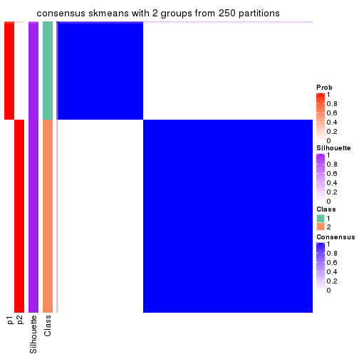</p>

</div>
<div id='tab-SD-skmeans-consensus-heatmap-2'>
<pre><code class="r">consensus_heatmap(res, k = 3)
</code></pre>

<p>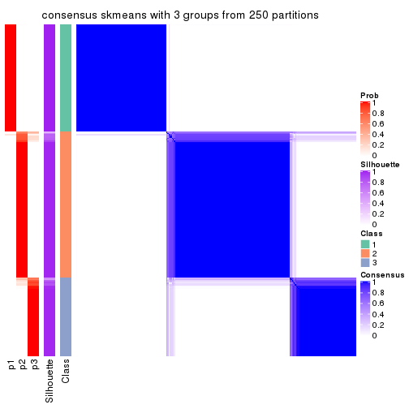</p>

</div>
<div id='tab-SD-skmeans-consensus-heatmap-3'>
<pre><code class="r">consensus_heatmap(res, k = 4)
</code></pre>

<p>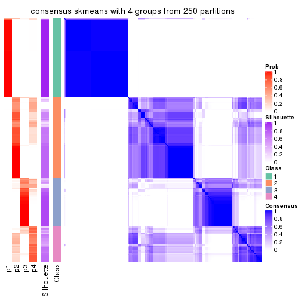</p>

</div>
<div id='tab-SD-skmeans-consensus-heatmap-4'>
<pre><code class="r">consensus_heatmap(res, k = 5)
</code></pre>

<p>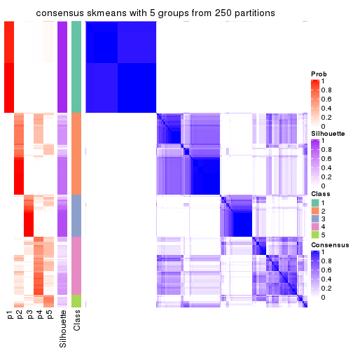</p>

</div>
<div id='tab-SD-skmeans-consensus-heatmap-5'>
<pre><code class="r">consensus_heatmap(res, k = 6)
</code></pre>

<p>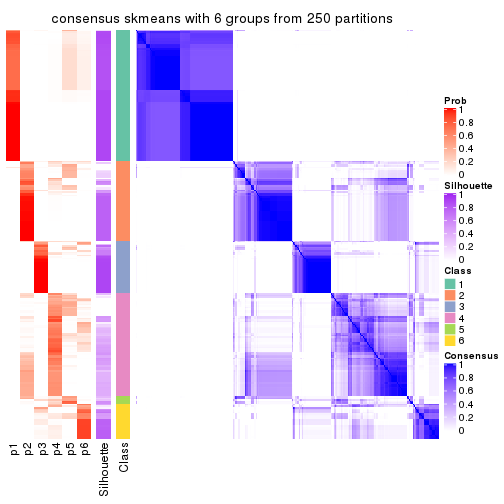</p>

</div>
</div>

Heatmaps for the membership of samples in all partitions to see how consistent they are:


<script>
$( function() {
	$( '#tabs-SD-skmeans-membership-heatmap' ).tabs();
} );
</script>
<div id='tabs-SD-skmeans-membership-heatmap'>
<ul>
<li><a href='#tab-SD-skmeans-membership-heatmap-1'>k = 2</a></li>
<li><a href='#tab-SD-skmeans-membership-heatmap-2'>k = 3</a></li>
<li><a href='#tab-SD-skmeans-membership-heatmap-3'>k = 4</a></li>
<li><a href='#tab-SD-skmeans-membership-heatmap-4'>k = 5</a></li>
<li><a href='#tab-SD-skmeans-membership-heatmap-5'>k = 6</a></li>
</ul>
<div id='tab-SD-skmeans-membership-heatmap-1'>
<pre><code class="r">membership_heatmap(res, k = 2)
</code></pre>

<p>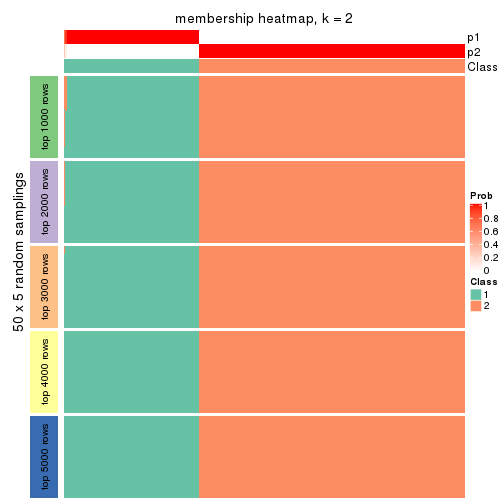</p>

</div>
<div id='tab-SD-skmeans-membership-heatmap-2'>
<pre><code class="r">membership_heatmap(res, k = 3)
</code></pre>

<p>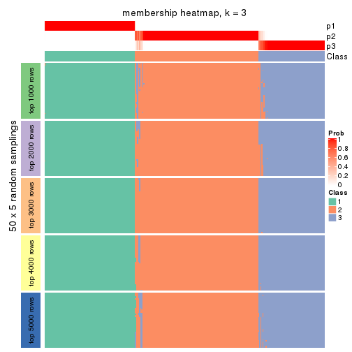</p>

</div>
<div id='tab-SD-skmeans-membership-heatmap-3'>
<pre><code class="r">membership_heatmap(res, k = 4)
</code></pre>

<p>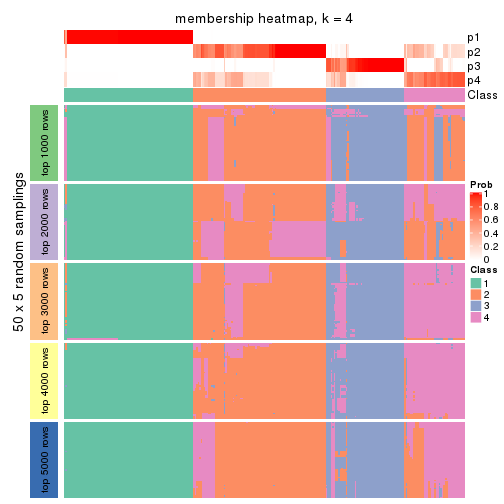</p>

</div>
<div id='tab-SD-skmeans-membership-heatmap-4'>
<pre><code class="r">membership_heatmap(res, k = 5)
</code></pre>

<p>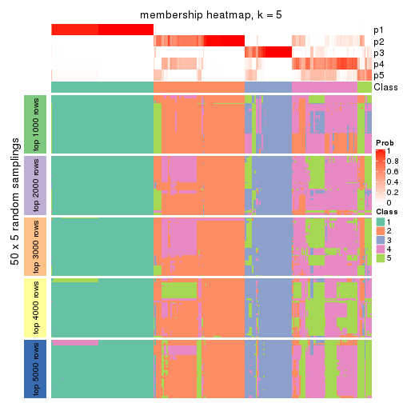</p>

</div>
<div id='tab-SD-skmeans-membership-heatmap-5'>
<pre><code class="r">membership_heatmap(res, k = 6)
</code></pre>

<p>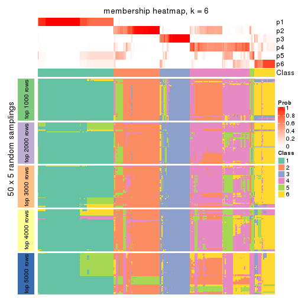</p>

</div>
</div>

As soon as we have had the classes for columns, we can look for signatures
which are significantly different between classes which can be candidate marks
for certain classes. Following are the heatmaps for signatures.


Signature heatmaps where rows are scaled:


<script>
$( function() {
	$( '#tabs-SD-skmeans-get-signatures' ).tabs();
} );
</script>
<div id='tabs-SD-skmeans-get-signatures'>
<ul>
<li><a href='#tab-SD-skmeans-get-signatures-1'>k = 2</a></li>
<li><a href='#tab-SD-skmeans-get-signatures-2'>k = 3</a></li>
<li><a href='#tab-SD-skmeans-get-signatures-3'>k = 4</a></li>
<li><a href='#tab-SD-skmeans-get-signatures-4'>k = 5</a></li>
<li><a href='#tab-SD-skmeans-get-signatures-5'>k = 6</a></li>
</ul>
<div id='tab-SD-skmeans-get-signatures-1'>
<pre><code class="r">get_signatures(res, k = 2)
</code></pre>

<p>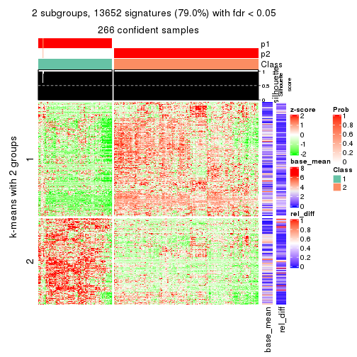</p>

</div>
<div id='tab-SD-skmeans-get-signatures-2'>
<pre><code class="r">get_signatures(res, k = 3)
</code></pre>

<p>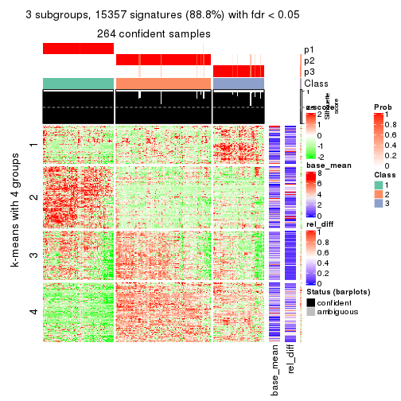</p>

</div>
<div id='tab-SD-skmeans-get-signatures-3'>
<pre><code class="r">get_signatures(res, k = 4)
</code></pre>

<p>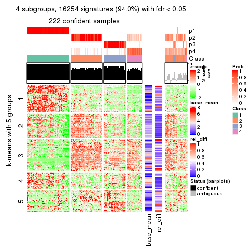</p>

</div>
<div id='tab-SD-skmeans-get-signatures-4'>
<pre><code class="r">get_signatures(res, k = 5)
</code></pre>

<p>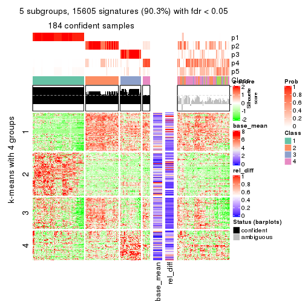</p>

</div>
<div id='tab-SD-skmeans-get-signatures-5'>
<pre><code class="r">get_signatures(res, k = 6)
</code></pre>

<p>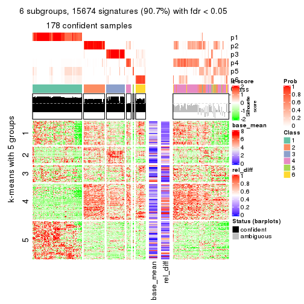</p>

</div>
</div>


Signature heatmaps where rows are not scaled:


<script>
$( function() {
	$( '#tabs-SD-skmeans-get-signatures-no-scale' ).tabs();
} );
</script>
<div id='tabs-SD-skmeans-get-signatures-no-scale'>
<ul>
<li><a href='#tab-SD-skmeans-get-signatures-no-scale-1'>k = 2</a></li>
<li><a href='#tab-SD-skmeans-get-signatures-no-scale-2'>k = 3</a></li>
<li><a href='#tab-SD-skmeans-get-signatures-no-scale-3'>k = 4</a></li>
<li><a href='#tab-SD-skmeans-get-signatures-no-scale-4'>k = 5</a></li>
<li><a href='#tab-SD-skmeans-get-signatures-no-scale-5'>k = 6</a></li>
</ul>
<div id='tab-SD-skmeans-get-signatures-no-scale-1'>
<pre><code class="r">get_signatures(res, k = 2, scale_rows = FALSE)
</code></pre>

<p>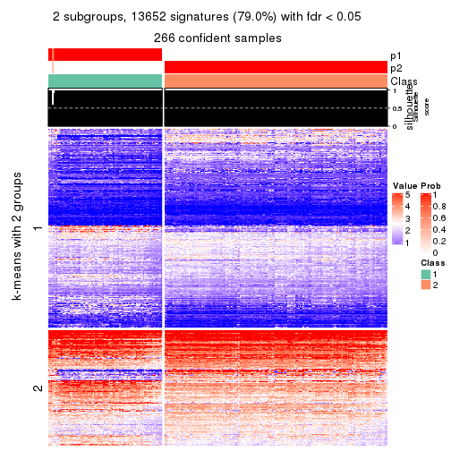</p>

</div>
<div id='tab-SD-skmeans-get-signatures-no-scale-2'>
<pre><code class="r">get_signatures(res, k = 3, scale_rows = FALSE)
</code></pre>

<p>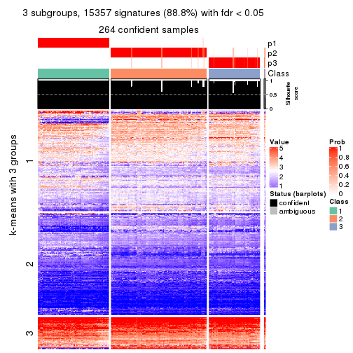</p>

</div>
<div id='tab-SD-skmeans-get-signatures-no-scale-3'>
<pre><code class="r">get_signatures(res, k = 4, scale_rows = FALSE)
</code></pre>

<p>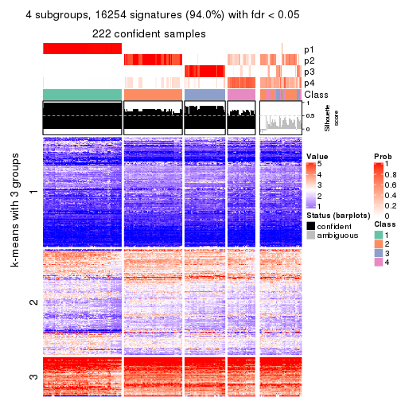</p>

</div>
<div id='tab-SD-skmeans-get-signatures-no-scale-4'>
<pre><code class="r">get_signatures(res, k = 5, scale_rows = FALSE)
</code></pre>

<p>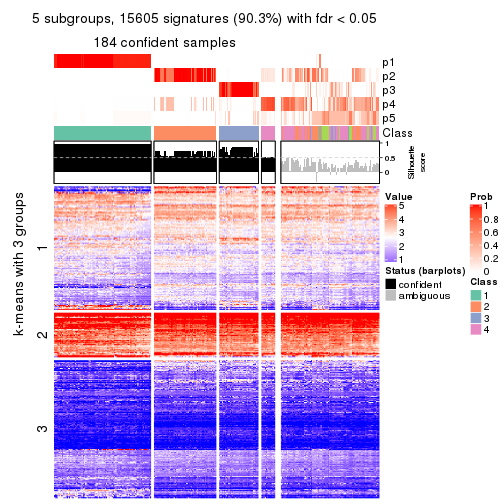</p>

</div>
<div id='tab-SD-skmeans-get-signatures-no-scale-5'>
<pre><code class="r">get_signatures(res, k = 6, scale_rows = FALSE)
</code></pre>

<p>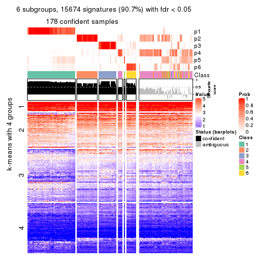</p>

</div>
</div>


Compare the overlap of signatures from different k:

```r
compare_signatures(res)
```

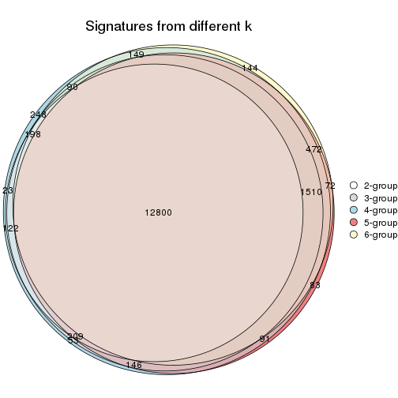

`get_signature()` returns a data frame invisibly. TO get the list of signatures, the function
call should be assigned to a variable explicitly. In following code, if `plot` argument is set
to `FALSE`, no heatmap is plotted while only the differential analysis is performed.

```r
# code only for demonstration
tb = get_signature(res, k = ..., plot = FALSE)
```

An example of the output of `tb` is:

```
#>   which_row         fdr    mean_1    mean_2 scaled_mean_1 scaled_mean_2 km
#> 1        38 0.042760348  8.373488  9.131774    -0.5533452     0.5164555  1
#> 2        40 0.018707592  7.106213  8.469186    -0.6173731     0.5762149  1
#> 3        55 0.019134737 10.221463 11.207825    -0.6159697     0.5749050  1
#> 4        59 0.006059896  5.921854  7.869574    -0.6899429     0.6439467  1
#> 5        60 0.018055526  8.928898 10.211722    -0.6204761     0.5791110  1
#> 6        98 0.009384629 15.714769 14.887706     0.6635654    -0.6193277  2
...
```

The columns in `tb` are:

1. `which_row`: row indices corresponding to the input matrix.
2. `fdr`: FDR for the differential test. 
3. `mean_x`: The mean value in group x.
4. `scaled_mean_x`: The mean value in group x after rows are scaled.
5. `km`: Row groups if k-means clustering is applied to rows.


UMAP plot which shows how samples are separated.


<script>
$( function() {
	$( '#tabs-SD-skmeans-dimension-reduction' ).tabs();
} );
</script>
<div id='tabs-SD-skmeans-dimension-reduction'>
<ul>
<li><a href='#tab-SD-skmeans-dimension-reduction-1'>k = 2</a></li>
<li><a href='#tab-SD-skmeans-dimension-reduction-2'>k = 3</a></li>
<li><a href='#tab-SD-skmeans-dimension-reduction-3'>k = 4</a></li>
<li><a href='#tab-SD-skmeans-dimension-reduction-4'>k = 5</a></li>
<li><a href='#tab-SD-skmeans-dimension-reduction-5'>k = 6</a></li>
</ul>
<div id='tab-SD-skmeans-dimension-reduction-1'>
<pre><code class="r">dimension_reduction(res, k = 2, method = &quot;UMAP&quot;)
</code></pre>

<p>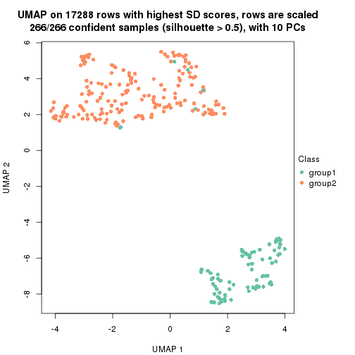</p>

</div>
<div id='tab-SD-skmeans-dimension-reduction-2'>
<pre><code class="r">dimension_reduction(res, k = 3, method = &quot;UMAP&quot;)
</code></pre>

<p>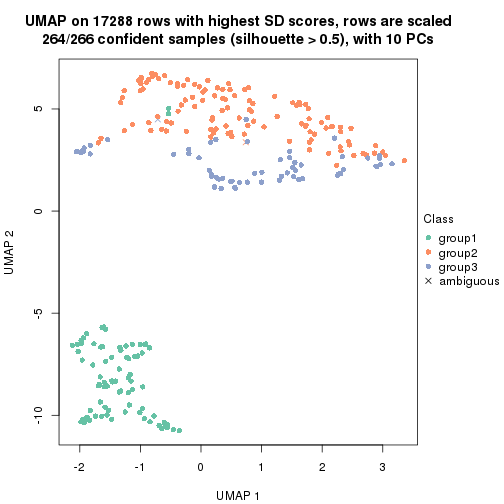</p>

</div>
<div id='tab-SD-skmeans-dimension-reduction-3'>
<pre><code class="r">dimension_reduction(res, k = 4, method = &quot;UMAP&quot;)
</code></pre>

<p>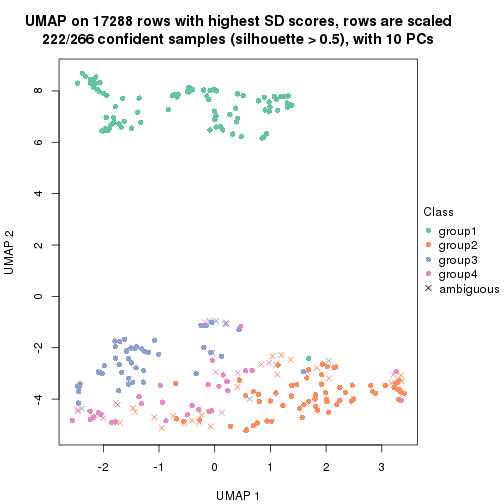</p>

</div>
<div id='tab-SD-skmeans-dimension-reduction-4'>
<pre><code class="r">dimension_reduction(res, k = 5, method = &quot;UMAP&quot;)
</code></pre>

<p>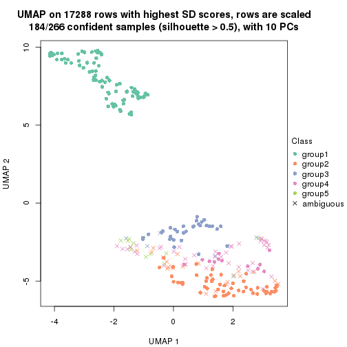</p>

</div>
<div id='tab-SD-skmeans-dimension-reduction-5'>
<pre><code class="r">dimension_reduction(res, k = 6, method = &quot;UMAP&quot;)
</code></pre>

<p>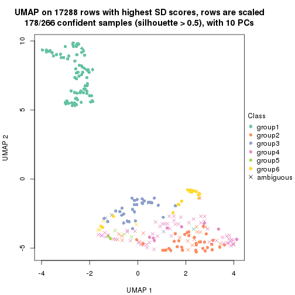</p>

</div>
</div>


Following heatmap shows how subgroups are split when increasing `k`:

```r
collect_classes(res)
```

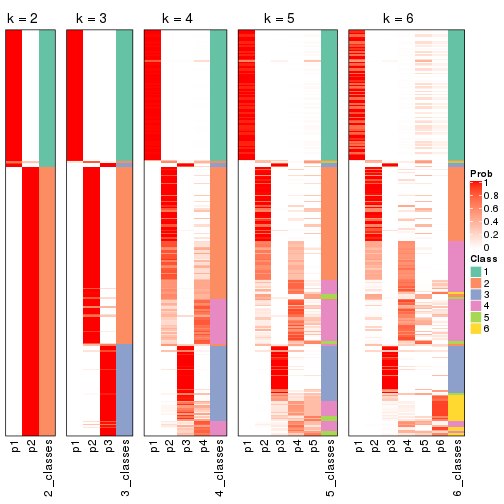


If matrix rows can be associated to genes, consider to use `GO_Enrichment(res,
...)` to perform function enrichment for the signature genes.


 

---------------------------------------------------


### SD:pam**


The object with results only for a single top-value method and a single partition method 
can be extracted as:

```r
res = res_list["SD", "pam"]
# you can also extract it by
# res = res_list["SD:pam"]
```

A summary of `res` and all the functions that can be applied to it:

```r
res
```

```
#> A 'ConsensusPartition' object with k = 2, 3, 4, 5, 6.
#>   On a matrix with 17288 rows and 266 columns.
#>   Top rows (1000, 2000, 3000, 4000, 5000) are extracted by 'SD' method.
#>   Subgroups are detected by 'pam' method.
#>   Performed in total 1250 partitions by row resampling.
#>   Best k for subgroups seems to be 2.
#> 
#> Following methods can be applied to this 'ConsensusPartition' object:
#>  [1] "cola_report"             "collect_classes"         "collect_plots"          
#>  [4] "collect_stats"           "colnames"                "compare_signatures"     
#>  [7] "consensus_heatmap"       "dimension_reduction"     "functional_enrichment"  
#> [10] "get_anno_col"            "get_anno"                "get_classes"            
#> [13] "get_consensus"           "get_matrix"              "get_membership"         
#> [16] "get_param"               "get_signatures"          "get_stats"              
#> [19] "is_best_k"               "is_stable_k"             "membership_heatmap"     
#> [22] "ncol"                    "nrow"                    "plot_ecdf"              
#> [25] "rownames"                "select_partition_number" "show"                   
#> [28] "suggest_best_k"          "test_to_known_factors"
```

`collect_plots()` function collects all the plots made from `res` for all `k` (number of partitions)
into one single page to provide an easy and fast comparison between different `k`.

```r
collect_plots(res)
```

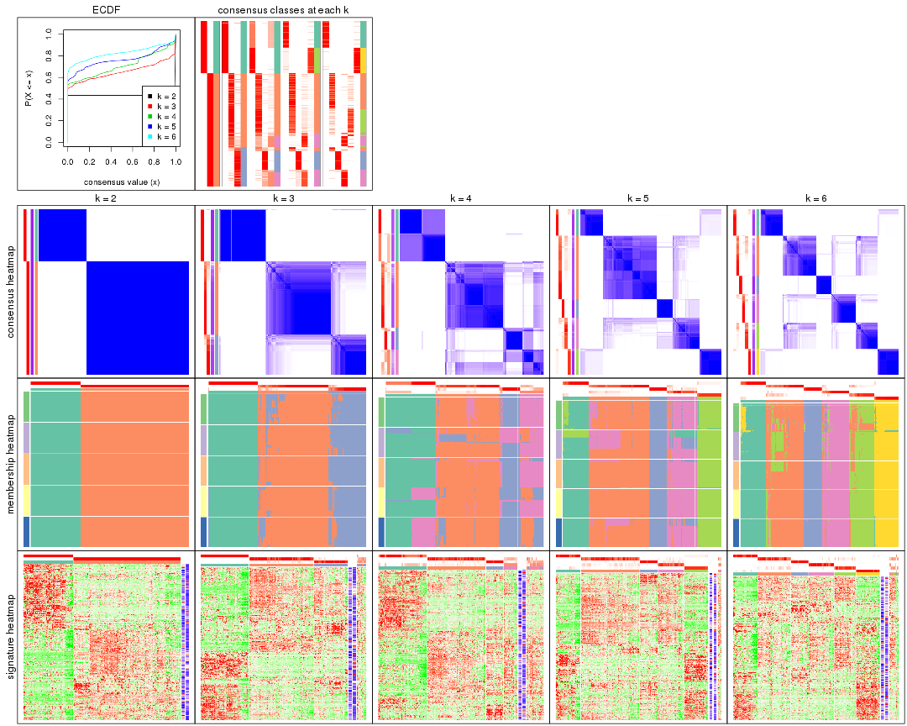

The plots are:

- The first row: a plot of the ECDF (Empirical cumulative distribution
  function) curves of the consensus matrix for each `k` and the heatmap of
  predicted classes for each `k`.
- The second row: heatmaps of the consensus matrix for each `k`.
- The third row: heatmaps of the membership matrix for each `k`.
- The fouth row: heatmaps of the signatures for each `k`.

All the plots in panels can be made by individual functions and they are
plotted later in this section.

`select_partition_number()` produces several plots showing different
statistics for choosing "optimized" `k`. There are following statistics:

- ECDF curves of the consensus matrix for each `k`;
- 1-PAC. [The PAC
  score](https://en.wikipedia.org/wiki/Consensus_clustering#Over-interpretation_potential_of_consensus_clustering)
  measures the proportion of the ambiguous subgrouping.
- Mean silhouette score.
- Concordance. The mean probability of fiting the consensus class ids in all
  partitions.
- Area increased. Denote $A_k$ as the area under the ECDF curve for current
  `k`, the area increased is defined as $A_k - A_{k-1}$.
- Rand index. The percent of pairs of samples that are both in a same cluster
  or both are not in a same cluster in the partition of k and k-1.
- Jaccard index. The ratio of pairs of samples are both in a same cluster in
  the partition of k and k-1 and the pairs of samples are both in a same
  cluster in the partition k or k-1.

The detailed explanations of these statistics can be found in [the cola
vignette](http://bioconductor.org/packages/devel/bioc/vignettes/cola/inst/doc/cola.html#toc_13).

Generally speaking, lower PAC score, higher mean silhouette score or higher
concordance corresponds to better partition. Rand index and Jaccard index
measure how similar the current partition is compared to partition with `k-1`.
If they are too similar, we won't accept `k` is better than `k-1`.

```r
select_partition_number(res)
```

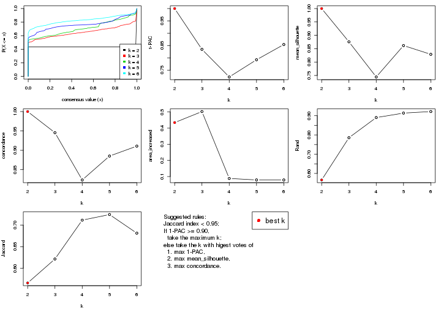

The numeric values for all these statistics can be obtained by `get_stats()`.

```r
get_stats(res)
```

```
#>   k 1-PAC mean_silhouette concordance area_increased  Rand Jaccard
#> 2 2 1.000           1.000       1.000         0.4343 0.566   0.566
#> 3 3 0.834           0.876       0.945         0.5025 0.786   0.622
#> 4 4 0.723           0.744       0.823         0.0881 0.890   0.711
#> 5 5 0.792           0.862       0.885         0.0790 0.914   0.724
#> 6 6 0.854           0.829       0.911         0.0788 0.921   0.681
```

`suggest_best_k()` suggests the best $k$ based on these statistics. The rules are as follows:

- All $k$ with Jaccard index larger than 0.95 are removed because the increase of
  the partition number does not provides enough extra information. If all $k$ are removed,
  the best $k$ is assigned by `NA`.
- For $k$ with 1-PAC larger than 0.9, the maximal $k$ is taken as the "best k". Other $k$ is called "optional k".
- If it does not fit the second rule. The $k$ with the highest vote of highest
  1-PAC, mean silhouette and concordance is taken as the "best k".

```r
suggest_best_k(res)
```

```
#> [1] 2
```


Following shows the table of the partitions (You need to click the **show/hide
code output** link to see it). The membership matrix (columns with name `p*`)
is inferred by
[`clue::cl_consensus()`](https://www.rdocumentation.org/link/cl_consensus?package=clue)
function with the `SE` method. Basically the value in the membership matrix
represents the probability to belong to a certain group. The finall class
label for an item is determined with the group with highest probability it
belongs to.

In `get_classes()` function, the entropy is calculated from the membership
matrix and the silhouette score is calculated from the consensus matrix.


<script>
$( function() {
	$( '#tabs-SD-pam-get-classes' ).tabs();
} );
</script>
<div id='tabs-SD-pam-get-classes'>
<ul>
<li><a href='#tab-SD-pam-get-classes-1'>k = 2</a></li>
<li><a href='#tab-SD-pam-get-classes-2'>k = 3</a></li>
<li><a href='#tab-SD-pam-get-classes-3'>k = 4</a></li>
<li><a href='#tab-SD-pam-get-classes-4'>k = 5</a></li>
<li><a href='#tab-SD-pam-get-classes-5'>k = 6</a></li>
</ul>

<div id='tab-SD-pam-get-classes-1'>
<p><a id='tab-SD-pam-get-classes-1-a' style='color:#0366d6' href='#'>show/hide code output</a></p>
<pre><code class="r">cbind(get_classes(res, k = 2), get_membership(res, k = 2))
</code></pre>

<pre><code>#&gt;                                      class entropy silhouette p1 p2
#&gt; 80D0AF10-1C61-4B67-90C1-7DBF1EF23672     2       0          1  0  1
#&gt; 87117BE1-D328-4972-85DA-6672412D8860     2       0          1  0  1
#&gt; F904C5B6-70BD-4604-8254-79BE23B152DA     1       0          1  1  0
#&gt; 3182DEA1-4239-4613-925A-7E6503766AD6     2       0          1  0  1
#&gt; 55E78EA2-2D9B-481F-8CAB-D36A33088EAE     2       0          1  0  1
#&gt; 86F94264-A6DD-4A97-9191-036F066DD0EF     2       0          1  0  1
#&gt; 09D25417-23B7-4D88-A0EA-F307985FBBBC     2       0          1  0  1
#&gt; C797F12C-40D3-4DB5-B9EF-A6821BBDE4F0     1       0          1  1  0
#&gt; 80275DB0-A226-4B6B-A08F-4ADBEEE1DB01     1       0          1  1  0
#&gt; 27FB653A-9E07-44AD-952E-9E4DE4AB5891     2       0          1  0  1
#&gt; 1A5DB9FC-2ABD-4E1B-B5EF-B1CF5E5F3872     1       0          1  1  0
#&gt; 844E4CCD-D30C-416F-A086-8923711A4E25     2       0          1  0  1
#&gt; EF18318D-3D25-4D65-803A-ED6E62871E7E     1       0          1  1  0
#&gt; 1ACB1BE0-61F6-4243-BBEC-E26A1CF90CA8     1       0          1  1  0
#&gt; 8EF0039B-D758-46AB-BAF7-6A062C7C56BA     1       0          1  1  0
#&gt; 22F4C9D9-663B-4C91-9692-E035A2640BEC     2       0          1  0  1
#&gt; FA1A0BCE-EE0F-4178-B963-62550E344B14     2       0          1  0  1
#&gt; 0B6D0C4E-5AE3-4707-A9FC-12A108E6EC2A     2       0          1  0  1
#&gt; 06FD3123-2AEB-4911-AC4E-E0E64FD5DB52     2       0          1  0  1
#&gt; 235A4492-FF80-4AA5-BC71-DFF65E1C7411     2       0          1  0  1
#&gt; A192C6C0-1443-4493-AFAC-1EE710628ADB     2       0          1  0  1
#&gt; 6FC5B56B-711B-4174-9B06-4E843124AAB6     1       0          1  1  0
#&gt; 7A813F60-A41E-4552-990E-F22287654C1D     2       0          1  0  1
#&gt; 725BBFB5-26F4-4512-9C75-47D013C1E605     1       0          1  1  0
#&gt; 39CC4E82-EBC9-472E-8BE5-6A3AB178449A     2       0          1  0  1
#&gt; 61130DEE-E267-49DF-8B41-7738A06EF738     2       0          1  0  1
#&gt; 117EC12C-B7ED-4E01-B29B-EA542D356EA1     1       0          1  1  0
#&gt; A30FF708-F7A9-41E4-8AD5-20441650FBC9     2       0          1  0  1
#&gt; 53640D52-1167-4A5D-B656-97D32CBA3934     1       0          1  1  0
#&gt; 9E85D76A-DD2A-46D5-BB59-0ED302B6258C     2       0          1  0  1
#&gt; 6F8C6F90-7E3C-4860-91DD-586708DE44AA     1       0          1  1  0
#&gt; E675AEC5-AA9A-4AAA-839C-03E6365822DB     2       0          1  0  1
#&gt; B577DEF7-2F5C-4876-A7C6-F18D5722B8C0     1       0          1  1  0
#&gt; DA8B577E-43E7-49BF-BF94-868E3194F5C9     1       0          1  1  0
#&gt; 3334280B-2A36-4AC7-A021-A76C10E958F0     2       0          1  0  1
#&gt; 5CBDDC90-11EC-4E6E-881E-AA9CCFD40FDB     2       0          1  0  1
#&gt; 8CBBF32A-8349-44F5-A8B8-4CBB1760A464     2       0          1  0  1
#&gt; B9455A9A-136D-4DC2-9F86-0FC74433589D     2       0          1  0  1
#&gt; D7EAE2A7-F9BE-4222-A452-B1F83F99CD50     2       0          1  0  1
#&gt; F803AE18-60C5-4CFE-AAAB-DB33C26A2184     1       0          1  1  0
#&gt; 5DD8CAC7-EC02-43B6-B58E-6D2E22868A3B     2       0          1  0  1
#&gt; EE98E1B4-DFB3-4AEC-8527-E1FD544C9475     1       0          1  1  0
#&gt; 3CE43921-47D5-4394-B9E1-242607775D61     2       0          1  0  1
#&gt; 46986F2B-0B0D-4187-8948-4E91D34B7C49     2       0          1  0  1
#&gt; 5D1D052E-74EF-45A8-9B1A-7CECD13EA43B     2       0          1  0  1
#&gt; 4C821AD9-A5C9-4A9A-9C5D-363B227F8064     2       0          1  0  1
#&gt; 06A4189E-A23B-4AC6-AA74-01955DD7D1E9     2       0          1  0  1
#&gt; FCCDC76F-CB02-4BCD-A616-325F258DDAA4     2       0          1  0  1
#&gt; DAC53B0A-8F35-4EA6-BBCC-4CD1C049E11F     2       0          1  0  1
#&gt; DD4F845B-CAD3-44CB-9D96-3C3F5BA1B72D     1       0          1  1  0
#&gt; D440F004-A4A4-41B6-BED8-805D67BA01C7     2       0          1  0  1
#&gt; A497C423-119F-42FA-BF17-9F6DFD2A5585     2       0          1  0  1
#&gt; 3420E573-DE12-4EF5-B1C0-2FCA904F4F4E     1       0          1  1  0
#&gt; 1AD72157-A254-44B4-BA58-4F30F1AE910E     1       0          1  1  0
#&gt; C1113977-B160-45EE-B061-750F9EA3F33F     2       0          1  0  1
#&gt; 6783AB5B-F07C-447B-BF13-C34485D246D7     2       0          1  0  1
#&gt; 1F553062-26FD-4A7F-B7FB-81184604F423     1       0          1  1  0
#&gt; BE2DCA51-1C21-4598-98A7-F2FB9B2DFCB4     2       0          1  0  1
#&gt; 38941CF3-9C54-4BA4-A005-CC88CA97D504     2       0          1  0  1
#&gt; 51CB675E-E243-4A07-BF4A-580473D26FDA     2       0          1  0  1
#&gt; C7FED0F5-C27A-4405-9232-30BF39362CF7     2       0          1  0  1
#&gt; 2A1E86E8-4713-465F-ACFF-C584864C57A1     2       0          1  0  1
#&gt; B4500785-0FAA-4D4D-8630-43D194BAB004     2       0          1  0  1
#&gt; 3FD52E66-AB76-4079-80DB-281A795D1EC0     2       0          1  0  1
#&gt; EBD355D1-1226-4DFD-AAFF-45D246B64F3C     2       0          1  0  1
#&gt; 5A040A73-CD95-487E-8AEF-9639FE4E2916     2       0          1  0  1
#&gt; CF629C65-585D-476D-B081-3E6E0575FAE3     2       0          1  0  1
#&gt; 0D4202A3-808E-413F-9BF3-9CFCCAE0ED61     2       0          1  0  1
#&gt; 43E715BF-28D9-4B5E-B762-8CD1B69A430E     1       0          1  1  0
#&gt; BFB82BE8-9DAC-4099-8B38-0950308E3EB3     2       0          1  0  1
#&gt; F7CB1825-2303-4DD2-AE1F-7205738EAF1F     1       0          1  1  0
#&gt; FE298483-C42C-4753-BABB-29A9CB1B6312     1       0          1  1  0
#&gt; A98C7561-1B42-4CD6-AE71-924B91FA4C33     2       0          1  0  1
#&gt; 58098F21-7DAB-47DA-9A41-8D20BF3B9257     2       0          1  0  1
#&gt; 18CAF708-20B9-4745-9CB3-37AB6E0B3056     2       0          1  0  1
#&gt; 2C80DD72-C9C7-4AC2-812F-9A31EF02779C     1       0          1  1  0
#&gt; 68A3F13D-319D-4603-A27F-B5DD46FE5C5B     2       0          1  0  1
#&gt; 7EE8F0CE-CDC9-40F9-A1DE-7F8140EC6D13     2       0          1  0  1
#&gt; 39019903-5B9C-4665-BD5F-7CCB19CB55C5     2       0          1  0  1
#&gt; 190EDB27-4CBC-4E9C-9B67-D51FDAB982B7     2       0          1  0  1
#&gt; EB2D95BC-62F8-4669-9308-D37D7FB79E23     2       0          1  0  1
#&gt; A08B85EA-D1E7-4B77-8DEC-36294305B9F7     1       0          1  1  0
#&gt; 130DDFAD-6EF8-4C80-BD9D-88308A6874BC     2       0          1  0  1
#&gt; 7340A5BA-E002-448F-AACC-E7A37DBB79C2     2       0          1  0  1
#&gt; A771F6E3-D266-4FE7-98C6-C40E6A701D59     1       0          1  1  0
#&gt; 015E792C-EC1B-49BF-AB07-D82B20C5989A     2       0          1  0  1
#&gt; BF79E030-47EE-4D08-B910-5685A4BD8B60     2       0          1  0  1
#&gt; FB3C7C9A-2F2D-4DD5-BE47-FAFB072C0FAB     2       0          1  0  1
#&gt; 4E5557BA-10E8-4723-908E-DD04EF6639B2     2       0          1  0  1
#&gt; 8031B550-40A9-4A3A-9F7D-CDC052288BD8     2       0          1  0  1
#&gt; 55299A06-3C1F-45A4-B166-B2C591C0CEE2     2       0          1  0  1
#&gt; EB8D5168-216E-4ABB-8B4E-9E67786CB322     1       0          1  1  0
#&gt; 78BD2D83-9A7F-42E5-BB38-654AA0761A0A     2       0          1  0  1
#&gt; AA2D53E5-D389-4332-9DD5-A736052E48F8     1       0          1  1  0
#&gt; 62945C7A-9313-4FC9-820C-B0AB820B394E     1       0          1  1  0
#&gt; 22746046-2E99-4EE9-97D2-BA2EA499634C     2       0          1  0  1
#&gt; 8671B51B-DCBE-4429-9F01-AF51CAD7014F     2       0          1  0  1
#&gt; E815AB36-5689-4A0D-8E6D-2EAA73406681     1       0          1  1  0
#&gt; A1DACB46-ED52-4E38-B2C8-57256BB22B5E     2       0          1  0  1
#&gt; 4F5498C4-A423-4B3D-AC98-D4E214A57D0E     1       0          1  1  0
#&gt; A7772CCD-FFFF-49DD-86ED-0BAD330EC9B6     2       0          1  0  1
#&gt; E6E3DF78-65B9-4F74-8DA8-E2A6D4EDBEA7     2       0          1  0  1
#&gt; 83286E2D-E708-437A-911A-E6B050273CBD     1       0          1  1  0
#&gt; EC5C7C97-EE8C-405D-A039-D96514B1D414     2       0          1  0  1
#&gt; 3E55223D-6E3D-4027-9819-67E91212531D     1       0          1  1  0
#&gt; 99A036A2-8343-4D06-8047-D84E96CE4C61     2       0          1  0  1
#&gt; CA6CDE6D-92DE-4259-9E58-A373F2D543EA     2       0          1  0  1
#&gt; BF6FA8CC-60C1-413A-B2C6-54CCACBC01D6     1       0          1  1  0
#&gt; E0594CFE-F7B6-4546-B130-30DF6A514B1F     2       0          1  0  1
#&gt; E769E41D-5949-42C5-9594-E563C05ACE52     2       0          1  0  1
#&gt; 01373725-5D3C-4D9C-AABC-911D53E62BCD     2       0          1  0  1
#&gt; 1F39DADD-3655-474E-BA4C-A5BD32C97A8B     1       0          1  1  0
#&gt; AF573EC8-E4EE-4B8F-8199-9817B9FAC67D     1       0          1  1  0
#&gt; 3F022CBC-41C8-4387-A6FB-124C4BCD1AD9     1       0          1  1  0
#&gt; 1CC32ACE-826B-494B-8B89-5BD92327A74D     2       0          1  0  1
#&gt; 22B0BD3B-EE08-4BC7-90B2-01C372A56BA2     2       0          1  0  1
#&gt; 0F3DE9EF-19CC-4D14-9A42-1435DB537F94     2       0          1  0  1
#&gt; 87F8A33F-FBC3-469E-862B-84472F796358     2       0          1  0  1
#&gt; C9F2FA0D-1A9F-40B4-BD9B-CAF1B3F3D5A7     2       0          1  0  1
#&gt; ACFC9F59-78FF-4453-B25F-8834D0EAB54A     2       0          1  0  1
#&gt; B7AC7D5B-14E9-45A7-93B7-226EE508544A     2       0          1  0  1
#&gt; 4491BF17-B168-4E96-8E09-EF1AEC9F5E9D     2       0          1  0  1
#&gt; 557A0811-A3FE-4CF4-A24D-FBB77E7F9139     2       0          1  0  1
#&gt; 6F9C955C-6816-4353-922A-8035B50FACC6     2       0          1  0  1
#&gt; 3E89FB1C-4A7D-43C7-823C-04E3716A7935     2       0          1  0  1
#&gt; 12ABE483-66EF-4237-94C4-0199FAE23FA8     2       0          1  0  1
#&gt; 7535F262-9B96-44F6-988C-4C9EBB3FFCA9     2       0          1  0  1
#&gt; 65C9D28E-303B-40E5-84F0-2507F5457374     2       0          1  0  1
#&gt; FD445384-6BA9-4297-9D9C-12ABA7D645C7     1       0          1  1  0
#&gt; 30D5E255-2AD3-44F3-8983-1B80E4FD3E2D     2       0          1  0  1
#&gt; 3E88EC60-B4A8-4259-8BC8-A234800F6955     2       0          1  0  1
#&gt; ACD73CE8-AFC5-47A0-9383-3CB97F018953     1       0          1  1  0
#&gt; 1AFDC2EA-26A8-44E2-8BCB-F34F7B66F8C8     2       0          1  0  1
#&gt; 9E327BC8-1D20-4AD8-83F7-FB2D13BCA5D0     2       0          1  0  1
#&gt; 85A86B91-4F24-4E77-AE2D-520F8E205EFC     1       0          1  1  0
#&gt; 74868C37-8143-4306-81CA-E45759D146CD     2       0          1  0  1
#&gt; 69AEA0DB-E335-48A0-A398-4FB0D581182A     2       0          1  0  1
#&gt; AE6F8B89-85C2-42B7-8D05-AFDDD4FEFD16     1       0          1  1  0
#&gt; A8A6F09C-9812-4457-9A4B-AD41F97B41A3     2       0          1  0  1
#&gt; 1A09BC4D-EF29-42DD-BB04-A3C264A3032D     1       0          1  1  0
#&gt; E0961A30-A62C-4235-9CF0-A1776827A996     2       0          1  0  1
#&gt; 134D2D90-7B08-4F20-8A3A-C77643FB208F     2       0          1  0  1
#&gt; A77C2DFF-93CF-4CB5-B3C1-81133D7F1A0F     2       0          1  0  1
#&gt; EA2DC457-9C74-4B9C-B3FA-5E72199B24A7     2       0          1  0  1
#&gt; FF34117B-5EE4-4C96-A8A2-2CE6A654CBE5     1       0          1  1  0
#&gt; 75F7B5E2-6559-4B48-A2A4-287C35C559CC     1       0          1  1  0
#&gt; 903BF591-B0AF-4BEE-B625-60B673070344     2       0          1  0  1
#&gt; 9DE1B790-C63C-41C4-9477-CE52A8119C67     2       0          1  0  1
#&gt; 9A28F80A-85F8-40E2-A32B-230EF93B2FA0     2       0          1  0  1
#&gt; 0AA2BDBB-8720-409A-AA72-1F4AA26E7CD8     2       0          1  0  1
#&gt; 5AD49F16-E974-4E5D-B1B6-073ECB73A01D     2       0          1  0  1
#&gt; CB0F961C-527D-4A48-9408-286B26BD9532     1       0          1  1  0
#&gt; 46FF25B6-D01D-4CA7-80B7-CEC2998C34E1     2       0          1  0  1
#&gt; 487CADE1-D699-4A6C-817A-B9A0AB940C61     1       0          1  1  0
#&gt; 4FF6F2D8-F869-4735-A4D1-1A8423153FBC     1       0          1  1  0
#&gt; 6005494F-5D3D-43A3-B3E8-8C91955B2A98     2       0          1  0  1
#&gt; CF10D584-CE32-45A4-A932-E9D5AF12A6A0     1       0          1  1  0
#&gt; E15CE4AB-5646-49C8-9CD6-938457036BB0     2       0          1  0  1
#&gt; 31E28D0B-0E69-4330-82ED-4F1827DC97EA     2       0          1  0  1
#&gt; DBACD3C3-CCB5-4478-BA78-85A0C847CA66     2       0          1  0  1
#&gt; 5A07041C-65EB-4FCD-8940-E90B905061B5     2       0          1  0  1
#&gt; 0EA7C916-FA47-489B-BC98-4D9E7D197628     1       0          1  1  0
#&gt; 30967F75-8499-47FF-ADA4-4DC566013F7B     1       0          1  1  0
#&gt; D2E528FF-AEA2-48D7-A60A-4C3E71EA9073     2       0          1  0  1
#&gt; 22735DCD-215E-48BC-BF44-32BD66F06E39     2       0          1  0  1
#&gt; BC2C3248-7FC6-48BC-96C1-45EA573DE7DC     1       0          1  1  0
#&gt; E72CEBCB-D686-4B12-BCBA-EC8F964330A2     1       0          1  1  0
#&gt; 23C937BB-BA20-4440-B680-914229CC3ADF     1       0          1  1  0
#&gt; 947E99C7-F402-4F1A-A6E9-81BCAAED135A     2       0          1  0  1
#&gt; 02475D11-FC81-4E88-944E-173C32DC3FE7     2       0          1  0  1
#&gt; F972A9AA-9842-4343-A533-A795E65581CE     1       0          1  1  0
#&gt; 05043AAF-3095-4C61-B5C1-EE9AA9082C75     2       0          1  0  1
#&gt; CECF7967-862E-428C-BB42-FEF553FDB3AA     2       0          1  0  1
#&gt; FB0B9483-6302-48C7-BE5B-DA667E00AE2D     2       0          1  0  1
#&gt; 78700FBA-1487-4754-9B30-18837BF7E9FB     1       0          1  1  0
#&gt; 2166F56D-54CE-4F1B-8F07-A4E13E4489E9     1       0          1  1  0
#&gt; 7CD0942E-E39A-43A7-8BAC-F25967864901     2       0          1  0  1
#&gt; 3B00BA2B-7F7D-4825-8F8D-90F04A5DE687     2       0          1  0  1
#&gt; 7465B01D-C05E-4FE0-A9FE-182920EDC489     2       0          1  0  1
#&gt; 88C31A99-F96E-4FC8-8B3D-C1AAA05062D9     1       0          1  1  0
#&gt; 53575575-3303-4F8F-B6A8-B42131CFB4AC     2       0          1  0  1
#&gt; CC8017C7-4128-48DA-8E43-503F63158D85     1       0          1  1  0
#&gt; 88449D2A-2A25-41A4-B91D-C99B58F8ECD9     2       0          1  0  1
#&gt; 46C7DDE5-A2B5-494F-96AE-0B6E2D51B003     1       0          1  1  0
#&gt; 42551D05-5EE5-4F91-93A8-32DA695D9DFA     2       0          1  0  1
#&gt; 0772DA48-3A36-422D-B166-CA1691B782C3     2       0          1  0  1
#&gt; 30346897-EC77-4153-88A2-D14593C8B741     2       0          1  0  1
#&gt; 0F00E267-C748-4A71-8B36-03C410641D88     2       0          1  0  1
#&gt; 4034703A-4DA9-4DDA-9CA9-E80FFE9CCDE6     2       0          1  0  1
#&gt; 393C8A41-CF45-4EA8-AFE3-25A08AB7692A     2       0          1  0  1
#&gt; 3354212D-A07C-435C-8B0C-9A7BAAB624B5     1       0          1  1  0
#&gt; 57E30D4E-ABF7-47DD-92BE-40CE215076B0     1       0          1  1  0
#&gt; 202B4C76-C840-4DB8-953F-AC75A4156FDD     2       0          1  0  1
#&gt; 93A0137B-1F4C-44EE-B959-2AD0CD2DF8B6     1       0          1  1  0
#&gt; C9794DB6-6E8C-4AFD-80EE-61D672A4F6E9     2       0          1  0  1
#&gt; AE4BFE63-F0C0-4624-AD97-4F7FF13E2384     1       0          1  1  0
#&gt; DCF87F27-2B54-42D9-8D28-5DFEE76E2F5B     2       0          1  0  1
#&gt; 2451D405-39FD-4812-958C-23462B66F1F1     2       0          1  0  1
#&gt; E27F5D33-3F68-4CA8-8757-A387C6EAD060     2       0          1  0  1
#&gt; 8BA9928A-5B93-477F-B4A2-D031B714D9AC     1       0          1  1  0
#&gt; 0FAACFF6-B50C-4BED-9824-B7270654F28D     2       0          1  0  1
#&gt; 3366CC3C-2BBA-4CA7-848E-4E16AA70AE7A     2       0          1  0  1
#&gt; 66237056-CA9A-4C90-AF0E-1621FEB71578     2       0          1  0  1
#&gt; C480F1FB-3100-436C-B0F5-DED63B7A580E     2       0          1  0  1
#&gt; A327DE0D-D945-4B42-9B41-A7302CF796EE     2       0          1  0  1
#&gt; E8A6871D-67FB-4306-9454-F5E7CDBA399A     2       0          1  0  1
#&gt; E9A7485B-82B6-4BD2-AFBB-DD0A82D6CDE2     1       0          1  1  0
#&gt; 93B382E4-9C9A-43F5-BD3B-502CC260B886     1       0          1  1  0
#&gt; A2792419-8E16-45FE-A524-17851F34AB9B     2       0          1  0  1
#&gt; 4DED1201-F25C-4F82-BABF-965EFAD7A8E5     2       0          1  0  1
#&gt; F1ACB2DD-E948-4F88-A249-F1BD1977D667     2       0          1  0  1
#&gt; 6CDBA203-8952-421D-A6BF-75652D9F3339     2       0          1  0  1
#&gt; 2D6C5AA7-3B33-48D7-AE0C-77A16B749D13     1       0          1  1  0
#&gt; 3F6B6D95-0720-42A0-AEB3-89FECAE7616A     2       0          1  0  1
#&gt; DED8ACF3-BBD8-46C9-85C9-A9C8F2E2BC0B     1       0          1  1  0
#&gt; 77069279-5A6F-42C0-9AA5-8C939591DFB5     1       0          1  1  0
#&gt; B2D4FCF3-FDF9-41C8-880A-6732CF6222AF     2       0          1  0  1
#&gt; 1CD71A4C-1E49-48EF-AA72-CB3C26B4C087     2       0          1  0  1
#&gt; C364E621-F85C-4B7F-842F-210B8D4DFE3A     2       0          1  0  1
#&gt; 11F1B8CA-07C1-47D2-A3C6-032FFA6A4A64     1       0          1  1  0
#&gt; 153BF804-6DC8-496B-987A-4021A2512211     2       0          1  0  1
#&gt; 5B5029C9-40F5-40D7-A36A-367022AD6A42     2       0          1  0  1
#&gt; 193CCBE6-104F-49B4-BDB2-C82EE36FDAAD     1       0          1  1  0
#&gt; E5D45E53-FCF3-4F01-9B78-6CB1ED0CFE40     2       0          1  0  1
#&gt; 5546A779-21DB-49F9-8C0D-A1E420088084     2       0          1  0  1
#&gt; E14825E0-0DC7-44C2-B265-F54672356838     1       0          1  1  0
#&gt; 8C8C09B9-EC83-45EC-BC4C-0BA92DE60ACB     1       0          1  1  0
#&gt; B388CA82-5BF7-4BDD-8821-4EC0B213121F     2       0          1  0  1
#&gt; A26025AC-9F71-4C07-9135-83593193BBB2     1       0          1  1  0
#&gt; C80E6D4B-AF21-42F0-8E20-6F7D2E99C062     2       0          1  0  1
#&gt; 5AE5D819-A6B1-4761-B7F9-8FFD3C520F31     2       0          1  0  1
#&gt; CAE8097F-A139-4C6E-9E30-35080475FF34     2       0          1  0  1
#&gt; 539C8DE3-6152-4671-B96F-ED6DC6DBD22B     1       0          1  1  0
#&gt; 5D28A8E0-4ECF-43A4-890A-BE968B9A8CB2     2       0          1  0  1
#&gt; 97A80AF8-365E-4756-A2B0-AEB1D8F5F33E     2       0          1  0  1
#&gt; B3527517-E339-46AE-8437-65303C309015     2       0          1  0  1
#&gt; 523E2183-AA20-4749-BD7E-69CD620DD6A3     2       0          1  0  1
#&gt; E553FB92-F181-47B3-9F3D-11DB51DFA3A4     2       0          1  0  1
#&gt; FFE0C4B1-8EEC-484A-AB87-3401B71BD081     2       0          1  0  1
#&gt; 73D6CA4B-9A9E-4E52-96C8-AE7F0CC8B276     2       0          1  0  1
#&gt; 485A8107-DF9A-4BC6-8A72-07FBA93F10F2     1       0          1  1  0
#&gt; 690823D9-B9AA-40EF-8302-4AD88BF89D1C     2       0          1  0  1
#&gt; B4E02660-562F-4EAC-8472-CBBD8A577688     2       0          1  0  1
#&gt; F82D5A60-90F9-4FF4-971E-73F7535FE65A     2       0          1  0  1
#&gt; C48401F7-2D56-4C6F-9896-C5435D1B44BF     2       0          1  0  1
#&gt; 94FC8991-182B-4B00-9A06-A00E8D3BDCFA     1       0          1  1  0
#&gt; FF00E80A-046D-4233-835E-CDF93403EA43     2       0          1  0  1
#&gt; C47A53F6-6479-4AD3-9D18-E4A70BE5F1DC     2       0          1  0  1
#&gt; 3487AE2D-AB1D-4DEF-AC4B-4B0FCAF8D899     2       0          1  0  1
#&gt; 479CD9BB-ECD7-41D5-B1E4-41132FF7FC95     2       0          1  0  1
#&gt; 048ADC6E-8C7E-4875-ACEE-E4787203C078     1       0          1  1  0
#&gt; 25AF81C5-B117-466D-AE9F-DD10BCB6AF2D     2       0          1  0  1
#&gt; 8B1D51D6-0B25-4289-81F0-9F95E0258877     2       0          1  0  1
#&gt; 282D390D-8E4E-4A19-B2B7-A6DB4BB2D46C     1       0          1  1  0
#&gt; BC6B92C1-F425-40C5-9941-539BFF5FE0FE     2       0          1  0  1
#&gt; 899CB9E0-48D0-413D-8566-BC151F146453     1       0          1  1  0
#&gt; 441400A9-1427-45E0-A8B4-EF2A6B7465C2     2       0          1  0  1
#&gt; CF96DDD4-DC0A-4341-BDE6-4DA2CB4978D0     1       0          1  1  0
#&gt; CE91F591-6072-4D29-9495-C78961635969     2       0          1  0  1
#&gt; 84D25635-2A38-4CFB-BFAC-38C007625C42     1       0          1  1  0
#&gt; ABF1AC12-872A-4C3D-A76C-07BC36A4DA5E     1       0          1  1  0
#&gt; B7F7F66F-1AED-4199-81C0-5C7FB0DBF438     2       0          1  0  1
#&gt; BAB786B9-6C20-425D-9886-63A0A092B59B     2       0          1  0  1
#&gt; 735D1DE3-D781-4F89-A395-09974057BBB7     1       0          1  1  0
#&gt; F6D5FBBA-05C4-4340-86D9-1A54181216A2     2       0          1  0  1
#&gt; 79C4E166-4A0D-4811-A2C8-CAE0A5AEED42     2       0          1  0  1
</code></pre>

<script>
$('#tab-SD-pam-get-classes-1-a').parent().next().next().hide();
$('#tab-SD-pam-get-classes-1-a').click(function(){
  $('#tab-SD-pam-get-classes-1-a').parent().next().next().toggle();
  return(false);
});
</script>
</div>

<div id='tab-SD-pam-get-classes-2'>
<p><a id='tab-SD-pam-get-classes-2-a' style='color:#0366d6' href='#'>show/hide code output</a></p>
<pre><code class="r">cbind(get_classes(res, k = 3), get_membership(res, k = 3))
</code></pre>

<pre><code>#&gt;                                      class entropy silhouette    p1    p2    p3
#&gt; 80D0AF10-1C61-4B67-90C1-7DBF1EF23672     2  0.0000     0.9183 0.000 1.000 0.000
#&gt; 87117BE1-D328-4972-85DA-6672412D8860     2  0.0000     0.9183 0.000 1.000 0.000
#&gt; F904C5B6-70BD-4604-8254-79BE23B152DA     1  0.0000     0.9905 1.000 0.000 0.000
#&gt; 3182DEA1-4239-4613-925A-7E6503766AD6     2  0.5560     0.5479 0.000 0.700 0.300
#&gt; 55E78EA2-2D9B-481F-8CAB-D36A33088EAE     2  0.5560     0.6023 0.000 0.700 0.300
#&gt; 86F94264-A6DD-4A97-9191-036F066DD0EF     3  0.4235     0.7599 0.000 0.176 0.824
#&gt; 09D25417-23B7-4D88-A0EA-F307985FBBBC     3  0.4178     0.7580 0.000 0.172 0.828
#&gt; C797F12C-40D3-4DB5-B9EF-A6821BBDE4F0     1  0.0000     0.9905 1.000 0.000 0.000
#&gt; 80275DB0-A226-4B6B-A08F-4ADBEEE1DB01     1  0.0000     0.9905 1.000 0.000 0.000
#&gt; 27FB653A-9E07-44AD-952E-9E4DE4AB5891     3  0.0000     0.9085 0.000 0.000 1.000
#&gt; 1A5DB9FC-2ABD-4E1B-B5EF-B1CF5E5F3872     1  0.6168     0.3100 0.588 0.000 0.412
#&gt; 844E4CCD-D30C-416F-A086-8923711A4E25     3  0.0000     0.9085 0.000 0.000 1.000
#&gt; EF18318D-3D25-4D65-803A-ED6E62871E7E     1  0.5926     0.4457 0.644 0.000 0.356
#&gt; 1ACB1BE0-61F6-4243-BBEC-E26A1CF90CA8     1  0.0000     0.9905 1.000 0.000 0.000
#&gt; 8EF0039B-D758-46AB-BAF7-6A062C7C56BA     1  0.0000     0.9905 1.000 0.000 0.000
#&gt; 22F4C9D9-663B-4C91-9692-E035A2640BEC     2  0.0000     0.9183 0.000 1.000 0.000
#&gt; FA1A0BCE-EE0F-4178-B963-62550E344B14     2  0.1411     0.9018 0.000 0.964 0.036
#&gt; 0B6D0C4E-5AE3-4707-A9FC-12A108E6EC2A     3  0.0000     0.9085 0.000 0.000 1.000
#&gt; 06FD3123-2AEB-4911-AC4E-E0E64FD5DB52     2  0.1643     0.8972 0.000 0.956 0.044
#&gt; 235A4492-FF80-4AA5-BC71-DFF65E1C7411     2  0.0000     0.9183 0.000 1.000 0.000
#&gt; A192C6C0-1443-4493-AFAC-1EE710628ADB     2  0.0000     0.9183 0.000 1.000 0.000
#&gt; 6FC5B56B-711B-4174-9B06-4E843124AAB6     1  0.0000     0.9905 1.000 0.000 0.000
#&gt; 7A813F60-A41E-4552-990E-F22287654C1D     2  0.0000     0.9183 0.000 1.000 0.000
#&gt; 725BBFB5-26F4-4512-9C75-47D013C1E605     1  0.0000     0.9905 1.000 0.000 0.000
#&gt; 39CC4E82-EBC9-472E-8BE5-6A3AB178449A     3  0.5327     0.6586 0.000 0.272 0.728
#&gt; 61130DEE-E267-49DF-8B41-7738A06EF738     3  0.0000     0.9085 0.000 0.000 1.000
#&gt; 117EC12C-B7ED-4E01-B29B-EA542D356EA1     1  0.0000     0.9905 1.000 0.000 0.000
#&gt; A30FF708-F7A9-41E4-8AD5-20441650FBC9     2  0.0000     0.9183 0.000 1.000 0.000
#&gt; 53640D52-1167-4A5D-B656-97D32CBA3934     1  0.0000     0.9905 1.000 0.000 0.000
#&gt; 9E85D76A-DD2A-46D5-BB59-0ED302B6258C     2  0.0000     0.9183 0.000 1.000 0.000
#&gt; 6F8C6F90-7E3C-4860-91DD-586708DE44AA     1  0.0000     0.9905 1.000 0.000 0.000
#&gt; E675AEC5-AA9A-4AAA-839C-03E6365822DB     3  0.6062     0.3609 0.000 0.384 0.616
#&gt; B577DEF7-2F5C-4876-A7C6-F18D5722B8C0     1  0.0000     0.9905 1.000 0.000 0.000
#&gt; DA8B577E-43E7-49BF-BF94-868E3194F5C9     1  0.0000     0.9905 1.000 0.000 0.000
#&gt; 3334280B-2A36-4AC7-A021-A76C10E958F0     2  0.4504     0.7615 0.000 0.804 0.196
#&gt; 5CBDDC90-11EC-4E6E-881E-AA9CCFD40FDB     2  0.0592     0.9137 0.000 0.988 0.012
#&gt; 8CBBF32A-8349-44F5-A8B8-4CBB1760A464     2  0.1964     0.8917 0.000 0.944 0.056
#&gt; B9455A9A-136D-4DC2-9F86-0FC74433589D     3  0.1643     0.8865 0.000 0.044 0.956
#&gt; D7EAE2A7-F9BE-4222-A452-B1F83F99CD50     3  0.2165     0.8769 0.000 0.064 0.936
#&gt; F803AE18-60C5-4CFE-AAAB-DB33C26A2184     1  0.0000     0.9905 1.000 0.000 0.000
#&gt; 5DD8CAC7-EC02-43B6-B58E-6D2E22868A3B     3  0.1289     0.8937 0.000 0.032 0.968
#&gt; EE98E1B4-DFB3-4AEC-8527-E1FD544C9475     1  0.0000     0.9905 1.000 0.000 0.000
#&gt; 3CE43921-47D5-4394-B9E1-242607775D61     2  0.0000     0.9183 0.000 1.000 0.000
#&gt; 46986F2B-0B0D-4187-8948-4E91D34B7C49     2  0.6215     0.1983 0.000 0.572 0.428
#&gt; 5D1D052E-74EF-45A8-9B1A-7CECD13EA43B     2  0.0000     0.9183 0.000 1.000 0.000
#&gt; 4C821AD9-A5C9-4A9A-9C5D-363B227F8064     2  0.3816     0.8180 0.000 0.852 0.148
#&gt; 06A4189E-A23B-4AC6-AA74-01955DD7D1E9     2  0.3941     0.7786 0.000 0.844 0.156
#&gt; FCCDC76F-CB02-4BCD-A616-325F258DDAA4     2  0.0000     0.9183 0.000 1.000 0.000
#&gt; DAC53B0A-8F35-4EA6-BBCC-4CD1C049E11F     2  0.0000     0.9183 0.000 1.000 0.000
#&gt; DD4F845B-CAD3-44CB-9D96-3C3F5BA1B72D     1  0.0000     0.9905 1.000 0.000 0.000
#&gt; D440F004-A4A4-41B6-BED8-805D67BA01C7     2  0.0000     0.9183 0.000 1.000 0.000
#&gt; A497C423-119F-42FA-BF17-9F6DFD2A5585     2  0.0000     0.9183 0.000 1.000 0.000
#&gt; 3420E573-DE12-4EF5-B1C0-2FCA904F4F4E     1  0.0000     0.9905 1.000 0.000 0.000
#&gt; 1AD72157-A254-44B4-BA58-4F30F1AE910E     1  0.0000     0.9905 1.000 0.000 0.000
#&gt; C1113977-B160-45EE-B061-750F9EA3F33F     2  0.6305     0.0600 0.000 0.516 0.484
#&gt; 6783AB5B-F07C-447B-BF13-C34485D246D7     2  0.0000     0.9183 0.000 1.000 0.000
#&gt; 1F553062-26FD-4A7F-B7FB-81184604F423     1  0.0000     0.9905 1.000 0.000 0.000
#&gt; BE2DCA51-1C21-4598-98A7-F2FB9B2DFCB4     2  0.0000     0.9183 0.000 1.000 0.000
#&gt; 38941CF3-9C54-4BA4-A005-CC88CA97D504     2  0.2796     0.8662 0.000 0.908 0.092
#&gt; 51CB675E-E243-4A07-BF4A-580473D26FDA     2  0.0000     0.9183 0.000 1.000 0.000
#&gt; C7FED0F5-C27A-4405-9232-30BF39362CF7     2  0.0000     0.9183 0.000 1.000 0.000
#&gt; 2A1E86E8-4713-465F-ACFF-C584864C57A1     3  0.0000     0.9085 0.000 0.000 1.000
#&gt; B4500785-0FAA-4D4D-8630-43D194BAB004     2  0.0000     0.9183 0.000 1.000 0.000
#&gt; 3FD52E66-AB76-4079-80DB-281A795D1EC0     2  0.2165     0.8820 0.000 0.936 0.064
#&gt; EBD355D1-1226-4DFD-AAFF-45D246B64F3C     2  0.5327     0.6662 0.000 0.728 0.272
#&gt; 5A040A73-CD95-487E-8AEF-9639FE4E2916     2  0.0000     0.9183 0.000 1.000 0.000
#&gt; CF629C65-585D-476D-B081-3E6E0575FAE3     3  0.1964     0.8805 0.000 0.056 0.944
#&gt; 0D4202A3-808E-413F-9BF3-9CFCCAE0ED61     2  0.0000     0.9183 0.000 1.000 0.000
#&gt; 43E715BF-28D9-4B5E-B762-8CD1B69A430E     1  0.0000     0.9905 1.000 0.000 0.000
#&gt; BFB82BE8-9DAC-4099-8B38-0950308E3EB3     2  0.0000     0.9183 0.000 1.000 0.000
#&gt; F7CB1825-2303-4DD2-AE1F-7205738EAF1F     1  0.0000     0.9905 1.000 0.000 0.000
#&gt; FE298483-C42C-4753-BABB-29A9CB1B6312     1  0.0000     0.9905 1.000 0.000 0.000
#&gt; A98C7561-1B42-4CD6-AE71-924B91FA4C33     3  0.0000     0.9085 0.000 0.000 1.000
#&gt; 58098F21-7DAB-47DA-9A41-8D20BF3B9257     2  0.3752     0.8234 0.000 0.856 0.144
#&gt; 18CAF708-20B9-4745-9CB3-37AB6E0B3056     2  0.0000     0.9183 0.000 1.000 0.000
#&gt; 2C80DD72-C9C7-4AC2-812F-9A31EF02779C     1  0.0000     0.9905 1.000 0.000 0.000
#&gt; 68A3F13D-319D-4603-A27F-B5DD46FE5C5B     2  0.4062     0.7689 0.000 0.836 0.164
#&gt; 7EE8F0CE-CDC9-40F9-A1DE-7F8140EC6D13     3  0.0000     0.9085 0.000 0.000 1.000
#&gt; 39019903-5B9C-4665-BD5F-7CCB19CB55C5     3  0.6308     0.0979 0.000 0.492 0.508
#&gt; 190EDB27-4CBC-4E9C-9B67-D51FDAB982B7     3  0.2066     0.8783 0.000 0.060 0.940
#&gt; EB2D95BC-62F8-4669-9308-D37D7FB79E23     2  0.0000     0.9183 0.000 1.000 0.000
#&gt; A08B85EA-D1E7-4B77-8DEC-36294305B9F7     1  0.0000     0.9905 1.000 0.000 0.000
#&gt; 130DDFAD-6EF8-4C80-BD9D-88308A6874BC     3  0.0000     0.9085 0.000 0.000 1.000
#&gt; 7340A5BA-E002-448F-AACC-E7A37DBB79C2     2  0.0000     0.9183 0.000 1.000 0.000
#&gt; A771F6E3-D266-4FE7-98C6-C40E6A701D59     1  0.0000     0.9905 1.000 0.000 0.000
#&gt; 015E792C-EC1B-49BF-AB07-D82B20C5989A     2  0.5785     0.5291 0.000 0.668 0.332
#&gt; BF79E030-47EE-4D08-B910-5685A4BD8B60     3  0.0000     0.9085 0.000 0.000 1.000
#&gt; FB3C7C9A-2F2D-4DD5-BE47-FAFB072C0FAB     2  0.4291     0.7867 0.000 0.820 0.180
#&gt; 4E5557BA-10E8-4723-908E-DD04EF6639B2     3  0.1964     0.8831 0.000 0.056 0.944
#&gt; 8031B550-40A9-4A3A-9F7D-CDC052288BD8     3  0.0000     0.9085 0.000 0.000 1.000
#&gt; 55299A06-3C1F-45A4-B166-B2C591C0CEE2     3  0.0000     0.9085 0.000 0.000 1.000
#&gt; EB8D5168-216E-4ABB-8B4E-9E67786CB322     1  0.0000     0.9905 1.000 0.000 0.000
#&gt; 78BD2D83-9A7F-42E5-BB38-654AA0761A0A     2  0.4002     0.8069 0.000 0.840 0.160
#&gt; AA2D53E5-D389-4332-9DD5-A736052E48F8     1  0.0000     0.9905 1.000 0.000 0.000
#&gt; 62945C7A-9313-4FC9-820C-B0AB820B394E     1  0.0000     0.9905 1.000 0.000 0.000
#&gt; 22746046-2E99-4EE9-97D2-BA2EA499634C     3  0.0000     0.9085 0.000 0.000 1.000
#&gt; 8671B51B-DCBE-4429-9F01-AF51CAD7014F     3  0.1411     0.8915 0.000 0.036 0.964
#&gt; E815AB36-5689-4A0D-8E6D-2EAA73406681     1  0.0000     0.9905 1.000 0.000 0.000
#&gt; A1DACB46-ED52-4E38-B2C8-57256BB22B5E     2  0.0424     0.9151 0.000 0.992 0.008
#&gt; 4F5498C4-A423-4B3D-AC98-D4E214A57D0E     1  0.0000     0.9905 1.000 0.000 0.000
#&gt; A7772CCD-FFFF-49DD-86ED-0BAD330EC9B6     2  0.4452     0.7696 0.000 0.808 0.192
#&gt; E6E3DF78-65B9-4F74-8DA8-E2A6D4EDBEA7     3  0.0000     0.9085 0.000 0.000 1.000
#&gt; 83286E2D-E708-437A-911A-E6B050273CBD     1  0.0000     0.9905 1.000 0.000 0.000
#&gt; EC5C7C97-EE8C-405D-A039-D96514B1D414     2  0.0000     0.9183 0.000 1.000 0.000
#&gt; 3E55223D-6E3D-4027-9819-67E91212531D     1  0.0000     0.9905 1.000 0.000 0.000
#&gt; 99A036A2-8343-4D06-8047-D84E96CE4C61     3  0.0000     0.9085 0.000 0.000 1.000
#&gt; CA6CDE6D-92DE-4259-9E58-A373F2D543EA     3  0.3412     0.8238 0.000 0.124 0.876
#&gt; BF6FA8CC-60C1-413A-B2C6-54CCACBC01D6     1  0.0000     0.9905 1.000 0.000 0.000
#&gt; E0594CFE-F7B6-4546-B130-30DF6A514B1F     3  0.6267     0.1633 0.000 0.452 0.548
#&gt; E769E41D-5949-42C5-9594-E563C05ACE52     3  0.6252     0.1888 0.000 0.444 0.556
#&gt; 01373725-5D3C-4D9C-AABC-911D53E62BCD     3  0.0000     0.9085 0.000 0.000 1.000
#&gt; 1F39DADD-3655-474E-BA4C-A5BD32C97A8B     1  0.0000     0.9905 1.000 0.000 0.000
#&gt; AF573EC8-E4EE-4B8F-8199-9817B9FAC67D     1  0.0000     0.9905 1.000 0.000 0.000
#&gt; 3F022CBC-41C8-4387-A6FB-124C4BCD1AD9     1  0.0000     0.9905 1.000 0.000 0.000
#&gt; 1CC32ACE-826B-494B-8B89-5BD92327A74D     3  0.0000     0.9085 0.000 0.000 1.000
#&gt; 22B0BD3B-EE08-4BC7-90B2-01C372A56BA2     3  0.0000     0.9085 0.000 0.000 1.000
#&gt; 0F3DE9EF-19CC-4D14-9A42-1435DB537F94     2  0.0000     0.9183 0.000 1.000 0.000
#&gt; 87F8A33F-FBC3-469E-862B-84472F796358     3  0.0000     0.9085 0.000 0.000 1.000
#&gt; C9F2FA0D-1A9F-40B4-BD9B-CAF1B3F3D5A7     2  0.0237     0.9166 0.000 0.996 0.004
#&gt; ACFC9F59-78FF-4453-B25F-8834D0EAB54A     3  0.0000     0.9085 0.000 0.000 1.000
#&gt; B7AC7D5B-14E9-45A7-93B7-226EE508544A     2  0.0000     0.9183 0.000 1.000 0.000
#&gt; 4491BF17-B168-4E96-8E09-EF1AEC9F5E9D     3  0.1529     0.8891 0.000 0.040 0.960
#&gt; 557A0811-A3FE-4CF4-A24D-FBB77E7F9139     3  0.5291     0.6256 0.000 0.268 0.732
#&gt; 6F9C955C-6816-4353-922A-8035B50FACC6     2  0.0000     0.9183 0.000 1.000 0.000
#&gt; 3E89FB1C-4A7D-43C7-823C-04E3716A7935     2  0.0000     0.9183 0.000 1.000 0.000
#&gt; 12ABE483-66EF-4237-94C4-0199FAE23FA8     2  0.5327     0.6015 0.000 0.728 0.272
#&gt; 7535F262-9B96-44F6-988C-4C9EBB3FFCA9     2  0.0000     0.9183 0.000 1.000 0.000
#&gt; 65C9D28E-303B-40E5-84F0-2507F5457374     3  0.0000     0.9085 0.000 0.000 1.000
#&gt; FD445384-6BA9-4297-9D9C-12ABA7D645C7     1  0.0000     0.9905 1.000 0.000 0.000
#&gt; 30D5E255-2AD3-44F3-8983-1B80E4FD3E2D     2  0.4504     0.7629 0.000 0.804 0.196
#&gt; 3E88EC60-B4A8-4259-8BC8-A234800F6955     3  0.0000     0.9085 0.000 0.000 1.000
#&gt; ACD73CE8-AFC5-47A0-9383-3CB97F018953     1  0.0000     0.9905 1.000 0.000 0.000
#&gt; 1AFDC2EA-26A8-44E2-8BCB-F34F7B66F8C8     2  0.1643     0.8972 0.000 0.956 0.044
#&gt; 9E327BC8-1D20-4AD8-83F7-FB2D13BCA5D0     2  0.5988     0.3819 0.000 0.632 0.368
#&gt; 85A86B91-4F24-4E77-AE2D-520F8E205EFC     1  0.0000     0.9905 1.000 0.000 0.000
#&gt; 74868C37-8143-4306-81CA-E45759D146CD     2  0.4504     0.7630 0.000 0.804 0.196
#&gt; 69AEA0DB-E335-48A0-A398-4FB0D581182A     2  0.0000     0.9183 0.000 1.000 0.000
#&gt; AE6F8B89-85C2-42B7-8D05-AFDDD4FEFD16     1  0.0000     0.9905 1.000 0.000 0.000
#&gt; A8A6F09C-9812-4457-9A4B-AD41F97B41A3     2  0.0000     0.9183 0.000 1.000 0.000
#&gt; 1A09BC4D-EF29-42DD-BB04-A3C264A3032D     1  0.0000     0.9905 1.000 0.000 0.000
#&gt; E0961A30-A62C-4235-9CF0-A1776827A996     2  0.1860     0.8907 0.000 0.948 0.052
#&gt; 134D2D90-7B08-4F20-8A3A-C77643FB208F     2  0.1529     0.9006 0.000 0.960 0.040
#&gt; A77C2DFF-93CF-4CB5-B3C1-81133D7F1A0F     2  0.0000     0.9183 0.000 1.000 0.000
#&gt; EA2DC457-9C74-4B9C-B3FA-5E72199B24A7     2  0.0424     0.9157 0.000 0.992 0.008
#&gt; FF34117B-5EE4-4C96-A8A2-2CE6A654CBE5     1  0.0000     0.9905 1.000 0.000 0.000
#&gt; 75F7B5E2-6559-4B48-A2A4-287C35C559CC     1  0.0000     0.9905 1.000 0.000 0.000
#&gt; 903BF591-B0AF-4BEE-B625-60B673070344     2  0.3116     0.8550 0.000 0.892 0.108
#&gt; 9DE1B790-C63C-41C4-9477-CE52A8119C67     2  0.0000     0.9183 0.000 1.000 0.000
#&gt; 9A28F80A-85F8-40E2-A32B-230EF93B2FA0     3  0.0000     0.9085 0.000 0.000 1.000
#&gt; 0AA2BDBB-8720-409A-AA72-1F4AA26E7CD8     2  0.0000     0.9183 0.000 1.000 0.000
#&gt; 5AD49F16-E974-4E5D-B1B6-073ECB73A01D     3  0.0000     0.9085 0.000 0.000 1.000
#&gt; CB0F961C-527D-4A48-9408-286B26BD9532     1  0.0000     0.9905 1.000 0.000 0.000
#&gt; 46FF25B6-D01D-4CA7-80B7-CEC2998C34E1     2  0.0000     0.9183 0.000 1.000 0.000
#&gt; 487CADE1-D699-4A6C-817A-B9A0AB940C61     1  0.0000     0.9905 1.000 0.000 0.000
#&gt; 4FF6F2D8-F869-4735-A4D1-1A8423153FBC     1  0.0000     0.9905 1.000 0.000 0.000
#&gt; 6005494F-5D3D-43A3-B3E8-8C91955B2A98     2  0.6111     0.3075 0.000 0.604 0.396
#&gt; CF10D584-CE32-45A4-A932-E9D5AF12A6A0     1  0.0000     0.9905 1.000 0.000 0.000
#&gt; E15CE4AB-5646-49C8-9CD6-938457036BB0     3  0.1753     0.8823 0.000 0.048 0.952
#&gt; 31E28D0B-0E69-4330-82ED-4F1827DC97EA     2  0.0000     0.9183 0.000 1.000 0.000
#&gt; DBACD3C3-CCB5-4478-BA78-85A0C847CA66     3  0.6062     0.4364 0.000 0.384 0.616
#&gt; 5A07041C-65EB-4FCD-8940-E90B905061B5     3  0.6026     0.4364 0.000 0.376 0.624
#&gt; 0EA7C916-FA47-489B-BC98-4D9E7D197628     1  0.0000     0.9905 1.000 0.000 0.000
#&gt; 30967F75-8499-47FF-ADA4-4DC566013F7B     1  0.0000     0.9905 1.000 0.000 0.000
#&gt; D2E528FF-AEA2-48D7-A60A-4C3E71EA9073     2  0.4974     0.7069 0.000 0.764 0.236
#&gt; 22735DCD-215E-48BC-BF44-32BD66F06E39     3  0.0000     0.9085 0.000 0.000 1.000
#&gt; BC2C3248-7FC6-48BC-96C1-45EA573DE7DC     1  0.0000     0.9905 1.000 0.000 0.000
#&gt; E72CEBCB-D686-4B12-BCBA-EC8F964330A2     1  0.0000     0.9905 1.000 0.000 0.000
#&gt; 23C937BB-BA20-4440-B680-914229CC3ADF     1  0.0000     0.9905 1.000 0.000 0.000
#&gt; 947E99C7-F402-4F1A-A6E9-81BCAAED135A     2  0.0000     0.9183 0.000 1.000 0.000
#&gt; 02475D11-FC81-4E88-944E-173C32DC3FE7     3  0.4654     0.7343 0.000 0.208 0.792
#&gt; F972A9AA-9842-4343-A533-A795E65581CE     1  0.0000     0.9905 1.000 0.000 0.000
#&gt; 05043AAF-3095-4C61-B5C1-EE9AA9082C75     2  0.0000     0.9183 0.000 1.000 0.000
#&gt; CECF7967-862E-428C-BB42-FEF553FDB3AA     2  0.0000     0.9183 0.000 1.000 0.000
#&gt; FB0B9483-6302-48C7-BE5B-DA667E00AE2D     2  0.6235     0.2680 0.000 0.564 0.436
#&gt; 78700FBA-1487-4754-9B30-18837BF7E9FB     1  0.0000     0.9905 1.000 0.000 0.000
#&gt; 2166F56D-54CE-4F1B-8F07-A4E13E4489E9     1  0.0000     0.9905 1.000 0.000 0.000
#&gt; 7CD0942E-E39A-43A7-8BAC-F25967864901     2  0.3941     0.7786 0.000 0.844 0.156
#&gt; 3B00BA2B-7F7D-4825-8F8D-90F04A5DE687     2  0.0000     0.9183 0.000 1.000 0.000
#&gt; 7465B01D-C05E-4FE0-A9FE-182920EDC489     3  0.0000     0.9085 0.000 0.000 1.000
#&gt; 88C31A99-F96E-4FC8-8B3D-C1AAA05062D9     1  0.0000     0.9905 1.000 0.000 0.000
#&gt; 53575575-3303-4F8F-B6A8-B42131CFB4AC     3  0.1860     0.8803 0.000 0.052 0.948
#&gt; CC8017C7-4128-48DA-8E43-503F63158D85     1  0.0000     0.9905 1.000 0.000 0.000
#&gt; 88449D2A-2A25-41A4-B91D-C99B58F8ECD9     2  0.3340     0.8434 0.000 0.880 0.120
#&gt; 46C7DDE5-A2B5-494F-96AE-0B6E2D51B003     1  0.0000     0.9905 1.000 0.000 0.000
#&gt; 42551D05-5EE5-4F91-93A8-32DA695D9DFA     3  0.0000     0.9085 0.000 0.000 1.000
#&gt; 0772DA48-3A36-422D-B166-CA1691B782C3     2  0.0000     0.9183 0.000 1.000 0.000
#&gt; 30346897-EC77-4153-88A2-D14593C8B741     3  0.0000     0.9085 0.000 0.000 1.000
#&gt; 0F00E267-C748-4A71-8B36-03C410641D88     2  0.5835     0.5225 0.000 0.660 0.340
#&gt; 4034703A-4DA9-4DDA-9CA9-E80FFE9CCDE6     2  0.0000     0.9183 0.000 1.000 0.000
#&gt; 393C8A41-CF45-4EA8-AFE3-25A08AB7692A     2  0.0000     0.9183 0.000 1.000 0.000
#&gt; 3354212D-A07C-435C-8B0C-9A7BAAB624B5     1  0.0000     0.9905 1.000 0.000 0.000
#&gt; 57E30D4E-ABF7-47DD-92BE-40CE215076B0     1  0.0000     0.9905 1.000 0.000 0.000
#&gt; 202B4C76-C840-4DB8-953F-AC75A4156FDD     2  0.4291     0.7504 0.000 0.820 0.180
#&gt; 93A0137B-1F4C-44EE-B959-2AD0CD2DF8B6     1  0.0000     0.9905 1.000 0.000 0.000
#&gt; C9794DB6-6E8C-4AFD-80EE-61D672A4F6E9     2  0.0000     0.9183 0.000 1.000 0.000
#&gt; AE4BFE63-F0C0-4624-AD97-4F7FF13E2384     1  0.0000     0.9905 1.000 0.000 0.000
#&gt; DCF87F27-2B54-42D9-8D28-5DFEE76E2F5B     2  0.0000     0.9183 0.000 1.000 0.000
#&gt; 2451D405-39FD-4812-958C-23462B66F1F1     3  0.0000     0.9085 0.000 0.000 1.000
#&gt; E27F5D33-3F68-4CA8-8757-A387C6EAD060     3  0.0000     0.9085 0.000 0.000 1.000
#&gt; 8BA9928A-5B93-477F-B4A2-D031B714D9AC     1  0.0000     0.9905 1.000 0.000 0.000
#&gt; 0FAACFF6-B50C-4BED-9824-B7270654F28D     3  0.3267     0.8303 0.000 0.116 0.884
#&gt; 3366CC3C-2BBA-4CA7-848E-4E16AA70AE7A     2  0.0000     0.9183 0.000 1.000 0.000
#&gt; 66237056-CA9A-4C90-AF0E-1621FEB71578     2  0.0000     0.9183 0.000 1.000 0.000
#&gt; C480F1FB-3100-436C-B0F5-DED63B7A580E     2  0.0000     0.9183 0.000 1.000 0.000
#&gt; A327DE0D-D945-4B42-9B41-A7302CF796EE     3  0.0000     0.9085 0.000 0.000 1.000
#&gt; E8A6871D-67FB-4306-9454-F5E7CDBA399A     3  0.0000     0.9085 0.000 0.000 1.000
#&gt; E9A7485B-82B6-4BD2-AFBB-DD0A82D6CDE2     1  0.0000     0.9905 1.000 0.000 0.000
#&gt; 93B382E4-9C9A-43F5-BD3B-502CC260B886     1  0.0000     0.9905 1.000 0.000 0.000
#&gt; A2792419-8E16-45FE-A524-17851F34AB9B     2  0.3412     0.8397 0.000 0.876 0.124
#&gt; 4DED1201-F25C-4F82-BABF-965EFAD7A8E5     2  0.3941     0.7786 0.000 0.844 0.156
#&gt; F1ACB2DD-E948-4F88-A249-F1BD1977D667     3  0.0000     0.9085 0.000 0.000 1.000
#&gt; 6CDBA203-8952-421D-A6BF-75652D9F3339     2  0.5733     0.4722 0.000 0.676 0.324
#&gt; 2D6C5AA7-3B33-48D7-AE0C-77A16B749D13     1  0.0000     0.9905 1.000 0.000 0.000
#&gt; 3F6B6D95-0720-42A0-AEB3-89FECAE7616A     2  0.0000     0.9183 0.000 1.000 0.000
#&gt; DED8ACF3-BBD8-46C9-85C9-A9C8F2E2BC0B     1  0.0000     0.9905 1.000 0.000 0.000
#&gt; 77069279-5A6F-42C0-9AA5-8C939591DFB5     1  0.0000     0.9905 1.000 0.000 0.000
#&gt; B2D4FCF3-FDF9-41C8-880A-6732CF6222AF     3  0.4178     0.7863 0.000 0.172 0.828
#&gt; 1CD71A4C-1E49-48EF-AA72-CB3C26B4C087     2  0.0000     0.9183 0.000 1.000 0.000
#&gt; C364E621-F85C-4B7F-842F-210B8D4DFE3A     2  0.0000     0.9183 0.000 1.000 0.000
#&gt; 11F1B8CA-07C1-47D2-A3C6-032FFA6A4A64     1  0.0000     0.9905 1.000 0.000 0.000
#&gt; 153BF804-6DC8-496B-987A-4021A2512211     3  0.0237     0.9070 0.000 0.004 0.996
#&gt; 5B5029C9-40F5-40D7-A36A-367022AD6A42     3  0.5733     0.5191 0.000 0.324 0.676
#&gt; 193CCBE6-104F-49B4-BDB2-C82EE36FDAAD     1  0.0000     0.9905 1.000 0.000 0.000
#&gt; E5D45E53-FCF3-4F01-9B78-6CB1ED0CFE40     2  0.0000     0.9183 0.000 1.000 0.000
#&gt; 5546A779-21DB-49F9-8C0D-A1E420088084     2  0.0000     0.9183 0.000 1.000 0.000
#&gt; E14825E0-0DC7-44C2-B265-F54672356838     1  0.0000     0.9905 1.000 0.000 0.000
#&gt; 8C8C09B9-EC83-45EC-BC4C-0BA92DE60ACB     1  0.0000     0.9905 1.000 0.000 0.000
#&gt; B388CA82-5BF7-4BDD-8821-4EC0B213121F     3  0.0000     0.9085 0.000 0.000 1.000
#&gt; A26025AC-9F71-4C07-9135-83593193BBB2     1  0.0000     0.9905 1.000 0.000 0.000
#&gt; C80E6D4B-AF21-42F0-8E20-6F7D2E99C062     2  0.1860     0.8932 0.000 0.948 0.052
#&gt; 5AE5D819-A6B1-4761-B7F9-8FFD3C520F31     3  0.0237     0.9069 0.000 0.004 0.996
#&gt; CAE8097F-A139-4C6E-9E30-35080475FF34     2  0.2711     0.8694 0.000 0.912 0.088
#&gt; 539C8DE3-6152-4671-B96F-ED6DC6DBD22B     1  0.0000     0.9905 1.000 0.000 0.000
#&gt; 5D28A8E0-4ECF-43A4-890A-BE968B9A8CB2     2  0.0000     0.9183 0.000 1.000 0.000
#&gt; 97A80AF8-365E-4756-A2B0-AEB1D8F5F33E     2  0.3879     0.8135 0.000 0.848 0.152
#&gt; B3527517-E339-46AE-8437-65303C309015     2  0.6305     0.0848 0.000 0.516 0.484
#&gt; 523E2183-AA20-4749-BD7E-69CD620DD6A3     2  0.0000     0.9183 0.000 1.000 0.000
#&gt; E553FB92-F181-47B3-9F3D-11DB51DFA3A4     2  0.0592     0.9135 0.000 0.988 0.012
#&gt; FFE0C4B1-8EEC-484A-AB87-3401B71BD081     3  0.5948     0.4797 0.000 0.360 0.640
#&gt; 73D6CA4B-9A9E-4E52-96C8-AE7F0CC8B276     2  0.0000     0.9183 0.000 1.000 0.000
#&gt; 485A8107-DF9A-4BC6-8A72-07FBA93F10F2     1  0.0000     0.9905 1.000 0.000 0.000
#&gt; 690823D9-B9AA-40EF-8302-4AD88BF89D1C     2  0.0892     0.9080 0.000 0.980 0.020
#&gt; B4E02660-562F-4EAC-8472-CBBD8A577688     2  0.0000     0.9183 0.000 1.000 0.000
#&gt; F82D5A60-90F9-4FF4-971E-73F7535FE65A     3  0.0000     0.9085 0.000 0.000 1.000
#&gt; C48401F7-2D56-4C6F-9896-C5435D1B44BF     3  0.0000     0.9085 0.000 0.000 1.000
#&gt; 94FC8991-182B-4B00-9A06-A00E8D3BDCFA     1  0.0000     0.9905 1.000 0.000 0.000
#&gt; FF00E80A-046D-4233-835E-CDF93403EA43     3  0.0000     0.9085 0.000 0.000 1.000
#&gt; C47A53F6-6479-4AD3-9D18-E4A70BE5F1DC     2  0.1643     0.8972 0.000 0.956 0.044
#&gt; 3487AE2D-AB1D-4DEF-AC4B-4B0FCAF8D899     2  0.0000     0.9183 0.000 1.000 0.000
#&gt; 479CD9BB-ECD7-41D5-B1E4-41132FF7FC95     2  0.1289     0.9039 0.000 0.968 0.032
#&gt; 048ADC6E-8C7E-4875-ACEE-E4787203C078     1  0.0000     0.9905 1.000 0.000 0.000
#&gt; 25AF81C5-B117-466D-AE9F-DD10BCB6AF2D     2  0.1860     0.8932 0.000 0.948 0.052
#&gt; 8B1D51D6-0B25-4289-81F0-9F95E0258877     2  0.0000     0.9183 0.000 1.000 0.000
#&gt; 282D390D-8E4E-4A19-B2B7-A6DB4BB2D46C     1  0.0000     0.9905 1.000 0.000 0.000
#&gt; BC6B92C1-F425-40C5-9941-539BFF5FE0FE     2  0.1753     0.8954 0.000 0.952 0.048
#&gt; 899CB9E0-48D0-413D-8566-BC151F146453     1  0.0000     0.9905 1.000 0.000 0.000
#&gt; 441400A9-1427-45E0-A8B4-EF2A6B7465C2     2  0.0000     0.9183 0.000 1.000 0.000
#&gt; CF96DDD4-DC0A-4341-BDE6-4DA2CB4978D0     1  0.0000     0.9905 1.000 0.000 0.000
#&gt; CE91F591-6072-4D29-9495-C78961635969     2  0.0000     0.9183 0.000 1.000 0.000
#&gt; 84D25635-2A38-4CFB-BFAC-38C007625C42     1  0.0000     0.9905 1.000 0.000 0.000
#&gt; ABF1AC12-872A-4C3D-A76C-07BC36A4DA5E     1  0.0000     0.9905 1.000 0.000 0.000
#&gt; B7F7F66F-1AED-4199-81C0-5C7FB0DBF438     2  0.0747     0.9118 0.000 0.984 0.016
#&gt; BAB786B9-6C20-425D-9886-63A0A092B59B     2  0.0000     0.9183 0.000 1.000 0.000
#&gt; 735D1DE3-D781-4F89-A395-09974057BBB7     1  0.0000     0.9905 1.000 0.000 0.000
#&gt; F6D5FBBA-05C4-4340-86D9-1A54181216A2     2  0.0000     0.9183 0.000 1.000 0.000
#&gt; 79C4E166-4A0D-4811-A2C8-CAE0A5AEED42     2  0.0000     0.9183 0.000 1.000 0.000
</code></pre>

<script>
$('#tab-SD-pam-get-classes-2-a').parent().next().next().hide();
$('#tab-SD-pam-get-classes-2-a').click(function(){
  $('#tab-SD-pam-get-classes-2-a').parent().next().next().toggle();
  return(false);
});
</script>
</div>

<div id='tab-SD-pam-get-classes-3'>
<p><a id='tab-SD-pam-get-classes-3-a' style='color:#0366d6' href='#'>show/hide code output</a></p>
<pre><code class="r">cbind(get_classes(res, k = 4), get_membership(res, k = 4))
</code></pre>

<pre><code>#&gt;                                      class entropy silhouette    p1    p2    p3    p4
#&gt; 80D0AF10-1C61-4B67-90C1-7DBF1EF23672     2  0.1940     0.8536 0.000 0.924 0.000 0.076
#&gt; 87117BE1-D328-4972-85DA-6672412D8860     2  0.0188     0.8549 0.000 0.996 0.000 0.004
#&gt; F904C5B6-70BD-4604-8254-79BE23B152DA     1  0.4605     0.8395 0.664 0.000 0.000 0.336
#&gt; 3182DEA1-4239-4613-925A-7E6503766AD6     2  0.6944     0.4252 0.000 0.588 0.216 0.196
#&gt; 55E78EA2-2D9B-481F-8CAB-D36A33088EAE     4  0.6055     0.6210 0.000 0.372 0.052 0.576
#&gt; 86F94264-A6DD-4A97-9191-036F066DD0EF     4  0.6620     0.5636 0.000 0.104 0.320 0.576
#&gt; 09D25417-23B7-4D88-A0EA-F307985FBBBC     4  0.6876     0.5914 0.000 0.144 0.280 0.576
#&gt; C797F12C-40D3-4DB5-B9EF-A6821BBDE4F0     1  0.4643     0.8392 0.656 0.000 0.000 0.344
#&gt; 80275DB0-A226-4B6B-A08F-4ADBEEE1DB01     1  0.0000     0.8300 1.000 0.000 0.000 0.000
#&gt; 27FB653A-9E07-44AD-952E-9E4DE4AB5891     3  0.0000     0.8944 0.000 0.000 1.000 0.000
#&gt; 1A5DB9FC-2ABD-4E1B-B5EF-B1CF5E5F3872     1  0.7843     0.5137 0.388 0.000 0.268 0.344
#&gt; 844E4CCD-D30C-416F-A086-8923711A4E25     3  0.0000     0.8944 0.000 0.000 1.000 0.000
#&gt; EF18318D-3D25-4D65-803A-ED6E62871E7E     1  0.6759     0.7458 0.548 0.000 0.108 0.344
#&gt; 1ACB1BE0-61F6-4243-BBEC-E26A1CF90CA8     1  0.4624     0.8393 0.660 0.000 0.000 0.340
#&gt; 8EF0039B-D758-46AB-BAF7-6A062C7C56BA     1  0.0000     0.8300 1.000 0.000 0.000 0.000
#&gt; 22F4C9D9-663B-4C91-9692-E035A2640BEC     2  0.1940     0.8536 0.000 0.924 0.000 0.076
#&gt; FA1A0BCE-EE0F-4178-B963-62550E344B14     2  0.2704     0.7549 0.000 0.876 0.000 0.124
#&gt; 0B6D0C4E-5AE3-4707-A9FC-12A108E6EC2A     4  0.4916     0.4589 0.000 0.000 0.424 0.576
#&gt; 06FD3123-2AEB-4911-AC4E-E0E64FD5DB52     2  0.2921     0.7342 0.000 0.860 0.000 0.140
#&gt; 235A4492-FF80-4AA5-BC71-DFF65E1C7411     2  0.1792     0.8551 0.000 0.932 0.000 0.068
#&gt; A192C6C0-1443-4493-AFAC-1EE710628ADB     2  0.0188     0.8549 0.000 0.996 0.000 0.004
#&gt; 6FC5B56B-711B-4174-9B06-4E843124AAB6     1  0.4643     0.8392 0.656 0.000 0.000 0.344
#&gt; 7A813F60-A41E-4552-990E-F22287654C1D     2  0.0188     0.8549 0.000 0.996 0.000 0.004
#&gt; 725BBFB5-26F4-4512-9C75-47D013C1E605     1  0.4643     0.8392 0.656 0.000 0.000 0.344
#&gt; 39CC4E82-EBC9-472E-8BE5-6A3AB178449A     2  0.7803    -0.3375 0.000 0.416 0.316 0.268
#&gt; 61130DEE-E267-49DF-8B41-7738A06EF738     4  0.4941     0.4341 0.000 0.000 0.436 0.564
#&gt; 117EC12C-B7ED-4E01-B29B-EA542D356EA1     1  0.4643     0.8392 0.656 0.000 0.000 0.344
#&gt; A30FF708-F7A9-41E4-8AD5-20441650FBC9     2  0.1940     0.8536 0.000 0.924 0.000 0.076
#&gt; 53640D52-1167-4A5D-B656-97D32CBA3934     1  0.0000     0.8300 1.000 0.000 0.000 0.000
#&gt; 9E85D76A-DD2A-46D5-BB59-0ED302B6258C     2  0.1940     0.8536 0.000 0.924 0.000 0.076
#&gt; 6F8C6F90-7E3C-4860-91DD-586708DE44AA     1  0.0000     0.8300 1.000 0.000 0.000 0.000
#&gt; E675AEC5-AA9A-4AAA-839C-03E6365822DB     4  0.6912     0.6558 0.000 0.272 0.152 0.576
#&gt; B577DEF7-2F5C-4876-A7C6-F18D5722B8C0     1  0.4643     0.8392 0.656 0.000 0.000 0.344
#&gt; DA8B577E-43E7-49BF-BF94-868E3194F5C9     1  0.0000     0.8300 1.000 0.000 0.000 0.000
#&gt; 3334280B-2A36-4AC7-A021-A76C10E958F0     4  0.5923     0.6132 0.000 0.376 0.044 0.580
#&gt; 5CBDDC90-11EC-4E6E-881E-AA9CCFD40FDB     2  0.0188     0.8554 0.000 0.996 0.004 0.000
#&gt; 8CBBF32A-8349-44F5-A8B8-4CBB1760A464     4  0.4961     0.4213 0.000 0.448 0.000 0.552
#&gt; B9455A9A-136D-4DC2-9F86-0FC74433589D     3  0.0000     0.8944 0.000 0.000 1.000 0.000
#&gt; D7EAE2A7-F9BE-4222-A452-B1F83F99CD50     3  0.7530    -0.0484 0.000 0.272 0.492 0.236
#&gt; F803AE18-60C5-4CFE-AAAB-DB33C26A2184     1  0.4643     0.8392 0.656 0.000 0.000 0.344
#&gt; 5DD8CAC7-EC02-43B6-B58E-6D2E22868A3B     3  0.0000     0.8944 0.000 0.000 1.000 0.000
#&gt; EE98E1B4-DFB3-4AEC-8527-E1FD544C9475     1  0.0000     0.8300 1.000 0.000 0.000 0.000
#&gt; 3CE43921-47D5-4394-B9E1-242607775D61     2  0.0188     0.8549 0.000 0.996 0.000 0.004
#&gt; 46986F2B-0B0D-4187-8948-4E91D34B7C49     2  0.5953     0.5258 0.000 0.656 0.268 0.076
#&gt; 5D1D052E-74EF-45A8-9B1A-7CECD13EA43B     2  0.0000     0.8554 0.000 1.000 0.000 0.000
#&gt; 4C821AD9-A5C9-4A9A-9C5D-363B227F8064     4  0.5080     0.5477 0.000 0.420 0.004 0.576
#&gt; 06A4189E-A23B-4AC6-AA74-01955DD7D1E9     2  0.4621     0.7360 0.000 0.796 0.128 0.076
#&gt; FCCDC76F-CB02-4BCD-A616-325F258DDAA4     2  0.0000     0.8554 0.000 1.000 0.000 0.000
#&gt; DAC53B0A-8F35-4EA6-BBCC-4CD1C049E11F     2  0.0000     0.8554 0.000 1.000 0.000 0.000
#&gt; DD4F845B-CAD3-44CB-9D96-3C3F5BA1B72D     1  0.4643     0.8392 0.656 0.000 0.000 0.344
#&gt; D440F004-A4A4-41B6-BED8-805D67BA01C7     2  0.1022     0.8578 0.000 0.968 0.000 0.032
#&gt; A497C423-119F-42FA-BF17-9F6DFD2A5585     2  0.0592     0.8514 0.000 0.984 0.000 0.016
#&gt; 3420E573-DE12-4EF5-B1C0-2FCA904F4F4E     1  0.0592     0.8311 0.984 0.000 0.000 0.016
#&gt; 1AD72157-A254-44B4-BA58-4F30F1AE910E     1  0.0000     0.8300 1.000 0.000 0.000 0.000
#&gt; C1113977-B160-45EE-B061-750F9EA3F33F     2  0.5454     0.6777 0.000 0.732 0.172 0.096
#&gt; 6783AB5B-F07C-447B-BF13-C34485D246D7     2  0.0336     0.8568 0.000 0.992 0.000 0.008
#&gt; 1F553062-26FD-4A7F-B7FB-81184604F423     1  0.4643     0.8392 0.656 0.000 0.000 0.344
#&gt; BE2DCA51-1C21-4598-98A7-F2FB9B2DFCB4     2  0.1940     0.8536 0.000 0.924 0.000 0.076
#&gt; 38941CF3-9C54-4BA4-A005-CC88CA97D504     4  0.4916     0.5359 0.000 0.424 0.000 0.576
#&gt; 51CB675E-E243-4A07-BF4A-580473D26FDA     2  0.1940     0.8536 0.000 0.924 0.000 0.076
#&gt; C7FED0F5-C27A-4405-9232-30BF39362CF7     2  0.0188     0.8563 0.000 0.996 0.000 0.004
#&gt; 2A1E86E8-4713-465F-ACFF-C584864C57A1     4  0.4916     0.4589 0.000 0.000 0.424 0.576
#&gt; B4500785-0FAA-4D4D-8630-43D194BAB004     2  0.0188     0.8549 0.000 0.996 0.000 0.004
#&gt; 3FD52E66-AB76-4079-80DB-281A795D1EC0     2  0.0804     0.8572 0.000 0.980 0.012 0.008
#&gt; EBD355D1-1226-4DFD-AAFF-45D246B64F3C     4  0.6793     0.6347 0.000 0.288 0.132 0.580
#&gt; 5A040A73-CD95-487E-8AEF-9639FE4E2916     2  0.0188     0.8549 0.000 0.996 0.000 0.004
#&gt; CF629C65-585D-476D-B081-3E6E0575FAE3     3  0.0000     0.8944 0.000 0.000 1.000 0.000
#&gt; 0D4202A3-808E-413F-9BF3-9CFCCAE0ED61     2  0.1940     0.8536 0.000 0.924 0.000 0.076
#&gt; 43E715BF-28D9-4B5E-B762-8CD1B69A430E     1  0.0336     0.8307 0.992 0.000 0.000 0.008
#&gt; BFB82BE8-9DAC-4099-8B38-0950308E3EB3     2  0.1474     0.8568 0.000 0.948 0.000 0.052
#&gt; F7CB1825-2303-4DD2-AE1F-7205738EAF1F     1  0.4643     0.8392 0.656 0.000 0.000 0.344
#&gt; FE298483-C42C-4753-BABB-29A9CB1B6312     1  0.4543     0.8397 0.676 0.000 0.000 0.324
#&gt; A98C7561-1B42-4CD6-AE71-924B91FA4C33     3  0.0000     0.8944 0.000 0.000 1.000 0.000
#&gt; 58098F21-7DAB-47DA-9A41-8D20BF3B9257     2  0.3764     0.6145 0.000 0.784 0.000 0.216
#&gt; 18CAF708-20B9-4745-9CB3-37AB6E0B3056     2  0.0000     0.8554 0.000 1.000 0.000 0.000
#&gt; 2C80DD72-C9C7-4AC2-812F-9A31EF02779C     1  0.0000     0.8300 1.000 0.000 0.000 0.000
#&gt; 68A3F13D-319D-4603-A27F-B5DD46FE5C5B     2  0.4724     0.7264 0.000 0.788 0.136 0.076
#&gt; 7EE8F0CE-CDC9-40F9-A1DE-7F8140EC6D13     3  0.0000     0.8944 0.000 0.000 1.000 0.000
#&gt; 39019903-5B9C-4665-BD5F-7CCB19CB55C5     2  0.5900     0.5398 0.000 0.664 0.260 0.076
#&gt; 190EDB27-4CBC-4E9C-9B67-D51FDAB982B7     3  0.0000     0.8944 0.000 0.000 1.000 0.000
#&gt; EB2D95BC-62F8-4669-9308-D37D7FB79E23     2  0.0336     0.8560 0.000 0.992 0.000 0.008
#&gt; A08B85EA-D1E7-4B77-8DEC-36294305B9F7     1  0.4643     0.8392 0.656 0.000 0.000 0.344
#&gt; 130DDFAD-6EF8-4C80-BD9D-88308A6874BC     3  0.0000     0.8944 0.000 0.000 1.000 0.000
#&gt; 7340A5BA-E002-448F-AACC-E7A37DBB79C2     2  0.1637     0.8561 0.000 0.940 0.000 0.060
#&gt; A771F6E3-D266-4FE7-98C6-C40E6A701D59     1  0.4643     0.8392 0.656 0.000 0.000 0.344
#&gt; 015E792C-EC1B-49BF-AB07-D82B20C5989A     2  0.4710     0.6909 0.000 0.792 0.120 0.088
#&gt; BF79E030-47EE-4D08-B910-5685A4BD8B60     4  0.4916     0.4589 0.000 0.000 0.424 0.576
#&gt; FB3C7C9A-2F2D-4DD5-BE47-FAFB072C0FAB     4  0.6620     0.6577 0.000 0.320 0.104 0.576
#&gt; 4E5557BA-10E8-4723-908E-DD04EF6639B2     3  0.6543    -0.0687 0.000 0.084 0.544 0.372
#&gt; 8031B550-40A9-4A3A-9F7D-CDC052288BD8     3  0.0000     0.8944 0.000 0.000 1.000 0.000
#&gt; 55299A06-3C1F-45A4-B166-B2C591C0CEE2     3  0.0000     0.8944 0.000 0.000 1.000 0.000
#&gt; EB8D5168-216E-4ABB-8B4E-9E67786CB322     1  0.0000     0.8300 1.000 0.000 0.000 0.000
#&gt; 78BD2D83-9A7F-42E5-BB38-654AA0761A0A     2  0.4764     0.5530 0.000 0.748 0.032 0.220
#&gt; AA2D53E5-D389-4332-9DD5-A736052E48F8     1  0.4643     0.8392 0.656 0.000 0.000 0.344
#&gt; 62945C7A-9313-4FC9-820C-B0AB820B394E     1  0.0000     0.8300 1.000 0.000 0.000 0.000
#&gt; 22746046-2E99-4EE9-97D2-BA2EA499634C     3  0.0000     0.8944 0.000 0.000 1.000 0.000
#&gt; 8671B51B-DCBE-4429-9F01-AF51CAD7014F     3  0.0000     0.8944 0.000 0.000 1.000 0.000
#&gt; E815AB36-5689-4A0D-8E6D-2EAA73406681     1  0.4643     0.8392 0.656 0.000 0.000 0.344
#&gt; A1DACB46-ED52-4E38-B2C8-57256BB22B5E     2  0.2125     0.8523 0.000 0.920 0.004 0.076
#&gt; 4F5498C4-A423-4B3D-AC98-D4E214A57D0E     1  0.0000     0.8300 1.000 0.000 0.000 0.000
#&gt; A7772CCD-FFFF-49DD-86ED-0BAD330EC9B6     2  0.4153     0.6989 0.000 0.820 0.048 0.132
#&gt; E6E3DF78-65B9-4F74-8DA8-E2A6D4EDBEA7     4  0.4916     0.4589 0.000 0.000 0.424 0.576
#&gt; 83286E2D-E708-437A-911A-E6B050273CBD     1  0.0000     0.8300 1.000 0.000 0.000 0.000
#&gt; EC5C7C97-EE8C-405D-A039-D96514B1D414     2  0.1940     0.8536 0.000 0.924 0.000 0.076
#&gt; 3E55223D-6E3D-4027-9819-67E91212531D     1  0.4643     0.8392 0.656 0.000 0.000 0.344
#&gt; 99A036A2-8343-4D06-8047-D84E96CE4C61     3  0.0336     0.8854 0.000 0.000 0.992 0.008
#&gt; CA6CDE6D-92DE-4259-9E58-A373F2D543EA     4  0.5193     0.4691 0.000 0.008 0.412 0.580
#&gt; BF6FA8CC-60C1-413A-B2C6-54CCACBC01D6     1  0.0000     0.8300 1.000 0.000 0.000 0.000
#&gt; E0594CFE-F7B6-4546-B130-30DF6A514B1F     4  0.6808     0.6572 0.000 0.300 0.128 0.572
#&gt; E769E41D-5949-42C5-9594-E563C05ACE52     4  0.6928     0.6567 0.000 0.268 0.156 0.576
#&gt; 01373725-5D3C-4D9C-AABC-911D53E62BCD     3  0.0000     0.8944 0.000 0.000 1.000 0.000
#&gt; 1F39DADD-3655-474E-BA4C-A5BD32C97A8B     1  0.4643     0.8392 0.656 0.000 0.000 0.344
#&gt; AF573EC8-E4EE-4B8F-8199-9817B9FAC67D     1  0.0000     0.8300 1.000 0.000 0.000 0.000
#&gt; 3F022CBC-41C8-4387-A6FB-124C4BCD1AD9     1  0.4643     0.8392 0.656 0.000 0.000 0.344
#&gt; 1CC32ACE-826B-494B-8B89-5BD92327A74D     3  0.2647     0.7354 0.000 0.000 0.880 0.120
#&gt; 22B0BD3B-EE08-4BC7-90B2-01C372A56BA2     3  0.0000     0.8944 0.000 0.000 1.000 0.000
#&gt; 0F3DE9EF-19CC-4D14-9A42-1435DB537F94     2  0.1940     0.8536 0.000 0.924 0.000 0.076
#&gt; 87F8A33F-FBC3-469E-862B-84472F796358     4  0.4925     0.4511 0.000 0.000 0.428 0.572
#&gt; C9F2FA0D-1A9F-40B4-BD9B-CAF1B3F3D5A7     2  0.2125     0.8524 0.000 0.920 0.004 0.076
#&gt; ACFC9F59-78FF-4453-B25F-8834D0EAB54A     3  0.0000     0.8944 0.000 0.000 1.000 0.000
#&gt; B7AC7D5B-14E9-45A7-93B7-226EE508544A     2  0.0188     0.8549 0.000 0.996 0.000 0.004
#&gt; 4491BF17-B168-4E96-8E09-EF1AEC9F5E9D     3  0.0000     0.8944 0.000 0.000 1.000 0.000
#&gt; 557A0811-A3FE-4CF4-A24D-FBB77E7F9139     4  0.7001     0.6170 0.000 0.180 0.244 0.576
#&gt; 6F9C955C-6816-4353-922A-8035B50FACC6     2  0.1940     0.8536 0.000 0.924 0.000 0.076
#&gt; 3E89FB1C-4A7D-43C7-823C-04E3716A7935     2  0.0188     0.8549 0.000 0.996 0.000 0.004
#&gt; 12ABE483-66EF-4237-94C4-0199FAE23FA8     2  0.5631     0.5998 0.000 0.700 0.224 0.076
#&gt; 7535F262-9B96-44F6-988C-4C9EBB3FFCA9     2  0.1940     0.8536 0.000 0.924 0.000 0.076
#&gt; 65C9D28E-303B-40E5-84F0-2507F5457374     3  0.4977    -0.1814 0.000 0.000 0.540 0.460
#&gt; FD445384-6BA9-4297-9D9C-12ABA7D645C7     1  0.0000     0.8300 1.000 0.000 0.000 0.000
#&gt; 30D5E255-2AD3-44F3-8983-1B80E4FD3E2D     4  0.5070     0.5514 0.000 0.416 0.004 0.580
#&gt; 3E88EC60-B4A8-4259-8BC8-A234800F6955     3  0.0000     0.8944 0.000 0.000 1.000 0.000
#&gt; ACD73CE8-AFC5-47A0-9383-3CB97F018953     1  0.0000     0.8300 1.000 0.000 0.000 0.000
#&gt; 1AFDC2EA-26A8-44E2-8BCB-F34F7B66F8C8     2  0.2921     0.7342 0.000 0.860 0.000 0.140
#&gt; 9E327BC8-1D20-4AD8-83F7-FB2D13BCA5D0     2  0.5787     0.5668 0.000 0.680 0.244 0.076
#&gt; 85A86B91-4F24-4E77-AE2D-520F8E205EFC     1  0.4643     0.8392 0.656 0.000 0.000 0.344
#&gt; 74868C37-8143-4306-81CA-E45759D146CD     4  0.5936     0.6108 0.000 0.380 0.044 0.576
#&gt; 69AEA0DB-E335-48A0-A398-4FB0D581182A     2  0.1940     0.8536 0.000 0.924 0.000 0.076
#&gt; AE6F8B89-85C2-42B7-8D05-AFDDD4FEFD16     1  0.0000     0.8300 1.000 0.000 0.000 0.000
#&gt; A8A6F09C-9812-4457-9A4B-AD41F97B41A3     2  0.1867     0.8543 0.000 0.928 0.000 0.072
#&gt; 1A09BC4D-EF29-42DD-BB04-A3C264A3032D     1  0.4643     0.8392 0.656 0.000 0.000 0.344
#&gt; E0961A30-A62C-4235-9CF0-A1776827A996     2  0.0707     0.8492 0.000 0.980 0.000 0.020
#&gt; 134D2D90-7B08-4F20-8A3A-C77643FB208F     2  0.2469     0.7736 0.000 0.892 0.000 0.108
#&gt; A77C2DFF-93CF-4CB5-B3C1-81133D7F1A0F     2  0.1792     0.8551 0.000 0.932 0.000 0.068
#&gt; EA2DC457-9C74-4B9C-B3FA-5E72199B24A7     2  0.0817     0.8461 0.000 0.976 0.000 0.024
#&gt; FF34117B-5EE4-4C96-A8A2-2CE6A654CBE5     1  0.0000     0.8300 1.000 0.000 0.000 0.000
#&gt; 75F7B5E2-6559-4B48-A2A4-287C35C559CC     1  0.4643     0.8392 0.656 0.000 0.000 0.344
#&gt; 903BF591-B0AF-4BEE-B625-60B673070344     2  0.2654     0.7713 0.000 0.888 0.004 0.108
#&gt; 9DE1B790-C63C-41C4-9477-CE52A8119C67     2  0.0188     0.8549 0.000 0.996 0.000 0.004
#&gt; 9A28F80A-85F8-40E2-A32B-230EF93B2FA0     3  0.0000     0.8944 0.000 0.000 1.000 0.000
#&gt; 0AA2BDBB-8720-409A-AA72-1F4AA26E7CD8     2  0.0188     0.8549 0.000 0.996 0.000 0.004
#&gt; 5AD49F16-E974-4E5D-B1B6-073ECB73A01D     3  0.0000     0.8944 0.000 0.000 1.000 0.000
#&gt; CB0F961C-527D-4A48-9408-286B26BD9532     1  0.4643     0.8392 0.656 0.000 0.000 0.344
#&gt; 46FF25B6-D01D-4CA7-80B7-CEC2998C34E1     2  0.0188     0.8549 0.000 0.996 0.000 0.004
#&gt; 487CADE1-D699-4A6C-817A-B9A0AB940C61     1  0.0469     0.8305 0.988 0.000 0.000 0.012
#&gt; 4FF6F2D8-F869-4735-A4D1-1A8423153FBC     1  0.0000     0.8300 1.000 0.000 0.000 0.000
#&gt; 6005494F-5D3D-43A3-B3E8-8C91955B2A98     2  0.7219    -0.2994 0.000 0.488 0.148 0.364
#&gt; CF10D584-CE32-45A4-A932-E9D5AF12A6A0     1  0.4643     0.8392 0.656 0.000 0.000 0.344
#&gt; E15CE4AB-5646-49C8-9CD6-938457036BB0     4  0.5080     0.4639 0.000 0.004 0.420 0.576
#&gt; 31E28D0B-0E69-4330-82ED-4F1827DC97EA     2  0.0592     0.8511 0.000 0.984 0.000 0.016
#&gt; DBACD3C3-CCB5-4478-BA78-85A0C847CA66     2  0.6052     0.4965 0.000 0.640 0.284 0.076
#&gt; 5A07041C-65EB-4FCD-8940-E90B905061B5     2  0.5900     0.5417 0.000 0.664 0.260 0.076
#&gt; 0EA7C916-FA47-489B-BC98-4D9E7D197628     1  0.0000     0.8300 1.000 0.000 0.000 0.000
#&gt; 30967F75-8499-47FF-ADA4-4DC566013F7B     1  0.4643     0.8392 0.656 0.000 0.000 0.344
#&gt; D2E528FF-AEA2-48D7-A60A-4C3E71EA9073     4  0.5408     0.5692 0.000 0.408 0.016 0.576
#&gt; 22735DCD-215E-48BC-BF44-32BD66F06E39     3  0.0000     0.8944 0.000 0.000 1.000 0.000
#&gt; BC2C3248-7FC6-48BC-96C1-45EA573DE7DC     1  0.4643     0.8392 0.656 0.000 0.000 0.344
#&gt; E72CEBCB-D686-4B12-BCBA-EC8F964330A2     1  0.0000     0.8300 1.000 0.000 0.000 0.000
#&gt; 23C937BB-BA20-4440-B680-914229CC3ADF     1  0.0000     0.8300 1.000 0.000 0.000 0.000
#&gt; 947E99C7-F402-4F1A-A6E9-81BCAAED135A     2  0.4304     0.4058 0.000 0.716 0.000 0.284
#&gt; 02475D11-FC81-4E88-944E-173C32DC3FE7     3  0.5696    -0.1166 0.000 0.484 0.492 0.024
#&gt; F972A9AA-9842-4343-A533-A795E65581CE     1  0.4605     0.8395 0.664 0.000 0.000 0.336
#&gt; 05043AAF-3095-4C61-B5C1-EE9AA9082C75     2  0.0000     0.8554 0.000 1.000 0.000 0.000
#&gt; CECF7967-862E-428C-BB42-FEF553FDB3AA     2  0.1940     0.8536 0.000 0.924 0.000 0.076
#&gt; FB0B9483-6302-48C7-BE5B-DA667E00AE2D     4  0.6682     0.6610 0.000 0.312 0.112 0.576
#&gt; 78700FBA-1487-4754-9B30-18837BF7E9FB     1  0.0188     0.8303 0.996 0.000 0.000 0.004
#&gt; 2166F56D-54CE-4F1B-8F07-A4E13E4489E9     1  0.0000     0.8300 1.000 0.000 0.000 0.000
#&gt; 7CD0942E-E39A-43A7-8BAC-F25967864901     2  0.4621     0.7360 0.000 0.796 0.128 0.076
#&gt; 3B00BA2B-7F7D-4825-8F8D-90F04A5DE687     2  0.2011     0.8538 0.000 0.920 0.000 0.080
#&gt; 7465B01D-C05E-4FE0-A9FE-182920EDC489     4  0.4916     0.4589 0.000 0.000 0.424 0.576
#&gt; 88C31A99-F96E-4FC8-8B3D-C1AAA05062D9     1  0.4643     0.8392 0.656 0.000 0.000 0.344
#&gt; 53575575-3303-4F8F-B6A8-B42131CFB4AC     4  0.5080     0.4639 0.000 0.004 0.420 0.576
#&gt; CC8017C7-4128-48DA-8E43-503F63158D85     1  0.0000     0.8300 1.000 0.000 0.000 0.000
#&gt; 88449D2A-2A25-41A4-B91D-C99B58F8ECD9     4  0.4925     0.5281 0.000 0.428 0.000 0.572
#&gt; 46C7DDE5-A2B5-494F-96AE-0B6E2D51B003     1  0.4477     0.8396 0.688 0.000 0.000 0.312
#&gt; 42551D05-5EE5-4F91-93A8-32DA695D9DFA     3  0.0000     0.8944 0.000 0.000 1.000 0.000
#&gt; 0772DA48-3A36-422D-B166-CA1691B782C3     2  0.1211     0.8382 0.000 0.960 0.000 0.040
#&gt; 30346897-EC77-4153-88A2-D14593C8B741     4  0.4916     0.4589 0.000 0.000 0.424 0.576
#&gt; 0F00E267-C748-4A71-8B36-03C410641D88     4  0.6355     0.6423 0.000 0.348 0.076 0.576
#&gt; 4034703A-4DA9-4DDA-9CA9-E80FFE9CCDE6     2  0.4898    -0.1103 0.000 0.584 0.000 0.416
#&gt; 393C8A41-CF45-4EA8-AFE3-25A08AB7692A     2  0.1940     0.8536 0.000 0.924 0.000 0.076
#&gt; 3354212D-A07C-435C-8B0C-9A7BAAB624B5     1  0.4643     0.8392 0.656 0.000 0.000 0.344
#&gt; 57E30D4E-ABF7-47DD-92BE-40CE215076B0     1  0.0000     0.8300 1.000 0.000 0.000 0.000
#&gt; 202B4C76-C840-4DB8-953F-AC75A4156FDD     2  0.5011     0.6961 0.000 0.764 0.160 0.076
#&gt; 93A0137B-1F4C-44EE-B959-2AD0CD2DF8B6     1  0.4643     0.8392 0.656 0.000 0.000 0.344
#&gt; C9794DB6-6E8C-4AFD-80EE-61D672A4F6E9     2  0.1940     0.8536 0.000 0.924 0.000 0.076
#&gt; AE4BFE63-F0C0-4624-AD97-4F7FF13E2384     1  0.4643     0.8392 0.656 0.000 0.000 0.344
#&gt; DCF87F27-2B54-42D9-8D28-5DFEE76E2F5B     2  0.0188     0.8549 0.000 0.996 0.000 0.004
#&gt; 2451D405-39FD-4812-958C-23462B66F1F1     3  0.0000     0.8944 0.000 0.000 1.000 0.000
#&gt; E27F5D33-3F68-4CA8-8757-A387C6EAD060     3  0.0000     0.8944 0.000 0.000 1.000 0.000
#&gt; 8BA9928A-5B93-477F-B4A2-D031B714D9AC     1  0.4643     0.8392 0.656 0.000 0.000 0.344
#&gt; 0FAACFF6-B50C-4BED-9824-B7270654F28D     4  0.5498     0.4785 0.000 0.020 0.404 0.576
#&gt; 3366CC3C-2BBA-4CA7-848E-4E16AA70AE7A     2  0.0000     0.8554 0.000 1.000 0.000 0.000
#&gt; 66237056-CA9A-4C90-AF0E-1621FEB71578     2  0.0000     0.8554 0.000 1.000 0.000 0.000
#&gt; C480F1FB-3100-436C-B0F5-DED63B7A580E     2  0.1940     0.8536 0.000 0.924 0.000 0.076
#&gt; A327DE0D-D945-4B42-9B41-A7302CF796EE     3  0.0000     0.8944 0.000 0.000 1.000 0.000
#&gt; E8A6871D-67FB-4306-9454-F5E7CDBA399A     4  0.4916     0.4589 0.000 0.000 0.424 0.576
#&gt; E9A7485B-82B6-4BD2-AFBB-DD0A82D6CDE2     1  0.4643     0.8392 0.656 0.000 0.000 0.344
#&gt; 93B382E4-9C9A-43F5-BD3B-502CC260B886     1  0.0000     0.8300 1.000 0.000 0.000 0.000
#&gt; A2792419-8E16-45FE-A524-17851F34AB9B     4  0.4907     0.5435 0.000 0.420 0.000 0.580
#&gt; 4DED1201-F25C-4F82-BABF-965EFAD7A8E5     2  0.4621     0.7360 0.000 0.796 0.128 0.076
#&gt; F1ACB2DD-E948-4F88-A249-F1BD1977D667     4  0.4916     0.4589 0.000 0.000 0.424 0.576
#&gt; 6CDBA203-8952-421D-A6BF-75652D9F3339     2  0.3617     0.8117 0.000 0.860 0.064 0.076
#&gt; 2D6C5AA7-3B33-48D7-AE0C-77A16B749D13     1  0.4643     0.8392 0.656 0.000 0.000 0.344
#&gt; 3F6B6D95-0720-42A0-AEB3-89FECAE7616A     2  0.1940     0.8536 0.000 0.924 0.000 0.076
#&gt; DED8ACF3-BBD8-46C9-85C9-A9C8F2E2BC0B     1  0.0188     0.8303 0.996 0.000 0.000 0.004
#&gt; 77069279-5A6F-42C0-9AA5-8C939591DFB5     1  0.0000     0.8300 1.000 0.000 0.000 0.000
#&gt; B2D4FCF3-FDF9-41C8-880A-6732CF6222AF     2  0.5378     0.1912 0.000 0.540 0.448 0.012
#&gt; 1CD71A4C-1E49-48EF-AA72-CB3C26B4C087     2  0.0188     0.8549 0.000 0.996 0.000 0.004
#&gt; C364E621-F85C-4B7F-842F-210B8D4DFE3A     2  0.1940     0.8536 0.000 0.924 0.000 0.076
#&gt; 11F1B8CA-07C1-47D2-A3C6-032FFA6A4A64     1  0.0000     0.8300 1.000 0.000 0.000 0.000
#&gt; 153BF804-6DC8-496B-987A-4021A2512211     4  0.4916     0.4589 0.000 0.000 0.424 0.576
#&gt; 5B5029C9-40F5-40D7-A36A-367022AD6A42     4  0.6075     0.5157 0.000 0.076 0.288 0.636
#&gt; 193CCBE6-104F-49B4-BDB2-C82EE36FDAAD     1  0.4605     0.8397 0.664 0.000 0.000 0.336
#&gt; E5D45E53-FCF3-4F01-9B78-6CB1ED0CFE40     2  0.0336     0.8541 0.000 0.992 0.000 0.008
#&gt; 5546A779-21DB-49F9-8C0D-A1E420088084     2  0.0707     0.8576 0.000 0.980 0.000 0.020
#&gt; E14825E0-0DC7-44C2-B265-F54672356838     1  0.0000     0.8300 1.000 0.000 0.000 0.000
#&gt; 8C8C09B9-EC83-45EC-BC4C-0BA92DE60ACB     1  0.4643     0.8392 0.656 0.000 0.000 0.344
#&gt; B388CA82-5BF7-4BDD-8821-4EC0B213121F     3  0.0000     0.8944 0.000 0.000 1.000 0.000
#&gt; A26025AC-9F71-4C07-9135-83593193BBB2     1  0.3610     0.8367 0.800 0.000 0.000 0.200
#&gt; C80E6D4B-AF21-42F0-8E20-6F7D2E99C062     4  0.4907     0.5435 0.000 0.420 0.000 0.580
#&gt; 5AE5D819-A6B1-4761-B7F9-8FFD3C520F31     3  0.0000     0.8944 0.000 0.000 1.000 0.000
#&gt; CAE8097F-A139-4C6E-9E30-35080475FF34     2  0.2921     0.7342 0.000 0.860 0.000 0.140
#&gt; 539C8DE3-6152-4671-B96F-ED6DC6DBD22B     1  0.4643     0.8392 0.656 0.000 0.000 0.344
#&gt; 5D28A8E0-4ECF-43A4-890A-BE968B9A8CB2     2  0.0336     0.8541 0.000 0.992 0.000 0.008
#&gt; 97A80AF8-365E-4756-A2B0-AEB1D8F5F33E     2  0.4194     0.5804 0.000 0.764 0.008 0.228
#&gt; B3527517-E339-46AE-8437-65303C309015     4  0.6835     0.6599 0.000 0.288 0.136 0.576
#&gt; 523E2183-AA20-4749-BD7E-69CD620DD6A3     2  0.0336     0.8540 0.000 0.992 0.000 0.008
#&gt; E553FB92-F181-47B3-9F3D-11DB51DFA3A4     2  0.2742     0.8472 0.000 0.900 0.024 0.076
#&gt; FFE0C4B1-8EEC-484A-AB87-3401B71BD081     2  0.5113     0.5234 0.000 0.684 0.292 0.024
#&gt; 73D6CA4B-9A9E-4E52-96C8-AE7F0CC8B276     2  0.1940     0.8536 0.000 0.924 0.000 0.076
#&gt; 485A8107-DF9A-4BC6-8A72-07FBA93F10F2     1  0.0000     0.8300 1.000 0.000 0.000 0.000
#&gt; 690823D9-B9AA-40EF-8302-4AD88BF89D1C     2  0.2522     0.8457 0.000 0.908 0.016 0.076
#&gt; B4E02660-562F-4EAC-8472-CBBD8A577688     2  0.0188     0.8549 0.000 0.996 0.000 0.004
#&gt; F82D5A60-90F9-4FF4-971E-73F7535FE65A     3  0.4977    -0.1802 0.000 0.000 0.540 0.460
#&gt; C48401F7-2D56-4C6F-9896-C5435D1B44BF     3  0.0000     0.8944 0.000 0.000 1.000 0.000
#&gt; 94FC8991-182B-4B00-9A06-A00E8D3BDCFA     1  0.4643     0.8392 0.656 0.000 0.000 0.344
#&gt; FF00E80A-046D-4233-835E-CDF93403EA43     4  0.4916     0.4589 0.000 0.000 0.424 0.576
#&gt; C47A53F6-6479-4AD3-9D18-E4A70BE5F1DC     2  0.4222     0.5126 0.000 0.728 0.000 0.272
#&gt; 3487AE2D-AB1D-4DEF-AC4B-4B0FCAF8D899     2  0.1940     0.8536 0.000 0.924 0.000 0.076
#&gt; 479CD9BB-ECD7-41D5-B1E4-41132FF7FC95     2  0.2589     0.7675 0.000 0.884 0.000 0.116
#&gt; 048ADC6E-8C7E-4875-ACEE-E4787203C078     1  0.0000     0.8300 1.000 0.000 0.000 0.000
#&gt; 25AF81C5-B117-466D-AE9F-DD10BCB6AF2D     4  0.4925     0.5281 0.000 0.428 0.000 0.572
#&gt; 8B1D51D6-0B25-4289-81F0-9F95E0258877     2  0.0817     0.8578 0.000 0.976 0.000 0.024
#&gt; 282D390D-8E4E-4A19-B2B7-A6DB4BB2D46C     1  0.0000     0.8300 1.000 0.000 0.000 0.000
#&gt; BC6B92C1-F425-40C5-9941-539BFF5FE0FE     2  0.3688     0.6334 0.000 0.792 0.000 0.208
#&gt; 899CB9E0-48D0-413D-8566-BC151F146453     1  0.4643     0.8392 0.656 0.000 0.000 0.344
#&gt; 441400A9-1427-45E0-A8B4-EF2A6B7465C2     2  0.3569     0.6309 0.000 0.804 0.000 0.196
#&gt; CF96DDD4-DC0A-4341-BDE6-4DA2CB4978D0     1  0.4643     0.8392 0.656 0.000 0.000 0.344
#&gt; CE91F591-6072-4D29-9495-C78961635969     2  0.1940     0.8536 0.000 0.924 0.000 0.076
#&gt; 84D25635-2A38-4CFB-BFAC-38C007625C42     1  0.0000     0.8300 1.000 0.000 0.000 0.000
#&gt; ABF1AC12-872A-4C3D-A76C-07BC36A4DA5E     1  0.0000     0.8300 1.000 0.000 0.000 0.000
#&gt; B7F7F66F-1AED-4199-81C0-5C7FB0DBF438     2  0.2216     0.7971 0.000 0.908 0.000 0.092
#&gt; BAB786B9-6C20-425D-9886-63A0A092B59B     2  0.1940     0.8536 0.000 0.924 0.000 0.076
#&gt; 735D1DE3-D781-4F89-A395-09974057BBB7     1  0.0000     0.8300 1.000 0.000 0.000 0.000
#&gt; F6D5FBBA-05C4-4340-86D9-1A54181216A2     2  0.1940     0.8536 0.000 0.924 0.000 0.076
#&gt; 79C4E166-4A0D-4811-A2C8-CAE0A5AEED42     2  0.1867     0.8112 0.000 0.928 0.000 0.072
</code></pre>

<script>
$('#tab-SD-pam-get-classes-3-a').parent().next().next().hide();
$('#tab-SD-pam-get-classes-3-a').click(function(){
  $('#tab-SD-pam-get-classes-3-a').parent().next().next().toggle();
  return(false);
});
</script>
</div>

<div id='tab-SD-pam-get-classes-4'>
<p><a id='tab-SD-pam-get-classes-4-a' style='color:#0366d6' href='#'>show/hide code output</a></p>
<pre><code class="r">cbind(get_classes(res, k = 5), get_membership(res, k = 5))
</code></pre>

<pre><code>#&gt;                                      class entropy silhouette    p1    p2    p3    p4    p5
#&gt; 80D0AF10-1C61-4B67-90C1-7DBF1EF23672     2  0.0000     0.8672 0.000 1.000 0.000 0.000 0.000
#&gt; 87117BE1-D328-4972-85DA-6672412D8860     2  0.4035     0.8566 0.000 0.784 0.000 0.156 0.060
#&gt; F904C5B6-70BD-4604-8254-79BE23B152DA     1  0.2929     0.8012 0.820 0.000 0.000 0.000 0.180
#&gt; 3182DEA1-4239-4613-925A-7E6503766AD6     2  0.3966     0.3444 0.000 0.664 0.000 0.336 0.000
#&gt; 55E78EA2-2D9B-481F-8CAB-D36A33088EAE     4  0.0404     0.7995 0.000 0.000 0.012 0.988 0.000
#&gt; 86F94264-A6DD-4A97-9191-036F066DD0EF     4  0.2690     0.8086 0.000 0.000 0.156 0.844 0.000
#&gt; 09D25417-23B7-4D88-A0EA-F307985FBBBC     4  0.3289     0.8086 0.000 0.048 0.108 0.844 0.000
#&gt; C797F12C-40D3-4DB5-B9EF-A6821BBDE4F0     1  0.2732     0.8232 0.840 0.000 0.000 0.000 0.160
#&gt; 80275DB0-A226-4B6B-A08F-4ADBEEE1DB01     5  0.1544     0.9785 0.068 0.000 0.000 0.000 0.932
#&gt; 27FB653A-9E07-44AD-952E-9E4DE4AB5891     3  0.0000     0.9942 0.000 0.000 1.000 0.000 0.000
#&gt; 1A5DB9FC-2ABD-4E1B-B5EF-B1CF5E5F3872     1  0.0566     0.9381 0.984 0.000 0.012 0.000 0.004
#&gt; 844E4CCD-D30C-416F-A086-8923711A4E25     3  0.0000     0.9942 0.000 0.000 1.000 0.000 0.000
#&gt; EF18318D-3D25-4D65-803A-ED6E62871E7E     1  0.0000     0.9480 1.000 0.000 0.000 0.000 0.000
#&gt; 1ACB1BE0-61F6-4243-BBEC-E26A1CF90CA8     1  0.0404     0.9457 0.988 0.000 0.000 0.000 0.012
#&gt; 8EF0039B-D758-46AB-BAF7-6A062C7C56BA     5  0.1544     0.9755 0.068 0.000 0.000 0.000 0.932
#&gt; 22F4C9D9-663B-4C91-9692-E035A2640BEC     2  0.0162     0.8664 0.000 0.996 0.000 0.000 0.004
#&gt; FA1A0BCE-EE0F-4178-B963-62550E344B14     2  0.4588     0.7805 0.000 0.720 0.000 0.220 0.060
#&gt; 0B6D0C4E-5AE3-4707-A9FC-12A108E6EC2A     4  0.2690     0.8086 0.000 0.000 0.156 0.844 0.000
#&gt; 06FD3123-2AEB-4911-AC4E-E0E64FD5DB52     2  0.4639     0.7630 0.000 0.708 0.000 0.236 0.056
#&gt; 235A4492-FF80-4AA5-BC71-DFF65E1C7411     2  0.1942     0.8706 0.000 0.920 0.000 0.068 0.012
#&gt; A192C6C0-1443-4493-AFAC-1EE710628ADB     2  0.3442     0.8632 0.000 0.836 0.000 0.104 0.060
#&gt; 6FC5B56B-711B-4174-9B06-4E843124AAB6     1  0.0162     0.9494 0.996 0.000 0.000 0.000 0.004
#&gt; 7A813F60-A41E-4552-990E-F22287654C1D     2  0.4035     0.8566 0.000 0.784 0.000 0.156 0.060
#&gt; 725BBFB5-26F4-4512-9C75-47D013C1E605     1  0.0162     0.9461 0.996 0.000 0.000 0.000 0.004
#&gt; 39CC4E82-EBC9-472E-8BE5-6A3AB178449A     4  0.7001     0.4619 0.000 0.320 0.168 0.480 0.032
#&gt; 61130DEE-E267-49DF-8B41-7738A06EF738     4  0.2813     0.8004 0.000 0.000 0.168 0.832 0.000
#&gt; 117EC12C-B7ED-4E01-B29B-EA542D356EA1     1  0.1197     0.9212 0.952 0.000 0.000 0.000 0.048
#&gt; A30FF708-F7A9-41E4-8AD5-20441650FBC9     2  0.1270     0.8656 0.000 0.948 0.000 0.052 0.000
#&gt; 53640D52-1167-4A5D-B656-97D32CBA3934     5  0.1908     0.9572 0.092 0.000 0.000 0.000 0.908
#&gt; 9E85D76A-DD2A-46D5-BB59-0ED302B6258C     2  0.0162     0.8664 0.000 0.996 0.000 0.000 0.004
#&gt; 6F8C6F90-7E3C-4860-91DD-586708DE44AA     5  0.1544     0.9785 0.068 0.000 0.000 0.000 0.932
#&gt; E675AEC5-AA9A-4AAA-839C-03E6365822DB     4  0.3255     0.8087 0.000 0.052 0.100 0.848 0.000
#&gt; B577DEF7-2F5C-4876-A7C6-F18D5722B8C0     1  0.2891     0.8102 0.824 0.000 0.000 0.000 0.176
#&gt; DA8B577E-43E7-49BF-BF94-868E3194F5C9     5  0.1544     0.9755 0.068 0.000 0.000 0.000 0.932
#&gt; 3334280B-2A36-4AC7-A021-A76C10E958F0     4  0.0000     0.7945 0.000 0.000 0.000 1.000 0.000
#&gt; 5CBDDC90-11EC-4E6E-881E-AA9CCFD40FDB     2  0.3547     0.8642 0.000 0.836 0.004 0.100 0.060
#&gt; 8CBBF32A-8349-44F5-A8B8-4CBB1760A464     4  0.4563     0.6241 0.000 0.244 0.000 0.708 0.048
#&gt; B9455A9A-136D-4DC2-9F86-0FC74433589D     3  0.0162     0.9909 0.000 0.000 0.996 0.000 0.004
#&gt; D7EAE2A7-F9BE-4222-A452-B1F83F99CD50     4  0.6487     0.5303 0.000 0.256 0.220 0.520 0.004
#&gt; F803AE18-60C5-4CFE-AAAB-DB33C26A2184     1  0.0162     0.9494 0.996 0.000 0.000 0.000 0.004
#&gt; 5DD8CAC7-EC02-43B6-B58E-6D2E22868A3B     3  0.0000     0.9942 0.000 0.000 1.000 0.000 0.000
#&gt; EE98E1B4-DFB3-4AEC-8527-E1FD544C9475     5  0.1544     0.9755 0.068 0.000 0.000 0.000 0.932
#&gt; 3CE43921-47D5-4394-B9E1-242607775D61     2  0.4035     0.8566 0.000 0.784 0.000 0.156 0.060
#&gt; 46986F2B-0B0D-4187-8948-4E91D34B7C49     2  0.1041     0.8615 0.000 0.964 0.032 0.000 0.004
#&gt; 5D1D052E-74EF-45A8-9B1A-7CECD13EA43B     2  0.3323     0.8644 0.000 0.844 0.000 0.100 0.056
#&gt; 4C821AD9-A5C9-4A9A-9C5D-363B227F8064     4  0.1430     0.7959 0.000 0.052 0.004 0.944 0.000
#&gt; 06A4189E-A23B-4AC6-AA74-01955DD7D1E9     2  0.0000     0.8672 0.000 1.000 0.000 0.000 0.000
#&gt; FCCDC76F-CB02-4BCD-A616-325F258DDAA4     2  0.3953     0.8591 0.000 0.792 0.000 0.148 0.060
#&gt; DAC53B0A-8F35-4EA6-BBCC-4CD1C049E11F     2  0.3390     0.8645 0.000 0.840 0.000 0.100 0.060
#&gt; DD4F845B-CAD3-44CB-9D96-3C3F5BA1B72D     1  0.0162     0.9461 0.996 0.000 0.000 0.000 0.004
#&gt; D440F004-A4A4-41B6-BED8-805D67BA01C7     2  0.3165     0.8709 0.000 0.848 0.000 0.116 0.036
#&gt; A497C423-119F-42FA-BF17-9F6DFD2A5585     2  0.5122     0.7007 0.000 0.628 0.000 0.312 0.060
#&gt; 3420E573-DE12-4EF5-B1C0-2FCA904F4F4E     5  0.3508     0.7565 0.252 0.000 0.000 0.000 0.748
#&gt; 1AD72157-A254-44B4-BA58-4F30F1AE910E     5  0.1544     0.9785 0.068 0.000 0.000 0.000 0.932
#&gt; C1113977-B160-45EE-B061-750F9EA3F33F     2  0.1300     0.8573 0.000 0.956 0.016 0.028 0.000
#&gt; 6783AB5B-F07C-447B-BF13-C34485D246D7     2  0.3146     0.8679 0.000 0.856 0.000 0.092 0.052
#&gt; 1F553062-26FD-4A7F-B7FB-81184604F423     1  0.0162     0.9494 0.996 0.000 0.000 0.000 0.004
#&gt; BE2DCA51-1C21-4598-98A7-F2FB9B2DFCB4     2  0.0162     0.8683 0.000 0.996 0.000 0.004 0.000
#&gt; 38941CF3-9C54-4BA4-A005-CC88CA97D504     4  0.0880     0.7795 0.000 0.000 0.000 0.968 0.032
#&gt; 51CB675E-E243-4A07-BF4A-580473D26FDA     2  0.0162     0.8683 0.000 0.996 0.000 0.004 0.000
#&gt; C7FED0F5-C27A-4405-9232-30BF39362CF7     2  0.3336     0.8653 0.000 0.844 0.000 0.096 0.060
#&gt; 2A1E86E8-4713-465F-ACFF-C584864C57A1     4  0.2690     0.8086 0.000 0.000 0.156 0.844 0.000
#&gt; B4500785-0FAA-4D4D-8630-43D194BAB004     2  0.4035     0.8566 0.000 0.784 0.000 0.156 0.060
#&gt; 3FD52E66-AB76-4079-80DB-281A795D1EC0     2  0.3441     0.8686 0.000 0.848 0.008 0.088 0.056
#&gt; EBD355D1-1226-4DFD-AAFF-45D246B64F3C     4  0.0162     0.7952 0.000 0.004 0.000 0.996 0.000
#&gt; 5A040A73-CD95-487E-8AEF-9639FE4E2916     2  0.3970     0.8580 0.000 0.788 0.000 0.156 0.056
#&gt; CF629C65-585D-476D-B081-3E6E0575FAE3     3  0.0324     0.9868 0.000 0.004 0.992 0.000 0.004
#&gt; 0D4202A3-808E-413F-9BF3-9CFCCAE0ED61     2  0.0162     0.8679 0.000 0.996 0.000 0.004 0.000
#&gt; 43E715BF-28D9-4B5E-B762-8CD1B69A430E     5  0.1671     0.9727 0.076 0.000 0.000 0.000 0.924
#&gt; BFB82BE8-9DAC-4099-8B38-0950308E3EB3     2  0.1364     0.8754 0.000 0.952 0.000 0.036 0.012
#&gt; F7CB1825-2303-4DD2-AE1F-7205738EAF1F     1  0.0162     0.9494 0.996 0.000 0.000 0.000 0.004
#&gt; FE298483-C42C-4753-BABB-29A9CB1B6312     1  0.3366     0.7284 0.768 0.000 0.000 0.000 0.232
#&gt; A98C7561-1B42-4CD6-AE71-924B91FA4C33     3  0.0000     0.9942 0.000 0.000 1.000 0.000 0.000
#&gt; 58098F21-7DAB-47DA-9A41-8D20BF3B9257     2  0.4956     0.6559 0.000 0.636 0.000 0.316 0.048
#&gt; 18CAF708-20B9-4745-9CB3-37AB6E0B3056     2  0.3390     0.8637 0.000 0.840 0.000 0.100 0.060
#&gt; 2C80DD72-C9C7-4AC2-812F-9A31EF02779C     5  0.1544     0.9785 0.068 0.000 0.000 0.000 0.932
#&gt; 68A3F13D-319D-4603-A27F-B5DD46FE5C5B     2  0.0162     0.8664 0.000 0.996 0.000 0.000 0.004
#&gt; 7EE8F0CE-CDC9-40F9-A1DE-7F8140EC6D13     3  0.0000     0.9942 0.000 0.000 1.000 0.000 0.000
#&gt; 39019903-5B9C-4665-BD5F-7CCB19CB55C5     2  0.1485     0.8634 0.000 0.948 0.020 0.032 0.000
#&gt; 190EDB27-4CBC-4E9C-9B67-D51FDAB982B7     3  0.0000     0.9942 0.000 0.000 1.000 0.000 0.000
#&gt; EB2D95BC-62F8-4669-9308-D37D7FB79E23     2  0.3995     0.8582 0.000 0.788 0.000 0.152 0.060
#&gt; A08B85EA-D1E7-4B77-8DEC-36294305B9F7     1  0.0162     0.9461 0.996 0.000 0.000 0.000 0.004
#&gt; 130DDFAD-6EF8-4C80-BD9D-88308A6874BC     3  0.0000     0.9942 0.000 0.000 1.000 0.000 0.000
#&gt; 7340A5BA-E002-448F-AACC-E7A37DBB79C2     2  0.1493     0.8761 0.000 0.948 0.000 0.028 0.024
#&gt; A771F6E3-D266-4FE7-98C6-C40E6A701D59     1  0.0162     0.9494 0.996 0.000 0.000 0.000 0.004
#&gt; 015E792C-EC1B-49BF-AB07-D82B20C5989A     2  0.5679     0.7537 0.000 0.704 0.100 0.140 0.056
#&gt; BF79E030-47EE-4D08-B910-5685A4BD8B60     4  0.2690     0.8086 0.000 0.000 0.156 0.844 0.000
#&gt; FB3C7C9A-2F2D-4DD5-BE47-FAFB072C0FAB     4  0.0162     0.7938 0.000 0.004 0.000 0.996 0.000
#&gt; 4E5557BA-10E8-4723-908E-DD04EF6639B2     4  0.6366     0.5054 0.000 0.204 0.284 0.512 0.000
#&gt; 8031B550-40A9-4A3A-9F7D-CDC052288BD8     3  0.0000     0.9942 0.000 0.000 1.000 0.000 0.000
#&gt; 55299A06-3C1F-45A4-B166-B2C591C0CEE2     3  0.0000     0.9942 0.000 0.000 1.000 0.000 0.000
#&gt; EB8D5168-216E-4ABB-8B4E-9E67786CB322     5  0.1544     0.9755 0.068 0.000 0.000 0.000 0.932
#&gt; 78BD2D83-9A7F-42E5-BB38-654AA0761A0A     2  0.5468     0.6269 0.000 0.568 0.004 0.368 0.060
#&gt; AA2D53E5-D389-4332-9DD5-A736052E48F8     1  0.0162     0.9494 0.996 0.000 0.000 0.000 0.004
#&gt; 62945C7A-9313-4FC9-820C-B0AB820B394E     5  0.1544     0.9785 0.068 0.000 0.000 0.000 0.932
#&gt; 22746046-2E99-4EE9-97D2-BA2EA499634C     3  0.0000     0.9942 0.000 0.000 1.000 0.000 0.000
#&gt; 8671B51B-DCBE-4429-9F01-AF51CAD7014F     3  0.0000     0.9942 0.000 0.000 1.000 0.000 0.000
#&gt; E815AB36-5689-4A0D-8E6D-2EAA73406681     1  0.2852     0.8100 0.828 0.000 0.000 0.000 0.172
#&gt; A1DACB46-ED52-4E38-B2C8-57256BB22B5E     2  0.0162     0.8664 0.000 0.996 0.000 0.000 0.004
#&gt; 4F5498C4-A423-4B3D-AC98-D4E214A57D0E     5  0.1544     0.9785 0.068 0.000 0.000 0.000 0.932
#&gt; A7772CCD-FFFF-49DD-86ED-0BAD330EC9B6     2  0.5764     0.7247 0.000 0.660 0.048 0.232 0.060
#&gt; E6E3DF78-65B9-4F74-8DA8-E2A6D4EDBEA7     4  0.2690     0.8086 0.000 0.000 0.156 0.844 0.000
#&gt; 83286E2D-E708-437A-911A-E6B050273CBD     5  0.1544     0.9785 0.068 0.000 0.000 0.000 0.932
#&gt; EC5C7C97-EE8C-405D-A039-D96514B1D414     2  0.1270     0.8656 0.000 0.948 0.000 0.052 0.000
#&gt; 3E55223D-6E3D-4027-9819-67E91212531D     1  0.2852     0.8100 0.828 0.000 0.000 0.000 0.172
#&gt; 99A036A2-8343-4D06-8047-D84E96CE4C61     3  0.0290     0.9853 0.000 0.000 0.992 0.008 0.000
#&gt; CA6CDE6D-92DE-4259-9E58-A373F2D543EA     4  0.2605     0.8108 0.000 0.000 0.148 0.852 0.000
#&gt; BF6FA8CC-60C1-413A-B2C6-54CCACBC01D6     5  0.1544     0.9755 0.068 0.000 0.000 0.000 0.932
#&gt; E0594CFE-F7B6-4546-B130-30DF6A514B1F     4  0.5130     0.6744 0.000 0.220 0.100 0.680 0.000
#&gt; E769E41D-5949-42C5-9594-E563C05ACE52     4  0.2605     0.8112 0.000 0.000 0.148 0.852 0.000
#&gt; 01373725-5D3C-4D9C-AABC-911D53E62BCD     3  0.0000     0.9942 0.000 0.000 1.000 0.000 0.000
#&gt; 1F39DADD-3655-474E-BA4C-A5BD32C97A8B     1  0.0162     0.9494 0.996 0.000 0.000 0.000 0.004
#&gt; AF573EC8-E4EE-4B8F-8199-9817B9FAC67D     5  0.1544     0.9785 0.068 0.000 0.000 0.000 0.932
#&gt; 3F022CBC-41C8-4387-A6FB-124C4BCD1AD9     1  0.0162     0.9494 0.996 0.000 0.000 0.000 0.004
#&gt; 1CC32ACE-826B-494B-8B89-5BD92327A74D     3  0.2280     0.8329 0.000 0.000 0.880 0.120 0.000
#&gt; 22B0BD3B-EE08-4BC7-90B2-01C372A56BA2     3  0.0000     0.9942 0.000 0.000 1.000 0.000 0.000
#&gt; 0F3DE9EF-19CC-4D14-9A42-1435DB537F94     2  0.0162     0.8683 0.000 0.996 0.000 0.004 0.000
#&gt; 87F8A33F-FBC3-469E-862B-84472F796358     4  0.2732     0.8061 0.000 0.000 0.160 0.840 0.000
#&gt; C9F2FA0D-1A9F-40B4-BD9B-CAF1B3F3D5A7     2  0.1270     0.8656 0.000 0.948 0.000 0.052 0.000
#&gt; ACFC9F59-78FF-4453-B25F-8834D0EAB54A     3  0.0000     0.9942 0.000 0.000 1.000 0.000 0.000
#&gt; B7AC7D5B-14E9-45A7-93B7-226EE508544A     2  0.4035     0.8566 0.000 0.784 0.000 0.156 0.060
#&gt; 4491BF17-B168-4E96-8E09-EF1AEC9F5E9D     3  0.0000     0.9942 0.000 0.000 1.000 0.000 0.000
#&gt; 557A0811-A3FE-4CF4-A24D-FBB77E7F9139     4  0.2690     0.8086 0.000 0.000 0.156 0.844 0.000
#&gt; 6F9C955C-6816-4353-922A-8035B50FACC6     2  0.1270     0.8656 0.000 0.948 0.000 0.052 0.000
#&gt; 3E89FB1C-4A7D-43C7-823C-04E3716A7935     2  0.3442     0.8632 0.000 0.836 0.000 0.104 0.060
#&gt; 12ABE483-66EF-4237-94C4-0199FAE23FA8     2  0.1270     0.8656 0.000 0.948 0.000 0.052 0.000
#&gt; 7535F262-9B96-44F6-988C-4C9EBB3FFCA9     2  0.0162     0.8683 0.000 0.996 0.000 0.004 0.000
#&gt; 65C9D28E-303B-40E5-84F0-2507F5457374     4  0.4227     0.4296 0.000 0.000 0.420 0.580 0.000
#&gt; FD445384-6BA9-4297-9D9C-12ABA7D645C7     5  0.1544     0.9785 0.068 0.000 0.000 0.000 0.932
#&gt; 30D5E255-2AD3-44F3-8983-1B80E4FD3E2D     4  0.0794     0.7986 0.000 0.028 0.000 0.972 0.000
#&gt; 3E88EC60-B4A8-4259-8BC8-A234800F6955     3  0.0000     0.9942 0.000 0.000 1.000 0.000 0.000
#&gt; ACD73CE8-AFC5-47A0-9383-3CB97F018953     5  0.1544     0.9755 0.068 0.000 0.000 0.000 0.932
#&gt; 1AFDC2EA-26A8-44E2-8BCB-F34F7B66F8C8     2  0.4666     0.7590 0.000 0.704 0.000 0.240 0.056
#&gt; 9E327BC8-1D20-4AD8-83F7-FB2D13BCA5D0     2  0.0162     0.8664 0.000 0.996 0.000 0.000 0.004
#&gt; 85A86B91-4F24-4E77-AE2D-520F8E205EFC     1  0.0162     0.9461 0.996 0.000 0.000 0.000 0.004
#&gt; 74868C37-8143-4306-81CA-E45759D146CD     4  0.0609     0.8020 0.000 0.000 0.020 0.980 0.000
#&gt; 69AEA0DB-E335-48A0-A398-4FB0D581182A     2  0.1502     0.8669 0.000 0.940 0.000 0.056 0.004
#&gt; AE6F8B89-85C2-42B7-8D05-AFDDD4FEFD16     5  0.1544     0.9785 0.068 0.000 0.000 0.000 0.932
#&gt; A8A6F09C-9812-4457-9A4B-AD41F97B41A3     2  0.0451     0.8692 0.000 0.988 0.000 0.004 0.008
#&gt; 1A09BC4D-EF29-42DD-BB04-A3C264A3032D     1  0.0000     0.9480 1.000 0.000 0.000 0.000 0.000
#&gt; E0961A30-A62C-4235-9CF0-A1776827A996     2  0.3555     0.8598 0.000 0.824 0.000 0.124 0.052
#&gt; 134D2D90-7B08-4F20-8A3A-C77643FB208F     2  0.4434     0.7954 0.000 0.736 0.000 0.208 0.056
#&gt; A77C2DFF-93CF-4CB5-B3C1-81133D7F1A0F     2  0.0807     0.8714 0.000 0.976 0.000 0.012 0.012
#&gt; EA2DC457-9C74-4B9C-B3FA-5E72199B24A7     2  0.3622     0.8577 0.000 0.820 0.000 0.124 0.056
#&gt; FF34117B-5EE4-4C96-A8A2-2CE6A654CBE5     5  0.1544     0.9755 0.068 0.000 0.000 0.000 0.932
#&gt; 75F7B5E2-6559-4B48-A2A4-287C35C559CC     1  0.0162     0.9494 0.996 0.000 0.000 0.000 0.004
#&gt; 903BF591-B0AF-4BEE-B625-60B673070344     2  0.4557     0.7964 0.000 0.736 0.004 0.204 0.056
#&gt; 9DE1B790-C63C-41C4-9477-CE52A8119C67     2  0.4035     0.8566 0.000 0.784 0.000 0.156 0.060
#&gt; 9A28F80A-85F8-40E2-A32B-230EF93B2FA0     3  0.0000     0.9942 0.000 0.000 1.000 0.000 0.000
#&gt; 0AA2BDBB-8720-409A-AA72-1F4AA26E7CD8     2  0.4035     0.8566 0.000 0.784 0.000 0.156 0.060
#&gt; 5AD49F16-E974-4E5D-B1B6-073ECB73A01D     3  0.0000     0.9942 0.000 0.000 1.000 0.000 0.000
#&gt; CB0F961C-527D-4A48-9408-286B26BD9532     1  0.0162     0.9494 0.996 0.000 0.000 0.000 0.004
#&gt; 46FF25B6-D01D-4CA7-80B7-CEC2998C34E1     2  0.4035     0.8566 0.000 0.784 0.000 0.156 0.060
#&gt; 487CADE1-D699-4A6C-817A-B9A0AB940C61     5  0.1732     0.9680 0.080 0.000 0.000 0.000 0.920
#&gt; 4FF6F2D8-F869-4735-A4D1-1A8423153FBC     5  0.1544     0.9785 0.068 0.000 0.000 0.000 0.932
#&gt; 6005494F-5D3D-43A3-B3E8-8C91955B2A98     4  0.4705     0.6480 0.000 0.216 0.052 0.724 0.008
#&gt; CF10D584-CE32-45A4-A932-E9D5AF12A6A0     1  0.0162     0.9494 0.996 0.000 0.000 0.000 0.004
#&gt; E15CE4AB-5646-49C8-9CD6-938457036BB0     4  0.2690     0.8086 0.000 0.000 0.156 0.844 0.000
#&gt; 31E28D0B-0E69-4330-82ED-4F1827DC97EA     2  0.4152     0.8529 0.000 0.772 0.000 0.168 0.060
#&gt; DBACD3C3-CCB5-4478-BA78-85A0C847CA66     2  0.0162     0.8679 0.000 0.996 0.000 0.004 0.000
#&gt; 5A07041C-65EB-4FCD-8940-E90B905061B5     2  0.0324     0.8657 0.000 0.992 0.004 0.000 0.004
#&gt; 0EA7C916-FA47-489B-BC98-4D9E7D197628     5  0.1544     0.9785 0.068 0.000 0.000 0.000 0.932
#&gt; 30967F75-8499-47FF-ADA4-4DC566013F7B     1  0.0162     0.9494 0.996 0.000 0.000 0.000 0.004
#&gt; D2E528FF-AEA2-48D7-A60A-4C3E71EA9073     4  0.1205     0.7989 0.000 0.040 0.004 0.956 0.000
#&gt; 22735DCD-215E-48BC-BF44-32BD66F06E39     3  0.0000     0.9942 0.000 0.000 1.000 0.000 0.000
#&gt; BC2C3248-7FC6-48BC-96C1-45EA573DE7DC     1  0.0290     0.9481 0.992 0.000 0.000 0.000 0.008
#&gt; E72CEBCB-D686-4B12-BCBA-EC8F964330A2     5  0.1544     0.9785 0.068 0.000 0.000 0.000 0.932
#&gt; 23C937BB-BA20-4440-B680-914229CC3ADF     5  0.1544     0.9785 0.068 0.000 0.000 0.000 0.932
#&gt; 947E99C7-F402-4F1A-A6E9-81BCAAED135A     4  0.4967     0.3677 0.000 0.280 0.000 0.660 0.060
#&gt; 02475D11-FC81-4E88-944E-173C32DC3FE7     2  0.3430     0.7202 0.000 0.776 0.220 0.000 0.004
#&gt; F972A9AA-9842-4343-A533-A795E65581CE     1  0.0510     0.9430 0.984 0.000 0.000 0.000 0.016
#&gt; 05043AAF-3095-4C61-B5C1-EE9AA9082C75     2  0.3323     0.8644 0.000 0.844 0.000 0.100 0.056
#&gt; CECF7967-862E-428C-BB42-FEF553FDB3AA     2  0.0000     0.8672 0.000 1.000 0.000 0.000 0.000
#&gt; FB0B9483-6302-48C7-BE5B-DA667E00AE2D     4  0.2974     0.8108 0.000 0.052 0.080 0.868 0.000
#&gt; 78700FBA-1487-4754-9B30-18837BF7E9FB     5  0.1608     0.9738 0.072 0.000 0.000 0.000 0.928
#&gt; 2166F56D-54CE-4F1B-8F07-A4E13E4489E9     5  0.1544     0.9785 0.068 0.000 0.000 0.000 0.932
#&gt; 7CD0942E-E39A-43A7-8BAC-F25967864901     2  0.1430     0.8657 0.000 0.944 0.000 0.052 0.004
#&gt; 3B00BA2B-7F7D-4825-8F8D-90F04A5DE687     2  0.1341     0.8655 0.000 0.944 0.000 0.056 0.000
#&gt; 7465B01D-C05E-4FE0-A9FE-182920EDC489     4  0.2690     0.8086 0.000 0.000 0.156 0.844 0.000
#&gt; 88C31A99-F96E-4FC8-8B3D-C1AAA05062D9     1  0.0162     0.9494 0.996 0.000 0.000 0.000 0.004
#&gt; 53575575-3303-4F8F-B6A8-B42131CFB4AC     4  0.2690     0.8086 0.000 0.000 0.156 0.844 0.000
#&gt; CC8017C7-4128-48DA-8E43-503F63158D85     5  0.1544     0.9755 0.068 0.000 0.000 0.000 0.932
#&gt; 88449D2A-2A25-41A4-B91D-C99B58F8ECD9     4  0.1270     0.7673 0.000 0.000 0.000 0.948 0.052
#&gt; 46C7DDE5-A2B5-494F-96AE-0B6E2D51B003     1  0.3983     0.5092 0.660 0.000 0.000 0.000 0.340
#&gt; 42551D05-5EE5-4F91-93A8-32DA695D9DFA     3  0.0000     0.9942 0.000 0.000 1.000 0.000 0.000
#&gt; 0772DA48-3A36-422D-B166-CA1691B782C3     2  0.4400     0.8389 0.000 0.744 0.000 0.196 0.060
#&gt; 30346897-EC77-4153-88A2-D14593C8B741     4  0.2690     0.8086 0.000 0.000 0.156 0.844 0.000
#&gt; 0F00E267-C748-4A71-8B36-03C410641D88     4  0.1732     0.8127 0.000 0.000 0.080 0.920 0.000
#&gt; 4034703A-4DA9-4DDA-9CA9-E80FFE9CCDE6     4  0.4035     0.6323 0.000 0.156 0.000 0.784 0.060
#&gt; 393C8A41-CF45-4EA8-AFE3-25A08AB7692A     2  0.0000     0.8672 0.000 1.000 0.000 0.000 0.000
#&gt; 3354212D-A07C-435C-8B0C-9A7BAAB624B5     1  0.0162     0.9494 0.996 0.000 0.000 0.000 0.004
#&gt; 57E30D4E-ABF7-47DD-92BE-40CE215076B0     5  0.1544     0.9785 0.068 0.000 0.000 0.000 0.932
#&gt; 202B4C76-C840-4DB8-953F-AC75A4156FDD     2  0.1270     0.8656 0.000 0.948 0.000 0.052 0.000
#&gt; 93A0137B-1F4C-44EE-B959-2AD0CD2DF8B6     1  0.0162     0.9494 0.996 0.000 0.000 0.000 0.004
#&gt; C9794DB6-6E8C-4AFD-80EE-61D672A4F6E9     2  0.0162     0.8683 0.000 0.996 0.000 0.004 0.000
#&gt; AE4BFE63-F0C0-4624-AD97-4F7FF13E2384     1  0.0162     0.9494 0.996 0.000 0.000 0.000 0.004
#&gt; DCF87F27-2B54-42D9-8D28-5DFEE76E2F5B     2  0.4035     0.8566 0.000 0.784 0.000 0.156 0.060
#&gt; 2451D405-39FD-4812-958C-23462B66F1F1     3  0.0000     0.9942 0.000 0.000 1.000 0.000 0.000
#&gt; E27F5D33-3F68-4CA8-8757-A387C6EAD060     3  0.0000     0.9942 0.000 0.000 1.000 0.000 0.000
#&gt; 8BA9928A-5B93-477F-B4A2-D031B714D9AC     1  0.0162     0.9461 0.996 0.000 0.000 0.000 0.004
#&gt; 0FAACFF6-B50C-4BED-9824-B7270654F28D     4  0.2605     0.8112 0.000 0.000 0.148 0.852 0.000
#&gt; 3366CC3C-2BBA-4CA7-848E-4E16AA70AE7A     2  0.4433     0.8339 0.000 0.740 0.000 0.200 0.060
#&gt; 66237056-CA9A-4C90-AF0E-1621FEB71578     2  0.3995     0.8579 0.000 0.788 0.000 0.152 0.060
#&gt; C480F1FB-3100-436C-B0F5-DED63B7A580E     2  0.0000     0.8672 0.000 1.000 0.000 0.000 0.000
#&gt; A327DE0D-D945-4B42-9B41-A7302CF796EE     3  0.0000     0.9942 0.000 0.000 1.000 0.000 0.000
#&gt; E8A6871D-67FB-4306-9454-F5E7CDBA399A     4  0.2690     0.8086 0.000 0.000 0.156 0.844 0.000
#&gt; E9A7485B-82B6-4BD2-AFBB-DD0A82D6CDE2     1  0.0609     0.9416 0.980 0.000 0.000 0.000 0.020
#&gt; 93B382E4-9C9A-43F5-BD3B-502CC260B886     5  0.1544     0.9785 0.068 0.000 0.000 0.000 0.932
#&gt; A2792419-8E16-45FE-A524-17851F34AB9B     4  0.1670     0.7909 0.000 0.052 0.000 0.936 0.012
#&gt; 4DED1201-F25C-4F82-BABF-965EFAD7A8E5     2  0.0162     0.8664 0.000 0.996 0.000 0.000 0.004
#&gt; F1ACB2DD-E948-4F88-A249-F1BD1977D667     4  0.2690     0.8086 0.000 0.000 0.156 0.844 0.000
#&gt; 6CDBA203-8952-421D-A6BF-75652D9F3339     2  0.0324     0.8677 0.000 0.992 0.000 0.004 0.004
#&gt; 2D6C5AA7-3B33-48D7-AE0C-77A16B749D13     1  0.0162     0.9494 0.996 0.000 0.000 0.000 0.004
#&gt; 3F6B6D95-0720-42A0-AEB3-89FECAE7616A     2  0.0162     0.8664 0.000 0.996 0.000 0.000 0.004
#&gt; DED8ACF3-BBD8-46C9-85C9-A9C8F2E2BC0B     5  0.3508     0.7560 0.252 0.000 0.000 0.000 0.748
#&gt; 77069279-5A6F-42C0-9AA5-8C939591DFB5     5  0.1544     0.9785 0.068 0.000 0.000 0.000 0.932
#&gt; B2D4FCF3-FDF9-41C8-880A-6732CF6222AF     2  0.3196     0.7619 0.000 0.804 0.192 0.000 0.004
#&gt; 1CD71A4C-1E49-48EF-AA72-CB3C26B4C087     2  0.4035     0.8566 0.000 0.784 0.000 0.156 0.060
#&gt; C364E621-F85C-4B7F-842F-210B8D4DFE3A     2  0.0000     0.8672 0.000 1.000 0.000 0.000 0.000
#&gt; 11F1B8CA-07C1-47D2-A3C6-032FFA6A4A64     5  0.1544     0.9785 0.068 0.000 0.000 0.000 0.932
#&gt; 153BF804-6DC8-496B-987A-4021A2512211     4  0.2690     0.8086 0.000 0.000 0.156 0.844 0.000
#&gt; 5B5029C9-40F5-40D7-A36A-367022AD6A42     4  0.3012     0.7919 0.000 0.104 0.036 0.860 0.000
#&gt; 193CCBE6-104F-49B4-BDB2-C82EE36FDAAD     1  0.3242     0.7525 0.784 0.000 0.000 0.000 0.216
#&gt; E5D45E53-FCF3-4F01-9B78-6CB1ED0CFE40     2  0.4226     0.8486 0.000 0.764 0.000 0.176 0.060
#&gt; 5546A779-21DB-49F9-8C0D-A1E420088084     2  0.3647     0.8661 0.000 0.816 0.000 0.132 0.052
#&gt; E14825E0-0DC7-44C2-B265-F54672356838     5  0.1544     0.9785 0.068 0.000 0.000 0.000 0.932
#&gt; 8C8C09B9-EC83-45EC-BC4C-0BA92DE60ACB     1  0.0162     0.9494 0.996 0.000 0.000 0.000 0.004
#&gt; B388CA82-5BF7-4BDD-8821-4EC0B213121F     3  0.0000     0.9942 0.000 0.000 1.000 0.000 0.000
#&gt; A26025AC-9F71-4C07-9135-83593193BBB2     5  0.3857     0.6256 0.312 0.000 0.000 0.000 0.688
#&gt; C80E6D4B-AF21-42F0-8E20-6F7D2E99C062     4  0.0000     0.7945 0.000 0.000 0.000 1.000 0.000
#&gt; 5AE5D819-A6B1-4761-B7F9-8FFD3C520F31     3  0.0000     0.9942 0.000 0.000 1.000 0.000 0.000
#&gt; CAE8097F-A139-4C6E-9E30-35080475FF34     2  0.4728     0.7577 0.000 0.700 0.000 0.240 0.060
#&gt; 539C8DE3-6152-4671-B96F-ED6DC6DBD22B     1  0.0162     0.9494 0.996 0.000 0.000 0.000 0.004
#&gt; 5D28A8E0-4ECF-43A4-890A-BE968B9A8CB2     2  0.4263     0.8469 0.000 0.760 0.000 0.180 0.060
#&gt; 97A80AF8-365E-4756-A2B0-AEB1D8F5F33E     2  0.5645     0.5666 0.000 0.536 0.008 0.396 0.060
#&gt; B3527517-E339-46AE-8437-65303C309015     4  0.3130     0.8111 0.000 0.048 0.096 0.856 0.000
#&gt; 523E2183-AA20-4749-BD7E-69CD620DD6A3     2  0.4075     0.8558 0.000 0.780 0.000 0.160 0.060
#&gt; E553FB92-F181-47B3-9F3D-11DB51DFA3A4     2  0.0703     0.8601 0.000 0.976 0.024 0.000 0.000
#&gt; FFE0C4B1-8EEC-484A-AB87-3401B71BD081     2  0.4338     0.7474 0.000 0.764 0.188 0.020 0.028
#&gt; 73D6CA4B-9A9E-4E52-96C8-AE7F0CC8B276     2  0.1270     0.8656 0.000 0.948 0.000 0.052 0.000
#&gt; 485A8107-DF9A-4BC6-8A72-07FBA93F10F2     5  0.1544     0.9755 0.068 0.000 0.000 0.000 0.932
#&gt; 690823D9-B9AA-40EF-8302-4AD88BF89D1C     2  0.0162     0.8664 0.000 0.996 0.000 0.000 0.004
#&gt; B4E02660-562F-4EAC-8472-CBBD8A577688     2  0.3442     0.8632 0.000 0.836 0.000 0.104 0.060
#&gt; F82D5A60-90F9-4FF4-971E-73F7535FE65A     4  0.3661     0.6879 0.000 0.000 0.276 0.724 0.000
#&gt; C48401F7-2D56-4C6F-9896-C5435D1B44BF     3  0.0000     0.9942 0.000 0.000 1.000 0.000 0.000
#&gt; 94FC8991-182B-4B00-9A06-A00E8D3BDCFA     1  0.0162     0.9494 0.996 0.000 0.000 0.000 0.004
#&gt; FF00E80A-046D-4233-835E-CDF93403EA43     4  0.2690     0.8086 0.000 0.000 0.156 0.844 0.000
#&gt; C47A53F6-6479-4AD3-9D18-E4A70BE5F1DC     4  0.4886     0.2623 0.000 0.372 0.000 0.596 0.032
#&gt; 3487AE2D-AB1D-4DEF-AC4B-4B0FCAF8D899     2  0.0000     0.8672 0.000 1.000 0.000 0.000 0.000
#&gt; 479CD9BB-ECD7-41D5-B1E4-41132FF7FC95     2  0.4878     0.7831 0.000 0.676 0.000 0.264 0.060
#&gt; 048ADC6E-8C7E-4875-ACEE-E4787203C078     5  0.1544     0.9785 0.068 0.000 0.000 0.000 0.932
#&gt; 25AF81C5-B117-466D-AE9F-DD10BCB6AF2D     4  0.1571     0.7595 0.000 0.004 0.000 0.936 0.060
#&gt; 8B1D51D6-0B25-4289-81F0-9F95E0258877     2  0.3825     0.8636 0.000 0.804 0.000 0.136 0.060
#&gt; 282D390D-8E4E-4A19-B2B7-A6DB4BB2D46C     5  0.1544     0.9755 0.068 0.000 0.000 0.000 0.932
#&gt; BC6B92C1-F425-40C5-9941-539BFF5FE0FE     2  0.5086     0.6702 0.000 0.636 0.000 0.304 0.060
#&gt; 899CB9E0-48D0-413D-8566-BC151F146453     1  0.0162     0.9494 0.996 0.000 0.000 0.000 0.004
#&gt; 441400A9-1427-45E0-A8B4-EF2A6B7465C2     4  0.5369    -0.0403 0.000 0.388 0.000 0.552 0.060
#&gt; CF96DDD4-DC0A-4341-BDE6-4DA2CB4978D0     1  0.2561     0.8393 0.856 0.000 0.000 0.000 0.144
#&gt; CE91F591-6072-4D29-9495-C78961635969     2  0.1270     0.8656 0.000 0.948 0.000 0.052 0.000
#&gt; 84D25635-2A38-4CFB-BFAC-38C007625C42     5  0.1544     0.9785 0.068 0.000 0.000 0.000 0.932
#&gt; ABF1AC12-872A-4C3D-A76C-07BC36A4DA5E     5  0.1608     0.9771 0.072 0.000 0.000 0.000 0.928
#&gt; B7F7F66F-1AED-4199-81C0-5C7FB0DBF438     2  0.4988     0.7612 0.000 0.656 0.000 0.284 0.060
#&gt; BAB786B9-6C20-425D-9886-63A0A092B59B     2  0.0000     0.8672 0.000 1.000 0.000 0.000 0.000
#&gt; 735D1DE3-D781-4F89-A395-09974057BBB7     5  0.1544     0.9785 0.068 0.000 0.000 0.000 0.932
#&gt; F6D5FBBA-05C4-4340-86D9-1A54181216A2     2  0.1270     0.8656 0.000 0.948 0.000 0.052 0.000
#&gt; 79C4E166-4A0D-4811-A2C8-CAE0A5AEED42     2  0.5086     0.7168 0.000 0.636 0.000 0.304 0.060
</code></pre>

<script>
$('#tab-SD-pam-get-classes-4-a').parent().next().next().hide();
$('#tab-SD-pam-get-classes-4-a').click(function(){
  $('#tab-SD-pam-get-classes-4-a').parent().next().next().toggle();
  return(false);
});
</script>
</div>

<div id='tab-SD-pam-get-classes-5'>
<p><a id='tab-SD-pam-get-classes-5-a' style='color:#0366d6' href='#'>show/hide code output</a></p>
<pre><code class="r">cbind(get_classes(res, k = 6), get_membership(res, k = 6))
</code></pre>

<pre><code>#&gt;                                      class entropy silhouette    p1    p2    p3    p4    p5    p6
#&gt; 80D0AF10-1C61-4B67-90C1-7DBF1EF23672     2  0.0146    0.80257 0.000 0.996 0.000 0.000 0.004 0.000
#&gt; 87117BE1-D328-4972-85DA-6672412D8860     5  0.1141    0.85627 0.000 0.052 0.000 0.000 0.948 0.000
#&gt; F904C5B6-70BD-4604-8254-79BE23B152DA     1  0.2597    0.81547 0.824 0.000 0.000 0.000 0.000 0.176
#&gt; 3182DEA1-4239-4613-925A-7E6503766AD6     2  0.4844    0.04441 0.000 0.504 0.000 0.440 0.056 0.000
#&gt; 55E78EA2-2D9B-481F-8CAB-D36A33088EAE     4  0.0000    0.91120 0.000 0.000 0.000 1.000 0.000 0.000
#&gt; 86F94264-A6DD-4A97-9191-036F066DD0EF     4  0.0000    0.91120 0.000 0.000 0.000 1.000 0.000 0.000
#&gt; 09D25417-23B7-4D88-A0EA-F307985FBBBC     4  0.0000    0.91120 0.000 0.000 0.000 1.000 0.000 0.000
#&gt; C797F12C-40D3-4DB5-B9EF-A6821BBDE4F0     1  0.2416    0.83559 0.844 0.000 0.000 0.000 0.000 0.156
#&gt; 80275DB0-A226-4B6B-A08F-4ADBEEE1DB01     6  0.0000    0.97992 0.000 0.000 0.000 0.000 0.000 1.000
#&gt; 27FB653A-9E07-44AD-952E-9E4DE4AB5891     3  0.0363    0.98275 0.000 0.000 0.988 0.012 0.000 0.000
#&gt; 1A5DB9FC-2ABD-4E1B-B5EF-B1CF5E5F3872     1  0.0405    0.94321 0.988 0.000 0.008 0.000 0.000 0.004
#&gt; 844E4CCD-D30C-416F-A086-8923711A4E25     3  0.0260    0.98600 0.000 0.000 0.992 0.008 0.000 0.000
#&gt; EF18318D-3D25-4D65-803A-ED6E62871E7E     1  0.0146    0.94893 0.996 0.000 0.000 0.000 0.000 0.004
#&gt; 1ACB1BE0-61F6-4243-BBEC-E26A1CF90CA8     1  0.0458    0.94710 0.984 0.000 0.000 0.000 0.000 0.016
#&gt; 8EF0039B-D758-46AB-BAF7-6A062C7C56BA     6  0.0260    0.97712 0.008 0.000 0.000 0.000 0.000 0.992
#&gt; 22F4C9D9-663B-4C91-9692-E035A2640BEC     2  0.0146    0.80257 0.000 0.996 0.000 0.000 0.004 0.000
#&gt; FA1A0BCE-EE0F-4178-B963-62550E344B14     2  0.4210    0.62447 0.000 0.672 0.000 0.040 0.288 0.000
#&gt; 0B6D0C4E-5AE3-4707-A9FC-12A108E6EC2A     4  0.0000    0.91120 0.000 0.000 0.000 1.000 0.000 0.000
#&gt; 06FD3123-2AEB-4911-AC4E-E0E64FD5DB52     2  0.3672    0.66529 0.000 0.688 0.000 0.008 0.304 0.000
#&gt; 235A4492-FF80-4AA5-BC71-DFF65E1C7411     5  0.3592    0.59047 0.000 0.344 0.000 0.000 0.656 0.000
#&gt; A192C6C0-1443-4493-AFAC-1EE710628ADB     2  0.3833    0.29392 0.000 0.556 0.000 0.000 0.444 0.000
#&gt; 6FC5B56B-711B-4174-9B06-4E843124AAB6     1  0.0260    0.95032 0.992 0.000 0.000 0.000 0.000 0.008
#&gt; 7A813F60-A41E-4552-990E-F22287654C1D     5  0.1141    0.85627 0.000 0.052 0.000 0.000 0.948 0.000
#&gt; 725BBFB5-26F4-4512-9C75-47D013C1E605     1  0.0000    0.94707 1.000 0.000 0.000 0.000 0.000 0.000
#&gt; 39CC4E82-EBC9-472E-8BE5-6A3AB178449A     4  0.4957    0.37327 0.000 0.332 0.000 0.584 0.084 0.000
#&gt; 61130DEE-E267-49DF-8B41-7738A06EF738     4  0.0458    0.90285 0.000 0.000 0.016 0.984 0.000 0.000
#&gt; 117EC12C-B7ED-4E01-B29B-EA542D356EA1     1  0.1007    0.92516 0.956 0.000 0.000 0.000 0.000 0.044
#&gt; A30FF708-F7A9-41E4-8AD5-20441650FBC9     2  0.3797   -0.01385 0.000 0.580 0.000 0.000 0.420 0.000
#&gt; 53640D52-1167-4A5D-B656-97D32CBA3934     6  0.0632    0.96016 0.024 0.000 0.000 0.000 0.000 0.976
#&gt; 9E85D76A-DD2A-46D5-BB59-0ED302B6258C     2  0.0000    0.80208 0.000 1.000 0.000 0.000 0.000 0.000
#&gt; 6F8C6F90-7E3C-4860-91DD-586708DE44AA     6  0.0000    0.97992 0.000 0.000 0.000 0.000 0.000 1.000
#&gt; E675AEC5-AA9A-4AAA-839C-03E6365822DB     4  0.0000    0.91120 0.000 0.000 0.000 1.000 0.000 0.000
#&gt; B577DEF7-2F5C-4876-A7C6-F18D5722B8C0     1  0.2632    0.82578 0.832 0.004 0.000 0.000 0.000 0.164
#&gt; DA8B577E-43E7-49BF-BF94-868E3194F5C9     6  0.0260    0.97712 0.008 0.000 0.000 0.000 0.000 0.992
#&gt; 3334280B-2A36-4AC7-A021-A76C10E958F0     4  0.0000    0.91120 0.000 0.000 0.000 1.000 0.000 0.000
#&gt; 5CBDDC90-11EC-4E6E-881E-AA9CCFD40FDB     2  0.3023    0.70467 0.000 0.768 0.000 0.000 0.232 0.000
#&gt; 8CBBF32A-8349-44F5-A8B8-4CBB1760A464     4  0.5404    0.46074 0.000 0.236 0.000 0.580 0.184 0.000
#&gt; B9455A9A-136D-4DC2-9F86-0FC74433589D     3  0.0260    0.98682 0.000 0.008 0.992 0.000 0.000 0.000
#&gt; D7EAE2A7-F9BE-4222-A452-B1F83F99CD50     4  0.4227    0.62153 0.000 0.256 0.052 0.692 0.000 0.000
#&gt; F803AE18-60C5-4CFE-AAAB-DB33C26A2184     1  0.0260    0.95032 0.992 0.000 0.000 0.000 0.000 0.008
#&gt; 5DD8CAC7-EC02-43B6-B58E-6D2E22868A3B     3  0.0000    0.99174 0.000 0.000 1.000 0.000 0.000 0.000
#&gt; EE98E1B4-DFB3-4AEC-8527-E1FD544C9475     6  0.0260    0.97712 0.008 0.000 0.000 0.000 0.000 0.992
#&gt; 3CE43921-47D5-4394-B9E1-242607775D61     5  0.1141    0.85627 0.000 0.052 0.000 0.000 0.948 0.000
#&gt; 46986F2B-0B0D-4187-8948-4E91D34B7C49     2  0.1563    0.78506 0.000 0.932 0.000 0.012 0.056 0.000
#&gt; 5D1D052E-74EF-45A8-9B1A-7CECD13EA43B     2  0.3151    0.67799 0.000 0.748 0.000 0.000 0.252 0.000
#&gt; 4C821AD9-A5C9-4A9A-9C5D-363B227F8064     4  0.0547    0.90209 0.000 0.000 0.000 0.980 0.020 0.000
#&gt; 06A4189E-A23B-4AC6-AA74-01955DD7D1E9     2  0.0363    0.80187 0.000 0.988 0.000 0.000 0.012 0.000
#&gt; FCCDC76F-CB02-4BCD-A616-325F258DDAA4     5  0.2631    0.76877 0.000 0.180 0.000 0.000 0.820 0.000
#&gt; DAC53B0A-8F35-4EA6-BBCC-4CD1C049E11F     2  0.2854    0.70467 0.000 0.792 0.000 0.000 0.208 0.000
#&gt; DD4F845B-CAD3-44CB-9D96-3C3F5BA1B72D     1  0.0000    0.94707 1.000 0.000 0.000 0.000 0.000 0.000
#&gt; D440F004-A4A4-41B6-BED8-805D67BA01C7     5  0.3620    0.56455 0.000 0.352 0.000 0.000 0.648 0.000
#&gt; A497C423-119F-42FA-BF17-9F6DFD2A5585     5  0.1610    0.84527 0.000 0.084 0.000 0.000 0.916 0.000
#&gt; 3420E573-DE12-4EF5-B1C0-2FCA904F4F4E     6  0.2664    0.77610 0.184 0.000 0.000 0.000 0.000 0.816
#&gt; 1AD72157-A254-44B4-BA58-4F30F1AE910E     6  0.0000    0.97992 0.000 0.000 0.000 0.000 0.000 1.000
#&gt; C1113977-B160-45EE-B061-750F9EA3F33F     2  0.1845    0.77241 0.000 0.920 0.000 0.028 0.052 0.000
#&gt; 6783AB5B-F07C-447B-BF13-C34485D246D7     2  0.3351    0.67497 0.000 0.712 0.000 0.000 0.288 0.000
#&gt; 1F553062-26FD-4A7F-B7FB-81184604F423     1  0.0260    0.95032 0.992 0.000 0.000 0.000 0.000 0.008
#&gt; BE2DCA51-1C21-4598-98A7-F2FB9B2DFCB4     2  0.0146    0.80257 0.000 0.996 0.000 0.000 0.004 0.000
#&gt; 38941CF3-9C54-4BA4-A005-CC88CA97D504     4  0.3050    0.72615 0.000 0.000 0.000 0.764 0.236 0.000
#&gt; 51CB675E-E243-4A07-BF4A-580473D26FDA     2  0.0547    0.80181 0.000 0.980 0.000 0.000 0.020 0.000
#&gt; C7FED0F5-C27A-4405-9232-30BF39362CF7     2  0.3351    0.62299 0.000 0.712 0.000 0.000 0.288 0.000
#&gt; 2A1E86E8-4713-465F-ACFF-C584864C57A1     4  0.0000    0.91120 0.000 0.000 0.000 1.000 0.000 0.000
#&gt; B4500785-0FAA-4D4D-8630-43D194BAB004     5  0.1141    0.85627 0.000 0.052 0.000 0.000 0.948 0.000
#&gt; 3FD52E66-AB76-4079-80DB-281A795D1EC0     2  0.3076    0.71545 0.000 0.760 0.000 0.000 0.240 0.000
#&gt; EBD355D1-1226-4DFD-AAFF-45D246B64F3C     4  0.1556    0.86533 0.000 0.000 0.000 0.920 0.080 0.000
#&gt; 5A040A73-CD95-487E-8AEF-9639FE4E2916     5  0.2048    0.81919 0.000 0.120 0.000 0.000 0.880 0.000
#&gt; CF629C65-585D-476D-B081-3E6E0575FAE3     3  0.0508    0.98204 0.000 0.012 0.984 0.000 0.004 0.000
#&gt; 0D4202A3-808E-413F-9BF3-9CFCCAE0ED61     2  0.0260    0.80209 0.000 0.992 0.000 0.000 0.008 0.000
#&gt; 43E715BF-28D9-4B5E-B762-8CD1B69A430E     6  0.0260    0.97457 0.008 0.000 0.000 0.000 0.000 0.992
#&gt; BFB82BE8-9DAC-4099-8B38-0950308E3EB3     2  0.1714    0.78284 0.000 0.908 0.000 0.000 0.092 0.000
#&gt; F7CB1825-2303-4DD2-AE1F-7205738EAF1F     1  0.0260    0.95032 0.992 0.000 0.000 0.000 0.000 0.008
#&gt; FE298483-C42C-4753-BABB-29A9CB1B6312     1  0.3101    0.73871 0.756 0.000 0.000 0.000 0.000 0.244
#&gt; A98C7561-1B42-4CD6-AE71-924B91FA4C33     3  0.0000    0.99174 0.000 0.000 1.000 0.000 0.000 0.000
#&gt; 58098F21-7DAB-47DA-9A41-8D20BF3B9257     2  0.5444    0.53679 0.000 0.576 0.000 0.208 0.216 0.000
#&gt; 18CAF708-20B9-4745-9CB3-37AB6E0B3056     2  0.3266    0.64502 0.000 0.728 0.000 0.000 0.272 0.000
#&gt; 2C80DD72-C9C7-4AC2-812F-9A31EF02779C     6  0.0000    0.97992 0.000 0.000 0.000 0.000 0.000 1.000
#&gt; 68A3F13D-319D-4603-A27F-B5DD46FE5C5B     2  0.0146    0.80257 0.000 0.996 0.000 0.000 0.004 0.000
#&gt; 7EE8F0CE-CDC9-40F9-A1DE-7F8140EC6D13     3  0.0000    0.99174 0.000 0.000 1.000 0.000 0.000 0.000
#&gt; 39019903-5B9C-4665-BD5F-7CCB19CB55C5     2  0.3050    0.54341 0.000 0.764 0.000 0.000 0.236 0.000
#&gt; 190EDB27-4CBC-4E9C-9B67-D51FDAB982B7     3  0.0000    0.99174 0.000 0.000 1.000 0.000 0.000 0.000
#&gt; EB2D95BC-62F8-4669-9308-D37D7FB79E23     5  0.1267    0.85460 0.000 0.060 0.000 0.000 0.940 0.000
#&gt; A08B85EA-D1E7-4B77-8DEC-36294305B9F7     1  0.0000    0.94707 1.000 0.000 0.000 0.000 0.000 0.000
#&gt; 130DDFAD-6EF8-4C80-BD9D-88308A6874BC     3  0.0000    0.99174 0.000 0.000 1.000 0.000 0.000 0.000
#&gt; 7340A5BA-E002-448F-AACC-E7A37DBB79C2     2  0.2300    0.75845 0.000 0.856 0.000 0.000 0.144 0.000
#&gt; A771F6E3-D266-4FE7-98C6-C40E6A701D59     1  0.0260    0.95032 0.992 0.000 0.000 0.000 0.000 0.008
#&gt; 015E792C-EC1B-49BF-AB07-D82B20C5989A     2  0.4496    0.67840 0.000 0.696 0.024 0.036 0.244 0.000
#&gt; BF79E030-47EE-4D08-B910-5685A4BD8B60     4  0.0000    0.91120 0.000 0.000 0.000 1.000 0.000 0.000
#&gt; FB3C7C9A-2F2D-4DD5-BE47-FAFB072C0FAB     4  0.0603    0.90238 0.000 0.004 0.000 0.980 0.016 0.000
#&gt; 4E5557BA-10E8-4723-908E-DD04EF6639B2     4  0.5008    0.60762 0.000 0.188 0.168 0.644 0.000 0.000
#&gt; 8031B550-40A9-4A3A-9F7D-CDC052288BD8     3  0.0000    0.99174 0.000 0.000 1.000 0.000 0.000 0.000
#&gt; 55299A06-3C1F-45A4-B166-B2C591C0CEE2     3  0.0000    0.99174 0.000 0.000 1.000 0.000 0.000 0.000
#&gt; EB8D5168-216E-4ABB-8B4E-9E67786CB322     6  0.0260    0.97712 0.008 0.000 0.000 0.000 0.000 0.992
#&gt; 78BD2D83-9A7F-42E5-BB38-654AA0761A0A     5  0.0935    0.80212 0.000 0.004 0.000 0.032 0.964 0.000
#&gt; AA2D53E5-D389-4332-9DD5-A736052E48F8     1  0.0260    0.95032 0.992 0.000 0.000 0.000 0.000 0.008
#&gt; 62945C7A-9313-4FC9-820C-B0AB820B394E     6  0.0000    0.97992 0.000 0.000 0.000 0.000 0.000 1.000
#&gt; 22746046-2E99-4EE9-97D2-BA2EA499634C     3  0.0000    0.99174 0.000 0.000 1.000 0.000 0.000 0.000
#&gt; 8671B51B-DCBE-4429-9F01-AF51CAD7014F     3  0.0000    0.99174 0.000 0.000 1.000 0.000 0.000 0.000
#&gt; E815AB36-5689-4A0D-8E6D-2EAA73406681     1  0.2527    0.82355 0.832 0.000 0.000 0.000 0.000 0.168
#&gt; A1DACB46-ED52-4E38-B2C8-57256BB22B5E     2  0.0146    0.80257 0.000 0.996 0.000 0.000 0.004 0.000
#&gt; 4F5498C4-A423-4B3D-AC98-D4E214A57D0E     6  0.0000    0.97992 0.000 0.000 0.000 0.000 0.000 1.000
#&gt; A7772CCD-FFFF-49DD-86ED-0BAD330EC9B6     2  0.5722    0.55914 0.000 0.596 0.036 0.116 0.252 0.000
#&gt; E6E3DF78-65B9-4F74-8DA8-E2A6D4EDBEA7     4  0.0000    0.91120 0.000 0.000 0.000 1.000 0.000 0.000
#&gt; 83286E2D-E708-437A-911A-E6B050273CBD     6  0.0000    0.97992 0.000 0.000 0.000 0.000 0.000 1.000
#&gt; EC5C7C97-EE8C-405D-A039-D96514B1D414     5  0.3695    0.52723 0.000 0.376 0.000 0.000 0.624 0.000
#&gt; 3E55223D-6E3D-4027-9819-67E91212531D     1  0.2527    0.82355 0.832 0.000 0.000 0.000 0.000 0.168
#&gt; 99A036A2-8343-4D06-8047-D84E96CE4C61     3  0.1285    0.94885 0.000 0.000 0.944 0.004 0.052 0.000
#&gt; CA6CDE6D-92DE-4259-9E58-A373F2D543EA     4  0.0146    0.90956 0.000 0.000 0.000 0.996 0.004 0.000
#&gt; BF6FA8CC-60C1-413A-B2C6-54CCACBC01D6     6  0.0260    0.97712 0.008 0.000 0.000 0.000 0.000 0.992
#&gt; E0594CFE-F7B6-4546-B130-30DF6A514B1F     4  0.2941    0.68711 0.000 0.220 0.000 0.780 0.000 0.000
#&gt; E769E41D-5949-42C5-9594-E563C05ACE52     4  0.0000    0.91120 0.000 0.000 0.000 1.000 0.000 0.000
#&gt; 01373725-5D3C-4D9C-AABC-911D53E62BCD     3  0.0000    0.99174 0.000 0.000 1.000 0.000 0.000 0.000
#&gt; 1F39DADD-3655-474E-BA4C-A5BD32C97A8B     1  0.0260    0.95032 0.992 0.000 0.000 0.000 0.000 0.008
#&gt; AF573EC8-E4EE-4B8F-8199-9817B9FAC67D     6  0.0000    0.97992 0.000 0.000 0.000 0.000 0.000 1.000
#&gt; 3F022CBC-41C8-4387-A6FB-124C4BCD1AD9     1  0.0260    0.95032 0.992 0.000 0.000 0.000 0.000 0.008
#&gt; 1CC32ACE-826B-494B-8B89-5BD92327A74D     3  0.2908    0.84803 0.000 0.000 0.848 0.104 0.048 0.000
#&gt; 22B0BD3B-EE08-4BC7-90B2-01C372A56BA2     3  0.0000    0.99174 0.000 0.000 1.000 0.000 0.000 0.000
#&gt; 0F3DE9EF-19CC-4D14-9A42-1435DB537F94     2  0.0146    0.80257 0.000 0.996 0.000 0.000 0.004 0.000
#&gt; 87F8A33F-FBC3-469E-862B-84472F796358     4  0.0000    0.91120 0.000 0.000 0.000 1.000 0.000 0.000
#&gt; C9F2FA0D-1A9F-40B4-BD9B-CAF1B3F3D5A7     2  0.2996    0.55754 0.000 0.772 0.000 0.000 0.228 0.000
#&gt; ACFC9F59-78FF-4453-B25F-8834D0EAB54A     3  0.0000    0.99174 0.000 0.000 1.000 0.000 0.000 0.000
#&gt; B7AC7D5B-14E9-45A7-93B7-226EE508544A     5  0.1141    0.85627 0.000 0.052 0.000 0.000 0.948 0.000
#&gt; 4491BF17-B168-4E96-8E09-EF1AEC9F5E9D     3  0.0000    0.99174 0.000 0.000 1.000 0.000 0.000 0.000
#&gt; 557A0811-A3FE-4CF4-A24D-FBB77E7F9139     4  0.0000    0.91120 0.000 0.000 0.000 1.000 0.000 0.000
#&gt; 6F9C955C-6816-4353-922A-8035B50FACC6     2  0.3747    0.09332 0.000 0.604 0.000 0.000 0.396 0.000
#&gt; 3E89FB1C-4A7D-43C7-823C-04E3716A7935     5  0.3843   -0.00332 0.000 0.452 0.000 0.000 0.548 0.000
#&gt; 12ABE483-66EF-4237-94C4-0199FAE23FA8     2  0.2969    0.56135 0.000 0.776 0.000 0.000 0.224 0.000
#&gt; 7535F262-9B96-44F6-988C-4C9EBB3FFCA9     2  0.1267    0.78974 0.000 0.940 0.000 0.000 0.060 0.000
#&gt; 65C9D28E-303B-40E5-84F0-2507F5457374     4  0.3563    0.50722 0.000 0.000 0.336 0.664 0.000 0.000
#&gt; FD445384-6BA9-4297-9D9C-12ABA7D645C7     6  0.0000    0.97992 0.000 0.000 0.000 0.000 0.000 1.000
#&gt; 30D5E255-2AD3-44F3-8983-1B80E4FD3E2D     4  0.0000    0.91120 0.000 0.000 0.000 1.000 0.000 0.000
#&gt; 3E88EC60-B4A8-4259-8BC8-A234800F6955     3  0.0363    0.98275 0.000 0.000 0.988 0.012 0.000 0.000
#&gt; ACD73CE8-AFC5-47A0-9383-3CB97F018953     6  0.0260    0.97712 0.008 0.000 0.000 0.000 0.000 0.992
#&gt; 1AFDC2EA-26A8-44E2-8BCB-F34F7B66F8C8     2  0.4325    0.66035 0.000 0.692 0.000 0.064 0.244 0.000
#&gt; 9E327BC8-1D20-4AD8-83F7-FB2D13BCA5D0     2  0.0000    0.80208 0.000 1.000 0.000 0.000 0.000 0.000
#&gt; 85A86B91-4F24-4E77-AE2D-520F8E205EFC     1  0.0000    0.94707 1.000 0.000 0.000 0.000 0.000 0.000
#&gt; 74868C37-8143-4306-81CA-E45759D146CD     4  0.0000    0.91120 0.000 0.000 0.000 1.000 0.000 0.000
#&gt; 69AEA0DB-E335-48A0-A398-4FB0D581182A     5  0.3851    0.38218 0.000 0.460 0.000 0.000 0.540 0.000
#&gt; AE6F8B89-85C2-42B7-8D05-AFDDD4FEFD16     6  0.0000    0.97992 0.000 0.000 0.000 0.000 0.000 1.000
#&gt; A8A6F09C-9812-4457-9A4B-AD41F97B41A3     2  0.0458    0.80336 0.000 0.984 0.000 0.000 0.016 0.000
#&gt; 1A09BC4D-EF29-42DD-BB04-A3C264A3032D     1  0.0146    0.94893 0.996 0.000 0.000 0.000 0.000 0.004
#&gt; E0961A30-A62C-4235-9CF0-A1776827A996     2  0.3860    0.70191 0.000 0.728 0.000 0.036 0.236 0.000
#&gt; 134D2D90-7B08-4F20-8A3A-C77643FB208F     2  0.4089    0.67583 0.000 0.696 0.000 0.040 0.264 0.000
#&gt; A77C2DFF-93CF-4CB5-B3C1-81133D7F1A0F     2  0.1007    0.79729 0.000 0.956 0.000 0.000 0.044 0.000
#&gt; EA2DC457-9C74-4B9C-B3FA-5E72199B24A7     2  0.3586    0.69191 0.000 0.720 0.000 0.012 0.268 0.000
#&gt; FF34117B-5EE4-4C96-A8A2-2CE6A654CBE5     6  0.0260    0.97712 0.008 0.000 0.000 0.000 0.000 0.992
#&gt; 75F7B5E2-6559-4B48-A2A4-287C35C559CC     1  0.0260    0.95032 0.992 0.000 0.000 0.000 0.000 0.008
#&gt; 903BF591-B0AF-4BEE-B625-60B673070344     2  0.3547    0.67004 0.000 0.696 0.000 0.004 0.300 0.000
#&gt; 9DE1B790-C63C-41C4-9477-CE52A8119C67     5  0.1327    0.85352 0.000 0.064 0.000 0.000 0.936 0.000
#&gt; 9A28F80A-85F8-40E2-A32B-230EF93B2FA0     3  0.0000    0.99174 0.000 0.000 1.000 0.000 0.000 0.000
#&gt; 0AA2BDBB-8720-409A-AA72-1F4AA26E7CD8     5  0.1610    0.84527 0.000 0.084 0.000 0.000 0.916 0.000
#&gt; 5AD49F16-E974-4E5D-B1B6-073ECB73A01D     3  0.0000    0.99174 0.000 0.000 1.000 0.000 0.000 0.000
#&gt; CB0F961C-527D-4A48-9408-286B26BD9532     1  0.0260    0.95032 0.992 0.000 0.000 0.000 0.000 0.008
#&gt; 46FF25B6-D01D-4CA7-80B7-CEC2998C34E1     5  0.2048    0.82527 0.000 0.120 0.000 0.000 0.880 0.000
#&gt; 487CADE1-D699-4A6C-817A-B9A0AB940C61     6  0.0547    0.97024 0.020 0.000 0.000 0.000 0.000 0.980
#&gt; 4FF6F2D8-F869-4735-A4D1-1A8423153FBC     6  0.0000    0.97992 0.000 0.000 0.000 0.000 0.000 1.000
#&gt; 6005494F-5D3D-43A3-B3E8-8C91955B2A98     4  0.3652    0.71537 0.000 0.188 0.000 0.768 0.044 0.000
#&gt; CF10D584-CE32-45A4-A932-E9D5AF12A6A0     1  0.0260    0.95032 0.992 0.000 0.000 0.000 0.000 0.008
#&gt; E15CE4AB-5646-49C8-9CD6-938457036BB0     4  0.0000    0.91120 0.000 0.000 0.000 1.000 0.000 0.000
#&gt; 31E28D0B-0E69-4330-82ED-4F1827DC97EA     5  0.1141    0.85627 0.000 0.052 0.000 0.000 0.948 0.000
#&gt; DBACD3C3-CCB5-4478-BA78-85A0C847CA66     2  0.0547    0.79945 0.000 0.980 0.000 0.000 0.020 0.000
#&gt; 5A07041C-65EB-4FCD-8940-E90B905061B5     2  0.1075    0.78186 0.000 0.952 0.000 0.000 0.048 0.000
#&gt; 0EA7C916-FA47-489B-BC98-4D9E7D197628     6  0.0000    0.97992 0.000 0.000 0.000 0.000 0.000 1.000
#&gt; 30967F75-8499-47FF-ADA4-4DC566013F7B     1  0.0260    0.95032 0.992 0.000 0.000 0.000 0.000 0.008
#&gt; D2E528FF-AEA2-48D7-A60A-4C3E71EA9073     4  0.0000    0.91120 0.000 0.000 0.000 1.000 0.000 0.000
#&gt; 22735DCD-215E-48BC-BF44-32BD66F06E39     3  0.0000    0.99174 0.000 0.000 1.000 0.000 0.000 0.000
#&gt; BC2C3248-7FC6-48BC-96C1-45EA573DE7DC     1  0.0363    0.94924 0.988 0.000 0.000 0.000 0.000 0.012
#&gt; E72CEBCB-D686-4B12-BCBA-EC8F964330A2     6  0.0000    0.97992 0.000 0.000 0.000 0.000 0.000 1.000
#&gt; 23C937BB-BA20-4440-B680-914229CC3ADF     6  0.0000    0.97992 0.000 0.000 0.000 0.000 0.000 1.000
#&gt; 947E99C7-F402-4F1A-A6E9-81BCAAED135A     5  0.1141    0.85627 0.000 0.052 0.000 0.000 0.948 0.000
#&gt; 02475D11-FC81-4E88-944E-173C32DC3FE7     2  0.2362    0.72827 0.000 0.860 0.136 0.000 0.004 0.000
#&gt; F972A9AA-9842-4343-A533-A795E65581CE     1  0.0363    0.94455 0.988 0.000 0.000 0.000 0.000 0.012
#&gt; 05043AAF-3095-4C61-B5C1-EE9AA9082C75     2  0.2883    0.70357 0.000 0.788 0.000 0.000 0.212 0.000
#&gt; CECF7967-862E-428C-BB42-FEF553FDB3AA     2  0.0363    0.80187 0.000 0.988 0.000 0.000 0.012 0.000
#&gt; FB0B9483-6302-48C7-BE5B-DA667E00AE2D     4  0.0000    0.91120 0.000 0.000 0.000 1.000 0.000 0.000
#&gt; 78700FBA-1487-4754-9B30-18837BF7E9FB     6  0.0363    0.97558 0.012 0.000 0.000 0.000 0.000 0.988
#&gt; 2166F56D-54CE-4F1B-8F07-A4E13E4489E9     6  0.0000    0.97992 0.000 0.000 0.000 0.000 0.000 1.000
#&gt; 7CD0942E-E39A-43A7-8BAC-F25967864901     2  0.2730    0.62265 0.000 0.808 0.000 0.000 0.192 0.000
#&gt; 3B00BA2B-7F7D-4825-8F8D-90F04A5DE687     5  0.3547    0.58722 0.000 0.332 0.000 0.000 0.668 0.000
#&gt; 7465B01D-C05E-4FE0-A9FE-182920EDC489     4  0.0000    0.91120 0.000 0.000 0.000 1.000 0.000 0.000
#&gt; 88C31A99-F96E-4FC8-8B3D-C1AAA05062D9     1  0.0260    0.95032 0.992 0.000 0.000 0.000 0.000 0.008
#&gt; 53575575-3303-4F8F-B6A8-B42131CFB4AC     4  0.0000    0.91120 0.000 0.000 0.000 1.000 0.000 0.000
#&gt; CC8017C7-4128-48DA-8E43-503F63158D85     6  0.0260    0.97712 0.008 0.000 0.000 0.000 0.000 0.992
#&gt; 88449D2A-2A25-41A4-B91D-C99B58F8ECD9     4  0.3482    0.57863 0.000 0.000 0.000 0.684 0.316 0.000
#&gt; 46C7DDE5-A2B5-494F-96AE-0B6E2D51B003     1  0.3706    0.47582 0.620 0.000 0.000 0.000 0.000 0.380
#&gt; 42551D05-5EE5-4F91-93A8-32DA695D9DFA     3  0.0000    0.99174 0.000 0.000 1.000 0.000 0.000 0.000
#&gt; 0772DA48-3A36-422D-B166-CA1691B782C3     5  0.1141    0.85627 0.000 0.052 0.000 0.000 0.948 0.000
#&gt; 30346897-EC77-4153-88A2-D14593C8B741     4  0.0000    0.91120 0.000 0.000 0.000 1.000 0.000 0.000
#&gt; 0F00E267-C748-4A71-8B36-03C410641D88     4  0.0000    0.91120 0.000 0.000 0.000 1.000 0.000 0.000
#&gt; 4034703A-4DA9-4DDA-9CA9-E80FFE9CCDE6     5  0.1141    0.85627 0.000 0.052 0.000 0.000 0.948 0.000
#&gt; 393C8A41-CF45-4EA8-AFE3-25A08AB7692A     2  0.0458    0.80135 0.000 0.984 0.000 0.000 0.016 0.000
#&gt; 3354212D-A07C-435C-8B0C-9A7BAAB624B5     1  0.0260    0.95032 0.992 0.000 0.000 0.000 0.000 0.008
#&gt; 57E30D4E-ABF7-47DD-92BE-40CE215076B0     6  0.0000    0.97992 0.000 0.000 0.000 0.000 0.000 1.000
#&gt; 202B4C76-C840-4DB8-953F-AC75A4156FDD     5  0.3843    0.39900 0.000 0.452 0.000 0.000 0.548 0.000
#&gt; 93A0137B-1F4C-44EE-B959-2AD0CD2DF8B6     1  0.0260    0.95032 0.992 0.000 0.000 0.000 0.000 0.008
#&gt; C9794DB6-6E8C-4AFD-80EE-61D672A4F6E9     2  0.0146    0.80257 0.000 0.996 0.000 0.000 0.004 0.000
#&gt; AE4BFE63-F0C0-4624-AD97-4F7FF13E2384     1  0.0260    0.95032 0.992 0.000 0.000 0.000 0.000 0.008
#&gt; DCF87F27-2B54-42D9-8D28-5DFEE76E2F5B     5  0.1141    0.85627 0.000 0.052 0.000 0.000 0.948 0.000
#&gt; 2451D405-39FD-4812-958C-23462B66F1F1     3  0.0000    0.99174 0.000 0.000 1.000 0.000 0.000 0.000
#&gt; E27F5D33-3F68-4CA8-8757-A387C6EAD060     3  0.0000    0.99174 0.000 0.000 1.000 0.000 0.000 0.000
#&gt; 8BA9928A-5B93-477F-B4A2-D031B714D9AC     1  0.0000    0.94707 1.000 0.000 0.000 0.000 0.000 0.000
#&gt; 0FAACFF6-B50C-4BED-9824-B7270654F28D     4  0.0000    0.91120 0.000 0.000 0.000 1.000 0.000 0.000
#&gt; 3366CC3C-2BBA-4CA7-848E-4E16AA70AE7A     5  0.2527    0.78187 0.000 0.168 0.000 0.000 0.832 0.000
#&gt; 66237056-CA9A-4C90-AF0E-1621FEB71578     5  0.2854    0.71038 0.000 0.208 0.000 0.000 0.792 0.000
#&gt; C480F1FB-3100-436C-B0F5-DED63B7A580E     2  0.0363    0.80187 0.000 0.988 0.000 0.000 0.012 0.000
#&gt; A327DE0D-D945-4B42-9B41-A7302CF796EE     3  0.0000    0.99174 0.000 0.000 1.000 0.000 0.000 0.000
#&gt; E8A6871D-67FB-4306-9454-F5E7CDBA399A     4  0.0000    0.91120 0.000 0.000 0.000 1.000 0.000 0.000
#&gt; E9A7485B-82B6-4BD2-AFBB-DD0A82D6CDE2     1  0.0632    0.94347 0.976 0.000 0.000 0.000 0.000 0.024
#&gt; 93B382E4-9C9A-43F5-BD3B-502CC260B886     6  0.0000    0.97992 0.000 0.000 0.000 0.000 0.000 1.000
#&gt; A2792419-8E16-45FE-A524-17851F34AB9B     4  0.1967    0.84594 0.000 0.012 0.000 0.904 0.084 0.000
#&gt; 4DED1201-F25C-4F82-BABF-965EFAD7A8E5     2  0.0146    0.80257 0.000 0.996 0.000 0.000 0.004 0.000
#&gt; F1ACB2DD-E948-4F88-A249-F1BD1977D667     4  0.0000    0.91120 0.000 0.000 0.000 1.000 0.000 0.000
#&gt; 6CDBA203-8952-421D-A6BF-75652D9F3339     2  0.0000    0.80208 0.000 1.000 0.000 0.000 0.000 0.000
#&gt; 2D6C5AA7-3B33-48D7-AE0C-77A16B749D13     1  0.0260    0.95032 0.992 0.000 0.000 0.000 0.000 0.008
#&gt; 3F6B6D95-0720-42A0-AEB3-89FECAE7616A     2  0.0000    0.80208 0.000 1.000 0.000 0.000 0.000 0.000
#&gt; DED8ACF3-BBD8-46C9-85C9-A9C8F2E2BC0B     6  0.2664    0.77557 0.184 0.000 0.000 0.000 0.000 0.816
#&gt; 77069279-5A6F-42C0-9AA5-8C939591DFB5     6  0.0000    0.97992 0.000 0.000 0.000 0.000 0.000 1.000
#&gt; B2D4FCF3-FDF9-41C8-880A-6732CF6222AF     2  0.0458    0.79809 0.000 0.984 0.016 0.000 0.000 0.000
#&gt; 1CD71A4C-1E49-48EF-AA72-CB3C26B4C087     5  0.1141    0.85627 0.000 0.052 0.000 0.000 0.948 0.000
#&gt; C364E621-F85C-4B7F-842F-210B8D4DFE3A     2  0.0363    0.80187 0.000 0.988 0.000 0.000 0.012 0.000
#&gt; 11F1B8CA-07C1-47D2-A3C6-032FFA6A4A64     6  0.0000    0.97992 0.000 0.000 0.000 0.000 0.000 1.000
#&gt; 153BF804-6DC8-496B-987A-4021A2512211     4  0.0000    0.91120 0.000 0.000 0.000 1.000 0.000 0.000
#&gt; 5B5029C9-40F5-40D7-A36A-367022AD6A42     4  0.1285    0.88277 0.000 0.004 0.000 0.944 0.052 0.000
#&gt; 193CCBE6-104F-49B4-BDB2-C82EE36FDAAD     1  0.2969    0.75538 0.776 0.000 0.000 0.000 0.000 0.224
#&gt; E5D45E53-FCF3-4F01-9B78-6CB1ED0CFE40     5  0.1141    0.85627 0.000 0.052 0.000 0.000 0.948 0.000
#&gt; 5546A779-21DB-49F9-8C0D-A1E420088084     5  0.1910    0.83745 0.000 0.108 0.000 0.000 0.892 0.000
#&gt; E14825E0-0DC7-44C2-B265-F54672356838     6  0.0000    0.97992 0.000 0.000 0.000 0.000 0.000 1.000
#&gt; 8C8C09B9-EC83-45EC-BC4C-0BA92DE60ACB     1  0.0260    0.95032 0.992 0.000 0.000 0.000 0.000 0.008
#&gt; B388CA82-5BF7-4BDD-8821-4EC0B213121F     3  0.0000    0.99174 0.000 0.000 1.000 0.000 0.000 0.000
#&gt; A26025AC-9F71-4C07-9135-83593193BBB2     6  0.3101    0.65964 0.244 0.000 0.000 0.000 0.000 0.756
#&gt; C80E6D4B-AF21-42F0-8E20-6F7D2E99C062     4  0.2048    0.83392 0.000 0.000 0.000 0.880 0.120 0.000
#&gt; 5AE5D819-A6B1-4761-B7F9-8FFD3C520F31     3  0.0000    0.99174 0.000 0.000 1.000 0.000 0.000 0.000
#&gt; CAE8097F-A139-4C6E-9E30-35080475FF34     2  0.4808    0.48191 0.000 0.576 0.000 0.064 0.360 0.000
#&gt; 539C8DE3-6152-4671-B96F-ED6DC6DBD22B     1  0.0260    0.95032 0.992 0.000 0.000 0.000 0.000 0.008
#&gt; 5D28A8E0-4ECF-43A4-890A-BE968B9A8CB2     5  0.1141    0.85627 0.000 0.052 0.000 0.000 0.948 0.000
#&gt; 97A80AF8-365E-4756-A2B0-AEB1D8F5F33E     5  0.2842    0.71693 0.000 0.104 0.000 0.044 0.852 0.000
#&gt; B3527517-E339-46AE-8437-65303C309015     4  0.0000    0.91120 0.000 0.000 0.000 1.000 0.000 0.000
#&gt; 523E2183-AA20-4749-BD7E-69CD620DD6A3     5  0.1204    0.85568 0.000 0.056 0.000 0.000 0.944 0.000
#&gt; E553FB92-F181-47B3-9F3D-11DB51DFA3A4     2  0.0405    0.80090 0.000 0.988 0.008 0.000 0.004 0.000
#&gt; FFE0C4B1-8EEC-484A-AB87-3401B71BD081     2  0.3753    0.74330 0.000 0.788 0.040 0.016 0.156 0.000
#&gt; 73D6CA4B-9A9E-4E52-96C8-AE7F0CC8B276     5  0.3843    0.39900 0.000 0.452 0.000 0.000 0.548 0.000
#&gt; 485A8107-DF9A-4BC6-8A72-07FBA93F10F2     6  0.0260    0.97712 0.008 0.000 0.000 0.000 0.000 0.992
#&gt; 690823D9-B9AA-40EF-8302-4AD88BF89D1C     2  0.0000    0.80208 0.000 1.000 0.000 0.000 0.000 0.000
#&gt; B4E02660-562F-4EAC-8472-CBBD8A577688     5  0.3409    0.53836 0.000 0.300 0.000 0.000 0.700 0.000
#&gt; F82D5A60-90F9-4FF4-971E-73F7535FE65A     4  0.2416    0.78617 0.000 0.000 0.156 0.844 0.000 0.000
#&gt; C48401F7-2D56-4C6F-9896-C5435D1B44BF     3  0.0000    0.99174 0.000 0.000 1.000 0.000 0.000 0.000
#&gt; 94FC8991-182B-4B00-9A06-A00E8D3BDCFA     1  0.0260    0.95032 0.992 0.000 0.000 0.000 0.000 0.008
#&gt; FF00E80A-046D-4233-835E-CDF93403EA43     4  0.0000    0.91120 0.000 0.000 0.000 1.000 0.000 0.000
#&gt; C47A53F6-6479-4AD3-9D18-E4A70BE5F1DC     4  0.5495    0.31823 0.000 0.304 0.000 0.540 0.156 0.000
#&gt; 3487AE2D-AB1D-4DEF-AC4B-4B0FCAF8D899     2  0.0146    0.80257 0.000 0.996 0.000 0.000 0.004 0.000
#&gt; 479CD9BB-ECD7-41D5-B1E4-41132FF7FC95     5  0.0146    0.81259 0.000 0.000 0.000 0.004 0.996 0.000
#&gt; 048ADC6E-8C7E-4875-ACEE-E4787203C078     6  0.0000    0.97992 0.000 0.000 0.000 0.000 0.000 1.000
#&gt; 25AF81C5-B117-466D-AE9F-DD10BCB6AF2D     5  0.1267    0.80305 0.000 0.000 0.000 0.060 0.940 0.000
#&gt; 8B1D51D6-0B25-4289-81F0-9F95E0258877     5  0.1610    0.84653 0.000 0.084 0.000 0.000 0.916 0.000
#&gt; 282D390D-8E4E-4A19-B2B7-A6DB4BB2D46C     6  0.0260    0.97712 0.008 0.000 0.000 0.000 0.000 0.992
#&gt; BC6B92C1-F425-40C5-9941-539BFF5FE0FE     2  0.5071    0.37353 0.000 0.520 0.000 0.080 0.400 0.000
#&gt; 899CB9E0-48D0-413D-8566-BC151F146453     1  0.0260    0.95032 0.992 0.000 0.000 0.000 0.000 0.008
#&gt; 441400A9-1427-45E0-A8B4-EF2A6B7465C2     5  0.1141    0.85627 0.000 0.052 0.000 0.000 0.948 0.000
#&gt; CF96DDD4-DC0A-4341-BDE6-4DA2CB4978D0     1  0.2260    0.85026 0.860 0.000 0.000 0.000 0.000 0.140
#&gt; CE91F591-6072-4D29-9495-C78961635969     2  0.3789    0.01314 0.000 0.584 0.000 0.000 0.416 0.000
#&gt; 84D25635-2A38-4CFB-BFAC-38C007625C42     6  0.0000    0.97992 0.000 0.000 0.000 0.000 0.000 1.000
#&gt; ABF1AC12-872A-4C3D-A76C-07BC36A4DA5E     6  0.0146    0.97863 0.004 0.000 0.000 0.000 0.000 0.996
#&gt; B7F7F66F-1AED-4199-81C0-5C7FB0DBF438     5  0.1265    0.85066 0.000 0.044 0.000 0.008 0.948 0.000
#&gt; BAB786B9-6C20-425D-9886-63A0A092B59B     2  0.0363    0.80187 0.000 0.988 0.000 0.000 0.012 0.000
#&gt; 735D1DE3-D781-4F89-A395-09974057BBB7     6  0.0000    0.97992 0.000 0.000 0.000 0.000 0.000 1.000
#&gt; F6D5FBBA-05C4-4340-86D9-1A54181216A2     5  0.3817    0.44011 0.000 0.432 0.000 0.000 0.568 0.000
#&gt; 79C4E166-4A0D-4811-A2C8-CAE0A5AEED42     5  0.1141    0.85627 0.000 0.052 0.000 0.000 0.948 0.000
</code></pre>

<script>
$('#tab-SD-pam-get-classes-5-a').parent().next().next().hide();
$('#tab-SD-pam-get-classes-5-a').click(function(){
  $('#tab-SD-pam-get-classes-5-a').parent().next().next().toggle();
  return(false);
});
</script>
</div>
</div>

Heatmaps for the consensus matrix. It visualizes the probability of two
samples to be in a same group.


<script>
$( function() {
	$( '#tabs-SD-pam-consensus-heatmap' ).tabs();
} );
</script>
<div id='tabs-SD-pam-consensus-heatmap'>
<ul>
<li><a href='#tab-SD-pam-consensus-heatmap-1'>k = 2</a></li>
<li><a href='#tab-SD-pam-consensus-heatmap-2'>k = 3</a></li>
<li><a href='#tab-SD-pam-consensus-heatmap-3'>k = 4</a></li>
<li><a href='#tab-SD-pam-consensus-heatmap-4'>k = 5</a></li>
<li><a href='#tab-SD-pam-consensus-heatmap-5'>k = 6</a></li>
</ul>
<div id='tab-SD-pam-consensus-heatmap-1'>
<pre><code class="r">consensus_heatmap(res, k = 2)
</code></pre>

<p>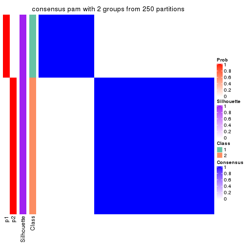</p>

</div>
<div id='tab-SD-pam-consensus-heatmap-2'>
<pre><code class="r">consensus_heatmap(res, k = 3)
</code></pre>

<p>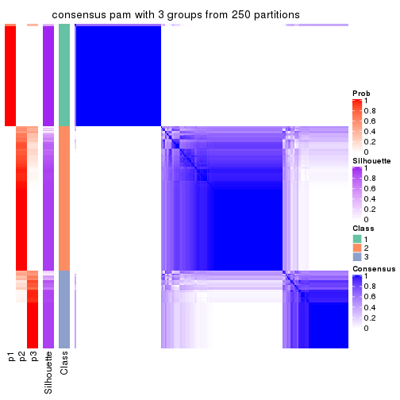</p>

</div>
<div id='tab-SD-pam-consensus-heatmap-3'>
<pre><code class="r">consensus_heatmap(res, k = 4)
</code></pre>

<p>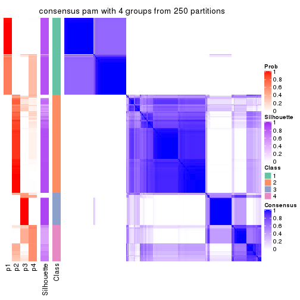</p>

</div>
<div id='tab-SD-pam-consensus-heatmap-4'>
<pre><code class="r">consensus_heatmap(res, k = 5)
</code></pre>

<p>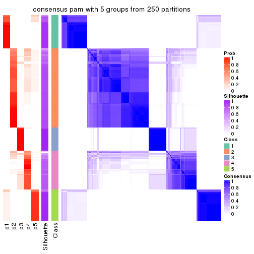</p>

</div>
<div id='tab-SD-pam-consensus-heatmap-5'>
<pre><code class="r">consensus_heatmap(res, k = 6)
</code></pre>

<p>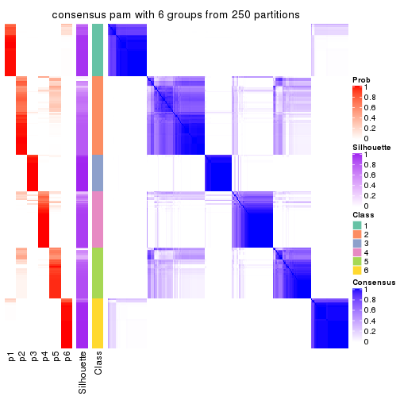</p>

</div>
</div>

Heatmaps for the membership of samples in all partitions to see how consistent they are:


<script>
$( function() {
	$( '#tabs-SD-pam-membership-heatmap' ).tabs();
} );
</script>
<div id='tabs-SD-pam-membership-heatmap'>
<ul>
<li><a href='#tab-SD-pam-membership-heatmap-1'>k = 2</a></li>
<li><a href='#tab-SD-pam-membership-heatmap-2'>k = 3</a></li>
<li><a href='#tab-SD-pam-membership-heatmap-3'>k = 4</a></li>
<li><a href='#tab-SD-pam-membership-heatmap-4'>k = 5</a></li>
<li><a href='#tab-SD-pam-membership-heatmap-5'>k = 6</a></li>
</ul>
<div id='tab-SD-pam-membership-heatmap-1'>
<pre><code class="r">membership_heatmap(res, k = 2)
</code></pre>

<p></p>

</div>
<div id='tab-SD-pam-membership-heatmap-2'>
<pre><code class="r">membership_heatmap(res, k = 3)
</code></pre>

<p>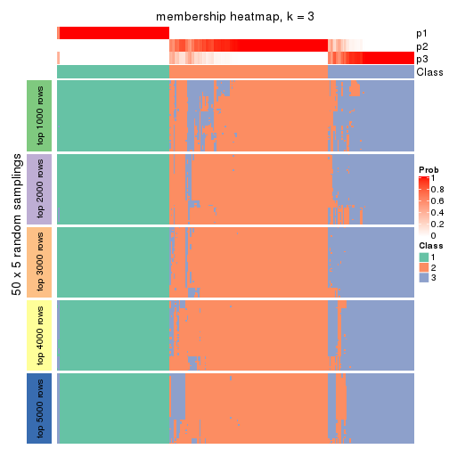</p>

</div>
<div id='tab-SD-pam-membership-heatmap-3'>
<pre><code class="r">membership_heatmap(res, k = 4)
</code></pre>

<p>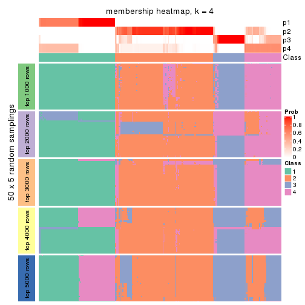</p>

</div>
<div id='tab-SD-pam-membership-heatmap-4'>
<pre><code class="r">membership_heatmap(res, k = 5)
</code></pre>

<p>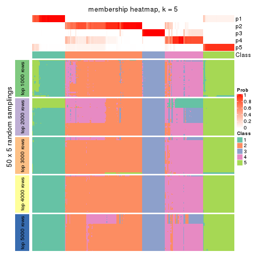</p>

</div>
<div id='tab-SD-pam-membership-heatmap-5'>
<pre><code class="r">membership_heatmap(res, k = 6)
</code></pre>

<p>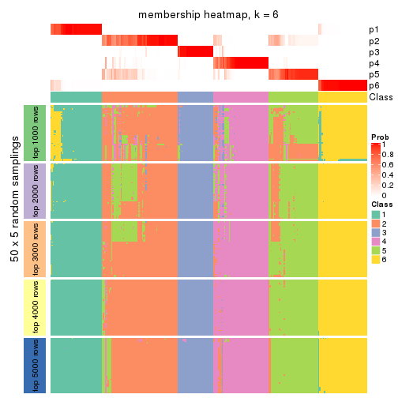</p>

</div>
</div>

As soon as we have had the classes for columns, we can look for signatures
which are significantly different between classes which can be candidate marks
for certain classes. Following are the heatmaps for signatures.


Signature heatmaps where rows are scaled:


<script>
$( function() {
	$( '#tabs-SD-pam-get-signatures' ).tabs();
} );
</script>
<div id='tabs-SD-pam-get-signatures'>
<ul>
<li><a href='#tab-SD-pam-get-signatures-1'>k = 2</a></li>
<li><a href='#tab-SD-pam-get-signatures-2'>k = 3</a></li>
<li><a href='#tab-SD-pam-get-signatures-3'>k = 4</a></li>
<li><a href='#tab-SD-pam-get-signatures-4'>k = 5</a></li>
<li><a href='#tab-SD-pam-get-signatures-5'>k = 6</a></li>
</ul>
<div id='tab-SD-pam-get-signatures-1'>
<pre><code class="r">get_signatures(res, k = 2)
</code></pre>

<p>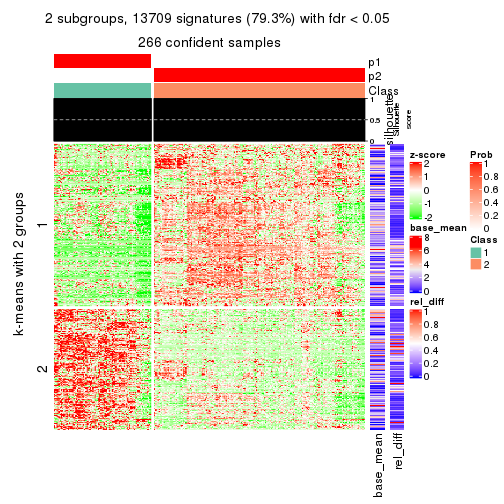</p>

</div>
<div id='tab-SD-pam-get-signatures-2'>
<pre><code class="r">get_signatures(res, k = 3)
</code></pre>

<p>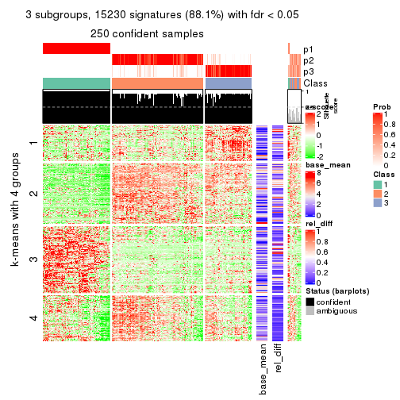</p>

</div>
<div id='tab-SD-pam-get-signatures-3'>
<pre><code class="r">get_signatures(res, k = 4)
</code></pre>

<p>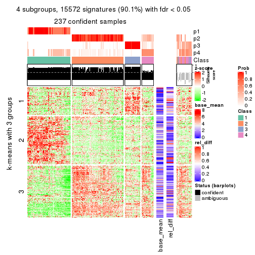</p>

</div>
<div id='tab-SD-pam-get-signatures-4'>
<pre><code class="r">get_signatures(res, k = 5)
</code></pre>

<p>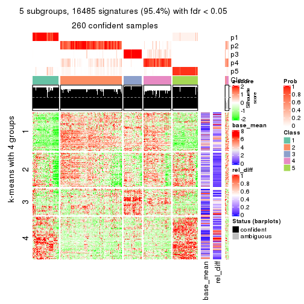</p>

</div>
<div id='tab-SD-pam-get-signatures-5'>
<pre><code class="r">get_signatures(res, k = 6)
</code></pre>

<p></p>

</div>
</div>


Signature heatmaps where rows are not scaled:


<script>
$( function() {
	$( '#tabs-SD-pam-get-signatures-no-scale' ).tabs();
} );
</script>
<div id='tabs-SD-pam-get-signatures-no-scale'>
<ul>
<li><a href='#tab-SD-pam-get-signatures-no-scale-1'>k = 2</a></li>
<li><a href='#tab-SD-pam-get-signatures-no-scale-2'>k = 3</a></li>
<li><a href='#tab-SD-pam-get-signatures-no-scale-3'>k = 4</a></li>
<li><a href='#tab-SD-pam-get-signatures-no-scale-4'>k = 5</a></li>
<li><a href='#tab-SD-pam-get-signatures-no-scale-5'>k = 6</a></li>
</ul>
<div id='tab-SD-pam-get-signatures-no-scale-1'>
<pre><code class="r">get_signatures(res, k = 2, scale_rows = FALSE)
</code></pre>

<p></p>

</div>
<div id='tab-SD-pam-get-signatures-no-scale-2'>
<pre><code class="r">get_signatures(res, k = 3, scale_rows = FALSE)
</code></pre>

<p>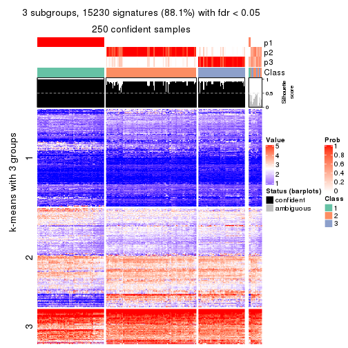</p>

</div>
<div id='tab-SD-pam-get-signatures-no-scale-3'>
<pre><code class="r">get_signatures(res, k = 4, scale_rows = FALSE)
</code></pre>

<p>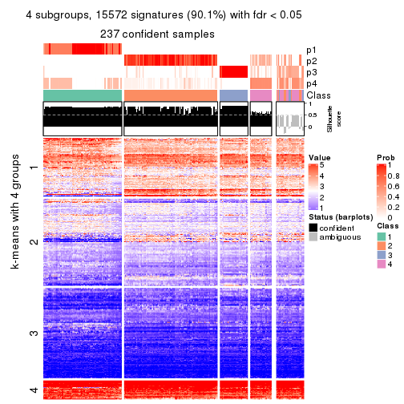</p>

</div>
<div id='tab-SD-pam-get-signatures-no-scale-4'>
<pre><code class="r">get_signatures(res, k = 5, scale_rows = FALSE)
</code></pre>

<p>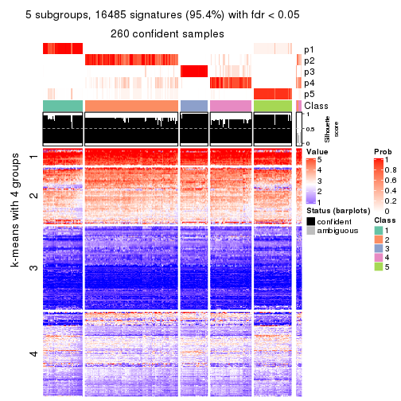</p>

</div>
<div id='tab-SD-pam-get-signatures-no-scale-5'>
<pre><code class="r">get_signatures(res, k = 6, scale_rows = FALSE)
</code></pre>

<p>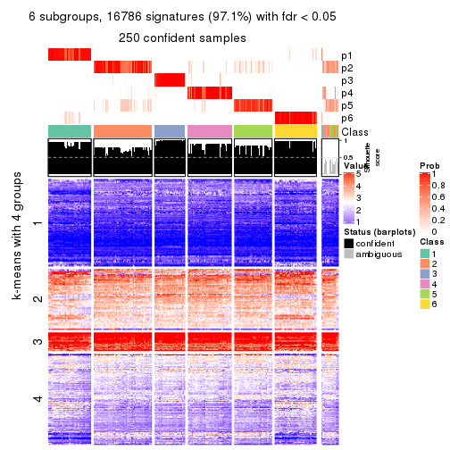</p>

</div>
</div>


Compare the overlap of signatures from different k:

```r
compare_signatures(res)
```

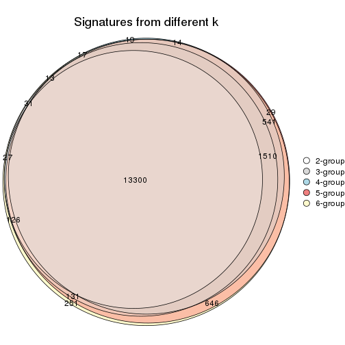

`get_signature()` returns a data frame invisibly. TO get the list of signatures, the function
call should be assigned to a variable explicitly. In following code, if `plot` argument is set
to `FALSE`, no heatmap is plotted while only the differential analysis is performed.

```r
# code only for demonstration
tb = get_signature(res, k = ..., plot = FALSE)
```

An example of the output of `tb` is:

```
#>   which_row         fdr    mean_1    mean_2 scaled_mean_1 scaled_mean_2 km
#> 1        38 0.042760348  8.373488  9.131774    -0.5533452     0.5164555  1
#> 2        40 0.018707592  7.106213  8.469186    -0.6173731     0.5762149  1
#> 3        55 0.019134737 10.221463 11.207825    -0.6159697     0.5749050  1
#> 4        59 0.006059896  5.921854  7.869574    -0.6899429     0.6439467  1
#> 5        60 0.018055526  8.928898 10.211722    -0.6204761     0.5791110  1
#> 6        98 0.009384629 15.714769 14.887706     0.6635654    -0.6193277  2
...
```

The columns in `tb` are:

1. `which_row`: row indices corresponding to the input matrix.
2. `fdr`: FDR for the differential test. 
3. `mean_x`: The mean value in group x.
4. `scaled_mean_x`: The mean value in group x after rows are scaled.
5. `km`: Row groups if k-means clustering is applied to rows.


UMAP plot which shows how samples are separated.


<script>
$( function() {
	$( '#tabs-SD-pam-dimension-reduction' ).tabs();
} );
</script>
<div id='tabs-SD-pam-dimension-reduction'>
<ul>
<li><a href='#tab-SD-pam-dimension-reduction-1'>k = 2</a></li>
<li><a href='#tab-SD-pam-dimension-reduction-2'>k = 3</a></li>
<li><a href='#tab-SD-pam-dimension-reduction-3'>k = 4</a></li>
<li><a href='#tab-SD-pam-dimension-reduction-4'>k = 5</a></li>
<li><a href='#tab-SD-pam-dimension-reduction-5'>k = 6</a></li>
</ul>
<div id='tab-SD-pam-dimension-reduction-1'>
<pre><code class="r">dimension_reduction(res, k = 2, method = &quot;UMAP&quot;)
</code></pre>

<p></p>

</div>
<div id='tab-SD-pam-dimension-reduction-2'>
<pre><code class="r">dimension_reduction(res, k = 3, method = &quot;UMAP&quot;)
</code></pre>

<p>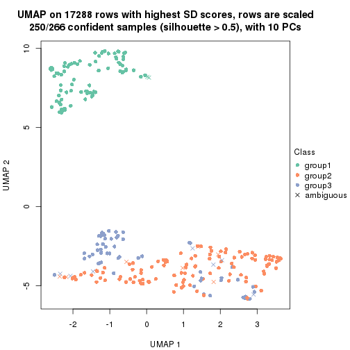</p>

</div>
<div id='tab-SD-pam-dimension-reduction-3'>
<pre><code class="r">dimension_reduction(res, k = 4, method = &quot;UMAP&quot;)
</code></pre>

<p>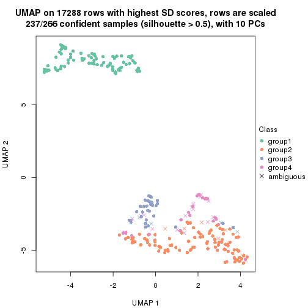</p>

</div>
<div id='tab-SD-pam-dimension-reduction-4'>
<pre><code class="r">dimension_reduction(res, k = 5, method = &quot;UMAP&quot;)
</code></pre>

<p>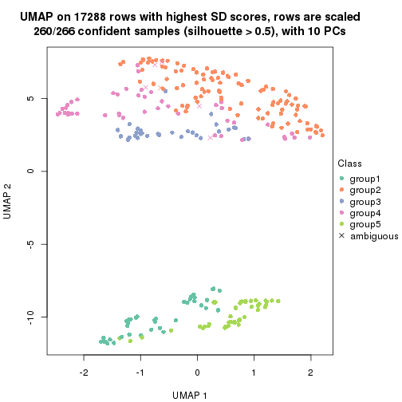</p>

</div>
<div id='tab-SD-pam-dimension-reduction-5'>
<pre><code class="r">dimension_reduction(res, k = 6, method = &quot;UMAP&quot;)
</code></pre>

<p>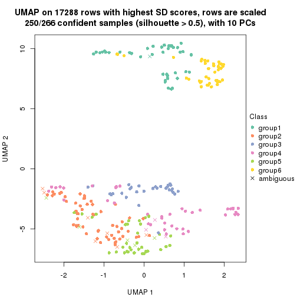</p>

</div>
</div>


Following heatmap shows how subgroups are split when increasing `k`:

```r
collect_classes(res)
```

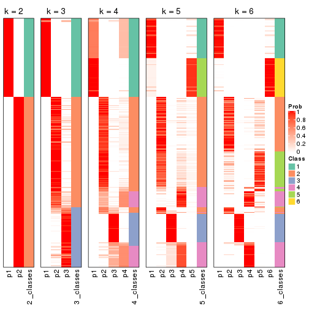


If matrix rows can be associated to genes, consider to use `GO_Enrichment(res,
...)` to perform function enrichment for the signature genes.


 

---------------------------------------------------


### SD:mclust**


The object with results only for a single top-value method and a single partition method 
can be extracted as:

```r
res = res_list["SD", "mclust"]
# you can also extract it by
# res = res_list["SD:mclust"]
```

A summary of `res` and all the functions that can be applied to it:

```r
res
```

```
#> A 'ConsensusPartition' object with k = 2, 3, 4, 5, 6.
#>   On a matrix with 17288 rows and 266 columns.
#>   Top rows (1000, 2000, 3000, 4000, 5000) are extracted by 'SD' method.
#>   Subgroups are detected by 'mclust' method.
#>   Performed in total 1250 partitions by row resampling.
#>   Best k for subgroups seems to be 2.
#> 
#> Following methods can be applied to this 'ConsensusPartition' object:
#>  [1] "cola_report"             "collect_classes"         "collect_plots"          
#>  [4] "collect_stats"           "colnames"                "compare_signatures"     
#>  [7] "consensus_heatmap"       "dimension_reduction"     "functional_enrichment"  
#> [10] "get_anno_col"            "get_anno"                "get_classes"            
#> [13] "get_consensus"           "get_matrix"              "get_membership"         
#> [16] "get_param"               "get_signatures"          "get_stats"              
#> [19] "is_best_k"               "is_stable_k"             "membership_heatmap"     
#> [22] "ncol"                    "nrow"                    "plot_ecdf"              
#> [25] "rownames"                "select_partition_number" "show"                   
#> [28] "suggest_best_k"          "test_to_known_factors"
```

`collect_plots()` function collects all the plots made from `res` for all `k` (number of partitions)
into one single page to provide an easy and fast comparison between different `k`.

```r
collect_plots(res)
```

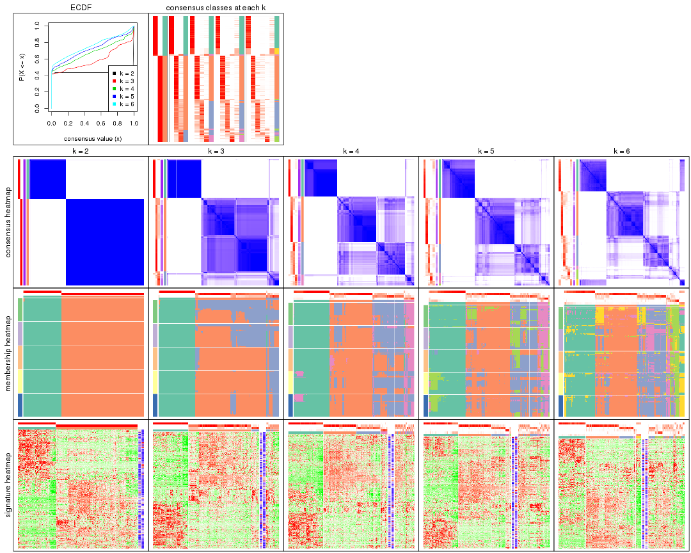

The plots are:

- The first row: a plot of the ECDF (Empirical cumulative distribution
  function) curves of the consensus matrix for each `k` and the heatmap of
  predicted classes for each `k`.
- The second row: heatmaps of the consensus matrix for each `k`.
- The third row: heatmaps of the membership matrix for each `k`.
- The fouth row: heatmaps of the signatures for each `k`.

All the plots in panels can be made by individual functions and they are
plotted later in this section.

`select_partition_number()` produces several plots showing different
statistics for choosing "optimized" `k`. There are following statistics:

- ECDF curves of the consensus matrix for each `k`;
- 1-PAC. [The PAC
  score](https://en.wikipedia.org/wiki/Consensus_clustering#Over-interpretation_potential_of_consensus_clustering)
  measures the proportion of the ambiguous subgrouping.
- Mean silhouette score.
- Concordance. The mean probability of fiting the consensus class ids in all
  partitions.
- Area increased. Denote $A_k$ as the area under the ECDF curve for current
  `k`, the area increased is defined as $A_k - A_{k-1}$.
- Rand index. The percent of pairs of samples that are both in a same cluster
  or both are not in a same cluster in the partition of k and k-1.
- Jaccard index. The ratio of pairs of samples are both in a same cluster in
  the partition of k and k-1 and the pairs of samples are both in a same
  cluster in the partition k or k-1.

The detailed explanations of these statistics can be found in [the cola
vignette](http://bioconductor.org/packages/devel/bioc/vignettes/cola/inst/doc/cola.html#toc_13).

Generally speaking, lower PAC score, higher mean silhouette score or higher
concordance corresponds to better partition. Rand index and Jaccard index
measure how similar the current partition is compared to partition with `k-1`.
If they are too similar, we won't accept `k` is better than `k-1`.

```r
select_partition_number(res)
```

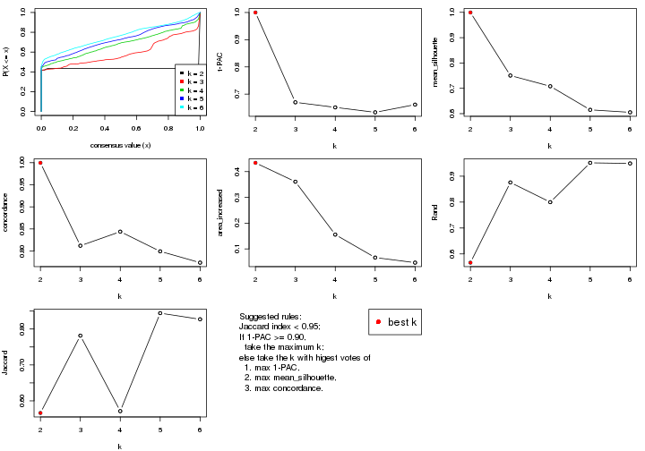

The numeric values for all these statistics can be obtained by `get_stats()`.

```r
get_stats(res)
```

```
#>   k 1-PAC mean_silhouette concordance area_increased  Rand Jaccard
#> 2 2 1.000           0.999       1.000         0.4341 0.566   0.566
#> 3 3 0.670           0.750       0.812         0.3608 0.876   0.782
#> 4 4 0.651           0.708       0.844         0.1555 0.800   0.571
#> 5 5 0.633           0.615       0.799         0.0663 0.952   0.844
#> 6 6 0.661           0.605       0.774         0.0466 0.949   0.827
```

`suggest_best_k()` suggests the best $k$ based on these statistics. The rules are as follows:

- All $k$ with Jaccard index larger than 0.95 are removed because the increase of
  the partition number does not provides enough extra information. If all $k$ are removed,
  the best $k$ is assigned by `NA`.
- For $k$ with 1-PAC larger than 0.9, the maximal $k$ is taken as the "best k". Other $k$ is called "optional k".
- If it does not fit the second rule. The $k$ with the highest vote of highest
  1-PAC, mean silhouette and concordance is taken as the "best k".

```r
suggest_best_k(res)
```

```
#> [1] 2
```


Following shows the table of the partitions (You need to click the **show/hide
code output** link to see it). The membership matrix (columns with name `p*`)
is inferred by
[`clue::cl_consensus()`](https://www.rdocumentation.org/link/cl_consensus?package=clue)
function with the `SE` method. Basically the value in the membership matrix
represents the probability to belong to a certain group. The finall class
label for an item is determined with the group with highest probability it
belongs to.

In `get_classes()` function, the entropy is calculated from the membership
matrix and the silhouette score is calculated from the consensus matrix.


<script>
$( function() {
	$( '#tabs-SD-mclust-get-classes' ).tabs();
} );
</script>
<div id='tabs-SD-mclust-get-classes'>
<ul>
<li><a href='#tab-SD-mclust-get-classes-1'>k = 2</a></li>
<li><a href='#tab-SD-mclust-get-classes-2'>k = 3</a></li>
<li><a href='#tab-SD-mclust-get-classes-3'>k = 4</a></li>
<li><a href='#tab-SD-mclust-get-classes-4'>k = 5</a></li>
<li><a href='#tab-SD-mclust-get-classes-5'>k = 6</a></li>
</ul>

<div id='tab-SD-mclust-get-classes-1'>
<p><a id='tab-SD-mclust-get-classes-1-a' style='color:#0366d6' href='#'>show/hide code output</a></p>
<pre><code class="r">cbind(get_classes(res, k = 2), get_membership(res, k = 2))
</code></pre>

<pre><code>#&gt;                                      class entropy silhouette    p1    p2
#&gt; 80D0AF10-1C61-4B67-90C1-7DBF1EF23672     2   0.000      1.000 0.000 1.000
#&gt; 87117BE1-D328-4972-85DA-6672412D8860     2   0.000      1.000 0.000 1.000
#&gt; F904C5B6-70BD-4604-8254-79BE23B152DA     1   0.000      0.999 1.000 0.000
#&gt; 3182DEA1-4239-4613-925A-7E6503766AD6     2   0.000      1.000 0.000 1.000
#&gt; 55E78EA2-2D9B-481F-8CAB-D36A33088EAE     2   0.000      1.000 0.000 1.000
#&gt; 86F94264-A6DD-4A97-9191-036F066DD0EF     2   0.000      1.000 0.000 1.000
#&gt; 09D25417-23B7-4D88-A0EA-F307985FBBBC     2   0.000      1.000 0.000 1.000
#&gt; C797F12C-40D3-4DB5-B9EF-A6821BBDE4F0     1   0.000      0.999 1.000 0.000
#&gt; 80275DB0-A226-4B6B-A08F-4ADBEEE1DB01     1   0.000      0.999 1.000 0.000
#&gt; 27FB653A-9E07-44AD-952E-9E4DE4AB5891     2   0.000      1.000 0.000 1.000
#&gt; 1A5DB9FC-2ABD-4E1B-B5EF-B1CF5E5F3872     1   0.204      0.968 0.968 0.032
#&gt; 844E4CCD-D30C-416F-A086-8923711A4E25     2   0.000      1.000 0.000 1.000
#&gt; EF18318D-3D25-4D65-803A-ED6E62871E7E     1   0.184      0.972 0.972 0.028
#&gt; 1ACB1BE0-61F6-4243-BBEC-E26A1CF90CA8     1   0.000      0.999 1.000 0.000
#&gt; 8EF0039B-D758-46AB-BAF7-6A062C7C56BA     1   0.000      0.999 1.000 0.000
#&gt; 22F4C9D9-663B-4C91-9692-E035A2640BEC     2   0.000      1.000 0.000 1.000
#&gt; FA1A0BCE-EE0F-4178-B963-62550E344B14     2   0.000      1.000 0.000 1.000
#&gt; 0B6D0C4E-5AE3-4707-A9FC-12A108E6EC2A     2   0.000      1.000 0.000 1.000
#&gt; 06FD3123-2AEB-4911-AC4E-E0E64FD5DB52     2   0.000      1.000 0.000 1.000
#&gt; 235A4492-FF80-4AA5-BC71-DFF65E1C7411     2   0.000      1.000 0.000 1.000
#&gt; A192C6C0-1443-4493-AFAC-1EE710628ADB     2   0.000      1.000 0.000 1.000
#&gt; 6FC5B56B-711B-4174-9B06-4E843124AAB6     1   0.000      0.999 1.000 0.000
#&gt; 7A813F60-A41E-4552-990E-F22287654C1D     2   0.000      1.000 0.000 1.000
#&gt; 725BBFB5-26F4-4512-9C75-47D013C1E605     1   0.000      0.999 1.000 0.000
#&gt; 39CC4E82-EBC9-472E-8BE5-6A3AB178449A     2   0.000      1.000 0.000 1.000
#&gt; 61130DEE-E267-49DF-8B41-7738A06EF738     2   0.000      1.000 0.000 1.000
#&gt; 117EC12C-B7ED-4E01-B29B-EA542D356EA1     1   0.000      0.999 1.000 0.000
#&gt; A30FF708-F7A9-41E4-8AD5-20441650FBC9     2   0.000      1.000 0.000 1.000
#&gt; 53640D52-1167-4A5D-B656-97D32CBA3934     1   0.000      0.999 1.000 0.000
#&gt; 9E85D76A-DD2A-46D5-BB59-0ED302B6258C     2   0.000      1.000 0.000 1.000
#&gt; 6F8C6F90-7E3C-4860-91DD-586708DE44AA     1   0.000      0.999 1.000 0.000
#&gt; E675AEC5-AA9A-4AAA-839C-03E6365822DB     2   0.000      1.000 0.000 1.000
#&gt; B577DEF7-2F5C-4876-A7C6-F18D5722B8C0     1   0.184      0.972 0.972 0.028
#&gt; DA8B577E-43E7-49BF-BF94-868E3194F5C9     1   0.000      0.999 1.000 0.000
#&gt; 3334280B-2A36-4AC7-A021-A76C10E958F0     2   0.000      1.000 0.000 1.000
#&gt; 5CBDDC90-11EC-4E6E-881E-AA9CCFD40FDB     2   0.000      1.000 0.000 1.000
#&gt; 8CBBF32A-8349-44F5-A8B8-4CBB1760A464     2   0.000      1.000 0.000 1.000
#&gt; B9455A9A-136D-4DC2-9F86-0FC74433589D     2   0.000      1.000 0.000 1.000
#&gt; D7EAE2A7-F9BE-4222-A452-B1F83F99CD50     2   0.000      1.000 0.000 1.000
#&gt; F803AE18-60C5-4CFE-AAAB-DB33C26A2184     1   0.000      0.999 1.000 0.000
#&gt; 5DD8CAC7-EC02-43B6-B58E-6D2E22868A3B     2   0.000      1.000 0.000 1.000
#&gt; EE98E1B4-DFB3-4AEC-8527-E1FD544C9475     1   0.000      0.999 1.000 0.000
#&gt; 3CE43921-47D5-4394-B9E1-242607775D61     2   0.000      1.000 0.000 1.000
#&gt; 46986F2B-0B0D-4187-8948-4E91D34B7C49     2   0.000      1.000 0.000 1.000
#&gt; 5D1D052E-74EF-45A8-9B1A-7CECD13EA43B     2   0.000      1.000 0.000 1.000
#&gt; 4C821AD9-A5C9-4A9A-9C5D-363B227F8064     2   0.000      1.000 0.000 1.000
#&gt; 06A4189E-A23B-4AC6-AA74-01955DD7D1E9     2   0.000      1.000 0.000 1.000
#&gt; FCCDC76F-CB02-4BCD-A616-325F258DDAA4     2   0.000      1.000 0.000 1.000
#&gt; DAC53B0A-8F35-4EA6-BBCC-4CD1C049E11F     2   0.000      1.000 0.000 1.000
#&gt; DD4F845B-CAD3-44CB-9D96-3C3F5BA1B72D     1   0.000      0.999 1.000 0.000
#&gt; D440F004-A4A4-41B6-BED8-805D67BA01C7     2   0.000      1.000 0.000 1.000
#&gt; A497C423-119F-42FA-BF17-9F6DFD2A5585     2   0.000      1.000 0.000 1.000
#&gt; 3420E573-DE12-4EF5-B1C0-2FCA904F4F4E     1   0.000      0.999 1.000 0.000
#&gt; 1AD72157-A254-44B4-BA58-4F30F1AE910E     1   0.000      0.999 1.000 0.000
#&gt; C1113977-B160-45EE-B061-750F9EA3F33F     2   0.000      1.000 0.000 1.000
#&gt; 6783AB5B-F07C-447B-BF13-C34485D246D7     2   0.000      1.000 0.000 1.000
#&gt; 1F553062-26FD-4A7F-B7FB-81184604F423     1   0.000      0.999 1.000 0.000
#&gt; BE2DCA51-1C21-4598-98A7-F2FB9B2DFCB4     2   0.000      1.000 0.000 1.000
#&gt; 38941CF3-9C54-4BA4-A005-CC88CA97D504     2   0.000      1.000 0.000 1.000
#&gt; 51CB675E-E243-4A07-BF4A-580473D26FDA     2   0.000      1.000 0.000 1.000
#&gt; C7FED0F5-C27A-4405-9232-30BF39362CF7     2   0.000      1.000 0.000 1.000
#&gt; 2A1E86E8-4713-465F-ACFF-C584864C57A1     2   0.000      1.000 0.000 1.000
#&gt; B4500785-0FAA-4D4D-8630-43D194BAB004     2   0.000      1.000 0.000 1.000
#&gt; 3FD52E66-AB76-4079-80DB-281A795D1EC0     2   0.000      1.000 0.000 1.000
#&gt; EBD355D1-1226-4DFD-AAFF-45D246B64F3C     2   0.000      1.000 0.000 1.000
#&gt; 5A040A73-CD95-487E-8AEF-9639FE4E2916     2   0.000      1.000 0.000 1.000
#&gt; CF629C65-585D-476D-B081-3E6E0575FAE3     2   0.000      1.000 0.000 1.000
#&gt; 0D4202A3-808E-413F-9BF3-9CFCCAE0ED61     2   0.000      1.000 0.000 1.000
#&gt; 43E715BF-28D9-4B5E-B762-8CD1B69A430E     1   0.000      0.999 1.000 0.000
#&gt; BFB82BE8-9DAC-4099-8B38-0950308E3EB3     2   0.000      1.000 0.000 1.000
#&gt; F7CB1825-2303-4DD2-AE1F-7205738EAF1F     1   0.000      0.999 1.000 0.000
#&gt; FE298483-C42C-4753-BABB-29A9CB1B6312     1   0.000      0.999 1.000 0.000
#&gt; A98C7561-1B42-4CD6-AE71-924B91FA4C33     2   0.000      1.000 0.000 1.000
#&gt; 58098F21-7DAB-47DA-9A41-8D20BF3B9257     2   0.000      1.000 0.000 1.000
#&gt; 18CAF708-20B9-4745-9CB3-37AB6E0B3056     2   0.000      1.000 0.000 1.000
#&gt; 2C80DD72-C9C7-4AC2-812F-9A31EF02779C     1   0.000      0.999 1.000 0.000
#&gt; 68A3F13D-319D-4603-A27F-B5DD46FE5C5B     2   0.000      1.000 0.000 1.000
#&gt; 7EE8F0CE-CDC9-40F9-A1DE-7F8140EC6D13     2   0.000      1.000 0.000 1.000
#&gt; 39019903-5B9C-4665-BD5F-7CCB19CB55C5     2   0.000      1.000 0.000 1.000
#&gt; 190EDB27-4CBC-4E9C-9B67-D51FDAB982B7     2   0.000      1.000 0.000 1.000
#&gt; EB2D95BC-62F8-4669-9308-D37D7FB79E23     2   0.000      1.000 0.000 1.000
#&gt; A08B85EA-D1E7-4B77-8DEC-36294305B9F7     1   0.000      0.999 1.000 0.000
#&gt; 130DDFAD-6EF8-4C80-BD9D-88308A6874BC     2   0.000      1.000 0.000 1.000
#&gt; 7340A5BA-E002-448F-AACC-E7A37DBB79C2     2   0.000      1.000 0.000 1.000
#&gt; A771F6E3-D266-4FE7-98C6-C40E6A701D59     1   0.000      0.999 1.000 0.000
#&gt; 015E792C-EC1B-49BF-AB07-D82B20C5989A     2   0.000      1.000 0.000 1.000
#&gt; BF79E030-47EE-4D08-B910-5685A4BD8B60     2   0.000      1.000 0.000 1.000
#&gt; FB3C7C9A-2F2D-4DD5-BE47-FAFB072C0FAB     2   0.000      1.000 0.000 1.000
#&gt; 4E5557BA-10E8-4723-908E-DD04EF6639B2     2   0.000      1.000 0.000 1.000
#&gt; 8031B550-40A9-4A3A-9F7D-CDC052288BD8     2   0.000      1.000 0.000 1.000
#&gt; 55299A06-3C1F-45A4-B166-B2C591C0CEE2     2   0.000      1.000 0.000 1.000
#&gt; EB8D5168-216E-4ABB-8B4E-9E67786CB322     1   0.000      0.999 1.000 0.000
#&gt; 78BD2D83-9A7F-42E5-BB38-654AA0761A0A     2   0.000      1.000 0.000 1.000
#&gt; AA2D53E5-D389-4332-9DD5-A736052E48F8     1   0.000      0.999 1.000 0.000
#&gt; 62945C7A-9313-4FC9-820C-B0AB820B394E     1   0.000      0.999 1.000 0.000
#&gt; 22746046-2E99-4EE9-97D2-BA2EA499634C     2   0.000      1.000 0.000 1.000
#&gt; 8671B51B-DCBE-4429-9F01-AF51CAD7014F     2   0.000      1.000 0.000 1.000
#&gt; E815AB36-5689-4A0D-8E6D-2EAA73406681     1   0.000      0.999 1.000 0.000
#&gt; A1DACB46-ED52-4E38-B2C8-57256BB22B5E     2   0.000      1.000 0.000 1.000
#&gt; 4F5498C4-A423-4B3D-AC98-D4E214A57D0E     1   0.000      0.999 1.000 0.000
#&gt; A7772CCD-FFFF-49DD-86ED-0BAD330EC9B6     2   0.000      1.000 0.000 1.000
#&gt; E6E3DF78-65B9-4F74-8DA8-E2A6D4EDBEA7     2   0.000      1.000 0.000 1.000
#&gt; 83286E2D-E708-437A-911A-E6B050273CBD     1   0.000      0.999 1.000 0.000
#&gt; EC5C7C97-EE8C-405D-A039-D96514B1D414     2   0.000      1.000 0.000 1.000
#&gt; 3E55223D-6E3D-4027-9819-67E91212531D     1   0.000      0.999 1.000 0.000
#&gt; 99A036A2-8343-4D06-8047-D84E96CE4C61     2   0.000      1.000 0.000 1.000
#&gt; CA6CDE6D-92DE-4259-9E58-A373F2D543EA     2   0.000      1.000 0.000 1.000
#&gt; BF6FA8CC-60C1-413A-B2C6-54CCACBC01D6     1   0.000      0.999 1.000 0.000
#&gt; E0594CFE-F7B6-4546-B130-30DF6A514B1F     2   0.000      1.000 0.000 1.000
#&gt; E769E41D-5949-42C5-9594-E563C05ACE52     2   0.000      1.000 0.000 1.000
#&gt; 01373725-5D3C-4D9C-AABC-911D53E62BCD     2   0.000      1.000 0.000 1.000
#&gt; 1F39DADD-3655-474E-BA4C-A5BD32C97A8B     1   0.000      0.999 1.000 0.000
#&gt; AF573EC8-E4EE-4B8F-8199-9817B9FAC67D     1   0.000      0.999 1.000 0.000
#&gt; 3F022CBC-41C8-4387-A6FB-124C4BCD1AD9     1   0.000      0.999 1.000 0.000
#&gt; 1CC32ACE-826B-494B-8B89-5BD92327A74D     2   0.000      1.000 0.000 1.000
#&gt; 22B0BD3B-EE08-4BC7-90B2-01C372A56BA2     2   0.000      1.000 0.000 1.000
#&gt; 0F3DE9EF-19CC-4D14-9A42-1435DB537F94     2   0.000      1.000 0.000 1.000
#&gt; 87F8A33F-FBC3-469E-862B-84472F796358     2   0.000      1.000 0.000 1.000
#&gt; C9F2FA0D-1A9F-40B4-BD9B-CAF1B3F3D5A7     2   0.000      1.000 0.000 1.000
#&gt; ACFC9F59-78FF-4453-B25F-8834D0EAB54A     2   0.000      1.000 0.000 1.000
#&gt; B7AC7D5B-14E9-45A7-93B7-226EE508544A     2   0.000      1.000 0.000 1.000
#&gt; 4491BF17-B168-4E96-8E09-EF1AEC9F5E9D     2   0.000      1.000 0.000 1.000
#&gt; 557A0811-A3FE-4CF4-A24D-FBB77E7F9139     2   0.000      1.000 0.000 1.000
#&gt; 6F9C955C-6816-4353-922A-8035B50FACC6     2   0.000      1.000 0.000 1.000
#&gt; 3E89FB1C-4A7D-43C7-823C-04E3716A7935     2   0.000      1.000 0.000 1.000
#&gt; 12ABE483-66EF-4237-94C4-0199FAE23FA8     2   0.000      1.000 0.000 1.000
#&gt; 7535F262-9B96-44F6-988C-4C9EBB3FFCA9     2   0.000      1.000 0.000 1.000
#&gt; 65C9D28E-303B-40E5-84F0-2507F5457374     2   0.000      1.000 0.000 1.000
#&gt; FD445384-6BA9-4297-9D9C-12ABA7D645C7     1   0.000      0.999 1.000 0.000
#&gt; 30D5E255-2AD3-44F3-8983-1B80E4FD3E2D     2   0.000      1.000 0.000 1.000
#&gt; 3E88EC60-B4A8-4259-8BC8-A234800F6955     2   0.000      1.000 0.000 1.000
#&gt; ACD73CE8-AFC5-47A0-9383-3CB97F018953     1   0.000      0.999 1.000 0.000
#&gt; 1AFDC2EA-26A8-44E2-8BCB-F34F7B66F8C8     2   0.000      1.000 0.000 1.000
#&gt; 9E327BC8-1D20-4AD8-83F7-FB2D13BCA5D0     2   0.000      1.000 0.000 1.000
#&gt; 85A86B91-4F24-4E77-AE2D-520F8E205EFC     1   0.000      0.999 1.000 0.000
#&gt; 74868C37-8143-4306-81CA-E45759D146CD     2   0.000      1.000 0.000 1.000
#&gt; 69AEA0DB-E335-48A0-A398-4FB0D581182A     2   0.000      1.000 0.000 1.000
#&gt; AE6F8B89-85C2-42B7-8D05-AFDDD4FEFD16     1   0.000      0.999 1.000 0.000
#&gt; A8A6F09C-9812-4457-9A4B-AD41F97B41A3     2   0.000      1.000 0.000 1.000
#&gt; 1A09BC4D-EF29-42DD-BB04-A3C264A3032D     1   0.000      0.999 1.000 0.000
#&gt; E0961A30-A62C-4235-9CF0-A1776827A996     2   0.000      1.000 0.000 1.000
#&gt; 134D2D90-7B08-4F20-8A3A-C77643FB208F     2   0.000      1.000 0.000 1.000
#&gt; A77C2DFF-93CF-4CB5-B3C1-81133D7F1A0F     2   0.000      1.000 0.000 1.000
#&gt; EA2DC457-9C74-4B9C-B3FA-5E72199B24A7     2   0.000      1.000 0.000 1.000
#&gt; FF34117B-5EE4-4C96-A8A2-2CE6A654CBE5     1   0.000      0.999 1.000 0.000
#&gt; 75F7B5E2-6559-4B48-A2A4-287C35C559CC     1   0.000      0.999 1.000 0.000
#&gt; 903BF591-B0AF-4BEE-B625-60B673070344     2   0.000      1.000 0.000 1.000
#&gt; 9DE1B790-C63C-41C4-9477-CE52A8119C67     2   0.000      1.000 0.000 1.000
#&gt; 9A28F80A-85F8-40E2-A32B-230EF93B2FA0     2   0.000      1.000 0.000 1.000
#&gt; 0AA2BDBB-8720-409A-AA72-1F4AA26E7CD8     2   0.000      1.000 0.000 1.000
#&gt; 5AD49F16-E974-4E5D-B1B6-073ECB73A01D     2   0.000      1.000 0.000 1.000
#&gt; CB0F961C-527D-4A48-9408-286B26BD9532     1   0.000      0.999 1.000 0.000
#&gt; 46FF25B6-D01D-4CA7-80B7-CEC2998C34E1     2   0.000      1.000 0.000 1.000
#&gt; 487CADE1-D699-4A6C-817A-B9A0AB940C61     1   0.000      0.999 1.000 0.000
#&gt; 4FF6F2D8-F869-4735-A4D1-1A8423153FBC     1   0.000      0.999 1.000 0.000
#&gt; 6005494F-5D3D-43A3-B3E8-8C91955B2A98     2   0.000      1.000 0.000 1.000
#&gt; CF10D584-CE32-45A4-A932-E9D5AF12A6A0     1   0.000      0.999 1.000 0.000
#&gt; E15CE4AB-5646-49C8-9CD6-938457036BB0     2   0.000      1.000 0.000 1.000
#&gt; 31E28D0B-0E69-4330-82ED-4F1827DC97EA     2   0.000      1.000 0.000 1.000
#&gt; DBACD3C3-CCB5-4478-BA78-85A0C847CA66     2   0.000      1.000 0.000 1.000
#&gt; 5A07041C-65EB-4FCD-8940-E90B905061B5     2   0.000      1.000 0.000 1.000
#&gt; 0EA7C916-FA47-489B-BC98-4D9E7D197628     1   0.000      0.999 1.000 0.000
#&gt; 30967F75-8499-47FF-ADA4-4DC566013F7B     1   0.000      0.999 1.000 0.000
#&gt; D2E528FF-AEA2-48D7-A60A-4C3E71EA9073     2   0.000      1.000 0.000 1.000
#&gt; 22735DCD-215E-48BC-BF44-32BD66F06E39     2   0.000      1.000 0.000 1.000
#&gt; BC2C3248-7FC6-48BC-96C1-45EA573DE7DC     1   0.000      0.999 1.000 0.000
#&gt; E72CEBCB-D686-4B12-BCBA-EC8F964330A2     1   0.000      0.999 1.000 0.000
#&gt; 23C937BB-BA20-4440-B680-914229CC3ADF     1   0.000      0.999 1.000 0.000
#&gt; 947E99C7-F402-4F1A-A6E9-81BCAAED135A     2   0.000      1.000 0.000 1.000
#&gt; 02475D11-FC81-4E88-944E-173C32DC3FE7     2   0.000      1.000 0.000 1.000
#&gt; F972A9AA-9842-4343-A533-A795E65581CE     1   0.000      0.999 1.000 0.000
#&gt; 05043AAF-3095-4C61-B5C1-EE9AA9082C75     2   0.000      1.000 0.000 1.000
#&gt; CECF7967-862E-428C-BB42-FEF553FDB3AA     2   0.000      1.000 0.000 1.000
#&gt; FB0B9483-6302-48C7-BE5B-DA667E00AE2D     2   0.000      1.000 0.000 1.000
#&gt; 78700FBA-1487-4754-9B30-18837BF7E9FB     1   0.000      0.999 1.000 0.000
#&gt; 2166F56D-54CE-4F1B-8F07-A4E13E4489E9     1   0.000      0.999 1.000 0.000
#&gt; 7CD0942E-E39A-43A7-8BAC-F25967864901     2   0.000      1.000 0.000 1.000
#&gt; 3B00BA2B-7F7D-4825-8F8D-90F04A5DE687     2   0.000      1.000 0.000 1.000
#&gt; 7465B01D-C05E-4FE0-A9FE-182920EDC489     2   0.000      1.000 0.000 1.000
#&gt; 88C31A99-F96E-4FC8-8B3D-C1AAA05062D9     1   0.000      0.999 1.000 0.000
#&gt; 53575575-3303-4F8F-B6A8-B42131CFB4AC     2   0.000      1.000 0.000 1.000
#&gt; CC8017C7-4128-48DA-8E43-503F63158D85     1   0.000      0.999 1.000 0.000
#&gt; 88449D2A-2A25-41A4-B91D-C99B58F8ECD9     2   0.000      1.000 0.000 1.000
#&gt; 46C7DDE5-A2B5-494F-96AE-0B6E2D51B003     1   0.000      0.999 1.000 0.000
#&gt; 42551D05-5EE5-4F91-93A8-32DA695D9DFA     2   0.000      1.000 0.000 1.000
#&gt; 0772DA48-3A36-422D-B166-CA1691B782C3     2   0.000      1.000 0.000 1.000
#&gt; 30346897-EC77-4153-88A2-D14593C8B741     2   0.000      1.000 0.000 1.000
#&gt; 0F00E267-C748-4A71-8B36-03C410641D88     2   0.000      1.000 0.000 1.000
#&gt; 4034703A-4DA9-4DDA-9CA9-E80FFE9CCDE6     2   0.000      1.000 0.000 1.000
#&gt; 393C8A41-CF45-4EA8-AFE3-25A08AB7692A     2   0.000      1.000 0.000 1.000
#&gt; 3354212D-A07C-435C-8B0C-9A7BAAB624B5     1   0.000      0.999 1.000 0.000
#&gt; 57E30D4E-ABF7-47DD-92BE-40CE215076B0     1   0.000      0.999 1.000 0.000
#&gt; 202B4C76-C840-4DB8-953F-AC75A4156FDD     2   0.000      1.000 0.000 1.000
#&gt; 93A0137B-1F4C-44EE-B959-2AD0CD2DF8B6     1   0.000      0.999 1.000 0.000
#&gt; C9794DB6-6E8C-4AFD-80EE-61D672A4F6E9     2   0.000      1.000 0.000 1.000
#&gt; AE4BFE63-F0C0-4624-AD97-4F7FF13E2384     1   0.000      0.999 1.000 0.000
#&gt; DCF87F27-2B54-42D9-8D28-5DFEE76E2F5B     2   0.000      1.000 0.000 1.000
#&gt; 2451D405-39FD-4812-958C-23462B66F1F1     2   0.000      1.000 0.000 1.000
#&gt; E27F5D33-3F68-4CA8-8757-A387C6EAD060     2   0.000      1.000 0.000 1.000
#&gt; 8BA9928A-5B93-477F-B4A2-D031B714D9AC     1   0.000      0.999 1.000 0.000
#&gt; 0FAACFF6-B50C-4BED-9824-B7270654F28D     2   0.000      1.000 0.000 1.000
#&gt; 3366CC3C-2BBA-4CA7-848E-4E16AA70AE7A     2   0.000      1.000 0.000 1.000
#&gt; 66237056-CA9A-4C90-AF0E-1621FEB71578     2   0.000      1.000 0.000 1.000
#&gt; C480F1FB-3100-436C-B0F5-DED63B7A580E     2   0.000      1.000 0.000 1.000
#&gt; A327DE0D-D945-4B42-9B41-A7302CF796EE     2   0.000      1.000 0.000 1.000
#&gt; E8A6871D-67FB-4306-9454-F5E7CDBA399A     2   0.000      1.000 0.000 1.000
#&gt; E9A7485B-82B6-4BD2-AFBB-DD0A82D6CDE2     1   0.000      0.999 1.000 0.000
#&gt; 93B382E4-9C9A-43F5-BD3B-502CC260B886     1   0.000      0.999 1.000 0.000
#&gt; A2792419-8E16-45FE-A524-17851F34AB9B     2   0.000      1.000 0.000 1.000
#&gt; 4DED1201-F25C-4F82-BABF-965EFAD7A8E5     2   0.000      1.000 0.000 1.000
#&gt; F1ACB2DD-E948-4F88-A249-F1BD1977D667     2   0.000      1.000 0.000 1.000
#&gt; 6CDBA203-8952-421D-A6BF-75652D9F3339     2   0.000      1.000 0.000 1.000
#&gt; 2D6C5AA7-3B33-48D7-AE0C-77A16B749D13     1   0.000      0.999 1.000 0.000
#&gt; 3F6B6D95-0720-42A0-AEB3-89FECAE7616A     2   0.000      1.000 0.000 1.000
#&gt; DED8ACF3-BBD8-46C9-85C9-A9C8F2E2BC0B     1   0.000      0.999 1.000 0.000
#&gt; 77069279-5A6F-42C0-9AA5-8C939591DFB5     1   0.000      0.999 1.000 0.000
#&gt; B2D4FCF3-FDF9-41C8-880A-6732CF6222AF     2   0.000      1.000 0.000 1.000
#&gt; 1CD71A4C-1E49-48EF-AA72-CB3C26B4C087     2   0.000      1.000 0.000 1.000
#&gt; C364E621-F85C-4B7F-842F-210B8D4DFE3A     2   0.000      1.000 0.000 1.000
#&gt; 11F1B8CA-07C1-47D2-A3C6-032FFA6A4A64     1   0.000      0.999 1.000 0.000
#&gt; 153BF804-6DC8-496B-987A-4021A2512211     2   0.000      1.000 0.000 1.000
#&gt; 5B5029C9-40F5-40D7-A36A-367022AD6A42     2   0.000      1.000 0.000 1.000
#&gt; 193CCBE6-104F-49B4-BDB2-C82EE36FDAAD     1   0.000      0.999 1.000 0.000
#&gt; E5D45E53-FCF3-4F01-9B78-6CB1ED0CFE40     2   0.000      1.000 0.000 1.000
#&gt; 5546A779-21DB-49F9-8C0D-A1E420088084     2   0.000      1.000 0.000 1.000
#&gt; E14825E0-0DC7-44C2-B265-F54672356838     1   0.000      0.999 1.000 0.000
#&gt; 8C8C09B9-EC83-45EC-BC4C-0BA92DE60ACB     1   0.000      0.999 1.000 0.000
#&gt; B388CA82-5BF7-4BDD-8821-4EC0B213121F     2   0.000      1.000 0.000 1.000
#&gt; A26025AC-9F71-4C07-9135-83593193BBB2     1   0.000      0.999 1.000 0.000
#&gt; C80E6D4B-AF21-42F0-8E20-6F7D2E99C062     2   0.000      1.000 0.000 1.000
#&gt; 5AE5D819-A6B1-4761-B7F9-8FFD3C520F31     2   0.000      1.000 0.000 1.000
#&gt; CAE8097F-A139-4C6E-9E30-35080475FF34     2   0.000      1.000 0.000 1.000
#&gt; 539C8DE3-6152-4671-B96F-ED6DC6DBD22B     1   0.000      0.999 1.000 0.000
#&gt; 5D28A8E0-4ECF-43A4-890A-BE968B9A8CB2     2   0.000      1.000 0.000 1.000
#&gt; 97A80AF8-365E-4756-A2B0-AEB1D8F5F33E     2   0.000      1.000 0.000 1.000
#&gt; B3527517-E339-46AE-8437-65303C309015     2   0.000      1.000 0.000 1.000
#&gt; 523E2183-AA20-4749-BD7E-69CD620DD6A3     2   0.000      1.000 0.000 1.000
#&gt; E553FB92-F181-47B3-9F3D-11DB51DFA3A4     2   0.000      1.000 0.000 1.000
#&gt; FFE0C4B1-8EEC-484A-AB87-3401B71BD081     2   0.000      1.000 0.000 1.000
#&gt; 73D6CA4B-9A9E-4E52-96C8-AE7F0CC8B276     2   0.000      1.000 0.000 1.000
#&gt; 485A8107-DF9A-4BC6-8A72-07FBA93F10F2     1   0.000      0.999 1.000 0.000
#&gt; 690823D9-B9AA-40EF-8302-4AD88BF89D1C     2   0.000      1.000 0.000 1.000
#&gt; B4E02660-562F-4EAC-8472-CBBD8A577688     2   0.000      1.000 0.000 1.000
#&gt; F82D5A60-90F9-4FF4-971E-73F7535FE65A     2   0.000      1.000 0.000 1.000
#&gt; C48401F7-2D56-4C6F-9896-C5435D1B44BF     2   0.000      1.000 0.000 1.000
#&gt; 94FC8991-182B-4B00-9A06-A00E8D3BDCFA     1   0.000      0.999 1.000 0.000
#&gt; FF00E80A-046D-4233-835E-CDF93403EA43     2   0.000      1.000 0.000 1.000
#&gt; C47A53F6-6479-4AD3-9D18-E4A70BE5F1DC     2   0.000      1.000 0.000 1.000
#&gt; 3487AE2D-AB1D-4DEF-AC4B-4B0FCAF8D899     2   0.000      1.000 0.000 1.000
#&gt; 479CD9BB-ECD7-41D5-B1E4-41132FF7FC95     2   0.000      1.000 0.000 1.000
#&gt; 048ADC6E-8C7E-4875-ACEE-E4787203C078     1   0.000      0.999 1.000 0.000
#&gt; 25AF81C5-B117-466D-AE9F-DD10BCB6AF2D     2   0.000      1.000 0.000 1.000
#&gt; 8B1D51D6-0B25-4289-81F0-9F95E0258877     2   0.000      1.000 0.000 1.000
#&gt; 282D390D-8E4E-4A19-B2B7-A6DB4BB2D46C     1   0.000      0.999 1.000 0.000
#&gt; BC6B92C1-F425-40C5-9941-539BFF5FE0FE     2   0.000      1.000 0.000 1.000
#&gt; 899CB9E0-48D0-413D-8566-BC151F146453     1   0.000      0.999 1.000 0.000
#&gt; 441400A9-1427-45E0-A8B4-EF2A6B7465C2     2   0.000      1.000 0.000 1.000
#&gt; CF96DDD4-DC0A-4341-BDE6-4DA2CB4978D0     1   0.000      0.999 1.000 0.000
#&gt; CE91F591-6072-4D29-9495-C78961635969     2   0.000      1.000 0.000 1.000
#&gt; 84D25635-2A38-4CFB-BFAC-38C007625C42     1   0.000      0.999 1.000 0.000
#&gt; ABF1AC12-872A-4C3D-A76C-07BC36A4DA5E     1   0.000      0.999 1.000 0.000
#&gt; B7F7F66F-1AED-4199-81C0-5C7FB0DBF438     2   0.000      1.000 0.000 1.000
#&gt; BAB786B9-6C20-425D-9886-63A0A092B59B     2   0.000      1.000 0.000 1.000
#&gt; 735D1DE3-D781-4F89-A395-09974057BBB7     1   0.000      0.999 1.000 0.000
#&gt; F6D5FBBA-05C4-4340-86D9-1A54181216A2     2   0.000      1.000 0.000 1.000
#&gt; 79C4E166-4A0D-4811-A2C8-CAE0A5AEED42     2   0.000      1.000 0.000 1.000
</code></pre>

<script>
$('#tab-SD-mclust-get-classes-1-a').parent().next().next().hide();
$('#tab-SD-mclust-get-classes-1-a').click(function(){
  $('#tab-SD-mclust-get-classes-1-a').parent().next().next().toggle();
  return(false);
});
</script>
</div>

<div id='tab-SD-mclust-get-classes-2'>
<p><a id='tab-SD-mclust-get-classes-2-a' style='color:#0366d6' href='#'>show/hide code output</a></p>
<pre><code class="r">cbind(get_classes(res, k = 3), get_membership(res, k = 3))
</code></pre>

<pre><code>#&gt;                                      class entropy silhouette    p1    p2    p3
#&gt; 80D0AF10-1C61-4B67-90C1-7DBF1EF23672     2  0.0592     0.7587 0.000 0.988 0.012
#&gt; 87117BE1-D328-4972-85DA-6672412D8860     2  0.0000     0.7667 0.000 1.000 0.000
#&gt; F904C5B6-70BD-4604-8254-79BE23B152DA     1  0.0000     0.9892 1.000 0.000 0.000
#&gt; 3182DEA1-4239-4613-925A-7E6503766AD6     3  0.6286     0.3631 0.000 0.464 0.536
#&gt; 55E78EA2-2D9B-481F-8CAB-D36A33088EAE     2  0.5529     0.7051 0.000 0.704 0.296
#&gt; 86F94264-A6DD-4A97-9191-036F066DD0EF     2  0.5529     0.7051 0.000 0.704 0.296
#&gt; 09D25417-23B7-4D88-A0EA-F307985FBBBC     3  0.6305    -0.3162 0.000 0.484 0.516
#&gt; C797F12C-40D3-4DB5-B9EF-A6821BBDE4F0     1  0.0000     0.9892 1.000 0.000 0.000
#&gt; 80275DB0-A226-4B6B-A08F-4ADBEEE1DB01     1  0.0000     0.9892 1.000 0.000 0.000
#&gt; 27FB653A-9E07-44AD-952E-9E4DE4AB5891     3  0.5497     0.4175 0.000 0.292 0.708
#&gt; 1A5DB9FC-2ABD-4E1B-B5EF-B1CF5E5F3872     3  0.5244     0.4774 0.240 0.004 0.756
#&gt; 844E4CCD-D30C-416F-A086-8923711A4E25     3  0.1529     0.6675 0.000 0.040 0.960
#&gt; EF18318D-3D25-4D65-803A-ED6E62871E7E     3  0.5244     0.4774 0.240 0.004 0.756
#&gt; 1ACB1BE0-61F6-4243-BBEC-E26A1CF90CA8     1  0.0000     0.9892 1.000 0.000 0.000
#&gt; 8EF0039B-D758-46AB-BAF7-6A062C7C56BA     1  0.0000     0.9892 1.000 0.000 0.000
#&gt; 22F4C9D9-663B-4C91-9692-E035A2640BEC     2  0.0592     0.7587 0.000 0.988 0.012
#&gt; FA1A0BCE-EE0F-4178-B963-62550E344B14     2  0.0892     0.7682 0.000 0.980 0.020
#&gt; 0B6D0C4E-5AE3-4707-A9FC-12A108E6EC2A     2  0.5529     0.7051 0.000 0.704 0.296
#&gt; 06FD3123-2AEB-4911-AC4E-E0E64FD5DB52     2  0.2711     0.7642 0.000 0.912 0.088
#&gt; 235A4492-FF80-4AA5-BC71-DFF65E1C7411     2  0.0000     0.7667 0.000 1.000 0.000
#&gt; A192C6C0-1443-4493-AFAC-1EE710628ADB     2  0.0000     0.7667 0.000 1.000 0.000
#&gt; 6FC5B56B-711B-4174-9B06-4E843124AAB6     1  0.0000     0.9892 1.000 0.000 0.000
#&gt; 7A813F60-A41E-4552-990E-F22287654C1D     2  0.0000     0.7667 0.000 1.000 0.000
#&gt; 725BBFB5-26F4-4512-9C75-47D013C1E605     1  0.0000     0.9892 1.000 0.000 0.000
#&gt; 39CC4E82-EBC9-472E-8BE5-6A3AB178449A     2  0.3879     0.7566 0.000 0.848 0.152
#&gt; 61130DEE-E267-49DF-8B41-7738A06EF738     2  0.5560     0.7018 0.000 0.700 0.300
#&gt; 117EC12C-B7ED-4E01-B29B-EA542D356EA1     1  0.0000     0.9892 1.000 0.000 0.000
#&gt; A30FF708-F7A9-41E4-8AD5-20441650FBC9     2  0.0000     0.7667 0.000 1.000 0.000
#&gt; 53640D52-1167-4A5D-B656-97D32CBA3934     1  0.0000     0.9892 1.000 0.000 0.000
#&gt; 9E85D76A-DD2A-46D5-BB59-0ED302B6258C     2  0.6267    -0.0602 0.000 0.548 0.452
#&gt; 6F8C6F90-7E3C-4860-91DD-586708DE44AA     1  0.0000     0.9892 1.000 0.000 0.000
#&gt; E675AEC5-AA9A-4AAA-839C-03E6365822DB     2  0.6309     0.3454 0.000 0.504 0.496
#&gt; B577DEF7-2F5C-4876-A7C6-F18D5722B8C0     3  0.6783     0.1962 0.396 0.016 0.588
#&gt; DA8B577E-43E7-49BF-BF94-868E3194F5C9     1  0.0000     0.9892 1.000 0.000 0.000
#&gt; 3334280B-2A36-4AC7-A021-A76C10E958F0     2  0.4504     0.7475 0.000 0.804 0.196
#&gt; 5CBDDC90-11EC-4E6E-881E-AA9CCFD40FDB     3  0.4121     0.7168 0.000 0.168 0.832
#&gt; 8CBBF32A-8349-44F5-A8B8-4CBB1760A464     2  0.4504     0.7472 0.000 0.804 0.196
#&gt; B9455A9A-136D-4DC2-9F86-0FC74433589D     3  0.4121     0.7168 0.000 0.168 0.832
#&gt; D7EAE2A7-F9BE-4222-A452-B1F83F99CD50     3  0.4121     0.7168 0.000 0.168 0.832
#&gt; F803AE18-60C5-4CFE-AAAB-DB33C26A2184     1  0.0000     0.9892 1.000 0.000 0.000
#&gt; 5DD8CAC7-EC02-43B6-B58E-6D2E22868A3B     2  0.5706     0.6833 0.000 0.680 0.320
#&gt; EE98E1B4-DFB3-4AEC-8527-E1FD544C9475     1  0.0000     0.9892 1.000 0.000 0.000
#&gt; 3CE43921-47D5-4394-B9E1-242607775D61     2  0.0000     0.7667 0.000 1.000 0.000
#&gt; 46986F2B-0B0D-4187-8948-4E91D34B7C49     2  0.3816     0.5748 0.000 0.852 0.148
#&gt; 5D1D052E-74EF-45A8-9B1A-7CECD13EA43B     2  0.4399     0.5483 0.000 0.812 0.188
#&gt; 4C821AD9-A5C9-4A9A-9C5D-363B227F8064     2  0.6299     0.3658 0.000 0.524 0.476
#&gt; 06A4189E-A23B-4AC6-AA74-01955DD7D1E9     2  0.0592     0.7587 0.000 0.988 0.012
#&gt; FCCDC76F-CB02-4BCD-A616-325F258DDAA4     2  0.4235     0.5547 0.000 0.824 0.176
#&gt; DAC53B0A-8F35-4EA6-BBCC-4CD1C049E11F     2  0.6286    -0.1098 0.000 0.536 0.464
#&gt; DD4F845B-CAD3-44CB-9D96-3C3F5BA1B72D     1  0.0000     0.9892 1.000 0.000 0.000
#&gt; D440F004-A4A4-41B6-BED8-805D67BA01C7     2  0.0424     0.7616 0.000 0.992 0.008
#&gt; A497C423-119F-42FA-BF17-9F6DFD2A5585     2  0.0747     0.7673 0.000 0.984 0.016
#&gt; 3420E573-DE12-4EF5-B1C0-2FCA904F4F4E     1  0.0000     0.9892 1.000 0.000 0.000
#&gt; 1AD72157-A254-44B4-BA58-4F30F1AE910E     1  0.0000     0.9892 1.000 0.000 0.000
#&gt; C1113977-B160-45EE-B061-750F9EA3F33F     3  0.5678     0.4249 0.000 0.316 0.684
#&gt; 6783AB5B-F07C-447B-BF13-C34485D246D7     2  0.4178     0.7517 0.000 0.828 0.172
#&gt; 1F553062-26FD-4A7F-B7FB-81184604F423     1  0.0000     0.9892 1.000 0.000 0.000
#&gt; BE2DCA51-1C21-4598-98A7-F2FB9B2DFCB4     2  0.0592     0.7642 0.000 0.988 0.012
#&gt; 38941CF3-9C54-4BA4-A005-CC88CA97D504     2  0.4399     0.7487 0.000 0.812 0.188
#&gt; 51CB675E-E243-4A07-BF4A-580473D26FDA     2  0.0000     0.7667 0.000 1.000 0.000
#&gt; C7FED0F5-C27A-4405-9232-30BF39362CF7     2  0.0000     0.7667 0.000 1.000 0.000
#&gt; 2A1E86E8-4713-465F-ACFF-C584864C57A1     2  0.5529     0.7051 0.000 0.704 0.296
#&gt; B4500785-0FAA-4D4D-8630-43D194BAB004     2  0.0000     0.7667 0.000 1.000 0.000
#&gt; 3FD52E66-AB76-4079-80DB-281A795D1EC0     3  0.4121     0.7168 0.000 0.168 0.832
#&gt; EBD355D1-1226-4DFD-AAFF-45D246B64F3C     2  0.4605     0.7450 0.000 0.796 0.204
#&gt; 5A040A73-CD95-487E-8AEF-9639FE4E2916     2  0.0237     0.7674 0.000 0.996 0.004
#&gt; CF629C65-585D-476D-B081-3E6E0575FAE3     3  0.4121     0.7168 0.000 0.168 0.832
#&gt; 0D4202A3-808E-413F-9BF3-9CFCCAE0ED61     2  0.4605     0.5034 0.000 0.796 0.204
#&gt; 43E715BF-28D9-4B5E-B762-8CD1B69A430E     1  0.0000     0.9892 1.000 0.000 0.000
#&gt; BFB82BE8-9DAC-4099-8B38-0950308E3EB3     2  0.0592     0.7587 0.000 0.988 0.012
#&gt; F7CB1825-2303-4DD2-AE1F-7205738EAF1F     1  0.0000     0.9892 1.000 0.000 0.000
#&gt; FE298483-C42C-4753-BABB-29A9CB1B6312     1  0.0000     0.9892 1.000 0.000 0.000
#&gt; A98C7561-1B42-4CD6-AE71-924B91FA4C33     2  0.5733     0.6788 0.000 0.676 0.324
#&gt; 58098F21-7DAB-47DA-9A41-8D20BF3B9257     2  0.6302     0.3548 0.000 0.520 0.480
#&gt; 18CAF708-20B9-4745-9CB3-37AB6E0B3056     2  0.0237     0.7674 0.000 0.996 0.004
#&gt; 2C80DD72-C9C7-4AC2-812F-9A31EF02779C     1  0.0000     0.9892 1.000 0.000 0.000
#&gt; 68A3F13D-319D-4603-A27F-B5DD46FE5C5B     2  0.0592     0.7587 0.000 0.988 0.012
#&gt; 7EE8F0CE-CDC9-40F9-A1DE-7F8140EC6D13     3  0.1411     0.6673 0.000 0.036 0.964
#&gt; 39019903-5B9C-4665-BD5F-7CCB19CB55C5     2  0.0000     0.7667 0.000 1.000 0.000
#&gt; 190EDB27-4CBC-4E9C-9B67-D51FDAB982B7     2  0.6225     0.4809 0.000 0.568 0.432
#&gt; EB2D95BC-62F8-4669-9308-D37D7FB79E23     2  0.0000     0.7667 0.000 1.000 0.000
#&gt; A08B85EA-D1E7-4B77-8DEC-36294305B9F7     1  0.6204     0.3539 0.576 0.000 0.424
#&gt; 130DDFAD-6EF8-4C80-BD9D-88308A6874BC     2  0.5650     0.6916 0.000 0.688 0.312
#&gt; 7340A5BA-E002-448F-AACC-E7A37DBB79C2     2  0.0592     0.7587 0.000 0.988 0.012
#&gt; A771F6E3-D266-4FE7-98C6-C40E6A701D59     1  0.0000     0.9892 1.000 0.000 0.000
#&gt; 015E792C-EC1B-49BF-AB07-D82B20C5989A     2  0.5138     0.7258 0.000 0.748 0.252
#&gt; BF79E030-47EE-4D08-B910-5685A4BD8B60     2  0.5560     0.7025 0.000 0.700 0.300
#&gt; FB3C7C9A-2F2D-4DD5-BE47-FAFB072C0FAB     3  0.3752     0.6303 0.000 0.144 0.856
#&gt; 4E5557BA-10E8-4723-908E-DD04EF6639B2     2  0.5327     0.7148 0.000 0.728 0.272
#&gt; 8031B550-40A9-4A3A-9F7D-CDC052288BD8     2  0.5591     0.6988 0.000 0.696 0.304
#&gt; 55299A06-3C1F-45A4-B166-B2C591C0CEE2     2  0.5591     0.6988 0.000 0.696 0.304
#&gt; EB8D5168-216E-4ABB-8B4E-9E67786CB322     1  0.0000     0.9892 1.000 0.000 0.000
#&gt; 78BD2D83-9A7F-42E5-BB38-654AA0761A0A     2  0.4291     0.7498 0.000 0.820 0.180
#&gt; AA2D53E5-D389-4332-9DD5-A736052E48F8     1  0.0000     0.9892 1.000 0.000 0.000
#&gt; 62945C7A-9313-4FC9-820C-B0AB820B394E     1  0.0000     0.9892 1.000 0.000 0.000
#&gt; 22746046-2E99-4EE9-97D2-BA2EA499634C     2  0.5591     0.6988 0.000 0.696 0.304
#&gt; 8671B51B-DCBE-4429-9F01-AF51CAD7014F     2  0.5706     0.6833 0.000 0.680 0.320
#&gt; E815AB36-5689-4A0D-8E6D-2EAA73406681     1  0.0000     0.9892 1.000 0.000 0.000
#&gt; A1DACB46-ED52-4E38-B2C8-57256BB22B5E     2  0.5988     0.1718 0.000 0.632 0.368
#&gt; 4F5498C4-A423-4B3D-AC98-D4E214A57D0E     1  0.0000     0.9892 1.000 0.000 0.000
#&gt; A7772CCD-FFFF-49DD-86ED-0BAD330EC9B6     2  0.6291     0.3866 0.000 0.532 0.468
#&gt; E6E3DF78-65B9-4F74-8DA8-E2A6D4EDBEA7     2  0.5529     0.7051 0.000 0.704 0.296
#&gt; 83286E2D-E708-437A-911A-E6B050273CBD     1  0.0000     0.9892 1.000 0.000 0.000
#&gt; EC5C7C97-EE8C-405D-A039-D96514B1D414     2  0.0000     0.7667 0.000 1.000 0.000
#&gt; 3E55223D-6E3D-4027-9819-67E91212531D     1  0.1753     0.9432 0.952 0.000 0.048
#&gt; 99A036A2-8343-4D06-8047-D84E96CE4C61     3  0.6305    -0.2174 0.000 0.484 0.516
#&gt; CA6CDE6D-92DE-4259-9E58-A373F2D543EA     2  0.4842     0.7385 0.000 0.776 0.224
#&gt; BF6FA8CC-60C1-413A-B2C6-54CCACBC01D6     1  0.0000     0.9892 1.000 0.000 0.000
#&gt; E0594CFE-F7B6-4546-B130-30DF6A514B1F     2  0.6309     0.3454 0.000 0.504 0.496
#&gt; E769E41D-5949-42C5-9594-E563C05ACE52     2  0.5529     0.7051 0.000 0.704 0.296
#&gt; 01373725-5D3C-4D9C-AABC-911D53E62BCD     2  0.5591     0.6988 0.000 0.696 0.304
#&gt; 1F39DADD-3655-474E-BA4C-A5BD32C97A8B     1  0.0000     0.9892 1.000 0.000 0.000
#&gt; AF573EC8-E4EE-4B8F-8199-9817B9FAC67D     1  0.0000     0.9892 1.000 0.000 0.000
#&gt; 3F022CBC-41C8-4387-A6FB-124C4BCD1AD9     1  0.0000     0.9892 1.000 0.000 0.000
#&gt; 1CC32ACE-826B-494B-8B89-5BD92327A74D     2  0.5254     0.7199 0.000 0.736 0.264
#&gt; 22B0BD3B-EE08-4BC7-90B2-01C372A56BA2     2  0.5621     0.6953 0.000 0.692 0.308
#&gt; 0F3DE9EF-19CC-4D14-9A42-1435DB537F94     2  0.1031     0.7640 0.000 0.976 0.024
#&gt; 87F8A33F-FBC3-469E-862B-84472F796358     2  0.5431     0.7105 0.000 0.716 0.284
#&gt; C9F2FA0D-1A9F-40B4-BD9B-CAF1B3F3D5A7     2  0.4235     0.5207 0.000 0.824 0.176
#&gt; ACFC9F59-78FF-4453-B25F-8834D0EAB54A     2  0.5733     0.6788 0.000 0.676 0.324
#&gt; B7AC7D5B-14E9-45A7-93B7-226EE508544A     2  0.5882     0.5166 0.000 0.652 0.348
#&gt; 4491BF17-B168-4E96-8E09-EF1AEC9F5E9D     3  0.5591     0.3946 0.000 0.304 0.696
#&gt; 557A0811-A3FE-4CF4-A24D-FBB77E7F9139     2  0.5529     0.7051 0.000 0.704 0.296
#&gt; 6F9C955C-6816-4353-922A-8035B50FACC6     2  0.0000     0.7667 0.000 1.000 0.000
#&gt; 3E89FB1C-4A7D-43C7-823C-04E3716A7935     2  0.5706     0.5374 0.000 0.680 0.320
#&gt; 12ABE483-66EF-4237-94C4-0199FAE23FA8     2  0.0592     0.7587 0.000 0.988 0.012
#&gt; 7535F262-9B96-44F6-988C-4C9EBB3FFCA9     2  0.0000     0.7667 0.000 1.000 0.000
#&gt; 65C9D28E-303B-40E5-84F0-2507F5457374     2  0.5560     0.7018 0.000 0.700 0.300
#&gt; FD445384-6BA9-4297-9D9C-12ABA7D645C7     1  0.0000     0.9892 1.000 0.000 0.000
#&gt; 30D5E255-2AD3-44F3-8983-1B80E4FD3E2D     2  0.5529     0.7051 0.000 0.704 0.296
#&gt; 3E88EC60-B4A8-4259-8BC8-A234800F6955     3  0.5138     0.4903 0.000 0.252 0.748
#&gt; ACD73CE8-AFC5-47A0-9383-3CB97F018953     1  0.0000     0.9892 1.000 0.000 0.000
#&gt; 1AFDC2EA-26A8-44E2-8BCB-F34F7B66F8C8     2  0.6267     0.4035 0.000 0.548 0.452
#&gt; 9E327BC8-1D20-4AD8-83F7-FB2D13BCA5D0     3  0.4121     0.7168 0.000 0.168 0.832
#&gt; 85A86B91-4F24-4E77-AE2D-520F8E205EFC     1  0.0000     0.9892 1.000 0.000 0.000
#&gt; 74868C37-8143-4306-81CA-E45759D146CD     2  0.4555     0.7461 0.000 0.800 0.200
#&gt; 69AEA0DB-E335-48A0-A398-4FB0D581182A     2  0.0592     0.7587 0.000 0.988 0.012
#&gt; AE6F8B89-85C2-42B7-8D05-AFDDD4FEFD16     1  0.0000     0.9892 1.000 0.000 0.000
#&gt; A8A6F09C-9812-4457-9A4B-AD41F97B41A3     2  0.0592     0.7587 0.000 0.988 0.012
#&gt; 1A09BC4D-EF29-42DD-BB04-A3C264A3032D     1  0.0000     0.9892 1.000 0.000 0.000
#&gt; E0961A30-A62C-4235-9CF0-A1776827A996     2  0.4931     0.7353 0.000 0.768 0.232
#&gt; 134D2D90-7B08-4F20-8A3A-C77643FB208F     2  0.4452     0.7480 0.000 0.808 0.192
#&gt; A77C2DFF-93CF-4CB5-B3C1-81133D7F1A0F     3  0.4121     0.7168 0.000 0.168 0.832
#&gt; EA2DC457-9C74-4B9C-B3FA-5E72199B24A7     2  0.4452     0.7487 0.000 0.808 0.192
#&gt; FF34117B-5EE4-4C96-A8A2-2CE6A654CBE5     1  0.0000     0.9892 1.000 0.000 0.000
#&gt; 75F7B5E2-6559-4B48-A2A4-287C35C559CC     1  0.0000     0.9892 1.000 0.000 0.000
#&gt; 903BF591-B0AF-4BEE-B625-60B673070344     2  0.4235     0.7507 0.000 0.824 0.176
#&gt; 9DE1B790-C63C-41C4-9477-CE52A8119C67     2  0.0000     0.7667 0.000 1.000 0.000
#&gt; 9A28F80A-85F8-40E2-A32B-230EF93B2FA0     2  0.5560     0.7025 0.000 0.700 0.300
#&gt; 0AA2BDBB-8720-409A-AA72-1F4AA26E7CD8     2  0.0000     0.7667 0.000 1.000 0.000
#&gt; 5AD49F16-E974-4E5D-B1B6-073ECB73A01D     3  0.1289     0.6752 0.000 0.032 0.968
#&gt; CB0F961C-527D-4A48-9408-286B26BD9532     1  0.0000     0.9892 1.000 0.000 0.000
#&gt; 46FF25B6-D01D-4CA7-80B7-CEC2998C34E1     2  0.0000     0.7667 0.000 1.000 0.000
#&gt; 487CADE1-D699-4A6C-817A-B9A0AB940C61     1  0.0000     0.9892 1.000 0.000 0.000
#&gt; 4FF6F2D8-F869-4735-A4D1-1A8423153FBC     1  0.0000     0.9892 1.000 0.000 0.000
#&gt; 6005494F-5D3D-43A3-B3E8-8C91955B2A98     2  0.3340     0.7606 0.000 0.880 0.120
#&gt; CF10D584-CE32-45A4-A932-E9D5AF12A6A0     1  0.0000     0.9892 1.000 0.000 0.000
#&gt; E15CE4AB-5646-49C8-9CD6-938457036BB0     2  0.5529     0.7051 0.000 0.704 0.296
#&gt; 31E28D0B-0E69-4330-82ED-4F1827DC97EA     2  0.0747     0.7682 0.000 0.984 0.016
#&gt; DBACD3C3-CCB5-4478-BA78-85A0C847CA66     2  0.0424     0.7676 0.000 0.992 0.008
#&gt; 5A07041C-65EB-4FCD-8940-E90B905061B5     3  0.4121     0.7168 0.000 0.168 0.832
#&gt; 0EA7C916-FA47-489B-BC98-4D9E7D197628     1  0.0000     0.9892 1.000 0.000 0.000
#&gt; 30967F75-8499-47FF-ADA4-4DC566013F7B     1  0.0000     0.9892 1.000 0.000 0.000
#&gt; D2E528FF-AEA2-48D7-A60A-4C3E71EA9073     2  0.5529     0.7051 0.000 0.704 0.296
#&gt; 22735DCD-215E-48BC-BF44-32BD66F06E39     2  0.5591     0.6988 0.000 0.696 0.304
#&gt; BC2C3248-7FC6-48BC-96C1-45EA573DE7DC     1  0.0000     0.9892 1.000 0.000 0.000
#&gt; E72CEBCB-D686-4B12-BCBA-EC8F964330A2     1  0.0000     0.9892 1.000 0.000 0.000
#&gt; 23C937BB-BA20-4440-B680-914229CC3ADF     1  0.0000     0.9892 1.000 0.000 0.000
#&gt; 947E99C7-F402-4F1A-A6E9-81BCAAED135A     2  0.0000     0.7667 0.000 1.000 0.000
#&gt; 02475D11-FC81-4E88-944E-173C32DC3FE7     3  0.4121     0.7168 0.000 0.168 0.832
#&gt; F972A9AA-9842-4343-A533-A795E65581CE     1  0.0000     0.9892 1.000 0.000 0.000
#&gt; 05043AAF-3095-4C61-B5C1-EE9AA9082C75     2  0.0237     0.7674 0.000 0.996 0.004
#&gt; CECF7967-862E-428C-BB42-FEF553FDB3AA     2  0.0237     0.7643 0.000 0.996 0.004
#&gt; FB0B9483-6302-48C7-BE5B-DA667E00AE2D     3  0.6309    -0.3502 0.000 0.496 0.504
#&gt; 78700FBA-1487-4754-9B30-18837BF7E9FB     1  0.0000     0.9892 1.000 0.000 0.000
#&gt; 2166F56D-54CE-4F1B-8F07-A4E13E4489E9     1  0.0000     0.9892 1.000 0.000 0.000
#&gt; 7CD0942E-E39A-43A7-8BAC-F25967864901     2  0.0000     0.7667 0.000 1.000 0.000
#&gt; 3B00BA2B-7F7D-4825-8F8D-90F04A5DE687     2  0.0000     0.7667 0.000 1.000 0.000
#&gt; 7465B01D-C05E-4FE0-A9FE-182920EDC489     2  0.5560     0.7018 0.000 0.700 0.300
#&gt; 88C31A99-F96E-4FC8-8B3D-C1AAA05062D9     1  0.0000     0.9892 1.000 0.000 0.000
#&gt; 53575575-3303-4F8F-B6A8-B42131CFB4AC     2  0.5529     0.7051 0.000 0.704 0.296
#&gt; CC8017C7-4128-48DA-8E43-503F63158D85     1  0.0000     0.9892 1.000 0.000 0.000
#&gt; 88449D2A-2A25-41A4-B91D-C99B58F8ECD9     2  0.4504     0.7472 0.000 0.804 0.196
#&gt; 46C7DDE5-A2B5-494F-96AE-0B6E2D51B003     1  0.0000     0.9892 1.000 0.000 0.000
#&gt; 42551D05-5EE5-4F91-93A8-32DA695D9DFA     2  0.5621     0.6953 0.000 0.692 0.308
#&gt; 0772DA48-3A36-422D-B166-CA1691B782C3     2  0.0000     0.7667 0.000 1.000 0.000
#&gt; 30346897-EC77-4153-88A2-D14593C8B741     2  0.5529     0.7051 0.000 0.704 0.296
#&gt; 0F00E267-C748-4A71-8B36-03C410641D88     2  0.5529     0.7051 0.000 0.704 0.296
#&gt; 4034703A-4DA9-4DDA-9CA9-E80FFE9CCDE6     2  0.0000     0.7667 0.000 1.000 0.000
#&gt; 393C8A41-CF45-4EA8-AFE3-25A08AB7692A     2  0.0000     0.7667 0.000 1.000 0.000
#&gt; 3354212D-A07C-435C-8B0C-9A7BAAB624B5     1  0.0000     0.9892 1.000 0.000 0.000
#&gt; 57E30D4E-ABF7-47DD-92BE-40CE215076B0     1  0.0000     0.9892 1.000 0.000 0.000
#&gt; 202B4C76-C840-4DB8-953F-AC75A4156FDD     2  0.0000     0.7667 0.000 1.000 0.000
#&gt; 93A0137B-1F4C-44EE-B959-2AD0CD2DF8B6     1  0.0000     0.9892 1.000 0.000 0.000
#&gt; C9794DB6-6E8C-4AFD-80EE-61D672A4F6E9     2  0.0892     0.7597 0.000 0.980 0.020
#&gt; AE4BFE63-F0C0-4624-AD97-4F7FF13E2384     1  0.0000     0.9892 1.000 0.000 0.000
#&gt; DCF87F27-2B54-42D9-8D28-5DFEE76E2F5B     2  0.0592     0.7681 0.000 0.988 0.012
#&gt; 2451D405-39FD-4812-958C-23462B66F1F1     2  0.5650     0.6916 0.000 0.688 0.312
#&gt; E27F5D33-3F68-4CA8-8757-A387C6EAD060     2  0.5560     0.7018 0.000 0.700 0.300
#&gt; 8BA9928A-5B93-477F-B4A2-D031B714D9AC     1  0.0000     0.9892 1.000 0.000 0.000
#&gt; 0FAACFF6-B50C-4BED-9824-B7270654F28D     2  0.5254     0.7199 0.000 0.736 0.264
#&gt; 3366CC3C-2BBA-4CA7-848E-4E16AA70AE7A     2  0.0000     0.7667 0.000 1.000 0.000
#&gt; 66237056-CA9A-4C90-AF0E-1621FEB71578     2  0.0000     0.7667 0.000 1.000 0.000
#&gt; C480F1FB-3100-436C-B0F5-DED63B7A580E     2  0.0592     0.7587 0.000 0.988 0.012
#&gt; A327DE0D-D945-4B42-9B41-A7302CF796EE     2  0.5591     0.6988 0.000 0.696 0.304
#&gt; E8A6871D-67FB-4306-9454-F5E7CDBA399A     2  0.5497     0.7071 0.000 0.708 0.292
#&gt; E9A7485B-82B6-4BD2-AFBB-DD0A82D6CDE2     1  0.0000     0.9892 1.000 0.000 0.000
#&gt; 93B382E4-9C9A-43F5-BD3B-502CC260B886     1  0.0000     0.9892 1.000 0.000 0.000
#&gt; A2792419-8E16-45FE-A524-17851F34AB9B     2  0.6309     0.3276 0.000 0.504 0.496
#&gt; 4DED1201-F25C-4F82-BABF-965EFAD7A8E5     2  0.1529     0.7328 0.000 0.960 0.040
#&gt; F1ACB2DD-E948-4F88-A249-F1BD1977D667     2  0.5529     0.7051 0.000 0.704 0.296
#&gt; 6CDBA203-8952-421D-A6BF-75652D9F3339     2  0.6235     0.0266 0.000 0.564 0.436
#&gt; 2D6C5AA7-3B33-48D7-AE0C-77A16B749D13     1  0.6095     0.4247 0.608 0.000 0.392
#&gt; 3F6B6D95-0720-42A0-AEB3-89FECAE7616A     3  0.4121     0.7168 0.000 0.168 0.832
#&gt; DED8ACF3-BBD8-46C9-85C9-A9C8F2E2BC0B     1  0.0000     0.9892 1.000 0.000 0.000
#&gt; 77069279-5A6F-42C0-9AA5-8C939591DFB5     1  0.0000     0.9892 1.000 0.000 0.000
#&gt; B2D4FCF3-FDF9-41C8-880A-6732CF6222AF     2  0.5948     0.2815 0.000 0.640 0.360
#&gt; 1CD71A4C-1E49-48EF-AA72-CB3C26B4C087     2  0.0000     0.7667 0.000 1.000 0.000
#&gt; C364E621-F85C-4B7F-842F-210B8D4DFE3A     2  0.0592     0.7587 0.000 0.988 0.012
#&gt; 11F1B8CA-07C1-47D2-A3C6-032FFA6A4A64     1  0.0000     0.9892 1.000 0.000 0.000
#&gt; 153BF804-6DC8-496B-987A-4021A2512211     2  0.5560     0.7018 0.000 0.700 0.300
#&gt; 5B5029C9-40F5-40D7-A36A-367022AD6A42     2  0.5216     0.7215 0.000 0.740 0.260
#&gt; 193CCBE6-104F-49B4-BDB2-C82EE36FDAAD     1  0.0424     0.9820 0.992 0.000 0.008
#&gt; E5D45E53-FCF3-4F01-9B78-6CB1ED0CFE40     2  0.0000     0.7667 0.000 1.000 0.000
#&gt; 5546A779-21DB-49F9-8C0D-A1E420088084     2  0.0000     0.7667 0.000 1.000 0.000
#&gt; E14825E0-0DC7-44C2-B265-F54672356838     1  0.0000     0.9892 1.000 0.000 0.000
#&gt; 8C8C09B9-EC83-45EC-BC4C-0BA92DE60ACB     1  0.0000     0.9892 1.000 0.000 0.000
#&gt; B388CA82-5BF7-4BDD-8821-4EC0B213121F     2  0.5591     0.6988 0.000 0.696 0.304
#&gt; A26025AC-9F71-4C07-9135-83593193BBB2     1  0.0000     0.9892 1.000 0.000 0.000
#&gt; C80E6D4B-AF21-42F0-8E20-6F7D2E99C062     2  0.4504     0.7475 0.000 0.804 0.196
#&gt; 5AE5D819-A6B1-4761-B7F9-8FFD3C520F31     3  0.5138     0.5466 0.000 0.252 0.748
#&gt; CAE8097F-A139-4C6E-9E30-35080475FF34     2  0.6274     0.3819 0.000 0.544 0.456
#&gt; 539C8DE3-6152-4671-B96F-ED6DC6DBD22B     1  0.0000     0.9892 1.000 0.000 0.000
#&gt; 5D28A8E0-4ECF-43A4-890A-BE968B9A8CB2     2  0.0000     0.7667 0.000 1.000 0.000
#&gt; 97A80AF8-365E-4756-A2B0-AEB1D8F5F33E     2  0.4796     0.7417 0.000 0.780 0.220
#&gt; B3527517-E339-46AE-8437-65303C309015     2  0.6307     0.3672 0.000 0.512 0.488
#&gt; 523E2183-AA20-4749-BD7E-69CD620DD6A3     2  0.0237     0.7674 0.000 0.996 0.004
#&gt; E553FB92-F181-47B3-9F3D-11DB51DFA3A4     3  0.6026     0.5153 0.000 0.376 0.624
#&gt; FFE0C4B1-8EEC-484A-AB87-3401B71BD081     2  0.5363     0.7124 0.000 0.724 0.276
#&gt; 73D6CA4B-9A9E-4E52-96C8-AE7F0CC8B276     2  0.0000     0.7667 0.000 1.000 0.000
#&gt; 485A8107-DF9A-4BC6-8A72-07FBA93F10F2     1  0.0000     0.9892 1.000 0.000 0.000
#&gt; 690823D9-B9AA-40EF-8302-4AD88BF89D1C     3  0.4121     0.7168 0.000 0.168 0.832
#&gt; B4E02660-562F-4EAC-8472-CBBD8A577688     2  0.0000     0.7667 0.000 1.000 0.000
#&gt; F82D5A60-90F9-4FF4-971E-73F7535FE65A     2  0.5733     0.6786 0.000 0.676 0.324
#&gt; C48401F7-2D56-4C6F-9896-C5435D1B44BF     2  0.5431     0.7090 0.000 0.716 0.284
#&gt; 94FC8991-182B-4B00-9A06-A00E8D3BDCFA     1  0.0000     0.9892 1.000 0.000 0.000
#&gt; FF00E80A-046D-4233-835E-CDF93403EA43     2  0.5560     0.7018 0.000 0.700 0.300
#&gt; C47A53F6-6479-4AD3-9D18-E4A70BE5F1DC     2  0.0424     0.7676 0.000 0.992 0.008
#&gt; 3487AE2D-AB1D-4DEF-AC4B-4B0FCAF8D899     2  0.0747     0.7554 0.000 0.984 0.016
#&gt; 479CD9BB-ECD7-41D5-B1E4-41132FF7FC95     2  0.0747     0.7683 0.000 0.984 0.016
#&gt; 048ADC6E-8C7E-4875-ACEE-E4787203C078     1  0.0000     0.9892 1.000 0.000 0.000
#&gt; 25AF81C5-B117-466D-AE9F-DD10BCB6AF2D     2  0.4452     0.7486 0.000 0.808 0.192
#&gt; 8B1D51D6-0B25-4289-81F0-9F95E0258877     2  0.0000     0.7667 0.000 1.000 0.000
#&gt; 282D390D-8E4E-4A19-B2B7-A6DB4BB2D46C     1  0.0000     0.9892 1.000 0.000 0.000
#&gt; BC6B92C1-F425-40C5-9941-539BFF5FE0FE     3  0.6299    -0.2408 0.000 0.476 0.524
#&gt; 899CB9E0-48D0-413D-8566-BC151F146453     1  0.0000     0.9892 1.000 0.000 0.000
#&gt; 441400A9-1427-45E0-A8B4-EF2A6B7465C2     2  0.0000     0.7667 0.000 1.000 0.000
#&gt; CF96DDD4-DC0A-4341-BDE6-4DA2CB4978D0     1  0.0000     0.9892 1.000 0.000 0.000
#&gt; CE91F591-6072-4D29-9495-C78961635969     2  0.0000     0.7667 0.000 1.000 0.000
#&gt; 84D25635-2A38-4CFB-BFAC-38C007625C42     1  0.0000     0.9892 1.000 0.000 0.000
#&gt; ABF1AC12-872A-4C3D-A76C-07BC36A4DA5E     1  0.0000     0.9892 1.000 0.000 0.000
#&gt; B7F7F66F-1AED-4199-81C0-5C7FB0DBF438     2  0.0000     0.7667 0.000 1.000 0.000
#&gt; BAB786B9-6C20-425D-9886-63A0A092B59B     2  0.0237     0.7643 0.000 0.996 0.004
#&gt; 735D1DE3-D781-4F89-A395-09974057BBB7     1  0.0000     0.9892 1.000 0.000 0.000
#&gt; F6D5FBBA-05C4-4340-86D9-1A54181216A2     2  0.0000     0.7667 0.000 1.000 0.000
#&gt; 79C4E166-4A0D-4811-A2C8-CAE0A5AEED42     2  0.0000     0.7667 0.000 1.000 0.000
</code></pre>

<script>
$('#tab-SD-mclust-get-classes-2-a').parent().next().next().hide();
$('#tab-SD-mclust-get-classes-2-a').click(function(){
  $('#tab-SD-mclust-get-classes-2-a').parent().next().next().toggle();
  return(false);
});
</script>
</div>

<div id='tab-SD-mclust-get-classes-3'>
<p><a id='tab-SD-mclust-get-classes-3-a' style='color:#0366d6' href='#'>show/hide code output</a></p>
<pre><code class="r">cbind(get_classes(res, k = 4), get_membership(res, k = 4))
</code></pre>

<pre><code>#&gt;                                      class entropy silhouette    p1    p2    p3    p4
#&gt; 80D0AF10-1C61-4B67-90C1-7DBF1EF23672     2  0.1792     0.7850 0.000 0.932 0.000 0.068
#&gt; 87117BE1-D328-4972-85DA-6672412D8860     2  0.0000     0.8258 0.000 1.000 0.000 0.000
#&gt; F904C5B6-70BD-4604-8254-79BE23B152DA     1  0.0000     0.9680 1.000 0.000 0.000 0.000
#&gt; 3182DEA1-4239-4613-925A-7E6503766AD6     4  0.6514     0.5390 0.000 0.152 0.212 0.636
#&gt; 55E78EA2-2D9B-481F-8CAB-D36A33088EAE     3  0.4925     0.5806 0.000 0.428 0.572 0.000
#&gt; 86F94264-A6DD-4A97-9191-036F066DD0EF     3  0.4790     0.6622 0.000 0.380 0.620 0.000
#&gt; 09D25417-23B7-4D88-A0EA-F307985FBBBC     3  0.4222     0.7487 0.000 0.272 0.728 0.000
#&gt; C797F12C-40D3-4DB5-B9EF-A6821BBDE4F0     1  0.0000     0.9680 1.000 0.000 0.000 0.000
#&gt; 80275DB0-A226-4B6B-A08F-4ADBEEE1DB01     1  0.0000     0.9680 1.000 0.000 0.000 0.000
#&gt; 27FB653A-9E07-44AD-952E-9E4DE4AB5891     3  0.2334     0.3664 0.000 0.004 0.908 0.088
#&gt; 1A5DB9FC-2ABD-4E1B-B5EF-B1CF5E5F3872     4  0.5056     0.6390 0.044 0.000 0.224 0.732
#&gt; 844E4CCD-D30C-416F-A086-8923711A4E25     3  0.4866    -0.3639 0.000 0.000 0.596 0.404
#&gt; EF18318D-3D25-4D65-803A-ED6E62871E7E     4  0.5056     0.6390 0.044 0.000 0.224 0.732
#&gt; 1ACB1BE0-61F6-4243-BBEC-E26A1CF90CA8     1  0.0000     0.9680 1.000 0.000 0.000 0.000
#&gt; 8EF0039B-D758-46AB-BAF7-6A062C7C56BA     1  0.0000     0.9680 1.000 0.000 0.000 0.000
#&gt; 22F4C9D9-663B-4C91-9692-E035A2640BEC     2  0.1792     0.7854 0.000 0.932 0.000 0.068
#&gt; FA1A0BCE-EE0F-4178-B963-62550E344B14     2  0.0188     0.8240 0.000 0.996 0.004 0.000
#&gt; 0B6D0C4E-5AE3-4707-A9FC-12A108E6EC2A     3  0.4382     0.7408 0.000 0.296 0.704 0.000
#&gt; 06FD3123-2AEB-4911-AC4E-E0E64FD5DB52     2  0.4477     0.2936 0.000 0.688 0.312 0.000
#&gt; 235A4492-FF80-4AA5-BC71-DFF65E1C7411     2  0.0469     0.8240 0.000 0.988 0.000 0.012
#&gt; A192C6C0-1443-4493-AFAC-1EE710628ADB     2  0.0000     0.8258 0.000 1.000 0.000 0.000
#&gt; 6FC5B56B-711B-4174-9B06-4E843124AAB6     1  0.2101     0.9338 0.928 0.000 0.012 0.060
#&gt; 7A813F60-A41E-4552-990E-F22287654C1D     2  0.0188     0.8240 0.000 0.996 0.004 0.000
#&gt; 725BBFB5-26F4-4512-9C75-47D013C1E605     1  0.0937     0.9584 0.976 0.000 0.012 0.012
#&gt; 39CC4E82-EBC9-472E-8BE5-6A3AB178449A     2  0.3837     0.5359 0.000 0.776 0.224 0.000
#&gt; 61130DEE-E267-49DF-8B41-7738A06EF738     3  0.4164     0.7497 0.000 0.264 0.736 0.000
#&gt; 117EC12C-B7ED-4E01-B29B-EA542D356EA1     1  0.0000     0.9680 1.000 0.000 0.000 0.000
#&gt; A30FF708-F7A9-41E4-8AD5-20441650FBC9     2  0.0817     0.8205 0.000 0.976 0.000 0.024
#&gt; 53640D52-1167-4A5D-B656-97D32CBA3934     1  0.3037     0.9056 0.880 0.000 0.020 0.100
#&gt; 9E85D76A-DD2A-46D5-BB59-0ED302B6258C     4  0.6711     0.4737 0.000 0.116 0.308 0.576
#&gt; 6F8C6F90-7E3C-4860-91DD-586708DE44AA     1  0.0188     0.9667 0.996 0.000 0.000 0.004
#&gt; E675AEC5-AA9A-4AAA-839C-03E6365822DB     3  0.4222     0.7487 0.000 0.272 0.728 0.000
#&gt; B577DEF7-2F5C-4876-A7C6-F18D5722B8C0     4  0.3808     0.5909 0.176 0.000 0.012 0.812
#&gt; DA8B577E-43E7-49BF-BF94-868E3194F5C9     1  0.0188     0.9667 0.996 0.000 0.000 0.004
#&gt; 3334280B-2A36-4AC7-A021-A76C10E958F0     2  0.4134     0.4550 0.000 0.740 0.260 0.000
#&gt; 5CBDDC90-11EC-4E6E-881E-AA9CCFD40FDB     4  0.4936     0.5987 0.000 0.012 0.316 0.672
#&gt; 8CBBF32A-8349-44F5-A8B8-4CBB1760A464     2  0.3907     0.5120 0.000 0.768 0.232 0.000
#&gt; B9455A9A-136D-4DC2-9F86-0FC74433589D     4  0.4819     0.6531 0.000 0.004 0.344 0.652
#&gt; D7EAE2A7-F9BE-4222-A452-B1F83F99CD50     4  0.2530     0.7294 0.000 0.004 0.100 0.896
#&gt; F803AE18-60C5-4CFE-AAAB-DB33C26A2184     1  0.3037     0.9056 0.880 0.000 0.020 0.100
#&gt; 5DD8CAC7-EC02-43B6-B58E-6D2E22868A3B     3  0.1824     0.5484 0.000 0.060 0.936 0.004
#&gt; EE98E1B4-DFB3-4AEC-8527-E1FD544C9475     1  0.0000     0.9680 1.000 0.000 0.000 0.000
#&gt; 3CE43921-47D5-4394-B9E1-242607775D61     2  0.0000     0.8258 0.000 1.000 0.000 0.000
#&gt; 46986F2B-0B0D-4187-8948-4E91D34B7C49     2  0.5412     0.5768 0.000 0.736 0.096 0.168
#&gt; 5D1D052E-74EF-45A8-9B1A-7CECD13EA43B     2  0.4331     0.3585 0.000 0.712 0.288 0.000
#&gt; 4C821AD9-A5C9-4A9A-9C5D-363B227F8064     3  0.5085     0.6679 0.000 0.376 0.616 0.008
#&gt; 06A4189E-A23B-4AC6-AA74-01955DD7D1E9     2  0.2281     0.7573 0.000 0.904 0.000 0.096
#&gt; FCCDC76F-CB02-4BCD-A616-325F258DDAA4     2  0.2654     0.7396 0.000 0.888 0.004 0.108
#&gt; DAC53B0A-8F35-4EA6-BBCC-4CD1C049E11F     4  0.7028     0.4281 0.000 0.148 0.304 0.548
#&gt; DD4F845B-CAD3-44CB-9D96-3C3F5BA1B72D     1  0.1854     0.9401 0.940 0.000 0.012 0.048
#&gt; D440F004-A4A4-41B6-BED8-805D67BA01C7     2  0.1302     0.8063 0.000 0.956 0.000 0.044
#&gt; A497C423-119F-42FA-BF17-9F6DFD2A5585     2  0.0000     0.8258 0.000 1.000 0.000 0.000
#&gt; 3420E573-DE12-4EF5-B1C0-2FCA904F4F4E     1  0.0000     0.9680 1.000 0.000 0.000 0.000
#&gt; 1AD72157-A254-44B4-BA58-4F30F1AE910E     1  0.0000     0.9680 1.000 0.000 0.000 0.000
#&gt; C1113977-B160-45EE-B061-750F9EA3F33F     3  0.7469     0.1792 0.000 0.200 0.488 0.312
#&gt; 6783AB5B-F07C-447B-BF13-C34485D246D7     3  0.4994     0.4786 0.000 0.480 0.520 0.000
#&gt; 1F553062-26FD-4A7F-B7FB-81184604F423     1  0.0000     0.9680 1.000 0.000 0.000 0.000
#&gt; BE2DCA51-1C21-4598-98A7-F2FB9B2DFCB4     2  0.5010     0.3842 0.000 0.700 0.276 0.024
#&gt; 38941CF3-9C54-4BA4-A005-CC88CA97D504     2  0.3942     0.5027 0.000 0.764 0.236 0.000
#&gt; 51CB675E-E243-4A07-BF4A-580473D26FDA     2  0.0000     0.8258 0.000 1.000 0.000 0.000
#&gt; C7FED0F5-C27A-4405-9232-30BF39362CF7     2  0.0000     0.8258 0.000 1.000 0.000 0.000
#&gt; 2A1E86E8-4713-465F-ACFF-C584864C57A1     3  0.4941     0.5628 0.000 0.436 0.564 0.000
#&gt; B4500785-0FAA-4D4D-8630-43D194BAB004     2  0.0000     0.8258 0.000 1.000 0.000 0.000
#&gt; 3FD52E66-AB76-4079-80DB-281A795D1EC0     4  0.4936     0.5987 0.000 0.012 0.316 0.672
#&gt; EBD355D1-1226-4DFD-AAFF-45D246B64F3C     2  0.4103     0.4639 0.000 0.744 0.256 0.000
#&gt; 5A040A73-CD95-487E-8AEF-9639FE4E2916     2  0.0000     0.8258 0.000 1.000 0.000 0.000
#&gt; CF629C65-585D-476D-B081-3E6E0575FAE3     4  0.2530     0.7294 0.000 0.004 0.100 0.896
#&gt; 0D4202A3-808E-413F-9BF3-9CFCCAE0ED61     2  0.4655     0.5308 0.000 0.684 0.004 0.312
#&gt; 43E715BF-28D9-4B5E-B762-8CD1B69A430E     1  0.0000     0.9680 1.000 0.000 0.000 0.000
#&gt; BFB82BE8-9DAC-4099-8B38-0950308E3EB3     2  0.0817     0.8205 0.000 0.976 0.000 0.024
#&gt; F7CB1825-2303-4DD2-AE1F-7205738EAF1F     1  0.0000     0.9680 1.000 0.000 0.000 0.000
#&gt; FE298483-C42C-4753-BABB-29A9CB1B6312     1  0.3037     0.9056 0.880 0.000 0.020 0.100
#&gt; A98C7561-1B42-4CD6-AE71-924B91FA4C33     3  0.1743     0.5417 0.000 0.056 0.940 0.004
#&gt; 58098F21-7DAB-47DA-9A41-8D20BF3B9257     3  0.4790     0.6642 0.000 0.380 0.620 0.000
#&gt; 18CAF708-20B9-4745-9CB3-37AB6E0B3056     2  0.2530     0.7099 0.000 0.888 0.112 0.000
#&gt; 2C80DD72-C9C7-4AC2-812F-9A31EF02779C     1  0.0000     0.9680 1.000 0.000 0.000 0.000
#&gt; 68A3F13D-319D-4603-A27F-B5DD46FE5C5B     2  0.2647     0.7319 0.000 0.880 0.000 0.120
#&gt; 7EE8F0CE-CDC9-40F9-A1DE-7F8140EC6D13     3  0.4888    -0.4542 0.000 0.000 0.588 0.412
#&gt; 39019903-5B9C-4665-BD5F-7CCB19CB55C5     2  0.0817     0.8205 0.000 0.976 0.000 0.024
#&gt; 190EDB27-4CBC-4E9C-9B67-D51FDAB982B7     3  0.5489     0.7250 0.000 0.240 0.700 0.060
#&gt; EB2D95BC-62F8-4669-9308-D37D7FB79E23     2  0.0000     0.8258 0.000 1.000 0.000 0.000
#&gt; A08B85EA-D1E7-4B77-8DEC-36294305B9F7     4  0.6083     0.2207 0.360 0.000 0.056 0.584
#&gt; 130DDFAD-6EF8-4C80-BD9D-88308A6874BC     3  0.2125     0.5722 0.000 0.076 0.920 0.004
#&gt; 7340A5BA-E002-448F-AACC-E7A37DBB79C2     2  0.0817     0.8205 0.000 0.976 0.000 0.024
#&gt; A771F6E3-D266-4FE7-98C6-C40E6A701D59     1  0.3037     0.9056 0.880 0.000 0.020 0.100
#&gt; 015E792C-EC1B-49BF-AB07-D82B20C5989A     3  0.4941     0.5780 0.000 0.436 0.564 0.000
#&gt; BF79E030-47EE-4D08-B910-5685A4BD8B60     3  0.5004     0.6246 0.000 0.392 0.604 0.004
#&gt; FB3C7C9A-2F2D-4DD5-BE47-FAFB072C0FAB     4  0.7091     0.2521 0.000 0.136 0.356 0.508
#&gt; 4E5557BA-10E8-4723-908E-DD04EF6639B2     3  0.5498     0.7402 0.000 0.272 0.680 0.048
#&gt; 8031B550-40A9-4A3A-9F7D-CDC052288BD8     3  0.4088     0.7348 0.000 0.232 0.764 0.004
#&gt; 55299A06-3C1F-45A4-B166-B2C591C0CEE2     3  0.2053     0.5664 0.000 0.072 0.924 0.004
#&gt; EB8D5168-216E-4ABB-8B4E-9E67786CB322     1  0.0000     0.9680 1.000 0.000 0.000 0.000
#&gt; 78BD2D83-9A7F-42E5-BB38-654AA0761A0A     2  0.4605     0.2077 0.000 0.664 0.336 0.000
#&gt; AA2D53E5-D389-4332-9DD5-A736052E48F8     1  0.3037     0.9056 0.880 0.000 0.020 0.100
#&gt; 62945C7A-9313-4FC9-820C-B0AB820B394E     1  0.0000     0.9680 1.000 0.000 0.000 0.000
#&gt; 22746046-2E99-4EE9-97D2-BA2EA499634C     3  0.1824     0.5484 0.000 0.060 0.936 0.004
#&gt; 8671B51B-DCBE-4429-9F01-AF51CAD7014F     3  0.1398     0.5108 0.000 0.040 0.956 0.004
#&gt; E815AB36-5689-4A0D-8E6D-2EAA73406681     1  0.0524     0.9637 0.988 0.000 0.008 0.004
#&gt; A1DACB46-ED52-4E38-B2C8-57256BB22B5E     2  0.6745     0.3968 0.000 0.612 0.176 0.212
#&gt; 4F5498C4-A423-4B3D-AC98-D4E214A57D0E     1  0.0000     0.9680 1.000 0.000 0.000 0.000
#&gt; A7772CCD-FFFF-49DD-86ED-0BAD330EC9B6     3  0.4564     0.7187 0.000 0.328 0.672 0.000
#&gt; E6E3DF78-65B9-4F74-8DA8-E2A6D4EDBEA7     3  0.4741     0.7182 0.000 0.328 0.668 0.004
#&gt; 83286E2D-E708-437A-911A-E6B050273CBD     1  0.0000     0.9680 1.000 0.000 0.000 0.000
#&gt; EC5C7C97-EE8C-405D-A039-D96514B1D414     2  0.0592     0.8231 0.000 0.984 0.000 0.016
#&gt; 3E55223D-6E3D-4027-9819-67E91212531D     1  0.4284     0.7517 0.764 0.000 0.012 0.224
#&gt; 99A036A2-8343-4D06-8047-D84E96CE4C61     3  0.6195     0.6899 0.000 0.252 0.648 0.100
#&gt; CA6CDE6D-92DE-4259-9E58-A373F2D543EA     2  0.5000    -0.4203 0.000 0.504 0.496 0.000
#&gt; BF6FA8CC-60C1-413A-B2C6-54CCACBC01D6     1  0.0000     0.9680 1.000 0.000 0.000 0.000
#&gt; E0594CFE-F7B6-4546-B130-30DF6A514B1F     3  0.4222     0.7487 0.000 0.272 0.728 0.000
#&gt; E769E41D-5949-42C5-9594-E563C05ACE52     3  0.4999     0.4130 0.000 0.492 0.508 0.000
#&gt; 01373725-5D3C-4D9C-AABC-911D53E62BCD     3  0.3402     0.6751 0.000 0.164 0.832 0.004
#&gt; 1F39DADD-3655-474E-BA4C-A5BD32C97A8B     1  0.0000     0.9680 1.000 0.000 0.000 0.000
#&gt; AF573EC8-E4EE-4B8F-8199-9817B9FAC67D     1  0.0000     0.9680 1.000 0.000 0.000 0.000
#&gt; 3F022CBC-41C8-4387-A6FB-124C4BCD1AD9     1  0.0000     0.9680 1.000 0.000 0.000 0.000
#&gt; 1CC32ACE-826B-494B-8B89-5BD92327A74D     3  0.5155     0.5169 0.000 0.468 0.528 0.004
#&gt; 22B0BD3B-EE08-4BC7-90B2-01C372A56BA2     3  0.1743     0.5417 0.000 0.056 0.940 0.004
#&gt; 0F3DE9EF-19CC-4D14-9A42-1435DB537F94     2  0.5088     0.3504 0.000 0.688 0.288 0.024
#&gt; 87F8A33F-FBC3-469E-862B-84472F796358     2  0.4855    -0.0133 0.000 0.600 0.400 0.000
#&gt; C9F2FA0D-1A9F-40B4-BD9B-CAF1B3F3D5A7     2  0.3545     0.6697 0.000 0.828 0.008 0.164
#&gt; ACFC9F59-78FF-4453-B25F-8834D0EAB54A     3  0.1824     0.5484 0.000 0.060 0.936 0.004
#&gt; B7AC7D5B-14E9-45A7-93B7-226EE508544A     3  0.4999     0.4420 0.000 0.492 0.508 0.000
#&gt; 4491BF17-B168-4E96-8E09-EF1AEC9F5E9D     3  0.2401     0.3614 0.000 0.004 0.904 0.092
#&gt; 557A0811-A3FE-4CF4-A24D-FBB77E7F9139     3  0.4999     0.4152 0.000 0.492 0.508 0.000
#&gt; 6F9C955C-6816-4353-922A-8035B50FACC6     2  0.0592     0.8231 0.000 0.984 0.000 0.016
#&gt; 3E89FB1C-4A7D-43C7-823C-04E3716A7935     3  0.4994     0.4705 0.000 0.480 0.520 0.000
#&gt; 12ABE483-66EF-4237-94C4-0199FAE23FA8     2  0.2281     0.7573 0.000 0.904 0.000 0.096
#&gt; 7535F262-9B96-44F6-988C-4C9EBB3FFCA9     2  0.0000     0.8258 0.000 1.000 0.000 0.000
#&gt; 65C9D28E-303B-40E5-84F0-2507F5457374     3  0.2593     0.6057 0.000 0.104 0.892 0.004
#&gt; FD445384-6BA9-4297-9D9C-12ABA7D645C7     1  0.3037     0.9056 0.880 0.000 0.020 0.100
#&gt; 30D5E255-2AD3-44F3-8983-1B80E4FD3E2D     3  0.4790     0.6654 0.000 0.380 0.620 0.000
#&gt; 3E88EC60-B4A8-4259-8BC8-A234800F6955     3  0.2266     0.3674 0.000 0.004 0.912 0.084
#&gt; ACD73CE8-AFC5-47A0-9383-3CB97F018953     1  0.0000     0.9680 1.000 0.000 0.000 0.000
#&gt; 1AFDC2EA-26A8-44E2-8BCB-F34F7B66F8C8     3  0.4941     0.5705 0.000 0.436 0.564 0.000
#&gt; 9E327BC8-1D20-4AD8-83F7-FB2D13BCA5D0     4  0.2530     0.7294 0.000 0.004 0.100 0.896
#&gt; 85A86B91-4F24-4E77-AE2D-520F8E205EFC     1  0.2473     0.9223 0.908 0.000 0.012 0.080
#&gt; 74868C37-8143-4306-81CA-E45759D146CD     2  0.4008     0.4891 0.000 0.756 0.244 0.000
#&gt; 69AEA0DB-E335-48A0-A398-4FB0D581182A     2  0.0707     0.8219 0.000 0.980 0.000 0.020
#&gt; AE6F8B89-85C2-42B7-8D05-AFDDD4FEFD16     1  0.0000     0.9680 1.000 0.000 0.000 0.000
#&gt; A8A6F09C-9812-4457-9A4B-AD41F97B41A3     2  0.1022     0.8156 0.000 0.968 0.000 0.032
#&gt; 1A09BC4D-EF29-42DD-BB04-A3C264A3032D     1  0.0000     0.9680 1.000 0.000 0.000 0.000
#&gt; E0961A30-A62C-4235-9CF0-A1776827A996     3  0.4866     0.6360 0.000 0.404 0.596 0.000
#&gt; 134D2D90-7B08-4F20-8A3A-C77643FB208F     2  0.4830    -0.0410 0.000 0.608 0.392 0.000
#&gt; A77C2DFF-93CF-4CB5-B3C1-81133D7F1A0F     4  0.3157     0.7182 0.000 0.004 0.144 0.852
#&gt; EA2DC457-9C74-4B9C-B3FA-5E72199B24A7     3  0.4977     0.5218 0.000 0.460 0.540 0.000
#&gt; FF34117B-5EE4-4C96-A8A2-2CE6A654CBE5     1  0.0000     0.9680 1.000 0.000 0.000 0.000
#&gt; 75F7B5E2-6559-4B48-A2A4-287C35C559CC     1  0.0000     0.9680 1.000 0.000 0.000 0.000
#&gt; 903BF591-B0AF-4BEE-B625-60B673070344     2  0.4643     0.1763 0.000 0.656 0.344 0.000
#&gt; 9DE1B790-C63C-41C4-9477-CE52A8119C67     2  0.0000     0.8258 0.000 1.000 0.000 0.000
#&gt; 9A28F80A-85F8-40E2-A32B-230EF93B2FA0     3  0.4855     0.6721 0.000 0.352 0.644 0.004
#&gt; 0AA2BDBB-8720-409A-AA72-1F4AA26E7CD8     2  0.0336     0.8248 0.000 0.992 0.000 0.008
#&gt; 5AD49F16-E974-4E5D-B1B6-073ECB73A01D     3  0.4933    -0.4788 0.000 0.000 0.568 0.432
#&gt; CB0F961C-527D-4A48-9408-286B26BD9532     1  0.0000     0.9680 1.000 0.000 0.000 0.000
#&gt; 46FF25B6-D01D-4CA7-80B7-CEC2998C34E1     2  0.0000     0.8258 0.000 1.000 0.000 0.000
#&gt; 487CADE1-D699-4A6C-817A-B9A0AB940C61     1  0.1174     0.9548 0.968 0.000 0.012 0.020
#&gt; 4FF6F2D8-F869-4735-A4D1-1A8423153FBC     1  0.0188     0.9667 0.996 0.000 0.004 0.000
#&gt; 6005494F-5D3D-43A3-B3E8-8C91955B2A98     2  0.2868     0.6832 0.000 0.864 0.136 0.000
#&gt; CF10D584-CE32-45A4-A932-E9D5AF12A6A0     1  0.3037     0.9056 0.880 0.000 0.020 0.100
#&gt; E15CE4AB-5646-49C8-9CD6-938457036BB0     3  0.4994     0.4516 0.000 0.480 0.520 0.000
#&gt; 31E28D0B-0E69-4330-82ED-4F1827DC97EA     2  0.0336     0.8223 0.000 0.992 0.008 0.000
#&gt; DBACD3C3-CCB5-4478-BA78-85A0C847CA66     2  0.0817     0.8205 0.000 0.976 0.000 0.024
#&gt; 5A07041C-65EB-4FCD-8940-E90B905061B5     4  0.2530     0.7294 0.000 0.004 0.100 0.896
#&gt; 0EA7C916-FA47-489B-BC98-4D9E7D197628     1  0.0000     0.9680 1.000 0.000 0.000 0.000
#&gt; 30967F75-8499-47FF-ADA4-4DC566013F7B     1  0.0000     0.9680 1.000 0.000 0.000 0.000
#&gt; D2E528FF-AEA2-48D7-A60A-4C3E71EA9073     3  0.4382     0.7399 0.000 0.296 0.704 0.000
#&gt; 22735DCD-215E-48BC-BF44-32BD66F06E39     3  0.4158     0.7302 0.000 0.224 0.768 0.008
#&gt; BC2C3248-7FC6-48BC-96C1-45EA573DE7DC     1  0.2635     0.9204 0.904 0.000 0.020 0.076
#&gt; E72CEBCB-D686-4B12-BCBA-EC8F964330A2     1  0.0000     0.9680 1.000 0.000 0.000 0.000
#&gt; 23C937BB-BA20-4440-B680-914229CC3ADF     1  0.0000     0.9680 1.000 0.000 0.000 0.000
#&gt; 947E99C7-F402-4F1A-A6E9-81BCAAED135A     2  0.0188     0.8240 0.000 0.996 0.004 0.000
#&gt; 02475D11-FC81-4E88-944E-173C32DC3FE7     4  0.2530     0.7294 0.000 0.004 0.100 0.896
#&gt; F972A9AA-9842-4343-A533-A795E65581CE     1  0.3037     0.9056 0.880 0.000 0.020 0.100
#&gt; 05043AAF-3095-4C61-B5C1-EE9AA9082C75     2  0.5088     0.3560 0.000 0.688 0.288 0.024
#&gt; CECF7967-862E-428C-BB42-FEF553FDB3AA     2  0.0817     0.8205 0.000 0.976 0.000 0.024
#&gt; FB0B9483-6302-48C7-BE5B-DA667E00AE2D     3  0.4277     0.7463 0.000 0.280 0.720 0.000
#&gt; 78700FBA-1487-4754-9B30-18837BF7E9FB     1  0.2706     0.9179 0.900 0.000 0.020 0.080
#&gt; 2166F56D-54CE-4F1B-8F07-A4E13E4489E9     1  0.0000     0.9680 1.000 0.000 0.000 0.000
#&gt; 7CD0942E-E39A-43A7-8BAC-F25967864901     2  0.0817     0.8205 0.000 0.976 0.000 0.024
#&gt; 3B00BA2B-7F7D-4825-8F8D-90F04A5DE687     2  0.0000     0.8258 0.000 1.000 0.000 0.000
#&gt; 7465B01D-C05E-4FE0-A9FE-182920EDC489     3  0.4250     0.7480 0.000 0.276 0.724 0.000
#&gt; 88C31A99-F96E-4FC8-8B3D-C1AAA05062D9     1  0.3037     0.9056 0.880 0.000 0.020 0.100
#&gt; 53575575-3303-4F8F-B6A8-B42131CFB4AC     2  0.4888    -0.0645 0.000 0.588 0.412 0.000
#&gt; CC8017C7-4128-48DA-8E43-503F63158D85     1  0.0000     0.9680 1.000 0.000 0.000 0.000
#&gt; 88449D2A-2A25-41A4-B91D-C99B58F8ECD9     2  0.3907     0.5120 0.000 0.768 0.232 0.000
#&gt; 46C7DDE5-A2B5-494F-96AE-0B6E2D51B003     1  0.0469     0.9636 0.988 0.000 0.012 0.000
#&gt; 42551D05-5EE5-4F91-93A8-32DA695D9DFA     3  0.1661     0.5344 0.000 0.052 0.944 0.004
#&gt; 0772DA48-3A36-422D-B166-CA1691B782C3     2  0.0188     0.8240 0.000 0.996 0.004 0.000
#&gt; 30346897-EC77-4153-88A2-D14593C8B741     3  0.4866     0.6246 0.000 0.404 0.596 0.000
#&gt; 0F00E267-C748-4A71-8B36-03C410641D88     3  0.4746     0.6793 0.000 0.368 0.632 0.000
#&gt; 4034703A-4DA9-4DDA-9CA9-E80FFE9CCDE6     2  0.0188     0.8240 0.000 0.996 0.004 0.000
#&gt; 393C8A41-CF45-4EA8-AFE3-25A08AB7692A     2  0.0707     0.8219 0.000 0.980 0.000 0.020
#&gt; 3354212D-A07C-435C-8B0C-9A7BAAB624B5     1  0.0000     0.9680 1.000 0.000 0.000 0.000
#&gt; 57E30D4E-ABF7-47DD-92BE-40CE215076B0     1  0.0000     0.9680 1.000 0.000 0.000 0.000
#&gt; 202B4C76-C840-4DB8-953F-AC75A4156FDD     2  0.0817     0.8205 0.000 0.976 0.000 0.024
#&gt; 93A0137B-1F4C-44EE-B959-2AD0CD2DF8B6     1  0.3037     0.9056 0.880 0.000 0.020 0.100
#&gt; C9794DB6-6E8C-4AFD-80EE-61D672A4F6E9     2  0.5036     0.3781 0.000 0.696 0.280 0.024
#&gt; AE4BFE63-F0C0-4624-AD97-4F7FF13E2384     1  0.3037     0.9056 0.880 0.000 0.020 0.100
#&gt; DCF87F27-2B54-42D9-8D28-5DFEE76E2F5B     2  0.0188     0.8240 0.000 0.996 0.004 0.000
#&gt; 2451D405-39FD-4812-958C-23462B66F1F1     3  0.1209     0.4976 0.000 0.032 0.964 0.004
#&gt; E27F5D33-3F68-4CA8-8757-A387C6EAD060     3  0.4134     0.7488 0.000 0.260 0.740 0.000
#&gt; 8BA9928A-5B93-477F-B4A2-D031B714D9AC     1  0.0000     0.9680 1.000 0.000 0.000 0.000
#&gt; 0FAACFF6-B50C-4BED-9824-B7270654F28D     2  0.4564     0.2556 0.000 0.672 0.328 0.000
#&gt; 3366CC3C-2BBA-4CA7-848E-4E16AA70AE7A     2  0.0592     0.8231 0.000 0.984 0.000 0.016
#&gt; 66237056-CA9A-4C90-AF0E-1621FEB71578     2  0.0000     0.8258 0.000 1.000 0.000 0.000
#&gt; C480F1FB-3100-436C-B0F5-DED63B7A580E     2  0.0817     0.8205 0.000 0.976 0.000 0.024
#&gt; A327DE0D-D945-4B42-9B41-A7302CF796EE     3  0.4088     0.7348 0.000 0.232 0.764 0.004
#&gt; E8A6871D-67FB-4306-9454-F5E7CDBA399A     3  0.5000     0.3946 0.000 0.500 0.500 0.000
#&gt; E9A7485B-82B6-4BD2-AFBB-DD0A82D6CDE2     1  0.0000     0.9680 1.000 0.000 0.000 0.000
#&gt; 93B382E4-9C9A-43F5-BD3B-502CC260B886     1  0.0000     0.9680 1.000 0.000 0.000 0.000
#&gt; A2792419-8E16-45FE-A524-17851F34AB9B     3  0.4594     0.7470 0.000 0.280 0.712 0.008
#&gt; 4DED1201-F25C-4F82-BABF-965EFAD7A8E5     2  0.2814     0.7175 0.000 0.868 0.000 0.132
#&gt; F1ACB2DD-E948-4F88-A249-F1BD1977D667     3  0.4790     0.6633 0.000 0.380 0.620 0.000
#&gt; 6CDBA203-8952-421D-A6BF-75652D9F3339     4  0.7340     0.3174 0.000 0.176 0.324 0.500
#&gt; 2D6C5AA7-3B33-48D7-AE0C-77A16B749D13     4  0.5292    -0.1634 0.480 0.000 0.008 0.512
#&gt; 3F6B6D95-0720-42A0-AEB3-89FECAE7616A     4  0.2530     0.7294 0.000 0.004 0.100 0.896
#&gt; DED8ACF3-BBD8-46C9-85C9-A9C8F2E2BC0B     1  0.3037     0.9056 0.880 0.000 0.020 0.100
#&gt; 77069279-5A6F-42C0-9AA5-8C939591DFB5     1  0.0000     0.9680 1.000 0.000 0.000 0.000
#&gt; B2D4FCF3-FDF9-41C8-880A-6732CF6222AF     2  0.7693    -0.0294 0.000 0.424 0.224 0.352
#&gt; 1CD71A4C-1E49-48EF-AA72-CB3C26B4C087     2  0.0000     0.8258 0.000 1.000 0.000 0.000
#&gt; C364E621-F85C-4B7F-842F-210B8D4DFE3A     2  0.0921     0.8180 0.000 0.972 0.000 0.028
#&gt; 11F1B8CA-07C1-47D2-A3C6-032FFA6A4A64     1  0.0000     0.9680 1.000 0.000 0.000 0.000
#&gt; 153BF804-6DC8-496B-987A-4021A2512211     3  0.4406     0.7368 0.000 0.300 0.700 0.000
#&gt; 5B5029C9-40F5-40D7-A36A-367022AD6A42     2  0.5987    -0.3031 0.000 0.520 0.440 0.040
#&gt; 193CCBE6-104F-49B4-BDB2-C82EE36FDAAD     1  0.3852     0.8306 0.808 0.000 0.012 0.180
#&gt; E5D45E53-FCF3-4F01-9B78-6CB1ED0CFE40     2  0.0000     0.8258 0.000 1.000 0.000 0.000
#&gt; 5546A779-21DB-49F9-8C0D-A1E420088084     2  0.0000     0.8258 0.000 1.000 0.000 0.000
#&gt; E14825E0-0DC7-44C2-B265-F54672356838     1  0.0000     0.9680 1.000 0.000 0.000 0.000
#&gt; 8C8C09B9-EC83-45EC-BC4C-0BA92DE60ACB     1  0.0000     0.9680 1.000 0.000 0.000 0.000
#&gt; B388CA82-5BF7-4BDD-8821-4EC0B213121F     3  0.2053     0.5664 0.000 0.072 0.924 0.004
#&gt; A26025AC-9F71-4C07-9135-83593193BBB2     1  0.0188     0.9667 0.996 0.000 0.000 0.004
#&gt; C80E6D4B-AF21-42F0-8E20-6F7D2E99C062     2  0.4193     0.4351 0.000 0.732 0.268 0.000
#&gt; 5AE5D819-A6B1-4761-B7F9-8FFD3C520F31     4  0.7003     0.3644 0.000 0.124 0.368 0.508
#&gt; CAE8097F-A139-4C6E-9E30-35080475FF34     3  0.5417     0.5982 0.000 0.412 0.572 0.016
#&gt; 539C8DE3-6152-4671-B96F-ED6DC6DBD22B     1  0.3037     0.9056 0.880 0.000 0.020 0.100
#&gt; 5D28A8E0-4ECF-43A4-890A-BE968B9A8CB2     2  0.0000     0.8258 0.000 1.000 0.000 0.000
#&gt; 97A80AF8-365E-4756-A2B0-AEB1D8F5F33E     2  0.4916    -0.1849 0.000 0.576 0.424 0.000
#&gt; B3527517-E339-46AE-8437-65303C309015     3  0.4277     0.7463 0.000 0.280 0.720 0.000
#&gt; 523E2183-AA20-4749-BD7E-69CD620DD6A3     2  0.0000     0.8258 0.000 1.000 0.000 0.000
#&gt; E553FB92-F181-47B3-9F3D-11DB51DFA3A4     4  0.7001     0.4679 0.000 0.140 0.316 0.544
#&gt; FFE0C4B1-8EEC-484A-AB87-3401B71BD081     3  0.5093     0.6988 0.000 0.348 0.640 0.012
#&gt; 73D6CA4B-9A9E-4E52-96C8-AE7F0CC8B276     2  0.0000     0.8258 0.000 1.000 0.000 0.000
#&gt; 485A8107-DF9A-4BC6-8A72-07FBA93F10F2     1  0.0000     0.9680 1.000 0.000 0.000 0.000
#&gt; 690823D9-B9AA-40EF-8302-4AD88BF89D1C     4  0.2530     0.7294 0.000 0.004 0.100 0.896
#&gt; B4E02660-562F-4EAC-8472-CBBD8A577688     2  0.0000     0.8258 0.000 1.000 0.000 0.000
#&gt; F82D5A60-90F9-4FF4-971E-73F7535FE65A     3  0.4134     0.7485 0.000 0.260 0.740 0.000
#&gt; C48401F7-2D56-4C6F-9896-C5435D1B44BF     3  0.5279     0.7236 0.000 0.232 0.716 0.052
#&gt; 94FC8991-182B-4B00-9A06-A00E8D3BDCFA     1  0.3037     0.9056 0.880 0.000 0.020 0.100
#&gt; FF00E80A-046D-4233-835E-CDF93403EA43     3  0.4193     0.7493 0.000 0.268 0.732 0.000
#&gt; C47A53F6-6479-4AD3-9D18-E4A70BE5F1DC     2  0.2149     0.7461 0.000 0.912 0.088 0.000
#&gt; 3487AE2D-AB1D-4DEF-AC4B-4B0FCAF8D899     2  0.0817     0.8205 0.000 0.976 0.000 0.024
#&gt; 479CD9BB-ECD7-41D5-B1E4-41132FF7FC95     2  0.0469     0.8194 0.000 0.988 0.012 0.000
#&gt; 048ADC6E-8C7E-4875-ACEE-E4787203C078     1  0.0000     0.9680 1.000 0.000 0.000 0.000
#&gt; 25AF81C5-B117-466D-AE9F-DD10BCB6AF2D     2  0.3942     0.5027 0.000 0.764 0.236 0.000
#&gt; 8B1D51D6-0B25-4289-81F0-9F95E0258877     2  0.0000     0.8258 0.000 1.000 0.000 0.000
#&gt; 282D390D-8E4E-4A19-B2B7-A6DB4BB2D46C     1  0.0336     0.9652 0.992 0.000 0.008 0.000
#&gt; BC6B92C1-F425-40C5-9941-539BFF5FE0FE     3  0.6295     0.6537 0.000 0.348 0.580 0.072
#&gt; 899CB9E0-48D0-413D-8566-BC151F146453     1  0.0000     0.9680 1.000 0.000 0.000 0.000
#&gt; 441400A9-1427-45E0-A8B4-EF2A6B7465C2     2  0.0000     0.8258 0.000 1.000 0.000 0.000
#&gt; CF96DDD4-DC0A-4341-BDE6-4DA2CB4978D0     1  0.0000     0.9680 1.000 0.000 0.000 0.000
#&gt; CE91F591-6072-4D29-9495-C78961635969     2  0.0817     0.8205 0.000 0.976 0.000 0.024
#&gt; 84D25635-2A38-4CFB-BFAC-38C007625C42     1  0.0000     0.9680 1.000 0.000 0.000 0.000
#&gt; ABF1AC12-872A-4C3D-A76C-07BC36A4DA5E     1  0.0000     0.9680 1.000 0.000 0.000 0.000
#&gt; B7F7F66F-1AED-4199-81C0-5C7FB0DBF438     2  0.0000     0.8258 0.000 1.000 0.000 0.000
#&gt; BAB786B9-6C20-425D-9886-63A0A092B59B     2  0.0707     0.8219 0.000 0.980 0.000 0.020
#&gt; 735D1DE3-D781-4F89-A395-09974057BBB7     1  0.0000     0.9680 1.000 0.000 0.000 0.000
#&gt; F6D5FBBA-05C4-4340-86D9-1A54181216A2     2  0.0817     0.8205 0.000 0.976 0.000 0.024
#&gt; 79C4E166-4A0D-4811-A2C8-CAE0A5AEED42     2  0.0188     0.8240 0.000 0.996 0.004 0.000
</code></pre>

<script>
$('#tab-SD-mclust-get-classes-3-a').parent().next().next().hide();
$('#tab-SD-mclust-get-classes-3-a').click(function(){
  $('#tab-SD-mclust-get-classes-3-a').parent().next().next().toggle();
  return(false);
});
</script>
</div>

<div id='tab-SD-mclust-get-classes-4'>
<p><a id='tab-SD-mclust-get-classes-4-a' style='color:#0366d6' href='#'>show/hide code output</a></p>
<pre><code class="r">cbind(get_classes(res, k = 5), get_membership(res, k = 5))
</code></pre>

<pre><code>#&gt;                                      class entropy silhouette    p1    p2    p3    p4    p5
#&gt; 80D0AF10-1C61-4B67-90C1-7DBF1EF23672     2  0.0992     0.8072 0.000 0.968 0.024 0.000 0.008
#&gt; 87117BE1-D328-4972-85DA-6672412D8860     2  0.0703     0.8124 0.000 0.976 0.000 0.000 0.024
#&gt; F904C5B6-70BD-4604-8254-79BE23B152DA     1  0.0000     0.9041 1.000 0.000 0.000 0.000 0.000
#&gt; 3182DEA1-4239-4613-925A-7E6503766AD6     4  0.7868     0.1633 0.000 0.276 0.180 0.436 0.108
#&gt; 55E78EA2-2D9B-481F-8CAB-D36A33088EAE     3  0.3715     0.5762 0.000 0.260 0.736 0.000 0.004
#&gt; 86F94264-A6DD-4A97-9191-036F066DD0EF     3  0.3852     0.5962 0.000 0.220 0.760 0.000 0.020
#&gt; 09D25417-23B7-4D88-A0EA-F307985FBBBC     3  0.2304     0.5705 0.000 0.100 0.892 0.008 0.000
#&gt; C797F12C-40D3-4DB5-B9EF-A6821BBDE4F0     1  0.0963     0.9011 0.964 0.000 0.000 0.000 0.036
#&gt; 80275DB0-A226-4B6B-A08F-4ADBEEE1DB01     1  0.0162     0.9044 0.996 0.000 0.000 0.000 0.004
#&gt; 27FB653A-9E07-44AD-952E-9E4DE4AB5891     5  0.6705     0.7912 0.000 0.008 0.400 0.180 0.412
#&gt; 1A5DB9FC-2ABD-4E1B-B5EF-B1CF5E5F3872     4  0.5262     0.2655 0.028 0.000 0.012 0.552 0.408
#&gt; 844E4CCD-D30C-416F-A086-8923711A4E25     4  0.6358    -0.1349 0.000 0.000 0.180 0.492 0.328
#&gt; EF18318D-3D25-4D65-803A-ED6E62871E7E     4  0.5262     0.2655 0.028 0.000 0.012 0.552 0.408
#&gt; 1ACB1BE0-61F6-4243-BBEC-E26A1CF90CA8     1  0.0000     0.9041 1.000 0.000 0.000 0.000 0.000
#&gt; 8EF0039B-D758-46AB-BAF7-6A062C7C56BA     1  0.0404     0.9040 0.988 0.000 0.000 0.000 0.012
#&gt; 22F4C9D9-663B-4C91-9692-E035A2640BEC     2  0.2077     0.7700 0.000 0.908 0.084 0.000 0.008
#&gt; FA1A0BCE-EE0F-4178-B963-62550E344B14     2  0.1893     0.7962 0.000 0.928 0.024 0.000 0.048
#&gt; 0B6D0C4E-5AE3-4707-A9FC-12A108E6EC2A     3  0.3205     0.6001 0.000 0.176 0.816 0.004 0.004
#&gt; 06FD3123-2AEB-4911-AC4E-E0E64FD5DB52     2  0.4985     0.5450 0.000 0.680 0.244 0.000 0.076
#&gt; 235A4492-FF80-4AA5-BC71-DFF65E1C7411     2  0.0451     0.8125 0.000 0.988 0.000 0.004 0.008
#&gt; A192C6C0-1443-4493-AFAC-1EE710628ADB     2  0.0510     0.8142 0.000 0.984 0.000 0.000 0.016
#&gt; 6FC5B56B-711B-4174-9B06-4E843124AAB6     1  0.2424     0.8658 0.868 0.000 0.000 0.000 0.132
#&gt; 7A813F60-A41E-4552-990E-F22287654C1D     2  0.0955     0.8119 0.000 0.968 0.000 0.004 0.028
#&gt; 725BBFB5-26F4-4512-9C75-47D013C1E605     1  0.2280     0.8717 0.880 0.000 0.000 0.000 0.120
#&gt; 39CC4E82-EBC9-472E-8BE5-6A3AB178449A     2  0.5666     0.4945 0.000 0.640 0.240 0.008 0.112
#&gt; 61130DEE-E267-49DF-8B41-7738A06EF738     3  0.2408     0.5657 0.000 0.096 0.892 0.008 0.004
#&gt; 117EC12C-B7ED-4E01-B29B-EA542D356EA1     1  0.0000     0.9041 1.000 0.000 0.000 0.000 0.000
#&gt; A30FF708-F7A9-41E4-8AD5-20441650FBC9     2  0.0290     0.8127 0.000 0.992 0.000 0.000 0.008
#&gt; 53640D52-1167-4A5D-B656-97D32CBA3934     1  0.3895     0.7433 0.680 0.000 0.000 0.000 0.320
#&gt; 9E85D76A-DD2A-46D5-BB59-0ED302B6258C     4  0.6295     0.1791 0.000 0.140 0.252 0.588 0.020
#&gt; 6F8C6F90-7E3C-4860-91DD-586708DE44AA     1  0.0609     0.9032 0.980 0.000 0.000 0.000 0.020
#&gt; E675AEC5-AA9A-4AAA-839C-03E6365822DB     3  0.2304     0.5705 0.000 0.100 0.892 0.008 0.000
#&gt; B577DEF7-2F5C-4876-A7C6-F18D5722B8C0     4  0.4791     0.3834 0.100 0.000 0.004 0.736 0.160
#&gt; DA8B577E-43E7-49BF-BF94-868E3194F5C9     1  0.0703     0.9037 0.976 0.000 0.000 0.000 0.024
#&gt; 3334280B-2A36-4AC7-A021-A76C10E958F0     2  0.5373     0.4885 0.000 0.652 0.236 0.000 0.112
#&gt; 5CBDDC90-11EC-4E6E-881E-AA9CCFD40FDB     4  0.4501     0.3282 0.000 0.012 0.212 0.740 0.036
#&gt; 8CBBF32A-8349-44F5-A8B8-4CBB1760A464     2  0.4819     0.6222 0.000 0.736 0.148 0.004 0.112
#&gt; B9455A9A-136D-4DC2-9F86-0FC74433589D     4  0.5740     0.1862 0.000 0.000 0.128 0.600 0.272
#&gt; D7EAE2A7-F9BE-4222-A452-B1F83F99CD50     4  0.1018     0.5290 0.000 0.000 0.016 0.968 0.016
#&gt; F803AE18-60C5-4CFE-AAAB-DB33C26A2184     1  0.3876     0.7500 0.684 0.000 0.000 0.000 0.316
#&gt; 5DD8CAC7-EC02-43B6-B58E-6D2E22868A3B     3  0.4801    -0.3080 0.000 0.012 0.584 0.008 0.396
#&gt; EE98E1B4-DFB3-4AEC-8527-E1FD544C9475     1  0.0000     0.9041 1.000 0.000 0.000 0.000 0.000
#&gt; 3CE43921-47D5-4394-B9E1-242607775D61     2  0.0451     0.8136 0.000 0.988 0.000 0.004 0.008
#&gt; 46986F2B-0B0D-4187-8948-4E91D34B7C49     2  0.5132     0.5920 0.000 0.712 0.184 0.092 0.012
#&gt; 5D1D052E-74EF-45A8-9B1A-7CECD13EA43B     2  0.4944     0.3885 0.000 0.620 0.344 0.004 0.032
#&gt; 4C821AD9-A5C9-4A9A-9C5D-363B227F8064     3  0.6408     0.5019 0.000 0.276 0.580 0.036 0.108
#&gt; 06A4189E-A23B-4AC6-AA74-01955DD7D1E9     2  0.2017     0.7731 0.000 0.912 0.080 0.000 0.008
#&gt; FCCDC76F-CB02-4BCD-A616-325F258DDAA4     2  0.4243     0.6584 0.000 0.772 0.168 0.056 0.004
#&gt; DAC53B0A-8F35-4EA6-BBCC-4CD1C049E11F     4  0.6712     0.1692 0.000 0.160 0.256 0.552 0.032
#&gt; DD4F845B-CAD3-44CB-9D96-3C3F5BA1B72D     1  0.2516     0.8622 0.860 0.000 0.000 0.000 0.140
#&gt; D440F004-A4A4-41B6-BED8-805D67BA01C7     2  0.1764     0.7849 0.000 0.928 0.064 0.000 0.008
#&gt; A497C423-119F-42FA-BF17-9F6DFD2A5585     2  0.0727     0.8144 0.000 0.980 0.004 0.004 0.012
#&gt; 3420E573-DE12-4EF5-B1C0-2FCA904F4F4E     1  0.1043     0.9008 0.960 0.000 0.000 0.000 0.040
#&gt; 1AD72157-A254-44B4-BA58-4F30F1AE910E     1  0.0162     0.9035 0.996 0.000 0.000 0.000 0.004
#&gt; C1113977-B160-45EE-B061-750F9EA3F33F     2  0.8207    -0.1827 0.000 0.336 0.256 0.296 0.112
#&gt; 6783AB5B-F07C-447B-BF13-C34485D246D7     2  0.6141    -0.0776 0.000 0.460 0.424 0.004 0.112
#&gt; 1F553062-26FD-4A7F-B7FB-81184604F423     1  0.0162     0.9044 0.996 0.000 0.000 0.000 0.004
#&gt; BE2DCA51-1C21-4598-98A7-F2FB9B2DFCB4     2  0.4260     0.5494 0.000 0.720 0.256 0.004 0.020
#&gt; 38941CF3-9C54-4BA4-A005-CC88CA97D504     2  0.5227     0.5348 0.000 0.676 0.208 0.000 0.116
#&gt; 51CB675E-E243-4A07-BF4A-580473D26FDA     2  0.0510     0.8142 0.000 0.984 0.000 0.000 0.016
#&gt; C7FED0F5-C27A-4405-9232-30BF39362CF7     2  0.0404     0.8131 0.000 0.988 0.000 0.000 0.012
#&gt; 2A1E86E8-4713-465F-ACFF-C584864C57A1     3  0.3809     0.5774 0.000 0.256 0.736 0.000 0.008
#&gt; B4500785-0FAA-4D4D-8630-43D194BAB004     2  0.0000     0.8140 0.000 1.000 0.000 0.000 0.000
#&gt; 3FD52E66-AB76-4079-80DB-281A795D1EC0     4  0.4532     0.3246 0.000 0.012 0.216 0.736 0.036
#&gt; EBD355D1-1226-4DFD-AAFF-45D246B64F3C     2  0.5373     0.4885 0.000 0.652 0.236 0.000 0.112
#&gt; 5A040A73-CD95-487E-8AEF-9639FE4E2916     2  0.0727     0.8139 0.000 0.980 0.004 0.004 0.012
#&gt; CF629C65-585D-476D-B081-3E6E0575FAE3     4  0.0510     0.5311 0.000 0.000 0.016 0.984 0.000
#&gt; 0D4202A3-808E-413F-9BF3-9CFCCAE0ED61     2  0.5535     0.4865 0.000 0.620 0.108 0.272 0.000
#&gt; 43E715BF-28D9-4B5E-B762-8CD1B69A430E     1  0.0162     0.9035 0.996 0.000 0.000 0.000 0.004
#&gt; BFB82BE8-9DAC-4099-8B38-0950308E3EB3     2  0.0290     0.8127 0.000 0.992 0.000 0.000 0.008
#&gt; F7CB1825-2303-4DD2-AE1F-7205738EAF1F     1  0.0794     0.9036 0.972 0.000 0.000 0.000 0.028
#&gt; FE298483-C42C-4753-BABB-29A9CB1B6312     1  0.3816     0.7548 0.696 0.000 0.000 0.000 0.304
#&gt; A98C7561-1B42-4CD6-AE71-924B91FA4C33     3  0.4801    -0.3080 0.000 0.012 0.584 0.008 0.396
#&gt; 58098F21-7DAB-47DA-9A41-8D20BF3B9257     3  0.5862     0.5059 0.000 0.264 0.616 0.012 0.108
#&gt; 18CAF708-20B9-4745-9CB3-37AB6E0B3056     2  0.1943     0.7922 0.000 0.924 0.056 0.000 0.020
#&gt; 2C80DD72-C9C7-4AC2-812F-9A31EF02779C     1  0.0290     0.9043 0.992 0.000 0.000 0.000 0.008
#&gt; 68A3F13D-319D-4603-A27F-B5DD46FE5C5B     2  0.3129     0.6978 0.000 0.832 0.156 0.004 0.008
#&gt; 7EE8F0CE-CDC9-40F9-A1DE-7F8140EC6D13     4  0.6118     0.0553 0.000 0.000 0.164 0.548 0.288
#&gt; 39019903-5B9C-4665-BD5F-7CCB19CB55C5     2  0.0566     0.8127 0.000 0.984 0.012 0.000 0.004
#&gt; 190EDB27-4CBC-4E9C-9B67-D51FDAB982B7     3  0.6523     0.1359 0.000 0.060 0.616 0.196 0.128
#&gt; EB2D95BC-62F8-4669-9308-D37D7FB79E23     2  0.0771     0.8127 0.000 0.976 0.000 0.004 0.020
#&gt; A08B85EA-D1E7-4B77-8DEC-36294305B9F7     1  0.7059     0.1906 0.408 0.000 0.012 0.304 0.276
#&gt; 130DDFAD-6EF8-4C80-BD9D-88308A6874BC     3  0.4574    -0.1173 0.000 0.012 0.652 0.008 0.328
#&gt; 7340A5BA-E002-448F-AACC-E7A37DBB79C2     2  0.0290     0.8127 0.000 0.992 0.000 0.000 0.008
#&gt; A771F6E3-D266-4FE7-98C6-C40E6A701D59     1  0.4101     0.7005 0.628 0.000 0.000 0.000 0.372
#&gt; 015E792C-EC1B-49BF-AB07-D82B20C5989A     2  0.6024    -0.0328 0.000 0.472 0.412 0.000 0.116
#&gt; BF79E030-47EE-4D08-B910-5685A4BD8B60     3  0.6174     0.5149 0.000 0.236 0.556 0.000 0.208
#&gt; FB3C7C9A-2F2D-4DD5-BE47-FAFB072C0FAB     4  0.7080     0.2500 0.000 0.180 0.116 0.576 0.128
#&gt; 4E5557BA-10E8-4723-908E-DD04EF6639B2     3  0.6879     0.5202 0.000 0.172 0.552 0.044 0.232
#&gt; 8031B550-40A9-4A3A-9F7D-CDC052288BD8     3  0.5311     0.4354 0.000 0.116 0.692 0.008 0.184
#&gt; 55299A06-3C1F-45A4-B166-B2C591C0CEE2     3  0.4265     0.0609 0.000 0.012 0.712 0.008 0.268
#&gt; EB8D5168-216E-4ABB-8B4E-9E67786CB322     1  0.0162     0.9035 0.996 0.000 0.000 0.000 0.004
#&gt; 78BD2D83-9A7F-42E5-BB38-654AA0761A0A     2  0.5442     0.4961 0.000 0.644 0.240 0.000 0.116
#&gt; AA2D53E5-D389-4332-9DD5-A736052E48F8     1  0.4060     0.7120 0.640 0.000 0.000 0.000 0.360
#&gt; 62945C7A-9313-4FC9-820C-B0AB820B394E     1  0.0000     0.9041 1.000 0.000 0.000 0.000 0.000
#&gt; 22746046-2E99-4EE9-97D2-BA2EA499634C     3  0.4801    -0.3080 0.000 0.012 0.584 0.008 0.396
#&gt; 8671B51B-DCBE-4429-9F01-AF51CAD7014F     3  0.4902    -0.3168 0.000 0.012 0.580 0.012 0.396
#&gt; E815AB36-5689-4A0D-8E6D-2EAA73406681     1  0.2124     0.8785 0.900 0.000 0.004 0.000 0.096
#&gt; A1DACB46-ED52-4E38-B2C8-57256BB22B5E     2  0.6842     0.2926 0.000 0.520 0.204 0.252 0.024
#&gt; 4F5498C4-A423-4B3D-AC98-D4E214A57D0E     1  0.0000     0.9041 1.000 0.000 0.000 0.000 0.000
#&gt; A7772CCD-FFFF-49DD-86ED-0BAD330EC9B6     3  0.4682     0.5541 0.000 0.128 0.756 0.008 0.108
#&gt; E6E3DF78-65B9-4F74-8DA8-E2A6D4EDBEA7     3  0.5169     0.5607 0.000 0.184 0.688 0.000 0.128
#&gt; 83286E2D-E708-437A-911A-E6B050273CBD     1  0.0000     0.9041 1.000 0.000 0.000 0.000 0.000
#&gt; EC5C7C97-EE8C-405D-A039-D96514B1D414     2  0.0162     0.8134 0.000 0.996 0.000 0.000 0.004
#&gt; 3E55223D-6E3D-4027-9819-67E91212531D     1  0.5124     0.7203 0.708 0.000 0.004 0.144 0.144
#&gt; 99A036A2-8343-4D06-8047-D84E96CE4C61     3  0.8052     0.1705 0.000 0.228 0.436 0.188 0.148
#&gt; CA6CDE6D-92DE-4259-9E58-A373F2D543EA     3  0.6084     0.3490 0.000 0.376 0.508 0.004 0.112
#&gt; BF6FA8CC-60C1-413A-B2C6-54CCACBC01D6     1  0.0162     0.9042 0.996 0.000 0.000 0.000 0.004
#&gt; E0594CFE-F7B6-4546-B130-30DF6A514B1F     3  0.2588     0.5711 0.000 0.100 0.884 0.008 0.008
#&gt; E769E41D-5949-42C5-9594-E563C05ACE52     3  0.4522     0.2746 0.000 0.440 0.552 0.000 0.008
#&gt; 01373725-5D3C-4D9C-AABC-911D53E62BCD     3  0.3948     0.1453 0.000 0.012 0.776 0.016 0.196
#&gt; 1F39DADD-3655-474E-BA4C-A5BD32C97A8B     1  0.0290     0.9046 0.992 0.000 0.000 0.000 0.008
#&gt; AF573EC8-E4EE-4B8F-8199-9817B9FAC67D     1  0.0290     0.9043 0.992 0.000 0.000 0.000 0.008
#&gt; 3F022CBC-41C8-4387-A6FB-124C4BCD1AD9     1  0.0510     0.9037 0.984 0.000 0.000 0.000 0.016
#&gt; 1CC32ACE-826B-494B-8B89-5BD92327A74D     3  0.7359     0.5049 0.000 0.288 0.488 0.072 0.152
#&gt; 22B0BD3B-EE08-4BC7-90B2-01C372A56BA2     3  0.4819    -0.3355 0.000 0.012 0.576 0.008 0.404
#&gt; 0F3DE9EF-19CC-4D14-9A42-1435DB537F94     2  0.4869     0.4485 0.000 0.656 0.308 0.016 0.020
#&gt; 87F8A33F-FBC3-469E-862B-84472F796358     2  0.5754     0.1503 0.000 0.536 0.380 0.004 0.080
#&gt; C9F2FA0D-1A9F-40B4-BD9B-CAF1B3F3D5A7     2  0.4887     0.6099 0.000 0.728 0.180 0.084 0.008
#&gt; ACFC9F59-78FF-4453-B25F-8834D0EAB54A     3  0.4801    -0.3080 0.000 0.012 0.584 0.008 0.396
#&gt; B7AC7D5B-14E9-45A7-93B7-226EE508544A     2  0.5221     0.3052 0.000 0.584 0.372 0.008 0.036
#&gt; 4491BF17-B168-4E96-8E09-EF1AEC9F5E9D     5  0.6579     0.8231 0.000 0.000 0.372 0.208 0.420
#&gt; 557A0811-A3FE-4CF4-A24D-FBB77E7F9139     3  0.4088     0.5367 0.000 0.304 0.688 0.000 0.008
#&gt; 6F9C955C-6816-4353-922A-8035B50FACC6     2  0.0290     0.8127 0.000 0.992 0.000 0.000 0.008
#&gt; 3E89FB1C-4A7D-43C7-823C-04E3716A7935     2  0.5464     0.1398 0.000 0.520 0.428 0.008 0.044
#&gt; 12ABE483-66EF-4237-94C4-0199FAE23FA8     2  0.3052     0.7533 0.000 0.868 0.092 0.032 0.008
#&gt; 7535F262-9B96-44F6-988C-4C9EBB3FFCA9     2  0.0290     0.8145 0.000 0.992 0.000 0.000 0.008
#&gt; 65C9D28E-303B-40E5-84F0-2507F5457374     3  0.4961     0.1605 0.000 0.044 0.672 0.008 0.276
#&gt; FD445384-6BA9-4297-9D9C-12ABA7D645C7     1  0.4088     0.7003 0.632 0.000 0.000 0.000 0.368
#&gt; 30D5E255-2AD3-44F3-8983-1B80E4FD3E2D     3  0.3642     0.5933 0.000 0.232 0.760 0.000 0.008
#&gt; 3E88EC60-B4A8-4259-8BC8-A234800F6955     5  0.6699     0.7039 0.000 0.000 0.304 0.268 0.428
#&gt; ACD73CE8-AFC5-47A0-9383-3CB97F018953     1  0.0000     0.9041 1.000 0.000 0.000 0.000 0.000
#&gt; 1AFDC2EA-26A8-44E2-8BCB-F34F7B66F8C8     3  0.5863     0.4935 0.000 0.276 0.604 0.008 0.112
#&gt; 9E327BC8-1D20-4AD8-83F7-FB2D13BCA5D0     4  0.0671     0.5306 0.000 0.000 0.016 0.980 0.004
#&gt; 85A86B91-4F24-4E77-AE2D-520F8E205EFC     1  0.2605     0.8572 0.852 0.000 0.000 0.000 0.148
#&gt; 74868C37-8143-4306-81CA-E45759D146CD     2  0.5268     0.5175 0.000 0.668 0.220 0.000 0.112
#&gt; 69AEA0DB-E335-48A0-A398-4FB0D581182A     2  0.0290     0.8127 0.000 0.992 0.000 0.000 0.008
#&gt; AE6F8B89-85C2-42B7-8D05-AFDDD4FEFD16     1  0.0162     0.9045 0.996 0.000 0.000 0.000 0.004
#&gt; A8A6F09C-9812-4457-9A4B-AD41F97B41A3     2  0.1697     0.7876 0.000 0.932 0.060 0.000 0.008
#&gt; 1A09BC4D-EF29-42DD-BB04-A3C264A3032D     1  0.1544     0.8921 0.932 0.000 0.000 0.000 0.068
#&gt; E0961A30-A62C-4235-9CF0-A1776827A996     3  0.5391     0.5568 0.000 0.232 0.652 0.000 0.116
#&gt; 134D2D90-7B08-4F20-8A3A-C77643FB208F     2  0.5535     0.4565 0.000 0.628 0.256 0.000 0.116
#&gt; A77C2DFF-93CF-4CB5-B3C1-81133D7F1A0F     4  0.1502     0.5127 0.000 0.000 0.056 0.940 0.004
#&gt; EA2DC457-9C74-4B9C-B3FA-5E72199B24A7     3  0.5724     0.4877 0.000 0.304 0.584 0.000 0.112
#&gt; FF34117B-5EE4-4C96-A8A2-2CE6A654CBE5     1  0.0703     0.9035 0.976 0.000 0.000 0.000 0.024
#&gt; 75F7B5E2-6559-4B48-A2A4-287C35C559CC     1  0.0510     0.9043 0.984 0.000 0.000 0.000 0.016
#&gt; 903BF591-B0AF-4BEE-B625-60B673070344     2  0.5678     0.3970 0.000 0.600 0.284 0.000 0.116
#&gt; 9DE1B790-C63C-41C4-9477-CE52A8119C67     2  0.0771     0.8127 0.000 0.976 0.000 0.004 0.020
#&gt; 9A28F80A-85F8-40E2-A32B-230EF93B2FA0     3  0.5765     0.4455 0.000 0.152 0.644 0.008 0.196
#&gt; 0AA2BDBB-8720-409A-AA72-1F4AA26E7CD8     2  0.0324     0.8135 0.000 0.992 0.000 0.004 0.004
#&gt; 5AD49F16-E974-4E5D-B1B6-073ECB73A01D     4  0.6049     0.1035 0.000 0.000 0.164 0.564 0.272
#&gt; CB0F961C-527D-4A48-9408-286B26BD9532     1  0.0510     0.9037 0.984 0.000 0.000 0.000 0.016
#&gt; 46FF25B6-D01D-4CA7-80B7-CEC2998C34E1     2  0.0566     0.8133 0.000 0.984 0.000 0.004 0.012
#&gt; 487CADE1-D699-4A6C-817A-B9A0AB940C61     1  0.2561     0.8609 0.856 0.000 0.000 0.000 0.144
#&gt; 4FF6F2D8-F869-4735-A4D1-1A8423153FBC     1  0.1478     0.8939 0.936 0.000 0.000 0.000 0.064
#&gt; 6005494F-5D3D-43A3-B3E8-8C91955B2A98     2  0.3516     0.7260 0.000 0.836 0.052 0.004 0.108
#&gt; CF10D584-CE32-45A4-A932-E9D5AF12A6A0     1  0.4114     0.6969 0.624 0.000 0.000 0.000 0.376
#&gt; E15CE4AB-5646-49C8-9CD6-938457036BB0     3  0.4090     0.5689 0.000 0.268 0.716 0.000 0.016
#&gt; 31E28D0B-0E69-4330-82ED-4F1827DC97EA     2  0.1918     0.7954 0.000 0.928 0.036 0.000 0.036
#&gt; DBACD3C3-CCB5-4478-BA78-85A0C847CA66     2  0.0290     0.8140 0.000 0.992 0.000 0.000 0.008
#&gt; 5A07041C-65EB-4FCD-8940-E90B905061B5     4  0.0510     0.5311 0.000 0.000 0.016 0.984 0.000
#&gt; 0EA7C916-FA47-489B-BC98-4D9E7D197628     1  0.0162     0.9035 0.996 0.000 0.000 0.000 0.004
#&gt; 30967F75-8499-47FF-ADA4-4DC566013F7B     1  0.0510     0.9037 0.984 0.000 0.000 0.000 0.016
#&gt; D2E528FF-AEA2-48D7-A60A-4C3E71EA9073     3  0.3402     0.6018 0.000 0.184 0.804 0.008 0.004
#&gt; 22735DCD-215E-48BC-BF44-32BD66F06E39     3  0.4701     0.2391 0.000 0.028 0.744 0.036 0.192
#&gt; BC2C3248-7FC6-48BC-96C1-45EA573DE7DC     1  0.3730     0.7649 0.712 0.000 0.000 0.000 0.288
#&gt; E72CEBCB-D686-4B12-BCBA-EC8F964330A2     1  0.0162     0.9035 0.996 0.000 0.000 0.000 0.004
#&gt; 23C937BB-BA20-4440-B680-914229CC3ADF     1  0.0162     0.9035 0.996 0.000 0.000 0.000 0.004
#&gt; 947E99C7-F402-4F1A-A6E9-81BCAAED135A     2  0.0932     0.8126 0.000 0.972 0.004 0.004 0.020
#&gt; 02475D11-FC81-4E88-944E-173C32DC3FE7     4  0.0510     0.5311 0.000 0.000 0.016 0.984 0.000
#&gt; F972A9AA-9842-4343-A533-A795E65581CE     1  0.3966     0.7299 0.664 0.000 0.000 0.000 0.336
#&gt; 05043AAF-3095-4C61-B5C1-EE9AA9082C75     2  0.4473     0.4413 0.000 0.656 0.324 0.000 0.020
#&gt; CECF7967-862E-428C-BB42-FEF553FDB3AA     2  0.0290     0.8127 0.000 0.992 0.000 0.000 0.008
#&gt; FB0B9483-6302-48C7-BE5B-DA667E00AE2D     3  0.2304     0.5705 0.000 0.100 0.892 0.008 0.000
#&gt; 78700FBA-1487-4754-9B30-18837BF7E9FB     1  0.3452     0.7982 0.756 0.000 0.000 0.000 0.244
#&gt; 2166F56D-54CE-4F1B-8F07-A4E13E4489E9     1  0.0000     0.9041 1.000 0.000 0.000 0.000 0.000
#&gt; 7CD0942E-E39A-43A7-8BAC-F25967864901     2  0.0162     0.8134 0.000 0.996 0.000 0.000 0.004
#&gt; 3B00BA2B-7F7D-4825-8F8D-90F04A5DE687     2  0.0771     0.8127 0.000 0.976 0.000 0.004 0.020
#&gt; 7465B01D-C05E-4FE0-A9FE-182920EDC489     3  0.2843     0.5935 0.000 0.144 0.848 0.008 0.000
#&gt; 88C31A99-F96E-4FC8-8B3D-C1AAA05062D9     1  0.4101     0.7005 0.628 0.000 0.000 0.000 0.372
#&gt; 53575575-3303-4F8F-B6A8-B42131CFB4AC     3  0.4276     0.4176 0.000 0.380 0.616 0.000 0.004
#&gt; CC8017C7-4128-48DA-8E43-503F63158D85     1  0.0510     0.9047 0.984 0.000 0.000 0.000 0.016
#&gt; 88449D2A-2A25-41A4-B91D-C99B58F8ECD9     2  0.5391     0.4928 0.000 0.652 0.232 0.000 0.116
#&gt; 46C7DDE5-A2B5-494F-96AE-0B6E2D51B003     1  0.1608     0.8910 0.928 0.000 0.000 0.000 0.072
#&gt; 42551D05-5EE5-4F91-93A8-32DA695D9DFA     3  0.5488    -0.3619 0.000 0.016 0.544 0.036 0.404
#&gt; 0772DA48-3A36-422D-B166-CA1691B782C3     2  0.0703     0.8124 0.000 0.976 0.000 0.000 0.024
#&gt; 30346897-EC77-4153-88A2-D14593C8B741     3  0.3671     0.5898 0.000 0.236 0.756 0.000 0.008
#&gt; 0F00E267-C748-4A71-8B36-03C410641D88     3  0.4064     0.5975 0.000 0.216 0.756 0.004 0.024
#&gt; 4034703A-4DA9-4DDA-9CA9-E80FFE9CCDE6     2  0.0865     0.8121 0.000 0.972 0.000 0.004 0.024
#&gt; 393C8A41-CF45-4EA8-AFE3-25A08AB7692A     2  0.0290     0.8127 0.000 0.992 0.000 0.000 0.008
#&gt; 3354212D-A07C-435C-8B0C-9A7BAAB624B5     1  0.0510     0.9037 0.984 0.000 0.000 0.000 0.016
#&gt; 57E30D4E-ABF7-47DD-92BE-40CE215076B0     1  0.0000     0.9041 1.000 0.000 0.000 0.000 0.000
#&gt; 202B4C76-C840-4DB8-953F-AC75A4156FDD     2  0.0000     0.8140 0.000 1.000 0.000 0.000 0.000
#&gt; 93A0137B-1F4C-44EE-B959-2AD0CD2DF8B6     1  0.4114     0.6969 0.624 0.000 0.000 0.000 0.376
#&gt; C9794DB6-6E8C-4AFD-80EE-61D672A4F6E9     2  0.4507     0.4157 0.000 0.644 0.340 0.004 0.012
#&gt; AE4BFE63-F0C0-4624-AD97-4F7FF13E2384     1  0.3932     0.7404 0.672 0.000 0.000 0.000 0.328
#&gt; DCF87F27-2B54-42D9-8D28-5DFEE76E2F5B     2  0.1725     0.8000 0.000 0.936 0.020 0.000 0.044
#&gt; 2451D405-39FD-4812-958C-23462B66F1F1     3  0.4781    -0.2912 0.000 0.012 0.592 0.008 0.388
#&gt; E27F5D33-3F68-4CA8-8757-A387C6EAD060     3  0.4037     0.5350 0.000 0.096 0.808 0.008 0.088
#&gt; 8BA9928A-5B93-477F-B4A2-D031B714D9AC     1  0.0510     0.9044 0.984 0.000 0.000 0.000 0.016
#&gt; 0FAACFF6-B50C-4BED-9824-B7270654F28D     2  0.5637     0.3837 0.000 0.604 0.284 0.000 0.112
#&gt; 3366CC3C-2BBA-4CA7-848E-4E16AA70AE7A     2  0.0162     0.8134 0.000 0.996 0.000 0.000 0.004
#&gt; 66237056-CA9A-4C90-AF0E-1621FEB71578     2  0.0510     0.8142 0.000 0.984 0.000 0.000 0.016
#&gt; C480F1FB-3100-436C-B0F5-DED63B7A580E     2  0.0290     0.8127 0.000 0.992 0.000 0.000 0.008
#&gt; A327DE0D-D945-4B42-9B41-A7302CF796EE     3  0.5092     0.3478 0.000 0.092 0.708 0.008 0.192
#&gt; E8A6871D-67FB-4306-9454-F5E7CDBA399A     3  0.5559     0.4359 0.000 0.344 0.572 0.000 0.084
#&gt; E9A7485B-82B6-4BD2-AFBB-DD0A82D6CDE2     1  0.0162     0.9035 0.996 0.000 0.000 0.000 0.004
#&gt; 93B382E4-9C9A-43F5-BD3B-502CC260B886     1  0.0000     0.9041 1.000 0.000 0.000 0.000 0.000
#&gt; A2792419-8E16-45FE-A524-17851F34AB9B     3  0.4244     0.5549 0.000 0.100 0.800 0.016 0.084
#&gt; 4DED1201-F25C-4F82-BABF-965EFAD7A8E5     2  0.4305     0.6489 0.000 0.768 0.176 0.048 0.008
#&gt; F1ACB2DD-E948-4F88-A249-F1BD1977D667     3  0.3421     0.6002 0.000 0.204 0.788 0.000 0.008
#&gt; 6CDBA203-8952-421D-A6BF-75652D9F3339     4  0.7289    -0.0581 0.000 0.328 0.304 0.348 0.020
#&gt; 2D6C5AA7-3B33-48D7-AE0C-77A16B749D13     1  0.6712     0.4469 0.504 0.000 0.012 0.208 0.276
#&gt; 3F6B6D95-0720-42A0-AEB3-89FECAE7616A     4  0.0510     0.5311 0.000 0.000 0.016 0.984 0.000
#&gt; DED8ACF3-BBD8-46C9-85C9-A9C8F2E2BC0B     1  0.4114     0.6969 0.624 0.000 0.000 0.000 0.376
#&gt; 77069279-5A6F-42C0-9AA5-8C939591DFB5     1  0.0290     0.9046 0.992 0.000 0.000 0.000 0.008
#&gt; B2D4FCF3-FDF9-41C8-880A-6732CF6222AF     2  0.7191     0.1168 0.000 0.452 0.236 0.284 0.028
#&gt; 1CD71A4C-1E49-48EF-AA72-CB3C26B4C087     2  0.3061     0.7225 0.000 0.844 0.136 0.000 0.020
#&gt; C364E621-F85C-4B7F-842F-210B8D4DFE3A     2  0.0290     0.8127 0.000 0.992 0.000 0.000 0.008
#&gt; 11F1B8CA-07C1-47D2-A3C6-032FFA6A4A64     1  0.0000     0.9041 1.000 0.000 0.000 0.000 0.000
#&gt; 153BF804-6DC8-496B-987A-4021A2512211     3  0.2777     0.5864 0.000 0.120 0.864 0.000 0.016
#&gt; 5B5029C9-40F5-40D7-A36A-367022AD6A42     2  0.6979     0.2512 0.000 0.520 0.304 0.064 0.112
#&gt; 193CCBE6-104F-49B4-BDB2-C82EE36FDAAD     1  0.5555     0.7216 0.672 0.000 0.012 0.120 0.196
#&gt; E5D45E53-FCF3-4F01-9B78-6CB1ED0CFE40     2  0.0000     0.8140 0.000 1.000 0.000 0.000 0.000
#&gt; 5546A779-21DB-49F9-8C0D-A1E420088084     2  0.0671     0.8129 0.000 0.980 0.000 0.004 0.016
#&gt; E14825E0-0DC7-44C2-B265-F54672356838     1  0.0000     0.9041 1.000 0.000 0.000 0.000 0.000
#&gt; 8C8C09B9-EC83-45EC-BC4C-0BA92DE60ACB     1  0.1341     0.8957 0.944 0.000 0.000 0.000 0.056
#&gt; B388CA82-5BF7-4BDD-8821-4EC0B213121F     3  0.4820    -0.0922 0.000 0.012 0.664 0.024 0.300
#&gt; A26025AC-9F71-4C07-9135-83593193BBB2     1  0.0794     0.9034 0.972 0.000 0.000 0.000 0.028
#&gt; C80E6D4B-AF21-42F0-8E20-6F7D2E99C062     2  0.5417     0.4855 0.000 0.648 0.236 0.000 0.116
#&gt; 5AE5D819-A6B1-4761-B7F9-8FFD3C520F31     4  0.7135     0.1110 0.000 0.188 0.280 0.492 0.040
#&gt; CAE8097F-A139-4C6E-9E30-35080475FF34     3  0.5863     0.4935 0.000 0.276 0.604 0.008 0.112
#&gt; 539C8DE3-6152-4671-B96F-ED6DC6DBD22B     1  0.4101     0.7005 0.628 0.000 0.000 0.000 0.372
#&gt; 5D28A8E0-4ECF-43A4-890A-BE968B9A8CB2     2  0.0865     0.8121 0.000 0.972 0.000 0.004 0.024
#&gt; 97A80AF8-365E-4756-A2B0-AEB1D8F5F33E     2  0.6099     0.2723 0.000 0.552 0.324 0.008 0.116
#&gt; B3527517-E339-46AE-8437-65303C309015     3  0.2463     0.5705 0.000 0.100 0.888 0.008 0.004
#&gt; 523E2183-AA20-4749-BD7E-69CD620DD6A3     2  0.1568     0.8053 0.000 0.944 0.036 0.000 0.020
#&gt; E553FB92-F181-47B3-9F3D-11DB51DFA3A4     4  0.6805     0.2215 0.000 0.244 0.204 0.528 0.024
#&gt; FFE0C4B1-8EEC-484A-AB87-3401B71BD081     3  0.6357     0.5168 0.000 0.204 0.628 0.056 0.112
#&gt; 73D6CA4B-9A9E-4E52-96C8-AE7F0CC8B276     2  0.0671     0.8129 0.000 0.980 0.000 0.004 0.016
#&gt; 485A8107-DF9A-4BC6-8A72-07FBA93F10F2     1  0.0000     0.9041 1.000 0.000 0.000 0.000 0.000
#&gt; 690823D9-B9AA-40EF-8302-4AD88BF89D1C     4  0.0510     0.5311 0.000 0.000 0.016 0.984 0.000
#&gt; B4E02660-562F-4EAC-8472-CBBD8A577688     2  0.0609     0.8136 0.000 0.980 0.000 0.000 0.020
#&gt; F82D5A60-90F9-4FF4-971E-73F7535FE65A     3  0.3161     0.5632 0.000 0.100 0.860 0.008 0.032
#&gt; C48401F7-2D56-4C6F-9896-C5435D1B44BF     3  0.5754     0.0625 0.000 0.024 0.664 0.108 0.204
#&gt; 94FC8991-182B-4B00-9A06-A00E8D3BDCFA     1  0.3983     0.7303 0.660 0.000 0.000 0.000 0.340
#&gt; FF00E80A-046D-4233-835E-CDF93403EA43     3  0.2304     0.5705 0.000 0.100 0.892 0.008 0.000
#&gt; C47A53F6-6479-4AD3-9D18-E4A70BE5F1DC     2  0.4390     0.6672 0.000 0.760 0.156 0.000 0.084
#&gt; 3487AE2D-AB1D-4DEF-AC4B-4B0FCAF8D899     2  0.0290     0.8127 0.000 0.992 0.000 0.000 0.008
#&gt; 479CD9BB-ECD7-41D5-B1E4-41132FF7FC95     2  0.2078     0.7944 0.000 0.924 0.036 0.004 0.036
#&gt; 048ADC6E-8C7E-4875-ACEE-E4787203C078     1  0.0000     0.9041 1.000 0.000 0.000 0.000 0.000
#&gt; 25AF81C5-B117-466D-AE9F-DD10BCB6AF2D     2  0.4169     0.6736 0.000 0.784 0.100 0.000 0.116
#&gt; 8B1D51D6-0B25-4289-81F0-9F95E0258877     2  0.0771     0.8127 0.000 0.976 0.000 0.004 0.020
#&gt; 282D390D-8E4E-4A19-B2B7-A6DB4BB2D46C     1  0.1608     0.8915 0.928 0.000 0.000 0.000 0.072
#&gt; BC6B92C1-F425-40C5-9941-539BFF5FE0FE     3  0.6595     0.4615 0.000 0.232 0.596 0.060 0.112
#&gt; 899CB9E0-48D0-413D-8566-BC151F146453     1  0.1732     0.8886 0.920 0.000 0.000 0.000 0.080
#&gt; 441400A9-1427-45E0-A8B4-EF2A6B7465C2     2  0.0865     0.8121 0.000 0.972 0.000 0.004 0.024
#&gt; CF96DDD4-DC0A-4341-BDE6-4DA2CB4978D0     1  0.0404     0.9046 0.988 0.000 0.000 0.000 0.012
#&gt; CE91F591-6072-4D29-9495-C78961635969     2  0.0404     0.8133 0.000 0.988 0.000 0.000 0.012
#&gt; 84D25635-2A38-4CFB-BFAC-38C007625C42     1  0.0000     0.9041 1.000 0.000 0.000 0.000 0.000
#&gt; ABF1AC12-872A-4C3D-A76C-07BC36A4DA5E     1  0.0000     0.9041 1.000 0.000 0.000 0.000 0.000
#&gt; B7F7F66F-1AED-4199-81C0-5C7FB0DBF438     2  0.0703     0.8124 0.000 0.976 0.000 0.000 0.024
#&gt; BAB786B9-6C20-425D-9886-63A0A092B59B     2  0.0404     0.8131 0.000 0.988 0.000 0.000 0.012
#&gt; 735D1DE3-D781-4F89-A395-09974057BBB7     1  0.0290     0.9042 0.992 0.000 0.000 0.000 0.008
#&gt; F6D5FBBA-05C4-4340-86D9-1A54181216A2     2  0.0162     0.8134 0.000 0.996 0.000 0.000 0.004
#&gt; 79C4E166-4A0D-4811-A2C8-CAE0A5AEED42     2  0.0865     0.8121 0.000 0.972 0.000 0.004 0.024
</code></pre>

<script>
$('#tab-SD-mclust-get-classes-4-a').parent().next().next().hide();
$('#tab-SD-mclust-get-classes-4-a').click(function(){
  $('#tab-SD-mclust-get-classes-4-a').parent().next().next().toggle();
  return(false);
});
</script>
</div>

<div id='tab-SD-mclust-get-classes-5'>
<p><a id='tab-SD-mclust-get-classes-5-a' style='color:#0366d6' href='#'>show/hide code output</a></p>
<pre><code class="r">cbind(get_classes(res, k = 6), get_membership(res, k = 6))
</code></pre>

<pre><code>#&gt;                                      class entropy silhouette    p1    p2    p3    p4    p5    p6
#&gt; 80D0AF10-1C61-4B67-90C1-7DBF1EF23672     2  0.1555     0.8068 0.000 0.940 0.000 0.012 0.008 0.040
#&gt; 87117BE1-D328-4972-85DA-6672412D8860     2  0.1088     0.8133 0.000 0.960 0.000 0.016 0.000 0.024
#&gt; F904C5B6-70BD-4604-8254-79BE23B152DA     1  0.0000     0.8427 1.000 0.000 0.000 0.000 0.000 0.000
#&gt; 3182DEA1-4239-4613-925A-7E6503766AD6     5  0.6186     0.3806 0.000 0.116 0.056 0.148 0.640 0.040
#&gt; 55E78EA2-2D9B-481F-8CAB-D36A33088EAE     3  0.3677     0.5792 0.000 0.124 0.800 0.068 0.000 0.008
#&gt; 86F94264-A6DD-4A97-9191-036F066DD0EF     3  0.3338     0.5965 0.000 0.096 0.832 0.064 0.004 0.004
#&gt; 09D25417-23B7-4D88-A0EA-F307985FBBBC     3  0.1608     0.5912 0.000 0.004 0.940 0.016 0.004 0.036
#&gt; C797F12C-40D3-4DB5-B9EF-A6821BBDE4F0     1  0.1152     0.8321 0.952 0.000 0.000 0.004 0.000 0.044
#&gt; 80275DB0-A226-4B6B-A08F-4ADBEEE1DB01     1  0.0790     0.8422 0.968 0.000 0.000 0.000 0.000 0.032
#&gt; 27FB653A-9E07-44AD-952E-9E4DE4AB5891     3  0.4847     0.0852 0.000 0.000 0.500 0.444 0.056 0.000
#&gt; 1A5DB9FC-2ABD-4E1B-B5EF-B1CF5E5F3872     4  0.6631     0.3754 0.032 0.000 0.000 0.400 0.252 0.316
#&gt; 844E4CCD-D30C-416F-A086-8923711A4E25     4  0.5168     0.5711 0.000 0.000 0.116 0.652 0.216 0.016
#&gt; EF18318D-3D25-4D65-803A-ED6E62871E7E     4  0.6631     0.3754 0.032 0.000 0.000 0.400 0.252 0.316
#&gt; 1ACB1BE0-61F6-4243-BBEC-E26A1CF90CA8     1  0.0363     0.8391 0.988 0.000 0.000 0.000 0.000 0.012
#&gt; 8EF0039B-D758-46AB-BAF7-6A062C7C56BA     1  0.1285     0.8400 0.944 0.000 0.000 0.004 0.000 0.052
#&gt; 22F4C9D9-663B-4C91-9692-E035A2640BEC     2  0.2095     0.8035 0.000 0.920 0.020 0.008 0.012 0.040
#&gt; FA1A0BCE-EE0F-4178-B963-62550E344B14     2  0.2715     0.7873 0.000 0.872 0.012 0.088 0.000 0.028
#&gt; 0B6D0C4E-5AE3-4707-A9FC-12A108E6EC2A     3  0.1931     0.6150 0.000 0.040 0.924 0.028 0.004 0.004
#&gt; 06FD3123-2AEB-4911-AC4E-E0E64FD5DB52     2  0.5550     0.5991 0.000 0.640 0.152 0.172 0.000 0.036
#&gt; 235A4492-FF80-4AA5-BC71-DFF65E1C7411     2  0.0146     0.8145 0.000 0.996 0.000 0.000 0.000 0.004
#&gt; A192C6C0-1443-4493-AFAC-1EE710628ADB     2  0.0935     0.8144 0.000 0.964 0.000 0.032 0.000 0.004
#&gt; 6FC5B56B-711B-4174-9B06-4E843124AAB6     1  0.2738     0.7022 0.820 0.000 0.000 0.004 0.000 0.176
#&gt; 7A813F60-A41E-4552-990E-F22287654C1D     2  0.1765     0.8069 0.000 0.924 0.000 0.052 0.000 0.024
#&gt; 725BBFB5-26F4-4512-9C75-47D013C1E605     1  0.2668     0.7219 0.828 0.000 0.000 0.004 0.000 0.168
#&gt; 39CC4E82-EBC9-472E-8BE5-6A3AB178449A     2  0.5711     0.4881 0.000 0.592 0.212 0.176 0.000 0.020
#&gt; 61130DEE-E267-49DF-8B41-7738A06EF738     3  0.0837     0.6021 0.000 0.004 0.972 0.020 0.004 0.000
#&gt; 117EC12C-B7ED-4E01-B29B-EA542D356EA1     1  0.0146     0.8441 0.996 0.000 0.000 0.004 0.000 0.000
#&gt; A30FF708-F7A9-41E4-8AD5-20441650FBC9     2  0.0862     0.8136 0.000 0.972 0.000 0.008 0.004 0.016
#&gt; 53640D52-1167-4A5D-B656-97D32CBA3934     1  0.3995    -0.6905 0.516 0.000 0.000 0.004 0.000 0.480
#&gt; 9E85D76A-DD2A-46D5-BB59-0ED302B6258C     5  0.6486     0.3058 0.000 0.100 0.256 0.080 0.552 0.012
#&gt; 6F8C6F90-7E3C-4860-91DD-586708DE44AA     1  0.1663     0.8142 0.912 0.000 0.000 0.000 0.000 0.088
#&gt; E675AEC5-AA9A-4AAA-839C-03E6365822DB     3  0.1514     0.5937 0.000 0.004 0.944 0.012 0.004 0.036
#&gt; B577DEF7-2F5C-4876-A7C6-F18D5722B8C0     5  0.7279    -0.1500 0.140 0.000 0.000 0.192 0.416 0.252
#&gt; DA8B577E-43E7-49BF-BF94-868E3194F5C9     1  0.2100     0.7889 0.884 0.000 0.000 0.004 0.000 0.112
#&gt; 3334280B-2A36-4AC7-A021-A76C10E958F0     2  0.5731     0.5182 0.000 0.608 0.204 0.156 0.000 0.032
#&gt; 5CBDDC90-11EC-4E6E-881E-AA9CCFD40FDB     5  0.6148     0.0765 0.000 0.000 0.276 0.104 0.552 0.068
#&gt; 8CBBF32A-8349-44F5-A8B8-4CBB1760A464     2  0.5938     0.5248 0.000 0.580 0.160 0.224 0.000 0.036
#&gt; B9455A9A-136D-4DC2-9F86-0FC74433589D     4  0.5007     0.5522 0.000 0.000 0.044 0.604 0.328 0.024
#&gt; D7EAE2A7-F9BE-4222-A452-B1F83F99CD50     5  0.0508     0.3841 0.000 0.000 0.012 0.004 0.984 0.000
#&gt; F803AE18-60C5-4CFE-AAAB-DB33C26A2184     6  0.3966     0.7871 0.444 0.000 0.000 0.004 0.000 0.552
#&gt; 5DD8CAC7-EC02-43B6-B58E-6D2E22868A3B     3  0.4273     0.3847 0.000 0.004 0.616 0.364 0.008 0.008
#&gt; EE98E1B4-DFB3-4AEC-8527-E1FD544C9475     1  0.0458     0.8393 0.984 0.000 0.000 0.000 0.000 0.016
#&gt; 3CE43921-47D5-4394-B9E1-242607775D61     2  0.0405     0.8149 0.000 0.988 0.000 0.008 0.000 0.004
#&gt; 46986F2B-0B0D-4187-8948-4E91D34B7C49     2  0.6032     0.4535 0.000 0.612 0.208 0.016 0.124 0.040
#&gt; 5D1D052E-74EF-45A8-9B1A-7CECD13EA43B     2  0.4910     0.3821 0.000 0.600 0.336 0.052 0.000 0.012
#&gt; 4C821AD9-A5C9-4A9A-9C5D-363B227F8064     3  0.6011     0.4333 0.000 0.208 0.588 0.164 0.004 0.036
#&gt; 06A4189E-A23B-4AC6-AA74-01955DD7D1E9     2  0.1894     0.8053 0.000 0.928 0.016 0.004 0.012 0.040
#&gt; FCCDC76F-CB02-4BCD-A616-325F258DDAA4     2  0.4661     0.6905 0.000 0.764 0.108 0.024 0.072 0.032
#&gt; DAC53B0A-8F35-4EA6-BBCC-4CD1C049E11F     5  0.6994     0.3006 0.000 0.148 0.256 0.092 0.492 0.012
#&gt; DD4F845B-CAD3-44CB-9D96-3C3F5BA1B72D     1  0.2320     0.7709 0.864 0.000 0.000 0.004 0.000 0.132
#&gt; D440F004-A4A4-41B6-BED8-805D67BA01C7     2  0.1711     0.8074 0.000 0.936 0.008 0.008 0.008 0.040
#&gt; A497C423-119F-42FA-BF17-9F6DFD2A5585     2  0.0665     0.8177 0.000 0.980 0.008 0.004 0.000 0.008
#&gt; 3420E573-DE12-4EF5-B1C0-2FCA904F4F4E     1  0.2871     0.6738 0.804 0.000 0.000 0.004 0.000 0.192
#&gt; 1AD72157-A254-44B4-BA58-4F30F1AE910E     1  0.0547     0.8453 0.980 0.000 0.000 0.000 0.000 0.020
#&gt; C1113977-B160-45EE-B061-750F9EA3F33F     5  0.8241     0.3037 0.000 0.160 0.220 0.212 0.356 0.052
#&gt; 6783AB5B-F07C-447B-BF13-C34485D246D7     3  0.6505     0.0715 0.000 0.384 0.396 0.184 0.000 0.036
#&gt; 1F553062-26FD-4A7F-B7FB-81184604F423     1  0.0547     0.8445 0.980 0.000 0.000 0.000 0.000 0.020
#&gt; BE2DCA51-1C21-4598-98A7-F2FB9B2DFCB4     2  0.5986     0.3971 0.000 0.572 0.284 0.092 0.008 0.044
#&gt; 38941CF3-9C54-4BA4-A005-CC88CA97D504     2  0.6068     0.4769 0.000 0.556 0.200 0.212 0.000 0.032
#&gt; 51CB675E-E243-4A07-BF4A-580473D26FDA     2  0.1410     0.8110 0.000 0.944 0.004 0.044 0.000 0.008
#&gt; C7FED0F5-C27A-4405-9232-30BF39362CF7     2  0.1511     0.8111 0.000 0.940 0.004 0.044 0.000 0.012
#&gt; 2A1E86E8-4713-465F-ACFF-C584864C57A1     3  0.3076     0.6019 0.000 0.112 0.840 0.044 0.000 0.004
#&gt; B4500785-0FAA-4D4D-8630-43D194BAB004     2  0.0405     0.8158 0.000 0.988 0.000 0.004 0.000 0.008
#&gt; 3FD52E66-AB76-4079-80DB-281A795D1EC0     5  0.6100     0.0746 0.000 0.000 0.276 0.104 0.556 0.064
#&gt; EBD355D1-1226-4DFD-AAFF-45D246B64F3C     2  0.5874     0.5080 0.000 0.588 0.204 0.176 0.000 0.032
#&gt; 5A040A73-CD95-487E-8AEF-9639FE4E2916     2  0.0862     0.8160 0.000 0.972 0.004 0.008 0.000 0.016
#&gt; CF629C65-585D-476D-B081-3E6E0575FAE3     5  0.2402     0.3330 0.000 0.000 0.012 0.000 0.868 0.120
#&gt; 0D4202A3-808E-413F-9BF3-9CFCCAE0ED61     2  0.4539     0.5542 0.000 0.684 0.032 0.012 0.264 0.008
#&gt; 43E715BF-28D9-4B5E-B762-8CD1B69A430E     1  0.0937     0.8362 0.960 0.000 0.000 0.000 0.000 0.040
#&gt; BFB82BE8-9DAC-4099-8B38-0950308E3EB3     2  0.1737     0.8077 0.000 0.932 0.000 0.020 0.008 0.040
#&gt; F7CB1825-2303-4DD2-AE1F-7205738EAF1F     1  0.1644     0.8184 0.920 0.000 0.000 0.004 0.000 0.076
#&gt; FE298483-C42C-4753-BABB-29A9CB1B6312     1  0.3804    -0.4476 0.576 0.000 0.000 0.000 0.000 0.424
#&gt; A98C7561-1B42-4CD6-AE71-924B91FA4C33     3  0.4317     0.3615 0.000 0.004 0.600 0.380 0.008 0.008
#&gt; 58098F21-7DAB-47DA-9A41-8D20BF3B9257     3  0.5900     0.4781 0.000 0.148 0.632 0.152 0.004 0.064
#&gt; 18CAF708-20B9-4745-9CB3-37AB6E0B3056     2  0.4032     0.7122 0.000 0.780 0.120 0.084 0.000 0.016
#&gt; 2C80DD72-C9C7-4AC2-812F-9A31EF02779C     1  0.0790     0.8422 0.968 0.000 0.000 0.000 0.000 0.032
#&gt; 68A3F13D-319D-4603-A27F-B5DD46FE5C5B     2  0.2634     0.7916 0.000 0.896 0.032 0.012 0.028 0.032
#&gt; 7EE8F0CE-CDC9-40F9-A1DE-7F8140EC6D13     4  0.5224     0.5864 0.000 0.000 0.060 0.628 0.276 0.036
#&gt; 39019903-5B9C-4665-BD5F-7CCB19CB55C5     2  0.1210     0.8146 0.000 0.960 0.004 0.008 0.008 0.020
#&gt; 190EDB27-4CBC-4E9C-9B67-D51FDAB982B7     3  0.5280     0.4241 0.000 0.000 0.640 0.228 0.112 0.020
#&gt; EB2D95BC-62F8-4669-9308-D37D7FB79E23     2  0.0891     0.8142 0.000 0.968 0.000 0.008 0.000 0.024
#&gt; A08B85EA-D1E7-4B77-8DEC-36294305B9F7     6  0.6626     0.1489 0.200 0.000 0.000 0.264 0.056 0.480
#&gt; 130DDFAD-6EF8-4C80-BD9D-88308A6874BC     3  0.4104     0.4496 0.000 0.004 0.664 0.316 0.008 0.008
#&gt; 7340A5BA-E002-448F-AACC-E7A37DBB79C2     2  0.1555     0.8068 0.000 0.940 0.000 0.012 0.008 0.040
#&gt; A771F6E3-D266-4FE7-98C6-C40E6A701D59     6  0.3789     0.8407 0.416 0.000 0.000 0.000 0.000 0.584
#&gt; 015E792C-EC1B-49BF-AB07-D82B20C5989A     3  0.6766     0.1152 0.000 0.360 0.376 0.216 0.000 0.048
#&gt; BF79E030-47EE-4D08-B910-5685A4BD8B60     3  0.4971     0.5832 0.000 0.128 0.656 0.212 0.000 0.004
#&gt; FB3C7C9A-2F2D-4DD5-BE47-FAFB072C0FAB     5  0.7387     0.3257 0.000 0.176 0.060 0.188 0.504 0.072
#&gt; 4E5557BA-10E8-4723-908E-DD04EF6639B2     3  0.5177     0.5826 0.000 0.048 0.696 0.196 0.032 0.028
#&gt; 8031B550-40A9-4A3A-9F7D-CDC052288BD8     3  0.3735     0.5419 0.000 0.020 0.748 0.224 0.008 0.000
#&gt; 55299A06-3C1F-45A4-B166-B2C591C0CEE2     3  0.4122     0.4749 0.000 0.008 0.680 0.296 0.008 0.008
#&gt; EB8D5168-216E-4ABB-8B4E-9E67786CB322     1  0.0937     0.8362 0.960 0.000 0.000 0.000 0.000 0.040
#&gt; 78BD2D83-9A7F-42E5-BB38-654AA0761A0A     2  0.5987     0.5050 0.000 0.576 0.180 0.208 0.000 0.036
#&gt; AA2D53E5-D389-4332-9DD5-A736052E48F8     6  0.3756     0.8438 0.400 0.000 0.000 0.000 0.000 0.600
#&gt; 62945C7A-9313-4FC9-820C-B0AB820B394E     1  0.0363     0.8442 0.988 0.000 0.000 0.000 0.000 0.012
#&gt; 22746046-2E99-4EE9-97D2-BA2EA499634C     3  0.4273     0.3846 0.000 0.004 0.616 0.364 0.008 0.008
#&gt; 8671B51B-DCBE-4429-9F01-AF51CAD7014F     3  0.4214     0.3686 0.000 0.004 0.604 0.380 0.004 0.008
#&gt; E815AB36-5689-4A0D-8E6D-2EAA73406681     1  0.2781     0.7658 0.860 0.000 0.000 0.024 0.008 0.108
#&gt; A1DACB46-ED52-4E38-B2C8-57256BB22B5E     5  0.6644     0.2910 0.000 0.348 0.084 0.052 0.484 0.032
#&gt; 4F5498C4-A423-4B3D-AC98-D4E214A57D0E     1  0.0363     0.8425 0.988 0.000 0.000 0.000 0.000 0.012
#&gt; A7772CCD-FFFF-49DD-86ED-0BAD330EC9B6     3  0.3960     0.5707 0.000 0.020 0.792 0.128 0.004 0.056
#&gt; E6E3DF78-65B9-4F74-8DA8-E2A6D4EDBEA7     3  0.2468     0.6205 0.000 0.048 0.888 0.060 0.004 0.000
#&gt; 83286E2D-E708-437A-911A-E6B050273CBD     1  0.0363     0.8391 0.988 0.000 0.000 0.000 0.000 0.012
#&gt; EC5C7C97-EE8C-405D-A039-D96514B1D414     2  0.0622     0.8150 0.000 0.980 0.000 0.012 0.000 0.008
#&gt; 3E55223D-6E3D-4027-9819-67E91212531D     1  0.4988     0.3183 0.676 0.000 0.000 0.012 0.132 0.180
#&gt; 99A036A2-8343-4D06-8047-D84E96CE4C61     3  0.7074     0.2704 0.000 0.060 0.488 0.256 0.168 0.028
#&gt; CA6CDE6D-92DE-4259-9E58-A373F2D543EA     3  0.6522     0.2816 0.000 0.280 0.476 0.208 0.004 0.032
#&gt; BF6FA8CC-60C1-413A-B2C6-54CCACBC01D6     1  0.0937     0.8379 0.960 0.000 0.000 0.000 0.000 0.040
#&gt; E0594CFE-F7B6-4546-B130-30DF6A514B1F     3  0.1413     0.5978 0.000 0.004 0.948 0.008 0.004 0.036
#&gt; E769E41D-5949-42C5-9594-E563C05ACE52     3  0.4943     0.3213 0.000 0.328 0.596 0.072 0.000 0.004
#&gt; 01373725-5D3C-4D9C-AABC-911D53E62BCD     3  0.3672     0.4884 0.000 0.004 0.712 0.276 0.008 0.000
#&gt; 1F39DADD-3655-474E-BA4C-A5BD32C97A8B     1  0.1007     0.8367 0.956 0.000 0.000 0.000 0.000 0.044
#&gt; AF573EC8-E4EE-4B8F-8199-9817B9FAC67D     1  0.0865     0.8419 0.964 0.000 0.000 0.000 0.000 0.036
#&gt; 3F022CBC-41C8-4387-A6FB-124C4BCD1AD9     1  0.0547     0.8445 0.980 0.000 0.000 0.000 0.000 0.020
#&gt; 1CC32ACE-826B-494B-8B89-5BD92327A74D     3  0.6237     0.4627 0.000 0.148 0.572 0.232 0.016 0.032
#&gt; 22B0BD3B-EE08-4BC7-90B2-01C372A56BA2     3  0.4327     0.3529 0.000 0.004 0.596 0.384 0.008 0.008
#&gt; 0F3DE9EF-19CC-4D14-9A42-1435DB537F94     2  0.5906     0.3301 0.000 0.552 0.328 0.068 0.012 0.040
#&gt; 87F8A33F-FBC3-469E-862B-84472F796358     2  0.6032     0.2679 0.000 0.492 0.344 0.140 0.000 0.024
#&gt; C9F2FA0D-1A9F-40B4-BD9B-CAF1B3F3D5A7     2  0.5544     0.5407 0.000 0.664 0.168 0.008 0.120 0.040
#&gt; ACFC9F59-78FF-4453-B25F-8834D0EAB54A     3  0.4317     0.3615 0.000 0.004 0.600 0.380 0.008 0.008
#&gt; B7AC7D5B-14E9-45A7-93B7-226EE508544A     2  0.5806     0.3495 0.000 0.552 0.316 0.092 0.000 0.040
#&gt; 4491BF17-B168-4E96-8E09-EF1AEC9F5E9D     4  0.5371     0.2265 0.000 0.000 0.352 0.544 0.096 0.008
#&gt; 557A0811-A3FE-4CF4-A24D-FBB77E7F9139     3  0.4653     0.4215 0.000 0.260 0.664 0.072 0.000 0.004
#&gt; 6F9C955C-6816-4353-922A-8035B50FACC6     2  0.0508     0.8146 0.000 0.984 0.000 0.012 0.000 0.004
#&gt; 3E89FB1C-4A7D-43C7-823C-04E3716A7935     2  0.5923     0.2686 0.000 0.520 0.348 0.084 0.000 0.048
#&gt; 12ABE483-66EF-4237-94C4-0199FAE23FA8     2  0.2239     0.8003 0.000 0.912 0.028 0.004 0.016 0.040
#&gt; 7535F262-9B96-44F6-988C-4C9EBB3FFCA9     2  0.1265     0.8122 0.000 0.948 0.000 0.044 0.000 0.008
#&gt; 65C9D28E-303B-40E5-84F0-2507F5457374     3  0.3136     0.5129 0.000 0.000 0.768 0.228 0.004 0.000
#&gt; FD445384-6BA9-4297-9D9C-12ABA7D645C7     6  0.3864     0.7367 0.480 0.000 0.000 0.000 0.000 0.520
#&gt; 30D5E255-2AD3-44F3-8983-1B80E4FD3E2D     3  0.3646     0.5795 0.000 0.116 0.804 0.072 0.000 0.008
#&gt; 3E88EC60-B4A8-4259-8BC8-A234800F6955     4  0.4782     0.3250 0.000 0.000 0.340 0.600 0.056 0.004
#&gt; ACD73CE8-AFC5-47A0-9383-3CB97F018953     1  0.0146     0.8421 0.996 0.000 0.000 0.000 0.000 0.004
#&gt; 1AFDC2EA-26A8-44E2-8BCB-F34F7B66F8C8     3  0.6545     0.3483 0.000 0.264 0.500 0.176 0.000 0.060
#&gt; 9E327BC8-1D20-4AD8-83F7-FB2D13BCA5D0     5  0.0622     0.3810 0.000 0.000 0.012 0.000 0.980 0.008
#&gt; 85A86B91-4F24-4E77-AE2D-520F8E205EFC     1  0.3323     0.5659 0.752 0.000 0.000 0.008 0.000 0.240
#&gt; 74868C37-8143-4306-81CA-E45759D146CD     2  0.5811     0.5368 0.000 0.604 0.172 0.188 0.000 0.036
#&gt; 69AEA0DB-E335-48A0-A398-4FB0D581182A     2  0.0891     0.8140 0.000 0.968 0.000 0.008 0.000 0.024
#&gt; AE6F8B89-85C2-42B7-8D05-AFDDD4FEFD16     1  0.0363     0.8444 0.988 0.000 0.000 0.000 0.000 0.012
#&gt; A8A6F09C-9812-4457-9A4B-AD41F97B41A3     2  0.1894     0.8050 0.000 0.928 0.004 0.016 0.012 0.040
#&gt; 1A09BC4D-EF29-42DD-BB04-A3C264A3032D     1  0.2558     0.7304 0.840 0.000 0.000 0.004 0.000 0.156
#&gt; E0961A30-A62C-4235-9CF0-A1776827A996     3  0.5601     0.4797 0.000 0.156 0.628 0.184 0.000 0.032
#&gt; 134D2D90-7B08-4F20-8A3A-C77643FB208F     2  0.6405     0.2941 0.000 0.480 0.272 0.216 0.000 0.032
#&gt; A77C2DFF-93CF-4CB5-B3C1-81133D7F1A0F     5  0.4626     0.2270 0.000 0.000 0.040 0.116 0.744 0.100
#&gt; EA2DC457-9C74-4B9C-B3FA-5E72199B24A7     3  0.6309     0.3366 0.000 0.288 0.500 0.176 0.000 0.036
#&gt; FF34117B-5EE4-4C96-A8A2-2CE6A654CBE5     1  0.1958     0.7961 0.896 0.000 0.000 0.004 0.000 0.100
#&gt; 75F7B5E2-6559-4B48-A2A4-287C35C559CC     1  0.1075     0.8411 0.952 0.000 0.000 0.000 0.000 0.048
#&gt; 903BF591-B0AF-4BEE-B625-60B673070344     2  0.6174     0.4375 0.000 0.544 0.212 0.208 0.000 0.036
#&gt; 9DE1B790-C63C-41C4-9477-CE52A8119C67     2  0.0993     0.8138 0.000 0.964 0.000 0.012 0.000 0.024
#&gt; 9A28F80A-85F8-40E2-A32B-230EF93B2FA0     3  0.4954     0.5686 0.000 0.100 0.660 0.232 0.004 0.004
#&gt; 0AA2BDBB-8720-409A-AA72-1F4AA26E7CD8     2  0.0146     0.8145 0.000 0.996 0.000 0.000 0.000 0.004
#&gt; 5AD49F16-E974-4E5D-B1B6-073ECB73A01D     4  0.5272     0.5625 0.000 0.000 0.072 0.604 0.300 0.024
#&gt; CB0F961C-527D-4A48-9408-286B26BD9532     1  0.1765     0.7964 0.904 0.000 0.000 0.000 0.000 0.096
#&gt; 46FF25B6-D01D-4CA7-80B7-CEC2998C34E1     2  0.0146     0.8147 0.000 0.996 0.000 0.004 0.000 0.000
#&gt; 487CADE1-D699-4A6C-817A-B9A0AB940C61     1  0.3259     0.6079 0.772 0.000 0.000 0.012 0.000 0.216
#&gt; 4FF6F2D8-F869-4735-A4D1-1A8423153FBC     1  0.2933     0.6573 0.796 0.000 0.000 0.004 0.000 0.200
#&gt; 6005494F-5D3D-43A3-B3E8-8C91955B2A98     2  0.4459     0.6927 0.000 0.728 0.040 0.196 0.000 0.036
#&gt; CF10D584-CE32-45A4-A932-E9D5AF12A6A0     6  0.3756     0.8438 0.400 0.000 0.000 0.000 0.000 0.600
#&gt; E15CE4AB-5646-49C8-9CD6-938457036BB0     3  0.4013     0.5374 0.000 0.172 0.756 0.068 0.000 0.004
#&gt; 31E28D0B-0E69-4330-82ED-4F1827DC97EA     2  0.2699     0.7931 0.000 0.880 0.020 0.068 0.000 0.032
#&gt; DBACD3C3-CCB5-4478-BA78-85A0C847CA66     2  0.1749     0.8171 0.000 0.936 0.004 0.032 0.012 0.016
#&gt; 5A07041C-65EB-4FCD-8940-E90B905061B5     5  0.1563     0.3638 0.000 0.000 0.012 0.000 0.932 0.056
#&gt; 0EA7C916-FA47-489B-BC98-4D9E7D197628     1  0.0632     0.8414 0.976 0.000 0.000 0.000 0.000 0.024
#&gt; 30967F75-8499-47FF-ADA4-4DC566013F7B     1  0.1267     0.8303 0.940 0.000 0.000 0.000 0.000 0.060
#&gt; D2E528FF-AEA2-48D7-A60A-4C3E71EA9073     3  0.2734     0.6173 0.000 0.088 0.872 0.020 0.000 0.020
#&gt; 22735DCD-215E-48BC-BF44-32BD66F06E39     3  0.3354     0.5193 0.000 0.004 0.752 0.240 0.000 0.004
#&gt; BC2C3248-7FC6-48BC-96C1-45EA573DE7DC     1  0.3360     0.3058 0.732 0.000 0.000 0.004 0.000 0.264
#&gt; E72CEBCB-D686-4B12-BCBA-EC8F964330A2     1  0.1908     0.8009 0.900 0.000 0.000 0.004 0.000 0.096
#&gt; 23C937BB-BA20-4440-B680-914229CC3ADF     1  0.0632     0.8414 0.976 0.000 0.000 0.000 0.000 0.024
#&gt; 947E99C7-F402-4F1A-A6E9-81BCAAED135A     2  0.1232     0.8129 0.000 0.956 0.004 0.016 0.000 0.024
#&gt; 02475D11-FC81-4E88-944E-173C32DC3FE7     5  0.2019     0.3500 0.000 0.000 0.012 0.000 0.900 0.088
#&gt; F972A9AA-9842-4343-A533-A795E65581CE     1  0.3867    -0.7065 0.512 0.000 0.000 0.000 0.000 0.488
#&gt; 05043AAF-3095-4C61-B5C1-EE9AA9082C75     2  0.6015     0.3345 0.000 0.548 0.316 0.084 0.008 0.044
#&gt; CECF7967-862E-428C-BB42-FEF553FDB3AA     2  0.1555     0.8068 0.000 0.940 0.000 0.012 0.008 0.040
#&gt; FB0B9483-6302-48C7-BE5B-DA667E00AE2D     3  0.1514     0.5937 0.000 0.004 0.944 0.012 0.004 0.036
#&gt; 78700FBA-1487-4754-9B30-18837BF7E9FB     1  0.2703     0.6658 0.824 0.000 0.000 0.004 0.000 0.172
#&gt; 2166F56D-54CE-4F1B-8F07-A4E13E4489E9     1  0.0458     0.8393 0.984 0.000 0.000 0.000 0.000 0.016
#&gt; 7CD0942E-E39A-43A7-8BAC-F25967864901     2  0.1138     0.8120 0.000 0.960 0.000 0.012 0.004 0.024
#&gt; 3B00BA2B-7F7D-4825-8F8D-90F04A5DE687     2  0.0717     0.8144 0.000 0.976 0.000 0.008 0.000 0.016
#&gt; 7465B01D-C05E-4FE0-A9FE-182920EDC489     3  0.0767     0.6064 0.000 0.012 0.976 0.008 0.004 0.000
#&gt; 88C31A99-F96E-4FC8-8B3D-C1AAA05062D9     6  0.3756     0.8438 0.400 0.000 0.000 0.000 0.000 0.600
#&gt; 53575575-3303-4F8F-B6A8-B42131CFB4AC     3  0.5128     0.2119 0.000 0.376 0.548 0.068 0.000 0.008
#&gt; CC8017C7-4128-48DA-8E43-503F63158D85     1  0.1471     0.8328 0.932 0.000 0.000 0.004 0.000 0.064
#&gt; 88449D2A-2A25-41A4-B91D-C99B58F8ECD9     2  0.6091     0.4671 0.000 0.552 0.208 0.208 0.000 0.032
#&gt; 46C7DDE5-A2B5-494F-96AE-0B6E2D51B003     1  0.1753     0.8040 0.912 0.000 0.000 0.004 0.000 0.084
#&gt; 42551D05-5EE5-4F91-93A8-32DA695D9DFA     3  0.4243     0.3434 0.000 0.004 0.592 0.392 0.004 0.008
#&gt; 0772DA48-3A36-422D-B166-CA1691B782C3     2  0.1232     0.8129 0.000 0.956 0.004 0.016 0.000 0.024
#&gt; 30346897-EC77-4153-88A2-D14593C8B741     3  0.2940     0.6050 0.000 0.112 0.848 0.036 0.000 0.004
#&gt; 0F00E267-C748-4A71-8B36-03C410641D88     3  0.3350     0.5972 0.000 0.088 0.836 0.064 0.004 0.008
#&gt; 4034703A-4DA9-4DDA-9CA9-E80FFE9CCDE6     2  0.1088     0.8133 0.000 0.960 0.000 0.016 0.000 0.024
#&gt; 393C8A41-CF45-4EA8-AFE3-25A08AB7692A     2  0.0964     0.8131 0.000 0.968 0.000 0.012 0.004 0.016
#&gt; 3354212D-A07C-435C-8B0C-9A7BAAB624B5     1  0.2300     0.7491 0.856 0.000 0.000 0.000 0.000 0.144
#&gt; 57E30D4E-ABF7-47DD-92BE-40CE215076B0     1  0.0260     0.8442 0.992 0.000 0.000 0.000 0.000 0.008
#&gt; 202B4C76-C840-4DB8-953F-AC75A4156FDD     2  0.0767     0.8146 0.000 0.976 0.000 0.012 0.004 0.008
#&gt; 93A0137B-1F4C-44EE-B959-2AD0CD2DF8B6     6  0.3765     0.8446 0.404 0.000 0.000 0.000 0.000 0.596
#&gt; C9794DB6-6E8C-4AFD-80EE-61D672A4F6E9     2  0.5381     0.3864 0.000 0.588 0.328 0.032 0.008 0.044
#&gt; AE4BFE63-F0C0-4624-AD97-4F7FF13E2384     6  0.3991     0.7650 0.472 0.000 0.000 0.004 0.000 0.524
#&gt; DCF87F27-2B54-42D9-8D28-5DFEE76E2F5B     2  0.2501     0.7956 0.000 0.888 0.012 0.072 0.000 0.028
#&gt; 2451D405-39FD-4812-958C-23462B66F1F1     3  0.4076     0.4305 0.000 0.004 0.648 0.336 0.004 0.008
#&gt; E27F5D33-3F68-4CA8-8757-A387C6EAD060     3  0.2099     0.5986 0.000 0.008 0.904 0.080 0.004 0.004
#&gt; 8BA9928A-5B93-477F-B4A2-D031B714D9AC     1  0.1471     0.8328 0.932 0.000 0.000 0.004 0.000 0.064
#&gt; 0FAACFF6-B50C-4BED-9824-B7270654F28D     2  0.6244     0.4165 0.000 0.528 0.240 0.196 0.000 0.036
#&gt; 3366CC3C-2BBA-4CA7-848E-4E16AA70AE7A     2  0.0520     0.8153 0.000 0.984 0.000 0.008 0.000 0.008
#&gt; 66237056-CA9A-4C90-AF0E-1621FEB71578     2  0.1682     0.8118 0.000 0.928 0.000 0.052 0.000 0.020
#&gt; C480F1FB-3100-436C-B0F5-DED63B7A580E     2  0.1483     0.8077 0.000 0.944 0.000 0.012 0.008 0.036
#&gt; A327DE0D-D945-4B42-9B41-A7302CF796EE     3  0.3941     0.5283 0.000 0.024 0.724 0.244 0.008 0.000
#&gt; E8A6871D-67FB-4306-9454-F5E7CDBA399A     3  0.5497     0.3841 0.000 0.260 0.592 0.136 0.000 0.012
#&gt; E9A7485B-82B6-4BD2-AFBB-DD0A82D6CDE2     1  0.0363     0.8424 0.988 0.000 0.000 0.000 0.000 0.012
#&gt; 93B382E4-9C9A-43F5-BD3B-502CC260B886     1  0.0632     0.8405 0.976 0.000 0.000 0.000 0.000 0.024
#&gt; A2792419-8E16-45FE-A524-17851F34AB9B     3  0.4460     0.5668 0.000 0.088 0.760 0.120 0.004 0.028
#&gt; 4DED1201-F25C-4F82-BABF-965EFAD7A8E5     2  0.3933     0.7311 0.000 0.812 0.096 0.012 0.040 0.040
#&gt; F1ACB2DD-E948-4F88-A249-F1BD1977D667     3  0.2798     0.6094 0.000 0.112 0.852 0.036 0.000 0.000
#&gt; 6CDBA203-8952-421D-A6BF-75652D9F3339     5  0.7391     0.2221 0.000 0.152 0.316 0.100 0.412 0.020
#&gt; 2D6C5AA7-3B33-48D7-AE0C-77A16B749D13     6  0.7027     0.5156 0.328 0.000 0.000 0.260 0.064 0.348
#&gt; 3F6B6D95-0720-42A0-AEB3-89FECAE7616A     5  0.0909     0.3793 0.000 0.000 0.012 0.000 0.968 0.020
#&gt; DED8ACF3-BBD8-46C9-85C9-A9C8F2E2BC0B     6  0.3765     0.8446 0.404 0.000 0.000 0.000 0.000 0.596
#&gt; 77069279-5A6F-42C0-9AA5-8C939591DFB5     1  0.0937     0.8373 0.960 0.000 0.000 0.000 0.000 0.040
#&gt; B2D4FCF3-FDF9-41C8-880A-6732CF6222AF     5  0.7878     0.2488 0.000 0.220 0.264 0.100 0.376 0.040
#&gt; 1CD71A4C-1E49-48EF-AA72-CB3C26B4C087     2  0.3389     0.7557 0.000 0.832 0.100 0.048 0.000 0.020
#&gt; C364E621-F85C-4B7F-842F-210B8D4DFE3A     2  0.1555     0.8068 0.000 0.940 0.000 0.012 0.008 0.040
#&gt; 11F1B8CA-07C1-47D2-A3C6-032FFA6A4A64     1  0.0363     0.8391 0.988 0.000 0.000 0.000 0.000 0.012
#&gt; 153BF804-6DC8-496B-987A-4021A2512211     3  0.2813     0.6162 0.000 0.092 0.864 0.036 0.000 0.008
#&gt; 5B5029C9-40F5-40D7-A36A-367022AD6A42     2  0.7530     0.0909 0.000 0.416 0.296 0.176 0.072 0.040
#&gt; 193CCBE6-104F-49B4-BDB2-C82EE36FDAAD     1  0.6179    -0.5139 0.432 0.000 0.000 0.236 0.008 0.324
#&gt; E5D45E53-FCF3-4F01-9B78-6CB1ED0CFE40     2  0.0520     0.8156 0.000 0.984 0.000 0.008 0.000 0.008
#&gt; 5546A779-21DB-49F9-8C0D-A1E420088084     2  0.0405     0.8145 0.000 0.988 0.000 0.004 0.000 0.008
#&gt; E14825E0-0DC7-44C2-B265-F54672356838     1  0.0363     0.8391 0.988 0.000 0.000 0.000 0.000 0.012
#&gt; 8C8C09B9-EC83-45EC-BC4C-0BA92DE60ACB     1  0.2558     0.7382 0.840 0.000 0.000 0.004 0.000 0.156
#&gt; B388CA82-5BF7-4BDD-8821-4EC0B213121F     3  0.3973     0.4736 0.000 0.008 0.684 0.296 0.012 0.000
#&gt; A26025AC-9F71-4C07-9135-83593193BBB2     1  0.1471     0.8222 0.932 0.000 0.000 0.004 0.000 0.064
#&gt; C80E6D4B-AF21-42F0-8E20-6F7D2E99C062     2  0.6134     0.4555 0.000 0.544 0.212 0.212 0.000 0.032
#&gt; 5AE5D819-A6B1-4761-B7F9-8FFD3C520F31     3  0.7165    -0.1125 0.000 0.048 0.372 0.204 0.356 0.020
#&gt; CAE8097F-A139-4C6E-9E30-35080475FF34     3  0.6597     0.3684 0.000 0.228 0.528 0.172 0.004 0.068
#&gt; 539C8DE3-6152-4671-B96F-ED6DC6DBD22B     6  0.3797     0.8386 0.420 0.000 0.000 0.000 0.000 0.580
#&gt; 5D28A8E0-4ECF-43A4-890A-BE968B9A8CB2     2  0.1088     0.8133 0.000 0.960 0.000 0.016 0.000 0.024
#&gt; 97A80AF8-365E-4756-A2B0-AEB1D8F5F33E     2  0.6569     0.1683 0.000 0.448 0.304 0.208 0.000 0.040
#&gt; B3527517-E339-46AE-8437-65303C309015     3  0.1338     0.5967 0.000 0.004 0.952 0.008 0.004 0.032
#&gt; 523E2183-AA20-4749-BD7E-69CD620DD6A3     2  0.1536     0.8147 0.000 0.944 0.020 0.012 0.000 0.024
#&gt; E553FB92-F181-47B3-9F3D-11DB51DFA3A4     5  0.6364     0.3738 0.000 0.076 0.188 0.092 0.612 0.032
#&gt; FFE0C4B1-8EEC-484A-AB87-3401B71BD081     3  0.4801     0.5690 0.000 0.056 0.744 0.144 0.024 0.032
#&gt; 73D6CA4B-9A9E-4E52-96C8-AE7F0CC8B276     2  0.0291     0.8145 0.000 0.992 0.000 0.004 0.000 0.004
#&gt; 485A8107-DF9A-4BC6-8A72-07FBA93F10F2     1  0.0458     0.8421 0.984 0.000 0.000 0.000 0.000 0.016
#&gt; 690823D9-B9AA-40EF-8302-4AD88BF89D1C     5  0.0725     0.3776 0.000 0.000 0.012 0.000 0.976 0.012
#&gt; B4E02660-562F-4EAC-8472-CBBD8A577688     2  0.1528     0.8102 0.000 0.936 0.000 0.048 0.000 0.016
#&gt; F82D5A60-90F9-4FF4-971E-73F7535FE65A     3  0.1837     0.5944 0.000 0.004 0.928 0.044 0.004 0.020
#&gt; C48401F7-2D56-4C6F-9896-C5435D1B44BF     3  0.5274     0.4532 0.000 0.004 0.636 0.256 0.084 0.020
#&gt; 94FC8991-182B-4B00-9A06-A00E8D3BDCFA     6  0.3828     0.8198 0.440 0.000 0.000 0.000 0.000 0.560
#&gt; FF00E80A-046D-4233-835E-CDF93403EA43     3  0.1015     0.5991 0.000 0.004 0.968 0.012 0.004 0.012
#&gt; C47A53F6-6479-4AD3-9D18-E4A70BE5F1DC     2  0.4278     0.7139 0.000 0.760 0.072 0.144 0.000 0.024
#&gt; 3487AE2D-AB1D-4DEF-AC4B-4B0FCAF8D899     2  0.1483     0.8077 0.000 0.944 0.000 0.012 0.008 0.036
#&gt; 479CD9BB-ECD7-41D5-B1E4-41132FF7FC95     2  0.2137     0.8039 0.000 0.912 0.012 0.048 0.000 0.028
#&gt; 048ADC6E-8C7E-4875-ACEE-E4787203C078     1  0.0790     0.8416 0.968 0.000 0.000 0.000 0.000 0.032
#&gt; 25AF81C5-B117-466D-AE9F-DD10BCB6AF2D     2  0.4604     0.6713 0.000 0.716 0.052 0.200 0.000 0.032
#&gt; 8B1D51D6-0B25-4289-81F0-9F95E0258877     2  0.0914     0.8145 0.000 0.968 0.000 0.016 0.000 0.016
#&gt; 282D390D-8E4E-4A19-B2B7-A6DB4BB2D46C     1  0.2234     0.7782 0.872 0.000 0.000 0.004 0.000 0.124
#&gt; BC6B92C1-F425-40C5-9941-539BFF5FE0FE     3  0.7527     0.3168 0.000 0.184 0.500 0.152 0.060 0.104
#&gt; 899CB9E0-48D0-413D-8566-BC151F146453     1  0.2805     0.6883 0.812 0.000 0.000 0.004 0.000 0.184
#&gt; 441400A9-1427-45E0-A8B4-EF2A6B7465C2     2  0.1088     0.8133 0.000 0.960 0.000 0.016 0.000 0.024
#&gt; CF96DDD4-DC0A-4341-BDE6-4DA2CB4978D0     1  0.1349     0.8341 0.940 0.000 0.000 0.004 0.000 0.056
#&gt; CE91F591-6072-4D29-9495-C78961635969     2  0.1173     0.8127 0.000 0.960 0.000 0.016 0.008 0.016
#&gt; 84D25635-2A38-4CFB-BFAC-38C007625C42     1  0.0713     0.8426 0.972 0.000 0.000 0.000 0.000 0.028
#&gt; ABF1AC12-872A-4C3D-A76C-07BC36A4DA5E     1  0.0363     0.8391 0.988 0.000 0.000 0.000 0.000 0.012
#&gt; B7F7F66F-1AED-4199-81C0-5C7FB0DBF438     2  0.1088     0.8133 0.000 0.960 0.000 0.016 0.000 0.024
#&gt; BAB786B9-6C20-425D-9886-63A0A092B59B     2  0.1933     0.8098 0.000 0.920 0.000 0.044 0.004 0.032
#&gt; 735D1DE3-D781-4F89-A395-09974057BBB7     1  0.1285     0.8396 0.944 0.000 0.000 0.004 0.000 0.052
#&gt; F6D5FBBA-05C4-4340-86D9-1A54181216A2     2  0.0725     0.8141 0.000 0.976 0.000 0.012 0.000 0.012
#&gt; 79C4E166-4A0D-4811-A2C8-CAE0A5AEED42     2  0.1088     0.8133 0.000 0.960 0.000 0.016 0.000 0.024
</code></pre>

<script>
$('#tab-SD-mclust-get-classes-5-a').parent().next().next().hide();
$('#tab-SD-mclust-get-classes-5-a').click(function(){
  $('#tab-SD-mclust-get-classes-5-a').parent().next().next().toggle();
  return(false);
});
</script>
</div>
</div>

Heatmaps for the consensus matrix. It visualizes the probability of two
samples to be in a same group.


<script>
$( function() {
	$( '#tabs-SD-mclust-consensus-heatmap' ).tabs();
} );
</script>
<div id='tabs-SD-mclust-consensus-heatmap'>
<ul>
<li><a href='#tab-SD-mclust-consensus-heatmap-1'>k = 2</a></li>
<li><a href='#tab-SD-mclust-consensus-heatmap-2'>k = 3</a></li>
<li><a href='#tab-SD-mclust-consensus-heatmap-3'>k = 4</a></li>
<li><a href='#tab-SD-mclust-consensus-heatmap-4'>k = 5</a></li>
<li><a href='#tab-SD-mclust-consensus-heatmap-5'>k = 6</a></li>
</ul>
<div id='tab-SD-mclust-consensus-heatmap-1'>
<pre><code class="r">consensus_heatmap(res, k = 2)
</code></pre>

<p></p>

</div>
<div id='tab-SD-mclust-consensus-heatmap-2'>
<pre><code class="r">consensus_heatmap(res, k = 3)
</code></pre>

<p>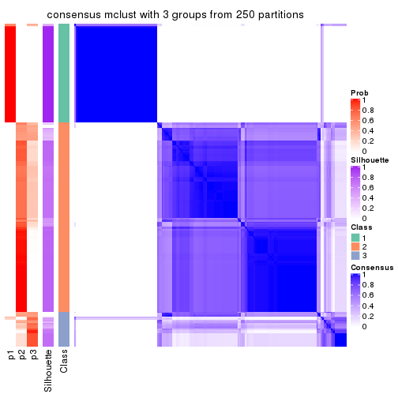</p>

</div>
<div id='tab-SD-mclust-consensus-heatmap-3'>
<pre><code class="r">consensus_heatmap(res, k = 4)
</code></pre>

<p>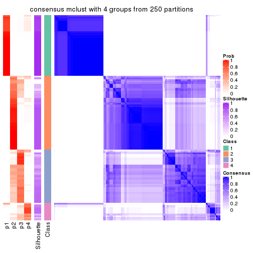</p>

</div>
<div id='tab-SD-mclust-consensus-heatmap-4'>
<pre><code class="r">consensus_heatmap(res, k = 5)
</code></pre>

<p>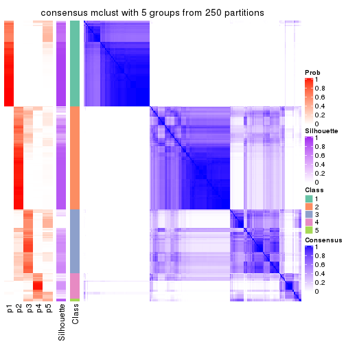</p>

</div>
<div id='tab-SD-mclust-consensus-heatmap-5'>
<pre><code class="r">consensus_heatmap(res, k = 6)
</code></pre>

<p>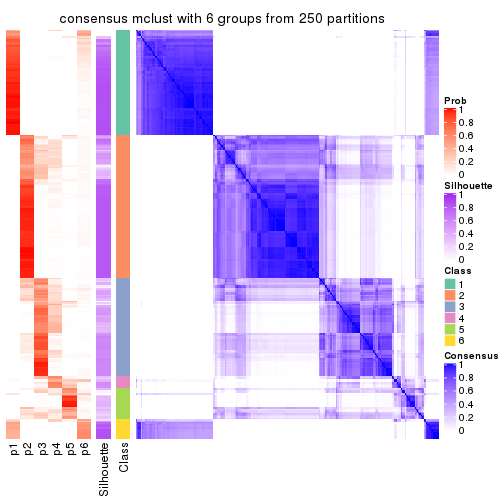</p>

</div>
</div>

Heatmaps for the membership of samples in all partitions to see how consistent they are:


<script>
$( function() {
	$( '#tabs-SD-mclust-membership-heatmap' ).tabs();
} );
</script>
<div id='tabs-SD-mclust-membership-heatmap'>
<ul>
<li><a href='#tab-SD-mclust-membership-heatmap-1'>k = 2</a></li>
<li><a href='#tab-SD-mclust-membership-heatmap-2'>k = 3</a></li>
<li><a href='#tab-SD-mclust-membership-heatmap-3'>k = 4</a></li>
<li><a href='#tab-SD-mclust-membership-heatmap-4'>k = 5</a></li>
<li><a href='#tab-SD-mclust-membership-heatmap-5'>k = 6</a></li>
</ul>
<div id='tab-SD-mclust-membership-heatmap-1'>
<pre><code class="r">membership_heatmap(res, k = 2)
</code></pre>

<p>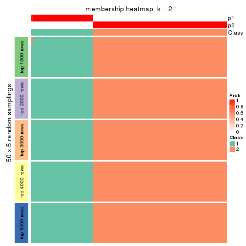</p>

</div>
<div id='tab-SD-mclust-membership-heatmap-2'>
<pre><code class="r">membership_heatmap(res, k = 3)
</code></pre>

<p>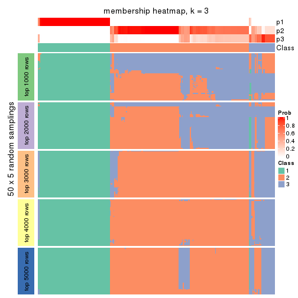</p>

</div>
<div id='tab-SD-mclust-membership-heatmap-3'>
<pre><code class="r">membership_heatmap(res, k = 4)
</code></pre>

<p>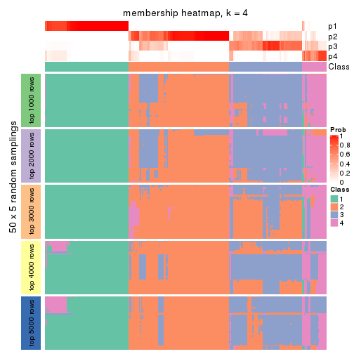</p>

</div>
<div id='tab-SD-mclust-membership-heatmap-4'>
<pre><code class="r">membership_heatmap(res, k = 5)
</code></pre>

<p>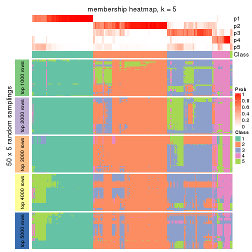</p>

</div>
<div id='tab-SD-mclust-membership-heatmap-5'>
<pre><code class="r">membership_heatmap(res, k = 6)
</code></pre>

<p>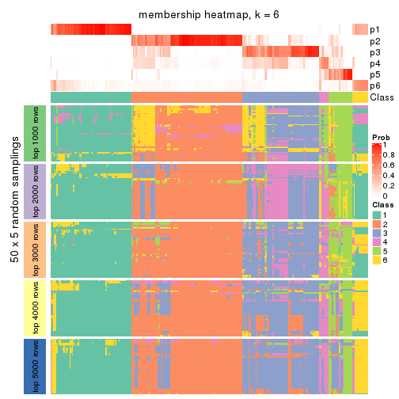</p>

</div>
</div>

As soon as we have had the classes for columns, we can look for signatures
which are significantly different between classes which can be candidate marks
for certain classes. Following are the heatmaps for signatures.


Signature heatmaps where rows are scaled:


<script>
$( function() {
	$( '#tabs-SD-mclust-get-signatures' ).tabs();
} );
</script>
<div id='tabs-SD-mclust-get-signatures'>
<ul>
<li><a href='#tab-SD-mclust-get-signatures-1'>k = 2</a></li>
<li><a href='#tab-SD-mclust-get-signatures-2'>k = 3</a></li>
<li><a href='#tab-SD-mclust-get-signatures-3'>k = 4</a></li>
<li><a href='#tab-SD-mclust-get-signatures-4'>k = 5</a></li>
<li><a href='#tab-SD-mclust-get-signatures-5'>k = 6</a></li>
</ul>
<div id='tab-SD-mclust-get-signatures-1'>
<pre><code class="r">get_signatures(res, k = 2)
</code></pre>

<p>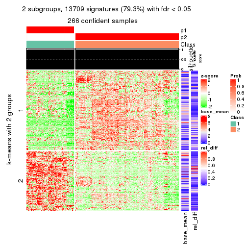</p>

</div>
<div id='tab-SD-mclust-get-signatures-2'>
<pre><code class="r">get_signatures(res, k = 3)
</code></pre>

<p>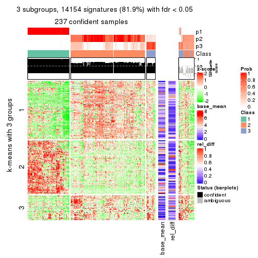</p>

</div>
<div id='tab-SD-mclust-get-signatures-3'>
<pre><code class="r">get_signatures(res, k = 4)
</code></pre>

<p>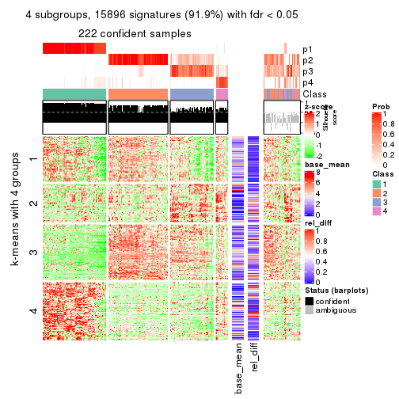</p>

</div>
<div id='tab-SD-mclust-get-signatures-4'>
<pre><code class="r">get_signatures(res, k = 5)
</code></pre>

<p>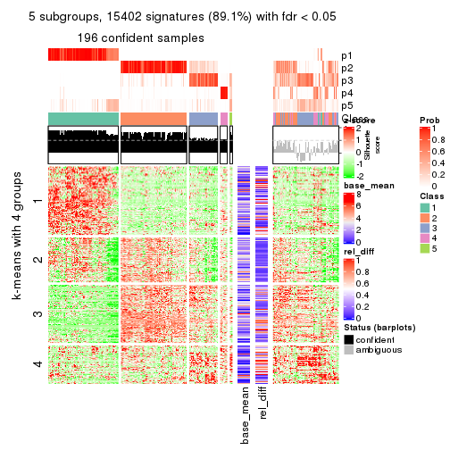</p>

</div>
<div id='tab-SD-mclust-get-signatures-5'>
<pre><code class="r">get_signatures(res, k = 6)
</code></pre>

<p>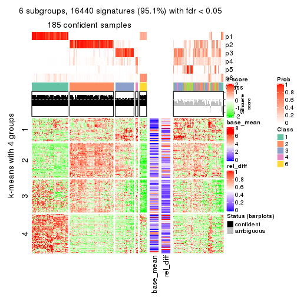</p>

</div>
</div>


Signature heatmaps where rows are not scaled:


<script>
$( function() {
	$( '#tabs-SD-mclust-get-signatures-no-scale' ).tabs();
} );
</script>
<div id='tabs-SD-mclust-get-signatures-no-scale'>
<ul>
<li><a href='#tab-SD-mclust-get-signatures-no-scale-1'>k = 2</a></li>
<li><a href='#tab-SD-mclust-get-signatures-no-scale-2'>k = 3</a></li>
<li><a href='#tab-SD-mclust-get-signatures-no-scale-3'>k = 4</a></li>
<li><a href='#tab-SD-mclust-get-signatures-no-scale-4'>k = 5</a></li>
<li><a href='#tab-SD-mclust-get-signatures-no-scale-5'>k = 6</a></li>
</ul>
<div id='tab-SD-mclust-get-signatures-no-scale-1'>
<pre><code class="r">get_signatures(res, k = 2, scale_rows = FALSE)
</code></pre>

<p>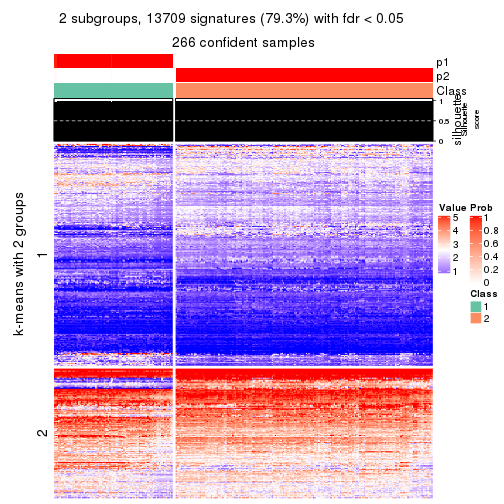</p>

</div>
<div id='tab-SD-mclust-get-signatures-no-scale-2'>
<pre><code class="r">get_signatures(res, k = 3, scale_rows = FALSE)
</code></pre>

<p>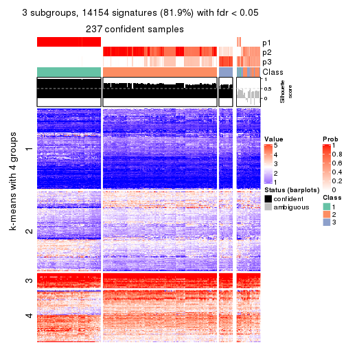</p>

</div>
<div id='tab-SD-mclust-get-signatures-no-scale-3'>
<pre><code class="r">get_signatures(res, k = 4, scale_rows = FALSE)
</code></pre>

<p>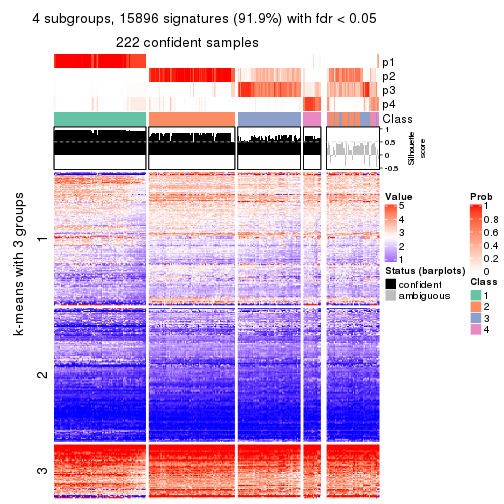</p>

</div>
<div id='tab-SD-mclust-get-signatures-no-scale-4'>
<pre><code class="r">get_signatures(res, k = 5, scale_rows = FALSE)
</code></pre>

<p>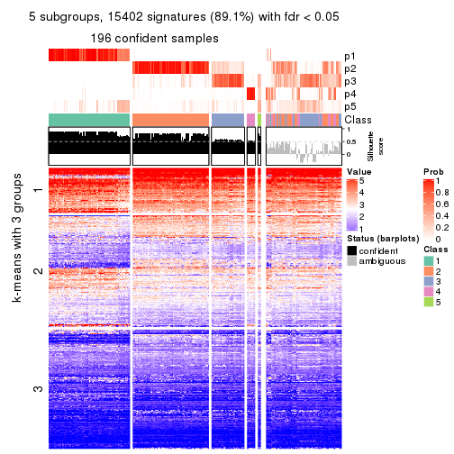</p>

</div>
<div id='tab-SD-mclust-get-signatures-no-scale-5'>
<pre><code class="r">get_signatures(res, k = 6, scale_rows = FALSE)
</code></pre>

<p>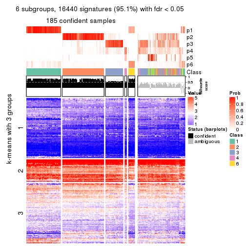</p>

</div>
</div>


Compare the overlap of signatures from different k:

```r
compare_signatures(res)
```

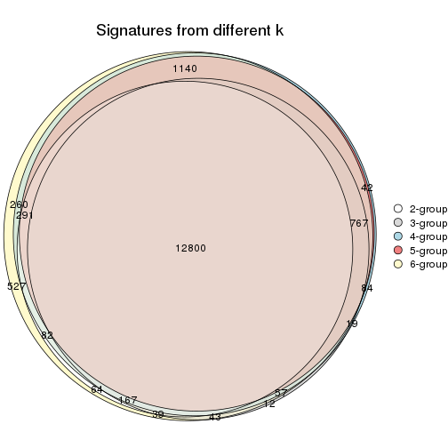

`get_signature()` returns a data frame invisibly. TO get the list of signatures, the function
call should be assigned to a variable explicitly. In following code, if `plot` argument is set
to `FALSE`, no heatmap is plotted while only the differential analysis is performed.

```r
# code only for demonstration
tb = get_signature(res, k = ..., plot = FALSE)
```

An example of the output of `tb` is:

```
#>   which_row         fdr    mean_1    mean_2 scaled_mean_1 scaled_mean_2 km
#> 1        38 0.042760348  8.373488  9.131774    -0.5533452     0.5164555  1
#> 2        40 0.018707592  7.106213  8.469186    -0.6173731     0.5762149  1
#> 3        55 0.019134737 10.221463 11.207825    -0.6159697     0.5749050  1
#> 4        59 0.006059896  5.921854  7.869574    -0.6899429     0.6439467  1
#> 5        60 0.018055526  8.928898 10.211722    -0.6204761     0.5791110  1
#> 6        98 0.009384629 15.714769 14.887706     0.6635654    -0.6193277  2
...
```

The columns in `tb` are:

1. `which_row`: row indices corresponding to the input matrix.
2. `fdr`: FDR for the differential test. 
3. `mean_x`: The mean value in group x.
4. `scaled_mean_x`: The mean value in group x after rows are scaled.
5. `km`: Row groups if k-means clustering is applied to rows.


UMAP plot which shows how samples are separated.


<script>
$( function() {
	$( '#tabs-SD-mclust-dimension-reduction' ).tabs();
} );
</script>
<div id='tabs-SD-mclust-dimension-reduction'>
<ul>
<li><a href='#tab-SD-mclust-dimension-reduction-1'>k = 2</a></li>
<li><a href='#tab-SD-mclust-dimension-reduction-2'>k = 3</a></li>
<li><a href='#tab-SD-mclust-dimension-reduction-3'>k = 4</a></li>
<li><a href='#tab-SD-mclust-dimension-reduction-4'>k = 5</a></li>
<li><a href='#tab-SD-mclust-dimension-reduction-5'>k = 6</a></li>
</ul>
<div id='tab-SD-mclust-dimension-reduction-1'>
<pre><code class="r">dimension_reduction(res, k = 2, method = &quot;UMAP&quot;)
</code></pre>

<p>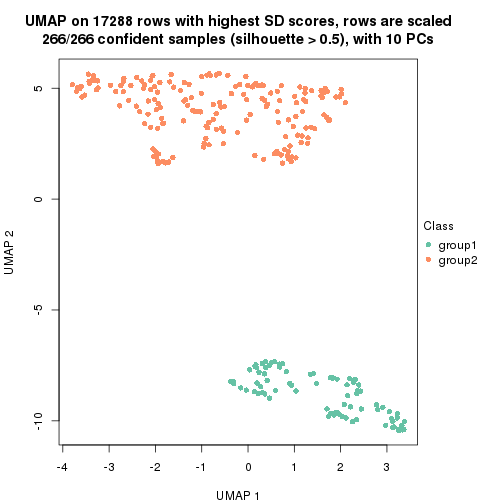</p>

</div>
<div id='tab-SD-mclust-dimension-reduction-2'>
<pre><code class="r">dimension_reduction(res, k = 3, method = &quot;UMAP&quot;)
</code></pre>

<p>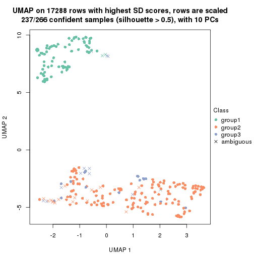</p>

</div>
<div id='tab-SD-mclust-dimension-reduction-3'>
<pre><code class="r">dimension_reduction(res, k = 4, method = &quot;UMAP&quot;)
</code></pre>

<p>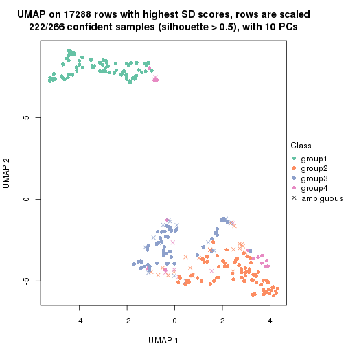</p>

</div>
<div id='tab-SD-mclust-dimension-reduction-4'>
<pre><code class="r">dimension_reduction(res, k = 5, method = &quot;UMAP&quot;)
</code></pre>

<p>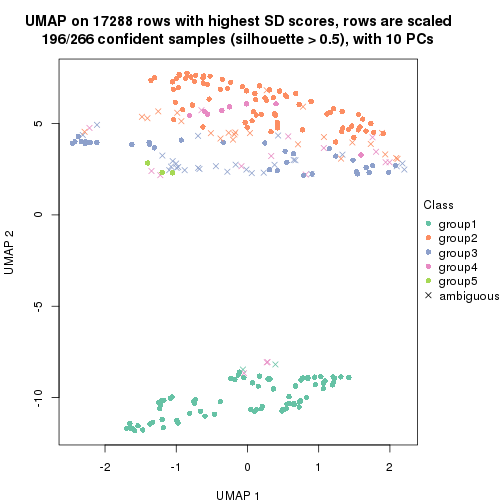</p>

</div>
<div id='tab-SD-mclust-dimension-reduction-5'>
<pre><code class="r">dimension_reduction(res, k = 6, method = &quot;UMAP&quot;)
</code></pre>

<p>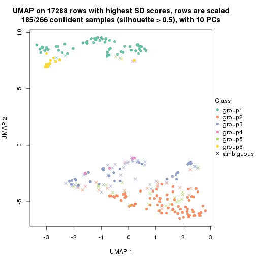</p>

</div>
</div>


Following heatmap shows how subgroups are split when increasing `k`:

```r
collect_classes(res)
```

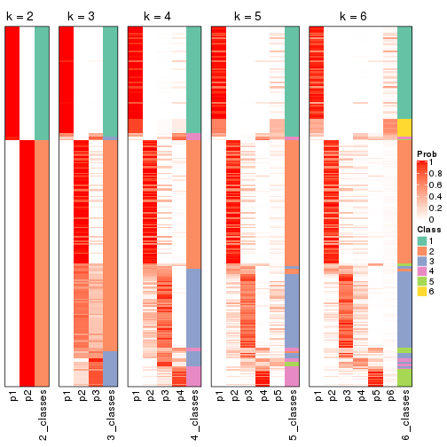


If matrix rows can be associated to genes, consider to use `GO_Enrichment(res,
...)` to perform function enrichment for the signature genes.


 

---------------------------------------------------


### SD:NMF**


The object with results only for a single top-value method and a single partition method 
can be extracted as:

```r
res = res_list["SD", "NMF"]
# you can also extract it by
# res = res_list["SD:NMF"]
```

A summary of `res` and all the functions that can be applied to it:

```r
res
```

```
#> A 'ConsensusPartition' object with k = 2, 3, 4, 5, 6.
#>   On a matrix with 17288 rows and 266 columns.
#>   Top rows (1000, 2000, 3000, 4000, 5000) are extracted by 'SD' method.
#>   Subgroups are detected by 'NMF' method.
#>   Performed in total 1250 partitions by row resampling.
#>   Best k for subgroups seems to be 2.
#> 
#> Following methods can be applied to this 'ConsensusPartition' object:
#>  [1] "cola_report"             "collect_classes"         "collect_plots"          
#>  [4] "collect_stats"           "colnames"                "compare_signatures"     
#>  [7] "consensus_heatmap"       "dimension_reduction"     "functional_enrichment"  
#> [10] "get_anno_col"            "get_anno"                "get_classes"            
#> [13] "get_consensus"           "get_matrix"              "get_membership"         
#> [16] "get_param"               "get_signatures"          "get_stats"              
#> [19] "is_best_k"               "is_stable_k"             "membership_heatmap"     
#> [22] "ncol"                    "nrow"                    "plot_ecdf"              
#> [25] "rownames"                "select_partition_number" "show"                   
#> [28] "suggest_best_k"          "test_to_known_factors"
```

`collect_plots()` function collects all the plots made from `res` for all `k` (number of partitions)
into one single page to provide an easy and fast comparison between different `k`.

```r
collect_plots(res)
```

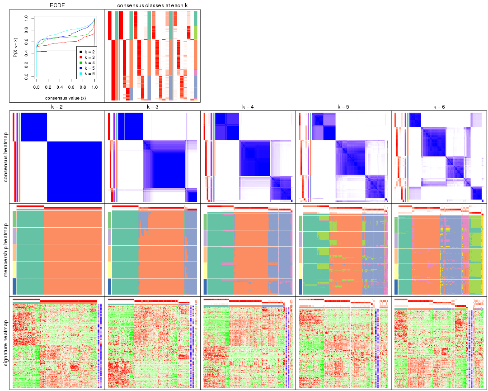

The plots are:

- The first row: a plot of the ECDF (Empirical cumulative distribution
  function) curves of the consensus matrix for each `k` and the heatmap of
  predicted classes for each `k`.
- The second row: heatmaps of the consensus matrix for each `k`.
- The third row: heatmaps of the membership matrix for each `k`.
- The fouth row: heatmaps of the signatures for each `k`.

All the plots in panels can be made by individual functions and they are
plotted later in this section.

`select_partition_number()` produces several plots showing different
statistics for choosing "optimized" `k`. There are following statistics:

- ECDF curves of the consensus matrix for each `k`;
- 1-PAC. [The PAC
  score](https://en.wikipedia.org/wiki/Consensus_clustering#Over-interpretation_potential_of_consensus_clustering)
  measures the proportion of the ambiguous subgrouping.
- Mean silhouette score.
- Concordance. The mean probability of fiting the consensus class ids in all
  partitions.
- Area increased. Denote $A_k$ as the area under the ECDF curve for current
  `k`, the area increased is defined as $A_k - A_{k-1}$.
- Rand index. The percent of pairs of samples that are both in a same cluster
  or both are not in a same cluster in the partition of k and k-1.
- Jaccard index. The ratio of pairs of samples are both in a same cluster in
  the partition of k and k-1 and the pairs of samples are both in a same
  cluster in the partition k or k-1.

The detailed explanations of these statistics can be found in [the cola
vignette](http://bioconductor.org/packages/devel/bioc/vignettes/cola/inst/doc/cola.html#toc_13).

Generally speaking, lower PAC score, higher mean silhouette score or higher
concordance corresponds to better partition. Rand index and Jaccard index
measure how similar the current partition is compared to partition with `k-1`.
If they are too similar, we won't accept `k` is better than `k-1`.

```r
select_partition_number(res)
```

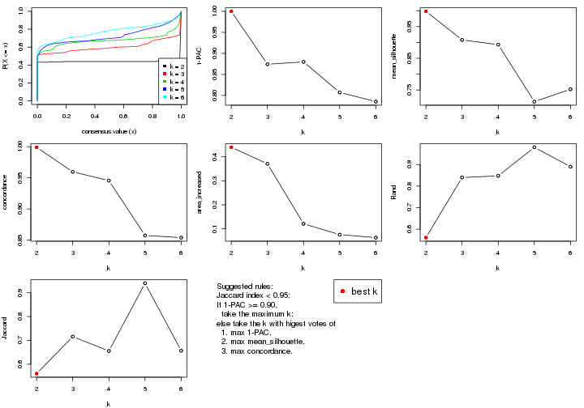

The numeric values for all these statistics can be obtained by `get_stats()`.

```r
get_stats(res)
```

```
#>   k 1-PAC mean_silhouette concordance area_increased  Rand Jaccard
#> 2 2 1.000           0.998       0.999         0.4395 0.561   0.561
#> 3 3 0.874           0.908       0.960         0.3709 0.840   0.716
#> 4 4 0.880           0.893       0.946         0.1209 0.848   0.656
#> 5 5 0.807           0.714       0.857         0.0758 0.980   0.939
#> 6 6 0.785           0.753       0.854         0.0634 0.890   0.657
```

`suggest_best_k()` suggests the best $k$ based on these statistics. The rules are as follows:

- All $k$ with Jaccard index larger than 0.95 are removed because the increase of
  the partition number does not provides enough extra information. If all $k$ are removed,
  the best $k$ is assigned by `NA`.
- For $k$ with 1-PAC larger than 0.9, the maximal $k$ is taken as the "best k". Other $k$ is called "optional k".
- If it does not fit the second rule. The $k$ with the highest vote of highest
  1-PAC, mean silhouette and concordance is taken as the "best k".

```r
suggest_best_k(res)
```

```
#> [1] 2
```


Following shows the table of the partitions (You need to click the **show/hide
code output** link to see it). The membership matrix (columns with name `p*`)
is inferred by
[`clue::cl_consensus()`](https://www.rdocumentation.org/link/cl_consensus?package=clue)
function with the `SE` method. Basically the value in the membership matrix
represents the probability to belong to a certain group. The finall class
label for an item is determined with the group with highest probability it
belongs to.

In `get_classes()` function, the entropy is calculated from the membership
matrix and the silhouette score is calculated from the consensus matrix.


<script>
$( function() {
	$( '#tabs-SD-NMF-get-classes' ).tabs();
} );
</script>
<div id='tabs-SD-NMF-get-classes'>
<ul>
<li><a href='#tab-SD-NMF-get-classes-1'>k = 2</a></li>
<li><a href='#tab-SD-NMF-get-classes-2'>k = 3</a></li>
<li><a href='#tab-SD-NMF-get-classes-3'>k = 4</a></li>
<li><a href='#tab-SD-NMF-get-classes-4'>k = 5</a></li>
<li><a href='#tab-SD-NMF-get-classes-5'>k = 6</a></li>
</ul>

<div id='tab-SD-NMF-get-classes-1'>
<p><a id='tab-SD-NMF-get-classes-1-a' style='color:#0366d6' href='#'>show/hide code output</a></p>
<pre><code class="r">cbind(get_classes(res, k = 2), get_membership(res, k = 2))
</code></pre>

<pre><code>#&gt;                                      class entropy silhouette    p1    p2
#&gt; 80D0AF10-1C61-4B67-90C1-7DBF1EF23672     2   0.000      1.000 0.000 1.000
#&gt; 87117BE1-D328-4972-85DA-6672412D8860     2   0.000      1.000 0.000 1.000
#&gt; F904C5B6-70BD-4604-8254-79BE23B152DA     1   0.000      0.998 1.000 0.000
#&gt; 3182DEA1-4239-4613-925A-7E6503766AD6     2   0.000      1.000 0.000 1.000
#&gt; 55E78EA2-2D9B-481F-8CAB-D36A33088EAE     2   0.000      1.000 0.000 1.000
#&gt; 86F94264-A6DD-4A97-9191-036F066DD0EF     2   0.000      1.000 0.000 1.000
#&gt; 09D25417-23B7-4D88-A0EA-F307985FBBBC     2   0.000      1.000 0.000 1.000
#&gt; C797F12C-40D3-4DB5-B9EF-A6821BBDE4F0     1   0.000      0.998 1.000 0.000
#&gt; 80275DB0-A226-4B6B-A08F-4ADBEEE1DB01     1   0.000      0.998 1.000 0.000
#&gt; 27FB653A-9E07-44AD-952E-9E4DE4AB5891     2   0.000      1.000 0.000 1.000
#&gt; 1A5DB9FC-2ABD-4E1B-B5EF-B1CF5E5F3872     1   0.000      0.998 1.000 0.000
#&gt; 844E4CCD-D30C-416F-A086-8923711A4E25     2   0.000      1.000 0.000 1.000
#&gt; EF18318D-3D25-4D65-803A-ED6E62871E7E     1   0.000      0.998 1.000 0.000
#&gt; 1ACB1BE0-61F6-4243-BBEC-E26A1CF90CA8     1   0.000      0.998 1.000 0.000
#&gt; 8EF0039B-D758-46AB-BAF7-6A062C7C56BA     1   0.000      0.998 1.000 0.000
#&gt; 22F4C9D9-663B-4C91-9692-E035A2640BEC     2   0.000      1.000 0.000 1.000
#&gt; FA1A0BCE-EE0F-4178-B963-62550E344B14     2   0.000      1.000 0.000 1.000
#&gt; 0B6D0C4E-5AE3-4707-A9FC-12A108E6EC2A     2   0.000      1.000 0.000 1.000
#&gt; 06FD3123-2AEB-4911-AC4E-E0E64FD5DB52     2   0.000      1.000 0.000 1.000
#&gt; 235A4492-FF80-4AA5-BC71-DFF65E1C7411     2   0.000      1.000 0.000 1.000
#&gt; A192C6C0-1443-4493-AFAC-1EE710628ADB     2   0.000      1.000 0.000 1.000
#&gt; 6FC5B56B-711B-4174-9B06-4E843124AAB6     1   0.000      0.998 1.000 0.000
#&gt; 7A813F60-A41E-4552-990E-F22287654C1D     2   0.000      1.000 0.000 1.000
#&gt; 725BBFB5-26F4-4512-9C75-47D013C1E605     1   0.000      0.998 1.000 0.000
#&gt; 39CC4E82-EBC9-472E-8BE5-6A3AB178449A     2   0.000      1.000 0.000 1.000
#&gt; 61130DEE-E267-49DF-8B41-7738A06EF738     2   0.000      1.000 0.000 1.000
#&gt; 117EC12C-B7ED-4E01-B29B-EA542D356EA1     1   0.000      0.998 1.000 0.000
#&gt; A30FF708-F7A9-41E4-8AD5-20441650FBC9     2   0.000      1.000 0.000 1.000
#&gt; 53640D52-1167-4A5D-B656-97D32CBA3934     1   0.000      0.998 1.000 0.000
#&gt; 9E85D76A-DD2A-46D5-BB59-0ED302B6258C     2   0.000      1.000 0.000 1.000
#&gt; 6F8C6F90-7E3C-4860-91DD-586708DE44AA     1   0.000      0.998 1.000 0.000
#&gt; E675AEC5-AA9A-4AAA-839C-03E6365822DB     2   0.000      1.000 0.000 1.000
#&gt; B577DEF7-2F5C-4876-A7C6-F18D5722B8C0     1   0.000      0.998 1.000 0.000
#&gt; DA8B577E-43E7-49BF-BF94-868E3194F5C9     1   0.000      0.998 1.000 0.000
#&gt; 3334280B-2A36-4AC7-A021-A76C10E958F0     2   0.000      1.000 0.000 1.000
#&gt; 5CBDDC90-11EC-4E6E-881E-AA9CCFD40FDB     2   0.000      1.000 0.000 1.000
#&gt; 8CBBF32A-8349-44F5-A8B8-4CBB1760A464     2   0.000      1.000 0.000 1.000
#&gt; B9455A9A-136D-4DC2-9F86-0FC74433589D     2   0.388      0.917 0.076 0.924
#&gt; D7EAE2A7-F9BE-4222-A452-B1F83F99CD50     2   0.000      1.000 0.000 1.000
#&gt; F803AE18-60C5-4CFE-AAAB-DB33C26A2184     1   0.000      0.998 1.000 0.000
#&gt; 5DD8CAC7-EC02-43B6-B58E-6D2E22868A3B     2   0.000      1.000 0.000 1.000
#&gt; EE98E1B4-DFB3-4AEC-8527-E1FD544C9475     1   0.000      0.998 1.000 0.000
#&gt; 3CE43921-47D5-4394-B9E1-242607775D61     2   0.000      1.000 0.000 1.000
#&gt; 46986F2B-0B0D-4187-8948-4E91D34B7C49     2   0.000      1.000 0.000 1.000
#&gt; 5D1D052E-74EF-45A8-9B1A-7CECD13EA43B     2   0.000      1.000 0.000 1.000
#&gt; 4C821AD9-A5C9-4A9A-9C5D-363B227F8064     2   0.000      1.000 0.000 1.000
#&gt; 06A4189E-A23B-4AC6-AA74-01955DD7D1E9     2   0.000      1.000 0.000 1.000
#&gt; FCCDC76F-CB02-4BCD-A616-325F258DDAA4     2   0.000      1.000 0.000 1.000
#&gt; DAC53B0A-8F35-4EA6-BBCC-4CD1C049E11F     2   0.000      1.000 0.000 1.000
#&gt; DD4F845B-CAD3-44CB-9D96-3C3F5BA1B72D     1   0.000      0.998 1.000 0.000
#&gt; D440F004-A4A4-41B6-BED8-805D67BA01C7     2   0.000      1.000 0.000 1.000
#&gt; A497C423-119F-42FA-BF17-9F6DFD2A5585     2   0.000      1.000 0.000 1.000
#&gt; 3420E573-DE12-4EF5-B1C0-2FCA904F4F4E     1   0.000      0.998 1.000 0.000
#&gt; 1AD72157-A254-44B4-BA58-4F30F1AE910E     1   0.000      0.998 1.000 0.000
#&gt; C1113977-B160-45EE-B061-750F9EA3F33F     2   0.000      1.000 0.000 1.000
#&gt; 6783AB5B-F07C-447B-BF13-C34485D246D7     2   0.000      1.000 0.000 1.000
#&gt; 1F553062-26FD-4A7F-B7FB-81184604F423     1   0.000      0.998 1.000 0.000
#&gt; BE2DCA51-1C21-4598-98A7-F2FB9B2DFCB4     2   0.000      1.000 0.000 1.000
#&gt; 38941CF3-9C54-4BA4-A005-CC88CA97D504     2   0.000      1.000 0.000 1.000
#&gt; 51CB675E-E243-4A07-BF4A-580473D26FDA     2   0.000      1.000 0.000 1.000
#&gt; C7FED0F5-C27A-4405-9232-30BF39362CF7     2   0.000      1.000 0.000 1.000
#&gt; 2A1E86E8-4713-465F-ACFF-C584864C57A1     2   0.000      1.000 0.000 1.000
#&gt; B4500785-0FAA-4D4D-8630-43D194BAB004     2   0.000      1.000 0.000 1.000
#&gt; 3FD52E66-AB76-4079-80DB-281A795D1EC0     2   0.000      1.000 0.000 1.000
#&gt; EBD355D1-1226-4DFD-AAFF-45D246B64F3C     2   0.000      1.000 0.000 1.000
#&gt; 5A040A73-CD95-487E-8AEF-9639FE4E2916     2   0.000      1.000 0.000 1.000
#&gt; CF629C65-585D-476D-B081-3E6E0575FAE3     1   0.000      0.998 1.000 0.000
#&gt; 0D4202A3-808E-413F-9BF3-9CFCCAE0ED61     2   0.000      1.000 0.000 1.000
#&gt; 43E715BF-28D9-4B5E-B762-8CD1B69A430E     1   0.000      0.998 1.000 0.000
#&gt; BFB82BE8-9DAC-4099-8B38-0950308E3EB3     2   0.000      1.000 0.000 1.000
#&gt; F7CB1825-2303-4DD2-AE1F-7205738EAF1F     1   0.000      0.998 1.000 0.000
#&gt; FE298483-C42C-4753-BABB-29A9CB1B6312     1   0.000      0.998 1.000 0.000
#&gt; A98C7561-1B42-4CD6-AE71-924B91FA4C33     2   0.000      1.000 0.000 1.000
#&gt; 58098F21-7DAB-47DA-9A41-8D20BF3B9257     2   0.000      1.000 0.000 1.000
#&gt; 18CAF708-20B9-4745-9CB3-37AB6E0B3056     2   0.000      1.000 0.000 1.000
#&gt; 2C80DD72-C9C7-4AC2-812F-9A31EF02779C     1   0.000      0.998 1.000 0.000
#&gt; 68A3F13D-319D-4603-A27F-B5DD46FE5C5B     2   0.000      1.000 0.000 1.000
#&gt; 7EE8F0CE-CDC9-40F9-A1DE-7F8140EC6D13     2   0.000      1.000 0.000 1.000
#&gt; 39019903-5B9C-4665-BD5F-7CCB19CB55C5     2   0.000      1.000 0.000 1.000
#&gt; 190EDB27-4CBC-4E9C-9B67-D51FDAB982B7     2   0.000      1.000 0.000 1.000
#&gt; EB2D95BC-62F8-4669-9308-D37D7FB79E23     2   0.000      1.000 0.000 1.000
#&gt; A08B85EA-D1E7-4B77-8DEC-36294305B9F7     1   0.000      0.998 1.000 0.000
#&gt; 130DDFAD-6EF8-4C80-BD9D-88308A6874BC     2   0.000      1.000 0.000 1.000
#&gt; 7340A5BA-E002-448F-AACC-E7A37DBB79C2     2   0.000      1.000 0.000 1.000
#&gt; A771F6E3-D266-4FE7-98C6-C40E6A701D59     1   0.000      0.998 1.000 0.000
#&gt; 015E792C-EC1B-49BF-AB07-D82B20C5989A     2   0.000      1.000 0.000 1.000
#&gt; BF79E030-47EE-4D08-B910-5685A4BD8B60     2   0.000      1.000 0.000 1.000
#&gt; FB3C7C9A-2F2D-4DD5-BE47-FAFB072C0FAB     2   0.000      1.000 0.000 1.000
#&gt; 4E5557BA-10E8-4723-908E-DD04EF6639B2     2   0.000      1.000 0.000 1.000
#&gt; 8031B550-40A9-4A3A-9F7D-CDC052288BD8     2   0.000      1.000 0.000 1.000
#&gt; 55299A06-3C1F-45A4-B166-B2C591C0CEE2     2   0.000      1.000 0.000 1.000
#&gt; EB8D5168-216E-4ABB-8B4E-9E67786CB322     1   0.000      0.998 1.000 0.000
#&gt; 78BD2D83-9A7F-42E5-BB38-654AA0761A0A     2   0.000      1.000 0.000 1.000
#&gt; AA2D53E5-D389-4332-9DD5-A736052E48F8     1   0.000      0.998 1.000 0.000
#&gt; 62945C7A-9313-4FC9-820C-B0AB820B394E     1   0.000      0.998 1.000 0.000
#&gt; 22746046-2E99-4EE9-97D2-BA2EA499634C     2   0.000      1.000 0.000 1.000
#&gt; 8671B51B-DCBE-4429-9F01-AF51CAD7014F     2   0.000      1.000 0.000 1.000
#&gt; E815AB36-5689-4A0D-8E6D-2EAA73406681     1   0.000      0.998 1.000 0.000
#&gt; A1DACB46-ED52-4E38-B2C8-57256BB22B5E     2   0.000      1.000 0.000 1.000
#&gt; 4F5498C4-A423-4B3D-AC98-D4E214A57D0E     1   0.000      0.998 1.000 0.000
#&gt; A7772CCD-FFFF-49DD-86ED-0BAD330EC9B6     2   0.000      1.000 0.000 1.000
#&gt; E6E3DF78-65B9-4F74-8DA8-E2A6D4EDBEA7     2   0.000      1.000 0.000 1.000
#&gt; 83286E2D-E708-437A-911A-E6B050273CBD     1   0.000      0.998 1.000 0.000
#&gt; EC5C7C97-EE8C-405D-A039-D96514B1D414     2   0.000      1.000 0.000 1.000
#&gt; 3E55223D-6E3D-4027-9819-67E91212531D     1   0.000      0.998 1.000 0.000
#&gt; 99A036A2-8343-4D06-8047-D84E96CE4C61     2   0.000      1.000 0.000 1.000
#&gt; CA6CDE6D-92DE-4259-9E58-A373F2D543EA     2   0.000      1.000 0.000 1.000
#&gt; BF6FA8CC-60C1-413A-B2C6-54CCACBC01D6     1   0.000      0.998 1.000 0.000
#&gt; E0594CFE-F7B6-4546-B130-30DF6A514B1F     2   0.000      1.000 0.000 1.000
#&gt; E769E41D-5949-42C5-9594-E563C05ACE52     2   0.000      1.000 0.000 1.000
#&gt; 01373725-5D3C-4D9C-AABC-911D53E62BCD     2   0.000      1.000 0.000 1.000
#&gt; 1F39DADD-3655-474E-BA4C-A5BD32C97A8B     1   0.000      0.998 1.000 0.000
#&gt; AF573EC8-E4EE-4B8F-8199-9817B9FAC67D     1   0.000      0.998 1.000 0.000
#&gt; 3F022CBC-41C8-4387-A6FB-124C4BCD1AD9     1   0.000      0.998 1.000 0.000
#&gt; 1CC32ACE-826B-494B-8B89-5BD92327A74D     2   0.000      1.000 0.000 1.000
#&gt; 22B0BD3B-EE08-4BC7-90B2-01C372A56BA2     2   0.000      1.000 0.000 1.000
#&gt; 0F3DE9EF-19CC-4D14-9A42-1435DB537F94     2   0.000      1.000 0.000 1.000
#&gt; 87F8A33F-FBC3-469E-862B-84472F796358     2   0.000      1.000 0.000 1.000
#&gt; C9F2FA0D-1A9F-40B4-BD9B-CAF1B3F3D5A7     2   0.000      1.000 0.000 1.000
#&gt; ACFC9F59-78FF-4453-B25F-8834D0EAB54A     2   0.000      1.000 0.000 1.000
#&gt; B7AC7D5B-14E9-45A7-93B7-226EE508544A     2   0.000      1.000 0.000 1.000
#&gt; 4491BF17-B168-4E96-8E09-EF1AEC9F5E9D     2   0.000      1.000 0.000 1.000
#&gt; 557A0811-A3FE-4CF4-A24D-FBB77E7F9139     2   0.000      1.000 0.000 1.000
#&gt; 6F9C955C-6816-4353-922A-8035B50FACC6     2   0.000      1.000 0.000 1.000
#&gt; 3E89FB1C-4A7D-43C7-823C-04E3716A7935     2   0.000      1.000 0.000 1.000
#&gt; 12ABE483-66EF-4237-94C4-0199FAE23FA8     2   0.000      1.000 0.000 1.000
#&gt; 7535F262-9B96-44F6-988C-4C9EBB3FFCA9     2   0.000      1.000 0.000 1.000
#&gt; 65C9D28E-303B-40E5-84F0-2507F5457374     2   0.000      1.000 0.000 1.000
#&gt; FD445384-6BA9-4297-9D9C-12ABA7D645C7     1   0.000      0.998 1.000 0.000
#&gt; 30D5E255-2AD3-44F3-8983-1B80E4FD3E2D     2   0.000      1.000 0.000 1.000
#&gt; 3E88EC60-B4A8-4259-8BC8-A234800F6955     2   0.000      1.000 0.000 1.000
#&gt; ACD73CE8-AFC5-47A0-9383-3CB97F018953     1   0.000      0.998 1.000 0.000
#&gt; 1AFDC2EA-26A8-44E2-8BCB-F34F7B66F8C8     2   0.000      1.000 0.000 1.000
#&gt; 9E327BC8-1D20-4AD8-83F7-FB2D13BCA5D0     2   0.000      1.000 0.000 1.000
#&gt; 85A86B91-4F24-4E77-AE2D-520F8E205EFC     1   0.000      0.998 1.000 0.000
#&gt; 74868C37-8143-4306-81CA-E45759D146CD     2   0.000      1.000 0.000 1.000
#&gt; 69AEA0DB-E335-48A0-A398-4FB0D581182A     2   0.000      1.000 0.000 1.000
#&gt; AE6F8B89-85C2-42B7-8D05-AFDDD4FEFD16     1   0.000      0.998 1.000 0.000
#&gt; A8A6F09C-9812-4457-9A4B-AD41F97B41A3     2   0.000      1.000 0.000 1.000
#&gt; 1A09BC4D-EF29-42DD-BB04-A3C264A3032D     1   0.000      0.998 1.000 0.000
#&gt; E0961A30-A62C-4235-9CF0-A1776827A996     2   0.000      1.000 0.000 1.000
#&gt; 134D2D90-7B08-4F20-8A3A-C77643FB208F     2   0.000      1.000 0.000 1.000
#&gt; A77C2DFF-93CF-4CB5-B3C1-81133D7F1A0F     2   0.000      1.000 0.000 1.000
#&gt; EA2DC457-9C74-4B9C-B3FA-5E72199B24A7     2   0.000      1.000 0.000 1.000
#&gt; FF34117B-5EE4-4C96-A8A2-2CE6A654CBE5     1   0.000      0.998 1.000 0.000
#&gt; 75F7B5E2-6559-4B48-A2A4-287C35C559CC     1   0.000      0.998 1.000 0.000
#&gt; 903BF591-B0AF-4BEE-B625-60B673070344     2   0.000      1.000 0.000 1.000
#&gt; 9DE1B790-C63C-41C4-9477-CE52A8119C67     2   0.000      1.000 0.000 1.000
#&gt; 9A28F80A-85F8-40E2-A32B-230EF93B2FA0     2   0.000      1.000 0.000 1.000
#&gt; 0AA2BDBB-8720-409A-AA72-1F4AA26E7CD8     2   0.000      1.000 0.000 1.000
#&gt; 5AD49F16-E974-4E5D-B1B6-073ECB73A01D     2   0.000      1.000 0.000 1.000
#&gt; CB0F961C-527D-4A48-9408-286B26BD9532     1   0.000      0.998 1.000 0.000
#&gt; 46FF25B6-D01D-4CA7-80B7-CEC2998C34E1     2   0.000      1.000 0.000 1.000
#&gt; 487CADE1-D699-4A6C-817A-B9A0AB940C61     1   0.000      0.998 1.000 0.000
#&gt; 4FF6F2D8-F869-4735-A4D1-1A8423153FBC     1   0.000      0.998 1.000 0.000
#&gt; 6005494F-5D3D-43A3-B3E8-8C91955B2A98     2   0.000      1.000 0.000 1.000
#&gt; CF10D584-CE32-45A4-A932-E9D5AF12A6A0     1   0.000      0.998 1.000 0.000
#&gt; E15CE4AB-5646-49C8-9CD6-938457036BB0     2   0.000      1.000 0.000 1.000
#&gt; 31E28D0B-0E69-4330-82ED-4F1827DC97EA     2   0.000      1.000 0.000 1.000
#&gt; DBACD3C3-CCB5-4478-BA78-85A0C847CA66     2   0.000      1.000 0.000 1.000
#&gt; 5A07041C-65EB-4FCD-8940-E90B905061B5     2   0.000      1.000 0.000 1.000
#&gt; 0EA7C916-FA47-489B-BC98-4D9E7D197628     1   0.000      0.998 1.000 0.000
#&gt; 30967F75-8499-47FF-ADA4-4DC566013F7B     1   0.000      0.998 1.000 0.000
#&gt; D2E528FF-AEA2-48D7-A60A-4C3E71EA9073     2   0.000      1.000 0.000 1.000
#&gt; 22735DCD-215E-48BC-BF44-32BD66F06E39     2   0.000      1.000 0.000 1.000
#&gt; BC2C3248-7FC6-48BC-96C1-45EA573DE7DC     1   0.000      0.998 1.000 0.000
#&gt; E72CEBCB-D686-4B12-BCBA-EC8F964330A2     1   0.000      0.998 1.000 0.000
#&gt; 23C937BB-BA20-4440-B680-914229CC3ADF     1   0.000      0.998 1.000 0.000
#&gt; 947E99C7-F402-4F1A-A6E9-81BCAAED135A     2   0.000      1.000 0.000 1.000
#&gt; 02475D11-FC81-4E88-944E-173C32DC3FE7     1   0.671      0.786 0.824 0.176
#&gt; F972A9AA-9842-4343-A533-A795E65581CE     1   0.000      0.998 1.000 0.000
#&gt; 05043AAF-3095-4C61-B5C1-EE9AA9082C75     2   0.000      1.000 0.000 1.000
#&gt; CECF7967-862E-428C-BB42-FEF553FDB3AA     2   0.000      1.000 0.000 1.000
#&gt; FB0B9483-6302-48C7-BE5B-DA667E00AE2D     2   0.000      1.000 0.000 1.000
#&gt; 78700FBA-1487-4754-9B30-18837BF7E9FB     1   0.000      0.998 1.000 0.000
#&gt; 2166F56D-54CE-4F1B-8F07-A4E13E4489E9     1   0.000      0.998 1.000 0.000
#&gt; 7CD0942E-E39A-43A7-8BAC-F25967864901     2   0.000      1.000 0.000 1.000
#&gt; 3B00BA2B-7F7D-4825-8F8D-90F04A5DE687     2   0.000      1.000 0.000 1.000
#&gt; 7465B01D-C05E-4FE0-A9FE-182920EDC489     2   0.000      1.000 0.000 1.000
#&gt; 88C31A99-F96E-4FC8-8B3D-C1AAA05062D9     1   0.000      0.998 1.000 0.000
#&gt; 53575575-3303-4F8F-B6A8-B42131CFB4AC     2   0.000      1.000 0.000 1.000
#&gt; CC8017C7-4128-48DA-8E43-503F63158D85     1   0.000      0.998 1.000 0.000
#&gt; 88449D2A-2A25-41A4-B91D-C99B58F8ECD9     2   0.000      1.000 0.000 1.000
#&gt; 46C7DDE5-A2B5-494F-96AE-0B6E2D51B003     1   0.000      0.998 1.000 0.000
#&gt; 42551D05-5EE5-4F91-93A8-32DA695D9DFA     2   0.000      1.000 0.000 1.000
#&gt; 0772DA48-3A36-422D-B166-CA1691B782C3     2   0.000      1.000 0.000 1.000
#&gt; 30346897-EC77-4153-88A2-D14593C8B741     2   0.000      1.000 0.000 1.000
#&gt; 0F00E267-C748-4A71-8B36-03C410641D88     2   0.000      1.000 0.000 1.000
#&gt; 4034703A-4DA9-4DDA-9CA9-E80FFE9CCDE6     2   0.000      1.000 0.000 1.000
#&gt; 393C8A41-CF45-4EA8-AFE3-25A08AB7692A     2   0.000      1.000 0.000 1.000
#&gt; 3354212D-A07C-435C-8B0C-9A7BAAB624B5     1   0.000      0.998 1.000 0.000
#&gt; 57E30D4E-ABF7-47DD-92BE-40CE215076B0     1   0.000      0.998 1.000 0.000
#&gt; 202B4C76-C840-4DB8-953F-AC75A4156FDD     2   0.000      1.000 0.000 1.000
#&gt; 93A0137B-1F4C-44EE-B959-2AD0CD2DF8B6     1   0.000      0.998 1.000 0.000
#&gt; C9794DB6-6E8C-4AFD-80EE-61D672A4F6E9     2   0.000      1.000 0.000 1.000
#&gt; AE4BFE63-F0C0-4624-AD97-4F7FF13E2384     1   0.000      0.998 1.000 0.000
#&gt; DCF87F27-2B54-42D9-8D28-5DFEE76E2F5B     2   0.000      1.000 0.000 1.000
#&gt; 2451D405-39FD-4812-958C-23462B66F1F1     2   0.000      1.000 0.000 1.000
#&gt; E27F5D33-3F68-4CA8-8757-A387C6EAD060     2   0.000      1.000 0.000 1.000
#&gt; 8BA9928A-5B93-477F-B4A2-D031B714D9AC     1   0.000      0.998 1.000 0.000
#&gt; 0FAACFF6-B50C-4BED-9824-B7270654F28D     2   0.000      1.000 0.000 1.000
#&gt; 3366CC3C-2BBA-4CA7-848E-4E16AA70AE7A     2   0.000      1.000 0.000 1.000
#&gt; 66237056-CA9A-4C90-AF0E-1621FEB71578     2   0.000      1.000 0.000 1.000
#&gt; C480F1FB-3100-436C-B0F5-DED63B7A580E     2   0.000      1.000 0.000 1.000
#&gt; A327DE0D-D945-4B42-9B41-A7302CF796EE     2   0.000      1.000 0.000 1.000
#&gt; E8A6871D-67FB-4306-9454-F5E7CDBA399A     2   0.000      1.000 0.000 1.000
#&gt; E9A7485B-82B6-4BD2-AFBB-DD0A82D6CDE2     1   0.000      0.998 1.000 0.000
#&gt; 93B382E4-9C9A-43F5-BD3B-502CC260B886     1   0.000      0.998 1.000 0.000
#&gt; A2792419-8E16-45FE-A524-17851F34AB9B     2   0.000      1.000 0.000 1.000
#&gt; 4DED1201-F25C-4F82-BABF-965EFAD7A8E5     2   0.000      1.000 0.000 1.000
#&gt; F1ACB2DD-E948-4F88-A249-F1BD1977D667     2   0.000      1.000 0.000 1.000
#&gt; 6CDBA203-8952-421D-A6BF-75652D9F3339     2   0.000      1.000 0.000 1.000
#&gt; 2D6C5AA7-3B33-48D7-AE0C-77A16B749D13     1   0.000      0.998 1.000 0.000
#&gt; 3F6B6D95-0720-42A0-AEB3-89FECAE7616A     2   0.000      1.000 0.000 1.000
#&gt; DED8ACF3-BBD8-46C9-85C9-A9C8F2E2BC0B     1   0.000      0.998 1.000 0.000
#&gt; 77069279-5A6F-42C0-9AA5-8C939591DFB5     1   0.000      0.998 1.000 0.000
#&gt; B2D4FCF3-FDF9-41C8-880A-6732CF6222AF     2   0.000      1.000 0.000 1.000
#&gt; 1CD71A4C-1E49-48EF-AA72-CB3C26B4C087     2   0.000      1.000 0.000 1.000
#&gt; C364E621-F85C-4B7F-842F-210B8D4DFE3A     2   0.000      1.000 0.000 1.000
#&gt; 11F1B8CA-07C1-47D2-A3C6-032FFA6A4A64     1   0.000      0.998 1.000 0.000
#&gt; 153BF804-6DC8-496B-987A-4021A2512211     2   0.000      1.000 0.000 1.000
#&gt; 5B5029C9-40F5-40D7-A36A-367022AD6A42     2   0.000      1.000 0.000 1.000
#&gt; 193CCBE6-104F-49B4-BDB2-C82EE36FDAAD     1   0.000      0.998 1.000 0.000
#&gt; E5D45E53-FCF3-4F01-9B78-6CB1ED0CFE40     2   0.000      1.000 0.000 1.000
#&gt; 5546A779-21DB-49F9-8C0D-A1E420088084     2   0.000      1.000 0.000 1.000
#&gt; E14825E0-0DC7-44C2-B265-F54672356838     1   0.000      0.998 1.000 0.000
#&gt; 8C8C09B9-EC83-45EC-BC4C-0BA92DE60ACB     1   0.000      0.998 1.000 0.000
#&gt; B388CA82-5BF7-4BDD-8821-4EC0B213121F     2   0.000      1.000 0.000 1.000
#&gt; A26025AC-9F71-4C07-9135-83593193BBB2     1   0.000      0.998 1.000 0.000
#&gt; C80E6D4B-AF21-42F0-8E20-6F7D2E99C062     2   0.000      1.000 0.000 1.000
#&gt; 5AE5D819-A6B1-4761-B7F9-8FFD3C520F31     2   0.000      1.000 0.000 1.000
#&gt; CAE8097F-A139-4C6E-9E30-35080475FF34     2   0.000      1.000 0.000 1.000
#&gt; 539C8DE3-6152-4671-B96F-ED6DC6DBD22B     1   0.000      0.998 1.000 0.000
#&gt; 5D28A8E0-4ECF-43A4-890A-BE968B9A8CB2     2   0.000      1.000 0.000 1.000
#&gt; 97A80AF8-365E-4756-A2B0-AEB1D8F5F33E     2   0.000      1.000 0.000 1.000
#&gt; B3527517-E339-46AE-8437-65303C309015     2   0.000      1.000 0.000 1.000
#&gt; 523E2183-AA20-4749-BD7E-69CD620DD6A3     2   0.000      1.000 0.000 1.000
#&gt; E553FB92-F181-47B3-9F3D-11DB51DFA3A4     2   0.000      1.000 0.000 1.000
#&gt; FFE0C4B1-8EEC-484A-AB87-3401B71BD081     2   0.000      1.000 0.000 1.000
#&gt; 73D6CA4B-9A9E-4E52-96C8-AE7F0CC8B276     2   0.000      1.000 0.000 1.000
#&gt; 485A8107-DF9A-4BC6-8A72-07FBA93F10F2     1   0.000      0.998 1.000 0.000
#&gt; 690823D9-B9AA-40EF-8302-4AD88BF89D1C     2   0.000      1.000 0.000 1.000
#&gt; B4E02660-562F-4EAC-8472-CBBD8A577688     2   0.000      1.000 0.000 1.000
#&gt; F82D5A60-90F9-4FF4-971E-73F7535FE65A     2   0.000      1.000 0.000 1.000
#&gt; C48401F7-2D56-4C6F-9896-C5435D1B44BF     2   0.000      1.000 0.000 1.000
#&gt; 94FC8991-182B-4B00-9A06-A00E8D3BDCFA     1   0.000      0.998 1.000 0.000
#&gt; FF00E80A-046D-4233-835E-CDF93403EA43     2   0.000      1.000 0.000 1.000
#&gt; C47A53F6-6479-4AD3-9D18-E4A70BE5F1DC     2   0.000      1.000 0.000 1.000
#&gt; 3487AE2D-AB1D-4DEF-AC4B-4B0FCAF8D899     2   0.000      1.000 0.000 1.000
#&gt; 479CD9BB-ECD7-41D5-B1E4-41132FF7FC95     2   0.000      1.000 0.000 1.000
#&gt; 048ADC6E-8C7E-4875-ACEE-E4787203C078     1   0.000      0.998 1.000 0.000
#&gt; 25AF81C5-B117-466D-AE9F-DD10BCB6AF2D     2   0.000      1.000 0.000 1.000
#&gt; 8B1D51D6-0B25-4289-81F0-9F95E0258877     2   0.000      1.000 0.000 1.000
#&gt; 282D390D-8E4E-4A19-B2B7-A6DB4BB2D46C     1   0.000      0.998 1.000 0.000
#&gt; BC6B92C1-F425-40C5-9941-539BFF5FE0FE     2   0.000      1.000 0.000 1.000
#&gt; 899CB9E0-48D0-413D-8566-BC151F146453     1   0.000      0.998 1.000 0.000
#&gt; 441400A9-1427-45E0-A8B4-EF2A6B7465C2     2   0.000      1.000 0.000 1.000
#&gt; CF96DDD4-DC0A-4341-BDE6-4DA2CB4978D0     1   0.000      0.998 1.000 0.000
#&gt; CE91F591-6072-4D29-9495-C78961635969     2   0.000      1.000 0.000 1.000
#&gt; 84D25635-2A38-4CFB-BFAC-38C007625C42     1   0.000      0.998 1.000 0.000
#&gt; ABF1AC12-872A-4C3D-A76C-07BC36A4DA5E     1   0.000      0.998 1.000 0.000
#&gt; B7F7F66F-1AED-4199-81C0-5C7FB0DBF438     2   0.000      1.000 0.000 1.000
#&gt; BAB786B9-6C20-425D-9886-63A0A092B59B     2   0.000      1.000 0.000 1.000
#&gt; 735D1DE3-D781-4F89-A395-09974057BBB7     1   0.000      0.998 1.000 0.000
#&gt; F6D5FBBA-05C4-4340-86D9-1A54181216A2     2   0.000      1.000 0.000 1.000
#&gt; 79C4E166-4A0D-4811-A2C8-CAE0A5AEED42     2   0.000      1.000 0.000 1.000
</code></pre>

<script>
$('#tab-SD-NMF-get-classes-1-a').parent().next().next().hide();
$('#tab-SD-NMF-get-classes-1-a').click(function(){
  $('#tab-SD-NMF-get-classes-1-a').parent().next().next().toggle();
  return(false);
});
</script>
</div>

<div id='tab-SD-NMF-get-classes-2'>
<p><a id='tab-SD-NMF-get-classes-2-a' style='color:#0366d6' href='#'>show/hide code output</a></p>
<pre><code class="r">cbind(get_classes(res, k = 3), get_membership(res, k = 3))
</code></pre>

<pre><code>#&gt;                                      class entropy silhouette    p1    p2    p3
#&gt; 80D0AF10-1C61-4B67-90C1-7DBF1EF23672     2  0.0000     0.9419 0.000 1.000 0.000
#&gt; 87117BE1-D328-4972-85DA-6672412D8860     2  0.0000     0.9419 0.000 1.000 0.000
#&gt; F904C5B6-70BD-4604-8254-79BE23B152DA     1  0.0000     0.9982 1.000 0.000 0.000
#&gt; 3182DEA1-4239-4613-925A-7E6503766AD6     2  0.0424     0.9371 0.000 0.992 0.008
#&gt; 55E78EA2-2D9B-481F-8CAB-D36A33088EAE     2  0.4796     0.7426 0.000 0.780 0.220
#&gt; 86F94264-A6DD-4A97-9191-036F066DD0EF     2  0.5178     0.6916 0.000 0.744 0.256
#&gt; 09D25417-23B7-4D88-A0EA-F307985FBBBC     3  0.0000     0.9049 0.000 0.000 1.000
#&gt; C797F12C-40D3-4DB5-B9EF-A6821BBDE4F0     1  0.0000     0.9982 1.000 0.000 0.000
#&gt; 80275DB0-A226-4B6B-A08F-4ADBEEE1DB01     1  0.0000     0.9982 1.000 0.000 0.000
#&gt; 27FB653A-9E07-44AD-952E-9E4DE4AB5891     3  0.0000     0.9049 0.000 0.000 1.000
#&gt; 1A5DB9FC-2ABD-4E1B-B5EF-B1CF5E5F3872     3  0.4235     0.7074 0.176 0.000 0.824
#&gt; 844E4CCD-D30C-416F-A086-8923711A4E25     3  0.0000     0.9049 0.000 0.000 1.000
#&gt; EF18318D-3D25-4D65-803A-ED6E62871E7E     3  0.4504     0.6774 0.196 0.000 0.804
#&gt; 1ACB1BE0-61F6-4243-BBEC-E26A1CF90CA8     1  0.0000     0.9982 1.000 0.000 0.000
#&gt; 8EF0039B-D758-46AB-BAF7-6A062C7C56BA     1  0.0000     0.9982 1.000 0.000 0.000
#&gt; 22F4C9D9-663B-4C91-9692-E035A2640BEC     2  0.0000     0.9419 0.000 1.000 0.000
#&gt; FA1A0BCE-EE0F-4178-B963-62550E344B14     2  0.0000     0.9419 0.000 1.000 0.000
#&gt; 0B6D0C4E-5AE3-4707-A9FC-12A108E6EC2A     2  0.6309     0.0679 0.000 0.504 0.496
#&gt; 06FD3123-2AEB-4911-AC4E-E0E64FD5DB52     2  0.0000     0.9419 0.000 1.000 0.000
#&gt; 235A4492-FF80-4AA5-BC71-DFF65E1C7411     2  0.0000     0.9419 0.000 1.000 0.000
#&gt; A192C6C0-1443-4493-AFAC-1EE710628ADB     2  0.0000     0.9419 0.000 1.000 0.000
#&gt; 6FC5B56B-711B-4174-9B06-4E843124AAB6     1  0.0000     0.9982 1.000 0.000 0.000
#&gt; 7A813F60-A41E-4552-990E-F22287654C1D     2  0.0000     0.9419 0.000 1.000 0.000
#&gt; 725BBFB5-26F4-4512-9C75-47D013C1E605     1  0.0000     0.9982 1.000 0.000 0.000
#&gt; 39CC4E82-EBC9-472E-8BE5-6A3AB178449A     2  0.0000     0.9419 0.000 1.000 0.000
#&gt; 61130DEE-E267-49DF-8B41-7738A06EF738     3  0.0237     0.9029 0.000 0.004 0.996
#&gt; 117EC12C-B7ED-4E01-B29B-EA542D356EA1     1  0.0000     0.9982 1.000 0.000 0.000
#&gt; A30FF708-F7A9-41E4-8AD5-20441650FBC9     2  0.0000     0.9419 0.000 1.000 0.000
#&gt; 53640D52-1167-4A5D-B656-97D32CBA3934     1  0.0000     0.9982 1.000 0.000 0.000
#&gt; 9E85D76A-DD2A-46D5-BB59-0ED302B6258C     2  0.0000     0.9419 0.000 1.000 0.000
#&gt; 6F8C6F90-7E3C-4860-91DD-586708DE44AA     1  0.0000     0.9982 1.000 0.000 0.000
#&gt; E675AEC5-AA9A-4AAA-839C-03E6365822DB     3  0.5760     0.4902 0.000 0.328 0.672
#&gt; B577DEF7-2F5C-4876-A7C6-F18D5722B8C0     1  0.0000     0.9982 1.000 0.000 0.000
#&gt; DA8B577E-43E7-49BF-BF94-868E3194F5C9     1  0.0000     0.9982 1.000 0.000 0.000
#&gt; 3334280B-2A36-4AC7-A021-A76C10E958F0     2  0.0000     0.9419 0.000 1.000 0.000
#&gt; 5CBDDC90-11EC-4E6E-881E-AA9CCFD40FDB     2  0.0000     0.9419 0.000 1.000 0.000
#&gt; 8CBBF32A-8349-44F5-A8B8-4CBB1760A464     2  0.3116     0.8611 0.000 0.892 0.108
#&gt; B9455A9A-136D-4DC2-9F86-0FC74433589D     3  0.0000     0.9049 0.000 0.000 1.000
#&gt; D7EAE2A7-F9BE-4222-A452-B1F83F99CD50     2  0.0000     0.9419 0.000 1.000 0.000
#&gt; F803AE18-60C5-4CFE-AAAB-DB33C26A2184     1  0.0000     0.9982 1.000 0.000 0.000
#&gt; 5DD8CAC7-EC02-43B6-B58E-6D2E22868A3B     3  0.0000     0.9049 0.000 0.000 1.000
#&gt; EE98E1B4-DFB3-4AEC-8527-E1FD544C9475     1  0.0000     0.9982 1.000 0.000 0.000
#&gt; 3CE43921-47D5-4394-B9E1-242607775D61     2  0.0000     0.9419 0.000 1.000 0.000
#&gt; 46986F2B-0B0D-4187-8948-4E91D34B7C49     2  0.0000     0.9419 0.000 1.000 0.000
#&gt; 5D1D052E-74EF-45A8-9B1A-7CECD13EA43B     2  0.0000     0.9419 0.000 1.000 0.000
#&gt; 4C821AD9-A5C9-4A9A-9C5D-363B227F8064     2  0.3816     0.8234 0.000 0.852 0.148
#&gt; 06A4189E-A23B-4AC6-AA74-01955DD7D1E9     2  0.0000     0.9419 0.000 1.000 0.000
#&gt; FCCDC76F-CB02-4BCD-A616-325F258DDAA4     2  0.0000     0.9419 0.000 1.000 0.000
#&gt; DAC53B0A-8F35-4EA6-BBCC-4CD1C049E11F     2  0.0000     0.9419 0.000 1.000 0.000
#&gt; DD4F845B-CAD3-44CB-9D96-3C3F5BA1B72D     1  0.0000     0.9982 1.000 0.000 0.000
#&gt; D440F004-A4A4-41B6-BED8-805D67BA01C7     2  0.0000     0.9419 0.000 1.000 0.000
#&gt; A497C423-119F-42FA-BF17-9F6DFD2A5585     2  0.0000     0.9419 0.000 1.000 0.000
#&gt; 3420E573-DE12-4EF5-B1C0-2FCA904F4F4E     1  0.0000     0.9982 1.000 0.000 0.000
#&gt; 1AD72157-A254-44B4-BA58-4F30F1AE910E     1  0.0000     0.9982 1.000 0.000 0.000
#&gt; C1113977-B160-45EE-B061-750F9EA3F33F     2  0.5397     0.6531 0.000 0.720 0.280
#&gt; 6783AB5B-F07C-447B-BF13-C34485D246D7     2  0.0000     0.9419 0.000 1.000 0.000
#&gt; 1F553062-26FD-4A7F-B7FB-81184604F423     1  0.0000     0.9982 1.000 0.000 0.000
#&gt; BE2DCA51-1C21-4598-98A7-F2FB9B2DFCB4     2  0.0000     0.9419 0.000 1.000 0.000
#&gt; 38941CF3-9C54-4BA4-A005-CC88CA97D504     2  0.0000     0.9419 0.000 1.000 0.000
#&gt; 51CB675E-E243-4A07-BF4A-580473D26FDA     2  0.0000     0.9419 0.000 1.000 0.000
#&gt; C7FED0F5-C27A-4405-9232-30BF39362CF7     2  0.0000     0.9419 0.000 1.000 0.000
#&gt; 2A1E86E8-4713-465F-ACFF-C584864C57A1     2  0.5465     0.6393 0.000 0.712 0.288
#&gt; B4500785-0FAA-4D4D-8630-43D194BAB004     2  0.0000     0.9419 0.000 1.000 0.000
#&gt; 3FD52E66-AB76-4079-80DB-281A795D1EC0     2  0.0000     0.9419 0.000 1.000 0.000
#&gt; EBD355D1-1226-4DFD-AAFF-45D246B64F3C     2  0.1964     0.9038 0.000 0.944 0.056
#&gt; 5A040A73-CD95-487E-8AEF-9639FE4E2916     2  0.0000     0.9419 0.000 1.000 0.000
#&gt; CF629C65-585D-476D-B081-3E6E0575FAE3     1  0.0000     0.9982 1.000 0.000 0.000
#&gt; 0D4202A3-808E-413F-9BF3-9CFCCAE0ED61     2  0.0000     0.9419 0.000 1.000 0.000
#&gt; 43E715BF-28D9-4B5E-B762-8CD1B69A430E     1  0.0000     0.9982 1.000 0.000 0.000
#&gt; BFB82BE8-9DAC-4099-8B38-0950308E3EB3     2  0.0000     0.9419 0.000 1.000 0.000
#&gt; F7CB1825-2303-4DD2-AE1F-7205738EAF1F     1  0.0000     0.9982 1.000 0.000 0.000
#&gt; FE298483-C42C-4753-BABB-29A9CB1B6312     1  0.0000     0.9982 1.000 0.000 0.000
#&gt; A98C7561-1B42-4CD6-AE71-924B91FA4C33     3  0.0000     0.9049 0.000 0.000 1.000
#&gt; 58098F21-7DAB-47DA-9A41-8D20BF3B9257     2  0.1529     0.9157 0.000 0.960 0.040
#&gt; 18CAF708-20B9-4745-9CB3-37AB6E0B3056     2  0.0000     0.9419 0.000 1.000 0.000
#&gt; 2C80DD72-C9C7-4AC2-812F-9A31EF02779C     1  0.0000     0.9982 1.000 0.000 0.000
#&gt; 68A3F13D-319D-4603-A27F-B5DD46FE5C5B     2  0.0000     0.9419 0.000 1.000 0.000
#&gt; 7EE8F0CE-CDC9-40F9-A1DE-7F8140EC6D13     3  0.0000     0.9049 0.000 0.000 1.000
#&gt; 39019903-5B9C-4665-BD5F-7CCB19CB55C5     2  0.0000     0.9419 0.000 1.000 0.000
#&gt; 190EDB27-4CBC-4E9C-9B67-D51FDAB982B7     3  0.0000     0.9049 0.000 0.000 1.000
#&gt; EB2D95BC-62F8-4669-9308-D37D7FB79E23     2  0.0000     0.9419 0.000 1.000 0.000
#&gt; A08B85EA-D1E7-4B77-8DEC-36294305B9F7     1  0.3038     0.8838 0.896 0.000 0.104
#&gt; 130DDFAD-6EF8-4C80-BD9D-88308A6874BC     3  0.0000     0.9049 0.000 0.000 1.000
#&gt; 7340A5BA-E002-448F-AACC-E7A37DBB79C2     2  0.0000     0.9419 0.000 1.000 0.000
#&gt; A771F6E3-D266-4FE7-98C6-C40E6A701D59     1  0.0000     0.9982 1.000 0.000 0.000
#&gt; 015E792C-EC1B-49BF-AB07-D82B20C5989A     2  0.0424     0.9371 0.000 0.992 0.008
#&gt; BF79E030-47EE-4D08-B910-5685A4BD8B60     2  0.6280     0.2052 0.000 0.540 0.460
#&gt; FB3C7C9A-2F2D-4DD5-BE47-FAFB072C0FAB     2  0.1163     0.9241 0.000 0.972 0.028
#&gt; 4E5557BA-10E8-4723-908E-DD04EF6639B2     2  0.6252     0.2581 0.000 0.556 0.444
#&gt; 8031B550-40A9-4A3A-9F7D-CDC052288BD8     3  0.3267     0.8171 0.000 0.116 0.884
#&gt; 55299A06-3C1F-45A4-B166-B2C591C0CEE2     3  0.0000     0.9049 0.000 0.000 1.000
#&gt; EB8D5168-216E-4ABB-8B4E-9E67786CB322     1  0.0000     0.9982 1.000 0.000 0.000
#&gt; 78BD2D83-9A7F-42E5-BB38-654AA0761A0A     2  0.0000     0.9419 0.000 1.000 0.000
#&gt; AA2D53E5-D389-4332-9DD5-A736052E48F8     1  0.0000     0.9982 1.000 0.000 0.000
#&gt; 62945C7A-9313-4FC9-820C-B0AB820B394E     1  0.0000     0.9982 1.000 0.000 0.000
#&gt; 22746046-2E99-4EE9-97D2-BA2EA499634C     3  0.0000     0.9049 0.000 0.000 1.000
#&gt; 8671B51B-DCBE-4429-9F01-AF51CAD7014F     3  0.0000     0.9049 0.000 0.000 1.000
#&gt; E815AB36-5689-4A0D-8E6D-2EAA73406681     1  0.0000     0.9982 1.000 0.000 0.000
#&gt; A1DACB46-ED52-4E38-B2C8-57256BB22B5E     2  0.0000     0.9419 0.000 1.000 0.000
#&gt; 4F5498C4-A423-4B3D-AC98-D4E214A57D0E     1  0.0000     0.9982 1.000 0.000 0.000
#&gt; A7772CCD-FFFF-49DD-86ED-0BAD330EC9B6     2  0.4235     0.7950 0.000 0.824 0.176
#&gt; E6E3DF78-65B9-4F74-8DA8-E2A6D4EDBEA7     3  0.0592     0.8981 0.000 0.012 0.988
#&gt; 83286E2D-E708-437A-911A-E6B050273CBD     1  0.0000     0.9982 1.000 0.000 0.000
#&gt; EC5C7C97-EE8C-405D-A039-D96514B1D414     2  0.0000     0.9419 0.000 1.000 0.000
#&gt; 3E55223D-6E3D-4027-9819-67E91212531D     1  0.0000     0.9982 1.000 0.000 0.000
#&gt; 99A036A2-8343-4D06-8047-D84E96CE4C61     3  0.0000     0.9049 0.000 0.000 1.000
#&gt; CA6CDE6D-92DE-4259-9E58-A373F2D543EA     2  0.3551     0.8391 0.000 0.868 0.132
#&gt; BF6FA8CC-60C1-413A-B2C6-54CCACBC01D6     1  0.0000     0.9982 1.000 0.000 0.000
#&gt; E0594CFE-F7B6-4546-B130-30DF6A514B1F     2  0.4974     0.7211 0.000 0.764 0.236
#&gt; E769E41D-5949-42C5-9594-E563C05ACE52     2  0.4605     0.7626 0.000 0.796 0.204
#&gt; 01373725-5D3C-4D9C-AABC-911D53E62BCD     3  0.0000     0.9049 0.000 0.000 1.000
#&gt; 1F39DADD-3655-474E-BA4C-A5BD32C97A8B     1  0.0000     0.9982 1.000 0.000 0.000
#&gt; AF573EC8-E4EE-4B8F-8199-9817B9FAC67D     1  0.0000     0.9982 1.000 0.000 0.000
#&gt; 3F022CBC-41C8-4387-A6FB-124C4BCD1AD9     1  0.0000     0.9982 1.000 0.000 0.000
#&gt; 1CC32ACE-826B-494B-8B89-5BD92327A74D     2  0.5291     0.6729 0.000 0.732 0.268
#&gt; 22B0BD3B-EE08-4BC7-90B2-01C372A56BA2     3  0.0000     0.9049 0.000 0.000 1.000
#&gt; 0F3DE9EF-19CC-4D14-9A42-1435DB537F94     2  0.0000     0.9419 0.000 1.000 0.000
#&gt; 87F8A33F-FBC3-469E-862B-84472F796358     2  0.4399     0.7810 0.000 0.812 0.188
#&gt; C9F2FA0D-1A9F-40B4-BD9B-CAF1B3F3D5A7     2  0.0000     0.9419 0.000 1.000 0.000
#&gt; ACFC9F59-78FF-4453-B25F-8834D0EAB54A     3  0.0000     0.9049 0.000 0.000 1.000
#&gt; B7AC7D5B-14E9-45A7-93B7-226EE508544A     2  0.0000     0.9419 0.000 1.000 0.000
#&gt; 4491BF17-B168-4E96-8E09-EF1AEC9F5E9D     3  0.0000     0.9049 0.000 0.000 1.000
#&gt; 557A0811-A3FE-4CF4-A24D-FBB77E7F9139     2  0.4750     0.7478 0.000 0.784 0.216
#&gt; 6F9C955C-6816-4353-922A-8035B50FACC6     2  0.0000     0.9419 0.000 1.000 0.000
#&gt; 3E89FB1C-4A7D-43C7-823C-04E3716A7935     2  0.0000     0.9419 0.000 1.000 0.000
#&gt; 12ABE483-66EF-4237-94C4-0199FAE23FA8     2  0.0000     0.9419 0.000 1.000 0.000
#&gt; 7535F262-9B96-44F6-988C-4C9EBB3FFCA9     2  0.0000     0.9419 0.000 1.000 0.000
#&gt; 65C9D28E-303B-40E5-84F0-2507F5457374     3  0.0000     0.9049 0.000 0.000 1.000
#&gt; FD445384-6BA9-4297-9D9C-12ABA7D645C7     1  0.0000     0.9982 1.000 0.000 0.000
#&gt; 30D5E255-2AD3-44F3-8983-1B80E4FD3E2D     2  0.4605     0.7626 0.000 0.796 0.204
#&gt; 3E88EC60-B4A8-4259-8BC8-A234800F6955     3  0.0000     0.9049 0.000 0.000 1.000
#&gt; ACD73CE8-AFC5-47A0-9383-3CB97F018953     1  0.0000     0.9982 1.000 0.000 0.000
#&gt; 1AFDC2EA-26A8-44E2-8BCB-F34F7B66F8C8     2  0.0000     0.9419 0.000 1.000 0.000
#&gt; 9E327BC8-1D20-4AD8-83F7-FB2D13BCA5D0     2  0.0000     0.9419 0.000 1.000 0.000
#&gt; 85A86B91-4F24-4E77-AE2D-520F8E205EFC     1  0.0000     0.9982 1.000 0.000 0.000
#&gt; 74868C37-8143-4306-81CA-E45759D146CD     2  0.0424     0.9371 0.000 0.992 0.008
#&gt; 69AEA0DB-E335-48A0-A398-4FB0D581182A     2  0.0000     0.9419 0.000 1.000 0.000
#&gt; AE6F8B89-85C2-42B7-8D05-AFDDD4FEFD16     1  0.0000     0.9982 1.000 0.000 0.000
#&gt; A8A6F09C-9812-4457-9A4B-AD41F97B41A3     2  0.0000     0.9419 0.000 1.000 0.000
#&gt; 1A09BC4D-EF29-42DD-BB04-A3C264A3032D     1  0.0000     0.9982 1.000 0.000 0.000
#&gt; E0961A30-A62C-4235-9CF0-A1776827A996     2  0.1860     0.9077 0.000 0.948 0.052
#&gt; 134D2D90-7B08-4F20-8A3A-C77643FB208F     2  0.0000     0.9419 0.000 1.000 0.000
#&gt; A77C2DFF-93CF-4CB5-B3C1-81133D7F1A0F     2  0.2261     0.8771 0.068 0.932 0.000
#&gt; EA2DC457-9C74-4B9C-B3FA-5E72199B24A7     2  0.0000     0.9419 0.000 1.000 0.000
#&gt; FF34117B-5EE4-4C96-A8A2-2CE6A654CBE5     1  0.0000     0.9982 1.000 0.000 0.000
#&gt; 75F7B5E2-6559-4B48-A2A4-287C35C559CC     1  0.0000     0.9982 1.000 0.000 0.000
#&gt; 903BF591-B0AF-4BEE-B625-60B673070344     2  0.0000     0.9419 0.000 1.000 0.000
#&gt; 9DE1B790-C63C-41C4-9477-CE52A8119C67     2  0.0000     0.9419 0.000 1.000 0.000
#&gt; 9A28F80A-85F8-40E2-A32B-230EF93B2FA0     3  0.6204     0.2200 0.000 0.424 0.576
#&gt; 0AA2BDBB-8720-409A-AA72-1F4AA26E7CD8     2  0.0000     0.9419 0.000 1.000 0.000
#&gt; 5AD49F16-E974-4E5D-B1B6-073ECB73A01D     3  0.0000     0.9049 0.000 0.000 1.000
#&gt; CB0F961C-527D-4A48-9408-286B26BD9532     1  0.0000     0.9982 1.000 0.000 0.000
#&gt; 46FF25B6-D01D-4CA7-80B7-CEC2998C34E1     2  0.0000     0.9419 0.000 1.000 0.000
#&gt; 487CADE1-D699-4A6C-817A-B9A0AB940C61     1  0.0000     0.9982 1.000 0.000 0.000
#&gt; 4FF6F2D8-F869-4735-A4D1-1A8423153FBC     1  0.0000     0.9982 1.000 0.000 0.000
#&gt; 6005494F-5D3D-43A3-B3E8-8C91955B2A98     2  0.0000     0.9419 0.000 1.000 0.000
#&gt; CF10D584-CE32-45A4-A932-E9D5AF12A6A0     1  0.0000     0.9982 1.000 0.000 0.000
#&gt; E15CE4AB-5646-49C8-9CD6-938457036BB0     2  0.4887     0.7320 0.000 0.772 0.228
#&gt; 31E28D0B-0E69-4330-82ED-4F1827DC97EA     2  0.0000     0.9419 0.000 1.000 0.000
#&gt; DBACD3C3-CCB5-4478-BA78-85A0C847CA66     2  0.0000     0.9419 0.000 1.000 0.000
#&gt; 5A07041C-65EB-4FCD-8940-E90B905061B5     2  0.0000     0.9419 0.000 1.000 0.000
#&gt; 0EA7C916-FA47-489B-BC98-4D9E7D197628     1  0.0000     0.9982 1.000 0.000 0.000
#&gt; 30967F75-8499-47FF-ADA4-4DC566013F7B     1  0.0000     0.9982 1.000 0.000 0.000
#&gt; D2E528FF-AEA2-48D7-A60A-4C3E71EA9073     2  0.4796     0.7426 0.000 0.780 0.220
#&gt; 22735DCD-215E-48BC-BF44-32BD66F06E39     3  0.4452     0.7305 0.000 0.192 0.808
#&gt; BC2C3248-7FC6-48BC-96C1-45EA573DE7DC     1  0.0000     0.9982 1.000 0.000 0.000
#&gt; E72CEBCB-D686-4B12-BCBA-EC8F964330A2     1  0.0000     0.9982 1.000 0.000 0.000
#&gt; 23C937BB-BA20-4440-B680-914229CC3ADF     1  0.0000     0.9982 1.000 0.000 0.000
#&gt; 947E99C7-F402-4F1A-A6E9-81BCAAED135A     2  0.0000     0.9419 0.000 1.000 0.000
#&gt; 02475D11-FC81-4E88-944E-173C32DC3FE7     1  0.1289     0.9560 0.968 0.032 0.000
#&gt; F972A9AA-9842-4343-A533-A795E65581CE     1  0.0000     0.9982 1.000 0.000 0.000
#&gt; 05043AAF-3095-4C61-B5C1-EE9AA9082C75     2  0.0000     0.9419 0.000 1.000 0.000
#&gt; CECF7967-862E-428C-BB42-FEF553FDB3AA     2  0.0000     0.9419 0.000 1.000 0.000
#&gt; FB0B9483-6302-48C7-BE5B-DA667E00AE2D     2  0.5560     0.6176 0.000 0.700 0.300
#&gt; 78700FBA-1487-4754-9B30-18837BF7E9FB     1  0.0000     0.9982 1.000 0.000 0.000
#&gt; 2166F56D-54CE-4F1B-8F07-A4E13E4489E9     1  0.0000     0.9982 1.000 0.000 0.000
#&gt; 7CD0942E-E39A-43A7-8BAC-F25967864901     2  0.0000     0.9419 0.000 1.000 0.000
#&gt; 3B00BA2B-7F7D-4825-8F8D-90F04A5DE687     2  0.0000     0.9419 0.000 1.000 0.000
#&gt; 7465B01D-C05E-4FE0-A9FE-182920EDC489     3  0.5016     0.6599 0.000 0.240 0.760
#&gt; 88C31A99-F96E-4FC8-8B3D-C1AAA05062D9     1  0.0000     0.9982 1.000 0.000 0.000
#&gt; 53575575-3303-4F8F-B6A8-B42131CFB4AC     2  0.4842     0.7374 0.000 0.776 0.224
#&gt; CC8017C7-4128-48DA-8E43-503F63158D85     1  0.0000     0.9982 1.000 0.000 0.000
#&gt; 88449D2A-2A25-41A4-B91D-C99B58F8ECD9     2  0.0000     0.9419 0.000 1.000 0.000
#&gt; 46C7DDE5-A2B5-494F-96AE-0B6E2D51B003     1  0.0000     0.9982 1.000 0.000 0.000
#&gt; 42551D05-5EE5-4F91-93A8-32DA695D9DFA     3  0.0000     0.9049 0.000 0.000 1.000
#&gt; 0772DA48-3A36-422D-B166-CA1691B782C3     2  0.0000     0.9419 0.000 1.000 0.000
#&gt; 30346897-EC77-4153-88A2-D14593C8B741     2  0.5497     0.6322 0.000 0.708 0.292
#&gt; 0F00E267-C748-4A71-8B36-03C410641D88     2  0.4842     0.7374 0.000 0.776 0.224
#&gt; 4034703A-4DA9-4DDA-9CA9-E80FFE9CCDE6     2  0.0000     0.9419 0.000 1.000 0.000
#&gt; 393C8A41-CF45-4EA8-AFE3-25A08AB7692A     2  0.0000     0.9419 0.000 1.000 0.000
#&gt; 3354212D-A07C-435C-8B0C-9A7BAAB624B5     1  0.0000     0.9982 1.000 0.000 0.000
#&gt; 57E30D4E-ABF7-47DD-92BE-40CE215076B0     1  0.0000     0.9982 1.000 0.000 0.000
#&gt; 202B4C76-C840-4DB8-953F-AC75A4156FDD     2  0.0000     0.9419 0.000 1.000 0.000
#&gt; 93A0137B-1F4C-44EE-B959-2AD0CD2DF8B6     1  0.0000     0.9982 1.000 0.000 0.000
#&gt; C9794DB6-6E8C-4AFD-80EE-61D672A4F6E9     2  0.0000     0.9419 0.000 1.000 0.000
#&gt; AE4BFE63-F0C0-4624-AD97-4F7FF13E2384     1  0.0000     0.9982 1.000 0.000 0.000
#&gt; DCF87F27-2B54-42D9-8D28-5DFEE76E2F5B     2  0.0000     0.9419 0.000 1.000 0.000
#&gt; 2451D405-39FD-4812-958C-23462B66F1F1     3  0.0000     0.9049 0.000 0.000 1.000
#&gt; E27F5D33-3F68-4CA8-8757-A387C6EAD060     3  0.4750     0.6973 0.000 0.216 0.784
#&gt; 8BA9928A-5B93-477F-B4A2-D031B714D9AC     1  0.0000     0.9982 1.000 0.000 0.000
#&gt; 0FAACFF6-B50C-4BED-9824-B7270654F28D     2  0.4555     0.7673 0.000 0.800 0.200
#&gt; 3366CC3C-2BBA-4CA7-848E-4E16AA70AE7A     2  0.0000     0.9419 0.000 1.000 0.000
#&gt; 66237056-CA9A-4C90-AF0E-1621FEB71578     2  0.0000     0.9419 0.000 1.000 0.000
#&gt; C480F1FB-3100-436C-B0F5-DED63B7A580E     2  0.0000     0.9419 0.000 1.000 0.000
#&gt; A327DE0D-D945-4B42-9B41-A7302CF796EE     3  0.0424     0.9006 0.000 0.008 0.992
#&gt; E8A6871D-67FB-4306-9454-F5E7CDBA399A     2  0.4605     0.7626 0.000 0.796 0.204
#&gt; E9A7485B-82B6-4BD2-AFBB-DD0A82D6CDE2     1  0.0000     0.9982 1.000 0.000 0.000
#&gt; 93B382E4-9C9A-43F5-BD3B-502CC260B886     1  0.0000     0.9982 1.000 0.000 0.000
#&gt; A2792419-8E16-45FE-A524-17851F34AB9B     2  0.3551     0.8391 0.000 0.868 0.132
#&gt; 4DED1201-F25C-4F82-BABF-965EFAD7A8E5     2  0.0000     0.9419 0.000 1.000 0.000
#&gt; F1ACB2DD-E948-4F88-A249-F1BD1977D667     2  0.5529     0.6251 0.000 0.704 0.296
#&gt; 6CDBA203-8952-421D-A6BF-75652D9F3339     2  0.0237     0.9393 0.000 0.996 0.004
#&gt; 2D6C5AA7-3B33-48D7-AE0C-77A16B749D13     3  0.6008     0.3400 0.372 0.000 0.628
#&gt; 3F6B6D95-0720-42A0-AEB3-89FECAE7616A     2  0.0000     0.9419 0.000 1.000 0.000
#&gt; DED8ACF3-BBD8-46C9-85C9-A9C8F2E2BC0B     1  0.0000     0.9982 1.000 0.000 0.000
#&gt; 77069279-5A6F-42C0-9AA5-8C939591DFB5     1  0.0000     0.9982 1.000 0.000 0.000
#&gt; B2D4FCF3-FDF9-41C8-880A-6732CF6222AF     2  0.0000     0.9419 0.000 1.000 0.000
#&gt; 1CD71A4C-1E49-48EF-AA72-CB3C26B4C087     2  0.0000     0.9419 0.000 1.000 0.000
#&gt; C364E621-F85C-4B7F-842F-210B8D4DFE3A     2  0.0000     0.9419 0.000 1.000 0.000
#&gt; 11F1B8CA-07C1-47D2-A3C6-032FFA6A4A64     1  0.0000     0.9982 1.000 0.000 0.000
#&gt; 153BF804-6DC8-496B-987A-4021A2512211     2  0.4504     0.7721 0.000 0.804 0.196
#&gt; 5B5029C9-40F5-40D7-A36A-367022AD6A42     2  0.1163     0.9244 0.000 0.972 0.028
#&gt; 193CCBE6-104F-49B4-BDB2-C82EE36FDAAD     1  0.0000     0.9982 1.000 0.000 0.000
#&gt; E5D45E53-FCF3-4F01-9B78-6CB1ED0CFE40     2  0.0000     0.9419 0.000 1.000 0.000
#&gt; 5546A779-21DB-49F9-8C0D-A1E420088084     2  0.0000     0.9419 0.000 1.000 0.000
#&gt; E14825E0-0DC7-44C2-B265-F54672356838     1  0.0000     0.9982 1.000 0.000 0.000
#&gt; 8C8C09B9-EC83-45EC-BC4C-0BA92DE60ACB     1  0.0000     0.9982 1.000 0.000 0.000
#&gt; B388CA82-5BF7-4BDD-8821-4EC0B213121F     3  0.0000     0.9049 0.000 0.000 1.000
#&gt; A26025AC-9F71-4C07-9135-83593193BBB2     1  0.0000     0.9982 1.000 0.000 0.000
#&gt; C80E6D4B-AF21-42F0-8E20-6F7D2E99C062     2  0.0000     0.9419 0.000 1.000 0.000
#&gt; 5AE5D819-A6B1-4761-B7F9-8FFD3C520F31     3  0.6299     0.0236 0.000 0.476 0.524
#&gt; CAE8097F-A139-4C6E-9E30-35080475FF34     2  0.0000     0.9419 0.000 1.000 0.000
#&gt; 539C8DE3-6152-4671-B96F-ED6DC6DBD22B     1  0.0000     0.9982 1.000 0.000 0.000
#&gt; 5D28A8E0-4ECF-43A4-890A-BE968B9A8CB2     2  0.0000     0.9419 0.000 1.000 0.000
#&gt; 97A80AF8-365E-4756-A2B0-AEB1D8F5F33E     2  0.0000     0.9419 0.000 1.000 0.000
#&gt; B3527517-E339-46AE-8437-65303C309015     2  0.5254     0.6793 0.000 0.736 0.264
#&gt; 523E2183-AA20-4749-BD7E-69CD620DD6A3     2  0.0000     0.9419 0.000 1.000 0.000
#&gt; E553FB92-F181-47B3-9F3D-11DB51DFA3A4     2  0.2959     0.8683 0.000 0.900 0.100
#&gt; FFE0C4B1-8EEC-484A-AB87-3401B71BD081     3  0.5882     0.4436 0.000 0.348 0.652
#&gt; 73D6CA4B-9A9E-4E52-96C8-AE7F0CC8B276     2  0.0000     0.9419 0.000 1.000 0.000
#&gt; 485A8107-DF9A-4BC6-8A72-07FBA93F10F2     1  0.0000     0.9982 1.000 0.000 0.000
#&gt; 690823D9-B9AA-40EF-8302-4AD88BF89D1C     2  0.0000     0.9419 0.000 1.000 0.000
#&gt; B4E02660-562F-4EAC-8472-CBBD8A577688     2  0.0000     0.9419 0.000 1.000 0.000
#&gt; F82D5A60-90F9-4FF4-971E-73F7535FE65A     3  0.0000     0.9049 0.000 0.000 1.000
#&gt; C48401F7-2D56-4C6F-9896-C5435D1B44BF     3  0.0000     0.9049 0.000 0.000 1.000
#&gt; 94FC8991-182B-4B00-9A06-A00E8D3BDCFA     1  0.0000     0.9982 1.000 0.000 0.000
#&gt; FF00E80A-046D-4233-835E-CDF93403EA43     3  0.0000     0.9049 0.000 0.000 1.000
#&gt; C47A53F6-6479-4AD3-9D18-E4A70BE5F1DC     2  0.0000     0.9419 0.000 1.000 0.000
#&gt; 3487AE2D-AB1D-4DEF-AC4B-4B0FCAF8D899     2  0.0000     0.9419 0.000 1.000 0.000
#&gt; 479CD9BB-ECD7-41D5-B1E4-41132FF7FC95     2  0.0000     0.9419 0.000 1.000 0.000
#&gt; 048ADC6E-8C7E-4875-ACEE-E4787203C078     1  0.0000     0.9982 1.000 0.000 0.000
#&gt; 25AF81C5-B117-466D-AE9F-DD10BCB6AF2D     2  0.0000     0.9419 0.000 1.000 0.000
#&gt; 8B1D51D6-0B25-4289-81F0-9F95E0258877     2  0.0000     0.9419 0.000 1.000 0.000
#&gt; 282D390D-8E4E-4A19-B2B7-A6DB4BB2D46C     1  0.0000     0.9982 1.000 0.000 0.000
#&gt; BC6B92C1-F425-40C5-9941-539BFF5FE0FE     2  0.0000     0.9419 0.000 1.000 0.000
#&gt; 899CB9E0-48D0-413D-8566-BC151F146453     1  0.0000     0.9982 1.000 0.000 0.000
#&gt; 441400A9-1427-45E0-A8B4-EF2A6B7465C2     2  0.0000     0.9419 0.000 1.000 0.000
#&gt; CF96DDD4-DC0A-4341-BDE6-4DA2CB4978D0     1  0.0000     0.9982 1.000 0.000 0.000
#&gt; CE91F591-6072-4D29-9495-C78961635969     2  0.0000     0.9419 0.000 1.000 0.000
#&gt; 84D25635-2A38-4CFB-BFAC-38C007625C42     1  0.0000     0.9982 1.000 0.000 0.000
#&gt; ABF1AC12-872A-4C3D-A76C-07BC36A4DA5E     1  0.0000     0.9982 1.000 0.000 0.000
#&gt; B7F7F66F-1AED-4199-81C0-5C7FB0DBF438     2  0.0000     0.9419 0.000 1.000 0.000
#&gt; BAB786B9-6C20-425D-9886-63A0A092B59B     2  0.0000     0.9419 0.000 1.000 0.000
#&gt; 735D1DE3-D781-4F89-A395-09974057BBB7     1  0.0000     0.9982 1.000 0.000 0.000
#&gt; F6D5FBBA-05C4-4340-86D9-1A54181216A2     2  0.0000     0.9419 0.000 1.000 0.000
#&gt; 79C4E166-4A0D-4811-A2C8-CAE0A5AEED42     2  0.0000     0.9419 0.000 1.000 0.000
</code></pre>

<script>
$('#tab-SD-NMF-get-classes-2-a').parent().next().next().hide();
$('#tab-SD-NMF-get-classes-2-a').click(function(){
  $('#tab-SD-NMF-get-classes-2-a').parent().next().next().toggle();
  return(false);
});
</script>
</div>

<div id='tab-SD-NMF-get-classes-3'>
<p><a id='tab-SD-NMF-get-classes-3-a' style='color:#0366d6' href='#'>show/hide code output</a></p>
<pre><code class="r">cbind(get_classes(res, k = 4), get_membership(res, k = 4))
</code></pre>

<pre><code>#&gt;                                      class entropy silhouette    p1    p2    p3    p4
#&gt; 80D0AF10-1C61-4B67-90C1-7DBF1EF23672     2  0.0000     0.9680 0.000 1.000 0.000 0.000
#&gt; 87117BE1-D328-4972-85DA-6672412D8860     2  0.0188     0.9679 0.000 0.996 0.004 0.000
#&gt; F904C5B6-70BD-4604-8254-79BE23B152DA     1  0.1637     0.9499 0.940 0.000 0.000 0.060
#&gt; 3182DEA1-4239-4613-925A-7E6503766AD6     2  0.1913     0.9304 0.000 0.940 0.020 0.040
#&gt; 55E78EA2-2D9B-481F-8CAB-D36A33088EAE     3  0.2408     0.8330 0.000 0.104 0.896 0.000
#&gt; 86F94264-A6DD-4A97-9191-036F066DD0EF     3  0.2408     0.8330 0.000 0.104 0.896 0.000
#&gt; 09D25417-23B7-4D88-A0EA-F307985FBBBC     3  0.0657     0.8421 0.000 0.004 0.984 0.012
#&gt; C797F12C-40D3-4DB5-B9EF-A6821BBDE4F0     1  0.2011     0.9468 0.920 0.000 0.000 0.080
#&gt; 80275DB0-A226-4B6B-A08F-4ADBEEE1DB01     1  0.0000     0.9539 1.000 0.000 0.000 0.000
#&gt; 27FB653A-9E07-44AD-952E-9E4DE4AB5891     3  0.0921     0.8375 0.000 0.000 0.972 0.028
#&gt; 1A5DB9FC-2ABD-4E1B-B5EF-B1CF5E5F3872     4  0.2408     0.9068 0.000 0.000 0.104 0.896
#&gt; 844E4CCD-D30C-416F-A086-8923711A4E25     3  0.3400     0.6880 0.000 0.000 0.820 0.180
#&gt; EF18318D-3D25-4D65-803A-ED6E62871E7E     4  0.2408     0.9068 0.000 0.000 0.104 0.896
#&gt; 1ACB1BE0-61F6-4243-BBEC-E26A1CF90CA8     1  0.1022     0.9527 0.968 0.000 0.000 0.032
#&gt; 8EF0039B-D758-46AB-BAF7-6A062C7C56BA     1  0.0000     0.9539 1.000 0.000 0.000 0.000
#&gt; 22F4C9D9-663B-4C91-9692-E035A2640BEC     2  0.0000     0.9680 0.000 1.000 0.000 0.000
#&gt; FA1A0BCE-EE0F-4178-B963-62550E344B14     2  0.0000     0.9680 0.000 1.000 0.000 0.000
#&gt; 0B6D0C4E-5AE3-4707-A9FC-12A108E6EC2A     3  0.0000     0.8446 0.000 0.000 1.000 0.000
#&gt; 06FD3123-2AEB-4911-AC4E-E0E64FD5DB52     2  0.0000     0.9680 0.000 1.000 0.000 0.000
#&gt; 235A4492-FF80-4AA5-BC71-DFF65E1C7411     2  0.0000     0.9680 0.000 1.000 0.000 0.000
#&gt; A192C6C0-1443-4493-AFAC-1EE710628ADB     2  0.0000     0.9680 0.000 1.000 0.000 0.000
#&gt; 6FC5B56B-711B-4174-9B06-4E843124AAB6     1  0.2216     0.9441 0.908 0.000 0.000 0.092
#&gt; 7A813F60-A41E-4552-990E-F22287654C1D     2  0.0000     0.9680 0.000 1.000 0.000 0.000
#&gt; 725BBFB5-26F4-4512-9C75-47D013C1E605     1  0.2216     0.9441 0.908 0.000 0.000 0.092
#&gt; 39CC4E82-EBC9-472E-8BE5-6A3AB178449A     2  0.0921     0.9562 0.000 0.972 0.028 0.000
#&gt; 61130DEE-E267-49DF-8B41-7738A06EF738     3  0.0469     0.8418 0.000 0.000 0.988 0.012
#&gt; 117EC12C-B7ED-4E01-B29B-EA542D356EA1     1  0.2216     0.9441 0.908 0.000 0.000 0.092
#&gt; A30FF708-F7A9-41E4-8AD5-20441650FBC9     2  0.0188     0.9679 0.000 0.996 0.004 0.000
#&gt; 53640D52-1167-4A5D-B656-97D32CBA3934     1  0.0000     0.9539 1.000 0.000 0.000 0.000
#&gt; 9E85D76A-DD2A-46D5-BB59-0ED302B6258C     2  0.0000     0.9680 0.000 1.000 0.000 0.000
#&gt; 6F8C6F90-7E3C-4860-91DD-586708DE44AA     1  0.0000     0.9539 1.000 0.000 0.000 0.000
#&gt; E675AEC5-AA9A-4AAA-839C-03E6365822DB     3  0.1059     0.8476 0.000 0.016 0.972 0.012
#&gt; B577DEF7-2F5C-4876-A7C6-F18D5722B8C0     1  0.2216     0.9441 0.908 0.000 0.000 0.092
#&gt; DA8B577E-43E7-49BF-BF94-868E3194F5C9     1  0.0000     0.9539 1.000 0.000 0.000 0.000
#&gt; 3334280B-2A36-4AC7-A021-A76C10E958F0     3  0.4008     0.6618 0.000 0.244 0.756 0.000
#&gt; 5CBDDC90-11EC-4E6E-881E-AA9CCFD40FDB     2  0.0592     0.9591 0.000 0.984 0.016 0.000
#&gt; 8CBBF32A-8349-44F5-A8B8-4CBB1760A464     2  0.4981     0.0175 0.000 0.536 0.464 0.000
#&gt; B9455A9A-136D-4DC2-9F86-0FC74433589D     4  0.2589     0.8990 0.000 0.000 0.116 0.884
#&gt; D7EAE2A7-F9BE-4222-A452-B1F83F99CD50     2  0.0707     0.9618 0.000 0.980 0.020 0.000
#&gt; F803AE18-60C5-4CFE-AAAB-DB33C26A2184     1  0.2216     0.9441 0.908 0.000 0.000 0.092
#&gt; 5DD8CAC7-EC02-43B6-B58E-6D2E22868A3B     3  0.0592     0.8412 0.000 0.000 0.984 0.016
#&gt; EE98E1B4-DFB3-4AEC-8527-E1FD544C9475     1  0.0000     0.9539 1.000 0.000 0.000 0.000
#&gt; 3CE43921-47D5-4394-B9E1-242607775D61     2  0.0469     0.9663 0.000 0.988 0.012 0.000
#&gt; 46986F2B-0B0D-4187-8948-4E91D34B7C49     2  0.0469     0.9663 0.000 0.988 0.012 0.000
#&gt; 5D1D052E-74EF-45A8-9B1A-7CECD13EA43B     2  0.0188     0.9666 0.000 0.996 0.004 0.000
#&gt; 4C821AD9-A5C9-4A9A-9C5D-363B227F8064     3  0.2647     0.8215 0.000 0.120 0.880 0.000
#&gt; 06A4189E-A23B-4AC6-AA74-01955DD7D1E9     2  0.0469     0.9663 0.000 0.988 0.012 0.000
#&gt; FCCDC76F-CB02-4BCD-A616-325F258DDAA4     2  0.0469     0.9663 0.000 0.988 0.012 0.000
#&gt; DAC53B0A-8F35-4EA6-BBCC-4CD1C049E11F     2  0.0000     0.9680 0.000 1.000 0.000 0.000
#&gt; DD4F845B-CAD3-44CB-9D96-3C3F5BA1B72D     1  0.2216     0.9441 0.908 0.000 0.000 0.092
#&gt; D440F004-A4A4-41B6-BED8-805D67BA01C7     2  0.0469     0.9663 0.000 0.988 0.012 0.000
#&gt; A497C423-119F-42FA-BF17-9F6DFD2A5585     2  0.0469     0.9663 0.000 0.988 0.012 0.000
#&gt; 3420E573-DE12-4EF5-B1C0-2FCA904F4F4E     1  0.0000     0.9539 1.000 0.000 0.000 0.000
#&gt; 1AD72157-A254-44B4-BA58-4F30F1AE910E     1  0.0000     0.9539 1.000 0.000 0.000 0.000
#&gt; C1113977-B160-45EE-B061-750F9EA3F33F     2  0.4418     0.7213 0.000 0.784 0.184 0.032
#&gt; 6783AB5B-F07C-447B-BF13-C34485D246D7     2  0.1022     0.9456 0.000 0.968 0.032 0.000
#&gt; 1F553062-26FD-4A7F-B7FB-81184604F423     1  0.2216     0.9441 0.908 0.000 0.000 0.092
#&gt; BE2DCA51-1C21-4598-98A7-F2FB9B2DFCB4     2  0.0000     0.9680 0.000 1.000 0.000 0.000
#&gt; 38941CF3-9C54-4BA4-A005-CC88CA97D504     3  0.4500     0.5376 0.000 0.316 0.684 0.000
#&gt; 51CB675E-E243-4A07-BF4A-580473D26FDA     2  0.0000     0.9680 0.000 1.000 0.000 0.000
#&gt; C7FED0F5-C27A-4405-9232-30BF39362CF7     2  0.0000     0.9680 0.000 1.000 0.000 0.000
#&gt; 2A1E86E8-4713-465F-ACFF-C584864C57A1     3  0.2011     0.8406 0.000 0.080 0.920 0.000
#&gt; B4500785-0FAA-4D4D-8630-43D194BAB004     2  0.0000     0.9680 0.000 1.000 0.000 0.000
#&gt; 3FD52E66-AB76-4079-80DB-281A795D1EC0     2  0.1302     0.9327 0.000 0.956 0.044 0.000
#&gt; EBD355D1-1226-4DFD-AAFF-45D246B64F3C     3  0.3444     0.7519 0.000 0.184 0.816 0.000
#&gt; 5A040A73-CD95-487E-8AEF-9639FE4E2916     2  0.0000     0.9680 0.000 1.000 0.000 0.000
#&gt; CF629C65-585D-476D-B081-3E6E0575FAE3     1  0.1716     0.9494 0.936 0.000 0.000 0.064
#&gt; 0D4202A3-808E-413F-9BF3-9CFCCAE0ED61     2  0.0000     0.9680 0.000 1.000 0.000 0.000
#&gt; 43E715BF-28D9-4B5E-B762-8CD1B69A430E     1  0.0000     0.9539 1.000 0.000 0.000 0.000
#&gt; BFB82BE8-9DAC-4099-8B38-0950308E3EB3     2  0.0000     0.9680 0.000 1.000 0.000 0.000
#&gt; F7CB1825-2303-4DD2-AE1F-7205738EAF1F     1  0.2149     0.9451 0.912 0.000 0.000 0.088
#&gt; FE298483-C42C-4753-BABB-29A9CB1B6312     1  0.1211     0.9518 0.960 0.000 0.000 0.040
#&gt; A98C7561-1B42-4CD6-AE71-924B91FA4C33     3  0.1022     0.8359 0.000 0.000 0.968 0.032
#&gt; 58098F21-7DAB-47DA-9A41-8D20BF3B9257     3  0.3172     0.7910 0.000 0.160 0.840 0.000
#&gt; 18CAF708-20B9-4745-9CB3-37AB6E0B3056     2  0.0000     0.9680 0.000 1.000 0.000 0.000
#&gt; 2C80DD72-C9C7-4AC2-812F-9A31EF02779C     1  0.0000     0.9539 1.000 0.000 0.000 0.000
#&gt; 68A3F13D-319D-4603-A27F-B5DD46FE5C5B     2  0.0000     0.9680 0.000 1.000 0.000 0.000
#&gt; 7EE8F0CE-CDC9-40F9-A1DE-7F8140EC6D13     3  0.5000    -0.2470 0.000 0.000 0.504 0.496
#&gt; 39019903-5B9C-4665-BD5F-7CCB19CB55C5     2  0.0469     0.9663 0.000 0.988 0.012 0.000
#&gt; 190EDB27-4CBC-4E9C-9B67-D51FDAB982B7     3  0.4605     0.3375 0.000 0.000 0.664 0.336
#&gt; EB2D95BC-62F8-4669-9308-D37D7FB79E23     2  0.0469     0.9663 0.000 0.988 0.012 0.000
#&gt; A08B85EA-D1E7-4B77-8DEC-36294305B9F7     4  0.1706     0.8563 0.016 0.000 0.036 0.948
#&gt; 130DDFAD-6EF8-4C80-BD9D-88308A6874BC     3  0.0469     0.8427 0.000 0.000 0.988 0.012
#&gt; 7340A5BA-E002-448F-AACC-E7A37DBB79C2     2  0.0000     0.9680 0.000 1.000 0.000 0.000
#&gt; A771F6E3-D266-4FE7-98C6-C40E6A701D59     1  0.2216     0.9441 0.908 0.000 0.000 0.092
#&gt; 015E792C-EC1B-49BF-AB07-D82B20C5989A     2  0.0707     0.9589 0.000 0.980 0.020 0.000
#&gt; BF79E030-47EE-4D08-B910-5685A4BD8B60     3  0.0817     0.8389 0.000 0.000 0.976 0.024
#&gt; FB3C7C9A-2F2D-4DD5-BE47-FAFB072C0FAB     3  0.2814     0.8101 0.000 0.132 0.868 0.000
#&gt; 4E5557BA-10E8-4723-908E-DD04EF6639B2     3  0.1059     0.8466 0.000 0.012 0.972 0.016
#&gt; 8031B550-40A9-4A3A-9F7D-CDC052288BD8     3  0.0188     0.8442 0.000 0.000 0.996 0.004
#&gt; 55299A06-3C1F-45A4-B166-B2C591C0CEE2     3  0.0592     0.8407 0.000 0.000 0.984 0.016
#&gt; EB8D5168-216E-4ABB-8B4E-9E67786CB322     1  0.0000     0.9539 1.000 0.000 0.000 0.000
#&gt; 78BD2D83-9A7F-42E5-BB38-654AA0761A0A     2  0.0592     0.9642 0.000 0.984 0.016 0.000
#&gt; AA2D53E5-D389-4332-9DD5-A736052E48F8     1  0.2216     0.9441 0.908 0.000 0.000 0.092
#&gt; 62945C7A-9313-4FC9-820C-B0AB820B394E     1  0.0000     0.9539 1.000 0.000 0.000 0.000
#&gt; 22746046-2E99-4EE9-97D2-BA2EA499634C     3  0.0921     0.8371 0.000 0.000 0.972 0.028
#&gt; 8671B51B-DCBE-4429-9F01-AF51CAD7014F     3  0.1022     0.8354 0.000 0.000 0.968 0.032
#&gt; E815AB36-5689-4A0D-8E6D-2EAA73406681     1  0.2216     0.9441 0.908 0.000 0.000 0.092
#&gt; A1DACB46-ED52-4E38-B2C8-57256BB22B5E     2  0.0469     0.9663 0.000 0.988 0.012 0.000
#&gt; 4F5498C4-A423-4B3D-AC98-D4E214A57D0E     1  0.0000     0.9539 1.000 0.000 0.000 0.000
#&gt; A7772CCD-FFFF-49DD-86ED-0BAD330EC9B6     3  0.3172     0.7900 0.000 0.160 0.840 0.000
#&gt; E6E3DF78-65B9-4F74-8DA8-E2A6D4EDBEA7     3  0.0000     0.8446 0.000 0.000 1.000 0.000
#&gt; 83286E2D-E708-437A-911A-E6B050273CBD     1  0.0000     0.9539 1.000 0.000 0.000 0.000
#&gt; EC5C7C97-EE8C-405D-A039-D96514B1D414     2  0.0469     0.9663 0.000 0.988 0.012 0.000
#&gt; 3E55223D-6E3D-4027-9819-67E91212531D     1  0.2216     0.9441 0.908 0.000 0.000 0.092
#&gt; 99A036A2-8343-4D06-8047-D84E96CE4C61     3  0.5728     0.1779 0.000 0.036 0.600 0.364
#&gt; CA6CDE6D-92DE-4259-9E58-A373F2D543EA     3  0.2530     0.8278 0.000 0.112 0.888 0.000
#&gt; BF6FA8CC-60C1-413A-B2C6-54CCACBC01D6     1  0.0000     0.9539 1.000 0.000 0.000 0.000
#&gt; E0594CFE-F7B6-4546-B130-30DF6A514B1F     3  0.2647     0.8282 0.000 0.120 0.880 0.000
#&gt; E769E41D-5949-42C5-9594-E563C05ACE52     3  0.2469     0.8306 0.000 0.108 0.892 0.000
#&gt; 01373725-5D3C-4D9C-AABC-911D53E62BCD     3  0.0592     0.8407 0.000 0.000 0.984 0.016
#&gt; 1F39DADD-3655-474E-BA4C-A5BD32C97A8B     1  0.2149     0.9451 0.912 0.000 0.000 0.088
#&gt; AF573EC8-E4EE-4B8F-8199-9817B9FAC67D     1  0.0000     0.9539 1.000 0.000 0.000 0.000
#&gt; 3F022CBC-41C8-4387-A6FB-124C4BCD1AD9     1  0.2216     0.9441 0.908 0.000 0.000 0.092
#&gt; 1CC32ACE-826B-494B-8B89-5BD92327A74D     3  0.2401     0.8381 0.000 0.092 0.904 0.004
#&gt; 22B0BD3B-EE08-4BC7-90B2-01C372A56BA2     3  0.1211     0.8316 0.000 0.000 0.960 0.040
#&gt; 0F3DE9EF-19CC-4D14-9A42-1435DB537F94     2  0.0188     0.9666 0.000 0.996 0.004 0.000
#&gt; 87F8A33F-FBC3-469E-862B-84472F796358     3  0.3486     0.7453 0.000 0.188 0.812 0.000
#&gt; C9F2FA0D-1A9F-40B4-BD9B-CAF1B3F3D5A7     2  0.0336     0.9672 0.000 0.992 0.008 0.000
#&gt; ACFC9F59-78FF-4453-B25F-8834D0EAB54A     3  0.0707     0.8403 0.000 0.000 0.980 0.020
#&gt; B7AC7D5B-14E9-45A7-93B7-226EE508544A     2  0.0000     0.9680 0.000 1.000 0.000 0.000
#&gt; 4491BF17-B168-4E96-8E09-EF1AEC9F5E9D     4  0.4730     0.5497 0.000 0.000 0.364 0.636
#&gt; 557A0811-A3FE-4CF4-A24D-FBB77E7F9139     3  0.2408     0.8330 0.000 0.104 0.896 0.000
#&gt; 6F9C955C-6816-4353-922A-8035B50FACC6     2  0.0188     0.9679 0.000 0.996 0.004 0.000
#&gt; 3E89FB1C-4A7D-43C7-823C-04E3716A7935     2  0.0188     0.9666 0.000 0.996 0.004 0.000
#&gt; 12ABE483-66EF-4237-94C4-0199FAE23FA8     2  0.0469     0.9663 0.000 0.988 0.012 0.000
#&gt; 7535F262-9B96-44F6-988C-4C9EBB3FFCA9     2  0.0000     0.9680 0.000 1.000 0.000 0.000
#&gt; 65C9D28E-303B-40E5-84F0-2507F5457374     3  0.0592     0.8407 0.000 0.000 0.984 0.016
#&gt; FD445384-6BA9-4297-9D9C-12ABA7D645C7     1  0.0000     0.9539 1.000 0.000 0.000 0.000
#&gt; 30D5E255-2AD3-44F3-8983-1B80E4FD3E2D     3  0.2469     0.8306 0.000 0.108 0.892 0.000
#&gt; 3E88EC60-B4A8-4259-8BC8-A234800F6955     3  0.1302     0.8295 0.000 0.000 0.956 0.044
#&gt; ACD73CE8-AFC5-47A0-9383-3CB97F018953     1  0.0000     0.9539 1.000 0.000 0.000 0.000
#&gt; 1AFDC2EA-26A8-44E2-8BCB-F34F7B66F8C8     2  0.4804     0.3074 0.000 0.616 0.384 0.000
#&gt; 9E327BC8-1D20-4AD8-83F7-FB2D13BCA5D0     2  0.0000     0.9680 0.000 1.000 0.000 0.000
#&gt; 85A86B91-4F24-4E77-AE2D-520F8E205EFC     1  0.2281     0.9419 0.904 0.000 0.000 0.096
#&gt; 74868C37-8143-4306-81CA-E45759D146CD     3  0.3975     0.6682 0.000 0.240 0.760 0.000
#&gt; 69AEA0DB-E335-48A0-A398-4FB0D581182A     2  0.0000     0.9680 0.000 1.000 0.000 0.000
#&gt; AE6F8B89-85C2-42B7-8D05-AFDDD4FEFD16     1  0.0000     0.9539 1.000 0.000 0.000 0.000
#&gt; A8A6F09C-9812-4457-9A4B-AD41F97B41A3     2  0.0000     0.9680 0.000 1.000 0.000 0.000
#&gt; 1A09BC4D-EF29-42DD-BB04-A3C264A3032D     1  0.2216     0.9441 0.908 0.000 0.000 0.092
#&gt; E0961A30-A62C-4235-9CF0-A1776827A996     3  0.4730     0.4478 0.000 0.364 0.636 0.000
#&gt; 134D2D90-7B08-4F20-8A3A-C77643FB208F     2  0.3569     0.7220 0.000 0.804 0.196 0.000
#&gt; A77C2DFF-93CF-4CB5-B3C1-81133D7F1A0F     2  0.1584     0.9244 0.012 0.952 0.000 0.036
#&gt; EA2DC457-9C74-4B9C-B3FA-5E72199B24A7     2  0.0921     0.9488 0.000 0.972 0.028 0.000
#&gt; FF34117B-5EE4-4C96-A8A2-2CE6A654CBE5     1  0.0000     0.9539 1.000 0.000 0.000 0.000
#&gt; 75F7B5E2-6559-4B48-A2A4-287C35C559CC     1  0.2216     0.9441 0.908 0.000 0.000 0.092
#&gt; 903BF591-B0AF-4BEE-B625-60B673070344     2  0.1118     0.9486 0.000 0.964 0.036 0.000
#&gt; 9DE1B790-C63C-41C4-9477-CE52A8119C67     2  0.0469     0.9663 0.000 0.988 0.012 0.000
#&gt; 9A28F80A-85F8-40E2-A32B-230EF93B2FA0     3  0.0188     0.8442 0.000 0.000 0.996 0.004
#&gt; 0AA2BDBB-8720-409A-AA72-1F4AA26E7CD8     2  0.0469     0.9663 0.000 0.988 0.012 0.000
#&gt; 5AD49F16-E974-4E5D-B1B6-073ECB73A01D     3  0.0817     0.8382 0.000 0.000 0.976 0.024
#&gt; CB0F961C-527D-4A48-9408-286B26BD9532     1  0.2216     0.9441 0.908 0.000 0.000 0.092
#&gt; 46FF25B6-D01D-4CA7-80B7-CEC2998C34E1     2  0.0000     0.9680 0.000 1.000 0.000 0.000
#&gt; 487CADE1-D699-4A6C-817A-B9A0AB940C61     1  0.0000     0.9539 1.000 0.000 0.000 0.000
#&gt; 4FF6F2D8-F869-4735-A4D1-1A8423153FBC     1  0.0000     0.9539 1.000 0.000 0.000 0.000
#&gt; 6005494F-5D3D-43A3-B3E8-8C91955B2A98     2  0.0707     0.9618 0.000 0.980 0.020 0.000
#&gt; CF10D584-CE32-45A4-A932-E9D5AF12A6A0     1  0.2216     0.9441 0.908 0.000 0.000 0.092
#&gt; E15CE4AB-5646-49C8-9CD6-938457036BB0     3  0.2530     0.8291 0.000 0.112 0.888 0.000
#&gt; 31E28D0B-0E69-4330-82ED-4F1827DC97EA     2  0.0188     0.9666 0.000 0.996 0.004 0.000
#&gt; DBACD3C3-CCB5-4478-BA78-85A0C847CA66     2  0.0592     0.9642 0.000 0.984 0.016 0.000
#&gt; 5A07041C-65EB-4FCD-8940-E90B905061B5     2  0.1635     0.9285 0.000 0.948 0.008 0.044
#&gt; 0EA7C916-FA47-489B-BC98-4D9E7D197628     1  0.0000     0.9539 1.000 0.000 0.000 0.000
#&gt; 30967F75-8499-47FF-ADA4-4DC566013F7B     1  0.2216     0.9441 0.908 0.000 0.000 0.092
#&gt; D2E528FF-AEA2-48D7-A60A-4C3E71EA9073     3  0.2408     0.8330 0.000 0.104 0.896 0.000
#&gt; 22735DCD-215E-48BC-BF44-32BD66F06E39     3  0.0469     0.8418 0.000 0.000 0.988 0.012
#&gt; BC2C3248-7FC6-48BC-96C1-45EA573DE7DC     1  0.2216     0.9441 0.908 0.000 0.000 0.092
#&gt; E72CEBCB-D686-4B12-BCBA-EC8F964330A2     1  0.0000     0.9539 1.000 0.000 0.000 0.000
#&gt; 23C937BB-BA20-4440-B680-914229CC3ADF     1  0.0000     0.9539 1.000 0.000 0.000 0.000
#&gt; 947E99C7-F402-4F1A-A6E9-81BCAAED135A     2  0.0592     0.9642 0.000 0.984 0.016 0.000
#&gt; 02475D11-FC81-4E88-944E-173C32DC3FE7     1  0.5951     0.4317 0.636 0.300 0.000 0.064
#&gt; F972A9AA-9842-4343-A533-A795E65581CE     1  0.0000     0.9539 1.000 0.000 0.000 0.000
#&gt; 05043AAF-3095-4C61-B5C1-EE9AA9082C75     2  0.0188     0.9666 0.000 0.996 0.004 0.000
#&gt; CECF7967-862E-428C-BB42-FEF553FDB3AA     2  0.0000     0.9680 0.000 1.000 0.000 0.000
#&gt; FB0B9483-6302-48C7-BE5B-DA667E00AE2D     3  0.1635     0.8476 0.000 0.044 0.948 0.008
#&gt; 78700FBA-1487-4754-9B30-18837BF7E9FB     1  0.0000     0.9539 1.000 0.000 0.000 0.000
#&gt; 2166F56D-54CE-4F1B-8F07-A4E13E4489E9     1  0.0000     0.9539 1.000 0.000 0.000 0.000
#&gt; 7CD0942E-E39A-43A7-8BAC-F25967864901     2  0.0469     0.9663 0.000 0.988 0.012 0.000
#&gt; 3B00BA2B-7F7D-4825-8F8D-90F04A5DE687     2  0.0188     0.9679 0.000 0.996 0.004 0.000
#&gt; 7465B01D-C05E-4FE0-A9FE-182920EDC489     3  0.0000     0.8446 0.000 0.000 1.000 0.000
#&gt; 88C31A99-F96E-4FC8-8B3D-C1AAA05062D9     1  0.2216     0.9441 0.908 0.000 0.000 0.092
#&gt; 53575575-3303-4F8F-B6A8-B42131CFB4AC     3  0.2408     0.8330 0.000 0.104 0.896 0.000
#&gt; CC8017C7-4128-48DA-8E43-503F63158D85     1  0.0000     0.9539 1.000 0.000 0.000 0.000
#&gt; 88449D2A-2A25-41A4-B91D-C99B58F8ECD9     3  0.4193     0.6215 0.000 0.268 0.732 0.000
#&gt; 46C7DDE5-A2B5-494F-96AE-0B6E2D51B003     1  0.1716     0.9495 0.936 0.000 0.000 0.064
#&gt; 42551D05-5EE5-4F91-93A8-32DA695D9DFA     3  0.1211     0.8316 0.000 0.000 0.960 0.040
#&gt; 0772DA48-3A36-422D-B166-CA1691B782C3     2  0.0000     0.9680 0.000 1.000 0.000 0.000
#&gt; 30346897-EC77-4153-88A2-D14593C8B741     3  0.1733     0.8454 0.000 0.024 0.948 0.028
#&gt; 0F00E267-C748-4A71-8B36-03C410641D88     3  0.2867     0.8315 0.000 0.104 0.884 0.012
#&gt; 4034703A-4DA9-4DDA-9CA9-E80FFE9CCDE6     2  0.0592     0.9642 0.000 0.984 0.016 0.000
#&gt; 393C8A41-CF45-4EA8-AFE3-25A08AB7692A     2  0.0000     0.9680 0.000 1.000 0.000 0.000
#&gt; 3354212D-A07C-435C-8B0C-9A7BAAB624B5     1  0.2216     0.9441 0.908 0.000 0.000 0.092
#&gt; 57E30D4E-ABF7-47DD-92BE-40CE215076B0     1  0.0000     0.9539 1.000 0.000 0.000 0.000
#&gt; 202B4C76-C840-4DB8-953F-AC75A4156FDD     2  0.0469     0.9663 0.000 0.988 0.012 0.000
#&gt; 93A0137B-1F4C-44EE-B959-2AD0CD2DF8B6     1  0.2216     0.9441 0.908 0.000 0.000 0.092
#&gt; C9794DB6-6E8C-4AFD-80EE-61D672A4F6E9     2  0.0188     0.9666 0.000 0.996 0.004 0.000
#&gt; AE4BFE63-F0C0-4624-AD97-4F7FF13E2384     1  0.2149     0.9451 0.912 0.000 0.000 0.088
#&gt; DCF87F27-2B54-42D9-8D28-5DFEE76E2F5B     2  0.0000     0.9680 0.000 1.000 0.000 0.000
#&gt; 2451D405-39FD-4812-958C-23462B66F1F1     3  0.0707     0.8396 0.000 0.000 0.980 0.020
#&gt; E27F5D33-3F68-4CA8-8757-A387C6EAD060     3  0.0657     0.8443 0.000 0.004 0.984 0.012
#&gt; 8BA9928A-5B93-477F-B4A2-D031B714D9AC     1  0.2216     0.9441 0.908 0.000 0.000 0.092
#&gt; 0FAACFF6-B50C-4BED-9824-B7270654F28D     3  0.3074     0.7915 0.000 0.152 0.848 0.000
#&gt; 3366CC3C-2BBA-4CA7-848E-4E16AA70AE7A     2  0.0469     0.9663 0.000 0.988 0.012 0.000
#&gt; 66237056-CA9A-4C90-AF0E-1621FEB71578     2  0.0000     0.9680 0.000 1.000 0.000 0.000
#&gt; C480F1FB-3100-436C-B0F5-DED63B7A580E     2  0.0000     0.9680 0.000 1.000 0.000 0.000
#&gt; A327DE0D-D945-4B42-9B41-A7302CF796EE     3  0.0817     0.8385 0.000 0.000 0.976 0.024
#&gt; E8A6871D-67FB-4306-9454-F5E7CDBA399A     3  0.2704     0.8201 0.000 0.124 0.876 0.000
#&gt; E9A7485B-82B6-4BD2-AFBB-DD0A82D6CDE2     1  0.2081     0.9460 0.916 0.000 0.000 0.084
#&gt; 93B382E4-9C9A-43F5-BD3B-502CC260B886     1  0.0000     0.9539 1.000 0.000 0.000 0.000
#&gt; A2792419-8E16-45FE-A524-17851F34AB9B     3  0.2868     0.8156 0.000 0.136 0.864 0.000
#&gt; 4DED1201-F25C-4F82-BABF-965EFAD7A8E5     2  0.0469     0.9663 0.000 0.988 0.012 0.000
#&gt; F1ACB2DD-E948-4F88-A249-F1BD1977D667     3  0.1302     0.8470 0.000 0.044 0.956 0.000
#&gt; 6CDBA203-8952-421D-A6BF-75652D9F3339     2  0.0592     0.9591 0.000 0.984 0.016 0.000
#&gt; 2D6C5AA7-3B33-48D7-AE0C-77A16B749D13     4  0.1867     0.8954 0.000 0.000 0.072 0.928
#&gt; 3F6B6D95-0720-42A0-AEB3-89FECAE7616A     2  0.0921     0.9436 0.000 0.972 0.000 0.028
#&gt; DED8ACF3-BBD8-46C9-85C9-A9C8F2E2BC0B     1  0.0000     0.9539 1.000 0.000 0.000 0.000
#&gt; 77069279-5A6F-42C0-9AA5-8C939591DFB5     1  0.0000     0.9539 1.000 0.000 0.000 0.000
#&gt; B2D4FCF3-FDF9-41C8-880A-6732CF6222AF     2  0.0000     0.9680 0.000 1.000 0.000 0.000
#&gt; 1CD71A4C-1E49-48EF-AA72-CB3C26B4C087     2  0.0000     0.9680 0.000 1.000 0.000 0.000
#&gt; C364E621-F85C-4B7F-842F-210B8D4DFE3A     2  0.0000     0.9680 0.000 1.000 0.000 0.000
#&gt; 11F1B8CA-07C1-47D2-A3C6-032FFA6A4A64     1  0.0000     0.9539 1.000 0.000 0.000 0.000
#&gt; 153BF804-6DC8-496B-987A-4021A2512211     3  0.2469     0.8306 0.000 0.108 0.892 0.000
#&gt; 5B5029C9-40F5-40D7-A36A-367022AD6A42     2  0.4720     0.4771 0.000 0.672 0.324 0.004
#&gt; 193CCBE6-104F-49B4-BDB2-C82EE36FDAAD     1  0.1474     0.9503 0.948 0.000 0.000 0.052
#&gt; E5D45E53-FCF3-4F01-9B78-6CB1ED0CFE40     2  0.0592     0.9642 0.000 0.984 0.016 0.000
#&gt; 5546A779-21DB-49F9-8C0D-A1E420088084     2  0.0188     0.9679 0.000 0.996 0.004 0.000
#&gt; E14825E0-0DC7-44C2-B265-F54672356838     1  0.0000     0.9539 1.000 0.000 0.000 0.000
#&gt; 8C8C09B9-EC83-45EC-BC4C-0BA92DE60ACB     1  0.2216     0.9441 0.908 0.000 0.000 0.092
#&gt; B388CA82-5BF7-4BDD-8821-4EC0B213121F     3  0.0817     0.8385 0.000 0.000 0.976 0.024
#&gt; A26025AC-9F71-4C07-9135-83593193BBB2     1  0.0921     0.9528 0.972 0.000 0.000 0.028
#&gt; C80E6D4B-AF21-42F0-8E20-6F7D2E99C062     3  0.3311     0.7653 0.000 0.172 0.828 0.000
#&gt; 5AE5D819-A6B1-4761-B7F9-8FFD3C520F31     3  0.0937     0.8470 0.000 0.012 0.976 0.012
#&gt; CAE8097F-A139-4C6E-9E30-35080475FF34     2  0.0921     0.9495 0.000 0.972 0.028 0.000
#&gt; 539C8DE3-6152-4671-B96F-ED6DC6DBD22B     1  0.2216     0.9441 0.908 0.000 0.000 0.092
#&gt; 5D28A8E0-4ECF-43A4-890A-BE968B9A8CB2     2  0.0469     0.9663 0.000 0.988 0.012 0.000
#&gt; 97A80AF8-365E-4756-A2B0-AEB1D8F5F33E     2  0.1474     0.9314 0.000 0.948 0.052 0.000
#&gt; B3527517-E339-46AE-8437-65303C309015     3  0.2281     0.8361 0.000 0.096 0.904 0.000
#&gt; 523E2183-AA20-4749-BD7E-69CD620DD6A3     2  0.0469     0.9663 0.000 0.988 0.012 0.000
#&gt; E553FB92-F181-47B3-9F3D-11DB51DFA3A4     2  0.0707     0.9567 0.000 0.980 0.020 0.000
#&gt; FFE0C4B1-8EEC-484A-AB87-3401B71BD081     3  0.5106     0.5276 0.000 0.240 0.720 0.040
#&gt; 73D6CA4B-9A9E-4E52-96C8-AE7F0CC8B276     2  0.0188     0.9679 0.000 0.996 0.004 0.000
#&gt; 485A8107-DF9A-4BC6-8A72-07FBA93F10F2     1  0.0000     0.9539 1.000 0.000 0.000 0.000
#&gt; 690823D9-B9AA-40EF-8302-4AD88BF89D1C     2  0.0000     0.9680 0.000 1.000 0.000 0.000
#&gt; B4E02660-562F-4EAC-8472-CBBD8A577688     2  0.0000     0.9680 0.000 1.000 0.000 0.000
#&gt; F82D5A60-90F9-4FF4-971E-73F7535FE65A     3  0.0592     0.8407 0.000 0.000 0.984 0.016
#&gt; C48401F7-2D56-4C6F-9896-C5435D1B44BF     3  0.1022     0.8344 0.000 0.000 0.968 0.032
#&gt; 94FC8991-182B-4B00-9A06-A00E8D3BDCFA     1  0.2216     0.9441 0.908 0.000 0.000 0.092
#&gt; FF00E80A-046D-4233-835E-CDF93403EA43     3  0.0469     0.8418 0.000 0.000 0.988 0.012
#&gt; C47A53F6-6479-4AD3-9D18-E4A70BE5F1DC     2  0.0707     0.9620 0.000 0.980 0.020 0.000
#&gt; 3487AE2D-AB1D-4DEF-AC4B-4B0FCAF8D899     2  0.0000     0.9680 0.000 1.000 0.000 0.000
#&gt; 479CD9BB-ECD7-41D5-B1E4-41132FF7FC95     2  0.0469     0.9663 0.000 0.988 0.012 0.000
#&gt; 048ADC6E-8C7E-4875-ACEE-E4787203C078     1  0.0000     0.9539 1.000 0.000 0.000 0.000
#&gt; 25AF81C5-B117-466D-AE9F-DD10BCB6AF2D     2  0.4454     0.5227 0.000 0.692 0.308 0.000
#&gt; 8B1D51D6-0B25-4289-81F0-9F95E0258877     2  0.0000     0.9680 0.000 1.000 0.000 0.000
#&gt; 282D390D-8E4E-4A19-B2B7-A6DB4BB2D46C     1  0.0000     0.9539 1.000 0.000 0.000 0.000
#&gt; BC6B92C1-F425-40C5-9941-539BFF5FE0FE     2  0.0921     0.9495 0.000 0.972 0.028 0.000
#&gt; 899CB9E0-48D0-413D-8566-BC151F146453     1  0.2216     0.9441 0.908 0.000 0.000 0.092
#&gt; 441400A9-1427-45E0-A8B4-EF2A6B7465C2     2  0.0592     0.9642 0.000 0.984 0.016 0.000
#&gt; CF96DDD4-DC0A-4341-BDE6-4DA2CB4978D0     1  0.2149     0.9451 0.912 0.000 0.000 0.088
#&gt; CE91F591-6072-4D29-9495-C78961635969     2  0.0000     0.9680 0.000 1.000 0.000 0.000
#&gt; 84D25635-2A38-4CFB-BFAC-38C007625C42     1  0.0000     0.9539 1.000 0.000 0.000 0.000
#&gt; ABF1AC12-872A-4C3D-A76C-07BC36A4DA5E     1  0.0000     0.9539 1.000 0.000 0.000 0.000
#&gt; B7F7F66F-1AED-4199-81C0-5C7FB0DBF438     2  0.0336     0.9672 0.000 0.992 0.008 0.000
#&gt; BAB786B9-6C20-425D-9886-63A0A092B59B     2  0.0000     0.9680 0.000 1.000 0.000 0.000
#&gt; 735D1DE3-D781-4F89-A395-09974057BBB7     1  0.0000     0.9539 1.000 0.000 0.000 0.000
#&gt; F6D5FBBA-05C4-4340-86D9-1A54181216A2     2  0.0469     0.9663 0.000 0.988 0.012 0.000
#&gt; 79C4E166-4A0D-4811-A2C8-CAE0A5AEED42     2  0.0469     0.9663 0.000 0.988 0.012 0.000
</code></pre>

<script>
$('#tab-SD-NMF-get-classes-3-a').parent().next().next().hide();
$('#tab-SD-NMF-get-classes-3-a').click(function(){
  $('#tab-SD-NMF-get-classes-3-a').parent().next().next().toggle();
  return(false);
});
</script>
</div>

<div id='tab-SD-NMF-get-classes-4'>
<p><a id='tab-SD-NMF-get-classes-4-a' style='color:#0366d6' href='#'>show/hide code output</a></p>
<pre><code class="r">cbind(get_classes(res, k = 5), get_membership(res, k = 5))
</code></pre>

<pre><code>#&gt;                                      class entropy silhouette    p1    p2    p3    p4    p5
#&gt; 80D0AF10-1C61-4B67-90C1-7DBF1EF23672     2  0.0671     0.8164 0.000 0.980 0.004 0.000 0.016
#&gt; 87117BE1-D328-4972-85DA-6672412D8860     2  0.0566     0.8171 0.000 0.984 0.004 0.000 0.012
#&gt; F904C5B6-70BD-4604-8254-79BE23B152DA     1  0.2230     0.7686 0.884 0.000 0.000 0.000 0.116
#&gt; 3182DEA1-4239-4613-925A-7E6503766AD6     5  0.5399     0.7170 0.000 0.476 0.032 0.012 0.480
#&gt; 55E78EA2-2D9B-481F-8CAB-D36A33088EAE     3  0.1549     0.8420 0.000 0.016 0.944 0.000 0.040
#&gt; 86F94264-A6DD-4A97-9191-036F066DD0EF     3  0.1106     0.8472 0.000 0.012 0.964 0.000 0.024
#&gt; 09D25417-23B7-4D88-A0EA-F307985FBBBC     3  0.1893     0.8376 0.000 0.000 0.928 0.024 0.048
#&gt; C797F12C-40D3-4DB5-B9EF-A6821BBDE4F0     1  0.3707     0.7938 0.716 0.000 0.000 0.000 0.284
#&gt; 80275DB0-A226-4B6B-A08F-4ADBEEE1DB01     1  0.4171     0.8033 0.604 0.000 0.000 0.000 0.396
#&gt; 27FB653A-9E07-44AD-952E-9E4DE4AB5891     3  0.1357     0.8397 0.000 0.000 0.948 0.048 0.004
#&gt; 1A5DB9FC-2ABD-4E1B-B5EF-B1CF5E5F3872     4  0.0510     0.7486 0.000 0.000 0.016 0.984 0.000
#&gt; 844E4CCD-D30C-416F-A086-8923711A4E25     3  0.4249     0.1590 0.000 0.000 0.568 0.432 0.000
#&gt; EF18318D-3D25-4D65-803A-ED6E62871E7E     4  0.0510     0.7486 0.000 0.000 0.016 0.984 0.000
#&gt; 1ACB1BE0-61F6-4243-BBEC-E26A1CF90CA8     1  0.0703     0.7421 0.976 0.000 0.000 0.000 0.024
#&gt; 8EF0039B-D758-46AB-BAF7-6A062C7C56BA     1  0.4171     0.8033 0.604 0.000 0.000 0.000 0.396
#&gt; 22F4C9D9-663B-4C91-9692-E035A2640BEC     2  0.0000     0.8183 0.000 1.000 0.000 0.000 0.000
#&gt; FA1A0BCE-EE0F-4178-B963-62550E344B14     2  0.3737     0.4529 0.000 0.764 0.008 0.004 0.224
#&gt; 0B6D0C4E-5AE3-4707-A9FC-12A108E6EC2A     3  0.0833     0.8482 0.000 0.004 0.976 0.004 0.016
#&gt; 06FD3123-2AEB-4911-AC4E-E0E64FD5DB52     2  0.3461     0.4502 0.000 0.772 0.004 0.000 0.224
#&gt; 235A4492-FF80-4AA5-BC71-DFF65E1C7411     2  0.0671     0.8164 0.000 0.980 0.004 0.000 0.016
#&gt; A192C6C0-1443-4493-AFAC-1EE710628ADB     2  0.0451     0.8154 0.000 0.988 0.000 0.004 0.008
#&gt; 6FC5B56B-711B-4174-9B06-4E843124AAB6     1  0.0000     0.7343 1.000 0.000 0.000 0.000 0.000
#&gt; 7A813F60-A41E-4552-990E-F22287654C1D     2  0.0486     0.8175 0.000 0.988 0.004 0.004 0.004
#&gt; 725BBFB5-26F4-4512-9C75-47D013C1E605     1  0.0162     0.7322 0.996 0.000 0.000 0.000 0.004
#&gt; 39CC4E82-EBC9-472E-8BE5-6A3AB178449A     2  0.5087    -0.0490 0.000 0.644 0.064 0.000 0.292
#&gt; 61130DEE-E267-49DF-8B41-7738A06EF738     3  0.1117     0.8445 0.000 0.000 0.964 0.016 0.020
#&gt; 117EC12C-B7ED-4E01-B29B-EA542D356EA1     1  0.1671     0.7580 0.924 0.000 0.000 0.000 0.076
#&gt; A30FF708-F7A9-41E4-8AD5-20441650FBC9     2  0.0671     0.8164 0.000 0.980 0.004 0.000 0.016
#&gt; 53640D52-1167-4A5D-B656-97D32CBA3934     1  0.2179     0.7668 0.888 0.000 0.000 0.000 0.112
#&gt; 9E85D76A-DD2A-46D5-BB59-0ED302B6258C     2  0.1205     0.7964 0.000 0.956 0.000 0.004 0.040
#&gt; 6F8C6F90-7E3C-4860-91DD-586708DE44AA     1  0.4171     0.8033 0.604 0.000 0.000 0.000 0.396
#&gt; E675AEC5-AA9A-4AAA-839C-03E6365822DB     3  0.1012     0.8469 0.000 0.000 0.968 0.012 0.020
#&gt; B577DEF7-2F5C-4876-A7C6-F18D5722B8C0     1  0.3039     0.7802 0.808 0.000 0.000 0.000 0.192
#&gt; DA8B577E-43E7-49BF-BF94-868E3194F5C9     1  0.4171     0.8033 0.604 0.000 0.000 0.000 0.396
#&gt; 3334280B-2A36-4AC7-A021-A76C10E958F0     3  0.4797     0.6334 0.000 0.104 0.724 0.000 0.172
#&gt; 5CBDDC90-11EC-4E6E-881E-AA9CCFD40FDB     2  0.4228     0.4169 0.000 0.748 0.032 0.004 0.216
#&gt; 8CBBF32A-8349-44F5-A8B8-4CBB1760A464     3  0.6413    -0.3736 0.000 0.396 0.432 0.000 0.172
#&gt; B9455A9A-136D-4DC2-9F86-0FC74433589D     4  0.0510     0.7486 0.000 0.000 0.016 0.984 0.000
#&gt; D7EAE2A7-F9BE-4222-A452-B1F83F99CD50     2  0.4890    -0.1709 0.000 0.628 0.040 0.000 0.332
#&gt; F803AE18-60C5-4CFE-AAAB-DB33C26A2184     1  0.0404     0.7272 0.988 0.000 0.000 0.000 0.012
#&gt; 5DD8CAC7-EC02-43B6-B58E-6D2E22868A3B     3  0.2376     0.8343 0.000 0.000 0.904 0.044 0.052
#&gt; EE98E1B4-DFB3-4AEC-8527-E1FD544C9475     1  0.4171     0.8033 0.604 0.000 0.000 0.000 0.396
#&gt; 3CE43921-47D5-4394-B9E1-242607775D61     2  0.1331     0.8009 0.000 0.952 0.008 0.000 0.040
#&gt; 46986F2B-0B0D-4187-8948-4E91D34B7C49     2  0.1503     0.8059 0.000 0.952 0.008 0.020 0.020
#&gt; 5D1D052E-74EF-45A8-9B1A-7CECD13EA43B     2  0.1591     0.7823 0.000 0.940 0.004 0.004 0.052
#&gt; 4C821AD9-A5C9-4A9A-9C5D-363B227F8064     3  0.4029     0.6953 0.000 0.024 0.744 0.000 0.232
#&gt; 06A4189E-A23B-4AC6-AA74-01955DD7D1E9     2  0.1764     0.7901 0.000 0.928 0.008 0.000 0.064
#&gt; FCCDC76F-CB02-4BCD-A616-325F258DDAA4     2  0.1331     0.8009 0.000 0.952 0.008 0.000 0.040
#&gt; DAC53B0A-8F35-4EA6-BBCC-4CD1C049E11F     2  0.0955     0.8044 0.000 0.968 0.000 0.004 0.028
#&gt; DD4F845B-CAD3-44CB-9D96-3C3F5BA1B72D     1  0.0404     0.7272 0.988 0.000 0.000 0.000 0.012
#&gt; D440F004-A4A4-41B6-BED8-805D67BA01C7     2  0.1331     0.8009 0.000 0.952 0.008 0.000 0.040
#&gt; A497C423-119F-42FA-BF17-9F6DFD2A5585     2  0.1774     0.7832 0.000 0.932 0.016 0.000 0.052
#&gt; 3420E573-DE12-4EF5-B1C0-2FCA904F4F4E     1  0.4161     0.8032 0.608 0.000 0.000 0.000 0.392
#&gt; 1AD72157-A254-44B4-BA58-4F30F1AE910E     1  0.4171     0.8033 0.604 0.000 0.000 0.000 0.396
#&gt; C1113977-B160-45EE-B061-750F9EA3F33F     5  0.7423     0.7747 0.000 0.364 0.060 0.160 0.416
#&gt; 6783AB5B-F07C-447B-BF13-C34485D246D7     2  0.4656     0.2469 0.000 0.700 0.040 0.004 0.256
#&gt; 1F553062-26FD-4A7F-B7FB-81184604F423     1  0.0000     0.7343 1.000 0.000 0.000 0.000 0.000
#&gt; BE2DCA51-1C21-4598-98A7-F2FB9B2DFCB4     2  0.1518     0.7863 0.000 0.944 0.004 0.004 0.048
#&gt; 38941CF3-9C54-4BA4-A005-CC88CA97D504     3  0.5440     0.5305 0.000 0.088 0.612 0.000 0.300
#&gt; 51CB675E-E243-4A07-BF4A-580473D26FDA     2  0.1124     0.7995 0.000 0.960 0.000 0.004 0.036
#&gt; C7FED0F5-C27A-4405-9232-30BF39362CF7     2  0.1205     0.7977 0.000 0.956 0.000 0.004 0.040
#&gt; 2A1E86E8-4713-465F-ACFF-C584864C57A1     3  0.1059     0.8481 0.000 0.008 0.968 0.004 0.020
#&gt; B4500785-0FAA-4D4D-8630-43D194BAB004     2  0.0162     0.8176 0.000 0.996 0.000 0.004 0.000
#&gt; 3FD52E66-AB76-4079-80DB-281A795D1EC0     2  0.5074     0.1586 0.004 0.680 0.056 0.004 0.256
#&gt; EBD355D1-1226-4DFD-AAFF-45D246B64F3C     3  0.3297     0.7726 0.000 0.068 0.848 0.000 0.084
#&gt; 5A040A73-CD95-487E-8AEF-9639FE4E2916     2  0.0000     0.8183 0.000 1.000 0.000 0.000 0.000
#&gt; CF629C65-585D-476D-B081-3E6E0575FAE3     1  0.4065     0.7842 0.720 0.000 0.016 0.000 0.264
#&gt; 0D4202A3-808E-413F-9BF3-9CFCCAE0ED61     2  0.0290     0.8184 0.000 0.992 0.000 0.000 0.008
#&gt; 43E715BF-28D9-4B5E-B762-8CD1B69A430E     1  0.4171     0.8033 0.604 0.000 0.000 0.000 0.396
#&gt; BFB82BE8-9DAC-4099-8B38-0950308E3EB3     2  0.0566     0.8148 0.000 0.984 0.000 0.004 0.012
#&gt; F7CB1825-2303-4DD2-AE1F-7205738EAF1F     1  0.0000     0.7343 1.000 0.000 0.000 0.000 0.000
#&gt; FE298483-C42C-4753-BABB-29A9CB1B6312     1  0.2516     0.7740 0.860 0.000 0.000 0.000 0.140
#&gt; A98C7561-1B42-4CD6-AE71-924B91FA4C33     3  0.2450     0.8324 0.000 0.000 0.900 0.052 0.048
#&gt; 58098F21-7DAB-47DA-9A41-8D20BF3B9257     3  0.5351     0.5529 0.000 0.068 0.644 0.008 0.280
#&gt; 18CAF708-20B9-4745-9CB3-37AB6E0B3056     2  0.0955     0.8049 0.000 0.968 0.000 0.004 0.028
#&gt; 2C80DD72-C9C7-4AC2-812F-9A31EF02779C     1  0.4171     0.8033 0.604 0.000 0.000 0.000 0.396
#&gt; 68A3F13D-319D-4603-A27F-B5DD46FE5C5B     2  0.1116     0.8117 0.000 0.964 0.004 0.028 0.004
#&gt; 7EE8F0CE-CDC9-40F9-A1DE-7F8140EC6D13     4  0.4224     0.6904 0.000 0.000 0.216 0.744 0.040
#&gt; 39019903-5B9C-4665-BD5F-7CCB19CB55C5     2  0.0798     0.8148 0.000 0.976 0.008 0.000 0.016
#&gt; 190EDB27-4CBC-4E9C-9B67-D51FDAB982B7     4  0.6194     0.3510 0.000 0.008 0.376 0.504 0.112
#&gt; EB2D95BC-62F8-4669-9308-D37D7FB79E23     2  0.1764     0.7797 0.000 0.928 0.008 0.000 0.064
#&gt; A08B85EA-D1E7-4B77-8DEC-36294305B9F7     4  0.4511     0.5087 0.356 0.000 0.000 0.628 0.016
#&gt; 130DDFAD-6EF8-4C80-BD9D-88308A6874BC     3  0.2304     0.8363 0.000 0.000 0.908 0.044 0.048
#&gt; 7340A5BA-E002-448F-AACC-E7A37DBB79C2     2  0.0000     0.8183 0.000 1.000 0.000 0.000 0.000
#&gt; A771F6E3-D266-4FE7-98C6-C40E6A701D59     1  0.0404     0.7272 0.988 0.000 0.000 0.000 0.012
#&gt; 015E792C-EC1B-49BF-AB07-D82B20C5989A     2  0.4533     0.2203 0.000 0.704 0.032 0.004 0.260
#&gt; BF79E030-47EE-4D08-B910-5685A4BD8B60     3  0.2972     0.8180 0.000 0.004 0.872 0.040 0.084
#&gt; FB3C7C9A-2F2D-4DD5-BE47-FAFB072C0FAB     3  0.2654     0.8140 0.000 0.032 0.884 0.000 0.084
#&gt; 4E5557BA-10E8-4723-908E-DD04EF6639B2     3  0.1399     0.8450 0.000 0.000 0.952 0.020 0.028
#&gt; 8031B550-40A9-4A3A-9F7D-CDC052288BD8     3  0.1522     0.8451 0.000 0.000 0.944 0.012 0.044
#&gt; 55299A06-3C1F-45A4-B166-B2C591C0CEE2     3  0.1741     0.8425 0.000 0.000 0.936 0.024 0.040
#&gt; EB8D5168-216E-4ABB-8B4E-9E67786CB322     1  0.4171     0.8033 0.604 0.000 0.000 0.000 0.396
#&gt; 78BD2D83-9A7F-42E5-BB38-654AA0761A0A     2  0.4526     0.1214 0.000 0.672 0.028 0.000 0.300
#&gt; AA2D53E5-D389-4332-9DD5-A736052E48F8     1  0.1018     0.7101 0.968 0.000 0.000 0.016 0.016
#&gt; 62945C7A-9313-4FC9-820C-B0AB820B394E     1  0.4171     0.8033 0.604 0.000 0.000 0.000 0.396
#&gt; 22746046-2E99-4EE9-97D2-BA2EA499634C     3  0.2903     0.8231 0.000 0.000 0.872 0.048 0.080
#&gt; 8671B51B-DCBE-4429-9F01-AF51CAD7014F     3  0.3180     0.8128 0.000 0.000 0.856 0.076 0.068
#&gt; E815AB36-5689-4A0D-8E6D-2EAA73406681     1  0.3857     0.7966 0.688 0.000 0.000 0.000 0.312
#&gt; A1DACB46-ED52-4E38-B2C8-57256BB22B5E     2  0.1644     0.7939 0.000 0.940 0.008 0.048 0.004
#&gt; 4F5498C4-A423-4B3D-AC98-D4E214A57D0E     1  0.4161     0.8032 0.608 0.000 0.000 0.000 0.392
#&gt; A7772CCD-FFFF-49DD-86ED-0BAD330EC9B6     3  0.5255     0.6140 0.000 0.076 0.672 0.008 0.244
#&gt; E6E3DF78-65B9-4F74-8DA8-E2A6D4EDBEA7     3  0.0451     0.8478 0.000 0.000 0.988 0.004 0.008
#&gt; 83286E2D-E708-437A-911A-E6B050273CBD     1  0.4171     0.8033 0.604 0.000 0.000 0.000 0.396
#&gt; EC5C7C97-EE8C-405D-A039-D96514B1D414     2  0.0798     0.8148 0.000 0.976 0.008 0.000 0.016
#&gt; 3E55223D-6E3D-4027-9819-67E91212531D     1  0.2605     0.7713 0.852 0.000 0.000 0.000 0.148
#&gt; 99A036A2-8343-4D06-8047-D84E96CE4C61     4  0.6745     0.4455 0.000 0.012 0.176 0.452 0.360
#&gt; CA6CDE6D-92DE-4259-9E58-A373F2D543EA     3  0.1914     0.8448 0.000 0.016 0.924 0.000 0.060
#&gt; BF6FA8CC-60C1-413A-B2C6-54CCACBC01D6     1  0.4171     0.8033 0.604 0.000 0.000 0.000 0.396
#&gt; E0594CFE-F7B6-4546-B130-30DF6A514B1F     3  0.2610     0.8215 0.000 0.028 0.892 0.004 0.076
#&gt; E769E41D-5949-42C5-9594-E563C05ACE52     3  0.1300     0.8455 0.000 0.016 0.956 0.000 0.028
#&gt; 01373725-5D3C-4D9C-AABC-911D53E62BCD     3  0.2209     0.8368 0.000 0.000 0.912 0.032 0.056
#&gt; 1F39DADD-3655-474E-BA4C-A5BD32C97A8B     1  0.0000     0.7343 1.000 0.000 0.000 0.000 0.000
#&gt; AF573EC8-E4EE-4B8F-8199-9817B9FAC67D     1  0.4171     0.8033 0.604 0.000 0.000 0.000 0.396
#&gt; 3F022CBC-41C8-4387-A6FB-124C4BCD1AD9     1  0.0290     0.7298 0.992 0.000 0.000 0.000 0.008
#&gt; 1CC32ACE-826B-494B-8B89-5BD92327A74D     3  0.4153     0.6735 0.000 0.008 0.740 0.016 0.236
#&gt; 22B0BD3B-EE08-4BC7-90B2-01C372A56BA2     3  0.2782     0.8233 0.000 0.000 0.880 0.072 0.048
#&gt; 0F3DE9EF-19CC-4D14-9A42-1435DB537F94     2  0.2304     0.7419 0.000 0.908 0.020 0.004 0.068
#&gt; 87F8A33F-FBC3-469E-862B-84472F796358     3  0.4372     0.7317 0.000 0.072 0.756 0.000 0.172
#&gt; C9F2FA0D-1A9F-40B4-BD9B-CAF1B3F3D5A7     2  0.1251     0.8057 0.000 0.956 0.008 0.000 0.036
#&gt; ACFC9F59-78FF-4453-B25F-8834D0EAB54A     3  0.2304     0.8341 0.000 0.000 0.908 0.048 0.044
#&gt; B7AC7D5B-14E9-45A7-93B7-226EE508544A     2  0.0566     0.8136 0.000 0.984 0.000 0.004 0.012
#&gt; 4491BF17-B168-4E96-8E09-EF1AEC9F5E9D     4  0.3994     0.7081 0.000 0.000 0.188 0.772 0.040
#&gt; 557A0811-A3FE-4CF4-A24D-FBB77E7F9139     3  0.1211     0.8461 0.000 0.016 0.960 0.000 0.024
#&gt; 6F9C955C-6816-4353-922A-8035B50FACC6     2  0.0671     0.8164 0.000 0.980 0.004 0.000 0.016
#&gt; 3E89FB1C-4A7D-43C7-823C-04E3716A7935     2  0.1662     0.7785 0.000 0.936 0.004 0.004 0.056
#&gt; 12ABE483-66EF-4237-94C4-0199FAE23FA8     2  0.1331     0.8085 0.000 0.952 0.008 0.000 0.040
#&gt; 7535F262-9B96-44F6-988C-4C9EBB3FFCA9     2  0.0324     0.8167 0.000 0.992 0.000 0.004 0.004
#&gt; 65C9D28E-303B-40E5-84F0-2507F5457374     3  0.1106     0.8430 0.000 0.000 0.964 0.024 0.012
#&gt; FD445384-6BA9-4297-9D9C-12ABA7D645C7     1  0.4171     0.8033 0.604 0.000 0.000 0.000 0.396
#&gt; 30D5E255-2AD3-44F3-8983-1B80E4FD3E2D     3  0.1386     0.8443 0.000 0.016 0.952 0.000 0.032
#&gt; 3E88EC60-B4A8-4259-8BC8-A234800F6955     3  0.2233     0.8125 0.000 0.000 0.892 0.104 0.004
#&gt; ACD73CE8-AFC5-47A0-9383-3CB97F018953     1  0.4171     0.8033 0.604 0.000 0.000 0.000 0.396
#&gt; 1AFDC2EA-26A8-44E2-8BCB-F34F7B66F8C8     2  0.6415    -0.4244 0.000 0.464 0.380 0.004 0.152
#&gt; 9E327BC8-1D20-4AD8-83F7-FB2D13BCA5D0     2  0.0451     0.8180 0.004 0.988 0.000 0.008 0.000
#&gt; 85A86B91-4F24-4E77-AE2D-520F8E205EFC     1  0.1281     0.6978 0.956 0.000 0.000 0.032 0.012
#&gt; 74868C37-8143-4306-81CA-E45759D146CD     3  0.3649     0.7453 0.000 0.088 0.824 0.000 0.088
#&gt; 69AEA0DB-E335-48A0-A398-4FB0D581182A     2  0.0000     0.8183 0.000 1.000 0.000 0.000 0.000
#&gt; AE6F8B89-85C2-42B7-8D05-AFDDD4FEFD16     1  0.4171     0.8033 0.604 0.000 0.000 0.000 0.396
#&gt; A8A6F09C-9812-4457-9A4B-AD41F97B41A3     2  0.0324     0.8167 0.000 0.992 0.000 0.004 0.004
#&gt; 1A09BC4D-EF29-42DD-BB04-A3C264A3032D     1  0.0404     0.7272 0.988 0.000 0.000 0.000 0.012
#&gt; E0961A30-A62C-4235-9CF0-A1776827A996     3  0.6483     0.0906 0.000 0.216 0.520 0.004 0.260
#&gt; 134D2D90-7B08-4F20-8A3A-C77643FB208F     2  0.6152    -0.4075 0.000 0.572 0.168 0.004 0.256
#&gt; A77C2DFF-93CF-4CB5-B3C1-81133D7F1A0F     2  0.2844     0.7132 0.032 0.888 0.000 0.016 0.064
#&gt; EA2DC457-9C74-4B9C-B3FA-5E72199B24A7     2  0.4818     0.1939 0.000 0.688 0.048 0.004 0.260
#&gt; FF34117B-5EE4-4C96-A8A2-2CE6A654CBE5     1  0.4171     0.8033 0.604 0.000 0.000 0.000 0.396
#&gt; 75F7B5E2-6559-4B48-A2A4-287C35C559CC     1  0.0000     0.7343 1.000 0.000 0.000 0.000 0.000
#&gt; 903BF591-B0AF-4BEE-B625-60B673070344     2  0.4713     0.1315 0.000 0.676 0.044 0.000 0.280
#&gt; 9DE1B790-C63C-41C4-9477-CE52A8119C67     2  0.1809     0.7786 0.000 0.928 0.012 0.000 0.060
#&gt; 9A28F80A-85F8-40E2-A32B-230EF93B2FA0     3  0.2608     0.8388 0.000 0.004 0.888 0.020 0.088
#&gt; 0AA2BDBB-8720-409A-AA72-1F4AA26E7CD8     2  0.1082     0.8087 0.000 0.964 0.008 0.000 0.028
#&gt; 5AD49F16-E974-4E5D-B1B6-073ECB73A01D     3  0.2291     0.8291 0.000 0.000 0.908 0.036 0.056
#&gt; CB0F961C-527D-4A48-9408-286B26BD9532     1  0.0162     0.7322 0.996 0.000 0.000 0.000 0.004
#&gt; 46FF25B6-D01D-4CA7-80B7-CEC2998C34E1     2  0.0000     0.8183 0.000 1.000 0.000 0.000 0.000
#&gt; 487CADE1-D699-4A6C-817A-B9A0AB940C61     1  0.4171     0.8033 0.604 0.000 0.000 0.000 0.396
#&gt; 4FF6F2D8-F869-4735-A4D1-1A8423153FBC     1  0.4171     0.8033 0.604 0.000 0.000 0.000 0.396
#&gt; 6005494F-5D3D-43A3-B3E8-8C91955B2A98     2  0.4378     0.2908 0.000 0.716 0.036 0.000 0.248
#&gt; CF10D584-CE32-45A4-A932-E9D5AF12A6A0     1  0.0566     0.7242 0.984 0.000 0.000 0.004 0.012
#&gt; E15CE4AB-5646-49C8-9CD6-938457036BB0     3  0.1731     0.8425 0.000 0.012 0.940 0.008 0.040
#&gt; 31E28D0B-0E69-4330-82ED-4F1827DC97EA     2  0.1356     0.7993 0.000 0.956 0.012 0.004 0.028
#&gt; DBACD3C3-CCB5-4478-BA78-85A0C847CA66     2  0.1942     0.7687 0.000 0.920 0.012 0.000 0.068
#&gt; 5A07041C-65EB-4FCD-8940-E90B905061B5     2  0.5712     0.1014 0.028 0.672 0.000 0.100 0.200
#&gt; 0EA7C916-FA47-489B-BC98-4D9E7D197628     1  0.4171     0.8033 0.604 0.000 0.000 0.000 0.396
#&gt; 30967F75-8499-47FF-ADA4-4DC566013F7B     1  0.0162     0.7322 0.996 0.000 0.000 0.000 0.004
#&gt; D2E528FF-AEA2-48D7-A60A-4C3E71EA9073     3  0.1300     0.8455 0.000 0.016 0.956 0.000 0.028
#&gt; 22735DCD-215E-48BC-BF44-32BD66F06E39     3  0.1740     0.8438 0.000 0.000 0.932 0.012 0.056
#&gt; BC2C3248-7FC6-48BC-96C1-45EA573DE7DC     1  0.0000     0.7343 1.000 0.000 0.000 0.000 0.000
#&gt; E72CEBCB-D686-4B12-BCBA-EC8F964330A2     1  0.4171     0.8033 0.604 0.000 0.000 0.000 0.396
#&gt; 23C937BB-BA20-4440-B680-914229CC3ADF     1  0.4171     0.8033 0.604 0.000 0.000 0.000 0.396
#&gt; 947E99C7-F402-4F1A-A6E9-81BCAAED135A     2  0.1741     0.7865 0.000 0.936 0.024 0.000 0.040
#&gt; 02475D11-FC81-4E88-944E-173C32DC3FE7     1  0.6727    -0.2600 0.448 0.352 0.000 0.008 0.192
#&gt; F972A9AA-9842-4343-A533-A795E65581CE     1  0.4060     0.8009 0.640 0.000 0.000 0.000 0.360
#&gt; 05043AAF-3095-4C61-B5C1-EE9AA9082C75     2  0.1662     0.7805 0.000 0.936 0.004 0.004 0.056
#&gt; CECF7967-862E-428C-BB42-FEF553FDB3AA     2  0.0162     0.8176 0.000 0.996 0.000 0.004 0.000
#&gt; FB0B9483-6302-48C7-BE5B-DA667E00AE2D     3  0.1106     0.8462 0.000 0.000 0.964 0.012 0.024
#&gt; 78700FBA-1487-4754-9B30-18837BF7E9FB     1  0.4171     0.8033 0.604 0.000 0.000 0.000 0.396
#&gt; 2166F56D-54CE-4F1B-8F07-A4E13E4489E9     1  0.4171     0.8033 0.604 0.000 0.000 0.000 0.396
#&gt; 7CD0942E-E39A-43A7-8BAC-F25967864901     2  0.0798     0.8148 0.000 0.976 0.008 0.000 0.016
#&gt; 3B00BA2B-7F7D-4825-8F8D-90F04A5DE687     2  0.0671     0.8164 0.000 0.980 0.004 0.000 0.016
#&gt; 7465B01D-C05E-4FE0-A9FE-182920EDC489     3  0.0162     0.8473 0.000 0.000 0.996 0.004 0.000
#&gt; 88C31A99-F96E-4FC8-8B3D-C1AAA05062D9     1  0.0404     0.7272 0.988 0.000 0.000 0.000 0.012
#&gt; 53575575-3303-4F8F-B6A8-B42131CFB4AC     3  0.1300     0.8453 0.000 0.016 0.956 0.000 0.028
#&gt; CC8017C7-4128-48DA-8E43-503F63158D85     1  0.4171     0.8033 0.604 0.000 0.000 0.000 0.396
#&gt; 88449D2A-2A25-41A4-B91D-C99B58F8ECD9     3  0.4307     0.6968 0.000 0.100 0.772 0.000 0.128
#&gt; 46C7DDE5-A2B5-494F-96AE-0B6E2D51B003     1  0.0404     0.7386 0.988 0.000 0.000 0.000 0.012
#&gt; 42551D05-5EE5-4F91-93A8-32DA695D9DFA     3  0.2304     0.8341 0.000 0.000 0.908 0.048 0.044
#&gt; 0772DA48-3A36-422D-B166-CA1691B782C3     2  0.0162     0.8192 0.000 0.996 0.004 0.000 0.000
#&gt; 30346897-EC77-4153-88A2-D14593C8B741     3  0.1202     0.8481 0.000 0.004 0.960 0.004 0.032
#&gt; 0F00E267-C748-4A71-8B36-03C410641D88     3  0.2243     0.8318 0.000 0.016 0.916 0.012 0.056
#&gt; 4034703A-4DA9-4DDA-9CA9-E80FFE9CCDE6     2  0.1741     0.7878 0.000 0.936 0.024 0.000 0.040
#&gt; 393C8A41-CF45-4EA8-AFE3-25A08AB7692A     2  0.0324     0.8167 0.000 0.992 0.000 0.004 0.004
#&gt; 3354212D-A07C-435C-8B0C-9A7BAAB624B5     1  0.0162     0.7322 0.996 0.000 0.000 0.000 0.004
#&gt; 57E30D4E-ABF7-47DD-92BE-40CE215076B0     1  0.4171     0.8033 0.604 0.000 0.000 0.000 0.396
#&gt; 202B4C76-C840-4DB8-953F-AC75A4156FDD     2  0.1522     0.7947 0.000 0.944 0.012 0.000 0.044
#&gt; 93A0137B-1F4C-44EE-B959-2AD0CD2DF8B6     1  0.0404     0.7272 0.988 0.000 0.000 0.000 0.012
#&gt; C9794DB6-6E8C-4AFD-80EE-61D672A4F6E9     2  0.2102     0.7546 0.000 0.916 0.012 0.004 0.068
#&gt; AE4BFE63-F0C0-4624-AD97-4F7FF13E2384     1  0.0000     0.7343 1.000 0.000 0.000 0.000 0.000
#&gt; DCF87F27-2B54-42D9-8D28-5DFEE76E2F5B     2  0.0324     0.8167 0.000 0.992 0.000 0.004 0.004
#&gt; 2451D405-39FD-4812-958C-23462B66F1F1     3  0.2291     0.8363 0.000 0.000 0.908 0.036 0.056
#&gt; E27F5D33-3F68-4CA8-8757-A387C6EAD060     3  0.1670     0.8445 0.000 0.000 0.936 0.012 0.052
#&gt; 8BA9928A-5B93-477F-B4A2-D031B714D9AC     1  0.0000     0.7343 1.000 0.000 0.000 0.000 0.000
#&gt; 0FAACFF6-B50C-4BED-9824-B7270654F28D     3  0.2859     0.7988 0.000 0.056 0.876 0.000 0.068
#&gt; 3366CC3C-2BBA-4CA7-848E-4E16AA70AE7A     2  0.1168     0.8062 0.000 0.960 0.008 0.000 0.032
#&gt; 66237056-CA9A-4C90-AF0E-1621FEB71578     2  0.3109     0.5065 0.000 0.800 0.000 0.000 0.200
#&gt; C480F1FB-3100-436C-B0F5-DED63B7A580E     2  0.0324     0.8167 0.000 0.992 0.000 0.004 0.004
#&gt; A327DE0D-D945-4B42-9B41-A7302CF796EE     3  0.2654     0.8314 0.000 0.000 0.888 0.048 0.064
#&gt; E8A6871D-67FB-4306-9454-F5E7CDBA399A     3  0.3506     0.7990 0.000 0.044 0.824 0.000 0.132
#&gt; E9A7485B-82B6-4BD2-AFBB-DD0A82D6CDE2     1  0.0000     0.7343 1.000 0.000 0.000 0.000 0.000
#&gt; 93B382E4-9C9A-43F5-BD3B-502CC260B886     1  0.4171     0.8033 0.604 0.000 0.000 0.000 0.396
#&gt; A2792419-8E16-45FE-A524-17851F34AB9B     3  0.2813     0.8108 0.000 0.048 0.884 0.004 0.064
#&gt; 4DED1201-F25C-4F82-BABF-965EFAD7A8E5     2  0.1717     0.7897 0.000 0.936 0.008 0.052 0.004
#&gt; F1ACB2DD-E948-4F88-A249-F1BD1977D667     3  0.0932     0.8477 0.000 0.004 0.972 0.004 0.020
#&gt; 6CDBA203-8952-421D-A6BF-75652D9F3339     2  0.2321     0.7472 0.000 0.912 0.024 0.008 0.056
#&gt; 2D6C5AA7-3B33-48D7-AE0C-77A16B749D13     4  0.0854     0.7426 0.004 0.000 0.012 0.976 0.008
#&gt; 3F6B6D95-0720-42A0-AEB3-89FECAE7616A     2  0.0703     0.8069 0.024 0.976 0.000 0.000 0.000
#&gt; DED8ACF3-BBD8-46C9-85C9-A9C8F2E2BC0B     1  0.4171     0.8033 0.604 0.000 0.000 0.000 0.396
#&gt; 77069279-5A6F-42C0-9AA5-8C939591DFB5     1  0.4171     0.8033 0.604 0.000 0.000 0.000 0.396
#&gt; B2D4FCF3-FDF9-41C8-880A-6732CF6222AF     2  0.3489     0.4791 0.000 0.784 0.004 0.004 0.208
#&gt; 1CD71A4C-1E49-48EF-AA72-CB3C26B4C087     2  0.0324     0.8167 0.000 0.992 0.000 0.004 0.004
#&gt; C364E621-F85C-4B7F-842F-210B8D4DFE3A     2  0.0000     0.8183 0.000 1.000 0.000 0.000 0.000
#&gt; 11F1B8CA-07C1-47D2-A3C6-032FFA6A4A64     1  0.4171     0.8033 0.604 0.000 0.000 0.000 0.396
#&gt; 153BF804-6DC8-496B-987A-4021A2512211     3  0.1862     0.8494 0.000 0.016 0.932 0.004 0.048
#&gt; 5B5029C9-40F5-40D7-A36A-367022AD6A42     5  0.6088     0.8054 0.000 0.404 0.108 0.004 0.484
#&gt; 193CCBE6-104F-49B4-BDB2-C82EE36FDAAD     1  0.4171     0.8033 0.604 0.000 0.000 0.000 0.396
#&gt; E5D45E53-FCF3-4F01-9B78-6CB1ED0CFE40     2  0.3012     0.6758 0.000 0.852 0.024 0.000 0.124
#&gt; 5546A779-21DB-49F9-8C0D-A1E420088084     2  0.0671     0.8164 0.000 0.980 0.004 0.000 0.016
#&gt; E14825E0-0DC7-44C2-B265-F54672356838     1  0.4171     0.8033 0.604 0.000 0.000 0.000 0.396
#&gt; 8C8C09B9-EC83-45EC-BC4C-0BA92DE60ACB     1  0.0404     0.7272 0.988 0.000 0.000 0.000 0.012
#&gt; B388CA82-5BF7-4BDD-8821-4EC0B213121F     3  0.2708     0.8289 0.000 0.000 0.884 0.044 0.072
#&gt; A26025AC-9F71-4C07-9135-83593193BBB2     1  0.0510     0.7399 0.984 0.000 0.000 0.000 0.016
#&gt; C80E6D4B-AF21-42F0-8E20-6F7D2E99C062     3  0.2795     0.8060 0.000 0.056 0.880 0.000 0.064
#&gt; 5AE5D819-A6B1-4761-B7F9-8FFD3C520F31     3  0.3720     0.6940 0.000 0.000 0.760 0.012 0.228
#&gt; CAE8097F-A139-4C6E-9E30-35080475FF34     2  0.4557     0.3777 0.000 0.736 0.056 0.004 0.204
#&gt; 539C8DE3-6152-4671-B96F-ED6DC6DBD22B     1  0.0404     0.7272 0.988 0.000 0.000 0.000 0.012
#&gt; 5D28A8E0-4ECF-43A4-890A-BE968B9A8CB2     2  0.1626     0.7906 0.000 0.940 0.016 0.000 0.044
#&gt; 97A80AF8-365E-4756-A2B0-AEB1D8F5F33E     2  0.4989    -0.0615 0.000 0.648 0.056 0.000 0.296
#&gt; B3527517-E339-46AE-8437-65303C309015     3  0.1267     0.8474 0.000 0.012 0.960 0.004 0.024
#&gt; 523E2183-AA20-4749-BD7E-69CD620DD6A3     2  0.1484     0.7956 0.000 0.944 0.008 0.000 0.048
#&gt; E553FB92-F181-47B3-9F3D-11DB51DFA3A4     2  0.3422     0.5088 0.000 0.792 0.004 0.004 0.200
#&gt; FFE0C4B1-8EEC-484A-AB87-3401B71BD081     3  0.8183    -0.1357 0.000 0.172 0.396 0.160 0.272
#&gt; 73D6CA4B-9A9E-4E52-96C8-AE7F0CC8B276     2  0.0671     0.8164 0.000 0.980 0.004 0.000 0.016
#&gt; 485A8107-DF9A-4BC6-8A72-07FBA93F10F2     1  0.4171     0.8033 0.604 0.000 0.000 0.000 0.396
#&gt; 690823D9-B9AA-40EF-8302-4AD88BF89D1C     2  0.0451     0.8162 0.000 0.988 0.000 0.008 0.004
#&gt; B4E02660-562F-4EAC-8472-CBBD8A577688     2  0.0451     0.8154 0.000 0.988 0.000 0.004 0.008
#&gt; F82D5A60-90F9-4FF4-971E-73F7535FE65A     3  0.1579     0.8411 0.000 0.000 0.944 0.024 0.032
#&gt; C48401F7-2D56-4C6F-9896-C5435D1B44BF     3  0.5004     0.6288 0.000 0.000 0.692 0.092 0.216
#&gt; 94FC8991-182B-4B00-9A06-A00E8D3BDCFA     1  0.0000     0.7343 1.000 0.000 0.000 0.000 0.000
#&gt; FF00E80A-046D-4233-835E-CDF93403EA43     3  0.0451     0.8470 0.000 0.000 0.988 0.008 0.004
#&gt; C47A53F6-6479-4AD3-9D18-E4A70BE5F1DC     2  0.4836    -0.1890 0.000 0.628 0.036 0.000 0.336
#&gt; 3487AE2D-AB1D-4DEF-AC4B-4B0FCAF8D899     2  0.0324     0.8167 0.000 0.992 0.000 0.004 0.004
#&gt; 479CD9BB-ECD7-41D5-B1E4-41132FF7FC95     2  0.3319     0.5798 0.000 0.820 0.020 0.000 0.160
#&gt; 048ADC6E-8C7E-4875-ACEE-E4787203C078     1  0.4171     0.8033 0.604 0.000 0.000 0.000 0.396
#&gt; 25AF81C5-B117-466D-AE9F-DD10BCB6AF2D     2  0.5996    -0.4109 0.000 0.496 0.388 0.000 0.116
#&gt; 8B1D51D6-0B25-4289-81F0-9F95E0258877     2  0.0000     0.8183 0.000 1.000 0.000 0.000 0.000
#&gt; 282D390D-8E4E-4A19-B2B7-A6DB4BB2D46C     1  0.4171     0.8033 0.604 0.000 0.000 0.000 0.396
#&gt; BC6B92C1-F425-40C5-9941-539BFF5FE0FE     2  0.2740     0.7085 0.000 0.888 0.044 0.004 0.064
#&gt; 899CB9E0-48D0-413D-8566-BC151F146453     1  0.0290     0.7298 0.992 0.000 0.000 0.000 0.008
#&gt; 441400A9-1427-45E0-A8B4-EF2A6B7465C2     2  0.1981     0.7693 0.000 0.920 0.016 0.000 0.064
#&gt; CF96DDD4-DC0A-4341-BDE6-4DA2CB4978D0     1  0.2179     0.7679 0.888 0.000 0.000 0.000 0.112
#&gt; CE91F591-6072-4D29-9495-C78961635969     2  0.0000     0.8183 0.000 1.000 0.000 0.000 0.000
#&gt; 84D25635-2A38-4CFB-BFAC-38C007625C42     1  0.4171     0.8033 0.604 0.000 0.000 0.000 0.396
#&gt; ABF1AC12-872A-4C3D-A76C-07BC36A4DA5E     1  0.4171     0.8033 0.604 0.000 0.000 0.000 0.396
#&gt; B7F7F66F-1AED-4199-81C0-5C7FB0DBF438     2  0.1082     0.8087 0.000 0.964 0.008 0.000 0.028
#&gt; BAB786B9-6C20-425D-9886-63A0A092B59B     2  0.1041     0.8024 0.000 0.964 0.000 0.004 0.032
#&gt; 735D1DE3-D781-4F89-A395-09974057BBB7     1  0.4171     0.8033 0.604 0.000 0.000 0.000 0.396
#&gt; F6D5FBBA-05C4-4340-86D9-1A54181216A2     2  0.1331     0.8009 0.000 0.952 0.008 0.000 0.040
#&gt; 79C4E166-4A0D-4811-A2C8-CAE0A5AEED42     2  0.1485     0.7992 0.000 0.948 0.020 0.000 0.032
</code></pre>

<script>
$('#tab-SD-NMF-get-classes-4-a').parent().next().next().hide();
$('#tab-SD-NMF-get-classes-4-a').click(function(){
  $('#tab-SD-NMF-get-classes-4-a').parent().next().next().toggle();
  return(false);
});
</script>
</div>

<div id='tab-SD-NMF-get-classes-5'>
<p><a id='tab-SD-NMF-get-classes-5-a' style='color:#0366d6' href='#'>show/hide code output</a></p>
<pre><code class="r">cbind(get_classes(res, k = 6), get_membership(res, k = 6))
</code></pre>

<pre><code>#&gt;                                      class entropy silhouette    p1    p2    p3    p4    p5    p6
#&gt; 80D0AF10-1C61-4B67-90C1-7DBF1EF23672     2  0.0508     0.8963 0.000 0.984 0.000 0.012 0.000 0.004
#&gt; 87117BE1-D328-4972-85DA-6672412D8860     2  0.0363     0.8970 0.000 0.988 0.000 0.012 0.000 0.000
#&gt; F904C5B6-70BD-4604-8254-79BE23B152DA     5  0.3259     0.6759 0.216 0.000 0.000 0.012 0.772 0.000
#&gt; 3182DEA1-4239-4613-925A-7E6503766AD6     4  0.4158     0.3527 0.016 0.216 0.028 0.736 0.000 0.004
#&gt; 55E78EA2-2D9B-481F-8CAB-D36A33088EAE     3  0.0508     0.8108 0.004 0.000 0.984 0.012 0.000 0.000
#&gt; 86F94264-A6DD-4A97-9191-036F066DD0EF     3  0.0405     0.8106 0.004 0.000 0.988 0.008 0.000 0.000
#&gt; 09D25417-23B7-4D88-A0EA-F307985FBBBC     3  0.2301     0.7716 0.020 0.000 0.884 0.096 0.000 0.000
#&gt; C797F12C-40D3-4DB5-B9EF-A6821BBDE4F0     1  0.3784     0.7708 0.680 0.000 0.000 0.012 0.308 0.000
#&gt; 80275DB0-A226-4B6B-A08F-4ADBEEE1DB01     1  0.2416     0.9756 0.844 0.000 0.000 0.000 0.156 0.000
#&gt; 27FB653A-9E07-44AD-952E-9E4DE4AB5891     3  0.0777     0.8109 0.004 0.000 0.972 0.000 0.000 0.024
#&gt; 1A5DB9FC-2ABD-4E1B-B5EF-B1CF5E5F3872     6  0.0146     0.8585 0.000 0.000 0.000 0.000 0.004 0.996
#&gt; 844E4CCD-D30C-416F-A086-8923711A4E25     3  0.3866    -0.0154 0.000 0.000 0.516 0.000 0.000 0.484
#&gt; EF18318D-3D25-4D65-803A-ED6E62871E7E     6  0.0146     0.8585 0.000 0.000 0.000 0.000 0.004 0.996
#&gt; 1ACB1BE0-61F6-4243-BBEC-E26A1CF90CA8     5  0.0713     0.9024 0.028 0.000 0.000 0.000 0.972 0.000
#&gt; 8EF0039B-D758-46AB-BAF7-6A062C7C56BA     1  0.2416     0.9756 0.844 0.000 0.000 0.000 0.156 0.000
#&gt; 22F4C9D9-663B-4C91-9692-E035A2640BEC     2  0.0146     0.8971 0.000 0.996 0.000 0.000 0.000 0.004
#&gt; FA1A0BCE-EE0F-4178-B963-62550E344B14     4  0.4095     0.3538 0.008 0.480 0.000 0.512 0.000 0.000
#&gt; 0B6D0C4E-5AE3-4707-A9FC-12A108E6EC2A     3  0.0547     0.8101 0.000 0.000 0.980 0.020 0.000 0.000
#&gt; 06FD3123-2AEB-4911-AC4E-E0E64FD5DB52     2  0.3991    -0.3361 0.000 0.524 0.004 0.472 0.000 0.000
#&gt; 235A4492-FF80-4AA5-BC71-DFF65E1C7411     2  0.0458     0.8959 0.000 0.984 0.000 0.016 0.000 0.000
#&gt; A192C6C0-1443-4493-AFAC-1EE710628ADB     2  0.0632     0.8870 0.000 0.976 0.000 0.024 0.000 0.000
#&gt; 6FC5B56B-711B-4174-9B06-4E843124AAB6     5  0.0458     0.9075 0.016 0.000 0.000 0.000 0.984 0.000
#&gt; 7A813F60-A41E-4552-990E-F22287654C1D     2  0.0291     0.8970 0.000 0.992 0.004 0.004 0.000 0.000
#&gt; 725BBFB5-26F4-4512-9C75-47D013C1E605     5  0.0260     0.9077 0.008 0.000 0.000 0.000 0.992 0.000
#&gt; 39CC4E82-EBC9-472E-8BE5-6A3AB178449A     4  0.5702     0.6024 0.028 0.360 0.076 0.532 0.000 0.004
#&gt; 61130DEE-E267-49DF-8B41-7738A06EF738     3  0.1682     0.7977 0.020 0.000 0.928 0.052 0.000 0.000
#&gt; 117EC12C-B7ED-4E01-B29B-EA542D356EA1     5  0.2805     0.7578 0.160 0.000 0.000 0.012 0.828 0.000
#&gt; A30FF708-F7A9-41E4-8AD5-20441650FBC9     2  0.0363     0.8966 0.000 0.988 0.000 0.012 0.000 0.000
#&gt; 53640D52-1167-4A5D-B656-97D32CBA3934     5  0.2378     0.7808 0.152 0.000 0.000 0.000 0.848 0.000
#&gt; 9E85D76A-DD2A-46D5-BB59-0ED302B6258C     2  0.1556     0.8447 0.000 0.920 0.000 0.080 0.000 0.000
#&gt; 6F8C6F90-7E3C-4860-91DD-586708DE44AA     1  0.2454     0.9763 0.840 0.000 0.000 0.000 0.160 0.000
#&gt; E675AEC5-AA9A-4AAA-839C-03E6365822DB     3  0.1657     0.7967 0.016 0.000 0.928 0.056 0.000 0.000
#&gt; B577DEF7-2F5C-4876-A7C6-F18D5722B8C0     5  0.3867     0.3956 0.328 0.000 0.000 0.012 0.660 0.000
#&gt; DA8B577E-43E7-49BF-BF94-868E3194F5C9     1  0.2378     0.9736 0.848 0.000 0.000 0.000 0.152 0.000
#&gt; 3334280B-2A36-4AC7-A021-A76C10E958F0     3  0.4370     0.6261 0.024 0.048 0.732 0.196 0.000 0.000
#&gt; 5CBDDC90-11EC-4E6E-881E-AA9CCFD40FDB     4  0.4184     0.3238 0.012 0.484 0.000 0.504 0.000 0.000
#&gt; 8CBBF32A-8349-44F5-A8B8-4CBB1760A464     3  0.6128    -0.1983 0.008 0.268 0.464 0.260 0.000 0.000
#&gt; B9455A9A-136D-4DC2-9F86-0FC74433589D     6  0.0146     0.8578 0.000 0.000 0.000 0.000 0.004 0.996
#&gt; D7EAE2A7-F9BE-4222-A452-B1F83F99CD50     4  0.5391     0.5556 0.036 0.304 0.064 0.596 0.000 0.000
#&gt; F803AE18-60C5-4CFE-AAAB-DB33C26A2184     5  0.0260     0.9077 0.008 0.000 0.000 0.000 0.992 0.000
#&gt; 5DD8CAC7-EC02-43B6-B58E-6D2E22868A3B     3  0.3591     0.7683 0.064 0.000 0.816 0.104 0.000 0.016
#&gt; EE98E1B4-DFB3-4AEC-8527-E1FD544C9475     1  0.2778     0.9730 0.824 0.000 0.000 0.008 0.168 0.000
#&gt; 3CE43921-47D5-4394-B9E1-242607775D61     2  0.0790     0.8897 0.000 0.968 0.000 0.032 0.000 0.000
#&gt; 46986F2B-0B0D-4187-8948-4E91D34B7C49     2  0.0820     0.8929 0.000 0.972 0.000 0.016 0.000 0.012
#&gt; 5D1D052E-74EF-45A8-9B1A-7CECD13EA43B     2  0.2730     0.7449 0.012 0.836 0.000 0.152 0.000 0.000
#&gt; 4C821AD9-A5C9-4A9A-9C5D-363B227F8064     3  0.4032     0.3068 0.008 0.000 0.572 0.420 0.000 0.000
#&gt; 06A4189E-A23B-4AC6-AA74-01955DD7D1E9     2  0.1082     0.8838 0.000 0.956 0.000 0.040 0.000 0.004
#&gt; FCCDC76F-CB02-4BCD-A616-325F258DDAA4     2  0.0858     0.8894 0.000 0.968 0.004 0.028 0.000 0.000
#&gt; DAC53B0A-8F35-4EA6-BBCC-4CD1C049E11F     2  0.1610     0.8398 0.000 0.916 0.000 0.084 0.000 0.000
#&gt; DD4F845B-CAD3-44CB-9D96-3C3F5BA1B72D     5  0.0146     0.9063 0.004 0.000 0.000 0.000 0.996 0.000
#&gt; D440F004-A4A4-41B6-BED8-805D67BA01C7     2  0.0692     0.8943 0.000 0.976 0.000 0.020 0.000 0.004
#&gt; A497C423-119F-42FA-BF17-9F6DFD2A5585     2  0.0858     0.8894 0.000 0.968 0.004 0.028 0.000 0.000
#&gt; 3420E573-DE12-4EF5-B1C0-2FCA904F4F4E     1  0.2854     0.9398 0.792 0.000 0.000 0.000 0.208 0.000
#&gt; 1AD72157-A254-44B4-BA58-4F30F1AE910E     1  0.2340     0.9701 0.852 0.000 0.000 0.000 0.148 0.000
#&gt; C1113977-B160-45EE-B061-750F9EA3F33F     4  0.5637     0.2127 0.004 0.120 0.020 0.600 0.000 0.256
#&gt; 6783AB5B-F07C-447B-BF13-C34485D246D7     4  0.4897     0.5005 0.028 0.416 0.020 0.536 0.000 0.000
#&gt; 1F553062-26FD-4A7F-B7FB-81184604F423     5  0.0146     0.9064 0.004 0.000 0.000 0.000 0.996 0.000
#&gt; BE2DCA51-1C21-4598-98A7-F2FB9B2DFCB4     2  0.2070     0.8168 0.008 0.892 0.000 0.100 0.000 0.000
#&gt; 38941CF3-9C54-4BA4-A005-CC88CA97D504     3  0.4577     0.1682 0.016 0.012 0.500 0.472 0.000 0.000
#&gt; 51CB675E-E243-4A07-BF4A-580473D26FDA     2  0.1501     0.8465 0.000 0.924 0.000 0.076 0.000 0.000
#&gt; C7FED0F5-C27A-4405-9232-30BF39362CF7     2  0.1610     0.8397 0.000 0.916 0.000 0.084 0.000 0.000
#&gt; 2A1E86E8-4713-465F-ACFF-C584864C57A1     3  0.0547     0.8101 0.000 0.000 0.980 0.020 0.000 0.000
#&gt; B4500785-0FAA-4D4D-8630-43D194BAB004     2  0.0146     0.8962 0.000 0.996 0.000 0.004 0.000 0.000
#&gt; 3FD52E66-AB76-4079-80DB-281A795D1EC0     4  0.4529     0.5390 0.008 0.388 0.024 0.580 0.000 0.000
#&gt; EBD355D1-1226-4DFD-AAFF-45D246B64F3C     3  0.2019     0.7846 0.000 0.012 0.900 0.088 0.000 0.000
#&gt; 5A040A73-CD95-487E-8AEF-9639FE4E2916     2  0.0000     0.8968 0.000 1.000 0.000 0.000 0.000 0.000
#&gt; CF629C65-585D-476D-B081-3E6E0575FAE3     5  0.5785    -0.1740 0.428 0.000 0.020 0.104 0.448 0.000
#&gt; 0D4202A3-808E-413F-9BF3-9CFCCAE0ED61     2  0.0146     0.8970 0.000 0.996 0.000 0.004 0.000 0.000
#&gt; 43E715BF-28D9-4B5E-B762-8CD1B69A430E     1  0.2631     0.9683 0.820 0.000 0.000 0.000 0.180 0.000
#&gt; BFB82BE8-9DAC-4099-8B38-0950308E3EB3     2  0.0865     0.8803 0.000 0.964 0.000 0.036 0.000 0.000
#&gt; F7CB1825-2303-4DD2-AE1F-7205738EAF1F     5  0.0547     0.9064 0.020 0.000 0.000 0.000 0.980 0.000
#&gt; FE298483-C42C-4753-BABB-29A9CB1B6312     5  0.2883     0.6937 0.212 0.000 0.000 0.000 0.788 0.000
#&gt; A98C7561-1B42-4CD6-AE71-924B91FA4C33     3  0.3943     0.7641 0.072 0.000 0.796 0.104 0.000 0.028
#&gt; 58098F21-7DAB-47DA-9A41-8D20BF3B9257     4  0.4076     0.1501 0.000 0.016 0.364 0.620 0.000 0.000
#&gt; 18CAF708-20B9-4745-9CB3-37AB6E0B3056     2  0.1501     0.8465 0.000 0.924 0.000 0.076 0.000 0.000
#&gt; 2C80DD72-C9C7-4AC2-812F-9A31EF02779C     1  0.2562     0.9736 0.828 0.000 0.000 0.000 0.172 0.000
#&gt; 68A3F13D-319D-4603-A27F-B5DD46FE5C5B     2  0.0547     0.8953 0.000 0.980 0.000 0.000 0.000 0.020
#&gt; 7EE8F0CE-CDC9-40F9-A1DE-7F8140EC6D13     6  0.3786     0.7975 0.068 0.000 0.064 0.052 0.000 0.816
#&gt; 39019903-5B9C-4665-BD5F-7CCB19CB55C5     2  0.0508     0.8963 0.000 0.984 0.000 0.012 0.000 0.004
#&gt; 190EDB27-4CBC-4E9C-9B67-D51FDAB982B7     6  0.6824     0.4629 0.080 0.004 0.192 0.224 0.000 0.500
#&gt; EB2D95BC-62F8-4669-9308-D37D7FB79E23     2  0.0937     0.8843 0.000 0.960 0.000 0.040 0.000 0.000
#&gt; A08B85EA-D1E7-4B77-8DEC-36294305B9F7     5  0.3817     0.1440 0.000 0.000 0.000 0.000 0.568 0.432
#&gt; 130DDFAD-6EF8-4C80-BD9D-88308A6874BC     3  0.3747     0.7677 0.072 0.000 0.804 0.108 0.000 0.016
#&gt; 7340A5BA-E002-448F-AACC-E7A37DBB79C2     2  0.0000     0.8968 0.000 1.000 0.000 0.000 0.000 0.000
#&gt; A771F6E3-D266-4FE7-98C6-C40E6A701D59     5  0.0260     0.9077 0.008 0.000 0.000 0.000 0.992 0.000
#&gt; 015E792C-EC1B-49BF-AB07-D82B20C5989A     4  0.4539     0.5858 0.008 0.368 0.020 0.600 0.000 0.004
#&gt; BF79E030-47EE-4D08-B910-5685A4BD8B60     3  0.2255     0.7924 0.016 0.000 0.892 0.088 0.000 0.004
#&gt; FB3C7C9A-2F2D-4DD5-BE47-FAFB072C0FAB     3  0.1542     0.8008 0.008 0.004 0.936 0.052 0.000 0.000
#&gt; 4E5557BA-10E8-4723-908E-DD04EF6639B2     3  0.1542     0.8022 0.008 0.000 0.936 0.052 0.000 0.004
#&gt; 8031B550-40A9-4A3A-9F7D-CDC052288BD8     3  0.3337     0.7722 0.064 0.000 0.824 0.108 0.000 0.004
#&gt; 55299A06-3C1F-45A4-B166-B2C591C0CEE2     3  0.3098     0.7806 0.064 0.000 0.844 0.088 0.000 0.004
#&gt; EB8D5168-216E-4ABB-8B4E-9E67786CB322     1  0.2491     0.9760 0.836 0.000 0.000 0.000 0.164 0.000
#&gt; 78BD2D83-9A7F-42E5-BB38-654AA0761A0A     4  0.4432     0.5053 0.000 0.432 0.020 0.544 0.000 0.004
#&gt; AA2D53E5-D389-4332-9DD5-A736052E48F8     5  0.0146     0.8996 0.000 0.000 0.000 0.000 0.996 0.004
#&gt; 62945C7A-9313-4FC9-820C-B0AB820B394E     1  0.2416     0.9756 0.844 0.000 0.000 0.000 0.156 0.000
#&gt; 22746046-2E99-4EE9-97D2-BA2EA499634C     3  0.4792     0.7178 0.064 0.000 0.728 0.148 0.000 0.060
#&gt; 8671B51B-DCBE-4429-9F01-AF51CAD7014F     3  0.5953     0.5426 0.064 0.000 0.596 0.112 0.000 0.228
#&gt; E815AB36-5689-4A0D-8E6D-2EAA73406681     1  0.3729     0.7936 0.692 0.000 0.000 0.012 0.296 0.000
#&gt; A1DACB46-ED52-4E38-B2C8-57256BB22B5E     2  0.0806     0.8923 0.000 0.972 0.000 0.008 0.000 0.020
#&gt; 4F5498C4-A423-4B3D-AC98-D4E214A57D0E     1  0.2823     0.9430 0.796 0.000 0.000 0.000 0.204 0.000
#&gt; A7772CCD-FFFF-49DD-86ED-0BAD330EC9B6     4  0.5698    -0.1424 0.080 0.028 0.420 0.472 0.000 0.000
#&gt; E6E3DF78-65B9-4F74-8DA8-E2A6D4EDBEA7     3  0.0146     0.8107 0.000 0.000 0.996 0.004 0.000 0.000
#&gt; 83286E2D-E708-437A-911A-E6B050273CBD     1  0.2562     0.9736 0.828 0.000 0.000 0.000 0.172 0.000
#&gt; EC5C7C97-EE8C-405D-A039-D96514B1D414     2  0.0405     0.8973 0.000 0.988 0.004 0.008 0.000 0.000
#&gt; 3E55223D-6E3D-4027-9819-67E91212531D     5  0.3287     0.6587 0.220 0.000 0.000 0.012 0.768 0.000
#&gt; 99A036A2-8343-4D06-8047-D84E96CE4C61     4  0.4865    -0.1675 0.008 0.000 0.048 0.572 0.000 0.372
#&gt; CA6CDE6D-92DE-4259-9E58-A373F2D543EA     3  0.1643     0.8053 0.008 0.000 0.924 0.068 0.000 0.000
#&gt; BF6FA8CC-60C1-413A-B2C6-54CCACBC01D6     1  0.2416     0.9756 0.844 0.000 0.000 0.000 0.156 0.000
#&gt; E0594CFE-F7B6-4546-B130-30DF6A514B1F     3  0.3450     0.7210 0.032 0.000 0.780 0.188 0.000 0.000
#&gt; E769E41D-5949-42C5-9594-E563C05ACE52     3  0.0146     0.8107 0.000 0.000 0.996 0.004 0.000 0.000
#&gt; 01373725-5D3C-4D9C-AABC-911D53E62BCD     3  0.4682     0.7349 0.064 0.000 0.740 0.136 0.000 0.060
#&gt; 1F39DADD-3655-474E-BA4C-A5BD32C97A8B     5  0.0547     0.9064 0.020 0.000 0.000 0.000 0.980 0.000
#&gt; AF573EC8-E4EE-4B8F-8199-9817B9FAC67D     1  0.2454     0.9763 0.840 0.000 0.000 0.000 0.160 0.000
#&gt; 3F022CBC-41C8-4387-A6FB-124C4BCD1AD9     5  0.0260     0.9077 0.008 0.000 0.000 0.000 0.992 0.000
#&gt; 1CC32ACE-826B-494B-8B89-5BD92327A74D     4  0.4225    -0.1526 0.008 0.000 0.480 0.508 0.000 0.004
#&gt; 22B0BD3B-EE08-4BC7-90B2-01C372A56BA2     3  0.4851     0.7231 0.068 0.000 0.732 0.116 0.000 0.084
#&gt; 0F3DE9EF-19CC-4D14-9A42-1435DB537F94     2  0.2783     0.7462 0.016 0.836 0.000 0.148 0.000 0.000
#&gt; 87F8A33F-FBC3-469E-862B-84472F796358     3  0.4912     0.6873 0.080 0.020 0.676 0.224 0.000 0.000
#&gt; C9F2FA0D-1A9F-40B4-BD9B-CAF1B3F3D5A7     2  0.0547     0.8955 0.000 0.980 0.000 0.020 0.000 0.000
#&gt; ACFC9F59-78FF-4453-B25F-8834D0EAB54A     3  0.3590     0.7735 0.068 0.000 0.820 0.092 0.000 0.020
#&gt; B7AC7D5B-14E9-45A7-93B7-226EE508544A     2  0.0937     0.8771 0.000 0.960 0.000 0.040 0.000 0.000
#&gt; 4491BF17-B168-4E96-8E09-EF1AEC9F5E9D     6  0.3406     0.8092 0.068 0.000 0.036 0.056 0.000 0.840
#&gt; 557A0811-A3FE-4CF4-A24D-FBB77E7F9139     3  0.0146     0.8107 0.000 0.000 0.996 0.004 0.000 0.000
#&gt; 6F9C955C-6816-4353-922A-8035B50FACC6     2  0.0260     0.8969 0.000 0.992 0.000 0.008 0.000 0.000
#&gt; 3E89FB1C-4A7D-43C7-823C-04E3716A7935     2  0.2489     0.7771 0.012 0.860 0.000 0.128 0.000 0.000
#&gt; 12ABE483-66EF-4237-94C4-0199FAE23FA8     2  0.0692     0.8946 0.000 0.976 0.000 0.020 0.000 0.004
#&gt; 7535F262-9B96-44F6-988C-4C9EBB3FFCA9     2  0.0632     0.8874 0.000 0.976 0.000 0.024 0.000 0.000
#&gt; 65C9D28E-303B-40E5-84F0-2507F5457374     3  0.1458     0.8061 0.016 0.000 0.948 0.020 0.000 0.016
#&gt; FD445384-6BA9-4297-9D9C-12ABA7D645C7     1  0.2562     0.9737 0.828 0.000 0.000 0.000 0.172 0.000
#&gt; 30D5E255-2AD3-44F3-8983-1B80E4FD3E2D     3  0.0622     0.8108 0.008 0.000 0.980 0.012 0.000 0.000
#&gt; 3E88EC60-B4A8-4259-8BC8-A234800F6955     3  0.3667     0.6106 0.012 0.000 0.740 0.008 0.000 0.240
#&gt; ACD73CE8-AFC5-47A0-9383-3CB97F018953     1  0.2668     0.9746 0.828 0.000 0.000 0.004 0.168 0.000
#&gt; 1AFDC2EA-26A8-44E2-8BCB-F34F7B66F8C8     3  0.6423    -0.2144 0.028 0.192 0.404 0.376 0.000 0.000
#&gt; 9E327BC8-1D20-4AD8-83F7-FB2D13BCA5D0     2  0.0146     0.8968 0.000 0.996 0.000 0.000 0.000 0.004
#&gt; 85A86B91-4F24-4E77-AE2D-520F8E205EFC     5  0.0405     0.9011 0.004 0.000 0.000 0.000 0.988 0.008
#&gt; 74868C37-8143-4306-81CA-E45759D146CD     3  0.2622     0.7611 0.004 0.024 0.868 0.104 0.000 0.000
#&gt; 69AEA0DB-E335-48A0-A398-4FB0D581182A     2  0.0000     0.8968 0.000 1.000 0.000 0.000 0.000 0.000
#&gt; AE6F8B89-85C2-42B7-8D05-AFDDD4FEFD16     1  0.2454     0.9762 0.840 0.000 0.000 0.000 0.160 0.000
#&gt; A8A6F09C-9812-4457-9A4B-AD41F97B41A3     2  0.0260     0.8949 0.000 0.992 0.000 0.008 0.000 0.000
#&gt; 1A09BC4D-EF29-42DD-BB04-A3C264A3032D     5  0.0000     0.9034 0.000 0.000 0.000 0.000 1.000 0.000
#&gt; E0961A30-A62C-4235-9CF0-A1776827A996     4  0.4980     0.3723 0.000 0.092 0.280 0.624 0.000 0.004
#&gt; 134D2D90-7B08-4F20-8A3A-C77643FB208F     4  0.5011     0.5753 0.000 0.272 0.112 0.616 0.000 0.000
#&gt; A77C2DFF-93CF-4CB5-B3C1-81133D7F1A0F     2  0.3020     0.7337 0.012 0.824 0.000 0.156 0.000 0.008
#&gt; EA2DC457-9C74-4B9C-B3FA-5E72199B24A7     4  0.4284     0.5518 0.008 0.384 0.012 0.596 0.000 0.000
#&gt; FF34117B-5EE4-4C96-A8A2-2CE6A654CBE5     1  0.2454     0.9763 0.840 0.000 0.000 0.000 0.160 0.000
#&gt; 75F7B5E2-6559-4B48-A2A4-287C35C559CC     5  0.0458     0.9075 0.016 0.000 0.000 0.000 0.984 0.000
#&gt; 903BF591-B0AF-4BEE-B625-60B673070344     4  0.4955     0.5800 0.004 0.388 0.060 0.548 0.000 0.000
#&gt; 9DE1B790-C63C-41C4-9477-CE52A8119C67     2  0.1010     0.8840 0.000 0.960 0.004 0.036 0.000 0.000
#&gt; 9A28F80A-85F8-40E2-A32B-230EF93B2FA0     3  0.3689     0.7616 0.068 0.000 0.792 0.136 0.000 0.004
#&gt; 0AA2BDBB-8720-409A-AA72-1F4AA26E7CD8     2  0.0547     0.8946 0.000 0.980 0.000 0.020 0.000 0.000
#&gt; 5AD49F16-E974-4E5D-B1B6-073ECB73A01D     3  0.3148     0.7457 0.024 0.000 0.840 0.116 0.000 0.020
#&gt; CB0F961C-527D-4A48-9408-286B26BD9532     5  0.0146     0.9064 0.004 0.000 0.000 0.000 0.996 0.000
#&gt; 46FF25B6-D01D-4CA7-80B7-CEC2998C34E1     2  0.0000     0.8968 0.000 1.000 0.000 0.000 0.000 0.000
#&gt; 487CADE1-D699-4A6C-817A-B9A0AB940C61     1  0.2491     0.9760 0.836 0.000 0.000 0.000 0.164 0.000
#&gt; 4FF6F2D8-F869-4735-A4D1-1A8423153FBC     1  0.2378     0.9735 0.848 0.000 0.000 0.000 0.152 0.000
#&gt; 6005494F-5D3D-43A3-B3E8-8C91955B2A98     2  0.5032    -0.3950 0.008 0.484 0.052 0.456 0.000 0.000
#&gt; CF10D584-CE32-45A4-A932-E9D5AF12A6A0     5  0.0146     0.9063 0.004 0.000 0.000 0.000 0.996 0.000
#&gt; E15CE4AB-5646-49C8-9CD6-938457036BB0     3  0.1075     0.8058 0.000 0.000 0.952 0.048 0.000 0.000
#&gt; 31E28D0B-0E69-4330-82ED-4F1827DC97EA     2  0.1806     0.8334 0.004 0.908 0.000 0.088 0.000 0.000
#&gt; DBACD3C3-CCB5-4478-BA78-85A0C847CA66     2  0.1082     0.8816 0.000 0.956 0.004 0.040 0.000 0.000
#&gt; 5A07041C-65EB-4FCD-8940-E90B905061B5     2  0.4857    -0.2880 0.000 0.524 0.000 0.424 0.004 0.048
#&gt; 0EA7C916-FA47-489B-BC98-4D9E7D197628     1  0.2378     0.9735 0.848 0.000 0.000 0.000 0.152 0.000
#&gt; 30967F75-8499-47FF-ADA4-4DC566013F7B     5  0.0146     0.9064 0.004 0.000 0.000 0.000 0.996 0.000
#&gt; D2E528FF-AEA2-48D7-A60A-4C3E71EA9073     3  0.0146     0.8107 0.000 0.000 0.996 0.004 0.000 0.000
#&gt; 22735DCD-215E-48BC-BF44-32BD66F06E39     3  0.3370     0.7750 0.064 0.000 0.812 0.124 0.000 0.000
#&gt; BC2C3248-7FC6-48BC-96C1-45EA573DE7DC     5  0.0547     0.9064 0.020 0.000 0.000 0.000 0.980 0.000
#&gt; E72CEBCB-D686-4B12-BCBA-EC8F964330A2     1  0.2340     0.9701 0.852 0.000 0.000 0.000 0.148 0.000
#&gt; 23C937BB-BA20-4440-B680-914229CC3ADF     1  0.2527     0.9753 0.832 0.000 0.000 0.000 0.168 0.000
#&gt; 947E99C7-F402-4F1A-A6E9-81BCAAED135A     2  0.0858     0.8894 0.000 0.968 0.004 0.028 0.000 0.000
#&gt; 02475D11-FC81-4E88-944E-173C32DC3FE7     4  0.6538     0.4861 0.052 0.368 0.000 0.444 0.132 0.004
#&gt; F972A9AA-9842-4343-A533-A795E65581CE     1  0.3287     0.9133 0.768 0.000 0.000 0.012 0.220 0.000
#&gt; 05043AAF-3095-4C61-B5C1-EE9AA9082C75     2  0.2706     0.7418 0.008 0.832 0.000 0.160 0.000 0.000
#&gt; CECF7967-862E-428C-BB42-FEF553FDB3AA     2  0.0000     0.8968 0.000 1.000 0.000 0.000 0.000 0.000
#&gt; FB0B9483-6302-48C7-BE5B-DA667E00AE2D     3  0.1528     0.7996 0.016 0.000 0.936 0.048 0.000 0.000
#&gt; 78700FBA-1487-4754-9B30-18837BF7E9FB     1  0.2703     0.9726 0.824 0.000 0.000 0.004 0.172 0.000
#&gt; 2166F56D-54CE-4F1B-8F07-A4E13E4489E9     1  0.2631     0.9683 0.820 0.000 0.000 0.000 0.180 0.000
#&gt; 7CD0942E-E39A-43A7-8BAC-F25967864901     2  0.0508     0.8963 0.000 0.984 0.000 0.012 0.000 0.004
#&gt; 3B00BA2B-7F7D-4825-8F8D-90F04A5DE687     2  0.0363     0.8966 0.000 0.988 0.000 0.012 0.000 0.000
#&gt; 7465B01D-C05E-4FE0-A9FE-182920EDC489     3  0.0363     0.8099 0.000 0.000 0.988 0.012 0.000 0.000
#&gt; 88C31A99-F96E-4FC8-8B3D-C1AAA05062D9     5  0.0146     0.9063 0.004 0.000 0.000 0.000 0.996 0.000
#&gt; 53575575-3303-4F8F-B6A8-B42131CFB4AC     3  0.0363     0.8107 0.000 0.000 0.988 0.012 0.000 0.000
#&gt; CC8017C7-4128-48DA-8E43-503F63158D85     1  0.2378     0.9735 0.848 0.000 0.000 0.000 0.152 0.000
#&gt; 88449D2A-2A25-41A4-B91D-C99B58F8ECD9     3  0.2959     0.7507 0.008 0.036 0.852 0.104 0.000 0.000
#&gt; 46C7DDE5-A2B5-494F-96AE-0B6E2D51B003     5  0.0790     0.8999 0.032 0.000 0.000 0.000 0.968 0.000
#&gt; 42551D05-5EE5-4F91-93A8-32DA695D9DFA     3  0.4633     0.7384 0.068 0.000 0.752 0.096 0.000 0.084
#&gt; 0772DA48-3A36-422D-B166-CA1691B782C3     2  0.0146     0.8972 0.000 0.996 0.000 0.004 0.000 0.000
#&gt; 30346897-EC77-4153-88A2-D14593C8B741     3  0.1082     0.8073 0.004 0.000 0.956 0.040 0.000 0.000
#&gt; 0F00E267-C748-4A71-8B36-03C410641D88     3  0.1285     0.8039 0.004 0.000 0.944 0.052 0.000 0.000
#&gt; 4034703A-4DA9-4DDA-9CA9-E80FFE9CCDE6     2  0.1168     0.8819 0.000 0.956 0.016 0.028 0.000 0.000
#&gt; 393C8A41-CF45-4EA8-AFE3-25A08AB7692A     2  0.0260     0.8952 0.000 0.992 0.000 0.008 0.000 0.000
#&gt; 3354212D-A07C-435C-8B0C-9A7BAAB624B5     5  0.0146     0.9064 0.004 0.000 0.000 0.000 0.996 0.000
#&gt; 57E30D4E-ABF7-47DD-92BE-40CE215076B0     1  0.2416     0.9756 0.844 0.000 0.000 0.000 0.156 0.000
#&gt; 202B4C76-C840-4DB8-953F-AC75A4156FDD     2  0.0858     0.8900 0.000 0.968 0.004 0.028 0.000 0.000
#&gt; 93A0137B-1F4C-44EE-B959-2AD0CD2DF8B6     5  0.0260     0.9077 0.008 0.000 0.000 0.000 0.992 0.000
#&gt; C9794DB6-6E8C-4AFD-80EE-61D672A4F6E9     2  0.2859     0.7335 0.016 0.828 0.000 0.156 0.000 0.000
#&gt; AE4BFE63-F0C0-4624-AD97-4F7FF13E2384     5  0.0632     0.9046 0.024 0.000 0.000 0.000 0.976 0.000
#&gt; DCF87F27-2B54-42D9-8D28-5DFEE76E2F5B     2  0.0146     0.8962 0.000 0.996 0.000 0.004 0.000 0.000
#&gt; 2451D405-39FD-4812-958C-23462B66F1F1     3  0.4697     0.7361 0.064 0.000 0.744 0.116 0.000 0.076
#&gt; E27F5D33-3F68-4CA8-8757-A387C6EAD060     3  0.3370     0.7755 0.064 0.000 0.812 0.124 0.000 0.000
#&gt; 8BA9928A-5B93-477F-B4A2-D031B714D9AC     5  0.0622     0.9043 0.008 0.000 0.000 0.012 0.980 0.000
#&gt; 0FAACFF6-B50C-4BED-9824-B7270654F28D     3  0.1285     0.8047 0.004 0.000 0.944 0.052 0.000 0.000
#&gt; 3366CC3C-2BBA-4CA7-848E-4E16AA70AE7A     2  0.0777     0.8915 0.000 0.972 0.004 0.024 0.000 0.000
#&gt; 66237056-CA9A-4C90-AF0E-1621FEB71578     2  0.3789    -0.1474 0.000 0.584 0.000 0.416 0.000 0.000
#&gt; C480F1FB-3100-436C-B0F5-DED63B7A580E     2  0.0260     0.8949 0.000 0.992 0.000 0.008 0.000 0.000
#&gt; A327DE0D-D945-4B42-9B41-A7302CF796EE     3  0.4199     0.7460 0.072 0.000 0.764 0.144 0.000 0.020
#&gt; E8A6871D-67FB-4306-9454-F5E7CDBA399A     3  0.4148     0.7159 0.068 0.000 0.724 0.208 0.000 0.000
#&gt; E9A7485B-82B6-4BD2-AFBB-DD0A82D6CDE2     5  0.0547     0.9064 0.020 0.000 0.000 0.000 0.980 0.000
#&gt; 93B382E4-9C9A-43F5-BD3B-502CC260B886     1  0.2378     0.9735 0.848 0.000 0.000 0.000 0.152 0.000
#&gt; A2792419-8E16-45FE-A524-17851F34AB9B     3  0.2868     0.7389 0.028 0.000 0.840 0.132 0.000 0.000
#&gt; 4DED1201-F25C-4F82-BABF-965EFAD7A8E5     2  0.1196     0.8763 0.000 0.952 0.000 0.008 0.000 0.040
#&gt; F1ACB2DD-E948-4F88-A249-F1BD1977D667     3  0.0458     0.8106 0.000 0.000 0.984 0.016 0.000 0.000
#&gt; 6CDBA203-8952-421D-A6BF-75652D9F3339     2  0.2588     0.7774 0.012 0.860 0.000 0.124 0.000 0.004
#&gt; 2D6C5AA7-3B33-48D7-AE0C-77A16B749D13     6  0.0260     0.8580 0.000 0.000 0.000 0.000 0.008 0.992
#&gt; 3F6B6D95-0720-42A0-AEB3-89FECAE7616A     2  0.0405     0.8962 0.000 0.988 0.000 0.008 0.004 0.000
#&gt; DED8ACF3-BBD8-46C9-85C9-A9C8F2E2BC0B     1  0.2527     0.9752 0.832 0.000 0.000 0.000 0.168 0.000
#&gt; 77069279-5A6F-42C0-9AA5-8C939591DFB5     1  0.2416     0.9756 0.844 0.000 0.000 0.000 0.156 0.000
#&gt; B2D4FCF3-FDF9-41C8-880A-6732CF6222AF     4  0.4526     0.4482 0.032 0.456 0.000 0.512 0.000 0.000
#&gt; 1CD71A4C-1E49-48EF-AA72-CB3C26B4C087     2  0.0260     0.8949 0.000 0.992 0.000 0.008 0.000 0.000
#&gt; C364E621-F85C-4B7F-842F-210B8D4DFE3A     2  0.0000     0.8968 0.000 1.000 0.000 0.000 0.000 0.000
#&gt; 11F1B8CA-07C1-47D2-A3C6-032FFA6A4A64     1  0.2631     0.9683 0.820 0.000 0.000 0.000 0.180 0.000
#&gt; 153BF804-6DC8-496B-987A-4021A2512211     3  0.3370     0.7727 0.064 0.000 0.812 0.124 0.000 0.000
#&gt; 5B5029C9-40F5-40D7-A36A-367022AD6A42     4  0.3761     0.3205 0.008 0.148 0.048 0.792 0.000 0.004
#&gt; 193CCBE6-104F-49B4-BDB2-C82EE36FDAAD     1  0.2946     0.9650 0.812 0.000 0.000 0.012 0.176 0.000
#&gt; E5D45E53-FCF3-4F01-9B78-6CB1ED0CFE40     2  0.2783     0.7306 0.000 0.836 0.016 0.148 0.000 0.000
#&gt; 5546A779-21DB-49F9-8C0D-A1E420088084     2  0.0547     0.8946 0.000 0.980 0.000 0.020 0.000 0.000
#&gt; E14825E0-0DC7-44C2-B265-F54672356838     1  0.2562     0.9736 0.828 0.000 0.000 0.000 0.172 0.000
#&gt; 8C8C09B9-EC83-45EC-BC4C-0BA92DE60ACB     5  0.0000     0.9034 0.000 0.000 0.000 0.000 1.000 0.000
#&gt; B388CA82-5BF7-4BDD-8821-4EC0B213121F     3  0.4389     0.7300 0.064 0.000 0.748 0.160 0.000 0.028
#&gt; A26025AC-9F71-4C07-9135-83593193BBB2     5  0.0790     0.8999 0.032 0.000 0.000 0.000 0.968 0.000
#&gt; C80E6D4B-AF21-42F0-8E20-6F7D2E99C062     3  0.1230     0.8094 0.008 0.008 0.956 0.028 0.000 0.000
#&gt; 5AE5D819-A6B1-4761-B7F9-8FFD3C520F31     3  0.4315     0.1642 0.012 0.000 0.496 0.488 0.000 0.004
#&gt; CAE8097F-A139-4C6E-9E30-35080475FF34     2  0.5060    -0.3759 0.020 0.476 0.036 0.468 0.000 0.000
#&gt; 539C8DE3-6152-4671-B96F-ED6DC6DBD22B     5  0.0146     0.9063 0.004 0.000 0.000 0.000 0.996 0.000
#&gt; 5D28A8E0-4ECF-43A4-890A-BE968B9A8CB2     2  0.0777     0.8915 0.000 0.972 0.004 0.024 0.000 0.000
#&gt; 97A80AF8-365E-4756-A2B0-AEB1D8F5F33E     4  0.4753     0.5792 0.004 0.368 0.048 0.580 0.000 0.000
#&gt; B3527517-E339-46AE-8437-65303C309015     3  0.1528     0.7996 0.016 0.000 0.936 0.048 0.000 0.000
#&gt; 523E2183-AA20-4749-BD7E-69CD620DD6A3     2  0.0632     0.8939 0.000 0.976 0.000 0.024 0.000 0.000
#&gt; E553FB92-F181-47B3-9F3D-11DB51DFA3A4     2  0.4310    -0.0767 0.016 0.576 0.000 0.404 0.000 0.004
#&gt; FFE0C4B1-8EEC-484A-AB87-3401B71BD081     4  0.5468     0.2303 0.000 0.024 0.228 0.624 0.000 0.124
#&gt; 73D6CA4B-9A9E-4E52-96C8-AE7F0CC8B276     2  0.0458     0.8959 0.000 0.984 0.000 0.016 0.000 0.000
#&gt; 485A8107-DF9A-4BC6-8A72-07FBA93F10F2     1  0.2416     0.9756 0.844 0.000 0.000 0.000 0.156 0.000
#&gt; 690823D9-B9AA-40EF-8302-4AD88BF89D1C     2  0.0458     0.8914 0.000 0.984 0.000 0.016 0.000 0.000
#&gt; B4E02660-562F-4EAC-8472-CBBD8A577688     2  0.0632     0.8870 0.000 0.976 0.000 0.024 0.000 0.000
#&gt; F82D5A60-90F9-4FF4-971E-73F7535FE65A     3  0.2009     0.7880 0.024 0.000 0.908 0.068 0.000 0.000
#&gt; C48401F7-2D56-4C6F-9896-C5435D1B44BF     4  0.6959    -0.0745 0.072 0.000 0.332 0.392 0.000 0.204
#&gt; 94FC8991-182B-4B00-9A06-A00E8D3BDCFA     5  0.0458     0.9075 0.016 0.000 0.000 0.000 0.984 0.000
#&gt; FF00E80A-046D-4233-835E-CDF93403EA43     3  0.0363     0.8099 0.000 0.000 0.988 0.012 0.000 0.000
#&gt; C47A53F6-6479-4AD3-9D18-E4A70BE5F1DC     4  0.4124     0.5471 0.000 0.332 0.024 0.644 0.000 0.000
#&gt; 3487AE2D-AB1D-4DEF-AC4B-4B0FCAF8D899     2  0.0000     0.8968 0.000 1.000 0.000 0.000 0.000 0.000
#&gt; 479CD9BB-ECD7-41D5-B1E4-41132FF7FC95     2  0.3652     0.2562 0.000 0.672 0.004 0.324 0.000 0.000
#&gt; 048ADC6E-8C7E-4875-ACEE-E4787203C078     1  0.2527     0.9753 0.832 0.000 0.000 0.000 0.168 0.000
#&gt; 25AF81C5-B117-466D-AE9F-DD10BCB6AF2D     3  0.5783    -0.2532 0.008 0.420 0.436 0.136 0.000 0.000
#&gt; 8B1D51D6-0B25-4289-81F0-9F95E0258877     2  0.0000     0.8968 0.000 1.000 0.000 0.000 0.000 0.000
#&gt; 282D390D-8E4E-4A19-B2B7-A6DB4BB2D46C     1  0.2378     0.9735 0.848 0.000 0.000 0.000 0.152 0.000
#&gt; BC6B92C1-F425-40C5-9941-539BFF5FE0FE     2  0.3338     0.6890 0.020 0.800 0.008 0.172 0.000 0.000
#&gt; 899CB9E0-48D0-413D-8566-BC151F146453     5  0.0260     0.9077 0.008 0.000 0.000 0.000 0.992 0.000
#&gt; 441400A9-1427-45E0-A8B4-EF2A6B7465C2     2  0.0935     0.8868 0.000 0.964 0.004 0.032 0.000 0.000
#&gt; CF96DDD4-DC0A-4341-BDE6-4DA2CB4978D0     5  0.3729     0.4855 0.296 0.000 0.000 0.012 0.692 0.000
#&gt; CE91F591-6072-4D29-9495-C78961635969     2  0.0000     0.8968 0.000 1.000 0.000 0.000 0.000 0.000
#&gt; 84D25635-2A38-4CFB-BFAC-38C007625C42     1  0.2527     0.9753 0.832 0.000 0.000 0.000 0.168 0.000
#&gt; ABF1AC12-872A-4C3D-A76C-07BC36A4DA5E     1  0.2340     0.9701 0.852 0.000 0.000 0.000 0.148 0.000
#&gt; B7F7F66F-1AED-4199-81C0-5C7FB0DBF438     2  0.0458     0.8960 0.000 0.984 0.000 0.016 0.000 0.000
#&gt; BAB786B9-6C20-425D-9886-63A0A092B59B     2  0.1387     0.8544 0.000 0.932 0.000 0.068 0.000 0.000
#&gt; 735D1DE3-D781-4F89-A395-09974057BBB7     1  0.2416     0.9756 0.844 0.000 0.000 0.000 0.156 0.000
#&gt; F6D5FBBA-05C4-4340-86D9-1A54181216A2     2  0.0632     0.8929 0.000 0.976 0.000 0.024 0.000 0.000
#&gt; 79C4E166-4A0D-4811-A2C8-CAE0A5AEED42     2  0.0777     0.8915 0.000 0.972 0.004 0.024 0.000 0.000
</code></pre>

<script>
$('#tab-SD-NMF-get-classes-5-a').parent().next().next().hide();
$('#tab-SD-NMF-get-classes-5-a').click(function(){
  $('#tab-SD-NMF-get-classes-5-a').parent().next().next().toggle();
  return(false);
});
</script>
</div>
</div>

Heatmaps for the consensus matrix. It visualizes the probability of two
samples to be in a same group.


<script>
$( function() {
	$( '#tabs-SD-NMF-consensus-heatmap' ).tabs();
} );
</script>
<div id='tabs-SD-NMF-consensus-heatmap'>
<ul>
<li><a href='#tab-SD-NMF-consensus-heatmap-1'>k = 2</a></li>
<li><a href='#tab-SD-NMF-consensus-heatmap-2'>k = 3</a></li>
<li><a href='#tab-SD-NMF-consensus-heatmap-3'>k = 4</a></li>
<li><a href='#tab-SD-NMF-consensus-heatmap-4'>k = 5</a></li>
<li><a href='#tab-SD-NMF-consensus-heatmap-5'>k = 6</a></li>
</ul>
<div id='tab-SD-NMF-consensus-heatmap-1'>
<pre><code class="r">consensus_heatmap(res, k = 2)
</code></pre>

<p>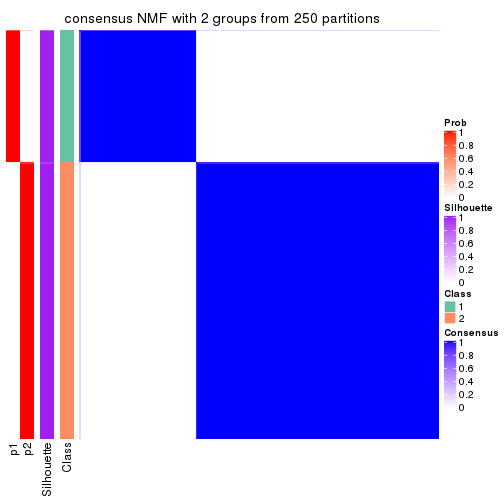</p>

</div>
<div id='tab-SD-NMF-consensus-heatmap-2'>
<pre><code class="r">consensus_heatmap(res, k = 3)
</code></pre>

<p>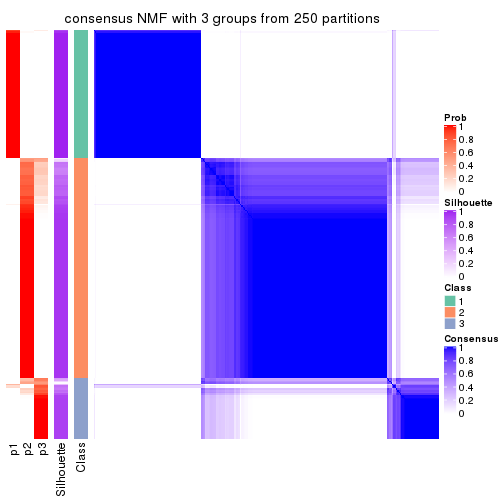</p>

</div>
<div id='tab-SD-NMF-consensus-heatmap-3'>
<pre><code class="r">consensus_heatmap(res, k = 4)
</code></pre>

<p>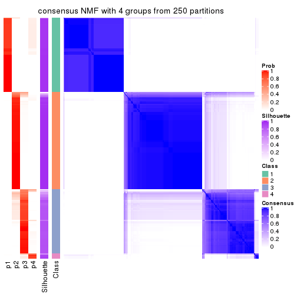</p>

</div>
<div id='tab-SD-NMF-consensus-heatmap-4'>
<pre><code class="r">consensus_heatmap(res, k = 5)
</code></pre>

<p>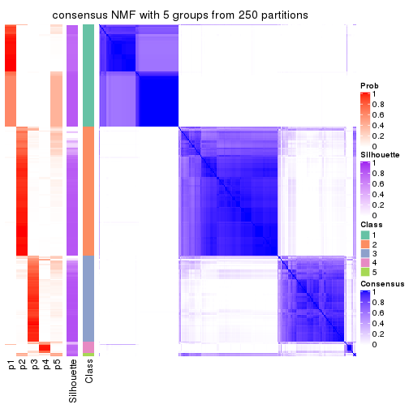</p>

</div>
<div id='tab-SD-NMF-consensus-heatmap-5'>
<pre><code class="r">consensus_heatmap(res, k = 6)
</code></pre>

<p>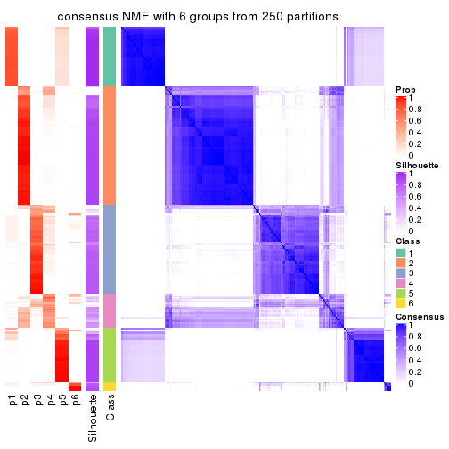</p>

</div>
</div>

Heatmaps for the membership of samples in all partitions to see how consistent they are:


<script>
$( function() {
	$( '#tabs-SD-NMF-membership-heatmap' ).tabs();
} );
</script>
<div id='tabs-SD-NMF-membership-heatmap'>
<ul>
<li><a href='#tab-SD-NMF-membership-heatmap-1'>k = 2</a></li>
<li><a href='#tab-SD-NMF-membership-heatmap-2'>k = 3</a></li>
<li><a href='#tab-SD-NMF-membership-heatmap-3'>k = 4</a></li>
<li><a href='#tab-SD-NMF-membership-heatmap-4'>k = 5</a></li>
<li><a href='#tab-SD-NMF-membership-heatmap-5'>k = 6</a></li>
</ul>
<div id='tab-SD-NMF-membership-heatmap-1'>
<pre><code class="r">membership_heatmap(res, k = 2)
</code></pre>

<p>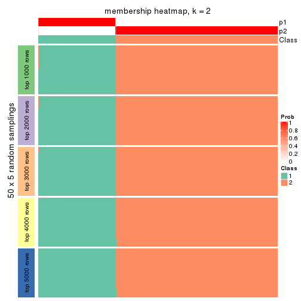</p>

</div>
<div id='tab-SD-NMF-membership-heatmap-2'>
<pre><code class="r">membership_heatmap(res, k = 3)
</code></pre>

<p>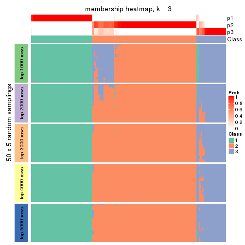</p>

</div>
<div id='tab-SD-NMF-membership-heatmap-3'>
<pre><code class="r">membership_heatmap(res, k = 4)
</code></pre>

<p>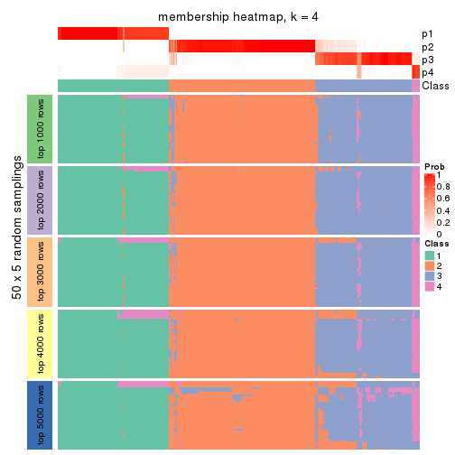</p>

</div>
<div id='tab-SD-NMF-membership-heatmap-4'>
<pre><code class="r">membership_heatmap(res, k = 5)
</code></pre>

<p>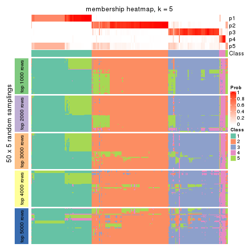</p>

</div>
<div id='tab-SD-NMF-membership-heatmap-5'>
<pre><code class="r">membership_heatmap(res, k = 6)
</code></pre>

<p>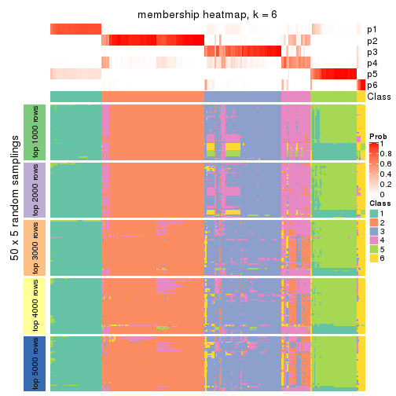</p>

</div>
</div>

As soon as we have had the classes for columns, we can look for signatures
which are significantly different between classes which can be candidate marks
for certain classes. Following are the heatmaps for signatures.


Signature heatmaps where rows are scaled:


<script>
$( function() {
	$( '#tabs-SD-NMF-get-signatures' ).tabs();
} );
</script>
<div id='tabs-SD-NMF-get-signatures'>
<ul>
<li><a href='#tab-SD-NMF-get-signatures-1'>k = 2</a></li>
<li><a href='#tab-SD-NMF-get-signatures-2'>k = 3</a></li>
<li><a href='#tab-SD-NMF-get-signatures-3'>k = 4</a></li>
<li><a href='#tab-SD-NMF-get-signatures-4'>k = 5</a></li>
<li><a href='#tab-SD-NMF-get-signatures-5'>k = 6</a></li>
</ul>
<div id='tab-SD-NMF-get-signatures-1'>
<pre><code class="r">get_signatures(res, k = 2)
</code></pre>

<p>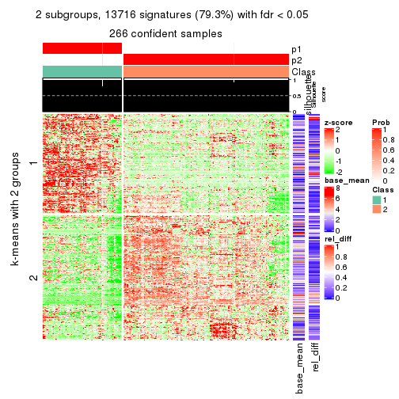</p>

</div>
<div id='tab-SD-NMF-get-signatures-2'>
<pre><code class="r">get_signatures(res, k = 3)
</code></pre>

<p>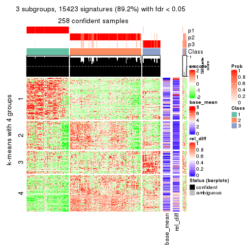</p>

</div>
<div id='tab-SD-NMF-get-signatures-3'>
<pre><code class="r">get_signatures(res, k = 4)
</code></pre>

<p>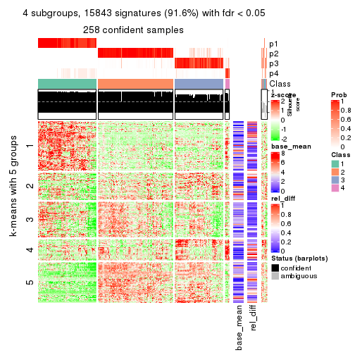</p>

</div>
<div id='tab-SD-NMF-get-signatures-4'>
<pre><code class="r">get_signatures(res, k = 5)
</code></pre>

<p>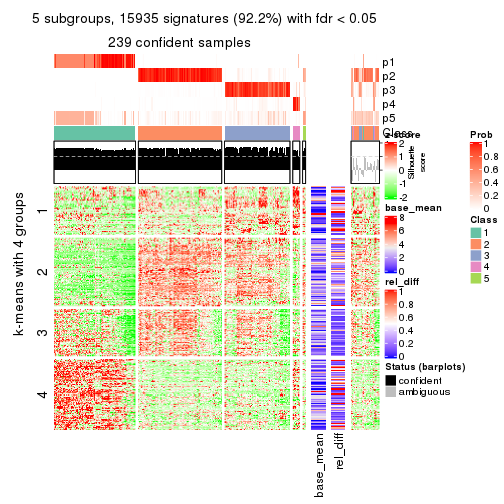</p>

</div>
<div id='tab-SD-NMF-get-signatures-5'>
<pre><code class="r">get_signatures(res, k = 6)
</code></pre>

<p>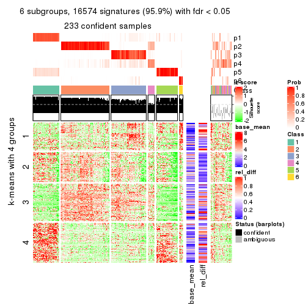</p>

</div>
</div>


Signature heatmaps where rows are not scaled:


<script>
$( function() {
	$( '#tabs-SD-NMF-get-signatures-no-scale' ).tabs();
} );
</script>
<div id='tabs-SD-NMF-get-signatures-no-scale'>
<ul>
<li><a href='#tab-SD-NMF-get-signatures-no-scale-1'>k = 2</a></li>
<li><a href='#tab-SD-NMF-get-signatures-no-scale-2'>k = 3</a></li>
<li><a href='#tab-SD-NMF-get-signatures-no-scale-3'>k = 4</a></li>
<li><a href='#tab-SD-NMF-get-signatures-no-scale-4'>k = 5</a></li>
<li><a href='#tab-SD-NMF-get-signatures-no-scale-5'>k = 6</a></li>
</ul>
<div id='tab-SD-NMF-get-signatures-no-scale-1'>
<pre><code class="r">get_signatures(res, k = 2, scale_rows = FALSE)
</code></pre>

<p>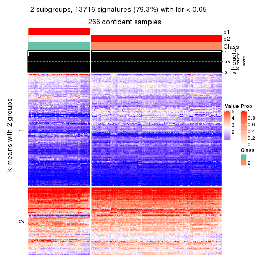</p>

</div>
<div id='tab-SD-NMF-get-signatures-no-scale-2'>
<pre><code class="r">get_signatures(res, k = 3, scale_rows = FALSE)
</code></pre>

<p>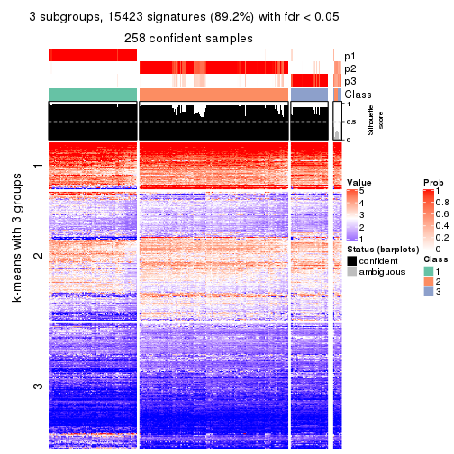</p>

</div>
<div id='tab-SD-NMF-get-signatures-no-scale-3'>
<pre><code class="r">get_signatures(res, k = 4, scale_rows = FALSE)
</code></pre>

<p>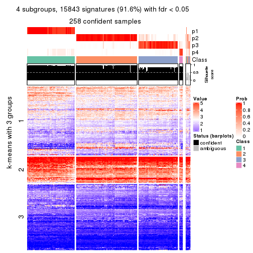</p>

</div>
<div id='tab-SD-NMF-get-signatures-no-scale-4'>
<pre><code class="r">get_signatures(res, k = 5, scale_rows = FALSE)
</code></pre>

<p>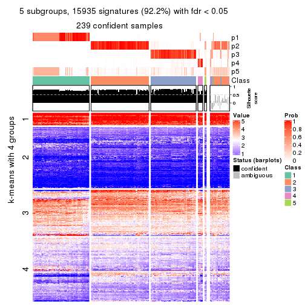</p>

</div>
<div id='tab-SD-NMF-get-signatures-no-scale-5'>
<pre><code class="r">get_signatures(res, k = 6, scale_rows = FALSE)
</code></pre>

<p>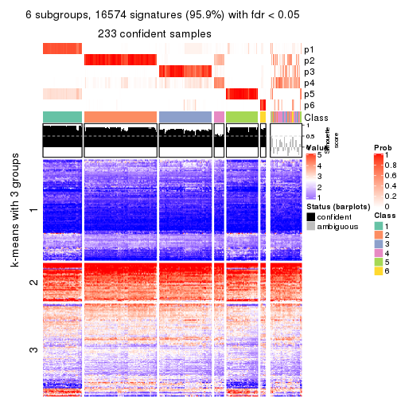</p>

</div>
</div>


Compare the overlap of signatures from different k:

```r
compare_signatures(res)
```

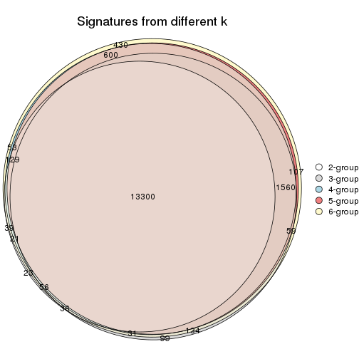

`get_signature()` returns a data frame invisibly. TO get the list of signatures, the function
call should be assigned to a variable explicitly. In following code, if `plot` argument is set
to `FALSE`, no heatmap is plotted while only the differential analysis is performed.

```r
# code only for demonstration
tb = get_signature(res, k = ..., plot = FALSE)
```

An example of the output of `tb` is:

```
#>   which_row         fdr    mean_1    mean_2 scaled_mean_1 scaled_mean_2 km
#> 1        38 0.042760348  8.373488  9.131774    -0.5533452     0.5164555  1
#> 2        40 0.018707592  7.106213  8.469186    -0.6173731     0.5762149  1
#> 3        55 0.019134737 10.221463 11.207825    -0.6159697     0.5749050  1
#> 4        59 0.006059896  5.921854  7.869574    -0.6899429     0.6439467  1
#> 5        60 0.018055526  8.928898 10.211722    -0.6204761     0.5791110  1
#> 6        98 0.009384629 15.714769 14.887706     0.6635654    -0.6193277  2
...
```

The columns in `tb` are:

1. `which_row`: row indices corresponding to the input matrix.
2. `fdr`: FDR for the differential test. 
3. `mean_x`: The mean value in group x.
4. `scaled_mean_x`: The mean value in group x after rows are scaled.
5. `km`: Row groups if k-means clustering is applied to rows.


UMAP plot which shows how samples are separated.


<script>
$( function() {
	$( '#tabs-SD-NMF-dimension-reduction' ).tabs();
} );
</script>
<div id='tabs-SD-NMF-dimension-reduction'>
<ul>
<li><a href='#tab-SD-NMF-dimension-reduction-1'>k = 2</a></li>
<li><a href='#tab-SD-NMF-dimension-reduction-2'>k = 3</a></li>
<li><a href='#tab-SD-NMF-dimension-reduction-3'>k = 4</a></li>
<li><a href='#tab-SD-NMF-dimension-reduction-4'>k = 5</a></li>
<li><a href='#tab-SD-NMF-dimension-reduction-5'>k = 6</a></li>
</ul>
<div id='tab-SD-NMF-dimension-reduction-1'>
<pre><code class="r">dimension_reduction(res, k = 2, method = &quot;UMAP&quot;)
</code></pre>

<p>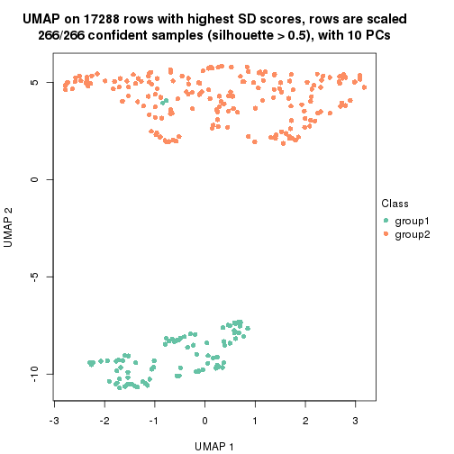</p>

</div>
<div id='tab-SD-NMF-dimension-reduction-2'>
<pre><code class="r">dimension_reduction(res, k = 3, method = &quot;UMAP&quot;)
</code></pre>

<p>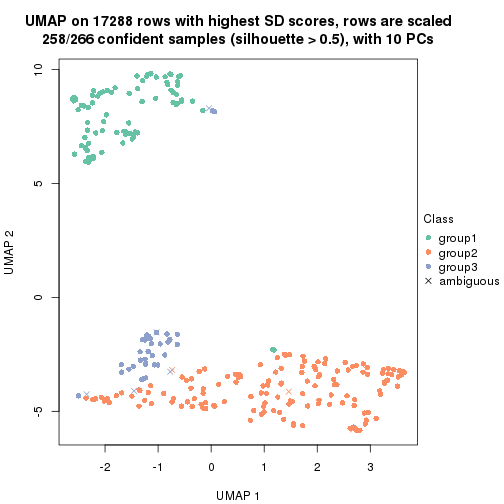</p>

</div>
<div id='tab-SD-NMF-dimension-reduction-3'>
<pre><code class="r">dimension_reduction(res, k = 4, method = &quot;UMAP&quot;)
</code></pre>

<p>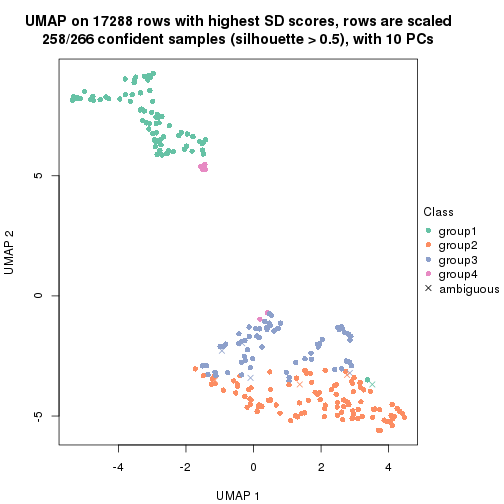</p>

</div>
<div id='tab-SD-NMF-dimension-reduction-4'>
<pre><code class="r">dimension_reduction(res, k = 5, method = &quot;UMAP&quot;)
</code></pre>

<p>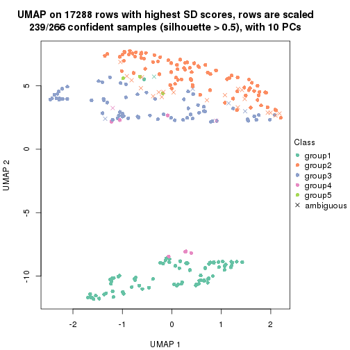</p>

</div>
<div id='tab-SD-NMF-dimension-reduction-5'>
<pre><code class="r">dimension_reduction(res, k = 6, method = &quot;UMAP&quot;)
</code></pre>

<p>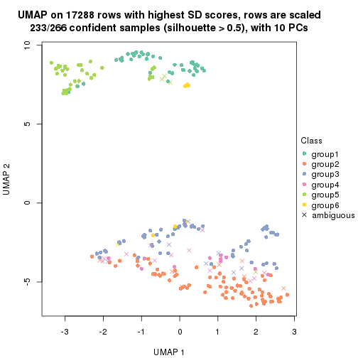</p>

</div>
</div>


Following heatmap shows how subgroups are split when increasing `k`:

```r
collect_classes(res)
```

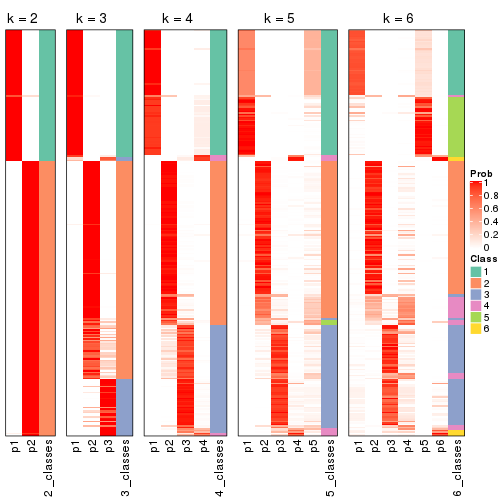


If matrix rows can be associated to genes, consider to use `GO_Enrichment(res,
...)` to perform function enrichment for the signature genes.


 

---------------------------------------------------


### CV:hclust**


The object with results only for a single top-value method and a single partition method 
can be extracted as:

```r
res = res_list["CV", "hclust"]
# you can also extract it by
# res = res_list["CV:hclust"]
```

A summary of `res` and all the functions that can be applied to it:

```r
res
```

```
#> A 'ConsensusPartition' object with k = 2, 3, 4, 5, 6.
#>   On a matrix with 17288 rows and 266 columns.
#>   Top rows (1000, 2000, 3000, 4000, 5000) are extracted by 'CV' method.
#>   Subgroups are detected by 'hclust' method.
#>   Performed in total 1250 partitions by row resampling.
#>   Best k for subgroups seems to be 2.
#> 
#> Following methods can be applied to this 'ConsensusPartition' object:
#>  [1] "cola_report"             "collect_classes"         "collect_plots"          
#>  [4] "collect_stats"           "colnames"                "compare_signatures"     
#>  [7] "consensus_heatmap"       "dimension_reduction"     "functional_enrichment"  
#> [10] "get_anno_col"            "get_anno"                "get_classes"            
#> [13] "get_consensus"           "get_matrix"              "get_membership"         
#> [16] "get_param"               "get_signatures"          "get_stats"              
#> [19] "is_best_k"               "is_stable_k"             "membership_heatmap"     
#> [22] "ncol"                    "nrow"                    "plot_ecdf"              
#> [25] "rownames"                "select_partition_number" "show"                   
#> [28] "suggest_best_k"          "test_to_known_factors"
```

`collect_plots()` function collects all the plots made from `res` for all `k` (number of partitions)
into one single page to provide an easy and fast comparison between different `k`.

```r
collect_plots(res)
```

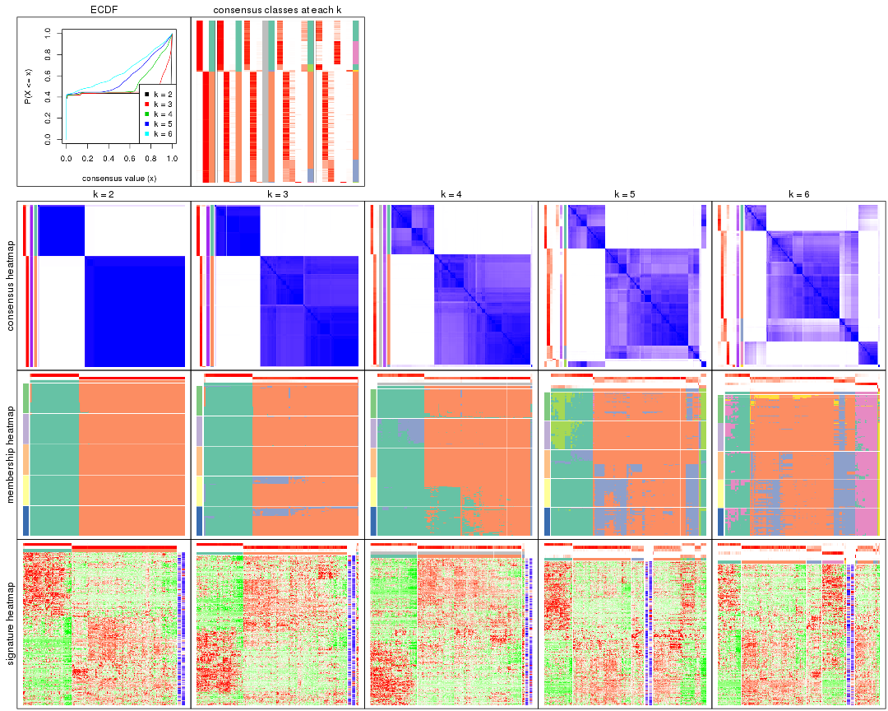

The plots are:

- The first row: a plot of the ECDF (Empirical cumulative distribution
  function) curves of the consensus matrix for each `k` and the heatmap of
  predicted classes for each `k`.
- The second row: heatmaps of the consensus matrix for each `k`.
- The third row: heatmaps of the membership matrix for each `k`.
- The fouth row: heatmaps of the signatures for each `k`.

All the plots in panels can be made by individual functions and they are
plotted later in this section.

`select_partition_number()` produces several plots showing different
statistics for choosing "optimized" `k`. There are following statistics:

- ECDF curves of the consensus matrix for each `k`;
- 1-PAC. [The PAC
  score](https://en.wikipedia.org/wiki/Consensus_clustering#Over-interpretation_potential_of_consensus_clustering)
  measures the proportion of the ambiguous subgrouping.
- Mean silhouette score.
- Concordance. The mean probability of fiting the consensus class ids in all
  partitions.
- Area increased. Denote $A_k$ as the area under the ECDF curve for current
  `k`, the area increased is defined as $A_k - A_{k-1}$.
- Rand index. The percent of pairs of samples that are both in a same cluster
  or both are not in a same cluster in the partition of k and k-1.
- Jaccard index. The ratio of pairs of samples are both in a same cluster in
  the partition of k and k-1 and the pairs of samples are both in a same
  cluster in the partition k or k-1.

The detailed explanations of these statistics can be found in [the cola
vignette](http://bioconductor.org/packages/devel/bioc/vignettes/cola/inst/doc/cola.html#toc_13).

Generally speaking, lower PAC score, higher mean silhouette score or higher
concordance corresponds to better partition. Rand index and Jaccard index
measure how similar the current partition is compared to partition with `k-1`.
If they are too similar, we won't accept `k` is better than `k-1`.

```r
select_partition_number(res)
```

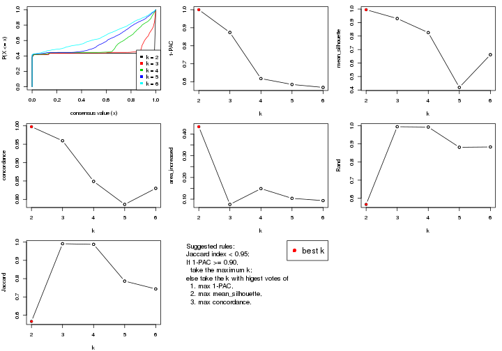

The numeric values for all these statistics can be obtained by `get_stats()`.

```r
get_stats(res)
```

```
#>   k 1-PAC mean_silhouette concordance area_increased  Rand Jaccard
#> 2 2 1.000           0.995       0.998         0.4337 0.566   0.566
#> 3 3 0.874           0.930       0.959         0.0759 0.995   0.991
#> 4 4 0.618           0.826       0.849         0.1486 0.993   0.988
#> 5 5 0.585           0.419       0.786         0.1039 0.882   0.787
#> 6 6 0.569           0.662       0.830         0.0935 0.883   0.744
```

`suggest_best_k()` suggests the best $k$ based on these statistics. The rules are as follows:

- All $k$ with Jaccard index larger than 0.95 are removed because the increase of
  the partition number does not provides enough extra information. If all $k$ are removed,
  the best $k$ is assigned by `NA`.
- For $k$ with 1-PAC larger than 0.9, the maximal $k$ is taken as the "best k". Other $k$ is called "optional k".
- If it does not fit the second rule. The $k$ with the highest vote of highest
  1-PAC, mean silhouette and concordance is taken as the "best k".

```r
suggest_best_k(res)
```

```
#> [1] 2
```


Following shows the table of the partitions (You need to click the **show/hide
code output** link to see it). The membership matrix (columns with name `p*`)
is inferred by
[`clue::cl_consensus()`](https://www.rdocumentation.org/link/cl_consensus?package=clue)
function with the `SE` method. Basically the value in the membership matrix
represents the probability to belong to a certain group. The finall class
label for an item is determined with the group with highest probability it
belongs to.

In `get_classes()` function, the entropy is calculated from the membership
matrix and the silhouette score is calculated from the consensus matrix.


<script>
$( function() {
	$( '#tabs-CV-hclust-get-classes' ).tabs();
} );
</script>
<div id='tabs-CV-hclust-get-classes'>
<ul>
<li><a href='#tab-CV-hclust-get-classes-1'>k = 2</a></li>
<li><a href='#tab-CV-hclust-get-classes-2'>k = 3</a></li>
<li><a href='#tab-CV-hclust-get-classes-3'>k = 4</a></li>
<li><a href='#tab-CV-hclust-get-classes-4'>k = 5</a></li>
<li><a href='#tab-CV-hclust-get-classes-5'>k = 6</a></li>
</ul>

<div id='tab-CV-hclust-get-classes-1'>
<p><a id='tab-CV-hclust-get-classes-1-a' style='color:#0366d6' href='#'>show/hide code output</a></p>
<pre><code class="r">cbind(get_classes(res, k = 2), get_membership(res, k = 2))
</code></pre>

<pre><code>#&gt;                                      class entropy silhouette    p1    p2
#&gt; 80D0AF10-1C61-4B67-90C1-7DBF1EF23672     2  0.0000      0.999 0.000 1.000
#&gt; 87117BE1-D328-4972-85DA-6672412D8860     2  0.0000      0.999 0.000 1.000
#&gt; F904C5B6-70BD-4604-8254-79BE23B152DA     1  0.0000      0.995 1.000 0.000
#&gt; 3182DEA1-4239-4613-925A-7E6503766AD6     2  0.0000      0.999 0.000 1.000
#&gt; 55E78EA2-2D9B-481F-8CAB-D36A33088EAE     2  0.0000      0.999 0.000 1.000
#&gt; 86F94264-A6DD-4A97-9191-036F066DD0EF     2  0.0000      0.999 0.000 1.000
#&gt; 09D25417-23B7-4D88-A0EA-F307985FBBBC     2  0.0000      0.999 0.000 1.000
#&gt; C797F12C-40D3-4DB5-B9EF-A6821BBDE4F0     1  0.0000      0.995 1.000 0.000
#&gt; 80275DB0-A226-4B6B-A08F-4ADBEEE1DB01     1  0.0000      0.995 1.000 0.000
#&gt; 27FB653A-9E07-44AD-952E-9E4DE4AB5891     2  0.0000      0.999 0.000 1.000
#&gt; 1A5DB9FC-2ABD-4E1B-B5EF-B1CF5E5F3872     1  0.5737      0.846 0.864 0.136
#&gt; 844E4CCD-D30C-416F-A086-8923711A4E25     2  0.0376      0.995 0.004 0.996
#&gt; EF18318D-3D25-4D65-803A-ED6E62871E7E     1  0.5737      0.846 0.864 0.136
#&gt; 1ACB1BE0-61F6-4243-BBEC-E26A1CF90CA8     1  0.0000      0.995 1.000 0.000
#&gt; 8EF0039B-D758-46AB-BAF7-6A062C7C56BA     1  0.0000      0.995 1.000 0.000
#&gt; 22F4C9D9-663B-4C91-9692-E035A2640BEC     2  0.0000      0.999 0.000 1.000
#&gt; FA1A0BCE-EE0F-4178-B963-62550E344B14     2  0.0000      0.999 0.000 1.000
#&gt; 0B6D0C4E-5AE3-4707-A9FC-12A108E6EC2A     2  0.0000      0.999 0.000 1.000
#&gt; 06FD3123-2AEB-4911-AC4E-E0E64FD5DB52     2  0.0000      0.999 0.000 1.000
#&gt; 235A4492-FF80-4AA5-BC71-DFF65E1C7411     2  0.0000      0.999 0.000 1.000
#&gt; A192C6C0-1443-4493-AFAC-1EE710628ADB     2  0.0000      0.999 0.000 1.000
#&gt; 6FC5B56B-711B-4174-9B06-4E843124AAB6     1  0.0000      0.995 1.000 0.000
#&gt; 7A813F60-A41E-4552-990E-F22287654C1D     2  0.0000      0.999 0.000 1.000
#&gt; 725BBFB5-26F4-4512-9C75-47D013C1E605     1  0.0000      0.995 1.000 0.000
#&gt; 39CC4E82-EBC9-472E-8BE5-6A3AB178449A     2  0.0000      0.999 0.000 1.000
#&gt; 61130DEE-E267-49DF-8B41-7738A06EF738     2  0.0000      0.999 0.000 1.000
#&gt; 117EC12C-B7ED-4E01-B29B-EA542D356EA1     1  0.0000      0.995 1.000 0.000
#&gt; A30FF708-F7A9-41E4-8AD5-20441650FBC9     2  0.0000      0.999 0.000 1.000
#&gt; 53640D52-1167-4A5D-B656-97D32CBA3934     1  0.0000      0.995 1.000 0.000
#&gt; 9E85D76A-DD2A-46D5-BB59-0ED302B6258C     2  0.0000      0.999 0.000 1.000
#&gt; 6F8C6F90-7E3C-4860-91DD-586708DE44AA     1  0.0000      0.995 1.000 0.000
#&gt; E675AEC5-AA9A-4AAA-839C-03E6365822DB     2  0.0000      0.999 0.000 1.000
#&gt; B577DEF7-2F5C-4876-A7C6-F18D5722B8C0     1  0.0000      0.995 1.000 0.000
#&gt; DA8B577E-43E7-49BF-BF94-868E3194F5C9     1  0.0000      0.995 1.000 0.000
#&gt; 3334280B-2A36-4AC7-A021-A76C10E958F0     2  0.0000      0.999 0.000 1.000
#&gt; 5CBDDC90-11EC-4E6E-881E-AA9CCFD40FDB     2  0.0672      0.992 0.008 0.992
#&gt; 8CBBF32A-8349-44F5-A8B8-4CBB1760A464     2  0.0000      0.999 0.000 1.000
#&gt; B9455A9A-136D-4DC2-9F86-0FC74433589D     2  0.3733      0.923 0.072 0.928
#&gt; D7EAE2A7-F9BE-4222-A452-B1F83F99CD50     2  0.0672      0.992 0.008 0.992
#&gt; F803AE18-60C5-4CFE-AAAB-DB33C26A2184     1  0.0000      0.995 1.000 0.000
#&gt; 5DD8CAC7-EC02-43B6-B58E-6D2E22868A3B     2  0.0000      0.999 0.000 1.000
#&gt; EE98E1B4-DFB3-4AEC-8527-E1FD544C9475     1  0.0000      0.995 1.000 0.000
#&gt; 3CE43921-47D5-4394-B9E1-242607775D61     2  0.0000      0.999 0.000 1.000
#&gt; 46986F2B-0B0D-4187-8948-4E91D34B7C49     2  0.0000      0.999 0.000 1.000
#&gt; 5D1D052E-74EF-45A8-9B1A-7CECD13EA43B     2  0.0000      0.999 0.000 1.000
#&gt; 4C821AD9-A5C9-4A9A-9C5D-363B227F8064     2  0.0000      0.999 0.000 1.000
#&gt; 06A4189E-A23B-4AC6-AA74-01955DD7D1E9     2  0.0000      0.999 0.000 1.000
#&gt; FCCDC76F-CB02-4BCD-A616-325F258DDAA4     2  0.0000      0.999 0.000 1.000
#&gt; DAC53B0A-8F35-4EA6-BBCC-4CD1C049E11F     2  0.0000      0.999 0.000 1.000
#&gt; DD4F845B-CAD3-44CB-9D96-3C3F5BA1B72D     1  0.0000      0.995 1.000 0.000
#&gt; D440F004-A4A4-41B6-BED8-805D67BA01C7     2  0.0000      0.999 0.000 1.000
#&gt; A497C423-119F-42FA-BF17-9F6DFD2A5585     2  0.0000      0.999 0.000 1.000
#&gt; 3420E573-DE12-4EF5-B1C0-2FCA904F4F4E     1  0.0000      0.995 1.000 0.000
#&gt; 1AD72157-A254-44B4-BA58-4F30F1AE910E     1  0.0000      0.995 1.000 0.000
#&gt; C1113977-B160-45EE-B061-750F9EA3F33F     2  0.0000      0.999 0.000 1.000
#&gt; 6783AB5B-F07C-447B-BF13-C34485D246D7     2  0.0000      0.999 0.000 1.000
#&gt; 1F553062-26FD-4A7F-B7FB-81184604F423     1  0.0000      0.995 1.000 0.000
#&gt; BE2DCA51-1C21-4598-98A7-F2FB9B2DFCB4     2  0.0000      0.999 0.000 1.000
#&gt; 38941CF3-9C54-4BA4-A005-CC88CA97D504     2  0.0000      0.999 0.000 1.000
#&gt; 51CB675E-E243-4A07-BF4A-580473D26FDA     2  0.0000      0.999 0.000 1.000
#&gt; C7FED0F5-C27A-4405-9232-30BF39362CF7     2  0.0000      0.999 0.000 1.000
#&gt; 2A1E86E8-4713-465F-ACFF-C584864C57A1     2  0.0000      0.999 0.000 1.000
#&gt; B4500785-0FAA-4D4D-8630-43D194BAB004     2  0.0000      0.999 0.000 1.000
#&gt; 3FD52E66-AB76-4079-80DB-281A795D1EC0     2  0.0672      0.992 0.008 0.992
#&gt; EBD355D1-1226-4DFD-AAFF-45D246B64F3C     2  0.0000      0.999 0.000 1.000
#&gt; 5A040A73-CD95-487E-8AEF-9639FE4E2916     2  0.0000      0.999 0.000 1.000
#&gt; CF629C65-585D-476D-B081-3E6E0575FAE3     2  0.1414      0.981 0.020 0.980
#&gt; 0D4202A3-808E-413F-9BF3-9CFCCAE0ED61     2  0.0000      0.999 0.000 1.000
#&gt; 43E715BF-28D9-4B5E-B762-8CD1B69A430E     1  0.0000      0.995 1.000 0.000
#&gt; BFB82BE8-9DAC-4099-8B38-0950308E3EB3     2  0.0000      0.999 0.000 1.000
#&gt; F7CB1825-2303-4DD2-AE1F-7205738EAF1F     1  0.0000      0.995 1.000 0.000
#&gt; FE298483-C42C-4753-BABB-29A9CB1B6312     1  0.0000      0.995 1.000 0.000
#&gt; A98C7561-1B42-4CD6-AE71-924B91FA4C33     2  0.0000      0.999 0.000 1.000
#&gt; 58098F21-7DAB-47DA-9A41-8D20BF3B9257     2  0.0000      0.999 0.000 1.000
#&gt; 18CAF708-20B9-4745-9CB3-37AB6E0B3056     2  0.0000      0.999 0.000 1.000
#&gt; 2C80DD72-C9C7-4AC2-812F-9A31EF02779C     1  0.0000      0.995 1.000 0.000
#&gt; 68A3F13D-319D-4603-A27F-B5DD46FE5C5B     2  0.0000      0.999 0.000 1.000
#&gt; 7EE8F0CE-CDC9-40F9-A1DE-7F8140EC6D13     2  0.0672      0.992 0.008 0.992
#&gt; 39019903-5B9C-4665-BD5F-7CCB19CB55C5     2  0.0000      0.999 0.000 1.000
#&gt; 190EDB27-4CBC-4E9C-9B67-D51FDAB982B7     2  0.0000      0.999 0.000 1.000
#&gt; EB2D95BC-62F8-4669-9308-D37D7FB79E23     2  0.0000      0.999 0.000 1.000
#&gt; A08B85EA-D1E7-4B77-8DEC-36294305B9F7     1  0.0000      0.995 1.000 0.000
#&gt; 130DDFAD-6EF8-4C80-BD9D-88308A6874BC     2  0.0000      0.999 0.000 1.000
#&gt; 7340A5BA-E002-448F-AACC-E7A37DBB79C2     2  0.0000      0.999 0.000 1.000
#&gt; A771F6E3-D266-4FE7-98C6-C40E6A701D59     1  0.0000      0.995 1.000 0.000
#&gt; 015E792C-EC1B-49BF-AB07-D82B20C5989A     2  0.0000      0.999 0.000 1.000
#&gt; BF79E030-47EE-4D08-B910-5685A4BD8B60     2  0.0000      0.999 0.000 1.000
#&gt; FB3C7C9A-2F2D-4DD5-BE47-FAFB072C0FAB     2  0.0000      0.999 0.000 1.000
#&gt; 4E5557BA-10E8-4723-908E-DD04EF6639B2     2  0.0000      0.999 0.000 1.000
#&gt; 8031B550-40A9-4A3A-9F7D-CDC052288BD8     2  0.0000      0.999 0.000 1.000
#&gt; 55299A06-3C1F-45A4-B166-B2C591C0CEE2     2  0.0000      0.999 0.000 1.000
#&gt; EB8D5168-216E-4ABB-8B4E-9E67786CB322     1  0.0000      0.995 1.000 0.000
#&gt; 78BD2D83-9A7F-42E5-BB38-654AA0761A0A     2  0.0000      0.999 0.000 1.000
#&gt; AA2D53E5-D389-4332-9DD5-A736052E48F8     1  0.0000      0.995 1.000 0.000
#&gt; 62945C7A-9313-4FC9-820C-B0AB820B394E     1  0.0000      0.995 1.000 0.000
#&gt; 22746046-2E99-4EE9-97D2-BA2EA499634C     2  0.0000      0.999 0.000 1.000
#&gt; 8671B51B-DCBE-4429-9F01-AF51CAD7014F     2  0.0000      0.999 0.000 1.000
#&gt; E815AB36-5689-4A0D-8E6D-2EAA73406681     1  0.0000      0.995 1.000 0.000
#&gt; A1DACB46-ED52-4E38-B2C8-57256BB22B5E     2  0.0000      0.999 0.000 1.000
#&gt; 4F5498C4-A423-4B3D-AC98-D4E214A57D0E     1  0.0000      0.995 1.000 0.000
#&gt; A7772CCD-FFFF-49DD-86ED-0BAD330EC9B6     2  0.0000      0.999 0.000 1.000
#&gt; E6E3DF78-65B9-4F74-8DA8-E2A6D4EDBEA7     2  0.0000      0.999 0.000 1.000
#&gt; 83286E2D-E708-437A-911A-E6B050273CBD     1  0.0000      0.995 1.000 0.000
#&gt; EC5C7C97-EE8C-405D-A039-D96514B1D414     2  0.0000      0.999 0.000 1.000
#&gt; 3E55223D-6E3D-4027-9819-67E91212531D     1  0.0000      0.995 1.000 0.000
#&gt; 99A036A2-8343-4D06-8047-D84E96CE4C61     2  0.0000      0.999 0.000 1.000
#&gt; CA6CDE6D-92DE-4259-9E58-A373F2D543EA     2  0.0000      0.999 0.000 1.000
#&gt; BF6FA8CC-60C1-413A-B2C6-54CCACBC01D6     1  0.0000      0.995 1.000 0.000
#&gt; E0594CFE-F7B6-4546-B130-30DF6A514B1F     2  0.0000      0.999 0.000 1.000
#&gt; E769E41D-5949-42C5-9594-E563C05ACE52     2  0.0000      0.999 0.000 1.000
#&gt; 01373725-5D3C-4D9C-AABC-911D53E62BCD     2  0.0000      0.999 0.000 1.000
#&gt; 1F39DADD-3655-474E-BA4C-A5BD32C97A8B     1  0.0000      0.995 1.000 0.000
#&gt; AF573EC8-E4EE-4B8F-8199-9817B9FAC67D     1  0.0000      0.995 1.000 0.000
#&gt; 3F022CBC-41C8-4387-A6FB-124C4BCD1AD9     1  0.0000      0.995 1.000 0.000
#&gt; 1CC32ACE-826B-494B-8B89-5BD92327A74D     2  0.0000      0.999 0.000 1.000
#&gt; 22B0BD3B-EE08-4BC7-90B2-01C372A56BA2     2  0.0000      0.999 0.000 1.000
#&gt; 0F3DE9EF-19CC-4D14-9A42-1435DB537F94     2  0.0000      0.999 0.000 1.000
#&gt; 87F8A33F-FBC3-469E-862B-84472F796358     2  0.0000      0.999 0.000 1.000
#&gt; C9F2FA0D-1A9F-40B4-BD9B-CAF1B3F3D5A7     2  0.0000      0.999 0.000 1.000
#&gt; ACFC9F59-78FF-4453-B25F-8834D0EAB54A     2  0.0000      0.999 0.000 1.000
#&gt; B7AC7D5B-14E9-45A7-93B7-226EE508544A     2  0.0000      0.999 0.000 1.000
#&gt; 4491BF17-B168-4E96-8E09-EF1AEC9F5E9D     2  0.0000      0.999 0.000 1.000
#&gt; 557A0811-A3FE-4CF4-A24D-FBB77E7F9139     2  0.0000      0.999 0.000 1.000
#&gt; 6F9C955C-6816-4353-922A-8035B50FACC6     2  0.0000      0.999 0.000 1.000
#&gt; 3E89FB1C-4A7D-43C7-823C-04E3716A7935     2  0.0000      0.999 0.000 1.000
#&gt; 12ABE483-66EF-4237-94C4-0199FAE23FA8     2  0.0000      0.999 0.000 1.000
#&gt; 7535F262-9B96-44F6-988C-4C9EBB3FFCA9     2  0.0000      0.999 0.000 1.000
#&gt; 65C9D28E-303B-40E5-84F0-2507F5457374     2  0.0000      0.999 0.000 1.000
#&gt; FD445384-6BA9-4297-9D9C-12ABA7D645C7     1  0.0000      0.995 1.000 0.000
#&gt; 30D5E255-2AD3-44F3-8983-1B80E4FD3E2D     2  0.0000      0.999 0.000 1.000
#&gt; 3E88EC60-B4A8-4259-8BC8-A234800F6955     2  0.0672      0.992 0.008 0.992
#&gt; ACD73CE8-AFC5-47A0-9383-3CB97F018953     1  0.0000      0.995 1.000 0.000
#&gt; 1AFDC2EA-26A8-44E2-8BCB-F34F7B66F8C8     2  0.0000      0.999 0.000 1.000
#&gt; 9E327BC8-1D20-4AD8-83F7-FB2D13BCA5D0     2  0.0672      0.992 0.008 0.992
#&gt; 85A86B91-4F24-4E77-AE2D-520F8E205EFC     1  0.0000      0.995 1.000 0.000
#&gt; 74868C37-8143-4306-81CA-E45759D146CD     2  0.0000      0.999 0.000 1.000
#&gt; 69AEA0DB-E335-48A0-A398-4FB0D581182A     2  0.0000      0.999 0.000 1.000
#&gt; AE6F8B89-85C2-42B7-8D05-AFDDD4FEFD16     1  0.0000      0.995 1.000 0.000
#&gt; A8A6F09C-9812-4457-9A4B-AD41F97B41A3     2  0.0000      0.999 0.000 1.000
#&gt; 1A09BC4D-EF29-42DD-BB04-A3C264A3032D     1  0.0000      0.995 1.000 0.000
#&gt; E0961A30-A62C-4235-9CF0-A1776827A996     2  0.0000      0.999 0.000 1.000
#&gt; 134D2D90-7B08-4F20-8A3A-C77643FB208F     2  0.0000      0.999 0.000 1.000
#&gt; A77C2DFF-93CF-4CB5-B3C1-81133D7F1A0F     2  0.0672      0.992 0.008 0.992
#&gt; EA2DC457-9C74-4B9C-B3FA-5E72199B24A7     2  0.0000      0.999 0.000 1.000
#&gt; FF34117B-5EE4-4C96-A8A2-2CE6A654CBE5     1  0.0000      0.995 1.000 0.000
#&gt; 75F7B5E2-6559-4B48-A2A4-287C35C559CC     1  0.0000      0.995 1.000 0.000
#&gt; 903BF591-B0AF-4BEE-B625-60B673070344     2  0.0000      0.999 0.000 1.000
#&gt; 9DE1B790-C63C-41C4-9477-CE52A8119C67     2  0.0000      0.999 0.000 1.000
#&gt; 9A28F80A-85F8-40E2-A32B-230EF93B2FA0     2  0.0000      0.999 0.000 1.000
#&gt; 0AA2BDBB-8720-409A-AA72-1F4AA26E7CD8     2  0.0000      0.999 0.000 1.000
#&gt; 5AD49F16-E974-4E5D-B1B6-073ECB73A01D     2  0.1184      0.985 0.016 0.984
#&gt; CB0F961C-527D-4A48-9408-286B26BD9532     1  0.0000      0.995 1.000 0.000
#&gt; 46FF25B6-D01D-4CA7-80B7-CEC2998C34E1     2  0.0000      0.999 0.000 1.000
#&gt; 487CADE1-D699-4A6C-817A-B9A0AB940C61     1  0.0000      0.995 1.000 0.000
#&gt; 4FF6F2D8-F869-4735-A4D1-1A8423153FBC     1  0.0000      0.995 1.000 0.000
#&gt; 6005494F-5D3D-43A3-B3E8-8C91955B2A98     2  0.0000      0.999 0.000 1.000
#&gt; CF10D584-CE32-45A4-A932-E9D5AF12A6A0     1  0.0000      0.995 1.000 0.000
#&gt; E15CE4AB-5646-49C8-9CD6-938457036BB0     2  0.0000      0.999 0.000 1.000
#&gt; 31E28D0B-0E69-4330-82ED-4F1827DC97EA     2  0.0000      0.999 0.000 1.000
#&gt; DBACD3C3-CCB5-4478-BA78-85A0C847CA66     2  0.0000      0.999 0.000 1.000
#&gt; 5A07041C-65EB-4FCD-8940-E90B905061B5     2  0.0672      0.992 0.008 0.992
#&gt; 0EA7C916-FA47-489B-BC98-4D9E7D197628     1  0.0000      0.995 1.000 0.000
#&gt; 30967F75-8499-47FF-ADA4-4DC566013F7B     1  0.0000      0.995 1.000 0.000
#&gt; D2E528FF-AEA2-48D7-A60A-4C3E71EA9073     2  0.0000      0.999 0.000 1.000
#&gt; 22735DCD-215E-48BC-BF44-32BD66F06E39     2  0.0000      0.999 0.000 1.000
#&gt; BC2C3248-7FC6-48BC-96C1-45EA573DE7DC     1  0.0000      0.995 1.000 0.000
#&gt; E72CEBCB-D686-4B12-BCBA-EC8F964330A2     1  0.0000      0.995 1.000 0.000
#&gt; 23C937BB-BA20-4440-B680-914229CC3ADF     1  0.0000      0.995 1.000 0.000
#&gt; 947E99C7-F402-4F1A-A6E9-81BCAAED135A     2  0.0000      0.999 0.000 1.000
#&gt; 02475D11-FC81-4E88-944E-173C32DC3FE7     2  0.0672      0.992 0.008 0.992
#&gt; F972A9AA-9842-4343-A533-A795E65581CE     1  0.0000      0.995 1.000 0.000
#&gt; 05043AAF-3095-4C61-B5C1-EE9AA9082C75     2  0.0000      0.999 0.000 1.000
#&gt; CECF7967-862E-428C-BB42-FEF553FDB3AA     2  0.0000      0.999 0.000 1.000
#&gt; FB0B9483-6302-48C7-BE5B-DA667E00AE2D     2  0.0000      0.999 0.000 1.000
#&gt; 78700FBA-1487-4754-9B30-18837BF7E9FB     1  0.0000      0.995 1.000 0.000
#&gt; 2166F56D-54CE-4F1B-8F07-A4E13E4489E9     1  0.0000      0.995 1.000 0.000
#&gt; 7CD0942E-E39A-43A7-8BAC-F25967864901     2  0.0000      0.999 0.000 1.000
#&gt; 3B00BA2B-7F7D-4825-8F8D-90F04A5DE687     2  0.0000      0.999 0.000 1.000
#&gt; 7465B01D-C05E-4FE0-A9FE-182920EDC489     2  0.0000      0.999 0.000 1.000
#&gt; 88C31A99-F96E-4FC8-8B3D-C1AAA05062D9     1  0.0000      0.995 1.000 0.000
#&gt; 53575575-3303-4F8F-B6A8-B42131CFB4AC     2  0.0000      0.999 0.000 1.000
#&gt; CC8017C7-4128-48DA-8E43-503F63158D85     1  0.0000      0.995 1.000 0.000
#&gt; 88449D2A-2A25-41A4-B91D-C99B58F8ECD9     2  0.0000      0.999 0.000 1.000
#&gt; 46C7DDE5-A2B5-494F-96AE-0B6E2D51B003     1  0.0000      0.995 1.000 0.000
#&gt; 42551D05-5EE5-4F91-93A8-32DA695D9DFA     2  0.0000      0.999 0.000 1.000
#&gt; 0772DA48-3A36-422D-B166-CA1691B782C3     2  0.0000      0.999 0.000 1.000
#&gt; 30346897-EC77-4153-88A2-D14593C8B741     2  0.0000      0.999 0.000 1.000
#&gt; 0F00E267-C748-4A71-8B36-03C410641D88     2  0.0000      0.999 0.000 1.000
#&gt; 4034703A-4DA9-4DDA-9CA9-E80FFE9CCDE6     2  0.0000      0.999 0.000 1.000
#&gt; 393C8A41-CF45-4EA8-AFE3-25A08AB7692A     2  0.0000      0.999 0.000 1.000
#&gt; 3354212D-A07C-435C-8B0C-9A7BAAB624B5     1  0.0000      0.995 1.000 0.000
#&gt; 57E30D4E-ABF7-47DD-92BE-40CE215076B0     1  0.0000      0.995 1.000 0.000
#&gt; 202B4C76-C840-4DB8-953F-AC75A4156FDD     2  0.0000      0.999 0.000 1.000
#&gt; 93A0137B-1F4C-44EE-B959-2AD0CD2DF8B6     1  0.0000      0.995 1.000 0.000
#&gt; C9794DB6-6E8C-4AFD-80EE-61D672A4F6E9     2  0.0000      0.999 0.000 1.000
#&gt; AE4BFE63-F0C0-4624-AD97-4F7FF13E2384     1  0.0000      0.995 1.000 0.000
#&gt; DCF87F27-2B54-42D9-8D28-5DFEE76E2F5B     2  0.0000      0.999 0.000 1.000
#&gt; 2451D405-39FD-4812-958C-23462B66F1F1     2  0.0000      0.999 0.000 1.000
#&gt; E27F5D33-3F68-4CA8-8757-A387C6EAD060     2  0.0000      0.999 0.000 1.000
#&gt; 8BA9928A-5B93-477F-B4A2-D031B714D9AC     1  0.0000      0.995 1.000 0.000
#&gt; 0FAACFF6-B50C-4BED-9824-B7270654F28D     2  0.0000      0.999 0.000 1.000
#&gt; 3366CC3C-2BBA-4CA7-848E-4E16AA70AE7A     2  0.0000      0.999 0.000 1.000
#&gt; 66237056-CA9A-4C90-AF0E-1621FEB71578     2  0.0000      0.999 0.000 1.000
#&gt; C480F1FB-3100-436C-B0F5-DED63B7A580E     2  0.0000      0.999 0.000 1.000
#&gt; A327DE0D-D945-4B42-9B41-A7302CF796EE     2  0.0000      0.999 0.000 1.000
#&gt; E8A6871D-67FB-4306-9454-F5E7CDBA399A     2  0.0000      0.999 0.000 1.000
#&gt; E9A7485B-82B6-4BD2-AFBB-DD0A82D6CDE2     1  0.0000      0.995 1.000 0.000
#&gt; 93B382E4-9C9A-43F5-BD3B-502CC260B886     1  0.0000      0.995 1.000 0.000
#&gt; A2792419-8E16-45FE-A524-17851F34AB9B     2  0.0000      0.999 0.000 1.000
#&gt; 4DED1201-F25C-4F82-BABF-965EFAD7A8E5     2  0.0000      0.999 0.000 1.000
#&gt; F1ACB2DD-E948-4F88-A249-F1BD1977D667     2  0.0000      0.999 0.000 1.000
#&gt; 6CDBA203-8952-421D-A6BF-75652D9F3339     2  0.0376      0.995 0.004 0.996
#&gt; 2D6C5AA7-3B33-48D7-AE0C-77A16B749D13     1  0.5737      0.846 0.864 0.136
#&gt; 3F6B6D95-0720-42A0-AEB3-89FECAE7616A     2  0.0672      0.992 0.008 0.992
#&gt; DED8ACF3-BBD8-46C9-85C9-A9C8F2E2BC0B     1  0.0000      0.995 1.000 0.000
#&gt; 77069279-5A6F-42C0-9AA5-8C939591DFB5     1  0.0000      0.995 1.000 0.000
#&gt; B2D4FCF3-FDF9-41C8-880A-6732CF6222AF     2  0.0672      0.992 0.008 0.992
#&gt; 1CD71A4C-1E49-48EF-AA72-CB3C26B4C087     2  0.0000      0.999 0.000 1.000
#&gt; C364E621-F85C-4B7F-842F-210B8D4DFE3A     2  0.0000      0.999 0.000 1.000
#&gt; 11F1B8CA-07C1-47D2-A3C6-032FFA6A4A64     1  0.0000      0.995 1.000 0.000
#&gt; 153BF804-6DC8-496B-987A-4021A2512211     2  0.0000      0.999 0.000 1.000
#&gt; 5B5029C9-40F5-40D7-A36A-367022AD6A42     2  0.0000      0.999 0.000 1.000
#&gt; 193CCBE6-104F-49B4-BDB2-C82EE36FDAAD     1  0.0000      0.995 1.000 0.000
#&gt; E5D45E53-FCF3-4F01-9B78-6CB1ED0CFE40     2  0.0000      0.999 0.000 1.000
#&gt; 5546A779-21DB-49F9-8C0D-A1E420088084     2  0.0000      0.999 0.000 1.000
#&gt; E14825E0-0DC7-44C2-B265-F54672356838     1  0.0000      0.995 1.000 0.000
#&gt; 8C8C09B9-EC83-45EC-BC4C-0BA92DE60ACB     1  0.0000      0.995 1.000 0.000
#&gt; B388CA82-5BF7-4BDD-8821-4EC0B213121F     2  0.0000      0.999 0.000 1.000
#&gt; A26025AC-9F71-4C07-9135-83593193BBB2     1  0.0000      0.995 1.000 0.000
#&gt; C80E6D4B-AF21-42F0-8E20-6F7D2E99C062     2  0.0000      0.999 0.000 1.000
#&gt; 5AE5D819-A6B1-4761-B7F9-8FFD3C520F31     2  0.0672      0.992 0.008 0.992
#&gt; CAE8097F-A139-4C6E-9E30-35080475FF34     2  0.0000      0.999 0.000 1.000
#&gt; 539C8DE3-6152-4671-B96F-ED6DC6DBD22B     1  0.0000      0.995 1.000 0.000
#&gt; 5D28A8E0-4ECF-43A4-890A-BE968B9A8CB2     2  0.0000      0.999 0.000 1.000
#&gt; 97A80AF8-365E-4756-A2B0-AEB1D8F5F33E     2  0.0000      0.999 0.000 1.000
#&gt; B3527517-E339-46AE-8437-65303C309015     2  0.0000      0.999 0.000 1.000
#&gt; 523E2183-AA20-4749-BD7E-69CD620DD6A3     2  0.0000      0.999 0.000 1.000
#&gt; E553FB92-F181-47B3-9F3D-11DB51DFA3A4     2  0.0000      0.999 0.000 1.000
#&gt; FFE0C4B1-8EEC-484A-AB87-3401B71BD081     2  0.0000      0.999 0.000 1.000
#&gt; 73D6CA4B-9A9E-4E52-96C8-AE7F0CC8B276     2  0.0000      0.999 0.000 1.000
#&gt; 485A8107-DF9A-4BC6-8A72-07FBA93F10F2     1  0.0000      0.995 1.000 0.000
#&gt; 690823D9-B9AA-40EF-8302-4AD88BF89D1C     2  0.0672      0.992 0.008 0.992
#&gt; B4E02660-562F-4EAC-8472-CBBD8A577688     2  0.0000      0.999 0.000 1.000
#&gt; F82D5A60-90F9-4FF4-971E-73F7535FE65A     2  0.0000      0.999 0.000 1.000
#&gt; C48401F7-2D56-4C6F-9896-C5435D1B44BF     2  0.0000      0.999 0.000 1.000
#&gt; 94FC8991-182B-4B00-9A06-A00E8D3BDCFA     1  0.0000      0.995 1.000 0.000
#&gt; FF00E80A-046D-4233-835E-CDF93403EA43     2  0.0000      0.999 0.000 1.000
#&gt; C47A53F6-6479-4AD3-9D18-E4A70BE5F1DC     2  0.0000      0.999 0.000 1.000
#&gt; 3487AE2D-AB1D-4DEF-AC4B-4B0FCAF8D899     2  0.0000      0.999 0.000 1.000
#&gt; 479CD9BB-ECD7-41D5-B1E4-41132FF7FC95     2  0.0000      0.999 0.000 1.000
#&gt; 048ADC6E-8C7E-4875-ACEE-E4787203C078     1  0.0000      0.995 1.000 0.000
#&gt; 25AF81C5-B117-466D-AE9F-DD10BCB6AF2D     2  0.0000      0.999 0.000 1.000
#&gt; 8B1D51D6-0B25-4289-81F0-9F95E0258877     2  0.0000      0.999 0.000 1.000
#&gt; 282D390D-8E4E-4A19-B2B7-A6DB4BB2D46C     1  0.0000      0.995 1.000 0.000
#&gt; BC6B92C1-F425-40C5-9941-539BFF5FE0FE     2  0.0000      0.999 0.000 1.000
#&gt; 899CB9E0-48D0-413D-8566-BC151F146453     1  0.0000      0.995 1.000 0.000
#&gt; 441400A9-1427-45E0-A8B4-EF2A6B7465C2     2  0.0000      0.999 0.000 1.000
#&gt; CF96DDD4-DC0A-4341-BDE6-4DA2CB4978D0     1  0.0000      0.995 1.000 0.000
#&gt; CE91F591-6072-4D29-9495-C78961635969     2  0.0000      0.999 0.000 1.000
#&gt; 84D25635-2A38-4CFB-BFAC-38C007625C42     1  0.0000      0.995 1.000 0.000
#&gt; ABF1AC12-872A-4C3D-A76C-07BC36A4DA5E     1  0.0000      0.995 1.000 0.000
#&gt; B7F7F66F-1AED-4199-81C0-5C7FB0DBF438     2  0.0000      0.999 0.000 1.000
#&gt; BAB786B9-6C20-425D-9886-63A0A092B59B     2  0.0000      0.999 0.000 1.000
#&gt; 735D1DE3-D781-4F89-A395-09974057BBB7     1  0.0000      0.995 1.000 0.000
#&gt; F6D5FBBA-05C4-4340-86D9-1A54181216A2     2  0.0000      0.999 0.000 1.000
#&gt; 79C4E166-4A0D-4811-A2C8-CAE0A5AEED42     2  0.0000      0.999 0.000 1.000
</code></pre>

<script>
$('#tab-CV-hclust-get-classes-1-a').parent().next().next().hide();
$('#tab-CV-hclust-get-classes-1-a').click(function(){
  $('#tab-CV-hclust-get-classes-1-a').parent().next().next().toggle();
  return(false);
});
</script>
</div>

<div id='tab-CV-hclust-get-classes-2'>
<p><a id='tab-CV-hclust-get-classes-2-a' style='color:#0366d6' href='#'>show/hide code output</a></p>
<pre><code class="r">cbind(get_classes(res, k = 3), get_membership(res, k = 3))
</code></pre>

<pre><code>#&gt;                                      class entropy silhouette    p1    p2    p3
#&gt; 80D0AF10-1C61-4B67-90C1-7DBF1EF23672     2  0.2711      0.917 0.000 0.912 0.088
#&gt; 87117BE1-D328-4972-85DA-6672412D8860     2  0.0237      0.937 0.000 0.996 0.004
#&gt; F904C5B6-70BD-4604-8254-79BE23B152DA     1  0.0000      0.981 1.000 0.000 0.000
#&gt; 3182DEA1-4239-4613-925A-7E6503766AD6     2  0.3412      0.893 0.000 0.876 0.124
#&gt; 55E78EA2-2D9B-481F-8CAB-D36A33088EAE     2  0.0424      0.937 0.000 0.992 0.008
#&gt; 86F94264-A6DD-4A97-9191-036F066DD0EF     2  0.0424      0.937 0.000 0.992 0.008
#&gt; 09D25417-23B7-4D88-A0EA-F307985FBBBC     2  0.0592      0.937 0.000 0.988 0.012
#&gt; C797F12C-40D3-4DB5-B9EF-A6821BBDE4F0     1  0.0237      0.980 0.996 0.000 0.004
#&gt; 80275DB0-A226-4B6B-A08F-4ADBEEE1DB01     1  0.0000      0.981 1.000 0.000 0.000
#&gt; 27FB653A-9E07-44AD-952E-9E4DE4AB5891     2  0.0747      0.938 0.000 0.984 0.016
#&gt; 1A5DB9FC-2ABD-4E1B-B5EF-B1CF5E5F3872     1  0.8405      0.397 0.604 0.132 0.264
#&gt; 844E4CCD-D30C-416F-A086-8923711A4E25     2  0.3573      0.893 0.004 0.876 0.120
#&gt; EF18318D-3D25-4D65-803A-ED6E62871E7E     1  0.8405      0.397 0.604 0.132 0.264
#&gt; 1ACB1BE0-61F6-4243-BBEC-E26A1CF90CA8     1  0.0237      0.981 0.996 0.000 0.004
#&gt; 8EF0039B-D758-46AB-BAF7-6A062C7C56BA     1  0.0000      0.981 1.000 0.000 0.000
#&gt; 22F4C9D9-663B-4C91-9692-E035A2640BEC     2  0.2711      0.917 0.000 0.912 0.088
#&gt; FA1A0BCE-EE0F-4178-B963-62550E344B14     2  0.0000      0.935 0.000 1.000 0.000
#&gt; 0B6D0C4E-5AE3-4707-A9FC-12A108E6EC2A     2  0.0424      0.937 0.000 0.992 0.008
#&gt; 06FD3123-2AEB-4911-AC4E-E0E64FD5DB52     2  0.3340      0.897 0.000 0.880 0.120
#&gt; 235A4492-FF80-4AA5-BC71-DFF65E1C7411     2  0.1031      0.938 0.000 0.976 0.024
#&gt; A192C6C0-1443-4493-AFAC-1EE710628ADB     2  0.1163      0.937 0.000 0.972 0.028
#&gt; 6FC5B56B-711B-4174-9B06-4E843124AAB6     1  0.0237      0.981 0.996 0.000 0.004
#&gt; 7A813F60-A41E-4552-990E-F22287654C1D     2  0.0000      0.935 0.000 1.000 0.000
#&gt; 725BBFB5-26F4-4512-9C75-47D013C1E605     1  0.1031      0.971 0.976 0.000 0.024
#&gt; 39CC4E82-EBC9-472E-8BE5-6A3AB178449A     2  0.0237      0.936 0.000 0.996 0.004
#&gt; 61130DEE-E267-49DF-8B41-7738A06EF738     2  0.0747      0.938 0.000 0.984 0.016
#&gt; 117EC12C-B7ED-4E01-B29B-EA542D356EA1     1  0.0747      0.974 0.984 0.000 0.016
#&gt; A30FF708-F7A9-41E4-8AD5-20441650FBC9     2  0.3192      0.902 0.000 0.888 0.112
#&gt; 53640D52-1167-4A5D-B656-97D32CBA3934     1  0.0237      0.981 0.996 0.000 0.004
#&gt; 9E85D76A-DD2A-46D5-BB59-0ED302B6258C     2  0.2537      0.921 0.000 0.920 0.080
#&gt; 6F8C6F90-7E3C-4860-91DD-586708DE44AA     1  0.0000      0.981 1.000 0.000 0.000
#&gt; E675AEC5-AA9A-4AAA-839C-03E6365822DB     2  0.0424      0.937 0.000 0.992 0.008
#&gt; B577DEF7-2F5C-4876-A7C6-F18D5722B8C0     1  0.0747      0.974 0.984 0.000 0.016
#&gt; DA8B577E-43E7-49BF-BF94-868E3194F5C9     1  0.0000      0.981 1.000 0.000 0.000
#&gt; 3334280B-2A36-4AC7-A021-A76C10E958F0     2  0.0000      0.935 0.000 1.000 0.000
#&gt; 5CBDDC90-11EC-4E6E-881E-AA9CCFD40FDB     2  0.1753      0.931 0.000 0.952 0.048
#&gt; 8CBBF32A-8349-44F5-A8B8-4CBB1760A464     2  0.0000      0.935 0.000 1.000 0.000
#&gt; B9455A9A-136D-4DC2-9F86-0FC74433589D     2  0.5588      0.777 0.068 0.808 0.124
#&gt; D7EAE2A7-F9BE-4222-A452-B1F83F99CD50     2  0.0747      0.932 0.000 0.984 0.016
#&gt; F803AE18-60C5-4CFE-AAAB-DB33C26A2184     1  0.0424      0.979 0.992 0.000 0.008
#&gt; 5DD8CAC7-EC02-43B6-B58E-6D2E22868A3B     2  0.3267      0.899 0.000 0.884 0.116
#&gt; EE98E1B4-DFB3-4AEC-8527-E1FD544C9475     1  0.0000      0.981 1.000 0.000 0.000
#&gt; 3CE43921-47D5-4394-B9E1-242607775D61     2  0.0000      0.935 0.000 1.000 0.000
#&gt; 46986F2B-0B0D-4187-8948-4E91D34B7C49     2  0.3267      0.899 0.000 0.884 0.116
#&gt; 5D1D052E-74EF-45A8-9B1A-7CECD13EA43B     2  0.1163      0.937 0.000 0.972 0.028
#&gt; 4C821AD9-A5C9-4A9A-9C5D-363B227F8064     2  0.0000      0.935 0.000 1.000 0.000
#&gt; 06A4189E-A23B-4AC6-AA74-01955DD7D1E9     2  0.2959      0.911 0.000 0.900 0.100
#&gt; FCCDC76F-CB02-4BCD-A616-325F258DDAA4     2  0.1964      0.932 0.000 0.944 0.056
#&gt; DAC53B0A-8F35-4EA6-BBCC-4CD1C049E11F     2  0.2356      0.925 0.000 0.928 0.072
#&gt; DD4F845B-CAD3-44CB-9D96-3C3F5BA1B72D     1  0.1031      0.971 0.976 0.000 0.024
#&gt; D440F004-A4A4-41B6-BED8-805D67BA01C7     2  0.2066      0.930 0.000 0.940 0.060
#&gt; A497C423-119F-42FA-BF17-9F6DFD2A5585     2  0.0000      0.935 0.000 1.000 0.000
#&gt; 3420E573-DE12-4EF5-B1C0-2FCA904F4F4E     1  0.0000      0.981 1.000 0.000 0.000
#&gt; 1AD72157-A254-44B4-BA58-4F30F1AE910E     1  0.0000      0.981 1.000 0.000 0.000
#&gt; C1113977-B160-45EE-B061-750F9EA3F33F     2  0.3192      0.904 0.000 0.888 0.112
#&gt; 6783AB5B-F07C-447B-BF13-C34485D246D7     2  0.0000      0.935 0.000 1.000 0.000
#&gt; 1F553062-26FD-4A7F-B7FB-81184604F423     1  0.0892      0.973 0.980 0.000 0.020
#&gt; BE2DCA51-1C21-4598-98A7-F2FB9B2DFCB4     2  0.1643      0.934 0.000 0.956 0.044
#&gt; 38941CF3-9C54-4BA4-A005-CC88CA97D504     2  0.0000      0.935 0.000 1.000 0.000
#&gt; 51CB675E-E243-4A07-BF4A-580473D26FDA     2  0.1289      0.936 0.000 0.968 0.032
#&gt; C7FED0F5-C27A-4405-9232-30BF39362CF7     2  0.1163      0.937 0.000 0.972 0.028
#&gt; 2A1E86E8-4713-465F-ACFF-C584864C57A1     2  0.0424      0.937 0.000 0.992 0.008
#&gt; B4500785-0FAA-4D4D-8630-43D194BAB004     2  0.0592      0.938 0.000 0.988 0.012
#&gt; 3FD52E66-AB76-4079-80DB-281A795D1EC0     2  0.1411      0.934 0.000 0.964 0.036
#&gt; EBD355D1-1226-4DFD-AAFF-45D246B64F3C     2  0.0000      0.935 0.000 1.000 0.000
#&gt; 5A040A73-CD95-487E-8AEF-9639FE4E2916     2  0.0000      0.935 0.000 1.000 0.000
#&gt; CF629C65-585D-476D-B081-3E6E0575FAE3     2  0.4059      0.875 0.012 0.860 0.128
#&gt; 0D4202A3-808E-413F-9BF3-9CFCCAE0ED61     2  0.2711      0.917 0.000 0.912 0.088
#&gt; 43E715BF-28D9-4B5E-B762-8CD1B69A430E     1  0.0000      0.981 1.000 0.000 0.000
#&gt; BFB82BE8-9DAC-4099-8B38-0950308E3EB3     2  0.2165      0.928 0.000 0.936 0.064
#&gt; F7CB1825-2303-4DD2-AE1F-7205738EAF1F     1  0.0237      0.981 0.996 0.000 0.004
#&gt; FE298483-C42C-4753-BABB-29A9CB1B6312     1  0.0237      0.981 0.996 0.000 0.004
#&gt; A98C7561-1B42-4CD6-AE71-924B91FA4C33     2  0.3267      0.899 0.000 0.884 0.116
#&gt; 58098F21-7DAB-47DA-9A41-8D20BF3B9257     2  0.2796      0.917 0.000 0.908 0.092
#&gt; 18CAF708-20B9-4745-9CB3-37AB6E0B3056     2  0.1411      0.935 0.000 0.964 0.036
#&gt; 2C80DD72-C9C7-4AC2-812F-9A31EF02779C     1  0.0237      0.981 0.996 0.000 0.004
#&gt; 68A3F13D-319D-4603-A27F-B5DD46FE5C5B     2  0.3267      0.899 0.000 0.884 0.116
#&gt; 7EE8F0CE-CDC9-40F9-A1DE-7F8140EC6D13     2  0.3682      0.892 0.008 0.876 0.116
#&gt; 39019903-5B9C-4665-BD5F-7CCB19CB55C5     2  0.2625      0.920 0.000 0.916 0.084
#&gt; 190EDB27-4CBC-4E9C-9B67-D51FDAB982B7     2  0.3192      0.902 0.000 0.888 0.112
#&gt; EB2D95BC-62F8-4669-9308-D37D7FB79E23     2  0.0000      0.935 0.000 1.000 0.000
#&gt; A08B85EA-D1E7-4B77-8DEC-36294305B9F7     1  0.1031      0.971 0.976 0.000 0.024
#&gt; 130DDFAD-6EF8-4C80-BD9D-88308A6874BC     2  0.3267      0.899 0.000 0.884 0.116
#&gt; 7340A5BA-E002-448F-AACC-E7A37DBB79C2     2  0.2625      0.919 0.000 0.916 0.084
#&gt; A771F6E3-D266-4FE7-98C6-C40E6A701D59     1  0.0424      0.979 0.992 0.000 0.008
#&gt; 015E792C-EC1B-49BF-AB07-D82B20C5989A     2  0.0000      0.935 0.000 1.000 0.000
#&gt; BF79E030-47EE-4D08-B910-5685A4BD8B60     2  0.0237      0.936 0.000 0.996 0.004
#&gt; FB3C7C9A-2F2D-4DD5-BE47-FAFB072C0FAB     3  0.5291      0.000 0.000 0.268 0.732
#&gt; 4E5557BA-10E8-4723-908E-DD04EF6639B2     2  0.0000      0.935 0.000 1.000 0.000
#&gt; 8031B550-40A9-4A3A-9F7D-CDC052288BD8     2  0.1964      0.932 0.000 0.944 0.056
#&gt; 55299A06-3C1F-45A4-B166-B2C591C0CEE2     2  0.3267      0.899 0.000 0.884 0.116
#&gt; EB8D5168-216E-4ABB-8B4E-9E67786CB322     1  0.0000      0.981 1.000 0.000 0.000
#&gt; 78BD2D83-9A7F-42E5-BB38-654AA0761A0A     2  0.0000      0.935 0.000 1.000 0.000
#&gt; AA2D53E5-D389-4332-9DD5-A736052E48F8     1  0.1031      0.971 0.976 0.000 0.024
#&gt; 62945C7A-9313-4FC9-820C-B0AB820B394E     1  0.0000      0.981 1.000 0.000 0.000
#&gt; 22746046-2E99-4EE9-97D2-BA2EA499634C     2  0.3267      0.899 0.000 0.884 0.116
#&gt; 8671B51B-DCBE-4429-9F01-AF51CAD7014F     2  0.3267      0.899 0.000 0.884 0.116
#&gt; E815AB36-5689-4A0D-8E6D-2EAA73406681     1  0.0747      0.974 0.984 0.000 0.016
#&gt; A1DACB46-ED52-4E38-B2C8-57256BB22B5E     2  0.3340      0.896 0.000 0.880 0.120
#&gt; 4F5498C4-A423-4B3D-AC98-D4E214A57D0E     1  0.0000      0.981 1.000 0.000 0.000
#&gt; A7772CCD-FFFF-49DD-86ED-0BAD330EC9B6     2  0.0000      0.935 0.000 1.000 0.000
#&gt; E6E3DF78-65B9-4F74-8DA8-E2A6D4EDBEA7     2  0.0424      0.937 0.000 0.992 0.008
#&gt; 83286E2D-E708-437A-911A-E6B050273CBD     1  0.0237      0.981 0.996 0.000 0.004
#&gt; EC5C7C97-EE8C-405D-A039-D96514B1D414     2  0.0592      0.938 0.000 0.988 0.012
#&gt; 3E55223D-6E3D-4027-9819-67E91212531D     1  0.0747      0.974 0.984 0.000 0.016
#&gt; 99A036A2-8343-4D06-8047-D84E96CE4C61     2  0.3340      0.897 0.000 0.880 0.120
#&gt; CA6CDE6D-92DE-4259-9E58-A373F2D543EA     2  0.0000      0.935 0.000 1.000 0.000
#&gt; BF6FA8CC-60C1-413A-B2C6-54CCACBC01D6     1  0.0000      0.981 1.000 0.000 0.000
#&gt; E0594CFE-F7B6-4546-B130-30DF6A514B1F     2  0.0000      0.935 0.000 1.000 0.000
#&gt; E769E41D-5949-42C5-9594-E563C05ACE52     2  0.0424      0.937 0.000 0.992 0.008
#&gt; 01373725-5D3C-4D9C-AABC-911D53E62BCD     2  0.3267      0.899 0.000 0.884 0.116
#&gt; 1F39DADD-3655-474E-BA4C-A5BD32C97A8B     1  0.0237      0.981 0.996 0.000 0.004
#&gt; AF573EC8-E4EE-4B8F-8199-9817B9FAC67D     1  0.0237      0.981 0.996 0.000 0.004
#&gt; 3F022CBC-41C8-4387-A6FB-124C4BCD1AD9     1  0.0237      0.981 0.996 0.000 0.004
#&gt; 1CC32ACE-826B-494B-8B89-5BD92327A74D     2  0.0424      0.937 0.000 0.992 0.008
#&gt; 22B0BD3B-EE08-4BC7-90B2-01C372A56BA2     2  0.3267      0.899 0.000 0.884 0.116
#&gt; 0F3DE9EF-19CC-4D14-9A42-1435DB537F94     2  0.1860      0.932 0.000 0.948 0.052
#&gt; 87F8A33F-FBC3-469E-862B-84472F796358     2  0.0000      0.935 0.000 1.000 0.000
#&gt; C9F2FA0D-1A9F-40B4-BD9B-CAF1B3F3D5A7     2  0.3267      0.899 0.000 0.884 0.116
#&gt; ACFC9F59-78FF-4453-B25F-8834D0EAB54A     2  0.3267      0.899 0.000 0.884 0.116
#&gt; B7AC7D5B-14E9-45A7-93B7-226EE508544A     2  0.0000      0.935 0.000 1.000 0.000
#&gt; 4491BF17-B168-4E96-8E09-EF1AEC9F5E9D     2  0.3267      0.899 0.000 0.884 0.116
#&gt; 557A0811-A3FE-4CF4-A24D-FBB77E7F9139     2  0.0424      0.937 0.000 0.992 0.008
#&gt; 6F9C955C-6816-4353-922A-8035B50FACC6     2  0.2066      0.930 0.000 0.940 0.060
#&gt; 3E89FB1C-4A7D-43C7-823C-04E3716A7935     2  0.0000      0.935 0.000 1.000 0.000
#&gt; 12ABE483-66EF-4237-94C4-0199FAE23FA8     2  0.3267      0.899 0.000 0.884 0.116
#&gt; 7535F262-9B96-44F6-988C-4C9EBB3FFCA9     2  0.1860      0.933 0.000 0.948 0.052
#&gt; 65C9D28E-303B-40E5-84F0-2507F5457374     2  0.0747      0.938 0.000 0.984 0.016
#&gt; FD445384-6BA9-4297-9D9C-12ABA7D645C7     1  0.0000      0.981 1.000 0.000 0.000
#&gt; 30D5E255-2AD3-44F3-8983-1B80E4FD3E2D     2  0.0424      0.937 0.000 0.992 0.008
#&gt; 3E88EC60-B4A8-4259-8BC8-A234800F6955     2  0.3755      0.889 0.008 0.872 0.120
#&gt; ACD73CE8-AFC5-47A0-9383-3CB97F018953     1  0.0000      0.981 1.000 0.000 0.000
#&gt; 1AFDC2EA-26A8-44E2-8BCB-F34F7B66F8C8     2  0.2878      0.814 0.000 0.904 0.096
#&gt; 9E327BC8-1D20-4AD8-83F7-FB2D13BCA5D0     2  0.3482      0.890 0.000 0.872 0.128
#&gt; 85A86B91-4F24-4E77-AE2D-520F8E205EFC     1  0.1031      0.971 0.976 0.000 0.024
#&gt; 74868C37-8143-4306-81CA-E45759D146CD     2  0.0000      0.935 0.000 1.000 0.000
#&gt; 69AEA0DB-E335-48A0-A398-4FB0D581182A     2  0.0424      0.937 0.000 0.992 0.008
#&gt; AE6F8B89-85C2-42B7-8D05-AFDDD4FEFD16     1  0.0000      0.981 1.000 0.000 0.000
#&gt; A8A6F09C-9812-4457-9A4B-AD41F97B41A3     2  0.3192      0.901 0.000 0.888 0.112
#&gt; 1A09BC4D-EF29-42DD-BB04-A3C264A3032D     1  0.1031      0.971 0.976 0.000 0.024
#&gt; E0961A30-A62C-4235-9CF0-A1776827A996     2  0.2796      0.917 0.000 0.908 0.092
#&gt; 134D2D90-7B08-4F20-8A3A-C77643FB208F     2  0.2796      0.917 0.000 0.908 0.092
#&gt; A77C2DFF-93CF-4CB5-B3C1-81133D7F1A0F     2  0.3482      0.890 0.000 0.872 0.128
#&gt; EA2DC457-9C74-4B9C-B3FA-5E72199B24A7     2  0.0424      0.937 0.000 0.992 0.008
#&gt; FF34117B-5EE4-4C96-A8A2-2CE6A654CBE5     1  0.0000      0.981 1.000 0.000 0.000
#&gt; 75F7B5E2-6559-4B48-A2A4-287C35C559CC     1  0.0237      0.981 0.996 0.000 0.004
#&gt; 903BF591-B0AF-4BEE-B625-60B673070344     2  0.0000      0.935 0.000 1.000 0.000
#&gt; 9DE1B790-C63C-41C4-9477-CE52A8119C67     2  0.0000      0.935 0.000 1.000 0.000
#&gt; 9A28F80A-85F8-40E2-A32B-230EF93B2FA0     2  0.3267      0.899 0.000 0.884 0.116
#&gt; 0AA2BDBB-8720-409A-AA72-1F4AA26E7CD8     2  0.0592      0.938 0.000 0.988 0.012
#&gt; 5AD49F16-E974-4E5D-B1B6-073ECB73A01D     2  0.1585      0.927 0.008 0.964 0.028
#&gt; CB0F961C-527D-4A48-9408-286B26BD9532     1  0.0237      0.981 0.996 0.000 0.004
#&gt; 46FF25B6-D01D-4CA7-80B7-CEC2998C34E1     2  0.0424      0.937 0.000 0.992 0.008
#&gt; 487CADE1-D699-4A6C-817A-B9A0AB940C61     1  0.0000      0.981 1.000 0.000 0.000
#&gt; 4FF6F2D8-F869-4735-A4D1-1A8423153FBC     1  0.0237      0.981 0.996 0.000 0.004
#&gt; 6005494F-5D3D-43A3-B3E8-8C91955B2A98     2  0.0237      0.936 0.000 0.996 0.004
#&gt; CF10D584-CE32-45A4-A932-E9D5AF12A6A0     1  0.1031      0.971 0.976 0.000 0.024
#&gt; E15CE4AB-5646-49C8-9CD6-938457036BB0     2  0.0424      0.937 0.000 0.992 0.008
#&gt; 31E28D0B-0E69-4330-82ED-4F1827DC97EA     2  0.0000      0.935 0.000 1.000 0.000
#&gt; DBACD3C3-CCB5-4478-BA78-85A0C847CA66     2  0.2959      0.911 0.000 0.900 0.100
#&gt; 5A07041C-65EB-4FCD-8940-E90B905061B5     2  0.3482      0.890 0.000 0.872 0.128
#&gt; 0EA7C916-FA47-489B-BC98-4D9E7D197628     1  0.0000      0.981 1.000 0.000 0.000
#&gt; 30967F75-8499-47FF-ADA4-4DC566013F7B     1  0.0237      0.981 0.996 0.000 0.004
#&gt; D2E528FF-AEA2-48D7-A60A-4C3E71EA9073     2  0.0424      0.937 0.000 0.992 0.008
#&gt; 22735DCD-215E-48BC-BF44-32BD66F06E39     2  0.2959      0.911 0.000 0.900 0.100
#&gt; BC2C3248-7FC6-48BC-96C1-45EA573DE7DC     1  0.0237      0.981 0.996 0.000 0.004
#&gt; E72CEBCB-D686-4B12-BCBA-EC8F964330A2     1  0.0000      0.981 1.000 0.000 0.000
#&gt; 23C937BB-BA20-4440-B680-914229CC3ADF     1  0.0000      0.981 1.000 0.000 0.000
#&gt; 947E99C7-F402-4F1A-A6E9-81BCAAED135A     2  0.0000      0.935 0.000 1.000 0.000
#&gt; 02475D11-FC81-4E88-944E-173C32DC3FE7     2  0.3482      0.890 0.000 0.872 0.128
#&gt; F972A9AA-9842-4343-A533-A795E65581CE     1  0.0000      0.981 1.000 0.000 0.000
#&gt; 05043AAF-3095-4C61-B5C1-EE9AA9082C75     2  0.1643      0.934 0.000 0.956 0.044
#&gt; CECF7967-862E-428C-BB42-FEF553FDB3AA     2  0.3192      0.902 0.000 0.888 0.112
#&gt; FB0B9483-6302-48C7-BE5B-DA667E00AE2D     2  0.0424      0.937 0.000 0.992 0.008
#&gt; 78700FBA-1487-4754-9B30-18837BF7E9FB     1  0.0000      0.981 1.000 0.000 0.000
#&gt; 2166F56D-54CE-4F1B-8F07-A4E13E4489E9     1  0.0000      0.981 1.000 0.000 0.000
#&gt; 7CD0942E-E39A-43A7-8BAC-F25967864901     2  0.3116      0.905 0.000 0.892 0.108
#&gt; 3B00BA2B-7F7D-4825-8F8D-90F04A5DE687     2  0.0424      0.938 0.000 0.992 0.008
#&gt; 7465B01D-C05E-4FE0-A9FE-182920EDC489     2  0.0424      0.937 0.000 0.992 0.008
#&gt; 88C31A99-F96E-4FC8-8B3D-C1AAA05062D9     1  0.0424      0.979 0.992 0.000 0.008
#&gt; 53575575-3303-4F8F-B6A8-B42131CFB4AC     2  0.0000      0.935 0.000 1.000 0.000
#&gt; CC8017C7-4128-48DA-8E43-503F63158D85     1  0.0000      0.981 1.000 0.000 0.000
#&gt; 88449D2A-2A25-41A4-B91D-C99B58F8ECD9     2  0.0000      0.935 0.000 1.000 0.000
#&gt; 46C7DDE5-A2B5-494F-96AE-0B6E2D51B003     1  0.0237      0.981 0.996 0.000 0.004
#&gt; 42551D05-5EE5-4F91-93A8-32DA695D9DFA     2  0.3267      0.899 0.000 0.884 0.116
#&gt; 0772DA48-3A36-422D-B166-CA1691B782C3     2  0.0000      0.935 0.000 1.000 0.000
#&gt; 30346897-EC77-4153-88A2-D14593C8B741     2  0.0424      0.937 0.000 0.992 0.008
#&gt; 0F00E267-C748-4A71-8B36-03C410641D88     2  0.0424      0.937 0.000 0.992 0.008
#&gt; 4034703A-4DA9-4DDA-9CA9-E80FFE9CCDE6     2  0.0000      0.935 0.000 1.000 0.000
#&gt; 393C8A41-CF45-4EA8-AFE3-25A08AB7692A     2  0.2959      0.911 0.000 0.900 0.100
#&gt; 3354212D-A07C-435C-8B0C-9A7BAAB624B5     1  0.0237      0.981 0.996 0.000 0.004
#&gt; 57E30D4E-ABF7-47DD-92BE-40CE215076B0     1  0.0000      0.981 1.000 0.000 0.000
#&gt; 202B4C76-C840-4DB8-953F-AC75A4156FDD     2  0.3116      0.905 0.000 0.892 0.108
#&gt; 93A0137B-1F4C-44EE-B959-2AD0CD2DF8B6     1  0.0237      0.981 0.996 0.000 0.004
#&gt; C9794DB6-6E8C-4AFD-80EE-61D672A4F6E9     2  0.2165      0.928 0.000 0.936 0.064
#&gt; AE4BFE63-F0C0-4624-AD97-4F7FF13E2384     1  0.0237      0.981 0.996 0.000 0.004
#&gt; DCF87F27-2B54-42D9-8D28-5DFEE76E2F5B     2  0.0000      0.935 0.000 1.000 0.000
#&gt; 2451D405-39FD-4812-958C-23462B66F1F1     2  0.3267      0.899 0.000 0.884 0.116
#&gt; E27F5D33-3F68-4CA8-8757-A387C6EAD060     2  0.2959      0.911 0.000 0.900 0.100
#&gt; 8BA9928A-5B93-477F-B4A2-D031B714D9AC     1  0.0892      0.973 0.980 0.000 0.020
#&gt; 0FAACFF6-B50C-4BED-9824-B7270654F28D     2  0.0000      0.935 0.000 1.000 0.000
#&gt; 3366CC3C-2BBA-4CA7-848E-4E16AA70AE7A     2  0.0000      0.935 0.000 1.000 0.000
#&gt; 66237056-CA9A-4C90-AF0E-1621FEB71578     2  0.0000      0.935 0.000 1.000 0.000
#&gt; C480F1FB-3100-436C-B0F5-DED63B7A580E     2  0.3192      0.902 0.000 0.888 0.112
#&gt; A327DE0D-D945-4B42-9B41-A7302CF796EE     2  0.1643      0.935 0.000 0.956 0.044
#&gt; E8A6871D-67FB-4306-9454-F5E7CDBA399A     2  0.0000      0.935 0.000 1.000 0.000
#&gt; E9A7485B-82B6-4BD2-AFBB-DD0A82D6CDE2     1  0.0237      0.981 0.996 0.000 0.004
#&gt; 93B382E4-9C9A-43F5-BD3B-502CC260B886     1  0.0000      0.981 1.000 0.000 0.000
#&gt; A2792419-8E16-45FE-A524-17851F34AB9B     2  0.0000      0.935 0.000 1.000 0.000
#&gt; 4DED1201-F25C-4F82-BABF-965EFAD7A8E5     2  0.3267      0.899 0.000 0.884 0.116
#&gt; F1ACB2DD-E948-4F88-A249-F1BD1977D667     2  0.0424      0.937 0.000 0.992 0.008
#&gt; 6CDBA203-8952-421D-A6BF-75652D9F3339     2  0.1753      0.934 0.000 0.952 0.048
#&gt; 2D6C5AA7-3B33-48D7-AE0C-77A16B749D13     1  0.8405      0.397 0.604 0.132 0.264
#&gt; 3F6B6D95-0720-42A0-AEB3-89FECAE7616A     2  0.3482      0.890 0.000 0.872 0.128
#&gt; DED8ACF3-BBD8-46C9-85C9-A9C8F2E2BC0B     1  0.0000      0.981 1.000 0.000 0.000
#&gt; 77069279-5A6F-42C0-9AA5-8C939591DFB5     1  0.0000      0.981 1.000 0.000 0.000
#&gt; B2D4FCF3-FDF9-41C8-880A-6732CF6222AF     2  0.0747      0.932 0.000 0.984 0.016
#&gt; 1CD71A4C-1E49-48EF-AA72-CB3C26B4C087     2  0.0237      0.937 0.000 0.996 0.004
#&gt; C364E621-F85C-4B7F-842F-210B8D4DFE3A     2  0.3192      0.902 0.000 0.888 0.112
#&gt; 11F1B8CA-07C1-47D2-A3C6-032FFA6A4A64     1  0.0000      0.981 1.000 0.000 0.000
#&gt; 153BF804-6DC8-496B-987A-4021A2512211     2  0.0000      0.935 0.000 1.000 0.000
#&gt; 5B5029C9-40F5-40D7-A36A-367022AD6A42     2  0.3340      0.897 0.000 0.880 0.120
#&gt; 193CCBE6-104F-49B4-BDB2-C82EE36FDAAD     1  0.0892      0.973 0.980 0.000 0.020
#&gt; E5D45E53-FCF3-4F01-9B78-6CB1ED0CFE40     2  0.0424      0.937 0.000 0.992 0.008
#&gt; 5546A779-21DB-49F9-8C0D-A1E420088084     2  0.0892      0.938 0.000 0.980 0.020
#&gt; E14825E0-0DC7-44C2-B265-F54672356838     1  0.0000      0.981 1.000 0.000 0.000
#&gt; 8C8C09B9-EC83-45EC-BC4C-0BA92DE60ACB     1  0.1031      0.971 0.976 0.000 0.024
#&gt; B388CA82-5BF7-4BDD-8821-4EC0B213121F     2  0.1860      0.933 0.000 0.948 0.052
#&gt; A26025AC-9F71-4C07-9135-83593193BBB2     1  0.0237      0.981 0.996 0.000 0.004
#&gt; C80E6D4B-AF21-42F0-8E20-6F7D2E99C062     2  0.0000      0.935 0.000 1.000 0.000
#&gt; 5AE5D819-A6B1-4761-B7F9-8FFD3C520F31     2  0.3482      0.890 0.000 0.872 0.128
#&gt; CAE8097F-A139-4C6E-9E30-35080475FF34     2  0.0000      0.935 0.000 1.000 0.000
#&gt; 539C8DE3-6152-4671-B96F-ED6DC6DBD22B     1  0.0237      0.981 0.996 0.000 0.004
#&gt; 5D28A8E0-4ECF-43A4-890A-BE968B9A8CB2     2  0.0000      0.935 0.000 1.000 0.000
#&gt; 97A80AF8-365E-4756-A2B0-AEB1D8F5F33E     2  0.0000      0.935 0.000 1.000 0.000
#&gt; B3527517-E339-46AE-8437-65303C309015     2  0.0424      0.937 0.000 0.992 0.008
#&gt; 523E2183-AA20-4749-BD7E-69CD620DD6A3     2  0.0424      0.938 0.000 0.992 0.008
#&gt; E553FB92-F181-47B3-9F3D-11DB51DFA3A4     2  0.2878      0.814 0.000 0.904 0.096
#&gt; FFE0C4B1-8EEC-484A-AB87-3401B71BD081     2  0.2796      0.917 0.000 0.908 0.092
#&gt; 73D6CA4B-9A9E-4E52-96C8-AE7F0CC8B276     2  0.2711      0.917 0.000 0.912 0.088
#&gt; 485A8107-DF9A-4BC6-8A72-07FBA93F10F2     1  0.0000      0.981 1.000 0.000 0.000
#&gt; 690823D9-B9AA-40EF-8302-4AD88BF89D1C     2  0.3482      0.890 0.000 0.872 0.128
#&gt; B4E02660-562F-4EAC-8472-CBBD8A577688     2  0.1163      0.937 0.000 0.972 0.028
#&gt; F82D5A60-90F9-4FF4-971E-73F7535FE65A     2  0.0747      0.938 0.000 0.984 0.016
#&gt; C48401F7-2D56-4C6F-9896-C5435D1B44BF     2  0.1643      0.935 0.000 0.956 0.044
#&gt; 94FC8991-182B-4B00-9A06-A00E8D3BDCFA     1  0.0237      0.981 0.996 0.000 0.004
#&gt; FF00E80A-046D-4233-835E-CDF93403EA43     2  0.0424      0.937 0.000 0.992 0.008
#&gt; C47A53F6-6479-4AD3-9D18-E4A70BE5F1DC     2  0.3340      0.897 0.000 0.880 0.120
#&gt; 3487AE2D-AB1D-4DEF-AC4B-4B0FCAF8D899     2  0.1753      0.934 0.000 0.952 0.048
#&gt; 479CD9BB-ECD7-41D5-B1E4-41132FF7FC95     2  0.0000      0.935 0.000 1.000 0.000
#&gt; 048ADC6E-8C7E-4875-ACEE-E4787203C078     1  0.0000      0.981 1.000 0.000 0.000
#&gt; 25AF81C5-B117-466D-AE9F-DD10BCB6AF2D     2  0.0000      0.935 0.000 1.000 0.000
#&gt; 8B1D51D6-0B25-4289-81F0-9F95E0258877     2  0.0424      0.937 0.000 0.992 0.008
#&gt; 282D390D-8E4E-4A19-B2B7-A6DB4BB2D46C     1  0.0000      0.981 1.000 0.000 0.000
#&gt; BC6B92C1-F425-40C5-9941-539BFF5FE0FE     2  0.0000      0.935 0.000 1.000 0.000
#&gt; 899CB9E0-48D0-413D-8566-BC151F146453     1  0.0237      0.981 0.996 0.000 0.004
#&gt; 441400A9-1427-45E0-A8B4-EF2A6B7465C2     2  0.0424      0.938 0.000 0.992 0.008
#&gt; CF96DDD4-DC0A-4341-BDE6-4DA2CB4978D0     1  0.0237      0.980 0.996 0.000 0.004
#&gt; CE91F591-6072-4D29-9495-C78961635969     2  0.3192      0.902 0.000 0.888 0.112
#&gt; 84D25635-2A38-4CFB-BFAC-38C007625C42     1  0.0000      0.981 1.000 0.000 0.000
#&gt; ABF1AC12-872A-4C3D-A76C-07BC36A4DA5E     1  0.0000      0.981 1.000 0.000 0.000
#&gt; B7F7F66F-1AED-4199-81C0-5C7FB0DBF438     2  0.0424      0.938 0.000 0.992 0.008
#&gt; BAB786B9-6C20-425D-9886-63A0A092B59B     2  0.2261      0.927 0.000 0.932 0.068
#&gt; 735D1DE3-D781-4F89-A395-09974057BBB7     1  0.0000      0.981 1.000 0.000 0.000
#&gt; F6D5FBBA-05C4-4340-86D9-1A54181216A2     2  0.2066      0.930 0.000 0.940 0.060
#&gt; 79C4E166-4A0D-4811-A2C8-CAE0A5AEED42     2  0.0000      0.935 0.000 1.000 0.000
</code></pre>

<script>
$('#tab-CV-hclust-get-classes-2-a').parent().next().next().hide();
$('#tab-CV-hclust-get-classes-2-a').click(function(){
  $('#tab-CV-hclust-get-classes-2-a').parent().next().next().toggle();
  return(false);
});
</script>
</div>

<div id='tab-CV-hclust-get-classes-3'>
<p><a id='tab-CV-hclust-get-classes-3-a' style='color:#0366d6' href='#'>show/hide code output</a></p>
<pre><code class="r">cbind(get_classes(res, k = 4), get_membership(res, k = 4))
</code></pre>

<pre><code>#&gt;                                      class entropy silhouette    p1    p2    p3 p4
#&gt; 80D0AF10-1C61-4B67-90C1-7DBF1EF23672     2  0.3837      0.815 0.000 0.776 0.000 NA
#&gt; 87117BE1-D328-4972-85DA-6672412D8860     2  0.1209      0.854 0.000 0.964 0.004 NA
#&gt; F904C5B6-70BD-4604-8254-79BE23B152DA     1  0.2345      0.865 0.900 0.000 0.000 NA
#&gt; 3182DEA1-4239-4613-925A-7E6503766AD6     2  0.4837      0.725 0.000 0.648 0.004 NA
#&gt; 55E78EA2-2D9B-481F-8CAB-D36A33088EAE     2  0.0469      0.854 0.000 0.988 0.000 NA
#&gt; 86F94264-A6DD-4A97-9191-036F066DD0EF     2  0.0469      0.854 0.000 0.988 0.000 NA
#&gt; 09D25417-23B7-4D88-A0EA-F307985FBBBC     2  0.1474      0.857 0.000 0.948 0.000 NA
#&gt; C797F12C-40D3-4DB5-B9EF-A6821BBDE4F0     1  0.2408      0.865 0.896 0.000 0.000 NA
#&gt; 80275DB0-A226-4B6B-A08F-4ADBEEE1DB01     1  0.1302      0.849 0.956 0.000 0.044 NA
#&gt; 27FB653A-9E07-44AD-952E-9E4DE4AB5891     2  0.1940      0.856 0.000 0.924 0.000 NA
#&gt; 1A5DB9FC-2ABD-4E1B-B5EF-B1CF5E5F3872     3  0.9071      0.860 0.124 0.128 0.380 NA
#&gt; 844E4CCD-D30C-416F-A086-8923711A4E25     2  0.4605      0.741 0.000 0.664 0.000 NA
#&gt; EF18318D-3D25-4D65-803A-ED6E62871E7E     3  0.9071      0.860 0.124 0.128 0.380 NA
#&gt; 1ACB1BE0-61F6-4243-BBEC-E26A1CF90CA8     1  0.3569      0.843 0.804 0.000 0.000 NA
#&gt; 8EF0039B-D758-46AB-BAF7-6A062C7C56BA     1  0.1302      0.849 0.956 0.000 0.044 NA
#&gt; 22F4C9D9-663B-4C91-9692-E035A2640BEC     2  0.3873      0.813 0.000 0.772 0.000 NA
#&gt; FA1A0BCE-EE0F-4178-B963-62550E344B14     2  0.0657      0.847 0.000 0.984 0.004 NA
#&gt; 0B6D0C4E-5AE3-4707-A9FC-12A108E6EC2A     2  0.0469      0.854 0.000 0.988 0.000 NA
#&gt; 06FD3123-2AEB-4911-AC4E-E0E64FD5DB52     2  0.4655      0.759 0.000 0.684 0.004 NA
#&gt; 235A4492-FF80-4AA5-BC71-DFF65E1C7411     2  0.1792      0.858 0.000 0.932 0.000 NA
#&gt; A192C6C0-1443-4493-AFAC-1EE710628ADB     2  0.2530      0.852 0.000 0.888 0.000 NA
#&gt; 6FC5B56B-711B-4174-9B06-4E843124AAB6     1  0.4304      0.801 0.716 0.000 0.000 NA
#&gt; 7A813F60-A41E-4552-990E-F22287654C1D     2  0.0895      0.847 0.000 0.976 0.004 NA
#&gt; 725BBFB5-26F4-4512-9C75-47D013C1E605     1  0.4988      0.785 0.692 0.000 0.020 NA
#&gt; 39CC4E82-EBC9-472E-8BE5-6A3AB178449A     2  0.1004      0.853 0.000 0.972 0.004 NA
#&gt; 61130DEE-E267-49DF-8B41-7738A06EF738     2  0.1940      0.856 0.000 0.924 0.000 NA
#&gt; 117EC12C-B7ED-4E01-B29B-EA542D356EA1     1  0.2867      0.863 0.884 0.000 0.012 NA
#&gt; A30FF708-F7A9-41E4-8AD5-20441650FBC9     2  0.4543      0.753 0.000 0.676 0.000 NA
#&gt; 53640D52-1167-4A5D-B656-97D32CBA3934     1  0.3172      0.854 0.840 0.000 0.000 NA
#&gt; 9E85D76A-DD2A-46D5-BB59-0ED302B6258C     2  0.3907      0.811 0.000 0.768 0.000 NA
#&gt; 6F8C6F90-7E3C-4860-91DD-586708DE44AA     1  0.1022      0.854 0.968 0.000 0.032 NA
#&gt; E675AEC5-AA9A-4AAA-839C-03E6365822DB     2  0.0469      0.854 0.000 0.988 0.000 NA
#&gt; B577DEF7-2F5C-4876-A7C6-F18D5722B8C0     1  0.2867      0.863 0.884 0.000 0.012 NA
#&gt; DA8B577E-43E7-49BF-BF94-868E3194F5C9     1  0.1302      0.849 0.956 0.000 0.044 NA
#&gt; 3334280B-2A36-4AC7-A021-A76C10E958F0     2  0.0707      0.856 0.000 0.980 0.000 NA
#&gt; 5CBDDC90-11EC-4E6E-881E-AA9CCFD40FDB     2  0.2944      0.849 0.000 0.868 0.004 NA
#&gt; 8CBBF32A-8349-44F5-A8B8-4CBB1760A464     2  0.0779      0.847 0.000 0.980 0.004 NA
#&gt; B9455A9A-136D-4DC2-9F86-0FC74433589D     2  0.5352      0.646 0.016 0.596 0.000 NA
#&gt; D7EAE2A7-F9BE-4222-A452-B1F83F99CD50     2  0.1489      0.851 0.000 0.952 0.004 NA
#&gt; F803AE18-60C5-4CFE-AAAB-DB33C26A2184     1  0.4483      0.799 0.712 0.000 0.004 NA
#&gt; 5DD8CAC7-EC02-43B6-B58E-6D2E22868A3B     2  0.4477      0.762 0.000 0.688 0.000 NA
#&gt; EE98E1B4-DFB3-4AEC-8527-E1FD544C9475     1  0.1557      0.867 0.944 0.000 0.000 NA
#&gt; 3CE43921-47D5-4394-B9E1-242607775D61     2  0.0895      0.849 0.000 0.976 0.004 NA
#&gt; 46986F2B-0B0D-4187-8948-4E91D34B7C49     2  0.4522      0.755 0.000 0.680 0.000 NA
#&gt; 5D1D052E-74EF-45A8-9B1A-7CECD13EA43B     2  0.2589      0.852 0.000 0.884 0.000 NA
#&gt; 4C821AD9-A5C9-4A9A-9C5D-363B227F8064     2  0.0592      0.854 0.000 0.984 0.000 NA
#&gt; 06A4189E-A23B-4AC6-AA74-01955DD7D1E9     2  0.4164      0.793 0.000 0.736 0.000 NA
#&gt; FCCDC76F-CB02-4BCD-A616-325F258DDAA4     2  0.3105      0.847 0.000 0.856 0.004 NA
#&gt; DAC53B0A-8F35-4EA6-BBCC-4CD1C049E11F     2  0.3528      0.829 0.000 0.808 0.000 NA
#&gt; DD4F845B-CAD3-44CB-9D96-3C3F5BA1B72D     1  0.4988      0.785 0.692 0.000 0.020 NA
#&gt; D440F004-A4A4-41B6-BED8-805D67BA01C7     2  0.3448      0.840 0.000 0.828 0.004 NA
#&gt; A497C423-119F-42FA-BF17-9F6DFD2A5585     2  0.0779      0.847 0.000 0.980 0.004 NA
#&gt; 3420E573-DE12-4EF5-B1C0-2FCA904F4F4E     1  0.2021      0.859 0.936 0.000 0.040 NA
#&gt; 1AD72157-A254-44B4-BA58-4F30F1AE910E     1  0.1474      0.844 0.948 0.000 0.052 NA
#&gt; C1113977-B160-45EE-B061-750F9EA3F33F     2  0.4509      0.777 0.000 0.708 0.004 NA
#&gt; 6783AB5B-F07C-447B-BF13-C34485D246D7     2  0.0895      0.849 0.000 0.976 0.004 NA
#&gt; 1F553062-26FD-4A7F-B7FB-81184604F423     1  0.4776      0.800 0.712 0.000 0.016 NA
#&gt; BE2DCA51-1C21-4598-98A7-F2FB9B2DFCB4     2  0.3074      0.842 0.000 0.848 0.000 NA
#&gt; 38941CF3-9C54-4BA4-A005-CC88CA97D504     2  0.0779      0.847 0.000 0.980 0.004 NA
#&gt; 51CB675E-E243-4A07-BF4A-580473D26FDA     2  0.2647      0.851 0.000 0.880 0.000 NA
#&gt; C7FED0F5-C27A-4405-9232-30BF39362CF7     2  0.2589      0.852 0.000 0.884 0.000 NA
#&gt; 2A1E86E8-4713-465F-ACFF-C584864C57A1     2  0.0469      0.854 0.000 0.988 0.000 NA
#&gt; B4500785-0FAA-4D4D-8630-43D194BAB004     2  0.1398      0.855 0.000 0.956 0.004 NA
#&gt; 3FD52E66-AB76-4079-80DB-281A795D1EC0     2  0.2530      0.854 0.000 0.888 0.000 NA
#&gt; EBD355D1-1226-4DFD-AAFF-45D246B64F3C     2  0.0779      0.847 0.000 0.980 0.004 NA
#&gt; 5A040A73-CD95-487E-8AEF-9639FE4E2916     2  0.1004      0.847 0.000 0.972 0.004 NA
#&gt; CF629C65-585D-476D-B081-3E6E0575FAE3     2  0.4936      0.728 0.008 0.652 0.000 NA
#&gt; 0D4202A3-808E-413F-9BF3-9CFCCAE0ED61     2  0.3801      0.818 0.000 0.780 0.000 NA
#&gt; 43E715BF-28D9-4B5E-B762-8CD1B69A430E     1  0.1022      0.855 0.968 0.000 0.032 NA
#&gt; BFB82BE8-9DAC-4099-8B38-0950308E3EB3     2  0.3266      0.836 0.000 0.832 0.000 NA
#&gt; F7CB1825-2303-4DD2-AE1F-7205738EAF1F     1  0.3726      0.836 0.788 0.000 0.000 NA
#&gt; FE298483-C42C-4753-BABB-29A9CB1B6312     1  0.2281      0.867 0.904 0.000 0.000 NA
#&gt; A98C7561-1B42-4CD6-AE71-924B91FA4C33     2  0.4477      0.762 0.000 0.688 0.000 NA
#&gt; 58098F21-7DAB-47DA-9A41-8D20BF3B9257     2  0.4283      0.797 0.000 0.740 0.004 NA
#&gt; 18CAF708-20B9-4745-9CB3-37AB6E0B3056     2  0.2647      0.851 0.000 0.880 0.000 NA
#&gt; 2C80DD72-C9C7-4AC2-812F-9A31EF02779C     1  0.3217      0.862 0.860 0.000 0.012 NA
#&gt; 68A3F13D-319D-4603-A27F-B5DD46FE5C5B     2  0.4585      0.745 0.000 0.668 0.000 NA
#&gt; 7EE8F0CE-CDC9-40F9-A1DE-7F8140EC6D13     2  0.4677      0.756 0.004 0.680 0.000 NA
#&gt; 39019903-5B9C-4665-BD5F-7CCB19CB55C5     2  0.3837      0.817 0.000 0.776 0.000 NA
#&gt; 190EDB27-4CBC-4E9C-9B67-D51FDAB982B7     2  0.4431      0.768 0.000 0.696 0.000 NA
#&gt; EB2D95BC-62F8-4669-9308-D37D7FB79E23     2  0.0895      0.849 0.000 0.976 0.004 NA
#&gt; A08B85EA-D1E7-4B77-8DEC-36294305B9F7     1  0.4988      0.785 0.692 0.000 0.020 NA
#&gt; 130DDFAD-6EF8-4C80-BD9D-88308A6874BC     2  0.4477      0.762 0.000 0.688 0.000 NA
#&gt; 7340A5BA-E002-448F-AACC-E7A37DBB79C2     2  0.3726      0.821 0.000 0.788 0.000 NA
#&gt; A771F6E3-D266-4FE7-98C6-C40E6A701D59     1  0.4483      0.799 0.712 0.000 0.004 NA
#&gt; 015E792C-EC1B-49BF-AB07-D82B20C5989A     2  0.0657      0.847 0.000 0.984 0.004 NA
#&gt; BF79E030-47EE-4D08-B910-5685A4BD8B60     2  0.0921      0.858 0.000 0.972 0.000 NA
#&gt; FB3C7C9A-2F2D-4DD5-BE47-FAFB072C0FAB     3  0.5313      0.639 0.000 0.016 0.608 NA
#&gt; 4E5557BA-10E8-4723-908E-DD04EF6639B2     2  0.0592      0.856 0.000 0.984 0.000 NA
#&gt; 8031B550-40A9-4A3A-9F7D-CDC052288BD8     2  0.3024      0.845 0.000 0.852 0.000 NA
#&gt; 55299A06-3C1F-45A4-B166-B2C591C0CEE2     2  0.4477      0.762 0.000 0.688 0.000 NA
#&gt; EB8D5168-216E-4ABB-8B4E-9E67786CB322     1  0.1389      0.847 0.952 0.000 0.048 NA
#&gt; 78BD2D83-9A7F-42E5-BB38-654AA0761A0A     2  0.0524      0.849 0.000 0.988 0.004 NA
#&gt; AA2D53E5-D389-4332-9DD5-A736052E48F8     1  0.4988      0.785 0.692 0.000 0.020 NA
#&gt; 62945C7A-9313-4FC9-820C-B0AB820B394E     1  0.1022      0.854 0.968 0.000 0.032 NA
#&gt; 22746046-2E99-4EE9-97D2-BA2EA499634C     2  0.4477      0.762 0.000 0.688 0.000 NA
#&gt; 8671B51B-DCBE-4429-9F01-AF51CAD7014F     2  0.4477      0.762 0.000 0.688 0.000 NA
#&gt; E815AB36-5689-4A0D-8E6D-2EAA73406681     1  0.2867      0.863 0.884 0.000 0.012 NA
#&gt; A1DACB46-ED52-4E38-B2C8-57256BB22B5E     2  0.4643      0.734 0.000 0.656 0.000 NA
#&gt; 4F5498C4-A423-4B3D-AC98-D4E214A57D0E     1  0.1022      0.866 0.968 0.000 0.000 NA
#&gt; A7772CCD-FFFF-49DD-86ED-0BAD330EC9B6     2  0.0779      0.847 0.000 0.980 0.004 NA
#&gt; E6E3DF78-65B9-4F74-8DA8-E2A6D4EDBEA7     2  0.0469      0.854 0.000 0.988 0.000 NA
#&gt; 83286E2D-E708-437A-911A-E6B050273CBD     1  0.2805      0.866 0.888 0.000 0.012 NA
#&gt; EC5C7C97-EE8C-405D-A039-D96514B1D414     2  0.1398      0.855 0.000 0.956 0.004 NA
#&gt; 3E55223D-6E3D-4027-9819-67E91212531D     1  0.2867      0.863 0.884 0.000 0.012 NA
#&gt; 99A036A2-8343-4D06-8047-D84E96CE4C61     2  0.4741      0.746 0.000 0.668 0.004 NA
#&gt; CA6CDE6D-92DE-4259-9E58-A373F2D543EA     2  0.0779      0.847 0.000 0.980 0.004 NA
#&gt; BF6FA8CC-60C1-413A-B2C6-54CCACBC01D6     1  0.1302      0.849 0.956 0.000 0.044 NA
#&gt; E0594CFE-F7B6-4546-B130-30DF6A514B1F     2  0.0779      0.847 0.000 0.980 0.004 NA
#&gt; E769E41D-5949-42C5-9594-E563C05ACE52     2  0.0469      0.854 0.000 0.988 0.000 NA
#&gt; 01373725-5D3C-4D9C-AABC-911D53E62BCD     2  0.4477      0.762 0.000 0.688 0.000 NA
#&gt; 1F39DADD-3655-474E-BA4C-A5BD32C97A8B     1  0.4304      0.801 0.716 0.000 0.000 NA
#&gt; AF573EC8-E4EE-4B8F-8199-9817B9FAC67D     1  0.1388      0.860 0.960 0.000 0.028 NA
#&gt; 3F022CBC-41C8-4387-A6FB-124C4BCD1AD9     1  0.4304      0.801 0.716 0.000 0.000 NA
#&gt; 1CC32ACE-826B-494B-8B89-5BD92327A74D     2  0.1209      0.859 0.000 0.964 0.004 NA
#&gt; 22B0BD3B-EE08-4BC7-90B2-01C372A56BA2     2  0.4522      0.755 0.000 0.680 0.000 NA
#&gt; 0F3DE9EF-19CC-4D14-9A42-1435DB537F94     2  0.3219      0.839 0.000 0.836 0.000 NA
#&gt; 87F8A33F-FBC3-469E-862B-84472F796358     2  0.0707      0.856 0.000 0.980 0.000 NA
#&gt; C9F2FA0D-1A9F-40B4-BD9B-CAF1B3F3D5A7     2  0.4543      0.752 0.000 0.676 0.000 NA
#&gt; ACFC9F59-78FF-4453-B25F-8834D0EAB54A     2  0.4477      0.762 0.000 0.688 0.000 NA
#&gt; B7AC7D5B-14E9-45A7-93B7-226EE508544A     2  0.0779      0.847 0.000 0.980 0.004 NA
#&gt; 4491BF17-B168-4E96-8E09-EF1AEC9F5E9D     2  0.4522      0.755 0.000 0.680 0.000 NA
#&gt; 557A0811-A3FE-4CF4-A24D-FBB77E7F9139     2  0.0469      0.854 0.000 0.988 0.000 NA
#&gt; 6F9C955C-6816-4353-922A-8035B50FACC6     2  0.3311      0.838 0.000 0.828 0.000 NA
#&gt; 3E89FB1C-4A7D-43C7-823C-04E3716A7935     2  0.0779      0.847 0.000 0.980 0.004 NA
#&gt; 12ABE483-66EF-4237-94C4-0199FAE23FA8     2  0.4406      0.772 0.000 0.700 0.000 NA
#&gt; 7535F262-9B96-44F6-988C-4C9EBB3FFCA9     2  0.3024      0.845 0.000 0.852 0.000 NA
#&gt; 65C9D28E-303B-40E5-84F0-2507F5457374     2  0.1940      0.856 0.000 0.924 0.000 NA
#&gt; FD445384-6BA9-4297-9D9C-12ABA7D645C7     1  0.1022      0.854 0.968 0.000 0.032 NA
#&gt; 30D5E255-2AD3-44F3-8983-1B80E4FD3E2D     2  0.0707      0.856 0.000 0.980 0.000 NA
#&gt; 3E88EC60-B4A8-4259-8BC8-A234800F6955     2  0.4781      0.737 0.004 0.660 0.000 NA
#&gt; ACD73CE8-AFC5-47A0-9383-3CB97F018953     1  0.1913      0.858 0.940 0.000 0.040 NA
#&gt; 1AFDC2EA-26A8-44E2-8BCB-F34F7B66F8C8     2  0.3143      0.759 0.000 0.876 0.100 NA
#&gt; 9E327BC8-1D20-4AD8-83F7-FB2D13BCA5D0     2  0.4585      0.746 0.000 0.668 0.000 NA
#&gt; 85A86B91-4F24-4E77-AE2D-520F8E205EFC     1  0.4988      0.785 0.692 0.000 0.020 NA
#&gt; 74868C37-8143-4306-81CA-E45759D146CD     2  0.0469      0.856 0.000 0.988 0.000 NA
#&gt; 69AEA0DB-E335-48A0-A398-4FB0D581182A     2  0.1305      0.855 0.000 0.960 0.004 NA
#&gt; AE6F8B89-85C2-42B7-8D05-AFDDD4FEFD16     1  0.1042      0.864 0.972 0.000 0.008 NA
#&gt; A8A6F09C-9812-4457-9A4B-AD41F97B41A3     2  0.4564      0.748 0.000 0.672 0.000 NA
#&gt; 1A09BC4D-EF29-42DD-BB04-A3C264A3032D     1  0.4988      0.785 0.692 0.000 0.020 NA
#&gt; E0961A30-A62C-4235-9CF0-A1776827A996     2  0.4283      0.797 0.000 0.740 0.004 NA
#&gt; 134D2D90-7B08-4F20-8A3A-C77643FB208F     2  0.4283      0.797 0.000 0.740 0.004 NA
#&gt; A77C2DFF-93CF-4CB5-B3C1-81133D7F1A0F     2  0.4585      0.746 0.000 0.668 0.000 NA
#&gt; EA2DC457-9C74-4B9C-B3FA-5E72199B24A7     2  0.1109      0.859 0.000 0.968 0.004 NA
#&gt; FF34117B-5EE4-4C96-A8A2-2CE6A654CBE5     1  0.1389      0.847 0.952 0.000 0.048 NA
#&gt; 75F7B5E2-6559-4B48-A2A4-287C35C559CC     1  0.3726      0.836 0.788 0.000 0.000 NA
#&gt; 903BF591-B0AF-4BEE-B625-60B673070344     2  0.0524      0.849 0.000 0.988 0.004 NA
#&gt; 9DE1B790-C63C-41C4-9477-CE52A8119C67     2  0.0895      0.849 0.000 0.976 0.004 NA
#&gt; 9A28F80A-85F8-40E2-A32B-230EF93B2FA0     2  0.4477      0.762 0.000 0.688 0.000 NA
#&gt; 0AA2BDBB-8720-409A-AA72-1F4AA26E7CD8     2  0.1474      0.858 0.000 0.948 0.000 NA
#&gt; 5AD49F16-E974-4E5D-B1B6-073ECB73A01D     2  0.2334      0.850 0.004 0.908 0.000 NA
#&gt; CB0F961C-527D-4A48-9408-286B26BD9532     1  0.4304      0.801 0.716 0.000 0.000 NA
#&gt; 46FF25B6-D01D-4CA7-80B7-CEC2998C34E1     2  0.1305      0.854 0.000 0.960 0.004 NA
#&gt; 487CADE1-D699-4A6C-817A-B9A0AB940C61     1  0.1302      0.849 0.956 0.000 0.044 NA
#&gt; 4FF6F2D8-F869-4735-A4D1-1A8423153FBC     1  0.1356      0.857 0.960 0.000 0.032 NA
#&gt; 6005494F-5D3D-43A3-B3E8-8C91955B2A98     2  0.1004      0.853 0.000 0.972 0.004 NA
#&gt; CF10D584-CE32-45A4-A932-E9D5AF12A6A0     1  0.4988      0.785 0.692 0.000 0.020 NA
#&gt; E15CE4AB-5646-49C8-9CD6-938457036BB0     2  0.0469      0.854 0.000 0.988 0.000 NA
#&gt; 31E28D0B-0E69-4330-82ED-4F1827DC97EA     2  0.0779      0.847 0.000 0.980 0.004 NA
#&gt; DBACD3C3-CCB5-4478-BA78-85A0C847CA66     2  0.4164      0.794 0.000 0.736 0.000 NA
#&gt; 5A07041C-65EB-4FCD-8940-E90B905061B5     2  0.4605      0.741 0.000 0.664 0.000 NA
#&gt; 0EA7C916-FA47-489B-BC98-4D9E7D197628     1  0.1474      0.844 0.948 0.000 0.052 NA
#&gt; 30967F75-8499-47FF-ADA4-4DC566013F7B     1  0.4304      0.801 0.716 0.000 0.000 NA
#&gt; D2E528FF-AEA2-48D7-A60A-4C3E71EA9073     2  0.0469      0.854 0.000 0.988 0.000 NA
#&gt; 22735DCD-215E-48BC-BF44-32BD66F06E39     2  0.4283      0.798 0.000 0.740 0.004 NA
#&gt; BC2C3248-7FC6-48BC-96C1-45EA573DE7DC     1  0.2281      0.867 0.904 0.000 0.000 NA
#&gt; E72CEBCB-D686-4B12-BCBA-EC8F964330A2     1  0.1389      0.847 0.952 0.000 0.048 NA
#&gt; 23C937BB-BA20-4440-B680-914229CC3ADF     1  0.1022      0.855 0.968 0.000 0.032 NA
#&gt; 947E99C7-F402-4F1A-A6E9-81BCAAED135A     2  0.0779      0.847 0.000 0.980 0.004 NA
#&gt; 02475D11-FC81-4E88-944E-173C32DC3FE7     2  0.4585      0.746 0.000 0.668 0.000 NA
#&gt; F972A9AA-9842-4343-A533-A795E65581CE     1  0.1557      0.867 0.944 0.000 0.000 NA
#&gt; 05043AAF-3095-4C61-B5C1-EE9AA9082C75     2  0.3024      0.843 0.000 0.852 0.000 NA
#&gt; CECF7967-862E-428C-BB42-FEF553FDB3AA     2  0.4522      0.756 0.000 0.680 0.000 NA
#&gt; FB0B9483-6302-48C7-BE5B-DA667E00AE2D     2  0.0707      0.856 0.000 0.980 0.000 NA
#&gt; 78700FBA-1487-4754-9B30-18837BF7E9FB     1  0.1520      0.864 0.956 0.000 0.020 NA
#&gt; 2166F56D-54CE-4F1B-8F07-A4E13E4489E9     1  0.1256      0.866 0.964 0.000 0.008 NA
#&gt; 7CD0942E-E39A-43A7-8BAC-F25967864901     2  0.4356      0.777 0.000 0.708 0.000 NA
#&gt; 3B00BA2B-7F7D-4825-8F8D-90F04A5DE687     2  0.1398      0.854 0.000 0.956 0.004 NA
#&gt; 7465B01D-C05E-4FE0-A9FE-182920EDC489     2  0.0469      0.854 0.000 0.988 0.000 NA
#&gt; 88C31A99-F96E-4FC8-8B3D-C1AAA05062D9     1  0.4483      0.799 0.712 0.000 0.004 NA
#&gt; 53575575-3303-4F8F-B6A8-B42131CFB4AC     2  0.0779      0.847 0.000 0.980 0.004 NA
#&gt; CC8017C7-4128-48DA-8E43-503F63158D85     1  0.1302      0.849 0.956 0.000 0.044 NA
#&gt; 88449D2A-2A25-41A4-B91D-C99B58F8ECD9     2  0.0779      0.847 0.000 0.980 0.004 NA
#&gt; 46C7DDE5-A2B5-494F-96AE-0B6E2D51B003     1  0.2647      0.864 0.880 0.000 0.000 NA
#&gt; 42551D05-5EE5-4F91-93A8-32DA695D9DFA     2  0.4522      0.755 0.000 0.680 0.000 NA
#&gt; 0772DA48-3A36-422D-B166-CA1691B782C3     2  0.0592      0.849 0.000 0.984 0.000 NA
#&gt; 30346897-EC77-4153-88A2-D14593C8B741     2  0.0707      0.856 0.000 0.980 0.000 NA
#&gt; 0F00E267-C748-4A71-8B36-03C410641D88     2  0.0707      0.856 0.000 0.980 0.000 NA
#&gt; 4034703A-4DA9-4DDA-9CA9-E80FFE9CCDE6     2  0.0779      0.847 0.000 0.980 0.004 NA
#&gt; 393C8A41-CF45-4EA8-AFE3-25A08AB7692A     2  0.4134      0.797 0.000 0.740 0.000 NA
#&gt; 3354212D-A07C-435C-8B0C-9A7BAAB624B5     1  0.4304      0.801 0.716 0.000 0.000 NA
#&gt; 57E30D4E-ABF7-47DD-92BE-40CE215076B0     1  0.1474      0.844 0.948 0.000 0.052 NA
#&gt; 202B4C76-C840-4DB8-953F-AC75A4156FDD     2  0.4382      0.774 0.000 0.704 0.000 NA
#&gt; 93A0137B-1F4C-44EE-B959-2AD0CD2DF8B6     1  0.3688      0.837 0.792 0.000 0.000 NA
#&gt; C9794DB6-6E8C-4AFD-80EE-61D672A4F6E9     2  0.3311      0.835 0.000 0.828 0.000 NA
#&gt; AE4BFE63-F0C0-4624-AD97-4F7FF13E2384     1  0.3569      0.842 0.804 0.000 0.000 NA
#&gt; DCF87F27-2B54-42D9-8D28-5DFEE76E2F5B     2  0.0895      0.847 0.000 0.976 0.004 NA
#&gt; 2451D405-39FD-4812-958C-23462B66F1F1     2  0.4477      0.762 0.000 0.688 0.000 NA
#&gt; E27F5D33-3F68-4CA8-8757-A387C6EAD060     2  0.4252      0.801 0.000 0.744 0.004 NA
#&gt; 8BA9928A-5B93-477F-B4A2-D031B714D9AC     1  0.4883      0.788 0.696 0.000 0.016 NA
#&gt; 0FAACFF6-B50C-4BED-9824-B7270654F28D     2  0.0779      0.847 0.000 0.980 0.004 NA
#&gt; 3366CC3C-2BBA-4CA7-848E-4E16AA70AE7A     2  0.0592      0.849 0.000 0.984 0.000 NA
#&gt; 66237056-CA9A-4C90-AF0E-1621FEB71578     2  0.0524      0.849 0.000 0.988 0.004 NA
#&gt; C480F1FB-3100-436C-B0F5-DED63B7A580E     2  0.4522      0.756 0.000 0.680 0.000 NA
#&gt; A327DE0D-D945-4B42-9B41-A7302CF796EE     2  0.2408      0.853 0.000 0.896 0.000 NA
#&gt; E8A6871D-67FB-4306-9454-F5E7CDBA399A     2  0.0707      0.856 0.000 0.980 0.000 NA
#&gt; E9A7485B-82B6-4BD2-AFBB-DD0A82D6CDE2     1  0.3569      0.843 0.804 0.000 0.000 NA
#&gt; 93B382E4-9C9A-43F5-BD3B-502CC260B886     1  0.1474      0.844 0.948 0.000 0.052 NA
#&gt; A2792419-8E16-45FE-A524-17851F34AB9B     2  0.0779      0.847 0.000 0.980 0.004 NA
#&gt; 4DED1201-F25C-4F82-BABF-965EFAD7A8E5     2  0.4585      0.745 0.000 0.668 0.000 NA
#&gt; F1ACB2DD-E948-4F88-A249-F1BD1977D667     2  0.0469      0.854 0.000 0.988 0.000 NA
#&gt; 6CDBA203-8952-421D-A6BF-75652D9F3339     2  0.3266      0.839 0.000 0.832 0.000 NA
#&gt; 2D6C5AA7-3B33-48D7-AE0C-77A16B749D13     3  0.9071      0.860 0.124 0.128 0.380 NA
#&gt; 3F6B6D95-0720-42A0-AEB3-89FECAE7616A     2  0.4585      0.746 0.000 0.668 0.000 NA
#&gt; DED8ACF3-BBD8-46C9-85C9-A9C8F2E2BC0B     1  0.1629      0.864 0.952 0.000 0.024 NA
#&gt; 77069279-5A6F-42C0-9AA5-8C939591DFB5     1  0.1302      0.849 0.956 0.000 0.044 NA
#&gt; B2D4FCF3-FDF9-41C8-880A-6732CF6222AF     2  0.1489      0.851 0.000 0.952 0.004 NA
#&gt; 1CD71A4C-1E49-48EF-AA72-CB3C26B4C087     2  0.1004      0.851 0.000 0.972 0.004 NA
#&gt; C364E621-F85C-4B7F-842F-210B8D4DFE3A     2  0.4543      0.753 0.000 0.676 0.000 NA
#&gt; 11F1B8CA-07C1-47D2-A3C6-032FFA6A4A64     1  0.0895      0.865 0.976 0.000 0.004 NA
#&gt; 153BF804-6DC8-496B-987A-4021A2512211     2  0.0592      0.855 0.000 0.984 0.000 NA
#&gt; 5B5029C9-40F5-40D7-A36A-367022AD6A42     2  0.4741      0.746 0.000 0.668 0.004 NA
#&gt; 193CCBE6-104F-49B4-BDB2-C82EE36FDAAD     1  0.2662      0.866 0.900 0.000 0.016 NA
#&gt; E5D45E53-FCF3-4F01-9B78-6CB1ED0CFE40     2  0.1398      0.855 0.000 0.956 0.004 NA
#&gt; 5546A779-21DB-49F9-8C0D-A1E420088084     2  0.1867      0.856 0.000 0.928 0.000 NA
#&gt; E14825E0-0DC7-44C2-B265-F54672356838     1  0.1356      0.866 0.960 0.000 0.008 NA
#&gt; 8C8C09B9-EC83-45EC-BC4C-0BA92DE60ACB     1  0.4988      0.785 0.692 0.000 0.020 NA
#&gt; B388CA82-5BF7-4BDD-8821-4EC0B213121F     2  0.2760      0.849 0.000 0.872 0.000 NA
#&gt; A26025AC-9F71-4C07-9135-83593193BBB2     1  0.3791      0.842 0.796 0.000 0.004 NA
#&gt; C80E6D4B-AF21-42F0-8E20-6F7D2E99C062     2  0.0779      0.847 0.000 0.980 0.004 NA
#&gt; 5AE5D819-A6B1-4761-B7F9-8FFD3C520F31     2  0.4605      0.741 0.000 0.664 0.000 NA
#&gt; CAE8097F-A139-4C6E-9E30-35080475FF34     2  0.0657      0.847 0.000 0.984 0.004 NA
#&gt; 539C8DE3-6152-4671-B96F-ED6DC6DBD22B     1  0.3688      0.837 0.792 0.000 0.000 NA
#&gt; 5D28A8E0-4ECF-43A4-890A-BE968B9A8CB2     2  0.0779      0.847 0.000 0.980 0.004 NA
#&gt; 97A80AF8-365E-4756-A2B0-AEB1D8F5F33E     2  0.0657      0.847 0.000 0.984 0.004 NA
#&gt; B3527517-E339-46AE-8437-65303C309015     2  0.0707      0.856 0.000 0.980 0.000 NA
#&gt; 523E2183-AA20-4749-BD7E-69CD620DD6A3     2  0.1109      0.852 0.000 0.968 0.004 NA
#&gt; E553FB92-F181-47B3-9F3D-11DB51DFA3A4     2  0.3143      0.759 0.000 0.876 0.100 NA
#&gt; FFE0C4B1-8EEC-484A-AB87-3401B71BD081     2  0.4283      0.797 0.000 0.740 0.004 NA
#&gt; 73D6CA4B-9A9E-4E52-96C8-AE7F0CC8B276     2  0.3801      0.818 0.000 0.780 0.000 NA
#&gt; 485A8107-DF9A-4BC6-8A72-07FBA93F10F2     1  0.1389      0.847 0.952 0.000 0.048 NA
#&gt; 690823D9-B9AA-40EF-8302-4AD88BF89D1C     2  0.4585      0.746 0.000 0.668 0.000 NA
#&gt; B4E02660-562F-4EAC-8472-CBBD8A577688     2  0.2530      0.852 0.000 0.888 0.000 NA
#&gt; F82D5A60-90F9-4FF4-971E-73F7535FE65A     2  0.1940      0.856 0.000 0.924 0.000 NA
#&gt; C48401F7-2D56-4C6F-9896-C5435D1B44BF     2  0.2408      0.853 0.000 0.896 0.000 NA
#&gt; 94FC8991-182B-4B00-9A06-A00E8D3BDCFA     1  0.4193      0.809 0.732 0.000 0.000 NA
#&gt; FF00E80A-046D-4233-835E-CDF93403EA43     2  0.0707      0.856 0.000 0.980 0.000 NA
#&gt; C47A53F6-6479-4AD3-9D18-E4A70BE5F1DC     2  0.4655      0.759 0.000 0.684 0.004 NA
#&gt; 3487AE2D-AB1D-4DEF-AC4B-4B0FCAF8D899     2  0.3123      0.845 0.000 0.844 0.000 NA
#&gt; 479CD9BB-ECD7-41D5-B1E4-41132FF7FC95     2  0.0657      0.847 0.000 0.984 0.004 NA
#&gt; 048ADC6E-8C7E-4875-ACEE-E4787203C078     1  0.1022      0.855 0.968 0.000 0.032 NA
#&gt; 25AF81C5-B117-466D-AE9F-DD10BCB6AF2D     2  0.0779      0.847 0.000 0.980 0.004 NA
#&gt; 8B1D51D6-0B25-4289-81F0-9F95E0258877     2  0.1305      0.854 0.000 0.960 0.004 NA
#&gt; 282D390D-8E4E-4A19-B2B7-A6DB4BB2D46C     1  0.1302      0.849 0.956 0.000 0.044 NA
#&gt; BC6B92C1-F425-40C5-9941-539BFF5FE0FE     2  0.0779      0.847 0.000 0.980 0.004 NA
#&gt; 899CB9E0-48D0-413D-8566-BC151F146453     1  0.4304      0.801 0.716 0.000 0.000 NA
#&gt; 441400A9-1427-45E0-A8B4-EF2A6B7465C2     2  0.1109      0.852 0.000 0.968 0.004 NA
#&gt; CF96DDD4-DC0A-4341-BDE6-4DA2CB4978D0     1  0.2530      0.865 0.896 0.000 0.004 NA
#&gt; CE91F591-6072-4D29-9495-C78961635969     2  0.4543      0.753 0.000 0.676 0.000 NA
#&gt; 84D25635-2A38-4CFB-BFAC-38C007625C42     1  0.1059      0.862 0.972 0.000 0.016 NA
#&gt; ABF1AC12-872A-4C3D-A76C-07BC36A4DA5E     1  0.1474      0.844 0.948 0.000 0.052 NA
#&gt; B7F7F66F-1AED-4199-81C0-5C7FB0DBF438     2  0.1109      0.852 0.000 0.968 0.004 NA
#&gt; BAB786B9-6C20-425D-9886-63A0A092B59B     2  0.3356      0.835 0.000 0.824 0.000 NA
#&gt; 735D1DE3-D781-4F89-A395-09974057BBB7     1  0.1474      0.844 0.948 0.000 0.052 NA
#&gt; F6D5FBBA-05C4-4340-86D9-1A54181216A2     2  0.3356      0.837 0.000 0.824 0.000 NA
#&gt; 79C4E166-4A0D-4811-A2C8-CAE0A5AEED42     2  0.0779      0.847 0.000 0.980 0.004 NA
</code></pre>

<script>
$('#tab-CV-hclust-get-classes-3-a').parent().next().next().hide();
$('#tab-CV-hclust-get-classes-3-a').click(function(){
  $('#tab-CV-hclust-get-classes-3-a').parent().next().next().toggle();
  return(false);
});
</script>
</div>

<div id='tab-CV-hclust-get-classes-4'>
<p><a id='tab-CV-hclust-get-classes-4-a' style='color:#0366d6' href='#'>show/hide code output</a></p>
<pre><code class="r">cbind(get_classes(res, k = 5), get_membership(res, k = 5))
</code></pre>

<pre><code>#&gt;                                      class entropy silhouette    p1    p2    p3    p4    p5
#&gt; 80D0AF10-1C61-4B67-90C1-7DBF1EF23672     2  0.3913   0.176485 0.000 0.676 0.324 0.000 0.000
#&gt; 87117BE1-D328-4972-85DA-6672412D8860     2  0.1121   0.681934 0.000 0.956 0.044 0.000 0.000
#&gt; F904C5B6-70BD-4604-8254-79BE23B152DA     1  0.3561   0.551289 0.740 0.000 0.000 0.000 0.260
#&gt; 3182DEA1-4239-4613-925A-7E6503766AD6     3  0.3895   0.743768 0.000 0.320 0.680 0.000 0.000
#&gt; 55E78EA2-2D9B-481F-8CAB-D36A33088EAE     2  0.1792   0.648846 0.000 0.916 0.084 0.000 0.000
#&gt; 86F94264-A6DD-4A97-9191-036F066DD0EF     2  0.1792   0.648846 0.000 0.916 0.084 0.000 0.000
#&gt; 09D25417-23B7-4D88-A0EA-F307985FBBBC     2  0.2329   0.620962 0.000 0.876 0.124 0.000 0.000
#&gt; C797F12C-40D3-4DB5-B9EF-A6821BBDE4F0     1  0.3586   0.549691 0.736 0.000 0.000 0.000 0.264
#&gt; 80275DB0-A226-4B6B-A08F-4ADBEEE1DB01     1  0.0290   0.669184 0.992 0.000 0.008 0.000 0.000
#&gt; 27FB653A-9E07-44AD-952E-9E4DE4AB5891     2  0.2648   0.588578 0.000 0.848 0.152 0.000 0.000
#&gt; 1A5DB9FC-2ABD-4E1B-B5EF-B1CF5E5F3872     5  0.6336  -0.544402 0.016 0.116 0.296 0.004 0.568
#&gt; 844E4CCD-D30C-416F-A086-8923711A4E25     3  0.4305   0.681708 0.000 0.488 0.512 0.000 0.000
#&gt; EF18318D-3D25-4D65-803A-ED6E62871E7E     5  0.6336  -0.544402 0.016 0.116 0.296 0.004 0.568
#&gt; 1ACB1BE0-61F6-4243-BBEC-E26A1CF90CA8     1  0.4138   0.284795 0.616 0.000 0.000 0.000 0.384
#&gt; 8EF0039B-D758-46AB-BAF7-6A062C7C56BA     1  0.0290   0.669184 0.992 0.000 0.008 0.000 0.000
#&gt; 22F4C9D9-663B-4C91-9692-E035A2640BEC     2  0.3913   0.170806 0.000 0.676 0.324 0.000 0.000
#&gt; FA1A0BCE-EE0F-4178-B963-62550E344B14     2  0.0000   0.684425 0.000 1.000 0.000 0.000 0.000
#&gt; 0B6D0C4E-5AE3-4707-A9FC-12A108E6EC2A     2  0.1792   0.648846 0.000 0.916 0.084 0.000 0.000
#&gt; 06FD3123-2AEB-4911-AC4E-E0E64FD5DB52     3  0.4045   0.767048 0.000 0.356 0.644 0.000 0.000
#&gt; 235A4492-FF80-4AA5-BC71-DFF65E1C7411     2  0.2127   0.646297 0.000 0.892 0.108 0.000 0.000
#&gt; A192C6C0-1443-4493-AFAC-1EE710628ADB     2  0.2813   0.566157 0.000 0.832 0.168 0.000 0.000
#&gt; 6FC5B56B-711B-4174-9B06-4E843124AAB6     1  0.4302  -0.144294 0.520 0.000 0.000 0.000 0.480
#&gt; 7A813F60-A41E-4552-990E-F22287654C1D     2  0.0404   0.684622 0.000 0.988 0.012 0.000 0.000
#&gt; 725BBFB5-26F4-4512-9C75-47D013C1E605     5  0.4307   0.185690 0.496 0.000 0.000 0.000 0.504
#&gt; 39CC4E82-EBC9-472E-8BE5-6A3AB178449A     2  0.0609   0.690008 0.000 0.980 0.020 0.000 0.000
#&gt; 61130DEE-E267-49DF-8B41-7738A06EF738     2  0.2648   0.588578 0.000 0.848 0.152 0.000 0.000
#&gt; 117EC12C-B7ED-4E01-B29B-EA542D356EA1     1  0.3661   0.537896 0.724 0.000 0.000 0.000 0.276
#&gt; A30FF708-F7A9-41E4-8AD5-20441650FBC9     2  0.4242  -0.321994 0.000 0.572 0.428 0.000 0.000
#&gt; 53640D52-1167-4A5D-B656-97D32CBA3934     1  0.3949   0.407000 0.668 0.000 0.000 0.000 0.332
#&gt; 9E85D76A-DD2A-46D5-BB59-0ED302B6258C     2  0.4138  -0.160929 0.000 0.616 0.384 0.000 0.000
#&gt; 6F8C6F90-7E3C-4860-91DD-586708DE44AA     1  0.0671   0.677371 0.980 0.000 0.004 0.000 0.016
#&gt; E675AEC5-AA9A-4AAA-839C-03E6365822DB     2  0.1792   0.648846 0.000 0.916 0.084 0.000 0.000
#&gt; B577DEF7-2F5C-4876-A7C6-F18D5722B8C0     1  0.3661   0.537896 0.724 0.000 0.000 0.000 0.276
#&gt; DA8B577E-43E7-49BF-BF94-868E3194F5C9     1  0.0290   0.669184 0.992 0.000 0.008 0.000 0.000
#&gt; 3334280B-2A36-4AC7-A021-A76C10E958F0     2  0.1121   0.686160 0.000 0.956 0.044 0.000 0.000
#&gt; 5CBDDC90-11EC-4E6E-881E-AA9CCFD40FDB     2  0.3949   0.169621 0.000 0.696 0.300 0.000 0.004
#&gt; 8CBBF32A-8349-44F5-A8B8-4CBB1760A464     2  0.0290   0.683965 0.000 0.992 0.008 0.000 0.000
#&gt; B9455A9A-136D-4DC2-9F86-0FC74433589D     3  0.5611   0.756880 0.008 0.408 0.528 0.000 0.056
#&gt; D7EAE2A7-F9BE-4222-A452-B1F83F99CD50     2  0.2179   0.623101 0.000 0.896 0.100 0.000 0.004
#&gt; F803AE18-60C5-4CFE-AAAB-DB33C26A2184     1  0.4304  -0.163590 0.516 0.000 0.000 0.000 0.484
#&gt; 5DD8CAC7-EC02-43B6-B58E-6D2E22868A3B     2  0.4300  -0.580997 0.000 0.524 0.476 0.000 0.000
#&gt; EE98E1B4-DFB3-4AEC-8527-E1FD544C9475     1  0.3143   0.607782 0.796 0.000 0.000 0.000 0.204
#&gt; 3CE43921-47D5-4394-B9E1-242607775D61     2  0.0794   0.682460 0.000 0.972 0.028 0.000 0.000
#&gt; 46986F2B-0B0D-4187-8948-4E91D34B7C49     2  0.4210  -0.282960 0.000 0.588 0.412 0.000 0.000
#&gt; 5D1D052E-74EF-45A8-9B1A-7CECD13EA43B     2  0.2891   0.556776 0.000 0.824 0.176 0.000 0.000
#&gt; 4C821AD9-A5C9-4A9A-9C5D-363B227F8064     2  0.0703   0.688094 0.000 0.976 0.024 0.000 0.000
#&gt; 06A4189E-A23B-4AC6-AA74-01955DD7D1E9     2  0.4074  -0.037836 0.000 0.636 0.364 0.000 0.000
#&gt; FCCDC76F-CB02-4BCD-A616-325F258DDAA4     2  0.2813   0.563874 0.000 0.832 0.168 0.000 0.000
#&gt; DAC53B0A-8F35-4EA6-BBCC-4CD1C049E11F     2  0.3983   0.083866 0.000 0.660 0.340 0.000 0.000
#&gt; DD4F845B-CAD3-44CB-9D96-3C3F5BA1B72D     5  0.4307   0.185690 0.496 0.000 0.000 0.000 0.504
#&gt; D440F004-A4A4-41B6-BED8-805D67BA01C7     2  0.3177   0.505164 0.000 0.792 0.208 0.000 0.000
#&gt; A497C423-119F-42FA-BF17-9F6DFD2A5585     2  0.0609   0.681708 0.000 0.980 0.020 0.000 0.000
#&gt; 3420E573-DE12-4EF5-B1C0-2FCA904F4F4E     1  0.1697   0.675749 0.932 0.000 0.008 0.000 0.060
#&gt; 1AD72157-A254-44B4-BA58-4F30F1AE910E     1  0.0566   0.664806 0.984 0.000 0.012 0.000 0.004
#&gt; C1113977-B160-45EE-B061-750F9EA3F33F     3  0.4138   0.763120 0.000 0.384 0.616 0.000 0.000
#&gt; 6783AB5B-F07C-447B-BF13-C34485D246D7     2  0.0290   0.686167 0.000 0.992 0.008 0.000 0.000
#&gt; 1F553062-26FD-4A7F-B7FB-81184604F423     1  0.4302  -0.157960 0.520 0.000 0.000 0.000 0.480
#&gt; BE2DCA51-1C21-4598-98A7-F2FB9B2DFCB4     2  0.3305   0.471040 0.000 0.776 0.224 0.000 0.000
#&gt; 38941CF3-9C54-4BA4-A005-CC88CA97D504     2  0.0162   0.683896 0.000 0.996 0.004 0.000 0.000
#&gt; 51CB675E-E243-4A07-BF4A-580473D26FDA     2  0.2929   0.550485 0.000 0.820 0.180 0.000 0.000
#&gt; C7FED0F5-C27A-4405-9232-30BF39362CF7     2  0.2891   0.556776 0.000 0.824 0.176 0.000 0.000
#&gt; 2A1E86E8-4713-465F-ACFF-C584864C57A1     2  0.1732   0.652930 0.000 0.920 0.080 0.000 0.000
#&gt; B4500785-0FAA-4D4D-8630-43D194BAB004     2  0.1197   0.682034 0.000 0.952 0.048 0.000 0.000
#&gt; 3FD52E66-AB76-4079-80DB-281A795D1EC0     2  0.3715   0.351507 0.000 0.736 0.260 0.000 0.004
#&gt; EBD355D1-1226-4DFD-AAFF-45D246B64F3C     2  0.0404   0.683509 0.000 0.988 0.012 0.000 0.000
#&gt; 5A040A73-CD95-487E-8AEF-9639FE4E2916     2  0.1121   0.668701 0.000 0.956 0.044 0.000 0.000
#&gt; CF629C65-585D-476D-B081-3E6E0575FAE3     3  0.4792   0.768978 0.008 0.448 0.536 0.000 0.008
#&gt; 0D4202A3-808E-413F-9BF3-9CFCCAE0ED61     2  0.3895   0.205198 0.000 0.680 0.320 0.000 0.000
#&gt; 43E715BF-28D9-4B5E-B762-8CD1B69A430E     1  0.1331   0.678786 0.952 0.000 0.008 0.000 0.040
#&gt; BFB82BE8-9DAC-4099-8B38-0950308E3EB3     2  0.3586   0.375434 0.000 0.736 0.264 0.000 0.000
#&gt; F7CB1825-2303-4DD2-AE1F-7205738EAF1F     1  0.4182   0.204351 0.600 0.000 0.000 0.000 0.400
#&gt; FE298483-C42C-4753-BABB-29A9CB1B6312     1  0.3561   0.541653 0.740 0.000 0.000 0.000 0.260
#&gt; A98C7561-1B42-4CD6-AE71-924B91FA4C33     2  0.4300  -0.580997 0.000 0.524 0.476 0.000 0.000
#&gt; 58098F21-7DAB-47DA-9A41-8D20BF3B9257     3  0.4219   0.730964 0.000 0.416 0.584 0.000 0.000
#&gt; 18CAF708-20B9-4745-9CB3-37AB6E0B3056     2  0.2966   0.547291 0.000 0.816 0.184 0.000 0.000
#&gt; 2C80DD72-C9C7-4AC2-812F-9A31EF02779C     1  0.3366   0.578701 0.784 0.000 0.004 0.000 0.212
#&gt; 68A3F13D-319D-4603-A27F-B5DD46FE5C5B     2  0.4268  -0.380490 0.000 0.556 0.444 0.000 0.000
#&gt; 7EE8F0CE-CDC9-40F9-A1DE-7F8140EC6D13     2  0.4448  -0.609843 0.004 0.516 0.480 0.000 0.000
#&gt; 39019903-5B9C-4665-BD5F-7CCB19CB55C5     2  0.3774   0.271285 0.000 0.704 0.296 0.000 0.000
#&gt; 190EDB27-4CBC-4E9C-9B67-D51FDAB982B7     2  0.4294  -0.561152 0.000 0.532 0.468 0.000 0.000
#&gt; EB2D95BC-62F8-4669-9308-D37D7FB79E23     2  0.0963   0.681664 0.000 0.964 0.036 0.000 0.000
#&gt; A08B85EA-D1E7-4B77-8DEC-36294305B9F7     5  0.4306   0.182226 0.492 0.000 0.000 0.000 0.508
#&gt; 130DDFAD-6EF8-4C80-BD9D-88308A6874BC     2  0.4300  -0.580997 0.000 0.524 0.476 0.000 0.000
#&gt; 7340A5BA-E002-448F-AACC-E7A37DBB79C2     2  0.3774   0.239628 0.000 0.704 0.296 0.000 0.000
#&gt; A771F6E3-D266-4FE7-98C6-C40E6A701D59     1  0.4304  -0.163590 0.516 0.000 0.000 0.000 0.484
#&gt; 015E792C-EC1B-49BF-AB07-D82B20C5989A     2  0.0000   0.684425 0.000 1.000 0.000 0.000 0.000
#&gt; BF79E030-47EE-4D08-B910-5685A4BD8B60     2  0.1270   0.686015 0.000 0.948 0.052 0.000 0.000
#&gt; FB3C7C9A-2F2D-4DD5-BE47-FAFB072C0FAB     4  0.0162   0.000000 0.000 0.000 0.004 0.996 0.000
#&gt; 4E5557BA-10E8-4723-908E-DD04EF6639B2     2  0.0880   0.688085 0.000 0.968 0.032 0.000 0.000
#&gt; 8031B550-40A9-4A3A-9F7D-CDC052288BD8     2  0.3366   0.442670 0.000 0.768 0.232 0.000 0.000
#&gt; 55299A06-3C1F-45A4-B166-B2C591C0CEE2     2  0.4300  -0.580997 0.000 0.524 0.476 0.000 0.000
#&gt; EB8D5168-216E-4ABB-8B4E-9E67786CB322     1  0.1106   0.673670 0.964 0.000 0.012 0.000 0.024
#&gt; 78BD2D83-9A7F-42E5-BB38-654AA0761A0A     2  0.0162   0.686321 0.000 0.996 0.004 0.000 0.000
#&gt; AA2D53E5-D389-4332-9DD5-A736052E48F8     5  0.4307   0.185690 0.496 0.000 0.000 0.000 0.504
#&gt; 62945C7A-9313-4FC9-820C-B0AB820B394E     1  0.0671   0.677371 0.980 0.000 0.004 0.000 0.016
#&gt; 22746046-2E99-4EE9-97D2-BA2EA499634C     2  0.4300  -0.580997 0.000 0.524 0.476 0.000 0.000
#&gt; 8671B51B-DCBE-4429-9F01-AF51CAD7014F     2  0.4300  -0.580997 0.000 0.524 0.476 0.000 0.000
#&gt; E815AB36-5689-4A0D-8E6D-2EAA73406681     1  0.3661   0.537896 0.724 0.000 0.000 0.000 0.276
#&gt; A1DACB46-ED52-4E38-B2C8-57256BB22B5E     3  0.4201   0.770318 0.000 0.408 0.592 0.000 0.000
#&gt; 4F5498C4-A423-4B3D-AC98-D4E214A57D0E     1  0.1965   0.671236 0.904 0.000 0.000 0.000 0.096
#&gt; A7772CCD-FFFF-49DD-86ED-0BAD330EC9B6     2  0.0290   0.684318 0.000 0.992 0.008 0.000 0.000
#&gt; E6E3DF78-65B9-4F74-8DA8-E2A6D4EDBEA7     2  0.1792   0.648846 0.000 0.916 0.084 0.000 0.000
#&gt; 83286E2D-E708-437A-911A-E6B050273CBD     1  0.3086   0.614252 0.816 0.000 0.004 0.000 0.180
#&gt; EC5C7C97-EE8C-405D-A039-D96514B1D414     2  0.1197   0.682034 0.000 0.952 0.048 0.000 0.000
#&gt; 3E55223D-6E3D-4027-9819-67E91212531D     1  0.3661   0.537896 0.724 0.000 0.000 0.000 0.276
#&gt; 99A036A2-8343-4D06-8047-D84E96CE4C61     3  0.3999   0.768307 0.000 0.344 0.656 0.000 0.000
#&gt; CA6CDE6D-92DE-4259-9E58-A373F2D543EA     2  0.0290   0.683965 0.000 0.992 0.008 0.000 0.000
#&gt; BF6FA8CC-60C1-413A-B2C6-54CCACBC01D6     1  0.0290   0.669184 0.992 0.000 0.008 0.000 0.000
#&gt; E0594CFE-F7B6-4546-B130-30DF6A514B1F     2  0.0162   0.683896 0.000 0.996 0.004 0.000 0.000
#&gt; E769E41D-5949-42C5-9594-E563C05ACE52     2  0.1792   0.648846 0.000 0.916 0.084 0.000 0.000
#&gt; 01373725-5D3C-4D9C-AABC-911D53E62BCD     2  0.4300  -0.580997 0.000 0.524 0.476 0.000 0.000
#&gt; 1F39DADD-3655-474E-BA4C-A5BD32C97A8B     1  0.4300  -0.136678 0.524 0.000 0.000 0.000 0.476
#&gt; AF573EC8-E4EE-4B8F-8199-9817B9FAC67D     1  0.1124   0.680110 0.960 0.000 0.004 0.000 0.036
#&gt; 3F022CBC-41C8-4387-A6FB-124C4BCD1AD9     1  0.4300  -0.136678 0.524 0.000 0.000 0.000 0.476
#&gt; 1CC32ACE-826B-494B-8B89-5BD92327A74D     2  0.1270   0.685813 0.000 0.948 0.052 0.000 0.000
#&gt; 22B0BD3B-EE08-4BC7-90B2-01C372A56BA2     2  0.4304  -0.604539 0.000 0.516 0.484 0.000 0.000
#&gt; 0F3DE9EF-19CC-4D14-9A42-1435DB537F94     2  0.3508   0.413856 0.000 0.748 0.252 0.000 0.000
#&gt; 87F8A33F-FBC3-469E-862B-84472F796358     2  0.1121   0.686160 0.000 0.956 0.044 0.000 0.000
#&gt; C9F2FA0D-1A9F-40B4-BD9B-CAF1B3F3D5A7     2  0.4235  -0.315088 0.000 0.576 0.424 0.000 0.000
#&gt; ACFC9F59-78FF-4453-B25F-8834D0EAB54A     2  0.4300  -0.580997 0.000 0.524 0.476 0.000 0.000
#&gt; B7AC7D5B-14E9-45A7-93B7-226EE508544A     2  0.0609   0.681140 0.000 0.980 0.020 0.000 0.000
#&gt; 4491BF17-B168-4E96-8E09-EF1AEC9F5E9D     2  0.4304  -0.604539 0.000 0.516 0.484 0.000 0.000
#&gt; 557A0811-A3FE-4CF4-A24D-FBB77E7F9139     2  0.1792   0.648846 0.000 0.916 0.084 0.000 0.000
#&gt; 6F9C955C-6816-4353-922A-8035B50FACC6     2  0.3242   0.491555 0.000 0.784 0.216 0.000 0.000
#&gt; 3E89FB1C-4A7D-43C7-823C-04E3716A7935     2  0.0510   0.681949 0.000 0.984 0.016 0.000 0.000
#&gt; 12ABE483-66EF-4237-94C4-0199FAE23FA8     2  0.4210  -0.247606 0.000 0.588 0.412 0.000 0.000
#&gt; 7535F262-9B96-44F6-988C-4C9EBB3FFCA9     2  0.3242   0.489817 0.000 0.784 0.216 0.000 0.000
#&gt; 65C9D28E-303B-40E5-84F0-2507F5457374     2  0.2648   0.588578 0.000 0.848 0.152 0.000 0.000
#&gt; FD445384-6BA9-4297-9D9C-12ABA7D645C7     1  0.0671   0.677371 0.980 0.000 0.004 0.000 0.016
#&gt; 30D5E255-2AD3-44F3-8983-1B80E4FD3E2D     2  0.0963   0.687159 0.000 0.964 0.036 0.000 0.000
#&gt; 3E88EC60-B4A8-4259-8BC8-A234800F6955     3  0.4449   0.693974 0.004 0.484 0.512 0.000 0.000
#&gt; ACD73CE8-AFC5-47A0-9383-3CB97F018953     1  0.1168   0.678513 0.960 0.000 0.008 0.000 0.032
#&gt; 1AFDC2EA-26A8-44E2-8BCB-F34F7B66F8C8     2  0.2959   0.532144 0.000 0.864 0.036 0.100 0.000
#&gt; 9E327BC8-1D20-4AD8-83F7-FB2D13BCA5D0     3  0.4430   0.768698 0.000 0.456 0.540 0.000 0.004
#&gt; 85A86B91-4F24-4E77-AE2D-520F8E205EFC     5  0.4306   0.182226 0.492 0.000 0.000 0.000 0.508
#&gt; 74868C37-8143-4306-81CA-E45759D146CD     2  0.0963   0.688012 0.000 0.964 0.036 0.000 0.000
#&gt; 69AEA0DB-E335-48A0-A398-4FB0D581182A     2  0.1410   0.675027 0.000 0.940 0.060 0.000 0.000
#&gt; AE6F8B89-85C2-42B7-8D05-AFDDD4FEFD16     1  0.1608   0.677981 0.928 0.000 0.000 0.000 0.072
#&gt; A8A6F09C-9812-4457-9A4B-AD41F97B41A3     2  0.4256  -0.356323 0.000 0.564 0.436 0.000 0.000
#&gt; 1A09BC4D-EF29-42DD-BB04-A3C264A3032D     5  0.4307   0.185690 0.496 0.000 0.000 0.000 0.504
#&gt; E0961A30-A62C-4235-9CF0-A1776827A996     3  0.4219   0.730964 0.000 0.416 0.584 0.000 0.000
#&gt; 134D2D90-7B08-4F20-8A3A-C77643FB208F     3  0.4219   0.730964 0.000 0.416 0.584 0.000 0.000
#&gt; A77C2DFF-93CF-4CB5-B3C1-81133D7F1A0F     3  0.4430   0.768698 0.000 0.456 0.540 0.000 0.004
#&gt; EA2DC457-9C74-4B9C-B3FA-5E72199B24A7     2  0.1043   0.688735 0.000 0.960 0.040 0.000 0.000
#&gt; FF34117B-5EE4-4C96-A8A2-2CE6A654CBE5     1  0.0807   0.673657 0.976 0.000 0.012 0.000 0.012
#&gt; 75F7B5E2-6559-4B48-A2A4-287C35C559CC     1  0.4182   0.204351 0.600 0.000 0.000 0.000 0.400
#&gt; 903BF591-B0AF-4BEE-B625-60B673070344     2  0.0162   0.686321 0.000 0.996 0.004 0.000 0.000
#&gt; 9DE1B790-C63C-41C4-9477-CE52A8119C67     2  0.0794   0.682460 0.000 0.972 0.028 0.000 0.000
#&gt; 9A28F80A-85F8-40E2-A32B-230EF93B2FA0     2  0.4300  -0.580997 0.000 0.524 0.476 0.000 0.000
#&gt; 0AA2BDBB-8720-409A-AA72-1F4AA26E7CD8     2  0.1410   0.681108 0.000 0.940 0.060 0.000 0.000
#&gt; 5AD49F16-E974-4E5D-B1B6-073ECB73A01D     2  0.3522   0.458365 0.004 0.780 0.212 0.000 0.004
#&gt; CB0F961C-527D-4A48-9408-286B26BD9532     1  0.4300  -0.136678 0.524 0.000 0.000 0.000 0.476
#&gt; 46FF25B6-D01D-4CA7-80B7-CEC2998C34E1     2  0.1410   0.674931 0.000 0.940 0.060 0.000 0.000
#&gt; 487CADE1-D699-4A6C-817A-B9A0AB940C61     1  0.0290   0.669184 0.992 0.000 0.008 0.000 0.000
#&gt; 4FF6F2D8-F869-4735-A4D1-1A8423153FBC     1  0.0992   0.678935 0.968 0.000 0.008 0.000 0.024
#&gt; 6005494F-5D3D-43A3-B3E8-8C91955B2A98     2  0.0609   0.690008 0.000 0.980 0.020 0.000 0.000
#&gt; CF10D584-CE32-45A4-A932-E9D5AF12A6A0     5  0.4307   0.185690 0.496 0.000 0.000 0.000 0.504
#&gt; E15CE4AB-5646-49C8-9CD6-938457036BB0     2  0.1792   0.648846 0.000 0.916 0.084 0.000 0.000
#&gt; 31E28D0B-0E69-4330-82ED-4F1827DC97EA     2  0.0290   0.683737 0.000 0.992 0.008 0.000 0.000
#&gt; DBACD3C3-CCB5-4478-BA78-85A0C847CA66     2  0.4060  -0.000965 0.000 0.640 0.360 0.000 0.000
#&gt; 5A07041C-65EB-4FCD-8940-E90B905061B5     3  0.4425   0.770193 0.000 0.452 0.544 0.000 0.004
#&gt; 0EA7C916-FA47-489B-BC98-4D9E7D197628     1  0.0566   0.664806 0.984 0.000 0.012 0.000 0.004
#&gt; 30967F75-8499-47FF-ADA4-4DC566013F7B     1  0.4302  -0.144294 0.520 0.000 0.000 0.000 0.480
#&gt; D2E528FF-AEA2-48D7-A60A-4C3E71EA9073     2  0.1792   0.648846 0.000 0.916 0.084 0.000 0.000
#&gt; 22735DCD-215E-48BC-BF44-32BD66F06E39     2  0.4182  -0.332960 0.000 0.600 0.400 0.000 0.000
#&gt; BC2C3248-7FC6-48BC-96C1-45EA573DE7DC     1  0.3561   0.541653 0.740 0.000 0.000 0.000 0.260
#&gt; E72CEBCB-D686-4B12-BCBA-EC8F964330A2     1  0.1106   0.673670 0.964 0.000 0.012 0.000 0.024
#&gt; 23C937BB-BA20-4440-B680-914229CC3ADF     1  0.1331   0.678786 0.952 0.000 0.008 0.000 0.040
#&gt; 947E99C7-F402-4F1A-A6E9-81BCAAED135A     2  0.0290   0.683737 0.000 0.992 0.008 0.000 0.000
#&gt; 02475D11-FC81-4E88-944E-173C32DC3FE7     3  0.4430   0.768698 0.000 0.456 0.540 0.000 0.004
#&gt; F972A9AA-9842-4343-A533-A795E65581CE     1  0.3143   0.607782 0.796 0.000 0.000 0.000 0.204
#&gt; 05043AAF-3095-4C61-B5C1-EE9AA9082C75     2  0.3274   0.481729 0.000 0.780 0.220 0.000 0.000
#&gt; CECF7967-862E-428C-BB42-FEF553FDB3AA     2  0.4235  -0.308452 0.000 0.576 0.424 0.000 0.000
#&gt; FB0B9483-6302-48C7-BE5B-DA667E00AE2D     2  0.1121   0.684970 0.000 0.956 0.044 0.000 0.000
#&gt; 78700FBA-1487-4754-9B30-18837BF7E9FB     1  0.2179   0.669617 0.896 0.000 0.004 0.000 0.100
#&gt; 2166F56D-54CE-4F1B-8F07-A4E13E4489E9     1  0.1671   0.676305 0.924 0.000 0.000 0.000 0.076
#&gt; 7CD0942E-E39A-43A7-8BAC-F25967864901     2  0.4138  -0.139390 0.000 0.616 0.384 0.000 0.000
#&gt; 3B00BA2B-7F7D-4825-8F8D-90F04A5DE687     2  0.1410   0.674244 0.000 0.940 0.060 0.000 0.000
#&gt; 7465B01D-C05E-4FE0-A9FE-182920EDC489     2  0.1792   0.648846 0.000 0.916 0.084 0.000 0.000
#&gt; 88C31A99-F96E-4FC8-8B3D-C1AAA05062D9     1  0.4304  -0.163590 0.516 0.000 0.000 0.000 0.484
#&gt; 53575575-3303-4F8F-B6A8-B42131CFB4AC     2  0.0404   0.683509 0.000 0.988 0.012 0.000 0.000
#&gt; CC8017C7-4128-48DA-8E43-503F63158D85     1  0.0290   0.669184 0.992 0.000 0.008 0.000 0.000
#&gt; 88449D2A-2A25-41A4-B91D-C99B58F8ECD9     2  0.0162   0.683896 0.000 0.996 0.004 0.000 0.000
#&gt; 46C7DDE5-A2B5-494F-96AE-0B6E2D51B003     1  0.3774   0.482244 0.704 0.000 0.000 0.000 0.296
#&gt; 42551D05-5EE5-4F91-93A8-32DA695D9DFA     2  0.4304  -0.604539 0.000 0.516 0.484 0.000 0.000
#&gt; 0772DA48-3A36-422D-B166-CA1691B782C3     2  0.0404   0.685842 0.000 0.988 0.012 0.000 0.000
#&gt; 30346897-EC77-4153-88A2-D14593C8B741     2  0.1043   0.686257 0.000 0.960 0.040 0.000 0.000
#&gt; 0F00E267-C748-4A71-8B36-03C410641D88     2  0.1043   0.686257 0.000 0.960 0.040 0.000 0.000
#&gt; 4034703A-4DA9-4DDA-9CA9-E80FFE9CCDE6     2  0.0290   0.683737 0.000 0.992 0.008 0.000 0.000
#&gt; 393C8A41-CF45-4EA8-AFE3-25A08AB7692A     2  0.4030   0.035972 0.000 0.648 0.352 0.000 0.000
#&gt; 3354212D-A07C-435C-8B0C-9A7BAAB624B5     1  0.4302  -0.144294 0.520 0.000 0.000 0.000 0.480
#&gt; 57E30D4E-ABF7-47DD-92BE-40CE215076B0     1  0.0566   0.664806 0.984 0.000 0.012 0.000 0.004
#&gt; 202B4C76-C840-4DB8-953F-AC75A4156FDD     2  0.4161  -0.162484 0.000 0.608 0.392 0.000 0.000
#&gt; 93A0137B-1F4C-44EE-B959-2AD0CD2DF8B6     1  0.4161   0.232807 0.608 0.000 0.000 0.000 0.392
#&gt; C9794DB6-6E8C-4AFD-80EE-61D672A4F6E9     2  0.3508   0.407708 0.000 0.748 0.252 0.000 0.000
#&gt; AE4BFE63-F0C0-4624-AD97-4F7FF13E2384     1  0.4126   0.273557 0.620 0.000 0.000 0.000 0.380
#&gt; DCF87F27-2B54-42D9-8D28-5DFEE76E2F5B     2  0.0404   0.684622 0.000 0.988 0.012 0.000 0.000
#&gt; 2451D405-39FD-4812-958C-23462B66F1F1     2  0.4300  -0.580997 0.000 0.524 0.476 0.000 0.000
#&gt; E27F5D33-3F68-4CA8-8757-A387C6EAD060     2  0.4171  -0.312136 0.000 0.604 0.396 0.000 0.000
#&gt; 8BA9928A-5B93-477F-B4A2-D031B714D9AC     5  0.4307   0.154930 0.500 0.000 0.000 0.000 0.500
#&gt; 0FAACFF6-B50C-4BED-9824-B7270654F28D     2  0.0290   0.683965 0.000 0.992 0.008 0.000 0.000
#&gt; 3366CC3C-2BBA-4CA7-848E-4E16AA70AE7A     2  0.0404   0.685842 0.000 0.988 0.012 0.000 0.000
#&gt; 66237056-CA9A-4C90-AF0E-1621FEB71578     2  0.0162   0.686321 0.000 0.996 0.004 0.000 0.000
#&gt; C480F1FB-3100-436C-B0F5-DED63B7A580E     2  0.4235  -0.308452 0.000 0.576 0.424 0.000 0.000
#&gt; A327DE0D-D945-4B42-9B41-A7302CF796EE     2  0.3109   0.502473 0.000 0.800 0.200 0.000 0.000
#&gt; E8A6871D-67FB-4306-9454-F5E7CDBA399A     2  0.1121   0.686160 0.000 0.956 0.044 0.000 0.000
#&gt; E9A7485B-82B6-4BD2-AFBB-DD0A82D6CDE2     1  0.4138   0.284795 0.616 0.000 0.000 0.000 0.384
#&gt; 93B382E4-9C9A-43F5-BD3B-502CC260B886     1  0.0566   0.664806 0.984 0.000 0.012 0.000 0.004
#&gt; A2792419-8E16-45FE-A524-17851F34AB9B     2  0.0290   0.683965 0.000 0.992 0.008 0.000 0.000
#&gt; 4DED1201-F25C-4F82-BABF-965EFAD7A8E5     2  0.4249  -0.343696 0.000 0.568 0.432 0.000 0.000
#&gt; F1ACB2DD-E948-4F88-A249-F1BD1977D667     2  0.1792   0.648846 0.000 0.916 0.084 0.000 0.000
#&gt; 6CDBA203-8952-421D-A6BF-75652D9F3339     2  0.3661   0.344353 0.000 0.724 0.276 0.000 0.000
#&gt; 2D6C5AA7-3B33-48D7-AE0C-77A16B749D13     5  0.6336  -0.544402 0.016 0.116 0.296 0.004 0.568
#&gt; 3F6B6D95-0720-42A0-AEB3-89FECAE7616A     3  0.4430   0.768698 0.000 0.456 0.540 0.000 0.004
#&gt; DED8ACF3-BBD8-46C9-85C9-A9C8F2E2BC0B     1  0.2124   0.670754 0.900 0.000 0.004 0.000 0.096
#&gt; 77069279-5A6F-42C0-9AA5-8C939591DFB5     1  0.0290   0.669184 0.992 0.000 0.008 0.000 0.000
#&gt; B2D4FCF3-FDF9-41C8-880A-6732CF6222AF     2  0.2179   0.623101 0.000 0.896 0.100 0.000 0.004
#&gt; 1CD71A4C-1E49-48EF-AA72-CB3C26B4C087     2  0.0880   0.683004 0.000 0.968 0.032 0.000 0.000
#&gt; C364E621-F85C-4B7F-842F-210B8D4DFE3A     2  0.4256  -0.347375 0.000 0.564 0.436 0.000 0.000
#&gt; 11F1B8CA-07C1-47D2-A3C6-032FFA6A4A64     1  0.1671   0.677003 0.924 0.000 0.000 0.000 0.076
#&gt; 153BF804-6DC8-496B-987A-4021A2512211     2  0.0963   0.687600 0.000 0.964 0.036 0.000 0.000
#&gt; 5B5029C9-40F5-40D7-A36A-367022AD6A42     3  0.3983   0.764042 0.000 0.340 0.660 0.000 0.000
#&gt; 193CCBE6-104F-49B4-BDB2-C82EE36FDAAD     1  0.3635   0.571073 0.748 0.000 0.004 0.000 0.248
#&gt; E5D45E53-FCF3-4F01-9B78-6CB1ED0CFE40     2  0.1121   0.686997 0.000 0.956 0.044 0.000 0.000
#&gt; 5546A779-21DB-49F9-8C0D-A1E420088084     2  0.2179   0.640835 0.000 0.888 0.112 0.000 0.000
#&gt; E14825E0-0DC7-44C2-B265-F54672356838     1  0.1952   0.674516 0.912 0.000 0.004 0.000 0.084
#&gt; 8C8C09B9-EC83-45EC-BC4C-0BA92DE60ACB     5  0.4307   0.185690 0.496 0.000 0.000 0.000 0.504
#&gt; B388CA82-5BF7-4BDD-8821-4EC0B213121F     2  0.3305   0.452566 0.000 0.776 0.224 0.000 0.000
#&gt; A26025AC-9F71-4C07-9135-83593193BBB2     1  0.4138   0.256614 0.616 0.000 0.000 0.000 0.384
#&gt; C80E6D4B-AF21-42F0-8E20-6F7D2E99C062     2  0.0404   0.683509 0.000 0.988 0.012 0.000 0.000
#&gt; 5AE5D819-A6B1-4761-B7F9-8FFD3C520F31     3  0.4425   0.770193 0.000 0.452 0.544 0.000 0.004
#&gt; CAE8097F-A139-4C6E-9E30-35080475FF34     2  0.0000   0.684425 0.000 1.000 0.000 0.000 0.000
#&gt; 539C8DE3-6152-4671-B96F-ED6DC6DBD22B     1  0.4161   0.232807 0.608 0.000 0.000 0.000 0.392
#&gt; 5D28A8E0-4ECF-43A4-890A-BE968B9A8CB2     2  0.0404   0.683269 0.000 0.988 0.012 0.000 0.000
#&gt; 97A80AF8-365E-4756-A2B0-AEB1D8F5F33E     2  0.0000   0.684425 0.000 1.000 0.000 0.000 0.000
#&gt; B3527517-E339-46AE-8437-65303C309015     2  0.1121   0.684970 0.000 0.956 0.044 0.000 0.000
#&gt; 523E2183-AA20-4749-BD7E-69CD620DD6A3     2  0.1043   0.682724 0.000 0.960 0.040 0.000 0.000
#&gt; E553FB92-F181-47B3-9F3D-11DB51DFA3A4     2  0.2959   0.532144 0.000 0.864 0.036 0.100 0.000
#&gt; FFE0C4B1-8EEC-484A-AB87-3401B71BD081     3  0.4219   0.730964 0.000 0.416 0.584 0.000 0.000
#&gt; 73D6CA4B-9A9E-4E52-96C8-AE7F0CC8B276     2  0.3857   0.228724 0.000 0.688 0.312 0.000 0.000
#&gt; 485A8107-DF9A-4BC6-8A72-07FBA93F10F2     1  0.0451   0.667694 0.988 0.000 0.008 0.000 0.004
#&gt; 690823D9-B9AA-40EF-8302-4AD88BF89D1C     3  0.4430   0.768698 0.000 0.456 0.540 0.000 0.004
#&gt; B4E02660-562F-4EAC-8472-CBBD8A577688     2  0.2813   0.566157 0.000 0.832 0.168 0.000 0.000
#&gt; F82D5A60-90F9-4FF4-971E-73F7535FE65A     2  0.2648   0.588578 0.000 0.848 0.152 0.000 0.000
#&gt; C48401F7-2D56-4C6F-9896-C5435D1B44BF     2  0.2648   0.596272 0.000 0.848 0.152 0.000 0.000
#&gt; 94FC8991-182B-4B00-9A06-A00E8D3BDCFA     1  0.4278  -0.030137 0.548 0.000 0.000 0.000 0.452
#&gt; FF00E80A-046D-4233-835E-CDF93403EA43     2  0.1043   0.686257 0.000 0.960 0.040 0.000 0.000
#&gt; C47A53F6-6479-4AD3-9D18-E4A70BE5F1DC     3  0.4045   0.767048 0.000 0.356 0.644 0.000 0.000
#&gt; 3487AE2D-AB1D-4DEF-AC4B-4B0FCAF8D899     2  0.3242   0.488064 0.000 0.784 0.216 0.000 0.000
#&gt; 479CD9BB-ECD7-41D5-B1E4-41132FF7FC95     2  0.0000   0.684425 0.000 1.000 0.000 0.000 0.000
#&gt; 048ADC6E-8C7E-4875-ACEE-E4787203C078     1  0.1331   0.678786 0.952 0.000 0.008 0.000 0.040
#&gt; 25AF81C5-B117-466D-AE9F-DD10BCB6AF2D     2  0.0162   0.683896 0.000 0.996 0.004 0.000 0.000
#&gt; 8B1D51D6-0B25-4289-81F0-9F95E0258877     2  0.1410   0.674741 0.000 0.940 0.060 0.000 0.000
#&gt; 282D390D-8E4E-4A19-B2B7-A6DB4BB2D46C     1  0.0290   0.669184 0.992 0.000 0.008 0.000 0.000
#&gt; BC6B92C1-F425-40C5-9941-539BFF5FE0FE     2  0.0510   0.681949 0.000 0.984 0.016 0.000 0.000
#&gt; 899CB9E0-48D0-413D-8566-BC151F146453     1  0.4300  -0.136678 0.524 0.000 0.000 0.000 0.476
#&gt; 441400A9-1427-45E0-A8B4-EF2A6B7465C2     2  0.1043   0.682724 0.000 0.960 0.040 0.000 0.000
#&gt; CF96DDD4-DC0A-4341-BDE6-4DA2CB4978D0     1  0.3586   0.548028 0.736 0.000 0.000 0.000 0.264
#&gt; CE91F591-6072-4D29-9495-C78961635969     2  0.4249  -0.335025 0.000 0.568 0.432 0.000 0.000
#&gt; 84D25635-2A38-4CFB-BFAC-38C007625C42     1  0.1502   0.679860 0.940 0.000 0.004 0.000 0.056
#&gt; ABF1AC12-872A-4C3D-A76C-07BC36A4DA5E     1  0.0566   0.664806 0.984 0.000 0.012 0.000 0.004
#&gt; B7F7F66F-1AED-4199-81C0-5C7FB0DBF438     2  0.1043   0.682724 0.000 0.960 0.040 0.000 0.000
#&gt; BAB786B9-6C20-425D-9886-63A0A092B59B     2  0.3508   0.410929 0.000 0.748 0.252 0.000 0.000
#&gt; 735D1DE3-D781-4F89-A395-09974057BBB7     1  0.0566   0.664806 0.984 0.000 0.012 0.000 0.004
#&gt; F6D5FBBA-05C4-4340-86D9-1A54181216A2     2  0.3274   0.487369 0.000 0.780 0.220 0.000 0.000
#&gt; 79C4E166-4A0D-4811-A2C8-CAE0A5AEED42     2  0.0290   0.683737 0.000 0.992 0.008 0.000 0.000
</code></pre>

<script>
$('#tab-CV-hclust-get-classes-4-a').parent().next().next().hide();
$('#tab-CV-hclust-get-classes-4-a').click(function(){
  $('#tab-CV-hclust-get-classes-4-a').parent().next().next().toggle();
  return(false);
});
</script>
</div>

<div id='tab-CV-hclust-get-classes-5'>
<p><a id='tab-CV-hclust-get-classes-5-a' style='color:#0366d6' href='#'>show/hide code output</a></p>
<pre><code class="r">cbind(get_classes(res, k = 6), get_membership(res, k = 6))
</code></pre>

<pre><code>#&gt;                                      class entropy silhouette    p1    p2    p3    p4    p5    p6
#&gt; 80D0AF10-1C61-4B67-90C1-7DBF1EF23672     2  0.3531    0.44926 0.000 0.672 0.328 0.000 0.000 0.000
#&gt; 87117BE1-D328-4972-85DA-6672412D8860     2  0.1075    0.77025 0.000 0.952 0.048 0.000 0.000 0.000
#&gt; F904C5B6-70BD-4604-8254-79BE23B152DA     1  0.3996    0.57997 0.636 0.000 0.004 0.352 0.000 0.008
#&gt; 3182DEA1-4239-4613-925A-7E6503766AD6     3  0.1649    0.32156 0.000 0.036 0.932 0.000 0.000 0.032
#&gt; 55E78EA2-2D9B-481F-8CAB-D36A33088EAE     2  0.2135    0.69942 0.000 0.872 0.128 0.000 0.000 0.000
#&gt; 86F94264-A6DD-4A97-9191-036F066DD0EF     2  0.2135    0.69942 0.000 0.872 0.128 0.000 0.000 0.000
#&gt; 09D25417-23B7-4D88-A0EA-F307985FBBBC     2  0.2527    0.67057 0.000 0.832 0.168 0.000 0.000 0.000
#&gt; C797F12C-40D3-4DB5-B9EF-A6821BBDE4F0     1  0.4150    0.55382 0.612 0.000 0.004 0.372 0.000 0.012
#&gt; 80275DB0-A226-4B6B-A08F-4ADBEEE1DB01     4  0.0291    0.91162 0.004 0.000 0.004 0.992 0.000 0.000
#&gt; 27FB653A-9E07-44AD-952E-9E4DE4AB5891     2  0.2793    0.63283 0.000 0.800 0.200 0.000 0.000 0.000
#&gt; 1A5DB9FC-2ABD-4E1B-B5EF-B1CF5E5F3872     6  0.3583    1.00000 0.048 0.112 0.016 0.004 0.000 0.820
#&gt; 844E4CCD-D30C-416F-A086-8923711A4E25     3  0.3741    0.69438 0.000 0.320 0.672 0.000 0.000 0.008
#&gt; EF18318D-3D25-4D65-803A-ED6E62871E7E     6  0.3583    1.00000 0.048 0.112 0.016 0.004 0.000 0.820
#&gt; 1ACB1BE0-61F6-4243-BBEC-E26A1CF90CA8     1  0.2902    0.78342 0.800 0.000 0.000 0.196 0.000 0.004
#&gt; 8EF0039B-D758-46AB-BAF7-6A062C7C56BA     4  0.0291    0.91162 0.004 0.000 0.004 0.992 0.000 0.000
#&gt; 22F4C9D9-663B-4C91-9692-E035A2640BEC     2  0.3531    0.44500 0.000 0.672 0.328 0.000 0.000 0.000
#&gt; FA1A0BCE-EE0F-4178-B963-62550E344B14     2  0.0146    0.77147 0.000 0.996 0.004 0.000 0.000 0.000
#&gt; 0B6D0C4E-5AE3-4707-A9FC-12A108E6EC2A     2  0.2092    0.70418 0.000 0.876 0.124 0.000 0.000 0.000
#&gt; 06FD3123-2AEB-4911-AC4E-E0E64FD5DB52     3  0.2221    0.35920 0.000 0.072 0.896 0.000 0.000 0.032
#&gt; 235A4492-FF80-4AA5-BC71-DFF65E1C7411     2  0.1957    0.74694 0.000 0.888 0.112 0.000 0.000 0.000
#&gt; A192C6C0-1443-4493-AFAC-1EE710628ADB     2  0.2562    0.68994 0.000 0.828 0.172 0.000 0.000 0.000
#&gt; 6FC5B56B-711B-4174-9B06-4E843124AAB6     1  0.2191    0.80307 0.876 0.000 0.000 0.120 0.000 0.004
#&gt; 7A813F60-A41E-4552-990E-F22287654C1D     2  0.0363    0.77138 0.000 0.988 0.012 0.000 0.000 0.000
#&gt; 725BBFB5-26F4-4512-9C75-47D013C1E605     1  0.0935    0.76971 0.964 0.000 0.000 0.032 0.000 0.004
#&gt; 39CC4E82-EBC9-472E-8BE5-6A3AB178449A     2  0.0713    0.77586 0.000 0.972 0.028 0.000 0.000 0.000
#&gt; 61130DEE-E267-49DF-8B41-7738A06EF738     2  0.2793    0.63283 0.000 0.800 0.200 0.000 0.000 0.000
#&gt; 117EC12C-B7ED-4E01-B29B-EA542D356EA1     1  0.3702    0.69148 0.720 0.000 0.004 0.264 0.000 0.012
#&gt; A30FF708-F7A9-41E4-8AD5-20441650FBC9     2  0.3823    0.10796 0.000 0.564 0.436 0.000 0.000 0.000
#&gt; 53640D52-1167-4A5D-B656-97D32CBA3934     1  0.3446    0.71459 0.692 0.000 0.000 0.308 0.000 0.000
#&gt; 9E85D76A-DD2A-46D5-BB59-0ED302B6258C     2  0.4229   -0.03892 0.000 0.548 0.436 0.000 0.000 0.016
#&gt; 6F8C6F90-7E3C-4860-91DD-586708DE44AA     4  0.0865    0.91099 0.036 0.000 0.000 0.964 0.000 0.000
#&gt; E675AEC5-AA9A-4AAA-839C-03E6365822DB     2  0.2135    0.69942 0.000 0.872 0.128 0.000 0.000 0.000
#&gt; B577DEF7-2F5C-4876-A7C6-F18D5722B8C0     1  0.3702    0.69148 0.720 0.000 0.004 0.264 0.000 0.012
#&gt; DA8B577E-43E7-49BF-BF94-868E3194F5C9     4  0.0291    0.91162 0.004 0.000 0.004 0.992 0.000 0.000
#&gt; 3334280B-2A36-4AC7-A021-A76C10E958F0     2  0.1075    0.77184 0.000 0.952 0.048 0.000 0.000 0.000
#&gt; 5CBDDC90-11EC-4E6E-881E-AA9CCFD40FDB     2  0.4589   -0.29111 0.000 0.504 0.460 0.000 0.000 0.036
#&gt; 8CBBF32A-8349-44F5-A8B8-4CBB1760A464     2  0.0363    0.77048 0.000 0.988 0.012 0.000 0.000 0.000
#&gt; B9455A9A-136D-4DC2-9F86-0FC74433589D     3  0.4871    0.67668 0.048 0.240 0.680 0.004 0.000 0.028
#&gt; D7EAE2A7-F9BE-4222-A452-B1F83F99CD50     2  0.3283    0.59758 0.000 0.804 0.160 0.000 0.000 0.036
#&gt; F803AE18-60C5-4CFE-AAAB-DB33C26A2184     1  0.1531    0.79231 0.928 0.000 0.000 0.068 0.000 0.004
#&gt; 5DD8CAC7-EC02-43B6-B58E-6D2E22868A3B     3  0.3817    0.58643 0.000 0.432 0.568 0.000 0.000 0.000
#&gt; EE98E1B4-DFB3-4AEC-8527-E1FD544C9475     1  0.4120    0.31067 0.524 0.000 0.004 0.468 0.000 0.004
#&gt; 3CE43921-47D5-4394-B9E1-242607775D61     2  0.0790    0.76973 0.000 0.968 0.032 0.000 0.000 0.000
#&gt; 46986F2B-0B0D-4187-8948-4E91D34B7C49     2  0.3789    0.14750 0.000 0.584 0.416 0.000 0.000 0.000
#&gt; 5D1D052E-74EF-45A8-9B1A-7CECD13EA43B     2  0.2631    0.68402 0.000 0.820 0.180 0.000 0.000 0.000
#&gt; 4C821AD9-A5C9-4A9A-9C5D-363B227F8064     2  0.0713    0.77365 0.000 0.972 0.028 0.000 0.000 0.000
#&gt; 06A4189E-A23B-4AC6-AA74-01955DD7D1E9     2  0.3672    0.32998 0.000 0.632 0.368 0.000 0.000 0.000
#&gt; FCCDC76F-CB02-4BCD-A616-325F258DDAA4     2  0.2562    0.69049 0.000 0.828 0.172 0.000 0.000 0.000
#&gt; DAC53B0A-8F35-4EA6-BBCC-4CD1C049E11F     2  0.4159    0.16146 0.000 0.588 0.396 0.000 0.000 0.016
#&gt; DD4F845B-CAD3-44CB-9D96-3C3F5BA1B72D     1  0.0935    0.76971 0.964 0.000 0.000 0.032 0.000 0.004
#&gt; D440F004-A4A4-41B6-BED8-805D67BA01C7     2  0.2883    0.65173 0.000 0.788 0.212 0.000 0.000 0.000
#&gt; A497C423-119F-42FA-BF17-9F6DFD2A5585     2  0.0632    0.76864 0.000 0.976 0.024 0.000 0.000 0.000
#&gt; 3420E573-DE12-4EF5-B1C0-2FCA904F4F4E     4  0.2006    0.85848 0.104 0.000 0.000 0.892 0.000 0.004
#&gt; 1AD72157-A254-44B4-BA58-4F30F1AE910E     4  0.0000    0.90901 0.000 0.000 0.000 1.000 0.000 0.000
#&gt; C1113977-B160-45EE-B061-750F9EA3F33F     3  0.2696    0.41810 0.000 0.116 0.856 0.000 0.000 0.028
#&gt; 6783AB5B-F07C-447B-BF13-C34485D246D7     2  0.0458    0.77251 0.000 0.984 0.016 0.000 0.000 0.000
#&gt; 1F553062-26FD-4A7F-B7FB-81184604F423     1  0.1644    0.79476 0.920 0.000 0.000 0.076 0.000 0.004
#&gt; BE2DCA51-1C21-4598-98A7-F2FB9B2DFCB4     2  0.2996    0.62646 0.000 0.772 0.228 0.000 0.000 0.000
#&gt; 38941CF3-9C54-4BA4-A005-CC88CA97D504     2  0.0260    0.77059 0.000 0.992 0.008 0.000 0.000 0.000
#&gt; 51CB675E-E243-4A07-BF4A-580473D26FDA     2  0.2664    0.67983 0.000 0.816 0.184 0.000 0.000 0.000
#&gt; C7FED0F5-C27A-4405-9232-30BF39362CF7     2  0.2631    0.68402 0.000 0.820 0.180 0.000 0.000 0.000
#&gt; 2A1E86E8-4713-465F-ACFF-C584864C57A1     2  0.1957    0.71665 0.000 0.888 0.112 0.000 0.000 0.000
#&gt; B4500785-0FAA-4D4D-8630-43D194BAB004     2  0.1141    0.77085 0.000 0.948 0.052 0.000 0.000 0.000
#&gt; 3FD52E66-AB76-4079-80DB-281A795D1EC0     2  0.4384    0.16743 0.000 0.616 0.348 0.000 0.000 0.036
#&gt; EBD355D1-1226-4DFD-AAFF-45D246B64F3C     2  0.0458    0.76997 0.000 0.984 0.016 0.000 0.000 0.000
#&gt; 5A040A73-CD95-487E-8AEF-9639FE4E2916     2  0.1075    0.76015 0.000 0.952 0.048 0.000 0.000 0.000
#&gt; CF629C65-585D-476D-B081-3E6E0575FAE3     3  0.4107    0.70644 0.000 0.256 0.700 0.000 0.000 0.044
#&gt; 0D4202A3-808E-413F-9BF3-9CFCCAE0ED61     2  0.3636    0.47162 0.000 0.676 0.320 0.000 0.000 0.004
#&gt; 43E715BF-28D9-4B5E-B762-8CD1B69A430E     4  0.1863    0.86727 0.104 0.000 0.000 0.896 0.000 0.000
#&gt; BFB82BE8-9DAC-4099-8B38-0950308E3EB3     2  0.3244    0.56615 0.000 0.732 0.268 0.000 0.000 0.000
#&gt; F7CB1825-2303-4DD2-AE1F-7205738EAF1F     1  0.3163    0.77841 0.764 0.000 0.000 0.232 0.000 0.004
#&gt; FE298483-C42C-4753-BABB-29A9CB1B6312     1  0.3727    0.59643 0.612 0.000 0.000 0.388 0.000 0.000
#&gt; A98C7561-1B42-4CD6-AE71-924B91FA4C33     3  0.3817    0.58643 0.000 0.432 0.568 0.000 0.000 0.000
#&gt; 58098F21-7DAB-47DA-9A41-8D20BF3B9257     3  0.3027    0.41171 0.000 0.148 0.824 0.000 0.000 0.028
#&gt; 18CAF708-20B9-4745-9CB3-37AB6E0B3056     2  0.2664    0.67947 0.000 0.816 0.184 0.000 0.000 0.000
#&gt; 2C80DD72-C9C7-4AC2-812F-9A31EF02779C     4  0.3390    0.53678 0.296 0.000 0.000 0.704 0.000 0.000
#&gt; 68A3F13D-319D-4603-A27F-B5DD46FE5C5B     2  0.3851    0.00201 0.000 0.540 0.460 0.000 0.000 0.000
#&gt; 7EE8F0CE-CDC9-40F9-A1DE-7F8140EC6D13     3  0.4039    0.59718 0.000 0.424 0.568 0.000 0.000 0.008
#&gt; 39019903-5B9C-4665-BD5F-7CCB19CB55C5     2  0.3409    0.50216 0.000 0.700 0.300 0.000 0.000 0.000
#&gt; 190EDB27-4CBC-4E9C-9B67-D51FDAB982B7     3  0.3828    0.56567 0.000 0.440 0.560 0.000 0.000 0.000
#&gt; EB2D95BC-62F8-4669-9308-D37D7FB79E23     2  0.0937    0.76967 0.000 0.960 0.040 0.000 0.000 0.000
#&gt; A08B85EA-D1E7-4B77-8DEC-36294305B9F7     1  0.0146    0.73983 0.996 0.000 0.000 0.000 0.000 0.004
#&gt; 130DDFAD-6EF8-4C80-BD9D-88308A6874BC     3  0.3817    0.58643 0.000 0.432 0.568 0.000 0.000 0.000
#&gt; 7340A5BA-E002-448F-AACC-E7A37DBB79C2     2  0.3428    0.48328 0.000 0.696 0.304 0.000 0.000 0.000
#&gt; A771F6E3-D266-4FE7-98C6-C40E6A701D59     1  0.1531    0.79231 0.928 0.000 0.000 0.068 0.000 0.004
#&gt; 015E792C-EC1B-49BF-AB07-D82B20C5989A     2  0.0260    0.77132 0.000 0.992 0.008 0.000 0.000 0.000
#&gt; BF79E030-47EE-4D08-B910-5685A4BD8B60     2  0.1204    0.77214 0.000 0.944 0.056 0.000 0.000 0.000
#&gt; FB3C7C9A-2F2D-4DD5-BE47-FAFB072C0FAB     5  0.0000    0.00000 0.000 0.000 0.000 0.000 1.000 0.000
#&gt; 4E5557BA-10E8-4723-908E-DD04EF6639B2     2  0.0865    0.77361 0.000 0.964 0.036 0.000 0.000 0.000
#&gt; 8031B550-40A9-4A3A-9F7D-CDC052288BD8     2  0.3244    0.52924 0.000 0.732 0.268 0.000 0.000 0.000
#&gt; 55299A06-3C1F-45A4-B166-B2C591C0CEE2     3  0.3817    0.58643 0.000 0.432 0.568 0.000 0.000 0.000
#&gt; EB8D5168-216E-4ABB-8B4E-9E67786CB322     4  0.1387    0.89500 0.068 0.000 0.000 0.932 0.000 0.000
#&gt; 78BD2D83-9A7F-42E5-BB38-654AA0761A0A     2  0.0260    0.77326 0.000 0.992 0.008 0.000 0.000 0.000
#&gt; AA2D53E5-D389-4332-9DD5-A736052E48F8     1  0.0935    0.76971 0.964 0.000 0.000 0.032 0.000 0.004
#&gt; 62945C7A-9313-4FC9-820C-B0AB820B394E     4  0.0790    0.91151 0.032 0.000 0.000 0.968 0.000 0.000
#&gt; 22746046-2E99-4EE9-97D2-BA2EA499634C     3  0.3817    0.58643 0.000 0.432 0.568 0.000 0.000 0.000
#&gt; 8671B51B-DCBE-4429-9F01-AF51CAD7014F     3  0.3817    0.58643 0.000 0.432 0.568 0.000 0.000 0.000
#&gt; E815AB36-5689-4A0D-8E6D-2EAA73406681     1  0.3702    0.69148 0.720 0.000 0.004 0.264 0.000 0.012
#&gt; A1DACB46-ED52-4E38-B2C8-57256BB22B5E     3  0.3190    0.67892 0.000 0.220 0.772 0.000 0.000 0.008
#&gt; 4F5498C4-A423-4B3D-AC98-D4E214A57D0E     4  0.2402    0.83695 0.140 0.000 0.004 0.856 0.000 0.000
#&gt; A7772CCD-FFFF-49DD-86ED-0BAD330EC9B6     2  0.0363    0.77082 0.000 0.988 0.012 0.000 0.000 0.000
#&gt; E6E3DF78-65B9-4F74-8DA8-E2A6D4EDBEA7     2  0.2092    0.70418 0.000 0.876 0.124 0.000 0.000 0.000
#&gt; 83286E2D-E708-437A-911A-E6B050273CBD     4  0.3221    0.61278 0.264 0.000 0.000 0.736 0.000 0.000
#&gt; EC5C7C97-EE8C-405D-A039-D96514B1D414     2  0.1141    0.77085 0.000 0.948 0.052 0.000 0.000 0.000
#&gt; 3E55223D-6E3D-4027-9819-67E91212531D     1  0.3702    0.69148 0.720 0.000 0.004 0.264 0.000 0.012
#&gt; 99A036A2-8343-4D06-8047-D84E96CE4C61     3  0.2201    0.40566 0.000 0.076 0.896 0.000 0.000 0.028
#&gt; CA6CDE6D-92DE-4259-9E58-A373F2D543EA     2  0.0363    0.77048 0.000 0.988 0.012 0.000 0.000 0.000
#&gt; BF6FA8CC-60C1-413A-B2C6-54CCACBC01D6     4  0.0291    0.91162 0.004 0.000 0.004 0.992 0.000 0.000
#&gt; E0594CFE-F7B6-4546-B130-30DF6A514B1F     2  0.0260    0.77059 0.000 0.992 0.008 0.000 0.000 0.000
#&gt; E769E41D-5949-42C5-9594-E563C05ACE52     2  0.2092    0.70418 0.000 0.876 0.124 0.000 0.000 0.000
#&gt; 01373725-5D3C-4D9C-AABC-911D53E62BCD     3  0.3817    0.58643 0.000 0.432 0.568 0.000 0.000 0.000
#&gt; 1F39DADD-3655-474E-BA4C-A5BD32C97A8B     1  0.1958    0.80241 0.896 0.000 0.000 0.100 0.000 0.004
#&gt; AF573EC8-E4EE-4B8F-8199-9817B9FAC67D     4  0.1141    0.90618 0.052 0.000 0.000 0.948 0.000 0.000
#&gt; 3F022CBC-41C8-4387-A6FB-124C4BCD1AD9     1  0.1958    0.80241 0.896 0.000 0.000 0.100 0.000 0.004
#&gt; 1CC32ACE-826B-494B-8B89-5BD92327A74D     2  0.1204    0.77402 0.000 0.944 0.056 0.000 0.000 0.000
#&gt; 22B0BD3B-EE08-4BC7-90B2-01C372A56BA2     3  0.3804    0.59452 0.000 0.424 0.576 0.000 0.000 0.000
#&gt; 0F3DE9EF-19CC-4D14-9A42-1435DB537F94     2  0.3221    0.57766 0.000 0.736 0.264 0.000 0.000 0.000
#&gt; 87F8A33F-FBC3-469E-862B-84472F796358     2  0.1075    0.77184 0.000 0.952 0.048 0.000 0.000 0.000
#&gt; C9F2FA0D-1A9F-40B4-BD9B-CAF1B3F3D5A7     2  0.3810    0.12190 0.000 0.572 0.428 0.000 0.000 0.000
#&gt; ACFC9F59-78FF-4453-B25F-8834D0EAB54A     3  0.3817    0.58643 0.000 0.432 0.568 0.000 0.000 0.000
#&gt; B7AC7D5B-14E9-45A7-93B7-226EE508544A     2  0.0547    0.77011 0.000 0.980 0.020 0.000 0.000 0.000
#&gt; 4491BF17-B168-4E96-8E09-EF1AEC9F5E9D     3  0.3804    0.59452 0.000 0.424 0.576 0.000 0.000 0.000
#&gt; 557A0811-A3FE-4CF4-A24D-FBB77E7F9139     2  0.2092    0.70418 0.000 0.876 0.124 0.000 0.000 0.000
#&gt; 6F9C955C-6816-4353-922A-8035B50FACC6     2  0.2941    0.64286 0.000 0.780 0.220 0.000 0.000 0.000
#&gt; 3E89FB1C-4A7D-43C7-823C-04E3716A7935     2  0.0547    0.76879 0.000 0.980 0.020 0.000 0.000 0.000
#&gt; 12ABE483-66EF-4237-94C4-0199FAE23FA8     2  0.3810    0.14522 0.000 0.572 0.428 0.000 0.000 0.000
#&gt; 7535F262-9B96-44F6-988C-4C9EBB3FFCA9     2  0.2941    0.63964 0.000 0.780 0.220 0.000 0.000 0.000
#&gt; 65C9D28E-303B-40E5-84F0-2507F5457374     2  0.2793    0.63283 0.000 0.800 0.200 0.000 0.000 0.000
#&gt; FD445384-6BA9-4297-9D9C-12ABA7D645C7     4  0.0865    0.91099 0.036 0.000 0.000 0.964 0.000 0.000
#&gt; 30D5E255-2AD3-44F3-8983-1B80E4FD3E2D     2  0.1007    0.77194 0.000 0.956 0.044 0.000 0.000 0.000
#&gt; 3E88EC60-B4A8-4259-8BC8-A234800F6955     3  0.3819    0.69694 0.000 0.316 0.672 0.000 0.000 0.012
#&gt; ACD73CE8-AFC5-47A0-9383-3CB97F018953     4  0.1364    0.90397 0.048 0.000 0.004 0.944 0.000 0.004
#&gt; 1AFDC2EA-26A8-44E2-8BCB-F34F7B66F8C8     2  0.3184    0.61851 0.000 0.836 0.028 0.000 0.016 0.120
#&gt; 9E327BC8-1D20-4AD8-83F7-FB2D13BCA5D0     3  0.4024    0.71472 0.000 0.264 0.700 0.000 0.000 0.036
#&gt; 85A86B91-4F24-4E77-AE2D-520F8E205EFC     1  0.0146    0.73983 0.996 0.000 0.000 0.000 0.000 0.004
#&gt; 74868C37-8143-4306-81CA-E45759D146CD     2  0.0937    0.77356 0.000 0.960 0.040 0.000 0.000 0.000
#&gt; 69AEA0DB-E335-48A0-A398-4FB0D581182A     2  0.1327    0.76609 0.000 0.936 0.064 0.000 0.000 0.000
#&gt; AE6F8B89-85C2-42B7-8D05-AFDDD4FEFD16     4  0.2100    0.86820 0.112 0.000 0.004 0.884 0.000 0.000
#&gt; A8A6F09C-9812-4457-9A4B-AD41F97B41A3     2  0.3843    0.02969 0.000 0.548 0.452 0.000 0.000 0.000
#&gt; 1A09BC4D-EF29-42DD-BB04-A3C264A3032D     1  0.0935    0.76971 0.964 0.000 0.000 0.032 0.000 0.004
#&gt; E0961A30-A62C-4235-9CF0-A1776827A996     3  0.3027    0.41171 0.000 0.148 0.824 0.000 0.000 0.028
#&gt; 134D2D90-7B08-4F20-8A3A-C77643FB208F     3  0.3027    0.41171 0.000 0.148 0.824 0.000 0.000 0.028
#&gt; A77C2DFF-93CF-4CB5-B3C1-81133D7F1A0F     3  0.4024    0.71472 0.000 0.264 0.700 0.000 0.000 0.036
#&gt; EA2DC457-9C74-4B9C-B3FA-5E72199B24A7     2  0.1007    0.77625 0.000 0.956 0.044 0.000 0.000 0.000
#&gt; FF34117B-5EE4-4C96-A8A2-2CE6A654CBE5     4  0.1075    0.90682 0.048 0.000 0.000 0.952 0.000 0.000
#&gt; 75F7B5E2-6559-4B48-A2A4-287C35C559CC     1  0.3163    0.77841 0.764 0.000 0.000 0.232 0.000 0.004
#&gt; 903BF591-B0AF-4BEE-B625-60B673070344     2  0.0260    0.77326 0.000 0.992 0.008 0.000 0.000 0.000
#&gt; 9DE1B790-C63C-41C4-9477-CE52A8119C67     2  0.0790    0.76973 0.000 0.968 0.032 0.000 0.000 0.000
#&gt; 9A28F80A-85F8-40E2-A32B-230EF93B2FA0     3  0.3817    0.58643 0.000 0.432 0.568 0.000 0.000 0.000
#&gt; 0AA2BDBB-8720-409A-AA72-1F4AA26E7CD8     2  0.1327    0.77085 0.000 0.936 0.064 0.000 0.000 0.000
#&gt; 5AD49F16-E974-4E5D-B1B6-073ECB73A01D     2  0.4291    0.31534 0.000 0.664 0.292 0.000 0.000 0.044
#&gt; CB0F961C-527D-4A48-9408-286B26BD9532     1  0.1958    0.80241 0.896 0.000 0.000 0.100 0.000 0.004
#&gt; 46FF25B6-D01D-4CA7-80B7-CEC2998C34E1     2  0.1327    0.76619 0.000 0.936 0.064 0.000 0.000 0.000
#&gt; 487CADE1-D699-4A6C-817A-B9A0AB940C61     4  0.0291    0.91162 0.004 0.000 0.004 0.992 0.000 0.000
#&gt; 4FF6F2D8-F869-4735-A4D1-1A8423153FBC     4  0.1082    0.90977 0.040 0.000 0.000 0.956 0.000 0.004
#&gt; 6005494F-5D3D-43A3-B3E8-8C91955B2A98     2  0.0713    0.77586 0.000 0.972 0.028 0.000 0.000 0.000
#&gt; CF10D584-CE32-45A4-A932-E9D5AF12A6A0     1  0.0935    0.76971 0.964 0.000 0.000 0.032 0.000 0.004
#&gt; E15CE4AB-5646-49C8-9CD6-938457036BB0     2  0.2135    0.69942 0.000 0.872 0.128 0.000 0.000 0.000
#&gt; 31E28D0B-0E69-4330-82ED-4F1827DC97EA     2  0.0260    0.77058 0.000 0.992 0.008 0.000 0.000 0.000
#&gt; DBACD3C3-CCB5-4478-BA78-85A0C847CA66     2  0.3659    0.34997 0.000 0.636 0.364 0.000 0.000 0.000
#&gt; 5A07041C-65EB-4FCD-8940-E90B905061B5     3  0.4002    0.71313 0.000 0.260 0.704 0.000 0.000 0.036
#&gt; 0EA7C916-FA47-489B-BC98-4D9E7D197628     4  0.0000    0.90901 0.000 0.000 0.000 1.000 0.000 0.000
#&gt; 30967F75-8499-47FF-ADA4-4DC566013F7B     1  0.1814    0.80211 0.900 0.000 0.000 0.100 0.000 0.000
#&gt; D2E528FF-AEA2-48D7-A60A-4C3E71EA9073     2  0.2135    0.69942 0.000 0.872 0.128 0.000 0.000 0.000
#&gt; 22735DCD-215E-48BC-BF44-32BD66F06E39     2  0.3868   -0.37706 0.000 0.508 0.492 0.000 0.000 0.000
#&gt; BC2C3248-7FC6-48BC-96C1-45EA573DE7DC     1  0.3727    0.59643 0.612 0.000 0.000 0.388 0.000 0.000
#&gt; E72CEBCB-D686-4B12-BCBA-EC8F964330A2     4  0.1387    0.89500 0.068 0.000 0.000 0.932 0.000 0.000
#&gt; 23C937BB-BA20-4440-B680-914229CC3ADF     4  0.1267    0.90193 0.060 0.000 0.000 0.940 0.000 0.000
#&gt; 947E99C7-F402-4F1A-A6E9-81BCAAED135A     2  0.0363    0.76994 0.000 0.988 0.012 0.000 0.000 0.000
#&gt; 02475D11-FC81-4E88-944E-173C32DC3FE7     3  0.4024    0.71472 0.000 0.264 0.700 0.000 0.000 0.036
#&gt; F972A9AA-9842-4343-A533-A795E65581CE     1  0.4093    0.40133 0.552 0.000 0.004 0.440 0.000 0.004
#&gt; 05043AAF-3095-4C61-B5C1-EE9AA9082C75     2  0.2969    0.63302 0.000 0.776 0.224 0.000 0.000 0.000
#&gt; CECF7967-862E-428C-BB42-FEF553FDB3AA     2  0.3823    0.09778 0.000 0.564 0.436 0.000 0.000 0.000
#&gt; FB0B9483-6302-48C7-BE5B-DA667E00AE2D     2  0.1141    0.76918 0.000 0.948 0.052 0.000 0.000 0.000
#&gt; 78700FBA-1487-4754-9B30-18837BF7E9FB     4  0.3189    0.65048 0.236 0.000 0.004 0.760 0.000 0.000
#&gt; 2166F56D-54CE-4F1B-8F07-A4E13E4489E9     4  0.2006    0.87050 0.104 0.000 0.004 0.892 0.000 0.000
#&gt; 7CD0942E-E39A-43A7-8BAC-F25967864901     2  0.3727    0.26353 0.000 0.612 0.388 0.000 0.000 0.000
#&gt; 3B00BA2B-7F7D-4825-8F8D-90F04A5DE687     2  0.1327    0.76571 0.000 0.936 0.064 0.000 0.000 0.000
#&gt; 7465B01D-C05E-4FE0-A9FE-182920EDC489     2  0.2092    0.70418 0.000 0.876 0.124 0.000 0.000 0.000
#&gt; 88C31A99-F96E-4FC8-8B3D-C1AAA05062D9     1  0.1531    0.79231 0.928 0.000 0.000 0.068 0.000 0.004
#&gt; 53575575-3303-4F8F-B6A8-B42131CFB4AC     2  0.0458    0.76997 0.000 0.984 0.016 0.000 0.000 0.000
#&gt; CC8017C7-4128-48DA-8E43-503F63158D85     4  0.0291    0.91162 0.004 0.000 0.004 0.992 0.000 0.000
#&gt; 88449D2A-2A25-41A4-B91D-C99B58F8ECD9     2  0.0260    0.77059 0.000 0.992 0.008 0.000 0.000 0.000
#&gt; 46C7DDE5-A2B5-494F-96AE-0B6E2D51B003     1  0.3592    0.67254 0.656 0.000 0.000 0.344 0.000 0.000
#&gt; 42551D05-5EE5-4F91-93A8-32DA695D9DFA     3  0.3804    0.59452 0.000 0.424 0.576 0.000 0.000 0.000
#&gt; 0772DA48-3A36-422D-B166-CA1691B782C3     2  0.0458    0.77176 0.000 0.984 0.016 0.000 0.000 0.000
#&gt; 30346897-EC77-4153-88A2-D14593C8B741     2  0.1075    0.77067 0.000 0.952 0.048 0.000 0.000 0.000
#&gt; 0F00E267-C748-4A71-8B36-03C410641D88     2  0.1075    0.77067 0.000 0.952 0.048 0.000 0.000 0.000
#&gt; 4034703A-4DA9-4DDA-9CA9-E80FFE9CCDE6     2  0.0363    0.76994 0.000 0.988 0.012 0.000 0.000 0.000
#&gt; 393C8A41-CF45-4EA8-AFE3-25A08AB7692A     2  0.3634    0.36835 0.000 0.644 0.356 0.000 0.000 0.000
#&gt; 3354212D-A07C-435C-8B0C-9A7BAAB624B5     1  0.1814    0.80211 0.900 0.000 0.000 0.100 0.000 0.000
#&gt; 57E30D4E-ABF7-47DD-92BE-40CE215076B0     4  0.0000    0.90901 0.000 0.000 0.000 1.000 0.000 0.000
#&gt; 202B4C76-C840-4DB8-953F-AC75A4156FDD     2  0.3747    0.25022 0.000 0.604 0.396 0.000 0.000 0.000
#&gt; 93A0137B-1F4C-44EE-B959-2AD0CD2DF8B6     1  0.3265    0.76415 0.748 0.000 0.000 0.248 0.000 0.004
#&gt; C9794DB6-6E8C-4AFD-80EE-61D672A4F6E9     2  0.3175    0.58541 0.000 0.744 0.256 0.000 0.000 0.000
#&gt; AE4BFE63-F0C0-4624-AD97-4F7FF13E2384     1  0.3198    0.75604 0.740 0.000 0.000 0.260 0.000 0.000
#&gt; DCF87F27-2B54-42D9-8D28-5DFEE76E2F5B     2  0.0363    0.77138 0.000 0.988 0.012 0.000 0.000 0.000
#&gt; 2451D405-39FD-4812-958C-23462B66F1F1     3  0.3817    0.58643 0.000 0.432 0.568 0.000 0.000 0.000
#&gt; E27F5D33-3F68-4CA8-8757-A387C6EAD060     2  0.3866   -0.34325 0.000 0.516 0.484 0.000 0.000 0.000
#&gt; 8BA9928A-5B93-477F-B4A2-D031B714D9AC     1  0.0692    0.75551 0.976 0.000 0.000 0.020 0.000 0.004
#&gt; 0FAACFF6-B50C-4BED-9824-B7270654F28D     2  0.0363    0.77048 0.000 0.988 0.012 0.000 0.000 0.000
#&gt; 3366CC3C-2BBA-4CA7-848E-4E16AA70AE7A     2  0.0458    0.77176 0.000 0.984 0.016 0.000 0.000 0.000
#&gt; 66237056-CA9A-4C90-AF0E-1621FEB71578     2  0.0260    0.77326 0.000 0.992 0.008 0.000 0.000 0.000
#&gt; C480F1FB-3100-436C-B0F5-DED63B7A580E     2  0.3823    0.09778 0.000 0.564 0.436 0.000 0.000 0.000
#&gt; A327DE0D-D945-4B42-9B41-A7302CF796EE     2  0.3175    0.52978 0.000 0.744 0.256 0.000 0.000 0.000
#&gt; E8A6871D-67FB-4306-9454-F5E7CDBA399A     2  0.1075    0.77184 0.000 0.952 0.048 0.000 0.000 0.000
#&gt; E9A7485B-82B6-4BD2-AFBB-DD0A82D6CDE2     1  0.2902    0.78342 0.800 0.000 0.000 0.196 0.000 0.004
#&gt; 93B382E4-9C9A-43F5-BD3B-502CC260B886     4  0.0000    0.90901 0.000 0.000 0.000 1.000 0.000 0.000
#&gt; A2792419-8E16-45FE-A524-17851F34AB9B     2  0.0363    0.77048 0.000 0.988 0.012 0.000 0.000 0.000
#&gt; 4DED1201-F25C-4F82-BABF-965EFAD7A8E5     2  0.3838    0.03980 0.000 0.552 0.448 0.000 0.000 0.000
#&gt; F1ACB2DD-E948-4F88-A249-F1BD1977D667     2  0.2092    0.70418 0.000 0.876 0.124 0.000 0.000 0.000
#&gt; 6CDBA203-8952-421D-A6BF-75652D9F3339     2  0.3835    0.41592 0.000 0.668 0.320 0.000 0.000 0.012
#&gt; 2D6C5AA7-3B33-48D7-AE0C-77A16B749D13     6  0.3583    1.00000 0.048 0.112 0.016 0.004 0.000 0.820
#&gt; 3F6B6D95-0720-42A0-AEB3-89FECAE7616A     3  0.4024    0.71472 0.000 0.264 0.700 0.000 0.000 0.036
#&gt; DED8ACF3-BBD8-46C9-85C9-A9C8F2E2BC0B     4  0.3109    0.67573 0.224 0.000 0.004 0.772 0.000 0.000
#&gt; 77069279-5A6F-42C0-9AA5-8C939591DFB5     4  0.0291    0.91162 0.004 0.000 0.004 0.992 0.000 0.000
#&gt; B2D4FCF3-FDF9-41C8-880A-6732CF6222AF     2  0.3283    0.59758 0.000 0.804 0.160 0.000 0.000 0.036
#&gt; 1CD71A4C-1E49-48EF-AA72-CB3C26B4C087     2  0.0865    0.77052 0.000 0.964 0.036 0.000 0.000 0.000
#&gt; C364E621-F85C-4B7F-842F-210B8D4DFE3A     2  0.3838    0.06183 0.000 0.552 0.448 0.000 0.000 0.000
#&gt; 11F1B8CA-07C1-47D2-A3C6-032FFA6A4A64     4  0.2191    0.85961 0.120 0.000 0.004 0.876 0.000 0.000
#&gt; 153BF804-6DC8-496B-987A-4021A2512211     2  0.0937    0.77311 0.000 0.960 0.040 0.000 0.000 0.000
#&gt; 5B5029C9-40F5-40D7-A36A-367022AD6A42     3  0.1984    0.35445 0.000 0.056 0.912 0.000 0.000 0.032
#&gt; 193CCBE6-104F-49B4-BDB2-C82EE36FDAAD     1  0.3534    0.67697 0.716 0.000 0.000 0.276 0.000 0.008
#&gt; E5D45E53-FCF3-4F01-9B78-6CB1ED0CFE40     2  0.1075    0.77458 0.000 0.952 0.048 0.000 0.000 0.000
#&gt; 5546A779-21DB-49F9-8C0D-A1E420088084     2  0.2003    0.74314 0.000 0.884 0.116 0.000 0.000 0.000
#&gt; E14825E0-0DC7-44C2-B265-F54672356838     4  0.2378    0.81304 0.152 0.000 0.000 0.848 0.000 0.000
#&gt; 8C8C09B9-EC83-45EC-BC4C-0BA92DE60ACB     1  0.0935    0.76971 0.964 0.000 0.000 0.032 0.000 0.004
#&gt; B388CA82-5BF7-4BDD-8821-4EC0B213121F     2  0.3330    0.47068 0.000 0.716 0.284 0.000 0.000 0.000
#&gt; A26025AC-9F71-4C07-9135-83593193BBB2     1  0.3265    0.76905 0.748 0.000 0.000 0.248 0.000 0.004
#&gt; C80E6D4B-AF21-42F0-8E20-6F7D2E99C062     2  0.0458    0.76997 0.000 0.984 0.016 0.000 0.000 0.000
#&gt; 5AE5D819-A6B1-4761-B7F9-8FFD3C520F31     3  0.4002    0.71313 0.000 0.260 0.704 0.000 0.000 0.036
#&gt; CAE8097F-A139-4C6E-9E30-35080475FF34     2  0.0260    0.77132 0.000 0.992 0.008 0.000 0.000 0.000
#&gt; 539C8DE3-6152-4671-B96F-ED6DC6DBD22B     1  0.3265    0.76415 0.748 0.000 0.000 0.248 0.000 0.004
#&gt; 5D28A8E0-4ECF-43A4-890A-BE968B9A8CB2     2  0.0458    0.76965 0.000 0.984 0.016 0.000 0.000 0.000
#&gt; 97A80AF8-365E-4756-A2B0-AEB1D8F5F33E     2  0.0260    0.77132 0.000 0.992 0.008 0.000 0.000 0.000
#&gt; B3527517-E339-46AE-8437-65303C309015     2  0.1141    0.76918 0.000 0.948 0.052 0.000 0.000 0.000
#&gt; 523E2183-AA20-4749-BD7E-69CD620DD6A3     2  0.1007    0.77075 0.000 0.956 0.044 0.000 0.000 0.000
#&gt; E553FB92-F181-47B3-9F3D-11DB51DFA3A4     2  0.3184    0.61851 0.000 0.836 0.028 0.000 0.016 0.120
#&gt; FFE0C4B1-8EEC-484A-AB87-3401B71BD081     3  0.3027    0.41171 0.000 0.148 0.824 0.000 0.000 0.028
#&gt; 73D6CA4B-9A9E-4E52-96C8-AE7F0CC8B276     2  0.3482    0.48405 0.000 0.684 0.316 0.000 0.000 0.000
#&gt; 485A8107-DF9A-4BC6-8A72-07FBA93F10F2     4  0.0146    0.91063 0.004 0.000 0.000 0.996 0.000 0.000
#&gt; 690823D9-B9AA-40EF-8302-4AD88BF89D1C     3  0.4024    0.71472 0.000 0.264 0.700 0.000 0.000 0.036
#&gt; B4E02660-562F-4EAC-8472-CBBD8A577688     2  0.2562    0.68994 0.000 0.828 0.172 0.000 0.000 0.000
#&gt; F82D5A60-90F9-4FF4-971E-73F7535FE65A     2  0.2793    0.63283 0.000 0.800 0.200 0.000 0.000 0.000
#&gt; C48401F7-2D56-4C6F-9896-C5435D1B44BF     2  0.2491    0.69941 0.000 0.836 0.164 0.000 0.000 0.000
#&gt; 94FC8991-182B-4B00-9A06-A00E8D3BDCFA     1  0.2664    0.79143 0.816 0.000 0.000 0.184 0.000 0.000
#&gt; FF00E80A-046D-4233-835E-CDF93403EA43     2  0.1075    0.77067 0.000 0.952 0.048 0.000 0.000 0.000
#&gt; C47A53F6-6479-4AD3-9D18-E4A70BE5F1DC     3  0.2221    0.35920 0.000 0.072 0.896 0.000 0.000 0.032
#&gt; 3487AE2D-AB1D-4DEF-AC4B-4B0FCAF8D899     2  0.2941    0.63854 0.000 0.780 0.220 0.000 0.000 0.000
#&gt; 479CD9BB-ECD7-41D5-B1E4-41132FF7FC95     2  0.0146    0.77147 0.000 0.996 0.004 0.000 0.000 0.000
#&gt; 048ADC6E-8C7E-4875-ACEE-E4787203C078     4  0.1267    0.90193 0.060 0.000 0.000 0.940 0.000 0.000
#&gt; 25AF81C5-B117-466D-AE9F-DD10BCB6AF2D     2  0.0260    0.77059 0.000 0.992 0.008 0.000 0.000 0.000
#&gt; 8B1D51D6-0B25-4289-81F0-9F95E0258877     2  0.1327    0.76578 0.000 0.936 0.064 0.000 0.000 0.000
#&gt; 282D390D-8E4E-4A19-B2B7-A6DB4BB2D46C     4  0.0291    0.91162 0.004 0.000 0.004 0.992 0.000 0.000
#&gt; BC6B92C1-F425-40C5-9941-539BFF5FE0FE     2  0.0547    0.76879 0.000 0.980 0.020 0.000 0.000 0.000
#&gt; 899CB9E0-48D0-413D-8566-BC151F146453     1  0.1958    0.80241 0.896 0.000 0.000 0.100 0.000 0.004
#&gt; 441400A9-1427-45E0-A8B4-EF2A6B7465C2     2  0.1007    0.77075 0.000 0.956 0.044 0.000 0.000 0.000
#&gt; CF96DDD4-DC0A-4341-BDE6-4DA2CB4978D0     1  0.3940    0.60604 0.652 0.000 0.004 0.336 0.000 0.008
#&gt; CE91F591-6072-4D29-9495-C78961635969     2  0.3828    0.09688 0.000 0.560 0.440 0.000 0.000 0.000
#&gt; 84D25635-2A38-4CFB-BFAC-38C007625C42     4  0.1814    0.87941 0.100 0.000 0.000 0.900 0.000 0.000
#&gt; ABF1AC12-872A-4C3D-A76C-07BC36A4DA5E     4  0.0000    0.90901 0.000 0.000 0.000 1.000 0.000 0.000
#&gt; B7F7F66F-1AED-4199-81C0-5C7FB0DBF438     2  0.1007    0.77075 0.000 0.956 0.044 0.000 0.000 0.000
#&gt; BAB786B9-6C20-425D-9886-63A0A092B59B     2  0.3175    0.58788 0.000 0.744 0.256 0.000 0.000 0.000
#&gt; 735D1DE3-D781-4F89-A395-09974057BBB7     4  0.0000    0.90901 0.000 0.000 0.000 1.000 0.000 0.000
#&gt; F6D5FBBA-05C4-4340-86D9-1A54181216A2     2  0.2969    0.64019 0.000 0.776 0.224 0.000 0.000 0.000
#&gt; 79C4E166-4A0D-4811-A2C8-CAE0A5AEED42     2  0.0363    0.76994 0.000 0.988 0.012 0.000 0.000 0.000
</code></pre>

<script>
$('#tab-CV-hclust-get-classes-5-a').parent().next().next().hide();
$('#tab-CV-hclust-get-classes-5-a').click(function(){
  $('#tab-CV-hclust-get-classes-5-a').parent().next().next().toggle();
  return(false);
});
</script>
</div>
</div>

Heatmaps for the consensus matrix. It visualizes the probability of two
samples to be in a same group.


<script>
$( function() {
	$( '#tabs-CV-hclust-consensus-heatmap' ).tabs();
} );
</script>
<div id='tabs-CV-hclust-consensus-heatmap'>
<ul>
<li><a href='#tab-CV-hclust-consensus-heatmap-1'>k = 2</a></li>
<li><a href='#tab-CV-hclust-consensus-heatmap-2'>k = 3</a></li>
<li><a href='#tab-CV-hclust-consensus-heatmap-3'>k = 4</a></li>
<li><a href='#tab-CV-hclust-consensus-heatmap-4'>k = 5</a></li>
<li><a href='#tab-CV-hclust-consensus-heatmap-5'>k = 6</a></li>
</ul>
<div id='tab-CV-hclust-consensus-heatmap-1'>
<pre><code class="r">consensus_heatmap(res, k = 2)
</code></pre>

<p>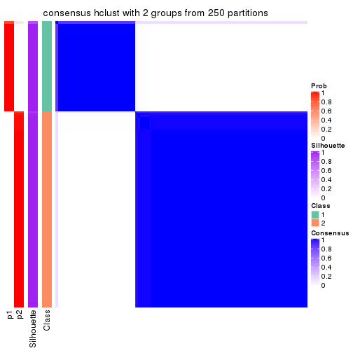</p>

</div>
<div id='tab-CV-hclust-consensus-heatmap-2'>
<pre><code class="r">consensus_heatmap(res, k = 3)
</code></pre>

<p>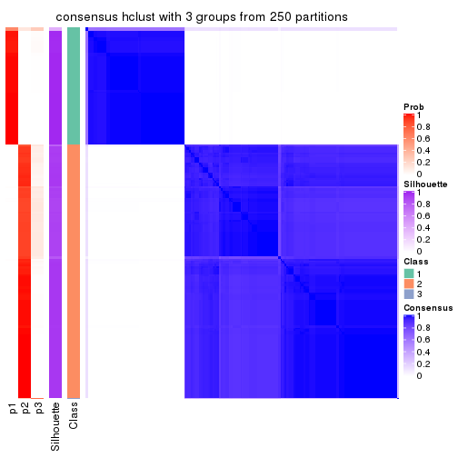</p>

</div>
<div id='tab-CV-hclust-consensus-heatmap-3'>
<pre><code class="r">consensus_heatmap(res, k = 4)
</code></pre>

<p>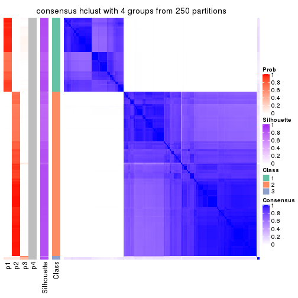</p>

</div>
<div id='tab-CV-hclust-consensus-heatmap-4'>
<pre><code class="r">consensus_heatmap(res, k = 5)
</code></pre>

<p>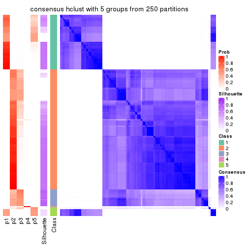</p>

</div>
<div id='tab-CV-hclust-consensus-heatmap-5'>
<pre><code class="r">consensus_heatmap(res, k = 6)
</code></pre>

<p>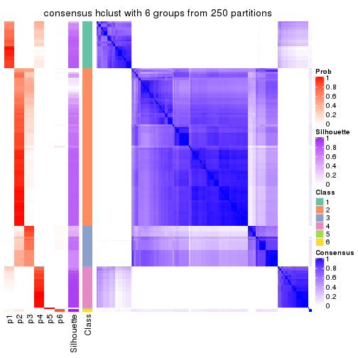</p>

</div>
</div>

Heatmaps for the membership of samples in all partitions to see how consistent they are:


<script>
$( function() {
	$( '#tabs-CV-hclust-membership-heatmap' ).tabs();
} );
</script>
<div id='tabs-CV-hclust-membership-heatmap'>
<ul>
<li><a href='#tab-CV-hclust-membership-heatmap-1'>k = 2</a></li>
<li><a href='#tab-CV-hclust-membership-heatmap-2'>k = 3</a></li>
<li><a href='#tab-CV-hclust-membership-heatmap-3'>k = 4</a></li>
<li><a href='#tab-CV-hclust-membership-heatmap-4'>k = 5</a></li>
<li><a href='#tab-CV-hclust-membership-heatmap-5'>k = 6</a></li>
</ul>
<div id='tab-CV-hclust-membership-heatmap-1'>
<pre><code class="r">membership_heatmap(res, k = 2)
</code></pre>

<p>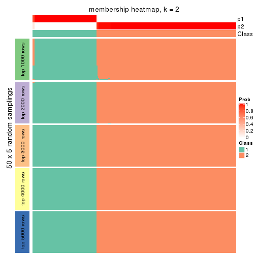</p>

</div>
<div id='tab-CV-hclust-membership-heatmap-2'>
<pre><code class="r">membership_heatmap(res, k = 3)
</code></pre>

<p>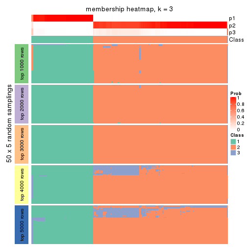</p>

</div>
<div id='tab-CV-hclust-membership-heatmap-3'>
<pre><code class="r">membership_heatmap(res, k = 4)
</code></pre>

<p>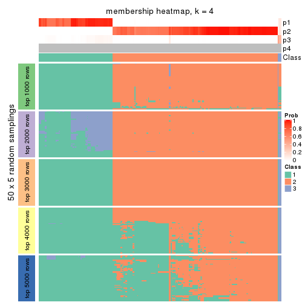</p>

</div>
<div id='tab-CV-hclust-membership-heatmap-4'>
<pre><code class="r">membership_heatmap(res, k = 5)
</code></pre>

<p>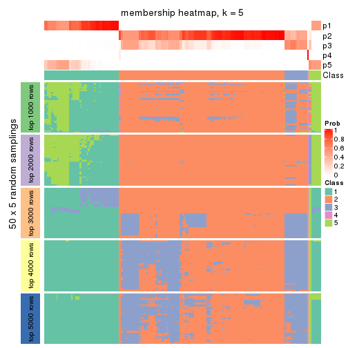</p>

</div>
<div id='tab-CV-hclust-membership-heatmap-5'>
<pre><code class="r">membership_heatmap(res, k = 6)
</code></pre>

<p>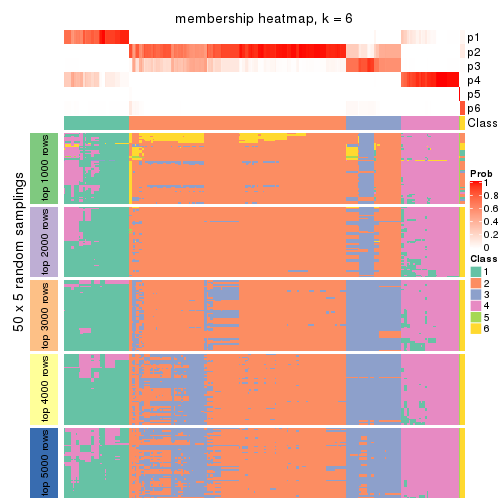</p>

</div>
</div>

As soon as we have had the classes for columns, we can look for signatures
which are significantly different between classes which can be candidate marks
for certain classes. Following are the heatmaps for signatures.


Signature heatmaps where rows are scaled:


<script>
$( function() {
	$( '#tabs-CV-hclust-get-signatures' ).tabs();
} );
</script>
<div id='tabs-CV-hclust-get-signatures'>
<ul>
<li><a href='#tab-CV-hclust-get-signatures-1'>k = 2</a></li>
<li><a href='#tab-CV-hclust-get-signatures-2'>k = 3</a></li>
<li><a href='#tab-CV-hclust-get-signatures-3'>k = 4</a></li>
<li><a href='#tab-CV-hclust-get-signatures-4'>k = 5</a></li>
<li><a href='#tab-CV-hclust-get-signatures-5'>k = 6</a></li>
</ul>
<div id='tab-CV-hclust-get-signatures-1'>
<pre><code class="r">get_signatures(res, k = 2)
</code></pre>

<p>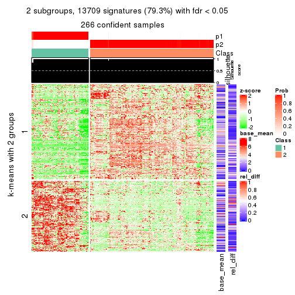</p>

</div>
<div id='tab-CV-hclust-get-signatures-2'>
<pre><code class="r">get_signatures(res, k = 3)
</code></pre>

<p>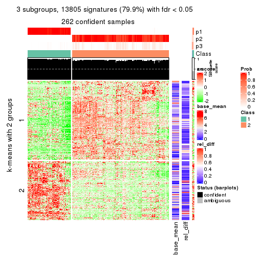</p>

</div>
<div id='tab-CV-hclust-get-signatures-3'>
<pre><code class="r">get_signatures(res, k = 4)
</code></pre>

<p>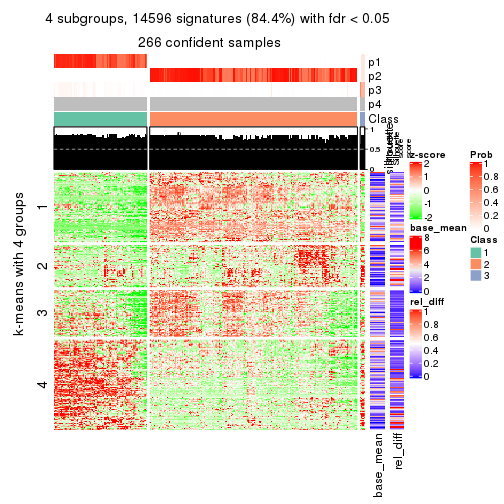</p>

</div>
<div id='tab-CV-hclust-get-signatures-4'>
<pre><code class="r">get_signatures(res, k = 5)
</code></pre>

<p>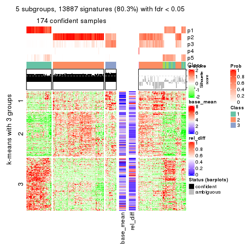</p>

</div>
<div id='tab-CV-hclust-get-signatures-5'>
<pre><code class="r">get_signatures(res, k = 6)
</code></pre>

<p>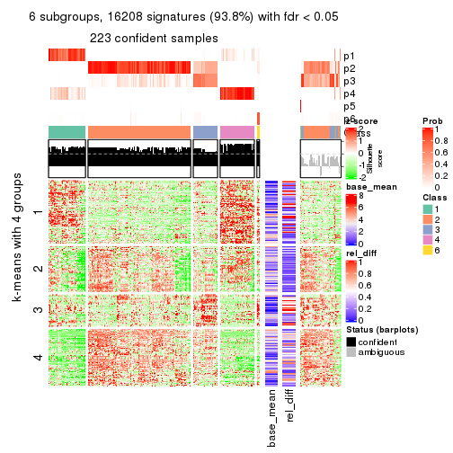</p>

</div>
</div>


Signature heatmaps where rows are not scaled:


<script>
$( function() {
	$( '#tabs-CV-hclust-get-signatures-no-scale' ).tabs();
} );
</script>
<div id='tabs-CV-hclust-get-signatures-no-scale'>
<ul>
<li><a href='#tab-CV-hclust-get-signatures-no-scale-1'>k = 2</a></li>
<li><a href='#tab-CV-hclust-get-signatures-no-scale-2'>k = 3</a></li>
<li><a href='#tab-CV-hclust-get-signatures-no-scale-3'>k = 4</a></li>
<li><a href='#tab-CV-hclust-get-signatures-no-scale-4'>k = 5</a></li>
<li><a href='#tab-CV-hclust-get-signatures-no-scale-5'>k = 6</a></li>
</ul>
<div id='tab-CV-hclust-get-signatures-no-scale-1'>
<pre><code class="r">get_signatures(res, k = 2, scale_rows = FALSE)
</code></pre>

<p>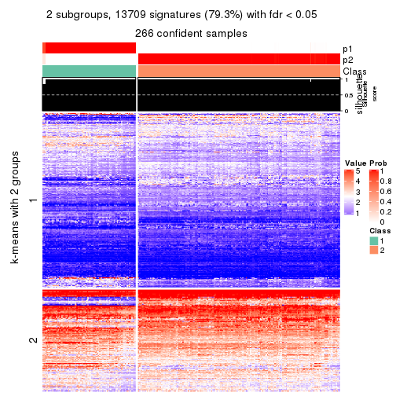</p>

</div>
<div id='tab-CV-hclust-get-signatures-no-scale-2'>
<pre><code class="r">get_signatures(res, k = 3, scale_rows = FALSE)
</code></pre>

<p>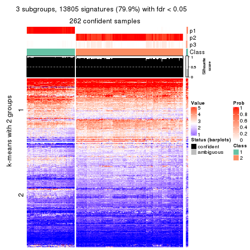</p>

</div>
<div id='tab-CV-hclust-get-signatures-no-scale-3'>
<pre><code class="r">get_signatures(res, k = 4, scale_rows = FALSE)
</code></pre>

<p>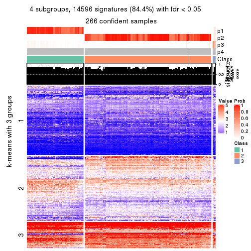</p>

</div>
<div id='tab-CV-hclust-get-signatures-no-scale-4'>
<pre><code class="r">get_signatures(res, k = 5, scale_rows = FALSE)
</code></pre>

<p>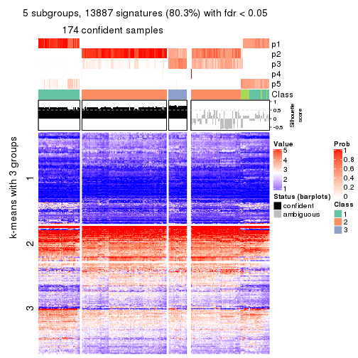</p>

</div>
<div id='tab-CV-hclust-get-signatures-no-scale-5'>
<pre><code class="r">get_signatures(res, k = 6, scale_rows = FALSE)
</code></pre>

<p>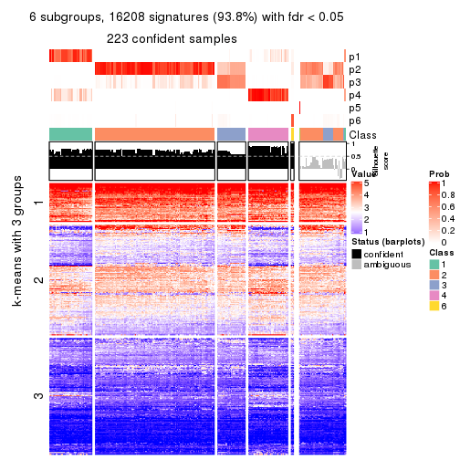</p>

</div>
</div>


Compare the overlap of signatures from different k:

```r
compare_signatures(res)
```

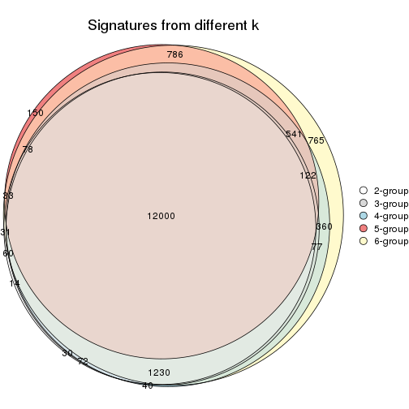

`get_signature()` returns a data frame invisibly. TO get the list of signatures, the function
call should be assigned to a variable explicitly. In following code, if `plot` argument is set
to `FALSE`, no heatmap is plotted while only the differential analysis is performed.

```r
# code only for demonstration
tb = get_signature(res, k = ..., plot = FALSE)
```

An example of the output of `tb` is:

```
#>   which_row         fdr    mean_1    mean_2 scaled_mean_1 scaled_mean_2 km
#> 1        38 0.042760348  8.373488  9.131774    -0.5533452     0.5164555  1
#> 2        40 0.018707592  7.106213  8.469186    -0.6173731     0.5762149  1
#> 3        55 0.019134737 10.221463 11.207825    -0.6159697     0.5749050  1
#> 4        59 0.006059896  5.921854  7.869574    -0.6899429     0.6439467  1
#> 5        60 0.018055526  8.928898 10.211722    -0.6204761     0.5791110  1
#> 6        98 0.009384629 15.714769 14.887706     0.6635654    -0.6193277  2
...
```

The columns in `tb` are:

1. `which_row`: row indices corresponding to the input matrix.
2. `fdr`: FDR for the differential test. 
3. `mean_x`: The mean value in group x.
4. `scaled_mean_x`: The mean value in group x after rows are scaled.
5. `km`: Row groups if k-means clustering is applied to rows.


UMAP plot which shows how samples are separated.


<script>
$( function() {
	$( '#tabs-CV-hclust-dimension-reduction' ).tabs();
} );
</script>
<div id='tabs-CV-hclust-dimension-reduction'>
<ul>
<li><a href='#tab-CV-hclust-dimension-reduction-1'>k = 2</a></li>
<li><a href='#tab-CV-hclust-dimension-reduction-2'>k = 3</a></li>
<li><a href='#tab-CV-hclust-dimension-reduction-3'>k = 4</a></li>
<li><a href='#tab-CV-hclust-dimension-reduction-4'>k = 5</a></li>
<li><a href='#tab-CV-hclust-dimension-reduction-5'>k = 6</a></li>
</ul>
<div id='tab-CV-hclust-dimension-reduction-1'>
<pre><code class="r">dimension_reduction(res, k = 2, method = &quot;UMAP&quot;)
</code></pre>

<p>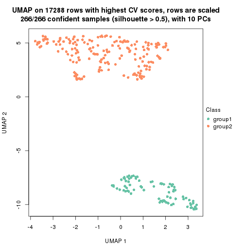</p>

</div>
<div id='tab-CV-hclust-dimension-reduction-2'>
<pre><code class="r">dimension_reduction(res, k = 3, method = &quot;UMAP&quot;)
</code></pre>

<p>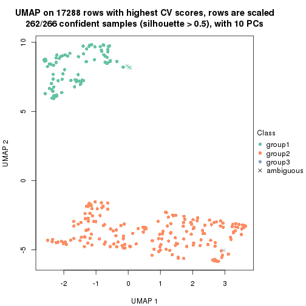</p>

</div>
<div id='tab-CV-hclust-dimension-reduction-3'>
<pre><code class="r">dimension_reduction(res, k = 4, method = &quot;UMAP&quot;)
</code></pre>

<p>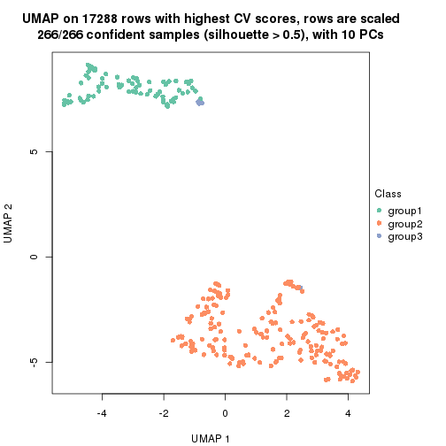</p>

</div>
<div id='tab-CV-hclust-dimension-reduction-4'>
<pre><code class="r">dimension_reduction(res, k = 5, method = &quot;UMAP&quot;)
</code></pre>

<p>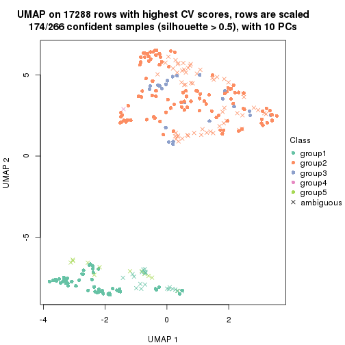</p>

</div>
<div id='tab-CV-hclust-dimension-reduction-5'>
<pre><code class="r">dimension_reduction(res, k = 6, method = &quot;UMAP&quot;)
</code></pre>

<p>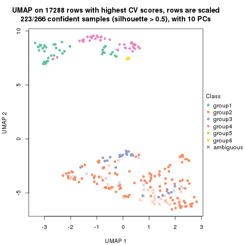</p>

</div>
</div>


Following heatmap shows how subgroups are split when increasing `k`:

```r
collect_classes(res)
```

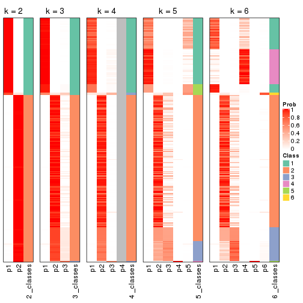


If matrix rows can be associated to genes, consider to use `GO_Enrichment(res,
...)` to perform function enrichment for the signature genes.


 

---------------------------------------------------


### CV:kmeans**


The object with results only for a single top-value method and a single partition method 
can be extracted as:

```r
res = res_list["CV", "kmeans"]
# you can also extract it by
# res = res_list["CV:kmeans"]
```

A summary of `res` and all the functions that can be applied to it:

```r
res
```

```
#> A 'ConsensusPartition' object with k = 2, 3, 4, 5, 6.
#>   On a matrix with 17288 rows and 266 columns.
#>   Top rows (1000, 2000, 3000, 4000, 5000) are extracted by 'CV' method.
#>   Subgroups are detected by 'kmeans' method.
#>   Performed in total 1250 partitions by row resampling.
#>   Best k for subgroups seems to be 2.
#> 
#> Following methods can be applied to this 'ConsensusPartition' object:
#>  [1] "cola_report"             "collect_classes"         "collect_plots"          
#>  [4] "collect_stats"           "colnames"                "compare_signatures"     
#>  [7] "consensus_heatmap"       "dimension_reduction"     "functional_enrichment"  
#> [10] "get_anno_col"            "get_anno"                "get_classes"            
#> [13] "get_consensus"           "get_matrix"              "get_membership"         
#> [16] "get_param"               "get_signatures"          "get_stats"              
#> [19] "is_best_k"               "is_stable_k"             "membership_heatmap"     
#> [22] "ncol"                    "nrow"                    "plot_ecdf"              
#> [25] "rownames"                "select_partition_number" "show"                   
#> [28] "suggest_best_k"          "test_to_known_factors"
```

`collect_plots()` function collects all the plots made from `res` for all `k` (number of partitions)
into one single page to provide an easy and fast comparison between different `k`.

```r
collect_plots(res)
```

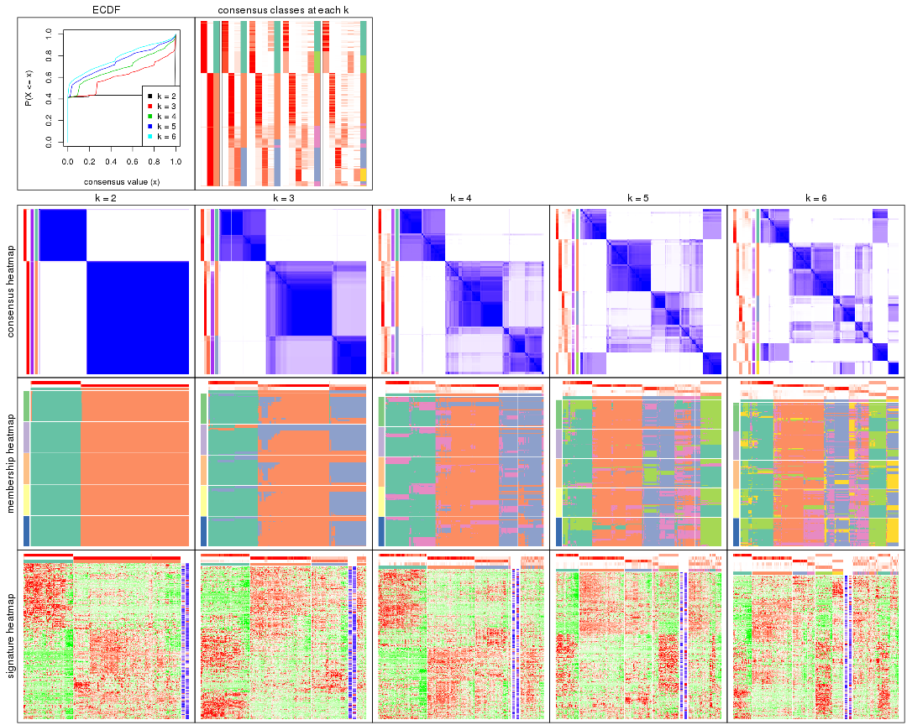

The plots are:

- The first row: a plot of the ECDF (Empirical cumulative distribution
  function) curves of the consensus matrix for each `k` and the heatmap of
  predicted classes for each `k`.
- The second row: heatmaps of the consensus matrix for each `k`.
- The third row: heatmaps of the membership matrix for each `k`.
- The fouth row: heatmaps of the signatures for each `k`.

All the plots in panels can be made by individual functions and they are
plotted later in this section.

`select_partition_number()` produces several plots showing different
statistics for choosing "optimized" `k`. There are following statistics:

- ECDF curves of the consensus matrix for each `k`;
- 1-PAC. [The PAC
  score](https://en.wikipedia.org/wiki/Consensus_clustering#Over-interpretation_potential_of_consensus_clustering)
  measures the proportion of the ambiguous subgrouping.
- Mean silhouette score.
- Concordance. The mean probability of fiting the consensus class ids in all
  partitions.
- Area increased. Denote $A_k$ as the area under the ECDF curve for current
  `k`, the area increased is defined as $A_k - A_{k-1}$.
- Rand index. The percent of pairs of samples that are both in a same cluster
  or both are not in a same cluster in the partition of k and k-1.
- Jaccard index. The ratio of pairs of samples are both in a same cluster in
  the partition of k and k-1 and the pairs of samples are both in a same
  cluster in the partition k or k-1.

The detailed explanations of these statistics can be found in [the cola
vignette](http://bioconductor.org/packages/devel/bioc/vignettes/cola/inst/doc/cola.html#toc_13).

Generally speaking, lower PAC score, higher mean silhouette score or higher
concordance corresponds to better partition. Rand index and Jaccard index
measure how similar the current partition is compared to partition with `k-1`.
If they are too similar, we won't accept `k` is better than `k-1`.

```r
select_partition_number(res)
```

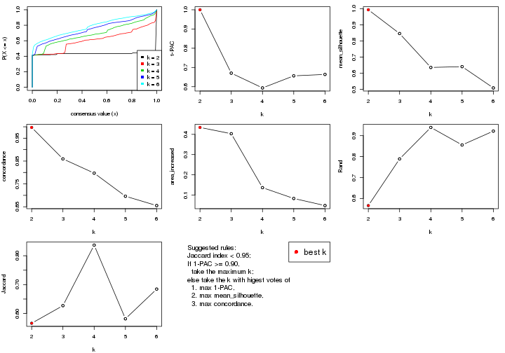

The numeric values for all these statistics can be obtained by `get_stats()`.

```r
get_stats(res)
```

```
#>   k 1-PAC mean_silhouette concordance area_increased  Rand Jaccard
#> 2 2 1.000           0.994       0.997         0.4341 0.566   0.566
#> 3 3 0.670           0.846       0.859         0.4031 0.789   0.627
#> 4 4 0.594           0.636       0.797         0.1365 0.939   0.837
#> 5 5 0.656           0.641       0.696         0.0831 0.856   0.582
#> 6 6 0.664           0.509       0.655         0.0481 0.922   0.684
```

`suggest_best_k()` suggests the best $k$ based on these statistics. The rules are as follows:

- All $k$ with Jaccard index larger than 0.95 are removed because the increase of
  the partition number does not provides enough extra information. If all $k$ are removed,
  the best $k$ is assigned by `NA`.
- For $k$ with 1-PAC larger than 0.9, the maximal $k$ is taken as the "best k". Other $k$ is called "optional k".
- If it does not fit the second rule. The $k$ with the highest vote of highest
  1-PAC, mean silhouette and concordance is taken as the "best k".

```r
suggest_best_k(res)
```

```
#> [1] 2
```


Following shows the table of the partitions (You need to click the **show/hide
code output** link to see it). The membership matrix (columns with name `p*`)
is inferred by
[`clue::cl_consensus()`](https://www.rdocumentation.org/link/cl_consensus?package=clue)
function with the `SE` method. Basically the value in the membership matrix
represents the probability to belong to a certain group. The finall class
label for an item is determined with the group with highest probability it
belongs to.

In `get_classes()` function, the entropy is calculated from the membership
matrix and the silhouette score is calculated from the consensus matrix.


<script>
$( function() {
	$( '#tabs-CV-kmeans-get-classes' ).tabs();
} );
</script>
<div id='tabs-CV-kmeans-get-classes'>
<ul>
<li><a href='#tab-CV-kmeans-get-classes-1'>k = 2</a></li>
<li><a href='#tab-CV-kmeans-get-classes-2'>k = 3</a></li>
<li><a href='#tab-CV-kmeans-get-classes-3'>k = 4</a></li>
<li><a href='#tab-CV-kmeans-get-classes-4'>k = 5</a></li>
<li><a href='#tab-CV-kmeans-get-classes-5'>k = 6</a></li>
</ul>

<div id='tab-CV-kmeans-get-classes-1'>
<p><a id='tab-CV-kmeans-get-classes-1-a' style='color:#0366d6' href='#'>show/hide code output</a></p>
<pre><code class="r">cbind(get_classes(res, k = 2), get_membership(res, k = 2))
</code></pre>

<pre><code>#&gt;                                      class entropy silhouette    p1    p2
#&gt; 80D0AF10-1C61-4B67-90C1-7DBF1EF23672     2   0.000      0.998 0.000 1.000
#&gt; 87117BE1-D328-4972-85DA-6672412D8860     2   0.000      0.998 0.000 1.000
#&gt; F904C5B6-70BD-4604-8254-79BE23B152DA     1   0.000      0.995 1.000 0.000
#&gt; 3182DEA1-4239-4613-925A-7E6503766AD6     2   0.000      0.998 0.000 1.000
#&gt; 55E78EA2-2D9B-481F-8CAB-D36A33088EAE     2   0.000      0.998 0.000 1.000
#&gt; 86F94264-A6DD-4A97-9191-036F066DD0EF     2   0.000      0.998 0.000 1.000
#&gt; 09D25417-23B7-4D88-A0EA-F307985FBBBC     2   0.000      0.998 0.000 1.000
#&gt; C797F12C-40D3-4DB5-B9EF-A6821BBDE4F0     1   0.000      0.995 1.000 0.000
#&gt; 80275DB0-A226-4B6B-A08F-4ADBEEE1DB01     1   0.000      0.995 1.000 0.000
#&gt; 27FB653A-9E07-44AD-952E-9E4DE4AB5891     2   0.000      0.998 0.000 1.000
#&gt; 1A5DB9FC-2ABD-4E1B-B5EF-B1CF5E5F3872     1   0.722      0.753 0.800 0.200
#&gt; 844E4CCD-D30C-416F-A086-8923711A4E25     2   0.000      0.998 0.000 1.000
#&gt; EF18318D-3D25-4D65-803A-ED6E62871E7E     1   0.722      0.753 0.800 0.200
#&gt; 1ACB1BE0-61F6-4243-BBEC-E26A1CF90CA8     1   0.000      0.995 1.000 0.000
#&gt; 8EF0039B-D758-46AB-BAF7-6A062C7C56BA     1   0.000      0.995 1.000 0.000
#&gt; 22F4C9D9-663B-4C91-9692-E035A2640BEC     2   0.000      0.998 0.000 1.000
#&gt; FA1A0BCE-EE0F-4178-B963-62550E344B14     2   0.000      0.998 0.000 1.000
#&gt; 0B6D0C4E-5AE3-4707-A9FC-12A108E6EC2A     2   0.000      0.998 0.000 1.000
#&gt; 06FD3123-2AEB-4911-AC4E-E0E64FD5DB52     2   0.000      0.998 0.000 1.000
#&gt; 235A4492-FF80-4AA5-BC71-DFF65E1C7411     2   0.000      0.998 0.000 1.000
#&gt; A192C6C0-1443-4493-AFAC-1EE710628ADB     2   0.000      0.998 0.000 1.000
#&gt; 6FC5B56B-711B-4174-9B06-4E843124AAB6     1   0.000      0.995 1.000 0.000
#&gt; 7A813F60-A41E-4552-990E-F22287654C1D     2   0.000      0.998 0.000 1.000
#&gt; 725BBFB5-26F4-4512-9C75-47D013C1E605     1   0.000      0.995 1.000 0.000
#&gt; 39CC4E82-EBC9-472E-8BE5-6A3AB178449A     2   0.000      0.998 0.000 1.000
#&gt; 61130DEE-E267-49DF-8B41-7738A06EF738     2   0.000      0.998 0.000 1.000
#&gt; 117EC12C-B7ED-4E01-B29B-EA542D356EA1     1   0.000      0.995 1.000 0.000
#&gt; A30FF708-F7A9-41E4-8AD5-20441650FBC9     2   0.000      0.998 0.000 1.000
#&gt; 53640D52-1167-4A5D-B656-97D32CBA3934     1   0.000      0.995 1.000 0.000
#&gt; 9E85D76A-DD2A-46D5-BB59-0ED302B6258C     2   0.000      0.998 0.000 1.000
#&gt; 6F8C6F90-7E3C-4860-91DD-586708DE44AA     1   0.000      0.995 1.000 0.000
#&gt; E675AEC5-AA9A-4AAA-839C-03E6365822DB     2   0.000      0.998 0.000 1.000
#&gt; B577DEF7-2F5C-4876-A7C6-F18D5722B8C0     1   0.000      0.995 1.000 0.000
#&gt; DA8B577E-43E7-49BF-BF94-868E3194F5C9     1   0.000      0.995 1.000 0.000
#&gt; 3334280B-2A36-4AC7-A021-A76C10E958F0     2   0.000      0.998 0.000 1.000
#&gt; 5CBDDC90-11EC-4E6E-881E-AA9CCFD40FDB     2   0.000      0.998 0.000 1.000
#&gt; 8CBBF32A-8349-44F5-A8B8-4CBB1760A464     2   0.000      0.998 0.000 1.000
#&gt; B9455A9A-136D-4DC2-9F86-0FC74433589D     2   0.000      0.998 0.000 1.000
#&gt; D7EAE2A7-F9BE-4222-A452-B1F83F99CD50     2   0.000      0.998 0.000 1.000
#&gt; F803AE18-60C5-4CFE-AAAB-DB33C26A2184     1   0.000      0.995 1.000 0.000
#&gt; 5DD8CAC7-EC02-43B6-B58E-6D2E22868A3B     2   0.000      0.998 0.000 1.000
#&gt; EE98E1B4-DFB3-4AEC-8527-E1FD544C9475     1   0.000      0.995 1.000 0.000
#&gt; 3CE43921-47D5-4394-B9E1-242607775D61     2   0.000      0.998 0.000 1.000
#&gt; 46986F2B-0B0D-4187-8948-4E91D34B7C49     2   0.000      0.998 0.000 1.000
#&gt; 5D1D052E-74EF-45A8-9B1A-7CECD13EA43B     2   0.000      0.998 0.000 1.000
#&gt; 4C821AD9-A5C9-4A9A-9C5D-363B227F8064     2   0.000      0.998 0.000 1.000
#&gt; 06A4189E-A23B-4AC6-AA74-01955DD7D1E9     2   0.000      0.998 0.000 1.000
#&gt; FCCDC76F-CB02-4BCD-A616-325F258DDAA4     2   0.000      0.998 0.000 1.000
#&gt; DAC53B0A-8F35-4EA6-BBCC-4CD1C049E11F     2   0.000      0.998 0.000 1.000
#&gt; DD4F845B-CAD3-44CB-9D96-3C3F5BA1B72D     1   0.000      0.995 1.000 0.000
#&gt; D440F004-A4A4-41B6-BED8-805D67BA01C7     2   0.000      0.998 0.000 1.000
#&gt; A497C423-119F-42FA-BF17-9F6DFD2A5585     2   0.000      0.998 0.000 1.000
#&gt; 3420E573-DE12-4EF5-B1C0-2FCA904F4F4E     1   0.000      0.995 1.000 0.000
#&gt; 1AD72157-A254-44B4-BA58-4F30F1AE910E     1   0.000      0.995 1.000 0.000
#&gt; C1113977-B160-45EE-B061-750F9EA3F33F     2   0.000      0.998 0.000 1.000
#&gt; 6783AB5B-F07C-447B-BF13-C34485D246D7     2   0.000      0.998 0.000 1.000
#&gt; 1F553062-26FD-4A7F-B7FB-81184604F423     1   0.000      0.995 1.000 0.000
#&gt; BE2DCA51-1C21-4598-98A7-F2FB9B2DFCB4     2   0.000      0.998 0.000 1.000
#&gt; 38941CF3-9C54-4BA4-A005-CC88CA97D504     2   0.000      0.998 0.000 1.000
#&gt; 51CB675E-E243-4A07-BF4A-580473D26FDA     2   0.000      0.998 0.000 1.000
#&gt; C7FED0F5-C27A-4405-9232-30BF39362CF7     2   0.000      0.998 0.000 1.000
#&gt; 2A1E86E8-4713-465F-ACFF-C584864C57A1     2   0.000      0.998 0.000 1.000
#&gt; B4500785-0FAA-4D4D-8630-43D194BAB004     2   0.000      0.998 0.000 1.000
#&gt; 3FD52E66-AB76-4079-80DB-281A795D1EC0     2   0.000      0.998 0.000 1.000
#&gt; EBD355D1-1226-4DFD-AAFF-45D246B64F3C     2   0.000      0.998 0.000 1.000
#&gt; 5A040A73-CD95-487E-8AEF-9639FE4E2916     2   0.000      0.998 0.000 1.000
#&gt; CF629C65-585D-476D-B081-3E6E0575FAE3     2   0.722      0.750 0.200 0.800
#&gt; 0D4202A3-808E-413F-9BF3-9CFCCAE0ED61     2   0.000      0.998 0.000 1.000
#&gt; 43E715BF-28D9-4B5E-B762-8CD1B69A430E     1   0.000      0.995 1.000 0.000
#&gt; BFB82BE8-9DAC-4099-8B38-0950308E3EB3     2   0.000      0.998 0.000 1.000
#&gt; F7CB1825-2303-4DD2-AE1F-7205738EAF1F     1   0.000      0.995 1.000 0.000
#&gt; FE298483-C42C-4753-BABB-29A9CB1B6312     1   0.000      0.995 1.000 0.000
#&gt; A98C7561-1B42-4CD6-AE71-924B91FA4C33     2   0.000      0.998 0.000 1.000
#&gt; 58098F21-7DAB-47DA-9A41-8D20BF3B9257     2   0.000      0.998 0.000 1.000
#&gt; 18CAF708-20B9-4745-9CB3-37AB6E0B3056     2   0.000      0.998 0.000 1.000
#&gt; 2C80DD72-C9C7-4AC2-812F-9A31EF02779C     1   0.000      0.995 1.000 0.000
#&gt; 68A3F13D-319D-4603-A27F-B5DD46FE5C5B     2   0.000      0.998 0.000 1.000
#&gt; 7EE8F0CE-CDC9-40F9-A1DE-7F8140EC6D13     2   0.000      0.998 0.000 1.000
#&gt; 39019903-5B9C-4665-BD5F-7CCB19CB55C5     2   0.000      0.998 0.000 1.000
#&gt; 190EDB27-4CBC-4E9C-9B67-D51FDAB982B7     2   0.000      0.998 0.000 1.000
#&gt; EB2D95BC-62F8-4669-9308-D37D7FB79E23     2   0.000      0.998 0.000 1.000
#&gt; A08B85EA-D1E7-4B77-8DEC-36294305B9F7     1   0.000      0.995 1.000 0.000
#&gt; 130DDFAD-6EF8-4C80-BD9D-88308A6874BC     2   0.000      0.998 0.000 1.000
#&gt; 7340A5BA-E002-448F-AACC-E7A37DBB79C2     2   0.000      0.998 0.000 1.000
#&gt; A771F6E3-D266-4FE7-98C6-C40E6A701D59     1   0.000      0.995 1.000 0.000
#&gt; 015E792C-EC1B-49BF-AB07-D82B20C5989A     2   0.000      0.998 0.000 1.000
#&gt; BF79E030-47EE-4D08-B910-5685A4BD8B60     2   0.000      0.998 0.000 1.000
#&gt; FB3C7C9A-2F2D-4DD5-BE47-FAFB072C0FAB     2   0.000      0.998 0.000 1.000
#&gt; 4E5557BA-10E8-4723-908E-DD04EF6639B2     2   0.000      0.998 0.000 1.000
#&gt; 8031B550-40A9-4A3A-9F7D-CDC052288BD8     2   0.000      0.998 0.000 1.000
#&gt; 55299A06-3C1F-45A4-B166-B2C591C0CEE2     2   0.000      0.998 0.000 1.000
#&gt; EB8D5168-216E-4ABB-8B4E-9E67786CB322     1   0.000      0.995 1.000 0.000
#&gt; 78BD2D83-9A7F-42E5-BB38-654AA0761A0A     2   0.000      0.998 0.000 1.000
#&gt; AA2D53E5-D389-4332-9DD5-A736052E48F8     1   0.000      0.995 1.000 0.000
#&gt; 62945C7A-9313-4FC9-820C-B0AB820B394E     1   0.000      0.995 1.000 0.000
#&gt; 22746046-2E99-4EE9-97D2-BA2EA499634C     2   0.000      0.998 0.000 1.000
#&gt; 8671B51B-DCBE-4429-9F01-AF51CAD7014F     2   0.000      0.998 0.000 1.000
#&gt; E815AB36-5689-4A0D-8E6D-2EAA73406681     1   0.000      0.995 1.000 0.000
#&gt; A1DACB46-ED52-4E38-B2C8-57256BB22B5E     2   0.000      0.998 0.000 1.000
#&gt; 4F5498C4-A423-4B3D-AC98-D4E214A57D0E     1   0.000      0.995 1.000 0.000
#&gt; A7772CCD-FFFF-49DD-86ED-0BAD330EC9B6     2   0.000      0.998 0.000 1.000
#&gt; E6E3DF78-65B9-4F74-8DA8-E2A6D4EDBEA7     2   0.000      0.998 0.000 1.000
#&gt; 83286E2D-E708-437A-911A-E6B050273CBD     1   0.000      0.995 1.000 0.000
#&gt; EC5C7C97-EE8C-405D-A039-D96514B1D414     2   0.000      0.998 0.000 1.000
#&gt; 3E55223D-6E3D-4027-9819-67E91212531D     1   0.000      0.995 1.000 0.000
#&gt; 99A036A2-8343-4D06-8047-D84E96CE4C61     2   0.000      0.998 0.000 1.000
#&gt; CA6CDE6D-92DE-4259-9E58-A373F2D543EA     2   0.000      0.998 0.000 1.000
#&gt; BF6FA8CC-60C1-413A-B2C6-54CCACBC01D6     1   0.000      0.995 1.000 0.000
#&gt; E0594CFE-F7B6-4546-B130-30DF6A514B1F     2   0.000      0.998 0.000 1.000
#&gt; E769E41D-5949-42C5-9594-E563C05ACE52     2   0.000      0.998 0.000 1.000
#&gt; 01373725-5D3C-4D9C-AABC-911D53E62BCD     2   0.000      0.998 0.000 1.000
#&gt; 1F39DADD-3655-474E-BA4C-A5BD32C97A8B     1   0.000      0.995 1.000 0.000
#&gt; AF573EC8-E4EE-4B8F-8199-9817B9FAC67D     1   0.000      0.995 1.000 0.000
#&gt; 3F022CBC-41C8-4387-A6FB-124C4BCD1AD9     1   0.000      0.995 1.000 0.000
#&gt; 1CC32ACE-826B-494B-8B89-5BD92327A74D     2   0.000      0.998 0.000 1.000
#&gt; 22B0BD3B-EE08-4BC7-90B2-01C372A56BA2     2   0.000      0.998 0.000 1.000
#&gt; 0F3DE9EF-19CC-4D14-9A42-1435DB537F94     2   0.000      0.998 0.000 1.000
#&gt; 87F8A33F-FBC3-469E-862B-84472F796358     2   0.000      0.998 0.000 1.000
#&gt; C9F2FA0D-1A9F-40B4-BD9B-CAF1B3F3D5A7     2   0.000      0.998 0.000 1.000
#&gt; ACFC9F59-78FF-4453-B25F-8834D0EAB54A     2   0.000      0.998 0.000 1.000
#&gt; B7AC7D5B-14E9-45A7-93B7-226EE508544A     2   0.000      0.998 0.000 1.000
#&gt; 4491BF17-B168-4E96-8E09-EF1AEC9F5E9D     2   0.000      0.998 0.000 1.000
#&gt; 557A0811-A3FE-4CF4-A24D-FBB77E7F9139     2   0.000      0.998 0.000 1.000
#&gt; 6F9C955C-6816-4353-922A-8035B50FACC6     2   0.000      0.998 0.000 1.000
#&gt; 3E89FB1C-4A7D-43C7-823C-04E3716A7935     2   0.000      0.998 0.000 1.000
#&gt; 12ABE483-66EF-4237-94C4-0199FAE23FA8     2   0.000      0.998 0.000 1.000
#&gt; 7535F262-9B96-44F6-988C-4C9EBB3FFCA9     2   0.000      0.998 0.000 1.000
#&gt; 65C9D28E-303B-40E5-84F0-2507F5457374     2   0.000      0.998 0.000 1.000
#&gt; FD445384-6BA9-4297-9D9C-12ABA7D645C7     1   0.000      0.995 1.000 0.000
#&gt; 30D5E255-2AD3-44F3-8983-1B80E4FD3E2D     2   0.000      0.998 0.000 1.000
#&gt; 3E88EC60-B4A8-4259-8BC8-A234800F6955     2   0.000      0.998 0.000 1.000
#&gt; ACD73CE8-AFC5-47A0-9383-3CB97F018953     1   0.000      0.995 1.000 0.000
#&gt; 1AFDC2EA-26A8-44E2-8BCB-F34F7B66F8C8     2   0.000      0.998 0.000 1.000
#&gt; 9E327BC8-1D20-4AD8-83F7-FB2D13BCA5D0     2   0.000      0.998 0.000 1.000
#&gt; 85A86B91-4F24-4E77-AE2D-520F8E205EFC     1   0.000      0.995 1.000 0.000
#&gt; 74868C37-8143-4306-81CA-E45759D146CD     2   0.000      0.998 0.000 1.000
#&gt; 69AEA0DB-E335-48A0-A398-4FB0D581182A     2   0.000      0.998 0.000 1.000
#&gt; AE6F8B89-85C2-42B7-8D05-AFDDD4FEFD16     1   0.000      0.995 1.000 0.000
#&gt; A8A6F09C-9812-4457-9A4B-AD41F97B41A3     2   0.000      0.998 0.000 1.000
#&gt; 1A09BC4D-EF29-42DD-BB04-A3C264A3032D     1   0.000      0.995 1.000 0.000
#&gt; E0961A30-A62C-4235-9CF0-A1776827A996     2   0.000      0.998 0.000 1.000
#&gt; 134D2D90-7B08-4F20-8A3A-C77643FB208F     2   0.000      0.998 0.000 1.000
#&gt; A77C2DFF-93CF-4CB5-B3C1-81133D7F1A0F     2   0.000      0.998 0.000 1.000
#&gt; EA2DC457-9C74-4B9C-B3FA-5E72199B24A7     2   0.000      0.998 0.000 1.000
#&gt; FF34117B-5EE4-4C96-A8A2-2CE6A654CBE5     1   0.000      0.995 1.000 0.000
#&gt; 75F7B5E2-6559-4B48-A2A4-287C35C559CC     1   0.000      0.995 1.000 0.000
#&gt; 903BF591-B0AF-4BEE-B625-60B673070344     2   0.000      0.998 0.000 1.000
#&gt; 9DE1B790-C63C-41C4-9477-CE52A8119C67     2   0.000      0.998 0.000 1.000
#&gt; 9A28F80A-85F8-40E2-A32B-230EF93B2FA0     2   0.000      0.998 0.000 1.000
#&gt; 0AA2BDBB-8720-409A-AA72-1F4AA26E7CD8     2   0.000      0.998 0.000 1.000
#&gt; 5AD49F16-E974-4E5D-B1B6-073ECB73A01D     2   0.000      0.998 0.000 1.000
#&gt; CB0F961C-527D-4A48-9408-286B26BD9532     1   0.000      0.995 1.000 0.000
#&gt; 46FF25B6-D01D-4CA7-80B7-CEC2998C34E1     2   0.000      0.998 0.000 1.000
#&gt; 487CADE1-D699-4A6C-817A-B9A0AB940C61     1   0.000      0.995 1.000 0.000
#&gt; 4FF6F2D8-F869-4735-A4D1-1A8423153FBC     1   0.000      0.995 1.000 0.000
#&gt; 6005494F-5D3D-43A3-B3E8-8C91955B2A98     2   0.000      0.998 0.000 1.000
#&gt; CF10D584-CE32-45A4-A932-E9D5AF12A6A0     1   0.000      0.995 1.000 0.000
#&gt; E15CE4AB-5646-49C8-9CD6-938457036BB0     2   0.000      0.998 0.000 1.000
#&gt; 31E28D0B-0E69-4330-82ED-4F1827DC97EA     2   0.000      0.998 0.000 1.000
#&gt; DBACD3C3-CCB5-4478-BA78-85A0C847CA66     2   0.000      0.998 0.000 1.000
#&gt; 5A07041C-65EB-4FCD-8940-E90B905061B5     2   0.000      0.998 0.000 1.000
#&gt; 0EA7C916-FA47-489B-BC98-4D9E7D197628     1   0.000      0.995 1.000 0.000
#&gt; 30967F75-8499-47FF-ADA4-4DC566013F7B     1   0.000      0.995 1.000 0.000
#&gt; D2E528FF-AEA2-48D7-A60A-4C3E71EA9073     2   0.000      0.998 0.000 1.000
#&gt; 22735DCD-215E-48BC-BF44-32BD66F06E39     2   0.000      0.998 0.000 1.000
#&gt; BC2C3248-7FC6-48BC-96C1-45EA573DE7DC     1   0.000      0.995 1.000 0.000
#&gt; E72CEBCB-D686-4B12-BCBA-EC8F964330A2     1   0.000      0.995 1.000 0.000
#&gt; 23C937BB-BA20-4440-B680-914229CC3ADF     1   0.000      0.995 1.000 0.000
#&gt; 947E99C7-F402-4F1A-A6E9-81BCAAED135A     2   0.000      0.998 0.000 1.000
#&gt; 02475D11-FC81-4E88-944E-173C32DC3FE7     2   0.595      0.831 0.144 0.856
#&gt; F972A9AA-9842-4343-A533-A795E65581CE     1   0.000      0.995 1.000 0.000
#&gt; 05043AAF-3095-4C61-B5C1-EE9AA9082C75     2   0.000      0.998 0.000 1.000
#&gt; CECF7967-862E-428C-BB42-FEF553FDB3AA     2   0.000      0.998 0.000 1.000
#&gt; FB0B9483-6302-48C7-BE5B-DA667E00AE2D     2   0.000      0.998 0.000 1.000
#&gt; 78700FBA-1487-4754-9B30-18837BF7E9FB     1   0.000      0.995 1.000 0.000
#&gt; 2166F56D-54CE-4F1B-8F07-A4E13E4489E9     1   0.000      0.995 1.000 0.000
#&gt; 7CD0942E-E39A-43A7-8BAC-F25967864901     2   0.000      0.998 0.000 1.000
#&gt; 3B00BA2B-7F7D-4825-8F8D-90F04A5DE687     2   0.000      0.998 0.000 1.000
#&gt; 7465B01D-C05E-4FE0-A9FE-182920EDC489     2   0.000      0.998 0.000 1.000
#&gt; 88C31A99-F96E-4FC8-8B3D-C1AAA05062D9     1   0.000      0.995 1.000 0.000
#&gt; 53575575-3303-4F8F-B6A8-B42131CFB4AC     2   0.000      0.998 0.000 1.000
#&gt; CC8017C7-4128-48DA-8E43-503F63158D85     1   0.000      0.995 1.000 0.000
#&gt; 88449D2A-2A25-41A4-B91D-C99B58F8ECD9     2   0.000      0.998 0.000 1.000
#&gt; 46C7DDE5-A2B5-494F-96AE-0B6E2D51B003     1   0.000      0.995 1.000 0.000
#&gt; 42551D05-5EE5-4F91-93A8-32DA695D9DFA     2   0.000      0.998 0.000 1.000
#&gt; 0772DA48-3A36-422D-B166-CA1691B782C3     2   0.000      0.998 0.000 1.000
#&gt; 30346897-EC77-4153-88A2-D14593C8B741     2   0.000      0.998 0.000 1.000
#&gt; 0F00E267-C748-4A71-8B36-03C410641D88     2   0.000      0.998 0.000 1.000
#&gt; 4034703A-4DA9-4DDA-9CA9-E80FFE9CCDE6     2   0.000      0.998 0.000 1.000
#&gt; 393C8A41-CF45-4EA8-AFE3-25A08AB7692A     2   0.000      0.998 0.000 1.000
#&gt; 3354212D-A07C-435C-8B0C-9A7BAAB624B5     1   0.000      0.995 1.000 0.000
#&gt; 57E30D4E-ABF7-47DD-92BE-40CE215076B0     1   0.000      0.995 1.000 0.000
#&gt; 202B4C76-C840-4DB8-953F-AC75A4156FDD     2   0.000      0.998 0.000 1.000
#&gt; 93A0137B-1F4C-44EE-B959-2AD0CD2DF8B6     1   0.000      0.995 1.000 0.000
#&gt; C9794DB6-6E8C-4AFD-80EE-61D672A4F6E9     2   0.000      0.998 0.000 1.000
#&gt; AE4BFE63-F0C0-4624-AD97-4F7FF13E2384     1   0.000      0.995 1.000 0.000
#&gt; DCF87F27-2B54-42D9-8D28-5DFEE76E2F5B     2   0.000      0.998 0.000 1.000
#&gt; 2451D405-39FD-4812-958C-23462B66F1F1     2   0.000      0.998 0.000 1.000
#&gt; E27F5D33-3F68-4CA8-8757-A387C6EAD060     2   0.000      0.998 0.000 1.000
#&gt; 8BA9928A-5B93-477F-B4A2-D031B714D9AC     1   0.000      0.995 1.000 0.000
#&gt; 0FAACFF6-B50C-4BED-9824-B7270654F28D     2   0.000      0.998 0.000 1.000
#&gt; 3366CC3C-2BBA-4CA7-848E-4E16AA70AE7A     2   0.000      0.998 0.000 1.000
#&gt; 66237056-CA9A-4C90-AF0E-1621FEB71578     2   0.000      0.998 0.000 1.000
#&gt; C480F1FB-3100-436C-B0F5-DED63B7A580E     2   0.000      0.998 0.000 1.000
#&gt; A327DE0D-D945-4B42-9B41-A7302CF796EE     2   0.000      0.998 0.000 1.000
#&gt; E8A6871D-67FB-4306-9454-F5E7CDBA399A     2   0.000      0.998 0.000 1.000
#&gt; E9A7485B-82B6-4BD2-AFBB-DD0A82D6CDE2     1   0.000      0.995 1.000 0.000
#&gt; 93B382E4-9C9A-43F5-BD3B-502CC260B886     1   0.000      0.995 1.000 0.000
#&gt; A2792419-8E16-45FE-A524-17851F34AB9B     2   0.000      0.998 0.000 1.000
#&gt; 4DED1201-F25C-4F82-BABF-965EFAD7A8E5     2   0.000      0.998 0.000 1.000
#&gt; F1ACB2DD-E948-4F88-A249-F1BD1977D667     2   0.000      0.998 0.000 1.000
#&gt; 6CDBA203-8952-421D-A6BF-75652D9F3339     2   0.000      0.998 0.000 1.000
#&gt; 2D6C5AA7-3B33-48D7-AE0C-77A16B749D13     1   0.141      0.976 0.980 0.020
#&gt; 3F6B6D95-0720-42A0-AEB3-89FECAE7616A     2   0.000      0.998 0.000 1.000
#&gt; DED8ACF3-BBD8-46C9-85C9-A9C8F2E2BC0B     1   0.000      0.995 1.000 0.000
#&gt; 77069279-5A6F-42C0-9AA5-8C939591DFB5     1   0.000      0.995 1.000 0.000
#&gt; B2D4FCF3-FDF9-41C8-880A-6732CF6222AF     2   0.000      0.998 0.000 1.000
#&gt; 1CD71A4C-1E49-48EF-AA72-CB3C26B4C087     2   0.000      0.998 0.000 1.000
#&gt; C364E621-F85C-4B7F-842F-210B8D4DFE3A     2   0.000      0.998 0.000 1.000
#&gt; 11F1B8CA-07C1-47D2-A3C6-032FFA6A4A64     1   0.000      0.995 1.000 0.000
#&gt; 153BF804-6DC8-496B-987A-4021A2512211     2   0.000      0.998 0.000 1.000
#&gt; 5B5029C9-40F5-40D7-A36A-367022AD6A42     2   0.000      0.998 0.000 1.000
#&gt; 193CCBE6-104F-49B4-BDB2-C82EE36FDAAD     1   0.000      0.995 1.000 0.000
#&gt; E5D45E53-FCF3-4F01-9B78-6CB1ED0CFE40     2   0.000      0.998 0.000 1.000
#&gt; 5546A779-21DB-49F9-8C0D-A1E420088084     2   0.000      0.998 0.000 1.000
#&gt; E14825E0-0DC7-44C2-B265-F54672356838     1   0.000      0.995 1.000 0.000
#&gt; 8C8C09B9-EC83-45EC-BC4C-0BA92DE60ACB     1   0.000      0.995 1.000 0.000
#&gt; B388CA82-5BF7-4BDD-8821-4EC0B213121F     2   0.000      0.998 0.000 1.000
#&gt; A26025AC-9F71-4C07-9135-83593193BBB2     1   0.000      0.995 1.000 0.000
#&gt; C80E6D4B-AF21-42F0-8E20-6F7D2E99C062     2   0.000      0.998 0.000 1.000
#&gt; 5AE5D819-A6B1-4761-B7F9-8FFD3C520F31     2   0.000      0.998 0.000 1.000
#&gt; CAE8097F-A139-4C6E-9E30-35080475FF34     2   0.000      0.998 0.000 1.000
#&gt; 539C8DE3-6152-4671-B96F-ED6DC6DBD22B     1   0.000      0.995 1.000 0.000
#&gt; 5D28A8E0-4ECF-43A4-890A-BE968B9A8CB2     2   0.000      0.998 0.000 1.000
#&gt; 97A80AF8-365E-4756-A2B0-AEB1D8F5F33E     2   0.000      0.998 0.000 1.000
#&gt; B3527517-E339-46AE-8437-65303C309015     2   0.000      0.998 0.000 1.000
#&gt; 523E2183-AA20-4749-BD7E-69CD620DD6A3     2   0.000      0.998 0.000 1.000
#&gt; E553FB92-F181-47B3-9F3D-11DB51DFA3A4     2   0.000      0.998 0.000 1.000
#&gt; FFE0C4B1-8EEC-484A-AB87-3401B71BD081     2   0.000      0.998 0.000 1.000
#&gt; 73D6CA4B-9A9E-4E52-96C8-AE7F0CC8B276     2   0.000      0.998 0.000 1.000
#&gt; 485A8107-DF9A-4BC6-8A72-07FBA93F10F2     1   0.000      0.995 1.000 0.000
#&gt; 690823D9-B9AA-40EF-8302-4AD88BF89D1C     2   0.000      0.998 0.000 1.000
#&gt; B4E02660-562F-4EAC-8472-CBBD8A577688     2   0.000      0.998 0.000 1.000
#&gt; F82D5A60-90F9-4FF4-971E-73F7535FE65A     2   0.000      0.998 0.000 1.000
#&gt; C48401F7-2D56-4C6F-9896-C5435D1B44BF     2   0.000      0.998 0.000 1.000
#&gt; 94FC8991-182B-4B00-9A06-A00E8D3BDCFA     1   0.000      0.995 1.000 0.000
#&gt; FF00E80A-046D-4233-835E-CDF93403EA43     2   0.000      0.998 0.000 1.000
#&gt; C47A53F6-6479-4AD3-9D18-E4A70BE5F1DC     2   0.000      0.998 0.000 1.000
#&gt; 3487AE2D-AB1D-4DEF-AC4B-4B0FCAF8D899     2   0.000      0.998 0.000 1.000
#&gt; 479CD9BB-ECD7-41D5-B1E4-41132FF7FC95     2   0.000      0.998 0.000 1.000
#&gt; 048ADC6E-8C7E-4875-ACEE-E4787203C078     1   0.000      0.995 1.000 0.000
#&gt; 25AF81C5-B117-466D-AE9F-DD10BCB6AF2D     2   0.000      0.998 0.000 1.000
#&gt; 8B1D51D6-0B25-4289-81F0-9F95E0258877     2   0.000      0.998 0.000 1.000
#&gt; 282D390D-8E4E-4A19-B2B7-A6DB4BB2D46C     1   0.000      0.995 1.000 0.000
#&gt; BC6B92C1-F425-40C5-9941-539BFF5FE0FE     2   0.000      0.998 0.000 1.000
#&gt; 899CB9E0-48D0-413D-8566-BC151F146453     1   0.000      0.995 1.000 0.000
#&gt; 441400A9-1427-45E0-A8B4-EF2A6B7465C2     2   0.000      0.998 0.000 1.000
#&gt; CF96DDD4-DC0A-4341-BDE6-4DA2CB4978D0     1   0.000      0.995 1.000 0.000
#&gt; CE91F591-6072-4D29-9495-C78961635969     2   0.000      0.998 0.000 1.000
#&gt; 84D25635-2A38-4CFB-BFAC-38C007625C42     1   0.000      0.995 1.000 0.000
#&gt; ABF1AC12-872A-4C3D-A76C-07BC36A4DA5E     1   0.000      0.995 1.000 0.000
#&gt; B7F7F66F-1AED-4199-81C0-5C7FB0DBF438     2   0.000      0.998 0.000 1.000
#&gt; BAB786B9-6C20-425D-9886-63A0A092B59B     2   0.000      0.998 0.000 1.000
#&gt; 735D1DE3-D781-4F89-A395-09974057BBB7     1   0.000      0.995 1.000 0.000
#&gt; F6D5FBBA-05C4-4340-86D9-1A54181216A2     2   0.000      0.998 0.000 1.000
#&gt; 79C4E166-4A0D-4811-A2C8-CAE0A5AEED42     2   0.000      0.998 0.000 1.000
</code></pre>

<script>
$('#tab-CV-kmeans-get-classes-1-a').parent().next().next().hide();
$('#tab-CV-kmeans-get-classes-1-a').click(function(){
  $('#tab-CV-kmeans-get-classes-1-a').parent().next().next().toggle();
  return(false);
});
</script>
</div>

<div id='tab-CV-kmeans-get-classes-2'>
<p><a id='tab-CV-kmeans-get-classes-2-a' style='color:#0366d6' href='#'>show/hide code output</a></p>
<pre><code class="r">cbind(get_classes(res, k = 3), get_membership(res, k = 3))
</code></pre>

<pre><code>#&gt;                                      class entropy silhouette    p1    p2    p3
#&gt; 80D0AF10-1C61-4B67-90C1-7DBF1EF23672     2  0.0000    0.89366 0.000 1.000 0.000
#&gt; 87117BE1-D328-4972-85DA-6672412D8860     2  0.0000    0.89366 0.000 1.000 0.000
#&gt; F904C5B6-70BD-4604-8254-79BE23B152DA     1  0.0237    0.92758 0.996 0.000 0.004
#&gt; 3182DEA1-4239-4613-925A-7E6503766AD6     2  0.5497    0.51527 0.000 0.708 0.292
#&gt; 55E78EA2-2D9B-481F-8CAB-D36A33088EAE     3  0.5327    0.95920 0.000 0.272 0.728
#&gt; 86F94264-A6DD-4A97-9191-036F066DD0EF     3  0.5327    0.95920 0.000 0.272 0.728
#&gt; 09D25417-23B7-4D88-A0EA-F307985FBBBC     3  0.5327    0.95920 0.000 0.272 0.728
#&gt; C797F12C-40D3-4DB5-B9EF-A6821BBDE4F0     1  0.0000    0.92795 1.000 0.000 0.000
#&gt; 80275DB0-A226-4B6B-A08F-4ADBEEE1DB01     1  0.3879    0.92824 0.848 0.000 0.152
#&gt; 27FB653A-9E07-44AD-952E-9E4DE4AB5891     3  0.5327    0.95920 0.000 0.272 0.728
#&gt; 1A5DB9FC-2ABD-4E1B-B5EF-B1CF5E5F3872     1  0.6437    0.72792 0.732 0.048 0.220
#&gt; 844E4CCD-D30C-416F-A086-8923711A4E25     3  0.5327    0.95920 0.000 0.272 0.728
#&gt; EF18318D-3D25-4D65-803A-ED6E62871E7E     1  0.6437    0.72792 0.732 0.048 0.220
#&gt; 1ACB1BE0-61F6-4243-BBEC-E26A1CF90CA8     1  0.1964    0.93047 0.944 0.000 0.056
#&gt; 8EF0039B-D758-46AB-BAF7-6A062C7C56BA     1  0.3879    0.92824 0.848 0.000 0.152
#&gt; 22F4C9D9-663B-4C91-9692-E035A2640BEC     2  0.0000    0.89366 0.000 1.000 0.000
#&gt; FA1A0BCE-EE0F-4178-B963-62550E344B14     2  0.0892    0.87950 0.000 0.980 0.020
#&gt; 0B6D0C4E-5AE3-4707-A9FC-12A108E6EC2A     3  0.5327    0.95920 0.000 0.272 0.728
#&gt; 06FD3123-2AEB-4911-AC4E-E0E64FD5DB52     2  0.4605    0.69832 0.000 0.796 0.204
#&gt; 235A4492-FF80-4AA5-BC71-DFF65E1C7411     2  0.0000    0.89366 0.000 1.000 0.000
#&gt; A192C6C0-1443-4493-AFAC-1EE710628ADB     2  0.0000    0.89366 0.000 1.000 0.000
#&gt; 6FC5B56B-711B-4174-9B06-4E843124AAB6     1  0.1753    0.92068 0.952 0.000 0.048
#&gt; 7A813F60-A41E-4552-990E-F22287654C1D     2  0.0000    0.89366 0.000 1.000 0.000
#&gt; 725BBFB5-26F4-4512-9C75-47D013C1E605     1  0.1753    0.92068 0.952 0.000 0.048
#&gt; 39CC4E82-EBC9-472E-8BE5-6A3AB178449A     2  0.3116    0.79108 0.000 0.892 0.108
#&gt; 61130DEE-E267-49DF-8B41-7738A06EF738     3  0.5327    0.95920 0.000 0.272 0.728
#&gt; 117EC12C-B7ED-4E01-B29B-EA542D356EA1     1  0.0000    0.92795 1.000 0.000 0.000
#&gt; A30FF708-F7A9-41E4-8AD5-20441650FBC9     2  0.0000    0.89366 0.000 1.000 0.000
#&gt; 53640D52-1167-4A5D-B656-97D32CBA3934     1  0.1964    0.93054 0.944 0.000 0.056
#&gt; 9E85D76A-DD2A-46D5-BB59-0ED302B6258C     2  0.0592    0.88299 0.000 0.988 0.012
#&gt; 6F8C6F90-7E3C-4860-91DD-586708DE44AA     1  0.3879    0.92824 0.848 0.000 0.152
#&gt; E675AEC5-AA9A-4AAA-839C-03E6365822DB     3  0.5327    0.95920 0.000 0.272 0.728
#&gt; B577DEF7-2F5C-4876-A7C6-F18D5722B8C0     1  0.0424    0.92745 0.992 0.000 0.008
#&gt; DA8B577E-43E7-49BF-BF94-868E3194F5C9     1  0.3879    0.92824 0.848 0.000 0.152
#&gt; 3334280B-2A36-4AC7-A021-A76C10E958F0     2  0.5810    0.24880 0.000 0.664 0.336
#&gt; 5CBDDC90-11EC-4E6E-881E-AA9CCFD40FDB     2  0.2066    0.85557 0.000 0.940 0.060
#&gt; 8CBBF32A-8349-44F5-A8B8-4CBB1760A464     2  0.6180   -0.13000 0.000 0.584 0.416
#&gt; B9455A9A-136D-4DC2-9F86-0FC74433589D     3  0.5216    0.94970 0.000 0.260 0.740
#&gt; D7EAE2A7-F9BE-4222-A452-B1F83F99CD50     2  0.3941    0.74170 0.000 0.844 0.156
#&gt; F803AE18-60C5-4CFE-AAAB-DB33C26A2184     1  0.1753    0.92068 0.952 0.000 0.048
#&gt; 5DD8CAC7-EC02-43B6-B58E-6D2E22868A3B     3  0.5254    0.95704 0.000 0.264 0.736
#&gt; EE98E1B4-DFB3-4AEC-8527-E1FD544C9475     1  0.3879    0.92824 0.848 0.000 0.152
#&gt; 3CE43921-47D5-4394-B9E1-242607775D61     2  0.0000    0.89366 0.000 1.000 0.000
#&gt; 46986F2B-0B0D-4187-8948-4E91D34B7C49     2  0.0000    0.89366 0.000 1.000 0.000
#&gt; 5D1D052E-74EF-45A8-9B1A-7CECD13EA43B     2  0.0000    0.89366 0.000 1.000 0.000
#&gt; 4C821AD9-A5C9-4A9A-9C5D-363B227F8064     2  0.6274   -0.30934 0.000 0.544 0.456
#&gt; 06A4189E-A23B-4AC6-AA74-01955DD7D1E9     2  0.0000    0.89366 0.000 1.000 0.000
#&gt; FCCDC76F-CB02-4BCD-A616-325F258DDAA4     2  0.0000    0.89366 0.000 1.000 0.000
#&gt; DAC53B0A-8F35-4EA6-BBCC-4CD1C049E11F     2  0.0592    0.88299 0.000 0.988 0.012
#&gt; DD4F845B-CAD3-44CB-9D96-3C3F5BA1B72D     1  0.1753    0.92068 0.952 0.000 0.048
#&gt; D440F004-A4A4-41B6-BED8-805D67BA01C7     2  0.0000    0.89366 0.000 1.000 0.000
#&gt; A497C423-119F-42FA-BF17-9F6DFD2A5585     2  0.0000    0.89366 0.000 1.000 0.000
#&gt; 3420E573-DE12-4EF5-B1C0-2FCA904F4F4E     1  0.3879    0.92824 0.848 0.000 0.152
#&gt; 1AD72157-A254-44B4-BA58-4F30F1AE910E     1  0.3879    0.92824 0.848 0.000 0.152
#&gt; C1113977-B160-45EE-B061-750F9EA3F33F     2  0.6215    0.00965 0.000 0.572 0.428
#&gt; 6783AB5B-F07C-447B-BF13-C34485D246D7     2  0.2165    0.84130 0.000 0.936 0.064
#&gt; 1F553062-26FD-4A7F-B7FB-81184604F423     1  0.1753    0.92068 0.952 0.000 0.048
#&gt; BE2DCA51-1C21-4598-98A7-F2FB9B2DFCB4     2  0.0000    0.89366 0.000 1.000 0.000
#&gt; 38941CF3-9C54-4BA4-A005-CC88CA97D504     2  0.6026    0.07251 0.000 0.624 0.376
#&gt; 51CB675E-E243-4A07-BF4A-580473D26FDA     2  0.0000    0.89366 0.000 1.000 0.000
#&gt; C7FED0F5-C27A-4405-9232-30BF39362CF7     2  0.0000    0.89366 0.000 1.000 0.000
#&gt; 2A1E86E8-4713-465F-ACFF-C584864C57A1     3  0.5327    0.95920 0.000 0.272 0.728
#&gt; B4500785-0FAA-4D4D-8630-43D194BAB004     2  0.0000    0.89366 0.000 1.000 0.000
#&gt; 3FD52E66-AB76-4079-80DB-281A795D1EC0     2  0.3340    0.79211 0.000 0.880 0.120
#&gt; EBD355D1-1226-4DFD-AAFF-45D246B64F3C     2  0.6192   -0.14948 0.000 0.580 0.420
#&gt; 5A040A73-CD95-487E-8AEF-9639FE4E2916     2  0.0000    0.89366 0.000 1.000 0.000
#&gt; CF629C65-585D-476D-B081-3E6E0575FAE3     3  0.8643    0.69306 0.188 0.212 0.600
#&gt; 0D4202A3-808E-413F-9BF3-9CFCCAE0ED61     2  0.0237    0.89030 0.000 0.996 0.004
#&gt; 43E715BF-28D9-4B5E-B762-8CD1B69A430E     1  0.3879    0.92824 0.848 0.000 0.152
#&gt; BFB82BE8-9DAC-4099-8B38-0950308E3EB3     2  0.0000    0.89366 0.000 1.000 0.000
#&gt; F7CB1825-2303-4DD2-AE1F-7205738EAF1F     1  0.1753    0.92068 0.952 0.000 0.048
#&gt; FE298483-C42C-4753-BABB-29A9CB1B6312     1  0.0747    0.92953 0.984 0.000 0.016
#&gt; A98C7561-1B42-4CD6-AE71-924B91FA4C33     3  0.5254    0.95704 0.000 0.264 0.736
#&gt; 58098F21-7DAB-47DA-9A41-8D20BF3B9257     2  0.5760    0.41467 0.000 0.672 0.328
#&gt; 18CAF708-20B9-4745-9CB3-37AB6E0B3056     2  0.0000    0.89366 0.000 1.000 0.000
#&gt; 2C80DD72-C9C7-4AC2-812F-9A31EF02779C     1  0.4002    0.92852 0.840 0.000 0.160
#&gt; 68A3F13D-319D-4603-A27F-B5DD46FE5C5B     2  0.0000    0.89366 0.000 1.000 0.000
#&gt; 7EE8F0CE-CDC9-40F9-A1DE-7F8140EC6D13     3  0.5254    0.95704 0.000 0.264 0.736
#&gt; 39019903-5B9C-4665-BD5F-7CCB19CB55C5     2  0.0000    0.89366 0.000 1.000 0.000
#&gt; 190EDB27-4CBC-4E9C-9B67-D51FDAB982B7     3  0.5254    0.95704 0.000 0.264 0.736
#&gt; EB2D95BC-62F8-4669-9308-D37D7FB79E23     2  0.0000    0.89366 0.000 1.000 0.000
#&gt; A08B85EA-D1E7-4B77-8DEC-36294305B9F7     1  0.1753    0.92068 0.952 0.000 0.048
#&gt; 130DDFAD-6EF8-4C80-BD9D-88308A6874BC     3  0.5254    0.95704 0.000 0.264 0.736
#&gt; 7340A5BA-E002-448F-AACC-E7A37DBB79C2     2  0.0000    0.89366 0.000 1.000 0.000
#&gt; A771F6E3-D266-4FE7-98C6-C40E6A701D59     1  0.1753    0.92068 0.952 0.000 0.048
#&gt; 015E792C-EC1B-49BF-AB07-D82B20C5989A     2  0.3412    0.76981 0.000 0.876 0.124
#&gt; BF79E030-47EE-4D08-B910-5685A4BD8B60     3  0.5327    0.95920 0.000 0.272 0.728
#&gt; FB3C7C9A-2F2D-4DD5-BE47-FAFB072C0FAB     3  0.5178    0.94523 0.000 0.256 0.744
#&gt; 4E5557BA-10E8-4723-908E-DD04EF6639B2     3  0.5327    0.95920 0.000 0.272 0.728
#&gt; 8031B550-40A9-4A3A-9F7D-CDC052288BD8     3  0.5254    0.95704 0.000 0.264 0.736
#&gt; 55299A06-3C1F-45A4-B166-B2C591C0CEE2     3  0.5254    0.95704 0.000 0.264 0.736
#&gt; EB8D5168-216E-4ABB-8B4E-9E67786CB322     1  0.3879    0.92824 0.848 0.000 0.152
#&gt; 78BD2D83-9A7F-42E5-BB38-654AA0761A0A     2  0.2165    0.84145 0.000 0.936 0.064
#&gt; AA2D53E5-D389-4332-9DD5-A736052E48F8     1  0.1753    0.92068 0.952 0.000 0.048
#&gt; 62945C7A-9313-4FC9-820C-B0AB820B394E     1  0.3879    0.92824 0.848 0.000 0.152
#&gt; 22746046-2E99-4EE9-97D2-BA2EA499634C     3  0.5254    0.95704 0.000 0.264 0.736
#&gt; 8671B51B-DCBE-4429-9F01-AF51CAD7014F     3  0.5254    0.95704 0.000 0.264 0.736
#&gt; E815AB36-5689-4A0D-8E6D-2EAA73406681     1  0.0000    0.92795 1.000 0.000 0.000
#&gt; A1DACB46-ED52-4E38-B2C8-57256BB22B5E     2  0.0237    0.89030 0.000 0.996 0.004
#&gt; 4F5498C4-A423-4B3D-AC98-D4E214A57D0E     1  0.3267    0.92929 0.884 0.000 0.116
#&gt; A7772CCD-FFFF-49DD-86ED-0BAD330EC9B6     2  0.2711    0.81548 0.000 0.912 0.088
#&gt; E6E3DF78-65B9-4F74-8DA8-E2A6D4EDBEA7     3  0.5327    0.95920 0.000 0.272 0.728
#&gt; 83286E2D-E708-437A-911A-E6B050273CBD     1  0.3816    0.92849 0.852 0.000 0.148
#&gt; EC5C7C97-EE8C-405D-A039-D96514B1D414     2  0.0000    0.89366 0.000 1.000 0.000
#&gt; 3E55223D-6E3D-4027-9819-67E91212531D     1  0.0424    0.92745 0.992 0.000 0.008
#&gt; 99A036A2-8343-4D06-8047-D84E96CE4C61     3  0.6126    0.63099 0.000 0.400 0.600
#&gt; CA6CDE6D-92DE-4259-9E58-A373F2D543EA     2  0.6307   -0.43466 0.000 0.512 0.488
#&gt; BF6FA8CC-60C1-413A-B2C6-54CCACBC01D6     1  0.3879    0.92824 0.848 0.000 0.152
#&gt; E0594CFE-F7B6-4546-B130-30DF6A514B1F     3  0.6045    0.79417 0.000 0.380 0.620
#&gt; E769E41D-5949-42C5-9594-E563C05ACE52     3  0.5327    0.95920 0.000 0.272 0.728
#&gt; 01373725-5D3C-4D9C-AABC-911D53E62BCD     3  0.5254    0.95704 0.000 0.264 0.736
#&gt; 1F39DADD-3655-474E-BA4C-A5BD32C97A8B     1  0.1753    0.92068 0.952 0.000 0.048
#&gt; AF573EC8-E4EE-4B8F-8199-9817B9FAC67D     1  0.3879    0.92824 0.848 0.000 0.152
#&gt; 3F022CBC-41C8-4387-A6FB-124C4BCD1AD9     1  0.1753    0.92068 0.952 0.000 0.048
#&gt; 1CC32ACE-826B-494B-8B89-5BD92327A74D     3  0.5621    0.91535 0.000 0.308 0.692
#&gt; 22B0BD3B-EE08-4BC7-90B2-01C372A56BA2     3  0.5254    0.95704 0.000 0.264 0.736
#&gt; 0F3DE9EF-19CC-4D14-9A42-1435DB537F94     2  0.0000    0.89366 0.000 1.000 0.000
#&gt; 87F8A33F-FBC3-469E-862B-84472F796358     3  0.6274    0.60580 0.000 0.456 0.544
#&gt; C9F2FA0D-1A9F-40B4-BD9B-CAF1B3F3D5A7     2  0.0000    0.89366 0.000 1.000 0.000
#&gt; ACFC9F59-78FF-4453-B25F-8834D0EAB54A     3  0.5254    0.95704 0.000 0.264 0.736
#&gt; B7AC7D5B-14E9-45A7-93B7-226EE508544A     2  0.0000    0.89366 0.000 1.000 0.000
#&gt; 4491BF17-B168-4E96-8E09-EF1AEC9F5E9D     3  0.5254    0.95704 0.000 0.264 0.736
#&gt; 557A0811-A3FE-4CF4-A24D-FBB77E7F9139     3  0.5327    0.95920 0.000 0.272 0.728
#&gt; 6F9C955C-6816-4353-922A-8035B50FACC6     2  0.0000    0.89366 0.000 1.000 0.000
#&gt; 3E89FB1C-4A7D-43C7-823C-04E3716A7935     2  0.0000    0.89366 0.000 1.000 0.000
#&gt; 12ABE483-66EF-4237-94C4-0199FAE23FA8     2  0.0000    0.89366 0.000 1.000 0.000
#&gt; 7535F262-9B96-44F6-988C-4C9EBB3FFCA9     2  0.0000    0.89366 0.000 1.000 0.000
#&gt; 65C9D28E-303B-40E5-84F0-2507F5457374     3  0.5327    0.95920 0.000 0.272 0.728
#&gt; FD445384-6BA9-4297-9D9C-12ABA7D645C7     1  0.3879    0.92824 0.848 0.000 0.152
#&gt; 30D5E255-2AD3-44F3-8983-1B80E4FD3E2D     3  0.5926    0.83900 0.000 0.356 0.644
#&gt; 3E88EC60-B4A8-4259-8BC8-A234800F6955     3  0.5327    0.95920 0.000 0.272 0.728
#&gt; ACD73CE8-AFC5-47A0-9383-3CB97F018953     1  0.3879    0.92824 0.848 0.000 0.152
#&gt; 1AFDC2EA-26A8-44E2-8BCB-F34F7B66F8C8     2  0.4346    0.69152 0.000 0.816 0.184
#&gt; 9E327BC8-1D20-4AD8-83F7-FB2D13BCA5D0     2  0.0592    0.88299 0.000 0.988 0.012
#&gt; 85A86B91-4F24-4E77-AE2D-520F8E205EFC     1  0.1753    0.92068 0.952 0.000 0.048
#&gt; 74868C37-8143-4306-81CA-E45759D146CD     2  0.6215   -0.18755 0.000 0.572 0.428
#&gt; 69AEA0DB-E335-48A0-A398-4FB0D581182A     2  0.0000    0.89366 0.000 1.000 0.000
#&gt; AE6F8B89-85C2-42B7-8D05-AFDDD4FEFD16     1  0.3879    0.92824 0.848 0.000 0.152
#&gt; A8A6F09C-9812-4457-9A4B-AD41F97B41A3     2  0.0000    0.89366 0.000 1.000 0.000
#&gt; 1A09BC4D-EF29-42DD-BB04-A3C264A3032D     1  0.1753    0.92068 0.952 0.000 0.048
#&gt; E0961A30-A62C-4235-9CF0-A1776827A996     2  0.5882    0.35569 0.000 0.652 0.348
#&gt; 134D2D90-7B08-4F20-8A3A-C77643FB208F     2  0.5098    0.61728 0.000 0.752 0.248
#&gt; A77C2DFF-93CF-4CB5-B3C1-81133D7F1A0F     2  0.0892    0.88098 0.000 0.980 0.020
#&gt; EA2DC457-9C74-4B9C-B3FA-5E72199B24A7     2  0.1964    0.84904 0.000 0.944 0.056
#&gt; FF34117B-5EE4-4C96-A8A2-2CE6A654CBE5     1  0.3879    0.92824 0.848 0.000 0.152
#&gt; 75F7B5E2-6559-4B48-A2A4-287C35C559CC     1  0.1753    0.92068 0.952 0.000 0.048
#&gt; 903BF591-B0AF-4BEE-B625-60B673070344     2  0.2261    0.83719 0.000 0.932 0.068
#&gt; 9DE1B790-C63C-41C4-9477-CE52A8119C67     2  0.0000    0.89366 0.000 1.000 0.000
#&gt; 9A28F80A-85F8-40E2-A32B-230EF93B2FA0     3  0.5254    0.95704 0.000 0.264 0.736
#&gt; 0AA2BDBB-8720-409A-AA72-1F4AA26E7CD8     2  0.0000    0.89366 0.000 1.000 0.000
#&gt; 5AD49F16-E974-4E5D-B1B6-073ECB73A01D     3  0.5216    0.94970 0.000 0.260 0.740
#&gt; CB0F961C-527D-4A48-9408-286B26BD9532     1  0.1753    0.92068 0.952 0.000 0.048
#&gt; 46FF25B6-D01D-4CA7-80B7-CEC2998C34E1     2  0.0000    0.89366 0.000 1.000 0.000
#&gt; 487CADE1-D699-4A6C-817A-B9A0AB940C61     1  0.3879    0.92824 0.848 0.000 0.152
#&gt; 4FF6F2D8-F869-4735-A4D1-1A8423153FBC     1  0.3879    0.92824 0.848 0.000 0.152
#&gt; 6005494F-5D3D-43A3-B3E8-8C91955B2A98     2  0.2537    0.82440 0.000 0.920 0.080
#&gt; CF10D584-CE32-45A4-A932-E9D5AF12A6A0     1  0.1753    0.92068 0.952 0.000 0.048
#&gt; E15CE4AB-5646-49C8-9CD6-938457036BB0     3  0.5327    0.95920 0.000 0.272 0.728
#&gt; 31E28D0B-0E69-4330-82ED-4F1827DC97EA     2  0.0000    0.89366 0.000 1.000 0.000
#&gt; DBACD3C3-CCB5-4478-BA78-85A0C847CA66     2  0.0000    0.89366 0.000 1.000 0.000
#&gt; 5A07041C-65EB-4FCD-8940-E90B905061B5     2  0.2878    0.83190 0.000 0.904 0.096
#&gt; 0EA7C916-FA47-489B-BC98-4D9E7D197628     1  0.3879    0.92824 0.848 0.000 0.152
#&gt; 30967F75-8499-47FF-ADA4-4DC566013F7B     1  0.1753    0.92068 0.952 0.000 0.048
#&gt; D2E528FF-AEA2-48D7-A60A-4C3E71EA9073     3  0.5327    0.95920 0.000 0.272 0.728
#&gt; 22735DCD-215E-48BC-BF44-32BD66F06E39     3  0.5254    0.95704 0.000 0.264 0.736
#&gt; BC2C3248-7FC6-48BC-96C1-45EA573DE7DC     1  0.1289    0.92501 0.968 0.000 0.032
#&gt; E72CEBCB-D686-4B12-BCBA-EC8F964330A2     1  0.3879    0.92824 0.848 0.000 0.152
#&gt; 23C937BB-BA20-4440-B680-914229CC3ADF     1  0.3879    0.92824 0.848 0.000 0.152
#&gt; 947E99C7-F402-4F1A-A6E9-81BCAAED135A     2  0.0000    0.89366 0.000 1.000 0.000
#&gt; 02475D11-FC81-4E88-944E-173C32DC3FE7     2  0.8001    0.41220 0.136 0.652 0.212
#&gt; F972A9AA-9842-4343-A533-A795E65581CE     1  0.0892    0.92989 0.980 0.000 0.020
#&gt; 05043AAF-3095-4C61-B5C1-EE9AA9082C75     2  0.0000    0.89366 0.000 1.000 0.000
#&gt; CECF7967-862E-428C-BB42-FEF553FDB3AA     2  0.0000    0.89366 0.000 1.000 0.000
#&gt; FB0B9483-6302-48C7-BE5B-DA667E00AE2D     3  0.5327    0.95920 0.000 0.272 0.728
#&gt; 78700FBA-1487-4754-9B30-18837BF7E9FB     1  0.3879    0.92824 0.848 0.000 0.152
#&gt; 2166F56D-54CE-4F1B-8F07-A4E13E4489E9     1  0.3816    0.92849 0.852 0.000 0.148
#&gt; 7CD0942E-E39A-43A7-8BAC-F25967864901     2  0.0000    0.89366 0.000 1.000 0.000
#&gt; 3B00BA2B-7F7D-4825-8F8D-90F04A5DE687     2  0.0000    0.89366 0.000 1.000 0.000
#&gt; 7465B01D-C05E-4FE0-A9FE-182920EDC489     3  0.5327    0.95920 0.000 0.272 0.728
#&gt; 88C31A99-F96E-4FC8-8B3D-C1AAA05062D9     1  0.1753    0.92068 0.952 0.000 0.048
#&gt; 53575575-3303-4F8F-B6A8-B42131CFB4AC     3  0.5327    0.95920 0.000 0.272 0.728
#&gt; CC8017C7-4128-48DA-8E43-503F63158D85     1  0.3879    0.92824 0.848 0.000 0.152
#&gt; 88449D2A-2A25-41A4-B91D-C99B58F8ECD9     2  0.6168   -0.11137 0.000 0.588 0.412
#&gt; 46C7DDE5-A2B5-494F-96AE-0B6E2D51B003     1  0.2711    0.93031 0.912 0.000 0.088
#&gt; 42551D05-5EE5-4F91-93A8-32DA695D9DFA     3  0.5254    0.95704 0.000 0.264 0.736
#&gt; 0772DA48-3A36-422D-B166-CA1691B782C3     2  0.0000    0.89366 0.000 1.000 0.000
#&gt; 30346897-EC77-4153-88A2-D14593C8B741     3  0.5327    0.95920 0.000 0.272 0.728
#&gt; 0F00E267-C748-4A71-8B36-03C410641D88     3  0.5327    0.95920 0.000 0.272 0.728
#&gt; 4034703A-4DA9-4DDA-9CA9-E80FFE9CCDE6     2  0.0000    0.89366 0.000 1.000 0.000
#&gt; 393C8A41-CF45-4EA8-AFE3-25A08AB7692A     2  0.0000    0.89366 0.000 1.000 0.000
#&gt; 3354212D-A07C-435C-8B0C-9A7BAAB624B5     1  0.1753    0.92068 0.952 0.000 0.048
#&gt; 57E30D4E-ABF7-47DD-92BE-40CE215076B0     1  0.3879    0.92824 0.848 0.000 0.152
#&gt; 202B4C76-C840-4DB8-953F-AC75A4156FDD     2  0.0000    0.89366 0.000 1.000 0.000
#&gt; 93A0137B-1F4C-44EE-B959-2AD0CD2DF8B6     1  0.1753    0.92068 0.952 0.000 0.048
#&gt; C9794DB6-6E8C-4AFD-80EE-61D672A4F6E9     2  0.0000    0.89366 0.000 1.000 0.000
#&gt; AE4BFE63-F0C0-4624-AD97-4F7FF13E2384     1  0.1753    0.92068 0.952 0.000 0.048
#&gt; DCF87F27-2B54-42D9-8D28-5DFEE76E2F5B     2  0.0000    0.89366 0.000 1.000 0.000
#&gt; 2451D405-39FD-4812-958C-23462B66F1F1     3  0.5254    0.95704 0.000 0.264 0.736
#&gt; E27F5D33-3F68-4CA8-8757-A387C6EAD060     3  0.5254    0.95704 0.000 0.264 0.736
#&gt; 8BA9928A-5B93-477F-B4A2-D031B714D9AC     1  0.1753    0.92068 0.952 0.000 0.048
#&gt; 0FAACFF6-B50C-4BED-9824-B7270654F28D     3  0.5882    0.85333 0.000 0.348 0.652
#&gt; 3366CC3C-2BBA-4CA7-848E-4E16AA70AE7A     2  0.0000    0.89366 0.000 1.000 0.000
#&gt; 66237056-CA9A-4C90-AF0E-1621FEB71578     2  0.0000    0.89366 0.000 1.000 0.000
#&gt; C480F1FB-3100-436C-B0F5-DED63B7A580E     2  0.0000    0.89366 0.000 1.000 0.000
#&gt; A327DE0D-D945-4B42-9B41-A7302CF796EE     3  0.5254    0.95704 0.000 0.264 0.736
#&gt; E8A6871D-67FB-4306-9454-F5E7CDBA399A     3  0.6111    0.76100 0.000 0.396 0.604
#&gt; E9A7485B-82B6-4BD2-AFBB-DD0A82D6CDE2     1  0.1753    0.92068 0.952 0.000 0.048
#&gt; 93B382E4-9C9A-43F5-BD3B-502CC260B886     1  0.3879    0.92824 0.848 0.000 0.152
#&gt; A2792419-8E16-45FE-A524-17851F34AB9B     2  0.6215   -0.18767 0.000 0.572 0.428
#&gt; 4DED1201-F25C-4F82-BABF-965EFAD7A8E5     2  0.0000    0.89366 0.000 1.000 0.000
#&gt; F1ACB2DD-E948-4F88-A249-F1BD1977D667     3  0.5327    0.95920 0.000 0.272 0.728
#&gt; 6CDBA203-8952-421D-A6BF-75652D9F3339     2  0.1031    0.87974 0.000 0.976 0.024
#&gt; 2D6C5AA7-3B33-48D7-AE0C-77A16B749D13     1  0.4059    0.89079 0.860 0.012 0.128
#&gt; 3F6B6D95-0720-42A0-AEB3-89FECAE7616A     2  0.0592    0.88299 0.000 0.988 0.012
#&gt; DED8ACF3-BBD8-46C9-85C9-A9C8F2E2BC0B     1  0.3879    0.92824 0.848 0.000 0.152
#&gt; 77069279-5A6F-42C0-9AA5-8C939591DFB5     1  0.3879    0.92824 0.848 0.000 0.152
#&gt; B2D4FCF3-FDF9-41C8-880A-6732CF6222AF     2  0.3116    0.80137 0.000 0.892 0.108
#&gt; 1CD71A4C-1E49-48EF-AA72-CB3C26B4C087     2  0.0000    0.89366 0.000 1.000 0.000
#&gt; C364E621-F85C-4B7F-842F-210B8D4DFE3A     2  0.0000    0.89366 0.000 1.000 0.000
#&gt; 11F1B8CA-07C1-47D2-A3C6-032FFA6A4A64     1  0.3879    0.92824 0.848 0.000 0.152
#&gt; 153BF804-6DC8-496B-987A-4021A2512211     3  0.6168    0.72461 0.000 0.412 0.588
#&gt; 5B5029C9-40F5-40D7-A36A-367022AD6A42     2  0.6008    0.27091 0.000 0.628 0.372
#&gt; 193CCBE6-104F-49B4-BDB2-C82EE36FDAAD     1  0.1289    0.93002 0.968 0.000 0.032
#&gt; E5D45E53-FCF3-4F01-9B78-6CB1ED0CFE40     2  0.0000    0.89366 0.000 1.000 0.000
#&gt; 5546A779-21DB-49F9-8C0D-A1E420088084     2  0.0000    0.89366 0.000 1.000 0.000
#&gt; E14825E0-0DC7-44C2-B265-F54672356838     1  0.3816    0.92849 0.852 0.000 0.148
#&gt; 8C8C09B9-EC83-45EC-BC4C-0BA92DE60ACB     1  0.1753    0.92068 0.952 0.000 0.048
#&gt; B388CA82-5BF7-4BDD-8821-4EC0B213121F     3  0.5254    0.95704 0.000 0.264 0.736
#&gt; A26025AC-9F71-4C07-9135-83593193BBB2     1  0.2356    0.93009 0.928 0.000 0.072
#&gt; C80E6D4B-AF21-42F0-8E20-6F7D2E99C062     2  0.6192   -0.14948 0.000 0.580 0.420
#&gt; 5AE5D819-A6B1-4761-B7F9-8FFD3C520F31     3  0.5216    0.94970 0.000 0.260 0.740
#&gt; CAE8097F-A139-4C6E-9E30-35080475FF34     2  0.1643    0.85981 0.000 0.956 0.044
#&gt; 539C8DE3-6152-4671-B96F-ED6DC6DBD22B     1  0.1753    0.92068 0.952 0.000 0.048
#&gt; 5D28A8E0-4ECF-43A4-890A-BE968B9A8CB2     2  0.0000    0.89366 0.000 1.000 0.000
#&gt; 97A80AF8-365E-4756-A2B0-AEB1D8F5F33E     2  0.3816    0.73418 0.000 0.852 0.148
#&gt; B3527517-E339-46AE-8437-65303C309015     3  0.5327    0.95920 0.000 0.272 0.728
#&gt; 523E2183-AA20-4749-BD7E-69CD620DD6A3     2  0.0000    0.89366 0.000 1.000 0.000
#&gt; E553FB92-F181-47B3-9F3D-11DB51DFA3A4     2  0.4702    0.64374 0.000 0.788 0.212
#&gt; FFE0C4B1-8EEC-484A-AB87-3401B71BD081     3  0.6192    0.57786 0.000 0.420 0.580
#&gt; 73D6CA4B-9A9E-4E52-96C8-AE7F0CC8B276     2  0.0000    0.89366 0.000 1.000 0.000
#&gt; 485A8107-DF9A-4BC6-8A72-07FBA93F10F2     1  0.3879    0.92824 0.848 0.000 0.152
#&gt; 690823D9-B9AA-40EF-8302-4AD88BF89D1C     2  0.0592    0.88299 0.000 0.988 0.012
#&gt; B4E02660-562F-4EAC-8472-CBBD8A577688     2  0.0000    0.89366 0.000 1.000 0.000
#&gt; F82D5A60-90F9-4FF4-971E-73F7535FE65A     3  0.5327    0.95920 0.000 0.272 0.728
#&gt; C48401F7-2D56-4C6F-9896-C5435D1B44BF     3  0.5327    0.95920 0.000 0.272 0.728
#&gt; 94FC8991-182B-4B00-9A06-A00E8D3BDCFA     1  0.1753    0.92068 0.952 0.000 0.048
#&gt; FF00E80A-046D-4233-835E-CDF93403EA43     3  0.5327    0.95920 0.000 0.272 0.728
#&gt; C47A53F6-6479-4AD3-9D18-E4A70BE5F1DC     2  0.4931    0.64820 0.000 0.768 0.232
#&gt; 3487AE2D-AB1D-4DEF-AC4B-4B0FCAF8D899     2  0.0000    0.89366 0.000 1.000 0.000
#&gt; 479CD9BB-ECD7-41D5-B1E4-41132FF7FC95     2  0.0424    0.88835 0.000 0.992 0.008
#&gt; 048ADC6E-8C7E-4875-ACEE-E4787203C078     1  0.3879    0.92824 0.848 0.000 0.152
#&gt; 25AF81C5-B117-466D-AE9F-DD10BCB6AF2D     2  0.5529    0.39357 0.000 0.704 0.296
#&gt; 8B1D51D6-0B25-4289-81F0-9F95E0258877     2  0.0000    0.89366 0.000 1.000 0.000
#&gt; 282D390D-8E4E-4A19-B2B7-A6DB4BB2D46C     1  0.3879    0.92824 0.848 0.000 0.152
#&gt; BC6B92C1-F425-40C5-9941-539BFF5FE0FE     2  0.0000    0.89366 0.000 1.000 0.000
#&gt; 899CB9E0-48D0-413D-8566-BC151F146453     1  0.1753    0.92068 0.952 0.000 0.048
#&gt; 441400A9-1427-45E0-A8B4-EF2A6B7465C2     2  0.0000    0.89366 0.000 1.000 0.000
#&gt; CF96DDD4-DC0A-4341-BDE6-4DA2CB4978D0     1  0.0000    0.92795 1.000 0.000 0.000
#&gt; CE91F591-6072-4D29-9495-C78961635969     2  0.0000    0.89366 0.000 1.000 0.000
#&gt; 84D25635-2A38-4CFB-BFAC-38C007625C42     1  0.3879    0.92824 0.848 0.000 0.152
#&gt; ABF1AC12-872A-4C3D-A76C-07BC36A4DA5E     1  0.3879    0.92824 0.848 0.000 0.152
#&gt; B7F7F66F-1AED-4199-81C0-5C7FB0DBF438     2  0.0000    0.89366 0.000 1.000 0.000
#&gt; BAB786B9-6C20-425D-9886-63A0A092B59B     2  0.0000    0.89366 0.000 1.000 0.000
#&gt; 735D1DE3-D781-4F89-A395-09974057BBB7     1  0.3879    0.92824 0.848 0.000 0.152
#&gt; F6D5FBBA-05C4-4340-86D9-1A54181216A2     2  0.0000    0.89366 0.000 1.000 0.000
#&gt; 79C4E166-4A0D-4811-A2C8-CAE0A5AEED42     2  0.0000    0.89366 0.000 1.000 0.000
</code></pre>

<script>
$('#tab-CV-kmeans-get-classes-2-a').parent().next().next().hide();
$('#tab-CV-kmeans-get-classes-2-a').click(function(){
  $('#tab-CV-kmeans-get-classes-2-a').parent().next().next().toggle();
  return(false);
});
</script>
</div>

<div id='tab-CV-kmeans-get-classes-3'>
<p><a id='tab-CV-kmeans-get-classes-3-a' style='color:#0366d6' href='#'>show/hide code output</a></p>
<pre><code class="r">cbind(get_classes(res, k = 4), get_membership(res, k = 4))
</code></pre>

<pre><code>#&gt;                                      class entropy silhouette    p1    p2    p3    p4
#&gt; 80D0AF10-1C61-4B67-90C1-7DBF1EF23672     2  0.0000    0.78512 0.000 1.000 0.000 0.000
#&gt; 87117BE1-D328-4972-85DA-6672412D8860     2  0.2011    0.76829 0.000 0.920 0.000 0.080
#&gt; F904C5B6-70BD-4604-8254-79BE23B152DA     1  0.5442    0.82068 0.636 0.000 0.028 0.336
#&gt; 3182DEA1-4239-4613-925A-7E6503766AD6     2  0.7414   -0.56778 0.000 0.492 0.188 0.320
#&gt; 55E78EA2-2D9B-481F-8CAB-D36A33088EAE     3  0.3307    0.70956 0.000 0.104 0.868 0.028
#&gt; 86F94264-A6DD-4A97-9191-036F066DD0EF     3  0.2593    0.72301 0.000 0.104 0.892 0.004
#&gt; 09D25417-23B7-4D88-A0EA-F307985FBBBC     3  0.2593    0.72301 0.000 0.104 0.892 0.004
#&gt; C797F12C-40D3-4DB5-B9EF-A6821BBDE4F0     1  0.5636    0.82107 0.648 0.000 0.044 0.308
#&gt; 80275DB0-A226-4B6B-A08F-4ADBEEE1DB01     1  0.0000    0.82663 1.000 0.000 0.000 0.000
#&gt; 27FB653A-9E07-44AD-952E-9E4DE4AB5891     3  0.4669    0.72339 0.000 0.104 0.796 0.100
#&gt; 1A5DB9FC-2ABD-4E1B-B5EF-B1CF5E5F3872     1  0.8042    0.56648 0.496 0.036 0.148 0.320
#&gt; 844E4CCD-D30C-416F-A086-8923711A4E25     3  0.5427    0.71291 0.000 0.100 0.736 0.164
#&gt; EF18318D-3D25-4D65-803A-ED6E62871E7E     1  0.8042    0.56648 0.496 0.036 0.148 0.320
#&gt; 1ACB1BE0-61F6-4243-BBEC-E26A1CF90CA8     1  0.4932    0.83169 0.728 0.000 0.032 0.240
#&gt; 8EF0039B-D758-46AB-BAF7-6A062C7C56BA     1  0.0000    0.82663 1.000 0.000 0.000 0.000
#&gt; 22F4C9D9-663B-4C91-9692-E035A2640BEC     2  0.0000    0.78512 0.000 1.000 0.000 0.000
#&gt; FA1A0BCE-EE0F-4178-B963-62550E344B14     2  0.5728    0.41316 0.000 0.708 0.104 0.188
#&gt; 0B6D0C4E-5AE3-4707-A9FC-12A108E6EC2A     3  0.2408    0.72401 0.000 0.104 0.896 0.000
#&gt; 06FD3123-2AEB-4911-AC4E-E0E64FD5DB52     2  0.7723   -0.74851 0.000 0.408 0.228 0.364
#&gt; 235A4492-FF80-4AA5-BC71-DFF65E1C7411     2  0.0000    0.78512 0.000 1.000 0.000 0.000
#&gt; A192C6C0-1443-4493-AFAC-1EE710628ADB     2  0.2011    0.76829 0.000 0.920 0.000 0.080
#&gt; 6FC5B56B-711B-4174-9B06-4E843124AAB6     1  0.5256    0.81224 0.596 0.000 0.012 0.392
#&gt; 7A813F60-A41E-4552-990E-F22287654C1D     2  0.2730    0.75244 0.000 0.896 0.016 0.088
#&gt; 725BBFB5-26F4-4512-9C75-47D013C1E605     1  0.5028    0.81109 0.596 0.000 0.004 0.400
#&gt; 39CC4E82-EBC9-472E-8BE5-6A3AB178449A     2  0.6854   -0.03545 0.000 0.596 0.172 0.232
#&gt; 61130DEE-E267-49DF-8B41-7738A06EF738     3  0.2987    0.72647 0.000 0.104 0.880 0.016
#&gt; 117EC12C-B7ED-4E01-B29B-EA542D356EA1     1  0.5636    0.82107 0.648 0.000 0.044 0.308
#&gt; A30FF708-F7A9-41E4-8AD5-20441650FBC9     2  0.0000    0.78512 0.000 1.000 0.000 0.000
#&gt; 53640D52-1167-4A5D-B656-97D32CBA3934     1  0.4867    0.83229 0.736 0.000 0.032 0.232
#&gt; 9E85D76A-DD2A-46D5-BB59-0ED302B6258C     2  0.1635    0.74990 0.000 0.948 0.008 0.044
#&gt; 6F8C6F90-7E3C-4860-91DD-586708DE44AA     1  0.0707    0.82702 0.980 0.000 0.020 0.000
#&gt; E675AEC5-AA9A-4AAA-839C-03E6365822DB     3  0.3307    0.70956 0.000 0.104 0.868 0.028
#&gt; B577DEF7-2F5C-4876-A7C6-F18D5722B8C0     1  0.5830    0.81078 0.620 0.000 0.048 0.332
#&gt; DA8B577E-43E7-49BF-BF94-868E3194F5C9     1  0.0188    0.82670 0.996 0.000 0.004 0.000
#&gt; 3334280B-2A36-4AC7-A021-A76C10E958F0     3  0.7028   -0.41321 0.000 0.380 0.496 0.124
#&gt; 5CBDDC90-11EC-4E6E-881E-AA9CCFD40FDB     2  0.6844    0.05779 0.000 0.588 0.152 0.260
#&gt; 8CBBF32A-8349-44F5-A8B8-4CBB1760A464     3  0.7137   -0.21274 0.000 0.288 0.544 0.168
#&gt; B9455A9A-136D-4DC2-9F86-0FC74433589D     3  0.6747    0.54174 0.000 0.140 0.596 0.264
#&gt; D7EAE2A7-F9BE-4222-A452-B1F83F99CD50     2  0.6686   -0.07688 0.000 0.620 0.180 0.200
#&gt; F803AE18-60C5-4CFE-AAAB-DB33C26A2184     1  0.5028    0.81109 0.596 0.000 0.004 0.400
#&gt; 5DD8CAC7-EC02-43B6-B58E-6D2E22868A3B     3  0.5633    0.70721 0.000 0.100 0.716 0.184
#&gt; EE98E1B4-DFB3-4AEC-8527-E1FD544C9475     1  0.0336    0.82683 0.992 0.000 0.008 0.000
#&gt; 3CE43921-47D5-4394-B9E1-242607775D61     2  0.1557    0.77804 0.000 0.944 0.000 0.056
#&gt; 46986F2B-0B0D-4187-8948-4E91D34B7C49     2  0.0000    0.78512 0.000 1.000 0.000 0.000
#&gt; 5D1D052E-74EF-45A8-9B1A-7CECD13EA43B     2  0.2473    0.76099 0.000 0.908 0.012 0.080
#&gt; 4C821AD9-A5C9-4A9A-9C5D-363B227F8064     3  0.7117   -0.15776 0.000 0.264 0.556 0.180
#&gt; 06A4189E-A23B-4AC6-AA74-01955DD7D1E9     2  0.0000    0.78512 0.000 1.000 0.000 0.000
#&gt; FCCDC76F-CB02-4BCD-A616-325F258DDAA4     2  0.0469    0.78502 0.000 0.988 0.000 0.012
#&gt; DAC53B0A-8F35-4EA6-BBCC-4CD1C049E11F     2  0.0895    0.76934 0.000 0.976 0.004 0.020
#&gt; DD4F845B-CAD3-44CB-9D96-3C3F5BA1B72D     1  0.5039    0.80971 0.592 0.000 0.004 0.404
#&gt; D440F004-A4A4-41B6-BED8-805D67BA01C7     2  0.0000    0.78512 0.000 1.000 0.000 0.000
#&gt; A497C423-119F-42FA-BF17-9F6DFD2A5585     2  0.1557    0.77804 0.000 0.944 0.000 0.056
#&gt; 3420E573-DE12-4EF5-B1C0-2FCA904F4F4E     1  0.0188    0.82690 0.996 0.000 0.004 0.000
#&gt; 1AD72157-A254-44B4-BA58-4F30F1AE910E     1  0.0000    0.82663 1.000 0.000 0.000 0.000
#&gt; C1113977-B160-45EE-B061-750F9EA3F33F     4  0.7896    0.86319 0.000 0.292 0.348 0.360
#&gt; 6783AB5B-F07C-447B-BF13-C34485D246D7     2  0.6373    0.22092 0.000 0.652 0.148 0.200
#&gt; 1F553062-26FD-4A7F-B7FB-81184604F423     1  0.5256    0.81191 0.596 0.000 0.012 0.392
#&gt; BE2DCA51-1C21-4598-98A7-F2FB9B2DFCB4     2  0.0000    0.78512 0.000 1.000 0.000 0.000
#&gt; 38941CF3-9C54-4BA4-A005-CC88CA97D504     3  0.7363   -0.40141 0.000 0.332 0.492 0.176
#&gt; 51CB675E-E243-4A07-BF4A-580473D26FDA     2  0.2011    0.76829 0.000 0.920 0.000 0.080
#&gt; C7FED0F5-C27A-4405-9232-30BF39362CF7     2  0.2593    0.75808 0.000 0.904 0.016 0.080
#&gt; 2A1E86E8-4713-465F-ACFF-C584864C57A1     3  0.2593    0.72301 0.000 0.104 0.892 0.004
#&gt; B4500785-0FAA-4D4D-8630-43D194BAB004     2  0.2593    0.75808 0.000 0.904 0.016 0.080
#&gt; 3FD52E66-AB76-4079-80DB-281A795D1EC0     2  0.7138   -0.14079 0.000 0.552 0.180 0.268
#&gt; EBD355D1-1226-4DFD-AAFF-45D246B64F3C     3  0.6956   -0.14372 0.000 0.288 0.564 0.148
#&gt; 5A040A73-CD95-487E-8AEF-9639FE4E2916     2  0.1557    0.77804 0.000 0.944 0.000 0.056
#&gt; CF629C65-585D-476D-B081-3E6E0575FAE3     3  0.7564    0.36299 0.092 0.048 0.564 0.296
#&gt; 0D4202A3-808E-413F-9BF3-9CFCCAE0ED61     2  0.0000    0.78512 0.000 1.000 0.000 0.000
#&gt; 43E715BF-28D9-4B5E-B762-8CD1B69A430E     1  0.0707    0.82702 0.980 0.000 0.020 0.000
#&gt; BFB82BE8-9DAC-4099-8B38-0950308E3EB3     2  0.0000    0.78512 0.000 1.000 0.000 0.000
#&gt; F7CB1825-2303-4DD2-AE1F-7205738EAF1F     1  0.5352    0.81237 0.596 0.000 0.016 0.388
#&gt; FE298483-C42C-4753-BABB-29A9CB1B6312     1  0.5113    0.83013 0.684 0.000 0.024 0.292
#&gt; A98C7561-1B42-4CD6-AE71-924B91FA4C33     3  0.5633    0.70721 0.000 0.100 0.716 0.184
#&gt; 58098F21-7DAB-47DA-9A41-8D20BF3B9257     4  0.7896    0.91427 0.000 0.336 0.296 0.368
#&gt; 18CAF708-20B9-4745-9CB3-37AB6E0B3056     2  0.2593    0.75808 0.000 0.904 0.016 0.080
#&gt; 2C80DD72-C9C7-4AC2-812F-9A31EF02779C     1  0.2282    0.83086 0.924 0.000 0.024 0.052
#&gt; 68A3F13D-319D-4603-A27F-B5DD46FE5C5B     2  0.0188    0.78276 0.000 0.996 0.000 0.004
#&gt; 7EE8F0CE-CDC9-40F9-A1DE-7F8140EC6D13     3  0.5427    0.71338 0.000 0.100 0.736 0.164
#&gt; 39019903-5B9C-4665-BD5F-7CCB19CB55C5     2  0.0000    0.78512 0.000 1.000 0.000 0.000
#&gt; 190EDB27-4CBC-4E9C-9B67-D51FDAB982B7     3  0.5672    0.70492 0.000 0.100 0.712 0.188
#&gt; EB2D95BC-62F8-4669-9308-D37D7FB79E23     2  0.1792    0.77398 0.000 0.932 0.000 0.068
#&gt; A08B85EA-D1E7-4B77-8DEC-36294305B9F7     1  0.5203    0.80259 0.576 0.000 0.008 0.416
#&gt; 130DDFAD-6EF8-4C80-BD9D-88308A6874BC     3  0.5633    0.70721 0.000 0.100 0.716 0.184
#&gt; 7340A5BA-E002-448F-AACC-E7A37DBB79C2     2  0.0000    0.78512 0.000 1.000 0.000 0.000
#&gt; A771F6E3-D266-4FE7-98C6-C40E6A701D59     1  0.5028    0.81109 0.596 0.000 0.004 0.400
#&gt; 015E792C-EC1B-49BF-AB07-D82B20C5989A     2  0.6976   -0.12226 0.000 0.580 0.180 0.240
#&gt; BF79E030-47EE-4D08-B910-5685A4BD8B60     3  0.2987    0.72647 0.000 0.104 0.880 0.016
#&gt; FB3C7C9A-2F2D-4DD5-BE47-FAFB072C0FAB     3  0.5113    0.61355 0.000 0.088 0.760 0.152
#&gt; 4E5557BA-10E8-4723-908E-DD04EF6639B2     3  0.4352    0.66365 0.000 0.104 0.816 0.080
#&gt; 8031B550-40A9-4A3A-9F7D-CDC052288BD8     3  0.5594    0.70881 0.000 0.100 0.720 0.180
#&gt; 55299A06-3C1F-45A4-B166-B2C591C0CEE2     3  0.5633    0.70721 0.000 0.100 0.716 0.184
#&gt; EB8D5168-216E-4ABB-8B4E-9E67786CB322     1  0.0469    0.82688 0.988 0.000 0.012 0.000
#&gt; 78BD2D83-9A7F-42E5-BB38-654AA0761A0A     2  0.6534    0.14898 0.000 0.632 0.148 0.220
#&gt; AA2D53E5-D389-4332-9DD5-A736052E48F8     1  0.4866    0.81112 0.596 0.000 0.000 0.404
#&gt; 62945C7A-9313-4FC9-820C-B0AB820B394E     1  0.0000    0.82663 1.000 0.000 0.000 0.000
#&gt; 22746046-2E99-4EE9-97D2-BA2EA499634C     3  0.5633    0.70721 0.000 0.100 0.716 0.184
#&gt; 8671B51B-DCBE-4429-9F01-AF51CAD7014F     3  0.5672    0.70492 0.000 0.100 0.712 0.188
#&gt; E815AB36-5689-4A0D-8E6D-2EAA73406681     1  0.5636    0.82107 0.648 0.000 0.044 0.308
#&gt; A1DACB46-ED52-4E38-B2C8-57256BB22B5E     2  0.1940    0.72990 0.000 0.924 0.000 0.076
#&gt; 4F5498C4-A423-4B3D-AC98-D4E214A57D0E     1  0.2385    0.83152 0.920 0.000 0.028 0.052
#&gt; A7772CCD-FFFF-49DD-86ED-0BAD330EC9B6     2  0.6362    0.21030 0.000 0.656 0.168 0.176
#&gt; E6E3DF78-65B9-4F74-8DA8-E2A6D4EDBEA7     3  0.2987    0.72647 0.000 0.104 0.880 0.016
#&gt; 83286E2D-E708-437A-911A-E6B050273CBD     1  0.1936    0.83019 0.940 0.000 0.032 0.028
#&gt; EC5C7C97-EE8C-405D-A039-D96514B1D414     2  0.0000    0.78512 0.000 1.000 0.000 0.000
#&gt; 3E55223D-6E3D-4027-9819-67E91212531D     1  0.5773    0.81591 0.632 0.000 0.048 0.320
#&gt; 99A036A2-8343-4D06-8047-D84E96CE4C61     3  0.7436   -0.06200 0.000 0.172 0.444 0.384
#&gt; CA6CDE6D-92DE-4259-9E58-A373F2D543EA     3  0.6897   -0.00792 0.000 0.244 0.588 0.168
#&gt; BF6FA8CC-60C1-413A-B2C6-54CCACBC01D6     1  0.0000    0.82663 1.000 0.000 0.000 0.000
#&gt; E0594CFE-F7B6-4546-B130-30DF6A514B1F     3  0.5861    0.46582 0.000 0.144 0.704 0.152
#&gt; E769E41D-5949-42C5-9594-E563C05ACE52     3  0.3307    0.70956 0.000 0.104 0.868 0.028
#&gt; 01373725-5D3C-4D9C-AABC-911D53E62BCD     3  0.5633    0.70721 0.000 0.100 0.716 0.184
#&gt; 1F39DADD-3655-474E-BA4C-A5BD32C97A8B     1  0.5352    0.81237 0.596 0.000 0.016 0.388
#&gt; AF573EC8-E4EE-4B8F-8199-9817B9FAC67D     1  0.0592    0.82747 0.984 0.000 0.016 0.000
#&gt; 3F022CBC-41C8-4387-A6FB-124C4BCD1AD9     1  0.5150    0.81142 0.596 0.000 0.008 0.396
#&gt; 1CC32ACE-826B-494B-8B89-5BD92327A74D     3  0.5952    0.52486 0.000 0.124 0.692 0.184
#&gt; 22B0BD3B-EE08-4BC7-90B2-01C372A56BA2     3  0.5633    0.70721 0.000 0.100 0.716 0.184
#&gt; 0F3DE9EF-19CC-4D14-9A42-1435DB537F94     2  0.0000    0.78512 0.000 1.000 0.000 0.000
#&gt; 87F8A33F-FBC3-469E-862B-84472F796358     3  0.6374    0.43615 0.000 0.228 0.644 0.128
#&gt; C9F2FA0D-1A9F-40B4-BD9B-CAF1B3F3D5A7     2  0.0000    0.78512 0.000 1.000 0.000 0.000
#&gt; ACFC9F59-78FF-4453-B25F-8834D0EAB54A     3  0.5633    0.70721 0.000 0.100 0.716 0.184
#&gt; B7AC7D5B-14E9-45A7-93B7-226EE508544A     2  0.2593    0.75808 0.000 0.904 0.016 0.080
#&gt; 4491BF17-B168-4E96-8E09-EF1AEC9F5E9D     3  0.5672    0.70492 0.000 0.100 0.712 0.188
#&gt; 557A0811-A3FE-4CF4-A24D-FBB77E7F9139     3  0.3307    0.70956 0.000 0.104 0.868 0.028
#&gt; 6F9C955C-6816-4353-922A-8035B50FACC6     2  0.0000    0.78512 0.000 1.000 0.000 0.000
#&gt; 3E89FB1C-4A7D-43C7-823C-04E3716A7935     2  0.2662    0.75478 0.000 0.900 0.016 0.084
#&gt; 12ABE483-66EF-4237-94C4-0199FAE23FA8     2  0.0000    0.78512 0.000 1.000 0.000 0.000
#&gt; 7535F262-9B96-44F6-988C-4C9EBB3FFCA9     2  0.1940    0.77026 0.000 0.924 0.000 0.076
#&gt; 65C9D28E-303B-40E5-84F0-2507F5457374     3  0.4071    0.72651 0.000 0.104 0.832 0.064
#&gt; FD445384-6BA9-4297-9D9C-12ABA7D645C7     1  0.0592    0.82707 0.984 0.000 0.016 0.000
#&gt; 30D5E255-2AD3-44F3-8983-1B80E4FD3E2D     3  0.5209    0.55889 0.000 0.140 0.756 0.104
#&gt; 3E88EC60-B4A8-4259-8BC8-A234800F6955     3  0.5304    0.71761 0.000 0.104 0.748 0.148
#&gt; ACD73CE8-AFC5-47A0-9383-3CB97F018953     1  0.0000    0.82663 1.000 0.000 0.000 0.000
#&gt; 1AFDC2EA-26A8-44E2-8BCB-F34F7B66F8C8     2  0.7735   -0.64011 0.000 0.444 0.276 0.280
#&gt; 9E327BC8-1D20-4AD8-83F7-FB2D13BCA5D0     2  0.3037    0.67992 0.000 0.880 0.020 0.100
#&gt; 85A86B91-4F24-4E77-AE2D-520F8E205EFC     1  0.4866    0.81112 0.596 0.000 0.000 0.404
#&gt; 74868C37-8143-4306-81CA-E45759D146CD     3  0.7084   -0.18082 0.000 0.284 0.552 0.164
#&gt; 69AEA0DB-E335-48A0-A398-4FB0D581182A     2  0.0000    0.78512 0.000 1.000 0.000 0.000
#&gt; AE6F8B89-85C2-42B7-8D05-AFDDD4FEFD16     1  0.0592    0.82698 0.984 0.000 0.016 0.000
#&gt; A8A6F09C-9812-4457-9A4B-AD41F97B41A3     2  0.0000    0.78512 0.000 1.000 0.000 0.000
#&gt; 1A09BC4D-EF29-42DD-BB04-A3C264A3032D     1  0.5028    0.81109 0.596 0.000 0.004 0.400
#&gt; E0961A30-A62C-4235-9CF0-A1776827A996     4  0.7896    0.92854 0.000 0.336 0.296 0.368
#&gt; 134D2D90-7B08-4F20-8A3A-C77643FB208F     2  0.7810   -0.82440 0.000 0.384 0.252 0.364
#&gt; A77C2DFF-93CF-4CB5-B3C1-81133D7F1A0F     2  0.3850    0.62338 0.000 0.840 0.044 0.116
#&gt; EA2DC457-9C74-4B9C-B3FA-5E72199B24A7     2  0.6566    0.12998 0.000 0.624 0.140 0.236
#&gt; FF34117B-5EE4-4C96-A8A2-2CE6A654CBE5     1  0.0000    0.82663 1.000 0.000 0.000 0.000
#&gt; 75F7B5E2-6559-4B48-A2A4-287C35C559CC     1  0.5352    0.81237 0.596 0.000 0.016 0.388
#&gt; 903BF591-B0AF-4BEE-B625-60B673070344     2  0.6373    0.22230 0.000 0.652 0.148 0.200
#&gt; 9DE1B790-C63C-41C4-9477-CE52A8119C67     2  0.1716    0.77551 0.000 0.936 0.000 0.064
#&gt; 9A28F80A-85F8-40E2-A32B-230EF93B2FA0     3  0.5633    0.70721 0.000 0.100 0.716 0.184
#&gt; 0AA2BDBB-8720-409A-AA72-1F4AA26E7CD8     2  0.1867    0.77232 0.000 0.928 0.000 0.072
#&gt; 5AD49F16-E974-4E5D-B1B6-073ECB73A01D     3  0.4841    0.69564 0.000 0.080 0.780 0.140
#&gt; CB0F961C-527D-4A48-9408-286B26BD9532     1  0.5150    0.81142 0.596 0.000 0.008 0.396
#&gt; 46FF25B6-D01D-4CA7-80B7-CEC2998C34E1     2  0.0469    0.78497 0.000 0.988 0.000 0.012
#&gt; 487CADE1-D699-4A6C-817A-B9A0AB940C61     1  0.0000    0.82663 1.000 0.000 0.000 0.000
#&gt; 4FF6F2D8-F869-4735-A4D1-1A8423153FBC     1  0.0336    0.82715 0.992 0.000 0.008 0.000
#&gt; 6005494F-5D3D-43A3-B3E8-8C91955B2A98     2  0.6147    0.29623 0.000 0.672 0.128 0.200
#&gt; CF10D584-CE32-45A4-A932-E9D5AF12A6A0     1  0.4866    0.81112 0.596 0.000 0.000 0.404
#&gt; E15CE4AB-5646-49C8-9CD6-938457036BB0     3  0.2593    0.72301 0.000 0.104 0.892 0.004
#&gt; 31E28D0B-0E69-4330-82ED-4F1827DC97EA     2  0.2730    0.75244 0.000 0.896 0.016 0.088
#&gt; DBACD3C3-CCB5-4478-BA78-85A0C847CA66     2  0.0000    0.78512 0.000 1.000 0.000 0.000
#&gt; 5A07041C-65EB-4FCD-8940-E90B905061B5     2  0.6307    0.01693 0.000 0.620 0.092 0.288
#&gt; 0EA7C916-FA47-489B-BC98-4D9E7D197628     1  0.0000    0.82663 1.000 0.000 0.000 0.000
#&gt; 30967F75-8499-47FF-ADA4-4DC566013F7B     1  0.5028    0.81131 0.596 0.000 0.004 0.400
#&gt; D2E528FF-AEA2-48D7-A60A-4C3E71EA9073     3  0.3404    0.70631 0.000 0.104 0.864 0.032
#&gt; 22735DCD-215E-48BC-BF44-32BD66F06E39     3  0.5633    0.70721 0.000 0.100 0.716 0.184
#&gt; BC2C3248-7FC6-48BC-96C1-45EA573DE7DC     1  0.5093    0.82242 0.640 0.000 0.012 0.348
#&gt; E72CEBCB-D686-4B12-BCBA-EC8F964330A2     1  0.0336    0.82683 0.992 0.000 0.008 0.000
#&gt; 23C937BB-BA20-4440-B680-914229CC3ADF     1  0.0707    0.82702 0.980 0.000 0.020 0.000
#&gt; 947E99C7-F402-4F1A-A6E9-81BCAAED135A     2  0.2662    0.75605 0.000 0.900 0.016 0.084
#&gt; 02475D11-FC81-4E88-944E-173C32DC3FE7     2  0.8359   -0.29608 0.064 0.504 0.144 0.288
#&gt; F972A9AA-9842-4343-A533-A795E65581CE     1  0.4964    0.83161 0.724 0.000 0.032 0.244
#&gt; 05043AAF-3095-4C61-B5C1-EE9AA9082C75     2  0.1557    0.77881 0.000 0.944 0.000 0.056
#&gt; CECF7967-862E-428C-BB42-FEF553FDB3AA     2  0.0000    0.78512 0.000 1.000 0.000 0.000
#&gt; FB0B9483-6302-48C7-BE5B-DA667E00AE2D     3  0.3307    0.70956 0.000 0.104 0.868 0.028
#&gt; 78700FBA-1487-4754-9B30-18837BF7E9FB     1  0.0336    0.82683 0.992 0.000 0.008 0.000
#&gt; 2166F56D-54CE-4F1B-8F07-A4E13E4489E9     1  0.0592    0.82747 0.984 0.000 0.016 0.000
#&gt; 7CD0942E-E39A-43A7-8BAC-F25967864901     2  0.0000    0.78512 0.000 1.000 0.000 0.000
#&gt; 3B00BA2B-7F7D-4825-8F8D-90F04A5DE687     2  0.0469    0.78507 0.000 0.988 0.000 0.012
#&gt; 7465B01D-C05E-4FE0-A9FE-182920EDC489     3  0.2408    0.72401 0.000 0.104 0.896 0.000
#&gt; 88C31A99-F96E-4FC8-8B3D-C1AAA05062D9     1  0.5028    0.81109 0.596 0.000 0.004 0.400
#&gt; 53575575-3303-4F8F-B6A8-B42131CFB4AC     3  0.2737    0.72221 0.000 0.104 0.888 0.008
#&gt; CC8017C7-4128-48DA-8E43-503F63158D85     1  0.0000    0.82663 1.000 0.000 0.000 0.000
#&gt; 88449D2A-2A25-41A4-B91D-C99B58F8ECD9     3  0.7138   -0.22775 0.000 0.296 0.540 0.164
#&gt; 46C7DDE5-A2B5-494F-96AE-0B6E2D51B003     1  0.3638    0.83297 0.848 0.000 0.032 0.120
#&gt; 42551D05-5EE5-4F91-93A8-32DA695D9DFA     3  0.5672    0.70492 0.000 0.100 0.712 0.188
#&gt; 0772DA48-3A36-422D-B166-CA1691B782C3     2  0.1716    0.77551 0.000 0.936 0.000 0.064
#&gt; 30346897-EC77-4153-88A2-D14593C8B741     3  0.2593    0.72301 0.000 0.104 0.892 0.004
#&gt; 0F00E267-C748-4A71-8B36-03C410641D88     3  0.4352    0.65687 0.000 0.104 0.816 0.080
#&gt; 4034703A-4DA9-4DDA-9CA9-E80FFE9CCDE6     2  0.2662    0.75605 0.000 0.900 0.016 0.084
#&gt; 393C8A41-CF45-4EA8-AFE3-25A08AB7692A     2  0.0000    0.78512 0.000 1.000 0.000 0.000
#&gt; 3354212D-A07C-435C-8B0C-9A7BAAB624B5     1  0.5028    0.81131 0.596 0.000 0.004 0.400
#&gt; 57E30D4E-ABF7-47DD-92BE-40CE215076B0     1  0.0000    0.82663 1.000 0.000 0.000 0.000
#&gt; 202B4C76-C840-4DB8-953F-AC75A4156FDD     2  0.0000    0.78512 0.000 1.000 0.000 0.000
#&gt; 93A0137B-1F4C-44EE-B959-2AD0CD2DF8B6     1  0.4866    0.81112 0.596 0.000 0.000 0.404
#&gt; C9794DB6-6E8C-4AFD-80EE-61D672A4F6E9     2  0.0000    0.78512 0.000 1.000 0.000 0.000
#&gt; AE4BFE63-F0C0-4624-AD97-4F7FF13E2384     1  0.5352    0.81237 0.596 0.000 0.016 0.388
#&gt; DCF87F27-2B54-42D9-8D28-5DFEE76E2F5B     2  0.3215    0.73115 0.000 0.876 0.032 0.092
#&gt; 2451D405-39FD-4812-958C-23462B66F1F1     3  0.5633    0.70721 0.000 0.100 0.716 0.184
#&gt; E27F5D33-3F68-4CA8-8757-A387C6EAD060     3  0.5000    0.72067 0.000 0.100 0.772 0.128
#&gt; 8BA9928A-5B93-477F-B4A2-D031B714D9AC     1  0.5028    0.81134 0.596 0.000 0.004 0.400
#&gt; 0FAACFF6-B50C-4BED-9824-B7270654F28D     3  0.5677    0.50621 0.000 0.140 0.720 0.140
#&gt; 3366CC3C-2BBA-4CA7-848E-4E16AA70AE7A     2  0.0000    0.78512 0.000 1.000 0.000 0.000
#&gt; 66237056-CA9A-4C90-AF0E-1621FEB71578     2  0.3881    0.65094 0.000 0.812 0.016 0.172
#&gt; C480F1FB-3100-436C-B0F5-DED63B7A580E     2  0.0000    0.78512 0.000 1.000 0.000 0.000
#&gt; A327DE0D-D945-4B42-9B41-A7302CF796EE     3  0.5594    0.70881 0.000 0.100 0.720 0.180
#&gt; E8A6871D-67FB-4306-9454-F5E7CDBA399A     3  0.5708    0.51623 0.000 0.160 0.716 0.124
#&gt; E9A7485B-82B6-4BD2-AFBB-DD0A82D6CDE2     1  0.5440    0.81284 0.596 0.000 0.020 0.384
#&gt; 93B382E4-9C9A-43F5-BD3B-502CC260B886     1  0.0000    0.82663 1.000 0.000 0.000 0.000
#&gt; A2792419-8E16-45FE-A524-17851F34AB9B     3  0.6876   -0.09261 0.000 0.280 0.576 0.144
#&gt; 4DED1201-F25C-4F82-BABF-965EFAD7A8E5     2  0.0000    0.78512 0.000 1.000 0.000 0.000
#&gt; F1ACB2DD-E948-4F88-A249-F1BD1977D667     3  0.2593    0.72301 0.000 0.104 0.892 0.004
#&gt; 6CDBA203-8952-421D-A6BF-75652D9F3339     2  0.2593    0.71536 0.000 0.904 0.016 0.080
#&gt; 2D6C5AA7-3B33-48D7-AE0C-77A16B749D13     1  0.6928    0.73977 0.600 0.016 0.100 0.284
#&gt; 3F6B6D95-0720-42A0-AEB3-89FECAE7616A     2  0.2489    0.71527 0.000 0.912 0.020 0.068
#&gt; DED8ACF3-BBD8-46C9-85C9-A9C8F2E2BC0B     1  0.0000    0.82663 1.000 0.000 0.000 0.000
#&gt; 77069279-5A6F-42C0-9AA5-8C939591DFB5     1  0.0000    0.82663 1.000 0.000 0.000 0.000
#&gt; B2D4FCF3-FDF9-41C8-880A-6732CF6222AF     2  0.5473    0.33470 0.000 0.724 0.084 0.192
#&gt; 1CD71A4C-1E49-48EF-AA72-CB3C26B4C087     2  0.2593    0.75808 0.000 0.904 0.016 0.080
#&gt; C364E621-F85C-4B7F-842F-210B8D4DFE3A     2  0.0000    0.78512 0.000 1.000 0.000 0.000
#&gt; 11F1B8CA-07C1-47D2-A3C6-032FFA6A4A64     1  0.0707    0.82702 0.980 0.000 0.020 0.000
#&gt; 153BF804-6DC8-496B-987A-4021A2512211     3  0.5708    0.50201 0.000 0.160 0.716 0.124
#&gt; 5B5029C9-40F5-40D7-A36A-367022AD6A42     4  0.7905    0.92785 0.000 0.320 0.312 0.368
#&gt; 193CCBE6-104F-49B4-BDB2-C82EE36FDAAD     1  0.4910    0.83033 0.704 0.000 0.020 0.276
#&gt; E5D45E53-FCF3-4F01-9B78-6CB1ED0CFE40     2  0.2530    0.74636 0.000 0.888 0.000 0.112
#&gt; 5546A779-21DB-49F9-8C0D-A1E420088084     2  0.0000    0.78512 0.000 1.000 0.000 0.000
#&gt; E14825E0-0DC7-44C2-B265-F54672356838     1  0.1520    0.82975 0.956 0.000 0.024 0.020
#&gt; 8C8C09B9-EC83-45EC-BC4C-0BA92DE60ACB     1  0.5028    0.81109 0.596 0.000 0.004 0.400
#&gt; B388CA82-5BF7-4BDD-8821-4EC0B213121F     3  0.5633    0.70721 0.000 0.100 0.716 0.184
#&gt; A26025AC-9F71-4C07-9135-83593193BBB2     1  0.4995    0.83096 0.720 0.000 0.032 0.248
#&gt; C80E6D4B-AF21-42F0-8E20-6F7D2E99C062     3  0.6956   -0.14372 0.000 0.288 0.564 0.148
#&gt; 5AE5D819-A6B1-4761-B7F9-8FFD3C520F31     3  0.6124    0.56702 0.000 0.084 0.640 0.276
#&gt; CAE8097F-A139-4C6E-9E30-35080475FF34     2  0.6346    0.22954 0.000 0.656 0.152 0.192
#&gt; 539C8DE3-6152-4671-B96F-ED6DC6DBD22B     1  0.4866    0.81112 0.596 0.000 0.000 0.404
#&gt; 5D28A8E0-4ECF-43A4-890A-BE968B9A8CB2     2  0.2197    0.76599 0.000 0.916 0.004 0.080
#&gt; 97A80AF8-365E-4756-A2B0-AEB1D8F5F33E     2  0.7224   -0.29762 0.000 0.548 0.216 0.236
#&gt; B3527517-E339-46AE-8437-65303C309015     3  0.3497    0.70343 0.000 0.104 0.860 0.036
#&gt; 523E2183-AA20-4749-BD7E-69CD620DD6A3     2  0.1716    0.77551 0.000 0.936 0.000 0.064
#&gt; E553FB92-F181-47B3-9F3D-11DB51DFA3A4     2  0.7226   -0.47305 0.000 0.548 0.220 0.232
#&gt; FFE0C4B1-8EEC-484A-AB87-3401B71BD081     3  0.7490   -0.41314 0.000 0.196 0.476 0.328
#&gt; 73D6CA4B-9A9E-4E52-96C8-AE7F0CC8B276     2  0.0000    0.78512 0.000 1.000 0.000 0.000
#&gt; 485A8107-DF9A-4BC6-8A72-07FBA93F10F2     1  0.0000    0.82663 1.000 0.000 0.000 0.000
#&gt; 690823D9-B9AA-40EF-8302-4AD88BF89D1C     2  0.2489    0.71527 0.000 0.912 0.020 0.068
#&gt; B4E02660-562F-4EAC-8472-CBBD8A577688     2  0.2593    0.75808 0.000 0.904 0.016 0.080
#&gt; F82D5A60-90F9-4FF4-971E-73F7535FE65A     3  0.2987    0.72647 0.000 0.104 0.880 0.016
#&gt; C48401F7-2D56-4C6F-9896-C5435D1B44BF     3  0.5351    0.71750 0.000 0.104 0.744 0.152
#&gt; 94FC8991-182B-4B00-9A06-A00E8D3BDCFA     1  0.5150    0.81142 0.596 0.000 0.008 0.396
#&gt; FF00E80A-046D-4233-835E-CDF93403EA43     3  0.2593    0.72301 0.000 0.104 0.892 0.004
#&gt; C47A53F6-6479-4AD3-9D18-E4A70BE5F1DC     2  0.7798   -0.81239 0.000 0.388 0.248 0.364
#&gt; 3487AE2D-AB1D-4DEF-AC4B-4B0FCAF8D899     2  0.0000    0.78512 0.000 1.000 0.000 0.000
#&gt; 479CD9BB-ECD7-41D5-B1E4-41132FF7FC95     2  0.5417    0.47565 0.000 0.732 0.088 0.180
#&gt; 048ADC6E-8C7E-4875-ACEE-E4787203C078     1  0.0592    0.82698 0.984 0.000 0.016 0.000
#&gt; 25AF81C5-B117-466D-AE9F-DD10BCB6AF2D     2  0.7425   -0.59550 0.000 0.420 0.412 0.168
#&gt; 8B1D51D6-0B25-4289-81F0-9F95E0258877     2  0.1557    0.77804 0.000 0.944 0.000 0.056
#&gt; 282D390D-8E4E-4A19-B2B7-A6DB4BB2D46C     1  0.0000    0.82663 1.000 0.000 0.000 0.000
#&gt; BC6B92C1-F425-40C5-9941-539BFF5FE0FE     2  0.4359    0.63922 0.000 0.816 0.084 0.100
#&gt; 899CB9E0-48D0-413D-8566-BC151F146453     1  0.5150    0.81142 0.596 0.000 0.008 0.396
#&gt; 441400A9-1427-45E0-A8B4-EF2A6B7465C2     2  0.2593    0.75808 0.000 0.904 0.016 0.080
#&gt; CF96DDD4-DC0A-4341-BDE6-4DA2CB4978D0     1  0.5277    0.82554 0.668 0.000 0.028 0.304
#&gt; CE91F591-6072-4D29-9495-C78961635969     2  0.0000    0.78512 0.000 1.000 0.000 0.000
#&gt; 84D25635-2A38-4CFB-BFAC-38C007625C42     1  0.0707    0.82702 0.980 0.000 0.020 0.000
#&gt; ABF1AC12-872A-4C3D-A76C-07BC36A4DA5E     1  0.0000    0.82663 1.000 0.000 0.000 0.000
#&gt; B7F7F66F-1AED-4199-81C0-5C7FB0DBF438     2  0.2593    0.75808 0.000 0.904 0.016 0.080
#&gt; BAB786B9-6C20-425D-9886-63A0A092B59B     2  0.0000    0.78512 0.000 1.000 0.000 0.000
#&gt; 735D1DE3-D781-4F89-A395-09974057BBB7     1  0.0000    0.82663 1.000 0.000 0.000 0.000
#&gt; F6D5FBBA-05C4-4340-86D9-1A54181216A2     2  0.0000    0.78512 0.000 1.000 0.000 0.000
#&gt; 79C4E166-4A0D-4811-A2C8-CAE0A5AEED42     2  0.2662    0.75605 0.000 0.900 0.016 0.084
</code></pre>

<script>
$('#tab-CV-kmeans-get-classes-3-a').parent().next().next().hide();
$('#tab-CV-kmeans-get-classes-3-a').click(function(){
  $('#tab-CV-kmeans-get-classes-3-a').parent().next().next().toggle();
  return(false);
});
</script>
</div>

<div id='tab-CV-kmeans-get-classes-4'>
<p><a id='tab-CV-kmeans-get-classes-4-a' style='color:#0366d6' href='#'>show/hide code output</a></p>
<pre><code class="r">cbind(get_classes(res, k = 5), get_membership(res, k = 5))
</code></pre>

<pre><code>#&gt;                                      class entropy silhouette    p1    p2    p3    p4    p5
#&gt; 80D0AF10-1C61-4B67-90C1-7DBF1EF23672     2  0.0451    0.83146 0.000 0.988 0.000 0.008 0.004
#&gt; 87117BE1-D328-4972-85DA-6672412D8860     2  0.3053    0.79258 0.000 0.828 0.000 0.164 0.008
#&gt; F904C5B6-70BD-4604-8254-79BE23B152DA     1  0.2654    0.72245 0.900 0.000 0.016 0.040 0.044
#&gt; 3182DEA1-4239-4613-925A-7E6503766AD6     2  0.7953   -0.41454 0.000 0.372 0.112 0.348 0.168
#&gt; 55E78EA2-2D9B-481F-8CAB-D36A33088EAE     3  0.6688    0.62349 0.000 0.028 0.548 0.260 0.164
#&gt; 86F94264-A6DD-4A97-9191-036F066DD0EF     3  0.6522    0.66051 0.000 0.028 0.580 0.228 0.164
#&gt; 09D25417-23B7-4D88-A0EA-F307985FBBBC     3  0.6522    0.66051 0.000 0.028 0.580 0.228 0.164
#&gt; C797F12C-40D3-4DB5-B9EF-A6821BBDE4F0     1  0.3735    0.66791 0.836 0.000 0.016 0.076 0.072
#&gt; 80275DB0-A226-4B6B-A08F-4ADBEEE1DB01     5  0.4262    0.94849 0.440 0.000 0.000 0.000 0.560
#&gt; 27FB653A-9E07-44AD-952E-9E4DE4AB5891     3  0.4801    0.68875 0.000 0.032 0.768 0.092 0.108
#&gt; 1A5DB9FC-2ABD-4E1B-B5EF-B1CF5E5F3872     1  0.7914    0.21855 0.484 0.008 0.192 0.108 0.208
#&gt; 844E4CCD-D30C-416F-A086-8923711A4E25     3  0.4205    0.68101 0.000 0.032 0.812 0.072 0.084
#&gt; EF18318D-3D25-4D65-803A-ED6E62871E7E     1  0.7914    0.21855 0.484 0.008 0.192 0.108 0.208
#&gt; 1ACB1BE0-61F6-4243-BBEC-E26A1CF90CA8     1  0.3929    0.58313 0.816 0.000 0.008 0.088 0.088
#&gt; 8EF0039B-D758-46AB-BAF7-6A062C7C56BA     5  0.4262    0.94849 0.440 0.000 0.000 0.000 0.560
#&gt; 22F4C9D9-663B-4C91-9692-E035A2640BEC     2  0.0451    0.83146 0.000 0.988 0.000 0.008 0.004
#&gt; FA1A0BCE-EE0F-4178-B963-62550E344B14     4  0.4743    0.13570 0.000 0.472 0.016 0.512 0.000
#&gt; 0B6D0C4E-5AE3-4707-A9FC-12A108E6EC2A     3  0.6522    0.66051 0.000 0.028 0.580 0.228 0.164
#&gt; 06FD3123-2AEB-4911-AC4E-E0E64FD5DB52     4  0.7236    0.56421 0.000 0.224 0.080 0.536 0.160
#&gt; 235A4492-FF80-4AA5-BC71-DFF65E1C7411     2  0.0451    0.83354 0.000 0.988 0.000 0.008 0.004
#&gt; A192C6C0-1443-4493-AFAC-1EE710628ADB     2  0.2971    0.79622 0.000 0.836 0.000 0.156 0.008
#&gt; 6FC5B56B-711B-4174-9B06-4E843124AAB6     1  0.0324    0.77394 0.992 0.000 0.004 0.004 0.000
#&gt; 7A813F60-A41E-4552-990E-F22287654C1D     2  0.3353    0.76276 0.000 0.796 0.000 0.196 0.008
#&gt; 725BBFB5-26F4-4512-9C75-47D013C1E605     1  0.0162    0.77458 0.996 0.000 0.000 0.004 0.000
#&gt; 39CC4E82-EBC9-472E-8BE5-6A3AB178449A     4  0.5215    0.47143 0.000 0.352 0.056 0.592 0.000
#&gt; 61130DEE-E267-49DF-8B41-7738A06EF738     3  0.6474    0.66483 0.000 0.028 0.588 0.220 0.164
#&gt; 117EC12C-B7ED-4E01-B29B-EA542D356EA1     1  0.3796    0.66741 0.832 0.000 0.016 0.076 0.076
#&gt; A30FF708-F7A9-41E4-8AD5-20441650FBC9     2  0.0324    0.83279 0.000 0.992 0.000 0.004 0.004
#&gt; 53640D52-1167-4A5D-B656-97D32CBA3934     1  0.4335    0.50994 0.784 0.000 0.008 0.088 0.120
#&gt; 9E85D76A-DD2A-46D5-BB59-0ED302B6258C     2  0.2304    0.77117 0.000 0.908 0.000 0.044 0.048
#&gt; 6F8C6F90-7E3C-4860-91DD-586708DE44AA     5  0.5899    0.90401 0.444 0.000 0.008 0.076 0.472
#&gt; E675AEC5-AA9A-4AAA-839C-03E6365822DB     3  0.6670    0.63069 0.000 0.028 0.552 0.256 0.164
#&gt; B577DEF7-2F5C-4876-A7C6-F18D5722B8C0     1  0.4892    0.59537 0.748 0.000 0.016 0.112 0.124
#&gt; DA8B577E-43E7-49BF-BF94-868E3194F5C9     5  0.4769    0.94808 0.440 0.000 0.004 0.012 0.544
#&gt; 3334280B-2A36-4AC7-A021-A76C10E958F0     4  0.7448    0.37606 0.000 0.172 0.240 0.504 0.084
#&gt; 5CBDDC90-11EC-4E6E-881E-AA9CCFD40FDB     4  0.5930    0.48390 0.000 0.312 0.040 0.596 0.052
#&gt; 8CBBF32A-8349-44F5-A8B8-4CBB1760A464     4  0.7291    0.37553 0.000 0.144 0.224 0.536 0.096
#&gt; B9455A9A-136D-4DC2-9F86-0FC74433589D     3  0.7149    0.26439 0.000 0.100 0.548 0.236 0.116
#&gt; D7EAE2A7-F9BE-4222-A452-B1F83F99CD50     4  0.6811    0.39187 0.000 0.416 0.080 0.444 0.060
#&gt; F803AE18-60C5-4CFE-AAAB-DB33C26A2184     1  0.0162    0.77458 0.996 0.000 0.000 0.004 0.000
#&gt; 5DD8CAC7-EC02-43B6-B58E-6D2E22868A3B     3  0.1569    0.67980 0.000 0.032 0.948 0.008 0.012
#&gt; EE98E1B4-DFB3-4AEC-8527-E1FD544C9475     5  0.5170    0.93602 0.440 0.000 0.004 0.032 0.524
#&gt; 3CE43921-47D5-4394-B9E1-242607775D61     2  0.2719    0.80456 0.000 0.852 0.000 0.144 0.004
#&gt; 46986F2B-0B0D-4187-8948-4E91D34B7C49     2  0.0693    0.82737 0.000 0.980 0.000 0.012 0.008
#&gt; 5D1D052E-74EF-45A8-9B1A-7CECD13EA43B     2  0.2929    0.78468 0.000 0.820 0.000 0.180 0.000
#&gt; 4C821AD9-A5C9-4A9A-9C5D-363B227F8064     4  0.6951    0.34851 0.000 0.112 0.240 0.564 0.084
#&gt; 06A4189E-A23B-4AC6-AA74-01955DD7D1E9     2  0.0451    0.83146 0.000 0.988 0.000 0.008 0.004
#&gt; FCCDC76F-CB02-4BCD-A616-325F258DDAA4     2  0.1830    0.82754 0.000 0.924 0.000 0.068 0.008
#&gt; DAC53B0A-8F35-4EA6-BBCC-4CD1C049E11F     2  0.1300    0.81140 0.000 0.956 0.000 0.016 0.028
#&gt; DD4F845B-CAD3-44CB-9D96-3C3F5BA1B72D     1  0.0324    0.77290 0.992 0.000 0.000 0.004 0.004
#&gt; D440F004-A4A4-41B6-BED8-805D67BA01C7     2  0.0290    0.83434 0.000 0.992 0.000 0.008 0.000
#&gt; A497C423-119F-42FA-BF17-9F6DFD2A5585     2  0.2886    0.80229 0.000 0.844 0.000 0.148 0.008
#&gt; 3420E573-DE12-4EF5-B1C0-2FCA904F4F4E     5  0.4627    0.94423 0.444 0.000 0.000 0.012 0.544
#&gt; 1AD72157-A254-44B4-BA58-4F30F1AE910E     5  0.4262    0.94849 0.440 0.000 0.000 0.000 0.560
#&gt; C1113977-B160-45EE-B061-750F9EA3F33F     4  0.7602    0.49229 0.000 0.172 0.148 0.516 0.164
#&gt; 6783AB5B-F07C-447B-BF13-C34485D246D7     4  0.5041    0.36807 0.000 0.404 0.028 0.564 0.004
#&gt; 1F553062-26FD-4A7F-B7FB-81184604F423     1  0.0566    0.77262 0.984 0.000 0.004 0.012 0.000
#&gt; BE2DCA51-1C21-4598-98A7-F2FB9B2DFCB4     2  0.0451    0.83146 0.000 0.988 0.000 0.008 0.004
#&gt; 38941CF3-9C54-4BA4-A005-CC88CA97D504     4  0.6817    0.43871 0.000 0.144 0.228 0.572 0.056
#&gt; 51CB675E-E243-4A07-BF4A-580473D26FDA     2  0.2848    0.79679 0.000 0.840 0.000 0.156 0.004
#&gt; C7FED0F5-C27A-4405-9232-30BF39362CF7     2  0.2929    0.78468 0.000 0.820 0.000 0.180 0.000
#&gt; 2A1E86E8-4713-465F-ACFF-C584864C57A1     3  0.6522    0.66051 0.000 0.028 0.580 0.228 0.164
#&gt; B4500785-0FAA-4D4D-8630-43D194BAB004     2  0.3171    0.78309 0.000 0.816 0.000 0.176 0.008
#&gt; 3FD52E66-AB76-4079-80DB-281A795D1EC0     4  0.6171    0.51376 0.000 0.296 0.060 0.592 0.052
#&gt; EBD355D1-1226-4DFD-AAFF-45D246B64F3C     4  0.7609    0.25844 0.000 0.120 0.264 0.484 0.132
#&gt; 5A040A73-CD95-487E-8AEF-9639FE4E2916     2  0.2674    0.80610 0.000 0.856 0.000 0.140 0.004
#&gt; CF629C65-585D-476D-B081-3E6E0575FAE3     4  0.8229    0.02808 0.068 0.056 0.336 0.424 0.116
#&gt; 0D4202A3-808E-413F-9BF3-9CFCCAE0ED61     2  0.0451    0.83146 0.000 0.988 0.000 0.008 0.004
#&gt; 43E715BF-28D9-4B5E-B762-8CD1B69A430E     5  0.6039    0.89642 0.444 0.000 0.012 0.080 0.464
#&gt; BFB82BE8-9DAC-4099-8B38-0950308E3EB3     2  0.0451    0.83146 0.000 0.988 0.000 0.008 0.004
#&gt; F7CB1825-2303-4DD2-AE1F-7205738EAF1F     1  0.0771    0.77036 0.976 0.000 0.004 0.020 0.000
#&gt; FE298483-C42C-4753-BABB-29A9CB1B6312     1  0.4037    0.58592 0.808 0.000 0.008 0.088 0.096
#&gt; A98C7561-1B42-4CD6-AE71-924B91FA4C33     3  0.1569    0.67980 0.000 0.032 0.948 0.008 0.012
#&gt; 58098F21-7DAB-47DA-9A41-8D20BF3B9257     4  0.7168    0.54195 0.000 0.168 0.116 0.568 0.148
#&gt; 18CAF708-20B9-4745-9CB3-37AB6E0B3056     2  0.2966    0.78120 0.000 0.816 0.000 0.184 0.000
#&gt; 2C80DD72-C9C7-4AC2-812F-9A31EF02779C     1  0.5775   -0.75629 0.512 0.000 0.008 0.068 0.412
#&gt; 68A3F13D-319D-4603-A27F-B5DD46FE5C5B     2  0.0693    0.82737 0.000 0.980 0.000 0.012 0.008
#&gt; 7EE8F0CE-CDC9-40F9-A1DE-7F8140EC6D13     3  0.1386    0.68348 0.000 0.032 0.952 0.016 0.000
#&gt; 39019903-5B9C-4665-BD5F-7CCB19CB55C5     2  0.0451    0.83146 0.000 0.988 0.000 0.008 0.004
#&gt; 190EDB27-4CBC-4E9C-9B67-D51FDAB982B7     3  0.1682    0.67731 0.000 0.032 0.944 0.012 0.012
#&gt; EB2D95BC-62F8-4669-9308-D37D7FB79E23     2  0.2806    0.80049 0.000 0.844 0.000 0.152 0.004
#&gt; A08B85EA-D1E7-4B77-8DEC-36294305B9F7     1  0.2679    0.70246 0.892 0.000 0.004 0.056 0.048
#&gt; 130DDFAD-6EF8-4C80-BD9D-88308A6874BC     3  0.1569    0.67980 0.000 0.032 0.948 0.008 0.012
#&gt; 7340A5BA-E002-448F-AACC-E7A37DBB79C2     2  0.0451    0.83189 0.000 0.988 0.000 0.008 0.004
#&gt; A771F6E3-D266-4FE7-98C6-C40E6A701D59     1  0.0162    0.77458 0.996 0.000 0.000 0.004 0.000
#&gt; 015E792C-EC1B-49BF-AB07-D82B20C5989A     4  0.5492    0.53479 0.000 0.312 0.076 0.608 0.004
#&gt; BF79E030-47EE-4D08-B910-5685A4BD8B60     3  0.6371    0.66978 0.000 0.028 0.604 0.204 0.164
#&gt; FB3C7C9A-2F2D-4DD5-BE47-FAFB072C0FAB     3  0.7193    0.49980 0.000 0.028 0.444 0.304 0.224
#&gt; 4E5557BA-10E8-4723-908E-DD04EF6639B2     3  0.6813    0.45704 0.000 0.028 0.460 0.376 0.136
#&gt; 8031B550-40A9-4A3A-9F7D-CDC052288BD8     3  0.1168    0.68242 0.000 0.032 0.960 0.008 0.000
#&gt; 55299A06-3C1F-45A4-B166-B2C591C0CEE2     3  0.1569    0.67980 0.000 0.032 0.948 0.008 0.012
#&gt; EB8D5168-216E-4ABB-8B4E-9E67786CB322     5  0.5753    0.91787 0.440 0.000 0.008 0.064 0.488
#&gt; 78BD2D83-9A7F-42E5-BB38-654AA0761A0A     4  0.5002    0.44430 0.000 0.364 0.040 0.596 0.000
#&gt; AA2D53E5-D389-4332-9DD5-A736052E48F8     1  0.0162    0.77458 0.996 0.000 0.000 0.004 0.000
#&gt; 62945C7A-9313-4FC9-820C-B0AB820B394E     5  0.4410    0.94810 0.440 0.000 0.004 0.000 0.556
#&gt; 22746046-2E99-4EE9-97D2-BA2EA499634C     3  0.1569    0.67980 0.000 0.032 0.948 0.008 0.012
#&gt; 8671B51B-DCBE-4429-9F01-AF51CAD7014F     3  0.1682    0.67731 0.000 0.032 0.944 0.012 0.012
#&gt; E815AB36-5689-4A0D-8E6D-2EAA73406681     1  0.4295    0.63927 0.796 0.000 0.016 0.104 0.084
#&gt; A1DACB46-ED52-4E38-B2C8-57256BB22B5E     2  0.3267    0.72599 0.000 0.868 0.024 0.064 0.044
#&gt; 4F5498C4-A423-4B3D-AC98-D4E214A57D0E     1  0.6015   -0.81078 0.484 0.000 0.008 0.088 0.420
#&gt; A7772CCD-FFFF-49DD-86ED-0BAD330EC9B6     4  0.5619    0.36002 0.000 0.416 0.064 0.516 0.004
#&gt; E6E3DF78-65B9-4F74-8DA8-E2A6D4EDBEA7     3  0.6424    0.66746 0.000 0.028 0.596 0.212 0.164
#&gt; 83286E2D-E708-437A-911A-E6B050273CBD     1  0.6027   -0.85375 0.464 0.000 0.008 0.088 0.440
#&gt; EC5C7C97-EE8C-405D-A039-D96514B1D414     2  0.0898    0.83245 0.000 0.972 0.000 0.020 0.008
#&gt; 3E55223D-6E3D-4027-9819-67E91212531D     1  0.4558    0.62326 0.776 0.000 0.016 0.108 0.100
#&gt; 99A036A2-8343-4D06-8047-D84E96CE4C61     4  0.8021    0.19595 0.000 0.128 0.340 0.372 0.160
#&gt; CA6CDE6D-92DE-4259-9E58-A373F2D543EA     4  0.7055    0.25800 0.000 0.092 0.268 0.540 0.100
#&gt; BF6FA8CC-60C1-413A-B2C6-54CCACBC01D6     5  0.4262    0.94849 0.440 0.000 0.000 0.000 0.560
#&gt; E0594CFE-F7B6-4546-B130-30DF6A514B1F     4  0.6633   -0.03141 0.000 0.040 0.344 0.516 0.100
#&gt; E769E41D-5949-42C5-9594-E563C05ACE52     3  0.6688    0.62349 0.000 0.028 0.548 0.260 0.164
#&gt; 01373725-5D3C-4D9C-AABC-911D53E62BCD     3  0.1569    0.67980 0.000 0.032 0.948 0.008 0.012
#&gt; 1F39DADD-3655-474E-BA4C-A5BD32C97A8B     1  0.0671    0.77130 0.980 0.000 0.004 0.016 0.000
#&gt; AF573EC8-E4EE-4B8F-8199-9817B9FAC67D     5  0.5594    0.91694 0.444 0.000 0.004 0.060 0.492
#&gt; 3F022CBC-41C8-4387-A6FB-124C4BCD1AD9     1  0.0451    0.77357 0.988 0.000 0.004 0.008 0.000
#&gt; 1CC32ACE-826B-494B-8B89-5BD92327A74D     4  0.6549   -0.00163 0.000 0.088 0.404 0.472 0.036
#&gt; 22B0BD3B-EE08-4BC7-90B2-01C372A56BA2     3  0.1682    0.67731 0.000 0.032 0.944 0.012 0.012
#&gt; 0F3DE9EF-19CC-4D14-9A42-1435DB537F94     2  0.0451    0.83146 0.000 0.988 0.000 0.008 0.004
#&gt; 87F8A33F-FBC3-469E-862B-84472F796358     3  0.6072    0.25905 0.000 0.108 0.588 0.288 0.016
#&gt; C9F2FA0D-1A9F-40B4-BD9B-CAF1B3F3D5A7     2  0.0693    0.82737 0.000 0.980 0.000 0.012 0.008
#&gt; ACFC9F59-78FF-4453-B25F-8834D0EAB54A     3  0.1569    0.67980 0.000 0.032 0.948 0.008 0.012
#&gt; B7AC7D5B-14E9-45A7-93B7-226EE508544A     2  0.3318    0.76693 0.000 0.800 0.000 0.192 0.008
#&gt; 4491BF17-B168-4E96-8E09-EF1AEC9F5E9D     3  0.1682    0.67731 0.000 0.032 0.944 0.012 0.012
#&gt; 557A0811-A3FE-4CF4-A24D-FBB77E7F9139     3  0.6650    0.63438 0.000 0.028 0.556 0.252 0.164
#&gt; 6F9C955C-6816-4353-922A-8035B50FACC6     2  0.0324    0.83279 0.000 0.992 0.000 0.004 0.004
#&gt; 3E89FB1C-4A7D-43C7-823C-04E3716A7935     2  0.3388    0.75668 0.000 0.792 0.000 0.200 0.008
#&gt; 12ABE483-66EF-4237-94C4-0199FAE23FA8     2  0.0451    0.83146 0.000 0.988 0.000 0.008 0.004
#&gt; 7535F262-9B96-44F6-988C-4C9EBB3FFCA9     2  0.2806    0.79891 0.000 0.844 0.000 0.152 0.004
#&gt; 65C9D28E-303B-40E5-84F0-2507F5457374     3  0.6067    0.67657 0.000 0.028 0.644 0.164 0.164
#&gt; FD445384-6BA9-4297-9D9C-12ABA7D645C7     5  0.5755    0.91455 0.444 0.000 0.008 0.064 0.484
#&gt; 30D5E255-2AD3-44F3-8983-1B80E4FD3E2D     4  0.7161   -0.30772 0.000 0.036 0.388 0.408 0.168
#&gt; 3E88EC60-B4A8-4259-8BC8-A234800F6955     3  0.3706    0.68863 0.000 0.032 0.844 0.052 0.072
#&gt; ACD73CE8-AFC5-47A0-9383-3CB97F018953     5  0.4262    0.94849 0.440 0.000 0.000 0.000 0.560
#&gt; 1AFDC2EA-26A8-44E2-8BCB-F34F7B66F8C8     4  0.6662    0.58493 0.000 0.212 0.096 0.604 0.088
#&gt; 9E327BC8-1D20-4AD8-83F7-FB2D13BCA5D0     2  0.5104    0.54453 0.000 0.736 0.032 0.156 0.076
#&gt; 85A86B91-4F24-4E77-AE2D-520F8E205EFC     1  0.0613    0.77286 0.984 0.000 0.004 0.008 0.004
#&gt; 74868C37-8143-4306-81CA-E45759D146CD     4  0.7321    0.34091 0.000 0.128 0.240 0.528 0.104
#&gt; 69AEA0DB-E335-48A0-A398-4FB0D581182A     2  0.0566    0.83288 0.000 0.984 0.000 0.012 0.004
#&gt; AE6F8B89-85C2-42B7-8D05-AFDDD4FEFD16     5  0.5643    0.92270 0.440 0.000 0.004 0.064 0.492
#&gt; A8A6F09C-9812-4457-9A4B-AD41F97B41A3     2  0.0693    0.82737 0.000 0.980 0.000 0.012 0.008
#&gt; 1A09BC4D-EF29-42DD-BB04-A3C264A3032D     1  0.0162    0.77458 0.996 0.000 0.000 0.004 0.000
#&gt; E0961A30-A62C-4235-9CF0-A1776827A996     4  0.7425    0.52617 0.000 0.180 0.124 0.536 0.160
#&gt; 134D2D90-7B08-4F20-8A3A-C77643FB208F     4  0.7261    0.56222 0.000 0.220 0.084 0.536 0.160
#&gt; A77C2DFF-93CF-4CB5-B3C1-81133D7F1A0F     2  0.5760    0.43332 0.000 0.672 0.044 0.208 0.076
#&gt; EA2DC457-9C74-4B9C-B3FA-5E72199B24A7     4  0.5266    0.44535 0.000 0.364 0.040 0.588 0.008
#&gt; FF34117B-5EE4-4C96-A8A2-2CE6A654CBE5     5  0.4769    0.94808 0.440 0.000 0.004 0.012 0.544
#&gt; 75F7B5E2-6559-4B48-A2A4-287C35C559CC     1  0.0771    0.77036 0.976 0.000 0.004 0.020 0.000
#&gt; 903BF591-B0AF-4BEE-B625-60B673070344     4  0.5028    0.37998 0.000 0.400 0.036 0.564 0.000
#&gt; 9DE1B790-C63C-41C4-9477-CE52A8119C67     2  0.2886    0.80144 0.000 0.844 0.000 0.148 0.008
#&gt; 9A28F80A-85F8-40E2-A32B-230EF93B2FA0     3  0.1569    0.67980 0.000 0.032 0.948 0.008 0.012
#&gt; 0AA2BDBB-8720-409A-AA72-1F4AA26E7CD8     2  0.3013    0.79468 0.000 0.832 0.000 0.160 0.008
#&gt; 5AD49F16-E974-4E5D-B1B6-073ECB73A01D     3  0.6021    0.62263 0.000 0.024 0.644 0.164 0.168
#&gt; CB0F961C-527D-4A48-9408-286B26BD9532     1  0.0324    0.77394 0.992 0.000 0.004 0.004 0.000
#&gt; 46FF25B6-D01D-4CA7-80B7-CEC2998C34E1     2  0.2136    0.82253 0.000 0.904 0.000 0.088 0.008
#&gt; 487CADE1-D699-4A6C-817A-B9A0AB940C61     5  0.4262    0.94849 0.440 0.000 0.000 0.000 0.560
#&gt; 4FF6F2D8-F869-4735-A4D1-1A8423153FBC     5  0.5024    0.93887 0.440 0.000 0.004 0.024 0.532
#&gt; 6005494F-5D3D-43A3-B3E8-8C91955B2A98     4  0.5206    0.29645 0.000 0.428 0.044 0.528 0.000
#&gt; CF10D584-CE32-45A4-A932-E9D5AF12A6A0     1  0.0162    0.77458 0.996 0.000 0.000 0.004 0.000
#&gt; E15CE4AB-5646-49C8-9CD6-938457036BB0     3  0.6522    0.66051 0.000 0.028 0.580 0.228 0.164
#&gt; 31E28D0B-0E69-4330-82ED-4F1827DC97EA     2  0.3353    0.76276 0.000 0.796 0.000 0.196 0.008
#&gt; DBACD3C3-CCB5-4478-BA78-85A0C847CA66     2  0.0324    0.83279 0.000 0.992 0.000 0.004 0.004
#&gt; 5A07041C-65EB-4FCD-8940-E90B905061B5     4  0.7307    0.29184 0.000 0.396 0.072 0.412 0.120
#&gt; 0EA7C916-FA47-489B-BC98-4D9E7D197628     5  0.5024    0.94494 0.440 0.000 0.004 0.024 0.532
#&gt; 30967F75-8499-47FF-ADA4-4DC566013F7B     1  0.0451    0.77409 0.988 0.000 0.004 0.008 0.000
#&gt; D2E528FF-AEA2-48D7-A60A-4C3E71EA9073     3  0.6724    0.61232 0.000 0.028 0.540 0.268 0.164
#&gt; 22735DCD-215E-48BC-BF44-32BD66F06E39     3  0.1569    0.67980 0.000 0.032 0.948 0.008 0.012
#&gt; BC2C3248-7FC6-48BC-96C1-45EA573DE7DC     1  0.2867    0.68692 0.880 0.000 0.004 0.044 0.072
#&gt; E72CEBCB-D686-4B12-BCBA-EC8F964330A2     5  0.5365    0.93509 0.440 0.000 0.004 0.044 0.512
#&gt; 23C937BB-BA20-4440-B680-914229CC3ADF     5  0.6039    0.89642 0.444 0.000 0.012 0.080 0.464
#&gt; 947E99C7-F402-4F1A-A6E9-81BCAAED135A     2  0.3282    0.77059 0.000 0.804 0.000 0.188 0.008
#&gt; 02475D11-FC81-4E88-944E-173C32DC3FE7     4  0.8197    0.38384 0.032 0.312 0.124 0.436 0.096
#&gt; F972A9AA-9842-4343-A533-A795E65581CE     1  0.4407    0.50745 0.768 0.000 0.012 0.052 0.168
#&gt; 05043AAF-3095-4C61-B5C1-EE9AA9082C75     2  0.2583    0.81134 0.000 0.864 0.000 0.132 0.004
#&gt; CECF7967-862E-428C-BB42-FEF553FDB3AA     2  0.0451    0.83146 0.000 0.988 0.000 0.008 0.004
#&gt; FB0B9483-6302-48C7-BE5B-DA667E00AE2D     3  0.6688    0.62509 0.000 0.028 0.548 0.260 0.164
#&gt; 78700FBA-1487-4754-9B30-18837BF7E9FB     5  0.5157    0.93858 0.440 0.000 0.000 0.040 0.520
#&gt; 2166F56D-54CE-4F1B-8F07-A4E13E4489E9     5  0.5649    0.90500 0.452 0.000 0.004 0.064 0.480
#&gt; 7CD0942E-E39A-43A7-8BAC-F25967864901     2  0.0451    0.83146 0.000 0.988 0.000 0.008 0.004
#&gt; 3B00BA2B-7F7D-4825-8F8D-90F04A5DE687     2  0.1704    0.82800 0.000 0.928 0.000 0.068 0.004
#&gt; 7465B01D-C05E-4FE0-A9FE-182920EDC489     3  0.6522    0.66051 0.000 0.028 0.580 0.228 0.164
#&gt; 88C31A99-F96E-4FC8-8B3D-C1AAA05062D9     1  0.0162    0.77458 0.996 0.000 0.000 0.004 0.000
#&gt; 53575575-3303-4F8F-B6A8-B42131CFB4AC     3  0.6575    0.65543 0.000 0.028 0.572 0.232 0.168
#&gt; CC8017C7-4128-48DA-8E43-503F63158D85     5  0.4262    0.94849 0.440 0.000 0.000 0.000 0.560
#&gt; 88449D2A-2A25-41A4-B91D-C99B58F8ECD9     4  0.7167    0.37820 0.000 0.132 0.228 0.548 0.092
#&gt; 46C7DDE5-A2B5-494F-96AE-0B6E2D51B003     1  0.5506   -0.15729 0.644 0.000 0.008 0.088 0.260
#&gt; 42551D05-5EE5-4F91-93A8-32DA695D9DFA     3  0.1682    0.67731 0.000 0.032 0.944 0.012 0.012
#&gt; 0772DA48-3A36-422D-B166-CA1691B782C3     2  0.2929    0.80009 0.000 0.840 0.000 0.152 0.008
#&gt; 30346897-EC77-4153-88A2-D14593C8B741     3  0.6522    0.66051 0.000 0.028 0.580 0.228 0.164
#&gt; 0F00E267-C748-4A71-8B36-03C410641D88     3  0.6973    0.45898 0.000 0.028 0.456 0.352 0.164
#&gt; 4034703A-4DA9-4DDA-9CA9-E80FFE9CCDE6     2  0.3282    0.77059 0.000 0.804 0.000 0.188 0.008
#&gt; 393C8A41-CF45-4EA8-AFE3-25A08AB7692A     2  0.0451    0.83146 0.000 0.988 0.000 0.008 0.004
#&gt; 3354212D-A07C-435C-8B0C-9A7BAAB624B5     1  0.0324    0.77394 0.992 0.000 0.004 0.004 0.000
#&gt; 57E30D4E-ABF7-47DD-92BE-40CE215076B0     5  0.4262    0.94849 0.440 0.000 0.000 0.000 0.560
#&gt; 202B4C76-C840-4DB8-953F-AC75A4156FDD     2  0.0510    0.83403 0.000 0.984 0.000 0.016 0.000
#&gt; 93A0137B-1F4C-44EE-B959-2AD0CD2DF8B6     1  0.0162    0.77458 0.996 0.000 0.000 0.004 0.000
#&gt; C9794DB6-6E8C-4AFD-80EE-61D672A4F6E9     2  0.0451    0.83146 0.000 0.988 0.000 0.008 0.004
#&gt; AE4BFE63-F0C0-4624-AD97-4F7FF13E2384     1  0.0771    0.77036 0.976 0.000 0.004 0.020 0.000
#&gt; DCF87F27-2B54-42D9-8D28-5DFEE76E2F5B     2  0.3809    0.67713 0.000 0.736 0.000 0.256 0.008
#&gt; 2451D405-39FD-4812-958C-23462B66F1F1     3  0.1569    0.67980 0.000 0.032 0.948 0.008 0.012
#&gt; E27F5D33-3F68-4CA8-8757-A387C6EAD060     3  0.2696    0.68338 0.000 0.028 0.900 0.040 0.032
#&gt; 8BA9928A-5B93-477F-B4A2-D031B714D9AC     1  0.0671    0.77389 0.980 0.000 0.004 0.016 0.000
#&gt; 0FAACFF6-B50C-4BED-9824-B7270654F28D     4  0.7087   -0.22803 0.000 0.040 0.372 0.440 0.148
#&gt; 3366CC3C-2BBA-4CA7-848E-4E16AA70AE7A     2  0.1082    0.83152 0.000 0.964 0.000 0.028 0.008
#&gt; 66237056-CA9A-4C90-AF0E-1621FEB71578     2  0.4161    0.39401 0.000 0.608 0.000 0.392 0.000
#&gt; C480F1FB-3100-436C-B0F5-DED63B7A580E     2  0.0451    0.83146 0.000 0.988 0.000 0.008 0.004
#&gt; A327DE0D-D945-4B42-9B41-A7302CF796EE     3  0.1455    0.68087 0.000 0.032 0.952 0.008 0.008
#&gt; E8A6871D-67FB-4306-9454-F5E7CDBA399A     3  0.6092    0.16512 0.000 0.040 0.480 0.436 0.044
#&gt; E9A7485B-82B6-4BD2-AFBB-DD0A82D6CDE2     1  0.1484    0.75287 0.944 0.000 0.008 0.048 0.000
#&gt; 93B382E4-9C9A-43F5-BD3B-502CC260B886     5  0.4262    0.94849 0.440 0.000 0.000 0.000 0.560
#&gt; A2792419-8E16-45FE-A524-17851F34AB9B     4  0.7481    0.25080 0.000 0.116 0.276 0.492 0.116
#&gt; 4DED1201-F25C-4F82-BABF-965EFAD7A8E5     2  0.0693    0.82737 0.000 0.980 0.000 0.012 0.008
#&gt; F1ACB2DD-E948-4F88-A249-F1BD1977D667     3  0.6522    0.66051 0.000 0.028 0.580 0.228 0.164
#&gt; 6CDBA203-8952-421D-A6BF-75652D9F3339     2  0.4494    0.63018 0.000 0.788 0.036 0.120 0.056
#&gt; 2D6C5AA7-3B33-48D7-AE0C-77A16B749D13     1  0.6475    0.38417 0.628 0.000 0.084 0.096 0.192
#&gt; 3F6B6D95-0720-42A0-AEB3-89FECAE7616A     2  0.4294    0.61017 0.000 0.776 0.004 0.148 0.072
#&gt; DED8ACF3-BBD8-46C9-85C9-A9C8F2E2BC0B     5  0.4262    0.94849 0.440 0.000 0.000 0.000 0.560
#&gt; 77069279-5A6F-42C0-9AA5-8C939591DFB5     5  0.4262    0.94849 0.440 0.000 0.000 0.000 0.560
#&gt; B2D4FCF3-FDF9-41C8-880A-6732CF6222AF     2  0.6731   -0.17772 0.000 0.520 0.084 0.336 0.060
#&gt; 1CD71A4C-1E49-48EF-AA72-CB3C26B4C087     2  0.2930    0.79266 0.000 0.832 0.000 0.164 0.004
#&gt; C364E621-F85C-4B7F-842F-210B8D4DFE3A     2  0.0451    0.83146 0.000 0.988 0.000 0.008 0.004
#&gt; 11F1B8CA-07C1-47D2-A3C6-032FFA6A4A64     5  0.6039    0.89642 0.444 0.000 0.012 0.080 0.464
#&gt; 153BF804-6DC8-496B-987A-4021A2512211     4  0.6375   -0.01367 0.000 0.044 0.388 0.504 0.064
#&gt; 5B5029C9-40F5-40D7-A36A-367022AD6A42     4  0.7592    0.50647 0.000 0.180 0.140 0.516 0.164
#&gt; 193CCBE6-104F-49B4-BDB2-C82EE36FDAAD     1  0.5094    0.41750 0.692 0.000 0.008 0.072 0.228
#&gt; E5D45E53-FCF3-4F01-9B78-6CB1ED0CFE40     2  0.3942    0.66557 0.000 0.728 0.000 0.260 0.012
#&gt; 5546A779-21DB-49F9-8C0D-A1E420088084     2  0.0404    0.83288 0.000 0.988 0.000 0.012 0.000
#&gt; E14825E0-0DC7-44C2-B265-F54672356838     1  0.6028   -0.86608 0.460 0.000 0.008 0.088 0.444
#&gt; 8C8C09B9-EC83-45EC-BC4C-0BA92DE60ACB     1  0.0162    0.77458 0.996 0.000 0.000 0.004 0.000
#&gt; B388CA82-5BF7-4BDD-8821-4EC0B213121F     3  0.1569    0.67980 0.000 0.032 0.948 0.008 0.012
#&gt; A26025AC-9F71-4C07-9135-83593193BBB2     1  0.3983    0.57200 0.812 0.000 0.008 0.088 0.092
#&gt; C80E6D4B-AF21-42F0-8E20-6F7D2E99C062     4  0.7643    0.26651 0.000 0.124 0.264 0.480 0.132
#&gt; 5AE5D819-A6B1-4761-B7F9-8FFD3C520F31     3  0.6426    0.19290 0.000 0.044 0.500 0.388 0.068
#&gt; CAE8097F-A139-4C6E-9E30-35080475FF34     4  0.4909    0.34983 0.000 0.412 0.028 0.560 0.000
#&gt; 539C8DE3-6152-4671-B96F-ED6DC6DBD22B     1  0.0162    0.77458 0.996 0.000 0.000 0.004 0.000
#&gt; 5D28A8E0-4ECF-43A4-890A-BE968B9A8CB2     2  0.3053    0.79164 0.000 0.828 0.000 0.164 0.008
#&gt; 97A80AF8-365E-4756-A2B0-AEB1D8F5F33E     4  0.5290    0.54881 0.000 0.300 0.076 0.624 0.000
#&gt; B3527517-E339-46AE-8437-65303C309015     3  0.6805    0.58576 0.000 0.028 0.520 0.288 0.164
#&gt; 523E2183-AA20-4749-BD7E-69CD620DD6A3     2  0.2806    0.80049 0.000 0.844 0.000 0.152 0.004
#&gt; E553FB92-F181-47B3-9F3D-11DB51DFA3A4     4  0.7539    0.49177 0.000 0.372 0.116 0.412 0.100
#&gt; FFE0C4B1-8EEC-484A-AB87-3401B71BD081     4  0.7811    0.34482 0.000 0.132 0.232 0.472 0.164
#&gt; 73D6CA4B-9A9E-4E52-96C8-AE7F0CC8B276     2  0.0324    0.83279 0.000 0.992 0.000 0.004 0.004
#&gt; 485A8107-DF9A-4BC6-8A72-07FBA93F10F2     5  0.4262    0.94849 0.440 0.000 0.000 0.000 0.560
#&gt; 690823D9-B9AA-40EF-8302-4AD88BF89D1C     2  0.4294    0.61017 0.000 0.776 0.004 0.148 0.072
#&gt; B4E02660-562F-4EAC-8472-CBBD8A577688     2  0.3132    0.78556 0.000 0.820 0.000 0.172 0.008
#&gt; F82D5A60-90F9-4FF4-971E-73F7535FE65A     3  0.6449    0.66600 0.000 0.028 0.592 0.216 0.164
#&gt; C48401F7-2D56-4C6F-9896-C5435D1B44BF     3  0.3376    0.65097 0.000 0.032 0.848 0.108 0.012
#&gt; 94FC8991-182B-4B00-9A06-A00E8D3BDCFA     1  0.0324    0.77394 0.992 0.000 0.004 0.004 0.000
#&gt; FF00E80A-046D-4233-835E-CDF93403EA43     3  0.6522    0.66051 0.000 0.028 0.580 0.228 0.164
#&gt; C47A53F6-6479-4AD3-9D18-E4A70BE5F1DC     4  0.7312    0.55955 0.000 0.224 0.084 0.528 0.164
#&gt; 3487AE2D-AB1D-4DEF-AC4B-4B0FCAF8D899     2  0.0451    0.83146 0.000 0.988 0.000 0.008 0.004
#&gt; 479CD9BB-ECD7-41D5-B1E4-41132FF7FC95     2  0.4446    0.06092 0.000 0.520 0.000 0.476 0.004
#&gt; 048ADC6E-8C7E-4875-ACEE-E4787203C078     5  0.5741    0.91627 0.440 0.000 0.004 0.072 0.484
#&gt; 25AF81C5-B117-466D-AE9F-DD10BCB6AF2D     4  0.6980    0.46914 0.000 0.180 0.176 0.572 0.072
#&gt; 8B1D51D6-0B25-4289-81F0-9F95E0258877     2  0.2674    0.80610 0.000 0.856 0.000 0.140 0.004
#&gt; 282D390D-8E4E-4A19-B2B7-A6DB4BB2D46C     5  0.4262    0.94849 0.440 0.000 0.000 0.000 0.560
#&gt; BC6B92C1-F425-40C5-9941-539BFF5FE0FE     2  0.4288    0.34135 0.000 0.612 0.000 0.384 0.004
#&gt; 899CB9E0-48D0-413D-8566-BC151F146453     1  0.0324    0.77394 0.992 0.000 0.004 0.004 0.000
#&gt; 441400A9-1427-45E0-A8B4-EF2A6B7465C2     2  0.3053    0.79051 0.000 0.828 0.000 0.164 0.008
#&gt; CF96DDD4-DC0A-4341-BDE6-4DA2CB4978D0     1  0.3558    0.63719 0.840 0.000 0.016 0.036 0.108
#&gt; CE91F591-6072-4D29-9495-C78961635969     2  0.0451    0.83189 0.000 0.988 0.000 0.008 0.004
#&gt; 84D25635-2A38-4CFB-BFAC-38C007625C42     5  0.5852    0.90794 0.444 0.000 0.008 0.072 0.476
#&gt; ABF1AC12-872A-4C3D-A76C-07BC36A4DA5E     5  0.4262    0.94849 0.440 0.000 0.000 0.000 0.560
#&gt; B7F7F66F-1AED-4199-81C0-5C7FB0DBF438     2  0.2930    0.79266 0.000 0.832 0.000 0.164 0.004
#&gt; BAB786B9-6C20-425D-9886-63A0A092B59B     2  0.0451    0.83146 0.000 0.988 0.000 0.008 0.004
#&gt; 735D1DE3-D781-4F89-A395-09974057BBB7     5  0.4670    0.94846 0.440 0.000 0.004 0.008 0.548
#&gt; F6D5FBBA-05C4-4340-86D9-1A54181216A2     2  0.0404    0.83400 0.000 0.988 0.000 0.012 0.000
#&gt; 79C4E166-4A0D-4811-A2C8-CAE0A5AEED42     2  0.3246    0.77504 0.000 0.808 0.000 0.184 0.008
</code></pre>

<script>
$('#tab-CV-kmeans-get-classes-4-a').parent().next().next().hide();
$('#tab-CV-kmeans-get-classes-4-a').click(function(){
  $('#tab-CV-kmeans-get-classes-4-a').parent().next().next().toggle();
  return(false);
});
</script>
</div>

<div id='tab-CV-kmeans-get-classes-5'>
<p><a id='tab-CV-kmeans-get-classes-5-a' style='color:#0366d6' href='#'>show/hide code output</a></p>
<pre><code class="r">cbind(get_classes(res, k = 6), get_membership(res, k = 6))
</code></pre>

<pre><code>#&gt;                                      class entropy silhouette    p1    p2    p3    p4    p5    p6
#&gt; 80D0AF10-1C61-4B67-90C1-7DBF1EF23672     2  0.0146     0.6867 0.000 0.996 0.000 0.004 0.000 0.000
#&gt; 87117BE1-D328-4972-85DA-6672412D8860     2  0.5015     0.5645 0.000 0.628 0.000 0.284 0.076 0.012
#&gt; F904C5B6-70BD-4604-8254-79BE23B152DA     1  0.3702     0.5637 0.820 0.000 0.000 0.064 0.040 0.076
#&gt; 3182DEA1-4239-4613-925A-7E6503766AD6     2  0.8022    -0.2723 0.000 0.360 0.048 0.244 0.244 0.104
#&gt; 55E78EA2-2D9B-481F-8CAB-D36A33088EAE     3  0.0622     0.6338 0.000 0.008 0.980 0.012 0.000 0.000
#&gt; 86F94264-A6DD-4A97-9191-036F066DD0EF     3  0.0405     0.6312 0.000 0.008 0.988 0.004 0.000 0.000
#&gt; 09D25417-23B7-4D88-A0EA-F307985FBBBC     3  0.0405     0.6312 0.000 0.008 0.988 0.004 0.000 0.000
#&gt; C797F12C-40D3-4DB5-B9EF-A6821BBDE4F0     1  0.4679     0.5049 0.740 0.000 0.000 0.056 0.068 0.136
#&gt; 80275DB0-A226-4B6B-A08F-4ADBEEE1DB01     5  0.4093     0.9422 0.440 0.000 0.004 0.000 0.552 0.004
#&gt; 27FB653A-9E07-44AD-952E-9E4DE4AB5891     3  0.2473     0.3406 0.000 0.008 0.856 0.000 0.000 0.136
#&gt; 1A5DB9FC-2ABD-4E1B-B5EF-B1CF5E5F3872     1  0.8125     0.1714 0.372 0.000 0.096 0.076 0.188 0.268
#&gt; 844E4CCD-D30C-416F-A086-8923711A4E25     3  0.4450    -0.3435 0.000 0.008 0.628 0.000 0.028 0.336
#&gt; EF18318D-3D25-4D65-803A-ED6E62871E7E     1  0.8125     0.1714 0.372 0.000 0.096 0.076 0.188 0.268
#&gt; 1ACB1BE0-61F6-4243-BBEC-E26A1CF90CA8     1  0.4840     0.3661 0.728 0.000 0.000 0.112 0.112 0.048
#&gt; 8EF0039B-D758-46AB-BAF7-6A062C7C56BA     5  0.4093     0.9422 0.440 0.000 0.004 0.000 0.552 0.004
#&gt; 22F4C9D9-663B-4C91-9692-E035A2640BEC     2  0.0291     0.6840 0.000 0.992 0.000 0.000 0.004 0.004
#&gt; FA1A0BCE-EE0F-4178-B963-62550E344B14     4  0.4146     0.4865 0.000 0.288 0.036 0.676 0.000 0.000
#&gt; 0B6D0C4E-5AE3-4707-A9FC-12A108E6EC2A     3  0.0405     0.6312 0.000 0.008 0.988 0.004 0.000 0.000
#&gt; 06FD3123-2AEB-4911-AC4E-E0E64FD5DB52     4  0.8203     0.4966 0.000 0.140 0.140 0.400 0.232 0.088
#&gt; 235A4492-FF80-4AA5-BC71-DFF65E1C7411     2  0.1933     0.6883 0.000 0.924 0.000 0.032 0.032 0.012
#&gt; A192C6C0-1443-4493-AFAC-1EE710628ADB     2  0.5015     0.5661 0.000 0.628 0.000 0.284 0.076 0.012
#&gt; 6FC5B56B-711B-4174-9B06-4E843124AAB6     1  0.0146     0.6557 0.996 0.000 0.000 0.004 0.000 0.000
#&gt; 7A813F60-A41E-4552-990E-F22287654C1D     2  0.5419     0.4954 0.000 0.576 0.008 0.328 0.076 0.012
#&gt; 725BBFB5-26F4-4512-9C75-47D013C1E605     1  0.0146     0.6556 0.996 0.000 0.000 0.000 0.000 0.004
#&gt; 39CC4E82-EBC9-472E-8BE5-6A3AB178449A     4  0.4899     0.5930 0.000 0.212 0.072 0.692 0.016 0.008
#&gt; 61130DEE-E267-49DF-8B41-7738A06EF738     3  0.0551     0.6184 0.000 0.008 0.984 0.000 0.004 0.004
#&gt; 117EC12C-B7ED-4E01-B29B-EA542D356EA1     1  0.4679     0.5049 0.740 0.000 0.000 0.056 0.068 0.136
#&gt; A30FF708-F7A9-41E4-8AD5-20441650FBC9     2  0.0458     0.6875 0.000 0.984 0.000 0.016 0.000 0.000
#&gt; 53640D52-1167-4A5D-B656-97D32CBA3934     1  0.4882     0.3552 0.724 0.000 0.000 0.112 0.116 0.048
#&gt; 9E85D76A-DD2A-46D5-BB59-0ED302B6258C     2  0.3424     0.5593 0.000 0.840 0.000 0.052 0.044 0.064
#&gt; 6F8C6F90-7E3C-4860-91DD-586708DE44AA     1  0.5910    -0.8043 0.440 0.000 0.000 0.096 0.432 0.032
#&gt; E675AEC5-AA9A-4AAA-839C-03E6365822DB     3  0.0891     0.6339 0.000 0.008 0.968 0.024 0.000 0.000
#&gt; B577DEF7-2F5C-4876-A7C6-F18D5722B8C0     1  0.5912     0.3970 0.604 0.000 0.000 0.072 0.100 0.224
#&gt; DA8B577E-43E7-49BF-BF94-868E3194F5C9     5  0.4093     0.9402 0.440 0.000 0.000 0.004 0.552 0.004
#&gt; 3334280B-2A36-4AC7-A021-A76C10E958F0     4  0.6476     0.2947 0.000 0.084 0.372 0.468 0.064 0.012
#&gt; 5CBDDC90-11EC-4E6E-881E-AA9CCFD40FDB     4  0.6746     0.5404 0.000 0.184 0.044 0.580 0.072 0.120
#&gt; 8CBBF32A-8349-44F5-A8B8-4CBB1760A464     3  0.5707     0.0400 0.000 0.088 0.484 0.408 0.008 0.012
#&gt; B9455A9A-136D-4DC2-9F86-0FC74433589D     6  0.7783     0.1534 0.000 0.112 0.128 0.148 0.120 0.492
#&gt; D7EAE2A7-F9BE-4222-A452-B1F83F99CD50     2  0.7617    -0.2976 0.000 0.368 0.044 0.352 0.080 0.156
#&gt; F803AE18-60C5-4CFE-AAAB-DB33C26A2184     1  0.0146     0.6556 0.996 0.000 0.000 0.000 0.000 0.004
#&gt; 5DD8CAC7-EC02-43B6-B58E-6D2E22868A3B     6  0.3982     0.8830 0.000 0.004 0.460 0.000 0.000 0.536
#&gt; EE98E1B4-DFB3-4AEC-8527-E1FD544C9475     5  0.4924     0.9024 0.440 0.000 0.000 0.028 0.512 0.020
#&gt; 3CE43921-47D5-4394-B9E1-242607775D61     2  0.4921     0.5839 0.000 0.648 0.000 0.264 0.076 0.012
#&gt; 46986F2B-0B0D-4187-8948-4E91D34B7C49     2  0.0951     0.6875 0.000 0.968 0.000 0.008 0.020 0.004
#&gt; 5D1D052E-74EF-45A8-9B1A-7CECD13EA43B     2  0.4832     0.5235 0.000 0.612 0.000 0.324 0.056 0.008
#&gt; 4C821AD9-A5C9-4A9A-9C5D-363B227F8064     3  0.4932     0.0198 0.000 0.044 0.480 0.468 0.000 0.008
#&gt; 06A4189E-A23B-4AC6-AA74-01955DD7D1E9     2  0.0551     0.6818 0.000 0.984 0.000 0.008 0.004 0.004
#&gt; FCCDC76F-CB02-4BCD-A616-325F258DDAA4     2  0.4271     0.6383 0.000 0.744 0.000 0.172 0.072 0.012
#&gt; DAC53B0A-8F35-4EA6-BBCC-4CD1C049E11F     2  0.2335     0.6223 0.000 0.904 0.000 0.024 0.028 0.044
#&gt; DD4F845B-CAD3-44CB-9D96-3C3F5BA1B72D     1  0.0291     0.6545 0.992 0.000 0.000 0.000 0.004 0.004
#&gt; D440F004-A4A4-41B6-BED8-805D67BA01C7     2  0.2272     0.6871 0.000 0.900 0.000 0.056 0.040 0.004
#&gt; A497C423-119F-42FA-BF17-9F6DFD2A5585     2  0.4792     0.5967 0.000 0.672 0.000 0.240 0.076 0.012
#&gt; 3420E573-DE12-4EF5-B1C0-2FCA904F4F4E     5  0.4606     0.9266 0.440 0.000 0.004 0.012 0.532 0.012
#&gt; 1AD72157-A254-44B4-BA58-4F30F1AE910E     5  0.3961     0.9437 0.440 0.000 0.000 0.000 0.556 0.004
#&gt; C1113977-B160-45EE-B061-750F9EA3F33F     4  0.8214     0.4686 0.000 0.124 0.160 0.396 0.232 0.088
#&gt; 6783AB5B-F07C-447B-BF13-C34485D246D7     4  0.4551     0.5449 0.000 0.260 0.064 0.672 0.000 0.004
#&gt; 1F553062-26FD-4A7F-B7FB-81184604F423     1  0.0405     0.6546 0.988 0.000 0.000 0.004 0.000 0.008
#&gt; BE2DCA51-1C21-4598-98A7-F2FB9B2DFCB4     2  0.1478     0.6848 0.000 0.944 0.000 0.032 0.020 0.004
#&gt; 38941CF3-9C54-4BA4-A005-CC88CA97D504     4  0.4995     0.3763 0.000 0.064 0.304 0.620 0.004 0.008
#&gt; 51CB675E-E243-4A07-BF4A-580473D26FDA     2  0.4704     0.5802 0.000 0.660 0.000 0.272 0.056 0.012
#&gt; C7FED0F5-C27A-4405-9232-30BF39362CF7     2  0.5004     0.5246 0.000 0.604 0.000 0.316 0.072 0.008
#&gt; 2A1E86E8-4713-465F-ACFF-C584864C57A1     3  0.0405     0.6312 0.000 0.008 0.988 0.004 0.000 0.000
#&gt; B4500785-0FAA-4D4D-8630-43D194BAB004     2  0.5113     0.5373 0.000 0.604 0.000 0.308 0.076 0.012
#&gt; 3FD52E66-AB76-4079-80DB-281A795D1EC0     4  0.7062     0.5396 0.000 0.180 0.056 0.552 0.076 0.136
#&gt; EBD355D1-1226-4DFD-AAFF-45D246B64F3C     3  0.5724     0.1464 0.000 0.060 0.532 0.368 0.028 0.012
#&gt; 5A040A73-CD95-487E-8AEF-9639FE4E2916     2  0.4488     0.6072 0.000 0.704 0.000 0.224 0.060 0.012
#&gt; CF629C65-585D-476D-B081-3E6E0575FAE3     6  0.8943    -0.1655 0.024 0.164 0.128 0.284 0.104 0.296
#&gt; 0D4202A3-808E-413F-9BF3-9CFCCAE0ED61     2  0.0436     0.6820 0.000 0.988 0.000 0.004 0.004 0.004
#&gt; 43E715BF-28D9-4B5E-B762-8CD1B69A430E     1  0.6006    -0.7774 0.440 0.000 0.000 0.116 0.416 0.028
#&gt; BFB82BE8-9DAC-4099-8B38-0950308E3EB3     2  0.0436     0.6838 0.000 0.988 0.000 0.004 0.004 0.004
#&gt; F7CB1825-2303-4DD2-AE1F-7205738EAF1F     1  0.1003     0.6484 0.964 0.000 0.000 0.016 0.000 0.020
#&gt; FE298483-C42C-4753-BABB-29A9CB1B6312     1  0.4598     0.4477 0.748 0.000 0.000 0.124 0.080 0.048
#&gt; A98C7561-1B42-4CD6-AE71-924B91FA4C33     6  0.3982     0.8830 0.000 0.004 0.460 0.000 0.000 0.536
#&gt; 58098F21-7DAB-47DA-9A41-8D20BF3B9257     4  0.7997     0.4997 0.000 0.116 0.140 0.432 0.228 0.084
#&gt; 18CAF708-20B9-4745-9CB3-37AB6E0B3056     2  0.4935     0.5196 0.000 0.604 0.000 0.324 0.064 0.008
#&gt; 2C80DD72-C9C7-4AC2-812F-9A31EF02779C     1  0.5791    -0.7253 0.484 0.000 0.000 0.092 0.396 0.028
#&gt; 68A3F13D-319D-4603-A27F-B5DD46FE5C5B     2  0.0436     0.6820 0.000 0.988 0.000 0.004 0.004 0.004
#&gt; 7EE8F0CE-CDC9-40F9-A1DE-7F8140EC6D13     6  0.3995     0.8476 0.000 0.004 0.480 0.000 0.000 0.516
#&gt; 39019903-5B9C-4665-BD5F-7CCB19CB55C5     2  0.1088     0.6905 0.000 0.960 0.000 0.024 0.016 0.000
#&gt; 190EDB27-4CBC-4E9C-9B67-D51FDAB982B7     6  0.3982     0.8830 0.000 0.004 0.460 0.000 0.000 0.536
#&gt; EB2D95BC-62F8-4669-9308-D37D7FB79E23     2  0.4979     0.5736 0.000 0.636 0.000 0.276 0.076 0.012
#&gt; A08B85EA-D1E7-4B77-8DEC-36294305B9F7     1  0.3676     0.5301 0.808 0.000 0.000 0.020 0.052 0.120
#&gt; 130DDFAD-6EF8-4C80-BD9D-88308A6874BC     6  0.3982     0.8830 0.000 0.004 0.460 0.000 0.000 0.536
#&gt; 7340A5BA-E002-448F-AACC-E7A37DBB79C2     2  0.0653     0.6851 0.000 0.980 0.000 0.012 0.004 0.004
#&gt; A771F6E3-D266-4FE7-98C6-C40E6A701D59     1  0.0146     0.6556 0.996 0.000 0.000 0.000 0.000 0.004
#&gt; 015E792C-EC1B-49BF-AB07-D82B20C5989A     4  0.4954     0.5962 0.000 0.208 0.072 0.692 0.020 0.008
#&gt; BF79E030-47EE-4D08-B910-5685A4BD8B60     3  0.0622     0.6073 0.000 0.008 0.980 0.000 0.000 0.012
#&gt; FB3C7C9A-2F2D-4DD5-BE47-FAFB072C0FAB     3  0.4360     0.4924 0.000 0.004 0.780 0.084 0.076 0.056
#&gt; 4E5557BA-10E8-4723-908E-DD04EF6639B2     3  0.3874     0.5148 0.000 0.008 0.712 0.268 0.004 0.008
#&gt; 8031B550-40A9-4A3A-9F7D-CDC052288BD8     6  0.3995     0.8483 0.000 0.004 0.480 0.000 0.000 0.516
#&gt; 55299A06-3C1F-45A4-B166-B2C591C0CEE2     6  0.3982     0.8830 0.000 0.004 0.460 0.000 0.000 0.536
#&gt; EB8D5168-216E-4ABB-8B4E-9E67786CB322     5  0.5561     0.8487 0.440 0.000 0.000 0.072 0.464 0.024
#&gt; 78BD2D83-9A7F-42E5-BB38-654AA0761A0A     4  0.4540     0.5637 0.000 0.244 0.052 0.692 0.008 0.004
#&gt; AA2D53E5-D389-4332-9DD5-A736052E48F8     1  0.0000     0.6555 1.000 0.000 0.000 0.000 0.000 0.000
#&gt; 62945C7A-9313-4FC9-820C-B0AB820B394E     5  0.3828     0.9426 0.440 0.000 0.000 0.000 0.560 0.000
#&gt; 22746046-2E99-4EE9-97D2-BA2EA499634C     6  0.3982     0.8830 0.000 0.004 0.460 0.000 0.000 0.536
#&gt; 8671B51B-DCBE-4429-9F01-AF51CAD7014F     6  0.3982     0.8830 0.000 0.004 0.460 0.000 0.000 0.536
#&gt; E815AB36-5689-4A0D-8E6D-2EAA73406681     1  0.4911     0.4852 0.716 0.000 0.000 0.056 0.072 0.156
#&gt; A1DACB46-ED52-4E38-B2C8-57256BB22B5E     2  0.3036     0.5796 0.000 0.864 0.000 0.052 0.032 0.052
#&gt; 4F5498C4-A423-4B3D-AC98-D4E214A57D0E     1  0.6281    -0.6433 0.476 0.000 0.000 0.124 0.352 0.048
#&gt; A7772CCD-FFFF-49DD-86ED-0BAD330EC9B6     4  0.5235     0.4960 0.000 0.284 0.076 0.620 0.016 0.004
#&gt; E6E3DF78-65B9-4F74-8DA8-E2A6D4EDBEA7     3  0.0405     0.6200 0.000 0.008 0.988 0.000 0.000 0.004
#&gt; 83286E2D-E708-437A-911A-E6B050273CBD     1  0.6184    -0.7231 0.456 0.000 0.000 0.112 0.388 0.044
#&gt; EC5C7C97-EE8C-405D-A039-D96514B1D414     2  0.2081     0.6872 0.000 0.916 0.000 0.036 0.036 0.012
#&gt; 3E55223D-6E3D-4027-9819-67E91212531D     1  0.5520     0.4425 0.652 0.000 0.000 0.068 0.084 0.196
#&gt; 99A036A2-8343-4D06-8047-D84E96CE4C61     4  0.8623     0.2266 0.000 0.096 0.148 0.292 0.232 0.232
#&gt; CA6CDE6D-92DE-4259-9E58-A373F2D543EA     3  0.5129     0.1439 0.000 0.044 0.520 0.420 0.008 0.008
#&gt; BF6FA8CC-60C1-413A-B2C6-54CCACBC01D6     5  0.4093     0.9422 0.440 0.000 0.004 0.000 0.552 0.004
#&gt; E0594CFE-F7B6-4546-B130-30DF6A514B1F     3  0.4528     0.2151 0.000 0.020 0.544 0.428 0.000 0.008
#&gt; E769E41D-5949-42C5-9594-E563C05ACE52     3  0.0717     0.6344 0.000 0.008 0.976 0.016 0.000 0.000
#&gt; 01373725-5D3C-4D9C-AABC-911D53E62BCD     6  0.3982     0.8830 0.000 0.004 0.460 0.000 0.000 0.536
#&gt; 1F39DADD-3655-474E-BA4C-A5BD32C97A8B     1  0.0405     0.6541 0.988 0.000 0.000 0.004 0.000 0.008
#&gt; AF573EC8-E4EE-4B8F-8199-9817B9FAC67D     5  0.5780     0.8084 0.440 0.000 0.000 0.088 0.444 0.028
#&gt; 3F022CBC-41C8-4387-A6FB-124C4BCD1AD9     1  0.0146     0.6557 0.996 0.000 0.000 0.004 0.000 0.000
#&gt; 1CC32ACE-826B-494B-8B89-5BD92327A74D     4  0.6321     0.1487 0.000 0.084 0.356 0.500 0.028 0.032
#&gt; 22B0BD3B-EE08-4BC7-90B2-01C372A56BA2     6  0.3982     0.8830 0.000 0.004 0.460 0.000 0.000 0.536
#&gt; 0F3DE9EF-19CC-4D14-9A42-1435DB537F94     2  0.0951     0.6875 0.000 0.968 0.000 0.008 0.020 0.004
#&gt; 87F8A33F-FBC3-469E-862B-84472F796358     3  0.6941     0.0595 0.000 0.064 0.436 0.292 0.004 0.204
#&gt; C9F2FA0D-1A9F-40B4-BD9B-CAF1B3F3D5A7     2  0.0436     0.6838 0.000 0.988 0.000 0.004 0.004 0.004
#&gt; ACFC9F59-78FF-4453-B25F-8834D0EAB54A     6  0.3982     0.8830 0.000 0.004 0.460 0.000 0.000 0.536
#&gt; B7AC7D5B-14E9-45A7-93B7-226EE508544A     2  0.5379     0.5140 0.000 0.588 0.008 0.316 0.076 0.012
#&gt; 4491BF17-B168-4E96-8E09-EF1AEC9F5E9D     6  0.3979     0.8771 0.000 0.004 0.456 0.000 0.000 0.540
#&gt; 557A0811-A3FE-4CF4-A24D-FBB77E7F9139     3  0.0622     0.6338 0.000 0.008 0.980 0.012 0.000 0.000
#&gt; 6F9C955C-6816-4353-922A-8035B50FACC6     2  0.1334     0.6901 0.000 0.948 0.000 0.020 0.032 0.000
#&gt; 3E89FB1C-4A7D-43C7-823C-04E3716A7935     2  0.5406     0.5041 0.000 0.580 0.008 0.324 0.076 0.012
#&gt; 12ABE483-66EF-4237-94C4-0199FAE23FA8     2  0.0551     0.6818 0.000 0.984 0.000 0.008 0.004 0.004
#&gt; 7535F262-9B96-44F6-988C-4C9EBB3FFCA9     2  0.4949     0.5669 0.000 0.636 0.000 0.280 0.072 0.012
#&gt; 65C9D28E-303B-40E5-84F0-2507F5457374     3  0.0891     0.5863 0.000 0.008 0.968 0.000 0.000 0.024
#&gt; FD445384-6BA9-4297-9D9C-12ABA7D645C7     5  0.5753     0.8112 0.440 0.000 0.000 0.092 0.444 0.024
#&gt; 30D5E255-2AD3-44F3-8983-1B80E4FD3E2D     3  0.3543     0.5531 0.000 0.020 0.764 0.212 0.000 0.004
#&gt; 3E88EC60-B4A8-4259-8BC8-A234800F6955     3  0.4093    -0.3601 0.000 0.008 0.656 0.000 0.012 0.324
#&gt; ACD73CE8-AFC5-47A0-9383-3CB97F018953     5  0.3961     0.9437 0.440 0.000 0.000 0.000 0.556 0.004
#&gt; 1AFDC2EA-26A8-44E2-8BCB-F34F7B66F8C8     4  0.7334     0.5283 0.000 0.152 0.192 0.516 0.084 0.056
#&gt; 9E327BC8-1D20-4AD8-83F7-FB2D13BCA5D0     2  0.5556     0.3285 0.000 0.660 0.000 0.104 0.072 0.164
#&gt; 85A86B91-4F24-4E77-AE2D-520F8E205EFC     1  0.0436     0.6537 0.988 0.000 0.000 0.004 0.004 0.004
#&gt; 74868C37-8143-4306-81CA-E45759D146CD     3  0.5295     0.0147 0.000 0.064 0.488 0.436 0.004 0.008
#&gt; 69AEA0DB-E335-48A0-A398-4FB0D581182A     2  0.1857     0.6882 0.000 0.928 0.000 0.032 0.028 0.012
#&gt; AE6F8B89-85C2-42B7-8D05-AFDDD4FEFD16     5  0.5584     0.8467 0.440 0.000 0.000 0.068 0.464 0.028
#&gt; A8A6F09C-9812-4457-9A4B-AD41F97B41A3     2  0.0436     0.6841 0.000 0.988 0.000 0.004 0.004 0.004
#&gt; 1A09BC4D-EF29-42DD-BB04-A3C264A3032D     1  0.0146     0.6556 0.996 0.000 0.000 0.000 0.000 0.004
#&gt; E0961A30-A62C-4235-9CF0-A1776827A996     4  0.8187     0.4730 0.000 0.124 0.164 0.400 0.228 0.084
#&gt; 134D2D90-7B08-4F20-8A3A-C77643FB208F     4  0.8156     0.5002 0.000 0.136 0.144 0.408 0.228 0.084
#&gt; A77C2DFF-93CF-4CB5-B3C1-81133D7F1A0F     2  0.6467     0.1516 0.000 0.544 0.000 0.152 0.084 0.220
#&gt; EA2DC457-9C74-4B9C-B3FA-5E72199B24A7     4  0.4880     0.5749 0.000 0.236 0.048 0.684 0.024 0.008
#&gt; FF34117B-5EE4-4C96-A8A2-2CE6A654CBE5     5  0.4385     0.9353 0.440 0.000 0.000 0.008 0.540 0.012
#&gt; 75F7B5E2-6559-4B48-A2A4-287C35C559CC     1  0.0717     0.6520 0.976 0.000 0.000 0.008 0.000 0.016
#&gt; 903BF591-B0AF-4BEE-B625-60B673070344     4  0.4497     0.5453 0.000 0.260 0.060 0.676 0.000 0.004
#&gt; 9DE1B790-C63C-41C4-9477-CE52A8119C67     2  0.4979     0.5759 0.000 0.636 0.000 0.276 0.076 0.012
#&gt; 9A28F80A-85F8-40E2-A32B-230EF93B2FA0     6  0.3982     0.8830 0.000 0.004 0.460 0.000 0.000 0.536
#&gt; 0AA2BDBB-8720-409A-AA72-1F4AA26E7CD8     2  0.4960     0.5742 0.000 0.640 0.000 0.272 0.076 0.012
#&gt; 5AD49F16-E974-4E5D-B1B6-073ECB73A01D     3  0.5290     0.2286 0.000 0.004 0.684 0.076 0.056 0.180
#&gt; CB0F961C-527D-4A48-9408-286B26BD9532     1  0.0146     0.6557 0.996 0.000 0.000 0.004 0.000 0.000
#&gt; 46FF25B6-D01D-4CA7-80B7-CEC2998C34E1     2  0.4218     0.6351 0.000 0.748 0.000 0.172 0.068 0.012
#&gt; 487CADE1-D699-4A6C-817A-B9A0AB940C61     5  0.3961     0.9437 0.440 0.000 0.000 0.000 0.556 0.004
#&gt; 4FF6F2D8-F869-4735-A4D1-1A8423153FBC     5  0.5290     0.8751 0.440 0.000 0.004 0.056 0.488 0.012
#&gt; 6005494F-5D3D-43A3-B3E8-8C91955B2A98     4  0.4370     0.5139 0.000 0.280 0.044 0.672 0.000 0.004
#&gt; CF10D584-CE32-45A4-A932-E9D5AF12A6A0     1  0.0000     0.6555 1.000 0.000 0.000 0.000 0.000 0.000
#&gt; E15CE4AB-5646-49C8-9CD6-938457036BB0     3  0.0405     0.6312 0.000 0.008 0.988 0.004 0.000 0.000
#&gt; 31E28D0B-0E69-4330-82ED-4F1827DC97EA     2  0.5566     0.4523 0.000 0.552 0.012 0.348 0.076 0.012
#&gt; DBACD3C3-CCB5-4478-BA78-85A0C847CA66     2  0.0363     0.6886 0.000 0.988 0.000 0.012 0.000 0.000
#&gt; 5A07041C-65EB-4FCD-8940-E90B905061B5     2  0.7277    -0.1339 0.000 0.420 0.008 0.280 0.096 0.196
#&gt; 0EA7C916-FA47-489B-BC98-4D9E7D197628     5  0.4152     0.9369 0.440 0.000 0.000 0.012 0.548 0.000
#&gt; 30967F75-8499-47FF-ADA4-4DC566013F7B     1  0.0146     0.6557 0.996 0.000 0.000 0.004 0.000 0.000
#&gt; D2E528FF-AEA2-48D7-A60A-4C3E71EA9073     3  0.1049     0.6332 0.000 0.008 0.960 0.032 0.000 0.000
#&gt; 22735DCD-215E-48BC-BF44-32BD66F06E39     6  0.3982     0.8830 0.000 0.004 0.460 0.000 0.000 0.536
#&gt; BC2C3248-7FC6-48BC-96C1-45EA573DE7DC     1  0.3191     0.5772 0.852 0.000 0.000 0.076 0.036 0.036
#&gt; E72CEBCB-D686-4B12-BCBA-EC8F964330A2     5  0.5031     0.8979 0.440 0.000 0.000 0.040 0.504 0.016
#&gt; 23C937BB-BA20-4440-B680-914229CC3ADF     1  0.6006    -0.7779 0.440 0.000 0.000 0.116 0.416 0.028
#&gt; 947E99C7-F402-4F1A-A6E9-81BCAAED135A     2  0.5304     0.5418 0.000 0.608 0.008 0.296 0.076 0.012
#&gt; 02475D11-FC81-4E88-944E-173C32DC3FE7     2  0.7932    -0.1927 0.016 0.360 0.016 0.276 0.096 0.236
#&gt; F972A9AA-9842-4343-A533-A795E65581CE     1  0.4614     0.4512 0.748 0.000 0.000 0.048 0.116 0.088
#&gt; 05043AAF-3095-4C61-B5C1-EE9AA9082C75     2  0.3231     0.6183 0.000 0.784 0.000 0.200 0.016 0.000
#&gt; CECF7967-862E-428C-BB42-FEF553FDB3AA     2  0.0436     0.6838 0.000 0.988 0.000 0.004 0.004 0.004
#&gt; FB0B9483-6302-48C7-BE5B-DA667E00AE2D     3  0.1049     0.6334 0.000 0.008 0.960 0.032 0.000 0.000
#&gt; 78700FBA-1487-4754-9B30-18837BF7E9FB     5  0.5433     0.8811 0.440 0.000 0.004 0.040 0.484 0.032
#&gt; 2166F56D-54CE-4F1B-8F07-A4E13E4489E9     1  0.5816    -0.8141 0.440 0.000 0.000 0.092 0.440 0.028
#&gt; 7CD0942E-E39A-43A7-8BAC-F25967864901     2  0.0146     0.6867 0.000 0.996 0.000 0.004 0.000 0.000
#&gt; 3B00BA2B-7F7D-4825-8F8D-90F04A5DE687     2  0.3898     0.6470 0.000 0.780 0.000 0.148 0.060 0.012
#&gt; 7465B01D-C05E-4FE0-A9FE-182920EDC489     3  0.0405     0.6312 0.000 0.008 0.988 0.004 0.000 0.000
#&gt; 88C31A99-F96E-4FC8-8B3D-C1AAA05062D9     1  0.0146     0.6556 0.996 0.000 0.000 0.000 0.000 0.004
#&gt; 53575575-3303-4F8F-B6A8-B42131CFB4AC     3  0.0696     0.6306 0.000 0.008 0.980 0.004 0.004 0.004
#&gt; CC8017C7-4128-48DA-8E43-503F63158D85     5  0.4093     0.9422 0.440 0.000 0.004 0.000 0.552 0.004
#&gt; 88449D2A-2A25-41A4-B91D-C99B58F8ECD9     4  0.5742     0.0780 0.000 0.060 0.440 0.464 0.024 0.012
#&gt; 46C7DDE5-A2B5-494F-96AE-0B6E2D51B003     1  0.5804    -0.1939 0.600 0.000 0.000 0.112 0.240 0.048
#&gt; 42551D05-5EE5-4F91-93A8-32DA695D9DFA     6  0.3982     0.8830 0.000 0.004 0.460 0.000 0.000 0.536
#&gt; 0772DA48-3A36-422D-B166-CA1691B782C3     2  0.4921     0.5825 0.000 0.648 0.000 0.264 0.076 0.012
#&gt; 30346897-EC77-4153-88A2-D14593C8B741     3  0.0405     0.6312 0.000 0.008 0.988 0.004 0.000 0.000
#&gt; 0F00E267-C748-4A71-8B36-03C410641D88     3  0.2593     0.5903 0.000 0.008 0.844 0.148 0.000 0.000
#&gt; 4034703A-4DA9-4DDA-9CA9-E80FFE9CCDE6     2  0.5320     0.5369 0.000 0.604 0.008 0.300 0.076 0.012
#&gt; 393C8A41-CF45-4EA8-AFE3-25A08AB7692A     2  0.0146     0.6867 0.000 0.996 0.000 0.004 0.000 0.000
#&gt; 3354212D-A07C-435C-8B0C-9A7BAAB624B5     1  0.0146     0.6557 0.996 0.000 0.000 0.004 0.000 0.000
#&gt; 57E30D4E-ABF7-47DD-92BE-40CE215076B0     5  0.3961     0.9437 0.440 0.000 0.000 0.000 0.556 0.004
#&gt; 202B4C76-C840-4DB8-953F-AC75A4156FDD     2  0.1636     0.6899 0.000 0.936 0.000 0.036 0.024 0.004
#&gt; 93A0137B-1F4C-44EE-B959-2AD0CD2DF8B6     1  0.0146     0.6560 0.996 0.000 0.000 0.000 0.000 0.004
#&gt; C9794DB6-6E8C-4AFD-80EE-61D672A4F6E9     2  0.0551     0.6836 0.000 0.984 0.000 0.008 0.004 0.004
#&gt; AE4BFE63-F0C0-4624-AD97-4F7FF13E2384     1  0.0717     0.6520 0.976 0.000 0.000 0.008 0.000 0.016
#&gt; DCF87F27-2B54-42D9-8D28-5DFEE76E2F5B     2  0.5649     0.3641 0.000 0.512 0.012 0.388 0.076 0.012
#&gt; 2451D405-39FD-4812-958C-23462B66F1F1     6  0.3982     0.8830 0.000 0.004 0.460 0.000 0.000 0.536
#&gt; E27F5D33-3F68-4CA8-8757-A387C6EAD060     3  0.3995    -0.7800 0.000 0.004 0.516 0.000 0.000 0.480
#&gt; 8BA9928A-5B93-477F-B4A2-D031B714D9AC     1  0.0891     0.6518 0.968 0.000 0.000 0.008 0.000 0.024
#&gt; 0FAACFF6-B50C-4BED-9824-B7270654F28D     3  0.4575     0.3971 0.000 0.024 0.636 0.324 0.008 0.008
#&gt; 3366CC3C-2BBA-4CA7-848E-4E16AA70AE7A     2  0.2673     0.6808 0.000 0.880 0.000 0.044 0.064 0.012
#&gt; 66237056-CA9A-4C90-AF0E-1621FEB71578     4  0.3578     0.3665 0.000 0.340 0.000 0.660 0.000 0.000
#&gt; C480F1FB-3100-436C-B0F5-DED63B7A580E     2  0.0146     0.6867 0.000 0.996 0.000 0.004 0.000 0.000
#&gt; A327DE0D-D945-4B42-9B41-A7302CF796EE     6  0.3986     0.8765 0.000 0.004 0.464 0.000 0.000 0.532
#&gt; E8A6871D-67FB-4306-9454-F5E7CDBA399A     4  0.5702     0.0251 0.000 0.020 0.412 0.488 0.008 0.072
#&gt; E9A7485B-82B6-4BD2-AFBB-DD0A82D6CDE2     1  0.1908     0.6260 0.916 0.000 0.000 0.056 0.000 0.028
#&gt; 93B382E4-9C9A-43F5-BD3B-502CC260B886     5  0.3961     0.9437 0.440 0.000 0.000 0.000 0.556 0.004
#&gt; A2792419-8E16-45FE-A524-17851F34AB9B     3  0.5242     0.1411 0.000 0.056 0.532 0.396 0.012 0.004
#&gt; 4DED1201-F25C-4F82-BABF-965EFAD7A8E5     2  0.0291     0.6840 0.000 0.992 0.000 0.000 0.004 0.004
#&gt; F1ACB2DD-E948-4F88-A249-F1BD1977D667     3  0.0405     0.6312 0.000 0.008 0.988 0.004 0.000 0.000
#&gt; 6CDBA203-8952-421D-A6BF-75652D9F3339     2  0.5816     0.3437 0.000 0.636 0.004 0.192 0.076 0.092
#&gt; 2D6C5AA7-3B33-48D7-AE0C-77A16B749D13     1  0.7266     0.2669 0.512 0.000 0.052 0.068 0.176 0.192
#&gt; 3F6B6D95-0720-42A0-AEB3-89FECAE7616A     2  0.5341     0.3654 0.000 0.684 0.000 0.096 0.072 0.148
#&gt; DED8ACF3-BBD8-46C9-85C9-A9C8F2E2BC0B     5  0.4093     0.9422 0.440 0.000 0.004 0.000 0.552 0.004
#&gt; 77069279-5A6F-42C0-9AA5-8C939591DFB5     5  0.3961     0.9437 0.440 0.000 0.000 0.000 0.556 0.004
#&gt; B2D4FCF3-FDF9-41C8-880A-6732CF6222AF     2  0.6870    -0.1388 0.000 0.468 0.024 0.336 0.072 0.100
#&gt; 1CD71A4C-1E49-48EF-AA72-CB3C26B4C087     2  0.5066     0.5533 0.000 0.616 0.000 0.296 0.076 0.012
#&gt; C364E621-F85C-4B7F-842F-210B8D4DFE3A     2  0.0291     0.6840 0.000 0.992 0.000 0.000 0.004 0.004
#&gt; 11F1B8CA-07C1-47D2-A3C6-032FFA6A4A64     1  0.6092    -0.7641 0.440 0.000 0.000 0.120 0.408 0.032
#&gt; 153BF804-6DC8-496B-987A-4021A2512211     4  0.4644     0.1499 0.000 0.024 0.400 0.564 0.000 0.012
#&gt; 5B5029C9-40F5-40D7-A36A-367022AD6A42     4  0.8234     0.4654 0.000 0.124 0.164 0.392 0.232 0.088
#&gt; 193CCBE6-104F-49B4-BDB2-C82EE36FDAAD     1  0.5907     0.3738 0.620 0.000 0.000 0.068 0.148 0.164
#&gt; E5D45E53-FCF3-4F01-9B78-6CB1ED0CFE40     4  0.5068    -0.1414 0.000 0.456 0.000 0.484 0.048 0.012
#&gt; 5546A779-21DB-49F9-8C0D-A1E420088084     2  0.1977     0.6884 0.000 0.920 0.000 0.032 0.040 0.008
#&gt; E14825E0-0DC7-44C2-B265-F54672356838     1  0.6250    -0.7445 0.440 0.000 0.000 0.120 0.396 0.044
#&gt; 8C8C09B9-EC83-45EC-BC4C-0BA92DE60ACB     1  0.0146     0.6556 0.996 0.000 0.000 0.000 0.000 0.004
#&gt; B388CA82-5BF7-4BDD-8821-4EC0B213121F     6  0.3982     0.8830 0.000 0.004 0.460 0.000 0.000 0.536
#&gt; A26025AC-9F71-4C07-9135-83593193BBB2     1  0.4755     0.3852 0.736 0.000 0.000 0.112 0.104 0.048
#&gt; C80E6D4B-AF21-42F0-8E20-6F7D2E99C062     3  0.5682     0.1592 0.000 0.060 0.540 0.360 0.032 0.008
#&gt; 5AE5D819-A6B1-4761-B7F9-8FFD3C520F31     4  0.7912    -0.0362 0.000 0.056 0.260 0.356 0.072 0.256
#&gt; CAE8097F-A139-4C6E-9E30-35080475FF34     4  0.4444     0.5470 0.000 0.256 0.068 0.676 0.000 0.000
#&gt; 539C8DE3-6152-4671-B96F-ED6DC6DBD22B     1  0.0146     0.6560 0.996 0.000 0.000 0.000 0.000 0.004
#&gt; 5D28A8E0-4ECF-43A4-890A-BE968B9A8CB2     2  0.4979     0.5717 0.000 0.636 0.000 0.276 0.076 0.012
#&gt; 97A80AF8-365E-4756-A2B0-AEB1D8F5F33E     4  0.4986     0.6055 0.000 0.196 0.096 0.688 0.012 0.008
#&gt; B3527517-E339-46AE-8437-65303C309015     3  0.1398     0.6275 0.000 0.008 0.940 0.052 0.000 0.000
#&gt; 523E2183-AA20-4749-BD7E-69CD620DD6A3     2  0.4960     0.5772 0.000 0.640 0.000 0.272 0.076 0.012
#&gt; E553FB92-F181-47B3-9F3D-11DB51DFA3A4     2  0.7598    -0.3117 0.000 0.384 0.048 0.352 0.112 0.104
#&gt; FFE0C4B1-8EEC-484A-AB87-3401B71BD081     4  0.8219     0.4137 0.000 0.104 0.192 0.384 0.232 0.088
#&gt; 73D6CA4B-9A9E-4E52-96C8-AE7F0CC8B276     2  0.0914     0.6897 0.000 0.968 0.000 0.016 0.016 0.000
#&gt; 485A8107-DF9A-4BC6-8A72-07FBA93F10F2     5  0.3961     0.9437 0.440 0.000 0.000 0.000 0.556 0.004
#&gt; 690823D9-B9AA-40EF-8302-4AD88BF89D1C     2  0.5296     0.3717 0.000 0.688 0.000 0.092 0.072 0.148
#&gt; B4E02660-562F-4EAC-8472-CBBD8A577688     2  0.5066     0.5518 0.000 0.616 0.000 0.296 0.076 0.012
#&gt; F82D5A60-90F9-4FF4-971E-73F7535FE65A     3  0.0405     0.6200 0.000 0.008 0.988 0.000 0.000 0.004
#&gt; C48401F7-2D56-4C6F-9896-C5435D1B44BF     3  0.6079    -0.4565 0.000 0.012 0.448 0.180 0.000 0.360
#&gt; 94FC8991-182B-4B00-9A06-A00E8D3BDCFA     1  0.0146     0.6557 0.996 0.000 0.000 0.004 0.000 0.000
#&gt; FF00E80A-046D-4233-835E-CDF93403EA43     3  0.0405     0.6312 0.000 0.008 0.988 0.004 0.000 0.000
#&gt; C47A53F6-6479-4AD3-9D18-E4A70BE5F1DC     4  0.8226     0.4927 0.000 0.140 0.144 0.396 0.232 0.088
#&gt; 3487AE2D-AB1D-4DEF-AC4B-4B0FCAF8D899     2  0.0146     0.6867 0.000 0.996 0.000 0.004 0.000 0.000
#&gt; 479CD9BB-ECD7-41D5-B1E4-41132FF7FC95     4  0.5036     0.4225 0.000 0.296 0.032 0.632 0.036 0.004
#&gt; 048ADC6E-8C7E-4875-ACEE-E4787203C078     5  0.5602     0.8396 0.440 0.000 0.000 0.076 0.460 0.024
#&gt; 25AF81C5-B117-466D-AE9F-DD10BCB6AF2D     4  0.6006     0.4114 0.000 0.100 0.300 0.556 0.036 0.008
#&gt; 8B1D51D6-0B25-4289-81F0-9F95E0258877     2  0.4692     0.5973 0.000 0.680 0.000 0.240 0.068 0.012
#&gt; 282D390D-8E4E-4A19-B2B7-A6DB4BB2D46C     5  0.3961     0.9437 0.440 0.000 0.000 0.000 0.556 0.004
#&gt; BC6B92C1-F425-40C5-9941-539BFF5FE0FE     2  0.5750     0.1625 0.000 0.468 0.040 0.432 0.056 0.004
#&gt; 899CB9E0-48D0-413D-8566-BC151F146453     1  0.0146     0.6557 0.996 0.000 0.000 0.004 0.000 0.000
#&gt; 441400A9-1427-45E0-A8B4-EF2A6B7465C2     2  0.5050     0.5573 0.000 0.620 0.000 0.292 0.076 0.012
#&gt; CF96DDD4-DC0A-4341-BDE6-4DA2CB4978D0     1  0.4235     0.5183 0.784 0.000 0.000 0.068 0.072 0.076
#&gt; CE91F591-6072-4D29-9495-C78961635969     2  0.0551     0.6855 0.000 0.984 0.000 0.008 0.004 0.004
#&gt; 84D25635-2A38-4CFB-BFAC-38C007625C42     1  0.5977    -0.7829 0.440 0.000 0.000 0.112 0.420 0.028
#&gt; ABF1AC12-872A-4C3D-A76C-07BC36A4DA5E     5  0.3961     0.9437 0.440 0.000 0.000 0.000 0.556 0.004
#&gt; B7F7F66F-1AED-4199-81C0-5C7FB0DBF438     2  0.5050     0.5573 0.000 0.620 0.000 0.292 0.076 0.012
#&gt; BAB786B9-6C20-425D-9886-63A0A092B59B     2  0.0146     0.6867 0.000 0.996 0.000 0.004 0.000 0.000
#&gt; 735D1DE3-D781-4F89-A395-09974057BBB7     5  0.3961     0.9414 0.440 0.000 0.000 0.004 0.556 0.000
#&gt; F6D5FBBA-05C4-4340-86D9-1A54181216A2     2  0.2009     0.6893 0.000 0.916 0.000 0.040 0.040 0.004
#&gt; 79C4E166-4A0D-4811-A2C8-CAE0A5AEED42     2  0.5184     0.5517 0.000 0.616 0.004 0.292 0.076 0.012
</code></pre>

<script>
$('#tab-CV-kmeans-get-classes-5-a').parent().next().next().hide();
$('#tab-CV-kmeans-get-classes-5-a').click(function(){
  $('#tab-CV-kmeans-get-classes-5-a').parent().next().next().toggle();
  return(false);
});
</script>
</div>
</div>

Heatmaps for the consensus matrix. It visualizes the probability of two
samples to be in a same group.


<script>
$( function() {
	$( '#tabs-CV-kmeans-consensus-heatmap' ).tabs();
} );
</script>
<div id='tabs-CV-kmeans-consensus-heatmap'>
<ul>
<li><a href='#tab-CV-kmeans-consensus-heatmap-1'>k = 2</a></li>
<li><a href='#tab-CV-kmeans-consensus-heatmap-2'>k = 3</a></li>
<li><a href='#tab-CV-kmeans-consensus-heatmap-3'>k = 4</a></li>
<li><a href='#tab-CV-kmeans-consensus-heatmap-4'>k = 5</a></li>
<li><a href='#tab-CV-kmeans-consensus-heatmap-5'>k = 6</a></li>
</ul>
<div id='tab-CV-kmeans-consensus-heatmap-1'>
<pre><code class="r">consensus_heatmap(res, k = 2)
</code></pre>

<p>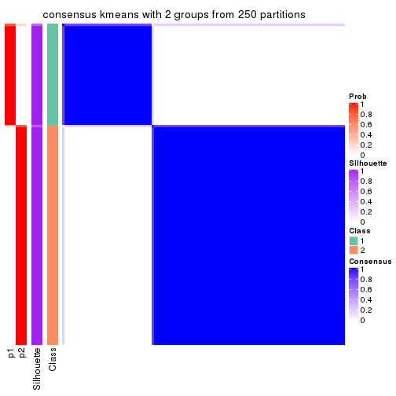</p>

</div>
<div id='tab-CV-kmeans-consensus-heatmap-2'>
<pre><code class="r">consensus_heatmap(res, k = 3)
</code></pre>

<p>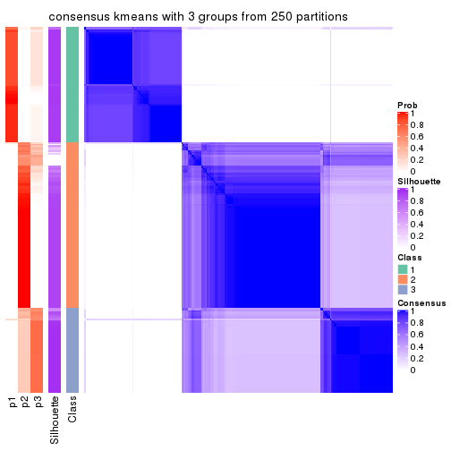</p>

</div>
<div id='tab-CV-kmeans-consensus-heatmap-3'>
<pre><code class="r">consensus_heatmap(res, k = 4)
</code></pre>

<p>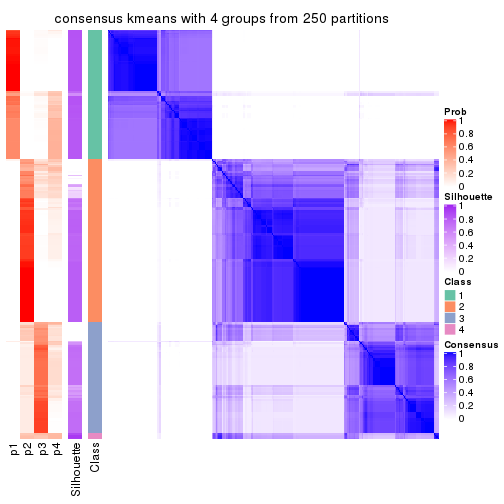</p>

</div>
<div id='tab-CV-kmeans-consensus-heatmap-4'>
<pre><code class="r">consensus_heatmap(res, k = 5)
</code></pre>

<p>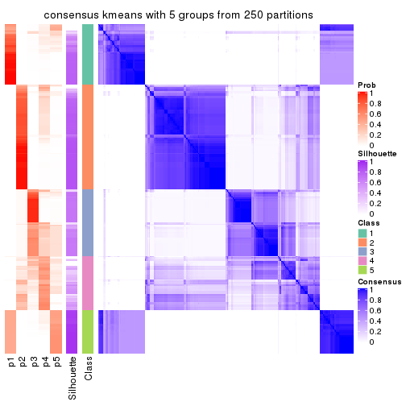</p>

</div>
<div id='tab-CV-kmeans-consensus-heatmap-5'>
<pre><code class="r">consensus_heatmap(res, k = 6)
</code></pre>

<p>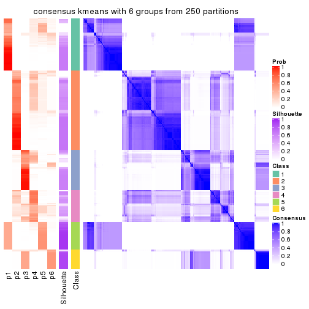</p>

</div>
</div>

Heatmaps for the membership of samples in all partitions to see how consistent they are:


<script>
$( function() {
	$( '#tabs-CV-kmeans-membership-heatmap' ).tabs();
} );
</script>
<div id='tabs-CV-kmeans-membership-heatmap'>
<ul>
<li><a href='#tab-CV-kmeans-membership-heatmap-1'>k = 2</a></li>
<li><a href='#tab-CV-kmeans-membership-heatmap-2'>k = 3</a></li>
<li><a href='#tab-CV-kmeans-membership-heatmap-3'>k = 4</a></li>
<li><a href='#tab-CV-kmeans-membership-heatmap-4'>k = 5</a></li>
<li><a href='#tab-CV-kmeans-membership-heatmap-5'>k = 6</a></li>
</ul>
<div id='tab-CV-kmeans-membership-heatmap-1'>
<pre><code class="r">membership_heatmap(res, k = 2)
</code></pre>

<p>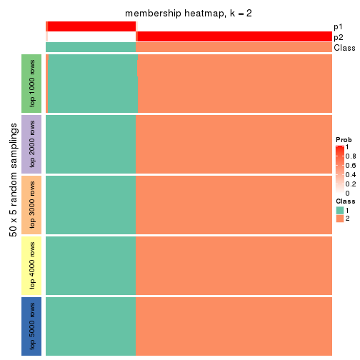</p>

</div>
<div id='tab-CV-kmeans-membership-heatmap-2'>
<pre><code class="r">membership_heatmap(res, k = 3)
</code></pre>

<p>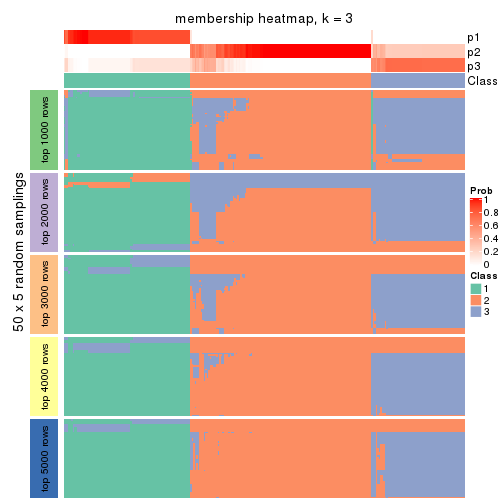</p>

</div>
<div id='tab-CV-kmeans-membership-heatmap-3'>
<pre><code class="r">membership_heatmap(res, k = 4)
</code></pre>

<p>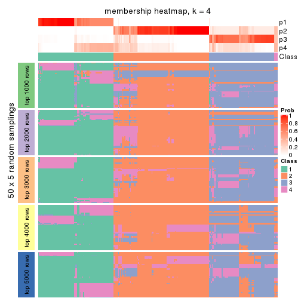</p>

</div>
<div id='tab-CV-kmeans-membership-heatmap-4'>
<pre><code class="r">membership_heatmap(res, k = 5)
</code></pre>

<p>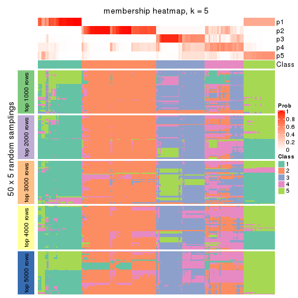</p>

</div>
<div id='tab-CV-kmeans-membership-heatmap-5'>
<pre><code class="r">membership_heatmap(res, k = 6)
</code></pre>

<p>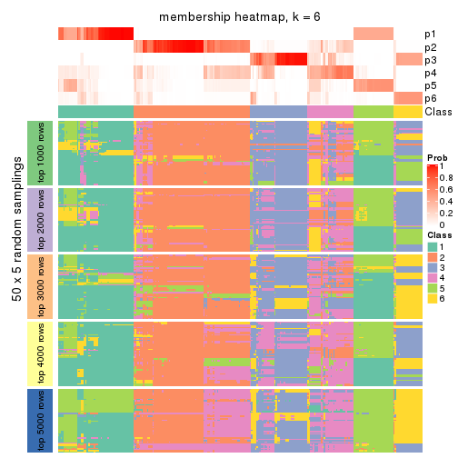</p>

</div>
</div>

As soon as we have had the classes for columns, we can look for signatures
which are significantly different between classes which can be candidate marks
for certain classes. Following are the heatmaps for signatures.


Signature heatmaps where rows are scaled:


<script>
$( function() {
	$( '#tabs-CV-kmeans-get-signatures' ).tabs();
} );
</script>
<div id='tabs-CV-kmeans-get-signatures'>
<ul>
<li><a href='#tab-CV-kmeans-get-signatures-1'>k = 2</a></li>
<li><a href='#tab-CV-kmeans-get-signatures-2'>k = 3</a></li>
<li><a href='#tab-CV-kmeans-get-signatures-3'>k = 4</a></li>
<li><a href='#tab-CV-kmeans-get-signatures-4'>k = 5</a></li>
<li><a href='#tab-CV-kmeans-get-signatures-5'>k = 6</a></li>
</ul>
<div id='tab-CV-kmeans-get-signatures-1'>
<pre><code class="r">get_signatures(res, k = 2)
</code></pre>

<p>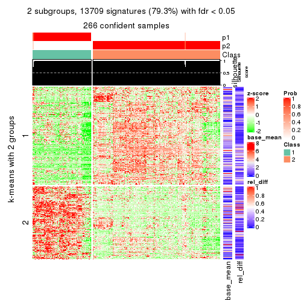</p>

</div>
<div id='tab-CV-kmeans-get-signatures-2'>
<pre><code class="r">get_signatures(res, k = 3)
</code></pre>

<p>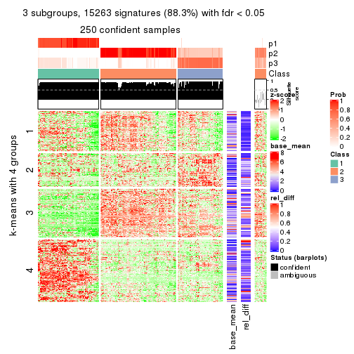</p>

</div>
<div id='tab-CV-kmeans-get-signatures-3'>
<pre><code class="r">get_signatures(res, k = 4)
</code></pre>

<p>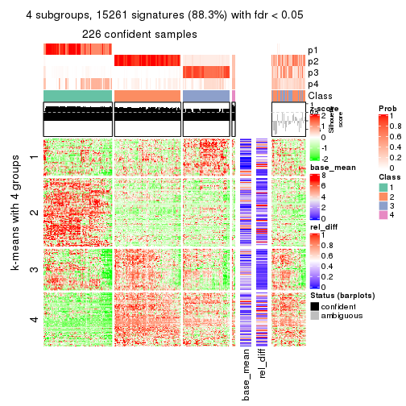</p>

</div>
<div id='tab-CV-kmeans-get-signatures-4'>
<pre><code class="r">get_signatures(res, k = 5)
</code></pre>

<p>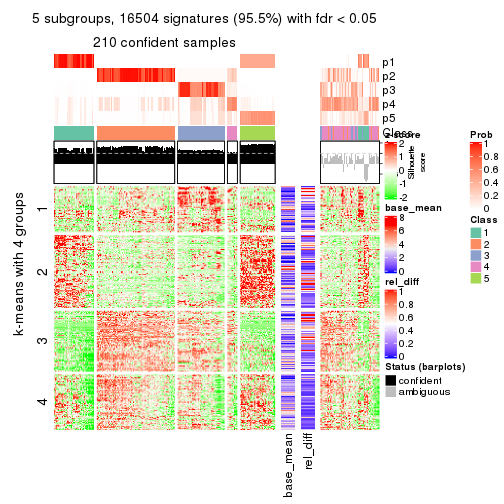</p>

</div>
<div id='tab-CV-kmeans-get-signatures-5'>
<pre><code class="r">get_signatures(res, k = 6)
</code></pre>

<p>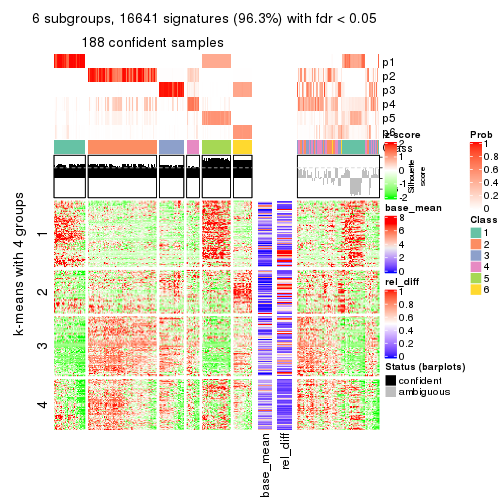</p>

</div>
</div>


Signature heatmaps where rows are not scaled:


<script>
$( function() {
	$( '#tabs-CV-kmeans-get-signatures-no-scale' ).tabs();
} );
</script>
<div id='tabs-CV-kmeans-get-signatures-no-scale'>
<ul>
<li><a href='#tab-CV-kmeans-get-signatures-no-scale-1'>k = 2</a></li>
<li><a href='#tab-CV-kmeans-get-signatures-no-scale-2'>k = 3</a></li>
<li><a href='#tab-CV-kmeans-get-signatures-no-scale-3'>k = 4</a></li>
<li><a href='#tab-CV-kmeans-get-signatures-no-scale-4'>k = 5</a></li>
<li><a href='#tab-CV-kmeans-get-signatures-no-scale-5'>k = 6</a></li>
</ul>
<div id='tab-CV-kmeans-get-signatures-no-scale-1'>
<pre><code class="r">get_signatures(res, k = 2, scale_rows = FALSE)
</code></pre>

<p>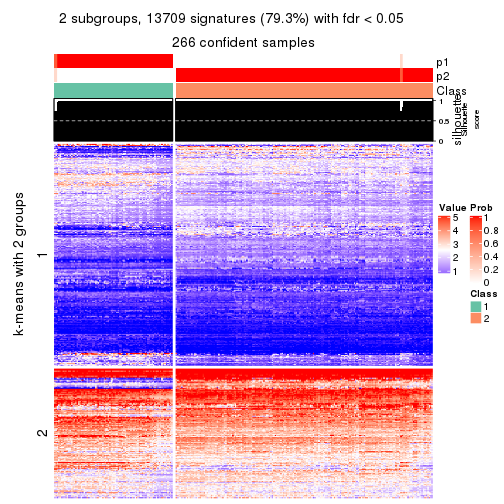</p>

</div>
<div id='tab-CV-kmeans-get-signatures-no-scale-2'>
<pre><code class="r">get_signatures(res, k = 3, scale_rows = FALSE)
</code></pre>

<p>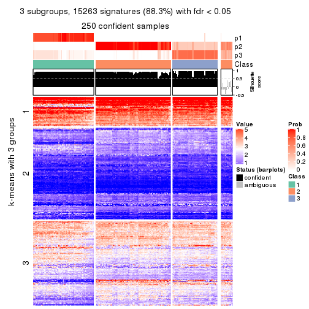</p>

</div>
<div id='tab-CV-kmeans-get-signatures-no-scale-3'>
<pre><code class="r">get_signatures(res, k = 4, scale_rows = FALSE)
</code></pre>

<p>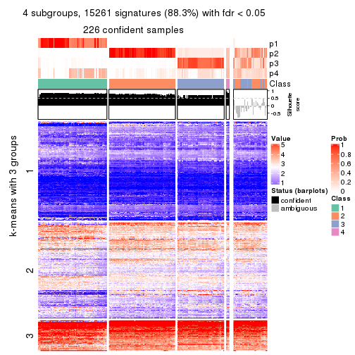</p>

</div>
<div id='tab-CV-kmeans-get-signatures-no-scale-4'>
<pre><code class="r">get_signatures(res, k = 5, scale_rows = FALSE)
</code></pre>

<p>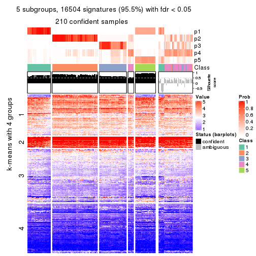</p>

</div>
<div id='tab-CV-kmeans-get-signatures-no-scale-5'>
<pre><code class="r">get_signatures(res, k = 6, scale_rows = FALSE)
</code></pre>

<p>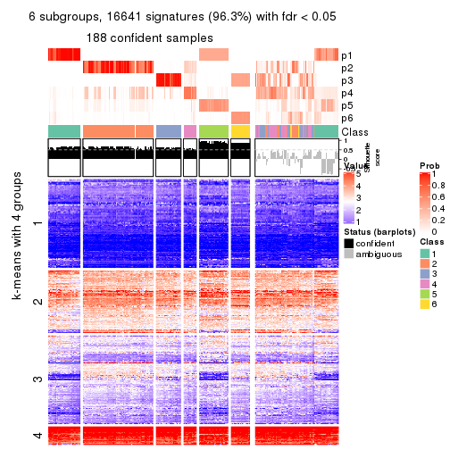</p>

</div>
</div>


Compare the overlap of signatures from different k:

```r
compare_signatures(res)
```

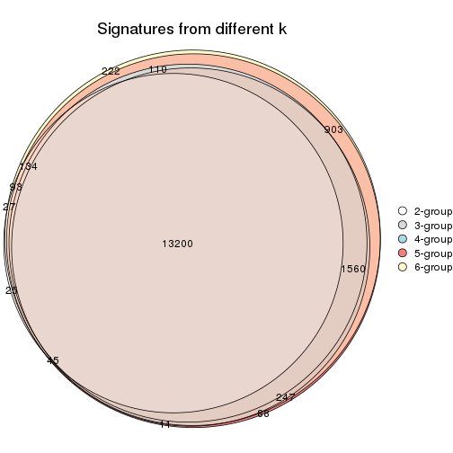

`get_signature()` returns a data frame invisibly. TO get the list of signatures, the function
call should be assigned to a variable explicitly. In following code, if `plot` argument is set
to `FALSE`, no heatmap is plotted while only the differential analysis is performed.

```r
# code only for demonstration
tb = get_signature(res, k = ..., plot = FALSE)
```

An example of the output of `tb` is:

```
#>   which_row         fdr    mean_1    mean_2 scaled_mean_1 scaled_mean_2 km
#> 1        38 0.042760348  8.373488  9.131774    -0.5533452     0.5164555  1
#> 2        40 0.018707592  7.106213  8.469186    -0.6173731     0.5762149  1
#> 3        55 0.019134737 10.221463 11.207825    -0.6159697     0.5749050  1
#> 4        59 0.006059896  5.921854  7.869574    -0.6899429     0.6439467  1
#> 5        60 0.018055526  8.928898 10.211722    -0.6204761     0.5791110  1
#> 6        98 0.009384629 15.714769 14.887706     0.6635654    -0.6193277  2
...
```

The columns in `tb` are:

1. `which_row`: row indices corresponding to the input matrix.
2. `fdr`: FDR for the differential test. 
3. `mean_x`: The mean value in group x.
4. `scaled_mean_x`: The mean value in group x after rows are scaled.
5. `km`: Row groups if k-means clustering is applied to rows.


UMAP plot which shows how samples are separated.


<script>
$( function() {
	$( '#tabs-CV-kmeans-dimension-reduction' ).tabs();
} );
</script>
<div id='tabs-CV-kmeans-dimension-reduction'>
<ul>
<li><a href='#tab-CV-kmeans-dimension-reduction-1'>k = 2</a></li>
<li><a href='#tab-CV-kmeans-dimension-reduction-2'>k = 3</a></li>
<li><a href='#tab-CV-kmeans-dimension-reduction-3'>k = 4</a></li>
<li><a href='#tab-CV-kmeans-dimension-reduction-4'>k = 5</a></li>
<li><a href='#tab-CV-kmeans-dimension-reduction-5'>k = 6</a></li>
</ul>
<div id='tab-CV-kmeans-dimension-reduction-1'>
<pre><code class="r">dimension_reduction(res, k = 2, method = &quot;UMAP&quot;)
</code></pre>

<p></p>

</div>
<div id='tab-CV-kmeans-dimension-reduction-2'>
<pre><code class="r">dimension_reduction(res, k = 3, method = &quot;UMAP&quot;)
</code></pre>

<p>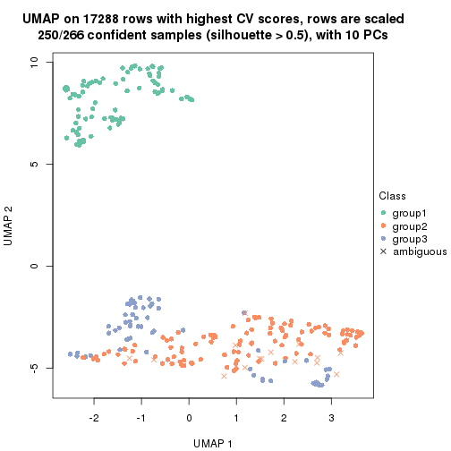</p>

</div>
<div id='tab-CV-kmeans-dimension-reduction-3'>
<pre><code class="r">dimension_reduction(res, k = 4, method = &quot;UMAP&quot;)
</code></pre>

<p>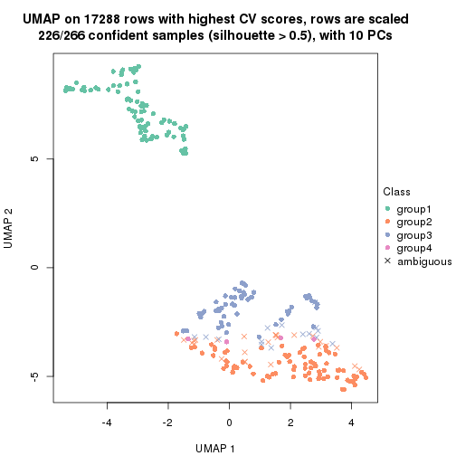</p>

</div>
<div id='tab-CV-kmeans-dimension-reduction-4'>
<pre><code class="r">dimension_reduction(res, k = 5, method = &quot;UMAP&quot;)
</code></pre>

<p>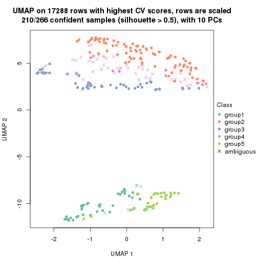</p>

</div>
<div id='tab-CV-kmeans-dimension-reduction-5'>
<pre><code class="r">dimension_reduction(res, k = 6, method = &quot;UMAP&quot;)
</code></pre>

<p>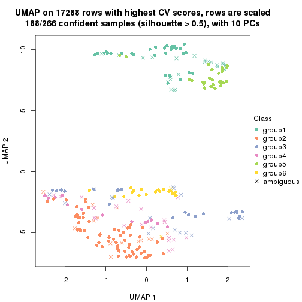</p>

</div>
</div>


Following heatmap shows how subgroups are split when increasing `k`:

```r
collect_classes(res)
```

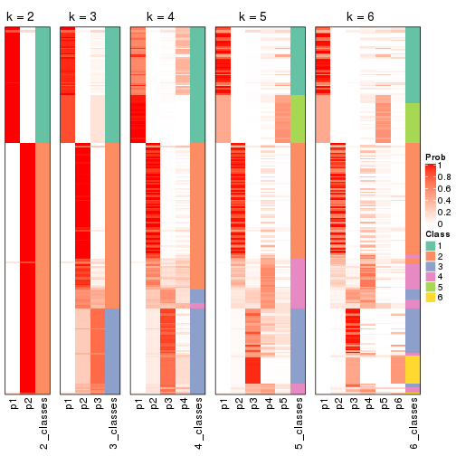


If matrix rows can be associated to genes, consider to use `GO_Enrichment(res,
...)` to perform function enrichment for the signature genes.


 

---------------------------------------------------


### CV:skmeans**


The object with results only for a single top-value method and a single partition method 
can be extracted as:

```r
res = res_list["CV", "skmeans"]
# you can also extract it by
# res = res_list["CV:skmeans"]
```

A summary of `res` and all the functions that can be applied to it:

```r
res
```

```
#> A 'ConsensusPartition' object with k = 2, 3, 4, 5, 6.
#>   On a matrix with 17288 rows and 266 columns.
#>   Top rows (1000, 2000, 3000, 4000, 5000) are extracted by 'CV' method.
#>   Subgroups are detected by 'skmeans' method.
#>   Performed in total 1250 partitions by row resampling.
#>   Best k for subgroups seems to be 3.
#> 
#> Following methods can be applied to this 'ConsensusPartition' object:
#>  [1] "cola_report"             "collect_classes"         "collect_plots"          
#>  [4] "collect_stats"           "colnames"                "compare_signatures"     
#>  [7] "consensus_heatmap"       "dimension_reduction"     "functional_enrichment"  
#> [10] "get_anno_col"            "get_anno"                "get_classes"            
#> [13] "get_consensus"           "get_matrix"              "get_membership"         
#> [16] "get_param"               "get_signatures"          "get_stats"              
#> [19] "is_best_k"               "is_stable_k"             "membership_heatmap"     
#> [22] "ncol"                    "nrow"                    "plot_ecdf"              
#> [25] "rownames"                "select_partition_number" "show"                   
#> [28] "suggest_best_k"          "test_to_known_factors"
```

`collect_plots()` function collects all the plots made from `res` for all `k` (number of partitions)
into one single page to provide an easy and fast comparison between different `k`.

```r
collect_plots(res)
```

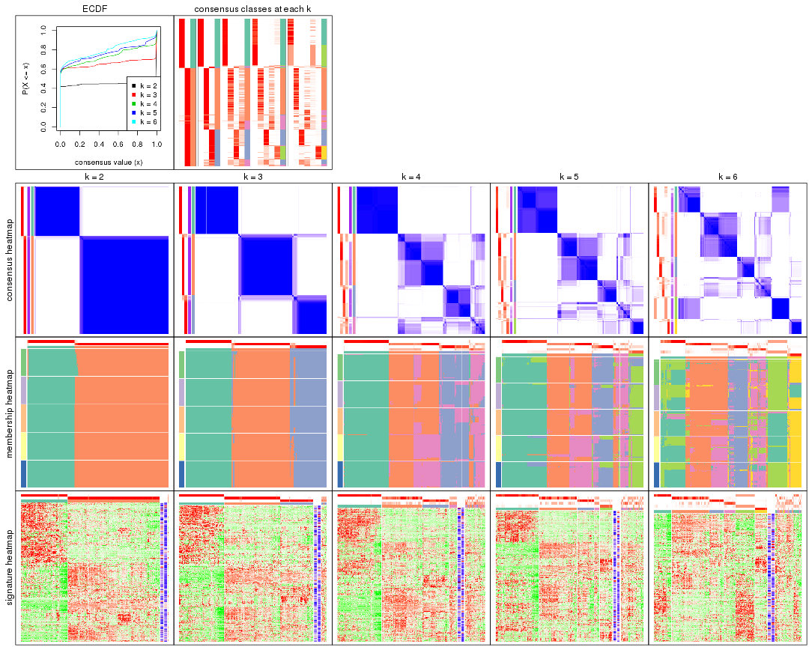

The plots are:

- The first row: a plot of the ECDF (Empirical cumulative distribution
  function) curves of the consensus matrix for each `k` and the heatmap of
  predicted classes for each `k`.
- The second row: heatmaps of the consensus matrix for each `k`.
- The third row: heatmaps of the membership matrix for each `k`.
- The fouth row: heatmaps of the signatures for each `k`.

All the plots in panels can be made by individual functions and they are
plotted later in this section.

`select_partition_number()` produces several plots showing different
statistics for choosing "optimized" `k`. There are following statistics:

- ECDF curves of the consensus matrix for each `k`;
- 1-PAC. [The PAC
  score](https://en.wikipedia.org/wiki/Consensus_clustering#Over-interpretation_potential_of_consensus_clustering)
  measures the proportion of the ambiguous subgrouping.
- Mean silhouette score.
- Concordance. The mean probability of fiting the consensus class ids in all
  partitions.
- Area increased. Denote $A_k$ as the area under the ECDF curve for current
  `k`, the area increased is defined as $A_k - A_{k-1}$.
- Rand index. The percent of pairs of samples that are both in a same cluster
  or both are not in a same cluster in the partition of k and k-1.
- Jaccard index. The ratio of pairs of samples are both in a same cluster in
  the partition of k and k-1 and the pairs of samples are both in a same
  cluster in the partition k or k-1.

The detailed explanations of these statistics can be found in [the cola
vignette](http://bioconductor.org/packages/devel/bioc/vignettes/cola/inst/doc/cola.html#toc_13).

Generally speaking, lower PAC score, higher mean silhouette score or higher
concordance corresponds to better partition. Rand index and Jaccard index
measure how similar the current partition is compared to partition with `k-1`.
If they are too similar, we won't accept `k` is better than `k-1`.

```r
select_partition_number(res)
```

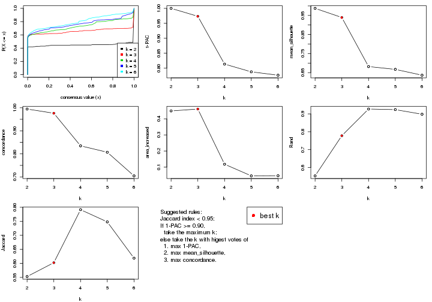

The numeric values for all these statistics can be obtained by `get_stats()`.

```r
get_stats(res)
```

```
#>   k 1-PAC mean_silhouette concordance area_increased  Rand Jaccard
#> 2 2 1.000           0.987       0.994         0.4491 0.553   0.553
#> 3 3 0.973           0.939       0.976         0.4609 0.778   0.602
#> 4 4 0.814           0.682       0.835         0.1181 0.927   0.791
#> 5 5 0.788           0.667       0.807         0.0457 0.924   0.748
#> 6 6 0.777           0.636       0.705         0.0467 0.898   0.619
```

`suggest_best_k()` suggests the best $k$ based on these statistics. The rules are as follows:

- All $k$ with Jaccard index larger than 0.95 are removed because the increase of
  the partition number does not provides enough extra information. If all $k$ are removed,
  the best $k$ is assigned by `NA`.
- For $k$ with 1-PAC larger than 0.9, the maximal $k$ is taken as the "best k". Other $k$ is called "optional k".
- If it does not fit the second rule. The $k$ with the highest vote of highest
  1-PAC, mean silhouette and concordance is taken as the "best k".

```r
suggest_best_k(res)
```

```
#> [1] 3
#> attr(,"optional")
#> [1] 2
```

There is also optional best $k$ = 2 that is worth to check.

Following shows the table of the partitions (You need to click the **show/hide
code output** link to see it). The membership matrix (columns with name `p*`)
is inferred by
[`clue::cl_consensus()`](https://www.rdocumentation.org/link/cl_consensus?package=clue)
function with the `SE` method. Basically the value in the membership matrix
represents the probability to belong to a certain group. The finall class
label for an item is determined with the group with highest probability it
belongs to.

In `get_classes()` function, the entropy is calculated from the membership
matrix and the silhouette score is calculated from the consensus matrix.


<script>
$( function() {
	$( '#tabs-CV-skmeans-get-classes' ).tabs();
} );
</script>
<div id='tabs-CV-skmeans-get-classes'>
<ul>
<li><a href='#tab-CV-skmeans-get-classes-1'>k = 2</a></li>
<li><a href='#tab-CV-skmeans-get-classes-2'>k = 3</a></li>
<li><a href='#tab-CV-skmeans-get-classes-3'>k = 4</a></li>
<li><a href='#tab-CV-skmeans-get-classes-4'>k = 5</a></li>
<li><a href='#tab-CV-skmeans-get-classes-5'>k = 6</a></li>
</ul>

<div id='tab-CV-skmeans-get-classes-1'>
<p><a id='tab-CV-skmeans-get-classes-1-a' style='color:#0366d6' href='#'>show/hide code output</a></p>
<pre><code class="r">cbind(get_classes(res, k = 2), get_membership(res, k = 2))
</code></pre>

<pre><code>#&gt;                                      class entropy silhouette    p1    p2
#&gt; 80D0AF10-1C61-4B67-90C1-7DBF1EF23672     2  0.0000      0.994 0.000 1.000
#&gt; 87117BE1-D328-4972-85DA-6672412D8860     2  0.0000      0.994 0.000 1.000
#&gt; F904C5B6-70BD-4604-8254-79BE23B152DA     1  0.0000      0.995 1.000 0.000
#&gt; 3182DEA1-4239-4613-925A-7E6503766AD6     2  0.0000      0.994 0.000 1.000
#&gt; 55E78EA2-2D9B-481F-8CAB-D36A33088EAE     2  0.0000      0.994 0.000 1.000
#&gt; 86F94264-A6DD-4A97-9191-036F066DD0EF     2  0.0000      0.994 0.000 1.000
#&gt; 09D25417-23B7-4D88-A0EA-F307985FBBBC     2  0.0000      0.994 0.000 1.000
#&gt; C797F12C-40D3-4DB5-B9EF-A6821BBDE4F0     1  0.0000      0.995 1.000 0.000
#&gt; 80275DB0-A226-4B6B-A08F-4ADBEEE1DB01     1  0.0000      0.995 1.000 0.000
#&gt; 27FB653A-9E07-44AD-952E-9E4DE4AB5891     2  0.0000      0.994 0.000 1.000
#&gt; 1A5DB9FC-2ABD-4E1B-B5EF-B1CF5E5F3872     1  0.0000      0.995 1.000 0.000
#&gt; 844E4CCD-D30C-416F-A086-8923711A4E25     2  0.0000      0.994 0.000 1.000
#&gt; EF18318D-3D25-4D65-803A-ED6E62871E7E     1  0.0000      0.995 1.000 0.000
#&gt; 1ACB1BE0-61F6-4243-BBEC-E26A1CF90CA8     1  0.0000      0.995 1.000 0.000
#&gt; 8EF0039B-D758-46AB-BAF7-6A062C7C56BA     1  0.0000      0.995 1.000 0.000
#&gt; 22F4C9D9-663B-4C91-9692-E035A2640BEC     2  0.0000      0.994 0.000 1.000
#&gt; FA1A0BCE-EE0F-4178-B963-62550E344B14     2  0.0000      0.994 0.000 1.000
#&gt; 0B6D0C4E-5AE3-4707-A9FC-12A108E6EC2A     2  0.0000      0.994 0.000 1.000
#&gt; 06FD3123-2AEB-4911-AC4E-E0E64FD5DB52     2  0.0000      0.994 0.000 1.000
#&gt; 235A4492-FF80-4AA5-BC71-DFF65E1C7411     2  0.0000      0.994 0.000 1.000
#&gt; A192C6C0-1443-4493-AFAC-1EE710628ADB     2  0.0000      0.994 0.000 1.000
#&gt; 6FC5B56B-711B-4174-9B06-4E843124AAB6     1  0.0000      0.995 1.000 0.000
#&gt; 7A813F60-A41E-4552-990E-F22287654C1D     2  0.0000      0.994 0.000 1.000
#&gt; 725BBFB5-26F4-4512-9C75-47D013C1E605     1  0.0000      0.995 1.000 0.000
#&gt; 39CC4E82-EBC9-472E-8BE5-6A3AB178449A     2  0.0000      0.994 0.000 1.000
#&gt; 61130DEE-E267-49DF-8B41-7738A06EF738     2  0.0000      0.994 0.000 1.000
#&gt; 117EC12C-B7ED-4E01-B29B-EA542D356EA1     1  0.0000      0.995 1.000 0.000
#&gt; A30FF708-F7A9-41E4-8AD5-20441650FBC9     2  0.0000      0.994 0.000 1.000
#&gt; 53640D52-1167-4A5D-B656-97D32CBA3934     1  0.0000      0.995 1.000 0.000
#&gt; 9E85D76A-DD2A-46D5-BB59-0ED302B6258C     2  0.0000      0.994 0.000 1.000
#&gt; 6F8C6F90-7E3C-4860-91DD-586708DE44AA     1  0.0000      0.995 1.000 0.000
#&gt; E675AEC5-AA9A-4AAA-839C-03E6365822DB     2  0.0000      0.994 0.000 1.000
#&gt; B577DEF7-2F5C-4876-A7C6-F18D5722B8C0     1  0.0000      0.995 1.000 0.000
#&gt; DA8B577E-43E7-49BF-BF94-868E3194F5C9     1  0.0000      0.995 1.000 0.000
#&gt; 3334280B-2A36-4AC7-A021-A76C10E958F0     2  0.0000      0.994 0.000 1.000
#&gt; 5CBDDC90-11EC-4E6E-881E-AA9CCFD40FDB     2  0.4022      0.912 0.080 0.920
#&gt; 8CBBF32A-8349-44F5-A8B8-4CBB1760A464     2  0.0000      0.994 0.000 1.000
#&gt; B9455A9A-136D-4DC2-9F86-0FC74433589D     1  0.7219      0.753 0.800 0.200
#&gt; D7EAE2A7-F9BE-4222-A452-B1F83F99CD50     2  0.2948      0.942 0.052 0.948
#&gt; F803AE18-60C5-4CFE-AAAB-DB33C26A2184     1  0.0000      0.995 1.000 0.000
#&gt; 5DD8CAC7-EC02-43B6-B58E-6D2E22868A3B     2  0.0000      0.994 0.000 1.000
#&gt; EE98E1B4-DFB3-4AEC-8527-E1FD544C9475     1  0.0000      0.995 1.000 0.000
#&gt; 3CE43921-47D5-4394-B9E1-242607775D61     2  0.0000      0.994 0.000 1.000
#&gt; 46986F2B-0B0D-4187-8948-4E91D34B7C49     2  0.0000      0.994 0.000 1.000
#&gt; 5D1D052E-74EF-45A8-9B1A-7CECD13EA43B     2  0.0000      0.994 0.000 1.000
#&gt; 4C821AD9-A5C9-4A9A-9C5D-363B227F8064     2  0.0000      0.994 0.000 1.000
#&gt; 06A4189E-A23B-4AC6-AA74-01955DD7D1E9     2  0.0000      0.994 0.000 1.000
#&gt; FCCDC76F-CB02-4BCD-A616-325F258DDAA4     2  0.0000      0.994 0.000 1.000
#&gt; DAC53B0A-8F35-4EA6-BBCC-4CD1C049E11F     2  0.0000      0.994 0.000 1.000
#&gt; DD4F845B-CAD3-44CB-9D96-3C3F5BA1B72D     1  0.0000      0.995 1.000 0.000
#&gt; D440F004-A4A4-41B6-BED8-805D67BA01C7     2  0.0000      0.994 0.000 1.000
#&gt; A497C423-119F-42FA-BF17-9F6DFD2A5585     2  0.0000      0.994 0.000 1.000
#&gt; 3420E573-DE12-4EF5-B1C0-2FCA904F4F4E     1  0.0000      0.995 1.000 0.000
#&gt; 1AD72157-A254-44B4-BA58-4F30F1AE910E     1  0.0000      0.995 1.000 0.000
#&gt; C1113977-B160-45EE-B061-750F9EA3F33F     2  0.0000      0.994 0.000 1.000
#&gt; 6783AB5B-F07C-447B-BF13-C34485D246D7     2  0.0000      0.994 0.000 1.000
#&gt; 1F553062-26FD-4A7F-B7FB-81184604F423     1  0.0000      0.995 1.000 0.000
#&gt; BE2DCA51-1C21-4598-98A7-F2FB9B2DFCB4     2  0.0000      0.994 0.000 1.000
#&gt; 38941CF3-9C54-4BA4-A005-CC88CA97D504     2  0.0000      0.994 0.000 1.000
#&gt; 51CB675E-E243-4A07-BF4A-580473D26FDA     2  0.0000      0.994 0.000 1.000
#&gt; C7FED0F5-C27A-4405-9232-30BF39362CF7     2  0.0000      0.994 0.000 1.000
#&gt; 2A1E86E8-4713-465F-ACFF-C584864C57A1     2  0.0000      0.994 0.000 1.000
#&gt; B4500785-0FAA-4D4D-8630-43D194BAB004     2  0.0000      0.994 0.000 1.000
#&gt; 3FD52E66-AB76-4079-80DB-281A795D1EC0     2  0.6623      0.795 0.172 0.828
#&gt; EBD355D1-1226-4DFD-AAFF-45D246B64F3C     2  0.0000      0.994 0.000 1.000
#&gt; 5A040A73-CD95-487E-8AEF-9639FE4E2916     2  0.0000      0.994 0.000 1.000
#&gt; CF629C65-585D-476D-B081-3E6E0575FAE3     1  0.0000      0.995 1.000 0.000
#&gt; 0D4202A3-808E-413F-9BF3-9CFCCAE0ED61     2  0.0000      0.994 0.000 1.000
#&gt; 43E715BF-28D9-4B5E-B762-8CD1B69A430E     1  0.0000      0.995 1.000 0.000
#&gt; BFB82BE8-9DAC-4099-8B38-0950308E3EB3     2  0.0000      0.994 0.000 1.000
#&gt; F7CB1825-2303-4DD2-AE1F-7205738EAF1F     1  0.0000      0.995 1.000 0.000
#&gt; FE298483-C42C-4753-BABB-29A9CB1B6312     1  0.0000      0.995 1.000 0.000
#&gt; A98C7561-1B42-4CD6-AE71-924B91FA4C33     2  0.0000      0.994 0.000 1.000
#&gt; 58098F21-7DAB-47DA-9A41-8D20BF3B9257     2  0.0000      0.994 0.000 1.000
#&gt; 18CAF708-20B9-4745-9CB3-37AB6E0B3056     2  0.0000      0.994 0.000 1.000
#&gt; 2C80DD72-C9C7-4AC2-812F-9A31EF02779C     1  0.0000      0.995 1.000 0.000
#&gt; 68A3F13D-319D-4603-A27F-B5DD46FE5C5B     2  0.0000      0.994 0.000 1.000
#&gt; 7EE8F0CE-CDC9-40F9-A1DE-7F8140EC6D13     1  0.7602      0.721 0.780 0.220
#&gt; 39019903-5B9C-4665-BD5F-7CCB19CB55C5     2  0.0000      0.994 0.000 1.000
#&gt; 190EDB27-4CBC-4E9C-9B67-D51FDAB982B7     2  0.0000      0.994 0.000 1.000
#&gt; EB2D95BC-62F8-4669-9308-D37D7FB79E23     2  0.0000      0.994 0.000 1.000
#&gt; A08B85EA-D1E7-4B77-8DEC-36294305B9F7     1  0.0000      0.995 1.000 0.000
#&gt; 130DDFAD-6EF8-4C80-BD9D-88308A6874BC     2  0.0000      0.994 0.000 1.000
#&gt; 7340A5BA-E002-448F-AACC-E7A37DBB79C2     2  0.0000      0.994 0.000 1.000
#&gt; A771F6E3-D266-4FE7-98C6-C40E6A701D59     1  0.0000      0.995 1.000 0.000
#&gt; 015E792C-EC1B-49BF-AB07-D82B20C5989A     2  0.0000      0.994 0.000 1.000
#&gt; BF79E030-47EE-4D08-B910-5685A4BD8B60     2  0.0000      0.994 0.000 1.000
#&gt; FB3C7C9A-2F2D-4DD5-BE47-FAFB072C0FAB     2  0.0000      0.994 0.000 1.000
#&gt; 4E5557BA-10E8-4723-908E-DD04EF6639B2     2  0.0000      0.994 0.000 1.000
#&gt; 8031B550-40A9-4A3A-9F7D-CDC052288BD8     2  0.0000      0.994 0.000 1.000
#&gt; 55299A06-3C1F-45A4-B166-B2C591C0CEE2     2  0.0000      0.994 0.000 1.000
#&gt; EB8D5168-216E-4ABB-8B4E-9E67786CB322     1  0.0000      0.995 1.000 0.000
#&gt; 78BD2D83-9A7F-42E5-BB38-654AA0761A0A     2  0.0000      0.994 0.000 1.000
#&gt; AA2D53E5-D389-4332-9DD5-A736052E48F8     1  0.0000      0.995 1.000 0.000
#&gt; 62945C7A-9313-4FC9-820C-B0AB820B394E     1  0.0000      0.995 1.000 0.000
#&gt; 22746046-2E99-4EE9-97D2-BA2EA499634C     2  0.0000      0.994 0.000 1.000
#&gt; 8671B51B-DCBE-4429-9F01-AF51CAD7014F     2  0.0000      0.994 0.000 1.000
#&gt; E815AB36-5689-4A0D-8E6D-2EAA73406681     1  0.0000      0.995 1.000 0.000
#&gt; A1DACB46-ED52-4E38-B2C8-57256BB22B5E     2  0.0000      0.994 0.000 1.000
#&gt; 4F5498C4-A423-4B3D-AC98-D4E214A57D0E     1  0.0000      0.995 1.000 0.000
#&gt; A7772CCD-FFFF-49DD-86ED-0BAD330EC9B6     2  0.0000      0.994 0.000 1.000
#&gt; E6E3DF78-65B9-4F74-8DA8-E2A6D4EDBEA7     2  0.0000      0.994 0.000 1.000
#&gt; 83286E2D-E708-437A-911A-E6B050273CBD     1  0.0000      0.995 1.000 0.000
#&gt; EC5C7C97-EE8C-405D-A039-D96514B1D414     2  0.0000      0.994 0.000 1.000
#&gt; 3E55223D-6E3D-4027-9819-67E91212531D     1  0.0000      0.995 1.000 0.000
#&gt; 99A036A2-8343-4D06-8047-D84E96CE4C61     2  0.0000      0.994 0.000 1.000
#&gt; CA6CDE6D-92DE-4259-9E58-A373F2D543EA     2  0.0000      0.994 0.000 1.000
#&gt; BF6FA8CC-60C1-413A-B2C6-54CCACBC01D6     1  0.0000      0.995 1.000 0.000
#&gt; E0594CFE-F7B6-4546-B130-30DF6A514B1F     2  0.0000      0.994 0.000 1.000
#&gt; E769E41D-5949-42C5-9594-E563C05ACE52     2  0.0000      0.994 0.000 1.000
#&gt; 01373725-5D3C-4D9C-AABC-911D53E62BCD     2  0.0000      0.994 0.000 1.000
#&gt; 1F39DADD-3655-474E-BA4C-A5BD32C97A8B     1  0.0000      0.995 1.000 0.000
#&gt; AF573EC8-E4EE-4B8F-8199-9817B9FAC67D     1  0.0000      0.995 1.000 0.000
#&gt; 3F022CBC-41C8-4387-A6FB-124C4BCD1AD9     1  0.0000      0.995 1.000 0.000
#&gt; 1CC32ACE-826B-494B-8B89-5BD92327A74D     2  0.0000      0.994 0.000 1.000
#&gt; 22B0BD3B-EE08-4BC7-90B2-01C372A56BA2     2  0.0000      0.994 0.000 1.000
#&gt; 0F3DE9EF-19CC-4D14-9A42-1435DB537F94     2  0.0000      0.994 0.000 1.000
#&gt; 87F8A33F-FBC3-469E-862B-84472F796358     2  0.0000      0.994 0.000 1.000
#&gt; C9F2FA0D-1A9F-40B4-BD9B-CAF1B3F3D5A7     2  0.0000      0.994 0.000 1.000
#&gt; ACFC9F59-78FF-4453-B25F-8834D0EAB54A     2  0.0000      0.994 0.000 1.000
#&gt; B7AC7D5B-14E9-45A7-93B7-226EE508544A     2  0.0000      0.994 0.000 1.000
#&gt; 4491BF17-B168-4E96-8E09-EF1AEC9F5E9D     2  0.0000      0.994 0.000 1.000
#&gt; 557A0811-A3FE-4CF4-A24D-FBB77E7F9139     2  0.0000      0.994 0.000 1.000
#&gt; 6F9C955C-6816-4353-922A-8035B50FACC6     2  0.0000      0.994 0.000 1.000
#&gt; 3E89FB1C-4A7D-43C7-823C-04E3716A7935     2  0.0000      0.994 0.000 1.000
#&gt; 12ABE483-66EF-4237-94C4-0199FAE23FA8     2  0.0000      0.994 0.000 1.000
#&gt; 7535F262-9B96-44F6-988C-4C9EBB3FFCA9     2  0.0000      0.994 0.000 1.000
#&gt; 65C9D28E-303B-40E5-84F0-2507F5457374     2  0.0000      0.994 0.000 1.000
#&gt; FD445384-6BA9-4297-9D9C-12ABA7D645C7     1  0.0000      0.995 1.000 0.000
#&gt; 30D5E255-2AD3-44F3-8983-1B80E4FD3E2D     2  0.0000      0.994 0.000 1.000
#&gt; 3E88EC60-B4A8-4259-8BC8-A234800F6955     2  0.0000      0.994 0.000 1.000
#&gt; ACD73CE8-AFC5-47A0-9383-3CB97F018953     1  0.0000      0.995 1.000 0.000
#&gt; 1AFDC2EA-26A8-44E2-8BCB-F34F7B66F8C8     2  0.0000      0.994 0.000 1.000
#&gt; 9E327BC8-1D20-4AD8-83F7-FB2D13BCA5D0     2  0.5294      0.864 0.120 0.880
#&gt; 85A86B91-4F24-4E77-AE2D-520F8E205EFC     1  0.0000      0.995 1.000 0.000
#&gt; 74868C37-8143-4306-81CA-E45759D146CD     2  0.0000      0.994 0.000 1.000
#&gt; 69AEA0DB-E335-48A0-A398-4FB0D581182A     2  0.0000      0.994 0.000 1.000
#&gt; AE6F8B89-85C2-42B7-8D05-AFDDD4FEFD16     1  0.0000      0.995 1.000 0.000
#&gt; A8A6F09C-9812-4457-9A4B-AD41F97B41A3     2  0.0000      0.994 0.000 1.000
#&gt; 1A09BC4D-EF29-42DD-BB04-A3C264A3032D     1  0.0000      0.995 1.000 0.000
#&gt; E0961A30-A62C-4235-9CF0-A1776827A996     2  0.0000      0.994 0.000 1.000
#&gt; 134D2D90-7B08-4F20-8A3A-C77643FB208F     2  0.0000      0.994 0.000 1.000
#&gt; A77C2DFF-93CF-4CB5-B3C1-81133D7F1A0F     2  0.9710      0.343 0.400 0.600
#&gt; EA2DC457-9C74-4B9C-B3FA-5E72199B24A7     2  0.0000      0.994 0.000 1.000
#&gt; FF34117B-5EE4-4C96-A8A2-2CE6A654CBE5     1  0.0000      0.995 1.000 0.000
#&gt; 75F7B5E2-6559-4B48-A2A4-287C35C559CC     1  0.0000      0.995 1.000 0.000
#&gt; 903BF591-B0AF-4BEE-B625-60B673070344     2  0.0000      0.994 0.000 1.000
#&gt; 9DE1B790-C63C-41C4-9477-CE52A8119C67     2  0.0000      0.994 0.000 1.000
#&gt; 9A28F80A-85F8-40E2-A32B-230EF93B2FA0     2  0.0000      0.994 0.000 1.000
#&gt; 0AA2BDBB-8720-409A-AA72-1F4AA26E7CD8     2  0.0000      0.994 0.000 1.000
#&gt; 5AD49F16-E974-4E5D-B1B6-073ECB73A01D     1  0.0000      0.995 1.000 0.000
#&gt; CB0F961C-527D-4A48-9408-286B26BD9532     1  0.0000      0.995 1.000 0.000
#&gt; 46FF25B6-D01D-4CA7-80B7-CEC2998C34E1     2  0.0000      0.994 0.000 1.000
#&gt; 487CADE1-D699-4A6C-817A-B9A0AB940C61     1  0.0000      0.995 1.000 0.000
#&gt; 4FF6F2D8-F869-4735-A4D1-1A8423153FBC     1  0.0000      0.995 1.000 0.000
#&gt; 6005494F-5D3D-43A3-B3E8-8C91955B2A98     2  0.0000      0.994 0.000 1.000
#&gt; CF10D584-CE32-45A4-A932-E9D5AF12A6A0     1  0.0000      0.995 1.000 0.000
#&gt; E15CE4AB-5646-49C8-9CD6-938457036BB0     2  0.0000      0.994 0.000 1.000
#&gt; 31E28D0B-0E69-4330-82ED-4F1827DC97EA     2  0.0000      0.994 0.000 1.000
#&gt; DBACD3C3-CCB5-4478-BA78-85A0C847CA66     2  0.0000      0.994 0.000 1.000
#&gt; 5A07041C-65EB-4FCD-8940-E90B905061B5     2  0.0376      0.990 0.004 0.996
#&gt; 0EA7C916-FA47-489B-BC98-4D9E7D197628     1  0.0000      0.995 1.000 0.000
#&gt; 30967F75-8499-47FF-ADA4-4DC566013F7B     1  0.0000      0.995 1.000 0.000
#&gt; D2E528FF-AEA2-48D7-A60A-4C3E71EA9073     2  0.0000      0.994 0.000 1.000
#&gt; 22735DCD-215E-48BC-BF44-32BD66F06E39     2  0.0000      0.994 0.000 1.000
#&gt; BC2C3248-7FC6-48BC-96C1-45EA573DE7DC     1  0.0000      0.995 1.000 0.000
#&gt; E72CEBCB-D686-4B12-BCBA-EC8F964330A2     1  0.0000      0.995 1.000 0.000
#&gt; 23C937BB-BA20-4440-B680-914229CC3ADF     1  0.0000      0.995 1.000 0.000
#&gt; 947E99C7-F402-4F1A-A6E9-81BCAAED135A     2  0.0000      0.994 0.000 1.000
#&gt; 02475D11-FC81-4E88-944E-173C32DC3FE7     1  0.0000      0.995 1.000 0.000
#&gt; F972A9AA-9842-4343-A533-A795E65581CE     1  0.0000      0.995 1.000 0.000
#&gt; 05043AAF-3095-4C61-B5C1-EE9AA9082C75     2  0.0000      0.994 0.000 1.000
#&gt; CECF7967-862E-428C-BB42-FEF553FDB3AA     2  0.0000      0.994 0.000 1.000
#&gt; FB0B9483-6302-48C7-BE5B-DA667E00AE2D     2  0.0000      0.994 0.000 1.000
#&gt; 78700FBA-1487-4754-9B30-18837BF7E9FB     1  0.0000      0.995 1.000 0.000
#&gt; 2166F56D-54CE-4F1B-8F07-A4E13E4489E9     1  0.0000      0.995 1.000 0.000
#&gt; 7CD0942E-E39A-43A7-8BAC-F25967864901     2  0.0000      0.994 0.000 1.000
#&gt; 3B00BA2B-7F7D-4825-8F8D-90F04A5DE687     2  0.0000      0.994 0.000 1.000
#&gt; 7465B01D-C05E-4FE0-A9FE-182920EDC489     2  0.0000      0.994 0.000 1.000
#&gt; 88C31A99-F96E-4FC8-8B3D-C1AAA05062D9     1  0.0000      0.995 1.000 0.000
#&gt; 53575575-3303-4F8F-B6A8-B42131CFB4AC     2  0.0000      0.994 0.000 1.000
#&gt; CC8017C7-4128-48DA-8E43-503F63158D85     1  0.0000      0.995 1.000 0.000
#&gt; 88449D2A-2A25-41A4-B91D-C99B58F8ECD9     2  0.0000      0.994 0.000 1.000
#&gt; 46C7DDE5-A2B5-494F-96AE-0B6E2D51B003     1  0.0000      0.995 1.000 0.000
#&gt; 42551D05-5EE5-4F91-93A8-32DA695D9DFA     2  0.0000      0.994 0.000 1.000
#&gt; 0772DA48-3A36-422D-B166-CA1691B782C3     2  0.0000      0.994 0.000 1.000
#&gt; 30346897-EC77-4153-88A2-D14593C8B741     2  0.0000      0.994 0.000 1.000
#&gt; 0F00E267-C748-4A71-8B36-03C410641D88     2  0.0000      0.994 0.000 1.000
#&gt; 4034703A-4DA9-4DDA-9CA9-E80FFE9CCDE6     2  0.0000      0.994 0.000 1.000
#&gt; 393C8A41-CF45-4EA8-AFE3-25A08AB7692A     2  0.0000      0.994 0.000 1.000
#&gt; 3354212D-A07C-435C-8B0C-9A7BAAB624B5     1  0.0000      0.995 1.000 0.000
#&gt; 57E30D4E-ABF7-47DD-92BE-40CE215076B0     1  0.0000      0.995 1.000 0.000
#&gt; 202B4C76-C840-4DB8-953F-AC75A4156FDD     2  0.0000      0.994 0.000 1.000
#&gt; 93A0137B-1F4C-44EE-B959-2AD0CD2DF8B6     1  0.0000      0.995 1.000 0.000
#&gt; C9794DB6-6E8C-4AFD-80EE-61D672A4F6E9     2  0.0000      0.994 0.000 1.000
#&gt; AE4BFE63-F0C0-4624-AD97-4F7FF13E2384     1  0.0000      0.995 1.000 0.000
#&gt; DCF87F27-2B54-42D9-8D28-5DFEE76E2F5B     2  0.0000      0.994 0.000 1.000
#&gt; 2451D405-39FD-4812-958C-23462B66F1F1     2  0.0000      0.994 0.000 1.000
#&gt; E27F5D33-3F68-4CA8-8757-A387C6EAD060     2  0.0000      0.994 0.000 1.000
#&gt; 8BA9928A-5B93-477F-B4A2-D031B714D9AC     1  0.0000      0.995 1.000 0.000
#&gt; 0FAACFF6-B50C-4BED-9824-B7270654F28D     2  0.0000      0.994 0.000 1.000
#&gt; 3366CC3C-2BBA-4CA7-848E-4E16AA70AE7A     2  0.0000      0.994 0.000 1.000
#&gt; 66237056-CA9A-4C90-AF0E-1621FEB71578     2  0.0000      0.994 0.000 1.000
#&gt; C480F1FB-3100-436C-B0F5-DED63B7A580E     2  0.0000      0.994 0.000 1.000
#&gt; A327DE0D-D945-4B42-9B41-A7302CF796EE     2  0.0000      0.994 0.000 1.000
#&gt; E8A6871D-67FB-4306-9454-F5E7CDBA399A     2  0.0000      0.994 0.000 1.000
#&gt; E9A7485B-82B6-4BD2-AFBB-DD0A82D6CDE2     1  0.0000      0.995 1.000 0.000
#&gt; 93B382E4-9C9A-43F5-BD3B-502CC260B886     1  0.0000      0.995 1.000 0.000
#&gt; A2792419-8E16-45FE-A524-17851F34AB9B     2  0.0000      0.994 0.000 1.000
#&gt; 4DED1201-F25C-4F82-BABF-965EFAD7A8E5     2  0.0000      0.994 0.000 1.000
#&gt; F1ACB2DD-E948-4F88-A249-F1BD1977D667     2  0.0000      0.994 0.000 1.000
#&gt; 6CDBA203-8952-421D-A6BF-75652D9F3339     2  0.0000      0.994 0.000 1.000
#&gt; 2D6C5AA7-3B33-48D7-AE0C-77A16B749D13     1  0.0000      0.995 1.000 0.000
#&gt; 3F6B6D95-0720-42A0-AEB3-89FECAE7616A     2  0.6438      0.807 0.164 0.836
#&gt; DED8ACF3-BBD8-46C9-85C9-A9C8F2E2BC0B     1  0.0000      0.995 1.000 0.000
#&gt; 77069279-5A6F-42C0-9AA5-8C939591DFB5     1  0.0000      0.995 1.000 0.000
#&gt; B2D4FCF3-FDF9-41C8-880A-6732CF6222AF     2  0.0000      0.994 0.000 1.000
#&gt; 1CD71A4C-1E49-48EF-AA72-CB3C26B4C087     2  0.0000      0.994 0.000 1.000
#&gt; C364E621-F85C-4B7F-842F-210B8D4DFE3A     2  0.0000      0.994 0.000 1.000
#&gt; 11F1B8CA-07C1-47D2-A3C6-032FFA6A4A64     1  0.0000      0.995 1.000 0.000
#&gt; 153BF804-6DC8-496B-987A-4021A2512211     2  0.0000      0.994 0.000 1.000
#&gt; 5B5029C9-40F5-40D7-A36A-367022AD6A42     2  0.0000      0.994 0.000 1.000
#&gt; 193CCBE6-104F-49B4-BDB2-C82EE36FDAAD     1  0.0000      0.995 1.000 0.000
#&gt; E5D45E53-FCF3-4F01-9B78-6CB1ED0CFE40     2  0.0000      0.994 0.000 1.000
#&gt; 5546A779-21DB-49F9-8C0D-A1E420088084     2  0.0000      0.994 0.000 1.000
#&gt; E14825E0-0DC7-44C2-B265-F54672356838     1  0.0000      0.995 1.000 0.000
#&gt; 8C8C09B9-EC83-45EC-BC4C-0BA92DE60ACB     1  0.0000      0.995 1.000 0.000
#&gt; B388CA82-5BF7-4BDD-8821-4EC0B213121F     2  0.0000      0.994 0.000 1.000
#&gt; A26025AC-9F71-4C07-9135-83593193BBB2     1  0.0000      0.995 1.000 0.000
#&gt; C80E6D4B-AF21-42F0-8E20-6F7D2E99C062     2  0.0000      0.994 0.000 1.000
#&gt; 5AE5D819-A6B1-4761-B7F9-8FFD3C520F31     2  0.0000      0.994 0.000 1.000
#&gt; CAE8097F-A139-4C6E-9E30-35080475FF34     2  0.0000      0.994 0.000 1.000
#&gt; 539C8DE3-6152-4671-B96F-ED6DC6DBD22B     1  0.0000      0.995 1.000 0.000
#&gt; 5D28A8E0-4ECF-43A4-890A-BE968B9A8CB2     2  0.0000      0.994 0.000 1.000
#&gt; 97A80AF8-365E-4756-A2B0-AEB1D8F5F33E     2  0.0000      0.994 0.000 1.000
#&gt; B3527517-E339-46AE-8437-65303C309015     2  0.0000      0.994 0.000 1.000
#&gt; 523E2183-AA20-4749-BD7E-69CD620DD6A3     2  0.0000      0.994 0.000 1.000
#&gt; E553FB92-F181-47B3-9F3D-11DB51DFA3A4     2  0.0000      0.994 0.000 1.000
#&gt; FFE0C4B1-8EEC-484A-AB87-3401B71BD081     2  0.0000      0.994 0.000 1.000
#&gt; 73D6CA4B-9A9E-4E52-96C8-AE7F0CC8B276     2  0.0000      0.994 0.000 1.000
#&gt; 485A8107-DF9A-4BC6-8A72-07FBA93F10F2     1  0.0000      0.995 1.000 0.000
#&gt; 690823D9-B9AA-40EF-8302-4AD88BF89D1C     2  0.4022      0.912 0.080 0.920
#&gt; B4E02660-562F-4EAC-8472-CBBD8A577688     2  0.0000      0.994 0.000 1.000
#&gt; F82D5A60-90F9-4FF4-971E-73F7535FE65A     2  0.0000      0.994 0.000 1.000
#&gt; C48401F7-2D56-4C6F-9896-C5435D1B44BF     2  0.0000      0.994 0.000 1.000
#&gt; 94FC8991-182B-4B00-9A06-A00E8D3BDCFA     1  0.0000      0.995 1.000 0.000
#&gt; FF00E80A-046D-4233-835E-CDF93403EA43     2  0.0000      0.994 0.000 1.000
#&gt; C47A53F6-6479-4AD3-9D18-E4A70BE5F1DC     2  0.0000      0.994 0.000 1.000
#&gt; 3487AE2D-AB1D-4DEF-AC4B-4B0FCAF8D899     2  0.0000      0.994 0.000 1.000
#&gt; 479CD9BB-ECD7-41D5-B1E4-41132FF7FC95     2  0.0000      0.994 0.000 1.000
#&gt; 048ADC6E-8C7E-4875-ACEE-E4787203C078     1  0.0000      0.995 1.000 0.000
#&gt; 25AF81C5-B117-466D-AE9F-DD10BCB6AF2D     2  0.0000      0.994 0.000 1.000
#&gt; 8B1D51D6-0B25-4289-81F0-9F95E0258877     2  0.0000      0.994 0.000 1.000
#&gt; 282D390D-8E4E-4A19-B2B7-A6DB4BB2D46C     1  0.0000      0.995 1.000 0.000
#&gt; BC6B92C1-F425-40C5-9941-539BFF5FE0FE     2  0.0000      0.994 0.000 1.000
#&gt; 899CB9E0-48D0-413D-8566-BC151F146453     1  0.0000      0.995 1.000 0.000
#&gt; 441400A9-1427-45E0-A8B4-EF2A6B7465C2     2  0.0000      0.994 0.000 1.000
#&gt; CF96DDD4-DC0A-4341-BDE6-4DA2CB4978D0     1  0.0000      0.995 1.000 0.000
#&gt; CE91F591-6072-4D29-9495-C78961635969     2  0.0000      0.994 0.000 1.000
#&gt; 84D25635-2A38-4CFB-BFAC-38C007625C42     1  0.0000      0.995 1.000 0.000
#&gt; ABF1AC12-872A-4C3D-A76C-07BC36A4DA5E     1  0.0000      0.995 1.000 0.000
#&gt; B7F7F66F-1AED-4199-81C0-5C7FB0DBF438     2  0.0000      0.994 0.000 1.000
#&gt; BAB786B9-6C20-425D-9886-63A0A092B59B     2  0.0000      0.994 0.000 1.000
#&gt; 735D1DE3-D781-4F89-A395-09974057BBB7     1  0.0000      0.995 1.000 0.000
#&gt; F6D5FBBA-05C4-4340-86D9-1A54181216A2     2  0.0000      0.994 0.000 1.000
#&gt; 79C4E166-4A0D-4811-A2C8-CAE0A5AEED42     2  0.0000      0.994 0.000 1.000
</code></pre>

<script>
$('#tab-CV-skmeans-get-classes-1-a').parent().next().next().hide();
$('#tab-CV-skmeans-get-classes-1-a').click(function(){
  $('#tab-CV-skmeans-get-classes-1-a').parent().next().next().toggle();
  return(false);
});
</script>
</div>

<div id='tab-CV-skmeans-get-classes-2'>
<p><a id='tab-CV-skmeans-get-classes-2-a' style='color:#0366d6' href='#'>show/hide code output</a></p>
<pre><code class="r">cbind(get_classes(res, k = 3), get_membership(res, k = 3))
</code></pre>

<pre><code>#&gt;                                      class entropy silhouette    p1    p2    p3
#&gt; 80D0AF10-1C61-4B67-90C1-7DBF1EF23672     2  0.0000     0.9751 0.000 1.000 0.000
#&gt; 87117BE1-D328-4972-85DA-6672412D8860     2  0.0000     0.9751 0.000 1.000 0.000
#&gt; F904C5B6-70BD-4604-8254-79BE23B152DA     1  0.0000     0.9999 1.000 0.000 0.000
#&gt; 3182DEA1-4239-4613-925A-7E6503766AD6     2  0.0000     0.9751 0.000 1.000 0.000
#&gt; 55E78EA2-2D9B-481F-8CAB-D36A33088EAE     3  0.0000     0.9402 0.000 0.000 1.000
#&gt; 86F94264-A6DD-4A97-9191-036F066DD0EF     3  0.0000     0.9402 0.000 0.000 1.000
#&gt; 09D25417-23B7-4D88-A0EA-F307985FBBBC     3  0.0000     0.9402 0.000 0.000 1.000
#&gt; C797F12C-40D3-4DB5-B9EF-A6821BBDE4F0     1  0.0000     0.9999 1.000 0.000 0.000
#&gt; 80275DB0-A226-4B6B-A08F-4ADBEEE1DB01     1  0.0000     0.9999 1.000 0.000 0.000
#&gt; 27FB653A-9E07-44AD-952E-9E4DE4AB5891     3  0.0000     0.9402 0.000 0.000 1.000
#&gt; 1A5DB9FC-2ABD-4E1B-B5EF-B1CF5E5F3872     1  0.0000     0.9999 1.000 0.000 0.000
#&gt; 844E4CCD-D30C-416F-A086-8923711A4E25     3  0.0000     0.9402 0.000 0.000 1.000
#&gt; EF18318D-3D25-4D65-803A-ED6E62871E7E     1  0.0000     0.9999 1.000 0.000 0.000
#&gt; 1ACB1BE0-61F6-4243-BBEC-E26A1CF90CA8     1  0.0000     0.9999 1.000 0.000 0.000
#&gt; 8EF0039B-D758-46AB-BAF7-6A062C7C56BA     1  0.0000     0.9999 1.000 0.000 0.000
#&gt; 22F4C9D9-663B-4C91-9692-E035A2640BEC     2  0.0000     0.9751 0.000 1.000 0.000
#&gt; FA1A0BCE-EE0F-4178-B963-62550E344B14     2  0.0000     0.9751 0.000 1.000 0.000
#&gt; 0B6D0C4E-5AE3-4707-A9FC-12A108E6EC2A     3  0.0000     0.9402 0.000 0.000 1.000
#&gt; 06FD3123-2AEB-4911-AC4E-E0E64FD5DB52     2  0.0424     0.9678 0.000 0.992 0.008
#&gt; 235A4492-FF80-4AA5-BC71-DFF65E1C7411     2  0.0000     0.9751 0.000 1.000 0.000
#&gt; A192C6C0-1443-4493-AFAC-1EE710628ADB     2  0.0000     0.9751 0.000 1.000 0.000
#&gt; 6FC5B56B-711B-4174-9B06-4E843124AAB6     1  0.0000     0.9999 1.000 0.000 0.000
#&gt; 7A813F60-A41E-4552-990E-F22287654C1D     2  0.0000     0.9751 0.000 1.000 0.000
#&gt; 725BBFB5-26F4-4512-9C75-47D013C1E605     1  0.0000     0.9999 1.000 0.000 0.000
#&gt; 39CC4E82-EBC9-472E-8BE5-6A3AB178449A     2  0.0000     0.9751 0.000 1.000 0.000
#&gt; 61130DEE-E267-49DF-8B41-7738A06EF738     3  0.0000     0.9402 0.000 0.000 1.000
#&gt; 117EC12C-B7ED-4E01-B29B-EA542D356EA1     1  0.0000     0.9999 1.000 0.000 0.000
#&gt; A30FF708-F7A9-41E4-8AD5-20441650FBC9     2  0.0000     0.9751 0.000 1.000 0.000
#&gt; 53640D52-1167-4A5D-B656-97D32CBA3934     1  0.0000     0.9999 1.000 0.000 0.000
#&gt; 9E85D76A-DD2A-46D5-BB59-0ED302B6258C     2  0.0000     0.9751 0.000 1.000 0.000
#&gt; 6F8C6F90-7E3C-4860-91DD-586708DE44AA     1  0.0000     0.9999 1.000 0.000 0.000
#&gt; E675AEC5-AA9A-4AAA-839C-03E6365822DB     3  0.0000     0.9402 0.000 0.000 1.000
#&gt; B577DEF7-2F5C-4876-A7C6-F18D5722B8C0     1  0.0000     0.9999 1.000 0.000 0.000
#&gt; DA8B577E-43E7-49BF-BF94-868E3194F5C9     1  0.0000     0.9999 1.000 0.000 0.000
#&gt; 3334280B-2A36-4AC7-A021-A76C10E958F0     2  0.6299     0.0133 0.000 0.524 0.476
#&gt; 5CBDDC90-11EC-4E6E-881E-AA9CCFD40FDB     2  0.0000     0.9751 0.000 1.000 0.000
#&gt; 8CBBF32A-8349-44F5-A8B8-4CBB1760A464     3  0.6045     0.4308 0.000 0.380 0.620
#&gt; B9455A9A-136D-4DC2-9F86-0FC74433589D     3  0.1832     0.9070 0.036 0.008 0.956
#&gt; D7EAE2A7-F9BE-4222-A452-B1F83F99CD50     2  0.0000     0.9751 0.000 1.000 0.000
#&gt; F803AE18-60C5-4CFE-AAAB-DB33C26A2184     1  0.0000     0.9999 1.000 0.000 0.000
#&gt; 5DD8CAC7-EC02-43B6-B58E-6D2E22868A3B     3  0.0000     0.9402 0.000 0.000 1.000
#&gt; EE98E1B4-DFB3-4AEC-8527-E1FD544C9475     1  0.0000     0.9999 1.000 0.000 0.000
#&gt; 3CE43921-47D5-4394-B9E1-242607775D61     2  0.0000     0.9751 0.000 1.000 0.000
#&gt; 46986F2B-0B0D-4187-8948-4E91D34B7C49     2  0.0000     0.9751 0.000 1.000 0.000
#&gt; 5D1D052E-74EF-45A8-9B1A-7CECD13EA43B     2  0.0000     0.9751 0.000 1.000 0.000
#&gt; 4C821AD9-A5C9-4A9A-9C5D-363B227F8064     3  0.3941     0.7976 0.000 0.156 0.844
#&gt; 06A4189E-A23B-4AC6-AA74-01955DD7D1E9     2  0.0000     0.9751 0.000 1.000 0.000
#&gt; FCCDC76F-CB02-4BCD-A616-325F258DDAA4     2  0.0000     0.9751 0.000 1.000 0.000
#&gt; DAC53B0A-8F35-4EA6-BBCC-4CD1C049E11F     2  0.0000     0.9751 0.000 1.000 0.000
#&gt; DD4F845B-CAD3-44CB-9D96-3C3F5BA1B72D     1  0.0000     0.9999 1.000 0.000 0.000
#&gt; D440F004-A4A4-41B6-BED8-805D67BA01C7     2  0.0000     0.9751 0.000 1.000 0.000
#&gt; A497C423-119F-42FA-BF17-9F6DFD2A5585     2  0.0000     0.9751 0.000 1.000 0.000
#&gt; 3420E573-DE12-4EF5-B1C0-2FCA904F4F4E     1  0.0000     0.9999 1.000 0.000 0.000
#&gt; 1AD72157-A254-44B4-BA58-4F30F1AE910E     1  0.0000     0.9999 1.000 0.000 0.000
#&gt; C1113977-B160-45EE-B061-750F9EA3F33F     3  0.6299     0.1232 0.000 0.476 0.524
#&gt; 6783AB5B-F07C-447B-BF13-C34485D246D7     2  0.0000     0.9751 0.000 1.000 0.000
#&gt; 1F553062-26FD-4A7F-B7FB-81184604F423     1  0.0000     0.9999 1.000 0.000 0.000
#&gt; BE2DCA51-1C21-4598-98A7-F2FB9B2DFCB4     2  0.0000     0.9751 0.000 1.000 0.000
#&gt; 38941CF3-9C54-4BA4-A005-CC88CA97D504     2  0.6305    -0.0189 0.000 0.516 0.484
#&gt; 51CB675E-E243-4A07-BF4A-580473D26FDA     2  0.0000     0.9751 0.000 1.000 0.000
#&gt; C7FED0F5-C27A-4405-9232-30BF39362CF7     2  0.0000     0.9751 0.000 1.000 0.000
#&gt; 2A1E86E8-4713-465F-ACFF-C584864C57A1     3  0.0000     0.9402 0.000 0.000 1.000
#&gt; B4500785-0FAA-4D4D-8630-43D194BAB004     2  0.0000     0.9751 0.000 1.000 0.000
#&gt; 3FD52E66-AB76-4079-80DB-281A795D1EC0     2  0.0000     0.9751 0.000 1.000 0.000
#&gt; EBD355D1-1226-4DFD-AAFF-45D246B64F3C     3  0.5948     0.4762 0.000 0.360 0.640
#&gt; 5A040A73-CD95-487E-8AEF-9639FE4E2916     2  0.0000     0.9751 0.000 1.000 0.000
#&gt; CF629C65-585D-476D-B081-3E6E0575FAE3     1  0.0000     0.9999 1.000 0.000 0.000
#&gt; 0D4202A3-808E-413F-9BF3-9CFCCAE0ED61     2  0.0000     0.9751 0.000 1.000 0.000
#&gt; 43E715BF-28D9-4B5E-B762-8CD1B69A430E     1  0.0000     0.9999 1.000 0.000 0.000
#&gt; BFB82BE8-9DAC-4099-8B38-0950308E3EB3     2  0.0000     0.9751 0.000 1.000 0.000
#&gt; F7CB1825-2303-4DD2-AE1F-7205738EAF1F     1  0.0000     0.9999 1.000 0.000 0.000
#&gt; FE298483-C42C-4753-BABB-29A9CB1B6312     1  0.0000     0.9999 1.000 0.000 0.000
#&gt; A98C7561-1B42-4CD6-AE71-924B91FA4C33     3  0.0000     0.9402 0.000 0.000 1.000
#&gt; 58098F21-7DAB-47DA-9A41-8D20BF3B9257     2  0.5948     0.4130 0.000 0.640 0.360
#&gt; 18CAF708-20B9-4745-9CB3-37AB6E0B3056     2  0.0000     0.9751 0.000 1.000 0.000
#&gt; 2C80DD72-C9C7-4AC2-812F-9A31EF02779C     1  0.0000     0.9999 1.000 0.000 0.000
#&gt; 68A3F13D-319D-4603-A27F-B5DD46FE5C5B     2  0.0000     0.9751 0.000 1.000 0.000
#&gt; 7EE8F0CE-CDC9-40F9-A1DE-7F8140EC6D13     3  0.0000     0.9402 0.000 0.000 1.000
#&gt; 39019903-5B9C-4665-BD5F-7CCB19CB55C5     2  0.0000     0.9751 0.000 1.000 0.000
#&gt; 190EDB27-4CBC-4E9C-9B67-D51FDAB982B7     3  0.0237     0.9375 0.000 0.004 0.996
#&gt; EB2D95BC-62F8-4669-9308-D37D7FB79E23     2  0.0000     0.9751 0.000 1.000 0.000
#&gt; A08B85EA-D1E7-4B77-8DEC-36294305B9F7     1  0.0000     0.9999 1.000 0.000 0.000
#&gt; 130DDFAD-6EF8-4C80-BD9D-88308A6874BC     3  0.0000     0.9402 0.000 0.000 1.000
#&gt; 7340A5BA-E002-448F-AACC-E7A37DBB79C2     2  0.0000     0.9751 0.000 1.000 0.000
#&gt; A771F6E3-D266-4FE7-98C6-C40E6A701D59     1  0.0000     0.9999 1.000 0.000 0.000
#&gt; 015E792C-EC1B-49BF-AB07-D82B20C5989A     2  0.0000     0.9751 0.000 1.000 0.000
#&gt; BF79E030-47EE-4D08-B910-5685A4BD8B60     3  0.0000     0.9402 0.000 0.000 1.000
#&gt; FB3C7C9A-2F2D-4DD5-BE47-FAFB072C0FAB     3  0.0000     0.9402 0.000 0.000 1.000
#&gt; 4E5557BA-10E8-4723-908E-DD04EF6639B2     3  0.0000     0.9402 0.000 0.000 1.000
#&gt; 8031B550-40A9-4A3A-9F7D-CDC052288BD8     3  0.0000     0.9402 0.000 0.000 1.000
#&gt; 55299A06-3C1F-45A4-B166-B2C591C0CEE2     3  0.0000     0.9402 0.000 0.000 1.000
#&gt; EB8D5168-216E-4ABB-8B4E-9E67786CB322     1  0.0000     0.9999 1.000 0.000 0.000
#&gt; 78BD2D83-9A7F-42E5-BB38-654AA0761A0A     2  0.0000     0.9751 0.000 1.000 0.000
#&gt; AA2D53E5-D389-4332-9DD5-A736052E48F8     1  0.0000     0.9999 1.000 0.000 0.000
#&gt; 62945C7A-9313-4FC9-820C-B0AB820B394E     1  0.0000     0.9999 1.000 0.000 0.000
#&gt; 22746046-2E99-4EE9-97D2-BA2EA499634C     3  0.0000     0.9402 0.000 0.000 1.000
#&gt; 8671B51B-DCBE-4429-9F01-AF51CAD7014F     3  0.0000     0.9402 0.000 0.000 1.000
#&gt; E815AB36-5689-4A0D-8E6D-2EAA73406681     1  0.0000     0.9999 1.000 0.000 0.000
#&gt; A1DACB46-ED52-4E38-B2C8-57256BB22B5E     2  0.0000     0.9751 0.000 1.000 0.000
#&gt; 4F5498C4-A423-4B3D-AC98-D4E214A57D0E     1  0.0000     0.9999 1.000 0.000 0.000
#&gt; A7772CCD-FFFF-49DD-86ED-0BAD330EC9B6     2  0.0000     0.9751 0.000 1.000 0.000
#&gt; E6E3DF78-65B9-4F74-8DA8-E2A6D4EDBEA7     3  0.0000     0.9402 0.000 0.000 1.000
#&gt; 83286E2D-E708-437A-911A-E6B050273CBD     1  0.0000     0.9999 1.000 0.000 0.000
#&gt; EC5C7C97-EE8C-405D-A039-D96514B1D414     2  0.0000     0.9751 0.000 1.000 0.000
#&gt; 3E55223D-6E3D-4027-9819-67E91212531D     1  0.0000     0.9999 1.000 0.000 0.000
#&gt; 99A036A2-8343-4D06-8047-D84E96CE4C61     3  0.5926     0.4559 0.000 0.356 0.644
#&gt; CA6CDE6D-92DE-4259-9E58-A373F2D543EA     3  0.2066     0.8934 0.000 0.060 0.940
#&gt; BF6FA8CC-60C1-413A-B2C6-54CCACBC01D6     1  0.0000     0.9999 1.000 0.000 0.000
#&gt; E0594CFE-F7B6-4546-B130-30DF6A514B1F     3  0.0000     0.9402 0.000 0.000 1.000
#&gt; E769E41D-5949-42C5-9594-E563C05ACE52     3  0.0000     0.9402 0.000 0.000 1.000
#&gt; 01373725-5D3C-4D9C-AABC-911D53E62BCD     3  0.0000     0.9402 0.000 0.000 1.000
#&gt; 1F39DADD-3655-474E-BA4C-A5BD32C97A8B     1  0.0000     0.9999 1.000 0.000 0.000
#&gt; AF573EC8-E4EE-4B8F-8199-9817B9FAC67D     1  0.0000     0.9999 1.000 0.000 0.000
#&gt; 3F022CBC-41C8-4387-A6FB-124C4BCD1AD9     1  0.0000     0.9999 1.000 0.000 0.000
#&gt; 1CC32ACE-826B-494B-8B89-5BD92327A74D     3  0.1031     0.9230 0.000 0.024 0.976
#&gt; 22B0BD3B-EE08-4BC7-90B2-01C372A56BA2     3  0.0000     0.9402 0.000 0.000 1.000
#&gt; 0F3DE9EF-19CC-4D14-9A42-1435DB537F94     2  0.0000     0.9751 0.000 1.000 0.000
#&gt; 87F8A33F-FBC3-469E-862B-84472F796358     3  0.4002     0.7909 0.000 0.160 0.840
#&gt; C9F2FA0D-1A9F-40B4-BD9B-CAF1B3F3D5A7     2  0.0000     0.9751 0.000 1.000 0.000
#&gt; ACFC9F59-78FF-4453-B25F-8834D0EAB54A     3  0.0000     0.9402 0.000 0.000 1.000
#&gt; B7AC7D5B-14E9-45A7-93B7-226EE508544A     2  0.0000     0.9751 0.000 1.000 0.000
#&gt; 4491BF17-B168-4E96-8E09-EF1AEC9F5E9D     3  0.0000     0.9402 0.000 0.000 1.000
#&gt; 557A0811-A3FE-4CF4-A24D-FBB77E7F9139     3  0.0000     0.9402 0.000 0.000 1.000
#&gt; 6F9C955C-6816-4353-922A-8035B50FACC6     2  0.0000     0.9751 0.000 1.000 0.000
#&gt; 3E89FB1C-4A7D-43C7-823C-04E3716A7935     2  0.0000     0.9751 0.000 1.000 0.000
#&gt; 12ABE483-66EF-4237-94C4-0199FAE23FA8     2  0.0000     0.9751 0.000 1.000 0.000
#&gt; 7535F262-9B96-44F6-988C-4C9EBB3FFCA9     2  0.0000     0.9751 0.000 1.000 0.000
#&gt; 65C9D28E-303B-40E5-84F0-2507F5457374     3  0.0000     0.9402 0.000 0.000 1.000
#&gt; FD445384-6BA9-4297-9D9C-12ABA7D645C7     1  0.0000     0.9999 1.000 0.000 0.000
#&gt; 30D5E255-2AD3-44F3-8983-1B80E4FD3E2D     3  0.0000     0.9402 0.000 0.000 1.000
#&gt; 3E88EC60-B4A8-4259-8BC8-A234800F6955     3  0.0000     0.9402 0.000 0.000 1.000
#&gt; ACD73CE8-AFC5-47A0-9383-3CB97F018953     1  0.0000     0.9999 1.000 0.000 0.000
#&gt; 1AFDC2EA-26A8-44E2-8BCB-F34F7B66F8C8     2  0.1031     0.9523 0.000 0.976 0.024
#&gt; 9E327BC8-1D20-4AD8-83F7-FB2D13BCA5D0     2  0.0000     0.9751 0.000 1.000 0.000
#&gt; 85A86B91-4F24-4E77-AE2D-520F8E205EFC     1  0.0000     0.9999 1.000 0.000 0.000
#&gt; 74868C37-8143-4306-81CA-E45759D146CD     3  0.5785     0.5349 0.000 0.332 0.668
#&gt; 69AEA0DB-E335-48A0-A398-4FB0D581182A     2  0.0000     0.9751 0.000 1.000 0.000
#&gt; AE6F8B89-85C2-42B7-8D05-AFDDD4FEFD16     1  0.0000     0.9999 1.000 0.000 0.000
#&gt; A8A6F09C-9812-4457-9A4B-AD41F97B41A3     2  0.0000     0.9751 0.000 1.000 0.000
#&gt; 1A09BC4D-EF29-42DD-BB04-A3C264A3032D     1  0.0000     0.9999 1.000 0.000 0.000
#&gt; E0961A30-A62C-4235-9CF0-A1776827A996     2  0.5465     0.5718 0.000 0.712 0.288
#&gt; 134D2D90-7B08-4F20-8A3A-C77643FB208F     2  0.1031     0.9524 0.000 0.976 0.024
#&gt; A77C2DFF-93CF-4CB5-B3C1-81133D7F1A0F     2  0.4555     0.7362 0.200 0.800 0.000
#&gt; EA2DC457-9C74-4B9C-B3FA-5E72199B24A7     2  0.0000     0.9751 0.000 1.000 0.000
#&gt; FF34117B-5EE4-4C96-A8A2-2CE6A654CBE5     1  0.0000     0.9999 1.000 0.000 0.000
#&gt; 75F7B5E2-6559-4B48-A2A4-287C35C559CC     1  0.0000     0.9999 1.000 0.000 0.000
#&gt; 903BF591-B0AF-4BEE-B625-60B673070344     2  0.0000     0.9751 0.000 1.000 0.000
#&gt; 9DE1B790-C63C-41C4-9477-CE52A8119C67     2  0.0000     0.9751 0.000 1.000 0.000
#&gt; 9A28F80A-85F8-40E2-A32B-230EF93B2FA0     3  0.0000     0.9402 0.000 0.000 1.000
#&gt; 0AA2BDBB-8720-409A-AA72-1F4AA26E7CD8     2  0.0000     0.9751 0.000 1.000 0.000
#&gt; 5AD49F16-E974-4E5D-B1B6-073ECB73A01D     3  0.0424     0.9339 0.008 0.000 0.992
#&gt; CB0F961C-527D-4A48-9408-286B26BD9532     1  0.0000     0.9999 1.000 0.000 0.000
#&gt; 46FF25B6-D01D-4CA7-80B7-CEC2998C34E1     2  0.0000     0.9751 0.000 1.000 0.000
#&gt; 487CADE1-D699-4A6C-817A-B9A0AB940C61     1  0.0000     0.9999 1.000 0.000 0.000
#&gt; 4FF6F2D8-F869-4735-A4D1-1A8423153FBC     1  0.0000     0.9999 1.000 0.000 0.000
#&gt; 6005494F-5D3D-43A3-B3E8-8C91955B2A98     2  0.0000     0.9751 0.000 1.000 0.000
#&gt; CF10D584-CE32-45A4-A932-E9D5AF12A6A0     1  0.0000     0.9999 1.000 0.000 0.000
#&gt; E15CE4AB-5646-49C8-9CD6-938457036BB0     3  0.0000     0.9402 0.000 0.000 1.000
#&gt; 31E28D0B-0E69-4330-82ED-4F1827DC97EA     2  0.0000     0.9751 0.000 1.000 0.000
#&gt; DBACD3C3-CCB5-4478-BA78-85A0C847CA66     2  0.0000     0.9751 0.000 1.000 0.000
#&gt; 5A07041C-65EB-4FCD-8940-E90B905061B5     2  0.0000     0.9751 0.000 1.000 0.000
#&gt; 0EA7C916-FA47-489B-BC98-4D9E7D197628     1  0.0000     0.9999 1.000 0.000 0.000
#&gt; 30967F75-8499-47FF-ADA4-4DC566013F7B     1  0.0000     0.9999 1.000 0.000 0.000
#&gt; D2E528FF-AEA2-48D7-A60A-4C3E71EA9073     3  0.0000     0.9402 0.000 0.000 1.000
#&gt; 22735DCD-215E-48BC-BF44-32BD66F06E39     3  0.0000     0.9402 0.000 0.000 1.000
#&gt; BC2C3248-7FC6-48BC-96C1-45EA573DE7DC     1  0.0000     0.9999 1.000 0.000 0.000
#&gt; E72CEBCB-D686-4B12-BCBA-EC8F964330A2     1  0.0000     0.9999 1.000 0.000 0.000
#&gt; 23C937BB-BA20-4440-B680-914229CC3ADF     1  0.0000     0.9999 1.000 0.000 0.000
#&gt; 947E99C7-F402-4F1A-A6E9-81BCAAED135A     2  0.0000     0.9751 0.000 1.000 0.000
#&gt; 02475D11-FC81-4E88-944E-173C32DC3FE7     1  0.0424     0.9908 0.992 0.008 0.000
#&gt; F972A9AA-9842-4343-A533-A795E65581CE     1  0.0000     0.9999 1.000 0.000 0.000
#&gt; 05043AAF-3095-4C61-B5C1-EE9AA9082C75     2  0.0000     0.9751 0.000 1.000 0.000
#&gt; CECF7967-862E-428C-BB42-FEF553FDB3AA     2  0.0000     0.9751 0.000 1.000 0.000
#&gt; FB0B9483-6302-48C7-BE5B-DA667E00AE2D     3  0.0000     0.9402 0.000 0.000 1.000
#&gt; 78700FBA-1487-4754-9B30-18837BF7E9FB     1  0.0000     0.9999 1.000 0.000 0.000
#&gt; 2166F56D-54CE-4F1B-8F07-A4E13E4489E9     1  0.0000     0.9999 1.000 0.000 0.000
#&gt; 7CD0942E-E39A-43A7-8BAC-F25967864901     2  0.0000     0.9751 0.000 1.000 0.000
#&gt; 3B00BA2B-7F7D-4825-8F8D-90F04A5DE687     2  0.0000     0.9751 0.000 1.000 0.000
#&gt; 7465B01D-C05E-4FE0-A9FE-182920EDC489     3  0.0000     0.9402 0.000 0.000 1.000
#&gt; 88C31A99-F96E-4FC8-8B3D-C1AAA05062D9     1  0.0000     0.9999 1.000 0.000 0.000
#&gt; 53575575-3303-4F8F-B6A8-B42131CFB4AC     3  0.0000     0.9402 0.000 0.000 1.000
#&gt; CC8017C7-4128-48DA-8E43-503F63158D85     1  0.0000     0.9999 1.000 0.000 0.000
#&gt; 88449D2A-2A25-41A4-B91D-C99B58F8ECD9     3  0.6062     0.4211 0.000 0.384 0.616
#&gt; 46C7DDE5-A2B5-494F-96AE-0B6E2D51B003     1  0.0000     0.9999 1.000 0.000 0.000
#&gt; 42551D05-5EE5-4F91-93A8-32DA695D9DFA     3  0.0000     0.9402 0.000 0.000 1.000
#&gt; 0772DA48-3A36-422D-B166-CA1691B782C3     2  0.0000     0.9751 0.000 1.000 0.000
#&gt; 30346897-EC77-4153-88A2-D14593C8B741     3  0.0000     0.9402 0.000 0.000 1.000
#&gt; 0F00E267-C748-4A71-8B36-03C410641D88     3  0.0000     0.9402 0.000 0.000 1.000
#&gt; 4034703A-4DA9-4DDA-9CA9-E80FFE9CCDE6     2  0.0000     0.9751 0.000 1.000 0.000
#&gt; 393C8A41-CF45-4EA8-AFE3-25A08AB7692A     2  0.0000     0.9751 0.000 1.000 0.000
#&gt; 3354212D-A07C-435C-8B0C-9A7BAAB624B5     1  0.0000     0.9999 1.000 0.000 0.000
#&gt; 57E30D4E-ABF7-47DD-92BE-40CE215076B0     1  0.0000     0.9999 1.000 0.000 0.000
#&gt; 202B4C76-C840-4DB8-953F-AC75A4156FDD     2  0.0000     0.9751 0.000 1.000 0.000
#&gt; 93A0137B-1F4C-44EE-B959-2AD0CD2DF8B6     1  0.0000     0.9999 1.000 0.000 0.000
#&gt; C9794DB6-6E8C-4AFD-80EE-61D672A4F6E9     2  0.0000     0.9751 0.000 1.000 0.000
#&gt; AE4BFE63-F0C0-4624-AD97-4F7FF13E2384     1  0.0000     0.9999 1.000 0.000 0.000
#&gt; DCF87F27-2B54-42D9-8D28-5DFEE76E2F5B     2  0.0000     0.9751 0.000 1.000 0.000
#&gt; 2451D405-39FD-4812-958C-23462B66F1F1     3  0.0000     0.9402 0.000 0.000 1.000
#&gt; E27F5D33-3F68-4CA8-8757-A387C6EAD060     3  0.0000     0.9402 0.000 0.000 1.000
#&gt; 8BA9928A-5B93-477F-B4A2-D031B714D9AC     1  0.0000     0.9999 1.000 0.000 0.000
#&gt; 0FAACFF6-B50C-4BED-9824-B7270654F28D     3  0.0000     0.9402 0.000 0.000 1.000
#&gt; 3366CC3C-2BBA-4CA7-848E-4E16AA70AE7A     2  0.0000     0.9751 0.000 1.000 0.000
#&gt; 66237056-CA9A-4C90-AF0E-1621FEB71578     2  0.0000     0.9751 0.000 1.000 0.000
#&gt; C480F1FB-3100-436C-B0F5-DED63B7A580E     2  0.0000     0.9751 0.000 1.000 0.000
#&gt; A327DE0D-D945-4B42-9B41-A7302CF796EE     3  0.0000     0.9402 0.000 0.000 1.000
#&gt; E8A6871D-67FB-4306-9454-F5E7CDBA399A     3  0.0000     0.9402 0.000 0.000 1.000
#&gt; E9A7485B-82B6-4BD2-AFBB-DD0A82D6CDE2     1  0.0000     0.9999 1.000 0.000 0.000
#&gt; 93B382E4-9C9A-43F5-BD3B-502CC260B886     1  0.0000     0.9999 1.000 0.000 0.000
#&gt; A2792419-8E16-45FE-A524-17851F34AB9B     3  0.5733     0.5491 0.000 0.324 0.676
#&gt; 4DED1201-F25C-4F82-BABF-965EFAD7A8E5     2  0.0000     0.9751 0.000 1.000 0.000
#&gt; F1ACB2DD-E948-4F88-A249-F1BD1977D667     3  0.0000     0.9402 0.000 0.000 1.000
#&gt; 6CDBA203-8952-421D-A6BF-75652D9F3339     2  0.0000     0.9751 0.000 1.000 0.000
#&gt; 2D6C5AA7-3B33-48D7-AE0C-77A16B749D13     1  0.0000     0.9999 1.000 0.000 0.000
#&gt; 3F6B6D95-0720-42A0-AEB3-89FECAE7616A     2  0.0000     0.9751 0.000 1.000 0.000
#&gt; DED8ACF3-BBD8-46C9-85C9-A9C8F2E2BC0B     1  0.0000     0.9999 1.000 0.000 0.000
#&gt; 77069279-5A6F-42C0-9AA5-8C939591DFB5     1  0.0000     0.9999 1.000 0.000 0.000
#&gt; B2D4FCF3-FDF9-41C8-880A-6732CF6222AF     2  0.0000     0.9751 0.000 1.000 0.000
#&gt; 1CD71A4C-1E49-48EF-AA72-CB3C26B4C087     2  0.0000     0.9751 0.000 1.000 0.000
#&gt; C364E621-F85C-4B7F-842F-210B8D4DFE3A     2  0.0000     0.9751 0.000 1.000 0.000
#&gt; 11F1B8CA-07C1-47D2-A3C6-032FFA6A4A64     1  0.0000     0.9999 1.000 0.000 0.000
#&gt; 153BF804-6DC8-496B-987A-4021A2512211     3  0.0000     0.9402 0.000 0.000 1.000
#&gt; 5B5029C9-40F5-40D7-A36A-367022AD6A42     2  0.5465     0.5718 0.000 0.712 0.288
#&gt; 193CCBE6-104F-49B4-BDB2-C82EE36FDAAD     1  0.0000     0.9999 1.000 0.000 0.000
#&gt; E5D45E53-FCF3-4F01-9B78-6CB1ED0CFE40     2  0.0000     0.9751 0.000 1.000 0.000
#&gt; 5546A779-21DB-49F9-8C0D-A1E420088084     2  0.0000     0.9751 0.000 1.000 0.000
#&gt; E14825E0-0DC7-44C2-B265-F54672356838     1  0.0000     0.9999 1.000 0.000 0.000
#&gt; 8C8C09B9-EC83-45EC-BC4C-0BA92DE60ACB     1  0.0000     0.9999 1.000 0.000 0.000
#&gt; B388CA82-5BF7-4BDD-8821-4EC0B213121F     3  0.0000     0.9402 0.000 0.000 1.000
#&gt; A26025AC-9F71-4C07-9135-83593193BBB2     1  0.0000     0.9999 1.000 0.000 0.000
#&gt; C80E6D4B-AF21-42F0-8E20-6F7D2E99C062     3  0.6008     0.4495 0.000 0.372 0.628
#&gt; 5AE5D819-A6B1-4761-B7F9-8FFD3C520F31     3  0.0000     0.9402 0.000 0.000 1.000
#&gt; CAE8097F-A139-4C6E-9E30-35080475FF34     2  0.0000     0.9751 0.000 1.000 0.000
#&gt; 539C8DE3-6152-4671-B96F-ED6DC6DBD22B     1  0.0000     0.9999 1.000 0.000 0.000
#&gt; 5D28A8E0-4ECF-43A4-890A-BE968B9A8CB2     2  0.0000     0.9751 0.000 1.000 0.000
#&gt; 97A80AF8-365E-4756-A2B0-AEB1D8F5F33E     2  0.0592     0.9642 0.000 0.988 0.012
#&gt; B3527517-E339-46AE-8437-65303C309015     3  0.0000     0.9402 0.000 0.000 1.000
#&gt; 523E2183-AA20-4749-BD7E-69CD620DD6A3     2  0.0000     0.9751 0.000 1.000 0.000
#&gt; E553FB92-F181-47B3-9F3D-11DB51DFA3A4     2  0.0000     0.9751 0.000 1.000 0.000
#&gt; FFE0C4B1-8EEC-484A-AB87-3401B71BD081     3  0.6126     0.3481 0.000 0.400 0.600
#&gt; 73D6CA4B-9A9E-4E52-96C8-AE7F0CC8B276     2  0.0000     0.9751 0.000 1.000 0.000
#&gt; 485A8107-DF9A-4BC6-8A72-07FBA93F10F2     1  0.0000     0.9999 1.000 0.000 0.000
#&gt; 690823D9-B9AA-40EF-8302-4AD88BF89D1C     2  0.0000     0.9751 0.000 1.000 0.000
#&gt; B4E02660-562F-4EAC-8472-CBBD8A577688     2  0.0000     0.9751 0.000 1.000 0.000
#&gt; F82D5A60-90F9-4FF4-971E-73F7535FE65A     3  0.0000     0.9402 0.000 0.000 1.000
#&gt; C48401F7-2D56-4C6F-9896-C5435D1B44BF     3  0.0000     0.9402 0.000 0.000 1.000
#&gt; 94FC8991-182B-4B00-9A06-A00E8D3BDCFA     1  0.0000     0.9999 1.000 0.000 0.000
#&gt; FF00E80A-046D-4233-835E-CDF93403EA43     3  0.0000     0.9402 0.000 0.000 1.000
#&gt; C47A53F6-6479-4AD3-9D18-E4A70BE5F1DC     2  0.0892     0.9562 0.000 0.980 0.020
#&gt; 3487AE2D-AB1D-4DEF-AC4B-4B0FCAF8D899     2  0.0000     0.9751 0.000 1.000 0.000
#&gt; 479CD9BB-ECD7-41D5-B1E4-41132FF7FC95     2  0.0000     0.9751 0.000 1.000 0.000
#&gt; 048ADC6E-8C7E-4875-ACEE-E4787203C078     1  0.0000     0.9999 1.000 0.000 0.000
#&gt; 25AF81C5-B117-466D-AE9F-DD10BCB6AF2D     2  0.5650     0.5102 0.000 0.688 0.312
#&gt; 8B1D51D6-0B25-4289-81F0-9F95E0258877     2  0.0000     0.9751 0.000 1.000 0.000
#&gt; 282D390D-8E4E-4A19-B2B7-A6DB4BB2D46C     1  0.0000     0.9999 1.000 0.000 0.000
#&gt; BC6B92C1-F425-40C5-9941-539BFF5FE0FE     2  0.0000     0.9751 0.000 1.000 0.000
#&gt; 899CB9E0-48D0-413D-8566-BC151F146453     1  0.0000     0.9999 1.000 0.000 0.000
#&gt; 441400A9-1427-45E0-A8B4-EF2A6B7465C2     2  0.0000     0.9751 0.000 1.000 0.000
#&gt; CF96DDD4-DC0A-4341-BDE6-4DA2CB4978D0     1  0.0000     0.9999 1.000 0.000 0.000
#&gt; CE91F591-6072-4D29-9495-C78961635969     2  0.0000     0.9751 0.000 1.000 0.000
#&gt; 84D25635-2A38-4CFB-BFAC-38C007625C42     1  0.0000     0.9999 1.000 0.000 0.000
#&gt; ABF1AC12-872A-4C3D-A76C-07BC36A4DA5E     1  0.0000     0.9999 1.000 0.000 0.000
#&gt; B7F7F66F-1AED-4199-81C0-5C7FB0DBF438     2  0.0000     0.9751 0.000 1.000 0.000
#&gt; BAB786B9-6C20-425D-9886-63A0A092B59B     2  0.0000     0.9751 0.000 1.000 0.000
#&gt; 735D1DE3-D781-4F89-A395-09974057BBB7     1  0.0000     0.9999 1.000 0.000 0.000
#&gt; F6D5FBBA-05C4-4340-86D9-1A54181216A2     2  0.0000     0.9751 0.000 1.000 0.000
#&gt; 79C4E166-4A0D-4811-A2C8-CAE0A5AEED42     2  0.0000     0.9751 0.000 1.000 0.000
</code></pre>

<script>
$('#tab-CV-skmeans-get-classes-2-a').parent().next().next().hide();
$('#tab-CV-skmeans-get-classes-2-a').click(function(){
  $('#tab-CV-skmeans-get-classes-2-a').parent().next().next().toggle();
  return(false);
});
</script>
</div>

<div id='tab-CV-skmeans-get-classes-3'>
<p><a id='tab-CV-skmeans-get-classes-3-a' style='color:#0366d6' href='#'>show/hide code output</a></p>
<pre><code class="r">cbind(get_classes(res, k = 4), get_membership(res, k = 4))
</code></pre>

<pre><code>#&gt;                                      class entropy silhouette    p1    p2    p3    p4
#&gt; 80D0AF10-1C61-4B67-90C1-7DBF1EF23672     2  0.4713     0.6531 0.000 0.640 0.000 0.360
#&gt; 87117BE1-D328-4972-85DA-6672412D8860     2  0.0000     0.5710 0.000 1.000 0.000 0.000
#&gt; F904C5B6-70BD-4604-8254-79BE23B152DA     1  0.0188     0.9935 0.996 0.000 0.000 0.004
#&gt; 3182DEA1-4239-4613-925A-7E6503766AD6     4  0.3307     0.2674 0.000 0.104 0.028 0.868
#&gt; 55E78EA2-2D9B-481F-8CAB-D36A33088EAE     3  0.3486     0.8197 0.000 0.000 0.812 0.188
#&gt; 86F94264-A6DD-4A97-9191-036F066DD0EF     3  0.3486     0.8197 0.000 0.000 0.812 0.188
#&gt; 09D25417-23B7-4D88-A0EA-F307985FBBBC     3  0.3486     0.8197 0.000 0.000 0.812 0.188
#&gt; C797F12C-40D3-4DB5-B9EF-A6821BBDE4F0     1  0.0188     0.9935 0.996 0.000 0.000 0.004
#&gt; 80275DB0-A226-4B6B-A08F-4ADBEEE1DB01     1  0.0000     0.9939 1.000 0.000 0.000 0.000
#&gt; 27FB653A-9E07-44AD-952E-9E4DE4AB5891     3  0.2921     0.8232 0.000 0.000 0.860 0.140
#&gt; 1A5DB9FC-2ABD-4E1B-B5EF-B1CF5E5F3872     1  0.0336     0.9930 0.992 0.000 0.000 0.008
#&gt; 844E4CCD-D30C-416F-A086-8923711A4E25     3  0.0336     0.8200 0.000 0.000 0.992 0.008
#&gt; EF18318D-3D25-4D65-803A-ED6E62871E7E     1  0.0336     0.9930 0.992 0.000 0.000 0.008
#&gt; 1ACB1BE0-61F6-4243-BBEC-E26A1CF90CA8     1  0.0188     0.9934 0.996 0.000 0.000 0.004
#&gt; 8EF0039B-D758-46AB-BAF7-6A062C7C56BA     1  0.0000     0.9939 1.000 0.000 0.000 0.000
#&gt; 22F4C9D9-663B-4C91-9692-E035A2640BEC     2  0.4713     0.6531 0.000 0.640 0.000 0.360
#&gt; FA1A0BCE-EE0F-4178-B963-62550E344B14     2  0.4830    -0.2518 0.000 0.608 0.000 0.392
#&gt; 0B6D0C4E-5AE3-4707-A9FC-12A108E6EC2A     3  0.3486     0.8197 0.000 0.000 0.812 0.188
#&gt; 06FD3123-2AEB-4911-AC4E-E0E64FD5DB52     4  0.5250     0.5539 0.000 0.440 0.008 0.552
#&gt; 235A4492-FF80-4AA5-BC71-DFF65E1C7411     2  0.4713     0.6531 0.000 0.640 0.000 0.360
#&gt; A192C6C0-1443-4493-AFAC-1EE710628ADB     2  0.0000     0.5710 0.000 1.000 0.000 0.000
#&gt; 6FC5B56B-711B-4174-9B06-4E843124AAB6     1  0.0336     0.9930 0.992 0.000 0.000 0.008
#&gt; 7A813F60-A41E-4552-990E-F22287654C1D     2  0.0592     0.5554 0.000 0.984 0.000 0.016
#&gt; 725BBFB5-26F4-4512-9C75-47D013C1E605     1  0.0336     0.9930 0.992 0.000 0.000 0.008
#&gt; 39CC4E82-EBC9-472E-8BE5-6A3AB178449A     2  0.5472    -0.3683 0.000 0.544 0.016 0.440
#&gt; 61130DEE-E267-49DF-8B41-7738A06EF738     3  0.3400     0.8212 0.000 0.000 0.820 0.180
#&gt; 117EC12C-B7ED-4E01-B29B-EA542D356EA1     1  0.0188     0.9935 0.996 0.000 0.000 0.004
#&gt; A30FF708-F7A9-41E4-8AD5-20441650FBC9     2  0.4713     0.6531 0.000 0.640 0.000 0.360
#&gt; 53640D52-1167-4A5D-B656-97D32CBA3934     1  0.0188     0.9934 0.996 0.000 0.000 0.004
#&gt; 9E85D76A-DD2A-46D5-BB59-0ED302B6258C     2  0.4817     0.6330 0.000 0.612 0.000 0.388
#&gt; 6F8C6F90-7E3C-4860-91DD-586708DE44AA     1  0.0000     0.9939 1.000 0.000 0.000 0.000
#&gt; E675AEC5-AA9A-4AAA-839C-03E6365822DB     3  0.3486     0.8197 0.000 0.000 0.812 0.188
#&gt; B577DEF7-2F5C-4876-A7C6-F18D5722B8C0     1  0.0592     0.9851 0.984 0.000 0.000 0.016
#&gt; DA8B577E-43E7-49BF-BF94-868E3194F5C9     1  0.0000     0.9939 1.000 0.000 0.000 0.000
#&gt; 3334280B-2A36-4AC7-A021-A76C10E958F0     2  0.7786    -0.5207 0.000 0.424 0.268 0.308
#&gt; 5CBDDC90-11EC-4E6E-881E-AA9CCFD40FDB     2  0.4955    -0.3404 0.000 0.556 0.000 0.444
#&gt; 8CBBF32A-8349-44F5-A8B8-4CBB1760A464     4  0.6222     0.6155 0.000 0.304 0.080 0.616
#&gt; B9455A9A-136D-4DC2-9F86-0FC74433589D     4  0.4989    -0.0388 0.000 0.000 0.472 0.528
#&gt; D7EAE2A7-F9BE-4222-A452-B1F83F99CD50     4  0.4079     0.3071 0.000 0.020 0.180 0.800
#&gt; F803AE18-60C5-4CFE-AAAB-DB33C26A2184     1  0.0336     0.9930 0.992 0.000 0.000 0.008
#&gt; 5DD8CAC7-EC02-43B6-B58E-6D2E22868A3B     3  0.0336     0.8184 0.000 0.000 0.992 0.008
#&gt; EE98E1B4-DFB3-4AEC-8527-E1FD544C9475     1  0.0000     0.9939 1.000 0.000 0.000 0.000
#&gt; 3CE43921-47D5-4394-B9E1-242607775D61     2  0.0000     0.5710 0.000 1.000 0.000 0.000
#&gt; 46986F2B-0B0D-4187-8948-4E91D34B7C49     2  0.4713     0.6531 0.000 0.640 0.000 0.360
#&gt; 5D1D052E-74EF-45A8-9B1A-7CECD13EA43B     2  0.0000     0.5710 0.000 1.000 0.000 0.000
#&gt; 4C821AD9-A5C9-4A9A-9C5D-363B227F8064     4  0.6396     0.6155 0.000 0.360 0.076 0.564
#&gt; 06A4189E-A23B-4AC6-AA74-01955DD7D1E9     2  0.4713     0.6531 0.000 0.640 0.000 0.360
#&gt; FCCDC76F-CB02-4BCD-A616-325F258DDAA4     2  0.4679     0.6521 0.000 0.648 0.000 0.352
#&gt; DAC53B0A-8F35-4EA6-BBCC-4CD1C049E11F     2  0.4761     0.6440 0.000 0.628 0.000 0.372
#&gt; DD4F845B-CAD3-44CB-9D96-3C3F5BA1B72D     1  0.0336     0.9930 0.992 0.000 0.000 0.008
#&gt; D440F004-A4A4-41B6-BED8-805D67BA01C7     2  0.4713     0.6531 0.000 0.640 0.000 0.360
#&gt; A497C423-119F-42FA-BF17-9F6DFD2A5585     2  0.0336     0.5737 0.000 0.992 0.000 0.008
#&gt; 3420E573-DE12-4EF5-B1C0-2FCA904F4F4E     1  0.0000     0.9939 1.000 0.000 0.000 0.000
#&gt; 1AD72157-A254-44B4-BA58-4F30F1AE910E     1  0.0000     0.9939 1.000 0.000 0.000 0.000
#&gt; C1113977-B160-45EE-B061-750F9EA3F33F     4  0.7086     0.3810 0.000 0.160 0.292 0.548
#&gt; 6783AB5B-F07C-447B-BF13-C34485D246D7     2  0.4830    -0.2518 0.000 0.608 0.000 0.392
#&gt; 1F553062-26FD-4A7F-B7FB-81184604F423     1  0.0336     0.9930 0.992 0.000 0.000 0.008
#&gt; BE2DCA51-1C21-4598-98A7-F2FB9B2DFCB4     2  0.4713     0.6531 0.000 0.640 0.000 0.360
#&gt; 38941CF3-9C54-4BA4-A005-CC88CA97D504     4  0.6240     0.6174 0.000 0.368 0.064 0.568
#&gt; 51CB675E-E243-4A07-BF4A-580473D26FDA     2  0.0000     0.5710 0.000 1.000 0.000 0.000
#&gt; C7FED0F5-C27A-4405-9232-30BF39362CF7     2  0.0000     0.5710 0.000 1.000 0.000 0.000
#&gt; 2A1E86E8-4713-465F-ACFF-C584864C57A1     3  0.3486     0.8197 0.000 0.000 0.812 0.188
#&gt; B4500785-0FAA-4D4D-8630-43D194BAB004     2  0.0188     0.5676 0.000 0.996 0.000 0.004
#&gt; 3FD52E66-AB76-4079-80DB-281A795D1EC0     2  0.4961    -0.3476 0.000 0.552 0.000 0.448
#&gt; EBD355D1-1226-4DFD-AAFF-45D246B64F3C     4  0.7723     0.4806 0.000 0.364 0.228 0.408
#&gt; 5A040A73-CD95-487E-8AEF-9639FE4E2916     2  0.0000     0.5710 0.000 1.000 0.000 0.000
#&gt; CF629C65-585D-476D-B081-3E6E0575FAE3     1  0.5578     0.6728 0.728 0.000 0.128 0.144
#&gt; 0D4202A3-808E-413F-9BF3-9CFCCAE0ED61     2  0.4713     0.6531 0.000 0.640 0.000 0.360
#&gt; 43E715BF-28D9-4B5E-B762-8CD1B69A430E     1  0.0000     0.9939 1.000 0.000 0.000 0.000
#&gt; BFB82BE8-9DAC-4099-8B38-0950308E3EB3     2  0.4713     0.6531 0.000 0.640 0.000 0.360
#&gt; F7CB1825-2303-4DD2-AE1F-7205738EAF1F     1  0.0336     0.9930 0.992 0.000 0.000 0.008
#&gt; FE298483-C42C-4753-BABB-29A9CB1B6312     1  0.0000     0.9939 1.000 0.000 0.000 0.000
#&gt; A98C7561-1B42-4CD6-AE71-924B91FA4C33     3  0.0336     0.8184 0.000 0.000 0.992 0.008
#&gt; 58098F21-7DAB-47DA-9A41-8D20BF3B9257     4  0.5016     0.5911 0.000 0.396 0.004 0.600
#&gt; 18CAF708-20B9-4745-9CB3-37AB6E0B3056     2  0.0000     0.5710 0.000 1.000 0.000 0.000
#&gt; 2C80DD72-C9C7-4AC2-812F-9A31EF02779C     1  0.0188     0.9934 0.996 0.000 0.000 0.004
#&gt; 68A3F13D-319D-4603-A27F-B5DD46FE5C5B     2  0.4713     0.6531 0.000 0.640 0.000 0.360
#&gt; 7EE8F0CE-CDC9-40F9-A1DE-7F8140EC6D13     3  0.0336     0.8184 0.000 0.000 0.992 0.008
#&gt; 39019903-5B9C-4665-BD5F-7CCB19CB55C5     2  0.4713     0.6531 0.000 0.640 0.000 0.360
#&gt; 190EDB27-4CBC-4E9C-9B67-D51FDAB982B7     3  0.0804     0.8087 0.000 0.012 0.980 0.008
#&gt; EB2D95BC-62F8-4669-9308-D37D7FB79E23     2  0.0000     0.5710 0.000 1.000 0.000 0.000
#&gt; A08B85EA-D1E7-4B77-8DEC-36294305B9F7     1  0.0336     0.9930 0.992 0.000 0.000 0.008
#&gt; 130DDFAD-6EF8-4C80-BD9D-88308A6874BC     3  0.0336     0.8184 0.000 0.000 0.992 0.008
#&gt; 7340A5BA-E002-448F-AACC-E7A37DBB79C2     2  0.4713     0.6531 0.000 0.640 0.000 0.360
#&gt; A771F6E3-D266-4FE7-98C6-C40E6A701D59     1  0.0336     0.9930 0.992 0.000 0.000 0.008
#&gt; 015E792C-EC1B-49BF-AB07-D82B20C5989A     2  0.4948    -0.3387 0.000 0.560 0.000 0.440
#&gt; BF79E030-47EE-4D08-B910-5685A4BD8B60     3  0.3400     0.8212 0.000 0.000 0.820 0.180
#&gt; FB3C7C9A-2F2D-4DD5-BE47-FAFB072C0FAB     3  0.4222     0.7425 0.000 0.000 0.728 0.272
#&gt; 4E5557BA-10E8-4723-908E-DD04EF6639B2     3  0.4877     0.5125 0.000 0.000 0.592 0.408
#&gt; 8031B550-40A9-4A3A-9F7D-CDC052288BD8     3  0.0336     0.8184 0.000 0.000 0.992 0.008
#&gt; 55299A06-3C1F-45A4-B166-B2C591C0CEE2     3  0.0336     0.8184 0.000 0.000 0.992 0.008
#&gt; EB8D5168-216E-4ABB-8B4E-9E67786CB322     1  0.0000     0.9939 1.000 0.000 0.000 0.000
#&gt; 78BD2D83-9A7F-42E5-BB38-654AA0761A0A     2  0.4916    -0.3113 0.000 0.576 0.000 0.424
#&gt; AA2D53E5-D389-4332-9DD5-A736052E48F8     1  0.0336     0.9930 0.992 0.000 0.000 0.008
#&gt; 62945C7A-9313-4FC9-820C-B0AB820B394E     1  0.0000     0.9939 1.000 0.000 0.000 0.000
#&gt; 22746046-2E99-4EE9-97D2-BA2EA499634C     3  0.0336     0.8184 0.000 0.000 0.992 0.008
#&gt; 8671B51B-DCBE-4429-9F01-AF51CAD7014F     3  0.0336     0.8184 0.000 0.000 0.992 0.008
#&gt; E815AB36-5689-4A0D-8E6D-2EAA73406681     1  0.0188     0.9935 0.996 0.000 0.000 0.004
#&gt; A1DACB46-ED52-4E38-B2C8-57256BB22B5E     2  0.5571     0.6025 0.000 0.580 0.024 0.396
#&gt; 4F5498C4-A423-4B3D-AC98-D4E214A57D0E     1  0.0000     0.9939 1.000 0.000 0.000 0.000
#&gt; A7772CCD-FFFF-49DD-86ED-0BAD330EC9B6     2  0.3208     0.3358 0.000 0.848 0.004 0.148
#&gt; E6E3DF78-65B9-4F74-8DA8-E2A6D4EDBEA7     3  0.3400     0.8212 0.000 0.000 0.820 0.180
#&gt; 83286E2D-E708-437A-911A-E6B050273CBD     1  0.0000     0.9939 1.000 0.000 0.000 0.000
#&gt; EC5C7C97-EE8C-405D-A039-D96514B1D414     2  0.4713     0.6531 0.000 0.640 0.000 0.360
#&gt; 3E55223D-6E3D-4027-9819-67E91212531D     1  0.0592     0.9851 0.984 0.000 0.000 0.016
#&gt; 99A036A2-8343-4D06-8047-D84E96CE4C61     4  0.5771    -0.0459 0.000 0.028 0.460 0.512
#&gt; CA6CDE6D-92DE-4259-9E58-A373F2D543EA     4  0.6562     0.6100 0.000 0.360 0.088 0.552
#&gt; BF6FA8CC-60C1-413A-B2C6-54CCACBC01D6     1  0.0000     0.9939 1.000 0.000 0.000 0.000
#&gt; E0594CFE-F7B6-4546-B130-30DF6A514B1F     4  0.7665     0.4963 0.000 0.360 0.216 0.424
#&gt; E769E41D-5949-42C5-9594-E563C05ACE52     3  0.3486     0.8197 0.000 0.000 0.812 0.188
#&gt; 01373725-5D3C-4D9C-AABC-911D53E62BCD     3  0.0336     0.8184 0.000 0.000 0.992 0.008
#&gt; 1F39DADD-3655-474E-BA4C-A5BD32C97A8B     1  0.0336     0.9930 0.992 0.000 0.000 0.008
#&gt; AF573EC8-E4EE-4B8F-8199-9817B9FAC67D     1  0.0000     0.9939 1.000 0.000 0.000 0.000
#&gt; 3F022CBC-41C8-4387-A6FB-124C4BCD1AD9     1  0.0336     0.9930 0.992 0.000 0.000 0.008
#&gt; 1CC32ACE-826B-494B-8B89-5BD92327A74D     3  0.4955     0.1124 0.000 0.000 0.556 0.444
#&gt; 22B0BD3B-EE08-4BC7-90B2-01C372A56BA2     3  0.0336     0.8184 0.000 0.000 0.992 0.008
#&gt; 0F3DE9EF-19CC-4D14-9A42-1435DB537F94     2  0.4713     0.6531 0.000 0.640 0.000 0.360
#&gt; 87F8A33F-FBC3-469E-862B-84472F796358     3  0.3913     0.6615 0.000 0.148 0.824 0.028
#&gt; C9F2FA0D-1A9F-40B4-BD9B-CAF1B3F3D5A7     2  0.4713     0.6531 0.000 0.640 0.000 0.360
#&gt; ACFC9F59-78FF-4453-B25F-8834D0EAB54A     3  0.0336     0.8184 0.000 0.000 0.992 0.008
#&gt; B7AC7D5B-14E9-45A7-93B7-226EE508544A     2  0.0592     0.5554 0.000 0.984 0.000 0.016
#&gt; 4491BF17-B168-4E96-8E09-EF1AEC9F5E9D     3  0.0336     0.8184 0.000 0.000 0.992 0.008
#&gt; 557A0811-A3FE-4CF4-A24D-FBB77E7F9139     3  0.3486     0.8197 0.000 0.000 0.812 0.188
#&gt; 6F9C955C-6816-4353-922A-8035B50FACC6     2  0.4713     0.6531 0.000 0.640 0.000 0.360
#&gt; 3E89FB1C-4A7D-43C7-823C-04E3716A7935     2  0.0592     0.5554 0.000 0.984 0.000 0.016
#&gt; 12ABE483-66EF-4237-94C4-0199FAE23FA8     2  0.4713     0.6531 0.000 0.640 0.000 0.360
#&gt; 7535F262-9B96-44F6-988C-4C9EBB3FFCA9     2  0.0000     0.5710 0.000 1.000 0.000 0.000
#&gt; 65C9D28E-303B-40E5-84F0-2507F5457374     3  0.3400     0.8212 0.000 0.000 0.820 0.180
#&gt; FD445384-6BA9-4297-9D9C-12ABA7D645C7     1  0.0000     0.9939 1.000 0.000 0.000 0.000
#&gt; 30D5E255-2AD3-44F3-8983-1B80E4FD3E2D     3  0.7665    -0.0553 0.000 0.360 0.424 0.216
#&gt; 3E88EC60-B4A8-4259-8BC8-A234800F6955     3  0.0188     0.8196 0.000 0.000 0.996 0.004
#&gt; ACD73CE8-AFC5-47A0-9383-3CB97F018953     1  0.0000     0.9939 1.000 0.000 0.000 0.000
#&gt; 1AFDC2EA-26A8-44E2-8BCB-F34F7B66F8C8     4  0.4925     0.5671 0.000 0.428 0.000 0.572
#&gt; 9E327BC8-1D20-4AD8-83F7-FB2D13BCA5D0     2  0.5526     0.5883 0.000 0.564 0.020 0.416
#&gt; 85A86B91-4F24-4E77-AE2D-520F8E205EFC     1  0.0336     0.9930 0.992 0.000 0.000 0.008
#&gt; 74868C37-8143-4306-81CA-E45759D146CD     4  0.7495     0.5357 0.000 0.368 0.184 0.448
#&gt; 69AEA0DB-E335-48A0-A398-4FB0D581182A     2  0.4713     0.6531 0.000 0.640 0.000 0.360
#&gt; AE6F8B89-85C2-42B7-8D05-AFDDD4FEFD16     1  0.0000     0.9939 1.000 0.000 0.000 0.000
#&gt; A8A6F09C-9812-4457-9A4B-AD41F97B41A3     2  0.4713     0.6531 0.000 0.640 0.000 0.360
#&gt; 1A09BC4D-EF29-42DD-BB04-A3C264A3032D     1  0.0336     0.9930 0.992 0.000 0.000 0.008
#&gt; E0961A30-A62C-4235-9CF0-A1776827A996     4  0.5360     0.5591 0.000 0.436 0.012 0.552
#&gt; 134D2D90-7B08-4F20-8A3A-C77643FB208F     4  0.5360     0.5591 0.000 0.436 0.012 0.552
#&gt; A77C2DFF-93CF-4CB5-B3C1-81133D7F1A0F     4  0.8095    -0.3525 0.184 0.380 0.020 0.416
#&gt; EA2DC457-9C74-4B9C-B3FA-5E72199B24A7     2  0.4948    -0.3387 0.000 0.560 0.000 0.440
#&gt; FF34117B-5EE4-4C96-A8A2-2CE6A654CBE5     1  0.0000     0.9939 1.000 0.000 0.000 0.000
#&gt; 75F7B5E2-6559-4B48-A2A4-287C35C559CC     1  0.0336     0.9930 0.992 0.000 0.000 0.008
#&gt; 903BF591-B0AF-4BEE-B625-60B673070344     2  0.4830    -0.2518 0.000 0.608 0.000 0.392
#&gt; 9DE1B790-C63C-41C4-9477-CE52A8119C67     2  0.0000     0.5710 0.000 1.000 0.000 0.000
#&gt; 9A28F80A-85F8-40E2-A32B-230EF93B2FA0     3  0.0336     0.8184 0.000 0.000 0.992 0.008
#&gt; 0AA2BDBB-8720-409A-AA72-1F4AA26E7CD8     2  0.0000     0.5710 0.000 1.000 0.000 0.000
#&gt; 5AD49F16-E974-4E5D-B1B6-073ECB73A01D     3  0.2281     0.8218 0.000 0.000 0.904 0.096
#&gt; CB0F961C-527D-4A48-9408-286B26BD9532     1  0.0336     0.9930 0.992 0.000 0.000 0.008
#&gt; 46FF25B6-D01D-4CA7-80B7-CEC2998C34E1     2  0.4072     0.6323 0.000 0.748 0.000 0.252
#&gt; 487CADE1-D699-4A6C-817A-B9A0AB940C61     1  0.0000     0.9939 1.000 0.000 0.000 0.000
#&gt; 4FF6F2D8-F869-4735-A4D1-1A8423153FBC     1  0.0000     0.9939 1.000 0.000 0.000 0.000
#&gt; 6005494F-5D3D-43A3-B3E8-8C91955B2A98     2  0.4817    -0.2349 0.000 0.612 0.000 0.388
#&gt; CF10D584-CE32-45A4-A932-E9D5AF12A6A0     1  0.0336     0.9930 0.992 0.000 0.000 0.008
#&gt; E15CE4AB-5646-49C8-9CD6-938457036BB0     3  0.3486     0.8197 0.000 0.000 0.812 0.188
#&gt; 31E28D0B-0E69-4330-82ED-4F1827DC97EA     2  0.0592     0.5554 0.000 0.984 0.000 0.016
#&gt; DBACD3C3-CCB5-4478-BA78-85A0C847CA66     2  0.4713     0.6531 0.000 0.640 0.000 0.360
#&gt; 5A07041C-65EB-4FCD-8940-E90B905061B5     4  0.4552     0.1203 0.000 0.172 0.044 0.784
#&gt; 0EA7C916-FA47-489B-BC98-4D9E7D197628     1  0.0000     0.9939 1.000 0.000 0.000 0.000
#&gt; 30967F75-8499-47FF-ADA4-4DC566013F7B     1  0.0336     0.9930 0.992 0.000 0.000 0.008
#&gt; D2E528FF-AEA2-48D7-A60A-4C3E71EA9073     3  0.3486     0.8197 0.000 0.000 0.812 0.188
#&gt; 22735DCD-215E-48BC-BF44-32BD66F06E39     3  0.0336     0.8184 0.000 0.000 0.992 0.008
#&gt; BC2C3248-7FC6-48BC-96C1-45EA573DE7DC     1  0.0188     0.9935 0.996 0.000 0.000 0.004
#&gt; E72CEBCB-D686-4B12-BCBA-EC8F964330A2     1  0.0000     0.9939 1.000 0.000 0.000 0.000
#&gt; 23C937BB-BA20-4440-B680-914229CC3ADF     1  0.0000     0.9939 1.000 0.000 0.000 0.000
#&gt; 947E99C7-F402-4F1A-A6E9-81BCAAED135A     2  0.0592     0.5554 0.000 0.984 0.000 0.016
#&gt; 02475D11-FC81-4E88-944E-173C32DC3FE7     4  0.7077    -0.0309 0.412 0.004 0.108 0.476
#&gt; F972A9AA-9842-4343-A533-A795E65581CE     1  0.0000     0.9939 1.000 0.000 0.000 0.000
#&gt; 05043AAF-3095-4C61-B5C1-EE9AA9082C75     2  0.1474     0.5839 0.000 0.948 0.000 0.052
#&gt; CECF7967-862E-428C-BB42-FEF553FDB3AA     2  0.4713     0.6531 0.000 0.640 0.000 0.360
#&gt; FB0B9483-6302-48C7-BE5B-DA667E00AE2D     3  0.3486     0.8197 0.000 0.000 0.812 0.188
#&gt; 78700FBA-1487-4754-9B30-18837BF7E9FB     1  0.0000     0.9939 1.000 0.000 0.000 0.000
#&gt; 2166F56D-54CE-4F1B-8F07-A4E13E4489E9     1  0.0000     0.9939 1.000 0.000 0.000 0.000
#&gt; 7CD0942E-E39A-43A7-8BAC-F25967864901     2  0.4713     0.6531 0.000 0.640 0.000 0.360
#&gt; 3B00BA2B-7F7D-4825-8F8D-90F04A5DE687     2  0.4103     0.6332 0.000 0.744 0.000 0.256
#&gt; 7465B01D-C05E-4FE0-A9FE-182920EDC489     3  0.3400     0.8212 0.000 0.000 0.820 0.180
#&gt; 88C31A99-F96E-4FC8-8B3D-C1AAA05062D9     1  0.0336     0.9930 0.992 0.000 0.000 0.008
#&gt; 53575575-3303-4F8F-B6A8-B42131CFB4AC     3  0.3486     0.8197 0.000 0.000 0.812 0.188
#&gt; CC8017C7-4128-48DA-8E43-503F63158D85     1  0.0000     0.9939 1.000 0.000 0.000 0.000
#&gt; 88449D2A-2A25-41A4-B91D-C99B58F8ECD9     4  0.7379     0.5527 0.000 0.364 0.168 0.468
#&gt; 46C7DDE5-A2B5-494F-96AE-0B6E2D51B003     1  0.0000     0.9939 1.000 0.000 0.000 0.000
#&gt; 42551D05-5EE5-4F91-93A8-32DA695D9DFA     3  0.0336     0.8184 0.000 0.000 0.992 0.008
#&gt; 0772DA48-3A36-422D-B166-CA1691B782C3     2  0.0188     0.5724 0.000 0.996 0.000 0.004
#&gt; 30346897-EC77-4153-88A2-D14593C8B741     3  0.3486     0.8197 0.000 0.000 0.812 0.188
#&gt; 0F00E267-C748-4A71-8B36-03C410641D88     3  0.4793     0.7674 0.000 0.040 0.756 0.204
#&gt; 4034703A-4DA9-4DDA-9CA9-E80FFE9CCDE6     2  0.0592     0.5554 0.000 0.984 0.000 0.016
#&gt; 393C8A41-CF45-4EA8-AFE3-25A08AB7692A     2  0.4713     0.6531 0.000 0.640 0.000 0.360
#&gt; 3354212D-A07C-435C-8B0C-9A7BAAB624B5     1  0.0336     0.9930 0.992 0.000 0.000 0.008
#&gt; 57E30D4E-ABF7-47DD-92BE-40CE215076B0     1  0.0000     0.9939 1.000 0.000 0.000 0.000
#&gt; 202B4C76-C840-4DB8-953F-AC75A4156FDD     2  0.4713     0.6531 0.000 0.640 0.000 0.360
#&gt; 93A0137B-1F4C-44EE-B959-2AD0CD2DF8B6     1  0.0336     0.9930 0.992 0.000 0.000 0.008
#&gt; C9794DB6-6E8C-4AFD-80EE-61D672A4F6E9     2  0.4713     0.6531 0.000 0.640 0.000 0.360
#&gt; AE4BFE63-F0C0-4624-AD97-4F7FF13E2384     1  0.0336     0.9930 0.992 0.000 0.000 0.008
#&gt; DCF87F27-2B54-42D9-8D28-5DFEE76E2F5B     2  0.0817     0.5456 0.000 0.976 0.000 0.024
#&gt; 2451D405-39FD-4812-958C-23462B66F1F1     3  0.0336     0.8184 0.000 0.000 0.992 0.008
#&gt; E27F5D33-3F68-4CA8-8757-A387C6EAD060     3  0.0469     0.8190 0.000 0.000 0.988 0.012
#&gt; 8BA9928A-5B93-477F-B4A2-D031B714D9AC     1  0.0336     0.9930 0.992 0.000 0.000 0.008
#&gt; 0FAACFF6-B50C-4BED-9824-B7270654F28D     3  0.5775     0.4480 0.000 0.032 0.560 0.408
#&gt; 3366CC3C-2BBA-4CA7-848E-4E16AA70AE7A     2  0.4713     0.6531 0.000 0.640 0.000 0.360
#&gt; 66237056-CA9A-4C90-AF0E-1621FEB71578     2  0.4790    -0.2293 0.000 0.620 0.000 0.380
#&gt; C480F1FB-3100-436C-B0F5-DED63B7A580E     2  0.4713     0.6531 0.000 0.640 0.000 0.360
#&gt; A327DE0D-D945-4B42-9B41-A7302CF796EE     3  0.0336     0.8184 0.000 0.000 0.992 0.008
#&gt; E8A6871D-67FB-4306-9454-F5E7CDBA399A     3  0.6396     0.0551 0.000 0.360 0.564 0.076
#&gt; E9A7485B-82B6-4BD2-AFBB-DD0A82D6CDE2     1  0.0336     0.9930 0.992 0.000 0.000 0.008
#&gt; 93B382E4-9C9A-43F5-BD3B-502CC260B886     1  0.0000     0.9939 1.000 0.000 0.000 0.000
#&gt; A2792419-8E16-45FE-A524-17851F34AB9B     4  0.7770     0.4612 0.000 0.364 0.240 0.396
#&gt; 4DED1201-F25C-4F82-BABF-965EFAD7A8E5     2  0.4713     0.6531 0.000 0.640 0.000 0.360
#&gt; F1ACB2DD-E948-4F88-A249-F1BD1977D667     3  0.3486     0.8197 0.000 0.000 0.812 0.188
#&gt; 6CDBA203-8952-421D-A6BF-75652D9F3339     2  0.5400     0.6271 0.000 0.608 0.020 0.372
#&gt; 2D6C5AA7-3B33-48D7-AE0C-77A16B749D13     1  0.0336     0.9930 0.992 0.000 0.000 0.008
#&gt; 3F6B6D95-0720-42A0-AEB3-89FECAE7616A     2  0.4843     0.6268 0.000 0.604 0.000 0.396
#&gt; DED8ACF3-BBD8-46C9-85C9-A9C8F2E2BC0B     1  0.0000     0.9939 1.000 0.000 0.000 0.000
#&gt; 77069279-5A6F-42C0-9AA5-8C939591DFB5     1  0.0000     0.9939 1.000 0.000 0.000 0.000
#&gt; B2D4FCF3-FDF9-41C8-880A-6732CF6222AF     4  0.4646     0.2072 0.000 0.120 0.084 0.796
#&gt; 1CD71A4C-1E49-48EF-AA72-CB3C26B4C087     2  0.0000     0.5710 0.000 1.000 0.000 0.000
#&gt; C364E621-F85C-4B7F-842F-210B8D4DFE3A     2  0.4713     0.6531 0.000 0.640 0.000 0.360
#&gt; 11F1B8CA-07C1-47D2-A3C6-032FFA6A4A64     1  0.0000     0.9939 1.000 0.000 0.000 0.000
#&gt; 153BF804-6DC8-496B-987A-4021A2512211     3  0.7625    -0.2175 0.000 0.360 0.432 0.208
#&gt; 5B5029C9-40F5-40D7-A36A-367022AD6A42     4  0.7011     0.5821 0.000 0.300 0.148 0.552
#&gt; 193CCBE6-104F-49B4-BDB2-C82EE36FDAAD     1  0.0188     0.9935 0.996 0.000 0.000 0.004
#&gt; E5D45E53-FCF3-4F01-9B78-6CB1ED0CFE40     2  0.3942     0.1478 0.000 0.764 0.000 0.236
#&gt; 5546A779-21DB-49F9-8C0D-A1E420088084     2  0.4713     0.6531 0.000 0.640 0.000 0.360
#&gt; E14825E0-0DC7-44C2-B265-F54672356838     1  0.0000     0.9939 1.000 0.000 0.000 0.000
#&gt; 8C8C09B9-EC83-45EC-BC4C-0BA92DE60ACB     1  0.0336     0.9930 0.992 0.000 0.000 0.008
#&gt; B388CA82-5BF7-4BDD-8821-4EC0B213121F     3  0.0336     0.8184 0.000 0.000 0.992 0.008
#&gt; A26025AC-9F71-4C07-9135-83593193BBB2     1  0.0188     0.9934 0.996 0.000 0.000 0.004
#&gt; C80E6D4B-AF21-42F0-8E20-6F7D2E99C062     4  0.7723     0.4806 0.000 0.364 0.228 0.408
#&gt; 5AE5D819-A6B1-4761-B7F9-8FFD3C520F31     3  0.4941     0.1188 0.000 0.000 0.564 0.436
#&gt; CAE8097F-A139-4C6E-9E30-35080475FF34     2  0.4830    -0.2518 0.000 0.608 0.000 0.392
#&gt; 539C8DE3-6152-4671-B96F-ED6DC6DBD22B     1  0.0336     0.9930 0.992 0.000 0.000 0.008
#&gt; 5D28A8E0-4ECF-43A4-890A-BE968B9A8CB2     2  0.0188     0.5676 0.000 0.996 0.000 0.004
#&gt; 97A80AF8-365E-4756-A2B0-AEB1D8F5F33E     4  0.4994     0.4960 0.000 0.480 0.000 0.520
#&gt; B3527517-E339-46AE-8437-65303C309015     3  0.3852     0.8107 0.000 0.008 0.800 0.192
#&gt; 523E2183-AA20-4749-BD7E-69CD620DD6A3     2  0.0000     0.5710 0.000 1.000 0.000 0.000
#&gt; E553FB92-F181-47B3-9F3D-11DB51DFA3A4     4  0.4507     0.1418 0.000 0.168 0.044 0.788
#&gt; FFE0C4B1-8EEC-484A-AB87-3401B71BD081     4  0.5792     0.0187 0.000 0.032 0.416 0.552
#&gt; 73D6CA4B-9A9E-4E52-96C8-AE7F0CC8B276     2  0.4713     0.6531 0.000 0.640 0.000 0.360
#&gt; 485A8107-DF9A-4BC6-8A72-07FBA93F10F2     1  0.0000     0.9939 1.000 0.000 0.000 0.000
#&gt; 690823D9-B9AA-40EF-8302-4AD88BF89D1C     2  0.4843     0.6268 0.000 0.604 0.000 0.396
#&gt; B4E02660-562F-4EAC-8472-CBBD8A577688     2  0.0188     0.5676 0.000 0.996 0.000 0.004
#&gt; F82D5A60-90F9-4FF4-971E-73F7535FE65A     3  0.3400     0.8212 0.000 0.000 0.820 0.180
#&gt; C48401F7-2D56-4C6F-9896-C5435D1B44BF     3  0.0469     0.8164 0.000 0.000 0.988 0.012
#&gt; 94FC8991-182B-4B00-9A06-A00E8D3BDCFA     1  0.0336     0.9930 0.992 0.000 0.000 0.008
#&gt; FF00E80A-046D-4233-835E-CDF93403EA43     3  0.3486     0.8197 0.000 0.000 0.812 0.188
#&gt; C47A53F6-6479-4AD3-9D18-E4A70BE5F1DC     4  0.5250     0.5539 0.000 0.440 0.008 0.552
#&gt; 3487AE2D-AB1D-4DEF-AC4B-4B0FCAF8D899     2  0.4713     0.6531 0.000 0.640 0.000 0.360
#&gt; 479CD9BB-ECD7-41D5-B1E4-41132FF7FC95     2  0.4817    -0.2438 0.000 0.612 0.000 0.388
#&gt; 048ADC6E-8C7E-4875-ACEE-E4787203C078     1  0.0000     0.9939 1.000 0.000 0.000 0.000
#&gt; 25AF81C5-B117-466D-AE9F-DD10BCB6AF2D     4  0.6262     0.6036 0.000 0.400 0.060 0.540
#&gt; 8B1D51D6-0B25-4289-81F0-9F95E0258877     2  0.0188     0.5724 0.000 0.996 0.000 0.004
#&gt; 282D390D-8E4E-4A19-B2B7-A6DB4BB2D46C     1  0.0000     0.9939 1.000 0.000 0.000 0.000
#&gt; BC6B92C1-F425-40C5-9941-539BFF5FE0FE     2  0.0817     0.5456 0.000 0.976 0.000 0.024
#&gt; 899CB9E0-48D0-413D-8566-BC151F146453     1  0.0336     0.9930 0.992 0.000 0.000 0.008
#&gt; 441400A9-1427-45E0-A8B4-EF2A6B7465C2     2  0.0188     0.5676 0.000 0.996 0.000 0.004
#&gt; CF96DDD4-DC0A-4341-BDE6-4DA2CB4978D0     1  0.0188     0.9935 0.996 0.000 0.000 0.004
#&gt; CE91F591-6072-4D29-9495-C78961635969     2  0.4713     0.6531 0.000 0.640 0.000 0.360
#&gt; 84D25635-2A38-4CFB-BFAC-38C007625C42     1  0.0000     0.9939 1.000 0.000 0.000 0.000
#&gt; ABF1AC12-872A-4C3D-A76C-07BC36A4DA5E     1  0.0000     0.9939 1.000 0.000 0.000 0.000
#&gt; B7F7F66F-1AED-4199-81C0-5C7FB0DBF438     2  0.0000     0.5710 0.000 1.000 0.000 0.000
#&gt; BAB786B9-6C20-425D-9886-63A0A092B59B     2  0.4713     0.6531 0.000 0.640 0.000 0.360
#&gt; 735D1DE3-D781-4F89-A395-09974057BBB7     1  0.0000     0.9939 1.000 0.000 0.000 0.000
#&gt; F6D5FBBA-05C4-4340-86D9-1A54181216A2     2  0.4713     0.6531 0.000 0.640 0.000 0.360
#&gt; 79C4E166-4A0D-4811-A2C8-CAE0A5AEED42     2  0.0469     0.5595 0.000 0.988 0.000 0.012
</code></pre>

<script>
$('#tab-CV-skmeans-get-classes-3-a').parent().next().next().hide();
$('#tab-CV-skmeans-get-classes-3-a').click(function(){
  $('#tab-CV-skmeans-get-classes-3-a').parent().next().next().toggle();
  return(false);
});
</script>
</div>

<div id='tab-CV-skmeans-get-classes-4'>
<p><a id='tab-CV-skmeans-get-classes-4-a' style='color:#0366d6' href='#'>show/hide code output</a></p>
<pre><code class="r">cbind(get_classes(res, k = 5), get_membership(res, k = 5))
</code></pre>

<pre><code>#&gt;                                      class entropy silhouette    p1    p2    p3    p4    p5
#&gt; 80D0AF10-1C61-4B67-90C1-7DBF1EF23672     2  0.4126    0.63099 0.000 0.620 0.000 0.380 0.000
#&gt; 87117BE1-D328-4972-85DA-6672412D8860     2  0.0000    0.56780 0.000 1.000 0.000 0.000 0.000
#&gt; F904C5B6-70BD-4604-8254-79BE23B152DA     1  0.1830    0.94714 0.924 0.000 0.000 0.008 0.068
#&gt; 3182DEA1-4239-4613-925A-7E6503766AD6     4  0.3418    0.37547 0.000 0.072 0.016 0.856 0.056
#&gt; 55E78EA2-2D9B-481F-8CAB-D36A33088EAE     3  0.0162    0.79419 0.000 0.004 0.996 0.000 0.000
#&gt; 86F94264-A6DD-4A97-9191-036F066DD0EF     3  0.0162    0.79421 0.000 0.000 0.996 0.000 0.004
#&gt; 09D25417-23B7-4D88-A0EA-F307985FBBBC     3  0.0000    0.79457 0.000 0.000 1.000 0.000 0.000
#&gt; C797F12C-40D3-4DB5-B9EF-A6821BBDE4F0     1  0.2017    0.94361 0.912 0.000 0.000 0.008 0.080
#&gt; 80275DB0-A226-4B6B-A08F-4ADBEEE1DB01     1  0.0000    0.95382 1.000 0.000 0.000 0.000 0.000
#&gt; 27FB653A-9E07-44AD-952E-9E4DE4AB5891     3  0.3661    0.35362 0.000 0.000 0.724 0.000 0.276
#&gt; 1A5DB9FC-2ABD-4E1B-B5EF-B1CF5E5F3872     1  0.2130    0.94506 0.908 0.000 0.000 0.012 0.080
#&gt; 844E4CCD-D30C-416F-A086-8923711A4E25     5  0.4242    0.54201 0.000 0.000 0.428 0.000 0.572
#&gt; EF18318D-3D25-4D65-803A-ED6E62871E7E     1  0.2189    0.94423 0.904 0.000 0.000 0.012 0.084
#&gt; 1ACB1BE0-61F6-4243-BBEC-E26A1CF90CA8     1  0.0771    0.95327 0.976 0.000 0.000 0.004 0.020
#&gt; 8EF0039B-D758-46AB-BAF7-6A062C7C56BA     1  0.0000    0.95382 1.000 0.000 0.000 0.000 0.000
#&gt; 22F4C9D9-663B-4C91-9692-E035A2640BEC     2  0.4138    0.63025 0.000 0.616 0.000 0.384 0.000
#&gt; FA1A0BCE-EE0F-4178-B963-62550E344B14     2  0.4818   -0.45172 0.000 0.520 0.000 0.460 0.020
#&gt; 0B6D0C4E-5AE3-4707-A9FC-12A108E6EC2A     3  0.0162    0.79421 0.000 0.000 0.996 0.000 0.004
#&gt; 06FD3123-2AEB-4911-AC4E-E0E64FD5DB52     4  0.6510    0.55475 0.000 0.352 0.076 0.524 0.048
#&gt; 235A4492-FF80-4AA5-BC71-DFF65E1C7411     2  0.4126    0.63099 0.000 0.620 0.000 0.380 0.000
#&gt; A192C6C0-1443-4493-AFAC-1EE710628ADB     2  0.0000    0.56780 0.000 1.000 0.000 0.000 0.000
#&gt; 6FC5B56B-711B-4174-9B06-4E843124AAB6     1  0.2522    0.93857 0.880 0.000 0.000 0.012 0.108
#&gt; 7A813F60-A41E-4552-990E-F22287654C1D     2  0.0162    0.56343 0.000 0.996 0.000 0.004 0.000
#&gt; 725BBFB5-26F4-4512-9C75-47D013C1E605     1  0.2522    0.93857 0.880 0.000 0.000 0.012 0.108
#&gt; 39CC4E82-EBC9-472E-8BE5-6A3AB178449A     4  0.4978    0.49038 0.000 0.476 0.000 0.496 0.028
#&gt; 61130DEE-E267-49DF-8B41-7738A06EF738     3  0.0162    0.79421 0.000 0.000 0.996 0.000 0.004
#&gt; 117EC12C-B7ED-4E01-B29B-EA542D356EA1     1  0.2017    0.94361 0.912 0.000 0.000 0.008 0.080
#&gt; A30FF708-F7A9-41E4-8AD5-20441650FBC9     2  0.4138    0.63025 0.000 0.616 0.000 0.384 0.000
#&gt; 53640D52-1167-4A5D-B656-97D32CBA3934     1  0.1205    0.95068 0.956 0.000 0.000 0.004 0.040
#&gt; 9E85D76A-DD2A-46D5-BB59-0ED302B6258C     2  0.5049    0.47775 0.000 0.484 0.000 0.484 0.032
#&gt; 6F8C6F90-7E3C-4860-91DD-586708DE44AA     1  0.0000    0.95382 1.000 0.000 0.000 0.000 0.000
#&gt; E675AEC5-AA9A-4AAA-839C-03E6365822DB     3  0.0000    0.79457 0.000 0.000 1.000 0.000 0.000
#&gt; B577DEF7-2F5C-4876-A7C6-F18D5722B8C0     1  0.3906    0.84933 0.804 0.000 0.000 0.084 0.112
#&gt; DA8B577E-43E7-49BF-BF94-868E3194F5C9     1  0.0000    0.95382 1.000 0.000 0.000 0.000 0.000
#&gt; 3334280B-2A36-4AC7-A021-A76C10E958F0     3  0.5947    0.29273 0.000 0.396 0.516 0.076 0.012
#&gt; 5CBDDC90-11EC-4E6E-881E-AA9CCFD40FDB     4  0.5562    0.54158 0.000 0.384 0.004 0.548 0.064
#&gt; 8CBBF32A-8349-44F5-A8B8-4CBB1760A464     3  0.6338    0.47070 0.000 0.148 0.572 0.264 0.016
#&gt; B9455A9A-136D-4DC2-9F86-0FC74433589D     5  0.4597    0.56764 0.000 0.000 0.044 0.260 0.696
#&gt; D7EAE2A7-F9BE-4222-A452-B1F83F99CD50     4  0.2329    0.39098 0.000 0.000 0.000 0.876 0.124
#&gt; F803AE18-60C5-4CFE-AAAB-DB33C26A2184     1  0.2522    0.93857 0.880 0.000 0.000 0.012 0.108
#&gt; 5DD8CAC7-EC02-43B6-B58E-6D2E22868A3B     5  0.3143    0.87319 0.000 0.000 0.204 0.000 0.796
#&gt; EE98E1B4-DFB3-4AEC-8527-E1FD544C9475     1  0.0000    0.95382 1.000 0.000 0.000 0.000 0.000
#&gt; 3CE43921-47D5-4394-B9E1-242607775D61     2  0.0000    0.56780 0.000 1.000 0.000 0.000 0.000
#&gt; 46986F2B-0B0D-4187-8948-4E91D34B7C49     2  0.4138    0.63025 0.000 0.616 0.000 0.384 0.000
#&gt; 5D1D052E-74EF-45A8-9B1A-7CECD13EA43B     2  0.0162    0.56628 0.000 0.996 0.000 0.000 0.004
#&gt; 4C821AD9-A5C9-4A9A-9C5D-363B227F8064     3  0.6691    0.37889 0.000 0.212 0.540 0.228 0.020
#&gt; 06A4189E-A23B-4AC6-AA74-01955DD7D1E9     2  0.4138    0.63025 0.000 0.616 0.000 0.384 0.000
#&gt; FCCDC76F-CB02-4BCD-A616-325F258DDAA4     2  0.3966    0.62783 0.000 0.664 0.000 0.336 0.000
#&gt; DAC53B0A-8F35-4EA6-BBCC-4CD1C049E11F     2  0.4974    0.51065 0.000 0.508 0.000 0.464 0.028
#&gt; DD4F845B-CAD3-44CB-9D96-3C3F5BA1B72D     1  0.2522    0.93857 0.880 0.000 0.000 0.012 0.108
#&gt; D440F004-A4A4-41B6-BED8-805D67BA01C7     2  0.4101    0.63134 0.000 0.628 0.000 0.372 0.000
#&gt; A497C423-119F-42FA-BF17-9F6DFD2A5585     2  0.0963    0.57594 0.000 0.964 0.000 0.036 0.000
#&gt; 3420E573-DE12-4EF5-B1C0-2FCA904F4F4E     1  0.0000    0.95382 1.000 0.000 0.000 0.000 0.000
#&gt; 1AD72157-A254-44B4-BA58-4F30F1AE910E     1  0.0000    0.95382 1.000 0.000 0.000 0.000 0.000
#&gt; C1113977-B160-45EE-B061-750F9EA3F33F     4  0.7180    0.28495 0.000 0.088 0.112 0.520 0.280
#&gt; 6783AB5B-F07C-447B-BF13-C34485D246D7     2  0.4964   -0.45520 0.000 0.516 0.004 0.460 0.020
#&gt; 1F553062-26FD-4A7F-B7FB-81184604F423     1  0.2522    0.93857 0.880 0.000 0.000 0.012 0.108
#&gt; BE2DCA51-1C21-4598-98A7-F2FB9B2DFCB4     2  0.4276    0.63018 0.000 0.616 0.000 0.380 0.004
#&gt; 38941CF3-9C54-4BA4-A005-CC88CA97D504     4  0.6954    0.36501 0.000 0.384 0.196 0.404 0.016
#&gt; 51CB675E-E243-4A07-BF4A-580473D26FDA     2  0.0000    0.56780 0.000 1.000 0.000 0.000 0.000
#&gt; C7FED0F5-C27A-4405-9232-30BF39362CF7     2  0.0162    0.56628 0.000 0.996 0.000 0.000 0.004
#&gt; 2A1E86E8-4713-465F-ACFF-C584864C57A1     3  0.0162    0.79421 0.000 0.000 0.996 0.000 0.004
#&gt; B4500785-0FAA-4D4D-8630-43D194BAB004     2  0.0000    0.56780 0.000 1.000 0.000 0.000 0.000
#&gt; 3FD52E66-AB76-4079-80DB-281A795D1EC0     4  0.5576    0.54430 0.000 0.368 0.004 0.560 0.068
#&gt; EBD355D1-1226-4DFD-AAFF-45D246B64F3C     3  0.5601    0.57742 0.000 0.208 0.664 0.116 0.012
#&gt; 5A040A73-CD95-487E-8AEF-9639FE4E2916     2  0.0703    0.57357 0.000 0.976 0.000 0.024 0.000
#&gt; CF629C65-585D-476D-B081-3E6E0575FAE3     5  0.6046    0.22288 0.344 0.000 0.000 0.132 0.524
#&gt; 0D4202A3-808E-413F-9BF3-9CFCCAE0ED61     2  0.4310    0.62058 0.000 0.604 0.000 0.392 0.004
#&gt; 43E715BF-28D9-4B5E-B762-8CD1B69A430E     1  0.0000    0.95382 1.000 0.000 0.000 0.000 0.000
#&gt; BFB82BE8-9DAC-4099-8B38-0950308E3EB3     2  0.4138    0.63025 0.000 0.616 0.000 0.384 0.000
#&gt; F7CB1825-2303-4DD2-AE1F-7205738EAF1F     1  0.2522    0.93857 0.880 0.000 0.000 0.012 0.108
#&gt; FE298483-C42C-4753-BABB-29A9CB1B6312     1  0.0898    0.95336 0.972 0.000 0.000 0.008 0.020
#&gt; A98C7561-1B42-4CD6-AE71-924B91FA4C33     5  0.3143    0.87319 0.000 0.000 0.204 0.000 0.796
#&gt; 58098F21-7DAB-47DA-9A41-8D20BF3B9257     4  0.6739    0.53784 0.000 0.348 0.092 0.508 0.052
#&gt; 18CAF708-20B9-4745-9CB3-37AB6E0B3056     2  0.0162    0.56628 0.000 0.996 0.000 0.000 0.004
#&gt; 2C80DD72-C9C7-4AC2-812F-9A31EF02779C     1  0.0162    0.95369 0.996 0.000 0.000 0.004 0.000
#&gt; 68A3F13D-319D-4603-A27F-B5DD46FE5C5B     2  0.4310    0.62058 0.000 0.604 0.000 0.392 0.004
#&gt; 7EE8F0CE-CDC9-40F9-A1DE-7F8140EC6D13     5  0.3143    0.87319 0.000 0.000 0.204 0.000 0.796
#&gt; 39019903-5B9C-4665-BD5F-7CCB19CB55C5     2  0.4138    0.63025 0.000 0.616 0.000 0.384 0.000
#&gt; 190EDB27-4CBC-4E9C-9B67-D51FDAB982B7     5  0.3266    0.86858 0.000 0.004 0.200 0.000 0.796
#&gt; EB2D95BC-62F8-4669-9308-D37D7FB79E23     2  0.0000    0.56780 0.000 1.000 0.000 0.000 0.000
#&gt; A08B85EA-D1E7-4B77-8DEC-36294305B9F7     1  0.2522    0.93857 0.880 0.000 0.000 0.012 0.108
#&gt; 130DDFAD-6EF8-4C80-BD9D-88308A6874BC     5  0.3143    0.87319 0.000 0.000 0.204 0.000 0.796
#&gt; 7340A5BA-E002-448F-AACC-E7A37DBB79C2     2  0.4138    0.63025 0.000 0.616 0.000 0.384 0.000
#&gt; A771F6E3-D266-4FE7-98C6-C40E6A701D59     1  0.2522    0.93857 0.880 0.000 0.000 0.012 0.108
#&gt; 015E792C-EC1B-49BF-AB07-D82B20C5989A     4  0.5122    0.49345 0.000 0.472 0.004 0.496 0.028
#&gt; BF79E030-47EE-4D08-B910-5685A4BD8B60     3  0.0794    0.77346 0.000 0.000 0.972 0.000 0.028
#&gt; FB3C7C9A-2F2D-4DD5-BE47-FAFB072C0FAB     3  0.1818    0.77050 0.000 0.000 0.932 0.044 0.024
#&gt; 4E5557BA-10E8-4723-908E-DD04EF6639B2     3  0.2864    0.73989 0.000 0.000 0.864 0.112 0.024
#&gt; 8031B550-40A9-4A3A-9F7D-CDC052288BD8     5  0.3143    0.87319 0.000 0.000 0.204 0.000 0.796
#&gt; 55299A06-3C1F-45A4-B166-B2C591C0CEE2     5  0.3143    0.87319 0.000 0.000 0.204 0.000 0.796
#&gt; EB8D5168-216E-4ABB-8B4E-9E67786CB322     1  0.0000    0.95382 1.000 0.000 0.000 0.000 0.000
#&gt; 78BD2D83-9A7F-42E5-BB38-654AA0761A0A     4  0.5122    0.49345 0.000 0.472 0.004 0.496 0.028
#&gt; AA2D53E5-D389-4332-9DD5-A736052E48F8     1  0.2522    0.93857 0.880 0.000 0.000 0.012 0.108
#&gt; 62945C7A-9313-4FC9-820C-B0AB820B394E     1  0.0000    0.95382 1.000 0.000 0.000 0.000 0.000
#&gt; 22746046-2E99-4EE9-97D2-BA2EA499634C     5  0.3143    0.87319 0.000 0.000 0.204 0.000 0.796
#&gt; 8671B51B-DCBE-4429-9F01-AF51CAD7014F     5  0.3143    0.87319 0.000 0.000 0.204 0.000 0.796
#&gt; E815AB36-5689-4A0D-8E6D-2EAA73406681     1  0.2017    0.94361 0.912 0.000 0.000 0.008 0.080
#&gt; A1DACB46-ED52-4E38-B2C8-57256BB22B5E     2  0.4861    0.56345 0.000 0.548 0.000 0.428 0.024
#&gt; 4F5498C4-A423-4B3D-AC98-D4E214A57D0E     1  0.0000    0.95382 1.000 0.000 0.000 0.000 0.000
#&gt; A7772CCD-FFFF-49DD-86ED-0BAD330EC9B6     2  0.4612    0.07829 0.000 0.740 0.008 0.196 0.056
#&gt; E6E3DF78-65B9-4F74-8DA8-E2A6D4EDBEA7     3  0.0162    0.79421 0.000 0.000 0.996 0.000 0.004
#&gt; 83286E2D-E708-437A-911A-E6B050273CBD     1  0.0000    0.95382 1.000 0.000 0.000 0.000 0.000
#&gt; EC5C7C97-EE8C-405D-A039-D96514B1D414     2  0.4088    0.63113 0.000 0.632 0.000 0.368 0.000
#&gt; 3E55223D-6E3D-4027-9819-67E91212531D     1  0.2959    0.91141 0.864 0.000 0.000 0.036 0.100
#&gt; 99A036A2-8343-4D06-8047-D84E96CE4C61     4  0.6333    0.00606 0.000 0.024 0.088 0.492 0.396
#&gt; CA6CDE6D-92DE-4259-9E58-A373F2D543EA     3  0.6296    0.47867 0.000 0.216 0.592 0.176 0.016
#&gt; BF6FA8CC-60C1-413A-B2C6-54CCACBC01D6     1  0.0000    0.95382 1.000 0.000 0.000 0.000 0.000
#&gt; E0594CFE-F7B6-4546-B130-30DF6A514B1F     3  0.5962    0.54527 0.000 0.204 0.640 0.136 0.020
#&gt; E769E41D-5949-42C5-9594-E563C05ACE52     3  0.0162    0.79419 0.000 0.004 0.996 0.000 0.000
#&gt; 01373725-5D3C-4D9C-AABC-911D53E62BCD     5  0.3143    0.87319 0.000 0.000 0.204 0.000 0.796
#&gt; 1F39DADD-3655-474E-BA4C-A5BD32C97A8B     1  0.2522    0.93857 0.880 0.000 0.000 0.012 0.108
#&gt; AF573EC8-E4EE-4B8F-8199-9817B9FAC67D     1  0.0000    0.95382 1.000 0.000 0.000 0.000 0.000
#&gt; 3F022CBC-41C8-4387-A6FB-124C4BCD1AD9     1  0.2522    0.93857 0.880 0.000 0.000 0.012 0.108
#&gt; 1CC32ACE-826B-494B-8B89-5BD92327A74D     4  0.6023   -0.02003 0.000 0.008 0.092 0.508 0.392
#&gt; 22B0BD3B-EE08-4BC7-90B2-01C372A56BA2     5  0.3143    0.87319 0.000 0.000 0.204 0.000 0.796
#&gt; 0F3DE9EF-19CC-4D14-9A42-1435DB537F94     2  0.4138    0.63025 0.000 0.616 0.000 0.384 0.000
#&gt; 87F8A33F-FBC3-469E-862B-84472F796358     5  0.7012    0.38711 0.000 0.292 0.172 0.036 0.500
#&gt; C9F2FA0D-1A9F-40B4-BD9B-CAF1B3F3D5A7     2  0.4150    0.62714 0.000 0.612 0.000 0.388 0.000
#&gt; ACFC9F59-78FF-4453-B25F-8834D0EAB54A     5  0.3143    0.87319 0.000 0.000 0.204 0.000 0.796
#&gt; B7AC7D5B-14E9-45A7-93B7-226EE508544A     2  0.0000    0.56780 0.000 1.000 0.000 0.000 0.000
#&gt; 4491BF17-B168-4E96-8E09-EF1AEC9F5E9D     5  0.3143    0.87319 0.000 0.000 0.204 0.000 0.796
#&gt; 557A0811-A3FE-4CF4-A24D-FBB77E7F9139     3  0.0162    0.79421 0.000 0.000 0.996 0.000 0.004
#&gt; 6F9C955C-6816-4353-922A-8035B50FACC6     2  0.4138    0.63025 0.000 0.616 0.000 0.384 0.000
#&gt; 3E89FB1C-4A7D-43C7-823C-04E3716A7935     2  0.0000    0.56780 0.000 1.000 0.000 0.000 0.000
#&gt; 12ABE483-66EF-4237-94C4-0199FAE23FA8     2  0.4150    0.62714 0.000 0.612 0.000 0.388 0.000
#&gt; 7535F262-9B96-44F6-988C-4C9EBB3FFCA9     2  0.0000    0.56780 0.000 1.000 0.000 0.000 0.000
#&gt; 65C9D28E-303B-40E5-84F0-2507F5457374     3  0.0162    0.79421 0.000 0.000 0.996 0.000 0.004
#&gt; FD445384-6BA9-4297-9D9C-12ABA7D645C7     1  0.0000    0.95382 1.000 0.000 0.000 0.000 0.000
#&gt; 30D5E255-2AD3-44F3-8983-1B80E4FD3E2D     3  0.2672    0.75207 0.000 0.064 0.896 0.024 0.016
#&gt; 3E88EC60-B4A8-4259-8BC8-A234800F6955     5  0.4138    0.63160 0.000 0.000 0.384 0.000 0.616
#&gt; ACD73CE8-AFC5-47A0-9383-3CB97F018953     1  0.0000    0.95382 1.000 0.000 0.000 0.000 0.000
#&gt; 1AFDC2EA-26A8-44E2-8BCB-F34F7B66F8C8     4  0.7290    0.45045 0.000 0.296 0.176 0.476 0.052
#&gt; 9E327BC8-1D20-4AD8-83F7-FB2D13BCA5D0     4  0.5435   -0.42251 0.000 0.428 0.000 0.512 0.060
#&gt; 85A86B91-4F24-4E77-AE2D-520F8E205EFC     1  0.2522    0.93857 0.880 0.000 0.000 0.012 0.108
#&gt; 74868C37-8143-4306-81CA-E45759D146CD     3  0.5890    0.54938 0.000 0.212 0.640 0.132 0.016
#&gt; 69AEA0DB-E335-48A0-A398-4FB0D581182A     2  0.4114    0.63135 0.000 0.624 0.000 0.376 0.000
#&gt; AE6F8B89-85C2-42B7-8D05-AFDDD4FEFD16     1  0.0000    0.95382 1.000 0.000 0.000 0.000 0.000
#&gt; A8A6F09C-9812-4457-9A4B-AD41F97B41A3     2  0.4310    0.62058 0.000 0.604 0.000 0.392 0.004
#&gt; 1A09BC4D-EF29-42DD-BB04-A3C264A3032D     1  0.2522    0.93857 0.880 0.000 0.000 0.012 0.108
#&gt; E0961A30-A62C-4235-9CF0-A1776827A996     4  0.6606    0.55017 0.000 0.348 0.080 0.520 0.052
#&gt; 134D2D90-7B08-4F20-8A3A-C77643FB208F     4  0.6606    0.55017 0.000 0.348 0.080 0.520 0.052
#&gt; A77C2DFF-93CF-4CB5-B3C1-81133D7F1A0F     4  0.7239   -0.15959 0.136 0.264 0.000 0.520 0.080
#&gt; EA2DC457-9C74-4B9C-B3FA-5E72199B24A7     4  0.4964    0.50652 0.000 0.460 0.004 0.516 0.020
#&gt; FF34117B-5EE4-4C96-A8A2-2CE6A654CBE5     1  0.0000    0.95382 1.000 0.000 0.000 0.000 0.000
#&gt; 75F7B5E2-6559-4B48-A2A4-287C35C559CC     1  0.2522    0.93857 0.880 0.000 0.000 0.012 0.108
#&gt; 903BF591-B0AF-4BEE-B625-60B673070344     2  0.4972   -0.47882 0.000 0.500 0.004 0.476 0.020
#&gt; 9DE1B790-C63C-41C4-9477-CE52A8119C67     2  0.0000    0.56780 0.000 1.000 0.000 0.000 0.000
#&gt; 9A28F80A-85F8-40E2-A32B-230EF93B2FA0     5  0.3143    0.87319 0.000 0.000 0.204 0.000 0.796
#&gt; 0AA2BDBB-8720-409A-AA72-1F4AA26E7CD8     2  0.0000    0.56780 0.000 1.000 0.000 0.000 0.000
#&gt; 5AD49F16-E974-4E5D-B1B6-073ECB73A01D     3  0.5733    0.15444 0.008 0.000 0.580 0.080 0.332
#&gt; CB0F961C-527D-4A48-9408-286B26BD9532     1  0.2522    0.93857 0.880 0.000 0.000 0.012 0.108
#&gt; 46FF25B6-D01D-4CA7-80B7-CEC2998C34E1     2  0.3586    0.61613 0.000 0.736 0.000 0.264 0.000
#&gt; 487CADE1-D699-4A6C-817A-B9A0AB940C61     1  0.0000    0.95382 1.000 0.000 0.000 0.000 0.000
#&gt; 4FF6F2D8-F869-4735-A4D1-1A8423153FBC     1  0.0000    0.95382 1.000 0.000 0.000 0.000 0.000
#&gt; 6005494F-5D3D-43A3-B3E8-8C91955B2A98     2  0.4740   -0.46133 0.000 0.516 0.000 0.468 0.016
#&gt; CF10D584-CE32-45A4-A932-E9D5AF12A6A0     1  0.2522    0.93857 0.880 0.000 0.000 0.012 0.108
#&gt; E15CE4AB-5646-49C8-9CD6-938457036BB0     3  0.0162    0.79421 0.000 0.000 0.996 0.000 0.004
#&gt; 31E28D0B-0E69-4330-82ED-4F1827DC97EA     2  0.0451    0.55479 0.000 0.988 0.000 0.004 0.008
#&gt; DBACD3C3-CCB5-4478-BA78-85A0C847CA66     2  0.4138    0.63025 0.000 0.616 0.000 0.384 0.000
#&gt; 5A07041C-65EB-4FCD-8940-E90B905061B5     4  0.2519    0.37820 0.000 0.016 0.000 0.884 0.100
#&gt; 0EA7C916-FA47-489B-BC98-4D9E7D197628     1  0.0000    0.95382 1.000 0.000 0.000 0.000 0.000
#&gt; 30967F75-8499-47FF-ADA4-4DC566013F7B     1  0.2522    0.93857 0.880 0.000 0.000 0.012 0.108
#&gt; D2E528FF-AEA2-48D7-A60A-4C3E71EA9073     3  0.0000    0.79457 0.000 0.000 1.000 0.000 0.000
#&gt; 22735DCD-215E-48BC-BF44-32BD66F06E39     5  0.3143    0.87319 0.000 0.000 0.204 0.000 0.796
#&gt; BC2C3248-7FC6-48BC-96C1-45EA573DE7DC     1  0.1764    0.94849 0.928 0.000 0.000 0.008 0.064
#&gt; E72CEBCB-D686-4B12-BCBA-EC8F964330A2     1  0.0000    0.95382 1.000 0.000 0.000 0.000 0.000
#&gt; 23C937BB-BA20-4440-B680-914229CC3ADF     1  0.0000    0.95382 1.000 0.000 0.000 0.000 0.000
#&gt; 947E99C7-F402-4F1A-A6E9-81BCAAED135A     2  0.0162    0.56343 0.000 0.996 0.000 0.004 0.000
#&gt; 02475D11-FC81-4E88-944E-173C32DC3FE7     4  0.5079    0.26334 0.164 0.000 0.000 0.700 0.136
#&gt; F972A9AA-9842-4343-A533-A795E65581CE     1  0.0798    0.95335 0.976 0.000 0.000 0.008 0.016
#&gt; 05043AAF-3095-4C61-B5C1-EE9AA9082C75     2  0.1704    0.57745 0.000 0.928 0.000 0.068 0.004
#&gt; CECF7967-862E-428C-BB42-FEF553FDB3AA     2  0.4138    0.63025 0.000 0.616 0.000 0.384 0.000
#&gt; FB0B9483-6302-48C7-BE5B-DA667E00AE2D     3  0.0000    0.79457 0.000 0.000 1.000 0.000 0.000
#&gt; 78700FBA-1487-4754-9B30-18837BF7E9FB     1  0.0000    0.95382 1.000 0.000 0.000 0.000 0.000
#&gt; 2166F56D-54CE-4F1B-8F07-A4E13E4489E9     1  0.0000    0.95382 1.000 0.000 0.000 0.000 0.000
#&gt; 7CD0942E-E39A-43A7-8BAC-F25967864901     2  0.4138    0.63025 0.000 0.616 0.000 0.384 0.000
#&gt; 3B00BA2B-7F7D-4825-8F8D-90F04A5DE687     2  0.3661    0.61831 0.000 0.724 0.000 0.276 0.000
#&gt; 7465B01D-C05E-4FE0-A9FE-182920EDC489     3  0.0162    0.79421 0.000 0.000 0.996 0.000 0.004
#&gt; 88C31A99-F96E-4FC8-8B3D-C1AAA05062D9     1  0.2522    0.93857 0.880 0.000 0.000 0.012 0.108
#&gt; 53575575-3303-4F8F-B6A8-B42131CFB4AC     3  0.0162    0.79421 0.000 0.000 0.996 0.000 0.004
#&gt; CC8017C7-4128-48DA-8E43-503F63158D85     1  0.0000    0.95382 1.000 0.000 0.000 0.000 0.000
#&gt; 88449D2A-2A25-41A4-B91D-C99B58F8ECD9     3  0.6323    0.44530 0.000 0.268 0.572 0.144 0.016
#&gt; 46C7DDE5-A2B5-494F-96AE-0B6E2D51B003     1  0.0162    0.95360 0.996 0.000 0.000 0.000 0.004
#&gt; 42551D05-5EE5-4F91-93A8-32DA695D9DFA     5  0.3143    0.87319 0.000 0.000 0.204 0.000 0.796
#&gt; 0772DA48-3A36-422D-B166-CA1691B782C3     2  0.0162    0.56915 0.000 0.996 0.000 0.004 0.000
#&gt; 30346897-EC77-4153-88A2-D14593C8B741     3  0.0162    0.79421 0.000 0.000 0.996 0.000 0.004
#&gt; 0F00E267-C748-4A71-8B36-03C410641D88     3  0.0727    0.78964 0.000 0.004 0.980 0.012 0.004
#&gt; 4034703A-4DA9-4DDA-9CA9-E80FFE9CCDE6     2  0.0162    0.56343 0.000 0.996 0.000 0.004 0.000
#&gt; 393C8A41-CF45-4EA8-AFE3-25A08AB7692A     2  0.4138    0.63025 0.000 0.616 0.000 0.384 0.000
#&gt; 3354212D-A07C-435C-8B0C-9A7BAAB624B5     1  0.2522    0.93857 0.880 0.000 0.000 0.012 0.108
#&gt; 57E30D4E-ABF7-47DD-92BE-40CE215076B0     1  0.0000    0.95382 1.000 0.000 0.000 0.000 0.000
#&gt; 202B4C76-C840-4DB8-953F-AC75A4156FDD     2  0.4114    0.63122 0.000 0.624 0.000 0.376 0.000
#&gt; 93A0137B-1F4C-44EE-B959-2AD0CD2DF8B6     1  0.2522    0.93857 0.880 0.000 0.000 0.012 0.108
#&gt; C9794DB6-6E8C-4AFD-80EE-61D672A4F6E9     2  0.4276    0.63018 0.000 0.616 0.000 0.380 0.004
#&gt; AE4BFE63-F0C0-4624-AD97-4F7FF13E2384     1  0.2522    0.93857 0.880 0.000 0.000 0.012 0.108
#&gt; DCF87F27-2B54-42D9-8D28-5DFEE76E2F5B     2  0.1281    0.51172 0.000 0.956 0.000 0.032 0.012
#&gt; 2451D405-39FD-4812-958C-23462B66F1F1     5  0.3143    0.87319 0.000 0.000 0.204 0.000 0.796
#&gt; E27F5D33-3F68-4CA8-8757-A387C6EAD060     5  0.3177    0.86896 0.000 0.000 0.208 0.000 0.792
#&gt; 8BA9928A-5B93-477F-B4A2-D031B714D9AC     1  0.2522    0.93857 0.880 0.000 0.000 0.012 0.108
#&gt; 0FAACFF6-B50C-4BED-9824-B7270654F28D     3  0.3446    0.73191 0.000 0.028 0.844 0.112 0.016
#&gt; 3366CC3C-2BBA-4CA7-848E-4E16AA70AE7A     2  0.4074    0.63080 0.000 0.636 0.000 0.364 0.000
#&gt; 66237056-CA9A-4C90-AF0E-1621FEB71578     2  0.4807   -0.43589 0.000 0.532 0.000 0.448 0.020
#&gt; C480F1FB-3100-436C-B0F5-DED63B7A580E     2  0.4138    0.63025 0.000 0.616 0.000 0.384 0.000
#&gt; A327DE0D-D945-4B42-9B41-A7302CF796EE     5  0.3143    0.87319 0.000 0.000 0.204 0.000 0.796
#&gt; E8A6871D-67FB-4306-9454-F5E7CDBA399A     5  0.7178    0.12798 0.000 0.380 0.152 0.044 0.424
#&gt; E9A7485B-82B6-4BD2-AFBB-DD0A82D6CDE2     1  0.2522    0.93857 0.880 0.000 0.000 0.012 0.108
#&gt; 93B382E4-9C9A-43F5-BD3B-502CC260B886     1  0.0000    0.95382 1.000 0.000 0.000 0.000 0.000
#&gt; A2792419-8E16-45FE-A524-17851F34AB9B     3  0.5780    0.55789 0.000 0.220 0.648 0.116 0.016
#&gt; 4DED1201-F25C-4F82-BABF-965EFAD7A8E5     2  0.4150    0.62714 0.000 0.612 0.000 0.388 0.000
#&gt; F1ACB2DD-E948-4F88-A249-F1BD1977D667     3  0.0162    0.79421 0.000 0.000 0.996 0.000 0.004
#&gt; 6CDBA203-8952-421D-A6BF-75652D9F3339     2  0.5454    0.47105 0.000 0.488 0.000 0.452 0.060
#&gt; 2D6C5AA7-3B33-48D7-AE0C-77A16B749D13     1  0.2130    0.94506 0.908 0.000 0.000 0.012 0.080
#&gt; 3F6B6D95-0720-42A0-AEB3-89FECAE7616A     4  0.5341   -0.44584 0.000 0.444 0.000 0.504 0.052
#&gt; DED8ACF3-BBD8-46C9-85C9-A9C8F2E2BC0B     1  0.0000    0.95382 1.000 0.000 0.000 0.000 0.000
#&gt; 77069279-5A6F-42C0-9AA5-8C939591DFB5     1  0.0000    0.95382 1.000 0.000 0.000 0.000 0.000
#&gt; B2D4FCF3-FDF9-41C8-880A-6732CF6222AF     4  0.2144    0.38018 0.000 0.020 0.000 0.912 0.068
#&gt; 1CD71A4C-1E49-48EF-AA72-CB3C26B4C087     2  0.0000    0.56780 0.000 1.000 0.000 0.000 0.000
#&gt; C364E621-F85C-4B7F-842F-210B8D4DFE3A     2  0.4138    0.63025 0.000 0.616 0.000 0.384 0.000
#&gt; 11F1B8CA-07C1-47D2-A3C6-032FFA6A4A64     1  0.0000    0.95382 1.000 0.000 0.000 0.000 0.000
#&gt; 153BF804-6DC8-496B-987A-4021A2512211     2  0.7770   -0.36062 0.000 0.376 0.196 0.076 0.352
#&gt; 5B5029C9-40F5-40D7-A36A-367022AD6A42     4  0.7026    0.52332 0.000 0.292 0.116 0.524 0.068
#&gt; 193CCBE6-104F-49B4-BDB2-C82EE36FDAAD     1  0.1557    0.94959 0.940 0.000 0.000 0.008 0.052
#&gt; E5D45E53-FCF3-4F01-9B78-6CB1ED0CFE40     2  0.2953    0.36695 0.000 0.844 0.000 0.144 0.012
#&gt; 5546A779-21DB-49F9-8C0D-A1E420088084     2  0.4126    0.63099 0.000 0.620 0.000 0.380 0.000
#&gt; E14825E0-0DC7-44C2-B265-F54672356838     1  0.0000    0.95382 1.000 0.000 0.000 0.000 0.000
#&gt; 8C8C09B9-EC83-45EC-BC4C-0BA92DE60ACB     1  0.2522    0.93857 0.880 0.000 0.000 0.012 0.108
#&gt; B388CA82-5BF7-4BDD-8821-4EC0B213121F     5  0.3143    0.87319 0.000 0.000 0.204 0.000 0.796
#&gt; A26025AC-9F71-4C07-9135-83593193BBB2     1  0.1041    0.95127 0.964 0.000 0.000 0.004 0.032
#&gt; C80E6D4B-AF21-42F0-8E20-6F7D2E99C062     3  0.5541    0.58015 0.000 0.212 0.668 0.108 0.012
#&gt; 5AE5D819-A6B1-4761-B7F9-8FFD3C520F31     5  0.5548    0.22595 0.000 0.000 0.068 0.440 0.492
#&gt; CAE8097F-A139-4C6E-9E30-35080475FF34     2  0.5075   -0.46061 0.000 0.512 0.008 0.460 0.020
#&gt; 539C8DE3-6152-4671-B96F-ED6DC6DBD22B     1  0.2522    0.93857 0.880 0.000 0.000 0.012 0.108
#&gt; 5D28A8E0-4ECF-43A4-890A-BE968B9A8CB2     2  0.0000    0.56780 0.000 1.000 0.000 0.000 0.000
#&gt; 97A80AF8-365E-4756-A2B0-AEB1D8F5F33E     4  0.5642    0.51204 0.000 0.452 0.028 0.492 0.028
#&gt; B3527517-E339-46AE-8437-65303C309015     3  0.0162    0.79397 0.000 0.000 0.996 0.004 0.000
#&gt; 523E2183-AA20-4749-BD7E-69CD620DD6A3     2  0.0000    0.56780 0.000 1.000 0.000 0.000 0.000
#&gt; E553FB92-F181-47B3-9F3D-11DB51DFA3A4     4  0.3274    0.37232 0.000 0.076 0.004 0.856 0.064
#&gt; FFE0C4B1-8EEC-484A-AB87-3401B71BD081     4  0.6833    0.19559 0.000 0.044 0.124 0.520 0.312
#&gt; 73D6CA4B-9A9E-4E52-96C8-AE7F0CC8B276     2  0.4138    0.63025 0.000 0.616 0.000 0.384 0.000
#&gt; 485A8107-DF9A-4BC6-8A72-07FBA93F10F2     1  0.0000    0.95382 1.000 0.000 0.000 0.000 0.000
#&gt; 690823D9-B9AA-40EF-8302-4AD88BF89D1C     4  0.5344   -0.45184 0.000 0.448 0.000 0.500 0.052
#&gt; B4E02660-562F-4EAC-8472-CBBD8A577688     2  0.0000    0.56780 0.000 1.000 0.000 0.000 0.000
#&gt; F82D5A60-90F9-4FF4-971E-73F7535FE65A     3  0.0162    0.79421 0.000 0.000 0.996 0.000 0.004
#&gt; C48401F7-2D56-4C6F-9896-C5435D1B44BF     5  0.3391    0.85905 0.000 0.000 0.188 0.012 0.800
#&gt; 94FC8991-182B-4B00-9A06-A00E8D3BDCFA     1  0.2522    0.93857 0.880 0.000 0.000 0.012 0.108
#&gt; FF00E80A-046D-4233-835E-CDF93403EA43     3  0.0000    0.79457 0.000 0.000 1.000 0.000 0.000
#&gt; C47A53F6-6479-4AD3-9D18-E4A70BE5F1DC     4  0.6585    0.55181 0.000 0.340 0.080 0.528 0.052
#&gt; 3487AE2D-AB1D-4DEF-AC4B-4B0FCAF8D899     2  0.4138    0.63025 0.000 0.616 0.000 0.384 0.000
#&gt; 479CD9BB-ECD7-41D5-B1E4-41132FF7FC95     2  0.4644   -0.44576 0.000 0.528 0.000 0.460 0.012
#&gt; 048ADC6E-8C7E-4875-ACEE-E4787203C078     1  0.0000    0.95382 1.000 0.000 0.000 0.000 0.000
#&gt; 25AF81C5-B117-466D-AE9F-DD10BCB6AF2D     3  0.6907    0.04005 0.000 0.392 0.392 0.204 0.012
#&gt; 8B1D51D6-0B25-4289-81F0-9F95E0258877     2  0.0162    0.56925 0.000 0.996 0.000 0.004 0.000
#&gt; 282D390D-8E4E-4A19-B2B7-A6DB4BB2D46C     1  0.0000    0.95382 1.000 0.000 0.000 0.000 0.000
#&gt; BC6B92C1-F425-40C5-9941-539BFF5FE0FE     2  0.1285    0.51808 0.000 0.956 0.004 0.036 0.004
#&gt; 899CB9E0-48D0-413D-8566-BC151F146453     1  0.2522    0.93857 0.880 0.000 0.000 0.012 0.108
#&gt; 441400A9-1427-45E0-A8B4-EF2A6B7465C2     2  0.0000    0.56780 0.000 1.000 0.000 0.000 0.000
#&gt; CF96DDD4-DC0A-4341-BDE6-4DA2CB4978D0     1  0.1697    0.94823 0.932 0.000 0.000 0.008 0.060
#&gt; CE91F591-6072-4D29-9495-C78961635969     2  0.4138    0.63025 0.000 0.616 0.000 0.384 0.000
#&gt; 84D25635-2A38-4CFB-BFAC-38C007625C42     1  0.0000    0.95382 1.000 0.000 0.000 0.000 0.000
#&gt; ABF1AC12-872A-4C3D-A76C-07BC36A4DA5E     1  0.0000    0.95382 1.000 0.000 0.000 0.000 0.000
#&gt; B7F7F66F-1AED-4199-81C0-5C7FB0DBF438     2  0.0000    0.56780 0.000 1.000 0.000 0.000 0.000
#&gt; BAB786B9-6C20-425D-9886-63A0A092B59B     2  0.4138    0.63025 0.000 0.616 0.000 0.384 0.000
#&gt; 735D1DE3-D781-4F89-A395-09974057BBB7     1  0.0000    0.95382 1.000 0.000 0.000 0.000 0.000
#&gt; F6D5FBBA-05C4-4340-86D9-1A54181216A2     2  0.4114    0.63122 0.000 0.624 0.000 0.376 0.000
#&gt; 79C4E166-4A0D-4811-A2C8-CAE0A5AEED42     2  0.0000    0.56780 0.000 1.000 0.000 0.000 0.000
</code></pre>

<script>
$('#tab-CV-skmeans-get-classes-4-a').parent().next().next().hide();
$('#tab-CV-skmeans-get-classes-4-a').click(function(){
  $('#tab-CV-skmeans-get-classes-4-a').parent().next().next().toggle();
  return(false);
});
</script>
</div>

<div id='tab-CV-skmeans-get-classes-5'>
<p><a id='tab-CV-skmeans-get-classes-5-a' style='color:#0366d6' href='#'>show/hide code output</a></p>
<pre><code class="r">cbind(get_classes(res, k = 6), get_membership(res, k = 6))
</code></pre>

<pre><code>#&gt;                                      class entropy silhouette    p1    p2    p3    p4    p5    p6
#&gt; 80D0AF10-1C61-4B67-90C1-7DBF1EF23672     2  0.0520    0.71584 0.000 0.984 0.000 0.008 0.008 0.000
#&gt; 87117BE1-D328-4972-85DA-6672412D8860     2  0.5265    0.56691 0.000 0.572 0.008 0.328 0.092 0.000
#&gt; F904C5B6-70BD-4604-8254-79BE23B152DA     1  0.1765    0.70256 0.904 0.000 0.000 0.000 0.096 0.000
#&gt; 3182DEA1-4239-4613-925A-7E6503766AD6     4  0.6360    0.38215 0.000 0.360 0.016 0.440 0.176 0.008
#&gt; 55E78EA2-2D9B-481F-8CAB-D36A33088EAE     3  0.0632    0.83881 0.000 0.000 0.976 0.000 0.000 0.024
#&gt; 86F94264-A6DD-4A97-9191-036F066DD0EF     3  0.0632    0.83881 0.000 0.000 0.976 0.000 0.000 0.024
#&gt; 09D25417-23B7-4D88-A0EA-F307985FBBBC     3  0.0632    0.83881 0.000 0.000 0.976 0.000 0.000 0.024
#&gt; C797F12C-40D3-4DB5-B9EF-A6821BBDE4F0     1  0.3073    0.64631 0.824 0.000 0.000 0.008 0.152 0.016
#&gt; 80275DB0-A226-4B6B-A08F-4ADBEEE1DB01     5  0.3864    0.84142 0.480 0.000 0.000 0.000 0.520 0.000
#&gt; 27FB653A-9E07-44AD-952E-9E4DE4AB5891     3  0.3409    0.49467 0.000 0.000 0.700 0.000 0.000 0.300
#&gt; 1A5DB9FC-2ABD-4E1B-B5EF-B1CF5E5F3872     1  0.2883    0.44401 0.788 0.000 0.000 0.000 0.212 0.000
#&gt; 844E4CCD-D30C-416F-A086-8923711A4E25     6  0.3706    0.38742 0.000 0.000 0.380 0.000 0.000 0.620
#&gt; EF18318D-3D25-4D65-803A-ED6E62871E7E     1  0.2883    0.44401 0.788 0.000 0.000 0.000 0.212 0.000
#&gt; 1ACB1BE0-61F6-4243-BBEC-E26A1CF90CA8     1  0.3288    0.18357 0.724 0.000 0.000 0.000 0.276 0.000
#&gt; 8EF0039B-D758-46AB-BAF7-6A062C7C56BA     5  0.3864    0.84142 0.480 0.000 0.000 0.000 0.520 0.000
#&gt; 22F4C9D9-663B-4C91-9692-E035A2640BEC     2  0.0363    0.71303 0.000 0.988 0.000 0.000 0.012 0.000
#&gt; FA1A0BCE-EE0F-4178-B963-62550E344B14     4  0.2222    0.68068 0.000 0.084 0.012 0.896 0.008 0.000
#&gt; 0B6D0C4E-5AE3-4707-A9FC-12A108E6EC2A     3  0.0632    0.83881 0.000 0.000 0.976 0.000 0.000 0.024
#&gt; 06FD3123-2AEB-4911-AC4E-E0E64FD5DB52     4  0.4939    0.64825 0.000 0.028 0.080 0.720 0.160 0.012
#&gt; 235A4492-FF80-4AA5-BC71-DFF65E1C7411     2  0.0862    0.71591 0.000 0.972 0.004 0.008 0.016 0.000
#&gt; A192C6C0-1443-4493-AFAC-1EE710628ADB     2  0.5265    0.56691 0.000 0.572 0.008 0.328 0.092 0.000
#&gt; 6FC5B56B-711B-4174-9B06-4E843124AAB6     1  0.0000    0.79497 1.000 0.000 0.000 0.000 0.000 0.000
#&gt; 7A813F60-A41E-4552-990E-F22287654C1D     2  0.5401    0.54461 0.000 0.552 0.012 0.344 0.092 0.000
#&gt; 725BBFB5-26F4-4512-9C75-47D013C1E605     1  0.0000    0.79497 1.000 0.000 0.000 0.000 0.000 0.000
#&gt; 39CC4E82-EBC9-472E-8BE5-6A3AB178449A     4  0.2201    0.69497 0.000 0.048 0.012 0.912 0.024 0.004
#&gt; 61130DEE-E267-49DF-8B41-7738A06EF738     3  0.0713    0.83673 0.000 0.000 0.972 0.000 0.000 0.028
#&gt; 117EC12C-B7ED-4E01-B29B-EA542D356EA1     1  0.3073    0.64631 0.824 0.000 0.000 0.008 0.152 0.016
#&gt; A30FF708-F7A9-41E4-8AD5-20441650FBC9     2  0.0260    0.71396 0.000 0.992 0.000 0.000 0.008 0.000
#&gt; 53640D52-1167-4A5D-B656-97D32CBA3934     1  0.3390    0.05991 0.704 0.000 0.000 0.000 0.296 0.000
#&gt; 9E85D76A-DD2A-46D5-BB59-0ED302B6258C     2  0.3834    0.51774 0.000 0.772 0.000 0.048 0.172 0.008
#&gt; 6F8C6F90-7E3C-4860-91DD-586708DE44AA     5  0.3864    0.84142 0.480 0.000 0.000 0.000 0.520 0.000
#&gt; E675AEC5-AA9A-4AAA-839C-03E6365822DB     3  0.0603    0.83704 0.000 0.000 0.980 0.004 0.000 0.016
#&gt; B577DEF7-2F5C-4876-A7C6-F18D5722B8C0     1  0.4928    0.39646 0.628 0.000 0.000 0.040 0.304 0.028
#&gt; DA8B577E-43E7-49BF-BF94-868E3194F5C9     5  0.3864    0.84142 0.480 0.000 0.000 0.000 0.520 0.000
#&gt; 3334280B-2A36-4AC7-A021-A76C10E958F0     4  0.5936    0.04096 0.000 0.024 0.420 0.460 0.088 0.008
#&gt; 5CBDDC90-11EC-4E6E-881E-AA9CCFD40FDB     4  0.4193    0.58732 0.000 0.000 0.008 0.688 0.276 0.028
#&gt; 8CBBF32A-8349-44F5-A8B8-4CBB1760A464     3  0.6010    0.31752 0.000 0.076 0.524 0.336 0.064 0.000
#&gt; B9455A9A-136D-4DC2-9F86-0FC74433589D     6  0.5415    0.52034 0.000 0.028 0.000 0.104 0.240 0.628
#&gt; D7EAE2A7-F9BE-4222-A452-B1F83F99CD50     4  0.6902    0.27139 0.000 0.312 0.000 0.372 0.264 0.052
#&gt; F803AE18-60C5-4CFE-AAAB-DB33C26A2184     1  0.0000    0.79497 1.000 0.000 0.000 0.000 0.000 0.000
#&gt; 5DD8CAC7-EC02-43B6-B58E-6D2E22868A3B     6  0.0790    0.89429 0.000 0.000 0.032 0.000 0.000 0.968
#&gt; EE98E1B4-DFB3-4AEC-8527-E1FD544C9475     5  0.3864    0.84142 0.480 0.000 0.000 0.000 0.520 0.000
#&gt; 3CE43921-47D5-4394-B9E1-242607775D61     2  0.5265    0.56691 0.000 0.572 0.008 0.328 0.092 0.000
#&gt; 46986F2B-0B0D-4187-8948-4E91D34B7C49     2  0.0260    0.71528 0.000 0.992 0.000 0.000 0.008 0.000
#&gt; 5D1D052E-74EF-45A8-9B1A-7CECD13EA43B     2  0.4782    0.53672 0.000 0.568 0.004 0.380 0.048 0.000
#&gt; 4C821AD9-A5C9-4A9A-9C5D-363B227F8064     4  0.4177   -0.10286 0.000 0.000 0.468 0.520 0.012 0.000
#&gt; 06A4189E-A23B-4AC6-AA74-01955DD7D1E9     2  0.0508    0.71201 0.000 0.984 0.000 0.004 0.012 0.000
#&gt; FCCDC76F-CB02-4BCD-A616-325F258DDAA4     2  0.3321    0.68775 0.000 0.832 0.008 0.072 0.088 0.000
#&gt; DAC53B0A-8F35-4EA6-BBCC-4CD1C049E11F     2  0.3041    0.58468 0.000 0.832 0.000 0.040 0.128 0.000
#&gt; DD4F845B-CAD3-44CB-9D96-3C3F5BA1B72D     1  0.0000    0.79497 1.000 0.000 0.000 0.000 0.000 0.000
#&gt; D440F004-A4A4-41B6-BED8-805D67BA01C7     2  0.1536    0.71310 0.000 0.940 0.004 0.016 0.040 0.000
#&gt; A497C423-119F-42FA-BF17-9F6DFD2A5585     2  0.5151    0.58655 0.000 0.604 0.008 0.296 0.092 0.000
#&gt; 3420E573-DE12-4EF5-B1C0-2FCA904F4F4E     5  0.3864    0.84142 0.480 0.000 0.000 0.000 0.520 0.000
#&gt; 1AD72157-A254-44B4-BA58-4F30F1AE910E     5  0.3864    0.84142 0.480 0.000 0.000 0.000 0.520 0.000
#&gt; C1113977-B160-45EE-B061-750F9EA3F33F     4  0.6712    0.44545 0.000 0.016 0.076 0.552 0.160 0.196
#&gt; 6783AB5B-F07C-447B-BF13-C34485D246D7     4  0.2262    0.68380 0.000 0.080 0.016 0.896 0.008 0.000
#&gt; 1F553062-26FD-4A7F-B7FB-81184604F423     1  0.0000    0.79497 1.000 0.000 0.000 0.000 0.000 0.000
#&gt; BE2DCA51-1C21-4598-98A7-F2FB9B2DFCB4     2  0.0405    0.71605 0.000 0.988 0.000 0.004 0.008 0.000
#&gt; 38941CF3-9C54-4BA4-A005-CC88CA97D504     4  0.3456    0.58423 0.000 0.000 0.156 0.800 0.040 0.004
#&gt; 51CB675E-E243-4A07-BF4A-580473D26FDA     2  0.5126    0.56166 0.000 0.568 0.004 0.344 0.084 0.000
#&gt; C7FED0F5-C27A-4405-9232-30BF39362CF7     2  0.4799    0.52745 0.000 0.560 0.004 0.388 0.048 0.000
#&gt; 2A1E86E8-4713-465F-ACFF-C584864C57A1     3  0.0632    0.83881 0.000 0.000 0.976 0.000 0.000 0.024
#&gt; B4500785-0FAA-4D4D-8630-43D194BAB004     2  0.5289    0.55832 0.000 0.564 0.008 0.336 0.092 0.000
#&gt; 3FD52E66-AB76-4079-80DB-281A795D1EC0     4  0.4107    0.57708 0.000 0.000 0.004 0.688 0.280 0.028
#&gt; EBD355D1-1226-4DFD-AAFF-45D246B64F3C     3  0.4631    0.44469 0.000 0.000 0.620 0.320 0.060 0.000
#&gt; 5A040A73-CD95-487E-8AEF-9639FE4E2916     2  0.5066    0.59509 0.000 0.624 0.008 0.276 0.092 0.000
#&gt; CF629C65-585D-476D-B081-3E6E0575FAE3     5  0.7195   -0.31481 0.256 0.008 0.000 0.060 0.348 0.328
#&gt; 0D4202A3-808E-413F-9BF3-9CFCCAE0ED61     2  0.0603    0.70935 0.000 0.980 0.000 0.004 0.016 0.000
#&gt; 43E715BF-28D9-4B5E-B762-8CD1B69A430E     5  0.3864    0.84142 0.480 0.000 0.000 0.000 0.520 0.000
#&gt; BFB82BE8-9DAC-4099-8B38-0950308E3EB3     2  0.0508    0.71201 0.000 0.984 0.000 0.004 0.012 0.000
#&gt; F7CB1825-2303-4DD2-AE1F-7205738EAF1F     1  0.0000    0.79497 1.000 0.000 0.000 0.000 0.000 0.000
#&gt; FE298483-C42C-4753-BABB-29A9CB1B6312     1  0.3446    0.05559 0.692 0.000 0.000 0.000 0.308 0.000
#&gt; A98C7561-1B42-4CD6-AE71-924B91FA4C33     6  0.0790    0.89429 0.000 0.000 0.032 0.000 0.000 0.968
#&gt; 58098F21-7DAB-47DA-9A41-8D20BF3B9257     4  0.4654    0.65222 0.000 0.016 0.076 0.736 0.160 0.012
#&gt; 18CAF708-20B9-4745-9CB3-37AB6E0B3056     2  0.4989    0.54961 0.000 0.568 0.004 0.360 0.068 0.000
#&gt; 2C80DD72-C9C7-4AC2-812F-9A31EF02779C     1  0.3854   -0.69066 0.536 0.000 0.000 0.000 0.464 0.000
#&gt; 68A3F13D-319D-4603-A27F-B5DD46FE5C5B     2  0.0806    0.70488 0.000 0.972 0.000 0.008 0.020 0.000
#&gt; 7EE8F0CE-CDC9-40F9-A1DE-7F8140EC6D13     6  0.0790    0.89429 0.000 0.000 0.032 0.000 0.000 0.968
#&gt; 39019903-5B9C-4665-BD5F-7CCB19CB55C5     2  0.0000    0.71535 0.000 1.000 0.000 0.000 0.000 0.000
#&gt; 190EDB27-4CBC-4E9C-9B67-D51FDAB982B7     6  0.0935    0.88961 0.000 0.004 0.032 0.000 0.000 0.964
#&gt; EB2D95BC-62F8-4669-9308-D37D7FB79E23     2  0.5265    0.56691 0.000 0.572 0.008 0.328 0.092 0.000
#&gt; A08B85EA-D1E7-4B77-8DEC-36294305B9F7     1  0.0000    0.79497 1.000 0.000 0.000 0.000 0.000 0.000
#&gt; 130DDFAD-6EF8-4C80-BD9D-88308A6874BC     6  0.0790    0.89429 0.000 0.000 0.032 0.000 0.000 0.968
#&gt; 7340A5BA-E002-448F-AACC-E7A37DBB79C2     2  0.0260    0.71396 0.000 0.992 0.000 0.000 0.008 0.000
#&gt; A771F6E3-D266-4FE7-98C6-C40E6A701D59     1  0.0000    0.79497 1.000 0.000 0.000 0.000 0.000 0.000
#&gt; 015E792C-EC1B-49BF-AB07-D82B20C5989A     4  0.2162    0.69530 0.000 0.036 0.008 0.916 0.032 0.008
#&gt; BF79E030-47EE-4D08-B910-5685A4BD8B60     3  0.1556    0.80065 0.000 0.000 0.920 0.000 0.000 0.080
#&gt; FB3C7C9A-2F2D-4DD5-BE47-FAFB072C0FAB     3  0.3467    0.74854 0.000 0.000 0.832 0.068 0.076 0.024
#&gt; 4E5557BA-10E8-4723-908E-DD04EF6639B2     3  0.3673    0.67414 0.000 0.000 0.764 0.204 0.008 0.024
#&gt; 8031B550-40A9-4A3A-9F7D-CDC052288BD8     6  0.0790    0.89429 0.000 0.000 0.032 0.000 0.000 0.968
#&gt; 55299A06-3C1F-45A4-B166-B2C591C0CEE2     6  0.0790    0.89429 0.000 0.000 0.032 0.000 0.000 0.968
#&gt; EB8D5168-216E-4ABB-8B4E-9E67786CB322     5  0.3864    0.84142 0.480 0.000 0.000 0.000 0.520 0.000
#&gt; 78BD2D83-9A7F-42E5-BB38-654AA0761A0A     4  0.2135    0.69487 0.000 0.044 0.012 0.916 0.024 0.004
#&gt; AA2D53E5-D389-4332-9DD5-A736052E48F8     1  0.0000    0.79497 1.000 0.000 0.000 0.000 0.000 0.000
#&gt; 62945C7A-9313-4FC9-820C-B0AB820B394E     5  0.3864    0.84142 0.480 0.000 0.000 0.000 0.520 0.000
#&gt; 22746046-2E99-4EE9-97D2-BA2EA499634C     6  0.0790    0.89429 0.000 0.000 0.032 0.000 0.000 0.968
#&gt; 8671B51B-DCBE-4429-9F01-AF51CAD7014F     6  0.0790    0.89429 0.000 0.000 0.032 0.000 0.000 0.968
#&gt; E815AB36-5689-4A0D-8E6D-2EAA73406681     1  0.3073    0.64631 0.824 0.000 0.000 0.008 0.152 0.016
#&gt; A1DACB46-ED52-4E38-B2C8-57256BB22B5E     2  0.2164    0.65029 0.000 0.900 0.000 0.032 0.068 0.000
#&gt; 4F5498C4-A423-4B3D-AC98-D4E214A57D0E     1  0.3838   -0.62825 0.552 0.000 0.000 0.000 0.448 0.000
#&gt; A7772CCD-FFFF-49DD-86ED-0BAD330EC9B6     4  0.4607    0.27631 0.000 0.288 0.008 0.664 0.020 0.020
#&gt; E6E3DF78-65B9-4F74-8DA8-E2A6D4EDBEA7     3  0.0713    0.83673 0.000 0.000 0.972 0.000 0.000 0.028
#&gt; 83286E2D-E708-437A-911A-E6B050273CBD     5  0.3866    0.83133 0.484 0.000 0.000 0.000 0.516 0.000
#&gt; EC5C7C97-EE8C-405D-A039-D96514B1D414     2  0.1728    0.70899 0.000 0.924 0.004 0.008 0.064 0.000
#&gt; 3E55223D-6E3D-4027-9819-67E91212531D     1  0.3586    0.62278 0.796 0.000 0.000 0.020 0.160 0.024
#&gt; 99A036A2-8343-4D06-8047-D84E96CE4C61     4  0.6532    0.23627 0.000 0.016 0.024 0.468 0.160 0.332
#&gt; CA6CDE6D-92DE-4259-9E58-A373F2D543EA     3  0.4675    0.33536 0.000 0.000 0.560 0.392 0.048 0.000
#&gt; BF6FA8CC-60C1-413A-B2C6-54CCACBC01D6     5  0.3864    0.84142 0.480 0.000 0.000 0.000 0.520 0.000
#&gt; E0594CFE-F7B6-4546-B130-30DF6A514B1F     3  0.4045    0.32868 0.000 0.000 0.564 0.428 0.008 0.000
#&gt; E769E41D-5949-42C5-9594-E563C05ACE52     3  0.0547    0.83828 0.000 0.000 0.980 0.000 0.000 0.020
#&gt; 01373725-5D3C-4D9C-AABC-911D53E62BCD     6  0.0790    0.89429 0.000 0.000 0.032 0.000 0.000 0.968
#&gt; 1F39DADD-3655-474E-BA4C-A5BD32C97A8B     1  0.0146    0.79178 0.996 0.000 0.000 0.000 0.004 0.000
#&gt; AF573EC8-E4EE-4B8F-8199-9817B9FAC67D     5  0.3864    0.84142 0.480 0.000 0.000 0.000 0.520 0.000
#&gt; 3F022CBC-41C8-4387-A6FB-124C4BCD1AD9     1  0.0000    0.79497 1.000 0.000 0.000 0.000 0.000 0.000
#&gt; 1CC32ACE-826B-494B-8B89-5BD92327A74D     4  0.5468    0.24280 0.000 0.004 0.036 0.560 0.048 0.352
#&gt; 22B0BD3B-EE08-4BC7-90B2-01C372A56BA2     6  0.0790    0.89429 0.000 0.000 0.032 0.000 0.000 0.968
#&gt; 0F3DE9EF-19CC-4D14-9A42-1435DB537F94     2  0.0603    0.71246 0.000 0.980 0.000 0.004 0.016 0.000
#&gt; 87F8A33F-FBC3-469E-862B-84472F796358     6  0.5625    0.38656 0.000 0.020 0.040 0.244 0.060 0.636
#&gt; C9F2FA0D-1A9F-40B4-BD9B-CAF1B3F3D5A7     2  0.0508    0.71110 0.000 0.984 0.000 0.004 0.012 0.000
#&gt; ACFC9F59-78FF-4453-B25F-8834D0EAB54A     6  0.0790    0.89429 0.000 0.000 0.032 0.000 0.000 0.968
#&gt; B7AC7D5B-14E9-45A7-93B7-226EE508544A     2  0.5300    0.55441 0.000 0.560 0.008 0.340 0.092 0.000
#&gt; 4491BF17-B168-4E96-8E09-EF1AEC9F5E9D     6  0.0790    0.89429 0.000 0.000 0.032 0.000 0.000 0.968
#&gt; 557A0811-A3FE-4CF4-A24D-FBB77E7F9139     3  0.0547    0.83828 0.000 0.000 0.980 0.000 0.000 0.020
#&gt; 6F9C955C-6816-4353-922A-8035B50FACC6     2  0.0260    0.71587 0.000 0.992 0.000 0.000 0.008 0.000
#&gt; 3E89FB1C-4A7D-43C7-823C-04E3716A7935     2  0.5115    0.54782 0.000 0.560 0.004 0.356 0.080 0.000
#&gt; 12ABE483-66EF-4237-94C4-0199FAE23FA8     2  0.0363    0.71303 0.000 0.988 0.000 0.000 0.012 0.000
#&gt; 7535F262-9B96-44F6-988C-4C9EBB3FFCA9     2  0.5185    0.55953 0.000 0.568 0.008 0.344 0.080 0.000
#&gt; 65C9D28E-303B-40E5-84F0-2507F5457374     3  0.0713    0.83673 0.000 0.000 0.972 0.000 0.000 0.028
#&gt; FD445384-6BA9-4297-9D9C-12ABA7D645C7     5  0.3864    0.84142 0.480 0.000 0.000 0.000 0.520 0.000
#&gt; 30D5E255-2AD3-44F3-8983-1B80E4FD3E2D     3  0.0603    0.82615 0.000 0.000 0.980 0.016 0.004 0.000
#&gt; 3E88EC60-B4A8-4259-8BC8-A234800F6955     6  0.3499    0.52482 0.000 0.000 0.320 0.000 0.000 0.680
#&gt; ACD73CE8-AFC5-47A0-9383-3CB97F018953     5  0.3864    0.84142 0.480 0.000 0.000 0.000 0.520 0.000
#&gt; 1AFDC2EA-26A8-44E2-8BCB-F34F7B66F8C8     4  0.5070    0.61107 0.000 0.028 0.140 0.708 0.116 0.008
#&gt; 9E327BC8-1D20-4AD8-83F7-FB2D13BCA5D0     2  0.5008    0.38999 0.000 0.664 0.000 0.068 0.240 0.028
#&gt; 85A86B91-4F24-4E77-AE2D-520F8E205EFC     1  0.0000    0.79497 1.000 0.000 0.000 0.000 0.000 0.000
#&gt; 74868C37-8143-4306-81CA-E45759D146CD     3  0.4675    0.37929 0.000 0.000 0.580 0.368 0.052 0.000
#&gt; 69AEA0DB-E335-48A0-A398-4FB0D581182A     2  0.1728    0.70991 0.000 0.924 0.004 0.008 0.064 0.000
#&gt; AE6F8B89-85C2-42B7-8D05-AFDDD4FEFD16     5  0.3864    0.84142 0.480 0.000 0.000 0.000 0.520 0.000
#&gt; A8A6F09C-9812-4457-9A4B-AD41F97B41A3     2  0.0692    0.70744 0.000 0.976 0.000 0.004 0.020 0.000
#&gt; 1A09BC4D-EF29-42DD-BB04-A3C264A3032D     1  0.0000    0.79497 1.000 0.000 0.000 0.000 0.000 0.000
#&gt; E0961A30-A62C-4235-9CF0-A1776827A996     4  0.4865    0.64934 0.000 0.024 0.080 0.724 0.160 0.012
#&gt; 134D2D90-7B08-4F20-8A3A-C77643FB208F     4  0.4865    0.64934 0.000 0.024 0.080 0.724 0.160 0.012
#&gt; A77C2DFF-93CF-4CB5-B3C1-81133D7F1A0F     2  0.6107    0.24268 0.032 0.568 0.000 0.068 0.296 0.036
#&gt; EA2DC457-9C74-4B9C-B3FA-5E72199B24A7     4  0.2929    0.69470 0.000 0.040 0.008 0.868 0.076 0.008
#&gt; FF34117B-5EE4-4C96-A8A2-2CE6A654CBE5     5  0.3864    0.84142 0.480 0.000 0.000 0.000 0.520 0.000
#&gt; 75F7B5E2-6559-4B48-A2A4-287C35C559CC     1  0.0000    0.79497 1.000 0.000 0.000 0.000 0.000 0.000
#&gt; 903BF591-B0AF-4BEE-B625-60B673070344     4  0.1982    0.68714 0.000 0.068 0.016 0.912 0.000 0.004
#&gt; 9DE1B790-C63C-41C4-9477-CE52A8119C67     2  0.5265    0.56691 0.000 0.572 0.008 0.328 0.092 0.000
#&gt; 9A28F80A-85F8-40E2-A32B-230EF93B2FA0     6  0.0790    0.89429 0.000 0.000 0.032 0.000 0.000 0.968
#&gt; 0AA2BDBB-8720-409A-AA72-1F4AA26E7CD8     2  0.5252    0.56948 0.000 0.576 0.008 0.324 0.092 0.000
#&gt; 5AD49F16-E974-4E5D-B1B6-073ECB73A01D     3  0.6582    0.13924 0.000 0.000 0.444 0.044 0.192 0.320
#&gt; CB0F961C-527D-4A48-9408-286B26BD9532     1  0.0000    0.79497 1.000 0.000 0.000 0.000 0.000 0.000
#&gt; 46FF25B6-D01D-4CA7-80B7-CEC2998C34E1     2  0.3813    0.67259 0.000 0.792 0.008 0.108 0.092 0.000
#&gt; 487CADE1-D699-4A6C-817A-B9A0AB940C61     5  0.3864    0.84142 0.480 0.000 0.000 0.000 0.520 0.000
#&gt; 4FF6F2D8-F869-4735-A4D1-1A8423153FBC     5  0.3864    0.84142 0.480 0.000 0.000 0.000 0.520 0.000
#&gt; 6005494F-5D3D-43A3-B3E8-8C91955B2A98     4  0.3050    0.65842 0.000 0.096 0.016 0.856 0.028 0.004
#&gt; CF10D584-CE32-45A4-A932-E9D5AF12A6A0     1  0.0000    0.79497 1.000 0.000 0.000 0.000 0.000 0.000
#&gt; E15CE4AB-5646-49C8-9CD6-938457036BB0     3  0.0632    0.83881 0.000 0.000 0.976 0.000 0.000 0.024
#&gt; 31E28D0B-0E69-4330-82ED-4F1827DC97EA     2  0.5493    0.53432 0.000 0.544 0.016 0.348 0.092 0.000
#&gt; DBACD3C3-CCB5-4478-BA78-85A0C847CA66     2  0.0260    0.71396 0.000 0.992 0.000 0.000 0.008 0.000
#&gt; 5A07041C-65EB-4FCD-8940-E90B905061B5     5  0.6761   -0.46987 0.000 0.332 0.000 0.288 0.344 0.036
#&gt; 0EA7C916-FA47-489B-BC98-4D9E7D197628     5  0.3864    0.84142 0.480 0.000 0.000 0.000 0.520 0.000
#&gt; 30967F75-8499-47FF-ADA4-4DC566013F7B     1  0.0000    0.79497 1.000 0.000 0.000 0.000 0.000 0.000
#&gt; D2E528FF-AEA2-48D7-A60A-4C3E71EA9073     3  0.0603    0.83704 0.000 0.000 0.980 0.004 0.000 0.016
#&gt; 22735DCD-215E-48BC-BF44-32BD66F06E39     6  0.0790    0.89429 0.000 0.000 0.032 0.000 0.000 0.968
#&gt; BC2C3248-7FC6-48BC-96C1-45EA573DE7DC     1  0.2048    0.67199 0.880 0.000 0.000 0.000 0.120 0.000
#&gt; E72CEBCB-D686-4B12-BCBA-EC8F964330A2     5  0.3864    0.84142 0.480 0.000 0.000 0.000 0.520 0.000
#&gt; 23C937BB-BA20-4440-B680-914229CC3ADF     5  0.3864    0.84142 0.480 0.000 0.000 0.000 0.520 0.000
#&gt; 947E99C7-F402-4F1A-A6E9-81BCAAED135A     2  0.5289    0.55832 0.000 0.564 0.008 0.336 0.092 0.000
#&gt; 02475D11-FC81-4E88-944E-173C32DC3FE7     5  0.7797   -0.34824 0.080 0.332 0.000 0.168 0.364 0.056
#&gt; F972A9AA-9842-4343-A533-A795E65581CE     1  0.3428    0.09142 0.696 0.000 0.000 0.000 0.304 0.000
#&gt; 05043AAF-3095-4C61-B5C1-EE9AA9082C75     2  0.3729    0.59341 0.000 0.692 0.000 0.296 0.012 0.000
#&gt; CECF7967-862E-428C-BB42-FEF553FDB3AA     2  0.0363    0.71303 0.000 0.988 0.000 0.000 0.012 0.000
#&gt; FB0B9483-6302-48C7-BE5B-DA667E00AE2D     3  0.0603    0.83704 0.000 0.000 0.980 0.004 0.000 0.016
#&gt; 78700FBA-1487-4754-9B30-18837BF7E9FB     5  0.3864    0.84142 0.480 0.000 0.000 0.000 0.520 0.000
#&gt; 2166F56D-54CE-4F1B-8F07-A4E13E4489E9     5  0.3864    0.84142 0.480 0.000 0.000 0.000 0.520 0.000
#&gt; 7CD0942E-E39A-43A7-8BAC-F25967864901     2  0.0363    0.71303 0.000 0.988 0.000 0.000 0.012 0.000
#&gt; 3B00BA2B-7F7D-4825-8F8D-90F04A5DE687     2  0.3377    0.68398 0.000 0.828 0.008 0.084 0.080 0.000
#&gt; 7465B01D-C05E-4FE0-A9FE-182920EDC489     3  0.0632    0.83881 0.000 0.000 0.976 0.000 0.000 0.024
#&gt; 88C31A99-F96E-4FC8-8B3D-C1AAA05062D9     1  0.0000    0.79497 1.000 0.000 0.000 0.000 0.000 0.000
#&gt; 53575575-3303-4F8F-B6A8-B42131CFB4AC     3  0.0891    0.83748 0.000 0.000 0.968 0.000 0.008 0.024
#&gt; CC8017C7-4128-48DA-8E43-503F63158D85     5  0.3864    0.84142 0.480 0.000 0.000 0.000 0.520 0.000
#&gt; 88449D2A-2A25-41A4-B91D-C99B58F8ECD9     3  0.4944    0.13664 0.000 0.000 0.488 0.448 0.064 0.000
#&gt; 46C7DDE5-A2B5-494F-96AE-0B6E2D51B003     1  0.3847   -0.66249 0.544 0.000 0.000 0.000 0.456 0.000
#&gt; 42551D05-5EE5-4F91-93A8-32DA695D9DFA     6  0.0790    0.89429 0.000 0.000 0.032 0.000 0.000 0.968
#&gt; 0772DA48-3A36-422D-B166-CA1691B782C3     2  0.5225    0.57532 0.000 0.584 0.008 0.316 0.092 0.000
#&gt; 30346897-EC77-4153-88A2-D14593C8B741     3  0.0632    0.83881 0.000 0.000 0.976 0.000 0.000 0.024
#&gt; 0F00E267-C748-4A71-8B36-03C410641D88     3  0.0603    0.82942 0.000 0.000 0.980 0.016 0.000 0.004
#&gt; 4034703A-4DA9-4DDA-9CA9-E80FFE9CCDE6     2  0.5300    0.55339 0.000 0.560 0.008 0.340 0.092 0.000
#&gt; 393C8A41-CF45-4EA8-AFE3-25A08AB7692A     2  0.0363    0.71303 0.000 0.988 0.000 0.000 0.012 0.000
#&gt; 3354212D-A07C-435C-8B0C-9A7BAAB624B5     1  0.0000    0.79497 1.000 0.000 0.000 0.000 0.000 0.000
#&gt; 57E30D4E-ABF7-47DD-92BE-40CE215076B0     5  0.3864    0.84142 0.480 0.000 0.000 0.000 0.520 0.000
#&gt; 202B4C76-C840-4DB8-953F-AC75A4156FDD     2  0.0993    0.71546 0.000 0.964 0.000 0.012 0.024 0.000
#&gt; 93A0137B-1F4C-44EE-B959-2AD0CD2DF8B6     1  0.0000    0.79497 1.000 0.000 0.000 0.000 0.000 0.000
#&gt; C9794DB6-6E8C-4AFD-80EE-61D672A4F6E9     2  0.0622    0.71465 0.000 0.980 0.000 0.008 0.012 0.000
#&gt; AE4BFE63-F0C0-4624-AD97-4F7FF13E2384     1  0.0000    0.79497 1.000 0.000 0.000 0.000 0.000 0.000
#&gt; DCF87F27-2B54-42D9-8D28-5DFEE76E2F5B     2  0.5552    0.48824 0.000 0.516 0.016 0.376 0.092 0.000
#&gt; 2451D405-39FD-4812-958C-23462B66F1F1     6  0.0790    0.89429 0.000 0.000 0.032 0.000 0.000 0.968
#&gt; E27F5D33-3F68-4CA8-8757-A387C6EAD060     6  0.0790    0.89429 0.000 0.000 0.032 0.000 0.000 0.968
#&gt; 8BA9928A-5B93-477F-B4A2-D031B714D9AC     1  0.0000    0.79497 1.000 0.000 0.000 0.000 0.000 0.000
#&gt; 0FAACFF6-B50C-4BED-9824-B7270654F28D     3  0.3620    0.67115 0.000 0.000 0.772 0.184 0.044 0.000
#&gt; 3366CC3C-2BBA-4CA7-848E-4E16AA70AE7A     2  0.2315    0.70247 0.000 0.892 0.008 0.016 0.084 0.000
#&gt; 66237056-CA9A-4C90-AF0E-1621FEB71578     4  0.2400    0.65171 0.000 0.116 0.004 0.872 0.008 0.000
#&gt; C480F1FB-3100-436C-B0F5-DED63B7A580E     2  0.0363    0.71303 0.000 0.988 0.000 0.000 0.012 0.000
#&gt; A327DE0D-D945-4B42-9B41-A7302CF796EE     6  0.0790    0.89429 0.000 0.000 0.032 0.000 0.000 0.968
#&gt; E8A6871D-67FB-4306-9454-F5E7CDBA399A     6  0.5454   -0.00502 0.000 0.000 0.052 0.428 0.032 0.488
#&gt; E9A7485B-82B6-4BD2-AFBB-DD0A82D6CDE2     1  0.0000    0.79497 1.000 0.000 0.000 0.000 0.000 0.000
#&gt; 93B382E4-9C9A-43F5-BD3B-502CC260B886     5  0.3864    0.84142 0.480 0.000 0.000 0.000 0.520 0.000
#&gt; A2792419-8E16-45FE-A524-17851F34AB9B     3  0.4619    0.42052 0.000 0.000 0.600 0.348 0.052 0.000
#&gt; 4DED1201-F25C-4F82-BABF-965EFAD7A8E5     2  0.0508    0.71134 0.000 0.984 0.000 0.004 0.012 0.000
#&gt; F1ACB2DD-E948-4F88-A249-F1BD1977D667     3  0.0632    0.83881 0.000 0.000 0.976 0.000 0.000 0.024
#&gt; 6CDBA203-8952-421D-A6BF-75652D9F3339     2  0.4228    0.51060 0.000 0.748 0.000 0.040 0.184 0.028
#&gt; 2D6C5AA7-3B33-48D7-AE0C-77A16B749D13     1  0.2854    0.45535 0.792 0.000 0.000 0.000 0.208 0.000
#&gt; 3F6B6D95-0720-42A0-AEB3-89FECAE7616A     2  0.4956    0.39633 0.000 0.668 0.000 0.064 0.240 0.028
#&gt; DED8ACF3-BBD8-46C9-85C9-A9C8F2E2BC0B     5  0.3864    0.84142 0.480 0.000 0.000 0.000 0.520 0.000
#&gt; 77069279-5A6F-42C0-9AA5-8C939591DFB5     5  0.3864    0.84142 0.480 0.000 0.000 0.000 0.520 0.000
#&gt; B2D4FCF3-FDF9-41C8-880A-6732CF6222AF     2  0.6620   -0.23466 0.000 0.384 0.000 0.364 0.216 0.036
#&gt; 1CD71A4C-1E49-48EF-AA72-CB3C26B4C087     2  0.5265    0.56691 0.000 0.572 0.008 0.328 0.092 0.000
#&gt; C364E621-F85C-4B7F-842F-210B8D4DFE3A     2  0.0363    0.71303 0.000 0.988 0.000 0.000 0.012 0.000
#&gt; 11F1B8CA-07C1-47D2-A3C6-032FFA6A4A64     5  0.3864    0.84142 0.480 0.000 0.000 0.000 0.520 0.000
#&gt; 153BF804-6DC8-496B-987A-4021A2512211     4  0.5217    0.26813 0.000 0.000 0.080 0.556 0.008 0.356
#&gt; 5B5029C9-40F5-40D7-A36A-367022AD6A42     4  0.5446    0.63101 0.000 0.028 0.084 0.692 0.160 0.036
#&gt; 193CCBE6-104F-49B4-BDB2-C82EE36FDAAD     1  0.3221    0.30514 0.736 0.000 0.000 0.000 0.264 0.000
#&gt; E5D45E53-FCF3-4F01-9B78-6CB1ED0CFE40     4  0.5554   -0.18666 0.000 0.404 0.016 0.492 0.088 0.000
#&gt; 5546A779-21DB-49F9-8C0D-A1E420088084     2  0.0508    0.71613 0.000 0.984 0.000 0.004 0.012 0.000
#&gt; E14825E0-0DC7-44C2-B265-F54672356838     5  0.3866    0.83133 0.484 0.000 0.000 0.000 0.516 0.000
#&gt; 8C8C09B9-EC83-45EC-BC4C-0BA92DE60ACB     1  0.0000    0.79497 1.000 0.000 0.000 0.000 0.000 0.000
#&gt; B388CA82-5BF7-4BDD-8821-4EC0B213121F     6  0.0790    0.89429 0.000 0.000 0.032 0.000 0.000 0.968
#&gt; A26025AC-9F71-4C07-9135-83593193BBB2     1  0.3390    0.06504 0.704 0.000 0.000 0.000 0.296 0.000
#&gt; C80E6D4B-AF21-42F0-8E20-6F7D2E99C062     3  0.4460    0.48004 0.000 0.000 0.644 0.304 0.052 0.000
#&gt; 5AE5D819-A6B1-4761-B7F9-8FFD3C520F31     6  0.5906    0.22168 0.000 0.000 0.000 0.300 0.236 0.464
#&gt; CAE8097F-A139-4C6E-9E30-35080475FF34     4  0.2262    0.68380 0.000 0.080 0.016 0.896 0.008 0.000
#&gt; 539C8DE3-6152-4671-B96F-ED6DC6DBD22B     1  0.0000    0.79497 1.000 0.000 0.000 0.000 0.000 0.000
#&gt; 5D28A8E0-4ECF-43A4-890A-BE968B9A8CB2     2  0.5265    0.56691 0.000 0.572 0.008 0.328 0.092 0.000
#&gt; 97A80AF8-365E-4756-A2B0-AEB1D8F5F33E     4  0.2182    0.69038 0.000 0.032 0.028 0.916 0.020 0.004
#&gt; B3527517-E339-46AE-8437-65303C309015     3  0.0508    0.83564 0.000 0.000 0.984 0.004 0.000 0.012
#&gt; 523E2183-AA20-4749-BD7E-69CD620DD6A3     2  0.5265    0.56691 0.000 0.572 0.008 0.328 0.092 0.000
#&gt; E553FB92-F181-47B3-9F3D-11DB51DFA3A4     4  0.6276    0.33731 0.000 0.388 0.008 0.432 0.156 0.016
#&gt; FFE0C4B1-8EEC-484A-AB87-3401B71BD081     4  0.6778    0.43453 0.000 0.016 0.080 0.544 0.160 0.200
#&gt; 73D6CA4B-9A9E-4E52-96C8-AE7F0CC8B276     2  0.0291    0.71548 0.000 0.992 0.000 0.004 0.004 0.000
#&gt; 485A8107-DF9A-4BC6-8A72-07FBA93F10F2     5  0.3864    0.84142 0.480 0.000 0.000 0.000 0.520 0.000
#&gt; 690823D9-B9AA-40EF-8302-4AD88BF89D1C     2  0.4956    0.39633 0.000 0.668 0.000 0.064 0.240 0.028
#&gt; B4E02660-562F-4EAC-8472-CBBD8A577688     2  0.5265    0.56691 0.000 0.572 0.008 0.328 0.092 0.000
#&gt; F82D5A60-90F9-4FF4-971E-73F7535FE65A     3  0.0713    0.83673 0.000 0.000 0.972 0.000 0.000 0.028
#&gt; C48401F7-2D56-4C6F-9896-C5435D1B44BF     6  0.1261    0.87594 0.000 0.000 0.024 0.024 0.000 0.952
#&gt; 94FC8991-182B-4B00-9A06-A00E8D3BDCFA     1  0.0000    0.79497 1.000 0.000 0.000 0.000 0.000 0.000
#&gt; FF00E80A-046D-4233-835E-CDF93403EA43     3  0.0632    0.83881 0.000 0.000 0.976 0.000 0.000 0.024
#&gt; C47A53F6-6479-4AD3-9D18-E4A70BE5F1DC     4  0.5010    0.64704 0.000 0.032 0.080 0.716 0.160 0.012
#&gt; 3487AE2D-AB1D-4DEF-AC4B-4B0FCAF8D899     2  0.0405    0.71523 0.000 0.988 0.000 0.004 0.008 0.000
#&gt; 479CD9BB-ECD7-41D5-B1E4-41132FF7FC95     4  0.2647    0.66921 0.000 0.088 0.016 0.876 0.020 0.000
#&gt; 048ADC6E-8C7E-4875-ACEE-E4787203C078     5  0.3864    0.84142 0.480 0.000 0.000 0.000 0.520 0.000
#&gt; 25AF81C5-B117-466D-AE9F-DD10BCB6AF2D     4  0.4871    0.34315 0.000 0.000 0.296 0.616 0.088 0.000
#&gt; 8B1D51D6-0B25-4289-81F0-9F95E0258877     2  0.5212    0.57738 0.000 0.588 0.008 0.312 0.092 0.000
#&gt; 282D390D-8E4E-4A19-B2B7-A6DB4BB2D46C     5  0.3864    0.84142 0.480 0.000 0.000 0.000 0.520 0.000
#&gt; BC6B92C1-F425-40C5-9941-539BFF5FE0FE     2  0.4951    0.42377 0.000 0.508 0.012 0.440 0.040 0.000
#&gt; 899CB9E0-48D0-413D-8566-BC151F146453     1  0.0000    0.79497 1.000 0.000 0.000 0.000 0.000 0.000
#&gt; 441400A9-1427-45E0-A8B4-EF2A6B7465C2     2  0.5265    0.56691 0.000 0.572 0.008 0.328 0.092 0.000
#&gt; CF96DDD4-DC0A-4341-BDE6-4DA2CB4978D0     1  0.2300    0.63052 0.856 0.000 0.000 0.000 0.144 0.000
#&gt; CE91F591-6072-4D29-9495-C78961635969     2  0.0260    0.71396 0.000 0.992 0.000 0.000 0.008 0.000
#&gt; 84D25635-2A38-4CFB-BFAC-38C007625C42     5  0.3864    0.84142 0.480 0.000 0.000 0.000 0.520 0.000
#&gt; ABF1AC12-872A-4C3D-A76C-07BC36A4DA5E     5  0.3864    0.84142 0.480 0.000 0.000 0.000 0.520 0.000
#&gt; B7F7F66F-1AED-4199-81C0-5C7FB0DBF438     2  0.5265    0.56691 0.000 0.572 0.008 0.328 0.092 0.000
#&gt; BAB786B9-6C20-425D-9886-63A0A092B59B     2  0.0508    0.71436 0.000 0.984 0.000 0.004 0.012 0.000
#&gt; 735D1DE3-D781-4F89-A395-09974057BBB7     5  0.3864    0.84142 0.480 0.000 0.000 0.000 0.520 0.000
#&gt; F6D5FBBA-05C4-4340-86D9-1A54181216A2     2  0.0717    0.71619 0.000 0.976 0.000 0.008 0.016 0.000
#&gt; 79C4E166-4A0D-4811-A2C8-CAE0A5AEED42     2  0.5289    0.55832 0.000 0.564 0.008 0.336 0.092 0.000
</code></pre>

<script>
$('#tab-CV-skmeans-get-classes-5-a').parent().next().next().hide();
$('#tab-CV-skmeans-get-classes-5-a').click(function(){
  $('#tab-CV-skmeans-get-classes-5-a').parent().next().next().toggle();
  return(false);
});
</script>
</div>
</div>

Heatmaps for the consensus matrix. It visualizes the probability of two
samples to be in a same group.


<script>
$( function() {
	$( '#tabs-CV-skmeans-consensus-heatmap' ).tabs();
} );
</script>
<div id='tabs-CV-skmeans-consensus-heatmap'>
<ul>
<li><a href='#tab-CV-skmeans-consensus-heatmap-1'>k = 2</a></li>
<li><a href='#tab-CV-skmeans-consensus-heatmap-2'>k = 3</a></li>
<li><a href='#tab-CV-skmeans-consensus-heatmap-3'>k = 4</a></li>
<li><a href='#tab-CV-skmeans-consensus-heatmap-4'>k = 5</a></li>
<li><a href='#tab-CV-skmeans-consensus-heatmap-5'>k = 6</a></li>
</ul>
<div id='tab-CV-skmeans-consensus-heatmap-1'>
<pre><code class="r">consensus_heatmap(res, k = 2)
</code></pre>

<p>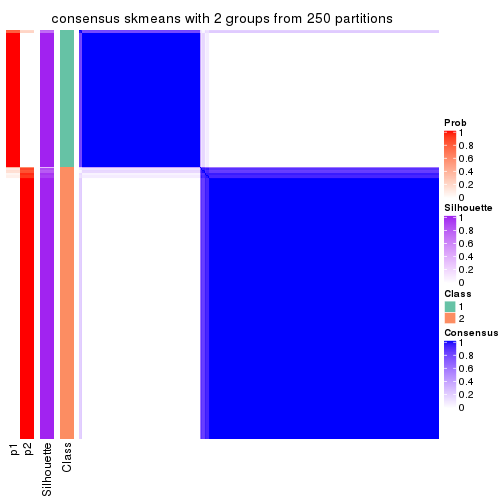</p>

</div>
<div id='tab-CV-skmeans-consensus-heatmap-2'>
<pre><code class="r">consensus_heatmap(res, k = 3)
</code></pre>

<p>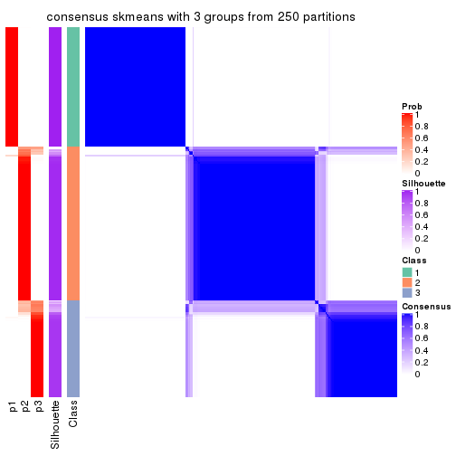</p>

</div>
<div id='tab-CV-skmeans-consensus-heatmap-3'>
<pre><code class="r">consensus_heatmap(res, k = 4)
</code></pre>

<p>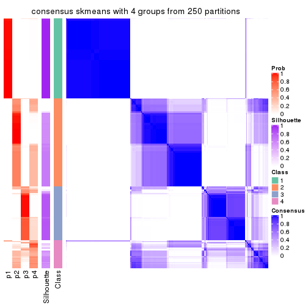</p>

</div>
<div id='tab-CV-skmeans-consensus-heatmap-4'>
<pre><code class="r">consensus_heatmap(res, k = 5)
</code></pre>

<p>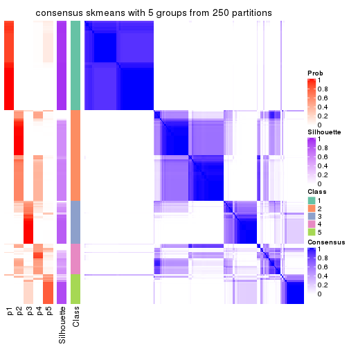</p>

</div>
<div id='tab-CV-skmeans-consensus-heatmap-5'>
<pre><code class="r">consensus_heatmap(res, k = 6)
</code></pre>

<p>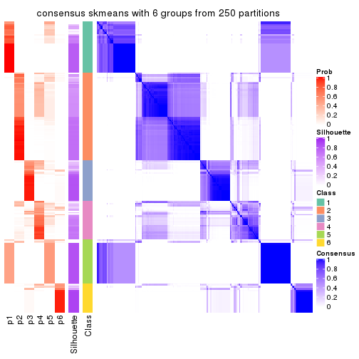</p>

</div>
</div>

Heatmaps for the membership of samples in all partitions to see how consistent they are:


<script>
$( function() {
	$( '#tabs-CV-skmeans-membership-heatmap' ).tabs();
} );
</script>
<div id='tabs-CV-skmeans-membership-heatmap'>
<ul>
<li><a href='#tab-CV-skmeans-membership-heatmap-1'>k = 2</a></li>
<li><a href='#tab-CV-skmeans-membership-heatmap-2'>k = 3</a></li>
<li><a href='#tab-CV-skmeans-membership-heatmap-3'>k = 4</a></li>
<li><a href='#tab-CV-skmeans-membership-heatmap-4'>k = 5</a></li>
<li><a href='#tab-CV-skmeans-membership-heatmap-5'>k = 6</a></li>
</ul>
<div id='tab-CV-skmeans-membership-heatmap-1'>
<pre><code class="r">membership_heatmap(res, k = 2)
</code></pre>

<p>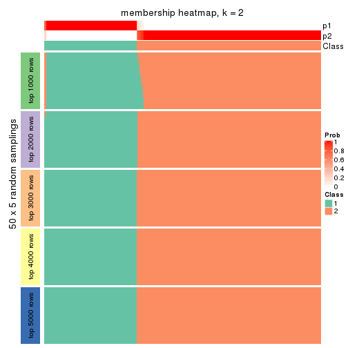</p>

</div>
<div id='tab-CV-skmeans-membership-heatmap-2'>
<pre><code class="r">membership_heatmap(res, k = 3)
</code></pre>

<p>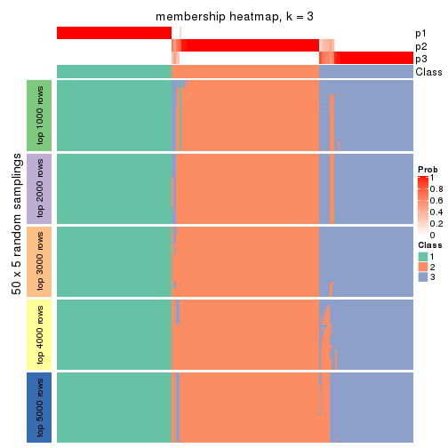</p>

</div>
<div id='tab-CV-skmeans-membership-heatmap-3'>
<pre><code class="r">membership_heatmap(res, k = 4)
</code></pre>

<p>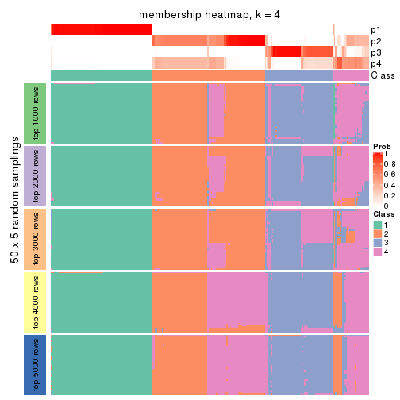</p>

</div>
<div id='tab-CV-skmeans-membership-heatmap-4'>
<pre><code class="r">membership_heatmap(res, k = 5)
</code></pre>

<p>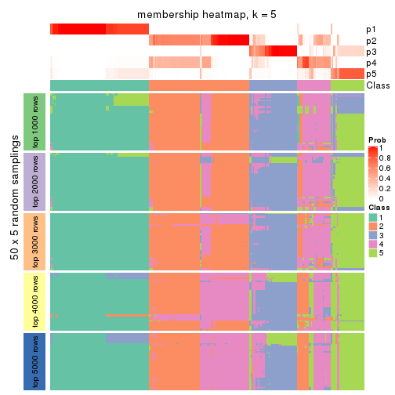</p>

</div>
<div id='tab-CV-skmeans-membership-heatmap-5'>
<pre><code class="r">membership_heatmap(res, k = 6)
</code></pre>

<p>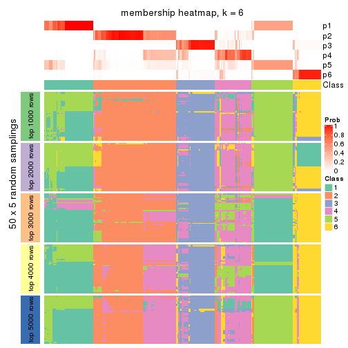</p>

</div>
</div>

As soon as we have had the classes for columns, we can look for signatures
which are significantly different between classes which can be candidate marks
for certain classes. Following are the heatmaps for signatures.


Signature heatmaps where rows are scaled:


<script>
$( function() {
	$( '#tabs-CV-skmeans-get-signatures' ).tabs();
} );
</script>
<div id='tabs-CV-skmeans-get-signatures'>
<ul>
<li><a href='#tab-CV-skmeans-get-signatures-1'>k = 2</a></li>
<li><a href='#tab-CV-skmeans-get-signatures-2'>k = 3</a></li>
<li><a href='#tab-CV-skmeans-get-signatures-3'>k = 4</a></li>
<li><a href='#tab-CV-skmeans-get-signatures-4'>k = 5</a></li>
<li><a href='#tab-CV-skmeans-get-signatures-5'>k = 6</a></li>
</ul>
<div id='tab-CV-skmeans-get-signatures-1'>
<pre><code class="r">get_signatures(res, k = 2)
</code></pre>

<p>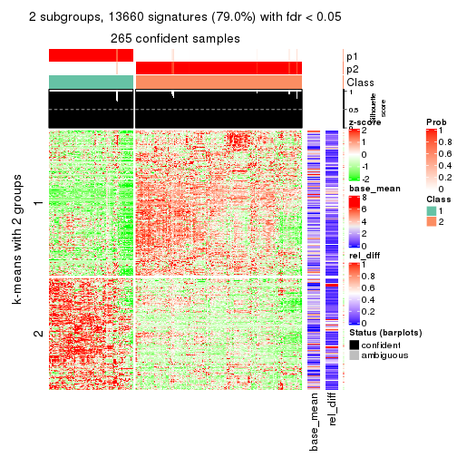</p>

</div>
<div id='tab-CV-skmeans-get-signatures-2'>
<pre><code class="r">get_signatures(res, k = 3)
</code></pre>

<p>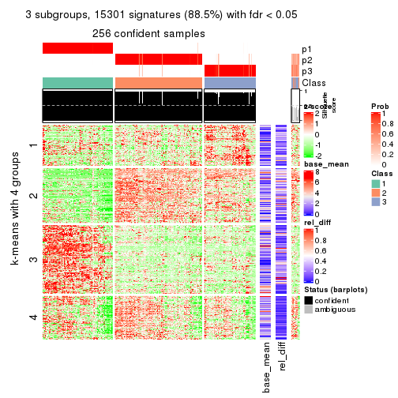</p>

</div>
<div id='tab-CV-skmeans-get-signatures-3'>
<pre><code class="r">get_signatures(res, k = 4)
</code></pre>

<p>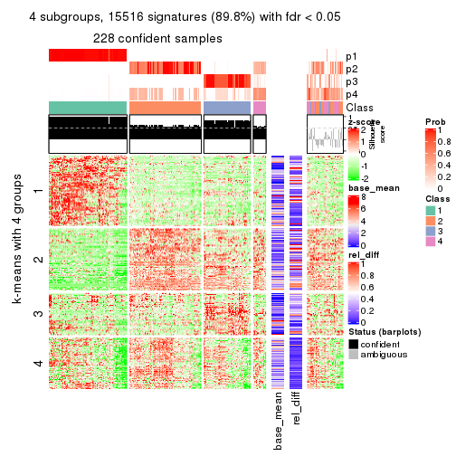</p>

</div>
<div id='tab-CV-skmeans-get-signatures-4'>
<pre><code class="r">get_signatures(res, k = 5)
</code></pre>

<p>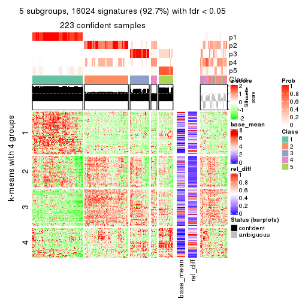</p>

</div>
<div id='tab-CV-skmeans-get-signatures-5'>
<pre><code class="r">get_signatures(res, k = 6)
</code></pre>

<p>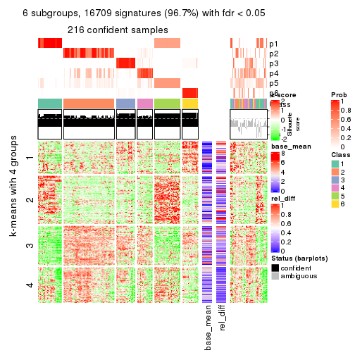</p>

</div>
</div>


Signature heatmaps where rows are not scaled:


<script>
$( function() {
	$( '#tabs-CV-skmeans-get-signatures-no-scale' ).tabs();
} );
</script>
<div id='tabs-CV-skmeans-get-signatures-no-scale'>
<ul>
<li><a href='#tab-CV-skmeans-get-signatures-no-scale-1'>k = 2</a></li>
<li><a href='#tab-CV-skmeans-get-signatures-no-scale-2'>k = 3</a></li>
<li><a href='#tab-CV-skmeans-get-signatures-no-scale-3'>k = 4</a></li>
<li><a href='#tab-CV-skmeans-get-signatures-no-scale-4'>k = 5</a></li>
<li><a href='#tab-CV-skmeans-get-signatures-no-scale-5'>k = 6</a></li>
</ul>
<div id='tab-CV-skmeans-get-signatures-no-scale-1'>
<pre><code class="r">get_signatures(res, k = 2, scale_rows = FALSE)
</code></pre>

<p>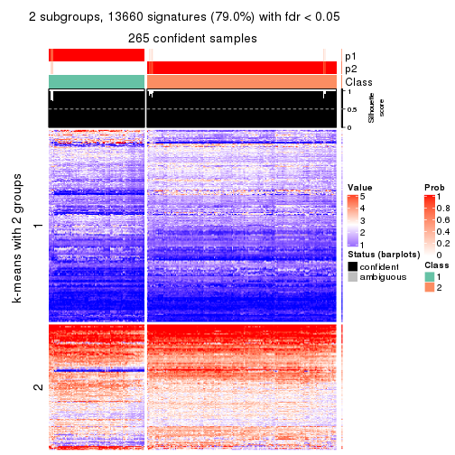</p>

</div>
<div id='tab-CV-skmeans-get-signatures-no-scale-2'>
<pre><code class="r">get_signatures(res, k = 3, scale_rows = FALSE)
</code></pre>

<p>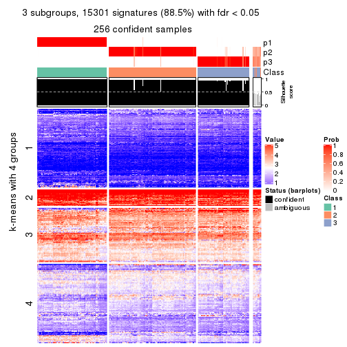</p>

</div>
<div id='tab-CV-skmeans-get-signatures-no-scale-3'>
<pre><code class="r">get_signatures(res, k = 4, scale_rows = FALSE)
</code></pre>

<p>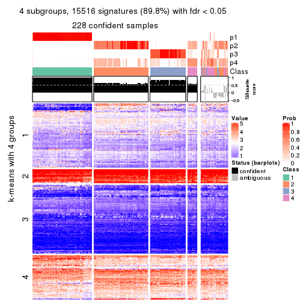</p>

</div>
<div id='tab-CV-skmeans-get-signatures-no-scale-4'>
<pre><code class="r">get_signatures(res, k = 5, scale_rows = FALSE)
</code></pre>

<p>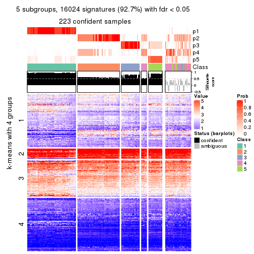</p>

</div>
<div id='tab-CV-skmeans-get-signatures-no-scale-5'>
<pre><code class="r">get_signatures(res, k = 6, scale_rows = FALSE)
</code></pre>

<p>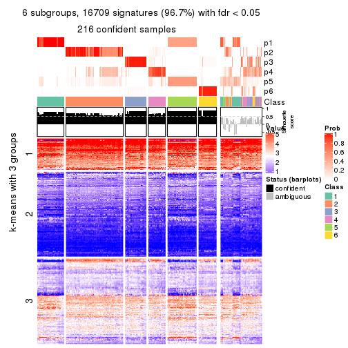</p>

</div>
</div>


Compare the overlap of signatures from different k:

```r
compare_signatures(res)
```

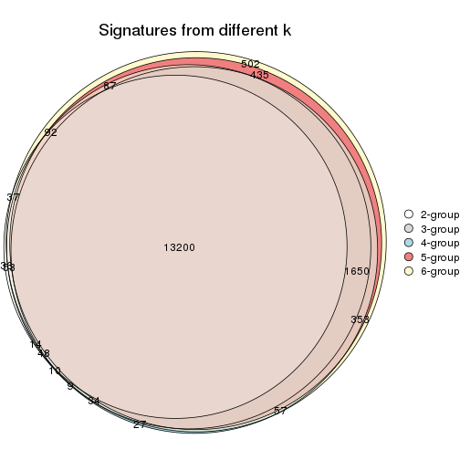

`get_signature()` returns a data frame invisibly. TO get the list of signatures, the function
call should be assigned to a variable explicitly. In following code, if `plot` argument is set
to `FALSE`, no heatmap is plotted while only the differential analysis is performed.

```r
# code only for demonstration
tb = get_signature(res, k = ..., plot = FALSE)
```

An example of the output of `tb` is:

```
#>   which_row         fdr    mean_1    mean_2 scaled_mean_1 scaled_mean_2 km
#> 1        38 0.042760348  8.373488  9.131774    -0.5533452     0.5164555  1
#> 2        40 0.018707592  7.106213  8.469186    -0.6173731     0.5762149  1
#> 3        55 0.019134737 10.221463 11.207825    -0.6159697     0.5749050  1
#> 4        59 0.006059896  5.921854  7.869574    -0.6899429     0.6439467  1
#> 5        60 0.018055526  8.928898 10.211722    -0.6204761     0.5791110  1
#> 6        98 0.009384629 15.714769 14.887706     0.6635654    -0.6193277  2
...
```

The columns in `tb` are:

1. `which_row`: row indices corresponding to the input matrix.
2. `fdr`: FDR for the differential test. 
3. `mean_x`: The mean value in group x.
4. `scaled_mean_x`: The mean value in group x after rows are scaled.
5. `km`: Row groups if k-means clustering is applied to rows.


UMAP plot which shows how samples are separated.


<script>
$( function() {
	$( '#tabs-CV-skmeans-dimension-reduction' ).tabs();
} );
</script>
<div id='tabs-CV-skmeans-dimension-reduction'>
<ul>
<li><a href='#tab-CV-skmeans-dimension-reduction-1'>k = 2</a></li>
<li><a href='#tab-CV-skmeans-dimension-reduction-2'>k = 3</a></li>
<li><a href='#tab-CV-skmeans-dimension-reduction-3'>k = 4</a></li>
<li><a href='#tab-CV-skmeans-dimension-reduction-4'>k = 5</a></li>
<li><a href='#tab-CV-skmeans-dimension-reduction-5'>k = 6</a></li>
</ul>
<div id='tab-CV-skmeans-dimension-reduction-1'>
<pre><code class="r">dimension_reduction(res, k = 2, method = &quot;UMAP&quot;)
</code></pre>

<p>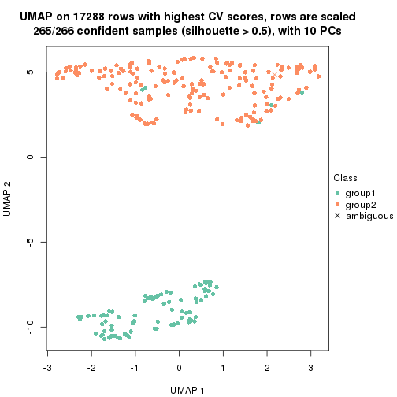</p>

</div>
<div id='tab-CV-skmeans-dimension-reduction-2'>
<pre><code class="r">dimension_reduction(res, k = 3, method = &quot;UMAP&quot;)
</code></pre>

<p>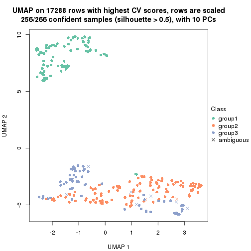</p>

</div>
<div id='tab-CV-skmeans-dimension-reduction-3'>
<pre><code class="r">dimension_reduction(res, k = 4, method = &quot;UMAP&quot;)
</code></pre>

<p>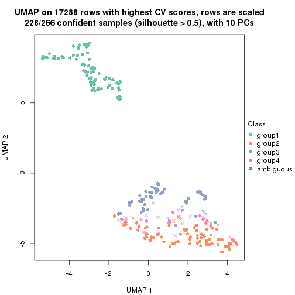</p>

</div>
<div id='tab-CV-skmeans-dimension-reduction-4'>
<pre><code class="r">dimension_reduction(res, k = 5, method = &quot;UMAP&quot;)
</code></pre>

<p>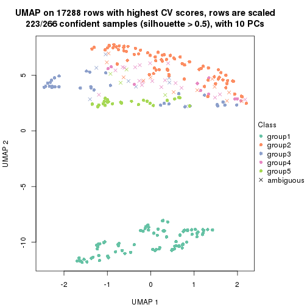</p>

</div>
<div id='tab-CV-skmeans-dimension-reduction-5'>
<pre><code class="r">dimension_reduction(res, k = 6, method = &quot;UMAP&quot;)
</code></pre>

<p>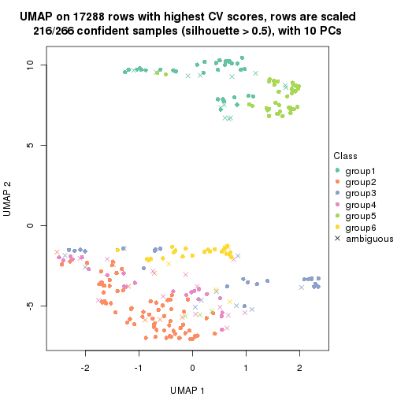</p>

</div>
</div>


Following heatmap shows how subgroups are split when increasing `k`:

```r
collect_classes(res)
```

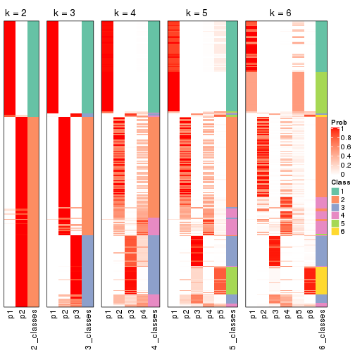


If matrix rows can be associated to genes, consider to use `GO_Enrichment(res,
...)` to perform function enrichment for the signature genes.


 

---------------------------------------------------


### CV:pam**


The object with results only for a single top-value method and a single partition method 
can be extracted as:

```r
res = res_list["CV", "pam"]
# you can also extract it by
# res = res_list["CV:pam"]
```

A summary of `res` and all the functions that can be applied to it:

```r
res
```

```
#> A 'ConsensusPartition' object with k = 2, 3, 4, 5, 6.
#>   On a matrix with 17288 rows and 266 columns.
#>   Top rows (1000, 2000, 3000, 4000, 5000) are extracted by 'CV' method.
#>   Subgroups are detected by 'pam' method.
#>   Performed in total 1250 partitions by row resampling.
#>   Best k for subgroups seems to be 2.
#> 
#> Following methods can be applied to this 'ConsensusPartition' object:
#>  [1] "cola_report"             "collect_classes"         "collect_plots"          
#>  [4] "collect_stats"           "colnames"                "compare_signatures"     
#>  [7] "consensus_heatmap"       "dimension_reduction"     "functional_enrichment"  
#> [10] "get_anno_col"            "get_anno"                "get_classes"            
#> [13] "get_consensus"           "get_matrix"              "get_membership"         
#> [16] "get_param"               "get_signatures"          "get_stats"              
#> [19] "is_best_k"               "is_stable_k"             "membership_heatmap"     
#> [22] "ncol"                    "nrow"                    "plot_ecdf"              
#> [25] "rownames"                "select_partition_number" "show"                   
#> [28] "suggest_best_k"          "test_to_known_factors"
```

`collect_plots()` function collects all the plots made from `res` for all `k` (number of partitions)
into one single page to provide an easy and fast comparison between different `k`.

```r
collect_plots(res)
```

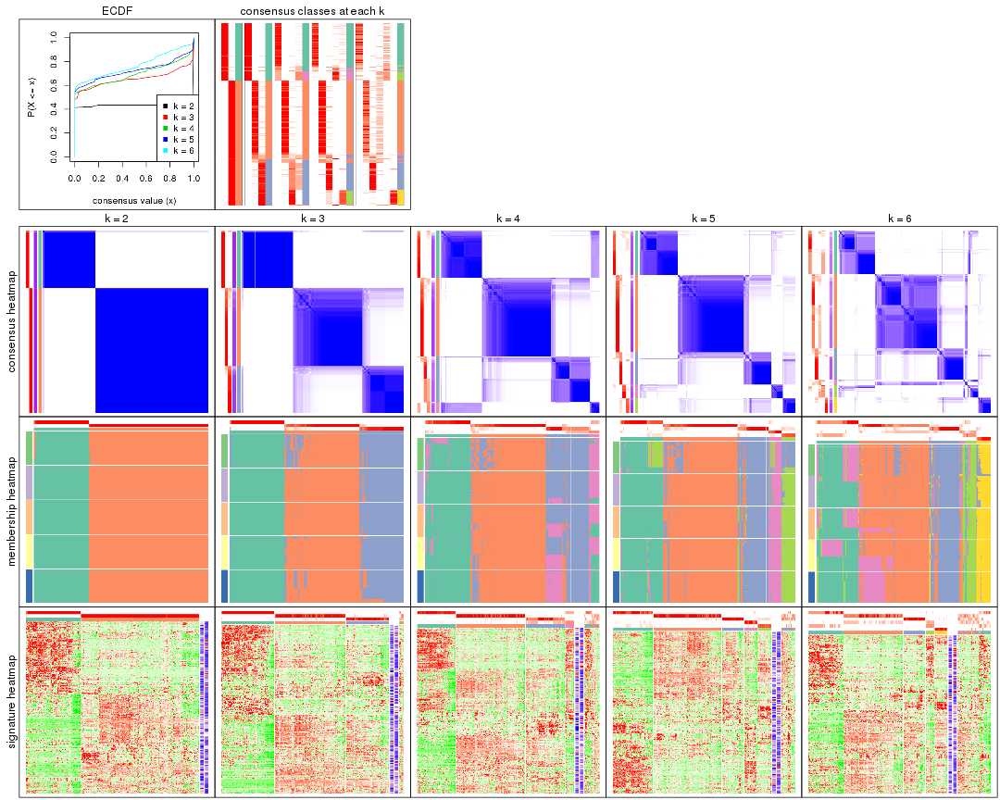

The plots are:

- The first row: a plot of the ECDF (Empirical cumulative distribution
  function) curves of the consensus matrix for each `k` and the heatmap of
  predicted classes for each `k`.
- The second row: heatmaps of the consensus matrix for each `k`.
- The third row: heatmaps of the membership matrix for each `k`.
- The fouth row: heatmaps of the signatures for each `k`.

All the plots in panels can be made by individual functions and they are
plotted later in this section.

`select_partition_number()` produces several plots showing different
statistics for choosing "optimized" `k`. There are following statistics:

- ECDF curves of the consensus matrix for each `k`;
- 1-PAC. [The PAC
  score](https://en.wikipedia.org/wiki/Consensus_clustering#Over-interpretation_potential_of_consensus_clustering)
  measures the proportion of the ambiguous subgrouping.
- Mean silhouette score.
- Concordance. The mean probability of fiting the consensus class ids in all
  partitions.
- Area increased. Denote $A_k$ as the area under the ECDF curve for current
  `k`, the area increased is defined as $A_k - A_{k-1}$.
- Rand index. The percent of pairs of samples that are both in a same cluster
  or both are not in a same cluster in the partition of k and k-1.
- Jaccard index. The ratio of pairs of samples are both in a same cluster in
  the partition of k and k-1 and the pairs of samples are both in a same
  cluster in the partition k or k-1.

The detailed explanations of these statistics can be found in [the cola
vignette](http://bioconductor.org/packages/devel/bioc/vignettes/cola/inst/doc/cola.html#toc_13).

Generally speaking, lower PAC score, higher mean silhouette score or higher
concordance corresponds to better partition. Rand index and Jaccard index
measure how similar the current partition is compared to partition with `k-1`.
If they are too similar, we won't accept `k` is better than `k-1`.

```r
select_partition_number(res)
```

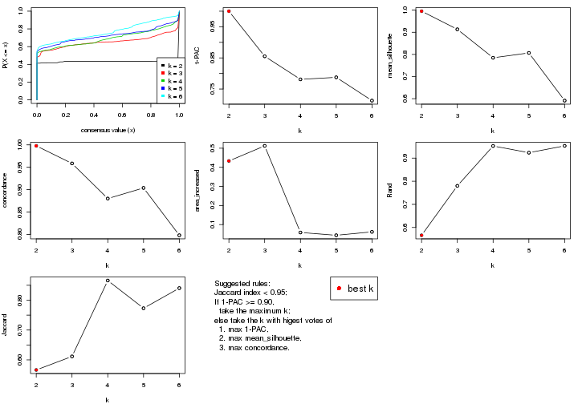

The numeric values for all these statistics can be obtained by `get_stats()`.

```r
get_stats(res)
```

```
#>   k 1-PAC mean_silhouette concordance area_increased  Rand Jaccard
#> 2 2 1.000           0.995       0.998         0.4332 0.566   0.566
#> 3 3 0.855           0.913       0.959         0.5122 0.780   0.612
#> 4 4 0.781           0.785       0.880         0.0586 0.952   0.866
#> 5 5 0.788           0.807       0.904         0.0440 0.924   0.773
#> 6 6 0.713           0.591       0.798         0.0620 0.953   0.840
```

`suggest_best_k()` suggests the best $k$ based on these statistics. The rules are as follows:

- All $k$ with Jaccard index larger than 0.95 are removed because the increase of
  the partition number does not provides enough extra information. If all $k$ are removed,
  the best $k$ is assigned by `NA`.
- For $k$ with 1-PAC larger than 0.9, the maximal $k$ is taken as the "best k". Other $k$ is called "optional k".
- If it does not fit the second rule. The $k$ with the highest vote of highest
  1-PAC, mean silhouette and concordance is taken as the "best k".

```r
suggest_best_k(res)
```

```
#> [1] 2
```


Following shows the table of the partitions (You need to click the **show/hide
code output** link to see it). The membership matrix (columns with name `p*`)
is inferred by
[`clue::cl_consensus()`](https://www.rdocumentation.org/link/cl_consensus?package=clue)
function with the `SE` method. Basically the value in the membership matrix
represents the probability to belong to a certain group. The finall class
label for an item is determined with the group with highest probability it
belongs to.

In `get_classes()` function, the entropy is calculated from the membership
matrix and the silhouette score is calculated from the consensus matrix.


<script>
$( function() {
	$( '#tabs-CV-pam-get-classes' ).tabs();
} );
</script>
<div id='tabs-CV-pam-get-classes'>
<ul>
<li><a href='#tab-CV-pam-get-classes-1'>k = 2</a></li>
<li><a href='#tab-CV-pam-get-classes-2'>k = 3</a></li>
<li><a href='#tab-CV-pam-get-classes-3'>k = 4</a></li>
<li><a href='#tab-CV-pam-get-classes-4'>k = 5</a></li>
<li><a href='#tab-CV-pam-get-classes-5'>k = 6</a></li>
</ul>

<div id='tab-CV-pam-get-classes-1'>
<p><a id='tab-CV-pam-get-classes-1-a' style='color:#0366d6' href='#'>show/hide code output</a></p>
<pre><code class="r">cbind(get_classes(res, k = 2), get_membership(res, k = 2))
</code></pre>

<pre><code>#&gt;                                      class entropy silhouette    p1    p2
#&gt; 80D0AF10-1C61-4B67-90C1-7DBF1EF23672     2   0.000      0.999 0.000 1.000
#&gt; 87117BE1-D328-4972-85DA-6672412D8860     2   0.000      0.999 0.000 1.000
#&gt; F904C5B6-70BD-4604-8254-79BE23B152DA     1   0.000      0.994 1.000 0.000
#&gt; 3182DEA1-4239-4613-925A-7E6503766AD6     2   0.000      0.999 0.000 1.000
#&gt; 55E78EA2-2D9B-481F-8CAB-D36A33088EAE     2   0.000      0.999 0.000 1.000
#&gt; 86F94264-A6DD-4A97-9191-036F066DD0EF     2   0.000      0.999 0.000 1.000
#&gt; 09D25417-23B7-4D88-A0EA-F307985FBBBC     2   0.000      0.999 0.000 1.000
#&gt; C797F12C-40D3-4DB5-B9EF-A6821BBDE4F0     1   0.000      0.994 1.000 0.000
#&gt; 80275DB0-A226-4B6B-A08F-4ADBEEE1DB01     1   0.000      0.994 1.000 0.000
#&gt; 27FB653A-9E07-44AD-952E-9E4DE4AB5891     2   0.000      0.999 0.000 1.000
#&gt; 1A5DB9FC-2ABD-4E1B-B5EF-B1CF5E5F3872     1   0.634      0.814 0.840 0.160
#&gt; 844E4CCD-D30C-416F-A086-8923711A4E25     2   0.000      0.999 0.000 1.000
#&gt; EF18318D-3D25-4D65-803A-ED6E62871E7E     1   0.697      0.774 0.812 0.188
#&gt; 1ACB1BE0-61F6-4243-BBEC-E26A1CF90CA8     1   0.000      0.994 1.000 0.000
#&gt; 8EF0039B-D758-46AB-BAF7-6A062C7C56BA     1   0.000      0.994 1.000 0.000
#&gt; 22F4C9D9-663B-4C91-9692-E035A2640BEC     2   0.000      0.999 0.000 1.000
#&gt; FA1A0BCE-EE0F-4178-B963-62550E344B14     2   0.000      0.999 0.000 1.000
#&gt; 0B6D0C4E-5AE3-4707-A9FC-12A108E6EC2A     2   0.000      0.999 0.000 1.000
#&gt; 06FD3123-2AEB-4911-AC4E-E0E64FD5DB52     2   0.000      0.999 0.000 1.000
#&gt; 235A4492-FF80-4AA5-BC71-DFF65E1C7411     2   0.000      0.999 0.000 1.000
#&gt; A192C6C0-1443-4493-AFAC-1EE710628ADB     2   0.000      0.999 0.000 1.000
#&gt; 6FC5B56B-711B-4174-9B06-4E843124AAB6     1   0.000      0.994 1.000 0.000
#&gt; 7A813F60-A41E-4552-990E-F22287654C1D     2   0.000      0.999 0.000 1.000
#&gt; 725BBFB5-26F4-4512-9C75-47D013C1E605     1   0.000      0.994 1.000 0.000
#&gt; 39CC4E82-EBC9-472E-8BE5-6A3AB178449A     2   0.000      0.999 0.000 1.000
#&gt; 61130DEE-E267-49DF-8B41-7738A06EF738     2   0.000      0.999 0.000 1.000
#&gt; 117EC12C-B7ED-4E01-B29B-EA542D356EA1     1   0.000      0.994 1.000 0.000
#&gt; A30FF708-F7A9-41E4-8AD5-20441650FBC9     2   0.000      0.999 0.000 1.000
#&gt; 53640D52-1167-4A5D-B656-97D32CBA3934     1   0.000      0.994 1.000 0.000
#&gt; 9E85D76A-DD2A-46D5-BB59-0ED302B6258C     2   0.000      0.999 0.000 1.000
#&gt; 6F8C6F90-7E3C-4860-91DD-586708DE44AA     1   0.000      0.994 1.000 0.000
#&gt; E675AEC5-AA9A-4AAA-839C-03E6365822DB     2   0.000      0.999 0.000 1.000
#&gt; B577DEF7-2F5C-4876-A7C6-F18D5722B8C0     1   0.000      0.994 1.000 0.000
#&gt; DA8B577E-43E7-49BF-BF94-868E3194F5C9     1   0.000      0.994 1.000 0.000
#&gt; 3334280B-2A36-4AC7-A021-A76C10E958F0     2   0.000      0.999 0.000 1.000
#&gt; 5CBDDC90-11EC-4E6E-881E-AA9CCFD40FDB     2   0.000      0.999 0.000 1.000
#&gt; 8CBBF32A-8349-44F5-A8B8-4CBB1760A464     2   0.000      0.999 0.000 1.000
#&gt; B9455A9A-136D-4DC2-9F86-0FC74433589D     2   0.000      0.999 0.000 1.000
#&gt; D7EAE2A7-F9BE-4222-A452-B1F83F99CD50     2   0.000      0.999 0.000 1.000
#&gt; F803AE18-60C5-4CFE-AAAB-DB33C26A2184     1   0.000      0.994 1.000 0.000
#&gt; 5DD8CAC7-EC02-43B6-B58E-6D2E22868A3B     2   0.000      0.999 0.000 1.000
#&gt; EE98E1B4-DFB3-4AEC-8527-E1FD544C9475     1   0.000      0.994 1.000 0.000
#&gt; 3CE43921-47D5-4394-B9E1-242607775D61     2   0.000      0.999 0.000 1.000
#&gt; 46986F2B-0B0D-4187-8948-4E91D34B7C49     2   0.000      0.999 0.000 1.000
#&gt; 5D1D052E-74EF-45A8-9B1A-7CECD13EA43B     2   0.000      0.999 0.000 1.000
#&gt; 4C821AD9-A5C9-4A9A-9C5D-363B227F8064     2   0.000      0.999 0.000 1.000
#&gt; 06A4189E-A23B-4AC6-AA74-01955DD7D1E9     2   0.000      0.999 0.000 1.000
#&gt; FCCDC76F-CB02-4BCD-A616-325F258DDAA4     2   0.000      0.999 0.000 1.000
#&gt; DAC53B0A-8F35-4EA6-BBCC-4CD1C049E11F     2   0.000      0.999 0.000 1.000
#&gt; DD4F845B-CAD3-44CB-9D96-3C3F5BA1B72D     1   0.000      0.994 1.000 0.000
#&gt; D440F004-A4A4-41B6-BED8-805D67BA01C7     2   0.000      0.999 0.000 1.000
#&gt; A497C423-119F-42FA-BF17-9F6DFD2A5585     2   0.000      0.999 0.000 1.000
#&gt; 3420E573-DE12-4EF5-B1C0-2FCA904F4F4E     1   0.000      0.994 1.000 0.000
#&gt; 1AD72157-A254-44B4-BA58-4F30F1AE910E     1   0.000      0.994 1.000 0.000
#&gt; C1113977-B160-45EE-B061-750F9EA3F33F     2   0.000      0.999 0.000 1.000
#&gt; 6783AB5B-F07C-447B-BF13-C34485D246D7     2   0.000      0.999 0.000 1.000
#&gt; 1F553062-26FD-4A7F-B7FB-81184604F423     1   0.000      0.994 1.000 0.000
#&gt; BE2DCA51-1C21-4598-98A7-F2FB9B2DFCB4     2   0.000      0.999 0.000 1.000
#&gt; 38941CF3-9C54-4BA4-A005-CC88CA97D504     2   0.000      0.999 0.000 1.000
#&gt; 51CB675E-E243-4A07-BF4A-580473D26FDA     2   0.000      0.999 0.000 1.000
#&gt; C7FED0F5-C27A-4405-9232-30BF39362CF7     2   0.000      0.999 0.000 1.000
#&gt; 2A1E86E8-4713-465F-ACFF-C584864C57A1     2   0.000      0.999 0.000 1.000
#&gt; B4500785-0FAA-4D4D-8630-43D194BAB004     2   0.000      0.999 0.000 1.000
#&gt; 3FD52E66-AB76-4079-80DB-281A795D1EC0     2   0.000      0.999 0.000 1.000
#&gt; EBD355D1-1226-4DFD-AAFF-45D246B64F3C     2   0.000      0.999 0.000 1.000
#&gt; 5A040A73-CD95-487E-8AEF-9639FE4E2916     2   0.000      0.999 0.000 1.000
#&gt; CF629C65-585D-476D-B081-3E6E0575FAE3     2   0.343      0.932 0.064 0.936
#&gt; 0D4202A3-808E-413F-9BF3-9CFCCAE0ED61     2   0.000      0.999 0.000 1.000
#&gt; 43E715BF-28D9-4B5E-B762-8CD1B69A430E     1   0.000      0.994 1.000 0.000
#&gt; BFB82BE8-9DAC-4099-8B38-0950308E3EB3     2   0.000      0.999 0.000 1.000
#&gt; F7CB1825-2303-4DD2-AE1F-7205738EAF1F     1   0.000      0.994 1.000 0.000
#&gt; FE298483-C42C-4753-BABB-29A9CB1B6312     1   0.000      0.994 1.000 0.000
#&gt; A98C7561-1B42-4CD6-AE71-924B91FA4C33     2   0.000      0.999 0.000 1.000
#&gt; 58098F21-7DAB-47DA-9A41-8D20BF3B9257     2   0.000      0.999 0.000 1.000
#&gt; 18CAF708-20B9-4745-9CB3-37AB6E0B3056     2   0.000      0.999 0.000 1.000
#&gt; 2C80DD72-C9C7-4AC2-812F-9A31EF02779C     1   0.000      0.994 1.000 0.000
#&gt; 68A3F13D-319D-4603-A27F-B5DD46FE5C5B     2   0.000      0.999 0.000 1.000
#&gt; 7EE8F0CE-CDC9-40F9-A1DE-7F8140EC6D13     2   0.000      0.999 0.000 1.000
#&gt; 39019903-5B9C-4665-BD5F-7CCB19CB55C5     2   0.000      0.999 0.000 1.000
#&gt; 190EDB27-4CBC-4E9C-9B67-D51FDAB982B7     2   0.000      0.999 0.000 1.000
#&gt; EB2D95BC-62F8-4669-9308-D37D7FB79E23     2   0.000      0.999 0.000 1.000
#&gt; A08B85EA-D1E7-4B77-8DEC-36294305B9F7     1   0.000      0.994 1.000 0.000
#&gt; 130DDFAD-6EF8-4C80-BD9D-88308A6874BC     2   0.000      0.999 0.000 1.000
#&gt; 7340A5BA-E002-448F-AACC-E7A37DBB79C2     2   0.000      0.999 0.000 1.000
#&gt; A771F6E3-D266-4FE7-98C6-C40E6A701D59     1   0.000      0.994 1.000 0.000
#&gt; 015E792C-EC1B-49BF-AB07-D82B20C5989A     2   0.000      0.999 0.000 1.000
#&gt; BF79E030-47EE-4D08-B910-5685A4BD8B60     2   0.000      0.999 0.000 1.000
#&gt; FB3C7C9A-2F2D-4DD5-BE47-FAFB072C0FAB     2   0.000      0.999 0.000 1.000
#&gt; 4E5557BA-10E8-4723-908E-DD04EF6639B2     2   0.000      0.999 0.000 1.000
#&gt; 8031B550-40A9-4A3A-9F7D-CDC052288BD8     2   0.000      0.999 0.000 1.000
#&gt; 55299A06-3C1F-45A4-B166-B2C591C0CEE2     2   0.000      0.999 0.000 1.000
#&gt; EB8D5168-216E-4ABB-8B4E-9E67786CB322     1   0.000      0.994 1.000 0.000
#&gt; 78BD2D83-9A7F-42E5-BB38-654AA0761A0A     2   0.000      0.999 0.000 1.000
#&gt; AA2D53E5-D389-4332-9DD5-A736052E48F8     1   0.000      0.994 1.000 0.000
#&gt; 62945C7A-9313-4FC9-820C-B0AB820B394E     1   0.000      0.994 1.000 0.000
#&gt; 22746046-2E99-4EE9-97D2-BA2EA499634C     2   0.000      0.999 0.000 1.000
#&gt; 8671B51B-DCBE-4429-9F01-AF51CAD7014F     2   0.000      0.999 0.000 1.000
#&gt; E815AB36-5689-4A0D-8E6D-2EAA73406681     1   0.000      0.994 1.000 0.000
#&gt; A1DACB46-ED52-4E38-B2C8-57256BB22B5E     2   0.000      0.999 0.000 1.000
#&gt; 4F5498C4-A423-4B3D-AC98-D4E214A57D0E     1   0.000      0.994 1.000 0.000
#&gt; A7772CCD-FFFF-49DD-86ED-0BAD330EC9B6     2   0.000      0.999 0.000 1.000
#&gt; E6E3DF78-65B9-4F74-8DA8-E2A6D4EDBEA7     2   0.000      0.999 0.000 1.000
#&gt; 83286E2D-E708-437A-911A-E6B050273CBD     1   0.000      0.994 1.000 0.000
#&gt; EC5C7C97-EE8C-405D-A039-D96514B1D414     2   0.000      0.999 0.000 1.000
#&gt; 3E55223D-6E3D-4027-9819-67E91212531D     1   0.000      0.994 1.000 0.000
#&gt; 99A036A2-8343-4D06-8047-D84E96CE4C61     2   0.000      0.999 0.000 1.000
#&gt; CA6CDE6D-92DE-4259-9E58-A373F2D543EA     2   0.000      0.999 0.000 1.000
#&gt; BF6FA8CC-60C1-413A-B2C6-54CCACBC01D6     1   0.000      0.994 1.000 0.000
#&gt; E0594CFE-F7B6-4546-B130-30DF6A514B1F     2   0.000      0.999 0.000 1.000
#&gt; E769E41D-5949-42C5-9594-E563C05ACE52     2   0.000      0.999 0.000 1.000
#&gt; 01373725-5D3C-4D9C-AABC-911D53E62BCD     2   0.000      0.999 0.000 1.000
#&gt; 1F39DADD-3655-474E-BA4C-A5BD32C97A8B     1   0.000      0.994 1.000 0.000
#&gt; AF573EC8-E4EE-4B8F-8199-9817B9FAC67D     1   0.000      0.994 1.000 0.000
#&gt; 3F022CBC-41C8-4387-A6FB-124C4BCD1AD9     1   0.000      0.994 1.000 0.000
#&gt; 1CC32ACE-826B-494B-8B89-5BD92327A74D     2   0.000      0.999 0.000 1.000
#&gt; 22B0BD3B-EE08-4BC7-90B2-01C372A56BA2     2   0.000      0.999 0.000 1.000
#&gt; 0F3DE9EF-19CC-4D14-9A42-1435DB537F94     2   0.000      0.999 0.000 1.000
#&gt; 87F8A33F-FBC3-469E-862B-84472F796358     2   0.000      0.999 0.000 1.000
#&gt; C9F2FA0D-1A9F-40B4-BD9B-CAF1B3F3D5A7     2   0.000      0.999 0.000 1.000
#&gt; ACFC9F59-78FF-4453-B25F-8834D0EAB54A     2   0.000      0.999 0.000 1.000
#&gt; B7AC7D5B-14E9-45A7-93B7-226EE508544A     2   0.000      0.999 0.000 1.000
#&gt; 4491BF17-B168-4E96-8E09-EF1AEC9F5E9D     2   0.000      0.999 0.000 1.000
#&gt; 557A0811-A3FE-4CF4-A24D-FBB77E7F9139     2   0.000      0.999 0.000 1.000
#&gt; 6F9C955C-6816-4353-922A-8035B50FACC6     2   0.000      0.999 0.000 1.000
#&gt; 3E89FB1C-4A7D-43C7-823C-04E3716A7935     2   0.000      0.999 0.000 1.000
#&gt; 12ABE483-66EF-4237-94C4-0199FAE23FA8     2   0.000      0.999 0.000 1.000
#&gt; 7535F262-9B96-44F6-988C-4C9EBB3FFCA9     2   0.000      0.999 0.000 1.000
#&gt; 65C9D28E-303B-40E5-84F0-2507F5457374     2   0.000      0.999 0.000 1.000
#&gt; FD445384-6BA9-4297-9D9C-12ABA7D645C7     1   0.000      0.994 1.000 0.000
#&gt; 30D5E255-2AD3-44F3-8983-1B80E4FD3E2D     2   0.000      0.999 0.000 1.000
#&gt; 3E88EC60-B4A8-4259-8BC8-A234800F6955     2   0.000      0.999 0.000 1.000
#&gt; ACD73CE8-AFC5-47A0-9383-3CB97F018953     1   0.000      0.994 1.000 0.000
#&gt; 1AFDC2EA-26A8-44E2-8BCB-F34F7B66F8C8     2   0.000      0.999 0.000 1.000
#&gt; 9E327BC8-1D20-4AD8-83F7-FB2D13BCA5D0     2   0.000      0.999 0.000 1.000
#&gt; 85A86B91-4F24-4E77-AE2D-520F8E205EFC     1   0.000      0.994 1.000 0.000
#&gt; 74868C37-8143-4306-81CA-E45759D146CD     2   0.000      0.999 0.000 1.000
#&gt; 69AEA0DB-E335-48A0-A398-4FB0D581182A     2   0.000      0.999 0.000 1.000
#&gt; AE6F8B89-85C2-42B7-8D05-AFDDD4FEFD16     1   0.000      0.994 1.000 0.000
#&gt; A8A6F09C-9812-4457-9A4B-AD41F97B41A3     2   0.000      0.999 0.000 1.000
#&gt; 1A09BC4D-EF29-42DD-BB04-A3C264A3032D     1   0.000      0.994 1.000 0.000
#&gt; E0961A30-A62C-4235-9CF0-A1776827A996     2   0.000      0.999 0.000 1.000
#&gt; 134D2D90-7B08-4F20-8A3A-C77643FB208F     2   0.000      0.999 0.000 1.000
#&gt; A77C2DFF-93CF-4CB5-B3C1-81133D7F1A0F     2   0.000      0.999 0.000 1.000
#&gt; EA2DC457-9C74-4B9C-B3FA-5E72199B24A7     2   0.000      0.999 0.000 1.000
#&gt; FF34117B-5EE4-4C96-A8A2-2CE6A654CBE5     1   0.000      0.994 1.000 0.000
#&gt; 75F7B5E2-6559-4B48-A2A4-287C35C559CC     1   0.000      0.994 1.000 0.000
#&gt; 903BF591-B0AF-4BEE-B625-60B673070344     2   0.000      0.999 0.000 1.000
#&gt; 9DE1B790-C63C-41C4-9477-CE52A8119C67     2   0.000      0.999 0.000 1.000
#&gt; 9A28F80A-85F8-40E2-A32B-230EF93B2FA0     2   0.000      0.999 0.000 1.000
#&gt; 0AA2BDBB-8720-409A-AA72-1F4AA26E7CD8     2   0.000      0.999 0.000 1.000
#&gt; 5AD49F16-E974-4E5D-B1B6-073ECB73A01D     2   0.000      0.999 0.000 1.000
#&gt; CB0F961C-527D-4A48-9408-286B26BD9532     1   0.000      0.994 1.000 0.000
#&gt; 46FF25B6-D01D-4CA7-80B7-CEC2998C34E1     2   0.000      0.999 0.000 1.000
#&gt; 487CADE1-D699-4A6C-817A-B9A0AB940C61     1   0.000      0.994 1.000 0.000
#&gt; 4FF6F2D8-F869-4735-A4D1-1A8423153FBC     1   0.000      0.994 1.000 0.000
#&gt; 6005494F-5D3D-43A3-B3E8-8C91955B2A98     2   0.000      0.999 0.000 1.000
#&gt; CF10D584-CE32-45A4-A932-E9D5AF12A6A0     1   0.000      0.994 1.000 0.000
#&gt; E15CE4AB-5646-49C8-9CD6-938457036BB0     2   0.000      0.999 0.000 1.000
#&gt; 31E28D0B-0E69-4330-82ED-4F1827DC97EA     2   0.000      0.999 0.000 1.000
#&gt; DBACD3C3-CCB5-4478-BA78-85A0C847CA66     2   0.000      0.999 0.000 1.000
#&gt; 5A07041C-65EB-4FCD-8940-E90B905061B5     2   0.000      0.999 0.000 1.000
#&gt; 0EA7C916-FA47-489B-BC98-4D9E7D197628     1   0.000      0.994 1.000 0.000
#&gt; 30967F75-8499-47FF-ADA4-4DC566013F7B     1   0.000      0.994 1.000 0.000
#&gt; D2E528FF-AEA2-48D7-A60A-4C3E71EA9073     2   0.000      0.999 0.000 1.000
#&gt; 22735DCD-215E-48BC-BF44-32BD66F06E39     2   0.000      0.999 0.000 1.000
#&gt; BC2C3248-7FC6-48BC-96C1-45EA573DE7DC     1   0.000      0.994 1.000 0.000
#&gt; E72CEBCB-D686-4B12-BCBA-EC8F964330A2     1   0.000      0.994 1.000 0.000
#&gt; 23C937BB-BA20-4440-B680-914229CC3ADF     1   0.000      0.994 1.000 0.000
#&gt; 947E99C7-F402-4F1A-A6E9-81BCAAED135A     2   0.000      0.999 0.000 1.000
#&gt; 02475D11-FC81-4E88-944E-173C32DC3FE7     2   0.184      0.971 0.028 0.972
#&gt; F972A9AA-9842-4343-A533-A795E65581CE     1   0.000      0.994 1.000 0.000
#&gt; 05043AAF-3095-4C61-B5C1-EE9AA9082C75     2   0.000      0.999 0.000 1.000
#&gt; CECF7967-862E-428C-BB42-FEF553FDB3AA     2   0.000      0.999 0.000 1.000
#&gt; FB0B9483-6302-48C7-BE5B-DA667E00AE2D     2   0.000      0.999 0.000 1.000
#&gt; 78700FBA-1487-4754-9B30-18837BF7E9FB     1   0.000      0.994 1.000 0.000
#&gt; 2166F56D-54CE-4F1B-8F07-A4E13E4489E9     1   0.000      0.994 1.000 0.000
#&gt; 7CD0942E-E39A-43A7-8BAC-F25967864901     2   0.000      0.999 0.000 1.000
#&gt; 3B00BA2B-7F7D-4825-8F8D-90F04A5DE687     2   0.000      0.999 0.000 1.000
#&gt; 7465B01D-C05E-4FE0-A9FE-182920EDC489     2   0.000      0.999 0.000 1.000
#&gt; 88C31A99-F96E-4FC8-8B3D-C1AAA05062D9     1   0.000      0.994 1.000 0.000
#&gt; 53575575-3303-4F8F-B6A8-B42131CFB4AC     2   0.000      0.999 0.000 1.000
#&gt; CC8017C7-4128-48DA-8E43-503F63158D85     1   0.000      0.994 1.000 0.000
#&gt; 88449D2A-2A25-41A4-B91D-C99B58F8ECD9     2   0.000      0.999 0.000 1.000
#&gt; 46C7DDE5-A2B5-494F-96AE-0B6E2D51B003     1   0.000      0.994 1.000 0.000
#&gt; 42551D05-5EE5-4F91-93A8-32DA695D9DFA     2   0.000      0.999 0.000 1.000
#&gt; 0772DA48-3A36-422D-B166-CA1691B782C3     2   0.000      0.999 0.000 1.000
#&gt; 30346897-EC77-4153-88A2-D14593C8B741     2   0.000      0.999 0.000 1.000
#&gt; 0F00E267-C748-4A71-8B36-03C410641D88     2   0.000      0.999 0.000 1.000
#&gt; 4034703A-4DA9-4DDA-9CA9-E80FFE9CCDE6     2   0.000      0.999 0.000 1.000
#&gt; 393C8A41-CF45-4EA8-AFE3-25A08AB7692A     2   0.000      0.999 0.000 1.000
#&gt; 3354212D-A07C-435C-8B0C-9A7BAAB624B5     1   0.000      0.994 1.000 0.000
#&gt; 57E30D4E-ABF7-47DD-92BE-40CE215076B0     1   0.000      0.994 1.000 0.000
#&gt; 202B4C76-C840-4DB8-953F-AC75A4156FDD     2   0.000      0.999 0.000 1.000
#&gt; 93A0137B-1F4C-44EE-B959-2AD0CD2DF8B6     1   0.000      0.994 1.000 0.000
#&gt; C9794DB6-6E8C-4AFD-80EE-61D672A4F6E9     2   0.000      0.999 0.000 1.000
#&gt; AE4BFE63-F0C0-4624-AD97-4F7FF13E2384     1   0.000      0.994 1.000 0.000
#&gt; DCF87F27-2B54-42D9-8D28-5DFEE76E2F5B     2   0.000      0.999 0.000 1.000
#&gt; 2451D405-39FD-4812-958C-23462B66F1F1     2   0.000      0.999 0.000 1.000
#&gt; E27F5D33-3F68-4CA8-8757-A387C6EAD060     2   0.000      0.999 0.000 1.000
#&gt; 8BA9928A-5B93-477F-B4A2-D031B714D9AC     1   0.000      0.994 1.000 0.000
#&gt; 0FAACFF6-B50C-4BED-9824-B7270654F28D     2   0.000      0.999 0.000 1.000
#&gt; 3366CC3C-2BBA-4CA7-848E-4E16AA70AE7A     2   0.000      0.999 0.000 1.000
#&gt; 66237056-CA9A-4C90-AF0E-1621FEB71578     2   0.000      0.999 0.000 1.000
#&gt; C480F1FB-3100-436C-B0F5-DED63B7A580E     2   0.000      0.999 0.000 1.000
#&gt; A327DE0D-D945-4B42-9B41-A7302CF796EE     2   0.000      0.999 0.000 1.000
#&gt; E8A6871D-67FB-4306-9454-F5E7CDBA399A     2   0.000      0.999 0.000 1.000
#&gt; E9A7485B-82B6-4BD2-AFBB-DD0A82D6CDE2     1   0.000      0.994 1.000 0.000
#&gt; 93B382E4-9C9A-43F5-BD3B-502CC260B886     1   0.000      0.994 1.000 0.000
#&gt; A2792419-8E16-45FE-A524-17851F34AB9B     2   0.000      0.999 0.000 1.000
#&gt; 4DED1201-F25C-4F82-BABF-965EFAD7A8E5     2   0.000      0.999 0.000 1.000
#&gt; F1ACB2DD-E948-4F88-A249-F1BD1977D667     2   0.000      0.999 0.000 1.000
#&gt; 6CDBA203-8952-421D-A6BF-75652D9F3339     2   0.000      0.999 0.000 1.000
#&gt; 2D6C5AA7-3B33-48D7-AE0C-77A16B749D13     1   0.605      0.830 0.852 0.148
#&gt; 3F6B6D95-0720-42A0-AEB3-89FECAE7616A     2   0.000      0.999 0.000 1.000
#&gt; DED8ACF3-BBD8-46C9-85C9-A9C8F2E2BC0B     1   0.000      0.994 1.000 0.000
#&gt; 77069279-5A6F-42C0-9AA5-8C939591DFB5     1   0.000      0.994 1.000 0.000
#&gt; B2D4FCF3-FDF9-41C8-880A-6732CF6222AF     2   0.000      0.999 0.000 1.000
#&gt; 1CD71A4C-1E49-48EF-AA72-CB3C26B4C087     2   0.000      0.999 0.000 1.000
#&gt; C364E621-F85C-4B7F-842F-210B8D4DFE3A     2   0.000      0.999 0.000 1.000
#&gt; 11F1B8CA-07C1-47D2-A3C6-032FFA6A4A64     1   0.000      0.994 1.000 0.000
#&gt; 153BF804-6DC8-496B-987A-4021A2512211     2   0.000      0.999 0.000 1.000
#&gt; 5B5029C9-40F5-40D7-A36A-367022AD6A42     2   0.000      0.999 0.000 1.000
#&gt; 193CCBE6-104F-49B4-BDB2-C82EE36FDAAD     1   0.000      0.994 1.000 0.000
#&gt; E5D45E53-FCF3-4F01-9B78-6CB1ED0CFE40     2   0.000      0.999 0.000 1.000
#&gt; 5546A779-21DB-49F9-8C0D-A1E420088084     2   0.000      0.999 0.000 1.000
#&gt; E14825E0-0DC7-44C2-B265-F54672356838     1   0.000      0.994 1.000 0.000
#&gt; 8C8C09B9-EC83-45EC-BC4C-0BA92DE60ACB     1   0.000      0.994 1.000 0.000
#&gt; B388CA82-5BF7-4BDD-8821-4EC0B213121F     2   0.000      0.999 0.000 1.000
#&gt; A26025AC-9F71-4C07-9135-83593193BBB2     1   0.000      0.994 1.000 0.000
#&gt; C80E6D4B-AF21-42F0-8E20-6F7D2E99C062     2   0.000      0.999 0.000 1.000
#&gt; 5AE5D819-A6B1-4761-B7F9-8FFD3C520F31     2   0.000      0.999 0.000 1.000
#&gt; CAE8097F-A139-4C6E-9E30-35080475FF34     2   0.000      0.999 0.000 1.000
#&gt; 539C8DE3-6152-4671-B96F-ED6DC6DBD22B     1   0.000      0.994 1.000 0.000
#&gt; 5D28A8E0-4ECF-43A4-890A-BE968B9A8CB2     2   0.000      0.999 0.000 1.000
#&gt; 97A80AF8-365E-4756-A2B0-AEB1D8F5F33E     2   0.000      0.999 0.000 1.000
#&gt; B3527517-E339-46AE-8437-65303C309015     2   0.000      0.999 0.000 1.000
#&gt; 523E2183-AA20-4749-BD7E-69CD620DD6A3     2   0.000      0.999 0.000 1.000
#&gt; E553FB92-F181-47B3-9F3D-11DB51DFA3A4     2   0.000      0.999 0.000 1.000
#&gt; FFE0C4B1-8EEC-484A-AB87-3401B71BD081     2   0.000      0.999 0.000 1.000
#&gt; 73D6CA4B-9A9E-4E52-96C8-AE7F0CC8B276     2   0.000      0.999 0.000 1.000
#&gt; 485A8107-DF9A-4BC6-8A72-07FBA93F10F2     1   0.000      0.994 1.000 0.000
#&gt; 690823D9-B9AA-40EF-8302-4AD88BF89D1C     2   0.000      0.999 0.000 1.000
#&gt; B4E02660-562F-4EAC-8472-CBBD8A577688     2   0.000      0.999 0.000 1.000
#&gt; F82D5A60-90F9-4FF4-971E-73F7535FE65A     2   0.000      0.999 0.000 1.000
#&gt; C48401F7-2D56-4C6F-9896-C5435D1B44BF     2   0.000      0.999 0.000 1.000
#&gt; 94FC8991-182B-4B00-9A06-A00E8D3BDCFA     1   0.000      0.994 1.000 0.000
#&gt; FF00E80A-046D-4233-835E-CDF93403EA43     2   0.000      0.999 0.000 1.000
#&gt; C47A53F6-6479-4AD3-9D18-E4A70BE5F1DC     2   0.000      0.999 0.000 1.000
#&gt; 3487AE2D-AB1D-4DEF-AC4B-4B0FCAF8D899     2   0.000      0.999 0.000 1.000
#&gt; 479CD9BB-ECD7-41D5-B1E4-41132FF7FC95     2   0.000      0.999 0.000 1.000
#&gt; 048ADC6E-8C7E-4875-ACEE-E4787203C078     1   0.000      0.994 1.000 0.000
#&gt; 25AF81C5-B117-466D-AE9F-DD10BCB6AF2D     2   0.000      0.999 0.000 1.000
#&gt; 8B1D51D6-0B25-4289-81F0-9F95E0258877     2   0.000      0.999 0.000 1.000
#&gt; 282D390D-8E4E-4A19-B2B7-A6DB4BB2D46C     1   0.000      0.994 1.000 0.000
#&gt; BC6B92C1-F425-40C5-9941-539BFF5FE0FE     2   0.000      0.999 0.000 1.000
#&gt; 899CB9E0-48D0-413D-8566-BC151F146453     1   0.000      0.994 1.000 0.000
#&gt; 441400A9-1427-45E0-A8B4-EF2A6B7465C2     2   0.000      0.999 0.000 1.000
#&gt; CF96DDD4-DC0A-4341-BDE6-4DA2CB4978D0     1   0.000      0.994 1.000 0.000
#&gt; CE91F591-6072-4D29-9495-C78961635969     2   0.000      0.999 0.000 1.000
#&gt; 84D25635-2A38-4CFB-BFAC-38C007625C42     1   0.000      0.994 1.000 0.000
#&gt; ABF1AC12-872A-4C3D-A76C-07BC36A4DA5E     1   0.000      0.994 1.000 0.000
#&gt; B7F7F66F-1AED-4199-81C0-5C7FB0DBF438     2   0.000      0.999 0.000 1.000
#&gt; BAB786B9-6C20-425D-9886-63A0A092B59B     2   0.000      0.999 0.000 1.000
#&gt; 735D1DE3-D781-4F89-A395-09974057BBB7     1   0.000      0.994 1.000 0.000
#&gt; F6D5FBBA-05C4-4340-86D9-1A54181216A2     2   0.000      0.999 0.000 1.000
#&gt; 79C4E166-4A0D-4811-A2C8-CAE0A5AEED42     2   0.000      0.999 0.000 1.000
</code></pre>

<script>
$('#tab-CV-pam-get-classes-1-a').parent().next().next().hide();
$('#tab-CV-pam-get-classes-1-a').click(function(){
  $('#tab-CV-pam-get-classes-1-a').parent().next().next().toggle();
  return(false);
});
</script>
</div>

<div id='tab-CV-pam-get-classes-2'>
<p><a id='tab-CV-pam-get-classes-2-a' style='color:#0366d6' href='#'>show/hide code output</a></p>
<pre><code class="r">cbind(get_classes(res, k = 3), get_membership(res, k = 3))
</code></pre>

<pre><code>#&gt;                                      class entropy silhouette    p1    p2    p3
#&gt; 80D0AF10-1C61-4B67-90C1-7DBF1EF23672     2  0.0000      0.941 0.000 1.000 0.000
#&gt; 87117BE1-D328-4972-85DA-6672412D8860     2  0.3267      0.863 0.000 0.884 0.116
#&gt; F904C5B6-70BD-4604-8254-79BE23B152DA     1  0.0000      0.987 1.000 0.000 0.000
#&gt; 3182DEA1-4239-4613-925A-7E6503766AD6     2  0.6235      0.253 0.000 0.564 0.436
#&gt; 55E78EA2-2D9B-481F-8CAB-D36A33088EAE     3  0.1031      0.940 0.000 0.024 0.976
#&gt; 86F94264-A6DD-4A97-9191-036F066DD0EF     3  0.1031      0.940 0.000 0.024 0.976
#&gt; 09D25417-23B7-4D88-A0EA-F307985FBBBC     3  0.1031      0.940 0.000 0.024 0.976
#&gt; C797F12C-40D3-4DB5-B9EF-A6821BBDE4F0     1  0.0000      0.987 1.000 0.000 0.000
#&gt; 80275DB0-A226-4B6B-A08F-4ADBEEE1DB01     1  0.0000      0.987 1.000 0.000 0.000
#&gt; 27FB653A-9E07-44AD-952E-9E4DE4AB5891     3  0.0000      0.941 0.000 0.000 1.000
#&gt; 1A5DB9FC-2ABD-4E1B-B5EF-B1CF5E5F3872     1  0.6286      0.144 0.536 0.000 0.464
#&gt; 844E4CCD-D30C-416F-A086-8923711A4E25     3  0.0000      0.941 0.000 0.000 1.000
#&gt; EF18318D-3D25-4D65-803A-ED6E62871E7E     1  0.6180      0.289 0.584 0.000 0.416
#&gt; 1ACB1BE0-61F6-4243-BBEC-E26A1CF90CA8     1  0.0000      0.987 1.000 0.000 0.000
#&gt; 8EF0039B-D758-46AB-BAF7-6A062C7C56BA     1  0.0000      0.987 1.000 0.000 0.000
#&gt; 22F4C9D9-663B-4C91-9692-E035A2640BEC     2  0.0000      0.941 0.000 1.000 0.000
#&gt; FA1A0BCE-EE0F-4178-B963-62550E344B14     2  0.0000      0.941 0.000 1.000 0.000
#&gt; 0B6D0C4E-5AE3-4707-A9FC-12A108E6EC2A     3  0.1031      0.940 0.000 0.024 0.976
#&gt; 06FD3123-2AEB-4911-AC4E-E0E64FD5DB52     2  0.1031      0.930 0.000 0.976 0.024
#&gt; 235A4492-FF80-4AA5-BC71-DFF65E1C7411     2  0.0000      0.941 0.000 1.000 0.000
#&gt; A192C6C0-1443-4493-AFAC-1EE710628ADB     2  0.0000      0.941 0.000 1.000 0.000
#&gt; 6FC5B56B-711B-4174-9B06-4E843124AAB6     1  0.0000      0.987 1.000 0.000 0.000
#&gt; 7A813F60-A41E-4552-990E-F22287654C1D     2  0.0000      0.941 0.000 1.000 0.000
#&gt; 725BBFB5-26F4-4512-9C75-47D013C1E605     1  0.0000      0.987 1.000 0.000 0.000
#&gt; 39CC4E82-EBC9-472E-8BE5-6A3AB178449A     2  0.4291      0.801 0.000 0.820 0.180
#&gt; 61130DEE-E267-49DF-8B41-7738A06EF738     3  0.1031      0.940 0.000 0.024 0.976
#&gt; 117EC12C-B7ED-4E01-B29B-EA542D356EA1     1  0.0000      0.987 1.000 0.000 0.000
#&gt; A30FF708-F7A9-41E4-8AD5-20441650FBC9     2  0.0000      0.941 0.000 1.000 0.000
#&gt; 53640D52-1167-4A5D-B656-97D32CBA3934     1  0.0000      0.987 1.000 0.000 0.000
#&gt; 9E85D76A-DD2A-46D5-BB59-0ED302B6258C     2  0.0000      0.941 0.000 1.000 0.000
#&gt; 6F8C6F90-7E3C-4860-91DD-586708DE44AA     1  0.0000      0.987 1.000 0.000 0.000
#&gt; E675AEC5-AA9A-4AAA-839C-03E6365822DB     3  0.1031      0.940 0.000 0.024 0.976
#&gt; B577DEF7-2F5C-4876-A7C6-F18D5722B8C0     1  0.0000      0.987 1.000 0.000 0.000
#&gt; DA8B577E-43E7-49BF-BF94-868E3194F5C9     1  0.0000      0.987 1.000 0.000 0.000
#&gt; 3334280B-2A36-4AC7-A021-A76C10E958F0     2  0.3752      0.837 0.000 0.856 0.144
#&gt; 5CBDDC90-11EC-4E6E-881E-AA9CCFD40FDB     2  0.0237      0.939 0.000 0.996 0.004
#&gt; 8CBBF32A-8349-44F5-A8B8-4CBB1760A464     2  0.4121      0.813 0.000 0.832 0.168
#&gt; B9455A9A-136D-4DC2-9F86-0FC74433589D     3  0.0000      0.941 0.000 0.000 1.000
#&gt; D7EAE2A7-F9BE-4222-A452-B1F83F99CD50     3  0.5591      0.568 0.000 0.304 0.696
#&gt; F803AE18-60C5-4CFE-AAAB-DB33C26A2184     1  0.0000      0.987 1.000 0.000 0.000
#&gt; 5DD8CAC7-EC02-43B6-B58E-6D2E22868A3B     3  0.0000      0.941 0.000 0.000 1.000
#&gt; EE98E1B4-DFB3-4AEC-8527-E1FD544C9475     1  0.0000      0.987 1.000 0.000 0.000
#&gt; 3CE43921-47D5-4394-B9E1-242607775D61     2  0.0000      0.941 0.000 1.000 0.000
#&gt; 46986F2B-0B0D-4187-8948-4E91D34B7C49     2  0.2066      0.903 0.000 0.940 0.060
#&gt; 5D1D052E-74EF-45A8-9B1A-7CECD13EA43B     2  0.0000      0.941 0.000 1.000 0.000
#&gt; 4C821AD9-A5C9-4A9A-9C5D-363B227F8064     3  0.3686      0.836 0.000 0.140 0.860
#&gt; 06A4189E-A23B-4AC6-AA74-01955DD7D1E9     2  0.0000      0.941 0.000 1.000 0.000
#&gt; FCCDC76F-CB02-4BCD-A616-325F258DDAA4     2  0.0000      0.941 0.000 1.000 0.000
#&gt; DAC53B0A-8F35-4EA6-BBCC-4CD1C049E11F     2  0.0000      0.941 0.000 1.000 0.000
#&gt; DD4F845B-CAD3-44CB-9D96-3C3F5BA1B72D     1  0.0000      0.987 1.000 0.000 0.000
#&gt; D440F004-A4A4-41B6-BED8-805D67BA01C7     2  0.0000      0.941 0.000 1.000 0.000
#&gt; A497C423-119F-42FA-BF17-9F6DFD2A5585     2  0.0000      0.941 0.000 1.000 0.000
#&gt; 3420E573-DE12-4EF5-B1C0-2FCA904F4F4E     1  0.0000      0.987 1.000 0.000 0.000
#&gt; 1AD72157-A254-44B4-BA58-4F30F1AE910E     1  0.0000      0.987 1.000 0.000 0.000
#&gt; C1113977-B160-45EE-B061-750F9EA3F33F     3  0.1289      0.936 0.000 0.032 0.968
#&gt; 6783AB5B-F07C-447B-BF13-C34485D246D7     2  0.3412      0.856 0.000 0.876 0.124
#&gt; 1F553062-26FD-4A7F-B7FB-81184604F423     1  0.0000      0.987 1.000 0.000 0.000
#&gt; BE2DCA51-1C21-4598-98A7-F2FB9B2DFCB4     2  0.0000      0.941 0.000 1.000 0.000
#&gt; 38941CF3-9C54-4BA4-A005-CC88CA97D504     2  0.4796      0.749 0.000 0.780 0.220
#&gt; 51CB675E-E243-4A07-BF4A-580473D26FDA     2  0.0000      0.941 0.000 1.000 0.000
#&gt; C7FED0F5-C27A-4405-9232-30BF39362CF7     2  0.0000      0.941 0.000 1.000 0.000
#&gt; 2A1E86E8-4713-465F-ACFF-C584864C57A1     3  0.1031      0.940 0.000 0.024 0.976
#&gt; B4500785-0FAA-4D4D-8630-43D194BAB004     2  0.0747      0.934 0.000 0.984 0.016
#&gt; 3FD52E66-AB76-4079-80DB-281A795D1EC0     3  0.5859      0.529 0.000 0.344 0.656
#&gt; EBD355D1-1226-4DFD-AAFF-45D246B64F3C     2  0.5327      0.673 0.000 0.728 0.272
#&gt; 5A040A73-CD95-487E-8AEF-9639FE4E2916     2  0.0000      0.941 0.000 1.000 0.000
#&gt; CF629C65-585D-476D-B081-3E6E0575FAE3     3  0.0000      0.941 0.000 0.000 1.000
#&gt; 0D4202A3-808E-413F-9BF3-9CFCCAE0ED61     2  0.0000      0.941 0.000 1.000 0.000
#&gt; 43E715BF-28D9-4B5E-B762-8CD1B69A430E     1  0.0000      0.987 1.000 0.000 0.000
#&gt; BFB82BE8-9DAC-4099-8B38-0950308E3EB3     2  0.0000      0.941 0.000 1.000 0.000
#&gt; F7CB1825-2303-4DD2-AE1F-7205738EAF1F     1  0.0000      0.987 1.000 0.000 0.000
#&gt; FE298483-C42C-4753-BABB-29A9CB1B6312     1  0.0000      0.987 1.000 0.000 0.000
#&gt; A98C7561-1B42-4CD6-AE71-924B91FA4C33     3  0.0000      0.941 0.000 0.000 1.000
#&gt; 58098F21-7DAB-47DA-9A41-8D20BF3B9257     3  0.4399      0.780 0.000 0.188 0.812
#&gt; 18CAF708-20B9-4745-9CB3-37AB6E0B3056     2  0.0000      0.941 0.000 1.000 0.000
#&gt; 2C80DD72-C9C7-4AC2-812F-9A31EF02779C     1  0.0000      0.987 1.000 0.000 0.000
#&gt; 68A3F13D-319D-4603-A27F-B5DD46FE5C5B     2  0.0000      0.941 0.000 1.000 0.000
#&gt; 7EE8F0CE-CDC9-40F9-A1DE-7F8140EC6D13     3  0.0000      0.941 0.000 0.000 1.000
#&gt; 39019903-5B9C-4665-BD5F-7CCB19CB55C5     2  0.0000      0.941 0.000 1.000 0.000
#&gt; 190EDB27-4CBC-4E9C-9B67-D51FDAB982B7     3  0.3192      0.853 0.000 0.112 0.888
#&gt; EB2D95BC-62F8-4669-9308-D37D7FB79E23     2  0.0000      0.941 0.000 1.000 0.000
#&gt; A08B85EA-D1E7-4B77-8DEC-36294305B9F7     1  0.0000      0.987 1.000 0.000 0.000
#&gt; 130DDFAD-6EF8-4C80-BD9D-88308A6874BC     3  0.0000      0.941 0.000 0.000 1.000
#&gt; 7340A5BA-E002-448F-AACC-E7A37DBB79C2     2  0.0000      0.941 0.000 1.000 0.000
#&gt; A771F6E3-D266-4FE7-98C6-C40E6A701D59     1  0.0000      0.987 1.000 0.000 0.000
#&gt; 015E792C-EC1B-49BF-AB07-D82B20C5989A     2  0.4121      0.812 0.000 0.832 0.168
#&gt; BF79E030-47EE-4D08-B910-5685A4BD8B60     3  0.1031      0.940 0.000 0.024 0.976
#&gt; FB3C7C9A-2F2D-4DD5-BE47-FAFB072C0FAB     2  0.5058      0.713 0.000 0.756 0.244
#&gt; 4E5557BA-10E8-4723-908E-DD04EF6639B2     3  0.1031      0.940 0.000 0.024 0.976
#&gt; 8031B550-40A9-4A3A-9F7D-CDC052288BD8     3  0.0000      0.941 0.000 0.000 1.000
#&gt; 55299A06-3C1F-45A4-B166-B2C591C0CEE2     3  0.0000      0.941 0.000 0.000 1.000
#&gt; EB8D5168-216E-4ABB-8B4E-9E67786CB322     1  0.0000      0.987 1.000 0.000 0.000
#&gt; 78BD2D83-9A7F-42E5-BB38-654AA0761A0A     2  0.1031      0.930 0.000 0.976 0.024
#&gt; AA2D53E5-D389-4332-9DD5-A736052E48F8     1  0.0000      0.987 1.000 0.000 0.000
#&gt; 62945C7A-9313-4FC9-820C-B0AB820B394E     1  0.0000      0.987 1.000 0.000 0.000
#&gt; 22746046-2E99-4EE9-97D2-BA2EA499634C     3  0.0000      0.941 0.000 0.000 1.000
#&gt; 8671B51B-DCBE-4429-9F01-AF51CAD7014F     3  0.0000      0.941 0.000 0.000 1.000
#&gt; E815AB36-5689-4A0D-8E6D-2EAA73406681     1  0.0000      0.987 1.000 0.000 0.000
#&gt; A1DACB46-ED52-4E38-B2C8-57256BB22B5E     2  0.3879      0.821 0.000 0.848 0.152
#&gt; 4F5498C4-A423-4B3D-AC98-D4E214A57D0E     1  0.0000      0.987 1.000 0.000 0.000
#&gt; A7772CCD-FFFF-49DD-86ED-0BAD330EC9B6     2  0.3038      0.874 0.000 0.896 0.104
#&gt; E6E3DF78-65B9-4F74-8DA8-E2A6D4EDBEA7     3  0.0000      0.941 0.000 0.000 1.000
#&gt; 83286E2D-E708-437A-911A-E6B050273CBD     1  0.0000      0.987 1.000 0.000 0.000
#&gt; EC5C7C97-EE8C-405D-A039-D96514B1D414     2  0.0237      0.939 0.000 0.996 0.004
#&gt; 3E55223D-6E3D-4027-9819-67E91212531D     1  0.0000      0.987 1.000 0.000 0.000
#&gt; 99A036A2-8343-4D06-8047-D84E96CE4C61     3  0.0000      0.941 0.000 0.000 1.000
#&gt; CA6CDE6D-92DE-4259-9E58-A373F2D543EA     2  0.4796      0.753 0.000 0.780 0.220
#&gt; BF6FA8CC-60C1-413A-B2C6-54CCACBC01D6     1  0.0000      0.987 1.000 0.000 0.000
#&gt; E0594CFE-F7B6-4546-B130-30DF6A514B1F     3  0.3816      0.827 0.000 0.148 0.852
#&gt; E769E41D-5949-42C5-9594-E563C05ACE52     3  0.1031      0.940 0.000 0.024 0.976
#&gt; 01373725-5D3C-4D9C-AABC-911D53E62BCD     3  0.0000      0.941 0.000 0.000 1.000
#&gt; 1F39DADD-3655-474E-BA4C-A5BD32C97A8B     1  0.0000      0.987 1.000 0.000 0.000
#&gt; AF573EC8-E4EE-4B8F-8199-9817B9FAC67D     1  0.0000      0.987 1.000 0.000 0.000
#&gt; 3F022CBC-41C8-4387-A6FB-124C4BCD1AD9     1  0.0000      0.987 1.000 0.000 0.000
#&gt; 1CC32ACE-826B-494B-8B89-5BD92327A74D     3  0.0000      0.941 0.000 0.000 1.000
#&gt; 22B0BD3B-EE08-4BC7-90B2-01C372A56BA2     3  0.0000      0.941 0.000 0.000 1.000
#&gt; 0F3DE9EF-19CC-4D14-9A42-1435DB537F94     2  0.0000      0.941 0.000 1.000 0.000
#&gt; 87F8A33F-FBC3-469E-862B-84472F796358     3  0.4605      0.746 0.000 0.204 0.796
#&gt; C9F2FA0D-1A9F-40B4-BD9B-CAF1B3F3D5A7     2  0.2878      0.871 0.000 0.904 0.096
#&gt; ACFC9F59-78FF-4453-B25F-8834D0EAB54A     3  0.0000      0.941 0.000 0.000 1.000
#&gt; B7AC7D5B-14E9-45A7-93B7-226EE508544A     2  0.0000      0.941 0.000 1.000 0.000
#&gt; 4491BF17-B168-4E96-8E09-EF1AEC9F5E9D     3  0.0000      0.941 0.000 0.000 1.000
#&gt; 557A0811-A3FE-4CF4-A24D-FBB77E7F9139     3  0.1031      0.940 0.000 0.024 0.976
#&gt; 6F9C955C-6816-4353-922A-8035B50FACC6     2  0.0000      0.941 0.000 1.000 0.000
#&gt; 3E89FB1C-4A7D-43C7-823C-04E3716A7935     2  0.0000      0.941 0.000 1.000 0.000
#&gt; 12ABE483-66EF-4237-94C4-0199FAE23FA8     2  0.0237      0.939 0.000 0.996 0.004
#&gt; 7535F262-9B96-44F6-988C-4C9EBB3FFCA9     2  0.0000      0.941 0.000 1.000 0.000
#&gt; 65C9D28E-303B-40E5-84F0-2507F5457374     3  0.0000      0.941 0.000 0.000 1.000
#&gt; FD445384-6BA9-4297-9D9C-12ABA7D645C7     1  0.0000      0.987 1.000 0.000 0.000
#&gt; 30D5E255-2AD3-44F3-8983-1B80E4FD3E2D     3  0.1031      0.940 0.000 0.024 0.976
#&gt; 3E88EC60-B4A8-4259-8BC8-A234800F6955     3  0.0000      0.941 0.000 0.000 1.000
#&gt; ACD73CE8-AFC5-47A0-9383-3CB97F018953     1  0.0000      0.987 1.000 0.000 0.000
#&gt; 1AFDC2EA-26A8-44E2-8BCB-F34F7B66F8C8     2  0.0000      0.941 0.000 1.000 0.000
#&gt; 9E327BC8-1D20-4AD8-83F7-FB2D13BCA5D0     2  0.0892      0.931 0.000 0.980 0.020
#&gt; 85A86B91-4F24-4E77-AE2D-520F8E205EFC     1  0.0000      0.987 1.000 0.000 0.000
#&gt; 74868C37-8143-4306-81CA-E45759D146CD     3  0.1411      0.932 0.000 0.036 0.964
#&gt; 69AEA0DB-E335-48A0-A398-4FB0D581182A     2  0.0000      0.941 0.000 1.000 0.000
#&gt; AE6F8B89-85C2-42B7-8D05-AFDDD4FEFD16     1  0.0000      0.987 1.000 0.000 0.000
#&gt; A8A6F09C-9812-4457-9A4B-AD41F97B41A3     2  0.0000      0.941 0.000 1.000 0.000
#&gt; 1A09BC4D-EF29-42DD-BB04-A3C264A3032D     1  0.0000      0.987 1.000 0.000 0.000
#&gt; E0961A30-A62C-4235-9CF0-A1776827A996     2  0.3941      0.828 0.000 0.844 0.156
#&gt; 134D2D90-7B08-4F20-8A3A-C77643FB208F     2  0.3619      0.847 0.000 0.864 0.136
#&gt; A77C2DFF-93CF-4CB5-B3C1-81133D7F1A0F     2  0.0000      0.941 0.000 1.000 0.000
#&gt; EA2DC457-9C74-4B9C-B3FA-5E72199B24A7     2  0.1643      0.918 0.000 0.956 0.044
#&gt; FF34117B-5EE4-4C96-A8A2-2CE6A654CBE5     1  0.0000      0.987 1.000 0.000 0.000
#&gt; 75F7B5E2-6559-4B48-A2A4-287C35C559CC     1  0.0000      0.987 1.000 0.000 0.000
#&gt; 903BF591-B0AF-4BEE-B625-60B673070344     2  0.1860      0.913 0.000 0.948 0.052
#&gt; 9DE1B790-C63C-41C4-9477-CE52A8119C67     2  0.0000      0.941 0.000 1.000 0.000
#&gt; 9A28F80A-85F8-40E2-A32B-230EF93B2FA0     3  0.0000      0.941 0.000 0.000 1.000
#&gt; 0AA2BDBB-8720-409A-AA72-1F4AA26E7CD8     2  0.0000      0.941 0.000 1.000 0.000
#&gt; 5AD49F16-E974-4E5D-B1B6-073ECB73A01D     3  0.0000      0.941 0.000 0.000 1.000
#&gt; CB0F961C-527D-4A48-9408-286B26BD9532     1  0.0000      0.987 1.000 0.000 0.000
#&gt; 46FF25B6-D01D-4CA7-80B7-CEC2998C34E1     2  0.0000      0.941 0.000 1.000 0.000
#&gt; 487CADE1-D699-4A6C-817A-B9A0AB940C61     1  0.0000      0.987 1.000 0.000 0.000
#&gt; 4FF6F2D8-F869-4735-A4D1-1A8423153FBC     1  0.0000      0.987 1.000 0.000 0.000
#&gt; 6005494F-5D3D-43A3-B3E8-8C91955B2A98     2  0.4605      0.773 0.000 0.796 0.204
#&gt; CF10D584-CE32-45A4-A932-E9D5AF12A6A0     1  0.0000      0.987 1.000 0.000 0.000
#&gt; E15CE4AB-5646-49C8-9CD6-938457036BB0     3  0.1031      0.940 0.000 0.024 0.976
#&gt; 31E28D0B-0E69-4330-82ED-4F1827DC97EA     2  0.3116      0.867 0.000 0.892 0.108
#&gt; DBACD3C3-CCB5-4478-BA78-85A0C847CA66     2  0.3412      0.843 0.000 0.876 0.124
#&gt; 5A07041C-65EB-4FCD-8940-E90B905061B5     3  0.5678      0.545 0.000 0.316 0.684
#&gt; 0EA7C916-FA47-489B-BC98-4D9E7D197628     1  0.0000      0.987 1.000 0.000 0.000
#&gt; 30967F75-8499-47FF-ADA4-4DC566013F7B     1  0.0000      0.987 1.000 0.000 0.000
#&gt; D2E528FF-AEA2-48D7-A60A-4C3E71EA9073     3  0.1031      0.940 0.000 0.024 0.976
#&gt; 22735DCD-215E-48BC-BF44-32BD66F06E39     3  0.0000      0.941 0.000 0.000 1.000
#&gt; BC2C3248-7FC6-48BC-96C1-45EA573DE7DC     1  0.0000      0.987 1.000 0.000 0.000
#&gt; E72CEBCB-D686-4B12-BCBA-EC8F964330A2     1  0.0000      0.987 1.000 0.000 0.000
#&gt; 23C937BB-BA20-4440-B680-914229CC3ADF     1  0.0000      0.987 1.000 0.000 0.000
#&gt; 947E99C7-F402-4F1A-A6E9-81BCAAED135A     2  0.0000      0.941 0.000 1.000 0.000
#&gt; 02475D11-FC81-4E88-944E-173C32DC3FE7     2  0.6565      0.321 0.008 0.576 0.416
#&gt; F972A9AA-9842-4343-A533-A795E65581CE     1  0.0000      0.987 1.000 0.000 0.000
#&gt; 05043AAF-3095-4C61-B5C1-EE9AA9082C75     2  0.0000      0.941 0.000 1.000 0.000
#&gt; CECF7967-862E-428C-BB42-FEF553FDB3AA     2  0.0000      0.941 0.000 1.000 0.000
#&gt; FB0B9483-6302-48C7-BE5B-DA667E00AE2D     3  0.1031      0.940 0.000 0.024 0.976
#&gt; 78700FBA-1487-4754-9B30-18837BF7E9FB     1  0.0000      0.987 1.000 0.000 0.000
#&gt; 2166F56D-54CE-4F1B-8F07-A4E13E4489E9     1  0.0000      0.987 1.000 0.000 0.000
#&gt; 7CD0942E-E39A-43A7-8BAC-F25967864901     2  0.0000      0.941 0.000 1.000 0.000
#&gt; 3B00BA2B-7F7D-4825-8F8D-90F04A5DE687     2  0.0000      0.941 0.000 1.000 0.000
#&gt; 7465B01D-C05E-4FE0-A9FE-182920EDC489     3  0.1031      0.940 0.000 0.024 0.976
#&gt; 88C31A99-F96E-4FC8-8B3D-C1AAA05062D9     1  0.0000      0.987 1.000 0.000 0.000
#&gt; 53575575-3303-4F8F-B6A8-B42131CFB4AC     3  0.4235      0.786 0.000 0.176 0.824
#&gt; CC8017C7-4128-48DA-8E43-503F63158D85     1  0.0000      0.987 1.000 0.000 0.000
#&gt; 88449D2A-2A25-41A4-B91D-C99B58F8ECD9     2  0.4750      0.754 0.000 0.784 0.216
#&gt; 46C7DDE5-A2B5-494F-96AE-0B6E2D51B003     1  0.0000      0.987 1.000 0.000 0.000
#&gt; 42551D05-5EE5-4F91-93A8-32DA695D9DFA     3  0.0000      0.941 0.000 0.000 1.000
#&gt; 0772DA48-3A36-422D-B166-CA1691B782C3     2  0.1643      0.917 0.000 0.956 0.044
#&gt; 30346897-EC77-4153-88A2-D14593C8B741     3  0.0592      0.941 0.000 0.012 0.988
#&gt; 0F00E267-C748-4A71-8B36-03C410641D88     3  0.1031      0.940 0.000 0.024 0.976
#&gt; 4034703A-4DA9-4DDA-9CA9-E80FFE9CCDE6     2  0.2959      0.874 0.000 0.900 0.100
#&gt; 393C8A41-CF45-4EA8-AFE3-25A08AB7692A     2  0.0000      0.941 0.000 1.000 0.000
#&gt; 3354212D-A07C-435C-8B0C-9A7BAAB624B5     1  0.0000      0.987 1.000 0.000 0.000
#&gt; 57E30D4E-ABF7-47DD-92BE-40CE215076B0     1  0.0000      0.987 1.000 0.000 0.000
#&gt; 202B4C76-C840-4DB8-953F-AC75A4156FDD     2  0.0000      0.941 0.000 1.000 0.000
#&gt; 93A0137B-1F4C-44EE-B959-2AD0CD2DF8B6     1  0.0000      0.987 1.000 0.000 0.000
#&gt; C9794DB6-6E8C-4AFD-80EE-61D672A4F6E9     2  0.0000      0.941 0.000 1.000 0.000
#&gt; AE4BFE63-F0C0-4624-AD97-4F7FF13E2384     1  0.0000      0.987 1.000 0.000 0.000
#&gt; DCF87F27-2B54-42D9-8D28-5DFEE76E2F5B     2  0.0237      0.939 0.000 0.996 0.004
#&gt; 2451D405-39FD-4812-958C-23462B66F1F1     3  0.0000      0.941 0.000 0.000 1.000
#&gt; E27F5D33-3F68-4CA8-8757-A387C6EAD060     3  0.0000      0.941 0.000 0.000 1.000
#&gt; 8BA9928A-5B93-477F-B4A2-D031B714D9AC     1  0.0000      0.987 1.000 0.000 0.000
#&gt; 0FAACFF6-B50C-4BED-9824-B7270654F28D     2  0.6062      0.448 0.000 0.616 0.384
#&gt; 3366CC3C-2BBA-4CA7-848E-4E16AA70AE7A     2  0.0000      0.941 0.000 1.000 0.000
#&gt; 66237056-CA9A-4C90-AF0E-1621FEB71578     2  0.0000      0.941 0.000 1.000 0.000
#&gt; C480F1FB-3100-436C-B0F5-DED63B7A580E     2  0.0000      0.941 0.000 1.000 0.000
#&gt; A327DE0D-D945-4B42-9B41-A7302CF796EE     3  0.0000      0.941 0.000 0.000 1.000
#&gt; E8A6871D-67FB-4306-9454-F5E7CDBA399A     3  0.3879      0.823 0.000 0.152 0.848
#&gt; E9A7485B-82B6-4BD2-AFBB-DD0A82D6CDE2     1  0.0000      0.987 1.000 0.000 0.000
#&gt; 93B382E4-9C9A-43F5-BD3B-502CC260B886     1  0.0000      0.987 1.000 0.000 0.000
#&gt; A2792419-8E16-45FE-A524-17851F34AB9B     2  0.4555      0.775 0.000 0.800 0.200
#&gt; 4DED1201-F25C-4F82-BABF-965EFAD7A8E5     2  0.0000      0.941 0.000 1.000 0.000
#&gt; F1ACB2DD-E948-4F88-A249-F1BD1977D667     3  0.1031      0.940 0.000 0.024 0.976
#&gt; 6CDBA203-8952-421D-A6BF-75652D9F3339     2  0.4346      0.789 0.000 0.816 0.184
#&gt; 2D6C5AA7-3B33-48D7-AE0C-77A16B749D13     1  0.4555      0.732 0.800 0.000 0.200
#&gt; 3F6B6D95-0720-42A0-AEB3-89FECAE7616A     2  0.0000      0.941 0.000 1.000 0.000
#&gt; DED8ACF3-BBD8-46C9-85C9-A9C8F2E2BC0B     1  0.0000      0.987 1.000 0.000 0.000
#&gt; 77069279-5A6F-42C0-9AA5-8C939591DFB5     1  0.0000      0.987 1.000 0.000 0.000
#&gt; B2D4FCF3-FDF9-41C8-880A-6732CF6222AF     2  0.5431      0.653 0.000 0.716 0.284
#&gt; 1CD71A4C-1E49-48EF-AA72-CB3C26B4C087     2  0.0747      0.934 0.000 0.984 0.016
#&gt; C364E621-F85C-4B7F-842F-210B8D4DFE3A     2  0.0000      0.941 0.000 1.000 0.000
#&gt; 11F1B8CA-07C1-47D2-A3C6-032FFA6A4A64     1  0.0000      0.987 1.000 0.000 0.000
#&gt; 153BF804-6DC8-496B-987A-4021A2512211     3  0.5178      0.680 0.000 0.256 0.744
#&gt; 5B5029C9-40F5-40D7-A36A-367022AD6A42     2  0.5988      0.455 0.000 0.632 0.368
#&gt; 193CCBE6-104F-49B4-BDB2-C82EE36FDAAD     1  0.0000      0.987 1.000 0.000 0.000
#&gt; E5D45E53-FCF3-4F01-9B78-6CB1ED0CFE40     2  0.0000      0.941 0.000 1.000 0.000
#&gt; 5546A779-21DB-49F9-8C0D-A1E420088084     2  0.0000      0.941 0.000 1.000 0.000
#&gt; E14825E0-0DC7-44C2-B265-F54672356838     1  0.0000      0.987 1.000 0.000 0.000
#&gt; 8C8C09B9-EC83-45EC-BC4C-0BA92DE60ACB     1  0.0000      0.987 1.000 0.000 0.000
#&gt; B388CA82-5BF7-4BDD-8821-4EC0B213121F     3  0.0000      0.941 0.000 0.000 1.000
#&gt; A26025AC-9F71-4C07-9135-83593193BBB2     1  0.0000      0.987 1.000 0.000 0.000
#&gt; C80E6D4B-AF21-42F0-8E20-6F7D2E99C062     2  0.3192      0.864 0.000 0.888 0.112
#&gt; 5AE5D819-A6B1-4761-B7F9-8FFD3C520F31     3  0.0000      0.941 0.000 0.000 1.000
#&gt; CAE8097F-A139-4C6E-9E30-35080475FF34     2  0.2066      0.907 0.000 0.940 0.060
#&gt; 539C8DE3-6152-4671-B96F-ED6DC6DBD22B     1  0.0000      0.987 1.000 0.000 0.000
#&gt; 5D28A8E0-4ECF-43A4-890A-BE968B9A8CB2     2  0.0000      0.941 0.000 1.000 0.000
#&gt; 97A80AF8-365E-4756-A2B0-AEB1D8F5F33E     3  0.6140      0.345 0.000 0.404 0.596
#&gt; B3527517-E339-46AE-8437-65303C309015     3  0.1031      0.940 0.000 0.024 0.976
#&gt; 523E2183-AA20-4749-BD7E-69CD620DD6A3     2  0.0000      0.941 0.000 1.000 0.000
#&gt; E553FB92-F181-47B3-9F3D-11DB51DFA3A4     2  0.0747      0.933 0.000 0.984 0.016
#&gt; FFE0C4B1-8EEC-484A-AB87-3401B71BD081     3  0.5859      0.529 0.000 0.344 0.656
#&gt; 73D6CA4B-9A9E-4E52-96C8-AE7F0CC8B276     2  0.0000      0.941 0.000 1.000 0.000
#&gt; 485A8107-DF9A-4BC6-8A72-07FBA93F10F2     1  0.0000      0.987 1.000 0.000 0.000
#&gt; 690823D9-B9AA-40EF-8302-4AD88BF89D1C     2  0.0000      0.941 0.000 1.000 0.000
#&gt; B4E02660-562F-4EAC-8472-CBBD8A577688     2  0.0000      0.941 0.000 1.000 0.000
#&gt; F82D5A60-90F9-4FF4-971E-73F7535FE65A     3  0.1031      0.940 0.000 0.024 0.976
#&gt; C48401F7-2D56-4C6F-9896-C5435D1B44BF     3  0.0000      0.941 0.000 0.000 1.000
#&gt; 94FC8991-182B-4B00-9A06-A00E8D3BDCFA     1  0.0000      0.987 1.000 0.000 0.000
#&gt; FF00E80A-046D-4233-835E-CDF93403EA43     3  0.1031      0.940 0.000 0.024 0.976
#&gt; C47A53F6-6479-4AD3-9D18-E4A70BE5F1DC     2  0.0237      0.939 0.000 0.996 0.004
#&gt; 3487AE2D-AB1D-4DEF-AC4B-4B0FCAF8D899     2  0.0000      0.941 0.000 1.000 0.000
#&gt; 479CD9BB-ECD7-41D5-B1E4-41132FF7FC95     2  0.0000      0.941 0.000 1.000 0.000
#&gt; 048ADC6E-8C7E-4875-ACEE-E4787203C078     1  0.0000      0.987 1.000 0.000 0.000
#&gt; 25AF81C5-B117-466D-AE9F-DD10BCB6AF2D     2  0.4555      0.775 0.000 0.800 0.200
#&gt; 8B1D51D6-0B25-4289-81F0-9F95E0258877     2  0.0000      0.941 0.000 1.000 0.000
#&gt; 282D390D-8E4E-4A19-B2B7-A6DB4BB2D46C     1  0.0000      0.987 1.000 0.000 0.000
#&gt; BC6B92C1-F425-40C5-9941-539BFF5FE0FE     2  0.0424      0.938 0.000 0.992 0.008
#&gt; 899CB9E0-48D0-413D-8566-BC151F146453     1  0.0000      0.987 1.000 0.000 0.000
#&gt; 441400A9-1427-45E0-A8B4-EF2A6B7465C2     2  0.0424      0.938 0.000 0.992 0.008
#&gt; CF96DDD4-DC0A-4341-BDE6-4DA2CB4978D0     1  0.0000      0.987 1.000 0.000 0.000
#&gt; CE91F591-6072-4D29-9495-C78961635969     2  0.0000      0.941 0.000 1.000 0.000
#&gt; 84D25635-2A38-4CFB-BFAC-38C007625C42     1  0.0000      0.987 1.000 0.000 0.000
#&gt; ABF1AC12-872A-4C3D-A76C-07BC36A4DA5E     1  0.0000      0.987 1.000 0.000 0.000
#&gt; B7F7F66F-1AED-4199-81C0-5C7FB0DBF438     2  0.0000      0.941 0.000 1.000 0.000
#&gt; BAB786B9-6C20-425D-9886-63A0A092B59B     2  0.0000      0.941 0.000 1.000 0.000
#&gt; 735D1DE3-D781-4F89-A395-09974057BBB7     1  0.0000      0.987 1.000 0.000 0.000
#&gt; F6D5FBBA-05C4-4340-86D9-1A54181216A2     2  0.0000      0.941 0.000 1.000 0.000
#&gt; 79C4E166-4A0D-4811-A2C8-CAE0A5AEED42     2  0.0892      0.932 0.000 0.980 0.020
</code></pre>

<script>
$('#tab-CV-pam-get-classes-2-a').parent().next().next().hide();
$('#tab-CV-pam-get-classes-2-a').click(function(){
  $('#tab-CV-pam-get-classes-2-a').parent().next().next().toggle();
  return(false);
});
</script>
</div>

<div id='tab-CV-pam-get-classes-3'>
<p><a id='tab-CV-pam-get-classes-3-a' style='color:#0366d6' href='#'>show/hide code output</a></p>
<pre><code class="r">cbind(get_classes(res, k = 4), get_membership(res, k = 4))
</code></pre>

<pre><code>#&gt;                                      class entropy silhouette    p1    p2    p3    p4
#&gt; 80D0AF10-1C61-4B67-90C1-7DBF1EF23672     2  0.0000     0.9207 0.000 1.000 0.000 0.000
#&gt; 87117BE1-D328-4972-85DA-6672412D8860     2  0.2469     0.8476 0.000 0.892 0.108 0.000
#&gt; F904C5B6-70BD-4604-8254-79BE23B152DA     4  0.4866     0.8349 0.404 0.000 0.000 0.596
#&gt; 3182DEA1-4239-4613-925A-7E6503766AD6     2  0.7421     0.0591 0.000 0.484 0.184 0.332
#&gt; 55E78EA2-2D9B-481F-8CAB-D36A33088EAE     3  0.4855     0.7946 0.000 0.000 0.600 0.400
#&gt; 86F94264-A6DD-4A97-9191-036F066DD0EF     3  0.4855     0.7946 0.000 0.000 0.600 0.400
#&gt; 09D25417-23B7-4D88-A0EA-F307985FBBBC     3  0.4855     0.7946 0.000 0.000 0.600 0.400
#&gt; C797F12C-40D3-4DB5-B9EF-A6821BBDE4F0     4  0.4888     0.8372 0.412 0.000 0.000 0.588
#&gt; 80275DB0-A226-4B6B-A08F-4ADBEEE1DB01     1  0.0000     0.8914 1.000 0.000 0.000 0.000
#&gt; 27FB653A-9E07-44AD-952E-9E4DE4AB5891     3  0.4855     0.7946 0.000 0.000 0.600 0.400
#&gt; 1A5DB9FC-2ABD-4E1B-B5EF-B1CF5E5F3872     3  0.6315    -0.0381 0.432 0.000 0.508 0.060
#&gt; 844E4CCD-D30C-416F-A086-8923711A4E25     3  0.4855     0.7946 0.000 0.000 0.600 0.400
#&gt; EF18318D-3D25-4D65-803A-ED6E62871E7E     1  0.7553    -0.1264 0.456 0.000 0.200 0.344
#&gt; 1ACB1BE0-61F6-4243-BBEC-E26A1CF90CA8     1  0.1022     0.8854 0.968 0.000 0.000 0.032
#&gt; 8EF0039B-D758-46AB-BAF7-6A062C7C56BA     1  0.0336     0.8880 0.992 0.000 0.000 0.008
#&gt; 22F4C9D9-663B-4C91-9692-E035A2640BEC     2  0.0000     0.9207 0.000 1.000 0.000 0.000
#&gt; FA1A0BCE-EE0F-4178-B963-62550E344B14     2  0.0000     0.9207 0.000 1.000 0.000 0.000
#&gt; 0B6D0C4E-5AE3-4707-A9FC-12A108E6EC2A     3  0.4855     0.7946 0.000 0.000 0.600 0.400
#&gt; 06FD3123-2AEB-4911-AC4E-E0E64FD5DB52     2  0.0817     0.9098 0.000 0.976 0.024 0.000
#&gt; 235A4492-FF80-4AA5-BC71-DFF65E1C7411     2  0.0000     0.9207 0.000 1.000 0.000 0.000
#&gt; A192C6C0-1443-4493-AFAC-1EE710628ADB     2  0.0000     0.9207 0.000 1.000 0.000 0.000
#&gt; 6FC5B56B-711B-4174-9B06-4E843124AAB6     1  0.1118     0.8839 0.964 0.000 0.000 0.036
#&gt; 7A813F60-A41E-4552-990E-F22287654C1D     2  0.0000     0.9207 0.000 1.000 0.000 0.000
#&gt; 725BBFB5-26F4-4512-9C75-47D013C1E605     1  0.2814     0.7478 0.868 0.000 0.000 0.132
#&gt; 39CC4E82-EBC9-472E-8BE5-6A3AB178449A     2  0.5495     0.6660 0.000 0.728 0.096 0.176
#&gt; 61130DEE-E267-49DF-8B41-7738A06EF738     3  0.4855     0.7946 0.000 0.000 0.600 0.400
#&gt; 117EC12C-B7ED-4E01-B29B-EA542D356EA1     4  0.4877     0.8371 0.408 0.000 0.000 0.592
#&gt; A30FF708-F7A9-41E4-8AD5-20441650FBC9     2  0.0000     0.9207 0.000 1.000 0.000 0.000
#&gt; 53640D52-1167-4A5D-B656-97D32CBA3934     1  0.0336     0.8915 0.992 0.000 0.000 0.008
#&gt; 9E85D76A-DD2A-46D5-BB59-0ED302B6258C     2  0.0000     0.9207 0.000 1.000 0.000 0.000
#&gt; 6F8C6F90-7E3C-4860-91DD-586708DE44AA     1  0.0000     0.8914 1.000 0.000 0.000 0.000
#&gt; E675AEC5-AA9A-4AAA-839C-03E6365822DB     3  0.4855     0.7946 0.000 0.000 0.600 0.400
#&gt; B577DEF7-2F5C-4876-A7C6-F18D5722B8C0     4  0.4898     0.8360 0.416 0.000 0.000 0.584
#&gt; DA8B577E-43E7-49BF-BF94-868E3194F5C9     1  0.0469     0.8869 0.988 0.000 0.000 0.012
#&gt; 3334280B-2A36-4AC7-A021-A76C10E958F0     2  0.2921     0.8183 0.000 0.860 0.140 0.000
#&gt; 5CBDDC90-11EC-4E6E-881E-AA9CCFD40FDB     2  0.0188     0.9193 0.000 0.996 0.004 0.000
#&gt; 8CBBF32A-8349-44F5-A8B8-4CBB1760A464     2  0.3172     0.7973 0.000 0.840 0.160 0.000
#&gt; B9455A9A-136D-4DC2-9F86-0FC74433589D     3  0.2345     0.7378 0.000 0.000 0.900 0.100
#&gt; D7EAE2A7-F9BE-4222-A452-B1F83F99CD50     3  0.7033     0.6797 0.000 0.136 0.528 0.336
#&gt; F803AE18-60C5-4CFE-AAAB-DB33C26A2184     1  0.1389     0.8754 0.952 0.000 0.000 0.048
#&gt; 5DD8CAC7-EC02-43B6-B58E-6D2E22868A3B     3  0.0188     0.7120 0.000 0.000 0.996 0.004
#&gt; EE98E1B4-DFB3-4AEC-8527-E1FD544C9475     4  0.4955     0.8145 0.444 0.000 0.000 0.556
#&gt; 3CE43921-47D5-4394-B9E1-242607775D61     2  0.0000     0.9207 0.000 1.000 0.000 0.000
#&gt; 46986F2B-0B0D-4187-8948-4E91D34B7C49     2  0.2281     0.8535 0.000 0.904 0.000 0.096
#&gt; 5D1D052E-74EF-45A8-9B1A-7CECD13EA43B     2  0.0000     0.9207 0.000 1.000 0.000 0.000
#&gt; 4C821AD9-A5C9-4A9A-9C5D-363B227F8064     3  0.6538     0.5704 0.000 0.292 0.600 0.108
#&gt; 06A4189E-A23B-4AC6-AA74-01955DD7D1E9     2  0.0000     0.9207 0.000 1.000 0.000 0.000
#&gt; FCCDC76F-CB02-4BCD-A616-325F258DDAA4     2  0.0000     0.9207 0.000 1.000 0.000 0.000
#&gt; DAC53B0A-8F35-4EA6-BBCC-4CD1C049E11F     2  0.0000     0.9207 0.000 1.000 0.000 0.000
#&gt; DD4F845B-CAD3-44CB-9D96-3C3F5BA1B72D     4  0.4866     0.8349 0.404 0.000 0.000 0.596
#&gt; D440F004-A4A4-41B6-BED8-805D67BA01C7     2  0.0000     0.9207 0.000 1.000 0.000 0.000
#&gt; A497C423-119F-42FA-BF17-9F6DFD2A5585     2  0.0000     0.9207 0.000 1.000 0.000 0.000
#&gt; 3420E573-DE12-4EF5-B1C0-2FCA904F4F4E     1  0.0188     0.8914 0.996 0.000 0.000 0.004
#&gt; 1AD72157-A254-44B4-BA58-4F30F1AE910E     1  0.0592     0.8826 0.984 0.000 0.000 0.016
#&gt; C1113977-B160-45EE-B061-750F9EA3F33F     3  0.5673     0.7832 0.000 0.032 0.596 0.372
#&gt; 6783AB5B-F07C-447B-BF13-C34485D246D7     2  0.2976     0.8304 0.000 0.872 0.120 0.008
#&gt; 1F553062-26FD-4A7F-B7FB-81184604F423     1  0.1118     0.8839 0.964 0.000 0.000 0.036
#&gt; BE2DCA51-1C21-4598-98A7-F2FB9B2DFCB4     2  0.0000     0.9207 0.000 1.000 0.000 0.000
#&gt; 38941CF3-9C54-4BA4-A005-CC88CA97D504     2  0.3945     0.7226 0.000 0.780 0.216 0.004
#&gt; 51CB675E-E243-4A07-BF4A-580473D26FDA     2  0.0000     0.9207 0.000 1.000 0.000 0.000
#&gt; C7FED0F5-C27A-4405-9232-30BF39362CF7     2  0.0000     0.9207 0.000 1.000 0.000 0.000
#&gt; 2A1E86E8-4713-465F-ACFF-C584864C57A1     3  0.4855     0.7946 0.000 0.000 0.600 0.400
#&gt; B4500785-0FAA-4D4D-8630-43D194BAB004     2  0.0592     0.9136 0.000 0.984 0.016 0.000
#&gt; 3FD52E66-AB76-4079-80DB-281A795D1EC0     2  0.6125     0.0075 0.000 0.516 0.436 0.048
#&gt; EBD355D1-1226-4DFD-AAFF-45D246B64F3C     2  0.7059     0.2556 0.000 0.528 0.140 0.332
#&gt; 5A040A73-CD95-487E-8AEF-9639FE4E2916     2  0.0000     0.9207 0.000 1.000 0.000 0.000
#&gt; CF629C65-585D-476D-B081-3E6E0575FAE3     4  0.4730     0.2656 0.000 0.000 0.364 0.636
#&gt; 0D4202A3-808E-413F-9BF3-9CFCCAE0ED61     2  0.0000     0.9207 0.000 1.000 0.000 0.000
#&gt; 43E715BF-28D9-4B5E-B762-8CD1B69A430E     1  0.0000     0.8914 1.000 0.000 0.000 0.000
#&gt; BFB82BE8-9DAC-4099-8B38-0950308E3EB3     2  0.0000     0.9207 0.000 1.000 0.000 0.000
#&gt; F7CB1825-2303-4DD2-AE1F-7205738EAF1F     1  0.1118     0.8839 0.964 0.000 0.000 0.036
#&gt; FE298483-C42C-4753-BABB-29A9CB1B6312     1  0.0707     0.8890 0.980 0.000 0.000 0.020
#&gt; A98C7561-1B42-4CD6-AE71-924B91FA4C33     3  0.0188     0.7120 0.000 0.000 0.996 0.004
#&gt; 58098F21-7DAB-47DA-9A41-8D20BF3B9257     3  0.6253     0.4105 0.000 0.372 0.564 0.064
#&gt; 18CAF708-20B9-4745-9CB3-37AB6E0B3056     2  0.0000     0.9207 0.000 1.000 0.000 0.000
#&gt; 2C80DD72-C9C7-4AC2-812F-9A31EF02779C     1  0.0000     0.8914 1.000 0.000 0.000 0.000
#&gt; 68A3F13D-319D-4603-A27F-B5DD46FE5C5B     2  0.0000     0.9207 0.000 1.000 0.000 0.000
#&gt; 7EE8F0CE-CDC9-40F9-A1DE-7F8140EC6D13     3  0.1022     0.7225 0.000 0.000 0.968 0.032
#&gt; 39019903-5B9C-4665-BD5F-7CCB19CB55C5     2  0.0000     0.9207 0.000 1.000 0.000 0.000
#&gt; 190EDB27-4CBC-4E9C-9B67-D51FDAB982B7     3  0.2466     0.6243 0.000 0.096 0.900 0.004
#&gt; EB2D95BC-62F8-4669-9308-D37D7FB79E23     2  0.0000     0.9207 0.000 1.000 0.000 0.000
#&gt; A08B85EA-D1E7-4B77-8DEC-36294305B9F7     4  0.4866     0.8349 0.404 0.000 0.000 0.596
#&gt; 130DDFAD-6EF8-4C80-BD9D-88308A6874BC     3  0.0188     0.7120 0.000 0.000 0.996 0.004
#&gt; 7340A5BA-E002-448F-AACC-E7A37DBB79C2     2  0.0000     0.9207 0.000 1.000 0.000 0.000
#&gt; A771F6E3-D266-4FE7-98C6-C40E6A701D59     1  0.1389     0.8754 0.952 0.000 0.000 0.048
#&gt; 015E792C-EC1B-49BF-AB07-D82B20C5989A     2  0.3708     0.7897 0.000 0.832 0.148 0.020
#&gt; BF79E030-47EE-4D08-B910-5685A4BD8B60     3  0.4855     0.7946 0.000 0.000 0.600 0.400
#&gt; FB3C7C9A-2F2D-4DD5-BE47-FAFB072C0FAB     2  0.6854     0.3048 0.000 0.548 0.120 0.332
#&gt; 4E5557BA-10E8-4723-908E-DD04EF6639B2     3  0.4855     0.7946 0.000 0.000 0.600 0.400
#&gt; 8031B550-40A9-4A3A-9F7D-CDC052288BD8     3  0.0188     0.7148 0.000 0.000 0.996 0.004
#&gt; 55299A06-3C1F-45A4-B166-B2C591C0CEE2     3  0.0188     0.7120 0.000 0.000 0.996 0.004
#&gt; EB8D5168-216E-4ABB-8B4E-9E67786CB322     4  0.4948     0.8177 0.440 0.000 0.000 0.560
#&gt; 78BD2D83-9A7F-42E5-BB38-654AA0761A0A     2  0.0921     0.9071 0.000 0.972 0.028 0.000
#&gt; AA2D53E5-D389-4332-9DD5-A736052E48F8     1  0.1118     0.8839 0.964 0.000 0.000 0.036
#&gt; 62945C7A-9313-4FC9-820C-B0AB820B394E     1  0.0000     0.8914 1.000 0.000 0.000 0.000
#&gt; 22746046-2E99-4EE9-97D2-BA2EA499634C     3  0.0188     0.7120 0.000 0.000 0.996 0.004
#&gt; 8671B51B-DCBE-4429-9F01-AF51CAD7014F     3  0.0188     0.7120 0.000 0.000 0.996 0.004
#&gt; E815AB36-5689-4A0D-8E6D-2EAA73406681     4  0.4941     0.8216 0.436 0.000 0.000 0.564
#&gt; A1DACB46-ED52-4E38-B2C8-57256BB22B5E     2  0.5364     0.5145 0.000 0.652 0.028 0.320
#&gt; 4F5498C4-A423-4B3D-AC98-D4E214A57D0E     1  0.0000     0.8914 1.000 0.000 0.000 0.000
#&gt; A7772CCD-FFFF-49DD-86ED-0BAD330EC9B6     2  0.2654     0.8453 0.000 0.888 0.108 0.004
#&gt; E6E3DF78-65B9-4F74-8DA8-E2A6D4EDBEA7     3  0.4855     0.7946 0.000 0.000 0.600 0.400
#&gt; 83286E2D-E708-437A-911A-E6B050273CBD     1  0.0000     0.8914 1.000 0.000 0.000 0.000
#&gt; EC5C7C97-EE8C-405D-A039-D96514B1D414     2  0.0188     0.9193 0.000 0.996 0.004 0.000
#&gt; 3E55223D-6E3D-4027-9819-67E91212531D     4  0.4877     0.8371 0.408 0.000 0.000 0.592
#&gt; 99A036A2-8343-4D06-8047-D84E96CE4C61     3  0.1792     0.7302 0.000 0.000 0.932 0.068
#&gt; CA6CDE6D-92DE-4259-9E58-A373F2D543EA     2  0.5142     0.6881 0.000 0.744 0.192 0.064
#&gt; BF6FA8CC-60C1-413A-B2C6-54CCACBC01D6     1  0.1474     0.8454 0.948 0.000 0.000 0.052
#&gt; E0594CFE-F7B6-4546-B130-30DF6A514B1F     3  0.6592     0.5826 0.000 0.284 0.600 0.116
#&gt; E769E41D-5949-42C5-9594-E563C05ACE52     3  0.4855     0.7946 0.000 0.000 0.600 0.400
#&gt; 01373725-5D3C-4D9C-AABC-911D53E62BCD     3  0.0188     0.7120 0.000 0.000 0.996 0.004
#&gt; 1F39DADD-3655-474E-BA4C-A5BD32C97A8B     1  0.1118     0.8839 0.964 0.000 0.000 0.036
#&gt; AF573EC8-E4EE-4B8F-8199-9817B9FAC67D     1  0.0000     0.8914 1.000 0.000 0.000 0.000
#&gt; 3F022CBC-41C8-4387-A6FB-124C4BCD1AD9     1  0.1118     0.8839 0.964 0.000 0.000 0.036
#&gt; 1CC32ACE-826B-494B-8B89-5BD92327A74D     3  0.4746     0.7914 0.000 0.000 0.632 0.368
#&gt; 22B0BD3B-EE08-4BC7-90B2-01C372A56BA2     3  0.0000     0.7134 0.000 0.000 1.000 0.000
#&gt; 0F3DE9EF-19CC-4D14-9A42-1435DB537F94     2  0.0000     0.9207 0.000 1.000 0.000 0.000
#&gt; 87F8A33F-FBC3-469E-862B-84472F796358     3  0.6546     0.7356 0.000 0.080 0.524 0.396
#&gt; C9F2FA0D-1A9F-40B4-BD9B-CAF1B3F3D5A7     2  0.3356     0.7681 0.000 0.824 0.000 0.176
#&gt; ACFC9F59-78FF-4453-B25F-8834D0EAB54A     3  0.0188     0.7120 0.000 0.000 0.996 0.004
#&gt; B7AC7D5B-14E9-45A7-93B7-226EE508544A     2  0.0000     0.9207 0.000 1.000 0.000 0.000
#&gt; 4491BF17-B168-4E96-8E09-EF1AEC9F5E9D     3  0.0188     0.7120 0.000 0.000 0.996 0.004
#&gt; 557A0811-A3FE-4CF4-A24D-FBB77E7F9139     3  0.4855     0.7946 0.000 0.000 0.600 0.400
#&gt; 6F9C955C-6816-4353-922A-8035B50FACC6     2  0.0000     0.9207 0.000 1.000 0.000 0.000
#&gt; 3E89FB1C-4A7D-43C7-823C-04E3716A7935     2  0.0000     0.9207 0.000 1.000 0.000 0.000
#&gt; 12ABE483-66EF-4237-94C4-0199FAE23FA8     2  0.0188     0.9193 0.000 0.996 0.004 0.000
#&gt; 7535F262-9B96-44F6-988C-4C9EBB3FFCA9     2  0.0000     0.9207 0.000 1.000 0.000 0.000
#&gt; 65C9D28E-303B-40E5-84F0-2507F5457374     3  0.4855     0.7946 0.000 0.000 0.600 0.400
#&gt; FD445384-6BA9-4297-9D9C-12ABA7D645C7     1  0.0000     0.8914 1.000 0.000 0.000 0.000
#&gt; 30D5E255-2AD3-44F3-8983-1B80E4FD3E2D     3  0.4855     0.7946 0.000 0.000 0.600 0.400
#&gt; 3E88EC60-B4A8-4259-8BC8-A234800F6955     3  0.4855     0.7946 0.000 0.000 0.600 0.400
#&gt; ACD73CE8-AFC5-47A0-9383-3CB97F018953     1  0.3873     0.4526 0.772 0.000 0.000 0.228
#&gt; 1AFDC2EA-26A8-44E2-8BCB-F34F7B66F8C8     2  0.0000     0.9207 0.000 1.000 0.000 0.000
#&gt; 9E327BC8-1D20-4AD8-83F7-FB2D13BCA5D0     2  0.1557     0.8937 0.000 0.944 0.000 0.056
#&gt; 85A86B91-4F24-4E77-AE2D-520F8E205EFC     4  0.4877     0.8324 0.408 0.000 0.000 0.592
#&gt; 74868C37-8143-4306-81CA-E45759D146CD     3  0.4855     0.7946 0.000 0.000 0.600 0.400
#&gt; 69AEA0DB-E335-48A0-A398-4FB0D581182A     2  0.0000     0.9207 0.000 1.000 0.000 0.000
#&gt; AE6F8B89-85C2-42B7-8D05-AFDDD4FEFD16     1  0.0000     0.8914 1.000 0.000 0.000 0.000
#&gt; A8A6F09C-9812-4457-9A4B-AD41F97B41A3     2  0.0000     0.9207 0.000 1.000 0.000 0.000
#&gt; 1A09BC4D-EF29-42DD-BB04-A3C264A3032D     1  0.4830    -0.2797 0.608 0.000 0.000 0.392
#&gt; E0961A30-A62C-4235-9CF0-A1776827A996     2  0.2921     0.8201 0.000 0.860 0.140 0.000
#&gt; 134D2D90-7B08-4F20-8A3A-C77643FB208F     2  0.2973     0.8156 0.000 0.856 0.144 0.000
#&gt; A77C2DFF-93CF-4CB5-B3C1-81133D7F1A0F     2  0.3219     0.8050 0.000 0.836 0.000 0.164
#&gt; EA2DC457-9C74-4B9C-B3FA-5E72199B24A7     2  0.1389     0.8942 0.000 0.952 0.048 0.000
#&gt; FF34117B-5EE4-4C96-A8A2-2CE6A654CBE5     1  0.4999    -0.7155 0.508 0.000 0.000 0.492
#&gt; 75F7B5E2-6559-4B48-A2A4-287C35C559CC     1  0.1118     0.8839 0.964 0.000 0.000 0.036
#&gt; 903BF591-B0AF-4BEE-B625-60B673070344     2  0.1557     0.8893 0.000 0.944 0.056 0.000
#&gt; 9DE1B790-C63C-41C4-9477-CE52A8119C67     2  0.0000     0.9207 0.000 1.000 0.000 0.000
#&gt; 9A28F80A-85F8-40E2-A32B-230EF93B2FA0     3  0.0188     0.7120 0.000 0.000 0.996 0.004
#&gt; 0AA2BDBB-8720-409A-AA72-1F4AA26E7CD8     2  0.0000     0.9207 0.000 1.000 0.000 0.000
#&gt; 5AD49F16-E974-4E5D-B1B6-073ECB73A01D     3  0.4830     0.7939 0.000 0.000 0.608 0.392
#&gt; CB0F961C-527D-4A48-9408-286B26BD9532     1  0.1118     0.8839 0.964 0.000 0.000 0.036
#&gt; 46FF25B6-D01D-4CA7-80B7-CEC2998C34E1     2  0.0000     0.9207 0.000 1.000 0.000 0.000
#&gt; 487CADE1-D699-4A6C-817A-B9A0AB940C61     1  0.2814     0.7075 0.868 0.000 0.000 0.132
#&gt; 4FF6F2D8-F869-4735-A4D1-1A8423153FBC     1  0.0000     0.8914 1.000 0.000 0.000 0.000
#&gt; 6005494F-5D3D-43A3-B3E8-8C91955B2A98     2  0.4095     0.7433 0.000 0.792 0.192 0.016
#&gt; CF10D584-CE32-45A4-A932-E9D5AF12A6A0     1  0.1118     0.8839 0.964 0.000 0.000 0.036
#&gt; E15CE4AB-5646-49C8-9CD6-938457036BB0     3  0.4855     0.7946 0.000 0.000 0.600 0.400
#&gt; 31E28D0B-0E69-4330-82ED-4F1827DC97EA     2  0.2345     0.8518 0.000 0.900 0.100 0.000
#&gt; DBACD3C3-CCB5-4478-BA78-85A0C847CA66     2  0.4193     0.6402 0.000 0.732 0.000 0.268
#&gt; 5A07041C-65EB-4FCD-8940-E90B905061B5     3  0.7906     0.3913 0.000 0.344 0.356 0.300
#&gt; 0EA7C916-FA47-489B-BC98-4D9E7D197628     1  0.0000     0.8914 1.000 0.000 0.000 0.000
#&gt; 30967F75-8499-47FF-ADA4-4DC566013F7B     1  0.1118     0.8839 0.964 0.000 0.000 0.036
#&gt; D2E528FF-AEA2-48D7-A60A-4C3E71EA9073     3  0.4855     0.7946 0.000 0.000 0.600 0.400
#&gt; 22735DCD-215E-48BC-BF44-32BD66F06E39     3  0.0188     0.7120 0.000 0.000 0.996 0.004
#&gt; BC2C3248-7FC6-48BC-96C1-45EA573DE7DC     1  0.0336     0.8913 0.992 0.000 0.000 0.008
#&gt; E72CEBCB-D686-4B12-BCBA-EC8F964330A2     1  0.0000     0.8914 1.000 0.000 0.000 0.000
#&gt; 23C937BB-BA20-4440-B680-914229CC3ADF     1  0.0000     0.8914 1.000 0.000 0.000 0.000
#&gt; 947E99C7-F402-4F1A-A6E9-81BCAAED135A     2  0.0000     0.9207 0.000 1.000 0.000 0.000
#&gt; 02475D11-FC81-4E88-944E-173C32DC3FE7     4  0.6739     0.3293 0.000 0.120 0.304 0.576
#&gt; F972A9AA-9842-4343-A533-A795E65581CE     4  0.4972     0.7956 0.456 0.000 0.000 0.544
#&gt; 05043AAF-3095-4C61-B5C1-EE9AA9082C75     2  0.0000     0.9207 0.000 1.000 0.000 0.000
#&gt; CECF7967-862E-428C-BB42-FEF553FDB3AA     2  0.0000     0.9207 0.000 1.000 0.000 0.000
#&gt; FB0B9483-6302-48C7-BE5B-DA667E00AE2D     3  0.4855     0.7946 0.000 0.000 0.600 0.400
#&gt; 78700FBA-1487-4754-9B30-18837BF7E9FB     1  0.4331     0.2115 0.712 0.000 0.000 0.288
#&gt; 2166F56D-54CE-4F1B-8F07-A4E13E4489E9     1  0.0000     0.8914 1.000 0.000 0.000 0.000
#&gt; 7CD0942E-E39A-43A7-8BAC-F25967864901     2  0.0000     0.9207 0.000 1.000 0.000 0.000
#&gt; 3B00BA2B-7F7D-4825-8F8D-90F04A5DE687     2  0.0000     0.9207 0.000 1.000 0.000 0.000
#&gt; 7465B01D-C05E-4FE0-A9FE-182920EDC489     3  0.4855     0.7946 0.000 0.000 0.600 0.400
#&gt; 88C31A99-F96E-4FC8-8B3D-C1AAA05062D9     1  0.1118     0.8839 0.964 0.000 0.000 0.036
#&gt; 53575575-3303-4F8F-B6A8-B42131CFB4AC     3  0.6188     0.7561 0.000 0.056 0.548 0.396
#&gt; CC8017C7-4128-48DA-8E43-503F63158D85     1  0.2081     0.7967 0.916 0.000 0.000 0.084
#&gt; 88449D2A-2A25-41A4-B91D-C99B58F8ECD9     2  0.3908     0.7284 0.000 0.784 0.212 0.004
#&gt; 46C7DDE5-A2B5-494F-96AE-0B6E2D51B003     1  0.0188     0.8914 0.996 0.000 0.000 0.004
#&gt; 42551D05-5EE5-4F91-93A8-32DA695D9DFA     3  0.0188     0.7120 0.000 0.000 0.996 0.004
#&gt; 0772DA48-3A36-422D-B166-CA1691B782C3     2  0.1211     0.8993 0.000 0.960 0.040 0.000
#&gt; 30346897-EC77-4153-88A2-D14593C8B741     3  0.4855     0.7946 0.000 0.000 0.600 0.400
#&gt; 0F00E267-C748-4A71-8B36-03C410641D88     3  0.4855     0.7946 0.000 0.000 0.600 0.400
#&gt; 4034703A-4DA9-4DDA-9CA9-E80FFE9CCDE6     2  0.2216     0.8590 0.000 0.908 0.092 0.000
#&gt; 393C8A41-CF45-4EA8-AFE3-25A08AB7692A     2  0.0000     0.9207 0.000 1.000 0.000 0.000
#&gt; 3354212D-A07C-435C-8B0C-9A7BAAB624B5     1  0.1118     0.8839 0.964 0.000 0.000 0.036
#&gt; 57E30D4E-ABF7-47DD-92BE-40CE215076B0     1  0.0817     0.8758 0.976 0.000 0.000 0.024
#&gt; 202B4C76-C840-4DB8-953F-AC75A4156FDD     2  0.0000     0.9207 0.000 1.000 0.000 0.000
#&gt; 93A0137B-1F4C-44EE-B959-2AD0CD2DF8B6     1  0.1118     0.8839 0.964 0.000 0.000 0.036
#&gt; C9794DB6-6E8C-4AFD-80EE-61D672A4F6E9     2  0.0000     0.9207 0.000 1.000 0.000 0.000
#&gt; AE4BFE63-F0C0-4624-AD97-4F7FF13E2384     1  0.1118     0.8839 0.964 0.000 0.000 0.036
#&gt; DCF87F27-2B54-42D9-8D28-5DFEE76E2F5B     2  0.0188     0.9192 0.000 0.996 0.004 0.000
#&gt; 2451D405-39FD-4812-958C-23462B66F1F1     3  0.0188     0.7120 0.000 0.000 0.996 0.004
#&gt; E27F5D33-3F68-4CA8-8757-A387C6EAD060     3  0.1474     0.7283 0.000 0.000 0.948 0.052
#&gt; 8BA9928A-5B93-477F-B4A2-D031B714D9AC     4  0.5000     0.6500 0.496 0.000 0.000 0.504
#&gt; 0FAACFF6-B50C-4BED-9824-B7270654F28D     2  0.7728    -0.1088 0.000 0.416 0.232 0.352
#&gt; 3366CC3C-2BBA-4CA7-848E-4E16AA70AE7A     2  0.0000     0.9207 0.000 1.000 0.000 0.000
#&gt; 66237056-CA9A-4C90-AF0E-1621FEB71578     2  0.0000     0.9207 0.000 1.000 0.000 0.000
#&gt; C480F1FB-3100-436C-B0F5-DED63B7A580E     2  0.0000     0.9207 0.000 1.000 0.000 0.000
#&gt; A327DE0D-D945-4B42-9B41-A7302CF796EE     3  0.0188     0.7148 0.000 0.000 0.996 0.004
#&gt; E8A6871D-67FB-4306-9454-F5E7CDBA399A     3  0.6412     0.5211 0.000 0.320 0.592 0.088
#&gt; E9A7485B-82B6-4BD2-AFBB-DD0A82D6CDE2     1  0.1118     0.8839 0.964 0.000 0.000 0.036
#&gt; 93B382E4-9C9A-43F5-BD3B-502CC260B886     1  0.0000     0.8914 1.000 0.000 0.000 0.000
#&gt; A2792419-8E16-45FE-A524-17851F34AB9B     2  0.3610     0.7492 0.000 0.800 0.200 0.000
#&gt; 4DED1201-F25C-4F82-BABF-965EFAD7A8E5     2  0.0000     0.9207 0.000 1.000 0.000 0.000
#&gt; F1ACB2DD-E948-4F88-A249-F1BD1977D667     3  0.4855     0.7946 0.000 0.000 0.600 0.400
#&gt; 6CDBA203-8952-421D-A6BF-75652D9F3339     2  0.2704     0.8354 0.000 0.876 0.124 0.000
#&gt; 2D6C5AA7-3B33-48D7-AE0C-77A16B749D13     1  0.3610     0.4826 0.800 0.000 0.200 0.000
#&gt; 3F6B6D95-0720-42A0-AEB3-89FECAE7616A     2  0.0000     0.9207 0.000 1.000 0.000 0.000
#&gt; DED8ACF3-BBD8-46C9-85C9-A9C8F2E2BC0B     1  0.0000     0.8914 1.000 0.000 0.000 0.000
#&gt; 77069279-5A6F-42C0-9AA5-8C939591DFB5     1  0.1118     0.8649 0.964 0.000 0.000 0.036
#&gt; B2D4FCF3-FDF9-41C8-880A-6732CF6222AF     2  0.7474     0.1803 0.000 0.500 0.220 0.280
#&gt; 1CD71A4C-1E49-48EF-AA72-CB3C26B4C087     2  0.0592     0.9137 0.000 0.984 0.016 0.000
#&gt; C364E621-F85C-4B7F-842F-210B8D4DFE3A     2  0.0000     0.9207 0.000 1.000 0.000 0.000
#&gt; 11F1B8CA-07C1-47D2-A3C6-032FFA6A4A64     1  0.0000     0.8914 1.000 0.000 0.000 0.000
#&gt; 153BF804-6DC8-496B-987A-4021A2512211     3  0.6235     0.2813 0.000 0.420 0.524 0.056
#&gt; 5B5029C9-40F5-40D7-A36A-367022AD6A42     2  0.4072     0.6699 0.000 0.748 0.252 0.000
#&gt; 193CCBE6-104F-49B4-BDB2-C82EE36FDAAD     1  0.3975     0.3900 0.760 0.000 0.000 0.240
#&gt; E5D45E53-FCF3-4F01-9B78-6CB1ED0CFE40     2  0.0000     0.9207 0.000 1.000 0.000 0.000
#&gt; 5546A779-21DB-49F9-8C0D-A1E420088084     2  0.0000     0.9207 0.000 1.000 0.000 0.000
#&gt; E14825E0-0DC7-44C2-B265-F54672356838     1  0.0000     0.8914 1.000 0.000 0.000 0.000
#&gt; 8C8C09B9-EC83-45EC-BC4C-0BA92DE60ACB     1  0.4250     0.3302 0.724 0.000 0.000 0.276
#&gt; B388CA82-5BF7-4BDD-8821-4EC0B213121F     3  0.0188     0.7120 0.000 0.000 0.996 0.004
#&gt; A26025AC-9F71-4C07-9135-83593193BBB2     1  0.0336     0.8913 0.992 0.000 0.000 0.008
#&gt; C80E6D4B-AF21-42F0-8E20-6F7D2E99C062     2  0.2737     0.8435 0.000 0.888 0.104 0.008
#&gt; 5AE5D819-A6B1-4761-B7F9-8FFD3C520F31     3  0.0469     0.7172 0.000 0.000 0.988 0.012
#&gt; CAE8097F-A139-4C6E-9E30-35080475FF34     2  0.1716     0.8835 0.000 0.936 0.064 0.000
#&gt; 539C8DE3-6152-4671-B96F-ED6DC6DBD22B     1  0.1389     0.8754 0.952 0.000 0.000 0.048
#&gt; 5D28A8E0-4ECF-43A4-890A-BE968B9A8CB2     2  0.0000     0.9207 0.000 1.000 0.000 0.000
#&gt; 97A80AF8-365E-4756-A2B0-AEB1D8F5F33E     3  0.6449     0.1844 0.000 0.452 0.480 0.068
#&gt; B3527517-E339-46AE-8437-65303C309015     3  0.4855     0.7946 0.000 0.000 0.600 0.400
#&gt; 523E2183-AA20-4749-BD7E-69CD620DD6A3     2  0.0000     0.9207 0.000 1.000 0.000 0.000
#&gt; E553FB92-F181-47B3-9F3D-11DB51DFA3A4     2  0.1118     0.9014 0.000 0.964 0.000 0.036
#&gt; FFE0C4B1-8EEC-484A-AB87-3401B71BD081     2  0.6176     0.0430 0.000 0.524 0.424 0.052
#&gt; 73D6CA4B-9A9E-4E52-96C8-AE7F0CC8B276     2  0.0000     0.9207 0.000 1.000 0.000 0.000
#&gt; 485A8107-DF9A-4BC6-8A72-07FBA93F10F2     1  0.4040     0.3772 0.752 0.000 0.000 0.248
#&gt; 690823D9-B9AA-40EF-8302-4AD88BF89D1C     2  0.0000     0.9207 0.000 1.000 0.000 0.000
#&gt; B4E02660-562F-4EAC-8472-CBBD8A577688     2  0.0000     0.9207 0.000 1.000 0.000 0.000
#&gt; F82D5A60-90F9-4FF4-971E-73F7535FE65A     3  0.4855     0.7946 0.000 0.000 0.600 0.400
#&gt; C48401F7-2D56-4C6F-9896-C5435D1B44BF     3  0.1792     0.7302 0.000 0.000 0.932 0.068
#&gt; 94FC8991-182B-4B00-9A06-A00E8D3BDCFA     1  0.1118     0.8839 0.964 0.000 0.000 0.036
#&gt; FF00E80A-046D-4233-835E-CDF93403EA43     3  0.4855     0.7946 0.000 0.000 0.600 0.400
#&gt; C47A53F6-6479-4AD3-9D18-E4A70BE5F1DC     2  0.0188     0.9193 0.000 0.996 0.004 0.000
#&gt; 3487AE2D-AB1D-4DEF-AC4B-4B0FCAF8D899     2  0.0000     0.9207 0.000 1.000 0.000 0.000
#&gt; 479CD9BB-ECD7-41D5-B1E4-41132FF7FC95     2  0.0000     0.9207 0.000 1.000 0.000 0.000
#&gt; 048ADC6E-8C7E-4875-ACEE-E4787203C078     1  0.0000     0.8914 1.000 0.000 0.000 0.000
#&gt; 25AF81C5-B117-466D-AE9F-DD10BCB6AF2D     2  0.3610     0.7492 0.000 0.800 0.200 0.000
#&gt; 8B1D51D6-0B25-4289-81F0-9F95E0258877     2  0.0000     0.9207 0.000 1.000 0.000 0.000
#&gt; 282D390D-8E4E-4A19-B2B7-A6DB4BB2D46C     1  0.1474     0.8452 0.948 0.000 0.000 0.052
#&gt; BC6B92C1-F425-40C5-9941-539BFF5FE0FE     2  0.0336     0.9176 0.000 0.992 0.008 0.000
#&gt; 899CB9E0-48D0-413D-8566-BC151F146453     1  0.1118     0.8839 0.964 0.000 0.000 0.036
#&gt; 441400A9-1427-45E0-A8B4-EF2A6B7465C2     2  0.0336     0.9175 0.000 0.992 0.008 0.000
#&gt; CF96DDD4-DC0A-4341-BDE6-4DA2CB4978D0     4  0.4916     0.8319 0.424 0.000 0.000 0.576
#&gt; CE91F591-6072-4D29-9495-C78961635969     2  0.0000     0.9207 0.000 1.000 0.000 0.000
#&gt; 84D25635-2A38-4CFB-BFAC-38C007625C42     1  0.0000     0.8914 1.000 0.000 0.000 0.000
#&gt; ABF1AC12-872A-4C3D-A76C-07BC36A4DA5E     1  0.2011     0.8028 0.920 0.000 0.000 0.080
#&gt; B7F7F66F-1AED-4199-81C0-5C7FB0DBF438     2  0.0000     0.9207 0.000 1.000 0.000 0.000
#&gt; BAB786B9-6C20-425D-9886-63A0A092B59B     2  0.0000     0.9207 0.000 1.000 0.000 0.000
#&gt; 735D1DE3-D781-4F89-A395-09974057BBB7     1  0.0000     0.8914 1.000 0.000 0.000 0.000
#&gt; F6D5FBBA-05C4-4340-86D9-1A54181216A2     2  0.0000     0.9207 0.000 1.000 0.000 0.000
#&gt; 79C4E166-4A0D-4811-A2C8-CAE0A5AEED42     2  0.0592     0.9135 0.000 0.984 0.016 0.000
</code></pre>

<script>
$('#tab-CV-pam-get-classes-3-a').parent().next().next().hide();
$('#tab-CV-pam-get-classes-3-a').click(function(){
  $('#tab-CV-pam-get-classes-3-a').parent().next().next().toggle();
  return(false);
});
</script>
</div>

<div id='tab-CV-pam-get-classes-4'>
<p><a id='tab-CV-pam-get-classes-4-a' style='color:#0366d6' href='#'>show/hide code output</a></p>
<pre><code class="r">cbind(get_classes(res, k = 5), get_membership(res, k = 5))
</code></pre>

<pre><code>#&gt;                                      class entropy silhouette    p1    p2    p3    p4    p5
#&gt; 80D0AF10-1C61-4B67-90C1-7DBF1EF23672     2  0.0000     0.9270 0.000 1.000 0.000 0.000 0.000
#&gt; 87117BE1-D328-4972-85DA-6672412D8860     2  0.2127     0.8502 0.000 0.892 0.108 0.000 0.000
#&gt; F904C5B6-70BD-4604-8254-79BE23B152DA     4  0.0000     0.8793 0.000 0.000 0.000 1.000 0.000
#&gt; 3182DEA1-4239-4613-925A-7E6503766AD6     3  0.4242     0.2754 0.000 0.428 0.572 0.000 0.000
#&gt; 55E78EA2-2D9B-481F-8CAB-D36A33088EAE     3  0.0000     0.7840 0.000 0.000 1.000 0.000 0.000
#&gt; 86F94264-A6DD-4A97-9191-036F066DD0EF     3  0.0000     0.7840 0.000 0.000 1.000 0.000 0.000
#&gt; 09D25417-23B7-4D88-A0EA-F307985FBBBC     3  0.0000     0.7840 0.000 0.000 1.000 0.000 0.000
#&gt; C797F12C-40D3-4DB5-B9EF-A6821BBDE4F0     4  0.0000     0.8793 0.000 0.000 0.000 1.000 0.000
#&gt; 80275DB0-A226-4B6B-A08F-4ADBEEE1DB01     1  0.0000     0.8950 1.000 0.000 0.000 0.000 0.000
#&gt; 27FB653A-9E07-44AD-952E-9E4DE4AB5891     3  0.0000     0.7840 0.000 0.000 1.000 0.000 0.000
#&gt; 1A5DB9FC-2ABD-4E1B-B5EF-B1CF5E5F3872     1  0.6645    -0.0422 0.440 0.000 0.316 0.000 0.244
#&gt; 844E4CCD-D30C-416F-A086-8923711A4E25     3  0.0000     0.7840 0.000 0.000 1.000 0.000 0.000
#&gt; EF18318D-3D25-4D65-803A-ED6E62871E7E     3  0.4713     0.0687 0.440 0.000 0.544 0.016 0.000
#&gt; 1ACB1BE0-61F6-4243-BBEC-E26A1CF90CA8     1  0.3060     0.8578 0.848 0.000 0.000 0.024 0.128
#&gt; 8EF0039B-D758-46AB-BAF7-6A062C7C56BA     1  0.0162     0.8941 0.996 0.000 0.000 0.004 0.000
#&gt; 22F4C9D9-663B-4C91-9692-E035A2640BEC     2  0.0000     0.9270 0.000 1.000 0.000 0.000 0.000
#&gt; FA1A0BCE-EE0F-4178-B963-62550E344B14     2  0.0000     0.9270 0.000 1.000 0.000 0.000 0.000
#&gt; 0B6D0C4E-5AE3-4707-A9FC-12A108E6EC2A     3  0.0000     0.7840 0.000 0.000 1.000 0.000 0.000
#&gt; 06FD3123-2AEB-4911-AC4E-E0E64FD5DB52     2  0.0703     0.9157 0.000 0.976 0.024 0.000 0.000
#&gt; 235A4492-FF80-4AA5-BC71-DFF65E1C7411     2  0.0000     0.9270 0.000 1.000 0.000 0.000 0.000
#&gt; A192C6C0-1443-4493-AFAC-1EE710628ADB     2  0.0000     0.9270 0.000 1.000 0.000 0.000 0.000
#&gt; 6FC5B56B-711B-4174-9B06-4E843124AAB6     1  0.2773     0.8510 0.836 0.000 0.000 0.000 0.164
#&gt; 7A813F60-A41E-4552-990E-F22287654C1D     2  0.0000     0.9270 0.000 1.000 0.000 0.000 0.000
#&gt; 725BBFB5-26F4-4512-9C75-47D013C1E605     1  0.5909     0.5157 0.592 0.000 0.000 0.244 0.164
#&gt; 39CC4E82-EBC9-472E-8BE5-6A3AB178449A     2  0.3837     0.5615 0.000 0.692 0.308 0.000 0.000
#&gt; 61130DEE-E267-49DF-8B41-7738A06EF738     3  0.0000     0.7840 0.000 0.000 1.000 0.000 0.000
#&gt; 117EC12C-B7ED-4E01-B29B-EA542D356EA1     4  0.0000     0.8793 0.000 0.000 0.000 1.000 0.000
#&gt; A30FF708-F7A9-41E4-8AD5-20441650FBC9     2  0.0000     0.9270 0.000 1.000 0.000 0.000 0.000
#&gt; 53640D52-1167-4A5D-B656-97D32CBA3934     1  0.0963     0.8902 0.964 0.000 0.000 0.000 0.036
#&gt; 9E85D76A-DD2A-46D5-BB59-0ED302B6258C     2  0.0000     0.9270 0.000 1.000 0.000 0.000 0.000
#&gt; 6F8C6F90-7E3C-4860-91DD-586708DE44AA     1  0.0000     0.8950 1.000 0.000 0.000 0.000 0.000
#&gt; E675AEC5-AA9A-4AAA-839C-03E6365822DB     3  0.0000     0.7840 0.000 0.000 1.000 0.000 0.000
#&gt; B577DEF7-2F5C-4876-A7C6-F18D5722B8C0     4  0.0000     0.8793 0.000 0.000 0.000 1.000 0.000
#&gt; DA8B577E-43E7-49BF-BF94-868E3194F5C9     1  0.1851     0.8406 0.912 0.000 0.000 0.088 0.000
#&gt; 3334280B-2A36-4AC7-A021-A76C10E958F0     2  0.2516     0.8199 0.000 0.860 0.140 0.000 0.000
#&gt; 5CBDDC90-11EC-4E6E-881E-AA9CCFD40FDB     2  0.0162     0.9254 0.000 0.996 0.004 0.000 0.000
#&gt; 8CBBF32A-8349-44F5-A8B8-4CBB1760A464     2  0.2732     0.7977 0.000 0.840 0.160 0.000 0.000
#&gt; B9455A9A-136D-4DC2-9F86-0FC74433589D     3  0.4273    -0.2493 0.000 0.000 0.552 0.000 0.448
#&gt; D7EAE2A7-F9BE-4222-A452-B1F83F99CD50     3  0.3412     0.5899 0.000 0.028 0.820 0.000 0.152
#&gt; F803AE18-60C5-4CFE-AAAB-DB33C26A2184     1  0.5236     0.6915 0.684 0.000 0.000 0.152 0.164
#&gt; 5DD8CAC7-EC02-43B6-B58E-6D2E22868A3B     5  0.2773     0.9520 0.000 0.000 0.164 0.000 0.836
#&gt; EE98E1B4-DFB3-4AEC-8527-E1FD544C9475     4  0.0404     0.8776 0.012 0.000 0.000 0.988 0.000
#&gt; 3CE43921-47D5-4394-B9E1-242607775D61     2  0.0000     0.9270 0.000 1.000 0.000 0.000 0.000
#&gt; 46986F2B-0B0D-4187-8948-4E91D34B7C49     2  0.1965     0.8510 0.000 0.904 0.096 0.000 0.000
#&gt; 5D1D052E-74EF-45A8-9B1A-7CECD13EA43B     2  0.0000     0.9270 0.000 1.000 0.000 0.000 0.000
#&gt; 4C821AD9-A5C9-4A9A-9C5D-363B227F8064     3  0.4182     0.2928 0.000 0.400 0.600 0.000 0.000
#&gt; 06A4189E-A23B-4AC6-AA74-01955DD7D1E9     2  0.0000     0.9270 0.000 1.000 0.000 0.000 0.000
#&gt; FCCDC76F-CB02-4BCD-A616-325F258DDAA4     2  0.0000     0.9270 0.000 1.000 0.000 0.000 0.000
#&gt; DAC53B0A-8F35-4EA6-BBCC-4CD1C049E11F     2  0.0000     0.9270 0.000 1.000 0.000 0.000 0.000
#&gt; DD4F845B-CAD3-44CB-9D96-3C3F5BA1B72D     4  0.2773     0.8290 0.000 0.000 0.000 0.836 0.164
#&gt; D440F004-A4A4-41B6-BED8-805D67BA01C7     2  0.0000     0.9270 0.000 1.000 0.000 0.000 0.000
#&gt; A497C423-119F-42FA-BF17-9F6DFD2A5585     2  0.0000     0.9270 0.000 1.000 0.000 0.000 0.000
#&gt; 3420E573-DE12-4EF5-B1C0-2FCA904F4F4E     1  0.0000     0.8950 1.000 0.000 0.000 0.000 0.000
#&gt; 1AD72157-A254-44B4-BA58-4F30F1AE910E     1  0.0290     0.8928 0.992 0.000 0.000 0.008 0.000
#&gt; C1113977-B160-45EE-B061-750F9EA3F33F     3  0.1043     0.7446 0.000 0.040 0.960 0.000 0.000
#&gt; 6783AB5B-F07C-447B-BF13-C34485D246D7     2  0.2377     0.8343 0.000 0.872 0.128 0.000 0.000
#&gt; 1F553062-26FD-4A7F-B7FB-81184604F423     1  0.3771     0.8249 0.796 0.000 0.000 0.040 0.164
#&gt; BE2DCA51-1C21-4598-98A7-F2FB9B2DFCB4     2  0.0000     0.9270 0.000 1.000 0.000 0.000 0.000
#&gt; 38941CF3-9C54-4BA4-A005-CC88CA97D504     2  0.3274     0.7207 0.000 0.780 0.220 0.000 0.000
#&gt; 51CB675E-E243-4A07-BF4A-580473D26FDA     2  0.0000     0.9270 0.000 1.000 0.000 0.000 0.000
#&gt; C7FED0F5-C27A-4405-9232-30BF39362CF7     2  0.0000     0.9270 0.000 1.000 0.000 0.000 0.000
#&gt; 2A1E86E8-4713-465F-ACFF-C584864C57A1     3  0.0000     0.7840 0.000 0.000 1.000 0.000 0.000
#&gt; B4500785-0FAA-4D4D-8630-43D194BAB004     2  0.0510     0.9193 0.000 0.984 0.016 0.000 0.000
#&gt; 3FD52E66-AB76-4079-80DB-281A795D1EC0     2  0.3999     0.4797 0.000 0.656 0.344 0.000 0.000
#&gt; EBD355D1-1226-4DFD-AAFF-45D246B64F3C     3  0.4126     0.3536 0.000 0.380 0.620 0.000 0.000
#&gt; 5A040A73-CD95-487E-8AEF-9639FE4E2916     2  0.0000     0.9270 0.000 1.000 0.000 0.000 0.000
#&gt; CF629C65-585D-476D-B081-3E6E0575FAE3     4  0.0000     0.8793 0.000 0.000 0.000 1.000 0.000
#&gt; 0D4202A3-808E-413F-9BF3-9CFCCAE0ED61     2  0.0000     0.9270 0.000 1.000 0.000 0.000 0.000
#&gt; 43E715BF-28D9-4B5E-B762-8CD1B69A430E     1  0.0000     0.8950 1.000 0.000 0.000 0.000 0.000
#&gt; BFB82BE8-9DAC-4099-8B38-0950308E3EB3     2  0.0000     0.9270 0.000 1.000 0.000 0.000 0.000
#&gt; F7CB1825-2303-4DD2-AE1F-7205738EAF1F     1  0.2773     0.8510 0.836 0.000 0.000 0.000 0.164
#&gt; FE298483-C42C-4753-BABB-29A9CB1B6312     1  0.2773     0.8220 0.836 0.000 0.000 0.164 0.000
#&gt; A98C7561-1B42-4CD6-AE71-924B91FA4C33     5  0.2773     0.9520 0.000 0.000 0.164 0.000 0.836
#&gt; 58098F21-7DAB-47DA-9A41-8D20BF3B9257     2  0.4302     0.1039 0.000 0.520 0.480 0.000 0.000
#&gt; 18CAF708-20B9-4745-9CB3-37AB6E0B3056     2  0.0000     0.9270 0.000 1.000 0.000 0.000 0.000
#&gt; 2C80DD72-C9C7-4AC2-812F-9A31EF02779C     1  0.0000     0.8950 1.000 0.000 0.000 0.000 0.000
#&gt; 68A3F13D-319D-4603-A27F-B5DD46FE5C5B     2  0.0000     0.9270 0.000 1.000 0.000 0.000 0.000
#&gt; 7EE8F0CE-CDC9-40F9-A1DE-7F8140EC6D13     5  0.4114     0.6707 0.000 0.000 0.376 0.000 0.624
#&gt; 39019903-5B9C-4665-BD5F-7CCB19CB55C5     2  0.0000     0.9270 0.000 1.000 0.000 0.000 0.000
#&gt; 190EDB27-4CBC-4E9C-9B67-D51FDAB982B7     5  0.3590     0.8056 0.000 0.080 0.092 0.000 0.828
#&gt; EB2D95BC-62F8-4669-9308-D37D7FB79E23     2  0.0000     0.9270 0.000 1.000 0.000 0.000 0.000
#&gt; A08B85EA-D1E7-4B77-8DEC-36294305B9F7     4  0.2773     0.8290 0.000 0.000 0.000 0.836 0.164
#&gt; 130DDFAD-6EF8-4C80-BD9D-88308A6874BC     5  0.2773     0.9520 0.000 0.000 0.164 0.000 0.836
#&gt; 7340A5BA-E002-448F-AACC-E7A37DBB79C2     2  0.0000     0.9270 0.000 1.000 0.000 0.000 0.000
#&gt; A771F6E3-D266-4FE7-98C6-C40E6A701D59     1  0.5236     0.6915 0.684 0.000 0.000 0.152 0.164
#&gt; 015E792C-EC1B-49BF-AB07-D82B20C5989A     2  0.2813     0.7929 0.000 0.832 0.168 0.000 0.000
#&gt; BF79E030-47EE-4D08-B910-5685A4BD8B60     3  0.0000     0.7840 0.000 0.000 1.000 0.000 0.000
#&gt; FB3C7C9A-2F2D-4DD5-BE47-FAFB072C0FAB     3  0.5341     0.3264 0.000 0.356 0.580 0.000 0.064
#&gt; 4E5557BA-10E8-4723-908E-DD04EF6639B2     3  0.0000     0.7840 0.000 0.000 1.000 0.000 0.000
#&gt; 8031B550-40A9-4A3A-9F7D-CDC052288BD8     5  0.3480     0.8811 0.000 0.000 0.248 0.000 0.752
#&gt; 55299A06-3C1F-45A4-B166-B2C591C0CEE2     5  0.2773     0.9520 0.000 0.000 0.164 0.000 0.836
#&gt; EB8D5168-216E-4ABB-8B4E-9E67786CB322     4  0.2127     0.8349 0.108 0.000 0.000 0.892 0.000
#&gt; 78BD2D83-9A7F-42E5-BB38-654AA0761A0A     2  0.0794     0.9125 0.000 0.972 0.028 0.000 0.000
#&gt; AA2D53E5-D389-4332-9DD5-A736052E48F8     1  0.2773     0.8510 0.836 0.000 0.000 0.000 0.164
#&gt; 62945C7A-9313-4FC9-820C-B0AB820B394E     1  0.0000     0.8950 1.000 0.000 0.000 0.000 0.000
#&gt; 22746046-2E99-4EE9-97D2-BA2EA499634C     5  0.2773     0.9520 0.000 0.000 0.164 0.000 0.836
#&gt; 8671B51B-DCBE-4429-9F01-AF51CAD7014F     5  0.2773     0.9520 0.000 0.000 0.164 0.000 0.836
#&gt; E815AB36-5689-4A0D-8E6D-2EAA73406681     4  0.0000     0.8793 0.000 0.000 0.000 1.000 0.000
#&gt; A1DACB46-ED52-4E38-B2C8-57256BB22B5E     2  0.4306    -0.0414 0.000 0.508 0.492 0.000 0.000
#&gt; 4F5498C4-A423-4B3D-AC98-D4E214A57D0E     1  0.0162     0.8949 0.996 0.000 0.000 0.004 0.000
#&gt; A7772CCD-FFFF-49DD-86ED-0BAD330EC9B6     2  0.2179     0.8485 0.000 0.888 0.112 0.000 0.000
#&gt; E6E3DF78-65B9-4F74-8DA8-E2A6D4EDBEA7     3  0.0000     0.7840 0.000 0.000 1.000 0.000 0.000
#&gt; 83286E2D-E708-437A-911A-E6B050273CBD     1  0.0000     0.8950 1.000 0.000 0.000 0.000 0.000
#&gt; EC5C7C97-EE8C-405D-A039-D96514B1D414     2  0.0162     0.9254 0.000 0.996 0.004 0.000 0.000
#&gt; 3E55223D-6E3D-4027-9819-67E91212531D     4  0.0000     0.8793 0.000 0.000 0.000 1.000 0.000
#&gt; 99A036A2-8343-4D06-8047-D84E96CE4C61     3  0.4306    -0.3736 0.000 0.000 0.508 0.000 0.492
#&gt; CA6CDE6D-92DE-4259-9E58-A373F2D543EA     2  0.3612     0.6547 0.000 0.732 0.268 0.000 0.000
#&gt; BF6FA8CC-60C1-413A-B2C6-54CCACBC01D6     1  0.0609     0.8879 0.980 0.000 0.000 0.020 0.000
#&gt; E0594CFE-F7B6-4546-B130-30DF6A514B1F     3  0.4182     0.2913 0.000 0.400 0.600 0.000 0.000
#&gt; E769E41D-5949-42C5-9594-E563C05ACE52     3  0.0000     0.7840 0.000 0.000 1.000 0.000 0.000
#&gt; 01373725-5D3C-4D9C-AABC-911D53E62BCD     5  0.2773     0.9520 0.000 0.000 0.164 0.000 0.836
#&gt; 1F39DADD-3655-474E-BA4C-A5BD32C97A8B     1  0.2773     0.8510 0.836 0.000 0.000 0.000 0.164
#&gt; AF573EC8-E4EE-4B8F-8199-9817B9FAC67D     1  0.0000     0.8950 1.000 0.000 0.000 0.000 0.000
#&gt; 3F022CBC-41C8-4387-A6FB-124C4BCD1AD9     1  0.2930     0.8489 0.832 0.000 0.000 0.004 0.164
#&gt; 1CC32ACE-826B-494B-8B89-5BD92327A74D     3  0.1270     0.7355 0.000 0.000 0.948 0.000 0.052
#&gt; 22B0BD3B-EE08-4BC7-90B2-01C372A56BA2     5  0.3210     0.9189 0.000 0.000 0.212 0.000 0.788
#&gt; 0F3DE9EF-19CC-4D14-9A42-1435DB537F94     2  0.0000     0.9270 0.000 1.000 0.000 0.000 0.000
#&gt; 87F8A33F-FBC3-469E-862B-84472F796358     3  0.0404     0.7735 0.000 0.012 0.988 0.000 0.000
#&gt; C9F2FA0D-1A9F-40B4-BD9B-CAF1B3F3D5A7     2  0.2929     0.7445 0.000 0.820 0.180 0.000 0.000
#&gt; ACFC9F59-78FF-4453-B25F-8834D0EAB54A     5  0.2773     0.9520 0.000 0.000 0.164 0.000 0.836
#&gt; B7AC7D5B-14E9-45A7-93B7-226EE508544A     2  0.0000     0.9270 0.000 1.000 0.000 0.000 0.000
#&gt; 4491BF17-B168-4E96-8E09-EF1AEC9F5E9D     5  0.2773     0.9520 0.000 0.000 0.164 0.000 0.836
#&gt; 557A0811-A3FE-4CF4-A24D-FBB77E7F9139     3  0.0000     0.7840 0.000 0.000 1.000 0.000 0.000
#&gt; 6F9C955C-6816-4353-922A-8035B50FACC6     2  0.0000     0.9270 0.000 1.000 0.000 0.000 0.000
#&gt; 3E89FB1C-4A7D-43C7-823C-04E3716A7935     2  0.0000     0.9270 0.000 1.000 0.000 0.000 0.000
#&gt; 12ABE483-66EF-4237-94C4-0199FAE23FA8     2  0.0162     0.9254 0.000 0.996 0.004 0.000 0.000
#&gt; 7535F262-9B96-44F6-988C-4C9EBB3FFCA9     2  0.0000     0.9270 0.000 1.000 0.000 0.000 0.000
#&gt; 65C9D28E-303B-40E5-84F0-2507F5457374     3  0.0000     0.7840 0.000 0.000 1.000 0.000 0.000
#&gt; FD445384-6BA9-4297-9D9C-12ABA7D645C7     1  0.0000     0.8950 1.000 0.000 0.000 0.000 0.000
#&gt; 30D5E255-2AD3-44F3-8983-1B80E4FD3E2D     3  0.0000     0.7840 0.000 0.000 1.000 0.000 0.000
#&gt; 3E88EC60-B4A8-4259-8BC8-A234800F6955     3  0.0000     0.7840 0.000 0.000 1.000 0.000 0.000
#&gt; ACD73CE8-AFC5-47A0-9383-3CB97F018953     1  0.3143     0.7545 0.796 0.000 0.000 0.204 0.000
#&gt; 1AFDC2EA-26A8-44E2-8BCB-F34F7B66F8C8     2  0.0000     0.9270 0.000 1.000 0.000 0.000 0.000
#&gt; 9E327BC8-1D20-4AD8-83F7-FB2D13BCA5D0     2  0.1579     0.8972 0.000 0.944 0.032 0.024 0.000
#&gt; 85A86B91-4F24-4E77-AE2D-520F8E205EFC     4  0.2930     0.8279 0.004 0.000 0.000 0.832 0.164
#&gt; 74868C37-8143-4306-81CA-E45759D146CD     3  0.0000     0.7840 0.000 0.000 1.000 0.000 0.000
#&gt; 69AEA0DB-E335-48A0-A398-4FB0D581182A     2  0.0000     0.9270 0.000 1.000 0.000 0.000 0.000
#&gt; AE6F8B89-85C2-42B7-8D05-AFDDD4FEFD16     1  0.0000     0.8950 1.000 0.000 0.000 0.000 0.000
#&gt; A8A6F09C-9812-4457-9A4B-AD41F97B41A3     2  0.0000     0.9270 0.000 1.000 0.000 0.000 0.000
#&gt; 1A09BC4D-EF29-42DD-BB04-A3C264A3032D     4  0.4675     0.7677 0.100 0.000 0.000 0.736 0.164
#&gt; E0961A30-A62C-4235-9CF0-A1776827A996     2  0.2377     0.8325 0.000 0.872 0.128 0.000 0.000
#&gt; 134D2D90-7B08-4F20-8A3A-C77643FB208F     2  0.2561     0.8163 0.000 0.856 0.144 0.000 0.000
#&gt; A77C2DFF-93CF-4CB5-B3C1-81133D7F1A0F     2  0.3109     0.7720 0.000 0.800 0.000 0.200 0.000
#&gt; EA2DC457-9C74-4B9C-B3FA-5E72199B24A7     2  0.1197     0.8995 0.000 0.952 0.048 0.000 0.000
#&gt; FF34117B-5EE4-4C96-A8A2-2CE6A654CBE5     4  0.3210     0.7654 0.212 0.000 0.000 0.788 0.000
#&gt; 75F7B5E2-6559-4B48-A2A4-287C35C559CC     1  0.2773     0.8510 0.836 0.000 0.000 0.000 0.164
#&gt; 903BF591-B0AF-4BEE-B625-60B673070344     2  0.1341     0.8939 0.000 0.944 0.056 0.000 0.000
#&gt; 9DE1B790-C63C-41C4-9477-CE52A8119C67     2  0.0000     0.9270 0.000 1.000 0.000 0.000 0.000
#&gt; 9A28F80A-85F8-40E2-A32B-230EF93B2FA0     5  0.2773     0.9520 0.000 0.000 0.164 0.000 0.836
#&gt; 0AA2BDBB-8720-409A-AA72-1F4AA26E7CD8     2  0.0000     0.9270 0.000 1.000 0.000 0.000 0.000
#&gt; 5AD49F16-E974-4E5D-B1B6-073ECB73A01D     3  0.0290     0.7776 0.000 0.000 0.992 0.000 0.008
#&gt; CB0F961C-527D-4A48-9408-286B26BD9532     1  0.2773     0.8510 0.836 0.000 0.000 0.000 0.164
#&gt; 46FF25B6-D01D-4CA7-80B7-CEC2998C34E1     2  0.0000     0.9270 0.000 1.000 0.000 0.000 0.000
#&gt; 487CADE1-D699-4A6C-817A-B9A0AB940C61     1  0.0703     0.8856 0.976 0.000 0.000 0.024 0.000
#&gt; 4FF6F2D8-F869-4735-A4D1-1A8423153FBC     1  0.0000     0.8950 1.000 0.000 0.000 0.000 0.000
#&gt; 6005494F-5D3D-43A3-B3E8-8C91955B2A98     2  0.3177     0.7430 0.000 0.792 0.208 0.000 0.000
#&gt; CF10D584-CE32-45A4-A932-E9D5AF12A6A0     1  0.2773     0.8510 0.836 0.000 0.000 0.000 0.164
#&gt; E15CE4AB-5646-49C8-9CD6-938457036BB0     3  0.0000     0.7840 0.000 0.000 1.000 0.000 0.000
#&gt; 31E28D0B-0E69-4330-82ED-4F1827DC97EA     2  0.2020     0.8542 0.000 0.900 0.100 0.000 0.000
#&gt; DBACD3C3-CCB5-4478-BA78-85A0C847CA66     2  0.3983     0.4302 0.000 0.660 0.340 0.000 0.000
#&gt; 5A07041C-65EB-4FCD-8940-E90B905061B5     3  0.4949     0.3270 0.000 0.396 0.572 0.000 0.032
#&gt; 0EA7C916-FA47-489B-BC98-4D9E7D197628     1  0.0000     0.8950 1.000 0.000 0.000 0.000 0.000
#&gt; 30967F75-8499-47FF-ADA4-4DC566013F7B     1  0.2773     0.8510 0.836 0.000 0.000 0.000 0.164
#&gt; D2E528FF-AEA2-48D7-A60A-4C3E71EA9073     3  0.0000     0.7840 0.000 0.000 1.000 0.000 0.000
#&gt; 22735DCD-215E-48BC-BF44-32BD66F06E39     5  0.2773     0.9520 0.000 0.000 0.164 0.000 0.836
#&gt; BC2C3248-7FC6-48BC-96C1-45EA573DE7DC     1  0.2732     0.8248 0.840 0.000 0.000 0.160 0.000
#&gt; E72CEBCB-D686-4B12-BCBA-EC8F964330A2     1  0.0000     0.8950 1.000 0.000 0.000 0.000 0.000
#&gt; 23C937BB-BA20-4440-B680-914229CC3ADF     1  0.0000     0.8950 1.000 0.000 0.000 0.000 0.000
#&gt; 947E99C7-F402-4F1A-A6E9-81BCAAED135A     2  0.0000     0.9270 0.000 1.000 0.000 0.000 0.000
#&gt; 02475D11-FC81-4E88-944E-173C32DC3FE7     4  0.0000     0.8793 0.000 0.000 0.000 1.000 0.000
#&gt; F972A9AA-9842-4343-A533-A795E65581CE     4  0.2179     0.8182 0.112 0.000 0.000 0.888 0.000
#&gt; 05043AAF-3095-4C61-B5C1-EE9AA9082C75     2  0.0000     0.9270 0.000 1.000 0.000 0.000 0.000
#&gt; CECF7967-862E-428C-BB42-FEF553FDB3AA     2  0.0000     0.9270 0.000 1.000 0.000 0.000 0.000
#&gt; FB0B9483-6302-48C7-BE5B-DA667E00AE2D     3  0.0000     0.7840 0.000 0.000 1.000 0.000 0.000
#&gt; 78700FBA-1487-4754-9B30-18837BF7E9FB     1  0.3949     0.4306 0.668 0.000 0.000 0.332 0.000
#&gt; 2166F56D-54CE-4F1B-8F07-A4E13E4489E9     1  0.0000     0.8950 1.000 0.000 0.000 0.000 0.000
#&gt; 7CD0942E-E39A-43A7-8BAC-F25967864901     2  0.0000     0.9270 0.000 1.000 0.000 0.000 0.000
#&gt; 3B00BA2B-7F7D-4825-8F8D-90F04A5DE687     2  0.0000     0.9270 0.000 1.000 0.000 0.000 0.000
#&gt; 7465B01D-C05E-4FE0-A9FE-182920EDC489     3  0.0000     0.7840 0.000 0.000 1.000 0.000 0.000
#&gt; 88C31A99-F96E-4FC8-8B3D-C1AAA05062D9     1  0.2773     0.8510 0.836 0.000 0.000 0.000 0.164
#&gt; 53575575-3303-4F8F-B6A8-B42131CFB4AC     3  0.0992     0.7599 0.000 0.008 0.968 0.000 0.024
#&gt; CC8017C7-4128-48DA-8E43-503F63158D85     1  0.0510     0.8897 0.984 0.000 0.000 0.016 0.000
#&gt; 88449D2A-2A25-41A4-B91D-C99B58F8ECD9     2  0.3242     0.7261 0.000 0.784 0.216 0.000 0.000
#&gt; 46C7DDE5-A2B5-494F-96AE-0B6E2D51B003     1  0.0000     0.8950 1.000 0.000 0.000 0.000 0.000
#&gt; 42551D05-5EE5-4F91-93A8-32DA695D9DFA     5  0.2773     0.9520 0.000 0.000 0.164 0.000 0.836
#&gt; 0772DA48-3A36-422D-B166-CA1691B782C3     2  0.1043     0.9041 0.000 0.960 0.040 0.000 0.000
#&gt; 30346897-EC77-4153-88A2-D14593C8B741     3  0.0000     0.7840 0.000 0.000 1.000 0.000 0.000
#&gt; 0F00E267-C748-4A71-8B36-03C410641D88     3  0.0000     0.7840 0.000 0.000 1.000 0.000 0.000
#&gt; 4034703A-4DA9-4DDA-9CA9-E80FFE9CCDE6     2  0.1908     0.8620 0.000 0.908 0.092 0.000 0.000
#&gt; 393C8A41-CF45-4EA8-AFE3-25A08AB7692A     2  0.0000     0.9270 0.000 1.000 0.000 0.000 0.000
#&gt; 3354212D-A07C-435C-8B0C-9A7BAAB624B5     1  0.2773     0.8510 0.836 0.000 0.000 0.000 0.164
#&gt; 57E30D4E-ABF7-47DD-92BE-40CE215076B0     1  0.0162     0.8939 0.996 0.000 0.000 0.004 0.000
#&gt; 202B4C76-C840-4DB8-953F-AC75A4156FDD     2  0.0000     0.9270 0.000 1.000 0.000 0.000 0.000
#&gt; 93A0137B-1F4C-44EE-B959-2AD0CD2DF8B6     1  0.2773     0.8510 0.836 0.000 0.000 0.000 0.164
#&gt; C9794DB6-6E8C-4AFD-80EE-61D672A4F6E9     2  0.0000     0.9270 0.000 1.000 0.000 0.000 0.000
#&gt; AE4BFE63-F0C0-4624-AD97-4F7FF13E2384     1  0.2773     0.8510 0.836 0.000 0.000 0.000 0.164
#&gt; DCF87F27-2B54-42D9-8D28-5DFEE76E2F5B     2  0.0162     0.9254 0.000 0.996 0.004 0.000 0.000
#&gt; 2451D405-39FD-4812-958C-23462B66F1F1     5  0.2773     0.9520 0.000 0.000 0.164 0.000 0.836
#&gt; E27F5D33-3F68-4CA8-8757-A387C6EAD060     5  0.3305     0.8995 0.000 0.000 0.224 0.000 0.776
#&gt; 8BA9928A-5B93-477F-B4A2-D031B714D9AC     4  0.3239     0.8420 0.068 0.000 0.000 0.852 0.080
#&gt; 0FAACFF6-B50C-4BED-9824-B7270654F28D     3  0.3636     0.4591 0.000 0.272 0.728 0.000 0.000
#&gt; 3366CC3C-2BBA-4CA7-848E-4E16AA70AE7A     2  0.0000     0.9270 0.000 1.000 0.000 0.000 0.000
#&gt; 66237056-CA9A-4C90-AF0E-1621FEB71578     2  0.0000     0.9270 0.000 1.000 0.000 0.000 0.000
#&gt; C480F1FB-3100-436C-B0F5-DED63B7A580E     2  0.0000     0.9270 0.000 1.000 0.000 0.000 0.000
#&gt; A327DE0D-D945-4B42-9B41-A7302CF796EE     5  0.3366     0.9002 0.000 0.000 0.232 0.000 0.768
#&gt; E8A6871D-67FB-4306-9454-F5E7CDBA399A     3  0.4273     0.1426 0.000 0.448 0.552 0.000 0.000
#&gt; E9A7485B-82B6-4BD2-AFBB-DD0A82D6CDE2     1  0.2773     0.8510 0.836 0.000 0.000 0.000 0.164
#&gt; 93B382E4-9C9A-43F5-BD3B-502CC260B886     1  0.0000     0.8950 1.000 0.000 0.000 0.000 0.000
#&gt; A2792419-8E16-45FE-A524-17851F34AB9B     2  0.3109     0.7467 0.000 0.800 0.200 0.000 0.000
#&gt; 4DED1201-F25C-4F82-BABF-965EFAD7A8E5     2  0.0000     0.9270 0.000 1.000 0.000 0.000 0.000
#&gt; F1ACB2DD-E948-4F88-A249-F1BD1977D667     3  0.0000     0.7840 0.000 0.000 1.000 0.000 0.000
#&gt; 6CDBA203-8952-421D-A6BF-75652D9F3339     2  0.2074     0.8571 0.000 0.896 0.104 0.000 0.000
#&gt; 2D6C5AA7-3B33-48D7-AE0C-77A16B749D13     1  0.3863     0.6789 0.772 0.000 0.200 0.028 0.000
#&gt; 3F6B6D95-0720-42A0-AEB3-89FECAE7616A     2  0.0000     0.9270 0.000 1.000 0.000 0.000 0.000
#&gt; DED8ACF3-BBD8-46C9-85C9-A9C8F2E2BC0B     1  0.0000     0.8950 1.000 0.000 0.000 0.000 0.000
#&gt; 77069279-5A6F-42C0-9AA5-8C939591DFB5     1  0.0404     0.8915 0.988 0.000 0.000 0.012 0.000
#&gt; B2D4FCF3-FDF9-41C8-880A-6732CF6222AF     3  0.6273     0.2419 0.000 0.336 0.500 0.000 0.164
#&gt; 1CD71A4C-1E49-48EF-AA72-CB3C26B4C087     2  0.0510     0.9197 0.000 0.984 0.016 0.000 0.000
#&gt; C364E621-F85C-4B7F-842F-210B8D4DFE3A     2  0.0000     0.9270 0.000 1.000 0.000 0.000 0.000
#&gt; 11F1B8CA-07C1-47D2-A3C6-032FFA6A4A64     1  0.0000     0.8950 1.000 0.000 0.000 0.000 0.000
#&gt; 153BF804-6DC8-496B-987A-4021A2512211     2  0.4278     0.1989 0.000 0.548 0.452 0.000 0.000
#&gt; 5B5029C9-40F5-40D7-A36A-367022AD6A42     2  0.2852     0.7855 0.000 0.828 0.172 0.000 0.000
#&gt; 193CCBE6-104F-49B4-BDB2-C82EE36FDAAD     4  0.3636     0.6194 0.272 0.000 0.000 0.728 0.000
#&gt; E5D45E53-FCF3-4F01-9B78-6CB1ED0CFE40     2  0.0000     0.9270 0.000 1.000 0.000 0.000 0.000
#&gt; 5546A779-21DB-49F9-8C0D-A1E420088084     2  0.0000     0.9270 0.000 1.000 0.000 0.000 0.000
#&gt; E14825E0-0DC7-44C2-B265-F54672356838     1  0.0794     0.8904 0.972 0.000 0.000 0.028 0.000
#&gt; 8C8C09B9-EC83-45EC-BC4C-0BA92DE60ACB     4  0.5840     0.5750 0.232 0.000 0.000 0.604 0.164
#&gt; B388CA82-5BF7-4BDD-8821-4EC0B213121F     5  0.2813     0.9494 0.000 0.000 0.168 0.000 0.832
#&gt; A26025AC-9F71-4C07-9135-83593193BBB2     1  0.0404     0.8944 0.988 0.000 0.000 0.000 0.012
#&gt; C80E6D4B-AF21-42F0-8E20-6F7D2E99C062     2  0.2230     0.8417 0.000 0.884 0.116 0.000 0.000
#&gt; 5AE5D819-A6B1-4761-B7F9-8FFD3C520F31     5  0.3707     0.8323 0.000 0.000 0.284 0.000 0.716
#&gt; CAE8097F-A139-4C6E-9E30-35080475FF34     2  0.1478     0.8883 0.000 0.936 0.064 0.000 0.000
#&gt; 539C8DE3-6152-4671-B96F-ED6DC6DBD22B     1  0.5236     0.6915 0.684 0.000 0.000 0.152 0.164
#&gt; 5D28A8E0-4ECF-43A4-890A-BE968B9A8CB2     2  0.0000     0.9270 0.000 1.000 0.000 0.000 0.000
#&gt; 97A80AF8-365E-4756-A2B0-AEB1D8F5F33E     2  0.4305     0.0641 0.000 0.512 0.488 0.000 0.000
#&gt; B3527517-E339-46AE-8437-65303C309015     3  0.0000     0.7840 0.000 0.000 1.000 0.000 0.000
#&gt; 523E2183-AA20-4749-BD7E-69CD620DD6A3     2  0.0000     0.9270 0.000 1.000 0.000 0.000 0.000
#&gt; E553FB92-F181-47B3-9F3D-11DB51DFA3A4     2  0.1830     0.8754 0.000 0.924 0.068 0.000 0.008
#&gt; FFE0C4B1-8EEC-484A-AB87-3401B71BD081     2  0.3932     0.5176 0.000 0.672 0.328 0.000 0.000
#&gt; 73D6CA4B-9A9E-4E52-96C8-AE7F0CC8B276     2  0.0000     0.9270 0.000 1.000 0.000 0.000 0.000
#&gt; 485A8107-DF9A-4BC6-8A72-07FBA93F10F2     1  0.3003     0.7541 0.812 0.000 0.000 0.188 0.000
#&gt; 690823D9-B9AA-40EF-8302-4AD88BF89D1C     2  0.0000     0.9270 0.000 1.000 0.000 0.000 0.000
#&gt; B4E02660-562F-4EAC-8472-CBBD8A577688     2  0.0000     0.9270 0.000 1.000 0.000 0.000 0.000
#&gt; F82D5A60-90F9-4FF4-971E-73F7535FE65A     3  0.0000     0.7840 0.000 0.000 1.000 0.000 0.000
#&gt; C48401F7-2D56-4C6F-9896-C5435D1B44BF     3  0.4302    -0.3412 0.000 0.000 0.520 0.000 0.480
#&gt; 94FC8991-182B-4B00-9A06-A00E8D3BDCFA     1  0.2773     0.8510 0.836 0.000 0.000 0.000 0.164
#&gt; FF00E80A-046D-4233-835E-CDF93403EA43     3  0.0000     0.7840 0.000 0.000 1.000 0.000 0.000
#&gt; C47A53F6-6479-4AD3-9D18-E4A70BE5F1DC     2  0.0162     0.9254 0.000 0.996 0.004 0.000 0.000
#&gt; 3487AE2D-AB1D-4DEF-AC4B-4B0FCAF8D899     2  0.0000     0.9270 0.000 1.000 0.000 0.000 0.000
#&gt; 479CD9BB-ECD7-41D5-B1E4-41132FF7FC95     2  0.0000     0.9270 0.000 1.000 0.000 0.000 0.000
#&gt; 048ADC6E-8C7E-4875-ACEE-E4787203C078     1  0.0000     0.8950 1.000 0.000 0.000 0.000 0.000
#&gt; 25AF81C5-B117-466D-AE9F-DD10BCB6AF2D     2  0.3109     0.7467 0.000 0.800 0.200 0.000 0.000
#&gt; 8B1D51D6-0B25-4289-81F0-9F95E0258877     2  0.0000     0.9270 0.000 1.000 0.000 0.000 0.000
#&gt; 282D390D-8E4E-4A19-B2B7-A6DB4BB2D46C     1  0.0404     0.8915 0.988 0.000 0.000 0.012 0.000
#&gt; BC6B92C1-F425-40C5-9941-539BFF5FE0FE     2  0.0290     0.9236 0.000 0.992 0.008 0.000 0.000
#&gt; 899CB9E0-48D0-413D-8566-BC151F146453     1  0.2773     0.8510 0.836 0.000 0.000 0.000 0.164
#&gt; 441400A9-1427-45E0-A8B4-EF2A6B7465C2     2  0.0290     0.9236 0.000 0.992 0.008 0.000 0.000
#&gt; CF96DDD4-DC0A-4341-BDE6-4DA2CB4978D0     4  0.0000     0.8793 0.000 0.000 0.000 1.000 0.000
#&gt; CE91F591-6072-4D29-9495-C78961635969     2  0.0000     0.9270 0.000 1.000 0.000 0.000 0.000
#&gt; 84D25635-2A38-4CFB-BFAC-38C007625C42     1  0.0000     0.8950 1.000 0.000 0.000 0.000 0.000
#&gt; ABF1AC12-872A-4C3D-A76C-07BC36A4DA5E     1  0.0609     0.8877 0.980 0.000 0.000 0.020 0.000
#&gt; B7F7F66F-1AED-4199-81C0-5C7FB0DBF438     2  0.0000     0.9270 0.000 1.000 0.000 0.000 0.000
#&gt; BAB786B9-6C20-425D-9886-63A0A092B59B     2  0.0000     0.9270 0.000 1.000 0.000 0.000 0.000
#&gt; 735D1DE3-D781-4F89-A395-09974057BBB7     1  0.0000     0.8950 1.000 0.000 0.000 0.000 0.000
#&gt; F6D5FBBA-05C4-4340-86D9-1A54181216A2     2  0.0000     0.9270 0.000 1.000 0.000 0.000 0.000
#&gt; 79C4E166-4A0D-4811-A2C8-CAE0A5AEED42     2  0.0510     0.9192 0.000 0.984 0.016 0.000 0.000
</code></pre>

<script>
$('#tab-CV-pam-get-classes-4-a').parent().next().next().hide();
$('#tab-CV-pam-get-classes-4-a').click(function(){
  $('#tab-CV-pam-get-classes-4-a').parent().next().next().toggle();
  return(false);
});
</script>
</div>

<div id='tab-CV-pam-get-classes-5'>
<p><a id='tab-CV-pam-get-classes-5-a' style='color:#0366d6' href='#'>show/hide code output</a></p>
<pre><code class="r">cbind(get_classes(res, k = 6), get_membership(res, k = 6))
</code></pre>

<pre><code>#&gt;                                      class entropy silhouette    p1    p2    p3    p4    p5    p6
#&gt; 80D0AF10-1C61-4B67-90C1-7DBF1EF23672     2  0.0000    0.64040 0.000 1.000 0.000 0.000 0.000 0.000
#&gt; 87117BE1-D328-4972-85DA-6672412D8860     2  0.5173    0.62835 0.000 0.568 0.108 0.324 0.000 0.000
#&gt; F904C5B6-70BD-4604-8254-79BE23B152DA     5  0.3854    0.65605 0.000 0.000 0.000 0.464 0.536 0.000
#&gt; 3182DEA1-4239-4613-925A-7E6503766AD6     3  0.6145    0.01024 0.000 0.372 0.408 0.212 0.000 0.008
#&gt; 55E78EA2-2D9B-481F-8CAB-D36A33088EAE     3  0.0000    0.81149 0.000 0.000 1.000 0.000 0.000 0.000
#&gt; 86F94264-A6DD-4A97-9191-036F066DD0EF     3  0.0000    0.81149 0.000 0.000 1.000 0.000 0.000 0.000
#&gt; 09D25417-23B7-4D88-A0EA-F307985FBBBC     3  0.0000    0.81149 0.000 0.000 1.000 0.000 0.000 0.000
#&gt; C797F12C-40D3-4DB5-B9EF-A6821BBDE4F0     5  0.3854    0.65605 0.000 0.000 0.000 0.464 0.536 0.000
#&gt; 80275DB0-A226-4B6B-A08F-4ADBEEE1DB01     1  0.3854    0.69519 0.536 0.000 0.000 0.000 0.464 0.000
#&gt; 27FB653A-9E07-44AD-952E-9E4DE4AB5891     3  0.0000    0.81149 0.000 0.000 1.000 0.000 0.000 0.000
#&gt; 1A5DB9FC-2ABD-4E1B-B5EF-B1CF5E5F3872     1  0.7703    0.20689 0.272 0.000 0.260 0.000 0.264 0.204
#&gt; 844E4CCD-D30C-416F-A086-8923711A4E25     3  0.0000    0.81149 0.000 0.000 1.000 0.000 0.000 0.000
#&gt; EF18318D-3D25-4D65-803A-ED6E62871E7E     3  0.6023   -0.18377 0.288 0.000 0.428 0.000 0.284 0.000
#&gt; 1ACB1BE0-61F6-4243-BBEC-E26A1CF90CA8     1  0.1528    0.58734 0.936 0.000 0.000 0.048 0.016 0.000
#&gt; 8EF0039B-D758-46AB-BAF7-6A062C7C56BA     1  0.3854    0.69519 0.536 0.000 0.000 0.000 0.464 0.000
#&gt; 22F4C9D9-663B-4C91-9692-E035A2640BEC     2  0.0146    0.64288 0.000 0.996 0.000 0.004 0.000 0.000
#&gt; FA1A0BCE-EE0F-4178-B963-62550E344B14     2  0.2823    0.72098 0.000 0.796 0.000 0.204 0.000 0.000
#&gt; 0B6D0C4E-5AE3-4707-A9FC-12A108E6EC2A     3  0.0000    0.81149 0.000 0.000 1.000 0.000 0.000 0.000
#&gt; 06FD3123-2AEB-4911-AC4E-E0E64FD5DB52     2  0.4594    0.36132 0.000 0.544 0.024 0.424 0.000 0.008
#&gt; 235A4492-FF80-4AA5-BC71-DFF65E1C7411     2  0.2092    0.67929 0.000 0.876 0.000 0.124 0.000 0.000
#&gt; A192C6C0-1443-4493-AFAC-1EE710628ADB     2  0.3515    0.73696 0.000 0.676 0.000 0.324 0.000 0.000
#&gt; 6FC5B56B-711B-4174-9B06-4E843124AAB6     1  0.0000    0.58791 1.000 0.000 0.000 0.000 0.000 0.000
#&gt; 7A813F60-A41E-4552-990E-F22287654C1D     2  0.3515    0.73696 0.000 0.676 0.000 0.324 0.000 0.000
#&gt; 725BBFB5-26F4-4512-9C75-47D013C1E605     1  0.2378    0.38339 0.848 0.000 0.000 0.000 0.152 0.000
#&gt; 39CC4E82-EBC9-472E-8BE5-6A3AB178449A     2  0.5694    0.35107 0.000 0.508 0.304 0.188 0.000 0.000
#&gt; 61130DEE-E267-49DF-8B41-7738A06EF738     3  0.0000    0.81149 0.000 0.000 1.000 0.000 0.000 0.000
#&gt; 117EC12C-B7ED-4E01-B29B-EA542D356EA1     5  0.3854    0.65605 0.000 0.000 0.000 0.464 0.536 0.000
#&gt; A30FF708-F7A9-41E4-8AD5-20441650FBC9     2  0.0000    0.64040 0.000 1.000 0.000 0.000 0.000 0.000
#&gt; 53640D52-1167-4A5D-B656-97D32CBA3934     1  0.3126    0.65998 0.752 0.000 0.000 0.000 0.248 0.000
#&gt; 9E85D76A-DD2A-46D5-BB59-0ED302B6258C     2  0.0000    0.64040 0.000 1.000 0.000 0.000 0.000 0.000
#&gt; 6F8C6F90-7E3C-4860-91DD-586708DE44AA     1  0.3854    0.69519 0.536 0.000 0.000 0.000 0.464 0.000
#&gt; E675AEC5-AA9A-4AAA-839C-03E6365822DB     3  0.0000    0.81149 0.000 0.000 1.000 0.000 0.000 0.000
#&gt; B577DEF7-2F5C-4876-A7C6-F18D5722B8C0     5  0.3854    0.65605 0.000 0.000 0.000 0.464 0.536 0.000
#&gt; DA8B577E-43E7-49BF-BF94-868E3194F5C9     5  0.3851   -0.65176 0.460 0.000 0.000 0.000 0.540 0.000
#&gt; 3334280B-2A36-4AC7-A021-A76C10E958F0     2  0.5440    0.57799 0.000 0.536 0.140 0.324 0.000 0.000
#&gt; 5CBDDC90-11EC-4E6E-881E-AA9CCFD40FDB     2  0.3448    0.73679 0.000 0.716 0.004 0.280 0.000 0.000
#&gt; 8CBBF32A-8349-44F5-A8B8-4CBB1760A464     2  0.5580    0.54103 0.000 0.516 0.160 0.324 0.000 0.000
#&gt; B9455A9A-136D-4DC2-9F86-0FC74433589D     3  0.3979   -0.02134 0.000 0.004 0.540 0.000 0.000 0.456
#&gt; D7EAE2A7-F9BE-4222-A452-B1F83F99CD50     3  0.3247    0.63517 0.000 0.036 0.808 0.000 0.000 0.156
#&gt; F803AE18-60C5-4CFE-AAAB-DB33C26A2184     1  0.2260    0.40472 0.860 0.000 0.000 0.000 0.140 0.000
#&gt; 5DD8CAC7-EC02-43B6-B58E-6D2E22868A3B     6  0.0260    0.88540 0.000 0.000 0.008 0.000 0.000 0.992
#&gt; EE98E1B4-DFB3-4AEC-8527-E1FD544C9475     5  0.3847    0.65376 0.000 0.000 0.000 0.456 0.544 0.000
#&gt; 3CE43921-47D5-4394-B9E1-242607775D61     2  0.3515    0.73696 0.000 0.676 0.000 0.324 0.000 0.000
#&gt; 46986F2B-0B0D-4187-8948-4E91D34B7C49     2  0.1957    0.67598 0.000 0.888 0.000 0.112 0.000 0.000
#&gt; 5D1D052E-74EF-45A8-9B1A-7CECD13EA43B     2  0.3409    0.73798 0.000 0.700 0.000 0.300 0.000 0.000
#&gt; 4C821AD9-A5C9-4A9A-9C5D-363B227F8064     3  0.5084    0.16165 0.000 0.124 0.612 0.264 0.000 0.000
#&gt; 06A4189E-A23B-4AC6-AA74-01955DD7D1E9     2  0.0000    0.64040 0.000 1.000 0.000 0.000 0.000 0.000
#&gt; FCCDC76F-CB02-4BCD-A616-325F258DDAA4     2  0.3515    0.73696 0.000 0.676 0.000 0.324 0.000 0.000
#&gt; DAC53B0A-8F35-4EA6-BBCC-4CD1C049E11F     2  0.3482    0.73853 0.000 0.684 0.000 0.316 0.000 0.000
#&gt; DD4F845B-CAD3-44CB-9D96-3C3F5BA1B72D     5  0.4561    0.44430 0.428 0.000 0.000 0.036 0.536 0.000
#&gt; D440F004-A4A4-41B6-BED8-805D67BA01C7     2  0.3515    0.73696 0.000 0.676 0.000 0.324 0.000 0.000
#&gt; A497C423-119F-42FA-BF17-9F6DFD2A5585     2  0.3515    0.73696 0.000 0.676 0.000 0.324 0.000 0.000
#&gt; 3420E573-DE12-4EF5-B1C0-2FCA904F4F4E     1  0.3851    0.69497 0.540 0.000 0.000 0.000 0.460 0.000
#&gt; 1AD72157-A254-44B4-BA58-4F30F1AE910E     1  0.3854    0.69519 0.536 0.000 0.000 0.000 0.464 0.000
#&gt; C1113977-B160-45EE-B061-750F9EA3F33F     3  0.3730    0.61041 0.000 0.016 0.740 0.236 0.000 0.008
#&gt; 6783AB5B-F07C-447B-BF13-C34485D246D7     2  0.5103    0.61846 0.000 0.608 0.124 0.268 0.000 0.000
#&gt; 1F553062-26FD-4A7F-B7FB-81184604F423     1  0.0937    0.54854 0.960 0.000 0.000 0.000 0.040 0.000
#&gt; BE2DCA51-1C21-4598-98A7-F2FB9B2DFCB4     2  0.0260    0.64509 0.000 0.992 0.000 0.008 0.000 0.000
#&gt; 38941CF3-9C54-4BA4-A005-CC88CA97D504     2  0.5912    0.40409 0.000 0.452 0.224 0.324 0.000 0.000
#&gt; 51CB675E-E243-4A07-BF4A-580473D26FDA     2  0.2823    0.72098 0.000 0.796 0.000 0.204 0.000 0.000
#&gt; C7FED0F5-C27A-4405-9232-30BF39362CF7     2  0.3515    0.73696 0.000 0.676 0.000 0.324 0.000 0.000
#&gt; 2A1E86E8-4713-465F-ACFF-C584864C57A1     3  0.0000    0.81149 0.000 0.000 1.000 0.000 0.000 0.000
#&gt; B4500785-0FAA-4D4D-8630-43D194BAB004     2  0.3938    0.72853 0.000 0.660 0.016 0.324 0.000 0.000
#&gt; 3FD52E66-AB76-4079-80DB-281A795D1EC0     2  0.6100    0.04685 0.000 0.364 0.352 0.284 0.000 0.000
#&gt; EBD355D1-1226-4DFD-AAFF-45D246B64F3C     3  0.4420    0.19620 0.000 0.340 0.620 0.040 0.000 0.000
#&gt; 5A040A73-CD95-487E-8AEF-9639FE4E2916     2  0.2969    0.72674 0.000 0.776 0.000 0.224 0.000 0.000
#&gt; CF629C65-585D-476D-B081-3E6E0575FAE3     5  0.3854    0.65605 0.000 0.000 0.000 0.464 0.536 0.000
#&gt; 0D4202A3-808E-413F-9BF3-9CFCCAE0ED61     2  0.0000    0.64040 0.000 1.000 0.000 0.000 0.000 0.000
#&gt; 43E715BF-28D9-4B5E-B762-8CD1B69A430E     1  0.4441    0.62946 0.700 0.000 0.000 0.092 0.208 0.000
#&gt; BFB82BE8-9DAC-4099-8B38-0950308E3EB3     2  0.2823    0.72098 0.000 0.796 0.000 0.204 0.000 0.000
#&gt; F7CB1825-2303-4DD2-AE1F-7205738EAF1F     1  0.0146    0.58995 0.996 0.000 0.000 0.000 0.004 0.000
#&gt; FE298483-C42C-4753-BABB-29A9CB1B6312     1  0.3982    0.27297 0.536 0.000 0.000 0.460 0.004 0.000
#&gt; A98C7561-1B42-4CD6-AE71-924B91FA4C33     6  0.0260    0.88540 0.000 0.000 0.008 0.000 0.000 0.992
#&gt; 58098F21-7DAB-47DA-9A41-8D20BF3B9257     4  0.5785    0.19470 0.000 0.148 0.348 0.496 0.000 0.008
#&gt; 18CAF708-20B9-4745-9CB3-37AB6E0B3056     2  0.3515    0.73696 0.000 0.676 0.000 0.324 0.000 0.000
#&gt; 2C80DD72-C9C7-4AC2-812F-9A31EF02779C     1  0.3854    0.69519 0.536 0.000 0.000 0.000 0.464 0.000
#&gt; 68A3F13D-319D-4603-A27F-B5DD46FE5C5B     2  0.0000    0.64040 0.000 1.000 0.000 0.000 0.000 0.000
#&gt; 7EE8F0CE-CDC9-40F9-A1DE-7F8140EC6D13     6  0.3659    0.47026 0.000 0.000 0.364 0.000 0.000 0.636
#&gt; 39019903-5B9C-4665-BD5F-7CCB19CB55C5     2  0.0458    0.64854 0.000 0.984 0.000 0.016 0.000 0.000
#&gt; 190EDB27-4CBC-4E9C-9B67-D51FDAB982B7     6  0.3686    0.65792 0.000 0.220 0.032 0.000 0.000 0.748
#&gt; EB2D95BC-62F8-4669-9308-D37D7FB79E23     2  0.3515    0.73696 0.000 0.676 0.000 0.324 0.000 0.000
#&gt; A08B85EA-D1E7-4B77-8DEC-36294305B9F7     5  0.5624    0.55334 0.264 0.000 0.000 0.200 0.536 0.000
#&gt; 130DDFAD-6EF8-4C80-BD9D-88308A6874BC     6  0.0260    0.88540 0.000 0.000 0.008 0.000 0.000 0.992
#&gt; 7340A5BA-E002-448F-AACC-E7A37DBB79C2     2  0.3464    0.73870 0.000 0.688 0.000 0.312 0.000 0.000
#&gt; A771F6E3-D266-4FE7-98C6-C40E6A701D59     1  0.2260    0.40472 0.860 0.000 0.000 0.000 0.140 0.000
#&gt; 015E792C-EC1B-49BF-AB07-D82B20C5989A     2  0.5343    0.56345 0.000 0.580 0.156 0.264 0.000 0.000
#&gt; BF79E030-47EE-4D08-B910-5685A4BD8B60     3  0.0000    0.81149 0.000 0.000 1.000 0.000 0.000 0.000
#&gt; FB3C7C9A-2F2D-4DD5-BE47-FAFB072C0FAB     3  0.6239    0.20924 0.000 0.284 0.532 0.056 0.000 0.128
#&gt; 4E5557BA-10E8-4723-908E-DD04EF6639B2     3  0.0000    0.81149 0.000 0.000 1.000 0.000 0.000 0.000
#&gt; 8031B550-40A9-4A3A-9F7D-CDC052288BD8     6  0.2762    0.75044 0.000 0.000 0.196 0.000 0.000 0.804
#&gt; 55299A06-3C1F-45A4-B166-B2C591C0CEE2     6  0.0260    0.88540 0.000 0.000 0.008 0.000 0.000 0.992
#&gt; EB8D5168-216E-4ABB-8B4E-9E67786CB322     5  0.3578    0.60142 0.000 0.000 0.000 0.340 0.660 0.000
#&gt; 78BD2D83-9A7F-42E5-BB38-654AA0761A0A     2  0.4277    0.69956 0.000 0.616 0.028 0.356 0.000 0.000
#&gt; AA2D53E5-D389-4332-9DD5-A736052E48F8     1  0.0000    0.58791 1.000 0.000 0.000 0.000 0.000 0.000
#&gt; 62945C7A-9313-4FC9-820C-B0AB820B394E     1  0.3854    0.69519 0.536 0.000 0.000 0.000 0.464 0.000
#&gt; 22746046-2E99-4EE9-97D2-BA2EA499634C     6  0.0260    0.88540 0.000 0.000 0.008 0.000 0.000 0.992
#&gt; 8671B51B-DCBE-4429-9F01-AF51CAD7014F     6  0.0260    0.88540 0.000 0.000 0.008 0.000 0.000 0.992
#&gt; E815AB36-5689-4A0D-8E6D-2EAA73406681     5  0.3854    0.65605 0.000 0.000 0.000 0.464 0.536 0.000
#&gt; A1DACB46-ED52-4E38-B2C8-57256BB22B5E     2  0.2793    0.33354 0.000 0.800 0.200 0.000 0.000 0.000
#&gt; 4F5498C4-A423-4B3D-AC98-D4E214A57D0E     1  0.5624    0.51650 0.536 0.000 0.000 0.264 0.200 0.000
#&gt; A7772CCD-FFFF-49DD-86ED-0BAD330EC9B6     2  0.5209    0.62413 0.000 0.564 0.112 0.324 0.000 0.000
#&gt; E6E3DF78-65B9-4F74-8DA8-E2A6D4EDBEA7     3  0.0000    0.81149 0.000 0.000 1.000 0.000 0.000 0.000
#&gt; 83286E2D-E708-437A-911A-E6B050273CBD     1  0.3854    0.69519 0.536 0.000 0.000 0.000 0.464 0.000
#&gt; EC5C7C97-EE8C-405D-A039-D96514B1D414     2  0.3652    0.73580 0.000 0.672 0.004 0.324 0.000 0.000
#&gt; 3E55223D-6E3D-4027-9819-67E91212531D     5  0.3854    0.65605 0.000 0.000 0.000 0.464 0.536 0.000
#&gt; 99A036A2-8343-4D06-8047-D84E96CE4C61     6  0.5862    0.31725 0.000 0.000 0.324 0.212 0.000 0.464
#&gt; CA6CDE6D-92DE-4259-9E58-A373F2D543EA     2  0.5927    0.37032 0.000 0.464 0.264 0.272 0.000 0.000
#&gt; BF6FA8CC-60C1-413A-B2C6-54CCACBC01D6     1  0.3854    0.69519 0.536 0.000 0.000 0.000 0.464 0.000
#&gt; E0594CFE-F7B6-4546-B130-30DF6A514B1F     3  0.4990    0.17493 0.000 0.108 0.616 0.276 0.000 0.000
#&gt; E769E41D-5949-42C5-9594-E563C05ACE52     3  0.0000    0.81149 0.000 0.000 1.000 0.000 0.000 0.000
#&gt; 01373725-5D3C-4D9C-AABC-911D53E62BCD     6  0.0260    0.88540 0.000 0.000 0.008 0.000 0.000 0.992
#&gt; 1F39DADD-3655-474E-BA4C-A5BD32C97A8B     1  0.0000    0.58791 1.000 0.000 0.000 0.000 0.000 0.000
#&gt; AF573EC8-E4EE-4B8F-8199-9817B9FAC67D     1  0.3854    0.69519 0.536 0.000 0.000 0.000 0.464 0.000
#&gt; 3F022CBC-41C8-4387-A6FB-124C4BCD1AD9     1  0.0146    0.58461 0.996 0.000 0.000 0.000 0.004 0.000
#&gt; 1CC32ACE-826B-494B-8B89-5BD92327A74D     3  0.1204    0.76759 0.000 0.000 0.944 0.000 0.000 0.056
#&gt; 22B0BD3B-EE08-4BC7-90B2-01C372A56BA2     6  0.1910    0.83161 0.000 0.000 0.108 0.000 0.000 0.892
#&gt; 0F3DE9EF-19CC-4D14-9A42-1435DB537F94     2  0.0865    0.65530 0.000 0.964 0.000 0.036 0.000 0.000
#&gt; 87F8A33F-FBC3-469E-862B-84472F796358     3  0.0508    0.79933 0.000 0.012 0.984 0.004 0.000 0.000
#&gt; C9F2FA0D-1A9F-40B4-BD9B-CAF1B3F3D5A7     2  0.0146    0.63652 0.000 0.996 0.004 0.000 0.000 0.000
#&gt; ACFC9F59-78FF-4453-B25F-8834D0EAB54A     6  0.0260    0.88540 0.000 0.000 0.008 0.000 0.000 0.992
#&gt; B7AC7D5B-14E9-45A7-93B7-226EE508544A     2  0.3515    0.73696 0.000 0.676 0.000 0.324 0.000 0.000
#&gt; 4491BF17-B168-4E96-8E09-EF1AEC9F5E9D     6  0.0363    0.88414 0.000 0.000 0.012 0.000 0.000 0.988
#&gt; 557A0811-A3FE-4CF4-A24D-FBB77E7F9139     3  0.0000    0.81149 0.000 0.000 1.000 0.000 0.000 0.000
#&gt; 6F9C955C-6816-4353-922A-8035B50FACC6     2  0.0000    0.64040 0.000 1.000 0.000 0.000 0.000 0.000
#&gt; 3E89FB1C-4A7D-43C7-823C-04E3716A7935     2  0.3515    0.73696 0.000 0.676 0.000 0.324 0.000 0.000
#&gt; 12ABE483-66EF-4237-94C4-0199FAE23FA8     2  0.0146    0.63810 0.000 0.996 0.004 0.000 0.000 0.000
#&gt; 7535F262-9B96-44F6-988C-4C9EBB3FFCA9     2  0.3076    0.73253 0.000 0.760 0.000 0.240 0.000 0.000
#&gt; 65C9D28E-303B-40E5-84F0-2507F5457374     3  0.0000    0.81149 0.000 0.000 1.000 0.000 0.000 0.000
#&gt; FD445384-6BA9-4297-9D9C-12ABA7D645C7     1  0.3854    0.69519 0.536 0.000 0.000 0.000 0.464 0.000
#&gt; 30D5E255-2AD3-44F3-8983-1B80E4FD3E2D     3  0.0000    0.81149 0.000 0.000 1.000 0.000 0.000 0.000
#&gt; 3E88EC60-B4A8-4259-8BC8-A234800F6955     3  0.0000    0.81149 0.000 0.000 1.000 0.000 0.000 0.000
#&gt; ACD73CE8-AFC5-47A0-9383-3CB97F018953     1  0.5339    0.59260 0.488 0.000 0.000 0.108 0.404 0.000
#&gt; 1AFDC2EA-26A8-44E2-8BCB-F34F7B66F8C8     2  0.2823    0.72098 0.000 0.796 0.000 0.204 0.000 0.000
#&gt; 9E327BC8-1D20-4AD8-83F7-FB2D13BCA5D0     2  0.0632    0.62036 0.000 0.976 0.000 0.024 0.000 0.000
#&gt; 85A86B91-4F24-4E77-AE2D-520F8E205EFC     5  0.5618    0.55087 0.268 0.000 0.000 0.196 0.536 0.000
#&gt; 74868C37-8143-4306-81CA-E45759D146CD     3  0.0146    0.80867 0.000 0.004 0.996 0.000 0.000 0.000
#&gt; 69AEA0DB-E335-48A0-A398-4FB0D581182A     2  0.3464    0.73772 0.000 0.688 0.000 0.312 0.000 0.000
#&gt; AE6F8B89-85C2-42B7-8D05-AFDDD4FEFD16     1  0.3854    0.69519 0.536 0.000 0.000 0.000 0.464 0.000
#&gt; A8A6F09C-9812-4457-9A4B-AD41F97B41A3     2  0.2969    0.72955 0.000 0.776 0.000 0.224 0.000 0.000
#&gt; 1A09BC4D-EF29-42DD-BB04-A3C264A3032D     1  0.3867   -0.38922 0.512 0.000 0.000 0.000 0.488 0.000
#&gt; E0961A30-A62C-4235-9CF0-A1776827A996     4  0.5569   -0.12381 0.000 0.332 0.124 0.536 0.000 0.008
#&gt; 134D2D90-7B08-4F20-8A3A-C77643FB208F     4  0.5630   -0.08369 0.000 0.320 0.136 0.536 0.000 0.008
#&gt; A77C2DFF-93CF-4CB5-B3C1-81133D7F1A0F     2  0.3747    0.48794 0.000 0.604 0.000 0.396 0.000 0.000
#&gt; EA2DC457-9C74-4B9C-B3FA-5E72199B24A7     2  0.4726    0.41812 0.000 0.572 0.044 0.380 0.000 0.004
#&gt; FF34117B-5EE4-4C96-A8A2-2CE6A654CBE5     5  0.0692    0.27988 0.020 0.000 0.000 0.004 0.976 0.000
#&gt; 75F7B5E2-6559-4B48-A2A4-287C35C559CC     1  0.0146    0.58995 0.996 0.000 0.000 0.000 0.004 0.000
#&gt; 903BF591-B0AF-4BEE-B625-60B673070344     2  0.4091    0.70108 0.000 0.720 0.056 0.224 0.000 0.000
#&gt; 9DE1B790-C63C-41C4-9477-CE52A8119C67     2  0.3515    0.73696 0.000 0.676 0.000 0.324 0.000 0.000
#&gt; 9A28F80A-85F8-40E2-A32B-230EF93B2FA0     6  0.0260    0.88540 0.000 0.000 0.008 0.000 0.000 0.992
#&gt; 0AA2BDBB-8720-409A-AA72-1F4AA26E7CD8     2  0.3515    0.73696 0.000 0.676 0.000 0.324 0.000 0.000
#&gt; 5AD49F16-E974-4E5D-B1B6-073ECB73A01D     3  0.0260    0.80613 0.000 0.000 0.992 0.000 0.000 0.008
#&gt; CB0F961C-527D-4A48-9408-286B26BD9532     1  0.0000    0.58791 1.000 0.000 0.000 0.000 0.000 0.000
#&gt; 46FF25B6-D01D-4CA7-80B7-CEC2998C34E1     2  0.3515    0.73696 0.000 0.676 0.000 0.324 0.000 0.000
#&gt; 487CADE1-D699-4A6C-817A-B9A0AB940C61     1  0.3854    0.69519 0.536 0.000 0.000 0.000 0.464 0.000
#&gt; 4FF6F2D8-F869-4735-A4D1-1A8423153FBC     1  0.3854    0.69519 0.536 0.000 0.000 0.000 0.464 0.000
#&gt; 6005494F-5D3D-43A3-B3E8-8C91955B2A98     2  0.5546    0.46282 0.000 0.556 0.208 0.236 0.000 0.000
#&gt; CF10D584-CE32-45A4-A932-E9D5AF12A6A0     1  0.0000    0.58791 1.000 0.000 0.000 0.000 0.000 0.000
#&gt; E15CE4AB-5646-49C8-9CD6-938457036BB0     3  0.0000    0.81149 0.000 0.000 1.000 0.000 0.000 0.000
#&gt; 31E28D0B-0E69-4330-82ED-4F1827DC97EA     2  0.5096    0.63691 0.000 0.576 0.100 0.324 0.000 0.000
#&gt; DBACD3C3-CCB5-4478-BA78-85A0C847CA66     2  0.1444    0.54806 0.000 0.928 0.072 0.000 0.000 0.000
#&gt; 5A07041C-65EB-4FCD-8940-E90B905061B5     2  0.5915   -0.15597 0.000 0.548 0.224 0.212 0.000 0.016
#&gt; 0EA7C916-FA47-489B-BC98-4D9E7D197628     1  0.3854    0.69519 0.536 0.000 0.000 0.000 0.464 0.000
#&gt; 30967F75-8499-47FF-ADA4-4DC566013F7B     1  0.0000    0.58791 1.000 0.000 0.000 0.000 0.000 0.000
#&gt; D2E528FF-AEA2-48D7-A60A-4C3E71EA9073     3  0.0000    0.81149 0.000 0.000 1.000 0.000 0.000 0.000
#&gt; 22735DCD-215E-48BC-BF44-32BD66F06E39     6  0.0260    0.88540 0.000 0.000 0.008 0.000 0.000 0.992
#&gt; BC2C3248-7FC6-48BC-96C1-45EA573DE7DC     1  0.3819    0.41835 0.652 0.000 0.000 0.340 0.008 0.000
#&gt; E72CEBCB-D686-4B12-BCBA-EC8F964330A2     1  0.3854    0.69519 0.536 0.000 0.000 0.000 0.464 0.000
#&gt; 23C937BB-BA20-4440-B680-914229CC3ADF     1  0.3854    0.69519 0.536 0.000 0.000 0.000 0.464 0.000
#&gt; 947E99C7-F402-4F1A-A6E9-81BCAAED135A     2  0.3515    0.73696 0.000 0.676 0.000 0.324 0.000 0.000
#&gt; 02475D11-FC81-4E88-944E-173C32DC3FE7     4  0.5075   -0.64314 0.000 0.076 0.000 0.464 0.460 0.000
#&gt; F972A9AA-9842-4343-A533-A795E65581CE     4  0.5326   -0.65299 0.104 0.000 0.000 0.464 0.432 0.000
#&gt; 05043AAF-3095-4C61-B5C1-EE9AA9082C75     2  0.3499    0.73782 0.000 0.680 0.000 0.320 0.000 0.000
#&gt; CECF7967-862E-428C-BB42-FEF553FDB3AA     2  0.0000    0.64040 0.000 1.000 0.000 0.000 0.000 0.000
#&gt; FB0B9483-6302-48C7-BE5B-DA667E00AE2D     3  0.0000    0.81149 0.000 0.000 1.000 0.000 0.000 0.000
#&gt; 78700FBA-1487-4754-9B30-18837BF7E9FB     5  0.6051   -0.14066 0.344 0.000 0.000 0.260 0.396 0.000
#&gt; 2166F56D-54CE-4F1B-8F07-A4E13E4489E9     1  0.4080    0.69224 0.536 0.000 0.000 0.008 0.456 0.000
#&gt; 7CD0942E-E39A-43A7-8BAC-F25967864901     2  0.2664    0.71131 0.000 0.816 0.000 0.184 0.000 0.000
#&gt; 3B00BA2B-7F7D-4825-8F8D-90F04A5DE687     2  0.0000    0.64040 0.000 1.000 0.000 0.000 0.000 0.000
#&gt; 7465B01D-C05E-4FE0-A9FE-182920EDC489     3  0.0000    0.81149 0.000 0.000 1.000 0.000 0.000 0.000
#&gt; 88C31A99-F96E-4FC8-8B3D-C1AAA05062D9     1  0.0000    0.58791 1.000 0.000 0.000 0.000 0.000 0.000
#&gt; 53575575-3303-4F8F-B6A8-B42131CFB4AC     3  0.0951    0.79156 0.000 0.004 0.968 0.008 0.000 0.020
#&gt; CC8017C7-4128-48DA-8E43-503F63158D85     1  0.3854    0.69519 0.536 0.000 0.000 0.000 0.464 0.000
#&gt; 88449D2A-2A25-41A4-B91D-C99B58F8ECD9     2  0.5896    0.41368 0.000 0.456 0.220 0.324 0.000 0.000
#&gt; 46C7DDE5-A2B5-494F-96AE-0B6E2D51B003     1  0.3847    0.69454 0.544 0.000 0.000 0.000 0.456 0.000
#&gt; 42551D05-5EE5-4F91-93A8-32DA695D9DFA     6  0.0260    0.88540 0.000 0.000 0.008 0.000 0.000 0.992
#&gt; 0772DA48-3A36-422D-B166-CA1691B782C3     2  0.4363    0.70865 0.000 0.636 0.040 0.324 0.000 0.000
#&gt; 30346897-EC77-4153-88A2-D14593C8B741     3  0.0000    0.81149 0.000 0.000 1.000 0.000 0.000 0.000
#&gt; 0F00E267-C748-4A71-8B36-03C410641D88     3  0.0000    0.81149 0.000 0.000 1.000 0.000 0.000 0.000
#&gt; 4034703A-4DA9-4DDA-9CA9-E80FFE9CCDE6     2  0.5016    0.64831 0.000 0.584 0.092 0.324 0.000 0.000
#&gt; 393C8A41-CF45-4EA8-AFE3-25A08AB7692A     2  0.0000    0.64040 0.000 1.000 0.000 0.000 0.000 0.000
#&gt; 3354212D-A07C-435C-8B0C-9A7BAAB624B5     1  0.0000    0.58791 1.000 0.000 0.000 0.000 0.000 0.000
#&gt; 57E30D4E-ABF7-47DD-92BE-40CE215076B0     1  0.3854    0.69519 0.536 0.000 0.000 0.000 0.464 0.000
#&gt; 202B4C76-C840-4DB8-953F-AC75A4156FDD     2  0.1663    0.67178 0.000 0.912 0.000 0.088 0.000 0.000
#&gt; 93A0137B-1F4C-44EE-B959-2AD0CD2DF8B6     1  0.0146    0.58995 0.996 0.000 0.000 0.000 0.004 0.000
#&gt; C9794DB6-6E8C-4AFD-80EE-61D672A4F6E9     2  0.0363    0.64767 0.000 0.988 0.000 0.012 0.000 0.000
#&gt; AE4BFE63-F0C0-4624-AD97-4F7FF13E2384     1  0.0146    0.58995 0.996 0.000 0.000 0.000 0.004 0.000
#&gt; DCF87F27-2B54-42D9-8D28-5DFEE76E2F5B     2  0.3652    0.73543 0.000 0.672 0.004 0.324 0.000 0.000
#&gt; 2451D405-39FD-4812-958C-23462B66F1F1     6  0.0260    0.88540 0.000 0.000 0.008 0.000 0.000 0.992
#&gt; E27F5D33-3F68-4CA8-8757-A387C6EAD060     6  0.1610    0.84005 0.000 0.000 0.084 0.000 0.000 0.916
#&gt; 8BA9928A-5B93-477F-B4A2-D031B714D9AC     5  0.5611    0.60924 0.152 0.000 0.000 0.364 0.484 0.000
#&gt; 0FAACFF6-B50C-4BED-9824-B7270654F28D     3  0.3791    0.42504 0.000 0.236 0.732 0.032 0.000 0.000
#&gt; 3366CC3C-2BBA-4CA7-848E-4E16AA70AE7A     2  0.3499    0.73767 0.000 0.680 0.000 0.320 0.000 0.000
#&gt; 66237056-CA9A-4C90-AF0E-1621FEB71578     2  0.3515    0.73696 0.000 0.676 0.000 0.324 0.000 0.000
#&gt; C480F1FB-3100-436C-B0F5-DED63B7A580E     2  0.0000    0.64040 0.000 1.000 0.000 0.000 0.000 0.000
#&gt; A327DE0D-D945-4B42-9B41-A7302CF796EE     6  0.2491    0.78905 0.000 0.000 0.164 0.000 0.000 0.836
#&gt; E8A6871D-67FB-4306-9454-F5E7CDBA399A     3  0.5514   -0.00433 0.000 0.176 0.552 0.272 0.000 0.000
#&gt; E9A7485B-82B6-4BD2-AFBB-DD0A82D6CDE2     1  0.0000    0.58791 1.000 0.000 0.000 0.000 0.000 0.000
#&gt; 93B382E4-9C9A-43F5-BD3B-502CC260B886     1  0.3854    0.69519 0.536 0.000 0.000 0.000 0.464 0.000
#&gt; A2792419-8E16-45FE-A524-17851F34AB9B     2  0.5807    0.45850 0.000 0.476 0.200 0.324 0.000 0.000
#&gt; 4DED1201-F25C-4F82-BABF-965EFAD7A8E5     2  0.0000    0.64040 0.000 1.000 0.000 0.000 0.000 0.000
#&gt; F1ACB2DD-E948-4F88-A249-F1BD1977D667     3  0.0000    0.81149 0.000 0.000 1.000 0.000 0.000 0.000
#&gt; 6CDBA203-8952-421D-A6BF-75652D9F3339     2  0.5170    0.63477 0.000 0.576 0.112 0.312 0.000 0.000
#&gt; 2D6C5AA7-3B33-48D7-AE0C-77A16B749D13     1  0.5723    0.51456 0.508 0.000 0.200 0.000 0.292 0.000
#&gt; 3F6B6D95-0720-42A0-AEB3-89FECAE7616A     2  0.0632    0.64900 0.000 0.976 0.000 0.024 0.000 0.000
#&gt; DED8ACF3-BBD8-46C9-85C9-A9C8F2E2BC0B     1  0.3854    0.69519 0.536 0.000 0.000 0.000 0.464 0.000
#&gt; 77069279-5A6F-42C0-9AA5-8C939591DFB5     1  0.3854    0.69519 0.536 0.000 0.000 0.000 0.464 0.000
#&gt; B2D4FCF3-FDF9-41C8-880A-6732CF6222AF     2  0.4823    0.07572 0.000 0.660 0.216 0.000 0.000 0.124
#&gt; 1CD71A4C-1E49-48EF-AA72-CB3C26B4C087     2  0.3938    0.72852 0.000 0.660 0.016 0.324 0.000 0.000
#&gt; C364E621-F85C-4B7F-842F-210B8D4DFE3A     2  0.0000    0.64040 0.000 1.000 0.000 0.000 0.000 0.000
#&gt; 11F1B8CA-07C1-47D2-A3C6-032FFA6A4A64     1  0.5635    0.52402 0.536 0.000 0.000 0.256 0.208 0.000
#&gt; 153BF804-6DC8-496B-987A-4021A2512211     3  0.5946   -0.22108 0.000 0.256 0.456 0.288 0.000 0.000
#&gt; 5B5029C9-40F5-40D7-A36A-367022AD6A42     4  0.5853    0.04027 0.000 0.288 0.184 0.520 0.000 0.008
#&gt; 193CCBE6-104F-49B4-BDB2-C82EE36FDAAD     4  0.5795   -0.60277 0.184 0.000 0.000 0.452 0.364 0.000
#&gt; E5D45E53-FCF3-4F01-9B78-6CB1ED0CFE40     2  0.3515    0.73696 0.000 0.676 0.000 0.324 0.000 0.000
#&gt; 5546A779-21DB-49F9-8C0D-A1E420088084     2  0.2597    0.70656 0.000 0.824 0.000 0.176 0.000 0.000
#&gt; E14825E0-0DC7-44C2-B265-F54672356838     1  0.5310    0.64156 0.536 0.000 0.000 0.116 0.348 0.000
#&gt; 8C8C09B9-EC83-45EC-BC4C-0BA92DE60ACB     1  0.3695   -0.16824 0.624 0.000 0.000 0.000 0.376 0.000
#&gt; B388CA82-5BF7-4BDD-8821-4EC0B213121F     6  0.0632    0.87889 0.000 0.000 0.024 0.000 0.000 0.976
#&gt; A26025AC-9F71-4C07-9135-83593193BBB2     1  0.2730    0.64342 0.808 0.000 0.000 0.000 0.192 0.000
#&gt; C80E6D4B-AF21-42F0-8E20-6F7D2E99C062     2  0.5279    0.61202 0.000 0.556 0.120 0.324 0.000 0.000
#&gt; 5AE5D819-A6B1-4761-B7F9-8FFD3C520F31     6  0.3309    0.62337 0.000 0.000 0.280 0.000 0.000 0.720
#&gt; CAE8097F-A139-4C6E-9E30-35080475FF34     2  0.4697    0.68524 0.000 0.612 0.064 0.324 0.000 0.000
#&gt; 539C8DE3-6152-4671-B96F-ED6DC6DBD22B     1  0.2300    0.40910 0.856 0.000 0.000 0.000 0.144 0.000
#&gt; 5D28A8E0-4ECF-43A4-890A-BE968B9A8CB2     2  0.3515    0.73696 0.000 0.676 0.000 0.324 0.000 0.000
#&gt; 97A80AF8-365E-4756-A2B0-AEB1D8F5F33E     3  0.5881   -0.18760 0.000 0.232 0.472 0.296 0.000 0.000
#&gt; B3527517-E339-46AE-8437-65303C309015     3  0.0000    0.81149 0.000 0.000 1.000 0.000 0.000 0.000
#&gt; 523E2183-AA20-4749-BD7E-69CD620DD6A3     2  0.3515    0.73696 0.000 0.676 0.000 0.324 0.000 0.000
#&gt; E553FB92-F181-47B3-9F3D-11DB51DFA3A4     2  0.3324    0.64719 0.000 0.840 0.048 0.088 0.000 0.024
#&gt; FFE0C4B1-8EEC-484A-AB87-3401B71BD081     4  0.6016    0.17964 0.000 0.248 0.248 0.496 0.000 0.008
#&gt; 73D6CA4B-9A9E-4E52-96C8-AE7F0CC8B276     2  0.0000    0.64040 0.000 1.000 0.000 0.000 0.000 0.000
#&gt; 485A8107-DF9A-4BC6-8A72-07FBA93F10F2     5  0.5034   -0.60988 0.460 0.000 0.000 0.072 0.468 0.000
#&gt; 690823D9-B9AA-40EF-8302-4AD88BF89D1C     2  0.0000    0.64040 0.000 1.000 0.000 0.000 0.000 0.000
#&gt; B4E02660-562F-4EAC-8472-CBBD8A577688     2  0.3515    0.73696 0.000 0.676 0.000 0.324 0.000 0.000
#&gt; F82D5A60-90F9-4FF4-971E-73F7535FE65A     3  0.0000    0.81149 0.000 0.000 1.000 0.000 0.000 0.000
#&gt; C48401F7-2D56-4C6F-9896-C5435D1B44BF     3  0.3866   -0.10686 0.000 0.000 0.516 0.000 0.000 0.484
#&gt; 94FC8991-182B-4B00-9A06-A00E8D3BDCFA     1  0.0146    0.58995 0.996 0.000 0.000 0.000 0.004 0.000
#&gt; FF00E80A-046D-4233-835E-CDF93403EA43     3  0.0000    0.81149 0.000 0.000 1.000 0.000 0.000 0.000
#&gt; C47A53F6-6479-4AD3-9D18-E4A70BE5F1DC     2  0.4158    0.40504 0.000 0.572 0.004 0.416 0.000 0.008
#&gt; 3487AE2D-AB1D-4DEF-AC4B-4B0FCAF8D899     2  0.2823    0.72098 0.000 0.796 0.000 0.204 0.000 0.000
#&gt; 479CD9BB-ECD7-41D5-B1E4-41132FF7FC95     2  0.3515    0.73696 0.000 0.676 0.000 0.324 0.000 0.000
#&gt; 048ADC6E-8C7E-4875-ACEE-E4787203C078     1  0.3854    0.69519 0.536 0.000 0.000 0.000 0.464 0.000
#&gt; 25AF81C5-B117-466D-AE9F-DD10BCB6AF2D     2  0.5807    0.45850 0.000 0.476 0.200 0.324 0.000 0.000
#&gt; 8B1D51D6-0B25-4289-81F0-9F95E0258877     2  0.3515    0.73696 0.000 0.676 0.000 0.324 0.000 0.000
#&gt; 282D390D-8E4E-4A19-B2B7-A6DB4BB2D46C     1  0.3854    0.69519 0.536 0.000 0.000 0.000 0.464 0.000
#&gt; BC6B92C1-F425-40C5-9941-539BFF5FE0FE     2  0.3758    0.73368 0.000 0.668 0.008 0.324 0.000 0.000
#&gt; 899CB9E0-48D0-413D-8566-BC151F146453     1  0.0000    0.58791 1.000 0.000 0.000 0.000 0.000 0.000
#&gt; 441400A9-1427-45E0-A8B4-EF2A6B7465C2     2  0.3758    0.73338 0.000 0.668 0.008 0.324 0.000 0.000
#&gt; CF96DDD4-DC0A-4341-BDE6-4DA2CB4978D0     5  0.3854    0.65605 0.000 0.000 0.000 0.464 0.536 0.000
#&gt; CE91F591-6072-4D29-9495-C78961635969     2  0.0000    0.64040 0.000 1.000 0.000 0.000 0.000 0.000
#&gt; 84D25635-2A38-4CFB-BFAC-38C007625C42     1  0.3854    0.69519 0.536 0.000 0.000 0.000 0.464 0.000
#&gt; ABF1AC12-872A-4C3D-A76C-07BC36A4DA5E     1  0.3854    0.69519 0.536 0.000 0.000 0.000 0.464 0.000
#&gt; B7F7F66F-1AED-4199-81C0-5C7FB0DBF438     2  0.3515    0.73696 0.000 0.676 0.000 0.324 0.000 0.000
#&gt; BAB786B9-6C20-425D-9886-63A0A092B59B     2  0.0000    0.64040 0.000 1.000 0.000 0.000 0.000 0.000
#&gt; 735D1DE3-D781-4F89-A395-09974057BBB7     1  0.3854    0.69519 0.536 0.000 0.000 0.000 0.464 0.000
#&gt; F6D5FBBA-05C4-4340-86D9-1A54181216A2     2  0.1957    0.67611 0.000 0.888 0.000 0.112 0.000 0.000
#&gt; 79C4E166-4A0D-4811-A2C8-CAE0A5AEED42     2  0.3938    0.72847 0.000 0.660 0.016 0.324 0.000 0.000
</code></pre>

<script>
$('#tab-CV-pam-get-classes-5-a').parent().next().next().hide();
$('#tab-CV-pam-get-classes-5-a').click(function(){
  $('#tab-CV-pam-get-classes-5-a').parent().next().next().toggle();
  return(false);
});
</script>
</div>
</div>

Heatmaps for the consensus matrix. It visualizes the probability of two
samples to be in a same group.


<script>
$( function() {
	$( '#tabs-CV-pam-consensus-heatmap' ).tabs();
} );
</script>
<div id='tabs-CV-pam-consensus-heatmap'>
<ul>
<li><a href='#tab-CV-pam-consensus-heatmap-1'>k = 2</a></li>
<li><a href='#tab-CV-pam-consensus-heatmap-2'>k = 3</a></li>
<li><a href='#tab-CV-pam-consensus-heatmap-3'>k = 4</a></li>
<li><a href='#tab-CV-pam-consensus-heatmap-4'>k = 5</a></li>
<li><a href='#tab-CV-pam-consensus-heatmap-5'>k = 6</a></li>
</ul>
<div id='tab-CV-pam-consensus-heatmap-1'>
<pre><code class="r">consensus_heatmap(res, k = 2)
</code></pre>

<p>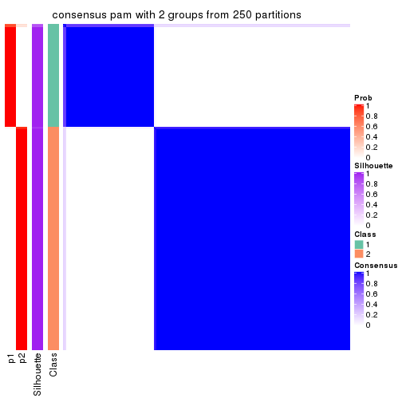</p>

</div>
<div id='tab-CV-pam-consensus-heatmap-2'>
<pre><code class="r">consensus_heatmap(res, k = 3)
</code></pre>

<p>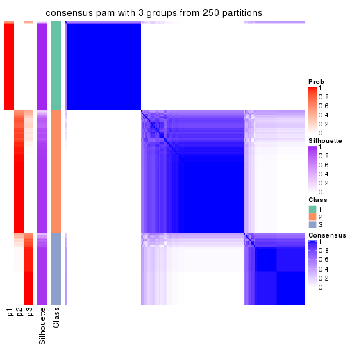</p>

</div>
<div id='tab-CV-pam-consensus-heatmap-3'>
<pre><code class="r">consensus_heatmap(res, k = 4)
</code></pre>

<p>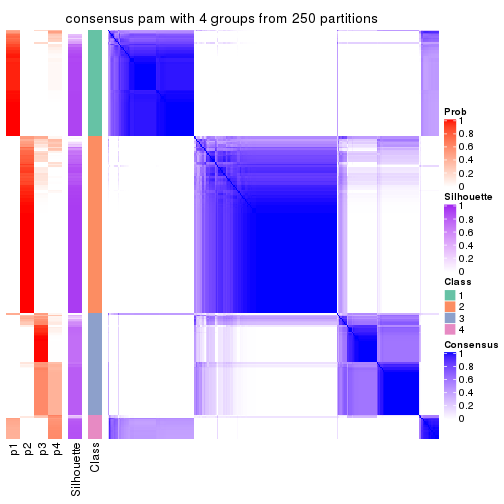</p>

</div>
<div id='tab-CV-pam-consensus-heatmap-4'>
<pre><code class="r">consensus_heatmap(res, k = 5)
</code></pre>

<p>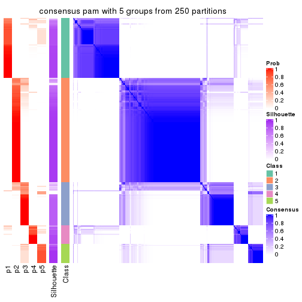</p>

</div>
<div id='tab-CV-pam-consensus-heatmap-5'>
<pre><code class="r">consensus_heatmap(res, k = 6)
</code></pre>

<p>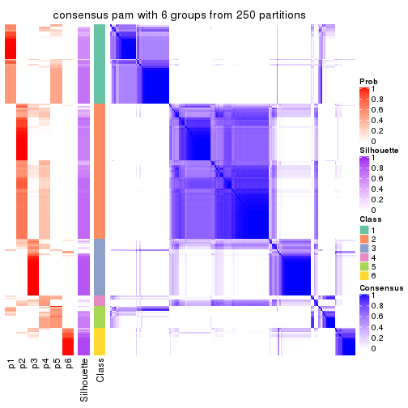</p>

</div>
</div>

Heatmaps for the membership of samples in all partitions to see how consistent they are:


<script>
$( function() {
	$( '#tabs-CV-pam-membership-heatmap' ).tabs();
} );
</script>
<div id='tabs-CV-pam-membership-heatmap'>
<ul>
<li><a href='#tab-CV-pam-membership-heatmap-1'>k = 2</a></li>
<li><a href='#tab-CV-pam-membership-heatmap-2'>k = 3</a></li>
<li><a href='#tab-CV-pam-membership-heatmap-3'>k = 4</a></li>
<li><a href='#tab-CV-pam-membership-heatmap-4'>k = 5</a></li>
<li><a href='#tab-CV-pam-membership-heatmap-5'>k = 6</a></li>
</ul>
<div id='tab-CV-pam-membership-heatmap-1'>
<pre><code class="r">membership_heatmap(res, k = 2)
</code></pre>

<p>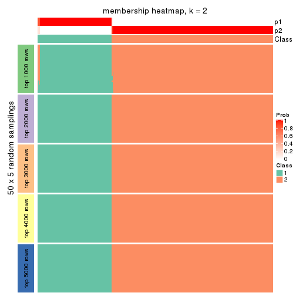</p>

</div>
<div id='tab-CV-pam-membership-heatmap-2'>
<pre><code class="r">membership_heatmap(res, k = 3)
</code></pre>

<p>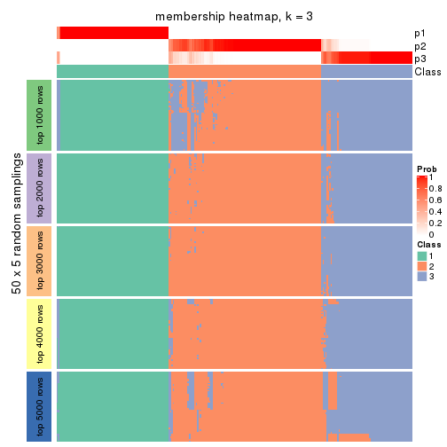</p>

</div>
<div id='tab-CV-pam-membership-heatmap-3'>
<pre><code class="r">membership_heatmap(res, k = 4)
</code></pre>

<p>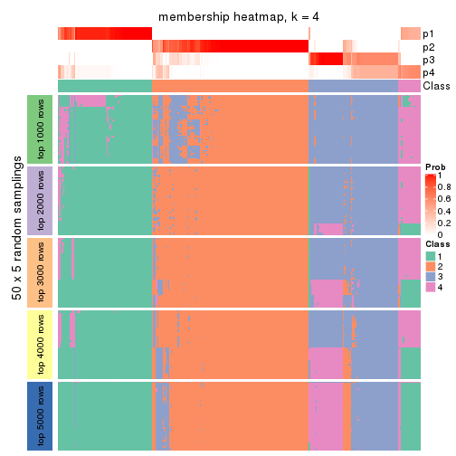</p>

</div>
<div id='tab-CV-pam-membership-heatmap-4'>
<pre><code class="r">membership_heatmap(res, k = 5)
</code></pre>

<p>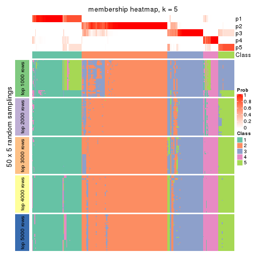</p>

</div>
<div id='tab-CV-pam-membership-heatmap-5'>
<pre><code class="r">membership_heatmap(res, k = 6)
</code></pre>

<p>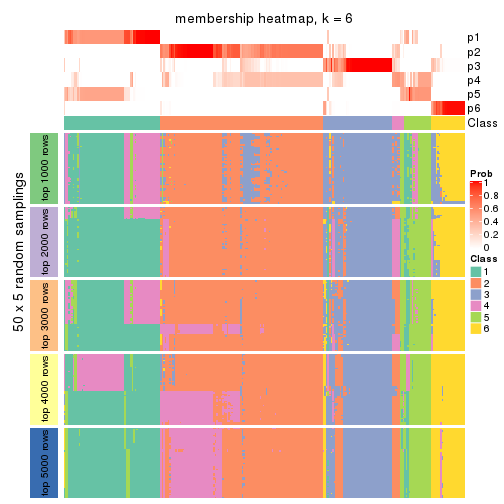</p>

</div>
</div>

As soon as we have had the classes for columns, we can look for signatures
which are significantly different between classes which can be candidate marks
for certain classes. Following are the heatmaps for signatures.


Signature heatmaps where rows are scaled:


<script>
$( function() {
	$( '#tabs-CV-pam-get-signatures' ).tabs();
} );
</script>
<div id='tabs-CV-pam-get-signatures'>
<ul>
<li><a href='#tab-CV-pam-get-signatures-1'>k = 2</a></li>
<li><a href='#tab-CV-pam-get-signatures-2'>k = 3</a></li>
<li><a href='#tab-CV-pam-get-signatures-3'>k = 4</a></li>
<li><a href='#tab-CV-pam-get-signatures-4'>k = 5</a></li>
<li><a href='#tab-CV-pam-get-signatures-5'>k = 6</a></li>
</ul>
<div id='tab-CV-pam-get-signatures-1'>
<pre><code class="r">get_signatures(res, k = 2)
</code></pre>

<p>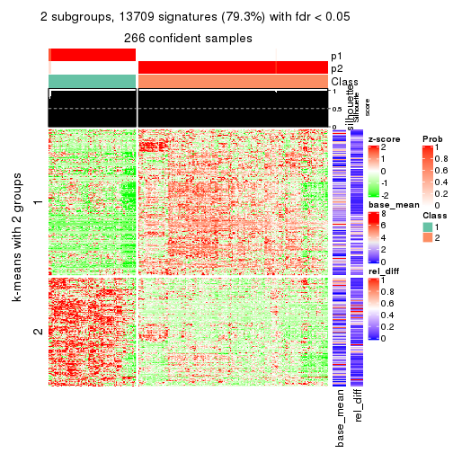</p>

</div>
<div id='tab-CV-pam-get-signatures-2'>
<pre><code class="r">get_signatures(res, k = 3)
</code></pre>

<p>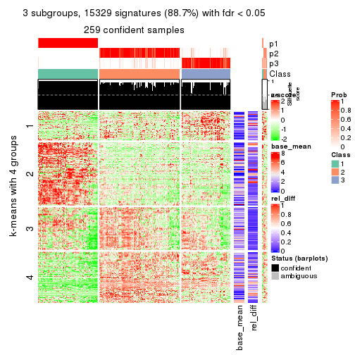</p>

</div>
<div id='tab-CV-pam-get-signatures-3'>
<pre><code class="r">get_signatures(res, k = 4)
</code></pre>

<p>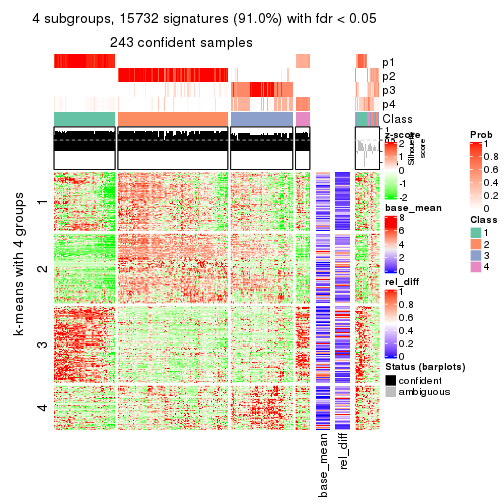</p>

</div>
<div id='tab-CV-pam-get-signatures-4'>
<pre><code class="r">get_signatures(res, k = 5)
</code></pre>

<p>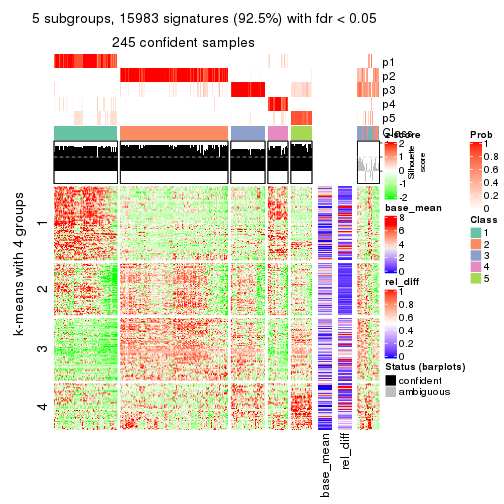</p>

</div>
<div id='tab-CV-pam-get-signatures-5'>
<pre><code class="r">get_signatures(res, k = 6)
</code></pre>

<p>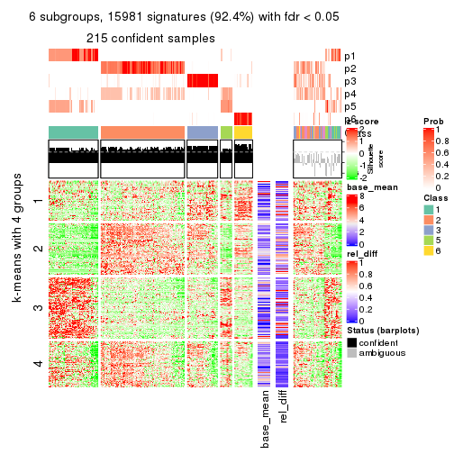</p>

</div>
</div>


Signature heatmaps where rows are not scaled:


<script>
$( function() {
	$( '#tabs-CV-pam-get-signatures-no-scale' ).tabs();
} );
</script>
<div id='tabs-CV-pam-get-signatures-no-scale'>
<ul>
<li><a href='#tab-CV-pam-get-signatures-no-scale-1'>k = 2</a></li>
<li><a href='#tab-CV-pam-get-signatures-no-scale-2'>k = 3</a></li>
<li><a href='#tab-CV-pam-get-signatures-no-scale-3'>k = 4</a></li>
<li><a href='#tab-CV-pam-get-signatures-no-scale-4'>k = 5</a></li>
<li><a href='#tab-CV-pam-get-signatures-no-scale-5'>k = 6</a></li>
</ul>
<div id='tab-CV-pam-get-signatures-no-scale-1'>
<pre><code class="r">get_signatures(res, k = 2, scale_rows = FALSE)
</code></pre>

<p>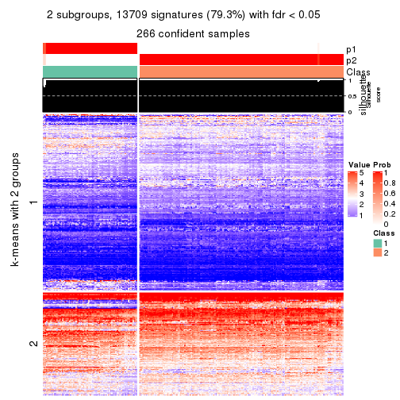</p>

</div>
<div id='tab-CV-pam-get-signatures-no-scale-2'>
<pre><code class="r">get_signatures(res, k = 3, scale_rows = FALSE)
</code></pre>

<p>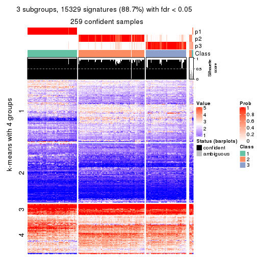</p>

</div>
<div id='tab-CV-pam-get-signatures-no-scale-3'>
<pre><code class="r">get_signatures(res, k = 4, scale_rows = FALSE)
</code></pre>

<p>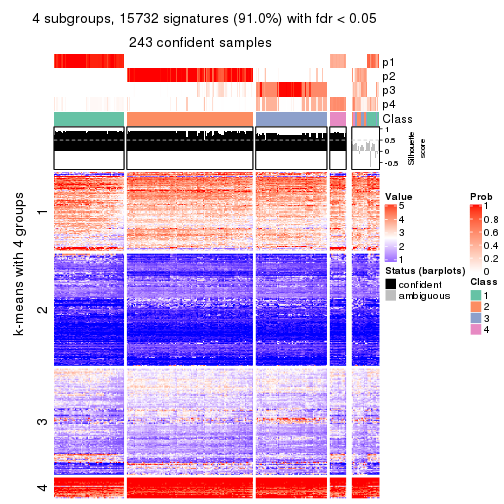</p>

</div>
<div id='tab-CV-pam-get-signatures-no-scale-4'>
<pre><code class="r">get_signatures(res, k = 5, scale_rows = FALSE)
</code></pre>

<p>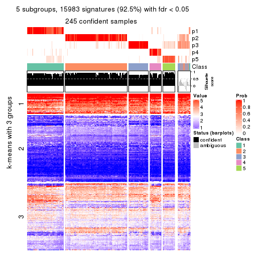</p>

</div>
<div id='tab-CV-pam-get-signatures-no-scale-5'>
<pre><code class="r">get_signatures(res, k = 6, scale_rows = FALSE)
</code></pre>

<p>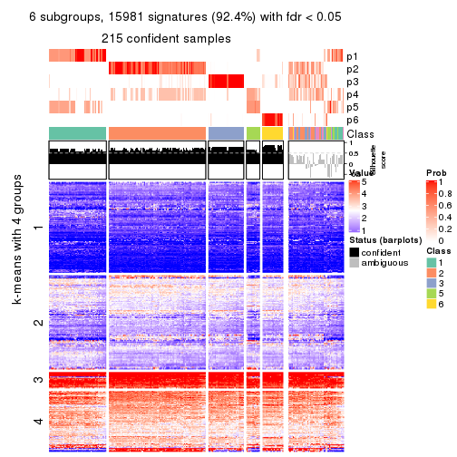</p>

</div>
</div>


Compare the overlap of signatures from different k:

```r
compare_signatures(res)
```

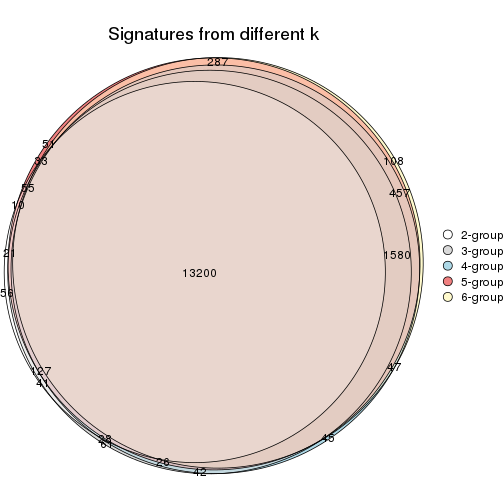

`get_signature()` returns a data frame invisibly. TO get the list of signatures, the function
call should be assigned to a variable explicitly. In following code, if `plot` argument is set
to `FALSE`, no heatmap is plotted while only the differential analysis is performed.

```r
# code only for demonstration
tb = get_signature(res, k = ..., plot = FALSE)
```

An example of the output of `tb` is:

```
#>   which_row         fdr    mean_1    mean_2 scaled_mean_1 scaled_mean_2 km
#> 1        38 0.042760348  8.373488  9.131774    -0.5533452     0.5164555  1
#> 2        40 0.018707592  7.106213  8.469186    -0.6173731     0.5762149  1
#> 3        55 0.019134737 10.221463 11.207825    -0.6159697     0.5749050  1
#> 4        59 0.006059896  5.921854  7.869574    -0.6899429     0.6439467  1
#> 5        60 0.018055526  8.928898 10.211722    -0.6204761     0.5791110  1
#> 6        98 0.009384629 15.714769 14.887706     0.6635654    -0.6193277  2
...
```

The columns in `tb` are:

1. `which_row`: row indices corresponding to the input matrix.
2. `fdr`: FDR for the differential test. 
3. `mean_x`: The mean value in group x.
4. `scaled_mean_x`: The mean value in group x after rows are scaled.
5. `km`: Row groups if k-means clustering is applied to rows.


UMAP plot which shows how samples are separated.


<script>
$( function() {
	$( '#tabs-CV-pam-dimension-reduction' ).tabs();
} );
</script>
<div id='tabs-CV-pam-dimension-reduction'>
<ul>
<li><a href='#tab-CV-pam-dimension-reduction-1'>k = 2</a></li>
<li><a href='#tab-CV-pam-dimension-reduction-2'>k = 3</a></li>
<li><a href='#tab-CV-pam-dimension-reduction-3'>k = 4</a></li>
<li><a href='#tab-CV-pam-dimension-reduction-4'>k = 5</a></li>
<li><a href='#tab-CV-pam-dimension-reduction-5'>k = 6</a></li>
</ul>
<div id='tab-CV-pam-dimension-reduction-1'>
<pre><code class="r">dimension_reduction(res, k = 2, method = &quot;UMAP&quot;)
</code></pre>

<p>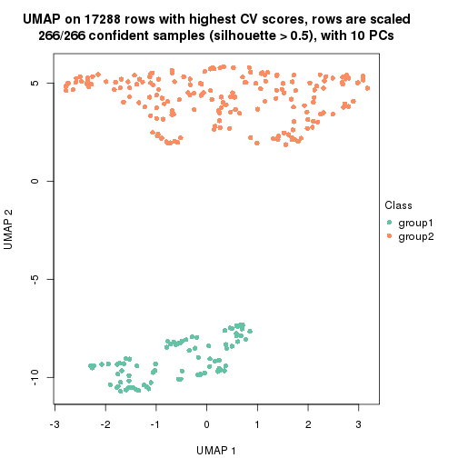</p>

</div>
<div id='tab-CV-pam-dimension-reduction-2'>
<pre><code class="r">dimension_reduction(res, k = 3, method = &quot;UMAP&quot;)
</code></pre>

<p>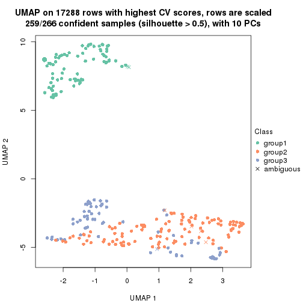</p>

</div>
<div id='tab-CV-pam-dimension-reduction-3'>
<pre><code class="r">dimension_reduction(res, k = 4, method = &quot;UMAP&quot;)
</code></pre>

<p>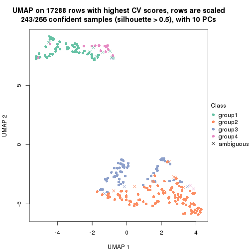</p>

</div>
<div id='tab-CV-pam-dimension-reduction-4'>
<pre><code class="r">dimension_reduction(res, k = 5, method = &quot;UMAP&quot;)
</code></pre>

<p>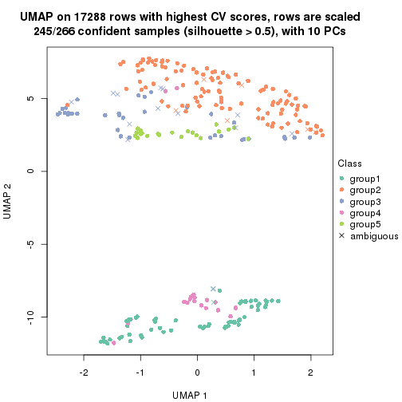</p>

</div>
<div id='tab-CV-pam-dimension-reduction-5'>
<pre><code class="r">dimension_reduction(res, k = 6, method = &quot;UMAP&quot;)
</code></pre>

<p>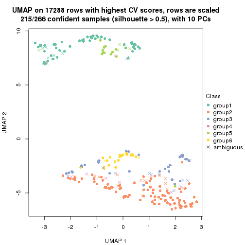</p>

</div>
</div>


Following heatmap shows how subgroups are split when increasing `k`:

```r
collect_classes(res)
```

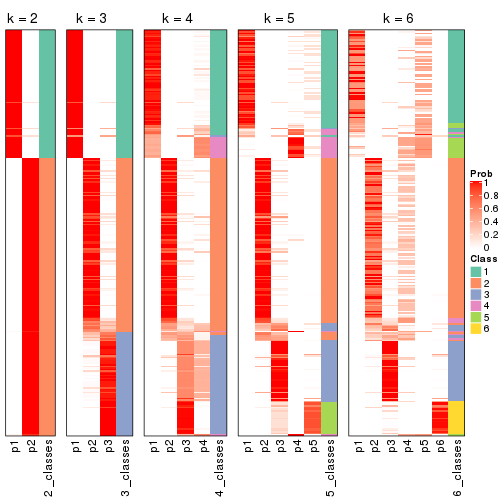


If matrix rows can be associated to genes, consider to use `GO_Enrichment(res,
...)` to perform function enrichment for the signature genes.


 

---------------------------------------------------


### CV:mclust**


The object with results only for a single top-value method and a single partition method 
can be extracted as:

```r
res = res_list["CV", "mclust"]
# you can also extract it by
# res = res_list["CV:mclust"]
```

A summary of `res` and all the functions that can be applied to it:

```r
res
```

```
#> A 'ConsensusPartition' object with k = 2, 3, 4, 5, 6.
#>   On a matrix with 17288 rows and 266 columns.
#>   Top rows (1000, 2000, 3000, 4000, 5000) are extracted by 'CV' method.
#>   Subgroups are detected by 'mclust' method.
#>   Performed in total 1250 partitions by row resampling.
#>   Best k for subgroups seems to be 2.
#> 
#> Following methods can be applied to this 'ConsensusPartition' object:
#>  [1] "cola_report"             "collect_classes"         "collect_plots"          
#>  [4] "collect_stats"           "colnames"                "compare_signatures"     
#>  [7] "consensus_heatmap"       "dimension_reduction"     "functional_enrichment"  
#> [10] "get_anno_col"            "get_anno"                "get_classes"            
#> [13] "get_consensus"           "get_matrix"              "get_membership"         
#> [16] "get_param"               "get_signatures"          "get_stats"              
#> [19] "is_best_k"               "is_stable_k"             "membership_heatmap"     
#> [22] "ncol"                    "nrow"                    "plot_ecdf"              
#> [25] "rownames"                "select_partition_number" "show"                   
#> [28] "suggest_best_k"          "test_to_known_factors"
```

`collect_plots()` function collects all the plots made from `res` for all `k` (number of partitions)
into one single page to provide an easy and fast comparison between different `k`.

```r
collect_plots(res)
```

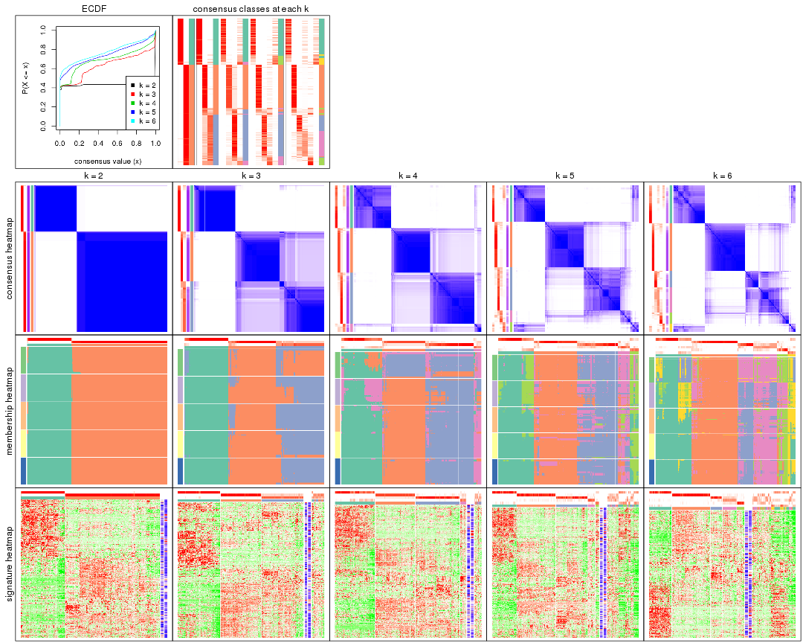

The plots are:

- The first row: a plot of the ECDF (Empirical cumulative distribution
  function) curves of the consensus matrix for each `k` and the heatmap of
  predicted classes for each `k`.
- The second row: heatmaps of the consensus matrix for each `k`.
- The third row: heatmaps of the membership matrix for each `k`.
- The fouth row: heatmaps of the signatures for each `k`.

All the plots in panels can be made by individual functions and they are
plotted later in this section.

`select_partition_number()` produces several plots showing different
statistics for choosing "optimized" `k`. There are following statistics:

- ECDF curves of the consensus matrix for each `k`;
- 1-PAC. [The PAC
  score](https://en.wikipedia.org/wiki/Consensus_clustering#Over-interpretation_potential_of_consensus_clustering)
  measures the proportion of the ambiguous subgrouping.
- Mean silhouette score.
- Concordance. The mean probability of fiting the consensus class ids in all
  partitions.
- Area increased. Denote $A_k$ as the area under the ECDF curve for current
  `k`, the area increased is defined as $A_k - A_{k-1}$.
- Rand index. The percent of pairs of samples that are both in a same cluster
  or both are not in a same cluster in the partition of k and k-1.
- Jaccard index. The ratio of pairs of samples are both in a same cluster in
  the partition of k and k-1 and the pairs of samples are both in a same
  cluster in the partition k or k-1.

The detailed explanations of these statistics can be found in [the cola
vignette](http://bioconductor.org/packages/devel/bioc/vignettes/cola/inst/doc/cola.html#toc_13).

Generally speaking, lower PAC score, higher mean silhouette score or higher
concordance corresponds to better partition. Rand index and Jaccard index
measure how similar the current partition is compared to partition with `k-1`.
If they are too similar, we won't accept `k` is better than `k-1`.

```r
select_partition_number(res)
```

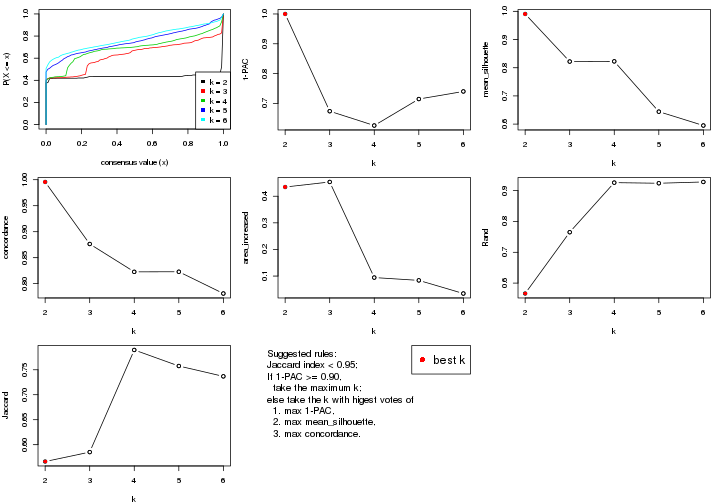

The numeric values for all these statistics can be obtained by `get_stats()`.

```r
get_stats(res)
```

```
#>   k 1-PAC mean_silhouette concordance area_increased  Rand Jaccard
#> 2 2 1.000           0.991       0.996         0.4347 0.566   0.566
#> 3 3 0.674           0.822       0.876         0.4536 0.765   0.585
#> 4 4 0.626           0.822       0.823         0.0944 0.926   0.790
#> 5 5 0.714           0.644       0.823         0.0838 0.924   0.757
#> 6 6 0.740           0.595       0.781         0.0344 0.928   0.737
```

`suggest_best_k()` suggests the best $k$ based on these statistics. The rules are as follows:

- All $k$ with Jaccard index larger than 0.95 are removed because the increase of
  the partition number does not provides enough extra information. If all $k$ are removed,
  the best $k$ is assigned by `NA`.
- For $k$ with 1-PAC larger than 0.9, the maximal $k$ is taken as the "best k". Other $k$ is called "optional k".
- If it does not fit the second rule. The $k$ with the highest vote of highest
  1-PAC, mean silhouette and concordance is taken as the "best k".

```r
suggest_best_k(res)
```

```
#> [1] 2
```


Following shows the table of the partitions (You need to click the **show/hide
code output** link to see it). The membership matrix (columns with name `p*`)
is inferred by
[`clue::cl_consensus()`](https://www.rdocumentation.org/link/cl_consensus?package=clue)
function with the `SE` method. Basically the value in the membership matrix
represents the probability to belong to a certain group. The finall class
label for an item is determined with the group with highest probability it
belongs to.

In `get_classes()` function, the entropy is calculated from the membership
matrix and the silhouette score is calculated from the consensus matrix.


<script>
$( function() {
	$( '#tabs-CV-mclust-get-classes' ).tabs();
} );
</script>
<div id='tabs-CV-mclust-get-classes'>
<ul>
<li><a href='#tab-CV-mclust-get-classes-1'>k = 2</a></li>
<li><a href='#tab-CV-mclust-get-classes-2'>k = 3</a></li>
<li><a href='#tab-CV-mclust-get-classes-3'>k = 4</a></li>
<li><a href='#tab-CV-mclust-get-classes-4'>k = 5</a></li>
<li><a href='#tab-CV-mclust-get-classes-5'>k = 6</a></li>
</ul>

<div id='tab-CV-mclust-get-classes-1'>
<p><a id='tab-CV-mclust-get-classes-1-a' style='color:#0366d6' href='#'>show/hide code output</a></p>
<pre><code class="r">cbind(get_classes(res, k = 2), get_membership(res, k = 2))
</code></pre>

<pre><code>#&gt;                                      class entropy silhouette    p1    p2
#&gt; 80D0AF10-1C61-4B67-90C1-7DBF1EF23672     2  0.0000      0.996 0.000 1.000
#&gt; 87117BE1-D328-4972-85DA-6672412D8860     2  0.0000      0.996 0.000 1.000
#&gt; F904C5B6-70BD-4604-8254-79BE23B152DA     1  0.0000      0.994 1.000 0.000
#&gt; 3182DEA1-4239-4613-925A-7E6503766AD6     2  0.0000      0.996 0.000 1.000
#&gt; 55E78EA2-2D9B-481F-8CAB-D36A33088EAE     2  0.0000      0.996 0.000 1.000
#&gt; 86F94264-A6DD-4A97-9191-036F066DD0EF     2  0.0000      0.996 0.000 1.000
#&gt; 09D25417-23B7-4D88-A0EA-F307985FBBBC     2  0.0000      0.996 0.000 1.000
#&gt; C797F12C-40D3-4DB5-B9EF-A6821BBDE4F0     1  0.0000      0.994 1.000 0.000
#&gt; 80275DB0-A226-4B6B-A08F-4ADBEEE1DB01     1  0.0000      0.994 1.000 0.000
#&gt; 27FB653A-9E07-44AD-952E-9E4DE4AB5891     2  0.0000      0.996 0.000 1.000
#&gt; 1A5DB9FC-2ABD-4E1B-B5EF-B1CF5E5F3872     1  0.7883      0.693 0.764 0.236
#&gt; 844E4CCD-D30C-416F-A086-8923711A4E25     2  0.0000      0.996 0.000 1.000
#&gt; EF18318D-3D25-4D65-803A-ED6E62871E7E     1  0.7602      0.720 0.780 0.220
#&gt; 1ACB1BE0-61F6-4243-BBEC-E26A1CF90CA8     1  0.0000      0.994 1.000 0.000
#&gt; 8EF0039B-D758-46AB-BAF7-6A062C7C56BA     1  0.0000      0.994 1.000 0.000
#&gt; 22F4C9D9-663B-4C91-9692-E035A2640BEC     2  0.0000      0.996 0.000 1.000
#&gt; FA1A0BCE-EE0F-4178-B963-62550E344B14     2  0.0000      0.996 0.000 1.000
#&gt; 0B6D0C4E-5AE3-4707-A9FC-12A108E6EC2A     2  0.0000      0.996 0.000 1.000
#&gt; 06FD3123-2AEB-4911-AC4E-E0E64FD5DB52     2  0.0000      0.996 0.000 1.000
#&gt; 235A4492-FF80-4AA5-BC71-DFF65E1C7411     2  0.0000      0.996 0.000 1.000
#&gt; A192C6C0-1443-4493-AFAC-1EE710628ADB     2  0.0000      0.996 0.000 1.000
#&gt; 6FC5B56B-711B-4174-9B06-4E843124AAB6     1  0.0000      0.994 1.000 0.000
#&gt; 7A813F60-A41E-4552-990E-F22287654C1D     2  0.0000      0.996 0.000 1.000
#&gt; 725BBFB5-26F4-4512-9C75-47D013C1E605     1  0.0000      0.994 1.000 0.000
#&gt; 39CC4E82-EBC9-472E-8BE5-6A3AB178449A     2  0.0000      0.996 0.000 1.000
#&gt; 61130DEE-E267-49DF-8B41-7738A06EF738     2  0.0000      0.996 0.000 1.000
#&gt; 117EC12C-B7ED-4E01-B29B-EA542D356EA1     1  0.0000      0.994 1.000 0.000
#&gt; A30FF708-F7A9-41E4-8AD5-20441650FBC9     2  0.0000      0.996 0.000 1.000
#&gt; 53640D52-1167-4A5D-B656-97D32CBA3934     1  0.0000      0.994 1.000 0.000
#&gt; 9E85D76A-DD2A-46D5-BB59-0ED302B6258C     2  0.0000      0.996 0.000 1.000
#&gt; 6F8C6F90-7E3C-4860-91DD-586708DE44AA     1  0.0000      0.994 1.000 0.000
#&gt; E675AEC5-AA9A-4AAA-839C-03E6365822DB     2  0.0000      0.996 0.000 1.000
#&gt; B577DEF7-2F5C-4876-A7C6-F18D5722B8C0     1  0.0000      0.994 1.000 0.000
#&gt; DA8B577E-43E7-49BF-BF94-868E3194F5C9     1  0.0000      0.994 1.000 0.000
#&gt; 3334280B-2A36-4AC7-A021-A76C10E958F0     2  0.0000      0.996 0.000 1.000
#&gt; 5CBDDC90-11EC-4E6E-881E-AA9CCFD40FDB     2  0.1184      0.983 0.016 0.984
#&gt; 8CBBF32A-8349-44F5-A8B8-4CBB1760A464     2  0.0000      0.996 0.000 1.000
#&gt; B9455A9A-136D-4DC2-9F86-0FC74433589D     2  0.1184      0.983 0.016 0.984
#&gt; D7EAE2A7-F9BE-4222-A452-B1F83F99CD50     2  0.1184      0.983 0.016 0.984
#&gt; F803AE18-60C5-4CFE-AAAB-DB33C26A2184     1  0.0000      0.994 1.000 0.000
#&gt; 5DD8CAC7-EC02-43B6-B58E-6D2E22868A3B     2  0.0000      0.996 0.000 1.000
#&gt; EE98E1B4-DFB3-4AEC-8527-E1FD544C9475     1  0.0000      0.994 1.000 0.000
#&gt; 3CE43921-47D5-4394-B9E1-242607775D61     2  0.0000      0.996 0.000 1.000
#&gt; 46986F2B-0B0D-4187-8948-4E91D34B7C49     2  0.0000      0.996 0.000 1.000
#&gt; 5D1D052E-74EF-45A8-9B1A-7CECD13EA43B     2  0.0000      0.996 0.000 1.000
#&gt; 4C821AD9-A5C9-4A9A-9C5D-363B227F8064     2  0.0000      0.996 0.000 1.000
#&gt; 06A4189E-A23B-4AC6-AA74-01955DD7D1E9     2  0.0000      0.996 0.000 1.000
#&gt; FCCDC76F-CB02-4BCD-A616-325F258DDAA4     2  0.0000      0.996 0.000 1.000
#&gt; DAC53B0A-8F35-4EA6-BBCC-4CD1C049E11F     2  0.0000      0.996 0.000 1.000
#&gt; DD4F845B-CAD3-44CB-9D96-3C3F5BA1B72D     1  0.0000      0.994 1.000 0.000
#&gt; D440F004-A4A4-41B6-BED8-805D67BA01C7     2  0.0000      0.996 0.000 1.000
#&gt; A497C423-119F-42FA-BF17-9F6DFD2A5585     2  0.0000      0.996 0.000 1.000
#&gt; 3420E573-DE12-4EF5-B1C0-2FCA904F4F4E     1  0.0000      0.994 1.000 0.000
#&gt; 1AD72157-A254-44B4-BA58-4F30F1AE910E     1  0.0000      0.994 1.000 0.000
#&gt; C1113977-B160-45EE-B061-750F9EA3F33F     2  0.0000      0.996 0.000 1.000
#&gt; 6783AB5B-F07C-447B-BF13-C34485D246D7     2  0.0000      0.996 0.000 1.000
#&gt; 1F553062-26FD-4A7F-B7FB-81184604F423     1  0.0000      0.994 1.000 0.000
#&gt; BE2DCA51-1C21-4598-98A7-F2FB9B2DFCB4     2  0.0000      0.996 0.000 1.000
#&gt; 38941CF3-9C54-4BA4-A005-CC88CA97D504     2  0.0000      0.996 0.000 1.000
#&gt; 51CB675E-E243-4A07-BF4A-580473D26FDA     2  0.0000      0.996 0.000 1.000
#&gt; C7FED0F5-C27A-4405-9232-30BF39362CF7     2  0.0000      0.996 0.000 1.000
#&gt; 2A1E86E8-4713-465F-ACFF-C584864C57A1     2  0.0000      0.996 0.000 1.000
#&gt; B4500785-0FAA-4D4D-8630-43D194BAB004     2  0.0000      0.996 0.000 1.000
#&gt; 3FD52E66-AB76-4079-80DB-281A795D1EC0     2  0.1184      0.983 0.016 0.984
#&gt; EBD355D1-1226-4DFD-AAFF-45D246B64F3C     2  0.0000      0.996 0.000 1.000
#&gt; 5A040A73-CD95-487E-8AEF-9639FE4E2916     2  0.0000      0.996 0.000 1.000
#&gt; CF629C65-585D-476D-B081-3E6E0575FAE3     2  0.7745      0.709 0.228 0.772
#&gt; 0D4202A3-808E-413F-9BF3-9CFCCAE0ED61     2  0.0000      0.996 0.000 1.000
#&gt; 43E715BF-28D9-4B5E-B762-8CD1B69A430E     1  0.0000      0.994 1.000 0.000
#&gt; BFB82BE8-9DAC-4099-8B38-0950308E3EB3     2  0.0000      0.996 0.000 1.000
#&gt; F7CB1825-2303-4DD2-AE1F-7205738EAF1F     1  0.0000      0.994 1.000 0.000
#&gt; FE298483-C42C-4753-BABB-29A9CB1B6312     1  0.0000      0.994 1.000 0.000
#&gt; A98C7561-1B42-4CD6-AE71-924B91FA4C33     2  0.0000      0.996 0.000 1.000
#&gt; 58098F21-7DAB-47DA-9A41-8D20BF3B9257     2  0.0000      0.996 0.000 1.000
#&gt; 18CAF708-20B9-4745-9CB3-37AB6E0B3056     2  0.0000      0.996 0.000 1.000
#&gt; 2C80DD72-C9C7-4AC2-812F-9A31EF02779C     1  0.0000      0.994 1.000 0.000
#&gt; 68A3F13D-319D-4603-A27F-B5DD46FE5C5B     2  0.0000      0.996 0.000 1.000
#&gt; 7EE8F0CE-CDC9-40F9-A1DE-7F8140EC6D13     2  0.0000      0.996 0.000 1.000
#&gt; 39019903-5B9C-4665-BD5F-7CCB19CB55C5     2  0.0000      0.996 0.000 1.000
#&gt; 190EDB27-4CBC-4E9C-9B67-D51FDAB982B7     2  0.0000      0.996 0.000 1.000
#&gt; EB2D95BC-62F8-4669-9308-D37D7FB79E23     2  0.0000      0.996 0.000 1.000
#&gt; A08B85EA-D1E7-4B77-8DEC-36294305B9F7     1  0.0000      0.994 1.000 0.000
#&gt; 130DDFAD-6EF8-4C80-BD9D-88308A6874BC     2  0.0000      0.996 0.000 1.000
#&gt; 7340A5BA-E002-448F-AACC-E7A37DBB79C2     2  0.0000      0.996 0.000 1.000
#&gt; A771F6E3-D266-4FE7-98C6-C40E6A701D59     1  0.0000      0.994 1.000 0.000
#&gt; 015E792C-EC1B-49BF-AB07-D82B20C5989A     2  0.0000      0.996 0.000 1.000
#&gt; BF79E030-47EE-4D08-B910-5685A4BD8B60     2  0.0000      0.996 0.000 1.000
#&gt; FB3C7C9A-2F2D-4DD5-BE47-FAFB072C0FAB     2  0.6801      0.783 0.180 0.820
#&gt; 4E5557BA-10E8-4723-908E-DD04EF6639B2     2  0.0000      0.996 0.000 1.000
#&gt; 8031B550-40A9-4A3A-9F7D-CDC052288BD8     2  0.0000      0.996 0.000 1.000
#&gt; 55299A06-3C1F-45A4-B166-B2C591C0CEE2     2  0.0000      0.996 0.000 1.000
#&gt; EB8D5168-216E-4ABB-8B4E-9E67786CB322     1  0.0000      0.994 1.000 0.000
#&gt; 78BD2D83-9A7F-42E5-BB38-654AA0761A0A     2  0.0000      0.996 0.000 1.000
#&gt; AA2D53E5-D389-4332-9DD5-A736052E48F8     1  0.0000      0.994 1.000 0.000
#&gt; 62945C7A-9313-4FC9-820C-B0AB820B394E     1  0.0000      0.994 1.000 0.000
#&gt; 22746046-2E99-4EE9-97D2-BA2EA499634C     2  0.0000      0.996 0.000 1.000
#&gt; 8671B51B-DCBE-4429-9F01-AF51CAD7014F     2  0.0000      0.996 0.000 1.000
#&gt; E815AB36-5689-4A0D-8E6D-2EAA73406681     1  0.0000      0.994 1.000 0.000
#&gt; A1DACB46-ED52-4E38-B2C8-57256BB22B5E     2  0.0000      0.996 0.000 1.000
#&gt; 4F5498C4-A423-4B3D-AC98-D4E214A57D0E     1  0.0000      0.994 1.000 0.000
#&gt; A7772CCD-FFFF-49DD-86ED-0BAD330EC9B6     2  0.0000      0.996 0.000 1.000
#&gt; E6E3DF78-65B9-4F74-8DA8-E2A6D4EDBEA7     2  0.0000      0.996 0.000 1.000
#&gt; 83286E2D-E708-437A-911A-E6B050273CBD     1  0.0000      0.994 1.000 0.000
#&gt; EC5C7C97-EE8C-405D-A039-D96514B1D414     2  0.0000      0.996 0.000 1.000
#&gt; 3E55223D-6E3D-4027-9819-67E91212531D     1  0.0000      0.994 1.000 0.000
#&gt; 99A036A2-8343-4D06-8047-D84E96CE4C61     2  0.0000      0.996 0.000 1.000
#&gt; CA6CDE6D-92DE-4259-9E58-A373F2D543EA     2  0.0000      0.996 0.000 1.000
#&gt; BF6FA8CC-60C1-413A-B2C6-54CCACBC01D6     1  0.0000      0.994 1.000 0.000
#&gt; E0594CFE-F7B6-4546-B130-30DF6A514B1F     2  0.0000      0.996 0.000 1.000
#&gt; E769E41D-5949-42C5-9594-E563C05ACE52     2  0.0000      0.996 0.000 1.000
#&gt; 01373725-5D3C-4D9C-AABC-911D53E62BCD     2  0.0000      0.996 0.000 1.000
#&gt; 1F39DADD-3655-474E-BA4C-A5BD32C97A8B     1  0.0000      0.994 1.000 0.000
#&gt; AF573EC8-E4EE-4B8F-8199-9817B9FAC67D     1  0.0000      0.994 1.000 0.000
#&gt; 3F022CBC-41C8-4387-A6FB-124C4BCD1AD9     1  0.0000      0.994 1.000 0.000
#&gt; 1CC32ACE-826B-494B-8B89-5BD92327A74D     2  0.0000      0.996 0.000 1.000
#&gt; 22B0BD3B-EE08-4BC7-90B2-01C372A56BA2     2  0.0000      0.996 0.000 1.000
#&gt; 0F3DE9EF-19CC-4D14-9A42-1435DB537F94     2  0.0000      0.996 0.000 1.000
#&gt; 87F8A33F-FBC3-469E-862B-84472F796358     2  0.0000      0.996 0.000 1.000
#&gt; C9F2FA0D-1A9F-40B4-BD9B-CAF1B3F3D5A7     2  0.0000      0.996 0.000 1.000
#&gt; ACFC9F59-78FF-4453-B25F-8834D0EAB54A     2  0.0000      0.996 0.000 1.000
#&gt; B7AC7D5B-14E9-45A7-93B7-226EE508544A     2  0.0000      0.996 0.000 1.000
#&gt; 4491BF17-B168-4E96-8E09-EF1AEC9F5E9D     2  0.0000      0.996 0.000 1.000
#&gt; 557A0811-A3FE-4CF4-A24D-FBB77E7F9139     2  0.0000      0.996 0.000 1.000
#&gt; 6F9C955C-6816-4353-922A-8035B50FACC6     2  0.0000      0.996 0.000 1.000
#&gt; 3E89FB1C-4A7D-43C7-823C-04E3716A7935     2  0.0000      0.996 0.000 1.000
#&gt; 12ABE483-66EF-4237-94C4-0199FAE23FA8     2  0.0000      0.996 0.000 1.000
#&gt; 7535F262-9B96-44F6-988C-4C9EBB3FFCA9     2  0.0000      0.996 0.000 1.000
#&gt; 65C9D28E-303B-40E5-84F0-2507F5457374     2  0.0000      0.996 0.000 1.000
#&gt; FD445384-6BA9-4297-9D9C-12ABA7D645C7     1  0.0000      0.994 1.000 0.000
#&gt; 30D5E255-2AD3-44F3-8983-1B80E4FD3E2D     2  0.0000      0.996 0.000 1.000
#&gt; 3E88EC60-B4A8-4259-8BC8-A234800F6955     2  0.0000      0.996 0.000 1.000
#&gt; ACD73CE8-AFC5-47A0-9383-3CB97F018953     1  0.0000      0.994 1.000 0.000
#&gt; 1AFDC2EA-26A8-44E2-8BCB-F34F7B66F8C8     2  0.1414      0.979 0.020 0.980
#&gt; 9E327BC8-1D20-4AD8-83F7-FB2D13BCA5D0     2  0.1184      0.983 0.016 0.984
#&gt; 85A86B91-4F24-4E77-AE2D-520F8E205EFC     1  0.0000      0.994 1.000 0.000
#&gt; 74868C37-8143-4306-81CA-E45759D146CD     2  0.0000      0.996 0.000 1.000
#&gt; 69AEA0DB-E335-48A0-A398-4FB0D581182A     2  0.0000      0.996 0.000 1.000
#&gt; AE6F8B89-85C2-42B7-8D05-AFDDD4FEFD16     1  0.0000      0.994 1.000 0.000
#&gt; A8A6F09C-9812-4457-9A4B-AD41F97B41A3     2  0.0000      0.996 0.000 1.000
#&gt; 1A09BC4D-EF29-42DD-BB04-A3C264A3032D     1  0.0000      0.994 1.000 0.000
#&gt; E0961A30-A62C-4235-9CF0-A1776827A996     2  0.0000      0.996 0.000 1.000
#&gt; 134D2D90-7B08-4F20-8A3A-C77643FB208F     2  0.0000      0.996 0.000 1.000
#&gt; A77C2DFF-93CF-4CB5-B3C1-81133D7F1A0F     2  0.1184      0.983 0.016 0.984
#&gt; EA2DC457-9C74-4B9C-B3FA-5E72199B24A7     2  0.0000      0.996 0.000 1.000
#&gt; FF34117B-5EE4-4C96-A8A2-2CE6A654CBE5     1  0.0000      0.994 1.000 0.000
#&gt; 75F7B5E2-6559-4B48-A2A4-287C35C559CC     1  0.0000      0.994 1.000 0.000
#&gt; 903BF591-B0AF-4BEE-B625-60B673070344     2  0.0000      0.996 0.000 1.000
#&gt; 9DE1B790-C63C-41C4-9477-CE52A8119C67     2  0.0000      0.996 0.000 1.000
#&gt; 9A28F80A-85F8-40E2-A32B-230EF93B2FA0     2  0.0000      0.996 0.000 1.000
#&gt; 0AA2BDBB-8720-409A-AA72-1F4AA26E7CD8     2  0.0000      0.996 0.000 1.000
#&gt; 5AD49F16-E974-4E5D-B1B6-073ECB73A01D     2  0.1184      0.983 0.016 0.984
#&gt; CB0F961C-527D-4A48-9408-286B26BD9532     1  0.0000      0.994 1.000 0.000
#&gt; 46FF25B6-D01D-4CA7-80B7-CEC2998C34E1     2  0.0000      0.996 0.000 1.000
#&gt; 487CADE1-D699-4A6C-817A-B9A0AB940C61     1  0.0000      0.994 1.000 0.000
#&gt; 4FF6F2D8-F869-4735-A4D1-1A8423153FBC     1  0.0000      0.994 1.000 0.000
#&gt; 6005494F-5D3D-43A3-B3E8-8C91955B2A98     2  0.0000      0.996 0.000 1.000
#&gt; CF10D584-CE32-45A4-A932-E9D5AF12A6A0     1  0.0000      0.994 1.000 0.000
#&gt; E15CE4AB-5646-49C8-9CD6-938457036BB0     2  0.0000      0.996 0.000 1.000
#&gt; 31E28D0B-0E69-4330-82ED-4F1827DC97EA     2  0.0000      0.996 0.000 1.000
#&gt; DBACD3C3-CCB5-4478-BA78-85A0C847CA66     2  0.0000      0.996 0.000 1.000
#&gt; 5A07041C-65EB-4FCD-8940-E90B905061B5     2  0.1184      0.983 0.016 0.984
#&gt; 0EA7C916-FA47-489B-BC98-4D9E7D197628     1  0.0000      0.994 1.000 0.000
#&gt; 30967F75-8499-47FF-ADA4-4DC566013F7B     1  0.0000      0.994 1.000 0.000
#&gt; D2E528FF-AEA2-48D7-A60A-4C3E71EA9073     2  0.0000      0.996 0.000 1.000
#&gt; 22735DCD-215E-48BC-BF44-32BD66F06E39     2  0.0000      0.996 0.000 1.000
#&gt; BC2C3248-7FC6-48BC-96C1-45EA573DE7DC     1  0.0000      0.994 1.000 0.000
#&gt; E72CEBCB-D686-4B12-BCBA-EC8F964330A2     1  0.0000      0.994 1.000 0.000
#&gt; 23C937BB-BA20-4440-B680-914229CC3ADF     1  0.0000      0.994 1.000 0.000
#&gt; 947E99C7-F402-4F1A-A6E9-81BCAAED135A     2  0.0000      0.996 0.000 1.000
#&gt; 02475D11-FC81-4E88-944E-173C32DC3FE7     2  0.2043      0.967 0.032 0.968
#&gt; F972A9AA-9842-4343-A533-A795E65581CE     1  0.0000      0.994 1.000 0.000
#&gt; 05043AAF-3095-4C61-B5C1-EE9AA9082C75     2  0.0000      0.996 0.000 1.000
#&gt; CECF7967-862E-428C-BB42-FEF553FDB3AA     2  0.0000      0.996 0.000 1.000
#&gt; FB0B9483-6302-48C7-BE5B-DA667E00AE2D     2  0.0000      0.996 0.000 1.000
#&gt; 78700FBA-1487-4754-9B30-18837BF7E9FB     1  0.0000      0.994 1.000 0.000
#&gt; 2166F56D-54CE-4F1B-8F07-A4E13E4489E9     1  0.0000      0.994 1.000 0.000
#&gt; 7CD0942E-E39A-43A7-8BAC-F25967864901     2  0.0000      0.996 0.000 1.000
#&gt; 3B00BA2B-7F7D-4825-8F8D-90F04A5DE687     2  0.0000      0.996 0.000 1.000
#&gt; 7465B01D-C05E-4FE0-A9FE-182920EDC489     2  0.0000      0.996 0.000 1.000
#&gt; 88C31A99-F96E-4FC8-8B3D-C1AAA05062D9     1  0.0000      0.994 1.000 0.000
#&gt; 53575575-3303-4F8F-B6A8-B42131CFB4AC     2  0.0000      0.996 0.000 1.000
#&gt; CC8017C7-4128-48DA-8E43-503F63158D85     1  0.0000      0.994 1.000 0.000
#&gt; 88449D2A-2A25-41A4-B91D-C99B58F8ECD9     2  0.0000      0.996 0.000 1.000
#&gt; 46C7DDE5-A2B5-494F-96AE-0B6E2D51B003     1  0.0000      0.994 1.000 0.000
#&gt; 42551D05-5EE5-4F91-93A8-32DA695D9DFA     2  0.0000      0.996 0.000 1.000
#&gt; 0772DA48-3A36-422D-B166-CA1691B782C3     2  0.0000      0.996 0.000 1.000
#&gt; 30346897-EC77-4153-88A2-D14593C8B741     2  0.0000      0.996 0.000 1.000
#&gt; 0F00E267-C748-4A71-8B36-03C410641D88     2  0.0000      0.996 0.000 1.000
#&gt; 4034703A-4DA9-4DDA-9CA9-E80FFE9CCDE6     2  0.0000      0.996 0.000 1.000
#&gt; 393C8A41-CF45-4EA8-AFE3-25A08AB7692A     2  0.0000      0.996 0.000 1.000
#&gt; 3354212D-A07C-435C-8B0C-9A7BAAB624B5     1  0.0000      0.994 1.000 0.000
#&gt; 57E30D4E-ABF7-47DD-92BE-40CE215076B0     1  0.0000      0.994 1.000 0.000
#&gt; 202B4C76-C840-4DB8-953F-AC75A4156FDD     2  0.0000      0.996 0.000 1.000
#&gt; 93A0137B-1F4C-44EE-B959-2AD0CD2DF8B6     1  0.0000      0.994 1.000 0.000
#&gt; C9794DB6-6E8C-4AFD-80EE-61D672A4F6E9     2  0.0000      0.996 0.000 1.000
#&gt; AE4BFE63-F0C0-4624-AD97-4F7FF13E2384     1  0.0000      0.994 1.000 0.000
#&gt; DCF87F27-2B54-42D9-8D28-5DFEE76E2F5B     2  0.0000      0.996 0.000 1.000
#&gt; 2451D405-39FD-4812-958C-23462B66F1F1     2  0.0000      0.996 0.000 1.000
#&gt; E27F5D33-3F68-4CA8-8757-A387C6EAD060     2  0.0000      0.996 0.000 1.000
#&gt; 8BA9928A-5B93-477F-B4A2-D031B714D9AC     1  0.0000      0.994 1.000 0.000
#&gt; 0FAACFF6-B50C-4BED-9824-B7270654F28D     2  0.0000      0.996 0.000 1.000
#&gt; 3366CC3C-2BBA-4CA7-848E-4E16AA70AE7A     2  0.0000      0.996 0.000 1.000
#&gt; 66237056-CA9A-4C90-AF0E-1621FEB71578     2  0.0000      0.996 0.000 1.000
#&gt; C480F1FB-3100-436C-B0F5-DED63B7A580E     2  0.0000      0.996 0.000 1.000
#&gt; A327DE0D-D945-4B42-9B41-A7302CF796EE     2  0.0000      0.996 0.000 1.000
#&gt; E8A6871D-67FB-4306-9454-F5E7CDBA399A     2  0.0000      0.996 0.000 1.000
#&gt; E9A7485B-82B6-4BD2-AFBB-DD0A82D6CDE2     1  0.0000      0.994 1.000 0.000
#&gt; 93B382E4-9C9A-43F5-BD3B-502CC260B886     1  0.0000      0.994 1.000 0.000
#&gt; A2792419-8E16-45FE-A524-17851F34AB9B     2  0.0000      0.996 0.000 1.000
#&gt; 4DED1201-F25C-4F82-BABF-965EFAD7A8E5     2  0.0000      0.996 0.000 1.000
#&gt; F1ACB2DD-E948-4F88-A249-F1BD1977D667     2  0.0000      0.996 0.000 1.000
#&gt; 6CDBA203-8952-421D-A6BF-75652D9F3339     2  0.1184      0.983 0.016 0.984
#&gt; 2D6C5AA7-3B33-48D7-AE0C-77A16B749D13     1  0.1414      0.975 0.980 0.020
#&gt; 3F6B6D95-0720-42A0-AEB3-89FECAE7616A     2  0.1184      0.983 0.016 0.984
#&gt; DED8ACF3-BBD8-46C9-85C9-A9C8F2E2BC0B     1  0.0000      0.994 1.000 0.000
#&gt; 77069279-5A6F-42C0-9AA5-8C939591DFB5     1  0.0000      0.994 1.000 0.000
#&gt; B2D4FCF3-FDF9-41C8-880A-6732CF6222AF     2  0.0000      0.996 0.000 1.000
#&gt; 1CD71A4C-1E49-48EF-AA72-CB3C26B4C087     2  0.0000      0.996 0.000 1.000
#&gt; C364E621-F85C-4B7F-842F-210B8D4DFE3A     2  0.0000      0.996 0.000 1.000
#&gt; 11F1B8CA-07C1-47D2-A3C6-032FFA6A4A64     1  0.0000      0.994 1.000 0.000
#&gt; 153BF804-6DC8-496B-987A-4021A2512211     2  0.0000      0.996 0.000 1.000
#&gt; 5B5029C9-40F5-40D7-A36A-367022AD6A42     2  0.0000      0.996 0.000 1.000
#&gt; 193CCBE6-104F-49B4-BDB2-C82EE36FDAAD     1  0.0000      0.994 1.000 0.000
#&gt; E5D45E53-FCF3-4F01-9B78-6CB1ED0CFE40     2  0.0000      0.996 0.000 1.000
#&gt; 5546A779-21DB-49F9-8C0D-A1E420088084     2  0.0000      0.996 0.000 1.000
#&gt; E14825E0-0DC7-44C2-B265-F54672356838     1  0.0000      0.994 1.000 0.000
#&gt; 8C8C09B9-EC83-45EC-BC4C-0BA92DE60ACB     1  0.0000      0.994 1.000 0.000
#&gt; B388CA82-5BF7-4BDD-8821-4EC0B213121F     2  0.0000      0.996 0.000 1.000
#&gt; A26025AC-9F71-4C07-9135-83593193BBB2     1  0.0000      0.994 1.000 0.000
#&gt; C80E6D4B-AF21-42F0-8E20-6F7D2E99C062     2  0.0000      0.996 0.000 1.000
#&gt; 5AE5D819-A6B1-4761-B7F9-8FFD3C520F31     2  0.0938      0.986 0.012 0.988
#&gt; CAE8097F-A139-4C6E-9E30-35080475FF34     2  0.0000      0.996 0.000 1.000
#&gt; 539C8DE3-6152-4671-B96F-ED6DC6DBD22B     1  0.0000      0.994 1.000 0.000
#&gt; 5D28A8E0-4ECF-43A4-890A-BE968B9A8CB2     2  0.0000      0.996 0.000 1.000
#&gt; 97A80AF8-365E-4756-A2B0-AEB1D8F5F33E     2  0.0000      0.996 0.000 1.000
#&gt; B3527517-E339-46AE-8437-65303C309015     2  0.0000      0.996 0.000 1.000
#&gt; 523E2183-AA20-4749-BD7E-69CD620DD6A3     2  0.0000      0.996 0.000 1.000
#&gt; E553FB92-F181-47B3-9F3D-11DB51DFA3A4     2  0.1184      0.983 0.016 0.984
#&gt; FFE0C4B1-8EEC-484A-AB87-3401B71BD081     2  0.0000      0.996 0.000 1.000
#&gt; 73D6CA4B-9A9E-4E52-96C8-AE7F0CC8B276     2  0.0000      0.996 0.000 1.000
#&gt; 485A8107-DF9A-4BC6-8A72-07FBA93F10F2     1  0.0000      0.994 1.000 0.000
#&gt; 690823D9-B9AA-40EF-8302-4AD88BF89D1C     2  0.1184      0.983 0.016 0.984
#&gt; B4E02660-562F-4EAC-8472-CBBD8A577688     2  0.0000      0.996 0.000 1.000
#&gt; F82D5A60-90F9-4FF4-971E-73F7535FE65A     2  0.0000      0.996 0.000 1.000
#&gt; C48401F7-2D56-4C6F-9896-C5435D1B44BF     2  0.0000      0.996 0.000 1.000
#&gt; 94FC8991-182B-4B00-9A06-A00E8D3BDCFA     1  0.0000      0.994 1.000 0.000
#&gt; FF00E80A-046D-4233-835E-CDF93403EA43     2  0.0000      0.996 0.000 1.000
#&gt; C47A53F6-6479-4AD3-9D18-E4A70BE5F1DC     2  0.0672      0.990 0.008 0.992
#&gt; 3487AE2D-AB1D-4DEF-AC4B-4B0FCAF8D899     2  0.0000      0.996 0.000 1.000
#&gt; 479CD9BB-ECD7-41D5-B1E4-41132FF7FC95     2  0.0000      0.996 0.000 1.000
#&gt; 048ADC6E-8C7E-4875-ACEE-E4787203C078     1  0.0000      0.994 1.000 0.000
#&gt; 25AF81C5-B117-466D-AE9F-DD10BCB6AF2D     2  0.0000      0.996 0.000 1.000
#&gt; 8B1D51D6-0B25-4289-81F0-9F95E0258877     2  0.0000      0.996 0.000 1.000
#&gt; 282D390D-8E4E-4A19-B2B7-A6DB4BB2D46C     1  0.0000      0.994 1.000 0.000
#&gt; BC6B92C1-F425-40C5-9941-539BFF5FE0FE     2  0.0000      0.996 0.000 1.000
#&gt; 899CB9E0-48D0-413D-8566-BC151F146453     1  0.0000      0.994 1.000 0.000
#&gt; 441400A9-1427-45E0-A8B4-EF2A6B7465C2     2  0.0000      0.996 0.000 1.000
#&gt; CF96DDD4-DC0A-4341-BDE6-4DA2CB4978D0     1  0.0000      0.994 1.000 0.000
#&gt; CE91F591-6072-4D29-9495-C78961635969     2  0.0000      0.996 0.000 1.000
#&gt; 84D25635-2A38-4CFB-BFAC-38C007625C42     1  0.0000      0.994 1.000 0.000
#&gt; ABF1AC12-872A-4C3D-A76C-07BC36A4DA5E     1  0.0000      0.994 1.000 0.000
#&gt; B7F7F66F-1AED-4199-81C0-5C7FB0DBF438     2  0.0000      0.996 0.000 1.000
#&gt; BAB786B9-6C20-425D-9886-63A0A092B59B     2  0.0000      0.996 0.000 1.000
#&gt; 735D1DE3-D781-4F89-A395-09974057BBB7     1  0.0000      0.994 1.000 0.000
#&gt; F6D5FBBA-05C4-4340-86D9-1A54181216A2     2  0.0000      0.996 0.000 1.000
#&gt; 79C4E166-4A0D-4811-A2C8-CAE0A5AEED42     2  0.0000      0.996 0.000 1.000
</code></pre>

<script>
$('#tab-CV-mclust-get-classes-1-a').parent().next().next().hide();
$('#tab-CV-mclust-get-classes-1-a').click(function(){
  $('#tab-CV-mclust-get-classes-1-a').parent().next().next().toggle();
  return(false);
});
</script>
</div>

<div id='tab-CV-mclust-get-classes-2'>
<p><a id='tab-CV-mclust-get-classes-2-a' style='color:#0366d6' href='#'>show/hide code output</a></p>
<pre><code class="r">cbind(get_classes(res, k = 3), get_membership(res, k = 3))
</code></pre>

<pre><code>#&gt;                                      class entropy silhouette    p1    p2    p3
#&gt; 80D0AF10-1C61-4B67-90C1-7DBF1EF23672     2  0.0000      0.920 0.000 1.000 0.000
#&gt; 87117BE1-D328-4972-85DA-6672412D8860     2  0.0000      0.920 0.000 1.000 0.000
#&gt; F904C5B6-70BD-4604-8254-79BE23B152DA     1  0.0000      0.978 1.000 0.000 0.000
#&gt; 3182DEA1-4239-4613-925A-7E6503766AD6     2  0.5760      0.328 0.000 0.672 0.328
#&gt; 55E78EA2-2D9B-481F-8CAB-D36A33088EAE     3  0.4887      0.853 0.000 0.228 0.772
#&gt; 86F94264-A6DD-4A97-9191-036F066DD0EF     3  0.4887      0.853 0.000 0.228 0.772
#&gt; 09D25417-23B7-4D88-A0EA-F307985FBBBC     3  0.4887      0.853 0.000 0.228 0.772
#&gt; C797F12C-40D3-4DB5-B9EF-A6821BBDE4F0     1  0.4121      0.860 0.832 0.000 0.168
#&gt; 80275DB0-A226-4B6B-A08F-4ADBEEE1DB01     1  0.0000      0.978 1.000 0.000 0.000
#&gt; 27FB653A-9E07-44AD-952E-9E4DE4AB5891     3  0.4887      0.853 0.000 0.228 0.772
#&gt; 1A5DB9FC-2ABD-4E1B-B5EF-B1CF5E5F3872     1  0.6763      0.463 0.552 0.012 0.436
#&gt; 844E4CCD-D30C-416F-A086-8923711A4E25     3  0.4235      0.813 0.000 0.176 0.824
#&gt; EF18318D-3D25-4D65-803A-ED6E62871E7E     1  0.6763      0.463 0.552 0.012 0.436
#&gt; 1ACB1BE0-61F6-4243-BBEC-E26A1CF90CA8     1  0.0000      0.978 1.000 0.000 0.000
#&gt; 8EF0039B-D758-46AB-BAF7-6A062C7C56BA     1  0.0000      0.978 1.000 0.000 0.000
#&gt; 22F4C9D9-663B-4C91-9692-E035A2640BEC     2  0.0000      0.920 0.000 1.000 0.000
#&gt; FA1A0BCE-EE0F-4178-B963-62550E344B14     2  0.0424      0.916 0.000 0.992 0.008
#&gt; 0B6D0C4E-5AE3-4707-A9FC-12A108E6EC2A     3  0.4887      0.853 0.000 0.228 0.772
#&gt; 06FD3123-2AEB-4911-AC4E-E0E64FD5DB52     2  0.4178      0.743 0.000 0.828 0.172
#&gt; 235A4492-FF80-4AA5-BC71-DFF65E1C7411     2  0.0000      0.920 0.000 1.000 0.000
#&gt; A192C6C0-1443-4493-AFAC-1EE710628ADB     2  0.0000      0.920 0.000 1.000 0.000
#&gt; 6FC5B56B-711B-4174-9B06-4E843124AAB6     1  0.0000      0.978 1.000 0.000 0.000
#&gt; 7A813F60-A41E-4552-990E-F22287654C1D     2  0.0424      0.916 0.000 0.992 0.008
#&gt; 725BBFB5-26F4-4512-9C75-47D013C1E605     1  0.0000      0.978 1.000 0.000 0.000
#&gt; 39CC4E82-EBC9-472E-8BE5-6A3AB178449A     3  0.6008      0.703 0.000 0.372 0.628
#&gt; 61130DEE-E267-49DF-8B41-7738A06EF738     3  0.4750      0.846 0.000 0.216 0.784
#&gt; 117EC12C-B7ED-4E01-B29B-EA542D356EA1     1  0.4121      0.860 0.832 0.000 0.168
#&gt; A30FF708-F7A9-41E4-8AD5-20441650FBC9     2  0.0000      0.920 0.000 1.000 0.000
#&gt; 53640D52-1167-4A5D-B656-97D32CBA3934     1  0.0000      0.978 1.000 0.000 0.000
#&gt; 9E85D76A-DD2A-46D5-BB59-0ED302B6258C     2  0.6126      0.283 0.000 0.600 0.400
#&gt; 6F8C6F90-7E3C-4860-91DD-586708DE44AA     1  0.0000      0.978 1.000 0.000 0.000
#&gt; E675AEC5-AA9A-4AAA-839C-03E6365822DB     3  0.4887      0.853 0.000 0.228 0.772
#&gt; B577DEF7-2F5C-4876-A7C6-F18D5722B8C0     1  0.5158      0.804 0.764 0.004 0.232
#&gt; DA8B577E-43E7-49BF-BF94-868E3194F5C9     1  0.0000      0.978 1.000 0.000 0.000
#&gt; 3334280B-2A36-4AC7-A021-A76C10E958F0     3  0.5835      0.766 0.000 0.340 0.660
#&gt; 5CBDDC90-11EC-4E6E-881E-AA9CCFD40FDB     3  0.6299     -0.166 0.000 0.476 0.524
#&gt; 8CBBF32A-8349-44F5-A8B8-4CBB1760A464     3  0.5529      0.809 0.000 0.296 0.704
#&gt; B9455A9A-136D-4DC2-9F86-0FC74433589D     3  0.6299     -0.166 0.000 0.476 0.524
#&gt; D7EAE2A7-F9BE-4222-A452-B1F83F99CD50     2  0.6307      0.188 0.000 0.512 0.488
#&gt; F803AE18-60C5-4CFE-AAAB-DB33C26A2184     1  0.0000      0.978 1.000 0.000 0.000
#&gt; 5DD8CAC7-EC02-43B6-B58E-6D2E22868A3B     3  0.4887      0.853 0.000 0.228 0.772
#&gt; EE98E1B4-DFB3-4AEC-8527-E1FD544C9475     1  0.0000      0.978 1.000 0.000 0.000
#&gt; 3CE43921-47D5-4394-B9E1-242607775D61     2  0.0000      0.920 0.000 1.000 0.000
#&gt; 46986F2B-0B0D-4187-8948-4E91D34B7C49     2  0.0000      0.920 0.000 1.000 0.000
#&gt; 5D1D052E-74EF-45A8-9B1A-7CECD13EA43B     2  0.0000      0.920 0.000 1.000 0.000
#&gt; 4C821AD9-A5C9-4A9A-9C5D-363B227F8064     3  0.5905      0.752 0.000 0.352 0.648
#&gt; 06A4189E-A23B-4AC6-AA74-01955DD7D1E9     2  0.0000      0.920 0.000 1.000 0.000
#&gt; FCCDC76F-CB02-4BCD-A616-325F258DDAA4     2  0.1031      0.899 0.000 0.976 0.024
#&gt; DAC53B0A-8F35-4EA6-BBCC-4CD1C049E11F     2  0.4178      0.756 0.000 0.828 0.172
#&gt; DD4F845B-CAD3-44CB-9D96-3C3F5BA1B72D     1  0.0000      0.978 1.000 0.000 0.000
#&gt; D440F004-A4A4-41B6-BED8-805D67BA01C7     2  0.0000      0.920 0.000 1.000 0.000
#&gt; A497C423-119F-42FA-BF17-9F6DFD2A5585     2  0.0000      0.920 0.000 1.000 0.000
#&gt; 3420E573-DE12-4EF5-B1C0-2FCA904F4F4E     1  0.0000      0.978 1.000 0.000 0.000
#&gt; 1AD72157-A254-44B4-BA58-4F30F1AE910E     1  0.0000      0.978 1.000 0.000 0.000
#&gt; C1113977-B160-45EE-B061-750F9EA3F33F     3  0.5905      0.748 0.000 0.352 0.648
#&gt; 6783AB5B-F07C-447B-BF13-C34485D246D7     2  0.5905      0.146 0.000 0.648 0.352
#&gt; 1F553062-26FD-4A7F-B7FB-81184604F423     1  0.0000      0.978 1.000 0.000 0.000
#&gt; BE2DCA51-1C21-4598-98A7-F2FB9B2DFCB4     2  0.0424      0.915 0.000 0.992 0.008
#&gt; 38941CF3-9C54-4BA4-A005-CC88CA97D504     3  0.5621      0.798 0.000 0.308 0.692
#&gt; 51CB675E-E243-4A07-BF4A-580473D26FDA     2  0.0237      0.918 0.000 0.996 0.004
#&gt; C7FED0F5-C27A-4405-9232-30BF39362CF7     2  0.0000      0.920 0.000 1.000 0.000
#&gt; 2A1E86E8-4713-465F-ACFF-C584864C57A1     3  0.4887      0.853 0.000 0.228 0.772
#&gt; B4500785-0FAA-4D4D-8630-43D194BAB004     2  0.0237      0.918 0.000 0.996 0.004
#&gt; 3FD52E66-AB76-4079-80DB-281A795D1EC0     3  0.6299     -0.166 0.000 0.476 0.524
#&gt; EBD355D1-1226-4DFD-AAFF-45D246B64F3C     3  0.4887      0.853 0.000 0.228 0.772
#&gt; 5A040A73-CD95-487E-8AEF-9639FE4E2916     2  0.0000      0.920 0.000 1.000 0.000
#&gt; CF629C65-585D-476D-B081-3E6E0575FAE3     3  0.6676     -0.175 0.008 0.476 0.516
#&gt; 0D4202A3-808E-413F-9BF3-9CFCCAE0ED61     2  0.2066      0.855 0.000 0.940 0.060
#&gt; 43E715BF-28D9-4B5E-B762-8CD1B69A430E     1  0.0000      0.978 1.000 0.000 0.000
#&gt; BFB82BE8-9DAC-4099-8B38-0950308E3EB3     2  0.0000      0.920 0.000 1.000 0.000
#&gt; F7CB1825-2303-4DD2-AE1F-7205738EAF1F     1  0.0000      0.978 1.000 0.000 0.000
#&gt; FE298483-C42C-4753-BABB-29A9CB1B6312     1  0.0000      0.978 1.000 0.000 0.000
#&gt; A98C7561-1B42-4CD6-AE71-924B91FA4C33     3  0.4887      0.853 0.000 0.228 0.772
#&gt; 58098F21-7DAB-47DA-9A41-8D20BF3B9257     3  0.5882      0.748 0.000 0.348 0.652
#&gt; 18CAF708-20B9-4745-9CB3-37AB6E0B3056     2  0.1753      0.870 0.000 0.952 0.048
#&gt; 2C80DD72-C9C7-4AC2-812F-9A31EF02779C     1  0.0000      0.978 1.000 0.000 0.000
#&gt; 68A3F13D-319D-4603-A27F-B5DD46FE5C5B     2  0.0000      0.920 0.000 1.000 0.000
#&gt; 7EE8F0CE-CDC9-40F9-A1DE-7F8140EC6D13     3  0.5016      0.712 0.000 0.240 0.760
#&gt; 39019903-5B9C-4665-BD5F-7CCB19CB55C5     2  0.0000      0.920 0.000 1.000 0.000
#&gt; 190EDB27-4CBC-4E9C-9B67-D51FDAB982B7     3  0.5859      0.761 0.000 0.344 0.656
#&gt; EB2D95BC-62F8-4669-9308-D37D7FB79E23     2  0.0237      0.918 0.000 0.996 0.004
#&gt; A08B85EA-D1E7-4B77-8DEC-36294305B9F7     1  0.1411      0.955 0.964 0.000 0.036
#&gt; 130DDFAD-6EF8-4C80-BD9D-88308A6874BC     3  0.4887      0.853 0.000 0.228 0.772
#&gt; 7340A5BA-E002-448F-AACC-E7A37DBB79C2     2  0.0000      0.920 0.000 1.000 0.000
#&gt; A771F6E3-D266-4FE7-98C6-C40E6A701D59     1  0.0000      0.978 1.000 0.000 0.000
#&gt; 015E792C-EC1B-49BF-AB07-D82B20C5989A     3  0.6267      0.566 0.000 0.452 0.548
#&gt; BF79E030-47EE-4D08-B910-5685A4BD8B60     3  0.4887      0.853 0.000 0.228 0.772
#&gt; FB3C7C9A-2F2D-4DD5-BE47-FAFB072C0FAB     3  0.3454      0.742 0.008 0.104 0.888
#&gt; 4E5557BA-10E8-4723-908E-DD04EF6639B2     3  0.5327      0.827 0.000 0.272 0.728
#&gt; 8031B550-40A9-4A3A-9F7D-CDC052288BD8     3  0.4887      0.853 0.000 0.228 0.772
#&gt; 55299A06-3C1F-45A4-B166-B2C591C0CEE2     3  0.4887      0.853 0.000 0.228 0.772
#&gt; EB8D5168-216E-4ABB-8B4E-9E67786CB322     1  0.0000      0.978 1.000 0.000 0.000
#&gt; 78BD2D83-9A7F-42E5-BB38-654AA0761A0A     2  0.6280     -0.343 0.000 0.540 0.460
#&gt; AA2D53E5-D389-4332-9DD5-A736052E48F8     1  0.0000      0.978 1.000 0.000 0.000
#&gt; 62945C7A-9313-4FC9-820C-B0AB820B394E     1  0.0000      0.978 1.000 0.000 0.000
#&gt; 22746046-2E99-4EE9-97D2-BA2EA499634C     3  0.4887      0.853 0.000 0.228 0.772
#&gt; 8671B51B-DCBE-4429-9F01-AF51CAD7014F     3  0.4887      0.853 0.000 0.228 0.772
#&gt; E815AB36-5689-4A0D-8E6D-2EAA73406681     1  0.4062      0.863 0.836 0.000 0.164
#&gt; A1DACB46-ED52-4E38-B2C8-57256BB22B5E     2  0.5465      0.402 0.000 0.712 0.288
#&gt; 4F5498C4-A423-4B3D-AC98-D4E214A57D0E     1  0.0000      0.978 1.000 0.000 0.000
#&gt; A7772CCD-FFFF-49DD-86ED-0BAD330EC9B6     3  0.5988      0.731 0.000 0.368 0.632
#&gt; E6E3DF78-65B9-4F74-8DA8-E2A6D4EDBEA7     3  0.4887      0.853 0.000 0.228 0.772
#&gt; 83286E2D-E708-437A-911A-E6B050273CBD     1  0.0000      0.978 1.000 0.000 0.000
#&gt; EC5C7C97-EE8C-405D-A039-D96514B1D414     2  0.0237      0.918 0.000 0.996 0.004
#&gt; 3E55223D-6E3D-4027-9819-67E91212531D     1  0.4399      0.844 0.812 0.000 0.188
#&gt; 99A036A2-8343-4D06-8047-D84E96CE4C61     3  0.5835      0.749 0.000 0.340 0.660
#&gt; CA6CDE6D-92DE-4259-9E58-A373F2D543EA     3  0.5363      0.825 0.000 0.276 0.724
#&gt; BF6FA8CC-60C1-413A-B2C6-54CCACBC01D6     1  0.0000      0.978 1.000 0.000 0.000
#&gt; E0594CFE-F7B6-4546-B130-30DF6A514B1F     3  0.5098      0.843 0.000 0.248 0.752
#&gt; E769E41D-5949-42C5-9594-E563C05ACE52     3  0.4887      0.853 0.000 0.228 0.772
#&gt; 01373725-5D3C-4D9C-AABC-911D53E62BCD     3  0.4887      0.853 0.000 0.228 0.772
#&gt; 1F39DADD-3655-474E-BA4C-A5BD32C97A8B     1  0.0000      0.978 1.000 0.000 0.000
#&gt; AF573EC8-E4EE-4B8F-8199-9817B9FAC67D     1  0.0000      0.978 1.000 0.000 0.000
#&gt; 3F022CBC-41C8-4387-A6FB-124C4BCD1AD9     1  0.0000      0.978 1.000 0.000 0.000
#&gt; 1CC32ACE-826B-494B-8B89-5BD92327A74D     3  0.5905      0.752 0.000 0.352 0.648
#&gt; 22B0BD3B-EE08-4BC7-90B2-01C372A56BA2     3  0.4887      0.853 0.000 0.228 0.772
#&gt; 0F3DE9EF-19CC-4D14-9A42-1435DB537F94     2  0.0000      0.920 0.000 1.000 0.000
#&gt; 87F8A33F-FBC3-469E-862B-84472F796358     3  0.4887      0.853 0.000 0.228 0.772
#&gt; C9F2FA0D-1A9F-40B4-BD9B-CAF1B3F3D5A7     2  0.0000      0.920 0.000 1.000 0.000
#&gt; ACFC9F59-78FF-4453-B25F-8834D0EAB54A     3  0.4887      0.853 0.000 0.228 0.772
#&gt; B7AC7D5B-14E9-45A7-93B7-226EE508544A     2  0.0424      0.916 0.000 0.992 0.008
#&gt; 4491BF17-B168-4E96-8E09-EF1AEC9F5E9D     3  0.4452      0.825 0.000 0.192 0.808
#&gt; 557A0811-A3FE-4CF4-A24D-FBB77E7F9139     3  0.4887      0.853 0.000 0.228 0.772
#&gt; 6F9C955C-6816-4353-922A-8035B50FACC6     2  0.0000      0.920 0.000 1.000 0.000
#&gt; 3E89FB1C-4A7D-43C7-823C-04E3716A7935     2  0.0424      0.916 0.000 0.992 0.008
#&gt; 12ABE483-66EF-4237-94C4-0199FAE23FA8     2  0.0000      0.920 0.000 1.000 0.000
#&gt; 7535F262-9B96-44F6-988C-4C9EBB3FFCA9     2  0.0000      0.920 0.000 1.000 0.000
#&gt; 65C9D28E-303B-40E5-84F0-2507F5457374     3  0.4842      0.851 0.000 0.224 0.776
#&gt; FD445384-6BA9-4297-9D9C-12ABA7D645C7     1  0.0000      0.978 1.000 0.000 0.000
#&gt; 30D5E255-2AD3-44F3-8983-1B80E4FD3E2D     3  0.4887      0.853 0.000 0.228 0.772
#&gt; 3E88EC60-B4A8-4259-8BC8-A234800F6955     3  0.4452      0.825 0.000 0.192 0.808
#&gt; ACD73CE8-AFC5-47A0-9383-3CB97F018953     1  0.0000      0.978 1.000 0.000 0.000
#&gt; 1AFDC2EA-26A8-44E2-8BCB-F34F7B66F8C8     3  0.3116      0.748 0.000 0.108 0.892
#&gt; 9E327BC8-1D20-4AD8-83F7-FB2D13BCA5D0     3  0.6299     -0.166 0.000 0.476 0.524
#&gt; 85A86B91-4F24-4E77-AE2D-520F8E205EFC     1  0.0000      0.978 1.000 0.000 0.000
#&gt; 74868C37-8143-4306-81CA-E45759D146CD     3  0.5216      0.836 0.000 0.260 0.740
#&gt; 69AEA0DB-E335-48A0-A398-4FB0D581182A     2  0.0000      0.920 0.000 1.000 0.000
#&gt; AE6F8B89-85C2-42B7-8D05-AFDDD4FEFD16     1  0.0000      0.978 1.000 0.000 0.000
#&gt; A8A6F09C-9812-4457-9A4B-AD41F97B41A3     2  0.0000      0.920 0.000 1.000 0.000
#&gt; 1A09BC4D-EF29-42DD-BB04-A3C264A3032D     1  0.0000      0.978 1.000 0.000 0.000
#&gt; E0961A30-A62C-4235-9CF0-A1776827A996     3  0.5926      0.746 0.000 0.356 0.644
#&gt; 134D2D90-7B08-4F20-8A3A-C77643FB208F     3  0.5988      0.732 0.000 0.368 0.632
#&gt; A77C2DFF-93CF-4CB5-B3C1-81133D7F1A0F     3  0.6299     -0.166 0.000 0.476 0.524
#&gt; EA2DC457-9C74-4B9C-B3FA-5E72199B24A7     2  0.1860      0.868 0.000 0.948 0.052
#&gt; FF34117B-5EE4-4C96-A8A2-2CE6A654CBE5     1  0.0000      0.978 1.000 0.000 0.000
#&gt; 75F7B5E2-6559-4B48-A2A4-287C35C559CC     1  0.0000      0.978 1.000 0.000 0.000
#&gt; 903BF591-B0AF-4BEE-B625-60B673070344     2  0.3752      0.727 0.000 0.856 0.144
#&gt; 9DE1B790-C63C-41C4-9477-CE52A8119C67     2  0.0000      0.920 0.000 1.000 0.000
#&gt; 9A28F80A-85F8-40E2-A32B-230EF93B2FA0     3  0.4887      0.853 0.000 0.228 0.772
#&gt; 0AA2BDBB-8720-409A-AA72-1F4AA26E7CD8     2  0.0000      0.920 0.000 1.000 0.000
#&gt; 5AD49F16-E974-4E5D-B1B6-073ECB73A01D     3  0.3619      0.601 0.000 0.136 0.864
#&gt; CB0F961C-527D-4A48-9408-286B26BD9532     1  0.0000      0.978 1.000 0.000 0.000
#&gt; 46FF25B6-D01D-4CA7-80B7-CEC2998C34E1     2  0.0000      0.920 0.000 1.000 0.000
#&gt; 487CADE1-D699-4A6C-817A-B9A0AB940C61     1  0.0000      0.978 1.000 0.000 0.000
#&gt; 4FF6F2D8-F869-4735-A4D1-1A8423153FBC     1  0.0000      0.978 1.000 0.000 0.000
#&gt; 6005494F-5D3D-43A3-B3E8-8C91955B2A98     2  0.5216      0.460 0.000 0.740 0.260
#&gt; CF10D584-CE32-45A4-A932-E9D5AF12A6A0     1  0.0000      0.978 1.000 0.000 0.000
#&gt; E15CE4AB-5646-49C8-9CD6-938457036BB0     3  0.4887      0.853 0.000 0.228 0.772
#&gt; 31E28D0B-0E69-4330-82ED-4F1827DC97EA     2  0.0892      0.905 0.000 0.980 0.020
#&gt; DBACD3C3-CCB5-4478-BA78-85A0C847CA66     2  0.0424      0.916 0.000 0.992 0.008
#&gt; 5A07041C-65EB-4FCD-8940-E90B905061B5     3  0.6299     -0.166 0.000 0.476 0.524
#&gt; 0EA7C916-FA47-489B-BC98-4D9E7D197628     1  0.0000      0.978 1.000 0.000 0.000
#&gt; 30967F75-8499-47FF-ADA4-4DC566013F7B     1  0.0000      0.978 1.000 0.000 0.000
#&gt; D2E528FF-AEA2-48D7-A60A-4C3E71EA9073     3  0.4887      0.853 0.000 0.228 0.772
#&gt; 22735DCD-215E-48BC-BF44-32BD66F06E39     3  0.4887      0.853 0.000 0.228 0.772
#&gt; BC2C3248-7FC6-48BC-96C1-45EA573DE7DC     1  0.0000      0.978 1.000 0.000 0.000
#&gt; E72CEBCB-D686-4B12-BCBA-EC8F964330A2     1  0.0000      0.978 1.000 0.000 0.000
#&gt; 23C937BB-BA20-4440-B680-914229CC3ADF     1  0.0000      0.978 1.000 0.000 0.000
#&gt; 947E99C7-F402-4F1A-A6E9-81BCAAED135A     2  0.0424      0.916 0.000 0.992 0.008
#&gt; 02475D11-FC81-4E88-944E-173C32DC3FE7     3  0.6299     -0.166 0.000 0.476 0.524
#&gt; F972A9AA-9842-4343-A533-A795E65581CE     1  0.3879      0.872 0.848 0.000 0.152
#&gt; 05043AAF-3095-4C61-B5C1-EE9AA9082C75     2  0.0000      0.920 0.000 1.000 0.000
#&gt; CECF7967-862E-428C-BB42-FEF553FDB3AA     2  0.0000      0.920 0.000 1.000 0.000
#&gt; FB0B9483-6302-48C7-BE5B-DA667E00AE2D     3  0.4887      0.853 0.000 0.228 0.772
#&gt; 78700FBA-1487-4754-9B30-18837BF7E9FB     1  0.0000      0.978 1.000 0.000 0.000
#&gt; 2166F56D-54CE-4F1B-8F07-A4E13E4489E9     1  0.0000      0.978 1.000 0.000 0.000
#&gt; 7CD0942E-E39A-43A7-8BAC-F25967864901     2  0.0000      0.920 0.000 1.000 0.000
#&gt; 3B00BA2B-7F7D-4825-8F8D-90F04A5DE687     2  0.0000      0.920 0.000 1.000 0.000
#&gt; 7465B01D-C05E-4FE0-A9FE-182920EDC489     3  0.4887      0.853 0.000 0.228 0.772
#&gt; 88C31A99-F96E-4FC8-8B3D-C1AAA05062D9     1  0.0000      0.978 1.000 0.000 0.000
#&gt; 53575575-3303-4F8F-B6A8-B42131CFB4AC     3  0.4750      0.846 0.000 0.216 0.784
#&gt; CC8017C7-4128-48DA-8E43-503F63158D85     1  0.0000      0.978 1.000 0.000 0.000
#&gt; 88449D2A-2A25-41A4-B91D-C99B58F8ECD9     3  0.4887      0.853 0.000 0.228 0.772
#&gt; 46C7DDE5-A2B5-494F-96AE-0B6E2D51B003     1  0.0000      0.978 1.000 0.000 0.000
#&gt; 42551D05-5EE5-4F91-93A8-32DA695D9DFA     3  0.4887      0.853 0.000 0.228 0.772
#&gt; 0772DA48-3A36-422D-B166-CA1691B782C3     2  0.0592      0.913 0.000 0.988 0.012
#&gt; 30346897-EC77-4153-88A2-D14593C8B741     3  0.4887      0.853 0.000 0.228 0.772
#&gt; 0F00E267-C748-4A71-8B36-03C410641D88     3  0.4887      0.853 0.000 0.228 0.772
#&gt; 4034703A-4DA9-4DDA-9CA9-E80FFE9CCDE6     2  0.1860      0.869 0.000 0.948 0.052
#&gt; 393C8A41-CF45-4EA8-AFE3-25A08AB7692A     2  0.0000      0.920 0.000 1.000 0.000
#&gt; 3354212D-A07C-435C-8B0C-9A7BAAB624B5     1  0.0000      0.978 1.000 0.000 0.000
#&gt; 57E30D4E-ABF7-47DD-92BE-40CE215076B0     1  0.0000      0.978 1.000 0.000 0.000
#&gt; 202B4C76-C840-4DB8-953F-AC75A4156FDD     2  0.0000      0.920 0.000 1.000 0.000
#&gt; 93A0137B-1F4C-44EE-B959-2AD0CD2DF8B6     1  0.0000      0.978 1.000 0.000 0.000
#&gt; C9794DB6-6E8C-4AFD-80EE-61D672A4F6E9     2  0.0000      0.920 0.000 1.000 0.000
#&gt; AE4BFE63-F0C0-4624-AD97-4F7FF13E2384     1  0.0000      0.978 1.000 0.000 0.000
#&gt; DCF87F27-2B54-42D9-8D28-5DFEE76E2F5B     2  0.0424      0.916 0.000 0.992 0.008
#&gt; 2451D405-39FD-4812-958C-23462B66F1F1     3  0.4887      0.853 0.000 0.228 0.772
#&gt; E27F5D33-3F68-4CA8-8757-A387C6EAD060     3  0.4887      0.853 0.000 0.228 0.772
#&gt; 8BA9928A-5B93-477F-B4A2-D031B714D9AC     1  0.0000      0.978 1.000 0.000 0.000
#&gt; 0FAACFF6-B50C-4BED-9824-B7270654F28D     3  0.4887      0.853 0.000 0.228 0.772
#&gt; 3366CC3C-2BBA-4CA7-848E-4E16AA70AE7A     2  0.0000      0.920 0.000 1.000 0.000
#&gt; 66237056-CA9A-4C90-AF0E-1621FEB71578     2  0.0000      0.920 0.000 1.000 0.000
#&gt; C480F1FB-3100-436C-B0F5-DED63B7A580E     2  0.0000      0.920 0.000 1.000 0.000
#&gt; A327DE0D-D945-4B42-9B41-A7302CF796EE     3  0.4887      0.853 0.000 0.228 0.772
#&gt; E8A6871D-67FB-4306-9454-F5E7CDBA399A     3  0.4931      0.852 0.000 0.232 0.768
#&gt; E9A7485B-82B6-4BD2-AFBB-DD0A82D6CDE2     1  0.0000      0.978 1.000 0.000 0.000
#&gt; 93B382E4-9C9A-43F5-BD3B-502CC260B886     1  0.0000      0.978 1.000 0.000 0.000
#&gt; A2792419-8E16-45FE-A524-17851F34AB9B     3  0.4931      0.852 0.000 0.232 0.768
#&gt; 4DED1201-F25C-4F82-BABF-965EFAD7A8E5     2  0.0000      0.920 0.000 1.000 0.000
#&gt; F1ACB2DD-E948-4F88-A249-F1BD1977D667     3  0.4887      0.853 0.000 0.228 0.772
#&gt; 6CDBA203-8952-421D-A6BF-75652D9F3339     2  0.6307      0.188 0.000 0.512 0.488
#&gt; 2D6C5AA7-3B33-48D7-AE0C-77A16B749D13     1  0.4887      0.811 0.772 0.000 0.228
#&gt; 3F6B6D95-0720-42A0-AEB3-89FECAE7616A     3  0.6299     -0.166 0.000 0.476 0.524
#&gt; DED8ACF3-BBD8-46C9-85C9-A9C8F2E2BC0B     1  0.0237      0.975 0.996 0.000 0.004
#&gt; 77069279-5A6F-42C0-9AA5-8C939591DFB5     1  0.0000      0.978 1.000 0.000 0.000
#&gt; B2D4FCF3-FDF9-41C8-880A-6732CF6222AF     2  0.5678      0.347 0.000 0.684 0.316
#&gt; 1CD71A4C-1E49-48EF-AA72-CB3C26B4C087     2  0.0424      0.916 0.000 0.992 0.008
#&gt; C364E621-F85C-4B7F-842F-210B8D4DFE3A     2  0.0000      0.920 0.000 1.000 0.000
#&gt; 11F1B8CA-07C1-47D2-A3C6-032FFA6A4A64     1  0.0000      0.978 1.000 0.000 0.000
#&gt; 153BF804-6DC8-496B-987A-4021A2512211     3  0.5058      0.845 0.000 0.244 0.756
#&gt; 5B5029C9-40F5-40D7-A36A-367022AD6A42     3  0.5926      0.742 0.000 0.356 0.644
#&gt; 193CCBE6-104F-49B4-BDB2-C82EE36FDAAD     1  0.1860      0.945 0.948 0.000 0.052
#&gt; E5D45E53-FCF3-4F01-9B78-6CB1ED0CFE40     2  0.0237      0.918 0.000 0.996 0.004
#&gt; 5546A779-21DB-49F9-8C0D-A1E420088084     2  0.0000      0.920 0.000 1.000 0.000
#&gt; E14825E0-0DC7-44C2-B265-F54672356838     1  0.0000      0.978 1.000 0.000 0.000
#&gt; 8C8C09B9-EC83-45EC-BC4C-0BA92DE60ACB     1  0.0000      0.978 1.000 0.000 0.000
#&gt; B388CA82-5BF7-4BDD-8821-4EC0B213121F     3  0.4887      0.853 0.000 0.228 0.772
#&gt; A26025AC-9F71-4C07-9135-83593193BBB2     1  0.0000      0.978 1.000 0.000 0.000
#&gt; C80E6D4B-AF21-42F0-8E20-6F7D2E99C062     3  0.4887      0.853 0.000 0.228 0.772
#&gt; 5AE5D819-A6B1-4761-B7F9-8FFD3C520F31     3  0.4291      0.656 0.000 0.180 0.820
#&gt; CAE8097F-A139-4C6E-9E30-35080475FF34     2  0.4842      0.563 0.000 0.776 0.224
#&gt; 539C8DE3-6152-4671-B96F-ED6DC6DBD22B     1  0.0000      0.978 1.000 0.000 0.000
#&gt; 5D28A8E0-4ECF-43A4-890A-BE968B9A8CB2     2  0.0237      0.918 0.000 0.996 0.004
#&gt; 97A80AF8-365E-4756-A2B0-AEB1D8F5F33E     2  0.5926      0.128 0.000 0.644 0.356
#&gt; B3527517-E339-46AE-8437-65303C309015     3  0.4887      0.853 0.000 0.228 0.772
#&gt; 523E2183-AA20-4749-BD7E-69CD620DD6A3     2  0.0237      0.918 0.000 0.996 0.004
#&gt; E553FB92-F181-47B3-9F3D-11DB51DFA3A4     3  0.3879      0.734 0.000 0.152 0.848
#&gt; FFE0C4B1-8EEC-484A-AB87-3401B71BD081     3  0.5706      0.748 0.000 0.320 0.680
#&gt; 73D6CA4B-9A9E-4E52-96C8-AE7F0CC8B276     2  0.0000      0.920 0.000 1.000 0.000
#&gt; 485A8107-DF9A-4BC6-8A72-07FBA93F10F2     1  0.0000      0.978 1.000 0.000 0.000
#&gt; 690823D9-B9AA-40EF-8302-4AD88BF89D1C     3  0.6299     -0.166 0.000 0.476 0.524
#&gt; B4E02660-562F-4EAC-8472-CBBD8A577688     2  0.0424      0.916 0.000 0.992 0.008
#&gt; F82D5A60-90F9-4FF4-971E-73F7535FE65A     3  0.4887      0.853 0.000 0.228 0.772
#&gt; C48401F7-2D56-4C6F-9896-C5435D1B44BF     3  0.5733      0.783 0.000 0.324 0.676
#&gt; 94FC8991-182B-4B00-9A06-A00E8D3BDCFA     1  0.0000      0.978 1.000 0.000 0.000
#&gt; FF00E80A-046D-4233-835E-CDF93403EA43     3  0.4887      0.853 0.000 0.228 0.772
#&gt; C47A53F6-6479-4AD3-9D18-E4A70BE5F1DC     3  0.6252      0.337 0.000 0.444 0.556
#&gt; 3487AE2D-AB1D-4DEF-AC4B-4B0FCAF8D899     2  0.0000      0.920 0.000 1.000 0.000
#&gt; 479CD9BB-ECD7-41D5-B1E4-41132FF7FC95     2  0.0424      0.916 0.000 0.992 0.008
#&gt; 048ADC6E-8C7E-4875-ACEE-E4787203C078     1  0.0000      0.978 1.000 0.000 0.000
#&gt; 25AF81C5-B117-466D-AE9F-DD10BCB6AF2D     3  0.5905      0.753 0.000 0.352 0.648
#&gt; 8B1D51D6-0B25-4289-81F0-9F95E0258877     2  0.0000      0.920 0.000 1.000 0.000
#&gt; 282D390D-8E4E-4A19-B2B7-A6DB4BB2D46C     1  0.0000      0.978 1.000 0.000 0.000
#&gt; BC6B92C1-F425-40C5-9941-539BFF5FE0FE     2  0.5650      0.300 0.000 0.688 0.312
#&gt; 899CB9E0-48D0-413D-8566-BC151F146453     1  0.0000      0.978 1.000 0.000 0.000
#&gt; 441400A9-1427-45E0-A8B4-EF2A6B7465C2     2  0.0237      0.918 0.000 0.996 0.004
#&gt; CF96DDD4-DC0A-4341-BDE6-4DA2CB4978D0     1  0.0000      0.978 1.000 0.000 0.000
#&gt; CE91F591-6072-4D29-9495-C78961635969     2  0.0000      0.920 0.000 1.000 0.000
#&gt; 84D25635-2A38-4CFB-BFAC-38C007625C42     1  0.0000      0.978 1.000 0.000 0.000
#&gt; ABF1AC12-872A-4C3D-A76C-07BC36A4DA5E     1  0.0000      0.978 1.000 0.000 0.000
#&gt; B7F7F66F-1AED-4199-81C0-5C7FB0DBF438     2  0.0237      0.918 0.000 0.996 0.004
#&gt; BAB786B9-6C20-425D-9886-63A0A092B59B     2  0.0000      0.920 0.000 1.000 0.000
#&gt; 735D1DE3-D781-4F89-A395-09974057BBB7     1  0.0000      0.978 1.000 0.000 0.000
#&gt; F6D5FBBA-05C4-4340-86D9-1A54181216A2     2  0.0000      0.920 0.000 1.000 0.000
#&gt; 79C4E166-4A0D-4811-A2C8-CAE0A5AEED42     2  0.0424      0.916 0.000 0.992 0.008
</code></pre>

<script>
$('#tab-CV-mclust-get-classes-2-a').parent().next().next().hide();
$('#tab-CV-mclust-get-classes-2-a').click(function(){
  $('#tab-CV-mclust-get-classes-2-a').parent().next().next().toggle();
  return(false);
});
</script>
</div>

<div id='tab-CV-mclust-get-classes-3'>
<p><a id='tab-CV-mclust-get-classes-3-a' style='color:#0366d6' href='#'>show/hide code output</a></p>
<pre><code class="r">cbind(get_classes(res, k = 4), get_membership(res, k = 4))
</code></pre>

<pre><code>#&gt;                                      class entropy silhouette    p1    p2    p3    p4
#&gt; 80D0AF10-1C61-4B67-90C1-7DBF1EF23672     2  0.2647    0.94648 0.000 0.880 0.120 0.000
#&gt; 87117BE1-D328-4972-85DA-6672412D8860     2  0.2704    0.94396 0.000 0.876 0.124 0.000
#&gt; F904C5B6-70BD-4604-8254-79BE23B152DA     1  0.4072    0.82404 0.748 0.000 0.000 0.252
#&gt; 3182DEA1-4239-4613-925A-7E6503766AD6     4  0.7554    0.43427 0.000 0.212 0.316 0.472
#&gt; 55E78EA2-2D9B-481F-8CAB-D36A33088EAE     3  0.0000    0.89243 0.000 0.000 1.000 0.000
#&gt; 86F94264-A6DD-4A97-9191-036F066DD0EF     3  0.0000    0.89243 0.000 0.000 1.000 0.000
#&gt; 09D25417-23B7-4D88-A0EA-F307985FBBBC     3  0.0000    0.89243 0.000 0.000 1.000 0.000
#&gt; C797F12C-40D3-4DB5-B9EF-A6821BBDE4F0     1  0.5574    0.73831 0.668 0.048 0.000 0.284
#&gt; 80275DB0-A226-4B6B-A08F-4ADBEEE1DB01     1  0.0336    0.84225 0.992 0.000 0.000 0.008
#&gt; 27FB653A-9E07-44AD-952E-9E4DE4AB5891     3  0.0592    0.88953 0.000 0.000 0.984 0.016
#&gt; 1A5DB9FC-2ABD-4E1B-B5EF-B1CF5E5F3872     4  0.5378    0.64370 0.132 0.092 0.012 0.764
#&gt; 844E4CCD-D30C-416F-A086-8923711A4E25     3  0.1854    0.86349 0.000 0.012 0.940 0.048
#&gt; EF18318D-3D25-4D65-803A-ED6E62871E7E     4  0.5253    0.63875 0.132 0.084 0.012 0.772
#&gt; 1ACB1BE0-61F6-4243-BBEC-E26A1CF90CA8     1  0.3528    0.83891 0.808 0.000 0.000 0.192
#&gt; 8EF0039B-D758-46AB-BAF7-6A062C7C56BA     1  0.0592    0.84162 0.984 0.000 0.000 0.016
#&gt; 22F4C9D9-663B-4C91-9692-E035A2640BEC     2  0.2647    0.94648 0.000 0.880 0.120 0.000
#&gt; FA1A0BCE-EE0F-4178-B963-62550E344B14     2  0.2814    0.93832 0.000 0.868 0.132 0.000
#&gt; 0B6D0C4E-5AE3-4707-A9FC-12A108E6EC2A     3  0.0000    0.89243 0.000 0.000 1.000 0.000
#&gt; 06FD3123-2AEB-4911-AC4E-E0E64FD5DB52     2  0.6395   -0.00281 0.000 0.472 0.464 0.064
#&gt; 235A4492-FF80-4AA5-BC71-DFF65E1C7411     2  0.2647    0.94648 0.000 0.880 0.120 0.000
#&gt; A192C6C0-1443-4493-AFAC-1EE710628ADB     2  0.2647    0.94648 0.000 0.880 0.120 0.000
#&gt; 6FC5B56B-711B-4174-9B06-4E843124AAB6     1  0.4331    0.81171 0.712 0.000 0.000 0.288
#&gt; 7A813F60-A41E-4552-990E-F22287654C1D     2  0.2868    0.93507 0.000 0.864 0.136 0.000
#&gt; 725BBFB5-26F4-4512-9C75-47D013C1E605     1  0.4776    0.75977 0.624 0.000 0.000 0.376
#&gt; 39CC4E82-EBC9-472E-8BE5-6A3AB178449A     3  0.4152    0.77265 0.000 0.160 0.808 0.032
#&gt; 61130DEE-E267-49DF-8B41-7738A06EF738     3  0.0336    0.88861 0.000 0.008 0.992 0.000
#&gt; 117EC12C-B7ED-4E01-B29B-EA542D356EA1     1  0.5599    0.73456 0.664 0.048 0.000 0.288
#&gt; A30FF708-F7A9-41E4-8AD5-20441650FBC9     2  0.2647    0.94648 0.000 0.880 0.120 0.000
#&gt; 53640D52-1167-4A5D-B656-97D32CBA3934     1  0.3444    0.84115 0.816 0.000 0.000 0.184
#&gt; 9E85D76A-DD2A-46D5-BB59-0ED302B6258C     2  0.7543   -0.56032 0.000 0.420 0.188 0.392
#&gt; 6F8C6F90-7E3C-4860-91DD-586708DE44AA     1  0.0336    0.84225 0.992 0.000 0.000 0.008
#&gt; E675AEC5-AA9A-4AAA-839C-03E6365822DB     3  0.0000    0.89243 0.000 0.000 1.000 0.000
#&gt; B577DEF7-2F5C-4876-A7C6-F18D5722B8C0     4  0.4635    0.56430 0.124 0.080 0.000 0.796
#&gt; DA8B577E-43E7-49BF-BF94-868E3194F5C9     1  0.1209    0.84147 0.964 0.004 0.000 0.032
#&gt; 3334280B-2A36-4AC7-A021-A76C10E958F0     3  0.2179    0.86166 0.000 0.064 0.924 0.012
#&gt; 5CBDDC90-11EC-4E6E-881E-AA9CCFD40FDB     3  0.7499    0.15362 0.000 0.256 0.500 0.244
#&gt; 8CBBF32A-8349-44F5-A8B8-4CBB1760A464     3  0.2021    0.86878 0.000 0.056 0.932 0.012
#&gt; B9455A9A-136D-4DC2-9F86-0FC74433589D     4  0.6790    0.74718 0.000 0.228 0.168 0.604
#&gt; D7EAE2A7-F9BE-4222-A452-B1F83F99CD50     3  0.7182    0.31760 0.000 0.248 0.552 0.200
#&gt; F803AE18-60C5-4CFE-AAAB-DB33C26A2184     1  0.4661    0.78006 0.652 0.000 0.000 0.348
#&gt; 5DD8CAC7-EC02-43B6-B58E-6D2E22868A3B     3  0.0469    0.89042 0.000 0.000 0.988 0.012
#&gt; EE98E1B4-DFB3-4AEC-8527-E1FD544C9475     1  0.0469    0.84736 0.988 0.000 0.000 0.012
#&gt; 3CE43921-47D5-4394-B9E1-242607775D61     2  0.2647    0.94648 0.000 0.880 0.120 0.000
#&gt; 46986F2B-0B0D-4187-8948-4E91D34B7C49     2  0.2868    0.93280 0.000 0.864 0.136 0.000
#&gt; 5D1D052E-74EF-45A8-9B1A-7CECD13EA43B     2  0.2647    0.94648 0.000 0.880 0.120 0.000
#&gt; 4C821AD9-A5C9-4A9A-9C5D-363B227F8064     3  0.2662    0.84531 0.000 0.084 0.900 0.016
#&gt; 06A4189E-A23B-4AC6-AA74-01955DD7D1E9     2  0.2647    0.94648 0.000 0.880 0.120 0.000
#&gt; FCCDC76F-CB02-4BCD-A616-325F258DDAA4     2  0.3024    0.91802 0.000 0.852 0.148 0.000
#&gt; DAC53B0A-8F35-4EA6-BBCC-4CD1C049E11F     2  0.4227    0.58580 0.000 0.820 0.120 0.060
#&gt; DD4F845B-CAD3-44CB-9D96-3C3F5BA1B72D     1  0.4643    0.78168 0.656 0.000 0.000 0.344
#&gt; D440F004-A4A4-41B6-BED8-805D67BA01C7     2  0.2647    0.94648 0.000 0.880 0.120 0.000
#&gt; A497C423-119F-42FA-BF17-9F6DFD2A5585     2  0.2647    0.94648 0.000 0.880 0.120 0.000
#&gt; 3420E573-DE12-4EF5-B1C0-2FCA904F4F4E     1  0.0188    0.84579 0.996 0.000 0.000 0.004
#&gt; 1AD72157-A254-44B4-BA58-4F30F1AE910E     1  0.0336    0.84225 0.992 0.000 0.000 0.008
#&gt; C1113977-B160-45EE-B061-750F9EA3F33F     3  0.3716    0.82525 0.000 0.096 0.852 0.052
#&gt; 6783AB5B-F07C-447B-BF13-C34485D246D7     3  0.3764    0.74842 0.000 0.172 0.816 0.012
#&gt; 1F553062-26FD-4A7F-B7FB-81184604F423     1  0.4585    0.79188 0.668 0.000 0.000 0.332
#&gt; BE2DCA51-1C21-4598-98A7-F2FB9B2DFCB4     2  0.3831    0.83753 0.000 0.792 0.204 0.004
#&gt; 38941CF3-9C54-4BA4-A005-CC88CA97D504     3  0.2101    0.86441 0.000 0.060 0.928 0.012
#&gt; 51CB675E-E243-4A07-BF4A-580473D26FDA     2  0.2647    0.94648 0.000 0.880 0.120 0.000
#&gt; C7FED0F5-C27A-4405-9232-30BF39362CF7     2  0.2647    0.94648 0.000 0.880 0.120 0.000
#&gt; 2A1E86E8-4713-465F-ACFF-C584864C57A1     3  0.0000    0.89243 0.000 0.000 1.000 0.000
#&gt; B4500785-0FAA-4D4D-8630-43D194BAB004     2  0.2647    0.94648 0.000 0.880 0.120 0.000
#&gt; 3FD52E66-AB76-4079-80DB-281A795D1EC0     3  0.7558    0.10744 0.000 0.256 0.488 0.256
#&gt; EBD355D1-1226-4DFD-AAFF-45D246B64F3C     3  0.0524    0.89181 0.000 0.008 0.988 0.004
#&gt; 5A040A73-CD95-487E-8AEF-9639FE4E2916     2  0.2647    0.94648 0.000 0.880 0.120 0.000
#&gt; CF629C65-585D-476D-B081-3E6E0575FAE3     4  0.6849    0.75434 0.004 0.228 0.156 0.612
#&gt; 0D4202A3-808E-413F-9BF3-9CFCCAE0ED61     2  0.2965    0.82208 0.000 0.892 0.072 0.036
#&gt; 43E715BF-28D9-4B5E-B762-8CD1B69A430E     1  0.0707    0.84844 0.980 0.000 0.000 0.020
#&gt; BFB82BE8-9DAC-4099-8B38-0950308E3EB3     2  0.2647    0.94648 0.000 0.880 0.120 0.000
#&gt; F7CB1825-2303-4DD2-AE1F-7205738EAF1F     1  0.4040    0.82594 0.752 0.000 0.000 0.248
#&gt; FE298483-C42C-4753-BABB-29A9CB1B6312     1  0.3726    0.83656 0.788 0.000 0.000 0.212
#&gt; A98C7561-1B42-4CD6-AE71-924B91FA4C33     3  0.0469    0.89042 0.000 0.000 0.988 0.012
#&gt; 58098F21-7DAB-47DA-9A41-8D20BF3B9257     3  0.2796    0.84165 0.000 0.092 0.892 0.016
#&gt; 18CAF708-20B9-4745-9CB3-37AB6E0B3056     2  0.3873    0.80336 0.000 0.772 0.228 0.000
#&gt; 2C80DD72-C9C7-4AC2-812F-9A31EF02779C     1  0.1302    0.84858 0.956 0.000 0.000 0.044
#&gt; 68A3F13D-319D-4603-A27F-B5DD46FE5C5B     2  0.2647    0.94648 0.000 0.880 0.120 0.000
#&gt; 7EE8F0CE-CDC9-40F9-A1DE-7F8140EC6D13     3  0.5771    0.65758 0.000 0.144 0.712 0.144
#&gt; 39019903-5B9C-4665-BD5F-7CCB19CB55C5     2  0.2647    0.94648 0.000 0.880 0.120 0.000
#&gt; 190EDB27-4CBC-4E9C-9B67-D51FDAB982B7     3  0.3082    0.84335 0.000 0.084 0.884 0.032
#&gt; EB2D95BC-62F8-4669-9308-D37D7FB79E23     2  0.2647    0.94648 0.000 0.880 0.120 0.000
#&gt; A08B85EA-D1E7-4B77-8DEC-36294305B9F7     4  0.2760    0.41189 0.128 0.000 0.000 0.872
#&gt; 130DDFAD-6EF8-4C80-BD9D-88308A6874BC     3  0.0469    0.89042 0.000 0.000 0.988 0.012
#&gt; 7340A5BA-E002-448F-AACC-E7A37DBB79C2     2  0.2647    0.94648 0.000 0.880 0.120 0.000
#&gt; A771F6E3-D266-4FE7-98C6-C40E6A701D59     1  0.4730    0.77017 0.636 0.000 0.000 0.364
#&gt; 015E792C-EC1B-49BF-AB07-D82B20C5989A     3  0.3324    0.79380 0.000 0.136 0.852 0.012
#&gt; BF79E030-47EE-4D08-B910-5685A4BD8B60     3  0.0188    0.89215 0.000 0.000 0.996 0.004
#&gt; FB3C7C9A-2F2D-4DD5-BE47-FAFB072C0FAB     3  0.4333    0.71175 0.004 0.056 0.820 0.120
#&gt; 4E5557BA-10E8-4723-908E-DD04EF6639B2     3  0.1488    0.88166 0.000 0.032 0.956 0.012
#&gt; 8031B550-40A9-4A3A-9F7D-CDC052288BD8     3  0.0469    0.89042 0.000 0.000 0.988 0.012
#&gt; 55299A06-3C1F-45A4-B166-B2C591C0CEE2     3  0.0000    0.89243 0.000 0.000 1.000 0.000
#&gt; EB8D5168-216E-4ABB-8B4E-9E67786CB322     1  0.0188    0.84612 0.996 0.000 0.000 0.004
#&gt; 78BD2D83-9A7F-42E5-BB38-654AA0761A0A     3  0.4606    0.60764 0.000 0.264 0.724 0.012
#&gt; AA2D53E5-D389-4332-9DD5-A736052E48F8     1  0.4730    0.76980 0.636 0.000 0.000 0.364
#&gt; 62945C7A-9313-4FC9-820C-B0AB820B394E     1  0.0336    0.84225 0.992 0.000 0.000 0.008
#&gt; 22746046-2E99-4EE9-97D2-BA2EA499634C     3  0.0469    0.89042 0.000 0.000 0.988 0.012
#&gt; 8671B51B-DCBE-4429-9F01-AF51CAD7014F     3  0.0592    0.88953 0.000 0.000 0.984 0.016
#&gt; E815AB36-5689-4A0D-8E6D-2EAA73406681     1  0.5943    0.63480 0.592 0.048 0.000 0.360
#&gt; A1DACB46-ED52-4E38-B2C8-57256BB22B5E     2  0.7782    0.05121 0.000 0.428 0.296 0.276
#&gt; 4F5498C4-A423-4B3D-AC98-D4E214A57D0E     1  0.2868    0.84673 0.864 0.000 0.000 0.136
#&gt; A7772CCD-FFFF-49DD-86ED-0BAD330EC9B6     3  0.3479    0.78219 0.000 0.148 0.840 0.012
#&gt; E6E3DF78-65B9-4F74-8DA8-E2A6D4EDBEA7     3  0.0000    0.89243 0.000 0.000 1.000 0.000
#&gt; 83286E2D-E708-437A-911A-E6B050273CBD     1  0.1557    0.84949 0.944 0.000 0.000 0.056
#&gt; EC5C7C97-EE8C-405D-A039-D96514B1D414     2  0.2704    0.94406 0.000 0.876 0.124 0.000
#&gt; 3E55223D-6E3D-4027-9819-67E91212531D     1  0.6188    0.55836 0.548 0.056 0.000 0.396
#&gt; 99A036A2-8343-4D06-8047-D84E96CE4C61     3  0.3308    0.83719 0.000 0.092 0.872 0.036
#&gt; CA6CDE6D-92DE-4259-9E58-A373F2D543EA     3  0.1305    0.88128 0.000 0.036 0.960 0.004
#&gt; BF6FA8CC-60C1-413A-B2C6-54CCACBC01D6     1  0.0336    0.84225 0.992 0.000 0.000 0.008
#&gt; E0594CFE-F7B6-4546-B130-30DF6A514B1F     3  0.0376    0.89258 0.000 0.004 0.992 0.004
#&gt; E769E41D-5949-42C5-9594-E563C05ACE52     3  0.0188    0.89234 0.000 0.000 0.996 0.004
#&gt; 01373725-5D3C-4D9C-AABC-911D53E62BCD     3  0.0469    0.89042 0.000 0.000 0.988 0.012
#&gt; 1F39DADD-3655-474E-BA4C-A5BD32C97A8B     1  0.4164    0.82023 0.736 0.000 0.000 0.264
#&gt; AF573EC8-E4EE-4B8F-8199-9817B9FAC67D     1  0.0188    0.84604 0.996 0.000 0.000 0.004
#&gt; 3F022CBC-41C8-4387-A6FB-124C4BCD1AD9     1  0.4454    0.80205 0.692 0.000 0.000 0.308
#&gt; 1CC32ACE-826B-494B-8B89-5BD92327A74D     3  0.2949    0.84109 0.000 0.088 0.888 0.024
#&gt; 22B0BD3B-EE08-4BC7-90B2-01C372A56BA2     3  0.0469    0.89042 0.000 0.000 0.988 0.012
#&gt; 0F3DE9EF-19CC-4D14-9A42-1435DB537F94     2  0.2647    0.94648 0.000 0.880 0.120 0.000
#&gt; 87F8A33F-FBC3-469E-862B-84472F796358     3  0.0376    0.89131 0.000 0.004 0.992 0.004
#&gt; C9F2FA0D-1A9F-40B4-BD9B-CAF1B3F3D5A7     2  0.2647    0.94648 0.000 0.880 0.120 0.000
#&gt; ACFC9F59-78FF-4453-B25F-8834D0EAB54A     3  0.0469    0.89042 0.000 0.000 0.988 0.012
#&gt; B7AC7D5B-14E9-45A7-93B7-226EE508544A     2  0.2814    0.93832 0.000 0.868 0.132 0.000
#&gt; 4491BF17-B168-4E96-8E09-EF1AEC9F5E9D     3  0.1302    0.87677 0.000 0.000 0.956 0.044
#&gt; 557A0811-A3FE-4CF4-A24D-FBB77E7F9139     3  0.0000    0.89243 0.000 0.000 1.000 0.000
#&gt; 6F9C955C-6816-4353-922A-8035B50FACC6     2  0.2647    0.94648 0.000 0.880 0.120 0.000
#&gt; 3E89FB1C-4A7D-43C7-823C-04E3716A7935     2  0.2814    0.93832 0.000 0.868 0.132 0.000
#&gt; 12ABE483-66EF-4237-94C4-0199FAE23FA8     2  0.2647    0.94648 0.000 0.880 0.120 0.000
#&gt; 7535F262-9B96-44F6-988C-4C9EBB3FFCA9     2  0.2647    0.94648 0.000 0.880 0.120 0.000
#&gt; 65C9D28E-303B-40E5-84F0-2507F5457374     3  0.0336    0.88861 0.000 0.008 0.992 0.000
#&gt; FD445384-6BA9-4297-9D9C-12ABA7D645C7     1  0.0336    0.84225 0.992 0.000 0.000 0.008
#&gt; 30D5E255-2AD3-44F3-8983-1B80E4FD3E2D     3  0.0000    0.89243 0.000 0.000 1.000 0.000
#&gt; 3E88EC60-B4A8-4259-8BC8-A234800F6955     3  0.1854    0.87510 0.000 0.012 0.940 0.048
#&gt; ACD73CE8-AFC5-47A0-9383-3CB97F018953     1  0.0188    0.84582 0.996 0.000 0.000 0.004
#&gt; 1AFDC2EA-26A8-44E2-8BCB-F34F7B66F8C8     3  0.3601    0.76602 0.000 0.056 0.860 0.084
#&gt; 9E327BC8-1D20-4AD8-83F7-FB2D13BCA5D0     4  0.6868    0.76356 0.000 0.264 0.152 0.584
#&gt; 85A86B91-4F24-4E77-AE2D-520F8E205EFC     1  0.4776    0.75893 0.624 0.000 0.000 0.376
#&gt; 74868C37-8143-4306-81CA-E45759D146CD     3  0.1677    0.87681 0.000 0.040 0.948 0.012
#&gt; 69AEA0DB-E335-48A0-A398-4FB0D581182A     2  0.2647    0.94648 0.000 0.880 0.120 0.000
#&gt; AE6F8B89-85C2-42B7-8D05-AFDDD4FEFD16     1  0.0000    0.84469 1.000 0.000 0.000 0.000
#&gt; A8A6F09C-9812-4457-9A4B-AD41F97B41A3     2  0.2704    0.94406 0.000 0.876 0.124 0.000
#&gt; 1A09BC4D-EF29-42DD-BB04-A3C264A3032D     1  0.4730    0.76910 0.636 0.000 0.000 0.364
#&gt; E0961A30-A62C-4235-9CF0-A1776827A996     3  0.3166    0.81627 0.000 0.116 0.868 0.016
#&gt; 134D2D90-7B08-4F20-8A3A-C77643FB208F     3  0.3108    0.82027 0.000 0.112 0.872 0.016
#&gt; A77C2DFF-93CF-4CB5-B3C1-81133D7F1A0F     4  0.6868    0.76356 0.000 0.264 0.152 0.584
#&gt; EA2DC457-9C74-4B9C-B3FA-5E72199B24A7     2  0.4250    0.73371 0.000 0.724 0.276 0.000
#&gt; FF34117B-5EE4-4C96-A8A2-2CE6A654CBE5     1  0.0336    0.84651 0.992 0.000 0.000 0.008
#&gt; 75F7B5E2-6559-4B48-A2A4-287C35C559CC     1  0.4193    0.81863 0.732 0.000 0.000 0.268
#&gt; 903BF591-B0AF-4BEE-B625-60B673070344     3  0.5040    0.37369 0.000 0.364 0.628 0.008
#&gt; 9DE1B790-C63C-41C4-9477-CE52A8119C67     2  0.2647    0.94648 0.000 0.880 0.120 0.000
#&gt; 9A28F80A-85F8-40E2-A32B-230EF93B2FA0     3  0.0188    0.89215 0.000 0.000 0.996 0.004
#&gt; 0AA2BDBB-8720-409A-AA72-1F4AA26E7CD8     2  0.2647    0.94648 0.000 0.880 0.120 0.000
#&gt; 5AD49F16-E974-4E5D-B1B6-073ECB73A01D     3  0.7082    0.34814 0.000 0.184 0.564 0.252
#&gt; CB0F961C-527D-4A48-9408-286B26BD9532     1  0.4500    0.79897 0.684 0.000 0.000 0.316
#&gt; 46FF25B6-D01D-4CA7-80B7-CEC2998C34E1     2  0.2647    0.94648 0.000 0.880 0.120 0.000
#&gt; 487CADE1-D699-4A6C-817A-B9A0AB940C61     1  0.0336    0.84504 0.992 0.000 0.000 0.008
#&gt; 4FF6F2D8-F869-4735-A4D1-1A8423153FBC     1  0.2002    0.83968 0.936 0.020 0.000 0.044
#&gt; 6005494F-5D3D-43A3-B3E8-8C91955B2A98     2  0.5231    0.50853 0.000 0.604 0.384 0.012
#&gt; CF10D584-CE32-45A4-A932-E9D5AF12A6A0     1  0.4776    0.75951 0.624 0.000 0.000 0.376
#&gt; E15CE4AB-5646-49C8-9CD6-938457036BB0     3  0.0000    0.89243 0.000 0.000 1.000 0.000
#&gt; 31E28D0B-0E69-4330-82ED-4F1827DC97EA     2  0.2921    0.93097 0.000 0.860 0.140 0.000
#&gt; DBACD3C3-CCB5-4478-BA78-85A0C847CA66     2  0.2944    0.93937 0.000 0.868 0.128 0.004
#&gt; 5A07041C-65EB-4FCD-8940-E90B905061B5     4  0.6868    0.76356 0.000 0.264 0.152 0.584
#&gt; 0EA7C916-FA47-489B-BC98-4D9E7D197628     1  0.0336    0.84225 0.992 0.000 0.000 0.008
#&gt; 30967F75-8499-47FF-ADA4-4DC566013F7B     1  0.4543    0.79361 0.676 0.000 0.000 0.324
#&gt; D2E528FF-AEA2-48D7-A60A-4C3E71EA9073     3  0.0000    0.89243 0.000 0.000 1.000 0.000
#&gt; 22735DCD-215E-48BC-BF44-32BD66F06E39     3  0.0000    0.89243 0.000 0.000 1.000 0.000
#&gt; BC2C3248-7FC6-48BC-96C1-45EA573DE7DC     1  0.3801    0.83281 0.780 0.000 0.000 0.220
#&gt; E72CEBCB-D686-4B12-BCBA-EC8F964330A2     1  0.0707    0.84326 0.980 0.000 0.000 0.020
#&gt; 23C937BB-BA20-4440-B680-914229CC3ADF     1  0.0000    0.84469 1.000 0.000 0.000 0.000
#&gt; 947E99C7-F402-4F1A-A6E9-81BCAAED135A     2  0.2704    0.94406 0.000 0.876 0.124 0.000
#&gt; 02475D11-FC81-4E88-944E-173C32DC3FE7     4  0.6868    0.76356 0.000 0.264 0.152 0.584
#&gt; F972A9AA-9842-4343-A533-A795E65581CE     1  0.5546    0.73757 0.664 0.044 0.000 0.292
#&gt; 05043AAF-3095-4C61-B5C1-EE9AA9082C75     2  0.2647    0.94648 0.000 0.880 0.120 0.000
#&gt; CECF7967-862E-428C-BB42-FEF553FDB3AA     2  0.2647    0.94648 0.000 0.880 0.120 0.000
#&gt; FB0B9483-6302-48C7-BE5B-DA667E00AE2D     3  0.0000    0.89243 0.000 0.000 1.000 0.000
#&gt; 78700FBA-1487-4754-9B30-18837BF7E9FB     1  0.0592    0.84546 0.984 0.000 0.000 0.016
#&gt; 2166F56D-54CE-4F1B-8F07-A4E13E4489E9     1  0.1474    0.84918 0.948 0.000 0.000 0.052
#&gt; 7CD0942E-E39A-43A7-8BAC-F25967864901     2  0.2647    0.94648 0.000 0.880 0.120 0.000
#&gt; 3B00BA2B-7F7D-4825-8F8D-90F04A5DE687     2  0.2704    0.94383 0.000 0.876 0.124 0.000
#&gt; 7465B01D-C05E-4FE0-A9FE-182920EDC489     3  0.0000    0.89243 0.000 0.000 1.000 0.000
#&gt; 88C31A99-F96E-4FC8-8B3D-C1AAA05062D9     1  0.4697    0.77523 0.644 0.000 0.000 0.356
#&gt; 53575575-3303-4F8F-B6A8-B42131CFB4AC     3  0.0336    0.88861 0.000 0.008 0.992 0.000
#&gt; CC8017C7-4128-48DA-8E43-503F63158D85     1  0.0336    0.84225 0.992 0.000 0.000 0.008
#&gt; 88449D2A-2A25-41A4-B91D-C99B58F8ECD9     3  0.1109    0.88515 0.000 0.028 0.968 0.004
#&gt; 46C7DDE5-A2B5-494F-96AE-0B6E2D51B003     1  0.2011    0.85016 0.920 0.000 0.000 0.080
#&gt; 42551D05-5EE5-4F91-93A8-32DA695D9DFA     3  0.0592    0.88953 0.000 0.000 0.984 0.016
#&gt; 0772DA48-3A36-422D-B166-CA1691B782C3     2  0.2888    0.94239 0.000 0.872 0.124 0.004
#&gt; 30346897-EC77-4153-88A2-D14593C8B741     3  0.0000    0.89243 0.000 0.000 1.000 0.000
#&gt; 0F00E267-C748-4A71-8B36-03C410641D88     3  0.0000    0.89243 0.000 0.000 1.000 0.000
#&gt; 4034703A-4DA9-4DDA-9CA9-E80FFE9CCDE6     2  0.3377    0.91953 0.000 0.848 0.140 0.012
#&gt; 393C8A41-CF45-4EA8-AFE3-25A08AB7692A     2  0.2647    0.94648 0.000 0.880 0.120 0.000
#&gt; 3354212D-A07C-435C-8B0C-9A7BAAB624B5     1  0.4500    0.79920 0.684 0.000 0.000 0.316
#&gt; 57E30D4E-ABF7-47DD-92BE-40CE215076B0     1  0.0336    0.84225 0.992 0.000 0.000 0.008
#&gt; 202B4C76-C840-4DB8-953F-AC75A4156FDD     2  0.2647    0.94648 0.000 0.880 0.120 0.000
#&gt; 93A0137B-1F4C-44EE-B959-2AD0CD2DF8B6     1  0.4730    0.77105 0.636 0.000 0.000 0.364
#&gt; C9794DB6-6E8C-4AFD-80EE-61D672A4F6E9     2  0.2647    0.94648 0.000 0.880 0.120 0.000
#&gt; AE4BFE63-F0C0-4624-AD97-4F7FF13E2384     1  0.4222    0.81735 0.728 0.000 0.000 0.272
#&gt; DCF87F27-2B54-42D9-8D28-5DFEE76E2F5B     2  0.2814    0.93832 0.000 0.868 0.132 0.000
#&gt; 2451D405-39FD-4812-958C-23462B66F1F1     3  0.0469    0.89042 0.000 0.000 0.988 0.012
#&gt; E27F5D33-3F68-4CA8-8757-A387C6EAD060     3  0.0000    0.89243 0.000 0.000 1.000 0.000
#&gt; 8BA9928A-5B93-477F-B4A2-D031B714D9AC     1  0.4103    0.82370 0.744 0.000 0.000 0.256
#&gt; 0FAACFF6-B50C-4BED-9824-B7270654F28D     3  0.1004    0.88683 0.000 0.024 0.972 0.004
#&gt; 3366CC3C-2BBA-4CA7-848E-4E16AA70AE7A     2  0.3497    0.92650 0.000 0.852 0.124 0.024
#&gt; 66237056-CA9A-4C90-AF0E-1621FEB71578     2  0.2647    0.94648 0.000 0.880 0.120 0.000
#&gt; C480F1FB-3100-436C-B0F5-DED63B7A580E     2  0.2647    0.94648 0.000 0.880 0.120 0.000
#&gt; A327DE0D-D945-4B42-9B41-A7302CF796EE     3  0.0592    0.89099 0.000 0.000 0.984 0.016
#&gt; E8A6871D-67FB-4306-9454-F5E7CDBA399A     3  0.0188    0.89234 0.000 0.000 0.996 0.004
#&gt; E9A7485B-82B6-4BD2-AFBB-DD0A82D6CDE2     1  0.4008    0.82749 0.756 0.000 0.000 0.244
#&gt; 93B382E4-9C9A-43F5-BD3B-502CC260B886     1  0.0336    0.84225 0.992 0.000 0.000 0.008
#&gt; A2792419-8E16-45FE-A524-17851F34AB9B     3  0.1004    0.88699 0.000 0.024 0.972 0.004
#&gt; 4DED1201-F25C-4F82-BABF-965EFAD7A8E5     2  0.2647    0.94648 0.000 0.880 0.120 0.000
#&gt; F1ACB2DD-E948-4F88-A249-F1BD1977D667     3  0.0000    0.89243 0.000 0.000 1.000 0.000
#&gt; 6CDBA203-8952-421D-A6BF-75652D9F3339     3  0.7415    0.21559 0.000 0.236 0.516 0.248
#&gt; 2D6C5AA7-3B33-48D7-AE0C-77A16B749D13     4  0.5673    0.59881 0.168 0.084 0.012 0.736
#&gt; 3F6B6D95-0720-42A0-AEB3-89FECAE7616A     4  0.6868    0.76356 0.000 0.264 0.152 0.584
#&gt; DED8ACF3-BBD8-46C9-85C9-A9C8F2E2BC0B     1  0.1913    0.84075 0.940 0.020 0.000 0.040
#&gt; 77069279-5A6F-42C0-9AA5-8C939591DFB5     1  0.0336    0.84225 0.992 0.000 0.000 0.008
#&gt; B2D4FCF3-FDF9-41C8-880A-6732CF6222AF     2  0.7468    0.07623 0.000 0.492 0.304 0.204
#&gt; 1CD71A4C-1E49-48EF-AA72-CB3C26B4C087     2  0.2814    0.93832 0.000 0.868 0.132 0.000
#&gt; C364E621-F85C-4B7F-842F-210B8D4DFE3A     2  0.2647    0.94648 0.000 0.880 0.120 0.000
#&gt; 11F1B8CA-07C1-47D2-A3C6-032FFA6A4A64     1  0.1867    0.85143 0.928 0.000 0.000 0.072
#&gt; 153BF804-6DC8-496B-987A-4021A2512211     3  0.0895    0.88842 0.000 0.020 0.976 0.004
#&gt; 5B5029C9-40F5-40D7-A36A-367022AD6A42     3  0.3224    0.81866 0.000 0.120 0.864 0.016
#&gt; 193CCBE6-104F-49B4-BDB2-C82EE36FDAAD     4  0.5159    0.10420 0.364 0.012 0.000 0.624
#&gt; E5D45E53-FCF3-4F01-9B78-6CB1ED0CFE40     2  0.2704    0.94406 0.000 0.876 0.124 0.000
#&gt; 5546A779-21DB-49F9-8C0D-A1E420088084     2  0.2647    0.94648 0.000 0.880 0.120 0.000
#&gt; E14825E0-0DC7-44C2-B265-F54672356838     1  0.2266    0.85012 0.912 0.004 0.000 0.084
#&gt; 8C8C09B9-EC83-45EC-BC4C-0BA92DE60ACB     1  0.4746    0.76702 0.632 0.000 0.000 0.368
#&gt; B388CA82-5BF7-4BDD-8821-4EC0B213121F     3  0.0469    0.89042 0.000 0.000 0.988 0.012
#&gt; A26025AC-9F71-4C07-9135-83593193BBB2     1  0.3311    0.84316 0.828 0.000 0.000 0.172
#&gt; C80E6D4B-AF21-42F0-8E20-6F7D2E99C062     3  0.0188    0.89234 0.000 0.000 0.996 0.004
#&gt; 5AE5D819-A6B1-4761-B7F9-8FFD3C520F31     3  0.5902    0.63903 0.000 0.184 0.696 0.120
#&gt; CAE8097F-A139-4C6E-9E30-35080475FF34     3  0.3873    0.67684 0.000 0.228 0.772 0.000
#&gt; 539C8DE3-6152-4671-B96F-ED6DC6DBD22B     1  0.4697    0.77523 0.644 0.000 0.000 0.356
#&gt; 5D28A8E0-4ECF-43A4-890A-BE968B9A8CB2     2  0.2647    0.94648 0.000 0.880 0.120 0.000
#&gt; 97A80AF8-365E-4756-A2B0-AEB1D8F5F33E     3  0.3852    0.73967 0.000 0.180 0.808 0.012
#&gt; B3527517-E339-46AE-8437-65303C309015     3  0.0000    0.89243 0.000 0.000 1.000 0.000
#&gt; 523E2183-AA20-4749-BD7E-69CD620DD6A3     2  0.2647    0.94648 0.000 0.880 0.120 0.000
#&gt; E553FB92-F181-47B3-9F3D-11DB51DFA3A4     3  0.3978    0.74887 0.000 0.056 0.836 0.108
#&gt; FFE0C4B1-8EEC-484A-AB87-3401B71BD081     3  0.3266    0.83186 0.000 0.108 0.868 0.024
#&gt; 73D6CA4B-9A9E-4E52-96C8-AE7F0CC8B276     2  0.2647    0.94648 0.000 0.880 0.120 0.000
#&gt; 485A8107-DF9A-4BC6-8A72-07FBA93F10F2     1  0.0000    0.84469 1.000 0.000 0.000 0.000
#&gt; 690823D9-B9AA-40EF-8302-4AD88BF89D1C     4  0.6868    0.76356 0.000 0.264 0.152 0.584
#&gt; B4E02660-562F-4EAC-8472-CBBD8A577688     2  0.2814    0.93832 0.000 0.868 0.132 0.000
#&gt; F82D5A60-90F9-4FF4-971E-73F7535FE65A     3  0.0188    0.89101 0.000 0.004 0.996 0.000
#&gt; C48401F7-2D56-4C6F-9896-C5435D1B44BF     3  0.2521    0.86127 0.000 0.064 0.912 0.024
#&gt; 94FC8991-182B-4B00-9A06-A00E8D3BDCFA     1  0.4222    0.81711 0.728 0.000 0.000 0.272
#&gt; FF00E80A-046D-4233-835E-CDF93403EA43     3  0.0000    0.89243 0.000 0.000 1.000 0.000
#&gt; C47A53F6-6479-4AD3-9D18-E4A70BE5F1DC     3  0.5757    0.62382 0.000 0.240 0.684 0.076
#&gt; 3487AE2D-AB1D-4DEF-AC4B-4B0FCAF8D899     2  0.2647    0.94648 0.000 0.880 0.120 0.000
#&gt; 479CD9BB-ECD7-41D5-B1E4-41132FF7FC95     2  0.2868    0.93507 0.000 0.864 0.136 0.000
#&gt; 048ADC6E-8C7E-4875-ACEE-E4787203C078     1  0.0000    0.84469 1.000 0.000 0.000 0.000
#&gt; 25AF81C5-B117-466D-AE9F-DD10BCB6AF2D     3  0.2546    0.84215 0.000 0.092 0.900 0.008
#&gt; 8B1D51D6-0B25-4289-81F0-9F95E0258877     2  0.2647    0.94648 0.000 0.880 0.120 0.000
#&gt; 282D390D-8E4E-4A19-B2B7-A6DB4BB2D46C     1  0.0336    0.84225 0.992 0.000 0.000 0.008
#&gt; BC6B92C1-F425-40C5-9941-539BFF5FE0FE     3  0.4163    0.72222 0.000 0.188 0.792 0.020
#&gt; 899CB9E0-48D0-413D-8566-BC151F146453     1  0.4406    0.80599 0.700 0.000 0.000 0.300
#&gt; 441400A9-1427-45E0-A8B4-EF2A6B7465C2     2  0.2704    0.94436 0.000 0.876 0.124 0.000
#&gt; CF96DDD4-DC0A-4341-BDE6-4DA2CB4978D0     1  0.3649    0.83648 0.796 0.000 0.000 0.204
#&gt; CE91F591-6072-4D29-9495-C78961635969     2  0.2647    0.94648 0.000 0.880 0.120 0.000
#&gt; 84D25635-2A38-4CFB-BFAC-38C007625C42     1  0.0000    0.84469 1.000 0.000 0.000 0.000
#&gt; ABF1AC12-872A-4C3D-A76C-07BC36A4DA5E     1  0.0336    0.84225 0.992 0.000 0.000 0.008
#&gt; B7F7F66F-1AED-4199-81C0-5C7FB0DBF438     2  0.2704    0.94436 0.000 0.876 0.124 0.000
#&gt; BAB786B9-6C20-425D-9886-63A0A092B59B     2  0.2647    0.94648 0.000 0.880 0.120 0.000
#&gt; 735D1DE3-D781-4F89-A395-09974057BBB7     1  0.0336    0.84225 0.992 0.000 0.000 0.008
#&gt; F6D5FBBA-05C4-4340-86D9-1A54181216A2     2  0.2647    0.94648 0.000 0.880 0.120 0.000
#&gt; 79C4E166-4A0D-4811-A2C8-CAE0A5AEED42     2  0.2704    0.94406 0.000 0.876 0.124 0.000
</code></pre>

<script>
$('#tab-CV-mclust-get-classes-3-a').parent().next().next().hide();
$('#tab-CV-mclust-get-classes-3-a').click(function(){
  $('#tab-CV-mclust-get-classes-3-a').parent().next().next().toggle();
  return(false);
});
</script>
</div>

<div id='tab-CV-mclust-get-classes-4'>
<p><a id='tab-CV-mclust-get-classes-4-a' style='color:#0366d6' href='#'>show/hide code output</a></p>
<pre><code class="r">cbind(get_classes(res, k = 5), get_membership(res, k = 5))
</code></pre>

<pre><code>#&gt;                                      class entropy silhouette    p1    p2    p3    p4    p5
#&gt; 80D0AF10-1C61-4B67-90C1-7DBF1EF23672     2  0.1704     0.8990 0.000 0.928 0.000 0.068 0.004
#&gt; 87117BE1-D328-4972-85DA-6672412D8860     2  0.0290     0.8963 0.000 0.992 0.008 0.000 0.000
#&gt; F904C5B6-70BD-4604-8254-79BE23B152DA     1  0.3916     0.5713 0.732 0.000 0.000 0.012 0.256
#&gt; 3182DEA1-4239-4613-925A-7E6503766AD6     4  0.5941     0.5164 0.000 0.288 0.096 0.600 0.016
#&gt; 55E78EA2-2D9B-481F-8CAB-D36A33088EAE     3  0.0510     0.7354 0.000 0.000 0.984 0.016 0.000
#&gt; 86F94264-A6DD-4A97-9191-036F066DD0EF     3  0.0000     0.7389 0.000 0.000 1.000 0.000 0.000
#&gt; 09D25417-23B7-4D88-A0EA-F307985FBBBC     3  0.0290     0.7394 0.000 0.000 0.992 0.008 0.000
#&gt; C797F12C-40D3-4DB5-B9EF-A6821BBDE4F0     1  0.5870     0.2568 0.584 0.000 0.000 0.140 0.276
#&gt; 80275DB0-A226-4B6B-A08F-4ADBEEE1DB01     1  0.0000     0.7634 1.000 0.000 0.000 0.000 0.000
#&gt; 27FB653A-9E07-44AD-952E-9E4DE4AB5891     3  0.2793     0.6990 0.000 0.000 0.876 0.088 0.036
#&gt; 1A5DB9FC-2ABD-4E1B-B5EF-B1CF5E5F3872     5  0.5512     0.2391 0.104 0.000 0.000 0.276 0.620
#&gt; 844E4CCD-D30C-416F-A086-8923711A4E25     3  0.4254     0.6243 0.000 0.000 0.740 0.220 0.040
#&gt; EF18318D-3D25-4D65-803A-ED6E62871E7E     5  0.5512     0.2391 0.104 0.000 0.000 0.276 0.620
#&gt; 1ACB1BE0-61F6-4243-BBEC-E26A1CF90CA8     1  0.3231     0.6486 0.800 0.000 0.000 0.004 0.196
#&gt; 8EF0039B-D758-46AB-BAF7-6A062C7C56BA     1  0.0000     0.7634 1.000 0.000 0.000 0.000 0.000
#&gt; 22F4C9D9-663B-4C91-9692-E035A2640BEC     2  0.1704     0.8990 0.000 0.928 0.000 0.068 0.004
#&gt; FA1A0BCE-EE0F-4178-B963-62550E344B14     2  0.0324     0.8958 0.000 0.992 0.004 0.004 0.000
#&gt; 0B6D0C4E-5AE3-4707-A9FC-12A108E6EC2A     3  0.0000     0.7389 0.000 0.000 1.000 0.000 0.000
#&gt; 06FD3123-2AEB-4911-AC4E-E0E64FD5DB52     2  0.6459    -0.0663 0.000 0.504 0.180 0.312 0.004
#&gt; 235A4492-FF80-4AA5-BC71-DFF65E1C7411     2  0.1544     0.8997 0.000 0.932 0.000 0.068 0.000
#&gt; A192C6C0-1443-4493-AFAC-1EE710628ADB     2  0.0000     0.8976 0.000 1.000 0.000 0.000 0.000
#&gt; 6FC5B56B-711B-4174-9B06-4E843124AAB6     1  0.4321     0.3486 0.600 0.000 0.000 0.004 0.396
#&gt; 7A813F60-A41E-4552-990E-F22287654C1D     2  0.0162     0.8968 0.000 0.996 0.000 0.004 0.000
#&gt; 725BBFB5-26F4-4512-9C75-47D013C1E605     5  0.3480     0.5881 0.248 0.000 0.000 0.000 0.752
#&gt; 39CC4E82-EBC9-472E-8BE5-6A3AB178449A     3  0.6777     0.0296 0.000 0.232 0.428 0.336 0.004
#&gt; 61130DEE-E267-49DF-8B41-7738A06EF738     3  0.0963     0.7344 0.000 0.000 0.964 0.036 0.000
#&gt; 117EC12C-B7ED-4E01-B29B-EA542D356EA1     1  0.5967     0.1709 0.556 0.000 0.000 0.136 0.308
#&gt; A30FF708-F7A9-41E4-8AD5-20441650FBC9     2  0.1544     0.8997 0.000 0.932 0.000 0.068 0.000
#&gt; 53640D52-1167-4A5D-B656-97D32CBA3934     1  0.2583     0.7054 0.864 0.000 0.000 0.004 0.132
#&gt; 9E85D76A-DD2A-46D5-BB59-0ED302B6258C     4  0.5871     0.5727 0.000 0.212 0.056 0.664 0.068
#&gt; 6F8C6F90-7E3C-4860-91DD-586708DE44AA     1  0.0404     0.7597 0.988 0.000 0.000 0.000 0.012
#&gt; E675AEC5-AA9A-4AAA-839C-03E6365822DB     3  0.0162     0.7392 0.000 0.000 0.996 0.004 0.000
#&gt; B577DEF7-2F5C-4876-A7C6-F18D5722B8C0     5  0.5433     0.4374 0.092 0.000 0.000 0.288 0.620
#&gt; DA8B577E-43E7-49BF-BF94-868E3194F5C9     1  0.1043     0.7467 0.960 0.000 0.000 0.000 0.040
#&gt; 3334280B-2A36-4AC7-A021-A76C10E958F0     3  0.5218     0.5610 0.000 0.136 0.684 0.180 0.000
#&gt; 5CBDDC90-11EC-4E6E-881E-AA9CCFD40FDB     4  0.5197     0.5334 0.000 0.068 0.236 0.684 0.012
#&gt; 8CBBF32A-8349-44F5-A8B8-4CBB1760A464     3  0.5766     0.4544 0.000 0.164 0.616 0.220 0.000
#&gt; B9455A9A-136D-4DC2-9F86-0FC74433589D     4  0.6439     0.5497 0.000 0.024 0.132 0.564 0.280
#&gt; D7EAE2A7-F9BE-4222-A452-B1F83F99CD50     4  0.4976     0.5287 0.000 0.072 0.228 0.696 0.004
#&gt; F803AE18-60C5-4CFE-AAAB-DB33C26A2184     1  0.4307     0.0409 0.500 0.000 0.000 0.000 0.500
#&gt; 5DD8CAC7-EC02-43B6-B58E-6D2E22868A3B     3  0.2813     0.6976 0.000 0.000 0.876 0.084 0.040
#&gt; EE98E1B4-DFB3-4AEC-8527-E1FD544C9475     1  0.0880     0.7607 0.968 0.000 0.000 0.000 0.032
#&gt; 3CE43921-47D5-4394-B9E1-242607775D61     2  0.0000     0.8976 0.000 1.000 0.000 0.000 0.000
#&gt; 46986F2B-0B0D-4187-8948-4E91D34B7C49     2  0.3196     0.7927 0.000 0.804 0.000 0.192 0.004
#&gt; 5D1D052E-74EF-45A8-9B1A-7CECD13EA43B     2  0.0162     0.8973 0.000 0.996 0.004 0.000 0.000
#&gt; 4C821AD9-A5C9-4A9A-9C5D-363B227F8064     3  0.5635     0.5030 0.000 0.120 0.636 0.240 0.004
#&gt; 06A4189E-A23B-4AC6-AA74-01955DD7D1E9     2  0.1704     0.8990 0.000 0.928 0.000 0.068 0.004
#&gt; FCCDC76F-CB02-4BCD-A616-325F258DDAA4     2  0.2953     0.8536 0.000 0.868 0.028 0.100 0.004
#&gt; DAC53B0A-8F35-4EA6-BBCC-4CD1C049E11F     2  0.5126     0.3734 0.000 0.600 0.040 0.356 0.004
#&gt; DD4F845B-CAD3-44CB-9D96-3C3F5BA1B72D     5  0.4015     0.4871 0.348 0.000 0.000 0.000 0.652
#&gt; D440F004-A4A4-41B6-BED8-805D67BA01C7     2  0.1571     0.9004 0.000 0.936 0.000 0.060 0.004
#&gt; A497C423-119F-42FA-BF17-9F6DFD2A5585     2  0.0000     0.8976 0.000 1.000 0.000 0.000 0.000
#&gt; 3420E573-DE12-4EF5-B1C0-2FCA904F4F4E     1  0.0162     0.7638 0.996 0.000 0.000 0.000 0.004
#&gt; 1AD72157-A254-44B4-BA58-4F30F1AE910E     1  0.0000     0.7634 1.000 0.000 0.000 0.000 0.000
#&gt; C1113977-B160-45EE-B061-750F9EA3F33F     4  0.5775    -0.1472 0.000 0.088 0.440 0.472 0.000
#&gt; 6783AB5B-F07C-447B-BF13-C34485D246D7     3  0.6724    -0.0349 0.000 0.380 0.408 0.208 0.004
#&gt; 1F553062-26FD-4A7F-B7FB-81184604F423     5  0.4443     0.1434 0.472 0.000 0.000 0.004 0.524
#&gt; BE2DCA51-1C21-4598-98A7-F2FB9B2DFCB4     2  0.3090     0.8413 0.000 0.860 0.032 0.104 0.004
#&gt; 38941CF3-9C54-4BA4-A005-CC88CA97D504     3  0.5109     0.5707 0.000 0.132 0.696 0.172 0.000
#&gt; 51CB675E-E243-4A07-BF4A-580473D26FDA     2  0.0000     0.8976 0.000 1.000 0.000 0.000 0.000
#&gt; C7FED0F5-C27A-4405-9232-30BF39362CF7     2  0.0000     0.8976 0.000 1.000 0.000 0.000 0.000
#&gt; 2A1E86E8-4713-465F-ACFF-C584864C57A1     3  0.0000     0.7389 0.000 0.000 1.000 0.000 0.000
#&gt; B4500785-0FAA-4D4D-8630-43D194BAB004     2  0.0162     0.8968 0.000 0.996 0.000 0.004 0.000
#&gt; 3FD52E66-AB76-4079-80DB-281A795D1EC0     4  0.4736     0.5411 0.000 0.044 0.224 0.720 0.012
#&gt; EBD355D1-1226-4DFD-AAFF-45D246B64F3C     3  0.4901     0.5957 0.000 0.096 0.708 0.196 0.000
#&gt; 5A040A73-CD95-487E-8AEF-9639FE4E2916     2  0.0000     0.8976 0.000 1.000 0.000 0.000 0.000
#&gt; CF629C65-585D-476D-B081-3E6E0575FAE3     4  0.3237     0.5665 0.000 0.000 0.048 0.848 0.104
#&gt; 0D4202A3-808E-413F-9BF3-9CFCCAE0ED61     2  0.3210     0.7471 0.000 0.788 0.000 0.212 0.000
#&gt; 43E715BF-28D9-4B5E-B762-8CD1B69A430E     1  0.0609     0.7630 0.980 0.000 0.000 0.000 0.020
#&gt; BFB82BE8-9DAC-4099-8B38-0950308E3EB3     2  0.1704     0.8990 0.000 0.928 0.000 0.068 0.004
#&gt; F7CB1825-2303-4DD2-AE1F-7205738EAF1F     1  0.4101     0.4699 0.664 0.000 0.000 0.004 0.332
#&gt; FE298483-C42C-4753-BABB-29A9CB1B6312     1  0.3300     0.6457 0.792 0.000 0.000 0.004 0.204
#&gt; A98C7561-1B42-4CD6-AE71-924B91FA4C33     3  0.2735     0.6994 0.000 0.000 0.880 0.084 0.036
#&gt; 58098F21-7DAB-47DA-9A41-8D20BF3B9257     3  0.6036     0.4017 0.000 0.136 0.572 0.288 0.004
#&gt; 18CAF708-20B9-4745-9CB3-37AB6E0B3056     2  0.4178     0.6861 0.000 0.792 0.100 0.104 0.004
#&gt; 2C80DD72-C9C7-4AC2-812F-9A31EF02779C     1  0.0290     0.7639 0.992 0.000 0.000 0.000 0.008
#&gt; 68A3F13D-319D-4603-A27F-B5DD46FE5C5B     2  0.1864     0.8980 0.000 0.924 0.004 0.068 0.004
#&gt; 7EE8F0CE-CDC9-40F9-A1DE-7F8140EC6D13     4  0.5170     0.1803 0.000 0.008 0.412 0.552 0.028
#&gt; 39019903-5B9C-4665-BD5F-7CCB19CB55C5     2  0.1704     0.8990 0.000 0.928 0.000 0.068 0.004
#&gt; 190EDB27-4CBC-4E9C-9B67-D51FDAB982B7     3  0.5568     0.3715 0.000 0.076 0.540 0.384 0.000
#&gt; EB2D95BC-62F8-4669-9308-D37D7FB79E23     2  0.0000     0.8976 0.000 1.000 0.000 0.000 0.000
#&gt; A08B85EA-D1E7-4B77-8DEC-36294305B9F7     5  0.2573     0.6001 0.104 0.000 0.000 0.016 0.880
#&gt; 130DDFAD-6EF8-4C80-BD9D-88308A6874BC     3  0.2813     0.6976 0.000 0.000 0.876 0.084 0.040
#&gt; 7340A5BA-E002-448F-AACC-E7A37DBB79C2     2  0.1704     0.8990 0.000 0.928 0.000 0.068 0.004
#&gt; A771F6E3-D266-4FE7-98C6-C40E6A701D59     1  0.4307     0.0585 0.504 0.000 0.000 0.000 0.496
#&gt; 015E792C-EC1B-49BF-AB07-D82B20C5989A     3  0.6690     0.1537 0.000 0.232 0.468 0.296 0.004
#&gt; BF79E030-47EE-4D08-B910-5685A4BD8B60     3  0.1331     0.7425 0.000 0.008 0.952 0.040 0.000
#&gt; FB3C7C9A-2F2D-4DD5-BE47-FAFB072C0FAB     3  0.3992     0.4170 0.000 0.000 0.720 0.268 0.012
#&gt; 4E5557BA-10E8-4723-908E-DD04EF6639B2     3  0.4558     0.6420 0.000 0.064 0.728 0.208 0.000
#&gt; 8031B550-40A9-4A3A-9F7D-CDC052288BD8     3  0.1121     0.7355 0.000 0.000 0.956 0.044 0.000
#&gt; 55299A06-3C1F-45A4-B166-B2C591C0CEE2     3  0.1281     0.7293 0.000 0.000 0.956 0.012 0.032
#&gt; EB8D5168-216E-4ABB-8B4E-9E67786CB322     1  0.0609     0.7630 0.980 0.000 0.000 0.000 0.020
#&gt; 78BD2D83-9A7F-42E5-BB38-654AA0761A0A     2  0.6479    -0.0376 0.000 0.512 0.288 0.196 0.004
#&gt; AA2D53E5-D389-4332-9DD5-A736052E48F8     5  0.4201     0.2853 0.408 0.000 0.000 0.000 0.592
#&gt; 62945C7A-9313-4FC9-820C-B0AB820B394E     1  0.0000     0.7634 1.000 0.000 0.000 0.000 0.000
#&gt; 22746046-2E99-4EE9-97D2-BA2EA499634C     3  0.2735     0.6994 0.000 0.000 0.880 0.084 0.036
#&gt; 8671B51B-DCBE-4429-9F01-AF51CAD7014F     3  0.3165     0.6847 0.000 0.000 0.848 0.116 0.036
#&gt; E815AB36-5689-4A0D-8E6D-2EAA73406681     5  0.5811     0.5671 0.264 0.000 0.000 0.140 0.596
#&gt; A1DACB46-ED52-4E38-B2C8-57256BB22B5E     4  0.5996     0.1012 0.000 0.448 0.076 0.464 0.012
#&gt; 4F5498C4-A423-4B3D-AC98-D4E214A57D0E     1  0.2719     0.6957 0.852 0.000 0.000 0.004 0.144
#&gt; A7772CCD-FFFF-49DD-86ED-0BAD330EC9B6     3  0.6372     0.3162 0.000 0.228 0.544 0.224 0.004
#&gt; E6E3DF78-65B9-4F74-8DA8-E2A6D4EDBEA7     3  0.0162     0.7376 0.000 0.000 0.996 0.004 0.000
#&gt; 83286E2D-E708-437A-911A-E6B050273CBD     1  0.1270     0.7545 0.948 0.000 0.000 0.000 0.052
#&gt; EC5C7C97-EE8C-405D-A039-D96514B1D414     2  0.1544     0.9003 0.000 0.932 0.000 0.068 0.000
#&gt; 3E55223D-6E3D-4027-9819-67E91212531D     5  0.5631     0.5912 0.164 0.000 0.000 0.200 0.636
#&gt; 99A036A2-8343-4D06-8047-D84E96CE4C61     3  0.5688     0.4427 0.000 0.100 0.572 0.328 0.000
#&gt; CA6CDE6D-92DE-4259-9E58-A373F2D543EA     3  0.4893     0.5887 0.000 0.088 0.704 0.208 0.000
#&gt; BF6FA8CC-60C1-413A-B2C6-54CCACBC01D6     1  0.0000     0.7634 1.000 0.000 0.000 0.000 0.000
#&gt; E0594CFE-F7B6-4546-B130-30DF6A514B1F     3  0.3667     0.6793 0.000 0.048 0.812 0.140 0.000
#&gt; E769E41D-5949-42C5-9594-E563C05ACE52     3  0.2951     0.7049 0.000 0.028 0.860 0.112 0.000
#&gt; 01373725-5D3C-4D9C-AABC-911D53E62BCD     3  0.2735     0.6994 0.000 0.000 0.880 0.084 0.036
#&gt; 1F39DADD-3655-474E-BA4C-A5BD32C97A8B     1  0.4166     0.4376 0.648 0.000 0.000 0.004 0.348
#&gt; AF573EC8-E4EE-4B8F-8199-9817B9FAC67D     1  0.0290     0.7639 0.992 0.000 0.000 0.000 0.008
#&gt; 3F022CBC-41C8-4387-A6FB-124C4BCD1AD9     1  0.4273     0.2150 0.552 0.000 0.000 0.000 0.448
#&gt; 1CC32ACE-826B-494B-8B89-5BD92327A74D     3  0.5771     0.4580 0.000 0.112 0.572 0.316 0.000
#&gt; 22B0BD3B-EE08-4BC7-90B2-01C372A56BA2     3  0.2735     0.6994 0.000 0.000 0.880 0.084 0.036
#&gt; 0F3DE9EF-19CC-4D14-9A42-1435DB537F94     2  0.1990     0.8970 0.000 0.920 0.008 0.068 0.004
#&gt; 87F8A33F-FBC3-469E-862B-84472F796358     3  0.4138     0.6708 0.000 0.064 0.776 0.160 0.000
#&gt; C9F2FA0D-1A9F-40B4-BD9B-CAF1B3F3D5A7     2  0.2068     0.8892 0.000 0.904 0.000 0.092 0.004
#&gt; ACFC9F59-78FF-4453-B25F-8834D0EAB54A     3  0.2735     0.6994 0.000 0.000 0.880 0.084 0.036
#&gt; B7AC7D5B-14E9-45A7-93B7-226EE508544A     2  0.1124     0.8749 0.000 0.960 0.036 0.004 0.000
#&gt; 4491BF17-B168-4E96-8E09-EF1AEC9F5E9D     3  0.3573     0.6736 0.000 0.000 0.812 0.152 0.036
#&gt; 557A0811-A3FE-4CF4-A24D-FBB77E7F9139     3  0.0000     0.7389 0.000 0.000 1.000 0.000 0.000
#&gt; 6F9C955C-6816-4353-922A-8035B50FACC6     2  0.1544     0.8997 0.000 0.932 0.000 0.068 0.000
#&gt; 3E89FB1C-4A7D-43C7-823C-04E3716A7935     2  0.1041     0.8780 0.000 0.964 0.032 0.004 0.000
#&gt; 12ABE483-66EF-4237-94C4-0199FAE23FA8     2  0.1704     0.8990 0.000 0.928 0.000 0.068 0.004
#&gt; 7535F262-9B96-44F6-988C-4C9EBB3FFCA9     2  0.0000     0.8976 0.000 1.000 0.000 0.000 0.000
#&gt; 65C9D28E-303B-40E5-84F0-2507F5457374     3  0.1403     0.7331 0.000 0.000 0.952 0.024 0.024
#&gt; FD445384-6BA9-4297-9D9C-12ABA7D645C7     1  0.0404     0.7597 0.988 0.000 0.000 0.000 0.012
#&gt; 30D5E255-2AD3-44F3-8983-1B80E4FD3E2D     3  0.1668     0.7337 0.000 0.028 0.940 0.032 0.000
#&gt; 3E88EC60-B4A8-4259-8BC8-A234800F6955     3  0.4451     0.6073 0.000 0.000 0.712 0.248 0.040
#&gt; ACD73CE8-AFC5-47A0-9383-3CB97F018953     1  0.0000     0.7634 1.000 0.000 0.000 0.000 0.000
#&gt; 1AFDC2EA-26A8-44E2-8BCB-F34F7B66F8C8     3  0.5678     0.2204 0.000 0.076 0.552 0.368 0.004
#&gt; 9E327BC8-1D20-4AD8-83F7-FB2D13BCA5D0     4  0.4118     0.5794 0.000 0.060 0.024 0.812 0.104
#&gt; 85A86B91-4F24-4E77-AE2D-520F8E205EFC     5  0.3109     0.6026 0.200 0.000 0.000 0.000 0.800
#&gt; 74868C37-8143-4306-81CA-E45759D146CD     3  0.4819     0.6026 0.000 0.092 0.716 0.192 0.000
#&gt; 69AEA0DB-E335-48A0-A398-4FB0D581182A     2  0.1410     0.9005 0.000 0.940 0.000 0.060 0.000
#&gt; AE6F8B89-85C2-42B7-8D05-AFDDD4FEFD16     1  0.0000     0.7634 1.000 0.000 0.000 0.000 0.000
#&gt; A8A6F09C-9812-4457-9A4B-AD41F97B41A3     2  0.1831     0.8965 0.000 0.920 0.000 0.076 0.004
#&gt; 1A09BC4D-EF29-42DD-BB04-A3C264A3032D     5  0.3707     0.5544 0.284 0.000 0.000 0.000 0.716
#&gt; E0961A30-A62C-4235-9CF0-A1776827A996     3  0.6102     0.4097 0.000 0.152 0.572 0.272 0.004
#&gt; 134D2D90-7B08-4F20-8A3A-C77643FB208F     3  0.6227     0.3728 0.000 0.168 0.556 0.272 0.004
#&gt; A77C2DFF-93CF-4CB5-B3C1-81133D7F1A0F     4  0.3530     0.5741 0.000 0.028 0.024 0.844 0.104
#&gt; EA2DC457-9C74-4B9C-B3FA-5E72199B24A7     2  0.4277     0.6772 0.000 0.784 0.112 0.100 0.004
#&gt; FF34117B-5EE4-4C96-A8A2-2CE6A654CBE5     1  0.1478     0.7489 0.936 0.000 0.000 0.000 0.064
#&gt; 75F7B5E2-6559-4B48-A2A4-287C35C559CC     1  0.4251     0.3955 0.624 0.000 0.000 0.004 0.372
#&gt; 903BF591-B0AF-4BEE-B625-60B673070344     2  0.5891     0.2943 0.000 0.616 0.216 0.164 0.004
#&gt; 9DE1B790-C63C-41C4-9477-CE52A8119C67     2  0.0000     0.8976 0.000 1.000 0.000 0.000 0.000
#&gt; 9A28F80A-85F8-40E2-A32B-230EF93B2FA0     3  0.0703     0.7384 0.000 0.000 0.976 0.024 0.000
#&gt; 0AA2BDBB-8720-409A-AA72-1F4AA26E7CD8     2  0.0162     0.8968 0.000 0.996 0.000 0.004 0.000
#&gt; 5AD49F16-E974-4E5D-B1B6-073ECB73A01D     4  0.4433     0.4679 0.000 0.008 0.280 0.696 0.016
#&gt; CB0F961C-527D-4A48-9408-286B26BD9532     1  0.4262     0.2391 0.560 0.000 0.000 0.000 0.440
#&gt; 46FF25B6-D01D-4CA7-80B7-CEC2998C34E1     2  0.0000     0.8976 0.000 1.000 0.000 0.000 0.000
#&gt; 487CADE1-D699-4A6C-817A-B9A0AB940C61     1  0.0000     0.7634 1.000 0.000 0.000 0.000 0.000
#&gt; 4FF6F2D8-F869-4735-A4D1-1A8423153FBC     1  0.1648     0.7333 0.940 0.000 0.000 0.040 0.020
#&gt; 6005494F-5D3D-43A3-B3E8-8C91955B2A98     2  0.5225     0.5617 0.000 0.684 0.100 0.212 0.004
#&gt; CF10D584-CE32-45A4-A932-E9D5AF12A6A0     5  0.4126     0.3654 0.380 0.000 0.000 0.000 0.620
#&gt; E15CE4AB-5646-49C8-9CD6-938457036BB0     3  0.0290     0.7403 0.000 0.008 0.992 0.000 0.000
#&gt; 31E28D0B-0E69-4330-82ED-4F1827DC97EA     2  0.1597     0.8636 0.000 0.940 0.012 0.048 0.000
#&gt; DBACD3C3-CCB5-4478-BA78-85A0C847CA66     2  0.2124     0.8889 0.000 0.900 0.000 0.096 0.004
#&gt; 5A07041C-65EB-4FCD-8940-E90B905061B5     4  0.3844     0.5786 0.000 0.044 0.024 0.828 0.104
#&gt; 0EA7C916-FA47-489B-BC98-4D9E7D197628     1  0.0000     0.7634 1.000 0.000 0.000 0.000 0.000
#&gt; 30967F75-8499-47FF-ADA4-4DC566013F7B     1  0.4297     0.1415 0.528 0.000 0.000 0.000 0.472
#&gt; D2E528FF-AEA2-48D7-A60A-4C3E71EA9073     3  0.0290     0.7384 0.000 0.000 0.992 0.008 0.000
#&gt; 22735DCD-215E-48BC-BF44-32BD66F06E39     3  0.0609     0.7387 0.000 0.000 0.980 0.020 0.000
#&gt; BC2C3248-7FC6-48BC-96C1-45EA573DE7DC     1  0.3861     0.5415 0.712 0.000 0.000 0.004 0.284
#&gt; E72CEBCB-D686-4B12-BCBA-EC8F964330A2     1  0.0404     0.7597 0.988 0.000 0.000 0.000 0.012
#&gt; 23C937BB-BA20-4440-B680-914229CC3ADF     1  0.0000     0.7634 1.000 0.000 0.000 0.000 0.000
#&gt; 947E99C7-F402-4F1A-A6E9-81BCAAED135A     2  0.0703     0.8908 0.000 0.976 0.000 0.024 0.000
#&gt; 02475D11-FC81-4E88-944E-173C32DC3FE7     4  0.3257     0.5707 0.000 0.016 0.024 0.856 0.104
#&gt; F972A9AA-9842-4343-A533-A795E65581CE     1  0.5784     0.3211 0.604 0.000 0.000 0.144 0.252
#&gt; 05043AAF-3095-4C61-B5C1-EE9AA9082C75     2  0.1662     0.9011 0.000 0.936 0.004 0.056 0.004
#&gt; CECF7967-862E-428C-BB42-FEF553FDB3AA     2  0.1704     0.8990 0.000 0.928 0.000 0.068 0.004
#&gt; FB0B9483-6302-48C7-BE5B-DA667E00AE2D     3  0.0162     0.7392 0.000 0.000 0.996 0.004 0.000
#&gt; 78700FBA-1487-4754-9B30-18837BF7E9FB     1  0.0794     0.7596 0.972 0.000 0.000 0.000 0.028
#&gt; 2166F56D-54CE-4F1B-8F07-A4E13E4489E9     1  0.0510     0.7638 0.984 0.000 0.000 0.000 0.016
#&gt; 7CD0942E-E39A-43A7-8BAC-F25967864901     2  0.1704     0.8990 0.000 0.928 0.000 0.068 0.004
#&gt; 3B00BA2B-7F7D-4825-8F8D-90F04A5DE687     2  0.0000     0.8976 0.000 1.000 0.000 0.000 0.000
#&gt; 7465B01D-C05E-4FE0-A9FE-182920EDC489     3  0.0000     0.7389 0.000 0.000 1.000 0.000 0.000
#&gt; 88C31A99-F96E-4FC8-8B3D-C1AAA05062D9     1  0.4307     0.0409 0.500 0.000 0.000 0.000 0.500
#&gt; 53575575-3303-4F8F-B6A8-B42131CFB4AC     3  0.1908     0.7227 0.000 0.000 0.908 0.092 0.000
#&gt; CC8017C7-4128-48DA-8E43-503F63158D85     1  0.0000     0.7634 1.000 0.000 0.000 0.000 0.000
#&gt; 88449D2A-2A25-41A4-B91D-C99B58F8ECD9     3  0.4852     0.6024 0.000 0.100 0.716 0.184 0.000
#&gt; 46C7DDE5-A2B5-494F-96AE-0B6E2D51B003     1  0.1410     0.7514 0.940 0.000 0.000 0.000 0.060
#&gt; 42551D05-5EE5-4F91-93A8-32DA695D9DFA     3  0.2735     0.6994 0.000 0.000 0.880 0.084 0.036
#&gt; 0772DA48-3A36-422D-B166-CA1691B782C3     2  0.1502     0.8773 0.000 0.940 0.004 0.056 0.000
#&gt; 30346897-EC77-4153-88A2-D14593C8B741     3  0.0000     0.7389 0.000 0.000 1.000 0.000 0.000
#&gt; 0F00E267-C748-4A71-8B36-03C410641D88     3  0.2388     0.7227 0.000 0.028 0.900 0.072 0.000
#&gt; 4034703A-4DA9-4DDA-9CA9-E80FFE9CCDE6     2  0.2325     0.8304 0.000 0.904 0.028 0.068 0.000
#&gt; 393C8A41-CF45-4EA8-AFE3-25A08AB7692A     2  0.1544     0.8997 0.000 0.932 0.000 0.068 0.000
#&gt; 3354212D-A07C-435C-8B0C-9A7BAAB624B5     1  0.4262     0.2407 0.560 0.000 0.000 0.000 0.440
#&gt; 57E30D4E-ABF7-47DD-92BE-40CE215076B0     1  0.0000     0.7634 1.000 0.000 0.000 0.000 0.000
#&gt; 202B4C76-C840-4DB8-953F-AC75A4156FDD     2  0.1671     0.8994 0.000 0.924 0.000 0.076 0.000
#&gt; 93A0137B-1F4C-44EE-B959-2AD0CD2DF8B6     1  0.4450     0.0780 0.508 0.000 0.000 0.004 0.488
#&gt; C9794DB6-6E8C-4AFD-80EE-61D672A4F6E9     2  0.1544     0.8997 0.000 0.932 0.000 0.068 0.000
#&gt; AE4BFE63-F0C0-4624-AD97-4F7FF13E2384     1  0.4299     0.3642 0.608 0.000 0.000 0.004 0.388
#&gt; DCF87F27-2B54-42D9-8D28-5DFEE76E2F5B     2  0.0955     0.8822 0.000 0.968 0.028 0.004 0.000
#&gt; 2451D405-39FD-4812-958C-23462B66F1F1     3  0.2735     0.6994 0.000 0.000 0.880 0.084 0.036
#&gt; E27F5D33-3F68-4CA8-8757-A387C6EAD060     3  0.0162     0.7376 0.000 0.000 0.996 0.004 0.000
#&gt; 8BA9928A-5B93-477F-B4A2-D031B714D9AC     1  0.4084     0.4735 0.668 0.000 0.000 0.004 0.328
#&gt; 0FAACFF6-B50C-4BED-9824-B7270654F28D     3  0.4349     0.6418 0.000 0.068 0.756 0.176 0.000
#&gt; 3366CC3C-2BBA-4CA7-848E-4E16AA70AE7A     2  0.2230     0.8674 0.000 0.884 0.000 0.116 0.000
#&gt; 66237056-CA9A-4C90-AF0E-1621FEB71578     2  0.0000     0.8976 0.000 1.000 0.000 0.000 0.000
#&gt; C480F1FB-3100-436C-B0F5-DED63B7A580E     2  0.1544     0.8997 0.000 0.932 0.000 0.068 0.000
#&gt; A327DE0D-D945-4B42-9B41-A7302CF796EE     3  0.3051     0.7215 0.000 0.028 0.852 0.120 0.000
#&gt; E8A6871D-67FB-4306-9454-F5E7CDBA399A     3  0.3565     0.6832 0.000 0.040 0.816 0.144 0.000
#&gt; E9A7485B-82B6-4BD2-AFBB-DD0A82D6CDE2     1  0.3838     0.5499 0.716 0.000 0.000 0.004 0.280
#&gt; 93B382E4-9C9A-43F5-BD3B-502CC260B886     1  0.0000     0.7634 1.000 0.000 0.000 0.000 0.000
#&gt; A2792419-8E16-45FE-A524-17851F34AB9B     3  0.4390     0.6391 0.000 0.084 0.760 0.156 0.000
#&gt; 4DED1201-F25C-4F82-BABF-965EFAD7A8E5     2  0.1831     0.8965 0.000 0.920 0.000 0.076 0.004
#&gt; F1ACB2DD-E948-4F88-A249-F1BD1977D667     3  0.0000     0.7389 0.000 0.000 1.000 0.000 0.000
#&gt; 6CDBA203-8952-421D-A6BF-75652D9F3339     4  0.5509     0.5191 0.000 0.096 0.244 0.652 0.008
#&gt; 2D6C5AA7-3B33-48D7-AE0C-77A16B749D13     5  0.6211     0.4245 0.192 0.000 0.000 0.264 0.544
#&gt; 3F6B6D95-0720-42A0-AEB3-89FECAE7616A     4  0.4118     0.5794 0.000 0.060 0.024 0.812 0.104
#&gt; DED8ACF3-BBD8-46C9-85C9-A9C8F2E2BC0B     1  0.1965     0.7185 0.924 0.000 0.000 0.052 0.024
#&gt; 77069279-5A6F-42C0-9AA5-8C939591DFB5     1  0.0000     0.7634 1.000 0.000 0.000 0.000 0.000
#&gt; B2D4FCF3-FDF9-41C8-880A-6732CF6222AF     4  0.5951     0.3917 0.000 0.352 0.104 0.540 0.004
#&gt; 1CD71A4C-1E49-48EF-AA72-CB3C26B4C087     2  0.0324     0.8958 0.000 0.992 0.004 0.004 0.000
#&gt; C364E621-F85C-4B7F-842F-210B8D4DFE3A     2  0.1704     0.8990 0.000 0.928 0.000 0.068 0.004
#&gt; 11F1B8CA-07C1-47D2-A3C6-032FFA6A4A64     1  0.1965     0.7323 0.904 0.000 0.000 0.000 0.096
#&gt; 153BF804-6DC8-496B-987A-4021A2512211     3  0.4258     0.6469 0.000 0.072 0.768 0.160 0.000
#&gt; 5B5029C9-40F5-40D7-A36A-367022AD6A42     3  0.6036     0.4126 0.000 0.136 0.572 0.288 0.004
#&gt; 193CCBE6-104F-49B4-BDB2-C82EE36FDAAD     5  0.4402     0.4674 0.352 0.000 0.000 0.012 0.636
#&gt; E5D45E53-FCF3-4F01-9B78-6CB1ED0CFE40     2  0.1341     0.9014 0.000 0.944 0.000 0.056 0.000
#&gt; 5546A779-21DB-49F9-8C0D-A1E420088084     2  0.1544     0.8997 0.000 0.932 0.000 0.068 0.000
#&gt; E14825E0-0DC7-44C2-B265-F54672356838     1  0.1544     0.7476 0.932 0.000 0.000 0.000 0.068
#&gt; 8C8C09B9-EC83-45EC-BC4C-0BA92DE60ACB     5  0.3730     0.5496 0.288 0.000 0.000 0.000 0.712
#&gt; B388CA82-5BF7-4BDD-8821-4EC0B213121F     3  0.2570     0.7036 0.000 0.000 0.888 0.084 0.028
#&gt; A26025AC-9F71-4C07-9135-83593193BBB2     1  0.2338     0.7199 0.884 0.000 0.000 0.004 0.112
#&gt; C80E6D4B-AF21-42F0-8E20-6F7D2E99C062     3  0.4681     0.6163 0.000 0.084 0.728 0.188 0.000
#&gt; 5AE5D819-A6B1-4761-B7F9-8FFD3C520F31     4  0.5213     0.3657 0.000 0.064 0.320 0.616 0.000
#&gt; CAE8097F-A139-4C6E-9E30-35080475FF34     2  0.5987     0.0480 0.000 0.544 0.324 0.132 0.000
#&gt; 539C8DE3-6152-4671-B96F-ED6DC6DBD22B     5  0.4307    -0.1108 0.500 0.000 0.000 0.000 0.500
#&gt; 5D28A8E0-4ECF-43A4-890A-BE968B9A8CB2     2  0.0162     0.8968 0.000 0.996 0.000 0.004 0.000
#&gt; 97A80AF8-365E-4756-A2B0-AEB1D8F5F33E     2  0.6792    -0.2905 0.000 0.404 0.364 0.228 0.004
#&gt; B3527517-E339-46AE-8437-65303C309015     3  0.0000     0.7389 0.000 0.000 1.000 0.000 0.000
#&gt; 523E2183-AA20-4749-BD7E-69CD620DD6A3     2  0.0000     0.8976 0.000 1.000 0.000 0.000 0.000
#&gt; E553FB92-F181-47B3-9F3D-11DB51DFA3A4     4  0.5646     0.2941 0.000 0.076 0.356 0.564 0.004
#&gt; FFE0C4B1-8EEC-484A-AB87-3401B71BD081     3  0.5744     0.4123 0.000 0.104 0.564 0.332 0.000
#&gt; 73D6CA4B-9A9E-4E52-96C8-AE7F0CC8B276     2  0.1544     0.8997 0.000 0.932 0.000 0.068 0.000
#&gt; 485A8107-DF9A-4BC6-8A72-07FBA93F10F2     1  0.0000     0.7634 1.000 0.000 0.000 0.000 0.000
#&gt; 690823D9-B9AA-40EF-8302-4AD88BF89D1C     4  0.4118     0.5794 0.000 0.060 0.024 0.812 0.104
#&gt; B4E02660-562F-4EAC-8472-CBBD8A577688     2  0.0162     0.8968 0.000 0.996 0.000 0.004 0.000
#&gt; F82D5A60-90F9-4FF4-971E-73F7535FE65A     3  0.0290     0.7387 0.000 0.000 0.992 0.008 0.000
#&gt; C48401F7-2D56-4C6F-9896-C5435D1B44BF     3  0.5066     0.6034 0.000 0.084 0.676 0.240 0.000
#&gt; 94FC8991-182B-4B00-9A06-A00E8D3BDCFA     1  0.4264     0.3850 0.620 0.000 0.000 0.004 0.376
#&gt; FF00E80A-046D-4233-835E-CDF93403EA43     3  0.0510     0.7409 0.000 0.000 0.984 0.016 0.000
#&gt; C47A53F6-6479-4AD3-9D18-E4A70BE5F1DC     4  0.7004     0.3013 0.000 0.316 0.284 0.392 0.008
#&gt; 3487AE2D-AB1D-4DEF-AC4B-4B0FCAF8D899     2  0.1544     0.8997 0.000 0.932 0.000 0.068 0.000
#&gt; 479CD9BB-ECD7-41D5-B1E4-41132FF7FC95     2  0.0566     0.8919 0.000 0.984 0.012 0.004 0.000
#&gt; 048ADC6E-8C7E-4875-ACEE-E4787203C078     1  0.0000     0.7634 1.000 0.000 0.000 0.000 0.000
#&gt; 25AF81C5-B117-466D-AE9F-DD10BCB6AF2D     3  0.5827     0.3385 0.000 0.260 0.596 0.144 0.000
#&gt; 8B1D51D6-0B25-4289-81F0-9F95E0258877     2  0.0000     0.8976 0.000 1.000 0.000 0.000 0.000
#&gt; 282D390D-8E4E-4A19-B2B7-A6DB4BB2D46C     1  0.0000     0.7634 1.000 0.000 0.000 0.000 0.000
#&gt; BC6B92C1-F425-40C5-9941-539BFF5FE0FE     3  0.6946    -0.2000 0.000 0.344 0.352 0.300 0.004
#&gt; 899CB9E0-48D0-413D-8566-BC151F146453     1  0.4227     0.2905 0.580 0.000 0.000 0.000 0.420
#&gt; 441400A9-1427-45E0-A8B4-EF2A6B7465C2     2  0.0162     0.8968 0.000 0.996 0.000 0.004 0.000
#&gt; CF96DDD4-DC0A-4341-BDE6-4DA2CB4978D0     1  0.3579     0.5985 0.756 0.000 0.000 0.004 0.240
#&gt; CE91F591-6072-4D29-9495-C78961635969     2  0.1544     0.8997 0.000 0.932 0.000 0.068 0.000
#&gt; 84D25635-2A38-4CFB-BFAC-38C007625C42     1  0.0000     0.7634 1.000 0.000 0.000 0.000 0.000
#&gt; ABF1AC12-872A-4C3D-A76C-07BC36A4DA5E     1  0.0000     0.7634 1.000 0.000 0.000 0.000 0.000
#&gt; B7F7F66F-1AED-4199-81C0-5C7FB0DBF438     2  0.0162     0.8968 0.000 0.996 0.000 0.004 0.000
#&gt; BAB786B9-6C20-425D-9886-63A0A092B59B     2  0.1043     0.9011 0.000 0.960 0.000 0.040 0.000
#&gt; 735D1DE3-D781-4F89-A395-09974057BBB7     1  0.0000     0.7634 1.000 0.000 0.000 0.000 0.000
#&gt; F6D5FBBA-05C4-4340-86D9-1A54181216A2     2  0.1544     0.8997 0.000 0.932 0.000 0.068 0.000
#&gt; 79C4E166-4A0D-4811-A2C8-CAE0A5AEED42     2  0.1357     0.8702 0.000 0.948 0.004 0.048 0.000
</code></pre>

<script>
$('#tab-CV-mclust-get-classes-4-a').parent().next().next().hide();
$('#tab-CV-mclust-get-classes-4-a').click(function(){
  $('#tab-CV-mclust-get-classes-4-a').parent().next().next().toggle();
  return(false);
});
</script>
</div>

<div id='tab-CV-mclust-get-classes-5'>
<p><a id='tab-CV-mclust-get-classes-5-a' style='color:#0366d6' href='#'>show/hide code output</a></p>
<pre><code class="r">cbind(get_classes(res, k = 6), get_membership(res, k = 6))
</code></pre>

<pre><code>#&gt;                                      class entropy silhouette    p1    p2    p3    p4    p5    p6
#&gt; 80D0AF10-1C61-4B67-90C1-7DBF1EF23672     2  0.0146     0.8971 0.000 0.996 0.000 0.004 0.000 0.000
#&gt; 87117BE1-D328-4972-85DA-6672412D8860     2  0.1296     0.8690 0.000 0.952 0.032 0.012 0.004 0.000
#&gt; F904C5B6-70BD-4604-8254-79BE23B152DA     1  0.4393     0.2967 0.524 0.000 0.000 0.024 0.000 0.452
#&gt; 3182DEA1-4239-4613-925A-7E6503766AD6     5  0.5150     0.5501 0.000 0.176 0.088 0.048 0.688 0.000
#&gt; 55E78EA2-2D9B-481F-8CAB-D36A33088EAE     4  0.4093     0.3886 0.000 0.000 0.476 0.516 0.008 0.000
#&gt; 86F94264-A6DD-4A97-9191-036F066DD0EF     4  0.3866     0.3928 0.000 0.000 0.484 0.516 0.000 0.000
#&gt; 09D25417-23B7-4D88-A0EA-F307985FBBBC     4  0.3996     0.3912 0.000 0.000 0.484 0.512 0.004 0.000
#&gt; C797F12C-40D3-4DB5-B9EF-A6821BBDE4F0     6  0.4264    -0.2111 0.484 0.000 0.000 0.000 0.016 0.500
#&gt; 80275DB0-A226-4B6B-A08F-4ADBEEE1DB01     1  0.0000     0.6789 1.000 0.000 0.000 0.000 0.000 0.000
#&gt; 27FB653A-9E07-44AD-952E-9E4DE4AB5891     3  0.0622     0.7439 0.000 0.000 0.980 0.012 0.008 0.000
#&gt; 1A5DB9FC-2ABD-4E1B-B5EF-B1CF5E5F3872     6  0.5344     0.2253 0.044 0.000 0.000 0.076 0.236 0.644
#&gt; 844E4CCD-D30C-416F-A086-8923711A4E25     3  0.2615     0.6011 0.000 0.000 0.852 0.008 0.136 0.004
#&gt; EF18318D-3D25-4D65-803A-ED6E62871E7E     6  0.5344     0.2253 0.044 0.000 0.000 0.076 0.236 0.644
#&gt; 1ACB1BE0-61F6-4243-BBEC-E26A1CF90CA8     1  0.4934     0.5271 0.632 0.000 0.000 0.112 0.000 0.256
#&gt; 8EF0039B-D758-46AB-BAF7-6A062C7C56BA     1  0.0000     0.6789 1.000 0.000 0.000 0.000 0.000 0.000
#&gt; 22F4C9D9-663B-4C91-9692-E035A2640BEC     2  0.0146     0.8971 0.000 0.996 0.000 0.004 0.000 0.000
#&gt; FA1A0BCE-EE0F-4178-B963-62550E344B14     2  0.0146     0.8971 0.000 0.996 0.000 0.004 0.000 0.000
#&gt; 0B6D0C4E-5AE3-4707-A9FC-12A108E6EC2A     3  0.3838    -0.1959 0.000 0.000 0.552 0.448 0.000 0.000
#&gt; 06FD3123-2AEB-4911-AC4E-E0E64FD5DB52     2  0.5447     0.4010 0.000 0.628 0.052 0.068 0.252 0.000
#&gt; 235A4492-FF80-4AA5-BC71-DFF65E1C7411     2  0.0146     0.8971 0.000 0.996 0.000 0.004 0.000 0.000
#&gt; A192C6C0-1443-4493-AFAC-1EE710628ADB     2  0.0260     0.8964 0.000 0.992 0.000 0.008 0.000 0.000
#&gt; 6FC5B56B-711B-4174-9B06-4E843124AAB6     1  0.5367     0.4437 0.588 0.000 0.000 0.224 0.000 0.188
#&gt; 7A813F60-A41E-4552-990E-F22287654C1D     2  0.0717     0.8930 0.000 0.976 0.000 0.016 0.008 0.000
#&gt; 725BBFB5-26F4-4512-9C75-47D013C1E605     6  0.5822     0.4624 0.276 0.000 0.000 0.232 0.000 0.492
#&gt; 39CC4E82-EBC9-472E-8BE5-6A3AB178449A     4  0.7532     0.0786 0.000 0.300 0.144 0.304 0.252 0.000
#&gt; 61130DEE-E267-49DF-8B41-7738A06EF738     3  0.3558     0.5390 0.000 0.000 0.736 0.248 0.016 0.000
#&gt; 117EC12C-B7ED-4E01-B29B-EA542D356EA1     6  0.4260    -0.1726 0.472 0.000 0.000 0.000 0.016 0.512
#&gt; A30FF708-F7A9-41E4-8AD5-20441650FBC9     2  0.0260     0.8968 0.000 0.992 0.000 0.008 0.000 0.000
#&gt; 53640D52-1167-4A5D-B656-97D32CBA3934     1  0.5039     0.5426 0.640 0.000 0.000 0.184 0.000 0.176
#&gt; 9E85D76A-DD2A-46D5-BB59-0ED302B6258C     5  0.4435     0.2939 0.000 0.400 0.016 0.004 0.576 0.004
#&gt; 6F8C6F90-7E3C-4860-91DD-586708DE44AA     1  0.0146     0.6777 0.996 0.000 0.000 0.000 0.000 0.004
#&gt; E675AEC5-AA9A-4AAA-839C-03E6365822DB     4  0.4093     0.4001 0.000 0.000 0.476 0.516 0.008 0.000
#&gt; B577DEF7-2F5C-4876-A7C6-F18D5722B8C0     6  0.2113     0.4668 0.032 0.000 0.000 0.008 0.048 0.912
#&gt; DA8B577E-43E7-49BF-BF94-868E3194F5C9     1  0.1501     0.6373 0.924 0.000 0.000 0.000 0.000 0.076
#&gt; 3334280B-2A36-4AC7-A021-A76C10E958F0     4  0.6849     0.5746 0.000 0.132 0.196 0.508 0.164 0.000
#&gt; 5CBDDC90-11EC-4E6E-881E-AA9CCFD40FDB     5  0.3597     0.6953 0.000 0.088 0.032 0.040 0.832 0.008
#&gt; 8CBBF32A-8349-44F5-A8B8-4CBB1760A464     4  0.6690     0.6172 0.000 0.104 0.200 0.524 0.172 0.000
#&gt; B9455A9A-136D-4DC2-9F86-0FC74433589D     5  0.3525     0.6398 0.000 0.000 0.096 0.020 0.824 0.060
#&gt; D7EAE2A7-F9BE-4222-A452-B1F83F99CD50     5  0.2836     0.7058 0.000 0.028 0.036 0.052 0.880 0.004
#&gt; F803AE18-60C5-4CFE-AAAB-DB33C26A2184     1  0.5885     0.1287 0.476 0.000 0.000 0.248 0.000 0.276
#&gt; 5DD8CAC7-EC02-43B6-B58E-6D2E22868A3B     3  0.0146     0.7488 0.000 0.000 0.996 0.004 0.000 0.000
#&gt; EE98E1B4-DFB3-4AEC-8527-E1FD544C9475     1  0.1471     0.6735 0.932 0.000 0.000 0.064 0.000 0.004
#&gt; 3CE43921-47D5-4394-B9E1-242607775D61     2  0.0260     0.8964 0.000 0.992 0.000 0.008 0.000 0.000
#&gt; 46986F2B-0B0D-4187-8948-4E91D34B7C49     2  0.0717     0.8924 0.000 0.976 0.000 0.008 0.016 0.000
#&gt; 5D1D052E-74EF-45A8-9B1A-7CECD13EA43B     2  0.0291     0.8968 0.000 0.992 0.000 0.004 0.004 0.000
#&gt; 4C821AD9-A5C9-4A9A-9C5D-363B227F8064     4  0.6235     0.6507 0.000 0.048 0.208 0.552 0.192 0.000
#&gt; 06A4189E-A23B-4AC6-AA74-01955DD7D1E9     2  0.0260     0.8968 0.000 0.992 0.000 0.008 0.000 0.000
#&gt; FCCDC76F-CB02-4BCD-A616-325F258DDAA4     2  0.2731     0.7968 0.000 0.876 0.044 0.012 0.068 0.000
#&gt; DAC53B0A-8F35-4EA6-BBCC-4CD1C049E11F     2  0.4383     0.3602 0.000 0.616 0.016 0.012 0.356 0.000
#&gt; DD4F845B-CAD3-44CB-9D96-3C3F5BA1B72D     6  0.5930     0.4429 0.292 0.000 0.000 0.248 0.000 0.460
#&gt; D440F004-A4A4-41B6-BED8-805D67BA01C7     2  0.0260     0.8972 0.000 0.992 0.000 0.008 0.000 0.000
#&gt; A497C423-119F-42FA-BF17-9F6DFD2A5585     2  0.0260     0.8964 0.000 0.992 0.000 0.008 0.000 0.000
#&gt; 3420E573-DE12-4EF5-B1C0-2FCA904F4F4E     1  0.2302     0.6554 0.872 0.000 0.000 0.008 0.000 0.120
#&gt; 1AD72157-A254-44B4-BA58-4F30F1AE910E     1  0.0000     0.6789 1.000 0.000 0.000 0.000 0.000 0.000
#&gt; C1113977-B160-45EE-B061-750F9EA3F33F     5  0.6705    -0.3975 0.000 0.036 0.204 0.372 0.384 0.004
#&gt; 6783AB5B-F07C-447B-BF13-C34485D246D7     2  0.6974     0.0724 0.000 0.492 0.160 0.160 0.188 0.000
#&gt; 1F553062-26FD-4A7F-B7FB-81184604F423     1  0.5823     0.0224 0.440 0.000 0.000 0.188 0.000 0.372
#&gt; BE2DCA51-1C21-4598-98A7-F2FB9B2DFCB4     2  0.1649     0.8601 0.000 0.936 0.008 0.016 0.040 0.000
#&gt; 38941CF3-9C54-4BA4-A005-CC88CA97D504     4  0.6987     0.5588 0.000 0.140 0.212 0.484 0.164 0.000
#&gt; 51CB675E-E243-4A07-BF4A-580473D26FDA     2  0.0260     0.8964 0.000 0.992 0.000 0.008 0.000 0.000
#&gt; C7FED0F5-C27A-4405-9232-30BF39362CF7     2  0.0000     0.8971 0.000 1.000 0.000 0.000 0.000 0.000
#&gt; 2A1E86E8-4713-465F-ACFF-C584864C57A1     4  0.3866     0.3928 0.000 0.000 0.484 0.516 0.000 0.000
#&gt; B4500785-0FAA-4D4D-8630-43D194BAB004     2  0.0146     0.8971 0.000 0.996 0.000 0.004 0.000 0.000
#&gt; 3FD52E66-AB76-4079-80DB-281A795D1EC0     5  0.3546     0.6986 0.000 0.084 0.032 0.040 0.836 0.008
#&gt; EBD355D1-1226-4DFD-AAFF-45D246B64F3C     4  0.5573     0.6691 0.000 0.020 0.208 0.612 0.160 0.000
#&gt; 5A040A73-CD95-487E-8AEF-9639FE4E2916     2  0.0260     0.8964 0.000 0.992 0.000 0.008 0.000 0.000
#&gt; CF629C65-585D-476D-B081-3E6E0575FAE3     5  0.2022     0.6617 0.000 0.000 0.008 0.024 0.916 0.052
#&gt; 0D4202A3-808E-413F-9BF3-9CFCCAE0ED61     2  0.3046     0.6928 0.000 0.800 0.000 0.012 0.188 0.000
#&gt; 43E715BF-28D9-4B5E-B762-8CD1B69A430E     1  0.1856     0.6749 0.920 0.000 0.000 0.048 0.000 0.032
#&gt; BFB82BE8-9DAC-4099-8B38-0950308E3EB3     2  0.0146     0.8971 0.000 0.996 0.000 0.004 0.000 0.000
#&gt; F7CB1825-2303-4DD2-AE1F-7205738EAF1F     1  0.5100     0.4972 0.612 0.000 0.000 0.260 0.000 0.128
#&gt; FE298483-C42C-4753-BABB-29A9CB1B6312     1  0.5135     0.4486 0.572 0.000 0.000 0.104 0.000 0.324
#&gt; A98C7561-1B42-4CD6-AE71-924B91FA4C33     3  0.0146     0.7488 0.000 0.000 0.996 0.004 0.000 0.000
#&gt; 58098F21-7DAB-47DA-9A41-8D20BF3B9257     4  0.6656     0.6018 0.000 0.080 0.176 0.508 0.236 0.000
#&gt; 18CAF708-20B9-4745-9CB3-37AB6E0B3056     2  0.3066     0.7461 0.000 0.836 0.016 0.016 0.132 0.000
#&gt; 2C80DD72-C9C7-4AC2-812F-9A31EF02779C     1  0.3202     0.6287 0.800 0.000 0.000 0.024 0.000 0.176
#&gt; 68A3F13D-319D-4603-A27F-B5DD46FE5C5B     2  0.0291     0.8967 0.000 0.992 0.000 0.004 0.004 0.000
#&gt; 7EE8F0CE-CDC9-40F9-A1DE-7F8140EC6D13     3  0.4537    -0.1594 0.000 0.000 0.492 0.024 0.480 0.004
#&gt; 39019903-5B9C-4665-BD5F-7CCB19CB55C5     2  0.0146     0.8971 0.000 0.996 0.000 0.004 0.000 0.000
#&gt; 190EDB27-4CBC-4E9C-9B67-D51FDAB982B7     4  0.6558     0.4927 0.000 0.016 0.288 0.392 0.300 0.004
#&gt; EB2D95BC-62F8-4669-9308-D37D7FB79E23     2  0.0363     0.8960 0.000 0.988 0.000 0.012 0.000 0.000
#&gt; A08B85EA-D1E7-4B77-8DEC-36294305B9F7     6  0.3512     0.4862 0.008 0.000 0.000 0.248 0.004 0.740
#&gt; 130DDFAD-6EF8-4C80-BD9D-88308A6874BC     3  0.0260     0.7473 0.000 0.000 0.992 0.008 0.000 0.000
#&gt; 7340A5BA-E002-448F-AACC-E7A37DBB79C2     2  0.0146     0.8971 0.000 0.996 0.000 0.004 0.000 0.000
#&gt; A771F6E3-D266-4FE7-98C6-C40E6A701D59     1  0.5831     0.1834 0.492 0.000 0.000 0.244 0.000 0.264
#&gt; 015E792C-EC1B-49BF-AB07-D82B20C5989A     2  0.7539    -0.2711 0.000 0.360 0.176 0.244 0.220 0.000
#&gt; BF79E030-47EE-4D08-B910-5685A4BD8B60     3  0.4096    -0.3716 0.000 0.000 0.508 0.484 0.008 0.000
#&gt; FB3C7C9A-2F2D-4DD5-BE47-FAFB072C0FAB     4  0.6121     0.1231 0.000 0.000 0.252 0.428 0.316 0.004
#&gt; 4E5557BA-10E8-4723-908E-DD04EF6639B2     4  0.5743     0.6548 0.000 0.024 0.296 0.560 0.120 0.000
#&gt; 8031B550-40A9-4A3A-9F7D-CDC052288BD8     3  0.2854     0.6039 0.000 0.000 0.792 0.208 0.000 0.000
#&gt; 55299A06-3C1F-45A4-B166-B2C591C0CEE2     3  0.2003     0.6975 0.000 0.000 0.884 0.116 0.000 0.000
#&gt; EB8D5168-216E-4ABB-8B4E-9E67786CB322     1  0.1285     0.6752 0.944 0.000 0.000 0.052 0.000 0.004
#&gt; 78BD2D83-9A7F-42E5-BB38-654AA0761A0A     2  0.5496     0.4164 0.000 0.632 0.024 0.180 0.164 0.000
#&gt; AA2D53E5-D389-4332-9DD5-A736052E48F8     1  0.6014    -0.2033 0.392 0.000 0.000 0.240 0.000 0.368
#&gt; 62945C7A-9313-4FC9-820C-B0AB820B394E     1  0.0000     0.6789 1.000 0.000 0.000 0.000 0.000 0.000
#&gt; 22746046-2E99-4EE9-97D2-BA2EA499634C     3  0.0000     0.7467 0.000 0.000 1.000 0.000 0.000 0.000
#&gt; 8671B51B-DCBE-4429-9F01-AF51CAD7014F     3  0.0146     0.7457 0.000 0.000 0.996 0.000 0.004 0.000
#&gt; E815AB36-5689-4A0D-8E6D-2EAA73406681     6  0.3629     0.4643 0.260 0.000 0.000 0.000 0.016 0.724
#&gt; A1DACB46-ED52-4E38-B2C8-57256BB22B5E     5  0.6006     0.1947 0.000 0.420 0.108 0.032 0.440 0.000
#&gt; 4F5498C4-A423-4B3D-AC98-D4E214A57D0E     1  0.4769     0.5486 0.656 0.000 0.000 0.104 0.000 0.240
#&gt; A7772CCD-FFFF-49DD-86ED-0BAD330EC9B6     4  0.6954     0.5330 0.000 0.156 0.168 0.496 0.180 0.000
#&gt; E6E3DF78-65B9-4F74-8DA8-E2A6D4EDBEA7     3  0.2823     0.6098 0.000 0.000 0.796 0.204 0.000 0.000
#&gt; 83286E2D-E708-437A-911A-E6B050273CBD     1  0.4546     0.5785 0.692 0.000 0.000 0.104 0.000 0.204
#&gt; EC5C7C97-EE8C-405D-A039-D96514B1D414     2  0.0622     0.8922 0.000 0.980 0.000 0.012 0.008 0.000
#&gt; 3E55223D-6E3D-4027-9819-67E91212531D     6  0.3827     0.4714 0.256 0.000 0.000 0.004 0.020 0.720
#&gt; 99A036A2-8343-4D06-8047-D84E96CE4C61     4  0.6620     0.4063 0.000 0.024 0.364 0.376 0.232 0.004
#&gt; CA6CDE6D-92DE-4259-9E58-A373F2D543EA     4  0.5698     0.6661 0.000 0.028 0.200 0.608 0.164 0.000
#&gt; BF6FA8CC-60C1-413A-B2C6-54CCACBC01D6     1  0.0000     0.6789 1.000 0.000 0.000 0.000 0.000 0.000
#&gt; E0594CFE-F7B6-4546-B130-30DF6A514B1F     4  0.5482     0.6623 0.000 0.012 0.264 0.592 0.132 0.000
#&gt; E769E41D-5949-42C5-9594-E563C05ACE52     4  0.4938     0.5857 0.000 0.000 0.356 0.568 0.076 0.000
#&gt; 01373725-5D3C-4D9C-AABC-911D53E62BCD     3  0.0146     0.7488 0.000 0.000 0.996 0.004 0.000 0.000
#&gt; 1F39DADD-3655-474E-BA4C-A5BD32C97A8B     1  0.5029     0.5060 0.620 0.000 0.000 0.260 0.000 0.120
#&gt; AF573EC8-E4EE-4B8F-8199-9817B9FAC67D     1  0.2118     0.6631 0.888 0.000 0.000 0.008 0.000 0.104
#&gt; 3F022CBC-41C8-4387-A6FB-124C4BCD1AD9     1  0.5646     0.2949 0.536 0.000 0.000 0.244 0.000 0.220
#&gt; 1CC32ACE-826B-494B-8B89-5BD92327A74D     4  0.6405     0.6283 0.000 0.044 0.236 0.512 0.208 0.000
#&gt; 22B0BD3B-EE08-4BC7-90B2-01C372A56BA2     3  0.0146     0.7488 0.000 0.000 0.996 0.004 0.000 0.000
#&gt; 0F3DE9EF-19CC-4D14-9A42-1435DB537F94     2  0.0653     0.8940 0.000 0.980 0.004 0.012 0.004 0.000
#&gt; 87F8A33F-FBC3-469E-862B-84472F796358     4  0.5192     0.6475 0.000 0.004 0.292 0.596 0.108 0.000
#&gt; C9F2FA0D-1A9F-40B4-BD9B-CAF1B3F3D5A7     2  0.0520     0.8958 0.000 0.984 0.000 0.008 0.008 0.000
#&gt; ACFC9F59-78FF-4453-B25F-8834D0EAB54A     3  0.0146     0.7488 0.000 0.000 0.996 0.004 0.000 0.000
#&gt; B7AC7D5B-14E9-45A7-93B7-226EE508544A     2  0.0865     0.8839 0.000 0.964 0.000 0.036 0.000 0.000
#&gt; 4491BF17-B168-4E96-8E09-EF1AEC9F5E9D     3  0.1370     0.7235 0.000 0.000 0.948 0.012 0.036 0.004
#&gt; 557A0811-A3FE-4CF4-A24D-FBB77E7F9139     4  0.3866     0.3928 0.000 0.000 0.484 0.516 0.000 0.000
#&gt; 6F9C955C-6816-4353-922A-8035B50FACC6     2  0.0146     0.8971 0.000 0.996 0.000 0.004 0.000 0.000
#&gt; 3E89FB1C-4A7D-43C7-823C-04E3716A7935     2  0.1152     0.8763 0.000 0.952 0.000 0.044 0.004 0.000
#&gt; 12ABE483-66EF-4237-94C4-0199FAE23FA8     2  0.0146     0.8971 0.000 0.996 0.000 0.004 0.000 0.000
#&gt; 7535F262-9B96-44F6-988C-4C9EBB3FFCA9     2  0.0260     0.8964 0.000 0.992 0.000 0.008 0.000 0.000
#&gt; 65C9D28E-303B-40E5-84F0-2507F5457374     3  0.2311     0.7079 0.000 0.000 0.880 0.104 0.016 0.000
#&gt; FD445384-6BA9-4297-9D9C-12ABA7D645C7     1  0.0000     0.6789 1.000 0.000 0.000 0.000 0.000 0.000
#&gt; 30D5E255-2AD3-44F3-8983-1B80E4FD3E2D     4  0.4141     0.4767 0.000 0.000 0.432 0.556 0.012 0.000
#&gt; 3E88EC60-B4A8-4259-8BC8-A234800F6955     3  0.2615     0.5862 0.000 0.000 0.852 0.008 0.136 0.004
#&gt; ACD73CE8-AFC5-47A0-9383-3CB97F018953     1  0.0363     0.6789 0.988 0.000 0.000 0.012 0.000 0.000
#&gt; 1AFDC2EA-26A8-44E2-8BCB-F34F7B66F8C8     4  0.6053     0.2999 0.000 0.064 0.080 0.520 0.336 0.000
#&gt; 9E327BC8-1D20-4AD8-83F7-FB2D13BCA5D0     5  0.0551     0.7034 0.000 0.008 0.000 0.004 0.984 0.004
#&gt; 85A86B91-4F24-4E77-AE2D-520F8E205EFC     6  0.5860     0.4702 0.268 0.000 0.000 0.248 0.000 0.484
#&gt; 74868C37-8143-4306-81CA-E45759D146CD     4  0.5694     0.6685 0.000 0.028 0.204 0.608 0.160 0.000
#&gt; 69AEA0DB-E335-48A0-A398-4FB0D581182A     2  0.0260     0.8968 0.000 0.992 0.000 0.008 0.000 0.000
#&gt; AE6F8B89-85C2-42B7-8D05-AFDDD4FEFD16     1  0.0260     0.6789 0.992 0.000 0.000 0.008 0.000 0.000
#&gt; A8A6F09C-9812-4457-9A4B-AD41F97B41A3     2  0.0520     0.8950 0.000 0.984 0.000 0.008 0.008 0.000
#&gt; 1A09BC4D-EF29-42DD-BB04-A3C264A3032D     6  0.5966     0.4131 0.308 0.000 0.000 0.248 0.000 0.444
#&gt; E0961A30-A62C-4235-9CF0-A1776827A996     4  0.6413     0.6296 0.000 0.072 0.176 0.548 0.204 0.000
#&gt; 134D2D90-7B08-4F20-8A3A-C77643FB208F     4  0.6539     0.6169 0.000 0.084 0.172 0.536 0.208 0.000
#&gt; A77C2DFF-93CF-4CB5-B3C1-81133D7F1A0F     5  0.0551     0.7034 0.000 0.008 0.000 0.004 0.984 0.004
#&gt; EA2DC457-9C74-4B9C-B3FA-5E72199B24A7     2  0.4214     0.6457 0.000 0.764 0.076 0.020 0.140 0.000
#&gt; FF34117B-5EE4-4C96-A8A2-2CE6A654CBE5     1  0.2448     0.6591 0.884 0.000 0.000 0.052 0.000 0.064
#&gt; 75F7B5E2-6559-4B48-A2A4-287C35C559CC     1  0.5135     0.4919 0.608 0.000 0.000 0.260 0.000 0.132
#&gt; 903BF591-B0AF-4BEE-B625-60B673070344     2  0.5493     0.4895 0.000 0.668 0.080 0.092 0.160 0.000
#&gt; 9DE1B790-C63C-41C4-9477-CE52A8119C67     2  0.0260     0.8964 0.000 0.992 0.000 0.008 0.000 0.000
#&gt; 9A28F80A-85F8-40E2-A32B-230EF93B2FA0     3  0.2664     0.6341 0.000 0.000 0.816 0.184 0.000 0.000
#&gt; 0AA2BDBB-8720-409A-AA72-1F4AA26E7CD8     2  0.0000     0.8971 0.000 1.000 0.000 0.000 0.000 0.000
#&gt; 5AD49F16-E974-4E5D-B1B6-073ECB73A01D     5  0.3201     0.6411 0.000 0.000 0.140 0.028 0.824 0.008
#&gt; CB0F961C-527D-4A48-9408-286B26BD9532     1  0.5468     0.3628 0.568 0.000 0.000 0.244 0.000 0.188
#&gt; 46FF25B6-D01D-4CA7-80B7-CEC2998C34E1     2  0.0146     0.8972 0.000 0.996 0.000 0.004 0.000 0.000
#&gt; 487CADE1-D699-4A6C-817A-B9A0AB940C61     1  0.0146     0.6787 0.996 0.000 0.000 0.004 0.000 0.000
#&gt; 4FF6F2D8-F869-4735-A4D1-1A8423153FBC     1  0.2553     0.6428 0.848 0.000 0.000 0.000 0.008 0.144
#&gt; 6005494F-5D3D-43A3-B3E8-8C91955B2A98     2  0.6070     0.3439 0.000 0.604 0.140 0.080 0.176 0.000
#&gt; CF10D584-CE32-45A4-A932-E9D5AF12A6A0     1  0.6016    -0.1280 0.412 0.000 0.000 0.248 0.000 0.340
#&gt; E15CE4AB-5646-49C8-9CD6-938457036BB0     4  0.3864     0.4014 0.000 0.000 0.480 0.520 0.000 0.000
#&gt; 31E28D0B-0E69-4330-82ED-4F1827DC97EA     2  0.2736     0.8032 0.000 0.876 0.028 0.020 0.076 0.000
#&gt; DBACD3C3-CCB5-4478-BA78-85A0C847CA66     2  0.1124     0.8755 0.000 0.956 0.000 0.008 0.036 0.000
#&gt; 5A07041C-65EB-4FCD-8940-E90B905061B5     5  0.0551     0.7034 0.000 0.008 0.000 0.004 0.984 0.004
#&gt; 0EA7C916-FA47-489B-BC98-4D9E7D197628     1  0.0000     0.6789 1.000 0.000 0.000 0.000 0.000 0.000
#&gt; 30967F75-8499-47FF-ADA4-4DC566013F7B     1  0.5754     0.2342 0.512 0.000 0.000 0.248 0.000 0.240
#&gt; D2E528FF-AEA2-48D7-A60A-4C3E71EA9073     4  0.4179     0.3986 0.000 0.000 0.472 0.516 0.012 0.000
#&gt; 22735DCD-215E-48BC-BF44-32BD66F06E39     3  0.2762     0.6227 0.000 0.000 0.804 0.196 0.000 0.000
#&gt; BC2C3248-7FC6-48BC-96C1-45EA573DE7DC     1  0.5179     0.3329 0.516 0.000 0.000 0.092 0.000 0.392
#&gt; E72CEBCB-D686-4B12-BCBA-EC8F964330A2     1  0.0146     0.6777 0.996 0.000 0.000 0.000 0.000 0.004
#&gt; 23C937BB-BA20-4440-B680-914229CC3ADF     1  0.0547     0.6787 0.980 0.000 0.000 0.020 0.000 0.000
#&gt; 947E99C7-F402-4F1A-A6E9-81BCAAED135A     2  0.0820     0.8905 0.000 0.972 0.000 0.016 0.012 0.000
#&gt; 02475D11-FC81-4E88-944E-173C32DC3FE7     5  0.0665     0.7012 0.000 0.008 0.000 0.004 0.980 0.008
#&gt; F972A9AA-9842-4343-A533-A795E65581CE     1  0.4995     0.2423 0.508 0.000 0.000 0.028 0.024 0.440
#&gt; 05043AAF-3095-4C61-B5C1-EE9AA9082C75     2  0.0146     0.8971 0.000 0.996 0.000 0.004 0.000 0.000
#&gt; CECF7967-862E-428C-BB42-FEF553FDB3AA     2  0.0146     0.8971 0.000 0.996 0.000 0.004 0.000 0.000
#&gt; FB0B9483-6302-48C7-BE5B-DA667E00AE2D     4  0.3995     0.4014 0.000 0.000 0.480 0.516 0.004 0.000
#&gt; 78700FBA-1487-4754-9B30-18837BF7E9FB     1  0.1461     0.6762 0.940 0.000 0.000 0.044 0.000 0.016
#&gt; 2166F56D-54CE-4F1B-8F07-A4E13E4489E9     1  0.3455     0.6250 0.784 0.000 0.000 0.036 0.000 0.180
#&gt; 7CD0942E-E39A-43A7-8BAC-F25967864901     2  0.0146     0.8971 0.000 0.996 0.000 0.004 0.000 0.000
#&gt; 3B00BA2B-7F7D-4825-8F8D-90F04A5DE687     2  0.0000     0.8971 0.000 1.000 0.000 0.000 0.000 0.000
#&gt; 7465B01D-C05E-4FE0-A9FE-182920EDC489     4  0.3867     0.3821 0.000 0.000 0.488 0.512 0.000 0.000
#&gt; 88C31A99-F96E-4FC8-8B3D-C1AAA05062D9     1  0.5908     0.1003 0.468 0.000 0.000 0.248 0.000 0.284
#&gt; 53575575-3303-4F8F-B6A8-B42131CFB4AC     4  0.5353     0.5713 0.000 0.000 0.352 0.528 0.120 0.000
#&gt; CC8017C7-4128-48DA-8E43-503F63158D85     1  0.0000     0.6789 1.000 0.000 0.000 0.000 0.000 0.000
#&gt; 88449D2A-2A25-41A4-B91D-C99B58F8ECD9     4  0.6336     0.6468 0.000 0.072 0.220 0.556 0.152 0.000
#&gt; 46C7DDE5-A2B5-494F-96AE-0B6E2D51B003     1  0.4587     0.5774 0.688 0.000 0.000 0.108 0.000 0.204
#&gt; 42551D05-5EE5-4F91-93A8-32DA695D9DFA     3  0.0146     0.7488 0.000 0.000 0.996 0.004 0.000 0.000
#&gt; 0772DA48-3A36-422D-B166-CA1691B782C3     2  0.1657     0.8529 0.000 0.928 0.000 0.016 0.056 0.000
#&gt; 30346897-EC77-4153-88A2-D14593C8B741     4  0.3864     0.3966 0.000 0.000 0.480 0.520 0.000 0.000
#&gt; 0F00E267-C748-4A71-8B36-03C410641D88     4  0.5067     0.5912 0.000 0.000 0.356 0.556 0.088 0.000
#&gt; 4034703A-4DA9-4DDA-9CA9-E80FFE9CCDE6     2  0.2901     0.7636 0.000 0.840 0.000 0.032 0.128 0.000
#&gt; 393C8A41-CF45-4EA8-AFE3-25A08AB7692A     2  0.0146     0.8971 0.000 0.996 0.000 0.004 0.000 0.000
#&gt; 3354212D-A07C-435C-8B0C-9A7BAAB624B5     1  0.5468     0.3619 0.568 0.000 0.000 0.244 0.000 0.188
#&gt; 57E30D4E-ABF7-47DD-92BE-40CE215076B0     1  0.0000     0.6789 1.000 0.000 0.000 0.000 0.000 0.000
#&gt; 202B4C76-C840-4DB8-953F-AC75A4156FDD     2  0.0000     0.8971 0.000 1.000 0.000 0.000 0.000 0.000
#&gt; 93A0137B-1F4C-44EE-B959-2AD0CD2DF8B6     1  0.5985     0.2251 0.500 0.000 0.000 0.220 0.008 0.272
#&gt; C9794DB6-6E8C-4AFD-80EE-61D672A4F6E9     2  0.0146     0.8971 0.000 0.996 0.000 0.004 0.000 0.000
#&gt; AE4BFE63-F0C0-4624-AD97-4F7FF13E2384     1  0.5307     0.4608 0.588 0.000 0.000 0.256 0.000 0.156
#&gt; DCF87F27-2B54-42D9-8D28-5DFEE76E2F5B     2  0.0692     0.8922 0.000 0.976 0.000 0.020 0.004 0.000
#&gt; 2451D405-39FD-4812-958C-23462B66F1F1     3  0.0146     0.7488 0.000 0.000 0.996 0.004 0.000 0.000
#&gt; E27F5D33-3F68-4CA8-8757-A387C6EAD060     3  0.3578     0.2862 0.000 0.000 0.660 0.340 0.000 0.000
#&gt; 8BA9928A-5B93-477F-B4A2-D031B714D9AC     1  0.5536     0.2533 0.504 0.000 0.000 0.144 0.000 0.352
#&gt; 0FAACFF6-B50C-4BED-9824-B7270654F28D     4  0.5528     0.6689 0.000 0.016 0.236 0.604 0.144 0.000
#&gt; 3366CC3C-2BBA-4CA7-848E-4E16AA70AE7A     2  0.0891     0.8855 0.000 0.968 0.000 0.008 0.024 0.000
#&gt; 66237056-CA9A-4C90-AF0E-1621FEB71578     2  0.0000     0.8971 0.000 1.000 0.000 0.000 0.000 0.000
#&gt; C480F1FB-3100-436C-B0F5-DED63B7A580E     2  0.0146     0.8971 0.000 0.996 0.000 0.004 0.000 0.000
#&gt; A327DE0D-D945-4B42-9B41-A7302CF796EE     3  0.4170     0.2867 0.000 0.000 0.660 0.308 0.032 0.000
#&gt; E8A6871D-67FB-4306-9454-F5E7CDBA399A     4  0.5224     0.6509 0.000 0.008 0.284 0.604 0.104 0.000
#&gt; E9A7485B-82B6-4BD2-AFBB-DD0A82D6CDE2     1  0.5289     0.4320 0.576 0.000 0.000 0.136 0.000 0.288
#&gt; 93B382E4-9C9A-43F5-BD3B-502CC260B886     1  0.0000     0.6789 1.000 0.000 0.000 0.000 0.000 0.000
#&gt; A2792419-8E16-45FE-A524-17851F34AB9B     4  0.5585     0.6697 0.000 0.020 0.232 0.604 0.144 0.000
#&gt; 4DED1201-F25C-4F82-BABF-965EFAD7A8E5     2  0.0405     0.8958 0.000 0.988 0.000 0.004 0.008 0.000
#&gt; F1ACB2DD-E948-4F88-A249-F1BD1977D667     3  0.3756     0.0293 0.000 0.000 0.600 0.400 0.000 0.000
#&gt; 6CDBA203-8952-421D-A6BF-75652D9F3339     5  0.3879     0.6833 0.000 0.076 0.044 0.072 0.808 0.000
#&gt; 2D6C5AA7-3B33-48D7-AE0C-77A16B749D13     6  0.5644     0.2713 0.064 0.000 0.000 0.080 0.232 0.624
#&gt; 3F6B6D95-0720-42A0-AEB3-89FECAE7616A     5  0.0551     0.7034 0.000 0.008 0.000 0.004 0.984 0.004
#&gt; DED8ACF3-BBD8-46C9-85C9-A9C8F2E2BC0B     1  0.2872     0.6353 0.832 0.000 0.000 0.004 0.012 0.152
#&gt; 77069279-5A6F-42C0-9AA5-8C939591DFB5     1  0.0000     0.6789 1.000 0.000 0.000 0.000 0.000 0.000
#&gt; B2D4FCF3-FDF9-41C8-880A-6732CF6222AF     5  0.6166     0.3201 0.000 0.372 0.112 0.044 0.472 0.000
#&gt; 1CD71A4C-1E49-48EF-AA72-CB3C26B4C087     2  0.0547     0.8939 0.000 0.980 0.000 0.020 0.000 0.000
#&gt; C364E621-F85C-4B7F-842F-210B8D4DFE3A     2  0.0146     0.8971 0.000 0.996 0.000 0.004 0.000 0.000
#&gt; 11F1B8CA-07C1-47D2-A3C6-032FFA6A4A64     1  0.3747     0.6361 0.784 0.000 0.000 0.104 0.000 0.112
#&gt; 153BF804-6DC8-496B-987A-4021A2512211     4  0.5574     0.6695 0.000 0.020 0.236 0.604 0.140 0.000
#&gt; 5B5029C9-40F5-40D7-A36A-367022AD6A42     4  0.6545     0.6159 0.000 0.072 0.184 0.524 0.220 0.000
#&gt; 193CCBE6-104F-49B4-BDB2-C82EE36FDAAD     6  0.4673     0.3950 0.272 0.000 0.000 0.080 0.000 0.648
#&gt; E5D45E53-FCF3-4F01-9B78-6CB1ED0CFE40     2  0.0405     0.8963 0.000 0.988 0.000 0.008 0.004 0.000
#&gt; 5546A779-21DB-49F9-8C0D-A1E420088084     2  0.0146     0.8971 0.000 0.996 0.000 0.004 0.000 0.000
#&gt; E14825E0-0DC7-44C2-B265-F54672356838     1  0.4582     0.5724 0.684 0.000 0.000 0.100 0.000 0.216
#&gt; 8C8C09B9-EC83-45EC-BC4C-0BA92DE60ACB     6  0.5995     0.3744 0.324 0.000 0.000 0.248 0.000 0.428
#&gt; B388CA82-5BF7-4BDD-8821-4EC0B213121F     3  0.0363     0.7464 0.000 0.000 0.988 0.012 0.000 0.000
#&gt; A26025AC-9F71-4C07-9135-83593193BBB2     1  0.4882     0.5618 0.660 0.000 0.000 0.152 0.000 0.188
#&gt; C80E6D4B-AF21-42F0-8E20-6F7D2E99C062     4  0.5534     0.6690 0.000 0.016 0.220 0.608 0.156 0.000
#&gt; 5AE5D819-A6B1-4761-B7F9-8FFD3C520F31     5  0.5562     0.1793 0.000 0.012 0.092 0.356 0.536 0.004
#&gt; CAE8097F-A139-4C6E-9E30-35080475FF34     2  0.5672     0.4485 0.000 0.652 0.124 0.076 0.148 0.000
#&gt; 539C8DE3-6152-4671-B96F-ED6DC6DBD22B     1  0.5860     0.1535 0.484 0.000 0.000 0.248 0.000 0.268
#&gt; 5D28A8E0-4ECF-43A4-890A-BE968B9A8CB2     2  0.0260     0.8964 0.000 0.992 0.000 0.008 0.000 0.000
#&gt; 97A80AF8-365E-4756-A2B0-AEB1D8F5F33E     2  0.7162    -0.0314 0.000 0.456 0.152 0.196 0.196 0.000
#&gt; B3527517-E339-46AE-8437-65303C309015     4  0.3866     0.3928 0.000 0.000 0.484 0.516 0.000 0.000
#&gt; 523E2183-AA20-4749-BD7E-69CD620DD6A3     2  0.0363     0.8960 0.000 0.988 0.000 0.012 0.000 0.000
#&gt; E553FB92-F181-47B3-9F3D-11DB51DFA3A4     5  0.6203     0.1019 0.000 0.052 0.104 0.372 0.472 0.000
#&gt; FFE0C4B1-8EEC-484A-AB87-3401B71BD081     4  0.6228     0.6031 0.000 0.048 0.160 0.544 0.248 0.000
#&gt; 73D6CA4B-9A9E-4E52-96C8-AE7F0CC8B276     2  0.0146     0.8971 0.000 0.996 0.000 0.004 0.000 0.000
#&gt; 485A8107-DF9A-4BC6-8A72-07FBA93F10F2     1  0.0146     0.6787 0.996 0.000 0.000 0.004 0.000 0.000
#&gt; 690823D9-B9AA-40EF-8302-4AD88BF89D1C     5  0.0551     0.7034 0.000 0.008 0.000 0.004 0.984 0.004
#&gt; B4E02660-562F-4EAC-8472-CBBD8A577688     2  0.0363     0.8960 0.000 0.988 0.000 0.012 0.000 0.000
#&gt; F82D5A60-90F9-4FF4-971E-73F7535FE65A     3  0.2941     0.5928 0.000 0.000 0.780 0.220 0.000 0.000
#&gt; C48401F7-2D56-4C6F-9896-C5435D1B44BF     4  0.5876     0.6379 0.000 0.020 0.300 0.536 0.144 0.000
#&gt; 94FC8991-182B-4B00-9A06-A00E8D3BDCFA     1  0.5116     0.4960 0.612 0.000 0.000 0.256 0.000 0.132
#&gt; FF00E80A-046D-4233-835E-CDF93403EA43     4  0.4578     0.4627 0.000 0.000 0.444 0.520 0.036 0.000
#&gt; C47A53F6-6479-4AD3-9D18-E4A70BE5F1DC     2  0.6232    -0.1977 0.000 0.428 0.016 0.196 0.360 0.000
#&gt; 3487AE2D-AB1D-4DEF-AC4B-4B0FCAF8D899     2  0.0146     0.8971 0.000 0.996 0.000 0.004 0.000 0.000
#&gt; 479CD9BB-ECD7-41D5-B1E4-41132FF7FC95     2  0.0458     0.8952 0.000 0.984 0.000 0.016 0.000 0.000
#&gt; 048ADC6E-8C7E-4875-ACEE-E4787203C078     1  0.0000     0.6789 1.000 0.000 0.000 0.000 0.000 0.000
#&gt; 25AF81C5-B117-466D-AE9F-DD10BCB6AF2D     2  0.7433    -0.2215 0.000 0.392 0.196 0.240 0.172 0.000
#&gt; 8B1D51D6-0B25-4289-81F0-9F95E0258877     2  0.0260     0.8964 0.000 0.992 0.000 0.008 0.000 0.000
#&gt; 282D390D-8E4E-4A19-B2B7-A6DB4BB2D46C     1  0.0000     0.6789 1.000 0.000 0.000 0.000 0.000 0.000
#&gt; BC6B92C1-F425-40C5-9941-539BFF5FE0FE     2  0.6614     0.1326 0.000 0.520 0.124 0.108 0.248 0.000
#&gt; 899CB9E0-48D0-413D-8566-BC151F146453     1  0.5388     0.3978 0.584 0.000 0.000 0.228 0.000 0.188
#&gt; 441400A9-1427-45E0-A8B4-EF2A6B7465C2     2  0.0363     0.8960 0.000 0.988 0.000 0.012 0.000 0.000
#&gt; CF96DDD4-DC0A-4341-BDE6-4DA2CB4978D0     1  0.4987     0.4647 0.584 0.000 0.000 0.088 0.000 0.328
#&gt; CE91F591-6072-4D29-9495-C78961635969     2  0.0146     0.8971 0.000 0.996 0.000 0.004 0.000 0.000
#&gt; 84D25635-2A38-4CFB-BFAC-38C007625C42     1  0.0260     0.6789 0.992 0.000 0.000 0.008 0.000 0.000
#&gt; ABF1AC12-872A-4C3D-A76C-07BC36A4DA5E     1  0.0000     0.6789 1.000 0.000 0.000 0.000 0.000 0.000
#&gt; B7F7F66F-1AED-4199-81C0-5C7FB0DBF438     2  0.0458     0.8952 0.000 0.984 0.000 0.016 0.000 0.000
#&gt; BAB786B9-6C20-425D-9886-63A0A092B59B     2  0.0260     0.8968 0.000 0.992 0.000 0.008 0.000 0.000
#&gt; 735D1DE3-D781-4F89-A395-09974057BBB7     1  0.0000     0.6789 1.000 0.000 0.000 0.000 0.000 0.000
#&gt; F6D5FBBA-05C4-4340-86D9-1A54181216A2     2  0.0146     0.8971 0.000 0.996 0.000 0.004 0.000 0.000
#&gt; 79C4E166-4A0D-4811-A2C8-CAE0A5AEED42     2  0.1926     0.8395 0.000 0.912 0.000 0.020 0.068 0.000
</code></pre>

<script>
$('#tab-CV-mclust-get-classes-5-a').parent().next().next().hide();
$('#tab-CV-mclust-get-classes-5-a').click(function(){
  $('#tab-CV-mclust-get-classes-5-a').parent().next().next().toggle();
  return(false);
});
</script>
</div>
</div>

Heatmaps for the consensus matrix. It visualizes the probability of two
samples to be in a same group.


<script>
$( function() {
	$( '#tabs-CV-mclust-consensus-heatmap' ).tabs();
} );
</script>
<div id='tabs-CV-mclust-consensus-heatmap'>
<ul>
<li><a href='#tab-CV-mclust-consensus-heatmap-1'>k = 2</a></li>
<li><a href='#tab-CV-mclust-consensus-heatmap-2'>k = 3</a></li>
<li><a href='#tab-CV-mclust-consensus-heatmap-3'>k = 4</a></li>
<li><a href='#tab-CV-mclust-consensus-heatmap-4'>k = 5</a></li>
<li><a href='#tab-CV-mclust-consensus-heatmap-5'>k = 6</a></li>
</ul>
<div id='tab-CV-mclust-consensus-heatmap-1'>
<pre><code class="r">consensus_heatmap(res, k = 2)
</code></pre>

<p>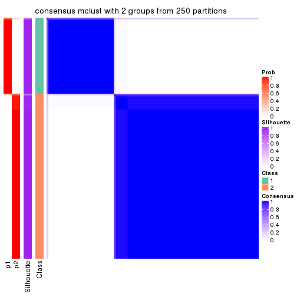</p>

</div>
<div id='tab-CV-mclust-consensus-heatmap-2'>
<pre><code class="r">consensus_heatmap(res, k = 3)
</code></pre>

<p>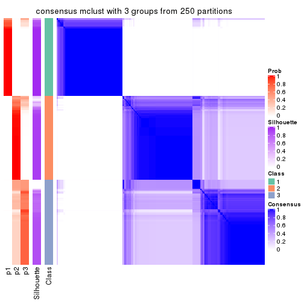</p>

</div>
<div id='tab-CV-mclust-consensus-heatmap-3'>
<pre><code class="r">consensus_heatmap(res, k = 4)
</code></pre>

<p>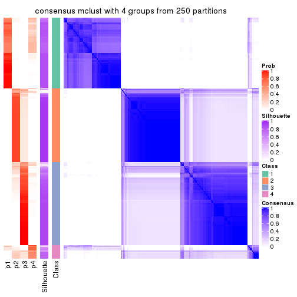</p>

</div>
<div id='tab-CV-mclust-consensus-heatmap-4'>
<pre><code class="r">consensus_heatmap(res, k = 5)
</code></pre>

<p>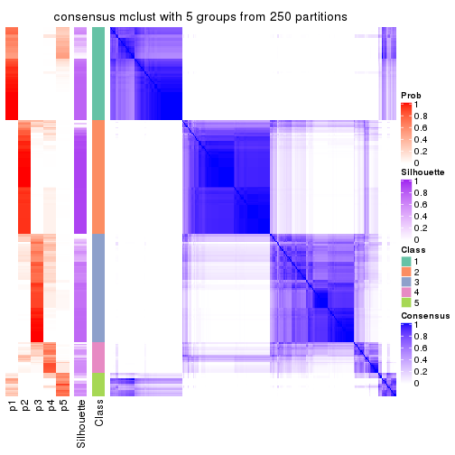</p>

</div>
<div id='tab-CV-mclust-consensus-heatmap-5'>
<pre><code class="r">consensus_heatmap(res, k = 6)
</code></pre>

<p>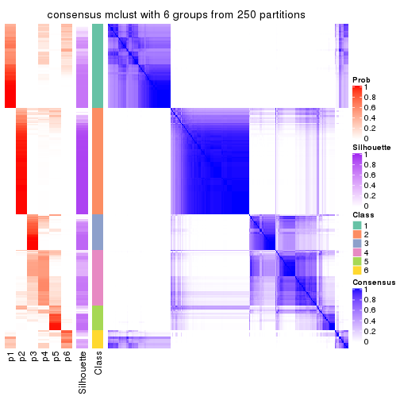</p>

</div>
</div>

Heatmaps for the membership of samples in all partitions to see how consistent they are:


<script>
$( function() {
	$( '#tabs-CV-mclust-membership-heatmap' ).tabs();
} );
</script>
<div id='tabs-CV-mclust-membership-heatmap'>
<ul>
<li><a href='#tab-CV-mclust-membership-heatmap-1'>k = 2</a></li>
<li><a href='#tab-CV-mclust-membership-heatmap-2'>k = 3</a></li>
<li><a href='#tab-CV-mclust-membership-heatmap-3'>k = 4</a></li>
<li><a href='#tab-CV-mclust-membership-heatmap-4'>k = 5</a></li>
<li><a href='#tab-CV-mclust-membership-heatmap-5'>k = 6</a></li>
</ul>
<div id='tab-CV-mclust-membership-heatmap-1'>
<pre><code class="r">membership_heatmap(res, k = 2)
</code></pre>

<p>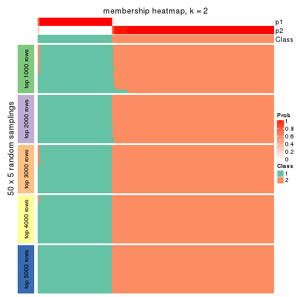</p>

</div>
<div id='tab-CV-mclust-membership-heatmap-2'>
<pre><code class="r">membership_heatmap(res, k = 3)
</code></pre>

<p>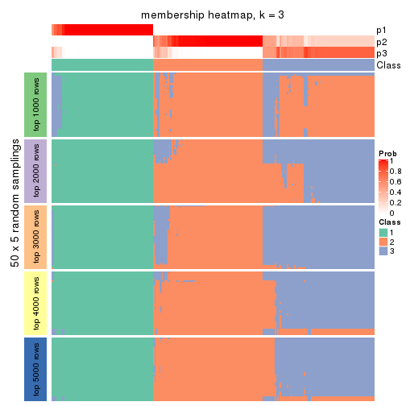</p>

</div>
<div id='tab-CV-mclust-membership-heatmap-3'>
<pre><code class="r">membership_heatmap(res, k = 4)
</code></pre>

<p>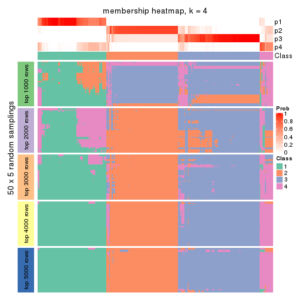</p>

</div>
<div id='tab-CV-mclust-membership-heatmap-4'>
<pre><code class="r">membership_heatmap(res, k = 5)
</code></pre>

<p>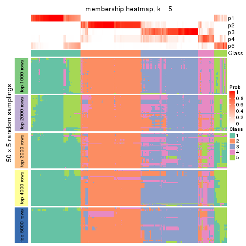</p>

</div>
<div id='tab-CV-mclust-membership-heatmap-5'>
<pre><code class="r">membership_heatmap(res, k = 6)
</code></pre>

<p>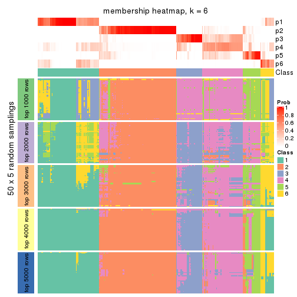</p>

</div>
</div>

As soon as we have had the classes for columns, we can look for signatures
which are significantly different between classes which can be candidate marks
for certain classes. Following are the heatmaps for signatures.


Signature heatmaps where rows are scaled:


<script>
$( function() {
	$( '#tabs-CV-mclust-get-signatures' ).tabs();
} );
</script>
<div id='tabs-CV-mclust-get-signatures'>
<ul>
<li><a href='#tab-CV-mclust-get-signatures-1'>k = 2</a></li>
<li><a href='#tab-CV-mclust-get-signatures-2'>k = 3</a></li>
<li><a href='#tab-CV-mclust-get-signatures-3'>k = 4</a></li>
<li><a href='#tab-CV-mclust-get-signatures-4'>k = 5</a></li>
<li><a href='#tab-CV-mclust-get-signatures-5'>k = 6</a></li>
</ul>
<div id='tab-CV-mclust-get-signatures-1'>
<pre><code class="r">get_signatures(res, k = 2)
</code></pre>

<p>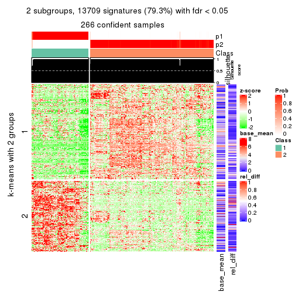</p>

</div>
<div id='tab-CV-mclust-get-signatures-2'>
<pre><code class="r">get_signatures(res, k = 3)
</code></pre>

<p>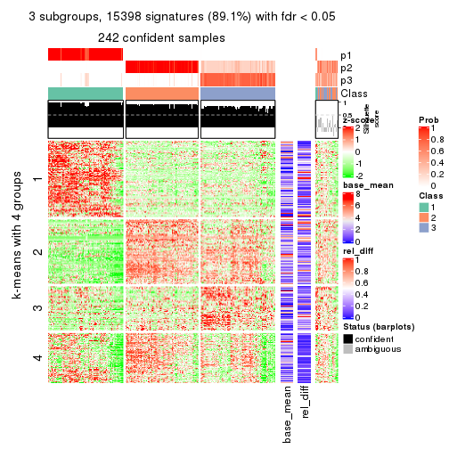</p>

</div>
<div id='tab-CV-mclust-get-signatures-3'>
<pre><code class="r">get_signatures(res, k = 4)
</code></pre>

<p>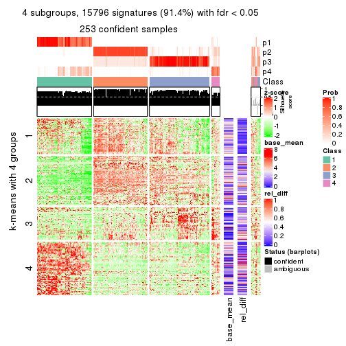</p>

</div>
<div id='tab-CV-mclust-get-signatures-4'>
<pre><code class="r">get_signatures(res, k = 5)
</code></pre>

<p>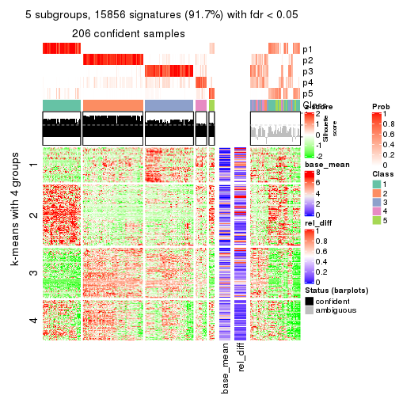</p>

</div>
<div id='tab-CV-mclust-get-signatures-5'>
<pre><code class="r">get_signatures(res, k = 6)
</code></pre>

<p>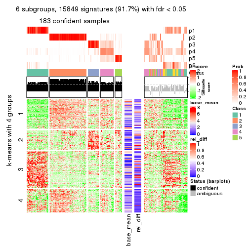</p>

</div>
</div>


Signature heatmaps where rows are not scaled:


<script>
$( function() {
	$( '#tabs-CV-mclust-get-signatures-no-scale' ).tabs();
} );
</script>
<div id='tabs-CV-mclust-get-signatures-no-scale'>
<ul>
<li><a href='#tab-CV-mclust-get-signatures-no-scale-1'>k = 2</a></li>
<li><a href='#tab-CV-mclust-get-signatures-no-scale-2'>k = 3</a></li>
<li><a href='#tab-CV-mclust-get-signatures-no-scale-3'>k = 4</a></li>
<li><a href='#tab-CV-mclust-get-signatures-no-scale-4'>k = 5</a></li>
<li><a href='#tab-CV-mclust-get-signatures-no-scale-5'>k = 6</a></li>
</ul>
<div id='tab-CV-mclust-get-signatures-no-scale-1'>
<pre><code class="r">get_signatures(res, k = 2, scale_rows = FALSE)
</code></pre>

<p>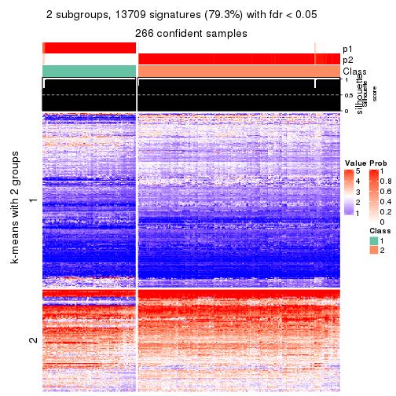</p>

</div>
<div id='tab-CV-mclust-get-signatures-no-scale-2'>
<pre><code class="r">get_signatures(res, k = 3, scale_rows = FALSE)
</code></pre>

<p>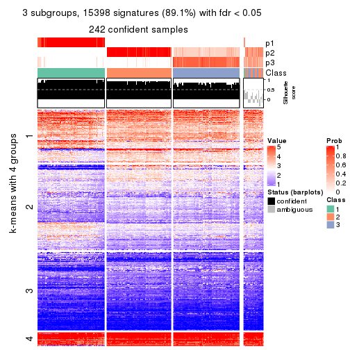</p>

</div>
<div id='tab-CV-mclust-get-signatures-no-scale-3'>
<pre><code class="r">get_signatures(res, k = 4, scale_rows = FALSE)
</code></pre>

<p>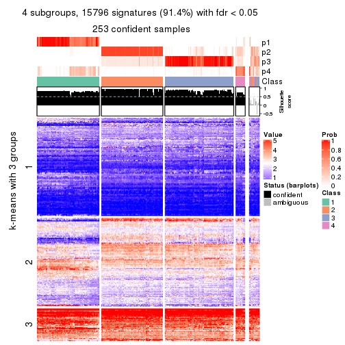</p>

</div>
<div id='tab-CV-mclust-get-signatures-no-scale-4'>
<pre><code class="r">get_signatures(res, k = 5, scale_rows = FALSE)
</code></pre>

<p>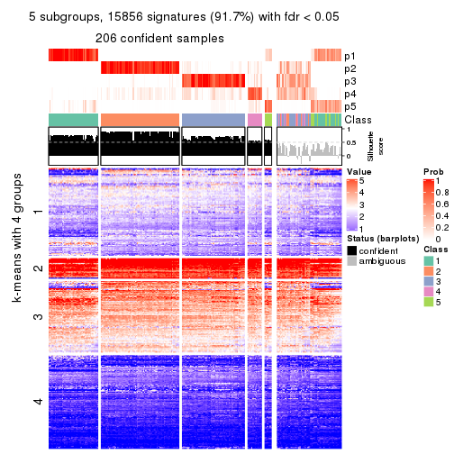</p>

</div>
<div id='tab-CV-mclust-get-signatures-no-scale-5'>
<pre><code class="r">get_signatures(res, k = 6, scale_rows = FALSE)
</code></pre>

<p>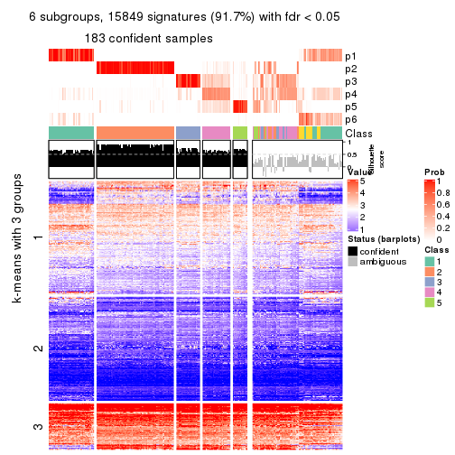</p>

</div>
</div>


Compare the overlap of signatures from different k:

```r
compare_signatures(res)
```

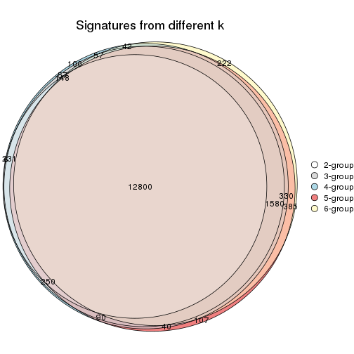

`get_signature()` returns a data frame invisibly. TO get the list of signatures, the function
call should be assigned to a variable explicitly. In following code, if `plot` argument is set
to `FALSE`, no heatmap is plotted while only the differential analysis is performed.

```r
# code only for demonstration
tb = get_signature(res, k = ..., plot = FALSE)
```

An example of the output of `tb` is:

```
#>   which_row         fdr    mean_1    mean_2 scaled_mean_1 scaled_mean_2 km
#> 1        38 0.042760348  8.373488  9.131774    -0.5533452     0.5164555  1
#> 2        40 0.018707592  7.106213  8.469186    -0.6173731     0.5762149  1
#> 3        55 0.019134737 10.221463 11.207825    -0.6159697     0.5749050  1
#> 4        59 0.006059896  5.921854  7.869574    -0.6899429     0.6439467  1
#> 5        60 0.018055526  8.928898 10.211722    -0.6204761     0.5791110  1
#> 6        98 0.009384629 15.714769 14.887706     0.6635654    -0.6193277  2
...
```

The columns in `tb` are:

1. `which_row`: row indices corresponding to the input matrix.
2. `fdr`: FDR for the differential test. 
3. `mean_x`: The mean value in group x.
4. `scaled_mean_x`: The mean value in group x after rows are scaled.
5. `km`: Row groups if k-means clustering is applied to rows.


UMAP plot which shows how samples are separated.


<script>
$( function() {
	$( '#tabs-CV-mclust-dimension-reduction' ).tabs();
} );
</script>
<div id='tabs-CV-mclust-dimension-reduction'>
<ul>
<li><a href='#tab-CV-mclust-dimension-reduction-1'>k = 2</a></li>
<li><a href='#tab-CV-mclust-dimension-reduction-2'>k = 3</a></li>
<li><a href='#tab-CV-mclust-dimension-reduction-3'>k = 4</a></li>
<li><a href='#tab-CV-mclust-dimension-reduction-4'>k = 5</a></li>
<li><a href='#tab-CV-mclust-dimension-reduction-5'>k = 6</a></li>
</ul>
<div id='tab-CV-mclust-dimension-reduction-1'>
<pre><code class="r">dimension_reduction(res, k = 2, method = &quot;UMAP&quot;)
</code></pre>

<p></p>

</div>
<div id='tab-CV-mclust-dimension-reduction-2'>
<pre><code class="r">dimension_reduction(res, k = 3, method = &quot;UMAP&quot;)
</code></pre>

<p>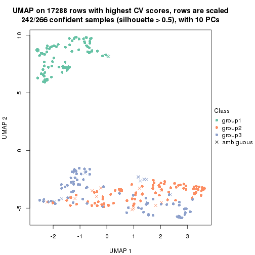</p>

</div>
<div id='tab-CV-mclust-dimension-reduction-3'>
<pre><code class="r">dimension_reduction(res, k = 4, method = &quot;UMAP&quot;)
</code></pre>

<p>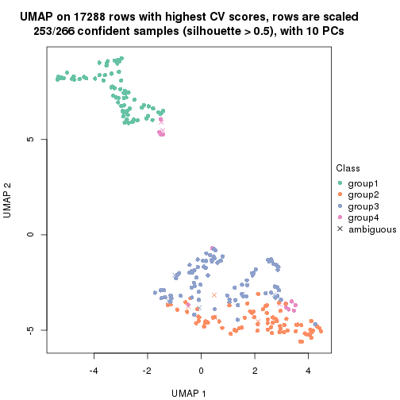</p>

</div>
<div id='tab-CV-mclust-dimension-reduction-4'>
<pre><code class="r">dimension_reduction(res, k = 5, method = &quot;UMAP&quot;)
</code></pre>

<p>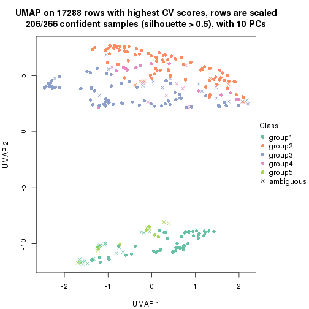</p>

</div>
<div id='tab-CV-mclust-dimension-reduction-5'>
<pre><code class="r">dimension_reduction(res, k = 6, method = &quot;UMAP&quot;)
</code></pre>

<p>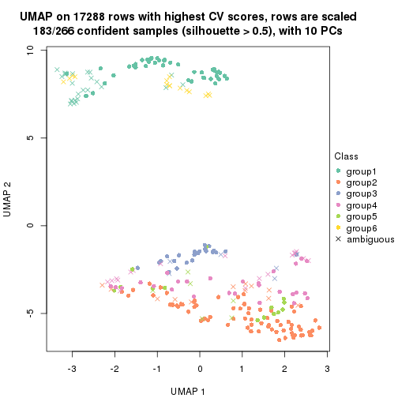</p>

</div>
</div>


Following heatmap shows how subgroups are split when increasing `k`:

```r
collect_classes(res)
```

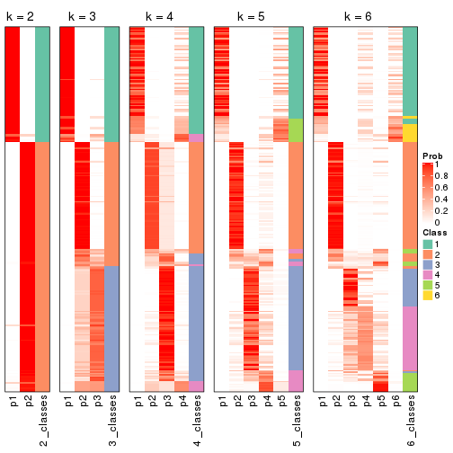


If matrix rows can be associated to genes, consider to use `GO_Enrichment(res,
...)` to perform function enrichment for the signature genes.


 

---------------------------------------------------


### CV:NMF**


The object with results only for a single top-value method and a single partition method 
can be extracted as:

```r
res = res_list["CV", "NMF"]
# you can also extract it by
# res = res_list["CV:NMF"]
```

A summary of `res` and all the functions that can be applied to it:

```r
res
```

```
#> A 'ConsensusPartition' object with k = 2, 3, 4, 5, 6.
#>   On a matrix with 17288 rows and 266 columns.
#>   Top rows (1000, 2000, 3000, 4000, 5000) are extracted by 'CV' method.
#>   Subgroups are detected by 'NMF' method.
#>   Performed in total 1250 partitions by row resampling.
#>   Best k for subgroups seems to be 2.
#> 
#> Following methods can be applied to this 'ConsensusPartition' object:
#>  [1] "cola_report"             "collect_classes"         "collect_plots"          
#>  [4] "collect_stats"           "colnames"                "compare_signatures"     
#>  [7] "consensus_heatmap"       "dimension_reduction"     "functional_enrichment"  
#> [10] "get_anno_col"            "get_anno"                "get_classes"            
#> [13] "get_consensus"           "get_matrix"              "get_membership"         
#> [16] "get_param"               "get_signatures"          "get_stats"              
#> [19] "is_best_k"               "is_stable_k"             "membership_heatmap"     
#> [22] "ncol"                    "nrow"                    "plot_ecdf"              
#> [25] "rownames"                "select_partition_number" "show"                   
#> [28] "suggest_best_k"          "test_to_known_factors"
```

`collect_plots()` function collects all the plots made from `res` for all `k` (number of partitions)
into one single page to provide an easy and fast comparison between different `k`.

```r
collect_plots(res)
```

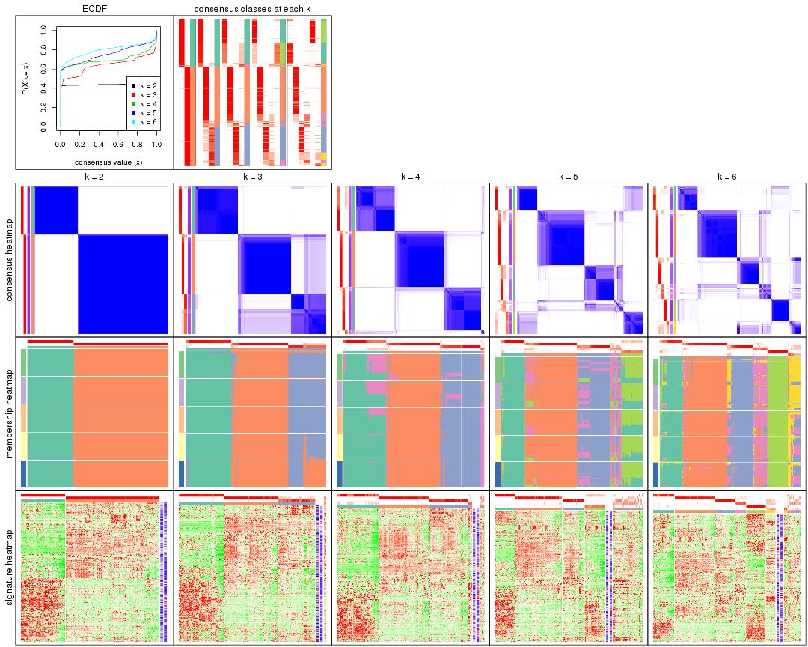

The plots are:

- The first row: a plot of the ECDF (Empirical cumulative distribution
  function) curves of the consensus matrix for each `k` and the heatmap of
  predicted classes for each `k`.
- The second row: heatmaps of the consensus matrix for each `k`.
- The third row: heatmaps of the membership matrix for each `k`.
- The fouth row: heatmaps of the signatures for each `k`.

All the plots in panels can be made by individual functions and they are
plotted later in this section.

`select_partition_number()` produces several plots showing different
statistics for choosing "optimized" `k`. There are following statistics:

- ECDF curves of the consensus matrix for each `k`;
- 1-PAC. [The PAC
  score](https://en.wikipedia.org/wiki/Consensus_clustering#Over-interpretation_potential_of_consensus_clustering)
  measures the proportion of the ambiguous subgrouping.
- Mean silhouette score.
- Concordance. The mean probability of fiting the consensus class ids in all
  partitions.
- Area increased. Denote $A_k$ as the area under the ECDF curve for current
  `k`, the area increased is defined as $A_k - A_{k-1}$.
- Rand index. The percent of pairs of samples that are both in a same cluster
  or both are not in a same cluster in the partition of k and k-1.
- Jaccard index. The ratio of pairs of samples are both in a same cluster in
  the partition of k and k-1 and the pairs of samples are both in a same
  cluster in the partition k or k-1.

The detailed explanations of these statistics can be found in [the cola
vignette](http://bioconductor.org/packages/devel/bioc/vignettes/cola/inst/doc/cola.html#toc_13).

Generally speaking, lower PAC score, higher mean silhouette score or higher
concordance corresponds to better partition. Rand index and Jaccard index
measure how similar the current partition is compared to partition with `k-1`.
If they are too similar, we won't accept `k` is better than `k-1`.

```r
select_partition_number(res)
```

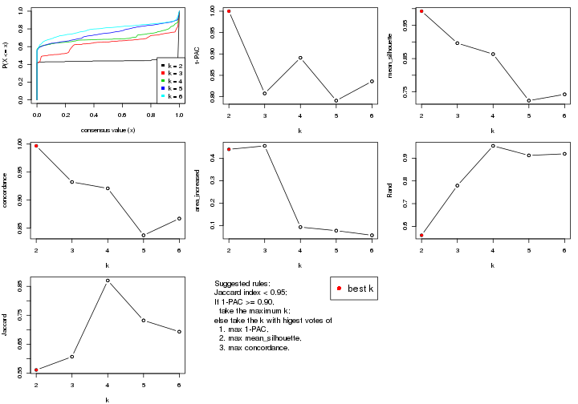

The numeric values for all these statistics can be obtained by `get_stats()`.

```r
get_stats(res)
```

```
#>   k 1-PAC mean_silhouette concordance area_increased  Rand Jaccard
#> 2 2 1.000           0.992       0.997         0.4398 0.561   0.561
#> 3 3 0.808           0.896       0.932         0.4553 0.779   0.607
#> 4 4 0.891           0.863       0.921         0.0929 0.954   0.870
#> 5 5 0.791           0.724       0.837         0.0771 0.912   0.732
#> 6 6 0.836           0.743       0.867         0.0564 0.919   0.693
```

`suggest_best_k()` suggests the best $k$ based on these statistics. The rules are as follows:

- All $k$ with Jaccard index larger than 0.95 are removed because the increase of
  the partition number does not provides enough extra information. If all $k$ are removed,
  the best $k$ is assigned by `NA`.
- For $k$ with 1-PAC larger than 0.9, the maximal $k$ is taken as the "best k". Other $k$ is called "optional k".
- If it does not fit the second rule. The $k$ with the highest vote of highest
  1-PAC, mean silhouette and concordance is taken as the "best k".

```r
suggest_best_k(res)
```

```
#> [1] 2
```


Following shows the table of the partitions (You need to click the **show/hide
code output** link to see it). The membership matrix (columns with name `p*`)
is inferred by
[`clue::cl_consensus()`](https://www.rdocumentation.org/link/cl_consensus?package=clue)
function with the `SE` method. Basically the value in the membership matrix
represents the probability to belong to a certain group. The finall class
label for an item is determined with the group with highest probability it
belongs to.

In `get_classes()` function, the entropy is calculated from the membership
matrix and the silhouette score is calculated from the consensus matrix.


<script>
$( function() {
	$( '#tabs-CV-NMF-get-classes' ).tabs();
} );
</script>
<div id='tabs-CV-NMF-get-classes'>
<ul>
<li><a href='#tab-CV-NMF-get-classes-1'>k = 2</a></li>
<li><a href='#tab-CV-NMF-get-classes-2'>k = 3</a></li>
<li><a href='#tab-CV-NMF-get-classes-3'>k = 4</a></li>
<li><a href='#tab-CV-NMF-get-classes-4'>k = 5</a></li>
<li><a href='#tab-CV-NMF-get-classes-5'>k = 6</a></li>
</ul>

<div id='tab-CV-NMF-get-classes-1'>
<p><a id='tab-CV-NMF-get-classes-1-a' style='color:#0366d6' href='#'>show/hide code output</a></p>
<pre><code class="r">cbind(get_classes(res, k = 2), get_membership(res, k = 2))
</code></pre>

<pre><code>#&gt;                                      class entropy silhouette    p1    p2
#&gt; 80D0AF10-1C61-4B67-90C1-7DBF1EF23672     2   0.000      0.997 0.000 1.000
#&gt; 87117BE1-D328-4972-85DA-6672412D8860     2   0.000      0.997 0.000 1.000
#&gt; F904C5B6-70BD-4604-8254-79BE23B152DA     1   0.000      0.995 1.000 0.000
#&gt; 3182DEA1-4239-4613-925A-7E6503766AD6     2   0.000      0.997 0.000 1.000
#&gt; 55E78EA2-2D9B-481F-8CAB-D36A33088EAE     2   0.000      0.997 0.000 1.000
#&gt; 86F94264-A6DD-4A97-9191-036F066DD0EF     2   0.000      0.997 0.000 1.000
#&gt; 09D25417-23B7-4D88-A0EA-F307985FBBBC     2   0.000      0.997 0.000 1.000
#&gt; C797F12C-40D3-4DB5-B9EF-A6821BBDE4F0     1   0.000      0.995 1.000 0.000
#&gt; 80275DB0-A226-4B6B-A08F-4ADBEEE1DB01     1   0.000      0.995 1.000 0.000
#&gt; 27FB653A-9E07-44AD-952E-9E4DE4AB5891     2   0.000      0.997 0.000 1.000
#&gt; 1A5DB9FC-2ABD-4E1B-B5EF-B1CF5E5F3872     1   0.000      0.995 1.000 0.000
#&gt; 844E4CCD-D30C-416F-A086-8923711A4E25     2   0.000      0.997 0.000 1.000
#&gt; EF18318D-3D25-4D65-803A-ED6E62871E7E     1   0.000      0.995 1.000 0.000
#&gt; 1ACB1BE0-61F6-4243-BBEC-E26A1CF90CA8     1   0.000      0.995 1.000 0.000
#&gt; 8EF0039B-D758-46AB-BAF7-6A062C7C56BA     1   0.000      0.995 1.000 0.000
#&gt; 22F4C9D9-663B-4C91-9692-E035A2640BEC     2   0.000      0.997 0.000 1.000
#&gt; FA1A0BCE-EE0F-4178-B963-62550E344B14     2   0.000      0.997 0.000 1.000
#&gt; 0B6D0C4E-5AE3-4707-A9FC-12A108E6EC2A     2   0.000      0.997 0.000 1.000
#&gt; 06FD3123-2AEB-4911-AC4E-E0E64FD5DB52     2   0.000      0.997 0.000 1.000
#&gt; 235A4492-FF80-4AA5-BC71-DFF65E1C7411     2   0.000      0.997 0.000 1.000
#&gt; A192C6C0-1443-4493-AFAC-1EE710628ADB     2   0.000      0.997 0.000 1.000
#&gt; 6FC5B56B-711B-4174-9B06-4E843124AAB6     1   0.000      0.995 1.000 0.000
#&gt; 7A813F60-A41E-4552-990E-F22287654C1D     2   0.000      0.997 0.000 1.000
#&gt; 725BBFB5-26F4-4512-9C75-47D013C1E605     1   0.000      0.995 1.000 0.000
#&gt; 39CC4E82-EBC9-472E-8BE5-6A3AB178449A     2   0.000      0.997 0.000 1.000
#&gt; 61130DEE-E267-49DF-8B41-7738A06EF738     2   0.000      0.997 0.000 1.000
#&gt; 117EC12C-B7ED-4E01-B29B-EA542D356EA1     1   0.000      0.995 1.000 0.000
#&gt; A30FF708-F7A9-41E4-8AD5-20441650FBC9     2   0.000      0.997 0.000 1.000
#&gt; 53640D52-1167-4A5D-B656-97D32CBA3934     1   0.000      0.995 1.000 0.000
#&gt; 9E85D76A-DD2A-46D5-BB59-0ED302B6258C     2   0.000      0.997 0.000 1.000
#&gt; 6F8C6F90-7E3C-4860-91DD-586708DE44AA     1   0.000      0.995 1.000 0.000
#&gt; E675AEC5-AA9A-4AAA-839C-03E6365822DB     2   0.000      0.997 0.000 1.000
#&gt; B577DEF7-2F5C-4876-A7C6-F18D5722B8C0     1   0.000      0.995 1.000 0.000
#&gt; DA8B577E-43E7-49BF-BF94-868E3194F5C9     1   0.000      0.995 1.000 0.000
#&gt; 3334280B-2A36-4AC7-A021-A76C10E958F0     2   0.000      0.997 0.000 1.000
#&gt; 5CBDDC90-11EC-4E6E-881E-AA9CCFD40FDB     2   0.000      0.997 0.000 1.000
#&gt; 8CBBF32A-8349-44F5-A8B8-4CBB1760A464     2   0.000      0.997 0.000 1.000
#&gt; B9455A9A-136D-4DC2-9F86-0FC74433589D     2   0.295      0.944 0.052 0.948
#&gt; D7EAE2A7-F9BE-4222-A452-B1F83F99CD50     2   0.000      0.997 0.000 1.000
#&gt; F803AE18-60C5-4CFE-AAAB-DB33C26A2184     1   0.000      0.995 1.000 0.000
#&gt; 5DD8CAC7-EC02-43B6-B58E-6D2E22868A3B     2   0.000      0.997 0.000 1.000
#&gt; EE98E1B4-DFB3-4AEC-8527-E1FD544C9475     1   0.000      0.995 1.000 0.000
#&gt; 3CE43921-47D5-4394-B9E1-242607775D61     2   0.000      0.997 0.000 1.000
#&gt; 46986F2B-0B0D-4187-8948-4E91D34B7C49     2   0.000      0.997 0.000 1.000
#&gt; 5D1D052E-74EF-45A8-9B1A-7CECD13EA43B     2   0.000      0.997 0.000 1.000
#&gt; 4C821AD9-A5C9-4A9A-9C5D-363B227F8064     2   0.000      0.997 0.000 1.000
#&gt; 06A4189E-A23B-4AC6-AA74-01955DD7D1E9     2   0.000      0.997 0.000 1.000
#&gt; FCCDC76F-CB02-4BCD-A616-325F258DDAA4     2   0.000      0.997 0.000 1.000
#&gt; DAC53B0A-8F35-4EA6-BBCC-4CD1C049E11F     2   0.000      0.997 0.000 1.000
#&gt; DD4F845B-CAD3-44CB-9D96-3C3F5BA1B72D     1   0.000      0.995 1.000 0.000
#&gt; D440F004-A4A4-41B6-BED8-805D67BA01C7     2   0.000      0.997 0.000 1.000
#&gt; A497C423-119F-42FA-BF17-9F6DFD2A5585     2   0.000      0.997 0.000 1.000
#&gt; 3420E573-DE12-4EF5-B1C0-2FCA904F4F4E     1   0.000      0.995 1.000 0.000
#&gt; 1AD72157-A254-44B4-BA58-4F30F1AE910E     1   0.000      0.995 1.000 0.000
#&gt; C1113977-B160-45EE-B061-750F9EA3F33F     2   0.000      0.997 0.000 1.000
#&gt; 6783AB5B-F07C-447B-BF13-C34485D246D7     2   0.000      0.997 0.000 1.000
#&gt; 1F553062-26FD-4A7F-B7FB-81184604F423     1   0.000      0.995 1.000 0.000
#&gt; BE2DCA51-1C21-4598-98A7-F2FB9B2DFCB4     2   0.000      0.997 0.000 1.000
#&gt; 38941CF3-9C54-4BA4-A005-CC88CA97D504     2   0.000      0.997 0.000 1.000
#&gt; 51CB675E-E243-4A07-BF4A-580473D26FDA     2   0.000      0.997 0.000 1.000
#&gt; C7FED0F5-C27A-4405-9232-30BF39362CF7     2   0.000      0.997 0.000 1.000
#&gt; 2A1E86E8-4713-465F-ACFF-C584864C57A1     2   0.000      0.997 0.000 1.000
#&gt; B4500785-0FAA-4D4D-8630-43D194BAB004     2   0.000      0.997 0.000 1.000
#&gt; 3FD52E66-AB76-4079-80DB-281A795D1EC0     2   0.000      0.997 0.000 1.000
#&gt; EBD355D1-1226-4DFD-AAFF-45D246B64F3C     2   0.000      0.997 0.000 1.000
#&gt; 5A040A73-CD95-487E-8AEF-9639FE4E2916     2   0.000      0.997 0.000 1.000
#&gt; CF629C65-585D-476D-B081-3E6E0575FAE3     1   0.118      0.979 0.984 0.016
#&gt; 0D4202A3-808E-413F-9BF3-9CFCCAE0ED61     2   0.000      0.997 0.000 1.000
#&gt; 43E715BF-28D9-4B5E-B762-8CD1B69A430E     1   0.000      0.995 1.000 0.000
#&gt; BFB82BE8-9DAC-4099-8B38-0950308E3EB3     2   0.000      0.997 0.000 1.000
#&gt; F7CB1825-2303-4DD2-AE1F-7205738EAF1F     1   0.000      0.995 1.000 0.000
#&gt; FE298483-C42C-4753-BABB-29A9CB1B6312     1   0.000      0.995 1.000 0.000
#&gt; A98C7561-1B42-4CD6-AE71-924B91FA4C33     2   0.000      0.997 0.000 1.000
#&gt; 58098F21-7DAB-47DA-9A41-8D20BF3B9257     2   0.000      0.997 0.000 1.000
#&gt; 18CAF708-20B9-4745-9CB3-37AB6E0B3056     2   0.000      0.997 0.000 1.000
#&gt; 2C80DD72-C9C7-4AC2-812F-9A31EF02779C     1   0.000      0.995 1.000 0.000
#&gt; 68A3F13D-319D-4603-A27F-B5DD46FE5C5B     2   0.000      0.997 0.000 1.000
#&gt; 7EE8F0CE-CDC9-40F9-A1DE-7F8140EC6D13     2   0.000      0.997 0.000 1.000
#&gt; 39019903-5B9C-4665-BD5F-7CCB19CB55C5     2   0.000      0.997 0.000 1.000
#&gt; 190EDB27-4CBC-4E9C-9B67-D51FDAB982B7     2   0.000      0.997 0.000 1.000
#&gt; EB2D95BC-62F8-4669-9308-D37D7FB79E23     2   0.000      0.997 0.000 1.000
#&gt; A08B85EA-D1E7-4B77-8DEC-36294305B9F7     1   0.000      0.995 1.000 0.000
#&gt; 130DDFAD-6EF8-4C80-BD9D-88308A6874BC     2   0.000      0.997 0.000 1.000
#&gt; 7340A5BA-E002-448F-AACC-E7A37DBB79C2     2   0.000      0.997 0.000 1.000
#&gt; A771F6E3-D266-4FE7-98C6-C40E6A701D59     1   0.000      0.995 1.000 0.000
#&gt; 015E792C-EC1B-49BF-AB07-D82B20C5989A     2   0.000      0.997 0.000 1.000
#&gt; BF79E030-47EE-4D08-B910-5685A4BD8B60     2   0.000      0.997 0.000 1.000
#&gt; FB3C7C9A-2F2D-4DD5-BE47-FAFB072C0FAB     2   0.000      0.997 0.000 1.000
#&gt; 4E5557BA-10E8-4723-908E-DD04EF6639B2     2   0.000      0.997 0.000 1.000
#&gt; 8031B550-40A9-4A3A-9F7D-CDC052288BD8     2   0.000      0.997 0.000 1.000
#&gt; 55299A06-3C1F-45A4-B166-B2C591C0CEE2     2   0.000      0.997 0.000 1.000
#&gt; EB8D5168-216E-4ABB-8B4E-9E67786CB322     1   0.000      0.995 1.000 0.000
#&gt; 78BD2D83-9A7F-42E5-BB38-654AA0761A0A     2   0.000      0.997 0.000 1.000
#&gt; AA2D53E5-D389-4332-9DD5-A736052E48F8     1   0.000      0.995 1.000 0.000
#&gt; 62945C7A-9313-4FC9-820C-B0AB820B394E     1   0.000      0.995 1.000 0.000
#&gt; 22746046-2E99-4EE9-97D2-BA2EA499634C     2   0.000      0.997 0.000 1.000
#&gt; 8671B51B-DCBE-4429-9F01-AF51CAD7014F     2   0.000      0.997 0.000 1.000
#&gt; E815AB36-5689-4A0D-8E6D-2EAA73406681     1   0.000      0.995 1.000 0.000
#&gt; A1DACB46-ED52-4E38-B2C8-57256BB22B5E     2   0.000      0.997 0.000 1.000
#&gt; 4F5498C4-A423-4B3D-AC98-D4E214A57D0E     1   0.000      0.995 1.000 0.000
#&gt; A7772CCD-FFFF-49DD-86ED-0BAD330EC9B6     2   0.000      0.997 0.000 1.000
#&gt; E6E3DF78-65B9-4F74-8DA8-E2A6D4EDBEA7     2   0.000      0.997 0.000 1.000
#&gt; 83286E2D-E708-437A-911A-E6B050273CBD     1   0.000      0.995 1.000 0.000
#&gt; EC5C7C97-EE8C-405D-A039-D96514B1D414     2   0.000      0.997 0.000 1.000
#&gt; 3E55223D-6E3D-4027-9819-67E91212531D     1   0.000      0.995 1.000 0.000
#&gt; 99A036A2-8343-4D06-8047-D84E96CE4C61     2   0.000      0.997 0.000 1.000
#&gt; CA6CDE6D-92DE-4259-9E58-A373F2D543EA     2   0.000      0.997 0.000 1.000
#&gt; BF6FA8CC-60C1-413A-B2C6-54CCACBC01D6     1   0.000      0.995 1.000 0.000
#&gt; E0594CFE-F7B6-4546-B130-30DF6A514B1F     2   0.000      0.997 0.000 1.000
#&gt; E769E41D-5949-42C5-9594-E563C05ACE52     2   0.000      0.997 0.000 1.000
#&gt; 01373725-5D3C-4D9C-AABC-911D53E62BCD     2   0.000      0.997 0.000 1.000
#&gt; 1F39DADD-3655-474E-BA4C-A5BD32C97A8B     1   0.000      0.995 1.000 0.000
#&gt; AF573EC8-E4EE-4B8F-8199-9817B9FAC67D     1   0.000      0.995 1.000 0.000
#&gt; 3F022CBC-41C8-4387-A6FB-124C4BCD1AD9     1   0.000      0.995 1.000 0.000
#&gt; 1CC32ACE-826B-494B-8B89-5BD92327A74D     2   0.000      0.997 0.000 1.000
#&gt; 22B0BD3B-EE08-4BC7-90B2-01C372A56BA2     2   0.000      0.997 0.000 1.000
#&gt; 0F3DE9EF-19CC-4D14-9A42-1435DB537F94     2   0.000      0.997 0.000 1.000
#&gt; 87F8A33F-FBC3-469E-862B-84472F796358     2   0.000      0.997 0.000 1.000
#&gt; C9F2FA0D-1A9F-40B4-BD9B-CAF1B3F3D5A7     2   0.000      0.997 0.000 1.000
#&gt; ACFC9F59-78FF-4453-B25F-8834D0EAB54A     2   0.000      0.997 0.000 1.000
#&gt; B7AC7D5B-14E9-45A7-93B7-226EE508544A     2   0.000      0.997 0.000 1.000
#&gt; 4491BF17-B168-4E96-8E09-EF1AEC9F5E9D     2   0.000      0.997 0.000 1.000
#&gt; 557A0811-A3FE-4CF4-A24D-FBB77E7F9139     2   0.000      0.997 0.000 1.000
#&gt; 6F9C955C-6816-4353-922A-8035B50FACC6     2   0.000      0.997 0.000 1.000
#&gt; 3E89FB1C-4A7D-43C7-823C-04E3716A7935     2   0.000      0.997 0.000 1.000
#&gt; 12ABE483-66EF-4237-94C4-0199FAE23FA8     2   0.000      0.997 0.000 1.000
#&gt; 7535F262-9B96-44F6-988C-4C9EBB3FFCA9     2   0.000      0.997 0.000 1.000
#&gt; 65C9D28E-303B-40E5-84F0-2507F5457374     2   0.000      0.997 0.000 1.000
#&gt; FD445384-6BA9-4297-9D9C-12ABA7D645C7     1   0.000      0.995 1.000 0.000
#&gt; 30D5E255-2AD3-44F3-8983-1B80E4FD3E2D     2   0.000      0.997 0.000 1.000
#&gt; 3E88EC60-B4A8-4259-8BC8-A234800F6955     2   0.000      0.997 0.000 1.000
#&gt; ACD73CE8-AFC5-47A0-9383-3CB97F018953     1   0.000      0.995 1.000 0.000
#&gt; 1AFDC2EA-26A8-44E2-8BCB-F34F7B66F8C8     2   0.000      0.997 0.000 1.000
#&gt; 9E327BC8-1D20-4AD8-83F7-FB2D13BCA5D0     2   0.000      0.997 0.000 1.000
#&gt; 85A86B91-4F24-4E77-AE2D-520F8E205EFC     1   0.000      0.995 1.000 0.000
#&gt; 74868C37-8143-4306-81CA-E45759D146CD     2   0.000      0.997 0.000 1.000
#&gt; 69AEA0DB-E335-48A0-A398-4FB0D581182A     2   0.000      0.997 0.000 1.000
#&gt; AE6F8B89-85C2-42B7-8D05-AFDDD4FEFD16     1   0.000      0.995 1.000 0.000
#&gt; A8A6F09C-9812-4457-9A4B-AD41F97B41A3     2   0.000      0.997 0.000 1.000
#&gt; 1A09BC4D-EF29-42DD-BB04-A3C264A3032D     1   0.000      0.995 1.000 0.000
#&gt; E0961A30-A62C-4235-9CF0-A1776827A996     2   0.000      0.997 0.000 1.000
#&gt; 134D2D90-7B08-4F20-8A3A-C77643FB208F     2   0.000      0.997 0.000 1.000
#&gt; A77C2DFF-93CF-4CB5-B3C1-81133D7F1A0F     2   0.714      0.756 0.196 0.804
#&gt; EA2DC457-9C74-4B9C-B3FA-5E72199B24A7     2   0.000      0.997 0.000 1.000
#&gt; FF34117B-5EE4-4C96-A8A2-2CE6A654CBE5     1   0.000      0.995 1.000 0.000
#&gt; 75F7B5E2-6559-4B48-A2A4-287C35C559CC     1   0.000      0.995 1.000 0.000
#&gt; 903BF591-B0AF-4BEE-B625-60B673070344     2   0.000      0.997 0.000 1.000
#&gt; 9DE1B790-C63C-41C4-9477-CE52A8119C67     2   0.000      0.997 0.000 1.000
#&gt; 9A28F80A-85F8-40E2-A32B-230EF93B2FA0     2   0.000      0.997 0.000 1.000
#&gt; 0AA2BDBB-8720-409A-AA72-1F4AA26E7CD8     2   0.000      0.997 0.000 1.000
#&gt; 5AD49F16-E974-4E5D-B1B6-073ECB73A01D     2   0.714      0.756 0.196 0.804
#&gt; CB0F961C-527D-4A48-9408-286B26BD9532     1   0.000      0.995 1.000 0.000
#&gt; 46FF25B6-D01D-4CA7-80B7-CEC2998C34E1     2   0.000      0.997 0.000 1.000
#&gt; 487CADE1-D699-4A6C-817A-B9A0AB940C61     1   0.000      0.995 1.000 0.000
#&gt; 4FF6F2D8-F869-4735-A4D1-1A8423153FBC     1   0.000      0.995 1.000 0.000
#&gt; 6005494F-5D3D-43A3-B3E8-8C91955B2A98     2   0.000      0.997 0.000 1.000
#&gt; CF10D584-CE32-45A4-A932-E9D5AF12A6A0     1   0.000      0.995 1.000 0.000
#&gt; E15CE4AB-5646-49C8-9CD6-938457036BB0     2   0.000      0.997 0.000 1.000
#&gt; 31E28D0B-0E69-4330-82ED-4F1827DC97EA     2   0.000      0.997 0.000 1.000
#&gt; DBACD3C3-CCB5-4478-BA78-85A0C847CA66     2   0.000      0.997 0.000 1.000
#&gt; 5A07041C-65EB-4FCD-8940-E90B905061B5     2   0.000      0.997 0.000 1.000
#&gt; 0EA7C916-FA47-489B-BC98-4D9E7D197628     1   0.000      0.995 1.000 0.000
#&gt; 30967F75-8499-47FF-ADA4-4DC566013F7B     1   0.000      0.995 1.000 0.000
#&gt; D2E528FF-AEA2-48D7-A60A-4C3E71EA9073     2   0.000      0.997 0.000 1.000
#&gt; 22735DCD-215E-48BC-BF44-32BD66F06E39     2   0.000      0.997 0.000 1.000
#&gt; BC2C3248-7FC6-48BC-96C1-45EA573DE7DC     1   0.000      0.995 1.000 0.000
#&gt; E72CEBCB-D686-4B12-BCBA-EC8F964330A2     1   0.000      0.995 1.000 0.000
#&gt; 23C937BB-BA20-4440-B680-914229CC3ADF     1   0.000      0.995 1.000 0.000
#&gt; 947E99C7-F402-4F1A-A6E9-81BCAAED135A     2   0.000      0.997 0.000 1.000
#&gt; 02475D11-FC81-4E88-944E-173C32DC3FE7     1   0.966      0.351 0.608 0.392
#&gt; F972A9AA-9842-4343-A533-A795E65581CE     1   0.000      0.995 1.000 0.000
#&gt; 05043AAF-3095-4C61-B5C1-EE9AA9082C75     2   0.000      0.997 0.000 1.000
#&gt; CECF7967-862E-428C-BB42-FEF553FDB3AA     2   0.000      0.997 0.000 1.000
#&gt; FB0B9483-6302-48C7-BE5B-DA667E00AE2D     2   0.000      0.997 0.000 1.000
#&gt; 78700FBA-1487-4754-9B30-18837BF7E9FB     1   0.000      0.995 1.000 0.000
#&gt; 2166F56D-54CE-4F1B-8F07-A4E13E4489E9     1   0.000      0.995 1.000 0.000
#&gt; 7CD0942E-E39A-43A7-8BAC-F25967864901     2   0.000      0.997 0.000 1.000
#&gt; 3B00BA2B-7F7D-4825-8F8D-90F04A5DE687     2   0.000      0.997 0.000 1.000
#&gt; 7465B01D-C05E-4FE0-A9FE-182920EDC489     2   0.000      0.997 0.000 1.000
#&gt; 88C31A99-F96E-4FC8-8B3D-C1AAA05062D9     1   0.000      0.995 1.000 0.000
#&gt; 53575575-3303-4F8F-B6A8-B42131CFB4AC     2   0.000      0.997 0.000 1.000
#&gt; CC8017C7-4128-48DA-8E43-503F63158D85     1   0.000      0.995 1.000 0.000
#&gt; 88449D2A-2A25-41A4-B91D-C99B58F8ECD9     2   0.000      0.997 0.000 1.000
#&gt; 46C7DDE5-A2B5-494F-96AE-0B6E2D51B003     1   0.000      0.995 1.000 0.000
#&gt; 42551D05-5EE5-4F91-93A8-32DA695D9DFA     2   0.000      0.997 0.000 1.000
#&gt; 0772DA48-3A36-422D-B166-CA1691B782C3     2   0.000      0.997 0.000 1.000
#&gt; 30346897-EC77-4153-88A2-D14593C8B741     2   0.000      0.997 0.000 1.000
#&gt; 0F00E267-C748-4A71-8B36-03C410641D88     2   0.000      0.997 0.000 1.000
#&gt; 4034703A-4DA9-4DDA-9CA9-E80FFE9CCDE6     2   0.000      0.997 0.000 1.000
#&gt; 393C8A41-CF45-4EA8-AFE3-25A08AB7692A     2   0.000      0.997 0.000 1.000
#&gt; 3354212D-A07C-435C-8B0C-9A7BAAB624B5     1   0.000      0.995 1.000 0.000
#&gt; 57E30D4E-ABF7-47DD-92BE-40CE215076B0     1   0.000      0.995 1.000 0.000
#&gt; 202B4C76-C840-4DB8-953F-AC75A4156FDD     2   0.000      0.997 0.000 1.000
#&gt; 93A0137B-1F4C-44EE-B959-2AD0CD2DF8B6     1   0.000      0.995 1.000 0.000
#&gt; C9794DB6-6E8C-4AFD-80EE-61D672A4F6E9     2   0.000      0.997 0.000 1.000
#&gt; AE4BFE63-F0C0-4624-AD97-4F7FF13E2384     1   0.000      0.995 1.000 0.000
#&gt; DCF87F27-2B54-42D9-8D28-5DFEE76E2F5B     2   0.000      0.997 0.000 1.000
#&gt; 2451D405-39FD-4812-958C-23462B66F1F1     2   0.000      0.997 0.000 1.000
#&gt; E27F5D33-3F68-4CA8-8757-A387C6EAD060     2   0.000      0.997 0.000 1.000
#&gt; 8BA9928A-5B93-477F-B4A2-D031B714D9AC     1   0.000      0.995 1.000 0.000
#&gt; 0FAACFF6-B50C-4BED-9824-B7270654F28D     2   0.000      0.997 0.000 1.000
#&gt; 3366CC3C-2BBA-4CA7-848E-4E16AA70AE7A     2   0.000      0.997 0.000 1.000
#&gt; 66237056-CA9A-4C90-AF0E-1621FEB71578     2   0.000      0.997 0.000 1.000
#&gt; C480F1FB-3100-436C-B0F5-DED63B7A580E     2   0.000      0.997 0.000 1.000
#&gt; A327DE0D-D945-4B42-9B41-A7302CF796EE     2   0.000      0.997 0.000 1.000
#&gt; E8A6871D-67FB-4306-9454-F5E7CDBA399A     2   0.000      0.997 0.000 1.000
#&gt; E9A7485B-82B6-4BD2-AFBB-DD0A82D6CDE2     1   0.000      0.995 1.000 0.000
#&gt; 93B382E4-9C9A-43F5-BD3B-502CC260B886     1   0.000      0.995 1.000 0.000
#&gt; A2792419-8E16-45FE-A524-17851F34AB9B     2   0.000      0.997 0.000 1.000
#&gt; 4DED1201-F25C-4F82-BABF-965EFAD7A8E5     2   0.000      0.997 0.000 1.000
#&gt; F1ACB2DD-E948-4F88-A249-F1BD1977D667     2   0.000      0.997 0.000 1.000
#&gt; 6CDBA203-8952-421D-A6BF-75652D9F3339     2   0.000      0.997 0.000 1.000
#&gt; 2D6C5AA7-3B33-48D7-AE0C-77A16B749D13     1   0.000      0.995 1.000 0.000
#&gt; 3F6B6D95-0720-42A0-AEB3-89FECAE7616A     2   0.000      0.997 0.000 1.000
#&gt; DED8ACF3-BBD8-46C9-85C9-A9C8F2E2BC0B     1   0.000      0.995 1.000 0.000
#&gt; 77069279-5A6F-42C0-9AA5-8C939591DFB5     1   0.000      0.995 1.000 0.000
#&gt; B2D4FCF3-FDF9-41C8-880A-6732CF6222AF     2   0.000      0.997 0.000 1.000
#&gt; 1CD71A4C-1E49-48EF-AA72-CB3C26B4C087     2   0.000      0.997 0.000 1.000
#&gt; C364E621-F85C-4B7F-842F-210B8D4DFE3A     2   0.000      0.997 0.000 1.000
#&gt; 11F1B8CA-07C1-47D2-A3C6-032FFA6A4A64     1   0.000      0.995 1.000 0.000
#&gt; 153BF804-6DC8-496B-987A-4021A2512211     2   0.000      0.997 0.000 1.000
#&gt; 5B5029C9-40F5-40D7-A36A-367022AD6A42     2   0.000      0.997 0.000 1.000
#&gt; 193CCBE6-104F-49B4-BDB2-C82EE36FDAAD     1   0.000      0.995 1.000 0.000
#&gt; E5D45E53-FCF3-4F01-9B78-6CB1ED0CFE40     2   0.000      0.997 0.000 1.000
#&gt; 5546A779-21DB-49F9-8C0D-A1E420088084     2   0.000      0.997 0.000 1.000
#&gt; E14825E0-0DC7-44C2-B265-F54672356838     1   0.000      0.995 1.000 0.000
#&gt; 8C8C09B9-EC83-45EC-BC4C-0BA92DE60ACB     1   0.000      0.995 1.000 0.000
#&gt; B388CA82-5BF7-4BDD-8821-4EC0B213121F     2   0.000      0.997 0.000 1.000
#&gt; A26025AC-9F71-4C07-9135-83593193BBB2     1   0.000      0.995 1.000 0.000
#&gt; C80E6D4B-AF21-42F0-8E20-6F7D2E99C062     2   0.000      0.997 0.000 1.000
#&gt; 5AE5D819-A6B1-4761-B7F9-8FFD3C520F31     2   0.000      0.997 0.000 1.000
#&gt; CAE8097F-A139-4C6E-9E30-35080475FF34     2   0.000      0.997 0.000 1.000
#&gt; 539C8DE3-6152-4671-B96F-ED6DC6DBD22B     1   0.000      0.995 1.000 0.000
#&gt; 5D28A8E0-4ECF-43A4-890A-BE968B9A8CB2     2   0.000      0.997 0.000 1.000
#&gt; 97A80AF8-365E-4756-A2B0-AEB1D8F5F33E     2   0.000      0.997 0.000 1.000
#&gt; B3527517-E339-46AE-8437-65303C309015     2   0.000      0.997 0.000 1.000
#&gt; 523E2183-AA20-4749-BD7E-69CD620DD6A3     2   0.000      0.997 0.000 1.000
#&gt; E553FB92-F181-47B3-9F3D-11DB51DFA3A4     2   0.000      0.997 0.000 1.000
#&gt; FFE0C4B1-8EEC-484A-AB87-3401B71BD081     2   0.000      0.997 0.000 1.000
#&gt; 73D6CA4B-9A9E-4E52-96C8-AE7F0CC8B276     2   0.000      0.997 0.000 1.000
#&gt; 485A8107-DF9A-4BC6-8A72-07FBA93F10F2     1   0.000      0.995 1.000 0.000
#&gt; 690823D9-B9AA-40EF-8302-4AD88BF89D1C     2   0.000      0.997 0.000 1.000
#&gt; B4E02660-562F-4EAC-8472-CBBD8A577688     2   0.000      0.997 0.000 1.000
#&gt; F82D5A60-90F9-4FF4-971E-73F7535FE65A     2   0.000      0.997 0.000 1.000
#&gt; C48401F7-2D56-4C6F-9896-C5435D1B44BF     2   0.000      0.997 0.000 1.000
#&gt; 94FC8991-182B-4B00-9A06-A00E8D3BDCFA     1   0.000      0.995 1.000 0.000
#&gt; FF00E80A-046D-4233-835E-CDF93403EA43     2   0.000      0.997 0.000 1.000
#&gt; C47A53F6-6479-4AD3-9D18-E4A70BE5F1DC     2   0.000      0.997 0.000 1.000
#&gt; 3487AE2D-AB1D-4DEF-AC4B-4B0FCAF8D899     2   0.000      0.997 0.000 1.000
#&gt; 479CD9BB-ECD7-41D5-B1E4-41132FF7FC95     2   0.000      0.997 0.000 1.000
#&gt; 048ADC6E-8C7E-4875-ACEE-E4787203C078     1   0.000      0.995 1.000 0.000
#&gt; 25AF81C5-B117-466D-AE9F-DD10BCB6AF2D     2   0.000      0.997 0.000 1.000
#&gt; 8B1D51D6-0B25-4289-81F0-9F95E0258877     2   0.000      0.997 0.000 1.000
#&gt; 282D390D-8E4E-4A19-B2B7-A6DB4BB2D46C     1   0.000      0.995 1.000 0.000
#&gt; BC6B92C1-F425-40C5-9941-539BFF5FE0FE     2   0.000      0.997 0.000 1.000
#&gt; 899CB9E0-48D0-413D-8566-BC151F146453     1   0.000      0.995 1.000 0.000
#&gt; 441400A9-1427-45E0-A8B4-EF2A6B7465C2     2   0.000      0.997 0.000 1.000
#&gt; CF96DDD4-DC0A-4341-BDE6-4DA2CB4978D0     1   0.000      0.995 1.000 0.000
#&gt; CE91F591-6072-4D29-9495-C78961635969     2   0.000      0.997 0.000 1.000
#&gt; 84D25635-2A38-4CFB-BFAC-38C007625C42     1   0.000      0.995 1.000 0.000
#&gt; ABF1AC12-872A-4C3D-A76C-07BC36A4DA5E     1   0.000      0.995 1.000 0.000
#&gt; B7F7F66F-1AED-4199-81C0-5C7FB0DBF438     2   0.000      0.997 0.000 1.000
#&gt; BAB786B9-6C20-425D-9886-63A0A092B59B     2   0.000      0.997 0.000 1.000
#&gt; 735D1DE3-D781-4F89-A395-09974057BBB7     1   0.000      0.995 1.000 0.000
#&gt; F6D5FBBA-05C4-4340-86D9-1A54181216A2     2   0.000      0.997 0.000 1.000
#&gt; 79C4E166-4A0D-4811-A2C8-CAE0A5AEED42     2   0.000      0.997 0.000 1.000
</code></pre>

<script>
$('#tab-CV-NMF-get-classes-1-a').parent().next().next().hide();
$('#tab-CV-NMF-get-classes-1-a').click(function(){
  $('#tab-CV-NMF-get-classes-1-a').parent().next().next().toggle();
  return(false);
});
</script>
</div>

<div id='tab-CV-NMF-get-classes-2'>
<p><a id='tab-CV-NMF-get-classes-2-a' style='color:#0366d6' href='#'>show/hide code output</a></p>
<pre><code class="r">cbind(get_classes(res, k = 3), get_membership(res, k = 3))
</code></pre>

<pre><code>#&gt;                                      class entropy silhouette    p1    p2    p3
#&gt; 80D0AF10-1C61-4B67-90C1-7DBF1EF23672     2  0.0000     0.9582 0.000 1.000 0.000
#&gt; 87117BE1-D328-4972-85DA-6672412D8860     2  0.0000     0.9582 0.000 1.000 0.000
#&gt; F904C5B6-70BD-4604-8254-79BE23B152DA     1  0.0892     0.9762 0.980 0.000 0.020
#&gt; 3182DEA1-4239-4613-925A-7E6503766AD6     2  0.3619     0.8102 0.000 0.864 0.136
#&gt; 55E78EA2-2D9B-481F-8CAB-D36A33088EAE     3  0.5016     0.8528 0.000 0.240 0.760
#&gt; 86F94264-A6DD-4A97-9191-036F066DD0EF     3  0.4974     0.8550 0.000 0.236 0.764
#&gt; 09D25417-23B7-4D88-A0EA-F307985FBBBC     3  0.4887     0.8576 0.000 0.228 0.772
#&gt; C797F12C-40D3-4DB5-B9EF-A6821BBDE4F0     1  0.0592     0.9766 0.988 0.000 0.012
#&gt; 80275DB0-A226-4B6B-A08F-4ADBEEE1DB01     1  0.0237     0.9767 0.996 0.000 0.004
#&gt; 27FB653A-9E07-44AD-952E-9E4DE4AB5891     3  0.1031     0.8317 0.000 0.024 0.976
#&gt; 1A5DB9FC-2ABD-4E1B-B5EF-B1CF5E5F3872     1  0.4887     0.7776 0.772 0.000 0.228
#&gt; 844E4CCD-D30C-416F-A086-8923711A4E25     3  0.1031     0.8317 0.000 0.024 0.976
#&gt; EF18318D-3D25-4D65-803A-ED6E62871E7E     1  0.4887     0.7730 0.772 0.000 0.228
#&gt; 1ACB1BE0-61F6-4243-BBEC-E26A1CF90CA8     1  0.0892     0.9762 0.980 0.000 0.020
#&gt; 8EF0039B-D758-46AB-BAF7-6A062C7C56BA     1  0.0237     0.9767 0.996 0.000 0.004
#&gt; 22F4C9D9-663B-4C91-9692-E035A2640BEC     2  0.0000     0.9582 0.000 1.000 0.000
#&gt; FA1A0BCE-EE0F-4178-B963-62550E344B14     2  0.0000     0.9582 0.000 1.000 0.000
#&gt; 0B6D0C4E-5AE3-4707-A9FC-12A108E6EC2A     3  0.4887     0.8576 0.000 0.228 0.772
#&gt; 06FD3123-2AEB-4911-AC4E-E0E64FD5DB52     2  0.0592     0.9464 0.000 0.988 0.012
#&gt; 235A4492-FF80-4AA5-BC71-DFF65E1C7411     2  0.0000     0.9582 0.000 1.000 0.000
#&gt; A192C6C0-1443-4493-AFAC-1EE710628ADB     2  0.0000     0.9582 0.000 1.000 0.000
#&gt; 6FC5B56B-711B-4174-9B06-4E843124AAB6     1  0.0892     0.9762 0.980 0.000 0.020
#&gt; 7A813F60-A41E-4552-990E-F22287654C1D     2  0.0000     0.9582 0.000 1.000 0.000
#&gt; 725BBFB5-26F4-4512-9C75-47D013C1E605     1  0.0892     0.9762 0.980 0.000 0.020
#&gt; 39CC4E82-EBC9-472E-8BE5-6A3AB178449A     2  0.0000     0.9582 0.000 1.000 0.000
#&gt; 61130DEE-E267-49DF-8B41-7738A06EF738     3  0.4062     0.8550 0.000 0.164 0.836
#&gt; 117EC12C-B7ED-4E01-B29B-EA542D356EA1     1  0.0592     0.9766 0.988 0.000 0.012
#&gt; A30FF708-F7A9-41E4-8AD5-20441650FBC9     2  0.0000     0.9582 0.000 1.000 0.000
#&gt; 53640D52-1167-4A5D-B656-97D32CBA3934     1  0.0592     0.9766 0.988 0.000 0.012
#&gt; 9E85D76A-DD2A-46D5-BB59-0ED302B6258C     2  0.0000     0.9582 0.000 1.000 0.000
#&gt; 6F8C6F90-7E3C-4860-91DD-586708DE44AA     1  0.0237     0.9767 0.996 0.000 0.004
#&gt; E675AEC5-AA9A-4AAA-839C-03E6365822DB     3  0.4931     0.8568 0.000 0.232 0.768
#&gt; B577DEF7-2F5C-4876-A7C6-F18D5722B8C0     1  0.0592     0.9766 0.988 0.000 0.012
#&gt; DA8B577E-43E7-49BF-BF94-868E3194F5C9     1  0.0237     0.9767 0.996 0.000 0.004
#&gt; 3334280B-2A36-4AC7-A021-A76C10E958F0     2  0.6299    -0.2635 0.000 0.524 0.476
#&gt; 5CBDDC90-11EC-4E6E-881E-AA9CCFD40FDB     2  0.0000     0.9582 0.000 1.000 0.000
#&gt; 8CBBF32A-8349-44F5-A8B8-4CBB1760A464     3  0.6045     0.6526 0.000 0.380 0.620
#&gt; B9455A9A-136D-4DC2-9F86-0FC74433589D     3  0.3112     0.8019 0.004 0.096 0.900
#&gt; D7EAE2A7-F9BE-4222-A452-B1F83F99CD50     2  0.3183     0.8586 0.076 0.908 0.016
#&gt; F803AE18-60C5-4CFE-AAAB-DB33C26A2184     1  0.0892     0.9762 0.980 0.000 0.020
#&gt; 5DD8CAC7-EC02-43B6-B58E-6D2E22868A3B     3  0.1031     0.8317 0.000 0.024 0.976
#&gt; EE98E1B4-DFB3-4AEC-8527-E1FD544C9475     1  0.0237     0.9767 0.996 0.000 0.004
#&gt; 3CE43921-47D5-4394-B9E1-242607775D61     2  0.0000     0.9582 0.000 1.000 0.000
#&gt; 46986F2B-0B0D-4187-8948-4E91D34B7C49     2  0.0000     0.9582 0.000 1.000 0.000
#&gt; 5D1D052E-74EF-45A8-9B1A-7CECD13EA43B     2  0.0000     0.9582 0.000 1.000 0.000
#&gt; 4C821AD9-A5C9-4A9A-9C5D-363B227F8064     3  0.5178     0.8399 0.000 0.256 0.744
#&gt; 06A4189E-A23B-4AC6-AA74-01955DD7D1E9     2  0.0000     0.9582 0.000 1.000 0.000
#&gt; FCCDC76F-CB02-4BCD-A616-325F258DDAA4     2  0.0000     0.9582 0.000 1.000 0.000
#&gt; DAC53B0A-8F35-4EA6-BBCC-4CD1C049E11F     2  0.0000     0.9582 0.000 1.000 0.000
#&gt; DD4F845B-CAD3-44CB-9D96-3C3F5BA1B72D     1  0.0892     0.9762 0.980 0.000 0.020
#&gt; D440F004-A4A4-41B6-BED8-805D67BA01C7     2  0.0000     0.9582 0.000 1.000 0.000
#&gt; A497C423-119F-42FA-BF17-9F6DFD2A5585     2  0.0000     0.9582 0.000 1.000 0.000
#&gt; 3420E573-DE12-4EF5-B1C0-2FCA904F4F4E     1  0.0237     0.9767 0.996 0.000 0.004
#&gt; 1AD72157-A254-44B4-BA58-4F30F1AE910E     1  0.0237     0.9767 0.996 0.000 0.004
#&gt; C1113977-B160-45EE-B061-750F9EA3F33F     3  0.5098     0.8464 0.000 0.248 0.752
#&gt; 6783AB5B-F07C-447B-BF13-C34485D246D7     2  0.0000     0.9582 0.000 1.000 0.000
#&gt; 1F553062-26FD-4A7F-B7FB-81184604F423     1  0.0892     0.9762 0.980 0.000 0.020
#&gt; BE2DCA51-1C21-4598-98A7-F2FB9B2DFCB4     2  0.0000     0.9582 0.000 1.000 0.000
#&gt; 38941CF3-9C54-4BA4-A005-CC88CA97D504     3  0.6204     0.5552 0.000 0.424 0.576
#&gt; 51CB675E-E243-4A07-BF4A-580473D26FDA     2  0.0000     0.9582 0.000 1.000 0.000
#&gt; C7FED0F5-C27A-4405-9232-30BF39362CF7     2  0.0000     0.9582 0.000 1.000 0.000
#&gt; 2A1E86E8-4713-465F-ACFF-C584864C57A1     3  0.4931     0.8568 0.000 0.232 0.768
#&gt; B4500785-0FAA-4D4D-8630-43D194BAB004     2  0.0000     0.9582 0.000 1.000 0.000
#&gt; 3FD52E66-AB76-4079-80DB-281A795D1EC0     2  0.0661     0.9464 0.008 0.988 0.004
#&gt; EBD355D1-1226-4DFD-AAFF-45D246B64F3C     3  0.5706     0.7576 0.000 0.320 0.680
#&gt; 5A040A73-CD95-487E-8AEF-9639FE4E2916     2  0.0000     0.9582 0.000 1.000 0.000
#&gt; CF629C65-585D-476D-B081-3E6E0575FAE3     1  0.5706     0.5917 0.680 0.000 0.320
#&gt; 0D4202A3-808E-413F-9BF3-9CFCCAE0ED61     2  0.0000     0.9582 0.000 1.000 0.000
#&gt; 43E715BF-28D9-4B5E-B762-8CD1B69A430E     1  0.0237     0.9767 0.996 0.000 0.004
#&gt; BFB82BE8-9DAC-4099-8B38-0950308E3EB3     2  0.0000     0.9582 0.000 1.000 0.000
#&gt; F7CB1825-2303-4DD2-AE1F-7205738EAF1F     1  0.0892     0.9762 0.980 0.000 0.020
#&gt; FE298483-C42C-4753-BABB-29A9CB1B6312     1  0.0892     0.9762 0.980 0.000 0.020
#&gt; A98C7561-1B42-4CD6-AE71-924B91FA4C33     3  0.1031     0.8317 0.000 0.024 0.976
#&gt; 58098F21-7DAB-47DA-9A41-8D20BF3B9257     3  0.5882     0.7132 0.000 0.348 0.652
#&gt; 18CAF708-20B9-4745-9CB3-37AB6E0B3056     2  0.0000     0.9582 0.000 1.000 0.000
#&gt; 2C80DD72-C9C7-4AC2-812F-9A31EF02779C     1  0.0424     0.9765 0.992 0.000 0.008
#&gt; 68A3F13D-319D-4603-A27F-B5DD46FE5C5B     2  0.0000     0.9582 0.000 1.000 0.000
#&gt; 7EE8F0CE-CDC9-40F9-A1DE-7F8140EC6D13     3  0.1031     0.8317 0.000 0.024 0.976
#&gt; 39019903-5B9C-4665-BD5F-7CCB19CB55C5     2  0.0000     0.9582 0.000 1.000 0.000
#&gt; 190EDB27-4CBC-4E9C-9B67-D51FDAB982B7     3  0.1031     0.8317 0.000 0.024 0.976
#&gt; EB2D95BC-62F8-4669-9308-D37D7FB79E23     2  0.0000     0.9582 0.000 1.000 0.000
#&gt; A08B85EA-D1E7-4B77-8DEC-36294305B9F7     1  0.4887     0.7909 0.772 0.000 0.228
#&gt; 130DDFAD-6EF8-4C80-BD9D-88308A6874BC     3  0.1031     0.8317 0.000 0.024 0.976
#&gt; 7340A5BA-E002-448F-AACC-E7A37DBB79C2     2  0.0000     0.9582 0.000 1.000 0.000
#&gt; A771F6E3-D266-4FE7-98C6-C40E6A701D59     1  0.0892     0.9762 0.980 0.000 0.020
#&gt; 015E792C-EC1B-49BF-AB07-D82B20C5989A     2  0.2261     0.8825 0.000 0.932 0.068
#&gt; BF79E030-47EE-4D08-B910-5685A4BD8B60     3  0.4750     0.8587 0.000 0.216 0.784
#&gt; FB3C7C9A-2F2D-4DD5-BE47-FAFB072C0FAB     3  0.5285     0.8486 0.004 0.244 0.752
#&gt; 4E5557BA-10E8-4723-908E-DD04EF6639B2     3  0.4931     0.8568 0.000 0.232 0.768
#&gt; 8031B550-40A9-4A3A-9F7D-CDC052288BD8     3  0.1411     0.8343 0.000 0.036 0.964
#&gt; 55299A06-3C1F-45A4-B166-B2C591C0CEE2     3  0.1031     0.8317 0.000 0.024 0.976
#&gt; EB8D5168-216E-4ABB-8B4E-9E67786CB322     1  0.0237     0.9767 0.996 0.000 0.004
#&gt; 78BD2D83-9A7F-42E5-BB38-654AA0761A0A     2  0.0000     0.9582 0.000 1.000 0.000
#&gt; AA2D53E5-D389-4332-9DD5-A736052E48F8     1  0.0892     0.9762 0.980 0.000 0.020
#&gt; 62945C7A-9313-4FC9-820C-B0AB820B394E     1  0.0237     0.9767 0.996 0.000 0.004
#&gt; 22746046-2E99-4EE9-97D2-BA2EA499634C     3  0.1031     0.8317 0.000 0.024 0.976
#&gt; 8671B51B-DCBE-4429-9F01-AF51CAD7014F     3  0.1031     0.8317 0.000 0.024 0.976
#&gt; E815AB36-5689-4A0D-8E6D-2EAA73406681     1  0.0592     0.9766 0.988 0.000 0.012
#&gt; A1DACB46-ED52-4E38-B2C8-57256BB22B5E     2  0.1860     0.9032 0.000 0.948 0.052
#&gt; 4F5498C4-A423-4B3D-AC98-D4E214A57D0E     1  0.0592     0.9766 0.988 0.000 0.012
#&gt; A7772CCD-FFFF-49DD-86ED-0BAD330EC9B6     2  0.0000     0.9582 0.000 1.000 0.000
#&gt; E6E3DF78-65B9-4F74-8DA8-E2A6D4EDBEA7     3  0.2066     0.8387 0.000 0.060 0.940
#&gt; 83286E2D-E708-437A-911A-E6B050273CBD     1  0.0237     0.9767 0.996 0.000 0.004
#&gt; EC5C7C97-EE8C-405D-A039-D96514B1D414     2  0.0000     0.9582 0.000 1.000 0.000
#&gt; 3E55223D-6E3D-4027-9819-67E91212531D     1  0.0747     0.9765 0.984 0.000 0.016
#&gt; 99A036A2-8343-4D06-8047-D84E96CE4C61     3  0.1031     0.8317 0.000 0.024 0.976
#&gt; CA6CDE6D-92DE-4259-9E58-A373F2D543EA     3  0.5178     0.8399 0.000 0.256 0.744
#&gt; BF6FA8CC-60C1-413A-B2C6-54CCACBC01D6     1  0.0237     0.9767 0.996 0.000 0.004
#&gt; E0594CFE-F7B6-4546-B130-30DF6A514B1F     3  0.5138     0.8437 0.000 0.252 0.748
#&gt; E769E41D-5949-42C5-9594-E563C05ACE52     3  0.5016     0.8528 0.000 0.240 0.760
#&gt; 01373725-5D3C-4D9C-AABC-911D53E62BCD     3  0.1031     0.8317 0.000 0.024 0.976
#&gt; 1F39DADD-3655-474E-BA4C-A5BD32C97A8B     1  0.0892     0.9762 0.980 0.000 0.020
#&gt; AF573EC8-E4EE-4B8F-8199-9817B9FAC67D     1  0.0237     0.9767 0.996 0.000 0.004
#&gt; 3F022CBC-41C8-4387-A6FB-124C4BCD1AD9     1  0.0892     0.9762 0.980 0.000 0.020
#&gt; 1CC32ACE-826B-494B-8B89-5BD92327A74D     3  0.4931     0.8568 0.000 0.232 0.768
#&gt; 22B0BD3B-EE08-4BC7-90B2-01C372A56BA2     3  0.1031     0.8317 0.000 0.024 0.976
#&gt; 0F3DE9EF-19CC-4D14-9A42-1435DB537F94     2  0.0000     0.9582 0.000 1.000 0.000
#&gt; 87F8A33F-FBC3-469E-862B-84472F796358     3  0.5138     0.8437 0.000 0.252 0.748
#&gt; C9F2FA0D-1A9F-40B4-BD9B-CAF1B3F3D5A7     2  0.0000     0.9582 0.000 1.000 0.000
#&gt; ACFC9F59-78FF-4453-B25F-8834D0EAB54A     3  0.1031     0.8317 0.000 0.024 0.976
#&gt; B7AC7D5B-14E9-45A7-93B7-226EE508544A     2  0.0000     0.9582 0.000 1.000 0.000
#&gt; 4491BF17-B168-4E96-8E09-EF1AEC9F5E9D     3  0.1031     0.8317 0.000 0.024 0.976
#&gt; 557A0811-A3FE-4CF4-A24D-FBB77E7F9139     3  0.5016     0.8528 0.000 0.240 0.760
#&gt; 6F9C955C-6816-4353-922A-8035B50FACC6     2  0.0000     0.9582 0.000 1.000 0.000
#&gt; 3E89FB1C-4A7D-43C7-823C-04E3716A7935     2  0.0000     0.9582 0.000 1.000 0.000
#&gt; 12ABE483-66EF-4237-94C4-0199FAE23FA8     2  0.0000     0.9582 0.000 1.000 0.000
#&gt; 7535F262-9B96-44F6-988C-4C9EBB3FFCA9     2  0.0000     0.9582 0.000 1.000 0.000
#&gt; 65C9D28E-303B-40E5-84F0-2507F5457374     3  0.1031     0.8317 0.000 0.024 0.976
#&gt; FD445384-6BA9-4297-9D9C-12ABA7D645C7     1  0.0237     0.9767 0.996 0.000 0.004
#&gt; 30D5E255-2AD3-44F3-8983-1B80E4FD3E2D     3  0.5098     0.8469 0.000 0.248 0.752
#&gt; 3E88EC60-B4A8-4259-8BC8-A234800F6955     3  0.1031     0.8317 0.000 0.024 0.976
#&gt; ACD73CE8-AFC5-47A0-9383-3CB97F018953     1  0.0237     0.9767 0.996 0.000 0.004
#&gt; 1AFDC2EA-26A8-44E2-8BCB-F34F7B66F8C8     2  0.6225    -0.0858 0.000 0.568 0.432
#&gt; 9E327BC8-1D20-4AD8-83F7-FB2D13BCA5D0     2  0.0892     0.9376 0.000 0.980 0.020
#&gt; 85A86B91-4F24-4E77-AE2D-520F8E205EFC     1  0.0892     0.9762 0.980 0.000 0.020
#&gt; 74868C37-8143-4306-81CA-E45759D146CD     3  0.5216     0.8358 0.000 0.260 0.740
#&gt; 69AEA0DB-E335-48A0-A398-4FB0D581182A     2  0.0000     0.9582 0.000 1.000 0.000
#&gt; AE6F8B89-85C2-42B7-8D05-AFDDD4FEFD16     1  0.0237     0.9767 0.996 0.000 0.004
#&gt; A8A6F09C-9812-4457-9A4B-AD41F97B41A3     2  0.0000     0.9582 0.000 1.000 0.000
#&gt; 1A09BC4D-EF29-42DD-BB04-A3C264A3032D     1  0.0892     0.9762 0.980 0.000 0.020
#&gt; E0961A30-A62C-4235-9CF0-A1776827A996     2  0.6308    -0.3137 0.000 0.508 0.492
#&gt; 134D2D90-7B08-4F20-8A3A-C77643FB208F     2  0.5098     0.5654 0.000 0.752 0.248
#&gt; A77C2DFF-93CF-4CB5-B3C1-81133D7F1A0F     2  0.3623     0.8481 0.072 0.896 0.032
#&gt; EA2DC457-9C74-4B9C-B3FA-5E72199B24A7     2  0.0000     0.9582 0.000 1.000 0.000
#&gt; FF34117B-5EE4-4C96-A8A2-2CE6A654CBE5     1  0.0237     0.9767 0.996 0.000 0.004
#&gt; 75F7B5E2-6559-4B48-A2A4-287C35C559CC     1  0.0892     0.9762 0.980 0.000 0.020
#&gt; 903BF591-B0AF-4BEE-B625-60B673070344     2  0.0000     0.9582 0.000 1.000 0.000
#&gt; 9DE1B790-C63C-41C4-9477-CE52A8119C67     2  0.0000     0.9582 0.000 1.000 0.000
#&gt; 9A28F80A-85F8-40E2-A32B-230EF93B2FA0     3  0.4555     0.8581 0.000 0.200 0.800
#&gt; 0AA2BDBB-8720-409A-AA72-1F4AA26E7CD8     2  0.0000     0.9582 0.000 1.000 0.000
#&gt; 5AD49F16-E974-4E5D-B1B6-073ECB73A01D     3  0.0661     0.8140 0.008 0.004 0.988
#&gt; CB0F961C-527D-4A48-9408-286B26BD9532     1  0.0892     0.9762 0.980 0.000 0.020
#&gt; 46FF25B6-D01D-4CA7-80B7-CEC2998C34E1     2  0.0000     0.9582 0.000 1.000 0.000
#&gt; 487CADE1-D699-4A6C-817A-B9A0AB940C61     1  0.0237     0.9767 0.996 0.000 0.004
#&gt; 4FF6F2D8-F869-4735-A4D1-1A8423153FBC     1  0.0237     0.9767 0.996 0.000 0.004
#&gt; 6005494F-5D3D-43A3-B3E8-8C91955B2A98     2  0.0000     0.9582 0.000 1.000 0.000
#&gt; CF10D584-CE32-45A4-A932-E9D5AF12A6A0     1  0.0892     0.9762 0.980 0.000 0.020
#&gt; E15CE4AB-5646-49C8-9CD6-938457036BB0     3  0.4931     0.8568 0.000 0.232 0.768
#&gt; 31E28D0B-0E69-4330-82ED-4F1827DC97EA     2  0.0000     0.9582 0.000 1.000 0.000
#&gt; DBACD3C3-CCB5-4478-BA78-85A0C847CA66     2  0.0000     0.9582 0.000 1.000 0.000
#&gt; 5A07041C-65EB-4FCD-8940-E90B905061B5     2  0.4750     0.6762 0.000 0.784 0.216
#&gt; 0EA7C916-FA47-489B-BC98-4D9E7D197628     1  0.0237     0.9767 0.996 0.000 0.004
#&gt; 30967F75-8499-47FF-ADA4-4DC566013F7B     1  0.0892     0.9762 0.980 0.000 0.020
#&gt; D2E528FF-AEA2-48D7-A60A-4C3E71EA9073     3  0.5016     0.8528 0.000 0.240 0.760
#&gt; 22735DCD-215E-48BC-BF44-32BD66F06E39     3  0.4750     0.8587 0.000 0.216 0.784
#&gt; BC2C3248-7FC6-48BC-96C1-45EA573DE7DC     1  0.0892     0.9762 0.980 0.000 0.020
#&gt; E72CEBCB-D686-4B12-BCBA-EC8F964330A2     1  0.0237     0.9767 0.996 0.000 0.004
#&gt; 23C937BB-BA20-4440-B680-914229CC3ADF     1  0.0237     0.9767 0.996 0.000 0.004
#&gt; 947E99C7-F402-4F1A-A6E9-81BCAAED135A     2  0.0000     0.9582 0.000 1.000 0.000
#&gt; 02475D11-FC81-4E88-944E-173C32DC3FE7     1  0.7165     0.7140 0.716 0.112 0.172
#&gt; F972A9AA-9842-4343-A533-A795E65581CE     1  0.0592     0.9768 0.988 0.000 0.012
#&gt; 05043AAF-3095-4C61-B5C1-EE9AA9082C75     2  0.0000     0.9582 0.000 1.000 0.000
#&gt; CECF7967-862E-428C-BB42-FEF553FDB3AA     2  0.0000     0.9582 0.000 1.000 0.000
#&gt; FB0B9483-6302-48C7-BE5B-DA667E00AE2D     3  0.4931     0.8568 0.000 0.232 0.768
#&gt; 78700FBA-1487-4754-9B30-18837BF7E9FB     1  0.0237     0.9767 0.996 0.000 0.004
#&gt; 2166F56D-54CE-4F1B-8F07-A4E13E4489E9     1  0.0237     0.9767 0.996 0.000 0.004
#&gt; 7CD0942E-E39A-43A7-8BAC-F25967864901     2  0.0000     0.9582 0.000 1.000 0.000
#&gt; 3B00BA2B-7F7D-4825-8F8D-90F04A5DE687     2  0.0000     0.9582 0.000 1.000 0.000
#&gt; 7465B01D-C05E-4FE0-A9FE-182920EDC489     3  0.4750     0.8586 0.000 0.216 0.784
#&gt; 88C31A99-F96E-4FC8-8B3D-C1AAA05062D9     1  0.0892     0.9762 0.980 0.000 0.020
#&gt; 53575575-3303-4F8F-B6A8-B42131CFB4AC     3  0.4974     0.8550 0.000 0.236 0.764
#&gt; CC8017C7-4128-48DA-8E43-503F63158D85     1  0.0237     0.9767 0.996 0.000 0.004
#&gt; 88449D2A-2A25-41A4-B91D-C99B58F8ECD9     3  0.6140     0.6022 0.000 0.404 0.596
#&gt; 46C7DDE5-A2B5-494F-96AE-0B6E2D51B003     1  0.0747     0.9765 0.984 0.000 0.016
#&gt; 42551D05-5EE5-4F91-93A8-32DA695D9DFA     3  0.1031     0.8317 0.000 0.024 0.976
#&gt; 0772DA48-3A36-422D-B166-CA1691B782C3     2  0.0000     0.9582 0.000 1.000 0.000
#&gt; 30346897-EC77-4153-88A2-D14593C8B741     3  0.4931     0.8568 0.000 0.232 0.768
#&gt; 0F00E267-C748-4A71-8B36-03C410641D88     3  0.5016     0.8528 0.000 0.240 0.760
#&gt; 4034703A-4DA9-4DDA-9CA9-E80FFE9CCDE6     2  0.0000     0.9582 0.000 1.000 0.000
#&gt; 393C8A41-CF45-4EA8-AFE3-25A08AB7692A     2  0.0000     0.9582 0.000 1.000 0.000
#&gt; 3354212D-A07C-435C-8B0C-9A7BAAB624B5     1  0.0892     0.9762 0.980 0.000 0.020
#&gt; 57E30D4E-ABF7-47DD-92BE-40CE215076B0     1  0.0237     0.9767 0.996 0.000 0.004
#&gt; 202B4C76-C840-4DB8-953F-AC75A4156FDD     2  0.0000     0.9582 0.000 1.000 0.000
#&gt; 93A0137B-1F4C-44EE-B959-2AD0CD2DF8B6     1  0.0892     0.9762 0.980 0.000 0.020
#&gt; C9794DB6-6E8C-4AFD-80EE-61D672A4F6E9     2  0.0000     0.9582 0.000 1.000 0.000
#&gt; AE4BFE63-F0C0-4624-AD97-4F7FF13E2384     1  0.0892     0.9762 0.980 0.000 0.020
#&gt; DCF87F27-2B54-42D9-8D28-5DFEE76E2F5B     2  0.0000     0.9582 0.000 1.000 0.000
#&gt; 2451D405-39FD-4812-958C-23462B66F1F1     3  0.1031     0.8317 0.000 0.024 0.976
#&gt; E27F5D33-3F68-4CA8-8757-A387C6EAD060     3  0.4887     0.8576 0.000 0.228 0.772
#&gt; 8BA9928A-5B93-477F-B4A2-D031B714D9AC     1  0.0892     0.9762 0.980 0.000 0.020
#&gt; 0FAACFF6-B50C-4BED-9824-B7270654F28D     3  0.5138     0.8437 0.000 0.252 0.748
#&gt; 3366CC3C-2BBA-4CA7-848E-4E16AA70AE7A     2  0.0000     0.9582 0.000 1.000 0.000
#&gt; 66237056-CA9A-4C90-AF0E-1621FEB71578     2  0.0000     0.9582 0.000 1.000 0.000
#&gt; C480F1FB-3100-436C-B0F5-DED63B7A580E     2  0.0000     0.9582 0.000 1.000 0.000
#&gt; A327DE0D-D945-4B42-9B41-A7302CF796EE     3  0.1031     0.8317 0.000 0.024 0.976
#&gt; E8A6871D-67FB-4306-9454-F5E7CDBA399A     3  0.5138     0.8437 0.000 0.252 0.748
#&gt; E9A7485B-82B6-4BD2-AFBB-DD0A82D6CDE2     1  0.0892     0.9762 0.980 0.000 0.020
#&gt; 93B382E4-9C9A-43F5-BD3B-502CC260B886     1  0.0237     0.9767 0.996 0.000 0.004
#&gt; A2792419-8E16-45FE-A524-17851F34AB9B     3  0.5678     0.7637 0.000 0.316 0.684
#&gt; 4DED1201-F25C-4F82-BABF-965EFAD7A8E5     2  0.0000     0.9582 0.000 1.000 0.000
#&gt; F1ACB2DD-E948-4F88-A249-F1BD1977D667     3  0.4931     0.8568 0.000 0.232 0.768
#&gt; 6CDBA203-8952-421D-A6BF-75652D9F3339     2  0.0000     0.9582 0.000 1.000 0.000
#&gt; 2D6C5AA7-3B33-48D7-AE0C-77A16B749D13     1  0.4702     0.7956 0.788 0.000 0.212
#&gt; 3F6B6D95-0720-42A0-AEB3-89FECAE7616A     2  0.0237     0.9537 0.000 0.996 0.004
#&gt; DED8ACF3-BBD8-46C9-85C9-A9C8F2E2BC0B     1  0.0237     0.9767 0.996 0.000 0.004
#&gt; 77069279-5A6F-42C0-9AA5-8C939591DFB5     1  0.0237     0.9767 0.996 0.000 0.004
#&gt; B2D4FCF3-FDF9-41C8-880A-6732CF6222AF     2  0.0000     0.9582 0.000 1.000 0.000
#&gt; 1CD71A4C-1E49-48EF-AA72-CB3C26B4C087     2  0.0000     0.9582 0.000 1.000 0.000
#&gt; C364E621-F85C-4B7F-842F-210B8D4DFE3A     2  0.0000     0.9582 0.000 1.000 0.000
#&gt; 11F1B8CA-07C1-47D2-A3C6-032FFA6A4A64     1  0.0237     0.9767 0.996 0.000 0.004
#&gt; 153BF804-6DC8-496B-987A-4021A2512211     3  0.5178     0.8399 0.000 0.256 0.744
#&gt; 5B5029C9-40F5-40D7-A36A-367022AD6A42     2  0.6244    -0.1075 0.000 0.560 0.440
#&gt; 193CCBE6-104F-49B4-BDB2-C82EE36FDAAD     1  0.0592     0.9768 0.988 0.000 0.012
#&gt; E5D45E53-FCF3-4F01-9B78-6CB1ED0CFE40     2  0.0000     0.9582 0.000 1.000 0.000
#&gt; 5546A779-21DB-49F9-8C0D-A1E420088084     2  0.0000     0.9582 0.000 1.000 0.000
#&gt; E14825E0-0DC7-44C2-B265-F54672356838     1  0.0237     0.9767 0.996 0.000 0.004
#&gt; 8C8C09B9-EC83-45EC-BC4C-0BA92DE60ACB     1  0.0892     0.9762 0.980 0.000 0.020
#&gt; B388CA82-5BF7-4BDD-8821-4EC0B213121F     3  0.1031     0.8317 0.000 0.024 0.976
#&gt; A26025AC-9F71-4C07-9135-83593193BBB2     1  0.0892     0.9762 0.980 0.000 0.020
#&gt; C80E6D4B-AF21-42F0-8E20-6F7D2E99C062     3  0.6126     0.6112 0.000 0.400 0.600
#&gt; 5AE5D819-A6B1-4761-B7F9-8FFD3C520F31     3  0.1031     0.8317 0.000 0.024 0.976
#&gt; CAE8097F-A139-4C6E-9E30-35080475FF34     2  0.0000     0.9582 0.000 1.000 0.000
#&gt; 539C8DE3-6152-4671-B96F-ED6DC6DBD22B     1  0.0892     0.9762 0.980 0.000 0.020
#&gt; 5D28A8E0-4ECF-43A4-890A-BE968B9A8CB2     2  0.0000     0.9582 0.000 1.000 0.000
#&gt; 97A80AF8-365E-4756-A2B0-AEB1D8F5F33E     2  0.3412     0.8048 0.000 0.876 0.124
#&gt; B3527517-E339-46AE-8437-65303C309015     3  0.4931     0.8568 0.000 0.232 0.768
#&gt; 523E2183-AA20-4749-BD7E-69CD620DD6A3     2  0.0000     0.9582 0.000 1.000 0.000
#&gt; E553FB92-F181-47B3-9F3D-11DB51DFA3A4     2  0.3816     0.7678 0.000 0.852 0.148
#&gt; FFE0C4B1-8EEC-484A-AB87-3401B71BD081     3  0.5178     0.8386 0.000 0.256 0.744
#&gt; 73D6CA4B-9A9E-4E52-96C8-AE7F0CC8B276     2  0.0000     0.9582 0.000 1.000 0.000
#&gt; 485A8107-DF9A-4BC6-8A72-07FBA93F10F2     1  0.0237     0.9767 0.996 0.000 0.004
#&gt; 690823D9-B9AA-40EF-8302-4AD88BF89D1C     2  0.0000     0.9582 0.000 1.000 0.000
#&gt; B4E02660-562F-4EAC-8472-CBBD8A577688     2  0.0000     0.9582 0.000 1.000 0.000
#&gt; F82D5A60-90F9-4FF4-971E-73F7535FE65A     3  0.1031     0.8317 0.000 0.024 0.976
#&gt; C48401F7-2D56-4C6F-9896-C5435D1B44BF     3  0.1031     0.8317 0.000 0.024 0.976
#&gt; 94FC8991-182B-4B00-9A06-A00E8D3BDCFA     1  0.0892     0.9762 0.980 0.000 0.020
#&gt; FF00E80A-046D-4233-835E-CDF93403EA43     3  0.4062     0.8550 0.000 0.164 0.836
#&gt; C47A53F6-6479-4AD3-9D18-E4A70BE5F1DC     2  0.3267     0.8166 0.000 0.884 0.116
#&gt; 3487AE2D-AB1D-4DEF-AC4B-4B0FCAF8D899     2  0.0000     0.9582 0.000 1.000 0.000
#&gt; 479CD9BB-ECD7-41D5-B1E4-41132FF7FC95     2  0.0000     0.9582 0.000 1.000 0.000
#&gt; 048ADC6E-8C7E-4875-ACEE-E4787203C078     1  0.0237     0.9767 0.996 0.000 0.004
#&gt; 25AF81C5-B117-466D-AE9F-DD10BCB6AF2D     2  0.5988     0.1982 0.000 0.632 0.368
#&gt; 8B1D51D6-0B25-4289-81F0-9F95E0258877     2  0.0000     0.9582 0.000 1.000 0.000
#&gt; 282D390D-8E4E-4A19-B2B7-A6DB4BB2D46C     1  0.0237     0.9767 0.996 0.000 0.004
#&gt; BC6B92C1-F425-40C5-9941-539BFF5FE0FE     2  0.0000     0.9582 0.000 1.000 0.000
#&gt; 899CB9E0-48D0-413D-8566-BC151F146453     1  0.0892     0.9762 0.980 0.000 0.020
#&gt; 441400A9-1427-45E0-A8B4-EF2A6B7465C2     2  0.0000     0.9582 0.000 1.000 0.000
#&gt; CF96DDD4-DC0A-4341-BDE6-4DA2CB4978D0     1  0.0892     0.9762 0.980 0.000 0.020
#&gt; CE91F591-6072-4D29-9495-C78961635969     2  0.0000     0.9582 0.000 1.000 0.000
#&gt; 84D25635-2A38-4CFB-BFAC-38C007625C42     1  0.0237     0.9767 0.996 0.000 0.004
#&gt; ABF1AC12-872A-4C3D-A76C-07BC36A4DA5E     1  0.0237     0.9767 0.996 0.000 0.004
#&gt; B7F7F66F-1AED-4199-81C0-5C7FB0DBF438     2  0.0000     0.9582 0.000 1.000 0.000
#&gt; BAB786B9-6C20-425D-9886-63A0A092B59B     2  0.0000     0.9582 0.000 1.000 0.000
#&gt; 735D1DE3-D781-4F89-A395-09974057BBB7     1  0.0237     0.9767 0.996 0.000 0.004
#&gt; F6D5FBBA-05C4-4340-86D9-1A54181216A2     2  0.0000     0.9582 0.000 1.000 0.000
#&gt; 79C4E166-4A0D-4811-A2C8-CAE0A5AEED42     2  0.0000     0.9582 0.000 1.000 0.000
</code></pre>

<script>
$('#tab-CV-NMF-get-classes-2-a').parent().next().next().hide();
$('#tab-CV-NMF-get-classes-2-a').click(function(){
  $('#tab-CV-NMF-get-classes-2-a').parent().next().next().toggle();
  return(false);
});
</script>
</div>

<div id='tab-CV-NMF-get-classes-3'>
<p><a id='tab-CV-NMF-get-classes-3-a' style='color:#0366d6' href='#'>show/hide code output</a></p>
<pre><code class="r">cbind(get_classes(res, k = 4), get_membership(res, k = 4))
</code></pre>

<pre><code>#&gt;                                      class entropy silhouette    p1    p2    p3    p4
#&gt; 80D0AF10-1C61-4B67-90C1-7DBF1EF23672     2  0.0000      0.961 0.000 1.000 0.000 0.000
#&gt; 87117BE1-D328-4972-85DA-6672412D8860     2  0.0000      0.961 0.000 1.000 0.000 0.000
#&gt; F904C5B6-70BD-4604-8254-79BE23B152DA     1  0.4406      0.775 0.700 0.000 0.000 0.300
#&gt; 3182DEA1-4239-4613-925A-7E6503766AD6     2  0.5269      0.420 0.000 0.620 0.016 0.364
#&gt; 55E78EA2-2D9B-481F-8CAB-D36A33088EAE     3  0.0000      0.926 0.000 0.000 1.000 0.000
#&gt; 86F94264-A6DD-4A97-9191-036F066DD0EF     3  0.0000      0.926 0.000 0.000 1.000 0.000
#&gt; 09D25417-23B7-4D88-A0EA-F307985FBBBC     3  0.0000      0.926 0.000 0.000 1.000 0.000
#&gt; C797F12C-40D3-4DB5-B9EF-A6821BBDE4F0     1  0.3726      0.798 0.788 0.000 0.000 0.212
#&gt; 80275DB0-A226-4B6B-A08F-4ADBEEE1DB01     1  0.0000      0.829 1.000 0.000 0.000 0.000
#&gt; 27FB653A-9E07-44AD-952E-9E4DE4AB5891     3  0.0000      0.926 0.000 0.000 1.000 0.000
#&gt; 1A5DB9FC-2ABD-4E1B-B5EF-B1CF5E5F3872     4  0.4250      0.688 0.276 0.000 0.000 0.724
#&gt; 844E4CCD-D30C-416F-A086-8923711A4E25     3  0.1637      0.919 0.000 0.000 0.940 0.060
#&gt; EF18318D-3D25-4D65-803A-ED6E62871E7E     4  0.2704      0.760 0.124 0.000 0.000 0.876
#&gt; 1ACB1BE0-61F6-4243-BBEC-E26A1CF90CA8     1  0.3907      0.799 0.768 0.000 0.000 0.232
#&gt; 8EF0039B-D758-46AB-BAF7-6A062C7C56BA     1  0.0000      0.829 1.000 0.000 0.000 0.000
#&gt; 22F4C9D9-663B-4C91-9692-E035A2640BEC     2  0.0000      0.961 0.000 1.000 0.000 0.000
#&gt; FA1A0BCE-EE0F-4178-B963-62550E344B14     2  0.1022      0.941 0.000 0.968 0.000 0.032
#&gt; 0B6D0C4E-5AE3-4707-A9FC-12A108E6EC2A     3  0.0000      0.926 0.000 0.000 1.000 0.000
#&gt; 06FD3123-2AEB-4911-AC4E-E0E64FD5DB52     2  0.2751      0.884 0.000 0.904 0.040 0.056
#&gt; 235A4492-FF80-4AA5-BC71-DFF65E1C7411     2  0.0000      0.961 0.000 1.000 0.000 0.000
#&gt; A192C6C0-1443-4493-AFAC-1EE710628ADB     2  0.0000      0.961 0.000 1.000 0.000 0.000
#&gt; 6FC5B56B-711B-4174-9B06-4E843124AAB6     1  0.4382      0.777 0.704 0.000 0.000 0.296
#&gt; 7A813F60-A41E-4552-990E-F22287654C1D     2  0.0000      0.961 0.000 1.000 0.000 0.000
#&gt; 725BBFB5-26F4-4512-9C75-47D013C1E605     1  0.4406      0.775 0.700 0.000 0.000 0.300
#&gt; 39CC4E82-EBC9-472E-8BE5-6A3AB178449A     2  0.1302      0.933 0.000 0.956 0.000 0.044
#&gt; 61130DEE-E267-49DF-8B41-7738A06EF738     3  0.0000      0.926 0.000 0.000 1.000 0.000
#&gt; 117EC12C-B7ED-4E01-B29B-EA542D356EA1     1  0.3837      0.796 0.776 0.000 0.000 0.224
#&gt; A30FF708-F7A9-41E4-8AD5-20441650FBC9     2  0.0000      0.961 0.000 1.000 0.000 0.000
#&gt; 53640D52-1167-4A5D-B656-97D32CBA3934     1  0.2760      0.815 0.872 0.000 0.000 0.128
#&gt; 9E85D76A-DD2A-46D5-BB59-0ED302B6258C     2  0.0000      0.961 0.000 1.000 0.000 0.000
#&gt; 6F8C6F90-7E3C-4860-91DD-586708DE44AA     1  0.0000      0.829 1.000 0.000 0.000 0.000
#&gt; E675AEC5-AA9A-4AAA-839C-03E6365822DB     3  0.0000      0.926 0.000 0.000 1.000 0.000
#&gt; B577DEF7-2F5C-4876-A7C6-F18D5722B8C0     1  0.4040      0.783 0.752 0.000 0.000 0.248
#&gt; DA8B577E-43E7-49BF-BF94-868E3194F5C9     1  0.0000      0.829 1.000 0.000 0.000 0.000
#&gt; 3334280B-2A36-4AC7-A021-A76C10E958F0     3  0.2011      0.848 0.000 0.080 0.920 0.000
#&gt; 5CBDDC90-11EC-4E6E-881E-AA9CCFD40FDB     2  0.0921      0.944 0.000 0.972 0.000 0.028
#&gt; 8CBBF32A-8349-44F5-A8B8-4CBB1760A464     3  0.2760      0.777 0.000 0.128 0.872 0.000
#&gt; B9455A9A-136D-4DC2-9F86-0FC74433589D     4  0.4323      0.597 0.000 0.028 0.184 0.788
#&gt; D7EAE2A7-F9BE-4222-A452-B1F83F99CD50     2  0.4361      0.712 0.000 0.772 0.020 0.208
#&gt; F803AE18-60C5-4CFE-AAAB-DB33C26A2184     1  0.4406      0.775 0.700 0.000 0.000 0.300
#&gt; 5DD8CAC7-EC02-43B6-B58E-6D2E22868A3B     3  0.1792      0.917 0.000 0.000 0.932 0.068
#&gt; EE98E1B4-DFB3-4AEC-8527-E1FD544C9475     1  0.0000      0.829 1.000 0.000 0.000 0.000
#&gt; 3CE43921-47D5-4394-B9E1-242607775D61     2  0.0000      0.961 0.000 1.000 0.000 0.000
#&gt; 46986F2B-0B0D-4187-8948-4E91D34B7C49     2  0.0000      0.961 0.000 1.000 0.000 0.000
#&gt; 5D1D052E-74EF-45A8-9B1A-7CECD13EA43B     2  0.0000      0.961 0.000 1.000 0.000 0.000
#&gt; 4C821AD9-A5C9-4A9A-9C5D-363B227F8064     3  0.0592      0.921 0.000 0.000 0.984 0.016
#&gt; 06A4189E-A23B-4AC6-AA74-01955DD7D1E9     2  0.0000      0.961 0.000 1.000 0.000 0.000
#&gt; FCCDC76F-CB02-4BCD-A616-325F258DDAA4     2  0.0000      0.961 0.000 1.000 0.000 0.000
#&gt; DAC53B0A-8F35-4EA6-BBCC-4CD1C049E11F     2  0.0000      0.961 0.000 1.000 0.000 0.000
#&gt; DD4F845B-CAD3-44CB-9D96-3C3F5BA1B72D     1  0.4431      0.772 0.696 0.000 0.000 0.304
#&gt; D440F004-A4A4-41B6-BED8-805D67BA01C7     2  0.0000      0.961 0.000 1.000 0.000 0.000
#&gt; A497C423-119F-42FA-BF17-9F6DFD2A5585     2  0.0000      0.961 0.000 1.000 0.000 0.000
#&gt; 3420E573-DE12-4EF5-B1C0-2FCA904F4F4E     1  0.0000      0.829 1.000 0.000 0.000 0.000
#&gt; 1AD72157-A254-44B4-BA58-4F30F1AE910E     1  0.0000      0.829 1.000 0.000 0.000 0.000
#&gt; C1113977-B160-45EE-B061-750F9EA3F33F     3  0.3377      0.852 0.000 0.012 0.848 0.140
#&gt; 6783AB5B-F07C-447B-BF13-C34485D246D7     2  0.1118      0.938 0.000 0.964 0.000 0.036
#&gt; 1F553062-26FD-4A7F-B7FB-81184604F423     1  0.4406      0.775 0.700 0.000 0.000 0.300
#&gt; BE2DCA51-1C21-4598-98A7-F2FB9B2DFCB4     2  0.0000      0.961 0.000 1.000 0.000 0.000
#&gt; 38941CF3-9C54-4BA4-A005-CC88CA97D504     3  0.4284      0.601 0.000 0.224 0.764 0.012
#&gt; 51CB675E-E243-4A07-BF4A-580473D26FDA     2  0.0000      0.961 0.000 1.000 0.000 0.000
#&gt; C7FED0F5-C27A-4405-9232-30BF39362CF7     2  0.0000      0.961 0.000 1.000 0.000 0.000
#&gt; 2A1E86E8-4713-465F-ACFF-C584864C57A1     3  0.0000      0.926 0.000 0.000 1.000 0.000
#&gt; B4500785-0FAA-4D4D-8630-43D194BAB004     2  0.0000      0.961 0.000 1.000 0.000 0.000
#&gt; 3FD52E66-AB76-4079-80DB-281A795D1EC0     2  0.1661      0.923 0.004 0.944 0.000 0.052
#&gt; EBD355D1-1226-4DFD-AAFF-45D246B64F3C     3  0.0000      0.926 0.000 0.000 1.000 0.000
#&gt; 5A040A73-CD95-487E-8AEF-9639FE4E2916     2  0.0000      0.961 0.000 1.000 0.000 0.000
#&gt; CF629C65-585D-476D-B081-3E6E0575FAE3     3  0.7796     -0.242 0.284 0.000 0.424 0.292
#&gt; 0D4202A3-808E-413F-9BF3-9CFCCAE0ED61     2  0.0000      0.961 0.000 1.000 0.000 0.000
#&gt; 43E715BF-28D9-4B5E-B762-8CD1B69A430E     1  0.0000      0.829 1.000 0.000 0.000 0.000
#&gt; BFB82BE8-9DAC-4099-8B38-0950308E3EB3     2  0.0000      0.961 0.000 1.000 0.000 0.000
#&gt; F7CB1825-2303-4DD2-AE1F-7205738EAF1F     1  0.4103      0.793 0.744 0.000 0.000 0.256
#&gt; FE298483-C42C-4753-BABB-29A9CB1B6312     1  0.3356      0.816 0.824 0.000 0.000 0.176
#&gt; A98C7561-1B42-4CD6-AE71-924B91FA4C33     3  0.1792      0.917 0.000 0.000 0.932 0.068
#&gt; 58098F21-7DAB-47DA-9A41-8D20BF3B9257     3  0.4163      0.783 0.000 0.096 0.828 0.076
#&gt; 18CAF708-20B9-4745-9CB3-37AB6E0B3056     2  0.0000      0.961 0.000 1.000 0.000 0.000
#&gt; 2C80DD72-C9C7-4AC2-812F-9A31EF02779C     1  0.2216      0.817 0.908 0.000 0.000 0.092
#&gt; 68A3F13D-319D-4603-A27F-B5DD46FE5C5B     2  0.0000      0.961 0.000 1.000 0.000 0.000
#&gt; 7EE8F0CE-CDC9-40F9-A1DE-7F8140EC6D13     3  0.2011      0.912 0.000 0.000 0.920 0.080
#&gt; 39019903-5B9C-4665-BD5F-7CCB19CB55C5     2  0.0000      0.961 0.000 1.000 0.000 0.000
#&gt; 190EDB27-4CBC-4E9C-9B67-D51FDAB982B7     3  0.2973      0.866 0.000 0.000 0.856 0.144
#&gt; EB2D95BC-62F8-4669-9308-D37D7FB79E23     2  0.0000      0.961 0.000 1.000 0.000 0.000
#&gt; A08B85EA-D1E7-4B77-8DEC-36294305B9F7     4  0.2589      0.681 0.116 0.000 0.000 0.884
#&gt; 130DDFAD-6EF8-4C80-BD9D-88308A6874BC     3  0.1792      0.917 0.000 0.000 0.932 0.068
#&gt; 7340A5BA-E002-448F-AACC-E7A37DBB79C2     2  0.0000      0.961 0.000 1.000 0.000 0.000
#&gt; A771F6E3-D266-4FE7-98C6-C40E6A701D59     1  0.4406      0.775 0.700 0.000 0.000 0.300
#&gt; 015E792C-EC1B-49BF-AB07-D82B20C5989A     2  0.2908      0.870 0.000 0.896 0.040 0.064
#&gt; BF79E030-47EE-4D08-B910-5685A4BD8B60     3  0.0000      0.926 0.000 0.000 1.000 0.000
#&gt; FB3C7C9A-2F2D-4DD5-BE47-FAFB072C0FAB     3  0.0336      0.923 0.008 0.000 0.992 0.000
#&gt; 4E5557BA-10E8-4723-908E-DD04EF6639B2     3  0.0000      0.926 0.000 0.000 1.000 0.000
#&gt; 8031B550-40A9-4A3A-9F7D-CDC052288BD8     3  0.1792      0.917 0.000 0.000 0.932 0.068
#&gt; 55299A06-3C1F-45A4-B166-B2C591C0CEE2     3  0.1792      0.917 0.000 0.000 0.932 0.068
#&gt; EB8D5168-216E-4ABB-8B4E-9E67786CB322     1  0.0000      0.829 1.000 0.000 0.000 0.000
#&gt; 78BD2D83-9A7F-42E5-BB38-654AA0761A0A     2  0.1118      0.938 0.000 0.964 0.000 0.036
#&gt; AA2D53E5-D389-4332-9DD5-A736052E48F8     1  0.4431      0.772 0.696 0.000 0.000 0.304
#&gt; 62945C7A-9313-4FC9-820C-B0AB820B394E     1  0.0000      0.829 1.000 0.000 0.000 0.000
#&gt; 22746046-2E99-4EE9-97D2-BA2EA499634C     3  0.1792      0.917 0.000 0.000 0.932 0.068
#&gt; 8671B51B-DCBE-4429-9F01-AF51CAD7014F     3  0.1940      0.914 0.000 0.000 0.924 0.076
#&gt; E815AB36-5689-4A0D-8E6D-2EAA73406681     1  0.3688      0.799 0.792 0.000 0.000 0.208
#&gt; A1DACB46-ED52-4E38-B2C8-57256BB22B5E     2  0.4985      0.106 0.000 0.532 0.000 0.468
#&gt; 4F5498C4-A423-4B3D-AC98-D4E214A57D0E     1  0.0336      0.829 0.992 0.000 0.000 0.008
#&gt; A7772CCD-FFFF-49DD-86ED-0BAD330EC9B6     2  0.3895      0.763 0.000 0.832 0.132 0.036
#&gt; E6E3DF78-65B9-4F74-8DA8-E2A6D4EDBEA7     3  0.0000      0.926 0.000 0.000 1.000 0.000
#&gt; 83286E2D-E708-437A-911A-E6B050273CBD     1  0.0188      0.829 0.996 0.000 0.000 0.004
#&gt; EC5C7C97-EE8C-405D-A039-D96514B1D414     2  0.0000      0.961 0.000 1.000 0.000 0.000
#&gt; 3E55223D-6E3D-4027-9819-67E91212531D     1  0.4605      0.706 0.664 0.000 0.000 0.336
#&gt; 99A036A2-8343-4D06-8047-D84E96CE4C61     3  0.2647      0.876 0.000 0.000 0.880 0.120
#&gt; CA6CDE6D-92DE-4259-9E58-A373F2D543EA     3  0.0188      0.925 0.000 0.000 0.996 0.004
#&gt; BF6FA8CC-60C1-413A-B2C6-54CCACBC01D6     1  0.0000      0.829 1.000 0.000 0.000 0.000
#&gt; E0594CFE-F7B6-4546-B130-30DF6A514B1F     3  0.0000      0.926 0.000 0.000 1.000 0.000
#&gt; E769E41D-5949-42C5-9594-E563C05ACE52     3  0.0000      0.926 0.000 0.000 1.000 0.000
#&gt; 01373725-5D3C-4D9C-AABC-911D53E62BCD     3  0.1792      0.917 0.000 0.000 0.932 0.068
#&gt; 1F39DADD-3655-474E-BA4C-A5BD32C97A8B     1  0.3942      0.798 0.764 0.000 0.000 0.236
#&gt; AF573EC8-E4EE-4B8F-8199-9817B9FAC67D     1  0.0000      0.829 1.000 0.000 0.000 0.000
#&gt; 3F022CBC-41C8-4387-A6FB-124C4BCD1AD9     1  0.4406      0.775 0.700 0.000 0.000 0.300
#&gt; 1CC32ACE-826B-494B-8B89-5BD92327A74D     3  0.2081      0.909 0.000 0.000 0.916 0.084
#&gt; 22B0BD3B-EE08-4BC7-90B2-01C372A56BA2     3  0.1792      0.917 0.000 0.000 0.932 0.068
#&gt; 0F3DE9EF-19CC-4D14-9A42-1435DB537F94     2  0.0000      0.961 0.000 1.000 0.000 0.000
#&gt; 87F8A33F-FBC3-469E-862B-84472F796358     3  0.1902      0.917 0.000 0.004 0.932 0.064
#&gt; C9F2FA0D-1A9F-40B4-BD9B-CAF1B3F3D5A7     2  0.0000      0.961 0.000 1.000 0.000 0.000
#&gt; ACFC9F59-78FF-4453-B25F-8834D0EAB54A     3  0.1792      0.917 0.000 0.000 0.932 0.068
#&gt; B7AC7D5B-14E9-45A7-93B7-226EE508544A     2  0.0000      0.961 0.000 1.000 0.000 0.000
#&gt; 4491BF17-B168-4E96-8E09-EF1AEC9F5E9D     3  0.2647      0.887 0.000 0.000 0.880 0.120
#&gt; 557A0811-A3FE-4CF4-A24D-FBB77E7F9139     3  0.0000      0.926 0.000 0.000 1.000 0.000
#&gt; 6F9C955C-6816-4353-922A-8035B50FACC6     2  0.0000      0.961 0.000 1.000 0.000 0.000
#&gt; 3E89FB1C-4A7D-43C7-823C-04E3716A7935     2  0.0000      0.961 0.000 1.000 0.000 0.000
#&gt; 12ABE483-66EF-4237-94C4-0199FAE23FA8     2  0.0000      0.961 0.000 1.000 0.000 0.000
#&gt; 7535F262-9B96-44F6-988C-4C9EBB3FFCA9     2  0.0000      0.961 0.000 1.000 0.000 0.000
#&gt; 65C9D28E-303B-40E5-84F0-2507F5457374     3  0.0000      0.926 0.000 0.000 1.000 0.000
#&gt; FD445384-6BA9-4297-9D9C-12ABA7D645C7     1  0.0000      0.829 1.000 0.000 0.000 0.000
#&gt; 30D5E255-2AD3-44F3-8983-1B80E4FD3E2D     3  0.0000      0.926 0.000 0.000 1.000 0.000
#&gt; 3E88EC60-B4A8-4259-8BC8-A234800F6955     3  0.2081      0.910 0.000 0.000 0.916 0.084
#&gt; ACD73CE8-AFC5-47A0-9383-3CB97F018953     1  0.0000      0.829 1.000 0.000 0.000 0.000
#&gt; 1AFDC2EA-26A8-44E2-8BCB-F34F7B66F8C8     3  0.5282      0.478 0.000 0.276 0.688 0.036
#&gt; 9E327BC8-1D20-4AD8-83F7-FB2D13BCA5D0     2  0.1022      0.938 0.000 0.968 0.000 0.032
#&gt; 85A86B91-4F24-4E77-AE2D-520F8E205EFC     1  0.4605      0.739 0.664 0.000 0.000 0.336
#&gt; 74868C37-8143-4306-81CA-E45759D146CD     3  0.0000      0.926 0.000 0.000 1.000 0.000
#&gt; 69AEA0DB-E335-48A0-A398-4FB0D581182A     2  0.0000      0.961 0.000 1.000 0.000 0.000
#&gt; AE6F8B89-85C2-42B7-8D05-AFDDD4FEFD16     1  0.0000      0.829 1.000 0.000 0.000 0.000
#&gt; A8A6F09C-9812-4457-9A4B-AD41F97B41A3     2  0.0000      0.961 0.000 1.000 0.000 0.000
#&gt; 1A09BC4D-EF29-42DD-BB04-A3C264A3032D     1  0.4543      0.752 0.676 0.000 0.000 0.324
#&gt; E0961A30-A62C-4235-9CF0-A1776827A996     3  0.5288      0.607 0.000 0.200 0.732 0.068
#&gt; 134D2D90-7B08-4F20-8A3A-C77643FB208F     3  0.5374      0.535 0.000 0.244 0.704 0.052
#&gt; A77C2DFF-93CF-4CB5-B3C1-81133D7F1A0F     2  0.6080      0.452 0.100 0.664 0.000 0.236
#&gt; EA2DC457-9C74-4B9C-B3FA-5E72199B24A7     2  0.1211      0.936 0.000 0.960 0.000 0.040
#&gt; FF34117B-5EE4-4C96-A8A2-2CE6A654CBE5     1  0.0000      0.829 1.000 0.000 0.000 0.000
#&gt; 75F7B5E2-6559-4B48-A2A4-287C35C559CC     1  0.4382      0.777 0.704 0.000 0.000 0.296
#&gt; 903BF591-B0AF-4BEE-B625-60B673070344     2  0.0921      0.944 0.000 0.972 0.000 0.028
#&gt; 9DE1B790-C63C-41C4-9477-CE52A8119C67     2  0.0000      0.961 0.000 1.000 0.000 0.000
#&gt; 9A28F80A-85F8-40E2-A32B-230EF93B2FA0     3  0.1792      0.917 0.000 0.000 0.932 0.068
#&gt; 0AA2BDBB-8720-409A-AA72-1F4AA26E7CD8     2  0.0000      0.961 0.000 1.000 0.000 0.000
#&gt; 5AD49F16-E974-4E5D-B1B6-073ECB73A01D     3  0.0000      0.926 0.000 0.000 1.000 0.000
#&gt; CB0F961C-527D-4A48-9408-286B26BD9532     1  0.4406      0.775 0.700 0.000 0.000 0.300
#&gt; 46FF25B6-D01D-4CA7-80B7-CEC2998C34E1     2  0.0000      0.961 0.000 1.000 0.000 0.000
#&gt; 487CADE1-D699-4A6C-817A-B9A0AB940C61     1  0.0000      0.829 1.000 0.000 0.000 0.000
#&gt; 4FF6F2D8-F869-4735-A4D1-1A8423153FBC     1  0.0000      0.829 1.000 0.000 0.000 0.000
#&gt; 6005494F-5D3D-43A3-B3E8-8C91955B2A98     2  0.1211      0.936 0.000 0.960 0.000 0.040
#&gt; CF10D584-CE32-45A4-A932-E9D5AF12A6A0     1  0.4761      0.690 0.628 0.000 0.000 0.372
#&gt; E15CE4AB-5646-49C8-9CD6-938457036BB0     3  0.0000      0.926 0.000 0.000 1.000 0.000
#&gt; 31E28D0B-0E69-4330-82ED-4F1827DC97EA     2  0.1211      0.928 0.000 0.960 0.040 0.000
#&gt; DBACD3C3-CCB5-4478-BA78-85A0C847CA66     2  0.0000      0.961 0.000 1.000 0.000 0.000
#&gt; 5A07041C-65EB-4FCD-8940-E90B905061B5     4  0.4250      0.544 0.000 0.276 0.000 0.724
#&gt; 0EA7C916-FA47-489B-BC98-4D9E7D197628     1  0.0000      0.829 1.000 0.000 0.000 0.000
#&gt; 30967F75-8499-47FF-ADA4-4DC566013F7B     1  0.4406      0.775 0.700 0.000 0.000 0.300
#&gt; D2E528FF-AEA2-48D7-A60A-4C3E71EA9073     3  0.0000      0.926 0.000 0.000 1.000 0.000
#&gt; 22735DCD-215E-48BC-BF44-32BD66F06E39     3  0.1792      0.917 0.000 0.000 0.932 0.068
#&gt; BC2C3248-7FC6-48BC-96C1-45EA573DE7DC     1  0.4406      0.775 0.700 0.000 0.000 0.300
#&gt; E72CEBCB-D686-4B12-BCBA-EC8F964330A2     1  0.0000      0.829 1.000 0.000 0.000 0.000
#&gt; 23C937BB-BA20-4440-B680-914229CC3ADF     1  0.0000      0.829 1.000 0.000 0.000 0.000
#&gt; 947E99C7-F402-4F1A-A6E9-81BCAAED135A     2  0.0336      0.956 0.000 0.992 0.008 0.000
#&gt; 02475D11-FC81-4E88-944E-173C32DC3FE7     4  0.4798      0.739 0.180 0.052 0.000 0.768
#&gt; F972A9AA-9842-4343-A533-A795E65581CE     1  0.2345      0.820 0.900 0.000 0.000 0.100
#&gt; 05043AAF-3095-4C61-B5C1-EE9AA9082C75     2  0.0000      0.961 0.000 1.000 0.000 0.000
#&gt; CECF7967-862E-428C-BB42-FEF553FDB3AA     2  0.0000      0.961 0.000 1.000 0.000 0.000
#&gt; FB0B9483-6302-48C7-BE5B-DA667E00AE2D     3  0.0000      0.926 0.000 0.000 1.000 0.000
#&gt; 78700FBA-1487-4754-9B30-18837BF7E9FB     1  0.0000      0.829 1.000 0.000 0.000 0.000
#&gt; 2166F56D-54CE-4F1B-8F07-A4E13E4489E9     1  0.0000      0.829 1.000 0.000 0.000 0.000
#&gt; 7CD0942E-E39A-43A7-8BAC-F25967864901     2  0.0000      0.961 0.000 1.000 0.000 0.000
#&gt; 3B00BA2B-7F7D-4825-8F8D-90F04A5DE687     2  0.0000      0.961 0.000 1.000 0.000 0.000
#&gt; 7465B01D-C05E-4FE0-A9FE-182920EDC489     3  0.0000      0.926 0.000 0.000 1.000 0.000
#&gt; 88C31A99-F96E-4FC8-8B3D-C1AAA05062D9     1  0.4406      0.775 0.700 0.000 0.000 0.300
#&gt; 53575575-3303-4F8F-B6A8-B42131CFB4AC     3  0.0000      0.926 0.000 0.000 1.000 0.000
#&gt; CC8017C7-4128-48DA-8E43-503F63158D85     1  0.0000      0.829 1.000 0.000 0.000 0.000
#&gt; 88449D2A-2A25-41A4-B91D-C99B58F8ECD9     3  0.1716      0.868 0.000 0.064 0.936 0.000
#&gt; 46C7DDE5-A2B5-494F-96AE-0B6E2D51B003     1  0.2760      0.815 0.872 0.000 0.000 0.128
#&gt; 42551D05-5EE5-4F91-93A8-32DA695D9DFA     3  0.1867      0.915 0.000 0.000 0.928 0.072
#&gt; 0772DA48-3A36-422D-B166-CA1691B782C3     2  0.0707      0.947 0.000 0.980 0.020 0.000
#&gt; 30346897-EC77-4153-88A2-D14593C8B741     3  0.0000      0.926 0.000 0.000 1.000 0.000
#&gt; 0F00E267-C748-4A71-8B36-03C410641D88     3  0.0000      0.926 0.000 0.000 1.000 0.000
#&gt; 4034703A-4DA9-4DDA-9CA9-E80FFE9CCDE6     2  0.0592      0.950 0.000 0.984 0.016 0.000
#&gt; 393C8A41-CF45-4EA8-AFE3-25A08AB7692A     2  0.0000      0.961 0.000 1.000 0.000 0.000
#&gt; 3354212D-A07C-435C-8B0C-9A7BAAB624B5     1  0.4406      0.775 0.700 0.000 0.000 0.300
#&gt; 57E30D4E-ABF7-47DD-92BE-40CE215076B0     1  0.0000      0.829 1.000 0.000 0.000 0.000
#&gt; 202B4C76-C840-4DB8-953F-AC75A4156FDD     2  0.0000      0.961 0.000 1.000 0.000 0.000
#&gt; 93A0137B-1F4C-44EE-B959-2AD0CD2DF8B6     1  0.4406      0.775 0.700 0.000 0.000 0.300
#&gt; C9794DB6-6E8C-4AFD-80EE-61D672A4F6E9     2  0.0000      0.961 0.000 1.000 0.000 0.000
#&gt; AE4BFE63-F0C0-4624-AD97-4F7FF13E2384     1  0.4304      0.783 0.716 0.000 0.000 0.284
#&gt; DCF87F27-2B54-42D9-8D28-5DFEE76E2F5B     2  0.0000      0.961 0.000 1.000 0.000 0.000
#&gt; 2451D405-39FD-4812-958C-23462B66F1F1     3  0.1792      0.917 0.000 0.000 0.932 0.068
#&gt; E27F5D33-3F68-4CA8-8757-A387C6EAD060     3  0.1716      0.917 0.000 0.000 0.936 0.064
#&gt; 8BA9928A-5B93-477F-B4A2-D031B714D9AC     1  0.4406      0.775 0.700 0.000 0.000 0.300
#&gt; 0FAACFF6-B50C-4BED-9824-B7270654F28D     3  0.0000      0.926 0.000 0.000 1.000 0.000
#&gt; 3366CC3C-2BBA-4CA7-848E-4E16AA70AE7A     2  0.0000      0.961 0.000 1.000 0.000 0.000
#&gt; 66237056-CA9A-4C90-AF0E-1621FEB71578     2  0.1022      0.941 0.000 0.968 0.000 0.032
#&gt; C480F1FB-3100-436C-B0F5-DED63B7A580E     2  0.0000      0.961 0.000 1.000 0.000 0.000
#&gt; A327DE0D-D945-4B42-9B41-A7302CF796EE     3  0.1792      0.917 0.000 0.000 0.932 0.068
#&gt; E8A6871D-67FB-4306-9454-F5E7CDBA399A     3  0.1637      0.918 0.000 0.000 0.940 0.060
#&gt; E9A7485B-82B6-4BD2-AFBB-DD0A82D6CDE2     1  0.4382      0.777 0.704 0.000 0.000 0.296
#&gt; 93B382E4-9C9A-43F5-BD3B-502CC260B886     1  0.0000      0.829 1.000 0.000 0.000 0.000
#&gt; A2792419-8E16-45FE-A524-17851F34AB9B     3  0.0000      0.926 0.000 0.000 1.000 0.000
#&gt; 4DED1201-F25C-4F82-BABF-965EFAD7A8E5     2  0.0000      0.961 0.000 1.000 0.000 0.000
#&gt; F1ACB2DD-E948-4F88-A249-F1BD1977D667     3  0.0000      0.926 0.000 0.000 1.000 0.000
#&gt; 6CDBA203-8952-421D-A6BF-75652D9F3339     2  0.0000      0.961 0.000 1.000 0.000 0.000
#&gt; 2D6C5AA7-3B33-48D7-AE0C-77A16B749D13     4  0.3688      0.717 0.208 0.000 0.000 0.792
#&gt; 3F6B6D95-0720-42A0-AEB3-89FECAE7616A     2  0.0188      0.958 0.000 0.996 0.000 0.004
#&gt; DED8ACF3-BBD8-46C9-85C9-A9C8F2E2BC0B     1  0.0000      0.829 1.000 0.000 0.000 0.000
#&gt; 77069279-5A6F-42C0-9AA5-8C939591DFB5     1  0.0000      0.829 1.000 0.000 0.000 0.000
#&gt; B2D4FCF3-FDF9-41C8-880A-6732CF6222AF     2  0.1557      0.923 0.000 0.944 0.000 0.056
#&gt; 1CD71A4C-1E49-48EF-AA72-CB3C26B4C087     2  0.0000      0.961 0.000 1.000 0.000 0.000
#&gt; C364E621-F85C-4B7F-842F-210B8D4DFE3A     2  0.0000      0.961 0.000 1.000 0.000 0.000
#&gt; 11F1B8CA-07C1-47D2-A3C6-032FFA6A4A64     1  0.0000      0.829 1.000 0.000 0.000 0.000
#&gt; 153BF804-6DC8-496B-987A-4021A2512211     3  0.1557      0.919 0.000 0.000 0.944 0.056
#&gt; 5B5029C9-40F5-40D7-A36A-367022AD6A42     3  0.5998      0.483 0.000 0.248 0.664 0.088
#&gt; 193CCBE6-104F-49B4-BDB2-C82EE36FDAAD     1  0.3123      0.807 0.844 0.000 0.000 0.156
#&gt; E5D45E53-FCF3-4F01-9B78-6CB1ED0CFE40     2  0.0336      0.956 0.000 0.992 0.008 0.000
#&gt; 5546A779-21DB-49F9-8C0D-A1E420088084     2  0.0000      0.961 0.000 1.000 0.000 0.000
#&gt; E14825E0-0DC7-44C2-B265-F54672356838     1  0.0000      0.829 1.000 0.000 0.000 0.000
#&gt; 8C8C09B9-EC83-45EC-BC4C-0BA92DE60ACB     1  0.4406      0.775 0.700 0.000 0.000 0.300
#&gt; B388CA82-5BF7-4BDD-8821-4EC0B213121F     3  0.1792      0.917 0.000 0.000 0.932 0.068
#&gt; A26025AC-9F71-4C07-9135-83593193BBB2     1  0.3123      0.812 0.844 0.000 0.000 0.156
#&gt; C80E6D4B-AF21-42F0-8E20-6F7D2E99C062     3  0.0336      0.922 0.000 0.008 0.992 0.000
#&gt; 5AE5D819-A6B1-4761-B7F9-8FFD3C520F31     3  0.2081      0.911 0.000 0.000 0.916 0.084
#&gt; CAE8097F-A139-4C6E-9E30-35080475FF34     2  0.0921      0.944 0.000 0.972 0.000 0.028
#&gt; 539C8DE3-6152-4671-B96F-ED6DC6DBD22B     1  0.4406      0.775 0.700 0.000 0.000 0.300
#&gt; 5D28A8E0-4ECF-43A4-890A-BE968B9A8CB2     2  0.0000      0.961 0.000 1.000 0.000 0.000
#&gt; 97A80AF8-365E-4756-A2B0-AEB1D8F5F33E     2  0.3850      0.787 0.000 0.840 0.116 0.044
#&gt; B3527517-E339-46AE-8437-65303C309015     3  0.0000      0.926 0.000 0.000 1.000 0.000
#&gt; 523E2183-AA20-4749-BD7E-69CD620DD6A3     2  0.0000      0.961 0.000 1.000 0.000 0.000
#&gt; E553FB92-F181-47B3-9F3D-11DB51DFA3A4     2  0.3885      0.802 0.000 0.844 0.092 0.064
#&gt; FFE0C4B1-8EEC-484A-AB87-3401B71BD081     3  0.3143      0.862 0.000 0.024 0.876 0.100
#&gt; 73D6CA4B-9A9E-4E52-96C8-AE7F0CC8B276     2  0.0000      0.961 0.000 1.000 0.000 0.000
#&gt; 485A8107-DF9A-4BC6-8A72-07FBA93F10F2     1  0.0000      0.829 1.000 0.000 0.000 0.000
#&gt; 690823D9-B9AA-40EF-8302-4AD88BF89D1C     2  0.0188      0.959 0.000 0.996 0.000 0.004
#&gt; B4E02660-562F-4EAC-8472-CBBD8A577688     2  0.0000      0.961 0.000 1.000 0.000 0.000
#&gt; F82D5A60-90F9-4FF4-971E-73F7535FE65A     3  0.0000      0.926 0.000 0.000 1.000 0.000
#&gt; C48401F7-2D56-4C6F-9896-C5435D1B44BF     3  0.2011      0.913 0.000 0.000 0.920 0.080
#&gt; 94FC8991-182B-4B00-9A06-A00E8D3BDCFA     1  0.4382      0.777 0.704 0.000 0.000 0.296
#&gt; FF00E80A-046D-4233-835E-CDF93403EA43     3  0.0000      0.926 0.000 0.000 1.000 0.000
#&gt; C47A53F6-6479-4AD3-9D18-E4A70BE5F1DC     2  0.6040      0.446 0.000 0.648 0.272 0.080
#&gt; 3487AE2D-AB1D-4DEF-AC4B-4B0FCAF8D899     2  0.0000      0.961 0.000 1.000 0.000 0.000
#&gt; 479CD9BB-ECD7-41D5-B1E4-41132FF7FC95     2  0.0921      0.944 0.000 0.972 0.000 0.028
#&gt; 048ADC6E-8C7E-4875-ACEE-E4787203C078     1  0.0000      0.829 1.000 0.000 0.000 0.000
#&gt; 25AF81C5-B117-466D-AE9F-DD10BCB6AF2D     2  0.4981      0.159 0.000 0.536 0.464 0.000
#&gt; 8B1D51D6-0B25-4289-81F0-9F95E0258877     2  0.0000      0.961 0.000 1.000 0.000 0.000
#&gt; 282D390D-8E4E-4A19-B2B7-A6DB4BB2D46C     1  0.0000      0.829 1.000 0.000 0.000 0.000
#&gt; BC6B92C1-F425-40C5-9941-539BFF5FE0FE     2  0.0000      0.961 0.000 1.000 0.000 0.000
#&gt; 899CB9E0-48D0-413D-8566-BC151F146453     1  0.4406      0.775 0.700 0.000 0.000 0.300
#&gt; 441400A9-1427-45E0-A8B4-EF2A6B7465C2     2  0.0000      0.961 0.000 1.000 0.000 0.000
#&gt; CF96DDD4-DC0A-4341-BDE6-4DA2CB4978D0     1  0.4193      0.787 0.732 0.000 0.000 0.268
#&gt; CE91F591-6072-4D29-9495-C78961635969     2  0.0000      0.961 0.000 1.000 0.000 0.000
#&gt; 84D25635-2A38-4CFB-BFAC-38C007625C42     1  0.0000      0.829 1.000 0.000 0.000 0.000
#&gt; ABF1AC12-872A-4C3D-A76C-07BC36A4DA5E     1  0.0000      0.829 1.000 0.000 0.000 0.000
#&gt; B7F7F66F-1AED-4199-81C0-5C7FB0DBF438     2  0.0000      0.961 0.000 1.000 0.000 0.000
#&gt; BAB786B9-6C20-425D-9886-63A0A092B59B     2  0.0000      0.961 0.000 1.000 0.000 0.000
#&gt; 735D1DE3-D781-4F89-A395-09974057BBB7     1  0.0000      0.829 1.000 0.000 0.000 0.000
#&gt; F6D5FBBA-05C4-4340-86D9-1A54181216A2     2  0.0000      0.961 0.000 1.000 0.000 0.000
#&gt; 79C4E166-4A0D-4811-A2C8-CAE0A5AEED42     2  0.0000      0.961 0.000 1.000 0.000 0.000
</code></pre>

<script>
$('#tab-CV-NMF-get-classes-3-a').parent().next().next().hide();
$('#tab-CV-NMF-get-classes-3-a').click(function(){
  $('#tab-CV-NMF-get-classes-3-a').parent().next().next().toggle();
  return(false);
});
</script>
</div>

<div id='tab-CV-NMF-get-classes-4'>
<p><a id='tab-CV-NMF-get-classes-4-a' style='color:#0366d6' href='#'>show/hide code output</a></p>
<pre><code class="r">cbind(get_classes(res, k = 5), get_membership(res, k = 5))
</code></pre>

<pre><code>#&gt;                                      class entropy silhouette    p1    p2    p3    p4    p5
#&gt; 80D0AF10-1C61-4B67-90C1-7DBF1EF23672     2  0.0000   0.908080 0.000 1.000 0.000 0.000 0.000
#&gt; 87117BE1-D328-4972-85DA-6672412D8860     2  0.0162   0.907722 0.000 0.996 0.000 0.004 0.000
#&gt; F904C5B6-70BD-4604-8254-79BE23B152DA     5  0.4602   0.853844 0.316 0.000 0.000 0.028 0.656
#&gt; 3182DEA1-4239-4613-925A-7E6503766AD6     4  0.5146   0.293739 0.000 0.316 0.032 0.636 0.016
#&gt; 55E78EA2-2D9B-481F-8CAB-D36A33088EAE     3  0.0162   0.755038 0.000 0.000 0.996 0.004 0.000
#&gt; 86F94264-A6DD-4A97-9191-036F066DD0EF     3  0.0000   0.756594 0.000 0.000 1.000 0.000 0.000
#&gt; 09D25417-23B7-4D88-A0EA-F307985FBBBC     3  0.0000   0.756594 0.000 0.000 1.000 0.000 0.000
#&gt; C797F12C-40D3-4DB5-B9EF-A6821BBDE4F0     5  0.5009   0.702849 0.428 0.000 0.000 0.032 0.540
#&gt; 80275DB0-A226-4B6B-A08F-4ADBEEE1DB01     1  0.0000   0.933951 1.000 0.000 0.000 0.000 0.000
#&gt; 27FB653A-9E07-44AD-952E-9E4DE4AB5891     3  0.0290   0.754100 0.000 0.000 0.992 0.008 0.000
#&gt; 1A5DB9FC-2ABD-4E1B-B5EF-B1CF5E5F3872     4  0.6043   0.325216 0.140 0.000 0.000 0.540 0.320
#&gt; 844E4CCD-D30C-416F-A086-8923711A4E25     4  0.5274   0.197809 0.000 0.000 0.372 0.572 0.056
#&gt; EF18318D-3D25-4D65-803A-ED6E62871E7E     4  0.5119   0.343718 0.048 0.000 0.000 0.592 0.360
#&gt; 1ACB1BE0-61F6-4243-BBEC-E26A1CF90CA8     5  0.4030   0.828061 0.352 0.000 0.000 0.000 0.648
#&gt; 8EF0039B-D758-46AB-BAF7-6A062C7C56BA     1  0.0000   0.933951 1.000 0.000 0.000 0.000 0.000
#&gt; 22F4C9D9-663B-4C91-9692-E035A2640BEC     2  0.0000   0.908080 0.000 1.000 0.000 0.000 0.000
#&gt; FA1A0BCE-EE0F-4178-B963-62550E344B14     2  0.3684   0.652082 0.000 0.720 0.000 0.280 0.000
#&gt; 0B6D0C4E-5AE3-4707-A9FC-12A108E6EC2A     3  0.0000   0.756594 0.000 0.000 1.000 0.000 0.000
#&gt; 06FD3123-2AEB-4911-AC4E-E0E64FD5DB52     2  0.5882   0.277207 0.000 0.528 0.092 0.376 0.004
#&gt; 235A4492-FF80-4AA5-BC71-DFF65E1C7411     2  0.0162   0.907722 0.000 0.996 0.000 0.004 0.000
#&gt; A192C6C0-1443-4493-AFAC-1EE710628ADB     2  0.0000   0.908080 0.000 1.000 0.000 0.000 0.000
#&gt; 6FC5B56B-711B-4174-9B06-4E843124AAB6     5  0.3932   0.852427 0.328 0.000 0.000 0.000 0.672
#&gt; 7A813F60-A41E-4552-990E-F22287654C1D     2  0.0162   0.907722 0.000 0.996 0.000 0.004 0.000
#&gt; 725BBFB5-26F4-4512-9C75-47D013C1E605     5  0.3612   0.852508 0.268 0.000 0.000 0.000 0.732
#&gt; 39CC4E82-EBC9-472E-8BE5-6A3AB178449A     2  0.4138   0.486710 0.000 0.616 0.000 0.384 0.000
#&gt; 61130DEE-E267-49DF-8B41-7738A06EF738     3  0.0000   0.756594 0.000 0.000 1.000 0.000 0.000
#&gt; 117EC12C-B7ED-4E01-B29B-EA542D356EA1     5  0.4974   0.735652 0.408 0.000 0.000 0.032 0.560
#&gt; A30FF708-F7A9-41E4-8AD5-20441650FBC9     2  0.0162   0.907722 0.000 0.996 0.000 0.004 0.000
#&gt; 53640D52-1167-4A5D-B656-97D32CBA3934     1  0.3752   0.335233 0.708 0.000 0.000 0.000 0.292
#&gt; 9E85D76A-DD2A-46D5-BB59-0ED302B6258C     2  0.0324   0.905594 0.000 0.992 0.000 0.004 0.004
#&gt; 6F8C6F90-7E3C-4860-91DD-586708DE44AA     1  0.0000   0.933951 1.000 0.000 0.000 0.000 0.000
#&gt; E675AEC5-AA9A-4AAA-839C-03E6365822DB     3  0.0000   0.756594 0.000 0.000 1.000 0.000 0.000
#&gt; B577DEF7-2F5C-4876-A7C6-F18D5722B8C0     5  0.4603   0.739630 0.300 0.000 0.000 0.032 0.668
#&gt; DA8B577E-43E7-49BF-BF94-868E3194F5C9     1  0.0000   0.933951 1.000 0.000 0.000 0.000 0.000
#&gt; 3334280B-2A36-4AC7-A021-A76C10E958F0     3  0.0566   0.743085 0.000 0.012 0.984 0.004 0.000
#&gt; 5CBDDC90-11EC-4E6E-881E-AA9CCFD40FDB     2  0.4329   0.597874 0.016 0.672 0.000 0.312 0.000
#&gt; 8CBBF32A-8349-44F5-A8B8-4CBB1760A464     3  0.1774   0.688512 0.000 0.016 0.932 0.052 0.000
#&gt; B9455A9A-136D-4DC2-9F86-0FC74433589D     4  0.5188   0.408878 0.000 0.000 0.056 0.600 0.344
#&gt; D7EAE2A7-F9BE-4222-A452-B1F83F99CD50     2  0.5747   0.117953 0.000 0.468 0.004 0.456 0.072
#&gt; F803AE18-60C5-4CFE-AAAB-DB33C26A2184     5  0.3707   0.856703 0.284 0.000 0.000 0.000 0.716
#&gt; 5DD8CAC7-EC02-43B6-B58E-6D2E22868A3B     3  0.5099   0.433945 0.000 0.000 0.612 0.336 0.052
#&gt; EE98E1B4-DFB3-4AEC-8527-E1FD544C9475     1  0.0000   0.933951 1.000 0.000 0.000 0.000 0.000
#&gt; 3CE43921-47D5-4394-B9E1-242607775D61     2  0.0162   0.907722 0.000 0.996 0.000 0.004 0.000
#&gt; 46986F2B-0B0D-4187-8948-4E91D34B7C49     2  0.0162   0.907346 0.000 0.996 0.000 0.000 0.004
#&gt; 5D1D052E-74EF-45A8-9B1A-7CECD13EA43B     2  0.0162   0.906867 0.000 0.996 0.000 0.004 0.000
#&gt; 4C821AD9-A5C9-4A9A-9C5D-363B227F8064     3  0.3395   0.386340 0.000 0.000 0.764 0.236 0.000
#&gt; 06A4189E-A23B-4AC6-AA74-01955DD7D1E9     2  0.0162   0.907097 0.000 0.996 0.000 0.004 0.000
#&gt; FCCDC76F-CB02-4BCD-A616-325F258DDAA4     2  0.0162   0.907722 0.000 0.996 0.000 0.004 0.000
#&gt; DAC53B0A-8F35-4EA6-BBCC-4CD1C049E11F     2  0.0000   0.908080 0.000 1.000 0.000 0.000 0.000
#&gt; DD4F845B-CAD3-44CB-9D96-3C3F5BA1B72D     5  0.3336   0.830191 0.228 0.000 0.000 0.000 0.772
#&gt; D440F004-A4A4-41B6-BED8-805D67BA01C7     2  0.0000   0.908080 0.000 1.000 0.000 0.000 0.000
#&gt; A497C423-119F-42FA-BF17-9F6DFD2A5585     2  0.0162   0.907722 0.000 0.996 0.000 0.004 0.000
#&gt; 3420E573-DE12-4EF5-B1C0-2FCA904F4F4E     1  0.0000   0.933951 1.000 0.000 0.000 0.000 0.000
#&gt; 1AD72157-A254-44B4-BA58-4F30F1AE910E     1  0.0000   0.933951 1.000 0.000 0.000 0.000 0.000
#&gt; C1113977-B160-45EE-B061-750F9EA3F33F     4  0.4741   0.458727 0.000 0.044 0.240 0.708 0.008
#&gt; 6783AB5B-F07C-447B-BF13-C34485D246D7     2  0.3612   0.668041 0.000 0.732 0.000 0.268 0.000
#&gt; 1F553062-26FD-4A7F-B7FB-81184604F423     5  0.3837   0.859845 0.308 0.000 0.000 0.000 0.692
#&gt; BE2DCA51-1C21-4598-98A7-F2FB9B2DFCB4     2  0.0290   0.905190 0.000 0.992 0.000 0.008 0.000
#&gt; 38941CF3-9C54-4BA4-A005-CC88CA97D504     3  0.3791   0.541727 0.000 0.076 0.812 0.112 0.000
#&gt; 51CB675E-E243-4A07-BF4A-580473D26FDA     2  0.0000   0.908080 0.000 1.000 0.000 0.000 0.000
#&gt; C7FED0F5-C27A-4405-9232-30BF39362CF7     2  0.0162   0.906867 0.000 0.996 0.000 0.004 0.000
#&gt; 2A1E86E8-4713-465F-ACFF-C584864C57A1     3  0.0000   0.756594 0.000 0.000 1.000 0.000 0.000
#&gt; B4500785-0FAA-4D4D-8630-43D194BAB004     2  0.0000   0.908080 0.000 1.000 0.000 0.000 0.000
#&gt; 3FD52E66-AB76-4079-80DB-281A795D1EC0     2  0.5087   0.524537 0.008 0.624 0.000 0.332 0.036
#&gt; EBD355D1-1226-4DFD-AAFF-45D246B64F3C     3  0.0162   0.755038 0.000 0.000 0.996 0.004 0.000
#&gt; 5A040A73-CD95-487E-8AEF-9639FE4E2916     2  0.0162   0.907722 0.000 0.996 0.000 0.004 0.000
#&gt; CF629C65-585D-476D-B081-3E6E0575FAE3     5  0.6026   0.589055 0.224 0.000 0.088 0.044 0.644
#&gt; 0D4202A3-808E-413F-9BF3-9CFCCAE0ED61     2  0.0000   0.908080 0.000 1.000 0.000 0.000 0.000
#&gt; 43E715BF-28D9-4B5E-B762-8CD1B69A430E     1  0.0000   0.933951 1.000 0.000 0.000 0.000 0.000
#&gt; BFB82BE8-9DAC-4099-8B38-0950308E3EB3     2  0.0162   0.906867 0.000 0.996 0.000 0.004 0.000
#&gt; F7CB1825-2303-4DD2-AE1F-7205738EAF1F     5  0.3949   0.848978 0.332 0.000 0.000 0.000 0.668
#&gt; FE298483-C42C-4753-BABB-29A9CB1B6312     5  0.4171   0.777491 0.396 0.000 0.000 0.000 0.604
#&gt; A98C7561-1B42-4CD6-AE71-924B91FA4C33     3  0.5099   0.433945 0.000 0.000 0.612 0.336 0.052
#&gt; 58098F21-7DAB-47DA-9A41-8D20BF3B9257     4  0.5833   0.287379 0.000 0.080 0.440 0.476 0.004
#&gt; 18CAF708-20B9-4745-9CB3-37AB6E0B3056     2  0.0000   0.908080 0.000 1.000 0.000 0.000 0.000
#&gt; 2C80DD72-C9C7-4AC2-812F-9A31EF02779C     1  0.2280   0.756741 0.880 0.000 0.000 0.000 0.120
#&gt; 68A3F13D-319D-4603-A27F-B5DD46FE5C5B     2  0.0162   0.907346 0.000 0.996 0.000 0.000 0.004
#&gt; 7EE8F0CE-CDC9-40F9-A1DE-7F8140EC6D13     4  0.5346  -0.089345 0.000 0.000 0.452 0.496 0.052
#&gt; 39019903-5B9C-4665-BD5F-7CCB19CB55C5     2  0.0000   0.908080 0.000 1.000 0.000 0.000 0.000
#&gt; 190EDB27-4CBC-4E9C-9B67-D51FDAB982B7     4  0.4901   0.292950 0.000 0.000 0.268 0.672 0.060
#&gt; EB2D95BC-62F8-4669-9308-D37D7FB79E23     2  0.0162   0.907722 0.000 0.996 0.000 0.004 0.000
#&gt; A08B85EA-D1E7-4B77-8DEC-36294305B9F7     5  0.3336   0.588708 0.060 0.000 0.000 0.096 0.844
#&gt; 130DDFAD-6EF8-4C80-BD9D-88308A6874BC     3  0.5099   0.433945 0.000 0.000 0.612 0.336 0.052
#&gt; 7340A5BA-E002-448F-AACC-E7A37DBB79C2     2  0.0162   0.907722 0.000 0.996 0.000 0.004 0.000
#&gt; A771F6E3-D266-4FE7-98C6-C40E6A701D59     5  0.3508   0.845370 0.252 0.000 0.000 0.000 0.748
#&gt; 015E792C-EC1B-49BF-AB07-D82B20C5989A     2  0.4670   0.333069 0.000 0.548 0.008 0.440 0.004
#&gt; BF79E030-47EE-4D08-B910-5685A4BD8B60     3  0.1043   0.736683 0.000 0.000 0.960 0.040 0.000
#&gt; FB3C7C9A-2F2D-4DD5-BE47-FAFB072C0FAB     3  0.0451   0.749028 0.008 0.000 0.988 0.004 0.000
#&gt; 4E5557BA-10E8-4723-908E-DD04EF6639B2     3  0.0510   0.750687 0.000 0.000 0.984 0.016 0.000
#&gt; 8031B550-40A9-4A3A-9F7D-CDC052288BD8     3  0.5002   0.466141 0.000 0.000 0.636 0.312 0.052
#&gt; 55299A06-3C1F-45A4-B166-B2C591C0CEE2     3  0.4887   0.494708 0.000 0.000 0.660 0.288 0.052
#&gt; EB8D5168-216E-4ABB-8B4E-9E67786CB322     1  0.0000   0.933951 1.000 0.000 0.000 0.000 0.000
#&gt; 78BD2D83-9A7F-42E5-BB38-654AA0761A0A     2  0.3966   0.570472 0.000 0.664 0.000 0.336 0.000
#&gt; AA2D53E5-D389-4332-9DD5-A736052E48F8     5  0.3452   0.841198 0.244 0.000 0.000 0.000 0.756
#&gt; 62945C7A-9313-4FC9-820C-B0AB820B394E     1  0.0000   0.933951 1.000 0.000 0.000 0.000 0.000
#&gt; 22746046-2E99-4EE9-97D2-BA2EA499634C     3  0.5204   0.373614 0.000 0.000 0.580 0.368 0.052
#&gt; 8671B51B-DCBE-4429-9F01-AF51CAD7014F     4  0.5405  -0.113332 0.000 0.000 0.460 0.484 0.056
#&gt; E815AB36-5689-4A0D-8E6D-2EAA73406681     5  0.4909   0.736928 0.380 0.000 0.000 0.032 0.588
#&gt; A1DACB46-ED52-4E38-B2C8-57256BB22B5E     2  0.6572  -0.042804 0.000 0.428 0.000 0.364 0.208
#&gt; 4F5498C4-A423-4B3D-AC98-D4E214A57D0E     1  0.3774   0.246411 0.704 0.000 0.000 0.000 0.296
#&gt; A7772CCD-FFFF-49DD-86ED-0BAD330EC9B6     2  0.4184   0.689660 0.000 0.772 0.048 0.176 0.004
#&gt; E6E3DF78-65B9-4F74-8DA8-E2A6D4EDBEA7     3  0.0000   0.756594 0.000 0.000 1.000 0.000 0.000
#&gt; 83286E2D-E708-437A-911A-E6B050273CBD     1  0.0162   0.929148 0.996 0.000 0.000 0.000 0.004
#&gt; EC5C7C97-EE8C-405D-A039-D96514B1D414     2  0.0162   0.907722 0.000 0.996 0.000 0.004 0.000
#&gt; 3E55223D-6E3D-4027-9819-67E91212531D     5  0.4248   0.748242 0.240 0.000 0.000 0.032 0.728
#&gt; 99A036A2-8343-4D06-8047-D84E96CE4C61     4  0.4327   0.356024 0.000 0.000 0.360 0.632 0.008
#&gt; CA6CDE6D-92DE-4259-9E58-A373F2D543EA     3  0.0963   0.721824 0.000 0.000 0.964 0.036 0.000
#&gt; BF6FA8CC-60C1-413A-B2C6-54CCACBC01D6     1  0.0000   0.933951 1.000 0.000 0.000 0.000 0.000
#&gt; E0594CFE-F7B6-4546-B130-30DF6A514B1F     3  0.0162   0.754428 0.000 0.000 0.996 0.004 0.000
#&gt; E769E41D-5949-42C5-9594-E563C05ACE52     3  0.0000   0.756594 0.000 0.000 1.000 0.000 0.000
#&gt; 01373725-5D3C-4D9C-AABC-911D53E62BCD     3  0.5128   0.420190 0.000 0.000 0.604 0.344 0.052
#&gt; 1F39DADD-3655-474E-BA4C-A5BD32C97A8B     5  0.4030   0.828217 0.352 0.000 0.000 0.000 0.648
#&gt; AF573EC8-E4EE-4B8F-8199-9817B9FAC67D     1  0.0000   0.933951 1.000 0.000 0.000 0.000 0.000
#&gt; 3F022CBC-41C8-4387-A6FB-124C4BCD1AD9     5  0.3876   0.859476 0.316 0.000 0.000 0.000 0.684
#&gt; 1CC32ACE-826B-494B-8B89-5BD92327A74D     4  0.4490   0.241586 0.000 0.004 0.404 0.588 0.004
#&gt; 22B0BD3B-EE08-4BC7-90B2-01C372A56BA2     3  0.5181   0.389940 0.000 0.000 0.588 0.360 0.052
#&gt; 0F3DE9EF-19CC-4D14-9A42-1435DB537F94     2  0.0000   0.908080 0.000 1.000 0.000 0.000 0.000
#&gt; 87F8A33F-FBC3-469E-862B-84472F796358     3  0.5279   0.476900 0.000 0.012 0.644 0.292 0.052
#&gt; C9F2FA0D-1A9F-40B4-BD9B-CAF1B3F3D5A7     2  0.0162   0.907722 0.000 0.996 0.000 0.004 0.000
#&gt; ACFC9F59-78FF-4453-B25F-8834D0EAB54A     3  0.5099   0.433945 0.000 0.000 0.612 0.336 0.052
#&gt; B7AC7D5B-14E9-45A7-93B7-226EE508544A     2  0.0000   0.908080 0.000 1.000 0.000 0.000 0.000
#&gt; 4491BF17-B168-4E96-8E09-EF1AEC9F5E9D     4  0.4901   0.292950 0.000 0.000 0.268 0.672 0.060
#&gt; 557A0811-A3FE-4CF4-A24D-FBB77E7F9139     3  0.0000   0.756594 0.000 0.000 1.000 0.000 0.000
#&gt; 6F9C955C-6816-4353-922A-8035B50FACC6     2  0.0162   0.907722 0.000 0.996 0.000 0.004 0.000
#&gt; 3E89FB1C-4A7D-43C7-823C-04E3716A7935     2  0.0000   0.908080 0.000 1.000 0.000 0.000 0.000
#&gt; 12ABE483-66EF-4237-94C4-0199FAE23FA8     2  0.2233   0.835783 0.000 0.892 0.000 0.104 0.004
#&gt; 7535F262-9B96-44F6-988C-4C9EBB3FFCA9     2  0.0000   0.908080 0.000 1.000 0.000 0.000 0.000
#&gt; 65C9D28E-303B-40E5-84F0-2507F5457374     3  0.0000   0.756594 0.000 0.000 1.000 0.000 0.000
#&gt; FD445384-6BA9-4297-9D9C-12ABA7D645C7     1  0.0000   0.933951 1.000 0.000 0.000 0.000 0.000
#&gt; 30D5E255-2AD3-44F3-8983-1B80E4FD3E2D     3  0.0162   0.755038 0.000 0.000 0.996 0.004 0.000
#&gt; 3E88EC60-B4A8-4259-8BC8-A234800F6955     3  0.5454   0.117735 0.000 0.000 0.488 0.452 0.060
#&gt; ACD73CE8-AFC5-47A0-9383-3CB97F018953     1  0.0000   0.933951 1.000 0.000 0.000 0.000 0.000
#&gt; 1AFDC2EA-26A8-44E2-8BCB-F34F7B66F8C8     3  0.6206  -0.194890 0.000 0.168 0.528 0.304 0.000
#&gt; 9E327BC8-1D20-4AD8-83F7-FB2D13BCA5D0     2  0.2769   0.815016 0.000 0.876 0.000 0.032 0.092
#&gt; 85A86B91-4F24-4E77-AE2D-520F8E205EFC     5  0.3210   0.818444 0.212 0.000 0.000 0.000 0.788
#&gt; 74868C37-8143-4306-81CA-E45759D146CD     3  0.0162   0.755038 0.000 0.000 0.996 0.004 0.000
#&gt; 69AEA0DB-E335-48A0-A398-4FB0D581182A     2  0.0000   0.908080 0.000 1.000 0.000 0.000 0.000
#&gt; AE6F8B89-85C2-42B7-8D05-AFDDD4FEFD16     1  0.0000   0.933951 1.000 0.000 0.000 0.000 0.000
#&gt; A8A6F09C-9812-4457-9A4B-AD41F97B41A3     2  0.0000   0.908080 0.000 1.000 0.000 0.000 0.000
#&gt; 1A09BC4D-EF29-42DD-BB04-A3C264A3032D     5  0.3177   0.815050 0.208 0.000 0.000 0.000 0.792
#&gt; E0961A30-A62C-4235-9CF0-A1776827A996     4  0.6307   0.370939 0.000 0.136 0.388 0.472 0.004
#&gt; 134D2D90-7B08-4F20-8A3A-C77643FB208F     4  0.6447   0.371871 0.000 0.156 0.384 0.456 0.004
#&gt; A77C2DFF-93CF-4CB5-B3C1-81133D7F1A0F     2  0.6520   0.241787 0.100 0.516 0.000 0.032 0.352
#&gt; EA2DC457-9C74-4B9C-B3FA-5E72199B24A7     2  0.4084   0.577884 0.000 0.668 0.000 0.328 0.004
#&gt; FF34117B-5EE4-4C96-A8A2-2CE6A654CBE5     1  0.0000   0.933951 1.000 0.000 0.000 0.000 0.000
#&gt; 75F7B5E2-6559-4B48-A2A4-287C35C559CC     5  0.3895   0.857683 0.320 0.000 0.000 0.000 0.680
#&gt; 903BF591-B0AF-4BEE-B625-60B673070344     2  0.3837   0.613749 0.000 0.692 0.000 0.308 0.000
#&gt; 9DE1B790-C63C-41C4-9477-CE52A8119C67     2  0.0162   0.907722 0.000 0.996 0.000 0.004 0.000
#&gt; 9A28F80A-85F8-40E2-A32B-230EF93B2FA0     3  0.5053   0.450199 0.000 0.000 0.624 0.324 0.052
#&gt; 0AA2BDBB-8720-409A-AA72-1F4AA26E7CD8     2  0.0162   0.907722 0.000 0.996 0.000 0.004 0.000
#&gt; 5AD49F16-E974-4E5D-B1B6-073ECB73A01D     3  0.1739   0.707430 0.024 0.000 0.940 0.032 0.004
#&gt; CB0F961C-527D-4A48-9408-286B26BD9532     5  0.3876   0.859476 0.316 0.000 0.000 0.000 0.684
#&gt; 46FF25B6-D01D-4CA7-80B7-CEC2998C34E1     2  0.0162   0.907722 0.000 0.996 0.000 0.004 0.000
#&gt; 487CADE1-D699-4A6C-817A-B9A0AB940C61     1  0.0000   0.933951 1.000 0.000 0.000 0.000 0.000
#&gt; 4FF6F2D8-F869-4735-A4D1-1A8423153FBC     1  0.0000   0.933951 1.000 0.000 0.000 0.000 0.000
#&gt; 6005494F-5D3D-43A3-B3E8-8C91955B2A98     2  0.2561   0.804062 0.000 0.856 0.000 0.144 0.000
#&gt; CF10D584-CE32-45A4-A932-E9D5AF12A6A0     5  0.3177   0.815217 0.208 0.000 0.000 0.000 0.792
#&gt; E15CE4AB-5646-49C8-9CD6-938457036BB0     3  0.0000   0.756594 0.000 0.000 1.000 0.000 0.000
#&gt; 31E28D0B-0E69-4330-82ED-4F1827DC97EA     2  0.2674   0.774427 0.000 0.856 0.140 0.004 0.000
#&gt; DBACD3C3-CCB5-4478-BA78-85A0C847CA66     2  0.0162   0.907722 0.000 0.996 0.000 0.004 0.000
#&gt; 5A07041C-65EB-4FCD-8940-E90B905061B5     4  0.6394   0.231748 0.000 0.292 0.000 0.504 0.204
#&gt; 0EA7C916-FA47-489B-BC98-4D9E7D197628     1  0.0000   0.933951 1.000 0.000 0.000 0.000 0.000
#&gt; 30967F75-8499-47FF-ADA4-4DC566013F7B     5  0.3876   0.859476 0.316 0.000 0.000 0.000 0.684
#&gt; D2E528FF-AEA2-48D7-A60A-4C3E71EA9073     3  0.0000   0.756594 0.000 0.000 1.000 0.000 0.000
#&gt; 22735DCD-215E-48BC-BF44-32BD66F06E39     3  0.4907   0.490132 0.000 0.000 0.656 0.292 0.052
#&gt; BC2C3248-7FC6-48BC-96C1-45EA573DE7DC     5  0.3876   0.859476 0.316 0.000 0.000 0.000 0.684
#&gt; E72CEBCB-D686-4B12-BCBA-EC8F964330A2     1  0.0000   0.933951 1.000 0.000 0.000 0.000 0.000
#&gt; 23C937BB-BA20-4440-B680-914229CC3ADF     1  0.0000   0.933951 1.000 0.000 0.000 0.000 0.000
#&gt; 947E99C7-F402-4F1A-A6E9-81BCAAED135A     2  0.1205   0.880409 0.000 0.956 0.040 0.004 0.000
#&gt; 02475D11-FC81-4E88-944E-173C32DC3FE7     5  0.5508   0.354936 0.060 0.012 0.000 0.316 0.612
#&gt; F972A9AA-9842-4343-A533-A795E65581CE     1  0.4924  -0.410967 0.552 0.000 0.000 0.028 0.420
#&gt; 05043AAF-3095-4C61-B5C1-EE9AA9082C75     2  0.0794   0.893567 0.000 0.972 0.000 0.028 0.000
#&gt; CECF7967-862E-428C-BB42-FEF553FDB3AA     2  0.0000   0.908080 0.000 1.000 0.000 0.000 0.000
#&gt; FB0B9483-6302-48C7-BE5B-DA667E00AE2D     3  0.0000   0.756594 0.000 0.000 1.000 0.000 0.000
#&gt; 78700FBA-1487-4754-9B30-18837BF7E9FB     1  0.0000   0.933951 1.000 0.000 0.000 0.000 0.000
#&gt; 2166F56D-54CE-4F1B-8F07-A4E13E4489E9     1  0.0000   0.933951 1.000 0.000 0.000 0.000 0.000
#&gt; 7CD0942E-E39A-43A7-8BAC-F25967864901     2  0.0000   0.908080 0.000 1.000 0.000 0.000 0.000
#&gt; 3B00BA2B-7F7D-4825-8F8D-90F04A5DE687     2  0.0162   0.907722 0.000 0.996 0.000 0.004 0.000
#&gt; 7465B01D-C05E-4FE0-A9FE-182920EDC489     3  0.0000   0.756594 0.000 0.000 1.000 0.000 0.000
#&gt; 88C31A99-F96E-4FC8-8B3D-C1AAA05062D9     5  0.3586   0.851279 0.264 0.000 0.000 0.000 0.736
#&gt; 53575575-3303-4F8F-B6A8-B42131CFB4AC     3  0.0162   0.755038 0.000 0.000 0.996 0.004 0.000
#&gt; CC8017C7-4128-48DA-8E43-503F63158D85     1  0.0000   0.933951 1.000 0.000 0.000 0.000 0.000
#&gt; 88449D2A-2A25-41A4-B91D-C99B58F8ECD9     3  0.0451   0.747583 0.000 0.008 0.988 0.004 0.000
#&gt; 46C7DDE5-A2B5-494F-96AE-0B6E2D51B003     1  0.4101  -0.030068 0.628 0.000 0.000 0.000 0.372
#&gt; 42551D05-5EE5-4F91-93A8-32DA695D9DFA     3  0.5272   0.311536 0.000 0.000 0.552 0.396 0.052
#&gt; 0772DA48-3A36-422D-B166-CA1691B782C3     2  0.2068   0.829036 0.000 0.904 0.092 0.004 0.000
#&gt; 30346897-EC77-4153-88A2-D14593C8B741     3  0.0000   0.756594 0.000 0.000 1.000 0.000 0.000
#&gt; 0F00E267-C748-4A71-8B36-03C410641D88     3  0.0162   0.755038 0.000 0.000 0.996 0.004 0.000
#&gt; 4034703A-4DA9-4DDA-9CA9-E80FFE9CCDE6     2  0.1124   0.883204 0.000 0.960 0.036 0.004 0.000
#&gt; 393C8A41-CF45-4EA8-AFE3-25A08AB7692A     2  0.0000   0.908080 0.000 1.000 0.000 0.000 0.000
#&gt; 3354212D-A07C-435C-8B0C-9A7BAAB624B5     5  0.3876   0.859476 0.316 0.000 0.000 0.000 0.684
#&gt; 57E30D4E-ABF7-47DD-92BE-40CE215076B0     1  0.0000   0.933951 1.000 0.000 0.000 0.000 0.000
#&gt; 202B4C76-C840-4DB8-953F-AC75A4156FDD     2  0.0000   0.908080 0.000 1.000 0.000 0.000 0.000
#&gt; 93A0137B-1F4C-44EE-B959-2AD0CD2DF8B6     5  0.3876   0.859476 0.316 0.000 0.000 0.000 0.684
#&gt; C9794DB6-6E8C-4AFD-80EE-61D672A4F6E9     2  0.0162   0.906867 0.000 0.996 0.000 0.004 0.000
#&gt; AE4BFE63-F0C0-4624-AD97-4F7FF13E2384     5  0.3913   0.855264 0.324 0.000 0.000 0.000 0.676
#&gt; DCF87F27-2B54-42D9-8D28-5DFEE76E2F5B     2  0.0162   0.907722 0.000 0.996 0.000 0.004 0.000
#&gt; 2451D405-39FD-4812-958C-23462B66F1F1     3  0.5114   0.427136 0.000 0.000 0.608 0.340 0.052
#&gt; E27F5D33-3F68-4CA8-8757-A387C6EAD060     3  0.4823   0.507622 0.000 0.000 0.672 0.276 0.052
#&gt; 8BA9928A-5B93-477F-B4A2-D031B714D9AC     5  0.3876   0.859476 0.316 0.000 0.000 0.000 0.684
#&gt; 0FAACFF6-B50C-4BED-9824-B7270654F28D     3  0.0162   0.755038 0.000 0.000 0.996 0.004 0.000
#&gt; 3366CC3C-2BBA-4CA7-848E-4E16AA70AE7A     2  0.0162   0.907722 0.000 0.996 0.000 0.004 0.000
#&gt; 66237056-CA9A-4C90-AF0E-1621FEB71578     2  0.3366   0.711589 0.000 0.768 0.000 0.232 0.000
#&gt; C480F1FB-3100-436C-B0F5-DED63B7A580E     2  0.0000   0.908080 0.000 1.000 0.000 0.000 0.000
#&gt; A327DE0D-D945-4B42-9B41-A7302CF796EE     3  0.5114   0.427464 0.000 0.000 0.608 0.340 0.052
#&gt; E8A6871D-67FB-4306-9454-F5E7CDBA399A     3  0.4730   0.525128 0.000 0.000 0.688 0.260 0.052
#&gt; E9A7485B-82B6-4BD2-AFBB-DD0A82D6CDE2     5  0.3895   0.857683 0.320 0.000 0.000 0.000 0.680
#&gt; 93B382E4-9C9A-43F5-BD3B-502CC260B886     1  0.0000   0.933951 1.000 0.000 0.000 0.000 0.000
#&gt; A2792419-8E16-45FE-A524-17851F34AB9B     3  0.0162   0.755038 0.000 0.000 0.996 0.004 0.000
#&gt; 4DED1201-F25C-4F82-BABF-965EFAD7A8E5     2  0.0000   0.908080 0.000 1.000 0.000 0.000 0.000
#&gt; F1ACB2DD-E948-4F88-A249-F1BD1977D667     3  0.0000   0.756594 0.000 0.000 1.000 0.000 0.000
#&gt; 6CDBA203-8952-421D-A6BF-75652D9F3339     2  0.0771   0.896330 0.000 0.976 0.000 0.020 0.004
#&gt; 2D6C5AA7-3B33-48D7-AE0C-77A16B749D13     5  0.6660  -0.000574 0.228 0.000 0.000 0.380 0.392
#&gt; 3F6B6D95-0720-42A0-AEB3-89FECAE7616A     2  0.3276   0.760193 0.000 0.836 0.000 0.032 0.132
#&gt; DED8ACF3-BBD8-46C9-85C9-A9C8F2E2BC0B     1  0.0000   0.933951 1.000 0.000 0.000 0.000 0.000
#&gt; 77069279-5A6F-42C0-9AA5-8C939591DFB5     1  0.0000   0.933951 1.000 0.000 0.000 0.000 0.000
#&gt; B2D4FCF3-FDF9-41C8-880A-6732CF6222AF     2  0.4206   0.625722 0.000 0.696 0.000 0.288 0.016
#&gt; 1CD71A4C-1E49-48EF-AA72-CB3C26B4C087     2  0.0000   0.908080 0.000 1.000 0.000 0.000 0.000
#&gt; C364E621-F85C-4B7F-842F-210B8D4DFE3A     2  0.0000   0.908080 0.000 1.000 0.000 0.000 0.000
#&gt; 11F1B8CA-07C1-47D2-A3C6-032FFA6A4A64     1  0.0609   0.909301 0.980 0.000 0.000 0.000 0.020
#&gt; 153BF804-6DC8-496B-987A-4021A2512211     3  0.4573   0.536506 0.000 0.000 0.700 0.256 0.044
#&gt; 5B5029C9-40F5-40D7-A36A-367022AD6A42     4  0.6493   0.396159 0.000 0.152 0.360 0.480 0.008
#&gt; 193CCBE6-104F-49B4-BDB2-C82EE36FDAAD     1  0.5544   0.360593 0.648 0.000 0.000 0.168 0.184
#&gt; E5D45E53-FCF3-4F01-9B78-6CB1ED0CFE40     2  0.1205   0.880544 0.000 0.956 0.040 0.004 0.000
#&gt; 5546A779-21DB-49F9-8C0D-A1E420088084     2  0.0162   0.907722 0.000 0.996 0.000 0.004 0.000
#&gt; E14825E0-0DC7-44C2-B265-F54672356838     1  0.0000   0.933951 1.000 0.000 0.000 0.000 0.000
#&gt; 8C8C09B9-EC83-45EC-BC4C-0BA92DE60ACB     5  0.3366   0.833030 0.232 0.000 0.000 0.000 0.768
#&gt; B388CA82-5BF7-4BDD-8821-4EC0B213121F     3  0.5099   0.433945 0.000 0.000 0.612 0.336 0.052
#&gt; A26025AC-9F71-4C07-9135-83593193BBB2     5  0.4278   0.650280 0.452 0.000 0.000 0.000 0.548
#&gt; C80E6D4B-AF21-42F0-8E20-6F7D2E99C062     3  0.0162   0.755038 0.000 0.000 0.996 0.004 0.000
#&gt; 5AE5D819-A6B1-4761-B7F9-8FFD3C520F31     3  0.4811   0.199272 0.000 0.000 0.528 0.452 0.020
#&gt; CAE8097F-A139-4C6E-9E30-35080475FF34     2  0.3452   0.697758 0.000 0.756 0.000 0.244 0.000
#&gt; 539C8DE3-6152-4671-B96F-ED6DC6DBD22B     5  0.3612   0.852523 0.268 0.000 0.000 0.000 0.732
#&gt; 5D28A8E0-4ECF-43A4-890A-BE968B9A8CB2     2  0.0162   0.907722 0.000 0.996 0.000 0.004 0.000
#&gt; 97A80AF8-365E-4756-A2B0-AEB1D8F5F33E     2  0.5492   0.423896 0.000 0.588 0.068 0.340 0.004
#&gt; B3527517-E339-46AE-8437-65303C309015     3  0.0000   0.756594 0.000 0.000 1.000 0.000 0.000
#&gt; 523E2183-AA20-4749-BD7E-69CD620DD6A3     2  0.0162   0.907722 0.000 0.996 0.000 0.004 0.000
#&gt; E553FB92-F181-47B3-9F3D-11DB51DFA3A4     2  0.4686   0.428508 0.000 0.588 0.012 0.396 0.004
#&gt; FFE0C4B1-8EEC-484A-AB87-3401B71BD081     4  0.4810   0.311976 0.000 0.012 0.400 0.580 0.008
#&gt; 73D6CA4B-9A9E-4E52-96C8-AE7F0CC8B276     2  0.0000   0.908080 0.000 1.000 0.000 0.000 0.000
#&gt; 485A8107-DF9A-4BC6-8A72-07FBA93F10F2     1  0.0000   0.933951 1.000 0.000 0.000 0.000 0.000
#&gt; 690823D9-B9AA-40EF-8302-4AD88BF89D1C     2  0.1626   0.870918 0.000 0.940 0.000 0.016 0.044
#&gt; B4E02660-562F-4EAC-8472-CBBD8A577688     2  0.0000   0.908080 0.000 1.000 0.000 0.000 0.000
#&gt; F82D5A60-90F9-4FF4-971E-73F7535FE65A     3  0.0000   0.756594 0.000 0.000 1.000 0.000 0.000
#&gt; C48401F7-2D56-4C6F-9896-C5435D1B44BF     3  0.5308   0.263936 0.000 0.000 0.532 0.416 0.052
#&gt; 94FC8991-182B-4B00-9A06-A00E8D3BDCFA     5  0.3932   0.852427 0.328 0.000 0.000 0.000 0.672
#&gt; FF00E80A-046D-4233-835E-CDF93403EA43     3  0.0162   0.755684 0.000 0.000 0.996 0.004 0.000
#&gt; C47A53F6-6479-4AD3-9D18-E4A70BE5F1DC     4  0.6852   0.337285 0.000 0.336 0.224 0.432 0.008
#&gt; 3487AE2D-AB1D-4DEF-AC4B-4B0FCAF8D899     2  0.0000   0.908080 0.000 1.000 0.000 0.000 0.000
#&gt; 479CD9BB-ECD7-41D5-B1E4-41132FF7FC95     2  0.2891   0.771192 0.000 0.824 0.000 0.176 0.000
#&gt; 048ADC6E-8C7E-4875-ACEE-E4787203C078     1  0.0000   0.933951 1.000 0.000 0.000 0.000 0.000
#&gt; 25AF81C5-B117-466D-AE9F-DD10BCB6AF2D     3  0.3814   0.186924 0.000 0.276 0.720 0.004 0.000
#&gt; 8B1D51D6-0B25-4289-81F0-9F95E0258877     2  0.0000   0.908080 0.000 1.000 0.000 0.000 0.000
#&gt; 282D390D-8E4E-4A19-B2B7-A6DB4BB2D46C     1  0.0000   0.933951 1.000 0.000 0.000 0.000 0.000
#&gt; BC6B92C1-F425-40C5-9941-539BFF5FE0FE     2  0.0162   0.906867 0.000 0.996 0.000 0.004 0.000
#&gt; 899CB9E0-48D0-413D-8566-BC151F146453     5  0.3876   0.859476 0.316 0.000 0.000 0.000 0.684
#&gt; 441400A9-1427-45E0-A8B4-EF2A6B7465C2     2  0.0162   0.907722 0.000 0.996 0.000 0.004 0.000
#&gt; CF96DDD4-DC0A-4341-BDE6-4DA2CB4978D0     5  0.4733   0.827079 0.348 0.000 0.000 0.028 0.624
#&gt; CE91F591-6072-4D29-9495-C78961635969     2  0.0000   0.908080 0.000 1.000 0.000 0.000 0.000
#&gt; 84D25635-2A38-4CFB-BFAC-38C007625C42     1  0.0000   0.933951 1.000 0.000 0.000 0.000 0.000
#&gt; ABF1AC12-872A-4C3D-A76C-07BC36A4DA5E     1  0.0000   0.933951 1.000 0.000 0.000 0.000 0.000
#&gt; B7F7F66F-1AED-4199-81C0-5C7FB0DBF438     2  0.0162   0.907722 0.000 0.996 0.000 0.004 0.000
#&gt; BAB786B9-6C20-425D-9886-63A0A092B59B     2  0.0162   0.906867 0.000 0.996 0.000 0.004 0.000
#&gt; 735D1DE3-D781-4F89-A395-09974057BBB7     1  0.0000   0.933951 1.000 0.000 0.000 0.000 0.000
#&gt; F6D5FBBA-05C4-4340-86D9-1A54181216A2     2  0.0162   0.907722 0.000 0.996 0.000 0.004 0.000
#&gt; 79C4E166-4A0D-4811-A2C8-CAE0A5AEED42     2  0.0162   0.907722 0.000 0.996 0.000 0.004 0.000
</code></pre>

<script>
$('#tab-CV-NMF-get-classes-4-a').parent().next().next().hide();
$('#tab-CV-NMF-get-classes-4-a').click(function(){
  $('#tab-CV-NMF-get-classes-4-a').parent().next().next().toggle();
  return(false);
});
</script>
</div>

<div id='tab-CV-NMF-get-classes-5'>
<p><a id='tab-CV-NMF-get-classes-5-a' style='color:#0366d6' href='#'>show/hide code output</a></p>
<pre><code class="r">cbind(get_classes(res, k = 6), get_membership(res, k = 6))
</code></pre>

<pre><code>#&gt;                                      class entropy silhouette    p1    p2    p3    p4    p5    p6
#&gt; 80D0AF10-1C61-4B67-90C1-7DBF1EF23672     2  0.0363     0.9327 0.000 0.988 0.000 0.012 0.000 0.000
#&gt; 87117BE1-D328-4972-85DA-6672412D8860     2  0.0000     0.9348 0.000 1.000 0.000 0.000 0.000 0.000
#&gt; F904C5B6-70BD-4604-8254-79BE23B152DA     1  0.3931     0.8076 0.800 0.000 0.000 0.100 0.036 0.064
#&gt; 3182DEA1-4239-4613-925A-7E6503766AD6     4  0.4250     0.6078 0.004 0.052 0.044 0.780 0.000 0.120
#&gt; 55E78EA2-2D9B-481F-8CAB-D36A33088EAE     3  0.0000     0.8186 0.000 0.000 1.000 0.000 0.000 0.000
#&gt; 86F94264-A6DD-4A97-9191-036F066DD0EF     3  0.0000     0.8186 0.000 0.000 1.000 0.000 0.000 0.000
#&gt; 09D25417-23B7-4D88-A0EA-F307985FBBBC     3  0.0000     0.8186 0.000 0.000 1.000 0.000 0.000 0.000
#&gt; C797F12C-40D3-4DB5-B9EF-A6821BBDE4F0     1  0.5061     0.7539 0.712 0.000 0.000 0.100 0.124 0.064
#&gt; 80275DB0-A226-4B6B-A08F-4ADBEEE1DB01     5  0.0000     0.9802 0.000 0.000 0.000 0.000 1.000 0.000
#&gt; 27FB653A-9E07-44AD-952E-9E4DE4AB5891     3  0.0000     0.8186 0.000 0.000 1.000 0.000 0.000 0.000
#&gt; 1A5DB9FC-2ABD-4E1B-B5EF-B1CF5E5F3872     6  0.2858     0.3093 0.028 0.000 0.000 0.016 0.092 0.864
#&gt; 844E4CCD-D30C-416F-A086-8923711A4E25     6  0.3073     0.3907 0.000 0.000 0.204 0.008 0.000 0.788
#&gt; EF18318D-3D25-4D65-803A-ED6E62871E7E     6  0.2911     0.3105 0.036 0.000 0.000 0.052 0.040 0.872
#&gt; 1ACB1BE0-61F6-4243-BBEC-E26A1CF90CA8     1  0.1267     0.8775 0.940 0.000 0.000 0.000 0.060 0.000
#&gt; 8EF0039B-D758-46AB-BAF7-6A062C7C56BA     5  0.0000     0.9802 0.000 0.000 0.000 0.000 1.000 0.000
#&gt; 22F4C9D9-663B-4C91-9692-E035A2640BEC     2  0.0146     0.9346 0.000 0.996 0.000 0.004 0.000 0.000
#&gt; FA1A0BCE-EE0F-4178-B963-62550E344B14     4  0.3797     0.3854 0.000 0.420 0.000 0.580 0.000 0.000
#&gt; 0B6D0C4E-5AE3-4707-A9FC-12A108E6EC2A     3  0.0000     0.8186 0.000 0.000 1.000 0.000 0.000 0.000
#&gt; 06FD3123-2AEB-4911-AC4E-E0E64FD5DB52     4  0.4184     0.6494 0.004 0.140 0.084 0.764 0.000 0.008
#&gt; 235A4492-FF80-4AA5-BC71-DFF65E1C7411     2  0.0000     0.9348 0.000 1.000 0.000 0.000 0.000 0.000
#&gt; A192C6C0-1443-4493-AFAC-1EE710628ADB     2  0.0363     0.9329 0.000 0.988 0.000 0.012 0.000 0.000
#&gt; 6FC5B56B-711B-4174-9B06-4E843124AAB6     1  0.0937     0.8855 0.960 0.000 0.000 0.000 0.040 0.000
#&gt; 7A813F60-A41E-4552-990E-F22287654C1D     2  0.0146     0.9336 0.000 0.996 0.004 0.000 0.000 0.000
#&gt; 725BBFB5-26F4-4512-9C75-47D013C1E605     1  0.0363     0.8814 0.988 0.000 0.000 0.000 0.012 0.000
#&gt; 39CC4E82-EBC9-472E-8BE5-6A3AB178449A     4  0.2581     0.6159 0.000 0.120 0.000 0.860 0.000 0.020
#&gt; 61130DEE-E267-49DF-8B41-7738A06EF738     3  0.0000     0.8186 0.000 0.000 1.000 0.000 0.000 0.000
#&gt; 117EC12C-B7ED-4E01-B29B-EA542D356EA1     1  0.4940     0.7602 0.724 0.000 0.000 0.100 0.112 0.064
#&gt; A30FF708-F7A9-41E4-8AD5-20441650FBC9     2  0.0000     0.9348 0.000 1.000 0.000 0.000 0.000 0.000
#&gt; 53640D52-1167-4A5D-B656-97D32CBA3934     1  0.3864     0.1596 0.520 0.000 0.000 0.000 0.480 0.000
#&gt; 9E85D76A-DD2A-46D5-BB59-0ED302B6258C     2  0.0632     0.9274 0.000 0.976 0.000 0.024 0.000 0.000
#&gt; 6F8C6F90-7E3C-4860-91DD-586708DE44AA     5  0.0000     0.9802 0.000 0.000 0.000 0.000 1.000 0.000
#&gt; E675AEC5-AA9A-4AAA-839C-03E6365822DB     3  0.0000     0.8186 0.000 0.000 1.000 0.000 0.000 0.000
#&gt; B577DEF7-2F5C-4876-A7C6-F18D5722B8C0     1  0.4930     0.7443 0.728 0.000 0.000 0.100 0.088 0.084
#&gt; DA8B577E-43E7-49BF-BF94-868E3194F5C9     5  0.0000     0.9802 0.000 0.000 0.000 0.000 1.000 0.000
#&gt; 3334280B-2A36-4AC7-A021-A76C10E958F0     3  0.0806     0.7973 0.000 0.020 0.972 0.008 0.000 0.000
#&gt; 5CBDDC90-11EC-4E6E-881E-AA9CCFD40FDB     4  0.4423     0.5563 0.000 0.272 0.000 0.668 0.000 0.060
#&gt; 8CBBF32A-8349-44F5-A8B8-4CBB1760A464     3  0.0993     0.7962 0.000 0.012 0.964 0.024 0.000 0.000
#&gt; B9455A9A-136D-4DC2-9F86-0FC74433589D     6  0.1565     0.3328 0.028 0.000 0.004 0.028 0.000 0.940
#&gt; D7EAE2A7-F9BE-4222-A452-B1F83F99CD50     4  0.5150     0.3846 0.116 0.064 0.000 0.704 0.000 0.116
#&gt; F803AE18-60C5-4CFE-AAAB-DB33C26A2184     1  0.0547     0.8841 0.980 0.000 0.000 0.000 0.020 0.000
#&gt; 5DD8CAC7-EC02-43B6-B58E-6D2E22868A3B     6  0.6092     0.6223 0.000 0.000 0.348 0.280 0.000 0.372
#&gt; EE98E1B4-DFB3-4AEC-8527-E1FD544C9475     5  0.0790     0.9554 0.000 0.000 0.000 0.032 0.968 0.000
#&gt; 3CE43921-47D5-4394-B9E1-242607775D61     2  0.0146     0.9338 0.000 0.996 0.000 0.004 0.000 0.000
#&gt; 46986F2B-0B0D-4187-8948-4E91D34B7C49     2  0.0363     0.9324 0.000 0.988 0.000 0.000 0.000 0.012
#&gt; 5D1D052E-74EF-45A8-9B1A-7CECD13EA43B     2  0.0547     0.9294 0.000 0.980 0.000 0.020 0.000 0.000
#&gt; 4C821AD9-A5C9-4A9A-9C5D-363B227F8064     3  0.3727     0.2494 0.000 0.000 0.612 0.388 0.000 0.000
#&gt; 06A4189E-A23B-4AC6-AA74-01955DD7D1E9     2  0.0260     0.9339 0.000 0.992 0.000 0.008 0.000 0.000
#&gt; FCCDC76F-CB02-4BCD-A616-325F258DDAA4     2  0.0000     0.9348 0.000 1.000 0.000 0.000 0.000 0.000
#&gt; DAC53B0A-8F35-4EA6-BBCC-4CD1C049E11F     2  0.0458     0.9313 0.000 0.984 0.000 0.016 0.000 0.000
#&gt; DD4F845B-CAD3-44CB-9D96-3C3F5BA1B72D     1  0.0363     0.8814 0.988 0.000 0.000 0.000 0.012 0.000
#&gt; D440F004-A4A4-41B6-BED8-805D67BA01C7     2  0.0146     0.9338 0.000 0.996 0.000 0.004 0.000 0.000
#&gt; A497C423-119F-42FA-BF17-9F6DFD2A5585     2  0.0000     0.9348 0.000 1.000 0.000 0.000 0.000 0.000
#&gt; 3420E573-DE12-4EF5-B1C0-2FCA904F4F4E     5  0.0000     0.9802 0.000 0.000 0.000 0.000 1.000 0.000
#&gt; 1AD72157-A254-44B4-BA58-4F30F1AE910E     5  0.0000     0.9802 0.000 0.000 0.000 0.000 1.000 0.000
#&gt; C1113977-B160-45EE-B061-750F9EA3F33F     4  0.3601     0.5947 0.004 0.016 0.072 0.824 0.000 0.084
#&gt; 6783AB5B-F07C-447B-BF13-C34485D246D7     4  0.3847     0.2856 0.000 0.456 0.000 0.544 0.000 0.000
#&gt; 1F553062-26FD-4A7F-B7FB-81184604F423     1  0.0790     0.8862 0.968 0.000 0.000 0.000 0.032 0.000
#&gt; BE2DCA51-1C21-4598-98A7-F2FB9B2DFCB4     2  0.0547     0.9294 0.000 0.980 0.000 0.020 0.000 0.000
#&gt; 38941CF3-9C54-4BA4-A005-CC88CA97D504     3  0.5284     0.2665 0.000 0.108 0.612 0.268 0.000 0.012
#&gt; 51CB675E-E243-4A07-BF4A-580473D26FDA     2  0.0547     0.9294 0.000 0.980 0.000 0.020 0.000 0.000
#&gt; C7FED0F5-C27A-4405-9232-30BF39362CF7     2  0.0713     0.9251 0.000 0.972 0.000 0.028 0.000 0.000
#&gt; 2A1E86E8-4713-465F-ACFF-C584864C57A1     3  0.0000     0.8186 0.000 0.000 1.000 0.000 0.000 0.000
#&gt; B4500785-0FAA-4D4D-8630-43D194BAB004     2  0.0000     0.9348 0.000 1.000 0.000 0.000 0.000 0.000
#&gt; 3FD52E66-AB76-4079-80DB-281A795D1EC0     4  0.3766     0.6029 0.020 0.112 0.000 0.804 0.000 0.064
#&gt; EBD355D1-1226-4DFD-AAFF-45D246B64F3C     3  0.0622     0.8057 0.000 0.012 0.980 0.008 0.000 0.000
#&gt; 5A040A73-CD95-487E-8AEF-9639FE4E2916     2  0.0000     0.9348 0.000 1.000 0.000 0.000 0.000 0.000
#&gt; CF629C65-585D-476D-B081-3E6E0575FAE3     1  0.5814     0.6967 0.676 0.000 0.024 0.120 0.096 0.084
#&gt; 0D4202A3-808E-413F-9BF3-9CFCCAE0ED61     2  0.0146     0.9346 0.000 0.996 0.000 0.004 0.000 0.000
#&gt; 43E715BF-28D9-4B5E-B762-8CD1B69A430E     5  0.0000     0.9802 0.000 0.000 0.000 0.000 1.000 0.000
#&gt; BFB82BE8-9DAC-4099-8B38-0950308E3EB3     2  0.0547     0.9294 0.000 0.980 0.000 0.020 0.000 0.000
#&gt; F7CB1825-2303-4DD2-AE1F-7205738EAF1F     1  0.1075     0.8829 0.952 0.000 0.000 0.000 0.048 0.000
#&gt; FE298483-C42C-4753-BABB-29A9CB1B6312     1  0.2662     0.8413 0.856 0.000 0.000 0.024 0.120 0.000
#&gt; A98C7561-1B42-4CD6-AE71-924B91FA4C33     6  0.6099     0.6215 0.000 0.000 0.348 0.284 0.000 0.368
#&gt; 58098F21-7DAB-47DA-9A41-8D20BF3B9257     4  0.2909     0.5622 0.004 0.000 0.156 0.828 0.000 0.012
#&gt; 18CAF708-20B9-4745-9CB3-37AB6E0B3056     2  0.0547     0.9294 0.000 0.980 0.000 0.020 0.000 0.000
#&gt; 2C80DD72-C9C7-4AC2-812F-9A31EF02779C     5  0.2340     0.8000 0.148 0.000 0.000 0.000 0.852 0.000
#&gt; 68A3F13D-319D-4603-A27F-B5DD46FE5C5B     2  0.0692     0.9269 0.004 0.976 0.000 0.000 0.000 0.020
#&gt; 7EE8F0CE-CDC9-40F9-A1DE-7F8140EC6D13     6  0.5425     0.6060 0.000 0.000 0.156 0.284 0.000 0.560
#&gt; 39019903-5B9C-4665-BD5F-7CCB19CB55C5     2  0.0146     0.9346 0.000 0.996 0.000 0.000 0.000 0.004
#&gt; 190EDB27-4CBC-4E9C-9B67-D51FDAB982B7     6  0.4146     0.5018 0.000 0.000 0.036 0.288 0.000 0.676
#&gt; EB2D95BC-62F8-4669-9308-D37D7FB79E23     2  0.0146     0.9338 0.000 0.996 0.000 0.004 0.000 0.000
#&gt; A08B85EA-D1E7-4B77-8DEC-36294305B9F7     1  0.3940     0.5689 0.640 0.000 0.000 0.012 0.000 0.348
#&gt; 130DDFAD-6EF8-4C80-BD9D-88308A6874BC     6  0.6094     0.6114 0.000 0.000 0.356 0.280 0.000 0.364
#&gt; 7340A5BA-E002-448F-AACC-E7A37DBB79C2     2  0.0000     0.9348 0.000 1.000 0.000 0.000 0.000 0.000
#&gt; A771F6E3-D266-4FE7-98C6-C40E6A701D59     1  0.0363     0.8814 0.988 0.000 0.000 0.000 0.012 0.000
#&gt; 015E792C-EC1B-49BF-AB07-D82B20C5989A     4  0.2312     0.6233 0.000 0.112 0.000 0.876 0.000 0.012
#&gt; BF79E030-47EE-4D08-B910-5685A4BD8B60     3  0.0692     0.8005 0.000 0.000 0.976 0.004 0.000 0.020
#&gt; FB3C7C9A-2F2D-4DD5-BE47-FAFB072C0FAB     3  0.1501     0.7301 0.000 0.000 0.924 0.000 0.076 0.000
#&gt; 4E5557BA-10E8-4723-908E-DD04EF6639B2     3  0.0363     0.8132 0.000 0.000 0.988 0.012 0.000 0.000
#&gt; 8031B550-40A9-4A3A-9F7D-CDC052288BD8     3  0.6100    -0.6191 0.000 0.000 0.364 0.284 0.000 0.352
#&gt; 55299A06-3C1F-45A4-B166-B2C591C0CEE2     3  0.6087    -0.6085 0.000 0.000 0.372 0.276 0.000 0.352
#&gt; EB8D5168-216E-4ABB-8B4E-9E67786CB322     5  0.0547     0.9654 0.000 0.000 0.000 0.020 0.980 0.000
#&gt; 78BD2D83-9A7F-42E5-BB38-654AA0761A0A     4  0.2902     0.6350 0.004 0.196 0.000 0.800 0.000 0.000
#&gt; AA2D53E5-D389-4332-9DD5-A736052E48F8     1  0.0363     0.8814 0.988 0.000 0.000 0.000 0.012 0.000
#&gt; 62945C7A-9313-4FC9-820C-B0AB820B394E     5  0.0000     0.9802 0.000 0.000 0.000 0.000 1.000 0.000
#&gt; 22746046-2E99-4EE9-97D2-BA2EA499634C     6  0.6097     0.6245 0.000 0.000 0.344 0.284 0.000 0.372
#&gt; 8671B51B-DCBE-4429-9F01-AF51CAD7014F     6  0.5745     0.6453 0.000 0.000 0.212 0.280 0.000 0.508
#&gt; E815AB36-5689-4A0D-8E6D-2EAA73406681     1  0.5241     0.7329 0.700 0.000 0.000 0.100 0.112 0.088
#&gt; A1DACB46-ED52-4E38-B2C8-57256BB22B5E     6  0.5817    -0.1512 0.032 0.256 0.000 0.132 0.000 0.580
#&gt; 4F5498C4-A423-4B3D-AC98-D4E214A57D0E     1  0.3854     0.2957 0.536 0.000 0.000 0.000 0.464 0.000
#&gt; A7772CCD-FFFF-49DD-86ED-0BAD330EC9B6     2  0.5140     0.1721 0.000 0.568 0.020 0.360 0.000 0.052
#&gt; E6E3DF78-65B9-4F74-8DA8-E2A6D4EDBEA7     3  0.0000     0.8186 0.000 0.000 1.000 0.000 0.000 0.000
#&gt; 83286E2D-E708-437A-911A-E6B050273CBD     5  0.0146     0.9765 0.004 0.000 0.000 0.000 0.996 0.000
#&gt; EC5C7C97-EE8C-405D-A039-D96514B1D414     2  0.0146     0.9338 0.000 0.996 0.000 0.004 0.000 0.000
#&gt; 3E55223D-6E3D-4027-9819-67E91212531D     1  0.4732     0.7553 0.744 0.000 0.000 0.100 0.072 0.084
#&gt; 99A036A2-8343-4D06-8047-D84E96CE4C61     4  0.3272     0.5552 0.004 0.000 0.124 0.824 0.000 0.048
#&gt; CA6CDE6D-92DE-4259-9E58-A373F2D543EA     3  0.0713     0.8026 0.000 0.000 0.972 0.028 0.000 0.000
#&gt; BF6FA8CC-60C1-413A-B2C6-54CCACBC01D6     5  0.0000     0.9802 0.000 0.000 0.000 0.000 1.000 0.000
#&gt; E0594CFE-F7B6-4546-B130-30DF6A514B1F     3  0.1387     0.7668 0.000 0.000 0.932 0.068 0.000 0.000
#&gt; E769E41D-5949-42C5-9594-E563C05ACE52     3  0.0000     0.8186 0.000 0.000 1.000 0.000 0.000 0.000
#&gt; 01373725-5D3C-4D9C-AABC-911D53E62BCD     6  0.6099     0.6215 0.000 0.000 0.348 0.284 0.000 0.368
#&gt; 1F39DADD-3655-474E-BA4C-A5BD32C97A8B     1  0.1267     0.8774 0.940 0.000 0.000 0.000 0.060 0.000
#&gt; AF573EC8-E4EE-4B8F-8199-9817B9FAC67D     5  0.0000     0.9802 0.000 0.000 0.000 0.000 1.000 0.000
#&gt; 3F022CBC-41C8-4387-A6FB-124C4BCD1AD9     1  0.0790     0.8862 0.968 0.000 0.000 0.000 0.032 0.000
#&gt; 1CC32ACE-826B-494B-8B89-5BD92327A74D     4  0.2560     0.4900 0.000 0.000 0.092 0.872 0.000 0.036
#&gt; 22B0BD3B-EE08-4BC7-90B2-01C372A56BA2     6  0.6081     0.6266 0.000 0.000 0.340 0.276 0.000 0.384
#&gt; 0F3DE9EF-19CC-4D14-9A42-1435DB537F94     2  0.0692     0.9282 0.004 0.976 0.000 0.020 0.000 0.000
#&gt; 87F8A33F-FBC3-469E-862B-84472F796358     3  0.6524    -0.5954 0.000 0.020 0.364 0.280 0.000 0.336
#&gt; C9F2FA0D-1A9F-40B4-BD9B-CAF1B3F3D5A7     2  0.0146     0.9338 0.000 0.996 0.000 0.004 0.000 0.000
#&gt; ACFC9F59-78FF-4453-B25F-8834D0EAB54A     6  0.6092     0.6223 0.000 0.000 0.348 0.280 0.000 0.372
#&gt; B7AC7D5B-14E9-45A7-93B7-226EE508544A     2  0.0146     0.9346 0.000 0.996 0.000 0.004 0.000 0.000
#&gt; 4491BF17-B168-4E96-8E09-EF1AEC9F5E9D     6  0.4214     0.5135 0.000 0.000 0.044 0.276 0.000 0.680
#&gt; 557A0811-A3FE-4CF4-A24D-FBB77E7F9139     3  0.0000     0.8186 0.000 0.000 1.000 0.000 0.000 0.000
#&gt; 6F9C955C-6816-4353-922A-8035B50FACC6     2  0.0000     0.9348 0.000 1.000 0.000 0.000 0.000 0.000
#&gt; 3E89FB1C-4A7D-43C7-823C-04E3716A7935     2  0.0547     0.9294 0.000 0.980 0.000 0.020 0.000 0.000
#&gt; 12ABE483-66EF-4237-94C4-0199FAE23FA8     2  0.2146     0.8297 0.004 0.880 0.000 0.116 0.000 0.000
#&gt; 7535F262-9B96-44F6-988C-4C9EBB3FFCA9     2  0.0458     0.9313 0.000 0.984 0.000 0.016 0.000 0.000
#&gt; 65C9D28E-303B-40E5-84F0-2507F5457374     3  0.0000     0.8186 0.000 0.000 1.000 0.000 0.000 0.000
#&gt; FD445384-6BA9-4297-9D9C-12ABA7D645C7     5  0.0000     0.9802 0.000 0.000 0.000 0.000 1.000 0.000
#&gt; 30D5E255-2AD3-44F3-8983-1B80E4FD3E2D     3  0.0146     0.8171 0.000 0.000 0.996 0.004 0.000 0.000
#&gt; 3E88EC60-B4A8-4259-8BC8-A234800F6955     6  0.4557     0.5476 0.000 0.000 0.268 0.072 0.000 0.660
#&gt; ACD73CE8-AFC5-47A0-9383-3CB97F018953     5  0.0000     0.9802 0.000 0.000 0.000 0.000 1.000 0.000
#&gt; 1AFDC2EA-26A8-44E2-8BCB-F34F7B66F8C8     4  0.5163     0.5422 0.000 0.140 0.252 0.608 0.000 0.000
#&gt; 9E327BC8-1D20-4AD8-83F7-FB2D13BCA5D0     2  0.3996     0.7150 0.020 0.788 0.000 0.096 0.000 0.096
#&gt; 85A86B91-4F24-4E77-AE2D-520F8E205EFC     1  0.0260     0.8788 0.992 0.000 0.000 0.000 0.008 0.000
#&gt; 74868C37-8143-4306-81CA-E45759D146CD     3  0.0260     0.8153 0.000 0.000 0.992 0.008 0.000 0.000
#&gt; 69AEA0DB-E335-48A0-A398-4FB0D581182A     2  0.0000     0.9348 0.000 1.000 0.000 0.000 0.000 0.000
#&gt; AE6F8B89-85C2-42B7-8D05-AFDDD4FEFD16     5  0.0000     0.9802 0.000 0.000 0.000 0.000 1.000 0.000
#&gt; A8A6F09C-9812-4457-9A4B-AD41F97B41A3     2  0.0291     0.9339 0.004 0.992 0.000 0.000 0.000 0.004
#&gt; 1A09BC4D-EF29-42DD-BB04-A3C264A3032D     1  0.0363     0.8814 0.988 0.000 0.000 0.000 0.012 0.000
#&gt; E0961A30-A62C-4235-9CF0-A1776827A996     4  0.3197     0.5897 0.004 0.016 0.140 0.828 0.000 0.012
#&gt; 134D2D90-7B08-4F20-8A3A-C77643FB208F     4  0.3223     0.5948 0.004 0.020 0.144 0.824 0.000 0.008
#&gt; A77C2DFF-93CF-4CB5-B3C1-81133D7F1A0F     2  0.7839     0.0761 0.192 0.460 0.000 0.120 0.068 0.160
#&gt; EA2DC457-9C74-4B9C-B3FA-5E72199B24A7     4  0.3528     0.5973 0.000 0.296 0.000 0.700 0.000 0.004
#&gt; FF34117B-5EE4-4C96-A8A2-2CE6A654CBE5     5  0.0000     0.9802 0.000 0.000 0.000 0.000 1.000 0.000
#&gt; 75F7B5E2-6559-4B48-A2A4-287C35C559CC     1  0.0937     0.8855 0.960 0.000 0.000 0.000 0.040 0.000
#&gt; 903BF591-B0AF-4BEE-B625-60B673070344     4  0.3563     0.5672 0.000 0.336 0.000 0.664 0.000 0.000
#&gt; 9DE1B790-C63C-41C4-9477-CE52A8119C67     2  0.0000     0.9348 0.000 1.000 0.000 0.000 0.000 0.000
#&gt; 9A28F80A-85F8-40E2-A32B-230EF93B2FA0     6  0.6100     0.6096 0.000 0.000 0.356 0.284 0.000 0.360
#&gt; 0AA2BDBB-8720-409A-AA72-1F4AA26E7CD8     2  0.0000     0.9348 0.000 1.000 0.000 0.000 0.000 0.000
#&gt; 5AD49F16-E974-4E5D-B1B6-073ECB73A01D     3  0.3482     0.6528 0.008 0.000 0.844 0.040 0.044 0.064
#&gt; CB0F961C-527D-4A48-9408-286B26BD9532     1  0.0790     0.8862 0.968 0.000 0.000 0.000 0.032 0.000
#&gt; 46FF25B6-D01D-4CA7-80B7-CEC2998C34E1     2  0.0000     0.9348 0.000 1.000 0.000 0.000 0.000 0.000
#&gt; 487CADE1-D699-4A6C-817A-B9A0AB940C61     5  0.0000     0.9802 0.000 0.000 0.000 0.000 1.000 0.000
#&gt; 4FF6F2D8-F869-4735-A4D1-1A8423153FBC     5  0.0000     0.9802 0.000 0.000 0.000 0.000 1.000 0.000
#&gt; 6005494F-5D3D-43A3-B3E8-8C91955B2A98     2  0.3494     0.5886 0.000 0.736 0.000 0.252 0.000 0.012
#&gt; CF10D584-CE32-45A4-A932-E9D5AF12A6A0     1  0.0363     0.8814 0.988 0.000 0.000 0.000 0.012 0.000
#&gt; E15CE4AB-5646-49C8-9CD6-938457036BB0     3  0.0000     0.8186 0.000 0.000 1.000 0.000 0.000 0.000
#&gt; 31E28D0B-0E69-4330-82ED-4F1827DC97EA     2  0.2562     0.7348 0.000 0.828 0.172 0.000 0.000 0.000
#&gt; DBACD3C3-CCB5-4478-BA78-85A0C847CA66     2  0.0146     0.9338 0.000 0.996 0.000 0.004 0.000 0.000
#&gt; 5A07041C-65EB-4FCD-8940-E90B905061B5     4  0.4511     0.4831 0.036 0.016 0.000 0.672 0.000 0.276
#&gt; 0EA7C916-FA47-489B-BC98-4D9E7D197628     5  0.0000     0.9802 0.000 0.000 0.000 0.000 1.000 0.000
#&gt; 30967F75-8499-47FF-ADA4-4DC566013F7B     1  0.0790     0.8862 0.968 0.000 0.000 0.000 0.032 0.000
#&gt; D2E528FF-AEA2-48D7-A60A-4C3E71EA9073     3  0.0000     0.8186 0.000 0.000 1.000 0.000 0.000 0.000
#&gt; 22735DCD-215E-48BC-BF44-32BD66F06E39     3  0.6100    -0.6191 0.000 0.000 0.364 0.284 0.000 0.352
#&gt; BC2C3248-7FC6-48BC-96C1-45EA573DE7DC     1  0.0937     0.8855 0.960 0.000 0.000 0.000 0.040 0.000
#&gt; E72CEBCB-D686-4B12-BCBA-EC8F964330A2     5  0.0000     0.9802 0.000 0.000 0.000 0.000 1.000 0.000
#&gt; 23C937BB-BA20-4440-B680-914229CC3ADF     5  0.0000     0.9802 0.000 0.000 0.000 0.000 1.000 0.000
#&gt; 947E99C7-F402-4F1A-A6E9-81BCAAED135A     2  0.1285     0.8905 0.000 0.944 0.052 0.004 0.000 0.000
#&gt; 02475D11-FC81-4E88-944E-173C32DC3FE7     4  0.5390    -0.1962 0.448 0.004 0.000 0.452 0.000 0.096
#&gt; F972A9AA-9842-4343-A533-A795E65581CE     1  0.6135     0.5410 0.540 0.000 0.000 0.100 0.296 0.064
#&gt; 05043AAF-3095-4C61-B5C1-EE9AA9082C75     2  0.1663     0.8667 0.000 0.912 0.000 0.088 0.000 0.000
#&gt; CECF7967-862E-428C-BB42-FEF553FDB3AA     2  0.0363     0.9327 0.000 0.988 0.000 0.012 0.000 0.000
#&gt; FB0B9483-6302-48C7-BE5B-DA667E00AE2D     3  0.0000     0.8186 0.000 0.000 1.000 0.000 0.000 0.000
#&gt; 78700FBA-1487-4754-9B30-18837BF7E9FB     5  0.0363     0.9716 0.000 0.000 0.000 0.012 0.988 0.000
#&gt; 2166F56D-54CE-4F1B-8F07-A4E13E4489E9     5  0.0000     0.9802 0.000 0.000 0.000 0.000 1.000 0.000
#&gt; 7CD0942E-E39A-43A7-8BAC-F25967864901     2  0.0363     0.9327 0.000 0.988 0.000 0.012 0.000 0.000
#&gt; 3B00BA2B-7F7D-4825-8F8D-90F04A5DE687     2  0.0000     0.9348 0.000 1.000 0.000 0.000 0.000 0.000
#&gt; 7465B01D-C05E-4FE0-A9FE-182920EDC489     3  0.0000     0.8186 0.000 0.000 1.000 0.000 0.000 0.000
#&gt; 88C31A99-F96E-4FC8-8B3D-C1AAA05062D9     1  0.0458     0.8829 0.984 0.000 0.000 0.000 0.016 0.000
#&gt; 53575575-3303-4F8F-B6A8-B42131CFB4AC     3  0.0000     0.8186 0.000 0.000 1.000 0.000 0.000 0.000
#&gt; CC8017C7-4128-48DA-8E43-503F63158D85     5  0.0000     0.9802 0.000 0.000 0.000 0.000 1.000 0.000
#&gt; 88449D2A-2A25-41A4-B91D-C99B58F8ECD9     3  0.0909     0.7971 0.000 0.020 0.968 0.012 0.000 0.000
#&gt; 46C7DDE5-A2B5-494F-96AE-0B6E2D51B003     1  0.3482     0.5836 0.684 0.000 0.000 0.000 0.316 0.000
#&gt; 42551D05-5EE5-4F91-93A8-32DA695D9DFA     6  0.6029     0.6387 0.000 0.000 0.300 0.276 0.000 0.424
#&gt; 0772DA48-3A36-422D-B166-CA1691B782C3     2  0.1327     0.8797 0.000 0.936 0.064 0.000 0.000 0.000
#&gt; 30346897-EC77-4153-88A2-D14593C8B741     3  0.0146     0.8163 0.000 0.000 0.996 0.004 0.000 0.000
#&gt; 0F00E267-C748-4A71-8B36-03C410641D88     3  0.0146     0.8171 0.000 0.000 0.996 0.004 0.000 0.000
#&gt; 4034703A-4DA9-4DDA-9CA9-E80FFE9CCDE6     2  0.0858     0.9140 0.000 0.968 0.028 0.004 0.000 0.000
#&gt; 393C8A41-CF45-4EA8-AFE3-25A08AB7692A     2  0.0458     0.9313 0.000 0.984 0.000 0.016 0.000 0.000
#&gt; 3354212D-A07C-435C-8B0C-9A7BAAB624B5     1  0.0790     0.8862 0.968 0.000 0.000 0.000 0.032 0.000
#&gt; 57E30D4E-ABF7-47DD-92BE-40CE215076B0     5  0.0000     0.9802 0.000 0.000 0.000 0.000 1.000 0.000
#&gt; 202B4C76-C840-4DB8-953F-AC75A4156FDD     2  0.0000     0.9348 0.000 1.000 0.000 0.000 0.000 0.000
#&gt; 93A0137B-1F4C-44EE-B959-2AD0CD2DF8B6     1  0.0790     0.8862 0.968 0.000 0.000 0.000 0.032 0.000
#&gt; C9794DB6-6E8C-4AFD-80EE-61D672A4F6E9     2  0.0713     0.9249 0.000 0.972 0.000 0.028 0.000 0.000
#&gt; AE4BFE63-F0C0-4624-AD97-4F7FF13E2384     1  0.1007     0.8845 0.956 0.000 0.000 0.000 0.044 0.000
#&gt; DCF87F27-2B54-42D9-8D28-5DFEE76E2F5B     2  0.0146     0.9341 0.000 0.996 0.000 0.004 0.000 0.000
#&gt; 2451D405-39FD-4812-958C-23462B66F1F1     6  0.6092     0.6223 0.000 0.000 0.348 0.280 0.000 0.372
#&gt; E27F5D33-3F68-4CA8-8757-A387C6EAD060     3  0.6083    -0.5786 0.000 0.000 0.388 0.280 0.000 0.332
#&gt; 8BA9928A-5B93-477F-B4A2-D031B714D9AC     1  0.1334     0.8837 0.948 0.000 0.000 0.020 0.032 0.000
#&gt; 0FAACFF6-B50C-4BED-9824-B7270654F28D     3  0.0146     0.8171 0.000 0.000 0.996 0.004 0.000 0.000
#&gt; 3366CC3C-2BBA-4CA7-848E-4E16AA70AE7A     2  0.0146     0.9338 0.000 0.996 0.000 0.004 0.000 0.000
#&gt; 66237056-CA9A-4C90-AF0E-1621FEB71578     2  0.3782     0.1814 0.000 0.588 0.000 0.412 0.000 0.000
#&gt; C480F1FB-3100-436C-B0F5-DED63B7A580E     2  0.0458     0.9313 0.000 0.984 0.000 0.016 0.000 0.000
#&gt; A327DE0D-D945-4B42-9B41-A7302CF796EE     6  0.6099     0.6215 0.000 0.000 0.348 0.284 0.000 0.368
#&gt; E8A6871D-67FB-4306-9454-F5E7CDBA399A     3  0.6086    -0.5736 0.000 0.000 0.388 0.284 0.000 0.328
#&gt; E9A7485B-82B6-4BD2-AFBB-DD0A82D6CDE2     1  0.0937     0.8855 0.960 0.000 0.000 0.000 0.040 0.000
#&gt; 93B382E4-9C9A-43F5-BD3B-502CC260B886     5  0.0000     0.9802 0.000 0.000 0.000 0.000 1.000 0.000
#&gt; A2792419-8E16-45FE-A524-17851F34AB9B     3  0.0146     0.8171 0.000 0.000 0.996 0.004 0.000 0.000
#&gt; 4DED1201-F25C-4F82-BABF-965EFAD7A8E5     2  0.0458     0.9309 0.000 0.984 0.000 0.000 0.000 0.016
#&gt; F1ACB2DD-E948-4F88-A249-F1BD1977D667     3  0.0000     0.8186 0.000 0.000 1.000 0.000 0.000 0.000
#&gt; 6CDBA203-8952-421D-A6BF-75652D9F3339     2  0.2058     0.8732 0.000 0.908 0.000 0.036 0.000 0.056
#&gt; 2D6C5AA7-3B33-48D7-AE0C-77A16B749D13     6  0.5401     0.0842 0.168 0.000 0.000 0.008 0.212 0.612
#&gt; 3F6B6D95-0720-42A0-AEB3-89FECAE7616A     2  0.4096     0.7132 0.052 0.792 0.000 0.092 0.000 0.064
#&gt; DED8ACF3-BBD8-46C9-85C9-A9C8F2E2BC0B     5  0.0000     0.9802 0.000 0.000 0.000 0.000 1.000 0.000
#&gt; 77069279-5A6F-42C0-9AA5-8C939591DFB5     5  0.0000     0.9802 0.000 0.000 0.000 0.000 1.000 0.000
#&gt; B2D4FCF3-FDF9-41C8-880A-6732CF6222AF     2  0.4977    -0.1103 0.004 0.496 0.000 0.444 0.000 0.056
#&gt; 1CD71A4C-1E49-48EF-AA72-CB3C26B4C087     2  0.0146     0.9346 0.000 0.996 0.000 0.004 0.000 0.000
#&gt; C364E621-F85C-4B7F-842F-210B8D4DFE3A     2  0.0146     0.9346 0.000 0.996 0.000 0.004 0.000 0.000
#&gt; 11F1B8CA-07C1-47D2-A3C6-032FFA6A4A64     5  0.1245     0.9369 0.032 0.000 0.000 0.016 0.952 0.000
#&gt; 153BF804-6DC8-496B-987A-4021A2512211     3  0.6099    -0.5676 0.000 0.000 0.384 0.300 0.000 0.316
#&gt; 5B5029C9-40F5-40D7-A36A-367022AD6A42     4  0.3413     0.5814 0.004 0.016 0.144 0.816 0.000 0.020
#&gt; 193CCBE6-104F-49B4-BDB2-C82EE36FDAAD     5  0.6597     0.3174 0.120 0.000 0.000 0.084 0.472 0.324
#&gt; E5D45E53-FCF3-4F01-9B78-6CB1ED0CFE40     2  0.2070     0.8366 0.000 0.896 0.092 0.012 0.000 0.000
#&gt; 5546A779-21DB-49F9-8C0D-A1E420088084     2  0.0000     0.9348 0.000 1.000 0.000 0.000 0.000 0.000
#&gt; E14825E0-0DC7-44C2-B265-F54672356838     5  0.0000     0.9802 0.000 0.000 0.000 0.000 1.000 0.000
#&gt; 8C8C09B9-EC83-45EC-BC4C-0BA92DE60ACB     1  0.0363     0.8814 0.988 0.000 0.000 0.000 0.012 0.000
#&gt; B388CA82-5BF7-4BDD-8821-4EC0B213121F     6  0.6100     0.6158 0.000 0.000 0.352 0.284 0.000 0.364
#&gt; A26025AC-9F71-4C07-9135-83593193BBB2     1  0.2762     0.7644 0.804 0.000 0.000 0.000 0.196 0.000
#&gt; C80E6D4B-AF21-42F0-8E20-6F7D2E99C062     3  0.0508     0.8084 0.000 0.012 0.984 0.004 0.000 0.000
#&gt; 5AE5D819-A6B1-4761-B7F9-8FFD3C520F31     4  0.5787    -0.3744 0.000 0.000 0.248 0.504 0.000 0.248
#&gt; CAE8097F-A139-4C6E-9E30-35080475FF34     2  0.3854    -0.0307 0.000 0.536 0.000 0.464 0.000 0.000
#&gt; 539C8DE3-6152-4671-B96F-ED6DC6DBD22B     1  0.0458     0.8829 0.984 0.000 0.000 0.000 0.016 0.000
#&gt; 5D28A8E0-4ECF-43A4-890A-BE968B9A8CB2     2  0.0000     0.9348 0.000 1.000 0.000 0.000 0.000 0.000
#&gt; 97A80AF8-365E-4756-A2B0-AEB1D8F5F33E     4  0.3617     0.6231 0.000 0.244 0.020 0.736 0.000 0.000
#&gt; B3527517-E339-46AE-8437-65303C309015     3  0.0000     0.8186 0.000 0.000 1.000 0.000 0.000 0.000
#&gt; 523E2183-AA20-4749-BD7E-69CD620DD6A3     2  0.0146     0.9338 0.000 0.996 0.000 0.004 0.000 0.000
#&gt; E553FB92-F181-47B3-9F3D-11DB51DFA3A4     4  0.3905     0.5277 0.004 0.356 0.000 0.636 0.000 0.004
#&gt; FFE0C4B1-8EEC-484A-AB87-3401B71BD081     4  0.3152     0.5696 0.004 0.004 0.148 0.824 0.000 0.020
#&gt; 73D6CA4B-9A9E-4E52-96C8-AE7F0CC8B276     2  0.0000     0.9348 0.000 1.000 0.000 0.000 0.000 0.000
#&gt; 485A8107-DF9A-4BC6-8A72-07FBA93F10F2     5  0.0000     0.9802 0.000 0.000 0.000 0.000 1.000 0.000
#&gt; 690823D9-B9AA-40EF-8302-4AD88BF89D1C     2  0.2252     0.8594 0.016 0.900 0.000 0.012 0.000 0.072
#&gt; B4E02660-562F-4EAC-8472-CBBD8A577688     2  0.0146     0.9346 0.000 0.996 0.000 0.004 0.000 0.000
#&gt; F82D5A60-90F9-4FF4-971E-73F7535FE65A     3  0.0000     0.8186 0.000 0.000 1.000 0.000 0.000 0.000
#&gt; C48401F7-2D56-4C6F-9896-C5435D1B44BF     6  0.6020     0.6292 0.000 0.000 0.248 0.344 0.000 0.408
#&gt; 94FC8991-182B-4B00-9A06-A00E8D3BDCFA     1  0.1007     0.8844 0.956 0.000 0.000 0.000 0.044 0.000
#&gt; FF00E80A-046D-4233-835E-CDF93403EA43     3  0.0291     0.8137 0.000 0.000 0.992 0.004 0.000 0.004
#&gt; C47A53F6-6479-4AD3-9D18-E4A70BE5F1DC     4  0.3471     0.6214 0.004 0.044 0.116 0.824 0.000 0.012
#&gt; 3487AE2D-AB1D-4DEF-AC4B-4B0FCAF8D899     2  0.0458     0.9313 0.000 0.984 0.000 0.016 0.000 0.000
#&gt; 479CD9BB-ECD7-41D5-B1E4-41132FF7FC95     2  0.3515     0.4510 0.000 0.676 0.000 0.324 0.000 0.000
#&gt; 048ADC6E-8C7E-4875-ACEE-E4787203C078     5  0.0000     0.9802 0.000 0.000 0.000 0.000 1.000 0.000
#&gt; 25AF81C5-B117-466D-AE9F-DD10BCB6AF2D     3  0.3879     0.3433 0.000 0.292 0.688 0.020 0.000 0.000
#&gt; 8B1D51D6-0B25-4289-81F0-9F95E0258877     2  0.0000     0.9348 0.000 1.000 0.000 0.000 0.000 0.000
#&gt; 282D390D-8E4E-4A19-B2B7-A6DB4BB2D46C     5  0.0000     0.9802 0.000 0.000 0.000 0.000 1.000 0.000
#&gt; BC6B92C1-F425-40C5-9941-539BFF5FE0FE     2  0.0713     0.9251 0.000 0.972 0.000 0.028 0.000 0.000
#&gt; 899CB9E0-48D0-413D-8566-BC151F146453     1  0.0790     0.8862 0.968 0.000 0.000 0.000 0.032 0.000
#&gt; 441400A9-1427-45E0-A8B4-EF2A6B7465C2     2  0.0146     0.9338 0.000 0.996 0.000 0.004 0.000 0.000
#&gt; CF96DDD4-DC0A-4341-BDE6-4DA2CB4978D0     1  0.4524     0.7881 0.760 0.000 0.000 0.100 0.076 0.064
#&gt; CE91F591-6072-4D29-9495-C78961635969     2  0.0000     0.9348 0.000 1.000 0.000 0.000 0.000 0.000
#&gt; 84D25635-2A38-4CFB-BFAC-38C007625C42     5  0.0000     0.9802 0.000 0.000 0.000 0.000 1.000 0.000
#&gt; ABF1AC12-872A-4C3D-A76C-07BC36A4DA5E     5  0.0000     0.9802 0.000 0.000 0.000 0.000 1.000 0.000
#&gt; B7F7F66F-1AED-4199-81C0-5C7FB0DBF438     2  0.0000     0.9348 0.000 1.000 0.000 0.000 0.000 0.000
#&gt; BAB786B9-6C20-425D-9886-63A0A092B59B     2  0.0547     0.9294 0.000 0.980 0.000 0.020 0.000 0.000
#&gt; 735D1DE3-D781-4F89-A395-09974057BBB7     5  0.0000     0.9802 0.000 0.000 0.000 0.000 1.000 0.000
#&gt; F6D5FBBA-05C4-4340-86D9-1A54181216A2     2  0.0000     0.9348 0.000 1.000 0.000 0.000 0.000 0.000
#&gt; 79C4E166-4A0D-4811-A2C8-CAE0A5AEED42     2  0.0405     0.9299 0.000 0.988 0.008 0.004 0.000 0.000
</code></pre>

<script>
$('#tab-CV-NMF-get-classes-5-a').parent().next().next().hide();
$('#tab-CV-NMF-get-classes-5-a').click(function(){
  $('#tab-CV-NMF-get-classes-5-a').parent().next().next().toggle();
  return(false);
});
</script>
</div>
</div>

Heatmaps for the consensus matrix. It visualizes the probability of two
samples to be in a same group.


<script>
$( function() {
	$( '#tabs-CV-NMF-consensus-heatmap' ).tabs();
} );
</script>
<div id='tabs-CV-NMF-consensus-heatmap'>
<ul>
<li><a href='#tab-CV-NMF-consensus-heatmap-1'>k = 2</a></li>
<li><a href='#tab-CV-NMF-consensus-heatmap-2'>k = 3</a></li>
<li><a href='#tab-CV-NMF-consensus-heatmap-3'>k = 4</a></li>
<li><a href='#tab-CV-NMF-consensus-heatmap-4'>k = 5</a></li>
<li><a href='#tab-CV-NMF-consensus-heatmap-5'>k = 6</a></li>
</ul>
<div id='tab-CV-NMF-consensus-heatmap-1'>
<pre><code class="r">consensus_heatmap(res, k = 2)
</code></pre>

<p>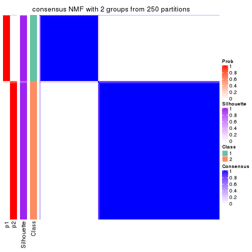</p>

</div>
<div id='tab-CV-NMF-consensus-heatmap-2'>
<pre><code class="r">consensus_heatmap(res, k = 3)
</code></pre>

<p>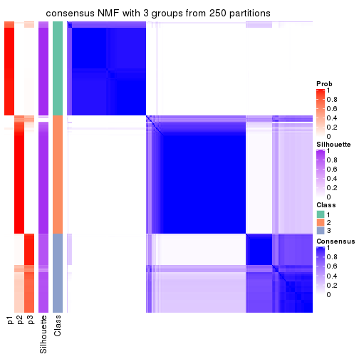</p>

</div>
<div id='tab-CV-NMF-consensus-heatmap-3'>
<pre><code class="r">consensus_heatmap(res, k = 4)
</code></pre>

<p>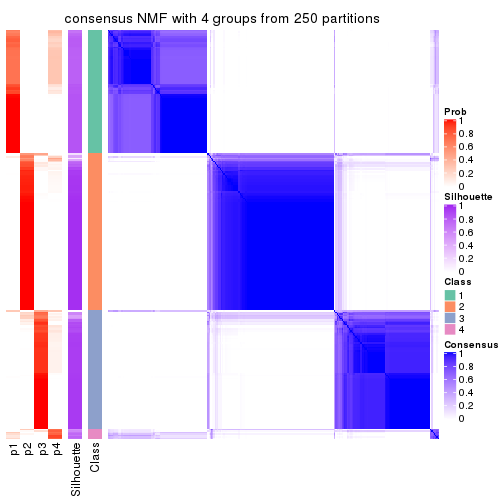</p>

</div>
<div id='tab-CV-NMF-consensus-heatmap-4'>
<pre><code class="r">consensus_heatmap(res, k = 5)
</code></pre>

<p>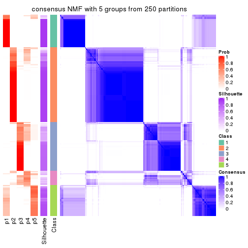</p>

</div>
<div id='tab-CV-NMF-consensus-heatmap-5'>
<pre><code class="r">consensus_heatmap(res, k = 6)
</code></pre>

<p>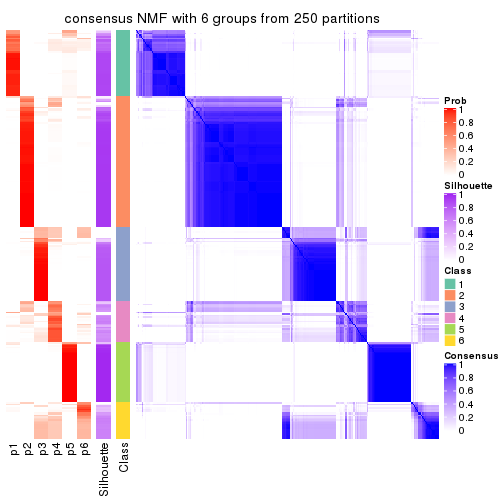</p>

</div>
</div>

Heatmaps for the membership of samples in all partitions to see how consistent they are:


<script>
$( function() {
	$( '#tabs-CV-NMF-membership-heatmap' ).tabs();
} );
</script>
<div id='tabs-CV-NMF-membership-heatmap'>
<ul>
<li><a href='#tab-CV-NMF-membership-heatmap-1'>k = 2</a></li>
<li><a href='#tab-CV-NMF-membership-heatmap-2'>k = 3</a></li>
<li><a href='#tab-CV-NMF-membership-heatmap-3'>k = 4</a></li>
<li><a href='#tab-CV-NMF-membership-heatmap-4'>k = 5</a></li>
<li><a href='#tab-CV-NMF-membership-heatmap-5'>k = 6</a></li>
</ul>
<div id='tab-CV-NMF-membership-heatmap-1'>
<pre><code class="r">membership_heatmap(res, k = 2)
</code></pre>

<p>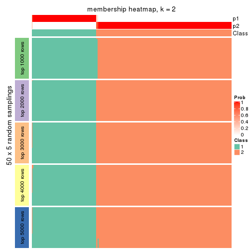</p>

</div>
<div id='tab-CV-NMF-membership-heatmap-2'>
<pre><code class="r">membership_heatmap(res, k = 3)
</code></pre>

<p>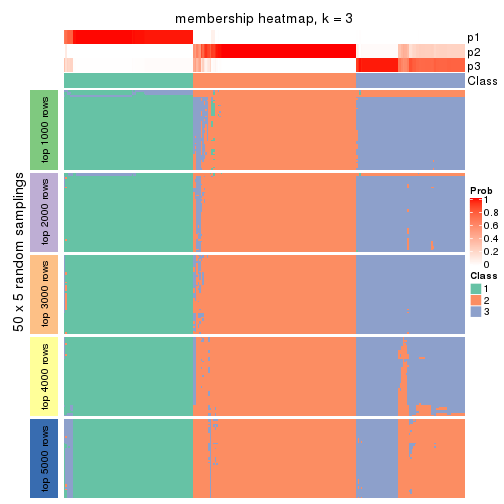</p>

</div>
<div id='tab-CV-NMF-membership-heatmap-3'>
<pre><code class="r">membership_heatmap(res, k = 4)
</code></pre>

<p>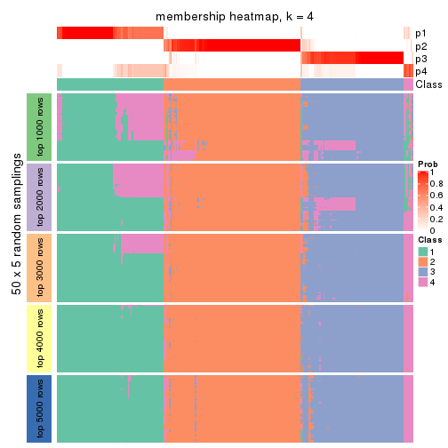</p>

</div>
<div id='tab-CV-NMF-membership-heatmap-4'>
<pre><code class="r">membership_heatmap(res, k = 5)
</code></pre>

<p>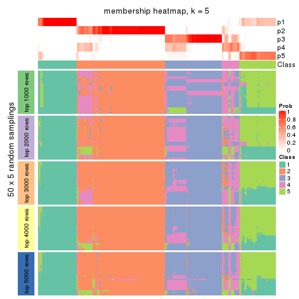</p>

</div>
<div id='tab-CV-NMF-membership-heatmap-5'>
<pre><code class="r">membership_heatmap(res, k = 6)
</code></pre>

<p>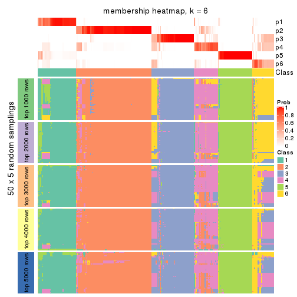</p>

</div>
</div>

As soon as we have had the classes for columns, we can look for signatures
which are significantly different between classes which can be candidate marks
for certain classes. Following are the heatmaps for signatures.


Signature heatmaps where rows are scaled:


<script>
$( function() {
	$( '#tabs-CV-NMF-get-signatures' ).tabs();
} );
</script>
<div id='tabs-CV-NMF-get-signatures'>
<ul>
<li><a href='#tab-CV-NMF-get-signatures-1'>k = 2</a></li>
<li><a href='#tab-CV-NMF-get-signatures-2'>k = 3</a></li>
<li><a href='#tab-CV-NMF-get-signatures-3'>k = 4</a></li>
<li><a href='#tab-CV-NMF-get-signatures-4'>k = 5</a></li>
<li><a href='#tab-CV-NMF-get-signatures-5'>k = 6</a></li>
</ul>
<div id='tab-CV-NMF-get-signatures-1'>
<pre><code class="r">get_signatures(res, k = 2)
</code></pre>

<p>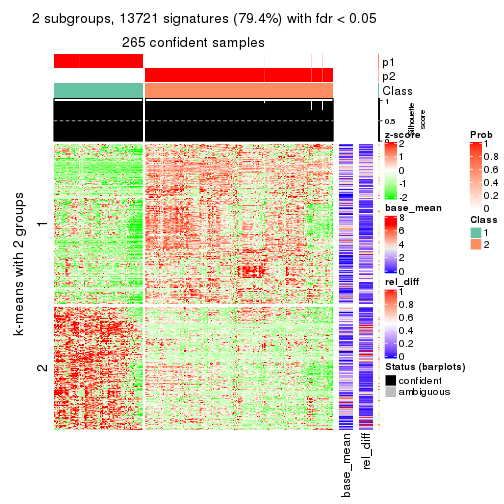</p>

</div>
<div id='tab-CV-NMF-get-signatures-2'>
<pre><code class="r">get_signatures(res, k = 3)
</code></pre>

<p>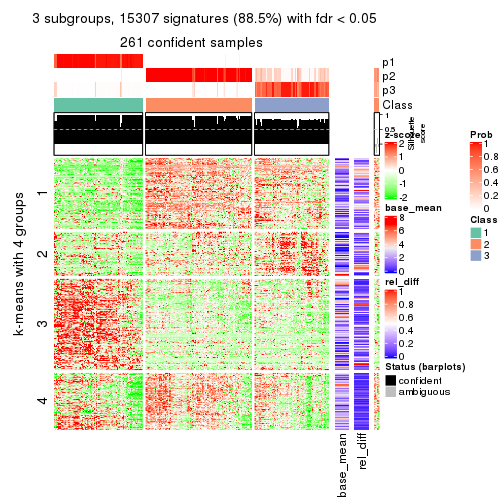</p>

</div>
<div id='tab-CV-NMF-get-signatures-3'>
<pre><code class="r">get_signatures(res, k = 4)
</code></pre>

<p>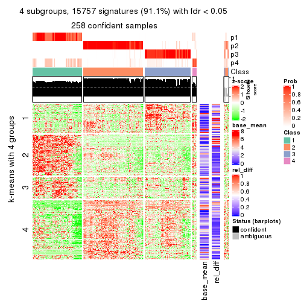</p>

</div>
<div id='tab-CV-NMF-get-signatures-4'>
<pre><code class="r">get_signatures(res, k = 5)
</code></pre>

<p>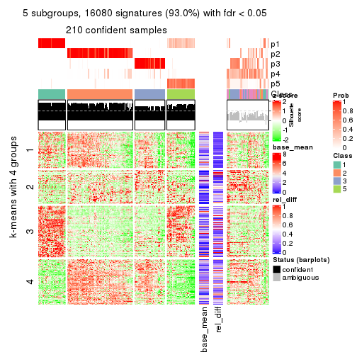</p>

</div>
<div id='tab-CV-NMF-get-signatures-5'>
<pre><code class="r">get_signatures(res, k = 6)
</code></pre>

<p>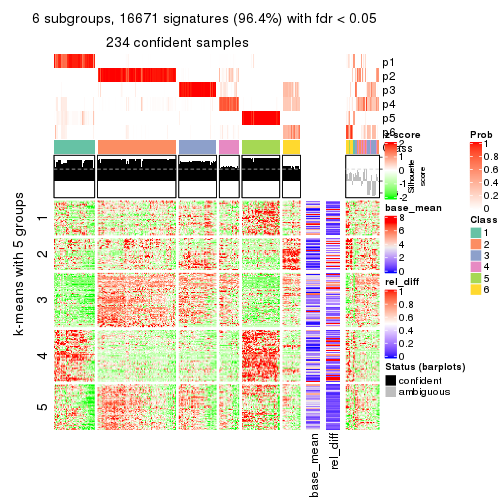</p>

</div>
</div>


Signature heatmaps where rows are not scaled:


<script>
$( function() {
	$( '#tabs-CV-NMF-get-signatures-no-scale' ).tabs();
} );
</script>
<div id='tabs-CV-NMF-get-signatures-no-scale'>
<ul>
<li><a href='#tab-CV-NMF-get-signatures-no-scale-1'>k = 2</a></li>
<li><a href='#tab-CV-NMF-get-signatures-no-scale-2'>k = 3</a></li>
<li><a href='#tab-CV-NMF-get-signatures-no-scale-3'>k = 4</a></li>
<li><a href='#tab-CV-NMF-get-signatures-no-scale-4'>k = 5</a></li>
<li><a href='#tab-CV-NMF-get-signatures-no-scale-5'>k = 6</a></li>
</ul>
<div id='tab-CV-NMF-get-signatures-no-scale-1'>
<pre><code class="r">get_signatures(res, k = 2, scale_rows = FALSE)
</code></pre>

<p>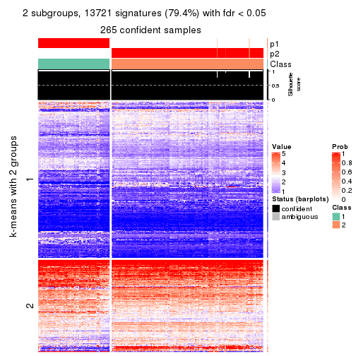</p>

</div>
<div id='tab-CV-NMF-get-signatures-no-scale-2'>
<pre><code class="r">get_signatures(res, k = 3, scale_rows = FALSE)
</code></pre>

<p>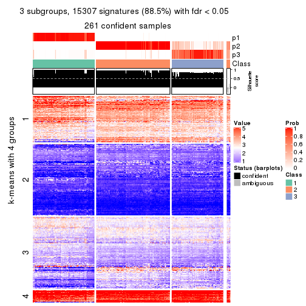</p>

</div>
<div id='tab-CV-NMF-get-signatures-no-scale-3'>
<pre><code class="r">get_signatures(res, k = 4, scale_rows = FALSE)
</code></pre>

<p>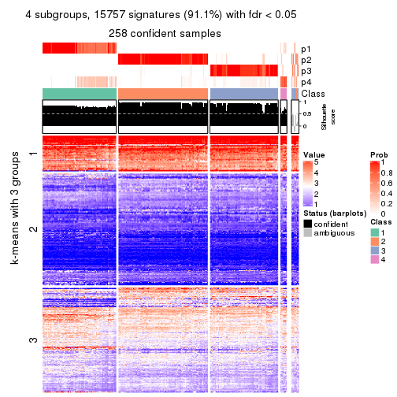</p>

</div>
<div id='tab-CV-NMF-get-signatures-no-scale-4'>
<pre><code class="r">get_signatures(res, k = 5, scale_rows = FALSE)
</code></pre>

<p>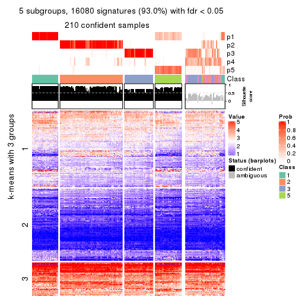</p>

</div>
<div id='tab-CV-NMF-get-signatures-no-scale-5'>
<pre><code class="r">get_signatures(res, k = 6, scale_rows = FALSE)
</code></pre>

<p>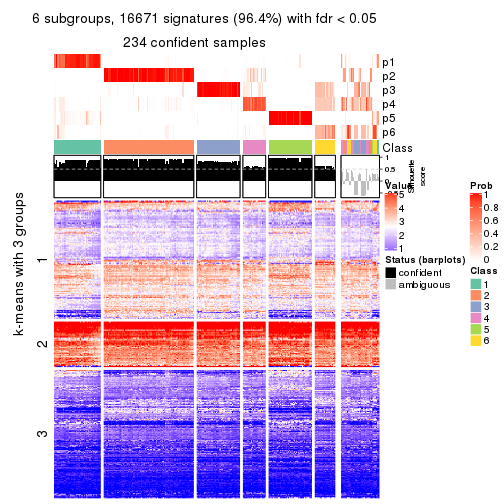</p>

</div>
</div>


Compare the overlap of signatures from different k:

```r
compare_signatures(res)
```

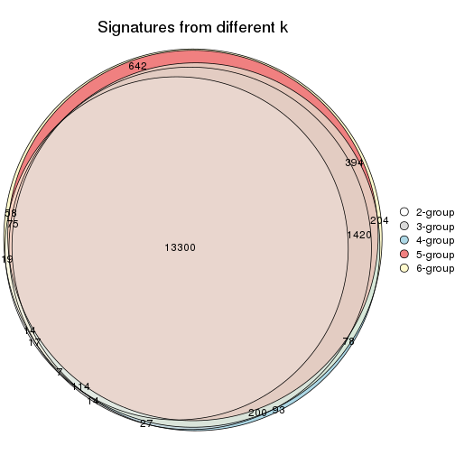

`get_signature()` returns a data frame invisibly. TO get the list of signatures, the function
call should be assigned to a variable explicitly. In following code, if `plot` argument is set
to `FALSE`, no heatmap is plotted while only the differential analysis is performed.

```r
# code only for demonstration
tb = get_signature(res, k = ..., plot = FALSE)
```

An example of the output of `tb` is:

```
#>   which_row         fdr    mean_1    mean_2 scaled_mean_1 scaled_mean_2 km
#> 1        38 0.042760348  8.373488  9.131774    -0.5533452     0.5164555  1
#> 2        40 0.018707592  7.106213  8.469186    -0.6173731     0.5762149  1
#> 3        55 0.019134737 10.221463 11.207825    -0.6159697     0.5749050  1
#> 4        59 0.006059896  5.921854  7.869574    -0.6899429     0.6439467  1
#> 5        60 0.018055526  8.928898 10.211722    -0.6204761     0.5791110  1
#> 6        98 0.009384629 15.714769 14.887706     0.6635654    -0.6193277  2
...
```

The columns in `tb` are:

1. `which_row`: row indices corresponding to the input matrix.
2. `fdr`: FDR for the differential test. 
3. `mean_x`: The mean value in group x.
4. `scaled_mean_x`: The mean value in group x after rows are scaled.
5. `km`: Row groups if k-means clustering is applied to rows.


UMAP plot which shows how samples are separated.


<script>
$( function() {
	$( '#tabs-CV-NMF-dimension-reduction' ).tabs();
} );
</script>
<div id='tabs-CV-NMF-dimension-reduction'>
<ul>
<li><a href='#tab-CV-NMF-dimension-reduction-1'>k = 2</a></li>
<li><a href='#tab-CV-NMF-dimension-reduction-2'>k = 3</a></li>
<li><a href='#tab-CV-NMF-dimension-reduction-3'>k = 4</a></li>
<li><a href='#tab-CV-NMF-dimension-reduction-4'>k = 5</a></li>
<li><a href='#tab-CV-NMF-dimension-reduction-5'>k = 6</a></li>
</ul>
<div id='tab-CV-NMF-dimension-reduction-1'>
<pre><code class="r">dimension_reduction(res, k = 2, method = &quot;UMAP&quot;)
</code></pre>

<p>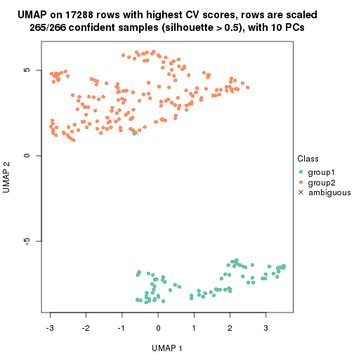</p>

</div>
<div id='tab-CV-NMF-dimension-reduction-2'>
<pre><code class="r">dimension_reduction(res, k = 3, method = &quot;UMAP&quot;)
</code></pre>

<p>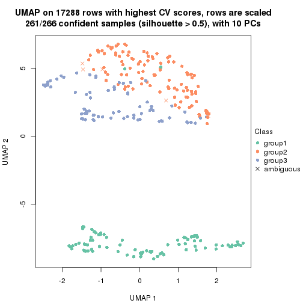</p>

</div>
<div id='tab-CV-NMF-dimension-reduction-3'>
<pre><code class="r">dimension_reduction(res, k = 4, method = &quot;UMAP&quot;)
</code></pre>

<p>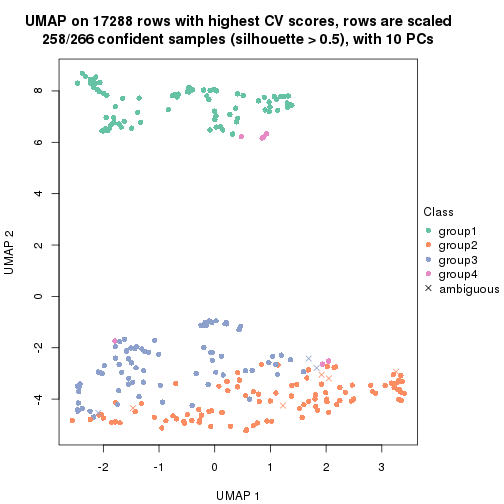</p>

</div>
<div id='tab-CV-NMF-dimension-reduction-4'>
<pre><code class="r">dimension_reduction(res, k = 5, method = &quot;UMAP&quot;)
</code></pre>

<p>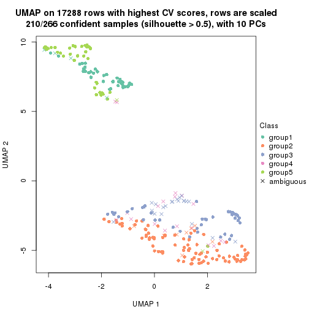</p>

</div>
<div id='tab-CV-NMF-dimension-reduction-5'>
<pre><code class="r">dimension_reduction(res, k = 6, method = &quot;UMAP&quot;)
</code></pre>

<p>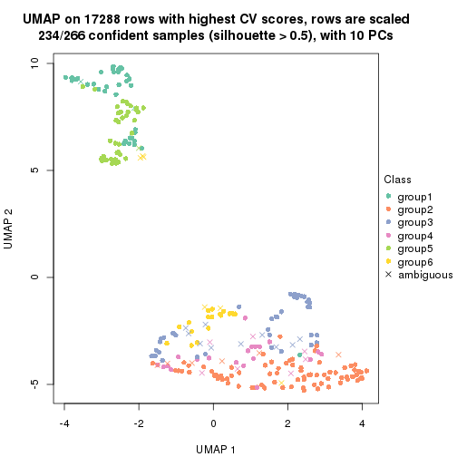</p>

</div>
</div>


Following heatmap shows how subgroups are split when increasing `k`:

```r
collect_classes(res)
```

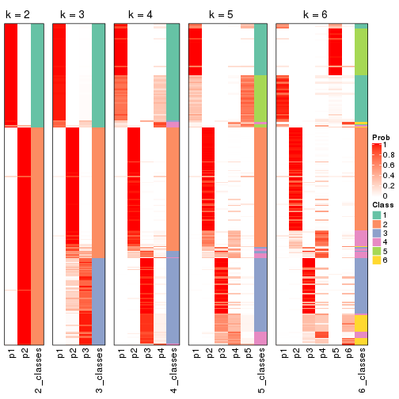


If matrix rows can be associated to genes, consider to use `GO_Enrichment(res,
...)` to perform function enrichment for the signature genes.


 

---------------------------------------------------


### MAD:hclust**


The object with results only for a single top-value method and a single partition method 
can be extracted as:

```r
res = res_list["MAD", "hclust"]
# you can also extract it by
# res = res_list["MAD:hclust"]
```

A summary of `res` and all the functions that can be applied to it:

```r
res
```

```
#> A 'ConsensusPartition' object with k = 2, 3, 4, 5, 6.
#>   On a matrix with 17288 rows and 266 columns.
#>   Top rows (1000, 2000, 3000, 4000, 5000) are extracted by 'MAD' method.
#>   Subgroups are detected by 'hclust' method.
#>   Performed in total 1250 partitions by row resampling.
#>   Best k for subgroups seems to be 2.
#> 
#> Following methods can be applied to this 'ConsensusPartition' object:
#>  [1] "cola_report"             "collect_classes"         "collect_plots"          
#>  [4] "collect_stats"           "colnames"                "compare_signatures"     
#>  [7] "consensus_heatmap"       "dimension_reduction"     "functional_enrichment"  
#> [10] "get_anno_col"            "get_anno"                "get_classes"            
#> [13] "get_consensus"           "get_matrix"              "get_membership"         
#> [16] "get_param"               "get_signatures"          "get_stats"              
#> [19] "is_best_k"               "is_stable_k"             "membership_heatmap"     
#> [22] "ncol"                    "nrow"                    "plot_ecdf"              
#> [25] "rownames"                "select_partition_number" "show"                   
#> [28] "suggest_best_k"          "test_to_known_factors"
```

`collect_plots()` function collects all the plots made from `res` for all `k` (number of partitions)
into one single page to provide an easy and fast comparison between different `k`.

```r
collect_plots(res)
```

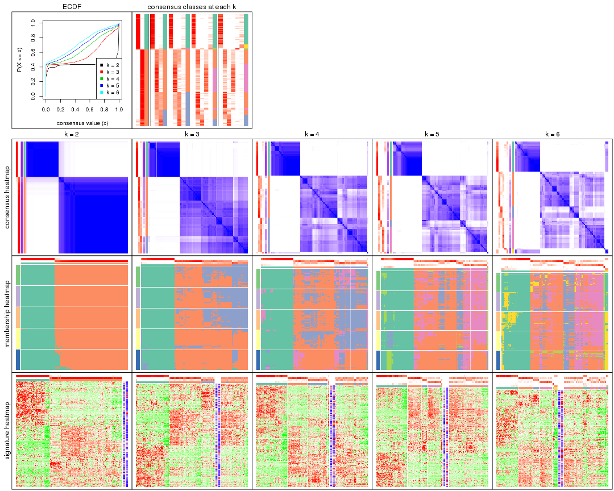

The plots are:

- The first row: a plot of the ECDF (Empirical cumulative distribution
  function) curves of the consensus matrix for each `k` and the heatmap of
  predicted classes for each `k`.
- The second row: heatmaps of the consensus matrix for each `k`.
- The third row: heatmaps of the membership matrix for each `k`.
- The fouth row: heatmaps of the signatures for each `k`.

All the plots in panels can be made by individual functions and they are
plotted later in this section.

`select_partition_number()` produces several plots showing different
statistics for choosing "optimized" `k`. There are following statistics:

- ECDF curves of the consensus matrix for each `k`;
- 1-PAC. [The PAC
  score](https://en.wikipedia.org/wiki/Consensus_clustering#Over-interpretation_potential_of_consensus_clustering)
  measures the proportion of the ambiguous subgrouping.
- Mean silhouette score.
- Concordance. The mean probability of fiting the consensus class ids in all
  partitions.
- Area increased. Denote $A_k$ as the area under the ECDF curve for current
  `k`, the area increased is defined as $A_k - A_{k-1}$.
- Rand index. The percent of pairs of samples that are both in a same cluster
  or both are not in a same cluster in the partition of k and k-1.
- Jaccard index. The ratio of pairs of samples are both in a same cluster in
  the partition of k and k-1 and the pairs of samples are both in a same
  cluster in the partition k or k-1.

The detailed explanations of these statistics can be found in [the cola
vignette](http://bioconductor.org/packages/devel/bioc/vignettes/cola/inst/doc/cola.html#toc_13).

Generally speaking, lower PAC score, higher mean silhouette score or higher
concordance corresponds to better partition. Rand index and Jaccard index
measure how similar the current partition is compared to partition with `k-1`.
If they are too similar, we won't accept `k` is better than `k-1`.

```r
select_partition_number(res)
```

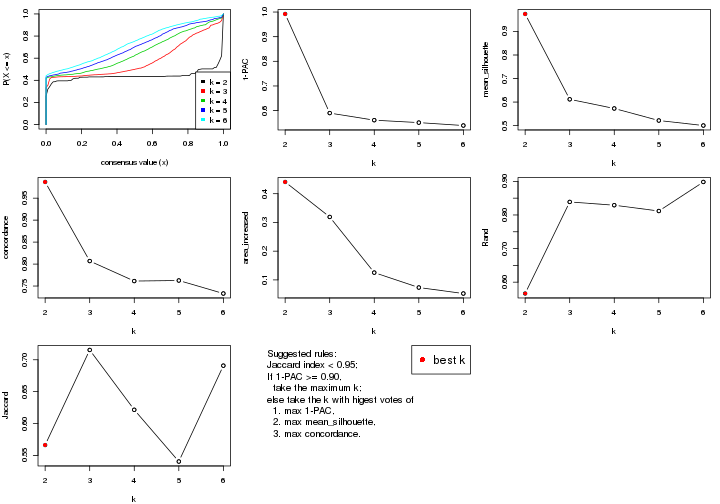

The numeric values for all these statistics can be obtained by `get_stats()`.

```r
get_stats(res)
```

```
#>   k 1-PAC mean_silhouette concordance area_increased  Rand Jaccard
#> 2 2 0.992           0.974       0.987         0.4409 0.566   0.566
#> 3 3 0.590           0.612       0.807         0.3191 0.839   0.715
#> 4 4 0.561           0.573       0.761         0.1253 0.829   0.622
#> 5 5 0.551           0.522       0.763         0.0734 0.812   0.540
#> 6 6 0.539           0.500       0.733         0.0525 0.898   0.691
```

`suggest_best_k()` suggests the best $k$ based on these statistics. The rules are as follows:

- All $k$ with Jaccard index larger than 0.95 are removed because the increase of
  the partition number does not provides enough extra information. If all $k$ are removed,
  the best $k$ is assigned by `NA`.
- For $k$ with 1-PAC larger than 0.9, the maximal $k$ is taken as the "best k". Other $k$ is called "optional k".
- If it does not fit the second rule. The $k$ with the highest vote of highest
  1-PAC, mean silhouette and concordance is taken as the "best k".

```r
suggest_best_k(res)
```

```
#> [1] 2
```


Following shows the table of the partitions (You need to click the **show/hide
code output** link to see it). The membership matrix (columns with name `p*`)
is inferred by
[`clue::cl_consensus()`](https://www.rdocumentation.org/link/cl_consensus?package=clue)
function with the `SE` method. Basically the value in the membership matrix
represents the probability to belong to a certain group. The finall class
label for an item is determined with the group with highest probability it
belongs to.

In `get_classes()` function, the entropy is calculated from the membership
matrix and the silhouette score is calculated from the consensus matrix.


<script>
$( function() {
	$( '#tabs-MAD-hclust-get-classes' ).tabs();
} );
</script>
<div id='tabs-MAD-hclust-get-classes'>
<ul>
<li><a href='#tab-MAD-hclust-get-classes-1'>k = 2</a></li>
<li><a href='#tab-MAD-hclust-get-classes-2'>k = 3</a></li>
<li><a href='#tab-MAD-hclust-get-classes-3'>k = 4</a></li>
<li><a href='#tab-MAD-hclust-get-classes-4'>k = 5</a></li>
<li><a href='#tab-MAD-hclust-get-classes-5'>k = 6</a></li>
</ul>

<div id='tab-MAD-hclust-get-classes-1'>
<p><a id='tab-MAD-hclust-get-classes-1-a' style='color:#0366d6' href='#'>show/hide code output</a></p>
<pre><code class="r">cbind(get_classes(res, k = 2), get_membership(res, k = 2))
</code></pre>

<pre><code>#&gt;                                      class entropy silhouette    p1    p2
#&gt; 80D0AF10-1C61-4B67-90C1-7DBF1EF23672     2  0.0000      0.982 0.000 1.000
#&gt; 87117BE1-D328-4972-85DA-6672412D8860     2  0.0000      0.982 0.000 1.000
#&gt; F904C5B6-70BD-4604-8254-79BE23B152DA     1  0.0000      0.997 1.000 0.000
#&gt; 3182DEA1-4239-4613-925A-7E6503766AD6     2  0.0000      0.982 0.000 1.000
#&gt; 55E78EA2-2D9B-481F-8CAB-D36A33088EAE     2  0.0000      0.982 0.000 1.000
#&gt; 86F94264-A6DD-4A97-9191-036F066DD0EF     2  0.0000      0.982 0.000 1.000
#&gt; 09D25417-23B7-4D88-A0EA-F307985FBBBC     2  0.5946      0.847 0.144 0.856
#&gt; C797F12C-40D3-4DB5-B9EF-A6821BBDE4F0     1  0.0000      0.997 1.000 0.000
#&gt; 80275DB0-A226-4B6B-A08F-4ADBEEE1DB01     1  0.0000      0.997 1.000 0.000
#&gt; 27FB653A-9E07-44AD-952E-9E4DE4AB5891     2  0.6887      0.796 0.184 0.816
#&gt; 1A5DB9FC-2ABD-4E1B-B5EF-B1CF5E5F3872     1  0.1633      0.975 0.976 0.024
#&gt; 844E4CCD-D30C-416F-A086-8923711A4E25     2  0.6887      0.796 0.184 0.816
#&gt; EF18318D-3D25-4D65-803A-ED6E62871E7E     1  0.1633      0.975 0.976 0.024
#&gt; 1ACB1BE0-61F6-4243-BBEC-E26A1CF90CA8     1  0.0376      0.994 0.996 0.004
#&gt; 8EF0039B-D758-46AB-BAF7-6A062C7C56BA     1  0.0000      0.997 1.000 0.000
#&gt; 22F4C9D9-663B-4C91-9692-E035A2640BEC     2  0.0000      0.982 0.000 1.000
#&gt; FA1A0BCE-EE0F-4178-B963-62550E344B14     2  0.0000      0.982 0.000 1.000
#&gt; 0B6D0C4E-5AE3-4707-A9FC-12A108E6EC2A     2  0.0000      0.982 0.000 1.000
#&gt; 06FD3123-2AEB-4911-AC4E-E0E64FD5DB52     2  0.0000      0.982 0.000 1.000
#&gt; 235A4492-FF80-4AA5-BC71-DFF65E1C7411     2  0.0000      0.982 0.000 1.000
#&gt; A192C6C0-1443-4493-AFAC-1EE710628ADB     2  0.0000      0.982 0.000 1.000
#&gt; 6FC5B56B-711B-4174-9B06-4E843124AAB6     1  0.0000      0.997 1.000 0.000
#&gt; 7A813F60-A41E-4552-990E-F22287654C1D     2  0.0000      0.982 0.000 1.000
#&gt; 725BBFB5-26F4-4512-9C75-47D013C1E605     1  0.0376      0.994 0.996 0.004
#&gt; 39CC4E82-EBC9-472E-8BE5-6A3AB178449A     2  0.0000      0.982 0.000 1.000
#&gt; 61130DEE-E267-49DF-8B41-7738A06EF738     2  0.5946      0.847 0.144 0.856
#&gt; 117EC12C-B7ED-4E01-B29B-EA542D356EA1     1  0.0000      0.997 1.000 0.000
#&gt; A30FF708-F7A9-41E4-8AD5-20441650FBC9     2  0.0000      0.982 0.000 1.000
#&gt; 53640D52-1167-4A5D-B656-97D32CBA3934     1  0.0000      0.997 1.000 0.000
#&gt; 9E85D76A-DD2A-46D5-BB59-0ED302B6258C     2  0.1633      0.967 0.024 0.976
#&gt; 6F8C6F90-7E3C-4860-91DD-586708DE44AA     1  0.0000      0.997 1.000 0.000
#&gt; E675AEC5-AA9A-4AAA-839C-03E6365822DB     2  0.2043      0.962 0.032 0.968
#&gt; B577DEF7-2F5C-4876-A7C6-F18D5722B8C0     1  0.5408      0.854 0.876 0.124
#&gt; DA8B577E-43E7-49BF-BF94-868E3194F5C9     1  0.0000      0.997 1.000 0.000
#&gt; 3334280B-2A36-4AC7-A021-A76C10E958F0     2  0.0000      0.982 0.000 1.000
#&gt; 5CBDDC90-11EC-4E6E-881E-AA9CCFD40FDB     2  0.1633      0.967 0.024 0.976
#&gt; 8CBBF32A-8349-44F5-A8B8-4CBB1760A464     2  0.0000      0.982 0.000 1.000
#&gt; B9455A9A-136D-4DC2-9F86-0FC74433589D     2  0.9129      0.548 0.328 0.672
#&gt; D7EAE2A7-F9BE-4222-A452-B1F83F99CD50     2  0.0000      0.982 0.000 1.000
#&gt; F803AE18-60C5-4CFE-AAAB-DB33C26A2184     1  0.0000      0.997 1.000 0.000
#&gt; 5DD8CAC7-EC02-43B6-B58E-6D2E22868A3B     2  0.0000      0.982 0.000 1.000
#&gt; EE98E1B4-DFB3-4AEC-8527-E1FD544C9475     1  0.0000      0.997 1.000 0.000
#&gt; 3CE43921-47D5-4394-B9E1-242607775D61     2  0.0000      0.982 0.000 1.000
#&gt; 46986F2B-0B0D-4187-8948-4E91D34B7C49     2  0.0000      0.982 0.000 1.000
#&gt; 5D1D052E-74EF-45A8-9B1A-7CECD13EA43B     2  0.0672      0.978 0.008 0.992
#&gt; 4C821AD9-A5C9-4A9A-9C5D-363B227F8064     2  0.0000      0.982 0.000 1.000
#&gt; 06A4189E-A23B-4AC6-AA74-01955DD7D1E9     2  0.0000      0.982 0.000 1.000
#&gt; FCCDC76F-CB02-4BCD-A616-325F258DDAA4     2  0.0000      0.982 0.000 1.000
#&gt; DAC53B0A-8F35-4EA6-BBCC-4CD1C049E11F     2  0.0672      0.978 0.008 0.992
#&gt; DD4F845B-CAD3-44CB-9D96-3C3F5BA1B72D     1  0.0376      0.994 0.996 0.004
#&gt; D440F004-A4A4-41B6-BED8-805D67BA01C7     2  0.0000      0.982 0.000 1.000
#&gt; A497C423-119F-42FA-BF17-9F6DFD2A5585     2  0.0000      0.982 0.000 1.000
#&gt; 3420E573-DE12-4EF5-B1C0-2FCA904F4F4E     1  0.0000      0.997 1.000 0.000
#&gt; 1AD72157-A254-44B4-BA58-4F30F1AE910E     1  0.0000      0.997 1.000 0.000
#&gt; C1113977-B160-45EE-B061-750F9EA3F33F     2  0.0000      0.982 0.000 1.000
#&gt; 6783AB5B-F07C-447B-BF13-C34485D246D7     2  0.1184      0.973 0.016 0.984
#&gt; 1F553062-26FD-4A7F-B7FB-81184604F423     1  0.0376      0.994 0.996 0.004
#&gt; BE2DCA51-1C21-4598-98A7-F2FB9B2DFCB4     2  0.1184      0.973 0.016 0.984
#&gt; 38941CF3-9C54-4BA4-A005-CC88CA97D504     2  0.0000      0.982 0.000 1.000
#&gt; 51CB675E-E243-4A07-BF4A-580473D26FDA     2  0.0000      0.982 0.000 1.000
#&gt; C7FED0F5-C27A-4405-9232-30BF39362CF7     2  0.0000      0.982 0.000 1.000
#&gt; 2A1E86E8-4713-465F-ACFF-C584864C57A1     2  0.0000      0.982 0.000 1.000
#&gt; B4500785-0FAA-4D4D-8630-43D194BAB004     2  0.0000      0.982 0.000 1.000
#&gt; 3FD52E66-AB76-4079-80DB-281A795D1EC0     2  0.1633      0.967 0.024 0.976
#&gt; EBD355D1-1226-4DFD-AAFF-45D246B64F3C     2  0.0000      0.982 0.000 1.000
#&gt; 5A040A73-CD95-487E-8AEF-9639FE4E2916     2  0.0000      0.982 0.000 1.000
#&gt; CF629C65-585D-476D-B081-3E6E0575FAE3     2  0.0000      0.982 0.000 1.000
#&gt; 0D4202A3-808E-413F-9BF3-9CFCCAE0ED61     2  0.0000      0.982 0.000 1.000
#&gt; 43E715BF-28D9-4B5E-B762-8CD1B69A430E     1  0.0000      0.997 1.000 0.000
#&gt; BFB82BE8-9DAC-4099-8B38-0950308E3EB3     2  0.0000      0.982 0.000 1.000
#&gt; F7CB1825-2303-4DD2-AE1F-7205738EAF1F     1  0.0000      0.997 1.000 0.000
#&gt; FE298483-C42C-4753-BABB-29A9CB1B6312     1  0.0000      0.997 1.000 0.000
#&gt; A98C7561-1B42-4CD6-AE71-924B91FA4C33     2  0.0000      0.982 0.000 1.000
#&gt; 58098F21-7DAB-47DA-9A41-8D20BF3B9257     2  0.2423      0.955 0.040 0.960
#&gt; 18CAF708-20B9-4745-9CB3-37AB6E0B3056     2  0.0000      0.982 0.000 1.000
#&gt; 2C80DD72-C9C7-4AC2-812F-9A31EF02779C     1  0.0000      0.997 1.000 0.000
#&gt; 68A3F13D-319D-4603-A27F-B5DD46FE5C5B     2  0.0000      0.982 0.000 1.000
#&gt; 7EE8F0CE-CDC9-40F9-A1DE-7F8140EC6D13     2  0.7883      0.718 0.236 0.764
#&gt; 39019903-5B9C-4665-BD5F-7CCB19CB55C5     2  0.0000      0.982 0.000 1.000
#&gt; 190EDB27-4CBC-4E9C-9B67-D51FDAB982B7     2  0.5946      0.847 0.144 0.856
#&gt; EB2D95BC-62F8-4669-9308-D37D7FB79E23     2  0.0000      0.982 0.000 1.000
#&gt; A08B85EA-D1E7-4B77-8DEC-36294305B9F7     1  0.0376      0.994 0.996 0.004
#&gt; 130DDFAD-6EF8-4C80-BD9D-88308A6874BC     2  0.0000      0.982 0.000 1.000
#&gt; 7340A5BA-E002-448F-AACC-E7A37DBB79C2     2  0.0000      0.982 0.000 1.000
#&gt; A771F6E3-D266-4FE7-98C6-C40E6A701D59     1  0.0000      0.997 1.000 0.000
#&gt; 015E792C-EC1B-49BF-AB07-D82B20C5989A     2  0.0000      0.982 0.000 1.000
#&gt; BF79E030-47EE-4D08-B910-5685A4BD8B60     2  0.0000      0.982 0.000 1.000
#&gt; FB3C7C9A-2F2D-4DD5-BE47-FAFB072C0FAB     2  0.0000      0.982 0.000 1.000
#&gt; 4E5557BA-10E8-4723-908E-DD04EF6639B2     2  0.0000      0.982 0.000 1.000
#&gt; 8031B550-40A9-4A3A-9F7D-CDC052288BD8     2  0.0000      0.982 0.000 1.000
#&gt; 55299A06-3C1F-45A4-B166-B2C591C0CEE2     2  0.0000      0.982 0.000 1.000
#&gt; EB8D5168-216E-4ABB-8B4E-9E67786CB322     1  0.0000      0.997 1.000 0.000
#&gt; 78BD2D83-9A7F-42E5-BB38-654AA0761A0A     2  0.0000      0.982 0.000 1.000
#&gt; AA2D53E5-D389-4332-9DD5-A736052E48F8     1  0.0376      0.994 0.996 0.004
#&gt; 62945C7A-9313-4FC9-820C-B0AB820B394E     1  0.0000      0.997 1.000 0.000
#&gt; 22746046-2E99-4EE9-97D2-BA2EA499634C     2  0.0000      0.982 0.000 1.000
#&gt; 8671B51B-DCBE-4429-9F01-AF51CAD7014F     2  0.6148      0.837 0.152 0.848
#&gt; E815AB36-5689-4A0D-8E6D-2EAA73406681     1  0.0000      0.997 1.000 0.000
#&gt; A1DACB46-ED52-4E38-B2C8-57256BB22B5E     2  0.0000      0.982 0.000 1.000
#&gt; 4F5498C4-A423-4B3D-AC98-D4E214A57D0E     1  0.0000      0.997 1.000 0.000
#&gt; A7772CCD-FFFF-49DD-86ED-0BAD330EC9B6     2  0.2236      0.958 0.036 0.964
#&gt; E6E3DF78-65B9-4F74-8DA8-E2A6D4EDBEA7     2  0.0000      0.982 0.000 1.000
#&gt; 83286E2D-E708-437A-911A-E6B050273CBD     1  0.0000      0.997 1.000 0.000
#&gt; EC5C7C97-EE8C-405D-A039-D96514B1D414     2  0.0000      0.982 0.000 1.000
#&gt; 3E55223D-6E3D-4027-9819-67E91212531D     1  0.0000      0.997 1.000 0.000
#&gt; 99A036A2-8343-4D06-8047-D84E96CE4C61     2  0.0000      0.982 0.000 1.000
#&gt; CA6CDE6D-92DE-4259-9E58-A373F2D543EA     2  0.0000      0.982 0.000 1.000
#&gt; BF6FA8CC-60C1-413A-B2C6-54CCACBC01D6     1  0.0000      0.997 1.000 0.000
#&gt; E0594CFE-F7B6-4546-B130-30DF6A514B1F     2  0.2236      0.958 0.036 0.964
#&gt; E769E41D-5949-42C5-9594-E563C05ACE52     2  0.0000      0.982 0.000 1.000
#&gt; 01373725-5D3C-4D9C-AABC-911D53E62BCD     2  0.0000      0.982 0.000 1.000
#&gt; 1F39DADD-3655-474E-BA4C-A5BD32C97A8B     1  0.0000      0.997 1.000 0.000
#&gt; AF573EC8-E4EE-4B8F-8199-9817B9FAC67D     1  0.0000      0.997 1.000 0.000
#&gt; 3F022CBC-41C8-4387-A6FB-124C4BCD1AD9     1  0.0376      0.994 0.996 0.004
#&gt; 1CC32ACE-826B-494B-8B89-5BD92327A74D     2  0.0000      0.982 0.000 1.000
#&gt; 22B0BD3B-EE08-4BC7-90B2-01C372A56BA2     2  0.0000      0.982 0.000 1.000
#&gt; 0F3DE9EF-19CC-4D14-9A42-1435DB537F94     2  0.1184      0.973 0.016 0.984
#&gt; 87F8A33F-FBC3-469E-862B-84472F796358     2  0.0000      0.982 0.000 1.000
#&gt; C9F2FA0D-1A9F-40B4-BD9B-CAF1B3F3D5A7     2  0.0000      0.982 0.000 1.000
#&gt; ACFC9F59-78FF-4453-B25F-8834D0EAB54A     2  0.0000      0.982 0.000 1.000
#&gt; B7AC7D5B-14E9-45A7-93B7-226EE508544A     2  0.0938      0.975 0.012 0.988
#&gt; 4491BF17-B168-4E96-8E09-EF1AEC9F5E9D     2  0.6973      0.790 0.188 0.812
#&gt; 557A0811-A3FE-4CF4-A24D-FBB77E7F9139     2  0.0000      0.982 0.000 1.000
#&gt; 6F9C955C-6816-4353-922A-8035B50FACC6     2  0.0000      0.982 0.000 1.000
#&gt; 3E89FB1C-4A7D-43C7-823C-04E3716A7935     2  0.0938      0.975 0.012 0.988
#&gt; 12ABE483-66EF-4237-94C4-0199FAE23FA8     2  0.0000      0.982 0.000 1.000
#&gt; 7535F262-9B96-44F6-988C-4C9EBB3FFCA9     2  0.0000      0.982 0.000 1.000
#&gt; 65C9D28E-303B-40E5-84F0-2507F5457374     2  0.5946      0.847 0.144 0.856
#&gt; FD445384-6BA9-4297-9D9C-12ABA7D645C7     1  0.0000      0.997 1.000 0.000
#&gt; 30D5E255-2AD3-44F3-8983-1B80E4FD3E2D     2  0.0000      0.982 0.000 1.000
#&gt; 3E88EC60-B4A8-4259-8BC8-A234800F6955     2  0.6887      0.796 0.184 0.816
#&gt; ACD73CE8-AFC5-47A0-9383-3CB97F018953     1  0.0000      0.997 1.000 0.000
#&gt; 1AFDC2EA-26A8-44E2-8BCB-F34F7B66F8C8     2  0.2948      0.945 0.052 0.948
#&gt; 9E327BC8-1D20-4AD8-83F7-FB2D13BCA5D0     2  0.0000      0.982 0.000 1.000
#&gt; 85A86B91-4F24-4E77-AE2D-520F8E205EFC     1  0.0376      0.994 0.996 0.004
#&gt; 74868C37-8143-4306-81CA-E45759D146CD     2  0.0000      0.982 0.000 1.000
#&gt; 69AEA0DB-E335-48A0-A398-4FB0D581182A     2  0.0000      0.982 0.000 1.000
#&gt; AE6F8B89-85C2-42B7-8D05-AFDDD4FEFD16     1  0.0000      0.997 1.000 0.000
#&gt; A8A6F09C-9812-4457-9A4B-AD41F97B41A3     2  0.0000      0.982 0.000 1.000
#&gt; 1A09BC4D-EF29-42DD-BB04-A3C264A3032D     1  0.0376      0.994 0.996 0.004
#&gt; E0961A30-A62C-4235-9CF0-A1776827A996     2  0.1843      0.965 0.028 0.972
#&gt; 134D2D90-7B08-4F20-8A3A-C77643FB208F     2  0.1843      0.965 0.028 0.972
#&gt; A77C2DFF-93CF-4CB5-B3C1-81133D7F1A0F     2  0.1633      0.967 0.024 0.976
#&gt; EA2DC457-9C74-4B9C-B3FA-5E72199B24A7     2  0.2043      0.962 0.032 0.968
#&gt; FF34117B-5EE4-4C96-A8A2-2CE6A654CBE5     1  0.0000      0.997 1.000 0.000
#&gt; 75F7B5E2-6559-4B48-A2A4-287C35C559CC     1  0.0000      0.997 1.000 0.000
#&gt; 903BF591-B0AF-4BEE-B625-60B673070344     2  0.0000      0.982 0.000 1.000
#&gt; 9DE1B790-C63C-41C4-9477-CE52A8119C67     2  0.0000      0.982 0.000 1.000
#&gt; 9A28F80A-85F8-40E2-A32B-230EF93B2FA0     2  0.0000      0.982 0.000 1.000
#&gt; 0AA2BDBB-8720-409A-AA72-1F4AA26E7CD8     2  0.0000      0.982 0.000 1.000
#&gt; 5AD49F16-E974-4E5D-B1B6-073ECB73A01D     2  0.6048      0.842 0.148 0.852
#&gt; CB0F961C-527D-4A48-9408-286B26BD9532     1  0.0000      0.997 1.000 0.000
#&gt; 46FF25B6-D01D-4CA7-80B7-CEC2998C34E1     2  0.0000      0.982 0.000 1.000
#&gt; 487CADE1-D699-4A6C-817A-B9A0AB940C61     1  0.0000      0.997 1.000 0.000
#&gt; 4FF6F2D8-F869-4735-A4D1-1A8423153FBC     1  0.0000      0.997 1.000 0.000
#&gt; 6005494F-5D3D-43A3-B3E8-8C91955B2A98     2  0.0000      0.982 0.000 1.000
#&gt; CF10D584-CE32-45A4-A932-E9D5AF12A6A0     1  0.0000      0.997 1.000 0.000
#&gt; E15CE4AB-5646-49C8-9CD6-938457036BB0     2  0.0000      0.982 0.000 1.000
#&gt; 31E28D0B-0E69-4330-82ED-4F1827DC97EA     2  0.0000      0.982 0.000 1.000
#&gt; DBACD3C3-CCB5-4478-BA78-85A0C847CA66     2  0.0000      0.982 0.000 1.000
#&gt; 5A07041C-65EB-4FCD-8940-E90B905061B5     2  0.0000      0.982 0.000 1.000
#&gt; 0EA7C916-FA47-489B-BC98-4D9E7D197628     1  0.0000      0.997 1.000 0.000
#&gt; 30967F75-8499-47FF-ADA4-4DC566013F7B     1  0.0000      0.997 1.000 0.000
#&gt; D2E528FF-AEA2-48D7-A60A-4C3E71EA9073     2  0.0000      0.982 0.000 1.000
#&gt; 22735DCD-215E-48BC-BF44-32BD66F06E39     2  0.0000      0.982 0.000 1.000
#&gt; BC2C3248-7FC6-48BC-96C1-45EA573DE7DC     1  0.0000      0.997 1.000 0.000
#&gt; E72CEBCB-D686-4B12-BCBA-EC8F964330A2     1  0.0000      0.997 1.000 0.000
#&gt; 23C937BB-BA20-4440-B680-914229CC3ADF     1  0.0000      0.997 1.000 0.000
#&gt; 947E99C7-F402-4F1A-A6E9-81BCAAED135A     2  0.0000      0.982 0.000 1.000
#&gt; 02475D11-FC81-4E88-944E-173C32DC3FE7     2  0.0000      0.982 0.000 1.000
#&gt; F972A9AA-9842-4343-A533-A795E65581CE     1  0.0000      0.997 1.000 0.000
#&gt; 05043AAF-3095-4C61-B5C1-EE9AA9082C75     2  0.1184      0.973 0.016 0.984
#&gt; CECF7967-862E-428C-BB42-FEF553FDB3AA     2  0.0000      0.982 0.000 1.000
#&gt; FB0B9483-6302-48C7-BE5B-DA667E00AE2D     2  0.2043      0.962 0.032 0.968
#&gt; 78700FBA-1487-4754-9B30-18837BF7E9FB     1  0.0000      0.997 1.000 0.000
#&gt; 2166F56D-54CE-4F1B-8F07-A4E13E4489E9     1  0.0000      0.997 1.000 0.000
#&gt; 7CD0942E-E39A-43A7-8BAC-F25967864901     2  0.0000      0.982 0.000 1.000
#&gt; 3B00BA2B-7F7D-4825-8F8D-90F04A5DE687     2  0.0000      0.982 0.000 1.000
#&gt; 7465B01D-C05E-4FE0-A9FE-182920EDC489     2  0.0000      0.982 0.000 1.000
#&gt; 88C31A99-F96E-4FC8-8B3D-C1AAA05062D9     1  0.0000      0.997 1.000 0.000
#&gt; 53575575-3303-4F8F-B6A8-B42131CFB4AC     2  0.0000      0.982 0.000 1.000
#&gt; CC8017C7-4128-48DA-8E43-503F63158D85     1  0.0000      0.997 1.000 0.000
#&gt; 88449D2A-2A25-41A4-B91D-C99B58F8ECD9     2  0.0000      0.982 0.000 1.000
#&gt; 46C7DDE5-A2B5-494F-96AE-0B6E2D51B003     1  0.0000      0.997 1.000 0.000
#&gt; 42551D05-5EE5-4F91-93A8-32DA695D9DFA     2  0.0000      0.982 0.000 1.000
#&gt; 0772DA48-3A36-422D-B166-CA1691B782C3     2  0.0000      0.982 0.000 1.000
#&gt; 30346897-EC77-4153-88A2-D14593C8B741     2  0.0000      0.982 0.000 1.000
#&gt; 0F00E267-C748-4A71-8B36-03C410641D88     2  0.0000      0.982 0.000 1.000
#&gt; 4034703A-4DA9-4DDA-9CA9-E80FFE9CCDE6     2  0.0000      0.982 0.000 1.000
#&gt; 393C8A41-CF45-4EA8-AFE3-25A08AB7692A     2  0.0000      0.982 0.000 1.000
#&gt; 3354212D-A07C-435C-8B0C-9A7BAAB624B5     1  0.0000      0.997 1.000 0.000
#&gt; 57E30D4E-ABF7-47DD-92BE-40CE215076B0     1  0.0000      0.997 1.000 0.000
#&gt; 202B4C76-C840-4DB8-953F-AC75A4156FDD     2  0.0000      0.982 0.000 1.000
#&gt; 93A0137B-1F4C-44EE-B959-2AD0CD2DF8B6     1  0.0000      0.997 1.000 0.000
#&gt; C9794DB6-6E8C-4AFD-80EE-61D672A4F6E9     2  0.1184      0.973 0.016 0.984
#&gt; AE4BFE63-F0C0-4624-AD97-4F7FF13E2384     1  0.0000      0.997 1.000 0.000
#&gt; DCF87F27-2B54-42D9-8D28-5DFEE76E2F5B     2  0.0000      0.982 0.000 1.000
#&gt; 2451D405-39FD-4812-958C-23462B66F1F1     2  0.6148      0.837 0.152 0.848
#&gt; E27F5D33-3F68-4CA8-8757-A387C6EAD060     2  0.0000      0.982 0.000 1.000
#&gt; 8BA9928A-5B93-477F-B4A2-D031B714D9AC     1  0.0376      0.994 0.996 0.004
#&gt; 0FAACFF6-B50C-4BED-9824-B7270654F28D     2  0.0000      0.982 0.000 1.000
#&gt; 3366CC3C-2BBA-4CA7-848E-4E16AA70AE7A     2  0.0000      0.982 0.000 1.000
#&gt; 66237056-CA9A-4C90-AF0E-1621FEB71578     2  0.0000      0.982 0.000 1.000
#&gt; C480F1FB-3100-436C-B0F5-DED63B7A580E     2  0.0000      0.982 0.000 1.000
#&gt; A327DE0D-D945-4B42-9B41-A7302CF796EE     2  0.0672      0.978 0.008 0.992
#&gt; E8A6871D-67FB-4306-9454-F5E7CDBA399A     2  0.0000      0.982 0.000 1.000
#&gt; E9A7485B-82B6-4BD2-AFBB-DD0A82D6CDE2     1  0.0376      0.994 0.996 0.004
#&gt; 93B382E4-9C9A-43F5-BD3B-502CC260B886     1  0.0000      0.997 1.000 0.000
#&gt; A2792419-8E16-45FE-A524-17851F34AB9B     2  0.0376      0.980 0.004 0.996
#&gt; 4DED1201-F25C-4F82-BABF-965EFAD7A8E5     2  0.0000      0.982 0.000 1.000
#&gt; F1ACB2DD-E948-4F88-A249-F1BD1977D667     2  0.0000      0.982 0.000 1.000
#&gt; 6CDBA203-8952-421D-A6BF-75652D9F3339     2  0.1184      0.973 0.016 0.984
#&gt; 2D6C5AA7-3B33-48D7-AE0C-77A16B749D13     1  0.1633      0.975 0.976 0.024
#&gt; 3F6B6D95-0720-42A0-AEB3-89FECAE7616A     2  0.0000      0.982 0.000 1.000
#&gt; DED8ACF3-BBD8-46C9-85C9-A9C8F2E2BC0B     1  0.0000      0.997 1.000 0.000
#&gt; 77069279-5A6F-42C0-9AA5-8C939591DFB5     1  0.0000      0.997 1.000 0.000
#&gt; B2D4FCF3-FDF9-41C8-880A-6732CF6222AF     2  0.0000      0.982 0.000 1.000
#&gt; 1CD71A4C-1E49-48EF-AA72-CB3C26B4C087     2  0.0000      0.982 0.000 1.000
#&gt; C364E621-F85C-4B7F-842F-210B8D4DFE3A     2  0.0000      0.982 0.000 1.000
#&gt; 11F1B8CA-07C1-47D2-A3C6-032FFA6A4A64     1  0.0000      0.997 1.000 0.000
#&gt; 153BF804-6DC8-496B-987A-4021A2512211     2  0.0000      0.982 0.000 1.000
#&gt; 5B5029C9-40F5-40D7-A36A-367022AD6A42     2  0.0000      0.982 0.000 1.000
#&gt; 193CCBE6-104F-49B4-BDB2-C82EE36FDAAD     1  0.0376      0.994 0.996 0.004
#&gt; E5D45E53-FCF3-4F01-9B78-6CB1ED0CFE40     2  0.0000      0.982 0.000 1.000
#&gt; 5546A779-21DB-49F9-8C0D-A1E420088084     2  0.0000      0.982 0.000 1.000
#&gt; E14825E0-0DC7-44C2-B265-F54672356838     1  0.0000      0.997 1.000 0.000
#&gt; 8C8C09B9-EC83-45EC-BC4C-0BA92DE60ACB     1  0.0376      0.994 0.996 0.004
#&gt; B388CA82-5BF7-4BDD-8821-4EC0B213121F     2  0.0672      0.978 0.008 0.992
#&gt; A26025AC-9F71-4C07-9135-83593193BBB2     1  0.0000      0.997 1.000 0.000
#&gt; C80E6D4B-AF21-42F0-8E20-6F7D2E99C062     2  0.0000      0.982 0.000 1.000
#&gt; 5AE5D819-A6B1-4761-B7F9-8FFD3C520F31     2  0.0000      0.982 0.000 1.000
#&gt; CAE8097F-A139-4C6E-9E30-35080475FF34     2  0.3274      0.938 0.060 0.940
#&gt; 539C8DE3-6152-4671-B96F-ED6DC6DBD22B     1  0.0000      0.997 1.000 0.000
#&gt; 5D28A8E0-4ECF-43A4-890A-BE968B9A8CB2     2  0.0000      0.982 0.000 1.000
#&gt; 97A80AF8-365E-4756-A2B0-AEB1D8F5F33E     2  0.0000      0.982 0.000 1.000
#&gt; B3527517-E339-46AE-8437-65303C309015     2  0.2043      0.962 0.032 0.968
#&gt; 523E2183-AA20-4749-BD7E-69CD620DD6A3     2  0.0000      0.982 0.000 1.000
#&gt; E553FB92-F181-47B3-9F3D-11DB51DFA3A4     2  0.0000      0.982 0.000 1.000
#&gt; FFE0C4B1-8EEC-484A-AB87-3401B71BD081     2  0.1843      0.965 0.028 0.972
#&gt; 73D6CA4B-9A9E-4E52-96C8-AE7F0CC8B276     2  0.0000      0.982 0.000 1.000
#&gt; 485A8107-DF9A-4BC6-8A72-07FBA93F10F2     1  0.0000      0.997 1.000 0.000
#&gt; 690823D9-B9AA-40EF-8302-4AD88BF89D1C     2  0.0000      0.982 0.000 1.000
#&gt; B4E02660-562F-4EAC-8472-CBBD8A577688     2  0.0000      0.982 0.000 1.000
#&gt; F82D5A60-90F9-4FF4-971E-73F7535FE65A     2  0.5946      0.847 0.144 0.856
#&gt; C48401F7-2D56-4C6F-9896-C5435D1B44BF     2  0.0000      0.982 0.000 1.000
#&gt; 94FC8991-182B-4B00-9A06-A00E8D3BDCFA     1  0.0000      0.997 1.000 0.000
#&gt; FF00E80A-046D-4233-835E-CDF93403EA43     2  0.1184      0.973 0.016 0.984
#&gt; C47A53F6-6479-4AD3-9D18-E4A70BE5F1DC     2  0.0000      0.982 0.000 1.000
#&gt; 3487AE2D-AB1D-4DEF-AC4B-4B0FCAF8D899     2  0.0000      0.982 0.000 1.000
#&gt; 479CD9BB-ECD7-41D5-B1E4-41132FF7FC95     2  0.0000      0.982 0.000 1.000
#&gt; 048ADC6E-8C7E-4875-ACEE-E4787203C078     1  0.0000      0.997 1.000 0.000
#&gt; 25AF81C5-B117-466D-AE9F-DD10BCB6AF2D     2  0.0000      0.982 0.000 1.000
#&gt; 8B1D51D6-0B25-4289-81F0-9F95E0258877     2  0.0000      0.982 0.000 1.000
#&gt; 282D390D-8E4E-4A19-B2B7-A6DB4BB2D46C     1  0.0000      0.997 1.000 0.000
#&gt; BC6B92C1-F425-40C5-9941-539BFF5FE0FE     2  0.3274      0.938 0.060 0.940
#&gt; 899CB9E0-48D0-413D-8566-BC151F146453     1  0.0376      0.994 0.996 0.004
#&gt; 441400A9-1427-45E0-A8B4-EF2A6B7465C2     2  0.0000      0.982 0.000 1.000
#&gt; CF96DDD4-DC0A-4341-BDE6-4DA2CB4978D0     1  0.0000      0.997 1.000 0.000
#&gt; CE91F591-6072-4D29-9495-C78961635969     2  0.0000      0.982 0.000 1.000
#&gt; 84D25635-2A38-4CFB-BFAC-38C007625C42     1  0.0000      0.997 1.000 0.000
#&gt; ABF1AC12-872A-4C3D-A76C-07BC36A4DA5E     1  0.0000      0.997 1.000 0.000
#&gt; B7F7F66F-1AED-4199-81C0-5C7FB0DBF438     2  0.0000      0.982 0.000 1.000
#&gt; BAB786B9-6C20-425D-9886-63A0A092B59B     2  0.0000      0.982 0.000 1.000
#&gt; 735D1DE3-D781-4F89-A395-09974057BBB7     1  0.0000      0.997 1.000 0.000
#&gt; F6D5FBBA-05C4-4340-86D9-1A54181216A2     2  0.0000      0.982 0.000 1.000
#&gt; 79C4E166-4A0D-4811-A2C8-CAE0A5AEED42     2  0.0000      0.982 0.000 1.000
</code></pre>

<script>
$('#tab-MAD-hclust-get-classes-1-a').parent().next().next().hide();
$('#tab-MAD-hclust-get-classes-1-a').click(function(){
  $('#tab-MAD-hclust-get-classes-1-a').parent().next().next().toggle();
  return(false);
});
</script>
</div>

<div id='tab-MAD-hclust-get-classes-2'>
<p><a id='tab-MAD-hclust-get-classes-2-a' style='color:#0366d6' href='#'>show/hide code output</a></p>
<pre><code class="r">cbind(get_classes(res, k = 3), get_membership(res, k = 3))
</code></pre>

<pre><code>#&gt;                                      class entropy silhouette    p1    p2    p3
#&gt; 80D0AF10-1C61-4B67-90C1-7DBF1EF23672     2  0.5431    0.50172 0.000 0.716 0.284
#&gt; 87117BE1-D328-4972-85DA-6672412D8860     2  0.0592    0.59572 0.000 0.988 0.012
#&gt; F904C5B6-70BD-4604-8254-79BE23B152DA     1  0.0000    0.98065 1.000 0.000 0.000
#&gt; 3182DEA1-4239-4613-925A-7E6503766AD6     2  0.6267   -0.08118 0.000 0.548 0.452
#&gt; 55E78EA2-2D9B-481F-8CAB-D36A33088EAE     2  0.5968    0.28990 0.000 0.636 0.364
#&gt; 86F94264-A6DD-4A97-9191-036F066DD0EF     2  0.5968    0.28990 0.000 0.636 0.364
#&gt; 09D25417-23B7-4D88-A0EA-F307985FBBBC     3  0.5639    0.62857 0.016 0.232 0.752
#&gt; C797F12C-40D3-4DB5-B9EF-A6821BBDE4F0     1  0.0000    0.98065 1.000 0.000 0.000
#&gt; 80275DB0-A226-4B6B-A08F-4ADBEEE1DB01     1  0.0000    0.98065 1.000 0.000 0.000
#&gt; 27FB653A-9E07-44AD-952E-9E4DE4AB5891     3  0.5277    0.58267 0.024 0.180 0.796
#&gt; 1A5DB9FC-2ABD-4E1B-B5EF-B1CF5E5F3872     1  0.5529    0.75412 0.704 0.000 0.296
#&gt; 844E4CCD-D30C-416F-A086-8923711A4E25     3  0.5223    0.57841 0.024 0.176 0.800
#&gt; EF18318D-3D25-4D65-803A-ED6E62871E7E     1  0.5529    0.75412 0.704 0.000 0.296
#&gt; 1ACB1BE0-61F6-4243-BBEC-E26A1CF90CA8     1  0.0424    0.97828 0.992 0.000 0.008
#&gt; 8EF0039B-D758-46AB-BAF7-6A062C7C56BA     1  0.0000    0.98065 1.000 0.000 0.000
#&gt; 22F4C9D9-663B-4C91-9692-E035A2640BEC     2  0.6215    0.05721 0.000 0.572 0.428
#&gt; FA1A0BCE-EE0F-4178-B963-62550E344B14     2  0.0424    0.59262 0.000 0.992 0.008
#&gt; 0B6D0C4E-5AE3-4707-A9FC-12A108E6EC2A     2  0.6026    0.26009 0.000 0.624 0.376
#&gt; 06FD3123-2AEB-4911-AC4E-E0E64FD5DB52     2  0.5678    0.42181 0.000 0.684 0.316
#&gt; 235A4492-FF80-4AA5-BC71-DFF65E1C7411     2  0.3412    0.62264 0.000 0.876 0.124
#&gt; A192C6C0-1443-4493-AFAC-1EE710628ADB     2  0.3482    0.62062 0.000 0.872 0.128
#&gt; 6FC5B56B-711B-4174-9B06-4E843124AAB6     1  0.0000    0.98065 1.000 0.000 0.000
#&gt; 7A813F60-A41E-4552-990E-F22287654C1D     2  0.0592    0.58955 0.000 0.988 0.012
#&gt; 725BBFB5-26F4-4512-9C75-47D013C1E605     1  0.0424    0.97830 0.992 0.000 0.008
#&gt; 39CC4E82-EBC9-472E-8BE5-6A3AB178449A     2  0.5327    0.51281 0.000 0.728 0.272
#&gt; 61130DEE-E267-49DF-8B41-7738A06EF738     3  0.5551    0.62604 0.016 0.224 0.760
#&gt; 117EC12C-B7ED-4E01-B29B-EA542D356EA1     1  0.0237    0.97961 0.996 0.000 0.004
#&gt; A30FF708-F7A9-41E4-8AD5-20441650FBC9     2  0.6140    0.15327 0.000 0.596 0.404
#&gt; 53640D52-1167-4A5D-B656-97D32CBA3934     1  0.2448    0.94595 0.924 0.000 0.076
#&gt; 9E85D76A-DD2A-46D5-BB59-0ED302B6258C     2  0.6804   -0.17025 0.012 0.528 0.460
#&gt; 6F8C6F90-7E3C-4860-91DD-586708DE44AA     1  0.0000    0.98065 1.000 0.000 0.000
#&gt; E675AEC5-AA9A-4AAA-839C-03E6365822DB     2  0.6783    0.17249 0.016 0.588 0.396
#&gt; B577DEF7-2F5C-4876-A7C6-F18D5722B8C0     1  0.3644    0.87380 0.872 0.004 0.124
#&gt; DA8B577E-43E7-49BF-BF94-868E3194F5C9     1  0.0000    0.98065 1.000 0.000 0.000
#&gt; 3334280B-2A36-4AC7-A021-A76C10E958F0     2  0.2537    0.62401 0.000 0.920 0.080
#&gt; 5CBDDC90-11EC-4E6E-881E-AA9CCFD40FDB     2  0.5659    0.51702 0.012 0.740 0.248
#&gt; 8CBBF32A-8349-44F5-A8B8-4CBB1760A464     2  0.2796    0.62298 0.000 0.908 0.092
#&gt; B9455A9A-136D-4DC2-9F86-0FC74433589D     3  0.3434    0.40122 0.064 0.032 0.904
#&gt; D7EAE2A7-F9BE-4222-A452-B1F83F99CD50     2  0.5363    0.50626 0.000 0.724 0.276
#&gt; F803AE18-60C5-4CFE-AAAB-DB33C26A2184     1  0.2356    0.94809 0.928 0.000 0.072
#&gt; 5DD8CAC7-EC02-43B6-B58E-6D2E22868A3B     3  0.6095    0.66636 0.000 0.392 0.608
#&gt; EE98E1B4-DFB3-4AEC-8527-E1FD544C9475     1  0.0000    0.98065 1.000 0.000 0.000
#&gt; 3CE43921-47D5-4394-B9E1-242607775D61     2  0.1163    0.61184 0.000 0.972 0.028
#&gt; 46986F2B-0B0D-4187-8948-4E91D34B7C49     2  0.6252   -0.02634 0.000 0.556 0.444
#&gt; 5D1D052E-74EF-45A8-9B1A-7CECD13EA43B     2  0.4504    0.60082 0.000 0.804 0.196
#&gt; 4C821AD9-A5C9-4A9A-9C5D-363B227F8064     2  0.3412    0.61179 0.000 0.876 0.124
#&gt; 06A4189E-A23B-4AC6-AA74-01955DD7D1E9     2  0.6225    0.04110 0.000 0.568 0.432
#&gt; FCCDC76F-CB02-4BCD-A616-325F258DDAA4     2  0.4235    0.60651 0.000 0.824 0.176
#&gt; DAC53B0A-8F35-4EA6-BBCC-4CD1C049E11F     2  0.6081    0.38246 0.004 0.652 0.344
#&gt; DD4F845B-CAD3-44CB-9D96-3C3F5BA1B72D     1  0.0237    0.97939 0.996 0.000 0.004
#&gt; D440F004-A4A4-41B6-BED8-805D67BA01C7     2  0.6192    0.09739 0.000 0.580 0.420
#&gt; A497C423-119F-42FA-BF17-9F6DFD2A5585     2  0.0237    0.60103 0.000 0.996 0.004
#&gt; 3420E573-DE12-4EF5-B1C0-2FCA904F4F4E     1  0.0000    0.98065 1.000 0.000 0.000
#&gt; 1AD72157-A254-44B4-BA58-4F30F1AE910E     1  0.0000    0.98065 1.000 0.000 0.000
#&gt; C1113977-B160-45EE-B061-750F9EA3F33F     2  0.6267   -0.08118 0.000 0.548 0.452
#&gt; 6783AB5B-F07C-447B-BF13-C34485D246D7     2  0.3120    0.61443 0.012 0.908 0.080
#&gt; 1F553062-26FD-4A7F-B7FB-81184604F423     1  0.0237    0.97939 0.996 0.000 0.004
#&gt; BE2DCA51-1C21-4598-98A7-F2FB9B2DFCB4     2  0.6381    0.37609 0.012 0.648 0.340
#&gt; 38941CF3-9C54-4BA4-A005-CC88CA97D504     2  0.0592    0.58955 0.000 0.988 0.012
#&gt; 51CB675E-E243-4A07-BF4A-580473D26FDA     2  0.4235    0.60332 0.000 0.824 0.176
#&gt; C7FED0F5-C27A-4405-9232-30BF39362CF7     2  0.4346    0.59950 0.000 0.816 0.184
#&gt; 2A1E86E8-4713-465F-ACFF-C584864C57A1     2  0.6026    0.26009 0.000 0.624 0.376
#&gt; B4500785-0FAA-4D4D-8630-43D194BAB004     2  0.4504    0.59292 0.000 0.804 0.196
#&gt; 3FD52E66-AB76-4079-80DB-281A795D1EC0     2  0.6019    0.47600 0.012 0.700 0.288
#&gt; EBD355D1-1226-4DFD-AAFF-45D246B64F3C     2  0.3038    0.62368 0.000 0.896 0.104
#&gt; 5A040A73-CD95-487E-8AEF-9639FE4E2916     2  0.0592    0.59516 0.000 0.988 0.012
#&gt; CF629C65-585D-476D-B081-3E6E0575FAE3     3  0.6252    0.55339 0.000 0.444 0.556
#&gt; 0D4202A3-808E-413F-9BF3-9CFCCAE0ED61     2  0.5810    0.37975 0.000 0.664 0.336
#&gt; 43E715BF-28D9-4B5E-B762-8CD1B69A430E     1  0.0000    0.98065 1.000 0.000 0.000
#&gt; BFB82BE8-9DAC-4099-8B38-0950308E3EB3     2  0.6192    0.08790 0.000 0.580 0.420
#&gt; F7CB1825-2303-4DD2-AE1F-7205738EAF1F     1  0.0000    0.98065 1.000 0.000 0.000
#&gt; FE298483-C42C-4753-BABB-29A9CB1B6312     1  0.1031    0.97155 0.976 0.000 0.024
#&gt; A98C7561-1B42-4CD6-AE71-924B91FA4C33     3  0.6095    0.66636 0.000 0.392 0.608
#&gt; 58098F21-7DAB-47DA-9A41-8D20BF3B9257     2  0.3445    0.57608 0.016 0.896 0.088
#&gt; 18CAF708-20B9-4745-9CB3-37AB6E0B3056     2  0.4346    0.59950 0.000 0.816 0.184
#&gt; 2C80DD72-C9C7-4AC2-812F-9A31EF02779C     1  0.0000    0.98065 1.000 0.000 0.000
#&gt; 68A3F13D-319D-4603-A27F-B5DD46FE5C5B     2  0.6252   -0.02634 0.000 0.556 0.444
#&gt; 7EE8F0CE-CDC9-40F9-A1DE-7F8140EC6D13     3  0.4413    0.50931 0.024 0.124 0.852
#&gt; 39019903-5B9C-4665-BD5F-7CCB19CB55C5     2  0.6252   -0.02634 0.000 0.556 0.444
#&gt; 190EDB27-4CBC-4E9C-9B67-D51FDAB982B7     3  0.5506    0.62240 0.016 0.220 0.764
#&gt; EB2D95BC-62F8-4669-9308-D37D7FB79E23     2  0.3412    0.62781 0.000 0.876 0.124
#&gt; A08B85EA-D1E7-4B77-8DEC-36294305B9F7     1  0.0892    0.97335 0.980 0.000 0.020
#&gt; 130DDFAD-6EF8-4C80-BD9D-88308A6874BC     3  0.6095    0.66636 0.000 0.392 0.608
#&gt; 7340A5BA-E002-448F-AACC-E7A37DBB79C2     2  0.5882    0.35131 0.000 0.652 0.348
#&gt; A771F6E3-D266-4FE7-98C6-C40E6A701D59     1  0.2356    0.94809 0.928 0.000 0.072
#&gt; 015E792C-EC1B-49BF-AB07-D82B20C5989A     2  0.1753    0.61523 0.000 0.952 0.048
#&gt; BF79E030-47EE-4D08-B910-5685A4BD8B60     3  0.6260    0.55324 0.000 0.448 0.552
#&gt; FB3C7C9A-2F2D-4DD5-BE47-FAFB072C0FAB     2  0.5291    0.51254 0.000 0.732 0.268
#&gt; 4E5557BA-10E8-4723-908E-DD04EF6639B2     3  0.6280    0.53259 0.000 0.460 0.540
#&gt; 8031B550-40A9-4A3A-9F7D-CDC052288BD8     2  0.6305   -0.33231 0.000 0.516 0.484
#&gt; 55299A06-3C1F-45A4-B166-B2C591C0CEE2     3  0.6095    0.66636 0.000 0.392 0.608
#&gt; EB8D5168-216E-4ABB-8B4E-9E67786CB322     1  0.0000    0.98065 1.000 0.000 0.000
#&gt; 78BD2D83-9A7F-42E5-BB38-654AA0761A0A     2  0.1860    0.61680 0.000 0.948 0.052
#&gt; AA2D53E5-D389-4332-9DD5-A736052E48F8     1  0.0237    0.97939 0.996 0.000 0.004
#&gt; 62945C7A-9313-4FC9-820C-B0AB820B394E     1  0.0000    0.98065 1.000 0.000 0.000
#&gt; 22746046-2E99-4EE9-97D2-BA2EA499634C     3  0.6095    0.66636 0.000 0.392 0.608
#&gt; 8671B51B-DCBE-4429-9F01-AF51CAD7014F     3  0.5945    0.62804 0.024 0.236 0.740
#&gt; E815AB36-5689-4A0D-8E6D-2EAA73406681     1  0.0237    0.97961 0.996 0.000 0.004
#&gt; A1DACB46-ED52-4E38-B2C8-57256BB22B5E     3  0.6309    0.35385 0.000 0.496 0.504
#&gt; 4F5498C4-A423-4B3D-AC98-D4E214A57D0E     1  0.0000    0.98065 1.000 0.000 0.000
#&gt; A7772CCD-FFFF-49DD-86ED-0BAD330EC9B6     2  0.3995    0.60234 0.016 0.868 0.116
#&gt; E6E3DF78-65B9-4F74-8DA8-E2A6D4EDBEA7     2  0.6026    0.26009 0.000 0.624 0.376
#&gt; 83286E2D-E708-437A-911A-E6B050273CBD     1  0.0000    0.98065 1.000 0.000 0.000
#&gt; EC5C7C97-EE8C-405D-A039-D96514B1D414     2  0.4654    0.58453 0.000 0.792 0.208
#&gt; 3E55223D-6E3D-4027-9819-67E91212531D     1  0.0237    0.97961 0.996 0.000 0.004
#&gt; 99A036A2-8343-4D06-8047-D84E96CE4C61     2  0.6267   -0.08118 0.000 0.548 0.452
#&gt; CA6CDE6D-92DE-4259-9E58-A373F2D543EA     2  0.2796    0.62298 0.000 0.908 0.092
#&gt; BF6FA8CC-60C1-413A-B2C6-54CCACBC01D6     1  0.0000    0.98065 1.000 0.000 0.000
#&gt; E0594CFE-F7B6-4546-B130-30DF6A514B1F     2  0.3995    0.60234 0.016 0.868 0.116
#&gt; E769E41D-5949-42C5-9594-E563C05ACE52     2  0.6026    0.26009 0.000 0.624 0.376
#&gt; 01373725-5D3C-4D9C-AABC-911D53E62BCD     3  0.6095    0.66636 0.000 0.392 0.608
#&gt; 1F39DADD-3655-474E-BA4C-A5BD32C97A8B     1  0.0000    0.98065 1.000 0.000 0.000
#&gt; AF573EC8-E4EE-4B8F-8199-9817B9FAC67D     1  0.0000    0.98065 1.000 0.000 0.000
#&gt; 3F022CBC-41C8-4387-A6FB-124C4BCD1AD9     1  0.0237    0.97939 0.996 0.000 0.004
#&gt; 1CC32ACE-826B-494B-8B89-5BD92327A74D     2  0.5678    0.43211 0.000 0.684 0.316
#&gt; 22B0BD3B-EE08-4BC7-90B2-01C372A56BA2     3  0.6079    0.66648 0.000 0.388 0.612
#&gt; 0F3DE9EF-19CC-4D14-9A42-1435DB537F94     2  0.6200    0.44213 0.012 0.676 0.312
#&gt; 87F8A33F-FBC3-469E-862B-84472F796358     2  0.4399    0.59958 0.000 0.812 0.188
#&gt; C9F2FA0D-1A9F-40B4-BD9B-CAF1B3F3D5A7     2  0.6079    0.21992 0.000 0.612 0.388
#&gt; ACFC9F59-78FF-4453-B25F-8834D0EAB54A     3  0.6095    0.66636 0.000 0.392 0.608
#&gt; B7AC7D5B-14E9-45A7-93B7-226EE508544A     2  0.1031    0.57856 0.000 0.976 0.024
#&gt; 4491BF17-B168-4E96-8E09-EF1AEC9F5E9D     3  0.5167    0.57318 0.024 0.172 0.804
#&gt; 557A0811-A3FE-4CF4-A24D-FBB77E7F9139     2  0.6026    0.26009 0.000 0.624 0.376
#&gt; 6F9C955C-6816-4353-922A-8035B50FACC6     2  0.6111    0.18966 0.000 0.604 0.396
#&gt; 3E89FB1C-4A7D-43C7-823C-04E3716A7935     2  0.1031    0.57856 0.000 0.976 0.024
#&gt; 12ABE483-66EF-4237-94C4-0199FAE23FA8     2  0.6225    0.04110 0.000 0.568 0.432
#&gt; 7535F262-9B96-44F6-988C-4C9EBB3FFCA9     2  0.4235    0.60332 0.000 0.824 0.176
#&gt; 65C9D28E-303B-40E5-84F0-2507F5457374     3  0.5551    0.62604 0.016 0.224 0.760
#&gt; FD445384-6BA9-4297-9D9C-12ABA7D645C7     1  0.2448    0.94595 0.924 0.000 0.076
#&gt; 30D5E255-2AD3-44F3-8983-1B80E4FD3E2D     2  0.3412    0.61022 0.000 0.876 0.124
#&gt; 3E88EC60-B4A8-4259-8BC8-A234800F6955     3  0.5223    0.57841 0.024 0.176 0.800
#&gt; ACD73CE8-AFC5-47A0-9383-3CB97F018953     1  0.0000    0.98065 1.000 0.000 0.000
#&gt; 1AFDC2EA-26A8-44E2-8BCB-F34F7B66F8C8     2  0.4099    0.56154 0.008 0.852 0.140
#&gt; 9E327BC8-1D20-4AD8-83F7-FB2D13BCA5D0     3  0.6302    0.41655 0.000 0.480 0.520
#&gt; 85A86B91-4F24-4E77-AE2D-520F8E205EFC     1  0.0892    0.97335 0.980 0.000 0.020
#&gt; 74868C37-8143-4306-81CA-E45759D146CD     2  0.3340    0.62418 0.000 0.880 0.120
#&gt; 69AEA0DB-E335-48A0-A398-4FB0D581182A     2  0.5465    0.48446 0.000 0.712 0.288
#&gt; AE6F8B89-85C2-42B7-8D05-AFDDD4FEFD16     1  0.0000    0.98065 1.000 0.000 0.000
#&gt; A8A6F09C-9812-4457-9A4B-AD41F97B41A3     2  0.6215    0.05721 0.000 0.572 0.428
#&gt; 1A09BC4D-EF29-42DD-BB04-A3C264A3032D     1  0.0424    0.97830 0.992 0.000 0.008
#&gt; E0961A30-A62C-4235-9CF0-A1776827A996     2  0.5619    0.53913 0.012 0.744 0.244
#&gt; 134D2D90-7B08-4F20-8A3A-C77643FB208F     2  0.5619    0.53913 0.012 0.744 0.244
#&gt; A77C2DFF-93CF-4CB5-B3C1-81133D7F1A0F     2  0.6804   -0.17025 0.012 0.528 0.460
#&gt; EA2DC457-9C74-4B9C-B3FA-5E72199B24A7     2  0.3618    0.60651 0.012 0.884 0.104
#&gt; FF34117B-5EE4-4C96-A8A2-2CE6A654CBE5     1  0.0000    0.98065 1.000 0.000 0.000
#&gt; 75F7B5E2-6559-4B48-A2A4-287C35C559CC     1  0.0000    0.98065 1.000 0.000 0.000
#&gt; 903BF591-B0AF-4BEE-B625-60B673070344     2  0.1860    0.61348 0.000 0.948 0.052
#&gt; 9DE1B790-C63C-41C4-9477-CE52A8119C67     2  0.0424    0.60313 0.000 0.992 0.008
#&gt; 9A28F80A-85F8-40E2-A32B-230EF93B2FA0     3  0.6140    0.64874 0.000 0.404 0.596
#&gt; 0AA2BDBB-8720-409A-AA72-1F4AA26E7CD8     2  0.5810    0.37793 0.000 0.664 0.336
#&gt; 5AD49F16-E974-4E5D-B1B6-073ECB73A01D     3  0.5731    0.62577 0.020 0.228 0.752
#&gt; CB0F961C-527D-4A48-9408-286B26BD9532     1  0.0000    0.98065 1.000 0.000 0.000
#&gt; 46FF25B6-D01D-4CA7-80B7-CEC2998C34E1     2  0.2356    0.62261 0.000 0.928 0.072
#&gt; 487CADE1-D699-4A6C-817A-B9A0AB940C61     1  0.0000    0.98065 1.000 0.000 0.000
#&gt; 4FF6F2D8-F869-4735-A4D1-1A8423153FBC     1  0.0000    0.98065 1.000 0.000 0.000
#&gt; 6005494F-5D3D-43A3-B3E8-8C91955B2A98     2  0.5327    0.51281 0.000 0.728 0.272
#&gt; CF10D584-CE32-45A4-A932-E9D5AF12A6A0     1  0.2356    0.94809 0.928 0.000 0.072
#&gt; E15CE4AB-5646-49C8-9CD6-938457036BB0     2  0.6026    0.26009 0.000 0.624 0.376
#&gt; 31E28D0B-0E69-4330-82ED-4F1827DC97EA     2  0.0592    0.58955 0.000 0.988 0.012
#&gt; DBACD3C3-CCB5-4478-BA78-85A0C847CA66     2  0.6026    0.25281 0.000 0.624 0.376
#&gt; 5A07041C-65EB-4FCD-8940-E90B905061B5     3  0.6244    0.56516 0.000 0.440 0.560
#&gt; 0EA7C916-FA47-489B-BC98-4D9E7D197628     1  0.0000    0.98065 1.000 0.000 0.000
#&gt; 30967F75-8499-47FF-ADA4-4DC566013F7B     1  0.0000    0.98065 1.000 0.000 0.000
#&gt; D2E528FF-AEA2-48D7-A60A-4C3E71EA9073     2  0.6045    0.23263 0.000 0.620 0.380
#&gt; 22735DCD-215E-48BC-BF44-32BD66F06E39     3  0.6095    0.66636 0.000 0.392 0.608
#&gt; BC2C3248-7FC6-48BC-96C1-45EA573DE7DC     1  0.1031    0.97155 0.976 0.000 0.024
#&gt; E72CEBCB-D686-4B12-BCBA-EC8F964330A2     1  0.0000    0.98065 1.000 0.000 0.000
#&gt; 23C937BB-BA20-4440-B680-914229CC3ADF     1  0.0000    0.98065 1.000 0.000 0.000
#&gt; 947E99C7-F402-4F1A-A6E9-81BCAAED135A     2  0.0592    0.58955 0.000 0.988 0.012
#&gt; 02475D11-FC81-4E88-944E-173C32DC3FE7     3  0.6260    0.53894 0.000 0.448 0.552
#&gt; F972A9AA-9842-4343-A533-A795E65581CE     1  0.2448    0.94595 0.924 0.000 0.076
#&gt; 05043AAF-3095-4C61-B5C1-EE9AA9082C75     2  0.6307    0.39726 0.012 0.660 0.328
#&gt; CECF7967-862E-428C-BB42-FEF553FDB3AA     2  0.6215    0.06099 0.000 0.572 0.428
#&gt; FB0B9483-6302-48C7-BE5B-DA667E00AE2D     2  0.6848    0.07871 0.016 0.568 0.416
#&gt; 78700FBA-1487-4754-9B30-18837BF7E9FB     1  0.1031    0.97155 0.976 0.000 0.024
#&gt; 2166F56D-54CE-4F1B-8F07-A4E13E4489E9     1  0.0000    0.98065 1.000 0.000 0.000
#&gt; 7CD0942E-E39A-43A7-8BAC-F25967864901     2  0.6244   -0.00325 0.000 0.560 0.440
#&gt; 3B00BA2B-7F7D-4825-8F8D-90F04A5DE687     2  0.1753    0.61579 0.000 0.952 0.048
#&gt; 7465B01D-C05E-4FE0-A9FE-182920EDC489     2  0.6062    0.22779 0.000 0.616 0.384
#&gt; 88C31A99-F96E-4FC8-8B3D-C1AAA05062D9     1  0.2356    0.94809 0.928 0.000 0.072
#&gt; 53575575-3303-4F8F-B6A8-B42131CFB4AC     2  0.3038    0.62368 0.000 0.896 0.104
#&gt; CC8017C7-4128-48DA-8E43-503F63158D85     1  0.0000    0.98065 1.000 0.000 0.000
#&gt; 88449D2A-2A25-41A4-B91D-C99B58F8ECD9     2  0.0592    0.58955 0.000 0.988 0.012
#&gt; 46C7DDE5-A2B5-494F-96AE-0B6E2D51B003     1  0.0747    0.97501 0.984 0.000 0.016
#&gt; 42551D05-5EE5-4F91-93A8-32DA695D9DFA     3  0.6095    0.66636 0.000 0.392 0.608
#&gt; 0772DA48-3A36-422D-B166-CA1691B782C3     2  0.1031    0.60071 0.000 0.976 0.024
#&gt; 30346897-EC77-4153-88A2-D14593C8B741     2  0.6062    0.22920 0.000 0.616 0.384
#&gt; 0F00E267-C748-4A71-8B36-03C410641D88     2  0.6062    0.22920 0.000 0.616 0.384
#&gt; 4034703A-4DA9-4DDA-9CA9-E80FFE9CCDE6     2  0.0592    0.58955 0.000 0.988 0.012
#&gt; 393C8A41-CF45-4EA8-AFE3-25A08AB7692A     2  0.5706    0.41116 0.000 0.680 0.320
#&gt; 3354212D-A07C-435C-8B0C-9A7BAAB624B5     1  0.0000    0.98065 1.000 0.000 0.000
#&gt; 57E30D4E-ABF7-47DD-92BE-40CE215076B0     1  0.0000    0.98065 1.000 0.000 0.000
#&gt; 202B4C76-C840-4DB8-953F-AC75A4156FDD     2  0.6244   -0.00253 0.000 0.560 0.440
#&gt; 93A0137B-1F4C-44EE-B959-2AD0CD2DF8B6     1  0.2448    0.94595 0.924 0.000 0.076
#&gt; C9794DB6-6E8C-4AFD-80EE-61D672A4F6E9     2  0.6228    0.42320 0.012 0.672 0.316
#&gt; AE4BFE63-F0C0-4624-AD97-4F7FF13E2384     1  0.2448    0.94595 0.924 0.000 0.076
#&gt; DCF87F27-2B54-42D9-8D28-5DFEE76E2F5B     2  0.0592    0.59572 0.000 0.988 0.012
#&gt; 2451D405-39FD-4812-958C-23462B66F1F1     3  0.5945    0.62804 0.024 0.236 0.740
#&gt; E27F5D33-3F68-4CA8-8757-A387C6EAD060     3  0.6204    0.62299 0.000 0.424 0.576
#&gt; 8BA9928A-5B93-477F-B4A2-D031B714D9AC     1  0.0892    0.97335 0.980 0.000 0.020
#&gt; 0FAACFF6-B50C-4BED-9824-B7270654F28D     2  0.2796    0.62298 0.000 0.908 0.092
#&gt; 3366CC3C-2BBA-4CA7-848E-4E16AA70AE7A     2  0.3752    0.61892 0.000 0.856 0.144
#&gt; 66237056-CA9A-4C90-AF0E-1621FEB71578     2  0.1643    0.61383 0.000 0.956 0.044
#&gt; C480F1FB-3100-436C-B0F5-DED63B7A580E     2  0.6215    0.06099 0.000 0.572 0.428
#&gt; A327DE0D-D945-4B42-9B41-A7302CF796EE     3  0.6168    0.63897 0.000 0.412 0.588
#&gt; E8A6871D-67FB-4306-9454-F5E7CDBA399A     2  0.4399    0.59958 0.000 0.812 0.188
#&gt; E9A7485B-82B6-4BD2-AFBB-DD0A82D6CDE2     1  0.0424    0.97828 0.992 0.000 0.008
#&gt; 93B382E4-9C9A-43F5-BD3B-502CC260B886     1  0.0000    0.98065 1.000 0.000 0.000
#&gt; A2792419-8E16-45FE-A524-17851F34AB9B     2  0.1860    0.60949 0.000 0.948 0.052
#&gt; 4DED1201-F25C-4F82-BABF-965EFAD7A8E5     2  0.6267   -0.07374 0.000 0.548 0.452
#&gt; F1ACB2DD-E948-4F88-A249-F1BD1977D667     2  0.6026    0.26009 0.000 0.624 0.376
#&gt; 6CDBA203-8952-421D-A6BF-75652D9F3339     2  0.6600    0.21281 0.012 0.604 0.384
#&gt; 2D6C5AA7-3B33-48D7-AE0C-77A16B749D13     1  0.5529    0.75412 0.704 0.000 0.296
#&gt; 3F6B6D95-0720-42A0-AEB3-89FECAE7616A     3  0.6295    0.45545 0.000 0.472 0.528
#&gt; DED8ACF3-BBD8-46C9-85C9-A9C8F2E2BC0B     1  0.2448    0.94595 0.924 0.000 0.076
#&gt; 77069279-5A6F-42C0-9AA5-8C939591DFB5     1  0.0000    0.98065 1.000 0.000 0.000
#&gt; B2D4FCF3-FDF9-41C8-880A-6732CF6222AF     2  0.5363    0.50626 0.000 0.724 0.276
#&gt; 1CD71A4C-1E49-48EF-AA72-CB3C26B4C087     2  0.0592    0.59572 0.000 0.988 0.012
#&gt; C364E621-F85C-4B7F-842F-210B8D4DFE3A     2  0.6215    0.06099 0.000 0.572 0.428
#&gt; 11F1B8CA-07C1-47D2-A3C6-032FFA6A4A64     1  0.0000    0.98065 1.000 0.000 0.000
#&gt; 153BF804-6DC8-496B-987A-4021A2512211     2  0.4399    0.59958 0.000 0.812 0.188
#&gt; 5B5029C9-40F5-40D7-A36A-367022AD6A42     2  0.6267   -0.08118 0.000 0.548 0.452
#&gt; 193CCBE6-104F-49B4-BDB2-C82EE36FDAAD     1  0.0892    0.97335 0.980 0.000 0.020
#&gt; E5D45E53-FCF3-4F01-9B78-6CB1ED0CFE40     2  0.4504    0.59292 0.000 0.804 0.196
#&gt; 5546A779-21DB-49F9-8C0D-A1E420088084     2  0.3192    0.62326 0.000 0.888 0.112
#&gt; E14825E0-0DC7-44C2-B265-F54672356838     1  0.0000    0.98065 1.000 0.000 0.000
#&gt; 8C8C09B9-EC83-45EC-BC4C-0BA92DE60ACB     1  0.0424    0.97830 0.992 0.000 0.008
#&gt; B388CA82-5BF7-4BDD-8821-4EC0B213121F     3  0.6168    0.63897 0.000 0.412 0.588
#&gt; A26025AC-9F71-4C07-9135-83593193BBB2     1  0.0000    0.98065 1.000 0.000 0.000
#&gt; C80E6D4B-AF21-42F0-8E20-6F7D2E99C062     2  0.3038    0.62368 0.000 0.896 0.104
#&gt; 5AE5D819-A6B1-4761-B7F9-8FFD3C520F31     3  0.6260    0.55009 0.000 0.448 0.552
#&gt; CAE8097F-A139-4C6E-9E30-35080475FF34     2  0.2584    0.53219 0.008 0.928 0.064
#&gt; 539C8DE3-6152-4671-B96F-ED6DC6DBD22B     1  0.2356    0.94809 0.928 0.000 0.072
#&gt; 5D28A8E0-4ECF-43A4-890A-BE968B9A8CB2     2  0.0592    0.58955 0.000 0.988 0.012
#&gt; 97A80AF8-365E-4756-A2B0-AEB1D8F5F33E     2  0.1411    0.60982 0.000 0.964 0.036
#&gt; B3527517-E339-46AE-8437-65303C309015     2  0.6848    0.07871 0.016 0.568 0.416
#&gt; 523E2183-AA20-4749-BD7E-69CD620DD6A3     2  0.0892    0.60405 0.000 0.980 0.020
#&gt; E553FB92-F181-47B3-9F3D-11DB51DFA3A4     3  0.6309    0.37126 0.000 0.496 0.504
#&gt; FFE0C4B1-8EEC-484A-AB87-3401B71BD081     2  0.5619    0.53913 0.012 0.744 0.244
#&gt; 73D6CA4B-9A9E-4E52-96C8-AE7F0CC8B276     2  0.5397    0.48564 0.000 0.720 0.280
#&gt; 485A8107-DF9A-4BC6-8A72-07FBA93F10F2     1  0.0000    0.98065 1.000 0.000 0.000
#&gt; 690823D9-B9AA-40EF-8302-4AD88BF89D1C     3  0.6295    0.45545 0.000 0.472 0.528
#&gt; B4E02660-562F-4EAC-8472-CBBD8A577688     2  0.3482    0.62062 0.000 0.872 0.128
#&gt; F82D5A60-90F9-4FF4-971E-73F7535FE65A     3  0.5551    0.62604 0.016 0.224 0.760
#&gt; C48401F7-2D56-4C6F-9896-C5435D1B44BF     3  0.6286    0.51716 0.000 0.464 0.536
#&gt; 94FC8991-182B-4B00-9A06-A00E8D3BDCFA     1  0.2448    0.94595 0.924 0.000 0.076
#&gt; FF00E80A-046D-4233-835E-CDF93403EA43     2  0.6483    0.18921 0.008 0.600 0.392
#&gt; C47A53F6-6479-4AD3-9D18-E4A70BE5F1DC     2  0.5678    0.42181 0.000 0.684 0.316
#&gt; 3487AE2D-AB1D-4DEF-AC4B-4B0FCAF8D899     2  0.6225    0.03517 0.000 0.568 0.432
#&gt; 479CD9BB-ECD7-41D5-B1E4-41132FF7FC95     2  0.0424    0.59262 0.000 0.992 0.008
#&gt; 048ADC6E-8C7E-4875-ACEE-E4787203C078     1  0.0000    0.98065 1.000 0.000 0.000
#&gt; 25AF81C5-B117-466D-AE9F-DD10BCB6AF2D     2  0.0592    0.58955 0.000 0.988 0.012
#&gt; 8B1D51D6-0B25-4289-81F0-9F95E0258877     2  0.2356    0.62261 0.000 0.928 0.072
#&gt; 282D390D-8E4E-4A19-B2B7-A6DB4BB2D46C     1  0.0000    0.98065 1.000 0.000 0.000
#&gt; BC6B92C1-F425-40C5-9941-539BFF5FE0FE     2  0.2584    0.53219 0.008 0.928 0.064
#&gt; 899CB9E0-48D0-413D-8566-BC151F146453     1  0.0237    0.97939 0.996 0.000 0.004
#&gt; 441400A9-1427-45E0-A8B4-EF2A6B7465C2     2  0.0892    0.60405 0.000 0.980 0.020
#&gt; CF96DDD4-DC0A-4341-BDE6-4DA2CB4978D0     1  0.0000    0.98065 1.000 0.000 0.000
#&gt; CE91F591-6072-4D29-9495-C78961635969     2  0.6111    0.18238 0.000 0.604 0.396
#&gt; 84D25635-2A38-4CFB-BFAC-38C007625C42     1  0.0000    0.98065 1.000 0.000 0.000
#&gt; ABF1AC12-872A-4C3D-A76C-07BC36A4DA5E     1  0.0000    0.98065 1.000 0.000 0.000
#&gt; B7F7F66F-1AED-4199-81C0-5C7FB0DBF438     2  0.0892    0.60405 0.000 0.980 0.020
#&gt; BAB786B9-6C20-425D-9886-63A0A092B59B     2  0.4235    0.60332 0.000 0.824 0.176
#&gt; 735D1DE3-D781-4F89-A395-09974057BBB7     1  0.0000    0.98065 1.000 0.000 0.000
#&gt; F6D5FBBA-05C4-4340-86D9-1A54181216A2     2  0.6111    0.18725 0.000 0.604 0.396
#&gt; 79C4E166-4A0D-4811-A2C8-CAE0A5AEED42     2  0.0592    0.58955 0.000 0.988 0.012
</code></pre>

<script>
$('#tab-MAD-hclust-get-classes-2-a').parent().next().next().hide();
$('#tab-MAD-hclust-get-classes-2-a').click(function(){
  $('#tab-MAD-hclust-get-classes-2-a').parent().next().next().toggle();
  return(false);
});
</script>
</div>

<div id='tab-MAD-hclust-get-classes-3'>
<p><a id='tab-MAD-hclust-get-classes-3-a' style='color:#0366d6' href='#'>show/hide code output</a></p>
<pre><code class="r">cbind(get_classes(res, k = 4), get_membership(res, k = 4))
</code></pre>

<pre><code>#&gt;                                      class entropy silhouette    p1    p2    p3    p4
#&gt; 80D0AF10-1C61-4B67-90C1-7DBF1EF23672     2  0.5060    0.17115 0.000 0.584 0.412 0.004
#&gt; 87117BE1-D328-4972-85DA-6672412D8860     2  0.0927    0.61689 0.000 0.976 0.016 0.008
#&gt; F904C5B6-70BD-4604-8254-79BE23B152DA     1  0.0336    0.94128 0.992 0.000 0.000 0.008
#&gt; 3182DEA1-4239-4613-925A-7E6503766AD6     3  0.5495    0.53820 0.000 0.348 0.624 0.028
#&gt; 55E78EA2-2D9B-481F-8CAB-D36A33088EAE     2  0.5846   -0.03937 0.000 0.516 0.452 0.032
#&gt; 86F94264-A6DD-4A97-9191-036F066DD0EF     2  0.5846   -0.03937 0.000 0.516 0.452 0.032
#&gt; 09D25417-23B7-4D88-A0EA-F307985FBBBC     3  0.3004    0.51420 0.000 0.048 0.892 0.060
#&gt; C797F12C-40D3-4DB5-B9EF-A6821BBDE4F0     1  0.1302    0.91872 0.956 0.000 0.000 0.044
#&gt; 80275DB0-A226-4B6B-A08F-4ADBEEE1DB01     1  0.0000    0.94423 1.000 0.000 0.000 0.000
#&gt; 27FB653A-9E07-44AD-952E-9E4DE4AB5891     3  0.3205    0.50139 0.000 0.024 0.872 0.104
#&gt; 1A5DB9FC-2ABD-4E1B-B5EF-B1CF5E5F3872     4  0.6545    1.00000 0.216 0.000 0.152 0.632
#&gt; 844E4CCD-D30C-416F-A086-8923711A4E25     3  0.3757    0.47456 0.000 0.020 0.828 0.152
#&gt; EF18318D-3D25-4D65-803A-ED6E62871E7E     4  0.6545    1.00000 0.216 0.000 0.152 0.632
#&gt; 1ACB1BE0-61F6-4243-BBEC-E26A1CF90CA8     1  0.1389    0.91643 0.952 0.000 0.000 0.048
#&gt; 8EF0039B-D758-46AB-BAF7-6A062C7C56BA     1  0.0188    0.94295 0.996 0.000 0.000 0.004
#&gt; 22F4C9D9-663B-4C91-9692-E035A2640BEC     3  0.4978    0.50115 0.000 0.384 0.612 0.004
#&gt; FA1A0BCE-EE0F-4178-B963-62550E344B14     2  0.1174    0.61789 0.000 0.968 0.020 0.012
#&gt; 0B6D0C4E-5AE3-4707-A9FC-12A108E6EC2A     2  0.5776   -0.06790 0.000 0.504 0.468 0.028
#&gt; 06FD3123-2AEB-4911-AC4E-E0E64FD5DB52     2  0.5781   -0.16934 0.000 0.492 0.480 0.028
#&gt; 235A4492-FF80-4AA5-BC71-DFF65E1C7411     2  0.3539    0.58976 0.000 0.820 0.176 0.004
#&gt; A192C6C0-1443-4493-AFAC-1EE710628ADB     2  0.4959    0.56098 0.000 0.752 0.196 0.052
#&gt; 6FC5B56B-711B-4174-9B06-4E843124AAB6     1  0.0000    0.94423 1.000 0.000 0.000 0.000
#&gt; 7A813F60-A41E-4552-990E-F22287654C1D     2  0.1557    0.58942 0.000 0.944 0.000 0.056
#&gt; 725BBFB5-26F4-4512-9C75-47D013C1E605     1  0.2149    0.87397 0.912 0.000 0.000 0.088
#&gt; 39CC4E82-EBC9-472E-8BE5-6A3AB178449A     2  0.5070    0.12755 0.000 0.580 0.416 0.004
#&gt; 61130DEE-E267-49DF-8B41-7738A06EF738     3  0.3071    0.50812 0.000 0.044 0.888 0.068
#&gt; 117EC12C-B7ED-4E01-B29B-EA542D356EA1     1  0.3123    0.78933 0.844 0.000 0.000 0.156
#&gt; A30FF708-F7A9-41E4-8AD5-20441650FBC9     3  0.5143    0.37437 0.000 0.456 0.540 0.004
#&gt; 53640D52-1167-4A5D-B656-97D32CBA3934     1  0.2216    0.87777 0.908 0.000 0.000 0.092
#&gt; 9E85D76A-DD2A-46D5-BB59-0ED302B6258C     3  0.6758    0.34346 0.000 0.240 0.604 0.156
#&gt; 6F8C6F90-7E3C-4860-91DD-586708DE44AA     1  0.0000    0.94423 1.000 0.000 0.000 0.000
#&gt; E675AEC5-AA9A-4AAA-839C-03E6365822DB     3  0.7155    0.06330 0.000 0.352 0.504 0.144
#&gt; B577DEF7-2F5C-4876-A7C6-F18D5722B8C0     1  0.5619    0.44678 0.688 0.000 0.064 0.248
#&gt; DA8B577E-43E7-49BF-BF94-868E3194F5C9     1  0.0000    0.94423 1.000 0.000 0.000 0.000
#&gt; 3334280B-2A36-4AC7-A021-A76C10E958F0     2  0.3355    0.58983 0.000 0.836 0.160 0.004
#&gt; 5CBDDC90-11EC-4E6E-881E-AA9CCFD40FDB     2  0.7352    0.28573 0.000 0.496 0.328 0.176
#&gt; 8CBBF32A-8349-44F5-A8B8-4CBB1760A464     2  0.4019    0.56973 0.000 0.792 0.196 0.012
#&gt; B9455A9A-136D-4DC2-9F86-0FC74433589D     3  0.5600    0.18521 0.040 0.008 0.688 0.264
#&gt; D7EAE2A7-F9BE-4222-A452-B1F83F99CD50     2  0.5088    0.09721 0.000 0.572 0.424 0.004
#&gt; F803AE18-60C5-4CFE-AAAB-DB33C26A2184     1  0.2081    0.88538 0.916 0.000 0.000 0.084
#&gt; 5DD8CAC7-EC02-43B6-B58E-6D2E22868A3B     3  0.5356    0.61485 0.000 0.200 0.728 0.072
#&gt; EE98E1B4-DFB3-4AEC-8527-E1FD544C9475     1  0.0000    0.94423 1.000 0.000 0.000 0.000
#&gt; 3CE43921-47D5-4394-B9E1-242607775D61     2  0.1716    0.62387 0.000 0.936 0.064 0.000
#&gt; 46986F2B-0B0D-4187-8948-4E91D34B7C49     3  0.4920    0.52330 0.000 0.368 0.628 0.004
#&gt; 5D1D052E-74EF-45A8-9B1A-7CECD13EA43B     2  0.6729    0.41032 0.000 0.572 0.312 0.116
#&gt; 4C821AD9-A5C9-4A9A-9C5D-363B227F8064     2  0.3853    0.58467 0.000 0.820 0.160 0.020
#&gt; 06A4189E-A23B-4AC6-AA74-01955DD7D1E9     3  0.4978    0.50082 0.000 0.384 0.612 0.004
#&gt; FCCDC76F-CB02-4BCD-A616-325F258DDAA4     2  0.3942    0.54168 0.000 0.764 0.236 0.000
#&gt; DAC53B0A-8F35-4EA6-BBCC-4CD1C049E11F     3  0.6799    0.10039 0.000 0.440 0.464 0.096
#&gt; DD4F845B-CAD3-44CB-9D96-3C3F5BA1B72D     1  0.1118    0.92456 0.964 0.000 0.000 0.036
#&gt; D440F004-A4A4-41B6-BED8-805D67BA01C7     3  0.5016    0.48080 0.000 0.396 0.600 0.004
#&gt; A497C423-119F-42FA-BF17-9F6DFD2A5585     2  0.1022    0.62196 0.000 0.968 0.032 0.000
#&gt; 3420E573-DE12-4EF5-B1C0-2FCA904F4F4E     1  0.0000    0.94423 1.000 0.000 0.000 0.000
#&gt; 1AD72157-A254-44B4-BA58-4F30F1AE910E     1  0.0000    0.94423 1.000 0.000 0.000 0.000
#&gt; C1113977-B160-45EE-B061-750F9EA3F33F     3  0.5495    0.53820 0.000 0.348 0.624 0.028
#&gt; 6783AB5B-F07C-447B-BF13-C34485D246D7     2  0.6134    0.50382 0.000 0.668 0.216 0.116
#&gt; 1F553062-26FD-4A7F-B7FB-81184604F423     1  0.0188    0.94284 0.996 0.000 0.000 0.004
#&gt; BE2DCA51-1C21-4598-98A7-F2FB9B2DFCB4     3  0.6658    0.12777 0.000 0.376 0.532 0.092
#&gt; 38941CF3-9C54-4BA4-A005-CC88CA97D504     2  0.0469    0.60961 0.000 0.988 0.000 0.012
#&gt; 51CB675E-E243-4A07-BF4A-580473D26FDA     2  0.5619    0.48589 0.000 0.676 0.268 0.056
#&gt; C7FED0F5-C27A-4405-9232-30BF39362CF7     2  0.5767    0.46925 0.000 0.660 0.280 0.060
#&gt; 2A1E86E8-4713-465F-ACFF-C584864C57A1     2  0.5776   -0.06790 0.000 0.504 0.468 0.028
#&gt; B4500785-0FAA-4D4D-8630-43D194BAB004     2  0.4677    0.41934 0.000 0.680 0.316 0.004
#&gt; 3FD52E66-AB76-4079-80DB-281A795D1EC0     3  0.7343   -0.11681 0.000 0.416 0.428 0.156
#&gt; EBD355D1-1226-4DFD-AAFF-45D246B64F3C     2  0.4012    0.58054 0.000 0.800 0.184 0.016
#&gt; 5A040A73-CD95-487E-8AEF-9639FE4E2916     2  0.1411    0.61539 0.000 0.960 0.020 0.020
#&gt; CF629C65-585D-476D-B081-3E6E0575FAE3     3  0.5810    0.61682 0.000 0.256 0.672 0.072
#&gt; 0D4202A3-808E-413F-9BF3-9CFCCAE0ED61     2  0.5155   -0.12781 0.000 0.528 0.468 0.004
#&gt; 43E715BF-28D9-4B5E-B762-8CD1B69A430E     1  0.0000    0.94423 1.000 0.000 0.000 0.000
#&gt; BFB82BE8-9DAC-4099-8B38-0950308E3EB3     3  0.5016    0.48602 0.000 0.396 0.600 0.004
#&gt; F7CB1825-2303-4DD2-AE1F-7205738EAF1F     1  0.0188    0.94284 0.996 0.000 0.000 0.004
#&gt; FE298483-C42C-4753-BABB-29A9CB1B6312     1  0.0921    0.92990 0.972 0.000 0.000 0.028
#&gt; A98C7561-1B42-4CD6-AE71-924B91FA4C33     3  0.5356    0.61485 0.000 0.200 0.728 0.072
#&gt; 58098F21-7DAB-47DA-9A41-8D20BF3B9257     2  0.5994    0.45382 0.000 0.692 0.152 0.156
#&gt; 18CAF708-20B9-4745-9CB3-37AB6E0B3056     2  0.5767    0.46925 0.000 0.660 0.280 0.060
#&gt; 2C80DD72-C9C7-4AC2-812F-9A31EF02779C     1  0.0000    0.94423 1.000 0.000 0.000 0.000
#&gt; 68A3F13D-319D-4603-A27F-B5DD46FE5C5B     3  0.4905    0.52648 0.000 0.364 0.632 0.004
#&gt; 7EE8F0CE-CDC9-40F9-A1DE-7F8140EC6D13     3  0.4323    0.41069 0.000 0.020 0.776 0.204
#&gt; 39019903-5B9C-4665-BD5F-7CCB19CB55C5     3  0.4920    0.52330 0.000 0.368 0.628 0.004
#&gt; 190EDB27-4CBC-4E9C-9B67-D51FDAB982B7     3  0.3821    0.48132 0.000 0.040 0.840 0.120
#&gt; EB2D95BC-62F8-4669-9308-D37D7FB79E23     2  0.3972    0.56607 0.000 0.788 0.204 0.008
#&gt; A08B85EA-D1E7-4B77-8DEC-36294305B9F7     1  0.4103    0.60194 0.744 0.000 0.000 0.256
#&gt; 130DDFAD-6EF8-4C80-BD9D-88308A6874BC     3  0.5356    0.61485 0.000 0.200 0.728 0.072
#&gt; 7340A5BA-E002-448F-AACC-E7A37DBB79C2     3  0.5853    0.23033 0.000 0.460 0.508 0.032
#&gt; A771F6E3-D266-4FE7-98C6-C40E6A701D59     1  0.2081    0.88538 0.916 0.000 0.000 0.084
#&gt; 015E792C-EC1B-49BF-AB07-D82B20C5989A     2  0.2124    0.62694 0.000 0.924 0.068 0.008
#&gt; BF79E030-47EE-4D08-B910-5685A4BD8B60     3  0.5365    0.61373 0.000 0.264 0.692 0.044
#&gt; FB3C7C9A-2F2D-4DD5-BE47-FAFB072C0FAB     2  0.5217    0.22906 0.000 0.608 0.380 0.012
#&gt; 4E5557BA-10E8-4723-908E-DD04EF6639B2     3  0.5365    0.61459 0.000 0.264 0.692 0.044
#&gt; 8031B550-40A9-4A3A-9F7D-CDC052288BD8     3  0.4877    0.57403 0.000 0.328 0.664 0.008
#&gt; 55299A06-3C1F-45A4-B166-B2C591C0CEE2     3  0.5356    0.61485 0.000 0.200 0.728 0.072
#&gt; EB8D5168-216E-4ABB-8B4E-9E67786CB322     1  0.0000    0.94423 1.000 0.000 0.000 0.000
#&gt; 78BD2D83-9A7F-42E5-BB38-654AA0761A0A     2  0.2480    0.62468 0.000 0.904 0.088 0.008
#&gt; AA2D53E5-D389-4332-9DD5-A736052E48F8     1  0.0188    0.94284 0.996 0.000 0.000 0.004
#&gt; 62945C7A-9313-4FC9-820C-B0AB820B394E     1  0.0000    0.94423 1.000 0.000 0.000 0.000
#&gt; 22746046-2E99-4EE9-97D2-BA2EA499634C     3  0.5356    0.61485 0.000 0.200 0.728 0.072
#&gt; 8671B51B-DCBE-4429-9F01-AF51CAD7014F     3  0.3570    0.52274 0.000 0.048 0.860 0.092
#&gt; E815AB36-5689-4A0D-8E6D-2EAA73406681     1  0.3123    0.78933 0.844 0.000 0.000 0.156
#&gt; A1DACB46-ED52-4E38-B2C8-57256BB22B5E     3  0.5069    0.57994 0.000 0.320 0.664 0.016
#&gt; 4F5498C4-A423-4B3D-AC98-D4E214A57D0E     1  0.0000    0.94423 1.000 0.000 0.000 0.000
#&gt; A7772CCD-FFFF-49DD-86ED-0BAD330EC9B6     2  0.6240    0.46652 0.000 0.664 0.200 0.136
#&gt; E6E3DF78-65B9-4F74-8DA8-E2A6D4EDBEA7     2  0.5776   -0.06790 0.000 0.504 0.468 0.028
#&gt; 83286E2D-E708-437A-911A-E6B050273CBD     1  0.0000    0.94423 1.000 0.000 0.000 0.000
#&gt; EC5C7C97-EE8C-405D-A039-D96514B1D414     2  0.4720    0.40354 0.000 0.672 0.324 0.004
#&gt; 3E55223D-6E3D-4027-9819-67E91212531D     1  0.3123    0.78933 0.844 0.000 0.000 0.156
#&gt; 99A036A2-8343-4D06-8047-D84E96CE4C61     3  0.5495    0.53820 0.000 0.348 0.624 0.028
#&gt; CA6CDE6D-92DE-4259-9E58-A373F2D543EA     2  0.4019    0.56973 0.000 0.792 0.196 0.012
#&gt; BF6FA8CC-60C1-413A-B2C6-54CCACBC01D6     1  0.0000    0.94423 1.000 0.000 0.000 0.000
#&gt; E0594CFE-F7B6-4546-B130-30DF6A514B1F     2  0.6240    0.46652 0.000 0.664 0.200 0.136
#&gt; E769E41D-5949-42C5-9594-E563C05ACE52     2  0.5776   -0.06790 0.000 0.504 0.468 0.028
#&gt; 01373725-5D3C-4D9C-AABC-911D53E62BCD     3  0.5356    0.61485 0.000 0.200 0.728 0.072
#&gt; 1F39DADD-3655-474E-BA4C-A5BD32C97A8B     1  0.0000    0.94423 1.000 0.000 0.000 0.000
#&gt; AF573EC8-E4EE-4B8F-8199-9817B9FAC67D     1  0.0000    0.94423 1.000 0.000 0.000 0.000
#&gt; 3F022CBC-41C8-4387-A6FB-124C4BCD1AD9     1  0.0188    0.94284 0.996 0.000 0.000 0.004
#&gt; 1CC32ACE-826B-494B-8B89-5BD92327A74D     2  0.5503   -0.13315 0.000 0.516 0.468 0.016
#&gt; 22B0BD3B-EE08-4BC7-90B2-01C372A56BA2     3  0.5318    0.61313 0.000 0.196 0.732 0.072
#&gt; 0F3DE9EF-19CC-4D14-9A42-1435DB537F94     3  0.6926    0.00533 0.000 0.392 0.496 0.112
#&gt; 87F8A33F-FBC3-469E-862B-84472F796358     2  0.4877    0.37989 0.000 0.664 0.328 0.008
#&gt; C9F2FA0D-1A9F-40B4-BD9B-CAF1B3F3D5A7     3  0.5137    0.38085 0.000 0.452 0.544 0.004
#&gt; ACFC9F59-78FF-4453-B25F-8834D0EAB54A     3  0.5356    0.61485 0.000 0.200 0.728 0.072
#&gt; B7AC7D5B-14E9-45A7-93B7-226EE508544A     2  0.3485    0.52387 0.000 0.856 0.028 0.116
#&gt; 4491BF17-B168-4E96-8E09-EF1AEC9F5E9D     3  0.3806    0.47111 0.000 0.020 0.824 0.156
#&gt; 557A0811-A3FE-4CF4-A24D-FBB77E7F9139     2  0.5776   -0.06790 0.000 0.504 0.468 0.028
#&gt; 6F9C955C-6816-4353-922A-8035B50FACC6     3  0.5112    0.41568 0.000 0.436 0.560 0.004
#&gt; 3E89FB1C-4A7D-43C7-823C-04E3716A7935     2  0.3485    0.52387 0.000 0.856 0.028 0.116
#&gt; 12ABE483-66EF-4237-94C4-0199FAE23FA8     3  0.4978    0.50082 0.000 0.384 0.612 0.004
#&gt; 7535F262-9B96-44F6-988C-4C9EBB3FFCA9     2  0.5619    0.48589 0.000 0.676 0.268 0.056
#&gt; 65C9D28E-303B-40E5-84F0-2507F5457374     3  0.3071    0.50812 0.000 0.044 0.888 0.068
#&gt; FD445384-6BA9-4297-9D9C-12ABA7D645C7     1  0.2216    0.87777 0.908 0.000 0.000 0.092
#&gt; 30D5E255-2AD3-44F3-8983-1B80E4FD3E2D     2  0.3695    0.58579 0.000 0.828 0.156 0.016
#&gt; 3E88EC60-B4A8-4259-8BC8-A234800F6955     3  0.3757    0.47456 0.000 0.020 0.828 0.152
#&gt; ACD73CE8-AFC5-47A0-9383-3CB97F018953     1  0.0000    0.94423 1.000 0.000 0.000 0.000
#&gt; 1AFDC2EA-26A8-44E2-8BCB-F34F7B66F8C8     2  0.6071    0.45037 0.000 0.684 0.144 0.172
#&gt; 9E327BC8-1D20-4AD8-83F7-FB2D13BCA5D0     3  0.5745    0.60238 0.000 0.288 0.656 0.056
#&gt; 85A86B91-4F24-4E77-AE2D-520F8E205EFC     1  0.4103    0.60194 0.744 0.000 0.000 0.256
#&gt; 74868C37-8143-4306-81CA-E45759D146CD     2  0.4086    0.55393 0.000 0.776 0.216 0.008
#&gt; 69AEA0DB-E335-48A0-A398-4FB0D581182A     2  0.5132    0.00140 0.000 0.548 0.448 0.004
#&gt; AE6F8B89-85C2-42B7-8D05-AFDDD4FEFD16     1  0.0000    0.94423 1.000 0.000 0.000 0.000
#&gt; A8A6F09C-9812-4457-9A4B-AD41F97B41A3     3  0.4978    0.50115 0.000 0.384 0.612 0.004
#&gt; 1A09BC4D-EF29-42DD-BB04-A3C264A3032D     1  0.2149    0.87397 0.912 0.000 0.000 0.088
#&gt; E0961A30-A62C-4235-9CF0-A1776827A996     2  0.7186    0.27832 0.000 0.476 0.384 0.140
#&gt; 134D2D90-7B08-4F20-8A3A-C77643FB208F     2  0.7186    0.27832 0.000 0.476 0.384 0.140
#&gt; A77C2DFF-93CF-4CB5-B3C1-81133D7F1A0F     3  0.6731    0.35152 0.000 0.236 0.608 0.156
#&gt; EA2DC457-9C74-4B9C-B3FA-5E72199B24A7     2  0.6159    0.48096 0.000 0.672 0.196 0.132
#&gt; FF34117B-5EE4-4C96-A8A2-2CE6A654CBE5     1  0.0000    0.94423 1.000 0.000 0.000 0.000
#&gt; 75F7B5E2-6559-4B48-A2A4-287C35C559CC     1  0.0188    0.94284 0.996 0.000 0.000 0.004
#&gt; 903BF591-B0AF-4BEE-B625-60B673070344     2  0.2542    0.62534 0.000 0.904 0.084 0.012
#&gt; 9DE1B790-C63C-41C4-9477-CE52A8119C67     2  0.1118    0.62270 0.000 0.964 0.036 0.000
#&gt; 9A28F80A-85F8-40E2-A32B-230EF93B2FA0     3  0.5499    0.61594 0.000 0.216 0.712 0.072
#&gt; 0AA2BDBB-8720-409A-AA72-1F4AA26E7CD8     2  0.4961   -0.06899 0.000 0.552 0.448 0.000
#&gt; 5AD49F16-E974-4E5D-B1B6-073ECB73A01D     3  0.3156    0.51133 0.000 0.048 0.884 0.068
#&gt; CB0F961C-527D-4A48-9408-286B26BD9532     1  0.0000    0.94423 1.000 0.000 0.000 0.000
#&gt; 46FF25B6-D01D-4CA7-80B7-CEC2998C34E1     2  0.2773    0.61688 0.000 0.880 0.116 0.004
#&gt; 487CADE1-D699-4A6C-817A-B9A0AB940C61     1  0.1474    0.91230 0.948 0.000 0.000 0.052
#&gt; 4FF6F2D8-F869-4735-A4D1-1A8423153FBC     1  0.0000    0.94423 1.000 0.000 0.000 0.000
#&gt; 6005494F-5D3D-43A3-B3E8-8C91955B2A98     2  0.5070    0.12755 0.000 0.580 0.416 0.004
#&gt; CF10D584-CE32-45A4-A932-E9D5AF12A6A0     1  0.2081    0.88538 0.916 0.000 0.000 0.084
#&gt; E15CE4AB-5646-49C8-9CD6-938457036BB0     2  0.5776   -0.06790 0.000 0.504 0.468 0.028
#&gt; 31E28D0B-0E69-4330-82ED-4F1827DC97EA     2  0.1824    0.58447 0.000 0.936 0.004 0.060
#&gt; DBACD3C3-CCB5-4478-BA78-85A0C847CA66     3  0.5143    0.37081 0.000 0.456 0.540 0.004
#&gt; 5A07041C-65EB-4FCD-8940-E90B905061B5     3  0.5716    0.61769 0.000 0.252 0.680 0.068
#&gt; 0EA7C916-FA47-489B-BC98-4D9E7D197628     1  0.0000    0.94423 1.000 0.000 0.000 0.000
#&gt; 30967F75-8499-47FF-ADA4-4DC566013F7B     1  0.0000    0.94423 1.000 0.000 0.000 0.000
#&gt; D2E528FF-AEA2-48D7-A60A-4C3E71EA9073     2  0.5933   -0.06475 0.000 0.500 0.464 0.036
#&gt; 22735DCD-215E-48BC-BF44-32BD66F06E39     3  0.5356    0.61485 0.000 0.200 0.728 0.072
#&gt; BC2C3248-7FC6-48BC-96C1-45EA573DE7DC     1  0.0921    0.92990 0.972 0.000 0.000 0.028
#&gt; E72CEBCB-D686-4B12-BCBA-EC8F964330A2     1  0.0000    0.94423 1.000 0.000 0.000 0.000
#&gt; 23C937BB-BA20-4440-B680-914229CC3ADF     1  0.0000    0.94423 1.000 0.000 0.000 0.000
#&gt; 947E99C7-F402-4F1A-A6E9-81BCAAED135A     2  0.0657    0.61151 0.000 0.984 0.004 0.012
#&gt; 02475D11-FC81-4E88-944E-173C32DC3FE7     3  0.5772    0.61606 0.000 0.260 0.672 0.068
#&gt; F972A9AA-9842-4343-A533-A795E65581CE     1  0.2216    0.87777 0.908 0.000 0.000 0.092
#&gt; 05043AAF-3095-4C61-B5C1-EE9AA9082C75     3  0.6677    0.09307 0.000 0.384 0.524 0.092
#&gt; CECF7967-862E-428C-BB42-FEF553FDB3AA     3  0.5016    0.48230 0.000 0.396 0.600 0.004
#&gt; FB0B9483-6302-48C7-BE5B-DA667E00AE2D     3  0.7301    0.03105 0.000 0.356 0.484 0.160
#&gt; 78700FBA-1487-4754-9B30-18837BF7E9FB     1  0.0921    0.92990 0.972 0.000 0.000 0.028
#&gt; 2166F56D-54CE-4F1B-8F07-A4E13E4489E9     1  0.0000    0.94423 1.000 0.000 0.000 0.000
#&gt; 7CD0942E-E39A-43A7-8BAC-F25967864901     3  0.4936    0.51801 0.000 0.372 0.624 0.004
#&gt; 3B00BA2B-7F7D-4825-8F8D-90F04A5DE687     2  0.2741    0.62372 0.000 0.892 0.096 0.012
#&gt; 7465B01D-C05E-4FE0-A9FE-182920EDC489     2  0.5780   -0.09340 0.000 0.496 0.476 0.028
#&gt; 88C31A99-F96E-4FC8-8B3D-C1AAA05062D9     1  0.2081    0.88538 0.916 0.000 0.000 0.084
#&gt; 53575575-3303-4F8F-B6A8-B42131CFB4AC     2  0.4012    0.58054 0.000 0.800 0.184 0.016
#&gt; CC8017C7-4128-48DA-8E43-503F63158D85     1  0.0000    0.94423 1.000 0.000 0.000 0.000
#&gt; 88449D2A-2A25-41A4-B91D-C99B58F8ECD9     2  0.0469    0.60961 0.000 0.988 0.000 0.012
#&gt; 46C7DDE5-A2B5-494F-96AE-0B6E2D51B003     1  0.0707    0.93459 0.980 0.000 0.000 0.020
#&gt; 42551D05-5EE5-4F91-93A8-32DA695D9DFA     3  0.5356    0.61485 0.000 0.200 0.728 0.072
#&gt; 0772DA48-3A36-422D-B166-CA1691B782C3     2  0.1767    0.62073 0.000 0.944 0.044 0.012
#&gt; 30346897-EC77-4153-88A2-D14593C8B741     2  0.5696   -0.09787 0.000 0.496 0.480 0.024
#&gt; 0F00E267-C748-4A71-8B36-03C410641D88     2  0.5696   -0.09787 0.000 0.496 0.480 0.024
#&gt; 4034703A-4DA9-4DDA-9CA9-E80FFE9CCDE6     2  0.0657    0.61151 0.000 0.984 0.004 0.012
#&gt; 393C8A41-CF45-4EA8-AFE3-25A08AB7692A     2  0.5165   -0.19678 0.000 0.512 0.484 0.004
#&gt; 3354212D-A07C-435C-8B0C-9A7BAAB624B5     1  0.0000    0.94423 1.000 0.000 0.000 0.000
#&gt; 57E30D4E-ABF7-47DD-92BE-40CE215076B0     1  0.0000    0.94423 1.000 0.000 0.000 0.000
#&gt; 202B4C76-C840-4DB8-953F-AC75A4156FDD     3  0.4936    0.51748 0.000 0.372 0.624 0.004
#&gt; 93A0137B-1F4C-44EE-B959-2AD0CD2DF8B6     1  0.2216    0.87777 0.908 0.000 0.000 0.092
#&gt; C9794DB6-6E8C-4AFD-80EE-61D672A4F6E9     3  0.6875    0.03256 0.000 0.388 0.504 0.108
#&gt; AE4BFE63-F0C0-4624-AD97-4F7FF13E2384     1  0.2216    0.87777 0.908 0.000 0.000 0.092
#&gt; DCF87F27-2B54-42D9-8D28-5DFEE76E2F5B     2  0.1807    0.59507 0.000 0.940 0.008 0.052
#&gt; 2451D405-39FD-4812-958C-23462B66F1F1     3  0.3570    0.52274 0.000 0.048 0.860 0.092
#&gt; E27F5D33-3F68-4CA8-8757-A387C6EAD060     3  0.5090    0.61709 0.000 0.228 0.728 0.044
#&gt; 8BA9928A-5B93-477F-B4A2-D031B714D9AC     1  0.3074    0.79566 0.848 0.000 0.000 0.152
#&gt; 0FAACFF6-B50C-4BED-9824-B7270654F28D     2  0.4019    0.56973 0.000 0.792 0.196 0.012
#&gt; 3366CC3C-2BBA-4CA7-848E-4E16AA70AE7A     2  0.3569    0.57282 0.000 0.804 0.196 0.000
#&gt; 66237056-CA9A-4C90-AF0E-1621FEB71578     2  0.2048    0.62661 0.000 0.928 0.064 0.008
#&gt; C480F1FB-3100-436C-B0F5-DED63B7A580E     3  0.5016    0.48230 0.000 0.396 0.600 0.004
#&gt; A327DE0D-D945-4B42-9B41-A7302CF796EE     3  0.5031    0.61834 0.000 0.212 0.740 0.048
#&gt; E8A6871D-67FB-4306-9454-F5E7CDBA399A     2  0.4877    0.37989 0.000 0.664 0.328 0.008
#&gt; E9A7485B-82B6-4BD2-AFBB-DD0A82D6CDE2     1  0.1389    0.91643 0.952 0.000 0.000 0.048
#&gt; 93B382E4-9C9A-43F5-BD3B-502CC260B886     1  0.0000    0.94423 1.000 0.000 0.000 0.000
#&gt; A2792419-8E16-45FE-A524-17851F34AB9B     2  0.4359    0.56529 0.000 0.816 0.084 0.100
#&gt; 4DED1201-F25C-4F82-BABF-965EFAD7A8E5     3  0.4872    0.53600 0.000 0.356 0.640 0.004
#&gt; F1ACB2DD-E948-4F88-A249-F1BD1977D667     2  0.5776   -0.06790 0.000 0.504 0.468 0.028
#&gt; 6CDBA203-8952-421D-A6BF-75652D9F3339     3  0.6500    0.25600 0.000 0.328 0.580 0.092
#&gt; 2D6C5AA7-3B33-48D7-AE0C-77A16B749D13     4  0.6545    1.00000 0.216 0.000 0.152 0.632
#&gt; 3F6B6D95-0720-42A0-AEB3-89FECAE7616A     3  0.5697    0.60705 0.000 0.280 0.664 0.056
#&gt; DED8ACF3-BBD8-46C9-85C9-A9C8F2E2BC0B     1  0.2216    0.87777 0.908 0.000 0.000 0.092
#&gt; 77069279-5A6F-42C0-9AA5-8C939591DFB5     1  0.0000    0.94423 1.000 0.000 0.000 0.000
#&gt; B2D4FCF3-FDF9-41C8-880A-6732CF6222AF     2  0.5088    0.09721 0.000 0.572 0.424 0.004
#&gt; 1CD71A4C-1E49-48EF-AA72-CB3C26B4C087     2  0.2843    0.57776 0.000 0.892 0.020 0.088
#&gt; C364E621-F85C-4B7F-842F-210B8D4DFE3A     3  0.5016    0.48230 0.000 0.396 0.600 0.004
#&gt; 11F1B8CA-07C1-47D2-A3C6-032FFA6A4A64     1  0.0000    0.94423 1.000 0.000 0.000 0.000
#&gt; 153BF804-6DC8-496B-987A-4021A2512211     2  0.4877    0.37989 0.000 0.664 0.328 0.008
#&gt; 5B5029C9-40F5-40D7-A36A-367022AD6A42     3  0.5495    0.53820 0.000 0.348 0.624 0.028
#&gt; 193CCBE6-104F-49B4-BDB2-C82EE36FDAAD     1  0.3942    0.64619 0.764 0.000 0.000 0.236
#&gt; E5D45E53-FCF3-4F01-9B78-6CB1ED0CFE40     2  0.4677    0.41934 0.000 0.680 0.316 0.004
#&gt; 5546A779-21DB-49F9-8C0D-A1E420088084     2  0.3306    0.60062 0.000 0.840 0.156 0.004
#&gt; E14825E0-0DC7-44C2-B265-F54672356838     1  0.0000    0.94423 1.000 0.000 0.000 0.000
#&gt; 8C8C09B9-EC83-45EC-BC4C-0BA92DE60ACB     1  0.2149    0.87397 0.912 0.000 0.000 0.088
#&gt; B388CA82-5BF7-4BDD-8821-4EC0B213121F     3  0.5031    0.61834 0.000 0.212 0.740 0.048
#&gt; A26025AC-9F71-4C07-9135-83593193BBB2     1  0.0188    0.94284 0.996 0.000 0.000 0.004
#&gt; C80E6D4B-AF21-42F0-8E20-6F7D2E99C062     2  0.4012    0.58054 0.000 0.800 0.184 0.016
#&gt; 5AE5D819-A6B1-4761-B7F9-8FFD3C520F31     3  0.5890    0.61361 0.000 0.268 0.660 0.072
#&gt; CAE8097F-A139-4C6E-9E30-35080475FF34     2  0.4798    0.45071 0.000 0.768 0.052 0.180
#&gt; 539C8DE3-6152-4671-B96F-ED6DC6DBD22B     1  0.2589    0.86588 0.884 0.000 0.000 0.116
#&gt; 5D28A8E0-4ECF-43A4-890A-BE968B9A8CB2     2  0.0657    0.61151 0.000 0.984 0.004 0.012
#&gt; 97A80AF8-365E-4756-A2B0-AEB1D8F5F33E     2  0.1890    0.62599 0.000 0.936 0.056 0.008
#&gt; B3527517-E339-46AE-8437-65303C309015     3  0.7301    0.03105 0.000 0.356 0.484 0.160
#&gt; 523E2183-AA20-4749-BD7E-69CD620DD6A3     2  0.1722    0.62249 0.000 0.944 0.048 0.008
#&gt; E553FB92-F181-47B3-9F3D-11DB51DFA3A4     3  0.5090    0.56709 0.000 0.324 0.660 0.016
#&gt; FFE0C4B1-8EEC-484A-AB87-3401B71BD081     2  0.7186    0.27832 0.000 0.476 0.384 0.140
#&gt; 73D6CA4B-9A9E-4E52-96C8-AE7F0CC8B276     2  0.5050    0.10551 0.000 0.588 0.408 0.004
#&gt; 485A8107-DF9A-4BC6-8A72-07FBA93F10F2     1  0.0000    0.94423 1.000 0.000 0.000 0.000
#&gt; 690823D9-B9AA-40EF-8302-4AD88BF89D1C     3  0.5697    0.60705 0.000 0.280 0.664 0.056
#&gt; B4E02660-562F-4EAC-8472-CBBD8A577688     2  0.4959    0.56098 0.000 0.752 0.196 0.052
#&gt; F82D5A60-90F9-4FF4-971E-73F7535FE65A     3  0.3071    0.50812 0.000 0.044 0.888 0.068
#&gt; C48401F7-2D56-4C6F-9896-C5435D1B44BF     3  0.5312    0.61310 0.000 0.268 0.692 0.040
#&gt; 94FC8991-182B-4B00-9A06-A00E8D3BDCFA     1  0.2216    0.87777 0.908 0.000 0.000 0.092
#&gt; FF00E80A-046D-4233-835E-CDF93403EA43     3  0.6780    0.03616 0.000 0.416 0.488 0.096
#&gt; C47A53F6-6479-4AD3-9D18-E4A70BE5F1DC     2  0.5781   -0.16934 0.000 0.492 0.480 0.028
#&gt; 3487AE2D-AB1D-4DEF-AC4B-4B0FCAF8D899     3  0.4964    0.50844 0.000 0.380 0.616 0.004
#&gt; 479CD9BB-ECD7-41D5-B1E4-41132FF7FC95     2  0.1174    0.61789 0.000 0.968 0.020 0.012
#&gt; 048ADC6E-8C7E-4875-ACEE-E4787203C078     1  0.0000    0.94423 1.000 0.000 0.000 0.000
#&gt; 25AF81C5-B117-466D-AE9F-DD10BCB6AF2D     2  0.0469    0.60961 0.000 0.988 0.000 0.012
#&gt; 8B1D51D6-0B25-4289-81F0-9F95E0258877     2  0.2589    0.61782 0.000 0.884 0.116 0.000
#&gt; 282D390D-8E4E-4A19-B2B7-A6DB4BB2D46C     1  0.1474    0.91230 0.948 0.000 0.000 0.052
#&gt; BC6B92C1-F425-40C5-9941-539BFF5FE0FE     2  0.4798    0.45071 0.000 0.768 0.052 0.180
#&gt; 899CB9E0-48D0-413D-8566-BC151F146453     1  0.0188    0.94284 0.996 0.000 0.000 0.004
#&gt; 441400A9-1427-45E0-A8B4-EF2A6B7465C2     2  0.1722    0.62249 0.000 0.944 0.048 0.008
#&gt; CF96DDD4-DC0A-4341-BDE6-4DA2CB4978D0     1  0.1118    0.92400 0.964 0.000 0.000 0.036
#&gt; CE91F591-6072-4D29-9495-C78961635969     3  0.5155    0.34320 0.000 0.468 0.528 0.004
#&gt; 84D25635-2A38-4CFB-BFAC-38C007625C42     1  0.0000    0.94423 1.000 0.000 0.000 0.000
#&gt; ABF1AC12-872A-4C3D-A76C-07BC36A4DA5E     1  0.0000    0.94423 1.000 0.000 0.000 0.000
#&gt; B7F7F66F-1AED-4199-81C0-5C7FB0DBF438     2  0.1722    0.62249 0.000 0.944 0.048 0.008
#&gt; BAB786B9-6C20-425D-9886-63A0A092B59B     2  0.5619    0.48589 0.000 0.676 0.268 0.056
#&gt; 735D1DE3-D781-4F89-A395-09974057BBB7     1  0.0000    0.94423 1.000 0.000 0.000 0.000
#&gt; F6D5FBBA-05C4-4340-86D9-1A54181216A2     3  0.5112    0.41962 0.000 0.436 0.560 0.004
#&gt; 79C4E166-4A0D-4811-A2C8-CAE0A5AEED42     2  0.0657    0.61151 0.000 0.984 0.004 0.012
</code></pre>

<script>
$('#tab-MAD-hclust-get-classes-3-a').parent().next().next().hide();
$('#tab-MAD-hclust-get-classes-3-a').click(function(){
  $('#tab-MAD-hclust-get-classes-3-a').parent().next().next().toggle();
  return(false);
});
</script>
</div>

<div id='tab-MAD-hclust-get-classes-4'>
<p><a id='tab-MAD-hclust-get-classes-4-a' style='color:#0366d6' href='#'>show/hide code output</a></p>
<pre><code class="r">cbind(get_classes(res, k = 5), get_membership(res, k = 5))
</code></pre>

<pre><code>#&gt;                                      class entropy silhouette    p1    p2    p3    p4    p5
#&gt; 80D0AF10-1C61-4B67-90C1-7DBF1EF23672     2  0.3305     0.4154 0.000 0.776 0.000 0.224 0.000
#&gt; 87117BE1-D328-4972-85DA-6672412D8860     4  0.3707     0.6553 0.000 0.284 0.000 0.716 0.000
#&gt; F904C5B6-70BD-4604-8254-79BE23B152DA     1  0.1270     0.8666 0.948 0.000 0.000 0.000 0.052
#&gt; 3182DEA1-4239-4613-925A-7E6503766AD6     2  0.1967     0.5768 0.000 0.932 0.012 0.036 0.020
#&gt; 55E78EA2-2D9B-481F-8CAB-D36A33088EAE     2  0.4880     0.4254 0.000 0.692 0.040 0.256 0.012
#&gt; 86F94264-A6DD-4A97-9191-036F066DD0EF     2  0.4880     0.4254 0.000 0.692 0.040 0.256 0.012
#&gt; 09D25417-23B7-4D88-A0EA-F307985FBBBC     3  0.5519     0.7313 0.000 0.292 0.624 0.076 0.008
#&gt; C797F12C-40D3-4DB5-B9EF-A6821BBDE4F0     1  0.1908     0.8408 0.908 0.000 0.000 0.000 0.092
#&gt; 80275DB0-A226-4B6B-A08F-4ADBEEE1DB01     1  0.0000     0.8909 1.000 0.000 0.000 0.000 0.000
#&gt; 27FB653A-9E07-44AD-952E-9E4DE4AB5891     3  0.3990     0.7440 0.000 0.244 0.740 0.012 0.004
#&gt; 1A5DB9FC-2ABD-4E1B-B5EF-B1CF5E5F3872     5  0.5368     1.0000 0.072 0.000 0.332 0.000 0.596
#&gt; 844E4CCD-D30C-416F-A086-8923711A4E25     3  0.2891     0.7190 0.000 0.176 0.824 0.000 0.000
#&gt; EF18318D-3D25-4D65-803A-ED6E62871E7E     5  0.5368     1.0000 0.072 0.000 0.332 0.000 0.596
#&gt; 1ACB1BE0-61F6-4243-BBEC-E26A1CF90CA8     1  0.1502     0.8636 0.940 0.000 0.004 0.000 0.056
#&gt; 8EF0039B-D758-46AB-BAF7-6A062C7C56BA     1  0.0162     0.8897 0.996 0.000 0.000 0.000 0.004
#&gt; 22F4C9D9-663B-4C91-9692-E035A2640BEC     2  0.0794     0.5830 0.000 0.972 0.000 0.028 0.000
#&gt; FA1A0BCE-EE0F-4178-B963-62550E344B14     4  0.3990     0.6494 0.000 0.308 0.000 0.688 0.004
#&gt; 0B6D0C4E-5AE3-4707-A9FC-12A108E6EC2A     2  0.4927     0.4344 0.000 0.692 0.052 0.248 0.008
#&gt; 06FD3123-2AEB-4911-AC4E-E0E64FD5DB52     2  0.3864     0.5044 0.000 0.784 0.008 0.188 0.020
#&gt; 235A4492-FF80-4AA5-BC71-DFF65E1C7411     2  0.4294    -0.3351 0.000 0.532 0.000 0.468 0.000
#&gt; A192C6C0-1443-4493-AFAC-1EE710628ADB     4  0.4617     0.4243 0.000 0.436 0.012 0.552 0.000
#&gt; 6FC5B56B-711B-4174-9B06-4E843124AAB6     1  0.0000     0.8909 1.000 0.000 0.000 0.000 0.000
#&gt; 7A813F60-A41E-4552-990E-F22287654C1D     4  0.3074     0.6448 0.000 0.196 0.000 0.804 0.000
#&gt; 725BBFB5-26F4-4512-9C75-47D013C1E605     1  0.1851     0.8397 0.912 0.000 0.000 0.000 0.088
#&gt; 39CC4E82-EBC9-472E-8BE5-6A3AB178449A     2  0.3870     0.3757 0.000 0.732 0.004 0.260 0.004
#&gt; 61130DEE-E267-49DF-8B41-7738A06EF738     3  0.5386     0.7443 0.000 0.276 0.644 0.072 0.008
#&gt; 117EC12C-B7ED-4E01-B29B-EA542D356EA1     1  0.3109     0.7281 0.800 0.000 0.000 0.000 0.200
#&gt; A30FF708-F7A9-41E4-8AD5-20441650FBC9     2  0.2020     0.5588 0.000 0.900 0.000 0.100 0.000
#&gt; 53640D52-1167-4A5D-B656-97D32CBA3934     1  0.3861     0.6542 0.712 0.000 0.000 0.004 0.284
#&gt; 9E85D76A-DD2A-46D5-BB59-0ED302B6258C     2  0.6555     0.1138 0.000 0.500 0.176 0.316 0.008
#&gt; 6F8C6F90-7E3C-4860-91DD-586708DE44AA     1  0.0000     0.8909 1.000 0.000 0.000 0.000 0.000
#&gt; E675AEC5-AA9A-4AAA-839C-03E6365822DB     2  0.5840     0.1351 0.000 0.476 0.056 0.452 0.016
#&gt; B577DEF7-2F5C-4876-A7C6-F18D5722B8C0     1  0.5417     0.4543 0.648 0.000 0.116 0.000 0.236
#&gt; DA8B577E-43E7-49BF-BF94-868E3194F5C9     1  0.0000     0.8909 1.000 0.000 0.000 0.000 0.000
#&gt; 3334280B-2A36-4AC7-A021-A76C10E958F0     4  0.4283     0.4414 0.000 0.456 0.000 0.544 0.000
#&gt; 5CBDDC90-11EC-4E6E-881E-AA9CCFD40FDB     4  0.5954     0.2834 0.000 0.248 0.136 0.608 0.008
#&gt; 8CBBF32A-8349-44F5-A8B8-4CBB1760A464     4  0.4300     0.3973 0.000 0.476 0.000 0.524 0.000
#&gt; B9455A9A-136D-4DC2-9F86-0FC74433589D     3  0.3022     0.3834 0.020 0.064 0.880 0.000 0.036
#&gt; D7EAE2A7-F9BE-4222-A452-B1F83F99CD50     2  0.3937     0.3886 0.000 0.736 0.008 0.252 0.004
#&gt; F803AE18-60C5-4CFE-AAAB-DB33C26A2184     1  0.3999     0.5816 0.656 0.000 0.000 0.000 0.344
#&gt; 5DD8CAC7-EC02-43B6-B58E-6D2E22868A3B     2  0.4306    -0.2765 0.000 0.508 0.492 0.000 0.000
#&gt; EE98E1B4-DFB3-4AEC-8527-E1FD544C9475     1  0.0000     0.8909 1.000 0.000 0.000 0.000 0.000
#&gt; 3CE43921-47D5-4394-B9E1-242607775D61     4  0.4114     0.6029 0.000 0.376 0.000 0.624 0.000
#&gt; 46986F2B-0B0D-4187-8948-4E91D34B7C49     2  0.0290     0.5836 0.000 0.992 0.000 0.008 0.000
#&gt; 5D1D052E-74EF-45A8-9B1A-7CECD13EA43B     4  0.4837     0.2515 0.000 0.424 0.016 0.556 0.004
#&gt; 4C821AD9-A5C9-4A9A-9C5D-363B227F8064     4  0.4610     0.5234 0.000 0.388 0.016 0.596 0.000
#&gt; 06A4189E-A23B-4AC6-AA74-01955DD7D1E9     2  0.0703     0.5838 0.000 0.976 0.000 0.024 0.000
#&gt; FCCDC76F-CB02-4BCD-A616-325F258DDAA4     2  0.4390    -0.2232 0.000 0.568 0.004 0.428 0.000
#&gt; DAC53B0A-8F35-4EA6-BBCC-4CD1C049E11F     2  0.5889     0.2810 0.000 0.576 0.112 0.308 0.004
#&gt; DD4F845B-CAD3-44CB-9D96-3C3F5BA1B72D     1  0.1270     0.8726 0.948 0.000 0.000 0.000 0.052
#&gt; D440F004-A4A4-41B6-BED8-805D67BA01C7     2  0.0963     0.5838 0.000 0.964 0.000 0.036 0.000
#&gt; A497C423-119F-42FA-BF17-9F6DFD2A5585     4  0.3913     0.6418 0.000 0.324 0.000 0.676 0.000
#&gt; 3420E573-DE12-4EF5-B1C0-2FCA904F4F4E     1  0.0000     0.8909 1.000 0.000 0.000 0.000 0.000
#&gt; 1AD72157-A254-44B4-BA58-4F30F1AE910E     1  0.0000     0.8909 1.000 0.000 0.000 0.000 0.000
#&gt; C1113977-B160-45EE-B061-750F9EA3F33F     2  0.1967     0.5768 0.000 0.932 0.012 0.036 0.020
#&gt; 6783AB5B-F07C-447B-BF13-C34485D246D7     4  0.4413     0.4897 0.000 0.232 0.044 0.724 0.000
#&gt; 1F553062-26FD-4A7F-B7FB-81184604F423     1  0.0162     0.8897 0.996 0.000 0.000 0.000 0.004
#&gt; BE2DCA51-1C21-4598-98A7-F2FB9B2DFCB4     2  0.5435     0.2087 0.000 0.576 0.072 0.352 0.000
#&gt; 38941CF3-9C54-4BA4-A005-CC88CA97D504     4  0.3508     0.6581 0.000 0.252 0.000 0.748 0.000
#&gt; 51CB675E-E243-4A07-BF4A-580473D26FDA     2  0.4632    -0.1622 0.000 0.540 0.012 0.448 0.000
#&gt; C7FED0F5-C27A-4405-9232-30BF39362CF7     2  0.4637    -0.1617 0.000 0.536 0.012 0.452 0.000
#&gt; 2A1E86E8-4713-465F-ACFF-C584864C57A1     2  0.4927     0.4344 0.000 0.692 0.052 0.248 0.008
#&gt; B4500785-0FAA-4D4D-8630-43D194BAB004     2  0.3966     0.1601 0.000 0.664 0.000 0.336 0.000
#&gt; 3FD52E66-AB76-4079-80DB-281A795D1EC0     4  0.6162     0.0882 0.000 0.360 0.112 0.520 0.008
#&gt; EBD355D1-1226-4DFD-AAFF-45D246B64F3C     4  0.4302     0.3801 0.000 0.480 0.000 0.520 0.000
#&gt; 5A040A73-CD95-487E-8AEF-9639FE4E2916     4  0.3661     0.6569 0.000 0.276 0.000 0.724 0.000
#&gt; CF629C65-585D-476D-B081-3E6E0575FAE3     2  0.3937     0.3694 0.000 0.736 0.252 0.004 0.008
#&gt; 0D4202A3-808E-413F-9BF3-9CFCCAE0ED61     2  0.2852     0.5043 0.000 0.828 0.000 0.172 0.000
#&gt; 43E715BF-28D9-4B5E-B762-8CD1B69A430E     1  0.0000     0.8909 1.000 0.000 0.000 0.000 0.000
#&gt; BFB82BE8-9DAC-4099-8B38-0950308E3EB3     2  0.1043     0.5814 0.000 0.960 0.000 0.040 0.000
#&gt; F7CB1825-2303-4DD2-AE1F-7205738EAF1F     1  0.0794     0.8803 0.972 0.000 0.000 0.000 0.028
#&gt; FE298483-C42C-4753-BABB-29A9CB1B6312     1  0.3177     0.7441 0.792 0.000 0.000 0.000 0.208
#&gt; A98C7561-1B42-4CD6-AE71-924B91FA4C33     2  0.4306    -0.2765 0.000 0.508 0.492 0.000 0.000
#&gt; 58098F21-7DAB-47DA-9A41-8D20BF3B9257     4  0.3506     0.4675 0.000 0.084 0.028 0.852 0.036
#&gt; 18CAF708-20B9-4745-9CB3-37AB6E0B3056     2  0.4637    -0.1617 0.000 0.536 0.012 0.452 0.000
#&gt; 2C80DD72-C9C7-4AC2-812F-9A31EF02779C     1  0.0000     0.8909 1.000 0.000 0.000 0.000 0.000
#&gt; 68A3F13D-319D-4603-A27F-B5DD46FE5C5B     2  0.0162     0.5832 0.000 0.996 0.000 0.004 0.000
#&gt; 7EE8F0CE-CDC9-40F9-A1DE-7F8140EC6D13     3  0.2723     0.6270 0.000 0.124 0.864 0.000 0.012
#&gt; 39019903-5B9C-4665-BD5F-7CCB19CB55C5     2  0.0290     0.5836 0.000 0.992 0.000 0.008 0.000
#&gt; 190EDB27-4CBC-4E9C-9B67-D51FDAB982B7     3  0.4226     0.7226 0.000 0.176 0.764 0.060 0.000
#&gt; EB2D95BC-62F8-4669-9308-D37D7FB79E23     2  0.4300    -0.3117 0.000 0.524 0.000 0.476 0.000
#&gt; A08B85EA-D1E7-4B77-8DEC-36294305B9F7     1  0.4152     0.5599 0.692 0.000 0.012 0.000 0.296
#&gt; 130DDFAD-6EF8-4C80-BD9D-88308A6874BC     2  0.4306    -0.2765 0.000 0.508 0.492 0.000 0.000
#&gt; 7340A5BA-E002-448F-AACC-E7A37DBB79C2     2  0.3419     0.5117 0.000 0.804 0.016 0.180 0.000
#&gt; A771F6E3-D266-4FE7-98C6-C40E6A701D59     1  0.3999     0.5816 0.656 0.000 0.000 0.000 0.344
#&gt; 015E792C-EC1B-49BF-AB07-D82B20C5989A     4  0.4327     0.6139 0.000 0.360 0.000 0.632 0.008
#&gt; BF79E030-47EE-4D08-B910-5685A4BD8B60     2  0.4309     0.2806 0.000 0.676 0.308 0.016 0.000
#&gt; FB3C7C9A-2F2D-4DD5-BE47-FAFB072C0FAB     2  0.4403     0.2861 0.000 0.648 0.004 0.340 0.008
#&gt; 4E5557BA-10E8-4723-908E-DD04EF6639B2     2  0.4639     0.1840 0.000 0.632 0.344 0.024 0.000
#&gt; 8031B550-40A9-4A3A-9F7D-CDC052288BD8     2  0.4901     0.3601 0.000 0.672 0.268 0.060 0.000
#&gt; 55299A06-3C1F-45A4-B166-B2C591C0CEE2     2  0.4306    -0.2765 0.000 0.508 0.492 0.000 0.000
#&gt; EB8D5168-216E-4ABB-8B4E-9E67786CB322     1  0.0000     0.8909 1.000 0.000 0.000 0.000 0.000
#&gt; 78BD2D83-9A7F-42E5-BB38-654AA0761A0A     4  0.4392     0.5854 0.000 0.380 0.000 0.612 0.008
#&gt; AA2D53E5-D389-4332-9DD5-A736052E48F8     1  0.0162     0.8897 0.996 0.000 0.000 0.000 0.004
#&gt; 62945C7A-9313-4FC9-820C-B0AB820B394E     1  0.0000     0.8909 1.000 0.000 0.000 0.000 0.000
#&gt; 22746046-2E99-4EE9-97D2-BA2EA499634C     3  0.4307     0.2468 0.000 0.500 0.500 0.000 0.000
#&gt; 8671B51B-DCBE-4429-9F01-AF51CAD7014F     3  0.3949     0.7071 0.000 0.332 0.668 0.000 0.000
#&gt; E815AB36-5689-4A0D-8E6D-2EAA73406681     1  0.3109     0.7281 0.800 0.000 0.000 0.000 0.200
#&gt; A1DACB46-ED52-4E38-B2C8-57256BB22B5E     2  0.1892     0.5848 0.000 0.916 0.080 0.004 0.000
#&gt; 4F5498C4-A423-4B3D-AC98-D4E214A57D0E     1  0.0000     0.8909 1.000 0.000 0.000 0.000 0.000
#&gt; A7772CCD-FFFF-49DD-86ED-0BAD330EC9B6     4  0.3961     0.4844 0.000 0.168 0.028 0.792 0.012
#&gt; E6E3DF78-65B9-4F74-8DA8-E2A6D4EDBEA7     2  0.4927     0.4344 0.000 0.692 0.052 0.248 0.008
#&gt; 83286E2D-E708-437A-911A-E6B050273CBD     1  0.0000     0.8909 1.000 0.000 0.000 0.000 0.000
#&gt; EC5C7C97-EE8C-405D-A039-D96514B1D414     2  0.3913     0.1881 0.000 0.676 0.000 0.324 0.000
#&gt; 3E55223D-6E3D-4027-9819-67E91212531D     1  0.3109     0.7281 0.800 0.000 0.000 0.000 0.200
#&gt; 99A036A2-8343-4D06-8047-D84E96CE4C61     2  0.1967     0.5768 0.000 0.932 0.012 0.036 0.020
#&gt; CA6CDE6D-92DE-4259-9E58-A373F2D543EA     4  0.4300     0.3973 0.000 0.476 0.000 0.524 0.000
#&gt; BF6FA8CC-60C1-413A-B2C6-54CCACBC01D6     1  0.0000     0.8909 1.000 0.000 0.000 0.000 0.000
#&gt; E0594CFE-F7B6-4546-B130-30DF6A514B1F     4  0.3961     0.4844 0.000 0.168 0.028 0.792 0.012
#&gt; E769E41D-5949-42C5-9594-E563C05ACE52     2  0.4927     0.4344 0.000 0.692 0.052 0.248 0.008
#&gt; 01373725-5D3C-4D9C-AABC-911D53E62BCD     2  0.4304    -0.2573 0.000 0.516 0.484 0.000 0.000
#&gt; 1F39DADD-3655-474E-BA4C-A5BD32C97A8B     1  0.0000     0.8909 1.000 0.000 0.000 0.000 0.000
#&gt; AF573EC8-E4EE-4B8F-8199-9817B9FAC67D     1  0.0000     0.8909 1.000 0.000 0.000 0.000 0.000
#&gt; 3F022CBC-41C8-4387-A6FB-124C4BCD1AD9     1  0.0162     0.8897 0.996 0.000 0.000 0.000 0.004
#&gt; 1CC32ACE-826B-494B-8B89-5BD92327A74D     2  0.4488     0.4716 0.000 0.736 0.048 0.212 0.004
#&gt; 22B0BD3B-EE08-4BC7-90B2-01C372A56BA2     3  0.4307     0.2634 0.000 0.496 0.504 0.000 0.000
#&gt; 0F3DE9EF-19CC-4D14-9A42-1435DB537F94     2  0.5673     0.0875 0.000 0.500 0.080 0.420 0.000
#&gt; 87F8A33F-FBC3-469E-862B-84472F796358     2  0.4182     0.1665 0.000 0.644 0.004 0.352 0.000
#&gt; C9F2FA0D-1A9F-40B4-BD9B-CAF1B3F3D5A7     2  0.1908     0.5666 0.000 0.908 0.000 0.092 0.000
#&gt; ACFC9F59-78FF-4453-B25F-8834D0EAB54A     2  0.4306    -0.2765 0.000 0.508 0.492 0.000 0.000
#&gt; B7AC7D5B-14E9-45A7-93B7-226EE508544A     4  0.2179     0.5867 0.000 0.100 0.000 0.896 0.004
#&gt; 4491BF17-B168-4E96-8E09-EF1AEC9F5E9D     3  0.2813     0.7086 0.000 0.168 0.832 0.000 0.000
#&gt; 557A0811-A3FE-4CF4-A24D-FBB77E7F9139     2  0.4927     0.4344 0.000 0.692 0.052 0.248 0.008
#&gt; 6F9C955C-6816-4353-922A-8035B50FACC6     2  0.1671     0.5712 0.000 0.924 0.000 0.076 0.000
#&gt; 3E89FB1C-4A7D-43C7-823C-04E3716A7935     4  0.2179     0.5867 0.000 0.100 0.000 0.896 0.004
#&gt; 12ABE483-66EF-4237-94C4-0199FAE23FA8     2  0.0703     0.5838 0.000 0.976 0.000 0.024 0.000
#&gt; 7535F262-9B96-44F6-988C-4C9EBB3FFCA9     2  0.4632    -0.1622 0.000 0.540 0.012 0.448 0.000
#&gt; 65C9D28E-303B-40E5-84F0-2507F5457374     3  0.5386     0.7443 0.000 0.276 0.644 0.072 0.008
#&gt; FD445384-6BA9-4297-9D9C-12ABA7D645C7     1  0.4182     0.5620 0.644 0.000 0.000 0.004 0.352
#&gt; 30D5E255-2AD3-44F3-8983-1B80E4FD3E2D     4  0.4415     0.5268 0.000 0.388 0.008 0.604 0.000
#&gt; 3E88EC60-B4A8-4259-8BC8-A234800F6955     3  0.2891     0.7190 0.000 0.176 0.824 0.000 0.000
#&gt; ACD73CE8-AFC5-47A0-9383-3CB97F018953     1  0.0000     0.8909 1.000 0.000 0.000 0.000 0.000
#&gt; 1AFDC2EA-26A8-44E2-8BCB-F34F7B66F8C8     4  0.3877     0.4967 0.000 0.128 0.016 0.816 0.040
#&gt; 9E327BC8-1D20-4AD8-83F7-FB2D13BCA5D0     2  0.3129     0.5029 0.000 0.832 0.156 0.004 0.008
#&gt; 85A86B91-4F24-4E77-AE2D-520F8E205EFC     1  0.4152     0.5599 0.692 0.000 0.012 0.000 0.296
#&gt; 74868C37-8143-4306-81CA-E45759D146CD     2  0.4291    -0.2679 0.000 0.536 0.000 0.464 0.000
#&gt; 69AEA0DB-E335-48A0-A398-4FB0D581182A     2  0.3039     0.4802 0.000 0.808 0.000 0.192 0.000
#&gt; AE6F8B89-85C2-42B7-8D05-AFDDD4FEFD16     1  0.0000     0.8909 1.000 0.000 0.000 0.000 0.000
#&gt; A8A6F09C-9812-4457-9A4B-AD41F97B41A3     2  0.0794     0.5830 0.000 0.972 0.000 0.028 0.000
#&gt; 1A09BC4D-EF29-42DD-BB04-A3C264A3032D     1  0.1851     0.8397 0.912 0.000 0.000 0.000 0.088
#&gt; E0961A30-A62C-4235-9CF0-A1776827A996     4  0.5408     0.1864 0.000 0.364 0.032 0.584 0.020
#&gt; 134D2D90-7B08-4F20-8A3A-C77643FB208F     4  0.5408     0.1864 0.000 0.364 0.032 0.584 0.020
#&gt; A77C2DFF-93CF-4CB5-B3C1-81133D7F1A0F     2  0.6594     0.0968 0.000 0.496 0.184 0.312 0.008
#&gt; EA2DC457-9C74-4B9C-B3FA-5E72199B24A7     4  0.3670     0.4982 0.000 0.180 0.020 0.796 0.004
#&gt; FF34117B-5EE4-4C96-A8A2-2CE6A654CBE5     1  0.0000     0.8909 1.000 0.000 0.000 0.000 0.000
#&gt; 75F7B5E2-6559-4B48-A2A4-287C35C559CC     1  0.0794     0.8803 0.972 0.000 0.000 0.000 0.028
#&gt; 903BF591-B0AF-4BEE-B625-60B673070344     4  0.4251     0.5963 0.000 0.372 0.000 0.624 0.004
#&gt; 9DE1B790-C63C-41C4-9477-CE52A8119C67     4  0.3932     0.6402 0.000 0.328 0.000 0.672 0.000
#&gt; 9A28F80A-85F8-40E2-A32B-230EF93B2FA0     2  0.4359    -0.0359 0.000 0.584 0.412 0.004 0.000
#&gt; 0AA2BDBB-8720-409A-AA72-1F4AA26E7CD8     2  0.3109     0.4750 0.000 0.800 0.000 0.200 0.000
#&gt; 5AD49F16-E974-4E5D-B1B6-073ECB73A01D     3  0.5603     0.7307 0.000 0.288 0.624 0.076 0.012
#&gt; CB0F961C-527D-4A48-9408-286B26BD9532     1  0.0000     0.8909 1.000 0.000 0.000 0.000 0.000
#&gt; 46FF25B6-D01D-4CA7-80B7-CEC2998C34E1     4  0.4291     0.4729 0.000 0.464 0.000 0.536 0.000
#&gt; 487CADE1-D699-4A6C-817A-B9A0AB940C61     1  0.1270     0.8674 0.948 0.000 0.000 0.000 0.052
#&gt; 4FF6F2D8-F869-4735-A4D1-1A8423153FBC     1  0.0000     0.8909 1.000 0.000 0.000 0.000 0.000
#&gt; 6005494F-5D3D-43A3-B3E8-8C91955B2A98     2  0.3870     0.3757 0.000 0.732 0.004 0.260 0.004
#&gt; CF10D584-CE32-45A4-A932-E9D5AF12A6A0     1  0.3999     0.5816 0.656 0.000 0.000 0.000 0.344
#&gt; E15CE4AB-5646-49C8-9CD6-938457036BB0     2  0.4927     0.4344 0.000 0.692 0.052 0.248 0.008
#&gt; 31E28D0B-0E69-4330-82ED-4F1827DC97EA     4  0.2966     0.6399 0.000 0.184 0.000 0.816 0.000
#&gt; DBACD3C3-CCB5-4478-BA78-85A0C847CA66     2  0.2020     0.5622 0.000 0.900 0.000 0.100 0.000
#&gt; 5A07041C-65EB-4FCD-8940-E90B905061B5     2  0.3578     0.4348 0.000 0.784 0.204 0.004 0.008
#&gt; 0EA7C916-FA47-489B-BC98-4D9E7D197628     1  0.0000     0.8909 1.000 0.000 0.000 0.000 0.000
#&gt; 30967F75-8499-47FF-ADA4-4DC566013F7B     1  0.0000     0.8909 1.000 0.000 0.000 0.000 0.000
#&gt; D2E528FF-AEA2-48D7-A60A-4C3E71EA9073     2  0.5197     0.4040 0.000 0.660 0.052 0.276 0.012
#&gt; 22735DCD-215E-48BC-BF44-32BD66F06E39     2  0.4304    -0.2573 0.000 0.516 0.484 0.000 0.000
#&gt; BC2C3248-7FC6-48BC-96C1-45EA573DE7DC     1  0.3210     0.7405 0.788 0.000 0.000 0.000 0.212
#&gt; E72CEBCB-D686-4B12-BCBA-EC8F964330A2     1  0.0000     0.8909 1.000 0.000 0.000 0.000 0.000
#&gt; 23C937BB-BA20-4440-B680-914229CC3ADF     1  0.0000     0.8909 1.000 0.000 0.000 0.000 0.000
#&gt; 947E99C7-F402-4F1A-A6E9-81BCAAED135A     4  0.3534     0.6580 0.000 0.256 0.000 0.744 0.000
#&gt; 02475D11-FC81-4E88-944E-173C32DC3FE7     2  0.3509     0.4494 0.000 0.792 0.196 0.004 0.008
#&gt; F972A9AA-9842-4343-A533-A795E65581CE     1  0.4225     0.5450 0.632 0.000 0.000 0.004 0.364
#&gt; 05043AAF-3095-4C61-B5C1-EE9AA9082C75     2  0.5202     0.2093 0.000 0.596 0.056 0.348 0.000
#&gt; CECF7967-862E-428C-BB42-FEF553FDB3AA     2  0.0963     0.5813 0.000 0.964 0.000 0.036 0.000
#&gt; FB0B9483-6302-48C7-BE5B-DA667E00AE2D     4  0.6229    -0.0664 0.000 0.416 0.100 0.472 0.012
#&gt; 78700FBA-1487-4754-9B30-18837BF7E9FB     1  0.3242     0.7365 0.784 0.000 0.000 0.000 0.216
#&gt; 2166F56D-54CE-4F1B-8F07-A4E13E4489E9     1  0.0000     0.8909 1.000 0.000 0.000 0.000 0.000
#&gt; 7CD0942E-E39A-43A7-8BAC-F25967864901     2  0.0404     0.5856 0.000 0.988 0.000 0.012 0.000
#&gt; 3B00BA2B-7F7D-4825-8F8D-90F04A5DE687     4  0.4210     0.5640 0.000 0.412 0.000 0.588 0.000
#&gt; 7465B01D-C05E-4FE0-A9FE-182920EDC489     2  0.5118     0.4414 0.000 0.684 0.068 0.240 0.008
#&gt; 88C31A99-F96E-4FC8-8B3D-C1AAA05062D9     1  0.3999     0.5816 0.656 0.000 0.000 0.000 0.344
#&gt; 53575575-3303-4F8F-B6A8-B42131CFB4AC     4  0.4302     0.3801 0.000 0.480 0.000 0.520 0.000
#&gt; CC8017C7-4128-48DA-8E43-503F63158D85     1  0.0000     0.8909 1.000 0.000 0.000 0.000 0.000
#&gt; 88449D2A-2A25-41A4-B91D-C99B58F8ECD9     4  0.3508     0.6581 0.000 0.252 0.000 0.748 0.000
#&gt; 46C7DDE5-A2B5-494F-96AE-0B6E2D51B003     1  0.2690     0.7923 0.844 0.000 0.000 0.000 0.156
#&gt; 42551D05-5EE5-4F91-93A8-32DA695D9DFA     2  0.4306    -0.2765 0.000 0.508 0.492 0.000 0.000
#&gt; 0772DA48-3A36-422D-B166-CA1691B782C3     4  0.3966     0.6327 0.000 0.336 0.000 0.664 0.000
#&gt; 30346897-EC77-4153-88A2-D14593C8B741     2  0.4946     0.4456 0.000 0.700 0.060 0.232 0.008
#&gt; 0F00E267-C748-4A71-8B36-03C410641D88     2  0.4946     0.4456 0.000 0.700 0.060 0.232 0.008
#&gt; 4034703A-4DA9-4DDA-9CA9-E80FFE9CCDE6     4  0.3534     0.6580 0.000 0.256 0.000 0.744 0.000
#&gt; 393C8A41-CF45-4EA8-AFE3-25A08AB7692A     2  0.2690     0.5225 0.000 0.844 0.000 0.156 0.000
#&gt; 3354212D-A07C-435C-8B0C-9A7BAAB624B5     1  0.0000     0.8909 1.000 0.000 0.000 0.000 0.000
#&gt; 57E30D4E-ABF7-47DD-92BE-40CE215076B0     1  0.0000     0.8909 1.000 0.000 0.000 0.000 0.000
#&gt; 202B4C76-C840-4DB8-953F-AC75A4156FDD     2  0.0404     0.5856 0.000 0.988 0.000 0.012 0.000
#&gt; 93A0137B-1F4C-44EE-B959-2AD0CD2DF8B6     1  0.4225     0.5450 0.632 0.000 0.000 0.004 0.364
#&gt; C9794DB6-6E8C-4AFD-80EE-61D672A4F6E9     2  0.5360     0.1411 0.000 0.556 0.060 0.384 0.000
#&gt; AE4BFE63-F0C0-4624-AD97-4F7FF13E2384     1  0.3861     0.6542 0.712 0.000 0.000 0.004 0.284
#&gt; DCF87F27-2B54-42D9-8D28-5DFEE76E2F5B     4  0.3210     0.6504 0.000 0.212 0.000 0.788 0.000
#&gt; 2451D405-39FD-4812-958C-23462B66F1F1     3  0.3949     0.7071 0.000 0.332 0.668 0.000 0.000
#&gt; E27F5D33-3F68-4CA8-8757-A387C6EAD060     2  0.4807    -0.1566 0.000 0.532 0.448 0.020 0.000
#&gt; 8BA9928A-5B93-477F-B4A2-D031B714D9AC     1  0.3086     0.7500 0.816 0.000 0.004 0.000 0.180
#&gt; 0FAACFF6-B50C-4BED-9824-B7270654F28D     4  0.4300     0.3973 0.000 0.476 0.000 0.524 0.000
#&gt; 3366CC3C-2BBA-4CA7-848E-4E16AA70AE7A     2  0.4287    -0.3057 0.000 0.540 0.000 0.460 0.000
#&gt; 66237056-CA9A-4C90-AF0E-1621FEB71578     4  0.4313     0.6149 0.000 0.356 0.000 0.636 0.008
#&gt; C480F1FB-3100-436C-B0F5-DED63B7A580E     2  0.0963     0.5813 0.000 0.964 0.000 0.036 0.000
#&gt; A327DE0D-D945-4B42-9B41-A7302CF796EE     2  0.4744    -0.2562 0.000 0.508 0.476 0.016 0.000
#&gt; E8A6871D-67FB-4306-9454-F5E7CDBA399A     2  0.4182     0.1665 0.000 0.644 0.004 0.352 0.000
#&gt; E9A7485B-82B6-4BD2-AFBB-DD0A82D6CDE2     1  0.1502     0.8636 0.940 0.000 0.004 0.000 0.056
#&gt; 93B382E4-9C9A-43F5-BD3B-502CC260B886     1  0.0000     0.8909 1.000 0.000 0.000 0.000 0.000
#&gt; A2792419-8E16-45FE-A524-17851F34AB9B     4  0.3530     0.6095 0.000 0.204 0.012 0.784 0.000
#&gt; 4DED1201-F25C-4F82-BABF-965EFAD7A8E5     2  0.0290     0.5841 0.000 0.992 0.008 0.000 0.000
#&gt; F1ACB2DD-E948-4F88-A249-F1BD1977D667     2  0.4927     0.4344 0.000 0.692 0.052 0.248 0.008
#&gt; 6CDBA203-8952-421D-A6BF-75652D9F3339     2  0.5644     0.2479 0.000 0.576 0.096 0.328 0.000
#&gt; 2D6C5AA7-3B33-48D7-AE0C-77A16B749D13     5  0.5368     1.0000 0.072 0.000 0.332 0.000 0.596
#&gt; 3F6B6D95-0720-42A0-AEB3-89FECAE7616A     2  0.3129     0.5001 0.000 0.832 0.156 0.004 0.008
#&gt; DED8ACF3-BBD8-46C9-85C9-A9C8F2E2BC0B     1  0.4225     0.5450 0.632 0.000 0.000 0.004 0.364
#&gt; 77069279-5A6F-42C0-9AA5-8C939591DFB5     1  0.0000     0.8909 1.000 0.000 0.000 0.000 0.000
#&gt; B2D4FCF3-FDF9-41C8-880A-6732CF6222AF     2  0.3937     0.3886 0.000 0.736 0.008 0.252 0.004
#&gt; 1CD71A4C-1E49-48EF-AA72-CB3C26B4C087     4  0.3109     0.6416 0.000 0.200 0.000 0.800 0.000
#&gt; C364E621-F85C-4B7F-842F-210B8D4DFE3A     2  0.0963     0.5813 0.000 0.964 0.000 0.036 0.000
#&gt; 11F1B8CA-07C1-47D2-A3C6-032FFA6A4A64     1  0.0000     0.8909 1.000 0.000 0.000 0.000 0.000
#&gt; 153BF804-6DC8-496B-987A-4021A2512211     2  0.4182     0.1665 0.000 0.644 0.004 0.352 0.000
#&gt; 5B5029C9-40F5-40D7-A36A-367022AD6A42     2  0.1967     0.5768 0.000 0.932 0.012 0.036 0.020
#&gt; 193CCBE6-104F-49B4-BDB2-C82EE36FDAAD     1  0.3861     0.5955 0.712 0.000 0.004 0.000 0.284
#&gt; E5D45E53-FCF3-4F01-9B78-6CB1ED0CFE40     2  0.3966     0.1601 0.000 0.664 0.000 0.336 0.000
#&gt; 5546A779-21DB-49F9-8C0D-A1E420088084     2  0.4307    -0.4130 0.000 0.504 0.000 0.496 0.000
#&gt; E14825E0-0DC7-44C2-B265-F54672356838     1  0.0000     0.8909 1.000 0.000 0.000 0.000 0.000
#&gt; 8C8C09B9-EC83-45EC-BC4C-0BA92DE60ACB     1  0.1851     0.8397 0.912 0.000 0.000 0.000 0.088
#&gt; B388CA82-5BF7-4BDD-8821-4EC0B213121F     2  0.4744    -0.2562 0.000 0.508 0.476 0.016 0.000
#&gt; A26025AC-9F71-4C07-9135-83593193BBB2     1  0.0794     0.8803 0.972 0.000 0.000 0.000 0.028
#&gt; C80E6D4B-AF21-42F0-8E20-6F7D2E99C062     4  0.4302     0.3801 0.000 0.480 0.000 0.520 0.000
#&gt; 5AE5D819-A6B1-4761-B7F9-8FFD3C520F31     2  0.4110     0.3902 0.000 0.736 0.244 0.012 0.008
#&gt; CAE8097F-A139-4C6E-9E30-35080475FF34     4  0.2710     0.5075 0.000 0.032 0.016 0.896 0.056
#&gt; 539C8DE3-6152-4671-B96F-ED6DC6DBD22B     1  0.4126     0.5428 0.620 0.000 0.000 0.000 0.380
#&gt; 5D28A8E0-4ECF-43A4-890A-BE968B9A8CB2     4  0.3561     0.6574 0.000 0.260 0.000 0.740 0.000
#&gt; 97A80AF8-365E-4756-A2B0-AEB1D8F5F33E     4  0.4283     0.6225 0.000 0.348 0.000 0.644 0.008
#&gt; B3527517-E339-46AE-8437-65303C309015     4  0.6229    -0.0664 0.000 0.416 0.100 0.472 0.012
#&gt; 523E2183-AA20-4749-BD7E-69CD620DD6A3     4  0.3999     0.6284 0.000 0.344 0.000 0.656 0.000
#&gt; E553FB92-F181-47B3-9F3D-11DB51DFA3A4     2  0.3826     0.5640 0.000 0.812 0.128 0.056 0.004
#&gt; FFE0C4B1-8EEC-484A-AB87-3401B71BD081     4  0.5408     0.1864 0.000 0.364 0.032 0.584 0.020
#&gt; 73D6CA4B-9A9E-4E52-96C8-AE7F0CC8B276     2  0.3366     0.4271 0.000 0.768 0.000 0.232 0.000
#&gt; 485A8107-DF9A-4BC6-8A72-07FBA93F10F2     1  0.0000     0.8909 1.000 0.000 0.000 0.000 0.000
#&gt; 690823D9-B9AA-40EF-8302-4AD88BF89D1C     2  0.3129     0.5001 0.000 0.832 0.156 0.004 0.008
#&gt; B4E02660-562F-4EAC-8472-CBBD8A577688     4  0.4617     0.4243 0.000 0.436 0.012 0.552 0.000
#&gt; F82D5A60-90F9-4FF4-971E-73F7535FE65A     3  0.5386     0.7443 0.000 0.276 0.644 0.072 0.008
#&gt; C48401F7-2D56-4C6F-9896-C5435D1B44BF     2  0.4733     0.1773 0.000 0.624 0.348 0.028 0.000
#&gt; 94FC8991-182B-4B00-9A06-A00E8D3BDCFA     1  0.3838     0.6588 0.716 0.000 0.000 0.004 0.280
#&gt; FF00E80A-046D-4233-835E-CDF93403EA43     2  0.5920     0.2234 0.000 0.524 0.084 0.384 0.008
#&gt; C47A53F6-6479-4AD3-9D18-E4A70BE5F1DC     2  0.3864     0.5044 0.000 0.784 0.008 0.188 0.020
#&gt; 3487AE2D-AB1D-4DEF-AC4B-4B0FCAF8D899     2  0.0703     0.5854 0.000 0.976 0.000 0.024 0.000
#&gt; 479CD9BB-ECD7-41D5-B1E4-41132FF7FC95     4  0.3990     0.6494 0.000 0.308 0.000 0.688 0.004
#&gt; 048ADC6E-8C7E-4875-ACEE-E4787203C078     1  0.0000     0.8909 1.000 0.000 0.000 0.000 0.000
#&gt; 25AF81C5-B117-466D-AE9F-DD10BCB6AF2D     4  0.3508     0.6581 0.000 0.252 0.000 0.748 0.000
#&gt; 8B1D51D6-0B25-4289-81F0-9F95E0258877     4  0.4287     0.4802 0.000 0.460 0.000 0.540 0.000
#&gt; 282D390D-8E4E-4A19-B2B7-A6DB4BB2D46C     1  0.1270     0.8674 0.948 0.000 0.000 0.000 0.052
#&gt; BC6B92C1-F425-40C5-9941-539BFF5FE0FE     4  0.2710     0.5075 0.000 0.032 0.016 0.896 0.056
#&gt; 899CB9E0-48D0-413D-8566-BC151F146453     1  0.0162     0.8897 0.996 0.000 0.000 0.000 0.004
#&gt; 441400A9-1427-45E0-A8B4-EF2A6B7465C2     4  0.3999     0.6284 0.000 0.344 0.000 0.656 0.000
#&gt; CF96DDD4-DC0A-4341-BDE6-4DA2CB4978D0     1  0.1671     0.8529 0.924 0.000 0.000 0.000 0.076
#&gt; CE91F591-6072-4D29-9495-C78961635969     2  0.2179     0.5510 0.000 0.888 0.000 0.112 0.000
#&gt; 84D25635-2A38-4CFB-BFAC-38C007625C42     1  0.0000     0.8909 1.000 0.000 0.000 0.000 0.000
#&gt; ABF1AC12-872A-4C3D-A76C-07BC36A4DA5E     1  0.0000     0.8909 1.000 0.000 0.000 0.000 0.000
#&gt; B7F7F66F-1AED-4199-81C0-5C7FB0DBF438     4  0.3999     0.6284 0.000 0.344 0.000 0.656 0.000
#&gt; BAB786B9-6C20-425D-9886-63A0A092B59B     2  0.4632    -0.1622 0.000 0.540 0.012 0.448 0.000
#&gt; 735D1DE3-D781-4F89-A395-09974057BBB7     1  0.0000     0.8909 1.000 0.000 0.000 0.000 0.000
#&gt; F6D5FBBA-05C4-4340-86D9-1A54181216A2     2  0.1732     0.5713 0.000 0.920 0.000 0.080 0.000
#&gt; 79C4E166-4A0D-4811-A2C8-CAE0A5AEED42     4  0.3534     0.6580 0.000 0.256 0.000 0.744 0.000
</code></pre>

<script>
$('#tab-MAD-hclust-get-classes-4-a').parent().next().next().hide();
$('#tab-MAD-hclust-get-classes-4-a').click(function(){
  $('#tab-MAD-hclust-get-classes-4-a').parent().next().next().toggle();
  return(false);
});
</script>
</div>

<div id='tab-MAD-hclust-get-classes-5'>
<p><a id='tab-MAD-hclust-get-classes-5-a' style='color:#0366d6' href='#'>show/hide code output</a></p>
<pre><code class="r">cbind(get_classes(res, k = 6), get_membership(res, k = 6))
</code></pre>

<pre><code>#&gt;                                      class entropy silhouette    p1    p2    p3    p4    p5    p6
#&gt; 80D0AF10-1C61-4B67-90C1-7DBF1EF23672     2  0.3337     0.4265 0.000 0.736 0.004 0.260 0.000 0.000
#&gt; 87117BE1-D328-4972-85DA-6672412D8860     4  0.2964     0.6312 0.000 0.204 0.000 0.792 0.000 0.004
#&gt; F904C5B6-70BD-4604-8254-79BE23B152DA     1  0.3328     0.5852 0.816 0.000 0.000 0.000 0.064 0.120
#&gt; 3182DEA1-4239-4613-925A-7E6503766AD6     2  0.2174     0.6115 0.000 0.896 0.008 0.008 0.000 0.088
#&gt; 55E78EA2-2D9B-481F-8CAB-D36A33088EAE     2  0.5450     0.4249 0.000 0.620 0.048 0.264 0.000 0.068
#&gt; 86F94264-A6DD-4A97-9191-036F066DD0EF     2  0.5450     0.4249 0.000 0.620 0.048 0.264 0.000 0.068
#&gt; 09D25417-23B7-4D88-A0EA-F307985FBBBC     3  0.3956     0.4675 0.000 0.112 0.792 0.024 0.000 0.072
#&gt; C797F12C-40D3-4DB5-B9EF-A6821BBDE4F0     1  0.4406     0.4761 0.696 0.000 0.000 0.000 0.080 0.224
#&gt; 80275DB0-A226-4B6B-A08F-4ADBEEE1DB01     1  0.0000     0.7613 1.000 0.000 0.000 0.000 0.000 0.000
#&gt; 27FB653A-9E07-44AD-952E-9E4DE4AB5891     3  0.3897     0.5068 0.000 0.112 0.800 0.000 0.040 0.048
#&gt; 1A5DB9FC-2ABD-4E1B-B5EF-B1CF5E5F3872     5  0.0790     1.0000 0.000 0.000 0.032 0.000 0.968 0.000
#&gt; 844E4CCD-D30C-416F-A086-8923711A4E25     3  0.2554     0.4743 0.000 0.044 0.892 0.000 0.040 0.024
#&gt; EF18318D-3D25-4D65-803A-ED6E62871E7E     5  0.0790     1.0000 0.000 0.000 0.032 0.000 0.968 0.000
#&gt; 1ACB1BE0-61F6-4243-BBEC-E26A1CF90CA8     1  0.3490     0.6156 0.784 0.000 0.000 0.000 0.040 0.176
#&gt; 8EF0039B-D758-46AB-BAF7-6A062C7C56BA     1  0.0405     0.7593 0.988 0.000 0.000 0.000 0.004 0.008
#&gt; 22F4C9D9-663B-4C91-9692-E035A2640BEC     2  0.0937     0.6325 0.000 0.960 0.000 0.040 0.000 0.000
#&gt; FA1A0BCE-EE0F-4178-B963-62550E344B14     4  0.3509     0.6250 0.000 0.240 0.000 0.744 0.000 0.016
#&gt; 0B6D0C4E-5AE3-4707-A9FC-12A108E6EC2A     2  0.5379     0.4451 0.000 0.636 0.060 0.248 0.000 0.056
#&gt; 06FD3123-2AEB-4911-AC4E-E0E64FD5DB52     2  0.4200     0.5192 0.000 0.744 0.004 0.164 0.000 0.088
#&gt; 235A4492-FF80-4AA5-BC71-DFF65E1C7411     4  0.3862     0.3746 0.000 0.476 0.000 0.524 0.000 0.000
#&gt; A192C6C0-1443-4493-AFAC-1EE710628ADB     4  0.4624     0.4991 0.000 0.340 0.032 0.616 0.000 0.012
#&gt; 6FC5B56B-711B-4174-9B06-4E843124AAB6     1  0.1910     0.6939 0.892 0.000 0.000 0.000 0.000 0.108
#&gt; 7A813F60-A41E-4552-990E-F22287654C1D     4  0.2146     0.6187 0.000 0.116 0.000 0.880 0.000 0.004
#&gt; 725BBFB5-26F4-4512-9C75-47D013C1E605     1  0.3123     0.6687 0.836 0.000 0.000 0.000 0.088 0.076
#&gt; 39CC4E82-EBC9-472E-8BE5-6A3AB178449A     2  0.3991     0.3708 0.000 0.680 0.012 0.300 0.000 0.008
#&gt; 61130DEE-E267-49DF-8B41-7738A06EF738     3  0.3730     0.4810 0.000 0.112 0.808 0.024 0.000 0.056
#&gt; 117EC12C-B7ED-4E01-B29B-EA542D356EA1     1  0.4809     0.4239 0.668 0.000 0.000 0.000 0.192 0.140
#&gt; A30FF708-F7A9-41E4-8AD5-20441650FBC9     2  0.2340     0.5891 0.000 0.852 0.000 0.148 0.000 0.000
#&gt; 53640D52-1167-4A5D-B656-97D32CBA3934     1  0.3864    -0.7398 0.520 0.000 0.000 0.000 0.000 0.480
#&gt; 9E85D76A-DD2A-46D5-BB59-0ED302B6258C     2  0.7064     0.1241 0.000 0.424 0.244 0.272 0.016 0.044
#&gt; 6F8C6F90-7E3C-4860-91DD-586708DE44AA     1  0.0146     0.7618 0.996 0.000 0.000 0.000 0.000 0.004
#&gt; E675AEC5-AA9A-4AAA-839C-03E6365822DB     2  0.7122     0.0929 0.000 0.404 0.128 0.372 0.024 0.072
#&gt; B577DEF7-2F5C-4876-A7C6-F18D5722B8C0     1  0.6628     0.1781 0.528 0.004 0.072 0.000 0.220 0.176
#&gt; DA8B577E-43E7-49BF-BF94-868E3194F5C9     1  0.0146     0.7618 0.996 0.000 0.000 0.000 0.000 0.004
#&gt; 3334280B-2A36-4AC7-A021-A76C10E958F0     4  0.4015     0.4532 0.000 0.396 0.004 0.596 0.000 0.004
#&gt; 5CBDDC90-11EC-4E6E-881E-AA9CCFD40FDB     4  0.6678     0.3141 0.000 0.192 0.196 0.540 0.016 0.056
#&gt; 8CBBF32A-8349-44F5-A8B8-4CBB1760A464     4  0.4056     0.4109 0.000 0.416 0.004 0.576 0.000 0.004
#&gt; B9455A9A-136D-4DC2-9F86-0FC74433589D     3  0.3950     0.1805 0.000 0.004 0.708 0.000 0.264 0.024
#&gt; D7EAE2A7-F9BE-4222-A452-B1F83F99CD50     2  0.4041     0.3849 0.000 0.684 0.016 0.292 0.000 0.008
#&gt; F803AE18-60C5-4CFE-AAAB-DB33C26A2184     6  0.3843     0.9313 0.452 0.000 0.000 0.000 0.000 0.548
#&gt; 5DD8CAC7-EC02-43B6-B58E-6D2E22868A3B     3  0.3789     0.5837 0.000 0.416 0.584 0.000 0.000 0.000
#&gt; EE98E1B4-DFB3-4AEC-8527-E1FD544C9475     1  0.0146     0.7618 0.996 0.000 0.000 0.000 0.000 0.004
#&gt; 3CE43921-47D5-4394-B9E1-242607775D61     4  0.3565     0.5995 0.000 0.304 0.000 0.692 0.000 0.004
#&gt; 46986F2B-0B0D-4187-8948-4E91D34B7C49     2  0.0547     0.6308 0.000 0.980 0.000 0.020 0.000 0.000
#&gt; 5D1D052E-74EF-45A8-9B1A-7CECD13EA43B     4  0.5603     0.3420 0.000 0.308 0.076 0.584 0.012 0.020
#&gt; 4C821AD9-A5C9-4A9A-9C5D-363B227F8064     4  0.4521     0.5236 0.000 0.312 0.032 0.644 0.000 0.012
#&gt; 06A4189E-A23B-4AC6-AA74-01955DD7D1E9     2  0.0865     0.6323 0.000 0.964 0.000 0.036 0.000 0.000
#&gt; FCCDC76F-CB02-4BCD-A616-325F258DDAA4     4  0.4129     0.3158 0.000 0.496 0.004 0.496 0.000 0.004
#&gt; DAC53B0A-8F35-4EA6-BBCC-4CD1C049E11F     2  0.6193     0.1375 0.000 0.492 0.164 0.316 0.000 0.028
#&gt; DD4F845B-CAD3-44CB-9D96-3C3F5BA1B72D     1  0.3403     0.5615 0.768 0.000 0.000 0.000 0.020 0.212
#&gt; D440F004-A4A4-41B6-BED8-805D67BA01C7     2  0.1075     0.6332 0.000 0.952 0.000 0.048 0.000 0.000
#&gt; A497C423-119F-42FA-BF17-9F6DFD2A5585     4  0.3265     0.6237 0.000 0.248 0.000 0.748 0.000 0.004
#&gt; 3420E573-DE12-4EF5-B1C0-2FCA904F4F4E     1  0.1007     0.7477 0.956 0.000 0.000 0.000 0.000 0.044
#&gt; 1AD72157-A254-44B4-BA58-4F30F1AE910E     1  0.0146     0.7618 0.996 0.000 0.000 0.000 0.000 0.004
#&gt; C1113977-B160-45EE-B061-750F9EA3F33F     2  0.2174     0.6115 0.000 0.896 0.008 0.008 0.000 0.088
#&gt; 6783AB5B-F07C-447B-BF13-C34485D246D7     4  0.4554     0.4937 0.000 0.124 0.144 0.724 0.004 0.004
#&gt; 1F553062-26FD-4A7F-B7FB-81184604F423     1  0.2362     0.6727 0.860 0.000 0.000 0.000 0.004 0.136
#&gt; BE2DCA51-1C21-4598-98A7-F2FB9B2DFCB4     2  0.6227     0.0934 0.000 0.468 0.176 0.336 0.004 0.016
#&gt; 38941CF3-9C54-4BA4-A005-CC88CA97D504     4  0.2703     0.6304 0.000 0.172 0.000 0.824 0.000 0.004
#&gt; 51CB675E-E243-4A07-BF4A-580473D26FDA     4  0.4832     0.3268 0.000 0.440 0.032 0.516 0.000 0.012
#&gt; C7FED0F5-C27A-4405-9232-30BF39362CF7     4  0.4966     0.3259 0.000 0.432 0.036 0.516 0.000 0.016
#&gt; 2A1E86E8-4713-465F-ACFF-C584864C57A1     2  0.5379     0.4451 0.000 0.636 0.060 0.248 0.000 0.056
#&gt; B4500785-0FAA-4D4D-8630-43D194BAB004     2  0.3727     0.0887 0.000 0.612 0.000 0.388 0.000 0.000
#&gt; 3FD52E66-AB76-4079-80DB-281A795D1EC0     4  0.7077     0.1652 0.000 0.280 0.184 0.456 0.016 0.064
#&gt; EBD355D1-1226-4DFD-AAFF-45D246B64F3C     4  0.4274     0.3987 0.000 0.424 0.008 0.560 0.000 0.008
#&gt; 5A040A73-CD95-487E-8AEF-9639FE4E2916     4  0.2902     0.6318 0.000 0.196 0.000 0.800 0.000 0.004
#&gt; CF629C65-585D-476D-B081-3E6E0575FAE3     2  0.4213     0.3422 0.000 0.708 0.240 0.004 0.000 0.048
#&gt; 0D4202A3-808E-413F-9BF3-9CFCCAE0ED61     2  0.2912     0.5233 0.000 0.784 0.000 0.216 0.000 0.000
#&gt; 43E715BF-28D9-4B5E-B762-8CD1B69A430E     1  0.1075     0.7443 0.952 0.000 0.000 0.000 0.000 0.048
#&gt; BFB82BE8-9DAC-4099-8B38-0950308E3EB3     2  0.1204     0.6302 0.000 0.944 0.000 0.056 0.000 0.000
#&gt; F7CB1825-2303-4DD2-AE1F-7205738EAF1F     1  0.2491     0.6294 0.836 0.000 0.000 0.000 0.000 0.164
#&gt; FE298483-C42C-4753-BABB-29A9CB1B6312     1  0.3634    -0.2756 0.644 0.000 0.000 0.000 0.000 0.356
#&gt; A98C7561-1B42-4CD6-AE71-924B91FA4C33     3  0.3797     0.5784 0.000 0.420 0.580 0.000 0.000 0.000
#&gt; 58098F21-7DAB-47DA-9A41-8D20BF3B9257     4  0.5289     0.3330 0.000 0.020 0.088 0.688 0.024 0.180
#&gt; 18CAF708-20B9-4745-9CB3-37AB6E0B3056     4  0.4966     0.3259 0.000 0.432 0.036 0.516 0.000 0.016
#&gt; 2C80DD72-C9C7-4AC2-812F-9A31EF02779C     1  0.0790     0.7482 0.968 0.000 0.000 0.000 0.000 0.032
#&gt; 68A3F13D-319D-4603-A27F-B5DD46FE5C5B     2  0.0458     0.6300 0.000 0.984 0.000 0.016 0.000 0.000
#&gt; 7EE8F0CE-CDC9-40F9-A1DE-7F8140EC6D13     3  0.2866     0.4071 0.000 0.024 0.864 0.000 0.092 0.020
#&gt; 39019903-5B9C-4665-BD5F-7CCB19CB55C5     2  0.0547     0.6308 0.000 0.980 0.000 0.020 0.000 0.000
#&gt; 190EDB27-4CBC-4E9C-9B67-D51FDAB982B7     3  0.1871     0.4349 0.000 0.016 0.928 0.024 0.000 0.032
#&gt; EB2D95BC-62F8-4669-9308-D37D7FB79E23     4  0.3996     0.3142 0.000 0.484 0.000 0.512 0.000 0.004
#&gt; A08B85EA-D1E7-4B77-8DEC-36294305B9F7     1  0.5404     0.2331 0.548 0.000 0.000 0.000 0.312 0.140
#&gt; 130DDFAD-6EF8-4C80-BD9D-88308A6874BC     3  0.3797     0.5784 0.000 0.420 0.580 0.000 0.000 0.000
#&gt; 7340A5BA-E002-448F-AACC-E7A37DBB79C2     2  0.3921     0.5063 0.000 0.736 0.036 0.224 0.000 0.004
#&gt; A771F6E3-D266-4FE7-98C6-C40E6A701D59     6  0.3843     0.9313 0.452 0.000 0.000 0.000 0.000 0.548
#&gt; 015E792C-EC1B-49BF-AB07-D82B20C5989A     4  0.3993     0.5949 0.000 0.300 0.000 0.676 0.000 0.024
#&gt; BF79E030-47EE-4D08-B910-5685A4BD8B60     2  0.4368    -0.0290 0.000 0.592 0.384 0.008 0.000 0.016
#&gt; FB3C7C9A-2F2D-4DD5-BE47-FAFB072C0FAB     2  0.4555     0.3329 0.000 0.616 0.004 0.340 0.000 0.040
#&gt; 4E5557BA-10E8-4723-908E-DD04EF6639B2     2  0.4921    -0.2338 0.000 0.520 0.432 0.024 0.000 0.024
#&gt; 8031B550-40A9-4A3A-9F7D-CDC052288BD8     2  0.4976     0.1067 0.000 0.592 0.340 0.056 0.000 0.012
#&gt; 55299A06-3C1F-45A4-B166-B2C591C0CEE2     3  0.3782     0.5872 0.000 0.412 0.588 0.000 0.000 0.000
#&gt; EB8D5168-216E-4ABB-8B4E-9E67786CB322     1  0.0146     0.7618 0.996 0.000 0.000 0.000 0.000 0.004
#&gt; 78BD2D83-9A7F-42E5-BB38-654AA0761A0A     4  0.4078     0.5736 0.000 0.320 0.000 0.656 0.000 0.024
#&gt; AA2D53E5-D389-4332-9DD5-A736052E48F8     1  0.2362     0.6727 0.860 0.000 0.000 0.000 0.004 0.136
#&gt; 62945C7A-9313-4FC9-820C-B0AB820B394E     1  0.0000     0.7613 1.000 0.000 0.000 0.000 0.000 0.000
#&gt; 22746046-2E99-4EE9-97D2-BA2EA499634C     3  0.3774     0.5923 0.000 0.408 0.592 0.000 0.000 0.000
#&gt; 8671B51B-DCBE-4429-9F01-AF51CAD7014F     3  0.3586     0.6259 0.000 0.216 0.756 0.000 0.028 0.000
#&gt; E815AB36-5689-4A0D-8E6D-2EAA73406681     1  0.4809     0.4239 0.668 0.000 0.000 0.000 0.192 0.140
#&gt; A1DACB46-ED52-4E38-B2C8-57256BB22B5E     2  0.2306     0.6106 0.000 0.888 0.092 0.016 0.000 0.004
#&gt; 4F5498C4-A423-4B3D-AC98-D4E214A57D0E     1  0.0000     0.7613 1.000 0.000 0.000 0.000 0.000 0.000
#&gt; A7772CCD-FFFF-49DD-86ED-0BAD330EC9B6     4  0.5539     0.4496 0.000 0.088 0.116 0.700 0.024 0.072
#&gt; E6E3DF78-65B9-4F74-8DA8-E2A6D4EDBEA7     2  0.5379     0.4451 0.000 0.636 0.060 0.248 0.000 0.056
#&gt; 83286E2D-E708-437A-911A-E6B050273CBD     1  0.0363     0.7576 0.988 0.000 0.000 0.000 0.000 0.012
#&gt; EC5C7C97-EE8C-405D-A039-D96514B1D414     2  0.3695     0.1200 0.000 0.624 0.000 0.376 0.000 0.000
#&gt; 3E55223D-6E3D-4027-9819-67E91212531D     1  0.4836     0.4174 0.664 0.000 0.000 0.000 0.196 0.140
#&gt; 99A036A2-8343-4D06-8047-D84E96CE4C61     2  0.2174     0.6115 0.000 0.896 0.008 0.008 0.000 0.088
#&gt; CA6CDE6D-92DE-4259-9E58-A373F2D543EA     4  0.4056     0.4109 0.000 0.416 0.004 0.576 0.000 0.004
#&gt; BF6FA8CC-60C1-413A-B2C6-54CCACBC01D6     1  0.0000     0.7613 1.000 0.000 0.000 0.000 0.000 0.000
#&gt; E0594CFE-F7B6-4546-B130-30DF6A514B1F     4  0.5539     0.4496 0.000 0.088 0.116 0.700 0.024 0.072
#&gt; E769E41D-5949-42C5-9594-E563C05ACE52     2  0.5379     0.4451 0.000 0.636 0.060 0.248 0.000 0.056
#&gt; 01373725-5D3C-4D9C-AABC-911D53E62BCD     3  0.3817     0.5536 0.000 0.432 0.568 0.000 0.000 0.000
#&gt; 1F39DADD-3655-474E-BA4C-A5BD32C97A8B     1  0.2178     0.6751 0.868 0.000 0.000 0.000 0.000 0.132
#&gt; AF573EC8-E4EE-4B8F-8199-9817B9FAC67D     1  0.0363     0.7576 0.988 0.000 0.000 0.000 0.000 0.012
#&gt; 3F022CBC-41C8-4387-A6FB-124C4BCD1AD9     1  0.2320     0.6725 0.864 0.000 0.000 0.000 0.004 0.132
#&gt; 1CC32ACE-826B-494B-8B89-5BD92327A74D     2  0.4682     0.5053 0.000 0.692 0.068 0.224 0.000 0.016
#&gt; 22B0BD3B-EE08-4BC7-90B2-01C372A56BA2     3  0.3737     0.6071 0.000 0.392 0.608 0.000 0.000 0.000
#&gt; 0F3DE9EF-19CC-4D14-9A42-1435DB537F94     4  0.6340     0.0289 0.000 0.388 0.188 0.404 0.004 0.016
#&gt; 87F8A33F-FBC3-469E-862B-84472F796358     2  0.4345     0.1469 0.000 0.604 0.012 0.372 0.000 0.012
#&gt; C9F2FA0D-1A9F-40B4-BD9B-CAF1B3F3D5A7     2  0.2100     0.6140 0.000 0.884 0.000 0.112 0.000 0.004
#&gt; ACFC9F59-78FF-4453-B25F-8834D0EAB54A     3  0.3797     0.5784 0.000 0.420 0.580 0.000 0.000 0.000
#&gt; B7AC7D5B-14E9-45A7-93B7-226EE508544A     4  0.0806     0.5647 0.000 0.020 0.000 0.972 0.008 0.000
#&gt; 4491BF17-B168-4E96-8E09-EF1AEC9F5E9D     3  0.2540     0.4696 0.000 0.044 0.892 0.000 0.044 0.020
#&gt; 557A0811-A3FE-4CF4-A24D-FBB77E7F9139     2  0.5379     0.4451 0.000 0.636 0.060 0.248 0.000 0.056
#&gt; 6F9C955C-6816-4353-922A-8035B50FACC6     2  0.1765     0.6196 0.000 0.904 0.000 0.096 0.000 0.000
#&gt; 3E89FB1C-4A7D-43C7-823C-04E3716A7935     4  0.0951     0.5632 0.000 0.020 0.000 0.968 0.008 0.004
#&gt; 12ABE483-66EF-4237-94C4-0199FAE23FA8     2  0.0865     0.6323 0.000 0.964 0.000 0.036 0.000 0.000
#&gt; 7535F262-9B96-44F6-988C-4C9EBB3FFCA9     4  0.4832     0.3268 0.000 0.440 0.032 0.516 0.000 0.012
#&gt; 65C9D28E-303B-40E5-84F0-2507F5457374     3  0.3730     0.4810 0.000 0.112 0.808 0.024 0.000 0.056
#&gt; FD445384-6BA9-4297-9D9C-12ABA7D645C7     6  0.3833     0.9158 0.444 0.000 0.000 0.000 0.000 0.556
#&gt; 30D5E255-2AD3-44F3-8983-1B80E4FD3E2D     4  0.4270     0.5273 0.000 0.316 0.028 0.652 0.000 0.004
#&gt; 3E88EC60-B4A8-4259-8BC8-A234800F6955     3  0.2554     0.4743 0.000 0.044 0.892 0.000 0.040 0.024
#&gt; ACD73CE8-AFC5-47A0-9383-3CB97F018953     1  0.0146     0.7618 0.996 0.000 0.000 0.000 0.000 0.004
#&gt; 1AFDC2EA-26A8-44E2-8BCB-F34F7B66F8C8     4  0.5314     0.4613 0.000 0.100 0.044 0.716 0.028 0.112
#&gt; 9E327BC8-1D20-4AD8-83F7-FB2D13BCA5D0     2  0.3275     0.5195 0.000 0.816 0.144 0.004 0.000 0.036
#&gt; 85A86B91-4F24-4E77-AE2D-520F8E205EFC     1  0.5404     0.2331 0.548 0.000 0.000 0.000 0.312 0.140
#&gt; 74868C37-8143-4306-81CA-E45759D146CD     4  0.4127     0.2777 0.000 0.484 0.004 0.508 0.000 0.004
#&gt; 69AEA0DB-E335-48A0-A398-4FB0D581182A     2  0.2823     0.5323 0.000 0.796 0.000 0.204 0.000 0.000
#&gt; AE6F8B89-85C2-42B7-8D05-AFDDD4FEFD16     1  0.0146     0.7618 0.996 0.000 0.000 0.000 0.000 0.004
#&gt; A8A6F09C-9812-4457-9A4B-AD41F97B41A3     2  0.1007     0.6321 0.000 0.956 0.000 0.044 0.000 0.000
#&gt; 1A09BC4D-EF29-42DD-BB04-A3C264A3032D     1  0.3123     0.6687 0.836 0.000 0.000 0.000 0.088 0.076
#&gt; E0961A30-A62C-4235-9CF0-A1776827A996     4  0.7322     0.2219 0.000 0.268 0.124 0.464 0.024 0.120
#&gt; 134D2D90-7B08-4F20-8A3A-C77643FB208F     4  0.7322     0.2219 0.000 0.268 0.124 0.464 0.024 0.120
#&gt; A77C2DFF-93CF-4CB5-B3C1-81133D7F1A0F     2  0.7089     0.1033 0.000 0.416 0.256 0.268 0.016 0.044
#&gt; EA2DC457-9C74-4B9C-B3FA-5E72199B24A7     4  0.5198     0.4714 0.000 0.112 0.108 0.720 0.024 0.036
#&gt; FF34117B-5EE4-4C96-A8A2-2CE6A654CBE5     1  0.0146     0.7618 0.996 0.000 0.000 0.000 0.000 0.004
#&gt; 75F7B5E2-6559-4B48-A2A4-287C35C559CC     1  0.2491     0.6294 0.836 0.000 0.000 0.000 0.000 0.164
#&gt; 903BF591-B0AF-4BEE-B625-60B673070344     4  0.3969     0.5808 0.000 0.312 0.000 0.668 0.000 0.020
#&gt; 9DE1B790-C63C-41C4-9477-CE52A8119C67     4  0.3290     0.6229 0.000 0.252 0.000 0.744 0.000 0.004
#&gt; 9A28F80A-85F8-40E2-A32B-230EF93B2FA0     2  0.3997    -0.3718 0.000 0.508 0.488 0.004 0.000 0.000
#&gt; 0AA2BDBB-8720-409A-AA72-1F4AA26E7CD8     2  0.3314     0.4770 0.000 0.740 0.000 0.256 0.000 0.004
#&gt; 5AD49F16-E974-4E5D-B1B6-073ECB73A01D     3  0.3987     0.4666 0.000 0.112 0.796 0.024 0.004 0.064
#&gt; CB0F961C-527D-4A48-9408-286B26BD9532     1  0.2178     0.6751 0.868 0.000 0.000 0.000 0.000 0.132
#&gt; 46FF25B6-D01D-4CA7-80B7-CEC2998C34E1     4  0.3774     0.4932 0.000 0.408 0.000 0.592 0.000 0.000
#&gt; 487CADE1-D699-4A6C-817A-B9A0AB940C61     1  0.1934     0.7216 0.916 0.000 0.000 0.000 0.044 0.040
#&gt; 4FF6F2D8-F869-4735-A4D1-1A8423153FBC     1  0.0146     0.7618 0.996 0.000 0.000 0.000 0.000 0.004
#&gt; 6005494F-5D3D-43A3-B3E8-8C91955B2A98     2  0.3991     0.3708 0.000 0.680 0.012 0.300 0.000 0.008
#&gt; CF10D584-CE32-45A4-A932-E9D5AF12A6A0     6  0.3843     0.9313 0.452 0.000 0.000 0.000 0.000 0.548
#&gt; E15CE4AB-5646-49C8-9CD6-938457036BB0     2  0.5379     0.4451 0.000 0.636 0.060 0.248 0.000 0.056
#&gt; 31E28D0B-0E69-4330-82ED-4F1827DC97EA     4  0.2006     0.6140 0.000 0.104 0.000 0.892 0.000 0.004
#&gt; DBACD3C3-CCB5-4478-BA78-85A0C847CA66     2  0.2048     0.6097 0.000 0.880 0.000 0.120 0.000 0.000
#&gt; 5A07041C-65EB-4FCD-8940-E90B905061B5     2  0.3854     0.4351 0.000 0.760 0.188 0.004 0.000 0.048
#&gt; 0EA7C916-FA47-489B-BC98-4D9E7D197628     1  0.0146     0.7618 0.996 0.000 0.000 0.000 0.000 0.004
#&gt; 30967F75-8499-47FF-ADA4-4DC566013F7B     1  0.2178     0.6751 0.868 0.000 0.000 0.000 0.000 0.132
#&gt; D2E528FF-AEA2-48D7-A60A-4C3E71EA9073     2  0.5914     0.3773 0.000 0.580 0.084 0.268 0.000 0.068
#&gt; 22735DCD-215E-48BC-BF44-32BD66F06E39     3  0.3817     0.5536 0.000 0.432 0.568 0.000 0.000 0.000
#&gt; BC2C3248-7FC6-48BC-96C1-45EA573DE7DC     1  0.3684    -0.3379 0.628 0.000 0.000 0.000 0.000 0.372
#&gt; E72CEBCB-D686-4B12-BCBA-EC8F964330A2     1  0.0146     0.7618 0.996 0.000 0.000 0.000 0.000 0.004
#&gt; 23C937BB-BA20-4440-B680-914229CC3ADF     1  0.0146     0.7618 0.996 0.000 0.000 0.000 0.000 0.004
#&gt; 947E99C7-F402-4F1A-A6E9-81BCAAED135A     4  0.2738     0.6305 0.000 0.176 0.000 0.820 0.000 0.004
#&gt; 02475D11-FC81-4E88-944E-173C32DC3FE7     2  0.3727     0.4511 0.000 0.768 0.188 0.004 0.000 0.040
#&gt; F972A9AA-9842-4343-A533-A795E65581CE     6  0.3782     0.9273 0.412 0.000 0.000 0.000 0.000 0.588
#&gt; 05043AAF-3095-4C61-B5C1-EE9AA9082C75     2  0.6055     0.0925 0.000 0.488 0.160 0.336 0.004 0.012
#&gt; CECF7967-862E-428C-BB42-FEF553FDB3AA     2  0.1141     0.6303 0.000 0.948 0.000 0.052 0.000 0.000
#&gt; FB0B9483-6302-48C7-BE5B-DA667E00AE2D     4  0.7114    -0.0506 0.000 0.368 0.164 0.392 0.024 0.052
#&gt; 78700FBA-1487-4754-9B30-18837BF7E9FB     1  0.3695    -0.3572 0.624 0.000 0.000 0.000 0.000 0.376
#&gt; 2166F56D-54CE-4F1B-8F07-A4E13E4489E9     1  0.0000     0.7613 1.000 0.000 0.000 0.000 0.000 0.000
#&gt; 7CD0942E-E39A-43A7-8BAC-F25967864901     2  0.0858     0.6339 0.000 0.968 0.004 0.028 0.000 0.000
#&gt; 3B00BA2B-7F7D-4825-8F8D-90F04A5DE687     4  0.3769     0.5661 0.000 0.356 0.000 0.640 0.000 0.004
#&gt; 7465B01D-C05E-4FE0-A9FE-182920EDC489     2  0.5536     0.4486 0.000 0.628 0.076 0.240 0.000 0.056
#&gt; 88C31A99-F96E-4FC8-8B3D-C1AAA05062D9     6  0.3843     0.9313 0.452 0.000 0.000 0.000 0.000 0.548
#&gt; 53575575-3303-4F8F-B6A8-B42131CFB4AC     4  0.4280     0.3891 0.000 0.428 0.008 0.556 0.000 0.008
#&gt; CC8017C7-4128-48DA-8E43-503F63158D85     1  0.0000     0.7613 1.000 0.000 0.000 0.000 0.000 0.000
#&gt; 88449D2A-2A25-41A4-B91D-C99B58F8ECD9     4  0.2703     0.6304 0.000 0.172 0.000 0.824 0.000 0.004
#&gt; 46C7DDE5-A2B5-494F-96AE-0B6E2D51B003     1  0.3409     0.0673 0.700 0.000 0.000 0.000 0.000 0.300
#&gt; 42551D05-5EE5-4F91-93A8-32DA695D9DFA     3  0.3789     0.5841 0.000 0.416 0.584 0.000 0.000 0.000
#&gt; 0772DA48-3A36-422D-B166-CA1691B782C3     4  0.3337     0.6182 0.000 0.260 0.000 0.736 0.000 0.004
#&gt; 30346897-EC77-4153-88A2-D14593C8B741     2  0.5439     0.4547 0.000 0.636 0.068 0.240 0.000 0.056
#&gt; 0F00E267-C748-4A71-8B36-03C410641D88     2  0.5439     0.4547 0.000 0.636 0.068 0.240 0.000 0.056
#&gt; 4034703A-4DA9-4DDA-9CA9-E80FFE9CCDE6     4  0.2738     0.6305 0.000 0.176 0.000 0.820 0.000 0.004
#&gt; 393C8A41-CF45-4EA8-AFE3-25A08AB7692A     2  0.2527     0.5738 0.000 0.832 0.000 0.168 0.000 0.000
#&gt; 3354212D-A07C-435C-8B0C-9A7BAAB624B5     1  0.2178     0.6751 0.868 0.000 0.000 0.000 0.000 0.132
#&gt; 57E30D4E-ABF7-47DD-92BE-40CE215076B0     1  0.0146     0.7618 0.996 0.000 0.000 0.000 0.000 0.004
#&gt; 202B4C76-C840-4DB8-953F-AC75A4156FDD     2  0.0858     0.6337 0.000 0.968 0.004 0.028 0.000 0.000
#&gt; 93A0137B-1F4C-44EE-B959-2AD0CD2DF8B6     6  0.3782     0.9273 0.412 0.000 0.000 0.000 0.000 0.588
#&gt; C9794DB6-6E8C-4AFD-80EE-61D672A4F6E9     2  0.6245     0.0195 0.000 0.448 0.168 0.364 0.008 0.012
#&gt; AE4BFE63-F0C0-4624-AD97-4F7FF13E2384     1  0.3866    -0.7458 0.516 0.000 0.000 0.000 0.000 0.484
#&gt; DCF87F27-2B54-42D9-8D28-5DFEE76E2F5B     4  0.2320     0.6238 0.000 0.132 0.000 0.864 0.000 0.004
#&gt; 2451D405-39FD-4812-958C-23462B66F1F1     3  0.3586     0.6259 0.000 0.216 0.756 0.000 0.028 0.000
#&gt; E27F5D33-3F68-4CA8-8757-A387C6EAD060     3  0.4542     0.4912 0.000 0.440 0.532 0.020 0.000 0.008
#&gt; 8BA9928A-5B93-477F-B4A2-D031B714D9AC     1  0.4860     0.4273 0.664 0.000 0.000 0.000 0.176 0.160
#&gt; 0FAACFF6-B50C-4BED-9824-B7270654F28D     4  0.4056     0.4109 0.000 0.416 0.004 0.576 0.000 0.004
#&gt; 3366CC3C-2BBA-4CA7-848E-4E16AA70AE7A     4  0.3991     0.3687 0.000 0.472 0.000 0.524 0.000 0.004
#&gt; 66237056-CA9A-4C90-AF0E-1621FEB71578     4  0.3956     0.6000 0.000 0.292 0.000 0.684 0.000 0.024
#&gt; C480F1FB-3100-436C-B0F5-DED63B7A580E     2  0.1141     0.6303 0.000 0.948 0.000 0.052 0.000 0.000
#&gt; A327DE0D-D945-4B42-9B41-A7302CF796EE     3  0.4275     0.5963 0.000 0.388 0.592 0.016 0.000 0.004
#&gt; E8A6871D-67FB-4306-9454-F5E7CDBA399A     2  0.4345     0.1469 0.000 0.604 0.012 0.372 0.000 0.012
#&gt; E9A7485B-82B6-4BD2-AFBB-DD0A82D6CDE2     1  0.3490     0.6156 0.784 0.000 0.000 0.000 0.040 0.176
#&gt; 93B382E4-9C9A-43F5-BD3B-502CC260B886     1  0.0146     0.7618 0.996 0.000 0.000 0.000 0.000 0.004
#&gt; A2792419-8E16-45FE-A524-17851F34AB9B     4  0.3393     0.5934 0.000 0.128 0.032 0.824 0.012 0.004
#&gt; 4DED1201-F25C-4F82-BABF-965EFAD7A8E5     2  0.0964     0.6304 0.000 0.968 0.012 0.016 0.000 0.004
#&gt; F1ACB2DD-E948-4F88-A249-F1BD1977D667     2  0.5379     0.4451 0.000 0.636 0.060 0.248 0.000 0.056
#&gt; 6CDBA203-8952-421D-A6BF-75652D9F3339     2  0.6250     0.1424 0.000 0.464 0.204 0.316 0.004 0.012
#&gt; 2D6C5AA7-3B33-48D7-AE0C-77A16B749D13     5  0.0790     1.0000 0.000 0.000 0.032 0.000 0.968 0.000
#&gt; 3F6B6D95-0720-42A0-AEB3-89FECAE7616A     2  0.3275     0.5161 0.000 0.816 0.144 0.004 0.000 0.036
#&gt; DED8ACF3-BBD8-46C9-85C9-A9C8F2E2BC0B     6  0.3782     0.9273 0.412 0.000 0.000 0.000 0.000 0.588
#&gt; 77069279-5A6F-42C0-9AA5-8C939591DFB5     1  0.0146     0.7618 0.996 0.000 0.000 0.000 0.000 0.004
#&gt; B2D4FCF3-FDF9-41C8-880A-6732CF6222AF     2  0.4041     0.3849 0.000 0.684 0.016 0.292 0.000 0.008
#&gt; 1CD71A4C-1E49-48EF-AA72-CB3C26B4C087     4  0.2191     0.6163 0.000 0.120 0.000 0.876 0.000 0.004
#&gt; C364E621-F85C-4B7F-842F-210B8D4DFE3A     2  0.1141     0.6303 0.000 0.948 0.000 0.052 0.000 0.000
#&gt; 11F1B8CA-07C1-47D2-A3C6-032FFA6A4A64     1  0.0000     0.7613 1.000 0.000 0.000 0.000 0.000 0.000
#&gt; 153BF804-6DC8-496B-987A-4021A2512211     2  0.4345     0.1469 0.000 0.604 0.012 0.372 0.000 0.012
#&gt; 5B5029C9-40F5-40D7-A36A-367022AD6A42     2  0.2174     0.6115 0.000 0.896 0.008 0.008 0.000 0.088
#&gt; 193CCBE6-104F-49B4-BDB2-C82EE36FDAAD     1  0.5320     0.2726 0.572 0.000 0.000 0.000 0.288 0.140
#&gt; E5D45E53-FCF3-4F01-9B78-6CB1ED0CFE40     2  0.3727     0.0887 0.000 0.612 0.000 0.388 0.000 0.000
#&gt; 5546A779-21DB-49F9-8C0D-A1E420088084     4  0.3823     0.4611 0.000 0.436 0.000 0.564 0.000 0.000
#&gt; E14825E0-0DC7-44C2-B265-F54672356838     1  0.0363     0.7576 0.988 0.000 0.000 0.000 0.000 0.012
#&gt; 8C8C09B9-EC83-45EC-BC4C-0BA92DE60ACB     1  0.3123     0.6687 0.836 0.000 0.000 0.000 0.088 0.076
#&gt; B388CA82-5BF7-4BDD-8821-4EC0B213121F     3  0.4275     0.5963 0.000 0.388 0.592 0.016 0.000 0.004
#&gt; A26025AC-9F71-4C07-9135-83593193BBB2     1  0.2260     0.6623 0.860 0.000 0.000 0.000 0.000 0.140
#&gt; C80E6D4B-AF21-42F0-8E20-6F7D2E99C062     4  0.4280     0.3891 0.000 0.428 0.008 0.556 0.000 0.008
#&gt; 5AE5D819-A6B1-4761-B7F9-8FFD3C520F31     2  0.4315     0.3786 0.000 0.716 0.224 0.012 0.000 0.048
#&gt; CAE8097F-A139-4C6E-9E30-35080475FF34     4  0.3829     0.4373 0.000 0.004 0.036 0.804 0.032 0.124
#&gt; 539C8DE3-6152-4671-B96F-ED6DC6DBD22B     6  0.4168     0.8684 0.400 0.000 0.000 0.000 0.016 0.584
#&gt; 5D28A8E0-4ECF-43A4-890A-BE968B9A8CB2     4  0.2772     0.6304 0.000 0.180 0.000 0.816 0.000 0.004
#&gt; 97A80AF8-365E-4756-A2B0-AEB1D8F5F33E     4  0.3936     0.6014 0.000 0.288 0.000 0.688 0.000 0.024
#&gt; B3527517-E339-46AE-8437-65303C309015     4  0.7114    -0.0506 0.000 0.368 0.164 0.392 0.024 0.052
#&gt; 523E2183-AA20-4749-BD7E-69CD620DD6A3     4  0.3383     0.6162 0.000 0.268 0.000 0.728 0.000 0.004
#&gt; E553FB92-F181-47B3-9F3D-11DB51DFA3A4     2  0.4294     0.5283 0.000 0.760 0.152 0.048 0.000 0.040
#&gt; FFE0C4B1-8EEC-484A-AB87-3401B71BD081     4  0.7322     0.2219 0.000 0.268 0.124 0.464 0.024 0.120
#&gt; 73D6CA4B-9A9E-4E52-96C8-AE7F0CC8B276     2  0.3288     0.4302 0.000 0.724 0.000 0.276 0.000 0.000
#&gt; 485A8107-DF9A-4BC6-8A72-07FBA93F10F2     1  0.0146     0.7618 0.996 0.000 0.000 0.000 0.000 0.004
#&gt; 690823D9-B9AA-40EF-8302-4AD88BF89D1C     2  0.3275     0.5161 0.000 0.816 0.144 0.004 0.000 0.036
#&gt; B4E02660-562F-4EAC-8472-CBBD8A577688     4  0.4624     0.4991 0.000 0.340 0.032 0.616 0.000 0.012
#&gt; F82D5A60-90F9-4FF4-971E-73F7535FE65A     3  0.3730     0.4810 0.000 0.112 0.808 0.024 0.000 0.056
#&gt; C48401F7-2D56-4C6F-9896-C5435D1B44BF     2  0.4921    -0.2373 0.000 0.516 0.436 0.028 0.000 0.020
#&gt; 94FC8991-182B-4B00-9A06-A00E8D3BDCFA     1  0.3864    -0.7300 0.520 0.000 0.000 0.000 0.000 0.480
#&gt; FF00E80A-046D-4233-835E-CDF93403EA43     2  0.6698     0.2054 0.000 0.464 0.152 0.324 0.008 0.052
#&gt; C47A53F6-6479-4AD3-9D18-E4A70BE5F1DC     2  0.4200     0.5192 0.000 0.744 0.004 0.164 0.000 0.088
#&gt; 3487AE2D-AB1D-4DEF-AC4B-4B0FCAF8D899     2  0.0937     0.6344 0.000 0.960 0.000 0.040 0.000 0.000
#&gt; 479CD9BB-ECD7-41D5-B1E4-41132FF7FC95     4  0.3509     0.6250 0.000 0.240 0.000 0.744 0.000 0.016
#&gt; 048ADC6E-8C7E-4875-ACEE-E4787203C078     1  0.0000     0.7613 1.000 0.000 0.000 0.000 0.000 0.000
#&gt; 25AF81C5-B117-466D-AE9F-DD10BCB6AF2D     4  0.2703     0.6304 0.000 0.172 0.000 0.824 0.000 0.004
#&gt; 8B1D51D6-0B25-4289-81F0-9F95E0258877     4  0.3765     0.4980 0.000 0.404 0.000 0.596 0.000 0.000
#&gt; 282D390D-8E4E-4A19-B2B7-A6DB4BB2D46C     1  0.1934     0.7216 0.916 0.000 0.000 0.000 0.044 0.040
#&gt; BC6B92C1-F425-40C5-9941-539BFF5FE0FE     4  0.3829     0.4373 0.000 0.004 0.036 0.804 0.032 0.124
#&gt; 899CB9E0-48D0-413D-8566-BC151F146453     1  0.2320     0.6725 0.864 0.000 0.000 0.000 0.004 0.132
#&gt; 441400A9-1427-45E0-A8B4-EF2A6B7465C2     4  0.3383     0.6162 0.000 0.268 0.000 0.728 0.000 0.004
#&gt; CF96DDD4-DC0A-4341-BDE6-4DA2CB4978D0     1  0.4121     0.5201 0.720 0.000 0.000 0.000 0.060 0.220
#&gt; CE91F591-6072-4D29-9495-C78961635969     2  0.2454     0.5793 0.000 0.840 0.000 0.160 0.000 0.000
#&gt; 84D25635-2A38-4CFB-BFAC-38C007625C42     1  0.0000     0.7613 1.000 0.000 0.000 0.000 0.000 0.000
#&gt; ABF1AC12-872A-4C3D-A76C-07BC36A4DA5E     1  0.0146     0.7618 0.996 0.000 0.000 0.000 0.000 0.004
#&gt; B7F7F66F-1AED-4199-81C0-5C7FB0DBF438     4  0.3383     0.6162 0.000 0.268 0.000 0.728 0.000 0.004
#&gt; BAB786B9-6C20-425D-9886-63A0A092B59B     4  0.4832     0.3268 0.000 0.440 0.032 0.516 0.000 0.012
#&gt; 735D1DE3-D781-4F89-A395-09974057BBB7     1  0.0146     0.7618 0.996 0.000 0.000 0.000 0.000 0.004
#&gt; F6D5FBBA-05C4-4340-86D9-1A54181216A2     2  0.1814     0.6195 0.000 0.900 0.000 0.100 0.000 0.000
#&gt; 79C4E166-4A0D-4811-A2C8-CAE0A5AEED42     4  0.2738     0.6305 0.000 0.176 0.000 0.820 0.000 0.004
</code></pre>

<script>
$('#tab-MAD-hclust-get-classes-5-a').parent().next().next().hide();
$('#tab-MAD-hclust-get-classes-5-a').click(function(){
  $('#tab-MAD-hclust-get-classes-5-a').parent().next().next().toggle();
  return(false);
});
</script>
</div>
</div>

Heatmaps for the consensus matrix. It visualizes the probability of two
samples to be in a same group.


<script>
$( function() {
	$( '#tabs-MAD-hclust-consensus-heatmap' ).tabs();
} );
</script>
<div id='tabs-MAD-hclust-consensus-heatmap'>
<ul>
<li><a href='#tab-MAD-hclust-consensus-heatmap-1'>k = 2</a></li>
<li><a href='#tab-MAD-hclust-consensus-heatmap-2'>k = 3</a></li>
<li><a href='#tab-MAD-hclust-consensus-heatmap-3'>k = 4</a></li>
<li><a href='#tab-MAD-hclust-consensus-heatmap-4'>k = 5</a></li>
<li><a href='#tab-MAD-hclust-consensus-heatmap-5'>k = 6</a></li>
</ul>
<div id='tab-MAD-hclust-consensus-heatmap-1'>
<pre><code class="r">consensus_heatmap(res, k = 2)
</code></pre>

<p>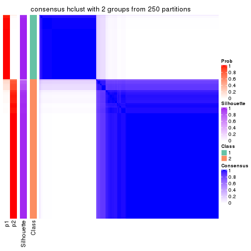</p>

</div>
<div id='tab-MAD-hclust-consensus-heatmap-2'>
<pre><code class="r">consensus_heatmap(res, k = 3)
</code></pre>

<p>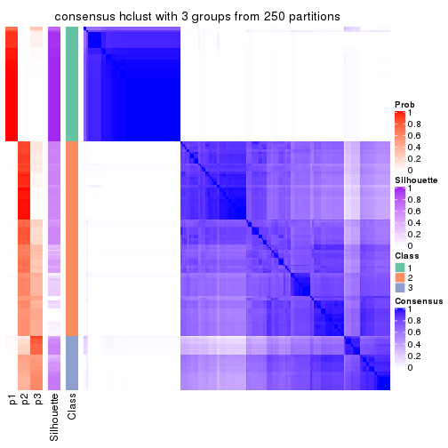</p>

</div>
<div id='tab-MAD-hclust-consensus-heatmap-3'>
<pre><code class="r">consensus_heatmap(res, k = 4)
</code></pre>

<p>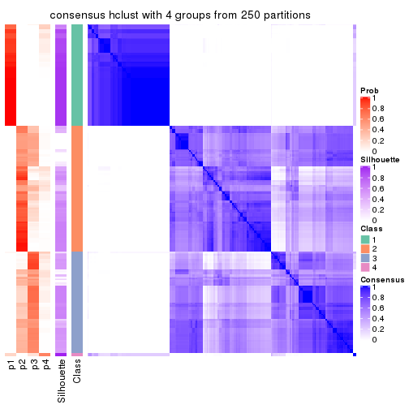</p>

</div>
<div id='tab-MAD-hclust-consensus-heatmap-4'>
<pre><code class="r">consensus_heatmap(res, k = 5)
</code></pre>

<p>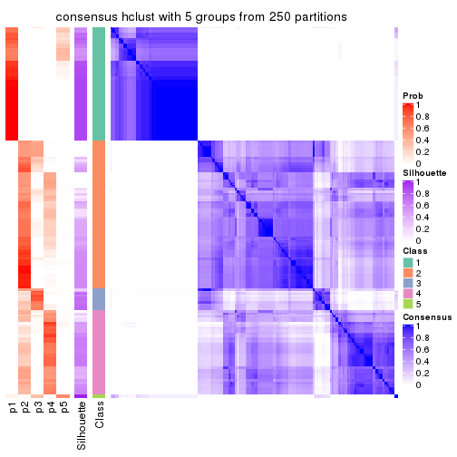</p>

</div>
<div id='tab-MAD-hclust-consensus-heatmap-5'>
<pre><code class="r">consensus_heatmap(res, k = 6)
</code></pre>

<p>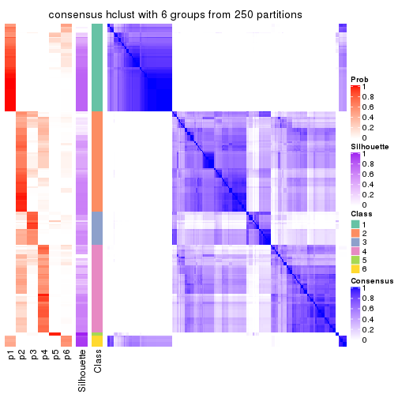</p>

</div>
</div>

Heatmaps for the membership of samples in all partitions to see how consistent they are:


<script>
$( function() {
	$( '#tabs-MAD-hclust-membership-heatmap' ).tabs();
} );
</script>
<div id='tabs-MAD-hclust-membership-heatmap'>
<ul>
<li><a href='#tab-MAD-hclust-membership-heatmap-1'>k = 2</a></li>
<li><a href='#tab-MAD-hclust-membership-heatmap-2'>k = 3</a></li>
<li><a href='#tab-MAD-hclust-membership-heatmap-3'>k = 4</a></li>
<li><a href='#tab-MAD-hclust-membership-heatmap-4'>k = 5</a></li>
<li><a href='#tab-MAD-hclust-membership-heatmap-5'>k = 6</a></li>
</ul>
<div id='tab-MAD-hclust-membership-heatmap-1'>
<pre><code class="r">membership_heatmap(res, k = 2)
</code></pre>

<p>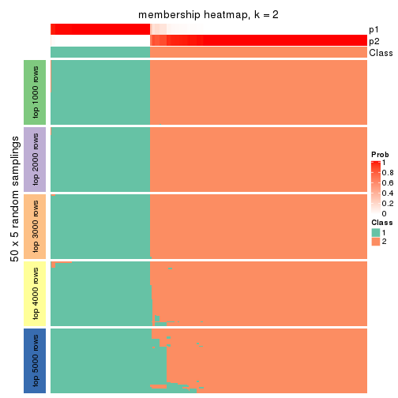</p>

</div>
<div id='tab-MAD-hclust-membership-heatmap-2'>
<pre><code class="r">membership_heatmap(res, k = 3)
</code></pre>

<p>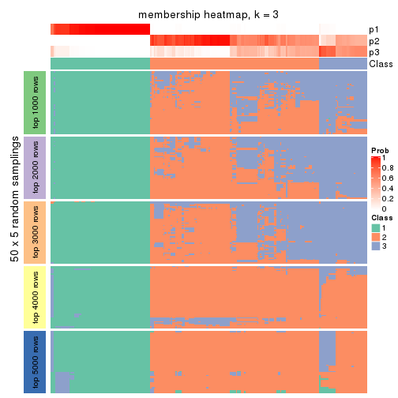</p>

</div>
<div id='tab-MAD-hclust-membership-heatmap-3'>
<pre><code class="r">membership_heatmap(res, k = 4)
</code></pre>

<p>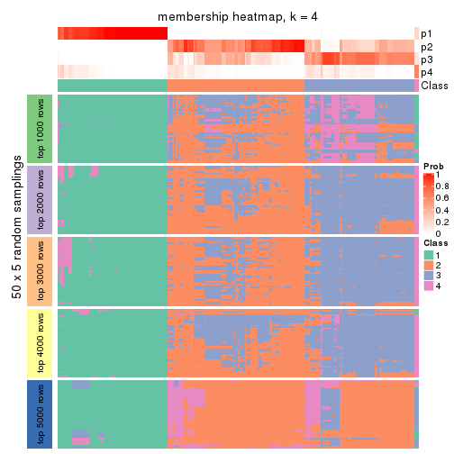</p>

</div>
<div id='tab-MAD-hclust-membership-heatmap-4'>
<pre><code class="r">membership_heatmap(res, k = 5)
</code></pre>

<p>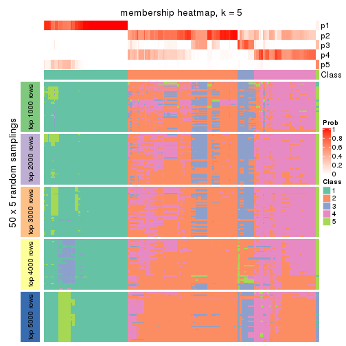</p>

</div>
<div id='tab-MAD-hclust-membership-heatmap-5'>
<pre><code class="r">membership_heatmap(res, k = 6)
</code></pre>

<p>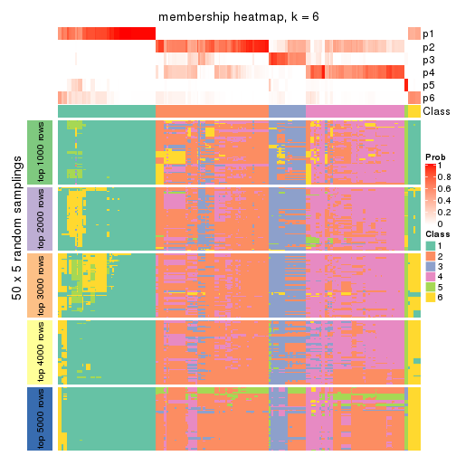</p>

</div>
</div>

As soon as we have had the classes for columns, we can look for signatures
which are significantly different between classes which can be candidate marks
for certain classes. Following are the heatmaps for signatures.


Signature heatmaps where rows are scaled:


<script>
$( function() {
	$( '#tabs-MAD-hclust-get-signatures' ).tabs();
} );
</script>
<div id='tabs-MAD-hclust-get-signatures'>
<ul>
<li><a href='#tab-MAD-hclust-get-signatures-1'>k = 2</a></li>
<li><a href='#tab-MAD-hclust-get-signatures-2'>k = 3</a></li>
<li><a href='#tab-MAD-hclust-get-signatures-3'>k = 4</a></li>
<li><a href='#tab-MAD-hclust-get-signatures-4'>k = 5</a></li>
<li><a href='#tab-MAD-hclust-get-signatures-5'>k = 6</a></li>
</ul>
<div id='tab-MAD-hclust-get-signatures-1'>
<pre><code class="r">get_signatures(res, k = 2)
</code></pre>

<p>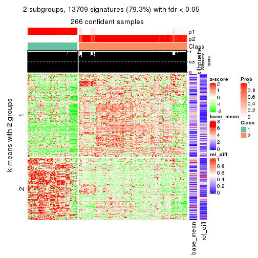</p>

</div>
<div id='tab-MAD-hclust-get-signatures-2'>
<pre><code class="r">get_signatures(res, k = 3)
</code></pre>

<p>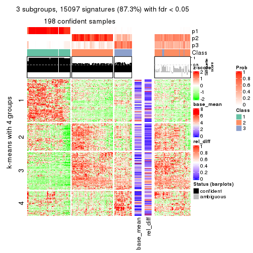</p>

</div>
<div id='tab-MAD-hclust-get-signatures-3'>
<pre><code class="r">get_signatures(res, k = 4)
</code></pre>

<p>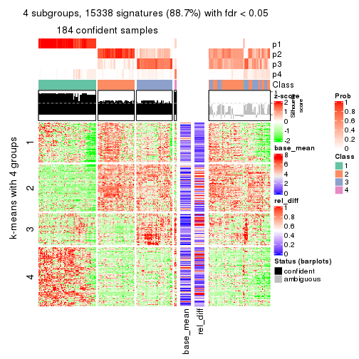</p>

</div>
<div id='tab-MAD-hclust-get-signatures-4'>
<pre><code class="r">get_signatures(res, k = 5)
</code></pre>

<p>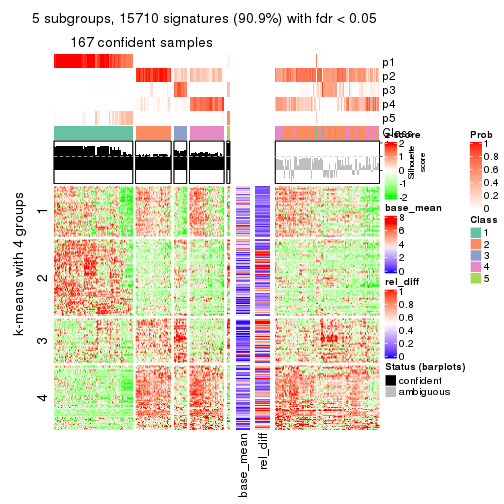</p>

</div>
<div id='tab-MAD-hclust-get-signatures-5'>
<pre><code class="r">get_signatures(res, k = 6)
</code></pre>

<p>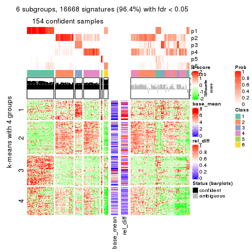</p>

</div>
</div>


Signature heatmaps where rows are not scaled:


<script>
$( function() {
	$( '#tabs-MAD-hclust-get-signatures-no-scale' ).tabs();
} );
</script>
<div id='tabs-MAD-hclust-get-signatures-no-scale'>
<ul>
<li><a href='#tab-MAD-hclust-get-signatures-no-scale-1'>k = 2</a></li>
<li><a href='#tab-MAD-hclust-get-signatures-no-scale-2'>k = 3</a></li>
<li><a href='#tab-MAD-hclust-get-signatures-no-scale-3'>k = 4</a></li>
<li><a href='#tab-MAD-hclust-get-signatures-no-scale-4'>k = 5</a></li>
<li><a href='#tab-MAD-hclust-get-signatures-no-scale-5'>k = 6</a></li>
</ul>
<div id='tab-MAD-hclust-get-signatures-no-scale-1'>
<pre><code class="r">get_signatures(res, k = 2, scale_rows = FALSE)
</code></pre>

<p>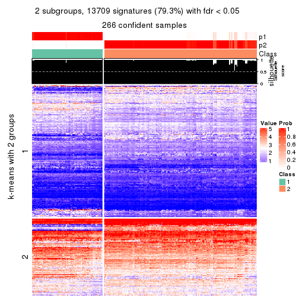</p>

</div>
<div id='tab-MAD-hclust-get-signatures-no-scale-2'>
<pre><code class="r">get_signatures(res, k = 3, scale_rows = FALSE)
</code></pre>

<p>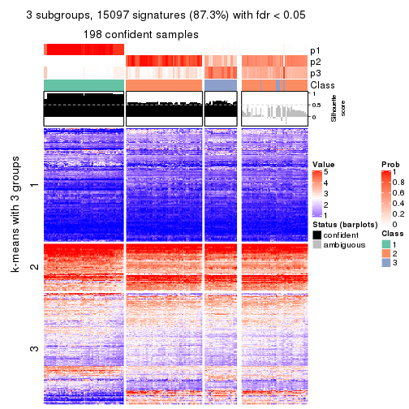</p>

</div>
<div id='tab-MAD-hclust-get-signatures-no-scale-3'>
<pre><code class="r">get_signatures(res, k = 4, scale_rows = FALSE)
</code></pre>

<p>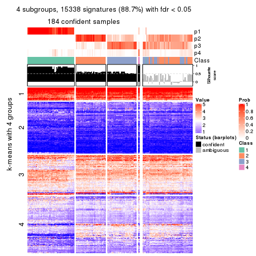</p>

</div>
<div id='tab-MAD-hclust-get-signatures-no-scale-4'>
<pre><code class="r">get_signatures(res, k = 5, scale_rows = FALSE)
</code></pre>

<p>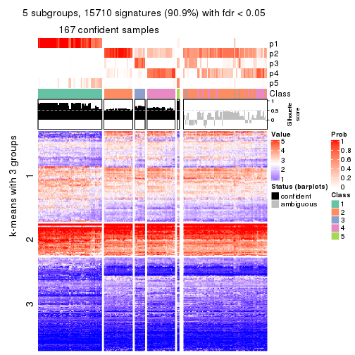</p>

</div>
<div id='tab-MAD-hclust-get-signatures-no-scale-5'>
<pre><code class="r">get_signatures(res, k = 6, scale_rows = FALSE)
</code></pre>

<p>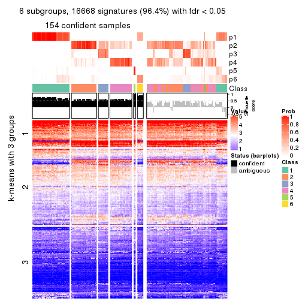</p>

</div>
</div>


Compare the overlap of signatures from different k:

```r
compare_signatures(res)
```

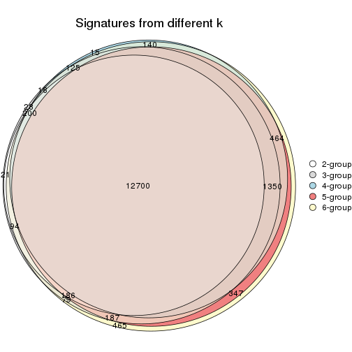

`get_signature()` returns a data frame invisibly. TO get the list of signatures, the function
call should be assigned to a variable explicitly. In following code, if `plot` argument is set
to `FALSE`, no heatmap is plotted while only the differential analysis is performed.

```r
# code only for demonstration
tb = get_signature(res, k = ..., plot = FALSE)
```

An example of the output of `tb` is:

```
#>   which_row         fdr    mean_1    mean_2 scaled_mean_1 scaled_mean_2 km
#> 1        38 0.042760348  8.373488  9.131774    -0.5533452     0.5164555  1
#> 2        40 0.018707592  7.106213  8.469186    -0.6173731     0.5762149  1
#> 3        55 0.019134737 10.221463 11.207825    -0.6159697     0.5749050  1
#> 4        59 0.006059896  5.921854  7.869574    -0.6899429     0.6439467  1
#> 5        60 0.018055526  8.928898 10.211722    -0.6204761     0.5791110  1
#> 6        98 0.009384629 15.714769 14.887706     0.6635654    -0.6193277  2
...
```

The columns in `tb` are:

1. `which_row`: row indices corresponding to the input matrix.
2. `fdr`: FDR for the differential test. 
3. `mean_x`: The mean value in group x.
4. `scaled_mean_x`: The mean value in group x after rows are scaled.
5. `km`: Row groups if k-means clustering is applied to rows.


UMAP plot which shows how samples are separated.


<script>
$( function() {
	$( '#tabs-MAD-hclust-dimension-reduction' ).tabs();
} );
</script>
<div id='tabs-MAD-hclust-dimension-reduction'>
<ul>
<li><a href='#tab-MAD-hclust-dimension-reduction-1'>k = 2</a></li>
<li><a href='#tab-MAD-hclust-dimension-reduction-2'>k = 3</a></li>
<li><a href='#tab-MAD-hclust-dimension-reduction-3'>k = 4</a></li>
<li><a href='#tab-MAD-hclust-dimension-reduction-4'>k = 5</a></li>
<li><a href='#tab-MAD-hclust-dimension-reduction-5'>k = 6</a></li>
</ul>
<div id='tab-MAD-hclust-dimension-reduction-1'>
<pre><code class="r">dimension_reduction(res, k = 2, method = &quot;UMAP&quot;)
</code></pre>

<p>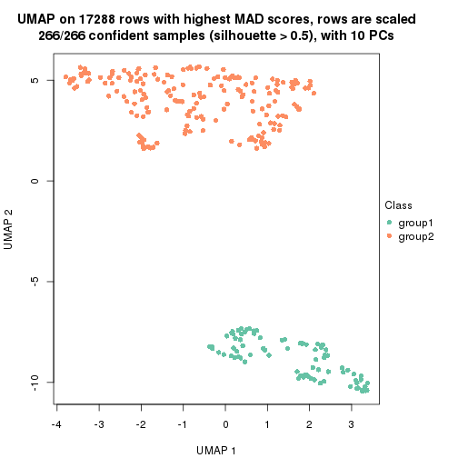</p>

</div>
<div id='tab-MAD-hclust-dimension-reduction-2'>
<pre><code class="r">dimension_reduction(res, k = 3, method = &quot;UMAP&quot;)
</code></pre>

<p>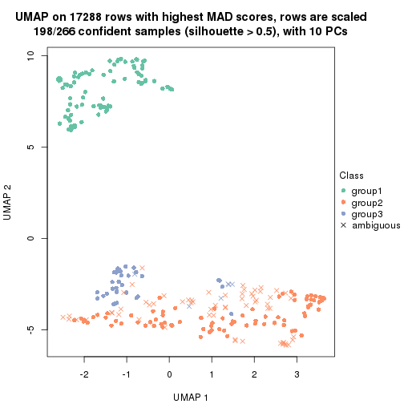</p>

</div>
<div id='tab-MAD-hclust-dimension-reduction-3'>
<pre><code class="r">dimension_reduction(res, k = 4, method = &quot;UMAP&quot;)
</code></pre>

<p>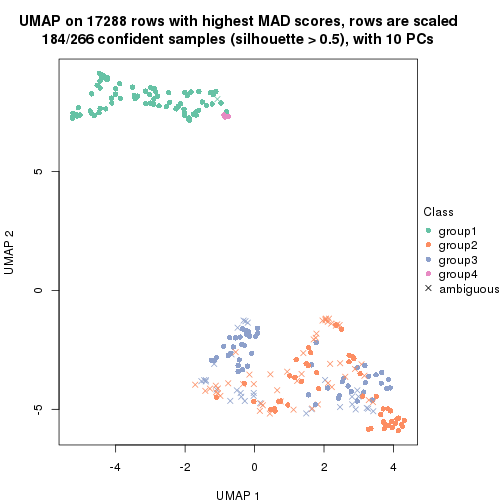</p>

</div>
<div id='tab-MAD-hclust-dimension-reduction-4'>
<pre><code class="r">dimension_reduction(res, k = 5, method = &quot;UMAP&quot;)
</code></pre>

<p>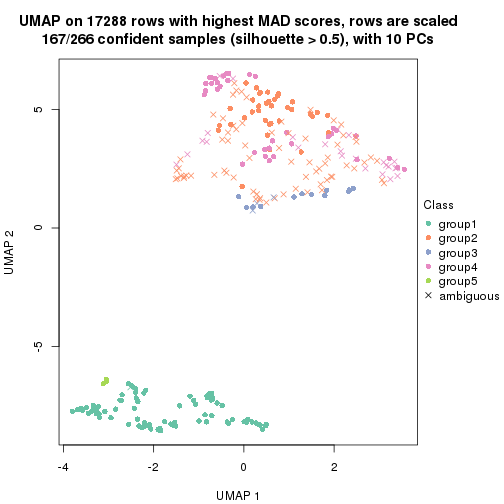</p>

</div>
<div id='tab-MAD-hclust-dimension-reduction-5'>
<pre><code class="r">dimension_reduction(res, k = 6, method = &quot;UMAP&quot;)
</code></pre>

<p>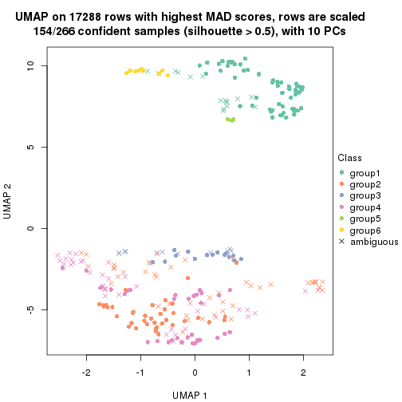</p>

</div>
</div>


Following heatmap shows how subgroups are split when increasing `k`:

```r
collect_classes(res)
```

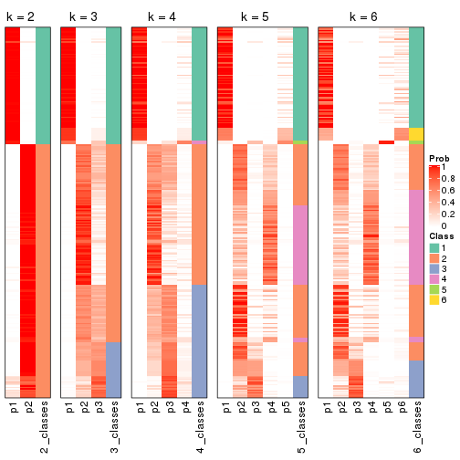


If matrix rows can be associated to genes, consider to use `GO_Enrichment(res,
...)` to perform function enrichment for the signature genes.


 

---------------------------------------------------


### MAD:kmeans**


The object with results only for a single top-value method and a single partition method 
can be extracted as:

```r
res = res_list["MAD", "kmeans"]
# you can also extract it by
# res = res_list["MAD:kmeans"]
```

A summary of `res` and all the functions that can be applied to it:

```r
res
```

```
#> A 'ConsensusPartition' object with k = 2, 3, 4, 5, 6.
#>   On a matrix with 17288 rows and 266 columns.
#>   Top rows (1000, 2000, 3000, 4000, 5000) are extracted by 'MAD' method.
#>   Subgroups are detected by 'kmeans' method.
#>   Performed in total 1250 partitions by row resampling.
#>   Best k for subgroups seems to be 2.
#> 
#> Following methods can be applied to this 'ConsensusPartition' object:
#>  [1] "cola_report"             "collect_classes"         "collect_plots"          
#>  [4] "collect_stats"           "colnames"                "compare_signatures"     
#>  [7] "consensus_heatmap"       "dimension_reduction"     "functional_enrichment"  
#> [10] "get_anno_col"            "get_anno"                "get_classes"            
#> [13] "get_consensus"           "get_matrix"              "get_membership"         
#> [16] "get_param"               "get_signatures"          "get_stats"              
#> [19] "is_best_k"               "is_stable_k"             "membership_heatmap"     
#> [22] "ncol"                    "nrow"                    "plot_ecdf"              
#> [25] "rownames"                "select_partition_number" "show"                   
#> [28] "suggest_best_k"          "test_to_known_factors"
```

`collect_plots()` function collects all the plots made from `res` for all `k` (number of partitions)
into one single page to provide an easy and fast comparison between different `k`.

```r
collect_plots(res)
```

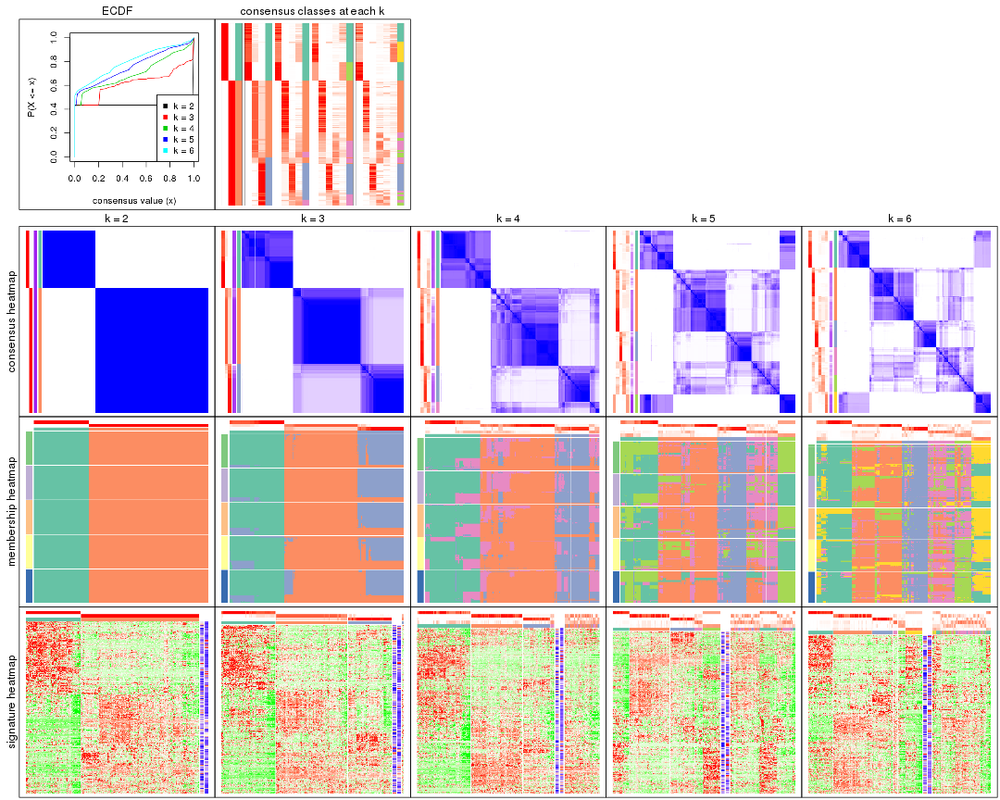

The plots are:

- The first row: a plot of the ECDF (Empirical cumulative distribution
  function) curves of the consensus matrix for each `k` and the heatmap of
  predicted classes for each `k`.
- The second row: heatmaps of the consensus matrix for each `k`.
- The third row: heatmaps of the membership matrix for each `k`.
- The fouth row: heatmaps of the signatures for each `k`.

All the plots in panels can be made by individual functions and they are
plotted later in this section.

`select_partition_number()` produces several plots showing different
statistics for choosing "optimized" `k`. There are following statistics:

- ECDF curves of the consensus matrix for each `k`;
- 1-PAC. [The PAC
  score](https://en.wikipedia.org/wiki/Consensus_clustering#Over-interpretation_potential_of_consensus_clustering)
  measures the proportion of the ambiguous subgrouping.
- Mean silhouette score.
- Concordance. The mean probability of fiting the consensus class ids in all
  partitions.
- Area increased. Denote $A_k$ as the area under the ECDF curve for current
  `k`, the area increased is defined as $A_k - A_{k-1}$.
- Rand index. The percent of pairs of samples that are both in a same cluster
  or both are not in a same cluster in the partition of k and k-1.
- Jaccard index. The ratio of pairs of samples are both in a same cluster in
  the partition of k and k-1 and the pairs of samples are both in a same
  cluster in the partition k or k-1.

The detailed explanations of these statistics can be found in [the cola
vignette](http://bioconductor.org/packages/devel/bioc/vignettes/cola/inst/doc/cola.html#toc_13).

Generally speaking, lower PAC score, higher mean silhouette score or higher
concordance corresponds to better partition. Rand index and Jaccard index
measure how similar the current partition is compared to partition with `k-1`.
If they are too similar, we won't accept `k` is better than `k-1`.

```r
select_partition_number(res)
```

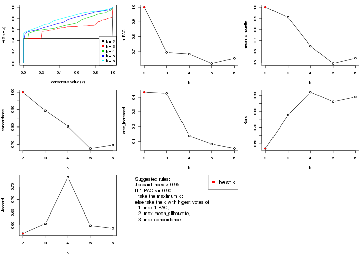

The numeric values for all these statistics can be obtained by `get_stats()`.

```r
get_stats(res)
```

```
#>   k 1-PAC mean_silhouette concordance area_increased  Rand Jaccard
#> 2 2 1.000           1.000       1.000         0.4343 0.566   0.566
#> 3 3 0.696           0.909       0.893         0.4265 0.776   0.605
#> 4 4 0.684           0.652       0.804         0.1373 0.922   0.789
#> 5 5 0.620           0.495       0.676         0.0816 0.862   0.598
#> 6 6 0.655           0.543       0.696         0.0508 0.891   0.587
```

`suggest_best_k()` suggests the best $k$ based on these statistics. The rules are as follows:

- All $k$ with Jaccard index larger than 0.95 are removed because the increase of
  the partition number does not provides enough extra information. If all $k$ are removed,
  the best $k$ is assigned by `NA`.
- For $k$ with 1-PAC larger than 0.9, the maximal $k$ is taken as the "best k". Other $k$ is called "optional k".
- If it does not fit the second rule. The $k$ with the highest vote of highest
  1-PAC, mean silhouette and concordance is taken as the "best k".

```r
suggest_best_k(res)
```

```
#> [1] 2
```


Following shows the table of the partitions (You need to click the **show/hide
code output** link to see it). The membership matrix (columns with name `p*`)
is inferred by
[`clue::cl_consensus()`](https://www.rdocumentation.org/link/cl_consensus?package=clue)
function with the `SE` method. Basically the value in the membership matrix
represents the probability to belong to a certain group. The finall class
label for an item is determined with the group with highest probability it
belongs to.

In `get_classes()` function, the entropy is calculated from the membership
matrix and the silhouette score is calculated from the consensus matrix.


<script>
$( function() {
	$( '#tabs-MAD-kmeans-get-classes' ).tabs();
} );
</script>
<div id='tabs-MAD-kmeans-get-classes'>
<ul>
<li><a href='#tab-MAD-kmeans-get-classes-1'>k = 2</a></li>
<li><a href='#tab-MAD-kmeans-get-classes-2'>k = 3</a></li>
<li><a href='#tab-MAD-kmeans-get-classes-3'>k = 4</a></li>
<li><a href='#tab-MAD-kmeans-get-classes-4'>k = 5</a></li>
<li><a href='#tab-MAD-kmeans-get-classes-5'>k = 6</a></li>
</ul>

<div id='tab-MAD-kmeans-get-classes-1'>
<p><a id='tab-MAD-kmeans-get-classes-1-a' style='color:#0366d6' href='#'>show/hide code output</a></p>
<pre><code class="r">cbind(get_classes(res, k = 2), get_membership(res, k = 2))
</code></pre>

<pre><code>#&gt;                                      class entropy silhouette p1 p2
#&gt; 80D0AF10-1C61-4B67-90C1-7DBF1EF23672     2       0          1  0  1
#&gt; 87117BE1-D328-4972-85DA-6672412D8860     2       0          1  0  1
#&gt; F904C5B6-70BD-4604-8254-79BE23B152DA     1       0          1  1  0
#&gt; 3182DEA1-4239-4613-925A-7E6503766AD6     2       0          1  0  1
#&gt; 55E78EA2-2D9B-481F-8CAB-D36A33088EAE     2       0          1  0  1
#&gt; 86F94264-A6DD-4A97-9191-036F066DD0EF     2       0          1  0  1
#&gt; 09D25417-23B7-4D88-A0EA-F307985FBBBC     2       0          1  0  1
#&gt; C797F12C-40D3-4DB5-B9EF-A6821BBDE4F0     1       0          1  1  0
#&gt; 80275DB0-A226-4B6B-A08F-4ADBEEE1DB01     1       0          1  1  0
#&gt; 27FB653A-9E07-44AD-952E-9E4DE4AB5891     2       0          1  0  1
#&gt; 1A5DB9FC-2ABD-4E1B-B5EF-B1CF5E5F3872     1       0          1  1  0
#&gt; 844E4CCD-D30C-416F-A086-8923711A4E25     2       0          1  0  1
#&gt; EF18318D-3D25-4D65-803A-ED6E62871E7E     1       0          1  1  0
#&gt; 1ACB1BE0-61F6-4243-BBEC-E26A1CF90CA8     1       0          1  1  0
#&gt; 8EF0039B-D758-46AB-BAF7-6A062C7C56BA     1       0          1  1  0
#&gt; 22F4C9D9-663B-4C91-9692-E035A2640BEC     2       0          1  0  1
#&gt; FA1A0BCE-EE0F-4178-B963-62550E344B14     2       0          1  0  1
#&gt; 0B6D0C4E-5AE3-4707-A9FC-12A108E6EC2A     2       0          1  0  1
#&gt; 06FD3123-2AEB-4911-AC4E-E0E64FD5DB52     2       0          1  0  1
#&gt; 235A4492-FF80-4AA5-BC71-DFF65E1C7411     2       0          1  0  1
#&gt; A192C6C0-1443-4493-AFAC-1EE710628ADB     2       0          1  0  1
#&gt; 6FC5B56B-711B-4174-9B06-4E843124AAB6     1       0          1  1  0
#&gt; 7A813F60-A41E-4552-990E-F22287654C1D     2       0          1  0  1
#&gt; 725BBFB5-26F4-4512-9C75-47D013C1E605     1       0          1  1  0
#&gt; 39CC4E82-EBC9-472E-8BE5-6A3AB178449A     2       0          1  0  1
#&gt; 61130DEE-E267-49DF-8B41-7738A06EF738     2       0          1  0  1
#&gt; 117EC12C-B7ED-4E01-B29B-EA542D356EA1     1       0          1  1  0
#&gt; A30FF708-F7A9-41E4-8AD5-20441650FBC9     2       0          1  0  1
#&gt; 53640D52-1167-4A5D-B656-97D32CBA3934     1       0          1  1  0
#&gt; 9E85D76A-DD2A-46D5-BB59-0ED302B6258C     2       0          1  0  1
#&gt; 6F8C6F90-7E3C-4860-91DD-586708DE44AA     1       0          1  1  0
#&gt; E675AEC5-AA9A-4AAA-839C-03E6365822DB     2       0          1  0  1
#&gt; B577DEF7-2F5C-4876-A7C6-F18D5722B8C0     1       0          1  1  0
#&gt; DA8B577E-43E7-49BF-BF94-868E3194F5C9     1       0          1  1  0
#&gt; 3334280B-2A36-4AC7-A021-A76C10E958F0     2       0          1  0  1
#&gt; 5CBDDC90-11EC-4E6E-881E-AA9CCFD40FDB     2       0          1  0  1
#&gt; 8CBBF32A-8349-44F5-A8B8-4CBB1760A464     2       0          1  0  1
#&gt; B9455A9A-136D-4DC2-9F86-0FC74433589D     2       0          1  0  1
#&gt; D7EAE2A7-F9BE-4222-A452-B1F83F99CD50     2       0          1  0  1
#&gt; F803AE18-60C5-4CFE-AAAB-DB33C26A2184     1       0          1  1  0
#&gt; 5DD8CAC7-EC02-43B6-B58E-6D2E22868A3B     2       0          1  0  1
#&gt; EE98E1B4-DFB3-4AEC-8527-E1FD544C9475     1       0          1  1  0
#&gt; 3CE43921-47D5-4394-B9E1-242607775D61     2       0          1  0  1
#&gt; 46986F2B-0B0D-4187-8948-4E91D34B7C49     2       0          1  0  1
#&gt; 5D1D052E-74EF-45A8-9B1A-7CECD13EA43B     2       0          1  0  1
#&gt; 4C821AD9-A5C9-4A9A-9C5D-363B227F8064     2       0          1  0  1
#&gt; 06A4189E-A23B-4AC6-AA74-01955DD7D1E9     2       0          1  0  1
#&gt; FCCDC76F-CB02-4BCD-A616-325F258DDAA4     2       0          1  0  1
#&gt; DAC53B0A-8F35-4EA6-BBCC-4CD1C049E11F     2       0          1  0  1
#&gt; DD4F845B-CAD3-44CB-9D96-3C3F5BA1B72D     1       0          1  1  0
#&gt; D440F004-A4A4-41B6-BED8-805D67BA01C7     2       0          1  0  1
#&gt; A497C423-119F-42FA-BF17-9F6DFD2A5585     2       0          1  0  1
#&gt; 3420E573-DE12-4EF5-B1C0-2FCA904F4F4E     1       0          1  1  0
#&gt; 1AD72157-A254-44B4-BA58-4F30F1AE910E     1       0          1  1  0
#&gt; C1113977-B160-45EE-B061-750F9EA3F33F     2       0          1  0  1
#&gt; 6783AB5B-F07C-447B-BF13-C34485D246D7     2       0          1  0  1
#&gt; 1F553062-26FD-4A7F-B7FB-81184604F423     1       0          1  1  0
#&gt; BE2DCA51-1C21-4598-98A7-F2FB9B2DFCB4     2       0          1  0  1
#&gt; 38941CF3-9C54-4BA4-A005-CC88CA97D504     2       0          1  0  1
#&gt; 51CB675E-E243-4A07-BF4A-580473D26FDA     2       0          1  0  1
#&gt; C7FED0F5-C27A-4405-9232-30BF39362CF7     2       0          1  0  1
#&gt; 2A1E86E8-4713-465F-ACFF-C584864C57A1     2       0          1  0  1
#&gt; B4500785-0FAA-4D4D-8630-43D194BAB004     2       0          1  0  1
#&gt; 3FD52E66-AB76-4079-80DB-281A795D1EC0     2       0          1  0  1
#&gt; EBD355D1-1226-4DFD-AAFF-45D246B64F3C     2       0          1  0  1
#&gt; 5A040A73-CD95-487E-8AEF-9639FE4E2916     2       0          1  0  1
#&gt; CF629C65-585D-476D-B081-3E6E0575FAE3     2       0          1  0  1
#&gt; 0D4202A3-808E-413F-9BF3-9CFCCAE0ED61     2       0          1  0  1
#&gt; 43E715BF-28D9-4B5E-B762-8CD1B69A430E     1       0          1  1  0
#&gt; BFB82BE8-9DAC-4099-8B38-0950308E3EB3     2       0          1  0  1
#&gt; F7CB1825-2303-4DD2-AE1F-7205738EAF1F     1       0          1  1  0
#&gt; FE298483-C42C-4753-BABB-29A9CB1B6312     1       0          1  1  0
#&gt; A98C7561-1B42-4CD6-AE71-924B91FA4C33     2       0          1  0  1
#&gt; 58098F21-7DAB-47DA-9A41-8D20BF3B9257     2       0          1  0  1
#&gt; 18CAF708-20B9-4745-9CB3-37AB6E0B3056     2       0          1  0  1
#&gt; 2C80DD72-C9C7-4AC2-812F-9A31EF02779C     1       0          1  1  0
#&gt; 68A3F13D-319D-4603-A27F-B5DD46FE5C5B     2       0          1  0  1
#&gt; 7EE8F0CE-CDC9-40F9-A1DE-7F8140EC6D13     2       0          1  0  1
#&gt; 39019903-5B9C-4665-BD5F-7CCB19CB55C5     2       0          1  0  1
#&gt; 190EDB27-4CBC-4E9C-9B67-D51FDAB982B7     2       0          1  0  1
#&gt; EB2D95BC-62F8-4669-9308-D37D7FB79E23     2       0          1  0  1
#&gt; A08B85EA-D1E7-4B77-8DEC-36294305B9F7     1       0          1  1  0
#&gt; 130DDFAD-6EF8-4C80-BD9D-88308A6874BC     2       0          1  0  1
#&gt; 7340A5BA-E002-448F-AACC-E7A37DBB79C2     2       0          1  0  1
#&gt; A771F6E3-D266-4FE7-98C6-C40E6A701D59     1       0          1  1  0
#&gt; 015E792C-EC1B-49BF-AB07-D82B20C5989A     2       0          1  0  1
#&gt; BF79E030-47EE-4D08-B910-5685A4BD8B60     2       0          1  0  1
#&gt; FB3C7C9A-2F2D-4DD5-BE47-FAFB072C0FAB     2       0          1  0  1
#&gt; 4E5557BA-10E8-4723-908E-DD04EF6639B2     2       0          1  0  1
#&gt; 8031B550-40A9-4A3A-9F7D-CDC052288BD8     2       0          1  0  1
#&gt; 55299A06-3C1F-45A4-B166-B2C591C0CEE2     2       0          1  0  1
#&gt; EB8D5168-216E-4ABB-8B4E-9E67786CB322     1       0          1  1  0
#&gt; 78BD2D83-9A7F-42E5-BB38-654AA0761A0A     2       0          1  0  1
#&gt; AA2D53E5-D389-4332-9DD5-A736052E48F8     1       0          1  1  0
#&gt; 62945C7A-9313-4FC9-820C-B0AB820B394E     1       0          1  1  0
#&gt; 22746046-2E99-4EE9-97D2-BA2EA499634C     2       0          1  0  1
#&gt; 8671B51B-DCBE-4429-9F01-AF51CAD7014F     2       0          1  0  1
#&gt; E815AB36-5689-4A0D-8E6D-2EAA73406681     1       0          1  1  0
#&gt; A1DACB46-ED52-4E38-B2C8-57256BB22B5E     2       0          1  0  1
#&gt; 4F5498C4-A423-4B3D-AC98-D4E214A57D0E     1       0          1  1  0
#&gt; A7772CCD-FFFF-49DD-86ED-0BAD330EC9B6     2       0          1  0  1
#&gt; E6E3DF78-65B9-4F74-8DA8-E2A6D4EDBEA7     2       0          1  0  1
#&gt; 83286E2D-E708-437A-911A-E6B050273CBD     1       0          1  1  0
#&gt; EC5C7C97-EE8C-405D-A039-D96514B1D414     2       0          1  0  1
#&gt; 3E55223D-6E3D-4027-9819-67E91212531D     1       0          1  1  0
#&gt; 99A036A2-8343-4D06-8047-D84E96CE4C61     2       0          1  0  1
#&gt; CA6CDE6D-92DE-4259-9E58-A373F2D543EA     2       0          1  0  1
#&gt; BF6FA8CC-60C1-413A-B2C6-54CCACBC01D6     1       0          1  1  0
#&gt; E0594CFE-F7B6-4546-B130-30DF6A514B1F     2       0          1  0  1
#&gt; E769E41D-5949-42C5-9594-E563C05ACE52     2       0          1  0  1
#&gt; 01373725-5D3C-4D9C-AABC-911D53E62BCD     2       0          1  0  1
#&gt; 1F39DADD-3655-474E-BA4C-A5BD32C97A8B     1       0          1  1  0
#&gt; AF573EC8-E4EE-4B8F-8199-9817B9FAC67D     1       0          1  1  0
#&gt; 3F022CBC-41C8-4387-A6FB-124C4BCD1AD9     1       0          1  1  0
#&gt; 1CC32ACE-826B-494B-8B89-5BD92327A74D     2       0          1  0  1
#&gt; 22B0BD3B-EE08-4BC7-90B2-01C372A56BA2     2       0          1  0  1
#&gt; 0F3DE9EF-19CC-4D14-9A42-1435DB537F94     2       0          1  0  1
#&gt; 87F8A33F-FBC3-469E-862B-84472F796358     2       0          1  0  1
#&gt; C9F2FA0D-1A9F-40B4-BD9B-CAF1B3F3D5A7     2       0          1  0  1
#&gt; ACFC9F59-78FF-4453-B25F-8834D0EAB54A     2       0          1  0  1
#&gt; B7AC7D5B-14E9-45A7-93B7-226EE508544A     2       0          1  0  1
#&gt; 4491BF17-B168-4E96-8E09-EF1AEC9F5E9D     2       0          1  0  1
#&gt; 557A0811-A3FE-4CF4-A24D-FBB77E7F9139     2       0          1  0  1
#&gt; 6F9C955C-6816-4353-922A-8035B50FACC6     2       0          1  0  1
#&gt; 3E89FB1C-4A7D-43C7-823C-04E3716A7935     2       0          1  0  1
#&gt; 12ABE483-66EF-4237-94C4-0199FAE23FA8     2       0          1  0  1
#&gt; 7535F262-9B96-44F6-988C-4C9EBB3FFCA9     2       0          1  0  1
#&gt; 65C9D28E-303B-40E5-84F0-2507F5457374     2       0          1  0  1
#&gt; FD445384-6BA9-4297-9D9C-12ABA7D645C7     1       0          1  1  0
#&gt; 30D5E255-2AD3-44F3-8983-1B80E4FD3E2D     2       0          1  0  1
#&gt; 3E88EC60-B4A8-4259-8BC8-A234800F6955     2       0          1  0  1
#&gt; ACD73CE8-AFC5-47A0-9383-3CB97F018953     1       0          1  1  0
#&gt; 1AFDC2EA-26A8-44E2-8BCB-F34F7B66F8C8     2       0          1  0  1
#&gt; 9E327BC8-1D20-4AD8-83F7-FB2D13BCA5D0     2       0          1  0  1
#&gt; 85A86B91-4F24-4E77-AE2D-520F8E205EFC     1       0          1  1  0
#&gt; 74868C37-8143-4306-81CA-E45759D146CD     2       0          1  0  1
#&gt; 69AEA0DB-E335-48A0-A398-4FB0D581182A     2       0          1  0  1
#&gt; AE6F8B89-85C2-42B7-8D05-AFDDD4FEFD16     1       0          1  1  0
#&gt; A8A6F09C-9812-4457-9A4B-AD41F97B41A3     2       0          1  0  1
#&gt; 1A09BC4D-EF29-42DD-BB04-A3C264A3032D     1       0          1  1  0
#&gt; E0961A30-A62C-4235-9CF0-A1776827A996     2       0          1  0  1
#&gt; 134D2D90-7B08-4F20-8A3A-C77643FB208F     2       0          1  0  1
#&gt; A77C2DFF-93CF-4CB5-B3C1-81133D7F1A0F     2       0          1  0  1
#&gt; EA2DC457-9C74-4B9C-B3FA-5E72199B24A7     2       0          1  0  1
#&gt; FF34117B-5EE4-4C96-A8A2-2CE6A654CBE5     1       0          1  1  0
#&gt; 75F7B5E2-6559-4B48-A2A4-287C35C559CC     1       0          1  1  0
#&gt; 903BF591-B0AF-4BEE-B625-60B673070344     2       0          1  0  1
#&gt; 9DE1B790-C63C-41C4-9477-CE52A8119C67     2       0          1  0  1
#&gt; 9A28F80A-85F8-40E2-A32B-230EF93B2FA0     2       0          1  0  1
#&gt; 0AA2BDBB-8720-409A-AA72-1F4AA26E7CD8     2       0          1  0  1
#&gt; 5AD49F16-E974-4E5D-B1B6-073ECB73A01D     2       0          1  0  1
#&gt; CB0F961C-527D-4A48-9408-286B26BD9532     1       0          1  1  0
#&gt; 46FF25B6-D01D-4CA7-80B7-CEC2998C34E1     2       0          1  0  1
#&gt; 487CADE1-D699-4A6C-817A-B9A0AB940C61     1       0          1  1  0
#&gt; 4FF6F2D8-F869-4735-A4D1-1A8423153FBC     1       0          1  1  0
#&gt; 6005494F-5D3D-43A3-B3E8-8C91955B2A98     2       0          1  0  1
#&gt; CF10D584-CE32-45A4-A932-E9D5AF12A6A0     1       0          1  1  0
#&gt; E15CE4AB-5646-49C8-9CD6-938457036BB0     2       0          1  0  1
#&gt; 31E28D0B-0E69-4330-82ED-4F1827DC97EA     2       0          1  0  1
#&gt; DBACD3C3-CCB5-4478-BA78-85A0C847CA66     2       0          1  0  1
#&gt; 5A07041C-65EB-4FCD-8940-E90B905061B5     2       0          1  0  1
#&gt; 0EA7C916-FA47-489B-BC98-4D9E7D197628     1       0          1  1  0
#&gt; 30967F75-8499-47FF-ADA4-4DC566013F7B     1       0          1  1  0
#&gt; D2E528FF-AEA2-48D7-A60A-4C3E71EA9073     2       0          1  0  1
#&gt; 22735DCD-215E-48BC-BF44-32BD66F06E39     2       0          1  0  1
#&gt; BC2C3248-7FC6-48BC-96C1-45EA573DE7DC     1       0          1  1  0
#&gt; E72CEBCB-D686-4B12-BCBA-EC8F964330A2     1       0          1  1  0
#&gt; 23C937BB-BA20-4440-B680-914229CC3ADF     1       0          1  1  0
#&gt; 947E99C7-F402-4F1A-A6E9-81BCAAED135A     2       0          1  0  1
#&gt; 02475D11-FC81-4E88-944E-173C32DC3FE7     2       0          1  0  1
#&gt; F972A9AA-9842-4343-A533-A795E65581CE     1       0          1  1  0
#&gt; 05043AAF-3095-4C61-B5C1-EE9AA9082C75     2       0          1  0  1
#&gt; CECF7967-862E-428C-BB42-FEF553FDB3AA     2       0          1  0  1
#&gt; FB0B9483-6302-48C7-BE5B-DA667E00AE2D     2       0          1  0  1
#&gt; 78700FBA-1487-4754-9B30-18837BF7E9FB     1       0          1  1  0
#&gt; 2166F56D-54CE-4F1B-8F07-A4E13E4489E9     1       0          1  1  0
#&gt; 7CD0942E-E39A-43A7-8BAC-F25967864901     2       0          1  0  1
#&gt; 3B00BA2B-7F7D-4825-8F8D-90F04A5DE687     2       0          1  0  1
#&gt; 7465B01D-C05E-4FE0-A9FE-182920EDC489     2       0          1  0  1
#&gt; 88C31A99-F96E-4FC8-8B3D-C1AAA05062D9     1       0          1  1  0
#&gt; 53575575-3303-4F8F-B6A8-B42131CFB4AC     2       0          1  0  1
#&gt; CC8017C7-4128-48DA-8E43-503F63158D85     1       0          1  1  0
#&gt; 88449D2A-2A25-41A4-B91D-C99B58F8ECD9     2       0          1  0  1
#&gt; 46C7DDE5-A2B5-494F-96AE-0B6E2D51B003     1       0          1  1  0
#&gt; 42551D05-5EE5-4F91-93A8-32DA695D9DFA     2       0          1  0  1
#&gt; 0772DA48-3A36-422D-B166-CA1691B782C3     2       0          1  0  1
#&gt; 30346897-EC77-4153-88A2-D14593C8B741     2       0          1  0  1
#&gt; 0F00E267-C748-4A71-8B36-03C410641D88     2       0          1  0  1
#&gt; 4034703A-4DA9-4DDA-9CA9-E80FFE9CCDE6     2       0          1  0  1
#&gt; 393C8A41-CF45-4EA8-AFE3-25A08AB7692A     2       0          1  0  1
#&gt; 3354212D-A07C-435C-8B0C-9A7BAAB624B5     1       0          1  1  0
#&gt; 57E30D4E-ABF7-47DD-92BE-40CE215076B0     1       0          1  1  0
#&gt; 202B4C76-C840-4DB8-953F-AC75A4156FDD     2       0          1  0  1
#&gt; 93A0137B-1F4C-44EE-B959-2AD0CD2DF8B6     1       0          1  1  0
#&gt; C9794DB6-6E8C-4AFD-80EE-61D672A4F6E9     2       0          1  0  1
#&gt; AE4BFE63-F0C0-4624-AD97-4F7FF13E2384     1       0          1  1  0
#&gt; DCF87F27-2B54-42D9-8D28-5DFEE76E2F5B     2       0          1  0  1
#&gt; 2451D405-39FD-4812-958C-23462B66F1F1     2       0          1  0  1
#&gt; E27F5D33-3F68-4CA8-8757-A387C6EAD060     2       0          1  0  1
#&gt; 8BA9928A-5B93-477F-B4A2-D031B714D9AC     1       0          1  1  0
#&gt; 0FAACFF6-B50C-4BED-9824-B7270654F28D     2       0          1  0  1
#&gt; 3366CC3C-2BBA-4CA7-848E-4E16AA70AE7A     2       0          1  0  1
#&gt; 66237056-CA9A-4C90-AF0E-1621FEB71578     2       0          1  0  1
#&gt; C480F1FB-3100-436C-B0F5-DED63B7A580E     2       0          1  0  1
#&gt; A327DE0D-D945-4B42-9B41-A7302CF796EE     2       0          1  0  1
#&gt; E8A6871D-67FB-4306-9454-F5E7CDBA399A     2       0          1  0  1
#&gt; E9A7485B-82B6-4BD2-AFBB-DD0A82D6CDE2     1       0          1  1  0
#&gt; 93B382E4-9C9A-43F5-BD3B-502CC260B886     1       0          1  1  0
#&gt; A2792419-8E16-45FE-A524-17851F34AB9B     2       0          1  0  1
#&gt; 4DED1201-F25C-4F82-BABF-965EFAD7A8E5     2       0          1  0  1
#&gt; F1ACB2DD-E948-4F88-A249-F1BD1977D667     2       0          1  0  1
#&gt; 6CDBA203-8952-421D-A6BF-75652D9F3339     2       0          1  0  1
#&gt; 2D6C5AA7-3B33-48D7-AE0C-77A16B749D13     1       0          1  1  0
#&gt; 3F6B6D95-0720-42A0-AEB3-89FECAE7616A     2       0          1  0  1
#&gt; DED8ACF3-BBD8-46C9-85C9-A9C8F2E2BC0B     1       0          1  1  0
#&gt; 77069279-5A6F-42C0-9AA5-8C939591DFB5     1       0          1  1  0
#&gt; B2D4FCF3-FDF9-41C8-880A-6732CF6222AF     2       0          1  0  1
#&gt; 1CD71A4C-1E49-48EF-AA72-CB3C26B4C087     2       0          1  0  1
#&gt; C364E621-F85C-4B7F-842F-210B8D4DFE3A     2       0          1  0  1
#&gt; 11F1B8CA-07C1-47D2-A3C6-032FFA6A4A64     1       0          1  1  0
#&gt; 153BF804-6DC8-496B-987A-4021A2512211     2       0          1  0  1
#&gt; 5B5029C9-40F5-40D7-A36A-367022AD6A42     2       0          1  0  1
#&gt; 193CCBE6-104F-49B4-BDB2-C82EE36FDAAD     1       0          1  1  0
#&gt; E5D45E53-FCF3-4F01-9B78-6CB1ED0CFE40     2       0          1  0  1
#&gt; 5546A779-21DB-49F9-8C0D-A1E420088084     2       0          1  0  1
#&gt; E14825E0-0DC7-44C2-B265-F54672356838     1       0          1  1  0
#&gt; 8C8C09B9-EC83-45EC-BC4C-0BA92DE60ACB     1       0          1  1  0
#&gt; B388CA82-5BF7-4BDD-8821-4EC0B213121F     2       0          1  0  1
#&gt; A26025AC-9F71-4C07-9135-83593193BBB2     1       0          1  1  0
#&gt; C80E6D4B-AF21-42F0-8E20-6F7D2E99C062     2       0          1  0  1
#&gt; 5AE5D819-A6B1-4761-B7F9-8FFD3C520F31     2       0          1  0  1
#&gt; CAE8097F-A139-4C6E-9E30-35080475FF34     2       0          1  0  1
#&gt; 539C8DE3-6152-4671-B96F-ED6DC6DBD22B     1       0          1  1  0
#&gt; 5D28A8E0-4ECF-43A4-890A-BE968B9A8CB2     2       0          1  0  1
#&gt; 97A80AF8-365E-4756-A2B0-AEB1D8F5F33E     2       0          1  0  1
#&gt; B3527517-E339-46AE-8437-65303C309015     2       0          1  0  1
#&gt; 523E2183-AA20-4749-BD7E-69CD620DD6A3     2       0          1  0  1
#&gt; E553FB92-F181-47B3-9F3D-11DB51DFA3A4     2       0          1  0  1
#&gt; FFE0C4B1-8EEC-484A-AB87-3401B71BD081     2       0          1  0  1
#&gt; 73D6CA4B-9A9E-4E52-96C8-AE7F0CC8B276     2       0          1  0  1
#&gt; 485A8107-DF9A-4BC6-8A72-07FBA93F10F2     1       0          1  1  0
#&gt; 690823D9-B9AA-40EF-8302-4AD88BF89D1C     2       0          1  0  1
#&gt; B4E02660-562F-4EAC-8472-CBBD8A577688     2       0          1  0  1
#&gt; F82D5A60-90F9-4FF4-971E-73F7535FE65A     2       0          1  0  1
#&gt; C48401F7-2D56-4C6F-9896-C5435D1B44BF     2       0          1  0  1
#&gt; 94FC8991-182B-4B00-9A06-A00E8D3BDCFA     1       0          1  1  0
#&gt; FF00E80A-046D-4233-835E-CDF93403EA43     2       0          1  0  1
#&gt; C47A53F6-6479-4AD3-9D18-E4A70BE5F1DC     2       0          1  0  1
#&gt; 3487AE2D-AB1D-4DEF-AC4B-4B0FCAF8D899     2       0          1  0  1
#&gt; 479CD9BB-ECD7-41D5-B1E4-41132FF7FC95     2       0          1  0  1
#&gt; 048ADC6E-8C7E-4875-ACEE-E4787203C078     1       0          1  1  0
#&gt; 25AF81C5-B117-466D-AE9F-DD10BCB6AF2D     2       0          1  0  1
#&gt; 8B1D51D6-0B25-4289-81F0-9F95E0258877     2       0          1  0  1
#&gt; 282D390D-8E4E-4A19-B2B7-A6DB4BB2D46C     1       0          1  1  0
#&gt; BC6B92C1-F425-40C5-9941-539BFF5FE0FE     2       0          1  0  1
#&gt; 899CB9E0-48D0-413D-8566-BC151F146453     1       0          1  1  0
#&gt; 441400A9-1427-45E0-A8B4-EF2A6B7465C2     2       0          1  0  1
#&gt; CF96DDD4-DC0A-4341-BDE6-4DA2CB4978D0     1       0          1  1  0
#&gt; CE91F591-6072-4D29-9495-C78961635969     2       0          1  0  1
#&gt; 84D25635-2A38-4CFB-BFAC-38C007625C42     1       0          1  1  0
#&gt; ABF1AC12-872A-4C3D-A76C-07BC36A4DA5E     1       0          1  1  0
#&gt; B7F7F66F-1AED-4199-81C0-5C7FB0DBF438     2       0          1  0  1
#&gt; BAB786B9-6C20-425D-9886-63A0A092B59B     2       0          1  0  1
#&gt; 735D1DE3-D781-4F89-A395-09974057BBB7     1       0          1  1  0
#&gt; F6D5FBBA-05C4-4340-86D9-1A54181216A2     2       0          1  0  1
#&gt; 79C4E166-4A0D-4811-A2C8-CAE0A5AEED42     2       0          1  0  1
</code></pre>

<script>
$('#tab-MAD-kmeans-get-classes-1-a').parent().next().next().hide();
$('#tab-MAD-kmeans-get-classes-1-a').click(function(){
  $('#tab-MAD-kmeans-get-classes-1-a').parent().next().next().toggle();
  return(false);
});
</script>
</div>

<div id='tab-MAD-kmeans-get-classes-2'>
<p><a id='tab-MAD-kmeans-get-classes-2-a' style='color:#0366d6' href='#'>show/hide code output</a></p>
<pre><code class="r">cbind(get_classes(res, k = 3), get_membership(res, k = 3))
</code></pre>

<pre><code>#&gt;                                      class entropy silhouette    p1    p2    p3
#&gt; 80D0AF10-1C61-4B67-90C1-7DBF1EF23672     2  0.4555      0.966 0.000 0.800 0.200
#&gt; 87117BE1-D328-4972-85DA-6672412D8860     2  0.4555      0.966 0.000 0.800 0.200
#&gt; F904C5B6-70BD-4604-8254-79BE23B152DA     1  0.0747      0.941 0.984 0.016 0.000
#&gt; 3182DEA1-4239-4613-925A-7E6503766AD6     2  0.4605      0.962 0.000 0.796 0.204
#&gt; 55E78EA2-2D9B-481F-8CAB-D36A33088EAE     3  0.5327      0.575 0.000 0.272 0.728
#&gt; 86F94264-A6DD-4A97-9191-036F066DD0EF     3  0.4654      0.696 0.000 0.208 0.792
#&gt; 09D25417-23B7-4D88-A0EA-F307985FBBBC     3  0.0237      0.922 0.000 0.004 0.996
#&gt; C797F12C-40D3-4DB5-B9EF-A6821BBDE4F0     1  0.2356      0.939 0.928 0.072 0.000
#&gt; 80275DB0-A226-4B6B-A08F-4ADBEEE1DB01     1  0.0000      0.941 1.000 0.000 0.000
#&gt; 27FB653A-9E07-44AD-952E-9E4DE4AB5891     3  0.0237      0.922 0.000 0.004 0.996
#&gt; 1A5DB9FC-2ABD-4E1B-B5EF-B1CF5E5F3872     1  0.5481      0.894 0.816 0.108 0.076
#&gt; 844E4CCD-D30C-416F-A086-8923711A4E25     3  0.0237      0.922 0.000 0.004 0.996
#&gt; EF18318D-3D25-4D65-803A-ED6E62871E7E     1  0.3349      0.935 0.888 0.108 0.004
#&gt; 1ACB1BE0-61F6-4243-BBEC-E26A1CF90CA8     1  0.0592      0.941 0.988 0.012 0.000
#&gt; 8EF0039B-D758-46AB-BAF7-6A062C7C56BA     1  0.0000      0.941 1.000 0.000 0.000
#&gt; 22F4C9D9-663B-4C91-9692-E035A2640BEC     2  0.4555      0.966 0.000 0.800 0.200
#&gt; FA1A0BCE-EE0F-4178-B963-62550E344B14     2  0.4555      0.966 0.000 0.800 0.200
#&gt; 0B6D0C4E-5AE3-4707-A9FC-12A108E6EC2A     3  0.0237      0.922 0.000 0.004 0.996
#&gt; 06FD3123-2AEB-4911-AC4E-E0E64FD5DB52     2  0.4555      0.966 0.000 0.800 0.200
#&gt; 235A4492-FF80-4AA5-BC71-DFF65E1C7411     2  0.4555      0.966 0.000 0.800 0.200
#&gt; A192C6C0-1443-4493-AFAC-1EE710628ADB     2  0.4555      0.966 0.000 0.800 0.200
#&gt; 6FC5B56B-711B-4174-9B06-4E843124AAB6     1  0.4555      0.918 0.800 0.200 0.000
#&gt; 7A813F60-A41E-4552-990E-F22287654C1D     2  0.4555      0.966 0.000 0.800 0.200
#&gt; 725BBFB5-26F4-4512-9C75-47D013C1E605     1  0.4575      0.922 0.812 0.184 0.004
#&gt; 39CC4E82-EBC9-472E-8BE5-6A3AB178449A     2  0.4605      0.962 0.000 0.796 0.204
#&gt; 61130DEE-E267-49DF-8B41-7738A06EF738     3  0.0237      0.922 0.000 0.004 0.996
#&gt; 117EC12C-B7ED-4E01-B29B-EA542D356EA1     1  0.2356      0.939 0.928 0.072 0.000
#&gt; A30FF708-F7A9-41E4-8AD5-20441650FBC9     2  0.4555      0.966 0.000 0.800 0.200
#&gt; 53640D52-1167-4A5D-B656-97D32CBA3934     1  0.3551      0.930 0.868 0.132 0.000
#&gt; 9E85D76A-DD2A-46D5-BB59-0ED302B6258C     2  0.5988      0.738 0.000 0.632 0.368
#&gt; 6F8C6F90-7E3C-4860-91DD-586708DE44AA     1  0.0000      0.941 1.000 0.000 0.000
#&gt; E675AEC5-AA9A-4AAA-839C-03E6365822DB     3  0.0237      0.922 0.000 0.004 0.996
#&gt; B577DEF7-2F5C-4876-A7C6-F18D5722B8C0     1  0.2301      0.939 0.936 0.060 0.004
#&gt; DA8B577E-43E7-49BF-BF94-868E3194F5C9     1  0.0000      0.941 1.000 0.000 0.000
#&gt; 3334280B-2A36-4AC7-A021-A76C10E958F0     2  0.4555      0.966 0.000 0.800 0.200
#&gt; 5CBDDC90-11EC-4E6E-881E-AA9CCFD40FDB     2  0.6168      0.654 0.000 0.588 0.412
#&gt; 8CBBF32A-8349-44F5-A8B8-4CBB1760A464     2  0.4605      0.962 0.000 0.796 0.204
#&gt; B9455A9A-136D-4DC2-9F86-0FC74433589D     3  0.0000      0.918 0.000 0.000 1.000
#&gt; D7EAE2A7-F9BE-4222-A452-B1F83F99CD50     2  0.5058      0.916 0.000 0.756 0.244
#&gt; F803AE18-60C5-4CFE-AAAB-DB33C26A2184     1  0.4555      0.918 0.800 0.200 0.000
#&gt; 5DD8CAC7-EC02-43B6-B58E-6D2E22868A3B     3  0.0237      0.922 0.000 0.004 0.996
#&gt; EE98E1B4-DFB3-4AEC-8527-E1FD544C9475     1  0.0000      0.941 1.000 0.000 0.000
#&gt; 3CE43921-47D5-4394-B9E1-242607775D61     2  0.4555      0.966 0.000 0.800 0.200
#&gt; 46986F2B-0B0D-4187-8948-4E91D34B7C49     2  0.4555      0.966 0.000 0.800 0.200
#&gt; 5D1D052E-74EF-45A8-9B1A-7CECD13EA43B     2  0.5882      0.770 0.000 0.652 0.348
#&gt; 4C821AD9-A5C9-4A9A-9C5D-363B227F8064     3  0.3038      0.832 0.000 0.104 0.896
#&gt; 06A4189E-A23B-4AC6-AA74-01955DD7D1E9     2  0.4555      0.966 0.000 0.800 0.200
#&gt; FCCDC76F-CB02-4BCD-A616-325F258DDAA4     2  0.4555      0.966 0.000 0.800 0.200
#&gt; DAC53B0A-8F35-4EA6-BBCC-4CD1C049E11F     2  0.4555      0.966 0.000 0.800 0.200
#&gt; DD4F845B-CAD3-44CB-9D96-3C3F5BA1B72D     1  0.4629      0.921 0.808 0.188 0.004
#&gt; D440F004-A4A4-41B6-BED8-805D67BA01C7     2  0.4555      0.966 0.000 0.800 0.200
#&gt; A497C423-119F-42FA-BF17-9F6DFD2A5585     2  0.4555      0.966 0.000 0.800 0.200
#&gt; 3420E573-DE12-4EF5-B1C0-2FCA904F4F4E     1  0.0000      0.941 1.000 0.000 0.000
#&gt; 1AD72157-A254-44B4-BA58-4F30F1AE910E     1  0.0000      0.941 1.000 0.000 0.000
#&gt; C1113977-B160-45EE-B061-750F9EA3F33F     3  0.1411      0.898 0.000 0.036 0.964
#&gt; 6783AB5B-F07C-447B-BF13-C34485D246D7     2  0.6008      0.732 0.000 0.628 0.372
#&gt; 1F553062-26FD-4A7F-B7FB-81184604F423     1  0.4399      0.922 0.812 0.188 0.000
#&gt; BE2DCA51-1C21-4598-98A7-F2FB9B2DFCB4     2  0.6008      0.731 0.000 0.628 0.372
#&gt; 38941CF3-9C54-4BA4-A005-CC88CA97D504     2  0.4555      0.966 0.000 0.800 0.200
#&gt; 51CB675E-E243-4A07-BF4A-580473D26FDA     2  0.4555      0.966 0.000 0.800 0.200
#&gt; C7FED0F5-C27A-4405-9232-30BF39362CF7     2  0.4555      0.966 0.000 0.800 0.200
#&gt; 2A1E86E8-4713-465F-ACFF-C584864C57A1     3  0.3752      0.782 0.000 0.144 0.856
#&gt; B4500785-0FAA-4D4D-8630-43D194BAB004     2  0.4555      0.966 0.000 0.800 0.200
#&gt; 3FD52E66-AB76-4079-80DB-281A795D1EC0     3  0.2261      0.867 0.000 0.068 0.932
#&gt; EBD355D1-1226-4DFD-AAFF-45D246B64F3C     2  0.4555      0.966 0.000 0.800 0.200
#&gt; 5A040A73-CD95-487E-8AEF-9639FE4E2916     2  0.4555      0.966 0.000 0.800 0.200
#&gt; CF629C65-585D-476D-B081-3E6E0575FAE3     3  0.0237      0.922 0.000 0.004 0.996
#&gt; 0D4202A3-808E-413F-9BF3-9CFCCAE0ED61     2  0.4555      0.966 0.000 0.800 0.200
#&gt; 43E715BF-28D9-4B5E-B762-8CD1B69A430E     1  0.0000      0.941 1.000 0.000 0.000
#&gt; BFB82BE8-9DAC-4099-8B38-0950308E3EB3     2  0.4555      0.966 0.000 0.800 0.200
#&gt; F7CB1825-2303-4DD2-AE1F-7205738EAF1F     1  0.4504      0.919 0.804 0.196 0.000
#&gt; FE298483-C42C-4753-BABB-29A9CB1B6312     1  0.3686      0.929 0.860 0.140 0.000
#&gt; A98C7561-1B42-4CD6-AE71-924B91FA4C33     3  0.0237      0.922 0.000 0.004 0.996
#&gt; 58098F21-7DAB-47DA-9A41-8D20BF3B9257     3  0.0424      0.919 0.000 0.008 0.992
#&gt; 18CAF708-20B9-4745-9CB3-37AB6E0B3056     2  0.4555      0.966 0.000 0.800 0.200
#&gt; 2C80DD72-C9C7-4AC2-812F-9A31EF02779C     1  0.0000      0.941 1.000 0.000 0.000
#&gt; 68A3F13D-319D-4603-A27F-B5DD46FE5C5B     2  0.4555      0.966 0.000 0.800 0.200
#&gt; 7EE8F0CE-CDC9-40F9-A1DE-7F8140EC6D13     3  0.0000      0.918 0.000 0.000 1.000
#&gt; 39019903-5B9C-4665-BD5F-7CCB19CB55C5     2  0.4555      0.966 0.000 0.800 0.200
#&gt; 190EDB27-4CBC-4E9C-9B67-D51FDAB982B7     3  0.0237      0.922 0.000 0.004 0.996
#&gt; EB2D95BC-62F8-4669-9308-D37D7FB79E23     2  0.4555      0.966 0.000 0.800 0.200
#&gt; A08B85EA-D1E7-4B77-8DEC-36294305B9F7     1  0.3918      0.931 0.856 0.140 0.004
#&gt; 130DDFAD-6EF8-4C80-BD9D-88308A6874BC     3  0.0237      0.922 0.000 0.004 0.996
#&gt; 7340A5BA-E002-448F-AACC-E7A37DBB79C2     2  0.4555      0.966 0.000 0.800 0.200
#&gt; A771F6E3-D266-4FE7-98C6-C40E6A701D59     1  0.4555      0.918 0.800 0.200 0.000
#&gt; 015E792C-EC1B-49BF-AB07-D82B20C5989A     2  0.5178      0.905 0.000 0.744 0.256
#&gt; BF79E030-47EE-4D08-B910-5685A4BD8B60     3  0.3686      0.787 0.000 0.140 0.860
#&gt; FB3C7C9A-2F2D-4DD5-BE47-FAFB072C0FAB     2  0.5733      0.794 0.000 0.676 0.324
#&gt; 4E5557BA-10E8-4723-908E-DD04EF6639B2     3  0.0237      0.922 0.000 0.004 0.996
#&gt; 8031B550-40A9-4A3A-9F7D-CDC052288BD8     3  0.0237      0.922 0.000 0.004 0.996
#&gt; 55299A06-3C1F-45A4-B166-B2C591C0CEE2     3  0.0237      0.922 0.000 0.004 0.996
#&gt; EB8D5168-216E-4ABB-8B4E-9E67786CB322     1  0.0000      0.941 1.000 0.000 0.000
#&gt; 78BD2D83-9A7F-42E5-BB38-654AA0761A0A     2  0.4555      0.966 0.000 0.800 0.200
#&gt; AA2D53E5-D389-4332-9DD5-A736052E48F8     1  0.4555      0.918 0.800 0.200 0.000
#&gt; 62945C7A-9313-4FC9-820C-B0AB820B394E     1  0.0000      0.941 1.000 0.000 0.000
#&gt; 22746046-2E99-4EE9-97D2-BA2EA499634C     3  0.0237      0.922 0.000 0.004 0.996
#&gt; 8671B51B-DCBE-4429-9F01-AF51CAD7014F     3  0.0237      0.922 0.000 0.004 0.996
#&gt; E815AB36-5689-4A0D-8E6D-2EAA73406681     1  0.2301      0.939 0.936 0.060 0.004
#&gt; A1DACB46-ED52-4E38-B2C8-57256BB22B5E     2  0.4654      0.958 0.000 0.792 0.208
#&gt; 4F5498C4-A423-4B3D-AC98-D4E214A57D0E     1  0.0000      0.941 1.000 0.000 0.000
#&gt; A7772CCD-FFFF-49DD-86ED-0BAD330EC9B6     3  0.0237      0.922 0.000 0.004 0.996
#&gt; E6E3DF78-65B9-4F74-8DA8-E2A6D4EDBEA7     3  0.0237      0.922 0.000 0.004 0.996
#&gt; 83286E2D-E708-437A-911A-E6B050273CBD     1  0.0000      0.941 1.000 0.000 0.000
#&gt; EC5C7C97-EE8C-405D-A039-D96514B1D414     2  0.4555      0.966 0.000 0.800 0.200
#&gt; 3E55223D-6E3D-4027-9819-67E91212531D     1  0.2590      0.939 0.924 0.072 0.004
#&gt; 99A036A2-8343-4D06-8047-D84E96CE4C61     3  0.0237      0.922 0.000 0.004 0.996
#&gt; CA6CDE6D-92DE-4259-9E58-A373F2D543EA     2  0.4702      0.954 0.000 0.788 0.212
#&gt; BF6FA8CC-60C1-413A-B2C6-54CCACBC01D6     1  0.0000      0.941 1.000 0.000 0.000
#&gt; E0594CFE-F7B6-4546-B130-30DF6A514B1F     3  0.0237      0.922 0.000 0.004 0.996
#&gt; E769E41D-5949-42C5-9594-E563C05ACE52     3  0.5397      0.557 0.000 0.280 0.720
#&gt; 01373725-5D3C-4D9C-AABC-911D53E62BCD     3  0.0237      0.922 0.000 0.004 0.996
#&gt; 1F39DADD-3655-474E-BA4C-A5BD32C97A8B     1  0.4399      0.922 0.812 0.188 0.000
#&gt; AF573EC8-E4EE-4B8F-8199-9817B9FAC67D     1  0.0000      0.941 1.000 0.000 0.000
#&gt; 3F022CBC-41C8-4387-A6FB-124C4BCD1AD9     1  0.4399      0.922 0.812 0.188 0.000
#&gt; 1CC32ACE-826B-494B-8B89-5BD92327A74D     3  0.0237      0.922 0.000 0.004 0.996
#&gt; 22B0BD3B-EE08-4BC7-90B2-01C372A56BA2     3  0.0237      0.922 0.000 0.004 0.996
#&gt; 0F3DE9EF-19CC-4D14-9A42-1435DB537F94     2  0.6008      0.731 0.000 0.628 0.372
#&gt; 87F8A33F-FBC3-469E-862B-84472F796358     2  0.4555      0.966 0.000 0.800 0.200
#&gt; C9F2FA0D-1A9F-40B4-BD9B-CAF1B3F3D5A7     2  0.4555      0.966 0.000 0.800 0.200
#&gt; ACFC9F59-78FF-4453-B25F-8834D0EAB54A     3  0.0237      0.922 0.000 0.004 0.996
#&gt; B7AC7D5B-14E9-45A7-93B7-226EE508544A     2  0.4555      0.966 0.000 0.800 0.200
#&gt; 4491BF17-B168-4E96-8E09-EF1AEC9F5E9D     3  0.0237      0.922 0.000 0.004 0.996
#&gt; 557A0811-A3FE-4CF4-A24D-FBB77E7F9139     3  0.5327      0.575 0.000 0.272 0.728
#&gt; 6F9C955C-6816-4353-922A-8035B50FACC6     2  0.4555      0.966 0.000 0.800 0.200
#&gt; 3E89FB1C-4A7D-43C7-823C-04E3716A7935     2  0.4555      0.966 0.000 0.800 0.200
#&gt; 12ABE483-66EF-4237-94C4-0199FAE23FA8     2  0.4555      0.966 0.000 0.800 0.200
#&gt; 7535F262-9B96-44F6-988C-4C9EBB3FFCA9     2  0.4555      0.966 0.000 0.800 0.200
#&gt; 65C9D28E-303B-40E5-84F0-2507F5457374     3  0.0237      0.922 0.000 0.004 0.996
#&gt; FD445384-6BA9-4297-9D9C-12ABA7D645C7     1  0.3116      0.933 0.892 0.108 0.000
#&gt; 30D5E255-2AD3-44F3-8983-1B80E4FD3E2D     3  0.5760      0.420 0.000 0.328 0.672
#&gt; 3E88EC60-B4A8-4259-8BC8-A234800F6955     3  0.0237      0.922 0.000 0.004 0.996
#&gt; ACD73CE8-AFC5-47A0-9383-3CB97F018953     1  0.0000      0.941 1.000 0.000 0.000
#&gt; 1AFDC2EA-26A8-44E2-8BCB-F34F7B66F8C8     2  0.6026      0.725 0.000 0.624 0.376
#&gt; 9E327BC8-1D20-4AD8-83F7-FB2D13BCA5D0     2  0.4555      0.966 0.000 0.800 0.200
#&gt; 85A86B91-4F24-4E77-AE2D-520F8E205EFC     1  0.3918      0.931 0.856 0.140 0.004
#&gt; 74868C37-8143-4306-81CA-E45759D146CD     2  0.4555      0.966 0.000 0.800 0.200
#&gt; 69AEA0DB-E335-48A0-A398-4FB0D581182A     2  0.4555      0.966 0.000 0.800 0.200
#&gt; AE6F8B89-85C2-42B7-8D05-AFDDD4FEFD16     1  0.0000      0.941 1.000 0.000 0.000
#&gt; A8A6F09C-9812-4457-9A4B-AD41F97B41A3     2  0.4555      0.966 0.000 0.800 0.200
#&gt; 1A09BC4D-EF29-42DD-BB04-A3C264A3032D     1  0.4629      0.921 0.808 0.188 0.004
#&gt; E0961A30-A62C-4235-9CF0-A1776827A996     3  0.3686      0.777 0.000 0.140 0.860
#&gt; 134D2D90-7B08-4F20-8A3A-C77643FB208F     2  0.4605      0.962 0.000 0.796 0.204
#&gt; A77C2DFF-93CF-4CB5-B3C1-81133D7F1A0F     3  0.2537      0.854 0.000 0.080 0.920
#&gt; EA2DC457-9C74-4B9C-B3FA-5E72199B24A7     2  0.6026      0.725 0.000 0.624 0.376
#&gt; FF34117B-5EE4-4C96-A8A2-2CE6A654CBE5     1  0.0000      0.941 1.000 0.000 0.000
#&gt; 75F7B5E2-6559-4B48-A2A4-287C35C559CC     1  0.4399      0.922 0.812 0.188 0.000
#&gt; 903BF591-B0AF-4BEE-B625-60B673070344     2  0.4555      0.966 0.000 0.800 0.200
#&gt; 9DE1B790-C63C-41C4-9477-CE52A8119C67     2  0.4555      0.966 0.000 0.800 0.200
#&gt; 9A28F80A-85F8-40E2-A32B-230EF93B2FA0     3  0.0237      0.922 0.000 0.004 0.996
#&gt; 0AA2BDBB-8720-409A-AA72-1F4AA26E7CD8     2  0.4555      0.966 0.000 0.800 0.200
#&gt; 5AD49F16-E974-4E5D-B1B6-073ECB73A01D     3  0.0237      0.922 0.000 0.004 0.996
#&gt; CB0F961C-527D-4A48-9408-286B26BD9532     1  0.4399      0.922 0.812 0.188 0.000
#&gt; 46FF25B6-D01D-4CA7-80B7-CEC2998C34E1     2  0.4555      0.966 0.000 0.800 0.200
#&gt; 487CADE1-D699-4A6C-817A-B9A0AB940C61     1  0.0237      0.940 0.996 0.000 0.004
#&gt; 4FF6F2D8-F869-4735-A4D1-1A8423153FBC     1  0.0000      0.941 1.000 0.000 0.000
#&gt; 6005494F-5D3D-43A3-B3E8-8C91955B2A98     2  0.4555      0.966 0.000 0.800 0.200
#&gt; CF10D584-CE32-45A4-A932-E9D5AF12A6A0     1  0.4555      0.918 0.800 0.200 0.000
#&gt; E15CE4AB-5646-49C8-9CD6-938457036BB0     3  0.5216      0.601 0.000 0.260 0.740
#&gt; 31E28D0B-0E69-4330-82ED-4F1827DC97EA     2  0.4555      0.966 0.000 0.800 0.200
#&gt; DBACD3C3-CCB5-4478-BA78-85A0C847CA66     2  0.4555      0.966 0.000 0.800 0.200
#&gt; 5A07041C-65EB-4FCD-8940-E90B905061B5     3  0.6154      0.123 0.000 0.408 0.592
#&gt; 0EA7C916-FA47-489B-BC98-4D9E7D197628     1  0.0000      0.941 1.000 0.000 0.000
#&gt; 30967F75-8499-47FF-ADA4-4DC566013F7B     1  0.4399      0.922 0.812 0.188 0.000
#&gt; D2E528FF-AEA2-48D7-A60A-4C3E71EA9073     3  0.2356      0.866 0.000 0.072 0.928
#&gt; 22735DCD-215E-48BC-BF44-32BD66F06E39     3  0.0237      0.922 0.000 0.004 0.996
#&gt; BC2C3248-7FC6-48BC-96C1-45EA573DE7DC     1  0.4555      0.918 0.800 0.200 0.000
#&gt; E72CEBCB-D686-4B12-BCBA-EC8F964330A2     1  0.0000      0.941 1.000 0.000 0.000
#&gt; 23C937BB-BA20-4440-B680-914229CC3ADF     1  0.0000      0.941 1.000 0.000 0.000
#&gt; 947E99C7-F402-4F1A-A6E9-81BCAAED135A     2  0.4555      0.966 0.000 0.800 0.200
#&gt; 02475D11-FC81-4E88-944E-173C32DC3FE7     3  0.0237      0.922 0.000 0.004 0.996
#&gt; F972A9AA-9842-4343-A533-A795E65581CE     1  0.3686      0.929 0.860 0.140 0.000
#&gt; 05043AAF-3095-4C61-B5C1-EE9AA9082C75     2  0.6168      0.650 0.000 0.588 0.412
#&gt; CECF7967-862E-428C-BB42-FEF553FDB3AA     2  0.4555      0.966 0.000 0.800 0.200
#&gt; FB0B9483-6302-48C7-BE5B-DA667E00AE2D     3  0.0237      0.922 0.000 0.004 0.996
#&gt; 78700FBA-1487-4754-9B30-18837BF7E9FB     1  0.0000      0.941 1.000 0.000 0.000
#&gt; 2166F56D-54CE-4F1B-8F07-A4E13E4489E9     1  0.0000      0.941 1.000 0.000 0.000
#&gt; 7CD0942E-E39A-43A7-8BAC-F25967864901     2  0.4555      0.966 0.000 0.800 0.200
#&gt; 3B00BA2B-7F7D-4825-8F8D-90F04A5DE687     2  0.4555      0.966 0.000 0.800 0.200
#&gt; 7465B01D-C05E-4FE0-A9FE-182920EDC489     3  0.0237      0.922 0.000 0.004 0.996
#&gt; 88C31A99-F96E-4FC8-8B3D-C1AAA05062D9     1  0.4555      0.918 0.800 0.200 0.000
#&gt; 53575575-3303-4F8F-B6A8-B42131CFB4AC     3  0.5465      0.539 0.000 0.288 0.712
#&gt; CC8017C7-4128-48DA-8E43-503F63158D85     1  0.0000      0.941 1.000 0.000 0.000
#&gt; 88449D2A-2A25-41A4-B91D-C99B58F8ECD9     2  0.4555      0.966 0.000 0.800 0.200
#&gt; 46C7DDE5-A2B5-494F-96AE-0B6E2D51B003     1  0.3752      0.929 0.856 0.144 0.000
#&gt; 42551D05-5EE5-4F91-93A8-32DA695D9DFA     3  0.0237      0.922 0.000 0.004 0.996
#&gt; 0772DA48-3A36-422D-B166-CA1691B782C3     2  0.4555      0.966 0.000 0.800 0.200
#&gt; 30346897-EC77-4153-88A2-D14593C8B741     3  0.0237      0.922 0.000 0.004 0.996
#&gt; 0F00E267-C748-4A71-8B36-03C410641D88     3  0.4702      0.689 0.000 0.212 0.788
#&gt; 4034703A-4DA9-4DDA-9CA9-E80FFE9CCDE6     2  0.4555      0.966 0.000 0.800 0.200
#&gt; 393C8A41-CF45-4EA8-AFE3-25A08AB7692A     2  0.4555      0.966 0.000 0.800 0.200
#&gt; 3354212D-A07C-435C-8B0C-9A7BAAB624B5     1  0.4399      0.922 0.812 0.188 0.000
#&gt; 57E30D4E-ABF7-47DD-92BE-40CE215076B0     1  0.0000      0.941 1.000 0.000 0.000
#&gt; 202B4C76-C840-4DB8-953F-AC75A4156FDD     2  0.4555      0.966 0.000 0.800 0.200
#&gt; 93A0137B-1F4C-44EE-B959-2AD0CD2DF8B6     1  0.4555      0.918 0.800 0.200 0.000
#&gt; C9794DB6-6E8C-4AFD-80EE-61D672A4F6E9     2  0.6008      0.731 0.000 0.628 0.372
#&gt; AE4BFE63-F0C0-4624-AD97-4F7FF13E2384     1  0.4555      0.918 0.800 0.200 0.000
#&gt; DCF87F27-2B54-42D9-8D28-5DFEE76E2F5B     2  0.4555      0.966 0.000 0.800 0.200
#&gt; 2451D405-39FD-4812-958C-23462B66F1F1     3  0.0237      0.922 0.000 0.004 0.996
#&gt; E27F5D33-3F68-4CA8-8757-A387C6EAD060     3  0.0237      0.922 0.000 0.004 0.996
#&gt; 8BA9928A-5B93-477F-B4A2-D031B714D9AC     1  0.4346      0.923 0.816 0.184 0.000
#&gt; 0FAACFF6-B50C-4BED-9824-B7270654F28D     2  0.4605      0.962 0.000 0.796 0.204
#&gt; 3366CC3C-2BBA-4CA7-848E-4E16AA70AE7A     2  0.4555      0.966 0.000 0.800 0.200
#&gt; 66237056-CA9A-4C90-AF0E-1621FEB71578     2  0.4555      0.966 0.000 0.800 0.200
#&gt; C480F1FB-3100-436C-B0F5-DED63B7A580E     2  0.4555      0.966 0.000 0.800 0.200
#&gt; A327DE0D-D945-4B42-9B41-A7302CF796EE     3  0.0237      0.922 0.000 0.004 0.996
#&gt; E8A6871D-67FB-4306-9454-F5E7CDBA399A     3  0.5363      0.566 0.000 0.276 0.724
#&gt; E9A7485B-82B6-4BD2-AFBB-DD0A82D6CDE2     1  0.4235      0.925 0.824 0.176 0.000
#&gt; 93B382E4-9C9A-43F5-BD3B-502CC260B886     1  0.0000      0.941 1.000 0.000 0.000
#&gt; A2792419-8E16-45FE-A524-17851F34AB9B     2  0.5988      0.740 0.000 0.632 0.368
#&gt; 4DED1201-F25C-4F82-BABF-965EFAD7A8E5     2  0.4555      0.966 0.000 0.800 0.200
#&gt; F1ACB2DD-E948-4F88-A249-F1BD1977D667     3  0.0237      0.922 0.000 0.004 0.996
#&gt; 6CDBA203-8952-421D-A6BF-75652D9F3339     3  0.3619      0.781 0.000 0.136 0.864
#&gt; 2D6C5AA7-3B33-48D7-AE0C-77A16B749D13     1  0.3349      0.935 0.888 0.108 0.004
#&gt; 3F6B6D95-0720-42A0-AEB3-89FECAE7616A     2  0.4555      0.966 0.000 0.800 0.200
#&gt; DED8ACF3-BBD8-46C9-85C9-A9C8F2E2BC0B     1  0.3482      0.930 0.872 0.128 0.000
#&gt; 77069279-5A6F-42C0-9AA5-8C939591DFB5     1  0.0000      0.941 1.000 0.000 0.000
#&gt; B2D4FCF3-FDF9-41C8-880A-6732CF6222AF     2  0.5363      0.882 0.000 0.724 0.276
#&gt; 1CD71A4C-1E49-48EF-AA72-CB3C26B4C087     2  0.4555      0.966 0.000 0.800 0.200
#&gt; C364E621-F85C-4B7F-842F-210B8D4DFE3A     2  0.4555      0.966 0.000 0.800 0.200
#&gt; 11F1B8CA-07C1-47D2-A3C6-032FFA6A4A64     1  0.0000      0.941 1.000 0.000 0.000
#&gt; 153BF804-6DC8-496B-987A-4021A2512211     3  0.0424      0.919 0.000 0.008 0.992
#&gt; 5B5029C9-40F5-40D7-A36A-367022AD6A42     3  0.6154      0.134 0.000 0.408 0.592
#&gt; 193CCBE6-104F-49B4-BDB2-C82EE36FDAAD     1  0.2400      0.939 0.932 0.064 0.004
#&gt; E5D45E53-FCF3-4F01-9B78-6CB1ED0CFE40     2  0.4555      0.966 0.000 0.800 0.200
#&gt; 5546A779-21DB-49F9-8C0D-A1E420088084     2  0.4555      0.966 0.000 0.800 0.200
#&gt; E14825E0-0DC7-44C2-B265-F54672356838     1  0.0000      0.941 1.000 0.000 0.000
#&gt; 8C8C09B9-EC83-45EC-BC4C-0BA92DE60ACB     1  0.4629      0.921 0.808 0.188 0.004
#&gt; B388CA82-5BF7-4BDD-8821-4EC0B213121F     3  0.0237      0.922 0.000 0.004 0.996
#&gt; A26025AC-9F71-4C07-9135-83593193BBB2     1  0.3619      0.930 0.864 0.136 0.000
#&gt; C80E6D4B-AF21-42F0-8E20-6F7D2E99C062     2  0.4555      0.966 0.000 0.800 0.200
#&gt; 5AE5D819-A6B1-4761-B7F9-8FFD3C520F31     3  0.0237      0.922 0.000 0.004 0.996
#&gt; CAE8097F-A139-4C6E-9E30-35080475FF34     2  0.6008      0.731 0.000 0.628 0.372
#&gt; 539C8DE3-6152-4671-B96F-ED6DC6DBD22B     1  0.4555      0.918 0.800 0.200 0.000
#&gt; 5D28A8E0-4ECF-43A4-890A-BE968B9A8CB2     2  0.4555      0.966 0.000 0.800 0.200
#&gt; 97A80AF8-365E-4756-A2B0-AEB1D8F5F33E     2  0.4605      0.962 0.000 0.796 0.204
#&gt; B3527517-E339-46AE-8437-65303C309015     3  0.0237      0.922 0.000 0.004 0.996
#&gt; 523E2183-AA20-4749-BD7E-69CD620DD6A3     2  0.4555      0.966 0.000 0.800 0.200
#&gt; E553FB92-F181-47B3-9F3D-11DB51DFA3A4     3  0.2796      0.846 0.000 0.092 0.908
#&gt; FFE0C4B1-8EEC-484A-AB87-3401B71BD081     3  0.0237      0.922 0.000 0.004 0.996
#&gt; 73D6CA4B-9A9E-4E52-96C8-AE7F0CC8B276     2  0.4555      0.966 0.000 0.800 0.200
#&gt; 485A8107-DF9A-4BC6-8A72-07FBA93F10F2     1  0.0000      0.941 1.000 0.000 0.000
#&gt; 690823D9-B9AA-40EF-8302-4AD88BF89D1C     2  0.4555      0.966 0.000 0.800 0.200
#&gt; B4E02660-562F-4EAC-8472-CBBD8A577688     2  0.4555      0.966 0.000 0.800 0.200
#&gt; F82D5A60-90F9-4FF4-971E-73F7535FE65A     3  0.0237      0.922 0.000 0.004 0.996
#&gt; C48401F7-2D56-4C6F-9896-C5435D1B44BF     3  0.0237      0.922 0.000 0.004 0.996
#&gt; 94FC8991-182B-4B00-9A06-A00E8D3BDCFA     1  0.4555      0.918 0.800 0.200 0.000
#&gt; FF00E80A-046D-4233-835E-CDF93403EA43     3  0.0237      0.922 0.000 0.004 0.996
#&gt; C47A53F6-6479-4AD3-9D18-E4A70BE5F1DC     2  0.4555      0.966 0.000 0.800 0.200
#&gt; 3487AE2D-AB1D-4DEF-AC4B-4B0FCAF8D899     2  0.4555      0.966 0.000 0.800 0.200
#&gt; 479CD9BB-ECD7-41D5-B1E4-41132FF7FC95     2  0.4555      0.966 0.000 0.800 0.200
#&gt; 048ADC6E-8C7E-4875-ACEE-E4787203C078     1  0.0000      0.941 1.000 0.000 0.000
#&gt; 25AF81C5-B117-466D-AE9F-DD10BCB6AF2D     2  0.4555      0.966 0.000 0.800 0.200
#&gt; 8B1D51D6-0B25-4289-81F0-9F95E0258877     2  0.4555      0.966 0.000 0.800 0.200
#&gt; 282D390D-8E4E-4A19-B2B7-A6DB4BB2D46C     1  0.0000      0.941 1.000 0.000 0.000
#&gt; BC6B92C1-F425-40C5-9941-539BFF5FE0FE     2  0.6045      0.675 0.000 0.620 0.380
#&gt; 899CB9E0-48D0-413D-8566-BC151F146453     1  0.4399      0.922 0.812 0.188 0.000
#&gt; 441400A9-1427-45E0-A8B4-EF2A6B7465C2     2  0.4555      0.966 0.000 0.800 0.200
#&gt; CF96DDD4-DC0A-4341-BDE6-4DA2CB4978D0     1  0.2356      0.939 0.928 0.072 0.000
#&gt; CE91F591-6072-4D29-9495-C78961635969     2  0.4555      0.966 0.000 0.800 0.200
#&gt; 84D25635-2A38-4CFB-BFAC-38C007625C42     1  0.0000      0.941 1.000 0.000 0.000
#&gt; ABF1AC12-872A-4C3D-A76C-07BC36A4DA5E     1  0.0000      0.941 1.000 0.000 0.000
#&gt; B7F7F66F-1AED-4199-81C0-5C7FB0DBF438     2  0.4555      0.966 0.000 0.800 0.200
#&gt; BAB786B9-6C20-425D-9886-63A0A092B59B     2  0.4555      0.966 0.000 0.800 0.200
#&gt; 735D1DE3-D781-4F89-A395-09974057BBB7     1  0.0000      0.941 1.000 0.000 0.000
#&gt; F6D5FBBA-05C4-4340-86D9-1A54181216A2     2  0.4555      0.966 0.000 0.800 0.200
#&gt; 79C4E166-4A0D-4811-A2C8-CAE0A5AEED42     2  0.4555      0.966 0.000 0.800 0.200
</code></pre>

<script>
$('#tab-MAD-kmeans-get-classes-2-a').parent().next().next().hide();
$('#tab-MAD-kmeans-get-classes-2-a').click(function(){
  $('#tab-MAD-kmeans-get-classes-2-a').parent().next().next().toggle();
  return(false);
});
</script>
</div>

<div id='tab-MAD-kmeans-get-classes-3'>
<p><a id='tab-MAD-kmeans-get-classes-3-a' style='color:#0366d6' href='#'>show/hide code output</a></p>
<pre><code class="r">cbind(get_classes(res, k = 4), get_membership(res, k = 4))
</code></pre>

<pre><code>#&gt;                                      class entropy silhouette    p1    p2    p3    p4
#&gt; 80D0AF10-1C61-4B67-90C1-7DBF1EF23672     2  0.0592     0.7555 0.000 0.984 0.000 0.016
#&gt; 87117BE1-D328-4972-85DA-6672412D8860     2  0.1824     0.7522 0.000 0.936 0.004 0.060
#&gt; F904C5B6-70BD-4604-8254-79BE23B152DA     1  0.2053     0.8641 0.924 0.000 0.004 0.072
#&gt; 3182DEA1-4239-4613-925A-7E6503766AD6     2  0.3280     0.6918 0.000 0.860 0.016 0.124
#&gt; 55E78EA2-2D9B-481F-8CAB-D36A33088EAE     2  0.7763    -0.2580 0.000 0.432 0.304 0.264
#&gt; 86F94264-A6DD-4A97-9191-036F066DD0EF     3  0.7785    -0.2890 0.000 0.348 0.404 0.248
#&gt; 09D25417-23B7-4D88-A0EA-F307985FBBBC     3  0.6197     0.1270 0.000 0.056 0.544 0.400
#&gt; C797F12C-40D3-4DB5-B9EF-A6821BBDE4F0     1  0.3790     0.8543 0.820 0.000 0.016 0.164
#&gt; 80275DB0-A226-4B6B-A08F-4ADBEEE1DB01     1  0.0336     0.8624 0.992 0.000 0.008 0.000
#&gt; 27FB653A-9E07-44AD-952E-9E4DE4AB5891     3  0.1637     0.8042 0.000 0.060 0.940 0.000
#&gt; 1A5DB9FC-2ABD-4E1B-B5EF-B1CF5E5F3872     1  0.7594     0.5499 0.480 0.000 0.256 0.264
#&gt; 844E4CCD-D30C-416F-A086-8923711A4E25     3  0.2222     0.7964 0.000 0.060 0.924 0.016
#&gt; EF18318D-3D25-4D65-803A-ED6E62871E7E     1  0.6704     0.7326 0.600 0.000 0.136 0.264
#&gt; 1ACB1BE0-61F6-4243-BBEC-E26A1CF90CA8     1  0.1938     0.8657 0.936 0.000 0.012 0.052
#&gt; 8EF0039B-D758-46AB-BAF7-6A062C7C56BA     1  0.0336     0.8624 0.992 0.000 0.008 0.000
#&gt; 22F4C9D9-663B-4C91-9692-E035A2640BEC     2  0.0592     0.7555 0.000 0.984 0.000 0.016
#&gt; FA1A0BCE-EE0F-4178-B963-62550E344B14     2  0.4978     0.3875 0.000 0.612 0.004 0.384
#&gt; 0B6D0C4E-5AE3-4707-A9FC-12A108E6EC2A     3  0.4907     0.6228 0.000 0.060 0.764 0.176
#&gt; 06FD3123-2AEB-4911-AC4E-E0E64FD5DB52     2  0.5060     0.3272 0.000 0.584 0.004 0.412
#&gt; 235A4492-FF80-4AA5-BC71-DFF65E1C7411     2  0.0188     0.7575 0.000 0.996 0.000 0.004
#&gt; A192C6C0-1443-4493-AFAC-1EE710628ADB     2  0.1305     0.7570 0.000 0.960 0.004 0.036
#&gt; 6FC5B56B-711B-4174-9B06-4E843124AAB6     1  0.5467     0.8090 0.612 0.000 0.024 0.364
#&gt; 7A813F60-A41E-4552-990E-F22287654C1D     2  0.2401     0.7394 0.000 0.904 0.004 0.092
#&gt; 725BBFB5-26F4-4512-9C75-47D013C1E605     1  0.4713     0.8206 0.640 0.000 0.000 0.360
#&gt; 39CC4E82-EBC9-472E-8BE5-6A3AB178449A     2  0.4819     0.4679 0.000 0.652 0.004 0.344
#&gt; 61130DEE-E267-49DF-8B41-7738A06EF738     3  0.4465     0.7028 0.000 0.056 0.800 0.144
#&gt; 117EC12C-B7ED-4E01-B29B-EA542D356EA1     1  0.3790     0.8543 0.820 0.000 0.016 0.164
#&gt; A30FF708-F7A9-41E4-8AD5-20441650FBC9     2  0.0188     0.7575 0.000 0.996 0.000 0.004
#&gt; 53640D52-1167-4A5D-B656-97D32CBA3934     1  0.4508     0.8427 0.780 0.000 0.036 0.184
#&gt; 9E85D76A-DD2A-46D5-BB59-0ED302B6258C     2  0.5787     0.2942 0.000 0.680 0.076 0.244
#&gt; 6F8C6F90-7E3C-4860-91DD-586708DE44AA     1  0.0188     0.8624 0.996 0.000 0.004 0.000
#&gt; E675AEC5-AA9A-4AAA-839C-03E6365822DB     3  0.6268    -0.0765 0.000 0.056 0.496 0.448
#&gt; B577DEF7-2F5C-4876-A7C6-F18D5722B8C0     1  0.4136     0.8464 0.788 0.000 0.016 0.196
#&gt; DA8B577E-43E7-49BF-BF94-868E3194F5C9     1  0.0336     0.8624 0.992 0.000 0.008 0.000
#&gt; 3334280B-2A36-4AC7-A021-A76C10E958F0     2  0.3486     0.6706 0.000 0.812 0.000 0.188
#&gt; 5CBDDC90-11EC-4E6E-881E-AA9CCFD40FDB     4  0.6785     0.5395 0.000 0.352 0.108 0.540
#&gt; 8CBBF32A-8349-44F5-A8B8-4CBB1760A464     2  0.4072     0.5965 0.000 0.748 0.000 0.252
#&gt; B9455A9A-136D-4DC2-9F86-0FC74433589D     3  0.3004     0.7792 0.000 0.060 0.892 0.048
#&gt; D7EAE2A7-F9BE-4222-A452-B1F83F99CD50     2  0.5208     0.5582 0.000 0.748 0.080 0.172
#&gt; F803AE18-60C5-4CFE-AAAB-DB33C26A2184     1  0.5386     0.8090 0.612 0.000 0.020 0.368
#&gt; 5DD8CAC7-EC02-43B6-B58E-6D2E22868A3B     3  0.1637     0.8042 0.000 0.060 0.940 0.000
#&gt; EE98E1B4-DFB3-4AEC-8527-E1FD544C9475     1  0.0188     0.8624 0.996 0.000 0.004 0.000
#&gt; 3CE43921-47D5-4394-B9E1-242607775D61     2  0.1557     0.7542 0.000 0.944 0.000 0.056
#&gt; 46986F2B-0B0D-4187-8948-4E91D34B7C49     2  0.0592     0.7555 0.000 0.984 0.000 0.016
#&gt; 5D1D052E-74EF-45A8-9B1A-7CECD13EA43B     2  0.6357     0.0461 0.000 0.544 0.068 0.388
#&gt; 4C821AD9-A5C9-4A9A-9C5D-363B227F8064     4  0.7028     0.5497 0.000 0.160 0.280 0.560
#&gt; 06A4189E-A23B-4AC6-AA74-01955DD7D1E9     2  0.0592     0.7555 0.000 0.984 0.000 0.016
#&gt; FCCDC76F-CB02-4BCD-A616-325F258DDAA4     2  0.0188     0.7575 0.000 0.996 0.000 0.004
#&gt; DAC53B0A-8F35-4EA6-BBCC-4CD1C049E11F     2  0.4313     0.4585 0.000 0.736 0.004 0.260
#&gt; DD4F845B-CAD3-44CB-9D96-3C3F5BA1B72D     1  0.4730     0.8193 0.636 0.000 0.000 0.364
#&gt; D440F004-A4A4-41B6-BED8-805D67BA01C7     2  0.0592     0.7555 0.000 0.984 0.000 0.016
#&gt; A497C423-119F-42FA-BF17-9F6DFD2A5585     2  0.1557     0.7542 0.000 0.944 0.000 0.056
#&gt; 3420E573-DE12-4EF5-B1C0-2FCA904F4F4E     1  0.0592     0.8631 0.984 0.000 0.016 0.000
#&gt; 1AD72157-A254-44B4-BA58-4F30F1AE910E     1  0.0336     0.8624 0.992 0.000 0.008 0.000
#&gt; C1113977-B160-45EE-B061-750F9EA3F33F     3  0.7574    -0.1193 0.000 0.248 0.484 0.268
#&gt; 6783AB5B-F07C-447B-BF13-C34485D246D7     4  0.6465     0.4955 0.000 0.364 0.080 0.556
#&gt; 1F553062-26FD-4A7F-B7FB-81184604F423     1  0.4730     0.8193 0.636 0.000 0.000 0.364
#&gt; BE2DCA51-1C21-4598-98A7-F2FB9B2DFCB4     2  0.5820     0.2851 0.000 0.680 0.080 0.240
#&gt; 38941CF3-9C54-4BA4-A005-CC88CA97D504     2  0.4761     0.4820 0.000 0.664 0.004 0.332
#&gt; 51CB675E-E243-4A07-BF4A-580473D26FDA     2  0.3355     0.6748 0.000 0.836 0.004 0.160
#&gt; C7FED0F5-C27A-4405-9232-30BF39362CF7     2  0.3539     0.6597 0.000 0.820 0.004 0.176
#&gt; 2A1E86E8-4713-465F-ACFF-C584864C57A1     3  0.7105     0.1233 0.000 0.240 0.564 0.196
#&gt; B4500785-0FAA-4D4D-8630-43D194BAB004     2  0.1305     0.7570 0.000 0.960 0.004 0.036
#&gt; 3FD52E66-AB76-4079-80DB-281A795D1EC0     4  0.6875     0.2690 0.000 0.104 0.420 0.476
#&gt; EBD355D1-1226-4DFD-AAFF-45D246B64F3C     2  0.4103     0.5956 0.000 0.744 0.000 0.256
#&gt; 5A040A73-CD95-487E-8AEF-9639FE4E2916     2  0.1824     0.7522 0.000 0.936 0.004 0.060
#&gt; CF629C65-585D-476D-B081-3E6E0575FAE3     3  0.3229     0.7756 0.000 0.072 0.880 0.048
#&gt; 0D4202A3-808E-413F-9BF3-9CFCCAE0ED61     2  0.0336     0.7569 0.000 0.992 0.000 0.008
#&gt; 43E715BF-28D9-4B5E-B762-8CD1B69A430E     1  0.0188     0.8624 0.996 0.000 0.004 0.000
#&gt; BFB82BE8-9DAC-4099-8B38-0950308E3EB3     2  0.0469     0.7555 0.000 0.988 0.000 0.012
#&gt; F7CB1825-2303-4DD2-AE1F-7205738EAF1F     1  0.5355     0.8135 0.620 0.000 0.020 0.360
#&gt; FE298483-C42C-4753-BABB-29A9CB1B6312     1  0.4500     0.8436 0.776 0.000 0.032 0.192
#&gt; A98C7561-1B42-4CD6-AE71-924B91FA4C33     3  0.1824     0.8032 0.000 0.060 0.936 0.004
#&gt; 58098F21-7DAB-47DA-9A41-8D20BF3B9257     4  0.6201     0.3875 0.000 0.060 0.376 0.564
#&gt; 18CAF708-20B9-4745-9CB3-37AB6E0B3056     2  0.4655     0.4382 0.000 0.684 0.004 0.312
#&gt; 2C80DD72-C9C7-4AC2-812F-9A31EF02779C     1  0.0469     0.8629 0.988 0.000 0.012 0.000
#&gt; 68A3F13D-319D-4603-A27F-B5DD46FE5C5B     2  0.0592     0.7555 0.000 0.984 0.000 0.016
#&gt; 7EE8F0CE-CDC9-40F9-A1DE-7F8140EC6D13     3  0.2222     0.7964 0.000 0.060 0.924 0.016
#&gt; 39019903-5B9C-4665-BD5F-7CCB19CB55C5     2  0.0592     0.7555 0.000 0.984 0.000 0.016
#&gt; 190EDB27-4CBC-4E9C-9B67-D51FDAB982B7     3  0.4312     0.7075 0.000 0.056 0.812 0.132
#&gt; EB2D95BC-62F8-4669-9308-D37D7FB79E23     2  0.1557     0.7542 0.000 0.944 0.000 0.056
#&gt; A08B85EA-D1E7-4B77-8DEC-36294305B9F7     1  0.4914     0.8255 0.676 0.000 0.012 0.312
#&gt; 130DDFAD-6EF8-4C80-BD9D-88308A6874BC     3  0.1824     0.8032 0.000 0.060 0.936 0.004
#&gt; 7340A5BA-E002-448F-AACC-E7A37DBB79C2     2  0.0000     0.7572 0.000 1.000 0.000 0.000
#&gt; A771F6E3-D266-4FE7-98C6-C40E6A701D59     1  0.5543     0.8091 0.612 0.000 0.028 0.360
#&gt; 015E792C-EC1B-49BF-AB07-D82B20C5989A     2  0.6143     0.0353 0.000 0.496 0.048 0.456
#&gt; BF79E030-47EE-4D08-B910-5685A4BD8B60     3  0.2799     0.7473 0.000 0.108 0.884 0.008
#&gt; FB3C7C9A-2F2D-4DD5-BE47-FAFB072C0FAB     2  0.5535     0.4612 0.000 0.656 0.040 0.304
#&gt; 4E5557BA-10E8-4723-908E-DD04EF6639B2     3  0.2222     0.8008 0.000 0.060 0.924 0.016
#&gt; 8031B550-40A9-4A3A-9F7D-CDC052288BD8     3  0.1637     0.8042 0.000 0.060 0.940 0.000
#&gt; 55299A06-3C1F-45A4-B166-B2C591C0CEE2     3  0.1637     0.8042 0.000 0.060 0.940 0.000
#&gt; EB8D5168-216E-4ABB-8B4E-9E67786CB322     1  0.0188     0.8624 0.996 0.000 0.004 0.000
#&gt; 78BD2D83-9A7F-42E5-BB38-654AA0761A0A     2  0.5016     0.3715 0.000 0.600 0.004 0.396
#&gt; AA2D53E5-D389-4332-9DD5-A736052E48F8     1  0.4817     0.8098 0.612 0.000 0.000 0.388
#&gt; 62945C7A-9313-4FC9-820C-B0AB820B394E     1  0.0336     0.8625 0.992 0.000 0.008 0.000
#&gt; 22746046-2E99-4EE9-97D2-BA2EA499634C     3  0.1637     0.8042 0.000 0.060 0.940 0.000
#&gt; 8671B51B-DCBE-4429-9F01-AF51CAD7014F     3  0.1637     0.8042 0.000 0.060 0.940 0.000
#&gt; E815AB36-5689-4A0D-8E6D-2EAA73406681     1  0.4012     0.8492 0.800 0.000 0.016 0.184
#&gt; A1DACB46-ED52-4E38-B2C8-57256BB22B5E     2  0.1406     0.7455 0.000 0.960 0.024 0.016
#&gt; 4F5498C4-A423-4B3D-AC98-D4E214A57D0E     1  0.0336     0.8625 0.992 0.000 0.008 0.000
#&gt; A7772CCD-FFFF-49DD-86ED-0BAD330EC9B6     4  0.6235     0.2814 0.000 0.056 0.420 0.524
#&gt; E6E3DF78-65B9-4F74-8DA8-E2A6D4EDBEA7     3  0.2443     0.7969 0.000 0.060 0.916 0.024
#&gt; 83286E2D-E708-437A-911A-E6B050273CBD     1  0.0469     0.8629 0.988 0.000 0.012 0.000
#&gt; EC5C7C97-EE8C-405D-A039-D96514B1D414     2  0.0188     0.7575 0.000 0.996 0.000 0.004
#&gt; 3E55223D-6E3D-4027-9819-67E91212531D     1  0.4095     0.8484 0.792 0.000 0.016 0.192
#&gt; 99A036A2-8343-4D06-8047-D84E96CE4C61     3  0.3245     0.7754 0.000 0.064 0.880 0.056
#&gt; CA6CDE6D-92DE-4259-9E58-A373F2D543EA     2  0.5271     0.4358 0.000 0.640 0.020 0.340
#&gt; BF6FA8CC-60C1-413A-B2C6-54CCACBC01D6     1  0.0336     0.8624 0.992 0.000 0.008 0.000
#&gt; E0594CFE-F7B6-4546-B130-30DF6A514B1F     4  0.6257     0.2364 0.000 0.056 0.436 0.508
#&gt; E769E41D-5949-42C5-9594-E563C05ACE52     2  0.7741    -0.2364 0.000 0.440 0.296 0.264
#&gt; 01373725-5D3C-4D9C-AABC-911D53E62BCD     3  0.1637     0.8042 0.000 0.060 0.940 0.000
#&gt; 1F39DADD-3655-474E-BA4C-A5BD32C97A8B     1  0.4990     0.8214 0.640 0.000 0.008 0.352
#&gt; AF573EC8-E4EE-4B8F-8199-9817B9FAC67D     1  0.0336     0.8625 0.992 0.000 0.008 0.000
#&gt; 3F022CBC-41C8-4387-A6FB-124C4BCD1AD9     1  0.4730     0.8193 0.636 0.000 0.000 0.364
#&gt; 1CC32ACE-826B-494B-8B89-5BD92327A74D     3  0.3400     0.7730 0.000 0.064 0.872 0.064
#&gt; 22B0BD3B-EE08-4BC7-90B2-01C372A56BA2     3  0.1637     0.8042 0.000 0.060 0.940 0.000
#&gt; 0F3DE9EF-19CC-4D14-9A42-1435DB537F94     2  0.6206     0.1726 0.000 0.632 0.088 0.280
#&gt; 87F8A33F-FBC3-469E-862B-84472F796358     2  0.4434     0.6117 0.000 0.756 0.016 0.228
#&gt; C9F2FA0D-1A9F-40B4-BD9B-CAF1B3F3D5A7     2  0.0469     0.7559 0.000 0.988 0.000 0.012
#&gt; ACFC9F59-78FF-4453-B25F-8834D0EAB54A     3  0.1637     0.8042 0.000 0.060 0.940 0.000
#&gt; B7AC7D5B-14E9-45A7-93B7-226EE508544A     2  0.4905     0.3568 0.000 0.632 0.004 0.364
#&gt; 4491BF17-B168-4E96-8E09-EF1AEC9F5E9D     3  0.2222     0.7964 0.000 0.060 0.924 0.016
#&gt; 557A0811-A3FE-4CF4-A24D-FBB77E7F9139     2  0.7763    -0.2580 0.000 0.432 0.304 0.264
#&gt; 6F9C955C-6816-4353-922A-8035B50FACC6     2  0.0188     0.7575 0.000 0.996 0.000 0.004
#&gt; 3E89FB1C-4A7D-43C7-823C-04E3716A7935     2  0.5155     0.0536 0.000 0.528 0.004 0.468
#&gt; 12ABE483-66EF-4237-94C4-0199FAE23FA8     2  0.0592     0.7555 0.000 0.984 0.000 0.016
#&gt; 7535F262-9B96-44F6-988C-4C9EBB3FFCA9     2  0.1398     0.7565 0.000 0.956 0.004 0.040
#&gt; 65C9D28E-303B-40E5-84F0-2507F5457374     3  0.2222     0.7988 0.000 0.060 0.924 0.016
#&gt; FD445384-6BA9-4297-9D9C-12ABA7D645C7     1  0.3760     0.8469 0.836 0.000 0.028 0.136
#&gt; 30D5E255-2AD3-44F3-8983-1B80E4FD3E2D     4  0.7670     0.3904 0.000 0.364 0.216 0.420
#&gt; 3E88EC60-B4A8-4259-8BC8-A234800F6955     3  0.1970     0.8009 0.000 0.060 0.932 0.008
#&gt; ACD73CE8-AFC5-47A0-9383-3CB97F018953     1  0.0188     0.8624 0.996 0.000 0.004 0.000
#&gt; 1AFDC2EA-26A8-44E2-8BCB-F34F7B66F8C8     4  0.6562     0.5127 0.000 0.360 0.088 0.552
#&gt; 9E327BC8-1D20-4AD8-83F7-FB2D13BCA5D0     2  0.0779     0.7541 0.000 0.980 0.004 0.016
#&gt; 85A86B91-4F24-4E77-AE2D-520F8E205EFC     1  0.4820     0.8315 0.692 0.000 0.012 0.296
#&gt; 74868C37-8143-4306-81CA-E45759D146CD     2  0.4331     0.5514 0.000 0.712 0.000 0.288
#&gt; 69AEA0DB-E335-48A0-A398-4FB0D581182A     2  0.0000     0.7572 0.000 1.000 0.000 0.000
#&gt; AE6F8B89-85C2-42B7-8D05-AFDDD4FEFD16     1  0.0336     0.8625 0.992 0.000 0.008 0.000
#&gt; A8A6F09C-9812-4457-9A4B-AD41F97B41A3     2  0.0592     0.7555 0.000 0.984 0.000 0.016
#&gt; 1A09BC4D-EF29-42DD-BB04-A3C264A3032D     1  0.4730     0.8193 0.636 0.000 0.000 0.364
#&gt; E0961A30-A62C-4235-9CF0-A1776827A996     4  0.6714     0.4237 0.000 0.100 0.360 0.540
#&gt; 134D2D90-7B08-4F20-8A3A-C77643FB208F     2  0.5602     0.0992 0.000 0.508 0.020 0.472
#&gt; A77C2DFF-93CF-4CB5-B3C1-81133D7F1A0F     3  0.6906     0.3126 0.000 0.156 0.580 0.264
#&gt; EA2DC457-9C74-4B9C-B3FA-5E72199B24A7     4  0.6536     0.5175 0.000 0.352 0.088 0.560
#&gt; FF34117B-5EE4-4C96-A8A2-2CE6A654CBE5     1  0.0336     0.8624 0.992 0.000 0.008 0.000
#&gt; 75F7B5E2-6559-4B48-A2A4-287C35C559CC     1  0.4889     0.8196 0.636 0.000 0.004 0.360
#&gt; 903BF591-B0AF-4BEE-B625-60B673070344     2  0.5016     0.3715 0.000 0.600 0.004 0.396
#&gt; 9DE1B790-C63C-41C4-9477-CE52A8119C67     2  0.1557     0.7542 0.000 0.944 0.000 0.056
#&gt; 9A28F80A-85F8-40E2-A32B-230EF93B2FA0     3  0.1970     0.8020 0.000 0.060 0.932 0.008
#&gt; 0AA2BDBB-8720-409A-AA72-1F4AA26E7CD8     2  0.0817     0.7580 0.000 0.976 0.000 0.024
#&gt; 5AD49F16-E974-4E5D-B1B6-073ECB73A01D     3  0.4364     0.7109 0.000 0.056 0.808 0.136
#&gt; CB0F961C-527D-4A48-9408-286B26BD9532     1  0.4730     0.8193 0.636 0.000 0.000 0.364
#&gt; 46FF25B6-D01D-4CA7-80B7-CEC2998C34E1     2  0.0921     0.7577 0.000 0.972 0.000 0.028
#&gt; 487CADE1-D699-4A6C-817A-B9A0AB940C61     1  0.1182     0.8627 0.968 0.000 0.016 0.016
#&gt; 4FF6F2D8-F869-4735-A4D1-1A8423153FBC     1  0.0469     0.8623 0.988 0.000 0.012 0.000
#&gt; 6005494F-5D3D-43A3-B3E8-8C91955B2A98     2  0.4134     0.5938 0.000 0.740 0.000 0.260
#&gt; CF10D584-CE32-45A4-A932-E9D5AF12A6A0     1  0.5386     0.8090 0.612 0.000 0.020 0.368
#&gt; E15CE4AB-5646-49C8-9CD6-938457036BB0     2  0.7748    -0.2709 0.000 0.428 0.324 0.248
#&gt; 31E28D0B-0E69-4330-82ED-4F1827DC97EA     2  0.4018     0.6274 0.000 0.772 0.004 0.224
#&gt; DBACD3C3-CCB5-4478-BA78-85A0C847CA66     2  0.0188     0.7575 0.000 0.996 0.000 0.004
#&gt; 5A07041C-65EB-4FCD-8940-E90B905061B5     2  0.5917     0.1942 0.000 0.624 0.320 0.056
#&gt; 0EA7C916-FA47-489B-BC98-4D9E7D197628     1  0.0188     0.8624 0.996 0.000 0.004 0.000
#&gt; 30967F75-8499-47FF-ADA4-4DC566013F7B     1  0.4730     0.8193 0.636 0.000 0.000 0.364
#&gt; D2E528FF-AEA2-48D7-A60A-4C3E71EA9073     4  0.6932     0.3803 0.000 0.112 0.396 0.492
#&gt; 22735DCD-215E-48BC-BF44-32BD66F06E39     3  0.1637     0.8042 0.000 0.060 0.940 0.000
#&gt; BC2C3248-7FC6-48BC-96C1-45EA573DE7DC     1  0.5495     0.8149 0.624 0.000 0.028 0.348
#&gt; E72CEBCB-D686-4B12-BCBA-EC8F964330A2     1  0.0336     0.8623 0.992 0.000 0.008 0.000
#&gt; 23C937BB-BA20-4440-B680-914229CC3ADF     1  0.0336     0.8625 0.992 0.000 0.008 0.000
#&gt; 947E99C7-F402-4F1A-A6E9-81BCAAED135A     2  0.1902     0.7510 0.000 0.932 0.004 0.064
#&gt; 02475D11-FC81-4E88-944E-173C32DC3FE7     3  0.3991     0.7216 0.000 0.120 0.832 0.048
#&gt; F972A9AA-9842-4343-A533-A795E65581CE     1  0.4540     0.8434 0.772 0.000 0.032 0.196
#&gt; 05043AAF-3095-4C61-B5C1-EE9AA9082C75     2  0.7028    -0.0726 0.000 0.560 0.160 0.280
#&gt; CECF7967-862E-428C-BB42-FEF553FDB3AA     2  0.0188     0.7569 0.000 0.996 0.000 0.004
#&gt; FB0B9483-6302-48C7-BE5B-DA667E00AE2D     3  0.6275    -0.1276 0.000 0.056 0.484 0.460
#&gt; 78700FBA-1487-4754-9B30-18837BF7E9FB     1  0.0188     0.8624 0.996 0.000 0.004 0.000
#&gt; 2166F56D-54CE-4F1B-8F07-A4E13E4489E9     1  0.0188     0.8624 0.996 0.000 0.004 0.000
#&gt; 7CD0942E-E39A-43A7-8BAC-F25967864901     2  0.0592     0.7555 0.000 0.984 0.000 0.016
#&gt; 3B00BA2B-7F7D-4825-8F8D-90F04A5DE687     2  0.1557     0.7542 0.000 0.944 0.000 0.056
#&gt; 7465B01D-C05E-4FE0-A9FE-182920EDC489     3  0.4171     0.7088 0.000 0.060 0.824 0.116
#&gt; 88C31A99-F96E-4FC8-8B3D-C1AAA05062D9     1  0.5386     0.8090 0.612 0.000 0.020 0.368
#&gt; 53575575-3303-4F8F-B6A8-B42131CFB4AC     2  0.7563    -0.1543 0.000 0.476 0.304 0.220
#&gt; CC8017C7-4128-48DA-8E43-503F63158D85     1  0.0336     0.8624 0.992 0.000 0.008 0.000
#&gt; 88449D2A-2A25-41A4-B91D-C99B58F8ECD9     2  0.4720     0.4989 0.000 0.672 0.004 0.324
#&gt; 46C7DDE5-A2B5-494F-96AE-0B6E2D51B003     1  0.4692     0.8424 0.756 0.000 0.032 0.212
#&gt; 42551D05-5EE5-4F91-93A8-32DA695D9DFA     3  0.1637     0.8042 0.000 0.060 0.940 0.000
#&gt; 0772DA48-3A36-422D-B166-CA1691B782C3     2  0.1637     0.7532 0.000 0.940 0.000 0.060
#&gt; 30346897-EC77-4153-88A2-D14593C8B741     3  0.5109     0.5867 0.000 0.060 0.744 0.196
#&gt; 0F00E267-C748-4A71-8B36-03C410641D88     2  0.7877    -0.3978 0.000 0.364 0.356 0.280
#&gt; 4034703A-4DA9-4DDA-9CA9-E80FFE9CCDE6     2  0.1902     0.7510 0.000 0.932 0.004 0.064
#&gt; 393C8A41-CF45-4EA8-AFE3-25A08AB7692A     2  0.0000     0.7572 0.000 1.000 0.000 0.000
#&gt; 3354212D-A07C-435C-8B0C-9A7BAAB624B5     1  0.4730     0.8193 0.636 0.000 0.000 0.364
#&gt; 57E30D4E-ABF7-47DD-92BE-40CE215076B0     1  0.0336     0.8624 0.992 0.000 0.008 0.000
#&gt; 202B4C76-C840-4DB8-953F-AC75A4156FDD     2  0.0188     0.7575 0.000 0.996 0.000 0.004
#&gt; 93A0137B-1F4C-44EE-B959-2AD0CD2DF8B6     1  0.5543     0.8091 0.612 0.000 0.028 0.360
#&gt; C9794DB6-6E8C-4AFD-80EE-61D672A4F6E9     2  0.6148     0.1851 0.000 0.636 0.084 0.280
#&gt; AE4BFE63-F0C0-4624-AD97-4F7FF13E2384     1  0.5543     0.8091 0.612 0.000 0.028 0.360
#&gt; DCF87F27-2B54-42D9-8D28-5DFEE76E2F5B     2  0.4220     0.6037 0.000 0.748 0.004 0.248
#&gt; 2451D405-39FD-4812-958C-23462B66F1F1     3  0.1637     0.8042 0.000 0.060 0.940 0.000
#&gt; E27F5D33-3F68-4CA8-8757-A387C6EAD060     3  0.4364     0.7045 0.000 0.056 0.808 0.136
#&gt; 8BA9928A-5B93-477F-B4A2-D031B714D9AC     1  0.4855     0.8223 0.644 0.000 0.004 0.352
#&gt; 0FAACFF6-B50C-4BED-9824-B7270654F28D     2  0.4222     0.5747 0.000 0.728 0.000 0.272
#&gt; 3366CC3C-2BBA-4CA7-848E-4E16AA70AE7A     2  0.0336     0.7581 0.000 0.992 0.000 0.008
#&gt; 66237056-CA9A-4C90-AF0E-1621FEB71578     2  0.2714     0.7345 0.000 0.884 0.004 0.112
#&gt; C480F1FB-3100-436C-B0F5-DED63B7A580E     2  0.0188     0.7569 0.000 0.996 0.000 0.004
#&gt; A327DE0D-D945-4B42-9B41-A7302CF796EE     3  0.1970     0.8020 0.000 0.060 0.932 0.008
#&gt; E8A6871D-67FB-4306-9454-F5E7CDBA399A     2  0.7733    -0.2154 0.000 0.440 0.256 0.304
#&gt; E9A7485B-82B6-4BD2-AFBB-DD0A82D6CDE2     1  0.4792     0.8341 0.680 0.000 0.008 0.312
#&gt; 93B382E4-9C9A-43F5-BD3B-502CC260B886     1  0.0336     0.8624 0.992 0.000 0.008 0.000
#&gt; A2792419-8E16-45FE-A524-17851F34AB9B     4  0.6532     0.4982 0.000 0.368 0.084 0.548
#&gt; 4DED1201-F25C-4F82-BABF-965EFAD7A8E5     2  0.0592     0.7555 0.000 0.984 0.000 0.016
#&gt; F1ACB2DD-E948-4F88-A249-F1BD1977D667     3  0.5109     0.5867 0.000 0.060 0.744 0.196
#&gt; 6CDBA203-8952-421D-A6BF-75652D9F3339     3  0.7035     0.2999 0.000 0.184 0.572 0.244
#&gt; 2D6C5AA7-3B33-48D7-AE0C-77A16B749D13     1  0.4720     0.8320 0.720 0.000 0.016 0.264
#&gt; 3F6B6D95-0720-42A0-AEB3-89FECAE7616A     2  0.0592     0.7555 0.000 0.984 0.000 0.016
#&gt; DED8ACF3-BBD8-46C9-85C9-A9C8F2E2BC0B     1  0.4152     0.8431 0.808 0.000 0.032 0.160
#&gt; 77069279-5A6F-42C0-9AA5-8C939591DFB5     1  0.0336     0.8624 0.992 0.000 0.008 0.000
#&gt; B2D4FCF3-FDF9-41C8-880A-6732CF6222AF     2  0.5186     0.5590 0.000 0.752 0.084 0.164
#&gt; 1CD71A4C-1E49-48EF-AA72-CB3C26B4C087     2  0.3668     0.6610 0.000 0.808 0.004 0.188
#&gt; C364E621-F85C-4B7F-842F-210B8D4DFE3A     2  0.0336     0.7560 0.000 0.992 0.000 0.008
#&gt; 11F1B8CA-07C1-47D2-A3C6-032FFA6A4A64     1  0.0336     0.8625 0.992 0.000 0.008 0.000
#&gt; 153BF804-6DC8-496B-987A-4021A2512211     4  0.6229     0.2972 0.000 0.056 0.416 0.528
#&gt; 5B5029C9-40F5-40D7-A36A-367022AD6A42     2  0.7220     0.0435 0.000 0.544 0.196 0.260
#&gt; 193CCBE6-104F-49B4-BDB2-C82EE36FDAAD     1  0.4542     0.8402 0.752 0.000 0.020 0.228
#&gt; E5D45E53-FCF3-4F01-9B78-6CB1ED0CFE40     2  0.1637     0.7546 0.000 0.940 0.000 0.060
#&gt; 5546A779-21DB-49F9-8C0D-A1E420088084     2  0.0188     0.7575 0.000 0.996 0.000 0.004
#&gt; E14825E0-0DC7-44C2-B265-F54672356838     1  0.0336     0.8625 0.992 0.000 0.008 0.000
#&gt; 8C8C09B9-EC83-45EC-BC4C-0BA92DE60ACB     1  0.4730     0.8193 0.636 0.000 0.000 0.364
#&gt; B388CA82-5BF7-4BDD-8821-4EC0B213121F     3  0.1637     0.8042 0.000 0.060 0.940 0.000
#&gt; A26025AC-9F71-4C07-9135-83593193BBB2     1  0.4540     0.8425 0.772 0.000 0.032 0.196
#&gt; C80E6D4B-AF21-42F0-8E20-6F7D2E99C062     2  0.4741     0.4884 0.000 0.668 0.004 0.328
#&gt; 5AE5D819-A6B1-4761-B7F9-8FFD3C520F31     3  0.2739     0.7880 0.000 0.060 0.904 0.036
#&gt; CAE8097F-A139-4C6E-9E30-35080475FF34     4  0.6520     0.5033 0.000 0.364 0.084 0.552
#&gt; 539C8DE3-6152-4671-B96F-ED6DC6DBD22B     1  0.5386     0.8090 0.612 0.000 0.020 0.368
#&gt; 5D28A8E0-4ECF-43A4-890A-BE968B9A8CB2     2  0.1637     0.7532 0.000 0.940 0.000 0.060
#&gt; 97A80AF8-365E-4756-A2B0-AEB1D8F5F33E     2  0.5016     0.3715 0.000 0.600 0.004 0.396
#&gt; B3527517-E339-46AE-8437-65303C309015     3  0.6276    -0.1461 0.000 0.056 0.480 0.464
#&gt; 523E2183-AA20-4749-BD7E-69CD620DD6A3     2  0.1637     0.7532 0.000 0.940 0.000 0.060
#&gt; E553FB92-F181-47B3-9F3D-11DB51DFA3A4     3  0.7063    -0.0610 0.000 0.360 0.508 0.132
#&gt; FFE0C4B1-8EEC-484A-AB87-3401B71BD081     3  0.6243     0.1945 0.000 0.060 0.548 0.392
#&gt; 73D6CA4B-9A9E-4E52-96C8-AE7F0CC8B276     2  0.0188     0.7575 0.000 0.996 0.000 0.004
#&gt; 485A8107-DF9A-4BC6-8A72-07FBA93F10F2     1  0.0336     0.8624 0.992 0.000 0.008 0.000
#&gt; 690823D9-B9AA-40EF-8302-4AD88BF89D1C     2  0.0592     0.7555 0.000 0.984 0.000 0.016
#&gt; B4E02660-562F-4EAC-8472-CBBD8A577688     2  0.3494     0.6778 0.000 0.824 0.004 0.172
#&gt; F82D5A60-90F9-4FF4-971E-73F7535FE65A     3  0.4514     0.6981 0.000 0.056 0.796 0.148
#&gt; C48401F7-2D56-4C6F-9896-C5435D1B44BF     3  0.1637     0.8042 0.000 0.060 0.940 0.000
#&gt; 94FC8991-182B-4B00-9A06-A00E8D3BDCFA     1  0.5543     0.8091 0.612 0.000 0.028 0.360
#&gt; FF00E80A-046D-4233-835E-CDF93403EA43     3  0.4874     0.6643 0.000 0.056 0.764 0.180
#&gt; C47A53F6-6479-4AD3-9D18-E4A70BE5F1DC     2  0.4382     0.5460 0.000 0.704 0.000 0.296
#&gt; 3487AE2D-AB1D-4DEF-AC4B-4B0FCAF8D899     2  0.0469     0.7555 0.000 0.988 0.000 0.012
#&gt; 479CD9BB-ECD7-41D5-B1E4-41132FF7FC95     2  0.4509     0.5545 0.000 0.708 0.004 0.288
#&gt; 048ADC6E-8C7E-4875-ACEE-E4787203C078     1  0.0188     0.8624 0.996 0.000 0.004 0.000
#&gt; 25AF81C5-B117-466D-AE9F-DD10BCB6AF2D     2  0.4819     0.4626 0.000 0.652 0.004 0.344
#&gt; 8B1D51D6-0B25-4289-81F0-9F95E0258877     2  0.1557     0.7542 0.000 0.944 0.000 0.056
#&gt; 282D390D-8E4E-4A19-B2B7-A6DB4BB2D46C     1  0.0336     0.8624 0.992 0.000 0.008 0.000
#&gt; BC6B92C1-F425-40C5-9941-539BFF5FE0FE     4  0.6407     0.5266 0.000 0.332 0.084 0.584
#&gt; 899CB9E0-48D0-413D-8566-BC151F146453     1  0.4730     0.8193 0.636 0.000 0.000 0.364
#&gt; 441400A9-1427-45E0-A8B4-EF2A6B7465C2     2  0.1637     0.7532 0.000 0.940 0.000 0.060
#&gt; CF96DDD4-DC0A-4341-BDE6-4DA2CB4978D0     1  0.3790     0.8551 0.820 0.000 0.016 0.164
#&gt; CE91F591-6072-4D29-9495-C78961635969     2  0.0000     0.7572 0.000 1.000 0.000 0.000
#&gt; 84D25635-2A38-4CFB-BFAC-38C007625C42     1  0.0188     0.8624 0.996 0.000 0.004 0.000
#&gt; ABF1AC12-872A-4C3D-A76C-07BC36A4DA5E     1  0.0336     0.8624 0.992 0.000 0.008 0.000
#&gt; B7F7F66F-1AED-4199-81C0-5C7FB0DBF438     2  0.1637     0.7532 0.000 0.940 0.000 0.060
#&gt; BAB786B9-6C20-425D-9886-63A0A092B59B     2  0.2053     0.7162 0.000 0.924 0.004 0.072
#&gt; 735D1DE3-D781-4F89-A395-09974057BBB7     1  0.0188     0.8624 0.996 0.000 0.004 0.000
#&gt; F6D5FBBA-05C4-4340-86D9-1A54181216A2     2  0.0188     0.7575 0.000 0.996 0.000 0.004
#&gt; 79C4E166-4A0D-4811-A2C8-CAE0A5AEED42     2  0.1902     0.7510 0.000 0.932 0.004 0.064
</code></pre>

<script>
$('#tab-MAD-kmeans-get-classes-3-a').parent().next().next().hide();
$('#tab-MAD-kmeans-get-classes-3-a').click(function(){
  $('#tab-MAD-kmeans-get-classes-3-a').parent().next().next().toggle();
  return(false);
});
</script>
</div>

<div id='tab-MAD-kmeans-get-classes-4'>
<p><a id='tab-MAD-kmeans-get-classes-4-a' style='color:#0366d6' href='#'>show/hide code output</a></p>
<pre><code class="r">cbind(get_classes(res, k = 5), get_membership(res, k = 5))
</code></pre>

<pre><code>#&gt;                                      class entropy silhouette    p1    p2    p3    p4    p5
#&gt; 80D0AF10-1C61-4B67-90C1-7DBF1EF23672     2  0.0290    0.71124 0.000 0.992 0.000 0.000 0.008
#&gt; 87117BE1-D328-4972-85DA-6672412D8860     2  0.4458    0.66031 0.000 0.760 0.000 0.120 0.120
#&gt; F904C5B6-70BD-4604-8254-79BE23B152DA     1  0.4714   -0.50252 0.608 0.000 0.004 0.016 0.372
#&gt; 3182DEA1-4239-4613-925A-7E6503766AD6     2  0.4792    0.42464 0.000 0.724 0.004 0.196 0.076
#&gt; 55E78EA2-2D9B-481F-8CAB-D36A33088EAE     4  0.6972    0.50011 0.000 0.256 0.160 0.536 0.048
#&gt; 86F94264-A6DD-4A97-9191-036F066DD0EF     4  0.7093    0.45811 0.000 0.220 0.216 0.520 0.044
#&gt; 09D25417-23B7-4D88-A0EA-F307985FBBBC     4  0.6678    0.18424 0.000 0.012 0.292 0.504 0.192
#&gt; C797F12C-40D3-4DB5-B9EF-A6821BBDE4F0     1  0.4488    0.24085 0.736 0.000 0.004 0.048 0.212
#&gt; 80275DB0-A226-4B6B-A08F-4ADBEEE1DB01     5  0.4448    0.97106 0.480 0.000 0.000 0.004 0.516
#&gt; 27FB653A-9E07-44AD-952E-9E4DE4AB5891     3  0.1314    0.82522 0.000 0.016 0.960 0.012 0.012
#&gt; 1A5DB9FC-2ABD-4E1B-B5EF-B1CF5E5F3872     1  0.7193    0.23813 0.500 0.000 0.308 0.084 0.108
#&gt; 844E4CCD-D30C-416F-A086-8923711A4E25     3  0.0833    0.82898 0.000 0.016 0.976 0.004 0.004
#&gt; EF18318D-3D25-4D65-803A-ED6E62871E7E     1  0.6982    0.29085 0.572 0.000 0.212 0.084 0.132
#&gt; 1ACB1BE0-61F6-4243-BBEC-E26A1CF90CA8     1  0.5005   -0.66709 0.580 0.000 0.004 0.028 0.388
#&gt; 8EF0039B-D758-46AB-BAF7-6A062C7C56BA     5  0.4448    0.97106 0.480 0.000 0.000 0.004 0.516
#&gt; 22F4C9D9-663B-4C91-9692-E035A2640BEC     2  0.0609    0.70727 0.000 0.980 0.000 0.000 0.020
#&gt; FA1A0BCE-EE0F-4178-B963-62550E344B14     4  0.6396    0.25787 0.000 0.324 0.000 0.488 0.188
#&gt; 0B6D0C4E-5AE3-4707-A9FC-12A108E6EC2A     3  0.5974    0.33533 0.000 0.036 0.528 0.392 0.044
#&gt; 06FD3123-2AEB-4911-AC4E-E0E64FD5DB52     4  0.6007    0.40974 0.000 0.284 0.000 0.564 0.152
#&gt; 235A4492-FF80-4AA5-BC71-DFF65E1C7411     2  0.2408    0.70511 0.000 0.892 0.000 0.016 0.092
#&gt; A192C6C0-1443-4493-AFAC-1EE710628ADB     2  0.4216    0.67424 0.000 0.780 0.000 0.100 0.120
#&gt; 6FC5B56B-711B-4174-9B06-4E843124AAB6     1  0.2103    0.57216 0.920 0.000 0.004 0.056 0.020
#&gt; 7A813F60-A41E-4552-990E-F22287654C1D     2  0.5127    0.59511 0.000 0.692 0.000 0.184 0.124
#&gt; 725BBFB5-26F4-4512-9C75-47D013C1E605     1  0.1082    0.57561 0.964 0.000 0.000 0.028 0.008
#&gt; 39CC4E82-EBC9-472E-8BE5-6A3AB178449A     4  0.5966    0.24061 0.000 0.400 0.004 0.500 0.096
#&gt; 61130DEE-E267-49DF-8B41-7738A06EF738     3  0.5572    0.62426 0.000 0.012 0.668 0.204 0.116
#&gt; 117EC12C-B7ED-4E01-B29B-EA542D356EA1     1  0.4773    0.22877 0.716 0.000 0.004 0.064 0.216
#&gt; A30FF708-F7A9-41E4-8AD5-20441650FBC9     2  0.0290    0.71294 0.000 0.992 0.000 0.000 0.008
#&gt; 53640D52-1167-4A5D-B656-97D32CBA3934     1  0.5137    0.14931 0.676 0.000 0.004 0.076 0.244
#&gt; 9E85D76A-DD2A-46D5-BB59-0ED302B6258C     2  0.6701    0.14160 0.000 0.556 0.028 0.224 0.192
#&gt; 6F8C6F90-7E3C-4860-91DD-586708DE44AA     5  0.5161    0.93570 0.484 0.000 0.008 0.024 0.484
#&gt; E675AEC5-AA9A-4AAA-839C-03E6365822DB     4  0.6488    0.27764 0.000 0.012 0.252 0.548 0.188
#&gt; B577DEF7-2F5C-4876-A7C6-F18D5722B8C0     1  0.5339    0.23310 0.652 0.000 0.004 0.084 0.260
#&gt; DA8B577E-43E7-49BF-BF94-868E3194F5C9     5  0.4448    0.97106 0.480 0.000 0.000 0.004 0.516
#&gt; 3334280B-2A36-4AC7-A021-A76C10E958F0     2  0.5702    0.38257 0.000 0.576 0.000 0.320 0.104
#&gt; 5CBDDC90-11EC-4E6E-881E-AA9CCFD40FDB     4  0.6841    0.54469 0.000 0.156 0.044 0.552 0.248
#&gt; 8CBBF32A-8349-44F5-A8B8-4CBB1760A464     2  0.4989    0.16155 0.000 0.552 0.000 0.416 0.032
#&gt; B9455A9A-136D-4DC2-9F86-0FC74433589D     3  0.2901    0.78422 0.000 0.020 0.888 0.044 0.048
#&gt; D7EAE2A7-F9BE-4222-A452-B1F83F99CD50     2  0.6183    0.25146 0.000 0.636 0.068 0.224 0.072
#&gt; F803AE18-60C5-4CFE-AAAB-DB33C26A2184     1  0.2032    0.57341 0.924 0.000 0.004 0.052 0.020
#&gt; 5DD8CAC7-EC02-43B6-B58E-6D2E22868A3B     3  0.0510    0.83169 0.000 0.016 0.984 0.000 0.000
#&gt; EE98E1B4-DFB3-4AEC-8527-E1FD544C9475     5  0.4302    0.96980 0.480 0.000 0.000 0.000 0.520
#&gt; 3CE43921-47D5-4394-B9E1-242607775D61     2  0.4121    0.67668 0.000 0.788 0.000 0.100 0.112
#&gt; 46986F2B-0B0D-4187-8948-4E91D34B7C49     2  0.0510    0.70888 0.000 0.984 0.000 0.000 0.016
#&gt; 5D1D052E-74EF-45A8-9B1A-7CECD13EA43B     4  0.7323    0.26993 0.000 0.320 0.028 0.400 0.252
#&gt; 4C821AD9-A5C9-4A9A-9C5D-363B227F8064     4  0.5204    0.53329 0.000 0.052 0.116 0.744 0.088
#&gt; 06A4189E-A23B-4AC6-AA74-01955DD7D1E9     2  0.0510    0.70888 0.000 0.984 0.000 0.000 0.016
#&gt; FCCDC76F-CB02-4BCD-A616-325F258DDAA4     2  0.1106    0.71400 0.000 0.964 0.000 0.012 0.024
#&gt; DAC53B0A-8F35-4EA6-BBCC-4CD1C049E11F     2  0.6120    0.15754 0.000 0.560 0.000 0.256 0.184
#&gt; DD4F845B-CAD3-44CB-9D96-3C3F5BA1B72D     1  0.1310    0.58038 0.956 0.000 0.000 0.020 0.024
#&gt; D440F004-A4A4-41B6-BED8-805D67BA01C7     2  0.0290    0.71124 0.000 0.992 0.000 0.000 0.008
#&gt; A497C423-119F-42FA-BF17-9F6DFD2A5585     2  0.4221    0.67232 0.000 0.780 0.000 0.108 0.112
#&gt; 3420E573-DE12-4EF5-B1C0-2FCA904F4F4E     5  0.4448    0.97106 0.480 0.000 0.000 0.004 0.516
#&gt; 1AD72157-A254-44B4-BA58-4F30F1AE910E     5  0.4448    0.97106 0.480 0.000 0.000 0.004 0.516
#&gt; C1113977-B160-45EE-B061-750F9EA3F33F     4  0.8014    0.32925 0.000 0.252 0.276 0.380 0.092
#&gt; 6783AB5B-F07C-447B-BF13-C34485D246D7     4  0.6589    0.53949 0.000 0.164 0.028 0.568 0.240
#&gt; 1F553062-26FD-4A7F-B7FB-81184604F423     1  0.0162    0.58238 0.996 0.000 0.000 0.000 0.004
#&gt; BE2DCA51-1C21-4598-98A7-F2FB9B2DFCB4     2  0.6603    0.16628 0.000 0.576 0.032 0.224 0.168
#&gt; 38941CF3-9C54-4BA4-A005-CC88CA97D504     4  0.5904    0.25889 0.000 0.360 0.000 0.528 0.112
#&gt; 51CB675E-E243-4A07-BF4A-580473D26FDA     2  0.6016    0.43539 0.000 0.580 0.000 0.236 0.184
#&gt; C7FED0F5-C27A-4405-9232-30BF39362CF7     2  0.6231    0.36011 0.000 0.544 0.000 0.252 0.204
#&gt; 2A1E86E8-4713-465F-ACFF-C584864C57A1     4  0.7184    0.15572 0.000 0.156 0.360 0.440 0.044
#&gt; B4500785-0FAA-4D4D-8630-43D194BAB004     2  0.4022    0.68041 0.000 0.796 0.000 0.100 0.104
#&gt; 3FD52E66-AB76-4079-80DB-281A795D1EC0     4  0.7083    0.37517 0.000 0.040 0.204 0.512 0.244
#&gt; EBD355D1-1226-4DFD-AAFF-45D246B64F3C     2  0.5752    0.14748 0.000 0.500 0.000 0.412 0.088
#&gt; 5A040A73-CD95-487E-8AEF-9639FE4E2916     2  0.4411    0.66323 0.000 0.764 0.000 0.116 0.120
#&gt; CF629C65-585D-476D-B081-3E6E0575FAE3     3  0.4876    0.70515 0.000 0.124 0.764 0.068 0.044
#&gt; 0D4202A3-808E-413F-9BF3-9CFCCAE0ED61     2  0.0290    0.71124 0.000 0.992 0.000 0.000 0.008
#&gt; 43E715BF-28D9-4B5E-B762-8CD1B69A430E     1  0.5233   -0.93288 0.484 0.000 0.008 0.028 0.480
#&gt; BFB82BE8-9DAC-4099-8B38-0950308E3EB3     2  0.0703    0.70551 0.000 0.976 0.000 0.000 0.024
#&gt; F7CB1825-2303-4DD2-AE1F-7205738EAF1F     1  0.1377    0.57922 0.956 0.000 0.004 0.020 0.020
#&gt; FE298483-C42C-4753-BABB-29A9CB1B6312     1  0.5059    0.19554 0.688 0.000 0.004 0.076 0.232
#&gt; A98C7561-1B42-4CD6-AE71-924B91FA4C33     3  0.0510    0.83169 0.000 0.016 0.984 0.000 0.000
#&gt; 58098F21-7DAB-47DA-9A41-8D20BF3B9257     4  0.6101    0.45386 0.000 0.016 0.152 0.616 0.216
#&gt; 18CAF708-20B9-4745-9CB3-37AB6E0B3056     2  0.6622    0.01307 0.000 0.440 0.000 0.328 0.232
#&gt; 2C80DD72-C9C7-4AC2-812F-9A31EF02779C     5  0.5233    0.93650 0.480 0.000 0.008 0.028 0.484
#&gt; 68A3F13D-319D-4603-A27F-B5DD46FE5C5B     2  0.0609    0.70727 0.000 0.980 0.000 0.000 0.020
#&gt; 7EE8F0CE-CDC9-40F9-A1DE-7F8140EC6D13     3  0.0671    0.83052 0.000 0.016 0.980 0.000 0.004
#&gt; 39019903-5B9C-4665-BD5F-7CCB19CB55C5     2  0.0404    0.71011 0.000 0.988 0.000 0.000 0.012
#&gt; 190EDB27-4CBC-4E9C-9B67-D51FDAB982B7     3  0.3980    0.72985 0.000 0.012 0.816 0.092 0.080
#&gt; EB2D95BC-62F8-4669-9308-D37D7FB79E23     2  0.4171    0.67446 0.000 0.784 0.000 0.104 0.112
#&gt; A08B85EA-D1E7-4B77-8DEC-36294305B9F7     1  0.3992    0.46833 0.796 0.000 0.000 0.080 0.124
#&gt; 130DDFAD-6EF8-4C80-BD9D-88308A6874BC     3  0.0510    0.83169 0.000 0.016 0.984 0.000 0.000
#&gt; 7340A5BA-E002-448F-AACC-E7A37DBB79C2     2  0.0000    0.71258 0.000 1.000 0.000 0.000 0.000
#&gt; A771F6E3-D266-4FE7-98C6-C40E6A701D59     1  0.2032    0.57341 0.924 0.000 0.004 0.052 0.020
#&gt; 015E792C-EC1B-49BF-AB07-D82B20C5989A     4  0.5904    0.49051 0.000 0.260 0.008 0.608 0.124
#&gt; BF79E030-47EE-4D08-B910-5685A4BD8B60     3  0.3906    0.72498 0.000 0.080 0.812 0.104 0.004
#&gt; FB3C7C9A-2F2D-4DD5-BE47-FAFB072C0FAB     4  0.5847    0.34709 0.000 0.364 0.036 0.560 0.040
#&gt; 4E5557BA-10E8-4723-908E-DD04EF6639B2     3  0.3550    0.76999 0.000 0.036 0.844 0.100 0.020
#&gt; 8031B550-40A9-4A3A-9F7D-CDC052288BD8     3  0.0510    0.83169 0.000 0.016 0.984 0.000 0.000
#&gt; 55299A06-3C1F-45A4-B166-B2C591C0CEE2     3  0.0510    0.83169 0.000 0.016 0.984 0.000 0.000
#&gt; EB8D5168-216E-4ABB-8B4E-9E67786CB322     5  0.5084    0.94151 0.484 0.000 0.008 0.020 0.488
#&gt; 78BD2D83-9A7F-42E5-BB38-654AA0761A0A     4  0.5932    0.39161 0.000 0.308 0.000 0.560 0.132
#&gt; AA2D53E5-D389-4332-9DD5-A736052E48F8     1  0.0771    0.58085 0.976 0.000 0.000 0.004 0.020
#&gt; 62945C7A-9313-4FC9-820C-B0AB820B394E     5  0.5001    0.95082 0.480 0.000 0.008 0.016 0.496
#&gt; 22746046-2E99-4EE9-97D2-BA2EA499634C     3  0.0510    0.83169 0.000 0.016 0.984 0.000 0.000
#&gt; 8671B51B-DCBE-4429-9F01-AF51CAD7014F     3  0.0671    0.83052 0.000 0.016 0.980 0.000 0.004
#&gt; E815AB36-5689-4A0D-8E6D-2EAA73406681     1  0.5264    0.22369 0.660 0.000 0.004 0.080 0.256
#&gt; A1DACB46-ED52-4E38-B2C8-57256BB22B5E     2  0.1948    0.67611 0.000 0.932 0.024 0.008 0.036
#&gt; 4F5498C4-A423-4B3D-AC98-D4E214A57D0E     1  0.5233   -0.93288 0.484 0.000 0.008 0.028 0.480
#&gt; A7772CCD-FFFF-49DD-86ED-0BAD330EC9B6     4  0.6093    0.43260 0.000 0.012 0.172 0.612 0.204
#&gt; E6E3DF78-65B9-4F74-8DA8-E2A6D4EDBEA7     3  0.5189    0.65138 0.000 0.036 0.704 0.216 0.044
#&gt; 83286E2D-E708-437A-911A-E6B050273CBD     1  0.5233   -0.93288 0.484 0.000 0.008 0.028 0.480
#&gt; EC5C7C97-EE8C-405D-A039-D96514B1D414     2  0.0162    0.71279 0.000 0.996 0.000 0.000 0.004
#&gt; 3E55223D-6E3D-4027-9819-67E91212531D     1  0.5216    0.24715 0.668 0.000 0.004 0.080 0.248
#&gt; 99A036A2-8343-4D06-8047-D84E96CE4C61     3  0.3649    0.77061 0.000 0.032 0.848 0.064 0.056
#&gt; CA6CDE6D-92DE-4259-9E58-A373F2D543EA     4  0.4748    0.31267 0.000 0.384 0.004 0.596 0.016
#&gt; BF6FA8CC-60C1-413A-B2C6-54CCACBC01D6     5  0.4448    0.97106 0.480 0.000 0.000 0.004 0.516
#&gt; E0594CFE-F7B6-4546-B130-30DF6A514B1F     4  0.6005    0.39763 0.000 0.012 0.196 0.624 0.168
#&gt; E769E41D-5949-42C5-9594-E563C05ACE52     4  0.6977    0.49261 0.000 0.264 0.156 0.532 0.048
#&gt; 01373725-5D3C-4D9C-AABC-911D53E62BCD     3  0.0510    0.83169 0.000 0.016 0.984 0.000 0.000
#&gt; 1F39DADD-3655-474E-BA4C-A5BD32C97A8B     1  0.0324    0.58173 0.992 0.000 0.000 0.004 0.004
#&gt; AF573EC8-E4EE-4B8F-8199-9817B9FAC67D     5  0.5233    0.93650 0.480 0.000 0.008 0.028 0.484
#&gt; 3F022CBC-41C8-4387-A6FB-124C4BCD1AD9     1  0.0162    0.58238 0.996 0.000 0.000 0.000 0.004
#&gt; 1CC32ACE-826B-494B-8B89-5BD92327A74D     3  0.5520    0.65259 0.000 0.068 0.708 0.168 0.056
#&gt; 22B0BD3B-EE08-4BC7-90B2-01C372A56BA2     3  0.0510    0.83169 0.000 0.016 0.984 0.000 0.000
#&gt; 0F3DE9EF-19CC-4D14-9A42-1435DB537F94     2  0.7015    0.02102 0.000 0.504 0.032 0.264 0.200
#&gt; 87F8A33F-FBC3-469E-862B-84472F796358     2  0.5644    0.16772 0.000 0.540 0.024 0.400 0.036
#&gt; C9F2FA0D-1A9F-40B4-BD9B-CAF1B3F3D5A7     2  0.0290    0.71124 0.000 0.992 0.000 0.000 0.008
#&gt; ACFC9F59-78FF-4453-B25F-8834D0EAB54A     3  0.0510    0.83169 0.000 0.016 0.984 0.000 0.000
#&gt; B7AC7D5B-14E9-45A7-93B7-226EE508544A     4  0.6756    0.09955 0.000 0.364 0.000 0.372 0.264
#&gt; 4491BF17-B168-4E96-8E09-EF1AEC9F5E9D     3  0.0671    0.83052 0.000 0.016 0.980 0.000 0.004
#&gt; 557A0811-A3FE-4CF4-A24D-FBB77E7F9139     4  0.6972    0.50011 0.000 0.256 0.160 0.536 0.048
#&gt; 6F9C955C-6816-4353-922A-8035B50FACC6     2  0.0162    0.71279 0.000 0.996 0.000 0.000 0.004
#&gt; 3E89FB1C-4A7D-43C7-823C-04E3716A7935     4  0.6695    0.29735 0.000 0.308 0.000 0.428 0.264
#&gt; 12ABE483-66EF-4237-94C4-0199FAE23FA8     2  0.0609    0.70727 0.000 0.980 0.000 0.000 0.020
#&gt; 7535F262-9B96-44F6-988C-4C9EBB3FFCA9     2  0.4171    0.67559 0.000 0.784 0.000 0.104 0.112
#&gt; 65C9D28E-303B-40E5-84F0-2507F5457374     3  0.2908    0.79272 0.000 0.016 0.884 0.068 0.032
#&gt; FD445384-6BA9-4297-9D9C-12ABA7D645C7     1  0.5487   -0.20601 0.600 0.000 0.004 0.072 0.324
#&gt; 30D5E255-2AD3-44F3-8983-1B80E4FD3E2D     4  0.6145    0.56699 0.000 0.176 0.112 0.656 0.056
#&gt; 3E88EC60-B4A8-4259-8BC8-A234800F6955     3  0.0510    0.83169 0.000 0.016 0.984 0.000 0.000
#&gt; ACD73CE8-AFC5-47A0-9383-3CB97F018953     5  0.4302    0.96980 0.480 0.000 0.000 0.000 0.520
#&gt; 1AFDC2EA-26A8-44E2-8BCB-F34F7B66F8C8     4  0.6217    0.56534 0.000 0.140 0.028 0.620 0.212
#&gt; 9E327BC8-1D20-4AD8-83F7-FB2D13BCA5D0     2  0.1836    0.68067 0.000 0.936 0.016 0.008 0.040
#&gt; 85A86B91-4F24-4E77-AE2D-520F8E205EFC     1  0.3946    0.46952 0.800 0.000 0.000 0.080 0.120
#&gt; 74868C37-8143-4306-81CA-E45759D146CD     2  0.5048    0.00506 0.000 0.492 0.000 0.476 0.032
#&gt; 69AEA0DB-E335-48A0-A398-4FB0D581182A     2  0.0703    0.71176 0.000 0.976 0.000 0.000 0.024
#&gt; AE6F8B89-85C2-42B7-8D05-AFDDD4FEFD16     1  0.5233   -0.93288 0.484 0.000 0.008 0.028 0.480
#&gt; A8A6F09C-9812-4457-9A4B-AD41F97B41A3     2  0.0703    0.70551 0.000 0.976 0.000 0.000 0.024
#&gt; 1A09BC4D-EF29-42DD-BB04-A3C264A3032D     1  0.0771    0.57937 0.976 0.000 0.000 0.020 0.004
#&gt; E0961A30-A62C-4235-9CF0-A1776827A996     4  0.7037    0.47541 0.000 0.068 0.148 0.552 0.232
#&gt; 134D2D90-7B08-4F20-8A3A-C77643FB208F     4  0.5733    0.49448 0.000 0.256 0.000 0.608 0.136
#&gt; A77C2DFF-93CF-4CB5-B3C1-81133D7F1A0F     3  0.8352    0.06059 0.000 0.164 0.364 0.256 0.216
#&gt; EA2DC457-9C74-4B9C-B3FA-5E72199B24A7     4  0.6545    0.54321 0.000 0.164 0.028 0.576 0.232
#&gt; FF34117B-5EE4-4C96-A8A2-2CE6A654CBE5     5  0.4448    0.97106 0.480 0.000 0.000 0.004 0.516
#&gt; 75F7B5E2-6559-4B48-A2A4-287C35C559CC     1  0.0162    0.58238 0.996 0.000 0.000 0.000 0.004
#&gt; 903BF591-B0AF-4BEE-B625-60B673070344     4  0.5896    0.39265 0.000 0.308 0.000 0.564 0.128
#&gt; 9DE1B790-C63C-41C4-9477-CE52A8119C67     2  0.4270    0.66999 0.000 0.776 0.000 0.112 0.112
#&gt; 9A28F80A-85F8-40E2-A32B-230EF93B2FA0     3  0.1117    0.82500 0.000 0.020 0.964 0.016 0.000
#&gt; 0AA2BDBB-8720-409A-AA72-1F4AA26E7CD8     2  0.3631    0.68997 0.000 0.824 0.000 0.072 0.104
#&gt; 5AD49F16-E974-4E5D-B1B6-073ECB73A01D     3  0.4651    0.71165 0.000 0.012 0.764 0.120 0.104
#&gt; CB0F961C-527D-4A48-9408-286B26BD9532     1  0.0162    0.58238 0.996 0.000 0.000 0.000 0.004
#&gt; 46FF25B6-D01D-4CA7-80B7-CEC2998C34E1     2  0.3731    0.68763 0.000 0.816 0.000 0.072 0.112
#&gt; 487CADE1-D699-4A6C-817A-B9A0AB940C61     1  0.4980   -0.85529 0.488 0.000 0.000 0.028 0.484
#&gt; 4FF6F2D8-F869-4735-A4D1-1A8423153FBC     5  0.5001    0.95731 0.480 0.000 0.008 0.016 0.496
#&gt; 6005494F-5D3D-43A3-B3E8-8C91955B2A98     2  0.5535    0.16233 0.000 0.536 0.000 0.392 0.072
#&gt; CF10D584-CE32-45A4-A932-E9D5AF12A6A0     1  0.2032    0.57341 0.924 0.000 0.004 0.052 0.020
#&gt; E15CE4AB-5646-49C8-9CD6-938457036BB0     4  0.7146    0.49404 0.000 0.252 0.188 0.512 0.048
#&gt; 31E28D0B-0E69-4330-82ED-4F1827DC97EA     2  0.6339    0.29804 0.000 0.504 0.000 0.312 0.184
#&gt; DBACD3C3-CCB5-4478-BA78-85A0C847CA66     2  0.0000    0.71258 0.000 1.000 0.000 0.000 0.000
#&gt; 5A07041C-65EB-4FCD-8940-E90B905061B5     2  0.6843    0.16121 0.000 0.588 0.208 0.120 0.084
#&gt; 0EA7C916-FA47-489B-BC98-4D9E7D197628     5  0.5083    0.94613 0.480 0.000 0.008 0.020 0.492
#&gt; 30967F75-8499-47FF-ADA4-4DC566013F7B     1  0.0000    0.58287 1.000 0.000 0.000 0.000 0.000
#&gt; D2E528FF-AEA2-48D7-A60A-4C3E71EA9073     4  0.5397    0.43863 0.000 0.040 0.192 0.704 0.064
#&gt; 22735DCD-215E-48BC-BF44-32BD66F06E39     3  0.0671    0.83092 0.000 0.016 0.980 0.004 0.000
#&gt; BC2C3248-7FC6-48BC-96C1-45EA573DE7DC     1  0.2264    0.57082 0.912 0.000 0.004 0.060 0.024
#&gt; E72CEBCB-D686-4B12-BCBA-EC8F964330A2     5  0.5083    0.94613 0.480 0.000 0.008 0.020 0.492
#&gt; 23C937BB-BA20-4440-B680-914229CC3ADF     1  0.5233   -0.93288 0.484 0.000 0.008 0.028 0.480
#&gt; 947E99C7-F402-4F1A-A6E9-81BCAAED135A     2  0.4548    0.65503 0.000 0.752 0.000 0.124 0.124
#&gt; 02475D11-FC81-4E88-944E-173C32DC3FE7     3  0.6239    0.54647 0.000 0.216 0.636 0.076 0.072
#&gt; F972A9AA-9842-4343-A533-A795E65581CE     1  0.4756    0.22262 0.704 0.000 0.004 0.052 0.240
#&gt; 05043AAF-3095-4C61-B5C1-EE9AA9082C75     2  0.7439   -0.07909 0.000 0.464 0.056 0.276 0.204
#&gt; CECF7967-862E-428C-BB42-FEF553FDB3AA     2  0.0290    0.71124 0.000 0.992 0.000 0.000 0.008
#&gt; FB0B9483-6302-48C7-BE5B-DA667E00AE2D     4  0.6448    0.29379 0.000 0.012 0.244 0.556 0.188
#&gt; 78700FBA-1487-4754-9B30-18837BF7E9FB     5  0.4302    0.96980 0.480 0.000 0.000 0.000 0.520
#&gt; 2166F56D-54CE-4F1B-8F07-A4E13E4489E9     1  0.5233   -0.93288 0.484 0.000 0.008 0.028 0.480
#&gt; 7CD0942E-E39A-43A7-8BAC-F25967864901     2  0.0404    0.71011 0.000 0.988 0.000 0.000 0.012
#&gt; 3B00BA2B-7F7D-4825-8F8D-90F04A5DE687     2  0.4171    0.67446 0.000 0.784 0.000 0.104 0.112
#&gt; 7465B01D-C05E-4FE0-A9FE-182920EDC489     3  0.5355    0.52413 0.000 0.016 0.624 0.316 0.044
#&gt; 88C31A99-F96E-4FC8-8B3D-C1AAA05062D9     1  0.2032    0.57341 0.924 0.000 0.004 0.052 0.020
#&gt; 53575575-3303-4F8F-B6A8-B42131CFB4AC     4  0.7371    0.41238 0.000 0.316 0.172 0.456 0.056
#&gt; CC8017C7-4128-48DA-8E43-503F63158D85     5  0.4448    0.97106 0.480 0.000 0.000 0.004 0.516
#&gt; 88449D2A-2A25-41A4-B91D-C99B58F8ECD9     4  0.5908    0.16606 0.000 0.380 0.000 0.512 0.108
#&gt; 46C7DDE5-A2B5-494F-96AE-0B6E2D51B003     1  0.5004    0.22065 0.696 0.000 0.004 0.076 0.224
#&gt; 42551D05-5EE5-4F91-93A8-32DA695D9DFA     3  0.0510    0.83169 0.000 0.016 0.984 0.000 0.000
#&gt; 0772DA48-3A36-422D-B166-CA1691B782C3     2  0.4317    0.66781 0.000 0.772 0.000 0.116 0.112
#&gt; 30346897-EC77-4153-88A2-D14593C8B741     3  0.6074    0.26953 0.000 0.040 0.500 0.416 0.044
#&gt; 0F00E267-C748-4A71-8B36-03C410641D88     4  0.6835    0.51509 0.000 0.224 0.172 0.560 0.044
#&gt; 4034703A-4DA9-4DDA-9CA9-E80FFE9CCDE6     2  0.4503    0.65783 0.000 0.756 0.000 0.124 0.120
#&gt; 393C8A41-CF45-4EA8-AFE3-25A08AB7692A     2  0.0290    0.71292 0.000 0.992 0.000 0.000 0.008
#&gt; 3354212D-A07C-435C-8B0C-9A7BAAB624B5     1  0.0162    0.58238 0.996 0.000 0.000 0.000 0.004
#&gt; 57E30D4E-ABF7-47DD-92BE-40CE215076B0     5  0.4448    0.97106 0.480 0.000 0.000 0.004 0.516
#&gt; 202B4C76-C840-4DB8-953F-AC75A4156FDD     2  0.0000    0.71258 0.000 1.000 0.000 0.000 0.000
#&gt; 93A0137B-1F4C-44EE-B959-2AD0CD2DF8B6     1  0.2032    0.57341 0.924 0.000 0.004 0.052 0.020
#&gt; C9794DB6-6E8C-4AFD-80EE-61D672A4F6E9     2  0.7104   -0.03588 0.000 0.484 0.032 0.276 0.208
#&gt; AE4BFE63-F0C0-4624-AD97-4F7FF13E2384     1  0.2032    0.57341 0.924 0.000 0.004 0.052 0.020
#&gt; DCF87F27-2B54-42D9-8D28-5DFEE76E2F5B     2  0.6410    0.22230 0.000 0.476 0.000 0.340 0.184
#&gt; 2451D405-39FD-4812-958C-23462B66F1F1     3  0.0671    0.83052 0.000 0.016 0.980 0.000 0.004
#&gt; E27F5D33-3F68-4CA8-8757-A387C6EAD060     3  0.4469    0.70069 0.000 0.012 0.776 0.132 0.080
#&gt; 8BA9928A-5B93-477F-B4A2-D031B714D9AC     1  0.0898    0.57738 0.972 0.000 0.000 0.020 0.008
#&gt; 0FAACFF6-B50C-4BED-9824-B7270654F28D     2  0.4974    0.02557 0.000 0.508 0.000 0.464 0.028
#&gt; 3366CC3C-2BBA-4CA7-848E-4E16AA70AE7A     2  0.2793    0.70277 0.000 0.876 0.000 0.036 0.088
#&gt; 66237056-CA9A-4C90-AF0E-1621FEB71578     2  0.5653    0.53634 0.000 0.632 0.000 0.208 0.160
#&gt; C480F1FB-3100-436C-B0F5-DED63B7A580E     2  0.0404    0.71214 0.000 0.988 0.000 0.000 0.012
#&gt; A327DE0D-D945-4B42-9B41-A7302CF796EE     3  0.0510    0.83169 0.000 0.016 0.984 0.000 0.000
#&gt; E8A6871D-67FB-4306-9454-F5E7CDBA399A     4  0.6286    0.47069 0.000 0.292 0.128 0.564 0.016
#&gt; E9A7485B-82B6-4BD2-AFBB-DD0A82D6CDE2     1  0.1626    0.55242 0.940 0.000 0.000 0.016 0.044
#&gt; 93B382E4-9C9A-43F5-BD3B-502CC260B886     5  0.4448    0.97106 0.480 0.000 0.000 0.004 0.516
#&gt; A2792419-8E16-45FE-A524-17851F34AB9B     4  0.5995    0.57828 0.000 0.136 0.036 0.660 0.168
#&gt; 4DED1201-F25C-4F82-BABF-965EFAD7A8E5     2  0.0609    0.70727 0.000 0.980 0.000 0.000 0.020
#&gt; F1ACB2DD-E948-4F88-A249-F1BD1977D667     3  0.6074    0.26953 0.000 0.040 0.500 0.416 0.044
#&gt; 6CDBA203-8952-421D-A6BF-75652D9F3339     3  0.8452    0.01093 0.000 0.216 0.348 0.240 0.196
#&gt; 2D6C5AA7-3B33-48D7-AE0C-77A16B749D13     1  0.4747    0.36332 0.720 0.000 0.000 0.084 0.196
#&gt; 3F6B6D95-0720-42A0-AEB3-89FECAE7616A     2  0.1124    0.69681 0.000 0.960 0.000 0.004 0.036
#&gt; DED8ACF3-BBD8-46C9-85C9-A9C8F2E2BC0B     1  0.5015    0.10417 0.668 0.000 0.004 0.056 0.272
#&gt; 77069279-5A6F-42C0-9AA5-8C939591DFB5     5  0.4448    0.97106 0.480 0.000 0.000 0.004 0.516
#&gt; B2D4FCF3-FDF9-41C8-880A-6732CF6222AF     2  0.5981    0.29063 0.000 0.656 0.056 0.212 0.076
#&gt; 1CD71A4C-1E49-48EF-AA72-CB3C26B4C087     2  0.6091    0.41263 0.000 0.560 0.000 0.268 0.172
#&gt; C364E621-F85C-4B7F-842F-210B8D4DFE3A     2  0.0290    0.71124 0.000 0.992 0.000 0.000 0.008
#&gt; 11F1B8CA-07C1-47D2-A3C6-032FFA6A4A64     1  0.5233   -0.93288 0.484 0.000 0.008 0.028 0.480
#&gt; 153BF804-6DC8-496B-987A-4021A2512211     4  0.4295    0.43718 0.000 0.012 0.196 0.760 0.032
#&gt; 5B5029C9-40F5-40D7-A36A-367022AD6A42     2  0.7144   -0.15464 0.000 0.496 0.104 0.320 0.080
#&gt; 193CCBE6-104F-49B4-BDB2-C82EE36FDAAD     1  0.5243    0.26980 0.672 0.000 0.004 0.088 0.236
#&gt; E5D45E53-FCF3-4F01-9B78-6CB1ED0CFE40     2  0.3644    0.68757 0.000 0.824 0.000 0.096 0.080
#&gt; 5546A779-21DB-49F9-8C0D-A1E420088084     2  0.2408    0.70511 0.000 0.892 0.000 0.016 0.092
#&gt; E14825E0-0DC7-44C2-B265-F54672356838     1  0.5233   -0.93288 0.484 0.000 0.008 0.028 0.480
#&gt; 8C8C09B9-EC83-45EC-BC4C-0BA92DE60ACB     1  0.0898    0.57792 0.972 0.000 0.000 0.020 0.008
#&gt; B388CA82-5BF7-4BDD-8821-4EC0B213121F     3  0.0510    0.83169 0.000 0.016 0.984 0.000 0.000
#&gt; A26025AC-9F71-4C07-9135-83593193BBB2     1  0.5094    0.19977 0.692 0.000 0.008 0.072 0.228
#&gt; C80E6D4B-AF21-42F0-8E20-6F7D2E99C062     4  0.6015    0.19102 0.000 0.360 0.000 0.516 0.124
#&gt; 5AE5D819-A6B1-4761-B7F9-8FFD3C520F31     3  0.3429    0.78557 0.000 0.036 0.860 0.068 0.036
#&gt; CAE8097F-A139-4C6E-9E30-35080475FF34     4  0.6269    0.56266 0.000 0.140 0.028 0.612 0.220
#&gt; 539C8DE3-6152-4671-B96F-ED6DC6DBD22B     1  0.2032    0.57341 0.924 0.000 0.004 0.052 0.020
#&gt; 5D28A8E0-4ECF-43A4-890A-BE968B9A8CB2     2  0.4270    0.66999 0.000 0.776 0.000 0.112 0.112
#&gt; 97A80AF8-365E-4756-A2B0-AEB1D8F5F33E     4  0.5858    0.39221 0.000 0.308 0.000 0.568 0.124
#&gt; B3527517-E339-46AE-8437-65303C309015     4  0.6400    0.30420 0.000 0.012 0.240 0.564 0.184
#&gt; 523E2183-AA20-4749-BD7E-69CD620DD6A3     2  0.4270    0.66999 0.000 0.776 0.000 0.112 0.112
#&gt; E553FB92-F181-47B3-9F3D-11DB51DFA3A4     2  0.7787   -0.28042 0.000 0.376 0.328 0.228 0.068
#&gt; FFE0C4B1-8EEC-484A-AB87-3401B71BD081     4  0.7278    0.12166 0.000 0.028 0.324 0.412 0.236
#&gt; 73D6CA4B-9A9E-4E52-96C8-AE7F0CC8B276     2  0.2124    0.70577 0.000 0.900 0.000 0.004 0.096
#&gt; 485A8107-DF9A-4BC6-8A72-07FBA93F10F2     5  0.4302    0.96980 0.480 0.000 0.000 0.000 0.520
#&gt; 690823D9-B9AA-40EF-8302-4AD88BF89D1C     2  0.1331    0.69222 0.000 0.952 0.000 0.008 0.040
#&gt; B4E02660-562F-4EAC-8472-CBBD8A577688     2  0.5740    0.50265 0.000 0.612 0.000 0.244 0.144
#&gt; F82D5A60-90F9-4FF4-971E-73F7535FE65A     3  0.5524    0.63565 0.000 0.012 0.676 0.192 0.120
#&gt; C48401F7-2D56-4C6F-9896-C5435D1B44BF     3  0.0510    0.83169 0.000 0.016 0.984 0.000 0.000
#&gt; 94FC8991-182B-4B00-9A06-A00E8D3BDCFA     1  0.2032    0.57341 0.924 0.000 0.004 0.052 0.020
#&gt; FF00E80A-046D-4233-835E-CDF93403EA43     3  0.6380    0.39384 0.000 0.012 0.520 0.336 0.132
#&gt; C47A53F6-6479-4AD3-9D18-E4A70BE5F1DC     2  0.5884    0.00403 0.000 0.480 0.000 0.420 0.100
#&gt; 3487AE2D-AB1D-4DEF-AC4B-4B0FCAF8D899     2  0.0609    0.71041 0.000 0.980 0.000 0.000 0.020
#&gt; 479CD9BB-ECD7-41D5-B1E4-41132FF7FC95     2  0.6290    0.23942 0.000 0.500 0.000 0.332 0.168
#&gt; 048ADC6E-8C7E-4875-ACEE-E4787203C078     1  0.5161   -0.93917 0.484 0.000 0.008 0.024 0.484
#&gt; 25AF81C5-B117-466D-AE9F-DD10BCB6AF2D     4  0.6244    0.24793 0.000 0.336 0.000 0.504 0.160
#&gt; 8B1D51D6-0B25-4289-81F0-9F95E0258877     2  0.4221    0.67232 0.000 0.780 0.000 0.108 0.112
#&gt; 282D390D-8E4E-4A19-B2B7-A6DB4BB2D46C     5  0.4448    0.97106 0.480 0.000 0.000 0.004 0.516
#&gt; BC6B92C1-F425-40C5-9941-539BFF5FE0FE     4  0.5680    0.56495 0.004 0.112 0.012 0.668 0.204
#&gt; 899CB9E0-48D0-413D-8566-BC151F146453     1  0.0000    0.58287 1.000 0.000 0.000 0.000 0.000
#&gt; 441400A9-1427-45E0-A8B4-EF2A6B7465C2     2  0.4270    0.66999 0.000 0.776 0.000 0.112 0.112
#&gt; CF96DDD4-DC0A-4341-BDE6-4DA2CB4978D0     1  0.4538    0.19991 0.724 0.000 0.004 0.044 0.228
#&gt; CE91F591-6072-4D29-9495-C78961635969     2  0.0162    0.71279 0.000 0.996 0.000 0.000 0.004
#&gt; 84D25635-2A38-4CFB-BFAC-38C007625C42     5  0.5161    0.93570 0.484 0.000 0.008 0.024 0.484
#&gt; ABF1AC12-872A-4C3D-A76C-07BC36A4DA5E     5  0.4448    0.97106 0.480 0.000 0.000 0.004 0.516
#&gt; B7F7F66F-1AED-4199-81C0-5C7FB0DBF438     2  0.4270    0.66999 0.000 0.776 0.000 0.112 0.112
#&gt; BAB786B9-6C20-425D-9886-63A0A092B59B     2  0.2595    0.65089 0.000 0.888 0.000 0.080 0.032
#&gt; 735D1DE3-D781-4F89-A395-09974057BBB7     5  0.4559    0.96492 0.480 0.000 0.000 0.008 0.512
#&gt; F6D5FBBA-05C4-4340-86D9-1A54181216A2     2  0.0162    0.71279 0.000 0.996 0.000 0.000 0.004
#&gt; 79C4E166-4A0D-4811-A2C8-CAE0A5AEED42     2  0.4503    0.65783 0.000 0.756 0.000 0.124 0.120
</code></pre>

<script>
$('#tab-MAD-kmeans-get-classes-4-a').parent().next().next().hide();
$('#tab-MAD-kmeans-get-classes-4-a').click(function(){
  $('#tab-MAD-kmeans-get-classes-4-a').parent().next().next().toggle();
  return(false);
});
</script>
</div>

<div id='tab-MAD-kmeans-get-classes-5'>
<p><a id='tab-MAD-kmeans-get-classes-5-a' style='color:#0366d6' href='#'>show/hide code output</a></p>
<pre><code class="r">cbind(get_classes(res, k = 6), get_membership(res, k = 6))
</code></pre>

<pre><code>#&gt;                                      class entropy silhouette    p1    p2    p3    p4    p5    p6
#&gt; 80D0AF10-1C61-4B67-90C1-7DBF1EF23672     2  0.0976    0.68095 0.000 0.968 0.000 0.008 0.008 0.016
#&gt; 87117BE1-D328-4972-85DA-6672412D8860     2  0.5765    0.60618 0.000 0.636 0.000 0.148 0.064 0.152
#&gt; F904C5B6-70BD-4604-8254-79BE23B152DA     1  0.3827    0.62058 0.800 0.000 0.000 0.036 0.040 0.124
#&gt; 3182DEA1-4239-4613-925A-7E6503766AD6     2  0.5872    0.04410 0.000 0.576 0.016 0.304 0.060 0.044
#&gt; 55E78EA2-2D9B-481F-8CAB-D36A33088EAE     4  0.6520    0.46243 0.000 0.116 0.132 0.580 0.164 0.008
#&gt; 86F94264-A6DD-4A97-9191-036F066DD0EF     4  0.6678    0.43344 0.000 0.104 0.168 0.556 0.164 0.008
#&gt; 09D25417-23B7-4D88-A0EA-F307985FBBBC     5  0.5756    0.40570 0.000 0.000 0.188 0.256 0.548 0.008
#&gt; C797F12C-40D3-4DB5-B9EF-A6821BBDE4F0     1  0.5904   -0.10204 0.540 0.000 0.000 0.024 0.140 0.296
#&gt; 80275DB0-A226-4B6B-A08F-4ADBEEE1DB01     1  0.0000    0.76498 1.000 0.000 0.000 0.000 0.000 0.000
#&gt; 27FB653A-9E07-44AD-952E-9E4DE4AB5891     3  0.1732    0.79578 0.000 0.000 0.920 0.004 0.072 0.004
#&gt; 1A5DB9FC-2ABD-4E1B-B5EF-B1CF5E5F3872     6  0.8252    0.27416 0.196 0.000 0.244 0.044 0.184 0.332
#&gt; 844E4CCD-D30C-416F-A086-8923711A4E25     3  0.0551    0.82059 0.000 0.000 0.984 0.004 0.008 0.004
#&gt; EF18318D-3D25-4D65-803A-ED6E62871E7E     6  0.8256    0.28441 0.224 0.000 0.212 0.044 0.184 0.336
#&gt; 1ACB1BE0-61F6-4243-BBEC-E26A1CF90CA8     1  0.4110    0.61508 0.772 0.000 0.000 0.052 0.028 0.148
#&gt; 8EF0039B-D758-46AB-BAF7-6A062C7C56BA     1  0.0000    0.76498 1.000 0.000 0.000 0.000 0.000 0.000
#&gt; 22F4C9D9-663B-4C91-9692-E035A2640BEC     2  0.1528    0.66827 0.000 0.944 0.000 0.012 0.016 0.028
#&gt; FA1A0BCE-EE0F-4178-B963-62550E344B14     4  0.6362    0.30440 0.000 0.240 0.000 0.552 0.116 0.092
#&gt; 0B6D0C4E-5AE3-4707-A9FC-12A108E6EC2A     4  0.5983    0.05115 0.000 0.004 0.376 0.460 0.152 0.008
#&gt; 06FD3123-2AEB-4911-AC4E-E0E64FD5DB52     4  0.5445    0.39791 0.000 0.176 0.000 0.660 0.116 0.048
#&gt; 235A4492-FF80-4AA5-BC71-DFF65E1C7411     2  0.4453    0.66313 0.000 0.764 0.000 0.064 0.064 0.108
#&gt; A192C6C0-1443-4493-AFAC-1EE710628ADB     2  0.5555    0.62591 0.000 0.660 0.000 0.124 0.064 0.152
#&gt; 6FC5B56B-711B-4174-9B06-4E843124AAB6     6  0.4698    0.83565 0.296 0.000 0.000 0.028 0.028 0.648
#&gt; 7A813F60-A41E-4552-990E-F22287654C1D     2  0.6294    0.53100 0.000 0.568 0.000 0.204 0.076 0.152
#&gt; 725BBFB5-26F4-4512-9C75-47D013C1E605     6  0.4802    0.80048 0.316 0.000 0.000 0.008 0.056 0.620
#&gt; 39CC4E82-EBC9-472E-8BE5-6A3AB178449A     4  0.4525    0.50540 0.000 0.228 0.008 0.708 0.044 0.012
#&gt; 61130DEE-E267-49DF-8B41-7738A06EF738     3  0.4735    0.52434 0.000 0.000 0.616 0.048 0.328 0.008
#&gt; 117EC12C-B7ED-4E01-B29B-EA542D356EA1     1  0.6054   -0.07667 0.528 0.000 0.000 0.024 0.172 0.276
#&gt; A30FF708-F7A9-41E4-8AD5-20441650FBC9     2  0.0665    0.69373 0.000 0.980 0.000 0.004 0.008 0.008
#&gt; 53640D52-1167-4A5D-B656-97D32CBA3934     1  0.5728   -0.06550 0.548 0.000 0.000 0.056 0.060 0.336
#&gt; 9E85D76A-DD2A-46D5-BB59-0ED302B6258C     2  0.6267   -0.19791 0.000 0.496 0.028 0.056 0.372 0.048
#&gt; 6F8C6F90-7E3C-4860-91DD-586708DE44AA     1  0.2039    0.75990 0.916 0.000 0.000 0.052 0.020 0.012
#&gt; E675AEC5-AA9A-4AAA-839C-03E6365822DB     5  0.5609    0.41333 0.000 0.000 0.168 0.276 0.552 0.004
#&gt; B577DEF7-2F5C-4876-A7C6-F18D5722B8C0     1  0.6468   -0.06668 0.444 0.000 0.000 0.028 0.228 0.300
#&gt; DA8B577E-43E7-49BF-BF94-868E3194F5C9     1  0.0000    0.76498 1.000 0.000 0.000 0.000 0.000 0.000
#&gt; 3334280B-2A36-4AC7-A021-A76C10E958F0     4  0.6156    0.05732 0.000 0.404 0.000 0.452 0.064 0.080
#&gt; 5CBDDC90-11EC-4E6E-881E-AA9CCFD40FDB     5  0.6329    0.55079 0.000 0.072 0.040 0.364 0.496 0.028
#&gt; 8CBBF32A-8349-44F5-A8B8-4CBB1760A464     4  0.3986    0.28556 0.000 0.464 0.000 0.532 0.004 0.000
#&gt; B9455A9A-136D-4DC2-9F86-0FC74433589D     3  0.3908    0.71397 0.000 0.000 0.800 0.028 0.092 0.080
#&gt; D7EAE2A7-F9BE-4222-A452-B1F83F99CD50     2  0.6324    0.01047 0.000 0.564 0.044 0.284 0.052 0.056
#&gt; F803AE18-60C5-4CFE-AAAB-DB33C26A2184     6  0.4835    0.83383 0.296 0.000 0.000 0.032 0.032 0.640
#&gt; 5DD8CAC7-EC02-43B6-B58E-6D2E22868A3B     3  0.0146    0.82408 0.000 0.000 0.996 0.004 0.000 0.000
#&gt; EE98E1B4-DFB3-4AEC-8527-E1FD544C9475     1  0.0291    0.76491 0.992 0.000 0.000 0.004 0.004 0.000
#&gt; 3CE43921-47D5-4394-B9E1-242607775D61     2  0.5592    0.62157 0.000 0.656 0.000 0.128 0.064 0.152
#&gt; 46986F2B-0B0D-4187-8948-4E91D34B7C49     2  0.1353    0.67308 0.000 0.952 0.000 0.012 0.012 0.024
#&gt; 5D1D052E-74EF-45A8-9B1A-7CECD13EA43B     5  0.6585    0.44491 0.000 0.196 0.016 0.256 0.504 0.028
#&gt; 4C821AD9-A5C9-4A9A-9C5D-363B227F8064     4  0.4698   -0.00198 0.000 0.008 0.064 0.660 0.268 0.000
#&gt; 06A4189E-A23B-4AC6-AA74-01955DD7D1E9     2  0.1078    0.67901 0.000 0.964 0.000 0.012 0.008 0.016
#&gt; FCCDC76F-CB02-4BCD-A616-325F258DDAA4     2  0.1219    0.69067 0.000 0.948 0.000 0.048 0.000 0.004
#&gt; DAC53B0A-8F35-4EA6-BBCC-4CD1C049E11F     2  0.5886   -0.17721 0.000 0.508 0.000 0.088 0.364 0.040
#&gt; DD4F845B-CAD3-44CB-9D96-3C3F5BA1B72D     6  0.4035    0.84102 0.296 0.000 0.000 0.004 0.020 0.680
#&gt; D440F004-A4A4-41B6-BED8-805D67BA01C7     2  0.0767    0.68408 0.000 0.976 0.000 0.008 0.004 0.012
#&gt; A497C423-119F-42FA-BF17-9F6DFD2A5585     2  0.5592    0.62157 0.000 0.656 0.000 0.128 0.064 0.152
#&gt; 3420E573-DE12-4EF5-B1C0-2FCA904F4F4E     1  0.0291    0.76455 0.992 0.000 0.000 0.004 0.004 0.000
#&gt; 1AD72157-A254-44B4-BA58-4F30F1AE910E     1  0.0000    0.76498 1.000 0.000 0.000 0.000 0.000 0.000
#&gt; C1113977-B160-45EE-B061-750F9EA3F33F     4  0.7625    0.23517 0.000 0.184 0.176 0.476 0.116 0.048
#&gt; 6783AB5B-F07C-447B-BF13-C34485D246D7     5  0.5865    0.50687 0.000 0.080 0.024 0.432 0.456 0.008
#&gt; 1F553062-26FD-4A7F-B7FB-81184604F423     6  0.3499    0.84384 0.320 0.000 0.000 0.000 0.000 0.680
#&gt; BE2DCA51-1C21-4598-98A7-F2FB9B2DFCB4     2  0.6110   -0.14083 0.000 0.528 0.028 0.056 0.348 0.040
#&gt; 38941CF3-9C54-4BA4-A005-CC88CA97D504     4  0.4608    0.49417 0.000 0.228 0.000 0.700 0.040 0.032
#&gt; 51CB675E-E243-4A07-BF4A-580473D26FDA     2  0.6950    0.43920 0.000 0.496 0.000 0.168 0.184 0.152
#&gt; C7FED0F5-C27A-4405-9232-30BF39362CF7     2  0.6856    0.35415 0.000 0.496 0.000 0.184 0.212 0.108
#&gt; 2A1E86E8-4713-465F-ACFF-C584864C57A1     4  0.6278    0.13678 0.000 0.020 0.348 0.472 0.152 0.008
#&gt; B4500785-0FAA-4D4D-8630-43D194BAB004     2  0.5120    0.64138 0.000 0.704 0.000 0.120 0.056 0.120
#&gt; 3FD52E66-AB76-4079-80DB-281A795D1EC0     5  0.6420    0.54667 0.000 0.024 0.112 0.316 0.516 0.032
#&gt; EBD355D1-1226-4DFD-AAFF-45D246B64F3C     4  0.5862    0.31000 0.000 0.336 0.000 0.536 0.052 0.076
#&gt; 5A040A73-CD95-487E-8AEF-9639FE4E2916     2  0.5698    0.61360 0.000 0.644 0.000 0.140 0.064 0.152
#&gt; CF629C65-585D-476D-B081-3E6E0575FAE3     3  0.6829    0.47529 0.000 0.192 0.572 0.116 0.064 0.056
#&gt; 0D4202A3-808E-413F-9BF3-9CFCCAE0ED61     2  0.0000    0.69109 0.000 1.000 0.000 0.000 0.000 0.000
#&gt; 43E715BF-28D9-4B5E-B762-8CD1B69A430E     1  0.2123    0.75894 0.912 0.000 0.000 0.052 0.024 0.012
#&gt; BFB82BE8-9DAC-4099-8B38-0950308E3EB3     2  0.1503    0.67125 0.000 0.944 0.000 0.008 0.016 0.032
#&gt; F7CB1825-2303-4DD2-AE1F-7205738EAF1F     6  0.4550    0.83771 0.296 0.000 0.000 0.020 0.028 0.656
#&gt; FE298483-C42C-4753-BABB-29A9CB1B6312     1  0.5786   -0.15855 0.524 0.000 0.000 0.060 0.056 0.360
#&gt; A98C7561-1B42-4CD6-AE71-924B91FA4C33     3  0.0260    0.82329 0.000 0.000 0.992 0.008 0.000 0.000
#&gt; 58098F21-7DAB-47DA-9A41-8D20BF3B9257     5  0.5202    0.52967 0.000 0.000 0.080 0.400 0.516 0.004
#&gt; 18CAF708-20B9-4745-9CB3-37AB6E0B3056     5  0.6738    0.22371 0.000 0.348 0.000 0.168 0.420 0.064
#&gt; 2C80DD72-C9C7-4AC2-812F-9A31EF02779C     1  0.2085    0.75934 0.912 0.000 0.000 0.056 0.024 0.008
#&gt; 68A3F13D-319D-4603-A27F-B5DD46FE5C5B     2  0.1672    0.66562 0.000 0.940 0.004 0.012 0.016 0.028
#&gt; 7EE8F0CE-CDC9-40F9-A1DE-7F8140EC6D13     3  0.0767    0.81711 0.000 0.000 0.976 0.008 0.012 0.004
#&gt; 39019903-5B9C-4665-BD5F-7CCB19CB55C5     2  0.1167    0.67757 0.000 0.960 0.000 0.012 0.008 0.020
#&gt; 190EDB27-4CBC-4E9C-9B67-D51FDAB982B7     3  0.3357    0.63328 0.000 0.000 0.764 0.004 0.224 0.008
#&gt; EB2D95BC-62F8-4669-9308-D37D7FB79E23     2  0.5592    0.62157 0.000 0.656 0.000 0.128 0.064 0.152
#&gt; A08B85EA-D1E7-4B77-8DEC-36294305B9F7     6  0.6571    0.43110 0.336 0.000 0.000 0.044 0.184 0.436
#&gt; 130DDFAD-6EF8-4C80-BD9D-88308A6874BC     3  0.0260    0.82329 0.000 0.000 0.992 0.008 0.000 0.000
#&gt; 7340A5BA-E002-448F-AACC-E7A37DBB79C2     2  0.0000    0.69109 0.000 1.000 0.000 0.000 0.000 0.000
#&gt; A771F6E3-D266-4FE7-98C6-C40E6A701D59     6  0.4965    0.83111 0.296 0.000 0.000 0.036 0.036 0.632
#&gt; 015E792C-EC1B-49BF-AB07-D82B20C5989A     4  0.5674    0.22738 0.000 0.112 0.020 0.652 0.188 0.028
#&gt; BF79E030-47EE-4D08-B910-5685A4BD8B60     3  0.4627    0.57164 0.000 0.036 0.688 0.252 0.008 0.016
#&gt; FB3C7C9A-2F2D-4DD5-BE47-FAFB072C0FAB     4  0.5508    0.52451 0.000 0.208 0.028 0.648 0.108 0.008
#&gt; 4E5557BA-10E8-4723-908E-DD04EF6639B2     3  0.4777    0.65453 0.000 0.012 0.724 0.184 0.040 0.040
#&gt; 8031B550-40A9-4A3A-9F7D-CDC052288BD8     3  0.0146    0.82408 0.000 0.000 0.996 0.004 0.000 0.000
#&gt; 55299A06-3C1F-45A4-B166-B2C591C0CEE2     3  0.0146    0.82408 0.000 0.000 0.996 0.004 0.000 0.000
#&gt; EB8D5168-216E-4ABB-8B4E-9E67786CB322     1  0.1844    0.76273 0.924 0.000 0.000 0.048 0.024 0.004
#&gt; 78BD2D83-9A7F-42E5-BB38-654AA0761A0A     4  0.4860    0.44588 0.000 0.184 0.000 0.704 0.080 0.032
#&gt; AA2D53E5-D389-4332-9DD5-A736052E48F8     6  0.3528    0.84487 0.296 0.000 0.000 0.000 0.004 0.700
#&gt; 62945C7A-9313-4FC9-820C-B0AB820B394E     1  0.1168    0.76431 0.956 0.000 0.000 0.028 0.016 0.000
#&gt; 22746046-2E99-4EE9-97D2-BA2EA499634C     3  0.0146    0.82408 0.000 0.000 0.996 0.004 0.000 0.000
#&gt; 8671B51B-DCBE-4429-9F01-AF51CAD7014F     3  0.0291    0.82157 0.000 0.000 0.992 0.004 0.000 0.004
#&gt; E815AB36-5689-4A0D-8E6D-2EAA73406681     1  0.6361   -0.04580 0.476 0.000 0.000 0.028 0.212 0.284
#&gt; A1DACB46-ED52-4E38-B2C8-57256BB22B5E     2  0.2396    0.63966 0.000 0.904 0.012 0.012 0.020 0.052
#&gt; 4F5498C4-A423-4B3D-AC98-D4E214A57D0E     1  0.2265    0.75711 0.904 0.000 0.000 0.056 0.028 0.012
#&gt; A7772CCD-FFFF-49DD-86ED-0BAD330EC9B6     5  0.5467    0.52985 0.000 0.008 0.096 0.408 0.488 0.000
#&gt; E6E3DF78-65B9-4F74-8DA8-E2A6D4EDBEA7     3  0.5774    0.38252 0.000 0.004 0.540 0.304 0.144 0.008
#&gt; 83286E2D-E708-437A-911A-E6B050273CBD     1  0.2186    0.75780 0.908 0.000 0.000 0.056 0.024 0.012
#&gt; EC5C7C97-EE8C-405D-A039-D96514B1D414     2  0.0653    0.69395 0.000 0.980 0.000 0.004 0.004 0.012
#&gt; 3E55223D-6E3D-4027-9819-67E91212531D     1  0.6394   -0.08638 0.464 0.000 0.000 0.028 0.212 0.296
#&gt; 99A036A2-8343-4D06-8047-D84E96CE4C61     3  0.5256    0.63984 0.000 0.028 0.712 0.152 0.064 0.044
#&gt; CA6CDE6D-92DE-4259-9E58-A373F2D543EA     4  0.3989    0.52159 0.000 0.208 0.008 0.748 0.032 0.004
#&gt; BF6FA8CC-60C1-413A-B2C6-54CCACBC01D6     1  0.0000    0.76498 1.000 0.000 0.000 0.000 0.000 0.000
#&gt; E0594CFE-F7B6-4546-B130-30DF6A514B1F     5  0.5335    0.51625 0.000 0.000 0.092 0.412 0.492 0.004
#&gt; E769E41D-5949-42C5-9594-E563C05ACE52     4  0.6534    0.47344 0.000 0.128 0.128 0.580 0.156 0.008
#&gt; 01373725-5D3C-4D9C-AABC-911D53E62BCD     3  0.0000    0.82339 0.000 0.000 1.000 0.000 0.000 0.000
#&gt; 1F39DADD-3655-474E-BA4C-A5BD32C97A8B     6  0.3878    0.84016 0.320 0.000 0.000 0.008 0.004 0.668
#&gt; AF573EC8-E4EE-4B8F-8199-9817B9FAC67D     1  0.1972    0.76071 0.916 0.000 0.000 0.056 0.024 0.004
#&gt; 3F022CBC-41C8-4387-A6FB-124C4BCD1AD9     6  0.3499    0.84384 0.320 0.000 0.000 0.000 0.000 0.680
#&gt; 1CC32ACE-826B-494B-8B89-5BD92327A74D     3  0.6227    0.42582 0.000 0.056 0.568 0.288 0.048 0.040
#&gt; 22B0BD3B-EE08-4BC7-90B2-01C372A56BA2     3  0.0146    0.82408 0.000 0.000 0.996 0.004 0.000 0.000
#&gt; 0F3DE9EF-19CC-4D14-9A42-1435DB537F94     5  0.6415    0.39346 0.000 0.408 0.024 0.088 0.444 0.036
#&gt; 87F8A33F-FBC3-469E-862B-84472F796358     4  0.5019    0.35006 0.000 0.364 0.000 0.572 0.016 0.048
#&gt; C9F2FA0D-1A9F-40B4-BD9B-CAF1B3F3D5A7     2  0.0881    0.68247 0.000 0.972 0.000 0.008 0.008 0.012
#&gt; ACFC9F59-78FF-4453-B25F-8834D0EAB54A     3  0.0146    0.82408 0.000 0.000 0.996 0.004 0.000 0.000
#&gt; B7AC7D5B-14E9-45A7-93B7-226EE508544A     5  0.7469    0.18536 0.000 0.224 0.000 0.256 0.368 0.152
#&gt; 4491BF17-B168-4E96-8E09-EF1AEC9F5E9D     3  0.0291    0.82157 0.000 0.000 0.992 0.004 0.000 0.004
#&gt; 557A0811-A3FE-4CF4-A24D-FBB77E7F9139     4  0.6520    0.46243 0.000 0.116 0.132 0.580 0.164 0.008
#&gt; 6F9C955C-6816-4353-922A-8035B50FACC6     2  0.0665    0.69373 0.000 0.980 0.000 0.004 0.008 0.008
#&gt; 3E89FB1C-4A7D-43C7-823C-04E3716A7935     5  0.6529    0.39357 0.000 0.168 0.000 0.260 0.508 0.064
#&gt; 12ABE483-66EF-4237-94C4-0199FAE23FA8     2  0.1251    0.67531 0.000 0.956 0.000 0.012 0.008 0.024
#&gt; 7535F262-9B96-44F6-988C-4C9EBB3FFCA9     2  0.5376    0.63532 0.000 0.680 0.000 0.116 0.064 0.140
#&gt; 65C9D28E-303B-40E5-84F0-2507F5457374     3  0.3058    0.75807 0.000 0.000 0.848 0.036 0.104 0.012
#&gt; FD445384-6BA9-4297-9D9C-12ABA7D645C7     1  0.5324    0.26407 0.640 0.000 0.000 0.060 0.052 0.248
#&gt; 30D5E255-2AD3-44F3-8983-1B80E4FD3E2D     4  0.5488    0.39340 0.000 0.060 0.072 0.668 0.192 0.008
#&gt; 3E88EC60-B4A8-4259-8BC8-A234800F6955     3  0.0146    0.82317 0.000 0.000 0.996 0.000 0.004 0.000
#&gt; ACD73CE8-AFC5-47A0-9383-3CB97F018953     1  0.0405    0.76548 0.988 0.000 0.000 0.008 0.004 0.000
#&gt; 1AFDC2EA-26A8-44E2-8BCB-F34F7B66F8C8     5  0.5560    0.51700 0.000 0.060 0.024 0.444 0.468 0.004
#&gt; 9E327BC8-1D20-4AD8-83F7-FB2D13BCA5D0     2  0.2707    0.63270 0.000 0.888 0.012 0.012 0.036 0.052
#&gt; 85A86B91-4F24-4E77-AE2D-520F8E205EFC     6  0.6386    0.44776 0.336 0.000 0.000 0.032 0.180 0.452
#&gt; 74868C37-8143-4306-81CA-E45759D146CD     4  0.4401    0.51314 0.000 0.300 0.000 0.660 0.012 0.028
#&gt; 69AEA0DB-E335-48A0-A398-4FB0D581182A     2  0.0665    0.69425 0.000 0.980 0.000 0.008 0.004 0.008
#&gt; AE6F8B89-85C2-42B7-8D05-AFDDD4FEFD16     1  0.2202    0.75840 0.908 0.000 0.000 0.052 0.028 0.012
#&gt; A8A6F09C-9812-4457-9A4B-AD41F97B41A3     2  0.1982    0.65513 0.000 0.924 0.004 0.012 0.020 0.040
#&gt; 1A09BC4D-EF29-42DD-BB04-A3C264A3032D     6  0.4122    0.83239 0.316 0.000 0.000 0.004 0.020 0.660
#&gt; E0961A30-A62C-4235-9CF0-A1776827A996     5  0.6383    0.50675 0.000 0.040 0.080 0.392 0.464 0.024
#&gt; 134D2D90-7B08-4F20-8A3A-C77643FB208F     4  0.5708    0.15263 0.000 0.124 0.004 0.600 0.248 0.024
#&gt; A77C2DFF-93CF-4CB5-B3C1-81133D7F1A0F     5  0.7738    0.37144 0.000 0.260 0.220 0.068 0.400 0.052
#&gt; EA2DC457-9C74-4B9C-B3FA-5E72199B24A7     5  0.5724    0.51974 0.000 0.076 0.024 0.424 0.472 0.004
#&gt; FF34117B-5EE4-4C96-A8A2-2CE6A654CBE5     1  0.0146    0.76431 0.996 0.000 0.000 0.000 0.004 0.000
#&gt; 75F7B5E2-6559-4B48-A2A4-287C35C559CC     6  0.3878    0.84166 0.320 0.000 0.000 0.004 0.008 0.668
#&gt; 903BF591-B0AF-4BEE-B625-60B673070344     4  0.4666    0.44912 0.000 0.184 0.000 0.716 0.076 0.024
#&gt; 9DE1B790-C63C-41C4-9477-CE52A8119C67     2  0.5628    0.61886 0.000 0.652 0.000 0.132 0.064 0.152
#&gt; 9A28F80A-85F8-40E2-A32B-230EF93B2FA0     3  0.1204    0.80283 0.000 0.000 0.944 0.056 0.000 0.000
#&gt; 0AA2BDBB-8720-409A-AA72-1F4AA26E7CD8     2  0.5149    0.64188 0.000 0.704 0.000 0.112 0.064 0.120
#&gt; 5AD49F16-E974-4E5D-B1B6-073ECB73A01D     3  0.4436    0.56731 0.000 0.000 0.652 0.012 0.308 0.028
#&gt; CB0F961C-527D-4A48-9408-286B26BD9532     6  0.3499    0.84384 0.320 0.000 0.000 0.000 0.000 0.680
#&gt; 46FF25B6-D01D-4CA7-80B7-CEC2998C34E1     2  0.5450    0.63014 0.000 0.672 0.000 0.120 0.064 0.144
#&gt; 487CADE1-D699-4A6C-817A-B9A0AB940C61     1  0.2608    0.66842 0.872 0.000 0.000 0.000 0.080 0.048
#&gt; 4FF6F2D8-F869-4735-A4D1-1A8423153FBC     1  0.1391    0.76378 0.944 0.000 0.000 0.040 0.016 0.000
#&gt; 6005494F-5D3D-43A3-B3E8-8C91955B2A98     4  0.4076    0.44999 0.000 0.364 0.000 0.620 0.016 0.000
#&gt; CF10D584-CE32-45A4-A932-E9D5AF12A6A0     6  0.4835    0.83383 0.296 0.000 0.000 0.032 0.032 0.640
#&gt; E15CE4AB-5646-49C8-9CD6-938457036BB0     4  0.6739    0.44893 0.000 0.120 0.160 0.552 0.160 0.008
#&gt; 31E28D0B-0E69-4330-82ED-4F1827DC97EA     2  0.7308    0.29996 0.000 0.404 0.000 0.272 0.172 0.152
#&gt; DBACD3C3-CCB5-4478-BA78-85A0C847CA66     2  0.0964    0.68421 0.000 0.968 0.000 0.016 0.004 0.012
#&gt; 5A07041C-65EB-4FCD-8940-E90B905061B5     2  0.7325   -0.01079 0.000 0.520 0.152 0.188 0.076 0.064
#&gt; 0EA7C916-FA47-489B-BC98-4D9E7D197628     1  0.1528    0.76324 0.936 0.000 0.000 0.048 0.016 0.000
#&gt; 30967F75-8499-47FF-ADA4-4DC566013F7B     6  0.3499    0.84384 0.320 0.000 0.000 0.000 0.000 0.680
#&gt; D2E528FF-AEA2-48D7-A60A-4C3E71EA9073     4  0.5542    0.20005 0.000 0.008 0.120 0.596 0.268 0.008
#&gt; 22735DCD-215E-48BC-BF44-32BD66F06E39     3  0.0405    0.82296 0.000 0.000 0.988 0.004 0.008 0.000
#&gt; BC2C3248-7FC6-48BC-96C1-45EA573DE7DC     6  0.5091    0.82744 0.296 0.000 0.000 0.040 0.040 0.624
#&gt; E72CEBCB-D686-4B12-BCBA-EC8F964330A2     1  0.1528    0.76324 0.936 0.000 0.000 0.048 0.016 0.000
#&gt; 23C937BB-BA20-4440-B680-914229CC3ADF     1  0.2202    0.75840 0.908 0.000 0.000 0.052 0.028 0.012
#&gt; 947E99C7-F402-4F1A-A6E9-81BCAAED135A     2  0.5859    0.59388 0.000 0.624 0.000 0.160 0.064 0.152
#&gt; 02475D11-FC81-4E88-944E-173C32DC3FE7     3  0.7440    0.25972 0.000 0.292 0.452 0.128 0.068 0.060
#&gt; F972A9AA-9842-4343-A533-A795E65581CE     1  0.5346   -0.23310 0.540 0.000 0.000 0.040 0.040 0.380
#&gt; 05043AAF-3095-4C61-B5C1-EE9AA9082C75     5  0.6478    0.40877 0.000 0.396 0.036 0.096 0.448 0.024
#&gt; CECF7967-862E-428C-BB42-FEF553FDB3AA     2  0.0000    0.69109 0.000 1.000 0.000 0.000 0.000 0.000
#&gt; FB0B9483-6302-48C7-BE5B-DA667E00AE2D     5  0.5659    0.42852 0.000 0.000 0.156 0.284 0.552 0.008
#&gt; 78700FBA-1487-4754-9B30-18837BF7E9FB     1  0.0405    0.76373 0.988 0.000 0.000 0.008 0.004 0.000
#&gt; 2166F56D-54CE-4F1B-8F07-A4E13E4489E9     1  0.2039    0.75990 0.916 0.000 0.000 0.052 0.020 0.012
#&gt; 7CD0942E-E39A-43A7-8BAC-F25967864901     2  0.0984    0.68071 0.000 0.968 0.000 0.012 0.008 0.012
#&gt; 3B00BA2B-7F7D-4825-8F8D-90F04A5DE687     2  0.5628    0.61886 0.000 0.652 0.000 0.132 0.064 0.152
#&gt; 7465B01D-C05E-4FE0-A9FE-182920EDC489     3  0.5913    0.21813 0.000 0.000 0.480 0.356 0.152 0.012
#&gt; 88C31A99-F96E-4FC8-8B3D-C1AAA05062D9     6  0.4835    0.83383 0.296 0.000 0.000 0.032 0.032 0.640
#&gt; 53575575-3303-4F8F-B6A8-B42131CFB4AC     4  0.6813    0.46904 0.000 0.160 0.152 0.544 0.136 0.008
#&gt; CC8017C7-4128-48DA-8E43-503F63158D85     1  0.0000    0.76498 1.000 0.000 0.000 0.000 0.000 0.000
#&gt; 88449D2A-2A25-41A4-B91D-C99B58F8ECD9     4  0.4780    0.50193 0.000 0.236 0.000 0.684 0.032 0.048
#&gt; 46C7DDE5-A2B5-494F-96AE-0B6E2D51B003     1  0.5813   -0.34138 0.476 0.000 0.000 0.056 0.056 0.412
#&gt; 42551D05-5EE5-4F91-93A8-32DA695D9DFA     3  0.0146    0.82408 0.000 0.000 0.996 0.004 0.000 0.000
#&gt; 0772DA48-3A36-422D-B166-CA1691B782C3     2  0.5628    0.61886 0.000 0.652 0.000 0.132 0.064 0.152
#&gt; 30346897-EC77-4153-88A2-D14593C8B741     4  0.5973    0.07187 0.000 0.004 0.368 0.468 0.152 0.008
#&gt; 0F00E267-C748-4A71-8B36-03C410641D88     4  0.6386    0.44533 0.000 0.096 0.128 0.600 0.164 0.012
#&gt; 4034703A-4DA9-4DDA-9CA9-E80FFE9CCDE6     2  0.5859    0.59388 0.000 0.624 0.000 0.160 0.064 0.152
#&gt; 393C8A41-CF45-4EA8-AFE3-25A08AB7692A     2  0.0405    0.69288 0.000 0.988 0.000 0.008 0.000 0.004
#&gt; 3354212D-A07C-435C-8B0C-9A7BAAB624B5     6  0.3499    0.84384 0.320 0.000 0.000 0.000 0.000 0.680
#&gt; 57E30D4E-ABF7-47DD-92BE-40CE215076B0     1  0.0000    0.76498 1.000 0.000 0.000 0.000 0.000 0.000
#&gt; 202B4C76-C840-4DB8-953F-AC75A4156FDD     2  0.1059    0.69007 0.000 0.964 0.000 0.016 0.004 0.016
#&gt; 93A0137B-1F4C-44EE-B959-2AD0CD2DF8B6     6  0.5028    0.82922 0.296 0.000 0.000 0.040 0.036 0.628
#&gt; C9794DB6-6E8C-4AFD-80EE-61D672A4F6E9     5  0.6325    0.41321 0.000 0.392 0.024 0.108 0.456 0.020
#&gt; AE4BFE63-F0C0-4624-AD97-4F7FF13E2384     6  0.5028    0.82922 0.296 0.000 0.000 0.040 0.036 0.628
#&gt; DCF87F27-2B54-42D9-8D28-5DFEE76E2F5B     2  0.7339    0.26289 0.000 0.388 0.000 0.288 0.172 0.152
#&gt; 2451D405-39FD-4812-958C-23462B66F1F1     3  0.0291    0.82157 0.000 0.000 0.992 0.004 0.000 0.004
#&gt; E27F5D33-3F68-4CA8-8757-A387C6EAD060     3  0.3329    0.64775 0.000 0.000 0.768 0.008 0.220 0.004
#&gt; 8BA9928A-5B93-477F-B4A2-D031B714D9AC     6  0.4770    0.79879 0.328 0.000 0.000 0.012 0.044 0.616
#&gt; 0FAACFF6-B50C-4BED-9824-B7270654F28D     4  0.4304    0.50079 0.000 0.336 0.000 0.636 0.020 0.008
#&gt; 3366CC3C-2BBA-4CA7-848E-4E16AA70AE7A     2  0.4468    0.66123 0.000 0.764 0.000 0.076 0.060 0.100
#&gt; 66237056-CA9A-4C90-AF0E-1621FEB71578     2  0.6161    0.38323 0.000 0.528 0.000 0.312 0.072 0.088
#&gt; C480F1FB-3100-436C-B0F5-DED63B7A580E     2  0.0000    0.69109 0.000 1.000 0.000 0.000 0.000 0.000
#&gt; A327DE0D-D945-4B42-9B41-A7302CF796EE     3  0.0363    0.82262 0.000 0.000 0.988 0.012 0.000 0.000
#&gt; E8A6871D-67FB-4306-9454-F5E7CDBA399A     4  0.4830    0.50937 0.000 0.144 0.100 0.724 0.028 0.004
#&gt; E9A7485B-82B6-4BD2-AFBB-DD0A82D6CDE2     6  0.4912    0.77732 0.336 0.000 0.000 0.036 0.024 0.604
#&gt; 93B382E4-9C9A-43F5-BD3B-502CC260B886     1  0.0000    0.76498 1.000 0.000 0.000 0.000 0.000 0.000
#&gt; A2792419-8E16-45FE-A524-17851F34AB9B     4  0.5447   -0.52113 0.000 0.056 0.020 0.468 0.452 0.004
#&gt; 4DED1201-F25C-4F82-BABF-965EFAD7A8E5     2  0.1749    0.66294 0.000 0.936 0.004 0.012 0.016 0.032
#&gt; F1ACB2DD-E948-4F88-A249-F1BD1977D667     4  0.5998    0.07265 0.000 0.004 0.368 0.464 0.156 0.008
#&gt; 6CDBA203-8952-421D-A6BF-75652D9F3339     5  0.7604    0.37843 0.000 0.284 0.216 0.056 0.396 0.048
#&gt; 2D6C5AA7-3B33-48D7-AE0C-77A16B749D13     1  0.6590   -0.23812 0.420 0.000 0.000 0.044 0.184 0.352
#&gt; 3F6B6D95-0720-42A0-AEB3-89FECAE7616A     2  0.2186    0.65047 0.000 0.908 0.000 0.008 0.036 0.048
#&gt; DED8ACF3-BBD8-46C9-85C9-A9C8F2E2BC0B     1  0.5121    0.01063 0.604 0.000 0.000 0.040 0.036 0.320
#&gt; 77069279-5A6F-42C0-9AA5-8C939591DFB5     1  0.0000    0.76498 1.000 0.000 0.000 0.000 0.000 0.000
#&gt; B2D4FCF3-FDF9-41C8-880A-6732CF6222AF     2  0.6077    0.13113 0.000 0.608 0.036 0.244 0.052 0.060
#&gt; 1CD71A4C-1E49-48EF-AA72-CB3C26B4C087     2  0.7091    0.40154 0.000 0.460 0.000 0.236 0.148 0.156
#&gt; C364E621-F85C-4B7F-842F-210B8D4DFE3A     2  0.0000    0.69109 0.000 1.000 0.000 0.000 0.000 0.000
#&gt; 11F1B8CA-07C1-47D2-A3C6-032FFA6A4A64     1  0.2202    0.75840 0.908 0.000 0.000 0.052 0.028 0.012
#&gt; 153BF804-6DC8-496B-987A-4021A2512211     4  0.4418    0.12123 0.000 0.000 0.100 0.708 0.192 0.000
#&gt; 5B5029C9-40F5-40D7-A36A-367022AD6A42     4  0.6904    0.37717 0.000 0.332 0.076 0.476 0.080 0.036
#&gt; 193CCBE6-104F-49B4-BDB2-C82EE36FDAAD     1  0.6365   -0.08448 0.472 0.000 0.000 0.028 0.208 0.292
#&gt; E5D45E53-FCF3-4F01-9B78-6CB1ED0CFE40     2  0.5033    0.64091 0.000 0.712 0.000 0.128 0.056 0.104
#&gt; 5546A779-21DB-49F9-8C0D-A1E420088084     2  0.4409    0.66403 0.000 0.768 0.000 0.064 0.064 0.104
#&gt; E14825E0-0DC7-44C2-B265-F54672356838     1  0.2123    0.75894 0.912 0.000 0.000 0.052 0.024 0.012
#&gt; 8C8C09B9-EC83-45EC-BC4C-0BA92DE60ACB     6  0.4122    0.83239 0.316 0.000 0.000 0.004 0.020 0.660
#&gt; B388CA82-5BF7-4BDD-8821-4EC0B213121F     3  0.0146    0.82408 0.000 0.000 0.996 0.004 0.000 0.000
#&gt; A26025AC-9F71-4C07-9135-83593193BBB2     1  0.5736   -0.23350 0.504 0.000 0.000 0.052 0.056 0.388
#&gt; C80E6D4B-AF21-42F0-8E20-6F7D2E99C062     4  0.5552    0.46826 0.000 0.228 0.000 0.632 0.052 0.088
#&gt; 5AE5D819-A6B1-4761-B7F9-8FFD3C520F31     3  0.4414    0.70385 0.000 0.004 0.768 0.124 0.048 0.056
#&gt; CAE8097F-A139-4C6E-9E30-35080475FF34     5  0.5560    0.51700 0.000 0.060 0.024 0.444 0.468 0.004
#&gt; 539C8DE3-6152-4671-B96F-ED6DC6DBD22B     6  0.4900    0.83270 0.296 0.000 0.000 0.032 0.036 0.636
#&gt; 5D28A8E0-4ECF-43A4-890A-BE968B9A8CB2     2  0.5628    0.61886 0.000 0.652 0.000 0.132 0.064 0.152
#&gt; 97A80AF8-365E-4756-A2B0-AEB1D8F5F33E     4  0.4666    0.44912 0.000 0.184 0.000 0.716 0.076 0.024
#&gt; B3527517-E339-46AE-8437-65303C309015     5  0.5674    0.42451 0.000 0.000 0.156 0.288 0.548 0.008
#&gt; 523E2183-AA20-4749-BD7E-69CD620DD6A3     2  0.5628    0.61886 0.000 0.652 0.000 0.132 0.064 0.152
#&gt; E553FB92-F181-47B3-9F3D-11DB51DFA3A4     2  0.7805   -0.24051 0.000 0.392 0.240 0.244 0.064 0.060
#&gt; FFE0C4B1-8EEC-484A-AB87-3401B71BD081     5  0.6505    0.49085 0.000 0.012 0.188 0.268 0.504 0.028
#&gt; 73D6CA4B-9A9E-4E52-96C8-AE7F0CC8B276     2  0.4174    0.66779 0.000 0.784 0.000 0.048 0.064 0.104
#&gt; 485A8107-DF9A-4BC6-8A72-07FBA93F10F2     1  0.0000    0.76498 1.000 0.000 0.000 0.000 0.000 0.000
#&gt; 690823D9-B9AA-40EF-8302-4AD88BF89D1C     2  0.2495    0.64009 0.000 0.896 0.004 0.012 0.036 0.052
#&gt; B4E02660-562F-4EAC-8472-CBBD8A577688     2  0.7000    0.43613 0.000 0.480 0.000 0.220 0.144 0.156
#&gt; F82D5A60-90F9-4FF4-971E-73F7535FE65A     3  0.4947    0.49011 0.000 0.000 0.588 0.052 0.348 0.012
#&gt; C48401F7-2D56-4C6F-9896-C5435D1B44BF     3  0.0260    0.82243 0.000 0.000 0.992 0.000 0.008 0.000
#&gt; 94FC8991-182B-4B00-9A06-A00E8D3BDCFA     6  0.5028    0.82922 0.296 0.000 0.000 0.040 0.036 0.628
#&gt; FF00E80A-046D-4233-835E-CDF93403EA43     3  0.6056    0.11660 0.000 0.000 0.416 0.188 0.388 0.008
#&gt; C47A53F6-6479-4AD3-9D18-E4A70BE5F1DC     4  0.5192    0.49128 0.000 0.296 0.000 0.616 0.056 0.032
#&gt; 3487AE2D-AB1D-4DEF-AC4B-4B0FCAF8D899     2  0.0551    0.68967 0.000 0.984 0.000 0.004 0.008 0.004
#&gt; 479CD9BB-ECD7-41D5-B1E4-41132FF7FC95     2  0.6578    0.12103 0.000 0.408 0.000 0.396 0.068 0.128
#&gt; 048ADC6E-8C7E-4875-ACEE-E4787203C078     1  0.2039    0.75990 0.916 0.000 0.000 0.052 0.020 0.012
#&gt; 25AF81C5-B117-466D-AE9F-DD10BCB6AF2D     4  0.6172    0.40126 0.000 0.216 0.000 0.580 0.076 0.128
#&gt; 8B1D51D6-0B25-4289-81F0-9F95E0258877     2  0.5628    0.61886 0.000 0.652 0.000 0.132 0.064 0.152
#&gt; 282D390D-8E4E-4A19-B2B7-A6DB4BB2D46C     1  0.0000    0.76498 1.000 0.000 0.000 0.000 0.000 0.000
#&gt; BC6B92C1-F425-40C5-9941-539BFF5FE0FE     5  0.5338    0.52392 0.000 0.048 0.020 0.432 0.496 0.004
#&gt; 899CB9E0-48D0-413D-8566-BC151F146453     6  0.3499    0.84384 0.320 0.000 0.000 0.000 0.000 0.680
#&gt; 441400A9-1427-45E0-A8B4-EF2A6B7465C2     2  0.5628    0.61886 0.000 0.652 0.000 0.132 0.064 0.152
#&gt; CF96DDD4-DC0A-4341-BDE6-4DA2CB4978D0     1  0.5525   -0.03557 0.580 0.000 0.000 0.020 0.104 0.296
#&gt; CE91F591-6072-4D29-9495-C78961635969     2  0.0881    0.69373 0.000 0.972 0.000 0.008 0.012 0.008
#&gt; 84D25635-2A38-4CFB-BFAC-38C007625C42     1  0.2039    0.75990 0.916 0.000 0.000 0.052 0.020 0.012
#&gt; ABF1AC12-872A-4C3D-A76C-07BC36A4DA5E     1  0.0000    0.76498 1.000 0.000 0.000 0.000 0.000 0.000
#&gt; B7F7F66F-1AED-4199-81C0-5C7FB0DBF438     2  0.5628    0.61886 0.000 0.652 0.000 0.132 0.064 0.152
#&gt; BAB786B9-6C20-425D-9886-63A0A092B59B     2  0.2201    0.64628 0.000 0.904 0.000 0.036 0.056 0.004
#&gt; 735D1DE3-D781-4F89-A395-09974057BBB7     1  0.0146    0.76530 0.996 0.000 0.000 0.004 0.000 0.000
#&gt; F6D5FBBA-05C4-4340-86D9-1A54181216A2     2  0.0665    0.69373 0.000 0.980 0.000 0.004 0.008 0.008
#&gt; 79C4E166-4A0D-4811-A2C8-CAE0A5AEED42     2  0.5859    0.59388 0.000 0.624 0.000 0.160 0.064 0.152
</code></pre>

<script>
$('#tab-MAD-kmeans-get-classes-5-a').parent().next().next().hide();
$('#tab-MAD-kmeans-get-classes-5-a').click(function(){
  $('#tab-MAD-kmeans-get-classes-5-a').parent().next().next().toggle();
  return(false);
});
</script>
</div>
</div>

Heatmaps for the consensus matrix. It visualizes the probability of two
samples to be in a same group.


<script>
$( function() {
	$( '#tabs-MAD-kmeans-consensus-heatmap' ).tabs();
} );
</script>
<div id='tabs-MAD-kmeans-consensus-heatmap'>
<ul>
<li><a href='#tab-MAD-kmeans-consensus-heatmap-1'>k = 2</a></li>
<li><a href='#tab-MAD-kmeans-consensus-heatmap-2'>k = 3</a></li>
<li><a href='#tab-MAD-kmeans-consensus-heatmap-3'>k = 4</a></li>
<li><a href='#tab-MAD-kmeans-consensus-heatmap-4'>k = 5</a></li>
<li><a href='#tab-MAD-kmeans-consensus-heatmap-5'>k = 6</a></li>
</ul>
<div id='tab-MAD-kmeans-consensus-heatmap-1'>
<pre><code class="r">consensus_heatmap(res, k = 2)
</code></pre>

<p></p>

</div>
<div id='tab-MAD-kmeans-consensus-heatmap-2'>
<pre><code class="r">consensus_heatmap(res, k = 3)
</code></pre>

<p>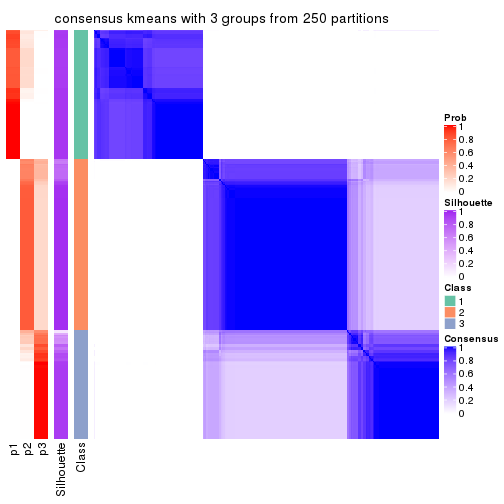</p>

</div>
<div id='tab-MAD-kmeans-consensus-heatmap-3'>
<pre><code class="r">consensus_heatmap(res, k = 4)
</code></pre>

<p>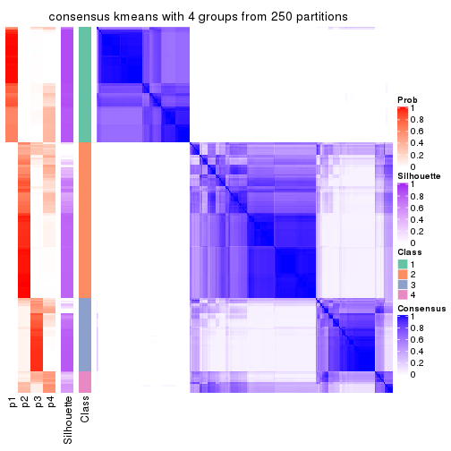</p>

</div>
<div id='tab-MAD-kmeans-consensus-heatmap-4'>
<pre><code class="r">consensus_heatmap(res, k = 5)
</code></pre>

<p>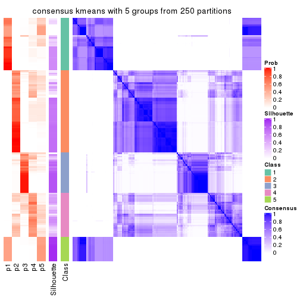</p>

</div>
<div id='tab-MAD-kmeans-consensus-heatmap-5'>
<pre><code class="r">consensus_heatmap(res, k = 6)
</code></pre>

<p>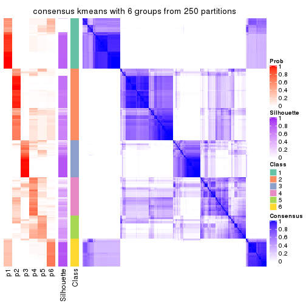</p>

</div>
</div>

Heatmaps for the membership of samples in all partitions to see how consistent they are:


<script>
$( function() {
	$( '#tabs-MAD-kmeans-membership-heatmap' ).tabs();
} );
</script>
<div id='tabs-MAD-kmeans-membership-heatmap'>
<ul>
<li><a href='#tab-MAD-kmeans-membership-heatmap-1'>k = 2</a></li>
<li><a href='#tab-MAD-kmeans-membership-heatmap-2'>k = 3</a></li>
<li><a href='#tab-MAD-kmeans-membership-heatmap-3'>k = 4</a></li>
<li><a href='#tab-MAD-kmeans-membership-heatmap-4'>k = 5</a></li>
<li><a href='#tab-MAD-kmeans-membership-heatmap-5'>k = 6</a></li>
</ul>
<div id='tab-MAD-kmeans-membership-heatmap-1'>
<pre><code class="r">membership_heatmap(res, k = 2)
</code></pre>

<p>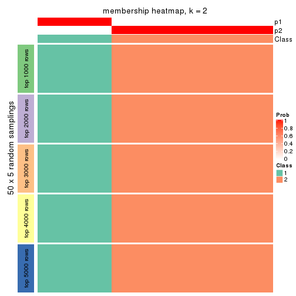</p>

</div>
<div id='tab-MAD-kmeans-membership-heatmap-2'>
<pre><code class="r">membership_heatmap(res, k = 3)
</code></pre>

<p>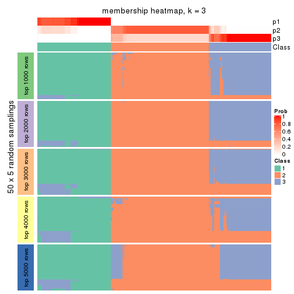</p>

</div>
<div id='tab-MAD-kmeans-membership-heatmap-3'>
<pre><code class="r">membership_heatmap(res, k = 4)
</code></pre>

<p>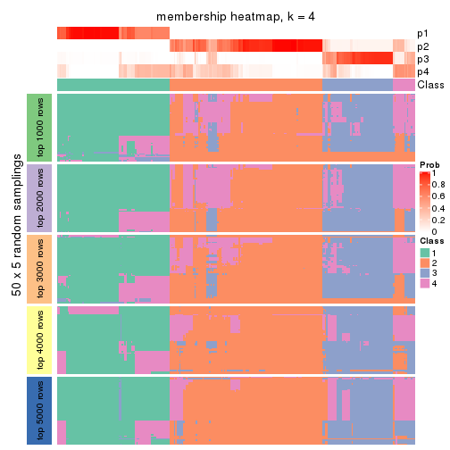</p>

</div>
<div id='tab-MAD-kmeans-membership-heatmap-4'>
<pre><code class="r">membership_heatmap(res, k = 5)
</code></pre>

<p>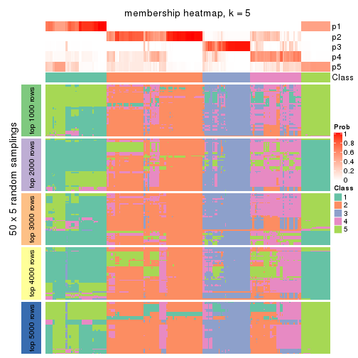</p>

</div>
<div id='tab-MAD-kmeans-membership-heatmap-5'>
<pre><code class="r">membership_heatmap(res, k = 6)
</code></pre>

<p>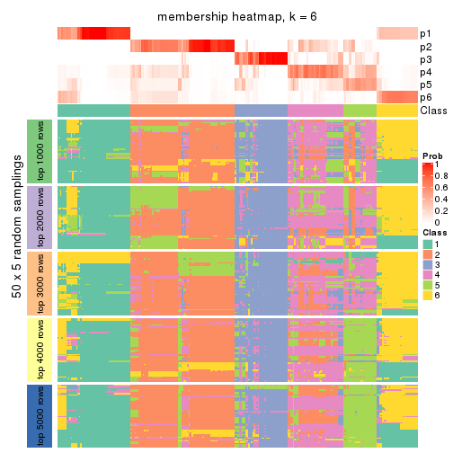</p>

</div>
</div>

As soon as we have had the classes for columns, we can look for signatures
which are significantly different between classes which can be candidate marks
for certain classes. Following are the heatmaps for signatures.


Signature heatmaps where rows are scaled:


<script>
$( function() {
	$( '#tabs-MAD-kmeans-get-signatures' ).tabs();
} );
</script>
<div id='tabs-MAD-kmeans-get-signatures'>
<ul>
<li><a href='#tab-MAD-kmeans-get-signatures-1'>k = 2</a></li>
<li><a href='#tab-MAD-kmeans-get-signatures-2'>k = 3</a></li>
<li><a href='#tab-MAD-kmeans-get-signatures-3'>k = 4</a></li>
<li><a href='#tab-MAD-kmeans-get-signatures-4'>k = 5</a></li>
<li><a href='#tab-MAD-kmeans-get-signatures-5'>k = 6</a></li>
</ul>
<div id='tab-MAD-kmeans-get-signatures-1'>
<pre><code class="r">get_signatures(res, k = 2)
</code></pre>

<p></p>

</div>
<div id='tab-MAD-kmeans-get-signatures-2'>
<pre><code class="r">get_signatures(res, k = 3)
</code></pre>

<p>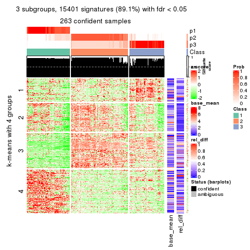</p>

</div>
<div id='tab-MAD-kmeans-get-signatures-3'>
<pre><code class="r">get_signatures(res, k = 4)
</code></pre>

<p>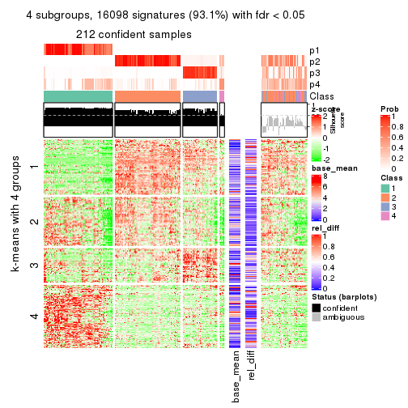</p>

</div>
<div id='tab-MAD-kmeans-get-signatures-4'>
<pre><code class="r">get_signatures(res, k = 5)
</code></pre>

<p>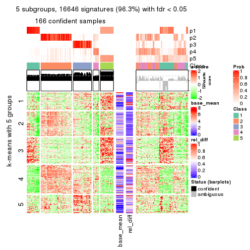</p>

</div>
<div id='tab-MAD-kmeans-get-signatures-5'>
<pre><code class="r">get_signatures(res, k = 6)
</code></pre>

<p>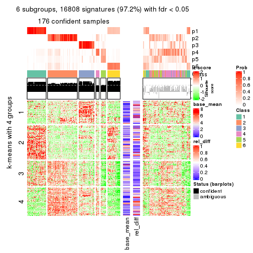</p>

</div>
</div>


Signature heatmaps where rows are not scaled:


<script>
$( function() {
	$( '#tabs-MAD-kmeans-get-signatures-no-scale' ).tabs();
} );
</script>
<div id='tabs-MAD-kmeans-get-signatures-no-scale'>
<ul>
<li><a href='#tab-MAD-kmeans-get-signatures-no-scale-1'>k = 2</a></li>
<li><a href='#tab-MAD-kmeans-get-signatures-no-scale-2'>k = 3</a></li>
<li><a href='#tab-MAD-kmeans-get-signatures-no-scale-3'>k = 4</a></li>
<li><a href='#tab-MAD-kmeans-get-signatures-no-scale-4'>k = 5</a></li>
<li><a href='#tab-MAD-kmeans-get-signatures-no-scale-5'>k = 6</a></li>
</ul>
<div id='tab-MAD-kmeans-get-signatures-no-scale-1'>
<pre><code class="r">get_signatures(res, k = 2, scale_rows = FALSE)
</code></pre>

<p>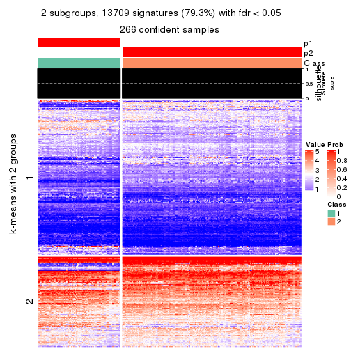</p>

</div>
<div id='tab-MAD-kmeans-get-signatures-no-scale-2'>
<pre><code class="r">get_signatures(res, k = 3, scale_rows = FALSE)
</code></pre>

<p>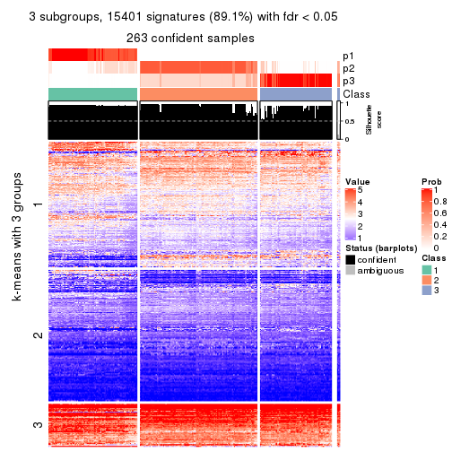</p>

</div>
<div id='tab-MAD-kmeans-get-signatures-no-scale-3'>
<pre><code class="r">get_signatures(res, k = 4, scale_rows = FALSE)
</code></pre>

<p>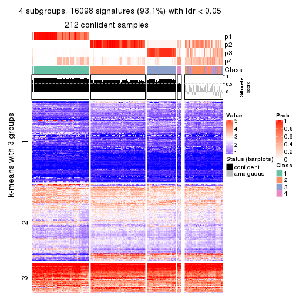</p>

</div>
<div id='tab-MAD-kmeans-get-signatures-no-scale-4'>
<pre><code class="r">get_signatures(res, k = 5, scale_rows = FALSE)
</code></pre>

<p>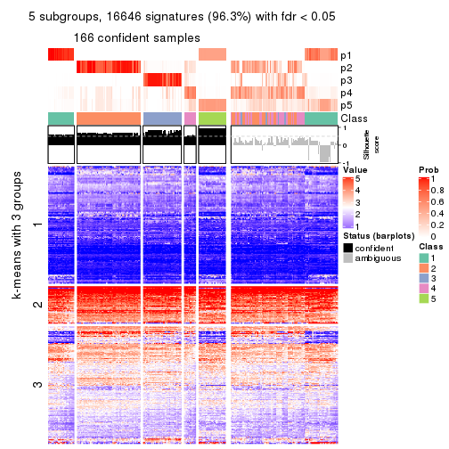</p>

</div>
<div id='tab-MAD-kmeans-get-signatures-no-scale-5'>
<pre><code class="r">get_signatures(res, k = 6, scale_rows = FALSE)
</code></pre>

<p>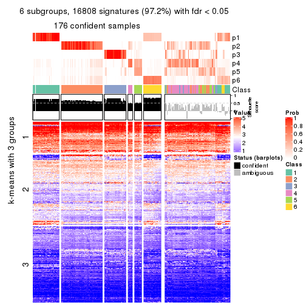</p>

</div>
</div>


Compare the overlap of signatures from different k:

```r
compare_signatures(res)
```

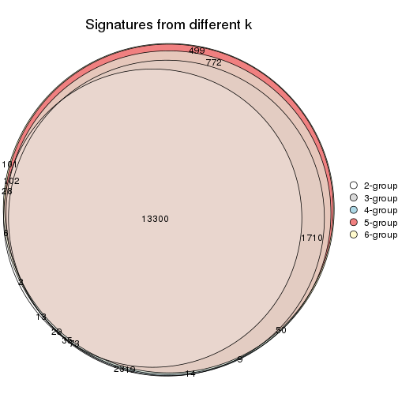

`get_signature()` returns a data frame invisibly. TO get the list of signatures, the function
call should be assigned to a variable explicitly. In following code, if `plot` argument is set
to `FALSE`, no heatmap is plotted while only the differential analysis is performed.

```r
# code only for demonstration
tb = get_signature(res, k = ..., plot = FALSE)
```

An example of the output of `tb` is:

```
#>   which_row         fdr    mean_1    mean_2 scaled_mean_1 scaled_mean_2 km
#> 1        38 0.042760348  8.373488  9.131774    -0.5533452     0.5164555  1
#> 2        40 0.018707592  7.106213  8.469186    -0.6173731     0.5762149  1
#> 3        55 0.019134737 10.221463 11.207825    -0.6159697     0.5749050  1
#> 4        59 0.006059896  5.921854  7.869574    -0.6899429     0.6439467  1
#> 5        60 0.018055526  8.928898 10.211722    -0.6204761     0.5791110  1
#> 6        98 0.009384629 15.714769 14.887706     0.6635654    -0.6193277  2
...
```

The columns in `tb` are:

1. `which_row`: row indices corresponding to the input matrix.
2. `fdr`: FDR for the differential test. 
3. `mean_x`: The mean value in group x.
4. `scaled_mean_x`: The mean value in group x after rows are scaled.
5. `km`: Row groups if k-means clustering is applied to rows.


UMAP plot which shows how samples are separated.


<script>
$( function() {
	$( '#tabs-MAD-kmeans-dimension-reduction' ).tabs();
} );
</script>
<div id='tabs-MAD-kmeans-dimension-reduction'>
<ul>
<li><a href='#tab-MAD-kmeans-dimension-reduction-1'>k = 2</a></li>
<li><a href='#tab-MAD-kmeans-dimension-reduction-2'>k = 3</a></li>
<li><a href='#tab-MAD-kmeans-dimension-reduction-3'>k = 4</a></li>
<li><a href='#tab-MAD-kmeans-dimension-reduction-4'>k = 5</a></li>
<li><a href='#tab-MAD-kmeans-dimension-reduction-5'>k = 6</a></li>
</ul>
<div id='tab-MAD-kmeans-dimension-reduction-1'>
<pre><code class="r">dimension_reduction(res, k = 2, method = &quot;UMAP&quot;)
</code></pre>

<p></p>

</div>
<div id='tab-MAD-kmeans-dimension-reduction-2'>
<pre><code class="r">dimension_reduction(res, k = 3, method = &quot;UMAP&quot;)
</code></pre>

<p>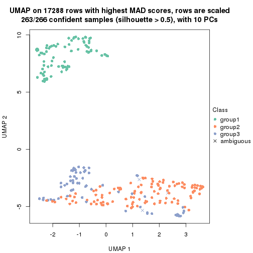</p>

</div>
<div id='tab-MAD-kmeans-dimension-reduction-3'>
<pre><code class="r">dimension_reduction(res, k = 4, method = &quot;UMAP&quot;)
</code></pre>

<p>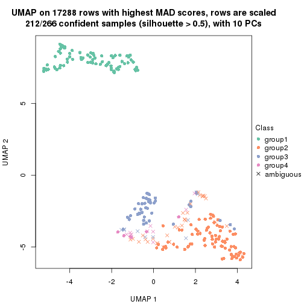</p>

</div>
<div id='tab-MAD-kmeans-dimension-reduction-4'>
<pre><code class="r">dimension_reduction(res, k = 5, method = &quot;UMAP&quot;)
</code></pre>

<p>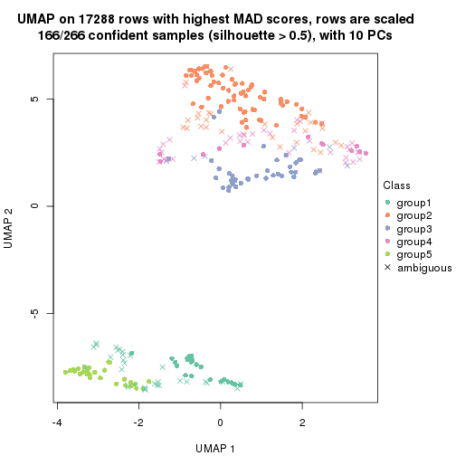</p>

</div>
<div id='tab-MAD-kmeans-dimension-reduction-5'>
<pre><code class="r">dimension_reduction(res, k = 6, method = &quot;UMAP&quot;)
</code></pre>

<p>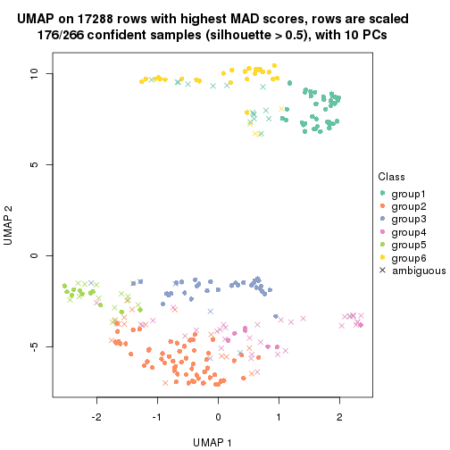</p>

</div>
</div>


Following heatmap shows how subgroups are split when increasing `k`:

```r
collect_classes(res)
```

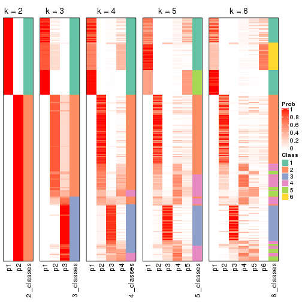


If matrix rows can be associated to genes, consider to use `GO_Enrichment(res,
...)` to perform function enrichment for the signature genes.


 

---------------------------------------------------


### MAD:skmeans*


The object with results only for a single top-value method and a single partition method 
can be extracted as:

```r
res = res_list["MAD", "skmeans"]
# you can also extract it by
# res = res_list["MAD:skmeans"]
```

A summary of `res` and all the functions that can be applied to it:

```r
res
```

```
#> A 'ConsensusPartition' object with k = 2, 3, 4, 5, 6.
#>   On a matrix with 17288 rows and 266 columns.
#>   Top rows (1000, 2000, 3000, 4000, 5000) are extracted by 'MAD' method.
#>   Subgroups are detected by 'skmeans' method.
#>   Performed in total 1250 partitions by row resampling.
#>   Best k for subgroups seems to be 3.
#> 
#> Following methods can be applied to this 'ConsensusPartition' object:
#>  [1] "cola_report"             "collect_classes"         "collect_plots"          
#>  [4] "collect_stats"           "colnames"                "compare_signatures"     
#>  [7] "consensus_heatmap"       "dimension_reduction"     "functional_enrichment"  
#> [10] "get_anno_col"            "get_anno"                "get_classes"            
#> [13] "get_consensus"           "get_matrix"              "get_membership"         
#> [16] "get_param"               "get_signatures"          "get_stats"              
#> [19] "is_best_k"               "is_stable_k"             "membership_heatmap"     
#> [22] "ncol"                    "nrow"                    "plot_ecdf"              
#> [25] "rownames"                "select_partition_number" "show"                   
#> [28] "suggest_best_k"          "test_to_known_factors"
```

`collect_plots()` function collects all the plots made from `res` for all `k` (number of partitions)
into one single page to provide an easy and fast comparison between different `k`.

```r
collect_plots(res)
```

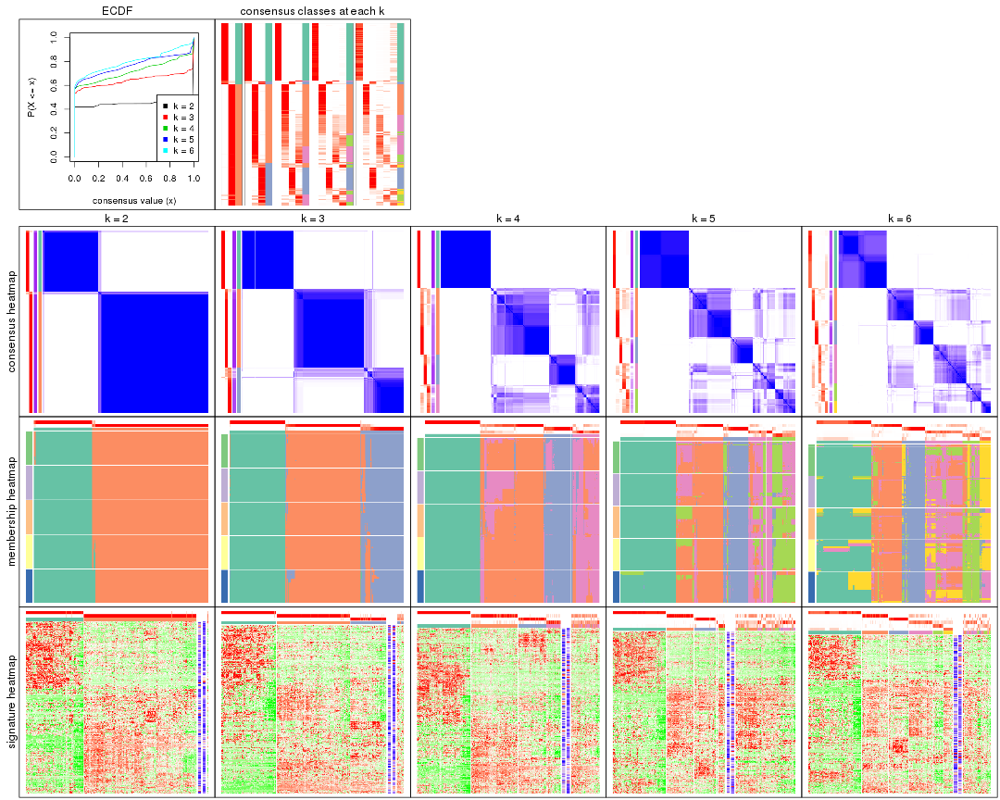

The plots are:

- The first row: a plot of the ECDF (Empirical cumulative distribution
  function) curves of the consensus matrix for each `k` and the heatmap of
  predicted classes for each `k`.
- The second row: heatmaps of the consensus matrix for each `k`.
- The third row: heatmaps of the membership matrix for each `k`.
- The fouth row: heatmaps of the signatures for each `k`.

All the plots in panels can be made by individual functions and they are
plotted later in this section.

`select_partition_number()` produces several plots showing different
statistics for choosing "optimized" `k`. There are following statistics:

- ECDF curves of the consensus matrix for each `k`;
- 1-PAC. [The PAC
  score](https://en.wikipedia.org/wiki/Consensus_clustering#Over-interpretation_potential_of_consensus_clustering)
  measures the proportion of the ambiguous subgrouping.
- Mean silhouette score.
- Concordance. The mean probability of fiting the consensus class ids in all
  partitions.
- Area increased. Denote $A_k$ as the area under the ECDF curve for current
  `k`, the area increased is defined as $A_k - A_{k-1}$.
- Rand index. The percent of pairs of samples that are both in a same cluster
  or both are not in a same cluster in the partition of k and k-1.
- Jaccard index. The ratio of pairs of samples are both in a same cluster in
  the partition of k and k-1 and the pairs of samples are both in a same
  cluster in the partition k or k-1.

The detailed explanations of these statistics can be found in [the cola
vignette](http://bioconductor.org/packages/devel/bioc/vignettes/cola/inst/doc/cola.html#toc_13).

Generally speaking, lower PAC score, higher mean silhouette score or higher
concordance corresponds to better partition. Rand index and Jaccard index
measure how similar the current partition is compared to partition with `k-1`.
If they are too similar, we won't accept `k` is better than `k-1`.

```r
select_partition_number(res)
```

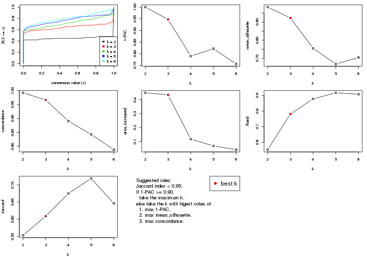

The numeric values for all these statistics can be obtained by `get_stats()`.

```r
get_stats(res)
```

```
#>   k 1-PAC mean_silhouette concordance area_increased  Rand Jaccard
#> 2 2 1.000           0.983       0.993         0.4494 0.553   0.553
#> 3 3 0.947           0.923       0.967         0.4343 0.781   0.609
#> 4 4 0.790           0.755       0.891         0.1176 0.878   0.675
#> 5 5 0.822           0.668       0.842         0.0688 0.917   0.719
#> 6 6 0.756           0.705       0.788         0.0421 0.907   0.646
```

`suggest_best_k()` suggests the best $k$ based on these statistics. The rules are as follows:

- All $k$ with Jaccard index larger than 0.95 are removed because the increase of
  the partition number does not provides enough extra information. If all $k$ are removed,
  the best $k$ is assigned by `NA`.
- For $k$ with 1-PAC larger than 0.9, the maximal $k$ is taken as the "best k". Other $k$ is called "optional k".
- If it does not fit the second rule. The $k$ with the highest vote of highest
  1-PAC, mean silhouette and concordance is taken as the "best k".

```r
suggest_best_k(res)
```

```
#> [1] 3
#> attr(,"optional")
#> [1] 2
```

There is also optional best $k$ = 2 that is worth to check.

Following shows the table of the partitions (You need to click the **show/hide
code output** link to see it). The membership matrix (columns with name `p*`)
is inferred by
[`clue::cl_consensus()`](https://www.rdocumentation.org/link/cl_consensus?package=clue)
function with the `SE` method. Basically the value in the membership matrix
represents the probability to belong to a certain group. The finall class
label for an item is determined with the group with highest probability it
belongs to.

In `get_classes()` function, the entropy is calculated from the membership
matrix and the silhouette score is calculated from the consensus matrix.


<script>
$( function() {
	$( '#tabs-MAD-skmeans-get-classes' ).tabs();
} );
</script>
<div id='tabs-MAD-skmeans-get-classes'>
<ul>
<li><a href='#tab-MAD-skmeans-get-classes-1'>k = 2</a></li>
<li><a href='#tab-MAD-skmeans-get-classes-2'>k = 3</a></li>
<li><a href='#tab-MAD-skmeans-get-classes-3'>k = 4</a></li>
<li><a href='#tab-MAD-skmeans-get-classes-4'>k = 5</a></li>
<li><a href='#tab-MAD-skmeans-get-classes-5'>k = 6</a></li>
</ul>

<div id='tab-MAD-skmeans-get-classes-1'>
<p><a id='tab-MAD-skmeans-get-classes-1-a' style='color:#0366d6' href='#'>show/hide code output</a></p>
<pre><code class="r">cbind(get_classes(res, k = 2), get_membership(res, k = 2))
</code></pre>

<pre><code>#&gt;                                      class entropy silhouette    p1    p2
#&gt; 80D0AF10-1C61-4B67-90C1-7DBF1EF23672     2   0.000      0.992 0.000 1.000
#&gt; 87117BE1-D328-4972-85DA-6672412D8860     2   0.000      0.992 0.000 1.000
#&gt; F904C5B6-70BD-4604-8254-79BE23B152DA     1   0.000      0.994 1.000 0.000
#&gt; 3182DEA1-4239-4613-925A-7E6503766AD6     2   0.000      0.992 0.000 1.000
#&gt; 55E78EA2-2D9B-481F-8CAB-D36A33088EAE     2   0.000      0.992 0.000 1.000
#&gt; 86F94264-A6DD-4A97-9191-036F066DD0EF     2   0.000      0.992 0.000 1.000
#&gt; 09D25417-23B7-4D88-A0EA-F307985FBBBC     2   0.706      0.761 0.192 0.808
#&gt; C797F12C-40D3-4DB5-B9EF-A6821BBDE4F0     1   0.000      0.994 1.000 0.000
#&gt; 80275DB0-A226-4B6B-A08F-4ADBEEE1DB01     1   0.000      0.994 1.000 0.000
#&gt; 27FB653A-9E07-44AD-952E-9E4DE4AB5891     2   0.000      0.992 0.000 1.000
#&gt; 1A5DB9FC-2ABD-4E1B-B5EF-B1CF5E5F3872     1   0.000      0.994 1.000 0.000
#&gt; 844E4CCD-D30C-416F-A086-8923711A4E25     2   0.000      0.992 0.000 1.000
#&gt; EF18318D-3D25-4D65-803A-ED6E62871E7E     1   0.000      0.994 1.000 0.000
#&gt; 1ACB1BE0-61F6-4243-BBEC-E26A1CF90CA8     1   0.000      0.994 1.000 0.000
#&gt; 8EF0039B-D758-46AB-BAF7-6A062C7C56BA     1   0.000      0.994 1.000 0.000
#&gt; 22F4C9D9-663B-4C91-9692-E035A2640BEC     2   0.000      0.992 0.000 1.000
#&gt; FA1A0BCE-EE0F-4178-B963-62550E344B14     2   0.000      0.992 0.000 1.000
#&gt; 0B6D0C4E-5AE3-4707-A9FC-12A108E6EC2A     2   0.000      0.992 0.000 1.000
#&gt; 06FD3123-2AEB-4911-AC4E-E0E64FD5DB52     2   0.000      0.992 0.000 1.000
#&gt; 235A4492-FF80-4AA5-BC71-DFF65E1C7411     2   0.000      0.992 0.000 1.000
#&gt; A192C6C0-1443-4493-AFAC-1EE710628ADB     2   0.000      0.992 0.000 1.000
#&gt; 6FC5B56B-711B-4174-9B06-4E843124AAB6     1   0.000      0.994 1.000 0.000
#&gt; 7A813F60-A41E-4552-990E-F22287654C1D     2   0.000      0.992 0.000 1.000
#&gt; 725BBFB5-26F4-4512-9C75-47D013C1E605     1   0.000      0.994 1.000 0.000
#&gt; 39CC4E82-EBC9-472E-8BE5-6A3AB178449A     2   0.000      0.992 0.000 1.000
#&gt; 61130DEE-E267-49DF-8B41-7738A06EF738     2   0.000      0.992 0.000 1.000
#&gt; 117EC12C-B7ED-4E01-B29B-EA542D356EA1     1   0.000      0.994 1.000 0.000
#&gt; A30FF708-F7A9-41E4-8AD5-20441650FBC9     2   0.000      0.992 0.000 1.000
#&gt; 53640D52-1167-4A5D-B656-97D32CBA3934     1   0.000      0.994 1.000 0.000
#&gt; 9E85D76A-DD2A-46D5-BB59-0ED302B6258C     2   0.000      0.992 0.000 1.000
#&gt; 6F8C6F90-7E3C-4860-91DD-586708DE44AA     1   0.000      0.994 1.000 0.000
#&gt; E675AEC5-AA9A-4AAA-839C-03E6365822DB     2   0.000      0.992 0.000 1.000
#&gt; B577DEF7-2F5C-4876-A7C6-F18D5722B8C0     1   0.000      0.994 1.000 0.000
#&gt; DA8B577E-43E7-49BF-BF94-868E3194F5C9     1   0.000      0.994 1.000 0.000
#&gt; 3334280B-2A36-4AC7-A021-A76C10E958F0     2   0.000      0.992 0.000 1.000
#&gt; 5CBDDC90-11EC-4E6E-881E-AA9CCFD40FDB     2   0.921      0.498 0.336 0.664
#&gt; 8CBBF32A-8349-44F5-A8B8-4CBB1760A464     2   0.000      0.992 0.000 1.000
#&gt; B9455A9A-136D-4DC2-9F86-0FC74433589D     1   0.653      0.799 0.832 0.168
#&gt; D7EAE2A7-F9BE-4222-A452-B1F83F99CD50     2   0.000      0.992 0.000 1.000
#&gt; F803AE18-60C5-4CFE-AAAB-DB33C26A2184     1   0.000      0.994 1.000 0.000
#&gt; 5DD8CAC7-EC02-43B6-B58E-6D2E22868A3B     2   0.000      0.992 0.000 1.000
#&gt; EE98E1B4-DFB3-4AEC-8527-E1FD544C9475     1   0.000      0.994 1.000 0.000
#&gt; 3CE43921-47D5-4394-B9E1-242607775D61     2   0.000      0.992 0.000 1.000
#&gt; 46986F2B-0B0D-4187-8948-4E91D34B7C49     2   0.000      0.992 0.000 1.000
#&gt; 5D1D052E-74EF-45A8-9B1A-7CECD13EA43B     2   0.000      0.992 0.000 1.000
#&gt; 4C821AD9-A5C9-4A9A-9C5D-363B227F8064     2   0.000      0.992 0.000 1.000
#&gt; 06A4189E-A23B-4AC6-AA74-01955DD7D1E9     2   0.000      0.992 0.000 1.000
#&gt; FCCDC76F-CB02-4BCD-A616-325F258DDAA4     2   0.000      0.992 0.000 1.000
#&gt; DAC53B0A-8F35-4EA6-BBCC-4CD1C049E11F     2   0.000      0.992 0.000 1.000
#&gt; DD4F845B-CAD3-44CB-9D96-3C3F5BA1B72D     1   0.000      0.994 1.000 0.000
#&gt; D440F004-A4A4-41B6-BED8-805D67BA01C7     2   0.000      0.992 0.000 1.000
#&gt; A497C423-119F-42FA-BF17-9F6DFD2A5585     2   0.000      0.992 0.000 1.000
#&gt; 3420E573-DE12-4EF5-B1C0-2FCA904F4F4E     1   0.000      0.994 1.000 0.000
#&gt; 1AD72157-A254-44B4-BA58-4F30F1AE910E     1   0.000      0.994 1.000 0.000
#&gt; C1113977-B160-45EE-B061-750F9EA3F33F     2   0.000      0.992 0.000 1.000
#&gt; 6783AB5B-F07C-447B-BF13-C34485D246D7     2   0.000      0.992 0.000 1.000
#&gt; 1F553062-26FD-4A7F-B7FB-81184604F423     1   0.000      0.994 1.000 0.000
#&gt; BE2DCA51-1C21-4598-98A7-F2FB9B2DFCB4     2   0.000      0.992 0.000 1.000
#&gt; 38941CF3-9C54-4BA4-A005-CC88CA97D504     2   0.000      0.992 0.000 1.000
#&gt; 51CB675E-E243-4A07-BF4A-580473D26FDA     2   0.000      0.992 0.000 1.000
#&gt; C7FED0F5-C27A-4405-9232-30BF39362CF7     2   0.000      0.992 0.000 1.000
#&gt; 2A1E86E8-4713-465F-ACFF-C584864C57A1     2   0.000      0.992 0.000 1.000
#&gt; B4500785-0FAA-4D4D-8630-43D194BAB004     2   0.000      0.992 0.000 1.000
#&gt; 3FD52E66-AB76-4079-80DB-281A795D1EC0     2   0.730      0.743 0.204 0.796
#&gt; EBD355D1-1226-4DFD-AAFF-45D246B64F3C     2   0.000      0.992 0.000 1.000
#&gt; 5A040A73-CD95-487E-8AEF-9639FE4E2916     2   0.000      0.992 0.000 1.000
#&gt; CF629C65-585D-476D-B081-3E6E0575FAE3     1   0.722      0.751 0.800 0.200
#&gt; 0D4202A3-808E-413F-9BF3-9CFCCAE0ED61     2   0.000      0.992 0.000 1.000
#&gt; 43E715BF-28D9-4B5E-B762-8CD1B69A430E     1   0.000      0.994 1.000 0.000
#&gt; BFB82BE8-9DAC-4099-8B38-0950308E3EB3     2   0.000      0.992 0.000 1.000
#&gt; F7CB1825-2303-4DD2-AE1F-7205738EAF1F     1   0.000      0.994 1.000 0.000
#&gt; FE298483-C42C-4753-BABB-29A9CB1B6312     1   0.000      0.994 1.000 0.000
#&gt; A98C7561-1B42-4CD6-AE71-924B91FA4C33     2   0.000      0.992 0.000 1.000
#&gt; 58098F21-7DAB-47DA-9A41-8D20BF3B9257     2   0.000      0.992 0.000 1.000
#&gt; 18CAF708-20B9-4745-9CB3-37AB6E0B3056     2   0.000      0.992 0.000 1.000
#&gt; 2C80DD72-C9C7-4AC2-812F-9A31EF02779C     1   0.000      0.994 1.000 0.000
#&gt; 68A3F13D-319D-4603-A27F-B5DD46FE5C5B     2   0.000      0.992 0.000 1.000
#&gt; 7EE8F0CE-CDC9-40F9-A1DE-7F8140EC6D13     1   0.000      0.994 1.000 0.000
#&gt; 39019903-5B9C-4665-BD5F-7CCB19CB55C5     2   0.000      0.992 0.000 1.000
#&gt; 190EDB27-4CBC-4E9C-9B67-D51FDAB982B7     2   0.000      0.992 0.000 1.000
#&gt; EB2D95BC-62F8-4669-9308-D37D7FB79E23     2   0.000      0.992 0.000 1.000
#&gt; A08B85EA-D1E7-4B77-8DEC-36294305B9F7     1   0.000      0.994 1.000 0.000
#&gt; 130DDFAD-6EF8-4C80-BD9D-88308A6874BC     2   0.000      0.992 0.000 1.000
#&gt; 7340A5BA-E002-448F-AACC-E7A37DBB79C2     2   0.000      0.992 0.000 1.000
#&gt; A771F6E3-D266-4FE7-98C6-C40E6A701D59     1   0.000      0.994 1.000 0.000
#&gt; 015E792C-EC1B-49BF-AB07-D82B20C5989A     2   0.000      0.992 0.000 1.000
#&gt; BF79E030-47EE-4D08-B910-5685A4BD8B60     2   0.000      0.992 0.000 1.000
#&gt; FB3C7C9A-2F2D-4DD5-BE47-FAFB072C0FAB     2   0.000      0.992 0.000 1.000
#&gt; 4E5557BA-10E8-4723-908E-DD04EF6639B2     2   0.000      0.992 0.000 1.000
#&gt; 8031B550-40A9-4A3A-9F7D-CDC052288BD8     2   0.000      0.992 0.000 1.000
#&gt; 55299A06-3C1F-45A4-B166-B2C591C0CEE2     2   0.000      0.992 0.000 1.000
#&gt; EB8D5168-216E-4ABB-8B4E-9E67786CB322     1   0.000      0.994 1.000 0.000
#&gt; 78BD2D83-9A7F-42E5-BB38-654AA0761A0A     2   0.000      0.992 0.000 1.000
#&gt; AA2D53E5-D389-4332-9DD5-A736052E48F8     1   0.000      0.994 1.000 0.000
#&gt; 62945C7A-9313-4FC9-820C-B0AB820B394E     1   0.000      0.994 1.000 0.000
#&gt; 22746046-2E99-4EE9-97D2-BA2EA499634C     2   0.000      0.992 0.000 1.000
#&gt; 8671B51B-DCBE-4429-9F01-AF51CAD7014F     2   0.000      0.992 0.000 1.000
#&gt; E815AB36-5689-4A0D-8E6D-2EAA73406681     1   0.000      0.994 1.000 0.000
#&gt; A1DACB46-ED52-4E38-B2C8-57256BB22B5E     2   0.000      0.992 0.000 1.000
#&gt; 4F5498C4-A423-4B3D-AC98-D4E214A57D0E     1   0.000      0.994 1.000 0.000
#&gt; A7772CCD-FFFF-49DD-86ED-0BAD330EC9B6     2   0.000      0.992 0.000 1.000
#&gt; E6E3DF78-65B9-4F74-8DA8-E2A6D4EDBEA7     2   0.000      0.992 0.000 1.000
#&gt; 83286E2D-E708-437A-911A-E6B050273CBD     1   0.000      0.994 1.000 0.000
#&gt; EC5C7C97-EE8C-405D-A039-D96514B1D414     2   0.000      0.992 0.000 1.000
#&gt; 3E55223D-6E3D-4027-9819-67E91212531D     1   0.000      0.994 1.000 0.000
#&gt; 99A036A2-8343-4D06-8047-D84E96CE4C61     2   0.000      0.992 0.000 1.000
#&gt; CA6CDE6D-92DE-4259-9E58-A373F2D543EA     2   0.000      0.992 0.000 1.000
#&gt; BF6FA8CC-60C1-413A-B2C6-54CCACBC01D6     1   0.000      0.994 1.000 0.000
#&gt; E0594CFE-F7B6-4546-B130-30DF6A514B1F     2   0.000      0.992 0.000 1.000
#&gt; E769E41D-5949-42C5-9594-E563C05ACE52     2   0.000      0.992 0.000 1.000
#&gt; 01373725-5D3C-4D9C-AABC-911D53E62BCD     2   0.000      0.992 0.000 1.000
#&gt; 1F39DADD-3655-474E-BA4C-A5BD32C97A8B     1   0.000      0.994 1.000 0.000
#&gt; AF573EC8-E4EE-4B8F-8199-9817B9FAC67D     1   0.000      0.994 1.000 0.000
#&gt; 3F022CBC-41C8-4387-A6FB-124C4BCD1AD9     1   0.000      0.994 1.000 0.000
#&gt; 1CC32ACE-826B-494B-8B89-5BD92327A74D     2   0.000      0.992 0.000 1.000
#&gt; 22B0BD3B-EE08-4BC7-90B2-01C372A56BA2     2   0.000      0.992 0.000 1.000
#&gt; 0F3DE9EF-19CC-4D14-9A42-1435DB537F94     2   0.000      0.992 0.000 1.000
#&gt; 87F8A33F-FBC3-469E-862B-84472F796358     2   0.000      0.992 0.000 1.000
#&gt; C9F2FA0D-1A9F-40B4-BD9B-CAF1B3F3D5A7     2   0.000      0.992 0.000 1.000
#&gt; ACFC9F59-78FF-4453-B25F-8834D0EAB54A     2   0.000      0.992 0.000 1.000
#&gt; B7AC7D5B-14E9-45A7-93B7-226EE508544A     2   0.000      0.992 0.000 1.000
#&gt; 4491BF17-B168-4E96-8E09-EF1AEC9F5E9D     2   0.000      0.992 0.000 1.000
#&gt; 557A0811-A3FE-4CF4-A24D-FBB77E7F9139     2   0.000      0.992 0.000 1.000
#&gt; 6F9C955C-6816-4353-922A-8035B50FACC6     2   0.000      0.992 0.000 1.000
#&gt; 3E89FB1C-4A7D-43C7-823C-04E3716A7935     2   0.000      0.992 0.000 1.000
#&gt; 12ABE483-66EF-4237-94C4-0199FAE23FA8     2   0.000      0.992 0.000 1.000
#&gt; 7535F262-9B96-44F6-988C-4C9EBB3FFCA9     2   0.000      0.992 0.000 1.000
#&gt; 65C9D28E-303B-40E5-84F0-2507F5457374     2   0.000      0.992 0.000 1.000
#&gt; FD445384-6BA9-4297-9D9C-12ABA7D645C7     1   0.000      0.994 1.000 0.000
#&gt; 30D5E255-2AD3-44F3-8983-1B80E4FD3E2D     2   0.000      0.992 0.000 1.000
#&gt; 3E88EC60-B4A8-4259-8BC8-A234800F6955     2   0.000      0.992 0.000 1.000
#&gt; ACD73CE8-AFC5-47A0-9383-3CB97F018953     1   0.000      0.994 1.000 0.000
#&gt; 1AFDC2EA-26A8-44E2-8BCB-F34F7B66F8C8     2   0.000      0.992 0.000 1.000
#&gt; 9E327BC8-1D20-4AD8-83F7-FB2D13BCA5D0     2   0.000      0.992 0.000 1.000
#&gt; 85A86B91-4F24-4E77-AE2D-520F8E205EFC     1   0.000      0.994 1.000 0.000
#&gt; 74868C37-8143-4306-81CA-E45759D146CD     2   0.000      0.992 0.000 1.000
#&gt; 69AEA0DB-E335-48A0-A398-4FB0D581182A     2   0.000      0.992 0.000 1.000
#&gt; AE6F8B89-85C2-42B7-8D05-AFDDD4FEFD16     1   0.000      0.994 1.000 0.000
#&gt; A8A6F09C-9812-4457-9A4B-AD41F97B41A3     2   0.000      0.992 0.000 1.000
#&gt; 1A09BC4D-EF29-42DD-BB04-A3C264A3032D     1   0.000      0.994 1.000 0.000
#&gt; E0961A30-A62C-4235-9CF0-A1776827A996     2   0.000      0.992 0.000 1.000
#&gt; 134D2D90-7B08-4F20-8A3A-C77643FB208F     2   0.000      0.992 0.000 1.000
#&gt; A77C2DFF-93CF-4CB5-B3C1-81133D7F1A0F     2   0.900      0.541 0.316 0.684
#&gt; EA2DC457-9C74-4B9C-B3FA-5E72199B24A7     2   0.000      0.992 0.000 1.000
#&gt; FF34117B-5EE4-4C96-A8A2-2CE6A654CBE5     1   0.000      0.994 1.000 0.000
#&gt; 75F7B5E2-6559-4B48-A2A4-287C35C559CC     1   0.000      0.994 1.000 0.000
#&gt; 903BF591-B0AF-4BEE-B625-60B673070344     2   0.000      0.992 0.000 1.000
#&gt; 9DE1B790-C63C-41C4-9477-CE52A8119C67     2   0.000      0.992 0.000 1.000
#&gt; 9A28F80A-85F8-40E2-A32B-230EF93B2FA0     2   0.000      0.992 0.000 1.000
#&gt; 0AA2BDBB-8720-409A-AA72-1F4AA26E7CD8     2   0.000      0.992 0.000 1.000
#&gt; 5AD49F16-E974-4E5D-B1B6-073ECB73A01D     1   0.000      0.994 1.000 0.000
#&gt; CB0F961C-527D-4A48-9408-286B26BD9532     1   0.000      0.994 1.000 0.000
#&gt; 46FF25B6-D01D-4CA7-80B7-CEC2998C34E1     2   0.000      0.992 0.000 1.000
#&gt; 487CADE1-D699-4A6C-817A-B9A0AB940C61     1   0.000      0.994 1.000 0.000
#&gt; 4FF6F2D8-F869-4735-A4D1-1A8423153FBC     1   0.000      0.994 1.000 0.000
#&gt; 6005494F-5D3D-43A3-B3E8-8C91955B2A98     2   0.000      0.992 0.000 1.000
#&gt; CF10D584-CE32-45A4-A932-E9D5AF12A6A0     1   0.000      0.994 1.000 0.000
#&gt; E15CE4AB-5646-49C8-9CD6-938457036BB0     2   0.000      0.992 0.000 1.000
#&gt; 31E28D0B-0E69-4330-82ED-4F1827DC97EA     2   0.000      0.992 0.000 1.000
#&gt; DBACD3C3-CCB5-4478-BA78-85A0C847CA66     2   0.000      0.992 0.000 1.000
#&gt; 5A07041C-65EB-4FCD-8940-E90B905061B5     2   0.000      0.992 0.000 1.000
#&gt; 0EA7C916-FA47-489B-BC98-4D9E7D197628     1   0.000      0.994 1.000 0.000
#&gt; 30967F75-8499-47FF-ADA4-4DC566013F7B     1   0.000      0.994 1.000 0.000
#&gt; D2E528FF-AEA2-48D7-A60A-4C3E71EA9073     2   0.000      0.992 0.000 1.000
#&gt; 22735DCD-215E-48BC-BF44-32BD66F06E39     2   0.000      0.992 0.000 1.000
#&gt; BC2C3248-7FC6-48BC-96C1-45EA573DE7DC     1   0.000      0.994 1.000 0.000
#&gt; E72CEBCB-D686-4B12-BCBA-EC8F964330A2     1   0.000      0.994 1.000 0.000
#&gt; 23C937BB-BA20-4440-B680-914229CC3ADF     1   0.000      0.994 1.000 0.000
#&gt; 947E99C7-F402-4F1A-A6E9-81BCAAED135A     2   0.000      0.992 0.000 1.000
#&gt; 02475D11-FC81-4E88-944E-173C32DC3FE7     2   0.943      0.442 0.360 0.640
#&gt; F972A9AA-9842-4343-A533-A795E65581CE     1   0.000      0.994 1.000 0.000
#&gt; 05043AAF-3095-4C61-B5C1-EE9AA9082C75     2   0.000      0.992 0.000 1.000
#&gt; CECF7967-862E-428C-BB42-FEF553FDB3AA     2   0.000      0.992 0.000 1.000
#&gt; FB0B9483-6302-48C7-BE5B-DA667E00AE2D     2   0.000      0.992 0.000 1.000
#&gt; 78700FBA-1487-4754-9B30-18837BF7E9FB     1   0.000      0.994 1.000 0.000
#&gt; 2166F56D-54CE-4F1B-8F07-A4E13E4489E9     1   0.000      0.994 1.000 0.000
#&gt; 7CD0942E-E39A-43A7-8BAC-F25967864901     2   0.000      0.992 0.000 1.000
#&gt; 3B00BA2B-7F7D-4825-8F8D-90F04A5DE687     2   0.000      0.992 0.000 1.000
#&gt; 7465B01D-C05E-4FE0-A9FE-182920EDC489     2   0.000      0.992 0.000 1.000
#&gt; 88C31A99-F96E-4FC8-8B3D-C1AAA05062D9     1   0.000      0.994 1.000 0.000
#&gt; 53575575-3303-4F8F-B6A8-B42131CFB4AC     2   0.000      0.992 0.000 1.000
#&gt; CC8017C7-4128-48DA-8E43-503F63158D85     1   0.000      0.994 1.000 0.000
#&gt; 88449D2A-2A25-41A4-B91D-C99B58F8ECD9     2   0.000      0.992 0.000 1.000
#&gt; 46C7DDE5-A2B5-494F-96AE-0B6E2D51B003     1   0.000      0.994 1.000 0.000
#&gt; 42551D05-5EE5-4F91-93A8-32DA695D9DFA     2   0.000      0.992 0.000 1.000
#&gt; 0772DA48-3A36-422D-B166-CA1691B782C3     2   0.000      0.992 0.000 1.000
#&gt; 30346897-EC77-4153-88A2-D14593C8B741     2   0.000      0.992 0.000 1.000
#&gt; 0F00E267-C748-4A71-8B36-03C410641D88     2   0.000      0.992 0.000 1.000
#&gt; 4034703A-4DA9-4DDA-9CA9-E80FFE9CCDE6     2   0.000      0.992 0.000 1.000
#&gt; 393C8A41-CF45-4EA8-AFE3-25A08AB7692A     2   0.000      0.992 0.000 1.000
#&gt; 3354212D-A07C-435C-8B0C-9A7BAAB624B5     1   0.000      0.994 1.000 0.000
#&gt; 57E30D4E-ABF7-47DD-92BE-40CE215076B0     1   0.000      0.994 1.000 0.000
#&gt; 202B4C76-C840-4DB8-953F-AC75A4156FDD     2   0.000      0.992 0.000 1.000
#&gt; 93A0137B-1F4C-44EE-B959-2AD0CD2DF8B6     1   0.000      0.994 1.000 0.000
#&gt; C9794DB6-6E8C-4AFD-80EE-61D672A4F6E9     2   0.000      0.992 0.000 1.000
#&gt; AE4BFE63-F0C0-4624-AD97-4F7FF13E2384     1   0.000      0.994 1.000 0.000
#&gt; DCF87F27-2B54-42D9-8D28-5DFEE76E2F5B     2   0.000      0.992 0.000 1.000
#&gt; 2451D405-39FD-4812-958C-23462B66F1F1     2   0.000      0.992 0.000 1.000
#&gt; E27F5D33-3F68-4CA8-8757-A387C6EAD060     2   0.000      0.992 0.000 1.000
#&gt; 8BA9928A-5B93-477F-B4A2-D031B714D9AC     1   0.000      0.994 1.000 0.000
#&gt; 0FAACFF6-B50C-4BED-9824-B7270654F28D     2   0.000      0.992 0.000 1.000
#&gt; 3366CC3C-2BBA-4CA7-848E-4E16AA70AE7A     2   0.000      0.992 0.000 1.000
#&gt; 66237056-CA9A-4C90-AF0E-1621FEB71578     2   0.000      0.992 0.000 1.000
#&gt; C480F1FB-3100-436C-B0F5-DED63B7A580E     2   0.000      0.992 0.000 1.000
#&gt; A327DE0D-D945-4B42-9B41-A7302CF796EE     2   0.000      0.992 0.000 1.000
#&gt; E8A6871D-67FB-4306-9454-F5E7CDBA399A     2   0.000      0.992 0.000 1.000
#&gt; E9A7485B-82B6-4BD2-AFBB-DD0A82D6CDE2     1   0.000      0.994 1.000 0.000
#&gt; 93B382E4-9C9A-43F5-BD3B-502CC260B886     1   0.000      0.994 1.000 0.000
#&gt; A2792419-8E16-45FE-A524-17851F34AB9B     2   0.000      0.992 0.000 1.000
#&gt; 4DED1201-F25C-4F82-BABF-965EFAD7A8E5     2   0.000      0.992 0.000 1.000
#&gt; F1ACB2DD-E948-4F88-A249-F1BD1977D667     2   0.000      0.992 0.000 1.000
#&gt; 6CDBA203-8952-421D-A6BF-75652D9F3339     2   0.000      0.992 0.000 1.000
#&gt; 2D6C5AA7-3B33-48D7-AE0C-77A16B749D13     1   0.000      0.994 1.000 0.000
#&gt; 3F6B6D95-0720-42A0-AEB3-89FECAE7616A     2   0.000      0.992 0.000 1.000
#&gt; DED8ACF3-BBD8-46C9-85C9-A9C8F2E2BC0B     1   0.000      0.994 1.000 0.000
#&gt; 77069279-5A6F-42C0-9AA5-8C939591DFB5     1   0.000      0.994 1.000 0.000
#&gt; B2D4FCF3-FDF9-41C8-880A-6732CF6222AF     2   0.000      0.992 0.000 1.000
#&gt; 1CD71A4C-1E49-48EF-AA72-CB3C26B4C087     2   0.000      0.992 0.000 1.000
#&gt; C364E621-F85C-4B7F-842F-210B8D4DFE3A     2   0.000      0.992 0.000 1.000
#&gt; 11F1B8CA-07C1-47D2-A3C6-032FFA6A4A64     1   0.000      0.994 1.000 0.000
#&gt; 153BF804-6DC8-496B-987A-4021A2512211     2   0.000      0.992 0.000 1.000
#&gt; 5B5029C9-40F5-40D7-A36A-367022AD6A42     2   0.000      0.992 0.000 1.000
#&gt; 193CCBE6-104F-49B4-BDB2-C82EE36FDAAD     1   0.000      0.994 1.000 0.000
#&gt; E5D45E53-FCF3-4F01-9B78-6CB1ED0CFE40     2   0.000      0.992 0.000 1.000
#&gt; 5546A779-21DB-49F9-8C0D-A1E420088084     2   0.000      0.992 0.000 1.000
#&gt; E14825E0-0DC7-44C2-B265-F54672356838     1   0.000      0.994 1.000 0.000
#&gt; 8C8C09B9-EC83-45EC-BC4C-0BA92DE60ACB     1   0.000      0.994 1.000 0.000
#&gt; B388CA82-5BF7-4BDD-8821-4EC0B213121F     2   0.000      0.992 0.000 1.000
#&gt; A26025AC-9F71-4C07-9135-83593193BBB2     1   0.000      0.994 1.000 0.000
#&gt; C80E6D4B-AF21-42F0-8E20-6F7D2E99C062     2   0.000      0.992 0.000 1.000
#&gt; 5AE5D819-A6B1-4761-B7F9-8FFD3C520F31     2   0.000      0.992 0.000 1.000
#&gt; CAE8097F-A139-4C6E-9E30-35080475FF34     2   0.000      0.992 0.000 1.000
#&gt; 539C8DE3-6152-4671-B96F-ED6DC6DBD22B     1   0.000      0.994 1.000 0.000
#&gt; 5D28A8E0-4ECF-43A4-890A-BE968B9A8CB2     2   0.000      0.992 0.000 1.000
#&gt; 97A80AF8-365E-4756-A2B0-AEB1D8F5F33E     2   0.000      0.992 0.000 1.000
#&gt; B3527517-E339-46AE-8437-65303C309015     2   0.000      0.992 0.000 1.000
#&gt; 523E2183-AA20-4749-BD7E-69CD620DD6A3     2   0.000      0.992 0.000 1.000
#&gt; E553FB92-F181-47B3-9F3D-11DB51DFA3A4     2   0.000      0.992 0.000 1.000
#&gt; FFE0C4B1-8EEC-484A-AB87-3401B71BD081     2   0.000      0.992 0.000 1.000
#&gt; 73D6CA4B-9A9E-4E52-96C8-AE7F0CC8B276     2   0.000      0.992 0.000 1.000
#&gt; 485A8107-DF9A-4BC6-8A72-07FBA93F10F2     1   0.000      0.994 1.000 0.000
#&gt; 690823D9-B9AA-40EF-8302-4AD88BF89D1C     2   0.000      0.992 0.000 1.000
#&gt; B4E02660-562F-4EAC-8472-CBBD8A577688     2   0.000      0.992 0.000 1.000
#&gt; F82D5A60-90F9-4FF4-971E-73F7535FE65A     2   0.000      0.992 0.000 1.000
#&gt; C48401F7-2D56-4C6F-9896-C5435D1B44BF     2   0.000      0.992 0.000 1.000
#&gt; 94FC8991-182B-4B00-9A06-A00E8D3BDCFA     1   0.000      0.994 1.000 0.000
#&gt; FF00E80A-046D-4233-835E-CDF93403EA43     2   0.000      0.992 0.000 1.000
#&gt; C47A53F6-6479-4AD3-9D18-E4A70BE5F1DC     2   0.000      0.992 0.000 1.000
#&gt; 3487AE2D-AB1D-4DEF-AC4B-4B0FCAF8D899     2   0.000      0.992 0.000 1.000
#&gt; 479CD9BB-ECD7-41D5-B1E4-41132FF7FC95     2   0.000      0.992 0.000 1.000
#&gt; 048ADC6E-8C7E-4875-ACEE-E4787203C078     1   0.000      0.994 1.000 0.000
#&gt; 25AF81C5-B117-466D-AE9F-DD10BCB6AF2D     2   0.000      0.992 0.000 1.000
#&gt; 8B1D51D6-0B25-4289-81F0-9F95E0258877     2   0.000      0.992 0.000 1.000
#&gt; 282D390D-8E4E-4A19-B2B7-A6DB4BB2D46C     1   0.000      0.994 1.000 0.000
#&gt; BC6B92C1-F425-40C5-9941-539BFF5FE0FE     1   0.680      0.781 0.820 0.180
#&gt; 899CB9E0-48D0-413D-8566-BC151F146453     1   0.000      0.994 1.000 0.000
#&gt; 441400A9-1427-45E0-A8B4-EF2A6B7465C2     2   0.000      0.992 0.000 1.000
#&gt; CF96DDD4-DC0A-4341-BDE6-4DA2CB4978D0     1   0.000      0.994 1.000 0.000
#&gt; CE91F591-6072-4D29-9495-C78961635969     2   0.000      0.992 0.000 1.000
#&gt; 84D25635-2A38-4CFB-BFAC-38C007625C42     1   0.000      0.994 1.000 0.000
#&gt; ABF1AC12-872A-4C3D-A76C-07BC36A4DA5E     1   0.000      0.994 1.000 0.000
#&gt; B7F7F66F-1AED-4199-81C0-5C7FB0DBF438     2   0.000      0.992 0.000 1.000
#&gt; BAB786B9-6C20-425D-9886-63A0A092B59B     2   0.000      0.992 0.000 1.000
#&gt; 735D1DE3-D781-4F89-A395-09974057BBB7     1   0.000      0.994 1.000 0.000
#&gt; F6D5FBBA-05C4-4340-86D9-1A54181216A2     2   0.000      0.992 0.000 1.000
#&gt; 79C4E166-4A0D-4811-A2C8-CAE0A5AEED42     2   0.000      0.992 0.000 1.000
</code></pre>

<script>
$('#tab-MAD-skmeans-get-classes-1-a').parent().next().next().hide();
$('#tab-MAD-skmeans-get-classes-1-a').click(function(){
  $('#tab-MAD-skmeans-get-classes-1-a').parent().next().next().toggle();
  return(false);
});
</script>
</div>

<div id='tab-MAD-skmeans-get-classes-2'>
<p><a id='tab-MAD-skmeans-get-classes-2-a' style='color:#0366d6' href='#'>show/hide code output</a></p>
<pre><code class="r">cbind(get_classes(res, k = 3), get_membership(res, k = 3))
</code></pre>

<pre><code>#&gt;                                      class entropy silhouette    p1    p2    p3
#&gt; 80D0AF10-1C61-4B67-90C1-7DBF1EF23672     2  0.0000     0.9816 0.000 1.000 0.000
#&gt; 87117BE1-D328-4972-85DA-6672412D8860     2  0.0000     0.9816 0.000 1.000 0.000
#&gt; F904C5B6-70BD-4604-8254-79BE23B152DA     1  0.0000     0.9954 1.000 0.000 0.000
#&gt; 3182DEA1-4239-4613-925A-7E6503766AD6     2  0.0000     0.9816 0.000 1.000 0.000
#&gt; 55E78EA2-2D9B-481F-8CAB-D36A33088EAE     3  0.6111     0.4433 0.000 0.396 0.604
#&gt; 86F94264-A6DD-4A97-9191-036F066DD0EF     3  0.4235     0.7690 0.000 0.176 0.824
#&gt; 09D25417-23B7-4D88-A0EA-F307985FBBBC     3  0.0000     0.8876 0.000 0.000 1.000
#&gt; C797F12C-40D3-4DB5-B9EF-A6821BBDE4F0     1  0.0000     0.9954 1.000 0.000 0.000
#&gt; 80275DB0-A226-4B6B-A08F-4ADBEEE1DB01     1  0.0000     0.9954 1.000 0.000 0.000
#&gt; 27FB653A-9E07-44AD-952E-9E4DE4AB5891     3  0.0000     0.8876 0.000 0.000 1.000
#&gt; 1A5DB9FC-2ABD-4E1B-B5EF-B1CF5E5F3872     1  0.0000     0.9954 1.000 0.000 0.000
#&gt; 844E4CCD-D30C-416F-A086-8923711A4E25     3  0.0000     0.8876 0.000 0.000 1.000
#&gt; EF18318D-3D25-4D65-803A-ED6E62871E7E     1  0.0000     0.9954 1.000 0.000 0.000
#&gt; 1ACB1BE0-61F6-4243-BBEC-E26A1CF90CA8     1  0.0000     0.9954 1.000 0.000 0.000
#&gt; 8EF0039B-D758-46AB-BAF7-6A062C7C56BA     1  0.0000     0.9954 1.000 0.000 0.000
#&gt; 22F4C9D9-663B-4C91-9692-E035A2640BEC     2  0.0000     0.9816 0.000 1.000 0.000
#&gt; FA1A0BCE-EE0F-4178-B963-62550E344B14     2  0.0000     0.9816 0.000 1.000 0.000
#&gt; 0B6D0C4E-5AE3-4707-A9FC-12A108E6EC2A     3  0.0592     0.8838 0.000 0.012 0.988
#&gt; 06FD3123-2AEB-4911-AC4E-E0E64FD5DB52     2  0.0000     0.9816 0.000 1.000 0.000
#&gt; 235A4492-FF80-4AA5-BC71-DFF65E1C7411     2  0.0000     0.9816 0.000 1.000 0.000
#&gt; A192C6C0-1443-4493-AFAC-1EE710628ADB     2  0.0000     0.9816 0.000 1.000 0.000
#&gt; 6FC5B56B-711B-4174-9B06-4E843124AAB6     1  0.0000     0.9954 1.000 0.000 0.000
#&gt; 7A813F60-A41E-4552-990E-F22287654C1D     2  0.0000     0.9816 0.000 1.000 0.000
#&gt; 725BBFB5-26F4-4512-9C75-47D013C1E605     1  0.0000     0.9954 1.000 0.000 0.000
#&gt; 39CC4E82-EBC9-472E-8BE5-6A3AB178449A     2  0.0000     0.9816 0.000 1.000 0.000
#&gt; 61130DEE-E267-49DF-8B41-7738A06EF738     3  0.0000     0.8876 0.000 0.000 1.000
#&gt; 117EC12C-B7ED-4E01-B29B-EA542D356EA1     1  0.0000     0.9954 1.000 0.000 0.000
#&gt; A30FF708-F7A9-41E4-8AD5-20441650FBC9     2  0.0000     0.9816 0.000 1.000 0.000
#&gt; 53640D52-1167-4A5D-B656-97D32CBA3934     1  0.0000     0.9954 1.000 0.000 0.000
#&gt; 9E85D76A-DD2A-46D5-BB59-0ED302B6258C     2  0.1289     0.9529 0.000 0.968 0.032
#&gt; 6F8C6F90-7E3C-4860-91DD-586708DE44AA     1  0.0000     0.9954 1.000 0.000 0.000
#&gt; E675AEC5-AA9A-4AAA-839C-03E6365822DB     3  0.0000     0.8876 0.000 0.000 1.000
#&gt; B577DEF7-2F5C-4876-A7C6-F18D5722B8C0     1  0.0000     0.9954 1.000 0.000 0.000
#&gt; DA8B577E-43E7-49BF-BF94-868E3194F5C9     1  0.0000     0.9954 1.000 0.000 0.000
#&gt; 3334280B-2A36-4AC7-A021-A76C10E958F0     2  0.0000     0.9816 0.000 1.000 0.000
#&gt; 5CBDDC90-11EC-4E6E-881E-AA9CCFD40FDB     2  0.5598     0.7435 0.148 0.800 0.052
#&gt; 8CBBF32A-8349-44F5-A8B8-4CBB1760A464     2  0.0000     0.9816 0.000 1.000 0.000
#&gt; B9455A9A-136D-4DC2-9F86-0FC74433589D     3  0.0000     0.8876 0.000 0.000 1.000
#&gt; D7EAE2A7-F9BE-4222-A452-B1F83F99CD50     2  0.0000     0.9816 0.000 1.000 0.000
#&gt; F803AE18-60C5-4CFE-AAAB-DB33C26A2184     1  0.0000     0.9954 1.000 0.000 0.000
#&gt; 5DD8CAC7-EC02-43B6-B58E-6D2E22868A3B     3  0.0000     0.8876 0.000 0.000 1.000
#&gt; EE98E1B4-DFB3-4AEC-8527-E1FD544C9475     1  0.0000     0.9954 1.000 0.000 0.000
#&gt; 3CE43921-47D5-4394-B9E1-242607775D61     2  0.0000     0.9816 0.000 1.000 0.000
#&gt; 46986F2B-0B0D-4187-8948-4E91D34B7C49     2  0.0000     0.9816 0.000 1.000 0.000
#&gt; 5D1D052E-74EF-45A8-9B1A-7CECD13EA43B     2  0.1753     0.9375 0.000 0.952 0.048
#&gt; 4C821AD9-A5C9-4A9A-9C5D-363B227F8064     2  0.4654     0.7213 0.000 0.792 0.208
#&gt; 06A4189E-A23B-4AC6-AA74-01955DD7D1E9     2  0.0000     0.9816 0.000 1.000 0.000
#&gt; FCCDC76F-CB02-4BCD-A616-325F258DDAA4     2  0.0000     0.9816 0.000 1.000 0.000
#&gt; DAC53B0A-8F35-4EA6-BBCC-4CD1C049E11F     2  0.0000     0.9816 0.000 1.000 0.000
#&gt; DD4F845B-CAD3-44CB-9D96-3C3F5BA1B72D     1  0.0000     0.9954 1.000 0.000 0.000
#&gt; D440F004-A4A4-41B6-BED8-805D67BA01C7     2  0.0000     0.9816 0.000 1.000 0.000
#&gt; A497C423-119F-42FA-BF17-9F6DFD2A5585     2  0.0000     0.9816 0.000 1.000 0.000
#&gt; 3420E573-DE12-4EF5-B1C0-2FCA904F4F4E     1  0.0000     0.9954 1.000 0.000 0.000
#&gt; 1AD72157-A254-44B4-BA58-4F30F1AE910E     1  0.0000     0.9954 1.000 0.000 0.000
#&gt; C1113977-B160-45EE-B061-750F9EA3F33F     3  0.6260     0.3170 0.000 0.448 0.552
#&gt; 6783AB5B-F07C-447B-BF13-C34485D246D7     2  0.1860     0.9335 0.000 0.948 0.052
#&gt; 1F553062-26FD-4A7F-B7FB-81184604F423     1  0.0000     0.9954 1.000 0.000 0.000
#&gt; BE2DCA51-1C21-4598-98A7-F2FB9B2DFCB4     2  0.2448     0.9073 0.000 0.924 0.076
#&gt; 38941CF3-9C54-4BA4-A005-CC88CA97D504     2  0.0000     0.9816 0.000 1.000 0.000
#&gt; 51CB675E-E243-4A07-BF4A-580473D26FDA     2  0.0000     0.9816 0.000 1.000 0.000
#&gt; C7FED0F5-C27A-4405-9232-30BF39362CF7     2  0.0000     0.9816 0.000 1.000 0.000
#&gt; 2A1E86E8-4713-465F-ACFF-C584864C57A1     3  0.2537     0.8485 0.000 0.080 0.920
#&gt; B4500785-0FAA-4D4D-8630-43D194BAB004     2  0.0000     0.9816 0.000 1.000 0.000
#&gt; 3FD52E66-AB76-4079-80DB-281A795D1EC0     3  0.6215     0.3165 0.000 0.428 0.572
#&gt; EBD355D1-1226-4DFD-AAFF-45D246B64F3C     2  0.0000     0.9816 0.000 1.000 0.000
#&gt; 5A040A73-CD95-487E-8AEF-9639FE4E2916     2  0.0000     0.9816 0.000 1.000 0.000
#&gt; CF629C65-585D-476D-B081-3E6E0575FAE3     3  0.6154     0.2902 0.408 0.000 0.592
#&gt; 0D4202A3-808E-413F-9BF3-9CFCCAE0ED61     2  0.0000     0.9816 0.000 1.000 0.000
#&gt; 43E715BF-28D9-4B5E-B762-8CD1B69A430E     1  0.0000     0.9954 1.000 0.000 0.000
#&gt; BFB82BE8-9DAC-4099-8B38-0950308E3EB3     2  0.0000     0.9816 0.000 1.000 0.000
#&gt; F7CB1825-2303-4DD2-AE1F-7205738EAF1F     1  0.0000     0.9954 1.000 0.000 0.000
#&gt; FE298483-C42C-4753-BABB-29A9CB1B6312     1  0.0000     0.9954 1.000 0.000 0.000
#&gt; A98C7561-1B42-4CD6-AE71-924B91FA4C33     3  0.0000     0.8876 0.000 0.000 1.000
#&gt; 58098F21-7DAB-47DA-9A41-8D20BF3B9257     3  0.5785     0.5334 0.000 0.332 0.668
#&gt; 18CAF708-20B9-4745-9CB3-37AB6E0B3056     2  0.0000     0.9816 0.000 1.000 0.000
#&gt; 2C80DD72-C9C7-4AC2-812F-9A31EF02779C     1  0.0000     0.9954 1.000 0.000 0.000
#&gt; 68A3F13D-319D-4603-A27F-B5DD46FE5C5B     2  0.0000     0.9816 0.000 1.000 0.000
#&gt; 7EE8F0CE-CDC9-40F9-A1DE-7F8140EC6D13     3  0.0000     0.8876 0.000 0.000 1.000
#&gt; 39019903-5B9C-4665-BD5F-7CCB19CB55C5     2  0.0000     0.9816 0.000 1.000 0.000
#&gt; 190EDB27-4CBC-4E9C-9B67-D51FDAB982B7     3  0.0000     0.8876 0.000 0.000 1.000
#&gt; EB2D95BC-62F8-4669-9308-D37D7FB79E23     2  0.0000     0.9816 0.000 1.000 0.000
#&gt; A08B85EA-D1E7-4B77-8DEC-36294305B9F7     1  0.0000     0.9954 1.000 0.000 0.000
#&gt; 130DDFAD-6EF8-4C80-BD9D-88308A6874BC     3  0.0000     0.8876 0.000 0.000 1.000
#&gt; 7340A5BA-E002-448F-AACC-E7A37DBB79C2     2  0.0000     0.9816 0.000 1.000 0.000
#&gt; A771F6E3-D266-4FE7-98C6-C40E6A701D59     1  0.0000     0.9954 1.000 0.000 0.000
#&gt; 015E792C-EC1B-49BF-AB07-D82B20C5989A     2  0.0000     0.9816 0.000 1.000 0.000
#&gt; BF79E030-47EE-4D08-B910-5685A4BD8B60     3  0.1860     0.8633 0.000 0.052 0.948
#&gt; FB3C7C9A-2F2D-4DD5-BE47-FAFB072C0FAB     2  0.0000     0.9816 0.000 1.000 0.000
#&gt; 4E5557BA-10E8-4723-908E-DD04EF6639B2     3  0.0000     0.8876 0.000 0.000 1.000
#&gt; 8031B550-40A9-4A3A-9F7D-CDC052288BD8     3  0.0000     0.8876 0.000 0.000 1.000
#&gt; 55299A06-3C1F-45A4-B166-B2C591C0CEE2     3  0.0000     0.8876 0.000 0.000 1.000
#&gt; EB8D5168-216E-4ABB-8B4E-9E67786CB322     1  0.0000     0.9954 1.000 0.000 0.000
#&gt; 78BD2D83-9A7F-42E5-BB38-654AA0761A0A     2  0.0000     0.9816 0.000 1.000 0.000
#&gt; AA2D53E5-D389-4332-9DD5-A736052E48F8     1  0.0000     0.9954 1.000 0.000 0.000
#&gt; 62945C7A-9313-4FC9-820C-B0AB820B394E     1  0.0000     0.9954 1.000 0.000 0.000
#&gt; 22746046-2E99-4EE9-97D2-BA2EA499634C     3  0.0000     0.8876 0.000 0.000 1.000
#&gt; 8671B51B-DCBE-4429-9F01-AF51CAD7014F     3  0.0000     0.8876 0.000 0.000 1.000
#&gt; E815AB36-5689-4A0D-8E6D-2EAA73406681     1  0.0000     0.9954 1.000 0.000 0.000
#&gt; A1DACB46-ED52-4E38-B2C8-57256BB22B5E     2  0.0000     0.9816 0.000 1.000 0.000
#&gt; 4F5498C4-A423-4B3D-AC98-D4E214A57D0E     1  0.0000     0.9954 1.000 0.000 0.000
#&gt; A7772CCD-FFFF-49DD-86ED-0BAD330EC9B6     3  0.4235     0.7554 0.000 0.176 0.824
#&gt; E6E3DF78-65B9-4F74-8DA8-E2A6D4EDBEA7     3  0.0592     0.8838 0.000 0.012 0.988
#&gt; 83286E2D-E708-437A-911A-E6B050273CBD     1  0.0000     0.9954 1.000 0.000 0.000
#&gt; EC5C7C97-EE8C-405D-A039-D96514B1D414     2  0.0000     0.9816 0.000 1.000 0.000
#&gt; 3E55223D-6E3D-4027-9819-67E91212531D     1  0.0000     0.9954 1.000 0.000 0.000
#&gt; 99A036A2-8343-4D06-8047-D84E96CE4C61     3  0.0892     0.8804 0.000 0.020 0.980
#&gt; CA6CDE6D-92DE-4259-9E58-A373F2D543EA     2  0.0000     0.9816 0.000 1.000 0.000
#&gt; BF6FA8CC-60C1-413A-B2C6-54CCACBC01D6     1  0.0000     0.9954 1.000 0.000 0.000
#&gt; E0594CFE-F7B6-4546-B130-30DF6A514B1F     3  0.0000     0.8876 0.000 0.000 1.000
#&gt; E769E41D-5949-42C5-9594-E563C05ACE52     3  0.6154     0.4160 0.000 0.408 0.592
#&gt; 01373725-5D3C-4D9C-AABC-911D53E62BCD     3  0.0000     0.8876 0.000 0.000 1.000
#&gt; 1F39DADD-3655-474E-BA4C-A5BD32C97A8B     1  0.0000     0.9954 1.000 0.000 0.000
#&gt; AF573EC8-E4EE-4B8F-8199-9817B9FAC67D     1  0.0000     0.9954 1.000 0.000 0.000
#&gt; 3F022CBC-41C8-4387-A6FB-124C4BCD1AD9     1  0.0000     0.9954 1.000 0.000 0.000
#&gt; 1CC32ACE-826B-494B-8B89-5BD92327A74D     3  0.0747     0.8822 0.000 0.016 0.984
#&gt; 22B0BD3B-EE08-4BC7-90B2-01C372A56BA2     3  0.0000     0.8876 0.000 0.000 1.000
#&gt; 0F3DE9EF-19CC-4D14-9A42-1435DB537F94     2  0.2448     0.9073 0.000 0.924 0.076
#&gt; 87F8A33F-FBC3-469E-862B-84472F796358     2  0.0424     0.9744 0.000 0.992 0.008
#&gt; C9F2FA0D-1A9F-40B4-BD9B-CAF1B3F3D5A7     2  0.0000     0.9816 0.000 1.000 0.000
#&gt; ACFC9F59-78FF-4453-B25F-8834D0EAB54A     3  0.0000     0.8876 0.000 0.000 1.000
#&gt; B7AC7D5B-14E9-45A7-93B7-226EE508544A     2  0.0000     0.9816 0.000 1.000 0.000
#&gt; 4491BF17-B168-4E96-8E09-EF1AEC9F5E9D     3  0.0000     0.8876 0.000 0.000 1.000
#&gt; 557A0811-A3FE-4CF4-A24D-FBB77E7F9139     3  0.6111     0.4433 0.000 0.396 0.604
#&gt; 6F9C955C-6816-4353-922A-8035B50FACC6     2  0.0000     0.9816 0.000 1.000 0.000
#&gt; 3E89FB1C-4A7D-43C7-823C-04E3716A7935     2  0.0000     0.9816 0.000 1.000 0.000
#&gt; 12ABE483-66EF-4237-94C4-0199FAE23FA8     2  0.0000     0.9816 0.000 1.000 0.000
#&gt; 7535F262-9B96-44F6-988C-4C9EBB3FFCA9     2  0.0000     0.9816 0.000 1.000 0.000
#&gt; 65C9D28E-303B-40E5-84F0-2507F5457374     3  0.0000     0.8876 0.000 0.000 1.000
#&gt; FD445384-6BA9-4297-9D9C-12ABA7D645C7     1  0.0000     0.9954 1.000 0.000 0.000
#&gt; 30D5E255-2AD3-44F3-8983-1B80E4FD3E2D     2  0.6286    -0.0323 0.000 0.536 0.464
#&gt; 3E88EC60-B4A8-4259-8BC8-A234800F6955     3  0.0000     0.8876 0.000 0.000 1.000
#&gt; ACD73CE8-AFC5-47A0-9383-3CB97F018953     1  0.0000     0.9954 1.000 0.000 0.000
#&gt; 1AFDC2EA-26A8-44E2-8BCB-F34F7B66F8C8     2  0.1860     0.9335 0.000 0.948 0.052
#&gt; 9E327BC8-1D20-4AD8-83F7-FB2D13BCA5D0     2  0.0000     0.9816 0.000 1.000 0.000
#&gt; 85A86B91-4F24-4E77-AE2D-520F8E205EFC     1  0.0000     0.9954 1.000 0.000 0.000
#&gt; 74868C37-8143-4306-81CA-E45759D146CD     2  0.0000     0.9816 0.000 1.000 0.000
#&gt; 69AEA0DB-E335-48A0-A398-4FB0D581182A     2  0.0000     0.9816 0.000 1.000 0.000
#&gt; AE6F8B89-85C2-42B7-8D05-AFDDD4FEFD16     1  0.0000     0.9954 1.000 0.000 0.000
#&gt; A8A6F09C-9812-4457-9A4B-AD41F97B41A3     2  0.0000     0.9816 0.000 1.000 0.000
#&gt; 1A09BC4D-EF29-42DD-BB04-A3C264A3032D     1  0.0000     0.9954 1.000 0.000 0.000
#&gt; E0961A30-A62C-4235-9CF0-A1776827A996     3  0.5810     0.5259 0.000 0.336 0.664
#&gt; 134D2D90-7B08-4F20-8A3A-C77643FB208F     2  0.0000     0.9816 0.000 1.000 0.000
#&gt; A77C2DFF-93CF-4CB5-B3C1-81133D7F1A0F     3  0.6286     0.2102 0.000 0.464 0.536
#&gt; EA2DC457-9C74-4B9C-B3FA-5E72199B24A7     2  0.1860     0.9335 0.000 0.948 0.052
#&gt; FF34117B-5EE4-4C96-A8A2-2CE6A654CBE5     1  0.0000     0.9954 1.000 0.000 0.000
#&gt; 75F7B5E2-6559-4B48-A2A4-287C35C559CC     1  0.0000     0.9954 1.000 0.000 0.000
#&gt; 903BF591-B0AF-4BEE-B625-60B673070344     2  0.0000     0.9816 0.000 1.000 0.000
#&gt; 9DE1B790-C63C-41C4-9477-CE52A8119C67     2  0.0000     0.9816 0.000 1.000 0.000
#&gt; 9A28F80A-85F8-40E2-A32B-230EF93B2FA0     3  0.0747     0.8822 0.000 0.016 0.984
#&gt; 0AA2BDBB-8720-409A-AA72-1F4AA26E7CD8     2  0.0000     0.9816 0.000 1.000 0.000
#&gt; 5AD49F16-E974-4E5D-B1B6-073ECB73A01D     3  0.0000     0.8876 0.000 0.000 1.000
#&gt; CB0F961C-527D-4A48-9408-286B26BD9532     1  0.0000     0.9954 1.000 0.000 0.000
#&gt; 46FF25B6-D01D-4CA7-80B7-CEC2998C34E1     2  0.0000     0.9816 0.000 1.000 0.000
#&gt; 487CADE1-D699-4A6C-817A-B9A0AB940C61     1  0.0000     0.9954 1.000 0.000 0.000
#&gt; 4FF6F2D8-F869-4735-A4D1-1A8423153FBC     1  0.0000     0.9954 1.000 0.000 0.000
#&gt; 6005494F-5D3D-43A3-B3E8-8C91955B2A98     2  0.0000     0.9816 0.000 1.000 0.000
#&gt; CF10D584-CE32-45A4-A932-E9D5AF12A6A0     1  0.0000     0.9954 1.000 0.000 0.000
#&gt; E15CE4AB-5646-49C8-9CD6-938457036BB0     3  0.5859     0.5452 0.000 0.344 0.656
#&gt; 31E28D0B-0E69-4330-82ED-4F1827DC97EA     2  0.0000     0.9816 0.000 1.000 0.000
#&gt; DBACD3C3-CCB5-4478-BA78-85A0C847CA66     2  0.0000     0.9816 0.000 1.000 0.000
#&gt; 5A07041C-65EB-4FCD-8940-E90B905061B5     2  0.0000     0.9816 0.000 1.000 0.000
#&gt; 0EA7C916-FA47-489B-BC98-4D9E7D197628     1  0.0000     0.9954 1.000 0.000 0.000
#&gt; 30967F75-8499-47FF-ADA4-4DC566013F7B     1  0.0000     0.9954 1.000 0.000 0.000
#&gt; D2E528FF-AEA2-48D7-A60A-4C3E71EA9073     3  0.3340     0.8190 0.000 0.120 0.880
#&gt; 22735DCD-215E-48BC-BF44-32BD66F06E39     3  0.0000     0.8876 0.000 0.000 1.000
#&gt; BC2C3248-7FC6-48BC-96C1-45EA573DE7DC     1  0.0000     0.9954 1.000 0.000 0.000
#&gt; E72CEBCB-D686-4B12-BCBA-EC8F964330A2     1  0.0000     0.9954 1.000 0.000 0.000
#&gt; 23C937BB-BA20-4440-B680-914229CC3ADF     1  0.0000     0.9954 1.000 0.000 0.000
#&gt; 947E99C7-F402-4F1A-A6E9-81BCAAED135A     2  0.0000     0.9816 0.000 1.000 0.000
#&gt; 02475D11-FC81-4E88-944E-173C32DC3FE7     3  0.6905     0.6088 0.044 0.280 0.676
#&gt; F972A9AA-9842-4343-A533-A795E65581CE     1  0.0000     0.9954 1.000 0.000 0.000
#&gt; 05043AAF-3095-4C61-B5C1-EE9AA9082C75     2  0.4796     0.6939 0.000 0.780 0.220
#&gt; CECF7967-862E-428C-BB42-FEF553FDB3AA     2  0.0000     0.9816 0.000 1.000 0.000
#&gt; FB0B9483-6302-48C7-BE5B-DA667E00AE2D     3  0.0000     0.8876 0.000 0.000 1.000
#&gt; 78700FBA-1487-4754-9B30-18837BF7E9FB     1  0.0000     0.9954 1.000 0.000 0.000
#&gt; 2166F56D-54CE-4F1B-8F07-A4E13E4489E9     1  0.0000     0.9954 1.000 0.000 0.000
#&gt; 7CD0942E-E39A-43A7-8BAC-F25967864901     2  0.0000     0.9816 0.000 1.000 0.000
#&gt; 3B00BA2B-7F7D-4825-8F8D-90F04A5DE687     2  0.0000     0.9816 0.000 1.000 0.000
#&gt; 7465B01D-C05E-4FE0-A9FE-182920EDC489     3  0.0000     0.8876 0.000 0.000 1.000
#&gt; 88C31A99-F96E-4FC8-8B3D-C1AAA05062D9     1  0.0000     0.9954 1.000 0.000 0.000
#&gt; 53575575-3303-4F8F-B6A8-B42131CFB4AC     3  0.6154     0.4160 0.000 0.408 0.592
#&gt; CC8017C7-4128-48DA-8E43-503F63158D85     1  0.0000     0.9954 1.000 0.000 0.000
#&gt; 88449D2A-2A25-41A4-B91D-C99B58F8ECD9     2  0.0000     0.9816 0.000 1.000 0.000
#&gt; 46C7DDE5-A2B5-494F-96AE-0B6E2D51B003     1  0.0000     0.9954 1.000 0.000 0.000
#&gt; 42551D05-5EE5-4F91-93A8-32DA695D9DFA     3  0.0000     0.8876 0.000 0.000 1.000
#&gt; 0772DA48-3A36-422D-B166-CA1691B782C3     2  0.0000     0.9816 0.000 1.000 0.000
#&gt; 30346897-EC77-4153-88A2-D14593C8B741     3  0.1163     0.8763 0.000 0.028 0.972
#&gt; 0F00E267-C748-4A71-8B36-03C410641D88     3  0.5733     0.5790 0.000 0.324 0.676
#&gt; 4034703A-4DA9-4DDA-9CA9-E80FFE9CCDE6     2  0.0000     0.9816 0.000 1.000 0.000
#&gt; 393C8A41-CF45-4EA8-AFE3-25A08AB7692A     2  0.0000     0.9816 0.000 1.000 0.000
#&gt; 3354212D-A07C-435C-8B0C-9A7BAAB624B5     1  0.0000     0.9954 1.000 0.000 0.000
#&gt; 57E30D4E-ABF7-47DD-92BE-40CE215076B0     1  0.0000     0.9954 1.000 0.000 0.000
#&gt; 202B4C76-C840-4DB8-953F-AC75A4156FDD     2  0.0000     0.9816 0.000 1.000 0.000
#&gt; 93A0137B-1F4C-44EE-B959-2AD0CD2DF8B6     1  0.0000     0.9954 1.000 0.000 0.000
#&gt; C9794DB6-6E8C-4AFD-80EE-61D672A4F6E9     2  0.2448     0.9073 0.000 0.924 0.076
#&gt; AE4BFE63-F0C0-4624-AD97-4F7FF13E2384     1  0.0000     0.9954 1.000 0.000 0.000
#&gt; DCF87F27-2B54-42D9-8D28-5DFEE76E2F5B     2  0.0000     0.9816 0.000 1.000 0.000
#&gt; 2451D405-39FD-4812-958C-23462B66F1F1     3  0.0000     0.8876 0.000 0.000 1.000
#&gt; E27F5D33-3F68-4CA8-8757-A387C6EAD060     3  0.0000     0.8876 0.000 0.000 1.000
#&gt; 8BA9928A-5B93-477F-B4A2-D031B714D9AC     1  0.0000     0.9954 1.000 0.000 0.000
#&gt; 0FAACFF6-B50C-4BED-9824-B7270654F28D     2  0.0000     0.9816 0.000 1.000 0.000
#&gt; 3366CC3C-2BBA-4CA7-848E-4E16AA70AE7A     2  0.0000     0.9816 0.000 1.000 0.000
#&gt; 66237056-CA9A-4C90-AF0E-1621FEB71578     2  0.0000     0.9816 0.000 1.000 0.000
#&gt; C480F1FB-3100-436C-B0F5-DED63B7A580E     2  0.0000     0.9816 0.000 1.000 0.000
#&gt; A327DE0D-D945-4B42-9B41-A7302CF796EE     3  0.0000     0.8876 0.000 0.000 1.000
#&gt; E8A6871D-67FB-4306-9454-F5E7CDBA399A     3  0.6280     0.2769 0.000 0.460 0.540
#&gt; E9A7485B-82B6-4BD2-AFBB-DD0A82D6CDE2     1  0.0000     0.9954 1.000 0.000 0.000
#&gt; 93B382E4-9C9A-43F5-BD3B-502CC260B886     1  0.0000     0.9954 1.000 0.000 0.000
#&gt; A2792419-8E16-45FE-A524-17851F34AB9B     2  0.1860     0.9335 0.000 0.948 0.052
#&gt; 4DED1201-F25C-4F82-BABF-965EFAD7A8E5     2  0.0000     0.9816 0.000 1.000 0.000
#&gt; F1ACB2DD-E948-4F88-A249-F1BD1977D667     3  0.0592     0.8838 0.000 0.012 0.988
#&gt; 6CDBA203-8952-421D-A6BF-75652D9F3339     3  0.6215     0.3166 0.000 0.428 0.572
#&gt; 2D6C5AA7-3B33-48D7-AE0C-77A16B749D13     1  0.0000     0.9954 1.000 0.000 0.000
#&gt; 3F6B6D95-0720-42A0-AEB3-89FECAE7616A     2  0.0000     0.9816 0.000 1.000 0.000
#&gt; DED8ACF3-BBD8-46C9-85C9-A9C8F2E2BC0B     1  0.0000     0.9954 1.000 0.000 0.000
#&gt; 77069279-5A6F-42C0-9AA5-8C939591DFB5     1  0.0000     0.9954 1.000 0.000 0.000
#&gt; B2D4FCF3-FDF9-41C8-880A-6732CF6222AF     2  0.0000     0.9816 0.000 1.000 0.000
#&gt; 1CD71A4C-1E49-48EF-AA72-CB3C26B4C087     2  0.0000     0.9816 0.000 1.000 0.000
#&gt; C364E621-F85C-4B7F-842F-210B8D4DFE3A     2  0.0000     0.9816 0.000 1.000 0.000
#&gt; 11F1B8CA-07C1-47D2-A3C6-032FFA6A4A64     1  0.0000     0.9954 1.000 0.000 0.000
#&gt; 153BF804-6DC8-496B-987A-4021A2512211     3  0.0000     0.8876 0.000 0.000 1.000
#&gt; 5B5029C9-40F5-40D7-A36A-367022AD6A42     2  0.4062     0.7737 0.000 0.836 0.164
#&gt; 193CCBE6-104F-49B4-BDB2-C82EE36FDAAD     1  0.0000     0.9954 1.000 0.000 0.000
#&gt; E5D45E53-FCF3-4F01-9B78-6CB1ED0CFE40     2  0.0000     0.9816 0.000 1.000 0.000
#&gt; 5546A779-21DB-49F9-8C0D-A1E420088084     2  0.0000     0.9816 0.000 1.000 0.000
#&gt; E14825E0-0DC7-44C2-B265-F54672356838     1  0.0000     0.9954 1.000 0.000 0.000
#&gt; 8C8C09B9-EC83-45EC-BC4C-0BA92DE60ACB     1  0.0000     0.9954 1.000 0.000 0.000
#&gt; B388CA82-5BF7-4BDD-8821-4EC0B213121F     3  0.0000     0.8876 0.000 0.000 1.000
#&gt; A26025AC-9F71-4C07-9135-83593193BBB2     1  0.0000     0.9954 1.000 0.000 0.000
#&gt; C80E6D4B-AF21-42F0-8E20-6F7D2E99C062     2  0.0000     0.9816 0.000 1.000 0.000
#&gt; 5AE5D819-A6B1-4761-B7F9-8FFD3C520F31     3  0.0000     0.8876 0.000 0.000 1.000
#&gt; CAE8097F-A139-4C6E-9E30-35080475FF34     2  0.1860     0.9335 0.000 0.948 0.052
#&gt; 539C8DE3-6152-4671-B96F-ED6DC6DBD22B     1  0.0000     0.9954 1.000 0.000 0.000
#&gt; 5D28A8E0-4ECF-43A4-890A-BE968B9A8CB2     2  0.0000     0.9816 0.000 1.000 0.000
#&gt; 97A80AF8-365E-4756-A2B0-AEB1D8F5F33E     2  0.0000     0.9816 0.000 1.000 0.000
#&gt; B3527517-E339-46AE-8437-65303C309015     3  0.0000     0.8876 0.000 0.000 1.000
#&gt; 523E2183-AA20-4749-BD7E-69CD620DD6A3     2  0.0000     0.9816 0.000 1.000 0.000
#&gt; E553FB92-F181-47B3-9F3D-11DB51DFA3A4     2  0.0892     0.9650 0.000 0.980 0.020
#&gt; FFE0C4B1-8EEC-484A-AB87-3401B71BD081     3  0.1964     0.8596 0.000 0.056 0.944
#&gt; 73D6CA4B-9A9E-4E52-96C8-AE7F0CC8B276     2  0.0000     0.9816 0.000 1.000 0.000
#&gt; 485A8107-DF9A-4BC6-8A72-07FBA93F10F2     1  0.0000     0.9954 1.000 0.000 0.000
#&gt; 690823D9-B9AA-40EF-8302-4AD88BF89D1C     2  0.0000     0.9816 0.000 1.000 0.000
#&gt; B4E02660-562F-4EAC-8472-CBBD8A577688     2  0.0000     0.9816 0.000 1.000 0.000
#&gt; F82D5A60-90F9-4FF4-971E-73F7535FE65A     3  0.0000     0.8876 0.000 0.000 1.000
#&gt; C48401F7-2D56-4C6F-9896-C5435D1B44BF     3  0.0000     0.8876 0.000 0.000 1.000
#&gt; 94FC8991-182B-4B00-9A06-A00E8D3BDCFA     1  0.0000     0.9954 1.000 0.000 0.000
#&gt; FF00E80A-046D-4233-835E-CDF93403EA43     3  0.0000     0.8876 0.000 0.000 1.000
#&gt; C47A53F6-6479-4AD3-9D18-E4A70BE5F1DC     2  0.0000     0.9816 0.000 1.000 0.000
#&gt; 3487AE2D-AB1D-4DEF-AC4B-4B0FCAF8D899     2  0.0000     0.9816 0.000 1.000 0.000
#&gt; 479CD9BB-ECD7-41D5-B1E4-41132FF7FC95     2  0.0000     0.9816 0.000 1.000 0.000
#&gt; 048ADC6E-8C7E-4875-ACEE-E4787203C078     1  0.0000     0.9954 1.000 0.000 0.000
#&gt; 25AF81C5-B117-466D-AE9F-DD10BCB6AF2D     2  0.0000     0.9816 0.000 1.000 0.000
#&gt; 8B1D51D6-0B25-4289-81F0-9F95E0258877     2  0.0000     0.9816 0.000 1.000 0.000
#&gt; 282D390D-8E4E-4A19-B2B7-A6DB4BB2D46C     1  0.0000     0.9954 1.000 0.000 0.000
#&gt; BC6B92C1-F425-40C5-9941-539BFF5FE0FE     1  0.7159     0.5086 0.660 0.288 0.052
#&gt; 899CB9E0-48D0-413D-8566-BC151F146453     1  0.0000     0.9954 1.000 0.000 0.000
#&gt; 441400A9-1427-45E0-A8B4-EF2A6B7465C2     2  0.0000     0.9816 0.000 1.000 0.000
#&gt; CF96DDD4-DC0A-4341-BDE6-4DA2CB4978D0     1  0.0000     0.9954 1.000 0.000 0.000
#&gt; CE91F591-6072-4D29-9495-C78961635969     2  0.0000     0.9816 0.000 1.000 0.000
#&gt; 84D25635-2A38-4CFB-BFAC-38C007625C42     1  0.0000     0.9954 1.000 0.000 0.000
#&gt; ABF1AC12-872A-4C3D-A76C-07BC36A4DA5E     1  0.0000     0.9954 1.000 0.000 0.000
#&gt; B7F7F66F-1AED-4199-81C0-5C7FB0DBF438     2  0.0000     0.9816 0.000 1.000 0.000
#&gt; BAB786B9-6C20-425D-9886-63A0A092B59B     2  0.0000     0.9816 0.000 1.000 0.000
#&gt; 735D1DE3-D781-4F89-A395-09974057BBB7     1  0.0000     0.9954 1.000 0.000 0.000
#&gt; F6D5FBBA-05C4-4340-86D9-1A54181216A2     2  0.0000     0.9816 0.000 1.000 0.000
#&gt; 79C4E166-4A0D-4811-A2C8-CAE0A5AEED42     2  0.0000     0.9816 0.000 1.000 0.000
</code></pre>

<script>
$('#tab-MAD-skmeans-get-classes-2-a').parent().next().next().hide();
$('#tab-MAD-skmeans-get-classes-2-a').click(function(){
  $('#tab-MAD-skmeans-get-classes-2-a').parent().next().next().toggle();
  return(false);
});
</script>
</div>

<div id='tab-MAD-skmeans-get-classes-3'>
<p><a id='tab-MAD-skmeans-get-classes-3-a' style='color:#0366d6' href='#'>show/hide code output</a></p>
<pre><code class="r">cbind(get_classes(res, k = 4), get_membership(res, k = 4))
</code></pre>

<pre><code>#&gt;                                      class entropy silhouette p1    p2    p3    p4
#&gt; 80D0AF10-1C61-4B67-90C1-7DBF1EF23672     2  0.0000     0.7644  0 1.000 0.000 0.000
#&gt; 87117BE1-D328-4972-85DA-6672412D8860     2  0.2868     0.7290  0 0.864 0.000 0.136
#&gt; F904C5B6-70BD-4604-8254-79BE23B152DA     1  0.0000     1.0000  1 0.000 0.000 0.000
#&gt; 3182DEA1-4239-4613-925A-7E6503766AD6     2  0.0188     0.7631  0 0.996 0.000 0.004
#&gt; 55E78EA2-2D9B-481F-8CAB-D36A33088EAE     4  0.5550     0.0157  0 0.428 0.020 0.552
#&gt; 86F94264-A6DD-4A97-9191-036F066DD0EF     2  0.7775    -0.1179  0 0.380 0.240 0.380
#&gt; 09D25417-23B7-4D88-A0EA-F307985FBBBC     4  0.4730    -0.0178  0 0.000 0.364 0.636
#&gt; C797F12C-40D3-4DB5-B9EF-A6821BBDE4F0     1  0.0000     1.0000  1 0.000 0.000 0.000
#&gt; 80275DB0-A226-4B6B-A08F-4ADBEEE1DB01     1  0.0000     1.0000  1 0.000 0.000 0.000
#&gt; 27FB653A-9E07-44AD-952E-9E4DE4AB5891     3  0.1302     0.9107  0 0.000 0.956 0.044
#&gt; 1A5DB9FC-2ABD-4E1B-B5EF-B1CF5E5F3872     1  0.0000     1.0000  1 0.000 0.000 0.000
#&gt; 844E4CCD-D30C-416F-A086-8923711A4E25     3  0.0000     0.9278  0 0.000 1.000 0.000
#&gt; EF18318D-3D25-4D65-803A-ED6E62871E7E     1  0.0000     1.0000  1 0.000 0.000 0.000
#&gt; 1ACB1BE0-61F6-4243-BBEC-E26A1CF90CA8     1  0.0000     1.0000  1 0.000 0.000 0.000
#&gt; 8EF0039B-D758-46AB-BAF7-6A062C7C56BA     1  0.0000     1.0000  1 0.000 0.000 0.000
#&gt; 22F4C9D9-663B-4C91-9692-E035A2640BEC     2  0.0000     0.7644  0 1.000 0.000 0.000
#&gt; FA1A0BCE-EE0F-4178-B963-62550E344B14     4  0.4967     0.1614  0 0.452 0.000 0.548
#&gt; 0B6D0C4E-5AE3-4707-A9FC-12A108E6EC2A     3  0.3610     0.8196  0 0.000 0.800 0.200
#&gt; 06FD3123-2AEB-4911-AC4E-E0E64FD5DB52     4  0.4761     0.4010  0 0.372 0.000 0.628
#&gt; 235A4492-FF80-4AA5-BC71-DFF65E1C7411     2  0.0000     0.7644  0 1.000 0.000 0.000
#&gt; A192C6C0-1443-4493-AFAC-1EE710628ADB     2  0.2704     0.7343  0 0.876 0.000 0.124
#&gt; 6FC5B56B-711B-4174-9B06-4E843124AAB6     1  0.0000     1.0000  1 0.000 0.000 0.000
#&gt; 7A813F60-A41E-4552-990E-F22287654C1D     2  0.4790     0.3955  0 0.620 0.000 0.380
#&gt; 725BBFB5-26F4-4512-9C75-47D013C1E605     1  0.0000     1.0000  1 0.000 0.000 0.000
#&gt; 39CC4E82-EBC9-472E-8BE5-6A3AB178449A     2  0.4643     0.4726  0 0.656 0.000 0.344
#&gt; 61130DEE-E267-49DF-8B41-7738A06EF738     3  0.3486     0.8305  0 0.000 0.812 0.188
#&gt; 117EC12C-B7ED-4E01-B29B-EA542D356EA1     1  0.0000     1.0000  1 0.000 0.000 0.000
#&gt; A30FF708-F7A9-41E4-8AD5-20441650FBC9     2  0.0000     0.7644  0 1.000 0.000 0.000
#&gt; 53640D52-1167-4A5D-B656-97D32CBA3934     1  0.0000     1.0000  1 0.000 0.000 0.000
#&gt; 9E85D76A-DD2A-46D5-BB59-0ED302B6258C     2  0.4877    -0.1268  0 0.592 0.000 0.408
#&gt; 6F8C6F90-7E3C-4860-91DD-586708DE44AA     1  0.0000     1.0000  1 0.000 0.000 0.000
#&gt; E675AEC5-AA9A-4AAA-839C-03E6365822DB     4  0.3219     0.4423  0 0.000 0.164 0.836
#&gt; B577DEF7-2F5C-4876-A7C6-F18D5722B8C0     1  0.0000     1.0000  1 0.000 0.000 0.000
#&gt; DA8B577E-43E7-49BF-BF94-868E3194F5C9     1  0.0000     1.0000  1 0.000 0.000 0.000
#&gt; 3334280B-2A36-4AC7-A021-A76C10E958F0     2  0.4134     0.6153  0 0.740 0.000 0.260
#&gt; 5CBDDC90-11EC-4E6E-881E-AA9CCFD40FDB     4  0.3688     0.6707  0 0.208 0.000 0.792
#&gt; 8CBBF32A-8349-44F5-A8B8-4CBB1760A464     2  0.3764     0.6683  0 0.784 0.000 0.216
#&gt; B9455A9A-136D-4DC2-9F86-0FC74433589D     3  0.0000     0.9278  0 0.000 1.000 0.000
#&gt; D7EAE2A7-F9BE-4222-A452-B1F83F99CD50     2  0.0188     0.7615  0 0.996 0.004 0.000
#&gt; F803AE18-60C5-4CFE-AAAB-DB33C26A2184     1  0.0000     1.0000  1 0.000 0.000 0.000
#&gt; 5DD8CAC7-EC02-43B6-B58E-6D2E22868A3B     3  0.0000     0.9278  0 0.000 1.000 0.000
#&gt; EE98E1B4-DFB3-4AEC-8527-E1FD544C9475     1  0.0000     1.0000  1 0.000 0.000 0.000
#&gt; 3CE43921-47D5-4394-B9E1-242607775D61     2  0.2647     0.7360  0 0.880 0.000 0.120
#&gt; 46986F2B-0B0D-4187-8948-4E91D34B7C49     2  0.0000     0.7644  0 1.000 0.000 0.000
#&gt; 5D1D052E-74EF-45A8-9B1A-7CECD13EA43B     4  0.3837     0.6596  0 0.224 0.000 0.776
#&gt; 4C821AD9-A5C9-4A9A-9C5D-363B227F8064     4  0.0000     0.6494  0 0.000 0.000 1.000
#&gt; 06A4189E-A23B-4AC6-AA74-01955DD7D1E9     2  0.0000     0.7644  0 1.000 0.000 0.000
#&gt; FCCDC76F-CB02-4BCD-A616-325F258DDAA4     2  0.0000     0.7644  0 1.000 0.000 0.000
#&gt; DAC53B0A-8F35-4EA6-BBCC-4CD1C049E11F     2  0.4907    -0.1599  0 0.580 0.000 0.420
#&gt; DD4F845B-CAD3-44CB-9D96-3C3F5BA1B72D     1  0.0000     1.0000  1 0.000 0.000 0.000
#&gt; D440F004-A4A4-41B6-BED8-805D67BA01C7     2  0.0000     0.7644  0 1.000 0.000 0.000
#&gt; A497C423-119F-42FA-BF17-9F6DFD2A5585     2  0.2760     0.7327  0 0.872 0.000 0.128
#&gt; 3420E573-DE12-4EF5-B1C0-2FCA904F4F4E     1  0.0000     1.0000  1 0.000 0.000 0.000
#&gt; 1AD72157-A254-44B4-BA58-4F30F1AE910E     1  0.0000     1.0000  1 0.000 0.000 0.000
#&gt; C1113977-B160-45EE-B061-750F9EA3F33F     2  0.5597     0.1594  0 0.516 0.464 0.020
#&gt; 6783AB5B-F07C-447B-BF13-C34485D246D7     4  0.3486     0.6745  0 0.188 0.000 0.812
#&gt; 1F553062-26FD-4A7F-B7FB-81184604F423     1  0.0000     1.0000  1 0.000 0.000 0.000
#&gt; BE2DCA51-1C21-4598-98A7-F2FB9B2DFCB4     2  0.4877    -0.1268  0 0.592 0.000 0.408
#&gt; 38941CF3-9C54-4BA4-A005-CC88CA97D504     2  0.4877     0.3409  0 0.592 0.000 0.408
#&gt; 51CB675E-E243-4A07-BF4A-580473D26FDA     4  0.4977     0.3202  0 0.460 0.000 0.540
#&gt; C7FED0F5-C27A-4405-9232-30BF39362CF7     4  0.4916     0.4097  0 0.424 0.000 0.576
#&gt; 2A1E86E8-4713-465F-ACFF-C584864C57A1     3  0.4086     0.7980  0 0.008 0.776 0.216
#&gt; B4500785-0FAA-4D4D-8630-43D194BAB004     2  0.2760     0.7327  0 0.872 0.000 0.128
#&gt; 3FD52E66-AB76-4079-80DB-281A795D1EC0     4  0.4711     0.6540  0 0.236 0.024 0.740
#&gt; EBD355D1-1226-4DFD-AAFF-45D246B64F3C     2  0.4008     0.6368  0 0.756 0.000 0.244
#&gt; 5A040A73-CD95-487E-8AEF-9639FE4E2916     2  0.2868     0.7290  0 0.864 0.000 0.136
#&gt; CF629C65-585D-476D-B081-3E6E0575FAE3     3  0.2589     0.8170  0 0.116 0.884 0.000
#&gt; 0D4202A3-808E-413F-9BF3-9CFCCAE0ED61     2  0.0000     0.7644  0 1.000 0.000 0.000
#&gt; 43E715BF-28D9-4B5E-B762-8CD1B69A430E     1  0.0000     1.0000  1 0.000 0.000 0.000
#&gt; BFB82BE8-9DAC-4099-8B38-0950308E3EB3     2  0.0000     0.7644  0 1.000 0.000 0.000
#&gt; F7CB1825-2303-4DD2-AE1F-7205738EAF1F     1  0.0000     1.0000  1 0.000 0.000 0.000
#&gt; FE298483-C42C-4753-BABB-29A9CB1B6312     1  0.0000     1.0000  1 0.000 0.000 0.000
#&gt; A98C7561-1B42-4CD6-AE71-924B91FA4C33     3  0.0000     0.9278  0 0.000 1.000 0.000
#&gt; 58098F21-7DAB-47DA-9A41-8D20BF3B9257     4  0.0000     0.6494  0 0.000 0.000 1.000
#&gt; 18CAF708-20B9-4745-9CB3-37AB6E0B3056     4  0.4804     0.4727  0 0.384 0.000 0.616
#&gt; 2C80DD72-C9C7-4AC2-812F-9A31EF02779C     1  0.0000     1.0000  1 0.000 0.000 0.000
#&gt; 68A3F13D-319D-4603-A27F-B5DD46FE5C5B     2  0.0000     0.7644  0 1.000 0.000 0.000
#&gt; 7EE8F0CE-CDC9-40F9-A1DE-7F8140EC6D13     3  0.0000     0.9278  0 0.000 1.000 0.000
#&gt; 39019903-5B9C-4665-BD5F-7CCB19CB55C5     2  0.0000     0.7644  0 1.000 0.000 0.000
#&gt; 190EDB27-4CBC-4E9C-9B67-D51FDAB982B7     3  0.2281     0.8650  0 0.000 0.904 0.096
#&gt; EB2D95BC-62F8-4669-9308-D37D7FB79E23     2  0.2760     0.7332  0 0.872 0.000 0.128
#&gt; A08B85EA-D1E7-4B77-8DEC-36294305B9F7     1  0.0000     1.0000  1 0.000 0.000 0.000
#&gt; 130DDFAD-6EF8-4C80-BD9D-88308A6874BC     3  0.0000     0.9278  0 0.000 1.000 0.000
#&gt; 7340A5BA-E002-448F-AACC-E7A37DBB79C2     2  0.0000     0.7644  0 1.000 0.000 0.000
#&gt; A771F6E3-D266-4FE7-98C6-C40E6A701D59     1  0.0000     1.0000  1 0.000 0.000 0.000
#&gt; 015E792C-EC1B-49BF-AB07-D82B20C5989A     4  0.4164     0.6069  0 0.264 0.000 0.736
#&gt; BF79E030-47EE-4D08-B910-5685A4BD8B60     3  0.0000     0.9278  0 0.000 1.000 0.000
#&gt; FB3C7C9A-2F2D-4DD5-BE47-FAFB072C0FAB     2  0.4955     0.3141  0 0.556 0.000 0.444
#&gt; 4E5557BA-10E8-4723-908E-DD04EF6639B2     3  0.0000     0.9278  0 0.000 1.000 0.000
#&gt; 8031B550-40A9-4A3A-9F7D-CDC052288BD8     3  0.0000     0.9278  0 0.000 1.000 0.000
#&gt; 55299A06-3C1F-45A4-B166-B2C591C0CEE2     3  0.0000     0.9278  0 0.000 1.000 0.000
#&gt; EB8D5168-216E-4ABB-8B4E-9E67786CB322     1  0.0000     1.0000  1 0.000 0.000 0.000
#&gt; 78BD2D83-9A7F-42E5-BB38-654AA0761A0A     2  0.4916     0.2990  0 0.576 0.000 0.424
#&gt; AA2D53E5-D389-4332-9DD5-A736052E48F8     1  0.0000     1.0000  1 0.000 0.000 0.000
#&gt; 62945C7A-9313-4FC9-820C-B0AB820B394E     1  0.0000     1.0000  1 0.000 0.000 0.000
#&gt; 22746046-2E99-4EE9-97D2-BA2EA499634C     3  0.0000     0.9278  0 0.000 1.000 0.000
#&gt; 8671B51B-DCBE-4429-9F01-AF51CAD7014F     3  0.0000     0.9278  0 0.000 1.000 0.000
#&gt; E815AB36-5689-4A0D-8E6D-2EAA73406681     1  0.0000     1.0000  1 0.000 0.000 0.000
#&gt; A1DACB46-ED52-4E38-B2C8-57256BB22B5E     2  0.0000     0.7644  0 1.000 0.000 0.000
#&gt; 4F5498C4-A423-4B3D-AC98-D4E214A57D0E     1  0.0000     1.0000  1 0.000 0.000 0.000
#&gt; A7772CCD-FFFF-49DD-86ED-0BAD330EC9B6     4  0.3157     0.6849  0 0.144 0.004 0.852
#&gt; E6E3DF78-65B9-4F74-8DA8-E2A6D4EDBEA7     3  0.3400     0.8341  0 0.000 0.820 0.180
#&gt; 83286E2D-E708-437A-911A-E6B050273CBD     1  0.0000     1.0000  1 0.000 0.000 0.000
#&gt; EC5C7C97-EE8C-405D-A039-D96514B1D414     2  0.0000     0.7644  0 1.000 0.000 0.000
#&gt; 3E55223D-6E3D-4027-9819-67E91212531D     1  0.0000     1.0000  1 0.000 0.000 0.000
#&gt; 99A036A2-8343-4D06-8047-D84E96CE4C61     3  0.0000     0.9278  0 0.000 1.000 0.000
#&gt; CA6CDE6D-92DE-4259-9E58-A373F2D543EA     2  0.4804     0.3973  0 0.616 0.000 0.384
#&gt; BF6FA8CC-60C1-413A-B2C6-54CCACBC01D6     1  0.0000     1.0000  1 0.000 0.000 0.000
#&gt; E0594CFE-F7B6-4546-B130-30DF6A514B1F     4  0.0336     0.6435  0 0.000 0.008 0.992
#&gt; E769E41D-5949-42C5-9594-E563C05ACE52     4  0.5570    -0.0231  0 0.440 0.020 0.540
#&gt; 01373725-5D3C-4D9C-AABC-911D53E62BCD     3  0.0000     0.9278  0 0.000 1.000 0.000
#&gt; 1F39DADD-3655-474E-BA4C-A5BD32C97A8B     1  0.0000     1.0000  1 0.000 0.000 0.000
#&gt; AF573EC8-E4EE-4B8F-8199-9817B9FAC67D     1  0.0000     1.0000  1 0.000 0.000 0.000
#&gt; 3F022CBC-41C8-4387-A6FB-124C4BCD1AD9     1  0.0000     1.0000  1 0.000 0.000 0.000
#&gt; 1CC32ACE-826B-494B-8B89-5BD92327A74D     3  0.0188     0.9258  0 0.000 0.996 0.004
#&gt; 22B0BD3B-EE08-4BC7-90B2-01C372A56BA2     3  0.0000     0.9278  0 0.000 1.000 0.000
#&gt; 0F3DE9EF-19CC-4D14-9A42-1435DB537F94     2  0.4981    -0.2716  0 0.536 0.000 0.464
#&gt; 87F8A33F-FBC3-469E-862B-84472F796358     2  0.4040     0.6319  0 0.752 0.000 0.248
#&gt; C9F2FA0D-1A9F-40B4-BD9B-CAF1B3F3D5A7     2  0.0000     0.7644  0 1.000 0.000 0.000
#&gt; ACFC9F59-78FF-4453-B25F-8834D0EAB54A     3  0.0000     0.9278  0 0.000 1.000 0.000
#&gt; B7AC7D5B-14E9-45A7-93B7-226EE508544A     4  0.3569     0.6721  0 0.196 0.000 0.804
#&gt; 4491BF17-B168-4E96-8E09-EF1AEC9F5E9D     3  0.0000     0.9278  0 0.000 1.000 0.000
#&gt; 557A0811-A3FE-4CF4-A24D-FBB77E7F9139     4  0.5550     0.0157  0 0.428 0.020 0.552
#&gt; 6F9C955C-6816-4353-922A-8035B50FACC6     2  0.0000     0.7644  0 1.000 0.000 0.000
#&gt; 3E89FB1C-4A7D-43C7-823C-04E3716A7935     4  0.3528     0.6743  0 0.192 0.000 0.808
#&gt; 12ABE483-66EF-4237-94C4-0199FAE23FA8     2  0.0000     0.7644  0 1.000 0.000 0.000
#&gt; 7535F262-9B96-44F6-988C-4C9EBB3FFCA9     2  0.2704     0.7346  0 0.876 0.000 0.124
#&gt; 65C9D28E-303B-40E5-84F0-2507F5457374     3  0.3266     0.8422  0 0.000 0.832 0.168
#&gt; FD445384-6BA9-4297-9D9C-12ABA7D645C7     1  0.0000     1.0000  1 0.000 0.000 0.000
#&gt; 30D5E255-2AD3-44F3-8983-1B80E4FD3E2D     4  0.4188     0.4781  0 0.244 0.004 0.752
#&gt; 3E88EC60-B4A8-4259-8BC8-A234800F6955     3  0.0000     0.9278  0 0.000 1.000 0.000
#&gt; ACD73CE8-AFC5-47A0-9383-3CB97F018953     1  0.0000     1.0000  1 0.000 0.000 0.000
#&gt; 1AFDC2EA-26A8-44E2-8BCB-F34F7B66F8C8     4  0.2408     0.6823  0 0.104 0.000 0.896
#&gt; 9E327BC8-1D20-4AD8-83F7-FB2D13BCA5D0     2  0.0000     0.7644  0 1.000 0.000 0.000
#&gt; 85A86B91-4F24-4E77-AE2D-520F8E205EFC     1  0.0000     1.0000  1 0.000 0.000 0.000
#&gt; 74868C37-8143-4306-81CA-E45759D146CD     2  0.4134     0.6153  0 0.740 0.000 0.260
#&gt; 69AEA0DB-E335-48A0-A398-4FB0D581182A     2  0.0000     0.7644  0 1.000 0.000 0.000
#&gt; AE6F8B89-85C2-42B7-8D05-AFDDD4FEFD16     1  0.0000     1.0000  1 0.000 0.000 0.000
#&gt; A8A6F09C-9812-4457-9A4B-AD41F97B41A3     2  0.0000     0.7644  0 1.000 0.000 0.000
#&gt; 1A09BC4D-EF29-42DD-BB04-A3C264A3032D     1  0.0000     1.0000  1 0.000 0.000 0.000
#&gt; E0961A30-A62C-4235-9CF0-A1776827A996     4  0.3991     0.6819  0 0.172 0.020 0.808
#&gt; 134D2D90-7B08-4F20-8A3A-C77643FB208F     4  0.3837     0.6486  0 0.224 0.000 0.776
#&gt; A77C2DFF-93CF-4CB5-B3C1-81133D7F1A0F     4  0.7830     0.3136  0 0.324 0.272 0.404
#&gt; EA2DC457-9C74-4B9C-B3FA-5E72199B24A7     4  0.3356     0.6775  0 0.176 0.000 0.824
#&gt; FF34117B-5EE4-4C96-A8A2-2CE6A654CBE5     1  0.0000     1.0000  1 0.000 0.000 0.000
#&gt; 75F7B5E2-6559-4B48-A2A4-287C35C559CC     1  0.0000     1.0000  1 0.000 0.000 0.000
#&gt; 903BF591-B0AF-4BEE-B625-60B673070344     2  0.4916     0.2990  0 0.576 0.000 0.424
#&gt; 9DE1B790-C63C-41C4-9477-CE52A8119C67     2  0.2868     0.7290  0 0.864 0.000 0.136
#&gt; 9A28F80A-85F8-40E2-A32B-230EF93B2FA0     3  0.0000     0.9278  0 0.000 1.000 0.000
#&gt; 0AA2BDBB-8720-409A-AA72-1F4AA26E7CD8     2  0.0921     0.7606  0 0.972 0.000 0.028
#&gt; 5AD49F16-E974-4E5D-B1B6-073ECB73A01D     3  0.2704     0.8746  0 0.000 0.876 0.124
#&gt; CB0F961C-527D-4A48-9408-286B26BD9532     1  0.0000     1.0000  1 0.000 0.000 0.000
#&gt; 46FF25B6-D01D-4CA7-80B7-CEC2998C34E1     2  0.1716     0.7527  0 0.936 0.000 0.064
#&gt; 487CADE1-D699-4A6C-817A-B9A0AB940C61     1  0.0000     1.0000  1 0.000 0.000 0.000
#&gt; 4FF6F2D8-F869-4735-A4D1-1A8423153FBC     1  0.0000     1.0000  1 0.000 0.000 0.000
#&gt; 6005494F-5D3D-43A3-B3E8-8C91955B2A98     2  0.3907     0.6485  0 0.768 0.000 0.232
#&gt; CF10D584-CE32-45A4-A932-E9D5AF12A6A0     1  0.0000     1.0000  1 0.000 0.000 0.000
#&gt; E15CE4AB-5646-49C8-9CD6-938457036BB0     2  0.7476     0.0401  0 0.460 0.184 0.356
#&gt; 31E28D0B-0E69-4330-82ED-4F1827DC97EA     4  0.4072     0.6311  0 0.252 0.000 0.748
#&gt; DBACD3C3-CCB5-4478-BA78-85A0C847CA66     2  0.0000     0.7644  0 1.000 0.000 0.000
#&gt; 5A07041C-65EB-4FCD-8940-E90B905061B5     2  0.3024     0.5981  0 0.852 0.148 0.000
#&gt; 0EA7C916-FA47-489B-BC98-4D9E7D197628     1  0.0000     1.0000  1 0.000 0.000 0.000
#&gt; 30967F75-8499-47FF-ADA4-4DC566013F7B     1  0.0000     1.0000  1 0.000 0.000 0.000
#&gt; D2E528FF-AEA2-48D7-A60A-4C3E71EA9073     4  0.0707     0.6374  0 0.000 0.020 0.980
#&gt; 22735DCD-215E-48BC-BF44-32BD66F06E39     3  0.0000     0.9278  0 0.000 1.000 0.000
#&gt; BC2C3248-7FC6-48BC-96C1-45EA573DE7DC     1  0.0000     1.0000  1 0.000 0.000 0.000
#&gt; E72CEBCB-D686-4B12-BCBA-EC8F964330A2     1  0.0000     1.0000  1 0.000 0.000 0.000
#&gt; 23C937BB-BA20-4440-B680-914229CC3ADF     1  0.0000     1.0000  1 0.000 0.000 0.000
#&gt; 947E99C7-F402-4F1A-A6E9-81BCAAED135A     2  0.3873     0.6526  0 0.772 0.000 0.228
#&gt; 02475D11-FC81-4E88-944E-173C32DC3FE7     3  0.3444     0.7310  0 0.184 0.816 0.000
#&gt; F972A9AA-9842-4343-A533-A795E65581CE     1  0.0000     1.0000  1 0.000 0.000 0.000
#&gt; 05043AAF-3095-4C61-B5C1-EE9AA9082C75     4  0.5000     0.3381  0 0.496 0.000 0.504
#&gt; CECF7967-862E-428C-BB42-FEF553FDB3AA     2  0.0000     0.7644  0 1.000 0.000 0.000
#&gt; FB0B9483-6302-48C7-BE5B-DA667E00AE2D     4  0.2814     0.4908  0 0.000 0.132 0.868
#&gt; 78700FBA-1487-4754-9B30-18837BF7E9FB     1  0.0000     1.0000  1 0.000 0.000 0.000
#&gt; 2166F56D-54CE-4F1B-8F07-A4E13E4489E9     1  0.0000     1.0000  1 0.000 0.000 0.000
#&gt; 7CD0942E-E39A-43A7-8BAC-F25967864901     2  0.0000     0.7644  0 1.000 0.000 0.000
#&gt; 3B00BA2B-7F7D-4825-8F8D-90F04A5DE687     2  0.2704     0.7349  0 0.876 0.000 0.124
#&gt; 7465B01D-C05E-4FE0-A9FE-182920EDC489     3  0.3486     0.8284  0 0.000 0.812 0.188
#&gt; 88C31A99-F96E-4FC8-8B3D-C1AAA05062D9     1  0.0000     1.0000  1 0.000 0.000 0.000
#&gt; 53575575-3303-4F8F-B6A8-B42131CFB4AC     2  0.7121     0.2132  0 0.540 0.160 0.300
#&gt; CC8017C7-4128-48DA-8E43-503F63158D85     1  0.0000     1.0000  1 0.000 0.000 0.000
#&gt; 88449D2A-2A25-41A4-B91D-C99B58F8ECD9     2  0.4790     0.4062  0 0.620 0.000 0.380
#&gt; 46C7DDE5-A2B5-494F-96AE-0B6E2D51B003     1  0.0000     1.0000  1 0.000 0.000 0.000
#&gt; 42551D05-5EE5-4F91-93A8-32DA695D9DFA     3  0.0000     0.9278  0 0.000 1.000 0.000
#&gt; 0772DA48-3A36-422D-B166-CA1691B782C3     2  0.2868     0.7290  0 0.864 0.000 0.136
#&gt; 30346897-EC77-4153-88A2-D14593C8B741     3  0.3764     0.8049  0 0.000 0.784 0.216
#&gt; 0F00E267-C748-4A71-8B36-03C410641D88     4  0.6514     0.0931  0 0.408 0.076 0.516
#&gt; 4034703A-4DA9-4DDA-9CA9-E80FFE9CCDE6     2  0.3726     0.6682  0 0.788 0.000 0.212
#&gt; 393C8A41-CF45-4EA8-AFE3-25A08AB7692A     2  0.0000     0.7644  0 1.000 0.000 0.000
#&gt; 3354212D-A07C-435C-8B0C-9A7BAAB624B5     1  0.0000     1.0000  1 0.000 0.000 0.000
#&gt; 57E30D4E-ABF7-47DD-92BE-40CE215076B0     1  0.0000     1.0000  1 0.000 0.000 0.000
#&gt; 202B4C76-C840-4DB8-953F-AC75A4156FDD     2  0.0000     0.7644  0 1.000 0.000 0.000
#&gt; 93A0137B-1F4C-44EE-B959-2AD0CD2DF8B6     1  0.0000     1.0000  1 0.000 0.000 0.000
#&gt; C9794DB6-6E8C-4AFD-80EE-61D672A4F6E9     4  0.4998     0.3542  0 0.488 0.000 0.512
#&gt; AE4BFE63-F0C0-4624-AD97-4F7FF13E2384     1  0.0000     1.0000  1 0.000 0.000 0.000
#&gt; DCF87F27-2B54-42D9-8D28-5DFEE76E2F5B     4  0.4193     0.6135  0 0.268 0.000 0.732
#&gt; 2451D405-39FD-4812-958C-23462B66F1F1     3  0.0000     0.9278  0 0.000 1.000 0.000
#&gt; E27F5D33-3F68-4CA8-8757-A387C6EAD060     3  0.1118     0.9089  0 0.000 0.964 0.036
#&gt; 8BA9928A-5B93-477F-B4A2-D031B714D9AC     1  0.0000     1.0000  1 0.000 0.000 0.000
#&gt; 0FAACFF6-B50C-4BED-9824-B7270654F28D     2  0.3873     0.6578  0 0.772 0.000 0.228
#&gt; 3366CC3C-2BBA-4CA7-848E-4E16AA70AE7A     2  0.0000     0.7644  0 1.000 0.000 0.000
#&gt; 66237056-CA9A-4C90-AF0E-1621FEB71578     2  0.3837     0.6570  0 0.776 0.000 0.224
#&gt; C480F1FB-3100-436C-B0F5-DED63B7A580E     2  0.0000     0.7644  0 1.000 0.000 0.000
#&gt; A327DE0D-D945-4B42-9B41-A7302CF796EE     3  0.0000     0.9278  0 0.000 1.000 0.000
#&gt; E8A6871D-67FB-4306-9454-F5E7CDBA399A     2  0.5339     0.4299  0 0.624 0.020 0.356
#&gt; E9A7485B-82B6-4BD2-AFBB-DD0A82D6CDE2     1  0.0000     1.0000  1 0.000 0.000 0.000
#&gt; 93B382E4-9C9A-43F5-BD3B-502CC260B886     1  0.0000     1.0000  1 0.000 0.000 0.000
#&gt; A2792419-8E16-45FE-A524-17851F34AB9B     4  0.0000     0.6494  0 0.000 0.000 1.000
#&gt; 4DED1201-F25C-4F82-BABF-965EFAD7A8E5     2  0.0000     0.7644  0 1.000 0.000 0.000
#&gt; F1ACB2DD-E948-4F88-A249-F1BD1977D667     3  0.3764     0.8049  0 0.000 0.784 0.216
#&gt; 6CDBA203-8952-421D-A6BF-75652D9F3339     2  0.7607    -0.3615  0 0.412 0.200 0.388
#&gt; 2D6C5AA7-3B33-48D7-AE0C-77A16B749D13     1  0.0000     1.0000  1 0.000 0.000 0.000
#&gt; 3F6B6D95-0720-42A0-AEB3-89FECAE7616A     2  0.0000     0.7644  0 1.000 0.000 0.000
#&gt; DED8ACF3-BBD8-46C9-85C9-A9C8F2E2BC0B     1  0.0000     1.0000  1 0.000 0.000 0.000
#&gt; 77069279-5A6F-42C0-9AA5-8C939591DFB5     1  0.0000     1.0000  1 0.000 0.000 0.000
#&gt; B2D4FCF3-FDF9-41C8-880A-6732CF6222AF     2  0.0000     0.7644  0 1.000 0.000 0.000
#&gt; 1CD71A4C-1E49-48EF-AA72-CB3C26B4C087     4  0.4888     0.4196  0 0.412 0.000 0.588
#&gt; C364E621-F85C-4B7F-842F-210B8D4DFE3A     2  0.0000     0.7644  0 1.000 0.000 0.000
#&gt; 11F1B8CA-07C1-47D2-A3C6-032FFA6A4A64     1  0.0000     1.0000  1 0.000 0.000 0.000
#&gt; 153BF804-6DC8-496B-987A-4021A2512211     4  0.1388     0.6666  0 0.028 0.012 0.960
#&gt; 5B5029C9-40F5-40D7-A36A-367022AD6A42     2  0.1888     0.7503  0 0.940 0.016 0.044
#&gt; 193CCBE6-104F-49B4-BDB2-C82EE36FDAAD     1  0.0000     1.0000  1 0.000 0.000 0.000
#&gt; E5D45E53-FCF3-4F01-9B78-6CB1ED0CFE40     2  0.2760     0.7332  0 0.872 0.000 0.128
#&gt; 5546A779-21DB-49F9-8C0D-A1E420088084     2  0.0000     0.7644  0 1.000 0.000 0.000
#&gt; E14825E0-0DC7-44C2-B265-F54672356838     1  0.0000     1.0000  1 0.000 0.000 0.000
#&gt; 8C8C09B9-EC83-45EC-BC4C-0BA92DE60ACB     1  0.0000     1.0000  1 0.000 0.000 0.000
#&gt; B388CA82-5BF7-4BDD-8821-4EC0B213121F     3  0.0000     0.9278  0 0.000 1.000 0.000
#&gt; A26025AC-9F71-4C07-9135-83593193BBB2     1  0.0000     1.0000  1 0.000 0.000 0.000
#&gt; C80E6D4B-AF21-42F0-8E20-6F7D2E99C062     2  0.4888     0.3435  0 0.588 0.000 0.412
#&gt; 5AE5D819-A6B1-4761-B7F9-8FFD3C520F31     3  0.0000     0.9278  0 0.000 1.000 0.000
#&gt; CAE8097F-A139-4C6E-9E30-35080475FF34     4  0.3123     0.6830  0 0.156 0.000 0.844
#&gt; 539C8DE3-6152-4671-B96F-ED6DC6DBD22B     1  0.0000     1.0000  1 0.000 0.000 0.000
#&gt; 5D28A8E0-4ECF-43A4-890A-BE968B9A8CB2     2  0.2868     0.7290  0 0.864 0.000 0.136
#&gt; 97A80AF8-365E-4756-A2B0-AEB1D8F5F33E     2  0.4916     0.2990  0 0.576 0.000 0.424
#&gt; B3527517-E339-46AE-8437-65303C309015     4  0.2760     0.4971  0 0.000 0.128 0.872
#&gt; 523E2183-AA20-4749-BD7E-69CD620DD6A3     2  0.2868     0.7290  0 0.864 0.000 0.136
#&gt; E553FB92-F181-47B3-9F3D-11DB51DFA3A4     2  0.3942     0.4804  0 0.764 0.236 0.000
#&gt; FFE0C4B1-8EEC-484A-AB87-3401B71BD081     3  0.4981     0.2216  0 0.000 0.536 0.464
#&gt; 73D6CA4B-9A9E-4E52-96C8-AE7F0CC8B276     2  0.0000     0.7644  0 1.000 0.000 0.000
#&gt; 485A8107-DF9A-4BC6-8A72-07FBA93F10F2     1  0.0000     1.0000  1 0.000 0.000 0.000
#&gt; 690823D9-B9AA-40EF-8302-4AD88BF89D1C     2  0.0000     0.7644  0 1.000 0.000 0.000
#&gt; B4E02660-562F-4EAC-8472-CBBD8A577688     4  0.4933     0.3773  0 0.432 0.000 0.568
#&gt; F82D5A60-90F9-4FF4-971E-73F7535FE65A     3  0.3907     0.8006  0 0.000 0.768 0.232
#&gt; C48401F7-2D56-4C6F-9896-C5435D1B44BF     3  0.0000     0.9278  0 0.000 1.000 0.000
#&gt; 94FC8991-182B-4B00-9A06-A00E8D3BDCFA     1  0.0000     1.0000  1 0.000 0.000 0.000
#&gt; FF00E80A-046D-4233-835E-CDF93403EA43     3  0.3837     0.8069  0 0.000 0.776 0.224
#&gt; C47A53F6-6479-4AD3-9D18-E4A70BE5F1DC     2  0.4008     0.6368  0 0.756 0.000 0.244
#&gt; 3487AE2D-AB1D-4DEF-AC4B-4B0FCAF8D899     2  0.0000     0.7644  0 1.000 0.000 0.000
#&gt; 479CD9BB-ECD7-41D5-B1E4-41132FF7FC95     2  0.4843     0.3653  0 0.604 0.000 0.396
#&gt; 048ADC6E-8C7E-4875-ACEE-E4787203C078     1  0.0000     1.0000  1 0.000 0.000 0.000
#&gt; 25AF81C5-B117-466D-AE9F-DD10BCB6AF2D     2  0.4916     0.2990  0 0.576 0.000 0.424
#&gt; 8B1D51D6-0B25-4289-81F0-9F95E0258877     2  0.2814     0.7309  0 0.868 0.000 0.132
#&gt; 282D390D-8E4E-4A19-B2B7-A6DB4BB2D46C     1  0.0000     1.0000  1 0.000 0.000 0.000
#&gt; BC6B92C1-F425-40C5-9941-539BFF5FE0FE     4  0.0000     0.6494  0 0.000 0.000 1.000
#&gt; 899CB9E0-48D0-413D-8566-BC151F146453     1  0.0000     1.0000  1 0.000 0.000 0.000
#&gt; 441400A9-1427-45E0-A8B4-EF2A6B7465C2     2  0.2868     0.7290  0 0.864 0.000 0.136
#&gt; CF96DDD4-DC0A-4341-BDE6-4DA2CB4978D0     1  0.0000     1.0000  1 0.000 0.000 0.000
#&gt; CE91F591-6072-4D29-9495-C78961635969     2  0.0000     0.7644  0 1.000 0.000 0.000
#&gt; 84D25635-2A38-4CFB-BFAC-38C007625C42     1  0.0000     1.0000  1 0.000 0.000 0.000
#&gt; ABF1AC12-872A-4C3D-A76C-07BC36A4DA5E     1  0.0000     1.0000  1 0.000 0.000 0.000
#&gt; B7F7F66F-1AED-4199-81C0-5C7FB0DBF438     2  0.2868     0.7290  0 0.864 0.000 0.136
#&gt; BAB786B9-6C20-425D-9886-63A0A092B59B     2  0.4477     0.1652  0 0.688 0.000 0.312
#&gt; 735D1DE3-D781-4F89-A395-09974057BBB7     1  0.0000     1.0000  1 0.000 0.000 0.000
#&gt; F6D5FBBA-05C4-4340-86D9-1A54181216A2     2  0.0000     0.7644  0 1.000 0.000 0.000
#&gt; 79C4E166-4A0D-4811-A2C8-CAE0A5AEED42     2  0.3649     0.6758  0 0.796 0.000 0.204
</code></pre>

<script>
$('#tab-MAD-skmeans-get-classes-3-a').parent().next().next().hide();
$('#tab-MAD-skmeans-get-classes-3-a').click(function(){
  $('#tab-MAD-skmeans-get-classes-3-a').parent().next().next().toggle();
  return(false);
});
</script>
</div>

<div id='tab-MAD-skmeans-get-classes-4'>
<p><a id='tab-MAD-skmeans-get-classes-4-a' style='color:#0366d6' href='#'>show/hide code output</a></p>
<pre><code class="r">cbind(get_classes(res, k = 5), get_membership(res, k = 5))
</code></pre>

<pre><code>#&gt;                                      class entropy silhouette    p1    p2    p3    p4    p5
#&gt; 80D0AF10-1C61-4B67-90C1-7DBF1EF23672     2  0.0162   0.737853 0.000 0.996 0.000 0.004 0.000
#&gt; 87117BE1-D328-4972-85DA-6672412D8860     2  0.5993   0.408633 0.000 0.576 0.000 0.260 0.164
#&gt; F904C5B6-70BD-4604-8254-79BE23B152DA     1  0.0000   0.990621 1.000 0.000 0.000 0.000 0.000
#&gt; 3182DEA1-4239-4613-925A-7E6503766AD6     2  0.3630   0.517770 0.000 0.780 0.000 0.016 0.204
#&gt; 55E78EA2-2D9B-481F-8CAB-D36A33088EAE     5  0.1498   0.532442 0.000 0.024 0.016 0.008 0.952
#&gt; 86F94264-A6DD-4A97-9191-036F066DD0EF     5  0.1653   0.528640 0.000 0.024 0.028 0.004 0.944
#&gt; 09D25417-23B7-4D88-A0EA-F307985FBBBC     4  0.5168   0.168174 0.000 0.000 0.040 0.508 0.452
#&gt; C797F12C-40D3-4DB5-B9EF-A6821BBDE4F0     1  0.0000   0.990621 1.000 0.000 0.000 0.000 0.000
#&gt; 80275DB0-A226-4B6B-A08F-4ADBEEE1DB01     1  0.0000   0.990621 1.000 0.000 0.000 0.000 0.000
#&gt; 27FB653A-9E07-44AD-952E-9E4DE4AB5891     3  0.2813   0.773681 0.000 0.000 0.832 0.000 0.168
#&gt; 1A5DB9FC-2ABD-4E1B-B5EF-B1CF5E5F3872     1  0.1205   0.955780 0.956 0.000 0.040 0.000 0.004
#&gt; 844E4CCD-D30C-416F-A086-8923711A4E25     3  0.0000   0.893689 0.000 0.000 1.000 0.000 0.000
#&gt; EF18318D-3D25-4D65-803A-ED6E62871E7E     1  0.0162   0.990146 0.996 0.000 0.000 0.000 0.004
#&gt; 1ACB1BE0-61F6-4243-BBEC-E26A1CF90CA8     1  0.0000   0.990621 1.000 0.000 0.000 0.000 0.000
#&gt; 8EF0039B-D758-46AB-BAF7-6A062C7C56BA     1  0.0000   0.990621 1.000 0.000 0.000 0.000 0.000
#&gt; 22F4C9D9-663B-4C91-9692-E035A2640BEC     2  0.0000   0.737010 0.000 1.000 0.000 0.000 0.000
#&gt; FA1A0BCE-EE0F-4178-B963-62550E344B14     4  0.6241  -0.094347 0.000 0.164 0.000 0.512 0.324
#&gt; 0B6D0C4E-5AE3-4707-A9FC-12A108E6EC2A     5  0.3366   0.319887 0.000 0.000 0.232 0.000 0.768
#&gt; 06FD3123-2AEB-4911-AC4E-E0E64FD5DB52     4  0.5329  -0.319441 0.000 0.052 0.000 0.516 0.432
#&gt; 235A4492-FF80-4AA5-BC71-DFF65E1C7411     2  0.0693   0.734088 0.000 0.980 0.000 0.008 0.012
#&gt; A192C6C0-1443-4493-AFAC-1EE710628ADB     2  0.5792   0.449834 0.000 0.612 0.000 0.224 0.164
#&gt; 6FC5B56B-711B-4174-9B06-4E843124AAB6     1  0.0703   0.987275 0.976 0.000 0.000 0.000 0.024
#&gt; 7A813F60-A41E-4552-990E-F22287654C1D     2  0.6415   0.075485 0.000 0.428 0.000 0.400 0.172
#&gt; 725BBFB5-26F4-4512-9C75-47D013C1E605     1  0.0703   0.987275 0.976 0.000 0.000 0.000 0.024
#&gt; 39CC4E82-EBC9-472E-8BE5-6A3AB178449A     5  0.5713   0.416147 0.000 0.084 0.000 0.416 0.500
#&gt; 61130DEE-E267-49DF-8B41-7738A06EF738     3  0.4555   0.562540 0.000 0.000 0.636 0.020 0.344
#&gt; 117EC12C-B7ED-4E01-B29B-EA542D356EA1     1  0.0000   0.990621 1.000 0.000 0.000 0.000 0.000
#&gt; A30FF708-F7A9-41E4-8AD5-20441650FBC9     2  0.0162   0.737853 0.000 0.996 0.000 0.004 0.000
#&gt; 53640D52-1167-4A5D-B656-97D32CBA3934     1  0.0703   0.987275 0.976 0.000 0.000 0.000 0.024
#&gt; 9E85D76A-DD2A-46D5-BB59-0ED302B6258C     2  0.4674   0.081579 0.000 0.568 0.000 0.416 0.016
#&gt; 6F8C6F90-7E3C-4860-91DD-586708DE44AA     1  0.0000   0.990621 1.000 0.000 0.000 0.000 0.000
#&gt; E675AEC5-AA9A-4AAA-839C-03E6365822DB     4  0.4965   0.176025 0.000 0.000 0.028 0.520 0.452
#&gt; B577DEF7-2F5C-4876-A7C6-F18D5722B8C0     1  0.0000   0.990621 1.000 0.000 0.000 0.000 0.000
#&gt; DA8B577E-43E7-49BF-BF94-868E3194F5C9     1  0.0000   0.990621 1.000 0.000 0.000 0.000 0.000
#&gt; 3334280B-2A36-4AC7-A021-A76C10E958F0     5  0.5991   0.461828 0.000 0.148 0.000 0.288 0.564
#&gt; 5CBDDC90-11EC-4E6E-881E-AA9CCFD40FDB     4  0.2727   0.490713 0.000 0.116 0.000 0.868 0.016
#&gt; 8CBBF32A-8349-44F5-A8B8-4CBB1760A464     2  0.6381   0.287699 0.000 0.512 0.000 0.276 0.212
#&gt; B9455A9A-136D-4DC2-9F86-0FC74433589D     3  0.0693   0.883892 0.000 0.000 0.980 0.008 0.012
#&gt; D7EAE2A7-F9BE-4222-A452-B1F83F99CD50     2  0.4866   0.248661 0.000 0.620 0.000 0.036 0.344
#&gt; F803AE18-60C5-4CFE-AAAB-DB33C26A2184     1  0.0703   0.987275 0.976 0.000 0.000 0.000 0.024
#&gt; 5DD8CAC7-EC02-43B6-B58E-6D2E22868A3B     3  0.0000   0.893689 0.000 0.000 1.000 0.000 0.000
#&gt; EE98E1B4-DFB3-4AEC-8527-E1FD544C9475     1  0.0000   0.990621 1.000 0.000 0.000 0.000 0.000
#&gt; 3CE43921-47D5-4394-B9E1-242607775D61     2  0.5666   0.463817 0.000 0.620 0.000 0.244 0.136
#&gt; 46986F2B-0B0D-4187-8948-4E91D34B7C49     2  0.0000   0.737010 0.000 1.000 0.000 0.000 0.000
#&gt; 5D1D052E-74EF-45A8-9B1A-7CECD13EA43B     4  0.1544   0.506972 0.000 0.068 0.000 0.932 0.000
#&gt; 4C821AD9-A5C9-4A9A-9C5D-363B227F8064     5  0.4291   0.335307 0.000 0.000 0.000 0.464 0.536
#&gt; 06A4189E-A23B-4AC6-AA74-01955DD7D1E9     2  0.0000   0.737010 0.000 1.000 0.000 0.000 0.000
#&gt; FCCDC76F-CB02-4BCD-A616-325F258DDAA4     2  0.0566   0.735208 0.000 0.984 0.000 0.004 0.012
#&gt; DAC53B0A-8F35-4EA6-BBCC-4CD1C049E11F     2  0.4522   0.019508 0.000 0.552 0.000 0.440 0.008
#&gt; DD4F845B-CAD3-44CB-9D96-3C3F5BA1B72D     1  0.0703   0.987275 0.976 0.000 0.000 0.000 0.024
#&gt; D440F004-A4A4-41B6-BED8-805D67BA01C7     2  0.0162   0.737853 0.000 0.996 0.000 0.004 0.000
#&gt; A497C423-119F-42FA-BF17-9F6DFD2A5585     2  0.5877   0.438203 0.000 0.596 0.000 0.244 0.160
#&gt; 3420E573-DE12-4EF5-B1C0-2FCA904F4F4E     1  0.0000   0.990621 1.000 0.000 0.000 0.000 0.000
#&gt; 1AD72157-A254-44B4-BA58-4F30F1AE910E     1  0.0000   0.990621 1.000 0.000 0.000 0.000 0.000
#&gt; C1113977-B160-45EE-B061-750F9EA3F33F     3  0.7464   0.016508 0.000 0.260 0.416 0.040 0.284
#&gt; 6783AB5B-F07C-447B-BF13-C34485D246D7     4  0.0693   0.496251 0.000 0.012 0.000 0.980 0.008
#&gt; 1F553062-26FD-4A7F-B7FB-81184604F423     1  0.0703   0.987275 0.976 0.000 0.000 0.000 0.024
#&gt; BE2DCA51-1C21-4598-98A7-F2FB9B2DFCB4     2  0.4060   0.210356 0.000 0.640 0.000 0.360 0.000
#&gt; 38941CF3-9C54-4BA4-A005-CC88CA97D504     5  0.5396   0.406038 0.000 0.056 0.000 0.444 0.500
#&gt; 51CB675E-E243-4A07-BF4A-580473D26FDA     4  0.6089   0.058246 0.000 0.408 0.000 0.468 0.124
#&gt; C7FED0F5-C27A-4405-9232-30BF39362CF7     4  0.5922   0.242424 0.000 0.352 0.000 0.532 0.116
#&gt; 2A1E86E8-4713-465F-ACFF-C584864C57A1     5  0.2966   0.407167 0.000 0.000 0.184 0.000 0.816
#&gt; B4500785-0FAA-4D4D-8630-43D194BAB004     2  0.5541   0.495517 0.000 0.648 0.000 0.188 0.164
#&gt; 3FD52E66-AB76-4079-80DB-281A795D1EC0     4  0.3051   0.477192 0.000 0.120 0.000 0.852 0.028
#&gt; EBD355D1-1226-4DFD-AAFF-45D246B64F3C     5  0.5880   0.479801 0.000 0.128 0.000 0.304 0.568
#&gt; 5A040A73-CD95-487E-8AEF-9639FE4E2916     2  0.6040   0.378704 0.000 0.560 0.000 0.284 0.156
#&gt; CF629C65-585D-476D-B081-3E6E0575FAE3     3  0.2318   0.849392 0.024 0.020 0.924 0.016 0.016
#&gt; 0D4202A3-808E-413F-9BF3-9CFCCAE0ED61     2  0.0000   0.737010 0.000 1.000 0.000 0.000 0.000
#&gt; 43E715BF-28D9-4B5E-B762-8CD1B69A430E     1  0.0000   0.990621 1.000 0.000 0.000 0.000 0.000
#&gt; BFB82BE8-9DAC-4099-8B38-0950308E3EB3     2  0.0000   0.737010 0.000 1.000 0.000 0.000 0.000
#&gt; F7CB1825-2303-4DD2-AE1F-7205738EAF1F     1  0.0703   0.987275 0.976 0.000 0.000 0.000 0.024
#&gt; FE298483-C42C-4753-BABB-29A9CB1B6312     1  0.0703   0.987275 0.976 0.000 0.000 0.000 0.024
#&gt; A98C7561-1B42-4CD6-AE71-924B91FA4C33     3  0.0000   0.893689 0.000 0.000 1.000 0.000 0.000
#&gt; 58098F21-7DAB-47DA-9A41-8D20BF3B9257     4  0.0880   0.489613 0.000 0.000 0.000 0.968 0.032
#&gt; 18CAF708-20B9-4745-9CB3-37AB6E0B3056     4  0.5417   0.394786 0.000 0.236 0.000 0.648 0.116
#&gt; 2C80DD72-C9C7-4AC2-812F-9A31EF02779C     1  0.0000   0.990621 1.000 0.000 0.000 0.000 0.000
#&gt; 68A3F13D-319D-4603-A27F-B5DD46FE5C5B     2  0.0000   0.737010 0.000 1.000 0.000 0.000 0.000
#&gt; 7EE8F0CE-CDC9-40F9-A1DE-7F8140EC6D13     3  0.0000   0.893689 0.000 0.000 1.000 0.000 0.000
#&gt; 39019903-5B9C-4665-BD5F-7CCB19CB55C5     2  0.0162   0.737853 0.000 0.996 0.000 0.004 0.000
#&gt; 190EDB27-4CBC-4E9C-9B67-D51FDAB982B7     3  0.2773   0.757959 0.000 0.000 0.836 0.164 0.000
#&gt; EB2D95BC-62F8-4669-9308-D37D7FB79E23     2  0.5628   0.467635 0.000 0.624 0.000 0.244 0.132
#&gt; A08B85EA-D1E7-4B77-8DEC-36294305B9F7     1  0.0609   0.987937 0.980 0.000 0.000 0.000 0.020
#&gt; 130DDFAD-6EF8-4C80-BD9D-88308A6874BC     3  0.0000   0.893689 0.000 0.000 1.000 0.000 0.000
#&gt; 7340A5BA-E002-448F-AACC-E7A37DBB79C2     2  0.0000   0.737010 0.000 1.000 0.000 0.000 0.000
#&gt; A771F6E3-D266-4FE7-98C6-C40E6A701D59     1  0.0703   0.987275 0.976 0.000 0.000 0.000 0.024
#&gt; 015E792C-EC1B-49BF-AB07-D82B20C5989A     4  0.4894  -0.341263 0.000 0.024 0.000 0.520 0.456
#&gt; BF79E030-47EE-4D08-B910-5685A4BD8B60     3  0.3586   0.587735 0.000 0.000 0.736 0.000 0.264
#&gt; FB3C7C9A-2F2D-4DD5-BE47-FAFB072C0FAB     5  0.4289   0.529583 0.000 0.064 0.000 0.176 0.760
#&gt; 4E5557BA-10E8-4723-908E-DD04EF6639B2     3  0.0000   0.893689 0.000 0.000 1.000 0.000 0.000
#&gt; 8031B550-40A9-4A3A-9F7D-CDC052288BD8     3  0.0000   0.893689 0.000 0.000 1.000 0.000 0.000
#&gt; 55299A06-3C1F-45A4-B166-B2C591C0CEE2     3  0.0000   0.893689 0.000 0.000 1.000 0.000 0.000
#&gt; EB8D5168-216E-4ABB-8B4E-9E67786CB322     1  0.0000   0.990621 1.000 0.000 0.000 0.000 0.000
#&gt; 78BD2D83-9A7F-42E5-BB38-654AA0761A0A     5  0.5406   0.389768 0.000 0.056 0.000 0.464 0.480
#&gt; AA2D53E5-D389-4332-9DD5-A736052E48F8     1  0.0703   0.987275 0.976 0.000 0.000 0.000 0.024
#&gt; 62945C7A-9313-4FC9-820C-B0AB820B394E     1  0.0000   0.990621 1.000 0.000 0.000 0.000 0.000
#&gt; 22746046-2E99-4EE9-97D2-BA2EA499634C     3  0.0000   0.893689 0.000 0.000 1.000 0.000 0.000
#&gt; 8671B51B-DCBE-4429-9F01-AF51CAD7014F     3  0.0000   0.893689 0.000 0.000 1.000 0.000 0.000
#&gt; E815AB36-5689-4A0D-8E6D-2EAA73406681     1  0.0000   0.990621 1.000 0.000 0.000 0.000 0.000
#&gt; A1DACB46-ED52-4E38-B2C8-57256BB22B5E     2  0.0000   0.737010 0.000 1.000 0.000 0.000 0.000
#&gt; 4F5498C4-A423-4B3D-AC98-D4E214A57D0E     1  0.0000   0.990621 1.000 0.000 0.000 0.000 0.000
#&gt; A7772CCD-FFFF-49DD-86ED-0BAD330EC9B6     4  0.0898   0.496060 0.000 0.008 0.000 0.972 0.020
#&gt; E6E3DF78-65B9-4F74-8DA8-E2A6D4EDBEA7     5  0.4074  -0.011259 0.000 0.000 0.364 0.000 0.636
#&gt; 83286E2D-E708-437A-911A-E6B050273CBD     1  0.0000   0.990621 1.000 0.000 0.000 0.000 0.000
#&gt; EC5C7C97-EE8C-405D-A039-D96514B1D414     2  0.0324   0.737164 0.000 0.992 0.000 0.004 0.004
#&gt; 3E55223D-6E3D-4027-9819-67E91212531D     1  0.0000   0.990621 1.000 0.000 0.000 0.000 0.000
#&gt; 99A036A2-8343-4D06-8047-D84E96CE4C61     3  0.0671   0.881012 0.000 0.000 0.980 0.016 0.004
#&gt; CA6CDE6D-92DE-4259-9E58-A373F2D543EA     5  0.5215   0.496193 0.000 0.056 0.000 0.352 0.592
#&gt; BF6FA8CC-60C1-413A-B2C6-54CCACBC01D6     1  0.0000   0.990621 1.000 0.000 0.000 0.000 0.000
#&gt; E0594CFE-F7B6-4546-B130-30DF6A514B1F     4  0.3586   0.336432 0.000 0.000 0.000 0.736 0.264
#&gt; E769E41D-5949-42C5-9594-E563C05ACE52     5  0.1498   0.532442 0.000 0.024 0.016 0.008 0.952
#&gt; 01373725-5D3C-4D9C-AABC-911D53E62BCD     3  0.0000   0.893689 0.000 0.000 1.000 0.000 0.000
#&gt; 1F39DADD-3655-474E-BA4C-A5BD32C97A8B     1  0.0703   0.987275 0.976 0.000 0.000 0.000 0.024
#&gt; AF573EC8-E4EE-4B8F-8199-9817B9FAC67D     1  0.0000   0.990621 1.000 0.000 0.000 0.000 0.000
#&gt; 3F022CBC-41C8-4387-A6FB-124C4BCD1AD9     1  0.0703   0.987275 0.976 0.000 0.000 0.000 0.024
#&gt; 1CC32ACE-826B-494B-8B89-5BD92327A74D     3  0.1750   0.850277 0.000 0.000 0.936 0.036 0.028
#&gt; 22B0BD3B-EE08-4BC7-90B2-01C372A56BA2     3  0.0000   0.893689 0.000 0.000 1.000 0.000 0.000
#&gt; 0F3DE9EF-19CC-4D14-9A42-1435DB537F94     4  0.4464   0.265765 0.000 0.408 0.000 0.584 0.008
#&gt; 87F8A33F-FBC3-469E-862B-84472F796358     5  0.6043   0.446965 0.000 0.168 0.000 0.264 0.568
#&gt; C9F2FA0D-1A9F-40B4-BD9B-CAF1B3F3D5A7     2  0.0162   0.737853 0.000 0.996 0.000 0.004 0.000
#&gt; ACFC9F59-78FF-4453-B25F-8834D0EAB54A     3  0.0000   0.893689 0.000 0.000 1.000 0.000 0.000
#&gt; B7AC7D5B-14E9-45A7-93B7-226EE508544A     4  0.3558   0.428722 0.000 0.064 0.000 0.828 0.108
#&gt; 4491BF17-B168-4E96-8E09-EF1AEC9F5E9D     3  0.0000   0.893689 0.000 0.000 1.000 0.000 0.000
#&gt; 557A0811-A3FE-4CF4-A24D-FBB77E7F9139     5  0.1498   0.532442 0.000 0.024 0.016 0.008 0.952
#&gt; 6F9C955C-6816-4353-922A-8035B50FACC6     2  0.0162   0.737853 0.000 0.996 0.000 0.004 0.000
#&gt; 3E89FB1C-4A7D-43C7-823C-04E3716A7935     4  0.1197   0.505620 0.000 0.048 0.000 0.952 0.000
#&gt; 12ABE483-66EF-4237-94C4-0199FAE23FA8     2  0.0000   0.737010 0.000 1.000 0.000 0.000 0.000
#&gt; 7535F262-9B96-44F6-988C-4C9EBB3FFCA9     2  0.5410   0.499148 0.000 0.656 0.000 0.216 0.128
#&gt; 65C9D28E-303B-40E5-84F0-2507F5457374     3  0.3636   0.668623 0.000 0.000 0.728 0.000 0.272
#&gt; FD445384-6BA9-4297-9D9C-12ABA7D645C7     1  0.0703   0.987275 0.976 0.000 0.000 0.000 0.024
#&gt; 30D5E255-2AD3-44F3-8983-1B80E4FD3E2D     5  0.1377   0.529613 0.000 0.020 0.004 0.020 0.956
#&gt; 3E88EC60-B4A8-4259-8BC8-A234800F6955     3  0.0000   0.893689 0.000 0.000 1.000 0.000 0.000
#&gt; ACD73CE8-AFC5-47A0-9383-3CB97F018953     1  0.0000   0.990621 1.000 0.000 0.000 0.000 0.000
#&gt; 1AFDC2EA-26A8-44E2-8BCB-F34F7B66F8C8     4  0.0798   0.496313 0.000 0.008 0.000 0.976 0.016
#&gt; 9E327BC8-1D20-4AD8-83F7-FB2D13BCA5D0     2  0.1018   0.717387 0.000 0.968 0.000 0.016 0.016
#&gt; 85A86B91-4F24-4E77-AE2D-520F8E205EFC     1  0.0609   0.987937 0.980 0.000 0.000 0.000 0.020
#&gt; 74868C37-8143-4306-81CA-E45759D146CD     5  0.5864   0.480729 0.000 0.128 0.000 0.300 0.572
#&gt; 69AEA0DB-E335-48A0-A398-4FB0D581182A     2  0.0162   0.737853 0.000 0.996 0.000 0.004 0.000
#&gt; AE6F8B89-85C2-42B7-8D05-AFDDD4FEFD16     1  0.0000   0.990621 1.000 0.000 0.000 0.000 0.000
#&gt; A8A6F09C-9812-4457-9A4B-AD41F97B41A3     2  0.0000   0.737010 0.000 1.000 0.000 0.000 0.000
#&gt; 1A09BC4D-EF29-42DD-BB04-A3C264A3032D     1  0.0703   0.987275 0.976 0.000 0.000 0.000 0.024
#&gt; E0961A30-A62C-4235-9CF0-A1776827A996     4  0.1095   0.497375 0.000 0.012 0.008 0.968 0.012
#&gt; 134D2D90-7B08-4F20-8A3A-C77643FB208F     4  0.4371  -0.108677 0.000 0.012 0.000 0.644 0.344
#&gt; A77C2DFF-93CF-4CB5-B3C1-81133D7F1A0F     4  0.6554   0.177382 0.000 0.408 0.128 0.448 0.016
#&gt; EA2DC457-9C74-4B9C-B3FA-5E72199B24A7     4  0.0693   0.496251 0.000 0.012 0.000 0.980 0.008
#&gt; FF34117B-5EE4-4C96-A8A2-2CE6A654CBE5     1  0.0000   0.990621 1.000 0.000 0.000 0.000 0.000
#&gt; 75F7B5E2-6559-4B48-A2A4-287C35C559CC     1  0.0703   0.987275 0.976 0.000 0.000 0.000 0.024
#&gt; 903BF591-B0AF-4BEE-B625-60B673070344     5  0.5403   0.395582 0.000 0.056 0.000 0.456 0.488
#&gt; 9DE1B790-C63C-41C4-9477-CE52A8119C67     2  0.5877   0.438203 0.000 0.596 0.000 0.244 0.160
#&gt; 9A28F80A-85F8-40E2-A32B-230EF93B2FA0     3  0.0000   0.893689 0.000 0.000 1.000 0.000 0.000
#&gt; 0AA2BDBB-8720-409A-AA72-1F4AA26E7CD8     2  0.3875   0.620519 0.000 0.792 0.000 0.048 0.160
#&gt; 5AD49F16-E974-4E5D-B1B6-073ECB73A01D     3  0.5273   0.653041 0.000 0.000 0.680 0.160 0.160
#&gt; CB0F961C-527D-4A48-9408-286B26BD9532     1  0.0703   0.987275 0.976 0.000 0.000 0.000 0.024
#&gt; 46FF25B6-D01D-4CA7-80B7-CEC2998C34E1     2  0.4723   0.572655 0.000 0.736 0.000 0.136 0.128
#&gt; 487CADE1-D699-4A6C-817A-B9A0AB940C61     1  0.0000   0.990621 1.000 0.000 0.000 0.000 0.000
#&gt; 4FF6F2D8-F869-4735-A4D1-1A8423153FBC     1  0.0000   0.990621 1.000 0.000 0.000 0.000 0.000
#&gt; 6005494F-5D3D-43A3-B3E8-8C91955B2A98     5  0.6387   0.386627 0.000 0.196 0.000 0.304 0.500
#&gt; CF10D584-CE32-45A4-A932-E9D5AF12A6A0     1  0.0703   0.987275 0.976 0.000 0.000 0.000 0.024
#&gt; E15CE4AB-5646-49C8-9CD6-938457036BB0     5  0.1579   0.527609 0.000 0.024 0.032 0.000 0.944
#&gt; 31E28D0B-0E69-4330-82ED-4F1827DC97EA     4  0.5752   0.276844 0.000 0.208 0.000 0.620 0.172
#&gt; DBACD3C3-CCB5-4478-BA78-85A0C847CA66     2  0.0162   0.737853 0.000 0.996 0.000 0.004 0.000
#&gt; 5A07041C-65EB-4FCD-8940-E90B905061B5     2  0.1721   0.701273 0.000 0.944 0.020 0.020 0.016
#&gt; 0EA7C916-FA47-489B-BC98-4D9E7D197628     1  0.0000   0.990621 1.000 0.000 0.000 0.000 0.000
#&gt; 30967F75-8499-47FF-ADA4-4DC566013F7B     1  0.0703   0.987275 0.976 0.000 0.000 0.000 0.024
#&gt; D2E528FF-AEA2-48D7-A60A-4C3E71EA9073     5  0.1626   0.505169 0.000 0.000 0.016 0.044 0.940
#&gt; 22735DCD-215E-48BC-BF44-32BD66F06E39     3  0.0000   0.893689 0.000 0.000 1.000 0.000 0.000
#&gt; BC2C3248-7FC6-48BC-96C1-45EA573DE7DC     1  0.0703   0.987275 0.976 0.000 0.000 0.000 0.024
#&gt; E72CEBCB-D686-4B12-BCBA-EC8F964330A2     1  0.0000   0.990621 1.000 0.000 0.000 0.000 0.000
#&gt; 23C937BB-BA20-4440-B680-914229CC3ADF     1  0.0000   0.990621 1.000 0.000 0.000 0.000 0.000
#&gt; 947E99C7-F402-4F1A-A6E9-81BCAAED135A     2  0.6299   0.279971 0.000 0.508 0.000 0.316 0.176
#&gt; 02475D11-FC81-4E88-944E-173C32DC3FE7     3  0.5112   0.352387 0.000 0.408 0.560 0.016 0.016
#&gt; F972A9AA-9842-4343-A533-A795E65581CE     1  0.0703   0.987275 0.976 0.000 0.000 0.000 0.024
#&gt; 05043AAF-3095-4C61-B5C1-EE9AA9082C75     4  0.4219   0.263154 0.000 0.416 0.000 0.584 0.000
#&gt; CECF7967-862E-428C-BB42-FEF553FDB3AA     2  0.0000   0.737010 0.000 1.000 0.000 0.000 0.000
#&gt; FB0B9483-6302-48C7-BE5B-DA667E00AE2D     4  0.4811   0.180565 0.000 0.000 0.020 0.528 0.452
#&gt; 78700FBA-1487-4754-9B30-18837BF7E9FB     1  0.0000   0.990621 1.000 0.000 0.000 0.000 0.000
#&gt; 2166F56D-54CE-4F1B-8F07-A4E13E4489E9     1  0.0000   0.990621 1.000 0.000 0.000 0.000 0.000
#&gt; 7CD0942E-E39A-43A7-8BAC-F25967864901     2  0.0162   0.737853 0.000 0.996 0.000 0.004 0.000
#&gt; 3B00BA2B-7F7D-4825-8F8D-90F04A5DE687     2  0.5628   0.467635 0.000 0.624 0.000 0.244 0.132
#&gt; 7465B01D-C05E-4FE0-A9FE-182920EDC489     3  0.4294   0.380219 0.000 0.000 0.532 0.000 0.468
#&gt; 88C31A99-F96E-4FC8-8B3D-C1AAA05062D9     1  0.0703   0.987275 0.976 0.000 0.000 0.000 0.024
#&gt; 53575575-3303-4F8F-B6A8-B42131CFB4AC     5  0.1579   0.527609 0.000 0.024 0.032 0.000 0.944
#&gt; CC8017C7-4128-48DA-8E43-503F63158D85     1  0.0000   0.990621 1.000 0.000 0.000 0.000 0.000
#&gt; 88449D2A-2A25-41A4-B91D-C99B58F8ECD9     5  0.5406   0.487056 0.000 0.068 0.000 0.360 0.572
#&gt; 46C7DDE5-A2B5-494F-96AE-0B6E2D51B003     1  0.0703   0.987275 0.976 0.000 0.000 0.000 0.024
#&gt; 42551D05-5EE5-4F91-93A8-32DA695D9DFA     3  0.0000   0.893689 0.000 0.000 1.000 0.000 0.000
#&gt; 0772DA48-3A36-422D-B166-CA1691B782C3     2  0.5899   0.432887 0.000 0.592 0.000 0.248 0.160
#&gt; 30346897-EC77-4153-88A2-D14593C8B741     5  0.3210   0.357366 0.000 0.000 0.212 0.000 0.788
#&gt; 0F00E267-C748-4A71-8B36-03C410641D88     5  0.1612   0.531042 0.000 0.024 0.016 0.012 0.948
#&gt; 4034703A-4DA9-4DDA-9CA9-E80FFE9CCDE6     2  0.6262   0.305979 0.000 0.520 0.000 0.304 0.176
#&gt; 393C8A41-CF45-4EA8-AFE3-25A08AB7692A     2  0.0162   0.737853 0.000 0.996 0.000 0.004 0.000
#&gt; 3354212D-A07C-435C-8B0C-9A7BAAB624B5     1  0.0703   0.987275 0.976 0.000 0.000 0.000 0.024
#&gt; 57E30D4E-ABF7-47DD-92BE-40CE215076B0     1  0.0000   0.990621 1.000 0.000 0.000 0.000 0.000
#&gt; 202B4C76-C840-4DB8-953F-AC75A4156FDD     2  0.0162   0.737853 0.000 0.996 0.000 0.004 0.000
#&gt; 93A0137B-1F4C-44EE-B959-2AD0CD2DF8B6     1  0.0703   0.987275 0.976 0.000 0.000 0.000 0.024
#&gt; C9794DB6-6E8C-4AFD-80EE-61D672A4F6E9     4  0.4161   0.303331 0.000 0.392 0.000 0.608 0.000
#&gt; AE4BFE63-F0C0-4624-AD97-4F7FF13E2384     1  0.0703   0.987275 0.976 0.000 0.000 0.000 0.024
#&gt; DCF87F27-2B54-42D9-8D28-5DFEE76E2F5B     4  0.6092   0.228850 0.000 0.256 0.000 0.564 0.180
#&gt; 2451D405-39FD-4812-958C-23462B66F1F1     3  0.0000   0.893689 0.000 0.000 1.000 0.000 0.000
#&gt; E27F5D33-3F68-4CA8-8757-A387C6EAD060     3  0.0609   0.883246 0.000 0.000 0.980 0.020 0.000
#&gt; 8BA9928A-5B93-477F-B4A2-D031B714D9AC     1  0.0703   0.987275 0.976 0.000 0.000 0.000 0.024
#&gt; 0FAACFF6-B50C-4BED-9824-B7270654F28D     5  0.5870   0.485433 0.000 0.136 0.000 0.284 0.580
#&gt; 3366CC3C-2BBA-4CA7-848E-4E16AA70AE7A     2  0.1952   0.698952 0.000 0.912 0.000 0.004 0.084
#&gt; 66237056-CA9A-4C90-AF0E-1621FEB71578     4  0.6645   0.000908 0.000 0.376 0.000 0.400 0.224
#&gt; C480F1FB-3100-436C-B0F5-DED63B7A580E     2  0.0000   0.737010 0.000 1.000 0.000 0.000 0.000
#&gt; A327DE0D-D945-4B42-9B41-A7302CF796EE     3  0.0000   0.893689 0.000 0.000 1.000 0.000 0.000
#&gt; E8A6871D-67FB-4306-9454-F5E7CDBA399A     5  0.5491   0.511896 0.000 0.060 0.012 0.312 0.616
#&gt; E9A7485B-82B6-4BD2-AFBB-DD0A82D6CDE2     1  0.0703   0.987275 0.976 0.000 0.000 0.000 0.024
#&gt; 93B382E4-9C9A-43F5-BD3B-502CC260B886     1  0.0000   0.990621 1.000 0.000 0.000 0.000 0.000
#&gt; A2792419-8E16-45FE-A524-17851F34AB9B     4  0.1341   0.479911 0.000 0.000 0.000 0.944 0.056
#&gt; 4DED1201-F25C-4F82-BABF-965EFAD7A8E5     2  0.0000   0.737010 0.000 1.000 0.000 0.000 0.000
#&gt; F1ACB2DD-E948-4F88-A249-F1BD1977D667     5  0.3210   0.357366 0.000 0.000 0.212 0.000 0.788
#&gt; 6CDBA203-8952-421D-A6BF-75652D9F3339     2  0.6818  -0.180769 0.000 0.412 0.168 0.404 0.016
#&gt; 2D6C5AA7-3B33-48D7-AE0C-77A16B749D13     1  0.0162   0.990146 0.996 0.000 0.000 0.000 0.004
#&gt; 3F6B6D95-0720-42A0-AEB3-89FECAE7616A     2  0.1018   0.717387 0.000 0.968 0.000 0.016 0.016
#&gt; DED8ACF3-BBD8-46C9-85C9-A9C8F2E2BC0B     1  0.0703   0.987275 0.976 0.000 0.000 0.000 0.024
#&gt; 77069279-5A6F-42C0-9AA5-8C939591DFB5     1  0.0000   0.990621 1.000 0.000 0.000 0.000 0.000
#&gt; B2D4FCF3-FDF9-41C8-880A-6732CF6222AF     2  0.1630   0.704029 0.000 0.944 0.004 0.036 0.016
#&gt; 1CD71A4C-1E49-48EF-AA72-CB3C26B4C087     4  0.6352   0.048174 0.000 0.380 0.000 0.456 0.164
#&gt; C364E621-F85C-4B7F-842F-210B8D4DFE3A     2  0.0000   0.737010 0.000 1.000 0.000 0.000 0.000
#&gt; 11F1B8CA-07C1-47D2-A3C6-032FFA6A4A64     1  0.0000   0.990621 1.000 0.000 0.000 0.000 0.000
#&gt; 153BF804-6DC8-496B-987A-4021A2512211     5  0.4211   0.476423 0.000 0.000 0.004 0.360 0.636
#&gt; 5B5029C9-40F5-40D7-A36A-367022AD6A42     2  0.6787   0.047958 0.000 0.508 0.020 0.184 0.288
#&gt; 193CCBE6-104F-49B4-BDB2-C82EE36FDAAD     1  0.0000   0.990621 1.000 0.000 0.000 0.000 0.000
#&gt; E5D45E53-FCF3-4F01-9B78-6CB1ED0CFE40     2  0.5840   0.446951 0.000 0.604 0.000 0.232 0.164
#&gt; 5546A779-21DB-49F9-8C0D-A1E420088084     2  0.0693   0.734088 0.000 0.980 0.000 0.008 0.012
#&gt; E14825E0-0DC7-44C2-B265-F54672356838     1  0.0000   0.990621 1.000 0.000 0.000 0.000 0.000
#&gt; 8C8C09B9-EC83-45EC-BC4C-0BA92DE60ACB     1  0.0703   0.987275 0.976 0.000 0.000 0.000 0.024
#&gt; B388CA82-5BF7-4BDD-8821-4EC0B213121F     3  0.0000   0.893689 0.000 0.000 1.000 0.000 0.000
#&gt; A26025AC-9F71-4C07-9135-83593193BBB2     1  0.0703   0.987275 0.976 0.000 0.000 0.000 0.024
#&gt; C80E6D4B-AF21-42F0-8E20-6F7D2E99C062     5  0.5080   0.490116 0.000 0.044 0.000 0.368 0.588
#&gt; 5AE5D819-A6B1-4761-B7F9-8FFD3C520F31     3  0.0798   0.881535 0.000 0.000 0.976 0.008 0.016
#&gt; CAE8097F-A139-4C6E-9E30-35080475FF34     4  0.0693   0.495941 0.000 0.008 0.000 0.980 0.012
#&gt; 539C8DE3-6152-4671-B96F-ED6DC6DBD22B     1  0.0703   0.987275 0.976 0.000 0.000 0.000 0.024
#&gt; 5D28A8E0-4ECF-43A4-890A-BE968B9A8CB2     2  0.5931   0.427354 0.000 0.588 0.000 0.248 0.164
#&gt; 97A80AF8-365E-4756-A2B0-AEB1D8F5F33E     5  0.5403   0.395582 0.000 0.056 0.000 0.456 0.488
#&gt; B3527517-E339-46AE-8437-65303C309015     4  0.4727   0.181977 0.000 0.000 0.016 0.532 0.452
#&gt; 523E2183-AA20-4749-BD7E-69CD620DD6A3     2  0.5899   0.432887 0.000 0.592 0.000 0.248 0.160
#&gt; E553FB92-F181-47B3-9F3D-11DB51DFA3A4     2  0.4387   0.454827 0.000 0.732 0.232 0.008 0.028
#&gt; FFE0C4B1-8EEC-484A-AB87-3401B71BD081     4  0.4403   0.071958 0.000 0.000 0.384 0.608 0.008
#&gt; 73D6CA4B-9A9E-4E52-96C8-AE7F0CC8B276     2  0.0579   0.735315 0.000 0.984 0.000 0.008 0.008
#&gt; 485A8107-DF9A-4BC6-8A72-07FBA93F10F2     1  0.0000   0.990621 1.000 0.000 0.000 0.000 0.000
#&gt; 690823D9-B9AA-40EF-8302-4AD88BF89D1C     2  0.1018   0.717387 0.000 0.968 0.000 0.016 0.016
#&gt; B4E02660-562F-4EAC-8472-CBBD8A577688     4  0.6347   0.060294 0.000 0.376 0.000 0.460 0.164
#&gt; F82D5A60-90F9-4FF4-971E-73F7535FE65A     3  0.6235   0.416159 0.000 0.000 0.500 0.156 0.344
#&gt; C48401F7-2D56-4C6F-9896-C5435D1B44BF     3  0.0000   0.893689 0.000 0.000 1.000 0.000 0.000
#&gt; 94FC8991-182B-4B00-9A06-A00E8D3BDCFA     1  0.0703   0.987275 0.976 0.000 0.000 0.000 0.024
#&gt; FF00E80A-046D-4233-835E-CDF93403EA43     5  0.5778  -0.324071 0.000 0.000 0.452 0.088 0.460
#&gt; C47A53F6-6479-4AD3-9D18-E4A70BE5F1DC     5  0.6531   0.338815 0.000 0.208 0.000 0.336 0.456
#&gt; 3487AE2D-AB1D-4DEF-AC4B-4B0FCAF8D899     2  0.0000   0.737010 0.000 1.000 0.000 0.000 0.000
#&gt; 479CD9BB-ECD7-41D5-B1E4-41132FF7FC95     4  0.6647  -0.096697 0.000 0.252 0.000 0.444 0.304
#&gt; 048ADC6E-8C7E-4875-ACEE-E4787203C078     1  0.0000   0.990621 1.000 0.000 0.000 0.000 0.000
#&gt; 25AF81C5-B117-466D-AE9F-DD10BCB6AF2D     5  0.5401   0.396524 0.000 0.056 0.000 0.452 0.492
#&gt; 8B1D51D6-0B25-4289-81F0-9F95E0258877     2  0.5740   0.455736 0.000 0.612 0.000 0.244 0.144
#&gt; 282D390D-8E4E-4A19-B2B7-A6DB4BB2D46C     1  0.0000   0.990621 1.000 0.000 0.000 0.000 0.000
#&gt; BC6B92C1-F425-40C5-9941-539BFF5FE0FE     4  0.0794   0.492748 0.000 0.000 0.000 0.972 0.028
#&gt; 899CB9E0-48D0-413D-8566-BC151F146453     1  0.0703   0.987275 0.976 0.000 0.000 0.000 0.024
#&gt; 441400A9-1427-45E0-A8B4-EF2A6B7465C2     2  0.5899   0.432887 0.000 0.592 0.000 0.248 0.160
#&gt; CF96DDD4-DC0A-4341-BDE6-4DA2CB4978D0     1  0.0000   0.990621 1.000 0.000 0.000 0.000 0.000
#&gt; CE91F591-6072-4D29-9495-C78961635969     2  0.0162   0.737853 0.000 0.996 0.000 0.004 0.000
#&gt; 84D25635-2A38-4CFB-BFAC-38C007625C42     1  0.0000   0.990621 1.000 0.000 0.000 0.000 0.000
#&gt; ABF1AC12-872A-4C3D-A76C-07BC36A4DA5E     1  0.0000   0.990621 1.000 0.000 0.000 0.000 0.000
#&gt; B7F7F66F-1AED-4199-81C0-5C7FB0DBF438     2  0.5931   0.427354 0.000 0.588 0.000 0.248 0.164
#&gt; BAB786B9-6C20-425D-9886-63A0A092B59B     2  0.1608   0.678837 0.000 0.928 0.000 0.072 0.000
#&gt; 735D1DE3-D781-4F89-A395-09974057BBB7     1  0.0000   0.990621 1.000 0.000 0.000 0.000 0.000
#&gt; F6D5FBBA-05C4-4340-86D9-1A54181216A2     2  0.0162   0.737853 0.000 0.996 0.000 0.004 0.000
#&gt; 79C4E166-4A0D-4811-A2C8-CAE0A5AEED42     2  0.6191   0.337468 0.000 0.536 0.000 0.292 0.172
</code></pre>

<script>
$('#tab-MAD-skmeans-get-classes-4-a').parent().next().next().hide();
$('#tab-MAD-skmeans-get-classes-4-a').click(function(){
  $('#tab-MAD-skmeans-get-classes-4-a').parent().next().next().toggle();
  return(false);
});
</script>
</div>

<div id='tab-MAD-skmeans-get-classes-5'>
<p><a id='tab-MAD-skmeans-get-classes-5-a' style='color:#0366d6' href='#'>show/hide code output</a></p>
<pre><code class="r">cbind(get_classes(res, k = 6), get_membership(res, k = 6))
</code></pre>

<pre><code>#&gt;                                      class entropy silhouette    p1    p2    p3    p4    p5    p6
#&gt; 80D0AF10-1C61-4B67-90C1-7DBF1EF23672     2  0.0291    0.86068 0.000 0.992 0.000 0.004 0.004 0.000
#&gt; 87117BE1-D328-4972-85DA-6672412D8860     4  0.3607    0.62343 0.000 0.348 0.000 0.652 0.000 0.000
#&gt; F904C5B6-70BD-4604-8254-79BE23B152DA     1  0.3301    0.88553 0.772 0.000 0.000 0.004 0.008 0.216
#&gt; 3182DEA1-4239-4613-925A-7E6503766AD6     2  0.3996    0.66252 0.000 0.784 0.000 0.088 0.112 0.016
#&gt; 55E78EA2-2D9B-481F-8CAB-D36A33088EAE     6  0.3221    0.83708 0.000 0.000 0.000 0.264 0.000 0.736
#&gt; 86F94264-A6DD-4A97-9191-036F066DD0EF     6  0.3221    0.83708 0.000 0.000 0.000 0.264 0.000 0.736
#&gt; 09D25417-23B7-4D88-A0EA-F307985FBBBC     5  0.4410    0.07461 0.000 0.000 0.008 0.012 0.508 0.472
#&gt; C797F12C-40D3-4DB5-B9EF-A6821BBDE4F0     1  0.2378    0.88204 0.848 0.000 0.000 0.000 0.000 0.152
#&gt; 80275DB0-A226-4B6B-A08F-4ADBEEE1DB01     1  0.3756    0.88513 0.736 0.000 0.000 0.008 0.016 0.240
#&gt; 27FB653A-9E07-44AD-952E-9E4DE4AB5891     3  0.2454    0.75881 0.000 0.000 0.840 0.000 0.000 0.160
#&gt; 1A5DB9FC-2ABD-4E1B-B5EF-B1CF5E5F3872     1  0.3105    0.86283 0.844 0.000 0.036 0.000 0.012 0.108
#&gt; 844E4CCD-D30C-416F-A086-8923711A4E25     3  0.0000    0.89572 0.000 0.000 1.000 0.000 0.000 0.000
#&gt; EF18318D-3D25-4D65-803A-ED6E62871E7E     1  0.2402    0.87505 0.868 0.000 0.000 0.000 0.012 0.120
#&gt; 1ACB1BE0-61F6-4243-BBEC-E26A1CF90CA8     1  0.3420    0.88674 0.776 0.000 0.000 0.008 0.012 0.204
#&gt; 8EF0039B-D758-46AB-BAF7-6A062C7C56BA     1  0.3756    0.88513 0.736 0.000 0.000 0.008 0.016 0.240
#&gt; 22F4C9D9-663B-4C91-9692-E035A2640BEC     2  0.0146    0.86023 0.000 0.996 0.000 0.000 0.004 0.000
#&gt; FA1A0BCE-EE0F-4178-B963-62550E344B14     4  0.3112    0.56060 0.000 0.068 0.000 0.836 0.096 0.000
#&gt; 0B6D0C4E-5AE3-4707-A9FC-12A108E6EC2A     6  0.4187    0.80547 0.000 0.000 0.096 0.168 0.000 0.736
#&gt; 06FD3123-2AEB-4911-AC4E-E0E64FD5DB52     4  0.4476    0.35915 0.000 0.028 0.000 0.672 0.280 0.020
#&gt; 235A4492-FF80-4AA5-BC71-DFF65E1C7411     2  0.2562    0.66432 0.000 0.828 0.000 0.172 0.000 0.000
#&gt; A192C6C0-1443-4493-AFAC-1EE710628ADB     4  0.3967    0.61373 0.000 0.356 0.000 0.632 0.012 0.000
#&gt; 6FC5B56B-711B-4174-9B06-4E843124AAB6     1  0.0508    0.85192 0.984 0.000 0.000 0.004 0.012 0.000
#&gt; 7A813F60-A41E-4552-990E-F22287654C1D     4  0.3541    0.65105 0.000 0.232 0.000 0.748 0.020 0.000
#&gt; 725BBFB5-26F4-4512-9C75-47D013C1E605     1  0.0508    0.85192 0.984 0.000 0.000 0.004 0.012 0.000
#&gt; 39CC4E82-EBC9-472E-8BE5-6A3AB178449A     4  0.3490    0.50144 0.000 0.028 0.000 0.832 0.072 0.068
#&gt; 61130DEE-E267-49DF-8B41-7738A06EF738     3  0.5196    0.16027 0.000 0.000 0.504 0.000 0.092 0.404
#&gt; 117EC12C-B7ED-4E01-B29B-EA542D356EA1     1  0.2378    0.88204 0.848 0.000 0.000 0.000 0.000 0.152
#&gt; A30FF708-F7A9-41E4-8AD5-20441650FBC9     2  0.0547    0.85782 0.000 0.980 0.000 0.020 0.000 0.000
#&gt; 53640D52-1167-4A5D-B656-97D32CBA3934     1  0.1952    0.86856 0.920 0.000 0.000 0.012 0.016 0.052
#&gt; 9E85D76A-DD2A-46D5-BB59-0ED302B6258C     5  0.3999    0.06985 0.000 0.496 0.000 0.004 0.500 0.000
#&gt; 6F8C6F90-7E3C-4860-91DD-586708DE44AA     1  0.3756    0.88513 0.736 0.000 0.000 0.008 0.016 0.240
#&gt; E675AEC5-AA9A-4AAA-839C-03E6365822DB     6  0.4183   -0.08040 0.000 0.000 0.000 0.012 0.480 0.508
#&gt; B577DEF7-2F5C-4876-A7C6-F18D5722B8C0     1  0.2491    0.88041 0.836 0.000 0.000 0.000 0.000 0.164
#&gt; DA8B577E-43E7-49BF-BF94-868E3194F5C9     1  0.3756    0.88513 0.736 0.000 0.000 0.008 0.016 0.240
#&gt; 3334280B-2A36-4AC7-A021-A76C10E958F0     4  0.4789    0.43740 0.000 0.104 0.000 0.684 0.008 0.204
#&gt; 5CBDDC90-11EC-4E6E-881E-AA9CCFD40FDB     5  0.2826    0.64631 0.000 0.052 0.000 0.092 0.856 0.000
#&gt; 8CBBF32A-8349-44F5-A8B8-4CBB1760A464     4  0.4509    0.56308 0.000 0.344 0.000 0.620 0.020 0.016
#&gt; B9455A9A-136D-4DC2-9F86-0FC74433589D     3  0.0806    0.88288 0.000 0.000 0.972 0.000 0.020 0.008
#&gt; D7EAE2A7-F9BE-4222-A452-B1F83F99CD50     2  0.5248    0.47180 0.000 0.656 0.000 0.188 0.136 0.020
#&gt; F803AE18-60C5-4CFE-AAAB-DB33C26A2184     1  0.0508    0.85192 0.984 0.000 0.000 0.004 0.012 0.000
#&gt; 5DD8CAC7-EC02-43B6-B58E-6D2E22868A3B     3  0.0000    0.89572 0.000 0.000 1.000 0.000 0.000 0.000
#&gt; EE98E1B4-DFB3-4AEC-8527-E1FD544C9475     1  0.3756    0.88513 0.736 0.000 0.000 0.008 0.016 0.240
#&gt; 3CE43921-47D5-4394-B9E1-242607775D61     4  0.3737    0.58016 0.000 0.392 0.000 0.608 0.000 0.000
#&gt; 46986F2B-0B0D-4187-8948-4E91D34B7C49     2  0.0146    0.86023 0.000 0.996 0.000 0.000 0.004 0.000
#&gt; 5D1D052E-74EF-45A8-9B1A-7CECD13EA43B     5  0.4546    0.58467 0.000 0.104 0.000 0.204 0.692 0.000
#&gt; 4C821AD9-A5C9-4A9A-9C5D-363B227F8064     4  0.5976   -0.25041 0.000 0.000 0.000 0.436 0.320 0.244
#&gt; 06A4189E-A23B-4AC6-AA74-01955DD7D1E9     2  0.0146    0.86023 0.000 0.996 0.000 0.000 0.004 0.000
#&gt; FCCDC76F-CB02-4BCD-A616-325F258DDAA4     2  0.2762    0.61472 0.000 0.804 0.000 0.196 0.000 0.000
#&gt; DAC53B0A-8F35-4EA6-BBCC-4CD1C049E11F     5  0.5387    0.20429 0.000 0.424 0.000 0.112 0.464 0.000
#&gt; DD4F845B-CAD3-44CB-9D96-3C3F5BA1B72D     1  0.0508    0.85192 0.984 0.000 0.000 0.004 0.012 0.000
#&gt; D440F004-A4A4-41B6-BED8-805D67BA01C7     2  0.0547    0.85720 0.000 0.980 0.000 0.020 0.000 0.000
#&gt; A497C423-119F-42FA-BF17-9F6DFD2A5585     4  0.3695    0.59998 0.000 0.376 0.000 0.624 0.000 0.000
#&gt; 3420E573-DE12-4EF5-B1C0-2FCA904F4F4E     1  0.3756    0.88513 0.736 0.000 0.000 0.008 0.016 0.240
#&gt; 1AD72157-A254-44B4-BA58-4F30F1AE910E     1  0.3756    0.88513 0.736 0.000 0.000 0.008 0.016 0.240
#&gt; C1113977-B160-45EE-B061-750F9EA3F33F     2  0.7828   -0.00973 0.000 0.392 0.188 0.188 0.212 0.020
#&gt; 6783AB5B-F07C-447B-BF13-C34485D246D7     5  0.3468    0.63611 0.000 0.004 0.000 0.284 0.712 0.000
#&gt; 1F553062-26FD-4A7F-B7FB-81184604F423     1  0.0508    0.85192 0.984 0.000 0.000 0.004 0.012 0.000
#&gt; BE2DCA51-1C21-4598-98A7-F2FB9B2DFCB4     2  0.3684    0.29826 0.000 0.664 0.000 0.004 0.332 0.000
#&gt; 38941CF3-9C54-4BA4-A005-CC88CA97D504     4  0.2358    0.53063 0.000 0.012 0.000 0.900 0.040 0.048
#&gt; 51CB675E-E243-4A07-BF4A-580473D26FDA     4  0.5198    0.56436 0.000 0.240 0.000 0.608 0.152 0.000
#&gt; C7FED0F5-C27A-4405-9232-30BF39362CF7     4  0.5373    0.50009 0.000 0.216 0.000 0.588 0.196 0.000
#&gt; 2A1E86E8-4713-465F-ACFF-C584864C57A1     6  0.4143    0.81243 0.000 0.000 0.084 0.180 0.000 0.736
#&gt; B4500785-0FAA-4D4D-8630-43D194BAB004     4  0.3695    0.60097 0.000 0.376 0.000 0.624 0.000 0.000
#&gt; 3FD52E66-AB76-4079-80DB-281A795D1EC0     5  0.1296    0.62060 0.000 0.004 0.000 0.044 0.948 0.004
#&gt; EBD355D1-1226-4DFD-AAFF-45D246B64F3C     4  0.4111    0.38831 0.000 0.048 0.000 0.736 0.008 0.208
#&gt; 5A040A73-CD95-487E-8AEF-9639FE4E2916     4  0.3647    0.61515 0.000 0.360 0.000 0.640 0.000 0.000
#&gt; CF629C65-585D-476D-B081-3E6E0575FAE3     3  0.5003    0.63555 0.004 0.020 0.700 0.000 0.132 0.144
#&gt; 0D4202A3-808E-413F-9BF3-9CFCCAE0ED61     2  0.0260    0.86038 0.000 0.992 0.000 0.008 0.000 0.000
#&gt; 43E715BF-28D9-4B5E-B762-8CD1B69A430E     1  0.3756    0.88513 0.736 0.000 0.000 0.008 0.016 0.240
#&gt; BFB82BE8-9DAC-4099-8B38-0950308E3EB3     2  0.0146    0.86023 0.000 0.996 0.000 0.000 0.004 0.000
#&gt; F7CB1825-2303-4DD2-AE1F-7205738EAF1F     1  0.0508    0.85192 0.984 0.000 0.000 0.004 0.012 0.000
#&gt; FE298483-C42C-4753-BABB-29A9CB1B6312     1  0.1952    0.86856 0.920 0.000 0.000 0.012 0.016 0.052
#&gt; A98C7561-1B42-4CD6-AE71-924B91FA4C33     3  0.0000    0.89572 0.000 0.000 1.000 0.000 0.000 0.000
#&gt; 58098F21-7DAB-47DA-9A41-8D20BF3B9257     5  0.2805    0.64022 0.000 0.000 0.000 0.160 0.828 0.012
#&gt; 18CAF708-20B9-4745-9CB3-37AB6E0B3056     4  0.5492    0.37170 0.000 0.168 0.000 0.552 0.280 0.000
#&gt; 2C80DD72-C9C7-4AC2-812F-9A31EF02779C     1  0.3756    0.88513 0.736 0.000 0.000 0.008 0.016 0.240
#&gt; 68A3F13D-319D-4603-A27F-B5DD46FE5C5B     2  0.0146    0.86023 0.000 0.996 0.000 0.000 0.004 0.000
#&gt; 7EE8F0CE-CDC9-40F9-A1DE-7F8140EC6D13     3  0.0000    0.89572 0.000 0.000 1.000 0.000 0.000 0.000
#&gt; 39019903-5B9C-4665-BD5F-7CCB19CB55C5     2  0.0000    0.86068 0.000 1.000 0.000 0.000 0.000 0.000
#&gt; 190EDB27-4CBC-4E9C-9B67-D51FDAB982B7     3  0.2964    0.69695 0.000 0.000 0.792 0.000 0.204 0.004
#&gt; EB2D95BC-62F8-4669-9308-D37D7FB79E23     4  0.3747    0.57429 0.000 0.396 0.000 0.604 0.000 0.000
#&gt; A08B85EA-D1E7-4B77-8DEC-36294305B9F7     1  0.1225    0.85935 0.952 0.000 0.000 0.000 0.012 0.036
#&gt; 130DDFAD-6EF8-4C80-BD9D-88308A6874BC     3  0.0000    0.89572 0.000 0.000 1.000 0.000 0.000 0.000
#&gt; 7340A5BA-E002-448F-AACC-E7A37DBB79C2     2  0.0547    0.85782 0.000 0.980 0.000 0.020 0.000 0.000
#&gt; A771F6E3-D266-4FE7-98C6-C40E6A701D59     1  0.0508    0.85192 0.984 0.000 0.000 0.004 0.012 0.000
#&gt; 015E792C-EC1B-49BF-AB07-D82B20C5989A     4  0.4176    0.33300 0.000 0.012 0.000 0.720 0.232 0.036
#&gt; BF79E030-47EE-4D08-B910-5685A4BD8B60     3  0.5432    0.25855 0.000 0.012 0.596 0.124 0.000 0.268
#&gt; FB3C7C9A-2F2D-4DD5-BE47-FAFB072C0FAB     4  0.4491   -0.02568 0.000 0.036 0.000 0.576 0.000 0.388
#&gt; 4E5557BA-10E8-4723-908E-DD04EF6639B2     3  0.0291    0.89169 0.000 0.004 0.992 0.000 0.000 0.004
#&gt; 8031B550-40A9-4A3A-9F7D-CDC052288BD8     3  0.0000    0.89572 0.000 0.000 1.000 0.000 0.000 0.000
#&gt; 55299A06-3C1F-45A4-B166-B2C591C0CEE2     3  0.0000    0.89572 0.000 0.000 1.000 0.000 0.000 0.000
#&gt; EB8D5168-216E-4ABB-8B4E-9E67786CB322     1  0.3756    0.88513 0.736 0.000 0.000 0.008 0.016 0.240
#&gt; 78BD2D83-9A7F-42E5-BB38-654AA0761A0A     4  0.4112    0.37401 0.000 0.016 0.000 0.744 0.200 0.040
#&gt; AA2D53E5-D389-4332-9DD5-A736052E48F8     1  0.0508    0.85192 0.984 0.000 0.000 0.004 0.012 0.000
#&gt; 62945C7A-9313-4FC9-820C-B0AB820B394E     1  0.3756    0.88513 0.736 0.000 0.000 0.008 0.016 0.240
#&gt; 22746046-2E99-4EE9-97D2-BA2EA499634C     3  0.0000    0.89572 0.000 0.000 1.000 0.000 0.000 0.000
#&gt; 8671B51B-DCBE-4429-9F01-AF51CAD7014F     3  0.0000    0.89572 0.000 0.000 1.000 0.000 0.000 0.000
#&gt; E815AB36-5689-4A0D-8E6D-2EAA73406681     1  0.2527    0.88058 0.832 0.000 0.000 0.000 0.000 0.168
#&gt; A1DACB46-ED52-4E38-B2C8-57256BB22B5E     2  0.0146    0.86023 0.000 0.996 0.000 0.000 0.004 0.000
#&gt; 4F5498C4-A423-4B3D-AC98-D4E214A57D0E     1  0.3756    0.88513 0.736 0.000 0.000 0.008 0.016 0.240
#&gt; A7772CCD-FFFF-49DD-86ED-0BAD330EC9B6     5  0.3512    0.65104 0.000 0.008 0.000 0.248 0.740 0.004
#&gt; E6E3DF78-65B9-4F74-8DA8-E2A6D4EDBEA7     6  0.4261    0.75022 0.000 0.000 0.156 0.112 0.000 0.732
#&gt; 83286E2D-E708-437A-911A-E6B050273CBD     1  0.3756    0.88513 0.736 0.000 0.000 0.008 0.016 0.240
#&gt; EC5C7C97-EE8C-405D-A039-D96514B1D414     2  0.1007    0.83916 0.000 0.956 0.000 0.044 0.000 0.000
#&gt; 3E55223D-6E3D-4027-9819-67E91212531D     1  0.2454    0.88035 0.840 0.000 0.000 0.000 0.000 0.160
#&gt; 99A036A2-8343-4D06-8047-D84E96CE4C61     3  0.3277    0.78597 0.000 0.016 0.836 0.020 0.120 0.008
#&gt; CA6CDE6D-92DE-4259-9E58-A373F2D543EA     4  0.3976    0.33429 0.000 0.020 0.000 0.740 0.020 0.220
#&gt; BF6FA8CC-60C1-413A-B2C6-54CCACBC01D6     1  0.3756    0.88513 0.736 0.000 0.000 0.008 0.016 0.240
#&gt; E0594CFE-F7B6-4546-B130-30DF6A514B1F     5  0.4200    0.59715 0.000 0.000 0.000 0.140 0.740 0.120
#&gt; E769E41D-5949-42C5-9594-E563C05ACE52     6  0.3221    0.83708 0.000 0.000 0.000 0.264 0.000 0.736
#&gt; 01373725-5D3C-4D9C-AABC-911D53E62BCD     3  0.0000    0.89572 0.000 0.000 1.000 0.000 0.000 0.000
#&gt; 1F39DADD-3655-474E-BA4C-A5BD32C97A8B     1  0.0508    0.85192 0.984 0.000 0.000 0.004 0.012 0.000
#&gt; AF573EC8-E4EE-4B8F-8199-9817B9FAC67D     1  0.3756    0.88513 0.736 0.000 0.000 0.008 0.016 0.240
#&gt; 3F022CBC-41C8-4387-A6FB-124C4BCD1AD9     1  0.0508    0.85192 0.984 0.000 0.000 0.004 0.012 0.000
#&gt; 1CC32ACE-826B-494B-8B89-5BD92327A74D     3  0.3139    0.78092 0.000 0.012 0.848 0.084 0.056 0.000
#&gt; 22B0BD3B-EE08-4BC7-90B2-01C372A56BA2     3  0.0000    0.89572 0.000 0.000 1.000 0.000 0.000 0.000
#&gt; 0F3DE9EF-19CC-4D14-9A42-1435DB537F94     5  0.4252    0.45470 0.000 0.372 0.000 0.024 0.604 0.000
#&gt; 87F8A33F-FBC3-469E-862B-84472F796358     4  0.5057    0.41741 0.000 0.116 0.000 0.660 0.012 0.212
#&gt; C9F2FA0D-1A9F-40B4-BD9B-CAF1B3F3D5A7     2  0.0260    0.86038 0.000 0.992 0.000 0.008 0.000 0.000
#&gt; ACFC9F59-78FF-4453-B25F-8834D0EAB54A     3  0.0000    0.89572 0.000 0.000 1.000 0.000 0.000 0.000
#&gt; B7AC7D5B-14E9-45A7-93B7-226EE508544A     4  0.4787    0.22638 0.000 0.068 0.000 0.596 0.336 0.000
#&gt; 4491BF17-B168-4E96-8E09-EF1AEC9F5E9D     3  0.0000    0.89572 0.000 0.000 1.000 0.000 0.000 0.000
#&gt; 557A0811-A3FE-4CF4-A24D-FBB77E7F9139     6  0.3221    0.83708 0.000 0.000 0.000 0.264 0.000 0.736
#&gt; 6F9C955C-6816-4353-922A-8035B50FACC6     2  0.0547    0.85782 0.000 0.980 0.000 0.020 0.000 0.000
#&gt; 3E89FB1C-4A7D-43C7-823C-04E3716A7935     5  0.4585    0.54559 0.000 0.068 0.000 0.284 0.648 0.000
#&gt; 12ABE483-66EF-4237-94C4-0199FAE23FA8     2  0.0146    0.86023 0.000 0.996 0.000 0.000 0.004 0.000
#&gt; 7535F262-9B96-44F6-988C-4C9EBB3FFCA9     4  0.3915    0.54151 0.000 0.412 0.000 0.584 0.004 0.000
#&gt; 65C9D28E-303B-40E5-84F0-2507F5457374     3  0.3351    0.57749 0.000 0.000 0.712 0.000 0.000 0.288
#&gt; FD445384-6BA9-4297-9D9C-12ABA7D645C7     1  0.2467    0.86958 0.884 0.000 0.000 0.012 0.016 0.088
#&gt; 30D5E255-2AD3-44F3-8983-1B80E4FD3E2D     6  0.3221    0.83708 0.000 0.000 0.000 0.264 0.000 0.736
#&gt; 3E88EC60-B4A8-4259-8BC8-A234800F6955     3  0.0000    0.89572 0.000 0.000 1.000 0.000 0.000 0.000
#&gt; ACD73CE8-AFC5-47A0-9383-3CB97F018953     1  0.3756    0.88513 0.736 0.000 0.000 0.008 0.016 0.240
#&gt; 1AFDC2EA-26A8-44E2-8BCB-F34F7B66F8C8     5  0.3337    0.65148 0.000 0.000 0.000 0.260 0.736 0.004
#&gt; 9E327BC8-1D20-4AD8-83F7-FB2D13BCA5D0     2  0.2278    0.76984 0.000 0.868 0.000 0.000 0.128 0.004
#&gt; 85A86B91-4F24-4E77-AE2D-520F8E205EFC     1  0.1151    0.86050 0.956 0.000 0.000 0.000 0.012 0.032
#&gt; 74868C37-8143-4306-81CA-E45759D146CD     4  0.4334    0.34410 0.000 0.040 0.000 0.720 0.020 0.220
#&gt; 69AEA0DB-E335-48A0-A398-4FB0D581182A     2  0.0790    0.84987 0.000 0.968 0.000 0.032 0.000 0.000
#&gt; AE6F8B89-85C2-42B7-8D05-AFDDD4FEFD16     1  0.3756    0.88513 0.736 0.000 0.000 0.008 0.016 0.240
#&gt; A8A6F09C-9812-4457-9A4B-AD41F97B41A3     2  0.0146    0.86023 0.000 0.996 0.000 0.000 0.004 0.000
#&gt; 1A09BC4D-EF29-42DD-BB04-A3C264A3032D     1  0.0508    0.85192 0.984 0.000 0.000 0.004 0.012 0.000
#&gt; E0961A30-A62C-4235-9CF0-A1776827A996     5  0.3308    0.63269 0.000 0.016 0.008 0.140 0.824 0.012
#&gt; 134D2D90-7B08-4F20-8A3A-C77643FB208F     5  0.4717    0.17569 0.000 0.012 0.000 0.460 0.504 0.024
#&gt; A77C2DFF-93CF-4CB5-B3C1-81133D7F1A0F     5  0.5053    0.34041 0.000 0.368 0.056 0.000 0.564 0.012
#&gt; EA2DC457-9C74-4B9C-B3FA-5E72199B24A7     5  0.3103    0.64882 0.000 0.008 0.000 0.208 0.784 0.000
#&gt; FF34117B-5EE4-4C96-A8A2-2CE6A654CBE5     1  0.3756    0.88513 0.736 0.000 0.000 0.008 0.016 0.240
#&gt; 75F7B5E2-6559-4B48-A2A4-287C35C559CC     1  0.0508    0.85192 0.984 0.000 0.000 0.004 0.012 0.000
#&gt; 903BF591-B0AF-4BEE-B625-60B673070344     4  0.3893    0.41111 0.000 0.016 0.000 0.772 0.172 0.040
#&gt; 9DE1B790-C63C-41C4-9477-CE52A8119C67     4  0.3672    0.60866 0.000 0.368 0.000 0.632 0.000 0.000
#&gt; 9A28F80A-85F8-40E2-A32B-230EF93B2FA0     3  0.0000    0.89572 0.000 0.000 1.000 0.000 0.000 0.000
#&gt; 0AA2BDBB-8720-409A-AA72-1F4AA26E7CD8     4  0.3851    0.45463 0.000 0.460 0.000 0.540 0.000 0.000
#&gt; 5AD49F16-E974-4E5D-B1B6-073ECB73A01D     3  0.5303    0.48888 0.000 0.000 0.600 0.000 0.204 0.196
#&gt; CB0F961C-527D-4A48-9408-286B26BD9532     1  0.0508    0.85192 0.984 0.000 0.000 0.004 0.012 0.000
#&gt; 46FF25B6-D01D-4CA7-80B7-CEC2998C34E1     4  0.3804    0.52897 0.000 0.424 0.000 0.576 0.000 0.000
#&gt; 487CADE1-D699-4A6C-817A-B9A0AB940C61     1  0.3756    0.88513 0.736 0.000 0.000 0.008 0.016 0.240
#&gt; 4FF6F2D8-F869-4735-A4D1-1A8423153FBC     1  0.3756    0.88513 0.736 0.000 0.000 0.008 0.016 0.240
#&gt; 6005494F-5D3D-43A3-B3E8-8C91955B2A98     4  0.3747    0.52658 0.000 0.076 0.000 0.808 0.020 0.096
#&gt; CF10D584-CE32-45A4-A932-E9D5AF12A6A0     1  0.0508    0.85192 0.984 0.000 0.000 0.004 0.012 0.000
#&gt; E15CE4AB-5646-49C8-9CD6-938457036BB0     6  0.3221    0.83708 0.000 0.000 0.000 0.264 0.000 0.736
#&gt; 31E28D0B-0E69-4330-82ED-4F1827DC97EA     4  0.4273    0.56070 0.000 0.120 0.000 0.732 0.148 0.000
#&gt; DBACD3C3-CCB5-4478-BA78-85A0C847CA66     2  0.0146    0.86061 0.000 0.996 0.000 0.004 0.000 0.000
#&gt; 5A07041C-65EB-4FCD-8940-E90B905061B5     2  0.3541    0.67962 0.000 0.772 0.004 0.004 0.204 0.016
#&gt; 0EA7C916-FA47-489B-BC98-4D9E7D197628     1  0.3756    0.88513 0.736 0.000 0.000 0.008 0.016 0.240
#&gt; 30967F75-8499-47FF-ADA4-4DC566013F7B     1  0.0508    0.85192 0.984 0.000 0.000 0.004 0.012 0.000
#&gt; D2E528FF-AEA2-48D7-A60A-4C3E71EA9073     6  0.3221    0.83708 0.000 0.000 0.000 0.264 0.000 0.736
#&gt; 22735DCD-215E-48BC-BF44-32BD66F06E39     3  0.0000    0.89572 0.000 0.000 1.000 0.000 0.000 0.000
#&gt; BC2C3248-7FC6-48BC-96C1-45EA573DE7DC     1  0.0508    0.85192 0.984 0.000 0.000 0.004 0.012 0.000
#&gt; E72CEBCB-D686-4B12-BCBA-EC8F964330A2     1  0.3756    0.88513 0.736 0.000 0.000 0.008 0.016 0.240
#&gt; 23C937BB-BA20-4440-B680-914229CC3ADF     1  0.3756    0.88513 0.736 0.000 0.000 0.008 0.016 0.240
#&gt; 947E99C7-F402-4F1A-A6E9-81BCAAED135A     4  0.3615    0.65233 0.000 0.292 0.000 0.700 0.008 0.000
#&gt; 02475D11-FC81-4E88-944E-173C32DC3FE7     2  0.6003    0.04602 0.000 0.452 0.392 0.000 0.136 0.020
#&gt; F972A9AA-9842-4343-A533-A795E65581CE     1  0.1785    0.86811 0.928 0.000 0.000 0.008 0.016 0.048
#&gt; 05043AAF-3095-4C61-B5C1-EE9AA9082C75     5  0.4388    0.42645 0.000 0.400 0.000 0.028 0.572 0.000
#&gt; CECF7967-862E-428C-BB42-FEF553FDB3AA     2  0.0547    0.85782 0.000 0.980 0.000 0.020 0.000 0.000
#&gt; FB0B9483-6302-48C7-BE5B-DA667E00AE2D     5  0.4258    0.09340 0.000 0.000 0.000 0.016 0.516 0.468
#&gt; 78700FBA-1487-4754-9B30-18837BF7E9FB     1  0.3756    0.88513 0.736 0.000 0.000 0.008 0.016 0.240
#&gt; 2166F56D-54CE-4F1B-8F07-A4E13E4489E9     1  0.3756    0.88513 0.736 0.000 0.000 0.008 0.016 0.240
#&gt; 7CD0942E-E39A-43A7-8BAC-F25967864901     2  0.0291    0.86068 0.000 0.992 0.000 0.004 0.004 0.000
#&gt; 3B00BA2B-7F7D-4825-8F8D-90F04A5DE687     4  0.3747    0.57429 0.000 0.396 0.000 0.604 0.000 0.000
#&gt; 7465B01D-C05E-4FE0-A9FE-182920EDC489     6  0.3784    0.49089 0.000 0.000 0.308 0.012 0.000 0.680
#&gt; 88C31A99-F96E-4FC8-8B3D-C1AAA05062D9     1  0.0508    0.85192 0.984 0.000 0.000 0.004 0.012 0.000
#&gt; 53575575-3303-4F8F-B6A8-B42131CFB4AC     6  0.3244    0.83335 0.000 0.000 0.000 0.268 0.000 0.732
#&gt; CC8017C7-4128-48DA-8E43-503F63158D85     1  0.3756    0.88513 0.736 0.000 0.000 0.008 0.016 0.240
#&gt; 88449D2A-2A25-41A4-B91D-C99B58F8ECD9     4  0.2981    0.48151 0.000 0.016 0.000 0.848 0.020 0.116
#&gt; 46C7DDE5-A2B5-494F-96AE-0B6E2D51B003     1  0.1692    0.86717 0.932 0.000 0.000 0.012 0.008 0.048
#&gt; 42551D05-5EE5-4F91-93A8-32DA695D9DFA     3  0.0000    0.89572 0.000 0.000 1.000 0.000 0.000 0.000
#&gt; 0772DA48-3A36-422D-B166-CA1691B782C3     4  0.3659    0.61209 0.000 0.364 0.000 0.636 0.000 0.000
#&gt; 30346897-EC77-4153-88A2-D14593C8B741     6  0.4174    0.80849 0.000 0.000 0.092 0.172 0.000 0.736
#&gt; 0F00E267-C748-4A71-8B36-03C410641D88     6  0.3221    0.83708 0.000 0.000 0.000 0.264 0.000 0.736
#&gt; 4034703A-4DA9-4DDA-9CA9-E80FFE9CCDE6     4  0.3428    0.64736 0.000 0.304 0.000 0.696 0.000 0.000
#&gt; 393C8A41-CF45-4EA8-AFE3-25A08AB7692A     2  0.0547    0.85782 0.000 0.980 0.000 0.020 0.000 0.000
#&gt; 3354212D-A07C-435C-8B0C-9A7BAAB624B5     1  0.0508    0.85192 0.984 0.000 0.000 0.004 0.012 0.000
#&gt; 57E30D4E-ABF7-47DD-92BE-40CE215076B0     1  0.3756    0.88513 0.736 0.000 0.000 0.008 0.016 0.240
#&gt; 202B4C76-C840-4DB8-953F-AC75A4156FDD     2  0.0363    0.85972 0.000 0.988 0.000 0.012 0.000 0.000
#&gt; 93A0137B-1F4C-44EE-B959-2AD0CD2DF8B6     1  0.0508    0.85192 0.984 0.000 0.000 0.004 0.012 0.000
#&gt; C9794DB6-6E8C-4AFD-80EE-61D672A4F6E9     5  0.4332    0.50085 0.000 0.352 0.000 0.032 0.616 0.000
#&gt; AE4BFE63-F0C0-4624-AD97-4F7FF13E2384     1  0.0508    0.85192 0.984 0.000 0.000 0.004 0.012 0.000
#&gt; DCF87F27-2B54-42D9-8D28-5DFEE76E2F5B     4  0.4148    0.59739 0.000 0.148 0.000 0.744 0.108 0.000
#&gt; 2451D405-39FD-4812-958C-23462B66F1F1     3  0.0000    0.89572 0.000 0.000 1.000 0.000 0.000 0.000
#&gt; E27F5D33-3F68-4CA8-8757-A387C6EAD060     3  0.1349    0.85638 0.000 0.000 0.940 0.000 0.056 0.004
#&gt; 8BA9928A-5B93-477F-B4A2-D031B714D9AC     1  0.0508    0.85192 0.984 0.000 0.000 0.004 0.012 0.000
#&gt; 0FAACFF6-B50C-4BED-9824-B7270654F28D     4  0.4560    0.31408 0.000 0.048 0.000 0.696 0.020 0.236
#&gt; 3366CC3C-2BBA-4CA7-848E-4E16AA70AE7A     2  0.3482    0.28121 0.000 0.684 0.000 0.316 0.000 0.000
#&gt; 66237056-CA9A-4C90-AF0E-1621FEB71578     4  0.3595    0.63038 0.000 0.180 0.000 0.780 0.036 0.004
#&gt; C480F1FB-3100-436C-B0F5-DED63B7A580E     2  0.0547    0.85782 0.000 0.980 0.000 0.020 0.000 0.000
#&gt; A327DE0D-D945-4B42-9B41-A7302CF796EE     3  0.0000    0.89572 0.000 0.000 1.000 0.000 0.000 0.000
#&gt; E8A6871D-67FB-4306-9454-F5E7CDBA399A     4  0.4047    0.27864 0.000 0.016 0.000 0.720 0.020 0.244
#&gt; E9A7485B-82B6-4BD2-AFBB-DD0A82D6CDE2     1  0.0291    0.85442 0.992 0.000 0.000 0.004 0.004 0.000
#&gt; 93B382E4-9C9A-43F5-BD3B-502CC260B886     1  0.3756    0.88513 0.736 0.000 0.000 0.008 0.016 0.240
#&gt; A2792419-8E16-45FE-A524-17851F34AB9B     5  0.3922    0.59400 0.000 0.000 0.000 0.320 0.664 0.016
#&gt; 4DED1201-F25C-4F82-BABF-965EFAD7A8E5     2  0.0146    0.86023 0.000 0.996 0.000 0.000 0.004 0.000
#&gt; F1ACB2DD-E948-4F88-A249-F1BD1977D667     6  0.4174    0.80849 0.000 0.000 0.092 0.172 0.000 0.736
#&gt; 6CDBA203-8952-421D-A6BF-75652D9F3339     5  0.5476    0.31444 0.000 0.364 0.116 0.004 0.516 0.000
#&gt; 2D6C5AA7-3B33-48D7-AE0C-77A16B749D13     1  0.2402    0.87505 0.868 0.000 0.000 0.000 0.012 0.120
#&gt; 3F6B6D95-0720-42A0-AEB3-89FECAE7616A     2  0.2191    0.77730 0.000 0.876 0.000 0.000 0.120 0.004
#&gt; DED8ACF3-BBD8-46C9-85C9-A9C8F2E2BC0B     1  0.2308    0.86946 0.896 0.000 0.000 0.012 0.016 0.076
#&gt; 77069279-5A6F-42C0-9AA5-8C939591DFB5     1  0.3756    0.88513 0.736 0.000 0.000 0.008 0.016 0.240
#&gt; B2D4FCF3-FDF9-41C8-880A-6732CF6222AF     2  0.2631    0.76063 0.000 0.856 0.000 0.012 0.128 0.004
#&gt; 1CD71A4C-1E49-48EF-AA72-CB3C26B4C087     4  0.4619    0.62655 0.000 0.244 0.000 0.668 0.088 0.000
#&gt; C364E621-F85C-4B7F-842F-210B8D4DFE3A     2  0.0547    0.85782 0.000 0.980 0.000 0.020 0.000 0.000
#&gt; 11F1B8CA-07C1-47D2-A3C6-032FFA6A4A64     1  0.3756    0.88513 0.736 0.000 0.000 0.008 0.016 0.240
#&gt; 153BF804-6DC8-496B-987A-4021A2512211     4  0.5186   -0.22742 0.000 0.004 0.000 0.544 0.084 0.368
#&gt; 5B5029C9-40F5-40D7-A36A-367022AD6A42     2  0.6569    0.20308 0.000 0.524 0.012 0.228 0.196 0.040
#&gt; 193CCBE6-104F-49B4-BDB2-C82EE36FDAAD     1  0.2706    0.87885 0.832 0.000 0.000 0.000 0.008 0.160
#&gt; E5D45E53-FCF3-4F01-9B78-6CB1ED0CFE40     4  0.3907    0.55454 0.000 0.408 0.000 0.588 0.004 0.000
#&gt; 5546A779-21DB-49F9-8C0D-A1E420088084     2  0.2793    0.60986 0.000 0.800 0.000 0.200 0.000 0.000
#&gt; E14825E0-0DC7-44C2-B265-F54672356838     1  0.3756    0.88513 0.736 0.000 0.000 0.008 0.016 0.240
#&gt; 8C8C09B9-EC83-45EC-BC4C-0BA92DE60ACB     1  0.0508    0.85192 0.984 0.000 0.000 0.004 0.012 0.000
#&gt; B388CA82-5BF7-4BDD-8821-4EC0B213121F     3  0.0000    0.89572 0.000 0.000 1.000 0.000 0.000 0.000
#&gt; A26025AC-9F71-4C07-9135-83593193BBB2     1  0.1887    0.86778 0.924 0.000 0.000 0.012 0.016 0.048
#&gt; C80E6D4B-AF21-42F0-8E20-6F7D2E99C062     4  0.2070    0.51067 0.000 0.012 0.000 0.896 0.000 0.092
#&gt; 5AE5D819-A6B1-4761-B7F9-8FFD3C520F31     3  0.1007    0.87310 0.000 0.000 0.956 0.000 0.044 0.000
#&gt; CAE8097F-A139-4C6E-9E30-35080475FF34     5  0.3360    0.64783 0.000 0.004 0.000 0.264 0.732 0.000
#&gt; 539C8DE3-6152-4671-B96F-ED6DC6DBD22B     1  0.0508    0.85192 0.984 0.000 0.000 0.004 0.012 0.000
#&gt; 5D28A8E0-4ECF-43A4-890A-BE968B9A8CB2     4  0.3634    0.61806 0.000 0.356 0.000 0.644 0.000 0.000
#&gt; 97A80AF8-365E-4756-A2B0-AEB1D8F5F33E     4  0.3859    0.41682 0.000 0.016 0.000 0.776 0.168 0.040
#&gt; B3527517-E339-46AE-8437-65303C309015     5  0.4181    0.07345 0.000 0.000 0.000 0.012 0.512 0.476
#&gt; 523E2183-AA20-4749-BD7E-69CD620DD6A3     4  0.3659    0.61209 0.000 0.364 0.000 0.636 0.000 0.000
#&gt; E553FB92-F181-47B3-9F3D-11DB51DFA3A4     2  0.4367    0.62454 0.000 0.768 0.144 0.044 0.032 0.012
#&gt; FFE0C4B1-8EEC-484A-AB87-3401B71BD081     5  0.3725    0.59003 0.000 0.008 0.088 0.076 0.816 0.012
#&gt; 73D6CA4B-9A9E-4E52-96C8-AE7F0CC8B276     2  0.2219    0.72427 0.000 0.864 0.000 0.136 0.000 0.000
#&gt; 485A8107-DF9A-4BC6-8A72-07FBA93F10F2     1  0.3756    0.88513 0.736 0.000 0.000 0.008 0.016 0.240
#&gt; 690823D9-B9AA-40EF-8302-4AD88BF89D1C     2  0.2191    0.77730 0.000 0.876 0.000 0.000 0.120 0.004
#&gt; B4E02660-562F-4EAC-8472-CBBD8A577688     4  0.4686    0.62534 0.000 0.248 0.000 0.660 0.092 0.000
#&gt; F82D5A60-90F9-4FF4-971E-73F7535FE65A     3  0.5887   -0.02579 0.000 0.000 0.404 0.000 0.200 0.396
#&gt; C48401F7-2D56-4C6F-9896-C5435D1B44BF     3  0.0000    0.89572 0.000 0.000 1.000 0.000 0.000 0.000
#&gt; 94FC8991-182B-4B00-9A06-A00E8D3BDCFA     1  0.0508    0.85192 0.984 0.000 0.000 0.004 0.012 0.000
#&gt; FF00E80A-046D-4233-835E-CDF93403EA43     6  0.5284    0.46328 0.000 0.000 0.268 0.012 0.108 0.612
#&gt; C47A53F6-6479-4AD3-9D18-E4A70BE5F1DC     4  0.4959    0.47658 0.000 0.092 0.000 0.692 0.188 0.028
#&gt; 3487AE2D-AB1D-4DEF-AC4B-4B0FCAF8D899     2  0.0508    0.86037 0.000 0.984 0.000 0.012 0.004 0.000
#&gt; 479CD9BB-ECD7-41D5-B1E4-41132FF7FC95     4  0.3054    0.60792 0.000 0.116 0.000 0.840 0.040 0.004
#&gt; 048ADC6E-8C7E-4875-ACEE-E4787203C078     1  0.3756    0.88513 0.736 0.000 0.000 0.008 0.016 0.240
#&gt; 25AF81C5-B117-466D-AE9F-DD10BCB6AF2D     4  0.1605    0.55175 0.000 0.012 0.000 0.940 0.032 0.016
#&gt; 8B1D51D6-0B25-4289-81F0-9F95E0258877     4  0.3717    0.59025 0.000 0.384 0.000 0.616 0.000 0.000
#&gt; 282D390D-8E4E-4A19-B2B7-A6DB4BB2D46C     1  0.3756    0.88513 0.736 0.000 0.000 0.008 0.016 0.240
#&gt; BC6B92C1-F425-40C5-9941-539BFF5FE0FE     5  0.3405    0.64996 0.000 0.000 0.000 0.272 0.724 0.004
#&gt; 899CB9E0-48D0-413D-8566-BC151F146453     1  0.0508    0.85192 0.984 0.000 0.000 0.004 0.012 0.000
#&gt; 441400A9-1427-45E0-A8B4-EF2A6B7465C2     4  0.3672    0.60866 0.000 0.368 0.000 0.632 0.000 0.000
#&gt; CF96DDD4-DC0A-4341-BDE6-4DA2CB4978D0     1  0.2378    0.88204 0.848 0.000 0.000 0.000 0.000 0.152
#&gt; CE91F591-6072-4D29-9495-C78961635969     2  0.0547    0.85782 0.000 0.980 0.000 0.020 0.000 0.000
#&gt; 84D25635-2A38-4CFB-BFAC-38C007625C42     1  0.3756    0.88513 0.736 0.000 0.000 0.008 0.016 0.240
#&gt; ABF1AC12-872A-4C3D-A76C-07BC36A4DA5E     1  0.3756    0.88513 0.736 0.000 0.000 0.008 0.016 0.240
#&gt; B7F7F66F-1AED-4199-81C0-5C7FB0DBF438     4  0.3647    0.61515 0.000 0.360 0.000 0.640 0.000 0.000
#&gt; BAB786B9-6C20-425D-9886-63A0A092B59B     2  0.2258    0.80438 0.000 0.896 0.000 0.060 0.044 0.000
#&gt; 735D1DE3-D781-4F89-A395-09974057BBB7     1  0.3756    0.88513 0.736 0.000 0.000 0.008 0.016 0.240
#&gt; F6D5FBBA-05C4-4340-86D9-1A54181216A2     2  0.0547    0.85782 0.000 0.980 0.000 0.020 0.000 0.000
#&gt; 79C4E166-4A0D-4811-A2C8-CAE0A5AEED42     4  0.3482    0.64189 0.000 0.316 0.000 0.684 0.000 0.000
</code></pre>

<script>
$('#tab-MAD-skmeans-get-classes-5-a').parent().next().next().hide();
$('#tab-MAD-skmeans-get-classes-5-a').click(function(){
  $('#tab-MAD-skmeans-get-classes-5-a').parent().next().next().toggle();
  return(false);
});
</script>
</div>
</div>

Heatmaps for the consensus matrix. It visualizes the probability of two
samples to be in a same group.


<script>
$( function() {
	$( '#tabs-MAD-skmeans-consensus-heatmap' ).tabs();
} );
</script>
<div id='tabs-MAD-skmeans-consensus-heatmap'>
<ul>
<li><a href='#tab-MAD-skmeans-consensus-heatmap-1'>k = 2</a></li>
<li><a href='#tab-MAD-skmeans-consensus-heatmap-2'>k = 3</a></li>
<li><a href='#tab-MAD-skmeans-consensus-heatmap-3'>k = 4</a></li>
<li><a href='#tab-MAD-skmeans-consensus-heatmap-4'>k = 5</a></li>
<li><a href='#tab-MAD-skmeans-consensus-heatmap-5'>k = 6</a></li>
</ul>
<div id='tab-MAD-skmeans-consensus-heatmap-1'>
<pre><code class="r">consensus_heatmap(res, k = 2)
</code></pre>

<p>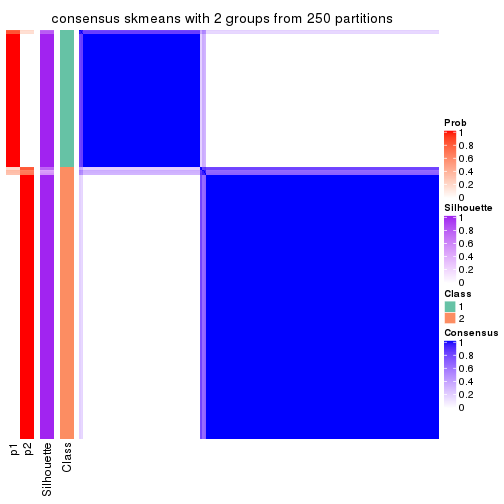</p>

</div>
<div id='tab-MAD-skmeans-consensus-heatmap-2'>
<pre><code class="r">consensus_heatmap(res, k = 3)
</code></pre>

<p>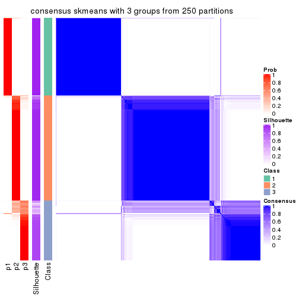</p>

</div>
<div id='tab-MAD-skmeans-consensus-heatmap-3'>
<pre><code class="r">consensus_heatmap(res, k = 4)
</code></pre>

<p>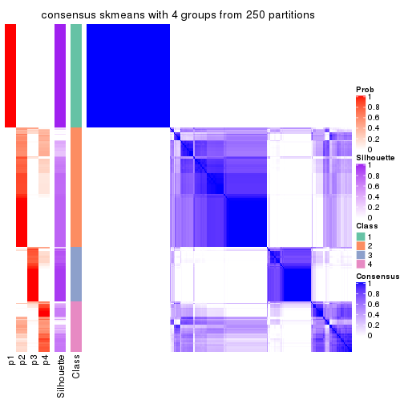</p>

</div>
<div id='tab-MAD-skmeans-consensus-heatmap-4'>
<pre><code class="r">consensus_heatmap(res, k = 5)
</code></pre>

<p>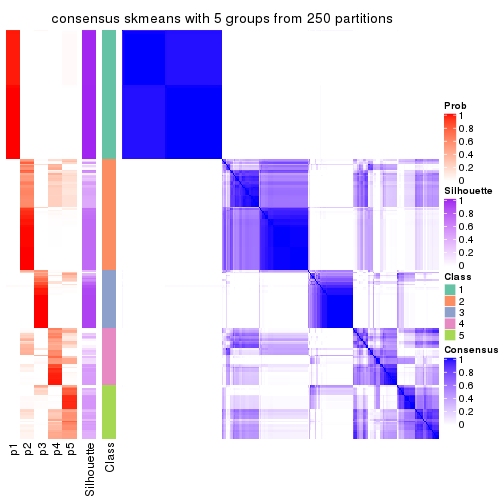</p>

</div>
<div id='tab-MAD-skmeans-consensus-heatmap-5'>
<pre><code class="r">consensus_heatmap(res, k = 6)
</code></pre>

<p>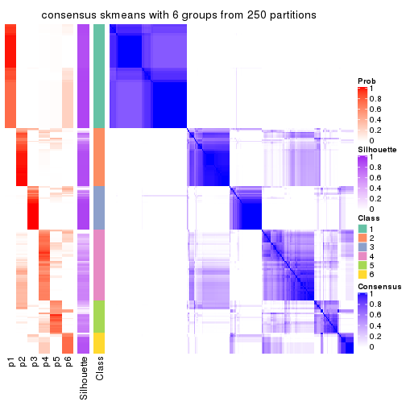</p>

</div>
</div>

Heatmaps for the membership of samples in all partitions to see how consistent they are:


<script>
$( function() {
	$( '#tabs-MAD-skmeans-membership-heatmap' ).tabs();
} );
</script>
<div id='tabs-MAD-skmeans-membership-heatmap'>
<ul>
<li><a href='#tab-MAD-skmeans-membership-heatmap-1'>k = 2</a></li>
<li><a href='#tab-MAD-skmeans-membership-heatmap-2'>k = 3</a></li>
<li><a href='#tab-MAD-skmeans-membership-heatmap-3'>k = 4</a></li>
<li><a href='#tab-MAD-skmeans-membership-heatmap-4'>k = 5</a></li>
<li><a href='#tab-MAD-skmeans-membership-heatmap-5'>k = 6</a></li>
</ul>
<div id='tab-MAD-skmeans-membership-heatmap-1'>
<pre><code class="r">membership_heatmap(res, k = 2)
</code></pre>

<p>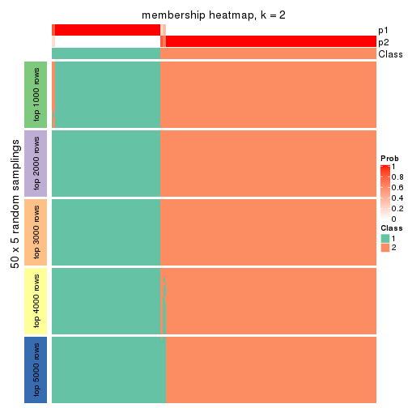</p>

</div>
<div id='tab-MAD-skmeans-membership-heatmap-2'>
<pre><code class="r">membership_heatmap(res, k = 3)
</code></pre>

<p>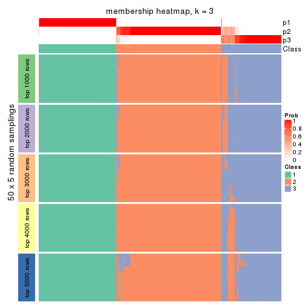</p>

</div>
<div id='tab-MAD-skmeans-membership-heatmap-3'>
<pre><code class="r">membership_heatmap(res, k = 4)
</code></pre>

<p>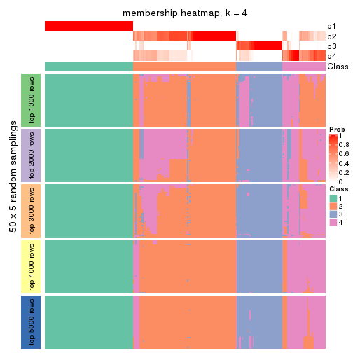</p>

</div>
<div id='tab-MAD-skmeans-membership-heatmap-4'>
<pre><code class="r">membership_heatmap(res, k = 5)
</code></pre>

<p>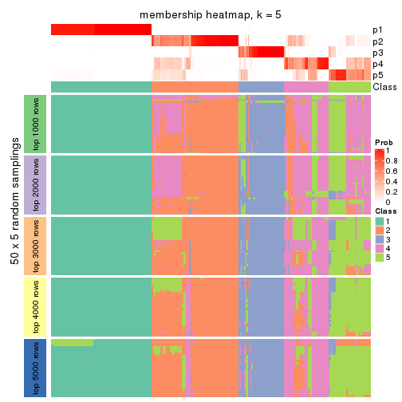</p>

</div>
<div id='tab-MAD-skmeans-membership-heatmap-5'>
<pre><code class="r">membership_heatmap(res, k = 6)
</code></pre>

<p>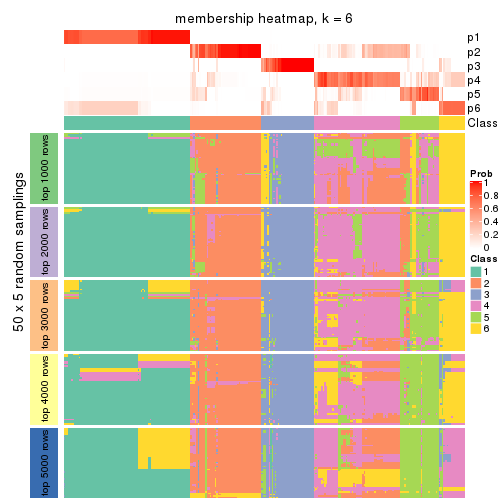</p>

</div>
</div>

As soon as we have had the classes for columns, we can look for signatures
which are significantly different between classes which can be candidate marks
for certain classes. Following are the heatmaps for signatures.


Signature heatmaps where rows are scaled:


<script>
$( function() {
	$( '#tabs-MAD-skmeans-get-signatures' ).tabs();
} );
</script>
<div id='tabs-MAD-skmeans-get-signatures'>
<ul>
<li><a href='#tab-MAD-skmeans-get-signatures-1'>k = 2</a></li>
<li><a href='#tab-MAD-skmeans-get-signatures-2'>k = 3</a></li>
<li><a href='#tab-MAD-skmeans-get-signatures-3'>k = 4</a></li>
<li><a href='#tab-MAD-skmeans-get-signatures-4'>k = 5</a></li>
<li><a href='#tab-MAD-skmeans-get-signatures-5'>k = 6</a></li>
</ul>
<div id='tab-MAD-skmeans-get-signatures-1'>
<pre><code class="r">get_signatures(res, k = 2)
</code></pre>

<p>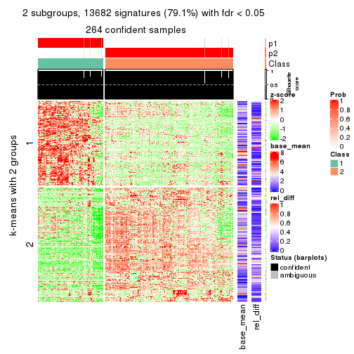</p>

</div>
<div id='tab-MAD-skmeans-get-signatures-2'>
<pre><code class="r">get_signatures(res, k = 3)
</code></pre>

<p>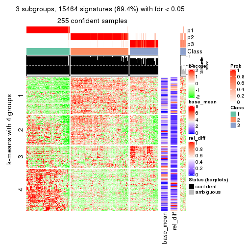</p>

</div>
<div id='tab-MAD-skmeans-get-signatures-3'>
<pre><code class="r">get_signatures(res, k = 4)
</code></pre>

<p>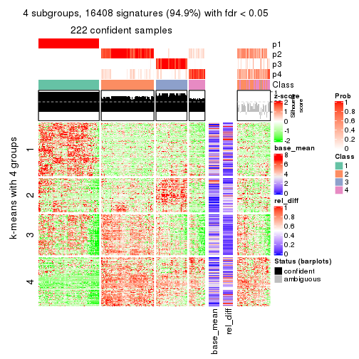</p>

</div>
<div id='tab-MAD-skmeans-get-signatures-4'>
<pre><code class="r">get_signatures(res, k = 5)
</code></pre>

<p>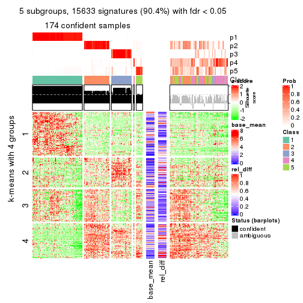</p>

</div>
<div id='tab-MAD-skmeans-get-signatures-5'>
<pre><code class="r">get_signatures(res, k = 6)
</code></pre>

<p>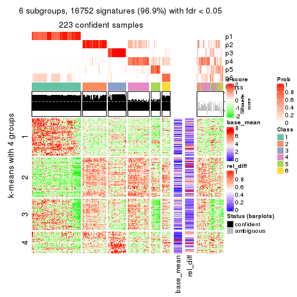</p>

</div>
</div>


Signature heatmaps where rows are not scaled:


<script>
$( function() {
	$( '#tabs-MAD-skmeans-get-signatures-no-scale' ).tabs();
} );
</script>
<div id='tabs-MAD-skmeans-get-signatures-no-scale'>
<ul>
<li><a href='#tab-MAD-skmeans-get-signatures-no-scale-1'>k = 2</a></li>
<li><a href='#tab-MAD-skmeans-get-signatures-no-scale-2'>k = 3</a></li>
<li><a href='#tab-MAD-skmeans-get-signatures-no-scale-3'>k = 4</a></li>
<li><a href='#tab-MAD-skmeans-get-signatures-no-scale-4'>k = 5</a></li>
<li><a href='#tab-MAD-skmeans-get-signatures-no-scale-5'>k = 6</a></li>
</ul>
<div id='tab-MAD-skmeans-get-signatures-no-scale-1'>
<pre><code class="r">get_signatures(res, k = 2, scale_rows = FALSE)
</code></pre>

<p>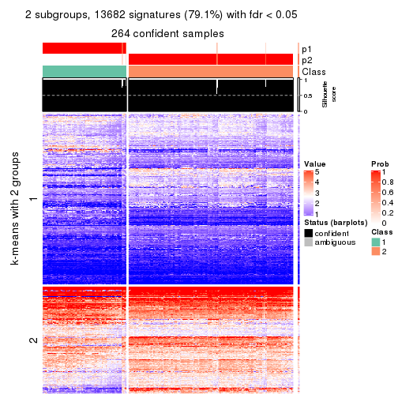</p>

</div>
<div id='tab-MAD-skmeans-get-signatures-no-scale-2'>
<pre><code class="r">get_signatures(res, k = 3, scale_rows = FALSE)
</code></pre>

<p>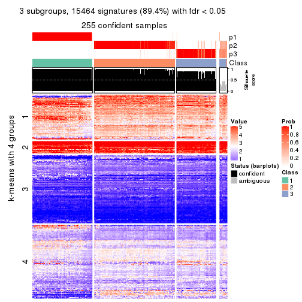</p>

</div>
<div id='tab-MAD-skmeans-get-signatures-no-scale-3'>
<pre><code class="r">get_signatures(res, k = 4, scale_rows = FALSE)
</code></pre>

<p>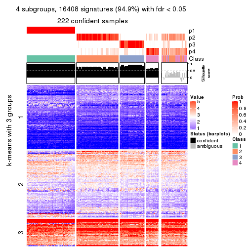</p>

</div>
<div id='tab-MAD-skmeans-get-signatures-no-scale-4'>
<pre><code class="r">get_signatures(res, k = 5, scale_rows = FALSE)
</code></pre>

<p>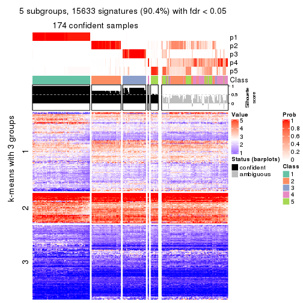</p>

</div>
<div id='tab-MAD-skmeans-get-signatures-no-scale-5'>
<pre><code class="r">get_signatures(res, k = 6, scale_rows = FALSE)
</code></pre>

<p>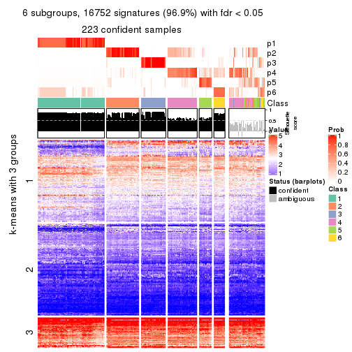</p>

</div>
</div>


Compare the overlap of signatures from different k:

```r
compare_signatures(res)
```

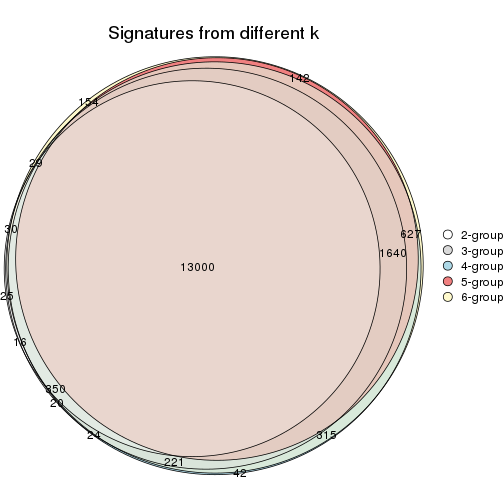

`get_signature()` returns a data frame invisibly. TO get the list of signatures, the function
call should be assigned to a variable explicitly. In following code, if `plot` argument is set
to `FALSE`, no heatmap is plotted while only the differential analysis is performed.

```r
# code only for demonstration
tb = get_signature(res, k = ..., plot = FALSE)
```

An example of the output of `tb` is:

```
#>   which_row         fdr    mean_1    mean_2 scaled_mean_1 scaled_mean_2 km
#> 1        38 0.042760348  8.373488  9.131774    -0.5533452     0.5164555  1
#> 2        40 0.018707592  7.106213  8.469186    -0.6173731     0.5762149  1
#> 3        55 0.019134737 10.221463 11.207825    -0.6159697     0.5749050  1
#> 4        59 0.006059896  5.921854  7.869574    -0.6899429     0.6439467  1
#> 5        60 0.018055526  8.928898 10.211722    -0.6204761     0.5791110  1
#> 6        98 0.009384629 15.714769 14.887706     0.6635654    -0.6193277  2
...
```

The columns in `tb` are:

1. `which_row`: row indices corresponding to the input matrix.
2. `fdr`: FDR for the differential test. 
3. `mean_x`: The mean value in group x.
4. `scaled_mean_x`: The mean value in group x after rows are scaled.
5. `km`: Row groups if k-means clustering is applied to rows.


UMAP plot which shows how samples are separated.


<script>
$( function() {
	$( '#tabs-MAD-skmeans-dimension-reduction' ).tabs();
} );
</script>
<div id='tabs-MAD-skmeans-dimension-reduction'>
<ul>
<li><a href='#tab-MAD-skmeans-dimension-reduction-1'>k = 2</a></li>
<li><a href='#tab-MAD-skmeans-dimension-reduction-2'>k = 3</a></li>
<li><a href='#tab-MAD-skmeans-dimension-reduction-3'>k = 4</a></li>
<li><a href='#tab-MAD-skmeans-dimension-reduction-4'>k = 5</a></li>
<li><a href='#tab-MAD-skmeans-dimension-reduction-5'>k = 6</a></li>
</ul>
<div id='tab-MAD-skmeans-dimension-reduction-1'>
<pre><code class="r">dimension_reduction(res, k = 2, method = &quot;UMAP&quot;)
</code></pre>

<p>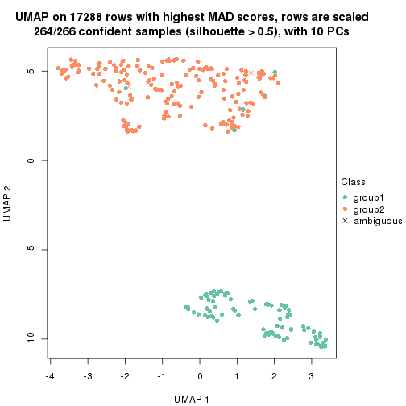</p>

</div>
<div id='tab-MAD-skmeans-dimension-reduction-2'>
<pre><code class="r">dimension_reduction(res, k = 3, method = &quot;UMAP&quot;)
</code></pre>

<p>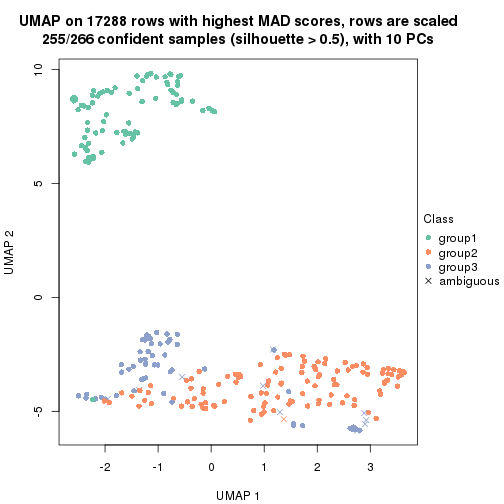</p>

</div>
<div id='tab-MAD-skmeans-dimension-reduction-3'>
<pre><code class="r">dimension_reduction(res, k = 4, method = &quot;UMAP&quot;)
</code></pre>

<p>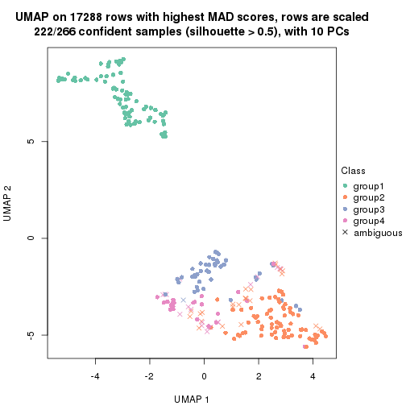</p>

</div>
<div id='tab-MAD-skmeans-dimension-reduction-4'>
<pre><code class="r">dimension_reduction(res, k = 5, method = &quot;UMAP&quot;)
</code></pre>

<p>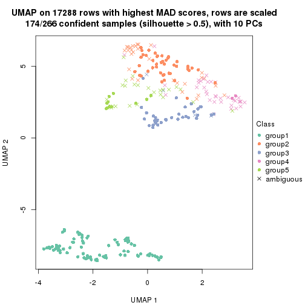</p>

</div>
<div id='tab-MAD-skmeans-dimension-reduction-5'>
<pre><code class="r">dimension_reduction(res, k = 6, method = &quot;UMAP&quot;)
</code></pre>

<p>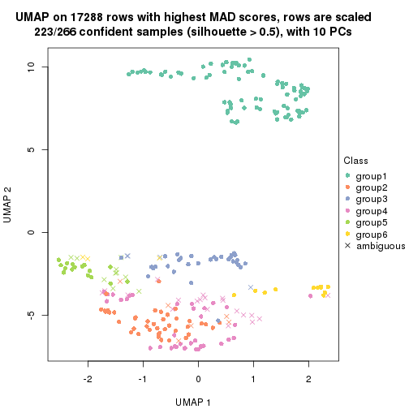</p>

</div>
</div>


Following heatmap shows how subgroups are split when increasing `k`:

```r
collect_classes(res)
```

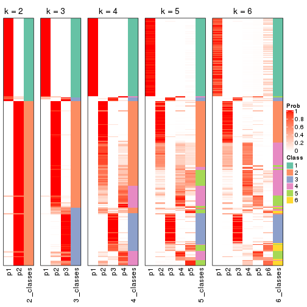


If matrix rows can be associated to genes, consider to use `GO_Enrichment(res,
...)` to perform function enrichment for the signature genes.


 

---------------------------------------------------


### MAD:pam**


The object with results only for a single top-value method and a single partition method 
can be extracted as:

```r
res = res_list["MAD", "pam"]
# you can also extract it by
# res = res_list["MAD:pam"]
```

A summary of `res` and all the functions that can be applied to it:

```r
res
```

```
#> A 'ConsensusPartition' object with k = 2, 3, 4, 5, 6.
#>   On a matrix with 17288 rows and 266 columns.
#>   Top rows (1000, 2000, 3000, 4000, 5000) are extracted by 'MAD' method.
#>   Subgroups are detected by 'pam' method.
#>   Performed in total 1250 partitions by row resampling.
#>   Best k for subgroups seems to be 2.
#> 
#> Following methods can be applied to this 'ConsensusPartition' object:
#>  [1] "cola_report"             "collect_classes"         "collect_plots"          
#>  [4] "collect_stats"           "colnames"                "compare_signatures"     
#>  [7] "consensus_heatmap"       "dimension_reduction"     "functional_enrichment"  
#> [10] "get_anno_col"            "get_anno"                "get_classes"            
#> [13] "get_consensus"           "get_matrix"              "get_membership"         
#> [16] "get_param"               "get_signatures"          "get_stats"              
#> [19] "is_best_k"               "is_stable_k"             "membership_heatmap"     
#> [22] "ncol"                    "nrow"                    "plot_ecdf"              
#> [25] "rownames"                "select_partition_number" "show"                   
#> [28] "suggest_best_k"          "test_to_known_factors"
```

`collect_plots()` function collects all the plots made from `res` for all `k` (number of partitions)
into one single page to provide an easy and fast comparison between different `k`.

```r
collect_plots(res)
```

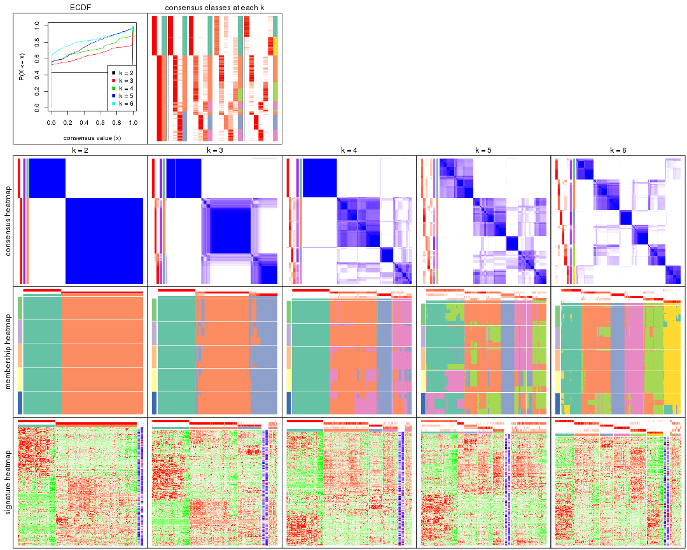

The plots are:

- The first row: a plot of the ECDF (Empirical cumulative distribution
  function) curves of the consensus matrix for each `k` and the heatmap of
  predicted classes for each `k`.
- The second row: heatmaps of the consensus matrix for each `k`.
- The third row: heatmaps of the membership matrix for each `k`.
- The fouth row: heatmaps of the signatures for each `k`.

All the plots in panels can be made by individual functions and they are
plotted later in this section.

`select_partition_number()` produces several plots showing different
statistics for choosing "optimized" `k`. There are following statistics:

- ECDF curves of the consensus matrix for each `k`;
- 1-PAC. [The PAC
  score](https://en.wikipedia.org/wiki/Consensus_clustering#Over-interpretation_potential_of_consensus_clustering)
  measures the proportion of the ambiguous subgrouping.
- Mean silhouette score.
- Concordance. The mean probability of fiting the consensus class ids in all
  partitions.
- Area increased. Denote $A_k$ as the area under the ECDF curve for current
  `k`, the area increased is defined as $A_k - A_{k-1}$.
- Rand index. The percent of pairs of samples that are both in a same cluster
  or both are not in a same cluster in the partition of k and k-1.
- Jaccard index. The ratio of pairs of samples are both in a same cluster in
  the partition of k and k-1 and the pairs of samples are both in a same
  cluster in the partition k or k-1.

The detailed explanations of these statistics can be found in [the cola
vignette](http://bioconductor.org/packages/devel/bioc/vignettes/cola/inst/doc/cola.html#toc_13).

Generally speaking, lower PAC score, higher mean silhouette score or higher
concordance corresponds to better partition. Rand index and Jaccard index
measure how similar the current partition is compared to partition with `k-1`.
If they are too similar, we won't accept `k` is better than `k-1`.

```r
select_partition_number(res)
```

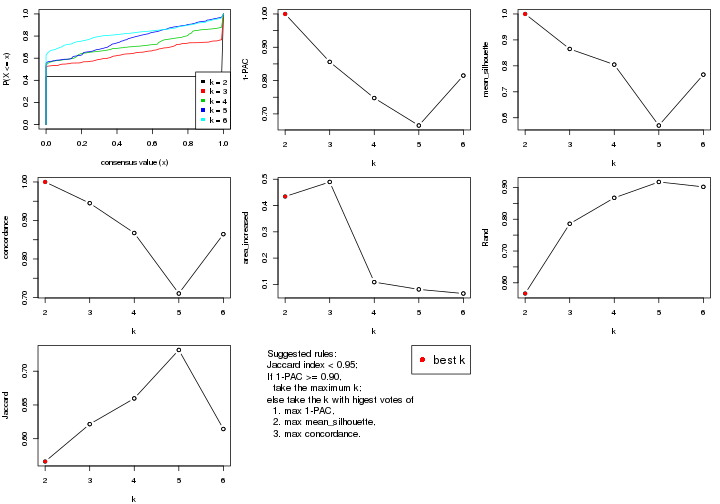

The numeric values for all these statistics can be obtained by `get_stats()`.

```r
get_stats(res)
```

```
#>   k 1-PAC mean_silhouette concordance area_increased  Rand Jaccard
#> 2 2 1.000           1.000       1.000         0.4343 0.566   0.566
#> 3 3 0.856           0.865       0.945         0.4896 0.786   0.622
#> 4 4 0.748           0.805       0.867         0.1086 0.867   0.660
#> 5 5 0.665           0.570       0.710         0.0810 0.917   0.731
#> 6 6 0.815           0.766       0.864         0.0653 0.902   0.614
```

`suggest_best_k()` suggests the best $k$ based on these statistics. The rules are as follows:

- All $k$ with Jaccard index larger than 0.95 are removed because the increase of
  the partition number does not provides enough extra information. If all $k$ are removed,
  the best $k$ is assigned by `NA`.
- For $k$ with 1-PAC larger than 0.9, the maximal $k$ is taken as the "best k". Other $k$ is called "optional k".
- If it does not fit the second rule. The $k$ with the highest vote of highest
  1-PAC, mean silhouette and concordance is taken as the "best k".

```r
suggest_best_k(res)
```

```
#> [1] 2
```


Following shows the table of the partitions (You need to click the **show/hide
code output** link to see it). The membership matrix (columns with name `p*`)
is inferred by
[`clue::cl_consensus()`](https://www.rdocumentation.org/link/cl_consensus?package=clue)
function with the `SE` method. Basically the value in the membership matrix
represents the probability to belong to a certain group. The finall class
label for an item is determined with the group with highest probability it
belongs to.

In `get_classes()` function, the entropy is calculated from the membership
matrix and the silhouette score is calculated from the consensus matrix.


<script>
$( function() {
	$( '#tabs-MAD-pam-get-classes' ).tabs();
} );
</script>
<div id='tabs-MAD-pam-get-classes'>
<ul>
<li><a href='#tab-MAD-pam-get-classes-1'>k = 2</a></li>
<li><a href='#tab-MAD-pam-get-classes-2'>k = 3</a></li>
<li><a href='#tab-MAD-pam-get-classes-3'>k = 4</a></li>
<li><a href='#tab-MAD-pam-get-classes-4'>k = 5</a></li>
<li><a href='#tab-MAD-pam-get-classes-5'>k = 6</a></li>
</ul>

<div id='tab-MAD-pam-get-classes-1'>
<p><a id='tab-MAD-pam-get-classes-1-a' style='color:#0366d6' href='#'>show/hide code output</a></p>
<pre><code class="r">cbind(get_classes(res, k = 2), get_membership(res, k = 2))
</code></pre>

<pre><code>#&gt;                                      class entropy silhouette p1 p2
#&gt; 80D0AF10-1C61-4B67-90C1-7DBF1EF23672     2       0          1  0  1
#&gt; 87117BE1-D328-4972-85DA-6672412D8860     2       0          1  0  1
#&gt; F904C5B6-70BD-4604-8254-79BE23B152DA     1       0          1  1  0
#&gt; 3182DEA1-4239-4613-925A-7E6503766AD6     2       0          1  0  1
#&gt; 55E78EA2-2D9B-481F-8CAB-D36A33088EAE     2       0          1  0  1
#&gt; 86F94264-A6DD-4A97-9191-036F066DD0EF     2       0          1  0  1
#&gt; 09D25417-23B7-4D88-A0EA-F307985FBBBC     2       0          1  0  1
#&gt; C797F12C-40D3-4DB5-B9EF-A6821BBDE4F0     1       0          1  1  0
#&gt; 80275DB0-A226-4B6B-A08F-4ADBEEE1DB01     1       0          1  1  0
#&gt; 27FB653A-9E07-44AD-952E-9E4DE4AB5891     2       0          1  0  1
#&gt; 1A5DB9FC-2ABD-4E1B-B5EF-B1CF5E5F3872     1       0          1  1  0
#&gt; 844E4CCD-D30C-416F-A086-8923711A4E25     2       0          1  0  1
#&gt; EF18318D-3D25-4D65-803A-ED6E62871E7E     1       0          1  1  0
#&gt; 1ACB1BE0-61F6-4243-BBEC-E26A1CF90CA8     1       0          1  1  0
#&gt; 8EF0039B-D758-46AB-BAF7-6A062C7C56BA     1       0          1  1  0
#&gt; 22F4C9D9-663B-4C91-9692-E035A2640BEC     2       0          1  0  1
#&gt; FA1A0BCE-EE0F-4178-B963-62550E344B14     2       0          1  0  1
#&gt; 0B6D0C4E-5AE3-4707-A9FC-12A108E6EC2A     2       0          1  0  1
#&gt; 06FD3123-2AEB-4911-AC4E-E0E64FD5DB52     2       0          1  0  1
#&gt; 235A4492-FF80-4AA5-BC71-DFF65E1C7411     2       0          1  0  1
#&gt; A192C6C0-1443-4493-AFAC-1EE710628ADB     2       0          1  0  1
#&gt; 6FC5B56B-711B-4174-9B06-4E843124AAB6     1       0          1  1  0
#&gt; 7A813F60-A41E-4552-990E-F22287654C1D     2       0          1  0  1
#&gt; 725BBFB5-26F4-4512-9C75-47D013C1E605     1       0          1  1  0
#&gt; 39CC4E82-EBC9-472E-8BE5-6A3AB178449A     2       0          1  0  1
#&gt; 61130DEE-E267-49DF-8B41-7738A06EF738     2       0          1  0  1
#&gt; 117EC12C-B7ED-4E01-B29B-EA542D356EA1     1       0          1  1  0
#&gt; A30FF708-F7A9-41E4-8AD5-20441650FBC9     2       0          1  0  1
#&gt; 53640D52-1167-4A5D-B656-97D32CBA3934     1       0          1  1  0
#&gt; 9E85D76A-DD2A-46D5-BB59-0ED302B6258C     2       0          1  0  1
#&gt; 6F8C6F90-7E3C-4860-91DD-586708DE44AA     1       0          1  1  0
#&gt; E675AEC5-AA9A-4AAA-839C-03E6365822DB     2       0          1  0  1
#&gt; B577DEF7-2F5C-4876-A7C6-F18D5722B8C0     1       0          1  1  0
#&gt; DA8B577E-43E7-49BF-BF94-868E3194F5C9     1       0          1  1  0
#&gt; 3334280B-2A36-4AC7-A021-A76C10E958F0     2       0          1  0  1
#&gt; 5CBDDC90-11EC-4E6E-881E-AA9CCFD40FDB     2       0          1  0  1
#&gt; 8CBBF32A-8349-44F5-A8B8-4CBB1760A464     2       0          1  0  1
#&gt; B9455A9A-136D-4DC2-9F86-0FC74433589D     2       0          1  0  1
#&gt; D7EAE2A7-F9BE-4222-A452-B1F83F99CD50     2       0          1  0  1
#&gt; F803AE18-60C5-4CFE-AAAB-DB33C26A2184     1       0          1  1  0
#&gt; 5DD8CAC7-EC02-43B6-B58E-6D2E22868A3B     2       0          1  0  1
#&gt; EE98E1B4-DFB3-4AEC-8527-E1FD544C9475     1       0          1  1  0
#&gt; 3CE43921-47D5-4394-B9E1-242607775D61     2       0          1  0  1
#&gt; 46986F2B-0B0D-4187-8948-4E91D34B7C49     2       0          1  0  1
#&gt; 5D1D052E-74EF-45A8-9B1A-7CECD13EA43B     2       0          1  0  1
#&gt; 4C821AD9-A5C9-4A9A-9C5D-363B227F8064     2       0          1  0  1
#&gt; 06A4189E-A23B-4AC6-AA74-01955DD7D1E9     2       0          1  0  1
#&gt; FCCDC76F-CB02-4BCD-A616-325F258DDAA4     2       0          1  0  1
#&gt; DAC53B0A-8F35-4EA6-BBCC-4CD1C049E11F     2       0          1  0  1
#&gt; DD4F845B-CAD3-44CB-9D96-3C3F5BA1B72D     1       0          1  1  0
#&gt; D440F004-A4A4-41B6-BED8-805D67BA01C7     2       0          1  0  1
#&gt; A497C423-119F-42FA-BF17-9F6DFD2A5585     2       0          1  0  1
#&gt; 3420E573-DE12-4EF5-B1C0-2FCA904F4F4E     1       0          1  1  0
#&gt; 1AD72157-A254-44B4-BA58-4F30F1AE910E     1       0          1  1  0
#&gt; C1113977-B160-45EE-B061-750F9EA3F33F     2       0          1  0  1
#&gt; 6783AB5B-F07C-447B-BF13-C34485D246D7     2       0          1  0  1
#&gt; 1F553062-26FD-4A7F-B7FB-81184604F423     1       0          1  1  0
#&gt; BE2DCA51-1C21-4598-98A7-F2FB9B2DFCB4     2       0          1  0  1
#&gt; 38941CF3-9C54-4BA4-A005-CC88CA97D504     2       0          1  0  1
#&gt; 51CB675E-E243-4A07-BF4A-580473D26FDA     2       0          1  0  1
#&gt; C7FED0F5-C27A-4405-9232-30BF39362CF7     2       0          1  0  1
#&gt; 2A1E86E8-4713-465F-ACFF-C584864C57A1     2       0          1  0  1
#&gt; B4500785-0FAA-4D4D-8630-43D194BAB004     2       0          1  0  1
#&gt; 3FD52E66-AB76-4079-80DB-281A795D1EC0     2       0          1  0  1
#&gt; EBD355D1-1226-4DFD-AAFF-45D246B64F3C     2       0          1  0  1
#&gt; 5A040A73-CD95-487E-8AEF-9639FE4E2916     2       0          1  0  1
#&gt; CF629C65-585D-476D-B081-3E6E0575FAE3     2       0          1  0  1
#&gt; 0D4202A3-808E-413F-9BF3-9CFCCAE0ED61     2       0          1  0  1
#&gt; 43E715BF-28D9-4B5E-B762-8CD1B69A430E     1       0          1  1  0
#&gt; BFB82BE8-9DAC-4099-8B38-0950308E3EB3     2       0          1  0  1
#&gt; F7CB1825-2303-4DD2-AE1F-7205738EAF1F     1       0          1  1  0
#&gt; FE298483-C42C-4753-BABB-29A9CB1B6312     1       0          1  1  0
#&gt; A98C7561-1B42-4CD6-AE71-924B91FA4C33     2       0          1  0  1
#&gt; 58098F21-7DAB-47DA-9A41-8D20BF3B9257     2       0          1  0  1
#&gt; 18CAF708-20B9-4745-9CB3-37AB6E0B3056     2       0          1  0  1
#&gt; 2C80DD72-C9C7-4AC2-812F-9A31EF02779C     1       0          1  1  0
#&gt; 68A3F13D-319D-4603-A27F-B5DD46FE5C5B     2       0          1  0  1
#&gt; 7EE8F0CE-CDC9-40F9-A1DE-7F8140EC6D13     2       0          1  0  1
#&gt; 39019903-5B9C-4665-BD5F-7CCB19CB55C5     2       0          1  0  1
#&gt; 190EDB27-4CBC-4E9C-9B67-D51FDAB982B7     2       0          1  0  1
#&gt; EB2D95BC-62F8-4669-9308-D37D7FB79E23     2       0          1  0  1
#&gt; A08B85EA-D1E7-4B77-8DEC-36294305B9F7     1       0          1  1  0
#&gt; 130DDFAD-6EF8-4C80-BD9D-88308A6874BC     2       0          1  0  1
#&gt; 7340A5BA-E002-448F-AACC-E7A37DBB79C2     2       0          1  0  1
#&gt; A771F6E3-D266-4FE7-98C6-C40E6A701D59     1       0          1  1  0
#&gt; 015E792C-EC1B-49BF-AB07-D82B20C5989A     2       0          1  0  1
#&gt; BF79E030-47EE-4D08-B910-5685A4BD8B60     2       0          1  0  1
#&gt; FB3C7C9A-2F2D-4DD5-BE47-FAFB072C0FAB     2       0          1  0  1
#&gt; 4E5557BA-10E8-4723-908E-DD04EF6639B2     2       0          1  0  1
#&gt; 8031B550-40A9-4A3A-9F7D-CDC052288BD8     2       0          1  0  1
#&gt; 55299A06-3C1F-45A4-B166-B2C591C0CEE2     2       0          1  0  1
#&gt; EB8D5168-216E-4ABB-8B4E-9E67786CB322     1       0          1  1  0
#&gt; 78BD2D83-9A7F-42E5-BB38-654AA0761A0A     2       0          1  0  1
#&gt; AA2D53E5-D389-4332-9DD5-A736052E48F8     1       0          1  1  0
#&gt; 62945C7A-9313-4FC9-820C-B0AB820B394E     1       0          1  1  0
#&gt; 22746046-2E99-4EE9-97D2-BA2EA499634C     2       0          1  0  1
#&gt; 8671B51B-DCBE-4429-9F01-AF51CAD7014F     2       0          1  0  1
#&gt; E815AB36-5689-4A0D-8E6D-2EAA73406681     1       0          1  1  0
#&gt; A1DACB46-ED52-4E38-B2C8-57256BB22B5E     2       0          1  0  1
#&gt; 4F5498C4-A423-4B3D-AC98-D4E214A57D0E     1       0          1  1  0
#&gt; A7772CCD-FFFF-49DD-86ED-0BAD330EC9B6     2       0          1  0  1
#&gt; E6E3DF78-65B9-4F74-8DA8-E2A6D4EDBEA7     2       0          1  0  1
#&gt; 83286E2D-E708-437A-911A-E6B050273CBD     1       0          1  1  0
#&gt; EC5C7C97-EE8C-405D-A039-D96514B1D414     2       0          1  0  1
#&gt; 3E55223D-6E3D-4027-9819-67E91212531D     1       0          1  1  0
#&gt; 99A036A2-8343-4D06-8047-D84E96CE4C61     2       0          1  0  1
#&gt; CA6CDE6D-92DE-4259-9E58-A373F2D543EA     2       0          1  0  1
#&gt; BF6FA8CC-60C1-413A-B2C6-54CCACBC01D6     1       0          1  1  0
#&gt; E0594CFE-F7B6-4546-B130-30DF6A514B1F     2       0          1  0  1
#&gt; E769E41D-5949-42C5-9594-E563C05ACE52     2       0          1  0  1
#&gt; 01373725-5D3C-4D9C-AABC-911D53E62BCD     2       0          1  0  1
#&gt; 1F39DADD-3655-474E-BA4C-A5BD32C97A8B     1       0          1  1  0
#&gt; AF573EC8-E4EE-4B8F-8199-9817B9FAC67D     1       0          1  1  0
#&gt; 3F022CBC-41C8-4387-A6FB-124C4BCD1AD9     1       0          1  1  0
#&gt; 1CC32ACE-826B-494B-8B89-5BD92327A74D     2       0          1  0  1
#&gt; 22B0BD3B-EE08-4BC7-90B2-01C372A56BA2     2       0          1  0  1
#&gt; 0F3DE9EF-19CC-4D14-9A42-1435DB537F94     2       0          1  0  1
#&gt; 87F8A33F-FBC3-469E-862B-84472F796358     2       0          1  0  1
#&gt; C9F2FA0D-1A9F-40B4-BD9B-CAF1B3F3D5A7     2       0          1  0  1
#&gt; ACFC9F59-78FF-4453-B25F-8834D0EAB54A     2       0          1  0  1
#&gt; B7AC7D5B-14E9-45A7-93B7-226EE508544A     2       0          1  0  1
#&gt; 4491BF17-B168-4E96-8E09-EF1AEC9F5E9D     2       0          1  0  1
#&gt; 557A0811-A3FE-4CF4-A24D-FBB77E7F9139     2       0          1  0  1
#&gt; 6F9C955C-6816-4353-922A-8035B50FACC6     2       0          1  0  1
#&gt; 3E89FB1C-4A7D-43C7-823C-04E3716A7935     2       0          1  0  1
#&gt; 12ABE483-66EF-4237-94C4-0199FAE23FA8     2       0          1  0  1
#&gt; 7535F262-9B96-44F6-988C-4C9EBB3FFCA9     2       0          1  0  1
#&gt; 65C9D28E-303B-40E5-84F0-2507F5457374     2       0          1  0  1
#&gt; FD445384-6BA9-4297-9D9C-12ABA7D645C7     1       0          1  1  0
#&gt; 30D5E255-2AD3-44F3-8983-1B80E4FD3E2D     2       0          1  0  1
#&gt; 3E88EC60-B4A8-4259-8BC8-A234800F6955     2       0          1  0  1
#&gt; ACD73CE8-AFC5-47A0-9383-3CB97F018953     1       0          1  1  0
#&gt; 1AFDC2EA-26A8-44E2-8BCB-F34F7B66F8C8     2       0          1  0  1
#&gt; 9E327BC8-1D20-4AD8-83F7-FB2D13BCA5D0     2       0          1  0  1
#&gt; 85A86B91-4F24-4E77-AE2D-520F8E205EFC     1       0          1  1  0
#&gt; 74868C37-8143-4306-81CA-E45759D146CD     2       0          1  0  1
#&gt; 69AEA0DB-E335-48A0-A398-4FB0D581182A     2       0          1  0  1
#&gt; AE6F8B89-85C2-42B7-8D05-AFDDD4FEFD16     1       0          1  1  0
#&gt; A8A6F09C-9812-4457-9A4B-AD41F97B41A3     2       0          1  0  1
#&gt; 1A09BC4D-EF29-42DD-BB04-A3C264A3032D     1       0          1  1  0
#&gt; E0961A30-A62C-4235-9CF0-A1776827A996     2       0          1  0  1
#&gt; 134D2D90-7B08-4F20-8A3A-C77643FB208F     2       0          1  0  1
#&gt; A77C2DFF-93CF-4CB5-B3C1-81133D7F1A0F     2       0          1  0  1
#&gt; EA2DC457-9C74-4B9C-B3FA-5E72199B24A7     2       0          1  0  1
#&gt; FF34117B-5EE4-4C96-A8A2-2CE6A654CBE5     1       0          1  1  0
#&gt; 75F7B5E2-6559-4B48-A2A4-287C35C559CC     1       0          1  1  0
#&gt; 903BF591-B0AF-4BEE-B625-60B673070344     2       0          1  0  1
#&gt; 9DE1B790-C63C-41C4-9477-CE52A8119C67     2       0          1  0  1
#&gt; 9A28F80A-85F8-40E2-A32B-230EF93B2FA0     2       0          1  0  1
#&gt; 0AA2BDBB-8720-409A-AA72-1F4AA26E7CD8     2       0          1  0  1
#&gt; 5AD49F16-E974-4E5D-B1B6-073ECB73A01D     2       0          1  0  1
#&gt; CB0F961C-527D-4A48-9408-286B26BD9532     1       0          1  1  0
#&gt; 46FF25B6-D01D-4CA7-80B7-CEC2998C34E1     2       0          1  0  1
#&gt; 487CADE1-D699-4A6C-817A-B9A0AB940C61     1       0          1  1  0
#&gt; 4FF6F2D8-F869-4735-A4D1-1A8423153FBC     1       0          1  1  0
#&gt; 6005494F-5D3D-43A3-B3E8-8C91955B2A98     2       0          1  0  1
#&gt; CF10D584-CE32-45A4-A932-E9D5AF12A6A0     1       0          1  1  0
#&gt; E15CE4AB-5646-49C8-9CD6-938457036BB0     2       0          1  0  1
#&gt; 31E28D0B-0E69-4330-82ED-4F1827DC97EA     2       0          1  0  1
#&gt; DBACD3C3-CCB5-4478-BA78-85A0C847CA66     2       0          1  0  1
#&gt; 5A07041C-65EB-4FCD-8940-E90B905061B5     2       0          1  0  1
#&gt; 0EA7C916-FA47-489B-BC98-4D9E7D197628     1       0          1  1  0
#&gt; 30967F75-8499-47FF-ADA4-4DC566013F7B     1       0          1  1  0
#&gt; D2E528FF-AEA2-48D7-A60A-4C3E71EA9073     2       0          1  0  1
#&gt; 22735DCD-215E-48BC-BF44-32BD66F06E39     2       0          1  0  1
#&gt; BC2C3248-7FC6-48BC-96C1-45EA573DE7DC     1       0          1  1  0
#&gt; E72CEBCB-D686-4B12-BCBA-EC8F964330A2     1       0          1  1  0
#&gt; 23C937BB-BA20-4440-B680-914229CC3ADF     1       0          1  1  0
#&gt; 947E99C7-F402-4F1A-A6E9-81BCAAED135A     2       0          1  0  1
#&gt; 02475D11-FC81-4E88-944E-173C32DC3FE7     2       0          1  0  1
#&gt; F972A9AA-9842-4343-A533-A795E65581CE     1       0          1  1  0
#&gt; 05043AAF-3095-4C61-B5C1-EE9AA9082C75     2       0          1  0  1
#&gt; CECF7967-862E-428C-BB42-FEF553FDB3AA     2       0          1  0  1
#&gt; FB0B9483-6302-48C7-BE5B-DA667E00AE2D     2       0          1  0  1
#&gt; 78700FBA-1487-4754-9B30-18837BF7E9FB     1       0          1  1  0
#&gt; 2166F56D-54CE-4F1B-8F07-A4E13E4489E9     1       0          1  1  0
#&gt; 7CD0942E-E39A-43A7-8BAC-F25967864901     2       0          1  0  1
#&gt; 3B00BA2B-7F7D-4825-8F8D-90F04A5DE687     2       0          1  0  1
#&gt; 7465B01D-C05E-4FE0-A9FE-182920EDC489     2       0          1  0  1
#&gt; 88C31A99-F96E-4FC8-8B3D-C1AAA05062D9     1       0          1  1  0
#&gt; 53575575-3303-4F8F-B6A8-B42131CFB4AC     2       0          1  0  1
#&gt; CC8017C7-4128-48DA-8E43-503F63158D85     1       0          1  1  0
#&gt; 88449D2A-2A25-41A4-B91D-C99B58F8ECD9     2       0          1  0  1
#&gt; 46C7DDE5-A2B5-494F-96AE-0B6E2D51B003     1       0          1  1  0
#&gt; 42551D05-5EE5-4F91-93A8-32DA695D9DFA     2       0          1  0  1
#&gt; 0772DA48-3A36-422D-B166-CA1691B782C3     2       0          1  0  1
#&gt; 30346897-EC77-4153-88A2-D14593C8B741     2       0          1  0  1
#&gt; 0F00E267-C748-4A71-8B36-03C410641D88     2       0          1  0  1
#&gt; 4034703A-4DA9-4DDA-9CA9-E80FFE9CCDE6     2       0          1  0  1
#&gt; 393C8A41-CF45-4EA8-AFE3-25A08AB7692A     2       0          1  0  1
#&gt; 3354212D-A07C-435C-8B0C-9A7BAAB624B5     1       0          1  1  0
#&gt; 57E30D4E-ABF7-47DD-92BE-40CE215076B0     1       0          1  1  0
#&gt; 202B4C76-C840-4DB8-953F-AC75A4156FDD     2       0          1  0  1
#&gt; 93A0137B-1F4C-44EE-B959-2AD0CD2DF8B6     1       0          1  1  0
#&gt; C9794DB6-6E8C-4AFD-80EE-61D672A4F6E9     2       0          1  0  1
#&gt; AE4BFE63-F0C0-4624-AD97-4F7FF13E2384     1       0          1  1  0
#&gt; DCF87F27-2B54-42D9-8D28-5DFEE76E2F5B     2       0          1  0  1
#&gt; 2451D405-39FD-4812-958C-23462B66F1F1     2       0          1  0  1
#&gt; E27F5D33-3F68-4CA8-8757-A387C6EAD060     2       0          1  0  1
#&gt; 8BA9928A-5B93-477F-B4A2-D031B714D9AC     1       0          1  1  0
#&gt; 0FAACFF6-B50C-4BED-9824-B7270654F28D     2       0          1  0  1
#&gt; 3366CC3C-2BBA-4CA7-848E-4E16AA70AE7A     2       0          1  0  1
#&gt; 66237056-CA9A-4C90-AF0E-1621FEB71578     2       0          1  0  1
#&gt; C480F1FB-3100-436C-B0F5-DED63B7A580E     2       0          1  0  1
#&gt; A327DE0D-D945-4B42-9B41-A7302CF796EE     2       0          1  0  1
#&gt; E8A6871D-67FB-4306-9454-F5E7CDBA399A     2       0          1  0  1
#&gt; E9A7485B-82B6-4BD2-AFBB-DD0A82D6CDE2     1       0          1  1  0
#&gt; 93B382E4-9C9A-43F5-BD3B-502CC260B886     1       0          1  1  0
#&gt; A2792419-8E16-45FE-A524-17851F34AB9B     2       0          1  0  1
#&gt; 4DED1201-F25C-4F82-BABF-965EFAD7A8E5     2       0          1  0  1
#&gt; F1ACB2DD-E948-4F88-A249-F1BD1977D667     2       0          1  0  1
#&gt; 6CDBA203-8952-421D-A6BF-75652D9F3339     2       0          1  0  1
#&gt; 2D6C5AA7-3B33-48D7-AE0C-77A16B749D13     1       0          1  1  0
#&gt; 3F6B6D95-0720-42A0-AEB3-89FECAE7616A     2       0          1  0  1
#&gt; DED8ACF3-BBD8-46C9-85C9-A9C8F2E2BC0B     1       0          1  1  0
#&gt; 77069279-5A6F-42C0-9AA5-8C939591DFB5     1       0          1  1  0
#&gt; B2D4FCF3-FDF9-41C8-880A-6732CF6222AF     2       0          1  0  1
#&gt; 1CD71A4C-1E49-48EF-AA72-CB3C26B4C087     2       0          1  0  1
#&gt; C364E621-F85C-4B7F-842F-210B8D4DFE3A     2       0          1  0  1
#&gt; 11F1B8CA-07C1-47D2-A3C6-032FFA6A4A64     1       0          1  1  0
#&gt; 153BF804-6DC8-496B-987A-4021A2512211     2       0          1  0  1
#&gt; 5B5029C9-40F5-40D7-A36A-367022AD6A42     2       0          1  0  1
#&gt; 193CCBE6-104F-49B4-BDB2-C82EE36FDAAD     1       0          1  1  0
#&gt; E5D45E53-FCF3-4F01-9B78-6CB1ED0CFE40     2       0          1  0  1
#&gt; 5546A779-21DB-49F9-8C0D-A1E420088084     2       0          1  0  1
#&gt; E14825E0-0DC7-44C2-B265-F54672356838     1       0          1  1  0
#&gt; 8C8C09B9-EC83-45EC-BC4C-0BA92DE60ACB     1       0          1  1  0
#&gt; B388CA82-5BF7-4BDD-8821-4EC0B213121F     2       0          1  0  1
#&gt; A26025AC-9F71-4C07-9135-83593193BBB2     1       0          1  1  0
#&gt; C80E6D4B-AF21-42F0-8E20-6F7D2E99C062     2       0          1  0  1
#&gt; 5AE5D819-A6B1-4761-B7F9-8FFD3C520F31     2       0          1  0  1
#&gt; CAE8097F-A139-4C6E-9E30-35080475FF34     2       0          1  0  1
#&gt; 539C8DE3-6152-4671-B96F-ED6DC6DBD22B     1       0          1  1  0
#&gt; 5D28A8E0-4ECF-43A4-890A-BE968B9A8CB2     2       0          1  0  1
#&gt; 97A80AF8-365E-4756-A2B0-AEB1D8F5F33E     2       0          1  0  1
#&gt; B3527517-E339-46AE-8437-65303C309015     2       0          1  0  1
#&gt; 523E2183-AA20-4749-BD7E-69CD620DD6A3     2       0          1  0  1
#&gt; E553FB92-F181-47B3-9F3D-11DB51DFA3A4     2       0          1  0  1
#&gt; FFE0C4B1-8EEC-484A-AB87-3401B71BD081     2       0          1  0  1
#&gt; 73D6CA4B-9A9E-4E52-96C8-AE7F0CC8B276     2       0          1  0  1
#&gt; 485A8107-DF9A-4BC6-8A72-07FBA93F10F2     1       0          1  1  0
#&gt; 690823D9-B9AA-40EF-8302-4AD88BF89D1C     2       0          1  0  1
#&gt; B4E02660-562F-4EAC-8472-CBBD8A577688     2       0          1  0  1
#&gt; F82D5A60-90F9-4FF4-971E-73F7535FE65A     2       0          1  0  1
#&gt; C48401F7-2D56-4C6F-9896-C5435D1B44BF     2       0          1  0  1
#&gt; 94FC8991-182B-4B00-9A06-A00E8D3BDCFA     1       0          1  1  0
#&gt; FF00E80A-046D-4233-835E-CDF93403EA43     2       0          1  0  1
#&gt; C47A53F6-6479-4AD3-9D18-E4A70BE5F1DC     2       0          1  0  1
#&gt; 3487AE2D-AB1D-4DEF-AC4B-4B0FCAF8D899     2       0          1  0  1
#&gt; 479CD9BB-ECD7-41D5-B1E4-41132FF7FC95     2       0          1  0  1
#&gt; 048ADC6E-8C7E-4875-ACEE-E4787203C078     1       0          1  1  0
#&gt; 25AF81C5-B117-466D-AE9F-DD10BCB6AF2D     2       0          1  0  1
#&gt; 8B1D51D6-0B25-4289-81F0-9F95E0258877     2       0          1  0  1
#&gt; 282D390D-8E4E-4A19-B2B7-A6DB4BB2D46C     1       0          1  1  0
#&gt; BC6B92C1-F425-40C5-9941-539BFF5FE0FE     2       0          1  0  1
#&gt; 899CB9E0-48D0-413D-8566-BC151F146453     1       0          1  1  0
#&gt; 441400A9-1427-45E0-A8B4-EF2A6B7465C2     2       0          1  0  1
#&gt; CF96DDD4-DC0A-4341-BDE6-4DA2CB4978D0     1       0          1  1  0
#&gt; CE91F591-6072-4D29-9495-C78961635969     2       0          1  0  1
#&gt; 84D25635-2A38-4CFB-BFAC-38C007625C42     1       0          1  1  0
#&gt; ABF1AC12-872A-4C3D-A76C-07BC36A4DA5E     1       0          1  1  0
#&gt; B7F7F66F-1AED-4199-81C0-5C7FB0DBF438     2       0          1  0  1
#&gt; BAB786B9-6C20-425D-9886-63A0A092B59B     2       0          1  0  1
#&gt; 735D1DE3-D781-4F89-A395-09974057BBB7     1       0          1  1  0
#&gt; F6D5FBBA-05C4-4340-86D9-1A54181216A2     2       0          1  0  1
#&gt; 79C4E166-4A0D-4811-A2C8-CAE0A5AEED42     2       0          1  0  1
</code></pre>

<script>
$('#tab-MAD-pam-get-classes-1-a').parent().next().next().hide();
$('#tab-MAD-pam-get-classes-1-a').click(function(){
  $('#tab-MAD-pam-get-classes-1-a').parent().next().next().toggle();
  return(false);
});
</script>
</div>

<div id='tab-MAD-pam-get-classes-2'>
<p><a id='tab-MAD-pam-get-classes-2-a' style='color:#0366d6' href='#'>show/hide code output</a></p>
<pre><code class="r">cbind(get_classes(res, k = 3), get_membership(res, k = 3))
</code></pre>

<pre><code>#&gt;                                      class entropy silhouette    p1    p2    p3
#&gt; 80D0AF10-1C61-4B67-90C1-7DBF1EF23672     2  0.0000     0.9291 0.000 1.000 0.000
#&gt; 87117BE1-D328-4972-85DA-6672412D8860     2  0.0000     0.9291 0.000 1.000 0.000
#&gt; F904C5B6-70BD-4604-8254-79BE23B152DA     1  0.0000     0.9924 1.000 0.000 0.000
#&gt; 3182DEA1-4239-4613-925A-7E6503766AD6     3  0.5988     0.4966 0.000 0.368 0.632
#&gt; 55E78EA2-2D9B-481F-8CAB-D36A33088EAE     3  0.6215     0.3140 0.000 0.428 0.572
#&gt; 86F94264-A6DD-4A97-9191-036F066DD0EF     3  0.4452     0.7488 0.000 0.192 0.808
#&gt; 09D25417-23B7-4D88-A0EA-F307985FBBBC     2  0.5810     0.4572 0.000 0.664 0.336
#&gt; C797F12C-40D3-4DB5-B9EF-A6821BBDE4F0     1  0.0000     0.9924 1.000 0.000 0.000
#&gt; 80275DB0-A226-4B6B-A08F-4ADBEEE1DB01     1  0.0000     0.9924 1.000 0.000 0.000
#&gt; 27FB653A-9E07-44AD-952E-9E4DE4AB5891     3  0.0000     0.8747 0.000 0.000 1.000
#&gt; 1A5DB9FC-2ABD-4E1B-B5EF-B1CF5E5F3872     1  0.6140     0.3146 0.596 0.000 0.404
#&gt; 844E4CCD-D30C-416F-A086-8923711A4E25     3  0.0000     0.8747 0.000 0.000 1.000
#&gt; EF18318D-3D25-4D65-803A-ED6E62871E7E     1  0.4605     0.7328 0.796 0.000 0.204
#&gt; 1ACB1BE0-61F6-4243-BBEC-E26A1CF90CA8     1  0.0000     0.9924 1.000 0.000 0.000
#&gt; 8EF0039B-D758-46AB-BAF7-6A062C7C56BA     1  0.0000     0.9924 1.000 0.000 0.000
#&gt; 22F4C9D9-663B-4C91-9692-E035A2640BEC     2  0.2537     0.8533 0.000 0.920 0.080
#&gt; FA1A0BCE-EE0F-4178-B963-62550E344B14     2  0.0000     0.9291 0.000 1.000 0.000
#&gt; 0B6D0C4E-5AE3-4707-A9FC-12A108E6EC2A     3  0.0000     0.8747 0.000 0.000 1.000
#&gt; 06FD3123-2AEB-4911-AC4E-E0E64FD5DB52     2  0.0000     0.9291 0.000 1.000 0.000
#&gt; 235A4492-FF80-4AA5-BC71-DFF65E1C7411     2  0.0000     0.9291 0.000 1.000 0.000
#&gt; A192C6C0-1443-4493-AFAC-1EE710628ADB     2  0.0000     0.9291 0.000 1.000 0.000
#&gt; 6FC5B56B-711B-4174-9B06-4E843124AAB6     1  0.0000     0.9924 1.000 0.000 0.000
#&gt; 7A813F60-A41E-4552-990E-F22287654C1D     2  0.0000     0.9291 0.000 1.000 0.000
#&gt; 725BBFB5-26F4-4512-9C75-47D013C1E605     1  0.0000     0.9924 1.000 0.000 0.000
#&gt; 39CC4E82-EBC9-472E-8BE5-6A3AB178449A     2  0.5465     0.5712 0.000 0.712 0.288
#&gt; 61130DEE-E267-49DF-8B41-7738A06EF738     3  0.5678     0.5190 0.000 0.316 0.684
#&gt; 117EC12C-B7ED-4E01-B29B-EA542D356EA1     1  0.0000     0.9924 1.000 0.000 0.000
#&gt; A30FF708-F7A9-41E4-8AD5-20441650FBC9     2  0.0000     0.9291 0.000 1.000 0.000
#&gt; 53640D52-1167-4A5D-B656-97D32CBA3934     1  0.0000     0.9924 1.000 0.000 0.000
#&gt; 9E85D76A-DD2A-46D5-BB59-0ED302B6258C     2  0.0000     0.9291 0.000 1.000 0.000
#&gt; 6F8C6F90-7E3C-4860-91DD-586708DE44AA     1  0.0000     0.9924 1.000 0.000 0.000
#&gt; E675AEC5-AA9A-4AAA-839C-03E6365822DB     2  0.5591     0.5190 0.000 0.696 0.304
#&gt; B577DEF7-2F5C-4876-A7C6-F18D5722B8C0     1  0.0000     0.9924 1.000 0.000 0.000
#&gt; DA8B577E-43E7-49BF-BF94-868E3194F5C9     1  0.0000     0.9924 1.000 0.000 0.000
#&gt; 3334280B-2A36-4AC7-A021-A76C10E958F0     2  0.6026     0.2830 0.000 0.624 0.376
#&gt; 5CBDDC90-11EC-4E6E-881E-AA9CCFD40FDB     2  0.0000     0.9291 0.000 1.000 0.000
#&gt; 8CBBF32A-8349-44F5-A8B8-4CBB1760A464     2  0.0000     0.9291 0.000 1.000 0.000
#&gt; B9455A9A-136D-4DC2-9F86-0FC74433589D     3  0.0000     0.8747 0.000 0.000 1.000
#&gt; D7EAE2A7-F9BE-4222-A452-B1F83F99CD50     3  0.2625     0.8358 0.000 0.084 0.916
#&gt; F803AE18-60C5-4CFE-AAAB-DB33C26A2184     1  0.0000     0.9924 1.000 0.000 0.000
#&gt; 5DD8CAC7-EC02-43B6-B58E-6D2E22868A3B     3  0.0000     0.8747 0.000 0.000 1.000
#&gt; EE98E1B4-DFB3-4AEC-8527-E1FD544C9475     1  0.0000     0.9924 1.000 0.000 0.000
#&gt; 3CE43921-47D5-4394-B9E1-242607775D61     2  0.0000     0.9291 0.000 1.000 0.000
#&gt; 46986F2B-0B0D-4187-8948-4E91D34B7C49     3  0.5988     0.4966 0.000 0.368 0.632
#&gt; 5D1D052E-74EF-45A8-9B1A-7CECD13EA43B     2  0.0000     0.9291 0.000 1.000 0.000
#&gt; 4C821AD9-A5C9-4A9A-9C5D-363B227F8064     2  0.0000     0.9291 0.000 1.000 0.000
#&gt; 06A4189E-A23B-4AC6-AA74-01955DD7D1E9     2  0.5327     0.5684 0.000 0.728 0.272
#&gt; FCCDC76F-CB02-4BCD-A616-325F258DDAA4     2  0.0000     0.9291 0.000 1.000 0.000
#&gt; DAC53B0A-8F35-4EA6-BBCC-4CD1C049E11F     2  0.0000     0.9291 0.000 1.000 0.000
#&gt; DD4F845B-CAD3-44CB-9D96-3C3F5BA1B72D     1  0.0000     0.9924 1.000 0.000 0.000
#&gt; D440F004-A4A4-41B6-BED8-805D67BA01C7     2  0.0000     0.9291 0.000 1.000 0.000
#&gt; A497C423-119F-42FA-BF17-9F6DFD2A5585     2  0.0000     0.9291 0.000 1.000 0.000
#&gt; 3420E573-DE12-4EF5-B1C0-2FCA904F4F4E     1  0.0000     0.9924 1.000 0.000 0.000
#&gt; 1AD72157-A254-44B4-BA58-4F30F1AE910E     1  0.0000     0.9924 1.000 0.000 0.000
#&gt; C1113977-B160-45EE-B061-750F9EA3F33F     3  0.4452     0.7539 0.000 0.192 0.808
#&gt; 6783AB5B-F07C-447B-BF13-C34485D246D7     2  0.0000     0.9291 0.000 1.000 0.000
#&gt; 1F553062-26FD-4A7F-B7FB-81184604F423     1  0.0000     0.9924 1.000 0.000 0.000
#&gt; BE2DCA51-1C21-4598-98A7-F2FB9B2DFCB4     2  0.0000     0.9291 0.000 1.000 0.000
#&gt; 38941CF3-9C54-4BA4-A005-CC88CA97D504     2  0.0000     0.9291 0.000 1.000 0.000
#&gt; 51CB675E-E243-4A07-BF4A-580473D26FDA     2  0.0000     0.9291 0.000 1.000 0.000
#&gt; C7FED0F5-C27A-4405-9232-30BF39362CF7     2  0.0000     0.9291 0.000 1.000 0.000
#&gt; 2A1E86E8-4713-465F-ACFF-C584864C57A1     3  0.0237     0.8732 0.000 0.004 0.996
#&gt; B4500785-0FAA-4D4D-8630-43D194BAB004     2  0.0000     0.9291 0.000 1.000 0.000
#&gt; 3FD52E66-AB76-4079-80DB-281A795D1EC0     2  0.0747     0.9163 0.000 0.984 0.016
#&gt; EBD355D1-1226-4DFD-AAFF-45D246B64F3C     3  0.6299     0.2262 0.000 0.476 0.524
#&gt; 5A040A73-CD95-487E-8AEF-9639FE4E2916     2  0.0000     0.9291 0.000 1.000 0.000
#&gt; CF629C65-585D-476D-B081-3E6E0575FAE3     3  0.0000     0.8747 0.000 0.000 1.000
#&gt; 0D4202A3-808E-413F-9BF3-9CFCCAE0ED61     2  0.0000     0.9291 0.000 1.000 0.000
#&gt; 43E715BF-28D9-4B5E-B762-8CD1B69A430E     1  0.0000     0.9924 1.000 0.000 0.000
#&gt; BFB82BE8-9DAC-4099-8B38-0950308E3EB3     2  0.0000     0.9291 0.000 1.000 0.000
#&gt; F7CB1825-2303-4DD2-AE1F-7205738EAF1F     1  0.0000     0.9924 1.000 0.000 0.000
#&gt; FE298483-C42C-4753-BABB-29A9CB1B6312     1  0.0000     0.9924 1.000 0.000 0.000
#&gt; A98C7561-1B42-4CD6-AE71-924B91FA4C33     3  0.0000     0.8747 0.000 0.000 1.000
#&gt; 58098F21-7DAB-47DA-9A41-8D20BF3B9257     2  0.0000     0.9291 0.000 1.000 0.000
#&gt; 18CAF708-20B9-4745-9CB3-37AB6E0B3056     2  0.0000     0.9291 0.000 1.000 0.000
#&gt; 2C80DD72-C9C7-4AC2-812F-9A31EF02779C     1  0.0000     0.9924 1.000 0.000 0.000
#&gt; 68A3F13D-319D-4603-A27F-B5DD46FE5C5B     2  0.6260     0.0689 0.000 0.552 0.448
#&gt; 7EE8F0CE-CDC9-40F9-A1DE-7F8140EC6D13     3  0.0000     0.8747 0.000 0.000 1.000
#&gt; 39019903-5B9C-4665-BD5F-7CCB19CB55C5     3  0.6026     0.4802 0.000 0.376 0.624
#&gt; 190EDB27-4CBC-4E9C-9B67-D51FDAB982B7     3  0.5926     0.4327 0.000 0.356 0.644
#&gt; EB2D95BC-62F8-4669-9308-D37D7FB79E23     2  0.0000     0.9291 0.000 1.000 0.000
#&gt; A08B85EA-D1E7-4B77-8DEC-36294305B9F7     1  0.0000     0.9924 1.000 0.000 0.000
#&gt; 130DDFAD-6EF8-4C80-BD9D-88308A6874BC     3  0.0000     0.8747 0.000 0.000 1.000
#&gt; 7340A5BA-E002-448F-AACC-E7A37DBB79C2     2  0.0000     0.9291 0.000 1.000 0.000
#&gt; A771F6E3-D266-4FE7-98C6-C40E6A701D59     1  0.0000     0.9924 1.000 0.000 0.000
#&gt; 015E792C-EC1B-49BF-AB07-D82B20C5989A     2  0.0000     0.9291 0.000 1.000 0.000
#&gt; BF79E030-47EE-4D08-B910-5685A4BD8B60     3  0.0000     0.8747 0.000 0.000 1.000
#&gt; FB3C7C9A-2F2D-4DD5-BE47-FAFB072C0FAB     2  0.0237     0.9260 0.000 0.996 0.004
#&gt; 4E5557BA-10E8-4723-908E-DD04EF6639B2     3  0.3551     0.8061 0.000 0.132 0.868
#&gt; 8031B550-40A9-4A3A-9F7D-CDC052288BD8     3  0.0000     0.8747 0.000 0.000 1.000
#&gt; 55299A06-3C1F-45A4-B166-B2C591C0CEE2     3  0.0000     0.8747 0.000 0.000 1.000
#&gt; EB8D5168-216E-4ABB-8B4E-9E67786CB322     1  0.0000     0.9924 1.000 0.000 0.000
#&gt; 78BD2D83-9A7F-42E5-BB38-654AA0761A0A     2  0.0000     0.9291 0.000 1.000 0.000
#&gt; AA2D53E5-D389-4332-9DD5-A736052E48F8     1  0.0000     0.9924 1.000 0.000 0.000
#&gt; 62945C7A-9313-4FC9-820C-B0AB820B394E     1  0.0000     0.9924 1.000 0.000 0.000
#&gt; 22746046-2E99-4EE9-97D2-BA2EA499634C     3  0.0000     0.8747 0.000 0.000 1.000
#&gt; 8671B51B-DCBE-4429-9F01-AF51CAD7014F     3  0.0000     0.8747 0.000 0.000 1.000
#&gt; E815AB36-5689-4A0D-8E6D-2EAA73406681     1  0.0000     0.9924 1.000 0.000 0.000
#&gt; A1DACB46-ED52-4E38-B2C8-57256BB22B5E     2  0.0237     0.9261 0.000 0.996 0.004
#&gt; 4F5498C4-A423-4B3D-AC98-D4E214A57D0E     1  0.0000     0.9924 1.000 0.000 0.000
#&gt; A7772CCD-FFFF-49DD-86ED-0BAD330EC9B6     2  0.0000     0.9291 0.000 1.000 0.000
#&gt; E6E3DF78-65B9-4F74-8DA8-E2A6D4EDBEA7     3  0.0000     0.8747 0.000 0.000 1.000
#&gt; 83286E2D-E708-437A-911A-E6B050273CBD     1  0.0000     0.9924 1.000 0.000 0.000
#&gt; EC5C7C97-EE8C-405D-A039-D96514B1D414     2  0.0000     0.9291 0.000 1.000 0.000
#&gt; 3E55223D-6E3D-4027-9819-67E91212531D     1  0.0000     0.9924 1.000 0.000 0.000
#&gt; 99A036A2-8343-4D06-8047-D84E96CE4C61     3  0.0000     0.8747 0.000 0.000 1.000
#&gt; CA6CDE6D-92DE-4259-9E58-A373F2D543EA     3  0.5621     0.6020 0.000 0.308 0.692
#&gt; BF6FA8CC-60C1-413A-B2C6-54CCACBC01D6     1  0.0000     0.9924 1.000 0.000 0.000
#&gt; E0594CFE-F7B6-4546-B130-30DF6A514B1F     2  0.5016     0.6353 0.000 0.760 0.240
#&gt; E769E41D-5949-42C5-9594-E563C05ACE52     2  0.6244     0.0967 0.000 0.560 0.440
#&gt; 01373725-5D3C-4D9C-AABC-911D53E62BCD     3  0.0000     0.8747 0.000 0.000 1.000
#&gt; 1F39DADD-3655-474E-BA4C-A5BD32C97A8B     1  0.0000     0.9924 1.000 0.000 0.000
#&gt; AF573EC8-E4EE-4B8F-8199-9817B9FAC67D     1  0.0000     0.9924 1.000 0.000 0.000
#&gt; 3F022CBC-41C8-4387-A6FB-124C4BCD1AD9     1  0.0000     0.9924 1.000 0.000 0.000
#&gt; 1CC32ACE-826B-494B-8B89-5BD92327A74D     3  0.0000     0.8747 0.000 0.000 1.000
#&gt; 22B0BD3B-EE08-4BC7-90B2-01C372A56BA2     3  0.0000     0.8747 0.000 0.000 1.000
#&gt; 0F3DE9EF-19CC-4D14-9A42-1435DB537F94     2  0.0000     0.9291 0.000 1.000 0.000
#&gt; 87F8A33F-FBC3-469E-862B-84472F796358     3  0.2261     0.8440 0.000 0.068 0.932
#&gt; C9F2FA0D-1A9F-40B4-BD9B-CAF1B3F3D5A7     2  0.1031     0.9088 0.000 0.976 0.024
#&gt; ACFC9F59-78FF-4453-B25F-8834D0EAB54A     3  0.0000     0.8747 0.000 0.000 1.000
#&gt; B7AC7D5B-14E9-45A7-93B7-226EE508544A     2  0.0000     0.9291 0.000 1.000 0.000
#&gt; 4491BF17-B168-4E96-8E09-EF1AEC9F5E9D     3  0.0000     0.8747 0.000 0.000 1.000
#&gt; 557A0811-A3FE-4CF4-A24D-FBB77E7F9139     3  0.5968     0.4694 0.000 0.364 0.636
#&gt; 6F9C955C-6816-4353-922A-8035B50FACC6     2  0.0000     0.9291 0.000 1.000 0.000
#&gt; 3E89FB1C-4A7D-43C7-823C-04E3716A7935     2  0.0000     0.9291 0.000 1.000 0.000
#&gt; 12ABE483-66EF-4237-94C4-0199FAE23FA8     2  0.5327     0.5684 0.000 0.728 0.272
#&gt; 7535F262-9B96-44F6-988C-4C9EBB3FFCA9     2  0.0000     0.9291 0.000 1.000 0.000
#&gt; 65C9D28E-303B-40E5-84F0-2507F5457374     3  0.0000     0.8747 0.000 0.000 1.000
#&gt; FD445384-6BA9-4297-9D9C-12ABA7D645C7     1  0.0000     0.9924 1.000 0.000 0.000
#&gt; 30D5E255-2AD3-44F3-8983-1B80E4FD3E2D     2  0.1411     0.8975 0.000 0.964 0.036
#&gt; 3E88EC60-B4A8-4259-8BC8-A234800F6955     3  0.0000     0.8747 0.000 0.000 1.000
#&gt; ACD73CE8-AFC5-47A0-9383-3CB97F018953     1  0.0000     0.9924 1.000 0.000 0.000
#&gt; 1AFDC2EA-26A8-44E2-8BCB-F34F7B66F8C8     2  0.0000     0.9291 0.000 1.000 0.000
#&gt; 9E327BC8-1D20-4AD8-83F7-FB2D13BCA5D0     2  0.5397     0.5546 0.000 0.720 0.280
#&gt; 85A86B91-4F24-4E77-AE2D-520F8E205EFC     1  0.0000     0.9924 1.000 0.000 0.000
#&gt; 74868C37-8143-4306-81CA-E45759D146CD     2  0.6307    -0.0977 0.000 0.512 0.488
#&gt; 69AEA0DB-E335-48A0-A398-4FB0D581182A     2  0.0000     0.9291 0.000 1.000 0.000
#&gt; AE6F8B89-85C2-42B7-8D05-AFDDD4FEFD16     1  0.0000     0.9924 1.000 0.000 0.000
#&gt; A8A6F09C-9812-4457-9A4B-AD41F97B41A3     2  0.0000     0.9291 0.000 1.000 0.000
#&gt; 1A09BC4D-EF29-42DD-BB04-A3C264A3032D     1  0.0000     0.9924 1.000 0.000 0.000
#&gt; E0961A30-A62C-4235-9CF0-A1776827A996     2  0.0424     0.9229 0.000 0.992 0.008
#&gt; 134D2D90-7B08-4F20-8A3A-C77643FB208F     2  0.0000     0.9291 0.000 1.000 0.000
#&gt; A77C2DFF-93CF-4CB5-B3C1-81133D7F1A0F     2  0.0000     0.9291 0.000 1.000 0.000
#&gt; EA2DC457-9C74-4B9C-B3FA-5E72199B24A7     2  0.0000     0.9291 0.000 1.000 0.000
#&gt; FF34117B-5EE4-4C96-A8A2-2CE6A654CBE5     1  0.0000     0.9924 1.000 0.000 0.000
#&gt; 75F7B5E2-6559-4B48-A2A4-287C35C559CC     1  0.0000     0.9924 1.000 0.000 0.000
#&gt; 903BF591-B0AF-4BEE-B625-60B673070344     2  0.0000     0.9291 0.000 1.000 0.000
#&gt; 9DE1B790-C63C-41C4-9477-CE52A8119C67     2  0.0000     0.9291 0.000 1.000 0.000
#&gt; 9A28F80A-85F8-40E2-A32B-230EF93B2FA0     3  0.0000     0.8747 0.000 0.000 1.000
#&gt; 0AA2BDBB-8720-409A-AA72-1F4AA26E7CD8     2  0.0000     0.9291 0.000 1.000 0.000
#&gt; 5AD49F16-E974-4E5D-B1B6-073ECB73A01D     3  0.5497     0.5655 0.000 0.292 0.708
#&gt; CB0F961C-527D-4A48-9408-286B26BD9532     1  0.0000     0.9924 1.000 0.000 0.000
#&gt; 46FF25B6-D01D-4CA7-80B7-CEC2998C34E1     2  0.0000     0.9291 0.000 1.000 0.000
#&gt; 487CADE1-D699-4A6C-817A-B9A0AB940C61     1  0.0000     0.9924 1.000 0.000 0.000
#&gt; 4FF6F2D8-F869-4735-A4D1-1A8423153FBC     1  0.0000     0.9924 1.000 0.000 0.000
#&gt; 6005494F-5D3D-43A3-B3E8-8C91955B2A98     3  0.6204     0.3639 0.000 0.424 0.576
#&gt; CF10D584-CE32-45A4-A932-E9D5AF12A6A0     1  0.0000     0.9924 1.000 0.000 0.000
#&gt; E15CE4AB-5646-49C8-9CD6-938457036BB0     3  0.2537     0.8379 0.000 0.080 0.920
#&gt; 31E28D0B-0E69-4330-82ED-4F1827DC97EA     2  0.0000     0.9291 0.000 1.000 0.000
#&gt; DBACD3C3-CCB5-4478-BA78-85A0C847CA66     2  0.5254     0.5836 0.000 0.736 0.264
#&gt; 5A07041C-65EB-4FCD-8940-E90B905061B5     3  0.5882     0.5361 0.000 0.348 0.652
#&gt; 0EA7C916-FA47-489B-BC98-4D9E7D197628     1  0.0000     0.9924 1.000 0.000 0.000
#&gt; 30967F75-8499-47FF-ADA4-4DC566013F7B     1  0.0000     0.9924 1.000 0.000 0.000
#&gt; D2E528FF-AEA2-48D7-A60A-4C3E71EA9073     2  0.5327     0.5796 0.000 0.728 0.272
#&gt; 22735DCD-215E-48BC-BF44-32BD66F06E39     3  0.0000     0.8747 0.000 0.000 1.000
#&gt; BC2C3248-7FC6-48BC-96C1-45EA573DE7DC     1  0.0000     0.9924 1.000 0.000 0.000
#&gt; E72CEBCB-D686-4B12-BCBA-EC8F964330A2     1  0.0000     0.9924 1.000 0.000 0.000
#&gt; 23C937BB-BA20-4440-B680-914229CC3ADF     1  0.0000     0.9924 1.000 0.000 0.000
#&gt; 947E99C7-F402-4F1A-A6E9-81BCAAED135A     2  0.0000     0.9291 0.000 1.000 0.000
#&gt; 02475D11-FC81-4E88-944E-173C32DC3FE7     2  0.6008     0.3588 0.000 0.628 0.372
#&gt; F972A9AA-9842-4343-A533-A795E65581CE     1  0.0000     0.9924 1.000 0.000 0.000
#&gt; 05043AAF-3095-4C61-B5C1-EE9AA9082C75     2  0.0000     0.9291 0.000 1.000 0.000
#&gt; CECF7967-862E-428C-BB42-FEF553FDB3AA     2  0.0000     0.9291 0.000 1.000 0.000
#&gt; FB0B9483-6302-48C7-BE5B-DA667E00AE2D     2  0.5560     0.5262 0.000 0.700 0.300
#&gt; 78700FBA-1487-4754-9B30-18837BF7E9FB     1  0.0000     0.9924 1.000 0.000 0.000
#&gt; 2166F56D-54CE-4F1B-8F07-A4E13E4489E9     1  0.0000     0.9924 1.000 0.000 0.000
#&gt; 7CD0942E-E39A-43A7-8BAC-F25967864901     3  0.6225     0.3513 0.000 0.432 0.568
#&gt; 3B00BA2B-7F7D-4825-8F8D-90F04A5DE687     2  0.0000     0.9291 0.000 1.000 0.000
#&gt; 7465B01D-C05E-4FE0-A9FE-182920EDC489     3  0.0000     0.8747 0.000 0.000 1.000
#&gt; 88C31A99-F96E-4FC8-8B3D-C1AAA05062D9     1  0.0000     0.9924 1.000 0.000 0.000
#&gt; 53575575-3303-4F8F-B6A8-B42131CFB4AC     3  0.3267     0.8166 0.000 0.116 0.884
#&gt; CC8017C7-4128-48DA-8E43-503F63158D85     1  0.0000     0.9924 1.000 0.000 0.000
#&gt; 88449D2A-2A25-41A4-B91D-C99B58F8ECD9     2  0.0000     0.9291 0.000 1.000 0.000
#&gt; 46C7DDE5-A2B5-494F-96AE-0B6E2D51B003     1  0.0000     0.9924 1.000 0.000 0.000
#&gt; 42551D05-5EE5-4F91-93A8-32DA695D9DFA     3  0.0000     0.8747 0.000 0.000 1.000
#&gt; 0772DA48-3A36-422D-B166-CA1691B782C3     2  0.0000     0.9291 0.000 1.000 0.000
#&gt; 30346897-EC77-4153-88A2-D14593C8B741     3  0.0000     0.8747 0.000 0.000 1.000
#&gt; 0F00E267-C748-4A71-8B36-03C410641D88     3  0.3551     0.8045 0.000 0.132 0.868
#&gt; 4034703A-4DA9-4DDA-9CA9-E80FFE9CCDE6     2  0.0000     0.9291 0.000 1.000 0.000
#&gt; 393C8A41-CF45-4EA8-AFE3-25A08AB7692A     2  0.0000     0.9291 0.000 1.000 0.000
#&gt; 3354212D-A07C-435C-8B0C-9A7BAAB624B5     1  0.0000     0.9924 1.000 0.000 0.000
#&gt; 57E30D4E-ABF7-47DD-92BE-40CE215076B0     1  0.0000     0.9924 1.000 0.000 0.000
#&gt; 202B4C76-C840-4DB8-953F-AC75A4156FDD     2  0.6309    -0.1547 0.000 0.500 0.500
#&gt; 93A0137B-1F4C-44EE-B959-2AD0CD2DF8B6     1  0.0000     0.9924 1.000 0.000 0.000
#&gt; C9794DB6-6E8C-4AFD-80EE-61D672A4F6E9     2  0.0000     0.9291 0.000 1.000 0.000
#&gt; AE4BFE63-F0C0-4624-AD97-4F7FF13E2384     1  0.0000     0.9924 1.000 0.000 0.000
#&gt; DCF87F27-2B54-42D9-8D28-5DFEE76E2F5B     2  0.0000     0.9291 0.000 1.000 0.000
#&gt; 2451D405-39FD-4812-958C-23462B66F1F1     3  0.0000     0.8747 0.000 0.000 1.000
#&gt; E27F5D33-3F68-4CA8-8757-A387C6EAD060     3  0.0000     0.8747 0.000 0.000 1.000
#&gt; 8BA9928A-5B93-477F-B4A2-D031B714D9AC     1  0.0000     0.9924 1.000 0.000 0.000
#&gt; 0FAACFF6-B50C-4BED-9824-B7270654F28D     3  0.5363     0.6490 0.000 0.276 0.724
#&gt; 3366CC3C-2BBA-4CA7-848E-4E16AA70AE7A     2  0.0000     0.9291 0.000 1.000 0.000
#&gt; 66237056-CA9A-4C90-AF0E-1621FEB71578     2  0.0000     0.9291 0.000 1.000 0.000
#&gt; C480F1FB-3100-436C-B0F5-DED63B7A580E     2  0.0000     0.9291 0.000 1.000 0.000
#&gt; A327DE0D-D945-4B42-9B41-A7302CF796EE     3  0.0000     0.8747 0.000 0.000 1.000
#&gt; E8A6871D-67FB-4306-9454-F5E7CDBA399A     3  0.0000     0.8747 0.000 0.000 1.000
#&gt; E9A7485B-82B6-4BD2-AFBB-DD0A82D6CDE2     1  0.0000     0.9924 1.000 0.000 0.000
#&gt; 93B382E4-9C9A-43F5-BD3B-502CC260B886     1  0.0000     0.9924 1.000 0.000 0.000
#&gt; A2792419-8E16-45FE-A524-17851F34AB9B     2  0.0000     0.9291 0.000 1.000 0.000
#&gt; 4DED1201-F25C-4F82-BABF-965EFAD7A8E5     3  0.6111     0.4363 0.000 0.396 0.604
#&gt; F1ACB2DD-E948-4F88-A249-F1BD1977D667     3  0.0000     0.8747 0.000 0.000 1.000
#&gt; 6CDBA203-8952-421D-A6BF-75652D9F3339     2  0.0237     0.9261 0.000 0.996 0.004
#&gt; 2D6C5AA7-3B33-48D7-AE0C-77A16B749D13     1  0.0000     0.9924 1.000 0.000 0.000
#&gt; 3F6B6D95-0720-42A0-AEB3-89FECAE7616A     2  0.0000     0.9291 0.000 1.000 0.000
#&gt; DED8ACF3-BBD8-46C9-85C9-A9C8F2E2BC0B     1  0.0000     0.9924 1.000 0.000 0.000
#&gt; 77069279-5A6F-42C0-9AA5-8C939591DFB5     1  0.0000     0.9924 1.000 0.000 0.000
#&gt; B2D4FCF3-FDF9-41C8-880A-6732CF6222AF     2  0.5859     0.4305 0.000 0.656 0.344
#&gt; 1CD71A4C-1E49-48EF-AA72-CB3C26B4C087     2  0.0000     0.9291 0.000 1.000 0.000
#&gt; C364E621-F85C-4B7F-842F-210B8D4DFE3A     2  0.0000     0.9291 0.000 1.000 0.000
#&gt; 11F1B8CA-07C1-47D2-A3C6-032FFA6A4A64     1  0.0000     0.9924 1.000 0.000 0.000
#&gt; 153BF804-6DC8-496B-987A-4021A2512211     3  0.2356     0.8418 0.000 0.072 0.928
#&gt; 5B5029C9-40F5-40D7-A36A-367022AD6A42     3  0.4654     0.7362 0.000 0.208 0.792
#&gt; 193CCBE6-104F-49B4-BDB2-C82EE36FDAAD     1  0.0000     0.9924 1.000 0.000 0.000
#&gt; E5D45E53-FCF3-4F01-9B78-6CB1ED0CFE40     2  0.2261     0.8629 0.000 0.932 0.068
#&gt; 5546A779-21DB-49F9-8C0D-A1E420088084     2  0.0000     0.9291 0.000 1.000 0.000
#&gt; E14825E0-0DC7-44C2-B265-F54672356838     1  0.0000     0.9924 1.000 0.000 0.000
#&gt; 8C8C09B9-EC83-45EC-BC4C-0BA92DE60ACB     1  0.0000     0.9924 1.000 0.000 0.000
#&gt; B388CA82-5BF7-4BDD-8821-4EC0B213121F     3  0.0000     0.8747 0.000 0.000 1.000
#&gt; A26025AC-9F71-4C07-9135-83593193BBB2     1  0.0000     0.9924 1.000 0.000 0.000
#&gt; C80E6D4B-AF21-42F0-8E20-6F7D2E99C062     2  0.0000     0.9291 0.000 1.000 0.000
#&gt; 5AE5D819-A6B1-4761-B7F9-8FFD3C520F31     3  0.0000     0.8747 0.000 0.000 1.000
#&gt; CAE8097F-A139-4C6E-9E30-35080475FF34     2  0.0000     0.9291 0.000 1.000 0.000
#&gt; 539C8DE3-6152-4671-B96F-ED6DC6DBD22B     1  0.0000     0.9924 1.000 0.000 0.000
#&gt; 5D28A8E0-4ECF-43A4-890A-BE968B9A8CB2     2  0.0000     0.9291 0.000 1.000 0.000
#&gt; 97A80AF8-365E-4756-A2B0-AEB1D8F5F33E     2  0.0000     0.9291 0.000 1.000 0.000
#&gt; B3527517-E339-46AE-8437-65303C309015     2  0.5363     0.5718 0.000 0.724 0.276
#&gt; 523E2183-AA20-4749-BD7E-69CD620DD6A3     2  0.0000     0.9291 0.000 1.000 0.000
#&gt; E553FB92-F181-47B3-9F3D-11DB51DFA3A4     2  0.1031     0.9098 0.000 0.976 0.024
#&gt; FFE0C4B1-8EEC-484A-AB87-3401B71BD081     2  0.6140     0.2817 0.000 0.596 0.404
#&gt; 73D6CA4B-9A9E-4E52-96C8-AE7F0CC8B276     2  0.0000     0.9291 0.000 1.000 0.000
#&gt; 485A8107-DF9A-4BC6-8A72-07FBA93F10F2     1  0.0000     0.9924 1.000 0.000 0.000
#&gt; 690823D9-B9AA-40EF-8302-4AD88BF89D1C     2  0.4974     0.6343 0.000 0.764 0.236
#&gt; B4E02660-562F-4EAC-8472-CBBD8A577688     2  0.0000     0.9291 0.000 1.000 0.000
#&gt; F82D5A60-90F9-4FF4-971E-73F7535FE65A     3  0.5138     0.6334 0.000 0.252 0.748
#&gt; C48401F7-2D56-4C6F-9896-C5435D1B44BF     3  0.0000     0.8747 0.000 0.000 1.000
#&gt; 94FC8991-182B-4B00-9A06-A00E8D3BDCFA     1  0.0000     0.9924 1.000 0.000 0.000
#&gt; FF00E80A-046D-4233-835E-CDF93403EA43     3  0.0000     0.8747 0.000 0.000 1.000
#&gt; C47A53F6-6479-4AD3-9D18-E4A70BE5F1DC     2  0.0000     0.9291 0.000 1.000 0.000
#&gt; 3487AE2D-AB1D-4DEF-AC4B-4B0FCAF8D899     2  0.0000     0.9291 0.000 1.000 0.000
#&gt; 479CD9BB-ECD7-41D5-B1E4-41132FF7FC95     2  0.0000     0.9291 0.000 1.000 0.000
#&gt; 048ADC6E-8C7E-4875-ACEE-E4787203C078     1  0.0000     0.9924 1.000 0.000 0.000
#&gt; 25AF81C5-B117-466D-AE9F-DD10BCB6AF2D     2  0.0000     0.9291 0.000 1.000 0.000
#&gt; 8B1D51D6-0B25-4289-81F0-9F95E0258877     2  0.0000     0.9291 0.000 1.000 0.000
#&gt; 282D390D-8E4E-4A19-B2B7-A6DB4BB2D46C     1  0.0000     0.9924 1.000 0.000 0.000
#&gt; BC6B92C1-F425-40C5-9941-539BFF5FE0FE     2  0.0000     0.9291 0.000 1.000 0.000
#&gt; 899CB9E0-48D0-413D-8566-BC151F146453     1  0.0000     0.9924 1.000 0.000 0.000
#&gt; 441400A9-1427-45E0-A8B4-EF2A6B7465C2     2  0.0000     0.9291 0.000 1.000 0.000
#&gt; CF96DDD4-DC0A-4341-BDE6-4DA2CB4978D0     1  0.0000     0.9924 1.000 0.000 0.000
#&gt; CE91F591-6072-4D29-9495-C78961635969     2  0.0000     0.9291 0.000 1.000 0.000
#&gt; 84D25635-2A38-4CFB-BFAC-38C007625C42     1  0.0000     0.9924 1.000 0.000 0.000
#&gt; ABF1AC12-872A-4C3D-A76C-07BC36A4DA5E     1  0.0000     0.9924 1.000 0.000 0.000
#&gt; B7F7F66F-1AED-4199-81C0-5C7FB0DBF438     2  0.0000     0.9291 0.000 1.000 0.000
#&gt; BAB786B9-6C20-425D-9886-63A0A092B59B     2  0.0000     0.9291 0.000 1.000 0.000
#&gt; 735D1DE3-D781-4F89-A395-09974057BBB7     1  0.0000     0.9924 1.000 0.000 0.000
#&gt; F6D5FBBA-05C4-4340-86D9-1A54181216A2     2  0.0000     0.9291 0.000 1.000 0.000
#&gt; 79C4E166-4A0D-4811-A2C8-CAE0A5AEED42     2  0.0000     0.9291 0.000 1.000 0.000
</code></pre>

<script>
$('#tab-MAD-pam-get-classes-2-a').parent().next().next().hide();
$('#tab-MAD-pam-get-classes-2-a').click(function(){
  $('#tab-MAD-pam-get-classes-2-a').parent().next().next().toggle();
  return(false);
});
</script>
</div>

<div id='tab-MAD-pam-get-classes-3'>
<p><a id='tab-MAD-pam-get-classes-3-a' style='color:#0366d6' href='#'>show/hide code output</a></p>
<pre><code class="r">cbind(get_classes(res, k = 4), get_membership(res, k = 4))
</code></pre>

<pre><code>#&gt;                                      class entropy silhouette    p1    p2    p3    p4
#&gt; 80D0AF10-1C61-4B67-90C1-7DBF1EF23672     2  0.4730     0.7718 0.000 0.636 0.000 0.364
#&gt; 87117BE1-D328-4972-85DA-6672412D8860     2  0.0188     0.7561 0.000 0.996 0.000 0.004
#&gt; F904C5B6-70BD-4604-8254-79BE23B152DA     1  0.0000     0.9962 1.000 0.000 0.000 0.000
#&gt; 3182DEA1-4239-4613-925A-7E6503766AD6     2  0.7379     0.3679 0.000 0.468 0.168 0.364
#&gt; 55E78EA2-2D9B-481F-8CAB-D36A33088EAE     4  0.4730     0.6671 0.000 0.364 0.000 0.636
#&gt; 86F94264-A6DD-4A97-9191-036F066DD0EF     4  0.4182     0.6310 0.000 0.024 0.180 0.796
#&gt; 09D25417-23B7-4D88-A0EA-F307985FBBBC     4  0.4057     0.6617 0.000 0.152 0.032 0.816
#&gt; C797F12C-40D3-4DB5-B9EF-A6821BBDE4F0     1  0.0000     0.9962 1.000 0.000 0.000 0.000
#&gt; 80275DB0-A226-4B6B-A08F-4ADBEEE1DB01     1  0.0000     0.9962 1.000 0.000 0.000 0.000
#&gt; 27FB653A-9E07-44AD-952E-9E4DE4AB5891     3  0.0188     0.9438 0.000 0.000 0.996 0.004
#&gt; 1A5DB9FC-2ABD-4E1B-B5EF-B1CF5E5F3872     3  0.4941     0.2350 0.436 0.000 0.564 0.000
#&gt; 844E4CCD-D30C-416F-A086-8923711A4E25     3  0.0188     0.9438 0.000 0.000 0.996 0.004
#&gt; EF18318D-3D25-4D65-803A-ED6E62871E7E     1  0.4356     0.5688 0.708 0.000 0.292 0.000
#&gt; 1ACB1BE0-61F6-4243-BBEC-E26A1CF90CA8     1  0.0000     0.9962 1.000 0.000 0.000 0.000
#&gt; 8EF0039B-D758-46AB-BAF7-6A062C7C56BA     1  0.0000     0.9962 1.000 0.000 0.000 0.000
#&gt; 22F4C9D9-663B-4C91-9692-E035A2640BEC     2  0.4730     0.7718 0.000 0.636 0.000 0.364
#&gt; FA1A0BCE-EE0F-4178-B963-62550E344B14     2  0.3486     0.7806 0.000 0.812 0.000 0.188
#&gt; 0B6D0C4E-5AE3-4707-A9FC-12A108E6EC2A     4  0.4746     0.4913 0.000 0.000 0.368 0.632
#&gt; 06FD3123-2AEB-4911-AC4E-E0E64FD5DB52     2  0.3311     0.7817 0.000 0.828 0.000 0.172
#&gt; 235A4492-FF80-4AA5-BC71-DFF65E1C7411     2  0.3400     0.7456 0.000 0.820 0.000 0.180
#&gt; A192C6C0-1443-4493-AFAC-1EE710628ADB     2  0.3486     0.7806 0.000 0.812 0.000 0.188
#&gt; 6FC5B56B-711B-4174-9B06-4E843124AAB6     1  0.0000     0.9962 1.000 0.000 0.000 0.000
#&gt; 7A813F60-A41E-4552-990E-F22287654C1D     2  0.0188     0.7561 0.000 0.996 0.000 0.004
#&gt; 725BBFB5-26F4-4512-9C75-47D013C1E605     1  0.0000     0.9962 1.000 0.000 0.000 0.000
#&gt; 39CC4E82-EBC9-472E-8BE5-6A3AB178449A     4  0.5396    -0.2515 0.000 0.464 0.012 0.524
#&gt; 61130DEE-E267-49DF-8B41-7738A06EF738     4  0.3907     0.5782 0.000 0.000 0.232 0.768
#&gt; 117EC12C-B7ED-4E01-B29B-EA542D356EA1     1  0.0000     0.9962 1.000 0.000 0.000 0.000
#&gt; A30FF708-F7A9-41E4-8AD5-20441650FBC9     2  0.3400     0.7456 0.000 0.820 0.000 0.180
#&gt; 53640D52-1167-4A5D-B656-97D32CBA3934     1  0.0000     0.9962 1.000 0.000 0.000 0.000
#&gt; 9E85D76A-DD2A-46D5-BB59-0ED302B6258C     2  0.3688     0.7821 0.000 0.792 0.000 0.208
#&gt; 6F8C6F90-7E3C-4860-91DD-586708DE44AA     1  0.0000     0.9962 1.000 0.000 0.000 0.000
#&gt; E675AEC5-AA9A-4AAA-839C-03E6365822DB     4  0.3764     0.6631 0.000 0.172 0.012 0.816
#&gt; B577DEF7-2F5C-4876-A7C6-F18D5722B8C0     1  0.0000     0.9962 1.000 0.000 0.000 0.000
#&gt; DA8B577E-43E7-49BF-BF94-868E3194F5C9     1  0.0000     0.9962 1.000 0.000 0.000 0.000
#&gt; 3334280B-2A36-4AC7-A021-A76C10E958F0     4  0.4222     0.6565 0.000 0.272 0.000 0.728
#&gt; 5CBDDC90-11EC-4E6E-881E-AA9CCFD40FDB     2  0.3486     0.7806 0.000 0.812 0.000 0.188
#&gt; 8CBBF32A-8349-44F5-A8B8-4CBB1760A464     4  0.4999    -0.1446 0.000 0.492 0.000 0.508
#&gt; B9455A9A-136D-4DC2-9F86-0FC74433589D     3  0.0000     0.9472 0.000 0.000 1.000 0.000
#&gt; D7EAE2A7-F9BE-4222-A452-B1F83F99CD50     4  0.7613     0.3281 0.000 0.240 0.288 0.472
#&gt; F803AE18-60C5-4CFE-AAAB-DB33C26A2184     1  0.0000     0.9962 1.000 0.000 0.000 0.000
#&gt; 5DD8CAC7-EC02-43B6-B58E-6D2E22868A3B     3  0.0000     0.9472 0.000 0.000 1.000 0.000
#&gt; EE98E1B4-DFB3-4AEC-8527-E1FD544C9475     1  0.0000     0.9962 1.000 0.000 0.000 0.000
#&gt; 3CE43921-47D5-4394-B9E1-242607775D61     2  0.3172     0.7502 0.000 0.840 0.000 0.160
#&gt; 46986F2B-0B0D-4187-8948-4E91D34B7C49     2  0.6542     0.6708 0.000 0.636 0.168 0.196
#&gt; 5D1D052E-74EF-45A8-9B1A-7CECD13EA43B     2  0.3486     0.7806 0.000 0.812 0.000 0.188
#&gt; 4C821AD9-A5C9-4A9A-9C5D-363B227F8064     4  0.3400     0.6599 0.000 0.180 0.000 0.820
#&gt; 06A4189E-A23B-4AC6-AA74-01955DD7D1E9     2  0.4454     0.7742 0.000 0.692 0.000 0.308
#&gt; FCCDC76F-CB02-4BCD-A616-325F258DDAA4     2  0.3400     0.7456 0.000 0.820 0.000 0.180
#&gt; DAC53B0A-8F35-4EA6-BBCC-4CD1C049E11F     2  0.3486     0.7806 0.000 0.812 0.000 0.188
#&gt; DD4F845B-CAD3-44CB-9D96-3C3F5BA1B72D     1  0.0000     0.9962 1.000 0.000 0.000 0.000
#&gt; D440F004-A4A4-41B6-BED8-805D67BA01C7     2  0.3400     0.7456 0.000 0.820 0.000 0.180
#&gt; A497C423-119F-42FA-BF17-9F6DFD2A5585     2  0.3688     0.7039 0.000 0.792 0.000 0.208
#&gt; 3420E573-DE12-4EF5-B1C0-2FCA904F4F4E     1  0.0000     0.9962 1.000 0.000 0.000 0.000
#&gt; 1AD72157-A254-44B4-BA58-4F30F1AE910E     1  0.0000     0.9962 1.000 0.000 0.000 0.000
#&gt; C1113977-B160-45EE-B061-750F9EA3F33F     2  0.4095     0.6879 0.000 0.804 0.172 0.024
#&gt; 6783AB5B-F07C-447B-BF13-C34485D246D7     2  0.3486     0.7806 0.000 0.812 0.000 0.188
#&gt; 1F553062-26FD-4A7F-B7FB-81184604F423     1  0.0000     0.9962 1.000 0.000 0.000 0.000
#&gt; BE2DCA51-1C21-4598-98A7-F2FB9B2DFCB4     2  0.3486     0.7806 0.000 0.812 0.000 0.188
#&gt; 38941CF3-9C54-4BA4-A005-CC88CA97D504     4  0.4999     0.5318 0.000 0.492 0.000 0.508
#&gt; 51CB675E-E243-4A07-BF4A-580473D26FDA     2  0.3486     0.7806 0.000 0.812 0.000 0.188
#&gt; C7FED0F5-C27A-4405-9232-30BF39362CF7     2  0.3486     0.7806 0.000 0.812 0.000 0.188
#&gt; 2A1E86E8-4713-465F-ACFF-C584864C57A1     4  0.4098     0.6077 0.000 0.012 0.204 0.784
#&gt; B4500785-0FAA-4D4D-8630-43D194BAB004     2  0.0188     0.7561 0.000 0.996 0.000 0.004
#&gt; 3FD52E66-AB76-4079-80DB-281A795D1EC0     2  0.3486     0.7806 0.000 0.812 0.000 0.188
#&gt; EBD355D1-1226-4DFD-AAFF-45D246B64F3C     4  0.3569     0.6186 0.000 0.196 0.000 0.804
#&gt; 5A040A73-CD95-487E-8AEF-9639FE4E2916     2  0.3024     0.7531 0.000 0.852 0.000 0.148
#&gt; CF629C65-585D-476D-B081-3E6E0575FAE3     3  0.2081     0.8348 0.000 0.000 0.916 0.084
#&gt; 0D4202A3-808E-413F-9BF3-9CFCCAE0ED61     2  0.4250     0.7729 0.000 0.724 0.000 0.276
#&gt; 43E715BF-28D9-4B5E-B762-8CD1B69A430E     1  0.0000     0.9962 1.000 0.000 0.000 0.000
#&gt; BFB82BE8-9DAC-4099-8B38-0950308E3EB3     2  0.3486     0.7806 0.000 0.812 0.000 0.188
#&gt; F7CB1825-2303-4DD2-AE1F-7205738EAF1F     1  0.0000     0.9962 1.000 0.000 0.000 0.000
#&gt; FE298483-C42C-4753-BABB-29A9CB1B6312     1  0.0000     0.9962 1.000 0.000 0.000 0.000
#&gt; A98C7561-1B42-4CD6-AE71-924B91FA4C33     3  0.0000     0.9472 0.000 0.000 1.000 0.000
#&gt; 58098F21-7DAB-47DA-9A41-8D20BF3B9257     2  0.4164     0.7089 0.000 0.736 0.000 0.264
#&gt; 18CAF708-20B9-4745-9CB3-37AB6E0B3056     2  0.3486     0.7806 0.000 0.812 0.000 0.188
#&gt; 2C80DD72-C9C7-4AC2-812F-9A31EF02779C     1  0.0000     0.9962 1.000 0.000 0.000 0.000
#&gt; 68A3F13D-319D-4603-A27F-B5DD46FE5C5B     2  0.5614     0.7608 0.000 0.652 0.044 0.304
#&gt; 7EE8F0CE-CDC9-40F9-A1DE-7F8140EC6D13     3  0.0000     0.9472 0.000 0.000 1.000 0.000
#&gt; 39019903-5B9C-4665-BD5F-7CCB19CB55C5     2  0.6400     0.6664 0.000 0.652 0.168 0.180
#&gt; 190EDB27-4CBC-4E9C-9B67-D51FDAB982B7     3  0.3266     0.6879 0.000 0.000 0.832 0.168
#&gt; EB2D95BC-62F8-4669-9308-D37D7FB79E23     2  0.3024     0.7531 0.000 0.852 0.000 0.148
#&gt; A08B85EA-D1E7-4B77-8DEC-36294305B9F7     1  0.0188     0.9921 0.996 0.000 0.004 0.000
#&gt; 130DDFAD-6EF8-4C80-BD9D-88308A6874BC     3  0.0000     0.9472 0.000 0.000 1.000 0.000
#&gt; 7340A5BA-E002-448F-AACC-E7A37DBB79C2     2  0.4730     0.7718 0.000 0.636 0.000 0.364
#&gt; A771F6E3-D266-4FE7-98C6-C40E6A701D59     1  0.0000     0.9962 1.000 0.000 0.000 0.000
#&gt; 015E792C-EC1B-49BF-AB07-D82B20C5989A     2  0.3668     0.7797 0.000 0.808 0.004 0.188
#&gt; BF79E030-47EE-4D08-B910-5685A4BD8B60     4  0.4746     0.4913 0.000 0.000 0.368 0.632
#&gt; FB3C7C9A-2F2D-4DD5-BE47-FAFB072C0FAB     4  0.3726     0.6298 0.000 0.212 0.000 0.788
#&gt; 4E5557BA-10E8-4723-908E-DD04EF6639B2     2  0.5968     0.5152 0.000 0.664 0.252 0.084
#&gt; 8031B550-40A9-4A3A-9F7D-CDC052288BD8     3  0.0000     0.9472 0.000 0.000 1.000 0.000
#&gt; 55299A06-3C1F-45A4-B166-B2C591C0CEE2     3  0.0000     0.9472 0.000 0.000 1.000 0.000
#&gt; EB8D5168-216E-4ABB-8B4E-9E67786CB322     1  0.0000     0.9962 1.000 0.000 0.000 0.000
#&gt; 78BD2D83-9A7F-42E5-BB38-654AA0761A0A     2  0.1474     0.7217 0.000 0.948 0.000 0.052
#&gt; AA2D53E5-D389-4332-9DD5-A736052E48F8     1  0.0000     0.9962 1.000 0.000 0.000 0.000
#&gt; 62945C7A-9313-4FC9-820C-B0AB820B394E     1  0.0000     0.9962 1.000 0.000 0.000 0.000
#&gt; 22746046-2E99-4EE9-97D2-BA2EA499634C     3  0.0000     0.9472 0.000 0.000 1.000 0.000
#&gt; 8671B51B-DCBE-4429-9F01-AF51CAD7014F     3  0.0000     0.9472 0.000 0.000 1.000 0.000
#&gt; E815AB36-5689-4A0D-8E6D-2EAA73406681     1  0.0000     0.9962 1.000 0.000 0.000 0.000
#&gt; A1DACB46-ED52-4E38-B2C8-57256BB22B5E     2  0.4746     0.7703 0.000 0.632 0.000 0.368
#&gt; 4F5498C4-A423-4B3D-AC98-D4E214A57D0E     1  0.0000     0.9962 1.000 0.000 0.000 0.000
#&gt; A7772CCD-FFFF-49DD-86ED-0BAD330EC9B6     2  0.3486     0.7806 0.000 0.812 0.000 0.188
#&gt; E6E3DF78-65B9-4F74-8DA8-E2A6D4EDBEA7     4  0.4746     0.4913 0.000 0.000 0.368 0.632
#&gt; 83286E2D-E708-437A-911A-E6B050273CBD     1  0.0000     0.9962 1.000 0.000 0.000 0.000
#&gt; EC5C7C97-EE8C-405D-A039-D96514B1D414     2  0.3400     0.7456 0.000 0.820 0.000 0.180
#&gt; 3E55223D-6E3D-4027-9819-67E91212531D     1  0.0000     0.9962 1.000 0.000 0.000 0.000
#&gt; 99A036A2-8343-4D06-8047-D84E96CE4C61     3  0.0000     0.9472 0.000 0.000 1.000 0.000
#&gt; CA6CDE6D-92DE-4259-9E58-A373F2D543EA     4  0.6439     0.6670 0.000 0.176 0.176 0.648
#&gt; BF6FA8CC-60C1-413A-B2C6-54CCACBC01D6     1  0.0000     0.9962 1.000 0.000 0.000 0.000
#&gt; E0594CFE-F7B6-4546-B130-30DF6A514B1F     4  0.4428     0.5436 0.000 0.276 0.004 0.720
#&gt; E769E41D-5949-42C5-9594-E563C05ACE52     4  0.5905     0.6837 0.000 0.304 0.060 0.636
#&gt; 01373725-5D3C-4D9C-AABC-911D53E62BCD     3  0.0000     0.9472 0.000 0.000 1.000 0.000
#&gt; 1F39DADD-3655-474E-BA4C-A5BD32C97A8B     1  0.0000     0.9962 1.000 0.000 0.000 0.000
#&gt; AF573EC8-E4EE-4B8F-8199-9817B9FAC67D     1  0.0000     0.9962 1.000 0.000 0.000 0.000
#&gt; 3F022CBC-41C8-4387-A6FB-124C4BCD1AD9     1  0.0000     0.9962 1.000 0.000 0.000 0.000
#&gt; 1CC32ACE-826B-494B-8B89-5BD92327A74D     3  0.0000     0.9472 0.000 0.000 1.000 0.000
#&gt; 22B0BD3B-EE08-4BC7-90B2-01C372A56BA2     3  0.0000     0.9472 0.000 0.000 1.000 0.000
#&gt; 0F3DE9EF-19CC-4D14-9A42-1435DB537F94     2  0.3486     0.7806 0.000 0.812 0.000 0.188
#&gt; 87F8A33F-FBC3-469E-862B-84472F796358     4  0.4418     0.6256 0.000 0.032 0.184 0.784
#&gt; C9F2FA0D-1A9F-40B4-BD9B-CAF1B3F3D5A7     2  0.3942     0.7659 0.000 0.764 0.000 0.236
#&gt; ACFC9F59-78FF-4453-B25F-8834D0EAB54A     3  0.0000     0.9472 0.000 0.000 1.000 0.000
#&gt; B7AC7D5B-14E9-45A7-93B7-226EE508544A     2  0.1637     0.7714 0.000 0.940 0.000 0.060
#&gt; 4491BF17-B168-4E96-8E09-EF1AEC9F5E9D     3  0.0000     0.9472 0.000 0.000 1.000 0.000
#&gt; 557A0811-A3FE-4CF4-A24D-FBB77E7F9139     4  0.6585     0.6664 0.000 0.188 0.180 0.632
#&gt; 6F9C955C-6816-4353-922A-8035B50FACC6     2  0.3444     0.7504 0.000 0.816 0.000 0.184
#&gt; 3E89FB1C-4A7D-43C7-823C-04E3716A7935     2  0.3486     0.7806 0.000 0.812 0.000 0.188
#&gt; 12ABE483-66EF-4237-94C4-0199FAE23FA8     2  0.3400     0.7488 0.000 0.820 0.000 0.180
#&gt; 7535F262-9B96-44F6-988C-4C9EBB3FFCA9     2  0.3486     0.7806 0.000 0.812 0.000 0.188
#&gt; 65C9D28E-303B-40E5-84F0-2507F5457374     3  0.3907     0.5900 0.000 0.000 0.768 0.232
#&gt; FD445384-6BA9-4297-9D9C-12ABA7D645C7     1  0.0000     0.9962 1.000 0.000 0.000 0.000
#&gt; 30D5E255-2AD3-44F3-8983-1B80E4FD3E2D     4  0.3486     0.6666 0.000 0.188 0.000 0.812
#&gt; 3E88EC60-B4A8-4259-8BC8-A234800F6955     3  0.0188     0.9438 0.000 0.000 0.996 0.004
#&gt; ACD73CE8-AFC5-47A0-9383-3CB97F018953     1  0.0000     0.9962 1.000 0.000 0.000 0.000
#&gt; 1AFDC2EA-26A8-44E2-8BCB-F34F7B66F8C8     2  0.3486     0.7806 0.000 0.812 0.000 0.188
#&gt; 9E327BC8-1D20-4AD8-83F7-FB2D13BCA5D0     2  0.4730     0.7718 0.000 0.636 0.000 0.364
#&gt; 85A86B91-4F24-4E77-AE2D-520F8E205EFC     1  0.0000     0.9962 1.000 0.000 0.000 0.000
#&gt; 74868C37-8143-4306-81CA-E45759D146CD     4  0.6534     0.6777 0.000 0.220 0.148 0.632
#&gt; 69AEA0DB-E335-48A0-A398-4FB0D581182A     2  0.3266     0.7509 0.000 0.832 0.000 0.168
#&gt; AE6F8B89-85C2-42B7-8D05-AFDDD4FEFD16     1  0.0000     0.9962 1.000 0.000 0.000 0.000
#&gt; A8A6F09C-9812-4457-9A4B-AD41F97B41A3     2  0.4072     0.7869 0.000 0.748 0.000 0.252
#&gt; 1A09BC4D-EF29-42DD-BB04-A3C264A3032D     1  0.0000     0.9962 1.000 0.000 0.000 0.000
#&gt; E0961A30-A62C-4235-9CF0-A1776827A996     2  0.3486     0.7806 0.000 0.812 0.000 0.188
#&gt; 134D2D90-7B08-4F20-8A3A-C77643FB208F     2  0.3486     0.7806 0.000 0.812 0.000 0.188
#&gt; A77C2DFF-93CF-4CB5-B3C1-81133D7F1A0F     2  0.3726     0.7826 0.000 0.788 0.000 0.212
#&gt; EA2DC457-9C74-4B9C-B3FA-5E72199B24A7     2  0.3486     0.7806 0.000 0.812 0.000 0.188
#&gt; FF34117B-5EE4-4C96-A8A2-2CE6A654CBE5     1  0.0000     0.9962 1.000 0.000 0.000 0.000
#&gt; 75F7B5E2-6559-4B48-A2A4-287C35C559CC     1  0.0000     0.9962 1.000 0.000 0.000 0.000
#&gt; 903BF591-B0AF-4BEE-B625-60B673070344     2  0.3528     0.7819 0.000 0.808 0.000 0.192
#&gt; 9DE1B790-C63C-41C4-9477-CE52A8119C67     2  0.3266     0.7464 0.000 0.832 0.000 0.168
#&gt; 9A28F80A-85F8-40E2-A32B-230EF93B2FA0     3  0.0000     0.9472 0.000 0.000 1.000 0.000
#&gt; 0AA2BDBB-8720-409A-AA72-1F4AA26E7CD8     2  0.0188     0.7561 0.000 0.996 0.000 0.004
#&gt; 5AD49F16-E974-4E5D-B1B6-073ECB73A01D     3  0.2760     0.7549 0.000 0.000 0.872 0.128
#&gt; CB0F961C-527D-4A48-9408-286B26BD9532     1  0.0000     0.9962 1.000 0.000 0.000 0.000
#&gt; 46FF25B6-D01D-4CA7-80B7-CEC2998C34E1     2  0.3400     0.7456 0.000 0.820 0.000 0.180
#&gt; 487CADE1-D699-4A6C-817A-B9A0AB940C61     1  0.0000     0.9962 1.000 0.000 0.000 0.000
#&gt; 4FF6F2D8-F869-4735-A4D1-1A8423153FBC     1  0.0000     0.9962 1.000 0.000 0.000 0.000
#&gt; 6005494F-5D3D-43A3-B3E8-8C91955B2A98     4  0.6313     0.4615 0.000 0.220 0.128 0.652
#&gt; CF10D584-CE32-45A4-A932-E9D5AF12A6A0     1  0.0000     0.9962 1.000 0.000 0.000 0.000
#&gt; E15CE4AB-5646-49C8-9CD6-938457036BB0     4  0.4182     0.6201 0.000 0.024 0.180 0.796
#&gt; 31E28D0B-0E69-4330-82ED-4F1827DC97EA     2  0.1557     0.7707 0.000 0.944 0.000 0.056
#&gt; DBACD3C3-CCB5-4478-BA78-85A0C847CA66     2  0.4454     0.7742 0.000 0.692 0.000 0.308
#&gt; 5A07041C-65EB-4FCD-8940-E90B905061B5     2  0.6537     0.6749 0.000 0.636 0.164 0.200
#&gt; 0EA7C916-FA47-489B-BC98-4D9E7D197628     1  0.0000     0.9962 1.000 0.000 0.000 0.000
#&gt; 30967F75-8499-47FF-ADA4-4DC566013F7B     1  0.0000     0.9962 1.000 0.000 0.000 0.000
#&gt; D2E528FF-AEA2-48D7-A60A-4C3E71EA9073     4  0.3751     0.6696 0.000 0.196 0.004 0.800
#&gt; 22735DCD-215E-48BC-BF44-32BD66F06E39     3  0.0000     0.9472 0.000 0.000 1.000 0.000
#&gt; BC2C3248-7FC6-48BC-96C1-45EA573DE7DC     1  0.0000     0.9962 1.000 0.000 0.000 0.000
#&gt; E72CEBCB-D686-4B12-BCBA-EC8F964330A2     1  0.0000     0.9962 1.000 0.000 0.000 0.000
#&gt; 23C937BB-BA20-4440-B680-914229CC3ADF     1  0.0000     0.9962 1.000 0.000 0.000 0.000
#&gt; 947E99C7-F402-4F1A-A6E9-81BCAAED135A     2  0.3975     0.3396 0.000 0.760 0.000 0.240
#&gt; 02475D11-FC81-4E88-944E-173C32DC3FE7     2  0.4905     0.7704 0.000 0.632 0.004 0.364
#&gt; F972A9AA-9842-4343-A533-A795E65581CE     1  0.0000     0.9962 1.000 0.000 0.000 0.000
#&gt; 05043AAF-3095-4C61-B5C1-EE9AA9082C75     2  0.3486     0.7806 0.000 0.812 0.000 0.188
#&gt; CECF7967-862E-428C-BB42-FEF553FDB3AA     2  0.4730     0.7718 0.000 0.636 0.000 0.364
#&gt; FB0B9483-6302-48C7-BE5B-DA667E00AE2D     4  0.3681     0.6626 0.000 0.176 0.008 0.816
#&gt; 78700FBA-1487-4754-9B30-18837BF7E9FB     1  0.0000     0.9962 1.000 0.000 0.000 0.000
#&gt; 2166F56D-54CE-4F1B-8F07-A4E13E4489E9     1  0.0000     0.9962 1.000 0.000 0.000 0.000
#&gt; 7CD0942E-E39A-43A7-8BAC-F25967864901     2  0.6397     0.6708 0.000 0.652 0.164 0.184
#&gt; 3B00BA2B-7F7D-4825-8F8D-90F04A5DE687     2  0.3400     0.7456 0.000 0.820 0.000 0.180
#&gt; 7465B01D-C05E-4FE0-A9FE-182920EDC489     4  0.4746     0.4913 0.000 0.000 0.368 0.632
#&gt; 88C31A99-F96E-4FC8-8B3D-C1AAA05062D9     1  0.0000     0.9962 1.000 0.000 0.000 0.000
#&gt; 53575575-3303-4F8F-B6A8-B42131CFB4AC     4  0.4375     0.6261 0.000 0.032 0.180 0.788
#&gt; CC8017C7-4128-48DA-8E43-503F63158D85     1  0.0000     0.9962 1.000 0.000 0.000 0.000
#&gt; 88449D2A-2A25-41A4-B91D-C99B58F8ECD9     4  0.4746     0.6666 0.000 0.368 0.000 0.632
#&gt; 46C7DDE5-A2B5-494F-96AE-0B6E2D51B003     1  0.0000     0.9962 1.000 0.000 0.000 0.000
#&gt; 42551D05-5EE5-4F91-93A8-32DA695D9DFA     3  0.0000     0.9472 0.000 0.000 1.000 0.000
#&gt; 0772DA48-3A36-422D-B166-CA1691B782C3     2  0.0188     0.7561 0.000 0.996 0.000 0.004
#&gt; 30346897-EC77-4153-88A2-D14593C8B741     4  0.4746     0.4913 0.000 0.000 0.368 0.632
#&gt; 0F00E267-C748-4A71-8B36-03C410641D88     4  0.6585     0.6664 0.000 0.188 0.180 0.632
#&gt; 4034703A-4DA9-4DDA-9CA9-E80FFE9CCDE6     4  0.4999     0.5317 0.000 0.492 0.000 0.508
#&gt; 393C8A41-CF45-4EA8-AFE3-25A08AB7692A     2  0.4730     0.7718 0.000 0.636 0.000 0.364
#&gt; 3354212D-A07C-435C-8B0C-9A7BAAB624B5     1  0.0000     0.9962 1.000 0.000 0.000 0.000
#&gt; 57E30D4E-ABF7-47DD-92BE-40CE215076B0     1  0.0000     0.9962 1.000 0.000 0.000 0.000
#&gt; 202B4C76-C840-4DB8-953F-AC75A4156FDD     2  0.3444     0.7435 0.000 0.816 0.000 0.184
#&gt; 93A0137B-1F4C-44EE-B959-2AD0CD2DF8B6     1  0.0000     0.9962 1.000 0.000 0.000 0.000
#&gt; C9794DB6-6E8C-4AFD-80EE-61D672A4F6E9     2  0.3486     0.7806 0.000 0.812 0.000 0.188
#&gt; AE4BFE63-F0C0-4624-AD97-4F7FF13E2384     1  0.0000     0.9962 1.000 0.000 0.000 0.000
#&gt; DCF87F27-2B54-42D9-8D28-5DFEE76E2F5B     2  0.0817     0.7631 0.000 0.976 0.000 0.024
#&gt; 2451D405-39FD-4812-958C-23462B66F1F1     3  0.0000     0.9472 0.000 0.000 1.000 0.000
#&gt; E27F5D33-3F68-4CA8-8757-A387C6EAD060     3  0.0000     0.9472 0.000 0.000 1.000 0.000
#&gt; 8BA9928A-5B93-477F-B4A2-D031B714D9AC     1  0.0000     0.9962 1.000 0.000 0.000 0.000
#&gt; 0FAACFF6-B50C-4BED-9824-B7270654F28D     4  0.4139     0.6181 0.000 0.024 0.176 0.800
#&gt; 3366CC3C-2BBA-4CA7-848E-4E16AA70AE7A     2  0.3266     0.7464 0.000 0.832 0.000 0.168
#&gt; 66237056-CA9A-4C90-AF0E-1621FEB71578     2  0.0336     0.7582 0.000 0.992 0.000 0.008
#&gt; C480F1FB-3100-436C-B0F5-DED63B7A580E     2  0.4730     0.7718 0.000 0.636 0.000 0.364
#&gt; A327DE0D-D945-4B42-9B41-A7302CF796EE     3  0.0000     0.9472 0.000 0.000 1.000 0.000
#&gt; E8A6871D-67FB-4306-9454-F5E7CDBA399A     4  0.5677     0.5435 0.000 0.040 0.332 0.628
#&gt; E9A7485B-82B6-4BD2-AFBB-DD0A82D6CDE2     1  0.0000     0.9962 1.000 0.000 0.000 0.000
#&gt; 93B382E4-9C9A-43F5-BD3B-502CC260B886     1  0.0000     0.9962 1.000 0.000 0.000 0.000
#&gt; A2792419-8E16-45FE-A524-17851F34AB9B     4  0.3764     0.6325 0.000 0.216 0.000 0.784
#&gt; 4DED1201-F25C-4F82-BABF-965EFAD7A8E5     2  0.6393     0.6749 0.000 0.652 0.160 0.188
#&gt; F1ACB2DD-E948-4F88-A249-F1BD1977D667     4  0.4746     0.4913 0.000 0.000 0.368 0.632
#&gt; 6CDBA203-8952-421D-A6BF-75652D9F3339     2  0.3852     0.7801 0.000 0.800 0.008 0.192
#&gt; 2D6C5AA7-3B33-48D7-AE0C-77A16B749D13     1  0.0000     0.9962 1.000 0.000 0.000 0.000
#&gt; 3F6B6D95-0720-42A0-AEB3-89FECAE7616A     2  0.4730     0.7718 0.000 0.636 0.000 0.364
#&gt; DED8ACF3-BBD8-46C9-85C9-A9C8F2E2BC0B     1  0.0000     0.9962 1.000 0.000 0.000 0.000
#&gt; 77069279-5A6F-42C0-9AA5-8C939591DFB5     1  0.0000     0.9962 1.000 0.000 0.000 0.000
#&gt; B2D4FCF3-FDF9-41C8-880A-6732CF6222AF     2  0.5237     0.7692 0.000 0.628 0.016 0.356
#&gt; 1CD71A4C-1E49-48EF-AA72-CB3C26B4C087     2  0.0188     0.7561 0.000 0.996 0.000 0.004
#&gt; C364E621-F85C-4B7F-842F-210B8D4DFE3A     2  0.4730     0.7718 0.000 0.636 0.000 0.364
#&gt; 11F1B8CA-07C1-47D2-A3C6-032FFA6A4A64     1  0.0000     0.9962 1.000 0.000 0.000 0.000
#&gt; 153BF804-6DC8-496B-987A-4021A2512211     4  0.6437     0.6622 0.000 0.168 0.184 0.648
#&gt; 5B5029C9-40F5-40D7-A36A-367022AD6A42     4  0.5517     0.5889 0.000 0.092 0.184 0.724
#&gt; 193CCBE6-104F-49B4-BDB2-C82EE36FDAAD     1  0.0000     0.9962 1.000 0.000 0.000 0.000
#&gt; E5D45E53-FCF3-4F01-9B78-6CB1ED0CFE40     2  0.3356     0.7467 0.000 0.824 0.000 0.176
#&gt; 5546A779-21DB-49F9-8C0D-A1E420088084     2  0.3400     0.7456 0.000 0.820 0.000 0.180
#&gt; E14825E0-0DC7-44C2-B265-F54672356838     1  0.0000     0.9962 1.000 0.000 0.000 0.000
#&gt; 8C8C09B9-EC83-45EC-BC4C-0BA92DE60ACB     1  0.0000     0.9962 1.000 0.000 0.000 0.000
#&gt; B388CA82-5BF7-4BDD-8821-4EC0B213121F     3  0.0000     0.9472 0.000 0.000 1.000 0.000
#&gt; A26025AC-9F71-4C07-9135-83593193BBB2     1  0.0000     0.9962 1.000 0.000 0.000 0.000
#&gt; C80E6D4B-AF21-42F0-8E20-6F7D2E99C062     4  0.4746     0.6666 0.000 0.368 0.000 0.632
#&gt; 5AE5D819-A6B1-4761-B7F9-8FFD3C520F31     3  0.0000     0.9472 0.000 0.000 1.000 0.000
#&gt; CAE8097F-A139-4C6E-9E30-35080475FF34     2  0.3486     0.7806 0.000 0.812 0.000 0.188
#&gt; 539C8DE3-6152-4671-B96F-ED6DC6DBD22B     1  0.0000     0.9962 1.000 0.000 0.000 0.000
#&gt; 5D28A8E0-4ECF-43A4-890A-BE968B9A8CB2     2  0.1716     0.7084 0.000 0.936 0.000 0.064
#&gt; 97A80AF8-365E-4756-A2B0-AEB1D8F5F33E     2  0.2149     0.7398 0.000 0.912 0.000 0.088
#&gt; B3527517-E339-46AE-8437-65303C309015     4  0.3764     0.6631 0.000 0.172 0.012 0.816
#&gt; 523E2183-AA20-4749-BD7E-69CD620DD6A3     2  0.0336     0.7573 0.000 0.992 0.000 0.008
#&gt; E553FB92-F181-47B3-9F3D-11DB51DFA3A4     2  0.4746     0.7703 0.000 0.632 0.000 0.368
#&gt; FFE0C4B1-8EEC-484A-AB87-3401B71BD081     2  0.4163     0.7768 0.000 0.792 0.020 0.188
#&gt; 73D6CA4B-9A9E-4E52-96C8-AE7F0CC8B276     2  0.3400     0.7456 0.000 0.820 0.000 0.180
#&gt; 485A8107-DF9A-4BC6-8A72-07FBA93F10F2     1  0.0000     0.9962 1.000 0.000 0.000 0.000
#&gt; 690823D9-B9AA-40EF-8302-4AD88BF89D1C     2  0.4730     0.7718 0.000 0.636 0.000 0.364
#&gt; B4E02660-562F-4EAC-8472-CBBD8A577688     2  0.3219     0.7816 0.000 0.836 0.000 0.164
#&gt; F82D5A60-90F9-4FF4-971E-73F7535FE65A     4  0.4941     0.2488 0.000 0.000 0.436 0.564
#&gt; C48401F7-2D56-4C6F-9896-C5435D1B44BF     3  0.0000     0.9472 0.000 0.000 1.000 0.000
#&gt; 94FC8991-182B-4B00-9A06-A00E8D3BDCFA     1  0.0000     0.9962 1.000 0.000 0.000 0.000
#&gt; FF00E80A-046D-4233-835E-CDF93403EA43     4  0.4746     0.4913 0.000 0.000 0.368 0.632
#&gt; C47A53F6-6479-4AD3-9D18-E4A70BE5F1DC     4  0.4948    -0.0707 0.000 0.440 0.000 0.560
#&gt; 3487AE2D-AB1D-4DEF-AC4B-4B0FCAF8D899     2  0.4431     0.7852 0.000 0.696 0.000 0.304
#&gt; 479CD9BB-ECD7-41D5-B1E4-41132FF7FC95     2  0.0188     0.7561 0.000 0.996 0.000 0.004
#&gt; 048ADC6E-8C7E-4875-ACEE-E4787203C078     1  0.0000     0.9962 1.000 0.000 0.000 0.000
#&gt; 25AF81C5-B117-466D-AE9F-DD10BCB6AF2D     4  0.4746     0.6666 0.000 0.368 0.000 0.632
#&gt; 8B1D51D6-0B25-4289-81F0-9F95E0258877     2  0.3024     0.7531 0.000 0.852 0.000 0.148
#&gt; 282D390D-8E4E-4A19-B2B7-A6DB4BB2D46C     1  0.0000     0.9962 1.000 0.000 0.000 0.000
#&gt; BC6B92C1-F425-40C5-9941-539BFF5FE0FE     2  0.4679     0.5598 0.000 0.648 0.000 0.352
#&gt; 899CB9E0-48D0-413D-8566-BC151F146453     1  0.0000     0.9962 1.000 0.000 0.000 0.000
#&gt; 441400A9-1427-45E0-A8B4-EF2A6B7465C2     2  0.2469     0.6486 0.000 0.892 0.000 0.108
#&gt; CF96DDD4-DC0A-4341-BDE6-4DA2CB4978D0     1  0.0000     0.9962 1.000 0.000 0.000 0.000
#&gt; CE91F591-6072-4D29-9495-C78961635969     2  0.3528     0.7531 0.000 0.808 0.000 0.192
#&gt; 84D25635-2A38-4CFB-BFAC-38C007625C42     1  0.0000     0.9962 1.000 0.000 0.000 0.000
#&gt; ABF1AC12-872A-4C3D-A76C-07BC36A4DA5E     1  0.0000     0.9962 1.000 0.000 0.000 0.000
#&gt; B7F7F66F-1AED-4199-81C0-5C7FB0DBF438     2  0.1302     0.7284 0.000 0.956 0.000 0.044
#&gt; BAB786B9-6C20-425D-9886-63A0A092B59B     2  0.3801     0.7831 0.000 0.780 0.000 0.220
#&gt; 735D1DE3-D781-4F89-A395-09974057BBB7     1  0.0000     0.9962 1.000 0.000 0.000 0.000
#&gt; F6D5FBBA-05C4-4340-86D9-1A54181216A2     2  0.3400     0.7456 0.000 0.820 0.000 0.180
#&gt; 79C4E166-4A0D-4811-A2C8-CAE0A5AEED42     2  0.2216     0.6722 0.000 0.908 0.000 0.092
</code></pre>

<script>
$('#tab-MAD-pam-get-classes-3-a').parent().next().next().hide();
$('#tab-MAD-pam-get-classes-3-a').click(function(){
  $('#tab-MAD-pam-get-classes-3-a').parent().next().next().toggle();
  return(false);
});
</script>
</div>

<div id='tab-MAD-pam-get-classes-4'>
<p><a id='tab-MAD-pam-get-classes-4-a' style='color:#0366d6' href='#'>show/hide code output</a></p>
<pre><code class="r">cbind(get_classes(res, k = 5), get_membership(res, k = 5))
</code></pre>

<pre><code>#&gt;                                      class entropy silhouette    p1    p2    p3    p4    p5
#&gt; 80D0AF10-1C61-4B67-90C1-7DBF1EF23672     2  0.0000     0.5056 0.000 1.000 0.000 0.000 0.000
#&gt; 87117BE1-D328-4972-85DA-6672412D8860     5  0.3661     0.7279 0.000 0.276 0.000 0.000 0.724
#&gt; F904C5B6-70BD-4604-8254-79BE23B152DA     1  0.5355     0.7339 0.660 0.000 0.220 0.000 0.120
#&gt; 3182DEA1-4239-4613-925A-7E6503766AD6     2  0.3983     0.2333 0.000 0.660 0.000 0.340 0.000
#&gt; 55E78EA2-2D9B-481F-8CAB-D36A33088EAE     4  0.4045     0.5354 0.000 0.000 0.000 0.644 0.356
#&gt; 86F94264-A6DD-4A97-9191-036F066DD0EF     4  0.2561     0.6532 0.000 0.144 0.000 0.856 0.000
#&gt; 09D25417-23B7-4D88-A0EA-F307985FBBBC     4  0.5510     0.6022 0.000 0.208 0.000 0.648 0.144
#&gt; C797F12C-40D3-4DB5-B9EF-A6821BBDE4F0     1  0.4914     0.7066 0.704 0.000 0.092 0.000 0.204
#&gt; 80275DB0-A226-4B6B-A08F-4ADBEEE1DB01     1  0.3586     0.7292 0.736 0.000 0.264 0.000 0.000
#&gt; 27FB653A-9E07-44AD-952E-9E4DE4AB5891     3  0.4060     0.9619 0.000 0.000 0.640 0.360 0.000
#&gt; 1A5DB9FC-2ABD-4E1B-B5EF-B1CF5E5F3872     1  0.7012     0.4917 0.572 0.000 0.144 0.084 0.200
#&gt; 844E4CCD-D30C-416F-A086-8923711A4E25     3  0.4060     0.9619 0.000 0.000 0.640 0.360 0.000
#&gt; EF18318D-3D25-4D65-803A-ED6E62871E7E     1  0.5229     0.6741 0.684 0.000 0.008 0.084 0.224
#&gt; 1ACB1BE0-61F6-4243-BBEC-E26A1CF90CA8     1  0.5555     0.7358 0.640 0.000 0.220 0.000 0.140
#&gt; 8EF0039B-D758-46AB-BAF7-6A062C7C56BA     1  0.3983     0.7210 0.660 0.000 0.340 0.000 0.000
#&gt; 22F4C9D9-663B-4C91-9692-E035A2640BEC     2  0.0000     0.5056 0.000 1.000 0.000 0.000 0.000
#&gt; FA1A0BCE-EE0F-4178-B963-62550E344B14     2  0.3876     0.4020 0.000 0.684 0.000 0.000 0.316
#&gt; 0B6D0C4E-5AE3-4707-A9FC-12A108E6EC2A     4  0.0000     0.5843 0.000 0.000 0.000 1.000 0.000
#&gt; 06FD3123-2AEB-4911-AC4E-E0E64FD5DB52     2  0.4287     0.0209 0.000 0.540 0.000 0.000 0.460
#&gt; 235A4492-FF80-4AA5-BC71-DFF65E1C7411     2  0.4227    -0.2047 0.000 0.580 0.000 0.000 0.420
#&gt; A192C6C0-1443-4493-AFAC-1EE710628ADB     2  0.3913     0.3854 0.000 0.676 0.000 0.000 0.324
#&gt; 6FC5B56B-711B-4174-9B06-4E843124AAB6     1  0.3636     0.7014 0.728 0.000 0.000 0.000 0.272
#&gt; 7A813F60-A41E-4552-990E-F22287654C1D     5  0.3636     0.7282 0.000 0.272 0.000 0.000 0.728
#&gt; 725BBFB5-26F4-4512-9C75-47D013C1E605     1  0.5353     0.6857 0.636 0.000 0.092 0.000 0.272
#&gt; 39CC4E82-EBC9-472E-8BE5-6A3AB178449A     2  0.5876     0.0502 0.000 0.512 0.000 0.384 0.104
#&gt; 61130DEE-E267-49DF-8B41-7738A06EF738     4  0.3231     0.6308 0.000 0.196 0.004 0.800 0.000
#&gt; 117EC12C-B7ED-4E01-B29B-EA542D356EA1     1  0.5060     0.7021 0.684 0.000 0.092 0.000 0.224
#&gt; A30FF708-F7A9-41E4-8AD5-20441650FBC9     2  0.3983    -0.0454 0.000 0.660 0.000 0.000 0.340
#&gt; 53640D52-1167-4A5D-B656-97D32CBA3934     1  0.4817     0.7317 0.680 0.000 0.264 0.000 0.056
#&gt; 9E85D76A-DD2A-46D5-BB59-0ED302B6258C     2  0.2732     0.4767 0.000 0.840 0.000 0.000 0.160
#&gt; 6F8C6F90-7E3C-4860-91DD-586708DE44AA     1  0.3586     0.7292 0.736 0.000 0.264 0.000 0.000
#&gt; E675AEC5-AA9A-4AAA-839C-03E6365822DB     4  0.5510     0.6022 0.000 0.208 0.000 0.648 0.144
#&gt; B577DEF7-2F5C-4876-A7C6-F18D5722B8C0     1  0.4914     0.7058 0.704 0.000 0.092 0.000 0.204
#&gt; DA8B577E-43E7-49BF-BF94-868E3194F5C9     1  0.4045     0.7177 0.644 0.000 0.356 0.000 0.000
#&gt; 3334280B-2A36-4AC7-A021-A76C10E958F0     4  0.5357     0.5457 0.000 0.096 0.000 0.640 0.264
#&gt; 5CBDDC90-11EC-4E6E-881E-AA9CCFD40FDB     2  0.3857     0.4061 0.000 0.688 0.000 0.000 0.312
#&gt; 8CBBF32A-8349-44F5-A8B8-4CBB1760A464     2  0.6309     0.1166 0.000 0.528 0.000 0.264 0.208
#&gt; B9455A9A-136D-4DC2-9F86-0FC74433589D     3  0.4045     0.9658 0.000 0.000 0.644 0.356 0.000
#&gt; D7EAE2A7-F9BE-4222-A452-B1F83F99CD50     4  0.5915     0.2773 0.000 0.412 0.104 0.484 0.000
#&gt; F803AE18-60C5-4CFE-AAAB-DB33C26A2184     1  0.3636     0.7014 0.728 0.000 0.000 0.000 0.272
#&gt; 5DD8CAC7-EC02-43B6-B58E-6D2E22868A3B     3  0.4045     0.9658 0.000 0.000 0.644 0.356 0.000
#&gt; EE98E1B4-DFB3-4AEC-8527-E1FD544C9475     1  0.4045     0.7177 0.644 0.000 0.356 0.000 0.000
#&gt; 3CE43921-47D5-4394-B9E1-242607775D61     5  0.4249     0.5271 0.000 0.432 0.000 0.000 0.568
#&gt; 46986F2B-0B0D-4187-8948-4E91D34B7C49     2  0.3177     0.3449 0.000 0.792 0.000 0.208 0.000
#&gt; 5D1D052E-74EF-45A8-9B1A-7CECD13EA43B     2  0.3876     0.4020 0.000 0.684 0.000 0.000 0.316
#&gt; 4C821AD9-A5C9-4A9A-9C5D-363B227F8064     4  0.5575     0.5946 0.000 0.212 0.000 0.640 0.148
#&gt; 06A4189E-A23B-4AC6-AA74-01955DD7D1E9     2  0.1341     0.4655 0.000 0.944 0.000 0.000 0.056
#&gt; FCCDC76F-CB02-4BCD-A616-325F258DDAA4     2  0.4210    -0.1995 0.000 0.588 0.000 0.000 0.412
#&gt; DAC53B0A-8F35-4EA6-BBCC-4CD1C049E11F     2  0.3837     0.4073 0.000 0.692 0.000 0.000 0.308
#&gt; DD4F845B-CAD3-44CB-9D96-3C3F5BA1B72D     1  0.5353     0.6857 0.636 0.000 0.092 0.000 0.272
#&gt; D440F004-A4A4-41B6-BED8-805D67BA01C7     2  0.4015    -0.0626 0.000 0.652 0.000 0.000 0.348
#&gt; A497C423-119F-42FA-BF17-9F6DFD2A5585     5  0.4866     0.5529 0.000 0.392 0.000 0.028 0.580
#&gt; 3420E573-DE12-4EF5-B1C0-2FCA904F4F4E     1  0.4163     0.7388 0.740 0.000 0.228 0.000 0.032
#&gt; 1AD72157-A254-44B4-BA58-4F30F1AE910E     1  0.4045     0.7177 0.644 0.000 0.356 0.000 0.000
#&gt; C1113977-B160-45EE-B061-750F9EA3F33F     2  0.6374     0.2047 0.000 0.512 0.000 0.208 0.280
#&gt; 6783AB5B-F07C-447B-BF13-C34485D246D7     2  0.3857     0.4059 0.000 0.688 0.000 0.000 0.312
#&gt; 1F553062-26FD-4A7F-B7FB-81184604F423     1  0.3452     0.7109 0.756 0.000 0.000 0.000 0.244
#&gt; BE2DCA51-1C21-4598-98A7-F2FB9B2DFCB4     2  0.3684     0.4286 0.000 0.720 0.000 0.000 0.280
#&gt; 38941CF3-9C54-4BA4-A005-CC88CA97D504     5  0.5287     0.4586 0.000 0.092 0.000 0.260 0.648
#&gt; 51CB675E-E243-4A07-BF4A-580473D26FDA     2  0.3707     0.4278 0.000 0.716 0.000 0.000 0.284
#&gt; C7FED0F5-C27A-4405-9232-30BF39362CF7     2  0.3857     0.4061 0.000 0.688 0.000 0.000 0.312
#&gt; 2A1E86E8-4713-465F-ACFF-C584864C57A1     4  0.2561     0.6532 0.000 0.144 0.000 0.856 0.000
#&gt; B4500785-0FAA-4D4D-8630-43D194BAB004     5  0.3636     0.7282 0.000 0.272 0.000 0.000 0.728
#&gt; 3FD52E66-AB76-4079-80DB-281A795D1EC0     2  0.3837     0.4095 0.000 0.692 0.000 0.000 0.308
#&gt; EBD355D1-1226-4DFD-AAFF-45D246B64F3C     4  0.5644     0.5187 0.000 0.144 0.000 0.628 0.228
#&gt; 5A040A73-CD95-487E-8AEF-9639FE4E2916     5  0.4219     0.5512 0.000 0.416 0.000 0.000 0.584
#&gt; CF629C65-585D-476D-B081-3E6E0575FAE3     3  0.5854     0.6827 0.000 0.152 0.596 0.252 0.000
#&gt; 0D4202A3-808E-413F-9BF3-9CFCCAE0ED61     2  0.2179     0.4019 0.000 0.888 0.000 0.000 0.112
#&gt; 43E715BF-28D9-4B5E-B762-8CD1B69A430E     1  0.3160     0.7421 0.808 0.000 0.188 0.000 0.004
#&gt; BFB82BE8-9DAC-4099-8B38-0950308E3EB3     2  0.3684     0.4286 0.000 0.720 0.000 0.000 0.280
#&gt; F7CB1825-2303-4DD2-AE1F-7205738EAF1F     1  0.3366     0.7141 0.768 0.000 0.000 0.000 0.232
#&gt; FE298483-C42C-4753-BABB-29A9CB1B6312     1  0.3060     0.7447 0.848 0.000 0.128 0.000 0.024
#&gt; A98C7561-1B42-4CD6-AE71-924B91FA4C33     3  0.4045     0.9658 0.000 0.000 0.644 0.356 0.000
#&gt; 58098F21-7DAB-47DA-9A41-8D20BF3B9257     2  0.5393     0.3249 0.000 0.608 0.000 0.080 0.312
#&gt; 18CAF708-20B9-4745-9CB3-37AB6E0B3056     2  0.3876     0.4020 0.000 0.684 0.000 0.000 0.316
#&gt; 2C80DD72-C9C7-4AC2-812F-9A31EF02779C     1  0.3586     0.7292 0.736 0.000 0.264 0.000 0.000
#&gt; 68A3F13D-319D-4603-A27F-B5DD46FE5C5B     2  0.1410     0.4751 0.000 0.940 0.000 0.060 0.000
#&gt; 7EE8F0CE-CDC9-40F9-A1DE-7F8140EC6D13     3  0.4045     0.9658 0.000 0.000 0.644 0.356 0.000
#&gt; 39019903-5B9C-4665-BD5F-7CCB19CB55C5     2  0.3177     0.3449 0.000 0.792 0.000 0.208 0.000
#&gt; 190EDB27-4CBC-4E9C-9B67-D51FDAB982B7     3  0.5547     0.6118 0.000 0.208 0.644 0.148 0.000
#&gt; EB2D95BC-62F8-4669-9308-D37D7FB79E23     5  0.4227     0.5481 0.000 0.420 0.000 0.000 0.580
#&gt; A08B85EA-D1E7-4B77-8DEC-36294305B9F7     1  0.5353     0.6857 0.636 0.000 0.092 0.000 0.272
#&gt; 130DDFAD-6EF8-4C80-BD9D-88308A6874BC     3  0.4045     0.9658 0.000 0.000 0.644 0.356 0.000
#&gt; 7340A5BA-E002-448F-AACC-E7A37DBB79C2     2  0.0162     0.5050 0.000 0.996 0.000 0.000 0.004
#&gt; A771F6E3-D266-4FE7-98C6-C40E6A701D59     1  0.3636     0.7014 0.728 0.000 0.000 0.000 0.272
#&gt; 015E792C-EC1B-49BF-AB07-D82B20C5989A     2  0.3876     0.4020 0.000 0.684 0.000 0.000 0.316
#&gt; BF79E030-47EE-4D08-B910-5685A4BD8B60     4  0.0000     0.5843 0.000 0.000 0.000 1.000 0.000
#&gt; FB3C7C9A-2F2D-4DD5-BE47-FAFB072C0FAB     4  0.5538     0.5354 0.000 0.144 0.000 0.644 0.212
#&gt; 4E5557BA-10E8-4723-908E-DD04EF6639B2     2  0.7022     0.1394 0.000 0.436 0.056 0.400 0.108
#&gt; 8031B550-40A9-4A3A-9F7D-CDC052288BD8     3  0.4045     0.9658 0.000 0.000 0.644 0.356 0.000
#&gt; 55299A06-3C1F-45A4-B166-B2C591C0CEE2     3  0.4045     0.9658 0.000 0.000 0.644 0.356 0.000
#&gt; EB8D5168-216E-4ABB-8B4E-9E67786CB322     1  0.4045     0.7177 0.644 0.000 0.356 0.000 0.000
#&gt; 78BD2D83-9A7F-42E5-BB38-654AA0761A0A     5  0.3942     0.7296 0.000 0.260 0.000 0.012 0.728
#&gt; AA2D53E5-D389-4332-9DD5-A736052E48F8     1  0.3636     0.7014 0.728 0.000 0.000 0.000 0.272
#&gt; 62945C7A-9313-4FC9-820C-B0AB820B394E     1  0.3586     0.7292 0.736 0.000 0.264 0.000 0.000
#&gt; 22746046-2E99-4EE9-97D2-BA2EA499634C     3  0.4045     0.9658 0.000 0.000 0.644 0.356 0.000
#&gt; 8671B51B-DCBE-4429-9F01-AF51CAD7014F     3  0.4045     0.9658 0.000 0.000 0.644 0.356 0.000
#&gt; E815AB36-5689-4A0D-8E6D-2EAA73406681     1  0.4914     0.7058 0.704 0.000 0.092 0.000 0.204
#&gt; A1DACB46-ED52-4E38-B2C8-57256BB22B5E     2  0.0000     0.5056 0.000 1.000 0.000 0.000 0.000
#&gt; 4F5498C4-A423-4B3D-AC98-D4E214A57D0E     1  0.3983     0.7209 0.660 0.000 0.340 0.000 0.000
#&gt; A7772CCD-FFFF-49DD-86ED-0BAD330EC9B6     2  0.3876     0.4020 0.000 0.684 0.000 0.000 0.316
#&gt; E6E3DF78-65B9-4F74-8DA8-E2A6D4EDBEA7     4  0.0000     0.5843 0.000 0.000 0.000 1.000 0.000
#&gt; 83286E2D-E708-437A-911A-E6B050273CBD     1  0.3586     0.7292 0.736 0.000 0.264 0.000 0.000
#&gt; EC5C7C97-EE8C-405D-A039-D96514B1D414     2  0.4201    -0.1814 0.000 0.592 0.000 0.000 0.408
#&gt; 3E55223D-6E3D-4027-9819-67E91212531D     1  0.4914     0.7058 0.704 0.000 0.092 0.000 0.204
#&gt; 99A036A2-8343-4D06-8047-D84E96CE4C61     3  0.4045     0.9658 0.000 0.000 0.644 0.356 0.000
#&gt; CA6CDE6D-92DE-4259-9E58-A373F2D543EA     4  0.2763     0.6822 0.000 0.004 0.000 0.848 0.148
#&gt; BF6FA8CC-60C1-413A-B2C6-54CCACBC01D6     1  0.3586     0.7292 0.736 0.000 0.264 0.000 0.000
#&gt; E0594CFE-F7B6-4546-B130-30DF6A514B1F     4  0.5886     0.5120 0.000 0.272 0.000 0.584 0.144
#&gt; E769E41D-5949-42C5-9594-E563C05ACE52     4  0.3796     0.6126 0.000 0.000 0.000 0.700 0.300
#&gt; 01373725-5D3C-4D9C-AABC-911D53E62BCD     3  0.4045     0.9658 0.000 0.000 0.644 0.356 0.000
#&gt; 1F39DADD-3655-474E-BA4C-A5BD32C97A8B     1  0.3636     0.7014 0.728 0.000 0.000 0.000 0.272
#&gt; AF573EC8-E4EE-4B8F-8199-9817B9FAC67D     1  0.3586     0.7292 0.736 0.000 0.264 0.000 0.000
#&gt; 3F022CBC-41C8-4387-A6FB-124C4BCD1AD9     1  0.3636     0.7014 0.728 0.000 0.000 0.000 0.272
#&gt; 1CC32ACE-826B-494B-8B89-5BD92327A74D     3  0.4045     0.9658 0.000 0.000 0.644 0.356 0.000
#&gt; 22B0BD3B-EE08-4BC7-90B2-01C372A56BA2     3  0.4045     0.9658 0.000 0.000 0.644 0.356 0.000
#&gt; 0F3DE9EF-19CC-4D14-9A42-1435DB537F94     2  0.3707     0.4278 0.000 0.716 0.000 0.000 0.284
#&gt; 87F8A33F-FBC3-469E-862B-84472F796358     4  0.2561     0.6532 0.000 0.144 0.000 0.856 0.000
#&gt; C9F2FA0D-1A9F-40B4-BD9B-CAF1B3F3D5A7     2  0.2813     0.3192 0.000 0.832 0.000 0.000 0.168
#&gt; ACFC9F59-78FF-4453-B25F-8834D0EAB54A     3  0.4045     0.9658 0.000 0.000 0.644 0.356 0.000
#&gt; B7AC7D5B-14E9-45A7-93B7-226EE508544A     5  0.3932     0.6446 0.000 0.328 0.000 0.000 0.672
#&gt; 4491BF17-B168-4E96-8E09-EF1AEC9F5E9D     3  0.4045     0.9658 0.000 0.000 0.644 0.356 0.000
#&gt; 557A0811-A3FE-4CF4-A24D-FBB77E7F9139     4  0.2561     0.6809 0.000 0.000 0.000 0.856 0.144
#&gt; 6F9C955C-6816-4353-922A-8035B50FACC6     2  0.3796     0.0521 0.000 0.700 0.000 0.000 0.300
#&gt; 3E89FB1C-4A7D-43C7-823C-04E3716A7935     2  0.4138     0.2693 0.000 0.616 0.000 0.000 0.384
#&gt; 12ABE483-66EF-4237-94C4-0199FAE23FA8     2  0.3534     0.1506 0.000 0.744 0.000 0.000 0.256
#&gt; 7535F262-9B96-44F6-988C-4C9EBB3FFCA9     2  0.3707     0.4278 0.000 0.716 0.000 0.000 0.284
#&gt; 65C9D28E-303B-40E5-84F0-2507F5457374     4  0.4210    -0.5692 0.000 0.000 0.412 0.588 0.000
#&gt; FD445384-6BA9-4297-9D9C-12ABA7D645C7     1  0.3586     0.7292 0.736 0.000 0.264 0.000 0.000
#&gt; 30D5E255-2AD3-44F3-8983-1B80E4FD3E2D     4  0.5555     0.6000 0.000 0.204 0.000 0.644 0.152
#&gt; 3E88EC60-B4A8-4259-8BC8-A234800F6955     3  0.4060     0.9619 0.000 0.000 0.640 0.360 0.000
#&gt; ACD73CE8-AFC5-47A0-9383-3CB97F018953     1  0.4045     0.7177 0.644 0.000 0.356 0.000 0.000
#&gt; 1AFDC2EA-26A8-44E2-8BCB-F34F7B66F8C8     2  0.3876     0.4020 0.000 0.684 0.000 0.000 0.316
#&gt; 9E327BC8-1D20-4AD8-83F7-FB2D13BCA5D0     2  0.0000     0.5056 0.000 1.000 0.000 0.000 0.000
#&gt; 85A86B91-4F24-4E77-AE2D-520F8E205EFC     1  0.5353     0.6857 0.636 0.000 0.092 0.000 0.272
#&gt; 74868C37-8143-4306-81CA-E45759D146CD     4  0.2773     0.6842 0.000 0.000 0.000 0.836 0.164
#&gt; 69AEA0DB-E335-48A0-A398-4FB0D581182A     2  0.4182    -0.1696 0.000 0.600 0.000 0.000 0.400
#&gt; AE6F8B89-85C2-42B7-8D05-AFDDD4FEFD16     1  0.4045     0.7177 0.644 0.000 0.356 0.000 0.000
#&gt; A8A6F09C-9812-4457-9A4B-AD41F97B41A3     2  0.2179     0.4912 0.000 0.888 0.000 0.000 0.112
#&gt; 1A09BC4D-EF29-42DD-BB04-A3C264A3032D     1  0.5353     0.6857 0.636 0.000 0.092 0.000 0.272
#&gt; E0961A30-A62C-4235-9CF0-A1776827A996     2  0.3876     0.4020 0.000 0.684 0.000 0.000 0.316
#&gt; 134D2D90-7B08-4F20-8A3A-C77643FB208F     2  0.3876     0.4020 0.000 0.684 0.000 0.000 0.316
#&gt; A77C2DFF-93CF-4CB5-B3C1-81133D7F1A0F     2  0.2648     0.4784 0.000 0.848 0.000 0.000 0.152
#&gt; EA2DC457-9C74-4B9C-B3FA-5E72199B24A7     2  0.3876     0.4020 0.000 0.684 0.000 0.000 0.316
#&gt; FF34117B-5EE4-4C96-A8A2-2CE6A654CBE5     1  0.4045     0.7177 0.644 0.000 0.356 0.000 0.000
#&gt; 75F7B5E2-6559-4B48-A2A4-287C35C559CC     1  0.3395     0.7130 0.764 0.000 0.000 0.000 0.236
#&gt; 903BF591-B0AF-4BEE-B625-60B673070344     2  0.3857     0.4051 0.000 0.688 0.000 0.000 0.312
#&gt; 9DE1B790-C63C-41C4-9477-CE52A8119C67     5  0.4497     0.5322 0.000 0.424 0.000 0.008 0.568
#&gt; 9A28F80A-85F8-40E2-A32B-230EF93B2FA0     3  0.4045     0.9658 0.000 0.000 0.644 0.356 0.000
#&gt; 0AA2BDBB-8720-409A-AA72-1F4AA26E7CD8     5  0.3661     0.7279 0.000 0.276 0.000 0.000 0.724
#&gt; 5AD49F16-E974-4E5D-B1B6-073ECB73A01D     3  0.5578     0.6628 0.000 0.180 0.644 0.176 0.000
#&gt; CB0F961C-527D-4A48-9408-286B26BD9532     1  0.4983     0.6930 0.664 0.000 0.064 0.000 0.272
#&gt; 46FF25B6-D01D-4CA7-80B7-CEC2998C34E1     2  0.4297    -0.3255 0.000 0.528 0.000 0.000 0.472
#&gt; 487CADE1-D699-4A6C-817A-B9A0AB940C61     1  0.5223     0.7291 0.672 0.000 0.220 0.000 0.108
#&gt; 4FF6F2D8-F869-4735-A4D1-1A8423153FBC     1  0.4030     0.7186 0.648 0.000 0.352 0.000 0.000
#&gt; 6005494F-5D3D-43A3-B3E8-8C91955B2A98     4  0.4436     0.4017 0.000 0.396 0.000 0.596 0.008
#&gt; CF10D584-CE32-45A4-A932-E9D5AF12A6A0     1  0.3636     0.7014 0.728 0.000 0.000 0.000 0.272
#&gt; E15CE4AB-5646-49C8-9CD6-938457036BB0     4  0.2561     0.6532 0.000 0.144 0.000 0.856 0.000
#&gt; 31E28D0B-0E69-4330-82ED-4F1827DC97EA     5  0.3913     0.6529 0.000 0.324 0.000 0.000 0.676
#&gt; DBACD3C3-CCB5-4478-BA78-85A0C847CA66     2  0.1341     0.4655 0.000 0.944 0.000 0.000 0.056
#&gt; 5A07041C-65EB-4FCD-8940-E90B905061B5     2  0.3074     0.3573 0.000 0.804 0.000 0.196 0.000
#&gt; 0EA7C916-FA47-489B-BC98-4D9E7D197628     1  0.3586     0.7292 0.736 0.000 0.264 0.000 0.000
#&gt; 30967F75-8499-47FF-ADA4-4DC566013F7B     1  0.3636     0.7014 0.728 0.000 0.000 0.000 0.272
#&gt; D2E528FF-AEA2-48D7-A60A-4C3E71EA9073     4  0.5555     0.5999 0.000 0.204 0.000 0.644 0.152
#&gt; 22735DCD-215E-48BC-BF44-32BD66F06E39     3  0.4045     0.9658 0.000 0.000 0.644 0.356 0.000
#&gt; BC2C3248-7FC6-48BC-96C1-45EA573DE7DC     1  0.3305     0.7166 0.776 0.000 0.000 0.000 0.224
#&gt; E72CEBCB-D686-4B12-BCBA-EC8F964330A2     1  0.3586     0.7292 0.736 0.000 0.264 0.000 0.000
#&gt; 23C937BB-BA20-4440-B680-914229CC3ADF     1  0.3586     0.7292 0.736 0.000 0.264 0.000 0.000
#&gt; 947E99C7-F402-4F1A-A6E9-81BCAAED135A     5  0.4783     0.6467 0.000 0.176 0.000 0.100 0.724
#&gt; 02475D11-FC81-4E88-944E-173C32DC3FE7     2  0.1041     0.4999 0.000 0.964 0.032 0.000 0.004
#&gt; F972A9AA-9842-4343-A533-A795E65581CE     1  0.3586     0.7429 0.828 0.000 0.096 0.000 0.076
#&gt; 05043AAF-3095-4C61-B5C1-EE9AA9082C75     2  0.3857     0.4031 0.000 0.688 0.000 0.000 0.312
#&gt; CECF7967-862E-428C-BB42-FEF553FDB3AA     2  0.0000     0.5056 0.000 1.000 0.000 0.000 0.000
#&gt; FB0B9483-6302-48C7-BE5B-DA667E00AE2D     4  0.5510     0.6022 0.000 0.208 0.000 0.648 0.144
#&gt; 78700FBA-1487-4754-9B30-18837BF7E9FB     1  0.3586     0.7292 0.736 0.000 0.264 0.000 0.000
#&gt; 2166F56D-54CE-4F1B-8F07-A4E13E4489E9     1  0.3586     0.7292 0.736 0.000 0.264 0.000 0.000
#&gt; 7CD0942E-E39A-43A7-8BAC-F25967864901     2  0.4054     0.3130 0.000 0.760 0.000 0.204 0.036
#&gt; 3B00BA2B-7F7D-4825-8F8D-90F04A5DE687     2  0.4219    -0.1920 0.000 0.584 0.000 0.000 0.416
#&gt; 7465B01D-C05E-4FE0-A9FE-182920EDC489     4  0.0000     0.5843 0.000 0.000 0.000 1.000 0.000
#&gt; 88C31A99-F96E-4FC8-8B3D-C1AAA05062D9     1  0.3636     0.7014 0.728 0.000 0.000 0.000 0.272
#&gt; 53575575-3303-4F8F-B6A8-B42131CFB4AC     4  0.2561     0.6532 0.000 0.144 0.000 0.856 0.000
#&gt; CC8017C7-4128-48DA-8E43-503F63158D85     1  0.3586     0.7292 0.736 0.000 0.264 0.000 0.000
#&gt; 88449D2A-2A25-41A4-B91D-C99B58F8ECD9     5  0.4307    -0.2898 0.000 0.000 0.000 0.500 0.500
#&gt; 46C7DDE5-A2B5-494F-96AE-0B6E2D51B003     1  0.2358     0.7372 0.888 0.000 0.008 0.000 0.104
#&gt; 42551D05-5EE5-4F91-93A8-32DA695D9DFA     3  0.4045     0.9658 0.000 0.000 0.644 0.356 0.000
#&gt; 0772DA48-3A36-422D-B166-CA1691B782C3     5  0.3661     0.7279 0.000 0.276 0.000 0.000 0.724
#&gt; 30346897-EC77-4153-88A2-D14593C8B741     4  0.0000     0.5843 0.000 0.000 0.000 1.000 0.000
#&gt; 0F00E267-C748-4A71-8B36-03C410641D88     4  0.2561     0.6809 0.000 0.000 0.000 0.856 0.144
#&gt; 4034703A-4DA9-4DDA-9CA9-E80FFE9CCDE6     5  0.4797     0.5556 0.000 0.104 0.000 0.172 0.724
#&gt; 393C8A41-CF45-4EA8-AFE3-25A08AB7692A     2  0.0162     0.5055 0.000 0.996 0.000 0.000 0.004
#&gt; 3354212D-A07C-435C-8B0C-9A7BAAB624B5     1  0.3636     0.7014 0.728 0.000 0.000 0.000 0.272
#&gt; 57E30D4E-ABF7-47DD-92BE-40CE215076B0     1  0.4045     0.7177 0.644 0.000 0.356 0.000 0.000
#&gt; 202B4C76-C840-4DB8-953F-AC75A4156FDD     2  0.4359    -0.1917 0.000 0.584 0.000 0.004 0.412
#&gt; 93A0137B-1F4C-44EE-B959-2AD0CD2DF8B6     1  0.3452     0.7107 0.756 0.000 0.000 0.000 0.244
#&gt; C9794DB6-6E8C-4AFD-80EE-61D672A4F6E9     2  0.3707     0.4278 0.000 0.716 0.000 0.000 0.284
#&gt; AE4BFE63-F0C0-4624-AD97-4F7FF13E2384     1  0.3395     0.7130 0.764 0.000 0.000 0.000 0.236
#&gt; DCF87F27-2B54-42D9-8D28-5DFEE76E2F5B     5  0.3752     0.7066 0.000 0.292 0.000 0.000 0.708
#&gt; 2451D405-39FD-4812-958C-23462B66F1F1     3  0.4045     0.9658 0.000 0.000 0.644 0.356 0.000
#&gt; E27F5D33-3F68-4CA8-8757-A387C6EAD060     3  0.4045     0.9658 0.000 0.000 0.644 0.356 0.000
#&gt; 8BA9928A-5B93-477F-B4A2-D031B714D9AC     1  0.5353     0.6857 0.636 0.000 0.092 0.000 0.272
#&gt; 0FAACFF6-B50C-4BED-9824-B7270654F28D     4  0.2561     0.6532 0.000 0.144 0.000 0.856 0.000
#&gt; 3366CC3C-2BBA-4CA7-848E-4E16AA70AE7A     5  0.4555     0.4497 0.000 0.472 0.000 0.008 0.520
#&gt; 66237056-CA9A-4C90-AF0E-1621FEB71578     5  0.3999     0.6219 0.000 0.344 0.000 0.000 0.656
#&gt; C480F1FB-3100-436C-B0F5-DED63B7A580E     2  0.0000     0.5056 0.000 1.000 0.000 0.000 0.000
#&gt; A327DE0D-D945-4B42-9B41-A7302CF796EE     3  0.4045     0.9658 0.000 0.000 0.644 0.356 0.000
#&gt; E8A6871D-67FB-4306-9454-F5E7CDBA399A     4  0.1041     0.6154 0.000 0.000 0.004 0.964 0.032
#&gt; E9A7485B-82B6-4BD2-AFBB-DD0A82D6CDE2     1  0.5544     0.7345 0.648 0.000 0.184 0.000 0.168
#&gt; 93B382E4-9C9A-43F5-BD3B-502CC260B886     1  0.3586     0.7292 0.736 0.000 0.264 0.000 0.000
#&gt; A2792419-8E16-45FE-A524-17851F34AB9B     4  0.6579     0.2880 0.000 0.232 0.000 0.460 0.308
#&gt; 4DED1201-F25C-4F82-BABF-965EFAD7A8E5     2  0.3143     0.3489 0.000 0.796 0.000 0.204 0.000
#&gt; F1ACB2DD-E948-4F88-A249-F1BD1977D667     4  0.0000     0.5843 0.000 0.000 0.000 1.000 0.000
#&gt; 6CDBA203-8952-421D-A6BF-75652D9F3339     2  0.3550     0.4501 0.000 0.760 0.004 0.000 0.236
#&gt; 2D6C5AA7-3B33-48D7-AE0C-77A16B749D13     1  0.5240     0.6939 0.656 0.000 0.092 0.000 0.252
#&gt; 3F6B6D95-0720-42A0-AEB3-89FECAE7616A     2  0.0000     0.5056 0.000 1.000 0.000 0.000 0.000
#&gt; DED8ACF3-BBD8-46C9-85C9-A9C8F2E2BC0B     1  0.4284     0.7387 0.736 0.000 0.224 0.000 0.040
#&gt; 77069279-5A6F-42C0-9AA5-8C939591DFB5     1  0.4045     0.7177 0.644 0.000 0.356 0.000 0.000
#&gt; B2D4FCF3-FDF9-41C8-880A-6732CF6222AF     2  0.0613     0.5039 0.000 0.984 0.008 0.004 0.004
#&gt; 1CD71A4C-1E49-48EF-AA72-CB3C26B4C087     5  0.3636     0.7282 0.000 0.272 0.000 0.000 0.728
#&gt; C364E621-F85C-4B7F-842F-210B8D4DFE3A     2  0.0000     0.5056 0.000 1.000 0.000 0.000 0.000
#&gt; 11F1B8CA-07C1-47D2-A3C6-032FFA6A4A64     1  0.3586     0.7292 0.736 0.000 0.264 0.000 0.000
#&gt; 153BF804-6DC8-496B-987A-4021A2512211     4  0.2561     0.6809 0.000 0.000 0.000 0.856 0.144
#&gt; 5B5029C9-40F5-40D7-A36A-367022AD6A42     4  0.3579     0.6041 0.000 0.240 0.000 0.756 0.004
#&gt; 193CCBE6-104F-49B4-BDB2-C82EE36FDAAD     1  0.5060     0.7018 0.684 0.000 0.092 0.000 0.224
#&gt; E5D45E53-FCF3-4F01-9B78-6CB1ED0CFE40     2  0.4256    -0.2470 0.000 0.564 0.000 0.000 0.436
#&gt; 5546A779-21DB-49F9-8C0D-A1E420088084     2  0.4219    -0.1963 0.000 0.584 0.000 0.000 0.416
#&gt; E14825E0-0DC7-44C2-B265-F54672356838     1  0.3586     0.7292 0.736 0.000 0.264 0.000 0.000
#&gt; 8C8C09B9-EC83-45EC-BC4C-0BA92DE60ACB     1  0.5353     0.6857 0.636 0.000 0.092 0.000 0.272
#&gt; B388CA82-5BF7-4BDD-8821-4EC0B213121F     3  0.4045     0.9658 0.000 0.000 0.644 0.356 0.000
#&gt; A26025AC-9F71-4C07-9135-83593193BBB2     1  0.3980     0.7417 0.796 0.000 0.128 0.000 0.076
#&gt; C80E6D4B-AF21-42F0-8E20-6F7D2E99C062     4  0.4060     0.5304 0.000 0.000 0.000 0.640 0.360
#&gt; 5AE5D819-A6B1-4761-B7F9-8FFD3C520F31     3  0.4045     0.9658 0.000 0.000 0.644 0.356 0.000
#&gt; CAE8097F-A139-4C6E-9E30-35080475FF34     2  0.3876     0.4020 0.000 0.684 0.000 0.000 0.316
#&gt; 539C8DE3-6152-4671-B96F-ED6DC6DBD22B     1  0.3636     0.7014 0.728 0.000 0.000 0.000 0.272
#&gt; 5D28A8E0-4ECF-43A4-890A-BE968B9A8CB2     5  0.4276     0.7212 0.000 0.244 0.000 0.032 0.724
#&gt; 97A80AF8-365E-4756-A2B0-AEB1D8F5F33E     5  0.4565     0.4385 0.000 0.408 0.000 0.012 0.580
#&gt; B3527517-E339-46AE-8437-65303C309015     4  0.5510     0.6022 0.000 0.208 0.000 0.648 0.144
#&gt; 523E2183-AA20-4749-BD7E-69CD620DD6A3     5  0.3661     0.7279 0.000 0.276 0.000 0.000 0.724
#&gt; E553FB92-F181-47B3-9F3D-11DB51DFA3A4     2  0.0000     0.5056 0.000 1.000 0.000 0.000 0.000
#&gt; FFE0C4B1-8EEC-484A-AB87-3401B71BD081     2  0.4730     0.4140 0.000 0.688 0.052 0.000 0.260
#&gt; 73D6CA4B-9A9E-4E52-96C8-AE7F0CC8B276     2  0.4210    -0.1884 0.000 0.588 0.000 0.000 0.412
#&gt; 485A8107-DF9A-4BC6-8A72-07FBA93F10F2     1  0.4045     0.7177 0.644 0.000 0.356 0.000 0.000
#&gt; 690823D9-B9AA-40EF-8302-4AD88BF89D1C     2  0.0000     0.5056 0.000 1.000 0.000 0.000 0.000
#&gt; B4E02660-562F-4EAC-8472-CBBD8A577688     5  0.4304     0.1739 0.000 0.484 0.000 0.000 0.516
#&gt; F82D5A60-90F9-4FF4-971E-73F7535FE65A     4  0.4970     0.4417 0.000 0.140 0.148 0.712 0.000
#&gt; C48401F7-2D56-4C6F-9896-C5435D1B44BF     3  0.4045     0.9658 0.000 0.000 0.644 0.356 0.000
#&gt; 94FC8991-182B-4B00-9A06-A00E8D3BDCFA     1  0.3452     0.7107 0.756 0.000 0.000 0.000 0.244
#&gt; FF00E80A-046D-4233-835E-CDF93403EA43     4  0.0000     0.5843 0.000 0.000 0.000 1.000 0.000
#&gt; C47A53F6-6479-4AD3-9D18-E4A70BE5F1DC     2  0.6294    -0.0104 0.000 0.468 0.000 0.376 0.156
#&gt; 3487AE2D-AB1D-4DEF-AC4B-4B0FCAF8D899     2  0.1410     0.5026 0.000 0.940 0.000 0.000 0.060
#&gt; 479CD9BB-ECD7-41D5-B1E4-41132FF7FC95     5  0.3636     0.7282 0.000 0.272 0.000 0.000 0.728
#&gt; 048ADC6E-8C7E-4875-ACEE-E4787203C078     1  0.3586     0.7292 0.736 0.000 0.264 0.000 0.000
#&gt; 25AF81C5-B117-466D-AE9F-DD10BCB6AF2D     5  0.3636     0.3534 0.000 0.000 0.000 0.272 0.728
#&gt; 8B1D51D6-0B25-4289-81F0-9F95E0258877     5  0.4227     0.5481 0.000 0.420 0.000 0.000 0.580
#&gt; 282D390D-8E4E-4A19-B2B7-A6DB4BB2D46C     1  0.3586     0.7292 0.736 0.000 0.264 0.000 0.000
#&gt; BC6B92C1-F425-40C5-9941-539BFF5FE0FE     2  0.6158     0.2294 0.000 0.528 0.000 0.156 0.316
#&gt; 899CB9E0-48D0-413D-8566-BC151F146453     1  0.3636     0.7014 0.728 0.000 0.000 0.000 0.272
#&gt; 441400A9-1427-45E0-A8B4-EF2A6B7465C2     5  0.4525     0.6995 0.000 0.220 0.000 0.056 0.724
#&gt; CF96DDD4-DC0A-4341-BDE6-4DA2CB4978D0     1  0.5192     0.6965 0.664 0.000 0.092 0.000 0.244
#&gt; CE91F591-6072-4D29-9495-C78961635969     2  0.3707     0.0933 0.000 0.716 0.000 0.000 0.284
#&gt; 84D25635-2A38-4CFB-BFAC-38C007625C42     1  0.3586     0.7292 0.736 0.000 0.264 0.000 0.000
#&gt; ABF1AC12-872A-4C3D-A76C-07BC36A4DA5E     1  0.4045     0.7177 0.644 0.000 0.356 0.000 0.000
#&gt; B7F7F66F-1AED-4199-81C0-5C7FB0DBF438     5  0.4014     0.7290 0.000 0.256 0.000 0.016 0.728
#&gt; BAB786B9-6C20-425D-9886-63A0A092B59B     2  0.2605     0.4797 0.000 0.852 0.000 0.000 0.148
#&gt; 735D1DE3-D781-4F89-A395-09974057BBB7     1  0.3586     0.7292 0.736 0.000 0.264 0.000 0.000
#&gt; F6D5FBBA-05C4-4340-86D9-1A54181216A2     2  0.4210    -0.1884 0.000 0.588 0.000 0.000 0.412
#&gt; 79C4E166-4A0D-4811-A2C8-CAE0A5AEED42     5  0.4276     0.7214 0.000 0.244 0.000 0.032 0.724
</code></pre>

<script>
$('#tab-MAD-pam-get-classes-4-a').parent().next().next().hide();
$('#tab-MAD-pam-get-classes-4-a').click(function(){
  $('#tab-MAD-pam-get-classes-4-a').parent().next().next().toggle();
  return(false);
});
</script>
</div>

<div id='tab-MAD-pam-get-classes-5'>
<p><a id='tab-MAD-pam-get-classes-5-a' style='color:#0366d6' href='#'>show/hide code output</a></p>
<pre><code class="r">cbind(get_classes(res, k = 6), get_membership(res, k = 6))
</code></pre>

<pre><code>#&gt;                                      class entropy silhouette    p1    p2    p3    p4    p5    p6
#&gt; 80D0AF10-1C61-4B67-90C1-7DBF1EF23672     2  0.0000     0.7354 0.000 1.000 0.000 0.000 0.000 0.000
#&gt; 87117BE1-D328-4972-85DA-6672412D8860     5  0.0363     0.7828 0.000 0.012 0.000 0.000 0.988 0.000
#&gt; F904C5B6-70BD-4604-8254-79BE23B152DA     1  0.3737     0.5049 0.608 0.000 0.000 0.000 0.000 0.392
#&gt; 3182DEA1-4239-4613-925A-7E6503766AD6     2  0.3804     0.3128 0.000 0.656 0.000 0.336 0.008 0.000
#&gt; 55E78EA2-2D9B-481F-8CAB-D36A33088EAE     4  0.0000     0.8805 0.000 0.000 0.000 1.000 0.000 0.000
#&gt; 86F94264-A6DD-4A97-9191-036F066DD0EF     4  0.0000     0.8805 0.000 0.000 0.000 1.000 0.000 0.000
#&gt; 09D25417-23B7-4D88-A0EA-F307985FBBBC     4  0.0458     0.8744 0.000 0.016 0.000 0.984 0.000 0.000
#&gt; C797F12C-40D3-4DB5-B9EF-A6821BBDE4F0     6  0.1556     0.8678 0.080 0.000 0.000 0.000 0.000 0.920
#&gt; 80275DB0-A226-4B6B-A08F-4ADBEEE1DB01     1  0.0000     0.9102 1.000 0.000 0.000 0.000 0.000 0.000
#&gt; 27FB653A-9E07-44AD-952E-9E4DE4AB5891     3  0.2730     0.7719 0.000 0.000 0.808 0.192 0.000 0.000
#&gt; 1A5DB9FC-2ABD-4E1B-B5EF-B1CF5E5F3872     6  0.3225     0.8490 0.080 0.000 0.092 0.000 0.000 0.828
#&gt; 844E4CCD-D30C-416F-A086-8923711A4E25     3  0.0260     0.9656 0.000 0.000 0.992 0.008 0.000 0.000
#&gt; EF18318D-3D25-4D65-803A-ED6E62871E7E     6  0.2888     0.8602 0.056 0.000 0.092 0.000 0.000 0.852
#&gt; 1ACB1BE0-61F6-4243-BBEC-E26A1CF90CA8     1  0.3823     0.3999 0.564 0.000 0.000 0.000 0.000 0.436
#&gt; 8EF0039B-D758-46AB-BAF7-6A062C7C56BA     1  0.1501     0.8904 0.924 0.000 0.000 0.000 0.000 0.076
#&gt; 22F4C9D9-663B-4C91-9692-E035A2640BEC     2  0.0000     0.7354 0.000 1.000 0.000 0.000 0.000 0.000
#&gt; FA1A0BCE-EE0F-4178-B963-62550E344B14     2  0.3421     0.7398 0.000 0.736 0.000 0.008 0.256 0.000
#&gt; 0B6D0C4E-5AE3-4707-A9FC-12A108E6EC2A     4  0.0000     0.8805 0.000 0.000 0.000 1.000 0.000 0.000
#&gt; 06FD3123-2AEB-4911-AC4E-E0E64FD5DB52     5  0.3706     0.0668 0.000 0.380 0.000 0.000 0.620 0.000
#&gt; 235A4492-FF80-4AA5-BC71-DFF65E1C7411     5  0.3198     0.7050 0.000 0.260 0.000 0.000 0.740 0.000
#&gt; A192C6C0-1443-4493-AFAC-1EE710628ADB     2  0.3428     0.6929 0.000 0.696 0.000 0.000 0.304 0.000
#&gt; 6FC5B56B-711B-4174-9B06-4E843124AAB6     6  0.1714     0.9035 0.092 0.000 0.000 0.000 0.000 0.908
#&gt; 7A813F60-A41E-4552-990E-F22287654C1D     5  0.0260     0.7813 0.000 0.008 0.000 0.000 0.992 0.000
#&gt; 725BBFB5-26F4-4512-9C75-47D013C1E605     6  0.0000     0.8923 0.000 0.000 0.000 0.000 0.000 1.000
#&gt; 39CC4E82-EBC9-472E-8BE5-6A3AB178449A     4  0.3802     0.4890 0.000 0.312 0.000 0.676 0.012 0.000
#&gt; 61130DEE-E267-49DF-8B41-7738A06EF738     4  0.0146     0.8785 0.000 0.000 0.004 0.996 0.000 0.000
#&gt; 117EC12C-B7ED-4E01-B29B-EA542D356EA1     6  0.1204     0.8808 0.056 0.000 0.000 0.000 0.000 0.944
#&gt; A30FF708-F7A9-41E4-8AD5-20441650FBC9     2  0.3847    -0.2607 0.000 0.544 0.000 0.000 0.456 0.000
#&gt; 53640D52-1167-4A5D-B656-97D32CBA3934     1  0.1327     0.8706 0.936 0.000 0.000 0.000 0.000 0.064
#&gt; 9E85D76A-DD2A-46D5-BB59-0ED302B6258C     2  0.2454     0.7556 0.000 0.840 0.000 0.000 0.160 0.000
#&gt; 6F8C6F90-7E3C-4860-91DD-586708DE44AA     1  0.0000     0.9102 1.000 0.000 0.000 0.000 0.000 0.000
#&gt; E675AEC5-AA9A-4AAA-839C-03E6365822DB     4  0.0000     0.8805 0.000 0.000 0.000 1.000 0.000 0.000
#&gt; B577DEF7-2F5C-4876-A7C6-F18D5722B8C0     6  0.1501     0.8685 0.076 0.000 0.000 0.000 0.000 0.924
#&gt; DA8B577E-43E7-49BF-BF94-868E3194F5C9     1  0.1714     0.8839 0.908 0.000 0.000 0.000 0.000 0.092
#&gt; 3334280B-2A36-4AC7-A021-A76C10E958F0     4  0.0146     0.8792 0.000 0.000 0.000 0.996 0.004 0.000
#&gt; 5CBDDC90-11EC-4E6E-881E-AA9CCFD40FDB     2  0.3198     0.7423 0.000 0.740 0.000 0.000 0.260 0.000
#&gt; 8CBBF32A-8349-44F5-A8B8-4CBB1760A464     2  0.5751     0.2820 0.000 0.508 0.000 0.276 0.216 0.000
#&gt; B9455A9A-136D-4DC2-9F86-0FC74433589D     3  0.0000     0.9715 0.000 0.000 1.000 0.000 0.000 0.000
#&gt; D7EAE2A7-F9BE-4222-A452-B1F83F99CD50     4  0.5316     0.2992 0.000 0.416 0.104 0.480 0.000 0.000
#&gt; F803AE18-60C5-4CFE-AAAB-DB33C26A2184     6  0.1714     0.9035 0.092 0.000 0.000 0.000 0.000 0.908
#&gt; 5DD8CAC7-EC02-43B6-B58E-6D2E22868A3B     3  0.0000     0.9715 0.000 0.000 1.000 0.000 0.000 0.000
#&gt; EE98E1B4-DFB3-4AEC-8527-E1FD544C9475     1  0.1714     0.8839 0.908 0.000 0.000 0.000 0.000 0.092
#&gt; 3CE43921-47D5-4394-B9E1-242607775D61     5  0.2562     0.7554 0.000 0.172 0.000 0.000 0.828 0.000
#&gt; 46986F2B-0B0D-4187-8948-4E91D34B7C49     2  0.1267     0.7033 0.000 0.940 0.000 0.060 0.000 0.000
#&gt; 5D1D052E-74EF-45A8-9B1A-7CECD13EA43B     2  0.3175     0.7407 0.000 0.744 0.000 0.000 0.256 0.000
#&gt; 4C821AD9-A5C9-4A9A-9C5D-363B227F8064     4  0.1471     0.8512 0.000 0.004 0.000 0.932 0.064 0.000
#&gt; 06A4189E-A23B-4AC6-AA74-01955DD7D1E9     2  0.1204     0.6985 0.000 0.944 0.000 0.000 0.056 0.000
#&gt; FCCDC76F-CB02-4BCD-A616-325F258DDAA4     5  0.3810     0.5064 0.000 0.428 0.000 0.000 0.572 0.000
#&gt; DAC53B0A-8F35-4EA6-BBCC-4CD1C049E11F     2  0.3126     0.7440 0.000 0.752 0.000 0.000 0.248 0.000
#&gt; DD4F845B-CAD3-44CB-9D96-3C3F5BA1B72D     6  0.0000     0.8923 0.000 0.000 0.000 0.000 0.000 1.000
#&gt; D440F004-A4A4-41B6-BED8-805D67BA01C7     2  0.3864    -0.3229 0.000 0.520 0.000 0.000 0.480 0.000
#&gt; A497C423-119F-42FA-BF17-9F6DFD2A5585     5  0.2416     0.7603 0.000 0.156 0.000 0.000 0.844 0.000
#&gt; 3420E573-DE12-4EF5-B1C0-2FCA904F4F4E     1  0.1387     0.8713 0.932 0.000 0.000 0.000 0.000 0.068
#&gt; 1AD72157-A254-44B4-BA58-4F30F1AE910E     1  0.1714     0.8839 0.908 0.000 0.000 0.000 0.000 0.092
#&gt; C1113977-B160-45EE-B061-750F9EA3F33F     2  0.4513     0.6497 0.000 0.692 0.000 0.212 0.096 0.000
#&gt; 6783AB5B-F07C-447B-BF13-C34485D246D7     2  0.3198     0.7422 0.000 0.740 0.000 0.000 0.260 0.000
#&gt; 1F553062-26FD-4A7F-B7FB-81184604F423     6  0.2300     0.8821 0.144 0.000 0.000 0.000 0.000 0.856
#&gt; BE2DCA51-1C21-4598-98A7-F2FB9B2DFCB4     2  0.3023     0.7499 0.000 0.768 0.000 0.000 0.232 0.000
#&gt; 38941CF3-9C54-4BA4-A005-CC88CA97D504     5  0.1714     0.7308 0.000 0.000 0.000 0.092 0.908 0.000
#&gt; 51CB675E-E243-4A07-BF4A-580473D26FDA     2  0.3050     0.7494 0.000 0.764 0.000 0.000 0.236 0.000
#&gt; C7FED0F5-C27A-4405-9232-30BF39362CF7     2  0.3175     0.7415 0.000 0.744 0.000 0.000 0.256 0.000
#&gt; 2A1E86E8-4713-465F-ACFF-C584864C57A1     4  0.0000     0.8805 0.000 0.000 0.000 1.000 0.000 0.000
#&gt; B4500785-0FAA-4D4D-8630-43D194BAB004     5  0.0363     0.7813 0.000 0.012 0.000 0.000 0.988 0.000
#&gt; 3FD52E66-AB76-4079-80DB-281A795D1EC0     2  0.3175     0.7441 0.000 0.744 0.000 0.000 0.256 0.000
#&gt; EBD355D1-1226-4DFD-AAFF-45D246B64F3C     4  0.3088     0.7712 0.000 0.048 0.000 0.832 0.120 0.000
#&gt; 5A040A73-CD95-487E-8AEF-9639FE4E2916     5  0.2454     0.7604 0.000 0.160 0.000 0.000 0.840 0.000
#&gt; CF629C65-585D-476D-B081-3E6E0575FAE3     3  0.3413     0.8060 0.000 0.108 0.812 0.000 0.000 0.080
#&gt; 0D4202A3-808E-413F-9BF3-9CFCCAE0ED61     2  0.2135     0.6187 0.000 0.872 0.000 0.000 0.128 0.000
#&gt; 43E715BF-28D9-4B5E-B762-8CD1B69A430E     1  0.1556     0.8558 0.920 0.000 0.000 0.000 0.000 0.080
#&gt; BFB82BE8-9DAC-4099-8B38-0950308E3EB3     2  0.3023     0.7499 0.000 0.768 0.000 0.000 0.232 0.000
#&gt; F7CB1825-2303-4DD2-AE1F-7205738EAF1F     6  0.2416     0.8732 0.156 0.000 0.000 0.000 0.000 0.844
#&gt; FE298483-C42C-4753-BABB-29A9CB1B6312     1  0.2562     0.7443 0.828 0.000 0.000 0.000 0.000 0.172
#&gt; A98C7561-1B42-4CD6-AE71-924B91FA4C33     3  0.0000     0.9715 0.000 0.000 1.000 0.000 0.000 0.000
#&gt; 58098F21-7DAB-47DA-9A41-8D20BF3B9257     2  0.4613     0.6766 0.000 0.660 0.000 0.080 0.260 0.000
#&gt; 18CAF708-20B9-4745-9CB3-37AB6E0B3056     2  0.3175     0.7407 0.000 0.744 0.000 0.000 0.256 0.000
#&gt; 2C80DD72-C9C7-4AC2-812F-9A31EF02779C     1  0.0000     0.9102 1.000 0.000 0.000 0.000 0.000 0.000
#&gt; 68A3F13D-319D-4603-A27F-B5DD46FE5C5B     2  0.0937     0.7114 0.000 0.960 0.000 0.000 0.040 0.000
#&gt; 7EE8F0CE-CDC9-40F9-A1DE-7F8140EC6D13     3  0.0000     0.9715 0.000 0.000 1.000 0.000 0.000 0.000
#&gt; 39019903-5B9C-4665-BD5F-7CCB19CB55C5     2  0.2450     0.6225 0.000 0.868 0.016 0.000 0.116 0.000
#&gt; 190EDB27-4CBC-4E9C-9B67-D51FDAB982B7     3  0.0000     0.9715 0.000 0.000 1.000 0.000 0.000 0.000
#&gt; EB2D95BC-62F8-4669-9308-D37D7FB79E23     5  0.2454     0.7601 0.000 0.160 0.000 0.000 0.840 0.000
#&gt; A08B85EA-D1E7-4B77-8DEC-36294305B9F7     6  0.0146     0.8926 0.004 0.000 0.000 0.000 0.000 0.996
#&gt; 130DDFAD-6EF8-4C80-BD9D-88308A6874BC     3  0.0000     0.9715 0.000 0.000 1.000 0.000 0.000 0.000
#&gt; 7340A5BA-E002-448F-AACC-E7A37DBB79C2     2  0.0260     0.7356 0.000 0.992 0.000 0.000 0.008 0.000
#&gt; A771F6E3-D266-4FE7-98C6-C40E6A701D59     6  0.1714     0.9035 0.092 0.000 0.000 0.000 0.000 0.908
#&gt; 015E792C-EC1B-49BF-AB07-D82B20C5989A     2  0.3337     0.7412 0.000 0.736 0.000 0.004 0.260 0.000
#&gt; BF79E030-47EE-4D08-B910-5685A4BD8B60     4  0.0000     0.8805 0.000 0.000 0.000 1.000 0.000 0.000
#&gt; FB3C7C9A-2F2D-4DD5-BE47-FAFB072C0FAB     4  0.0000     0.8805 0.000 0.000 0.000 1.000 0.000 0.000
#&gt; 4E5557BA-10E8-4723-908E-DD04EF6639B2     2  0.4252     0.5017 0.000 0.652 0.036 0.312 0.000 0.000
#&gt; 8031B550-40A9-4A3A-9F7D-CDC052288BD8     3  0.0000     0.9715 0.000 0.000 1.000 0.000 0.000 0.000
#&gt; 55299A06-3C1F-45A4-B166-B2C591C0CEE2     3  0.0000     0.9715 0.000 0.000 1.000 0.000 0.000 0.000
#&gt; EB8D5168-216E-4ABB-8B4E-9E67786CB322     1  0.1714     0.8839 0.908 0.000 0.000 0.000 0.000 0.092
#&gt; 78BD2D83-9A7F-42E5-BB38-654AA0761A0A     5  0.0458     0.7756 0.000 0.016 0.000 0.000 0.984 0.000
#&gt; AA2D53E5-D389-4332-9DD5-A736052E48F8     6  0.1714     0.9035 0.092 0.000 0.000 0.000 0.000 0.908
#&gt; 62945C7A-9313-4FC9-820C-B0AB820B394E     1  0.0000     0.9102 1.000 0.000 0.000 0.000 0.000 0.000
#&gt; 22746046-2E99-4EE9-97D2-BA2EA499634C     3  0.0000     0.9715 0.000 0.000 1.000 0.000 0.000 0.000
#&gt; 8671B51B-DCBE-4429-9F01-AF51CAD7014F     3  0.0000     0.9715 0.000 0.000 1.000 0.000 0.000 0.000
#&gt; E815AB36-5689-4A0D-8E6D-2EAA73406681     6  0.1501     0.8685 0.076 0.000 0.000 0.000 0.000 0.924
#&gt; A1DACB46-ED52-4E38-B2C8-57256BB22B5E     2  0.0260     0.7327 0.000 0.992 0.000 0.008 0.000 0.000
#&gt; 4F5498C4-A423-4B3D-AC98-D4E214A57D0E     1  0.1501     0.8905 0.924 0.000 0.000 0.000 0.000 0.076
#&gt; A7772CCD-FFFF-49DD-86ED-0BAD330EC9B6     2  0.3421     0.7398 0.000 0.736 0.000 0.008 0.256 0.000
#&gt; E6E3DF78-65B9-4F74-8DA8-E2A6D4EDBEA7     4  0.0000     0.8805 0.000 0.000 0.000 1.000 0.000 0.000
#&gt; 83286E2D-E708-437A-911A-E6B050273CBD     1  0.0000     0.9102 1.000 0.000 0.000 0.000 0.000 0.000
#&gt; EC5C7C97-EE8C-405D-A039-D96514B1D414     5  0.3351     0.6891 0.000 0.288 0.000 0.000 0.712 0.000
#&gt; 3E55223D-6E3D-4027-9819-67E91212531D     6  0.1501     0.8685 0.076 0.000 0.000 0.000 0.000 0.924
#&gt; 99A036A2-8343-4D06-8047-D84E96CE4C61     3  0.0260     0.9658 0.000 0.000 0.992 0.000 0.008 0.000
#&gt; CA6CDE6D-92DE-4259-9E58-A373F2D543EA     4  0.1168     0.8639 0.000 0.028 0.000 0.956 0.016 0.000
#&gt; BF6FA8CC-60C1-413A-B2C6-54CCACBC01D6     1  0.0000     0.9102 1.000 0.000 0.000 0.000 0.000 0.000
#&gt; E0594CFE-F7B6-4546-B130-30DF6A514B1F     4  0.5270     0.3966 0.000 0.268 0.000 0.588 0.144 0.000
#&gt; E769E41D-5949-42C5-9594-E563C05ACE52     4  0.0000     0.8805 0.000 0.000 0.000 1.000 0.000 0.000
#&gt; 01373725-5D3C-4D9C-AABC-911D53E62BCD     3  0.0000     0.9715 0.000 0.000 1.000 0.000 0.000 0.000
#&gt; 1F39DADD-3655-474E-BA4C-A5BD32C97A8B     6  0.1957     0.8977 0.112 0.000 0.000 0.000 0.000 0.888
#&gt; AF573EC8-E4EE-4B8F-8199-9817B9FAC67D     1  0.0000     0.9102 1.000 0.000 0.000 0.000 0.000 0.000
#&gt; 3F022CBC-41C8-4387-A6FB-124C4BCD1AD9     6  0.1714     0.9035 0.092 0.000 0.000 0.000 0.000 0.908
#&gt; 1CC32ACE-826B-494B-8B89-5BD92327A74D     3  0.0000     0.9715 0.000 0.000 1.000 0.000 0.000 0.000
#&gt; 22B0BD3B-EE08-4BC7-90B2-01C372A56BA2     3  0.0000     0.9715 0.000 0.000 1.000 0.000 0.000 0.000
#&gt; 0F3DE9EF-19CC-4D14-9A42-1435DB537F94     2  0.3050     0.7494 0.000 0.764 0.000 0.000 0.236 0.000
#&gt; 87F8A33F-FBC3-469E-862B-84472F796358     4  0.0000     0.8805 0.000 0.000 0.000 1.000 0.000 0.000
#&gt; C9F2FA0D-1A9F-40B4-BD9B-CAF1B3F3D5A7     2  0.2823     0.4969 0.000 0.796 0.000 0.000 0.204 0.000
#&gt; ACFC9F59-78FF-4453-B25F-8834D0EAB54A     3  0.0000     0.9715 0.000 0.000 1.000 0.000 0.000 0.000
#&gt; B7AC7D5B-14E9-45A7-93B7-226EE508544A     5  0.1327     0.7374 0.000 0.064 0.000 0.000 0.936 0.000
#&gt; 4491BF17-B168-4E96-8E09-EF1AEC9F5E9D     3  0.0000     0.9715 0.000 0.000 1.000 0.000 0.000 0.000
#&gt; 557A0811-A3FE-4CF4-A24D-FBB77E7F9139     4  0.0000     0.8805 0.000 0.000 0.000 1.000 0.000 0.000
#&gt; 6F9C955C-6816-4353-922A-8035B50FACC6     2  0.3843    -0.2478 0.000 0.548 0.000 0.000 0.452 0.000
#&gt; 3E89FB1C-4A7D-43C7-823C-04E3716A7935     5  0.3854    -0.2284 0.000 0.464 0.000 0.000 0.536 0.000
#&gt; 12ABE483-66EF-4237-94C4-0199FAE23FA8     2  0.3499     0.2039 0.000 0.680 0.000 0.000 0.320 0.000
#&gt; 7535F262-9B96-44F6-988C-4C9EBB3FFCA9     2  0.3076     0.7485 0.000 0.760 0.000 0.000 0.240 0.000
#&gt; 65C9D28E-303B-40E5-84F0-2507F5457374     3  0.3023     0.6860 0.000 0.000 0.768 0.232 0.000 0.000
#&gt; FD445384-6BA9-4297-9D9C-12ABA7D645C7     1  0.0000     0.9102 1.000 0.000 0.000 0.000 0.000 0.000
#&gt; 30D5E255-2AD3-44F3-8983-1B80E4FD3E2D     4  0.0000     0.8805 0.000 0.000 0.000 1.000 0.000 0.000
#&gt; 3E88EC60-B4A8-4259-8BC8-A234800F6955     3  0.2883     0.7441 0.000 0.000 0.788 0.212 0.000 0.000
#&gt; ACD73CE8-AFC5-47A0-9383-3CB97F018953     1  0.1714     0.8839 0.908 0.000 0.000 0.000 0.000 0.092
#&gt; 1AFDC2EA-26A8-44E2-8BCB-F34F7B66F8C8     2  0.3337     0.7400 0.000 0.736 0.000 0.004 0.260 0.000
#&gt; 9E327BC8-1D20-4AD8-83F7-FB2D13BCA5D0     2  0.0000     0.7354 0.000 1.000 0.000 0.000 0.000 0.000
#&gt; 85A86B91-4F24-4E77-AE2D-520F8E205EFC     6  0.0000     0.8923 0.000 0.000 0.000 0.000 0.000 1.000
#&gt; 74868C37-8143-4306-81CA-E45759D146CD     4  0.0146     0.8792 0.000 0.000 0.000 0.996 0.004 0.000
#&gt; 69AEA0DB-E335-48A0-A398-4FB0D581182A     5  0.3817     0.4964 0.000 0.432 0.000 0.000 0.568 0.000
#&gt; AE6F8B89-85C2-42B7-8D05-AFDDD4FEFD16     1  0.1714     0.8839 0.908 0.000 0.000 0.000 0.000 0.092
#&gt; A8A6F09C-9812-4457-9A4B-AD41F97B41A3     2  0.1957     0.7556 0.000 0.888 0.000 0.000 0.112 0.000
#&gt; 1A09BC4D-EF29-42DD-BB04-A3C264A3032D     6  0.0000     0.8923 0.000 0.000 0.000 0.000 0.000 1.000
#&gt; E0961A30-A62C-4235-9CF0-A1776827A996     2  0.3221     0.7397 0.000 0.736 0.000 0.000 0.264 0.000
#&gt; 134D2D90-7B08-4F20-8A3A-C77643FB208F     2  0.3221     0.7397 0.000 0.736 0.000 0.000 0.264 0.000
#&gt; A77C2DFF-93CF-4CB5-B3C1-81133D7F1A0F     2  0.2378     0.7558 0.000 0.848 0.000 0.000 0.152 0.000
#&gt; EA2DC457-9C74-4B9C-B3FA-5E72199B24A7     2  0.3221     0.7397 0.000 0.736 0.000 0.000 0.264 0.000
#&gt; FF34117B-5EE4-4C96-A8A2-2CE6A654CBE5     1  0.1714     0.8839 0.908 0.000 0.000 0.000 0.000 0.092
#&gt; 75F7B5E2-6559-4B48-A2A4-287C35C559CC     6  0.2378     0.8764 0.152 0.000 0.000 0.000 0.000 0.848
#&gt; 903BF591-B0AF-4BEE-B625-60B673070344     2  0.3198     0.7425 0.000 0.740 0.000 0.000 0.260 0.000
#&gt; 9DE1B790-C63C-41C4-9477-CE52A8119C67     5  0.2527     0.7557 0.000 0.168 0.000 0.000 0.832 0.000
#&gt; 9A28F80A-85F8-40E2-A32B-230EF93B2FA0     3  0.0000     0.9715 0.000 0.000 1.000 0.000 0.000 0.000
#&gt; 0AA2BDBB-8720-409A-AA72-1F4AA26E7CD8     5  0.0458     0.7822 0.000 0.016 0.000 0.000 0.984 0.000
#&gt; 5AD49F16-E974-4E5D-B1B6-073ECB73A01D     3  0.0000     0.9715 0.000 0.000 1.000 0.000 0.000 0.000
#&gt; CB0F961C-527D-4A48-9408-286B26BD9532     6  0.0713     0.9004 0.028 0.000 0.000 0.000 0.000 0.972
#&gt; 46FF25B6-D01D-4CA7-80B7-CEC2998C34E1     5  0.2996     0.7237 0.000 0.228 0.000 0.000 0.772 0.000
#&gt; 487CADE1-D699-4A6C-817A-B9A0AB940C61     6  0.3672     0.4144 0.368 0.000 0.000 0.000 0.000 0.632
#&gt; 4FF6F2D8-F869-4735-A4D1-1A8423153FBC     1  0.1663     0.8856 0.912 0.000 0.000 0.000 0.000 0.088
#&gt; 6005494F-5D3D-43A3-B3E8-8C91955B2A98     4  0.2871     0.7080 0.000 0.192 0.000 0.804 0.004 0.000
#&gt; CF10D584-CE32-45A4-A932-E9D5AF12A6A0     6  0.1714     0.9035 0.092 0.000 0.000 0.000 0.000 0.908
#&gt; E15CE4AB-5646-49C8-9CD6-938457036BB0     4  0.0000     0.8805 0.000 0.000 0.000 1.000 0.000 0.000
#&gt; 31E28D0B-0E69-4330-82ED-4F1827DC97EA     5  0.1267     0.7415 0.000 0.060 0.000 0.000 0.940 0.000
#&gt; DBACD3C3-CCB5-4478-BA78-85A0C847CA66     2  0.1204     0.6985 0.000 0.944 0.000 0.000 0.056 0.000
#&gt; 5A07041C-65EB-4FCD-8940-E90B905061B5     2  0.0000     0.7354 0.000 1.000 0.000 0.000 0.000 0.000
#&gt; 0EA7C916-FA47-489B-BC98-4D9E7D197628     1  0.0000     0.9102 1.000 0.000 0.000 0.000 0.000 0.000
#&gt; 30967F75-8499-47FF-ADA4-4DC566013F7B     6  0.1714     0.9035 0.092 0.000 0.000 0.000 0.000 0.908
#&gt; D2E528FF-AEA2-48D7-A60A-4C3E71EA9073     4  0.0000     0.8805 0.000 0.000 0.000 1.000 0.000 0.000
#&gt; 22735DCD-215E-48BC-BF44-32BD66F06E39     3  0.0000     0.9715 0.000 0.000 1.000 0.000 0.000 0.000
#&gt; BC2C3248-7FC6-48BC-96C1-45EA573DE7DC     6  0.2527     0.8702 0.168 0.000 0.000 0.000 0.000 0.832
#&gt; E72CEBCB-D686-4B12-BCBA-EC8F964330A2     1  0.0000     0.9102 1.000 0.000 0.000 0.000 0.000 0.000
#&gt; 23C937BB-BA20-4440-B680-914229CC3ADF     1  0.0000     0.9102 1.000 0.000 0.000 0.000 0.000 0.000
#&gt; 947E99C7-F402-4F1A-A6E9-81BCAAED135A     5  0.0363     0.7828 0.000 0.012 0.000 0.000 0.988 0.000
#&gt; 02475D11-FC81-4E88-944E-173C32DC3FE7     2  0.0777     0.7333 0.000 0.972 0.024 0.000 0.004 0.000
#&gt; F972A9AA-9842-4343-A533-A795E65581CE     1  0.3221     0.6077 0.736 0.000 0.000 0.000 0.000 0.264
#&gt; 05043AAF-3095-4C61-B5C1-EE9AA9082C75     2  0.3151     0.7418 0.000 0.748 0.000 0.000 0.252 0.000
#&gt; CECF7967-862E-428C-BB42-FEF553FDB3AA     2  0.0000     0.7354 0.000 1.000 0.000 0.000 0.000 0.000
#&gt; FB0B9483-6302-48C7-BE5B-DA667E00AE2D     4  0.2911     0.7655 0.000 0.024 0.000 0.832 0.144 0.000
#&gt; 78700FBA-1487-4754-9B30-18837BF7E9FB     1  0.0000     0.9102 1.000 0.000 0.000 0.000 0.000 0.000
#&gt; 2166F56D-54CE-4F1B-8F07-A4E13E4489E9     1  0.0000     0.9102 1.000 0.000 0.000 0.000 0.000 0.000
#&gt; 7CD0942E-E39A-43A7-8BAC-F25967864901     2  0.3371     0.2860 0.000 0.708 0.000 0.000 0.292 0.000
#&gt; 3B00BA2B-7F7D-4825-8F8D-90F04A5DE687     5  0.3221     0.7015 0.000 0.264 0.000 0.000 0.736 0.000
#&gt; 7465B01D-C05E-4FE0-A9FE-182920EDC489     4  0.0000     0.8805 0.000 0.000 0.000 1.000 0.000 0.000
#&gt; 88C31A99-F96E-4FC8-8B3D-C1AAA05062D9     6  0.1714     0.9035 0.092 0.000 0.000 0.000 0.000 0.908
#&gt; 53575575-3303-4F8F-B6A8-B42131CFB4AC     4  0.0000     0.8805 0.000 0.000 0.000 1.000 0.000 0.000
#&gt; CC8017C7-4128-48DA-8E43-503F63158D85     1  0.0000     0.9102 1.000 0.000 0.000 0.000 0.000 0.000
#&gt; 88449D2A-2A25-41A4-B91D-C99B58F8ECD9     4  0.3409     0.6041 0.000 0.000 0.000 0.700 0.300 0.000
#&gt; 46C7DDE5-A2B5-494F-96AE-0B6E2D51B003     1  0.3860    -0.0729 0.528 0.000 0.000 0.000 0.000 0.472
#&gt; 42551D05-5EE5-4F91-93A8-32DA695D9DFA     3  0.0000     0.9715 0.000 0.000 1.000 0.000 0.000 0.000
#&gt; 0772DA48-3A36-422D-B166-CA1691B782C3     5  0.0363     0.7828 0.000 0.012 0.000 0.000 0.988 0.000
#&gt; 30346897-EC77-4153-88A2-D14593C8B741     4  0.0000     0.8805 0.000 0.000 0.000 1.000 0.000 0.000
#&gt; 0F00E267-C748-4A71-8B36-03C410641D88     4  0.0000     0.8805 0.000 0.000 0.000 1.000 0.000 0.000
#&gt; 4034703A-4DA9-4DDA-9CA9-E80FFE9CCDE6     5  0.0363     0.7828 0.000 0.012 0.000 0.000 0.988 0.000
#&gt; 393C8A41-CF45-4EA8-AFE3-25A08AB7692A     2  0.0146     0.7360 0.000 0.996 0.000 0.000 0.004 0.000
#&gt; 3354212D-A07C-435C-8B0C-9A7BAAB624B5     6  0.1714     0.9035 0.092 0.000 0.000 0.000 0.000 0.908
#&gt; 57E30D4E-ABF7-47DD-92BE-40CE215076B0     1  0.1714     0.8839 0.908 0.000 0.000 0.000 0.000 0.092
#&gt; 202B4C76-C840-4DB8-953F-AC75A4156FDD     5  0.3266     0.6984 0.000 0.272 0.000 0.000 0.728 0.000
#&gt; 93A0137B-1F4C-44EE-B959-2AD0CD2DF8B6     6  0.2300     0.8818 0.144 0.000 0.000 0.000 0.000 0.856
#&gt; C9794DB6-6E8C-4AFD-80EE-61D672A4F6E9     2  0.3050     0.7494 0.000 0.764 0.000 0.000 0.236 0.000
#&gt; AE4BFE63-F0C0-4624-AD97-4F7FF13E2384     6  0.2378     0.8764 0.152 0.000 0.000 0.000 0.000 0.848
#&gt; DCF87F27-2B54-42D9-8D28-5DFEE76E2F5B     5  0.0713     0.7693 0.000 0.028 0.000 0.000 0.972 0.000
#&gt; 2451D405-39FD-4812-958C-23462B66F1F1     3  0.0000     0.9715 0.000 0.000 1.000 0.000 0.000 0.000
#&gt; E27F5D33-3F68-4CA8-8757-A387C6EAD060     3  0.0000     0.9715 0.000 0.000 1.000 0.000 0.000 0.000
#&gt; 8BA9928A-5B93-477F-B4A2-D031B714D9AC     6  0.0000     0.8923 0.000 0.000 0.000 0.000 0.000 1.000
#&gt; 0FAACFF6-B50C-4BED-9824-B7270654F28D     4  0.2300     0.7797 0.000 0.144 0.000 0.856 0.000 0.000
#&gt; 3366CC3C-2BBA-4CA7-848E-4E16AA70AE7A     5  0.3634     0.5845 0.000 0.356 0.000 0.000 0.644 0.000
#&gt; 66237056-CA9A-4C90-AF0E-1621FEB71578     5  0.3309     0.4028 0.000 0.280 0.000 0.000 0.720 0.000
#&gt; C480F1FB-3100-436C-B0F5-DED63B7A580E     2  0.0000     0.7354 0.000 1.000 0.000 0.000 0.000 0.000
#&gt; A327DE0D-D945-4B42-9B41-A7302CF796EE     3  0.0000     0.9715 0.000 0.000 1.000 0.000 0.000 0.000
#&gt; E8A6871D-67FB-4306-9454-F5E7CDBA399A     4  0.0146     0.8788 0.000 0.000 0.004 0.996 0.000 0.000
#&gt; E9A7485B-82B6-4BD2-AFBB-DD0A82D6CDE2     6  0.3797     0.1439 0.420 0.000 0.000 0.000 0.000 0.580
#&gt; 93B382E4-9C9A-43F5-BD3B-502CC260B886     1  0.0000     0.9102 1.000 0.000 0.000 0.000 0.000 0.000
#&gt; A2792419-8E16-45FE-A524-17851F34AB9B     4  0.4989     0.5183 0.000 0.120 0.000 0.628 0.252 0.000
#&gt; 4DED1201-F25C-4F82-BABF-965EFAD7A8E5     2  0.1141     0.7020 0.000 0.948 0.000 0.000 0.052 0.000
#&gt; F1ACB2DD-E948-4F88-A249-F1BD1977D667     4  0.0000     0.8805 0.000 0.000 0.000 1.000 0.000 0.000
#&gt; 6CDBA203-8952-421D-A6BF-75652D9F3339     2  0.2994     0.7541 0.000 0.788 0.004 0.000 0.208 0.000
#&gt; 2D6C5AA7-3B33-48D7-AE0C-77A16B749D13     6  0.0632     0.8913 0.024 0.000 0.000 0.000 0.000 0.976
#&gt; 3F6B6D95-0720-42A0-AEB3-89FECAE7616A     2  0.0000     0.7354 0.000 1.000 0.000 0.000 0.000 0.000
#&gt; DED8ACF3-BBD8-46C9-85C9-A9C8F2E2BC0B     1  0.1610     0.8566 0.916 0.000 0.000 0.000 0.000 0.084
#&gt; 77069279-5A6F-42C0-9AA5-8C939591DFB5     1  0.1714     0.8839 0.908 0.000 0.000 0.000 0.000 0.092
#&gt; B2D4FCF3-FDF9-41C8-880A-6732CF6222AF     2  0.0603     0.7340 0.000 0.980 0.016 0.000 0.004 0.000
#&gt; 1CD71A4C-1E49-48EF-AA72-CB3C26B4C087     5  0.0260     0.7813 0.000 0.008 0.000 0.000 0.992 0.000
#&gt; C364E621-F85C-4B7F-842F-210B8D4DFE3A     2  0.0000     0.7354 0.000 1.000 0.000 0.000 0.000 0.000
#&gt; 11F1B8CA-07C1-47D2-A3C6-032FFA6A4A64     1  0.0000     0.9102 1.000 0.000 0.000 0.000 0.000 0.000
#&gt; 153BF804-6DC8-496B-987A-4021A2512211     4  0.1528     0.8518 0.000 0.048 0.000 0.936 0.016 0.000
#&gt; 5B5029C9-40F5-40D7-A36A-367022AD6A42     4  0.3394     0.6959 0.000 0.236 0.000 0.752 0.012 0.000
#&gt; 193CCBE6-104F-49B4-BDB2-C82EE36FDAAD     6  0.1204     0.8805 0.056 0.000 0.000 0.000 0.000 0.944
#&gt; E5D45E53-FCF3-4F01-9B78-6CB1ED0CFE40     5  0.3351     0.6923 0.000 0.288 0.000 0.000 0.712 0.000
#&gt; 5546A779-21DB-49F9-8C0D-A1E420088084     5  0.3198     0.7035 0.000 0.260 0.000 0.000 0.740 0.000
#&gt; E14825E0-0DC7-44C2-B265-F54672356838     1  0.0000     0.9102 1.000 0.000 0.000 0.000 0.000 0.000
#&gt; 8C8C09B9-EC83-45EC-BC4C-0BA92DE60ACB     6  0.0000     0.8923 0.000 0.000 0.000 0.000 0.000 1.000
#&gt; B388CA82-5BF7-4BDD-8821-4EC0B213121F     3  0.0000     0.9715 0.000 0.000 1.000 0.000 0.000 0.000
#&gt; A26025AC-9F71-4C07-9135-83593193BBB2     1  0.2912     0.6950 0.784 0.000 0.000 0.000 0.000 0.216
#&gt; C80E6D4B-AF21-42F0-8E20-6F7D2E99C062     4  0.2883     0.7256 0.000 0.000 0.000 0.788 0.212 0.000
#&gt; 5AE5D819-A6B1-4761-B7F9-8FFD3C520F31     3  0.0000     0.9715 0.000 0.000 1.000 0.000 0.000 0.000
#&gt; CAE8097F-A139-4C6E-9E30-35080475FF34     2  0.3445     0.7372 0.000 0.732 0.000 0.008 0.260 0.000
#&gt; 539C8DE3-6152-4671-B96F-ED6DC6DBD22B     6  0.1714     0.9035 0.092 0.000 0.000 0.000 0.000 0.908
#&gt; 5D28A8E0-4ECF-43A4-890A-BE968B9A8CB2     5  0.0363     0.7828 0.000 0.012 0.000 0.000 0.988 0.000
#&gt; 97A80AF8-365E-4756-A2B0-AEB1D8F5F33E     5  0.4057    -0.0122 0.000 0.388 0.000 0.012 0.600 0.000
#&gt; B3527517-E339-46AE-8437-65303C309015     4  0.2300     0.7824 0.000 0.000 0.000 0.856 0.144 0.000
#&gt; 523E2183-AA20-4749-BD7E-69CD620DD6A3     5  0.0458     0.7828 0.000 0.016 0.000 0.000 0.984 0.000
#&gt; E553FB92-F181-47B3-9F3D-11DB51DFA3A4     2  0.0000     0.7354 0.000 1.000 0.000 0.000 0.000 0.000
#&gt; FFE0C4B1-8EEC-484A-AB87-3401B71BD081     2  0.3694     0.7427 0.000 0.740 0.028 0.000 0.232 0.000
#&gt; 73D6CA4B-9A9E-4E52-96C8-AE7F0CC8B276     5  0.3266     0.6984 0.000 0.272 0.000 0.000 0.728 0.000
#&gt; 485A8107-DF9A-4BC6-8A72-07FBA93F10F2     1  0.1714     0.8839 0.908 0.000 0.000 0.000 0.000 0.092
#&gt; 690823D9-B9AA-40EF-8302-4AD88BF89D1C     2  0.0000     0.7354 0.000 1.000 0.000 0.000 0.000 0.000
#&gt; B4E02660-562F-4EAC-8472-CBBD8A577688     5  0.3330     0.3832 0.000 0.284 0.000 0.000 0.716 0.000
#&gt; F82D5A60-90F9-4FF4-971E-73F7535FE65A     4  0.3868     0.0193 0.000 0.000 0.496 0.504 0.000 0.000
#&gt; C48401F7-2D56-4C6F-9896-C5435D1B44BF     3  0.0000     0.9715 0.000 0.000 1.000 0.000 0.000 0.000
#&gt; 94FC8991-182B-4B00-9A06-A00E8D3BDCFA     6  0.2300     0.8818 0.144 0.000 0.000 0.000 0.000 0.856
#&gt; FF00E80A-046D-4233-835E-CDF93403EA43     4  0.0000     0.8805 0.000 0.000 0.000 1.000 0.000 0.000
#&gt; C47A53F6-6479-4AD3-9D18-E4A70BE5F1DC     4  0.5347     0.2919 0.000 0.384 0.000 0.504 0.112 0.000
#&gt; 3487AE2D-AB1D-4DEF-AC4B-4B0FCAF8D899     2  0.1267     0.7502 0.000 0.940 0.000 0.000 0.060 0.000
#&gt; 479CD9BB-ECD7-41D5-B1E4-41132FF7FC95     5  0.0000     0.7776 0.000 0.000 0.000 0.000 1.000 0.000
#&gt; 048ADC6E-8C7E-4875-ACEE-E4787203C078     1  0.0000     0.9102 1.000 0.000 0.000 0.000 0.000 0.000
#&gt; 25AF81C5-B117-466D-AE9F-DD10BCB6AF2D     5  0.0260     0.7774 0.000 0.000 0.000 0.008 0.992 0.000
#&gt; 8B1D51D6-0B25-4289-81F0-9F95E0258877     5  0.2416     0.7603 0.000 0.156 0.000 0.000 0.844 0.000
#&gt; 282D390D-8E4E-4A19-B2B7-A6DB4BB2D46C     1  0.0000     0.9102 1.000 0.000 0.000 0.000 0.000 0.000
#&gt; BC6B92C1-F425-40C5-9941-539BFF5FE0FE     2  0.5314     0.5818 0.000 0.584 0.000 0.152 0.264 0.000
#&gt; 899CB9E0-48D0-413D-8566-BC151F146453     6  0.1714     0.9035 0.092 0.000 0.000 0.000 0.000 0.908
#&gt; 441400A9-1427-45E0-A8B4-EF2A6B7465C2     5  0.0363     0.7828 0.000 0.012 0.000 0.000 0.988 0.000
#&gt; CF96DDD4-DC0A-4341-BDE6-4DA2CB4978D0     6  0.0865     0.8884 0.036 0.000 0.000 0.000 0.000 0.964
#&gt; CE91F591-6072-4D29-9495-C78961635969     5  0.3867     0.3869 0.000 0.488 0.000 0.000 0.512 0.000
#&gt; 84D25635-2A38-4CFB-BFAC-38C007625C42     1  0.0000     0.9102 1.000 0.000 0.000 0.000 0.000 0.000
#&gt; ABF1AC12-872A-4C3D-A76C-07BC36A4DA5E     1  0.1714     0.8839 0.908 0.000 0.000 0.000 0.000 0.092
#&gt; B7F7F66F-1AED-4199-81C0-5C7FB0DBF438     5  0.0260     0.7813 0.000 0.008 0.000 0.000 0.992 0.000
#&gt; BAB786B9-6C20-425D-9886-63A0A092B59B     2  0.2340     0.7554 0.000 0.852 0.000 0.000 0.148 0.000
#&gt; 735D1DE3-D781-4F89-A395-09974057BBB7     1  0.0000     0.9102 1.000 0.000 0.000 0.000 0.000 0.000
#&gt; F6D5FBBA-05C4-4340-86D9-1A54181216A2     5  0.3266     0.6984 0.000 0.272 0.000 0.000 0.728 0.000
#&gt; 79C4E166-4A0D-4811-A2C8-CAE0A5AEED42     5  0.0363     0.7828 0.000 0.012 0.000 0.000 0.988 0.000
</code></pre>

<script>
$('#tab-MAD-pam-get-classes-5-a').parent().next().next().hide();
$('#tab-MAD-pam-get-classes-5-a').click(function(){
  $('#tab-MAD-pam-get-classes-5-a').parent().next().next().toggle();
  return(false);
});
</script>
</div>
</div>

Heatmaps for the consensus matrix. It visualizes the probability of two
samples to be in a same group.


<script>
$( function() {
	$( '#tabs-MAD-pam-consensus-heatmap' ).tabs();
} );
</script>
<div id='tabs-MAD-pam-consensus-heatmap'>
<ul>
<li><a href='#tab-MAD-pam-consensus-heatmap-1'>k = 2</a></li>
<li><a href='#tab-MAD-pam-consensus-heatmap-2'>k = 3</a></li>
<li><a href='#tab-MAD-pam-consensus-heatmap-3'>k = 4</a></li>
<li><a href='#tab-MAD-pam-consensus-heatmap-4'>k = 5</a></li>
<li><a href='#tab-MAD-pam-consensus-heatmap-5'>k = 6</a></li>
</ul>
<div id='tab-MAD-pam-consensus-heatmap-1'>
<pre><code class="r">consensus_heatmap(res, k = 2)
</code></pre>

<p></p>

</div>
<div id='tab-MAD-pam-consensus-heatmap-2'>
<pre><code class="r">consensus_heatmap(res, k = 3)
</code></pre>

<p>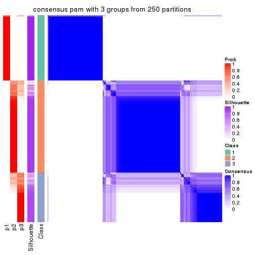</p>

</div>
<div id='tab-MAD-pam-consensus-heatmap-3'>
<pre><code class="r">consensus_heatmap(res, k = 4)
</code></pre>

<p>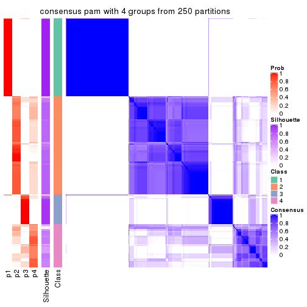</p>

</div>
<div id='tab-MAD-pam-consensus-heatmap-4'>
<pre><code class="r">consensus_heatmap(res, k = 5)
</code></pre>

<p>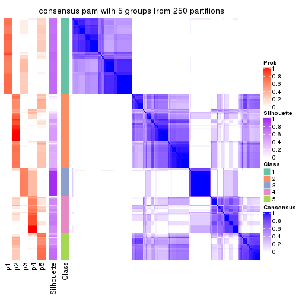</p>

</div>
<div id='tab-MAD-pam-consensus-heatmap-5'>
<pre><code class="r">consensus_heatmap(res, k = 6)
</code></pre>

<p>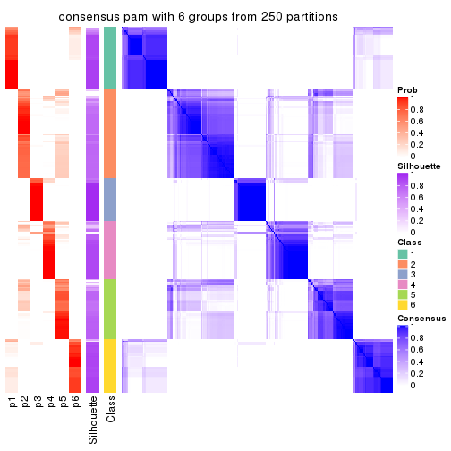</p>

</div>
</div>

Heatmaps for the membership of samples in all partitions to see how consistent they are:


<script>
$( function() {
	$( '#tabs-MAD-pam-membership-heatmap' ).tabs();
} );
</script>
<div id='tabs-MAD-pam-membership-heatmap'>
<ul>
<li><a href='#tab-MAD-pam-membership-heatmap-1'>k = 2</a></li>
<li><a href='#tab-MAD-pam-membership-heatmap-2'>k = 3</a></li>
<li><a href='#tab-MAD-pam-membership-heatmap-3'>k = 4</a></li>
<li><a href='#tab-MAD-pam-membership-heatmap-4'>k = 5</a></li>
<li><a href='#tab-MAD-pam-membership-heatmap-5'>k = 6</a></li>
</ul>
<div id='tab-MAD-pam-membership-heatmap-1'>
<pre><code class="r">membership_heatmap(res, k = 2)
</code></pre>

<p></p>

</div>
<div id='tab-MAD-pam-membership-heatmap-2'>
<pre><code class="r">membership_heatmap(res, k = 3)
</code></pre>

<p>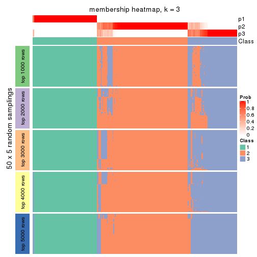</p>

</div>
<div id='tab-MAD-pam-membership-heatmap-3'>
<pre><code class="r">membership_heatmap(res, k = 4)
</code></pre>

<p>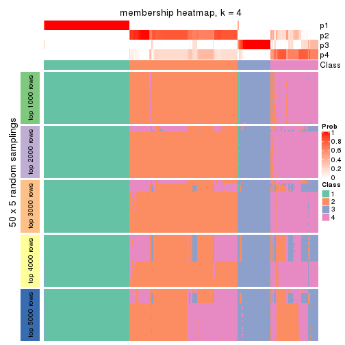</p>

</div>
<div id='tab-MAD-pam-membership-heatmap-4'>
<pre><code class="r">membership_heatmap(res, k = 5)
</code></pre>

<p>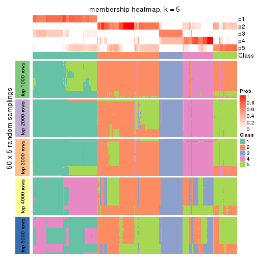</p>

</div>
<div id='tab-MAD-pam-membership-heatmap-5'>
<pre><code class="r">membership_heatmap(res, k = 6)
</code></pre>

<p>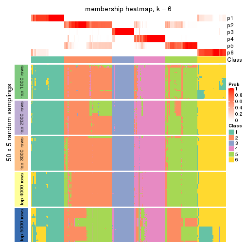</p>

</div>
</div>

As soon as we have had the classes for columns, we can look for signatures
which are significantly different between classes which can be candidate marks
for certain classes. Following are the heatmaps for signatures.


Signature heatmaps where rows are scaled:


<script>
$( function() {
	$( '#tabs-MAD-pam-get-signatures' ).tabs();
} );
</script>
<div id='tabs-MAD-pam-get-signatures'>
<ul>
<li><a href='#tab-MAD-pam-get-signatures-1'>k = 2</a></li>
<li><a href='#tab-MAD-pam-get-signatures-2'>k = 3</a></li>
<li><a href='#tab-MAD-pam-get-signatures-3'>k = 4</a></li>
<li><a href='#tab-MAD-pam-get-signatures-4'>k = 5</a></li>
<li><a href='#tab-MAD-pam-get-signatures-5'>k = 6</a></li>
</ul>
<div id='tab-MAD-pam-get-signatures-1'>
<pre><code class="r">get_signatures(res, k = 2)
</code></pre>

<p>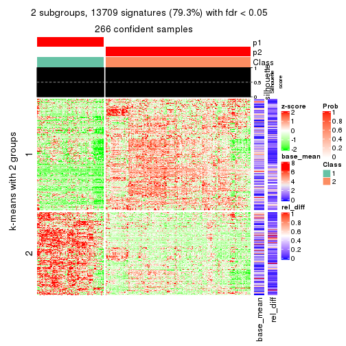</p>

</div>
<div id='tab-MAD-pam-get-signatures-2'>
<pre><code class="r">get_signatures(res, k = 3)
</code></pre>

<p>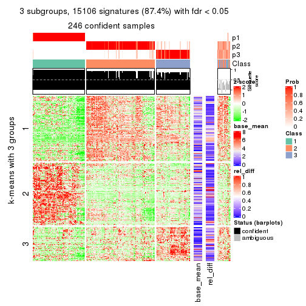</p>

</div>
<div id='tab-MAD-pam-get-signatures-3'>
<pre><code class="r">get_signatures(res, k = 4)
</code></pre>

<p>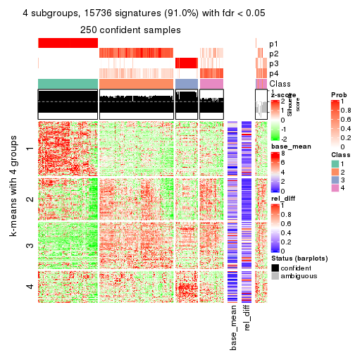</p>

</div>
<div id='tab-MAD-pam-get-signatures-4'>
<pre><code class="r">get_signatures(res, k = 5)
</code></pre>

<p>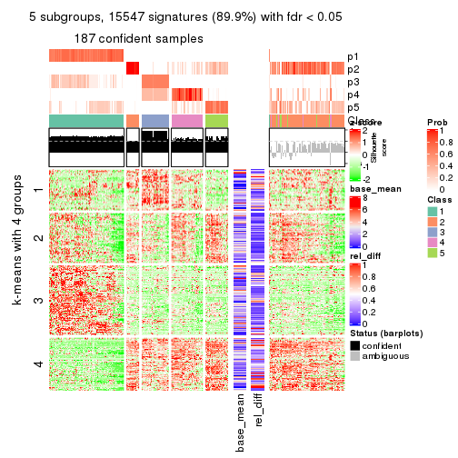</p>

</div>
<div id='tab-MAD-pam-get-signatures-5'>
<pre><code class="r">get_signatures(res, k = 6)
</code></pre>

<p>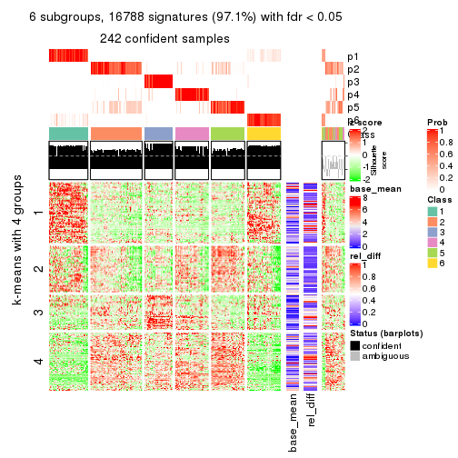</p>

</div>
</div>


Signature heatmaps where rows are not scaled:


<script>
$( function() {
	$( '#tabs-MAD-pam-get-signatures-no-scale' ).tabs();
} );
</script>
<div id='tabs-MAD-pam-get-signatures-no-scale'>
<ul>
<li><a href='#tab-MAD-pam-get-signatures-no-scale-1'>k = 2</a></li>
<li><a href='#tab-MAD-pam-get-signatures-no-scale-2'>k = 3</a></li>
<li><a href='#tab-MAD-pam-get-signatures-no-scale-3'>k = 4</a></li>
<li><a href='#tab-MAD-pam-get-signatures-no-scale-4'>k = 5</a></li>
<li><a href='#tab-MAD-pam-get-signatures-no-scale-5'>k = 6</a></li>
</ul>
<div id='tab-MAD-pam-get-signatures-no-scale-1'>
<pre><code class="r">get_signatures(res, k = 2, scale_rows = FALSE)
</code></pre>

<p></p>

</div>
<div id='tab-MAD-pam-get-signatures-no-scale-2'>
<pre><code class="r">get_signatures(res, k = 3, scale_rows = FALSE)
</code></pre>

<p>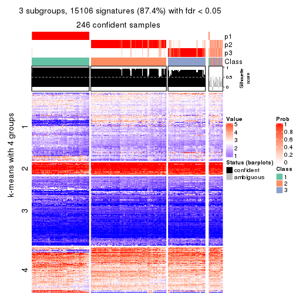</p>

</div>
<div id='tab-MAD-pam-get-signatures-no-scale-3'>
<pre><code class="r">get_signatures(res, k = 4, scale_rows = FALSE)
</code></pre>

<p>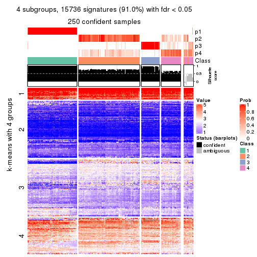</p>

</div>
<div id='tab-MAD-pam-get-signatures-no-scale-4'>
<pre><code class="r">get_signatures(res, k = 5, scale_rows = FALSE)
</code></pre>

<p>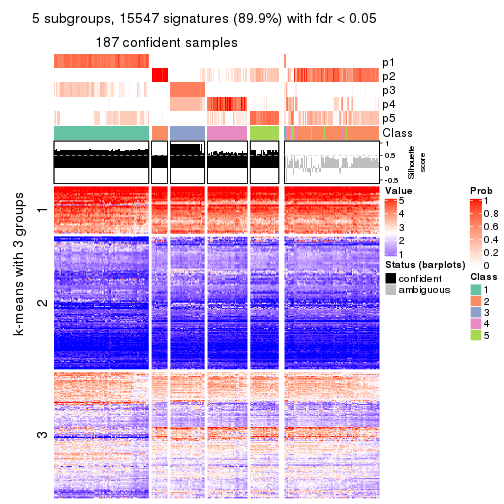</p>

</div>
<div id='tab-MAD-pam-get-signatures-no-scale-5'>
<pre><code class="r">get_signatures(res, k = 6, scale_rows = FALSE)
</code></pre>

<p>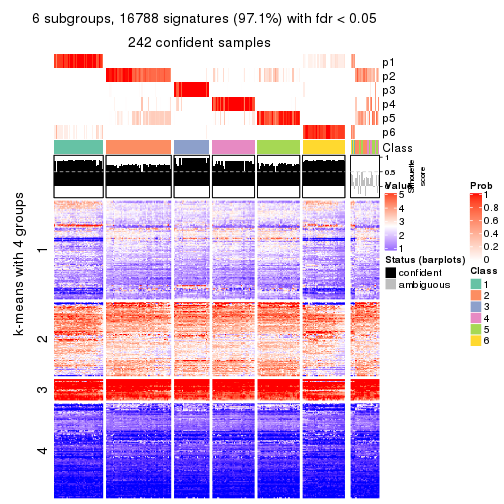</p>

</div>
</div>


Compare the overlap of signatures from different k:

```r
compare_signatures(res)
```

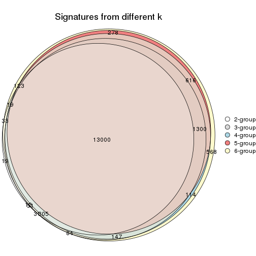

`get_signature()` returns a data frame invisibly. TO get the list of signatures, the function
call should be assigned to a variable explicitly. In following code, if `plot` argument is set
to `FALSE`, no heatmap is plotted while only the differential analysis is performed.

```r
# code only for demonstration
tb = get_signature(res, k = ..., plot = FALSE)
```

An example of the output of `tb` is:

```
#>   which_row         fdr    mean_1    mean_2 scaled_mean_1 scaled_mean_2 km
#> 1        38 0.042760348  8.373488  9.131774    -0.5533452     0.5164555  1
#> 2        40 0.018707592  7.106213  8.469186    -0.6173731     0.5762149  1
#> 3        55 0.019134737 10.221463 11.207825    -0.6159697     0.5749050  1
#> 4        59 0.006059896  5.921854  7.869574    -0.6899429     0.6439467  1
#> 5        60 0.018055526  8.928898 10.211722    -0.6204761     0.5791110  1
#> 6        98 0.009384629 15.714769 14.887706     0.6635654    -0.6193277  2
...
```

The columns in `tb` are:

1. `which_row`: row indices corresponding to the input matrix.
2. `fdr`: FDR for the differential test. 
3. `mean_x`: The mean value in group x.
4. `scaled_mean_x`: The mean value in group x after rows are scaled.
5. `km`: Row groups if k-means clustering is applied to rows.


UMAP plot which shows how samples are separated.


<script>
$( function() {
	$( '#tabs-MAD-pam-dimension-reduction' ).tabs();
} );
</script>
<div id='tabs-MAD-pam-dimension-reduction'>
<ul>
<li><a href='#tab-MAD-pam-dimension-reduction-1'>k = 2</a></li>
<li><a href='#tab-MAD-pam-dimension-reduction-2'>k = 3</a></li>
<li><a href='#tab-MAD-pam-dimension-reduction-3'>k = 4</a></li>
<li><a href='#tab-MAD-pam-dimension-reduction-4'>k = 5</a></li>
<li><a href='#tab-MAD-pam-dimension-reduction-5'>k = 6</a></li>
</ul>
<div id='tab-MAD-pam-dimension-reduction-1'>
<pre><code class="r">dimension_reduction(res, k = 2, method = &quot;UMAP&quot;)
</code></pre>

<p>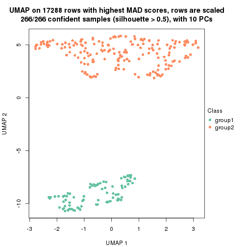</p>

</div>
<div id='tab-MAD-pam-dimension-reduction-2'>
<pre><code class="r">dimension_reduction(res, k = 3, method = &quot;UMAP&quot;)
</code></pre>

<p>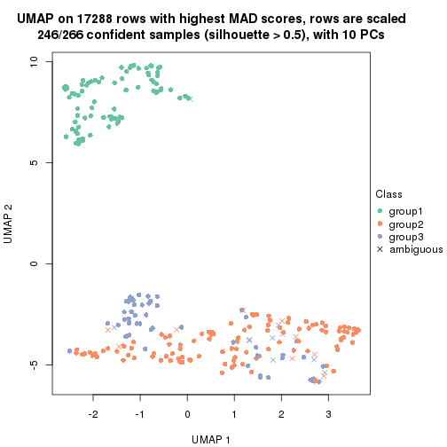</p>

</div>
<div id='tab-MAD-pam-dimension-reduction-3'>
<pre><code class="r">dimension_reduction(res, k = 4, method = &quot;UMAP&quot;)
</code></pre>

<p>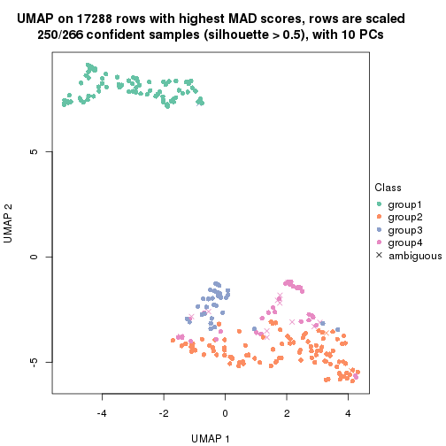</p>

</div>
<div id='tab-MAD-pam-dimension-reduction-4'>
<pre><code class="r">dimension_reduction(res, k = 5, method = &quot;UMAP&quot;)
</code></pre>

<p>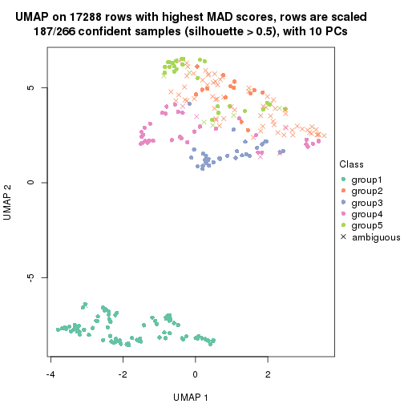</p>

</div>
<div id='tab-MAD-pam-dimension-reduction-5'>
<pre><code class="r">dimension_reduction(res, k = 6, method = &quot;UMAP&quot;)
</code></pre>

<p>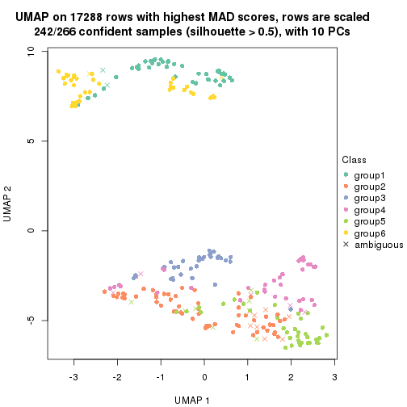</p>

</div>
</div>


Following heatmap shows how subgroups are split when increasing `k`:

```r
collect_classes(res)
```

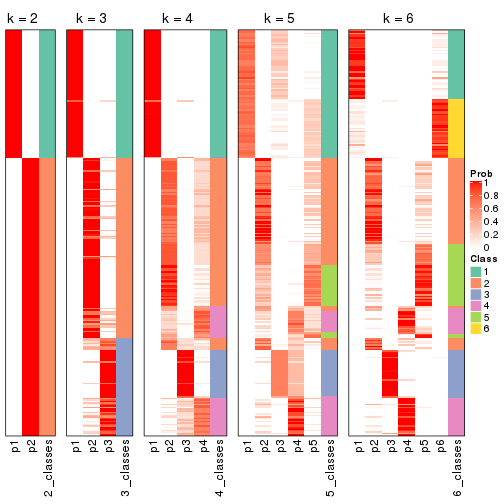


If matrix rows can be associated to genes, consider to use `GO_Enrichment(res,
...)` to perform function enrichment for the signature genes.


 

---------------------------------------------------


### MAD:mclust**


The object with results only for a single top-value method and a single partition method 
can be extracted as:

```r
res = res_list["MAD", "mclust"]
# you can also extract it by
# res = res_list["MAD:mclust"]
```

A summary of `res` and all the functions that can be applied to it:

```r
res
```

```
#> A 'ConsensusPartition' object with k = 2, 3, 4, 5, 6.
#>   On a matrix with 17288 rows and 266 columns.
#>   Top rows (1000, 2000, 3000, 4000, 5000) are extracted by 'MAD' method.
#>   Subgroups are detected by 'mclust' method.
#>   Performed in total 1250 partitions by row resampling.
#>   Best k for subgroups seems to be 2.
#> 
#> Following methods can be applied to this 'ConsensusPartition' object:
#>  [1] "cola_report"             "collect_classes"         "collect_plots"          
#>  [4] "collect_stats"           "colnames"                "compare_signatures"     
#>  [7] "consensus_heatmap"       "dimension_reduction"     "functional_enrichment"  
#> [10] "get_anno_col"            "get_anno"                "get_classes"            
#> [13] "get_consensus"           "get_matrix"              "get_membership"         
#> [16] "get_param"               "get_signatures"          "get_stats"              
#> [19] "is_best_k"               "is_stable_k"             "membership_heatmap"     
#> [22] "ncol"                    "nrow"                    "plot_ecdf"              
#> [25] "rownames"                "select_partition_number" "show"                   
#> [28] "suggest_best_k"          "test_to_known_factors"
```

`collect_plots()` function collects all the plots made from `res` for all `k` (number of partitions)
into one single page to provide an easy and fast comparison between different `k`.

```r
collect_plots(res)
```

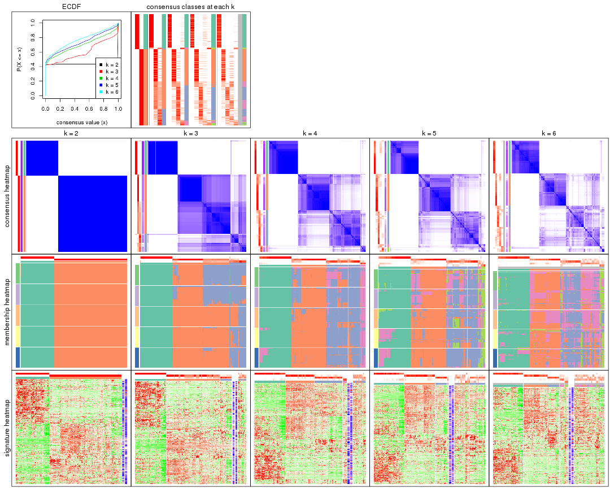

The plots are:

- The first row: a plot of the ECDF (Empirical cumulative distribution
  function) curves of the consensus matrix for each `k` and the heatmap of
  predicted classes for each `k`.
- The second row: heatmaps of the consensus matrix for each `k`.
- The third row: heatmaps of the membership matrix for each `k`.
- The fouth row: heatmaps of the signatures for each `k`.

All the plots in panels can be made by individual functions and they are
plotted later in this section.

`select_partition_number()` produces several plots showing different
statistics for choosing "optimized" `k`. There are following statistics:

- ECDF curves of the consensus matrix for each `k`;
- 1-PAC. [The PAC
  score](https://en.wikipedia.org/wiki/Consensus_clustering#Over-interpretation_potential_of_consensus_clustering)
  measures the proportion of the ambiguous subgrouping.
- Mean silhouette score.
- Concordance. The mean probability of fiting the consensus class ids in all
  partitions.
- Area increased. Denote $A_k$ as the area under the ECDF curve for current
  `k`, the area increased is defined as $A_k - A_{k-1}$.
- Rand index. The percent of pairs of samples that are both in a same cluster
  or both are not in a same cluster in the partition of k and k-1.
- Jaccard index. The ratio of pairs of samples are both in a same cluster in
  the partition of k and k-1 and the pairs of samples are both in a same
  cluster in the partition k or k-1.

The detailed explanations of these statistics can be found in [the cola
vignette](http://bioconductor.org/packages/devel/bioc/vignettes/cola/inst/doc/cola.html#toc_13).

Generally speaking, lower PAC score, higher mean silhouette score or higher
concordance corresponds to better partition. Rand index and Jaccard index
measure how similar the current partition is compared to partition with `k-1`.
If they are too similar, we won't accept `k` is better than `k-1`.

```r
select_partition_number(res)
```

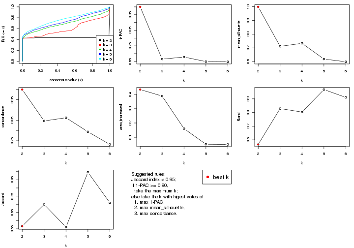

The numeric values for all these statistics can be obtained by `get_stats()`.

```r
get_stats(res)
```

```
#>   k 1-PAC mean_silhouette concordance area_increased  Rand Jaccard
#> 2 2 1.000           0.999       1.000         0.4340 0.566   0.566
#> 3 3 0.665           0.711       0.846         0.3883 0.829   0.699
#> 4 4 0.678           0.733       0.862         0.1606 0.803   0.561
#> 5 5 0.649           0.618       0.794         0.0516 0.968   0.896
#> 6 6 0.648           0.599       0.732         0.0502 0.910   0.709
```

`suggest_best_k()` suggests the best $k$ based on these statistics. The rules are as follows:

- All $k$ with Jaccard index larger than 0.95 are removed because the increase of
  the partition number does not provides enough extra information. If all $k$ are removed,
  the best $k$ is assigned by `NA`.
- For $k$ with 1-PAC larger than 0.9, the maximal $k$ is taken as the "best k". Other $k$ is called "optional k".
- If it does not fit the second rule. The $k$ with the highest vote of highest
  1-PAC, mean silhouette and concordance is taken as the "best k".

```r
suggest_best_k(res)
```

```
#> [1] 2
```


Following shows the table of the partitions (You need to click the **show/hide
code output** link to see it). The membership matrix (columns with name `p*`)
is inferred by
[`clue::cl_consensus()`](https://www.rdocumentation.org/link/cl_consensus?package=clue)
function with the `SE` method. Basically the value in the membership matrix
represents the probability to belong to a certain group. The finall class
label for an item is determined with the group with highest probability it
belongs to.

In `get_classes()` function, the entropy is calculated from the membership
matrix and the silhouette score is calculated from the consensus matrix.


<script>
$( function() {
	$( '#tabs-MAD-mclust-get-classes' ).tabs();
} );
</script>
<div id='tabs-MAD-mclust-get-classes'>
<ul>
<li><a href='#tab-MAD-mclust-get-classes-1'>k = 2</a></li>
<li><a href='#tab-MAD-mclust-get-classes-2'>k = 3</a></li>
<li><a href='#tab-MAD-mclust-get-classes-3'>k = 4</a></li>
<li><a href='#tab-MAD-mclust-get-classes-4'>k = 5</a></li>
<li><a href='#tab-MAD-mclust-get-classes-5'>k = 6</a></li>
</ul>

<div id='tab-MAD-mclust-get-classes-1'>
<p><a id='tab-MAD-mclust-get-classes-1-a' style='color:#0366d6' href='#'>show/hide code output</a></p>
<pre><code class="r">cbind(get_classes(res, k = 2), get_membership(res, k = 2))
</code></pre>

<pre><code>#&gt;                                      class entropy silhouette    p1    p2
#&gt; 80D0AF10-1C61-4B67-90C1-7DBF1EF23672     2   0.000      1.000 0.000 1.000
#&gt; 87117BE1-D328-4972-85DA-6672412D8860     2   0.000      1.000 0.000 1.000
#&gt; F904C5B6-70BD-4604-8254-79BE23B152DA     1   0.000      0.998 1.000 0.000
#&gt; 3182DEA1-4239-4613-925A-7E6503766AD6     2   0.000      1.000 0.000 1.000
#&gt; 55E78EA2-2D9B-481F-8CAB-D36A33088EAE     2   0.000      1.000 0.000 1.000
#&gt; 86F94264-A6DD-4A97-9191-036F066DD0EF     2   0.000      1.000 0.000 1.000
#&gt; 09D25417-23B7-4D88-A0EA-F307985FBBBC     2   0.000      1.000 0.000 1.000
#&gt; C797F12C-40D3-4DB5-B9EF-A6821BBDE4F0     1   0.000      0.998 1.000 0.000
#&gt; 80275DB0-A226-4B6B-A08F-4ADBEEE1DB01     1   0.000      0.998 1.000 0.000
#&gt; 27FB653A-9E07-44AD-952E-9E4DE4AB5891     2   0.000      1.000 0.000 1.000
#&gt; 1A5DB9FC-2ABD-4E1B-B5EF-B1CF5E5F3872     1   0.000      0.998 1.000 0.000
#&gt; 844E4CCD-D30C-416F-A086-8923711A4E25     2   0.000      1.000 0.000 1.000
#&gt; EF18318D-3D25-4D65-803A-ED6E62871E7E     1   0.000      0.998 1.000 0.000
#&gt; 1ACB1BE0-61F6-4243-BBEC-E26A1CF90CA8     1   0.000      0.998 1.000 0.000
#&gt; 8EF0039B-D758-46AB-BAF7-6A062C7C56BA     1   0.000      0.998 1.000 0.000
#&gt; 22F4C9D9-663B-4C91-9692-E035A2640BEC     2   0.000      1.000 0.000 1.000
#&gt; FA1A0BCE-EE0F-4178-B963-62550E344B14     2   0.000      1.000 0.000 1.000
#&gt; 0B6D0C4E-5AE3-4707-A9FC-12A108E6EC2A     2   0.000      1.000 0.000 1.000
#&gt; 06FD3123-2AEB-4911-AC4E-E0E64FD5DB52     2   0.000      1.000 0.000 1.000
#&gt; 235A4492-FF80-4AA5-BC71-DFF65E1C7411     2   0.000      1.000 0.000 1.000
#&gt; A192C6C0-1443-4493-AFAC-1EE710628ADB     2   0.000      1.000 0.000 1.000
#&gt; 6FC5B56B-711B-4174-9B06-4E843124AAB6     1   0.000      0.998 1.000 0.000
#&gt; 7A813F60-A41E-4552-990E-F22287654C1D     2   0.000      1.000 0.000 1.000
#&gt; 725BBFB5-26F4-4512-9C75-47D013C1E605     1   0.000      0.998 1.000 0.000
#&gt; 39CC4E82-EBC9-472E-8BE5-6A3AB178449A     2   0.000      1.000 0.000 1.000
#&gt; 61130DEE-E267-49DF-8B41-7738A06EF738     2   0.000      1.000 0.000 1.000
#&gt; 117EC12C-B7ED-4E01-B29B-EA542D356EA1     1   0.000      0.998 1.000 0.000
#&gt; A30FF708-F7A9-41E4-8AD5-20441650FBC9     2   0.000      1.000 0.000 1.000
#&gt; 53640D52-1167-4A5D-B656-97D32CBA3934     1   0.000      0.998 1.000 0.000
#&gt; 9E85D76A-DD2A-46D5-BB59-0ED302B6258C     2   0.000      1.000 0.000 1.000
#&gt; 6F8C6F90-7E3C-4860-91DD-586708DE44AA     1   0.000      0.998 1.000 0.000
#&gt; E675AEC5-AA9A-4AAA-839C-03E6365822DB     2   0.000      1.000 0.000 1.000
#&gt; B577DEF7-2F5C-4876-A7C6-F18D5722B8C0     1   0.563      0.848 0.868 0.132
#&gt; DA8B577E-43E7-49BF-BF94-868E3194F5C9     1   0.000      0.998 1.000 0.000
#&gt; 3334280B-2A36-4AC7-A021-A76C10E958F0     2   0.000      1.000 0.000 1.000
#&gt; 5CBDDC90-11EC-4E6E-881E-AA9CCFD40FDB     2   0.000      1.000 0.000 1.000
#&gt; 8CBBF32A-8349-44F5-A8B8-4CBB1760A464     2   0.000      1.000 0.000 1.000
#&gt; B9455A9A-136D-4DC2-9F86-0FC74433589D     2   0.000      1.000 0.000 1.000
#&gt; D7EAE2A7-F9BE-4222-A452-B1F83F99CD50     2   0.000      1.000 0.000 1.000
#&gt; F803AE18-60C5-4CFE-AAAB-DB33C26A2184     1   0.000      0.998 1.000 0.000
#&gt; 5DD8CAC7-EC02-43B6-B58E-6D2E22868A3B     2   0.000      1.000 0.000 1.000
#&gt; EE98E1B4-DFB3-4AEC-8527-E1FD544C9475     1   0.000      0.998 1.000 0.000
#&gt; 3CE43921-47D5-4394-B9E1-242607775D61     2   0.000      1.000 0.000 1.000
#&gt; 46986F2B-0B0D-4187-8948-4E91D34B7C49     2   0.000      1.000 0.000 1.000
#&gt; 5D1D052E-74EF-45A8-9B1A-7CECD13EA43B     2   0.000      1.000 0.000 1.000
#&gt; 4C821AD9-A5C9-4A9A-9C5D-363B227F8064     2   0.000      1.000 0.000 1.000
#&gt; 06A4189E-A23B-4AC6-AA74-01955DD7D1E9     2   0.000      1.000 0.000 1.000
#&gt; FCCDC76F-CB02-4BCD-A616-325F258DDAA4     2   0.000      1.000 0.000 1.000
#&gt; DAC53B0A-8F35-4EA6-BBCC-4CD1C049E11F     2   0.000      1.000 0.000 1.000
#&gt; DD4F845B-CAD3-44CB-9D96-3C3F5BA1B72D     1   0.000      0.998 1.000 0.000
#&gt; D440F004-A4A4-41B6-BED8-805D67BA01C7     2   0.000      1.000 0.000 1.000
#&gt; A497C423-119F-42FA-BF17-9F6DFD2A5585     2   0.000      1.000 0.000 1.000
#&gt; 3420E573-DE12-4EF5-B1C0-2FCA904F4F4E     1   0.000      0.998 1.000 0.000
#&gt; 1AD72157-A254-44B4-BA58-4F30F1AE910E     1   0.000      0.998 1.000 0.000
#&gt; C1113977-B160-45EE-B061-750F9EA3F33F     2   0.000      1.000 0.000 1.000
#&gt; 6783AB5B-F07C-447B-BF13-C34485D246D7     2   0.000      1.000 0.000 1.000
#&gt; 1F553062-26FD-4A7F-B7FB-81184604F423     1   0.000      0.998 1.000 0.000
#&gt; BE2DCA51-1C21-4598-98A7-F2FB9B2DFCB4     2   0.000      1.000 0.000 1.000
#&gt; 38941CF3-9C54-4BA4-A005-CC88CA97D504     2   0.000      1.000 0.000 1.000
#&gt; 51CB675E-E243-4A07-BF4A-580473D26FDA     2   0.000      1.000 0.000 1.000
#&gt; C7FED0F5-C27A-4405-9232-30BF39362CF7     2   0.000      1.000 0.000 1.000
#&gt; 2A1E86E8-4713-465F-ACFF-C584864C57A1     2   0.000      1.000 0.000 1.000
#&gt; B4500785-0FAA-4D4D-8630-43D194BAB004     2   0.000      1.000 0.000 1.000
#&gt; 3FD52E66-AB76-4079-80DB-281A795D1EC0     2   0.000      1.000 0.000 1.000
#&gt; EBD355D1-1226-4DFD-AAFF-45D246B64F3C     2   0.000      1.000 0.000 1.000
#&gt; 5A040A73-CD95-487E-8AEF-9639FE4E2916     2   0.000      1.000 0.000 1.000
#&gt; CF629C65-585D-476D-B081-3E6E0575FAE3     2   0.000      1.000 0.000 1.000
#&gt; 0D4202A3-808E-413F-9BF3-9CFCCAE0ED61     2   0.000      1.000 0.000 1.000
#&gt; 43E715BF-28D9-4B5E-B762-8CD1B69A430E     1   0.000      0.998 1.000 0.000
#&gt; BFB82BE8-9DAC-4099-8B38-0950308E3EB3     2   0.000      1.000 0.000 1.000
#&gt; F7CB1825-2303-4DD2-AE1F-7205738EAF1F     1   0.000      0.998 1.000 0.000
#&gt; FE298483-C42C-4753-BABB-29A9CB1B6312     1   0.000      0.998 1.000 0.000
#&gt; A98C7561-1B42-4CD6-AE71-924B91FA4C33     2   0.000      1.000 0.000 1.000
#&gt; 58098F21-7DAB-47DA-9A41-8D20BF3B9257     2   0.000      1.000 0.000 1.000
#&gt; 18CAF708-20B9-4745-9CB3-37AB6E0B3056     2   0.000      1.000 0.000 1.000
#&gt; 2C80DD72-C9C7-4AC2-812F-9A31EF02779C     1   0.000      0.998 1.000 0.000
#&gt; 68A3F13D-319D-4603-A27F-B5DD46FE5C5B     2   0.000      1.000 0.000 1.000
#&gt; 7EE8F0CE-CDC9-40F9-A1DE-7F8140EC6D13     2   0.000      1.000 0.000 1.000
#&gt; 39019903-5B9C-4665-BD5F-7CCB19CB55C5     2   0.000      1.000 0.000 1.000
#&gt; 190EDB27-4CBC-4E9C-9B67-D51FDAB982B7     2   0.000      1.000 0.000 1.000
#&gt; EB2D95BC-62F8-4669-9308-D37D7FB79E23     2   0.000      1.000 0.000 1.000
#&gt; A08B85EA-D1E7-4B77-8DEC-36294305B9F7     1   0.000      0.998 1.000 0.000
#&gt; 130DDFAD-6EF8-4C80-BD9D-88308A6874BC     2   0.000      1.000 0.000 1.000
#&gt; 7340A5BA-E002-448F-AACC-E7A37DBB79C2     2   0.000      1.000 0.000 1.000
#&gt; A771F6E3-D266-4FE7-98C6-C40E6A701D59     1   0.000      0.998 1.000 0.000
#&gt; 015E792C-EC1B-49BF-AB07-D82B20C5989A     2   0.000      1.000 0.000 1.000
#&gt; BF79E030-47EE-4D08-B910-5685A4BD8B60     2   0.000      1.000 0.000 1.000
#&gt; FB3C7C9A-2F2D-4DD5-BE47-FAFB072C0FAB     2   0.000      1.000 0.000 1.000
#&gt; 4E5557BA-10E8-4723-908E-DD04EF6639B2     2   0.000      1.000 0.000 1.000
#&gt; 8031B550-40A9-4A3A-9F7D-CDC052288BD8     2   0.000      1.000 0.000 1.000
#&gt; 55299A06-3C1F-45A4-B166-B2C591C0CEE2     2   0.000      1.000 0.000 1.000
#&gt; EB8D5168-216E-4ABB-8B4E-9E67786CB322     1   0.000      0.998 1.000 0.000
#&gt; 78BD2D83-9A7F-42E5-BB38-654AA0761A0A     2   0.000      1.000 0.000 1.000
#&gt; AA2D53E5-D389-4332-9DD5-A736052E48F8     1   0.000      0.998 1.000 0.000
#&gt; 62945C7A-9313-4FC9-820C-B0AB820B394E     1   0.000      0.998 1.000 0.000
#&gt; 22746046-2E99-4EE9-97D2-BA2EA499634C     2   0.000      1.000 0.000 1.000
#&gt; 8671B51B-DCBE-4429-9F01-AF51CAD7014F     2   0.000      1.000 0.000 1.000
#&gt; E815AB36-5689-4A0D-8E6D-2EAA73406681     1   0.000      0.998 1.000 0.000
#&gt; A1DACB46-ED52-4E38-B2C8-57256BB22B5E     2   0.000      1.000 0.000 1.000
#&gt; 4F5498C4-A423-4B3D-AC98-D4E214A57D0E     1   0.000      0.998 1.000 0.000
#&gt; A7772CCD-FFFF-49DD-86ED-0BAD330EC9B6     2   0.000      1.000 0.000 1.000
#&gt; E6E3DF78-65B9-4F74-8DA8-E2A6D4EDBEA7     2   0.000      1.000 0.000 1.000
#&gt; 83286E2D-E708-437A-911A-E6B050273CBD     1   0.000      0.998 1.000 0.000
#&gt; EC5C7C97-EE8C-405D-A039-D96514B1D414     2   0.000      1.000 0.000 1.000
#&gt; 3E55223D-6E3D-4027-9819-67E91212531D     1   0.000      0.998 1.000 0.000
#&gt; 99A036A2-8343-4D06-8047-D84E96CE4C61     2   0.000      1.000 0.000 1.000
#&gt; CA6CDE6D-92DE-4259-9E58-A373F2D543EA     2   0.000      1.000 0.000 1.000
#&gt; BF6FA8CC-60C1-413A-B2C6-54CCACBC01D6     1   0.000      0.998 1.000 0.000
#&gt; E0594CFE-F7B6-4546-B130-30DF6A514B1F     2   0.000      1.000 0.000 1.000
#&gt; E769E41D-5949-42C5-9594-E563C05ACE52     2   0.000      1.000 0.000 1.000
#&gt; 01373725-5D3C-4D9C-AABC-911D53E62BCD     2   0.000      1.000 0.000 1.000
#&gt; 1F39DADD-3655-474E-BA4C-A5BD32C97A8B     1   0.000      0.998 1.000 0.000
#&gt; AF573EC8-E4EE-4B8F-8199-9817B9FAC67D     1   0.000      0.998 1.000 0.000
#&gt; 3F022CBC-41C8-4387-A6FB-124C4BCD1AD9     1   0.000      0.998 1.000 0.000
#&gt; 1CC32ACE-826B-494B-8B89-5BD92327A74D     2   0.000      1.000 0.000 1.000
#&gt; 22B0BD3B-EE08-4BC7-90B2-01C372A56BA2     2   0.000      1.000 0.000 1.000
#&gt; 0F3DE9EF-19CC-4D14-9A42-1435DB537F94     2   0.000      1.000 0.000 1.000
#&gt; 87F8A33F-FBC3-469E-862B-84472F796358     2   0.000      1.000 0.000 1.000
#&gt; C9F2FA0D-1A9F-40B4-BD9B-CAF1B3F3D5A7     2   0.000      1.000 0.000 1.000
#&gt; ACFC9F59-78FF-4453-B25F-8834D0EAB54A     2   0.000      1.000 0.000 1.000
#&gt; B7AC7D5B-14E9-45A7-93B7-226EE508544A     2   0.000      1.000 0.000 1.000
#&gt; 4491BF17-B168-4E96-8E09-EF1AEC9F5E9D     2   0.000      1.000 0.000 1.000
#&gt; 557A0811-A3FE-4CF4-A24D-FBB77E7F9139     2   0.000      1.000 0.000 1.000
#&gt; 6F9C955C-6816-4353-922A-8035B50FACC6     2   0.000      1.000 0.000 1.000
#&gt; 3E89FB1C-4A7D-43C7-823C-04E3716A7935     2   0.000      1.000 0.000 1.000
#&gt; 12ABE483-66EF-4237-94C4-0199FAE23FA8     2   0.000      1.000 0.000 1.000
#&gt; 7535F262-9B96-44F6-988C-4C9EBB3FFCA9     2   0.000      1.000 0.000 1.000
#&gt; 65C9D28E-303B-40E5-84F0-2507F5457374     2   0.000      1.000 0.000 1.000
#&gt; FD445384-6BA9-4297-9D9C-12ABA7D645C7     1   0.000      0.998 1.000 0.000
#&gt; 30D5E255-2AD3-44F3-8983-1B80E4FD3E2D     2   0.000      1.000 0.000 1.000
#&gt; 3E88EC60-B4A8-4259-8BC8-A234800F6955     2   0.000      1.000 0.000 1.000
#&gt; ACD73CE8-AFC5-47A0-9383-3CB97F018953     1   0.000      0.998 1.000 0.000
#&gt; 1AFDC2EA-26A8-44E2-8BCB-F34F7B66F8C8     2   0.000      1.000 0.000 1.000
#&gt; 9E327BC8-1D20-4AD8-83F7-FB2D13BCA5D0     2   0.000      1.000 0.000 1.000
#&gt; 85A86B91-4F24-4E77-AE2D-520F8E205EFC     1   0.000      0.998 1.000 0.000
#&gt; 74868C37-8143-4306-81CA-E45759D146CD     2   0.000      1.000 0.000 1.000
#&gt; 69AEA0DB-E335-48A0-A398-4FB0D581182A     2   0.000      1.000 0.000 1.000
#&gt; AE6F8B89-85C2-42B7-8D05-AFDDD4FEFD16     1   0.000      0.998 1.000 0.000
#&gt; A8A6F09C-9812-4457-9A4B-AD41F97B41A3     2   0.000      1.000 0.000 1.000
#&gt; 1A09BC4D-EF29-42DD-BB04-A3C264A3032D     1   0.000      0.998 1.000 0.000
#&gt; E0961A30-A62C-4235-9CF0-A1776827A996     2   0.000      1.000 0.000 1.000
#&gt; 134D2D90-7B08-4F20-8A3A-C77643FB208F     2   0.000      1.000 0.000 1.000
#&gt; A77C2DFF-93CF-4CB5-B3C1-81133D7F1A0F     2   0.000      1.000 0.000 1.000
#&gt; EA2DC457-9C74-4B9C-B3FA-5E72199B24A7     2   0.000      1.000 0.000 1.000
#&gt; FF34117B-5EE4-4C96-A8A2-2CE6A654CBE5     1   0.000      0.998 1.000 0.000
#&gt; 75F7B5E2-6559-4B48-A2A4-287C35C559CC     1   0.000      0.998 1.000 0.000
#&gt; 903BF591-B0AF-4BEE-B625-60B673070344     2   0.000      1.000 0.000 1.000
#&gt; 9DE1B790-C63C-41C4-9477-CE52A8119C67     2   0.000      1.000 0.000 1.000
#&gt; 9A28F80A-85F8-40E2-A32B-230EF93B2FA0     2   0.000      1.000 0.000 1.000
#&gt; 0AA2BDBB-8720-409A-AA72-1F4AA26E7CD8     2   0.000      1.000 0.000 1.000
#&gt; 5AD49F16-E974-4E5D-B1B6-073ECB73A01D     2   0.000      1.000 0.000 1.000
#&gt; CB0F961C-527D-4A48-9408-286B26BD9532     1   0.000      0.998 1.000 0.000
#&gt; 46FF25B6-D01D-4CA7-80B7-CEC2998C34E1     2   0.000      1.000 0.000 1.000
#&gt; 487CADE1-D699-4A6C-817A-B9A0AB940C61     1   0.000      0.998 1.000 0.000
#&gt; 4FF6F2D8-F869-4735-A4D1-1A8423153FBC     1   0.000      0.998 1.000 0.000
#&gt; 6005494F-5D3D-43A3-B3E8-8C91955B2A98     2   0.000      1.000 0.000 1.000
#&gt; CF10D584-CE32-45A4-A932-E9D5AF12A6A0     1   0.000      0.998 1.000 0.000
#&gt; E15CE4AB-5646-49C8-9CD6-938457036BB0     2   0.000      1.000 0.000 1.000
#&gt; 31E28D0B-0E69-4330-82ED-4F1827DC97EA     2   0.000      1.000 0.000 1.000
#&gt; DBACD3C3-CCB5-4478-BA78-85A0C847CA66     2   0.000      1.000 0.000 1.000
#&gt; 5A07041C-65EB-4FCD-8940-E90B905061B5     2   0.000      1.000 0.000 1.000
#&gt; 0EA7C916-FA47-489B-BC98-4D9E7D197628     1   0.000      0.998 1.000 0.000
#&gt; 30967F75-8499-47FF-ADA4-4DC566013F7B     1   0.000      0.998 1.000 0.000
#&gt; D2E528FF-AEA2-48D7-A60A-4C3E71EA9073     2   0.000      1.000 0.000 1.000
#&gt; 22735DCD-215E-48BC-BF44-32BD66F06E39     2   0.000      1.000 0.000 1.000
#&gt; BC2C3248-7FC6-48BC-96C1-45EA573DE7DC     1   0.000      0.998 1.000 0.000
#&gt; E72CEBCB-D686-4B12-BCBA-EC8F964330A2     1   0.000      0.998 1.000 0.000
#&gt; 23C937BB-BA20-4440-B680-914229CC3ADF     1   0.000      0.998 1.000 0.000
#&gt; 947E99C7-F402-4F1A-A6E9-81BCAAED135A     2   0.000      1.000 0.000 1.000
#&gt; 02475D11-FC81-4E88-944E-173C32DC3FE7     2   0.000      1.000 0.000 1.000
#&gt; F972A9AA-9842-4343-A533-A795E65581CE     1   0.000      0.998 1.000 0.000
#&gt; 05043AAF-3095-4C61-B5C1-EE9AA9082C75     2   0.000      1.000 0.000 1.000
#&gt; CECF7967-862E-428C-BB42-FEF553FDB3AA     2   0.000      1.000 0.000 1.000
#&gt; FB0B9483-6302-48C7-BE5B-DA667E00AE2D     2   0.000      1.000 0.000 1.000
#&gt; 78700FBA-1487-4754-9B30-18837BF7E9FB     1   0.000      0.998 1.000 0.000
#&gt; 2166F56D-54CE-4F1B-8F07-A4E13E4489E9     1   0.000      0.998 1.000 0.000
#&gt; 7CD0942E-E39A-43A7-8BAC-F25967864901     2   0.000      1.000 0.000 1.000
#&gt; 3B00BA2B-7F7D-4825-8F8D-90F04A5DE687     2   0.000      1.000 0.000 1.000
#&gt; 7465B01D-C05E-4FE0-A9FE-182920EDC489     2   0.000      1.000 0.000 1.000
#&gt; 88C31A99-F96E-4FC8-8B3D-C1AAA05062D9     1   0.000      0.998 1.000 0.000
#&gt; 53575575-3303-4F8F-B6A8-B42131CFB4AC     2   0.000      1.000 0.000 1.000
#&gt; CC8017C7-4128-48DA-8E43-503F63158D85     1   0.000      0.998 1.000 0.000
#&gt; 88449D2A-2A25-41A4-B91D-C99B58F8ECD9     2   0.000      1.000 0.000 1.000
#&gt; 46C7DDE5-A2B5-494F-96AE-0B6E2D51B003     1   0.000      0.998 1.000 0.000
#&gt; 42551D05-5EE5-4F91-93A8-32DA695D9DFA     2   0.000      1.000 0.000 1.000
#&gt; 0772DA48-3A36-422D-B166-CA1691B782C3     2   0.000      1.000 0.000 1.000
#&gt; 30346897-EC77-4153-88A2-D14593C8B741     2   0.000      1.000 0.000 1.000
#&gt; 0F00E267-C748-4A71-8B36-03C410641D88     2   0.000      1.000 0.000 1.000
#&gt; 4034703A-4DA9-4DDA-9CA9-E80FFE9CCDE6     2   0.000      1.000 0.000 1.000
#&gt; 393C8A41-CF45-4EA8-AFE3-25A08AB7692A     2   0.000      1.000 0.000 1.000
#&gt; 3354212D-A07C-435C-8B0C-9A7BAAB624B5     1   0.000      0.998 1.000 0.000
#&gt; 57E30D4E-ABF7-47DD-92BE-40CE215076B0     1   0.000      0.998 1.000 0.000
#&gt; 202B4C76-C840-4DB8-953F-AC75A4156FDD     2   0.000      1.000 0.000 1.000
#&gt; 93A0137B-1F4C-44EE-B959-2AD0CD2DF8B6     1   0.000      0.998 1.000 0.000
#&gt; C9794DB6-6E8C-4AFD-80EE-61D672A4F6E9     2   0.000      1.000 0.000 1.000
#&gt; AE4BFE63-F0C0-4624-AD97-4F7FF13E2384     1   0.000      0.998 1.000 0.000
#&gt; DCF87F27-2B54-42D9-8D28-5DFEE76E2F5B     2   0.000      1.000 0.000 1.000
#&gt; 2451D405-39FD-4812-958C-23462B66F1F1     2   0.000      1.000 0.000 1.000
#&gt; E27F5D33-3F68-4CA8-8757-A387C6EAD060     2   0.000      1.000 0.000 1.000
#&gt; 8BA9928A-5B93-477F-B4A2-D031B714D9AC     1   0.000      0.998 1.000 0.000
#&gt; 0FAACFF6-B50C-4BED-9824-B7270654F28D     2   0.000      1.000 0.000 1.000
#&gt; 3366CC3C-2BBA-4CA7-848E-4E16AA70AE7A     2   0.000      1.000 0.000 1.000
#&gt; 66237056-CA9A-4C90-AF0E-1621FEB71578     2   0.000      1.000 0.000 1.000
#&gt; C480F1FB-3100-436C-B0F5-DED63B7A580E     2   0.000      1.000 0.000 1.000
#&gt; A327DE0D-D945-4B42-9B41-A7302CF796EE     2   0.000      1.000 0.000 1.000
#&gt; E8A6871D-67FB-4306-9454-F5E7CDBA399A     2   0.000      1.000 0.000 1.000
#&gt; E9A7485B-82B6-4BD2-AFBB-DD0A82D6CDE2     1   0.000      0.998 1.000 0.000
#&gt; 93B382E4-9C9A-43F5-BD3B-502CC260B886     1   0.000      0.998 1.000 0.000
#&gt; A2792419-8E16-45FE-A524-17851F34AB9B     2   0.000      1.000 0.000 1.000
#&gt; 4DED1201-F25C-4F82-BABF-965EFAD7A8E5     2   0.000      1.000 0.000 1.000
#&gt; F1ACB2DD-E948-4F88-A249-F1BD1977D667     2   0.000      1.000 0.000 1.000
#&gt; 6CDBA203-8952-421D-A6BF-75652D9F3339     2   0.000      1.000 0.000 1.000
#&gt; 2D6C5AA7-3B33-48D7-AE0C-77A16B749D13     1   0.000      0.998 1.000 0.000
#&gt; 3F6B6D95-0720-42A0-AEB3-89FECAE7616A     2   0.000      1.000 0.000 1.000
#&gt; DED8ACF3-BBD8-46C9-85C9-A9C8F2E2BC0B     1   0.000      0.998 1.000 0.000
#&gt; 77069279-5A6F-42C0-9AA5-8C939591DFB5     1   0.000      0.998 1.000 0.000
#&gt; B2D4FCF3-FDF9-41C8-880A-6732CF6222AF     2   0.000      1.000 0.000 1.000
#&gt; 1CD71A4C-1E49-48EF-AA72-CB3C26B4C087     2   0.000      1.000 0.000 1.000
#&gt; C364E621-F85C-4B7F-842F-210B8D4DFE3A     2   0.000      1.000 0.000 1.000
#&gt; 11F1B8CA-07C1-47D2-A3C6-032FFA6A4A64     1   0.000      0.998 1.000 0.000
#&gt; 153BF804-6DC8-496B-987A-4021A2512211     2   0.000      1.000 0.000 1.000
#&gt; 5B5029C9-40F5-40D7-A36A-367022AD6A42     2   0.000      1.000 0.000 1.000
#&gt; 193CCBE6-104F-49B4-BDB2-C82EE36FDAAD     1   0.000      0.998 1.000 0.000
#&gt; E5D45E53-FCF3-4F01-9B78-6CB1ED0CFE40     2   0.000      1.000 0.000 1.000
#&gt; 5546A779-21DB-49F9-8C0D-A1E420088084     2   0.000      1.000 0.000 1.000
#&gt; E14825E0-0DC7-44C2-B265-F54672356838     1   0.000      0.998 1.000 0.000
#&gt; 8C8C09B9-EC83-45EC-BC4C-0BA92DE60ACB     1   0.000      0.998 1.000 0.000
#&gt; B388CA82-5BF7-4BDD-8821-4EC0B213121F     2   0.000      1.000 0.000 1.000
#&gt; A26025AC-9F71-4C07-9135-83593193BBB2     1   0.000      0.998 1.000 0.000
#&gt; C80E6D4B-AF21-42F0-8E20-6F7D2E99C062     2   0.000      1.000 0.000 1.000
#&gt; 5AE5D819-A6B1-4761-B7F9-8FFD3C520F31     2   0.000      1.000 0.000 1.000
#&gt; CAE8097F-A139-4C6E-9E30-35080475FF34     2   0.000      1.000 0.000 1.000
#&gt; 539C8DE3-6152-4671-B96F-ED6DC6DBD22B     1   0.000      0.998 1.000 0.000
#&gt; 5D28A8E0-4ECF-43A4-890A-BE968B9A8CB2     2   0.000      1.000 0.000 1.000
#&gt; 97A80AF8-365E-4756-A2B0-AEB1D8F5F33E     2   0.000      1.000 0.000 1.000
#&gt; B3527517-E339-46AE-8437-65303C309015     2   0.000      1.000 0.000 1.000
#&gt; 523E2183-AA20-4749-BD7E-69CD620DD6A3     2   0.000      1.000 0.000 1.000
#&gt; E553FB92-F181-47B3-9F3D-11DB51DFA3A4     2   0.000      1.000 0.000 1.000
#&gt; FFE0C4B1-8EEC-484A-AB87-3401B71BD081     2   0.000      1.000 0.000 1.000
#&gt; 73D6CA4B-9A9E-4E52-96C8-AE7F0CC8B276     2   0.000      1.000 0.000 1.000
#&gt; 485A8107-DF9A-4BC6-8A72-07FBA93F10F2     1   0.000      0.998 1.000 0.000
#&gt; 690823D9-B9AA-40EF-8302-4AD88BF89D1C     2   0.000      1.000 0.000 1.000
#&gt; B4E02660-562F-4EAC-8472-CBBD8A577688     2   0.000      1.000 0.000 1.000
#&gt; F82D5A60-90F9-4FF4-971E-73F7535FE65A     2   0.000      1.000 0.000 1.000
#&gt; C48401F7-2D56-4C6F-9896-C5435D1B44BF     2   0.000      1.000 0.000 1.000
#&gt; 94FC8991-182B-4B00-9A06-A00E8D3BDCFA     1   0.000      0.998 1.000 0.000
#&gt; FF00E80A-046D-4233-835E-CDF93403EA43     2   0.000      1.000 0.000 1.000
#&gt; C47A53F6-6479-4AD3-9D18-E4A70BE5F1DC     2   0.000      1.000 0.000 1.000
#&gt; 3487AE2D-AB1D-4DEF-AC4B-4B0FCAF8D899     2   0.000      1.000 0.000 1.000
#&gt; 479CD9BB-ECD7-41D5-B1E4-41132FF7FC95     2   0.000      1.000 0.000 1.000
#&gt; 048ADC6E-8C7E-4875-ACEE-E4787203C078     1   0.000      0.998 1.000 0.000
#&gt; 25AF81C5-B117-466D-AE9F-DD10BCB6AF2D     2   0.000      1.000 0.000 1.000
#&gt; 8B1D51D6-0B25-4289-81F0-9F95E0258877     2   0.000      1.000 0.000 1.000
#&gt; 282D390D-8E4E-4A19-B2B7-A6DB4BB2D46C     1   0.000      0.998 1.000 0.000
#&gt; BC6B92C1-F425-40C5-9941-539BFF5FE0FE     2   0.000      1.000 0.000 1.000
#&gt; 899CB9E0-48D0-413D-8566-BC151F146453     1   0.000      0.998 1.000 0.000
#&gt; 441400A9-1427-45E0-A8B4-EF2A6B7465C2     2   0.000      1.000 0.000 1.000
#&gt; CF96DDD4-DC0A-4341-BDE6-4DA2CB4978D0     1   0.000      0.998 1.000 0.000
#&gt; CE91F591-6072-4D29-9495-C78961635969     2   0.000      1.000 0.000 1.000
#&gt; 84D25635-2A38-4CFB-BFAC-38C007625C42     1   0.000      0.998 1.000 0.000
#&gt; ABF1AC12-872A-4C3D-A76C-07BC36A4DA5E     1   0.000      0.998 1.000 0.000
#&gt; B7F7F66F-1AED-4199-81C0-5C7FB0DBF438     2   0.000      1.000 0.000 1.000
#&gt; BAB786B9-6C20-425D-9886-63A0A092B59B     2   0.000      1.000 0.000 1.000
#&gt; 735D1DE3-D781-4F89-A395-09974057BBB7     1   0.000      0.998 1.000 0.000
#&gt; F6D5FBBA-05C4-4340-86D9-1A54181216A2     2   0.000      1.000 0.000 1.000
#&gt; 79C4E166-4A0D-4811-A2C8-CAE0A5AEED42     2   0.000      1.000 0.000 1.000
</code></pre>

<script>
$('#tab-MAD-mclust-get-classes-1-a').parent().next().next().hide();
$('#tab-MAD-mclust-get-classes-1-a').click(function(){
  $('#tab-MAD-mclust-get-classes-1-a').parent().next().next().toggle();
  return(false);
});
</script>
</div>

<div id='tab-MAD-mclust-get-classes-2'>
<p><a id='tab-MAD-mclust-get-classes-2-a' style='color:#0366d6' href='#'>show/hide code output</a></p>
<pre><code class="r">cbind(get_classes(res, k = 3), get_membership(res, k = 3))
</code></pre>

<pre><code>#&gt;                                      class entropy silhouette    p1    p2    p3
#&gt; 80D0AF10-1C61-4B67-90C1-7DBF1EF23672     2  0.0000     0.6887 0.000 1.000 0.000
#&gt; 87117BE1-D328-4972-85DA-6672412D8860     2  0.0000     0.6887 0.000 1.000 0.000
#&gt; F904C5B6-70BD-4604-8254-79BE23B152DA     1  0.0000     0.9888 1.000 0.000 0.000
#&gt; 3182DEA1-4239-4613-925A-7E6503766AD6     3  0.5216     0.5859 0.000 0.260 0.740
#&gt; 55E78EA2-2D9B-481F-8CAB-D36A33088EAE     2  0.5968     0.6137 0.000 0.636 0.364
#&gt; 86F94264-A6DD-4A97-9191-036F066DD0EF     2  0.6026     0.6016 0.000 0.624 0.376
#&gt; 09D25417-23B7-4D88-A0EA-F307985FBBBC     3  0.5058     0.5646 0.000 0.244 0.756
#&gt; C797F12C-40D3-4DB5-B9EF-A6821BBDE4F0     1  0.0000     0.9888 1.000 0.000 0.000
#&gt; 80275DB0-A226-4B6B-A08F-4ADBEEE1DB01     1  0.0000     0.9888 1.000 0.000 0.000
#&gt; 27FB653A-9E07-44AD-952E-9E4DE4AB5891     3  0.6225    -0.1032 0.000 0.432 0.568
#&gt; 1A5DB9FC-2ABD-4E1B-B5EF-B1CF5E5F3872     3  0.5529     0.2855 0.296 0.000 0.704
#&gt; 844E4CCD-D30C-416F-A086-8923711A4E25     3  0.0237     0.6531 0.000 0.004 0.996
#&gt; EF18318D-3D25-4D65-803A-ED6E62871E7E     3  0.5529     0.2855 0.296 0.000 0.704
#&gt; 1ACB1BE0-61F6-4243-BBEC-E26A1CF90CA8     1  0.0000     0.9888 1.000 0.000 0.000
#&gt; 8EF0039B-D758-46AB-BAF7-6A062C7C56BA     1  0.0000     0.9888 1.000 0.000 0.000
#&gt; 22F4C9D9-663B-4C91-9692-E035A2640BEC     2  0.0000     0.6887 0.000 1.000 0.000
#&gt; FA1A0BCE-EE0F-4178-B963-62550E344B14     2  0.5098     0.6602 0.000 0.752 0.248
#&gt; 0B6D0C4E-5AE3-4707-A9FC-12A108E6EC2A     2  0.6045     0.5969 0.000 0.620 0.380
#&gt; 06FD3123-2AEB-4911-AC4E-E0E64FD5DB52     2  0.5760     0.6309 0.000 0.672 0.328
#&gt; 235A4492-FF80-4AA5-BC71-DFF65E1C7411     2  0.0000     0.6887 0.000 1.000 0.000
#&gt; A192C6C0-1443-4493-AFAC-1EE710628ADB     2  0.0000     0.6887 0.000 1.000 0.000
#&gt; 6FC5B56B-711B-4174-9B06-4E843124AAB6     1  0.0000     0.9888 1.000 0.000 0.000
#&gt; 7A813F60-A41E-4552-990E-F22287654C1D     2  0.1289     0.6861 0.000 0.968 0.032
#&gt; 725BBFB5-26F4-4512-9C75-47D013C1E605     1  0.0000     0.9888 1.000 0.000 0.000
#&gt; 39CC4E82-EBC9-472E-8BE5-6A3AB178449A     2  0.5733     0.6326 0.000 0.676 0.324
#&gt; 61130DEE-E267-49DF-8B41-7738A06EF738     2  0.6168     0.5490 0.000 0.588 0.412
#&gt; 117EC12C-B7ED-4E01-B29B-EA542D356EA1     1  0.0000     0.9888 1.000 0.000 0.000
#&gt; A30FF708-F7A9-41E4-8AD5-20441650FBC9     2  0.0000     0.6887 0.000 1.000 0.000
#&gt; 53640D52-1167-4A5D-B656-97D32CBA3934     1  0.0000     0.9888 1.000 0.000 0.000
#&gt; 9E85D76A-DD2A-46D5-BB59-0ED302B6258C     2  0.5465     0.5933 0.000 0.712 0.288
#&gt; 6F8C6F90-7E3C-4860-91DD-586708DE44AA     1  0.0000     0.9888 1.000 0.000 0.000
#&gt; E675AEC5-AA9A-4AAA-839C-03E6365822DB     3  0.5216     0.5420 0.000 0.260 0.740
#&gt; B577DEF7-2F5C-4876-A7C6-F18D5722B8C0     3  0.7745     0.4130 0.260 0.092 0.648
#&gt; DA8B577E-43E7-49BF-BF94-868E3194F5C9     1  0.0000     0.9888 1.000 0.000 0.000
#&gt; 3334280B-2A36-4AC7-A021-A76C10E958F0     2  0.5706     0.6340 0.000 0.680 0.320
#&gt; 5CBDDC90-11EC-4E6E-881E-AA9CCFD40FDB     3  0.3340     0.6569 0.000 0.120 0.880
#&gt; 8CBBF32A-8349-44F5-A8B8-4CBB1760A464     2  0.5859     0.6257 0.000 0.656 0.344
#&gt; B9455A9A-136D-4DC2-9F86-0FC74433589D     3  0.3686     0.6504 0.000 0.140 0.860
#&gt; D7EAE2A7-F9BE-4222-A452-B1F83F99CD50     3  0.4121     0.6481 0.000 0.168 0.832
#&gt; F803AE18-60C5-4CFE-AAAB-DB33C26A2184     1  0.0000     0.9888 1.000 0.000 0.000
#&gt; 5DD8CAC7-EC02-43B6-B58E-6D2E22868A3B     2  0.6225     0.5172 0.000 0.568 0.432
#&gt; EE98E1B4-DFB3-4AEC-8527-E1FD544C9475     1  0.0000     0.9888 1.000 0.000 0.000
#&gt; 3CE43921-47D5-4394-B9E1-242607775D61     2  0.0000     0.6887 0.000 1.000 0.000
#&gt; 46986F2B-0B0D-4187-8948-4E91D34B7C49     2  0.0000     0.6887 0.000 1.000 0.000
#&gt; 5D1D052E-74EF-45A8-9B1A-7CECD13EA43B     3  0.6252     0.3116 0.000 0.444 0.556
#&gt; 4C821AD9-A5C9-4A9A-9C5D-363B227F8064     3  0.4974     0.5737 0.000 0.236 0.764
#&gt; 06A4189E-A23B-4AC6-AA74-01955DD7D1E9     2  0.0000     0.6887 0.000 1.000 0.000
#&gt; FCCDC76F-CB02-4BCD-A616-325F258DDAA4     2  0.0000     0.6887 0.000 1.000 0.000
#&gt; DAC53B0A-8F35-4EA6-BBCC-4CD1C049E11F     2  0.5138     0.6286 0.000 0.748 0.252
#&gt; DD4F845B-CAD3-44CB-9D96-3C3F5BA1B72D     1  0.0000     0.9888 1.000 0.000 0.000
#&gt; D440F004-A4A4-41B6-BED8-805D67BA01C7     2  0.0000     0.6887 0.000 1.000 0.000
#&gt; A497C423-119F-42FA-BF17-9F6DFD2A5585     2  0.0000     0.6887 0.000 1.000 0.000
#&gt; 3420E573-DE12-4EF5-B1C0-2FCA904F4F4E     1  0.0000     0.9888 1.000 0.000 0.000
#&gt; 1AD72157-A254-44B4-BA58-4F30F1AE910E     1  0.0000     0.9888 1.000 0.000 0.000
#&gt; C1113977-B160-45EE-B061-750F9EA3F33F     3  0.1753     0.6630 0.000 0.048 0.952
#&gt; 6783AB5B-F07C-447B-BF13-C34485D246D7     2  0.6235     0.4608 0.000 0.564 0.436
#&gt; 1F553062-26FD-4A7F-B7FB-81184604F423     1  0.0000     0.9888 1.000 0.000 0.000
#&gt; BE2DCA51-1C21-4598-98A7-F2FB9B2DFCB4     2  0.4399     0.6604 0.000 0.812 0.188
#&gt; 38941CF3-9C54-4BA4-A005-CC88CA97D504     2  0.5859     0.6247 0.000 0.656 0.344
#&gt; 51CB675E-E243-4A07-BF4A-580473D26FDA     2  0.0000     0.6887 0.000 1.000 0.000
#&gt; C7FED0F5-C27A-4405-9232-30BF39362CF7     2  0.0000     0.6887 0.000 1.000 0.000
#&gt; 2A1E86E8-4713-465F-ACFF-C584864C57A1     2  0.5988     0.6102 0.000 0.632 0.368
#&gt; B4500785-0FAA-4D4D-8630-43D194BAB004     2  0.0000     0.6887 0.000 1.000 0.000
#&gt; 3FD52E66-AB76-4079-80DB-281A795D1EC0     3  0.3340     0.6569 0.000 0.120 0.880
#&gt; EBD355D1-1226-4DFD-AAFF-45D246B64F3C     2  0.5882     0.6240 0.000 0.652 0.348
#&gt; 5A040A73-CD95-487E-8AEF-9639FE4E2916     2  0.0000     0.6887 0.000 1.000 0.000
#&gt; CF629C65-585D-476D-B081-3E6E0575FAE3     3  0.3686     0.6504 0.000 0.140 0.860
#&gt; 0D4202A3-808E-413F-9BF3-9CFCCAE0ED61     2  0.0000     0.6887 0.000 1.000 0.000
#&gt; 43E715BF-28D9-4B5E-B762-8CD1B69A430E     1  0.0000     0.9888 1.000 0.000 0.000
#&gt; BFB82BE8-9DAC-4099-8B38-0950308E3EB3     2  0.0000     0.6887 0.000 1.000 0.000
#&gt; F7CB1825-2303-4DD2-AE1F-7205738EAF1F     1  0.0000     0.9888 1.000 0.000 0.000
#&gt; FE298483-C42C-4753-BABB-29A9CB1B6312     1  0.0000     0.9888 1.000 0.000 0.000
#&gt; A98C7561-1B42-4CD6-AE71-924B91FA4C33     2  0.6252     0.4944 0.000 0.556 0.444
#&gt; 58098F21-7DAB-47DA-9A41-8D20BF3B9257     3  0.5098     0.5640 0.000 0.248 0.752
#&gt; 18CAF708-20B9-4745-9CB3-37AB6E0B3056     2  0.3551     0.6749 0.000 0.868 0.132
#&gt; 2C80DD72-C9C7-4AC2-812F-9A31EF02779C     1  0.0000     0.9888 1.000 0.000 0.000
#&gt; 68A3F13D-319D-4603-A27F-B5DD46FE5C5B     2  0.0000     0.6887 0.000 1.000 0.000
#&gt; 7EE8F0CE-CDC9-40F9-A1DE-7F8140EC6D13     3  0.0237     0.6531 0.000 0.004 0.996
#&gt; 39019903-5B9C-4665-BD5F-7CCB19CB55C5     2  0.0424     0.6887 0.000 0.992 0.008
#&gt; 190EDB27-4CBC-4E9C-9B67-D51FDAB982B7     3  0.5988     0.2428 0.000 0.368 0.632
#&gt; EB2D95BC-62F8-4669-9308-D37D7FB79E23     2  0.0000     0.6887 0.000 1.000 0.000
#&gt; A08B85EA-D1E7-4B77-8DEC-36294305B9F7     1  0.6267     0.3716 0.548 0.000 0.452
#&gt; 130DDFAD-6EF8-4C80-BD9D-88308A6874BC     2  0.6225     0.5172 0.000 0.568 0.432
#&gt; 7340A5BA-E002-448F-AACC-E7A37DBB79C2     2  0.0000     0.6887 0.000 1.000 0.000
#&gt; A771F6E3-D266-4FE7-98C6-C40E6A701D59     1  0.0000     0.9888 1.000 0.000 0.000
#&gt; 015E792C-EC1B-49BF-AB07-D82B20C5989A     2  0.6045     0.5902 0.000 0.620 0.380
#&gt; BF79E030-47EE-4D08-B910-5685A4BD8B60     2  0.5988     0.6102 0.000 0.632 0.368
#&gt; FB3C7C9A-2F2D-4DD5-BE47-FAFB072C0FAB     3  0.3116     0.6591 0.000 0.108 0.892
#&gt; 4E5557BA-10E8-4723-908E-DD04EF6639B2     2  0.6079     0.5865 0.000 0.612 0.388
#&gt; 8031B550-40A9-4A3A-9F7D-CDC052288BD8     2  0.6140     0.5626 0.000 0.596 0.404
#&gt; 55299A06-3C1F-45A4-B166-B2C591C0CEE2     2  0.6192     0.5373 0.000 0.580 0.420
#&gt; EB8D5168-216E-4ABB-8B4E-9E67786CB322     1  0.0000     0.9888 1.000 0.000 0.000
#&gt; 78BD2D83-9A7F-42E5-BB38-654AA0761A0A     2  0.5785     0.6301 0.000 0.668 0.332
#&gt; AA2D53E5-D389-4332-9DD5-A736052E48F8     1  0.0000     0.9888 1.000 0.000 0.000
#&gt; 62945C7A-9313-4FC9-820C-B0AB820B394E     1  0.0000     0.9888 1.000 0.000 0.000
#&gt; 22746046-2E99-4EE9-97D2-BA2EA499634C     2  0.6225     0.5172 0.000 0.568 0.432
#&gt; 8671B51B-DCBE-4429-9F01-AF51CAD7014F     2  0.6252     0.4944 0.000 0.556 0.444
#&gt; E815AB36-5689-4A0D-8E6D-2EAA73406681     1  0.0000     0.9888 1.000 0.000 0.000
#&gt; A1DACB46-ED52-4E38-B2C8-57256BB22B5E     2  0.5016     0.6387 0.000 0.760 0.240
#&gt; 4F5498C4-A423-4B3D-AC98-D4E214A57D0E     1  0.0000     0.9888 1.000 0.000 0.000
#&gt; A7772CCD-FFFF-49DD-86ED-0BAD330EC9B6     3  0.5291     0.5286 0.000 0.268 0.732
#&gt; E6E3DF78-65B9-4F74-8DA8-E2A6D4EDBEA7     2  0.6008     0.6061 0.000 0.628 0.372
#&gt; 83286E2D-E708-437A-911A-E6B050273CBD     1  0.0000     0.9888 1.000 0.000 0.000
#&gt; EC5C7C97-EE8C-405D-A039-D96514B1D414     2  0.0000     0.6887 0.000 1.000 0.000
#&gt; 3E55223D-6E3D-4027-9819-67E91212531D     1  0.0000     0.9888 1.000 0.000 0.000
#&gt; 99A036A2-8343-4D06-8047-D84E96CE4C61     2  0.6204     0.5313 0.000 0.576 0.424
#&gt; CA6CDE6D-92DE-4259-9E58-A373F2D543EA     2  0.5988     0.6103 0.000 0.632 0.368
#&gt; BF6FA8CC-60C1-413A-B2C6-54CCACBC01D6     1  0.0000     0.9888 1.000 0.000 0.000
#&gt; E0594CFE-F7B6-4546-B130-30DF6A514B1F     3  0.5291     0.5286 0.000 0.268 0.732
#&gt; E769E41D-5949-42C5-9594-E563C05ACE52     2  0.5988     0.6102 0.000 0.632 0.368
#&gt; 01373725-5D3C-4D9C-AABC-911D53E62BCD     2  0.6168     0.5490 0.000 0.588 0.412
#&gt; 1F39DADD-3655-474E-BA4C-A5BD32C97A8B     1  0.0000     0.9888 1.000 0.000 0.000
#&gt; AF573EC8-E4EE-4B8F-8199-9817B9FAC67D     1  0.0000     0.9888 1.000 0.000 0.000
#&gt; 3F022CBC-41C8-4387-A6FB-124C4BCD1AD9     1  0.0000     0.9888 1.000 0.000 0.000
#&gt; 1CC32ACE-826B-494B-8B89-5BD92327A74D     2  0.5988     0.6102 0.000 0.632 0.368
#&gt; 22B0BD3B-EE08-4BC7-90B2-01C372A56BA2     2  0.6225     0.5172 0.000 0.568 0.432
#&gt; 0F3DE9EF-19CC-4D14-9A42-1435DB537F94     2  0.5178     0.6186 0.000 0.744 0.256
#&gt; 87F8A33F-FBC3-469E-862B-84472F796358     2  0.5968     0.6137 0.000 0.636 0.364
#&gt; C9F2FA0D-1A9F-40B4-BD9B-CAF1B3F3D5A7     2  0.0000     0.6887 0.000 1.000 0.000
#&gt; ACFC9F59-78FF-4453-B25F-8834D0EAB54A     2  0.6225     0.5172 0.000 0.568 0.432
#&gt; B7AC7D5B-14E9-45A7-93B7-226EE508544A     3  0.6192     0.1565 0.000 0.420 0.580
#&gt; 4491BF17-B168-4E96-8E09-EF1AEC9F5E9D     3  0.5905     0.1879 0.000 0.352 0.648
#&gt; 557A0811-A3FE-4CF4-A24D-FBB77E7F9139     2  0.5968     0.6137 0.000 0.636 0.364
#&gt; 6F9C955C-6816-4353-922A-8035B50FACC6     2  0.0000     0.6887 0.000 1.000 0.000
#&gt; 3E89FB1C-4A7D-43C7-823C-04E3716A7935     3  0.5706     0.4730 0.000 0.320 0.680
#&gt; 12ABE483-66EF-4237-94C4-0199FAE23FA8     2  0.0000     0.6887 0.000 1.000 0.000
#&gt; 7535F262-9B96-44F6-988C-4C9EBB3FFCA9     2  0.0000     0.6887 0.000 1.000 0.000
#&gt; 65C9D28E-303B-40E5-84F0-2507F5457374     2  0.6168     0.5490 0.000 0.588 0.412
#&gt; FD445384-6BA9-4297-9D9C-12ABA7D645C7     1  0.0000     0.9888 1.000 0.000 0.000
#&gt; 30D5E255-2AD3-44F3-8983-1B80E4FD3E2D     2  0.5968     0.6137 0.000 0.636 0.364
#&gt; 3E88EC60-B4A8-4259-8BC8-A234800F6955     3  0.1643     0.6548 0.000 0.044 0.956
#&gt; ACD73CE8-AFC5-47A0-9383-3CB97F018953     1  0.0000     0.9888 1.000 0.000 0.000
#&gt; 1AFDC2EA-26A8-44E2-8BCB-F34F7B66F8C8     3  0.5397     0.5271 0.000 0.280 0.720
#&gt; 9E327BC8-1D20-4AD8-83F7-FB2D13BCA5D0     3  0.3686     0.6504 0.000 0.140 0.860
#&gt; 85A86B91-4F24-4E77-AE2D-520F8E205EFC     1  0.0000     0.9888 1.000 0.000 0.000
#&gt; 74868C37-8143-4306-81CA-E45759D146CD     2  0.5968     0.6137 0.000 0.636 0.364
#&gt; 69AEA0DB-E335-48A0-A398-4FB0D581182A     2  0.0000     0.6887 0.000 1.000 0.000
#&gt; AE6F8B89-85C2-42B7-8D05-AFDDD4FEFD16     1  0.0000     0.9888 1.000 0.000 0.000
#&gt; A8A6F09C-9812-4457-9A4B-AD41F97B41A3     2  0.0000     0.6887 0.000 1.000 0.000
#&gt; 1A09BC4D-EF29-42DD-BB04-A3C264A3032D     1  0.0000     0.9888 1.000 0.000 0.000
#&gt; E0961A30-A62C-4235-9CF0-A1776827A996     2  0.6008     0.6019 0.000 0.628 0.372
#&gt; 134D2D90-7B08-4F20-8A3A-C77643FB208F     2  0.5905     0.6206 0.000 0.648 0.352
#&gt; A77C2DFF-93CF-4CB5-B3C1-81133D7F1A0F     3  0.3686     0.6504 0.000 0.140 0.860
#&gt; EA2DC457-9C74-4B9C-B3FA-5E72199B24A7     2  0.6095     0.5720 0.000 0.608 0.392
#&gt; FF34117B-5EE4-4C96-A8A2-2CE6A654CBE5     1  0.0000     0.9888 1.000 0.000 0.000
#&gt; 75F7B5E2-6559-4B48-A2A4-287C35C559CC     1  0.0000     0.9888 1.000 0.000 0.000
#&gt; 903BF591-B0AF-4BEE-B625-60B673070344     2  0.5810     0.6281 0.000 0.664 0.336
#&gt; 9DE1B790-C63C-41C4-9477-CE52A8119C67     2  0.0000     0.6887 0.000 1.000 0.000
#&gt; 9A28F80A-85F8-40E2-A32B-230EF93B2FA0     2  0.5988     0.6102 0.000 0.632 0.368
#&gt; 0AA2BDBB-8720-409A-AA72-1F4AA26E7CD8     2  0.0000     0.6887 0.000 1.000 0.000
#&gt; 5AD49F16-E974-4E5D-B1B6-073ECB73A01D     3  0.0237     0.6531 0.000 0.004 0.996
#&gt; CB0F961C-527D-4A48-9408-286B26BD9532     1  0.0000     0.9888 1.000 0.000 0.000
#&gt; 46FF25B6-D01D-4CA7-80B7-CEC2998C34E1     2  0.0000     0.6887 0.000 1.000 0.000
#&gt; 487CADE1-D699-4A6C-817A-B9A0AB940C61     1  0.0000     0.9888 1.000 0.000 0.000
#&gt; 4FF6F2D8-F869-4735-A4D1-1A8423153FBC     1  0.0000     0.9888 1.000 0.000 0.000
#&gt; 6005494F-5D3D-43A3-B3E8-8C91955B2A98     2  0.5497     0.6413 0.000 0.708 0.292
#&gt; CF10D584-CE32-45A4-A932-E9D5AF12A6A0     1  0.0000     0.9888 1.000 0.000 0.000
#&gt; E15CE4AB-5646-49C8-9CD6-938457036BB0     2  0.5968     0.6137 0.000 0.636 0.364
#&gt; 31E28D0B-0E69-4330-82ED-4F1827DC97EA     2  0.2959     0.6752 0.000 0.900 0.100
#&gt; DBACD3C3-CCB5-4478-BA78-85A0C847CA66     2  0.2959     0.6777 0.000 0.900 0.100
#&gt; 5A07041C-65EB-4FCD-8940-E90B905061B5     3  0.3686     0.6504 0.000 0.140 0.860
#&gt; 0EA7C916-FA47-489B-BC98-4D9E7D197628     1  0.0000     0.9888 1.000 0.000 0.000
#&gt; 30967F75-8499-47FF-ADA4-4DC566013F7B     1  0.0000     0.9888 1.000 0.000 0.000
#&gt; D2E528FF-AEA2-48D7-A60A-4C3E71EA9073     2  0.6126     0.5702 0.000 0.600 0.400
#&gt; 22735DCD-215E-48BC-BF44-32BD66F06E39     2  0.6180     0.5433 0.000 0.584 0.416
#&gt; BC2C3248-7FC6-48BC-96C1-45EA573DE7DC     1  0.0000     0.9888 1.000 0.000 0.000
#&gt; E72CEBCB-D686-4B12-BCBA-EC8F964330A2     1  0.0000     0.9888 1.000 0.000 0.000
#&gt; 23C937BB-BA20-4440-B680-914229CC3ADF     1  0.0000     0.9888 1.000 0.000 0.000
#&gt; 947E99C7-F402-4F1A-A6E9-81BCAAED135A     2  0.1411     0.6854 0.000 0.964 0.036
#&gt; 02475D11-FC81-4E88-944E-173C32DC3FE7     3  0.3686     0.6504 0.000 0.140 0.860
#&gt; F972A9AA-9842-4343-A533-A795E65581CE     1  0.0000     0.9888 1.000 0.000 0.000
#&gt; 05043AAF-3095-4C61-B5C1-EE9AA9082C75     2  0.4346     0.6480 0.000 0.816 0.184
#&gt; CECF7967-862E-428C-BB42-FEF553FDB3AA     2  0.0000     0.6887 0.000 1.000 0.000
#&gt; FB0B9483-6302-48C7-BE5B-DA667E00AE2D     3  0.4931     0.5769 0.000 0.232 0.768
#&gt; 78700FBA-1487-4754-9B30-18837BF7E9FB     1  0.0000     0.9888 1.000 0.000 0.000
#&gt; 2166F56D-54CE-4F1B-8F07-A4E13E4489E9     1  0.0000     0.9888 1.000 0.000 0.000
#&gt; 7CD0942E-E39A-43A7-8BAC-F25967864901     2  0.0000     0.6887 0.000 1.000 0.000
#&gt; 3B00BA2B-7F7D-4825-8F8D-90F04A5DE687     2  0.0000     0.6887 0.000 1.000 0.000
#&gt; 7465B01D-C05E-4FE0-A9FE-182920EDC489     2  0.6168     0.5490 0.000 0.588 0.412
#&gt; 88C31A99-F96E-4FC8-8B3D-C1AAA05062D9     1  0.0000     0.9888 1.000 0.000 0.000
#&gt; 53575575-3303-4F8F-B6A8-B42131CFB4AC     2  0.5988     0.6102 0.000 0.632 0.368
#&gt; CC8017C7-4128-48DA-8E43-503F63158D85     1  0.0000     0.9888 1.000 0.000 0.000
#&gt; 88449D2A-2A25-41A4-B91D-C99B58F8ECD9     2  0.5905     0.6214 0.000 0.648 0.352
#&gt; 46C7DDE5-A2B5-494F-96AE-0B6E2D51B003     1  0.0000     0.9888 1.000 0.000 0.000
#&gt; 42551D05-5EE5-4F91-93A8-32DA695D9DFA     2  0.6225     0.5172 0.000 0.568 0.432
#&gt; 0772DA48-3A36-422D-B166-CA1691B782C3     2  0.0424     0.6885 0.000 0.992 0.008
#&gt; 30346897-EC77-4153-88A2-D14593C8B741     2  0.5988     0.6102 0.000 0.632 0.368
#&gt; 0F00E267-C748-4A71-8B36-03C410641D88     2  0.6062     0.5926 0.000 0.616 0.384
#&gt; 4034703A-4DA9-4DDA-9CA9-E80FFE9CCDE6     2  0.0592     0.6882 0.000 0.988 0.012
#&gt; 393C8A41-CF45-4EA8-AFE3-25A08AB7692A     2  0.0000     0.6887 0.000 1.000 0.000
#&gt; 3354212D-A07C-435C-8B0C-9A7BAAB624B5     1  0.0000     0.9888 1.000 0.000 0.000
#&gt; 57E30D4E-ABF7-47DD-92BE-40CE215076B0     1  0.0000     0.9888 1.000 0.000 0.000
#&gt; 202B4C76-C840-4DB8-953F-AC75A4156FDD     2  0.0000     0.6887 0.000 1.000 0.000
#&gt; 93A0137B-1F4C-44EE-B959-2AD0CD2DF8B6     1  0.0000     0.9888 1.000 0.000 0.000
#&gt; C9794DB6-6E8C-4AFD-80EE-61D672A4F6E9     2  0.5465     0.4611 0.000 0.712 0.288
#&gt; AE4BFE63-F0C0-4624-AD97-4F7FF13E2384     1  0.0000     0.9888 1.000 0.000 0.000
#&gt; DCF87F27-2B54-42D9-8D28-5DFEE76E2F5B     2  0.4062     0.6769 0.000 0.836 0.164
#&gt; 2451D405-39FD-4812-958C-23462B66F1F1     2  0.6244     0.5026 0.000 0.560 0.440
#&gt; E27F5D33-3F68-4CA8-8757-A387C6EAD060     2  0.6168     0.5490 0.000 0.588 0.412
#&gt; 8BA9928A-5B93-477F-B4A2-D031B714D9AC     1  0.0000     0.9888 1.000 0.000 0.000
#&gt; 0FAACFF6-B50C-4BED-9824-B7270654F28D     2  0.5968     0.6137 0.000 0.636 0.364
#&gt; 3366CC3C-2BBA-4CA7-848E-4E16AA70AE7A     2  0.0000     0.6887 0.000 1.000 0.000
#&gt; 66237056-CA9A-4C90-AF0E-1621FEB71578     2  0.0000     0.6887 0.000 1.000 0.000
#&gt; C480F1FB-3100-436C-B0F5-DED63B7A580E     2  0.0000     0.6887 0.000 1.000 0.000
#&gt; A327DE0D-D945-4B42-9B41-A7302CF796EE     2  0.6079     0.5865 0.000 0.612 0.388
#&gt; E8A6871D-67FB-4306-9454-F5E7CDBA399A     2  0.5968     0.6137 0.000 0.636 0.364
#&gt; E9A7485B-82B6-4BD2-AFBB-DD0A82D6CDE2     1  0.0000     0.9888 1.000 0.000 0.000
#&gt; 93B382E4-9C9A-43F5-BD3B-502CC260B886     1  0.0000     0.9888 1.000 0.000 0.000
#&gt; A2792419-8E16-45FE-A524-17851F34AB9B     3  0.4974     0.5737 0.000 0.236 0.764
#&gt; 4DED1201-F25C-4F82-BABF-965EFAD7A8E5     2  0.0000     0.6887 0.000 1.000 0.000
#&gt; F1ACB2DD-E948-4F88-A249-F1BD1977D667     2  0.5988     0.6102 0.000 0.632 0.368
#&gt; 6CDBA203-8952-421D-A6BF-75652D9F3339     2  0.5178     0.6273 0.000 0.744 0.256
#&gt; 2D6C5AA7-3B33-48D7-AE0C-77A16B749D13     1  0.6252     0.3864 0.556 0.000 0.444
#&gt; 3F6B6D95-0720-42A0-AEB3-89FECAE7616A     3  0.3686     0.6504 0.000 0.140 0.860
#&gt; DED8ACF3-BBD8-46C9-85C9-A9C8F2E2BC0B     1  0.0000     0.9888 1.000 0.000 0.000
#&gt; 77069279-5A6F-42C0-9AA5-8C939591DFB5     1  0.0000     0.9888 1.000 0.000 0.000
#&gt; B2D4FCF3-FDF9-41C8-880A-6732CF6222AF     2  0.4887     0.6454 0.000 0.772 0.228
#&gt; 1CD71A4C-1E49-48EF-AA72-CB3C26B4C087     2  0.3267     0.6768 0.000 0.884 0.116
#&gt; C364E621-F85C-4B7F-842F-210B8D4DFE3A     2  0.0000     0.6887 0.000 1.000 0.000
#&gt; 11F1B8CA-07C1-47D2-A3C6-032FFA6A4A64     1  0.0000     0.9888 1.000 0.000 0.000
#&gt; 153BF804-6DC8-496B-987A-4021A2512211     2  0.6095     0.5809 0.000 0.608 0.392
#&gt; 5B5029C9-40F5-40D7-A36A-367022AD6A42     2  0.5733     0.6323 0.000 0.676 0.324
#&gt; 193CCBE6-104F-49B4-BDB2-C82EE36FDAAD     1  0.2165     0.9304 0.936 0.000 0.064
#&gt; E5D45E53-FCF3-4F01-9B78-6CB1ED0CFE40     2  0.0000     0.6887 0.000 1.000 0.000
#&gt; 5546A779-21DB-49F9-8C0D-A1E420088084     2  0.0000     0.6887 0.000 1.000 0.000
#&gt; E14825E0-0DC7-44C2-B265-F54672356838     1  0.0000     0.9888 1.000 0.000 0.000
#&gt; 8C8C09B9-EC83-45EC-BC4C-0BA92DE60ACB     1  0.0000     0.9888 1.000 0.000 0.000
#&gt; B388CA82-5BF7-4BDD-8821-4EC0B213121F     2  0.6168     0.5490 0.000 0.588 0.412
#&gt; A26025AC-9F71-4C07-9135-83593193BBB2     1  0.0000     0.9888 1.000 0.000 0.000
#&gt; C80E6D4B-AF21-42F0-8E20-6F7D2E99C062     2  0.5968     0.6137 0.000 0.636 0.364
#&gt; 5AE5D819-A6B1-4761-B7F9-8FFD3C520F31     3  0.6192     0.0155 0.000 0.420 0.580
#&gt; CAE8097F-A139-4C6E-9E30-35080475FF34     3  0.5178     0.5635 0.000 0.256 0.744
#&gt; 539C8DE3-6152-4671-B96F-ED6DC6DBD22B     1  0.0000     0.9888 1.000 0.000 0.000
#&gt; 5D28A8E0-4ECF-43A4-890A-BE968B9A8CB2     2  0.0000     0.6887 0.000 1.000 0.000
#&gt; 97A80AF8-365E-4756-A2B0-AEB1D8F5F33E     3  0.6026     0.3362 0.000 0.376 0.624
#&gt; B3527517-E339-46AE-8437-65303C309015     3  0.5465     0.4876 0.000 0.288 0.712
#&gt; 523E2183-AA20-4749-BD7E-69CD620DD6A3     2  0.0000     0.6887 0.000 1.000 0.000
#&gt; E553FB92-F181-47B3-9F3D-11DB51DFA3A4     2  0.5988     0.4778 0.000 0.632 0.368
#&gt; FFE0C4B1-8EEC-484A-AB87-3401B71BD081     2  0.6154     0.5535 0.000 0.592 0.408
#&gt; 73D6CA4B-9A9E-4E52-96C8-AE7F0CC8B276     2  0.0000     0.6887 0.000 1.000 0.000
#&gt; 485A8107-DF9A-4BC6-8A72-07FBA93F10F2     1  0.0000     0.9888 1.000 0.000 0.000
#&gt; 690823D9-B9AA-40EF-8302-4AD88BF89D1C     3  0.3686     0.6504 0.000 0.140 0.860
#&gt; B4E02660-562F-4EAC-8472-CBBD8A577688     2  0.0000     0.6887 0.000 1.000 0.000
#&gt; F82D5A60-90F9-4FF4-971E-73F7535FE65A     3  0.6308    -0.2875 0.000 0.492 0.508
#&gt; C48401F7-2D56-4C6F-9896-C5435D1B44BF     2  0.6168     0.5490 0.000 0.588 0.412
#&gt; 94FC8991-182B-4B00-9A06-A00E8D3BDCFA     1  0.0000     0.9888 1.000 0.000 0.000
#&gt; FF00E80A-046D-4233-835E-CDF93403EA43     3  0.6309    -0.3033 0.000 0.496 0.504
#&gt; C47A53F6-6479-4AD3-9D18-E4A70BE5F1DC     2  0.5560     0.6401 0.000 0.700 0.300
#&gt; 3487AE2D-AB1D-4DEF-AC4B-4B0FCAF8D899     2  0.0000     0.6887 0.000 1.000 0.000
#&gt; 479CD9BB-ECD7-41D5-B1E4-41132FF7FC95     2  0.3038     0.6756 0.000 0.896 0.104
#&gt; 048ADC6E-8C7E-4875-ACEE-E4787203C078     1  0.0000     0.9888 1.000 0.000 0.000
#&gt; 25AF81C5-B117-466D-AE9F-DD10BCB6AF2D     2  0.5859     0.6250 0.000 0.656 0.344
#&gt; 8B1D51D6-0B25-4289-81F0-9F95E0258877     2  0.0000     0.6887 0.000 1.000 0.000
#&gt; 282D390D-8E4E-4A19-B2B7-A6DB4BB2D46C     1  0.0000     0.9888 1.000 0.000 0.000
#&gt; BC6B92C1-F425-40C5-9941-539BFF5FE0FE     3  0.0892     0.6581 0.000 0.020 0.980
#&gt; 899CB9E0-48D0-413D-8566-BC151F146453     1  0.0000     0.9888 1.000 0.000 0.000
#&gt; 441400A9-1427-45E0-A8B4-EF2A6B7465C2     2  0.0000     0.6887 0.000 1.000 0.000
#&gt; CF96DDD4-DC0A-4341-BDE6-4DA2CB4978D0     1  0.0000     0.9888 1.000 0.000 0.000
#&gt; CE91F591-6072-4D29-9495-C78961635969     2  0.0000     0.6887 0.000 1.000 0.000
#&gt; 84D25635-2A38-4CFB-BFAC-38C007625C42     1  0.0000     0.9888 1.000 0.000 0.000
#&gt; ABF1AC12-872A-4C3D-A76C-07BC36A4DA5E     1  0.0000     0.9888 1.000 0.000 0.000
#&gt; B7F7F66F-1AED-4199-81C0-5C7FB0DBF438     2  0.0000     0.6887 0.000 1.000 0.000
#&gt; BAB786B9-6C20-425D-9886-63A0A092B59B     2  0.0000     0.6887 0.000 1.000 0.000
#&gt; 735D1DE3-D781-4F89-A395-09974057BBB7     1  0.0000     0.9888 1.000 0.000 0.000
#&gt; F6D5FBBA-05C4-4340-86D9-1A54181216A2     2  0.0000     0.6887 0.000 1.000 0.000
#&gt; 79C4E166-4A0D-4811-A2C8-CAE0A5AEED42     2  0.0424     0.6885 0.000 0.992 0.008
</code></pre>

<script>
$('#tab-MAD-mclust-get-classes-2-a').parent().next().next().hide();
$('#tab-MAD-mclust-get-classes-2-a').click(function(){
  $('#tab-MAD-mclust-get-classes-2-a').parent().next().next().toggle();
  return(false);
});
</script>
</div>

<div id='tab-MAD-mclust-get-classes-3'>
<p><a id='tab-MAD-mclust-get-classes-3-a' style='color:#0366d6' href='#'>show/hide code output</a></p>
<pre><code class="r">cbind(get_classes(res, k = 4), get_membership(res, k = 4))
</code></pre>

<pre><code>#&gt;                                      class entropy silhouette    p1    p2    p3    p4
#&gt; 80D0AF10-1C61-4B67-90C1-7DBF1EF23672     2  0.1767     0.8303 0.000 0.944 0.044 0.012
#&gt; 87117BE1-D328-4972-85DA-6672412D8860     2  0.0336     0.8519 0.000 0.992 0.008 0.000
#&gt; F904C5B6-70BD-4604-8254-79BE23B152DA     1  0.0000     0.9617 1.000 0.000 0.000 0.000
#&gt; 3182DEA1-4239-4613-925A-7E6503766AD6     4  0.7028     0.4182 0.000 0.160 0.280 0.560
#&gt; 55E78EA2-2D9B-481F-8CAB-D36A33088EAE     3  0.4761     0.3570 0.000 0.372 0.628 0.000
#&gt; 86F94264-A6DD-4A97-9191-036F066DD0EF     3  0.3024     0.7060 0.000 0.148 0.852 0.000
#&gt; 09D25417-23B7-4D88-A0EA-F307985FBBBC     3  0.0817     0.7012 0.000 0.024 0.976 0.000
#&gt; C797F12C-40D3-4DB5-B9EF-A6821BBDE4F0     1  0.0188     0.9606 0.996 0.000 0.000 0.004
#&gt; 80275DB0-A226-4B6B-A08F-4ADBEEE1DB01     1  0.0000     0.9617 1.000 0.000 0.000 0.000
#&gt; 27FB653A-9E07-44AD-952E-9E4DE4AB5891     3  0.3900     0.6307 0.000 0.020 0.816 0.164
#&gt; 1A5DB9FC-2ABD-4E1B-B5EF-B1CF5E5F3872     4  0.2335     0.6774 0.060 0.000 0.020 0.920
#&gt; 844E4CCD-D30C-416F-A086-8923711A4E25     4  0.5203     0.3547 0.000 0.008 0.416 0.576
#&gt; EF18318D-3D25-4D65-803A-ED6E62871E7E     4  0.2335     0.6774 0.060 0.000 0.020 0.920
#&gt; 1ACB1BE0-61F6-4243-BBEC-E26A1CF90CA8     1  0.0000     0.9617 1.000 0.000 0.000 0.000
#&gt; 8EF0039B-D758-46AB-BAF7-6A062C7C56BA     1  0.0000     0.9617 1.000 0.000 0.000 0.000
#&gt; 22F4C9D9-663B-4C91-9692-E035A2640BEC     2  0.1854     0.8311 0.000 0.940 0.048 0.012
#&gt; FA1A0BCE-EE0F-4178-B963-62550E344B14     2  0.4502     0.6446 0.000 0.748 0.236 0.016
#&gt; 0B6D0C4E-5AE3-4707-A9FC-12A108E6EC2A     3  0.1940     0.7179 0.000 0.076 0.924 0.000
#&gt; 06FD3123-2AEB-4911-AC4E-E0E64FD5DB52     3  0.5693     0.1282 0.000 0.472 0.504 0.024
#&gt; 235A4492-FF80-4AA5-BC71-DFF65E1C7411     2  0.0336     0.8519 0.000 0.992 0.008 0.000
#&gt; A192C6C0-1443-4493-AFAC-1EE710628ADB     2  0.0336     0.8519 0.000 0.992 0.008 0.000
#&gt; 6FC5B56B-711B-4174-9B06-4E843124AAB6     1  0.0188     0.9606 0.996 0.000 0.000 0.004
#&gt; 7A813F60-A41E-4552-990E-F22287654C1D     2  0.0817     0.8485 0.000 0.976 0.024 0.000
#&gt; 725BBFB5-26F4-4512-9C75-47D013C1E605     1  0.0000     0.9617 1.000 0.000 0.000 0.000
#&gt; 39CC4E82-EBC9-472E-8BE5-6A3AB178449A     2  0.5523     0.3456 0.000 0.596 0.380 0.024
#&gt; 61130DEE-E267-49DF-8B41-7738A06EF738     3  0.1118     0.7076 0.000 0.036 0.964 0.000
#&gt; 117EC12C-B7ED-4E01-B29B-EA542D356EA1     1  0.0000     0.9617 1.000 0.000 0.000 0.000
#&gt; A30FF708-F7A9-41E4-8AD5-20441650FBC9     2  0.0524     0.8477 0.000 0.988 0.004 0.008
#&gt; 53640D52-1167-4A5D-B656-97D32CBA3934     1  0.2216     0.9135 0.908 0.000 0.000 0.092
#&gt; 9E85D76A-DD2A-46D5-BB59-0ED302B6258C     3  0.7373     0.3424 0.000 0.184 0.500 0.316
#&gt; 6F8C6F90-7E3C-4860-91DD-586708DE44AA     1  0.0188     0.9606 0.996 0.000 0.000 0.004
#&gt; E675AEC5-AA9A-4AAA-839C-03E6365822DB     3  0.0817     0.7012 0.000 0.024 0.976 0.000
#&gt; B577DEF7-2F5C-4876-A7C6-F18D5722B8C0     4  0.1284     0.6896 0.024 0.000 0.012 0.964
#&gt; DA8B577E-43E7-49BF-BF94-868E3194F5C9     1  0.0921     0.9505 0.972 0.000 0.000 0.028
#&gt; 3334280B-2A36-4AC7-A021-A76C10E958F0     2  0.5213     0.5225 0.000 0.652 0.328 0.020
#&gt; 5CBDDC90-11EC-4E6E-881E-AA9CCFD40FDB     3  0.5995     0.5677 0.000 0.084 0.660 0.256
#&gt; 8CBBF32A-8349-44F5-A8B8-4CBB1760A464     2  0.5108     0.5516 0.000 0.672 0.308 0.020
#&gt; B9455A9A-136D-4DC2-9F86-0FC74433589D     4  0.3123     0.7260 0.000 0.000 0.156 0.844
#&gt; D7EAE2A7-F9BE-4222-A452-B1F83F99CD50     4  0.7248     0.3303 0.000 0.184 0.284 0.532
#&gt; F803AE18-60C5-4CFE-AAAB-DB33C26A2184     1  0.1637     0.9330 0.940 0.000 0.000 0.060
#&gt; 5DD8CAC7-EC02-43B6-B58E-6D2E22868A3B     3  0.3080     0.6737 0.000 0.024 0.880 0.096
#&gt; EE98E1B4-DFB3-4AEC-8527-E1FD544C9475     1  0.0000     0.9617 1.000 0.000 0.000 0.000
#&gt; 3CE43921-47D5-4394-B9E1-242607775D61     2  0.0336     0.8519 0.000 0.992 0.008 0.000
#&gt; 46986F2B-0B0D-4187-8948-4E91D34B7C49     2  0.3708     0.7099 0.000 0.832 0.148 0.020
#&gt; 5D1D052E-74EF-45A8-9B1A-7CECD13EA43B     3  0.4663     0.6410 0.000 0.272 0.716 0.012
#&gt; 4C821AD9-A5C9-4A9A-9C5D-363B227F8064     3  0.4540     0.6823 0.000 0.196 0.772 0.032
#&gt; 06A4189E-A23B-4AC6-AA74-01955DD7D1E9     2  0.1807     0.8259 0.000 0.940 0.052 0.008
#&gt; FCCDC76F-CB02-4BCD-A616-325F258DDAA4     2  0.2101     0.8189 0.000 0.928 0.060 0.012
#&gt; DAC53B0A-8F35-4EA6-BBCC-4CD1C049E11F     3  0.6955     0.5155 0.000 0.296 0.560 0.144
#&gt; DD4F845B-CAD3-44CB-9D96-3C3F5BA1B72D     1  0.0707     0.9544 0.980 0.000 0.000 0.020
#&gt; D440F004-A4A4-41B6-BED8-805D67BA01C7     2  0.1677     0.8326 0.000 0.948 0.040 0.012
#&gt; A497C423-119F-42FA-BF17-9F6DFD2A5585     2  0.0336     0.8519 0.000 0.992 0.008 0.000
#&gt; 3420E573-DE12-4EF5-B1C0-2FCA904F4F4E     1  0.0188     0.9606 0.996 0.000 0.000 0.004
#&gt; 1AD72157-A254-44B4-BA58-4F30F1AE910E     1  0.0000     0.9617 1.000 0.000 0.000 0.000
#&gt; C1113977-B160-45EE-B061-750F9EA3F33F     3  0.6469     0.5726 0.000 0.124 0.628 0.248
#&gt; 6783AB5B-F07C-447B-BF13-C34485D246D7     3  0.4436     0.6719 0.000 0.216 0.764 0.020
#&gt; 1F553062-26FD-4A7F-B7FB-81184604F423     1  0.0000     0.9617 1.000 0.000 0.000 0.000
#&gt; BE2DCA51-1C21-4598-98A7-F2FB9B2DFCB4     3  0.6215     0.5590 0.000 0.328 0.600 0.072
#&gt; 38941CF3-9C54-4BA4-A005-CC88CA97D504     2  0.5085     0.5567 0.000 0.676 0.304 0.020
#&gt; 51CB675E-E243-4A07-BF4A-580473D26FDA     2  0.1211     0.8407 0.000 0.960 0.040 0.000
#&gt; C7FED0F5-C27A-4405-9232-30BF39362CF7     2  0.2408     0.7825 0.000 0.896 0.104 0.000
#&gt; 2A1E86E8-4713-465F-ACFF-C584864C57A1     3  0.4697     0.3797 0.000 0.356 0.644 0.000
#&gt; B4500785-0FAA-4D4D-8630-43D194BAB004     2  0.0657     0.8517 0.000 0.984 0.012 0.004
#&gt; 3FD52E66-AB76-4079-80DB-281A795D1EC0     3  0.6100     0.5374 0.000 0.084 0.644 0.272
#&gt; EBD355D1-1226-4DFD-AAFF-45D246B64F3C     2  0.5233     0.5163 0.000 0.648 0.332 0.020
#&gt; 5A040A73-CD95-487E-8AEF-9639FE4E2916     2  0.0592     0.8504 0.000 0.984 0.016 0.000
#&gt; CF629C65-585D-476D-B081-3E6E0575FAE3     4  0.3032     0.7339 0.000 0.008 0.124 0.868
#&gt; 0D4202A3-808E-413F-9BF3-9CFCCAE0ED61     2  0.1722     0.8287 0.000 0.944 0.048 0.008
#&gt; 43E715BF-28D9-4B5E-B762-8CD1B69A430E     1  0.0000     0.9617 1.000 0.000 0.000 0.000
#&gt; BFB82BE8-9DAC-4099-8B38-0950308E3EB3     2  0.0937     0.8496 0.000 0.976 0.012 0.012
#&gt; F7CB1825-2303-4DD2-AE1F-7205738EAF1F     1  0.0188     0.9606 0.996 0.000 0.000 0.004
#&gt; FE298483-C42C-4753-BABB-29A9CB1B6312     1  0.2281     0.9106 0.904 0.000 0.000 0.096
#&gt; A98C7561-1B42-4CD6-AE71-924B91FA4C33     3  0.3143     0.6707 0.000 0.024 0.876 0.100
#&gt; 58098F21-7DAB-47DA-9A41-8D20BF3B9257     3  0.4163     0.6851 0.000 0.188 0.792 0.020
#&gt; 18CAF708-20B9-4745-9CB3-37AB6E0B3056     3  0.4999     0.2464 0.000 0.492 0.508 0.000
#&gt; 2C80DD72-C9C7-4AC2-812F-9A31EF02779C     1  0.0000     0.9617 1.000 0.000 0.000 0.000
#&gt; 68A3F13D-319D-4603-A27F-B5DD46FE5C5B     2  0.1890     0.8265 0.000 0.936 0.056 0.008
#&gt; 7EE8F0CE-CDC9-40F9-A1DE-7F8140EC6D13     3  0.4972    -0.1336 0.000 0.000 0.544 0.456
#&gt; 39019903-5B9C-4665-BD5F-7CCB19CB55C5     2  0.0937     0.8496 0.000 0.976 0.012 0.012
#&gt; 190EDB27-4CBC-4E9C-9B67-D51FDAB982B7     3  0.3718     0.6225 0.000 0.012 0.820 0.168
#&gt; EB2D95BC-62F8-4669-9308-D37D7FB79E23     2  0.0336     0.8519 0.000 0.992 0.008 0.000
#&gt; A08B85EA-D1E7-4B77-8DEC-36294305B9F7     4  0.4972    -0.1616 0.456 0.000 0.000 0.544
#&gt; 130DDFAD-6EF8-4C80-BD9D-88308A6874BC     3  0.2882     0.6806 0.000 0.024 0.892 0.084
#&gt; 7340A5BA-E002-448F-AACC-E7A37DBB79C2     2  0.0524     0.8477 0.000 0.988 0.004 0.008
#&gt; A771F6E3-D266-4FE7-98C6-C40E6A701D59     1  0.3266     0.8499 0.832 0.000 0.000 0.168
#&gt; 015E792C-EC1B-49BF-AB07-D82B20C5989A     3  0.4744     0.6628 0.000 0.240 0.736 0.024
#&gt; BF79E030-47EE-4D08-B910-5685A4BD8B60     3  0.6382     0.4641 0.000 0.340 0.580 0.080
#&gt; FB3C7C9A-2F2D-4DD5-BE47-FAFB072C0FAB     3  0.5998     0.6225 0.000 0.212 0.680 0.108
#&gt; 4E5557BA-10E8-4723-908E-DD04EF6639B2     3  0.3354     0.7006 0.000 0.044 0.872 0.084
#&gt; 8031B550-40A9-4A3A-9F7D-CDC052288BD8     3  0.2871     0.6921 0.000 0.032 0.896 0.072
#&gt; 55299A06-3C1F-45A4-B166-B2C591C0CEE2     3  0.2593     0.6758 0.000 0.016 0.904 0.080
#&gt; EB8D5168-216E-4ABB-8B4E-9E67786CB322     1  0.0000     0.9617 1.000 0.000 0.000 0.000
#&gt; 78BD2D83-9A7F-42E5-BB38-654AA0761A0A     2  0.5526     0.2417 0.000 0.564 0.416 0.020
#&gt; AA2D53E5-D389-4332-9DD5-A736052E48F8     1  0.2345     0.9079 0.900 0.000 0.000 0.100
#&gt; 62945C7A-9313-4FC9-820C-B0AB820B394E     1  0.0000     0.9617 1.000 0.000 0.000 0.000
#&gt; 22746046-2E99-4EE9-97D2-BA2EA499634C     3  0.2949     0.6786 0.000 0.024 0.888 0.088
#&gt; 8671B51B-DCBE-4429-9F01-AF51CAD7014F     3  0.2861     0.6674 0.000 0.016 0.888 0.096
#&gt; E815AB36-5689-4A0D-8E6D-2EAA73406681     1  0.0592     0.9550 0.984 0.000 0.000 0.016
#&gt; A1DACB46-ED52-4E38-B2C8-57256BB22B5E     2  0.7319     0.2262 0.000 0.532 0.220 0.248
#&gt; 4F5498C4-A423-4B3D-AC98-D4E214A57D0E     1  0.0000     0.9617 1.000 0.000 0.000 0.000
#&gt; A7772CCD-FFFF-49DD-86ED-0BAD330EC9B6     3  0.2973     0.7120 0.000 0.096 0.884 0.020
#&gt; E6E3DF78-65B9-4F74-8DA8-E2A6D4EDBEA7     3  0.1557     0.7163 0.000 0.056 0.944 0.000
#&gt; 83286E2D-E708-437A-911A-E6B050273CBD     1  0.0000     0.9617 1.000 0.000 0.000 0.000
#&gt; EC5C7C97-EE8C-405D-A039-D96514B1D414     2  0.0524     0.8518 0.000 0.988 0.008 0.004
#&gt; 3E55223D-6E3D-4027-9819-67E91212531D     1  0.2973     0.8729 0.856 0.000 0.000 0.144
#&gt; 99A036A2-8343-4D06-8047-D84E96CE4C61     3  0.5471     0.5917 0.000 0.048 0.684 0.268
#&gt; CA6CDE6D-92DE-4259-9E58-A373F2D543EA     3  0.5182     0.5439 0.000 0.288 0.684 0.028
#&gt; BF6FA8CC-60C1-413A-B2C6-54CCACBC01D6     1  0.0000     0.9617 1.000 0.000 0.000 0.000
#&gt; E0594CFE-F7B6-4546-B130-30DF6A514B1F     3  0.0921     0.7034 0.000 0.028 0.972 0.000
#&gt; E769E41D-5949-42C5-9594-E563C05ACE52     2  0.4994     0.1685 0.000 0.520 0.480 0.000
#&gt; 01373725-5D3C-4D9C-AABC-911D53E62BCD     3  0.2593     0.6758 0.000 0.016 0.904 0.080
#&gt; 1F39DADD-3655-474E-BA4C-A5BD32C97A8B     1  0.0000     0.9617 1.000 0.000 0.000 0.000
#&gt; AF573EC8-E4EE-4B8F-8199-9817B9FAC67D     1  0.0000     0.9617 1.000 0.000 0.000 0.000
#&gt; 3F022CBC-41C8-4387-A6FB-124C4BCD1AD9     1  0.0000     0.9617 1.000 0.000 0.000 0.000
#&gt; 1CC32ACE-826B-494B-8B89-5BD92327A74D     3  0.5932     0.6734 0.000 0.172 0.696 0.132
#&gt; 22B0BD3B-EE08-4BC7-90B2-01C372A56BA2     3  0.3080     0.6737 0.000 0.024 0.880 0.096
#&gt; 0F3DE9EF-19CC-4D14-9A42-1435DB537F94     3  0.6566     0.5332 0.000 0.288 0.600 0.112
#&gt; 87F8A33F-FBC3-469E-862B-84472F796358     2  0.5323     0.4831 0.000 0.628 0.352 0.020
#&gt; C9F2FA0D-1A9F-40B4-BD9B-CAF1B3F3D5A7     2  0.2596     0.8075 0.000 0.908 0.068 0.024
#&gt; ACFC9F59-78FF-4453-B25F-8834D0EAB54A     3  0.3143     0.6707 0.000 0.024 0.876 0.100
#&gt; B7AC7D5B-14E9-45A7-93B7-226EE508544A     3  0.4576     0.6620 0.000 0.232 0.748 0.020
#&gt; 4491BF17-B168-4E96-8E09-EF1AEC9F5E9D     3  0.4855     0.4822 0.000 0.020 0.712 0.268
#&gt; 557A0811-A3FE-4CF4-A24D-FBB77E7F9139     2  0.4998     0.1439 0.000 0.512 0.488 0.000
#&gt; 6F9C955C-6816-4353-922A-8035B50FACC6     2  0.0524     0.8477 0.000 0.988 0.004 0.008
#&gt; 3E89FB1C-4A7D-43C7-823C-04E3716A7935     3  0.4507     0.6644 0.000 0.224 0.756 0.020
#&gt; 12ABE483-66EF-4237-94C4-0199FAE23FA8     2  0.2021     0.8222 0.000 0.932 0.056 0.012
#&gt; 7535F262-9B96-44F6-988C-4C9EBB3FFCA9     2  0.0592     0.8506 0.000 0.984 0.016 0.000
#&gt; 65C9D28E-303B-40E5-84F0-2507F5457374     3  0.0927     0.6964 0.000 0.016 0.976 0.008
#&gt; FD445384-6BA9-4297-9D9C-12ABA7D645C7     1  0.3444     0.8335 0.816 0.000 0.000 0.184
#&gt; 30D5E255-2AD3-44F3-8983-1B80E4FD3E2D     3  0.2760     0.7145 0.000 0.128 0.872 0.000
#&gt; 3E88EC60-B4A8-4259-8BC8-A234800F6955     3  0.4857     0.4535 0.000 0.016 0.700 0.284
#&gt; ACD73CE8-AFC5-47A0-9383-3CB97F018953     1  0.0000     0.9617 1.000 0.000 0.000 0.000
#&gt; 1AFDC2EA-26A8-44E2-8BCB-F34F7B66F8C8     3  0.4323     0.6785 0.000 0.204 0.776 0.020
#&gt; 9E327BC8-1D20-4AD8-83F7-FB2D13BCA5D0     4  0.5519     0.6201 0.000 0.052 0.264 0.684
#&gt; 85A86B91-4F24-4E77-AE2D-520F8E205EFC     1  0.1022     0.9488 0.968 0.000 0.000 0.032
#&gt; 74868C37-8143-4306-81CA-E45759D146CD     2  0.5289     0.4978 0.000 0.636 0.344 0.020
#&gt; 69AEA0DB-E335-48A0-A398-4FB0D581182A     2  0.0524     0.8494 0.000 0.988 0.004 0.008
#&gt; AE6F8B89-85C2-42B7-8D05-AFDDD4FEFD16     1  0.0000     0.9617 1.000 0.000 0.000 0.000
#&gt; A8A6F09C-9812-4457-9A4B-AD41F97B41A3     2  0.1938     0.8285 0.000 0.936 0.052 0.012
#&gt; 1A09BC4D-EF29-42DD-BB04-A3C264A3032D     1  0.0000     0.9617 1.000 0.000 0.000 0.000
#&gt; E0961A30-A62C-4235-9CF0-A1776827A996     3  0.3658     0.7136 0.000 0.144 0.836 0.020
#&gt; 134D2D90-7B08-4F20-8A3A-C77643FB208F     2  0.5607    -0.0788 0.000 0.492 0.488 0.020
#&gt; A77C2DFF-93CF-4CB5-B3C1-81133D7F1A0F     4  0.5805     0.3666 0.000 0.036 0.388 0.576
#&gt; EA2DC457-9C74-4B9C-B3FA-5E72199B24A7     3  0.4472     0.6706 0.000 0.220 0.760 0.020
#&gt; FF34117B-5EE4-4C96-A8A2-2CE6A654CBE5     1  0.0000     0.9617 1.000 0.000 0.000 0.000
#&gt; 75F7B5E2-6559-4B48-A2A4-287C35C559CC     1  0.0000     0.9617 1.000 0.000 0.000 0.000
#&gt; 903BF591-B0AF-4BEE-B625-60B673070344     3  0.5607     0.0608 0.000 0.488 0.492 0.020
#&gt; 9DE1B790-C63C-41C4-9477-CE52A8119C67     2  0.0336     0.8519 0.000 0.992 0.008 0.000
#&gt; 9A28F80A-85F8-40E2-A32B-230EF93B2FA0     3  0.4890     0.6684 0.000 0.144 0.776 0.080
#&gt; 0AA2BDBB-8720-409A-AA72-1F4AA26E7CD8     2  0.0336     0.8519 0.000 0.992 0.008 0.000
#&gt; 5AD49F16-E974-4E5D-B1B6-073ECB73A01D     3  0.4877     0.0256 0.000 0.000 0.592 0.408
#&gt; CB0F961C-527D-4A48-9408-286B26BD9532     1  0.0000     0.9617 1.000 0.000 0.000 0.000
#&gt; 46FF25B6-D01D-4CA7-80B7-CEC2998C34E1     2  0.0336     0.8519 0.000 0.992 0.008 0.000
#&gt; 487CADE1-D699-4A6C-817A-B9A0AB940C61     1  0.0817     0.9529 0.976 0.000 0.000 0.024
#&gt; 4FF6F2D8-F869-4735-A4D1-1A8423153FBC     1  0.0000     0.9617 1.000 0.000 0.000 0.000
#&gt; 6005494F-5D3D-43A3-B3E8-8C91955B2A98     2  0.4706     0.6207 0.000 0.732 0.248 0.020
#&gt; CF10D584-CE32-45A4-A932-E9D5AF12A6A0     1  0.3356     0.8418 0.824 0.000 0.000 0.176
#&gt; E15CE4AB-5646-49C8-9CD6-938457036BB0     3  0.4989    -0.0273 0.000 0.472 0.528 0.000
#&gt; 31E28D0B-0E69-4330-82ED-4F1827DC97EA     2  0.4343     0.6135 0.000 0.732 0.264 0.004
#&gt; DBACD3C3-CCB5-4478-BA78-85A0C847CA66     2  0.1888     0.8345 0.000 0.940 0.016 0.044
#&gt; 5A07041C-65EB-4FCD-8940-E90B905061B5     4  0.3196     0.7331 0.000 0.008 0.136 0.856
#&gt; 0EA7C916-FA47-489B-BC98-4D9E7D197628     1  0.0000     0.9617 1.000 0.000 0.000 0.000
#&gt; 30967F75-8499-47FF-ADA4-4DC566013F7B     1  0.0000     0.9617 1.000 0.000 0.000 0.000
#&gt; D2E528FF-AEA2-48D7-A60A-4C3E71EA9073     3  0.2589     0.7169 0.000 0.116 0.884 0.000
#&gt; 22735DCD-215E-48BC-BF44-32BD66F06E39     3  0.2949     0.6804 0.000 0.024 0.888 0.088
#&gt; BC2C3248-7FC6-48BC-96C1-45EA573DE7DC     1  0.1867     0.9260 0.928 0.000 0.000 0.072
#&gt; E72CEBCB-D686-4B12-BCBA-EC8F964330A2     1  0.0000     0.9617 1.000 0.000 0.000 0.000
#&gt; 23C937BB-BA20-4440-B680-914229CC3ADF     1  0.0000     0.9617 1.000 0.000 0.000 0.000
#&gt; 947E99C7-F402-4F1A-A6E9-81BCAAED135A     2  0.1118     0.8426 0.000 0.964 0.036 0.000
#&gt; 02475D11-FC81-4E88-944E-173C32DC3FE7     4  0.3032     0.7339 0.000 0.008 0.124 0.868
#&gt; F972A9AA-9842-4343-A533-A795E65581CE     1  0.3356     0.8418 0.824 0.000 0.000 0.176
#&gt; 05043AAF-3095-4C61-B5C1-EE9AA9082C75     3  0.5247     0.6253 0.000 0.284 0.684 0.032
#&gt; CECF7967-862E-428C-BB42-FEF553FDB3AA     2  0.0336     0.8450 0.000 0.992 0.000 0.008
#&gt; FB0B9483-6302-48C7-BE5B-DA667E00AE2D     3  0.1302     0.7113 0.000 0.044 0.956 0.000
#&gt; 78700FBA-1487-4754-9B30-18837BF7E9FB     1  0.1940     0.9237 0.924 0.000 0.000 0.076
#&gt; 2166F56D-54CE-4F1B-8F07-A4E13E4489E9     1  0.0000     0.9617 1.000 0.000 0.000 0.000
#&gt; 7CD0942E-E39A-43A7-8BAC-F25967864901     2  0.0657     0.8473 0.000 0.984 0.004 0.012
#&gt; 3B00BA2B-7F7D-4825-8F8D-90F04A5DE687     2  0.0336     0.8519 0.000 0.992 0.008 0.000
#&gt; 7465B01D-C05E-4FE0-A9FE-182920EDC489     3  0.1389     0.7121 0.000 0.048 0.952 0.000
#&gt; 88C31A99-F96E-4FC8-8B3D-C1AAA05062D9     1  0.2408     0.9050 0.896 0.000 0.000 0.104
#&gt; 53575575-3303-4F8F-B6A8-B42131CFB4AC     2  0.4985     0.2111 0.000 0.532 0.468 0.000
#&gt; CC8017C7-4128-48DA-8E43-503F63158D85     1  0.0188     0.9606 0.996 0.000 0.000 0.004
#&gt; 88449D2A-2A25-41A4-B91D-C99B58F8ECD9     2  0.5252     0.5113 0.000 0.644 0.336 0.020
#&gt; 46C7DDE5-A2B5-494F-96AE-0B6E2D51B003     1  0.0921     0.9506 0.972 0.000 0.000 0.028
#&gt; 42551D05-5EE5-4F91-93A8-32DA695D9DFA     3  0.3080     0.6737 0.000 0.024 0.880 0.096
#&gt; 0772DA48-3A36-422D-B166-CA1691B782C3     2  0.0336     0.8519 0.000 0.992 0.008 0.000
#&gt; 30346897-EC77-4153-88A2-D14593C8B741     3  0.3444     0.6781 0.000 0.184 0.816 0.000
#&gt; 0F00E267-C748-4A71-8B36-03C410641D88     3  0.2647     0.7163 0.000 0.120 0.880 0.000
#&gt; 4034703A-4DA9-4DDA-9CA9-E80FFE9CCDE6     2  0.0469     0.8515 0.000 0.988 0.012 0.000
#&gt; 393C8A41-CF45-4EA8-AFE3-25A08AB7692A     2  0.0524     0.8477 0.000 0.988 0.004 0.008
#&gt; 3354212D-A07C-435C-8B0C-9A7BAAB624B5     1  0.0000     0.9617 1.000 0.000 0.000 0.000
#&gt; 57E30D4E-ABF7-47DD-92BE-40CE215076B0     1  0.0000     0.9617 1.000 0.000 0.000 0.000
#&gt; 202B4C76-C840-4DB8-953F-AC75A4156FDD     2  0.0657     0.8473 0.000 0.984 0.004 0.012
#&gt; 93A0137B-1F4C-44EE-B959-2AD0CD2DF8B6     1  0.3444     0.8335 0.816 0.000 0.000 0.184
#&gt; C9794DB6-6E8C-4AFD-80EE-61D672A4F6E9     3  0.5355     0.5092 0.000 0.360 0.620 0.020
#&gt; AE4BFE63-F0C0-4624-AD97-4F7FF13E2384     1  0.2345     0.9079 0.900 0.000 0.000 0.100
#&gt; DCF87F27-2B54-42D9-8D28-5DFEE76E2F5B     2  0.4836     0.5106 0.000 0.672 0.320 0.008
#&gt; 2451D405-39FD-4812-958C-23462B66F1F1     3  0.2861     0.6674 0.000 0.016 0.888 0.096
#&gt; E27F5D33-3F68-4CA8-8757-A387C6EAD060     3  0.1211     0.7092 0.000 0.040 0.960 0.000
#&gt; 8BA9928A-5B93-477F-B4A2-D031B714D9AC     1  0.0000     0.9617 1.000 0.000 0.000 0.000
#&gt; 0FAACFF6-B50C-4BED-9824-B7270654F28D     2  0.5306     0.4905 0.000 0.632 0.348 0.020
#&gt; 3366CC3C-2BBA-4CA7-848E-4E16AA70AE7A     2  0.0524     0.8518 0.000 0.988 0.008 0.004
#&gt; 66237056-CA9A-4C90-AF0E-1621FEB71578     2  0.0592     0.8506 0.000 0.984 0.016 0.000
#&gt; C480F1FB-3100-436C-B0F5-DED63B7A580E     2  0.0524     0.8477 0.000 0.988 0.004 0.008
#&gt; A327DE0D-D945-4B42-9B41-A7302CF796EE     3  0.3107     0.6895 0.000 0.036 0.884 0.080
#&gt; E8A6871D-67FB-4306-9454-F5E7CDBA399A     3  0.5506    -0.0420 0.000 0.472 0.512 0.016
#&gt; E9A7485B-82B6-4BD2-AFBB-DD0A82D6CDE2     1  0.0000     0.9617 1.000 0.000 0.000 0.000
#&gt; 93B382E4-9C9A-43F5-BD3B-502CC260B886     1  0.0000     0.9617 1.000 0.000 0.000 0.000
#&gt; A2792419-8E16-45FE-A524-17851F34AB9B     3  0.2335     0.7175 0.000 0.060 0.920 0.020
#&gt; 4DED1201-F25C-4F82-BABF-965EFAD7A8E5     2  0.2635     0.8020 0.000 0.904 0.076 0.020
#&gt; F1ACB2DD-E948-4F88-A249-F1BD1977D667     3  0.3172     0.6812 0.000 0.160 0.840 0.000
#&gt; 6CDBA203-8952-421D-A6BF-75652D9F3339     3  0.6975     0.5677 0.000 0.200 0.584 0.216
#&gt; 2D6C5AA7-3B33-48D7-AE0C-77A16B749D13     1  0.4996     0.2789 0.516 0.000 0.000 0.484
#&gt; 3F6B6D95-0720-42A0-AEB3-89FECAE7616A     4  0.3591     0.7185 0.000 0.008 0.168 0.824
#&gt; DED8ACF3-BBD8-46C9-85C9-A9C8F2E2BC0B     1  0.3400     0.8377 0.820 0.000 0.000 0.180
#&gt; 77069279-5A6F-42C0-9AA5-8C939591DFB5     1  0.0000     0.9617 1.000 0.000 0.000 0.000
#&gt; B2D4FCF3-FDF9-41C8-880A-6732CF6222AF     3  0.7023     0.5541 0.000 0.272 0.564 0.164
#&gt; 1CD71A4C-1E49-48EF-AA72-CB3C26B4C087     2  0.4072     0.5950 0.000 0.748 0.252 0.000
#&gt; C364E621-F85C-4B7F-842F-210B8D4DFE3A     2  0.0336     0.8450 0.000 0.992 0.000 0.008
#&gt; 11F1B8CA-07C1-47D2-A3C6-032FFA6A4A64     1  0.0000     0.9617 1.000 0.000 0.000 0.000
#&gt; 153BF804-6DC8-496B-987A-4021A2512211     3  0.1474     0.7141 0.000 0.052 0.948 0.000
#&gt; 5B5029C9-40F5-40D7-A36A-367022AD6A42     2  0.5695    -0.0401 0.000 0.500 0.476 0.024
#&gt; 193CCBE6-104F-49B4-BDB2-C82EE36FDAAD     1  0.4697     0.5638 0.644 0.000 0.000 0.356
#&gt; E5D45E53-FCF3-4F01-9B78-6CB1ED0CFE40     2  0.0524     0.8518 0.000 0.988 0.008 0.004
#&gt; 5546A779-21DB-49F9-8C0D-A1E420088084     2  0.0188     0.8508 0.000 0.996 0.004 0.000
#&gt; E14825E0-0DC7-44C2-B265-F54672356838     1  0.0000     0.9617 1.000 0.000 0.000 0.000
#&gt; 8C8C09B9-EC83-45EC-BC4C-0BA92DE60ACB     1  0.0000     0.9617 1.000 0.000 0.000 0.000
#&gt; B388CA82-5BF7-4BDD-8821-4EC0B213121F     3  0.2882     0.6806 0.000 0.024 0.892 0.084
#&gt; A26025AC-9F71-4C07-9135-83593193BBB2     1  0.0188     0.9606 0.996 0.000 0.000 0.004
#&gt; C80E6D4B-AF21-42F0-8E20-6F7D2E99C062     2  0.5271     0.5046 0.000 0.640 0.340 0.020
#&gt; 5AE5D819-A6B1-4761-B7F9-8FFD3C520F31     3  0.5820     0.6568 0.000 0.108 0.700 0.192
#&gt; CAE8097F-A139-4C6E-9E30-35080475FF34     3  0.4426     0.6727 0.000 0.204 0.772 0.024
#&gt; 539C8DE3-6152-4671-B96F-ED6DC6DBD22B     1  0.2345     0.9079 0.900 0.000 0.000 0.100
#&gt; 5D28A8E0-4ECF-43A4-890A-BE968B9A8CB2     2  0.0336     0.8519 0.000 0.992 0.008 0.000
#&gt; 97A80AF8-365E-4756-A2B0-AEB1D8F5F33E     3  0.4808     0.6601 0.000 0.236 0.736 0.028
#&gt; B3527517-E339-46AE-8437-65303C309015     3  0.1389     0.7126 0.000 0.048 0.952 0.000
#&gt; 523E2183-AA20-4749-BD7E-69CD620DD6A3     2  0.0336     0.8519 0.000 0.992 0.008 0.000
#&gt; E553FB92-F181-47B3-9F3D-11DB51DFA3A4     3  0.7415     0.4682 0.000 0.236 0.516 0.248
#&gt; FFE0C4B1-8EEC-484A-AB87-3401B71BD081     3  0.4547     0.6944 0.000 0.104 0.804 0.092
#&gt; 73D6CA4B-9A9E-4E52-96C8-AE7F0CC8B276     2  0.0336     0.8519 0.000 0.992 0.008 0.000
#&gt; 485A8107-DF9A-4BC6-8A72-07FBA93F10F2     1  0.0000     0.9617 1.000 0.000 0.000 0.000
#&gt; 690823D9-B9AA-40EF-8302-4AD88BF89D1C     4  0.4609     0.6705 0.000 0.024 0.224 0.752
#&gt; B4E02660-562F-4EAC-8472-CBBD8A577688     2  0.0592     0.8506 0.000 0.984 0.016 0.000
#&gt; F82D5A60-90F9-4FF4-971E-73F7535FE65A     3  0.0592     0.6974 0.000 0.016 0.984 0.000
#&gt; C48401F7-2D56-4C6F-9896-C5435D1B44BF     3  0.3763     0.6530 0.000 0.024 0.832 0.144
#&gt; 94FC8991-182B-4B00-9A06-A00E8D3BDCFA     1  0.2345     0.9079 0.900 0.000 0.000 0.100
#&gt; FF00E80A-046D-4233-835E-CDF93403EA43     3  0.0921     0.7034 0.000 0.028 0.972 0.000
#&gt; C47A53F6-6479-4AD3-9D18-E4A70BE5F1DC     2  0.4642     0.6512 0.000 0.740 0.240 0.020
#&gt; 3487AE2D-AB1D-4DEF-AC4B-4B0FCAF8D899     2  0.0524     0.8477 0.000 0.988 0.004 0.008
#&gt; 479CD9BB-ECD7-41D5-B1E4-41132FF7FC95     2  0.3401     0.7504 0.000 0.840 0.152 0.008
#&gt; 048ADC6E-8C7E-4875-ACEE-E4787203C078     1  0.0000     0.9617 1.000 0.000 0.000 0.000
#&gt; 25AF81C5-B117-466D-AE9F-DD10BCB6AF2D     2  0.5213     0.4985 0.000 0.652 0.328 0.020
#&gt; 8B1D51D6-0B25-4289-81F0-9F95E0258877     2  0.0336     0.8519 0.000 0.992 0.008 0.000
#&gt; 282D390D-8E4E-4A19-B2B7-A6DB4BB2D46C     1  0.2149     0.9161 0.912 0.000 0.000 0.088
#&gt; BC6B92C1-F425-40C5-9941-539BFF5FE0FE     3  0.5100     0.6633 0.000 0.168 0.756 0.076
#&gt; 899CB9E0-48D0-413D-8566-BC151F146453     1  0.0000     0.9617 1.000 0.000 0.000 0.000
#&gt; 441400A9-1427-45E0-A8B4-EF2A6B7465C2     2  0.0336     0.8519 0.000 0.992 0.008 0.000
#&gt; CF96DDD4-DC0A-4341-BDE6-4DA2CB4978D0     1  0.0188     0.9606 0.996 0.000 0.000 0.004
#&gt; CE91F591-6072-4D29-9495-C78961635969     2  0.0336     0.8450 0.000 0.992 0.000 0.008
#&gt; 84D25635-2A38-4CFB-BFAC-38C007625C42     1  0.0000     0.9617 1.000 0.000 0.000 0.000
#&gt; ABF1AC12-872A-4C3D-A76C-07BC36A4DA5E     1  0.0000     0.9617 1.000 0.000 0.000 0.000
#&gt; B7F7F66F-1AED-4199-81C0-5C7FB0DBF438     2  0.0336     0.8519 0.000 0.992 0.008 0.000
#&gt; BAB786B9-6C20-425D-9886-63A0A092B59B     2  0.0657     0.8511 0.000 0.984 0.012 0.004
#&gt; 735D1DE3-D781-4F89-A395-09974057BBB7     1  0.0188     0.9606 0.996 0.000 0.000 0.004
#&gt; F6D5FBBA-05C4-4340-86D9-1A54181216A2     2  0.0469     0.8445 0.000 0.988 0.000 0.012
#&gt; 79C4E166-4A0D-4811-A2C8-CAE0A5AEED42     2  0.0336     0.8519 0.000 0.992 0.008 0.000
</code></pre>

<script>
$('#tab-MAD-mclust-get-classes-3-a').parent().next().next().hide();
$('#tab-MAD-mclust-get-classes-3-a').click(function(){
  $('#tab-MAD-mclust-get-classes-3-a').parent().next().next().toggle();
  return(false);
});
</script>
</div>

<div id='tab-MAD-mclust-get-classes-4'>
<p><a id='tab-MAD-mclust-get-classes-4-a' style='color:#0366d6' href='#'>show/hide code output</a></p>
<pre><code class="r">cbind(get_classes(res, k = 5), get_membership(res, k = 5))
</code></pre>

<pre><code>#&gt;                                      class entropy silhouette    p1    p2    p3    p4    p5
#&gt; 80D0AF10-1C61-4B67-90C1-7DBF1EF23672     2  0.2124     0.8162 0.000 0.916 0.028 0.056 0.000
#&gt; 87117BE1-D328-4972-85DA-6672412D8860     2  0.0162     0.8307 0.000 0.996 0.004 0.000 0.000
#&gt; F904C5B6-70BD-4604-8254-79BE23B152DA     1  0.0000     0.8815 1.000 0.000 0.000 0.000 0.000
#&gt; 3182DEA1-4239-4613-925A-7E6503766AD6     4  0.7072     0.6298 0.000 0.076 0.288 0.524 0.112
#&gt; 55E78EA2-2D9B-481F-8CAB-D36A33088EAE     3  0.4890     0.4113 0.000 0.256 0.680 0.064 0.000
#&gt; 86F94264-A6DD-4A97-9191-036F066DD0EF     3  0.4479     0.4814 0.000 0.184 0.744 0.072 0.000
#&gt; 09D25417-23B7-4D88-A0EA-F307985FBBBC     3  0.1364     0.5284 0.000 0.000 0.952 0.036 0.012
#&gt; C797F12C-40D3-4DB5-B9EF-A6821BBDE4F0     1  0.3177     0.8185 0.792 0.000 0.000 0.208 0.000
#&gt; 80275DB0-A226-4B6B-A08F-4ADBEEE1DB01     1  0.0000     0.8815 1.000 0.000 0.000 0.000 0.000
#&gt; 27FB653A-9E07-44AD-952E-9E4DE4AB5891     3  0.4070     0.4339 0.000 0.004 0.728 0.012 0.256
#&gt; 1A5DB9FC-2ABD-4E1B-B5EF-B1CF5E5F3872     5  0.1331     0.4936 0.040 0.000 0.000 0.008 0.952
#&gt; 844E4CCD-D30C-416F-A086-8923711A4E25     5  0.4708    -0.1645 0.000 0.000 0.436 0.016 0.548
#&gt; EF18318D-3D25-4D65-803A-ED6E62871E7E     5  0.1331     0.4936 0.040 0.000 0.000 0.008 0.952
#&gt; 1ACB1BE0-61F6-4243-BBEC-E26A1CF90CA8     1  0.0000     0.8815 1.000 0.000 0.000 0.000 0.000
#&gt; 8EF0039B-D758-46AB-BAF7-6A062C7C56BA     1  0.1544     0.8707 0.932 0.000 0.000 0.068 0.000
#&gt; 22F4C9D9-663B-4C91-9692-E035A2640BEC     2  0.2036     0.8176 0.000 0.920 0.024 0.056 0.000
#&gt; FA1A0BCE-EE0F-4178-B963-62550E344B14     2  0.3930     0.7162 0.000 0.792 0.056 0.152 0.000
#&gt; 0B6D0C4E-5AE3-4707-A9FC-12A108E6EC2A     3  0.3130     0.5611 0.000 0.096 0.856 0.048 0.000
#&gt; 06FD3123-2AEB-4911-AC4E-E0E64FD5DB52     2  0.6386     0.1004 0.000 0.480 0.340 0.180 0.000
#&gt; 235A4492-FF80-4AA5-BC71-DFF65E1C7411     2  0.0404     0.8301 0.000 0.988 0.000 0.012 0.000
#&gt; A192C6C0-1443-4493-AFAC-1EE710628ADB     2  0.0404     0.8299 0.000 0.988 0.000 0.012 0.000
#&gt; 6FC5B56B-711B-4174-9B06-4E843124AAB6     1  0.0000     0.8815 1.000 0.000 0.000 0.000 0.000
#&gt; 7A813F60-A41E-4552-990E-F22287654C1D     2  0.0404     0.8299 0.000 0.988 0.000 0.012 0.000
#&gt; 725BBFB5-26F4-4512-9C75-47D013C1E605     1  0.3280     0.8314 0.812 0.000 0.000 0.176 0.012
#&gt; 39CC4E82-EBC9-472E-8BE5-6A3AB178449A     2  0.6035     0.4482 0.000 0.580 0.204 0.216 0.000
#&gt; 61130DEE-E267-49DF-8B41-7738A06EF738     3  0.2086     0.5435 0.000 0.020 0.924 0.048 0.008
#&gt; 117EC12C-B7ED-4E01-B29B-EA542D356EA1     1  0.0162     0.8815 0.996 0.000 0.000 0.004 0.000
#&gt; A30FF708-F7A9-41E4-8AD5-20441650FBC9     2  0.1270     0.8258 0.000 0.948 0.000 0.052 0.000
#&gt; 53640D52-1167-4A5D-B656-97D32CBA3934     1  0.5009     0.7219 0.652 0.000 0.000 0.288 0.060
#&gt; 9E85D76A-DD2A-46D5-BB59-0ED302B6258C     3  0.7519    -0.3503 0.000 0.084 0.428 0.352 0.136
#&gt; 6F8C6F90-7E3C-4860-91DD-586708DE44AA     1  0.0566     0.8761 0.984 0.000 0.000 0.004 0.012
#&gt; E675AEC5-AA9A-4AAA-839C-03E6365822DB     3  0.1364     0.5284 0.000 0.000 0.952 0.036 0.012
#&gt; B577DEF7-2F5C-4876-A7C6-F18D5722B8C0     5  0.4876     0.4630 0.080 0.000 0.000 0.220 0.700
#&gt; DA8B577E-43E7-49BF-BF94-868E3194F5C9     1  0.4017     0.8195 0.788 0.000 0.000 0.148 0.064
#&gt; 3334280B-2A36-4AC7-A021-A76C10E958F0     2  0.5314     0.6157 0.000 0.672 0.136 0.192 0.000
#&gt; 5CBDDC90-11EC-4E6E-881E-AA9CCFD40FDB     3  0.6420    -0.2574 0.000 0.004 0.532 0.208 0.256
#&gt; 8CBBF32A-8349-44F5-A8B8-4CBB1760A464     2  0.5673     0.5662 0.000 0.628 0.156 0.216 0.000
#&gt; B9455A9A-136D-4DC2-9F86-0FC74433589D     5  0.3532     0.3683 0.000 0.000 0.076 0.092 0.832
#&gt; D7EAE2A7-F9BE-4222-A452-B1F83F99CD50     4  0.7113     0.6306 0.000 0.072 0.292 0.516 0.120
#&gt; F803AE18-60C5-4CFE-AAAB-DB33C26A2184     1  0.3750     0.7993 0.756 0.000 0.000 0.232 0.012
#&gt; 5DD8CAC7-EC02-43B6-B58E-6D2E22868A3B     3  0.4812     0.4812 0.000 0.020 0.736 0.052 0.192
#&gt; EE98E1B4-DFB3-4AEC-8527-E1FD544C9475     1  0.0000     0.8815 1.000 0.000 0.000 0.000 0.000
#&gt; 3CE43921-47D5-4394-B9E1-242607775D61     2  0.0404     0.8301 0.000 0.988 0.000 0.012 0.000
#&gt; 46986F2B-0B0D-4187-8948-4E91D34B7C49     2  0.4985     0.5006 0.000 0.680 0.244 0.076 0.000
#&gt; 5D1D052E-74EF-45A8-9B1A-7CECD13EA43B     3  0.5510     0.2940 0.000 0.208 0.648 0.144 0.000
#&gt; 4C821AD9-A5C9-4A9A-9C5D-363B227F8064     3  0.4681     0.4282 0.000 0.084 0.728 0.188 0.000
#&gt; 06A4189E-A23B-4AC6-AA74-01955DD7D1E9     2  0.3055     0.7831 0.000 0.864 0.072 0.064 0.000
#&gt; FCCDC76F-CB02-4BCD-A616-325F258DDAA4     2  0.3692     0.7210 0.000 0.812 0.136 0.052 0.000
#&gt; DAC53B0A-8F35-4EA6-BBCC-4CD1C049E11F     3  0.7291     0.1495 0.000 0.308 0.464 0.180 0.048
#&gt; DD4F845B-CAD3-44CB-9D96-3C3F5BA1B72D     1  0.3336     0.8084 0.772 0.000 0.000 0.228 0.000
#&gt; D440F004-A4A4-41B6-BED8-805D67BA01C7     2  0.2067     0.8168 0.000 0.920 0.032 0.048 0.000
#&gt; A497C423-119F-42FA-BF17-9F6DFD2A5585     2  0.0290     0.8302 0.000 0.992 0.000 0.008 0.000
#&gt; 3420E573-DE12-4EF5-B1C0-2FCA904F4F4E     1  0.2179     0.8582 0.888 0.000 0.000 0.112 0.000
#&gt; 1AD72157-A254-44B4-BA58-4F30F1AE910E     1  0.0000     0.8815 1.000 0.000 0.000 0.000 0.000
#&gt; C1113977-B160-45EE-B061-750F9EA3F33F     4  0.6232     0.5050 0.000 0.024 0.388 0.508 0.080
#&gt; 6783AB5B-F07C-447B-BF13-C34485D246D7     3  0.5258     0.3000 0.000 0.104 0.664 0.232 0.000
#&gt; 1F553062-26FD-4A7F-B7FB-81184604F423     1  0.0000     0.8815 1.000 0.000 0.000 0.000 0.000
#&gt; BE2DCA51-1C21-4598-98A7-F2FB9B2DFCB4     3  0.6569     0.2161 0.000 0.288 0.496 0.212 0.004
#&gt; 38941CF3-9C54-4BA4-A005-CC88CA97D504     2  0.5555     0.5822 0.000 0.644 0.152 0.204 0.000
#&gt; 51CB675E-E243-4A07-BF4A-580473D26FDA     2  0.1430     0.8063 0.000 0.944 0.052 0.004 0.000
#&gt; C7FED0F5-C27A-4405-9232-30BF39362CF7     2  0.2248     0.7752 0.000 0.900 0.088 0.012 0.000
#&gt; 2A1E86E8-4713-465F-ACFF-C584864C57A1     3  0.4714     0.3277 0.000 0.324 0.644 0.032 0.000
#&gt; B4500785-0FAA-4D4D-8630-43D194BAB004     2  0.0404     0.8306 0.000 0.988 0.000 0.012 0.000
#&gt; 3FD52E66-AB76-4079-80DB-281A795D1EC0     3  0.6420    -0.2574 0.000 0.004 0.532 0.208 0.256
#&gt; EBD355D1-1226-4DFD-AAFF-45D246B64F3C     2  0.5687     0.5644 0.000 0.628 0.164 0.208 0.000
#&gt; 5A040A73-CD95-487E-8AEF-9639FE4E2916     2  0.0290     0.8302 0.000 0.992 0.000 0.008 0.000
#&gt; CF629C65-585D-476D-B081-3E6E0575FAE3     5  0.4574     0.3820 0.000 0.000 0.012 0.412 0.576
#&gt; 0D4202A3-808E-413F-9BF3-9CFCCAE0ED61     2  0.2359     0.8108 0.000 0.904 0.036 0.060 0.000
#&gt; 43E715BF-28D9-4B5E-B762-8CD1B69A430E     1  0.0000     0.8815 1.000 0.000 0.000 0.000 0.000
#&gt; BFB82BE8-9DAC-4099-8B38-0950308E3EB3     2  0.1341     0.8251 0.000 0.944 0.000 0.056 0.000
#&gt; F7CB1825-2303-4DD2-AE1F-7205738EAF1F     1  0.0000     0.8815 1.000 0.000 0.000 0.000 0.000
#&gt; FE298483-C42C-4753-BABB-29A9CB1B6312     1  0.4866     0.7327 0.664 0.000 0.000 0.284 0.052
#&gt; A98C7561-1B42-4CD6-AE71-924B91FA4C33     3  0.4877     0.4743 0.000 0.020 0.728 0.052 0.200
#&gt; 58098F21-7DAB-47DA-9A41-8D20BF3B9257     3  0.4247     0.4351 0.000 0.056 0.792 0.136 0.016
#&gt; 18CAF708-20B9-4745-9CB3-37AB6E0B3056     2  0.5120     0.5714 0.000 0.684 0.212 0.104 0.000
#&gt; 2C80DD72-C9C7-4AC2-812F-9A31EF02779C     1  0.0000     0.8815 1.000 0.000 0.000 0.000 0.000
#&gt; 68A3F13D-319D-4603-A27F-B5DD46FE5C5B     2  0.3248     0.7704 0.000 0.856 0.088 0.052 0.004
#&gt; 7EE8F0CE-CDC9-40F9-A1DE-7F8140EC6D13     5  0.4090     0.1602 0.000 0.000 0.268 0.016 0.716
#&gt; 39019903-5B9C-4665-BD5F-7CCB19CB55C5     2  0.1549     0.8275 0.000 0.944 0.016 0.040 0.000
#&gt; 190EDB27-4CBC-4E9C-9B67-D51FDAB982B7     3  0.1764     0.5267 0.000 0.000 0.928 0.008 0.064
#&gt; EB2D95BC-62F8-4669-9308-D37D7FB79E23     2  0.0290     0.8302 0.000 0.992 0.000 0.008 0.000
#&gt; A08B85EA-D1E7-4B77-8DEC-36294305B9F7     5  0.4815    -0.2263 0.456 0.000 0.000 0.020 0.524
#&gt; 130DDFAD-6EF8-4C80-BD9D-88308A6874BC     3  0.4364     0.5197 0.000 0.024 0.788 0.052 0.136
#&gt; 7340A5BA-E002-448F-AACC-E7A37DBB79C2     2  0.1341     0.8232 0.000 0.944 0.000 0.056 0.000
#&gt; A771F6E3-D266-4FE7-98C6-C40E6A701D59     1  0.5009     0.7219 0.652 0.000 0.000 0.288 0.060
#&gt; 015E792C-EC1B-49BF-AB07-D82B20C5989A     3  0.5740     0.2967 0.000 0.144 0.612 0.244 0.000
#&gt; BF79E030-47EE-4D08-B910-5685A4BD8B60     3  0.5540     0.4166 0.000 0.272 0.644 0.064 0.020
#&gt; FB3C7C9A-2F2D-4DD5-BE47-FAFB072C0FAB     4  0.6821     0.3689 0.000 0.072 0.420 0.440 0.068
#&gt; 4E5557BA-10E8-4723-908E-DD04EF6639B2     3  0.4204     0.5641 0.000 0.104 0.808 0.060 0.028
#&gt; 8031B550-40A9-4A3A-9F7D-CDC052288BD8     3  0.3748     0.5679 0.000 0.100 0.832 0.052 0.016
#&gt; 55299A06-3C1F-45A4-B166-B2C591C0CEE2     3  0.3736     0.5366 0.000 0.020 0.836 0.052 0.092
#&gt; EB8D5168-216E-4ABB-8B4E-9E67786CB322     1  0.0000     0.8815 1.000 0.000 0.000 0.000 0.000
#&gt; 78BD2D83-9A7F-42E5-BB38-654AA0761A0A     2  0.6335     0.2823 0.000 0.520 0.276 0.204 0.000
#&gt; AA2D53E5-D389-4332-9DD5-A736052E48F8     1  0.4765     0.7706 0.704 0.000 0.000 0.228 0.068
#&gt; 62945C7A-9313-4FC9-820C-B0AB820B394E     1  0.0609     0.8799 0.980 0.000 0.000 0.020 0.000
#&gt; 22746046-2E99-4EE9-97D2-BA2EA499634C     3  0.4812     0.4812 0.000 0.020 0.736 0.052 0.192
#&gt; 8671B51B-DCBE-4429-9F01-AF51CAD7014F     3  0.4909     0.4696 0.000 0.020 0.724 0.052 0.204
#&gt; E815AB36-5689-4A0D-8E6D-2EAA73406681     1  0.2722     0.8559 0.872 0.000 0.000 0.108 0.020
#&gt; A1DACB46-ED52-4E38-B2C8-57256BB22B5E     2  0.7690    -0.3356 0.000 0.332 0.300 0.320 0.048
#&gt; 4F5498C4-A423-4B3D-AC98-D4E214A57D0E     1  0.0000     0.8815 1.000 0.000 0.000 0.000 0.000
#&gt; A7772CCD-FFFF-49DD-86ED-0BAD330EC9B6     3  0.3355     0.4743 0.000 0.036 0.832 0.132 0.000
#&gt; E6E3DF78-65B9-4F74-8DA8-E2A6D4EDBEA7     3  0.3435     0.5429 0.000 0.156 0.820 0.020 0.004
#&gt; 83286E2D-E708-437A-911A-E6B050273CBD     1  0.0000     0.8815 1.000 0.000 0.000 0.000 0.000
#&gt; EC5C7C97-EE8C-405D-A039-D96514B1D414     2  0.0404     0.8302 0.000 0.988 0.000 0.012 0.000
#&gt; 3E55223D-6E3D-4027-9819-67E91212531D     1  0.5277     0.7346 0.664 0.000 0.000 0.228 0.108
#&gt; 99A036A2-8343-4D06-8047-D84E96CE4C61     3  0.6363     0.4247 0.000 0.168 0.644 0.112 0.076
#&gt; CA6CDE6D-92DE-4259-9E58-A373F2D543EA     3  0.6434     0.1077 0.000 0.392 0.432 0.176 0.000
#&gt; BF6FA8CC-60C1-413A-B2C6-54CCACBC01D6     1  0.0290     0.8813 0.992 0.000 0.000 0.008 0.000
#&gt; E0594CFE-F7B6-4546-B130-30DF6A514B1F     3  0.1205     0.5297 0.000 0.000 0.956 0.040 0.004
#&gt; E769E41D-5949-42C5-9594-E563C05ACE52     2  0.5440     0.2588 0.000 0.540 0.396 0.064 0.000
#&gt; 01373725-5D3C-4D9C-AABC-911D53E62BCD     3  0.2818     0.5430 0.000 0.020 0.892 0.052 0.036
#&gt; 1F39DADD-3655-474E-BA4C-A5BD32C97A8B     1  0.0000     0.8815 1.000 0.000 0.000 0.000 0.000
#&gt; AF573EC8-E4EE-4B8F-8199-9817B9FAC67D     1  0.0000     0.8815 1.000 0.000 0.000 0.000 0.000
#&gt; 3F022CBC-41C8-4387-A6FB-124C4BCD1AD9     1  0.0000     0.8815 1.000 0.000 0.000 0.000 0.000
#&gt; 1CC32ACE-826B-494B-8B89-5BD92327A74D     3  0.6509     0.3796 0.000 0.208 0.604 0.144 0.044
#&gt; 22B0BD3B-EE08-4BC7-90B2-01C372A56BA2     3  0.4877     0.4743 0.000 0.020 0.728 0.052 0.200
#&gt; 0F3DE9EF-19CC-4D14-9A42-1435DB537F94     3  0.5941     0.2471 0.000 0.188 0.612 0.196 0.004
#&gt; 87F8A33F-FBC3-469E-862B-84472F796358     2  0.5747     0.5568 0.000 0.620 0.168 0.212 0.000
#&gt; C9F2FA0D-1A9F-40B4-BD9B-CAF1B3F3D5A7     2  0.4478     0.6739 0.000 0.756 0.144 0.100 0.000
#&gt; ACFC9F59-78FF-4453-B25F-8834D0EAB54A     3  0.4812     0.4812 0.000 0.020 0.736 0.052 0.192
#&gt; B7AC7D5B-14E9-45A7-93B7-226EE508544A     3  0.6080     0.2146 0.000 0.344 0.520 0.136 0.000
#&gt; 4491BF17-B168-4E96-8E09-EF1AEC9F5E9D     3  0.4270     0.3373 0.000 0.000 0.668 0.012 0.320
#&gt; 557A0811-A3FE-4CF4-A24D-FBB77E7F9139     2  0.5488     0.1601 0.000 0.508 0.428 0.064 0.000
#&gt; 6F9C955C-6816-4353-922A-8035B50FACC6     2  0.1121     0.8257 0.000 0.956 0.000 0.044 0.000
#&gt; 3E89FB1C-4A7D-43C7-823C-04E3716A7935     3  0.5689     0.2415 0.000 0.248 0.616 0.136 0.000
#&gt; 12ABE483-66EF-4237-94C4-0199FAE23FA8     2  0.2989     0.7851 0.000 0.868 0.072 0.060 0.000
#&gt; 7535F262-9B96-44F6-988C-4C9EBB3FFCA9     2  0.0162     0.8305 0.000 0.996 0.000 0.004 0.000
#&gt; 65C9D28E-303B-40E5-84F0-2507F5457374     3  0.4627     0.5025 0.000 0.020 0.760 0.056 0.164
#&gt; FD445384-6BA9-4297-9D9C-12ABA7D645C7     1  0.5271     0.6991 0.628 0.000 0.000 0.296 0.076
#&gt; 30D5E255-2AD3-44F3-8983-1B80E4FD3E2D     3  0.3657     0.5485 0.000 0.116 0.820 0.064 0.000
#&gt; 3E88EC60-B4A8-4259-8BC8-A234800F6955     3  0.4435     0.2995 0.000 0.000 0.648 0.016 0.336
#&gt; ACD73CE8-AFC5-47A0-9383-3CB97F018953     1  0.0000     0.8815 1.000 0.000 0.000 0.000 0.000
#&gt; 1AFDC2EA-26A8-44E2-8BCB-F34F7B66F8C8     3  0.4587     0.3388 0.000 0.068 0.728 0.204 0.000
#&gt; 9E327BC8-1D20-4AD8-83F7-FB2D13BCA5D0     4  0.6612     0.4065 0.000 0.000 0.216 0.412 0.372
#&gt; 85A86B91-4F24-4E77-AE2D-520F8E205EFC     1  0.4501     0.7984 0.756 0.000 0.000 0.128 0.116
#&gt; 74868C37-8143-4306-81CA-E45759D146CD     2  0.5752     0.5561 0.000 0.620 0.172 0.208 0.000
#&gt; 69AEA0DB-E335-48A0-A398-4FB0D581182A     2  0.0510     0.8300 0.000 0.984 0.000 0.016 0.000
#&gt; AE6F8B89-85C2-42B7-8D05-AFDDD4FEFD16     1  0.0000     0.8815 1.000 0.000 0.000 0.000 0.000
#&gt; A8A6F09C-9812-4457-9A4B-AD41F97B41A3     2  0.2036     0.8176 0.000 0.920 0.024 0.056 0.000
#&gt; 1A09BC4D-EF29-42DD-BB04-A3C264A3032D     1  0.1410     0.8726 0.940 0.000 0.000 0.060 0.000
#&gt; E0961A30-A62C-4235-9CF0-A1776827A996     3  0.4583     0.4832 0.000 0.112 0.748 0.140 0.000
#&gt; 134D2D90-7B08-4F20-8A3A-C77643FB208F     2  0.6177     0.3993 0.000 0.556 0.232 0.212 0.000
#&gt; A77C2DFF-93CF-4CB5-B3C1-81133D7F1A0F     4  0.6846     0.3771 0.000 0.004 0.244 0.380 0.372
#&gt; EA2DC457-9C74-4B9C-B3FA-5E72199B24A7     3  0.5030     0.3474 0.000 0.104 0.696 0.200 0.000
#&gt; FF34117B-5EE4-4C96-A8A2-2CE6A654CBE5     1  0.0865     0.8793 0.972 0.000 0.000 0.024 0.004
#&gt; 75F7B5E2-6559-4B48-A2A4-287C35C559CC     1  0.0162     0.8815 0.996 0.000 0.000 0.004 0.000
#&gt; 903BF591-B0AF-4BEE-B625-60B673070344     2  0.6561    -0.0980 0.000 0.424 0.372 0.204 0.000
#&gt; 9DE1B790-C63C-41C4-9477-CE52A8119C67     2  0.0290     0.8302 0.000 0.992 0.000 0.008 0.000
#&gt; 9A28F80A-85F8-40E2-A32B-230EF93B2FA0     3  0.4744     0.5132 0.000 0.184 0.744 0.052 0.020
#&gt; 0AA2BDBB-8720-409A-AA72-1F4AA26E7CD8     2  0.0404     0.8301 0.000 0.988 0.000 0.012 0.000
#&gt; 5AD49F16-E974-4E5D-B1B6-073ECB73A01D     3  0.4747    -0.1059 0.000 0.000 0.500 0.016 0.484
#&gt; CB0F961C-527D-4A48-9408-286B26BD9532     1  0.0000     0.8815 1.000 0.000 0.000 0.000 0.000
#&gt; 46FF25B6-D01D-4CA7-80B7-CEC2998C34E1     2  0.0290     0.8302 0.000 0.992 0.000 0.008 0.000
#&gt; 487CADE1-D699-4A6C-817A-B9A0AB940C61     1  0.4765     0.7709 0.704 0.000 0.000 0.228 0.068
#&gt; 4FF6F2D8-F869-4735-A4D1-1A8423153FBC     1  0.3180     0.8378 0.856 0.000 0.000 0.068 0.076
#&gt; 6005494F-5D3D-43A3-B3E8-8C91955B2A98     2  0.4933     0.6334 0.000 0.704 0.096 0.200 0.000
#&gt; CF10D584-CE32-45A4-A932-E9D5AF12A6A0     1  0.5009     0.7219 0.652 0.000 0.000 0.288 0.060
#&gt; E15CE4AB-5646-49C8-9CD6-938457036BB0     3  0.5557    -0.0356 0.000 0.464 0.468 0.068 0.000
#&gt; 31E28D0B-0E69-4330-82ED-4F1827DC97EA     2  0.4010     0.7080 0.000 0.796 0.116 0.088 0.000
#&gt; DBACD3C3-CCB5-4478-BA78-85A0C847CA66     2  0.2130     0.8057 0.000 0.908 0.000 0.080 0.012
#&gt; 5A07041C-65EB-4FCD-8940-E90B905061B5     5  0.4666     0.3752 0.000 0.000 0.016 0.412 0.572
#&gt; 0EA7C916-FA47-489B-BC98-4D9E7D197628     1  0.0162     0.8815 0.996 0.000 0.000 0.004 0.000
#&gt; 30967F75-8499-47FF-ADA4-4DC566013F7B     1  0.0000     0.8815 1.000 0.000 0.000 0.000 0.000
#&gt; D2E528FF-AEA2-48D7-A60A-4C3E71EA9073     3  0.3201     0.5418 0.000 0.052 0.852 0.096 0.000
#&gt; 22735DCD-215E-48BC-BF44-32BD66F06E39     3  0.2472     0.5464 0.000 0.020 0.908 0.052 0.020
#&gt; BC2C3248-7FC6-48BC-96C1-45EA573DE7DC     1  0.3807     0.7949 0.748 0.000 0.000 0.240 0.012
#&gt; E72CEBCB-D686-4B12-BCBA-EC8F964330A2     1  0.1992     0.8675 0.924 0.000 0.000 0.044 0.032
#&gt; 23C937BB-BA20-4440-B680-914229CC3ADF     1  0.0000     0.8815 1.000 0.000 0.000 0.000 0.000
#&gt; 947E99C7-F402-4F1A-A6E9-81BCAAED135A     2  0.0290     0.8302 0.000 0.992 0.000 0.008 0.000
#&gt; 02475D11-FC81-4E88-944E-173C32DC3FE7     5  0.4574     0.3820 0.000 0.000 0.012 0.412 0.576
#&gt; F972A9AA-9842-4343-A533-A795E65581CE     1  0.5009     0.7219 0.652 0.000 0.000 0.288 0.060
#&gt; 05043AAF-3095-4C61-B5C1-EE9AA9082C75     3  0.5954     0.2587 0.000 0.216 0.592 0.192 0.000
#&gt; CECF7967-862E-428C-BB42-FEF553FDB3AA     2  0.1341     0.8232 0.000 0.944 0.000 0.056 0.000
#&gt; FB0B9483-6302-48C7-BE5B-DA667E00AE2D     3  0.1549     0.5249 0.000 0.000 0.944 0.040 0.016
#&gt; 78700FBA-1487-4754-9B30-18837BF7E9FB     1  0.3750     0.7993 0.756 0.000 0.000 0.232 0.012
#&gt; 2166F56D-54CE-4F1B-8F07-A4E13E4489E9     1  0.0000     0.8815 1.000 0.000 0.000 0.000 0.000
#&gt; 7CD0942E-E39A-43A7-8BAC-F25967864901     2  0.1270     0.8246 0.000 0.948 0.000 0.052 0.000
#&gt; 3B00BA2B-7F7D-4825-8F8D-90F04A5DE687     2  0.0290     0.8302 0.000 0.992 0.000 0.008 0.000
#&gt; 7465B01D-C05E-4FE0-A9FE-182920EDC489     3  0.2067     0.5527 0.000 0.032 0.920 0.048 0.000
#&gt; 88C31A99-F96E-4FC8-8B3D-C1AAA05062D9     1  0.5009     0.7219 0.652 0.000 0.000 0.288 0.060
#&gt; 53575575-3303-4F8F-B6A8-B42131CFB4AC     2  0.5044     0.2939 0.000 0.556 0.408 0.036 0.000
#&gt; CC8017C7-4128-48DA-8E43-503F63158D85     1  0.3274     0.8127 0.780 0.000 0.000 0.220 0.000
#&gt; 88449D2A-2A25-41A4-B91D-C99B58F8ECD9     2  0.5631     0.5745 0.000 0.636 0.164 0.200 0.000
#&gt; 46C7DDE5-A2B5-494F-96AE-0B6E2D51B003     1  0.3210     0.8166 0.788 0.000 0.000 0.212 0.000
#&gt; 42551D05-5EE5-4F91-93A8-32DA695D9DFA     3  0.4877     0.4743 0.000 0.020 0.728 0.052 0.200
#&gt; 0772DA48-3A36-422D-B166-CA1691B782C3     2  0.0290     0.8302 0.000 0.992 0.000 0.008 0.000
#&gt; 30346897-EC77-4153-88A2-D14593C8B741     3  0.4237     0.4846 0.000 0.200 0.752 0.048 0.000
#&gt; 0F00E267-C748-4A71-8B36-03C410641D88     3  0.3921     0.5333 0.000 0.128 0.800 0.072 0.000
#&gt; 4034703A-4DA9-4DDA-9CA9-E80FFE9CCDE6     2  0.0290     0.8302 0.000 0.992 0.000 0.008 0.000
#&gt; 393C8A41-CF45-4EA8-AFE3-25A08AB7692A     2  0.1197     0.8254 0.000 0.952 0.000 0.048 0.000
#&gt; 3354212D-A07C-435C-8B0C-9A7BAAB624B5     1  0.0000     0.8815 1.000 0.000 0.000 0.000 0.000
#&gt; 57E30D4E-ABF7-47DD-92BE-40CE215076B0     1  0.0000     0.8815 1.000 0.000 0.000 0.000 0.000
#&gt; 202B4C76-C840-4DB8-953F-AC75A4156FDD     2  0.0404     0.8302 0.000 0.988 0.000 0.012 0.000
#&gt; 93A0137B-1F4C-44EE-B959-2AD0CD2DF8B6     1  0.5271     0.6991 0.628 0.000 0.000 0.296 0.076
#&gt; C9794DB6-6E8C-4AFD-80EE-61D672A4F6E9     3  0.5570     0.2491 0.000 0.288 0.608 0.104 0.000
#&gt; AE4BFE63-F0C0-4624-AD97-4F7FF13E2384     1  0.5009     0.7219 0.652 0.000 0.000 0.288 0.060
#&gt; DCF87F27-2B54-42D9-8D28-5DFEE76E2F5B     2  0.3800     0.7278 0.000 0.812 0.108 0.080 0.000
#&gt; 2451D405-39FD-4812-958C-23462B66F1F1     3  0.4523     0.4964 0.000 0.020 0.768 0.052 0.160
#&gt; E27F5D33-3F68-4CA8-8757-A387C6EAD060     3  0.1012     0.5555 0.000 0.020 0.968 0.012 0.000
#&gt; 8BA9928A-5B93-477F-B4A2-D031B714D9AC     1  0.0404     0.8809 0.988 0.000 0.000 0.012 0.000
#&gt; 0FAACFF6-B50C-4BED-9824-B7270654F28D     2  0.5714     0.5597 0.000 0.624 0.164 0.212 0.000
#&gt; 3366CC3C-2BBA-4CA7-848E-4E16AA70AE7A     2  0.0510     0.8305 0.000 0.984 0.000 0.016 0.000
#&gt; 66237056-CA9A-4C90-AF0E-1621FEB71578     2  0.0609     0.8305 0.000 0.980 0.000 0.020 0.000
#&gt; C480F1FB-3100-436C-B0F5-DED63B7A580E     2  0.1341     0.8232 0.000 0.944 0.000 0.056 0.000
#&gt; A327DE0D-D945-4B42-9B41-A7302CF796EE     3  0.3895     0.5662 0.000 0.104 0.824 0.052 0.020
#&gt; E8A6871D-67FB-4306-9454-F5E7CDBA399A     2  0.5919     0.1432 0.000 0.480 0.416 0.104 0.000
#&gt; E9A7485B-82B6-4BD2-AFBB-DD0A82D6CDE2     1  0.0000     0.8815 1.000 0.000 0.000 0.000 0.000
#&gt; 93B382E4-9C9A-43F5-BD3B-502CC260B886     1  0.0162     0.8815 0.996 0.000 0.000 0.004 0.000
#&gt; A2792419-8E16-45FE-A524-17851F34AB9B     3  0.4216     0.5137 0.000 0.100 0.780 0.120 0.000
#&gt; 4DED1201-F25C-4F82-BABF-965EFAD7A8E5     2  0.4268     0.6927 0.000 0.772 0.144 0.084 0.000
#&gt; F1ACB2DD-E948-4F88-A249-F1BD1977D667     3  0.4238     0.4968 0.000 0.192 0.756 0.052 0.000
#&gt; 6CDBA203-8952-421D-A6BF-75652D9F3339     3  0.6965     0.2079 0.000 0.140 0.548 0.252 0.060
#&gt; 2D6C5AA7-3B33-48D7-AE0C-77A16B749D13     1  0.5049     0.2680 0.488 0.000 0.000 0.032 0.480
#&gt; 3F6B6D95-0720-42A0-AEB3-89FECAE7616A     5  0.5330     0.2680 0.000 0.000 0.056 0.396 0.548
#&gt; DED8ACF3-BBD8-46C9-85C9-A9C8F2E2BC0B     1  0.5218     0.7035 0.632 0.000 0.000 0.296 0.072
#&gt; 77069279-5A6F-42C0-9AA5-8C939591DFB5     1  0.0000     0.8815 1.000 0.000 0.000 0.000 0.000
#&gt; B2D4FCF3-FDF9-41C8-880A-6732CF6222AF     3  0.7548     0.0691 0.000 0.328 0.384 0.244 0.044
#&gt; 1CD71A4C-1E49-48EF-AA72-CB3C26B4C087     2  0.3904     0.7023 0.000 0.792 0.156 0.052 0.000
#&gt; C364E621-F85C-4B7F-842F-210B8D4DFE3A     2  0.1341     0.8232 0.000 0.944 0.000 0.056 0.000
#&gt; 11F1B8CA-07C1-47D2-A3C6-032FFA6A4A64     1  0.0000     0.8815 1.000 0.000 0.000 0.000 0.000
#&gt; 153BF804-6DC8-496B-987A-4021A2512211     3  0.1661     0.5556 0.000 0.024 0.940 0.036 0.000
#&gt; 5B5029C9-40F5-40D7-A36A-367022AD6A42     3  0.6729     0.0673 0.000 0.372 0.376 0.252 0.000
#&gt; 193CCBE6-104F-49B4-BDB2-C82EE36FDAAD     1  0.5039     0.3369 0.512 0.000 0.000 0.032 0.456
#&gt; E5D45E53-FCF3-4F01-9B78-6CB1ED0CFE40     2  0.0162     0.8305 0.000 0.996 0.000 0.004 0.000
#&gt; 5546A779-21DB-49F9-8C0D-A1E420088084     2  0.0609     0.8302 0.000 0.980 0.000 0.020 0.000
#&gt; E14825E0-0DC7-44C2-B265-F54672356838     1  0.0000     0.8815 1.000 0.000 0.000 0.000 0.000
#&gt; 8C8C09B9-EC83-45EC-BC4C-0BA92DE60ACB     1  0.0963     0.8775 0.964 0.000 0.000 0.036 0.000
#&gt; B388CA82-5BF7-4BDD-8821-4EC0B213121F     3  0.4636     0.4978 0.000 0.020 0.756 0.052 0.172
#&gt; A26025AC-9F71-4C07-9135-83593193BBB2     1  0.0290     0.8813 0.992 0.000 0.000 0.008 0.000
#&gt; C80E6D4B-AF21-42F0-8E20-6F7D2E99C062     2  0.5752     0.5559 0.000 0.620 0.172 0.208 0.000
#&gt; 5AE5D819-A6B1-4761-B7F9-8FFD3C520F31     3  0.5158     0.5146 0.000 0.084 0.752 0.096 0.068
#&gt; CAE8097F-A139-4C6E-9E30-35080475FF34     3  0.4743     0.3225 0.000 0.064 0.720 0.212 0.004
#&gt; 539C8DE3-6152-4671-B96F-ED6DC6DBD22B     1  0.5009     0.7219 0.652 0.000 0.000 0.288 0.060
#&gt; 5D28A8E0-4ECF-43A4-890A-BE968B9A8CB2     2  0.0290     0.8302 0.000 0.992 0.000 0.008 0.000
#&gt; 97A80AF8-365E-4756-A2B0-AEB1D8F5F33E     3  0.6312     0.2245 0.000 0.276 0.524 0.200 0.000
#&gt; B3527517-E339-46AE-8437-65303C309015     3  0.1331     0.5285 0.000 0.000 0.952 0.040 0.008
#&gt; 523E2183-AA20-4749-BD7E-69CD620DD6A3     2  0.0290     0.8302 0.000 0.992 0.000 0.008 0.000
#&gt; E553FB92-F181-47B3-9F3D-11DB51DFA3A4     3  0.7336    -0.1192 0.000 0.156 0.436 0.352 0.056
#&gt; FFE0C4B1-8EEC-484A-AB87-3401B71BD081     3  0.3765     0.4808 0.000 0.048 0.820 0.124 0.008
#&gt; 73D6CA4B-9A9E-4E52-96C8-AE7F0CC8B276     2  0.0510     0.8301 0.000 0.984 0.000 0.016 0.000
#&gt; 485A8107-DF9A-4BC6-8A72-07FBA93F10F2     1  0.0000     0.8815 1.000 0.000 0.000 0.000 0.000
#&gt; 690823D9-B9AA-40EF-8302-4AD88BF89D1C     4  0.6568     0.3652 0.000 0.000 0.204 0.412 0.384
#&gt; B4E02660-562F-4EAC-8472-CBBD8A577688     2  0.0290     0.8305 0.000 0.992 0.000 0.008 0.000
#&gt; F82D5A60-90F9-4FF4-971E-73F7535FE65A     3  0.1644     0.5337 0.000 0.004 0.940 0.048 0.008
#&gt; C48401F7-2D56-4C6F-9896-C5435D1B44BF     3  0.2927     0.5512 0.000 0.028 0.888 0.036 0.048
#&gt; 94FC8991-182B-4B00-9A06-A00E8D3BDCFA     1  0.5009     0.7219 0.652 0.000 0.000 0.288 0.060
#&gt; FF00E80A-046D-4233-835E-CDF93403EA43     3  0.1484     0.5297 0.000 0.000 0.944 0.048 0.008
#&gt; C47A53F6-6479-4AD3-9D18-E4A70BE5F1DC     2  0.5258     0.6107 0.000 0.680 0.140 0.180 0.000
#&gt; 3487AE2D-AB1D-4DEF-AC4B-4B0FCAF8D899     2  0.1341     0.8232 0.000 0.944 0.000 0.056 0.000
#&gt; 479CD9BB-ECD7-41D5-B1E4-41132FF7FC95     2  0.2653     0.7830 0.000 0.880 0.024 0.096 0.000
#&gt; 048ADC6E-8C7E-4875-ACEE-E4787203C078     1  0.0000     0.8815 1.000 0.000 0.000 0.000 0.000
#&gt; 25AF81C5-B117-466D-AE9F-DD10BCB6AF2D     2  0.5472     0.5857 0.000 0.652 0.140 0.208 0.000
#&gt; 8B1D51D6-0B25-4289-81F0-9F95E0258877     2  0.0290     0.8302 0.000 0.992 0.000 0.008 0.000
#&gt; 282D390D-8E4E-4A19-B2B7-A6DB4BB2D46C     1  0.4384     0.7862 0.728 0.000 0.000 0.228 0.044
#&gt; BC6B92C1-F425-40C5-9941-539BFF5FE0FE     3  0.6121     0.1306 0.000 0.052 0.660 0.132 0.156
#&gt; 899CB9E0-48D0-413D-8566-BC151F146453     1  0.2648     0.8441 0.848 0.000 0.000 0.152 0.000
#&gt; 441400A9-1427-45E0-A8B4-EF2A6B7465C2     2  0.0290     0.8302 0.000 0.992 0.000 0.008 0.000
#&gt; CF96DDD4-DC0A-4341-BDE6-4DA2CB4978D0     1  0.2813     0.8375 0.832 0.000 0.000 0.168 0.000
#&gt; CE91F591-6072-4D29-9495-C78961635969     2  0.1197     0.8247 0.000 0.952 0.000 0.048 0.000
#&gt; 84D25635-2A38-4CFB-BFAC-38C007625C42     1  0.0000     0.8815 1.000 0.000 0.000 0.000 0.000
#&gt; ABF1AC12-872A-4C3D-A76C-07BC36A4DA5E     1  0.0000     0.8815 1.000 0.000 0.000 0.000 0.000
#&gt; B7F7F66F-1AED-4199-81C0-5C7FB0DBF438     2  0.0000     0.8304 0.000 1.000 0.000 0.000 0.000
#&gt; BAB786B9-6C20-425D-9886-63A0A092B59B     2  0.0865     0.8308 0.000 0.972 0.004 0.024 0.000
#&gt; 735D1DE3-D781-4F89-A395-09974057BBB7     1  0.1121     0.8762 0.956 0.000 0.000 0.044 0.000
#&gt; F6D5FBBA-05C4-4340-86D9-1A54181216A2     2  0.1270     0.8243 0.000 0.948 0.000 0.052 0.000
#&gt; 79C4E166-4A0D-4811-A2C8-CAE0A5AEED42     2  0.0290     0.8302 0.000 0.992 0.000 0.008 0.000
</code></pre>

<script>
$('#tab-MAD-mclust-get-classes-4-a').parent().next().next().hide();
$('#tab-MAD-mclust-get-classes-4-a').click(function(){
  $('#tab-MAD-mclust-get-classes-4-a').parent().next().next().toggle();
  return(false);
});
</script>
</div>

<div id='tab-MAD-mclust-get-classes-5'>
<p><a id='tab-MAD-mclust-get-classes-5-a' style='color:#0366d6' href='#'>show/hide code output</a></p>
<pre><code class="r">cbind(get_classes(res, k = 6), get_membership(res, k = 6))
</code></pre>

<pre><code>#&gt;                                      class entropy silhouette    p1    p2    p3    p4    p5 p6
#&gt; 80D0AF10-1C61-4B67-90C1-7DBF1EF23672     2  0.4117    0.70063 0.000 0.708 0.016 0.020 0.000 NA
#&gt; 87117BE1-D328-4972-85DA-6672412D8860     2  0.1074    0.72555 0.000 0.960 0.012 0.028 0.000 NA
#&gt; F904C5B6-70BD-4604-8254-79BE23B152DA     1  0.1700    0.90900 0.916 0.000 0.000 0.004 0.000 NA
#&gt; 3182DEA1-4239-4613-925A-7E6503766AD6     4  0.6747    0.00903 0.000 0.068 0.160 0.480 0.288 NA
#&gt; 55E78EA2-2D9B-481F-8CAB-D36A33088EAE     4  0.7075    0.30184 0.000 0.164 0.248 0.456 0.000 NA
#&gt; 86F94264-A6DD-4A97-9191-036F066DD0EF     4  0.7007    0.19407 0.000 0.124 0.308 0.432 0.000 NA
#&gt; 09D25417-23B7-4D88-A0EA-F307985FBBBC     3  0.4004    0.59355 0.000 0.000 0.784 0.100 0.016 NA
#&gt; C797F12C-40D3-4DB5-B9EF-A6821BBDE4F0     1  0.0713    0.91549 0.972 0.000 0.000 0.000 0.000 NA
#&gt; 80275DB0-A226-4B6B-A08F-4ADBEEE1DB01     1  0.1411    0.91233 0.936 0.000 0.000 0.004 0.000 NA
#&gt; 27FB653A-9E07-44AD-952E-9E4DE4AB5891     3  0.4428    0.58609 0.000 0.004 0.764 0.036 0.068 NA
#&gt; 1A5DB9FC-2ABD-4E1B-B5EF-B1CF5E5F3872     5  0.3883    0.52267 0.000 0.000 0.012 0.000 0.656 NA
#&gt; 844E4CCD-D30C-416F-A086-8923711A4E25     3  0.6099    0.18742 0.000 0.000 0.540 0.032 0.260 NA
#&gt; EF18318D-3D25-4D65-803A-ED6E62871E7E     5  0.3883    0.52267 0.000 0.000 0.012 0.000 0.656 NA
#&gt; 1ACB1BE0-61F6-4243-BBEC-E26A1CF90CA8     1  0.1588    0.91085 0.924 0.000 0.000 0.004 0.000 NA
#&gt; 8EF0039B-D758-46AB-BAF7-6A062C7C56BA     1  0.0547    0.91769 0.980 0.000 0.000 0.000 0.000 NA
#&gt; 22F4C9D9-663B-4C91-9692-E035A2640BEC     2  0.4406    0.69478 0.000 0.692 0.016 0.036 0.000 NA
#&gt; FA1A0BCE-EE0F-4178-B963-62550E344B14     2  0.3862    0.32106 0.000 0.608 0.004 0.388 0.000 NA
#&gt; 0B6D0C4E-5AE3-4707-A9FC-12A108E6EC2A     3  0.6679    0.26686 0.000 0.116 0.504 0.264 0.000 NA
#&gt; 06FD3123-2AEB-4911-AC4E-E0E64FD5DB52     4  0.4704    0.55282 0.000 0.236 0.100 0.664 0.000 NA
#&gt; 235A4492-FF80-4AA5-BC71-DFF65E1C7411     2  0.0603    0.72996 0.000 0.980 0.000 0.016 0.000 NA
#&gt; A192C6C0-1443-4493-AFAC-1EE710628ADB     2  0.1501    0.70111 0.000 0.924 0.000 0.076 0.000 NA
#&gt; 6FC5B56B-711B-4174-9B06-4E843124AAB6     1  0.0891    0.91647 0.968 0.000 0.000 0.000 0.008 NA
#&gt; 7A813F60-A41E-4552-990E-F22287654C1D     2  0.1814    0.68993 0.000 0.900 0.000 0.100 0.000 NA
#&gt; 725BBFB5-26F4-4512-9C75-47D013C1E605     1  0.1838    0.90553 0.916 0.000 0.000 0.000 0.016 NA
#&gt; 39CC4E82-EBC9-472E-8BE5-6A3AB178449A     4  0.4736    0.43186 0.000 0.312 0.060 0.624 0.000 NA
#&gt; 61130DEE-E267-49DF-8B41-7738A06EF738     3  0.4040    0.60926 0.000 0.012 0.772 0.140 0.000 NA
#&gt; 117EC12C-B7ED-4E01-B29B-EA542D356EA1     1  0.0000    0.91712 1.000 0.000 0.000 0.000 0.000 NA
#&gt; A30FF708-F7A9-41E4-8AD5-20441650FBC9     2  0.2494    0.73393 0.000 0.864 0.000 0.016 0.000 NA
#&gt; 53640D52-1167-4A5D-B656-97D32CBA3934     1  0.2778    0.83877 0.824 0.000 0.000 0.008 0.000 NA
#&gt; 9E85D76A-DD2A-46D5-BB59-0ED302B6258C     4  0.6239    0.38977 0.000 0.028 0.188 0.532 0.248 NA
#&gt; 6F8C6F90-7E3C-4860-91DD-586708DE44AA     1  0.2408    0.90815 0.876 0.000 0.000 0.004 0.012 NA
#&gt; E675AEC5-AA9A-4AAA-839C-03E6365822DB     3  0.4050    0.58806 0.000 0.000 0.776 0.108 0.012 NA
#&gt; B577DEF7-2F5C-4876-A7C6-F18D5722B8C0     5  0.3743    0.56701 0.028 0.000 0.000 0.024 0.788 NA
#&gt; DA8B577E-43E7-49BF-BF94-868E3194F5C9     1  0.3175    0.84332 0.832 0.000 0.000 0.000 0.080 NA
#&gt; 3334280B-2A36-4AC7-A021-A76C10E958F0     2  0.3874    0.35942 0.000 0.636 0.000 0.356 0.000 NA
#&gt; 5CBDDC90-11EC-4E6E-881E-AA9CCFD40FDB     3  0.6232   -0.06224 0.000 0.000 0.372 0.320 0.304 NA
#&gt; 8CBBF32A-8349-44F5-A8B8-4CBB1760A464     4  0.5855   -0.15815 0.000 0.408 0.008 0.436 0.000 NA
#&gt; B9455A9A-136D-4DC2-9F86-0FC74433589D     5  0.6903    0.43889 0.000 0.000 0.236 0.112 0.484 NA
#&gt; D7EAE2A7-F9BE-4222-A452-B1F83F99CD50     4  0.6711   -0.18190 0.000 0.056 0.160 0.448 0.332 NA
#&gt; F803AE18-60C5-4CFE-AAAB-DB33C26A2184     1  0.1196    0.91051 0.952 0.000 0.000 0.000 0.008 NA
#&gt; 5DD8CAC7-EC02-43B6-B58E-6D2E22868A3B     3  0.3464    0.62445 0.000 0.016 0.812 0.032 0.000 NA
#&gt; EE98E1B4-DFB3-4AEC-8527-E1FD544C9475     1  0.1267    0.91319 0.940 0.000 0.000 0.000 0.000 NA
#&gt; 3CE43921-47D5-4394-B9E1-242607775D61     2  0.0547    0.72803 0.000 0.980 0.000 0.020 0.000 NA
#&gt; 46986F2B-0B0D-4187-8948-4E91D34B7C49     2  0.6334    0.51258 0.000 0.612 0.092 0.124 0.016 NA
#&gt; 5D1D052E-74EF-45A8-9B1A-7CECD13EA43B     4  0.5748    0.41950 0.000 0.176 0.360 0.464 0.000 NA
#&gt; 4C821AD9-A5C9-4A9A-9C5D-363B227F8064     4  0.5057    0.12139 0.000 0.044 0.412 0.528 0.016 NA
#&gt; 06A4189E-A23B-4AC6-AA74-01955DD7D1E9     2  0.4692    0.69104 0.000 0.684 0.024 0.024 0.012 NA
#&gt; FCCDC76F-CB02-4BCD-A616-325F258DDAA4     2  0.4833    0.67240 0.000 0.668 0.044 0.032 0.000 NA
#&gt; DAC53B0A-8F35-4EA6-BBCC-4CD1C049E11F     4  0.5725    0.54854 0.000 0.152 0.172 0.636 0.032 NA
#&gt; DD4F845B-CAD3-44CB-9D96-3C3F5BA1B72D     1  0.1333    0.90938 0.944 0.000 0.000 0.000 0.008 NA
#&gt; D440F004-A4A4-41B6-BED8-805D67BA01C7     2  0.4427    0.69347 0.000 0.692 0.024 0.028 0.000 NA
#&gt; A497C423-119F-42FA-BF17-9F6DFD2A5585     2  0.0713    0.72545 0.000 0.972 0.000 0.028 0.000 NA
#&gt; 3420E573-DE12-4EF5-B1C0-2FCA904F4F4E     1  0.1124    0.91188 0.956 0.000 0.000 0.000 0.008 NA
#&gt; 1AD72157-A254-44B4-BA58-4F30F1AE910E     1  0.1471    0.91200 0.932 0.000 0.000 0.004 0.000 NA
#&gt; C1113977-B160-45EE-B061-750F9EA3F33F     4  0.6076   -0.02223 0.000 0.016 0.216 0.512 0.256 NA
#&gt; 6783AB5B-F07C-447B-BF13-C34485D246D7     4  0.4400    0.47072 0.000 0.068 0.248 0.684 0.000 NA
#&gt; 1F553062-26FD-4A7F-B7FB-81184604F423     1  0.1531    0.91164 0.928 0.000 0.000 0.004 0.000 NA
#&gt; BE2DCA51-1C21-4598-98A7-F2FB9B2DFCB4     4  0.5971    0.52588 0.000 0.216 0.216 0.548 0.000 NA
#&gt; 38941CF3-9C54-4BA4-A005-CC88CA97D504     2  0.4561    0.08471 0.000 0.508 0.008 0.464 0.000 NA
#&gt; 51CB675E-E243-4A07-BF4A-580473D26FDA     2  0.3259    0.55967 0.000 0.772 0.012 0.216 0.000 NA
#&gt; C7FED0F5-C27A-4405-9232-30BF39362CF7     2  0.5204    0.17629 0.000 0.524 0.056 0.404 0.000 NA
#&gt; 2A1E86E8-4713-465F-ACFF-C584864C57A1     3  0.7060   -0.14099 0.000 0.224 0.368 0.332 0.000 NA
#&gt; B4500785-0FAA-4D4D-8630-43D194BAB004     2  0.2030    0.71974 0.000 0.908 0.000 0.064 0.000 NA
#&gt; 3FD52E66-AB76-4079-80DB-281A795D1EC0     3  0.6073   -0.02443 0.000 0.000 0.400 0.284 0.316 NA
#&gt; EBD355D1-1226-4DFD-AAFF-45D246B64F3C     2  0.5603    0.27516 0.000 0.476 0.000 0.376 0.000 NA
#&gt; 5A040A73-CD95-487E-8AEF-9639FE4E2916     2  0.0632    0.72651 0.000 0.976 0.000 0.024 0.000 NA
#&gt; CF629C65-585D-476D-B081-3E6E0575FAE3     5  0.5143    0.62625 0.000 0.000 0.148 0.212 0.636 NA
#&gt; 0D4202A3-808E-413F-9BF3-9CFCCAE0ED61     2  0.4199    0.69768 0.000 0.704 0.020 0.020 0.000 NA
#&gt; 43E715BF-28D9-4B5E-B762-8CD1B69A430E     1  0.1843    0.91468 0.912 0.000 0.000 0.004 0.004 NA
#&gt; BFB82BE8-9DAC-4099-8B38-0950308E3EB3     2  0.4284    0.70085 0.000 0.688 0.000 0.056 0.000 NA
#&gt; F7CB1825-2303-4DD2-AE1F-7205738EAF1F     1  0.0291    0.91723 0.992 0.000 0.000 0.000 0.004 NA
#&gt; FE298483-C42C-4753-BABB-29A9CB1B6312     1  0.2402    0.86343 0.856 0.000 0.000 0.004 0.000 NA
#&gt; A98C7561-1B42-4CD6-AE71-924B91FA4C33     3  0.3429    0.62228 0.000 0.016 0.812 0.028 0.000 NA
#&gt; 58098F21-7DAB-47DA-9A41-8D20BF3B9257     3  0.5139    0.21001 0.000 0.032 0.616 0.312 0.032 NA
#&gt; 18CAF708-20B9-4745-9CB3-37AB6E0B3056     4  0.5443    0.28872 0.000 0.384 0.108 0.504 0.000 NA
#&gt; 2C80DD72-C9C7-4AC2-812F-9A31EF02779C     1  0.1141    0.91494 0.948 0.000 0.000 0.000 0.000 NA
#&gt; 68A3F13D-319D-4603-A27F-B5DD46FE5C5B     2  0.4117    0.70114 0.000 0.708 0.016 0.020 0.000 NA
#&gt; 7EE8F0CE-CDC9-40F9-A1DE-7F8140EC6D13     3  0.6034    0.06209 0.000 0.000 0.500 0.024 0.332 NA
#&gt; 39019903-5B9C-4665-BD5F-7CCB19CB55C5     2  0.4186    0.70414 0.000 0.728 0.000 0.080 0.000 NA
#&gt; 190EDB27-4CBC-4E9C-9B67-D51FDAB982B7     3  0.2308    0.62538 0.000 0.000 0.892 0.040 0.068 NA
#&gt; EB2D95BC-62F8-4669-9308-D37D7FB79E23     2  0.0458    0.72893 0.000 0.984 0.000 0.016 0.000 NA
#&gt; A08B85EA-D1E7-4B77-8DEC-36294305B9F7     5  0.5903    0.41374 0.220 0.000 0.000 0.000 0.452 NA
#&gt; 130DDFAD-6EF8-4C80-BD9D-88308A6874BC     3  0.3847    0.61507 0.000 0.060 0.808 0.040 0.000 NA
#&gt; 7340A5BA-E002-448F-AACC-E7A37DBB79C2     2  0.3606    0.70932 0.000 0.728 0.000 0.016 0.000 NA
#&gt; A771F6E3-D266-4FE7-98C6-C40E6A701D59     1  0.3087    0.82825 0.808 0.000 0.000 0.012 0.004 NA
#&gt; 015E792C-EC1B-49BF-AB07-D82B20C5989A     4  0.4030    0.52867 0.000 0.080 0.172 0.748 0.000 NA
#&gt; BF79E030-47EE-4D08-B910-5685A4BD8B60     3  0.5795   -0.03012 0.000 0.284 0.496 0.220 0.000 NA
#&gt; FB3C7C9A-2F2D-4DD5-BE47-FAFB072C0FAB     4  0.5675    0.10599 0.000 0.032 0.108 0.588 0.272 NA
#&gt; 4E5557BA-10E8-4723-908E-DD04EF6639B2     3  0.5315    0.33631 0.000 0.096 0.588 0.304 0.012 NA
#&gt; 8031B550-40A9-4A3A-9F7D-CDC052288BD8     3  0.3650    0.55608 0.000 0.116 0.792 0.092 0.000 NA
#&gt; 55299A06-3C1F-45A4-B166-B2C591C0CEE2     3  0.2345    0.63663 0.000 0.016 0.896 0.072 0.000 NA
#&gt; EB8D5168-216E-4ABB-8B4E-9E67786CB322     1  0.1700    0.90900 0.916 0.000 0.000 0.004 0.000 NA
#&gt; 78BD2D83-9A7F-42E5-BB38-654AA0761A0A     4  0.4258    0.56072 0.000 0.204 0.068 0.724 0.000 NA
#&gt; AA2D53E5-D389-4332-9DD5-A736052E48F8     1  0.2560    0.88006 0.872 0.000 0.000 0.000 0.036 NA
#&gt; 62945C7A-9313-4FC9-820C-B0AB820B394E     1  0.0260    0.91720 0.992 0.000 0.000 0.000 0.000 NA
#&gt; 22746046-2E99-4EE9-97D2-BA2EA499634C     3  0.3464    0.62445 0.000 0.016 0.812 0.032 0.000 NA
#&gt; 8671B51B-DCBE-4429-9F01-AF51CAD7014F     3  0.3078    0.63312 0.000 0.016 0.848 0.020 0.004 NA
#&gt; E815AB36-5689-4A0D-8E6D-2EAA73406681     1  0.2106    0.89523 0.904 0.000 0.000 0.000 0.064 NA
#&gt; A1DACB46-ED52-4E38-B2C8-57256BB22B5E     4  0.6424    0.43440 0.000 0.300 0.088 0.520 0.088 NA
#&gt; 4F5498C4-A423-4B3D-AC98-D4E214A57D0E     1  0.1644    0.91016 0.920 0.000 0.000 0.004 0.000 NA
#&gt; A7772CCD-FFFF-49DD-86ED-0BAD330EC9B6     3  0.4253    0.21443 0.000 0.008 0.608 0.372 0.000 NA
#&gt; E6E3DF78-65B9-4F74-8DA8-E2A6D4EDBEA7     3  0.5788    0.39062 0.000 0.152 0.624 0.172 0.000 NA
#&gt; 83286E2D-E708-437A-911A-E6B050273CBD     1  0.1411    0.91233 0.936 0.000 0.000 0.004 0.000 NA
#&gt; EC5C7C97-EE8C-405D-A039-D96514B1D414     2  0.2805    0.72940 0.000 0.828 0.000 0.012 0.000 NA
#&gt; 3E55223D-6E3D-4027-9819-67E91212531D     1  0.4464    0.71281 0.712 0.000 0.000 0.000 0.140 NA
#&gt; 99A036A2-8343-4D06-8047-D84E96CE4C61     3  0.6372    0.20006 0.000 0.196 0.548 0.192 0.064 NA
#&gt; CA6CDE6D-92DE-4259-9E58-A373F2D543EA     4  0.5308    0.51446 0.000 0.272 0.100 0.612 0.000 NA
#&gt; BF6FA8CC-60C1-413A-B2C6-54CCACBC01D6     1  0.0000    0.91712 1.000 0.000 0.000 0.000 0.000 NA
#&gt; E0594CFE-F7B6-4546-B130-30DF6A514B1F     3  0.4240    0.55725 0.000 0.000 0.736 0.124 0.000 NA
#&gt; E769E41D-5949-42C5-9594-E563C05ACE52     4  0.7165    0.30984 0.000 0.320 0.184 0.388 0.000 NA
#&gt; 01373725-5D3C-4D9C-AABC-911D53E62BCD     3  0.1779    0.63729 0.000 0.016 0.920 0.064 0.000 NA
#&gt; 1F39DADD-3655-474E-BA4C-A5BD32C97A8B     1  0.1700    0.90900 0.916 0.000 0.000 0.004 0.000 NA
#&gt; AF573EC8-E4EE-4B8F-8199-9817B9FAC67D     1  0.0260    0.91786 0.992 0.000 0.000 0.000 0.000 NA
#&gt; 3F022CBC-41C8-4387-A6FB-124C4BCD1AD9     1  0.1007    0.91612 0.956 0.000 0.000 0.000 0.000 NA
#&gt; 1CC32ACE-826B-494B-8B89-5BD92327A74D     4  0.5843    0.46303 0.000 0.184 0.232 0.568 0.012 NA
#&gt; 22B0BD3B-EE08-4BC7-90B2-01C372A56BA2     3  0.3570    0.61885 0.000 0.016 0.808 0.028 0.004 NA
#&gt; 0F3DE9EF-19CC-4D14-9A42-1435DB537F94     4  0.6188    0.42499 0.000 0.136 0.324 0.508 0.008 NA
#&gt; 87F8A33F-FBC3-469E-862B-84472F796358     2  0.5870    0.21608 0.000 0.448 0.008 0.392 0.000 NA
#&gt; C9F2FA0D-1A9F-40B4-BD9B-CAF1B3F3D5A7     2  0.6075    0.62400 0.000 0.608 0.044 0.076 0.032 NA
#&gt; ACFC9F59-78FF-4453-B25F-8834D0EAB54A     3  0.3510    0.62477 0.000 0.020 0.812 0.032 0.000 NA
#&gt; B7AC7D5B-14E9-45A7-93B7-226EE508544A     4  0.5785    0.50136 0.000 0.284 0.192 0.520 0.004 NA
#&gt; 4491BF17-B168-4E96-8E09-EF1AEC9F5E9D     3  0.4508    0.54368 0.000 0.000 0.740 0.020 0.104 NA
#&gt; 557A0811-A3FE-4CF4-A24D-FBB77E7F9139     4  0.7097    0.32022 0.000 0.288 0.220 0.404 0.000 NA
#&gt; 6F9C955C-6816-4353-922A-8035B50FACC6     2  0.3470    0.71230 0.000 0.740 0.000 0.012 0.000 NA
#&gt; 3E89FB1C-4A7D-43C7-823C-04E3716A7935     4  0.5859    0.45239 0.000 0.208 0.332 0.460 0.000 NA
#&gt; 12ABE483-66EF-4237-94C4-0199FAE23FA8     2  0.4844    0.67984 0.000 0.672 0.032 0.036 0.004 NA
#&gt; 7535F262-9B96-44F6-988C-4C9EBB3FFCA9     2  0.1970    0.69830 0.000 0.900 0.000 0.092 0.000 NA
#&gt; 65C9D28E-303B-40E5-84F0-2507F5457374     3  0.3262    0.63746 0.000 0.012 0.840 0.080 0.000 NA
#&gt; FD445384-6BA9-4297-9D9C-12ABA7D645C7     1  0.3390    0.80741 0.780 0.000 0.000 0.012 0.008 NA
#&gt; 30D5E255-2AD3-44F3-8983-1B80E4FD3E2D     4  0.6369    0.21507 0.000 0.068 0.300 0.512 0.000 NA
#&gt; 3E88EC60-B4A8-4259-8BC8-A234800F6955     3  0.5110    0.48294 0.000 0.000 0.696 0.040 0.132 NA
#&gt; ACD73CE8-AFC5-47A0-9383-3CB97F018953     1  0.1531    0.91164 0.928 0.000 0.000 0.004 0.000 NA
#&gt; 1AFDC2EA-26A8-44E2-8BCB-F34F7B66F8C8     4  0.4969    0.34211 0.000 0.036 0.392 0.556 0.008 NA
#&gt; 9E327BC8-1D20-4AD8-83F7-FB2D13BCA5D0     5  0.5420    0.58077 0.000 0.000 0.172 0.256 0.572 NA
#&gt; 85A86B91-4F24-4E77-AE2D-520F8E205EFC     1  0.2573    0.87672 0.864 0.000 0.000 0.000 0.024 NA
#&gt; 74868C37-8143-4306-81CA-E45759D146CD     2  0.5870    0.21976 0.000 0.448 0.008 0.392 0.000 NA
#&gt; 69AEA0DB-E335-48A0-A398-4FB0D581182A     2  0.3259    0.72158 0.000 0.772 0.000 0.012 0.000 NA
#&gt; AE6F8B89-85C2-42B7-8D05-AFDDD4FEFD16     1  0.1349    0.91723 0.940 0.000 0.000 0.004 0.000 NA
#&gt; A8A6F09C-9812-4457-9A4B-AD41F97B41A3     2  0.4703    0.68752 0.000 0.684 0.016 0.064 0.000 NA
#&gt; 1A09BC4D-EF29-42DD-BB04-A3C264A3032D     1  0.0790    0.91743 0.968 0.000 0.000 0.000 0.000 NA
#&gt; E0961A30-A62C-4235-9CF0-A1776827A996     4  0.4684    0.32632 0.000 0.040 0.348 0.604 0.000 NA
#&gt; 134D2D90-7B08-4F20-8A3A-C77643FB208F     4  0.4499    0.56181 0.000 0.216 0.072 0.704 0.000 NA
#&gt; A77C2DFF-93CF-4CB5-B3C1-81133D7F1A0F     5  0.5752    0.39825 0.000 0.000 0.288 0.184 0.524 NA
#&gt; EA2DC457-9C74-4B9C-B3FA-5E72199B24A7     4  0.4538    0.40836 0.000 0.052 0.324 0.624 0.000 NA
#&gt; FF34117B-5EE4-4C96-A8A2-2CE6A654CBE5     1  0.1462    0.91162 0.936 0.000 0.000 0.000 0.008 NA
#&gt; 75F7B5E2-6559-4B48-A2A4-287C35C559CC     1  0.0632    0.91969 0.976 0.000 0.000 0.000 0.000 NA
#&gt; 903BF591-B0AF-4BEE-B625-60B673070344     4  0.4345    0.56497 0.000 0.176 0.092 0.728 0.000 NA
#&gt; 9DE1B790-C63C-41C4-9477-CE52A8119C67     2  0.0547    0.72803 0.000 0.980 0.000 0.020 0.000 NA
#&gt; 9A28F80A-85F8-40E2-A32B-230EF93B2FA0     3  0.5357    0.21517 0.000 0.180 0.588 0.232 0.000 NA
#&gt; 0AA2BDBB-8720-409A-AA72-1F4AA26E7CD8     2  0.0603    0.72982 0.000 0.980 0.000 0.016 0.000 NA
#&gt; 5AD49F16-E974-4E5D-B1B6-073ECB73A01D     3  0.4749    0.29511 0.000 0.000 0.668 0.036 0.264 NA
#&gt; CB0F961C-527D-4A48-9408-286B26BD9532     1  0.1411    0.91233 0.936 0.000 0.000 0.004 0.000 NA
#&gt; 46FF25B6-D01D-4CA7-80B7-CEC2998C34E1     2  0.0458    0.72874 0.000 0.984 0.000 0.016 0.000 NA
#&gt; 487CADE1-D699-4A6C-817A-B9A0AB940C61     1  0.3852    0.78138 0.760 0.000 0.000 0.000 0.064 NA
#&gt; 4FF6F2D8-F869-4735-A4D1-1A8423153FBC     1  0.3566    0.81126 0.800 0.000 0.000 0.000 0.096 NA
#&gt; 6005494F-5D3D-43A3-B3E8-8C91955B2A98     2  0.5752    0.29889 0.000 0.492 0.008 0.360 0.000 NA
#&gt; CF10D584-CE32-45A4-A932-E9D5AF12A6A0     1  0.2955    0.83594 0.816 0.000 0.000 0.004 0.008 NA
#&gt; E15CE4AB-5646-49C8-9CD6-938457036BB0     4  0.7127    0.31662 0.000 0.272 0.240 0.400 0.000 NA
#&gt; 31E28D0B-0E69-4330-82ED-4F1827DC97EA     2  0.4089    0.44432 0.000 0.696 0.040 0.264 0.000 NA
#&gt; DBACD3C3-CCB5-4478-BA78-85A0C847CA66     2  0.5254    0.57782 0.000 0.608 0.000 0.196 0.000 NA
#&gt; 5A07041C-65EB-4FCD-8940-E90B905061B5     5  0.5156    0.62115 0.000 0.000 0.152 0.232 0.616 NA
#&gt; 0EA7C916-FA47-489B-BC98-4D9E7D197628     1  0.0865    0.91991 0.964 0.000 0.000 0.000 0.000 NA
#&gt; 30967F75-8499-47FF-ADA4-4DC566013F7B     1  0.1471    0.91222 0.932 0.000 0.000 0.004 0.000 NA
#&gt; D2E528FF-AEA2-48D7-A60A-4C3E71EA9073     4  0.6140   -0.07298 0.000 0.028 0.404 0.432 0.000 NA
#&gt; 22735DCD-215E-48BC-BF44-32BD66F06E39     3  0.2783    0.60760 0.000 0.016 0.836 0.148 0.000 NA
#&gt; BC2C3248-7FC6-48BC-96C1-45EA573DE7DC     1  0.1556    0.90048 0.920 0.000 0.000 0.000 0.000 NA
#&gt; E72CEBCB-D686-4B12-BCBA-EC8F964330A2     1  0.2112    0.89333 0.896 0.000 0.000 0.000 0.016 NA
#&gt; 23C937BB-BA20-4440-B680-914229CC3ADF     1  0.1700    0.90900 0.916 0.000 0.000 0.004 0.000 NA
#&gt; 947E99C7-F402-4F1A-A6E9-81BCAAED135A     2  0.0632    0.72651 0.000 0.976 0.000 0.024 0.000 NA
#&gt; 02475D11-FC81-4E88-944E-173C32DC3FE7     5  0.5143    0.62625 0.000 0.000 0.148 0.212 0.636 NA
#&gt; F972A9AA-9842-4343-A533-A795E65581CE     1  0.3197    0.82485 0.804 0.000 0.000 0.012 0.008 NA
#&gt; 05043AAF-3095-4C61-B5C1-EE9AA9082C75     4  0.6072    0.42821 0.000 0.168 0.312 0.500 0.000 NA
#&gt; CECF7967-862E-428C-BB42-FEF553FDB3AA     2  0.3766    0.70606 0.000 0.720 0.000 0.024 0.000 NA
#&gt; FB0B9483-6302-48C7-BE5B-DA667E00AE2D     3  0.4180    0.58624 0.000 0.000 0.768 0.116 0.016 NA
#&gt; 78700FBA-1487-4754-9B30-18837BF7E9FB     1  0.1196    0.91051 0.952 0.000 0.000 0.000 0.008 NA
#&gt; 2166F56D-54CE-4F1B-8F07-A4E13E4489E9     1  0.1411    0.91233 0.936 0.000 0.000 0.004 0.000 NA
#&gt; 7CD0942E-E39A-43A7-8BAC-F25967864901     2  0.3665    0.70782 0.000 0.728 0.000 0.020 0.000 NA
#&gt; 3B00BA2B-7F7D-4825-8F8D-90F04A5DE687     2  0.0458    0.72885 0.000 0.984 0.000 0.016 0.000 NA
#&gt; 7465B01D-C05E-4FE0-A9FE-182920EDC489     3  0.4358    0.59745 0.000 0.012 0.744 0.148 0.000 NA
#&gt; 88C31A99-F96E-4FC8-8B3D-C1AAA05062D9     1  0.2632    0.84771 0.832 0.000 0.000 0.004 0.000 NA
#&gt; 53575575-3303-4F8F-B6A8-B42131CFB4AC     2  0.7123   -0.20816 0.000 0.388 0.196 0.320 0.000 NA
#&gt; CC8017C7-4128-48DA-8E43-503F63158D85     1  0.0790    0.91477 0.968 0.000 0.000 0.000 0.000 NA
#&gt; 88449D2A-2A25-41A4-B91D-C99B58F8ECD9     2  0.4412    0.21089 0.000 0.572 0.008 0.404 0.000 NA
#&gt; 46C7DDE5-A2B5-494F-96AE-0B6E2D51B003     1  0.0937    0.91292 0.960 0.000 0.000 0.000 0.000 NA
#&gt; 42551D05-5EE5-4F91-93A8-32DA695D9DFA     3  0.3635    0.62507 0.000 0.016 0.812 0.032 0.008 NA
#&gt; 0772DA48-3A36-422D-B166-CA1691B782C3     2  0.0458    0.73013 0.000 0.984 0.000 0.016 0.000 NA
#&gt; 30346897-EC77-4153-88A2-D14593C8B741     4  0.7073    0.07217 0.000 0.152 0.368 0.368 0.000 NA
#&gt; 0F00E267-C748-4A71-8B36-03C410641D88     4  0.6275    0.15185 0.000 0.048 0.320 0.500 0.000 NA
#&gt; 4034703A-4DA9-4DDA-9CA9-E80FFE9CCDE6     2  0.0713    0.72545 0.000 0.972 0.000 0.028 0.000 NA
#&gt; 393C8A41-CF45-4EA8-AFE3-25A08AB7692A     2  0.3817    0.70948 0.000 0.720 0.000 0.028 0.000 NA
#&gt; 3354212D-A07C-435C-8B0C-9A7BAAB624B5     1  0.1531    0.91160 0.928 0.000 0.000 0.004 0.000 NA
#&gt; 57E30D4E-ABF7-47DD-92BE-40CE215076B0     1  0.1411    0.91233 0.936 0.000 0.000 0.004 0.000 NA
#&gt; 202B4C76-C840-4DB8-953F-AC75A4156FDD     2  0.3713    0.71674 0.000 0.744 0.000 0.032 0.000 NA
#&gt; 93A0137B-1F4C-44EE-B959-2AD0CD2DF8B6     1  0.3420    0.80326 0.776 0.000 0.000 0.012 0.008 NA
#&gt; C9794DB6-6E8C-4AFD-80EE-61D672A4F6E9     3  0.6610   -0.35619 0.000 0.256 0.360 0.356 0.000 NA
#&gt; AE4BFE63-F0C0-4624-AD97-4F7FF13E2384     1  0.2743    0.84197 0.828 0.000 0.000 0.008 0.000 NA
#&gt; DCF87F27-2B54-42D9-8D28-5DFEE76E2F5B     2  0.4648    0.29286 0.000 0.604 0.056 0.340 0.000 NA
#&gt; 2451D405-39FD-4812-958C-23462B66F1F1     3  0.3190    0.63810 0.000 0.016 0.848 0.068 0.000 NA
#&gt; E27F5D33-3F68-4CA8-8757-A387C6EAD060     3  0.3979    0.59504 0.000 0.016 0.772 0.160 0.000 NA
#&gt; 8BA9928A-5B93-477F-B4A2-D031B714D9AC     1  0.0000    0.91712 1.000 0.000 0.000 0.000 0.000 NA
#&gt; 0FAACFF6-B50C-4BED-9824-B7270654F28D     2  0.5867    0.23104 0.000 0.452 0.008 0.388 0.000 NA
#&gt; 3366CC3C-2BBA-4CA7-848E-4E16AA70AE7A     2  0.0717    0.73380 0.000 0.976 0.000 0.008 0.000 NA
#&gt; 66237056-CA9A-4C90-AF0E-1621FEB71578     2  0.2930    0.70464 0.000 0.840 0.000 0.124 0.000 NA
#&gt; C480F1FB-3100-436C-B0F5-DED63B7A580E     2  0.3911    0.70605 0.000 0.712 0.000 0.032 0.000 NA
#&gt; A327DE0D-D945-4B42-9B41-A7302CF796EE     3  0.3667    0.53978 0.000 0.132 0.788 0.080 0.000 NA
#&gt; E8A6871D-67FB-4306-9454-F5E7CDBA399A     4  0.5524    0.50165 0.000 0.248 0.136 0.600 0.000 NA
#&gt; E9A7485B-82B6-4BD2-AFBB-DD0A82D6CDE2     1  0.1531    0.91160 0.928 0.000 0.000 0.004 0.000 NA
#&gt; 93B382E4-9C9A-43F5-BD3B-502CC260B886     1  0.0000    0.91712 1.000 0.000 0.000 0.000 0.000 NA
#&gt; A2792419-8E16-45FE-A524-17851F34AB9B     4  0.4622    0.22705 0.000 0.012 0.432 0.536 0.000 NA
#&gt; 4DED1201-F25C-4F82-BABF-965EFAD7A8E5     2  0.6192    0.54259 0.000 0.600 0.060 0.156 0.008 NA
#&gt; F1ACB2DD-E948-4F88-A249-F1BD1977D667     3  0.6840   -0.01947 0.000 0.160 0.424 0.336 0.000 NA
#&gt; 6CDBA203-8952-421D-A6BF-75652D9F3339     4  0.6028    0.38451 0.000 0.084 0.312 0.540 0.064 NA
#&gt; 2D6C5AA7-3B33-48D7-AE0C-77A16B749D13     5  0.5639    0.36381 0.252 0.000 0.000 0.000 0.536 NA
#&gt; 3F6B6D95-0720-42A0-AEB3-89FECAE7616A     5  0.5342    0.61808 0.000 0.000 0.156 0.236 0.604 NA
#&gt; DED8ACF3-BBD8-46C9-85C9-A9C8F2E2BC0B     1  0.3420    0.80326 0.776 0.000 0.000 0.012 0.008 NA
#&gt; 77069279-5A6F-42C0-9AA5-8C939591DFB5     1  0.1700    0.91000 0.916 0.000 0.000 0.004 0.000 NA
#&gt; B2D4FCF3-FDF9-41C8-880A-6732CF6222AF     4  0.6028    0.56391 0.000 0.196 0.152 0.600 0.048 NA
#&gt; 1CD71A4C-1E49-48EF-AA72-CB3C26B4C087     2  0.4970    0.22698 0.000 0.580 0.084 0.336 0.000 NA
#&gt; C364E621-F85C-4B7F-842F-210B8D4DFE3A     2  0.3688    0.70596 0.000 0.724 0.000 0.020 0.000 NA
#&gt; 11F1B8CA-07C1-47D2-A3C6-032FFA6A4A64     1  0.1411    0.91233 0.936 0.000 0.000 0.004 0.000 NA
#&gt; 153BF804-6DC8-496B-987A-4021A2512211     3  0.5213    0.24006 0.000 0.024 0.544 0.384 0.000 NA
#&gt; 5B5029C9-40F5-40D7-A36A-367022AD6A42     4  0.4961    0.33653 0.000 0.368 0.064 0.564 0.004 NA
#&gt; 193CCBE6-104F-49B4-BDB2-C82EE36FDAAD     1  0.5825    0.21125 0.460 0.000 0.000 0.000 0.344 NA
#&gt; E5D45E53-FCF3-4F01-9B78-6CB1ED0CFE40     2  0.0858    0.73581 0.000 0.968 0.000 0.004 0.000 NA
#&gt; 5546A779-21DB-49F9-8C0D-A1E420088084     2  0.0820    0.73164 0.000 0.972 0.000 0.016 0.000 NA
#&gt; E14825E0-0DC7-44C2-B265-F54672356838     1  0.1411    0.91233 0.936 0.000 0.000 0.004 0.000 NA
#&gt; 8C8C09B9-EC83-45EC-BC4C-0BA92DE60ACB     1  0.0937    0.91685 0.960 0.000 0.000 0.000 0.000 NA
#&gt; B388CA82-5BF7-4BDD-8821-4EC0B213121F     3  0.3322    0.63039 0.000 0.044 0.848 0.076 0.004 NA
#&gt; A26025AC-9F71-4C07-9135-83593193BBB2     1  0.0717    0.91599 0.976 0.000 0.000 0.000 0.008 NA
#&gt; C80E6D4B-AF21-42F0-8E20-6F7D2E99C062     2  0.4488    0.04978 0.000 0.508 0.008 0.468 0.000 NA
#&gt; 5AE5D819-A6B1-4761-B7F9-8FFD3C520F31     3  0.5823    0.35170 0.000 0.044 0.552 0.316 0.088 NA
#&gt; CAE8097F-A139-4C6E-9E30-35080475FF34     4  0.5068    0.23960 0.000 0.032 0.448 0.500 0.012 NA
#&gt; 539C8DE3-6152-4671-B96F-ED6DC6DBD22B     1  0.2558    0.85389 0.840 0.000 0.000 0.004 0.000 NA
#&gt; 5D28A8E0-4ECF-43A4-890A-BE968B9A8CB2     2  0.0547    0.72803 0.000 0.980 0.000 0.020 0.000 NA
#&gt; 97A80AF8-365E-4756-A2B0-AEB1D8F5F33E     4  0.4563    0.55443 0.000 0.136 0.164 0.700 0.000 NA
#&gt; B3527517-E339-46AE-8437-65303C309015     3  0.4060    0.57528 0.000 0.000 0.764 0.112 0.004 NA
#&gt; 523E2183-AA20-4749-BD7E-69CD620DD6A3     2  0.0622    0.72934 0.000 0.980 0.008 0.012 0.000 NA
#&gt; E553FB92-F181-47B3-9F3D-11DB51DFA3A4     4  0.6043    0.44619 0.000 0.060 0.204 0.604 0.128 NA
#&gt; FFE0C4B1-8EEC-484A-AB87-3401B71BD081     3  0.4102    0.34901 0.000 0.004 0.628 0.356 0.012 NA
#&gt; 73D6CA4B-9A9E-4E52-96C8-AE7F0CC8B276     2  0.0458    0.72874 0.000 0.984 0.000 0.016 0.000 NA
#&gt; 485A8107-DF9A-4BC6-8A72-07FBA93F10F2     1  0.1674    0.91255 0.924 0.000 0.000 0.004 0.004 NA
#&gt; 690823D9-B9AA-40EF-8302-4AD88BF89D1C     5  0.5383    0.58810 0.000 0.000 0.172 0.248 0.580 NA
#&gt; B4E02660-562F-4EAC-8472-CBBD8A577688     2  0.2597    0.60810 0.000 0.824 0.000 0.176 0.000 NA
#&gt; F82D5A60-90F9-4FF4-971E-73F7535FE65A     3  0.2644    0.62397 0.000 0.000 0.880 0.052 0.008 NA
#&gt; C48401F7-2D56-4C6F-9896-C5435D1B44BF     3  0.3377    0.63193 0.000 0.016 0.828 0.112 0.044 NA
#&gt; 94FC8991-182B-4B00-9A06-A00E8D3BDCFA     1  0.2743    0.84479 0.828 0.000 0.000 0.008 0.000 NA
#&gt; FF00E80A-046D-4233-835E-CDF93403EA43     3  0.3324    0.61001 0.000 0.000 0.832 0.084 0.008 NA
#&gt; C47A53F6-6479-4AD3-9D18-E4A70BE5F1DC     2  0.5615    0.11777 0.000 0.488 0.044 0.416 0.000 NA
#&gt; 3487AE2D-AB1D-4DEF-AC4B-4B0FCAF8D899     2  0.3606    0.70787 0.000 0.728 0.000 0.016 0.000 NA
#&gt; 479CD9BB-ECD7-41D5-B1E4-41132FF7FC95     2  0.2003    0.67362 0.000 0.884 0.000 0.116 0.000 NA
#&gt; 048ADC6E-8C7E-4875-ACEE-E4787203C078     1  0.1700    0.90900 0.916 0.000 0.000 0.004 0.000 NA
#&gt; 25AF81C5-B117-466D-AE9F-DD10BCB6AF2D     4  0.4591    0.08994 0.000 0.464 0.036 0.500 0.000 NA
#&gt; 8B1D51D6-0B25-4289-81F0-9F95E0258877     2  0.0713    0.72545 0.000 0.972 0.000 0.028 0.000 NA
#&gt; 282D390D-8E4E-4A19-B2B7-A6DB4BB2D46C     1  0.2361    0.88727 0.884 0.000 0.000 0.000 0.028 NA
#&gt; BC6B92C1-F425-40C5-9941-539BFF5FE0FE     3  0.6521    0.04330 0.000 0.016 0.436 0.308 0.232 NA
#&gt; 899CB9E0-48D0-413D-8566-BC151F146453     1  0.0458    0.91672 0.984 0.000 0.000 0.000 0.000 NA
#&gt; 441400A9-1427-45E0-A8B4-EF2A6B7465C2     2  0.0547    0.72803 0.000 0.980 0.000 0.020 0.000 NA
#&gt; CF96DDD4-DC0A-4341-BDE6-4DA2CB4978D0     1  0.0363    0.91737 0.988 0.000 0.000 0.000 0.000 NA
#&gt; CE91F591-6072-4D29-9495-C78961635969     2  0.3483    0.71490 0.000 0.748 0.000 0.016 0.000 NA
#&gt; 84D25635-2A38-4CFB-BFAC-38C007625C42     1  0.1700    0.90900 0.916 0.000 0.000 0.004 0.000 NA
#&gt; ABF1AC12-872A-4C3D-A76C-07BC36A4DA5E     1  0.1700    0.90900 0.916 0.000 0.000 0.004 0.000 NA
#&gt; B7F7F66F-1AED-4199-81C0-5C7FB0DBF438     2  0.0458    0.72953 0.000 0.984 0.000 0.016 0.000 NA
#&gt; BAB786B9-6C20-425D-9886-63A0A092B59B     2  0.5123    0.65414 0.000 0.616 0.000 0.140 0.000 NA
#&gt; 735D1DE3-D781-4F89-A395-09974057BBB7     1  0.0806    0.91504 0.972 0.000 0.000 0.000 0.008 NA
#&gt; F6D5FBBA-05C4-4340-86D9-1A54181216A2     2  0.3665    0.70809 0.000 0.728 0.000 0.020 0.000 NA
#&gt; 79C4E166-4A0D-4811-A2C8-CAE0A5AEED42     2  0.0632    0.72651 0.000 0.976 0.000 0.024 0.000 NA
</code></pre>

<script>
$('#tab-MAD-mclust-get-classes-5-a').parent().next().next().hide();
$('#tab-MAD-mclust-get-classes-5-a').click(function(){
  $('#tab-MAD-mclust-get-classes-5-a').parent().next().next().toggle();
  return(false);
});
</script>
</div>
</div>

Heatmaps for the consensus matrix. It visualizes the probability of two
samples to be in a same group.


<script>
$( function() {
	$( '#tabs-MAD-mclust-consensus-heatmap' ).tabs();
} );
</script>
<div id='tabs-MAD-mclust-consensus-heatmap'>
<ul>
<li><a href='#tab-MAD-mclust-consensus-heatmap-1'>k = 2</a></li>
<li><a href='#tab-MAD-mclust-consensus-heatmap-2'>k = 3</a></li>
<li><a href='#tab-MAD-mclust-consensus-heatmap-3'>k = 4</a></li>
<li><a href='#tab-MAD-mclust-consensus-heatmap-4'>k = 5</a></li>
<li><a href='#tab-MAD-mclust-consensus-heatmap-5'>k = 6</a></li>
</ul>
<div id='tab-MAD-mclust-consensus-heatmap-1'>
<pre><code class="r">consensus_heatmap(res, k = 2)
</code></pre>

<p>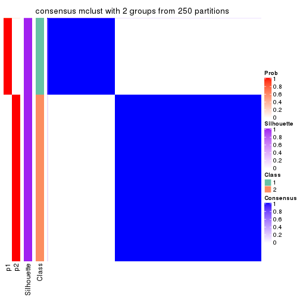</p>

</div>
<div id='tab-MAD-mclust-consensus-heatmap-2'>
<pre><code class="r">consensus_heatmap(res, k = 3)
</code></pre>

<p>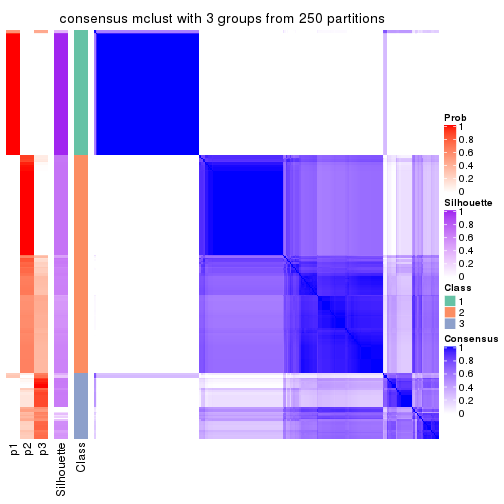</p>

</div>
<div id='tab-MAD-mclust-consensus-heatmap-3'>
<pre><code class="r">consensus_heatmap(res, k = 4)
</code></pre>

<p>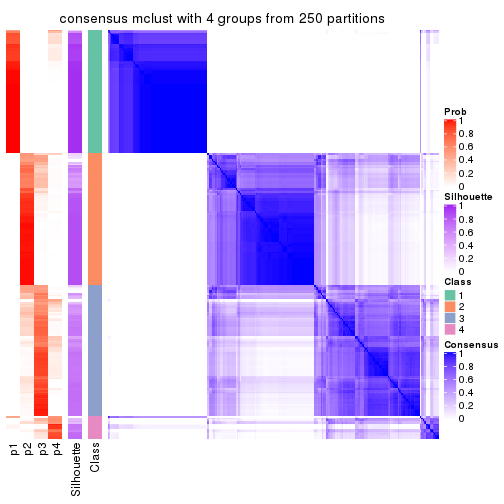</p>

</div>
<div id='tab-MAD-mclust-consensus-heatmap-4'>
<pre><code class="r">consensus_heatmap(res, k = 5)
</code></pre>

<p>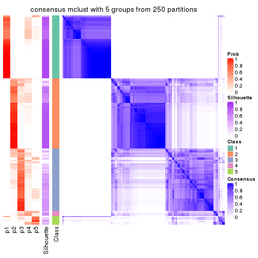</p>

</div>
<div id='tab-MAD-mclust-consensus-heatmap-5'>
<pre><code class="r">consensus_heatmap(res, k = 6)
</code></pre>

<p>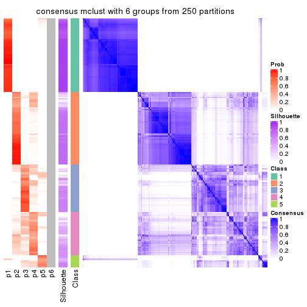</p>

</div>
</div>

Heatmaps for the membership of samples in all partitions to see how consistent they are:


<script>
$( function() {
	$( '#tabs-MAD-mclust-membership-heatmap' ).tabs();
} );
</script>
<div id='tabs-MAD-mclust-membership-heatmap'>
<ul>
<li><a href='#tab-MAD-mclust-membership-heatmap-1'>k = 2</a></li>
<li><a href='#tab-MAD-mclust-membership-heatmap-2'>k = 3</a></li>
<li><a href='#tab-MAD-mclust-membership-heatmap-3'>k = 4</a></li>
<li><a href='#tab-MAD-mclust-membership-heatmap-4'>k = 5</a></li>
<li><a href='#tab-MAD-mclust-membership-heatmap-5'>k = 6</a></li>
</ul>
<div id='tab-MAD-mclust-membership-heatmap-1'>
<pre><code class="r">membership_heatmap(res, k = 2)
</code></pre>

<p>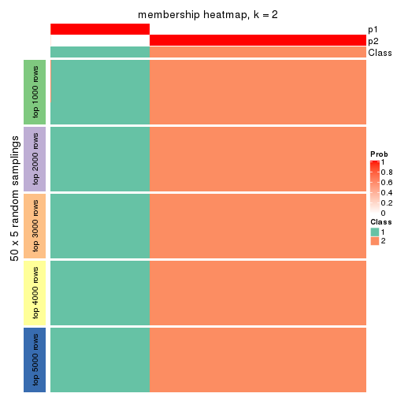</p>

</div>
<div id='tab-MAD-mclust-membership-heatmap-2'>
<pre><code class="r">membership_heatmap(res, k = 3)
</code></pre>

<p>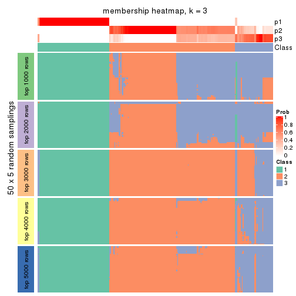</p>

</div>
<div id='tab-MAD-mclust-membership-heatmap-3'>
<pre><code class="r">membership_heatmap(res, k = 4)
</code></pre>

<p>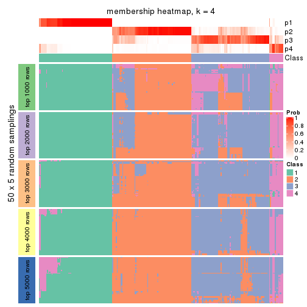</p>

</div>
<div id='tab-MAD-mclust-membership-heatmap-4'>
<pre><code class="r">membership_heatmap(res, k = 5)
</code></pre>

<p>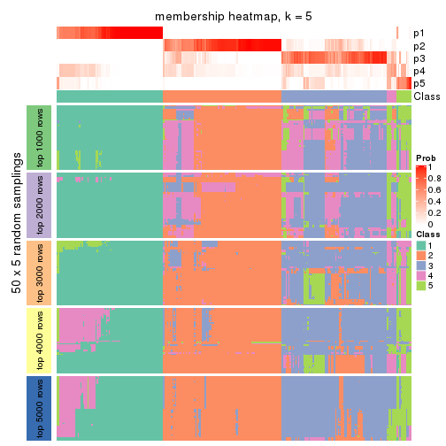</p>

</div>
<div id='tab-MAD-mclust-membership-heatmap-5'>
<pre><code class="r">membership_heatmap(res, k = 6)
</code></pre>

<p>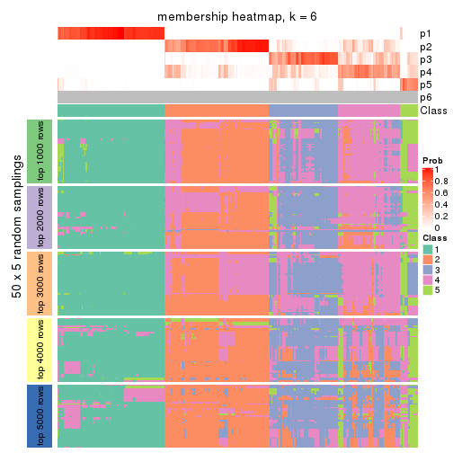</p>

</div>
</div>

As soon as we have had the classes for columns, we can look for signatures
which are significantly different between classes which can be candidate marks
for certain classes. Following are the heatmaps for signatures.


Signature heatmaps where rows are scaled:


<script>
$( function() {
	$( '#tabs-MAD-mclust-get-signatures' ).tabs();
} );
</script>
<div id='tabs-MAD-mclust-get-signatures'>
<ul>
<li><a href='#tab-MAD-mclust-get-signatures-1'>k = 2</a></li>
<li><a href='#tab-MAD-mclust-get-signatures-2'>k = 3</a></li>
<li><a href='#tab-MAD-mclust-get-signatures-3'>k = 4</a></li>
<li><a href='#tab-MAD-mclust-get-signatures-4'>k = 5</a></li>
<li><a href='#tab-MAD-mclust-get-signatures-5'>k = 6</a></li>
</ul>
<div id='tab-MAD-mclust-get-signatures-1'>
<pre><code class="r">get_signatures(res, k = 2)
</code></pre>

<p>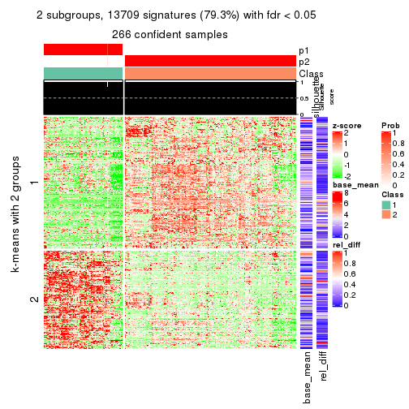</p>

</div>
<div id='tab-MAD-mclust-get-signatures-2'>
<pre><code class="r">get_signatures(res, k = 3)
</code></pre>

<p>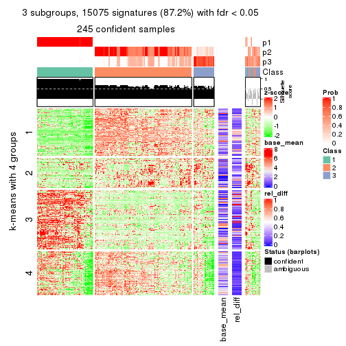</p>

</div>
<div id='tab-MAD-mclust-get-signatures-3'>
<pre><code class="r">get_signatures(res, k = 4)
</code></pre>

<p>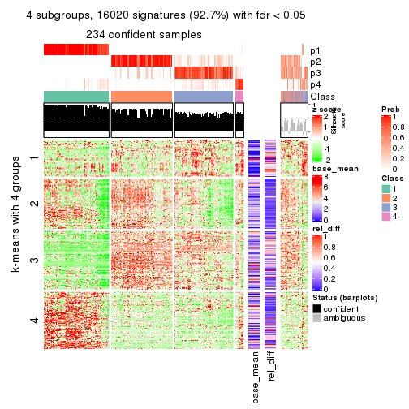</p>

</div>
<div id='tab-MAD-mclust-get-signatures-4'>
<pre><code class="r">get_signatures(res, k = 5)
</code></pre>

<p>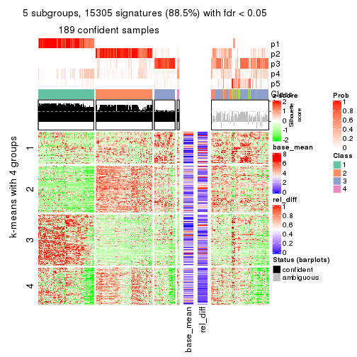</p>

</div>
<div id='tab-MAD-mclust-get-signatures-5'>
<pre><code class="r">get_signatures(res, k = 6)
</code></pre>

<p>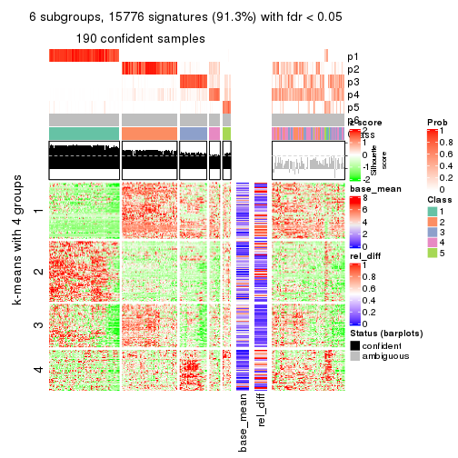</p>

</div>
</div>


Signature heatmaps where rows are not scaled:


<script>
$( function() {
	$( '#tabs-MAD-mclust-get-signatures-no-scale' ).tabs();
} );
</script>
<div id='tabs-MAD-mclust-get-signatures-no-scale'>
<ul>
<li><a href='#tab-MAD-mclust-get-signatures-no-scale-1'>k = 2</a></li>
<li><a href='#tab-MAD-mclust-get-signatures-no-scale-2'>k = 3</a></li>
<li><a href='#tab-MAD-mclust-get-signatures-no-scale-3'>k = 4</a></li>
<li><a href='#tab-MAD-mclust-get-signatures-no-scale-4'>k = 5</a></li>
<li><a href='#tab-MAD-mclust-get-signatures-no-scale-5'>k = 6</a></li>
</ul>
<div id='tab-MAD-mclust-get-signatures-no-scale-1'>
<pre><code class="r">get_signatures(res, k = 2, scale_rows = FALSE)
</code></pre>

<p>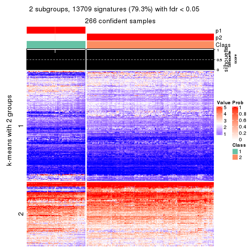</p>

</div>
<div id='tab-MAD-mclust-get-signatures-no-scale-2'>
<pre><code class="r">get_signatures(res, k = 3, scale_rows = FALSE)
</code></pre>

<p>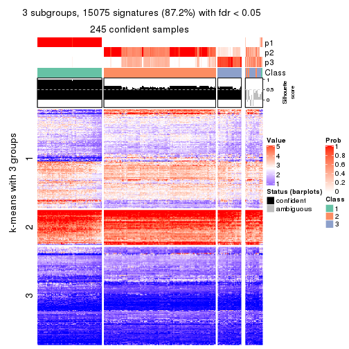</p>

</div>
<div id='tab-MAD-mclust-get-signatures-no-scale-3'>
<pre><code class="r">get_signatures(res, k = 4, scale_rows = FALSE)
</code></pre>

<p>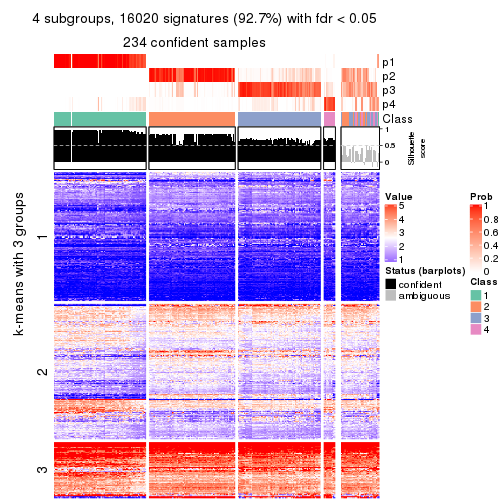</p>

</div>
<div id='tab-MAD-mclust-get-signatures-no-scale-4'>
<pre><code class="r">get_signatures(res, k = 5, scale_rows = FALSE)
</code></pre>

<p>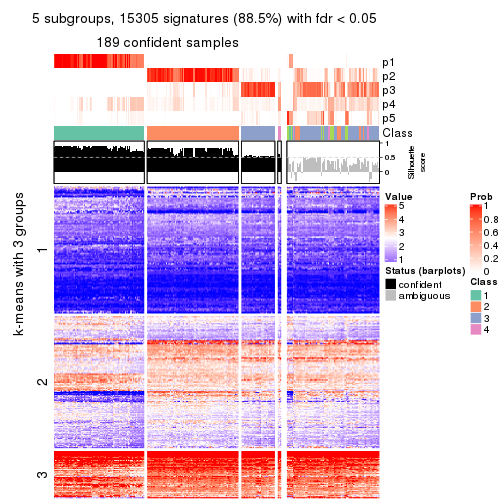</p>

</div>
<div id='tab-MAD-mclust-get-signatures-no-scale-5'>
<pre><code class="r">get_signatures(res, k = 6, scale_rows = FALSE)
</code></pre>

<p>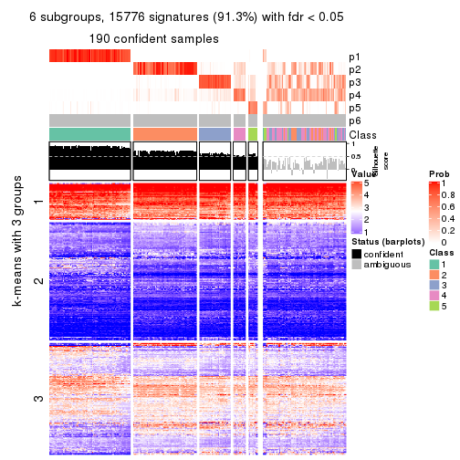</p>

</div>
</div>


Compare the overlap of signatures from different k:

```r
compare_signatures(res)
```

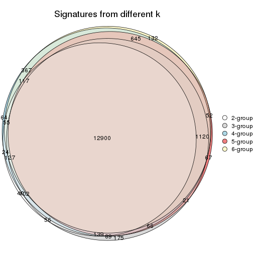

`get_signature()` returns a data frame invisibly. TO get the list of signatures, the function
call should be assigned to a variable explicitly. In following code, if `plot` argument is set
to `FALSE`, no heatmap is plotted while only the differential analysis is performed.

```r
# code only for demonstration
tb = get_signature(res, k = ..., plot = FALSE)
```

An example of the output of `tb` is:

```
#>   which_row         fdr    mean_1    mean_2 scaled_mean_1 scaled_mean_2 km
#> 1        38 0.042760348  8.373488  9.131774    -0.5533452     0.5164555  1
#> 2        40 0.018707592  7.106213  8.469186    -0.6173731     0.5762149  1
#> 3        55 0.019134737 10.221463 11.207825    -0.6159697     0.5749050  1
#> 4        59 0.006059896  5.921854  7.869574    -0.6899429     0.6439467  1
#> 5        60 0.018055526  8.928898 10.211722    -0.6204761     0.5791110  1
#> 6        98 0.009384629 15.714769 14.887706     0.6635654    -0.6193277  2
...
```

The columns in `tb` are:

1. `which_row`: row indices corresponding to the input matrix.
2. `fdr`: FDR for the differential test. 
3. `mean_x`: The mean value in group x.
4. `scaled_mean_x`: The mean value in group x after rows are scaled.
5. `km`: Row groups if k-means clustering is applied to rows.


UMAP plot which shows how samples are separated.


<script>
$( function() {
	$( '#tabs-MAD-mclust-dimension-reduction' ).tabs();
} );
</script>
<div id='tabs-MAD-mclust-dimension-reduction'>
<ul>
<li><a href='#tab-MAD-mclust-dimension-reduction-1'>k = 2</a></li>
<li><a href='#tab-MAD-mclust-dimension-reduction-2'>k = 3</a></li>
<li><a href='#tab-MAD-mclust-dimension-reduction-3'>k = 4</a></li>
<li><a href='#tab-MAD-mclust-dimension-reduction-4'>k = 5</a></li>
<li><a href='#tab-MAD-mclust-dimension-reduction-5'>k = 6</a></li>
</ul>
<div id='tab-MAD-mclust-dimension-reduction-1'>
<pre><code class="r">dimension_reduction(res, k = 2, method = &quot;UMAP&quot;)
</code></pre>

<p></p>

</div>
<div id='tab-MAD-mclust-dimension-reduction-2'>
<pre><code class="r">dimension_reduction(res, k = 3, method = &quot;UMAP&quot;)
</code></pre>

<p>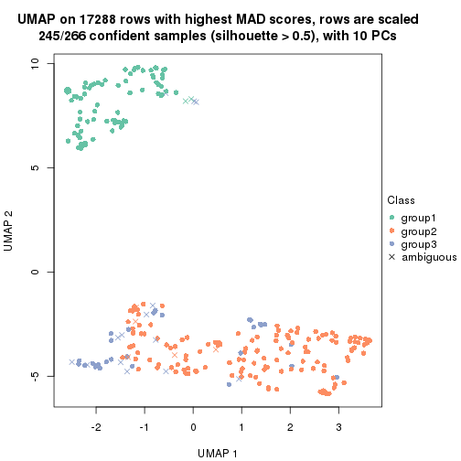</p>

</div>
<div id='tab-MAD-mclust-dimension-reduction-3'>
<pre><code class="r">dimension_reduction(res, k = 4, method = &quot;UMAP&quot;)
</code></pre>

<p>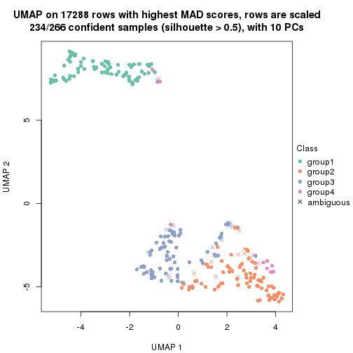</p>

</div>
<div id='tab-MAD-mclust-dimension-reduction-4'>
<pre><code class="r">dimension_reduction(res, k = 5, method = &quot;UMAP&quot;)
</code></pre>

<p></p>

</div>
<div id='tab-MAD-mclust-dimension-reduction-5'>
<pre><code class="r">dimension_reduction(res, k = 6, method = &quot;UMAP&quot;)
</code></pre>

<p>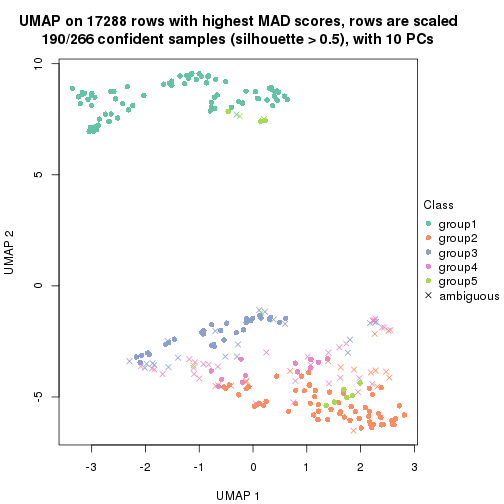</p>

</div>
</div>


Following heatmap shows how subgroups are split when increasing `k`:

```r
collect_classes(res)
```

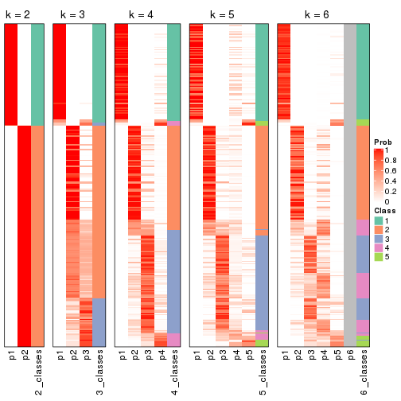


If matrix rows can be associated to genes, consider to use `GO_Enrichment(res,
...)` to perform function enrichment for the signature genes.


 

---------------------------------------------------


### MAD:NMF**


The object with results only for a single top-value method and a single partition method 
can be extracted as:

```r
res = res_list["MAD", "NMF"]
# you can also extract it by
# res = res_list["MAD:NMF"]
```

A summary of `res` and all the functions that can be applied to it:

```r
res
```

```
#> A 'ConsensusPartition' object with k = 2, 3, 4, 5, 6.
#>   On a matrix with 17288 rows and 266 columns.
#>   Top rows (1000, 2000, 3000, 4000, 5000) are extracted by 'MAD' method.
#>   Subgroups are detected by 'NMF' method.
#>   Performed in total 1250 partitions by row resampling.
#>   Best k for subgroups seems to be 2.
#> 
#> Following methods can be applied to this 'ConsensusPartition' object:
#>  [1] "cola_report"             "collect_classes"         "collect_plots"          
#>  [4] "collect_stats"           "colnames"                "compare_signatures"     
#>  [7] "consensus_heatmap"       "dimension_reduction"     "functional_enrichment"  
#> [10] "get_anno_col"            "get_anno"                "get_classes"            
#> [13] "get_consensus"           "get_matrix"              "get_membership"         
#> [16] "get_param"               "get_signatures"          "get_stats"              
#> [19] "is_best_k"               "is_stable_k"             "membership_heatmap"     
#> [22] "ncol"                    "nrow"                    "plot_ecdf"              
#> [25] "rownames"                "select_partition_number" "show"                   
#> [28] "suggest_best_k"          "test_to_known_factors"
```

`collect_plots()` function collects all the plots made from `res` for all `k` (number of partitions)
into one single page to provide an easy and fast comparison between different `k`.

```r
collect_plots(res)
```

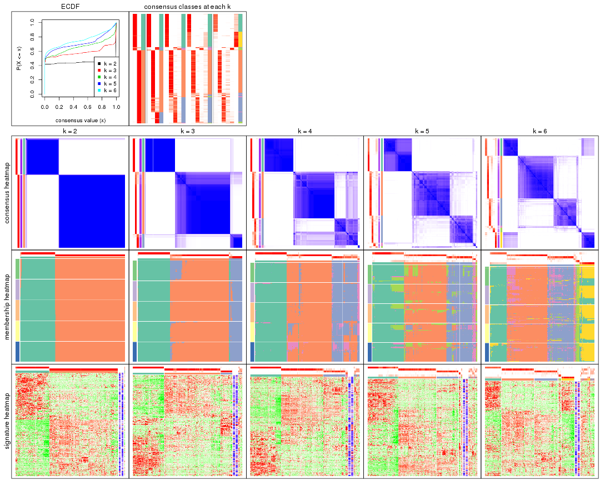

The plots are:

- The first row: a plot of the ECDF (Empirical cumulative distribution
  function) curves of the consensus matrix for each `k` and the heatmap of
  predicted classes for each `k`.
- The second row: heatmaps of the consensus matrix for each `k`.
- The third row: heatmaps of the membership matrix for each `k`.
- The fouth row: heatmaps of the signatures for each `k`.

All the plots in panels can be made by individual functions and they are
plotted later in this section.

`select_partition_number()` produces several plots showing different
statistics for choosing "optimized" `k`. There are following statistics:

- ECDF curves of the consensus matrix for each `k`;
- 1-PAC. [The PAC
  score](https://en.wikipedia.org/wiki/Consensus_clustering#Over-interpretation_potential_of_consensus_clustering)
  measures the proportion of the ambiguous subgrouping.
- Mean silhouette score.
- Concordance. The mean probability of fiting the consensus class ids in all
  partitions.
- Area increased. Denote $A_k$ as the area under the ECDF curve for current
  `k`, the area increased is defined as $A_k - A_{k-1}$.
- Rand index. The percent of pairs of samples that are both in a same cluster
  or both are not in a same cluster in the partition of k and k-1.
- Jaccard index. The ratio of pairs of samples are both in a same cluster in
  the partition of k and k-1 and the pairs of samples are both in a same
  cluster in the partition k or k-1.

The detailed explanations of these statistics can be found in [the cola
vignette](http://bioconductor.org/packages/devel/bioc/vignettes/cola/inst/doc/cola.html#toc_13).

Generally speaking, lower PAC score, higher mean silhouette score or higher
concordance corresponds to better partition. Rand index and Jaccard index
measure how similar the current partition is compared to partition with `k-1`.
If they are too similar, we won't accept `k` is better than `k-1`.

```r
select_partition_number(res)
```

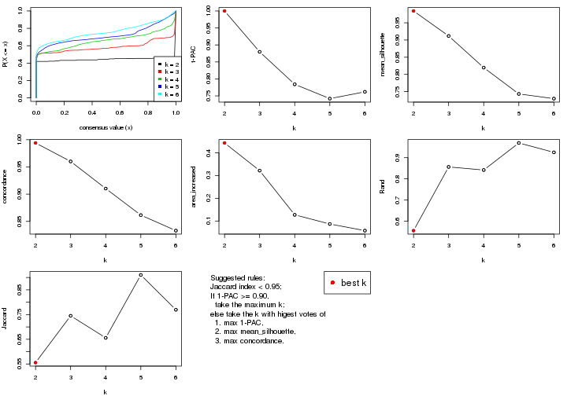

The numeric values for all these statistics can be obtained by `get_stats()`.

```r
get_stats(res)
```

```
#>   k 1-PAC mean_silhouette concordance area_increased  Rand Jaccard
#> 2 2 1.000           0.984       0.994         0.4437 0.556   0.556
#> 3 3 0.880           0.912       0.960         0.3220 0.856   0.745
#> 4 4 0.784           0.820       0.910         0.1272 0.842   0.656
#> 5 5 0.742           0.743       0.861         0.0868 0.969   0.910
#> 6 6 0.762           0.730       0.833         0.0576 0.925   0.769
```

`suggest_best_k()` suggests the best $k$ based on these statistics. The rules are as follows:

- All $k$ with Jaccard index larger than 0.95 are removed because the increase of
  the partition number does not provides enough extra information. If all $k$ are removed,
  the best $k$ is assigned by `NA`.
- For $k$ with 1-PAC larger than 0.9, the maximal $k$ is taken as the "best k". Other $k$ is called "optional k".
- If it does not fit the second rule. The $k$ with the highest vote of highest
  1-PAC, mean silhouette and concordance is taken as the "best k".

```r
suggest_best_k(res)
```

```
#> [1] 2
```


Following shows the table of the partitions (You need to click the **show/hide
code output** link to see it). The membership matrix (columns with name `p*`)
is inferred by
[`clue::cl_consensus()`](https://www.rdocumentation.org/link/cl_consensus?package=clue)
function with the `SE` method. Basically the value in the membership matrix
represents the probability to belong to a certain group. The finall class
label for an item is determined with the group with highest probability it
belongs to.

In `get_classes()` function, the entropy is calculated from the membership
matrix and the silhouette score is calculated from the consensus matrix.


<script>
$( function() {
	$( '#tabs-MAD-NMF-get-classes' ).tabs();
} );
</script>
<div id='tabs-MAD-NMF-get-classes'>
<ul>
<li><a href='#tab-MAD-NMF-get-classes-1'>k = 2</a></li>
<li><a href='#tab-MAD-NMF-get-classes-2'>k = 3</a></li>
<li><a href='#tab-MAD-NMF-get-classes-3'>k = 4</a></li>
<li><a href='#tab-MAD-NMF-get-classes-4'>k = 5</a></li>
<li><a href='#tab-MAD-NMF-get-classes-5'>k = 6</a></li>
</ul>

<div id='tab-MAD-NMF-get-classes-1'>
<p><a id='tab-MAD-NMF-get-classes-1-a' style='color:#0366d6' href='#'>show/hide code output</a></p>
<pre><code class="r">cbind(get_classes(res, k = 2), get_membership(res, k = 2))
</code></pre>

<pre><code>#&gt;                                      class entropy silhouette    p1    p2
#&gt; 80D0AF10-1C61-4B67-90C1-7DBF1EF23672     2   0.000     0.9967 0.000 1.000
#&gt; 87117BE1-D328-4972-85DA-6672412D8860     2   0.000     0.9967 0.000 1.000
#&gt; F904C5B6-70BD-4604-8254-79BE23B152DA     1   0.000     0.9881 1.000 0.000
#&gt; 3182DEA1-4239-4613-925A-7E6503766AD6     2   0.000     0.9967 0.000 1.000
#&gt; 55E78EA2-2D9B-481F-8CAB-D36A33088EAE     2   0.000     0.9967 0.000 1.000
#&gt; 86F94264-A6DD-4A97-9191-036F066DD0EF     2   0.000     0.9967 0.000 1.000
#&gt; 09D25417-23B7-4D88-A0EA-F307985FBBBC     2   0.000     0.9967 0.000 1.000
#&gt; C797F12C-40D3-4DB5-B9EF-A6821BBDE4F0     1   0.000     0.9881 1.000 0.000
#&gt; 80275DB0-A226-4B6B-A08F-4ADBEEE1DB01     1   0.000     0.9881 1.000 0.000
#&gt; 27FB653A-9E07-44AD-952E-9E4DE4AB5891     2   0.000     0.9967 0.000 1.000
#&gt; 1A5DB9FC-2ABD-4E1B-B5EF-B1CF5E5F3872     1   0.000     0.9881 1.000 0.000
#&gt; 844E4CCD-D30C-416F-A086-8923711A4E25     2   0.430     0.8996 0.088 0.912
#&gt; EF18318D-3D25-4D65-803A-ED6E62871E7E     1   0.000     0.9881 1.000 0.000
#&gt; 1ACB1BE0-61F6-4243-BBEC-E26A1CF90CA8     1   0.000     0.9881 1.000 0.000
#&gt; 8EF0039B-D758-46AB-BAF7-6A062C7C56BA     1   0.000     0.9881 1.000 0.000
#&gt; 22F4C9D9-663B-4C91-9692-E035A2640BEC     2   0.000     0.9967 0.000 1.000
#&gt; FA1A0BCE-EE0F-4178-B963-62550E344B14     2   0.000     0.9967 0.000 1.000
#&gt; 0B6D0C4E-5AE3-4707-A9FC-12A108E6EC2A     2   0.000     0.9967 0.000 1.000
#&gt; 06FD3123-2AEB-4911-AC4E-E0E64FD5DB52     2   0.000     0.9967 0.000 1.000
#&gt; 235A4492-FF80-4AA5-BC71-DFF65E1C7411     2   0.000     0.9967 0.000 1.000
#&gt; A192C6C0-1443-4493-AFAC-1EE710628ADB     2   0.000     0.9967 0.000 1.000
#&gt; 6FC5B56B-711B-4174-9B06-4E843124AAB6     1   0.000     0.9881 1.000 0.000
#&gt; 7A813F60-A41E-4552-990E-F22287654C1D     2   0.000     0.9967 0.000 1.000
#&gt; 725BBFB5-26F4-4512-9C75-47D013C1E605     1   0.000     0.9881 1.000 0.000
#&gt; 39CC4E82-EBC9-472E-8BE5-6A3AB178449A     2   0.000     0.9967 0.000 1.000
#&gt; 61130DEE-E267-49DF-8B41-7738A06EF738     2   0.000     0.9967 0.000 1.000
#&gt; 117EC12C-B7ED-4E01-B29B-EA542D356EA1     1   0.000     0.9881 1.000 0.000
#&gt; A30FF708-F7A9-41E4-8AD5-20441650FBC9     2   0.000     0.9967 0.000 1.000
#&gt; 53640D52-1167-4A5D-B656-97D32CBA3934     1   0.000     0.9881 1.000 0.000
#&gt; 9E85D76A-DD2A-46D5-BB59-0ED302B6258C     2   0.000     0.9967 0.000 1.000
#&gt; 6F8C6F90-7E3C-4860-91DD-586708DE44AA     1   0.000     0.9881 1.000 0.000
#&gt; E675AEC5-AA9A-4AAA-839C-03E6365822DB     2   0.000     0.9967 0.000 1.000
#&gt; B577DEF7-2F5C-4876-A7C6-F18D5722B8C0     1   0.000     0.9881 1.000 0.000
#&gt; DA8B577E-43E7-49BF-BF94-868E3194F5C9     1   0.000     0.9881 1.000 0.000
#&gt; 3334280B-2A36-4AC7-A021-A76C10E958F0     2   0.000     0.9967 0.000 1.000
#&gt; 5CBDDC90-11EC-4E6E-881E-AA9CCFD40FDB     2   0.000     0.9967 0.000 1.000
#&gt; 8CBBF32A-8349-44F5-A8B8-4CBB1760A464     2   0.000     0.9967 0.000 1.000
#&gt; B9455A9A-136D-4DC2-9F86-0FC74433589D     1   0.644     0.8034 0.836 0.164
#&gt; D7EAE2A7-F9BE-4222-A452-B1F83F99CD50     2   0.000     0.9967 0.000 1.000
#&gt; F803AE18-60C5-4CFE-AAAB-DB33C26A2184     1   0.000     0.9881 1.000 0.000
#&gt; 5DD8CAC7-EC02-43B6-B58E-6D2E22868A3B     2   0.000     0.9967 0.000 1.000
#&gt; EE98E1B4-DFB3-4AEC-8527-E1FD544C9475     1   0.000     0.9881 1.000 0.000
#&gt; 3CE43921-47D5-4394-B9E1-242607775D61     2   0.000     0.9967 0.000 1.000
#&gt; 46986F2B-0B0D-4187-8948-4E91D34B7C49     2   0.000     0.9967 0.000 1.000
#&gt; 5D1D052E-74EF-45A8-9B1A-7CECD13EA43B     2   0.000     0.9967 0.000 1.000
#&gt; 4C821AD9-A5C9-4A9A-9C5D-363B227F8064     2   0.000     0.9967 0.000 1.000
#&gt; 06A4189E-A23B-4AC6-AA74-01955DD7D1E9     2   0.000     0.9967 0.000 1.000
#&gt; FCCDC76F-CB02-4BCD-A616-325F258DDAA4     2   0.000     0.9967 0.000 1.000
#&gt; DAC53B0A-8F35-4EA6-BBCC-4CD1C049E11F     2   0.000     0.9967 0.000 1.000
#&gt; DD4F845B-CAD3-44CB-9D96-3C3F5BA1B72D     1   0.000     0.9881 1.000 0.000
#&gt; D440F004-A4A4-41B6-BED8-805D67BA01C7     2   0.000     0.9967 0.000 1.000
#&gt; A497C423-119F-42FA-BF17-9F6DFD2A5585     2   0.000     0.9967 0.000 1.000
#&gt; 3420E573-DE12-4EF5-B1C0-2FCA904F4F4E     1   0.000     0.9881 1.000 0.000
#&gt; 1AD72157-A254-44B4-BA58-4F30F1AE910E     1   0.000     0.9881 1.000 0.000
#&gt; C1113977-B160-45EE-B061-750F9EA3F33F     2   0.000     0.9967 0.000 1.000
#&gt; 6783AB5B-F07C-447B-BF13-C34485D246D7     2   0.000     0.9967 0.000 1.000
#&gt; 1F553062-26FD-4A7F-B7FB-81184604F423     1   0.000     0.9881 1.000 0.000
#&gt; BE2DCA51-1C21-4598-98A7-F2FB9B2DFCB4     2   0.000     0.9967 0.000 1.000
#&gt; 38941CF3-9C54-4BA4-A005-CC88CA97D504     2   0.000     0.9967 0.000 1.000
#&gt; 51CB675E-E243-4A07-BF4A-580473D26FDA     2   0.000     0.9967 0.000 1.000
#&gt; C7FED0F5-C27A-4405-9232-30BF39362CF7     2   0.000     0.9967 0.000 1.000
#&gt; 2A1E86E8-4713-465F-ACFF-C584864C57A1     2   0.000     0.9967 0.000 1.000
#&gt; B4500785-0FAA-4D4D-8630-43D194BAB004     2   0.000     0.9967 0.000 1.000
#&gt; 3FD52E66-AB76-4079-80DB-281A795D1EC0     2   0.000     0.9967 0.000 1.000
#&gt; EBD355D1-1226-4DFD-AAFF-45D246B64F3C     2   0.000     0.9967 0.000 1.000
#&gt; 5A040A73-CD95-487E-8AEF-9639FE4E2916     2   0.000     0.9967 0.000 1.000
#&gt; CF629C65-585D-476D-B081-3E6E0575FAE3     1   0.584     0.8352 0.860 0.140
#&gt; 0D4202A3-808E-413F-9BF3-9CFCCAE0ED61     2   0.000     0.9967 0.000 1.000
#&gt; 43E715BF-28D9-4B5E-B762-8CD1B69A430E     1   0.000     0.9881 1.000 0.000
#&gt; BFB82BE8-9DAC-4099-8B38-0950308E3EB3     2   0.000     0.9967 0.000 1.000
#&gt; F7CB1825-2303-4DD2-AE1F-7205738EAF1F     1   0.000     0.9881 1.000 0.000
#&gt; FE298483-C42C-4753-BABB-29A9CB1B6312     1   0.000     0.9881 1.000 0.000
#&gt; A98C7561-1B42-4CD6-AE71-924B91FA4C33     2   0.000     0.9967 0.000 1.000
#&gt; 58098F21-7DAB-47DA-9A41-8D20BF3B9257     2   0.000     0.9967 0.000 1.000
#&gt; 18CAF708-20B9-4745-9CB3-37AB6E0B3056     2   0.000     0.9967 0.000 1.000
#&gt; 2C80DD72-C9C7-4AC2-812F-9A31EF02779C     1   0.000     0.9881 1.000 0.000
#&gt; 68A3F13D-319D-4603-A27F-B5DD46FE5C5B     2   0.000     0.9967 0.000 1.000
#&gt; 7EE8F0CE-CDC9-40F9-A1DE-7F8140EC6D13     1   0.861     0.6086 0.716 0.284
#&gt; 39019903-5B9C-4665-BD5F-7CCB19CB55C5     2   0.000     0.9967 0.000 1.000
#&gt; 190EDB27-4CBC-4E9C-9B67-D51FDAB982B7     2   0.000     0.9967 0.000 1.000
#&gt; EB2D95BC-62F8-4669-9308-D37D7FB79E23     2   0.000     0.9967 0.000 1.000
#&gt; A08B85EA-D1E7-4B77-8DEC-36294305B9F7     1   0.000     0.9881 1.000 0.000
#&gt; 130DDFAD-6EF8-4C80-BD9D-88308A6874BC     2   0.000     0.9967 0.000 1.000
#&gt; 7340A5BA-E002-448F-AACC-E7A37DBB79C2     2   0.000     0.9967 0.000 1.000
#&gt; A771F6E3-D266-4FE7-98C6-C40E6A701D59     1   0.000     0.9881 1.000 0.000
#&gt; 015E792C-EC1B-49BF-AB07-D82B20C5989A     2   0.000     0.9967 0.000 1.000
#&gt; BF79E030-47EE-4D08-B910-5685A4BD8B60     2   0.000     0.9967 0.000 1.000
#&gt; FB3C7C9A-2F2D-4DD5-BE47-FAFB072C0FAB     2   0.000     0.9967 0.000 1.000
#&gt; 4E5557BA-10E8-4723-908E-DD04EF6639B2     2   0.000     0.9967 0.000 1.000
#&gt; 8031B550-40A9-4A3A-9F7D-CDC052288BD8     2   0.000     0.9967 0.000 1.000
#&gt; 55299A06-3C1F-45A4-B166-B2C591C0CEE2     2   0.000     0.9967 0.000 1.000
#&gt; EB8D5168-216E-4ABB-8B4E-9E67786CB322     1   0.000     0.9881 1.000 0.000
#&gt; 78BD2D83-9A7F-42E5-BB38-654AA0761A0A     2   0.000     0.9967 0.000 1.000
#&gt; AA2D53E5-D389-4332-9DD5-A736052E48F8     1   0.000     0.9881 1.000 0.000
#&gt; 62945C7A-9313-4FC9-820C-B0AB820B394E     1   0.000     0.9881 1.000 0.000
#&gt; 22746046-2E99-4EE9-97D2-BA2EA499634C     2   0.000     0.9967 0.000 1.000
#&gt; 8671B51B-DCBE-4429-9F01-AF51CAD7014F     2   0.000     0.9967 0.000 1.000
#&gt; E815AB36-5689-4A0D-8E6D-2EAA73406681     1   0.000     0.9881 1.000 0.000
#&gt; A1DACB46-ED52-4E38-B2C8-57256BB22B5E     2   0.000     0.9967 0.000 1.000
#&gt; 4F5498C4-A423-4B3D-AC98-D4E214A57D0E     1   0.000     0.9881 1.000 0.000
#&gt; A7772CCD-FFFF-49DD-86ED-0BAD330EC9B6     2   0.000     0.9967 0.000 1.000
#&gt; E6E3DF78-65B9-4F74-8DA8-E2A6D4EDBEA7     2   0.000     0.9967 0.000 1.000
#&gt; 83286E2D-E708-437A-911A-E6B050273CBD     1   0.000     0.9881 1.000 0.000
#&gt; EC5C7C97-EE8C-405D-A039-D96514B1D414     2   0.000     0.9967 0.000 1.000
#&gt; 3E55223D-6E3D-4027-9819-67E91212531D     1   0.000     0.9881 1.000 0.000
#&gt; 99A036A2-8343-4D06-8047-D84E96CE4C61     2   0.000     0.9967 0.000 1.000
#&gt; CA6CDE6D-92DE-4259-9E58-A373F2D543EA     2   0.000     0.9967 0.000 1.000
#&gt; BF6FA8CC-60C1-413A-B2C6-54CCACBC01D6     1   0.000     0.9881 1.000 0.000
#&gt; E0594CFE-F7B6-4546-B130-30DF6A514B1F     2   0.000     0.9967 0.000 1.000
#&gt; E769E41D-5949-42C5-9594-E563C05ACE52     2   0.000     0.9967 0.000 1.000
#&gt; 01373725-5D3C-4D9C-AABC-911D53E62BCD     2   0.000     0.9967 0.000 1.000
#&gt; 1F39DADD-3655-474E-BA4C-A5BD32C97A8B     1   0.000     0.9881 1.000 0.000
#&gt; AF573EC8-E4EE-4B8F-8199-9817B9FAC67D     1   0.000     0.9881 1.000 0.000
#&gt; 3F022CBC-41C8-4387-A6FB-124C4BCD1AD9     1   0.000     0.9881 1.000 0.000
#&gt; 1CC32ACE-826B-494B-8B89-5BD92327A74D     2   0.000     0.9967 0.000 1.000
#&gt; 22B0BD3B-EE08-4BC7-90B2-01C372A56BA2     2   0.000     0.9967 0.000 1.000
#&gt; 0F3DE9EF-19CC-4D14-9A42-1435DB537F94     2   0.000     0.9967 0.000 1.000
#&gt; 87F8A33F-FBC3-469E-862B-84472F796358     2   0.000     0.9967 0.000 1.000
#&gt; C9F2FA0D-1A9F-40B4-BD9B-CAF1B3F3D5A7     2   0.000     0.9967 0.000 1.000
#&gt; ACFC9F59-78FF-4453-B25F-8834D0EAB54A     2   0.000     0.9967 0.000 1.000
#&gt; B7AC7D5B-14E9-45A7-93B7-226EE508544A     2   0.000     0.9967 0.000 1.000
#&gt; 4491BF17-B168-4E96-8E09-EF1AEC9F5E9D     2   0.000     0.9967 0.000 1.000
#&gt; 557A0811-A3FE-4CF4-A24D-FBB77E7F9139     2   0.000     0.9967 0.000 1.000
#&gt; 6F9C955C-6816-4353-922A-8035B50FACC6     2   0.000     0.9967 0.000 1.000
#&gt; 3E89FB1C-4A7D-43C7-823C-04E3716A7935     2   0.000     0.9967 0.000 1.000
#&gt; 12ABE483-66EF-4237-94C4-0199FAE23FA8     2   0.000     0.9967 0.000 1.000
#&gt; 7535F262-9B96-44F6-988C-4C9EBB3FFCA9     2   0.000     0.9967 0.000 1.000
#&gt; 65C9D28E-303B-40E5-84F0-2507F5457374     2   0.000     0.9967 0.000 1.000
#&gt; FD445384-6BA9-4297-9D9C-12ABA7D645C7     1   0.000     0.9881 1.000 0.000
#&gt; 30D5E255-2AD3-44F3-8983-1B80E4FD3E2D     2   0.000     0.9967 0.000 1.000
#&gt; 3E88EC60-B4A8-4259-8BC8-A234800F6955     2   0.000     0.9967 0.000 1.000
#&gt; ACD73CE8-AFC5-47A0-9383-3CB97F018953     1   0.000     0.9881 1.000 0.000
#&gt; 1AFDC2EA-26A8-44E2-8BCB-F34F7B66F8C8     2   0.000     0.9967 0.000 1.000
#&gt; 9E327BC8-1D20-4AD8-83F7-FB2D13BCA5D0     2   0.000     0.9967 0.000 1.000
#&gt; 85A86B91-4F24-4E77-AE2D-520F8E205EFC     1   0.000     0.9881 1.000 0.000
#&gt; 74868C37-8143-4306-81CA-E45759D146CD     2   0.000     0.9967 0.000 1.000
#&gt; 69AEA0DB-E335-48A0-A398-4FB0D581182A     2   0.000     0.9967 0.000 1.000
#&gt; AE6F8B89-85C2-42B7-8D05-AFDDD4FEFD16     1   0.000     0.9881 1.000 0.000
#&gt; A8A6F09C-9812-4457-9A4B-AD41F97B41A3     2   0.000     0.9967 0.000 1.000
#&gt; 1A09BC4D-EF29-42DD-BB04-A3C264A3032D     1   0.000     0.9881 1.000 0.000
#&gt; E0961A30-A62C-4235-9CF0-A1776827A996     2   0.000     0.9967 0.000 1.000
#&gt; 134D2D90-7B08-4F20-8A3A-C77643FB208F     2   0.000     0.9967 0.000 1.000
#&gt; A77C2DFF-93CF-4CB5-B3C1-81133D7F1A0F     2   0.000     0.9967 0.000 1.000
#&gt; EA2DC457-9C74-4B9C-B3FA-5E72199B24A7     2   0.000     0.9967 0.000 1.000
#&gt; FF34117B-5EE4-4C96-A8A2-2CE6A654CBE5     1   0.000     0.9881 1.000 0.000
#&gt; 75F7B5E2-6559-4B48-A2A4-287C35C559CC     1   0.000     0.9881 1.000 0.000
#&gt; 903BF591-B0AF-4BEE-B625-60B673070344     2   0.000     0.9967 0.000 1.000
#&gt; 9DE1B790-C63C-41C4-9477-CE52A8119C67     2   0.000     0.9967 0.000 1.000
#&gt; 9A28F80A-85F8-40E2-A32B-230EF93B2FA0     2   0.000     0.9967 0.000 1.000
#&gt; 0AA2BDBB-8720-409A-AA72-1F4AA26E7CD8     2   0.000     0.9967 0.000 1.000
#&gt; 5AD49F16-E974-4E5D-B1B6-073ECB73A01D     1   0.988     0.2370 0.564 0.436
#&gt; CB0F961C-527D-4A48-9408-286B26BD9532     1   0.000     0.9881 1.000 0.000
#&gt; 46FF25B6-D01D-4CA7-80B7-CEC2998C34E1     2   0.000     0.9967 0.000 1.000
#&gt; 487CADE1-D699-4A6C-817A-B9A0AB940C61     1   0.000     0.9881 1.000 0.000
#&gt; 4FF6F2D8-F869-4735-A4D1-1A8423153FBC     1   0.000     0.9881 1.000 0.000
#&gt; 6005494F-5D3D-43A3-B3E8-8C91955B2A98     2   0.000     0.9967 0.000 1.000
#&gt; CF10D584-CE32-45A4-A932-E9D5AF12A6A0     1   0.000     0.9881 1.000 0.000
#&gt; E15CE4AB-5646-49C8-9CD6-938457036BB0     2   0.000     0.9967 0.000 1.000
#&gt; 31E28D0B-0E69-4330-82ED-4F1827DC97EA     2   0.000     0.9967 0.000 1.000
#&gt; DBACD3C3-CCB5-4478-BA78-85A0C847CA66     2   0.000     0.9967 0.000 1.000
#&gt; 5A07041C-65EB-4FCD-8940-E90B905061B5     2   0.000     0.9967 0.000 1.000
#&gt; 0EA7C916-FA47-489B-BC98-4D9E7D197628     1   0.000     0.9881 1.000 0.000
#&gt; 30967F75-8499-47FF-ADA4-4DC566013F7B     1   0.000     0.9881 1.000 0.000
#&gt; D2E528FF-AEA2-48D7-A60A-4C3E71EA9073     2   0.000     0.9967 0.000 1.000
#&gt; 22735DCD-215E-48BC-BF44-32BD66F06E39     2   0.000     0.9967 0.000 1.000
#&gt; BC2C3248-7FC6-48BC-96C1-45EA573DE7DC     1   0.000     0.9881 1.000 0.000
#&gt; E72CEBCB-D686-4B12-BCBA-EC8F964330A2     1   0.000     0.9881 1.000 0.000
#&gt; 23C937BB-BA20-4440-B680-914229CC3ADF     1   0.000     0.9881 1.000 0.000
#&gt; 947E99C7-F402-4F1A-A6E9-81BCAAED135A     2   0.000     0.9967 0.000 1.000
#&gt; 02475D11-FC81-4E88-944E-173C32DC3FE7     2   0.999     0.0367 0.484 0.516
#&gt; F972A9AA-9842-4343-A533-A795E65581CE     1   0.000     0.9881 1.000 0.000
#&gt; 05043AAF-3095-4C61-B5C1-EE9AA9082C75     2   0.000     0.9967 0.000 1.000
#&gt; CECF7967-862E-428C-BB42-FEF553FDB3AA     2   0.000     0.9967 0.000 1.000
#&gt; FB0B9483-6302-48C7-BE5B-DA667E00AE2D     2   0.000     0.9967 0.000 1.000
#&gt; 78700FBA-1487-4754-9B30-18837BF7E9FB     1   0.000     0.9881 1.000 0.000
#&gt; 2166F56D-54CE-4F1B-8F07-A4E13E4489E9     1   0.000     0.9881 1.000 0.000
#&gt; 7CD0942E-E39A-43A7-8BAC-F25967864901     2   0.000     0.9967 0.000 1.000
#&gt; 3B00BA2B-7F7D-4825-8F8D-90F04A5DE687     2   0.000     0.9967 0.000 1.000
#&gt; 7465B01D-C05E-4FE0-A9FE-182920EDC489     2   0.000     0.9967 0.000 1.000
#&gt; 88C31A99-F96E-4FC8-8B3D-C1AAA05062D9     1   0.000     0.9881 1.000 0.000
#&gt; 53575575-3303-4F8F-B6A8-B42131CFB4AC     2   0.000     0.9967 0.000 1.000
#&gt; CC8017C7-4128-48DA-8E43-503F63158D85     1   0.000     0.9881 1.000 0.000
#&gt; 88449D2A-2A25-41A4-B91D-C99B58F8ECD9     2   0.000     0.9967 0.000 1.000
#&gt; 46C7DDE5-A2B5-494F-96AE-0B6E2D51B003     1   0.000     0.9881 1.000 0.000
#&gt; 42551D05-5EE5-4F91-93A8-32DA695D9DFA     2   0.000     0.9967 0.000 1.000
#&gt; 0772DA48-3A36-422D-B166-CA1691B782C3     2   0.000     0.9967 0.000 1.000
#&gt; 30346897-EC77-4153-88A2-D14593C8B741     2   0.000     0.9967 0.000 1.000
#&gt; 0F00E267-C748-4A71-8B36-03C410641D88     2   0.000     0.9967 0.000 1.000
#&gt; 4034703A-4DA9-4DDA-9CA9-E80FFE9CCDE6     2   0.000     0.9967 0.000 1.000
#&gt; 393C8A41-CF45-4EA8-AFE3-25A08AB7692A     2   0.000     0.9967 0.000 1.000
#&gt; 3354212D-A07C-435C-8B0C-9A7BAAB624B5     1   0.000     0.9881 1.000 0.000
#&gt; 57E30D4E-ABF7-47DD-92BE-40CE215076B0     1   0.000     0.9881 1.000 0.000
#&gt; 202B4C76-C840-4DB8-953F-AC75A4156FDD     2   0.000     0.9967 0.000 1.000
#&gt; 93A0137B-1F4C-44EE-B959-2AD0CD2DF8B6     1   0.000     0.9881 1.000 0.000
#&gt; C9794DB6-6E8C-4AFD-80EE-61D672A4F6E9     2   0.000     0.9967 0.000 1.000
#&gt; AE4BFE63-F0C0-4624-AD97-4F7FF13E2384     1   0.000     0.9881 1.000 0.000
#&gt; DCF87F27-2B54-42D9-8D28-5DFEE76E2F5B     2   0.000     0.9967 0.000 1.000
#&gt; 2451D405-39FD-4812-958C-23462B66F1F1     2   0.000     0.9967 0.000 1.000
#&gt; E27F5D33-3F68-4CA8-8757-A387C6EAD060     2   0.000     0.9967 0.000 1.000
#&gt; 8BA9928A-5B93-477F-B4A2-D031B714D9AC     1   0.000     0.9881 1.000 0.000
#&gt; 0FAACFF6-B50C-4BED-9824-B7270654F28D     2   0.000     0.9967 0.000 1.000
#&gt; 3366CC3C-2BBA-4CA7-848E-4E16AA70AE7A     2   0.000     0.9967 0.000 1.000
#&gt; 66237056-CA9A-4C90-AF0E-1621FEB71578     2   0.000     0.9967 0.000 1.000
#&gt; C480F1FB-3100-436C-B0F5-DED63B7A580E     2   0.000     0.9967 0.000 1.000
#&gt; A327DE0D-D945-4B42-9B41-A7302CF796EE     2   0.000     0.9967 0.000 1.000
#&gt; E8A6871D-67FB-4306-9454-F5E7CDBA399A     2   0.000     0.9967 0.000 1.000
#&gt; E9A7485B-82B6-4BD2-AFBB-DD0A82D6CDE2     1   0.000     0.9881 1.000 0.000
#&gt; 93B382E4-9C9A-43F5-BD3B-502CC260B886     1   0.000     0.9881 1.000 0.000
#&gt; A2792419-8E16-45FE-A524-17851F34AB9B     2   0.000     0.9967 0.000 1.000
#&gt; 4DED1201-F25C-4F82-BABF-965EFAD7A8E5     2   0.000     0.9967 0.000 1.000
#&gt; F1ACB2DD-E948-4F88-A249-F1BD1977D667     2   0.000     0.9967 0.000 1.000
#&gt; 6CDBA203-8952-421D-A6BF-75652D9F3339     2   0.000     0.9967 0.000 1.000
#&gt; 2D6C5AA7-3B33-48D7-AE0C-77A16B749D13     1   0.000     0.9881 1.000 0.000
#&gt; 3F6B6D95-0720-42A0-AEB3-89FECAE7616A     2   0.000     0.9967 0.000 1.000
#&gt; DED8ACF3-BBD8-46C9-85C9-A9C8F2E2BC0B     1   0.000     0.9881 1.000 0.000
#&gt; 77069279-5A6F-42C0-9AA5-8C939591DFB5     1   0.000     0.9881 1.000 0.000
#&gt; B2D4FCF3-FDF9-41C8-880A-6732CF6222AF     2   0.000     0.9967 0.000 1.000
#&gt; 1CD71A4C-1E49-48EF-AA72-CB3C26B4C087     2   0.000     0.9967 0.000 1.000
#&gt; C364E621-F85C-4B7F-842F-210B8D4DFE3A     2   0.000     0.9967 0.000 1.000
#&gt; 11F1B8CA-07C1-47D2-A3C6-032FFA6A4A64     1   0.000     0.9881 1.000 0.000
#&gt; 153BF804-6DC8-496B-987A-4021A2512211     2   0.000     0.9967 0.000 1.000
#&gt; 5B5029C9-40F5-40D7-A36A-367022AD6A42     2   0.000     0.9967 0.000 1.000
#&gt; 193CCBE6-104F-49B4-BDB2-C82EE36FDAAD     1   0.000     0.9881 1.000 0.000
#&gt; E5D45E53-FCF3-4F01-9B78-6CB1ED0CFE40     2   0.000     0.9967 0.000 1.000
#&gt; 5546A779-21DB-49F9-8C0D-A1E420088084     2   0.000     0.9967 0.000 1.000
#&gt; E14825E0-0DC7-44C2-B265-F54672356838     1   0.000     0.9881 1.000 0.000
#&gt; 8C8C09B9-EC83-45EC-BC4C-0BA92DE60ACB     1   0.000     0.9881 1.000 0.000
#&gt; B388CA82-5BF7-4BDD-8821-4EC0B213121F     2   0.000     0.9967 0.000 1.000
#&gt; A26025AC-9F71-4C07-9135-83593193BBB2     1   0.000     0.9881 1.000 0.000
#&gt; C80E6D4B-AF21-42F0-8E20-6F7D2E99C062     2   0.000     0.9967 0.000 1.000
#&gt; 5AE5D819-A6B1-4761-B7F9-8FFD3C520F31     2   0.000     0.9967 0.000 1.000
#&gt; CAE8097F-A139-4C6E-9E30-35080475FF34     2   0.000     0.9967 0.000 1.000
#&gt; 539C8DE3-6152-4671-B96F-ED6DC6DBD22B     1   0.000     0.9881 1.000 0.000
#&gt; 5D28A8E0-4ECF-43A4-890A-BE968B9A8CB2     2   0.000     0.9967 0.000 1.000
#&gt; 97A80AF8-365E-4756-A2B0-AEB1D8F5F33E     2   0.000     0.9967 0.000 1.000
#&gt; B3527517-E339-46AE-8437-65303C309015     2   0.000     0.9967 0.000 1.000
#&gt; 523E2183-AA20-4749-BD7E-69CD620DD6A3     2   0.000     0.9967 0.000 1.000
#&gt; E553FB92-F181-47B3-9F3D-11DB51DFA3A4     2   0.000     0.9967 0.000 1.000
#&gt; FFE0C4B1-8EEC-484A-AB87-3401B71BD081     2   0.000     0.9967 0.000 1.000
#&gt; 73D6CA4B-9A9E-4E52-96C8-AE7F0CC8B276     2   0.000     0.9967 0.000 1.000
#&gt; 485A8107-DF9A-4BC6-8A72-07FBA93F10F2     1   0.000     0.9881 1.000 0.000
#&gt; 690823D9-B9AA-40EF-8302-4AD88BF89D1C     2   0.000     0.9967 0.000 1.000
#&gt; B4E02660-562F-4EAC-8472-CBBD8A577688     2   0.000     0.9967 0.000 1.000
#&gt; F82D5A60-90F9-4FF4-971E-73F7535FE65A     2   0.000     0.9967 0.000 1.000
#&gt; C48401F7-2D56-4C6F-9896-C5435D1B44BF     2   0.000     0.9967 0.000 1.000
#&gt; 94FC8991-182B-4B00-9A06-A00E8D3BDCFA     1   0.000     0.9881 1.000 0.000
#&gt; FF00E80A-046D-4233-835E-CDF93403EA43     2   0.000     0.9967 0.000 1.000
#&gt; C47A53F6-6479-4AD3-9D18-E4A70BE5F1DC     2   0.000     0.9967 0.000 1.000
#&gt; 3487AE2D-AB1D-4DEF-AC4B-4B0FCAF8D899     2   0.000     0.9967 0.000 1.000
#&gt; 479CD9BB-ECD7-41D5-B1E4-41132FF7FC95     2   0.000     0.9967 0.000 1.000
#&gt; 048ADC6E-8C7E-4875-ACEE-E4787203C078     1   0.000     0.9881 1.000 0.000
#&gt; 25AF81C5-B117-466D-AE9F-DD10BCB6AF2D     2   0.000     0.9967 0.000 1.000
#&gt; 8B1D51D6-0B25-4289-81F0-9F95E0258877     2   0.000     0.9967 0.000 1.000
#&gt; 282D390D-8E4E-4A19-B2B7-A6DB4BB2D46C     1   0.000     0.9881 1.000 0.000
#&gt; BC6B92C1-F425-40C5-9941-539BFF5FE0FE     2   0.000     0.9967 0.000 1.000
#&gt; 899CB9E0-48D0-413D-8566-BC151F146453     1   0.000     0.9881 1.000 0.000
#&gt; 441400A9-1427-45E0-A8B4-EF2A6B7465C2     2   0.000     0.9967 0.000 1.000
#&gt; CF96DDD4-DC0A-4341-BDE6-4DA2CB4978D0     1   0.000     0.9881 1.000 0.000
#&gt; CE91F591-6072-4D29-9495-C78961635969     2   0.000     0.9967 0.000 1.000
#&gt; 84D25635-2A38-4CFB-BFAC-38C007625C42     1   0.000     0.9881 1.000 0.000
#&gt; ABF1AC12-872A-4C3D-A76C-07BC36A4DA5E     1   0.000     0.9881 1.000 0.000
#&gt; B7F7F66F-1AED-4199-81C0-5C7FB0DBF438     2   0.000     0.9967 0.000 1.000
#&gt; BAB786B9-6C20-425D-9886-63A0A092B59B     2   0.000     0.9967 0.000 1.000
#&gt; 735D1DE3-D781-4F89-A395-09974057BBB7     1   0.000     0.9881 1.000 0.000
#&gt; F6D5FBBA-05C4-4340-86D9-1A54181216A2     2   0.000     0.9967 0.000 1.000
#&gt; 79C4E166-4A0D-4811-A2C8-CAE0A5AEED42     2   0.000     0.9967 0.000 1.000
</code></pre>

<script>
$('#tab-MAD-NMF-get-classes-1-a').parent().next().next().hide();
$('#tab-MAD-NMF-get-classes-1-a').click(function(){
  $('#tab-MAD-NMF-get-classes-1-a').parent().next().next().toggle();
  return(false);
});
</script>
</div>

<div id='tab-MAD-NMF-get-classes-2'>
<p><a id='tab-MAD-NMF-get-classes-2-a' style='color:#0366d6' href='#'>show/hide code output</a></p>
<pre><code class="r">cbind(get_classes(res, k = 3), get_membership(res, k = 3))
</code></pre>

<pre><code>#&gt;                                      class entropy silhouette    p1    p2    p3
#&gt; 80D0AF10-1C61-4B67-90C1-7DBF1EF23672     2  0.0000     0.9452 0.000 1.000 0.000
#&gt; 87117BE1-D328-4972-85DA-6672412D8860     2  0.0000     0.9452 0.000 1.000 0.000
#&gt; F904C5B6-70BD-4604-8254-79BE23B152DA     1  0.0000     0.9913 1.000 0.000 0.000
#&gt; 3182DEA1-4239-4613-925A-7E6503766AD6     2  0.0237     0.9438 0.000 0.996 0.004
#&gt; 55E78EA2-2D9B-481F-8CAB-D36A33088EAE     2  0.4346     0.7938 0.000 0.816 0.184
#&gt; 86F94264-A6DD-4A97-9191-036F066DD0EF     2  0.4504     0.7819 0.000 0.804 0.196
#&gt; 09D25417-23B7-4D88-A0EA-F307985FBBBC     3  0.3192     0.8311 0.000 0.112 0.888
#&gt; C797F12C-40D3-4DB5-B9EF-A6821BBDE4F0     1  0.0000     0.9913 1.000 0.000 0.000
#&gt; 80275DB0-A226-4B6B-A08F-4ADBEEE1DB01     1  0.0000     0.9913 1.000 0.000 0.000
#&gt; 27FB653A-9E07-44AD-952E-9E4DE4AB5891     3  0.0237     0.9171 0.000 0.004 0.996
#&gt; 1A5DB9FC-2ABD-4E1B-B5EF-B1CF5E5F3872     3  0.4062     0.7465 0.164 0.000 0.836
#&gt; 844E4CCD-D30C-416F-A086-8923711A4E25     3  0.0237     0.9171 0.000 0.004 0.996
#&gt; EF18318D-3D25-4D65-803A-ED6E62871E7E     3  0.4504     0.7023 0.196 0.000 0.804
#&gt; 1ACB1BE0-61F6-4243-BBEC-E26A1CF90CA8     1  0.0000     0.9913 1.000 0.000 0.000
#&gt; 8EF0039B-D758-46AB-BAF7-6A062C7C56BA     1  0.0000     0.9913 1.000 0.000 0.000
#&gt; 22F4C9D9-663B-4C91-9692-E035A2640BEC     2  0.0000     0.9452 0.000 1.000 0.000
#&gt; FA1A0BCE-EE0F-4178-B963-62550E344B14     2  0.0000     0.9452 0.000 1.000 0.000
#&gt; 0B6D0C4E-5AE3-4707-A9FC-12A108E6EC2A     2  0.4887     0.7443 0.000 0.772 0.228
#&gt; 06FD3123-2AEB-4911-AC4E-E0E64FD5DB52     2  0.0000     0.9452 0.000 1.000 0.000
#&gt; 235A4492-FF80-4AA5-BC71-DFF65E1C7411     2  0.0000     0.9452 0.000 1.000 0.000
#&gt; A192C6C0-1443-4493-AFAC-1EE710628ADB     2  0.0000     0.9452 0.000 1.000 0.000
#&gt; 6FC5B56B-711B-4174-9B06-4E843124AAB6     1  0.0000     0.9913 1.000 0.000 0.000
#&gt; 7A813F60-A41E-4552-990E-F22287654C1D     2  0.0000     0.9452 0.000 1.000 0.000
#&gt; 725BBFB5-26F4-4512-9C75-47D013C1E605     1  0.0000     0.9913 1.000 0.000 0.000
#&gt; 39CC4E82-EBC9-472E-8BE5-6A3AB178449A     2  0.0000     0.9452 0.000 1.000 0.000
#&gt; 61130DEE-E267-49DF-8B41-7738A06EF738     3  0.3941     0.7789 0.000 0.156 0.844
#&gt; 117EC12C-B7ED-4E01-B29B-EA542D356EA1     1  0.0000     0.9913 1.000 0.000 0.000
#&gt; A30FF708-F7A9-41E4-8AD5-20441650FBC9     2  0.0000     0.9452 0.000 1.000 0.000
#&gt; 53640D52-1167-4A5D-B656-97D32CBA3934     1  0.0000     0.9913 1.000 0.000 0.000
#&gt; 9E85D76A-DD2A-46D5-BB59-0ED302B6258C     2  0.0000     0.9452 0.000 1.000 0.000
#&gt; 6F8C6F90-7E3C-4860-91DD-586708DE44AA     1  0.0000     0.9913 1.000 0.000 0.000
#&gt; E675AEC5-AA9A-4AAA-839C-03E6365822DB     2  0.6295     0.2062 0.000 0.528 0.472
#&gt; B577DEF7-2F5C-4876-A7C6-F18D5722B8C0     1  0.0000     0.9913 1.000 0.000 0.000
#&gt; DA8B577E-43E7-49BF-BF94-868E3194F5C9     1  0.0000     0.9913 1.000 0.000 0.000
#&gt; 3334280B-2A36-4AC7-A021-A76C10E958F0     2  0.0000     0.9452 0.000 1.000 0.000
#&gt; 5CBDDC90-11EC-4E6E-881E-AA9CCFD40FDB     2  0.0000     0.9452 0.000 1.000 0.000
#&gt; 8CBBF32A-8349-44F5-A8B8-4CBB1760A464     2  0.0237     0.9438 0.000 0.996 0.004
#&gt; B9455A9A-136D-4DC2-9F86-0FC74433589D     3  0.0237     0.9127 0.004 0.000 0.996
#&gt; D7EAE2A7-F9BE-4222-A452-B1F83F99CD50     2  0.0000     0.9452 0.000 1.000 0.000
#&gt; F803AE18-60C5-4CFE-AAAB-DB33C26A2184     1  0.0000     0.9913 1.000 0.000 0.000
#&gt; 5DD8CAC7-EC02-43B6-B58E-6D2E22868A3B     3  0.0237     0.9171 0.000 0.004 0.996
#&gt; EE98E1B4-DFB3-4AEC-8527-E1FD544C9475     1  0.0000     0.9913 1.000 0.000 0.000
#&gt; 3CE43921-47D5-4394-B9E1-242607775D61     2  0.0237     0.9431 0.000 0.996 0.004
#&gt; 46986F2B-0B0D-4187-8948-4E91D34B7C49     2  0.0237     0.9438 0.000 0.996 0.004
#&gt; 5D1D052E-74EF-45A8-9B1A-7CECD13EA43B     2  0.0000     0.9452 0.000 1.000 0.000
#&gt; 4C821AD9-A5C9-4A9A-9C5D-363B227F8064     2  0.1289     0.9271 0.000 0.968 0.032
#&gt; 06A4189E-A23B-4AC6-AA74-01955DD7D1E9     2  0.0000     0.9452 0.000 1.000 0.000
#&gt; FCCDC76F-CB02-4BCD-A616-325F258DDAA4     2  0.0000     0.9452 0.000 1.000 0.000
#&gt; DAC53B0A-8F35-4EA6-BBCC-4CD1C049E11F     2  0.0000     0.9452 0.000 1.000 0.000
#&gt; DD4F845B-CAD3-44CB-9D96-3C3F5BA1B72D     1  0.0000     0.9913 1.000 0.000 0.000
#&gt; D440F004-A4A4-41B6-BED8-805D67BA01C7     2  0.0000     0.9452 0.000 1.000 0.000
#&gt; A497C423-119F-42FA-BF17-9F6DFD2A5585     2  0.0237     0.9431 0.000 0.996 0.004
#&gt; 3420E573-DE12-4EF5-B1C0-2FCA904F4F4E     1  0.0000     0.9913 1.000 0.000 0.000
#&gt; 1AD72157-A254-44B4-BA58-4F30F1AE910E     1  0.0000     0.9913 1.000 0.000 0.000
#&gt; C1113977-B160-45EE-B061-750F9EA3F33F     2  0.4555     0.7781 0.000 0.800 0.200
#&gt; 6783AB5B-F07C-447B-BF13-C34485D246D7     2  0.0000     0.9452 0.000 1.000 0.000
#&gt; 1F553062-26FD-4A7F-B7FB-81184604F423     1  0.0000     0.9913 1.000 0.000 0.000
#&gt; BE2DCA51-1C21-4598-98A7-F2FB9B2DFCB4     2  0.0592     0.9398 0.000 0.988 0.012
#&gt; 38941CF3-9C54-4BA4-A005-CC88CA97D504     2  0.0000     0.9452 0.000 1.000 0.000
#&gt; 51CB675E-E243-4A07-BF4A-580473D26FDA     2  0.0000     0.9452 0.000 1.000 0.000
#&gt; C7FED0F5-C27A-4405-9232-30BF39362CF7     2  0.0000     0.9452 0.000 1.000 0.000
#&gt; 2A1E86E8-4713-465F-ACFF-C584864C57A1     2  0.4654     0.7688 0.000 0.792 0.208
#&gt; B4500785-0FAA-4D4D-8630-43D194BAB004     2  0.0000     0.9452 0.000 1.000 0.000
#&gt; 3FD52E66-AB76-4079-80DB-281A795D1EC0     2  0.0747     0.9374 0.000 0.984 0.016
#&gt; EBD355D1-1226-4DFD-AAFF-45D246B64F3C     2  0.0000     0.9452 0.000 1.000 0.000
#&gt; 5A040A73-CD95-487E-8AEF-9639FE4E2916     2  0.0237     0.9431 0.000 0.996 0.004
#&gt; CF629C65-585D-476D-B081-3E6E0575FAE3     1  0.0747     0.9678 0.984 0.016 0.000
#&gt; 0D4202A3-808E-413F-9BF3-9CFCCAE0ED61     2  0.0000     0.9452 0.000 1.000 0.000
#&gt; 43E715BF-28D9-4B5E-B762-8CD1B69A430E     1  0.0000     0.9913 1.000 0.000 0.000
#&gt; BFB82BE8-9DAC-4099-8B38-0950308E3EB3     2  0.0000     0.9452 0.000 1.000 0.000
#&gt; F7CB1825-2303-4DD2-AE1F-7205738EAF1F     1  0.0000     0.9913 1.000 0.000 0.000
#&gt; FE298483-C42C-4753-BABB-29A9CB1B6312     1  0.0000     0.9913 1.000 0.000 0.000
#&gt; A98C7561-1B42-4CD6-AE71-924B91FA4C33     3  0.0237     0.9171 0.000 0.004 0.996
#&gt; 58098F21-7DAB-47DA-9A41-8D20BF3B9257     2  0.0592     0.9399 0.000 0.988 0.012
#&gt; 18CAF708-20B9-4745-9CB3-37AB6E0B3056     2  0.0000     0.9452 0.000 1.000 0.000
#&gt; 2C80DD72-C9C7-4AC2-812F-9A31EF02779C     1  0.0000     0.9913 1.000 0.000 0.000
#&gt; 68A3F13D-319D-4603-A27F-B5DD46FE5C5B     2  0.0237     0.9438 0.000 0.996 0.004
#&gt; 7EE8F0CE-CDC9-40F9-A1DE-7F8140EC6D13     3  0.0237     0.9171 0.000 0.004 0.996
#&gt; 39019903-5B9C-4665-BD5F-7CCB19CB55C5     2  0.0237     0.9438 0.000 0.996 0.004
#&gt; 190EDB27-4CBC-4E9C-9B67-D51FDAB982B7     3  0.0237     0.9171 0.000 0.004 0.996
#&gt; EB2D95BC-62F8-4669-9308-D37D7FB79E23     2  0.0237     0.9431 0.000 0.996 0.004
#&gt; A08B85EA-D1E7-4B77-8DEC-36294305B9F7     3  0.6260     0.1736 0.448 0.000 0.552
#&gt; 130DDFAD-6EF8-4C80-BD9D-88308A6874BC     3  0.0237     0.9171 0.000 0.004 0.996
#&gt; 7340A5BA-E002-448F-AACC-E7A37DBB79C2     2  0.0000     0.9452 0.000 1.000 0.000
#&gt; A771F6E3-D266-4FE7-98C6-C40E6A701D59     1  0.0000     0.9913 1.000 0.000 0.000
#&gt; 015E792C-EC1B-49BF-AB07-D82B20C5989A     2  0.0000     0.9452 0.000 1.000 0.000
#&gt; BF79E030-47EE-4D08-B910-5685A4BD8B60     2  0.4887     0.7445 0.000 0.772 0.228
#&gt; FB3C7C9A-2F2D-4DD5-BE47-FAFB072C0FAB     2  0.0000     0.9452 0.000 1.000 0.000
#&gt; 4E5557BA-10E8-4723-908E-DD04EF6639B2     2  0.5216     0.6983 0.000 0.740 0.260
#&gt; 8031B550-40A9-4A3A-9F7D-CDC052288BD8     3  0.5650     0.4982 0.000 0.312 0.688
#&gt; 55299A06-3C1F-45A4-B166-B2C591C0CEE2     3  0.0237     0.9171 0.000 0.004 0.996
#&gt; EB8D5168-216E-4ABB-8B4E-9E67786CB322     1  0.0000     0.9913 1.000 0.000 0.000
#&gt; 78BD2D83-9A7F-42E5-BB38-654AA0761A0A     2  0.0000     0.9452 0.000 1.000 0.000
#&gt; AA2D53E5-D389-4332-9DD5-A736052E48F8     1  0.0000     0.9913 1.000 0.000 0.000
#&gt; 62945C7A-9313-4FC9-820C-B0AB820B394E     1  0.0000     0.9913 1.000 0.000 0.000
#&gt; 22746046-2E99-4EE9-97D2-BA2EA499634C     3  0.0237     0.9171 0.000 0.004 0.996
#&gt; 8671B51B-DCBE-4429-9F01-AF51CAD7014F     3  0.0237     0.9171 0.000 0.004 0.996
#&gt; E815AB36-5689-4A0D-8E6D-2EAA73406681     1  0.0000     0.9913 1.000 0.000 0.000
#&gt; A1DACB46-ED52-4E38-B2C8-57256BB22B5E     2  0.0892     0.9352 0.000 0.980 0.020
#&gt; 4F5498C4-A423-4B3D-AC98-D4E214A57D0E     1  0.0000     0.9913 1.000 0.000 0.000
#&gt; A7772CCD-FFFF-49DD-86ED-0BAD330EC9B6     2  0.2448     0.8956 0.000 0.924 0.076
#&gt; E6E3DF78-65B9-4F74-8DA8-E2A6D4EDBEA7     2  0.5882     0.5413 0.000 0.652 0.348
#&gt; 83286E2D-E708-437A-911A-E6B050273CBD     1  0.0000     0.9913 1.000 0.000 0.000
#&gt; EC5C7C97-EE8C-405D-A039-D96514B1D414     2  0.0000     0.9452 0.000 1.000 0.000
#&gt; 3E55223D-6E3D-4027-9819-67E91212531D     1  0.0000     0.9913 1.000 0.000 0.000
#&gt; 99A036A2-8343-4D06-8047-D84E96CE4C61     3  0.1031     0.9043 0.000 0.024 0.976
#&gt; CA6CDE6D-92DE-4259-9E58-A373F2D543EA     2  0.0424     0.9421 0.000 0.992 0.008
#&gt; BF6FA8CC-60C1-413A-B2C6-54CCACBC01D6     1  0.0000     0.9913 1.000 0.000 0.000
#&gt; E0594CFE-F7B6-4546-B130-30DF6A514B1F     2  0.4605     0.7740 0.000 0.796 0.204
#&gt; E769E41D-5949-42C5-9594-E563C05ACE52     2  0.4062     0.8145 0.000 0.836 0.164
#&gt; 01373725-5D3C-4D9C-AABC-911D53E62BCD     3  0.0237     0.9171 0.000 0.004 0.996
#&gt; 1F39DADD-3655-474E-BA4C-A5BD32C97A8B     1  0.0000     0.9913 1.000 0.000 0.000
#&gt; AF573EC8-E4EE-4B8F-8199-9817B9FAC67D     1  0.0000     0.9913 1.000 0.000 0.000
#&gt; 3F022CBC-41C8-4387-A6FB-124C4BCD1AD9     1  0.0000     0.9913 1.000 0.000 0.000
#&gt; 1CC32ACE-826B-494B-8B89-5BD92327A74D     2  0.4796     0.7545 0.000 0.780 0.220
#&gt; 22B0BD3B-EE08-4BC7-90B2-01C372A56BA2     3  0.0237     0.9171 0.000 0.004 0.996
#&gt; 0F3DE9EF-19CC-4D14-9A42-1435DB537F94     2  0.0424     0.9420 0.000 0.992 0.008
#&gt; 87F8A33F-FBC3-469E-862B-84472F796358     2  0.1289     0.9265 0.000 0.968 0.032
#&gt; C9F2FA0D-1A9F-40B4-BD9B-CAF1B3F3D5A7     2  0.0000     0.9452 0.000 1.000 0.000
#&gt; ACFC9F59-78FF-4453-B25F-8834D0EAB54A     3  0.0237     0.9171 0.000 0.004 0.996
#&gt; B7AC7D5B-14E9-45A7-93B7-226EE508544A     2  0.0000     0.9452 0.000 1.000 0.000
#&gt; 4491BF17-B168-4E96-8E09-EF1AEC9F5E9D     3  0.0237     0.9171 0.000 0.004 0.996
#&gt; 557A0811-A3FE-4CF4-A24D-FBB77E7F9139     2  0.4291     0.7981 0.000 0.820 0.180
#&gt; 6F9C955C-6816-4353-922A-8035B50FACC6     2  0.0000     0.9452 0.000 1.000 0.000
#&gt; 3E89FB1C-4A7D-43C7-823C-04E3716A7935     2  0.0000     0.9452 0.000 1.000 0.000
#&gt; 12ABE483-66EF-4237-94C4-0199FAE23FA8     2  0.0000     0.9452 0.000 1.000 0.000
#&gt; 7535F262-9B96-44F6-988C-4C9EBB3FFCA9     2  0.0000     0.9452 0.000 1.000 0.000
#&gt; 65C9D28E-303B-40E5-84F0-2507F5457374     3  0.0237     0.9171 0.000 0.004 0.996
#&gt; FD445384-6BA9-4297-9D9C-12ABA7D645C7     1  0.0000     0.9913 1.000 0.000 0.000
#&gt; 30D5E255-2AD3-44F3-8983-1B80E4FD3E2D     2  0.4062     0.8145 0.000 0.836 0.164
#&gt; 3E88EC60-B4A8-4259-8BC8-A234800F6955     3  0.0237     0.9171 0.000 0.004 0.996
#&gt; ACD73CE8-AFC5-47A0-9383-3CB97F018953     1  0.0000     0.9913 1.000 0.000 0.000
#&gt; 1AFDC2EA-26A8-44E2-8BCB-F34F7B66F8C8     2  0.0000     0.9452 0.000 1.000 0.000
#&gt; 9E327BC8-1D20-4AD8-83F7-FB2D13BCA5D0     2  0.0237     0.9438 0.000 0.996 0.004
#&gt; 85A86B91-4F24-4E77-AE2D-520F8E205EFC     1  0.0000     0.9913 1.000 0.000 0.000
#&gt; 74868C37-8143-4306-81CA-E45759D146CD     2  0.0000     0.9452 0.000 1.000 0.000
#&gt; 69AEA0DB-E335-48A0-A398-4FB0D581182A     2  0.0000     0.9452 0.000 1.000 0.000
#&gt; AE6F8B89-85C2-42B7-8D05-AFDDD4FEFD16     1  0.0000     0.9913 1.000 0.000 0.000
#&gt; A8A6F09C-9812-4457-9A4B-AD41F97B41A3     2  0.0237     0.9438 0.000 0.996 0.004
#&gt; 1A09BC4D-EF29-42DD-BB04-A3C264A3032D     1  0.0000     0.9913 1.000 0.000 0.000
#&gt; E0961A30-A62C-4235-9CF0-A1776827A996     2  0.0592     0.9398 0.000 0.988 0.012
#&gt; 134D2D90-7B08-4F20-8A3A-C77643FB208F     2  0.0000     0.9452 0.000 1.000 0.000
#&gt; A77C2DFF-93CF-4CB5-B3C1-81133D7F1A0F     2  0.0892     0.9348 0.000 0.980 0.020
#&gt; EA2DC457-9C74-4B9C-B3FA-5E72199B24A7     2  0.0000     0.9452 0.000 1.000 0.000
#&gt; FF34117B-5EE4-4C96-A8A2-2CE6A654CBE5     1  0.0000     0.9913 1.000 0.000 0.000
#&gt; 75F7B5E2-6559-4B48-A2A4-287C35C559CC     1  0.0000     0.9913 1.000 0.000 0.000
#&gt; 903BF591-B0AF-4BEE-B625-60B673070344     2  0.0000     0.9452 0.000 1.000 0.000
#&gt; 9DE1B790-C63C-41C4-9477-CE52A8119C67     2  0.0237     0.9431 0.000 0.996 0.004
#&gt; 9A28F80A-85F8-40E2-A32B-230EF93B2FA0     2  0.4887     0.7445 0.000 0.772 0.228
#&gt; 0AA2BDBB-8720-409A-AA72-1F4AA26E7CD8     2  0.0000     0.9452 0.000 1.000 0.000
#&gt; 5AD49F16-E974-4E5D-B1B6-073ECB73A01D     3  0.0237     0.9171 0.000 0.004 0.996
#&gt; CB0F961C-527D-4A48-9408-286B26BD9532     1  0.0000     0.9913 1.000 0.000 0.000
#&gt; 46FF25B6-D01D-4CA7-80B7-CEC2998C34E1     2  0.0000     0.9452 0.000 1.000 0.000
#&gt; 487CADE1-D699-4A6C-817A-B9A0AB940C61     1  0.0000     0.9913 1.000 0.000 0.000
#&gt; 4FF6F2D8-F869-4735-A4D1-1A8423153FBC     1  0.0000     0.9913 1.000 0.000 0.000
#&gt; 6005494F-5D3D-43A3-B3E8-8C91955B2A98     2  0.0000     0.9452 0.000 1.000 0.000
#&gt; CF10D584-CE32-45A4-A932-E9D5AF12A6A0     1  0.0000     0.9913 1.000 0.000 0.000
#&gt; E15CE4AB-5646-49C8-9CD6-938457036BB0     2  0.4452     0.7863 0.000 0.808 0.192
#&gt; 31E28D0B-0E69-4330-82ED-4F1827DC97EA     2  0.0000     0.9452 0.000 1.000 0.000
#&gt; DBACD3C3-CCB5-4478-BA78-85A0C847CA66     2  0.0000     0.9452 0.000 1.000 0.000
#&gt; 5A07041C-65EB-4FCD-8940-E90B905061B5     2  0.0237     0.9438 0.000 0.996 0.004
#&gt; 0EA7C916-FA47-489B-BC98-4D9E7D197628     1  0.0000     0.9913 1.000 0.000 0.000
#&gt; 30967F75-8499-47FF-ADA4-4DC566013F7B     1  0.0000     0.9913 1.000 0.000 0.000
#&gt; D2E528FF-AEA2-48D7-A60A-4C3E71EA9073     2  0.4399     0.7906 0.000 0.812 0.188
#&gt; 22735DCD-215E-48BC-BF44-32BD66F06E39     2  0.6180     0.3769 0.000 0.584 0.416
#&gt; BC2C3248-7FC6-48BC-96C1-45EA573DE7DC     1  0.0000     0.9913 1.000 0.000 0.000
#&gt; E72CEBCB-D686-4B12-BCBA-EC8F964330A2     1  0.0000     0.9913 1.000 0.000 0.000
#&gt; 23C937BB-BA20-4440-B680-914229CC3ADF     1  0.0000     0.9913 1.000 0.000 0.000
#&gt; 947E99C7-F402-4F1A-A6E9-81BCAAED135A     2  0.0237     0.9431 0.000 0.996 0.004
#&gt; 02475D11-FC81-4E88-944E-173C32DC3FE7     1  0.6291     0.0877 0.532 0.468 0.000
#&gt; F972A9AA-9842-4343-A533-A795E65581CE     1  0.0000     0.9913 1.000 0.000 0.000
#&gt; 05043AAF-3095-4C61-B5C1-EE9AA9082C75     2  0.0592     0.9398 0.000 0.988 0.012
#&gt; CECF7967-862E-428C-BB42-FEF553FDB3AA     2  0.0000     0.9452 0.000 1.000 0.000
#&gt; FB0B9483-6302-48C7-BE5B-DA667E00AE2D     2  0.5016     0.7277 0.000 0.760 0.240
#&gt; 78700FBA-1487-4754-9B30-18837BF7E9FB     1  0.0000     0.9913 1.000 0.000 0.000
#&gt; 2166F56D-54CE-4F1B-8F07-A4E13E4489E9     1  0.0000     0.9913 1.000 0.000 0.000
#&gt; 7CD0942E-E39A-43A7-8BAC-F25967864901     2  0.0000     0.9452 0.000 1.000 0.000
#&gt; 3B00BA2B-7F7D-4825-8F8D-90F04A5DE687     2  0.0237     0.9431 0.000 0.996 0.004
#&gt; 7465B01D-C05E-4FE0-A9FE-182920EDC489     3  0.6079     0.2918 0.000 0.388 0.612
#&gt; 88C31A99-F96E-4FC8-8B3D-C1AAA05062D9     1  0.0000     0.9913 1.000 0.000 0.000
#&gt; 53575575-3303-4F8F-B6A8-B42131CFB4AC     2  0.4399     0.7906 0.000 0.812 0.188
#&gt; CC8017C7-4128-48DA-8E43-503F63158D85     1  0.0000     0.9913 1.000 0.000 0.000
#&gt; 88449D2A-2A25-41A4-B91D-C99B58F8ECD9     2  0.0000     0.9452 0.000 1.000 0.000
#&gt; 46C7DDE5-A2B5-494F-96AE-0B6E2D51B003     1  0.0000     0.9913 1.000 0.000 0.000
#&gt; 42551D05-5EE5-4F91-93A8-32DA695D9DFA     3  0.0237     0.9171 0.000 0.004 0.996
#&gt; 0772DA48-3A36-422D-B166-CA1691B782C3     2  0.0000     0.9452 0.000 1.000 0.000
#&gt; 30346897-EC77-4153-88A2-D14593C8B741     2  0.4842     0.7493 0.000 0.776 0.224
#&gt; 0F00E267-C748-4A71-8B36-03C410641D88     2  0.4452     0.7863 0.000 0.808 0.192
#&gt; 4034703A-4DA9-4DDA-9CA9-E80FFE9CCDE6     2  0.0237     0.9431 0.000 0.996 0.004
#&gt; 393C8A41-CF45-4EA8-AFE3-25A08AB7692A     2  0.0000     0.9452 0.000 1.000 0.000
#&gt; 3354212D-A07C-435C-8B0C-9A7BAAB624B5     1  0.0000     0.9913 1.000 0.000 0.000
#&gt; 57E30D4E-ABF7-47DD-92BE-40CE215076B0     1  0.0000     0.9913 1.000 0.000 0.000
#&gt; 202B4C76-C840-4DB8-953F-AC75A4156FDD     2  0.0000     0.9452 0.000 1.000 0.000
#&gt; 93A0137B-1F4C-44EE-B959-2AD0CD2DF8B6     1  0.0000     0.9913 1.000 0.000 0.000
#&gt; C9794DB6-6E8C-4AFD-80EE-61D672A4F6E9     2  0.0237     0.9437 0.000 0.996 0.004
#&gt; AE4BFE63-F0C0-4624-AD97-4F7FF13E2384     1  0.0000     0.9913 1.000 0.000 0.000
#&gt; DCF87F27-2B54-42D9-8D28-5DFEE76E2F5B     2  0.0000     0.9452 0.000 1.000 0.000
#&gt; 2451D405-39FD-4812-958C-23462B66F1F1     3  0.0237     0.9171 0.000 0.004 0.996
#&gt; E27F5D33-3F68-4CA8-8757-A387C6EAD060     2  0.6095     0.4392 0.000 0.608 0.392
#&gt; 8BA9928A-5B93-477F-B4A2-D031B714D9AC     1  0.0000     0.9913 1.000 0.000 0.000
#&gt; 0FAACFF6-B50C-4BED-9824-B7270654F28D     2  0.1163     0.9292 0.000 0.972 0.028
#&gt; 3366CC3C-2BBA-4CA7-848E-4E16AA70AE7A     2  0.0000     0.9452 0.000 1.000 0.000
#&gt; 66237056-CA9A-4C90-AF0E-1621FEB71578     2  0.0000     0.9452 0.000 1.000 0.000
#&gt; C480F1FB-3100-436C-B0F5-DED63B7A580E     2  0.0000     0.9452 0.000 1.000 0.000
#&gt; A327DE0D-D945-4B42-9B41-A7302CF796EE     3  0.4399     0.7339 0.000 0.188 0.812
#&gt; E8A6871D-67FB-4306-9454-F5E7CDBA399A     2  0.4062     0.8156 0.000 0.836 0.164
#&gt; E9A7485B-82B6-4BD2-AFBB-DD0A82D6CDE2     1  0.0000     0.9913 1.000 0.000 0.000
#&gt; 93B382E4-9C9A-43F5-BD3B-502CC260B886     1  0.0000     0.9913 1.000 0.000 0.000
#&gt; A2792419-8E16-45FE-A524-17851F34AB9B     2  0.0424     0.9418 0.000 0.992 0.008
#&gt; 4DED1201-F25C-4F82-BABF-965EFAD7A8E5     2  0.0237     0.9438 0.000 0.996 0.004
#&gt; F1ACB2DD-E948-4F88-A249-F1BD1977D667     2  0.4842     0.7493 0.000 0.776 0.224
#&gt; 6CDBA203-8952-421D-A6BF-75652D9F3339     2  0.1163     0.9294 0.000 0.972 0.028
#&gt; 2D6C5AA7-3B33-48D7-AE0C-77A16B749D13     3  0.5733     0.4883 0.324 0.000 0.676
#&gt; 3F6B6D95-0720-42A0-AEB3-89FECAE7616A     2  0.0000     0.9452 0.000 1.000 0.000
#&gt; DED8ACF3-BBD8-46C9-85C9-A9C8F2E2BC0B     1  0.0000     0.9913 1.000 0.000 0.000
#&gt; 77069279-5A6F-42C0-9AA5-8C939591DFB5     1  0.0000     0.9913 1.000 0.000 0.000
#&gt; B2D4FCF3-FDF9-41C8-880A-6732CF6222AF     2  0.0237     0.9438 0.000 0.996 0.004
#&gt; 1CD71A4C-1E49-48EF-AA72-CB3C26B4C087     2  0.0000     0.9452 0.000 1.000 0.000
#&gt; C364E621-F85C-4B7F-842F-210B8D4DFE3A     2  0.0000     0.9452 0.000 1.000 0.000
#&gt; 11F1B8CA-07C1-47D2-A3C6-032FFA6A4A64     1  0.0000     0.9913 1.000 0.000 0.000
#&gt; 153BF804-6DC8-496B-987A-4021A2512211     2  0.4178     0.8088 0.000 0.828 0.172
#&gt; 5B5029C9-40F5-40D7-A36A-367022AD6A42     2  0.0237     0.9438 0.000 0.996 0.004
#&gt; 193CCBE6-104F-49B4-BDB2-C82EE36FDAAD     1  0.0000     0.9913 1.000 0.000 0.000
#&gt; E5D45E53-FCF3-4F01-9B78-6CB1ED0CFE40     2  0.0000     0.9452 0.000 1.000 0.000
#&gt; 5546A779-21DB-49F9-8C0D-A1E420088084     2  0.0000     0.9452 0.000 1.000 0.000
#&gt; E14825E0-0DC7-44C2-B265-F54672356838     1  0.0000     0.9913 1.000 0.000 0.000
#&gt; 8C8C09B9-EC83-45EC-BC4C-0BA92DE60ACB     1  0.0000     0.9913 1.000 0.000 0.000
#&gt; B388CA82-5BF7-4BDD-8821-4EC0B213121F     3  0.0237     0.9171 0.000 0.004 0.996
#&gt; A26025AC-9F71-4C07-9135-83593193BBB2     1  0.0000     0.9913 1.000 0.000 0.000
#&gt; C80E6D4B-AF21-42F0-8E20-6F7D2E99C062     2  0.0000     0.9452 0.000 1.000 0.000
#&gt; 5AE5D819-A6B1-4761-B7F9-8FFD3C520F31     2  0.6111     0.4292 0.000 0.604 0.396
#&gt; CAE8097F-A139-4C6E-9E30-35080475FF34     2  0.0000     0.9452 0.000 1.000 0.000
#&gt; 539C8DE3-6152-4671-B96F-ED6DC6DBD22B     1  0.0000     0.9913 1.000 0.000 0.000
#&gt; 5D28A8E0-4ECF-43A4-890A-BE968B9A8CB2     2  0.0237     0.9431 0.000 0.996 0.004
#&gt; 97A80AF8-365E-4756-A2B0-AEB1D8F5F33E     2  0.0000     0.9452 0.000 1.000 0.000
#&gt; B3527517-E339-46AE-8437-65303C309015     2  0.4702     0.7643 0.000 0.788 0.212
#&gt; 523E2183-AA20-4749-BD7E-69CD620DD6A3     2  0.0237     0.9431 0.000 0.996 0.004
#&gt; E553FB92-F181-47B3-9F3D-11DB51DFA3A4     2  0.3192     0.8646 0.000 0.888 0.112
#&gt; FFE0C4B1-8EEC-484A-AB87-3401B71BD081     2  0.6302     0.1747 0.000 0.520 0.480
#&gt; 73D6CA4B-9A9E-4E52-96C8-AE7F0CC8B276     2  0.0237     0.9431 0.000 0.996 0.004
#&gt; 485A8107-DF9A-4BC6-8A72-07FBA93F10F2     1  0.0000     0.9913 1.000 0.000 0.000
#&gt; 690823D9-B9AA-40EF-8302-4AD88BF89D1C     2  0.0000     0.9452 0.000 1.000 0.000
#&gt; B4E02660-562F-4EAC-8472-CBBD8A577688     2  0.0000     0.9452 0.000 1.000 0.000
#&gt; F82D5A60-90F9-4FF4-971E-73F7535FE65A     3  0.0237     0.9171 0.000 0.004 0.996
#&gt; C48401F7-2D56-4C6F-9896-C5435D1B44BF     3  0.0237     0.9171 0.000 0.004 0.996
#&gt; 94FC8991-182B-4B00-9A06-A00E8D3BDCFA     1  0.0000     0.9913 1.000 0.000 0.000
#&gt; FF00E80A-046D-4233-835E-CDF93403EA43     3  0.1289     0.8981 0.000 0.032 0.968
#&gt; C47A53F6-6479-4AD3-9D18-E4A70BE5F1DC     2  0.0000     0.9452 0.000 1.000 0.000
#&gt; 3487AE2D-AB1D-4DEF-AC4B-4B0FCAF8D899     2  0.0000     0.9452 0.000 1.000 0.000
#&gt; 479CD9BB-ECD7-41D5-B1E4-41132FF7FC95     2  0.0237     0.9431 0.000 0.996 0.004
#&gt; 048ADC6E-8C7E-4875-ACEE-E4787203C078     1  0.0000     0.9913 1.000 0.000 0.000
#&gt; 25AF81C5-B117-466D-AE9F-DD10BCB6AF2D     2  0.0000     0.9452 0.000 1.000 0.000
#&gt; 8B1D51D6-0B25-4289-81F0-9F95E0258877     2  0.0000     0.9452 0.000 1.000 0.000
#&gt; 282D390D-8E4E-4A19-B2B7-A6DB4BB2D46C     1  0.0000     0.9913 1.000 0.000 0.000
#&gt; BC6B92C1-F425-40C5-9941-539BFF5FE0FE     2  0.0000     0.9452 0.000 1.000 0.000
#&gt; 899CB9E0-48D0-413D-8566-BC151F146453     1  0.0000     0.9913 1.000 0.000 0.000
#&gt; 441400A9-1427-45E0-A8B4-EF2A6B7465C2     2  0.0000     0.9452 0.000 1.000 0.000
#&gt; CF96DDD4-DC0A-4341-BDE6-4DA2CB4978D0     1  0.0000     0.9913 1.000 0.000 0.000
#&gt; CE91F591-6072-4D29-9495-C78961635969     2  0.0000     0.9452 0.000 1.000 0.000
#&gt; 84D25635-2A38-4CFB-BFAC-38C007625C42     1  0.0000     0.9913 1.000 0.000 0.000
#&gt; ABF1AC12-872A-4C3D-A76C-07BC36A4DA5E     1  0.0000     0.9913 1.000 0.000 0.000
#&gt; B7F7F66F-1AED-4199-81C0-5C7FB0DBF438     2  0.0000     0.9452 0.000 1.000 0.000
#&gt; BAB786B9-6C20-425D-9886-63A0A092B59B     2  0.0000     0.9452 0.000 1.000 0.000
#&gt; 735D1DE3-D781-4F89-A395-09974057BBB7     1  0.0000     0.9913 1.000 0.000 0.000
#&gt; F6D5FBBA-05C4-4340-86D9-1A54181216A2     2  0.0000     0.9452 0.000 1.000 0.000
#&gt; 79C4E166-4A0D-4811-A2C8-CAE0A5AEED42     2  0.0237     0.9431 0.000 0.996 0.004
</code></pre>

<script>
$('#tab-MAD-NMF-get-classes-2-a').parent().next().next().hide();
$('#tab-MAD-NMF-get-classes-2-a').click(function(){
  $('#tab-MAD-NMF-get-classes-2-a').parent().next().next().toggle();
  return(false);
});
</script>
</div>

<div id='tab-MAD-NMF-get-classes-3'>
<p><a id='tab-MAD-NMF-get-classes-3-a' style='color:#0366d6' href='#'>show/hide code output</a></p>
<pre><code class="r">cbind(get_classes(res, k = 4), get_membership(res, k = 4))
</code></pre>

<pre><code>#&gt;                                      class entropy silhouette    p1    p2    p3    p4
#&gt; 80D0AF10-1C61-4B67-90C1-7DBF1EF23672     2  0.0000      0.925 0.000 1.000 0.000 0.000
#&gt; 87117BE1-D328-4972-85DA-6672412D8860     2  0.0000      0.925 0.000 1.000 0.000 0.000
#&gt; F904C5B6-70BD-4604-8254-79BE23B152DA     1  0.0188      0.986 0.996 0.000 0.000 0.004
#&gt; 3182DEA1-4239-4613-925A-7E6503766AD6     2  0.3937      0.719 0.000 0.800 0.012 0.188
#&gt; 55E78EA2-2D9B-481F-8CAB-D36A33088EAE     3  0.4543      0.632 0.000 0.324 0.676 0.000
#&gt; 86F94264-A6DD-4A97-9191-036F066DD0EF     3  0.4382      0.651 0.000 0.296 0.704 0.000
#&gt; 09D25417-23B7-4D88-A0EA-F307985FBBBC     3  0.3216      0.650 0.000 0.076 0.880 0.044
#&gt; C797F12C-40D3-4DB5-B9EF-A6821BBDE4F0     1  0.0336      0.985 0.992 0.000 0.000 0.008
#&gt; 80275DB0-A226-4B6B-A08F-4ADBEEE1DB01     1  0.0188      0.986 0.996 0.000 0.000 0.004
#&gt; 27FB653A-9E07-44AD-952E-9E4DE4AB5891     3  0.2149      0.566 0.000 0.000 0.912 0.088
#&gt; 1A5DB9FC-2ABD-4E1B-B5EF-B1CF5E5F3872     4  0.4122      0.904 0.004 0.000 0.236 0.760
#&gt; 844E4CCD-D30C-416F-A086-8923711A4E25     3  0.3486      0.431 0.000 0.000 0.812 0.188
#&gt; EF18318D-3D25-4D65-803A-ED6E62871E7E     4  0.4122      0.904 0.004 0.000 0.236 0.760
#&gt; 1ACB1BE0-61F6-4243-BBEC-E26A1CF90CA8     1  0.0188      0.986 0.996 0.000 0.000 0.004
#&gt; 8EF0039B-D758-46AB-BAF7-6A062C7C56BA     1  0.0188      0.986 0.996 0.000 0.000 0.004
#&gt; 22F4C9D9-663B-4C91-9692-E035A2640BEC     2  0.0000      0.925 0.000 1.000 0.000 0.000
#&gt; FA1A0BCE-EE0F-4178-B963-62550E344B14     2  0.2021      0.892 0.000 0.936 0.040 0.024
#&gt; 0B6D0C4E-5AE3-4707-A9FC-12A108E6EC2A     3  0.3149      0.641 0.000 0.088 0.880 0.032
#&gt; 06FD3123-2AEB-4911-AC4E-E0E64FD5DB52     2  0.0000      0.925 0.000 1.000 0.000 0.000
#&gt; 235A4492-FF80-4AA5-BC71-DFF65E1C7411     2  0.0000      0.925 0.000 1.000 0.000 0.000
#&gt; A192C6C0-1443-4493-AFAC-1EE710628ADB     2  0.0895      0.915 0.000 0.976 0.004 0.020
#&gt; 6FC5B56B-711B-4174-9B06-4E843124AAB6     1  0.0188      0.986 0.996 0.000 0.000 0.004
#&gt; 7A813F60-A41E-4552-990E-F22287654C1D     2  0.0336      0.922 0.000 0.992 0.000 0.008
#&gt; 725BBFB5-26F4-4512-9C75-47D013C1E605     1  0.0707      0.982 0.980 0.000 0.000 0.020
#&gt; 39CC4E82-EBC9-472E-8BE5-6A3AB178449A     2  0.0336      0.920 0.000 0.992 0.008 0.000
#&gt; 61130DEE-E267-49DF-8B41-7738A06EF738     3  0.2002      0.623 0.000 0.020 0.936 0.044
#&gt; 117EC12C-B7ED-4E01-B29B-EA542D356EA1     1  0.0336      0.985 0.992 0.000 0.000 0.008
#&gt; A30FF708-F7A9-41E4-8AD5-20441650FBC9     2  0.0000      0.925 0.000 1.000 0.000 0.000
#&gt; 53640D52-1167-4A5D-B656-97D32CBA3934     1  0.0000      0.986 1.000 0.000 0.000 0.000
#&gt; 9E85D76A-DD2A-46D5-BB59-0ED302B6258C     2  0.2363      0.881 0.000 0.920 0.056 0.024
#&gt; 6F8C6F90-7E3C-4860-91DD-586708DE44AA     1  0.0188      0.986 0.996 0.000 0.000 0.004
#&gt; E675AEC5-AA9A-4AAA-839C-03E6365822DB     3  0.4462      0.668 0.000 0.164 0.792 0.044
#&gt; B577DEF7-2F5C-4876-A7C6-F18D5722B8C0     1  0.0707      0.982 0.980 0.000 0.000 0.020
#&gt; DA8B577E-43E7-49BF-BF94-868E3194F5C9     1  0.0188      0.986 0.996 0.000 0.000 0.004
#&gt; 3334280B-2A36-4AC7-A021-A76C10E958F0     2  0.3219      0.730 0.000 0.836 0.164 0.000
#&gt; 5CBDDC90-11EC-4E6E-881E-AA9CCFD40FDB     2  0.4237      0.772 0.000 0.808 0.152 0.040
#&gt; 8CBBF32A-8349-44F5-A8B8-4CBB1760A464     2  0.3024      0.761 0.000 0.852 0.148 0.000
#&gt; B9455A9A-136D-4DC2-9F86-0FC74433589D     4  0.4008      0.900 0.000 0.000 0.244 0.756
#&gt; D7EAE2A7-F9BE-4222-A452-B1F83F99CD50     2  0.0336      0.920 0.000 0.992 0.008 0.000
#&gt; F803AE18-60C5-4CFE-AAAB-DB33C26A2184     1  0.0707      0.982 0.980 0.000 0.000 0.020
#&gt; 5DD8CAC7-EC02-43B6-B58E-6D2E22868A3B     3  0.2011      0.573 0.000 0.000 0.920 0.080
#&gt; EE98E1B4-DFB3-4AEC-8527-E1FD544C9475     1  0.0188      0.986 0.996 0.000 0.000 0.004
#&gt; 3CE43921-47D5-4394-B9E1-242607775D61     2  0.0000      0.925 0.000 1.000 0.000 0.000
#&gt; 46986F2B-0B0D-4187-8948-4E91D34B7C49     2  0.0188      0.923 0.000 0.996 0.004 0.000
#&gt; 5D1D052E-74EF-45A8-9B1A-7CECD13EA43B     2  0.3149      0.849 0.000 0.880 0.088 0.032
#&gt; 4C821AD9-A5C9-4A9A-9C5D-363B227F8064     3  0.4605      0.617 0.000 0.336 0.664 0.000
#&gt; 06A4189E-A23B-4AC6-AA74-01955DD7D1E9     2  0.1389      0.893 0.000 0.952 0.000 0.048
#&gt; FCCDC76F-CB02-4BCD-A616-325F258DDAA4     2  0.0000      0.925 0.000 1.000 0.000 0.000
#&gt; DAC53B0A-8F35-4EA6-BBCC-4CD1C049E11F     2  0.2363      0.881 0.000 0.920 0.056 0.024
#&gt; DD4F845B-CAD3-44CB-9D96-3C3F5BA1B72D     1  0.0817      0.980 0.976 0.000 0.000 0.024
#&gt; D440F004-A4A4-41B6-BED8-805D67BA01C7     2  0.0000      0.925 0.000 1.000 0.000 0.000
#&gt; A497C423-119F-42FA-BF17-9F6DFD2A5585     2  0.0000      0.925 0.000 1.000 0.000 0.000
#&gt; 3420E573-DE12-4EF5-B1C0-2FCA904F4F4E     1  0.0188      0.986 0.996 0.000 0.000 0.004
#&gt; 1AD72157-A254-44B4-BA58-4F30F1AE910E     1  0.0336      0.985 0.992 0.000 0.000 0.008
#&gt; C1113977-B160-45EE-B061-750F9EA3F33F     2  0.2635      0.854 0.000 0.904 0.076 0.020
#&gt; 6783AB5B-F07C-447B-BF13-C34485D246D7     2  0.4290      0.759 0.000 0.800 0.164 0.036
#&gt; 1F553062-26FD-4A7F-B7FB-81184604F423     1  0.0707      0.982 0.980 0.000 0.000 0.020
#&gt; BE2DCA51-1C21-4598-98A7-F2FB9B2DFCB4     2  0.2742      0.866 0.000 0.900 0.076 0.024
#&gt; 38941CF3-9C54-4BA4-A005-CC88CA97D504     2  0.3311      0.726 0.000 0.828 0.172 0.000
#&gt; 51CB675E-E243-4A07-BF4A-580473D26FDA     2  0.2282      0.884 0.000 0.924 0.052 0.024
#&gt; C7FED0F5-C27A-4405-9232-30BF39362CF7     2  0.2111      0.889 0.000 0.932 0.044 0.024
#&gt; 2A1E86E8-4713-465F-ACFF-C584864C57A1     3  0.4304      0.657 0.000 0.284 0.716 0.000
#&gt; B4500785-0FAA-4D4D-8630-43D194BAB004     2  0.0336      0.922 0.000 0.992 0.000 0.008
#&gt; 3FD52E66-AB76-4079-80DB-281A795D1EC0     2  0.4679      0.722 0.000 0.772 0.184 0.044
#&gt; EBD355D1-1226-4DFD-AAFF-45D246B64F3C     3  0.5000      0.348 0.000 0.496 0.504 0.000
#&gt; 5A040A73-CD95-487E-8AEF-9639FE4E2916     2  0.0000      0.925 0.000 1.000 0.000 0.000
#&gt; CF629C65-585D-476D-B081-3E6E0575FAE3     1  0.1284      0.953 0.964 0.012 0.024 0.000
#&gt; 0D4202A3-808E-413F-9BF3-9CFCCAE0ED61     2  0.0000      0.925 0.000 1.000 0.000 0.000
#&gt; 43E715BF-28D9-4B5E-B762-8CD1B69A430E     1  0.0188      0.986 0.996 0.000 0.000 0.004
#&gt; BFB82BE8-9DAC-4099-8B38-0950308E3EB3     2  0.0336      0.922 0.000 0.992 0.000 0.008
#&gt; F7CB1825-2303-4DD2-AE1F-7205738EAF1F     1  0.0469      0.984 0.988 0.000 0.000 0.012
#&gt; FE298483-C42C-4753-BABB-29A9CB1B6312     1  0.0336      0.985 0.992 0.000 0.000 0.008
#&gt; A98C7561-1B42-4CD6-AE71-924B91FA4C33     3  0.2469      0.552 0.000 0.000 0.892 0.108
#&gt; 58098F21-7DAB-47DA-9A41-8D20BF3B9257     3  0.5980      0.429 0.000 0.396 0.560 0.044
#&gt; 18CAF708-20B9-4745-9CB3-37AB6E0B3056     2  0.2363      0.881 0.000 0.920 0.056 0.024
#&gt; 2C80DD72-C9C7-4AC2-812F-9A31EF02779C     1  0.0000      0.986 1.000 0.000 0.000 0.000
#&gt; 68A3F13D-319D-4603-A27F-B5DD46FE5C5B     2  0.0000      0.925 0.000 1.000 0.000 0.000
#&gt; 7EE8F0CE-CDC9-40F9-A1DE-7F8140EC6D13     3  0.4382      0.152 0.000 0.000 0.704 0.296
#&gt; 39019903-5B9C-4665-BD5F-7CCB19CB55C5     2  0.0000      0.925 0.000 1.000 0.000 0.000
#&gt; 190EDB27-4CBC-4E9C-9B67-D51FDAB982B7     3  0.2589      0.534 0.000 0.000 0.884 0.116
#&gt; EB2D95BC-62F8-4669-9308-D37D7FB79E23     2  0.0000      0.925 0.000 1.000 0.000 0.000
#&gt; A08B85EA-D1E7-4B77-8DEC-36294305B9F7     4  0.4501      0.886 0.024 0.000 0.212 0.764
#&gt; 130DDFAD-6EF8-4C80-BD9D-88308A6874BC     3  0.2345      0.560 0.000 0.000 0.900 0.100
#&gt; 7340A5BA-E002-448F-AACC-E7A37DBB79C2     2  0.0000      0.925 0.000 1.000 0.000 0.000
#&gt; A771F6E3-D266-4FE7-98C6-C40E6A701D59     1  0.0707      0.982 0.980 0.000 0.000 0.020
#&gt; 015E792C-EC1B-49BF-AB07-D82B20C5989A     2  0.0000      0.925 0.000 1.000 0.000 0.000
#&gt; BF79E030-47EE-4D08-B910-5685A4BD8B60     3  0.4801      0.583 0.000 0.188 0.764 0.048
#&gt; FB3C7C9A-2F2D-4DD5-BE47-FAFB072C0FAB     3  0.5105      0.511 0.000 0.432 0.564 0.004
#&gt; 4E5557BA-10E8-4723-908E-DD04EF6639B2     3  0.3810      0.676 0.000 0.188 0.804 0.008
#&gt; 8031B550-40A9-4A3A-9F7D-CDC052288BD8     3  0.1807      0.598 0.000 0.008 0.940 0.052
#&gt; 55299A06-3C1F-45A4-B166-B2C591C0CEE2     3  0.1211      0.596 0.000 0.000 0.960 0.040
#&gt; EB8D5168-216E-4ABB-8B4E-9E67786CB322     1  0.0188      0.986 0.996 0.000 0.000 0.004
#&gt; 78BD2D83-9A7F-42E5-BB38-654AA0761A0A     2  0.0000      0.925 0.000 1.000 0.000 0.000
#&gt; AA2D53E5-D389-4332-9DD5-A736052E48F8     1  0.1118      0.972 0.964 0.000 0.000 0.036
#&gt; 62945C7A-9313-4FC9-820C-B0AB820B394E     1  0.0188      0.986 0.996 0.000 0.000 0.004
#&gt; 22746046-2E99-4EE9-97D2-BA2EA499634C     3  0.2011      0.573 0.000 0.000 0.920 0.080
#&gt; 8671B51B-DCBE-4429-9F01-AF51CAD7014F     3  0.2081      0.573 0.000 0.000 0.916 0.084
#&gt; E815AB36-5689-4A0D-8E6D-2EAA73406681     1  0.0469      0.984 0.988 0.000 0.000 0.012
#&gt; A1DACB46-ED52-4E38-B2C8-57256BB22B5E     2  0.0000      0.925 0.000 1.000 0.000 0.000
#&gt; 4F5498C4-A423-4B3D-AC98-D4E214A57D0E     1  0.0188      0.986 0.996 0.000 0.000 0.004
#&gt; A7772CCD-FFFF-49DD-86ED-0BAD330EC9B6     3  0.5188      0.631 0.000 0.240 0.716 0.044
#&gt; E6E3DF78-65B9-4F74-8DA8-E2A6D4EDBEA7     3  0.2363      0.608 0.000 0.024 0.920 0.056
#&gt; 83286E2D-E708-437A-911A-E6B050273CBD     1  0.0188      0.986 0.996 0.000 0.000 0.004
#&gt; EC5C7C97-EE8C-405D-A039-D96514B1D414     2  0.0000      0.925 0.000 1.000 0.000 0.000
#&gt; 3E55223D-6E3D-4027-9819-67E91212531D     1  0.0707      0.982 0.980 0.000 0.000 0.020
#&gt; 99A036A2-8343-4D06-8047-D84E96CE4C61     4  0.7436      0.465 0.000 0.172 0.384 0.444
#&gt; CA6CDE6D-92DE-4259-9E58-A373F2D543EA     3  0.4744      0.654 0.000 0.240 0.736 0.024
#&gt; BF6FA8CC-60C1-413A-B2C6-54CCACBC01D6     1  0.0188      0.986 0.996 0.000 0.000 0.004
#&gt; E0594CFE-F7B6-4546-B130-30DF6A514B1F     3  0.4761      0.664 0.000 0.192 0.764 0.044
#&gt; E769E41D-5949-42C5-9594-E563C05ACE52     3  0.4454      0.643 0.000 0.308 0.692 0.000
#&gt; 01373725-5D3C-4D9C-AABC-911D53E62BCD     3  0.0188      0.606 0.000 0.000 0.996 0.004
#&gt; 1F39DADD-3655-474E-BA4C-A5BD32C97A8B     1  0.0188      0.986 0.996 0.000 0.000 0.004
#&gt; AF573EC8-E4EE-4B8F-8199-9817B9FAC67D     1  0.0188      0.986 0.996 0.000 0.000 0.004
#&gt; 3F022CBC-41C8-4387-A6FB-124C4BCD1AD9     1  0.0707      0.982 0.980 0.000 0.000 0.020
#&gt; 1CC32ACE-826B-494B-8B89-5BD92327A74D     3  0.4718      0.659 0.000 0.280 0.708 0.012
#&gt; 22B0BD3B-EE08-4BC7-90B2-01C372A56BA2     3  0.2589      0.538 0.000 0.000 0.884 0.116
#&gt; 0F3DE9EF-19CC-4D14-9A42-1435DB537F94     2  0.4123      0.789 0.000 0.820 0.136 0.044
#&gt; 87F8A33F-FBC3-469E-862B-84472F796358     2  0.4994     -0.286 0.000 0.520 0.480 0.000
#&gt; C9F2FA0D-1A9F-40B4-BD9B-CAF1B3F3D5A7     2  0.0000      0.925 0.000 1.000 0.000 0.000
#&gt; ACFC9F59-78FF-4453-B25F-8834D0EAB54A     3  0.2011      0.573 0.000 0.000 0.920 0.080
#&gt; B7AC7D5B-14E9-45A7-93B7-226EE508544A     2  0.2021      0.892 0.000 0.936 0.040 0.024
#&gt; 4491BF17-B168-4E96-8E09-EF1AEC9F5E9D     3  0.4830     -0.205 0.000 0.000 0.608 0.392
#&gt; 557A0811-A3FE-4CF4-A24D-FBB77E7F9139     3  0.4406      0.648 0.000 0.300 0.700 0.000
#&gt; 6F9C955C-6816-4353-922A-8035B50FACC6     2  0.0000      0.925 0.000 1.000 0.000 0.000
#&gt; 3E89FB1C-4A7D-43C7-823C-04E3716A7935     2  0.2596      0.872 0.000 0.908 0.068 0.024
#&gt; 12ABE483-66EF-4237-94C4-0199FAE23FA8     2  0.0000      0.925 0.000 1.000 0.000 0.000
#&gt; 7535F262-9B96-44F6-988C-4C9EBB3FFCA9     2  0.0592      0.919 0.000 0.984 0.000 0.016
#&gt; 65C9D28E-303B-40E5-84F0-2507F5457374     3  0.0817      0.604 0.000 0.000 0.976 0.024
#&gt; FD445384-6BA9-4297-9D9C-12ABA7D645C7     1  0.0592      0.979 0.984 0.000 0.000 0.016
#&gt; 30D5E255-2AD3-44F3-8983-1B80E4FD3E2D     3  0.4406      0.648 0.000 0.300 0.700 0.000
#&gt; 3E88EC60-B4A8-4259-8BC8-A234800F6955     3  0.2704      0.528 0.000 0.000 0.876 0.124
#&gt; ACD73CE8-AFC5-47A0-9383-3CB97F018953     1  0.0188      0.986 0.996 0.000 0.000 0.004
#&gt; 1AFDC2EA-26A8-44E2-8BCB-F34F7B66F8C8     2  0.5282      0.562 0.000 0.688 0.276 0.036
#&gt; 9E327BC8-1D20-4AD8-83F7-FB2D13BCA5D0     2  0.0000      0.925 0.000 1.000 0.000 0.000
#&gt; 85A86B91-4F24-4E77-AE2D-520F8E205EFC     1  0.4746      0.468 0.632 0.000 0.000 0.368
#&gt; 74868C37-8143-4306-81CA-E45759D146CD     2  0.4977     -0.216 0.000 0.540 0.460 0.000
#&gt; 69AEA0DB-E335-48A0-A398-4FB0D581182A     2  0.0000      0.925 0.000 1.000 0.000 0.000
#&gt; AE6F8B89-85C2-42B7-8D05-AFDDD4FEFD16     1  0.0188      0.986 0.996 0.000 0.000 0.004
#&gt; A8A6F09C-9812-4457-9A4B-AD41F97B41A3     2  0.0000      0.925 0.000 1.000 0.000 0.000
#&gt; 1A09BC4D-EF29-42DD-BB04-A3C264A3032D     1  0.0817      0.980 0.976 0.000 0.000 0.024
#&gt; E0961A30-A62C-4235-9CF0-A1776827A996     3  0.5691      0.235 0.000 0.468 0.508 0.024
#&gt; 134D2D90-7B08-4F20-8A3A-C77643FB208F     2  0.2949      0.862 0.000 0.888 0.088 0.024
#&gt; A77C2DFF-93CF-4CB5-B3C1-81133D7F1A0F     2  0.4220      0.805 0.004 0.828 0.112 0.056
#&gt; EA2DC457-9C74-4B9C-B3FA-5E72199B24A7     2  0.3962      0.785 0.000 0.820 0.152 0.028
#&gt; FF34117B-5EE4-4C96-A8A2-2CE6A654CBE5     1  0.0188      0.986 0.996 0.000 0.000 0.004
#&gt; 75F7B5E2-6559-4B48-A2A4-287C35C559CC     1  0.0592      0.983 0.984 0.000 0.000 0.016
#&gt; 903BF591-B0AF-4BEE-B625-60B673070344     2  0.0000      0.925 0.000 1.000 0.000 0.000
#&gt; 9DE1B790-C63C-41C4-9477-CE52A8119C67     2  0.0000      0.925 0.000 1.000 0.000 0.000
#&gt; 9A28F80A-85F8-40E2-A32B-230EF93B2FA0     3  0.3907      0.637 0.000 0.120 0.836 0.044
#&gt; 0AA2BDBB-8720-409A-AA72-1F4AA26E7CD8     2  0.0000      0.925 0.000 1.000 0.000 0.000
#&gt; 5AD49F16-E974-4E5D-B1B6-073ECB73A01D     3  0.1118      0.604 0.000 0.000 0.964 0.036
#&gt; CB0F961C-527D-4A48-9408-286B26BD9532     1  0.0707      0.982 0.980 0.000 0.000 0.020
#&gt; 46FF25B6-D01D-4CA7-80B7-CEC2998C34E1     2  0.0000      0.925 0.000 1.000 0.000 0.000
#&gt; 487CADE1-D699-4A6C-817A-B9A0AB940C61     1  0.0000      0.986 1.000 0.000 0.000 0.000
#&gt; 4FF6F2D8-F869-4735-A4D1-1A8423153FBC     1  0.0336      0.985 0.992 0.000 0.000 0.008
#&gt; 6005494F-5D3D-43A3-B3E8-8C91955B2A98     2  0.0000      0.925 0.000 1.000 0.000 0.000
#&gt; CF10D584-CE32-45A4-A932-E9D5AF12A6A0     1  0.1022      0.975 0.968 0.000 0.000 0.032
#&gt; E15CE4AB-5646-49C8-9CD6-938457036BB0     3  0.4746      0.587 0.000 0.368 0.632 0.000
#&gt; 31E28D0B-0E69-4330-82ED-4F1827DC97EA     2  0.2197      0.887 0.000 0.928 0.048 0.024
#&gt; DBACD3C3-CCB5-4478-BA78-85A0C847CA66     2  0.0000      0.925 0.000 1.000 0.000 0.000
#&gt; 5A07041C-65EB-4FCD-8940-E90B905061B5     2  0.3249      0.791 0.000 0.852 0.008 0.140
#&gt; 0EA7C916-FA47-489B-BC98-4D9E7D197628     1  0.0188      0.986 0.996 0.000 0.000 0.004
#&gt; 30967F75-8499-47FF-ADA4-4DC566013F7B     1  0.0707      0.982 0.980 0.000 0.000 0.020
#&gt; D2E528FF-AEA2-48D7-A60A-4C3E71EA9073     3  0.4250      0.658 0.000 0.276 0.724 0.000
#&gt; 22735DCD-215E-48BC-BF44-32BD66F06E39     3  0.4050      0.673 0.000 0.168 0.808 0.024
#&gt; BC2C3248-7FC6-48BC-96C1-45EA573DE7DC     1  0.0592      0.983 0.984 0.000 0.000 0.016
#&gt; E72CEBCB-D686-4B12-BCBA-EC8F964330A2     1  0.0188      0.986 0.996 0.000 0.000 0.004
#&gt; 23C937BB-BA20-4440-B680-914229CC3ADF     1  0.0188      0.986 0.996 0.000 0.000 0.004
#&gt; 947E99C7-F402-4F1A-A6E9-81BCAAED135A     2  0.0000      0.925 0.000 1.000 0.000 0.000
#&gt; 02475D11-FC81-4E88-944E-173C32DC3FE7     2  0.5099      0.322 0.380 0.612 0.000 0.008
#&gt; F972A9AA-9842-4343-A533-A795E65581CE     1  0.0469      0.986 0.988 0.000 0.000 0.012
#&gt; 05043AAF-3095-4C61-B5C1-EE9AA9082C75     2  0.3812      0.800 0.000 0.832 0.140 0.028
#&gt; CECF7967-862E-428C-BB42-FEF553FDB3AA     2  0.0000      0.925 0.000 1.000 0.000 0.000
#&gt; FB0B9483-6302-48C7-BE5B-DA667E00AE2D     3  0.4553      0.668 0.000 0.180 0.780 0.040
#&gt; 78700FBA-1487-4754-9B30-18837BF7E9FB     1  0.0188      0.986 0.996 0.000 0.000 0.004
#&gt; 2166F56D-54CE-4F1B-8F07-A4E13E4489E9     1  0.0188      0.986 0.996 0.000 0.000 0.004
#&gt; 7CD0942E-E39A-43A7-8BAC-F25967864901     2  0.0000      0.925 0.000 1.000 0.000 0.000
#&gt; 3B00BA2B-7F7D-4825-8F8D-90F04A5DE687     2  0.0000      0.925 0.000 1.000 0.000 0.000
#&gt; 7465B01D-C05E-4FE0-A9FE-182920EDC489     3  0.0524      0.615 0.000 0.008 0.988 0.004
#&gt; 88C31A99-F96E-4FC8-8B3D-C1AAA05062D9     1  0.0707      0.982 0.980 0.000 0.000 0.020
#&gt; 53575575-3303-4F8F-B6A8-B42131CFB4AC     3  0.4522      0.635 0.000 0.320 0.680 0.000
#&gt; CC8017C7-4128-48DA-8E43-503F63158D85     1  0.0188      0.986 0.996 0.000 0.000 0.004
#&gt; 88449D2A-2A25-41A4-B91D-C99B58F8ECD9     2  0.4713      0.206 0.000 0.640 0.360 0.000
#&gt; 46C7DDE5-A2B5-494F-96AE-0B6E2D51B003     1  0.0336      0.985 0.992 0.000 0.000 0.008
#&gt; 42551D05-5EE5-4F91-93A8-32DA695D9DFA     3  0.2281      0.559 0.000 0.000 0.904 0.096
#&gt; 0772DA48-3A36-422D-B166-CA1691B782C3     2  0.0336      0.922 0.000 0.992 0.000 0.008
#&gt; 30346897-EC77-4153-88A2-D14593C8B741     3  0.5646      0.638 0.000 0.204 0.708 0.088
#&gt; 0F00E267-C748-4A71-8B36-03C410641D88     3  0.5143      0.587 0.000 0.360 0.628 0.012
#&gt; 4034703A-4DA9-4DDA-9CA9-E80FFE9CCDE6     2  0.0000      0.925 0.000 1.000 0.000 0.000
#&gt; 393C8A41-CF45-4EA8-AFE3-25A08AB7692A     2  0.0188      0.923 0.000 0.996 0.000 0.004
#&gt; 3354212D-A07C-435C-8B0C-9A7BAAB624B5     1  0.0707      0.982 0.980 0.000 0.000 0.020
#&gt; 57E30D4E-ABF7-47DD-92BE-40CE215076B0     1  0.0188      0.986 0.996 0.000 0.000 0.004
#&gt; 202B4C76-C840-4DB8-953F-AC75A4156FDD     2  0.0000      0.925 0.000 1.000 0.000 0.000
#&gt; 93A0137B-1F4C-44EE-B959-2AD0CD2DF8B6     1  0.0921      0.977 0.972 0.000 0.000 0.028
#&gt; C9794DB6-6E8C-4AFD-80EE-61D672A4F6E9     2  0.4017      0.799 0.000 0.828 0.128 0.044
#&gt; AE4BFE63-F0C0-4624-AD97-4F7FF13E2384     1  0.0469      0.984 0.988 0.000 0.000 0.012
#&gt; DCF87F27-2B54-42D9-8D28-5DFEE76E2F5B     2  0.0336      0.922 0.000 0.992 0.000 0.008
#&gt; 2451D405-39FD-4812-958C-23462B66F1F1     3  0.1474      0.591 0.000 0.000 0.948 0.052
#&gt; E27F5D33-3F68-4CA8-8757-A387C6EAD060     3  0.4462      0.668 0.000 0.164 0.792 0.044
#&gt; 8BA9928A-5B93-477F-B4A2-D031B714D9AC     1  0.0707      0.982 0.980 0.000 0.000 0.020
#&gt; 0FAACFF6-B50C-4BED-9824-B7270654F28D     3  0.4981      0.440 0.000 0.464 0.536 0.000
#&gt; 3366CC3C-2BBA-4CA7-848E-4E16AA70AE7A     2  0.0000      0.925 0.000 1.000 0.000 0.000
#&gt; 66237056-CA9A-4C90-AF0E-1621FEB71578     2  0.0000      0.925 0.000 1.000 0.000 0.000
#&gt; C480F1FB-3100-436C-B0F5-DED63B7A580E     2  0.0336      0.922 0.000 0.992 0.000 0.008
#&gt; A327DE0D-D945-4B42-9B41-A7302CF796EE     3  0.2654      0.555 0.000 0.004 0.888 0.108
#&gt; E8A6871D-67FB-4306-9454-F5E7CDBA399A     3  0.4866      0.547 0.000 0.404 0.596 0.000
#&gt; E9A7485B-82B6-4BD2-AFBB-DD0A82D6CDE2     1  0.0469      0.984 0.988 0.000 0.000 0.012
#&gt; 93B382E4-9C9A-43F5-BD3B-502CC260B886     1  0.0188      0.986 0.996 0.000 0.000 0.004
#&gt; A2792419-8E16-45FE-A524-17851F34AB9B     3  0.4741      0.657 0.000 0.228 0.744 0.028
#&gt; 4DED1201-F25C-4F82-BABF-965EFAD7A8E5     2  0.0927      0.912 0.000 0.976 0.008 0.016
#&gt; F1ACB2DD-E948-4F88-A249-F1BD1977D667     3  0.4103      0.668 0.000 0.256 0.744 0.000
#&gt; 6CDBA203-8952-421D-A6BF-75652D9F3339     2  0.4423      0.750 0.000 0.792 0.168 0.040
#&gt; 2D6C5AA7-3B33-48D7-AE0C-77A16B749D13     4  0.4507      0.898 0.020 0.000 0.224 0.756
#&gt; 3F6B6D95-0720-42A0-AEB3-89FECAE7616A     2  0.0000      0.925 0.000 1.000 0.000 0.000
#&gt; DED8ACF3-BBD8-46C9-85C9-A9C8F2E2BC0B     1  0.0469      0.982 0.988 0.000 0.000 0.012
#&gt; 77069279-5A6F-42C0-9AA5-8C939591DFB5     1  0.0188      0.986 0.996 0.000 0.000 0.004
#&gt; B2D4FCF3-FDF9-41C8-880A-6732CF6222AF     2  0.0937      0.915 0.000 0.976 0.012 0.012
#&gt; 1CD71A4C-1E49-48EF-AA72-CB3C26B4C087     2  0.0336      0.922 0.000 0.992 0.000 0.008
#&gt; C364E621-F85C-4B7F-842F-210B8D4DFE3A     2  0.0000      0.925 0.000 1.000 0.000 0.000
#&gt; 11F1B8CA-07C1-47D2-A3C6-032FFA6A4A64     1  0.0188      0.986 0.996 0.000 0.000 0.004
#&gt; 153BF804-6DC8-496B-987A-4021A2512211     3  0.4609      0.660 0.000 0.224 0.752 0.024
#&gt; 5B5029C9-40F5-40D7-A36A-367022AD6A42     2  0.2131      0.884 0.000 0.932 0.036 0.032
#&gt; 193CCBE6-104F-49B4-BDB2-C82EE36FDAAD     1  0.1022      0.972 0.968 0.000 0.000 0.032
#&gt; E5D45E53-FCF3-4F01-9B78-6CB1ED0CFE40     2  0.0000      0.925 0.000 1.000 0.000 0.000
#&gt; 5546A779-21DB-49F9-8C0D-A1E420088084     2  0.0000      0.925 0.000 1.000 0.000 0.000
#&gt; E14825E0-0DC7-44C2-B265-F54672356838     1  0.0188      0.986 0.996 0.000 0.000 0.004
#&gt; 8C8C09B9-EC83-45EC-BC4C-0BA92DE60ACB     1  0.0707      0.982 0.980 0.000 0.000 0.020
#&gt; B388CA82-5BF7-4BDD-8821-4EC0B213121F     3  0.2011      0.573 0.000 0.000 0.920 0.080
#&gt; A26025AC-9F71-4C07-9135-83593193BBB2     1  0.0000      0.986 1.000 0.000 0.000 0.000
#&gt; C80E6D4B-AF21-42F0-8E20-6F7D2E99C062     2  0.4989     -0.243 0.000 0.528 0.472 0.000
#&gt; 5AE5D819-A6B1-4761-B7F9-8FFD3C520F31     3  0.3370      0.652 0.000 0.080 0.872 0.048
#&gt; CAE8097F-A139-4C6E-9E30-35080475FF34     2  0.3895      0.803 0.000 0.832 0.132 0.036
#&gt; 539C8DE3-6152-4671-B96F-ED6DC6DBD22B     1  0.0817      0.980 0.976 0.000 0.000 0.024
#&gt; 5D28A8E0-4ECF-43A4-890A-BE968B9A8CB2     2  0.0000      0.925 0.000 1.000 0.000 0.000
#&gt; 97A80AF8-365E-4756-A2B0-AEB1D8F5F33E     2  0.0000      0.925 0.000 1.000 0.000 0.000
#&gt; B3527517-E339-46AE-8437-65303C309015     3  0.4669      0.664 0.000 0.200 0.764 0.036
#&gt; 523E2183-AA20-4749-BD7E-69CD620DD6A3     2  0.0000      0.925 0.000 1.000 0.000 0.000
#&gt; E553FB92-F181-47B3-9F3D-11DB51DFA3A4     2  0.2775      0.868 0.000 0.896 0.084 0.020
#&gt; FFE0C4B1-8EEC-484A-AB87-3401B71BD081     3  0.6130      0.390 0.000 0.400 0.548 0.052
#&gt; 73D6CA4B-9A9E-4E52-96C8-AE7F0CC8B276     2  0.0000      0.925 0.000 1.000 0.000 0.000
#&gt; 485A8107-DF9A-4BC6-8A72-07FBA93F10F2     1  0.0188      0.986 0.996 0.000 0.000 0.004
#&gt; 690823D9-B9AA-40EF-8302-4AD88BF89D1C     2  0.0336      0.922 0.000 0.992 0.000 0.008
#&gt; B4E02660-562F-4EAC-8472-CBBD8A577688     2  0.1833      0.897 0.000 0.944 0.032 0.024
#&gt; F82D5A60-90F9-4FF4-971E-73F7535FE65A     3  0.1211      0.606 0.000 0.000 0.960 0.040
#&gt; C48401F7-2D56-4C6F-9896-C5435D1B44BF     3  0.0592      0.603 0.000 0.000 0.984 0.016
#&gt; 94FC8991-182B-4B00-9A06-A00E8D3BDCFA     1  0.0592      0.983 0.984 0.000 0.000 0.016
#&gt; FF00E80A-046D-4233-835E-CDF93403EA43     3  0.0000      0.607 0.000 0.000 1.000 0.000
#&gt; C47A53F6-6479-4AD3-9D18-E4A70BE5F1DC     2  0.0000      0.925 0.000 1.000 0.000 0.000
#&gt; 3487AE2D-AB1D-4DEF-AC4B-4B0FCAF8D899     2  0.0000      0.925 0.000 1.000 0.000 0.000
#&gt; 479CD9BB-ECD7-41D5-B1E4-41132FF7FC95     2  0.0000      0.925 0.000 1.000 0.000 0.000
#&gt; 048ADC6E-8C7E-4875-ACEE-E4787203C078     1  0.0188      0.986 0.996 0.000 0.000 0.004
#&gt; 25AF81C5-B117-466D-AE9F-DD10BCB6AF2D     2  0.2011      0.860 0.000 0.920 0.080 0.000
#&gt; 8B1D51D6-0B25-4289-81F0-9F95E0258877     2  0.0000      0.925 0.000 1.000 0.000 0.000
#&gt; 282D390D-8E4E-4A19-B2B7-A6DB4BB2D46C     1  0.0188      0.986 0.996 0.000 0.000 0.004
#&gt; BC6B92C1-F425-40C5-9941-539BFF5FE0FE     2  0.3948      0.798 0.000 0.828 0.136 0.036
#&gt; 899CB9E0-48D0-413D-8566-BC151F146453     1  0.0707      0.982 0.980 0.000 0.000 0.020
#&gt; 441400A9-1427-45E0-A8B4-EF2A6B7465C2     2  0.0000      0.925 0.000 1.000 0.000 0.000
#&gt; CF96DDD4-DC0A-4341-BDE6-4DA2CB4978D0     1  0.0336      0.985 0.992 0.000 0.000 0.008
#&gt; CE91F591-6072-4D29-9495-C78961635969     2  0.0000      0.925 0.000 1.000 0.000 0.000
#&gt; 84D25635-2A38-4CFB-BFAC-38C007625C42     1  0.0188      0.986 0.996 0.000 0.000 0.004
#&gt; ABF1AC12-872A-4C3D-A76C-07BC36A4DA5E     1  0.0188      0.986 0.996 0.000 0.000 0.004
#&gt; B7F7F66F-1AED-4199-81C0-5C7FB0DBF438     2  0.0000      0.925 0.000 1.000 0.000 0.000
#&gt; BAB786B9-6C20-425D-9886-63A0A092B59B     2  0.2197      0.887 0.000 0.928 0.048 0.024
#&gt; 735D1DE3-D781-4F89-A395-09974057BBB7     1  0.0188      0.986 0.996 0.000 0.000 0.004
#&gt; F6D5FBBA-05C4-4340-86D9-1A54181216A2     2  0.0000      0.925 0.000 1.000 0.000 0.000
#&gt; 79C4E166-4A0D-4811-A2C8-CAE0A5AEED42     2  0.0000      0.925 0.000 1.000 0.000 0.000
</code></pre>

<script>
$('#tab-MAD-NMF-get-classes-3-a').parent().next().next().hide();
$('#tab-MAD-NMF-get-classes-3-a').click(function(){
  $('#tab-MAD-NMF-get-classes-3-a').parent().next().next().toggle();
  return(false);
});
</script>
</div>

<div id='tab-MAD-NMF-get-classes-4'>
<p><a id='tab-MAD-NMF-get-classes-4-a' style='color:#0366d6' href='#'>show/hide code output</a></p>
<pre><code class="r">cbind(get_classes(res, k = 5), get_membership(res, k = 5))
</code></pre>

<pre><code>#&gt;                                      class entropy silhouette    p1    p2    p3    p4    p5
#&gt; 80D0AF10-1C61-4B67-90C1-7DBF1EF23672     2  0.1121     0.8214 0.000 0.956 0.000 0.000 0.044
#&gt; 87117BE1-D328-4972-85DA-6672412D8860     2  0.0703     0.8255 0.000 0.976 0.000 0.000 0.024
#&gt; F904C5B6-70BD-4604-8254-79BE23B152DA     1  0.2020     0.8643 0.900 0.000 0.000 0.000 0.100
#&gt; 3182DEA1-4239-4613-925A-7E6503766AD6     5  0.5083     0.5393 0.000 0.428 0.004 0.028 0.540
#&gt; 55E78EA2-2D9B-481F-8CAB-D36A33088EAE     3  0.3180     0.7739 0.000 0.076 0.856 0.000 0.068
#&gt; 86F94264-A6DD-4A97-9191-036F066DD0EF     3  0.2370     0.8109 0.000 0.056 0.904 0.000 0.040
#&gt; 09D25417-23B7-4D88-A0EA-F307985FBBBC     3  0.1597     0.8099 0.000 0.000 0.940 0.012 0.048
#&gt; C797F12C-40D3-4DB5-B9EF-A6821BBDE4F0     1  0.2773     0.8543 0.836 0.000 0.000 0.000 0.164
#&gt; 80275DB0-A226-4B6B-A08F-4ADBEEE1DB01     1  0.0162     0.8684 0.996 0.000 0.000 0.000 0.004
#&gt; 27FB653A-9E07-44AD-952E-9E4DE4AB5891     3  0.1410     0.8100 0.000 0.000 0.940 0.060 0.000
#&gt; 1A5DB9FC-2ABD-4E1B-B5EF-B1CF5E5F3872     4  0.1205     0.6953 0.000 0.000 0.040 0.956 0.004
#&gt; 844E4CCD-D30C-416F-A086-8923711A4E25     3  0.4294     0.0567 0.000 0.000 0.532 0.468 0.000
#&gt; EF18318D-3D25-4D65-803A-ED6E62871E7E     4  0.1043     0.6956 0.000 0.000 0.040 0.960 0.000
#&gt; 1ACB1BE0-61F6-4243-BBEC-E26A1CF90CA8     1  0.2690     0.8548 0.844 0.000 0.000 0.000 0.156
#&gt; 8EF0039B-D758-46AB-BAF7-6A062C7C56BA     1  0.0162     0.8684 0.996 0.000 0.000 0.000 0.004
#&gt; 22F4C9D9-663B-4C91-9692-E035A2640BEC     2  0.0510     0.8263 0.000 0.984 0.000 0.000 0.016
#&gt; FA1A0BCE-EE0F-4178-B963-62550E344B14     2  0.3673     0.7187 0.000 0.820 0.028 0.012 0.140
#&gt; 0B6D0C4E-5AE3-4707-A9FC-12A108E6EC2A     3  0.1626     0.8181 0.000 0.000 0.940 0.044 0.016
#&gt; 06FD3123-2AEB-4911-AC4E-E0E64FD5DB52     2  0.2127     0.7727 0.000 0.892 0.000 0.000 0.108
#&gt; 235A4492-FF80-4AA5-BC71-DFF65E1C7411     2  0.1197     0.8217 0.000 0.952 0.000 0.000 0.048
#&gt; A192C6C0-1443-4493-AFAC-1EE710628ADB     2  0.1369     0.8158 0.000 0.956 0.008 0.008 0.028
#&gt; 6FC5B56B-711B-4174-9B06-4E843124AAB6     1  0.3662     0.8263 0.744 0.000 0.000 0.004 0.252
#&gt; 7A813F60-A41E-4552-990E-F22287654C1D     2  0.0794     0.8250 0.000 0.972 0.000 0.000 0.028
#&gt; 725BBFB5-26F4-4512-9C75-47D013C1E605     1  0.3934     0.8129 0.716 0.000 0.000 0.008 0.276
#&gt; 39CC4E82-EBC9-472E-8BE5-6A3AB178449A     2  0.5201     0.3815 0.000 0.684 0.128 0.000 0.188
#&gt; 61130DEE-E267-49DF-8B41-7738A06EF738     3  0.1106     0.8162 0.000 0.000 0.964 0.012 0.024
#&gt; 117EC12C-B7ED-4E01-B29B-EA542D356EA1     1  0.3579     0.8313 0.756 0.000 0.000 0.004 0.240
#&gt; A30FF708-F7A9-41E4-8AD5-20441650FBC9     2  0.1197     0.8217 0.000 0.952 0.000 0.000 0.048
#&gt; 53640D52-1167-4A5D-B656-97D32CBA3934     1  0.2329     0.8612 0.876 0.000 0.000 0.000 0.124
#&gt; 9E85D76A-DD2A-46D5-BB59-0ED302B6258C     2  0.2590     0.7789 0.000 0.900 0.028 0.012 0.060
#&gt; 6F8C6F90-7E3C-4860-91DD-586708DE44AA     1  0.0000     0.8698 1.000 0.000 0.000 0.000 0.000
#&gt; E675AEC5-AA9A-4AAA-839C-03E6365822DB     3  0.1507     0.8186 0.000 0.012 0.952 0.012 0.024
#&gt; B577DEF7-2F5C-4876-A7C6-F18D5722B8C0     1  0.3885     0.8181 0.724 0.000 0.000 0.008 0.268
#&gt; DA8B577E-43E7-49BF-BF94-868E3194F5C9     1  0.0162     0.8684 0.996 0.000 0.000 0.000 0.004
#&gt; 3334280B-2A36-4AC7-A021-A76C10E958F0     5  0.6616     0.5585 0.000 0.380 0.216 0.000 0.404
#&gt; 5CBDDC90-11EC-4E6E-881E-AA9CCFD40FDB     2  0.4768     0.6021 0.000 0.740 0.068 0.012 0.180
#&gt; 8CBBF32A-8349-44F5-A8B8-4CBB1760A464     2  0.4252     0.5078 0.000 0.764 0.172 0.000 0.064
#&gt; B9455A9A-136D-4DC2-9F86-0FC74433589D     4  0.1043     0.6956 0.000 0.000 0.040 0.960 0.000
#&gt; D7EAE2A7-F9BE-4222-A452-B1F83F99CD50     2  0.4800     0.0645 0.000 0.604 0.028 0.000 0.368
#&gt; F803AE18-60C5-4CFE-AAAB-DB33C26A2184     1  0.3934     0.8129 0.716 0.000 0.000 0.008 0.276
#&gt; 5DD8CAC7-EC02-43B6-B58E-6D2E22868A3B     3  0.2514     0.8109 0.000 0.000 0.896 0.060 0.044
#&gt; EE98E1B4-DFB3-4AEC-8527-E1FD544C9475     1  0.0000     0.8698 1.000 0.000 0.000 0.000 0.000
#&gt; 3CE43921-47D5-4394-B9E1-242607775D61     2  0.1732     0.8051 0.000 0.920 0.000 0.000 0.080
#&gt; 46986F2B-0B0D-4187-8948-4E91D34B7C49     2  0.1670     0.8142 0.000 0.936 0.000 0.012 0.052
#&gt; 5D1D052E-74EF-45A8-9B1A-7CECD13EA43B     2  0.3320     0.7377 0.000 0.860 0.060 0.012 0.068
#&gt; 4C821AD9-A5C9-4A9A-9C5D-363B227F8064     3  0.3692     0.7708 0.000 0.052 0.812 0.000 0.136
#&gt; 06A4189E-A23B-4AC6-AA74-01955DD7D1E9     2  0.1877     0.8098 0.000 0.924 0.000 0.012 0.064
#&gt; FCCDC76F-CB02-4BCD-A616-325F258DDAA4     2  0.1341     0.8158 0.000 0.944 0.000 0.000 0.056
#&gt; DAC53B0A-8F35-4EA6-BBCC-4CD1C049E11F     2  0.2674     0.7854 0.000 0.896 0.032 0.012 0.060
#&gt; DD4F845B-CAD3-44CB-9D96-3C3F5BA1B72D     1  0.4040     0.8102 0.712 0.000 0.000 0.012 0.276
#&gt; D440F004-A4A4-41B6-BED8-805D67BA01C7     2  0.1341     0.8155 0.000 0.944 0.000 0.000 0.056
#&gt; A497C423-119F-42FA-BF17-9F6DFD2A5585     2  0.1792     0.8029 0.000 0.916 0.000 0.000 0.084
#&gt; 3420E573-DE12-4EF5-B1C0-2FCA904F4F4E     1  0.0162     0.8702 0.996 0.000 0.000 0.000 0.004
#&gt; 1AD72157-A254-44B4-BA58-4F30F1AE910E     1  0.0290     0.8665 0.992 0.000 0.000 0.000 0.008
#&gt; C1113977-B160-45EE-B061-750F9EA3F33F     2  0.6267    -0.5215 0.000 0.464 0.044 0.052 0.440
#&gt; 6783AB5B-F07C-447B-BF13-C34485D246D7     2  0.5449     0.4866 0.000 0.684 0.116 0.012 0.188
#&gt; 1F553062-26FD-4A7F-B7FB-81184604F423     1  0.3992     0.8157 0.720 0.000 0.000 0.012 0.268
#&gt; BE2DCA51-1C21-4598-98A7-F2FB9B2DFCB4     2  0.3367     0.7414 0.000 0.856 0.052 0.012 0.080
#&gt; 38941CF3-9C54-4BA4-A005-CC88CA97D504     2  0.6284    -0.2454 0.000 0.508 0.320 0.000 0.172
#&gt; 51CB675E-E243-4A07-BF4A-580473D26FDA     2  0.2590     0.7789 0.000 0.900 0.028 0.012 0.060
#&gt; C7FED0F5-C27A-4405-9232-30BF39362CF7     2  0.2409     0.7875 0.000 0.908 0.020 0.012 0.060
#&gt; 2A1E86E8-4713-465F-ACFF-C584864C57A1     3  0.2839     0.8170 0.000 0.048 0.892 0.024 0.036
#&gt; B4500785-0FAA-4D4D-8630-43D194BAB004     2  0.0404     0.8241 0.000 0.988 0.000 0.000 0.012
#&gt; 3FD52E66-AB76-4079-80DB-281A795D1EC0     2  0.5844     0.3929 0.000 0.648 0.136 0.016 0.200
#&gt; EBD355D1-1226-4DFD-AAFF-45D246B64F3C     3  0.5740     0.4225 0.000 0.164 0.620 0.000 0.216
#&gt; 5A040A73-CD95-487E-8AEF-9639FE4E2916     2  0.0404     0.8256 0.000 0.988 0.000 0.000 0.012
#&gt; CF629C65-585D-476D-B081-3E6E0575FAE3     1  0.5477     0.6643 0.724 0.028 0.120 0.008 0.120
#&gt; 0D4202A3-808E-413F-9BF3-9CFCCAE0ED61     2  0.0963     0.8233 0.000 0.964 0.000 0.000 0.036
#&gt; 43E715BF-28D9-4B5E-B762-8CD1B69A430E     1  0.0000     0.8698 1.000 0.000 0.000 0.000 0.000
#&gt; BFB82BE8-9DAC-4099-8B38-0950308E3EB3     2  0.1124     0.8198 0.000 0.960 0.000 0.004 0.036
#&gt; F7CB1825-2303-4DD2-AE1F-7205738EAF1F     1  0.3715     0.8230 0.736 0.000 0.000 0.004 0.260
#&gt; FE298483-C42C-4753-BABB-29A9CB1B6312     1  0.2179     0.8635 0.888 0.000 0.000 0.000 0.112
#&gt; A98C7561-1B42-4CD6-AE71-924B91FA4C33     3  0.2554     0.8051 0.000 0.000 0.892 0.072 0.036
#&gt; 58098F21-7DAB-47DA-9A41-8D20BF3B9257     3  0.6159     0.3698 0.000 0.192 0.604 0.012 0.192
#&gt; 18CAF708-20B9-4745-9CB3-37AB6E0B3056     2  0.2756     0.7714 0.000 0.892 0.036 0.012 0.060
#&gt; 2C80DD72-C9C7-4AC2-812F-9A31EF02779C     1  0.0162     0.8702 0.996 0.000 0.000 0.000 0.004
#&gt; 68A3F13D-319D-4603-A27F-B5DD46FE5C5B     2  0.1626     0.8211 0.000 0.940 0.000 0.044 0.016
#&gt; 7EE8F0CE-CDC9-40F9-A1DE-7F8140EC6D13     4  0.5289     0.3943 0.000 0.000 0.340 0.596 0.064
#&gt; 39019903-5B9C-4665-BD5F-7CCB19CB55C5     2  0.1197     0.8196 0.000 0.952 0.000 0.000 0.048
#&gt; 190EDB27-4CBC-4E9C-9B67-D51FDAB982B7     3  0.5091     0.5641 0.000 0.000 0.692 0.196 0.112
#&gt; EB2D95BC-62F8-4669-9308-D37D7FB79E23     2  0.1952     0.8005 0.000 0.912 0.000 0.004 0.084
#&gt; A08B85EA-D1E7-4B77-8DEC-36294305B9F7     4  0.3109     0.5791 0.000 0.000 0.000 0.800 0.200
#&gt; 130DDFAD-6EF8-4C80-BD9D-88308A6874BC     3  0.2632     0.8051 0.000 0.000 0.888 0.072 0.040
#&gt; 7340A5BA-E002-448F-AACC-E7A37DBB79C2     2  0.0703     0.8252 0.000 0.976 0.000 0.000 0.024
#&gt; A771F6E3-D266-4FE7-98C6-C40E6A701D59     1  0.3934     0.8129 0.716 0.000 0.000 0.008 0.276
#&gt; 015E792C-EC1B-49BF-AB07-D82B20C5989A     2  0.2930     0.7196 0.000 0.832 0.004 0.000 0.164
#&gt; BF79E030-47EE-4D08-B910-5685A4BD8B60     3  0.4599     0.7439 0.000 0.044 0.780 0.048 0.128
#&gt; FB3C7C9A-2F2D-4DD5-BE47-FAFB072C0FAB     3  0.6036     0.3679 0.000 0.176 0.596 0.004 0.224
#&gt; 4E5557BA-10E8-4723-908E-DD04EF6639B2     3  0.1569     0.8259 0.000 0.008 0.944 0.004 0.044
#&gt; 8031B550-40A9-4A3A-9F7D-CDC052288BD8     3  0.2067     0.8151 0.000 0.000 0.920 0.048 0.032
#&gt; 55299A06-3C1F-45A4-B166-B2C591C0CEE2     3  0.1211     0.8210 0.000 0.000 0.960 0.024 0.016
#&gt; EB8D5168-216E-4ABB-8B4E-9E67786CB322     1  0.0000     0.8698 1.000 0.000 0.000 0.000 0.000
#&gt; 78BD2D83-9A7F-42E5-BB38-654AA0761A0A     2  0.3074     0.7023 0.000 0.804 0.000 0.000 0.196
#&gt; AA2D53E5-D389-4332-9DD5-A736052E48F8     1  0.4315     0.8009 0.700 0.000 0.000 0.024 0.276
#&gt; 62945C7A-9313-4FC9-820C-B0AB820B394E     1  0.0000     0.8698 1.000 0.000 0.000 0.000 0.000
#&gt; 22746046-2E99-4EE9-97D2-BA2EA499634C     3  0.2927     0.8043 0.000 0.000 0.872 0.060 0.068
#&gt; 8671B51B-DCBE-4429-9F01-AF51CAD7014F     3  0.3336     0.7874 0.000 0.000 0.844 0.096 0.060
#&gt; E815AB36-5689-4A0D-8E6D-2EAA73406681     1  0.1331     0.8689 0.952 0.000 0.000 0.008 0.040
#&gt; A1DACB46-ED52-4E38-B2C8-57256BB22B5E     2  0.2124     0.7917 0.000 0.900 0.000 0.004 0.096
#&gt; 4F5498C4-A423-4B3D-AC98-D4E214A57D0E     1  0.0162     0.8702 0.996 0.000 0.000 0.000 0.004
#&gt; A7772CCD-FFFF-49DD-86ED-0BAD330EC9B6     3  0.5344     0.5907 0.000 0.104 0.692 0.012 0.192
#&gt; E6E3DF78-65B9-4F74-8DA8-E2A6D4EDBEA7     3  0.1701     0.8164 0.000 0.000 0.936 0.048 0.016
#&gt; 83286E2D-E708-437A-911A-E6B050273CBD     1  0.0162     0.8702 0.996 0.000 0.000 0.000 0.004
#&gt; EC5C7C97-EE8C-405D-A039-D96514B1D414     2  0.0794     0.8251 0.000 0.972 0.000 0.000 0.028
#&gt; 3E55223D-6E3D-4027-9819-67E91212531D     1  0.3910     0.8157 0.720 0.000 0.000 0.008 0.272
#&gt; 99A036A2-8343-4D06-8047-D84E96CE4C61     5  0.7706    -0.2269 0.000 0.076 0.180 0.372 0.372
#&gt; CA6CDE6D-92DE-4259-9E58-A373F2D543EA     3  0.2363     0.8215 0.000 0.024 0.912 0.012 0.052
#&gt; BF6FA8CC-60C1-413A-B2C6-54CCACBC01D6     1  0.0162     0.8684 0.996 0.000 0.000 0.000 0.004
#&gt; E0594CFE-F7B6-4546-B130-30DF6A514B1F     3  0.3834     0.7515 0.000 0.036 0.812 0.012 0.140
#&gt; E769E41D-5949-42C5-9594-E563C05ACE52     3  0.2344     0.8061 0.000 0.064 0.904 0.000 0.032
#&gt; 01373725-5D3C-4D9C-AABC-911D53E62BCD     3  0.1444     0.8229 0.000 0.000 0.948 0.012 0.040
#&gt; 1F39DADD-3655-474E-BA4C-A5BD32C97A8B     1  0.3266     0.8435 0.796 0.000 0.000 0.004 0.200
#&gt; AF573EC8-E4EE-4B8F-8199-9817B9FAC67D     1  0.0000     0.8698 1.000 0.000 0.000 0.000 0.000
#&gt; 3F022CBC-41C8-4387-A6FB-124C4BCD1AD9     1  0.3910     0.8155 0.720 0.000 0.000 0.008 0.272
#&gt; 1CC32ACE-826B-494B-8B89-5BD92327A74D     3  0.4474     0.7663 0.000 0.052 0.788 0.036 0.124
#&gt; 22B0BD3B-EE08-4BC7-90B2-01C372A56BA2     3  0.3037     0.7901 0.000 0.000 0.860 0.100 0.040
#&gt; 0F3DE9EF-19CC-4D14-9A42-1435DB537F94     2  0.3682     0.7177 0.000 0.836 0.064 0.012 0.088
#&gt; 87F8A33F-FBC3-469E-862B-84472F796358     3  0.6512     0.1417 0.000 0.180 0.484 0.004 0.332
#&gt; C9F2FA0D-1A9F-40B4-BD9B-CAF1B3F3D5A7     2  0.1764     0.8121 0.000 0.928 0.000 0.008 0.064
#&gt; ACFC9F59-78FF-4453-B25F-8834D0EAB54A     3  0.2278     0.8096 0.000 0.000 0.908 0.060 0.032
#&gt; B7AC7D5B-14E9-45A7-93B7-226EE508544A     2  0.2026     0.8056 0.000 0.928 0.016 0.012 0.044
#&gt; 4491BF17-B168-4E96-8E09-EF1AEC9F5E9D     4  0.4503     0.4637 0.000 0.000 0.312 0.664 0.024
#&gt; 557A0811-A3FE-4CF4-A24D-FBB77E7F9139     3  0.1965     0.8160 0.000 0.052 0.924 0.000 0.024
#&gt; 6F9C955C-6816-4353-922A-8035B50FACC6     2  0.1043     0.8227 0.000 0.960 0.000 0.000 0.040
#&gt; 3E89FB1C-4A7D-43C7-823C-04E3716A7935     2  0.3253     0.7471 0.000 0.864 0.056 0.012 0.068
#&gt; 12ABE483-66EF-4237-94C4-0199FAE23FA8     2  0.1628     0.8164 0.000 0.936 0.000 0.008 0.056
#&gt; 7535F262-9B96-44F6-988C-4C9EBB3FFCA9     2  0.0992     0.8191 0.000 0.968 0.000 0.008 0.024
#&gt; 65C9D28E-303B-40E5-84F0-2507F5457374     3  0.0693     0.8205 0.000 0.000 0.980 0.012 0.008
#&gt; FD445384-6BA9-4297-9D9C-12ABA7D645C7     1  0.0000     0.8698 1.000 0.000 0.000 0.000 0.000
#&gt; 30D5E255-2AD3-44F3-8983-1B80E4FD3E2D     3  0.1893     0.8164 0.000 0.048 0.928 0.000 0.024
#&gt; 3E88EC60-B4A8-4259-8BC8-A234800F6955     3  0.2660     0.7729 0.000 0.000 0.864 0.128 0.008
#&gt; ACD73CE8-AFC5-47A0-9383-3CB97F018953     1  0.0000     0.8698 1.000 0.000 0.000 0.000 0.000
#&gt; 1AFDC2EA-26A8-44E2-8BCB-F34F7B66F8C8     2  0.6077     0.0122 0.000 0.568 0.312 0.012 0.108
#&gt; 9E327BC8-1D20-4AD8-83F7-FB2D13BCA5D0     2  0.1124     0.8261 0.000 0.960 0.000 0.036 0.004
#&gt; 85A86B91-4F24-4E77-AE2D-520F8E205EFC     4  0.6491     0.2760 0.244 0.000 0.000 0.492 0.264
#&gt; 74868C37-8143-4306-81CA-E45759D146CD     3  0.5787     0.4139 0.000 0.180 0.616 0.000 0.204
#&gt; 69AEA0DB-E335-48A0-A398-4FB0D581182A     2  0.0609     0.8252 0.000 0.980 0.000 0.000 0.020
#&gt; AE6F8B89-85C2-42B7-8D05-AFDDD4FEFD16     1  0.0000     0.8698 1.000 0.000 0.000 0.000 0.000
#&gt; A8A6F09C-9812-4457-9A4B-AD41F97B41A3     2  0.0510     0.8236 0.000 0.984 0.000 0.000 0.016
#&gt; 1A09BC4D-EF29-42DD-BB04-A3C264A3032D     1  0.4040     0.8102 0.712 0.000 0.000 0.012 0.276
#&gt; E0961A30-A62C-4235-9CF0-A1776827A996     3  0.6242     0.3006 0.000 0.204 0.592 0.012 0.192
#&gt; 134D2D90-7B08-4F20-8A3A-C77643FB208F     2  0.5211     0.5318 0.000 0.708 0.104 0.012 0.176
#&gt; A77C2DFF-93CF-4CB5-B3C1-81133D7F1A0F     2  0.3849     0.6950 0.000 0.820 0.036 0.020 0.124
#&gt; EA2DC457-9C74-4B9C-B3FA-5E72199B24A7     2  0.4826     0.5944 0.000 0.736 0.072 0.012 0.180
#&gt; FF34117B-5EE4-4C96-A8A2-2CE6A654CBE5     1  0.0290     0.8666 0.992 0.000 0.000 0.000 0.008
#&gt; 75F7B5E2-6559-4B48-A2A4-287C35C559CC     1  0.3642     0.8328 0.760 0.000 0.000 0.008 0.232
#&gt; 903BF591-B0AF-4BEE-B625-60B673070344     2  0.2970     0.7260 0.000 0.828 0.004 0.000 0.168
#&gt; 9DE1B790-C63C-41C4-9477-CE52A8119C67     2  0.1851     0.7997 0.000 0.912 0.000 0.000 0.088
#&gt; 9A28F80A-85F8-40E2-A32B-230EF93B2FA0     3  0.3436     0.8122 0.000 0.012 0.852 0.056 0.080
#&gt; 0AA2BDBB-8720-409A-AA72-1F4AA26E7CD8     2  0.1341     0.8194 0.000 0.944 0.000 0.000 0.056
#&gt; 5AD49F16-E974-4E5D-B1B6-073ECB73A01D     3  0.1597     0.8085 0.000 0.000 0.940 0.012 0.048
#&gt; CB0F961C-527D-4A48-9408-286B26BD9532     1  0.3885     0.8176 0.724 0.000 0.000 0.008 0.268
#&gt; 46FF25B6-D01D-4CA7-80B7-CEC2998C34E1     2  0.0703     0.8252 0.000 0.976 0.000 0.000 0.024
#&gt; 487CADE1-D699-4A6C-817A-B9A0AB940C61     1  0.0000     0.8698 1.000 0.000 0.000 0.000 0.000
#&gt; 4FF6F2D8-F869-4735-A4D1-1A8423153FBC     1  0.0703     0.8566 0.976 0.000 0.000 0.000 0.024
#&gt; 6005494F-5D3D-43A3-B3E8-8C91955B2A98     2  0.3353     0.6723 0.000 0.796 0.008 0.000 0.196
#&gt; CF10D584-CE32-45A4-A932-E9D5AF12A6A0     1  0.4550     0.7901 0.688 0.000 0.000 0.036 0.276
#&gt; E15CE4AB-5646-49C8-9CD6-938457036BB0     3  0.3859     0.7393 0.000 0.096 0.816 0.004 0.084
#&gt; 31E28D0B-0E69-4330-82ED-4F1827DC97EA     2  0.2766     0.7831 0.000 0.892 0.040 0.012 0.056
#&gt; DBACD3C3-CCB5-4478-BA78-85A0C847CA66     2  0.1965     0.7907 0.000 0.904 0.000 0.000 0.096
#&gt; 5A07041C-65EB-4FCD-8940-E90B905061B5     2  0.4624     0.5593 0.000 0.744 0.000 0.144 0.112
#&gt; 0EA7C916-FA47-489B-BC98-4D9E7D197628     1  0.0162     0.8684 0.996 0.000 0.000 0.000 0.004
#&gt; 30967F75-8499-47FF-ADA4-4DC566013F7B     1  0.3885     0.8176 0.724 0.000 0.000 0.008 0.268
#&gt; D2E528FF-AEA2-48D7-A60A-4C3E71EA9073     3  0.1818     0.8203 0.000 0.044 0.932 0.000 0.024
#&gt; 22735DCD-215E-48BC-BF44-32BD66F06E39     3  0.1369     0.8257 0.000 0.008 0.956 0.008 0.028
#&gt; BC2C3248-7FC6-48BC-96C1-45EA573DE7DC     1  0.3790     0.8177 0.724 0.000 0.000 0.004 0.272
#&gt; E72CEBCB-D686-4B12-BCBA-EC8F964330A2     1  0.0162     0.8684 0.996 0.000 0.000 0.000 0.004
#&gt; 23C937BB-BA20-4440-B680-914229CC3ADF     1  0.0000     0.8698 1.000 0.000 0.000 0.000 0.000
#&gt; 947E99C7-F402-4F1A-A6E9-81BCAAED135A     2  0.1478     0.8171 0.000 0.936 0.000 0.000 0.064
#&gt; 02475D11-FC81-4E88-944E-173C32DC3FE7     2  0.7416    -0.1675 0.252 0.468 0.000 0.052 0.228
#&gt; F972A9AA-9842-4343-A533-A795E65581CE     1  0.2074     0.8633 0.896 0.000 0.000 0.000 0.104
#&gt; 05043AAF-3095-4C61-B5C1-EE9AA9082C75     2  0.3561     0.7295 0.000 0.844 0.060 0.012 0.084
#&gt; CECF7967-862E-428C-BB42-FEF553FDB3AA     2  0.0290     0.8247 0.000 0.992 0.000 0.000 0.008
#&gt; FB0B9483-6302-48C7-BE5B-DA667E00AE2D     3  0.1518     0.8206 0.000 0.020 0.952 0.012 0.016
#&gt; 78700FBA-1487-4754-9B30-18837BF7E9FB     1  0.0000     0.8698 1.000 0.000 0.000 0.000 0.000
#&gt; 2166F56D-54CE-4F1B-8F07-A4E13E4489E9     1  0.0162     0.8702 0.996 0.000 0.000 0.000 0.004
#&gt; 7CD0942E-E39A-43A7-8BAC-F25967864901     2  0.1270     0.8177 0.000 0.948 0.000 0.000 0.052
#&gt; 3B00BA2B-7F7D-4825-8F8D-90F04A5DE687     2  0.1043     0.8227 0.000 0.960 0.000 0.000 0.040
#&gt; 7465B01D-C05E-4FE0-A9FE-182920EDC489     3  0.0290     0.8207 0.000 0.000 0.992 0.008 0.000
#&gt; 88C31A99-F96E-4FC8-8B3D-C1AAA05062D9     1  0.4040     0.8102 0.712 0.000 0.000 0.012 0.276
#&gt; 53575575-3303-4F8F-B6A8-B42131CFB4AC     3  0.2770     0.7916 0.000 0.076 0.880 0.000 0.044
#&gt; CC8017C7-4128-48DA-8E43-503F63158D85     1  0.0162     0.8684 0.996 0.000 0.000 0.000 0.004
#&gt; 88449D2A-2A25-41A4-B91D-C99B58F8ECD9     2  0.6480    -0.4579 0.000 0.416 0.400 0.000 0.184
#&gt; 46C7DDE5-A2B5-494F-96AE-0B6E2D51B003     1  0.3305     0.8378 0.776 0.000 0.000 0.000 0.224
#&gt; 42551D05-5EE5-4F91-93A8-32DA695D9DFA     3  0.2554     0.8064 0.000 0.000 0.892 0.072 0.036
#&gt; 0772DA48-3A36-422D-B166-CA1691B782C3     2  0.1124     0.8247 0.000 0.960 0.004 0.000 0.036
#&gt; 30346897-EC77-4153-88A2-D14593C8B741     3  0.3361     0.8117 0.000 0.028 0.864 0.060 0.048
#&gt; 0F00E267-C748-4A71-8B36-03C410641D88     3  0.4147     0.7282 0.000 0.092 0.804 0.012 0.092
#&gt; 4034703A-4DA9-4DDA-9CA9-E80FFE9CCDE6     2  0.1638     0.8159 0.000 0.932 0.004 0.000 0.064
#&gt; 393C8A41-CF45-4EA8-AFE3-25A08AB7692A     2  0.0404     0.8241 0.000 0.988 0.000 0.000 0.012
#&gt; 3354212D-A07C-435C-8B0C-9A7BAAB624B5     1  0.3885     0.8176 0.724 0.000 0.000 0.008 0.268
#&gt; 57E30D4E-ABF7-47DD-92BE-40CE215076B0     1  0.0162     0.8684 0.996 0.000 0.000 0.000 0.004
#&gt; 202B4C76-C840-4DB8-953F-AC75A4156FDD     2  0.1671     0.8055 0.000 0.924 0.000 0.000 0.076
#&gt; 93A0137B-1F4C-44EE-B959-2AD0CD2DF8B6     1  0.3838     0.8136 0.716 0.000 0.000 0.004 0.280
#&gt; C9794DB6-6E8C-4AFD-80EE-61D672A4F6E9     2  0.3561     0.7238 0.000 0.844 0.060 0.012 0.084
#&gt; AE4BFE63-F0C0-4624-AD97-4F7FF13E2384     1  0.3766     0.8194 0.728 0.000 0.000 0.004 0.268
#&gt; DCF87F27-2B54-42D9-8D28-5DFEE76E2F5B     2  0.0671     0.8227 0.000 0.980 0.000 0.004 0.016
#&gt; 2451D405-39FD-4812-958C-23462B66F1F1     3  0.1403     0.8214 0.000 0.000 0.952 0.024 0.024
#&gt; E27F5D33-3F68-4CA8-8757-A387C6EAD060     3  0.1314     0.8251 0.000 0.012 0.960 0.012 0.016
#&gt; 8BA9928A-5B93-477F-B4A2-D031B714D9AC     1  0.3885     0.8176 0.724 0.000 0.000 0.008 0.268
#&gt; 0FAACFF6-B50C-4BED-9824-B7270654F28D     3  0.4796     0.5999 0.000 0.152 0.728 0.000 0.120
#&gt; 3366CC3C-2BBA-4CA7-848E-4E16AA70AE7A     2  0.1197     0.8205 0.000 0.952 0.000 0.000 0.048
#&gt; 66237056-CA9A-4C90-AF0E-1621FEB71578     2  0.2329     0.7585 0.000 0.876 0.000 0.000 0.124
#&gt; C480F1FB-3100-436C-B0F5-DED63B7A580E     2  0.0671     0.8238 0.000 0.980 0.000 0.004 0.016
#&gt; A327DE0D-D945-4B42-9B41-A7302CF796EE     3  0.3639     0.7836 0.000 0.000 0.824 0.076 0.100
#&gt; E8A6871D-67FB-4306-9454-F5E7CDBA399A     3  0.4617     0.7015 0.000 0.108 0.744 0.000 0.148
#&gt; E9A7485B-82B6-4BD2-AFBB-DD0A82D6CDE2     1  0.3715     0.8231 0.736 0.000 0.000 0.004 0.260
#&gt; 93B382E4-9C9A-43F5-BD3B-502CC260B886     1  0.0162     0.8684 0.996 0.000 0.000 0.000 0.004
#&gt; A2792419-8E16-45FE-A524-17851F34AB9B     3  0.3867     0.7271 0.000 0.088 0.824 0.012 0.076
#&gt; 4DED1201-F25C-4F82-BABF-965EFAD7A8E5     2  0.2124     0.8045 0.000 0.916 0.000 0.028 0.056
#&gt; F1ACB2DD-E948-4F88-A249-F1BD1977D667     3  0.1623     0.8270 0.000 0.020 0.948 0.016 0.016
#&gt; 6CDBA203-8952-421D-A6BF-75652D9F3339     2  0.3735     0.7132 0.000 0.836 0.072 0.016 0.076
#&gt; 2D6C5AA7-3B33-48D7-AE0C-77A16B749D13     4  0.1386     0.6910 0.000 0.000 0.032 0.952 0.016
#&gt; 3F6B6D95-0720-42A0-AEB3-89FECAE7616A     2  0.1357     0.8149 0.000 0.948 0.000 0.004 0.048
#&gt; DED8ACF3-BBD8-46C9-85C9-A9C8F2E2BC0B     1  0.0000     0.8698 1.000 0.000 0.000 0.000 0.000
#&gt; 77069279-5A6F-42C0-9AA5-8C939591DFB5     1  0.0000     0.8698 1.000 0.000 0.000 0.000 0.000
#&gt; B2D4FCF3-FDF9-41C8-880A-6732CF6222AF     2  0.2964     0.7300 0.000 0.840 0.004 0.004 0.152
#&gt; 1CD71A4C-1E49-48EF-AA72-CB3C26B4C087     2  0.0898     0.8204 0.000 0.972 0.000 0.008 0.020
#&gt; C364E621-F85C-4B7F-842F-210B8D4DFE3A     2  0.0404     0.8256 0.000 0.988 0.000 0.000 0.012
#&gt; 11F1B8CA-07C1-47D2-A3C6-032FFA6A4A64     1  0.0000     0.8698 1.000 0.000 0.000 0.000 0.000
#&gt; 153BF804-6DC8-496B-987A-4021A2512211     3  0.2047     0.8255 0.000 0.020 0.928 0.012 0.040
#&gt; 5B5029C9-40F5-40D7-A36A-367022AD6A42     5  0.5578     0.6173 0.000 0.376 0.040 0.020 0.564
#&gt; 193CCBE6-104F-49B4-BDB2-C82EE36FDAAD     1  0.2505     0.8410 0.888 0.000 0.000 0.092 0.020
#&gt; E5D45E53-FCF3-4F01-9B78-6CB1ED0CFE40     2  0.1478     0.8138 0.000 0.936 0.000 0.000 0.064
#&gt; 5546A779-21DB-49F9-8C0D-A1E420088084     2  0.1270     0.8205 0.000 0.948 0.000 0.000 0.052
#&gt; E14825E0-0DC7-44C2-B265-F54672356838     1  0.0000     0.8698 1.000 0.000 0.000 0.000 0.000
#&gt; 8C8C09B9-EC83-45EC-BC4C-0BA92DE60ACB     1  0.4229     0.8041 0.704 0.000 0.000 0.020 0.276
#&gt; B388CA82-5BF7-4BDD-8821-4EC0B213121F     3  0.2989     0.8027 0.000 0.000 0.868 0.060 0.072
#&gt; A26025AC-9F71-4C07-9135-83593193BBB2     1  0.2813     0.8525 0.832 0.000 0.000 0.000 0.168
#&gt; C80E6D4B-AF21-42F0-8E20-6F7D2E99C062     3  0.5370     0.0377 0.000 0.348 0.584 0.000 0.068
#&gt; 5AE5D819-A6B1-4761-B7F9-8FFD3C520F31     3  0.2784     0.7962 0.000 0.004 0.872 0.016 0.108
#&gt; CAE8097F-A139-4C6E-9E30-35080475FF34     2  0.5295     0.5238 0.000 0.704 0.124 0.012 0.160
#&gt; 539C8DE3-6152-4671-B96F-ED6DC6DBD22B     1  0.4040     0.8102 0.712 0.000 0.000 0.012 0.276
#&gt; 5D28A8E0-4ECF-43A4-890A-BE968B9A8CB2     2  0.1732     0.8061 0.000 0.920 0.000 0.000 0.080
#&gt; 97A80AF8-365E-4756-A2B0-AEB1D8F5F33E     2  0.3196     0.6862 0.000 0.804 0.004 0.000 0.192
#&gt; B3527517-E339-46AE-8437-65303C309015     3  0.1710     0.8181 0.000 0.020 0.944 0.012 0.024
#&gt; 523E2183-AA20-4749-BD7E-69CD620DD6A3     2  0.1341     0.8190 0.000 0.944 0.000 0.000 0.056
#&gt; E553FB92-F181-47B3-9F3D-11DB51DFA3A4     2  0.4188     0.6734 0.000 0.800 0.108 0.012 0.080
#&gt; FFE0C4B1-8EEC-484A-AB87-3401B71BD081     3  0.6884     0.3494 0.000 0.156 0.580 0.068 0.196
#&gt; 73D6CA4B-9A9E-4E52-96C8-AE7F0CC8B276     2  0.1121     0.8220 0.000 0.956 0.000 0.000 0.044
#&gt; 485A8107-DF9A-4BC6-8A72-07FBA93F10F2     1  0.0000     0.8698 1.000 0.000 0.000 0.000 0.000
#&gt; 690823D9-B9AA-40EF-8302-4AD88BF89D1C     2  0.0566     0.8245 0.000 0.984 0.000 0.004 0.012
#&gt; B4E02660-562F-4EAC-8472-CBBD8A577688     2  0.1682     0.8124 0.000 0.944 0.012 0.012 0.032
#&gt; F82D5A60-90F9-4FF4-971E-73F7535FE65A     3  0.1444     0.8117 0.000 0.000 0.948 0.012 0.040
#&gt; C48401F7-2D56-4C6F-9896-C5435D1B44BF     3  0.3950     0.7409 0.000 0.000 0.796 0.068 0.136
#&gt; 94FC8991-182B-4B00-9A06-A00E8D3BDCFA     1  0.3790     0.8177 0.724 0.000 0.000 0.004 0.272
#&gt; FF00E80A-046D-4233-835E-CDF93403EA43     3  0.0451     0.8213 0.000 0.000 0.988 0.008 0.004
#&gt; C47A53F6-6479-4AD3-9D18-E4A70BE5F1DC     2  0.3579     0.5947 0.000 0.756 0.004 0.000 0.240
#&gt; 3487AE2D-AB1D-4DEF-AC4B-4B0FCAF8D899     2  0.0404     0.8241 0.000 0.988 0.000 0.000 0.012
#&gt; 479CD9BB-ECD7-41D5-B1E4-41132FF7FC95     2  0.1671     0.8088 0.000 0.924 0.000 0.000 0.076
#&gt; 048ADC6E-8C7E-4875-ACEE-E4787203C078     1  0.0000     0.8698 1.000 0.000 0.000 0.000 0.000
#&gt; 25AF81C5-B117-466D-AE9F-DD10BCB6AF2D     2  0.3669     0.6382 0.000 0.816 0.128 0.000 0.056
#&gt; 8B1D51D6-0B25-4289-81F0-9F95E0258877     2  0.0290     0.8260 0.000 0.992 0.000 0.000 0.008
#&gt; 282D390D-8E4E-4A19-B2B7-A6DB4BB2D46C     1  0.0162     0.8684 0.996 0.000 0.000 0.000 0.004
#&gt; BC6B92C1-F425-40C5-9941-539BFF5FE0FE     2  0.4034     0.6836 0.000 0.812 0.096 0.012 0.080
#&gt; 899CB9E0-48D0-413D-8566-BC151F146453     1  0.3934     0.8129 0.716 0.000 0.000 0.008 0.276
#&gt; 441400A9-1427-45E0-A8B4-EF2A6B7465C2     2  0.1851     0.7997 0.000 0.912 0.000 0.000 0.088
#&gt; CF96DDD4-DC0A-4341-BDE6-4DA2CB4978D0     1  0.3177     0.8431 0.792 0.000 0.000 0.000 0.208
#&gt; CE91F591-6072-4D29-9495-C78961635969     2  0.0794     0.8258 0.000 0.972 0.000 0.000 0.028
#&gt; 84D25635-2A38-4CFB-BFAC-38C007625C42     1  0.0000     0.8698 1.000 0.000 0.000 0.000 0.000
#&gt; ABF1AC12-872A-4C3D-A76C-07BC36A4DA5E     1  0.0290     0.8665 0.992 0.000 0.000 0.000 0.008
#&gt; B7F7F66F-1AED-4199-81C0-5C7FB0DBF438     2  0.1270     0.8209 0.000 0.948 0.000 0.000 0.052
#&gt; BAB786B9-6C20-425D-9886-63A0A092B59B     2  0.2270     0.7911 0.000 0.916 0.020 0.012 0.052
#&gt; 735D1DE3-D781-4F89-A395-09974057BBB7     1  0.0000     0.8698 1.000 0.000 0.000 0.000 0.000
#&gt; F6D5FBBA-05C4-4340-86D9-1A54181216A2     2  0.1851     0.7997 0.000 0.912 0.000 0.000 0.088
#&gt; 79C4E166-4A0D-4811-A2C8-CAE0A5AEED42     2  0.1270     0.8219 0.000 0.948 0.000 0.000 0.052
</code></pre>

<script>
$('#tab-MAD-NMF-get-classes-4-a').parent().next().next().hide();
$('#tab-MAD-NMF-get-classes-4-a').click(function(){
  $('#tab-MAD-NMF-get-classes-4-a').parent().next().next().toggle();
  return(false);
});
</script>
</div>

<div id='tab-MAD-NMF-get-classes-5'>
<p><a id='tab-MAD-NMF-get-classes-5-a' style='color:#0366d6' href='#'>show/hide code output</a></p>
<pre><code class="r">cbind(get_classes(res, k = 6), get_membership(res, k = 6))
</code></pre>

<pre><code>#&gt;                                      class entropy silhouette    p1    p2    p3    p4    p5    p6
#&gt; 80D0AF10-1C61-4B67-90C1-7DBF1EF23672     2  0.0632     0.8348 0.000 0.976 0.000 0.024 0.000 0.000
#&gt; 87117BE1-D328-4972-85DA-6672412D8860     2  0.0603     0.8323 0.000 0.980 0.004 0.016 0.000 0.000
#&gt; F904C5B6-70BD-4604-8254-79BE23B152DA     6  0.3482     0.3680 0.316 0.000 0.000 0.000 0.000 0.684
#&gt; 3182DEA1-4239-4613-925A-7E6503766AD6     4  0.6047     0.3541 0.132 0.236 0.032 0.588 0.012 0.000
#&gt; 55E78EA2-2D9B-481F-8CAB-D36A33088EAE     3  0.1555     0.7881 0.012 0.000 0.940 0.040 0.008 0.000
#&gt; 86F94264-A6DD-4A97-9191-036F066DD0EF     3  0.1578     0.7877 0.012 0.000 0.936 0.048 0.004 0.000
#&gt; 09D25417-23B7-4D88-A0EA-F307985FBBBC     3  0.2209     0.7735 0.024 0.000 0.900 0.072 0.004 0.000
#&gt; C797F12C-40D3-4DB5-B9EF-A6821BBDE4F0     1  0.3862     0.5050 0.524 0.000 0.000 0.000 0.000 0.476
#&gt; 80275DB0-A226-4B6B-A08F-4ADBEEE1DB01     1  0.3023     0.9444 0.768 0.000 0.000 0.000 0.000 0.232
#&gt; 27FB653A-9E07-44AD-952E-9E4DE4AB5891     3  0.2123     0.7889 0.012 0.000 0.912 0.024 0.052 0.000
#&gt; 1A5DB9FC-2ABD-4E1B-B5EF-B1CF5E5F3872     5  0.0717     0.7066 0.000 0.000 0.000 0.008 0.976 0.016
#&gt; 844E4CCD-D30C-416F-A086-8923711A4E25     5  0.4266     0.4335 0.004 0.000 0.356 0.020 0.620 0.000
#&gt; EF18318D-3D25-4D65-803A-ED6E62871E7E     5  0.0603     0.7066 0.000 0.000 0.000 0.004 0.980 0.016
#&gt; 1ACB1BE0-61F6-4243-BBEC-E26A1CF90CA8     6  0.1444     0.8546 0.072 0.000 0.000 0.000 0.000 0.928
#&gt; 8EF0039B-D758-46AB-BAF7-6A062C7C56BA     1  0.2883     0.9334 0.788 0.000 0.000 0.000 0.000 0.212
#&gt; 22F4C9D9-663B-4C91-9692-E035A2640BEC     2  0.0363     0.8341 0.000 0.988 0.000 0.012 0.000 0.000
#&gt; FA1A0BCE-EE0F-4178-B963-62550E344B14     2  0.3925     0.4899 0.008 0.656 0.004 0.332 0.000 0.000
#&gt; 0B6D0C4E-5AE3-4707-A9FC-12A108E6EC2A     3  0.0993     0.7926 0.012 0.000 0.964 0.024 0.000 0.000
#&gt; 06FD3123-2AEB-4911-AC4E-E0E64FD5DB52     2  0.3730     0.5935 0.016 0.740 0.008 0.236 0.000 0.000
#&gt; 235A4492-FF80-4AA5-BC71-DFF65E1C7411     2  0.0603     0.8319 0.004 0.980 0.000 0.016 0.000 0.000
#&gt; A192C6C0-1443-4493-AFAC-1EE710628ADB     2  0.1010     0.8260 0.004 0.960 0.000 0.036 0.000 0.000
#&gt; 6FC5B56B-711B-4174-9B06-4E843124AAB6     6  0.0937     0.8797 0.040 0.000 0.000 0.000 0.000 0.960
#&gt; 7A813F60-A41E-4552-990E-F22287654C1D     2  0.0858     0.8341 0.000 0.968 0.004 0.028 0.000 0.000
#&gt; 725BBFB5-26F4-4512-9C75-47D013C1E605     6  0.0363     0.8871 0.012 0.000 0.000 0.000 0.000 0.988
#&gt; 39CC4E82-EBC9-472E-8BE5-6A3AB178449A     2  0.6205    -0.4011 0.012 0.420 0.208 0.360 0.000 0.000
#&gt; 61130DEE-E267-49DF-8B41-7738A06EF738     3  0.1616     0.7847 0.020 0.000 0.932 0.048 0.000 0.000
#&gt; 117EC12C-B7ED-4E01-B29B-EA542D356EA1     6  0.2048     0.7987 0.120 0.000 0.000 0.000 0.000 0.880
#&gt; A30FF708-F7A9-41E4-8AD5-20441650FBC9     2  0.0692     0.8311 0.000 0.976 0.000 0.020 0.004 0.000
#&gt; 53640D52-1167-4A5D-B656-97D32CBA3934     6  0.2854     0.6505 0.208 0.000 0.000 0.000 0.000 0.792
#&gt; 9E85D76A-DD2A-46D5-BB59-0ED302B6258C     2  0.2006     0.7921 0.004 0.892 0.000 0.104 0.000 0.000
#&gt; 6F8C6F90-7E3C-4860-91DD-586708DE44AA     1  0.3101     0.9442 0.756 0.000 0.000 0.000 0.000 0.244
#&gt; E675AEC5-AA9A-4AAA-839C-03E6365822DB     3  0.1528     0.7868 0.016 0.000 0.936 0.048 0.000 0.000
#&gt; B577DEF7-2F5C-4876-A7C6-F18D5722B8C0     6  0.3404     0.5448 0.248 0.000 0.000 0.004 0.004 0.744
#&gt; DA8B577E-43E7-49BF-BF94-868E3194F5C9     1  0.2793     0.9222 0.800 0.000 0.000 0.000 0.000 0.200
#&gt; 3334280B-2A36-4AC7-A021-A76C10E958F0     3  0.7170    -0.2148 0.064 0.236 0.388 0.304 0.008 0.000
#&gt; 5CBDDC90-11EC-4E6E-881E-AA9CCFD40FDB     2  0.4167     0.4539 0.008 0.636 0.012 0.344 0.000 0.000
#&gt; 8CBBF32A-8349-44F5-A8B8-4CBB1760A464     2  0.5523     0.3048 0.016 0.628 0.196 0.156 0.004 0.000
#&gt; B9455A9A-136D-4DC2-9F86-0FC74433589D     5  0.0458     0.7065 0.000 0.000 0.000 0.000 0.984 0.016
#&gt; D7EAE2A7-F9BE-4222-A452-B1F83F99CD50     4  0.5659     0.5307 0.024 0.356 0.092 0.528 0.000 0.000
#&gt; F803AE18-60C5-4CFE-AAAB-DB33C26A2184     6  0.0458     0.8881 0.016 0.000 0.000 0.000 0.000 0.984
#&gt; 5DD8CAC7-EC02-43B6-B58E-6D2E22868A3B     3  0.3625     0.7672 0.024 0.000 0.816 0.108 0.052 0.000
#&gt; EE98E1B4-DFB3-4AEC-8527-E1FD544C9475     1  0.3151     0.9418 0.748 0.000 0.000 0.000 0.000 0.252
#&gt; 3CE43921-47D5-4394-B9E1-242607775D61     2  0.1194     0.8255 0.008 0.956 0.000 0.032 0.004 0.000
#&gt; 46986F2B-0B0D-4187-8948-4E91D34B7C49     2  0.0972     0.8284 0.000 0.964 0.000 0.028 0.008 0.000
#&gt; 5D1D052E-74EF-45A8-9B1A-7CECD13EA43B     2  0.2848     0.7419 0.008 0.828 0.004 0.160 0.000 0.000
#&gt; 4C821AD9-A5C9-4A9A-9C5D-363B227F8064     3  0.3560     0.6690 0.008 0.000 0.732 0.256 0.004 0.000
#&gt; 06A4189E-A23B-4AC6-AA74-01955DD7D1E9     2  0.1141     0.8299 0.000 0.948 0.000 0.052 0.000 0.000
#&gt; FCCDC76F-CB02-4BCD-A616-325F258DDAA4     2  0.1218     0.8272 0.000 0.956 0.012 0.028 0.004 0.000
#&gt; DAC53B0A-8F35-4EA6-BBCC-4CD1C049E11F     2  0.1471     0.8137 0.004 0.932 0.000 0.064 0.000 0.000
#&gt; DD4F845B-CAD3-44CB-9D96-3C3F5BA1B72D     6  0.0000     0.8807 0.000 0.000 0.000 0.000 0.000 1.000
#&gt; D440F004-A4A4-41B6-BED8-805D67BA01C7     2  0.0935     0.8299 0.000 0.964 0.004 0.032 0.000 0.000
#&gt; A497C423-119F-42FA-BF17-9F6DFD2A5585     2  0.1881     0.8117 0.012 0.928 0.008 0.044 0.008 0.000
#&gt; 3420E573-DE12-4EF5-B1C0-2FCA904F4F4E     1  0.3151     0.9418 0.748 0.000 0.000 0.000 0.000 0.252
#&gt; 1AD72157-A254-44B4-BA58-4F30F1AE910E     1  0.3314     0.9412 0.764 0.000 0.000 0.012 0.000 0.224
#&gt; C1113977-B160-45EE-B061-750F9EA3F33F     4  0.7257     0.5199 0.036 0.316 0.044 0.416 0.188 0.000
#&gt; 6783AB5B-F07C-447B-BF13-C34485D246D7     2  0.4669     0.3474 0.008 0.592 0.036 0.364 0.000 0.000
#&gt; 1F553062-26FD-4A7F-B7FB-81184604F423     6  0.0458     0.8881 0.016 0.000 0.000 0.000 0.000 0.984
#&gt; BE2DCA51-1C21-4598-98A7-F2FB9B2DFCB4     2  0.2920     0.7363 0.008 0.820 0.000 0.168 0.004 0.000
#&gt; 38941CF3-9C54-4BA4-A005-CC88CA97D504     3  0.5464     0.3316 0.008 0.104 0.572 0.312 0.004 0.000
#&gt; 51CB675E-E243-4A07-BF4A-580473D26FDA     2  0.1753     0.8035 0.004 0.912 0.000 0.084 0.000 0.000
#&gt; C7FED0F5-C27A-4405-9232-30BF39362CF7     2  0.2320     0.7721 0.004 0.864 0.000 0.132 0.000 0.000
#&gt; 2A1E86E8-4713-465F-ACFF-C584864C57A1     3  0.1453     0.7888 0.008 0.000 0.944 0.040 0.008 0.000
#&gt; B4500785-0FAA-4D4D-8630-43D194BAB004     2  0.1080     0.8329 0.004 0.960 0.004 0.032 0.000 0.000
#&gt; 3FD52E66-AB76-4079-80DB-281A795D1EC0     2  0.5233     0.1690 0.012 0.536 0.068 0.384 0.000 0.000
#&gt; EBD355D1-1226-4DFD-AAFF-45D246B64F3C     3  0.3729     0.7188 0.008 0.060 0.808 0.116 0.008 0.000
#&gt; 5A040A73-CD95-487E-8AEF-9639FE4E2916     2  0.0146     0.8333 0.000 0.996 0.000 0.004 0.000 0.000
#&gt; CF629C65-585D-476D-B081-3E6E0575FAE3     6  0.7626     0.0952 0.172 0.004 0.164 0.276 0.004 0.380
#&gt; 0D4202A3-808E-413F-9BF3-9CFCCAE0ED61     2  0.0260     0.8324 0.000 0.992 0.000 0.008 0.000 0.000
#&gt; 43E715BF-28D9-4B5E-B762-8CD1B69A430E     1  0.3371     0.9073 0.708 0.000 0.000 0.000 0.000 0.292
#&gt; BFB82BE8-9DAC-4099-8B38-0950308E3EB3     2  0.1753     0.8082 0.004 0.912 0.000 0.084 0.000 0.000
#&gt; F7CB1825-2303-4DD2-AE1F-7205738EAF1F     6  0.0790     0.8845 0.032 0.000 0.000 0.000 0.000 0.968
#&gt; FE298483-C42C-4753-BABB-29A9CB1B6312     6  0.3371     0.4334 0.292 0.000 0.000 0.000 0.000 0.708
#&gt; A98C7561-1B42-4CD6-AE71-924B91FA4C33     3  0.3833     0.7657 0.024 0.000 0.800 0.116 0.060 0.000
#&gt; 58098F21-7DAB-47DA-9A41-8D20BF3B9257     3  0.5510     0.1766 0.016 0.084 0.500 0.400 0.000 0.000
#&gt; 18CAF708-20B9-4745-9CB3-37AB6E0B3056     2  0.1958     0.7971 0.004 0.896 0.000 0.100 0.000 0.000
#&gt; 2C80DD72-C9C7-4AC2-812F-9A31EF02779C     1  0.3221     0.9340 0.736 0.000 0.000 0.000 0.000 0.264
#&gt; 68A3F13D-319D-4603-A27F-B5DD46FE5C5B     2  0.0820     0.8312 0.000 0.972 0.000 0.016 0.012 0.000
#&gt; 7EE8F0CE-CDC9-40F9-A1DE-7F8140EC6D13     5  0.3264     0.6685 0.012 0.000 0.076 0.072 0.840 0.000
#&gt; 39019903-5B9C-4665-BD5F-7CCB19CB55C5     2  0.1049     0.8341 0.000 0.960 0.008 0.032 0.000 0.000
#&gt; 190EDB27-4CBC-4E9C-9B67-D51FDAB982B7     5  0.6918     0.1627 0.048 0.004 0.372 0.188 0.384 0.004
#&gt; EB2D95BC-62F8-4669-9308-D37D7FB79E23     2  0.1536     0.8189 0.016 0.940 0.000 0.040 0.004 0.000
#&gt; A08B85EA-D1E7-4B77-8DEC-36294305B9F7     5  0.3076     0.5437 0.000 0.000 0.000 0.000 0.760 0.240
#&gt; 130DDFAD-6EF8-4C80-BD9D-88308A6874BC     3  0.3630     0.7690 0.024 0.000 0.812 0.120 0.044 0.000
#&gt; 7340A5BA-E002-448F-AACC-E7A37DBB79C2     2  0.0260     0.8335 0.000 0.992 0.000 0.008 0.000 0.000
#&gt; A771F6E3-D266-4FE7-98C6-C40E6A701D59     6  0.0260     0.8854 0.008 0.000 0.000 0.000 0.000 0.992
#&gt; 015E792C-EC1B-49BF-AB07-D82B20C5989A     2  0.4648     0.2666 0.004 0.584 0.040 0.372 0.000 0.000
#&gt; BF79E030-47EE-4D08-B910-5685A4BD8B60     3  0.3590     0.7615 0.032 0.000 0.808 0.136 0.024 0.000
#&gt; FB3C7C9A-2F2D-4DD5-BE47-FAFB072C0FAB     3  0.4414     0.6505 0.012 0.092 0.748 0.144 0.004 0.000
#&gt; 4E5557BA-10E8-4723-908E-DD04EF6639B2     3  0.2505     0.7890 0.008 0.000 0.880 0.092 0.020 0.000
#&gt; 8031B550-40A9-4A3A-9F7D-CDC052288BD8     3  0.3003     0.7780 0.016 0.000 0.852 0.104 0.028 0.000
#&gt; 55299A06-3C1F-45A4-B166-B2C591C0CEE2     3  0.2715     0.7857 0.012 0.000 0.872 0.088 0.028 0.000
#&gt; EB8D5168-216E-4ABB-8B4E-9E67786CB322     1  0.3101     0.9440 0.756 0.000 0.000 0.000 0.000 0.244
#&gt; 78BD2D83-9A7F-42E5-BB38-654AA0761A0A     2  0.4658     0.2780 0.008 0.596 0.036 0.360 0.000 0.000
#&gt; AA2D53E5-D389-4332-9DD5-A736052E48F8     6  0.0865     0.8471 0.000 0.000 0.000 0.000 0.036 0.964
#&gt; 62945C7A-9313-4FC9-820C-B0AB820B394E     1  0.3023     0.9444 0.768 0.000 0.000 0.000 0.000 0.232
#&gt; 22746046-2E99-4EE9-97D2-BA2EA499634C     3  0.4276     0.7381 0.016 0.000 0.752 0.156 0.076 0.000
#&gt; 8671B51B-DCBE-4429-9F01-AF51CAD7014F     3  0.4777     0.6875 0.016 0.000 0.708 0.124 0.152 0.000
#&gt; E815AB36-5689-4A0D-8E6D-2EAA73406681     1  0.3547     0.8488 0.668 0.000 0.000 0.000 0.000 0.332
#&gt; A1DACB46-ED52-4E38-B2C8-57256BB22B5E     2  0.1738     0.8100 0.000 0.928 0.004 0.052 0.016 0.000
#&gt; 4F5498C4-A423-4B3D-AC98-D4E214A57D0E     1  0.3592     0.8297 0.656 0.000 0.000 0.000 0.000 0.344
#&gt; A7772CCD-FFFF-49DD-86ED-0BAD330EC9B6     3  0.5188     0.3376 0.024 0.048 0.556 0.372 0.000 0.000
#&gt; E6E3DF78-65B9-4F74-8DA8-E2A6D4EDBEA7     3  0.0972     0.7913 0.008 0.000 0.964 0.028 0.000 0.000
#&gt; 83286E2D-E708-437A-911A-E6B050273CBD     1  0.3266     0.9277 0.728 0.000 0.000 0.000 0.000 0.272
#&gt; EC5C7C97-EE8C-405D-A039-D96514B1D414     2  0.0717     0.8323 0.000 0.976 0.008 0.016 0.000 0.000
#&gt; 3E55223D-6E3D-4027-9819-67E91212531D     6  0.3426     0.4789 0.276 0.000 0.000 0.000 0.004 0.720
#&gt; 99A036A2-8343-4D06-8047-D84E96CE4C61     5  0.6503     0.2512 0.056 0.012 0.096 0.380 0.456 0.000
#&gt; CA6CDE6D-92DE-4259-9E58-A373F2D543EA     3  0.2473     0.7777 0.008 0.000 0.856 0.136 0.000 0.000
#&gt; BF6FA8CC-60C1-413A-B2C6-54CCACBC01D6     1  0.2941     0.9391 0.780 0.000 0.000 0.000 0.000 0.220
#&gt; E0594CFE-F7B6-4546-B130-30DF6A514B1F     3  0.3882     0.6452 0.012 0.012 0.716 0.260 0.000 0.000
#&gt; E769E41D-5949-42C5-9594-E563C05ACE52     3  0.1080     0.7912 0.004 0.000 0.960 0.032 0.004 0.000
#&gt; 01373725-5D3C-4D9C-AABC-911D53E62BCD     3  0.3307     0.7744 0.012 0.000 0.828 0.120 0.040 0.000
#&gt; 1F39DADD-3655-474E-BA4C-A5BD32C97A8B     6  0.1007     0.8769 0.044 0.000 0.000 0.000 0.000 0.956
#&gt; AF573EC8-E4EE-4B8F-8199-9817B9FAC67D     1  0.3126     0.9433 0.752 0.000 0.000 0.000 0.000 0.248
#&gt; 3F022CBC-41C8-4387-A6FB-124C4BCD1AD9     6  0.0458     0.8881 0.016 0.000 0.000 0.000 0.000 0.984
#&gt; 1CC32ACE-826B-494B-8B89-5BD92327A74D     3  0.4518     0.5084 0.004 0.000 0.612 0.348 0.036 0.000
#&gt; 22B0BD3B-EE08-4BC7-90B2-01C372A56BA2     3  0.4311     0.7366 0.020 0.000 0.760 0.108 0.112 0.000
#&gt; 0F3DE9EF-19CC-4D14-9A42-1435DB537F94     2  0.3163     0.7225 0.008 0.808 0.000 0.172 0.012 0.000
#&gt; 87F8A33F-FBC3-469E-862B-84472F796358     3  0.5415     0.5601 0.052 0.040 0.604 0.300 0.004 0.000
#&gt; C9F2FA0D-1A9F-40B4-BD9B-CAF1B3F3D5A7     2  0.0972     0.8292 0.008 0.964 0.000 0.028 0.000 0.000
#&gt; ACFC9F59-78FF-4453-B25F-8834D0EAB54A     3  0.3594     0.7699 0.024 0.000 0.820 0.100 0.056 0.000
#&gt; B7AC7D5B-14E9-45A7-93B7-226EE508544A     2  0.1141     0.8240 0.000 0.948 0.000 0.052 0.000 0.000
#&gt; 4491BF17-B168-4E96-8E09-EF1AEC9F5E9D     5  0.3086     0.6799 0.012 0.000 0.080 0.056 0.852 0.000
#&gt; 557A0811-A3FE-4CF4-A24D-FBB77E7F9139     3  0.1116     0.7907 0.008 0.000 0.960 0.028 0.004 0.000
#&gt; 6F9C955C-6816-4353-922A-8035B50FACC6     2  0.0260     0.8324 0.000 0.992 0.000 0.008 0.000 0.000
#&gt; 3E89FB1C-4A7D-43C7-823C-04E3716A7935     2  0.2504     0.7639 0.004 0.856 0.004 0.136 0.000 0.000
#&gt; 12ABE483-66EF-4237-94C4-0199FAE23FA8     2  0.1152     0.8321 0.000 0.952 0.000 0.044 0.004 0.000
#&gt; 7535F262-9B96-44F6-988C-4C9EBB3FFCA9     2  0.1152     0.8256 0.004 0.952 0.000 0.044 0.000 0.000
#&gt; 65C9D28E-303B-40E5-84F0-2507F5457374     3  0.1605     0.7871 0.016 0.000 0.940 0.032 0.012 0.000
#&gt; FD445384-6BA9-4297-9D9C-12ABA7D645C7     1  0.3076     0.9412 0.760 0.000 0.000 0.000 0.000 0.240
#&gt; 30D5E255-2AD3-44F3-8983-1B80E4FD3E2D     3  0.1194     0.7915 0.008 0.000 0.956 0.032 0.004 0.000
#&gt; 3E88EC60-B4A8-4259-8BC8-A234800F6955     3  0.4227     0.6194 0.020 0.000 0.724 0.032 0.224 0.000
#&gt; ACD73CE8-AFC5-47A0-9383-3CB97F018953     1  0.3126     0.9433 0.752 0.000 0.000 0.000 0.000 0.248
#&gt; 1AFDC2EA-26A8-44E2-8BCB-F34F7B66F8C8     3  0.6760    -0.3923 0.040 0.348 0.360 0.252 0.000 0.000
#&gt; 9E327BC8-1D20-4AD8-83F7-FB2D13BCA5D0     2  0.0405     0.8347 0.000 0.988 0.000 0.004 0.008 0.000
#&gt; 85A86B91-4F24-4E77-AE2D-520F8E205EFC     6  0.2773     0.6518 0.008 0.004 0.000 0.000 0.152 0.836
#&gt; 74868C37-8143-4306-81CA-E45759D146CD     3  0.4705     0.6730 0.036 0.072 0.744 0.140 0.008 0.000
#&gt; 69AEA0DB-E335-48A0-A398-4FB0D581182A     2  0.0260     0.8335 0.000 0.992 0.000 0.008 0.000 0.000
#&gt; AE6F8B89-85C2-42B7-8D05-AFDDD4FEFD16     1  0.3126     0.9432 0.752 0.000 0.000 0.000 0.000 0.248
#&gt; A8A6F09C-9812-4457-9A4B-AD41F97B41A3     2  0.0603     0.8319 0.004 0.980 0.000 0.016 0.000 0.000
#&gt; 1A09BC4D-EF29-42DD-BB04-A3C264A3032D     6  0.0146     0.8776 0.000 0.000 0.000 0.000 0.004 0.996
#&gt; E0961A30-A62C-4235-9CF0-A1776827A996     3  0.6141    -0.2503 0.012 0.188 0.404 0.396 0.000 0.000
#&gt; 134D2D90-7B08-4F20-8A3A-C77643FB208F     2  0.4963     0.2684 0.016 0.576 0.044 0.364 0.000 0.000
#&gt; A77C2DFF-93CF-4CB5-B3C1-81133D7F1A0F     2  0.3196     0.7298 0.008 0.816 0.000 0.156 0.020 0.000
#&gt; EA2DC457-9C74-4B9C-B3FA-5E72199B24A7     2  0.4366     0.3586 0.012 0.596 0.012 0.380 0.000 0.000
#&gt; FF34117B-5EE4-4C96-A8A2-2CE6A654CBE5     1  0.3619     0.9406 0.744 0.000 0.000 0.024 0.000 0.232
#&gt; 75F7B5E2-6559-4B48-A2A4-287C35C559CC     6  0.0713     0.8863 0.028 0.000 0.000 0.000 0.000 0.972
#&gt; 903BF591-B0AF-4BEE-B625-60B673070344     2  0.4630     0.2440 0.000 0.580 0.048 0.372 0.000 0.000
#&gt; 9DE1B790-C63C-41C4-9477-CE52A8119C67     2  0.1937     0.8114 0.012 0.924 0.012 0.048 0.004 0.000
#&gt; 9A28F80A-85F8-40E2-A32B-230EF93B2FA0     3  0.3550     0.7667 0.024 0.000 0.800 0.156 0.020 0.000
#&gt; 0AA2BDBB-8720-409A-AA72-1F4AA26E7CD8     2  0.1053     0.8306 0.004 0.964 0.012 0.020 0.000 0.000
#&gt; 5AD49F16-E974-4E5D-B1B6-073ECB73A01D     3  0.3270     0.7507 0.028 0.000 0.844 0.088 0.040 0.000
#&gt; CB0F961C-527D-4A48-9408-286B26BD9532     6  0.0458     0.8881 0.016 0.000 0.000 0.000 0.000 0.984
#&gt; 46FF25B6-D01D-4CA7-80B7-CEC2998C34E1     2  0.0260     0.8335 0.000 0.992 0.000 0.008 0.000 0.000
#&gt; 487CADE1-D699-4A6C-817A-B9A0AB940C61     1  0.2969     0.9412 0.776 0.000 0.000 0.000 0.000 0.224
#&gt; 4FF6F2D8-F869-4735-A4D1-1A8423153FBC     1  0.3500     0.9257 0.768 0.000 0.000 0.028 0.000 0.204
#&gt; 6005494F-5D3D-43A3-B3E8-8C91955B2A98     2  0.4756     0.3459 0.004 0.628 0.064 0.304 0.000 0.000
#&gt; CF10D584-CE32-45A4-A932-E9D5AF12A6A0     6  0.0713     0.8554 0.000 0.000 0.000 0.000 0.028 0.972
#&gt; E15CE4AB-5646-49C8-9CD6-938457036BB0     3  0.2179     0.7815 0.016 0.004 0.908 0.064 0.008 0.000
#&gt; 31E28D0B-0E69-4330-82ED-4F1827DC97EA     2  0.1901     0.8089 0.004 0.912 0.008 0.076 0.000 0.000
#&gt; DBACD3C3-CCB5-4478-BA78-85A0C847CA66     2  0.1862     0.8135 0.008 0.928 0.016 0.044 0.004 0.000
#&gt; 5A07041C-65EB-4FCD-8940-E90B905061B5     2  0.4457     0.5375 0.008 0.700 0.004 0.240 0.048 0.000
#&gt; 0EA7C916-FA47-489B-BC98-4D9E7D197628     1  0.3023     0.9450 0.768 0.000 0.000 0.000 0.000 0.232
#&gt; 30967F75-8499-47FF-ADA4-4DC566013F7B     6  0.0458     0.8881 0.016 0.000 0.000 0.000 0.000 0.984
#&gt; D2E528FF-AEA2-48D7-A60A-4C3E71EA9073     3  0.1296     0.7903 0.012 0.000 0.952 0.032 0.004 0.000
#&gt; 22735DCD-215E-48BC-BF44-32BD66F06E39     3  0.2455     0.7859 0.012 0.000 0.872 0.112 0.004 0.000
#&gt; BC2C3248-7FC6-48BC-96C1-45EA573DE7DC     6  0.0713     0.8862 0.028 0.000 0.000 0.000 0.000 0.972
#&gt; E72CEBCB-D686-4B12-BCBA-EC8F964330A2     1  0.3023     0.9446 0.768 0.000 0.000 0.000 0.000 0.232
#&gt; 23C937BB-BA20-4440-B680-914229CC3ADF     1  0.3266     0.9277 0.728 0.000 0.000 0.000 0.000 0.272
#&gt; 947E99C7-F402-4F1A-A6E9-81BCAAED135A     2  0.1666     0.8166 0.000 0.936 0.020 0.036 0.008 0.000
#&gt; 02475D11-FC81-4E88-944E-173C32DC3FE7     2  0.5931     0.2480 0.008 0.568 0.000 0.300 0.048 0.076
#&gt; F972A9AA-9842-4343-A533-A795E65581CE     1  0.3828     0.6212 0.560 0.000 0.000 0.000 0.000 0.440
#&gt; 05043AAF-3095-4C61-B5C1-EE9AA9082C75     2  0.3043     0.7119 0.004 0.796 0.004 0.196 0.000 0.000
#&gt; CECF7967-862E-428C-BB42-FEF553FDB3AA     2  0.0000     0.8331 0.000 1.000 0.000 0.000 0.000 0.000
#&gt; FB0B9483-6302-48C7-BE5B-DA667E00AE2D     3  0.1528     0.7851 0.016 0.000 0.936 0.048 0.000 0.000
#&gt; 78700FBA-1487-4754-9B30-18837BF7E9FB     1  0.3050     0.9453 0.764 0.000 0.000 0.000 0.000 0.236
#&gt; 2166F56D-54CE-4F1B-8F07-A4E13E4489E9     1  0.3266     0.9277 0.728 0.000 0.000 0.000 0.000 0.272
#&gt; 7CD0942E-E39A-43A7-8BAC-F25967864901     2  0.0935     0.8346 0.000 0.964 0.004 0.032 0.000 0.000
#&gt; 3B00BA2B-7F7D-4825-8F8D-90F04A5DE687     2  0.0603     0.8322 0.000 0.980 0.004 0.016 0.000 0.000
#&gt; 7465B01D-C05E-4FE0-A9FE-182920EDC489     3  0.0748     0.7919 0.004 0.000 0.976 0.016 0.004 0.000
#&gt; 88C31A99-F96E-4FC8-8B3D-C1AAA05062D9     6  0.0146     0.8832 0.004 0.000 0.000 0.000 0.000 0.996
#&gt; 53575575-3303-4F8F-B6A8-B42131CFB4AC     3  0.1590     0.7883 0.008 0.000 0.936 0.048 0.008 0.000
#&gt; CC8017C7-4128-48DA-8E43-503F63158D85     1  0.2854     0.9299 0.792 0.000 0.000 0.000 0.000 0.208
#&gt; 88449D2A-2A25-41A4-B91D-C99B58F8ECD9     3  0.5482     0.5244 0.032 0.124 0.664 0.172 0.008 0.000
#&gt; 46C7DDE5-A2B5-494F-96AE-0B6E2D51B003     6  0.1501     0.8502 0.076 0.000 0.000 0.000 0.000 0.924
#&gt; 42551D05-5EE5-4F91-93A8-32DA695D9DFA     3  0.4072     0.7505 0.024 0.000 0.784 0.104 0.088 0.000
#&gt; 0772DA48-3A36-422D-B166-CA1691B782C3     2  0.1067     0.8332 0.004 0.964 0.004 0.024 0.004 0.000
#&gt; 30346897-EC77-4153-88A2-D14593C8B741     3  0.1914     0.7922 0.016 0.000 0.920 0.056 0.008 0.000
#&gt; 0F00E267-C748-4A71-8B36-03C410641D88     3  0.2002     0.7892 0.020 0.000 0.916 0.056 0.008 0.000
#&gt; 4034703A-4DA9-4DDA-9CA9-E80FFE9CCDE6     2  0.1624     0.8164 0.000 0.936 0.020 0.040 0.004 0.000
#&gt; 393C8A41-CF45-4EA8-AFE3-25A08AB7692A     2  0.0603     0.8328 0.004 0.980 0.000 0.016 0.000 0.000
#&gt; 3354212D-A07C-435C-8B0C-9A7BAAB624B5     6  0.0547     0.8876 0.020 0.000 0.000 0.000 0.000 0.980
#&gt; 57E30D4E-ABF7-47DD-92BE-40CE215076B0     1  0.3081     0.9400 0.776 0.000 0.000 0.004 0.000 0.220
#&gt; 202B4C76-C840-4DB8-953F-AC75A4156FDD     2  0.1555     0.8214 0.008 0.940 0.012 0.040 0.000 0.000
#&gt; 93A0137B-1F4C-44EE-B959-2AD0CD2DF8B6     6  0.0260     0.8854 0.008 0.000 0.000 0.000 0.000 0.992
#&gt; C9794DB6-6E8C-4AFD-80EE-61D672A4F6E9     2  0.3273     0.6891 0.008 0.776 0.004 0.212 0.000 0.000
#&gt; AE4BFE63-F0C0-4624-AD97-4F7FF13E2384     6  0.0790     0.8845 0.032 0.000 0.000 0.000 0.000 0.968
#&gt; DCF87F27-2B54-42D9-8D28-5DFEE76E2F5B     2  0.1010     0.8315 0.004 0.960 0.000 0.036 0.000 0.000
#&gt; 2451D405-39FD-4812-958C-23462B66F1F1     3  0.3623     0.7650 0.012 0.000 0.812 0.096 0.080 0.000
#&gt; E27F5D33-3F68-4CA8-8757-A387C6EAD060     3  0.2060     0.7942 0.016 0.000 0.900 0.084 0.000 0.000
#&gt; 8BA9928A-5B93-477F-B4A2-D031B714D9AC     6  0.0458     0.8881 0.016 0.000 0.000 0.000 0.000 0.984
#&gt; 0FAACFF6-B50C-4BED-9824-B7270654F28D     3  0.3112     0.7637 0.016 0.028 0.856 0.092 0.008 0.000
#&gt; 3366CC3C-2BBA-4CA7-848E-4E16AA70AE7A     2  0.0909     0.8307 0.000 0.968 0.012 0.020 0.000 0.000
#&gt; 66237056-CA9A-4C90-AF0E-1621FEB71578     2  0.3608     0.5965 0.012 0.736 0.004 0.248 0.000 0.000
#&gt; C480F1FB-3100-436C-B0F5-DED63B7A580E     2  0.0547     0.8319 0.000 0.980 0.000 0.020 0.000 0.000
#&gt; A327DE0D-D945-4B42-9B41-A7302CF796EE     3  0.4286     0.7403 0.028 0.000 0.752 0.168 0.052 0.000
#&gt; E8A6871D-67FB-4306-9454-F5E7CDBA399A     3  0.3791     0.7353 0.032 0.008 0.760 0.200 0.000 0.000
#&gt; E9A7485B-82B6-4BD2-AFBB-DD0A82D6CDE2     6  0.0713     0.8863 0.028 0.000 0.000 0.000 0.000 0.972
#&gt; 93B382E4-9C9A-43F5-BD3B-502CC260B886     1  0.2823     0.9262 0.796 0.000 0.000 0.000 0.000 0.204
#&gt; A2792419-8E16-45FE-A524-17851F34AB9B     3  0.3219     0.7258 0.020 0.012 0.820 0.148 0.000 0.000
#&gt; 4DED1201-F25C-4F82-BABF-965EFAD7A8E5     2  0.1572     0.8246 0.000 0.936 0.000 0.036 0.028 0.000
#&gt; F1ACB2DD-E948-4F88-A249-F1BD1977D667     3  0.0806     0.7928 0.008 0.000 0.972 0.020 0.000 0.000
#&gt; 6CDBA203-8952-421D-A6BF-75652D9F3339     2  0.3125     0.7417 0.004 0.828 0.000 0.136 0.032 0.000
#&gt; 2D6C5AA7-3B33-48D7-AE0C-77A16B749D13     5  0.1313     0.6970 0.028 0.000 0.000 0.004 0.952 0.016
#&gt; 3F6B6D95-0720-42A0-AEB3-89FECAE7616A     2  0.0000     0.8331 0.000 1.000 0.000 0.000 0.000 0.000
#&gt; DED8ACF3-BBD8-46C9-85C9-A9C8F2E2BC0B     1  0.2912     0.9341 0.784 0.000 0.000 0.000 0.000 0.216
#&gt; 77069279-5A6F-42C0-9AA5-8C939591DFB5     1  0.3023     0.9444 0.768 0.000 0.000 0.000 0.000 0.232
#&gt; B2D4FCF3-FDF9-41C8-880A-6732CF6222AF     2  0.4138     0.4000 0.008 0.620 0.008 0.364 0.000 0.000
#&gt; 1CD71A4C-1E49-48EF-AA72-CB3C26B4C087     2  0.0547     0.8319 0.000 0.980 0.000 0.020 0.000 0.000
#&gt; C364E621-F85C-4B7F-842F-210B8D4DFE3A     2  0.0260     0.8328 0.000 0.992 0.000 0.008 0.000 0.000
#&gt; 11F1B8CA-07C1-47D2-A3C6-032FFA6A4A64     1  0.3330     0.9159 0.716 0.000 0.000 0.000 0.000 0.284
#&gt; 153BF804-6DC8-496B-987A-4021A2512211     3  0.2489     0.7832 0.012 0.000 0.860 0.128 0.000 0.000
#&gt; 5B5029C9-40F5-40D7-A36A-367022AD6A42     4  0.5370     0.4681 0.052 0.200 0.060 0.676 0.012 0.000
#&gt; 193CCBE6-104F-49B4-BDB2-C82EE36FDAAD     1  0.5539     0.5908 0.548 0.000 0.000 0.000 0.272 0.180
#&gt; E5D45E53-FCF3-4F01-9B78-6CB1ED0CFE40     2  0.1972     0.8153 0.000 0.916 0.024 0.056 0.004 0.000
#&gt; 5546A779-21DB-49F9-8C0D-A1E420088084     2  0.0692     0.8311 0.000 0.976 0.000 0.020 0.004 0.000
#&gt; E14825E0-0DC7-44C2-B265-F54672356838     1  0.3175     0.9394 0.744 0.000 0.000 0.000 0.000 0.256
#&gt; 8C8C09B9-EC83-45EC-BC4C-0BA92DE60ACB     6  0.0260     0.8743 0.000 0.000 0.000 0.000 0.008 0.992
#&gt; B388CA82-5BF7-4BDD-8821-4EC0B213121F     3  0.4143     0.7454 0.016 0.000 0.768 0.136 0.080 0.000
#&gt; A26025AC-9F71-4C07-9135-83593193BBB2     6  0.1501     0.8501 0.076 0.000 0.000 0.000 0.000 0.924
#&gt; C80E6D4B-AF21-42F0-8E20-6F7D2E99C062     3  0.3437     0.6771 0.008 0.116 0.824 0.048 0.004 0.000
#&gt; 5AE5D819-A6B1-4761-B7F9-8FFD3C520F31     3  0.3915     0.6316 0.004 0.000 0.692 0.288 0.016 0.000
#&gt; CAE8097F-A139-4C6E-9E30-35080475FF34     2  0.5036     0.3146 0.008 0.584 0.068 0.340 0.000 0.000
#&gt; 539C8DE3-6152-4671-B96F-ED6DC6DBD22B     6  0.0000     0.8807 0.000 0.000 0.000 0.000 0.000 1.000
#&gt; 5D28A8E0-4ECF-43A4-890A-BE968B9A8CB2     2  0.1586     0.8199 0.004 0.940 0.012 0.040 0.004 0.000
#&gt; 97A80AF8-365E-4756-A2B0-AEB1D8F5F33E     2  0.4384     0.3381 0.000 0.616 0.036 0.348 0.000 0.000
#&gt; B3527517-E339-46AE-8437-65303C309015     3  0.1461     0.7862 0.016 0.000 0.940 0.044 0.000 0.000
#&gt; 523E2183-AA20-4749-BD7E-69CD620DD6A3     2  0.1232     0.8290 0.016 0.956 0.004 0.024 0.000 0.000
#&gt; E553FB92-F181-47B3-9F3D-11DB51DFA3A4     2  0.3651     0.6460 0.008 0.752 0.016 0.224 0.000 0.000
#&gt; FFE0C4B1-8EEC-484A-AB87-3401B71BD081     4  0.7184     0.1194 0.012 0.092 0.336 0.412 0.148 0.000
#&gt; 73D6CA4B-9A9E-4E52-96C8-AE7F0CC8B276     2  0.0748     0.8314 0.004 0.976 0.000 0.016 0.004 0.000
#&gt; 485A8107-DF9A-4BC6-8A72-07FBA93F10F2     1  0.3163     0.9449 0.764 0.000 0.000 0.004 0.000 0.232
#&gt; 690823D9-B9AA-40EF-8302-4AD88BF89D1C     2  0.0692     0.8318 0.004 0.976 0.000 0.020 0.000 0.000
#&gt; B4E02660-562F-4EAC-8472-CBBD8A577688     2  0.0937     0.8256 0.000 0.960 0.000 0.040 0.000 0.000
#&gt; F82D5A60-90F9-4FF4-971E-73F7535FE65A     3  0.2094     0.7770 0.024 0.000 0.908 0.064 0.004 0.000
#&gt; C48401F7-2D56-4C6F-9896-C5435D1B44BF     3  0.6063     0.3053 0.012 0.000 0.468 0.336 0.184 0.000
#&gt; 94FC8991-182B-4B00-9A06-A00E8D3BDCFA     6  0.0713     0.8862 0.028 0.000 0.000 0.000 0.000 0.972
#&gt; FF00E80A-046D-4233-835E-CDF93403EA43     3  0.0951     0.7933 0.004 0.000 0.968 0.020 0.008 0.000
#&gt; C47A53F6-6479-4AD3-9D18-E4A70BE5F1DC     2  0.4848     0.2950 0.032 0.608 0.024 0.336 0.000 0.000
#&gt; 3487AE2D-AB1D-4DEF-AC4B-4B0FCAF8D899     2  0.0405     0.8338 0.004 0.988 0.000 0.008 0.000 0.000
#&gt; 479CD9BB-ECD7-41D5-B1E4-41132FF7FC95     2  0.3288     0.6988 0.008 0.800 0.016 0.176 0.000 0.000
#&gt; 048ADC6E-8C7E-4875-ACEE-E4787203C078     1  0.3151     0.9419 0.748 0.000 0.000 0.000 0.000 0.252
#&gt; 25AF81C5-B117-466D-AE9F-DD10BCB6AF2D     2  0.5785     0.0427 0.008 0.568 0.224 0.196 0.004 0.000
#&gt; 8B1D51D6-0B25-4289-81F0-9F95E0258877     2  0.0146     0.8332 0.000 0.996 0.000 0.004 0.000 0.000
#&gt; 282D390D-8E4E-4A19-B2B7-A6DB4BB2D46C     1  0.2854     0.9299 0.792 0.000 0.000 0.000 0.000 0.208
#&gt; BC6B92C1-F425-40C5-9941-539BFF5FE0FE     2  0.3931     0.6530 0.008 0.756 0.044 0.192 0.000 0.000
#&gt; 899CB9E0-48D0-413D-8566-BC151F146453     6  0.0363     0.8870 0.012 0.000 0.000 0.000 0.000 0.988
#&gt; 441400A9-1427-45E0-A8B4-EF2A6B7465C2     2  0.1553     0.8226 0.008 0.944 0.012 0.032 0.004 0.000
#&gt; CF96DDD4-DC0A-4341-BDE6-4DA2CB4978D0     6  0.3737     0.0331 0.392 0.000 0.000 0.000 0.000 0.608
#&gt; CE91F591-6072-4D29-9495-C78961635969     2  0.0603     0.8324 0.004 0.980 0.000 0.016 0.000 0.000
#&gt; 84D25635-2A38-4CFB-BFAC-38C007625C42     1  0.3101     0.9442 0.756 0.000 0.000 0.000 0.000 0.244
#&gt; ABF1AC12-872A-4C3D-A76C-07BC36A4DA5E     1  0.3190     0.9400 0.772 0.000 0.000 0.008 0.000 0.220
#&gt; B7F7F66F-1AED-4199-81C0-5C7FB0DBF438     2  0.0551     0.8337 0.004 0.984 0.004 0.008 0.000 0.000
#&gt; BAB786B9-6C20-425D-9886-63A0A092B59B     2  0.1858     0.8007 0.004 0.904 0.000 0.092 0.000 0.000
#&gt; 735D1DE3-D781-4F89-A395-09974057BBB7     1  0.2996     0.9431 0.772 0.000 0.000 0.000 0.000 0.228
#&gt; F6D5FBBA-05C4-4340-86D9-1A54181216A2     2  0.1554     0.8183 0.004 0.940 0.008 0.044 0.004 0.000
#&gt; 79C4E166-4A0D-4811-A2C8-CAE0A5AEED42     2  0.1699     0.8189 0.004 0.936 0.012 0.040 0.008 0.000
</code></pre>

<script>
$('#tab-MAD-NMF-get-classes-5-a').parent().next().next().hide();
$('#tab-MAD-NMF-get-classes-5-a').click(function(){
  $('#tab-MAD-NMF-get-classes-5-a').parent().next().next().toggle();
  return(false);
});
</script>
</div>
</div>

Heatmaps for the consensus matrix. It visualizes the probability of two
samples to be in a same group.


<script>
$( function() {
	$( '#tabs-MAD-NMF-consensus-heatmap' ).tabs();
} );
</script>
<div id='tabs-MAD-NMF-consensus-heatmap'>
<ul>
<li><a href='#tab-MAD-NMF-consensus-heatmap-1'>k = 2</a></li>
<li><a href='#tab-MAD-NMF-consensus-heatmap-2'>k = 3</a></li>
<li><a href='#tab-MAD-NMF-consensus-heatmap-3'>k = 4</a></li>
<li><a href='#tab-MAD-NMF-consensus-heatmap-4'>k = 5</a></li>
<li><a href='#tab-MAD-NMF-consensus-heatmap-5'>k = 6</a></li>
</ul>
<div id='tab-MAD-NMF-consensus-heatmap-1'>
<pre><code class="r">consensus_heatmap(res, k = 2)
</code></pre>

<p>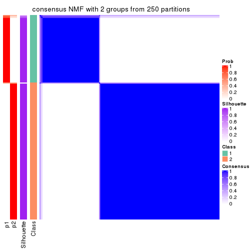</p>

</div>
<div id='tab-MAD-NMF-consensus-heatmap-2'>
<pre><code class="r">consensus_heatmap(res, k = 3)
</code></pre>

<p>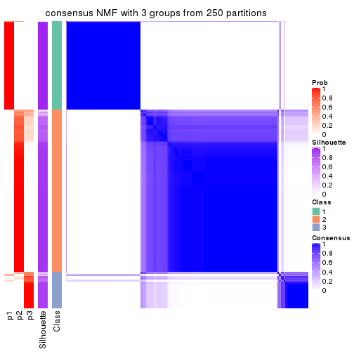</p>

</div>
<div id='tab-MAD-NMF-consensus-heatmap-3'>
<pre><code class="r">consensus_heatmap(res, k = 4)
</code></pre>

<p>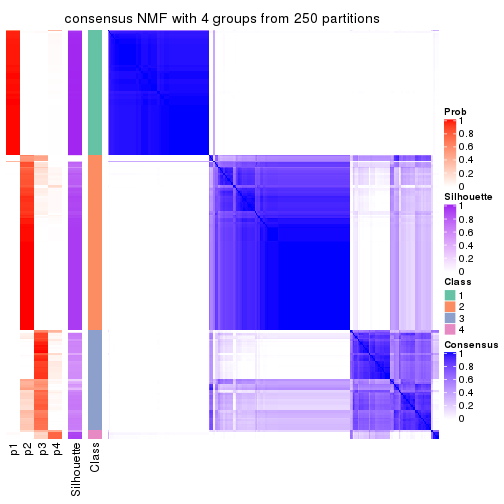</p>

</div>
<div id='tab-MAD-NMF-consensus-heatmap-4'>
<pre><code class="r">consensus_heatmap(res, k = 5)
</code></pre>

<p>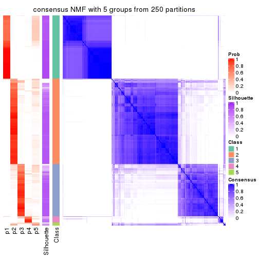</p>

</div>
<div id='tab-MAD-NMF-consensus-heatmap-5'>
<pre><code class="r">consensus_heatmap(res, k = 6)
</code></pre>

<p>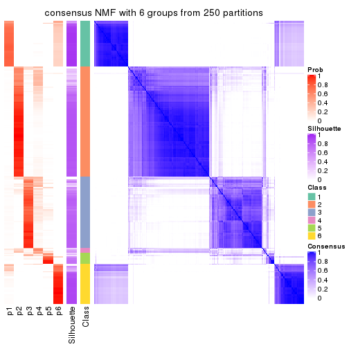</p>

</div>
</div>

Heatmaps for the membership of samples in all partitions to see how consistent they are:


<script>
$( function() {
	$( '#tabs-MAD-NMF-membership-heatmap' ).tabs();
} );
</script>
<div id='tabs-MAD-NMF-membership-heatmap'>
<ul>
<li><a href='#tab-MAD-NMF-membership-heatmap-1'>k = 2</a></li>
<li><a href='#tab-MAD-NMF-membership-heatmap-2'>k = 3</a></li>
<li><a href='#tab-MAD-NMF-membership-heatmap-3'>k = 4</a></li>
<li><a href='#tab-MAD-NMF-membership-heatmap-4'>k = 5</a></li>
<li><a href='#tab-MAD-NMF-membership-heatmap-5'>k = 6</a></li>
</ul>
<div id='tab-MAD-NMF-membership-heatmap-1'>
<pre><code class="r">membership_heatmap(res, k = 2)
</code></pre>

<p>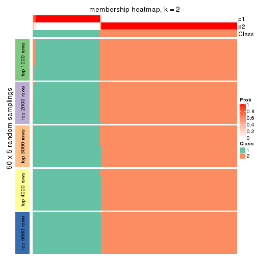</p>

</div>
<div id='tab-MAD-NMF-membership-heatmap-2'>
<pre><code class="r">membership_heatmap(res, k = 3)
</code></pre>

<p>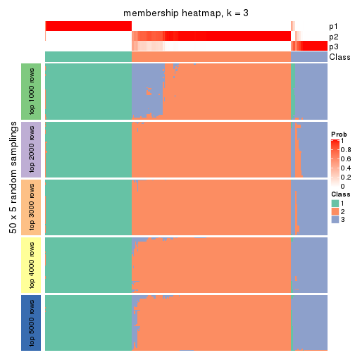</p>

</div>
<div id='tab-MAD-NMF-membership-heatmap-3'>
<pre><code class="r">membership_heatmap(res, k = 4)
</code></pre>

<p>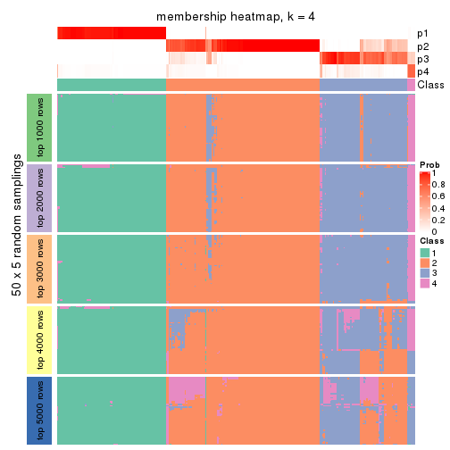</p>

</div>
<div id='tab-MAD-NMF-membership-heatmap-4'>
<pre><code class="r">membership_heatmap(res, k = 5)
</code></pre>

<p>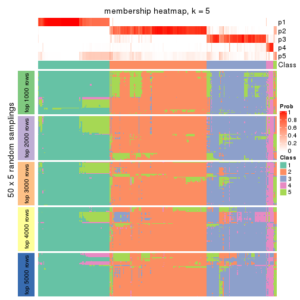</p>

</div>
<div id='tab-MAD-NMF-membership-heatmap-5'>
<pre><code class="r">membership_heatmap(res, k = 6)
</code></pre>

<p>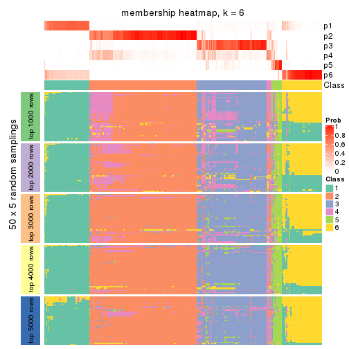</p>

</div>
</div>

As soon as we have had the classes for columns, we can look for signatures
which are significantly different between classes which can be candidate marks
for certain classes. Following are the heatmaps for signatures.


Signature heatmaps where rows are scaled:


<script>
$( function() {
	$( '#tabs-MAD-NMF-get-signatures' ).tabs();
} );
</script>
<div id='tabs-MAD-NMF-get-signatures'>
<ul>
<li><a href='#tab-MAD-NMF-get-signatures-1'>k = 2</a></li>
<li><a href='#tab-MAD-NMF-get-signatures-2'>k = 3</a></li>
<li><a href='#tab-MAD-NMF-get-signatures-3'>k = 4</a></li>
<li><a href='#tab-MAD-NMF-get-signatures-4'>k = 5</a></li>
<li><a href='#tab-MAD-NMF-get-signatures-5'>k = 6</a></li>
</ul>
<div id='tab-MAD-NMF-get-signatures-1'>
<pre><code class="r">get_signatures(res, k = 2)
</code></pre>

<p>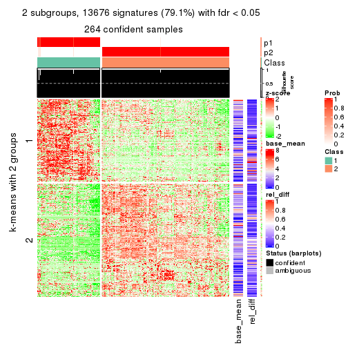</p>

</div>
<div id='tab-MAD-NMF-get-signatures-2'>
<pre><code class="r">get_signatures(res, k = 3)
</code></pre>

<p>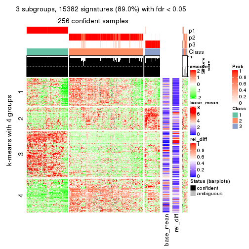</p>

</div>
<div id='tab-MAD-NMF-get-signatures-3'>
<pre><code class="r">get_signatures(res, k = 4)
</code></pre>

<p>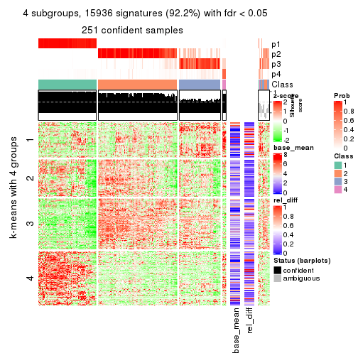</p>

</div>
<div id='tab-MAD-NMF-get-signatures-4'>
<pre><code class="r">get_signatures(res, k = 5)
</code></pre>

<p>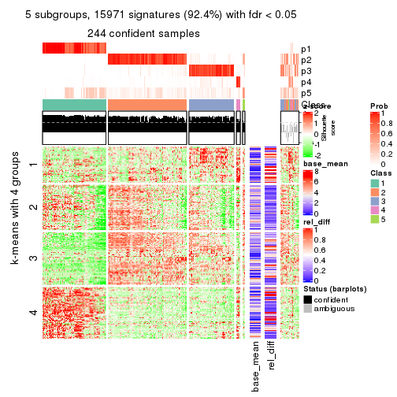</p>

</div>
<div id='tab-MAD-NMF-get-signatures-5'>
<pre><code class="r">get_signatures(res, k = 6)
</code></pre>

<p>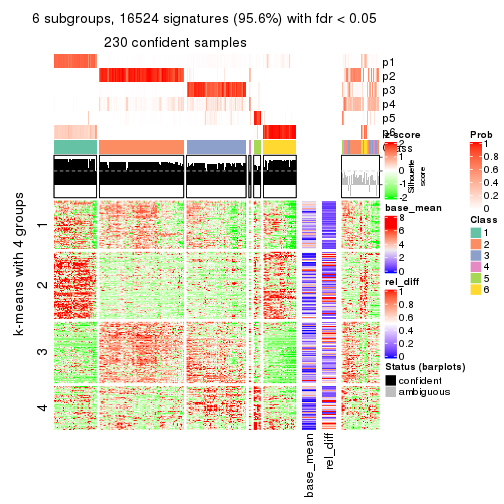</p>

</div>
</div>


Signature heatmaps where rows are not scaled:


<script>
$( function() {
	$( '#tabs-MAD-NMF-get-signatures-no-scale' ).tabs();
} );
</script>
<div id='tabs-MAD-NMF-get-signatures-no-scale'>
<ul>
<li><a href='#tab-MAD-NMF-get-signatures-no-scale-1'>k = 2</a></li>
<li><a href='#tab-MAD-NMF-get-signatures-no-scale-2'>k = 3</a></li>
<li><a href='#tab-MAD-NMF-get-signatures-no-scale-3'>k = 4</a></li>
<li><a href='#tab-MAD-NMF-get-signatures-no-scale-4'>k = 5</a></li>
<li><a href='#tab-MAD-NMF-get-signatures-no-scale-5'>k = 6</a></li>
</ul>
<div id='tab-MAD-NMF-get-signatures-no-scale-1'>
<pre><code class="r">get_signatures(res, k = 2, scale_rows = FALSE)
</code></pre>

<p>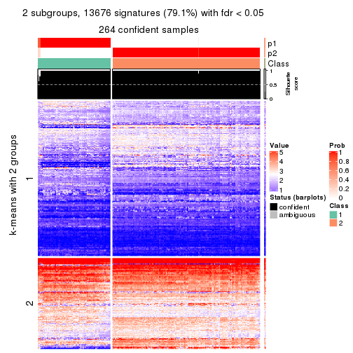</p>

</div>
<div id='tab-MAD-NMF-get-signatures-no-scale-2'>
<pre><code class="r">get_signatures(res, k = 3, scale_rows = FALSE)
</code></pre>

<p>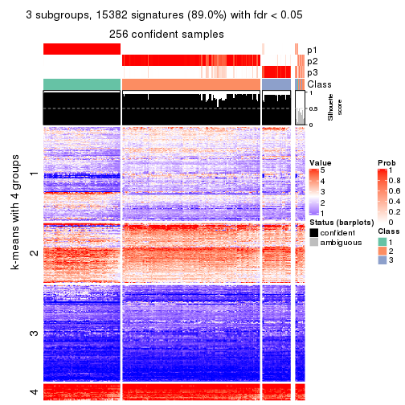</p>

</div>
<div id='tab-MAD-NMF-get-signatures-no-scale-3'>
<pre><code class="r">get_signatures(res, k = 4, scale_rows = FALSE)
</code></pre>

<p>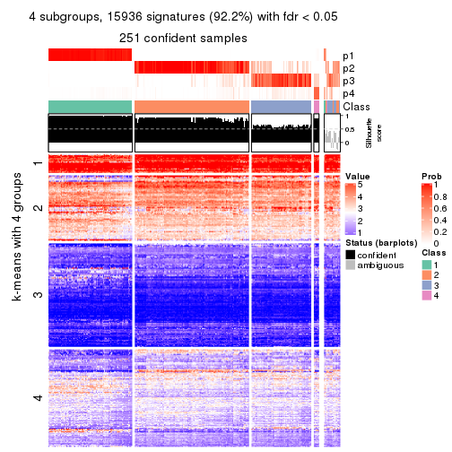</p>

</div>
<div id='tab-MAD-NMF-get-signatures-no-scale-4'>
<pre><code class="r">get_signatures(res, k = 5, scale_rows = FALSE)
</code></pre>

<p>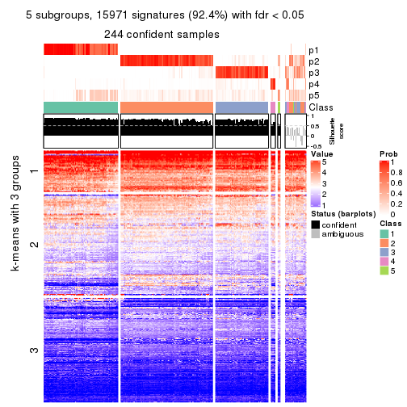</p>

</div>
<div id='tab-MAD-NMF-get-signatures-no-scale-5'>
<pre><code class="r">get_signatures(res, k = 6, scale_rows = FALSE)
</code></pre>

<p>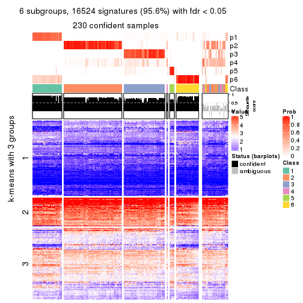</p>

</div>
</div>


Compare the overlap of signatures from different k:

```r
compare_signatures(res)
```

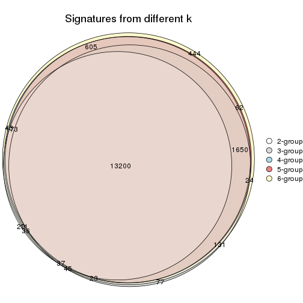

`get_signature()` returns a data frame invisibly. TO get the list of signatures, the function
call should be assigned to a variable explicitly. In following code, if `plot` argument is set
to `FALSE`, no heatmap is plotted while only the differential analysis is performed.

```r
# code only for demonstration
tb = get_signature(res, k = ..., plot = FALSE)
```

An example of the output of `tb` is:

```
#>   which_row         fdr    mean_1    mean_2 scaled_mean_1 scaled_mean_2 km
#> 1        38 0.042760348  8.373488  9.131774    -0.5533452     0.5164555  1
#> 2        40 0.018707592  7.106213  8.469186    -0.6173731     0.5762149  1
#> 3        55 0.019134737 10.221463 11.207825    -0.6159697     0.5749050  1
#> 4        59 0.006059896  5.921854  7.869574    -0.6899429     0.6439467  1
#> 5        60 0.018055526  8.928898 10.211722    -0.6204761     0.5791110  1
#> 6        98 0.009384629 15.714769 14.887706     0.6635654    -0.6193277  2
...
```

The columns in `tb` are:

1. `which_row`: row indices corresponding to the input matrix.
2. `fdr`: FDR for the differential test. 
3. `mean_x`: The mean value in group x.
4. `scaled_mean_x`: The mean value in group x after rows are scaled.
5. `km`: Row groups if k-means clustering is applied to rows.


UMAP plot which shows how samples are separated.


<script>
$( function() {
	$( '#tabs-MAD-NMF-dimension-reduction' ).tabs();
} );
</script>
<div id='tabs-MAD-NMF-dimension-reduction'>
<ul>
<li><a href='#tab-MAD-NMF-dimension-reduction-1'>k = 2</a></li>
<li><a href='#tab-MAD-NMF-dimension-reduction-2'>k = 3</a></li>
<li><a href='#tab-MAD-NMF-dimension-reduction-3'>k = 4</a></li>
<li><a href='#tab-MAD-NMF-dimension-reduction-4'>k = 5</a></li>
<li><a href='#tab-MAD-NMF-dimension-reduction-5'>k = 6</a></li>
</ul>
<div id='tab-MAD-NMF-dimension-reduction-1'>
<pre><code class="r">dimension_reduction(res, k = 2, method = &quot;UMAP&quot;)
</code></pre>

<p>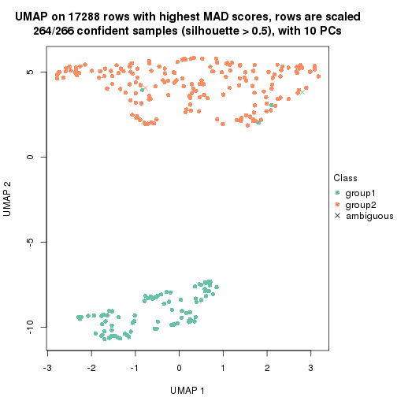</p>

</div>
<div id='tab-MAD-NMF-dimension-reduction-2'>
<pre><code class="r">dimension_reduction(res, k = 3, method = &quot;UMAP&quot;)
</code></pre>

<p>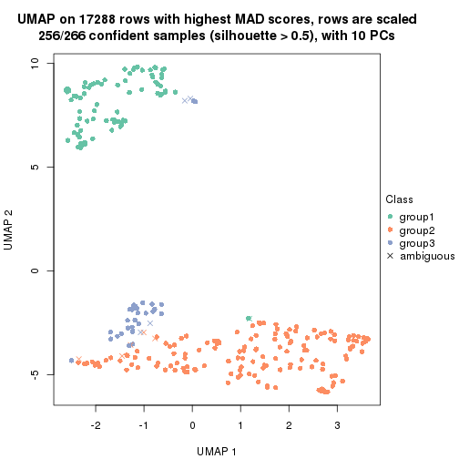</p>

</div>
<div id='tab-MAD-NMF-dimension-reduction-3'>
<pre><code class="r">dimension_reduction(res, k = 4, method = &quot;UMAP&quot;)
</code></pre>

<p>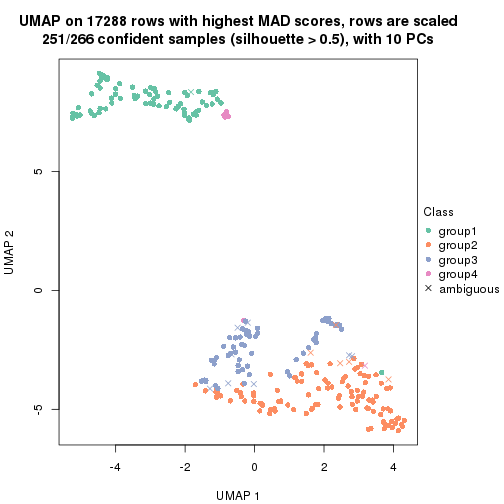</p>

</div>
<div id='tab-MAD-NMF-dimension-reduction-4'>
<pre><code class="r">dimension_reduction(res, k = 5, method = &quot;UMAP&quot;)
</code></pre>

<p>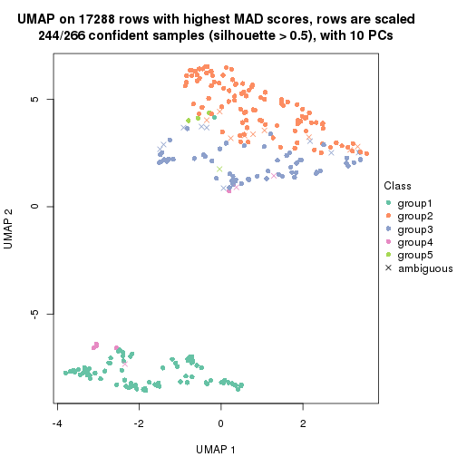</p>

</div>
<div id='tab-MAD-NMF-dimension-reduction-5'>
<pre><code class="r">dimension_reduction(res, k = 6, method = &quot;UMAP&quot;)
</code></pre>

<p>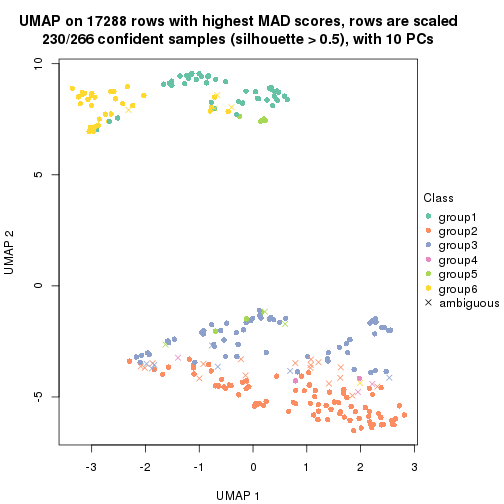</p>

</div>
</div>


Following heatmap shows how subgroups are split when increasing `k`:

```r
collect_classes(res)
```

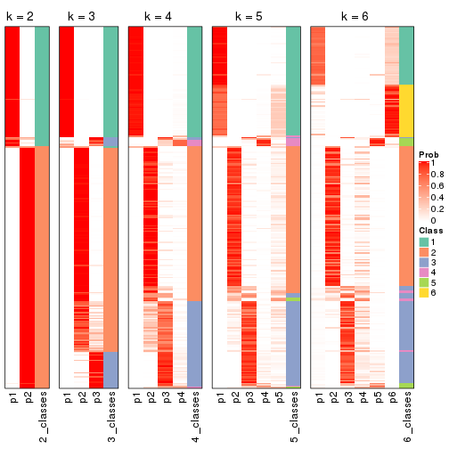


If matrix rows can be associated to genes, consider to use `GO_Enrichment(res,
...)` to perform function enrichment for the signature genes.


 

---------------------------------------------------


### ATC:hclust


The object with results only for a single top-value method and a single partition method 
can be extracted as:

```r
res = res_list["ATC", "hclust"]
# you can also extract it by
# res = res_list["ATC:hclust"]
```

A summary of `res` and all the functions that can be applied to it:

```r
res
```

```
#> A 'ConsensusPartition' object with k = 2, 3, 4, 5, 6.
#>   On a matrix with 17288 rows and 266 columns.
#>   Top rows (1000, 2000, 3000, 4000, 5000) are extracted by 'ATC' method.
#>   Subgroups are detected by 'hclust' method.
#>   Performed in total 1250 partitions by row resampling.
#>   Best k for subgroups seems to be 2.
#> 
#> Following methods can be applied to this 'ConsensusPartition' object:
#>  [1] "cola_report"             "collect_classes"         "collect_plots"          
#>  [4] "collect_stats"           "colnames"                "compare_signatures"     
#>  [7] "consensus_heatmap"       "dimension_reduction"     "functional_enrichment"  
#> [10] "get_anno_col"            "get_anno"                "get_classes"            
#> [13] "get_consensus"           "get_matrix"              "get_membership"         
#> [16] "get_param"               "get_signatures"          "get_stats"              
#> [19] "is_best_k"               "is_stable_k"             "membership_heatmap"     
#> [22] "ncol"                    "nrow"                    "plot_ecdf"              
#> [25] "rownames"                "select_partition_number" "show"                   
#> [28] "suggest_best_k"          "test_to_known_factors"
```

`collect_plots()` function collects all the plots made from `res` for all `k` (number of partitions)
into one single page to provide an easy and fast comparison between different `k`.

```r
collect_plots(res)
```

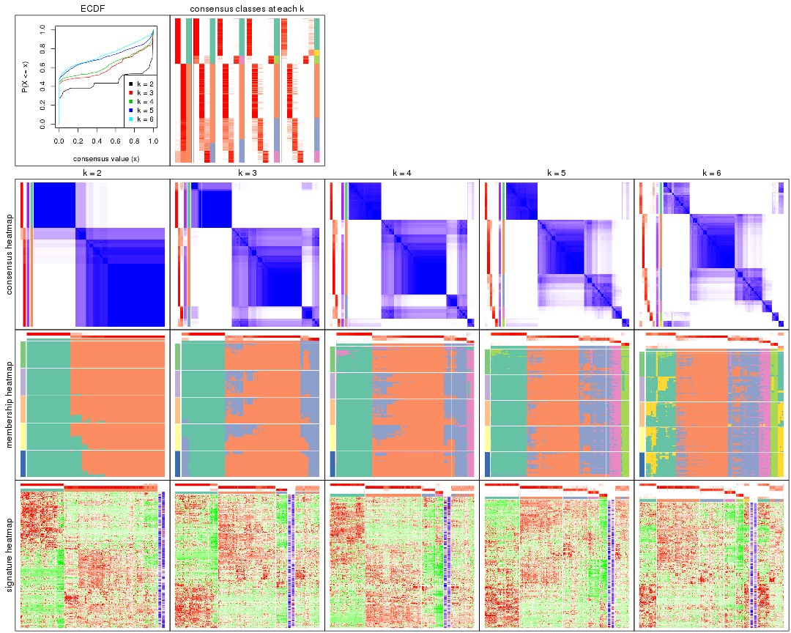

The plots are:

- The first row: a plot of the ECDF (Empirical cumulative distribution
  function) curves of the consensus matrix for each `k` and the heatmap of
  predicted classes for each `k`.
- The second row: heatmaps of the consensus matrix for each `k`.
- The third row: heatmaps of the membership matrix for each `k`.
- The fouth row: heatmaps of the signatures for each `k`.

All the plots in panels can be made by individual functions and they are
plotted later in this section.

`select_partition_number()` produces several plots showing different
statistics for choosing "optimized" `k`. There are following statistics:

- ECDF curves of the consensus matrix for each `k`;
- 1-PAC. [The PAC
  score](https://en.wikipedia.org/wiki/Consensus_clustering#Over-interpretation_potential_of_consensus_clustering)
  measures the proportion of the ambiguous subgrouping.
- Mean silhouette score.
- Concordance. The mean probability of fiting the consensus class ids in all
  partitions.
- Area increased. Denote $A_k$ as the area under the ECDF curve for current
  `k`, the area increased is defined as $A_k - A_{k-1}$.
- Rand index. The percent of pairs of samples that are both in a same cluster
  or both are not in a same cluster in the partition of k and k-1.
- Jaccard index. The ratio of pairs of samples are both in a same cluster in
  the partition of k and k-1 and the pairs of samples are both in a same
  cluster in the partition k or k-1.

The detailed explanations of these statistics can be found in [the cola
vignette](http://bioconductor.org/packages/devel/bioc/vignettes/cola/inst/doc/cola.html#toc_13).

Generally speaking, lower PAC score, higher mean silhouette score or higher
concordance corresponds to better partition. Rand index and Jaccard index
measure how similar the current partition is compared to partition with `k-1`.
If they are too similar, we won't accept `k` is better than `k-1`.

```r
select_partition_number(res)
```

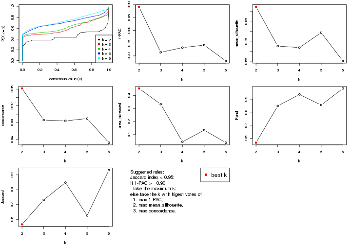

The numeric values for all these statistics can be obtained by `get_stats()`.

```r
get_stats(res)
```

```
#>   k 1-PAC mean_silhouette concordance area_increased  Rand Jaccard
#> 2 2 0.892           0.922       0.961         0.4533 0.566   0.566
#> 3 3 0.714           0.726       0.886         0.3330 0.848   0.731
#> 4 4 0.732           0.718       0.884         0.0449 0.936   0.848
#> 5 5 0.742           0.793       0.890         0.1342 0.855   0.626
#> 6 6 0.680           0.651       0.832         0.0381 0.982   0.932
```

`suggest_best_k()` suggests the best $k$ based on these statistics. The rules are as follows:

- All $k$ with Jaccard index larger than 0.95 are removed because the increase of
  the partition number does not provides enough extra information. If all $k$ are removed,
  the best $k$ is assigned by `NA`.
- For $k$ with 1-PAC larger than 0.9, the maximal $k$ is taken as the "best k". Other $k$ is called "optional k".
- If it does not fit the second rule. The $k$ with the highest vote of highest
  1-PAC, mean silhouette and concordance is taken as the "best k".

```r
suggest_best_k(res)
```

```
#> [1] 2
```


Following shows the table of the partitions (You need to click the **show/hide
code output** link to see it). The membership matrix (columns with name `p*`)
is inferred by
[`clue::cl_consensus()`](https://www.rdocumentation.org/link/cl_consensus?package=clue)
function with the `SE` method. Basically the value in the membership matrix
represents the probability to belong to a certain group. The finall class
label for an item is determined with the group with highest probability it
belongs to.

In `get_classes()` function, the entropy is calculated from the membership
matrix and the silhouette score is calculated from the consensus matrix.


<script>
$( function() {
	$( '#tabs-ATC-hclust-get-classes' ).tabs();
} );
</script>
<div id='tabs-ATC-hclust-get-classes'>
<ul>
<li><a href='#tab-ATC-hclust-get-classes-1'>k = 2</a></li>
<li><a href='#tab-ATC-hclust-get-classes-2'>k = 3</a></li>
<li><a href='#tab-ATC-hclust-get-classes-3'>k = 4</a></li>
<li><a href='#tab-ATC-hclust-get-classes-4'>k = 5</a></li>
<li><a href='#tab-ATC-hclust-get-classes-5'>k = 6</a></li>
</ul>

<div id='tab-ATC-hclust-get-classes-1'>
<p><a id='tab-ATC-hclust-get-classes-1-a' style='color:#0366d6' href='#'>show/hide code output</a></p>
<pre><code class="r">cbind(get_classes(res, k = 2), get_membership(res, k = 2))
</code></pre>

<pre><code>#&gt;                                      class entropy silhouette    p1    p2
#&gt; 80D0AF10-1C61-4B67-90C1-7DBF1EF23672     2   0.000      0.943 0.000 1.000
#&gt; 87117BE1-D328-4972-85DA-6672412D8860     2   0.000      0.943 0.000 1.000
#&gt; F904C5B6-70BD-4604-8254-79BE23B152DA     1   0.000      1.000 1.000 0.000
#&gt; 3182DEA1-4239-4613-925A-7E6503766AD6     2   0.000      0.943 0.000 1.000
#&gt; 55E78EA2-2D9B-481F-8CAB-D36A33088EAE     2   0.000      0.943 0.000 1.000
#&gt; 86F94264-A6DD-4A97-9191-036F066DD0EF     2   0.000      0.943 0.000 1.000
#&gt; 09D25417-23B7-4D88-A0EA-F307985FBBBC     2   0.952      0.513 0.372 0.628
#&gt; C797F12C-40D3-4DB5-B9EF-A6821BBDE4F0     1   0.000      1.000 1.000 0.000
#&gt; 80275DB0-A226-4B6B-A08F-4ADBEEE1DB01     1   0.000      1.000 1.000 0.000
#&gt; 27FB653A-9E07-44AD-952E-9E4DE4AB5891     2   0.000      0.943 0.000 1.000
#&gt; 1A5DB9FC-2ABD-4E1B-B5EF-B1CF5E5F3872     1   0.000      1.000 1.000 0.000
#&gt; 844E4CCD-D30C-416F-A086-8923711A4E25     2   0.278      0.921 0.048 0.952
#&gt; EF18318D-3D25-4D65-803A-ED6E62871E7E     1   0.000      1.000 1.000 0.000
#&gt; 1ACB1BE0-61F6-4243-BBEC-E26A1CF90CA8     1   0.000      1.000 1.000 0.000
#&gt; 8EF0039B-D758-46AB-BAF7-6A062C7C56BA     1   0.000      1.000 1.000 0.000
#&gt; 22F4C9D9-663B-4C91-9692-E035A2640BEC     2   0.000      0.943 0.000 1.000
#&gt; FA1A0BCE-EE0F-4178-B963-62550E344B14     2   0.000      0.943 0.000 1.000
#&gt; 0B6D0C4E-5AE3-4707-A9FC-12A108E6EC2A     2   0.000      0.943 0.000 1.000
#&gt; 06FD3123-2AEB-4911-AC4E-E0E64FD5DB52     2   0.000      0.943 0.000 1.000
#&gt; 235A4492-FF80-4AA5-BC71-DFF65E1C7411     2   0.000      0.943 0.000 1.000
#&gt; A192C6C0-1443-4493-AFAC-1EE710628ADB     2   0.000      0.943 0.000 1.000
#&gt; 6FC5B56B-711B-4174-9B06-4E843124AAB6     1   0.000      1.000 1.000 0.000
#&gt; 7A813F60-A41E-4552-990E-F22287654C1D     2   0.000      0.943 0.000 1.000
#&gt; 725BBFB5-26F4-4512-9C75-47D013C1E605     1   0.000      1.000 1.000 0.000
#&gt; 39CC4E82-EBC9-472E-8BE5-6A3AB178449A     2   0.000      0.943 0.000 1.000
#&gt; 61130DEE-E267-49DF-8B41-7738A06EF738     2   0.343      0.910 0.064 0.936
#&gt; 117EC12C-B7ED-4E01-B29B-EA542D356EA1     1   0.000      1.000 1.000 0.000
#&gt; A30FF708-F7A9-41E4-8AD5-20441650FBC9     2   0.000      0.943 0.000 1.000
#&gt; 53640D52-1167-4A5D-B656-97D32CBA3934     1   0.000      1.000 1.000 0.000
#&gt; 9E85D76A-DD2A-46D5-BB59-0ED302B6258C     2   0.494      0.873 0.108 0.892
#&gt; 6F8C6F90-7E3C-4860-91DD-586708DE44AA     1   0.000      1.000 1.000 0.000
#&gt; E675AEC5-AA9A-4AAA-839C-03E6365822DB     2   0.952      0.513 0.372 0.628
#&gt; B577DEF7-2F5C-4876-A7C6-F18D5722B8C0     1   0.000      1.000 1.000 0.000
#&gt; DA8B577E-43E7-49BF-BF94-868E3194F5C9     1   0.000      1.000 1.000 0.000
#&gt; 3334280B-2A36-4AC7-A021-A76C10E958F0     2   0.000      0.943 0.000 1.000
#&gt; 5CBDDC90-11EC-4E6E-881E-AA9CCFD40FDB     2   0.921      0.579 0.336 0.664
#&gt; 8CBBF32A-8349-44F5-A8B8-4CBB1760A464     2   0.000      0.943 0.000 1.000
#&gt; B9455A9A-136D-4DC2-9F86-0FC74433589D     2   0.278      0.921 0.048 0.952
#&gt; D7EAE2A7-F9BE-4222-A452-B1F83F99CD50     2   0.141      0.935 0.020 0.980
#&gt; F803AE18-60C5-4CFE-AAAB-DB33C26A2184     1   0.000      1.000 1.000 0.000
#&gt; 5DD8CAC7-EC02-43B6-B58E-6D2E22868A3B     2   0.000      0.943 0.000 1.000
#&gt; EE98E1B4-DFB3-4AEC-8527-E1FD544C9475     1   0.000      1.000 1.000 0.000
#&gt; 3CE43921-47D5-4394-B9E1-242607775D61     2   0.000      0.943 0.000 1.000
#&gt; 46986F2B-0B0D-4187-8948-4E91D34B7C49     2   0.000      0.943 0.000 1.000
#&gt; 5D1D052E-74EF-45A8-9B1A-7CECD13EA43B     2   0.936      0.550 0.352 0.648
#&gt; 4C821AD9-A5C9-4A9A-9C5D-363B227F8064     2   0.184      0.931 0.028 0.972
#&gt; 06A4189E-A23B-4AC6-AA74-01955DD7D1E9     2   0.000      0.943 0.000 1.000
#&gt; FCCDC76F-CB02-4BCD-A616-325F258DDAA4     2   0.000      0.943 0.000 1.000
#&gt; DAC53B0A-8F35-4EA6-BBCC-4CD1C049E11F     2   0.494      0.873 0.108 0.892
#&gt; DD4F845B-CAD3-44CB-9D96-3C3F5BA1B72D     1   0.000      1.000 1.000 0.000
#&gt; D440F004-A4A4-41B6-BED8-805D67BA01C7     2   0.000      0.943 0.000 1.000
#&gt; A497C423-119F-42FA-BF17-9F6DFD2A5585     2   0.000      0.943 0.000 1.000
#&gt; 3420E573-DE12-4EF5-B1C0-2FCA904F4F4E     1   0.000      1.000 1.000 0.000
#&gt; 1AD72157-A254-44B4-BA58-4F30F1AE910E     1   0.000      1.000 1.000 0.000
#&gt; C1113977-B160-45EE-B061-750F9EA3F33F     2   0.204      0.930 0.032 0.968
#&gt; 6783AB5B-F07C-447B-BF13-C34485D246D7     2   0.943      0.537 0.360 0.640
#&gt; 1F553062-26FD-4A7F-B7FB-81184604F423     1   0.000      1.000 1.000 0.000
#&gt; BE2DCA51-1C21-4598-98A7-F2FB9B2DFCB4     2   0.494      0.873 0.108 0.892
#&gt; 38941CF3-9C54-4BA4-A005-CC88CA97D504     2   0.000      0.943 0.000 1.000
#&gt; 51CB675E-E243-4A07-BF4A-580473D26FDA     2   0.000      0.943 0.000 1.000
#&gt; C7FED0F5-C27A-4405-9232-30BF39362CF7     2   0.402      0.897 0.080 0.920
#&gt; 2A1E86E8-4713-465F-ACFF-C584864C57A1     2   0.000      0.943 0.000 1.000
#&gt; B4500785-0FAA-4D4D-8630-43D194BAB004     2   0.000      0.943 0.000 1.000
#&gt; 3FD52E66-AB76-4079-80DB-281A795D1EC0     2   0.921      0.579 0.336 0.664
#&gt; EBD355D1-1226-4DFD-AAFF-45D246B64F3C     2   0.000      0.943 0.000 1.000
#&gt; 5A040A73-CD95-487E-8AEF-9639FE4E2916     2   0.000      0.943 0.000 1.000
#&gt; CF629C65-585D-476D-B081-3E6E0575FAE3     2   0.141      0.935 0.020 0.980
#&gt; 0D4202A3-808E-413F-9BF3-9CFCCAE0ED61     2   0.000      0.943 0.000 1.000
#&gt; 43E715BF-28D9-4B5E-B762-8CD1B69A430E     1   0.000      1.000 1.000 0.000
#&gt; BFB82BE8-9DAC-4099-8B38-0950308E3EB3     2   0.000      0.943 0.000 1.000
#&gt; F7CB1825-2303-4DD2-AE1F-7205738EAF1F     1   0.000      1.000 1.000 0.000
#&gt; FE298483-C42C-4753-BABB-29A9CB1B6312     1   0.000      1.000 1.000 0.000
#&gt; A98C7561-1B42-4CD6-AE71-924B91FA4C33     2   0.000      0.943 0.000 1.000
#&gt; 58098F21-7DAB-47DA-9A41-8D20BF3B9257     2   0.952      0.513 0.372 0.628
#&gt; 18CAF708-20B9-4745-9CB3-37AB6E0B3056     2   0.402      0.897 0.080 0.920
#&gt; 2C80DD72-C9C7-4AC2-812F-9A31EF02779C     1   0.000      1.000 1.000 0.000
#&gt; 68A3F13D-319D-4603-A27F-B5DD46FE5C5B     2   0.000      0.943 0.000 1.000
#&gt; 7EE8F0CE-CDC9-40F9-A1DE-7F8140EC6D13     2   0.278      0.921 0.048 0.952
#&gt; 39019903-5B9C-4665-BD5F-7CCB19CB55C5     2   0.000      0.943 0.000 1.000
#&gt; 190EDB27-4CBC-4E9C-9B67-D51FDAB982B7     2   0.952      0.513 0.372 0.628
#&gt; EB2D95BC-62F8-4669-9308-D37D7FB79E23     2   0.000      0.943 0.000 1.000
#&gt; A08B85EA-D1E7-4B77-8DEC-36294305B9F7     1   0.000      1.000 1.000 0.000
#&gt; 130DDFAD-6EF8-4C80-BD9D-88308A6874BC     2   0.000      0.943 0.000 1.000
#&gt; 7340A5BA-E002-448F-AACC-E7A37DBB79C2     2   0.000      0.943 0.000 1.000
#&gt; A771F6E3-D266-4FE7-98C6-C40E6A701D59     1   0.000      1.000 1.000 0.000
#&gt; 015E792C-EC1B-49BF-AB07-D82B20C5989A     2   0.204      0.930 0.032 0.968
#&gt; BF79E030-47EE-4D08-B910-5685A4BD8B60     2   0.000      0.943 0.000 1.000
#&gt; FB3C7C9A-2F2D-4DD5-BE47-FAFB072C0FAB     2   0.000      0.943 0.000 1.000
#&gt; 4E5557BA-10E8-4723-908E-DD04EF6639B2     2   0.443      0.887 0.092 0.908
#&gt; 8031B550-40A9-4A3A-9F7D-CDC052288BD8     2   0.184      0.932 0.028 0.972
#&gt; 55299A06-3C1F-45A4-B166-B2C591C0CEE2     2   0.242      0.925 0.040 0.960
#&gt; EB8D5168-216E-4ABB-8B4E-9E67786CB322     1   0.000      1.000 1.000 0.000
#&gt; 78BD2D83-9A7F-42E5-BB38-654AA0761A0A     2   0.000      0.943 0.000 1.000
#&gt; AA2D53E5-D389-4332-9DD5-A736052E48F8     1   0.000      1.000 1.000 0.000
#&gt; 62945C7A-9313-4FC9-820C-B0AB820B394E     1   0.000      1.000 1.000 0.000
#&gt; 22746046-2E99-4EE9-97D2-BA2EA499634C     2   0.000      0.943 0.000 1.000
#&gt; 8671B51B-DCBE-4429-9F01-AF51CAD7014F     2   0.224      0.928 0.036 0.964
#&gt; E815AB36-5689-4A0D-8E6D-2EAA73406681     1   0.000      1.000 1.000 0.000
#&gt; A1DACB46-ED52-4E38-B2C8-57256BB22B5E     2   0.000      0.943 0.000 1.000
#&gt; 4F5498C4-A423-4B3D-AC98-D4E214A57D0E     1   0.000      1.000 1.000 0.000
#&gt; A7772CCD-FFFF-49DD-86ED-0BAD330EC9B6     2   0.936      0.550 0.352 0.648
#&gt; E6E3DF78-65B9-4F74-8DA8-E2A6D4EDBEA7     2   0.000      0.943 0.000 1.000
#&gt; 83286E2D-E708-437A-911A-E6B050273CBD     1   0.000      1.000 1.000 0.000
#&gt; EC5C7C97-EE8C-405D-A039-D96514B1D414     2   0.000      0.943 0.000 1.000
#&gt; 3E55223D-6E3D-4027-9819-67E91212531D     1   0.000      1.000 1.000 0.000
#&gt; 99A036A2-8343-4D06-8047-D84E96CE4C61     2   0.000      0.943 0.000 1.000
#&gt; CA6CDE6D-92DE-4259-9E58-A373F2D543EA     2   0.000      0.943 0.000 1.000
#&gt; BF6FA8CC-60C1-413A-B2C6-54CCACBC01D6     1   0.000      1.000 1.000 0.000
#&gt; E0594CFE-F7B6-4546-B130-30DF6A514B1F     2   0.952      0.513 0.372 0.628
#&gt; E769E41D-5949-42C5-9594-E563C05ACE52     2   0.000      0.943 0.000 1.000
#&gt; 01373725-5D3C-4D9C-AABC-911D53E62BCD     2   0.242      0.925 0.040 0.960
#&gt; 1F39DADD-3655-474E-BA4C-A5BD32C97A8B     1   0.000      1.000 1.000 0.000
#&gt; AF573EC8-E4EE-4B8F-8199-9817B9FAC67D     1   0.000      1.000 1.000 0.000
#&gt; 3F022CBC-41C8-4387-A6FB-124C4BCD1AD9     1   0.000      1.000 1.000 0.000
#&gt; 1CC32ACE-826B-494B-8B89-5BD92327A74D     2   0.000      0.943 0.000 1.000
#&gt; 22B0BD3B-EE08-4BC7-90B2-01C372A56BA2     2   0.000      0.943 0.000 1.000
#&gt; 0F3DE9EF-19CC-4D14-9A42-1435DB537F94     2   0.943      0.537 0.360 0.640
#&gt; 87F8A33F-FBC3-469E-862B-84472F796358     2   0.000      0.943 0.000 1.000
#&gt; C9F2FA0D-1A9F-40B4-BD9B-CAF1B3F3D5A7     2   0.000      0.943 0.000 1.000
#&gt; ACFC9F59-78FF-4453-B25F-8834D0EAB54A     2   0.000      0.943 0.000 1.000
#&gt; B7AC7D5B-14E9-45A7-93B7-226EE508544A     2   0.224      0.928 0.036 0.964
#&gt; 4491BF17-B168-4E96-8E09-EF1AEC9F5E9D     2   0.224      0.928 0.036 0.964
#&gt; 557A0811-A3FE-4CF4-A24D-FBB77E7F9139     2   0.000      0.943 0.000 1.000
#&gt; 6F9C955C-6816-4353-922A-8035B50FACC6     2   0.000      0.943 0.000 1.000
#&gt; 3E89FB1C-4A7D-43C7-823C-04E3716A7935     2   0.541      0.857 0.124 0.876
#&gt; 12ABE483-66EF-4237-94C4-0199FAE23FA8     2   0.000      0.943 0.000 1.000
#&gt; 7535F262-9B96-44F6-988C-4C9EBB3FFCA9     2   0.000      0.943 0.000 1.000
#&gt; 65C9D28E-303B-40E5-84F0-2507F5457374     2   0.343      0.910 0.064 0.936
#&gt; FD445384-6BA9-4297-9D9C-12ABA7D645C7     1   0.000      1.000 1.000 0.000
#&gt; 30D5E255-2AD3-44F3-8983-1B80E4FD3E2D     2   0.000      0.943 0.000 1.000
#&gt; 3E88EC60-B4A8-4259-8BC8-A234800F6955     2   0.278      0.921 0.048 0.952
#&gt; ACD73CE8-AFC5-47A0-9383-3CB97F018953     1   0.000      1.000 1.000 0.000
#&gt; 1AFDC2EA-26A8-44E2-8BCB-F34F7B66F8C8     2   0.946      0.529 0.364 0.636
#&gt; 9E327BC8-1D20-4AD8-83F7-FB2D13BCA5D0     2   0.141      0.935 0.020 0.980
#&gt; 85A86B91-4F24-4E77-AE2D-520F8E205EFC     1   0.000      1.000 1.000 0.000
#&gt; 74868C37-8143-4306-81CA-E45759D146CD     2   0.000      0.943 0.000 1.000
#&gt; 69AEA0DB-E335-48A0-A398-4FB0D581182A     2   0.000      0.943 0.000 1.000
#&gt; AE6F8B89-85C2-42B7-8D05-AFDDD4FEFD16     1   0.000      1.000 1.000 0.000
#&gt; A8A6F09C-9812-4457-9A4B-AD41F97B41A3     2   0.000      0.943 0.000 1.000
#&gt; 1A09BC4D-EF29-42DD-BB04-A3C264A3032D     1   0.000      1.000 1.000 0.000
#&gt; E0961A30-A62C-4235-9CF0-A1776827A996     2   0.000      0.943 0.000 1.000
#&gt; 134D2D90-7B08-4F20-8A3A-C77643FB208F     2   0.000      0.943 0.000 1.000
#&gt; A77C2DFF-93CF-4CB5-B3C1-81133D7F1A0F     2   0.921      0.579 0.336 0.664
#&gt; EA2DC457-9C74-4B9C-B3FA-5E72199B24A7     2   0.469      0.880 0.100 0.900
#&gt; FF34117B-5EE4-4C96-A8A2-2CE6A654CBE5     1   0.000      1.000 1.000 0.000
#&gt; 75F7B5E2-6559-4B48-A2A4-287C35C559CC     1   0.000      1.000 1.000 0.000
#&gt; 903BF591-B0AF-4BEE-B625-60B673070344     2   0.000      0.943 0.000 1.000
#&gt; 9DE1B790-C63C-41C4-9477-CE52A8119C67     2   0.000      0.943 0.000 1.000
#&gt; 9A28F80A-85F8-40E2-A32B-230EF93B2FA0     2   0.000      0.943 0.000 1.000
#&gt; 0AA2BDBB-8720-409A-AA72-1F4AA26E7CD8     2   0.000      0.943 0.000 1.000
#&gt; 5AD49F16-E974-4E5D-B1B6-073ECB73A01D     2   0.952      0.513 0.372 0.628
#&gt; CB0F961C-527D-4A48-9408-286B26BD9532     1   0.000      1.000 1.000 0.000
#&gt; 46FF25B6-D01D-4CA7-80B7-CEC2998C34E1     2   0.000      0.943 0.000 1.000
#&gt; 487CADE1-D699-4A6C-817A-B9A0AB940C61     1   0.000      1.000 1.000 0.000
#&gt; 4FF6F2D8-F869-4735-A4D1-1A8423153FBC     1   0.000      1.000 1.000 0.000
#&gt; 6005494F-5D3D-43A3-B3E8-8C91955B2A98     2   0.000      0.943 0.000 1.000
#&gt; CF10D584-CE32-45A4-A932-E9D5AF12A6A0     1   0.000      1.000 1.000 0.000
#&gt; E15CE4AB-5646-49C8-9CD6-938457036BB0     2   0.000      0.943 0.000 1.000
#&gt; 31E28D0B-0E69-4330-82ED-4F1827DC97EA     2   0.000      0.943 0.000 1.000
#&gt; DBACD3C3-CCB5-4478-BA78-85A0C847CA66     2   0.000      0.943 0.000 1.000
#&gt; 5A07041C-65EB-4FCD-8940-E90B905061B5     2   0.141      0.935 0.020 0.980
#&gt; 0EA7C916-FA47-489B-BC98-4D9E7D197628     1   0.000      1.000 1.000 0.000
#&gt; 30967F75-8499-47FF-ADA4-4DC566013F7B     1   0.000      1.000 1.000 0.000
#&gt; D2E528FF-AEA2-48D7-A60A-4C3E71EA9073     2   0.000      0.943 0.000 1.000
#&gt; 22735DCD-215E-48BC-BF44-32BD66F06E39     2   0.242      0.925 0.040 0.960
#&gt; BC2C3248-7FC6-48BC-96C1-45EA573DE7DC     1   0.000      1.000 1.000 0.000
#&gt; E72CEBCB-D686-4B12-BCBA-EC8F964330A2     1   0.000      1.000 1.000 0.000
#&gt; 23C937BB-BA20-4440-B680-914229CC3ADF     1   0.000      1.000 1.000 0.000
#&gt; 947E99C7-F402-4F1A-A6E9-81BCAAED135A     2   0.000      0.943 0.000 1.000
#&gt; 02475D11-FC81-4E88-944E-173C32DC3FE7     2   0.141      0.935 0.020 0.980
#&gt; F972A9AA-9842-4343-A533-A795E65581CE     1   0.000      1.000 1.000 0.000
#&gt; 05043AAF-3095-4C61-B5C1-EE9AA9082C75     2   0.494      0.873 0.108 0.892
#&gt; CECF7967-862E-428C-BB42-FEF553FDB3AA     2   0.000      0.943 0.000 1.000
#&gt; FB0B9483-6302-48C7-BE5B-DA667E00AE2D     2   0.952      0.513 0.372 0.628
#&gt; 78700FBA-1487-4754-9B30-18837BF7E9FB     1   0.000      1.000 1.000 0.000
#&gt; 2166F56D-54CE-4F1B-8F07-A4E13E4489E9     1   0.000      1.000 1.000 0.000
#&gt; 7CD0942E-E39A-43A7-8BAC-F25967864901     2   0.000      0.943 0.000 1.000
#&gt; 3B00BA2B-7F7D-4825-8F8D-90F04A5DE687     2   0.000      0.943 0.000 1.000
#&gt; 7465B01D-C05E-4FE0-A9FE-182920EDC489     2   0.343      0.910 0.064 0.936
#&gt; 88C31A99-F96E-4FC8-8B3D-C1AAA05062D9     1   0.000      1.000 1.000 0.000
#&gt; 53575575-3303-4F8F-B6A8-B42131CFB4AC     2   0.000      0.943 0.000 1.000
#&gt; CC8017C7-4128-48DA-8E43-503F63158D85     1   0.000      1.000 1.000 0.000
#&gt; 88449D2A-2A25-41A4-B91D-C99B58F8ECD9     2   0.000      0.943 0.000 1.000
#&gt; 46C7DDE5-A2B5-494F-96AE-0B6E2D51B003     1   0.000      1.000 1.000 0.000
#&gt; 42551D05-5EE5-4F91-93A8-32DA695D9DFA     2   0.000      0.943 0.000 1.000
#&gt; 0772DA48-3A36-422D-B166-CA1691B782C3     2   0.000      0.943 0.000 1.000
#&gt; 30346897-EC77-4153-88A2-D14593C8B741     2   0.000      0.943 0.000 1.000
#&gt; 0F00E267-C748-4A71-8B36-03C410641D88     2   0.000      0.943 0.000 1.000
#&gt; 4034703A-4DA9-4DDA-9CA9-E80FFE9CCDE6     2   0.000      0.943 0.000 1.000
#&gt; 393C8A41-CF45-4EA8-AFE3-25A08AB7692A     2   0.000      0.943 0.000 1.000
#&gt; 3354212D-A07C-435C-8B0C-9A7BAAB624B5     1   0.000      1.000 1.000 0.000
#&gt; 57E30D4E-ABF7-47DD-92BE-40CE215076B0     1   0.000      1.000 1.000 0.000
#&gt; 202B4C76-C840-4DB8-953F-AC75A4156FDD     2   0.000      0.943 0.000 1.000
#&gt; 93A0137B-1F4C-44EE-B959-2AD0CD2DF8B6     1   0.000      1.000 1.000 0.000
#&gt; C9794DB6-6E8C-4AFD-80EE-61D672A4F6E9     2   0.936      0.550 0.352 0.648
#&gt; AE4BFE63-F0C0-4624-AD97-4F7FF13E2384     1   0.000      1.000 1.000 0.000
#&gt; DCF87F27-2B54-42D9-8D28-5DFEE76E2F5B     2   0.000      0.943 0.000 1.000
#&gt; 2451D405-39FD-4812-958C-23462B66F1F1     2   0.224      0.928 0.036 0.964
#&gt; E27F5D33-3F68-4CA8-8757-A387C6EAD060     2   0.242      0.925 0.040 0.960
#&gt; 8BA9928A-5B93-477F-B4A2-D031B714D9AC     1   0.000      1.000 1.000 0.000
#&gt; 0FAACFF6-B50C-4BED-9824-B7270654F28D     2   0.000      0.943 0.000 1.000
#&gt; 3366CC3C-2BBA-4CA7-848E-4E16AA70AE7A     2   0.000      0.943 0.000 1.000
#&gt; 66237056-CA9A-4C90-AF0E-1621FEB71578     2   0.000      0.943 0.000 1.000
#&gt; C480F1FB-3100-436C-B0F5-DED63B7A580E     2   0.000      0.943 0.000 1.000
#&gt; A327DE0D-D945-4B42-9B41-A7302CF796EE     2   0.000      0.943 0.000 1.000
#&gt; E8A6871D-67FB-4306-9454-F5E7CDBA399A     2   0.000      0.943 0.000 1.000
#&gt; E9A7485B-82B6-4BD2-AFBB-DD0A82D6CDE2     1   0.000      1.000 1.000 0.000
#&gt; 93B382E4-9C9A-43F5-BD3B-502CC260B886     1   0.000      1.000 1.000 0.000
#&gt; A2792419-8E16-45FE-A524-17851F34AB9B     2   0.358      0.906 0.068 0.932
#&gt; 4DED1201-F25C-4F82-BABF-965EFAD7A8E5     2   0.000      0.943 0.000 1.000
#&gt; F1ACB2DD-E948-4F88-A249-F1BD1977D667     2   0.000      0.943 0.000 1.000
#&gt; 6CDBA203-8952-421D-A6BF-75652D9F3339     2   0.494      0.873 0.108 0.892
#&gt; 2D6C5AA7-3B33-48D7-AE0C-77A16B749D13     1   0.000      1.000 1.000 0.000
#&gt; 3F6B6D95-0720-42A0-AEB3-89FECAE7616A     2   0.141      0.935 0.020 0.980
#&gt; DED8ACF3-BBD8-46C9-85C9-A9C8F2E2BC0B     1   0.000      1.000 1.000 0.000
#&gt; 77069279-5A6F-42C0-9AA5-8C939591DFB5     1   0.000      1.000 1.000 0.000
#&gt; B2D4FCF3-FDF9-41C8-880A-6732CF6222AF     2   0.000      0.943 0.000 1.000
#&gt; 1CD71A4C-1E49-48EF-AA72-CB3C26B4C087     2   0.224      0.928 0.036 0.964
#&gt; C364E621-F85C-4B7F-842F-210B8D4DFE3A     2   0.000      0.943 0.000 1.000
#&gt; 11F1B8CA-07C1-47D2-A3C6-032FFA6A4A64     1   0.000      1.000 1.000 0.000
#&gt; 153BF804-6DC8-496B-987A-4021A2512211     2   0.242      0.925 0.040 0.960
#&gt; 5B5029C9-40F5-40D7-A36A-367022AD6A42     2   0.000      0.943 0.000 1.000
#&gt; 193CCBE6-104F-49B4-BDB2-C82EE36FDAAD     1   0.000      1.000 1.000 0.000
#&gt; E5D45E53-FCF3-4F01-9B78-6CB1ED0CFE40     2   0.000      0.943 0.000 1.000
#&gt; 5546A779-21DB-49F9-8C0D-A1E420088084     2   0.000      0.943 0.000 1.000
#&gt; E14825E0-0DC7-44C2-B265-F54672356838     1   0.000      1.000 1.000 0.000
#&gt; 8C8C09B9-EC83-45EC-BC4C-0BA92DE60ACB     1   0.000      1.000 1.000 0.000
#&gt; B388CA82-5BF7-4BDD-8821-4EC0B213121F     2   0.242      0.925 0.040 0.960
#&gt; A26025AC-9F71-4C07-9135-83593193BBB2     1   0.000      1.000 1.000 0.000
#&gt; C80E6D4B-AF21-42F0-8E20-6F7D2E99C062     2   0.000      0.943 0.000 1.000
#&gt; 5AE5D819-A6B1-4761-B7F9-8FFD3C520F31     2   0.184      0.931 0.028 0.972
#&gt; CAE8097F-A139-4C6E-9E30-35080475FF34     2   0.952      0.513 0.372 0.628
#&gt; 539C8DE3-6152-4671-B96F-ED6DC6DBD22B     1   0.000      1.000 1.000 0.000
#&gt; 5D28A8E0-4ECF-43A4-890A-BE968B9A8CB2     2   0.000      0.943 0.000 1.000
#&gt; 97A80AF8-365E-4756-A2B0-AEB1D8F5F33E     2   0.204      0.930 0.032 0.968
#&gt; B3527517-E339-46AE-8437-65303C309015     2   0.952      0.513 0.372 0.628
#&gt; 523E2183-AA20-4749-BD7E-69CD620DD6A3     2   0.000      0.943 0.000 1.000
#&gt; E553FB92-F181-47B3-9F3D-11DB51DFA3A4     2   0.141      0.935 0.020 0.980
#&gt; FFE0C4B1-8EEC-484A-AB87-3401B71BD081     2   0.952      0.513 0.372 0.628
#&gt; 73D6CA4B-9A9E-4E52-96C8-AE7F0CC8B276     2   0.000      0.943 0.000 1.000
#&gt; 485A8107-DF9A-4BC6-8A72-07FBA93F10F2     1   0.000      1.000 1.000 0.000
#&gt; 690823D9-B9AA-40EF-8302-4AD88BF89D1C     2   0.141      0.935 0.020 0.980
#&gt; B4E02660-562F-4EAC-8472-CBBD8A577688     2   0.000      0.943 0.000 1.000
#&gt; F82D5A60-90F9-4FF4-971E-73F7535FE65A     2   0.952      0.513 0.372 0.628
#&gt; C48401F7-2D56-4C6F-9896-C5435D1B44BF     2   0.242      0.925 0.040 0.960
#&gt; 94FC8991-182B-4B00-9A06-A00E8D3BDCFA     1   0.000      1.000 1.000 0.000
#&gt; FF00E80A-046D-4233-835E-CDF93403EA43     2   0.952      0.513 0.372 0.628
#&gt; C47A53F6-6479-4AD3-9D18-E4A70BE5F1DC     2   0.000      0.943 0.000 1.000
#&gt; 3487AE2D-AB1D-4DEF-AC4B-4B0FCAF8D899     2   0.000      0.943 0.000 1.000
#&gt; 479CD9BB-ECD7-41D5-B1E4-41132FF7FC95     2   0.000      0.943 0.000 1.000
#&gt; 048ADC6E-8C7E-4875-ACEE-E4787203C078     1   0.000      1.000 1.000 0.000
#&gt; 25AF81C5-B117-466D-AE9F-DD10BCB6AF2D     2   0.000      0.943 0.000 1.000
#&gt; 8B1D51D6-0B25-4289-81F0-9F95E0258877     2   0.000      0.943 0.000 1.000
#&gt; 282D390D-8E4E-4A19-B2B7-A6DB4BB2D46C     1   0.000      1.000 1.000 0.000
#&gt; BC6B92C1-F425-40C5-9941-539BFF5FE0FE     2   0.952      0.513 0.372 0.628
#&gt; 899CB9E0-48D0-413D-8566-BC151F146453     1   0.000      1.000 1.000 0.000
#&gt; 441400A9-1427-45E0-A8B4-EF2A6B7465C2     2   0.000      0.943 0.000 1.000
#&gt; CF96DDD4-DC0A-4341-BDE6-4DA2CB4978D0     1   0.000      1.000 1.000 0.000
#&gt; CE91F591-6072-4D29-9495-C78961635969     2   0.000      0.943 0.000 1.000
#&gt; 84D25635-2A38-4CFB-BFAC-38C007625C42     1   0.000      1.000 1.000 0.000
#&gt; ABF1AC12-872A-4C3D-A76C-07BC36A4DA5E     1   0.000      1.000 1.000 0.000
#&gt; B7F7F66F-1AED-4199-81C0-5C7FB0DBF438     2   0.000      0.943 0.000 1.000
#&gt; BAB786B9-6C20-425D-9886-63A0A092B59B     2   0.000      0.943 0.000 1.000
#&gt; 735D1DE3-D781-4F89-A395-09974057BBB7     1   0.000      1.000 1.000 0.000
#&gt; F6D5FBBA-05C4-4340-86D9-1A54181216A2     2   0.000      0.943 0.000 1.000
#&gt; 79C4E166-4A0D-4811-A2C8-CAE0A5AEED42     2   0.000      0.943 0.000 1.000
</code></pre>

<script>
$('#tab-ATC-hclust-get-classes-1-a').parent().next().next().hide();
$('#tab-ATC-hclust-get-classes-1-a').click(function(){
  $('#tab-ATC-hclust-get-classes-1-a').parent().next().next().toggle();
  return(false);
});
</script>
</div>

<div id='tab-ATC-hclust-get-classes-2'>
<p><a id='tab-ATC-hclust-get-classes-2-a' style='color:#0366d6' href='#'>show/hide code output</a></p>
<pre><code class="r">cbind(get_classes(res, k = 3), get_membership(res, k = 3))
</code></pre>

<pre><code>#&gt;                                      class entropy silhouette    p1    p2    p3
#&gt; 80D0AF10-1C61-4B67-90C1-7DBF1EF23672     2  0.0424     0.8266 0.000 0.992 0.008
#&gt; 87117BE1-D328-4972-85DA-6672412D8860     2  0.2261     0.8011 0.000 0.932 0.068
#&gt; F904C5B6-70BD-4604-8254-79BE23B152DA     1  0.0000     0.9470 1.000 0.000 0.000
#&gt; 3182DEA1-4239-4613-925A-7E6503766AD6     2  0.0000     0.8274 0.000 1.000 0.000
#&gt; 55E78EA2-2D9B-481F-8CAB-D36A33088EAE     2  0.0424     0.8265 0.000 0.992 0.008
#&gt; 86F94264-A6DD-4A97-9191-036F066DD0EF     2  0.0424     0.8265 0.000 0.992 0.008
#&gt; 09D25417-23B7-4D88-A0EA-F307985FBBBC     3  0.0000     0.7434 0.000 0.000 1.000
#&gt; C797F12C-40D3-4DB5-B9EF-A6821BBDE4F0     1  0.3038     0.8766 0.896 0.000 0.104
#&gt; 80275DB0-A226-4B6B-A08F-4ADBEEE1DB01     1  0.0000     0.9470 1.000 0.000 0.000
#&gt; 27FB653A-9E07-44AD-952E-9E4DE4AB5891     2  0.5497     0.5447 0.000 0.708 0.292
#&gt; 1A5DB9FC-2ABD-4E1B-B5EF-B1CF5E5F3872     1  0.0000     0.9470 1.000 0.000 0.000
#&gt; 844E4CCD-D30C-416F-A086-8923711A4E25     3  0.5926     0.4505 0.000 0.356 0.644
#&gt; EF18318D-3D25-4D65-803A-ED6E62871E7E     1  0.0000     0.9470 1.000 0.000 0.000
#&gt; 1ACB1BE0-61F6-4243-BBEC-E26A1CF90CA8     1  0.0000     0.9470 1.000 0.000 0.000
#&gt; 8EF0039B-D758-46AB-BAF7-6A062C7C56BA     1  0.0000     0.9470 1.000 0.000 0.000
#&gt; 22F4C9D9-663B-4C91-9692-E035A2640BEC     2  0.1964     0.8073 0.000 0.944 0.056
#&gt; FA1A0BCE-EE0F-4178-B963-62550E344B14     2  0.1163     0.8210 0.000 0.972 0.028
#&gt; 0B6D0C4E-5AE3-4707-A9FC-12A108E6EC2A     2  0.0424     0.8265 0.000 0.992 0.008
#&gt; 06FD3123-2AEB-4911-AC4E-E0E64FD5DB52     2  0.3879     0.7396 0.000 0.848 0.152
#&gt; 235A4492-FF80-4AA5-BC71-DFF65E1C7411     2  0.0000     0.8274 0.000 1.000 0.000
#&gt; A192C6C0-1443-4493-AFAC-1EE710628ADB     2  0.4750     0.6742 0.000 0.784 0.216
#&gt; 6FC5B56B-711B-4174-9B06-4E843124AAB6     1  0.0592     0.9395 0.988 0.000 0.012
#&gt; 7A813F60-A41E-4552-990E-F22287654C1D     2  0.2165     0.8040 0.000 0.936 0.064
#&gt; 725BBFB5-26F4-4512-9C75-47D013C1E605     1  0.0000     0.9470 1.000 0.000 0.000
#&gt; 39CC4E82-EBC9-472E-8BE5-6A3AB178449A     2  0.0000     0.8274 0.000 1.000 0.000
#&gt; 61130DEE-E267-49DF-8B41-7738A06EF738     3  0.6295     0.1494 0.000 0.472 0.528
#&gt; 117EC12C-B7ED-4E01-B29B-EA542D356EA1     1  0.0000     0.9470 1.000 0.000 0.000
#&gt; A30FF708-F7A9-41E4-8AD5-20441650FBC9     2  0.0000     0.8274 0.000 1.000 0.000
#&gt; 53640D52-1167-4A5D-B656-97D32CBA3934     1  0.5785     0.6715 0.668 0.000 0.332
#&gt; 9E85D76A-DD2A-46D5-BB59-0ED302B6258C     3  0.6235     0.2789 0.000 0.436 0.564
#&gt; 6F8C6F90-7E3C-4860-91DD-586708DE44AA     1  0.0000     0.9470 1.000 0.000 0.000
#&gt; E675AEC5-AA9A-4AAA-839C-03E6365822DB     3  0.0000     0.7434 0.000 0.000 1.000
#&gt; B577DEF7-2F5C-4876-A7C6-F18D5722B8C0     1  0.0000     0.9470 1.000 0.000 0.000
#&gt; DA8B577E-43E7-49BF-BF94-868E3194F5C9     1  0.0000     0.9470 1.000 0.000 0.000
#&gt; 3334280B-2A36-4AC7-A021-A76C10E958F0     2  0.0000     0.8274 0.000 1.000 0.000
#&gt; 5CBDDC90-11EC-4E6E-881E-AA9CCFD40FDB     3  0.1411     0.7434 0.000 0.036 0.964
#&gt; 8CBBF32A-8349-44F5-A8B8-4CBB1760A464     2  0.0000     0.8274 0.000 1.000 0.000
#&gt; B9455A9A-136D-4DC2-9F86-0FC74433589D     3  0.5785     0.4880 0.000 0.332 0.668
#&gt; D7EAE2A7-F9BE-4222-A452-B1F83F99CD50     2  0.6095     0.3316 0.000 0.608 0.392
#&gt; F803AE18-60C5-4CFE-AAAB-DB33C26A2184     1  0.4346     0.8141 0.816 0.000 0.184
#&gt; 5DD8CAC7-EC02-43B6-B58E-6D2E22868A3B     2  0.2878     0.7871 0.000 0.904 0.096
#&gt; EE98E1B4-DFB3-4AEC-8527-E1FD544C9475     1  0.0000     0.9470 1.000 0.000 0.000
#&gt; 3CE43921-47D5-4394-B9E1-242607775D61     2  0.0000     0.8274 0.000 1.000 0.000
#&gt; 46986F2B-0B0D-4187-8948-4E91D34B7C49     2  0.0000     0.8274 0.000 1.000 0.000
#&gt; 5D1D052E-74EF-45A8-9B1A-7CECD13EA43B     3  0.3619     0.6934 0.000 0.136 0.864
#&gt; 4C821AD9-A5C9-4A9A-9C5D-363B227F8064     2  0.6280     0.1082 0.000 0.540 0.460
#&gt; 06A4189E-A23B-4AC6-AA74-01955DD7D1E9     2  0.0000     0.8274 0.000 1.000 0.000
#&gt; FCCDC76F-CB02-4BCD-A616-325F258DDAA4     2  0.0000     0.8274 0.000 1.000 0.000
#&gt; DAC53B0A-8F35-4EA6-BBCC-4CD1C049E11F     3  0.6215     0.3002 0.000 0.428 0.572
#&gt; DD4F845B-CAD3-44CB-9D96-3C3F5BA1B72D     1  0.0000     0.9470 1.000 0.000 0.000
#&gt; D440F004-A4A4-41B6-BED8-805D67BA01C7     2  0.0892     0.8236 0.000 0.980 0.020
#&gt; A497C423-119F-42FA-BF17-9F6DFD2A5585     2  0.0000     0.8274 0.000 1.000 0.000
#&gt; 3420E573-DE12-4EF5-B1C0-2FCA904F4F4E     1  0.0000     0.9470 1.000 0.000 0.000
#&gt; 1AD72157-A254-44B4-BA58-4F30F1AE910E     1  0.0000     0.9470 1.000 0.000 0.000
#&gt; C1113977-B160-45EE-B061-750F9EA3F33F     2  0.6274     0.1246 0.000 0.544 0.456
#&gt; 6783AB5B-F07C-447B-BF13-C34485D246D7     3  0.1031     0.7458 0.000 0.024 0.976
#&gt; 1F553062-26FD-4A7F-B7FB-81184604F423     1  0.0000     0.9470 1.000 0.000 0.000
#&gt; BE2DCA51-1C21-4598-98A7-F2FB9B2DFCB4     3  0.6235     0.2789 0.000 0.436 0.564
#&gt; 38941CF3-9C54-4BA4-A005-CC88CA97D504     2  0.0000     0.8274 0.000 1.000 0.000
#&gt; 51CB675E-E243-4A07-BF4A-580473D26FDA     2  0.4750     0.6742 0.000 0.784 0.216
#&gt; C7FED0F5-C27A-4405-9232-30BF39362CF7     2  0.6180     0.2777 0.000 0.584 0.416
#&gt; 2A1E86E8-4713-465F-ACFF-C584864C57A1     2  0.0237     0.8271 0.000 0.996 0.004
#&gt; B4500785-0FAA-4D4D-8630-43D194BAB004     2  0.0424     0.8258 0.000 0.992 0.008
#&gt; 3FD52E66-AB76-4079-80DB-281A795D1EC0     3  0.1411     0.7434 0.000 0.036 0.964
#&gt; EBD355D1-1226-4DFD-AAFF-45D246B64F3C     2  0.0000     0.8274 0.000 1.000 0.000
#&gt; 5A040A73-CD95-487E-8AEF-9639FE4E2916     2  0.0000     0.8274 0.000 1.000 0.000
#&gt; CF629C65-585D-476D-B081-3E6E0575FAE3     2  0.6299     0.0481 0.000 0.524 0.476
#&gt; 0D4202A3-808E-413F-9BF3-9CFCCAE0ED61     2  0.0000     0.8274 0.000 1.000 0.000
#&gt; 43E715BF-28D9-4B5E-B762-8CD1B69A430E     1  0.0000     0.9470 1.000 0.000 0.000
#&gt; BFB82BE8-9DAC-4099-8B38-0950308E3EB3     2  0.4750     0.6742 0.000 0.784 0.216
#&gt; F7CB1825-2303-4DD2-AE1F-7205738EAF1F     1  0.0000     0.9470 1.000 0.000 0.000
#&gt; FE298483-C42C-4753-BABB-29A9CB1B6312     1  0.5733     0.6799 0.676 0.000 0.324
#&gt; A98C7561-1B42-4CD6-AE71-924B91FA4C33     2  0.2356     0.7998 0.000 0.928 0.072
#&gt; 58098F21-7DAB-47DA-9A41-8D20BF3B9257     3  0.0000     0.7434 0.000 0.000 1.000
#&gt; 18CAF708-20B9-4745-9CB3-37AB6E0B3056     2  0.6180     0.2777 0.000 0.584 0.416
#&gt; 2C80DD72-C9C7-4AC2-812F-9A31EF02779C     1  0.0000     0.9470 1.000 0.000 0.000
#&gt; 68A3F13D-319D-4603-A27F-B5DD46FE5C5B     2  0.0000     0.8274 0.000 1.000 0.000
#&gt; 7EE8F0CE-CDC9-40F9-A1DE-7F8140EC6D13     3  0.5785     0.4880 0.000 0.332 0.668
#&gt; 39019903-5B9C-4665-BD5F-7CCB19CB55C5     2  0.0000     0.8274 0.000 1.000 0.000
#&gt; 190EDB27-4CBC-4E9C-9B67-D51FDAB982B7     3  0.0000     0.7434 0.000 0.000 1.000
#&gt; EB2D95BC-62F8-4669-9308-D37D7FB79E23     2  0.0000     0.8274 0.000 1.000 0.000
#&gt; A08B85EA-D1E7-4B77-8DEC-36294305B9F7     1  0.0000     0.9470 1.000 0.000 0.000
#&gt; 130DDFAD-6EF8-4C80-BD9D-88308A6874BC     2  0.2356     0.7998 0.000 0.928 0.072
#&gt; 7340A5BA-E002-448F-AACC-E7A37DBB79C2     2  0.0000     0.8274 0.000 1.000 0.000
#&gt; A771F6E3-D266-4FE7-98C6-C40E6A701D59     1  0.5785     0.6715 0.668 0.000 0.332
#&gt; 015E792C-EC1B-49BF-AB07-D82B20C5989A     2  0.6274     0.1246 0.000 0.544 0.456
#&gt; BF79E030-47EE-4D08-B910-5685A4BD8B60     2  0.0892     0.8232 0.000 0.980 0.020
#&gt; FB3C7C9A-2F2D-4DD5-BE47-FAFB072C0FAB     2  0.0000     0.8274 0.000 1.000 0.000
#&gt; 4E5557BA-10E8-4723-908E-DD04EF6639B2     2  0.6280     0.1142 0.000 0.540 0.460
#&gt; 8031B550-40A9-4A3A-9F7D-CDC052288BD8     2  0.6235     0.2014 0.000 0.564 0.436
#&gt; 55299A06-3C1F-45A4-B166-B2C591C0CEE2     2  0.6309    -0.0629 0.000 0.500 0.500
#&gt; EB8D5168-216E-4ABB-8B4E-9E67786CB322     1  0.0000     0.9470 1.000 0.000 0.000
#&gt; 78BD2D83-9A7F-42E5-BB38-654AA0761A0A     2  0.5760     0.4913 0.000 0.672 0.328
#&gt; AA2D53E5-D389-4332-9DD5-A736052E48F8     1  0.3412     0.8627 0.876 0.000 0.124
#&gt; 62945C7A-9313-4FC9-820C-B0AB820B394E     1  0.0000     0.9470 1.000 0.000 0.000
#&gt; 22746046-2E99-4EE9-97D2-BA2EA499634C     2  0.2878     0.7871 0.000 0.904 0.096
#&gt; 8671B51B-DCBE-4429-9F01-AF51CAD7014F     3  0.6305     0.1029 0.000 0.484 0.516
#&gt; E815AB36-5689-4A0D-8E6D-2EAA73406681     1  0.0000     0.9470 1.000 0.000 0.000
#&gt; A1DACB46-ED52-4E38-B2C8-57256BB22B5E     2  0.3038     0.7782 0.000 0.896 0.104
#&gt; 4F5498C4-A423-4B3D-AC98-D4E214A57D0E     1  0.0000     0.9470 1.000 0.000 0.000
#&gt; A7772CCD-FFFF-49DD-86ED-0BAD330EC9B6     3  0.2165     0.7331 0.000 0.064 0.936
#&gt; E6E3DF78-65B9-4F74-8DA8-E2A6D4EDBEA7     2  0.0237     0.8271 0.000 0.996 0.004
#&gt; 83286E2D-E708-437A-911A-E6B050273CBD     1  0.0000     0.9470 1.000 0.000 0.000
#&gt; EC5C7C97-EE8C-405D-A039-D96514B1D414     2  0.0000     0.8274 0.000 1.000 0.000
#&gt; 3E55223D-6E3D-4027-9819-67E91212531D     1  0.0000     0.9470 1.000 0.000 0.000
#&gt; 99A036A2-8343-4D06-8047-D84E96CE4C61     2  0.0000     0.8274 0.000 1.000 0.000
#&gt; CA6CDE6D-92DE-4259-9E58-A373F2D543EA     2  0.0237     0.8271 0.000 0.996 0.004
#&gt; BF6FA8CC-60C1-413A-B2C6-54CCACBC01D6     1  0.0000     0.9470 1.000 0.000 0.000
#&gt; E0594CFE-F7B6-4546-B130-30DF6A514B1F     3  0.0000     0.7434 0.000 0.000 1.000
#&gt; E769E41D-5949-42C5-9594-E563C05ACE52     2  0.0237     0.8271 0.000 0.996 0.004
#&gt; 01373725-5D3C-4D9C-AABC-911D53E62BCD     2  0.6280     0.1152 0.000 0.540 0.460
#&gt; 1F39DADD-3655-474E-BA4C-A5BD32C97A8B     1  0.0000     0.9470 1.000 0.000 0.000
#&gt; AF573EC8-E4EE-4B8F-8199-9817B9FAC67D     1  0.0000     0.9470 1.000 0.000 0.000
#&gt; 3F022CBC-41C8-4387-A6FB-124C4BCD1AD9     1  0.0000     0.9470 1.000 0.000 0.000
#&gt; 1CC32ACE-826B-494B-8B89-5BD92327A74D     2  0.5760     0.4913 0.000 0.672 0.328
#&gt; 22B0BD3B-EE08-4BC7-90B2-01C372A56BA2     2  0.2356     0.7998 0.000 0.928 0.072
#&gt; 0F3DE9EF-19CC-4D14-9A42-1435DB537F94     3  0.1031     0.7458 0.000 0.024 0.976
#&gt; 87F8A33F-FBC3-469E-862B-84472F796358     2  0.0000     0.8274 0.000 1.000 0.000
#&gt; C9F2FA0D-1A9F-40B4-BD9B-CAF1B3F3D5A7     2  0.0000     0.8274 0.000 1.000 0.000
#&gt; ACFC9F59-78FF-4453-B25F-8834D0EAB54A     2  0.2796     0.7888 0.000 0.908 0.092
#&gt; B7AC7D5B-14E9-45A7-93B7-226EE508544A     2  0.5948     0.4217 0.000 0.640 0.360
#&gt; 4491BF17-B168-4E96-8E09-EF1AEC9F5E9D     3  0.6062     0.3952 0.000 0.384 0.616
#&gt; 557A0811-A3FE-4CF4-A24D-FBB77E7F9139     2  0.0237     0.8271 0.000 0.996 0.004
#&gt; 6F9C955C-6816-4353-922A-8035B50FACC6     2  0.0000     0.8274 0.000 1.000 0.000
#&gt; 3E89FB1C-4A7D-43C7-823C-04E3716A7935     2  0.6307    -0.0115 0.000 0.512 0.488
#&gt; 12ABE483-66EF-4237-94C4-0199FAE23FA8     2  0.0892     0.8236 0.000 0.980 0.020
#&gt; 7535F262-9B96-44F6-988C-4C9EBB3FFCA9     2  0.4750     0.6742 0.000 0.784 0.216
#&gt; 65C9D28E-303B-40E5-84F0-2507F5457374     3  0.6295     0.1494 0.000 0.472 0.528
#&gt; FD445384-6BA9-4297-9D9C-12ABA7D645C7     1  0.5785     0.6715 0.668 0.000 0.332
#&gt; 30D5E255-2AD3-44F3-8983-1B80E4FD3E2D     2  0.3551     0.7604 0.000 0.868 0.132
#&gt; 3E88EC60-B4A8-4259-8BC8-A234800F6955     3  0.5926     0.4505 0.000 0.356 0.644
#&gt; ACD73CE8-AFC5-47A0-9383-3CB97F018953     1  0.0000     0.9470 1.000 0.000 0.000
#&gt; 1AFDC2EA-26A8-44E2-8BCB-F34F7B66F8C8     3  0.0424     0.7458 0.000 0.008 0.992
#&gt; 9E327BC8-1D20-4AD8-83F7-FB2D13BCA5D0     2  0.6126     0.3094 0.000 0.600 0.400
#&gt; 85A86B91-4F24-4E77-AE2D-520F8E205EFC     1  0.0000     0.9470 1.000 0.000 0.000
#&gt; 74868C37-8143-4306-81CA-E45759D146CD     2  0.0000     0.8274 0.000 1.000 0.000
#&gt; 69AEA0DB-E335-48A0-A398-4FB0D581182A     2  0.0892     0.8228 0.000 0.980 0.020
#&gt; AE6F8B89-85C2-42B7-8D05-AFDDD4FEFD16     1  0.0000     0.9470 1.000 0.000 0.000
#&gt; A8A6F09C-9812-4457-9A4B-AD41F97B41A3     2  0.0000     0.8274 0.000 1.000 0.000
#&gt; 1A09BC4D-EF29-42DD-BB04-A3C264A3032D     1  0.0000     0.9470 1.000 0.000 0.000
#&gt; E0961A30-A62C-4235-9CF0-A1776827A996     2  0.3879     0.7396 0.000 0.848 0.152
#&gt; 134D2D90-7B08-4F20-8A3A-C77643FB208F     2  0.3879     0.7396 0.000 0.848 0.152
#&gt; A77C2DFF-93CF-4CB5-B3C1-81133D7F1A0F     3  0.2066     0.7362 0.000 0.060 0.940
#&gt; EA2DC457-9C74-4B9C-B3FA-5E72199B24A7     2  0.6308    -0.0288 0.000 0.508 0.492
#&gt; FF34117B-5EE4-4C96-A8A2-2CE6A654CBE5     1  0.0000     0.9470 1.000 0.000 0.000
#&gt; 75F7B5E2-6559-4B48-A2A4-287C35C559CC     1  0.0000     0.9470 1.000 0.000 0.000
#&gt; 903BF591-B0AF-4BEE-B625-60B673070344     2  0.5650     0.5211 0.000 0.688 0.312
#&gt; 9DE1B790-C63C-41C4-9477-CE52A8119C67     2  0.0000     0.8274 0.000 1.000 0.000
#&gt; 9A28F80A-85F8-40E2-A32B-230EF93B2FA0     2  0.2261     0.8016 0.000 0.932 0.068
#&gt; 0AA2BDBB-8720-409A-AA72-1F4AA26E7CD8     2  0.0000     0.8274 0.000 1.000 0.000
#&gt; 5AD49F16-E974-4E5D-B1B6-073ECB73A01D     3  0.0000     0.7434 0.000 0.000 1.000
#&gt; CB0F961C-527D-4A48-9408-286B26BD9532     1  0.0000     0.9470 1.000 0.000 0.000
#&gt; 46FF25B6-D01D-4CA7-80B7-CEC2998C34E1     2  0.0000     0.8274 0.000 1.000 0.000
#&gt; 487CADE1-D699-4A6C-817A-B9A0AB940C61     1  0.0000     0.9470 1.000 0.000 0.000
#&gt; 4FF6F2D8-F869-4735-A4D1-1A8423153FBC     1  0.0000     0.9470 1.000 0.000 0.000
#&gt; 6005494F-5D3D-43A3-B3E8-8C91955B2A98     2  0.0000     0.8274 0.000 1.000 0.000
#&gt; CF10D584-CE32-45A4-A932-E9D5AF12A6A0     1  0.5785     0.6715 0.668 0.000 0.332
#&gt; E15CE4AB-5646-49C8-9CD6-938457036BB0     2  0.0237     0.8271 0.000 0.996 0.004
#&gt; 31E28D0B-0E69-4330-82ED-4F1827DC97EA     2  0.0592     0.8252 0.000 0.988 0.012
#&gt; DBACD3C3-CCB5-4478-BA78-85A0C847CA66     2  0.0000     0.8274 0.000 1.000 0.000
#&gt; 5A07041C-65EB-4FCD-8940-E90B905061B5     2  0.6299     0.0481 0.000 0.524 0.476
#&gt; 0EA7C916-FA47-489B-BC98-4D9E7D197628     1  0.0000     0.9470 1.000 0.000 0.000
#&gt; 30967F75-8499-47FF-ADA4-4DC566013F7B     1  0.0000     0.9470 1.000 0.000 0.000
#&gt; D2E528FF-AEA2-48D7-A60A-4C3E71EA9073     2  0.0747     0.8250 0.000 0.984 0.016
#&gt; 22735DCD-215E-48BC-BF44-32BD66F06E39     2  0.6308    -0.0269 0.000 0.508 0.492
#&gt; BC2C3248-7FC6-48BC-96C1-45EA573DE7DC     1  0.5733     0.6799 0.676 0.000 0.324
#&gt; E72CEBCB-D686-4B12-BCBA-EC8F964330A2     1  0.0000     0.9470 1.000 0.000 0.000
#&gt; 23C937BB-BA20-4440-B680-914229CC3ADF     1  0.0000     0.9470 1.000 0.000 0.000
#&gt; 947E99C7-F402-4F1A-A6E9-81BCAAED135A     2  0.0000     0.8274 0.000 1.000 0.000
#&gt; 02475D11-FC81-4E88-944E-173C32DC3FE7     2  0.6308    -0.0229 0.000 0.508 0.492
#&gt; F972A9AA-9842-4343-A533-A795E65581CE     1  0.5785     0.6715 0.668 0.000 0.332
#&gt; 05043AAF-3095-4C61-B5C1-EE9AA9082C75     3  0.6235     0.2789 0.000 0.436 0.564
#&gt; CECF7967-862E-428C-BB42-FEF553FDB3AA     2  0.4750     0.6742 0.000 0.784 0.216
#&gt; FB0B9483-6302-48C7-BE5B-DA667E00AE2D     3  0.0000     0.7434 0.000 0.000 1.000
#&gt; 78700FBA-1487-4754-9B30-18837BF7E9FB     1  0.0000     0.9470 1.000 0.000 0.000
#&gt; 2166F56D-54CE-4F1B-8F07-A4E13E4489E9     1  0.0000     0.9470 1.000 0.000 0.000
#&gt; 7CD0942E-E39A-43A7-8BAC-F25967864901     2  0.0000     0.8274 0.000 1.000 0.000
#&gt; 3B00BA2B-7F7D-4825-8F8D-90F04A5DE687     2  0.0000     0.8274 0.000 1.000 0.000
#&gt; 7465B01D-C05E-4FE0-A9FE-182920EDC489     3  0.6267     0.2206 0.000 0.452 0.548
#&gt; 88C31A99-F96E-4FC8-8B3D-C1AAA05062D9     1  0.5785     0.6715 0.668 0.000 0.332
#&gt; 53575575-3303-4F8F-B6A8-B42131CFB4AC     2  0.0000     0.8274 0.000 1.000 0.000
#&gt; CC8017C7-4128-48DA-8E43-503F63158D85     1  0.0000     0.9470 1.000 0.000 0.000
#&gt; 88449D2A-2A25-41A4-B91D-C99B58F8ECD9     2  0.0000     0.8274 0.000 1.000 0.000
#&gt; 46C7DDE5-A2B5-494F-96AE-0B6E2D51B003     1  0.0000     0.9470 1.000 0.000 0.000
#&gt; 42551D05-5EE5-4F91-93A8-32DA695D9DFA     2  0.2796     0.7888 0.000 0.908 0.092
#&gt; 0772DA48-3A36-422D-B166-CA1691B782C3     2  0.0000     0.8274 0.000 1.000 0.000
#&gt; 30346897-EC77-4153-88A2-D14593C8B741     2  0.1031     0.8218 0.000 0.976 0.024
#&gt; 0F00E267-C748-4A71-8B36-03C410641D88     2  0.0747     0.8250 0.000 0.984 0.016
#&gt; 4034703A-4DA9-4DDA-9CA9-E80FFE9CCDE6     2  0.0000     0.8274 0.000 1.000 0.000
#&gt; 393C8A41-CF45-4EA8-AFE3-25A08AB7692A     2  0.4605     0.6880 0.000 0.796 0.204
#&gt; 3354212D-A07C-435C-8B0C-9A7BAAB624B5     1  0.0000     0.9470 1.000 0.000 0.000
#&gt; 57E30D4E-ABF7-47DD-92BE-40CE215076B0     1  0.0000     0.9470 1.000 0.000 0.000
#&gt; 202B4C76-C840-4DB8-953F-AC75A4156FDD     2  0.0000     0.8274 0.000 1.000 0.000
#&gt; 93A0137B-1F4C-44EE-B959-2AD0CD2DF8B6     1  0.5785     0.6715 0.668 0.000 0.332
#&gt; C9794DB6-6E8C-4AFD-80EE-61D672A4F6E9     3  0.3619     0.6934 0.000 0.136 0.864
#&gt; AE4BFE63-F0C0-4624-AD97-4F7FF13E2384     1  0.5785     0.6715 0.668 0.000 0.332
#&gt; DCF87F27-2B54-42D9-8D28-5DFEE76E2F5B     2  0.4002     0.7326 0.000 0.840 0.160
#&gt; 2451D405-39FD-4812-958C-23462B66F1F1     3  0.6305     0.1029 0.000 0.484 0.516
#&gt; E27F5D33-3F68-4CA8-8757-A387C6EAD060     2  0.6274     0.1300 0.000 0.544 0.456
#&gt; 8BA9928A-5B93-477F-B4A2-D031B714D9AC     1  0.0000     0.9470 1.000 0.000 0.000
#&gt; 0FAACFF6-B50C-4BED-9824-B7270654F28D     2  0.0000     0.8274 0.000 1.000 0.000
#&gt; 3366CC3C-2BBA-4CA7-848E-4E16AA70AE7A     2  0.0000     0.8274 0.000 1.000 0.000
#&gt; 66237056-CA9A-4C90-AF0E-1621FEB71578     2  0.1031     0.8224 0.000 0.976 0.024
#&gt; C480F1FB-3100-436C-B0F5-DED63B7A580E     2  0.4750     0.6742 0.000 0.784 0.216
#&gt; A327DE0D-D945-4B42-9B41-A7302CF796EE     2  0.2356     0.7998 0.000 0.928 0.072
#&gt; E8A6871D-67FB-4306-9454-F5E7CDBA399A     2  0.4399     0.7043 0.000 0.812 0.188
#&gt; E9A7485B-82B6-4BD2-AFBB-DD0A82D6CDE2     1  0.0000     0.9470 1.000 0.000 0.000
#&gt; 93B382E4-9C9A-43F5-BD3B-502CC260B886     1  0.0000     0.9470 1.000 0.000 0.000
#&gt; A2792419-8E16-45FE-A524-17851F34AB9B     2  0.6140     0.3091 0.000 0.596 0.404
#&gt; 4DED1201-F25C-4F82-BABF-965EFAD7A8E5     2  0.0000     0.8274 0.000 1.000 0.000
#&gt; F1ACB2DD-E948-4F88-A249-F1BD1977D667     2  0.1031     0.8218 0.000 0.976 0.024
#&gt; 6CDBA203-8952-421D-A6BF-75652D9F3339     3  0.6235     0.2789 0.000 0.436 0.564
#&gt; 2D6C5AA7-3B33-48D7-AE0C-77A16B749D13     1  0.0000     0.9470 1.000 0.000 0.000
#&gt; 3F6B6D95-0720-42A0-AEB3-89FECAE7616A     2  0.6126     0.3094 0.000 0.600 0.400
#&gt; DED8ACF3-BBD8-46C9-85C9-A9C8F2E2BC0B     1  0.5785     0.6715 0.668 0.000 0.332
#&gt; 77069279-5A6F-42C0-9AA5-8C939591DFB5     1  0.0000     0.9470 1.000 0.000 0.000
#&gt; B2D4FCF3-FDF9-41C8-880A-6732CF6222AF     2  0.5948     0.4172 0.000 0.640 0.360
#&gt; 1CD71A4C-1E49-48EF-AA72-CB3C26B4C087     2  0.5785     0.4843 0.000 0.668 0.332
#&gt; C364E621-F85C-4B7F-842F-210B8D4DFE3A     2  0.0000     0.8274 0.000 1.000 0.000
#&gt; 11F1B8CA-07C1-47D2-A3C6-032FFA6A4A64     1  0.0000     0.9470 1.000 0.000 0.000
#&gt; 153BF804-6DC8-496B-987A-4021A2512211     2  0.6260     0.1570 0.000 0.552 0.448
#&gt; 5B5029C9-40F5-40D7-A36A-367022AD6A42     2  0.0000     0.8274 0.000 1.000 0.000
#&gt; 193CCBE6-104F-49B4-BDB2-C82EE36FDAAD     1  0.0000     0.9470 1.000 0.000 0.000
#&gt; E5D45E53-FCF3-4F01-9B78-6CB1ED0CFE40     2  0.0000     0.8274 0.000 1.000 0.000
#&gt; 5546A779-21DB-49F9-8C0D-A1E420088084     2  0.0000     0.8274 0.000 1.000 0.000
#&gt; E14825E0-0DC7-44C2-B265-F54672356838     1  0.0000     0.9470 1.000 0.000 0.000
#&gt; 8C8C09B9-EC83-45EC-BC4C-0BA92DE60ACB     1  0.0000     0.9470 1.000 0.000 0.000
#&gt; B388CA82-5BF7-4BDD-8821-4EC0B213121F     2  0.6267     0.1420 0.000 0.548 0.452
#&gt; A26025AC-9F71-4C07-9135-83593193BBB2     1  0.0000     0.9470 1.000 0.000 0.000
#&gt; C80E6D4B-AF21-42F0-8E20-6F7D2E99C062     2  0.0000     0.8274 0.000 1.000 0.000
#&gt; 5AE5D819-A6B1-4761-B7F9-8FFD3C520F31     2  0.6291     0.0764 0.000 0.532 0.468
#&gt; CAE8097F-A139-4C6E-9E30-35080475FF34     3  0.0000     0.7434 0.000 0.000 1.000
#&gt; 539C8DE3-6152-4671-B96F-ED6DC6DBD22B     1  0.5785     0.6715 0.668 0.000 0.332
#&gt; 5D28A8E0-4ECF-43A4-890A-BE968B9A8CB2     2  0.0000     0.8274 0.000 1.000 0.000
#&gt; 97A80AF8-365E-4756-A2B0-AEB1D8F5F33E     2  0.6274     0.1246 0.000 0.544 0.456
#&gt; B3527517-E339-46AE-8437-65303C309015     3  0.0000     0.7434 0.000 0.000 1.000
#&gt; 523E2183-AA20-4749-BD7E-69CD620DD6A3     2  0.0000     0.8274 0.000 1.000 0.000
#&gt; E553FB92-F181-47B3-9F3D-11DB51DFA3A4     2  0.6045     0.3659 0.000 0.620 0.380
#&gt; FFE0C4B1-8EEC-484A-AB87-3401B71BD081     3  0.0000     0.7434 0.000 0.000 1.000
#&gt; 73D6CA4B-9A9E-4E52-96C8-AE7F0CC8B276     2  0.0000     0.8274 0.000 1.000 0.000
#&gt; 485A8107-DF9A-4BC6-8A72-07FBA93F10F2     1  0.0000     0.9470 1.000 0.000 0.000
#&gt; 690823D9-B9AA-40EF-8302-4AD88BF89D1C     2  0.6126     0.3094 0.000 0.600 0.400
#&gt; B4E02660-562F-4EAC-8472-CBBD8A577688     2  0.4750     0.6742 0.000 0.784 0.216
#&gt; F82D5A60-90F9-4FF4-971E-73F7535FE65A     3  0.0000     0.7434 0.000 0.000 1.000
#&gt; C48401F7-2D56-4C6F-9896-C5435D1B44BF     2  0.6267     0.1420 0.000 0.548 0.452
#&gt; 94FC8991-182B-4B00-9A06-A00E8D3BDCFA     1  0.5785     0.6715 0.668 0.000 0.332
#&gt; FF00E80A-046D-4233-835E-CDF93403EA43     3  0.0000     0.7434 0.000 0.000 1.000
#&gt; C47A53F6-6479-4AD3-9D18-E4A70BE5F1DC     2  0.0000     0.8274 0.000 1.000 0.000
#&gt; 3487AE2D-AB1D-4DEF-AC4B-4B0FCAF8D899     2  0.4750     0.6742 0.000 0.784 0.216
#&gt; 479CD9BB-ECD7-41D5-B1E4-41132FF7FC95     2  0.0000     0.8274 0.000 1.000 0.000
#&gt; 048ADC6E-8C7E-4875-ACEE-E4787203C078     1  0.0000     0.9470 1.000 0.000 0.000
#&gt; 25AF81C5-B117-466D-AE9F-DD10BCB6AF2D     2  0.0000     0.8274 0.000 1.000 0.000
#&gt; 8B1D51D6-0B25-4289-81F0-9F95E0258877     2  0.0000     0.8274 0.000 1.000 0.000
#&gt; 282D390D-8E4E-4A19-B2B7-A6DB4BB2D46C     1  0.0000     0.9470 1.000 0.000 0.000
#&gt; BC6B92C1-F425-40C5-9941-539BFF5FE0FE     3  0.0000     0.7434 0.000 0.000 1.000
#&gt; 899CB9E0-48D0-413D-8566-BC151F146453     1  0.0000     0.9470 1.000 0.000 0.000
#&gt; 441400A9-1427-45E0-A8B4-EF2A6B7465C2     2  0.0000     0.8274 0.000 1.000 0.000
#&gt; CF96DDD4-DC0A-4341-BDE6-4DA2CB4978D0     1  0.0000     0.9470 1.000 0.000 0.000
#&gt; CE91F591-6072-4D29-9495-C78961635969     2  0.0000     0.8274 0.000 1.000 0.000
#&gt; 84D25635-2A38-4CFB-BFAC-38C007625C42     1  0.0000     0.9470 1.000 0.000 0.000
#&gt; ABF1AC12-872A-4C3D-A76C-07BC36A4DA5E     1  0.0000     0.9470 1.000 0.000 0.000
#&gt; B7F7F66F-1AED-4199-81C0-5C7FB0DBF438     2  0.0000     0.8274 0.000 1.000 0.000
#&gt; BAB786B9-6C20-425D-9886-63A0A092B59B     2  0.4750     0.6742 0.000 0.784 0.216
#&gt; 735D1DE3-D781-4F89-A395-09974057BBB7     1  0.0000     0.9470 1.000 0.000 0.000
#&gt; F6D5FBBA-05C4-4340-86D9-1A54181216A2     2  0.0000     0.8274 0.000 1.000 0.000
#&gt; 79C4E166-4A0D-4811-A2C8-CAE0A5AEED42     2  0.0000     0.8274 0.000 1.000 0.000
</code></pre>

<script>
$('#tab-ATC-hclust-get-classes-2-a').parent().next().next().hide();
$('#tab-ATC-hclust-get-classes-2-a').click(function(){
  $('#tab-ATC-hclust-get-classes-2-a').parent().next().next().toggle();
  return(false);
});
</script>
</div>

<div id='tab-ATC-hclust-get-classes-3'>
<p><a id='tab-ATC-hclust-get-classes-3-a' style='color:#0366d6' href='#'>show/hide code output</a></p>
<pre><code class="r">cbind(get_classes(res, k = 4), get_membership(res, k = 4))
</code></pre>

<pre><code>#&gt;                                      class entropy silhouette    p1    p2    p3    p4
#&gt; 80D0AF10-1C61-4B67-90C1-7DBF1EF23672     2  0.0469     0.8301 0.000 0.988 0.012 0.000
#&gt; 87117BE1-D328-4972-85DA-6672412D8860     2  0.2011     0.7941 0.000 0.920 0.080 0.000
#&gt; F904C5B6-70BD-4604-8254-79BE23B152DA     1  0.0188     0.9756 0.996 0.000 0.000 0.004
#&gt; 3182DEA1-4239-4613-925A-7E6503766AD6     2  0.0000     0.8325 0.000 1.000 0.000 0.000
#&gt; 55E78EA2-2D9B-481F-8CAB-D36A33088EAE     2  0.0336     0.8310 0.000 0.992 0.008 0.000
#&gt; 86F94264-A6DD-4A97-9191-036F066DD0EF     2  0.0336     0.8310 0.000 0.992 0.008 0.000
#&gt; 09D25417-23B7-4D88-A0EA-F307985FBBBC     3  0.1389     0.5321 0.000 0.000 0.952 0.048
#&gt; C797F12C-40D3-4DB5-B9EF-A6821BBDE4F0     1  0.4222     0.6036 0.728 0.000 0.000 0.272
#&gt; 80275DB0-A226-4B6B-A08F-4ADBEEE1DB01     1  0.1118     0.9674 0.964 0.000 0.000 0.036
#&gt; 27FB653A-9E07-44AD-952E-9E4DE4AB5891     2  0.4431     0.4787 0.000 0.696 0.304 0.000
#&gt; 1A5DB9FC-2ABD-4E1B-B5EF-B1CF5E5F3872     1  0.0707     0.9709 0.980 0.000 0.000 0.020
#&gt; 844E4CCD-D30C-416F-A086-8923711A4E25     3  0.5018     0.5282 0.000 0.332 0.656 0.012
#&gt; EF18318D-3D25-4D65-803A-ED6E62871E7E     1  0.0707     0.9709 0.980 0.000 0.000 0.020
#&gt; 1ACB1BE0-61F6-4243-BBEC-E26A1CF90CA8     1  0.0188     0.9769 0.996 0.000 0.000 0.004
#&gt; 8EF0039B-D758-46AB-BAF7-6A062C7C56BA     1  0.1118     0.9674 0.964 0.000 0.000 0.036
#&gt; 22F4C9D9-663B-4C91-9692-E035A2640BEC     2  0.1637     0.8062 0.000 0.940 0.060 0.000
#&gt; FA1A0BCE-EE0F-4178-B963-62550E344B14     2  0.1118     0.8209 0.000 0.964 0.036 0.000
#&gt; 0B6D0C4E-5AE3-4707-A9FC-12A108E6EC2A     2  0.0336     0.8310 0.000 0.992 0.008 0.000
#&gt; 06FD3123-2AEB-4911-AC4E-E0E64FD5DB52     2  0.3311     0.7112 0.000 0.828 0.172 0.000
#&gt; 235A4492-FF80-4AA5-BC71-DFF65E1C7411     2  0.0000     0.8325 0.000 1.000 0.000 0.000
#&gt; A192C6C0-1443-4493-AFAC-1EE710628ADB     2  0.3942     0.6288 0.000 0.764 0.236 0.000
#&gt; 6FC5B56B-711B-4174-9B06-4E843124AAB6     1  0.2081     0.9249 0.916 0.000 0.000 0.084
#&gt; 7A813F60-A41E-4552-990E-F22287654C1D     2  0.1940     0.7977 0.000 0.924 0.076 0.000
#&gt; 725BBFB5-26F4-4512-9C75-47D013C1E605     1  0.1557     0.9536 0.944 0.000 0.000 0.056
#&gt; 39CC4E82-EBC9-472E-8BE5-6A3AB178449A     2  0.0000     0.8325 0.000 1.000 0.000 0.000
#&gt; 61130DEE-E267-49DF-8B41-7738A06EF738     3  0.4961     0.3304 0.000 0.448 0.552 0.000
#&gt; 117EC12C-B7ED-4E01-B29B-EA542D356EA1     1  0.0188     0.9769 0.996 0.000 0.000 0.004
#&gt; A30FF708-F7A9-41E4-8AD5-20441650FBC9     2  0.0000     0.8325 0.000 1.000 0.000 0.000
#&gt; 53640D52-1167-4A5D-B656-97D32CBA3934     4  0.3400     0.8632 0.180 0.000 0.000 0.820
#&gt; 9E85D76A-DD2A-46D5-BB59-0ED302B6258C     3  0.4888     0.4124 0.000 0.412 0.588 0.000
#&gt; 6F8C6F90-7E3C-4860-91DD-586708DE44AA     1  0.0188     0.9756 0.996 0.000 0.000 0.004
#&gt; E675AEC5-AA9A-4AAA-839C-03E6365822DB     3  0.1211     0.5389 0.000 0.000 0.960 0.040
#&gt; B577DEF7-2F5C-4876-A7C6-F18D5722B8C0     1  0.0188     0.9756 0.996 0.000 0.000 0.004
#&gt; DA8B577E-43E7-49BF-BF94-868E3194F5C9     1  0.0188     0.9756 0.996 0.000 0.000 0.004
#&gt; 3334280B-2A36-4AC7-A021-A76C10E958F0     2  0.0000     0.8325 0.000 1.000 0.000 0.000
#&gt; 5CBDDC90-11EC-4E6E-881E-AA9CCFD40FDB     3  0.0804     0.5615 0.000 0.012 0.980 0.008
#&gt; 8CBBF32A-8349-44F5-A8B8-4CBB1760A464     2  0.0000     0.8325 0.000 1.000 0.000 0.000
#&gt; B9455A9A-136D-4DC2-9F86-0FC74433589D     3  0.4891     0.5513 0.000 0.308 0.680 0.012
#&gt; D7EAE2A7-F9BE-4222-A452-B1F83F99CD50     2  0.4898     0.1655 0.000 0.584 0.416 0.000
#&gt; F803AE18-60C5-4CFE-AAAB-DB33C26A2184     4  0.3610     0.8225 0.200 0.000 0.000 0.800
#&gt; 5DD8CAC7-EC02-43B6-B58E-6D2E22868A3B     2  0.2589     0.7718 0.000 0.884 0.116 0.000
#&gt; EE98E1B4-DFB3-4AEC-8527-E1FD544C9475     1  0.0000     0.9763 1.000 0.000 0.000 0.000
#&gt; 3CE43921-47D5-4394-B9E1-242607775D61     2  0.0000     0.8325 0.000 1.000 0.000 0.000
#&gt; 46986F2B-0B0D-4187-8948-4E91D34B7C49     2  0.0000     0.8325 0.000 1.000 0.000 0.000
#&gt; 5D1D052E-74EF-45A8-9B1A-7CECD13EA43B     3  0.3760     0.5976 0.000 0.136 0.836 0.028
#&gt; 4C821AD9-A5C9-4A9A-9C5D-363B227F8064     2  0.4996    -0.1225 0.000 0.516 0.484 0.000
#&gt; 06A4189E-A23B-4AC6-AA74-01955DD7D1E9     2  0.0000     0.8325 0.000 1.000 0.000 0.000
#&gt; FCCDC76F-CB02-4BCD-A616-325F258DDAA4     2  0.0000     0.8325 0.000 1.000 0.000 0.000
#&gt; DAC53B0A-8F35-4EA6-BBCC-4CD1C049E11F     3  0.4866     0.4267 0.000 0.404 0.596 0.000
#&gt; DD4F845B-CAD3-44CB-9D96-3C3F5BA1B72D     1  0.1389     0.9600 0.952 0.000 0.000 0.048
#&gt; D440F004-A4A4-41B6-BED8-805D67BA01C7     2  0.0817     0.8260 0.000 0.976 0.024 0.000
#&gt; A497C423-119F-42FA-BF17-9F6DFD2A5585     2  0.0000     0.8325 0.000 1.000 0.000 0.000
#&gt; 3420E573-DE12-4EF5-B1C0-2FCA904F4F4E     1  0.0592     0.9754 0.984 0.000 0.000 0.016
#&gt; 1AD72157-A254-44B4-BA58-4F30F1AE910E     1  0.0188     0.9756 0.996 0.000 0.000 0.004
#&gt; C1113977-B160-45EE-B061-750F9EA3F33F     2  0.4994    -0.1042 0.000 0.520 0.480 0.000
#&gt; 6783AB5B-F07C-447B-BF13-C34485D246D7     3  0.1724     0.5595 0.000 0.020 0.948 0.032
#&gt; 1F553062-26FD-4A7F-B7FB-81184604F423     1  0.0336     0.9769 0.992 0.000 0.000 0.008
#&gt; BE2DCA51-1C21-4598-98A7-F2FB9B2DFCB4     3  0.4888     0.4124 0.000 0.412 0.588 0.000
#&gt; 38941CF3-9C54-4BA4-A005-CC88CA97D504     2  0.0000     0.8325 0.000 1.000 0.000 0.000
#&gt; 51CB675E-E243-4A07-BF4A-580473D26FDA     2  0.3942     0.6288 0.000 0.764 0.236 0.000
#&gt; C7FED0F5-C27A-4405-9232-30BF39362CF7     2  0.4948     0.1005 0.000 0.560 0.440 0.000
#&gt; 2A1E86E8-4713-465F-ACFF-C584864C57A1     2  0.0188     0.8319 0.000 0.996 0.004 0.000
#&gt; B4500785-0FAA-4D4D-8630-43D194BAB004     2  0.0336     0.8302 0.000 0.992 0.008 0.000
#&gt; 3FD52E66-AB76-4079-80DB-281A795D1EC0     3  0.0804     0.5615 0.000 0.012 0.980 0.008
#&gt; EBD355D1-1226-4DFD-AAFF-45D246B64F3C     2  0.0000     0.8325 0.000 1.000 0.000 0.000
#&gt; 5A040A73-CD95-487E-8AEF-9639FE4E2916     2  0.0000     0.8325 0.000 1.000 0.000 0.000
#&gt; CF629C65-585D-476D-B081-3E6E0575FAE3     3  0.5000     0.1586 0.000 0.500 0.500 0.000
#&gt; 0D4202A3-808E-413F-9BF3-9CFCCAE0ED61     2  0.0000     0.8325 0.000 1.000 0.000 0.000
#&gt; 43E715BF-28D9-4B5E-B762-8CD1B69A430E     1  0.0707     0.9758 0.980 0.000 0.000 0.020
#&gt; BFB82BE8-9DAC-4099-8B38-0950308E3EB3     2  0.3942     0.6288 0.000 0.764 0.236 0.000
#&gt; F7CB1825-2303-4DD2-AE1F-7205738EAF1F     1  0.1302     0.9625 0.956 0.000 0.000 0.044
#&gt; FE298483-C42C-4753-BABB-29A9CB1B6312     4  0.2868     0.8880 0.136 0.000 0.000 0.864
#&gt; A98C7561-1B42-4CD6-AE71-924B91FA4C33     2  0.2216     0.7877 0.000 0.908 0.092 0.000
#&gt; 58098F21-7DAB-47DA-9A41-8D20BF3B9257     3  0.1211     0.5389 0.000 0.000 0.960 0.040
#&gt; 18CAF708-20B9-4745-9CB3-37AB6E0B3056     2  0.4948     0.1005 0.000 0.560 0.440 0.000
#&gt; 2C80DD72-C9C7-4AC2-812F-9A31EF02779C     1  0.0592     0.9759 0.984 0.000 0.000 0.016
#&gt; 68A3F13D-319D-4603-A27F-B5DD46FE5C5B     2  0.0000     0.8325 0.000 1.000 0.000 0.000
#&gt; 7EE8F0CE-CDC9-40F9-A1DE-7F8140EC6D13     3  0.4891     0.5513 0.000 0.308 0.680 0.012
#&gt; 39019903-5B9C-4665-BD5F-7CCB19CB55C5     2  0.0000     0.8325 0.000 1.000 0.000 0.000
#&gt; 190EDB27-4CBC-4E9C-9B67-D51FDAB982B7     3  0.1389     0.5321 0.000 0.000 0.952 0.048
#&gt; EB2D95BC-62F8-4669-9308-D37D7FB79E23     2  0.0000     0.8325 0.000 1.000 0.000 0.000
#&gt; A08B85EA-D1E7-4B77-8DEC-36294305B9F7     1  0.0188     0.9756 0.996 0.000 0.000 0.004
#&gt; 130DDFAD-6EF8-4C80-BD9D-88308A6874BC     2  0.2216     0.7877 0.000 0.908 0.092 0.000
#&gt; 7340A5BA-E002-448F-AACC-E7A37DBB79C2     2  0.0000     0.8325 0.000 1.000 0.000 0.000
#&gt; A771F6E3-D266-4FE7-98C6-C40E6A701D59     4  0.1118     0.9003 0.036 0.000 0.000 0.964
#&gt; 015E792C-EC1B-49BF-AB07-D82B20C5989A     2  0.4994    -0.1042 0.000 0.520 0.480 0.000
#&gt; BF79E030-47EE-4D08-B910-5685A4BD8B60     2  0.0817     0.8254 0.000 0.976 0.024 0.000
#&gt; FB3C7C9A-2F2D-4DD5-BE47-FAFB072C0FAB     2  0.0000     0.8325 0.000 1.000 0.000 0.000
#&gt; 4E5557BA-10E8-4723-908E-DD04EF6639B2     2  0.4996    -0.1062 0.000 0.516 0.484 0.000
#&gt; 8031B550-40A9-4A3A-9F7D-CDC052288BD8     2  0.4977    -0.0114 0.000 0.540 0.460 0.000
#&gt; 55299A06-3C1F-45A4-B166-B2C591C0CEE2     3  0.4992     0.2465 0.000 0.476 0.524 0.000
#&gt; EB8D5168-216E-4ABB-8B4E-9E67786CB322     1  0.0188     0.9756 0.996 0.000 0.000 0.004
#&gt; 78BD2D83-9A7F-42E5-BB38-654AA0761A0A     2  0.4661     0.3931 0.000 0.652 0.348 0.000
#&gt; AA2D53E5-D389-4332-9DD5-A736052E48F8     4  0.4543     0.6254 0.324 0.000 0.000 0.676
#&gt; 62945C7A-9313-4FC9-820C-B0AB820B394E     1  0.0921     0.9715 0.972 0.000 0.000 0.028
#&gt; 22746046-2E99-4EE9-97D2-BA2EA499634C     2  0.2589     0.7718 0.000 0.884 0.116 0.000
#&gt; 8671B51B-DCBE-4429-9F01-AF51CAD7014F     3  0.4977     0.2985 0.000 0.460 0.540 0.000
#&gt; E815AB36-5689-4A0D-8E6D-2EAA73406681     1  0.0188     0.9769 0.996 0.000 0.000 0.004
#&gt; A1DACB46-ED52-4E38-B2C8-57256BB22B5E     2  0.2704     0.7597 0.000 0.876 0.124 0.000
#&gt; 4F5498C4-A423-4B3D-AC98-D4E214A57D0E     1  0.0188     0.9756 0.996 0.000 0.000 0.004
#&gt; A7772CCD-FFFF-49DD-86ED-0BAD330EC9B6     3  0.2722     0.5760 0.000 0.064 0.904 0.032
#&gt; E6E3DF78-65B9-4F74-8DA8-E2A6D4EDBEA7     2  0.0188     0.8319 0.000 0.996 0.004 0.000
#&gt; 83286E2D-E708-437A-911A-E6B050273CBD     1  0.0592     0.9759 0.984 0.000 0.000 0.016
#&gt; EC5C7C97-EE8C-405D-A039-D96514B1D414     2  0.0000     0.8325 0.000 1.000 0.000 0.000
#&gt; 3E55223D-6E3D-4027-9819-67E91212531D     1  0.0188     0.9769 0.996 0.000 0.000 0.004
#&gt; 99A036A2-8343-4D06-8047-D84E96CE4C61     2  0.0000     0.8325 0.000 1.000 0.000 0.000
#&gt; CA6CDE6D-92DE-4259-9E58-A373F2D543EA     2  0.0188     0.8318 0.000 0.996 0.004 0.000
#&gt; BF6FA8CC-60C1-413A-B2C6-54CCACBC01D6     1  0.1118     0.9674 0.964 0.000 0.000 0.036
#&gt; E0594CFE-F7B6-4546-B130-30DF6A514B1F     3  0.1211     0.5389 0.000 0.000 0.960 0.040
#&gt; E769E41D-5949-42C5-9594-E563C05ACE52     2  0.0188     0.8319 0.000 0.996 0.004 0.000
#&gt; 01373725-5D3C-4D9C-AABC-911D53E62BCD     2  0.4996    -0.1136 0.000 0.516 0.484 0.000
#&gt; 1F39DADD-3655-474E-BA4C-A5BD32C97A8B     1  0.0188     0.9769 0.996 0.000 0.000 0.004
#&gt; AF573EC8-E4EE-4B8F-8199-9817B9FAC67D     1  0.0921     0.9715 0.972 0.000 0.000 0.028
#&gt; 3F022CBC-41C8-4387-A6FB-124C4BCD1AD9     1  0.0188     0.9769 0.996 0.000 0.000 0.004
#&gt; 1CC32ACE-826B-494B-8B89-5BD92327A74D     2  0.4661     0.3931 0.000 0.652 0.348 0.000
#&gt; 22B0BD3B-EE08-4BC7-90B2-01C372A56BA2     2  0.2216     0.7877 0.000 0.908 0.092 0.000
#&gt; 0F3DE9EF-19CC-4D14-9A42-1435DB537F94     3  0.1724     0.5595 0.000 0.020 0.948 0.032
#&gt; 87F8A33F-FBC3-469E-862B-84472F796358     2  0.0000     0.8325 0.000 1.000 0.000 0.000
#&gt; C9F2FA0D-1A9F-40B4-BD9B-CAF1B3F3D5A7     2  0.0000     0.8325 0.000 1.000 0.000 0.000
#&gt; ACFC9F59-78FF-4453-B25F-8834D0EAB54A     2  0.2530     0.7738 0.000 0.888 0.112 0.000
#&gt; B7AC7D5B-14E9-45A7-93B7-226EE508544A     2  0.4790     0.2984 0.000 0.620 0.380 0.000
#&gt; 4491BF17-B168-4E96-8E09-EF1AEC9F5E9D     3  0.5143     0.4939 0.000 0.360 0.628 0.012
#&gt; 557A0811-A3FE-4CF4-A24D-FBB77E7F9139     2  0.0188     0.8319 0.000 0.996 0.004 0.000
#&gt; 6F9C955C-6816-4353-922A-8035B50FACC6     2  0.0000     0.8325 0.000 1.000 0.000 0.000
#&gt; 3E89FB1C-4A7D-43C7-823C-04E3716A7935     3  0.4998     0.1850 0.000 0.488 0.512 0.000
#&gt; 12ABE483-66EF-4237-94C4-0199FAE23FA8     2  0.0817     0.8260 0.000 0.976 0.024 0.000
#&gt; 7535F262-9B96-44F6-988C-4C9EBB3FFCA9     2  0.3942     0.6288 0.000 0.764 0.236 0.000
#&gt; 65C9D28E-303B-40E5-84F0-2507F5457374     3  0.4961     0.3304 0.000 0.448 0.552 0.000
#&gt; FD445384-6BA9-4297-9D9C-12ABA7D645C7     4  0.2011     0.9004 0.080 0.000 0.000 0.920
#&gt; 30D5E255-2AD3-44F3-8983-1B80E4FD3E2D     2  0.3123     0.7347 0.000 0.844 0.156 0.000
#&gt; 3E88EC60-B4A8-4259-8BC8-A234800F6955     3  0.5018     0.5282 0.000 0.332 0.656 0.012
#&gt; ACD73CE8-AFC5-47A0-9383-3CB97F018953     1  0.0000     0.9763 1.000 0.000 0.000 0.000
#&gt; 1AFDC2EA-26A8-44E2-8BCB-F34F7B66F8C8     3  0.1545     0.5462 0.000 0.008 0.952 0.040
#&gt; 9E327BC8-1D20-4AD8-83F7-FB2D13BCA5D0     2  0.4916     0.1372 0.000 0.576 0.424 0.000
#&gt; 85A86B91-4F24-4E77-AE2D-520F8E205EFC     1  0.0188     0.9756 0.996 0.000 0.000 0.004
#&gt; 74868C37-8143-4306-81CA-E45759D146CD     2  0.0000     0.8325 0.000 1.000 0.000 0.000
#&gt; 69AEA0DB-E335-48A0-A398-4FB0D581182A     2  0.0921     0.8240 0.000 0.972 0.028 0.000
#&gt; AE6F8B89-85C2-42B7-8D05-AFDDD4FEFD16     1  0.0188     0.9756 0.996 0.000 0.000 0.004
#&gt; A8A6F09C-9812-4457-9A4B-AD41F97B41A3     2  0.0000     0.8325 0.000 1.000 0.000 0.000
#&gt; 1A09BC4D-EF29-42DD-BB04-A3C264A3032D     1  0.1389     0.9597 0.952 0.000 0.000 0.048
#&gt; E0961A30-A62C-4235-9CF0-A1776827A996     2  0.3311     0.7112 0.000 0.828 0.172 0.000
#&gt; 134D2D90-7B08-4F20-8A3A-C77643FB208F     2  0.3311     0.7112 0.000 0.828 0.172 0.000
#&gt; A77C2DFF-93CF-4CB5-B3C1-81133D7F1A0F     3  0.1118     0.5742 0.000 0.036 0.964 0.000
#&gt; EA2DC457-9C74-4B9C-B3FA-5E72199B24A7     3  0.4996     0.2075 0.000 0.484 0.516 0.000
#&gt; FF34117B-5EE4-4C96-A8A2-2CE6A654CBE5     1  0.0188     0.9756 0.996 0.000 0.000 0.004
#&gt; 75F7B5E2-6559-4B48-A2A4-287C35C559CC     1  0.1302     0.9625 0.956 0.000 0.000 0.044
#&gt; 903BF591-B0AF-4BEE-B625-60B673070344     2  0.4585     0.4322 0.000 0.668 0.332 0.000
#&gt; 9DE1B790-C63C-41C4-9477-CE52A8119C67     2  0.0000     0.8325 0.000 1.000 0.000 0.000
#&gt; 9A28F80A-85F8-40E2-A32B-230EF93B2FA0     2  0.2149     0.7897 0.000 0.912 0.088 0.000
#&gt; 0AA2BDBB-8720-409A-AA72-1F4AA26E7CD8     2  0.0000     0.8325 0.000 1.000 0.000 0.000
#&gt; 5AD49F16-E974-4E5D-B1B6-073ECB73A01D     3  0.1389     0.5321 0.000 0.000 0.952 0.048
#&gt; CB0F961C-527D-4A48-9408-286B26BD9532     1  0.0188     0.9769 0.996 0.000 0.000 0.004
#&gt; 46FF25B6-D01D-4CA7-80B7-CEC2998C34E1     2  0.0000     0.8325 0.000 1.000 0.000 0.000
#&gt; 487CADE1-D699-4A6C-817A-B9A0AB940C61     1  0.0469     0.9762 0.988 0.000 0.000 0.012
#&gt; 4FF6F2D8-F869-4735-A4D1-1A8423153FBC     1  0.0188     0.9756 0.996 0.000 0.000 0.004
#&gt; 6005494F-5D3D-43A3-B3E8-8C91955B2A98     2  0.0000     0.8325 0.000 1.000 0.000 0.000
#&gt; CF10D584-CE32-45A4-A932-E9D5AF12A6A0     4  0.1118     0.9003 0.036 0.000 0.000 0.964
#&gt; E15CE4AB-5646-49C8-9CD6-938457036BB0     2  0.0188     0.8319 0.000 0.996 0.004 0.000
#&gt; 31E28D0B-0E69-4330-82ED-4F1827DC97EA     2  0.0469     0.8293 0.000 0.988 0.012 0.000
#&gt; DBACD3C3-CCB5-4478-BA78-85A0C847CA66     2  0.0000     0.8325 0.000 1.000 0.000 0.000
#&gt; 5A07041C-65EB-4FCD-8940-E90B905061B5     3  0.5000     0.1586 0.000 0.500 0.500 0.000
#&gt; 0EA7C916-FA47-489B-BC98-4D9E7D197628     1  0.0707     0.9756 0.980 0.000 0.000 0.020
#&gt; 30967F75-8499-47FF-ADA4-4DC566013F7B     1  0.0188     0.9769 0.996 0.000 0.000 0.004
#&gt; D2E528FF-AEA2-48D7-A60A-4C3E71EA9073     2  0.0707     0.8279 0.000 0.980 0.020 0.000
#&gt; 22735DCD-215E-48BC-BF44-32BD66F06E39     3  0.4996     0.2186 0.000 0.484 0.516 0.000
#&gt; BC2C3248-7FC6-48BC-96C1-45EA573DE7DC     4  0.3569     0.8464 0.196 0.000 0.000 0.804
#&gt; E72CEBCB-D686-4B12-BCBA-EC8F964330A2     1  0.0188     0.9756 0.996 0.000 0.000 0.004
#&gt; 23C937BB-BA20-4440-B680-914229CC3ADF     1  0.0188     0.9756 0.996 0.000 0.000 0.004
#&gt; 947E99C7-F402-4F1A-A6E9-81BCAAED135A     2  0.0000     0.8325 0.000 1.000 0.000 0.000
#&gt; 02475D11-FC81-4E88-944E-173C32DC3FE7     3  0.4996     0.2165 0.000 0.484 0.516 0.000
#&gt; F972A9AA-9842-4343-A533-A795E65581CE     4  0.0921     0.8951 0.028 0.000 0.000 0.972
#&gt; 05043AAF-3095-4C61-B5C1-EE9AA9082C75     3  0.4888     0.4124 0.000 0.412 0.588 0.000
#&gt; CECF7967-862E-428C-BB42-FEF553FDB3AA     2  0.3942     0.6288 0.000 0.764 0.236 0.000
#&gt; FB0B9483-6302-48C7-BE5B-DA667E00AE2D     3  0.1211     0.5389 0.000 0.000 0.960 0.040
#&gt; 78700FBA-1487-4754-9B30-18837BF7E9FB     1  0.0592     0.9755 0.984 0.000 0.000 0.016
#&gt; 2166F56D-54CE-4F1B-8F07-A4E13E4489E9     1  0.0000     0.9763 1.000 0.000 0.000 0.000
#&gt; 7CD0942E-E39A-43A7-8BAC-F25967864901     2  0.0000     0.8325 0.000 1.000 0.000 0.000
#&gt; 3B00BA2B-7F7D-4825-8F8D-90F04A5DE687     2  0.0000     0.8325 0.000 1.000 0.000 0.000
#&gt; 7465B01D-C05E-4FE0-A9FE-182920EDC489     3  0.4925     0.3784 0.000 0.428 0.572 0.000
#&gt; 88C31A99-F96E-4FC8-8B3D-C1AAA05062D9     4  0.1118     0.9003 0.036 0.000 0.000 0.964
#&gt; 53575575-3303-4F8F-B6A8-B42131CFB4AC     2  0.0000     0.8325 0.000 1.000 0.000 0.000
#&gt; CC8017C7-4128-48DA-8E43-503F63158D85     1  0.1118     0.9674 0.964 0.000 0.000 0.036
#&gt; 88449D2A-2A25-41A4-B91D-C99B58F8ECD9     2  0.0000     0.8325 0.000 1.000 0.000 0.000
#&gt; 46C7DDE5-A2B5-494F-96AE-0B6E2D51B003     1  0.1867     0.9385 0.928 0.000 0.000 0.072
#&gt; 42551D05-5EE5-4F91-93A8-32DA695D9DFA     2  0.2530     0.7738 0.000 0.888 0.112 0.000
#&gt; 0772DA48-3A36-422D-B166-CA1691B782C3     2  0.0000     0.8325 0.000 1.000 0.000 0.000
#&gt; 30346897-EC77-4153-88A2-D14593C8B741     2  0.0921     0.8238 0.000 0.972 0.028 0.000
#&gt; 0F00E267-C748-4A71-8B36-03C410641D88     2  0.0707     0.8279 0.000 0.980 0.020 0.000
#&gt; 4034703A-4DA9-4DDA-9CA9-E80FFE9CCDE6     2  0.0000     0.8325 0.000 1.000 0.000 0.000
#&gt; 393C8A41-CF45-4EA8-AFE3-25A08AB7692A     2  0.3837     0.6464 0.000 0.776 0.224 0.000
#&gt; 3354212D-A07C-435C-8B0C-9A7BAAB624B5     1  0.0188     0.9769 0.996 0.000 0.000 0.004
#&gt; 57E30D4E-ABF7-47DD-92BE-40CE215076B0     1  0.0188     0.9756 0.996 0.000 0.000 0.004
#&gt; 202B4C76-C840-4DB8-953F-AC75A4156FDD     2  0.0000     0.8325 0.000 1.000 0.000 0.000
#&gt; 93A0137B-1F4C-44EE-B959-2AD0CD2DF8B6     4  0.0921     0.8951 0.028 0.000 0.000 0.972
#&gt; C9794DB6-6E8C-4AFD-80EE-61D672A4F6E9     3  0.3760     0.5976 0.000 0.136 0.836 0.028
#&gt; AE4BFE63-F0C0-4624-AD97-4F7FF13E2384     4  0.3400     0.8632 0.180 0.000 0.000 0.820
#&gt; DCF87F27-2B54-42D9-8D28-5DFEE76E2F5B     2  0.3311     0.7109 0.000 0.828 0.172 0.000
#&gt; 2451D405-39FD-4812-958C-23462B66F1F1     3  0.4977     0.2985 0.000 0.460 0.540 0.000
#&gt; E27F5D33-3F68-4CA8-8757-A387C6EAD060     2  0.4994    -0.0971 0.000 0.520 0.480 0.000
#&gt; 8BA9928A-5B93-477F-B4A2-D031B714D9AC     1  0.1118     0.9669 0.964 0.000 0.000 0.036
#&gt; 0FAACFF6-B50C-4BED-9824-B7270654F28D     2  0.0000     0.8325 0.000 1.000 0.000 0.000
#&gt; 3366CC3C-2BBA-4CA7-848E-4E16AA70AE7A     2  0.0000     0.8325 0.000 1.000 0.000 0.000
#&gt; 66237056-CA9A-4C90-AF0E-1621FEB71578     2  0.1022     0.8227 0.000 0.968 0.032 0.000
#&gt; C480F1FB-3100-436C-B0F5-DED63B7A580E     2  0.3942     0.6288 0.000 0.764 0.236 0.000
#&gt; A327DE0D-D945-4B42-9B41-A7302CF796EE     2  0.2216     0.7877 0.000 0.908 0.092 0.000
#&gt; E8A6871D-67FB-4306-9454-F5E7CDBA399A     2  0.3610     0.6763 0.000 0.800 0.200 0.000
#&gt; E9A7485B-82B6-4BD2-AFBB-DD0A82D6CDE2     1  0.0188     0.9769 0.996 0.000 0.000 0.004
#&gt; 93B382E4-9C9A-43F5-BD3B-502CC260B886     1  0.1118     0.9674 0.964 0.000 0.000 0.036
#&gt; A2792419-8E16-45FE-A524-17851F34AB9B     2  0.4925     0.1427 0.000 0.572 0.428 0.000
#&gt; 4DED1201-F25C-4F82-BABF-965EFAD7A8E5     2  0.0000     0.8325 0.000 1.000 0.000 0.000
#&gt; F1ACB2DD-E948-4F88-A249-F1BD1977D667     2  0.0921     0.8238 0.000 0.972 0.028 0.000
#&gt; 6CDBA203-8952-421D-A6BF-75652D9F3339     3  0.4888     0.4124 0.000 0.412 0.588 0.000
#&gt; 2D6C5AA7-3B33-48D7-AE0C-77A16B749D13     1  0.0707     0.9709 0.980 0.000 0.000 0.020
#&gt; 3F6B6D95-0720-42A0-AEB3-89FECAE7616A     2  0.4916     0.1372 0.000 0.576 0.424 0.000
#&gt; DED8ACF3-BBD8-46C9-85C9-A9C8F2E2BC0B     4  0.0921     0.8951 0.028 0.000 0.000 0.972
#&gt; 77069279-5A6F-42C0-9AA5-8C939591DFB5     1  0.0469     0.9762 0.988 0.000 0.000 0.012
#&gt; B2D4FCF3-FDF9-41C8-880A-6732CF6222AF     2  0.4790     0.2937 0.000 0.620 0.380 0.000
#&gt; 1CD71A4C-1E49-48EF-AA72-CB3C26B4C087     2  0.4679     0.3791 0.000 0.648 0.352 0.000
#&gt; C364E621-F85C-4B7F-842F-210B8D4DFE3A     2  0.0000     0.8325 0.000 1.000 0.000 0.000
#&gt; 11F1B8CA-07C1-47D2-A3C6-032FFA6A4A64     1  0.0921     0.9731 0.972 0.000 0.000 0.028
#&gt; 153BF804-6DC8-496B-987A-4021A2512211     2  0.4989    -0.0661 0.000 0.528 0.472 0.000
#&gt; 5B5029C9-40F5-40D7-A36A-367022AD6A42     2  0.0000     0.8325 0.000 1.000 0.000 0.000
#&gt; 193CCBE6-104F-49B4-BDB2-C82EE36FDAAD     1  0.1211     0.9649 0.960 0.000 0.000 0.040
#&gt; E5D45E53-FCF3-4F01-9B78-6CB1ED0CFE40     2  0.0000     0.8325 0.000 1.000 0.000 0.000
#&gt; 5546A779-21DB-49F9-8C0D-A1E420088084     2  0.0000     0.8325 0.000 1.000 0.000 0.000
#&gt; E14825E0-0DC7-44C2-B265-F54672356838     1  0.0921     0.9715 0.972 0.000 0.000 0.028
#&gt; 8C8C09B9-EC83-45EC-BC4C-0BA92DE60ACB     1  0.1389     0.9597 0.952 0.000 0.000 0.048
#&gt; B388CA82-5BF7-4BDD-8821-4EC0B213121F     2  0.4992    -0.0837 0.000 0.524 0.476 0.000
#&gt; A26025AC-9F71-4C07-9135-83593193BBB2     1  0.1716     0.9465 0.936 0.000 0.000 0.064
#&gt; C80E6D4B-AF21-42F0-8E20-6F7D2E99C062     2  0.0000     0.8325 0.000 1.000 0.000 0.000
#&gt; 5AE5D819-A6B1-4761-B7F9-8FFD3C520F31     2  0.4999    -0.1553 0.000 0.508 0.492 0.000
#&gt; CAE8097F-A139-4C6E-9E30-35080475FF34     3  0.1211     0.5389 0.000 0.000 0.960 0.040
#&gt; 539C8DE3-6152-4671-B96F-ED6DC6DBD22B     4  0.1118     0.9003 0.036 0.000 0.000 0.964
#&gt; 5D28A8E0-4ECF-43A4-890A-BE968B9A8CB2     2  0.0000     0.8325 0.000 1.000 0.000 0.000
#&gt; 97A80AF8-365E-4756-A2B0-AEB1D8F5F33E     2  0.4994    -0.1042 0.000 0.520 0.480 0.000
#&gt; B3527517-E339-46AE-8437-65303C309015     3  0.1211     0.5389 0.000 0.000 0.960 0.040
#&gt; 523E2183-AA20-4749-BD7E-69CD620DD6A3     2  0.0000     0.8325 0.000 1.000 0.000 0.000
#&gt; E553FB92-F181-47B3-9F3D-11DB51DFA3A4     2  0.4866     0.2147 0.000 0.596 0.404 0.000
#&gt; FFE0C4B1-8EEC-484A-AB87-3401B71BD081     3  0.1211     0.5389 0.000 0.000 0.960 0.040
#&gt; 73D6CA4B-9A9E-4E52-96C8-AE7F0CC8B276     2  0.0000     0.8325 0.000 1.000 0.000 0.000
#&gt; 485A8107-DF9A-4BC6-8A72-07FBA93F10F2     1  0.0188     0.9756 0.996 0.000 0.000 0.004
#&gt; 690823D9-B9AA-40EF-8302-4AD88BF89D1C     2  0.4916     0.1372 0.000 0.576 0.424 0.000
#&gt; B4E02660-562F-4EAC-8472-CBBD8A577688     2  0.3942     0.6288 0.000 0.764 0.236 0.000
#&gt; F82D5A60-90F9-4FF4-971E-73F7535FE65A     3  0.1389     0.5321 0.000 0.000 0.952 0.048
#&gt; C48401F7-2D56-4C6F-9896-C5435D1B44BF     2  0.4992    -0.0837 0.000 0.524 0.476 0.000
#&gt; 94FC8991-182B-4B00-9A06-A00E8D3BDCFA     4  0.3400     0.8632 0.180 0.000 0.000 0.820
#&gt; FF00E80A-046D-4233-835E-CDF93403EA43     3  0.1211     0.5389 0.000 0.000 0.960 0.040
#&gt; C47A53F6-6479-4AD3-9D18-E4A70BE5F1DC     2  0.0000     0.8325 0.000 1.000 0.000 0.000
#&gt; 3487AE2D-AB1D-4DEF-AC4B-4B0FCAF8D899     2  0.3942     0.6288 0.000 0.764 0.236 0.000
#&gt; 479CD9BB-ECD7-41D5-B1E4-41132FF7FC95     2  0.0000     0.8325 0.000 1.000 0.000 0.000
#&gt; 048ADC6E-8C7E-4875-ACEE-E4787203C078     1  0.0188     0.9756 0.996 0.000 0.000 0.004
#&gt; 25AF81C5-B117-466D-AE9F-DD10BCB6AF2D     2  0.0000     0.8325 0.000 1.000 0.000 0.000
#&gt; 8B1D51D6-0B25-4289-81F0-9F95E0258877     2  0.0000     0.8325 0.000 1.000 0.000 0.000
#&gt; 282D390D-8E4E-4A19-B2B7-A6DB4BB2D46C     1  0.0707     0.9745 0.980 0.000 0.000 0.020
#&gt; BC6B92C1-F425-40C5-9941-539BFF5FE0FE     3  0.1389     0.5321 0.000 0.000 0.952 0.048
#&gt; 899CB9E0-48D0-413D-8566-BC151F146453     1  0.1389     0.9600 0.952 0.000 0.000 0.048
#&gt; 441400A9-1427-45E0-A8B4-EF2A6B7465C2     2  0.0000     0.8325 0.000 1.000 0.000 0.000
#&gt; CF96DDD4-DC0A-4341-BDE6-4DA2CB4978D0     1  0.1302     0.9629 0.956 0.000 0.000 0.044
#&gt; CE91F591-6072-4D29-9495-C78961635969     2  0.0000     0.8325 0.000 1.000 0.000 0.000
#&gt; 84D25635-2A38-4CFB-BFAC-38C007625C42     1  0.0188     0.9756 0.996 0.000 0.000 0.004
#&gt; ABF1AC12-872A-4C3D-A76C-07BC36A4DA5E     1  0.0188     0.9756 0.996 0.000 0.000 0.004
#&gt; B7F7F66F-1AED-4199-81C0-5C7FB0DBF438     2  0.0000     0.8325 0.000 1.000 0.000 0.000
#&gt; BAB786B9-6C20-425D-9886-63A0A092B59B     2  0.3942     0.6288 0.000 0.764 0.236 0.000
#&gt; 735D1DE3-D781-4F89-A395-09974057BBB7     1  0.0336     0.9770 0.992 0.000 0.000 0.008
#&gt; F6D5FBBA-05C4-4340-86D9-1A54181216A2     2  0.0000     0.8325 0.000 1.000 0.000 0.000
#&gt; 79C4E166-4A0D-4811-A2C8-CAE0A5AEED42     2  0.0000     0.8325 0.000 1.000 0.000 0.000
</code></pre>

<script>
$('#tab-ATC-hclust-get-classes-3-a').parent().next().next().hide();
$('#tab-ATC-hclust-get-classes-3-a').click(function(){
  $('#tab-ATC-hclust-get-classes-3-a').parent().next().next().toggle();
  return(false);
});
</script>
</div>

<div id='tab-ATC-hclust-get-classes-4'>
<p><a id='tab-ATC-hclust-get-classes-4-a' style='color:#0366d6' href='#'>show/hide code output</a></p>
<pre><code class="r">cbind(get_classes(res, k = 5), get_membership(res, k = 5))
</code></pre>

<pre><code>#&gt;                                      class entropy silhouette    p1    p2    p3    p4    p5
#&gt; 80D0AF10-1C61-4B67-90C1-7DBF1EF23672     2  0.1410     0.8610 0.000 0.940 0.060 0.000 0.000
#&gt; 87117BE1-D328-4972-85DA-6672412D8860     2  0.3586     0.5956 0.000 0.736 0.264 0.000 0.000
#&gt; F904C5B6-70BD-4604-8254-79BE23B152DA     1  0.0671     0.9662 0.980 0.000 0.016 0.000 0.004
#&gt; 3182DEA1-4239-4613-925A-7E6503766AD6     2  0.0794     0.8773 0.000 0.972 0.028 0.000 0.000
#&gt; 55E78EA2-2D9B-481F-8CAB-D36A33088EAE     2  0.1965     0.8305 0.000 0.904 0.096 0.000 0.000
#&gt; 86F94264-A6DD-4A97-9191-036F066DD0EF     2  0.1965     0.8305 0.000 0.904 0.096 0.000 0.000
#&gt; 09D25417-23B7-4D88-A0EA-F307985FBBBC     4  0.0609     0.8178 0.000 0.000 0.020 0.980 0.000
#&gt; C797F12C-40D3-4DB5-B9EF-A6821BBDE4F0     1  0.3636     0.6240 0.728 0.000 0.000 0.000 0.272
#&gt; 80275DB0-A226-4B6B-A08F-4ADBEEE1DB01     1  0.1365     0.9592 0.952 0.000 0.004 0.004 0.040
#&gt; 27FB653A-9E07-44AD-952E-9E4DE4AB5891     3  0.4182     0.4604 0.000 0.400 0.600 0.000 0.000
#&gt; 1A5DB9FC-2ABD-4E1B-B5EF-B1CF5E5F3872     1  0.1059     0.9657 0.968 0.000 0.008 0.004 0.020
#&gt; 844E4CCD-D30C-416F-A086-8923711A4E25     3  0.3241     0.5662 0.000 0.024 0.832 0.144 0.000
#&gt; EF18318D-3D25-4D65-803A-ED6E62871E7E     1  0.1059     0.9657 0.968 0.000 0.008 0.004 0.020
#&gt; 1ACB1BE0-61F6-4243-BBEC-E26A1CF90CA8     1  0.0162     0.9705 0.996 0.000 0.000 0.000 0.004
#&gt; 8EF0039B-D758-46AB-BAF7-6A062C7C56BA     1  0.1365     0.9592 0.952 0.000 0.004 0.004 0.040
#&gt; 22F4C9D9-663B-4C91-9692-E035A2640BEC     2  0.2329     0.8095 0.000 0.876 0.124 0.000 0.000
#&gt; FA1A0BCE-EE0F-4178-B963-62550E344B14     2  0.2690     0.7615 0.000 0.844 0.156 0.000 0.000
#&gt; 0B6D0C4E-5AE3-4707-A9FC-12A108E6EC2A     2  0.1965     0.8300 0.000 0.904 0.096 0.000 0.000
#&gt; 06FD3123-2AEB-4911-AC4E-E0E64FD5DB52     2  0.4256     0.0392 0.000 0.564 0.436 0.000 0.000
#&gt; 235A4492-FF80-4AA5-BC71-DFF65E1C7411     2  0.0000     0.8793 0.000 1.000 0.000 0.000 0.000
#&gt; A192C6C0-1443-4493-AFAC-1EE710628ADB     3  0.4283     0.3642 0.000 0.456 0.544 0.000 0.000
#&gt; 6FC5B56B-711B-4174-9B06-4E843124AAB6     1  0.2170     0.9172 0.904 0.000 0.004 0.004 0.088
#&gt; 7A813F60-A41E-4552-990E-F22287654C1D     2  0.3480     0.6263 0.000 0.752 0.248 0.000 0.000
#&gt; 725BBFB5-26F4-4512-9C75-47D013C1E605     1  0.1662     0.9487 0.936 0.000 0.004 0.004 0.056
#&gt; 39CC4E82-EBC9-472E-8BE5-6A3AB178449A     2  0.0609     0.8788 0.000 0.980 0.020 0.000 0.000
#&gt; 61130DEE-E267-49DF-8B41-7738A06EF738     3  0.2446     0.6974 0.000 0.044 0.900 0.056 0.000
#&gt; 117EC12C-B7ED-4E01-B29B-EA542D356EA1     1  0.0162     0.9705 0.996 0.000 0.000 0.000 0.004
#&gt; A30FF708-F7A9-41E4-8AD5-20441650FBC9     2  0.0000     0.8793 0.000 1.000 0.000 0.000 0.000
#&gt; 53640D52-1167-4A5D-B656-97D32CBA3934     5  0.2690     0.8282 0.156 0.000 0.000 0.000 0.844
#&gt; 9E85D76A-DD2A-46D5-BB59-0ED302B6258C     3  0.3464     0.6901 0.000 0.068 0.836 0.096 0.000
#&gt; 6F8C6F90-7E3C-4860-91DD-586708DE44AA     1  0.0162     0.9693 0.996 0.000 0.000 0.000 0.004
#&gt; E675AEC5-AA9A-4AAA-839C-03E6365822DB     4  0.0794     0.8334 0.000 0.000 0.028 0.972 0.000
#&gt; B577DEF7-2F5C-4876-A7C6-F18D5722B8C0     1  0.0162     0.9693 0.996 0.000 0.000 0.000 0.004
#&gt; DA8B577E-43E7-49BF-BF94-868E3194F5C9     1  0.0162     0.9693 0.996 0.000 0.000 0.000 0.004
#&gt; 3334280B-2A36-4AC7-A021-A76C10E958F0     2  0.0000     0.8793 0.000 1.000 0.000 0.000 0.000
#&gt; 5CBDDC90-11EC-4E6E-881E-AA9CCFD40FDB     4  0.3796     0.7092 0.000 0.000 0.300 0.700 0.000
#&gt; 8CBBF32A-8349-44F5-A8B8-4CBB1760A464     2  0.0290     0.8800 0.000 0.992 0.008 0.000 0.000
#&gt; B9455A9A-136D-4DC2-9F86-0FC74433589D     3  0.3488     0.5374 0.000 0.024 0.808 0.168 0.000
#&gt; D7EAE2A7-F9BE-4222-A452-B1F83F99CD50     3  0.2732     0.7539 0.000 0.160 0.840 0.000 0.000
#&gt; F803AE18-60C5-4CFE-AAAB-DB33C26A2184     5  0.3128     0.7880 0.168 0.000 0.004 0.004 0.824
#&gt; 5DD8CAC7-EC02-43B6-B58E-6D2E22868A3B     2  0.4251     0.3427 0.000 0.624 0.372 0.004 0.000
#&gt; EE98E1B4-DFB3-4AEC-8527-E1FD544C9475     1  0.0000     0.9700 1.000 0.000 0.000 0.000 0.000
#&gt; 3CE43921-47D5-4394-B9E1-242607775D61     2  0.0000     0.8793 0.000 1.000 0.000 0.000 0.000
#&gt; 46986F2B-0B0D-4187-8948-4E91D34B7C49     2  0.0000     0.8793 0.000 1.000 0.000 0.000 0.000
#&gt; 5D1D052E-74EF-45A8-9B1A-7CECD13EA43B     4  0.4663     0.5707 0.000 0.020 0.376 0.604 0.000
#&gt; 4C821AD9-A5C9-4A9A-9C5D-363B227F8064     3  0.2519     0.7562 0.000 0.100 0.884 0.016 0.000
#&gt; 06A4189E-A23B-4AC6-AA74-01955DD7D1E9     2  0.0162     0.8801 0.000 0.996 0.004 0.000 0.000
#&gt; FCCDC76F-CB02-4BCD-A616-325F258DDAA4     2  0.0510     0.8795 0.000 0.984 0.016 0.000 0.000
#&gt; DAC53B0A-8F35-4EA6-BBCC-4CD1C049E11F     3  0.3336     0.6807 0.000 0.060 0.844 0.096 0.000
#&gt; DD4F845B-CAD3-44CB-9D96-3C3F5BA1B72D     1  0.1591     0.9518 0.940 0.000 0.004 0.004 0.052
#&gt; D440F004-A4A4-41B6-BED8-805D67BA01C7     2  0.1671     0.8490 0.000 0.924 0.076 0.000 0.000
#&gt; A497C423-119F-42FA-BF17-9F6DFD2A5585     2  0.0000     0.8793 0.000 1.000 0.000 0.000 0.000
#&gt; 3420E573-DE12-4EF5-B1C0-2FCA904F4F4E     1  0.0833     0.9685 0.976 0.000 0.004 0.004 0.016
#&gt; 1AD72157-A254-44B4-BA58-4F30F1AE910E     1  0.0671     0.9662 0.980 0.000 0.016 0.000 0.004
#&gt; C1113977-B160-45EE-B061-750F9EA3F33F     3  0.2416     0.7567 0.000 0.100 0.888 0.012 0.000
#&gt; 6783AB5B-F07C-447B-BF13-C34485D246D7     4  0.3242     0.7809 0.000 0.000 0.216 0.784 0.000
#&gt; 1F553062-26FD-4A7F-B7FB-81184604F423     1  0.0290     0.9707 0.992 0.000 0.000 0.000 0.008
#&gt; BE2DCA51-1C21-4598-98A7-F2FB9B2DFCB4     3  0.3464     0.6901 0.000 0.068 0.836 0.096 0.000
#&gt; 38941CF3-9C54-4BA4-A005-CC88CA97D504     2  0.0510     0.8798 0.000 0.984 0.016 0.000 0.000
#&gt; 51CB675E-E243-4A07-BF4A-580473D26FDA     3  0.4268     0.3886 0.000 0.444 0.556 0.000 0.000
#&gt; C7FED0F5-C27A-4405-9232-30BF39362CF7     3  0.4558     0.7300 0.000 0.216 0.724 0.060 0.000
#&gt; 2A1E86E8-4713-465F-ACFF-C584864C57A1     2  0.1792     0.8402 0.000 0.916 0.084 0.000 0.000
#&gt; B4500785-0FAA-4D4D-8630-43D194BAB004     2  0.1197     0.8676 0.000 0.952 0.048 0.000 0.000
#&gt; 3FD52E66-AB76-4079-80DB-281A795D1EC0     4  0.3796     0.7092 0.000 0.000 0.300 0.700 0.000
#&gt; EBD355D1-1226-4DFD-AAFF-45D246B64F3C     2  0.0000     0.8793 0.000 1.000 0.000 0.000 0.000
#&gt; 5A040A73-CD95-487E-8AEF-9639FE4E2916     2  0.0000     0.8793 0.000 1.000 0.000 0.000 0.000
#&gt; CF629C65-585D-476D-B081-3E6E0575FAE3     3  0.1544     0.7360 0.000 0.068 0.932 0.000 0.000
#&gt; 0D4202A3-808E-413F-9BF3-9CFCCAE0ED61     2  0.0162     0.8801 0.000 0.996 0.004 0.000 0.000
#&gt; 43E715BF-28D9-4B5E-B762-8CD1B69A430E     1  0.0771     0.9704 0.976 0.000 0.000 0.004 0.020
#&gt; BFB82BE8-9DAC-4099-8B38-0950308E3EB3     3  0.4283     0.3642 0.000 0.456 0.544 0.000 0.000
#&gt; F7CB1825-2303-4DD2-AE1F-7205738EAF1F     1  0.1357     0.9564 0.948 0.000 0.000 0.004 0.048
#&gt; FE298483-C42C-4753-BABB-29A9CB1B6312     5  0.2179     0.8500 0.112 0.000 0.000 0.000 0.888
#&gt; A98C7561-1B42-4CD6-AE71-924B91FA4C33     2  0.3966     0.4471 0.000 0.664 0.336 0.000 0.000
#&gt; 58098F21-7DAB-47DA-9A41-8D20BF3B9257     4  0.1478     0.8400 0.000 0.000 0.064 0.936 0.000
#&gt; 18CAF708-20B9-4745-9CB3-37AB6E0B3056     3  0.4558     0.7300 0.000 0.216 0.724 0.060 0.000
#&gt; 2C80DD72-C9C7-4AC2-812F-9A31EF02779C     1  0.1117     0.9693 0.964 0.000 0.016 0.000 0.020
#&gt; 68A3F13D-319D-4603-A27F-B5DD46FE5C5B     2  0.0162     0.8801 0.000 0.996 0.004 0.000 0.000
#&gt; 7EE8F0CE-CDC9-40F9-A1DE-7F8140EC6D13     3  0.3488     0.5374 0.000 0.024 0.808 0.168 0.000
#&gt; 39019903-5B9C-4665-BD5F-7CCB19CB55C5     2  0.0609     0.8792 0.000 0.980 0.020 0.000 0.000
#&gt; 190EDB27-4CBC-4E9C-9B67-D51FDAB982B7     4  0.0609     0.8178 0.000 0.000 0.020 0.980 0.000
#&gt; EB2D95BC-62F8-4669-9308-D37D7FB79E23     2  0.0162     0.8801 0.000 0.996 0.004 0.000 0.000
#&gt; A08B85EA-D1E7-4B77-8DEC-36294305B9F7     1  0.0671     0.9662 0.980 0.000 0.016 0.000 0.004
#&gt; 130DDFAD-6EF8-4C80-BD9D-88308A6874BC     2  0.3966     0.4471 0.000 0.664 0.336 0.000 0.000
#&gt; 7340A5BA-E002-448F-AACC-E7A37DBB79C2     2  0.0000     0.8793 0.000 1.000 0.000 0.000 0.000
#&gt; A771F6E3-D266-4FE7-98C6-C40E6A701D59     5  0.0404     0.8602 0.012 0.000 0.000 0.000 0.988
#&gt; 015E792C-EC1B-49BF-AB07-D82B20C5989A     3  0.2416     0.7567 0.000 0.100 0.888 0.012 0.000
#&gt; BF79E030-47EE-4D08-B910-5685A4BD8B60     2  0.2424     0.7959 0.000 0.868 0.132 0.000 0.000
#&gt; FB3C7C9A-2F2D-4DD5-BE47-FAFB072C0FAB     2  0.0000     0.8793 0.000 1.000 0.000 0.000 0.000
#&gt; 4E5557BA-10E8-4723-908E-DD04EF6639B2     3  0.4409     0.7377 0.000 0.176 0.752 0.072 0.000
#&gt; 8031B550-40A9-4A3A-9F7D-CDC052288BD8     3  0.2563     0.7623 0.000 0.120 0.872 0.008 0.000
#&gt; 55299A06-3C1F-45A4-B166-B2C591C0CEE2     3  0.2171     0.7319 0.000 0.064 0.912 0.024 0.000
#&gt; EB8D5168-216E-4ABB-8B4E-9E67786CB322     1  0.0671     0.9662 0.980 0.000 0.016 0.000 0.004
#&gt; 78BD2D83-9A7F-42E5-BB38-654AA0761A0A     3  0.3876     0.6432 0.000 0.316 0.684 0.000 0.000
#&gt; AA2D53E5-D389-4332-9DD5-A736052E48F8     5  0.4081     0.6279 0.296 0.000 0.004 0.004 0.696
#&gt; 62945C7A-9313-4FC9-820C-B0AB820B394E     1  0.0880     0.9657 0.968 0.000 0.000 0.000 0.032
#&gt; 22746046-2E99-4EE9-97D2-BA2EA499634C     2  0.4251     0.3427 0.000 0.624 0.372 0.004 0.000
#&gt; 8671B51B-DCBE-4429-9F01-AF51CAD7014F     3  0.2504     0.7269 0.000 0.064 0.896 0.040 0.000
#&gt; E815AB36-5689-4A0D-8E6D-2EAA73406681     1  0.0162     0.9705 0.996 0.000 0.000 0.000 0.004
#&gt; A1DACB46-ED52-4E38-B2C8-57256BB22B5E     2  0.3876     0.4759 0.000 0.684 0.316 0.000 0.000
#&gt; 4F5498C4-A423-4B3D-AC98-D4E214A57D0E     1  0.0566     0.9674 0.984 0.000 0.012 0.000 0.004
#&gt; A7772CCD-FFFF-49DD-86ED-0BAD330EC9B6     4  0.4046     0.7006 0.000 0.008 0.296 0.696 0.000
#&gt; E6E3DF78-65B9-4F74-8DA8-E2A6D4EDBEA7     2  0.1792     0.8402 0.000 0.916 0.084 0.000 0.000
#&gt; 83286E2D-E708-437A-911A-E6B050273CBD     1  0.0771     0.9689 0.976 0.000 0.000 0.004 0.020
#&gt; EC5C7C97-EE8C-405D-A039-D96514B1D414     2  0.0880     0.8756 0.000 0.968 0.032 0.000 0.000
#&gt; 3E55223D-6E3D-4027-9819-67E91212531D     1  0.0162     0.9705 0.996 0.000 0.000 0.000 0.004
#&gt; 99A036A2-8343-4D06-8047-D84E96CE4C61     2  0.0794     0.8773 0.000 0.972 0.028 0.000 0.000
#&gt; CA6CDE6D-92DE-4259-9E58-A373F2D543EA     2  0.1197     0.8679 0.000 0.952 0.048 0.000 0.000
#&gt; BF6FA8CC-60C1-413A-B2C6-54CCACBC01D6     1  0.1365     0.9592 0.952 0.000 0.004 0.004 0.040
#&gt; E0594CFE-F7B6-4546-B130-30DF6A514B1F     4  0.1478     0.8400 0.000 0.000 0.064 0.936 0.000
#&gt; E769E41D-5949-42C5-9594-E563C05ACE52     2  0.1792     0.8402 0.000 0.916 0.084 0.000 0.000
#&gt; 01373725-5D3C-4D9C-AABC-911D53E62BCD     3  0.2669     0.7581 0.000 0.104 0.876 0.020 0.000
#&gt; 1F39DADD-3655-474E-BA4C-A5BD32C97A8B     1  0.0162     0.9705 0.996 0.000 0.000 0.000 0.004
#&gt; AF573EC8-E4EE-4B8F-8199-9817B9FAC67D     1  0.0880     0.9657 0.968 0.000 0.000 0.000 0.032
#&gt; 3F022CBC-41C8-4387-A6FB-124C4BCD1AD9     1  0.0162     0.9705 0.996 0.000 0.000 0.000 0.004
#&gt; 1CC32ACE-826B-494B-8B89-5BD92327A74D     3  0.3876     0.6432 0.000 0.316 0.684 0.000 0.000
#&gt; 22B0BD3B-EE08-4BC7-90B2-01C372A56BA2     2  0.3966     0.4471 0.000 0.664 0.336 0.000 0.000
#&gt; 0F3DE9EF-19CC-4D14-9A42-1435DB537F94     4  0.3242     0.7809 0.000 0.000 0.216 0.784 0.000
#&gt; 87F8A33F-FBC3-469E-862B-84472F796358     2  0.0510     0.8795 0.000 0.984 0.016 0.000 0.000
#&gt; C9F2FA0D-1A9F-40B4-BD9B-CAF1B3F3D5A7     2  0.0000     0.8793 0.000 1.000 0.000 0.000 0.000
#&gt; ACFC9F59-78FF-4453-B25F-8834D0EAB54A     2  0.4074     0.3750 0.000 0.636 0.364 0.000 0.000
#&gt; B7AC7D5B-14E9-45A7-93B7-226EE508544A     3  0.4109     0.6919 0.000 0.288 0.700 0.012 0.000
#&gt; 4491BF17-B168-4E96-8E09-EF1AEC9F5E9D     3  0.3339     0.6270 0.000 0.040 0.836 0.124 0.000
#&gt; 557A0811-A3FE-4CF4-A24D-FBB77E7F9139     2  0.1792     0.8402 0.000 0.916 0.084 0.000 0.000
#&gt; 6F9C955C-6816-4353-922A-8035B50FACC6     2  0.0162     0.8801 0.000 0.996 0.004 0.000 0.000
#&gt; 3E89FB1C-4A7D-43C7-823C-04E3716A7935     3  0.4599     0.7113 0.000 0.156 0.744 0.100 0.000
#&gt; 12ABE483-66EF-4237-94C4-0199FAE23FA8     2  0.1792     0.8436 0.000 0.916 0.084 0.000 0.000
#&gt; 7535F262-9B96-44F6-988C-4C9EBB3FFCA9     3  0.4283     0.3622 0.000 0.456 0.544 0.000 0.000
#&gt; 65C9D28E-303B-40E5-84F0-2507F5457374     3  0.2446     0.6974 0.000 0.044 0.900 0.056 0.000
#&gt; FD445384-6BA9-4297-9D9C-12ABA7D645C7     5  0.1410     0.8592 0.060 0.000 0.000 0.000 0.940
#&gt; 30D5E255-2AD3-44F3-8983-1B80E4FD3E2D     2  0.4291    -0.0165 0.000 0.536 0.464 0.000 0.000
#&gt; 3E88EC60-B4A8-4259-8BC8-A234800F6955     3  0.3241     0.5662 0.000 0.024 0.832 0.144 0.000
#&gt; ACD73CE8-AFC5-47A0-9383-3CB97F018953     1  0.0510     0.9677 0.984 0.000 0.016 0.000 0.000
#&gt; 1AFDC2EA-26A8-44E2-8BCB-F34F7B66F8C8     4  0.1965     0.8305 0.000 0.000 0.096 0.904 0.000
#&gt; 9E327BC8-1D20-4AD8-83F7-FB2D13BCA5D0     3  0.2605     0.7551 0.000 0.148 0.852 0.000 0.000
#&gt; 85A86B91-4F24-4E77-AE2D-520F8E205EFC     1  0.0671     0.9662 0.980 0.000 0.016 0.000 0.004
#&gt; 74868C37-8143-4306-81CA-E45759D146CD     2  0.0609     0.8793 0.000 0.980 0.020 0.000 0.000
#&gt; 69AEA0DB-E335-48A0-A398-4FB0D581182A     2  0.2329     0.8068 0.000 0.876 0.124 0.000 0.000
#&gt; AE6F8B89-85C2-42B7-8D05-AFDDD4FEFD16     1  0.0566     0.9674 0.984 0.000 0.012 0.000 0.004
#&gt; A8A6F09C-9812-4457-9A4B-AD41F97B41A3     2  0.0880     0.8754 0.000 0.968 0.032 0.000 0.000
#&gt; 1A09BC4D-EF29-42DD-BB04-A3C264A3032D     1  0.1518     0.9541 0.944 0.000 0.004 0.004 0.048
#&gt; E0961A30-A62C-4235-9CF0-A1776827A996     2  0.4256     0.0392 0.000 0.564 0.436 0.000 0.000
#&gt; 134D2D90-7B08-4F20-8A3A-C77643FB208F     2  0.4256     0.0392 0.000 0.564 0.436 0.000 0.000
#&gt; A77C2DFF-93CF-4CB5-B3C1-81133D7F1A0F     4  0.3949     0.6761 0.000 0.000 0.332 0.668 0.000
#&gt; EA2DC457-9C74-4B9C-B3FA-5E72199B24A7     3  0.4417     0.7194 0.000 0.148 0.760 0.092 0.000
#&gt; FF34117B-5EE4-4C96-A8A2-2CE6A654CBE5     1  0.0671     0.9662 0.980 0.000 0.016 0.000 0.004
#&gt; 75F7B5E2-6559-4B48-A2A4-287C35C559CC     1  0.1357     0.9564 0.948 0.000 0.000 0.004 0.048
#&gt; 903BF591-B0AF-4BEE-B625-60B673070344     3  0.3983     0.6088 0.000 0.340 0.660 0.000 0.000
#&gt; 9DE1B790-C63C-41C4-9477-CE52A8119C67     2  0.0000     0.8793 0.000 1.000 0.000 0.000 0.000
#&gt; 9A28F80A-85F8-40E2-A32B-230EF93B2FA0     2  0.3949     0.4561 0.000 0.668 0.332 0.000 0.000
#&gt; 0AA2BDBB-8720-409A-AA72-1F4AA26E7CD8     2  0.0703     0.8777 0.000 0.976 0.024 0.000 0.000
#&gt; 5AD49F16-E974-4E5D-B1B6-073ECB73A01D     4  0.0609     0.8178 0.000 0.000 0.020 0.980 0.000
#&gt; CB0F961C-527D-4A48-9408-286B26BD9532     1  0.0162     0.9705 0.996 0.000 0.000 0.000 0.004
#&gt; 46FF25B6-D01D-4CA7-80B7-CEC2998C34E1     2  0.0000     0.8793 0.000 1.000 0.000 0.000 0.000
#&gt; 487CADE1-D699-4A6C-817A-B9A0AB940C61     1  0.0912     0.9689 0.972 0.000 0.016 0.000 0.012
#&gt; 4FF6F2D8-F869-4735-A4D1-1A8423153FBC     1  0.0671     0.9662 0.980 0.000 0.016 0.000 0.004
#&gt; 6005494F-5D3D-43A3-B3E8-8C91955B2A98     2  0.0609     0.8788 0.000 0.980 0.020 0.000 0.000
#&gt; CF10D584-CE32-45A4-A932-E9D5AF12A6A0     5  0.0404     0.8602 0.012 0.000 0.000 0.000 0.988
#&gt; E15CE4AB-5646-49C8-9CD6-938457036BB0     2  0.1792     0.8402 0.000 0.916 0.084 0.000 0.000
#&gt; 31E28D0B-0E69-4330-82ED-4F1827DC97EA     2  0.1732     0.8488 0.000 0.920 0.080 0.000 0.000
#&gt; DBACD3C3-CCB5-4478-BA78-85A0C847CA66     2  0.0162     0.8801 0.000 0.996 0.004 0.000 0.000
#&gt; 5A07041C-65EB-4FCD-8940-E90B905061B5     3  0.1544     0.7360 0.000 0.068 0.932 0.000 0.000
#&gt; 0EA7C916-FA47-489B-BC98-4D9E7D197628     1  0.0703     0.9700 0.976 0.000 0.000 0.000 0.024
#&gt; 30967F75-8499-47FF-ADA4-4DC566013F7B     1  0.0162     0.9705 0.996 0.000 0.000 0.000 0.004
#&gt; D2E528FF-AEA2-48D7-A60A-4C3E71EA9073     2  0.3109     0.7242 0.000 0.800 0.200 0.000 0.000
#&gt; 22735DCD-215E-48BC-BF44-32BD66F06E39     3  0.2046     0.7375 0.000 0.068 0.916 0.016 0.000
#&gt; BC2C3248-7FC6-48BC-96C1-45EA573DE7DC     5  0.2852     0.8110 0.172 0.000 0.000 0.000 0.828
#&gt; E72CEBCB-D686-4B12-BCBA-EC8F964330A2     1  0.0671     0.9662 0.980 0.000 0.016 0.000 0.004
#&gt; 23C937BB-BA20-4440-B680-914229CC3ADF     1  0.0566     0.9674 0.984 0.000 0.012 0.000 0.004
#&gt; 947E99C7-F402-4F1A-A6E9-81BCAAED135A     2  0.0000     0.8793 0.000 1.000 0.000 0.000 0.000
#&gt; 02475D11-FC81-4E88-944E-173C32DC3FE7     3  0.2046     0.7322 0.000 0.068 0.916 0.016 0.000
#&gt; F972A9AA-9842-4343-A533-A795E65581CE     5  0.0162     0.8527 0.004 0.000 0.000 0.000 0.996
#&gt; 05043AAF-3095-4C61-B5C1-EE9AA9082C75     3  0.3464     0.6901 0.000 0.068 0.836 0.096 0.000
#&gt; CECF7967-862E-428C-BB42-FEF553FDB3AA     3  0.4273     0.3795 0.000 0.448 0.552 0.000 0.000
#&gt; FB0B9483-6302-48C7-BE5B-DA667E00AE2D     4  0.0794     0.8334 0.000 0.000 0.028 0.972 0.000
#&gt; 78700FBA-1487-4754-9B30-18837BF7E9FB     1  0.0510     0.9699 0.984 0.000 0.000 0.000 0.016
#&gt; 2166F56D-54CE-4F1B-8F07-A4E13E4489E9     1  0.0510     0.9677 0.984 0.000 0.016 0.000 0.000
#&gt; 7CD0942E-E39A-43A7-8BAC-F25967864901     2  0.0510     0.8795 0.000 0.984 0.016 0.000 0.000
#&gt; 3B00BA2B-7F7D-4825-8F8D-90F04A5DE687     2  0.0000     0.8793 0.000 1.000 0.000 0.000 0.000
#&gt; 7465B01D-C05E-4FE0-A9FE-182920EDC489     3  0.2962     0.6861 0.000 0.048 0.868 0.084 0.000
#&gt; 88C31A99-F96E-4FC8-8B3D-C1AAA05062D9     5  0.0404     0.8602 0.012 0.000 0.000 0.000 0.988
#&gt; 53575575-3303-4F8F-B6A8-B42131CFB4AC     2  0.0000     0.8793 0.000 1.000 0.000 0.000 0.000
#&gt; CC8017C7-4128-48DA-8E43-503F63158D85     1  0.1365     0.9592 0.952 0.000 0.004 0.004 0.040
#&gt; 88449D2A-2A25-41A4-B91D-C99B58F8ECD9     2  0.0609     0.8788 0.000 0.980 0.020 0.000 0.000
#&gt; 46C7DDE5-A2B5-494F-96AE-0B6E2D51B003     1  0.1831     0.9343 0.920 0.000 0.000 0.004 0.076
#&gt; 42551D05-5EE5-4F91-93A8-32DA695D9DFA     2  0.4101     0.3517 0.000 0.628 0.372 0.000 0.000
#&gt; 0772DA48-3A36-422D-B166-CA1691B782C3     2  0.0162     0.8798 0.000 0.996 0.004 0.000 0.000
#&gt; 30346897-EC77-4153-88A2-D14593C8B741     2  0.3143     0.7135 0.000 0.796 0.204 0.000 0.000
#&gt; 0F00E267-C748-4A71-8B36-03C410641D88     2  0.3143     0.7187 0.000 0.796 0.204 0.000 0.000
#&gt; 4034703A-4DA9-4DDA-9CA9-E80FFE9CCDE6     2  0.0000     0.8793 0.000 1.000 0.000 0.000 0.000
#&gt; 393C8A41-CF45-4EA8-AFE3-25A08AB7692A     3  0.4302     0.2869 0.000 0.480 0.520 0.000 0.000
#&gt; 3354212D-A07C-435C-8B0C-9A7BAAB624B5     1  0.0162     0.9705 0.996 0.000 0.000 0.000 0.004
#&gt; 57E30D4E-ABF7-47DD-92BE-40CE215076B0     1  0.0671     0.9662 0.980 0.000 0.016 0.000 0.004
#&gt; 202B4C76-C840-4DB8-953F-AC75A4156FDD     2  0.0404     0.8798 0.000 0.988 0.012 0.000 0.000
#&gt; 93A0137B-1F4C-44EE-B959-2AD0CD2DF8B6     5  0.0162     0.8527 0.004 0.000 0.000 0.000 0.996
#&gt; C9794DB6-6E8C-4AFD-80EE-61D672A4F6E9     4  0.4663     0.5707 0.000 0.020 0.376 0.604 0.000
#&gt; AE4BFE63-F0C0-4624-AD97-4F7FF13E2384     5  0.2690     0.8282 0.156 0.000 0.000 0.000 0.844
#&gt; DCF87F27-2B54-42D9-8D28-5DFEE76E2F5B     2  0.4235     0.1311 0.000 0.576 0.424 0.000 0.000
#&gt; 2451D405-39FD-4812-958C-23462B66F1F1     3  0.2504     0.7269 0.000 0.064 0.896 0.040 0.000
#&gt; E27F5D33-3F68-4CA8-8757-A387C6EAD060     3  0.2722     0.7592 0.000 0.108 0.872 0.020 0.000
#&gt; 8BA9928A-5B93-477F-B4A2-D031B714D9AC     1  0.1285     0.9604 0.956 0.000 0.004 0.004 0.036
#&gt; 0FAACFF6-B50C-4BED-9824-B7270654F28D     2  0.0162     0.8800 0.000 0.996 0.004 0.000 0.000
#&gt; 3366CC3C-2BBA-4CA7-848E-4E16AA70AE7A     2  0.0000     0.8793 0.000 1.000 0.000 0.000 0.000
#&gt; 66237056-CA9A-4C90-AF0E-1621FEB71578     2  0.2329     0.8021 0.000 0.876 0.124 0.000 0.000
#&gt; C480F1FB-3100-436C-B0F5-DED63B7A580E     3  0.4273     0.3795 0.000 0.448 0.552 0.000 0.000
#&gt; A327DE0D-D945-4B42-9B41-A7302CF796EE     2  0.3966     0.4471 0.000 0.664 0.336 0.000 0.000
#&gt; E8A6871D-67FB-4306-9454-F5E7CDBA399A     3  0.4305     0.2254 0.000 0.488 0.512 0.000 0.000
#&gt; E9A7485B-82B6-4BD2-AFBB-DD0A82D6CDE2     1  0.0162     0.9705 0.996 0.000 0.000 0.000 0.004
#&gt; 93B382E4-9C9A-43F5-BD3B-502CC260B886     1  0.1365     0.9592 0.952 0.000 0.004 0.004 0.040
#&gt; A2792419-8E16-45FE-A524-17851F34AB9B     3  0.4481     0.7232 0.000 0.232 0.720 0.048 0.000
#&gt; 4DED1201-F25C-4F82-BABF-965EFAD7A8E5     2  0.0880     0.8754 0.000 0.968 0.032 0.000 0.000
#&gt; F1ACB2DD-E948-4F88-A249-F1BD1977D667     2  0.3143     0.7135 0.000 0.796 0.204 0.000 0.000
#&gt; 6CDBA203-8952-421D-A6BF-75652D9F3339     3  0.3464     0.6901 0.000 0.068 0.836 0.096 0.000
#&gt; 2D6C5AA7-3B33-48D7-AE0C-77A16B749D13     1  0.1059     0.9657 0.968 0.000 0.008 0.004 0.020
#&gt; 3F6B6D95-0720-42A0-AEB3-89FECAE7616A     3  0.2605     0.7551 0.000 0.148 0.852 0.000 0.000
#&gt; DED8ACF3-BBD8-46C9-85C9-A9C8F2E2BC0B     5  0.0162     0.8527 0.004 0.000 0.000 0.000 0.996
#&gt; 77069279-5A6F-42C0-9AA5-8C939591DFB5     1  0.0807     0.9700 0.976 0.000 0.012 0.000 0.012
#&gt; B2D4FCF3-FDF9-41C8-880A-6732CF6222AF     3  0.3424     0.7232 0.000 0.240 0.760 0.000 0.000
#&gt; 1CD71A4C-1E49-48EF-AA72-CB3C26B4C087     3  0.4339     0.6288 0.000 0.336 0.652 0.012 0.000
#&gt; C364E621-F85C-4B7F-842F-210B8D4DFE3A     2  0.0162     0.8801 0.000 0.996 0.004 0.000 0.000
#&gt; 11F1B8CA-07C1-47D2-A3C6-032FFA6A4A64     1  0.1041     0.9666 0.964 0.000 0.000 0.004 0.032
#&gt; 153BF804-6DC8-496B-987A-4021A2512211     3  0.2574     0.7612 0.000 0.112 0.876 0.012 0.000
#&gt; 5B5029C9-40F5-40D7-A36A-367022AD6A42     2  0.0794     0.8773 0.000 0.972 0.028 0.000 0.000
#&gt; 193CCBE6-104F-49B4-BDB2-C82EE36FDAAD     1  0.1443     0.9567 0.948 0.000 0.004 0.004 0.044
#&gt; E5D45E53-FCF3-4F01-9B78-6CB1ED0CFE40     2  0.0404     0.8799 0.000 0.988 0.012 0.000 0.000
#&gt; 5546A779-21DB-49F9-8C0D-A1E420088084     2  0.0290     0.8802 0.000 0.992 0.008 0.000 0.000
#&gt; E14825E0-0DC7-44C2-B265-F54672356838     1  0.1041     0.9644 0.964 0.000 0.000 0.004 0.032
#&gt; 8C8C09B9-EC83-45EC-BC4C-0BA92DE60ACB     1  0.1518     0.9541 0.944 0.000 0.004 0.004 0.048
#&gt; B388CA82-5BF7-4BDD-8821-4EC0B213121F     3  0.2625     0.7596 0.000 0.108 0.876 0.016 0.000
#&gt; A26025AC-9F71-4C07-9135-83593193BBB2     1  0.1704     0.9418 0.928 0.000 0.000 0.004 0.068
#&gt; C80E6D4B-AF21-42F0-8E20-6F7D2E99C062     2  0.0000     0.8793 0.000 1.000 0.000 0.000 0.000
#&gt; 5AE5D819-A6B1-4761-B7F9-8FFD3C520F31     3  0.2408     0.7520 0.000 0.092 0.892 0.016 0.000
#&gt; CAE8097F-A139-4C6E-9E30-35080475FF34     4  0.1478     0.8400 0.000 0.000 0.064 0.936 0.000
#&gt; 539C8DE3-6152-4671-B96F-ED6DC6DBD22B     5  0.0404     0.8602 0.012 0.000 0.000 0.000 0.988
#&gt; 5D28A8E0-4ECF-43A4-890A-BE968B9A8CB2     2  0.0000     0.8793 0.000 1.000 0.000 0.000 0.000
#&gt; 97A80AF8-365E-4756-A2B0-AEB1D8F5F33E     3  0.2416     0.7567 0.000 0.100 0.888 0.012 0.000
#&gt; B3527517-E339-46AE-8437-65303C309015     4  0.0794     0.8334 0.000 0.000 0.028 0.972 0.000
#&gt; 523E2183-AA20-4749-BD7E-69CD620DD6A3     2  0.0000     0.8793 0.000 1.000 0.000 0.000 0.000
#&gt; E553FB92-F181-47B3-9F3D-11DB51DFA3A4     3  0.2929     0.7575 0.000 0.180 0.820 0.000 0.000
#&gt; FFE0C4B1-8EEC-484A-AB87-3401B71BD081     4  0.1478     0.8400 0.000 0.000 0.064 0.936 0.000
#&gt; 73D6CA4B-9A9E-4E52-96C8-AE7F0CC8B276     2  0.0162     0.8801 0.000 0.996 0.004 0.000 0.000
#&gt; 485A8107-DF9A-4BC6-8A72-07FBA93F10F2     1  0.0671     0.9662 0.980 0.000 0.016 0.000 0.004
#&gt; 690823D9-B9AA-40EF-8302-4AD88BF89D1C     3  0.2605     0.7551 0.000 0.148 0.852 0.000 0.000
#&gt; B4E02660-562F-4EAC-8472-CBBD8A577688     3  0.4283     0.3642 0.000 0.456 0.544 0.000 0.000
#&gt; F82D5A60-90F9-4FF4-971E-73F7535FE65A     4  0.0609     0.8178 0.000 0.000 0.020 0.980 0.000
#&gt; C48401F7-2D56-4C6F-9896-C5435D1B44BF     3  0.2625     0.7596 0.000 0.108 0.876 0.016 0.000
#&gt; 94FC8991-182B-4B00-9A06-A00E8D3BDCFA     5  0.2690     0.8282 0.156 0.000 0.000 0.000 0.844
#&gt; FF00E80A-046D-4233-835E-CDF93403EA43     4  0.0794     0.8334 0.000 0.000 0.028 0.972 0.000
#&gt; C47A53F6-6479-4AD3-9D18-E4A70BE5F1DC     2  0.0794     0.8773 0.000 0.972 0.028 0.000 0.000
#&gt; 3487AE2D-AB1D-4DEF-AC4B-4B0FCAF8D899     3  0.4291     0.3403 0.000 0.464 0.536 0.000 0.000
#&gt; 479CD9BB-ECD7-41D5-B1E4-41132FF7FC95     2  0.0000     0.8793 0.000 1.000 0.000 0.000 0.000
#&gt; 048ADC6E-8C7E-4875-ACEE-E4787203C078     1  0.0566     0.9674 0.984 0.000 0.012 0.000 0.004
#&gt; 25AF81C5-B117-466D-AE9F-DD10BCB6AF2D     2  0.0000     0.8793 0.000 1.000 0.000 0.000 0.000
#&gt; 8B1D51D6-0B25-4289-81F0-9F95E0258877     2  0.0000     0.8793 0.000 1.000 0.000 0.000 0.000
#&gt; 282D390D-8E4E-4A19-B2B7-A6DB4BB2D46C     1  0.0703     0.9685 0.976 0.000 0.000 0.000 0.024
#&gt; BC6B92C1-F425-40C5-9941-539BFF5FE0FE     4  0.0162     0.8162 0.000 0.000 0.004 0.996 0.000
#&gt; 899CB9E0-48D0-413D-8566-BC151F146453     1  0.1591     0.9518 0.940 0.000 0.004 0.004 0.052
#&gt; 441400A9-1427-45E0-A8B4-EF2A6B7465C2     2  0.0000     0.8793 0.000 1.000 0.000 0.000 0.000
#&gt; CF96DDD4-DC0A-4341-BDE6-4DA2CB4978D0     1  0.1121     0.9608 0.956 0.000 0.000 0.000 0.044
#&gt; CE91F591-6072-4D29-9495-C78961635969     2  0.0162     0.8801 0.000 0.996 0.004 0.000 0.000
#&gt; 84D25635-2A38-4CFB-BFAC-38C007625C42     1  0.0566     0.9674 0.984 0.000 0.012 0.000 0.004
#&gt; ABF1AC12-872A-4C3D-A76C-07BC36A4DA5E     1  0.0671     0.9662 0.980 0.000 0.016 0.000 0.004
#&gt; B7F7F66F-1AED-4199-81C0-5C7FB0DBF438     2  0.0000     0.8793 0.000 1.000 0.000 0.000 0.000
#&gt; BAB786B9-6C20-425D-9886-63A0A092B59B     3  0.4268     0.3886 0.000 0.444 0.556 0.000 0.000
#&gt; 735D1DE3-D781-4F89-A395-09974057BBB7     1  0.0566     0.9714 0.984 0.000 0.004 0.000 0.012
#&gt; F6D5FBBA-05C4-4340-86D9-1A54181216A2     2  0.0162     0.8801 0.000 0.996 0.004 0.000 0.000
#&gt; 79C4E166-4A0D-4811-A2C8-CAE0A5AEED42     2  0.0000     0.8793 0.000 1.000 0.000 0.000 0.000
</code></pre>

<script>
$('#tab-ATC-hclust-get-classes-4-a').parent().next().next().hide();
$('#tab-ATC-hclust-get-classes-4-a').click(function(){
  $('#tab-ATC-hclust-get-classes-4-a').parent().next().next().toggle();
  return(false);
});
</script>
</div>

<div id='tab-ATC-hclust-get-classes-5'>
<p><a id='tab-ATC-hclust-get-classes-5-a' style='color:#0366d6' href='#'>show/hide code output</a></p>
<pre><code class="r">cbind(get_classes(res, k = 6), get_membership(res, k = 6))
</code></pre>

<pre><code>#&gt;                                      class entropy silhouette    p1    p2    p3    p4    p5    p6
#&gt; 80D0AF10-1C61-4B67-90C1-7DBF1EF23672     2  0.1501     0.8522 0.000 0.924 0.076 0.000 0.000 0.000
#&gt; 87117BE1-D328-4972-85DA-6672412D8860     2  0.3330     0.5802 0.000 0.716 0.284 0.000 0.000 0.000
#&gt; F904C5B6-70BD-4604-8254-79BE23B152DA     6  0.3817     0.9120 0.432 0.000 0.000 0.000 0.000 0.568
#&gt; 3182DEA1-4239-4613-925A-7E6503766AD6     2  0.0713     0.8761 0.000 0.972 0.028 0.000 0.000 0.000
#&gt; 55E78EA2-2D9B-481F-8CAB-D36A33088EAE     2  0.1814     0.8306 0.000 0.900 0.100 0.000 0.000 0.000
#&gt; 86F94264-A6DD-4A97-9191-036F066DD0EF     2  0.1814     0.8306 0.000 0.900 0.100 0.000 0.000 0.000
#&gt; 09D25417-23B7-4D88-A0EA-F307985FBBBC     4  0.0692     0.8141 0.000 0.000 0.004 0.976 0.000 0.020
#&gt; C797F12C-40D3-4DB5-B9EF-A6821BBDE4F0     1  0.5154     0.3520 0.604 0.000 0.000 0.000 0.264 0.132
#&gt; 80275DB0-A226-4B6B-A08F-4ADBEEE1DB01     1  0.1995     0.6102 0.912 0.000 0.000 0.000 0.036 0.052
#&gt; 27FB653A-9E07-44AD-952E-9E4DE4AB5891     3  0.3881     0.4162 0.000 0.396 0.600 0.000 0.000 0.004
#&gt; 1A5DB9FC-2ABD-4E1B-B5EF-B1CF5E5F3872     1  0.4010     0.2236 0.584 0.000 0.000 0.000 0.008 0.408
#&gt; 844E4CCD-D30C-416F-A086-8923711A4E25     3  0.2831     0.5748 0.000 0.000 0.840 0.136 0.000 0.024
#&gt; EF18318D-3D25-4D65-803A-ED6E62871E7E     1  0.4010     0.2236 0.584 0.000 0.000 0.000 0.008 0.408
#&gt; 1ACB1BE0-61F6-4243-BBEC-E26A1CF90CA8     1  0.3198     0.1828 0.740 0.000 0.000 0.000 0.000 0.260
#&gt; 8EF0039B-D758-46AB-BAF7-6A062C7C56BA     1  0.1930     0.6101 0.916 0.000 0.000 0.000 0.036 0.048
#&gt; 22F4C9D9-663B-4C91-9692-E035A2640BEC     2  0.2260     0.7989 0.000 0.860 0.140 0.000 0.000 0.000
#&gt; FA1A0BCE-EE0F-4178-B963-62550E344B14     2  0.2631     0.7382 0.000 0.820 0.180 0.000 0.000 0.000
#&gt; 0B6D0C4E-5AE3-4707-A9FC-12A108E6EC2A     2  0.1814     0.8302 0.000 0.900 0.100 0.000 0.000 0.000
#&gt; 06FD3123-2AEB-4911-AC4E-E0E64FD5DB52     2  0.3862    -0.0543 0.000 0.524 0.476 0.000 0.000 0.000
#&gt; 235A4492-FF80-4AA5-BC71-DFF65E1C7411     2  0.0000     0.8769 0.000 1.000 0.000 0.000 0.000 0.000
#&gt; A192C6C0-1443-4493-AFAC-1EE710628ADB     3  0.3789     0.4131 0.000 0.416 0.584 0.000 0.000 0.000
#&gt; 6FC5B56B-711B-4174-9B06-4E843124AAB6     1  0.3413     0.5649 0.812 0.000 0.000 0.000 0.080 0.108
#&gt; 7A813F60-A41E-4552-990E-F22287654C1D     2  0.3244     0.6107 0.000 0.732 0.268 0.000 0.000 0.000
#&gt; 725BBFB5-26F4-4512-9C75-47D013C1E605     1  0.3044     0.5848 0.836 0.000 0.000 0.000 0.048 0.116
#&gt; 39CC4E82-EBC9-472E-8BE5-6A3AB178449A     2  0.0632     0.8764 0.000 0.976 0.024 0.000 0.000 0.000
#&gt; 61130DEE-E267-49DF-8B41-7738A06EF738     3  0.2386     0.7072 0.000 0.024 0.900 0.052 0.000 0.024
#&gt; 117EC12C-B7ED-4E01-B29B-EA542D356EA1     1  0.1387     0.5877 0.932 0.000 0.000 0.000 0.000 0.068
#&gt; A30FF708-F7A9-41E4-8AD5-20441650FBC9     2  0.0000     0.8769 0.000 1.000 0.000 0.000 0.000 0.000
#&gt; 53640D52-1167-4A5D-B656-97D32CBA3934     5  0.3103     0.8683 0.064 0.000 0.000 0.000 0.836 0.100
#&gt; 9E85D76A-DD2A-46D5-BB59-0ED302B6258C     3  0.2728     0.6911 0.000 0.040 0.860 0.100 0.000 0.000
#&gt; 6F8C6F90-7E3C-4860-91DD-586708DE44AA     1  0.3288     0.1142 0.724 0.000 0.000 0.000 0.000 0.276
#&gt; E675AEC5-AA9A-4AAA-839C-03E6365822DB     4  0.0632     0.8303 0.000 0.000 0.024 0.976 0.000 0.000
#&gt; B577DEF7-2F5C-4876-A7C6-F18D5722B8C0     1  0.1501     0.5828 0.924 0.000 0.000 0.000 0.000 0.076
#&gt; DA8B577E-43E7-49BF-BF94-868E3194F5C9     1  0.1663     0.5667 0.912 0.000 0.000 0.000 0.000 0.088
#&gt; 3334280B-2A36-4AC7-A021-A76C10E958F0     2  0.0000     0.8769 0.000 1.000 0.000 0.000 0.000 0.000
#&gt; 5CBDDC90-11EC-4E6E-881E-AA9CCFD40FDB     4  0.3390     0.7059 0.000 0.000 0.296 0.704 0.000 0.000
#&gt; 8CBBF32A-8349-44F5-A8B8-4CBB1760A464     2  0.0260     0.8779 0.000 0.992 0.008 0.000 0.000 0.000
#&gt; B9455A9A-136D-4DC2-9F86-0FC74433589D     3  0.3062     0.5462 0.000 0.000 0.816 0.160 0.000 0.024
#&gt; D7EAE2A7-F9BE-4222-A452-B1F83F99CD50     3  0.2092     0.7495 0.000 0.124 0.876 0.000 0.000 0.000
#&gt; F803AE18-60C5-4CFE-AAAB-DB33C26A2184     5  0.2932     0.8138 0.164 0.000 0.000 0.000 0.820 0.016
#&gt; 5DD8CAC7-EC02-43B6-B58E-6D2E22868A3B     2  0.3852     0.3569 0.000 0.612 0.384 0.004 0.000 0.000
#&gt; EE98E1B4-DFB3-4AEC-8527-E1FD544C9475     1  0.2562     0.4478 0.828 0.000 0.000 0.000 0.000 0.172
#&gt; 3CE43921-47D5-4394-B9E1-242607775D61     2  0.0000     0.8769 0.000 1.000 0.000 0.000 0.000 0.000
#&gt; 46986F2B-0B0D-4187-8948-4E91D34B7C49     2  0.0000     0.8769 0.000 1.000 0.000 0.000 0.000 0.000
#&gt; 5D1D052E-74EF-45A8-9B1A-7CECD13EA43B     4  0.4110     0.5620 0.000 0.016 0.376 0.608 0.000 0.000
#&gt; 4C821AD9-A5C9-4A9A-9C5D-363B227F8064     3  0.1719     0.7515 0.000 0.060 0.924 0.016 0.000 0.000
#&gt; 06A4189E-A23B-4AC6-AA74-01955DD7D1E9     2  0.0260     0.8782 0.000 0.992 0.008 0.000 0.000 0.000
#&gt; FCCDC76F-CB02-4BCD-A616-325F258DDAA4     2  0.0547     0.8773 0.000 0.980 0.020 0.000 0.000 0.000
#&gt; DAC53B0A-8F35-4EA6-BBCC-4CD1C049E11F     3  0.2586     0.6821 0.000 0.032 0.868 0.100 0.000 0.000
#&gt; DD4F845B-CAD3-44CB-9D96-3C3F5BA1B72D     1  0.2979     0.5876 0.840 0.000 0.000 0.000 0.044 0.116
#&gt; D440F004-A4A4-41B6-BED8-805D67BA01C7     2  0.1610     0.8451 0.000 0.916 0.084 0.000 0.000 0.000
#&gt; A497C423-119F-42FA-BF17-9F6DFD2A5585     2  0.0000     0.8769 0.000 1.000 0.000 0.000 0.000 0.000
#&gt; 3420E573-DE12-4EF5-B1C0-2FCA904F4F4E     1  0.1625     0.6040 0.928 0.000 0.000 0.000 0.012 0.060
#&gt; 1AD72157-A254-44B4-BA58-4F30F1AE910E     6  0.3860     0.9283 0.472 0.000 0.000 0.000 0.000 0.528
#&gt; C1113977-B160-45EE-B061-750F9EA3F33F     3  0.1625     0.7521 0.000 0.060 0.928 0.012 0.000 0.000
#&gt; 6783AB5B-F07C-447B-BF13-C34485D246D7     4  0.3315     0.7767 0.000 0.000 0.200 0.780 0.000 0.020
#&gt; 1F553062-26FD-4A7F-B7FB-81184604F423     1  0.3215     0.2532 0.756 0.000 0.000 0.000 0.004 0.240
#&gt; BE2DCA51-1C21-4598-98A7-F2FB9B2DFCB4     3  0.2728     0.6911 0.000 0.040 0.860 0.100 0.000 0.000
#&gt; 38941CF3-9C54-4BA4-A005-CC88CA97D504     2  0.0458     0.8780 0.000 0.984 0.016 0.000 0.000 0.000
#&gt; 51CB675E-E243-4A07-BF4A-580473D26FDA     3  0.3765     0.4349 0.000 0.404 0.596 0.000 0.000 0.000
#&gt; C7FED0F5-C27A-4405-9232-30BF39362CF7     3  0.3916     0.7250 0.000 0.184 0.752 0.064 0.000 0.000
#&gt; 2A1E86E8-4713-465F-ACFF-C584864C57A1     2  0.1663     0.8398 0.000 0.912 0.088 0.000 0.000 0.000
#&gt; B4500785-0FAA-4D4D-8630-43D194BAB004     2  0.1141     0.8661 0.000 0.948 0.052 0.000 0.000 0.000
#&gt; 3FD52E66-AB76-4079-80DB-281A795D1EC0     4  0.3390     0.7059 0.000 0.000 0.296 0.704 0.000 0.000
#&gt; EBD355D1-1226-4DFD-AAFF-45D246B64F3C     2  0.0000     0.8769 0.000 1.000 0.000 0.000 0.000 0.000
#&gt; 5A040A73-CD95-487E-8AEF-9639FE4E2916     2  0.0000     0.8769 0.000 1.000 0.000 0.000 0.000 0.000
#&gt; CF629C65-585D-476D-B081-3E6E0575FAE3     3  0.0790     0.7321 0.000 0.032 0.968 0.000 0.000 0.000
#&gt; 0D4202A3-808E-413F-9BF3-9CFCCAE0ED61     2  0.0146     0.8777 0.000 0.996 0.004 0.000 0.000 0.000
#&gt; 43E715BF-28D9-4B5E-B762-8CD1B69A430E     1  0.2821     0.6006 0.832 0.000 0.000 0.000 0.016 0.152
#&gt; BFB82BE8-9DAC-4099-8B38-0950308E3EB3     3  0.3789     0.4131 0.000 0.416 0.584 0.000 0.000 0.000
#&gt; F7CB1825-2303-4DD2-AE1F-7205738EAF1F     1  0.2956     0.5956 0.840 0.000 0.000 0.000 0.040 0.120
#&gt; FE298483-C42C-4753-BABB-29A9CB1B6312     5  0.2457     0.8803 0.084 0.000 0.000 0.000 0.880 0.036
#&gt; A98C7561-1B42-4CD6-AE71-924B91FA4C33     2  0.3607     0.4552 0.000 0.652 0.348 0.000 0.000 0.000
#&gt; 58098F21-7DAB-47DA-9A41-8D20BF3B9257     4  0.1267     0.8373 0.000 0.000 0.060 0.940 0.000 0.000
#&gt; 18CAF708-20B9-4745-9CB3-37AB6E0B3056     3  0.3916     0.7250 0.000 0.184 0.752 0.064 0.000 0.000
#&gt; 2C80DD72-C9C7-4AC2-812F-9A31EF02779C     1  0.4052    -0.2454 0.628 0.000 0.000 0.000 0.016 0.356
#&gt; 68A3F13D-319D-4603-A27F-B5DD46FE5C5B     2  0.0146     0.8777 0.000 0.996 0.004 0.000 0.000 0.000
#&gt; 7EE8F0CE-CDC9-40F9-A1DE-7F8140EC6D13     3  0.3062     0.5462 0.000 0.000 0.816 0.160 0.000 0.024
#&gt; 39019903-5B9C-4665-BD5F-7CCB19CB55C5     2  0.0632     0.8771 0.000 0.976 0.024 0.000 0.000 0.000
#&gt; 190EDB27-4CBC-4E9C-9B67-D51FDAB982B7     4  0.0692     0.8141 0.000 0.000 0.004 0.976 0.000 0.020
#&gt; EB2D95BC-62F8-4669-9308-D37D7FB79E23     2  0.0260     0.8782 0.000 0.992 0.008 0.000 0.000 0.000
#&gt; A08B85EA-D1E7-4B77-8DEC-36294305B9F7     6  0.3817     0.9120 0.432 0.000 0.000 0.000 0.000 0.568
#&gt; 130DDFAD-6EF8-4C80-BD9D-88308A6874BC     2  0.3607     0.4552 0.000 0.652 0.348 0.000 0.000 0.000
#&gt; 7340A5BA-E002-448F-AACC-E7A37DBB79C2     2  0.0000     0.8769 0.000 1.000 0.000 0.000 0.000 0.000
#&gt; A771F6E3-D266-4FE7-98C6-C40E6A701D59     5  0.0458     0.8971 0.016 0.000 0.000 0.000 0.984 0.000
#&gt; 015E792C-EC1B-49BF-AB07-D82B20C5989A     3  0.1625     0.7521 0.000 0.060 0.928 0.012 0.000 0.000
#&gt; BF79E030-47EE-4D08-B910-5685A4BD8B60     2  0.2219     0.7981 0.000 0.864 0.136 0.000 0.000 0.000
#&gt; FB3C7C9A-2F2D-4DD5-BE47-FAFB072C0FAB     2  0.0000     0.8769 0.000 1.000 0.000 0.000 0.000 0.000
#&gt; 4E5557BA-10E8-4723-908E-DD04EF6639B2     3  0.3732     0.7336 0.000 0.144 0.780 0.076 0.000 0.000
#&gt; 8031B550-40A9-4A3A-9F7D-CDC052288BD8     3  0.1967     0.7590 0.000 0.084 0.904 0.012 0.000 0.000
#&gt; 55299A06-3C1F-45A4-B166-B2C591C0CEE2     3  0.1421     0.7283 0.000 0.028 0.944 0.028 0.000 0.000
#&gt; EB8D5168-216E-4ABB-8B4E-9E67786CB322     6  0.3867     0.8875 0.488 0.000 0.000 0.000 0.000 0.512
#&gt; 78BD2D83-9A7F-42E5-BB38-654AA0761A0A     3  0.3309     0.6613 0.000 0.280 0.720 0.000 0.000 0.000
#&gt; AA2D53E5-D389-4332-9DD5-A736052E48F8     5  0.3797     0.6284 0.292 0.000 0.000 0.000 0.692 0.016
#&gt; 62945C7A-9313-4FC9-820C-B0AB820B394E     1  0.2088     0.6068 0.904 0.000 0.000 0.000 0.028 0.068
#&gt; 22746046-2E99-4EE9-97D2-BA2EA499634C     2  0.3852     0.3569 0.000 0.612 0.384 0.004 0.000 0.000
#&gt; 8671B51B-DCBE-4429-9F01-AF51CAD7014F     3  0.1564     0.7203 0.000 0.024 0.936 0.040 0.000 0.000
#&gt; E815AB36-5689-4A0D-8E6D-2EAA73406681     1  0.1387     0.5877 0.932 0.000 0.000 0.000 0.000 0.068
#&gt; A1DACB46-ED52-4E38-B2C8-57256BB22B5E     2  0.3578     0.4516 0.000 0.660 0.340 0.000 0.000 0.000
#&gt; 4F5498C4-A423-4B3D-AC98-D4E214A57D0E     1  0.3804    -0.6061 0.576 0.000 0.000 0.000 0.000 0.424
#&gt; A7772CCD-FFFF-49DD-86ED-0BAD330EC9B6     4  0.3528     0.6979 0.000 0.004 0.296 0.700 0.000 0.000
#&gt; E6E3DF78-65B9-4F74-8DA8-E2A6D4EDBEA7     2  0.1663     0.8398 0.000 0.912 0.088 0.000 0.000 0.000
#&gt; 83286E2D-E708-437A-911A-E6B050273CBD     1  0.1719     0.6056 0.924 0.000 0.000 0.000 0.016 0.060
#&gt; EC5C7C97-EE8C-405D-A039-D96514B1D414     2  0.0865     0.8736 0.000 0.964 0.036 0.000 0.000 0.000
#&gt; 3E55223D-6E3D-4027-9819-67E91212531D     1  0.1387     0.5877 0.932 0.000 0.000 0.000 0.000 0.068
#&gt; 99A036A2-8343-4D06-8047-D84E96CE4C61     2  0.0713     0.8761 0.000 0.972 0.028 0.000 0.000 0.000
#&gt; CA6CDE6D-92DE-4259-9E58-A373F2D543EA     2  0.1075     0.8672 0.000 0.952 0.048 0.000 0.000 0.000
#&gt; BF6FA8CC-60C1-413A-B2C6-54CCACBC01D6     1  0.1930     0.6101 0.916 0.000 0.000 0.000 0.036 0.048
#&gt; E0594CFE-F7B6-4546-B130-30DF6A514B1F     4  0.1267     0.8373 0.000 0.000 0.060 0.940 0.000 0.000
#&gt; E769E41D-5949-42C5-9594-E563C05ACE52     2  0.1663     0.8398 0.000 0.912 0.088 0.000 0.000 0.000
#&gt; 01373725-5D3C-4D9C-AABC-911D53E62BCD     3  0.2009     0.7547 0.000 0.068 0.908 0.024 0.000 0.000
#&gt; 1F39DADD-3655-474E-BA4C-A5BD32C97A8B     1  0.3101     0.2405 0.756 0.000 0.000 0.000 0.000 0.244
#&gt; AF573EC8-E4EE-4B8F-8199-9817B9FAC67D     1  0.2088     0.6068 0.904 0.000 0.000 0.000 0.028 0.068
#&gt; 3F022CBC-41C8-4387-A6FB-124C4BCD1AD9     1  0.3101     0.2405 0.756 0.000 0.000 0.000 0.000 0.244
#&gt; 1CC32ACE-826B-494B-8B89-5BD92327A74D     3  0.3309     0.6613 0.000 0.280 0.720 0.000 0.000 0.000
#&gt; 22B0BD3B-EE08-4BC7-90B2-01C372A56BA2     2  0.3607     0.4552 0.000 0.652 0.348 0.000 0.000 0.000
#&gt; 0F3DE9EF-19CC-4D14-9A42-1435DB537F94     4  0.3315     0.7767 0.000 0.000 0.200 0.780 0.000 0.020
#&gt; 87F8A33F-FBC3-469E-862B-84472F796358     2  0.0547     0.8773 0.000 0.980 0.020 0.000 0.000 0.000
#&gt; C9F2FA0D-1A9F-40B4-BD9B-CAF1B3F3D5A7     2  0.0000     0.8769 0.000 1.000 0.000 0.000 0.000 0.000
#&gt; ACFC9F59-78FF-4453-B25F-8834D0EAB54A     2  0.3695     0.3872 0.000 0.624 0.376 0.000 0.000 0.000
#&gt; B7AC7D5B-14E9-45A7-93B7-226EE508544A     3  0.3564     0.6871 0.000 0.264 0.724 0.012 0.000 0.000
#&gt; 4491BF17-B168-4E96-8E09-EF1AEC9F5E9D     3  0.2092     0.6183 0.000 0.000 0.876 0.124 0.000 0.000
#&gt; 557A0811-A3FE-4CF4-A24D-FBB77E7F9139     2  0.1663     0.8398 0.000 0.912 0.088 0.000 0.000 0.000
#&gt; 6F9C955C-6816-4353-922A-8035B50FACC6     2  0.0260     0.8782 0.000 0.992 0.008 0.000 0.000 0.000
#&gt; 3E89FB1C-4A7D-43C7-823C-04E3716A7935     3  0.3992     0.7061 0.000 0.136 0.760 0.104 0.000 0.000
#&gt; 12ABE483-66EF-4237-94C4-0199FAE23FA8     2  0.1765     0.8367 0.000 0.904 0.096 0.000 0.000 0.000
#&gt; 7535F262-9B96-44F6-988C-4C9EBB3FFCA9     3  0.3789     0.4113 0.000 0.416 0.584 0.000 0.000 0.000
#&gt; 65C9D28E-303B-40E5-84F0-2507F5457374     3  0.2386     0.7072 0.000 0.024 0.900 0.052 0.000 0.024
#&gt; FD445384-6BA9-4297-9D9C-12ABA7D645C7     5  0.1327     0.8859 0.064 0.000 0.000 0.000 0.936 0.000
#&gt; 30D5E255-2AD3-44F3-8983-1B80E4FD3E2D     2  0.3868    -0.0542 0.000 0.508 0.492 0.000 0.000 0.000
#&gt; 3E88EC60-B4A8-4259-8BC8-A234800F6955     3  0.2831     0.5748 0.000 0.000 0.840 0.136 0.000 0.024
#&gt; ACD73CE8-AFC5-47A0-9383-3CB97F018953     1  0.3634    -0.3245 0.644 0.000 0.000 0.000 0.000 0.356
#&gt; 1AFDC2EA-26A8-44E2-8BCB-F34F7B66F8C8     4  0.1714     0.8280 0.000 0.000 0.092 0.908 0.000 0.000
#&gt; 9E327BC8-1D20-4AD8-83F7-FB2D13BCA5D0     3  0.1957     0.7507 0.000 0.112 0.888 0.000 0.000 0.000
#&gt; 85A86B91-4F24-4E77-AE2D-520F8E205EFC     6  0.3817     0.9120 0.432 0.000 0.000 0.000 0.000 0.568
#&gt; 74868C37-8143-4306-81CA-E45759D146CD     2  0.0632     0.8771 0.000 0.976 0.024 0.000 0.000 0.000
#&gt; 69AEA0DB-E335-48A0-A398-4FB0D581182A     2  0.2340     0.7877 0.000 0.852 0.148 0.000 0.000 0.000
#&gt; AE6F8B89-85C2-42B7-8D05-AFDDD4FEFD16     1  0.3774    -0.5645 0.592 0.000 0.000 0.000 0.000 0.408
#&gt; A8A6F09C-9812-4457-9A4B-AD41F97B41A3     2  0.0865     0.8730 0.000 0.964 0.036 0.000 0.000 0.000
#&gt; 1A09BC4D-EF29-42DD-BB04-A3C264A3032D     1  0.2912     0.5890 0.844 0.000 0.000 0.000 0.040 0.116
#&gt; E0961A30-A62C-4235-9CF0-A1776827A996     2  0.3862    -0.0543 0.000 0.524 0.476 0.000 0.000 0.000
#&gt; 134D2D90-7B08-4F20-8A3A-C77643FB208F     2  0.3862    -0.0543 0.000 0.524 0.476 0.000 0.000 0.000
#&gt; A77C2DFF-93CF-4CB5-B3C1-81133D7F1A0F     4  0.3531     0.6689 0.000 0.000 0.328 0.672 0.000 0.000
#&gt; EA2DC457-9C74-4B9C-B3FA-5E72199B24A7     3  0.3822     0.7119 0.000 0.128 0.776 0.096 0.000 0.000
#&gt; FF34117B-5EE4-4C96-A8A2-2CE6A654CBE5     6  0.3817     0.9120 0.432 0.000 0.000 0.000 0.000 0.568
#&gt; 75F7B5E2-6559-4B48-A2A4-287C35C559CC     1  0.2956     0.5956 0.840 0.000 0.000 0.000 0.040 0.120
#&gt; 903BF591-B0AF-4BEE-B625-60B673070344     3  0.3428     0.6293 0.000 0.304 0.696 0.000 0.000 0.000
#&gt; 9DE1B790-C63C-41C4-9477-CE52A8119C67     2  0.0000     0.8769 0.000 1.000 0.000 0.000 0.000 0.000
#&gt; 9A28F80A-85F8-40E2-A32B-230EF93B2FA0     2  0.3592     0.4638 0.000 0.656 0.344 0.000 0.000 0.000
#&gt; 0AA2BDBB-8720-409A-AA72-1F4AA26E7CD8     2  0.0713     0.8754 0.000 0.972 0.028 0.000 0.000 0.000
#&gt; 5AD49F16-E974-4E5D-B1B6-073ECB73A01D     4  0.0692     0.8141 0.000 0.000 0.004 0.976 0.000 0.020
#&gt; CB0F961C-527D-4A48-9408-286B26BD9532     1  0.3101     0.2405 0.756 0.000 0.000 0.000 0.000 0.244
#&gt; 46FF25B6-D01D-4CA7-80B7-CEC2998C34E1     2  0.0000     0.8769 0.000 1.000 0.000 0.000 0.000 0.000
#&gt; 487CADE1-D699-4A6C-817A-B9A0AB940C61     1  0.4165    -0.7336 0.536 0.000 0.000 0.000 0.012 0.452
#&gt; 4FF6F2D8-F869-4735-A4D1-1A8423153FBC     6  0.3843     0.9263 0.452 0.000 0.000 0.000 0.000 0.548
#&gt; 6005494F-5D3D-43A3-B3E8-8C91955B2A98     2  0.0632     0.8764 0.000 0.976 0.024 0.000 0.000 0.000
#&gt; CF10D584-CE32-45A4-A932-E9D5AF12A6A0     5  0.0458     0.8971 0.016 0.000 0.000 0.000 0.984 0.000
#&gt; E15CE4AB-5646-49C8-9CD6-938457036BB0     2  0.1663     0.8398 0.000 0.912 0.088 0.000 0.000 0.000
#&gt; 31E28D0B-0E69-4330-82ED-4F1827DC97EA     2  0.1714     0.8422 0.000 0.908 0.092 0.000 0.000 0.000
#&gt; DBACD3C3-CCB5-4478-BA78-85A0C847CA66     2  0.0260     0.8782 0.000 0.992 0.008 0.000 0.000 0.000
#&gt; 5A07041C-65EB-4FCD-8940-E90B905061B5     3  0.0790     0.7321 0.000 0.032 0.968 0.000 0.000 0.000
#&gt; 0EA7C916-FA47-489B-BC98-4D9E7D197628     1  0.3315     0.5685 0.780 0.000 0.000 0.000 0.020 0.200
#&gt; 30967F75-8499-47FF-ADA4-4DC566013F7B     1  0.3101     0.2405 0.756 0.000 0.000 0.000 0.000 0.244
#&gt; D2E528FF-AEA2-48D7-A60A-4C3E71EA9073     2  0.2912     0.7162 0.000 0.784 0.216 0.000 0.000 0.000
#&gt; 22735DCD-215E-48BC-BF44-32BD66F06E39     3  0.1334     0.7341 0.000 0.032 0.948 0.020 0.000 0.000
#&gt; BC2C3248-7FC6-48BC-96C1-45EA573DE7DC     5  0.3327     0.8526 0.092 0.000 0.000 0.000 0.820 0.088
#&gt; E72CEBCB-D686-4B12-BCBA-EC8F964330A2     6  0.3867     0.8875 0.488 0.000 0.000 0.000 0.000 0.512
#&gt; 23C937BB-BA20-4440-B680-914229CC3ADF     1  0.3804    -0.6061 0.576 0.000 0.000 0.000 0.000 0.424
#&gt; 947E99C7-F402-4F1A-A6E9-81BCAAED135A     2  0.0000     0.8769 0.000 1.000 0.000 0.000 0.000 0.000
#&gt; 02475D11-FC81-4E88-944E-173C32DC3FE7     3  0.1245     0.7280 0.000 0.032 0.952 0.016 0.000 0.000
#&gt; F972A9AA-9842-4343-A533-A795E65581CE     5  0.0260     0.8911 0.008 0.000 0.000 0.000 0.992 0.000
#&gt; 05043AAF-3095-4C61-B5C1-EE9AA9082C75     3  0.2728     0.6911 0.000 0.040 0.860 0.100 0.000 0.000
#&gt; CECF7967-862E-428C-BB42-FEF553FDB3AA     3  0.3774     0.4267 0.000 0.408 0.592 0.000 0.000 0.000
#&gt; FB0B9483-6302-48C7-BE5B-DA667E00AE2D     4  0.0632     0.8303 0.000 0.000 0.024 0.976 0.000 0.000
#&gt; 78700FBA-1487-4754-9B30-18837BF7E9FB     1  0.1802     0.5908 0.916 0.000 0.000 0.000 0.012 0.072
#&gt; 2166F56D-54CE-4F1B-8F07-A4E13E4489E9     1  0.3817    -0.6564 0.568 0.000 0.000 0.000 0.000 0.432
#&gt; 7CD0942E-E39A-43A7-8BAC-F25967864901     2  0.0547     0.8773 0.000 0.980 0.020 0.000 0.000 0.000
#&gt; 3B00BA2B-7F7D-4825-8F8D-90F04A5DE687     2  0.0000     0.8769 0.000 1.000 0.000 0.000 0.000 0.000
#&gt; 7465B01D-C05E-4FE0-A9FE-182920EDC489     3  0.2711     0.6941 0.000 0.024 0.876 0.080 0.000 0.020
#&gt; 88C31A99-F96E-4FC8-8B3D-C1AAA05062D9     5  0.0458     0.8971 0.016 0.000 0.000 0.000 0.984 0.000
#&gt; 53575575-3303-4F8F-B6A8-B42131CFB4AC     2  0.0000     0.8769 0.000 1.000 0.000 0.000 0.000 0.000
#&gt; CC8017C7-4128-48DA-8E43-503F63158D85     1  0.1930     0.6101 0.916 0.000 0.000 0.000 0.036 0.048
#&gt; 88449D2A-2A25-41A4-B91D-C99B58F8ECD9     2  0.0547     0.8772 0.000 0.980 0.020 0.000 0.000 0.000
#&gt; 46C7DDE5-A2B5-494F-96AE-0B6E2D51B003     1  0.3384     0.5807 0.812 0.000 0.000 0.000 0.068 0.120
#&gt; 42551D05-5EE5-4F91-93A8-32DA695D9DFA     2  0.3717     0.3653 0.000 0.616 0.384 0.000 0.000 0.000
#&gt; 0772DA48-3A36-422D-B166-CA1691B782C3     2  0.0146     0.8776 0.000 0.996 0.004 0.000 0.000 0.000
#&gt; 30346897-EC77-4153-88A2-D14593C8B741     2  0.2854     0.7206 0.000 0.792 0.208 0.000 0.000 0.000
#&gt; 0F00E267-C748-4A71-8B36-03C410641D88     2  0.2941     0.7108 0.000 0.780 0.220 0.000 0.000 0.000
#&gt; 4034703A-4DA9-4DDA-9CA9-E80FFE9CCDE6     2  0.0000     0.8769 0.000 1.000 0.000 0.000 0.000 0.000
#&gt; 393C8A41-CF45-4EA8-AFE3-25A08AB7692A     3  0.3828     0.3438 0.000 0.440 0.560 0.000 0.000 0.000
#&gt; 3354212D-A07C-435C-8B0C-9A7BAAB624B5     1  0.3101     0.2405 0.756 0.000 0.000 0.000 0.000 0.244
#&gt; 57E30D4E-ABF7-47DD-92BE-40CE215076B0     6  0.3860     0.9283 0.472 0.000 0.000 0.000 0.000 0.528
#&gt; 202B4C76-C840-4DB8-953F-AC75A4156FDD     2  0.0458     0.8778 0.000 0.984 0.016 0.000 0.000 0.000
#&gt; 93A0137B-1F4C-44EE-B959-2AD0CD2DF8B6     5  0.0260     0.8911 0.008 0.000 0.000 0.000 0.992 0.000
#&gt; C9794DB6-6E8C-4AFD-80EE-61D672A4F6E9     4  0.4110     0.5620 0.000 0.016 0.376 0.608 0.000 0.000
#&gt; AE4BFE63-F0C0-4624-AD97-4F7FF13E2384     5  0.3103     0.8683 0.064 0.000 0.000 0.000 0.836 0.100
#&gt; DCF87F27-2B54-42D9-8D28-5DFEE76E2F5B     2  0.3833     0.1242 0.000 0.556 0.444 0.000 0.000 0.000
#&gt; 2451D405-39FD-4812-958C-23462B66F1F1     3  0.1564     0.7203 0.000 0.024 0.936 0.040 0.000 0.000
#&gt; E27F5D33-3F68-4CA8-8757-A387C6EAD060     3  0.2066     0.7558 0.000 0.072 0.904 0.024 0.000 0.000
#&gt; 8BA9928A-5B93-477F-B4A2-D031B714D9AC     1  0.2826     0.5926 0.844 0.000 0.000 0.000 0.028 0.128
#&gt; 0FAACFF6-B50C-4BED-9824-B7270654F28D     2  0.0146     0.8776 0.000 0.996 0.004 0.000 0.000 0.000
#&gt; 3366CC3C-2BBA-4CA7-848E-4E16AA70AE7A     2  0.0000     0.8769 0.000 1.000 0.000 0.000 0.000 0.000
#&gt; 66237056-CA9A-4C90-AF0E-1621FEB71578     2  0.2300     0.7848 0.000 0.856 0.144 0.000 0.000 0.000
#&gt; C480F1FB-3100-436C-B0F5-DED63B7A580E     3  0.3774     0.4267 0.000 0.408 0.592 0.000 0.000 0.000
#&gt; A327DE0D-D945-4B42-9B41-A7302CF796EE     2  0.3607     0.4552 0.000 0.652 0.348 0.000 0.000 0.000
#&gt; E8A6871D-67FB-4306-9454-F5E7CDBA399A     3  0.3843     0.2774 0.000 0.452 0.548 0.000 0.000 0.000
#&gt; E9A7485B-82B6-4BD2-AFBB-DD0A82D6CDE2     1  0.3198     0.1828 0.740 0.000 0.000 0.000 0.000 0.260
#&gt; 93B382E4-9C9A-43F5-BD3B-502CC260B886     1  0.1930     0.6101 0.916 0.000 0.000 0.000 0.036 0.048
#&gt; A2792419-8E16-45FE-A524-17851F34AB9B     3  0.3864     0.7097 0.000 0.208 0.744 0.048 0.000 0.000
#&gt; 4DED1201-F25C-4F82-BABF-965EFAD7A8E5     2  0.0865     0.8730 0.000 0.964 0.036 0.000 0.000 0.000
#&gt; F1ACB2DD-E948-4F88-A249-F1BD1977D667     2  0.2854     0.7206 0.000 0.792 0.208 0.000 0.000 0.000
#&gt; 6CDBA203-8952-421D-A6BF-75652D9F3339     3  0.2728     0.6911 0.000 0.040 0.860 0.100 0.000 0.000
#&gt; 2D6C5AA7-3B33-48D7-AE0C-77A16B749D13     1  0.4010     0.2236 0.584 0.000 0.000 0.000 0.008 0.408
#&gt; 3F6B6D95-0720-42A0-AEB3-89FECAE7616A     3  0.1957     0.7507 0.000 0.112 0.888 0.000 0.000 0.000
#&gt; DED8ACF3-BBD8-46C9-85C9-A9C8F2E2BC0B     5  0.0260     0.8911 0.008 0.000 0.000 0.000 0.992 0.000
#&gt; 77069279-5A6F-42C0-9AA5-8C939591DFB5     1  0.4093    -0.5383 0.584 0.000 0.000 0.000 0.012 0.404
#&gt; B2D4FCF3-FDF9-41C8-880A-6732CF6222AF     3  0.2793     0.7200 0.000 0.200 0.800 0.000 0.000 0.000
#&gt; 1CD71A4C-1E49-48EF-AA72-CB3C26B4C087     3  0.3766     0.6419 0.000 0.304 0.684 0.012 0.000 0.000
#&gt; C364E621-F85C-4B7F-842F-210B8D4DFE3A     2  0.0146     0.8777 0.000 0.996 0.004 0.000 0.000 0.000
#&gt; 11F1B8CA-07C1-47D2-A3C6-032FFA6A4A64     1  0.3470     0.5626 0.772 0.000 0.000 0.000 0.028 0.200
#&gt; 153BF804-6DC8-496B-987A-4021A2512211     3  0.1951     0.7578 0.000 0.076 0.908 0.016 0.000 0.000
#&gt; 5B5029C9-40F5-40D7-A36A-367022AD6A42     2  0.0713     0.8761 0.000 0.972 0.028 0.000 0.000 0.000
#&gt; 193CCBE6-104F-49B4-BDB2-C82EE36FDAAD     1  0.2972     0.5896 0.836 0.000 0.000 0.000 0.036 0.128
#&gt; E5D45E53-FCF3-4F01-9B78-6CB1ED0CFE40     2  0.0363     0.8780 0.000 0.988 0.012 0.000 0.000 0.000
#&gt; 5546A779-21DB-49F9-8C0D-A1E420088084     2  0.0260     0.8781 0.000 0.992 0.008 0.000 0.000 0.000
#&gt; E14825E0-0DC7-44C2-B265-F54672356838     1  0.2030     0.6123 0.908 0.000 0.000 0.000 0.028 0.064
#&gt; 8C8C09B9-EC83-45EC-BC4C-0BA92DE60ACB     1  0.2912     0.5890 0.844 0.000 0.000 0.000 0.040 0.116
#&gt; B388CA82-5BF7-4BDD-8821-4EC0B213121F     3  0.1983     0.7562 0.000 0.072 0.908 0.020 0.000 0.000
#&gt; A26025AC-9F71-4C07-9135-83593193BBB2     1  0.3270     0.5864 0.820 0.000 0.000 0.000 0.060 0.120
#&gt; C80E6D4B-AF21-42F0-8E20-6F7D2E99C062     2  0.0000     0.8769 0.000 1.000 0.000 0.000 0.000 0.000
#&gt; 5AE5D819-A6B1-4761-B7F9-8FFD3C520F31     3  0.1594     0.7471 0.000 0.052 0.932 0.016 0.000 0.000
#&gt; CAE8097F-A139-4C6E-9E30-35080475FF34     4  0.1267     0.8373 0.000 0.000 0.060 0.940 0.000 0.000
#&gt; 539C8DE3-6152-4671-B96F-ED6DC6DBD22B     5  0.0458     0.8971 0.016 0.000 0.000 0.000 0.984 0.000
#&gt; 5D28A8E0-4ECF-43A4-890A-BE968B9A8CB2     2  0.0000     0.8769 0.000 1.000 0.000 0.000 0.000 0.000
#&gt; 97A80AF8-365E-4756-A2B0-AEB1D8F5F33E     3  0.1625     0.7521 0.000 0.060 0.928 0.012 0.000 0.000
#&gt; B3527517-E339-46AE-8437-65303C309015     4  0.0632     0.8303 0.000 0.000 0.024 0.976 0.000 0.000
#&gt; 523E2183-AA20-4749-BD7E-69CD620DD6A3     2  0.0000     0.8769 0.000 1.000 0.000 0.000 0.000 0.000
#&gt; E553FB92-F181-47B3-9F3D-11DB51DFA3A4     3  0.2300     0.7537 0.000 0.144 0.856 0.000 0.000 0.000
#&gt; FFE0C4B1-8EEC-484A-AB87-3401B71BD081     4  0.1267     0.8373 0.000 0.000 0.060 0.940 0.000 0.000
#&gt; 73D6CA4B-9A9E-4E52-96C8-AE7F0CC8B276     2  0.0146     0.8777 0.000 0.996 0.004 0.000 0.000 0.000
#&gt; 485A8107-DF9A-4BC6-8A72-07FBA93F10F2     6  0.3862     0.9244 0.476 0.000 0.000 0.000 0.000 0.524
#&gt; 690823D9-B9AA-40EF-8302-4AD88BF89D1C     3  0.1957     0.7507 0.000 0.112 0.888 0.000 0.000 0.000
#&gt; B4E02660-562F-4EAC-8472-CBBD8A577688     3  0.3789     0.4131 0.000 0.416 0.584 0.000 0.000 0.000
#&gt; F82D5A60-90F9-4FF4-971E-73F7535FE65A     4  0.0692     0.8141 0.000 0.000 0.004 0.976 0.000 0.020
#&gt; C48401F7-2D56-4C6F-9896-C5435D1B44BF     3  0.1983     0.7562 0.000 0.072 0.908 0.020 0.000 0.000
#&gt; 94FC8991-182B-4B00-9A06-A00E8D3BDCFA     5  0.3103     0.8683 0.064 0.000 0.000 0.000 0.836 0.100
#&gt; FF00E80A-046D-4233-835E-CDF93403EA43     4  0.0632     0.8303 0.000 0.000 0.024 0.976 0.000 0.000
#&gt; C47A53F6-6479-4AD3-9D18-E4A70BE5F1DC     2  0.0713     0.8761 0.000 0.972 0.028 0.000 0.000 0.000
#&gt; 3487AE2D-AB1D-4DEF-AC4B-4B0FCAF8D899     3  0.3804     0.3917 0.000 0.424 0.576 0.000 0.000 0.000
#&gt; 479CD9BB-ECD7-41D5-B1E4-41132FF7FC95     2  0.0000     0.8769 0.000 1.000 0.000 0.000 0.000 0.000
#&gt; 048ADC6E-8C7E-4875-ACEE-E4787203C078     1  0.3804    -0.6061 0.576 0.000 0.000 0.000 0.000 0.424
#&gt; 25AF81C5-B117-466D-AE9F-DD10BCB6AF2D     2  0.0000     0.8769 0.000 1.000 0.000 0.000 0.000 0.000
#&gt; 8B1D51D6-0B25-4289-81F0-9F95E0258877     2  0.0000     0.8769 0.000 1.000 0.000 0.000 0.000 0.000
#&gt; 282D390D-8E4E-4A19-B2B7-A6DB4BB2D46C     1  0.2445     0.5575 0.872 0.000 0.000 0.000 0.020 0.108
#&gt; BC6B92C1-F425-40C5-9941-539BFF5FE0FE     4  0.0000     0.8123 0.000 0.000 0.000 1.000 0.000 0.000
#&gt; 899CB9E0-48D0-413D-8566-BC151F146453     1  0.2979     0.5876 0.840 0.000 0.000 0.000 0.044 0.116
#&gt; 441400A9-1427-45E0-A8B4-EF2A6B7465C2     2  0.0000     0.8769 0.000 1.000 0.000 0.000 0.000 0.000
#&gt; CF96DDD4-DC0A-4341-BDE6-4DA2CB4978D0     1  0.3422     0.6005 0.788 0.000 0.000 0.000 0.036 0.176
#&gt; CE91F591-6072-4D29-9495-C78961635969     2  0.0146     0.8777 0.000 0.996 0.004 0.000 0.000 0.000
#&gt; 84D25635-2A38-4CFB-BFAC-38C007625C42     1  0.3804    -0.6061 0.576 0.000 0.000 0.000 0.000 0.424
#&gt; ABF1AC12-872A-4C3D-A76C-07BC36A4DA5E     6  0.3864     0.9176 0.480 0.000 0.000 0.000 0.000 0.520
#&gt; B7F7F66F-1AED-4199-81C0-5C7FB0DBF438     2  0.0000     0.8769 0.000 1.000 0.000 0.000 0.000 0.000
#&gt; BAB786B9-6C20-425D-9886-63A0A092B59B     3  0.3765     0.4349 0.000 0.404 0.596 0.000 0.000 0.000
#&gt; 735D1DE3-D781-4F89-A395-09974057BBB7     1  0.3230     0.5405 0.776 0.000 0.000 0.000 0.012 0.212
#&gt; F6D5FBBA-05C4-4340-86D9-1A54181216A2     2  0.0260     0.8782 0.000 0.992 0.008 0.000 0.000 0.000
#&gt; 79C4E166-4A0D-4811-A2C8-CAE0A5AEED42     2  0.0000     0.8769 0.000 1.000 0.000 0.000 0.000 0.000
</code></pre>

<script>
$('#tab-ATC-hclust-get-classes-5-a').parent().next().next().hide();
$('#tab-ATC-hclust-get-classes-5-a').click(function(){
  $('#tab-ATC-hclust-get-classes-5-a').parent().next().next().toggle();
  return(false);
});
</script>
</div>
</div>

Heatmaps for the consensus matrix. It visualizes the probability of two
samples to be in a same group.


<script>
$( function() {
	$( '#tabs-ATC-hclust-consensus-heatmap' ).tabs();
} );
</script>
<div id='tabs-ATC-hclust-consensus-heatmap'>
<ul>
<li><a href='#tab-ATC-hclust-consensus-heatmap-1'>k = 2</a></li>
<li><a href='#tab-ATC-hclust-consensus-heatmap-2'>k = 3</a></li>
<li><a href='#tab-ATC-hclust-consensus-heatmap-3'>k = 4</a></li>
<li><a href='#tab-ATC-hclust-consensus-heatmap-4'>k = 5</a></li>
<li><a href='#tab-ATC-hclust-consensus-heatmap-5'>k = 6</a></li>
</ul>
<div id='tab-ATC-hclust-consensus-heatmap-1'>
<pre><code class="r">consensus_heatmap(res, k = 2)
</code></pre>

<p>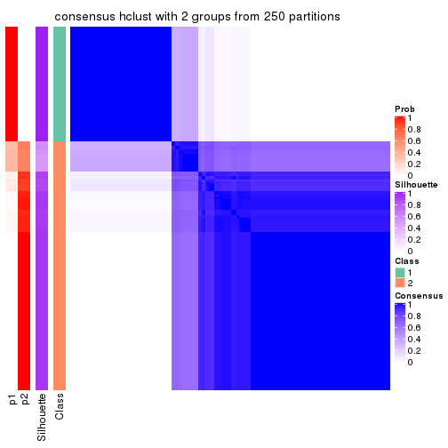</p>

</div>
<div id='tab-ATC-hclust-consensus-heatmap-2'>
<pre><code class="r">consensus_heatmap(res, k = 3)
</code></pre>

<p>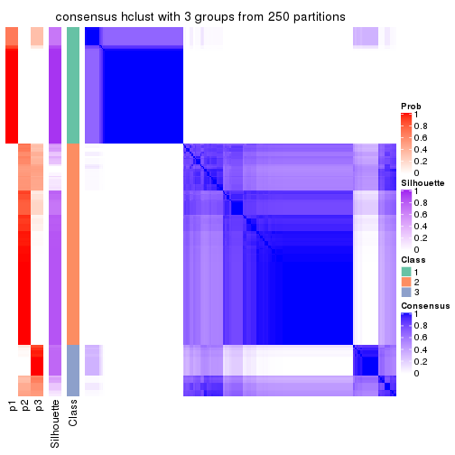</p>

</div>
<div id='tab-ATC-hclust-consensus-heatmap-3'>
<pre><code class="r">consensus_heatmap(res, k = 4)
</code></pre>

<p>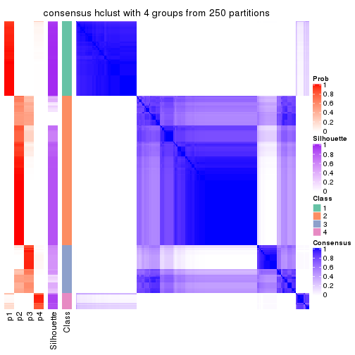</p>

</div>
<div id='tab-ATC-hclust-consensus-heatmap-4'>
<pre><code class="r">consensus_heatmap(res, k = 5)
</code></pre>

<p>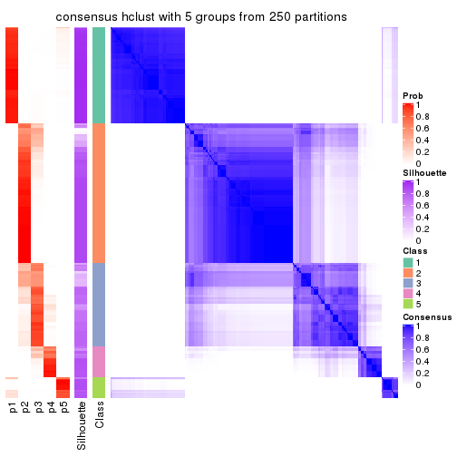</p>

</div>
<div id='tab-ATC-hclust-consensus-heatmap-5'>
<pre><code class="r">consensus_heatmap(res, k = 6)
</code></pre>

<p>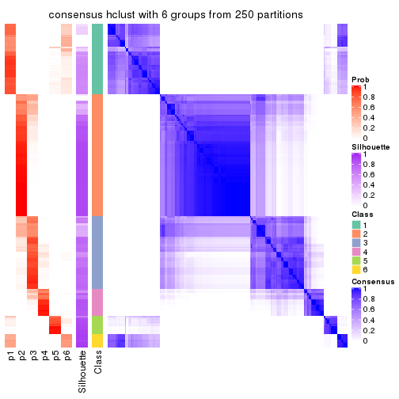</p>

</div>
</div>

Heatmaps for the membership of samples in all partitions to see how consistent they are:


<script>
$( function() {
	$( '#tabs-ATC-hclust-membership-heatmap' ).tabs();
} );
</script>
<div id='tabs-ATC-hclust-membership-heatmap'>
<ul>
<li><a href='#tab-ATC-hclust-membership-heatmap-1'>k = 2</a></li>
<li><a href='#tab-ATC-hclust-membership-heatmap-2'>k = 3</a></li>
<li><a href='#tab-ATC-hclust-membership-heatmap-3'>k = 4</a></li>
<li><a href='#tab-ATC-hclust-membership-heatmap-4'>k = 5</a></li>
<li><a href='#tab-ATC-hclust-membership-heatmap-5'>k = 6</a></li>
</ul>
<div id='tab-ATC-hclust-membership-heatmap-1'>
<pre><code class="r">membership_heatmap(res, k = 2)
</code></pre>

<p>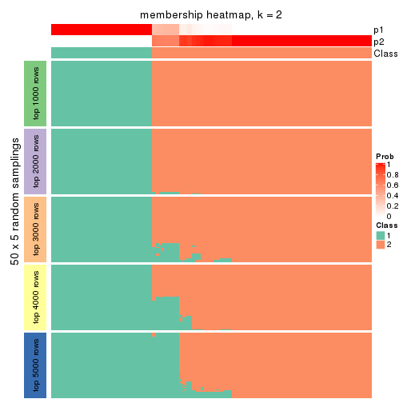</p>

</div>
<div id='tab-ATC-hclust-membership-heatmap-2'>
<pre><code class="r">membership_heatmap(res, k = 3)
</code></pre>

<p>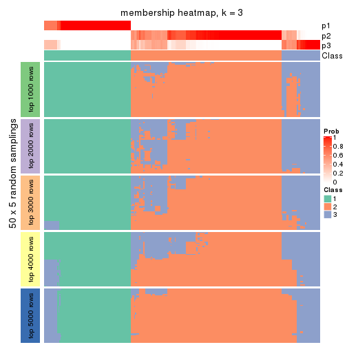</p>

</div>
<div id='tab-ATC-hclust-membership-heatmap-3'>
<pre><code class="r">membership_heatmap(res, k = 4)
</code></pre>

<p>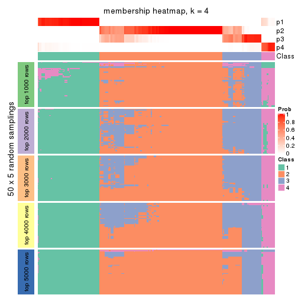</p>

</div>
<div id='tab-ATC-hclust-membership-heatmap-4'>
<pre><code class="r">membership_heatmap(res, k = 5)
</code></pre>

<p>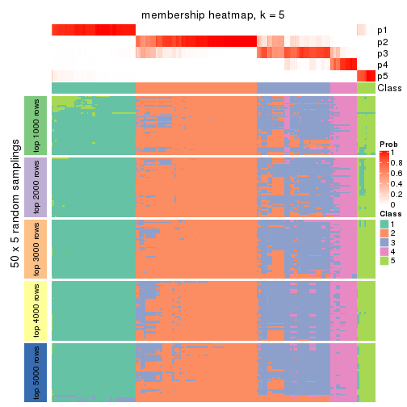</p>

</div>
<div id='tab-ATC-hclust-membership-heatmap-5'>
<pre><code class="r">membership_heatmap(res, k = 6)
</code></pre>

<p>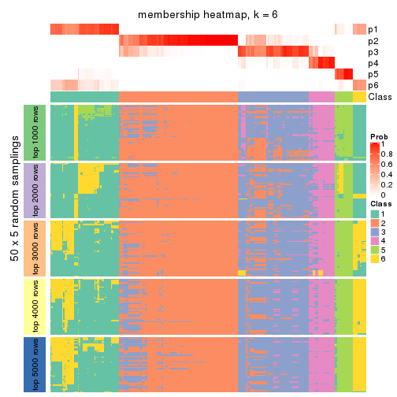</p>

</div>
</div>

As soon as we have had the classes for columns, we can look for signatures
which are significantly different between classes which can be candidate marks
for certain classes. Following are the heatmaps for signatures.


Signature heatmaps where rows are scaled:


<script>
$( function() {
	$( '#tabs-ATC-hclust-get-signatures' ).tabs();
} );
</script>
<div id='tabs-ATC-hclust-get-signatures'>
<ul>
<li><a href='#tab-ATC-hclust-get-signatures-1'>k = 2</a></li>
<li><a href='#tab-ATC-hclust-get-signatures-2'>k = 3</a></li>
<li><a href='#tab-ATC-hclust-get-signatures-3'>k = 4</a></li>
<li><a href='#tab-ATC-hclust-get-signatures-4'>k = 5</a></li>
<li><a href='#tab-ATC-hclust-get-signatures-5'>k = 6</a></li>
</ul>
<div id='tab-ATC-hclust-get-signatures-1'>
<pre><code class="r">get_signatures(res, k = 2)
</code></pre>

<p>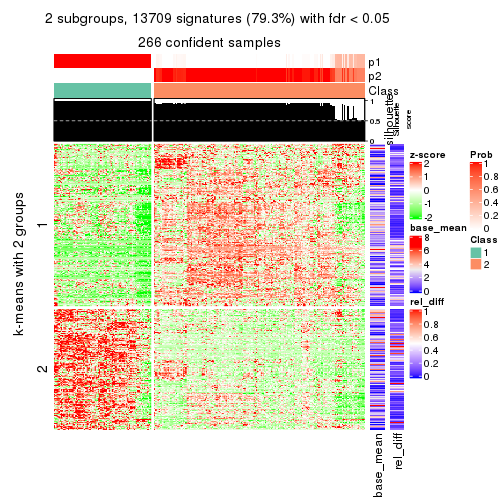</p>

</div>
<div id='tab-ATC-hclust-get-signatures-2'>
<pre><code class="r">get_signatures(res, k = 3)
</code></pre>

<p>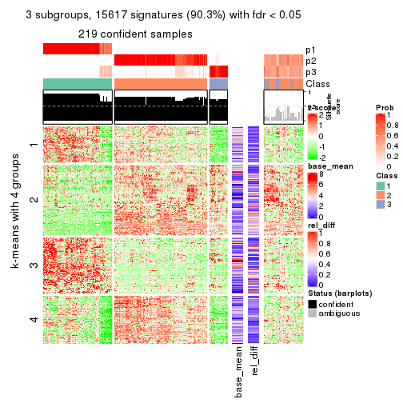</p>

</div>
<div id='tab-ATC-hclust-get-signatures-3'>
<pre><code class="r">get_signatures(res, k = 4)
</code></pre>

<p>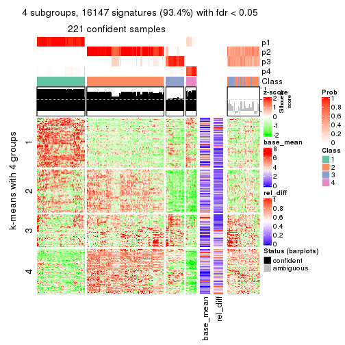</p>

</div>
<div id='tab-ATC-hclust-get-signatures-4'>
<pre><code class="r">get_signatures(res, k = 5)
</code></pre>

<p>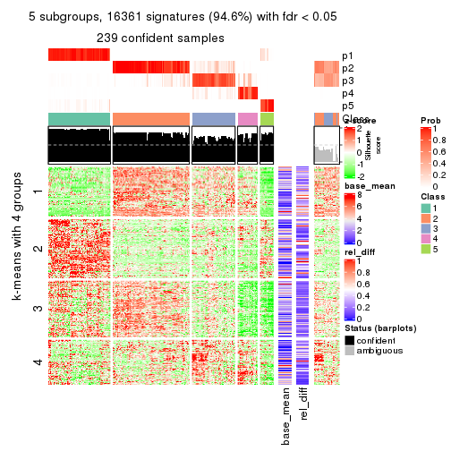</p>

</div>
<div id='tab-ATC-hclust-get-signatures-5'>
<pre><code class="r">get_signatures(res, k = 6)
</code></pre>

<p>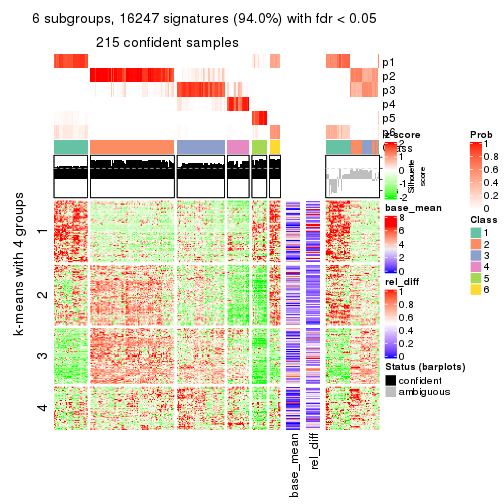</p>

</div>
</div>


Signature heatmaps where rows are not scaled:


<script>
$( function() {
	$( '#tabs-ATC-hclust-get-signatures-no-scale' ).tabs();
} );
</script>
<div id='tabs-ATC-hclust-get-signatures-no-scale'>
<ul>
<li><a href='#tab-ATC-hclust-get-signatures-no-scale-1'>k = 2</a></li>
<li><a href='#tab-ATC-hclust-get-signatures-no-scale-2'>k = 3</a></li>
<li><a href='#tab-ATC-hclust-get-signatures-no-scale-3'>k = 4</a></li>
<li><a href='#tab-ATC-hclust-get-signatures-no-scale-4'>k = 5</a></li>
<li><a href='#tab-ATC-hclust-get-signatures-no-scale-5'>k = 6</a></li>
</ul>
<div id='tab-ATC-hclust-get-signatures-no-scale-1'>
<pre><code class="r">get_signatures(res, k = 2, scale_rows = FALSE)
</code></pre>

<p>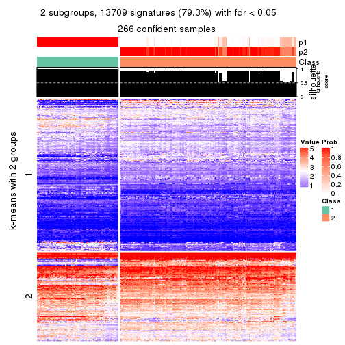</p>

</div>
<div id='tab-ATC-hclust-get-signatures-no-scale-2'>
<pre><code class="r">get_signatures(res, k = 3, scale_rows = FALSE)
</code></pre>

<p>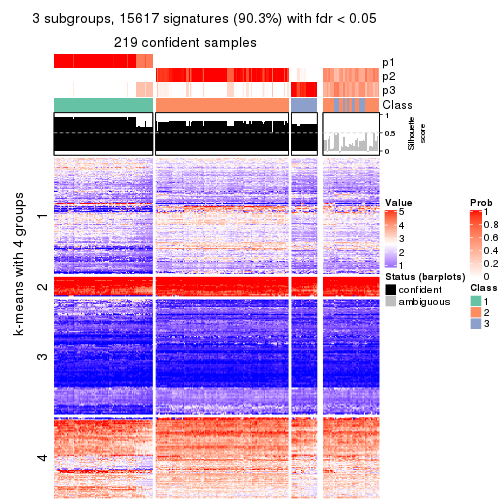</p>

</div>
<div id='tab-ATC-hclust-get-signatures-no-scale-3'>
<pre><code class="r">get_signatures(res, k = 4, scale_rows = FALSE)
</code></pre>

<p>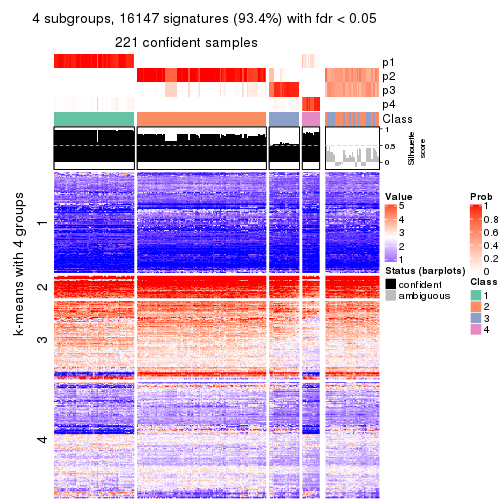</p>

</div>
<div id='tab-ATC-hclust-get-signatures-no-scale-4'>
<pre><code class="r">get_signatures(res, k = 5, scale_rows = FALSE)
</code></pre>

<p>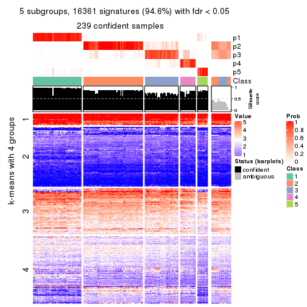</p>

</div>
<div id='tab-ATC-hclust-get-signatures-no-scale-5'>
<pre><code class="r">get_signatures(res, k = 6, scale_rows = FALSE)
</code></pre>

<p>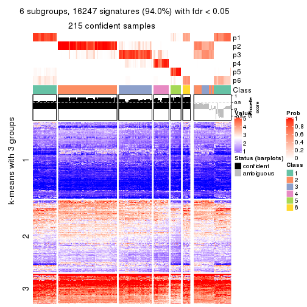</p>

</div>
</div>


Compare the overlap of signatures from different k:

```r
compare_signatures(res)
```

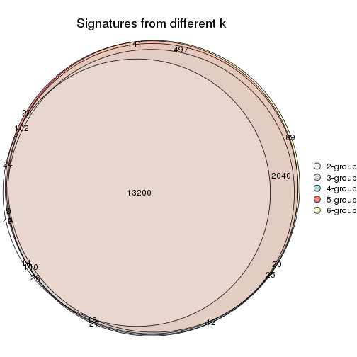

`get_signature()` returns a data frame invisibly. TO get the list of signatures, the function
call should be assigned to a variable explicitly. In following code, if `plot` argument is set
to `FALSE`, no heatmap is plotted while only the differential analysis is performed.

```r
# code only for demonstration
tb = get_signature(res, k = ..., plot = FALSE)
```

An example of the output of `tb` is:

```
#>   which_row         fdr    mean_1    mean_2 scaled_mean_1 scaled_mean_2 km
#> 1        38 0.042760348  8.373488  9.131774    -0.5533452     0.5164555  1
#> 2        40 0.018707592  7.106213  8.469186    -0.6173731     0.5762149  1
#> 3        55 0.019134737 10.221463 11.207825    -0.6159697     0.5749050  1
#> 4        59 0.006059896  5.921854  7.869574    -0.6899429     0.6439467  1
#> 5        60 0.018055526  8.928898 10.211722    -0.6204761     0.5791110  1
#> 6        98 0.009384629 15.714769 14.887706     0.6635654    -0.6193277  2
...
```

The columns in `tb` are:

1. `which_row`: row indices corresponding to the input matrix.
2. `fdr`: FDR for the differential test. 
3. `mean_x`: The mean value in group x.
4. `scaled_mean_x`: The mean value in group x after rows are scaled.
5. `km`: Row groups if k-means clustering is applied to rows.


UMAP plot which shows how samples are separated.


<script>
$( function() {
	$( '#tabs-ATC-hclust-dimension-reduction' ).tabs();
} );
</script>
<div id='tabs-ATC-hclust-dimension-reduction'>
<ul>
<li><a href='#tab-ATC-hclust-dimension-reduction-1'>k = 2</a></li>
<li><a href='#tab-ATC-hclust-dimension-reduction-2'>k = 3</a></li>
<li><a href='#tab-ATC-hclust-dimension-reduction-3'>k = 4</a></li>
<li><a href='#tab-ATC-hclust-dimension-reduction-4'>k = 5</a></li>
<li><a href='#tab-ATC-hclust-dimension-reduction-5'>k = 6</a></li>
</ul>
<div id='tab-ATC-hclust-dimension-reduction-1'>
<pre><code class="r">dimension_reduction(res, k = 2, method = &quot;UMAP&quot;)
</code></pre>

<p>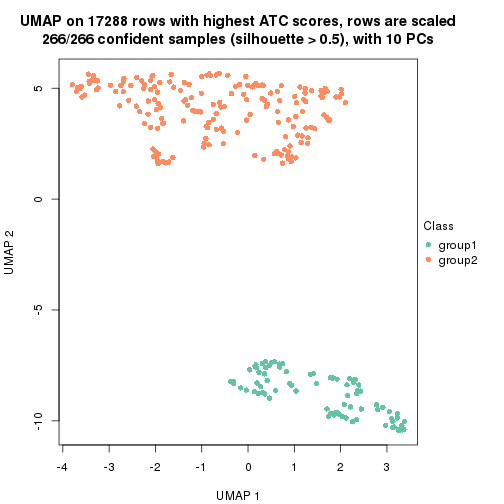</p>

</div>
<div id='tab-ATC-hclust-dimension-reduction-2'>
<pre><code class="r">dimension_reduction(res, k = 3, method = &quot;UMAP&quot;)
</code></pre>

<p>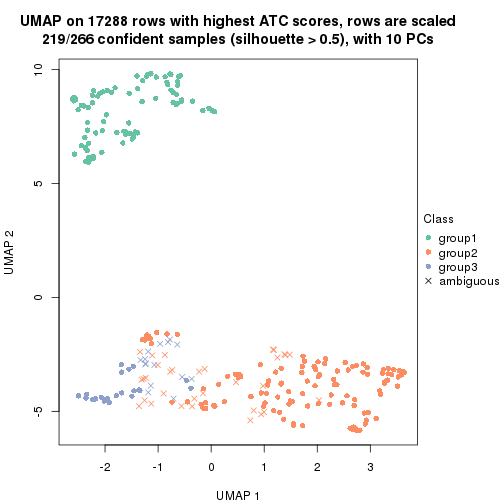</p>

</div>
<div id='tab-ATC-hclust-dimension-reduction-3'>
<pre><code class="r">dimension_reduction(res, k = 4, method = &quot;UMAP&quot;)
</code></pre>

<p>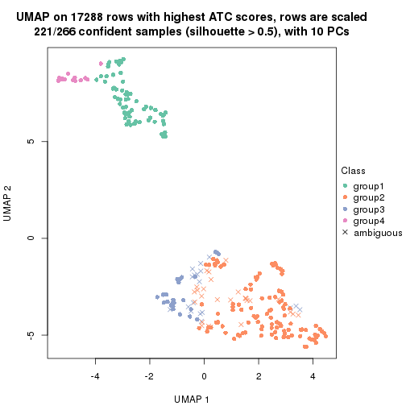</p>

</div>
<div id='tab-ATC-hclust-dimension-reduction-4'>
<pre><code class="r">dimension_reduction(res, k = 5, method = &quot;UMAP&quot;)
</code></pre>

<p>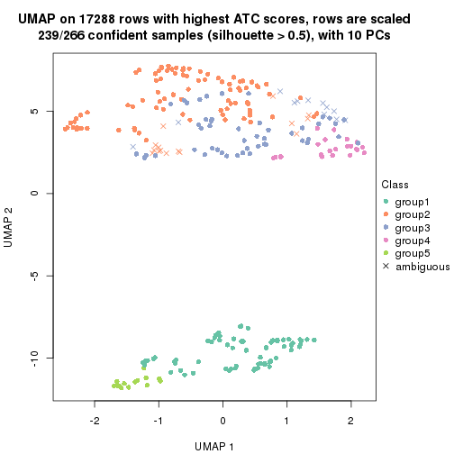</p>

</div>
<div id='tab-ATC-hclust-dimension-reduction-5'>
<pre><code class="r">dimension_reduction(res, k = 6, method = &quot;UMAP&quot;)
</code></pre>

<p>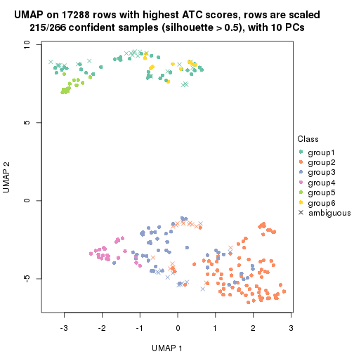</p>

</div>
</div>


Following heatmap shows how subgroups are split when increasing `k`:

```r
collect_classes(res)
```

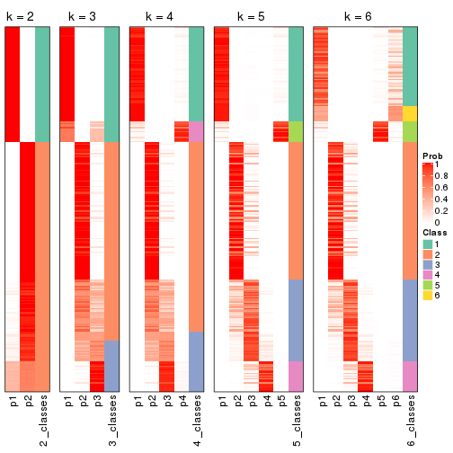


If matrix rows can be associated to genes, consider to use `GO_Enrichment(res,
...)` to perform function enrichment for the signature genes.


 

---------------------------------------------------


### ATC:kmeans**


The object with results only for a single top-value method and a single partition method 
can be extracted as:

```r
res = res_list["ATC", "kmeans"]
# you can also extract it by
# res = res_list["ATC:kmeans"]
```

A summary of `res` and all the functions that can be applied to it:

```r
res
```

```
#> A 'ConsensusPartition' object with k = 2, 3, 4, 5, 6.
#>   On a matrix with 17288 rows and 266 columns.
#>   Top rows (1000, 2000, 3000, 4000, 5000) are extracted by 'ATC' method.
#>   Subgroups are detected by 'kmeans' method.
#>   Performed in total 1250 partitions by row resampling.
#>   Best k for subgroups seems to be 2.
#> 
#> Following methods can be applied to this 'ConsensusPartition' object:
#>  [1] "cola_report"             "collect_classes"         "collect_plots"          
#>  [4] "collect_stats"           "colnames"                "compare_signatures"     
#>  [7] "consensus_heatmap"       "dimension_reduction"     "functional_enrichment"  
#> [10] "get_anno_col"            "get_anno"                "get_classes"            
#> [13] "get_consensus"           "get_matrix"              "get_membership"         
#> [16] "get_param"               "get_signatures"          "get_stats"              
#> [19] "is_best_k"               "is_stable_k"             "membership_heatmap"     
#> [22] "ncol"                    "nrow"                    "plot_ecdf"              
#> [25] "rownames"                "select_partition_number" "show"                   
#> [28] "suggest_best_k"          "test_to_known_factors"
```

`collect_plots()` function collects all the plots made from `res` for all `k` (number of partitions)
into one single page to provide an easy and fast comparison between different `k`.

```r
collect_plots(res)
```

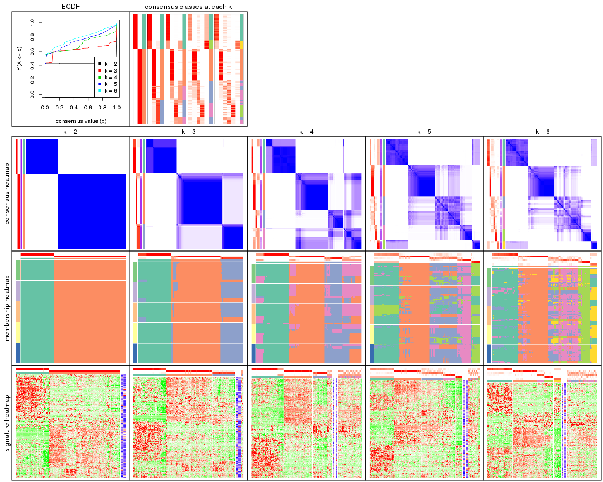

The plots are:

- The first row: a plot of the ECDF (Empirical cumulative distribution
  function) curves of the consensus matrix for each `k` and the heatmap of
  predicted classes for each `k`.
- The second row: heatmaps of the consensus matrix for each `k`.
- The third row: heatmaps of the membership matrix for each `k`.
- The fouth row: heatmaps of the signatures for each `k`.

All the plots in panels can be made by individual functions and they are
plotted later in this section.

`select_partition_number()` produces several plots showing different
statistics for choosing "optimized" `k`. There are following statistics:

- ECDF curves of the consensus matrix for each `k`;
- 1-PAC. [The PAC
  score](https://en.wikipedia.org/wiki/Consensus_clustering#Over-interpretation_potential_of_consensus_clustering)
  measures the proportion of the ambiguous subgrouping.
- Mean silhouette score.
- Concordance. The mean probability of fiting the consensus class ids in all
  partitions.
- Area increased. Denote $A_k$ as the area under the ECDF curve for current
  `k`, the area increased is defined as $A_k - A_{k-1}$.
- Rand index. The percent of pairs of samples that are both in a same cluster
  or both are not in a same cluster in the partition of k and k-1.
- Jaccard index. The ratio of pairs of samples are both in a same cluster in
  the partition of k and k-1 and the pairs of samples are both in a same
  cluster in the partition k or k-1.

The detailed explanations of these statistics can be found in [the cola
vignette](http://bioconductor.org/packages/devel/bioc/vignettes/cola/inst/doc/cola.html#toc_13).

Generally speaking, lower PAC score, higher mean silhouette score or higher
concordance corresponds to better partition. Rand index and Jaccard index
measure how similar the current partition is compared to partition with `k-1`.
If they are too similar, we won't accept `k` is better than `k-1`.

```r
select_partition_number(res)
```

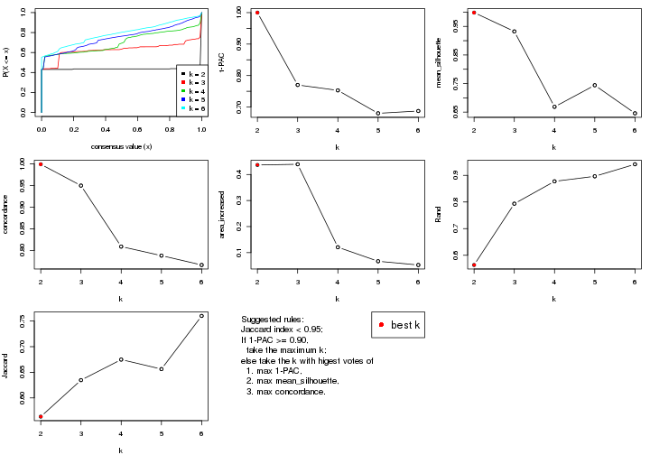

The numeric values for all these statistics can be obtained by `get_stats()`.

```r
get_stats(res)
```

```
#>   k 1-PAC mean_silhouette concordance area_increased  Rand Jaccard
#> 2 2 1.000           0.998       0.999         0.4365 0.563   0.563
#> 3 3 0.770           0.932       0.950         0.4393 0.794   0.635
#> 4 4 0.753           0.668       0.809         0.1207 0.877   0.675
#> 5 5 0.680           0.744       0.788         0.0668 0.896   0.656
#> 6 6 0.687           0.646       0.766         0.0525 0.942   0.760
```

`suggest_best_k()` suggests the best $k$ based on these statistics. The rules are as follows:

- All $k$ with Jaccard index larger than 0.95 are removed because the increase of
  the partition number does not provides enough extra information. If all $k$ are removed,
  the best $k$ is assigned by `NA`.
- For $k$ with 1-PAC larger than 0.9, the maximal $k$ is taken as the "best k". Other $k$ is called "optional k".
- If it does not fit the second rule. The $k$ with the highest vote of highest
  1-PAC, mean silhouette and concordance is taken as the "best k".

```r
suggest_best_k(res)
```

```
#> [1] 2
```


Following shows the table of the partitions (You need to click the **show/hide
code output** link to see it). The membership matrix (columns with name `p*`)
is inferred by
[`clue::cl_consensus()`](https://www.rdocumentation.org/link/cl_consensus?package=clue)
function with the `SE` method. Basically the value in the membership matrix
represents the probability to belong to a certain group. The finall class
label for an item is determined with the group with highest probability it
belongs to.

In `get_classes()` function, the entropy is calculated from the membership
matrix and the silhouette score is calculated from the consensus matrix.


<script>
$( function() {
	$( '#tabs-ATC-kmeans-get-classes' ).tabs();
} );
</script>
<div id='tabs-ATC-kmeans-get-classes'>
<ul>
<li><a href='#tab-ATC-kmeans-get-classes-1'>k = 2</a></li>
<li><a href='#tab-ATC-kmeans-get-classes-2'>k = 3</a></li>
<li><a href='#tab-ATC-kmeans-get-classes-3'>k = 4</a></li>
<li><a href='#tab-ATC-kmeans-get-classes-4'>k = 5</a></li>
<li><a href='#tab-ATC-kmeans-get-classes-5'>k = 6</a></li>
</ul>

<div id='tab-ATC-kmeans-get-classes-1'>
<p><a id='tab-ATC-kmeans-get-classes-1-a' style='color:#0366d6' href='#'>show/hide code output</a></p>
<pre><code class="r">cbind(get_classes(res, k = 2), get_membership(res, k = 2))
</code></pre>

<pre><code>#&gt;                                      class entropy silhouette  p1  p2
#&gt; 80D0AF10-1C61-4B67-90C1-7DBF1EF23672     2   0.000      1.000 0.0 1.0
#&gt; 87117BE1-D328-4972-85DA-6672412D8860     2   0.000      1.000 0.0 1.0
#&gt; F904C5B6-70BD-4604-8254-79BE23B152DA     1   0.000      0.998 1.0 0.0
#&gt; 3182DEA1-4239-4613-925A-7E6503766AD6     2   0.000      1.000 0.0 1.0
#&gt; 55E78EA2-2D9B-481F-8CAB-D36A33088EAE     2   0.000      1.000 0.0 1.0
#&gt; 86F94264-A6DD-4A97-9191-036F066DD0EF     2   0.000      1.000 0.0 1.0
#&gt; 09D25417-23B7-4D88-A0EA-F307985FBBBC     2   0.000      1.000 0.0 1.0
#&gt; C797F12C-40D3-4DB5-B9EF-A6821BBDE4F0     1   0.000      0.998 1.0 0.0
#&gt; 80275DB0-A226-4B6B-A08F-4ADBEEE1DB01     1   0.000      0.998 1.0 0.0
#&gt; 27FB653A-9E07-44AD-952E-9E4DE4AB5891     2   0.000      1.000 0.0 1.0
#&gt; 1A5DB9FC-2ABD-4E1B-B5EF-B1CF5E5F3872     1   0.000      0.998 1.0 0.0
#&gt; 844E4CCD-D30C-416F-A086-8923711A4E25     2   0.000      1.000 0.0 1.0
#&gt; EF18318D-3D25-4D65-803A-ED6E62871E7E     1   0.000      0.998 1.0 0.0
#&gt; 1ACB1BE0-61F6-4243-BBEC-E26A1CF90CA8     1   0.000      0.998 1.0 0.0
#&gt; 8EF0039B-D758-46AB-BAF7-6A062C7C56BA     1   0.000      0.998 1.0 0.0
#&gt; 22F4C9D9-663B-4C91-9692-E035A2640BEC     2   0.000      1.000 0.0 1.0
#&gt; FA1A0BCE-EE0F-4178-B963-62550E344B14     2   0.000      1.000 0.0 1.0
#&gt; 0B6D0C4E-5AE3-4707-A9FC-12A108E6EC2A     2   0.000      1.000 0.0 1.0
#&gt; 06FD3123-2AEB-4911-AC4E-E0E64FD5DB52     2   0.000      1.000 0.0 1.0
#&gt; 235A4492-FF80-4AA5-BC71-DFF65E1C7411     2   0.000      1.000 0.0 1.0
#&gt; A192C6C0-1443-4493-AFAC-1EE710628ADB     2   0.000      1.000 0.0 1.0
#&gt; 6FC5B56B-711B-4174-9B06-4E843124AAB6     1   0.000      0.998 1.0 0.0
#&gt; 7A813F60-A41E-4552-990E-F22287654C1D     2   0.000      1.000 0.0 1.0
#&gt; 725BBFB5-26F4-4512-9C75-47D013C1E605     1   0.000      0.998 1.0 0.0
#&gt; 39CC4E82-EBC9-472E-8BE5-6A3AB178449A     2   0.000      1.000 0.0 1.0
#&gt; 61130DEE-E267-49DF-8B41-7738A06EF738     2   0.000      1.000 0.0 1.0
#&gt; 117EC12C-B7ED-4E01-B29B-EA542D356EA1     1   0.000      0.998 1.0 0.0
#&gt; A30FF708-F7A9-41E4-8AD5-20441650FBC9     2   0.000      1.000 0.0 1.0
#&gt; 53640D52-1167-4A5D-B656-97D32CBA3934     1   0.000      0.998 1.0 0.0
#&gt; 9E85D76A-DD2A-46D5-BB59-0ED302B6258C     2   0.000      1.000 0.0 1.0
#&gt; 6F8C6F90-7E3C-4860-91DD-586708DE44AA     1   0.000      0.998 1.0 0.0
#&gt; E675AEC5-AA9A-4AAA-839C-03E6365822DB     2   0.000      1.000 0.0 1.0
#&gt; B577DEF7-2F5C-4876-A7C6-F18D5722B8C0     1   0.000      0.998 1.0 0.0
#&gt; DA8B577E-43E7-49BF-BF94-868E3194F5C9     1   0.000      0.998 1.0 0.0
#&gt; 3334280B-2A36-4AC7-A021-A76C10E958F0     2   0.000      1.000 0.0 1.0
#&gt; 5CBDDC90-11EC-4E6E-881E-AA9CCFD40FDB     2   0.000      1.000 0.0 1.0
#&gt; 8CBBF32A-8349-44F5-A8B8-4CBB1760A464     2   0.000      1.000 0.0 1.0
#&gt; B9455A9A-136D-4DC2-9F86-0FC74433589D     2   0.000      1.000 0.0 1.0
#&gt; D7EAE2A7-F9BE-4222-A452-B1F83F99CD50     2   0.000      1.000 0.0 1.0
#&gt; F803AE18-60C5-4CFE-AAAB-DB33C26A2184     1   0.000      0.998 1.0 0.0
#&gt; 5DD8CAC7-EC02-43B6-B58E-6D2E22868A3B     2   0.000      1.000 0.0 1.0
#&gt; EE98E1B4-DFB3-4AEC-8527-E1FD544C9475     1   0.000      0.998 1.0 0.0
#&gt; 3CE43921-47D5-4394-B9E1-242607775D61     2   0.000      1.000 0.0 1.0
#&gt; 46986F2B-0B0D-4187-8948-4E91D34B7C49     2   0.000      1.000 0.0 1.0
#&gt; 5D1D052E-74EF-45A8-9B1A-7CECD13EA43B     2   0.000      1.000 0.0 1.0
#&gt; 4C821AD9-A5C9-4A9A-9C5D-363B227F8064     2   0.000      1.000 0.0 1.0
#&gt; 06A4189E-A23B-4AC6-AA74-01955DD7D1E9     2   0.000      1.000 0.0 1.0
#&gt; FCCDC76F-CB02-4BCD-A616-325F258DDAA4     2   0.000      1.000 0.0 1.0
#&gt; DAC53B0A-8F35-4EA6-BBCC-4CD1C049E11F     2   0.000      1.000 0.0 1.0
#&gt; DD4F845B-CAD3-44CB-9D96-3C3F5BA1B72D     1   0.000      0.998 1.0 0.0
#&gt; D440F004-A4A4-41B6-BED8-805D67BA01C7     2   0.000      1.000 0.0 1.0
#&gt; A497C423-119F-42FA-BF17-9F6DFD2A5585     2   0.000      1.000 0.0 1.0
#&gt; 3420E573-DE12-4EF5-B1C0-2FCA904F4F4E     1   0.000      0.998 1.0 0.0
#&gt; 1AD72157-A254-44B4-BA58-4F30F1AE910E     1   0.000      0.998 1.0 0.0
#&gt; C1113977-B160-45EE-B061-750F9EA3F33F     2   0.000      1.000 0.0 1.0
#&gt; 6783AB5B-F07C-447B-BF13-C34485D246D7     2   0.000      1.000 0.0 1.0
#&gt; 1F553062-26FD-4A7F-B7FB-81184604F423     1   0.000      0.998 1.0 0.0
#&gt; BE2DCA51-1C21-4598-98A7-F2FB9B2DFCB4     2   0.000      1.000 0.0 1.0
#&gt; 38941CF3-9C54-4BA4-A005-CC88CA97D504     2   0.000      1.000 0.0 1.0
#&gt; 51CB675E-E243-4A07-BF4A-580473D26FDA     2   0.000      1.000 0.0 1.0
#&gt; C7FED0F5-C27A-4405-9232-30BF39362CF7     2   0.000      1.000 0.0 1.0
#&gt; 2A1E86E8-4713-465F-ACFF-C584864C57A1     2   0.000      1.000 0.0 1.0
#&gt; B4500785-0FAA-4D4D-8630-43D194BAB004     2   0.000      1.000 0.0 1.0
#&gt; 3FD52E66-AB76-4079-80DB-281A795D1EC0     2   0.000      1.000 0.0 1.0
#&gt; EBD355D1-1226-4DFD-AAFF-45D246B64F3C     2   0.000      1.000 0.0 1.0
#&gt; 5A040A73-CD95-487E-8AEF-9639FE4E2916     2   0.000      1.000 0.0 1.0
#&gt; CF629C65-585D-476D-B081-3E6E0575FAE3     2   0.000      1.000 0.0 1.0
#&gt; 0D4202A3-808E-413F-9BF3-9CFCCAE0ED61     2   0.000      1.000 0.0 1.0
#&gt; 43E715BF-28D9-4B5E-B762-8CD1B69A430E     1   0.000      0.998 1.0 0.0
#&gt; BFB82BE8-9DAC-4099-8B38-0950308E3EB3     2   0.000      1.000 0.0 1.0
#&gt; F7CB1825-2303-4DD2-AE1F-7205738EAF1F     1   0.000      0.998 1.0 0.0
#&gt; FE298483-C42C-4753-BABB-29A9CB1B6312     1   0.000      0.998 1.0 0.0
#&gt; A98C7561-1B42-4CD6-AE71-924B91FA4C33     2   0.000      1.000 0.0 1.0
#&gt; 58098F21-7DAB-47DA-9A41-8D20BF3B9257     2   0.000      1.000 0.0 1.0
#&gt; 18CAF708-20B9-4745-9CB3-37AB6E0B3056     2   0.000      1.000 0.0 1.0
#&gt; 2C80DD72-C9C7-4AC2-812F-9A31EF02779C     1   0.000      0.998 1.0 0.0
#&gt; 68A3F13D-319D-4603-A27F-B5DD46FE5C5B     2   0.000      1.000 0.0 1.0
#&gt; 7EE8F0CE-CDC9-40F9-A1DE-7F8140EC6D13     2   0.000      1.000 0.0 1.0
#&gt; 39019903-5B9C-4665-BD5F-7CCB19CB55C5     2   0.000      1.000 0.0 1.0
#&gt; 190EDB27-4CBC-4E9C-9B67-D51FDAB982B7     2   0.000      1.000 0.0 1.0
#&gt; EB2D95BC-62F8-4669-9308-D37D7FB79E23     2   0.000      1.000 0.0 1.0
#&gt; A08B85EA-D1E7-4B77-8DEC-36294305B9F7     1   0.000      0.998 1.0 0.0
#&gt; 130DDFAD-6EF8-4C80-BD9D-88308A6874BC     2   0.000      1.000 0.0 1.0
#&gt; 7340A5BA-E002-448F-AACC-E7A37DBB79C2     2   0.000      1.000 0.0 1.0
#&gt; A771F6E3-D266-4FE7-98C6-C40E6A701D59     1   0.000      0.998 1.0 0.0
#&gt; 015E792C-EC1B-49BF-AB07-D82B20C5989A     2   0.000      1.000 0.0 1.0
#&gt; BF79E030-47EE-4D08-B910-5685A4BD8B60     2   0.000      1.000 0.0 1.0
#&gt; FB3C7C9A-2F2D-4DD5-BE47-FAFB072C0FAB     2   0.000      1.000 0.0 1.0
#&gt; 4E5557BA-10E8-4723-908E-DD04EF6639B2     2   0.000      1.000 0.0 1.0
#&gt; 8031B550-40A9-4A3A-9F7D-CDC052288BD8     2   0.000      1.000 0.0 1.0
#&gt; 55299A06-3C1F-45A4-B166-B2C591C0CEE2     2   0.000      1.000 0.0 1.0
#&gt; EB8D5168-216E-4ABB-8B4E-9E67786CB322     1   0.000      0.998 1.0 0.0
#&gt; 78BD2D83-9A7F-42E5-BB38-654AA0761A0A     2   0.000      1.000 0.0 1.0
#&gt; AA2D53E5-D389-4332-9DD5-A736052E48F8     1   0.000      0.998 1.0 0.0
#&gt; 62945C7A-9313-4FC9-820C-B0AB820B394E     1   0.000      0.998 1.0 0.0
#&gt; 22746046-2E99-4EE9-97D2-BA2EA499634C     2   0.000      1.000 0.0 1.0
#&gt; 8671B51B-DCBE-4429-9F01-AF51CAD7014F     2   0.000      1.000 0.0 1.0
#&gt; E815AB36-5689-4A0D-8E6D-2EAA73406681     1   0.000      0.998 1.0 0.0
#&gt; A1DACB46-ED52-4E38-B2C8-57256BB22B5E     2   0.000      1.000 0.0 1.0
#&gt; 4F5498C4-A423-4B3D-AC98-D4E214A57D0E     1   0.000      0.998 1.0 0.0
#&gt; A7772CCD-FFFF-49DD-86ED-0BAD330EC9B6     2   0.000      1.000 0.0 1.0
#&gt; E6E3DF78-65B9-4F74-8DA8-E2A6D4EDBEA7     2   0.000      1.000 0.0 1.0
#&gt; 83286E2D-E708-437A-911A-E6B050273CBD     1   0.000      0.998 1.0 0.0
#&gt; EC5C7C97-EE8C-405D-A039-D96514B1D414     2   0.000      1.000 0.0 1.0
#&gt; 3E55223D-6E3D-4027-9819-67E91212531D     1   0.000      0.998 1.0 0.0
#&gt; 99A036A2-8343-4D06-8047-D84E96CE4C61     2   0.000      1.000 0.0 1.0
#&gt; CA6CDE6D-92DE-4259-9E58-A373F2D543EA     2   0.000      1.000 0.0 1.0
#&gt; BF6FA8CC-60C1-413A-B2C6-54CCACBC01D6     1   0.000      0.998 1.0 0.0
#&gt; E0594CFE-F7B6-4546-B130-30DF6A514B1F     2   0.000      1.000 0.0 1.0
#&gt; E769E41D-5949-42C5-9594-E563C05ACE52     2   0.000      1.000 0.0 1.0
#&gt; 01373725-5D3C-4D9C-AABC-911D53E62BCD     2   0.000      1.000 0.0 1.0
#&gt; 1F39DADD-3655-474E-BA4C-A5BD32C97A8B     1   0.000      0.998 1.0 0.0
#&gt; AF573EC8-E4EE-4B8F-8199-9817B9FAC67D     1   0.000      0.998 1.0 0.0
#&gt; 3F022CBC-41C8-4387-A6FB-124C4BCD1AD9     1   0.000      0.998 1.0 0.0
#&gt; 1CC32ACE-826B-494B-8B89-5BD92327A74D     2   0.000      1.000 0.0 1.0
#&gt; 22B0BD3B-EE08-4BC7-90B2-01C372A56BA2     2   0.000      1.000 0.0 1.0
#&gt; 0F3DE9EF-19CC-4D14-9A42-1435DB537F94     2   0.000      1.000 0.0 1.0
#&gt; 87F8A33F-FBC3-469E-862B-84472F796358     2   0.000      1.000 0.0 1.0
#&gt; C9F2FA0D-1A9F-40B4-BD9B-CAF1B3F3D5A7     2   0.000      1.000 0.0 1.0
#&gt; ACFC9F59-78FF-4453-B25F-8834D0EAB54A     2   0.000      1.000 0.0 1.0
#&gt; B7AC7D5B-14E9-45A7-93B7-226EE508544A     2   0.000      1.000 0.0 1.0
#&gt; 4491BF17-B168-4E96-8E09-EF1AEC9F5E9D     2   0.000      1.000 0.0 1.0
#&gt; 557A0811-A3FE-4CF4-A24D-FBB77E7F9139     2   0.000      1.000 0.0 1.0
#&gt; 6F9C955C-6816-4353-922A-8035B50FACC6     2   0.000      1.000 0.0 1.0
#&gt; 3E89FB1C-4A7D-43C7-823C-04E3716A7935     2   0.000      1.000 0.0 1.0
#&gt; 12ABE483-66EF-4237-94C4-0199FAE23FA8     2   0.000      1.000 0.0 1.0
#&gt; 7535F262-9B96-44F6-988C-4C9EBB3FFCA9     2   0.000      1.000 0.0 1.0
#&gt; 65C9D28E-303B-40E5-84F0-2507F5457374     2   0.000      1.000 0.0 1.0
#&gt; FD445384-6BA9-4297-9D9C-12ABA7D645C7     1   0.000      0.998 1.0 0.0
#&gt; 30D5E255-2AD3-44F3-8983-1B80E4FD3E2D     2   0.000      1.000 0.0 1.0
#&gt; 3E88EC60-B4A8-4259-8BC8-A234800F6955     2   0.000      1.000 0.0 1.0
#&gt; ACD73CE8-AFC5-47A0-9383-3CB97F018953     1   0.000      0.998 1.0 0.0
#&gt; 1AFDC2EA-26A8-44E2-8BCB-F34F7B66F8C8     2   0.000      1.000 0.0 1.0
#&gt; 9E327BC8-1D20-4AD8-83F7-FB2D13BCA5D0     2   0.000      1.000 0.0 1.0
#&gt; 85A86B91-4F24-4E77-AE2D-520F8E205EFC     1   0.000      0.998 1.0 0.0
#&gt; 74868C37-8143-4306-81CA-E45759D146CD     2   0.000      1.000 0.0 1.0
#&gt; 69AEA0DB-E335-48A0-A398-4FB0D581182A     2   0.000      1.000 0.0 1.0
#&gt; AE6F8B89-85C2-42B7-8D05-AFDDD4FEFD16     1   0.000      0.998 1.0 0.0
#&gt; A8A6F09C-9812-4457-9A4B-AD41F97B41A3     2   0.000      1.000 0.0 1.0
#&gt; 1A09BC4D-EF29-42DD-BB04-A3C264A3032D     1   0.000      0.998 1.0 0.0
#&gt; E0961A30-A62C-4235-9CF0-A1776827A996     2   0.000      1.000 0.0 1.0
#&gt; 134D2D90-7B08-4F20-8A3A-C77643FB208F     2   0.000      1.000 0.0 1.0
#&gt; A77C2DFF-93CF-4CB5-B3C1-81133D7F1A0F     2   0.000      1.000 0.0 1.0
#&gt; EA2DC457-9C74-4B9C-B3FA-5E72199B24A7     2   0.000      1.000 0.0 1.0
#&gt; FF34117B-5EE4-4C96-A8A2-2CE6A654CBE5     1   0.000      0.998 1.0 0.0
#&gt; 75F7B5E2-6559-4B48-A2A4-287C35C559CC     1   0.000      0.998 1.0 0.0
#&gt; 903BF591-B0AF-4BEE-B625-60B673070344     2   0.000      1.000 0.0 1.0
#&gt; 9DE1B790-C63C-41C4-9477-CE52A8119C67     2   0.000      1.000 0.0 1.0
#&gt; 9A28F80A-85F8-40E2-A32B-230EF93B2FA0     2   0.000      1.000 0.0 1.0
#&gt; 0AA2BDBB-8720-409A-AA72-1F4AA26E7CD8     2   0.000      1.000 0.0 1.0
#&gt; 5AD49F16-E974-4E5D-B1B6-073ECB73A01D     1   0.722      0.750 0.8 0.2
#&gt; CB0F961C-527D-4A48-9408-286B26BD9532     1   0.000      0.998 1.0 0.0
#&gt; 46FF25B6-D01D-4CA7-80B7-CEC2998C34E1     2   0.000      1.000 0.0 1.0
#&gt; 487CADE1-D699-4A6C-817A-B9A0AB940C61     1   0.000      0.998 1.0 0.0
#&gt; 4FF6F2D8-F869-4735-A4D1-1A8423153FBC     1   0.000      0.998 1.0 0.0
#&gt; 6005494F-5D3D-43A3-B3E8-8C91955B2A98     2   0.000      1.000 0.0 1.0
#&gt; CF10D584-CE32-45A4-A932-E9D5AF12A6A0     1   0.000      0.998 1.0 0.0
#&gt; E15CE4AB-5646-49C8-9CD6-938457036BB0     2   0.000      1.000 0.0 1.0
#&gt; 31E28D0B-0E69-4330-82ED-4F1827DC97EA     2   0.000      1.000 0.0 1.0
#&gt; DBACD3C3-CCB5-4478-BA78-85A0C847CA66     2   0.000      1.000 0.0 1.0
#&gt; 5A07041C-65EB-4FCD-8940-E90B905061B5     2   0.000      1.000 0.0 1.0
#&gt; 0EA7C916-FA47-489B-BC98-4D9E7D197628     1   0.000      0.998 1.0 0.0
#&gt; 30967F75-8499-47FF-ADA4-4DC566013F7B     1   0.000      0.998 1.0 0.0
#&gt; D2E528FF-AEA2-48D7-A60A-4C3E71EA9073     2   0.000      1.000 0.0 1.0
#&gt; 22735DCD-215E-48BC-BF44-32BD66F06E39     2   0.000      1.000 0.0 1.0
#&gt; BC2C3248-7FC6-48BC-96C1-45EA573DE7DC     1   0.000      0.998 1.0 0.0
#&gt; E72CEBCB-D686-4B12-BCBA-EC8F964330A2     1   0.000      0.998 1.0 0.0
#&gt; 23C937BB-BA20-4440-B680-914229CC3ADF     1   0.000      0.998 1.0 0.0
#&gt; 947E99C7-F402-4F1A-A6E9-81BCAAED135A     2   0.000      1.000 0.0 1.0
#&gt; 02475D11-FC81-4E88-944E-173C32DC3FE7     2   0.000      1.000 0.0 1.0
#&gt; F972A9AA-9842-4343-A533-A795E65581CE     1   0.000      0.998 1.0 0.0
#&gt; 05043AAF-3095-4C61-B5C1-EE9AA9082C75     2   0.000      1.000 0.0 1.0
#&gt; CECF7967-862E-428C-BB42-FEF553FDB3AA     2   0.000      1.000 0.0 1.0
#&gt; FB0B9483-6302-48C7-BE5B-DA667E00AE2D     2   0.000      1.000 0.0 1.0
#&gt; 78700FBA-1487-4754-9B30-18837BF7E9FB     1   0.000      0.998 1.0 0.0
#&gt; 2166F56D-54CE-4F1B-8F07-A4E13E4489E9     1   0.000      0.998 1.0 0.0
#&gt; 7CD0942E-E39A-43A7-8BAC-F25967864901     2   0.000      1.000 0.0 1.0
#&gt; 3B00BA2B-7F7D-4825-8F8D-90F04A5DE687     2   0.000      1.000 0.0 1.0
#&gt; 7465B01D-C05E-4FE0-A9FE-182920EDC489     2   0.000      1.000 0.0 1.0
#&gt; 88C31A99-F96E-4FC8-8B3D-C1AAA05062D9     1   0.000      0.998 1.0 0.0
#&gt; 53575575-3303-4F8F-B6A8-B42131CFB4AC     2   0.000      1.000 0.0 1.0
#&gt; CC8017C7-4128-48DA-8E43-503F63158D85     1   0.000      0.998 1.0 0.0
#&gt; 88449D2A-2A25-41A4-B91D-C99B58F8ECD9     2   0.000      1.000 0.0 1.0
#&gt; 46C7DDE5-A2B5-494F-96AE-0B6E2D51B003     1   0.000      0.998 1.0 0.0
#&gt; 42551D05-5EE5-4F91-93A8-32DA695D9DFA     2   0.000      1.000 0.0 1.0
#&gt; 0772DA48-3A36-422D-B166-CA1691B782C3     2   0.000      1.000 0.0 1.0
#&gt; 30346897-EC77-4153-88A2-D14593C8B741     2   0.000      1.000 0.0 1.0
#&gt; 0F00E267-C748-4A71-8B36-03C410641D88     2   0.000      1.000 0.0 1.0
#&gt; 4034703A-4DA9-4DDA-9CA9-E80FFE9CCDE6     2   0.000      1.000 0.0 1.0
#&gt; 393C8A41-CF45-4EA8-AFE3-25A08AB7692A     2   0.000      1.000 0.0 1.0
#&gt; 3354212D-A07C-435C-8B0C-9A7BAAB624B5     1   0.000      0.998 1.0 0.0
#&gt; 57E30D4E-ABF7-47DD-92BE-40CE215076B0     1   0.000      0.998 1.0 0.0
#&gt; 202B4C76-C840-4DB8-953F-AC75A4156FDD     2   0.000      1.000 0.0 1.0
#&gt; 93A0137B-1F4C-44EE-B959-2AD0CD2DF8B6     1   0.000      0.998 1.0 0.0
#&gt; C9794DB6-6E8C-4AFD-80EE-61D672A4F6E9     2   0.000      1.000 0.0 1.0
#&gt; AE4BFE63-F0C0-4624-AD97-4F7FF13E2384     1   0.000      0.998 1.0 0.0
#&gt; DCF87F27-2B54-42D9-8D28-5DFEE76E2F5B     2   0.000      1.000 0.0 1.0
#&gt; 2451D405-39FD-4812-958C-23462B66F1F1     2   0.000      1.000 0.0 1.0
#&gt; E27F5D33-3F68-4CA8-8757-A387C6EAD060     2   0.000      1.000 0.0 1.0
#&gt; 8BA9928A-5B93-477F-B4A2-D031B714D9AC     1   0.000      0.998 1.0 0.0
#&gt; 0FAACFF6-B50C-4BED-9824-B7270654F28D     2   0.000      1.000 0.0 1.0
#&gt; 3366CC3C-2BBA-4CA7-848E-4E16AA70AE7A     2   0.000      1.000 0.0 1.0
#&gt; 66237056-CA9A-4C90-AF0E-1621FEB71578     2   0.000      1.000 0.0 1.0
#&gt; C480F1FB-3100-436C-B0F5-DED63B7A580E     2   0.000      1.000 0.0 1.0
#&gt; A327DE0D-D945-4B42-9B41-A7302CF796EE     2   0.000      1.000 0.0 1.0
#&gt; E8A6871D-67FB-4306-9454-F5E7CDBA399A     2   0.000      1.000 0.0 1.0
#&gt; E9A7485B-82B6-4BD2-AFBB-DD0A82D6CDE2     1   0.000      0.998 1.0 0.0
#&gt; 93B382E4-9C9A-43F5-BD3B-502CC260B886     1   0.000      0.998 1.0 0.0
#&gt; A2792419-8E16-45FE-A524-17851F34AB9B     2   0.000      1.000 0.0 1.0
#&gt; 4DED1201-F25C-4F82-BABF-965EFAD7A8E5     2   0.000      1.000 0.0 1.0
#&gt; F1ACB2DD-E948-4F88-A249-F1BD1977D667     2   0.000      1.000 0.0 1.0
#&gt; 6CDBA203-8952-421D-A6BF-75652D9F3339     2   0.000      1.000 0.0 1.0
#&gt; 2D6C5AA7-3B33-48D7-AE0C-77A16B749D13     1   0.000      0.998 1.0 0.0
#&gt; 3F6B6D95-0720-42A0-AEB3-89FECAE7616A     2   0.000      1.000 0.0 1.0
#&gt; DED8ACF3-BBD8-46C9-85C9-A9C8F2E2BC0B     1   0.000      0.998 1.0 0.0
#&gt; 77069279-5A6F-42C0-9AA5-8C939591DFB5     1   0.000      0.998 1.0 0.0
#&gt; B2D4FCF3-FDF9-41C8-880A-6732CF6222AF     2   0.000      1.000 0.0 1.0
#&gt; 1CD71A4C-1E49-48EF-AA72-CB3C26B4C087     2   0.000      1.000 0.0 1.0
#&gt; C364E621-F85C-4B7F-842F-210B8D4DFE3A     2   0.000      1.000 0.0 1.0
#&gt; 11F1B8CA-07C1-47D2-A3C6-032FFA6A4A64     1   0.000      0.998 1.0 0.0
#&gt; 153BF804-6DC8-496B-987A-4021A2512211     2   0.000      1.000 0.0 1.0
#&gt; 5B5029C9-40F5-40D7-A36A-367022AD6A42     2   0.000      1.000 0.0 1.0
#&gt; 193CCBE6-104F-49B4-BDB2-C82EE36FDAAD     1   0.000      0.998 1.0 0.0
#&gt; E5D45E53-FCF3-4F01-9B78-6CB1ED0CFE40     2   0.000      1.000 0.0 1.0
#&gt; 5546A779-21DB-49F9-8C0D-A1E420088084     2   0.000      1.000 0.0 1.0
#&gt; E14825E0-0DC7-44C2-B265-F54672356838     1   0.000      0.998 1.0 0.0
#&gt; 8C8C09B9-EC83-45EC-BC4C-0BA92DE60ACB     1   0.000      0.998 1.0 0.0
#&gt; B388CA82-5BF7-4BDD-8821-4EC0B213121F     2   0.000      1.000 0.0 1.0
#&gt; A26025AC-9F71-4C07-9135-83593193BBB2     1   0.000      0.998 1.0 0.0
#&gt; C80E6D4B-AF21-42F0-8E20-6F7D2E99C062     2   0.000      1.000 0.0 1.0
#&gt; 5AE5D819-A6B1-4761-B7F9-8FFD3C520F31     2   0.000      1.000 0.0 1.0
#&gt; CAE8097F-A139-4C6E-9E30-35080475FF34     2   0.000      1.000 0.0 1.0
#&gt; 539C8DE3-6152-4671-B96F-ED6DC6DBD22B     1   0.000      0.998 1.0 0.0
#&gt; 5D28A8E0-4ECF-43A4-890A-BE968B9A8CB2     2   0.000      1.000 0.0 1.0
#&gt; 97A80AF8-365E-4756-A2B0-AEB1D8F5F33E     2   0.000      1.000 0.0 1.0
#&gt; B3527517-E339-46AE-8437-65303C309015     2   0.000      1.000 0.0 1.0
#&gt; 523E2183-AA20-4749-BD7E-69CD620DD6A3     2   0.000      1.000 0.0 1.0
#&gt; E553FB92-F181-47B3-9F3D-11DB51DFA3A4     2   0.000      1.000 0.0 1.0
#&gt; FFE0C4B1-8EEC-484A-AB87-3401B71BD081     2   0.000      1.000 0.0 1.0
#&gt; 73D6CA4B-9A9E-4E52-96C8-AE7F0CC8B276     2   0.000      1.000 0.0 1.0
#&gt; 485A8107-DF9A-4BC6-8A72-07FBA93F10F2     1   0.000      0.998 1.0 0.0
#&gt; 690823D9-B9AA-40EF-8302-4AD88BF89D1C     2   0.000      1.000 0.0 1.0
#&gt; B4E02660-562F-4EAC-8472-CBBD8A577688     2   0.000      1.000 0.0 1.0
#&gt; F82D5A60-90F9-4FF4-971E-73F7535FE65A     2   0.000      1.000 0.0 1.0
#&gt; C48401F7-2D56-4C6F-9896-C5435D1B44BF     2   0.000      1.000 0.0 1.0
#&gt; 94FC8991-182B-4B00-9A06-A00E8D3BDCFA     1   0.000      0.998 1.0 0.0
#&gt; FF00E80A-046D-4233-835E-CDF93403EA43     2   0.000      1.000 0.0 1.0
#&gt; C47A53F6-6479-4AD3-9D18-E4A70BE5F1DC     2   0.000      1.000 0.0 1.0
#&gt; 3487AE2D-AB1D-4DEF-AC4B-4B0FCAF8D899     2   0.000      1.000 0.0 1.0
#&gt; 479CD9BB-ECD7-41D5-B1E4-41132FF7FC95     2   0.000      1.000 0.0 1.0
#&gt; 048ADC6E-8C7E-4875-ACEE-E4787203C078     1   0.000      0.998 1.0 0.0
#&gt; 25AF81C5-B117-466D-AE9F-DD10BCB6AF2D     2   0.000      1.000 0.0 1.0
#&gt; 8B1D51D6-0B25-4289-81F0-9F95E0258877     2   0.000      1.000 0.0 1.0
#&gt; 282D390D-8E4E-4A19-B2B7-A6DB4BB2D46C     1   0.000      0.998 1.0 0.0
#&gt; BC6B92C1-F425-40C5-9941-539BFF5FE0FE     2   0.000      1.000 0.0 1.0
#&gt; 899CB9E0-48D0-413D-8566-BC151F146453     1   0.000      0.998 1.0 0.0
#&gt; 441400A9-1427-45E0-A8B4-EF2A6B7465C2     2   0.000      1.000 0.0 1.0
#&gt; CF96DDD4-DC0A-4341-BDE6-4DA2CB4978D0     1   0.000      0.998 1.0 0.0
#&gt; CE91F591-6072-4D29-9495-C78961635969     2   0.000      1.000 0.0 1.0
#&gt; 84D25635-2A38-4CFB-BFAC-38C007625C42     1   0.000      0.998 1.0 0.0
#&gt; ABF1AC12-872A-4C3D-A76C-07BC36A4DA5E     1   0.000      0.998 1.0 0.0
#&gt; B7F7F66F-1AED-4199-81C0-5C7FB0DBF438     2   0.000      1.000 0.0 1.0
#&gt; BAB786B9-6C20-425D-9886-63A0A092B59B     2   0.000      1.000 0.0 1.0
#&gt; 735D1DE3-D781-4F89-A395-09974057BBB7     1   0.000      0.998 1.0 0.0
#&gt; F6D5FBBA-05C4-4340-86D9-1A54181216A2     2   0.000      1.000 0.0 1.0
#&gt; 79C4E166-4A0D-4811-A2C8-CAE0A5AEED42     2   0.000      1.000 0.0 1.0
</code></pre>

<script>
$('#tab-ATC-kmeans-get-classes-1-a').parent().next().next().hide();
$('#tab-ATC-kmeans-get-classes-1-a').click(function(){
  $('#tab-ATC-kmeans-get-classes-1-a').parent().next().next().toggle();
  return(false);
});
</script>
</div>

<div id='tab-ATC-kmeans-get-classes-2'>
<p><a id='tab-ATC-kmeans-get-classes-2-a' style='color:#0366d6' href='#'>show/hide code output</a></p>
<pre><code class="r">cbind(get_classes(res, k = 3), get_membership(res, k = 3))
</code></pre>

<pre><code>#&gt;                                      class entropy silhouette    p1    p2    p3
#&gt; 80D0AF10-1C61-4B67-90C1-7DBF1EF23672     2  0.0000     0.9591 0.000 1.000 0.000
#&gt; 87117BE1-D328-4972-85DA-6672412D8860     2  0.0000     0.9591 0.000 1.000 0.000
#&gt; F904C5B6-70BD-4604-8254-79BE23B152DA     1  0.0000     0.9814 1.000 0.000 0.000
#&gt; 3182DEA1-4239-4613-925A-7E6503766AD6     2  0.0000     0.9591 0.000 1.000 0.000
#&gt; 55E78EA2-2D9B-481F-8CAB-D36A33088EAE     2  0.0000     0.9591 0.000 1.000 0.000
#&gt; 86F94264-A6DD-4A97-9191-036F066DD0EF     2  0.0000     0.9591 0.000 1.000 0.000
#&gt; 09D25417-23B7-4D88-A0EA-F307985FBBBC     3  0.1964     0.9218 0.000 0.056 0.944
#&gt; C797F12C-40D3-4DB5-B9EF-A6821BBDE4F0     1  0.3116     0.9323 0.892 0.000 0.108
#&gt; 80275DB0-A226-4B6B-A08F-4ADBEEE1DB01     1  0.0000     0.9814 1.000 0.000 0.000
#&gt; 27FB653A-9E07-44AD-952E-9E4DE4AB5891     2  0.5291     0.5913 0.000 0.732 0.268
#&gt; 1A5DB9FC-2ABD-4E1B-B5EF-B1CF5E5F3872     1  0.0000     0.9814 1.000 0.000 0.000
#&gt; 844E4CCD-D30C-416F-A086-8923711A4E25     2  0.6307    -0.1097 0.000 0.512 0.488
#&gt; EF18318D-3D25-4D65-803A-ED6E62871E7E     1  0.0000     0.9814 1.000 0.000 0.000
#&gt; 1ACB1BE0-61F6-4243-BBEC-E26A1CF90CA8     1  0.0000     0.9814 1.000 0.000 0.000
#&gt; 8EF0039B-D758-46AB-BAF7-6A062C7C56BA     1  0.0000     0.9814 1.000 0.000 0.000
#&gt; 22F4C9D9-663B-4C91-9692-E035A2640BEC     2  0.0000     0.9591 0.000 1.000 0.000
#&gt; FA1A0BCE-EE0F-4178-B963-62550E344B14     2  0.0000     0.9591 0.000 1.000 0.000
#&gt; 0B6D0C4E-5AE3-4707-A9FC-12A108E6EC2A     2  0.0592     0.9487 0.000 0.988 0.012
#&gt; 06FD3123-2AEB-4911-AC4E-E0E64FD5DB52     2  0.0000     0.9591 0.000 1.000 0.000
#&gt; 235A4492-FF80-4AA5-BC71-DFF65E1C7411     2  0.0000     0.9591 0.000 1.000 0.000
#&gt; A192C6C0-1443-4493-AFAC-1EE710628ADB     2  0.0000     0.9591 0.000 1.000 0.000
#&gt; 6FC5B56B-711B-4174-9B06-4E843124AAB6     1  0.1753     0.9612 0.952 0.000 0.048
#&gt; 7A813F60-A41E-4552-990E-F22287654C1D     2  0.0000     0.9591 0.000 1.000 0.000
#&gt; 725BBFB5-26F4-4512-9C75-47D013C1E605     1  0.0000     0.9814 1.000 0.000 0.000
#&gt; 39CC4E82-EBC9-472E-8BE5-6A3AB178449A     2  0.0000     0.9591 0.000 1.000 0.000
#&gt; 61130DEE-E267-49DF-8B41-7738A06EF738     3  0.3116     0.9777 0.000 0.108 0.892
#&gt; 117EC12C-B7ED-4E01-B29B-EA542D356EA1     1  0.0000     0.9814 1.000 0.000 0.000
#&gt; A30FF708-F7A9-41E4-8AD5-20441650FBC9     2  0.0000     0.9591 0.000 1.000 0.000
#&gt; 53640D52-1167-4A5D-B656-97D32CBA3934     1  0.3116     0.9323 0.892 0.000 0.108
#&gt; 9E85D76A-DD2A-46D5-BB59-0ED302B6258C     3  0.3116     0.9777 0.000 0.108 0.892
#&gt; 6F8C6F90-7E3C-4860-91DD-586708DE44AA     1  0.0000     0.9814 1.000 0.000 0.000
#&gt; E675AEC5-AA9A-4AAA-839C-03E6365822DB     3  0.3116     0.9777 0.000 0.108 0.892
#&gt; B577DEF7-2F5C-4876-A7C6-F18D5722B8C0     1  0.0000     0.9814 1.000 0.000 0.000
#&gt; DA8B577E-43E7-49BF-BF94-868E3194F5C9     1  0.0000     0.9814 1.000 0.000 0.000
#&gt; 3334280B-2A36-4AC7-A021-A76C10E958F0     2  0.0000     0.9591 0.000 1.000 0.000
#&gt; 5CBDDC90-11EC-4E6E-881E-AA9CCFD40FDB     3  0.3116     0.9777 0.000 0.108 0.892
#&gt; 8CBBF32A-8349-44F5-A8B8-4CBB1760A464     2  0.0000     0.9591 0.000 1.000 0.000
#&gt; B9455A9A-136D-4DC2-9F86-0FC74433589D     3  0.3116     0.9777 0.000 0.108 0.892
#&gt; D7EAE2A7-F9BE-4222-A452-B1F83F99CD50     2  0.0000     0.9591 0.000 1.000 0.000
#&gt; F803AE18-60C5-4CFE-AAAB-DB33C26A2184     1  0.3116     0.9323 0.892 0.000 0.108
#&gt; 5DD8CAC7-EC02-43B6-B58E-6D2E22868A3B     3  0.3192     0.9737 0.000 0.112 0.888
#&gt; EE98E1B4-DFB3-4AEC-8527-E1FD544C9475     1  0.0000     0.9814 1.000 0.000 0.000
#&gt; 3CE43921-47D5-4394-B9E1-242607775D61     2  0.0000     0.9591 0.000 1.000 0.000
#&gt; 46986F2B-0B0D-4187-8948-4E91D34B7C49     2  0.0000     0.9591 0.000 1.000 0.000
#&gt; 5D1D052E-74EF-45A8-9B1A-7CECD13EA43B     3  0.3116     0.9777 0.000 0.108 0.892
#&gt; 4C821AD9-A5C9-4A9A-9C5D-363B227F8064     3  0.3116     0.9777 0.000 0.108 0.892
#&gt; 06A4189E-A23B-4AC6-AA74-01955DD7D1E9     2  0.0000     0.9591 0.000 1.000 0.000
#&gt; FCCDC76F-CB02-4BCD-A616-325F258DDAA4     2  0.0000     0.9591 0.000 1.000 0.000
#&gt; DAC53B0A-8F35-4EA6-BBCC-4CD1C049E11F     3  0.3116     0.9777 0.000 0.108 0.892
#&gt; DD4F845B-CAD3-44CB-9D96-3C3F5BA1B72D     1  0.3116     0.9323 0.892 0.000 0.108
#&gt; D440F004-A4A4-41B6-BED8-805D67BA01C7     2  0.0000     0.9591 0.000 1.000 0.000
#&gt; A497C423-119F-42FA-BF17-9F6DFD2A5585     2  0.0000     0.9591 0.000 1.000 0.000
#&gt; 3420E573-DE12-4EF5-B1C0-2FCA904F4F4E     1  0.0000     0.9814 1.000 0.000 0.000
#&gt; 1AD72157-A254-44B4-BA58-4F30F1AE910E     1  0.0000     0.9814 1.000 0.000 0.000
#&gt; C1113977-B160-45EE-B061-750F9EA3F33F     3  0.3116     0.9777 0.000 0.108 0.892
#&gt; 6783AB5B-F07C-447B-BF13-C34485D246D7     3  0.3116     0.9777 0.000 0.108 0.892
#&gt; 1F553062-26FD-4A7F-B7FB-81184604F423     1  0.0000     0.9814 1.000 0.000 0.000
#&gt; BE2DCA51-1C21-4598-98A7-F2FB9B2DFCB4     3  0.3116     0.9777 0.000 0.108 0.892
#&gt; 38941CF3-9C54-4BA4-A005-CC88CA97D504     2  0.0000     0.9591 0.000 1.000 0.000
#&gt; 51CB675E-E243-4A07-BF4A-580473D26FDA     3  0.6308     0.2257 0.000 0.492 0.508
#&gt; C7FED0F5-C27A-4405-9232-30BF39362CF7     3  0.4654     0.8583 0.000 0.208 0.792
#&gt; 2A1E86E8-4713-465F-ACFF-C584864C57A1     2  0.0000     0.9591 0.000 1.000 0.000
#&gt; B4500785-0FAA-4D4D-8630-43D194BAB004     2  0.0000     0.9591 0.000 1.000 0.000
#&gt; 3FD52E66-AB76-4079-80DB-281A795D1EC0     3  0.3116     0.9777 0.000 0.108 0.892
#&gt; EBD355D1-1226-4DFD-AAFF-45D246B64F3C     2  0.0000     0.9591 0.000 1.000 0.000
#&gt; 5A040A73-CD95-487E-8AEF-9639FE4E2916     2  0.0000     0.9591 0.000 1.000 0.000
#&gt; CF629C65-585D-476D-B081-3E6E0575FAE3     2  0.6308    -0.1256 0.000 0.508 0.492
#&gt; 0D4202A3-808E-413F-9BF3-9CFCCAE0ED61     2  0.0000     0.9591 0.000 1.000 0.000
#&gt; 43E715BF-28D9-4B5E-B762-8CD1B69A430E     1  0.0000     0.9814 1.000 0.000 0.000
#&gt; BFB82BE8-9DAC-4099-8B38-0950308E3EB3     2  0.0000     0.9591 0.000 1.000 0.000
#&gt; F7CB1825-2303-4DD2-AE1F-7205738EAF1F     1  0.0000     0.9814 1.000 0.000 0.000
#&gt; FE298483-C42C-4753-BABB-29A9CB1B6312     1  0.3116     0.9323 0.892 0.000 0.108
#&gt; A98C7561-1B42-4CD6-AE71-924B91FA4C33     2  0.0000     0.9591 0.000 1.000 0.000
#&gt; 58098F21-7DAB-47DA-9A41-8D20BF3B9257     3  0.3116     0.9777 0.000 0.108 0.892
#&gt; 18CAF708-20B9-4745-9CB3-37AB6E0B3056     3  0.3116     0.9777 0.000 0.108 0.892
#&gt; 2C80DD72-C9C7-4AC2-812F-9A31EF02779C     1  0.0000     0.9814 1.000 0.000 0.000
#&gt; 68A3F13D-319D-4603-A27F-B5DD46FE5C5B     2  0.0000     0.9591 0.000 1.000 0.000
#&gt; 7EE8F0CE-CDC9-40F9-A1DE-7F8140EC6D13     3  0.3116     0.9777 0.000 0.108 0.892
#&gt; 39019903-5B9C-4665-BD5F-7CCB19CB55C5     2  0.0000     0.9591 0.000 1.000 0.000
#&gt; 190EDB27-4CBC-4E9C-9B67-D51FDAB982B7     3  0.3116     0.9777 0.000 0.108 0.892
#&gt; EB2D95BC-62F8-4669-9308-D37D7FB79E23     2  0.0000     0.9591 0.000 1.000 0.000
#&gt; A08B85EA-D1E7-4B77-8DEC-36294305B9F7     1  0.0000     0.9814 1.000 0.000 0.000
#&gt; 130DDFAD-6EF8-4C80-BD9D-88308A6874BC     2  0.0000     0.9591 0.000 1.000 0.000
#&gt; 7340A5BA-E002-448F-AACC-E7A37DBB79C2     2  0.0000     0.9591 0.000 1.000 0.000
#&gt; A771F6E3-D266-4FE7-98C6-C40E6A701D59     1  0.3116     0.9323 0.892 0.000 0.108
#&gt; 015E792C-EC1B-49BF-AB07-D82B20C5989A     3  0.3116     0.9777 0.000 0.108 0.892
#&gt; BF79E030-47EE-4D08-B910-5685A4BD8B60     2  0.0000     0.9591 0.000 1.000 0.000
#&gt; FB3C7C9A-2F2D-4DD5-BE47-FAFB072C0FAB     2  0.0000     0.9591 0.000 1.000 0.000
#&gt; 4E5557BA-10E8-4723-908E-DD04EF6639B2     3  0.3116     0.9777 0.000 0.108 0.892
#&gt; 8031B550-40A9-4A3A-9F7D-CDC052288BD8     3  0.3116     0.9777 0.000 0.108 0.892
#&gt; 55299A06-3C1F-45A4-B166-B2C591C0CEE2     3  0.3116     0.9777 0.000 0.108 0.892
#&gt; EB8D5168-216E-4ABB-8B4E-9E67786CB322     1  0.0000     0.9814 1.000 0.000 0.000
#&gt; 78BD2D83-9A7F-42E5-BB38-654AA0761A0A     2  0.2878     0.8592 0.000 0.904 0.096
#&gt; AA2D53E5-D389-4332-9DD5-A736052E48F8     1  0.3116     0.9323 0.892 0.000 0.108
#&gt; 62945C7A-9313-4FC9-820C-B0AB820B394E     1  0.0000     0.9814 1.000 0.000 0.000
#&gt; 22746046-2E99-4EE9-97D2-BA2EA499634C     3  0.3192     0.9737 0.000 0.112 0.888
#&gt; 8671B51B-DCBE-4429-9F01-AF51CAD7014F     3  0.3116     0.9777 0.000 0.108 0.892
#&gt; E815AB36-5689-4A0D-8E6D-2EAA73406681     1  0.0000     0.9814 1.000 0.000 0.000
#&gt; A1DACB46-ED52-4E38-B2C8-57256BB22B5E     2  0.0000     0.9591 0.000 1.000 0.000
#&gt; 4F5498C4-A423-4B3D-AC98-D4E214A57D0E     1  0.0000     0.9814 1.000 0.000 0.000
#&gt; A7772CCD-FFFF-49DD-86ED-0BAD330EC9B6     3  0.3116     0.9777 0.000 0.108 0.892
#&gt; E6E3DF78-65B9-4F74-8DA8-E2A6D4EDBEA7     2  0.0000     0.9591 0.000 1.000 0.000
#&gt; 83286E2D-E708-437A-911A-E6B050273CBD     1  0.0000     0.9814 1.000 0.000 0.000
#&gt; EC5C7C97-EE8C-405D-A039-D96514B1D414     2  0.0000     0.9591 0.000 1.000 0.000
#&gt; 3E55223D-6E3D-4027-9819-67E91212531D     1  0.0000     0.9814 1.000 0.000 0.000
#&gt; 99A036A2-8343-4D06-8047-D84E96CE4C61     2  0.0000     0.9591 0.000 1.000 0.000
#&gt; CA6CDE6D-92DE-4259-9E58-A373F2D543EA     2  0.0000     0.9591 0.000 1.000 0.000
#&gt; BF6FA8CC-60C1-413A-B2C6-54CCACBC01D6     1  0.0000     0.9814 1.000 0.000 0.000
#&gt; E0594CFE-F7B6-4546-B130-30DF6A514B1F     3  0.3116     0.9777 0.000 0.108 0.892
#&gt; E769E41D-5949-42C5-9594-E563C05ACE52     2  0.0000     0.9591 0.000 1.000 0.000
#&gt; 01373725-5D3C-4D9C-AABC-911D53E62BCD     3  0.3116     0.9777 0.000 0.108 0.892
#&gt; 1F39DADD-3655-474E-BA4C-A5BD32C97A8B     1  0.0000     0.9814 1.000 0.000 0.000
#&gt; AF573EC8-E4EE-4B8F-8199-9817B9FAC67D     1  0.0000     0.9814 1.000 0.000 0.000
#&gt; 3F022CBC-41C8-4387-A6FB-124C4BCD1AD9     1  0.0000     0.9814 1.000 0.000 0.000
#&gt; 1CC32ACE-826B-494B-8B89-5BD92327A74D     2  0.2165     0.8966 0.000 0.936 0.064
#&gt; 22B0BD3B-EE08-4BC7-90B2-01C372A56BA2     2  0.3816     0.7928 0.000 0.852 0.148
#&gt; 0F3DE9EF-19CC-4D14-9A42-1435DB537F94     3  0.3116     0.9777 0.000 0.108 0.892
#&gt; 87F8A33F-FBC3-469E-862B-84472F796358     2  0.0000     0.9591 0.000 1.000 0.000
#&gt; C9F2FA0D-1A9F-40B4-BD9B-CAF1B3F3D5A7     2  0.0000     0.9591 0.000 1.000 0.000
#&gt; ACFC9F59-78FF-4453-B25F-8834D0EAB54A     2  0.3116     0.8450 0.000 0.892 0.108
#&gt; B7AC7D5B-14E9-45A7-93B7-226EE508544A     2  0.6286    -0.0841 0.000 0.536 0.464
#&gt; 4491BF17-B168-4E96-8E09-EF1AEC9F5E9D     3  0.3116     0.9777 0.000 0.108 0.892
#&gt; 557A0811-A3FE-4CF4-A24D-FBB77E7F9139     2  0.0000     0.9591 0.000 1.000 0.000
#&gt; 6F9C955C-6816-4353-922A-8035B50FACC6     2  0.0000     0.9591 0.000 1.000 0.000
#&gt; 3E89FB1C-4A7D-43C7-823C-04E3716A7935     3  0.3116     0.9777 0.000 0.108 0.892
#&gt; 12ABE483-66EF-4237-94C4-0199FAE23FA8     2  0.0000     0.9591 0.000 1.000 0.000
#&gt; 7535F262-9B96-44F6-988C-4C9EBB3FFCA9     2  0.0000     0.9591 0.000 1.000 0.000
#&gt; 65C9D28E-303B-40E5-84F0-2507F5457374     3  0.3116     0.9777 0.000 0.108 0.892
#&gt; FD445384-6BA9-4297-9D9C-12ABA7D645C7     1  0.3116     0.9323 0.892 0.000 0.108
#&gt; 30D5E255-2AD3-44F3-8983-1B80E4FD3E2D     2  0.0747     0.9451 0.000 0.984 0.016
#&gt; 3E88EC60-B4A8-4259-8BC8-A234800F6955     3  0.3116     0.9777 0.000 0.108 0.892
#&gt; ACD73CE8-AFC5-47A0-9383-3CB97F018953     1  0.0000     0.9814 1.000 0.000 0.000
#&gt; 1AFDC2EA-26A8-44E2-8BCB-F34F7B66F8C8     3  0.3116     0.9777 0.000 0.108 0.892
#&gt; 9E327BC8-1D20-4AD8-83F7-FB2D13BCA5D0     2  0.0000     0.9591 0.000 1.000 0.000
#&gt; 85A86B91-4F24-4E77-AE2D-520F8E205EFC     1  0.0000     0.9814 1.000 0.000 0.000
#&gt; 74868C37-8143-4306-81CA-E45759D146CD     2  0.0000     0.9591 0.000 1.000 0.000
#&gt; 69AEA0DB-E335-48A0-A398-4FB0D581182A     2  0.0000     0.9591 0.000 1.000 0.000
#&gt; AE6F8B89-85C2-42B7-8D05-AFDDD4FEFD16     1  0.0000     0.9814 1.000 0.000 0.000
#&gt; A8A6F09C-9812-4457-9A4B-AD41F97B41A3     2  0.1529     0.9202 0.000 0.960 0.040
#&gt; 1A09BC4D-EF29-42DD-BB04-A3C264A3032D     1  0.0000     0.9814 1.000 0.000 0.000
#&gt; E0961A30-A62C-4235-9CF0-A1776827A996     3  0.5465     0.7342 0.000 0.288 0.712
#&gt; 134D2D90-7B08-4F20-8A3A-C77643FB208F     2  0.0000     0.9591 0.000 1.000 0.000
#&gt; A77C2DFF-93CF-4CB5-B3C1-81133D7F1A0F     3  0.3116     0.9777 0.000 0.108 0.892
#&gt; EA2DC457-9C74-4B9C-B3FA-5E72199B24A7     3  0.3116     0.9777 0.000 0.108 0.892
#&gt; FF34117B-5EE4-4C96-A8A2-2CE6A654CBE5     1  0.0000     0.9814 1.000 0.000 0.000
#&gt; 75F7B5E2-6559-4B48-A2A4-287C35C559CC     1  0.0000     0.9814 1.000 0.000 0.000
#&gt; 903BF591-B0AF-4BEE-B625-60B673070344     2  0.0000     0.9591 0.000 1.000 0.000
#&gt; 9DE1B790-C63C-41C4-9477-CE52A8119C67     2  0.0000     0.9591 0.000 1.000 0.000
#&gt; 9A28F80A-85F8-40E2-A32B-230EF93B2FA0     2  0.0000     0.9591 0.000 1.000 0.000
#&gt; 0AA2BDBB-8720-409A-AA72-1F4AA26E7CD8     2  0.0000     0.9591 0.000 1.000 0.000
#&gt; 5AD49F16-E974-4E5D-B1B6-073ECB73A01D     3  0.0892     0.8788 0.000 0.020 0.980
#&gt; CB0F961C-527D-4A48-9408-286B26BD9532     1  0.0000     0.9814 1.000 0.000 0.000
#&gt; 46FF25B6-D01D-4CA7-80B7-CEC2998C34E1     2  0.0000     0.9591 0.000 1.000 0.000
#&gt; 487CADE1-D699-4A6C-817A-B9A0AB940C61     1  0.0000     0.9814 1.000 0.000 0.000
#&gt; 4FF6F2D8-F869-4735-A4D1-1A8423153FBC     1  0.0000     0.9814 1.000 0.000 0.000
#&gt; 6005494F-5D3D-43A3-B3E8-8C91955B2A98     2  0.0000     0.9591 0.000 1.000 0.000
#&gt; CF10D584-CE32-45A4-A932-E9D5AF12A6A0     1  0.3116     0.9323 0.892 0.000 0.108
#&gt; E15CE4AB-5646-49C8-9CD6-938457036BB0     2  0.0000     0.9591 0.000 1.000 0.000
#&gt; 31E28D0B-0E69-4330-82ED-4F1827DC97EA     2  0.0000     0.9591 0.000 1.000 0.000
#&gt; DBACD3C3-CCB5-4478-BA78-85A0C847CA66     2  0.0000     0.9591 0.000 1.000 0.000
#&gt; 5A07041C-65EB-4FCD-8940-E90B905061B5     2  0.5291     0.5913 0.000 0.732 0.268
#&gt; 0EA7C916-FA47-489B-BC98-4D9E7D197628     1  0.0000     0.9814 1.000 0.000 0.000
#&gt; 30967F75-8499-47FF-ADA4-4DC566013F7B     1  0.0000     0.9814 1.000 0.000 0.000
#&gt; D2E528FF-AEA2-48D7-A60A-4C3E71EA9073     2  0.0592     0.9487 0.000 0.988 0.012
#&gt; 22735DCD-215E-48BC-BF44-32BD66F06E39     3  0.3116     0.9777 0.000 0.108 0.892
#&gt; BC2C3248-7FC6-48BC-96C1-45EA573DE7DC     1  0.3116     0.9323 0.892 0.000 0.108
#&gt; E72CEBCB-D686-4B12-BCBA-EC8F964330A2     1  0.0000     0.9814 1.000 0.000 0.000
#&gt; 23C937BB-BA20-4440-B680-914229CC3ADF     1  0.0000     0.9814 1.000 0.000 0.000
#&gt; 947E99C7-F402-4F1A-A6E9-81BCAAED135A     2  0.0000     0.9591 0.000 1.000 0.000
#&gt; 02475D11-FC81-4E88-944E-173C32DC3FE7     3  0.3116     0.9777 0.000 0.108 0.892
#&gt; F972A9AA-9842-4343-A533-A795E65581CE     1  0.3116     0.9323 0.892 0.000 0.108
#&gt; 05043AAF-3095-4C61-B5C1-EE9AA9082C75     3  0.3116     0.9777 0.000 0.108 0.892
#&gt; CECF7967-862E-428C-BB42-FEF553FDB3AA     2  0.0000     0.9591 0.000 1.000 0.000
#&gt; FB0B9483-6302-48C7-BE5B-DA667E00AE2D     3  0.3116     0.9777 0.000 0.108 0.892
#&gt; 78700FBA-1487-4754-9B30-18837BF7E9FB     1  0.0000     0.9814 1.000 0.000 0.000
#&gt; 2166F56D-54CE-4F1B-8F07-A4E13E4489E9     1  0.0000     0.9814 1.000 0.000 0.000
#&gt; 7CD0942E-E39A-43A7-8BAC-F25967864901     2  0.0000     0.9591 0.000 1.000 0.000
#&gt; 3B00BA2B-7F7D-4825-8F8D-90F04A5DE687     2  0.0000     0.9591 0.000 1.000 0.000
#&gt; 7465B01D-C05E-4FE0-A9FE-182920EDC489     3  0.3116     0.9777 0.000 0.108 0.892
#&gt; 88C31A99-F96E-4FC8-8B3D-C1AAA05062D9     1  0.3116     0.9323 0.892 0.000 0.108
#&gt; 53575575-3303-4F8F-B6A8-B42131CFB4AC     2  0.0000     0.9591 0.000 1.000 0.000
#&gt; CC8017C7-4128-48DA-8E43-503F63158D85     1  0.0592     0.9767 0.988 0.000 0.012
#&gt; 88449D2A-2A25-41A4-B91D-C99B58F8ECD9     2  0.0000     0.9591 0.000 1.000 0.000
#&gt; 46C7DDE5-A2B5-494F-96AE-0B6E2D51B003     1  0.2448     0.9481 0.924 0.000 0.076
#&gt; 42551D05-5EE5-4F91-93A8-32DA695D9DFA     2  0.5291     0.5913 0.000 0.732 0.268
#&gt; 0772DA48-3A36-422D-B166-CA1691B782C3     2  0.0000     0.9591 0.000 1.000 0.000
#&gt; 30346897-EC77-4153-88A2-D14593C8B741     2  0.0000     0.9591 0.000 1.000 0.000
#&gt; 0F00E267-C748-4A71-8B36-03C410641D88     2  0.0592     0.9487 0.000 0.988 0.012
#&gt; 4034703A-4DA9-4DDA-9CA9-E80FFE9CCDE6     2  0.0000     0.9591 0.000 1.000 0.000
#&gt; 393C8A41-CF45-4EA8-AFE3-25A08AB7692A     2  0.0000     0.9591 0.000 1.000 0.000
#&gt; 3354212D-A07C-435C-8B0C-9A7BAAB624B5     1  0.0000     0.9814 1.000 0.000 0.000
#&gt; 57E30D4E-ABF7-47DD-92BE-40CE215076B0     1  0.0000     0.9814 1.000 0.000 0.000
#&gt; 202B4C76-C840-4DB8-953F-AC75A4156FDD     2  0.0000     0.9591 0.000 1.000 0.000
#&gt; 93A0137B-1F4C-44EE-B959-2AD0CD2DF8B6     1  0.3116     0.9323 0.892 0.000 0.108
#&gt; C9794DB6-6E8C-4AFD-80EE-61D672A4F6E9     3  0.3116     0.9777 0.000 0.108 0.892
#&gt; AE4BFE63-F0C0-4624-AD97-4F7FF13E2384     1  0.3116     0.9323 0.892 0.000 0.108
#&gt; DCF87F27-2B54-42D9-8D28-5DFEE76E2F5B     2  0.0000     0.9591 0.000 1.000 0.000
#&gt; 2451D405-39FD-4812-958C-23462B66F1F1     3  0.3116     0.9777 0.000 0.108 0.892
#&gt; E27F5D33-3F68-4CA8-8757-A387C6EAD060     3  0.3116     0.9777 0.000 0.108 0.892
#&gt; 8BA9928A-5B93-477F-B4A2-D031B714D9AC     1  0.0000     0.9814 1.000 0.000 0.000
#&gt; 0FAACFF6-B50C-4BED-9824-B7270654F28D     2  0.0000     0.9591 0.000 1.000 0.000
#&gt; 3366CC3C-2BBA-4CA7-848E-4E16AA70AE7A     2  0.0000     0.9591 0.000 1.000 0.000
#&gt; 66237056-CA9A-4C90-AF0E-1621FEB71578     2  0.0000     0.9591 0.000 1.000 0.000
#&gt; C480F1FB-3100-436C-B0F5-DED63B7A580E     2  0.0000     0.9591 0.000 1.000 0.000
#&gt; A327DE0D-D945-4B42-9B41-A7302CF796EE     2  0.0000     0.9591 0.000 1.000 0.000
#&gt; E8A6871D-67FB-4306-9454-F5E7CDBA399A     2  0.0000     0.9591 0.000 1.000 0.000
#&gt; E9A7485B-82B6-4BD2-AFBB-DD0A82D6CDE2     1  0.0000     0.9814 1.000 0.000 0.000
#&gt; 93B382E4-9C9A-43F5-BD3B-502CC260B886     1  0.0000     0.9814 1.000 0.000 0.000
#&gt; A2792419-8E16-45FE-A524-17851F34AB9B     3  0.5431     0.7419 0.000 0.284 0.716
#&gt; 4DED1201-F25C-4F82-BABF-965EFAD7A8E5     2  0.0000     0.9591 0.000 1.000 0.000
#&gt; F1ACB2DD-E948-4F88-A249-F1BD1977D667     2  0.0000     0.9591 0.000 1.000 0.000
#&gt; 6CDBA203-8952-421D-A6BF-75652D9F3339     3  0.3116     0.9777 0.000 0.108 0.892
#&gt; 2D6C5AA7-3B33-48D7-AE0C-77A16B749D13     1  0.0000     0.9814 1.000 0.000 0.000
#&gt; 3F6B6D95-0720-42A0-AEB3-89FECAE7616A     2  0.0000     0.9591 0.000 1.000 0.000
#&gt; DED8ACF3-BBD8-46C9-85C9-A9C8F2E2BC0B     1  0.3116     0.9323 0.892 0.000 0.108
#&gt; 77069279-5A6F-42C0-9AA5-8C939591DFB5     1  0.0000     0.9814 1.000 0.000 0.000
#&gt; B2D4FCF3-FDF9-41C8-880A-6732CF6222AF     2  0.5397     0.5664 0.000 0.720 0.280
#&gt; 1CD71A4C-1E49-48EF-AA72-CB3C26B4C087     2  0.0000     0.9591 0.000 1.000 0.000
#&gt; C364E621-F85C-4B7F-842F-210B8D4DFE3A     2  0.0000     0.9591 0.000 1.000 0.000
#&gt; 11F1B8CA-07C1-47D2-A3C6-032FFA6A4A64     1  0.0000     0.9814 1.000 0.000 0.000
#&gt; 153BF804-6DC8-496B-987A-4021A2512211     3  0.3116     0.9777 0.000 0.108 0.892
#&gt; 5B5029C9-40F5-40D7-A36A-367022AD6A42     2  0.0000     0.9591 0.000 1.000 0.000
#&gt; 193CCBE6-104F-49B4-BDB2-C82EE36FDAAD     1  0.0000     0.9814 1.000 0.000 0.000
#&gt; E5D45E53-FCF3-4F01-9B78-6CB1ED0CFE40     2  0.0000     0.9591 0.000 1.000 0.000
#&gt; 5546A779-21DB-49F9-8C0D-A1E420088084     2  0.0000     0.9591 0.000 1.000 0.000
#&gt; E14825E0-0DC7-44C2-B265-F54672356838     1  0.0000     0.9814 1.000 0.000 0.000
#&gt; 8C8C09B9-EC83-45EC-BC4C-0BA92DE60ACB     1  0.0000     0.9814 1.000 0.000 0.000
#&gt; B388CA82-5BF7-4BDD-8821-4EC0B213121F     3  0.3116     0.9777 0.000 0.108 0.892
#&gt; A26025AC-9F71-4C07-9135-83593193BBB2     1  0.0892     0.9735 0.980 0.000 0.020
#&gt; C80E6D4B-AF21-42F0-8E20-6F7D2E99C062     2  0.0000     0.9591 0.000 1.000 0.000
#&gt; 5AE5D819-A6B1-4761-B7F9-8FFD3C520F31     3  0.3116     0.9777 0.000 0.108 0.892
#&gt; CAE8097F-A139-4C6E-9E30-35080475FF34     3  0.3116     0.9777 0.000 0.108 0.892
#&gt; 539C8DE3-6152-4671-B96F-ED6DC6DBD22B     1  0.3116     0.9323 0.892 0.000 0.108
#&gt; 5D28A8E0-4ECF-43A4-890A-BE968B9A8CB2     2  0.0000     0.9591 0.000 1.000 0.000
#&gt; 97A80AF8-365E-4756-A2B0-AEB1D8F5F33E     2  0.6309    -0.1431 0.000 0.504 0.496
#&gt; B3527517-E339-46AE-8437-65303C309015     3  0.3116     0.9777 0.000 0.108 0.892
#&gt; 523E2183-AA20-4749-BD7E-69CD620DD6A3     2  0.0000     0.9591 0.000 1.000 0.000
#&gt; E553FB92-F181-47B3-9F3D-11DB51DFA3A4     2  0.4654     0.7017 0.000 0.792 0.208
#&gt; FFE0C4B1-8EEC-484A-AB87-3401B71BD081     3  0.3116     0.9777 0.000 0.108 0.892
#&gt; 73D6CA4B-9A9E-4E52-96C8-AE7F0CC8B276     2  0.0000     0.9591 0.000 1.000 0.000
#&gt; 485A8107-DF9A-4BC6-8A72-07FBA93F10F2     1  0.0000     0.9814 1.000 0.000 0.000
#&gt; 690823D9-B9AA-40EF-8302-4AD88BF89D1C     2  0.4291     0.7443 0.000 0.820 0.180
#&gt; B4E02660-562F-4EAC-8472-CBBD8A577688     2  0.0000     0.9591 0.000 1.000 0.000
#&gt; F82D5A60-90F9-4FF4-971E-73F7535FE65A     3  0.3116     0.9777 0.000 0.108 0.892
#&gt; C48401F7-2D56-4C6F-9896-C5435D1B44BF     3  0.3116     0.9777 0.000 0.108 0.892
#&gt; 94FC8991-182B-4B00-9A06-A00E8D3BDCFA     1  0.3116     0.9323 0.892 0.000 0.108
#&gt; FF00E80A-046D-4233-835E-CDF93403EA43     3  0.3116     0.9777 0.000 0.108 0.892
#&gt; C47A53F6-6479-4AD3-9D18-E4A70BE5F1DC     2  0.0000     0.9591 0.000 1.000 0.000
#&gt; 3487AE2D-AB1D-4DEF-AC4B-4B0FCAF8D899     2  0.0000     0.9591 0.000 1.000 0.000
#&gt; 479CD9BB-ECD7-41D5-B1E4-41132FF7FC95     2  0.0000     0.9591 0.000 1.000 0.000
#&gt; 048ADC6E-8C7E-4875-ACEE-E4787203C078     1  0.0000     0.9814 1.000 0.000 0.000
#&gt; 25AF81C5-B117-466D-AE9F-DD10BCB6AF2D     2  0.0000     0.9591 0.000 1.000 0.000
#&gt; 8B1D51D6-0B25-4289-81F0-9F95E0258877     2  0.0000     0.9591 0.000 1.000 0.000
#&gt; 282D390D-8E4E-4A19-B2B7-A6DB4BB2D46C     1  0.0000     0.9814 1.000 0.000 0.000
#&gt; BC6B92C1-F425-40C5-9941-539BFF5FE0FE     3  0.0892     0.8788 0.000 0.020 0.980
#&gt; 899CB9E0-48D0-413D-8566-BC151F146453     1  0.0892     0.9735 0.980 0.000 0.020
#&gt; 441400A9-1427-45E0-A8B4-EF2A6B7465C2     2  0.0000     0.9591 0.000 1.000 0.000
#&gt; CF96DDD4-DC0A-4341-BDE6-4DA2CB4978D0     1  0.0000     0.9814 1.000 0.000 0.000
#&gt; CE91F591-6072-4D29-9495-C78961635969     2  0.0000     0.9591 0.000 1.000 0.000
#&gt; 84D25635-2A38-4CFB-BFAC-38C007625C42     1  0.0000     0.9814 1.000 0.000 0.000
#&gt; ABF1AC12-872A-4C3D-A76C-07BC36A4DA5E     1  0.0000     0.9814 1.000 0.000 0.000
#&gt; B7F7F66F-1AED-4199-81C0-5C7FB0DBF438     2  0.0000     0.9591 0.000 1.000 0.000
#&gt; BAB786B9-6C20-425D-9886-63A0A092B59B     2  0.6095     0.2084 0.000 0.608 0.392
#&gt; 735D1DE3-D781-4F89-A395-09974057BBB7     1  0.0000     0.9814 1.000 0.000 0.000
#&gt; F6D5FBBA-05C4-4340-86D9-1A54181216A2     2  0.0000     0.9591 0.000 1.000 0.000
#&gt; 79C4E166-4A0D-4811-A2C8-CAE0A5AEED42     2  0.0000     0.9591 0.000 1.000 0.000
</code></pre>

<script>
$('#tab-ATC-kmeans-get-classes-2-a').parent().next().next().hide();
$('#tab-ATC-kmeans-get-classes-2-a').click(function(){
  $('#tab-ATC-kmeans-get-classes-2-a').parent().next().next().toggle();
  return(false);
});
</script>
</div>

<div id='tab-ATC-kmeans-get-classes-3'>
<p><a id='tab-ATC-kmeans-get-classes-3-a' style='color:#0366d6' href='#'>show/hide code output</a></p>
<pre><code class="r">cbind(get_classes(res, k = 4), get_membership(res, k = 4))
</code></pre>

<pre><code>#&gt;                                      class entropy silhouette    p1    p2    p3    p4
#&gt; 80D0AF10-1C61-4B67-90C1-7DBF1EF23672     2  0.2469     0.7578 0.000 0.892 0.000 0.108
#&gt; 87117BE1-D328-4972-85DA-6672412D8860     2  0.2868     0.7169 0.000 0.864 0.000 0.136
#&gt; F904C5B6-70BD-4604-8254-79BE23B152DA     1  0.0336     0.9055 0.992 0.000 0.008 0.000
#&gt; 3182DEA1-4239-4613-925A-7E6503766AD6     2  0.0000     0.8670 0.000 1.000 0.000 0.000
#&gt; 55E78EA2-2D9B-481F-8CAB-D36A33088EAE     2  0.4164     0.4228 0.000 0.736 0.000 0.264
#&gt; 86F94264-A6DD-4A97-9191-036F066DD0EF     2  0.4746     0.0867 0.000 0.632 0.000 0.368
#&gt; 09D25417-23B7-4D88-A0EA-F307985FBBBC     3  0.0524     0.8327 0.000 0.004 0.988 0.008
#&gt; C797F12C-40D3-4DB5-B9EF-A6821BBDE4F0     1  0.4994     0.6083 0.520 0.000 0.000 0.480
#&gt; 80275DB0-A226-4B6B-A08F-4ADBEEE1DB01     1  0.0188     0.9058 0.996 0.000 0.004 0.000
#&gt; 27FB653A-9E07-44AD-952E-9E4DE4AB5891     4  0.6727     0.5589 0.000 0.384 0.096 0.520
#&gt; 1A5DB9FC-2ABD-4E1B-B5EF-B1CF5E5F3872     1  0.0524     0.9042 0.988 0.000 0.008 0.004
#&gt; 844E4CCD-D30C-416F-A086-8923711A4E25     4  0.7389     0.5563 0.000 0.272 0.212 0.516
#&gt; EF18318D-3D25-4D65-803A-ED6E62871E7E     1  0.0524     0.9042 0.988 0.000 0.008 0.004
#&gt; 1ACB1BE0-61F6-4243-BBEC-E26A1CF90CA8     1  0.0188     0.9056 0.996 0.000 0.004 0.000
#&gt; 8EF0039B-D758-46AB-BAF7-6A062C7C56BA     1  0.0188     0.9058 0.996 0.000 0.004 0.000
#&gt; 22F4C9D9-663B-4C91-9692-E035A2640BEC     2  0.2216     0.7779 0.000 0.908 0.000 0.092
#&gt; FA1A0BCE-EE0F-4178-B963-62550E344B14     2  0.4941    -0.2053 0.000 0.564 0.000 0.436
#&gt; 0B6D0C4E-5AE3-4707-A9FC-12A108E6EC2A     4  0.4999     0.4429 0.000 0.492 0.000 0.508
#&gt; 06FD3123-2AEB-4911-AC4E-E0E64FD5DB52     4  0.4996     0.4664 0.000 0.484 0.000 0.516
#&gt; 235A4492-FF80-4AA5-BC71-DFF65E1C7411     2  0.0000     0.8670 0.000 1.000 0.000 0.000
#&gt; A192C6C0-1443-4493-AFAC-1EE710628ADB     2  0.2345     0.7680 0.000 0.900 0.000 0.100
#&gt; 6FC5B56B-711B-4174-9B06-4E843124AAB6     1  0.4088     0.7772 0.764 0.000 0.004 0.232
#&gt; 7A813F60-A41E-4552-990E-F22287654C1D     2  0.0000     0.8670 0.000 1.000 0.000 0.000
#&gt; 725BBFB5-26F4-4512-9C75-47D013C1E605     1  0.0188     0.9056 0.996 0.000 0.004 0.000
#&gt; 39CC4E82-EBC9-472E-8BE5-6A3AB178449A     2  0.4998    -0.3948 0.000 0.512 0.000 0.488
#&gt; 61130DEE-E267-49DF-8B41-7738A06EF738     3  0.2255     0.8161 0.000 0.012 0.920 0.068
#&gt; 117EC12C-B7ED-4E01-B29B-EA542D356EA1     1  0.0188     0.9058 0.996 0.000 0.004 0.000
#&gt; A30FF708-F7A9-41E4-8AD5-20441650FBC9     2  0.0000     0.8670 0.000 1.000 0.000 0.000
#&gt; 53640D52-1167-4A5D-B656-97D32CBA3934     1  0.4994     0.6083 0.520 0.000 0.000 0.480
#&gt; 9E85D76A-DD2A-46D5-BB59-0ED302B6258C     3  0.5038     0.5166 0.000 0.012 0.652 0.336
#&gt; 6F8C6F90-7E3C-4860-91DD-586708DE44AA     1  0.0336     0.9056 0.992 0.000 0.008 0.000
#&gt; E675AEC5-AA9A-4AAA-839C-03E6365822DB     3  0.0469     0.8405 0.000 0.012 0.988 0.000
#&gt; B577DEF7-2F5C-4876-A7C6-F18D5722B8C0     1  0.0336     0.9055 0.992 0.000 0.008 0.000
#&gt; DA8B577E-43E7-49BF-BF94-868E3194F5C9     1  0.0188     0.9058 0.996 0.000 0.004 0.000
#&gt; 3334280B-2A36-4AC7-A021-A76C10E958F0     2  0.0000     0.8670 0.000 1.000 0.000 0.000
#&gt; 5CBDDC90-11EC-4E6E-881E-AA9CCFD40FDB     3  0.0469     0.8405 0.000 0.012 0.988 0.000
#&gt; 8CBBF32A-8349-44F5-A8B8-4CBB1760A464     2  0.0000     0.8670 0.000 1.000 0.000 0.000
#&gt; B9455A9A-136D-4DC2-9F86-0FC74433589D     3  0.2610     0.8066 0.000 0.012 0.900 0.088
#&gt; D7EAE2A7-F9BE-4222-A452-B1F83F99CD50     2  0.4998    -0.3948 0.000 0.512 0.000 0.488
#&gt; F803AE18-60C5-4CFE-AAAB-DB33C26A2184     1  0.4994     0.6083 0.520 0.000 0.000 0.480
#&gt; 5DD8CAC7-EC02-43B6-B58E-6D2E22868A3B     4  0.5597    -0.0159 0.000 0.020 0.464 0.516
#&gt; EE98E1B4-DFB3-4AEC-8527-E1FD544C9475     1  0.0188     0.9058 0.996 0.000 0.004 0.000
#&gt; 3CE43921-47D5-4394-B9E1-242607775D61     2  0.0000     0.8670 0.000 1.000 0.000 0.000
#&gt; 46986F2B-0B0D-4187-8948-4E91D34B7C49     2  0.0000     0.8670 0.000 1.000 0.000 0.000
#&gt; 5D1D052E-74EF-45A8-9B1A-7CECD13EA43B     3  0.0469     0.8405 0.000 0.012 0.988 0.000
#&gt; 4C821AD9-A5C9-4A9A-9C5D-363B227F8064     3  0.4319     0.6830 0.000 0.012 0.760 0.228
#&gt; 06A4189E-A23B-4AC6-AA74-01955DD7D1E9     2  0.0000     0.8670 0.000 1.000 0.000 0.000
#&gt; FCCDC76F-CB02-4BCD-A616-325F258DDAA4     2  0.0000     0.8670 0.000 1.000 0.000 0.000
#&gt; DAC53B0A-8F35-4EA6-BBCC-4CD1C049E11F     4  0.5402    -0.0448 0.000 0.012 0.472 0.516
#&gt; DD4F845B-CAD3-44CB-9D96-3C3F5BA1B72D     1  0.5158     0.6116 0.524 0.000 0.004 0.472
#&gt; D440F004-A4A4-41B6-BED8-805D67BA01C7     2  0.2345     0.7678 0.000 0.900 0.000 0.100
#&gt; A497C423-119F-42FA-BF17-9F6DFD2A5585     2  0.0000     0.8670 0.000 1.000 0.000 0.000
#&gt; 3420E573-DE12-4EF5-B1C0-2FCA904F4F4E     1  0.0188     0.9058 0.996 0.000 0.004 0.000
#&gt; 1AD72157-A254-44B4-BA58-4F30F1AE910E     1  0.0336     0.9055 0.992 0.000 0.008 0.000
#&gt; C1113977-B160-45EE-B061-750F9EA3F33F     4  0.5402    -0.0448 0.000 0.012 0.472 0.516
#&gt; 6783AB5B-F07C-447B-BF13-C34485D246D7     3  0.0657     0.8406 0.000 0.012 0.984 0.004
#&gt; 1F553062-26FD-4A7F-B7FB-81184604F423     1  0.0188     0.9056 0.996 0.000 0.004 0.000
#&gt; BE2DCA51-1C21-4598-98A7-F2FB9B2DFCB4     3  0.5392     0.2139 0.000 0.012 0.528 0.460
#&gt; 38941CF3-9C54-4BA4-A005-CC88CA97D504     2  0.1302     0.8296 0.000 0.956 0.000 0.044
#&gt; 51CB675E-E243-4A07-BF4A-580473D26FDA     4  0.7315     0.4000 0.000 0.184 0.300 0.516
#&gt; C7FED0F5-C27A-4405-9232-30BF39362CF7     4  0.6305     0.0960 0.000 0.060 0.424 0.516
#&gt; 2A1E86E8-4713-465F-ACFF-C584864C57A1     2  0.4830    -0.0118 0.000 0.608 0.000 0.392
#&gt; B4500785-0FAA-4D4D-8630-43D194BAB004     2  0.1211     0.8333 0.000 0.960 0.000 0.040
#&gt; 3FD52E66-AB76-4079-80DB-281A795D1EC0     3  0.0469     0.8405 0.000 0.012 0.988 0.000
#&gt; EBD355D1-1226-4DFD-AAFF-45D246B64F3C     2  0.0000     0.8670 0.000 1.000 0.000 0.000
#&gt; 5A040A73-CD95-487E-8AEF-9639FE4E2916     2  0.0000     0.8670 0.000 1.000 0.000 0.000
#&gt; CF629C65-585D-476D-B081-3E6E0575FAE3     4  0.7445     0.5447 0.000 0.268 0.224 0.508
#&gt; 0D4202A3-808E-413F-9BF3-9CFCCAE0ED61     2  0.0000     0.8670 0.000 1.000 0.000 0.000
#&gt; 43E715BF-28D9-4B5E-B762-8CD1B69A430E     1  0.0188     0.9056 0.996 0.000 0.004 0.000
#&gt; BFB82BE8-9DAC-4099-8B38-0950308E3EB3     4  0.4996     0.4664 0.000 0.484 0.000 0.516
#&gt; F7CB1825-2303-4DD2-AE1F-7205738EAF1F     1  0.0376     0.9049 0.992 0.000 0.004 0.004
#&gt; FE298483-C42C-4753-BABB-29A9CB1B6312     1  0.4994     0.6083 0.520 0.000 0.000 0.480
#&gt; A98C7561-1B42-4CD6-AE71-924B91FA4C33     2  0.4985    -0.3255 0.000 0.532 0.000 0.468
#&gt; 58098F21-7DAB-47DA-9A41-8D20BF3B9257     3  0.0469     0.8405 0.000 0.012 0.988 0.000
#&gt; 18CAF708-20B9-4745-9CB3-37AB6E0B3056     4  0.5503    -0.0294 0.000 0.016 0.468 0.516
#&gt; 2C80DD72-C9C7-4AC2-812F-9A31EF02779C     1  0.0188     0.9056 0.996 0.000 0.004 0.000
#&gt; 68A3F13D-319D-4603-A27F-B5DD46FE5C5B     2  0.0000     0.8670 0.000 1.000 0.000 0.000
#&gt; 7EE8F0CE-CDC9-40F9-A1DE-7F8140EC6D13     3  0.1854     0.8271 0.000 0.012 0.940 0.048
#&gt; 39019903-5B9C-4665-BD5F-7CCB19CB55C5     2  0.0000     0.8670 0.000 1.000 0.000 0.000
#&gt; 190EDB27-4CBC-4E9C-9B67-D51FDAB982B7     3  0.0469     0.8405 0.000 0.012 0.988 0.000
#&gt; EB2D95BC-62F8-4669-9308-D37D7FB79E23     2  0.0000     0.8670 0.000 1.000 0.000 0.000
#&gt; A08B85EA-D1E7-4B77-8DEC-36294305B9F7     1  0.0336     0.9055 0.992 0.000 0.008 0.000
#&gt; 130DDFAD-6EF8-4C80-BD9D-88308A6874BC     2  0.4985    -0.3255 0.000 0.532 0.000 0.468
#&gt; 7340A5BA-E002-448F-AACC-E7A37DBB79C2     2  0.0000     0.8670 0.000 1.000 0.000 0.000
#&gt; A771F6E3-D266-4FE7-98C6-C40E6A701D59     1  0.5163     0.6046 0.516 0.000 0.004 0.480
#&gt; 015E792C-EC1B-49BF-AB07-D82B20C5989A     4  0.5402    -0.0448 0.000 0.012 0.472 0.516
#&gt; BF79E030-47EE-4D08-B910-5685A4BD8B60     2  0.2704     0.7360 0.000 0.876 0.000 0.124
#&gt; FB3C7C9A-2F2D-4DD5-BE47-FAFB072C0FAB     2  0.2589     0.7326 0.000 0.884 0.000 0.116
#&gt; 4E5557BA-10E8-4723-908E-DD04EF6639B2     4  0.5402    -0.0448 0.000 0.012 0.472 0.516
#&gt; 8031B550-40A9-4A3A-9F7D-CDC052288BD8     4  0.5503    -0.0294 0.000 0.016 0.468 0.516
#&gt; 55299A06-3C1F-45A4-B166-B2C591C0CEE2     4  0.5402    -0.0448 0.000 0.012 0.472 0.516
#&gt; EB8D5168-216E-4ABB-8B4E-9E67786CB322     1  0.0336     0.9055 0.992 0.000 0.008 0.000
#&gt; 78BD2D83-9A7F-42E5-BB38-654AA0761A0A     4  0.5768     0.5058 0.000 0.456 0.028 0.516
#&gt; AA2D53E5-D389-4332-9DD5-A736052E48F8     1  0.4994     0.6083 0.520 0.000 0.000 0.480
#&gt; 62945C7A-9313-4FC9-820C-B0AB820B394E     1  0.0000     0.9059 1.000 0.000 0.000 0.000
#&gt; 22746046-2E99-4EE9-97D2-BA2EA499634C     4  0.5597    -0.0159 0.000 0.020 0.464 0.516
#&gt; 8671B51B-DCBE-4429-9F01-AF51CAD7014F     3  0.0937     0.8390 0.000 0.012 0.976 0.012
#&gt; E815AB36-5689-4A0D-8E6D-2EAA73406681     1  0.0336     0.9055 0.992 0.000 0.008 0.000
#&gt; A1DACB46-ED52-4E38-B2C8-57256BB22B5E     4  0.4996     0.4664 0.000 0.484 0.000 0.516
#&gt; 4F5498C4-A423-4B3D-AC98-D4E214A57D0E     1  0.0336     0.9056 0.992 0.000 0.008 0.000
#&gt; A7772CCD-FFFF-49DD-86ED-0BAD330EC9B6     3  0.0469     0.8405 0.000 0.012 0.988 0.000
#&gt; E6E3DF78-65B9-4F74-8DA8-E2A6D4EDBEA7     2  0.4776     0.0578 0.000 0.624 0.000 0.376
#&gt; 83286E2D-E708-437A-911A-E6B050273CBD     1  0.0188     0.9056 0.996 0.000 0.004 0.000
#&gt; EC5C7C97-EE8C-405D-A039-D96514B1D414     2  0.0000     0.8670 0.000 1.000 0.000 0.000
#&gt; 3E55223D-6E3D-4027-9819-67E91212531D     1  0.0188     0.9058 0.996 0.000 0.004 0.000
#&gt; 99A036A2-8343-4D06-8047-D84E96CE4C61     2  0.4331     0.3597 0.000 0.712 0.000 0.288
#&gt; CA6CDE6D-92DE-4259-9E58-A373F2D543EA     2  0.4382     0.3478 0.000 0.704 0.000 0.296
#&gt; BF6FA8CC-60C1-413A-B2C6-54CCACBC01D6     1  0.0000     0.9059 1.000 0.000 0.000 0.000
#&gt; E0594CFE-F7B6-4546-B130-30DF6A514B1F     3  0.0469     0.8405 0.000 0.012 0.988 0.000
#&gt; E769E41D-5949-42C5-9594-E563C05ACE52     2  0.0000     0.8670 0.000 1.000 0.000 0.000
#&gt; 01373725-5D3C-4D9C-AABC-911D53E62BCD     3  0.4999     0.5369 0.000 0.012 0.660 0.328
#&gt; 1F39DADD-3655-474E-BA4C-A5BD32C97A8B     1  0.0188     0.9056 0.996 0.000 0.004 0.000
#&gt; AF573EC8-E4EE-4B8F-8199-9817B9FAC67D     1  0.0188     0.9056 0.996 0.000 0.004 0.000
#&gt; 3F022CBC-41C8-4387-A6FB-124C4BCD1AD9     1  0.0188     0.9056 0.996 0.000 0.004 0.000
#&gt; 1CC32ACE-826B-494B-8B89-5BD92327A74D     4  0.5597     0.4958 0.000 0.464 0.020 0.516
#&gt; 22B0BD3B-EE08-4BC7-90B2-01C372A56BA2     4  0.6125     0.5257 0.000 0.436 0.048 0.516
#&gt; 0F3DE9EF-19CC-4D14-9A42-1435DB537F94     3  0.0657     0.8406 0.000 0.012 0.984 0.004
#&gt; 87F8A33F-FBC3-469E-862B-84472F796358     2  0.0000     0.8670 0.000 1.000 0.000 0.000
#&gt; C9F2FA0D-1A9F-40B4-BD9B-CAF1B3F3D5A7     2  0.0000     0.8670 0.000 1.000 0.000 0.000
#&gt; ACFC9F59-78FF-4453-B25F-8834D0EAB54A     4  0.5685     0.5011 0.000 0.460 0.024 0.516
#&gt; B7AC7D5B-14E9-45A7-93B7-226EE508544A     4  0.7479     0.4145 0.000 0.208 0.300 0.492
#&gt; 4491BF17-B168-4E96-8E09-EF1AEC9F5E9D     3  0.4319     0.6875 0.000 0.012 0.760 0.228
#&gt; 557A0811-A3FE-4CF4-A24D-FBB77E7F9139     2  0.2589     0.7347 0.000 0.884 0.000 0.116
#&gt; 6F9C955C-6816-4353-922A-8035B50FACC6     2  0.0000     0.8670 0.000 1.000 0.000 0.000
#&gt; 3E89FB1C-4A7D-43C7-823C-04E3716A7935     3  0.2179     0.8124 0.000 0.012 0.924 0.064
#&gt; 12ABE483-66EF-4237-94C4-0199FAE23FA8     2  0.0000     0.8670 0.000 1.000 0.000 0.000
#&gt; 7535F262-9B96-44F6-988C-4C9EBB3FFCA9     4  0.5000     0.4351 0.000 0.496 0.000 0.504
#&gt; 65C9D28E-303B-40E5-84F0-2507F5457374     3  0.3217     0.7785 0.000 0.012 0.860 0.128
#&gt; FD445384-6BA9-4297-9D9C-12ABA7D645C7     1  0.5163     0.6046 0.516 0.000 0.004 0.480
#&gt; 30D5E255-2AD3-44F3-8983-1B80E4FD3E2D     4  0.5163     0.4729 0.000 0.480 0.004 0.516
#&gt; 3E88EC60-B4A8-4259-8BC8-A234800F6955     3  0.5256     0.3985 0.000 0.012 0.596 0.392
#&gt; ACD73CE8-AFC5-47A0-9383-3CB97F018953     1  0.0336     0.9055 0.992 0.000 0.008 0.000
#&gt; 1AFDC2EA-26A8-44E2-8BCB-F34F7B66F8C8     3  0.0469     0.8405 0.000 0.012 0.988 0.000
#&gt; 9E327BC8-1D20-4AD8-83F7-FB2D13BCA5D0     2  0.4998    -0.3948 0.000 0.512 0.000 0.488
#&gt; 85A86B91-4F24-4E77-AE2D-520F8E205EFC     1  0.0336     0.9055 0.992 0.000 0.008 0.000
#&gt; 74868C37-8143-4306-81CA-E45759D146CD     2  0.0000     0.8670 0.000 1.000 0.000 0.000
#&gt; 69AEA0DB-E335-48A0-A398-4FB0D581182A     2  0.0000     0.8670 0.000 1.000 0.000 0.000
#&gt; AE6F8B89-85C2-42B7-8D05-AFDDD4FEFD16     1  0.0336     0.9056 0.992 0.000 0.008 0.000
#&gt; A8A6F09C-9812-4457-9A4B-AD41F97B41A3     4  0.5768     0.5022 0.000 0.456 0.028 0.516
#&gt; 1A09BC4D-EF29-42DD-BB04-A3C264A3032D     1  0.0376     0.9049 0.992 0.000 0.004 0.004
#&gt; E0961A30-A62C-4235-9CF0-A1776827A996     4  0.6885     0.2455 0.000 0.112 0.372 0.516
#&gt; 134D2D90-7B08-4F20-8A3A-C77643FB208F     4  0.4996     0.4664 0.000 0.484 0.000 0.516
#&gt; A77C2DFF-93CF-4CB5-B3C1-81133D7F1A0F     3  0.0657     0.8406 0.000 0.012 0.984 0.004
#&gt; EA2DC457-9C74-4B9C-B3FA-5E72199B24A7     3  0.5360     0.2827 0.000 0.012 0.552 0.436
#&gt; FF34117B-5EE4-4C96-A8A2-2CE6A654CBE5     1  0.0336     0.9055 0.992 0.000 0.008 0.000
#&gt; 75F7B5E2-6559-4B48-A2A4-287C35C559CC     1  0.0376     0.9049 0.992 0.000 0.004 0.004
#&gt; 903BF591-B0AF-4BEE-B625-60B673070344     4  0.4996     0.4664 0.000 0.484 0.000 0.516
#&gt; 9DE1B790-C63C-41C4-9477-CE52A8119C67     2  0.0000     0.8670 0.000 1.000 0.000 0.000
#&gt; 9A28F80A-85F8-40E2-A32B-230EF93B2FA0     2  0.4985    -0.3255 0.000 0.532 0.000 0.468
#&gt; 0AA2BDBB-8720-409A-AA72-1F4AA26E7CD8     2  0.0000     0.8670 0.000 1.000 0.000 0.000
#&gt; 5AD49F16-E974-4E5D-B1B6-073ECB73A01D     3  0.0524     0.8327 0.000 0.004 0.988 0.008
#&gt; CB0F961C-527D-4A48-9408-286B26BD9532     1  0.0188     0.9056 0.996 0.000 0.004 0.000
#&gt; 46FF25B6-D01D-4CA7-80B7-CEC2998C34E1     2  0.0000     0.8670 0.000 1.000 0.000 0.000
#&gt; 487CADE1-D699-4A6C-817A-B9A0AB940C61     1  0.0336     0.9055 0.992 0.000 0.008 0.000
#&gt; 4FF6F2D8-F869-4735-A4D1-1A8423153FBC     1  0.0336     0.9055 0.992 0.000 0.008 0.000
#&gt; 6005494F-5D3D-43A3-B3E8-8C91955B2A98     2  0.0000     0.8670 0.000 1.000 0.000 0.000
#&gt; CF10D584-CE32-45A4-A932-E9D5AF12A6A0     1  0.5163     0.6046 0.516 0.000 0.004 0.480
#&gt; E15CE4AB-5646-49C8-9CD6-938457036BB0     2  0.0000     0.8670 0.000 1.000 0.000 0.000
#&gt; 31E28D0B-0E69-4330-82ED-4F1827DC97EA     2  0.0000     0.8670 0.000 1.000 0.000 0.000
#&gt; DBACD3C3-CCB5-4478-BA78-85A0C847CA66     2  0.0000     0.8670 0.000 1.000 0.000 0.000
#&gt; 5A07041C-65EB-4FCD-8940-E90B905061B5     4  0.6686     0.5570 0.000 0.388 0.092 0.520
#&gt; 0EA7C916-FA47-489B-BC98-4D9E7D197628     1  0.0188     0.9056 0.996 0.000 0.004 0.000
#&gt; 30967F75-8499-47FF-ADA4-4DC566013F7B     1  0.0188     0.9056 0.996 0.000 0.004 0.000
#&gt; D2E528FF-AEA2-48D7-A60A-4C3E71EA9073     4  0.4996     0.4664 0.000 0.484 0.000 0.516
#&gt; 22735DCD-215E-48BC-BF44-32BD66F06E39     4  0.5503    -0.0294 0.000 0.016 0.468 0.516
#&gt; BC2C3248-7FC6-48BC-96C1-45EA573DE7DC     1  0.4994     0.6083 0.520 0.000 0.000 0.480
#&gt; E72CEBCB-D686-4B12-BCBA-EC8F964330A2     1  0.0336     0.9055 0.992 0.000 0.008 0.000
#&gt; 23C937BB-BA20-4440-B680-914229CC3ADF     1  0.0336     0.9056 0.992 0.000 0.008 0.000
#&gt; 947E99C7-F402-4F1A-A6E9-81BCAAED135A     2  0.0000     0.8670 0.000 1.000 0.000 0.000
#&gt; 02475D11-FC81-4E88-944E-173C32DC3FE7     3  0.5256     0.3985 0.000 0.012 0.596 0.392
#&gt; F972A9AA-9842-4343-A533-A795E65581CE     1  0.5292     0.6002 0.512 0.000 0.008 0.480
#&gt; 05043AAF-3095-4C61-B5C1-EE9AA9082C75     3  0.4606     0.6350 0.000 0.012 0.724 0.264
#&gt; CECF7967-862E-428C-BB42-FEF553FDB3AA     2  0.0000     0.8670 0.000 1.000 0.000 0.000
#&gt; FB0B9483-6302-48C7-BE5B-DA667E00AE2D     3  0.0469     0.8405 0.000 0.012 0.988 0.000
#&gt; 78700FBA-1487-4754-9B30-18837BF7E9FB     1  0.0188     0.9058 0.996 0.000 0.004 0.000
#&gt; 2166F56D-54CE-4F1B-8F07-A4E13E4489E9     1  0.0336     0.9056 0.992 0.000 0.008 0.000
#&gt; 7CD0942E-E39A-43A7-8BAC-F25967864901     2  0.0000     0.8670 0.000 1.000 0.000 0.000
#&gt; 3B00BA2B-7F7D-4825-8F8D-90F04A5DE687     2  0.0000     0.8670 0.000 1.000 0.000 0.000
#&gt; 7465B01D-C05E-4FE0-A9FE-182920EDC489     3  0.3479     0.7628 0.000 0.012 0.840 0.148
#&gt; 88C31A99-F96E-4FC8-8B3D-C1AAA05062D9     1  0.5163     0.6046 0.516 0.000 0.004 0.480
#&gt; 53575575-3303-4F8F-B6A8-B42131CFB4AC     2  0.0000     0.8670 0.000 1.000 0.000 0.000
#&gt; CC8017C7-4128-48DA-8E43-503F63158D85     1  0.1211     0.8901 0.960 0.000 0.000 0.040
#&gt; 88449D2A-2A25-41A4-B91D-C99B58F8ECD9     2  0.1118     0.8368 0.000 0.964 0.000 0.036
#&gt; 46C7DDE5-A2B5-494F-96AE-0B6E2D51B003     1  0.5158     0.6116 0.524 0.000 0.004 0.472
#&gt; 42551D05-5EE5-4F91-93A8-32DA695D9DFA     4  0.6694     0.5563 0.000 0.392 0.092 0.516
#&gt; 0772DA48-3A36-422D-B166-CA1691B782C3     2  0.0000     0.8670 0.000 1.000 0.000 0.000
#&gt; 30346897-EC77-4153-88A2-D14593C8B741     4  0.4996     0.4664 0.000 0.484 0.000 0.516
#&gt; 0F00E267-C748-4A71-8B36-03C410641D88     4  0.4996     0.4664 0.000 0.484 0.000 0.516
#&gt; 4034703A-4DA9-4DDA-9CA9-E80FFE9CCDE6     2  0.0000     0.8670 0.000 1.000 0.000 0.000
#&gt; 393C8A41-CF45-4EA8-AFE3-25A08AB7692A     2  0.4855    -0.0775 0.000 0.600 0.000 0.400
#&gt; 3354212D-A07C-435C-8B0C-9A7BAAB624B5     1  0.0188     0.9056 0.996 0.000 0.004 0.000
#&gt; 57E30D4E-ABF7-47DD-92BE-40CE215076B0     1  0.0336     0.9055 0.992 0.000 0.008 0.000
#&gt; 202B4C76-C840-4DB8-953F-AC75A4156FDD     2  0.0000     0.8670 0.000 1.000 0.000 0.000
#&gt; 93A0137B-1F4C-44EE-B959-2AD0CD2DF8B6     4  0.6700    -0.5687 0.432 0.000 0.088 0.480
#&gt; C9794DB6-6E8C-4AFD-80EE-61D672A4F6E9     3  0.0469     0.8405 0.000 0.012 0.988 0.000
#&gt; AE4BFE63-F0C0-4624-AD97-4F7FF13E2384     1  0.5163     0.6046 0.516 0.000 0.004 0.480
#&gt; DCF87F27-2B54-42D9-8D28-5DFEE76E2F5B     4  0.4996     0.4664 0.000 0.484 0.000 0.516
#&gt; 2451D405-39FD-4812-958C-23462B66F1F1     3  0.0937     0.8390 0.000 0.012 0.976 0.012
#&gt; E27F5D33-3F68-4CA8-8757-A387C6EAD060     3  0.5279     0.3841 0.000 0.012 0.588 0.400
#&gt; 8BA9928A-5B93-477F-B4A2-D031B714D9AC     1  0.0000     0.9059 1.000 0.000 0.000 0.000
#&gt; 0FAACFF6-B50C-4BED-9824-B7270654F28D     2  0.0000     0.8670 0.000 1.000 0.000 0.000
#&gt; 3366CC3C-2BBA-4CA7-848E-4E16AA70AE7A     2  0.0000     0.8670 0.000 1.000 0.000 0.000
#&gt; 66237056-CA9A-4C90-AF0E-1621FEB71578     2  0.0188     0.8639 0.000 0.996 0.000 0.004
#&gt; C480F1FB-3100-436C-B0F5-DED63B7A580E     4  0.4996     0.4664 0.000 0.484 0.000 0.516
#&gt; A327DE0D-D945-4B42-9B41-A7302CF796EE     4  0.4998     0.4549 0.000 0.488 0.000 0.512
#&gt; E8A6871D-67FB-4306-9454-F5E7CDBA399A     4  0.4996     0.4664 0.000 0.484 0.000 0.516
#&gt; E9A7485B-82B6-4BD2-AFBB-DD0A82D6CDE2     1  0.0188     0.9056 0.996 0.000 0.004 0.000
#&gt; 93B382E4-9C9A-43F5-BD3B-502CC260B886     1  0.0188     0.9058 0.996 0.000 0.004 0.000
#&gt; A2792419-8E16-45FE-A524-17851F34AB9B     3  0.6653     0.0571 0.000 0.084 0.480 0.436
#&gt; 4DED1201-F25C-4F82-BABF-965EFAD7A8E5     2  0.0000     0.8670 0.000 1.000 0.000 0.000
#&gt; F1ACB2DD-E948-4F88-A249-F1BD1977D667     4  0.4996     0.4664 0.000 0.484 0.000 0.516
#&gt; 6CDBA203-8952-421D-A6BF-75652D9F3339     3  0.5244     0.4134 0.000 0.012 0.600 0.388
#&gt; 2D6C5AA7-3B33-48D7-AE0C-77A16B749D13     1  0.0336     0.9055 0.992 0.000 0.008 0.000
#&gt; 3F6B6D95-0720-42A0-AEB3-89FECAE7616A     2  0.4981    -0.3136 0.000 0.536 0.000 0.464
#&gt; DED8ACF3-BBD8-46C9-85C9-A9C8F2E2BC0B     1  0.5163     0.6046 0.516 0.000 0.004 0.480
#&gt; 77069279-5A6F-42C0-9AA5-8C939591DFB5     1  0.0336     0.9055 0.992 0.000 0.008 0.000
#&gt; B2D4FCF3-FDF9-41C8-880A-6732CF6222AF     4  0.6735     0.5589 0.000 0.388 0.096 0.516
#&gt; 1CD71A4C-1E49-48EF-AA72-CB3C26B4C087     4  0.4996     0.4664 0.000 0.484 0.000 0.516
#&gt; C364E621-F85C-4B7F-842F-210B8D4DFE3A     2  0.0000     0.8670 0.000 1.000 0.000 0.000
#&gt; 11F1B8CA-07C1-47D2-A3C6-032FFA6A4A64     1  0.0188     0.9056 0.996 0.000 0.004 0.000
#&gt; 153BF804-6DC8-496B-987A-4021A2512211     4  0.5503    -0.0294 0.000 0.016 0.468 0.516
#&gt; 5B5029C9-40F5-40D7-A36A-367022AD6A42     2  0.0469     0.8569 0.000 0.988 0.000 0.012
#&gt; 193CCBE6-104F-49B4-BDB2-C82EE36FDAAD     1  0.0188     0.9058 0.996 0.000 0.004 0.000
#&gt; E5D45E53-FCF3-4F01-9B78-6CB1ED0CFE40     2  0.0000     0.8670 0.000 1.000 0.000 0.000
#&gt; 5546A779-21DB-49F9-8C0D-A1E420088084     2  0.0000     0.8670 0.000 1.000 0.000 0.000
#&gt; E14825E0-0DC7-44C2-B265-F54672356838     1  0.0188     0.9056 0.996 0.000 0.004 0.000
#&gt; 8C8C09B9-EC83-45EC-BC4C-0BA92DE60ACB     1  0.0188     0.9056 0.996 0.000 0.004 0.000
#&gt; B388CA82-5BF7-4BDD-8821-4EC0B213121F     4  0.5402    -0.0448 0.000 0.012 0.472 0.516
#&gt; A26025AC-9F71-4C07-9135-83593193BBB2     1  0.3257     0.8268 0.844 0.000 0.004 0.152
#&gt; C80E6D4B-AF21-42F0-8E20-6F7D2E99C062     2  0.0000     0.8670 0.000 1.000 0.000 0.000
#&gt; 5AE5D819-A6B1-4761-B7F9-8FFD3C520F31     4  0.5407    -0.0876 0.000 0.012 0.484 0.504
#&gt; CAE8097F-A139-4C6E-9E30-35080475FF34     3  0.0469     0.8405 0.000 0.012 0.988 0.000
#&gt; 539C8DE3-6152-4671-B96F-ED6DC6DBD22B     1  0.5163     0.6046 0.516 0.000 0.004 0.480
#&gt; 5D28A8E0-4ECF-43A4-890A-BE968B9A8CB2     2  0.0000     0.8670 0.000 1.000 0.000 0.000
#&gt; 97A80AF8-365E-4756-A2B0-AEB1D8F5F33E     4  0.7363     0.5747 0.000 0.284 0.200 0.516
#&gt; B3527517-E339-46AE-8437-65303C309015     3  0.0469     0.8405 0.000 0.012 0.988 0.000
#&gt; 523E2183-AA20-4749-BD7E-69CD620DD6A3     2  0.0000     0.8670 0.000 1.000 0.000 0.000
#&gt; E553FB92-F181-47B3-9F3D-11DB51DFA3A4     4  0.6305     0.5366 0.000 0.424 0.060 0.516
#&gt; FFE0C4B1-8EEC-484A-AB87-3401B71BD081     3  0.0657     0.8406 0.000 0.012 0.984 0.004
#&gt; 73D6CA4B-9A9E-4E52-96C8-AE7F0CC8B276     2  0.0000     0.8670 0.000 1.000 0.000 0.000
#&gt; 485A8107-DF9A-4BC6-8A72-07FBA93F10F2     1  0.0336     0.9055 0.992 0.000 0.008 0.000
#&gt; 690823D9-B9AA-40EF-8302-4AD88BF89D1C     4  0.6419     0.5350 0.000 0.420 0.068 0.512
#&gt; B4E02660-562F-4EAC-8472-CBBD8A577688     2  0.4888    -0.1289 0.000 0.588 0.000 0.412
#&gt; F82D5A60-90F9-4FF4-971E-73F7535FE65A     3  0.0469     0.8405 0.000 0.012 0.988 0.000
#&gt; C48401F7-2D56-4C6F-9896-C5435D1B44BF     3  0.4936     0.5580 0.000 0.012 0.672 0.316
#&gt; 94FC8991-182B-4B00-9A06-A00E8D3BDCFA     1  0.4994     0.6083 0.520 0.000 0.000 0.480
#&gt; FF00E80A-046D-4233-835E-CDF93403EA43     3  0.0657     0.8406 0.000 0.012 0.984 0.004
#&gt; C47A53F6-6479-4AD3-9D18-E4A70BE5F1DC     2  0.0000     0.8670 0.000 1.000 0.000 0.000
#&gt; 3487AE2D-AB1D-4DEF-AC4B-4B0FCAF8D899     2  0.2647     0.7410 0.000 0.880 0.000 0.120
#&gt; 479CD9BB-ECD7-41D5-B1E4-41132FF7FC95     2  0.0000     0.8670 0.000 1.000 0.000 0.000
#&gt; 048ADC6E-8C7E-4875-ACEE-E4787203C078     1  0.0336     0.9056 0.992 0.000 0.008 0.000
#&gt; 25AF81C5-B117-466D-AE9F-DD10BCB6AF2D     2  0.0000     0.8670 0.000 1.000 0.000 0.000
#&gt; 8B1D51D6-0B25-4289-81F0-9F95E0258877     2  0.0000     0.8670 0.000 1.000 0.000 0.000
#&gt; 282D390D-8E4E-4A19-B2B7-A6DB4BB2D46C     1  0.0188     0.9058 0.996 0.000 0.004 0.000
#&gt; BC6B92C1-F425-40C5-9941-539BFF5FE0FE     3  0.0524     0.8327 0.000 0.004 0.988 0.008
#&gt; 899CB9E0-48D0-413D-8566-BC151F146453     1  0.2466     0.8589 0.900 0.000 0.004 0.096
#&gt; 441400A9-1427-45E0-A8B4-EF2A6B7465C2     2  0.0000     0.8670 0.000 1.000 0.000 0.000
#&gt; CF96DDD4-DC0A-4341-BDE6-4DA2CB4978D0     1  0.0336     0.9044 0.992 0.000 0.000 0.008
#&gt; CE91F591-6072-4D29-9495-C78961635969     2  0.0000     0.8670 0.000 1.000 0.000 0.000
#&gt; 84D25635-2A38-4CFB-BFAC-38C007625C42     1  0.0336     0.9056 0.992 0.000 0.008 0.000
#&gt; ABF1AC12-872A-4C3D-A76C-07BC36A4DA5E     1  0.0336     0.9055 0.992 0.000 0.008 0.000
#&gt; B7F7F66F-1AED-4199-81C0-5C7FB0DBF438     2  0.0000     0.8670 0.000 1.000 0.000 0.000
#&gt; BAB786B9-6C20-425D-9886-63A0A092B59B     4  0.7413     0.4826 0.000 0.232 0.252 0.516
#&gt; 735D1DE3-D781-4F89-A395-09974057BBB7     1  0.0188     0.9058 0.996 0.000 0.004 0.000
#&gt; F6D5FBBA-05C4-4340-86D9-1A54181216A2     2  0.0000     0.8670 0.000 1.000 0.000 0.000
#&gt; 79C4E166-4A0D-4811-A2C8-CAE0A5AEED42     2  0.0000     0.8670 0.000 1.000 0.000 0.000
</code></pre>

<script>
$('#tab-ATC-kmeans-get-classes-3-a').parent().next().next().hide();
$('#tab-ATC-kmeans-get-classes-3-a').click(function(){
  $('#tab-ATC-kmeans-get-classes-3-a').parent().next().next().toggle();
  return(false);
});
</script>
</div>

<div id='tab-ATC-kmeans-get-classes-4'>
<p><a id='tab-ATC-kmeans-get-classes-4-a' style='color:#0366d6' href='#'>show/hide code output</a></p>
<pre><code class="r">cbind(get_classes(res, k = 5), get_membership(res, k = 5))
</code></pre>

<pre><code>#&gt;                                      class entropy silhouette    p1    p2    p3    p4    p5
#&gt; 80D0AF10-1C61-4B67-90C1-7DBF1EF23672     2  0.4009     0.5202 0.004 0.684 0.312 0.000 0.000
#&gt; 87117BE1-D328-4972-85DA-6672412D8860     2  0.4610     0.2805 0.016 0.596 0.388 0.000 0.000
#&gt; F904C5B6-70BD-4604-8254-79BE23B152DA     1  0.5166     0.8953 0.604 0.000 0.044 0.004 0.348
#&gt; 3182DEA1-4239-4613-925A-7E6503766AD6     2  0.2853     0.8338 0.052 0.876 0.072 0.000 0.000
#&gt; 55E78EA2-2D9B-481F-8CAB-D36A33088EAE     2  0.5841     0.3306 0.148 0.596 0.256 0.000 0.000
#&gt; 86F94264-A6DD-4A97-9191-036F066DD0EF     2  0.6288    -0.1672 0.156 0.472 0.372 0.000 0.000
#&gt; 09D25417-23B7-4D88-A0EA-F307985FBBBC     4  0.0854     0.8378 0.008 0.012 0.000 0.976 0.004
#&gt; C797F12C-40D3-4DB5-B9EF-A6821BBDE4F0     5  0.0000     0.8683 0.000 0.000 0.000 0.000 1.000
#&gt; 80275DB0-A226-4B6B-A08F-4ADBEEE1DB01     1  0.4551     0.8979 0.636 0.000 0.008 0.008 0.348
#&gt; 27FB653A-9E07-44AD-952E-9E4DE4AB5891     3  0.7303     0.6663 0.292 0.156 0.488 0.064 0.000
#&gt; 1A5DB9FC-2ABD-4E1B-B5EF-B1CF5E5F3872     1  0.5787     0.8567 0.564 0.000 0.092 0.004 0.340
#&gt; 844E4CCD-D30C-416F-A086-8923711A4E25     3  0.7439     0.5949 0.300 0.096 0.480 0.124 0.000
#&gt; EF18318D-3D25-4D65-803A-ED6E62871E7E     1  0.5787     0.8567 0.564 0.000 0.092 0.004 0.340
#&gt; 1ACB1BE0-61F6-4243-BBEC-E26A1CF90CA8     1  0.6052     0.8830 0.540 0.000 0.104 0.008 0.348
#&gt; 8EF0039B-D758-46AB-BAF7-6A062C7C56BA     1  0.4434     0.8984 0.640 0.000 0.008 0.004 0.348
#&gt; 22F4C9D9-663B-4C91-9692-E035A2640BEC     2  0.3838     0.5904 0.004 0.716 0.280 0.000 0.000
#&gt; FA1A0BCE-EE0F-4178-B963-62550E344B14     3  0.4637     0.6317 0.036 0.292 0.672 0.000 0.000
#&gt; 0B6D0C4E-5AE3-4707-A9FC-12A108E6EC2A     3  0.6375     0.6788 0.192 0.244 0.556 0.008 0.000
#&gt; 06FD3123-2AEB-4911-AC4E-E0E64FD5DB52     3  0.4024     0.7224 0.028 0.220 0.752 0.000 0.000
#&gt; 235A4492-FF80-4AA5-BC71-DFF65E1C7411     2  0.0000     0.8994 0.000 1.000 0.000 0.000 0.000
#&gt; A192C6C0-1443-4493-AFAC-1EE710628ADB     2  0.4686     0.3076 0.020 0.596 0.384 0.000 0.000
#&gt; 6FC5B56B-711B-4174-9B06-4E843124AAB6     5  0.5887    -0.1402 0.252 0.000 0.156 0.000 0.592
#&gt; 7A813F60-A41E-4552-990E-F22287654C1D     2  0.2416     0.8323 0.012 0.888 0.100 0.000 0.000
#&gt; 725BBFB5-26F4-4512-9C75-47D013C1E605     1  0.6281     0.8501 0.488 0.000 0.160 0.000 0.352
#&gt; 39CC4E82-EBC9-472E-8BE5-6A3AB178449A     3  0.5405     0.6763 0.104 0.256 0.640 0.000 0.000
#&gt; 61130DEE-E267-49DF-8B41-7738A06EF738     4  0.4869     0.7297 0.140 0.016 0.096 0.748 0.000
#&gt; 117EC12C-B7ED-4E01-B29B-EA542D356EA1     1  0.5155     0.8971 0.596 0.000 0.052 0.000 0.352
#&gt; A30FF708-F7A9-41E4-8AD5-20441650FBC9     2  0.0000     0.8994 0.000 1.000 0.000 0.000 0.000
#&gt; 53640D52-1167-4A5D-B656-97D32CBA3934     5  0.0000     0.8683 0.000 0.000 0.000 0.000 1.000
#&gt; 9E85D76A-DD2A-46D5-BB59-0ED302B6258C     4  0.6274     0.1975 0.096 0.016 0.412 0.476 0.000
#&gt; 6F8C6F90-7E3C-4860-91DD-586708DE44AA     1  0.5885     0.8919 0.560 0.000 0.080 0.012 0.348
#&gt; E675AEC5-AA9A-4AAA-839C-03E6365822DB     4  0.0798     0.8406 0.008 0.016 0.000 0.976 0.000
#&gt; B577DEF7-2F5C-4876-A7C6-F18D5722B8C0     1  0.5281     0.8997 0.600 0.000 0.044 0.008 0.348
#&gt; DA8B577E-43E7-49BF-BF94-868E3194F5C9     1  0.4434     0.8984 0.640 0.000 0.008 0.004 0.348
#&gt; 3334280B-2A36-4AC7-A021-A76C10E958F0     2  0.0000     0.8994 0.000 1.000 0.000 0.000 0.000
#&gt; 5CBDDC90-11EC-4E6E-881E-AA9CCFD40FDB     4  0.0510     0.8411 0.000 0.016 0.000 0.984 0.000
#&gt; 8CBBF32A-8349-44F5-A8B8-4CBB1760A464     2  0.0579     0.8947 0.008 0.984 0.008 0.000 0.000
#&gt; B9455A9A-136D-4DC2-9F86-0FC74433589D     4  0.5628     0.6631 0.168 0.016 0.140 0.676 0.000
#&gt; D7EAE2A7-F9BE-4222-A452-B1F83F99CD50     3  0.6120     0.6697 0.176 0.268 0.556 0.000 0.000
#&gt; F803AE18-60C5-4CFE-AAAB-DB33C26A2184     5  0.0000     0.8683 0.000 0.000 0.000 0.000 1.000
#&gt; 5DD8CAC7-EC02-43B6-B58E-6D2E22868A3B     3  0.6533     0.5007 0.228 0.016 0.556 0.200 0.000
#&gt; EE98E1B4-DFB3-4AEC-8527-E1FD544C9475     1  0.4283     0.8974 0.644 0.000 0.008 0.000 0.348
#&gt; 3CE43921-47D5-4394-B9E1-242607775D61     2  0.0000     0.8994 0.000 1.000 0.000 0.000 0.000
#&gt; 46986F2B-0B0D-4187-8948-4E91D34B7C49     2  0.0000     0.8994 0.000 1.000 0.000 0.000 0.000
#&gt; 5D1D052E-74EF-45A8-9B1A-7CECD13EA43B     4  0.1018     0.8385 0.000 0.016 0.016 0.968 0.000
#&gt; 4C821AD9-A5C9-4A9A-9C5D-363B227F8064     4  0.6328     0.3847 0.120 0.016 0.324 0.540 0.000
#&gt; 06A4189E-A23B-4AC6-AA74-01955DD7D1E9     2  0.0000     0.8994 0.000 1.000 0.000 0.000 0.000
#&gt; FCCDC76F-CB02-4BCD-A616-325F258DDAA4     2  0.0000     0.8994 0.000 1.000 0.000 0.000 0.000
#&gt; DAC53B0A-8F35-4EA6-BBCC-4CD1C049E11F     3  0.5066     0.5416 0.064 0.016 0.708 0.212 0.000
#&gt; DD4F845B-CAD3-44CB-9D96-3C3F5BA1B72D     5  0.2130     0.8019 0.012 0.000 0.080 0.000 0.908
#&gt; D440F004-A4A4-41B6-BED8-805D67BA01C7     2  0.3861     0.5745 0.004 0.712 0.284 0.000 0.000
#&gt; A497C423-119F-42FA-BF17-9F6DFD2A5585     2  0.0000     0.8994 0.000 1.000 0.000 0.000 0.000
#&gt; 3420E573-DE12-4EF5-B1C0-2FCA904F4F4E     1  0.4633     0.8998 0.632 0.000 0.016 0.004 0.348
#&gt; 1AD72157-A254-44B4-BA58-4F30F1AE910E     1  0.4920     0.8949 0.620 0.000 0.024 0.008 0.348
#&gt; C1113977-B160-45EE-B061-750F9EA3F33F     3  0.6221     0.5220 0.180 0.016 0.604 0.200 0.000
#&gt; 6783AB5B-F07C-447B-BF13-C34485D246D7     4  0.0671     0.8419 0.000 0.016 0.004 0.980 0.000
#&gt; 1F553062-26FD-4A7F-B7FB-81184604F423     1  0.6281     0.8501 0.488 0.000 0.160 0.000 0.352
#&gt; BE2DCA51-1C21-4598-98A7-F2FB9B2DFCB4     3  0.6059     0.2226 0.088 0.016 0.552 0.344 0.000
#&gt; 38941CF3-9C54-4BA4-A005-CC88CA97D504     2  0.4101     0.7125 0.048 0.768 0.184 0.000 0.000
#&gt; 51CB675E-E243-4A07-BF4A-580473D26FDA     3  0.4799     0.6812 0.020 0.112 0.760 0.108 0.000
#&gt; C7FED0F5-C27A-4405-9232-30BF39362CF7     3  0.4771     0.6194 0.028 0.052 0.752 0.168 0.000
#&gt; 2A1E86E8-4713-465F-ACFF-C584864C57A1     3  0.6318     0.3733 0.156 0.400 0.444 0.000 0.000
#&gt; B4500785-0FAA-4D4D-8630-43D194BAB004     2  0.3789     0.6810 0.016 0.760 0.224 0.000 0.000
#&gt; 3FD52E66-AB76-4079-80DB-281A795D1EC0     4  0.0510     0.8411 0.000 0.016 0.000 0.984 0.000
#&gt; EBD355D1-1226-4DFD-AAFF-45D246B64F3C     2  0.0000     0.8994 0.000 1.000 0.000 0.000 0.000
#&gt; 5A040A73-CD95-487E-8AEF-9639FE4E2916     2  0.0000     0.8994 0.000 1.000 0.000 0.000 0.000
#&gt; CF629C65-585D-476D-B081-3E6E0575FAE3     3  0.7427     0.5962 0.276 0.096 0.496 0.132 0.000
#&gt; 0D4202A3-808E-413F-9BF3-9CFCCAE0ED61     2  0.0000     0.8994 0.000 1.000 0.000 0.000 0.000
#&gt; 43E715BF-28D9-4B5E-B762-8CD1B69A430E     1  0.6322     0.8629 0.508 0.000 0.132 0.008 0.352
#&gt; BFB82BE8-9DAC-4099-8B38-0950308E3EB3     3  0.3849     0.7161 0.016 0.232 0.752 0.000 0.000
#&gt; F7CB1825-2303-4DD2-AE1F-7205738EAF1F     1  0.6132     0.8574 0.508 0.000 0.140 0.000 0.352
#&gt; FE298483-C42C-4753-BABB-29A9CB1B6312     5  0.0000     0.8683 0.000 0.000 0.000 0.000 1.000
#&gt; A98C7561-1B42-4CD6-AE71-924B91FA4C33     3  0.6374     0.6350 0.208 0.280 0.512 0.000 0.000
#&gt; 58098F21-7DAB-47DA-9A41-8D20BF3B9257     4  0.0510     0.8411 0.000 0.016 0.000 0.984 0.000
#&gt; 18CAF708-20B9-4745-9CB3-37AB6E0B3056     3  0.4537     0.5676 0.036 0.016 0.744 0.204 0.000
#&gt; 2C80DD72-C9C7-4AC2-812F-9A31EF02779C     1  0.5785     0.8905 0.564 0.000 0.080 0.008 0.348
#&gt; 68A3F13D-319D-4603-A27F-B5DD46FE5C5B     2  0.0000     0.8994 0.000 1.000 0.000 0.000 0.000
#&gt; 7EE8F0CE-CDC9-40F9-A1DE-7F8140EC6D13     4  0.4752     0.7420 0.144 0.016 0.084 0.756 0.000
#&gt; 39019903-5B9C-4665-BD5F-7CCB19CB55C5     2  0.0324     0.8969 0.004 0.992 0.004 0.000 0.000
#&gt; 190EDB27-4CBC-4E9C-9B67-D51FDAB982B7     4  0.0798     0.8406 0.008 0.016 0.000 0.976 0.000
#&gt; EB2D95BC-62F8-4669-9308-D37D7FB79E23     2  0.0000     0.8994 0.000 1.000 0.000 0.000 0.000
#&gt; A08B85EA-D1E7-4B77-8DEC-36294305B9F7     1  0.5875     0.8599 0.556 0.000 0.100 0.004 0.340
#&gt; 130DDFAD-6EF8-4C80-BD9D-88308A6874BC     3  0.6374     0.6350 0.208 0.280 0.512 0.000 0.000
#&gt; 7340A5BA-E002-448F-AACC-E7A37DBB79C2     2  0.0000     0.8994 0.000 1.000 0.000 0.000 0.000
#&gt; A771F6E3-D266-4FE7-98C6-C40E6A701D59     5  0.0324     0.8674 0.000 0.000 0.004 0.004 0.992
#&gt; 015E792C-EC1B-49BF-AB07-D82B20C5989A     3  0.5233     0.5367 0.080 0.016 0.700 0.204 0.000
#&gt; BF79E030-47EE-4D08-B910-5685A4BD8B60     2  0.5641     0.3874 0.120 0.612 0.268 0.000 0.000
#&gt; FB3C7C9A-2F2D-4DD5-BE47-FAFB072C0FAB     2  0.4121     0.7193 0.112 0.788 0.100 0.000 0.000
#&gt; 4E5557BA-10E8-4723-908E-DD04EF6639B2     3  0.5408     0.5304 0.096 0.016 0.688 0.200 0.000
#&gt; 8031B550-40A9-4A3A-9F7D-CDC052288BD8     3  0.6511     0.5044 0.224 0.016 0.560 0.200 0.000
#&gt; 55299A06-3C1F-45A4-B166-B2C591C0CEE2     3  0.6533     0.5007 0.228 0.016 0.556 0.200 0.000
#&gt; EB8D5168-216E-4ABB-8B4E-9E67786CB322     1  0.5146     0.8967 0.608 0.000 0.036 0.008 0.348
#&gt; 78BD2D83-9A7F-42E5-BB38-654AA0761A0A     3  0.4082     0.7341 0.016 0.200 0.768 0.016 0.000
#&gt; AA2D53E5-D389-4332-9DD5-A736052E48F8     5  0.1502     0.8297 0.004 0.000 0.056 0.000 0.940
#&gt; 62945C7A-9313-4FC9-820C-B0AB820B394E     1  0.5074     0.9023 0.612 0.000 0.032 0.008 0.348
#&gt; 22746046-2E99-4EE9-97D2-BA2EA499634C     3  0.6533     0.5007 0.228 0.016 0.556 0.200 0.000
#&gt; 8671B51B-DCBE-4429-9F01-AF51CAD7014F     4  0.4084     0.7705 0.140 0.016 0.044 0.800 0.000
#&gt; E815AB36-5689-4A0D-8E6D-2EAA73406681     1  0.5099     0.8952 0.608 0.000 0.040 0.004 0.348
#&gt; A1DACB46-ED52-4E38-B2C8-57256BB22B5E     3  0.5004     0.7317 0.092 0.216 0.692 0.000 0.000
#&gt; 4F5498C4-A423-4B3D-AC98-D4E214A57D0E     1  0.5885     0.8919 0.560 0.000 0.080 0.012 0.348
#&gt; A7772CCD-FFFF-49DD-86ED-0BAD330EC9B6     4  0.0671     0.8419 0.000 0.016 0.004 0.980 0.000
#&gt; E6E3DF78-65B9-4F74-8DA8-E2A6D4EDBEA7     3  0.6325     0.3276 0.156 0.416 0.428 0.000 0.000
#&gt; 83286E2D-E708-437A-911A-E6B050273CBD     1  0.5968     0.8818 0.548 0.000 0.096 0.008 0.348
#&gt; EC5C7C97-EE8C-405D-A039-D96514B1D414     2  0.0000     0.8994 0.000 1.000 0.000 0.000 0.000
#&gt; 3E55223D-6E3D-4027-9819-67E91212531D     1  0.5155     0.8971 0.596 0.000 0.052 0.000 0.352
#&gt; 99A036A2-8343-4D06-8047-D84E96CE4C61     2  0.5887     0.3116 0.156 0.592 0.252 0.000 0.000
#&gt; CA6CDE6D-92DE-4259-9E58-A373F2D543EA     3  0.5435     0.3139 0.060 0.428 0.512 0.000 0.000
#&gt; BF6FA8CC-60C1-413A-B2C6-54CCACBC01D6     1  0.4749     0.9010 0.628 0.000 0.016 0.008 0.348
#&gt; E0594CFE-F7B6-4546-B130-30DF6A514B1F     4  0.0671     0.8419 0.000 0.016 0.004 0.980 0.000
#&gt; E769E41D-5949-42C5-9594-E563C05ACE52     2  0.3535     0.7965 0.080 0.832 0.088 0.000 0.000
#&gt; 01373725-5D3C-4D9C-AABC-911D53E62BCD     4  0.6952     0.1177 0.200 0.016 0.356 0.428 0.000
#&gt; 1F39DADD-3655-474E-BA4C-A5BD32C97A8B     1  0.6272     0.8543 0.492 0.000 0.160 0.000 0.348
#&gt; AF573EC8-E4EE-4B8F-8199-9817B9FAC67D     1  0.5833     0.8889 0.560 0.000 0.084 0.008 0.348
#&gt; 3F022CBC-41C8-4387-A6FB-124C4BCD1AD9     1  0.6281     0.8501 0.488 0.000 0.160 0.000 0.352
#&gt; 1CC32ACE-826B-494B-8B89-5BD92327A74D     3  0.5150     0.7407 0.072 0.196 0.712 0.020 0.000
#&gt; 22B0BD3B-EE08-4BC7-90B2-01C372A56BA2     3  0.6904     0.6917 0.272 0.188 0.512 0.028 0.000
#&gt; 0F3DE9EF-19CC-4D14-9A42-1435DB537F94     4  0.0833     0.8420 0.004 0.016 0.004 0.976 0.000
#&gt; 87F8A33F-FBC3-469E-862B-84472F796358     2  0.1251     0.8814 0.036 0.956 0.008 0.000 0.000
#&gt; C9F2FA0D-1A9F-40B4-BD9B-CAF1B3F3D5A7     2  0.0000     0.8994 0.000 1.000 0.000 0.000 0.000
#&gt; ACFC9F59-78FF-4453-B25F-8834D0EAB54A     3  0.6785     0.6963 0.268 0.196 0.516 0.020 0.000
#&gt; B7AC7D5B-14E9-45A7-93B7-226EE508544A     3  0.5731     0.6109 0.020 0.128 0.668 0.184 0.000
#&gt; 4491BF17-B168-4E96-8E09-EF1AEC9F5E9D     4  0.6962     0.1509 0.208 0.016 0.336 0.440 0.000
#&gt; 557A0811-A3FE-4CF4-A24D-FBB77E7F9139     2  0.4743     0.6579 0.112 0.732 0.156 0.000 0.000
#&gt; 6F9C955C-6816-4353-922A-8035B50FACC6     2  0.0000     0.8994 0.000 1.000 0.000 0.000 0.000
#&gt; 3E89FB1C-4A7D-43C7-823C-04E3716A7935     4  0.3714     0.7317 0.016 0.016 0.160 0.808 0.000
#&gt; 12ABE483-66EF-4237-94C4-0199FAE23FA8     2  0.1205     0.8797 0.004 0.956 0.040 0.000 0.000
#&gt; 7535F262-9B96-44F6-988C-4C9EBB3FFCA9     3  0.3819     0.7193 0.016 0.228 0.756 0.000 0.000
#&gt; 65C9D28E-303B-40E5-84F0-2507F5457374     4  0.5880     0.6141 0.160 0.016 0.176 0.648 0.000
#&gt; FD445384-6BA9-4297-9D9C-12ABA7D645C7     5  0.0162     0.8677 0.000 0.000 0.000 0.004 0.996
#&gt; 30D5E255-2AD3-44F3-8983-1B80E4FD3E2D     3  0.5920     0.7195 0.160 0.208 0.624 0.008 0.000
#&gt; 3E88EC60-B4A8-4259-8BC8-A234800F6955     3  0.7002     0.3387 0.252 0.016 0.456 0.276 0.000
#&gt; ACD73CE8-AFC5-47A0-9383-3CB97F018953     1  0.4633     0.8940 0.632 0.000 0.016 0.004 0.348
#&gt; 1AFDC2EA-26A8-44E2-8BCB-F34F7B66F8C8     4  0.0671     0.8419 0.000 0.016 0.004 0.980 0.000
#&gt; 9E327BC8-1D20-4AD8-83F7-FB2D13BCA5D0     3  0.5678     0.6550 0.116 0.284 0.600 0.000 0.000
#&gt; 85A86B91-4F24-4E77-AE2D-520F8E205EFC     1  0.5694     0.8721 0.572 0.000 0.084 0.004 0.340
#&gt; 74868C37-8143-4306-81CA-E45759D146CD     2  0.1597     0.8739 0.048 0.940 0.012 0.000 0.000
#&gt; 69AEA0DB-E335-48A0-A398-4FB0D581182A     2  0.0162     0.8981 0.000 0.996 0.004 0.000 0.000
#&gt; AE6F8B89-85C2-42B7-8D05-AFDDD4FEFD16     1  0.5885     0.8919 0.560 0.000 0.080 0.012 0.348
#&gt; A8A6F09C-9812-4457-9A4B-AD41F97B41A3     3  0.4033     0.7275 0.020 0.208 0.764 0.008 0.000
#&gt; 1A09BC4D-EF29-42DD-BB04-A3C264A3032D     1  0.6330     0.8346 0.472 0.000 0.164 0.000 0.364
#&gt; E0961A30-A62C-4235-9CF0-A1776827A996     3  0.4675     0.6506 0.020 0.072 0.764 0.144 0.000
#&gt; 134D2D90-7B08-4F20-8A3A-C77643FB208F     3  0.4024     0.7214 0.028 0.220 0.752 0.000 0.000
#&gt; A77C2DFF-93CF-4CB5-B3C1-81133D7F1A0F     4  0.1913     0.8315 0.044 0.016 0.008 0.932 0.000
#&gt; EA2DC457-9C74-4B9C-B3FA-5E72199B24A7     3  0.5796     0.2316 0.064 0.016 0.564 0.356 0.000
#&gt; FF34117B-5EE4-4C96-A8A2-2CE6A654CBE5     1  0.5166     0.8901 0.604 0.000 0.044 0.004 0.348
#&gt; 75F7B5E2-6559-4B48-A2A4-287C35C559CC     1  0.6132     0.8574 0.508 0.000 0.140 0.000 0.352
#&gt; 903BF591-B0AF-4BEE-B625-60B673070344     3  0.3940     0.7225 0.024 0.220 0.756 0.000 0.000
#&gt; 9DE1B790-C63C-41C4-9477-CE52A8119C67     2  0.0000     0.8994 0.000 1.000 0.000 0.000 0.000
#&gt; 9A28F80A-85F8-40E2-A32B-230EF93B2FA0     3  0.6263     0.6381 0.192 0.276 0.532 0.000 0.000
#&gt; 0AA2BDBB-8720-409A-AA72-1F4AA26E7CD8     2  0.0000     0.8994 0.000 1.000 0.000 0.000 0.000
#&gt; 5AD49F16-E974-4E5D-B1B6-073ECB73A01D     4  0.0854     0.8296 0.012 0.004 0.000 0.976 0.008
#&gt; CB0F961C-527D-4A48-9408-286B26BD9532     1  0.6281     0.8501 0.488 0.000 0.160 0.000 0.352
#&gt; 46FF25B6-D01D-4CA7-80B7-CEC2998C34E1     2  0.0000     0.8994 0.000 1.000 0.000 0.000 0.000
#&gt; 487CADE1-D699-4A6C-817A-B9A0AB940C61     1  0.4837     0.8944 0.624 0.000 0.020 0.008 0.348
#&gt; 4FF6F2D8-F869-4735-A4D1-1A8423153FBC     1  0.5176     0.8934 0.608 0.000 0.032 0.012 0.348
#&gt; 6005494F-5D3D-43A3-B3E8-8C91955B2A98     2  0.2782     0.8364 0.048 0.880 0.072 0.000 0.000
#&gt; CF10D584-CE32-45A4-A932-E9D5AF12A6A0     5  0.0324     0.8674 0.000 0.000 0.004 0.004 0.992
#&gt; E15CE4AB-5646-49C8-9CD6-938457036BB0     2  0.2989     0.8286 0.072 0.868 0.060 0.000 0.000
#&gt; 31E28D0B-0E69-4330-82ED-4F1827DC97EA     2  0.1914     0.8580 0.016 0.924 0.060 0.000 0.000
#&gt; DBACD3C3-CCB5-4478-BA78-85A0C847CA66     2  0.0000     0.8994 0.000 1.000 0.000 0.000 0.000
#&gt; 5A07041C-65EB-4FCD-8940-E90B905061B5     3  0.6591     0.7188 0.164 0.156 0.616 0.064 0.000
#&gt; 0EA7C916-FA47-489B-BC98-4D9E7D197628     1  0.5632     0.8946 0.576 0.000 0.068 0.008 0.348
#&gt; 30967F75-8499-47FF-ADA4-4DC566013F7B     1  0.6281     0.8501 0.488 0.000 0.160 0.000 0.352
#&gt; D2E528FF-AEA2-48D7-A60A-4C3E71EA9073     3  0.5850     0.7191 0.152 0.208 0.632 0.008 0.000
#&gt; 22735DCD-215E-48BC-BF44-32BD66F06E39     3  0.5882     0.5191 0.140 0.016 0.644 0.200 0.000
#&gt; BC2C3248-7FC6-48BC-96C1-45EA573DE7DC     5  0.0000     0.8683 0.000 0.000 0.000 0.000 1.000
#&gt; E72CEBCB-D686-4B12-BCBA-EC8F964330A2     1  0.5248     0.9025 0.604 0.000 0.036 0.012 0.348
#&gt; 23C937BB-BA20-4440-B680-914229CC3ADF     1  0.5885     0.8919 0.560 0.000 0.080 0.012 0.348
#&gt; 947E99C7-F402-4F1A-A6E9-81BCAAED135A     2  0.0000     0.8994 0.000 1.000 0.000 0.000 0.000
#&gt; 02475D11-FC81-4E88-944E-173C32DC3FE7     3  0.6916     0.3234 0.220 0.016 0.472 0.292 0.000
#&gt; F972A9AA-9842-4343-A533-A795E65581CE     5  0.0451     0.8635 0.000 0.000 0.004 0.008 0.988
#&gt; 05043AAF-3095-4C61-B5C1-EE9AA9082C75     4  0.6207     0.3311 0.096 0.016 0.368 0.520 0.000
#&gt; CECF7967-862E-428C-BB42-FEF553FDB3AA     2  0.2230     0.8301 0.000 0.884 0.116 0.000 0.000
#&gt; FB0B9483-6302-48C7-BE5B-DA667E00AE2D     4  0.0798     0.8406 0.008 0.016 0.000 0.976 0.000
#&gt; 78700FBA-1487-4754-9B30-18837BF7E9FB     1  0.4804     0.8976 0.624 0.000 0.024 0.004 0.348
#&gt; 2166F56D-54CE-4F1B-8F07-A4E13E4489E9     1  0.5885     0.8919 0.560 0.000 0.080 0.012 0.348
#&gt; 7CD0942E-E39A-43A7-8BAC-F25967864901     2  0.0000     0.8994 0.000 1.000 0.000 0.000 0.000
#&gt; 3B00BA2B-7F7D-4825-8F8D-90F04A5DE687     2  0.0000     0.8994 0.000 1.000 0.000 0.000 0.000
#&gt; 7465B01D-C05E-4FE0-A9FE-182920EDC489     4  0.6296     0.5282 0.176 0.016 0.216 0.592 0.000
#&gt; 88C31A99-F96E-4FC8-8B3D-C1AAA05062D9     5  0.0324     0.8674 0.000 0.000 0.004 0.004 0.992
#&gt; 53575575-3303-4F8F-B6A8-B42131CFB4AC     2  0.1331     0.8792 0.040 0.952 0.008 0.000 0.000
#&gt; CC8017C7-4128-48DA-8E43-503F63158D85     1  0.4726     0.8863 0.604 0.000 0.016 0.004 0.376
#&gt; 88449D2A-2A25-41A4-B91D-C99B58F8ECD9     2  0.3794     0.7508 0.048 0.800 0.152 0.000 0.000
#&gt; 46C7DDE5-A2B5-494F-96AE-0B6E2D51B003     5  0.2722     0.7587 0.020 0.000 0.108 0.000 0.872
#&gt; 42551D05-5EE5-4F91-93A8-32DA695D9DFA     3  0.7218     0.6677 0.276 0.152 0.508 0.064 0.000
#&gt; 0772DA48-3A36-422D-B166-CA1691B782C3     2  0.0000     0.8994 0.000 1.000 0.000 0.000 0.000
#&gt; 30346897-EC77-4153-88A2-D14593C8B741     3  0.5979     0.7050 0.192 0.220 0.588 0.000 0.000
#&gt; 0F00E267-C748-4A71-8B36-03C410641D88     3  0.5920     0.7200 0.160 0.208 0.624 0.008 0.000
#&gt; 4034703A-4DA9-4DDA-9CA9-E80FFE9CCDE6     2  0.0000     0.8994 0.000 1.000 0.000 0.000 0.000
#&gt; 393C8A41-CF45-4EA8-AFE3-25A08AB7692A     3  0.4184     0.6622 0.016 0.284 0.700 0.000 0.000
#&gt; 3354212D-A07C-435C-8B0C-9A7BAAB624B5     1  0.6281     0.8501 0.488 0.000 0.160 0.000 0.352
#&gt; 57E30D4E-ABF7-47DD-92BE-40CE215076B0     1  0.4749     0.8934 0.628 0.000 0.016 0.008 0.348
#&gt; 202B4C76-C840-4DB8-953F-AC75A4156FDD     2  0.0000     0.8994 0.000 1.000 0.000 0.000 0.000
#&gt; 93A0137B-1F4C-44EE-B959-2AD0CD2DF8B6     5  0.1571     0.7907 0.000 0.000 0.004 0.060 0.936
#&gt; C9794DB6-6E8C-4AFD-80EE-61D672A4F6E9     4  0.0671     0.8419 0.000 0.016 0.004 0.980 0.000
#&gt; AE4BFE63-F0C0-4624-AD97-4F7FF13E2384     5  0.0000     0.8683 0.000 0.000 0.000 0.000 1.000
#&gt; DCF87F27-2B54-42D9-8D28-5DFEE76E2F5B     3  0.3821     0.7261 0.020 0.216 0.764 0.000 0.000
#&gt; 2451D405-39FD-4812-958C-23462B66F1F1     4  0.4041     0.7725 0.136 0.016 0.044 0.804 0.000
#&gt; E27F5D33-3F68-4CA8-8757-A387C6EAD060     3  0.6744    -0.0192 0.156 0.016 0.432 0.396 0.000
#&gt; 8BA9928A-5B93-477F-B4A2-D031B714D9AC     1  0.5583     0.8816 0.564 0.000 0.084 0.000 0.352
#&gt; 0FAACFF6-B50C-4BED-9824-B7270654F28D     2  0.0290     0.8968 0.008 0.992 0.000 0.000 0.000
#&gt; 3366CC3C-2BBA-4CA7-848E-4E16AA70AE7A     2  0.0000     0.8994 0.000 1.000 0.000 0.000 0.000
#&gt; 66237056-CA9A-4C90-AF0E-1621FEB71578     2  0.3456     0.7438 0.016 0.800 0.184 0.000 0.000
#&gt; C480F1FB-3100-436C-B0F5-DED63B7A580E     3  0.3759     0.7240 0.016 0.220 0.764 0.000 0.000
#&gt; A327DE0D-D945-4B42-9B41-A7302CF796EE     3  0.6006     0.7067 0.196 0.220 0.584 0.000 0.000
#&gt; E8A6871D-67FB-4306-9454-F5E7CDBA399A     3  0.4619     0.7362 0.064 0.216 0.720 0.000 0.000
#&gt; E9A7485B-82B6-4BD2-AFBB-DD0A82D6CDE2     1  0.6355     0.8605 0.504 0.000 0.136 0.008 0.352
#&gt; 93B382E4-9C9A-43F5-BD3B-502CC260B886     1  0.4434     0.8984 0.640 0.000 0.008 0.004 0.348
#&gt; A2792419-8E16-45FE-A524-17851F34AB9B     3  0.6120     0.3879 0.044 0.064 0.592 0.300 0.000
#&gt; 4DED1201-F25C-4F82-BABF-965EFAD7A8E5     2  0.0324     0.8969 0.004 0.992 0.004 0.000 0.000
#&gt; F1ACB2DD-E948-4F88-A249-F1BD1977D667     3  0.5954     0.7088 0.192 0.216 0.592 0.000 0.000
#&gt; 6CDBA203-8952-421D-A6BF-75652D9F3339     3  0.6405     0.0283 0.112 0.016 0.480 0.392 0.000
#&gt; 2D6C5AA7-3B33-48D7-AE0C-77A16B749D13     1  0.5787     0.8567 0.564 0.000 0.092 0.004 0.340
#&gt; 3F6B6D95-0720-42A0-AEB3-89FECAE7616A     3  0.5691     0.6351 0.112 0.296 0.592 0.000 0.000
#&gt; DED8ACF3-BBD8-46C9-85C9-A9C8F2E2BC0B     5  0.0324     0.8674 0.000 0.000 0.004 0.004 0.992
#&gt; 77069279-5A6F-42C0-9AA5-8C939591DFB5     1  0.4749     0.8934 0.628 0.000 0.016 0.008 0.348
#&gt; B2D4FCF3-FDF9-41C8-880A-6732CF6222AF     3  0.5374     0.7245 0.060 0.152 0.724 0.064 0.000
#&gt; 1CD71A4C-1E49-48EF-AA72-CB3C26B4C087     3  0.3852     0.7230 0.020 0.220 0.760 0.000 0.000
#&gt; C364E621-F85C-4B7F-842F-210B8D4DFE3A     2  0.0000     0.8994 0.000 1.000 0.000 0.000 0.000
#&gt; 11F1B8CA-07C1-47D2-A3C6-032FFA6A4A64     1  0.6103     0.8705 0.532 0.000 0.108 0.008 0.352
#&gt; 153BF804-6DC8-496B-987A-4021A2512211     3  0.5255     0.5558 0.084 0.016 0.700 0.200 0.000
#&gt; 5B5029C9-40F5-40D7-A36A-367022AD6A42     2  0.2989     0.8278 0.060 0.868 0.072 0.000 0.000
#&gt; 193CCBE6-104F-49B4-BDB2-C82EE36FDAAD     1  0.5166     0.8968 0.604 0.000 0.044 0.004 0.348
#&gt; E5D45E53-FCF3-4F01-9B78-6CB1ED0CFE40     2  0.0000     0.8994 0.000 1.000 0.000 0.000 0.000
#&gt; 5546A779-21DB-49F9-8C0D-A1E420088084     2  0.0000     0.8994 0.000 1.000 0.000 0.000 0.000
#&gt; E14825E0-0DC7-44C2-B265-F54672356838     1  0.5924     0.8841 0.552 0.000 0.092 0.008 0.348
#&gt; 8C8C09B9-EC83-45EC-BC4C-0BA92DE60ACB     1  0.6308     0.8487 0.484 0.000 0.164 0.000 0.352
#&gt; B388CA82-5BF7-4BDD-8821-4EC0B213121F     3  0.6533     0.4975 0.228 0.016 0.556 0.200 0.000
#&gt; A26025AC-9F71-4C07-9135-83593193BBB2     5  0.6293    -0.4876 0.340 0.000 0.132 0.008 0.520
#&gt; C80E6D4B-AF21-42F0-8E20-6F7D2E99C062     2  0.2473     0.8469 0.032 0.896 0.072 0.000 0.000
#&gt; 5AE5D819-A6B1-4761-B7F9-8FFD3C520F31     3  0.6651     0.4703 0.232 0.016 0.536 0.216 0.000
#&gt; CAE8097F-A139-4C6E-9E30-35080475FF34     4  0.0510     0.8411 0.000 0.016 0.000 0.984 0.000
#&gt; 539C8DE3-6152-4671-B96F-ED6DC6DBD22B     5  0.0324     0.8674 0.000 0.000 0.004 0.004 0.992
#&gt; 5D28A8E0-4ECF-43A4-890A-BE968B9A8CB2     2  0.0000     0.8994 0.000 1.000 0.000 0.000 0.000
#&gt; 97A80AF8-365E-4756-A2B0-AEB1D8F5F33E     3  0.4908     0.6853 0.028 0.092 0.756 0.124 0.000
#&gt; B3527517-E339-46AE-8437-65303C309015     4  0.0960     0.8414 0.008 0.016 0.004 0.972 0.000
#&gt; 523E2183-AA20-4749-BD7E-69CD620DD6A3     2  0.0000     0.8994 0.000 1.000 0.000 0.000 0.000
#&gt; E553FB92-F181-47B3-9F3D-11DB51DFA3A4     3  0.5631     0.7364 0.088 0.172 0.696 0.044 0.000
#&gt; FFE0C4B1-8EEC-484A-AB87-3401B71BD081     4  0.1419     0.8377 0.016 0.016 0.012 0.956 0.000
#&gt; 73D6CA4B-9A9E-4E52-96C8-AE7F0CC8B276     2  0.0000     0.8994 0.000 1.000 0.000 0.000 0.000
#&gt; 485A8107-DF9A-4BC6-8A72-07FBA93F10F2     1  0.4749     0.8934 0.628 0.000 0.016 0.008 0.348
#&gt; 690823D9-B9AA-40EF-8302-4AD88BF89D1C     3  0.5924     0.7336 0.104 0.168 0.676 0.052 0.000
#&gt; B4E02660-562F-4EAC-8472-CBBD8A577688     3  0.4157     0.6835 0.020 0.264 0.716 0.000 0.000
#&gt; F82D5A60-90F9-4FF4-971E-73F7535FE65A     4  0.0798     0.8406 0.008 0.016 0.000 0.976 0.000
#&gt; C48401F7-2D56-4C6F-9896-C5435D1B44BF     4  0.6642     0.2610 0.148 0.016 0.356 0.480 0.000
#&gt; 94FC8991-182B-4B00-9A06-A00E8D3BDCFA     5  0.0000     0.8683 0.000 0.000 0.000 0.000 1.000
#&gt; FF00E80A-046D-4233-835E-CDF93403EA43     4  0.1074     0.8414 0.012 0.016 0.004 0.968 0.000
#&gt; C47A53F6-6479-4AD3-9D18-E4A70BE5F1DC     2  0.1981     0.8600 0.016 0.920 0.064 0.000 0.000
#&gt; 3487AE2D-AB1D-4DEF-AC4B-4B0FCAF8D899     2  0.4457     0.3620 0.012 0.620 0.368 0.000 0.000
#&gt; 479CD9BB-ECD7-41D5-B1E4-41132FF7FC95     2  0.0000     0.8994 0.000 1.000 0.000 0.000 0.000
#&gt; 048ADC6E-8C7E-4875-ACEE-E4787203C078     1  0.5885     0.8919 0.560 0.000 0.080 0.012 0.348
#&gt; 25AF81C5-B117-466D-AE9F-DD10BCB6AF2D     2  0.0566     0.8944 0.012 0.984 0.004 0.000 0.000
#&gt; 8B1D51D6-0B25-4289-81F0-9F95E0258877     2  0.0000     0.8994 0.000 1.000 0.000 0.000 0.000
#&gt; 282D390D-8E4E-4A19-B2B7-A6DB4BB2D46C     1  0.4434     0.8984 0.640 0.000 0.008 0.004 0.348
#&gt; BC6B92C1-F425-40C5-9941-539BFF5FE0FE     4  0.0902     0.8324 0.004 0.008 0.004 0.976 0.008
#&gt; 899CB9E0-48D0-413D-8566-BC151F146453     5  0.6267    -0.6954 0.404 0.000 0.148 0.000 0.448
#&gt; 441400A9-1427-45E0-A8B4-EF2A6B7465C2     2  0.0000     0.8994 0.000 1.000 0.000 0.000 0.000
#&gt; CF96DDD4-DC0A-4341-BDE6-4DA2CB4978D0     1  0.5094     0.8966 0.600 0.000 0.048 0.000 0.352
#&gt; CE91F591-6072-4D29-9495-C78961635969     2  0.0000     0.8994 0.000 1.000 0.000 0.000 0.000
#&gt; 84D25635-2A38-4CFB-BFAC-38C007625C42     1  0.5885     0.8919 0.560 0.000 0.080 0.012 0.348
#&gt; ABF1AC12-872A-4C3D-A76C-07BC36A4DA5E     1  0.4749     0.8934 0.628 0.000 0.016 0.008 0.348
#&gt; B7F7F66F-1AED-4199-81C0-5C7FB0DBF438     2  0.0000     0.8994 0.000 1.000 0.000 0.000 0.000
#&gt; BAB786B9-6C20-425D-9886-63A0A092B59B     3  0.4761     0.6965 0.020 0.136 0.760 0.084 0.000
#&gt; 735D1DE3-D781-4F89-A395-09974057BBB7     1  0.4434     0.8982 0.640 0.000 0.008 0.004 0.348
#&gt; F6D5FBBA-05C4-4340-86D9-1A54181216A2     2  0.0000     0.8994 0.000 1.000 0.000 0.000 0.000
#&gt; 79C4E166-4A0D-4811-A2C8-CAE0A5AEED42     2  0.0000     0.8994 0.000 1.000 0.000 0.000 0.000
</code></pre>

<script>
$('#tab-ATC-kmeans-get-classes-4-a').parent().next().next().hide();
$('#tab-ATC-kmeans-get-classes-4-a').click(function(){
  $('#tab-ATC-kmeans-get-classes-4-a').parent().next().next().toggle();
  return(false);
});
</script>
</div>

<div id='tab-ATC-kmeans-get-classes-5'>
<p><a id='tab-ATC-kmeans-get-classes-5-a' style='color:#0366d6' href='#'>show/hide code output</a></p>
<pre><code class="r">cbind(get_classes(res, k = 6), get_membership(res, k = 6))
</code></pre>

<pre><code>#&gt;                                      class entropy silhouette    p1    p2    p3    p4    p5    p6
#&gt; 80D0AF10-1C61-4B67-90C1-7DBF1EF23672     2  0.4370    0.19686 0.000 0.536 0.004 0.444 0.000 0.016
#&gt; 87117BE1-D328-4972-85DA-6672412D8860     4  0.4315   -0.04764 0.000 0.488 0.004 0.496 0.000 0.012
#&gt; F904C5B6-70BD-4604-8254-79BE23B152DA     1  0.2390    0.83581 0.888 0.000 0.056 0.056 0.000 0.000
#&gt; 3182DEA1-4239-4613-925A-7E6503766AD6     2  0.4827    0.69324 0.000 0.720 0.072 0.048 0.000 0.160
#&gt; 55E78EA2-2D9B-481F-8CAB-D36A33088EAE     2  0.7459   -0.09687 0.000 0.380 0.256 0.188 0.000 0.176
#&gt; 86F94264-A6DD-4A97-9191-036F066DD0EF     2  0.7622   -0.31083 0.000 0.308 0.280 0.236 0.000 0.176
#&gt; 09D25417-23B7-4D88-A0EA-F307985FBBBC     5  0.0405    0.85186 0.000 0.000 0.004 0.000 0.988 0.008
#&gt; C797F12C-40D3-4DB5-B9EF-A6821BBDE4F0     6  0.3221    0.96295 0.264 0.000 0.000 0.000 0.000 0.736
#&gt; 80275DB0-A226-4B6B-A08F-4ADBEEE1DB01     1  0.0692    0.83499 0.976 0.000 0.020 0.004 0.000 0.000
#&gt; 27FB653A-9E07-44AD-952E-9E4DE4AB5891     3  0.6724    0.44636 0.000 0.076 0.544 0.252 0.028 0.100
#&gt; 1A5DB9FC-2ABD-4E1B-B5EF-B1CF5E5F3872     1  0.2881    0.79878 0.864 0.000 0.084 0.040 0.000 0.012
#&gt; 844E4CCD-D30C-416F-A086-8923711A4E25     3  0.6143    0.48886 0.000 0.044 0.604 0.244 0.060 0.048
#&gt; EF18318D-3D25-4D65-803A-ED6E62871E7E     1  0.2881    0.79878 0.864 0.000 0.084 0.040 0.000 0.012
#&gt; 1ACB1BE0-61F6-4243-BBEC-E26A1CF90CA8     1  0.3730    0.81888 0.772 0.000 0.168 0.060 0.000 0.000
#&gt; 8EF0039B-D758-46AB-BAF7-6A062C7C56BA     1  0.0692    0.83499 0.976 0.000 0.020 0.004 0.000 0.000
#&gt; 22F4C9D9-663B-4C91-9692-E035A2640BEC     2  0.4223    0.41182 0.000 0.612 0.004 0.368 0.000 0.016
#&gt; FA1A0BCE-EE0F-4178-B963-62550E344B14     4  0.3056    0.50822 0.000 0.184 0.008 0.804 0.000 0.004
#&gt; 0B6D0C4E-5AE3-4707-A9FC-12A108E6EC2A     3  0.7356    0.25983 0.000 0.144 0.352 0.328 0.000 0.176
#&gt; 06FD3123-2AEB-4911-AC4E-E0E64FD5DB52     4  0.3236    0.56085 0.000 0.104 0.020 0.840 0.000 0.036
#&gt; 235A4492-FF80-4AA5-BC71-DFF65E1C7411     2  0.0000    0.85960 0.000 1.000 0.000 0.000 0.000 0.000
#&gt; A192C6C0-1443-4493-AFAC-1EE710628ADB     4  0.3955    0.13921 0.000 0.436 0.000 0.560 0.000 0.004
#&gt; 6FC5B56B-711B-4174-9B06-4E843124AAB6     1  0.5738    0.24400 0.516 0.000 0.244 0.000 0.000 0.240
#&gt; 7A813F60-A41E-4552-990E-F22287654C1D     2  0.3405    0.59928 0.000 0.724 0.000 0.272 0.000 0.004
#&gt; 725BBFB5-26F4-4512-9C75-47D013C1E605     1  0.3101    0.79883 0.756 0.000 0.244 0.000 0.000 0.000
#&gt; 39CC4E82-EBC9-472E-8BE5-6A3AB178449A     4  0.6525    0.19623 0.000 0.120 0.196 0.552 0.000 0.132
#&gt; 61130DEE-E267-49DF-8B41-7738A06EF738     5  0.5248    0.43824 0.000 0.000 0.336 0.088 0.568 0.008
#&gt; 117EC12C-B7ED-4E01-B29B-EA542D356EA1     1  0.2250    0.83293 0.888 0.000 0.092 0.020 0.000 0.000
#&gt; A30FF708-F7A9-41E4-8AD5-20441650FBC9     2  0.0000    0.85960 0.000 1.000 0.000 0.000 0.000 0.000
#&gt; 53640D52-1167-4A5D-B656-97D32CBA3934     6  0.3221    0.96295 0.264 0.000 0.000 0.000 0.000 0.736
#&gt; 9E85D76A-DD2A-46D5-BB59-0ED302B6258C     4  0.4993    0.20846 0.000 0.000 0.080 0.600 0.316 0.004
#&gt; 6F8C6F90-7E3C-4860-91DD-586708DE44AA     1  0.3453    0.82295 0.804 0.000 0.132 0.064 0.000 0.000
#&gt; E675AEC5-AA9A-4AAA-839C-03E6365822DB     5  0.0146    0.85336 0.000 0.000 0.000 0.000 0.996 0.004
#&gt; B577DEF7-2F5C-4876-A7C6-F18D5722B8C0     1  0.2294    0.84163 0.892 0.000 0.072 0.036 0.000 0.000
#&gt; DA8B577E-43E7-49BF-BF94-868E3194F5C9     1  0.0692    0.83499 0.976 0.000 0.020 0.004 0.000 0.000
#&gt; 3334280B-2A36-4AC7-A021-A76C10E958F0     2  0.0000    0.85960 0.000 1.000 0.000 0.000 0.000 0.000
#&gt; 5CBDDC90-11EC-4E6E-881E-AA9CCFD40FDB     5  0.0000    0.85345 0.000 0.000 0.000 0.000 1.000 0.000
#&gt; 8CBBF32A-8349-44F5-A8B8-4CBB1760A464     2  0.2209    0.81995 0.000 0.900 0.004 0.024 0.000 0.072
#&gt; B9455A9A-136D-4DC2-9F86-0FC74433589D     5  0.5529    0.35159 0.000 0.000 0.388 0.096 0.504 0.012
#&gt; D7EAE2A7-F9BE-4222-A452-B1F83F99CD50     4  0.7378   -0.15563 0.000 0.160 0.300 0.372 0.000 0.168
#&gt; F803AE18-60C5-4CFE-AAAB-DB33C26A2184     6  0.3221    0.96295 0.264 0.000 0.000 0.000 0.000 0.736
#&gt; 5DD8CAC7-EC02-43B6-B58E-6D2E22868A3B     3  0.5566    0.46563 0.000 0.000 0.548 0.332 0.104 0.016
#&gt; EE98E1B4-DFB3-4AEC-8527-E1FD544C9475     1  0.1225    0.83363 0.952 0.000 0.036 0.012 0.000 0.000
#&gt; 3CE43921-47D5-4394-B9E1-242607775D61     2  0.0000    0.85960 0.000 1.000 0.000 0.000 0.000 0.000
#&gt; 46986F2B-0B0D-4187-8948-4E91D34B7C49     2  0.0146    0.85891 0.000 0.996 0.000 0.000 0.000 0.004
#&gt; 5D1D052E-74EF-45A8-9B1A-7CECD13EA43B     5  0.0458    0.84398 0.000 0.000 0.000 0.016 0.984 0.000
#&gt; 4C821AD9-A5C9-4A9A-9C5D-363B227F8064     5  0.6066   -0.10211 0.000 0.000 0.268 0.340 0.392 0.000
#&gt; 06A4189E-A23B-4AC6-AA74-01955DD7D1E9     2  0.0146    0.85891 0.000 0.996 0.000 0.000 0.000 0.004
#&gt; FCCDC76F-CB02-4BCD-A616-325F258DDAA4     2  0.0146    0.85875 0.000 0.996 0.000 0.000 0.000 0.004
#&gt; DAC53B0A-8F35-4EA6-BBCC-4CD1C049E11F     4  0.3076    0.46931 0.000 0.000 0.044 0.840 0.112 0.004
#&gt; DD4F845B-CAD3-44CB-9D96-3C3F5BA1B72D     6  0.5320    0.80480 0.288 0.000 0.140 0.000 0.000 0.572
#&gt; D440F004-A4A4-41B6-BED8-805D67BA01C7     2  0.4074    0.49408 0.000 0.656 0.004 0.324 0.000 0.016
#&gt; A497C423-119F-42FA-BF17-9F6DFD2A5585     2  0.0000    0.85960 0.000 1.000 0.000 0.000 0.000 0.000
#&gt; 3420E573-DE12-4EF5-B1C0-2FCA904F4F4E     1  0.0972    0.83559 0.964 0.000 0.028 0.008 0.000 0.000
#&gt; 1AD72157-A254-44B4-BA58-4F30F1AE910E     1  0.1723    0.82976 0.928 0.000 0.036 0.036 0.000 0.000
#&gt; C1113977-B160-45EE-B061-750F9EA3F33F     4  0.5985   -0.07348 0.000 0.000 0.340 0.516 0.104 0.040
#&gt; 6783AB5B-F07C-447B-BF13-C34485D246D7     5  0.0291    0.85256 0.000 0.000 0.004 0.000 0.992 0.004
#&gt; 1F553062-26FD-4A7F-B7FB-81184604F423     1  0.3101    0.79883 0.756 0.000 0.244 0.000 0.000 0.000
#&gt; BE2DCA51-1C21-4598-98A7-F2FB9B2DFCB4     4  0.3660    0.41531 0.000 0.000 0.060 0.780 0.160 0.000
#&gt; 38941CF3-9C54-4BA4-A005-CC88CA97D504     2  0.5580    0.56498 0.000 0.636 0.056 0.216 0.000 0.092
#&gt; 51CB675E-E243-4A07-BF4A-580473D26FDA     4  0.2713    0.55130 0.000 0.052 0.016 0.880 0.052 0.000
#&gt; C7FED0F5-C27A-4405-9232-30BF39362CF7     4  0.2637    0.50278 0.000 0.008 0.024 0.872 0.096 0.000
#&gt; 2A1E86E8-4713-465F-ACFF-C584864C57A1     3  0.7648    0.13687 0.000 0.268 0.284 0.272 0.000 0.176
#&gt; B4500785-0FAA-4D4D-8630-43D194BAB004     2  0.4144    0.32682 0.000 0.580 0.004 0.408 0.000 0.008
#&gt; 3FD52E66-AB76-4079-80DB-281A795D1EC0     5  0.0000    0.85345 0.000 0.000 0.000 0.000 1.000 0.000
#&gt; EBD355D1-1226-4DFD-AAFF-45D246B64F3C     2  0.0000    0.85960 0.000 1.000 0.000 0.000 0.000 0.000
#&gt; 5A040A73-CD95-487E-8AEF-9639FE4E2916     2  0.0000    0.85960 0.000 1.000 0.000 0.000 0.000 0.000
#&gt; CF629C65-585D-476D-B081-3E6E0575FAE3     3  0.6422    0.46574 0.000 0.036 0.552 0.284 0.084 0.044
#&gt; 0D4202A3-808E-413F-9BF3-9CFCCAE0ED61     2  0.0146    0.85891 0.000 0.996 0.000 0.000 0.000 0.004
#&gt; 43E715BF-28D9-4B5E-B762-8CD1B69A430E     1  0.3320    0.80756 0.772 0.000 0.212 0.016 0.000 0.000
#&gt; BFB82BE8-9DAC-4099-8B38-0950308E3EB3     4  0.2243    0.56828 0.000 0.112 0.004 0.880 0.000 0.004
#&gt; F7CB1825-2303-4DD2-AE1F-7205738EAF1F     1  0.3215    0.79855 0.756 0.000 0.240 0.000 0.000 0.004
#&gt; FE298483-C42C-4753-BABB-29A9CB1B6312     6  0.3221    0.96295 0.264 0.000 0.000 0.000 0.000 0.736
#&gt; A98C7561-1B42-4CD6-AE71-924B91FA4C33     3  0.7132    0.34059 0.000 0.120 0.420 0.292 0.000 0.168
#&gt; 58098F21-7DAB-47DA-9A41-8D20BF3B9257     5  0.0000    0.85345 0.000 0.000 0.000 0.000 1.000 0.000
#&gt; 18CAF708-20B9-4745-9CB3-37AB6E0B3056     4  0.2558    0.48927 0.000 0.000 0.028 0.868 0.104 0.000
#&gt; 2C80DD72-C9C7-4AC2-812F-9A31EF02779C     1  0.3054    0.82941 0.828 0.000 0.136 0.036 0.000 0.000
#&gt; 68A3F13D-319D-4603-A27F-B5DD46FE5C5B     2  0.0000    0.85960 0.000 1.000 0.000 0.000 0.000 0.000
#&gt; 7EE8F0CE-CDC9-40F9-A1DE-7F8140EC6D13     5  0.5307    0.44681 0.000 0.000 0.356 0.080 0.552 0.012
#&gt; 39019903-5B9C-4665-BD5F-7CCB19CB55C5     2  0.1053    0.84800 0.000 0.964 0.004 0.020 0.000 0.012
#&gt; 190EDB27-4CBC-4E9C-9B67-D51FDAB982B7     5  0.0405    0.85186 0.000 0.000 0.004 0.000 0.988 0.008
#&gt; EB2D95BC-62F8-4669-9308-D37D7FB79E23     2  0.0146    0.85891 0.000 0.996 0.000 0.000 0.000 0.004
#&gt; A08B85EA-D1E7-4B77-8DEC-36294305B9F7     1  0.3499    0.79485 0.812 0.000 0.132 0.044 0.000 0.012
#&gt; 130DDFAD-6EF8-4C80-BD9D-88308A6874BC     3  0.7132    0.34059 0.000 0.120 0.420 0.292 0.000 0.168
#&gt; 7340A5BA-E002-448F-AACC-E7A37DBB79C2     2  0.0000    0.85960 0.000 1.000 0.000 0.000 0.000 0.000
#&gt; A771F6E3-D266-4FE7-98C6-C40E6A701D59     6  0.3221    0.96295 0.264 0.000 0.000 0.000 0.000 0.736
#&gt; 015E792C-EC1B-49BF-AB07-D82B20C5989A     4  0.4207    0.37976 0.000 0.000 0.144 0.748 0.104 0.004
#&gt; BF79E030-47EE-4D08-B910-5685A4BD8B60     2  0.7201    0.15732 0.000 0.444 0.228 0.156 0.000 0.172
#&gt; FB3C7C9A-2F2D-4DD5-BE47-FAFB072C0FAB     2  0.6153    0.47481 0.000 0.580 0.152 0.064 0.000 0.204
#&gt; 4E5557BA-10E8-4723-908E-DD04EF6639B2     4  0.4599    0.26282 0.000 0.000 0.212 0.684 0.104 0.000
#&gt; 8031B550-40A9-4A3A-9F7D-CDC052288BD8     3  0.5583    0.42360 0.000 0.000 0.508 0.376 0.104 0.012
#&gt; 55299A06-3C1F-45A4-B166-B2C591C0CEE2     3  0.5553    0.43715 0.000 0.000 0.524 0.360 0.104 0.012
#&gt; EB8D5168-216E-4ABB-8B4E-9E67786CB322     1  0.2350    0.83302 0.888 0.000 0.036 0.076 0.000 0.000
#&gt; 78BD2D83-9A7F-42E5-BB38-654AA0761A0A     4  0.3571    0.55287 0.000 0.088 0.052 0.832 0.016 0.012
#&gt; AA2D53E5-D389-4332-9DD5-A736052E48F8     6  0.4769    0.88671 0.264 0.000 0.092 0.000 0.000 0.644
#&gt; 62945C7A-9313-4FC9-820C-B0AB820B394E     1  0.1890    0.84692 0.916 0.000 0.060 0.024 0.000 0.000
#&gt; 22746046-2E99-4EE9-97D2-BA2EA499634C     3  0.5566    0.46413 0.000 0.000 0.548 0.332 0.104 0.016
#&gt; 8671B51B-DCBE-4429-9F01-AF51CAD7014F     5  0.4749    0.51593 0.000 0.000 0.332 0.048 0.612 0.008
#&gt; E815AB36-5689-4A0D-8E6D-2EAA73406681     1  0.2325    0.83528 0.892 0.000 0.048 0.060 0.000 0.000
#&gt; A1DACB46-ED52-4E38-B2C8-57256BB22B5E     4  0.5647    0.37809 0.000 0.104 0.176 0.648 0.000 0.072
#&gt; 4F5498C4-A423-4B3D-AC98-D4E214A57D0E     1  0.3453    0.82295 0.804 0.000 0.132 0.064 0.000 0.000
#&gt; A7772CCD-FFFF-49DD-86ED-0BAD330EC9B6     5  0.0000    0.85345 0.000 0.000 0.000 0.000 1.000 0.000
#&gt; E6E3DF78-65B9-4F74-8DA8-E2A6D4EDBEA7     3  0.7646    0.13261 0.000 0.280 0.284 0.260 0.000 0.176
#&gt; 83286E2D-E708-437A-911A-E6B050273CBD     1  0.3352    0.81839 0.792 0.000 0.176 0.032 0.000 0.000
#&gt; EC5C7C97-EE8C-405D-A039-D96514B1D414     2  0.0146    0.85875 0.000 0.996 0.000 0.000 0.000 0.004
#&gt; 3E55223D-6E3D-4027-9819-67E91212531D     1  0.2250    0.83293 0.888 0.000 0.092 0.020 0.000 0.000
#&gt; 99A036A2-8343-4D06-8047-D84E96CE4C61     2  0.7491   -0.10996 0.000 0.372 0.248 0.168 0.000 0.212
#&gt; CA6CDE6D-92DE-4259-9E58-A373F2D543EA     4  0.6322    0.18714 0.000 0.376 0.068 0.460 0.000 0.096
#&gt; BF6FA8CC-60C1-413A-B2C6-54CCACBC01D6     1  0.0858    0.83654 0.968 0.000 0.028 0.004 0.000 0.000
#&gt; E0594CFE-F7B6-4546-B130-30DF6A514B1F     5  0.0000    0.85345 0.000 0.000 0.000 0.000 1.000 0.000
#&gt; E769E41D-5949-42C5-9594-E563C05ACE52     2  0.5888    0.55424 0.000 0.616 0.144 0.060 0.000 0.180
#&gt; 01373725-5D3C-4D9C-AABC-911D53E62BCD     3  0.5890    0.37064 0.000 0.000 0.472 0.288 0.240 0.000
#&gt; 1F39DADD-3655-474E-BA4C-A5BD32C97A8B     1  0.3126    0.79944 0.752 0.000 0.248 0.000 0.000 0.000
#&gt; AF573EC8-E4EE-4B8F-8199-9817B9FAC67D     1  0.2942    0.83140 0.836 0.000 0.132 0.032 0.000 0.000
#&gt; 3F022CBC-41C8-4387-A6FB-124C4BCD1AD9     1  0.3101    0.79883 0.756 0.000 0.244 0.000 0.000 0.000
#&gt; 1CC32ACE-826B-494B-8B89-5BD92327A74D     4  0.5208    0.38899 0.000 0.096 0.204 0.672 0.008 0.020
#&gt; 22B0BD3B-EE08-4BC7-90B2-01C372A56BA2     3  0.6164    0.45564 0.000 0.088 0.576 0.268 0.016 0.052
#&gt; 0F3DE9EF-19CC-4D14-9A42-1435DB537F94     5  0.0291    0.85256 0.000 0.000 0.004 0.000 0.992 0.004
#&gt; 87F8A33F-FBC3-469E-862B-84472F796358     2  0.3575    0.77403 0.000 0.824 0.056 0.028 0.000 0.092
#&gt; C9F2FA0D-1A9F-40B4-BD9B-CAF1B3F3D5A7     2  0.0146    0.85891 0.000 0.996 0.000 0.000 0.000 0.004
#&gt; ACFC9F59-78FF-4453-B25F-8834D0EAB54A     3  0.6122    0.45148 0.000 0.092 0.576 0.268 0.012 0.052
#&gt; B7AC7D5B-14E9-45A7-93B7-226EE508544A     4  0.3331    0.53571 0.000 0.056 0.016 0.836 0.092 0.000
#&gt; 4491BF17-B168-4E96-8E09-EF1AEC9F5E9D     3  0.6034    0.20275 0.000 0.000 0.476 0.180 0.332 0.012
#&gt; 557A0811-A3FE-4CF4-A24D-FBB77E7F9139     2  0.6739    0.37595 0.000 0.524 0.176 0.120 0.000 0.180
#&gt; 6F9C955C-6816-4353-922A-8035B50FACC6     2  0.0146    0.85891 0.000 0.996 0.000 0.000 0.000 0.004
#&gt; 3E89FB1C-4A7D-43C7-823C-04E3716A7935     5  0.3769    0.42591 0.000 0.000 0.004 0.356 0.640 0.000
#&gt; 12ABE483-66EF-4237-94C4-0199FAE23FA8     2  0.1464    0.83981 0.000 0.944 0.004 0.036 0.000 0.016
#&gt; 7535F262-9B96-44F6-988C-4C9EBB3FFCA9     4  0.1957    0.57017 0.000 0.112 0.000 0.888 0.000 0.000
#&gt; 65C9D28E-303B-40E5-84F0-2507F5457374     5  0.5724    0.14761 0.000 0.000 0.408 0.128 0.456 0.008
#&gt; FD445384-6BA9-4297-9D9C-12ABA7D645C7     6  0.3221    0.96295 0.264 0.000 0.000 0.000 0.000 0.736
#&gt; 30D5E255-2AD3-44F3-8983-1B80E4FD3E2D     4  0.7033   -0.13274 0.000 0.104 0.292 0.432 0.000 0.172
#&gt; 3E88EC60-B4A8-4259-8BC8-A234800F6955     3  0.5652    0.46623 0.000 0.000 0.560 0.268 0.164 0.008
#&gt; ACD73CE8-AFC5-47A0-9383-3CB97F018953     1  0.1572    0.83200 0.936 0.000 0.036 0.028 0.000 0.000
#&gt; 1AFDC2EA-26A8-44E2-8BCB-F34F7B66F8C8     5  0.0000    0.85345 0.000 0.000 0.000 0.000 1.000 0.000
#&gt; 9E327BC8-1D20-4AD8-83F7-FB2D13BCA5D0     4  0.6499    0.26694 0.000 0.176 0.196 0.544 0.000 0.084
#&gt; 85A86B91-4F24-4E77-AE2D-520F8E205EFC     1  0.3257    0.82238 0.840 0.000 0.084 0.064 0.000 0.012
#&gt; 74868C37-8143-4306-81CA-E45759D146CD     2  0.3451    0.77978 0.000 0.832 0.048 0.028 0.000 0.092
#&gt; 69AEA0DB-E335-48A0-A398-4FB0D581182A     2  0.0508    0.85478 0.000 0.984 0.000 0.012 0.000 0.004
#&gt; AE6F8B89-85C2-42B7-8D05-AFDDD4FEFD16     1  0.3453    0.82295 0.804 0.000 0.132 0.064 0.000 0.000
#&gt; A8A6F09C-9812-4457-9A4B-AD41F97B41A3     4  0.2468    0.57080 0.000 0.096 0.016 0.880 0.008 0.000
#&gt; 1A09BC4D-EF29-42DD-BB04-A3C264A3032D     1  0.3373    0.79181 0.744 0.000 0.248 0.000 0.000 0.008
#&gt; E0961A30-A62C-4235-9CF0-A1776827A996     4  0.2624    0.52700 0.000 0.024 0.016 0.880 0.080 0.000
#&gt; 134D2D90-7B08-4F20-8A3A-C77643FB208F     4  0.2473    0.56796 0.000 0.104 0.012 0.876 0.000 0.008
#&gt; A77C2DFF-93CF-4CB5-B3C1-81133D7F1A0F     5  0.2452    0.79117 0.000 0.000 0.084 0.028 0.884 0.004
#&gt; EA2DC457-9C74-4B9C-B3FA-5E72199B24A7     4  0.3620    0.41028 0.000 0.000 0.044 0.772 0.184 0.000
#&gt; FF34117B-5EE4-4C96-A8A2-2CE6A654CBE5     1  0.2680    0.82367 0.880 0.000 0.048 0.060 0.000 0.012
#&gt; 75F7B5E2-6559-4B48-A2A4-287C35C559CC     1  0.3215    0.79855 0.756 0.000 0.240 0.000 0.000 0.004
#&gt; 903BF591-B0AF-4BEE-B625-60B673070344     4  0.2986    0.55781 0.000 0.104 0.032 0.852 0.000 0.012
#&gt; 9DE1B790-C63C-41C4-9477-CE52A8119C67     2  0.0000    0.85960 0.000 1.000 0.000 0.000 0.000 0.000
#&gt; 9A28F80A-85F8-40E2-A32B-230EF93B2FA0     3  0.7174    0.32409 0.000 0.124 0.408 0.300 0.000 0.168
#&gt; 0AA2BDBB-8720-409A-AA72-1F4AA26E7CD8     2  0.0000    0.85960 0.000 1.000 0.000 0.000 0.000 0.000
#&gt; 5AD49F16-E974-4E5D-B1B6-073ECB73A01D     5  0.0405    0.85186 0.000 0.000 0.004 0.000 0.988 0.008
#&gt; CB0F961C-527D-4A48-9408-286B26BD9532     1  0.3101    0.79883 0.756 0.000 0.244 0.000 0.000 0.000
#&gt; 46FF25B6-D01D-4CA7-80B7-CEC2998C34E1     2  0.0000    0.85960 0.000 1.000 0.000 0.000 0.000 0.000
#&gt; 487CADE1-D699-4A6C-817A-B9A0AB940C61     1  0.1334    0.83033 0.948 0.000 0.032 0.020 0.000 0.000
#&gt; 4FF6F2D8-F869-4735-A4D1-1A8423153FBC     1  0.2673    0.82688 0.880 0.000 0.044 0.064 0.000 0.012
#&gt; 6005494F-5D3D-43A3-B3E8-8C91955B2A98     2  0.4088    0.75031 0.000 0.792 0.056 0.056 0.000 0.096
#&gt; CF10D584-CE32-45A4-A932-E9D5AF12A6A0     6  0.3221    0.96295 0.264 0.000 0.000 0.000 0.000 0.736
#&gt; E15CE4AB-5646-49C8-9CD6-938457036BB0     2  0.5822    0.56691 0.000 0.624 0.136 0.060 0.000 0.180
#&gt; 31E28D0B-0E69-4330-82ED-4F1827DC97EA     2  0.3136    0.65909 0.000 0.768 0.000 0.228 0.000 0.004
#&gt; DBACD3C3-CCB5-4478-BA78-85A0C847CA66     2  0.0146    0.85891 0.000 0.996 0.000 0.000 0.000 0.004
#&gt; 5A07041C-65EB-4FCD-8940-E90B905061B5     4  0.6995    0.00546 0.000 0.080 0.324 0.464 0.024 0.108
#&gt; 0EA7C916-FA47-489B-BC98-4D9E7D197628     1  0.2858    0.83226 0.844 0.000 0.124 0.032 0.000 0.000
#&gt; 30967F75-8499-47FF-ADA4-4DC566013F7B     1  0.3101    0.79883 0.756 0.000 0.244 0.000 0.000 0.000
#&gt; D2E528FF-AEA2-48D7-A60A-4C3E71EA9073     4  0.7026   -0.10018 0.000 0.104 0.280 0.440 0.000 0.176
#&gt; 22735DCD-215E-48BC-BF44-32BD66F06E39     4  0.5601   -0.25136 0.000 0.000 0.388 0.496 0.104 0.012
#&gt; BC2C3248-7FC6-48BC-96C1-45EA573DE7DC     6  0.3221    0.96295 0.264 0.000 0.000 0.000 0.000 0.736
#&gt; E72CEBCB-D686-4B12-BCBA-EC8F964330A2     1  0.2744    0.83627 0.864 0.000 0.072 0.064 0.000 0.000
#&gt; 23C937BB-BA20-4440-B680-914229CC3ADF     1  0.3453    0.82295 0.804 0.000 0.132 0.064 0.000 0.000
#&gt; 947E99C7-F402-4F1A-A6E9-81BCAAED135A     2  0.0000    0.85960 0.000 1.000 0.000 0.000 0.000 0.000
#&gt; 02475D11-FC81-4E88-944E-173C32DC3FE7     3  0.6399    0.41203 0.000 0.000 0.476 0.304 0.184 0.036
#&gt; F972A9AA-9842-4343-A533-A795E65581CE     6  0.3221    0.96295 0.264 0.000 0.000 0.000 0.000 0.736
#&gt; 05043AAF-3095-4C61-B5C1-EE9AA9082C75     4  0.5054    0.16252 0.000 0.000 0.092 0.572 0.336 0.000
#&gt; CECF7967-862E-428C-BB42-FEF553FDB3AA     2  0.3271    0.67507 0.000 0.760 0.000 0.232 0.000 0.008
#&gt; FB0B9483-6302-48C7-BE5B-DA667E00AE2D     5  0.0146    0.85336 0.000 0.000 0.000 0.000 0.996 0.004
#&gt; 78700FBA-1487-4754-9B30-18837BF7E9FB     1  0.1225    0.83402 0.952 0.000 0.036 0.012 0.000 0.000
#&gt; 2166F56D-54CE-4F1B-8F07-A4E13E4489E9     1  0.3453    0.82295 0.804 0.000 0.132 0.064 0.000 0.000
#&gt; 7CD0942E-E39A-43A7-8BAC-F25967864901     2  0.0436    0.85686 0.000 0.988 0.004 0.004 0.000 0.004
#&gt; 3B00BA2B-7F7D-4825-8F8D-90F04A5DE687     2  0.0000    0.85960 0.000 1.000 0.000 0.000 0.000 0.000
#&gt; 7465B01D-C05E-4FE0-A9FE-182920EDC489     3  0.5805   -0.03424 0.000 0.000 0.444 0.140 0.408 0.008
#&gt; 88C31A99-F96E-4FC8-8B3D-C1AAA05062D9     6  0.3221    0.96295 0.264 0.000 0.000 0.000 0.000 0.736
#&gt; 53575575-3303-4F8F-B6A8-B42131CFB4AC     2  0.3124    0.78807 0.000 0.844 0.032 0.016 0.000 0.108
#&gt; CC8017C7-4128-48DA-8E43-503F63158D85     1  0.1716    0.82103 0.932 0.000 0.028 0.004 0.000 0.036
#&gt; 88449D2A-2A25-41A4-B91D-C99B58F8ECD9     2  0.4787    0.69598 0.000 0.736 0.056 0.104 0.000 0.104
#&gt; 46C7DDE5-A2B5-494F-96AE-0B6E2D51B003     6  0.5680    0.71886 0.292 0.000 0.192 0.000 0.000 0.516
#&gt; 42551D05-5EE5-4F91-93A8-32DA695D9DFA     3  0.6141    0.46698 0.000 0.076 0.584 0.268 0.028 0.044
#&gt; 0772DA48-3A36-422D-B166-CA1691B782C3     2  0.0000    0.85960 0.000 1.000 0.000 0.000 0.000 0.000
#&gt; 30346897-EC77-4153-88A2-D14593C8B741     3  0.7131    0.31021 0.000 0.104 0.384 0.332 0.000 0.180
#&gt; 0F00E267-C748-4A71-8B36-03C410641D88     4  0.7096   -0.18225 0.000 0.104 0.316 0.404 0.000 0.176
#&gt; 4034703A-4DA9-4DDA-9CA9-E80FFE9CCDE6     2  0.0000    0.85960 0.000 1.000 0.000 0.000 0.000 0.000
#&gt; 393C8A41-CF45-4EA8-AFE3-25A08AB7692A     4  0.2669    0.53999 0.000 0.156 0.000 0.836 0.000 0.008
#&gt; 3354212D-A07C-435C-8B0C-9A7BAAB624B5     1  0.3101    0.79883 0.756 0.000 0.244 0.000 0.000 0.000
#&gt; 57E30D4E-ABF7-47DD-92BE-40CE215076B0     1  0.1297    0.83064 0.948 0.000 0.040 0.012 0.000 0.000
#&gt; 202B4C76-C840-4DB8-953F-AC75A4156FDD     2  0.0000    0.85960 0.000 1.000 0.000 0.000 0.000 0.000
#&gt; 93A0137B-1F4C-44EE-B959-2AD0CD2DF8B6     6  0.3983    0.87920 0.208 0.000 0.000 0.000 0.056 0.736
#&gt; C9794DB6-6E8C-4AFD-80EE-61D672A4F6E9     5  0.0000    0.85345 0.000 0.000 0.000 0.000 1.000 0.000
#&gt; AE4BFE63-F0C0-4624-AD97-4F7FF13E2384     6  0.3221    0.96295 0.264 0.000 0.000 0.000 0.000 0.736
#&gt; DCF87F27-2B54-42D9-8D28-5DFEE76E2F5B     4  0.2218    0.57173 0.000 0.104 0.012 0.884 0.000 0.000
#&gt; 2451D405-39FD-4812-958C-23462B66F1F1     5  0.4735    0.52121 0.000 0.000 0.328 0.048 0.616 0.008
#&gt; E27F5D33-3F68-4CA8-8757-A387C6EAD060     3  0.6221    0.31119 0.000 0.000 0.416 0.360 0.212 0.012
#&gt; 8BA9928A-5B93-477F-B4A2-D031B714D9AC     1  0.2312    0.83014 0.876 0.000 0.112 0.012 0.000 0.000
#&gt; 0FAACFF6-B50C-4BED-9824-B7270654F28D     2  0.1901    0.82499 0.000 0.912 0.008 0.004 0.000 0.076
#&gt; 3366CC3C-2BBA-4CA7-848E-4E16AA70AE7A     2  0.0000    0.85960 0.000 1.000 0.000 0.000 0.000 0.000
#&gt; 66237056-CA9A-4C90-AF0E-1621FEB71578     2  0.4302    0.49580 0.000 0.644 0.004 0.324 0.000 0.028
#&gt; C480F1FB-3100-436C-B0F5-DED63B7A580E     4  0.1863    0.57130 0.000 0.104 0.000 0.896 0.000 0.000
#&gt; A327DE0D-D945-4B42-9B41-A7302CF796EE     3  0.7063    0.32865 0.000 0.104 0.408 0.320 0.000 0.168
#&gt; E8A6871D-67FB-4306-9454-F5E7CDBA399A     4  0.4897    0.42234 0.000 0.104 0.172 0.700 0.000 0.024
#&gt; E9A7485B-82B6-4BD2-AFBB-DD0A82D6CDE2     1  0.3101    0.79994 0.756 0.000 0.244 0.000 0.000 0.000
#&gt; 93B382E4-9C9A-43F5-BD3B-502CC260B886     1  0.0692    0.83499 0.976 0.000 0.020 0.004 0.000 0.000
#&gt; A2792419-8E16-45FE-A524-17851F34AB9B     4  0.3523    0.44899 0.000 0.012 0.028 0.796 0.164 0.000
#&gt; 4DED1201-F25C-4F82-BABF-965EFAD7A8E5     2  0.0862    0.85115 0.000 0.972 0.004 0.016 0.000 0.008
#&gt; F1ACB2DD-E948-4F88-A249-F1BD1977D667     3  0.7131    0.31021 0.000 0.104 0.384 0.332 0.000 0.180
#&gt; 6CDBA203-8952-421D-A6BF-75652D9F3339     4  0.4974    0.23599 0.000 0.000 0.144 0.644 0.212 0.000
#&gt; 2D6C5AA7-3B33-48D7-AE0C-77A16B749D13     1  0.2881    0.79878 0.864 0.000 0.084 0.040 0.000 0.012
#&gt; 3F6B6D95-0720-42A0-AEB3-89FECAE7616A     4  0.6540    0.26932 0.000 0.196 0.176 0.540 0.000 0.088
#&gt; DED8ACF3-BBD8-46C9-85C9-A9C8F2E2BC0B     6  0.3221    0.96295 0.264 0.000 0.000 0.000 0.000 0.736
#&gt; 77069279-5A6F-42C0-9AA5-8C939591DFB5     1  0.1297    0.83064 0.948 0.000 0.040 0.012 0.000 0.000
#&gt; B2D4FCF3-FDF9-41C8-880A-6732CF6222AF     4  0.5019    0.43856 0.000 0.076 0.176 0.708 0.028 0.012
#&gt; 1CD71A4C-1E49-48EF-AA72-CB3C26B4C087     4  0.1863    0.57130 0.000 0.104 0.000 0.896 0.000 0.000
#&gt; C364E621-F85C-4B7F-842F-210B8D4DFE3A     2  0.0146    0.85891 0.000 0.996 0.000 0.000 0.000 0.004
#&gt; 11F1B8CA-07C1-47D2-A3C6-032FFA6A4A64     1  0.3409    0.81281 0.780 0.000 0.192 0.028 0.000 0.000
#&gt; 153BF804-6DC8-496B-987A-4021A2512211     4  0.4856    0.27554 0.000 0.000 0.200 0.684 0.104 0.012
#&gt; 5B5029C9-40F5-40D7-A36A-367022AD6A42     2  0.5044    0.67592 0.000 0.704 0.080 0.056 0.000 0.160
#&gt; 193CCBE6-104F-49B4-BDB2-C82EE36FDAAD     1  0.1866    0.83133 0.908 0.000 0.084 0.008 0.000 0.000
#&gt; E5D45E53-FCF3-4F01-9B78-6CB1ED0CFE40     2  0.0000    0.85960 0.000 1.000 0.000 0.000 0.000 0.000
#&gt; 5546A779-21DB-49F9-8C0D-A1E420088084     2  0.0000    0.85960 0.000 1.000 0.000 0.000 0.000 0.000
#&gt; E14825E0-0DC7-44C2-B265-F54672356838     1  0.3352    0.81839 0.792 0.000 0.176 0.032 0.000 0.000
#&gt; 8C8C09B9-EC83-45EC-BC4C-0BA92DE60ACB     1  0.3126    0.79793 0.752 0.000 0.248 0.000 0.000 0.000
#&gt; B388CA82-5BF7-4BDD-8821-4EC0B213121F     3  0.5241    0.43218 0.000 0.000 0.532 0.364 0.104 0.000
#&gt; A26025AC-9F71-4C07-9135-83593193BBB2     1  0.5455    0.55344 0.608 0.000 0.232 0.012 0.000 0.148
#&gt; C80E6D4B-AF21-42F0-8E20-6F7D2E99C062     2  0.3803    0.76407 0.000 0.808 0.028 0.072 0.000 0.092
#&gt; 5AE5D819-A6B1-4761-B7F9-8FFD3C520F31     3  0.5664    0.41831 0.000 0.000 0.504 0.360 0.128 0.008
#&gt; CAE8097F-A139-4C6E-9E30-35080475FF34     5  0.0000    0.85345 0.000 0.000 0.000 0.000 1.000 0.000
#&gt; 539C8DE3-6152-4671-B96F-ED6DC6DBD22B     6  0.3221    0.96295 0.264 0.000 0.000 0.000 0.000 0.736
#&gt; 5D28A8E0-4ECF-43A4-890A-BE968B9A8CB2     2  0.0000    0.85960 0.000 1.000 0.000 0.000 0.000 0.000
#&gt; 97A80AF8-365E-4756-A2B0-AEB1D8F5F33E     4  0.4895    0.43600 0.000 0.044 0.144 0.736 0.060 0.016
#&gt; B3527517-E339-46AE-8437-65303C309015     5  0.0146    0.85336 0.000 0.000 0.000 0.000 0.996 0.004
#&gt; 523E2183-AA20-4749-BD7E-69CD620DD6A3     2  0.0146    0.85891 0.000 0.996 0.000 0.000 0.000 0.004
#&gt; E553FB92-F181-47B3-9F3D-11DB51DFA3A4     4  0.6042    0.33351 0.000 0.084 0.216 0.620 0.020 0.060
#&gt; FFE0C4B1-8EEC-484A-AB87-3401B71BD081     5  0.1411    0.82401 0.000 0.000 0.060 0.004 0.936 0.000
#&gt; 73D6CA4B-9A9E-4E52-96C8-AE7F0CC8B276     2  0.0000    0.85960 0.000 1.000 0.000 0.000 0.000 0.000
#&gt; 485A8107-DF9A-4BC6-8A72-07FBA93F10F2     1  0.1408    0.82886 0.944 0.000 0.036 0.020 0.000 0.000
#&gt; 690823D9-B9AA-40EF-8302-4AD88BF89D1C     4  0.5925    0.38842 0.000 0.100 0.196 0.632 0.012 0.060
#&gt; B4E02660-562F-4EAC-8472-CBBD8A577688     4  0.2346    0.56694 0.000 0.124 0.008 0.868 0.000 0.000
#&gt; F82D5A60-90F9-4FF4-971E-73F7535FE65A     5  0.0405    0.85186 0.000 0.000 0.004 0.000 0.988 0.008
#&gt; C48401F7-2D56-4C6F-9896-C5435D1B44BF     3  0.6087    0.28676 0.000 0.000 0.392 0.316 0.292 0.000
#&gt; 94FC8991-182B-4B00-9A06-A00E8D3BDCFA     6  0.3221    0.96295 0.264 0.000 0.000 0.000 0.000 0.736
#&gt; FF00E80A-046D-4233-835E-CDF93403EA43     5  0.0692    0.84703 0.000 0.000 0.020 0.000 0.976 0.004
#&gt; C47A53F6-6479-4AD3-9D18-E4A70BE5F1DC     2  0.3959    0.75358 0.000 0.784 0.024 0.052 0.000 0.140
#&gt; 3487AE2D-AB1D-4DEF-AC4B-4B0FCAF8D899     4  0.4217    0.03517 0.000 0.464 0.004 0.524 0.000 0.008
#&gt; 479CD9BB-ECD7-41D5-B1E4-41132FF7FC95     2  0.0000    0.85960 0.000 1.000 0.000 0.000 0.000 0.000
#&gt; 048ADC6E-8C7E-4875-ACEE-E4787203C078     1  0.3453    0.82295 0.804 0.000 0.132 0.064 0.000 0.000
#&gt; 25AF81C5-B117-466D-AE9F-DD10BCB6AF2D     2  0.2174    0.81713 0.000 0.896 0.008 0.008 0.000 0.088
#&gt; 8B1D51D6-0B25-4289-81F0-9F95E0258877     2  0.0000    0.85960 0.000 1.000 0.000 0.000 0.000 0.000
#&gt; 282D390D-8E4E-4A19-B2B7-A6DB4BB2D46C     1  0.0692    0.83499 0.976 0.000 0.020 0.004 0.000 0.000
#&gt; BC6B92C1-F425-40C5-9941-539BFF5FE0FE     5  0.0000    0.85345 0.000 0.000 0.000 0.000 1.000 0.000
#&gt; 899CB9E0-48D0-413D-8566-BC151F146453     1  0.4617    0.69059 0.664 0.000 0.252 0.000 0.000 0.084
#&gt; 441400A9-1427-45E0-A8B4-EF2A6B7465C2     2  0.0000    0.85960 0.000 1.000 0.000 0.000 0.000 0.000
#&gt; CF96DDD4-DC0A-4341-BDE6-4DA2CB4978D0     1  0.2163    0.83136 0.892 0.000 0.096 0.008 0.000 0.004
#&gt; CE91F591-6072-4D29-9495-C78961635969     2  0.0000    0.85960 0.000 1.000 0.000 0.000 0.000 0.000
#&gt; 84D25635-2A38-4CFB-BFAC-38C007625C42     1  0.3453    0.82295 0.804 0.000 0.132 0.064 0.000 0.000
#&gt; ABF1AC12-872A-4C3D-A76C-07BC36A4DA5E     1  0.1320    0.82867 0.948 0.000 0.036 0.016 0.000 0.000
#&gt; B7F7F66F-1AED-4199-81C0-5C7FB0DBF438     2  0.0146    0.85891 0.000 0.996 0.000 0.000 0.000 0.004
#&gt; BAB786B9-6C20-425D-9886-63A0A092B59B     4  0.2706    0.55649 0.000 0.060 0.016 0.880 0.044 0.000
#&gt; 735D1DE3-D781-4F89-A395-09974057BBB7     1  0.1176    0.84029 0.956 0.000 0.024 0.020 0.000 0.000
#&gt; F6D5FBBA-05C4-4340-86D9-1A54181216A2     2  0.0000    0.85960 0.000 1.000 0.000 0.000 0.000 0.000
#&gt; 79C4E166-4A0D-4811-A2C8-CAE0A5AEED42     2  0.0000    0.85960 0.000 1.000 0.000 0.000 0.000 0.000
</code></pre>

<script>
$('#tab-ATC-kmeans-get-classes-5-a').parent().next().next().hide();
$('#tab-ATC-kmeans-get-classes-5-a').click(function(){
  $('#tab-ATC-kmeans-get-classes-5-a').parent().next().next().toggle();
  return(false);
});
</script>
</div>
</div>

Heatmaps for the consensus matrix. It visualizes the probability of two
samples to be in a same group.


<script>
$( function() {
	$( '#tabs-ATC-kmeans-consensus-heatmap' ).tabs();
} );
</script>
<div id='tabs-ATC-kmeans-consensus-heatmap'>
<ul>
<li><a href='#tab-ATC-kmeans-consensus-heatmap-1'>k = 2</a></li>
<li><a href='#tab-ATC-kmeans-consensus-heatmap-2'>k = 3</a></li>
<li><a href='#tab-ATC-kmeans-consensus-heatmap-3'>k = 4</a></li>
<li><a href='#tab-ATC-kmeans-consensus-heatmap-4'>k = 5</a></li>
<li><a href='#tab-ATC-kmeans-consensus-heatmap-5'>k = 6</a></li>
</ul>
<div id='tab-ATC-kmeans-consensus-heatmap-1'>
<pre><code class="r">consensus_heatmap(res, k = 2)
</code></pre>

<p>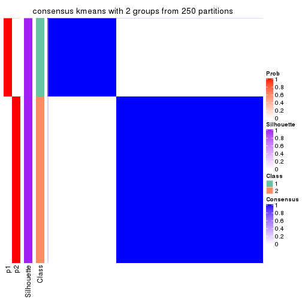</p>

</div>
<div id='tab-ATC-kmeans-consensus-heatmap-2'>
<pre><code class="r">consensus_heatmap(res, k = 3)
</code></pre>

<p>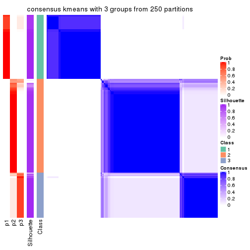</p>

</div>
<div id='tab-ATC-kmeans-consensus-heatmap-3'>
<pre><code class="r">consensus_heatmap(res, k = 4)
</code></pre>

<p>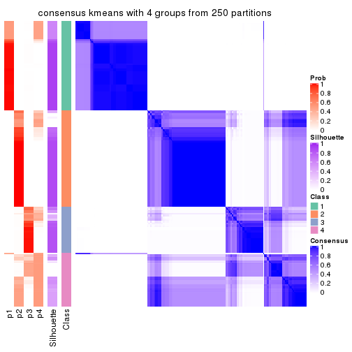</p>

</div>
<div id='tab-ATC-kmeans-consensus-heatmap-4'>
<pre><code class="r">consensus_heatmap(res, k = 5)
</code></pre>

<p>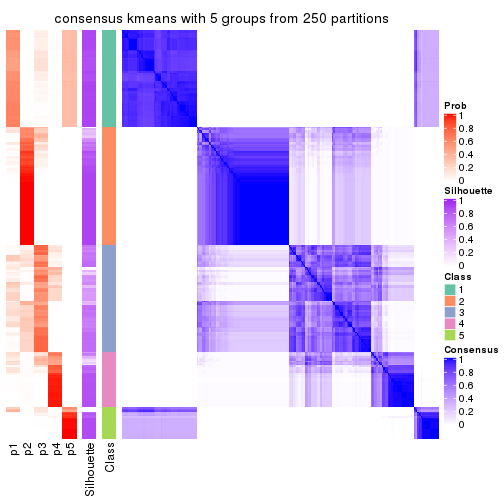</p>

</div>
<div id='tab-ATC-kmeans-consensus-heatmap-5'>
<pre><code class="r">consensus_heatmap(res, k = 6)
</code></pre>

<p>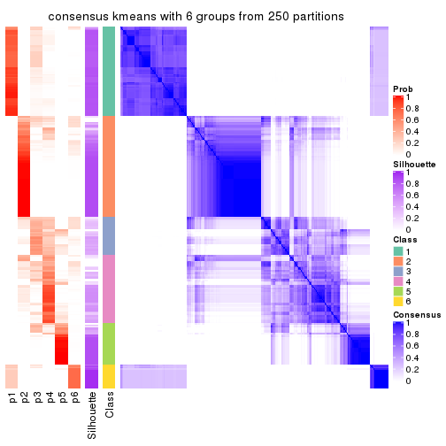</p>

</div>
</div>

Heatmaps for the membership of samples in all partitions to see how consistent they are:


<script>
$( function() {
	$( '#tabs-ATC-kmeans-membership-heatmap' ).tabs();
} );
</script>
<div id='tabs-ATC-kmeans-membership-heatmap'>
<ul>
<li><a href='#tab-ATC-kmeans-membership-heatmap-1'>k = 2</a></li>
<li><a href='#tab-ATC-kmeans-membership-heatmap-2'>k = 3</a></li>
<li><a href='#tab-ATC-kmeans-membership-heatmap-3'>k = 4</a></li>
<li><a href='#tab-ATC-kmeans-membership-heatmap-4'>k = 5</a></li>
<li><a href='#tab-ATC-kmeans-membership-heatmap-5'>k = 6</a></li>
</ul>
<div id='tab-ATC-kmeans-membership-heatmap-1'>
<pre><code class="r">membership_heatmap(res, k = 2)
</code></pre>

<p>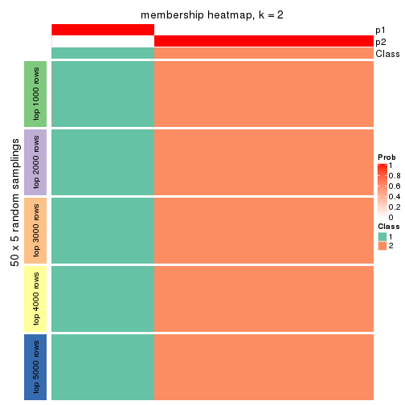</p>

</div>
<div id='tab-ATC-kmeans-membership-heatmap-2'>
<pre><code class="r">membership_heatmap(res, k = 3)
</code></pre>

<p>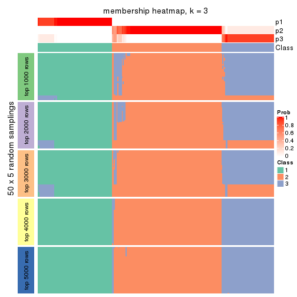</p>

</div>
<div id='tab-ATC-kmeans-membership-heatmap-3'>
<pre><code class="r">membership_heatmap(res, k = 4)
</code></pre>

<p>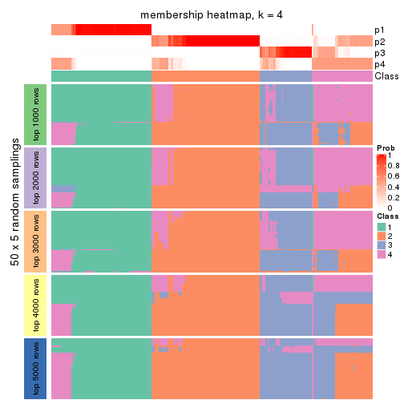</p>

</div>
<div id='tab-ATC-kmeans-membership-heatmap-4'>
<pre><code class="r">membership_heatmap(res, k = 5)
</code></pre>

<p>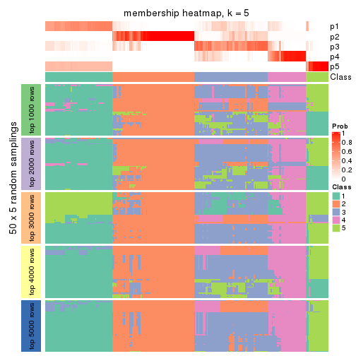</p>

</div>
<div id='tab-ATC-kmeans-membership-heatmap-5'>
<pre><code class="r">membership_heatmap(res, k = 6)
</code></pre>

<p>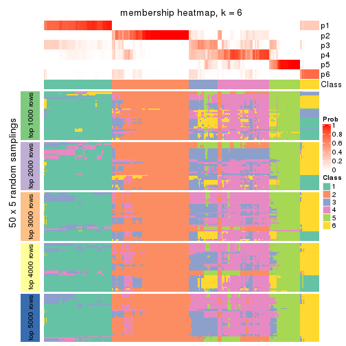</p>

</div>
</div>

As soon as we have had the classes for columns, we can look for signatures
which are significantly different between classes which can be candidate marks
for certain classes. Following are the heatmaps for signatures.


Signature heatmaps where rows are scaled:


<script>
$( function() {
	$( '#tabs-ATC-kmeans-get-signatures' ).tabs();
} );
</script>
<div id='tabs-ATC-kmeans-get-signatures'>
<ul>
<li><a href='#tab-ATC-kmeans-get-signatures-1'>k = 2</a></li>
<li><a href='#tab-ATC-kmeans-get-signatures-2'>k = 3</a></li>
<li><a href='#tab-ATC-kmeans-get-signatures-3'>k = 4</a></li>
<li><a href='#tab-ATC-kmeans-get-signatures-4'>k = 5</a></li>
<li><a href='#tab-ATC-kmeans-get-signatures-5'>k = 6</a></li>
</ul>
<div id='tab-ATC-kmeans-get-signatures-1'>
<pre><code class="r">get_signatures(res, k = 2)
</code></pre>

<p>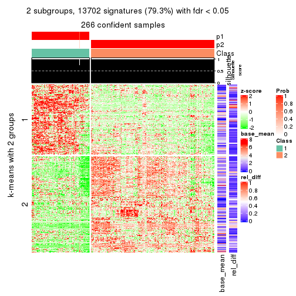</p>

</div>
<div id='tab-ATC-kmeans-get-signatures-2'>
<pre><code class="r">get_signatures(res, k = 3)
</code></pre>

<p>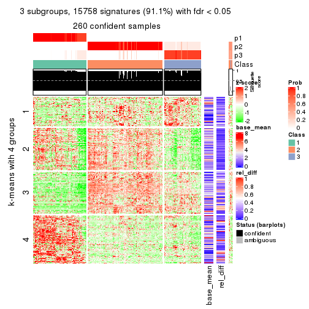</p>

</div>
<div id='tab-ATC-kmeans-get-signatures-3'>
<pre><code class="r">get_signatures(res, k = 4)
</code></pre>

<p>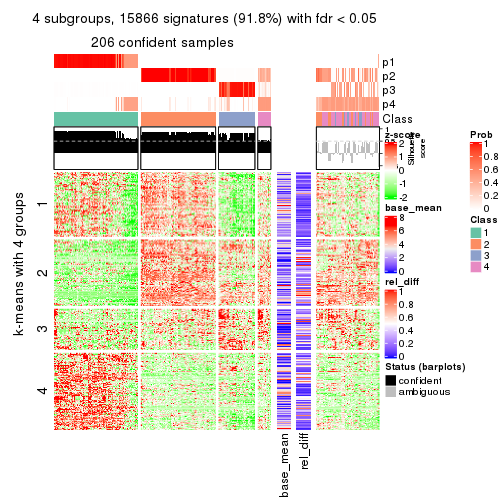</p>

</div>
<div id='tab-ATC-kmeans-get-signatures-4'>
<pre><code class="r">get_signatures(res, k = 5)
</code></pre>

<p>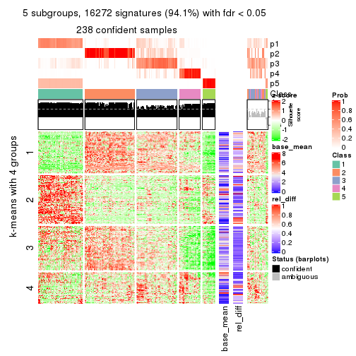</p>

</div>
<div id='tab-ATC-kmeans-get-signatures-5'>
<pre><code class="r">get_signatures(res, k = 6)
</code></pre>

<p>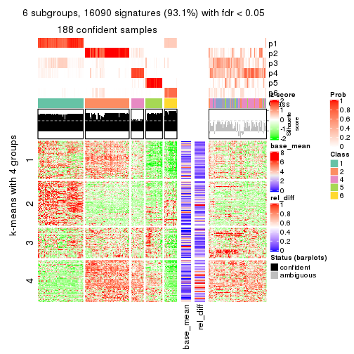</p>

</div>
</div>


Signature heatmaps where rows are not scaled:


<script>
$( function() {
	$( '#tabs-ATC-kmeans-get-signatures-no-scale' ).tabs();
} );
</script>
<div id='tabs-ATC-kmeans-get-signatures-no-scale'>
<ul>
<li><a href='#tab-ATC-kmeans-get-signatures-no-scale-1'>k = 2</a></li>
<li><a href='#tab-ATC-kmeans-get-signatures-no-scale-2'>k = 3</a></li>
<li><a href='#tab-ATC-kmeans-get-signatures-no-scale-3'>k = 4</a></li>
<li><a href='#tab-ATC-kmeans-get-signatures-no-scale-4'>k = 5</a></li>
<li><a href='#tab-ATC-kmeans-get-signatures-no-scale-5'>k = 6</a></li>
</ul>
<div id='tab-ATC-kmeans-get-signatures-no-scale-1'>
<pre><code class="r">get_signatures(res, k = 2, scale_rows = FALSE)
</code></pre>

<p>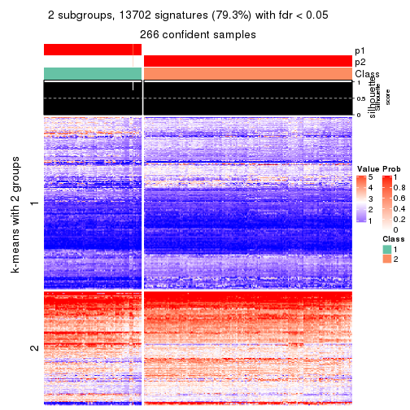</p>

</div>
<div id='tab-ATC-kmeans-get-signatures-no-scale-2'>
<pre><code class="r">get_signatures(res, k = 3, scale_rows = FALSE)
</code></pre>

<p>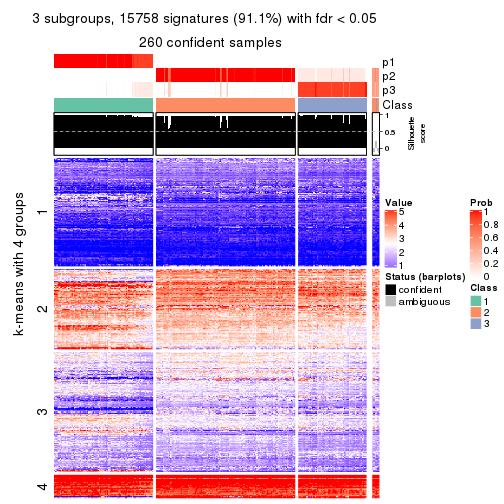</p>

</div>
<div id='tab-ATC-kmeans-get-signatures-no-scale-3'>
<pre><code class="r">get_signatures(res, k = 4, scale_rows = FALSE)
</code></pre>

<p>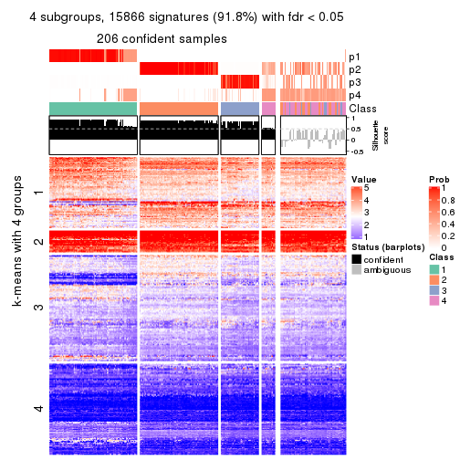</p>

</div>
<div id='tab-ATC-kmeans-get-signatures-no-scale-4'>
<pre><code class="r">get_signatures(res, k = 5, scale_rows = FALSE)
</code></pre>

<p>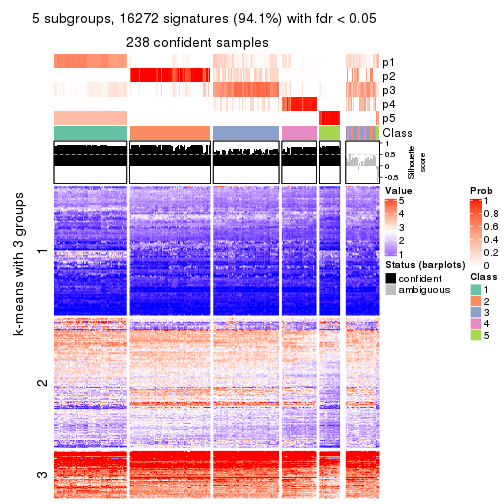</p>

</div>
<div id='tab-ATC-kmeans-get-signatures-no-scale-5'>
<pre><code class="r">get_signatures(res, k = 6, scale_rows = FALSE)
</code></pre>

<p>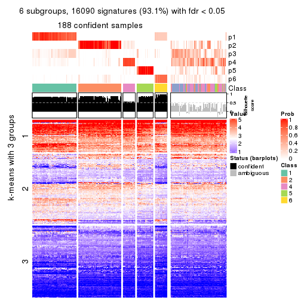</p>

</div>
</div>


Compare the overlap of signatures from different k:

```r
compare_signatures(res)
```

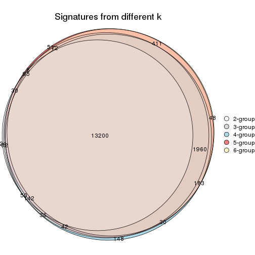

`get_signature()` returns a data frame invisibly. TO get the list of signatures, the function
call should be assigned to a variable explicitly. In following code, if `plot` argument is set
to `FALSE`, no heatmap is plotted while only the differential analysis is performed.

```r
# code only for demonstration
tb = get_signature(res, k = ..., plot = FALSE)
```

An example of the output of `tb` is:

```
#>   which_row         fdr    mean_1    mean_2 scaled_mean_1 scaled_mean_2 km
#> 1        38 0.042760348  8.373488  9.131774    -0.5533452     0.5164555  1
#> 2        40 0.018707592  7.106213  8.469186    -0.6173731     0.5762149  1
#> 3        55 0.019134737 10.221463 11.207825    -0.6159697     0.5749050  1
#> 4        59 0.006059896  5.921854  7.869574    -0.6899429     0.6439467  1
#> 5        60 0.018055526  8.928898 10.211722    -0.6204761     0.5791110  1
#> 6        98 0.009384629 15.714769 14.887706     0.6635654    -0.6193277  2
...
```

The columns in `tb` are:

1. `which_row`: row indices corresponding to the input matrix.
2. `fdr`: FDR for the differential test. 
3. `mean_x`: The mean value in group x.
4. `scaled_mean_x`: The mean value in group x after rows are scaled.
5. `km`: Row groups if k-means clustering is applied to rows.


UMAP plot which shows how samples are separated.


<script>
$( function() {
	$( '#tabs-ATC-kmeans-dimension-reduction' ).tabs();
} );
</script>
<div id='tabs-ATC-kmeans-dimension-reduction'>
<ul>
<li><a href='#tab-ATC-kmeans-dimension-reduction-1'>k = 2</a></li>
<li><a href='#tab-ATC-kmeans-dimension-reduction-2'>k = 3</a></li>
<li><a href='#tab-ATC-kmeans-dimension-reduction-3'>k = 4</a></li>
<li><a href='#tab-ATC-kmeans-dimension-reduction-4'>k = 5</a></li>
<li><a href='#tab-ATC-kmeans-dimension-reduction-5'>k = 6</a></li>
</ul>
<div id='tab-ATC-kmeans-dimension-reduction-1'>
<pre><code class="r">dimension_reduction(res, k = 2, method = &quot;UMAP&quot;)
</code></pre>

<p>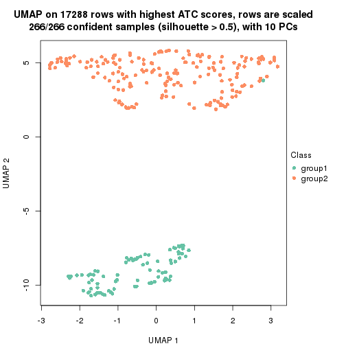</p>

</div>
<div id='tab-ATC-kmeans-dimension-reduction-2'>
<pre><code class="r">dimension_reduction(res, k = 3, method = &quot;UMAP&quot;)
</code></pre>

<p>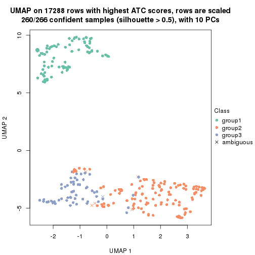</p>

</div>
<div id='tab-ATC-kmeans-dimension-reduction-3'>
<pre><code class="r">dimension_reduction(res, k = 4, method = &quot;UMAP&quot;)
</code></pre>

<p>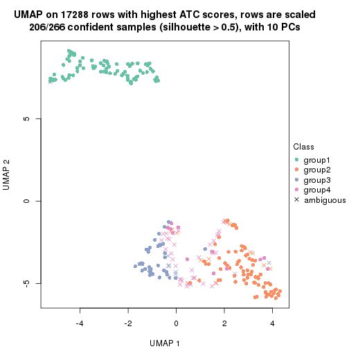</p>

</div>
<div id='tab-ATC-kmeans-dimension-reduction-4'>
<pre><code class="r">dimension_reduction(res, k = 5, method = &quot;UMAP&quot;)
</code></pre>

<p>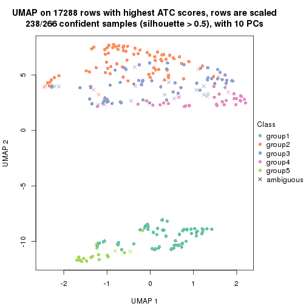</p>

</div>
<div id='tab-ATC-kmeans-dimension-reduction-5'>
<pre><code class="r">dimension_reduction(res, k = 6, method = &quot;UMAP&quot;)
</code></pre>

<p>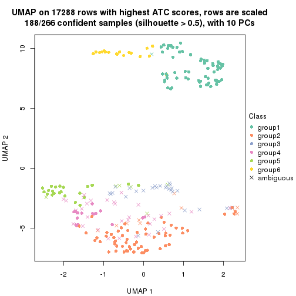</p>

</div>
</div>


Following heatmap shows how subgroups are split when increasing `k`:

```r
collect_classes(res)
```

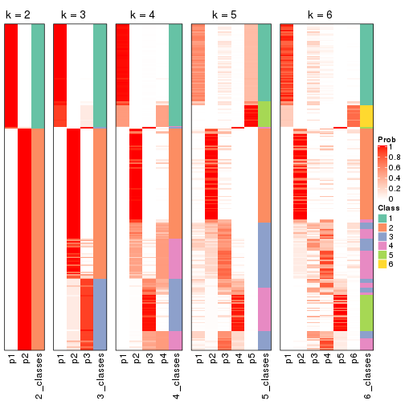


If matrix rows can be associated to genes, consider to use `GO_Enrichment(res,
...)` to perform function enrichment for the signature genes.


 

---------------------------------------------------


### ATC:skmeans**


The object with results only for a single top-value method and a single partition method 
can be extracted as:

```r
res = res_list["ATC", "skmeans"]
# you can also extract it by
# res = res_list["ATC:skmeans"]
```

A summary of `res` and all the functions that can be applied to it:

```r
res
```

```
#> A 'ConsensusPartition' object with k = 2, 3, 4, 5, 6.
#>   On a matrix with 17288 rows and 266 columns.
#>   Top rows (1000, 2000, 3000, 4000, 5000) are extracted by 'ATC' method.
#>   Subgroups are detected by 'skmeans' method.
#>   Performed in total 1250 partitions by row resampling.
#>   Best k for subgroups seems to be 3.
#> 
#> Following methods can be applied to this 'ConsensusPartition' object:
#>  [1] "cola_report"             "collect_classes"         "collect_plots"          
#>  [4] "collect_stats"           "colnames"                "compare_signatures"     
#>  [7] "consensus_heatmap"       "dimension_reduction"     "functional_enrichment"  
#> [10] "get_anno_col"            "get_anno"                "get_classes"            
#> [13] "get_consensus"           "get_matrix"              "get_membership"         
#> [16] "get_param"               "get_signatures"          "get_stats"              
#> [19] "is_best_k"               "is_stable_k"             "membership_heatmap"     
#> [22] "ncol"                    "nrow"                    "plot_ecdf"              
#> [25] "rownames"                "select_partition_number" "show"                   
#> [28] "suggest_best_k"          "test_to_known_factors"
```

`collect_plots()` function collects all the plots made from `res` for all `k` (number of partitions)
into one single page to provide an easy and fast comparison between different `k`.

```r
collect_plots(res)
```

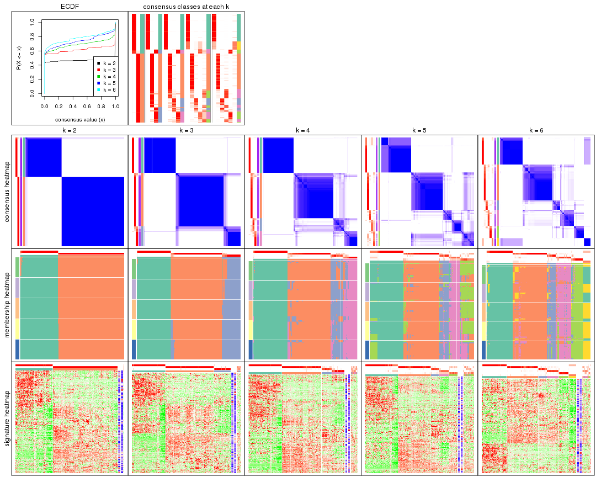

The plots are:

- The first row: a plot of the ECDF (Empirical cumulative distribution
  function) curves of the consensus matrix for each `k` and the heatmap of
  predicted classes for each `k`.
- The second row: heatmaps of the consensus matrix for each `k`.
- The third row: heatmaps of the membership matrix for each `k`.
- The fouth row: heatmaps of the signatures for each `k`.

All the plots in panels can be made by individual functions and they are
plotted later in this section.

`select_partition_number()` produces several plots showing different
statistics for choosing "optimized" `k`. There are following statistics:

- ECDF curves of the consensus matrix for each `k`;
- 1-PAC. [The PAC
  score](https://en.wikipedia.org/wiki/Consensus_clustering#Over-interpretation_potential_of_consensus_clustering)
  measures the proportion of the ambiguous subgrouping.
- Mean silhouette score.
- Concordance. The mean probability of fiting the consensus class ids in all
  partitions.
- Area increased. Denote $A_k$ as the area under the ECDF curve for current
  `k`, the area increased is defined as $A_k - A_{k-1}$.
- Rand index. The percent of pairs of samples that are both in a same cluster
  or both are not in a same cluster in the partition of k and k-1.
- Jaccard index. The ratio of pairs of samples are both in a same cluster in
  the partition of k and k-1 and the pairs of samples are both in a same
  cluster in the partition k or k-1.

The detailed explanations of these statistics can be found in [the cola
vignette](http://bioconductor.org/packages/devel/bioc/vignettes/cola/inst/doc/cola.html#toc_13).

Generally speaking, lower PAC score, higher mean silhouette score or higher
concordance corresponds to better partition. Rand index and Jaccard index
measure how similar the current partition is compared to partition with `k-1`.
If they are too similar, we won't accept `k` is better than `k-1`.

```r
select_partition_number(res)
```

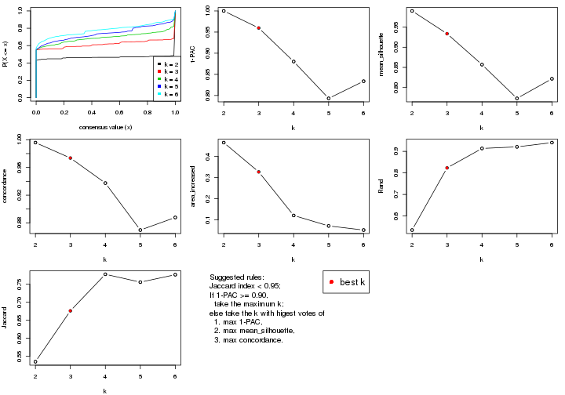

The numeric values for all these statistics can be obtained by `get_stats()`.

```r
get_stats(res)
```

```
#>   k 1-PAC mean_silhouette concordance area_increased  Rand Jaccard
#> 2 2 1.000           0.990       0.996         0.4649 0.535   0.535
#> 3 3 0.960           0.934       0.974         0.3268 0.823   0.676
#> 4 4 0.880           0.857       0.937         0.1210 0.914   0.778
#> 5 5 0.793           0.773       0.870         0.0716 0.921   0.756
#> 6 6 0.834           0.822       0.888         0.0523 0.941   0.777
```

`suggest_best_k()` suggests the best $k$ based on these statistics. The rules are as follows:

- All $k$ with Jaccard index larger than 0.95 are removed because the increase of
  the partition number does not provides enough extra information. If all $k$ are removed,
  the best $k$ is assigned by `NA`.
- For $k$ with 1-PAC larger than 0.9, the maximal $k$ is taken as the "best k". Other $k$ is called "optional k".
- If it does not fit the second rule. The $k$ with the highest vote of highest
  1-PAC, mean silhouette and concordance is taken as the "best k".

```r
suggest_best_k(res)
```

```
#> [1] 3
#> attr(,"optional")
#> [1] 2
```

There is also optional best $k$ = 2 that is worth to check.

Following shows the table of the partitions (You need to click the **show/hide
code output** link to see it). The membership matrix (columns with name `p*`)
is inferred by
[`clue::cl_consensus()`](https://www.rdocumentation.org/link/cl_consensus?package=clue)
function with the `SE` method. Basically the value in the membership matrix
represents the probability to belong to a certain group. The finall class
label for an item is determined with the group with highest probability it
belongs to.

In `get_classes()` function, the entropy is calculated from the membership
matrix and the silhouette score is calculated from the consensus matrix.


<script>
$( function() {
	$( '#tabs-ATC-skmeans-get-classes' ).tabs();
} );
</script>
<div id='tabs-ATC-skmeans-get-classes'>
<ul>
<li><a href='#tab-ATC-skmeans-get-classes-1'>k = 2</a></li>
<li><a href='#tab-ATC-skmeans-get-classes-2'>k = 3</a></li>
<li><a href='#tab-ATC-skmeans-get-classes-3'>k = 4</a></li>
<li><a href='#tab-ATC-skmeans-get-classes-4'>k = 5</a></li>
<li><a href='#tab-ATC-skmeans-get-classes-5'>k = 6</a></li>
</ul>

<div id='tab-ATC-skmeans-get-classes-1'>
<p><a id='tab-ATC-skmeans-get-classes-1-a' style='color:#0366d6' href='#'>show/hide code output</a></p>
<pre><code class="r">cbind(get_classes(res, k = 2), get_membership(res, k = 2))
</code></pre>

<pre><code>#&gt;                                      class entropy silhouette    p1    p2
#&gt; 80D0AF10-1C61-4B67-90C1-7DBF1EF23672     2  0.0000      0.998 0.000 1.000
#&gt; 87117BE1-D328-4972-85DA-6672412D8860     2  0.0000      0.998 0.000 1.000
#&gt; F904C5B6-70BD-4604-8254-79BE23B152DA     1  0.0000      0.993 1.000 0.000
#&gt; 3182DEA1-4239-4613-925A-7E6503766AD6     2  0.0000      0.998 0.000 1.000
#&gt; 55E78EA2-2D9B-481F-8CAB-D36A33088EAE     2  0.0000      0.998 0.000 1.000
#&gt; 86F94264-A6DD-4A97-9191-036F066DD0EF     2  0.0000      0.998 0.000 1.000
#&gt; 09D25417-23B7-4D88-A0EA-F307985FBBBC     1  0.0000      0.993 1.000 0.000
#&gt; C797F12C-40D3-4DB5-B9EF-A6821BBDE4F0     1  0.0000      0.993 1.000 0.000
#&gt; 80275DB0-A226-4B6B-A08F-4ADBEEE1DB01     1  0.0000      0.993 1.000 0.000
#&gt; 27FB653A-9E07-44AD-952E-9E4DE4AB5891     2  0.0000      0.998 0.000 1.000
#&gt; 1A5DB9FC-2ABD-4E1B-B5EF-B1CF5E5F3872     1  0.0000      0.993 1.000 0.000
#&gt; 844E4CCD-D30C-416F-A086-8923711A4E25     2  0.0000      0.998 0.000 1.000
#&gt; EF18318D-3D25-4D65-803A-ED6E62871E7E     1  0.0000      0.993 1.000 0.000
#&gt; 1ACB1BE0-61F6-4243-BBEC-E26A1CF90CA8     1  0.0000      0.993 1.000 0.000
#&gt; 8EF0039B-D758-46AB-BAF7-6A062C7C56BA     1  0.0000      0.993 1.000 0.000
#&gt; 22F4C9D9-663B-4C91-9692-E035A2640BEC     2  0.0000      0.998 0.000 1.000
#&gt; FA1A0BCE-EE0F-4178-B963-62550E344B14     2  0.0000      0.998 0.000 1.000
#&gt; 0B6D0C4E-5AE3-4707-A9FC-12A108E6EC2A     2  0.0000      0.998 0.000 1.000
#&gt; 06FD3123-2AEB-4911-AC4E-E0E64FD5DB52     2  0.0000      0.998 0.000 1.000
#&gt; 235A4492-FF80-4AA5-BC71-DFF65E1C7411     2  0.0000      0.998 0.000 1.000
#&gt; A192C6C0-1443-4493-AFAC-1EE710628ADB     2  0.0000      0.998 0.000 1.000
#&gt; 6FC5B56B-711B-4174-9B06-4E843124AAB6     1  0.0000      0.993 1.000 0.000
#&gt; 7A813F60-A41E-4552-990E-F22287654C1D     2  0.0000      0.998 0.000 1.000
#&gt; 725BBFB5-26F4-4512-9C75-47D013C1E605     1  0.0000      0.993 1.000 0.000
#&gt; 39CC4E82-EBC9-472E-8BE5-6A3AB178449A     2  0.0000      0.998 0.000 1.000
#&gt; 61130DEE-E267-49DF-8B41-7738A06EF738     2  0.0000      0.998 0.000 1.000
#&gt; 117EC12C-B7ED-4E01-B29B-EA542D356EA1     1  0.0000      0.993 1.000 0.000
#&gt; A30FF708-F7A9-41E4-8AD5-20441650FBC9     2  0.0000      0.998 0.000 1.000
#&gt; 53640D52-1167-4A5D-B656-97D32CBA3934     1  0.0000      0.993 1.000 0.000
#&gt; 9E85D76A-DD2A-46D5-BB59-0ED302B6258C     2  0.0000      0.998 0.000 1.000
#&gt; 6F8C6F90-7E3C-4860-91DD-586708DE44AA     1  0.0000      0.993 1.000 0.000
#&gt; E675AEC5-AA9A-4AAA-839C-03E6365822DB     2  0.9686      0.332 0.396 0.604
#&gt; B577DEF7-2F5C-4876-A7C6-F18D5722B8C0     1  0.0000      0.993 1.000 0.000
#&gt; DA8B577E-43E7-49BF-BF94-868E3194F5C9     1  0.0000      0.993 1.000 0.000
#&gt; 3334280B-2A36-4AC7-A021-A76C10E958F0     2  0.0000      0.998 0.000 1.000
#&gt; 5CBDDC90-11EC-4E6E-881E-AA9CCFD40FDB     1  0.0000      0.993 1.000 0.000
#&gt; 8CBBF32A-8349-44F5-A8B8-4CBB1760A464     2  0.0000      0.998 0.000 1.000
#&gt; B9455A9A-136D-4DC2-9F86-0FC74433589D     1  0.0000      0.993 1.000 0.000
#&gt; D7EAE2A7-F9BE-4222-A452-B1F83F99CD50     2  0.0000      0.998 0.000 1.000
#&gt; F803AE18-60C5-4CFE-AAAB-DB33C26A2184     1  0.0000      0.993 1.000 0.000
#&gt; 5DD8CAC7-EC02-43B6-B58E-6D2E22868A3B     2  0.0000      0.998 0.000 1.000
#&gt; EE98E1B4-DFB3-4AEC-8527-E1FD544C9475     1  0.0000      0.993 1.000 0.000
#&gt; 3CE43921-47D5-4394-B9E1-242607775D61     2  0.0000      0.998 0.000 1.000
#&gt; 46986F2B-0B0D-4187-8948-4E91D34B7C49     2  0.0000      0.998 0.000 1.000
#&gt; 5D1D052E-74EF-45A8-9B1A-7CECD13EA43B     2  0.0000      0.998 0.000 1.000
#&gt; 4C821AD9-A5C9-4A9A-9C5D-363B227F8064     2  0.0000      0.998 0.000 1.000
#&gt; 06A4189E-A23B-4AC6-AA74-01955DD7D1E9     2  0.0000      0.998 0.000 1.000
#&gt; FCCDC76F-CB02-4BCD-A616-325F258DDAA4     2  0.0000      0.998 0.000 1.000
#&gt; DAC53B0A-8F35-4EA6-BBCC-4CD1C049E11F     2  0.0000      0.998 0.000 1.000
#&gt; DD4F845B-CAD3-44CB-9D96-3C3F5BA1B72D     1  0.0000      0.993 1.000 0.000
#&gt; D440F004-A4A4-41B6-BED8-805D67BA01C7     2  0.0000      0.998 0.000 1.000
#&gt; A497C423-119F-42FA-BF17-9F6DFD2A5585     2  0.0000      0.998 0.000 1.000
#&gt; 3420E573-DE12-4EF5-B1C0-2FCA904F4F4E     1  0.0000      0.993 1.000 0.000
#&gt; 1AD72157-A254-44B4-BA58-4F30F1AE910E     1  0.0000      0.993 1.000 0.000
#&gt; C1113977-B160-45EE-B061-750F9EA3F33F     2  0.0000      0.998 0.000 1.000
#&gt; 6783AB5B-F07C-447B-BF13-C34485D246D7     2  0.0000      0.998 0.000 1.000
#&gt; 1F553062-26FD-4A7F-B7FB-81184604F423     1  0.0000      0.993 1.000 0.000
#&gt; BE2DCA51-1C21-4598-98A7-F2FB9B2DFCB4     2  0.0000      0.998 0.000 1.000
#&gt; 38941CF3-9C54-4BA4-A005-CC88CA97D504     2  0.0000      0.998 0.000 1.000
#&gt; 51CB675E-E243-4A07-BF4A-580473D26FDA     2  0.0000      0.998 0.000 1.000
#&gt; C7FED0F5-C27A-4405-9232-30BF39362CF7     2  0.0000      0.998 0.000 1.000
#&gt; 2A1E86E8-4713-465F-ACFF-C584864C57A1     2  0.0000      0.998 0.000 1.000
#&gt; B4500785-0FAA-4D4D-8630-43D194BAB004     2  0.0000      0.998 0.000 1.000
#&gt; 3FD52E66-AB76-4079-80DB-281A795D1EC0     1  0.2423      0.955 0.960 0.040
#&gt; EBD355D1-1226-4DFD-AAFF-45D246B64F3C     2  0.0000      0.998 0.000 1.000
#&gt; 5A040A73-CD95-487E-8AEF-9639FE4E2916     2  0.0000      0.998 0.000 1.000
#&gt; CF629C65-585D-476D-B081-3E6E0575FAE3     1  0.0376      0.989 0.996 0.004
#&gt; 0D4202A3-808E-413F-9BF3-9CFCCAE0ED61     2  0.0000      0.998 0.000 1.000
#&gt; 43E715BF-28D9-4B5E-B762-8CD1B69A430E     1  0.0000      0.993 1.000 0.000
#&gt; BFB82BE8-9DAC-4099-8B38-0950308E3EB3     2  0.0000      0.998 0.000 1.000
#&gt; F7CB1825-2303-4DD2-AE1F-7205738EAF1F     1  0.0000      0.993 1.000 0.000
#&gt; FE298483-C42C-4753-BABB-29A9CB1B6312     1  0.0000      0.993 1.000 0.000
#&gt; A98C7561-1B42-4CD6-AE71-924B91FA4C33     2  0.0000      0.998 0.000 1.000
#&gt; 58098F21-7DAB-47DA-9A41-8D20BF3B9257     2  0.0000      0.998 0.000 1.000
#&gt; 18CAF708-20B9-4745-9CB3-37AB6E0B3056     2  0.0000      0.998 0.000 1.000
#&gt; 2C80DD72-C9C7-4AC2-812F-9A31EF02779C     1  0.0000      0.993 1.000 0.000
#&gt; 68A3F13D-319D-4603-A27F-B5DD46FE5C5B     2  0.0000      0.998 0.000 1.000
#&gt; 7EE8F0CE-CDC9-40F9-A1DE-7F8140EC6D13     1  0.0000      0.993 1.000 0.000
#&gt; 39019903-5B9C-4665-BD5F-7CCB19CB55C5     2  0.0000      0.998 0.000 1.000
#&gt; 190EDB27-4CBC-4E9C-9B67-D51FDAB982B7     1  0.6887      0.780 0.816 0.184
#&gt; EB2D95BC-62F8-4669-9308-D37D7FB79E23     2  0.0000      0.998 0.000 1.000
#&gt; A08B85EA-D1E7-4B77-8DEC-36294305B9F7     1  0.0000      0.993 1.000 0.000
#&gt; 130DDFAD-6EF8-4C80-BD9D-88308A6874BC     2  0.0000      0.998 0.000 1.000
#&gt; 7340A5BA-E002-448F-AACC-E7A37DBB79C2     2  0.0000      0.998 0.000 1.000
#&gt; A771F6E3-D266-4FE7-98C6-C40E6A701D59     1  0.0000      0.993 1.000 0.000
#&gt; 015E792C-EC1B-49BF-AB07-D82B20C5989A     2  0.0000      0.998 0.000 1.000
#&gt; BF79E030-47EE-4D08-B910-5685A4BD8B60     2  0.0000      0.998 0.000 1.000
#&gt; FB3C7C9A-2F2D-4DD5-BE47-FAFB072C0FAB     2  0.0000      0.998 0.000 1.000
#&gt; 4E5557BA-10E8-4723-908E-DD04EF6639B2     2  0.0000      0.998 0.000 1.000
#&gt; 8031B550-40A9-4A3A-9F7D-CDC052288BD8     2  0.0000      0.998 0.000 1.000
#&gt; 55299A06-3C1F-45A4-B166-B2C591C0CEE2     2  0.0000      0.998 0.000 1.000
#&gt; EB8D5168-216E-4ABB-8B4E-9E67786CB322     1  0.0000      0.993 1.000 0.000
#&gt; 78BD2D83-9A7F-42E5-BB38-654AA0761A0A     2  0.0000      0.998 0.000 1.000
#&gt; AA2D53E5-D389-4332-9DD5-A736052E48F8     1  0.0000      0.993 1.000 0.000
#&gt; 62945C7A-9313-4FC9-820C-B0AB820B394E     1  0.0000      0.993 1.000 0.000
#&gt; 22746046-2E99-4EE9-97D2-BA2EA499634C     2  0.0000      0.998 0.000 1.000
#&gt; 8671B51B-DCBE-4429-9F01-AF51CAD7014F     2  0.0000      0.998 0.000 1.000
#&gt; E815AB36-5689-4A0D-8E6D-2EAA73406681     1  0.0000      0.993 1.000 0.000
#&gt; A1DACB46-ED52-4E38-B2C8-57256BB22B5E     2  0.0000      0.998 0.000 1.000
#&gt; 4F5498C4-A423-4B3D-AC98-D4E214A57D0E     1  0.0000      0.993 1.000 0.000
#&gt; A7772CCD-FFFF-49DD-86ED-0BAD330EC9B6     2  0.0000      0.998 0.000 1.000
#&gt; E6E3DF78-65B9-4F74-8DA8-E2A6D4EDBEA7     2  0.0000      0.998 0.000 1.000
#&gt; 83286E2D-E708-437A-911A-E6B050273CBD     1  0.0000      0.993 1.000 0.000
#&gt; EC5C7C97-EE8C-405D-A039-D96514B1D414     2  0.0000      0.998 0.000 1.000
#&gt; 3E55223D-6E3D-4027-9819-67E91212531D     1  0.0000      0.993 1.000 0.000
#&gt; 99A036A2-8343-4D06-8047-D84E96CE4C61     2  0.0000      0.998 0.000 1.000
#&gt; CA6CDE6D-92DE-4259-9E58-A373F2D543EA     2  0.0000      0.998 0.000 1.000
#&gt; BF6FA8CC-60C1-413A-B2C6-54CCACBC01D6     1  0.0000      0.993 1.000 0.000
#&gt; E0594CFE-F7B6-4546-B130-30DF6A514B1F     2  0.0000      0.998 0.000 1.000
#&gt; E769E41D-5949-42C5-9594-E563C05ACE52     2  0.0000      0.998 0.000 1.000
#&gt; 01373725-5D3C-4D9C-AABC-911D53E62BCD     2  0.0000      0.998 0.000 1.000
#&gt; 1F39DADD-3655-474E-BA4C-A5BD32C97A8B     1  0.0000      0.993 1.000 0.000
#&gt; AF573EC8-E4EE-4B8F-8199-9817B9FAC67D     1  0.0000      0.993 1.000 0.000
#&gt; 3F022CBC-41C8-4387-A6FB-124C4BCD1AD9     1  0.0000      0.993 1.000 0.000
#&gt; 1CC32ACE-826B-494B-8B89-5BD92327A74D     2  0.0000      0.998 0.000 1.000
#&gt; 22B0BD3B-EE08-4BC7-90B2-01C372A56BA2     2  0.0000      0.998 0.000 1.000
#&gt; 0F3DE9EF-19CC-4D14-9A42-1435DB537F94     2  0.0000      0.998 0.000 1.000
#&gt; 87F8A33F-FBC3-469E-862B-84472F796358     2  0.0000      0.998 0.000 1.000
#&gt; C9F2FA0D-1A9F-40B4-BD9B-CAF1B3F3D5A7     2  0.0000      0.998 0.000 1.000
#&gt; ACFC9F59-78FF-4453-B25F-8834D0EAB54A     2  0.0000      0.998 0.000 1.000
#&gt; B7AC7D5B-14E9-45A7-93B7-226EE508544A     2  0.0000      0.998 0.000 1.000
#&gt; 4491BF17-B168-4E96-8E09-EF1AEC9F5E9D     2  0.0000      0.998 0.000 1.000
#&gt; 557A0811-A3FE-4CF4-A24D-FBB77E7F9139     2  0.0000      0.998 0.000 1.000
#&gt; 6F9C955C-6816-4353-922A-8035B50FACC6     2  0.0000      0.998 0.000 1.000
#&gt; 3E89FB1C-4A7D-43C7-823C-04E3716A7935     2  0.0000      0.998 0.000 1.000
#&gt; 12ABE483-66EF-4237-94C4-0199FAE23FA8     2  0.0000      0.998 0.000 1.000
#&gt; 7535F262-9B96-44F6-988C-4C9EBB3FFCA9     2  0.0000      0.998 0.000 1.000
#&gt; 65C9D28E-303B-40E5-84F0-2507F5457374     2  0.0000      0.998 0.000 1.000
#&gt; FD445384-6BA9-4297-9D9C-12ABA7D645C7     1  0.0000      0.993 1.000 0.000
#&gt; 30D5E255-2AD3-44F3-8983-1B80E4FD3E2D     2  0.0000      0.998 0.000 1.000
#&gt; 3E88EC60-B4A8-4259-8BC8-A234800F6955     2  0.0000      0.998 0.000 1.000
#&gt; ACD73CE8-AFC5-47A0-9383-3CB97F018953     1  0.0000      0.993 1.000 0.000
#&gt; 1AFDC2EA-26A8-44E2-8BCB-F34F7B66F8C8     2  0.0000      0.998 0.000 1.000
#&gt; 9E327BC8-1D20-4AD8-83F7-FB2D13BCA5D0     2  0.0000      0.998 0.000 1.000
#&gt; 85A86B91-4F24-4E77-AE2D-520F8E205EFC     1  0.0000      0.993 1.000 0.000
#&gt; 74868C37-8143-4306-81CA-E45759D146CD     2  0.0000      0.998 0.000 1.000
#&gt; 69AEA0DB-E335-48A0-A398-4FB0D581182A     2  0.0000      0.998 0.000 1.000
#&gt; AE6F8B89-85C2-42B7-8D05-AFDDD4FEFD16     1  0.0000      0.993 1.000 0.000
#&gt; A8A6F09C-9812-4457-9A4B-AD41F97B41A3     2  0.0000      0.998 0.000 1.000
#&gt; 1A09BC4D-EF29-42DD-BB04-A3C264A3032D     1  0.0000      0.993 1.000 0.000
#&gt; E0961A30-A62C-4235-9CF0-A1776827A996     2  0.0000      0.998 0.000 1.000
#&gt; 134D2D90-7B08-4F20-8A3A-C77643FB208F     2  0.0000      0.998 0.000 1.000
#&gt; A77C2DFF-93CF-4CB5-B3C1-81133D7F1A0F     1  0.3733      0.921 0.928 0.072
#&gt; EA2DC457-9C74-4B9C-B3FA-5E72199B24A7     2  0.0000      0.998 0.000 1.000
#&gt; FF34117B-5EE4-4C96-A8A2-2CE6A654CBE5     1  0.0000      0.993 1.000 0.000
#&gt; 75F7B5E2-6559-4B48-A2A4-287C35C559CC     1  0.0000      0.993 1.000 0.000
#&gt; 903BF591-B0AF-4BEE-B625-60B673070344     2  0.0000      0.998 0.000 1.000
#&gt; 9DE1B790-C63C-41C4-9477-CE52A8119C67     2  0.0000      0.998 0.000 1.000
#&gt; 9A28F80A-85F8-40E2-A32B-230EF93B2FA0     2  0.0000      0.998 0.000 1.000
#&gt; 0AA2BDBB-8720-409A-AA72-1F4AA26E7CD8     2  0.0000      0.998 0.000 1.000
#&gt; 5AD49F16-E974-4E5D-B1B6-073ECB73A01D     1  0.0000      0.993 1.000 0.000
#&gt; CB0F961C-527D-4A48-9408-286B26BD9532     1  0.0000      0.993 1.000 0.000
#&gt; 46FF25B6-D01D-4CA7-80B7-CEC2998C34E1     2  0.0000      0.998 0.000 1.000
#&gt; 487CADE1-D699-4A6C-817A-B9A0AB940C61     1  0.0000      0.993 1.000 0.000
#&gt; 4FF6F2D8-F869-4735-A4D1-1A8423153FBC     1  0.0000      0.993 1.000 0.000
#&gt; 6005494F-5D3D-43A3-B3E8-8C91955B2A98     2  0.0000      0.998 0.000 1.000
#&gt; CF10D584-CE32-45A4-A932-E9D5AF12A6A0     1  0.0000      0.993 1.000 0.000
#&gt; E15CE4AB-5646-49C8-9CD6-938457036BB0     2  0.0000      0.998 0.000 1.000
#&gt; 31E28D0B-0E69-4330-82ED-4F1827DC97EA     2  0.0000      0.998 0.000 1.000
#&gt; DBACD3C3-CCB5-4478-BA78-85A0C847CA66     2  0.0000      0.998 0.000 1.000
#&gt; 5A07041C-65EB-4FCD-8940-E90B905061B5     2  0.0000      0.998 0.000 1.000
#&gt; 0EA7C916-FA47-489B-BC98-4D9E7D197628     1  0.0000      0.993 1.000 0.000
#&gt; 30967F75-8499-47FF-ADA4-4DC566013F7B     1  0.0000      0.993 1.000 0.000
#&gt; D2E528FF-AEA2-48D7-A60A-4C3E71EA9073     2  0.0000      0.998 0.000 1.000
#&gt; 22735DCD-215E-48BC-BF44-32BD66F06E39     2  0.0000      0.998 0.000 1.000
#&gt; BC2C3248-7FC6-48BC-96C1-45EA573DE7DC     1  0.0000      0.993 1.000 0.000
#&gt; E72CEBCB-D686-4B12-BCBA-EC8F964330A2     1  0.0000      0.993 1.000 0.000
#&gt; 23C937BB-BA20-4440-B680-914229CC3ADF     1  0.0000      0.993 1.000 0.000
#&gt; 947E99C7-F402-4F1A-A6E9-81BCAAED135A     2  0.0000      0.998 0.000 1.000
#&gt; 02475D11-FC81-4E88-944E-173C32DC3FE7     1  0.1184      0.978 0.984 0.016
#&gt; F972A9AA-9842-4343-A533-A795E65581CE     1  0.0000      0.993 1.000 0.000
#&gt; 05043AAF-3095-4C61-B5C1-EE9AA9082C75     2  0.0000      0.998 0.000 1.000
#&gt; CECF7967-862E-428C-BB42-FEF553FDB3AA     2  0.0000      0.998 0.000 1.000
#&gt; FB0B9483-6302-48C7-BE5B-DA667E00AE2D     1  0.7528      0.731 0.784 0.216
#&gt; 78700FBA-1487-4754-9B30-18837BF7E9FB     1  0.0000      0.993 1.000 0.000
#&gt; 2166F56D-54CE-4F1B-8F07-A4E13E4489E9     1  0.0000      0.993 1.000 0.000
#&gt; 7CD0942E-E39A-43A7-8BAC-F25967864901     2  0.0000      0.998 0.000 1.000
#&gt; 3B00BA2B-7F7D-4825-8F8D-90F04A5DE687     2  0.0000      0.998 0.000 1.000
#&gt; 7465B01D-C05E-4FE0-A9FE-182920EDC489     2  0.0000      0.998 0.000 1.000
#&gt; 88C31A99-F96E-4FC8-8B3D-C1AAA05062D9     1  0.0000      0.993 1.000 0.000
#&gt; 53575575-3303-4F8F-B6A8-B42131CFB4AC     2  0.0000      0.998 0.000 1.000
#&gt; CC8017C7-4128-48DA-8E43-503F63158D85     1  0.0000      0.993 1.000 0.000
#&gt; 88449D2A-2A25-41A4-B91D-C99B58F8ECD9     2  0.0000      0.998 0.000 1.000
#&gt; 46C7DDE5-A2B5-494F-96AE-0B6E2D51B003     1  0.0000      0.993 1.000 0.000
#&gt; 42551D05-5EE5-4F91-93A8-32DA695D9DFA     2  0.0000      0.998 0.000 1.000
#&gt; 0772DA48-3A36-422D-B166-CA1691B782C3     2  0.0000      0.998 0.000 1.000
#&gt; 30346897-EC77-4153-88A2-D14593C8B741     2  0.0000      0.998 0.000 1.000
#&gt; 0F00E267-C748-4A71-8B36-03C410641D88     2  0.0000      0.998 0.000 1.000
#&gt; 4034703A-4DA9-4DDA-9CA9-E80FFE9CCDE6     2  0.0000      0.998 0.000 1.000
#&gt; 393C8A41-CF45-4EA8-AFE3-25A08AB7692A     2  0.0000      0.998 0.000 1.000
#&gt; 3354212D-A07C-435C-8B0C-9A7BAAB624B5     1  0.0000      0.993 1.000 0.000
#&gt; 57E30D4E-ABF7-47DD-92BE-40CE215076B0     1  0.0000      0.993 1.000 0.000
#&gt; 202B4C76-C840-4DB8-953F-AC75A4156FDD     2  0.0000      0.998 0.000 1.000
#&gt; 93A0137B-1F4C-44EE-B959-2AD0CD2DF8B6     1  0.0000      0.993 1.000 0.000
#&gt; C9794DB6-6E8C-4AFD-80EE-61D672A4F6E9     2  0.0000      0.998 0.000 1.000
#&gt; AE4BFE63-F0C0-4624-AD97-4F7FF13E2384     1  0.0000      0.993 1.000 0.000
#&gt; DCF87F27-2B54-42D9-8D28-5DFEE76E2F5B     2  0.0000      0.998 0.000 1.000
#&gt; 2451D405-39FD-4812-958C-23462B66F1F1     2  0.0000      0.998 0.000 1.000
#&gt; E27F5D33-3F68-4CA8-8757-A387C6EAD060     2  0.0000      0.998 0.000 1.000
#&gt; 8BA9928A-5B93-477F-B4A2-D031B714D9AC     1  0.0000      0.993 1.000 0.000
#&gt; 0FAACFF6-B50C-4BED-9824-B7270654F28D     2  0.0000      0.998 0.000 1.000
#&gt; 3366CC3C-2BBA-4CA7-848E-4E16AA70AE7A     2  0.0000      0.998 0.000 1.000
#&gt; 66237056-CA9A-4C90-AF0E-1621FEB71578     2  0.0000      0.998 0.000 1.000
#&gt; C480F1FB-3100-436C-B0F5-DED63B7A580E     2  0.0000      0.998 0.000 1.000
#&gt; A327DE0D-D945-4B42-9B41-A7302CF796EE     2  0.0000      0.998 0.000 1.000
#&gt; E8A6871D-67FB-4306-9454-F5E7CDBA399A     2  0.0000      0.998 0.000 1.000
#&gt; E9A7485B-82B6-4BD2-AFBB-DD0A82D6CDE2     1  0.0000      0.993 1.000 0.000
#&gt; 93B382E4-9C9A-43F5-BD3B-502CC260B886     1  0.0000      0.993 1.000 0.000
#&gt; A2792419-8E16-45FE-A524-17851F34AB9B     2  0.0000      0.998 0.000 1.000
#&gt; 4DED1201-F25C-4F82-BABF-965EFAD7A8E5     2  0.0000      0.998 0.000 1.000
#&gt; F1ACB2DD-E948-4F88-A249-F1BD1977D667     2  0.0000      0.998 0.000 1.000
#&gt; 6CDBA203-8952-421D-A6BF-75652D9F3339     2  0.0000      0.998 0.000 1.000
#&gt; 2D6C5AA7-3B33-48D7-AE0C-77A16B749D13     1  0.0000      0.993 1.000 0.000
#&gt; 3F6B6D95-0720-42A0-AEB3-89FECAE7616A     2  0.0000      0.998 0.000 1.000
#&gt; DED8ACF3-BBD8-46C9-85C9-A9C8F2E2BC0B     1  0.0000      0.993 1.000 0.000
#&gt; 77069279-5A6F-42C0-9AA5-8C939591DFB5     1  0.0000      0.993 1.000 0.000
#&gt; B2D4FCF3-FDF9-41C8-880A-6732CF6222AF     2  0.0000      0.998 0.000 1.000
#&gt; 1CD71A4C-1E49-48EF-AA72-CB3C26B4C087     2  0.0000      0.998 0.000 1.000
#&gt; C364E621-F85C-4B7F-842F-210B8D4DFE3A     2  0.0000      0.998 0.000 1.000
#&gt; 11F1B8CA-07C1-47D2-A3C6-032FFA6A4A64     1  0.0000      0.993 1.000 0.000
#&gt; 153BF804-6DC8-496B-987A-4021A2512211     2  0.0000      0.998 0.000 1.000
#&gt; 5B5029C9-40F5-40D7-A36A-367022AD6A42     2  0.0000      0.998 0.000 1.000
#&gt; 193CCBE6-104F-49B4-BDB2-C82EE36FDAAD     1  0.0000      0.993 1.000 0.000
#&gt; E5D45E53-FCF3-4F01-9B78-6CB1ED0CFE40     2  0.0000      0.998 0.000 1.000
#&gt; 5546A779-21DB-49F9-8C0D-A1E420088084     2  0.0000      0.998 0.000 1.000
#&gt; E14825E0-0DC7-44C2-B265-F54672356838     1  0.0000      0.993 1.000 0.000
#&gt; 8C8C09B9-EC83-45EC-BC4C-0BA92DE60ACB     1  0.0000      0.993 1.000 0.000
#&gt; B388CA82-5BF7-4BDD-8821-4EC0B213121F     2  0.0000      0.998 0.000 1.000
#&gt; A26025AC-9F71-4C07-9135-83593193BBB2     1  0.0000      0.993 1.000 0.000
#&gt; C80E6D4B-AF21-42F0-8E20-6F7D2E99C062     2  0.0000      0.998 0.000 1.000
#&gt; 5AE5D819-A6B1-4761-B7F9-8FFD3C520F31     2  0.0000      0.998 0.000 1.000
#&gt; CAE8097F-A139-4C6E-9E30-35080475FF34     2  0.0000      0.998 0.000 1.000
#&gt; 539C8DE3-6152-4671-B96F-ED6DC6DBD22B     1  0.0000      0.993 1.000 0.000
#&gt; 5D28A8E0-4ECF-43A4-890A-BE968B9A8CB2     2  0.0000      0.998 0.000 1.000
#&gt; 97A80AF8-365E-4756-A2B0-AEB1D8F5F33E     2  0.0000      0.998 0.000 1.000
#&gt; B3527517-E339-46AE-8437-65303C309015     2  0.0000      0.998 0.000 1.000
#&gt; 523E2183-AA20-4749-BD7E-69CD620DD6A3     2  0.0000      0.998 0.000 1.000
#&gt; E553FB92-F181-47B3-9F3D-11DB51DFA3A4     2  0.0000      0.998 0.000 1.000
#&gt; FFE0C4B1-8EEC-484A-AB87-3401B71BD081     2  0.0000      0.998 0.000 1.000
#&gt; 73D6CA4B-9A9E-4E52-96C8-AE7F0CC8B276     2  0.0000      0.998 0.000 1.000
#&gt; 485A8107-DF9A-4BC6-8A72-07FBA93F10F2     1  0.0000      0.993 1.000 0.000
#&gt; 690823D9-B9AA-40EF-8302-4AD88BF89D1C     2  0.0000      0.998 0.000 1.000
#&gt; B4E02660-562F-4EAC-8472-CBBD8A577688     2  0.0000      0.998 0.000 1.000
#&gt; F82D5A60-90F9-4FF4-971E-73F7535FE65A     1  0.6887      0.780 0.816 0.184
#&gt; C48401F7-2D56-4C6F-9896-C5435D1B44BF     2  0.0000      0.998 0.000 1.000
#&gt; 94FC8991-182B-4B00-9A06-A00E8D3BDCFA     1  0.0000      0.993 1.000 0.000
#&gt; FF00E80A-046D-4233-835E-CDF93403EA43     2  0.0000      0.998 0.000 1.000
#&gt; C47A53F6-6479-4AD3-9D18-E4A70BE5F1DC     2  0.0000      0.998 0.000 1.000
#&gt; 3487AE2D-AB1D-4DEF-AC4B-4B0FCAF8D899     2  0.0000      0.998 0.000 1.000
#&gt; 479CD9BB-ECD7-41D5-B1E4-41132FF7FC95     2  0.0000      0.998 0.000 1.000
#&gt; 048ADC6E-8C7E-4875-ACEE-E4787203C078     1  0.0000      0.993 1.000 0.000
#&gt; 25AF81C5-B117-466D-AE9F-DD10BCB6AF2D     2  0.0000      0.998 0.000 1.000
#&gt; 8B1D51D6-0B25-4289-81F0-9F95E0258877     2  0.0000      0.998 0.000 1.000
#&gt; 282D390D-8E4E-4A19-B2B7-A6DB4BB2D46C     1  0.0000      0.993 1.000 0.000
#&gt; BC6B92C1-F425-40C5-9941-539BFF5FE0FE     1  0.0000      0.993 1.000 0.000
#&gt; 899CB9E0-48D0-413D-8566-BC151F146453     1  0.0000      0.993 1.000 0.000
#&gt; 441400A9-1427-45E0-A8B4-EF2A6B7465C2     2  0.0000      0.998 0.000 1.000
#&gt; CF96DDD4-DC0A-4341-BDE6-4DA2CB4978D0     1  0.0000      0.993 1.000 0.000
#&gt; CE91F591-6072-4D29-9495-C78961635969     2  0.0000      0.998 0.000 1.000
#&gt; 84D25635-2A38-4CFB-BFAC-38C007625C42     1  0.0000      0.993 1.000 0.000
#&gt; ABF1AC12-872A-4C3D-A76C-07BC36A4DA5E     1  0.0000      0.993 1.000 0.000
#&gt; B7F7F66F-1AED-4199-81C0-5C7FB0DBF438     2  0.0000      0.998 0.000 1.000
#&gt; BAB786B9-6C20-425D-9886-63A0A092B59B     2  0.0000      0.998 0.000 1.000
#&gt; 735D1DE3-D781-4F89-A395-09974057BBB7     1  0.0000      0.993 1.000 0.000
#&gt; F6D5FBBA-05C4-4340-86D9-1A54181216A2     2  0.0000      0.998 0.000 1.000
#&gt; 79C4E166-4A0D-4811-A2C8-CAE0A5AEED42     2  0.0000      0.998 0.000 1.000
</code></pre>

<script>
$('#tab-ATC-skmeans-get-classes-1-a').parent().next().next().hide();
$('#tab-ATC-skmeans-get-classes-1-a').click(function(){
  $('#tab-ATC-skmeans-get-classes-1-a').parent().next().next().toggle();
  return(false);
});
</script>
</div>

<div id='tab-ATC-skmeans-get-classes-2'>
<p><a id='tab-ATC-skmeans-get-classes-2-a' style='color:#0366d6' href='#'>show/hide code output</a></p>
<pre><code class="r">cbind(get_classes(res, k = 3), get_membership(res, k = 3))
</code></pre>

<pre><code>#&gt;                                      class entropy silhouette    p1    p2    p3
#&gt; 80D0AF10-1C61-4B67-90C1-7DBF1EF23672     2   0.000      0.976 0.000 1.000 0.000
#&gt; 87117BE1-D328-4972-85DA-6672412D8860     2   0.000      0.976 0.000 1.000 0.000
#&gt; F904C5B6-70BD-4604-8254-79BE23B152DA     1   0.000      0.995 1.000 0.000 0.000
#&gt; 3182DEA1-4239-4613-925A-7E6503766AD6     2   0.000      0.976 0.000 1.000 0.000
#&gt; 55E78EA2-2D9B-481F-8CAB-D36A33088EAE     2   0.000      0.976 0.000 1.000 0.000
#&gt; 86F94264-A6DD-4A97-9191-036F066DD0EF     2   0.000      0.976 0.000 1.000 0.000
#&gt; 09D25417-23B7-4D88-A0EA-F307985FBBBC     3   0.000      0.905 0.000 0.000 1.000
#&gt; C797F12C-40D3-4DB5-B9EF-A6821BBDE4F0     1   0.000      0.995 1.000 0.000 0.000
#&gt; 80275DB0-A226-4B6B-A08F-4ADBEEE1DB01     1   0.000      0.995 1.000 0.000 0.000
#&gt; 27FB653A-9E07-44AD-952E-9E4DE4AB5891     2   0.000      0.976 0.000 1.000 0.000
#&gt; 1A5DB9FC-2ABD-4E1B-B5EF-B1CF5E5F3872     1   0.000      0.995 1.000 0.000 0.000
#&gt; 844E4CCD-D30C-416F-A086-8923711A4E25     2   0.000      0.976 0.000 1.000 0.000
#&gt; EF18318D-3D25-4D65-803A-ED6E62871E7E     1   0.000      0.995 1.000 0.000 0.000
#&gt; 1ACB1BE0-61F6-4243-BBEC-E26A1CF90CA8     1   0.000      0.995 1.000 0.000 0.000
#&gt; 8EF0039B-D758-46AB-BAF7-6A062C7C56BA     1   0.000      0.995 1.000 0.000 0.000
#&gt; 22F4C9D9-663B-4C91-9692-E035A2640BEC     2   0.000      0.976 0.000 1.000 0.000
#&gt; FA1A0BCE-EE0F-4178-B963-62550E344B14     2   0.000      0.976 0.000 1.000 0.000
#&gt; 0B6D0C4E-5AE3-4707-A9FC-12A108E6EC2A     2   0.000      0.976 0.000 1.000 0.000
#&gt; 06FD3123-2AEB-4911-AC4E-E0E64FD5DB52     2   0.000      0.976 0.000 1.000 0.000
#&gt; 235A4492-FF80-4AA5-BC71-DFF65E1C7411     2   0.000      0.976 0.000 1.000 0.000
#&gt; A192C6C0-1443-4493-AFAC-1EE710628ADB     2   0.000      0.976 0.000 1.000 0.000
#&gt; 6FC5B56B-711B-4174-9B06-4E843124AAB6     1   0.000      0.995 1.000 0.000 0.000
#&gt; 7A813F60-A41E-4552-990E-F22287654C1D     2   0.000      0.976 0.000 1.000 0.000
#&gt; 725BBFB5-26F4-4512-9C75-47D013C1E605     1   0.000      0.995 1.000 0.000 0.000
#&gt; 39CC4E82-EBC9-472E-8BE5-6A3AB178449A     2   0.000      0.976 0.000 1.000 0.000
#&gt; 61130DEE-E267-49DF-8B41-7738A06EF738     3   0.000      0.905 0.000 0.000 1.000
#&gt; 117EC12C-B7ED-4E01-B29B-EA542D356EA1     1   0.000      0.995 1.000 0.000 0.000
#&gt; A30FF708-F7A9-41E4-8AD5-20441650FBC9     2   0.000      0.976 0.000 1.000 0.000
#&gt; 53640D52-1167-4A5D-B656-97D32CBA3934     1   0.000      0.995 1.000 0.000 0.000
#&gt; 9E85D76A-DD2A-46D5-BB59-0ED302B6258C     3   0.455      0.759 0.000 0.200 0.800
#&gt; 6F8C6F90-7E3C-4860-91DD-586708DE44AA     1   0.000      0.995 1.000 0.000 0.000
#&gt; E675AEC5-AA9A-4AAA-839C-03E6365822DB     3   0.000      0.905 0.000 0.000 1.000
#&gt; B577DEF7-2F5C-4876-A7C6-F18D5722B8C0     1   0.000      0.995 1.000 0.000 0.000
#&gt; DA8B577E-43E7-49BF-BF94-868E3194F5C9     1   0.000      0.995 1.000 0.000 0.000
#&gt; 3334280B-2A36-4AC7-A021-A76C10E958F0     2   0.000      0.976 0.000 1.000 0.000
#&gt; 5CBDDC90-11EC-4E6E-881E-AA9CCFD40FDB     3   0.000      0.905 0.000 0.000 1.000
#&gt; 8CBBF32A-8349-44F5-A8B8-4CBB1760A464     2   0.000      0.976 0.000 1.000 0.000
#&gt; B9455A9A-136D-4DC2-9F86-0FC74433589D     1   0.543      0.596 0.716 0.000 0.284
#&gt; D7EAE2A7-F9BE-4222-A452-B1F83F99CD50     2   0.000      0.976 0.000 1.000 0.000
#&gt; F803AE18-60C5-4CFE-AAAB-DB33C26A2184     1   0.000      0.995 1.000 0.000 0.000
#&gt; 5DD8CAC7-EC02-43B6-B58E-6D2E22868A3B     2   0.103      0.952 0.000 0.976 0.024
#&gt; EE98E1B4-DFB3-4AEC-8527-E1FD544C9475     1   0.000      0.995 1.000 0.000 0.000
#&gt; 3CE43921-47D5-4394-B9E1-242607775D61     2   0.000      0.976 0.000 1.000 0.000
#&gt; 46986F2B-0B0D-4187-8948-4E91D34B7C49     2   0.000      0.976 0.000 1.000 0.000
#&gt; 5D1D052E-74EF-45A8-9B1A-7CECD13EA43B     3   0.000      0.905 0.000 0.000 1.000
#&gt; 4C821AD9-A5C9-4A9A-9C5D-363B227F8064     3   0.000      0.905 0.000 0.000 1.000
#&gt; 06A4189E-A23B-4AC6-AA74-01955DD7D1E9     2   0.000      0.976 0.000 1.000 0.000
#&gt; FCCDC76F-CB02-4BCD-A616-325F258DDAA4     2   0.000      0.976 0.000 1.000 0.000
#&gt; DAC53B0A-8F35-4EA6-BBCC-4CD1C049E11F     3   0.631      0.133 0.000 0.492 0.508
#&gt; DD4F845B-CAD3-44CB-9D96-3C3F5BA1B72D     1   0.000      0.995 1.000 0.000 0.000
#&gt; D440F004-A4A4-41B6-BED8-805D67BA01C7     2   0.000      0.976 0.000 1.000 0.000
#&gt; A497C423-119F-42FA-BF17-9F6DFD2A5585     2   0.000      0.976 0.000 1.000 0.000
#&gt; 3420E573-DE12-4EF5-B1C0-2FCA904F4F4E     1   0.000      0.995 1.000 0.000 0.000
#&gt; 1AD72157-A254-44B4-BA58-4F30F1AE910E     1   0.000      0.995 1.000 0.000 0.000
#&gt; C1113977-B160-45EE-B061-750F9EA3F33F     3   0.630      0.163 0.000 0.484 0.516
#&gt; 6783AB5B-F07C-447B-BF13-C34485D246D7     3   0.000      0.905 0.000 0.000 1.000
#&gt; 1F553062-26FD-4A7F-B7FB-81184604F423     1   0.000      0.995 1.000 0.000 0.000
#&gt; BE2DCA51-1C21-4598-98A7-F2FB9B2DFCB4     3   0.440      0.771 0.000 0.188 0.812
#&gt; 38941CF3-9C54-4BA4-A005-CC88CA97D504     2   0.000      0.976 0.000 1.000 0.000
#&gt; 51CB675E-E243-4A07-BF4A-580473D26FDA     2   0.455      0.719 0.000 0.800 0.200
#&gt; C7FED0F5-C27A-4405-9232-30BF39362CF7     2   0.624      0.115 0.000 0.560 0.440
#&gt; 2A1E86E8-4713-465F-ACFF-C584864C57A1     2   0.000      0.976 0.000 1.000 0.000
#&gt; B4500785-0FAA-4D4D-8630-43D194BAB004     2   0.000      0.976 0.000 1.000 0.000
#&gt; 3FD52E66-AB76-4079-80DB-281A795D1EC0     3   0.000      0.905 0.000 0.000 1.000
#&gt; EBD355D1-1226-4DFD-AAFF-45D246B64F3C     2   0.000      0.976 0.000 1.000 0.000
#&gt; 5A040A73-CD95-487E-8AEF-9639FE4E2916     2   0.000      0.976 0.000 1.000 0.000
#&gt; CF629C65-585D-476D-B081-3E6E0575FAE3     1   0.116      0.959 0.972 0.028 0.000
#&gt; 0D4202A3-808E-413F-9BF3-9CFCCAE0ED61     2   0.000      0.976 0.000 1.000 0.000
#&gt; 43E715BF-28D9-4B5E-B762-8CD1B69A430E     1   0.000      0.995 1.000 0.000 0.000
#&gt; BFB82BE8-9DAC-4099-8B38-0950308E3EB3     2   0.000      0.976 0.000 1.000 0.000
#&gt; F7CB1825-2303-4DD2-AE1F-7205738EAF1F     1   0.000      0.995 1.000 0.000 0.000
#&gt; FE298483-C42C-4753-BABB-29A9CB1B6312     1   0.000      0.995 1.000 0.000 0.000
#&gt; A98C7561-1B42-4CD6-AE71-924B91FA4C33     2   0.000      0.976 0.000 1.000 0.000
#&gt; 58098F21-7DAB-47DA-9A41-8D20BF3B9257     3   0.000      0.905 0.000 0.000 1.000
#&gt; 18CAF708-20B9-4745-9CB3-37AB6E0B3056     2   0.613      0.256 0.000 0.600 0.400
#&gt; 2C80DD72-C9C7-4AC2-812F-9A31EF02779C     1   0.000      0.995 1.000 0.000 0.000
#&gt; 68A3F13D-319D-4603-A27F-B5DD46FE5C5B     2   0.000      0.976 0.000 1.000 0.000
#&gt; 7EE8F0CE-CDC9-40F9-A1DE-7F8140EC6D13     3   0.460      0.699 0.204 0.000 0.796
#&gt; 39019903-5B9C-4665-BD5F-7CCB19CB55C5     2   0.000      0.976 0.000 1.000 0.000
#&gt; 190EDB27-4CBC-4E9C-9B67-D51FDAB982B7     3   0.000      0.905 0.000 0.000 1.000
#&gt; EB2D95BC-62F8-4669-9308-D37D7FB79E23     2   0.000      0.976 0.000 1.000 0.000
#&gt; A08B85EA-D1E7-4B77-8DEC-36294305B9F7     1   0.000      0.995 1.000 0.000 0.000
#&gt; 130DDFAD-6EF8-4C80-BD9D-88308A6874BC     2   0.000      0.976 0.000 1.000 0.000
#&gt; 7340A5BA-E002-448F-AACC-E7A37DBB79C2     2   0.000      0.976 0.000 1.000 0.000
#&gt; A771F6E3-D266-4FE7-98C6-C40E6A701D59     1   0.000      0.995 1.000 0.000 0.000
#&gt; 015E792C-EC1B-49BF-AB07-D82B20C5989A     3   0.573      0.573 0.000 0.324 0.676
#&gt; BF79E030-47EE-4D08-B910-5685A4BD8B60     2   0.000      0.976 0.000 1.000 0.000
#&gt; FB3C7C9A-2F2D-4DD5-BE47-FAFB072C0FAB     2   0.000      0.976 0.000 1.000 0.000
#&gt; 4E5557BA-10E8-4723-908E-DD04EF6639B2     3   0.613      0.414 0.000 0.400 0.600
#&gt; 8031B550-40A9-4A3A-9F7D-CDC052288BD8     2   0.271      0.879 0.000 0.912 0.088
#&gt; 55299A06-3C1F-45A4-B166-B2C591C0CEE2     3   0.445      0.768 0.000 0.192 0.808
#&gt; EB8D5168-216E-4ABB-8B4E-9E67786CB322     1   0.000      0.995 1.000 0.000 0.000
#&gt; 78BD2D83-9A7F-42E5-BB38-654AA0761A0A     2   0.000      0.976 0.000 1.000 0.000
#&gt; AA2D53E5-D389-4332-9DD5-A736052E48F8     1   0.000      0.995 1.000 0.000 0.000
#&gt; 62945C7A-9313-4FC9-820C-B0AB820B394E     1   0.000      0.995 1.000 0.000 0.000
#&gt; 22746046-2E99-4EE9-97D2-BA2EA499634C     2   0.103      0.952 0.000 0.976 0.024
#&gt; 8671B51B-DCBE-4429-9F01-AF51CAD7014F     3   0.000      0.905 0.000 0.000 1.000
#&gt; E815AB36-5689-4A0D-8E6D-2EAA73406681     1   0.000      0.995 1.000 0.000 0.000
#&gt; A1DACB46-ED52-4E38-B2C8-57256BB22B5E     2   0.000      0.976 0.000 1.000 0.000
#&gt; 4F5498C4-A423-4B3D-AC98-D4E214A57D0E     1   0.000      0.995 1.000 0.000 0.000
#&gt; A7772CCD-FFFF-49DD-86ED-0BAD330EC9B6     3   0.000      0.905 0.000 0.000 1.000
#&gt; E6E3DF78-65B9-4F74-8DA8-E2A6D4EDBEA7     2   0.000      0.976 0.000 1.000 0.000
#&gt; 83286E2D-E708-437A-911A-E6B050273CBD     1   0.000      0.995 1.000 0.000 0.000
#&gt; EC5C7C97-EE8C-405D-A039-D96514B1D414     2   0.000      0.976 0.000 1.000 0.000
#&gt; 3E55223D-6E3D-4027-9819-67E91212531D     1   0.000      0.995 1.000 0.000 0.000
#&gt; 99A036A2-8343-4D06-8047-D84E96CE4C61     2   0.000      0.976 0.000 1.000 0.000
#&gt; CA6CDE6D-92DE-4259-9E58-A373F2D543EA     2   0.000      0.976 0.000 1.000 0.000
#&gt; BF6FA8CC-60C1-413A-B2C6-54CCACBC01D6     1   0.000      0.995 1.000 0.000 0.000
#&gt; E0594CFE-F7B6-4546-B130-30DF6A514B1F     3   0.000      0.905 0.000 0.000 1.000
#&gt; E769E41D-5949-42C5-9594-E563C05ACE52     2   0.000      0.976 0.000 1.000 0.000
#&gt; 01373725-5D3C-4D9C-AABC-911D53E62BCD     3   0.000      0.905 0.000 0.000 1.000
#&gt; 1F39DADD-3655-474E-BA4C-A5BD32C97A8B     1   0.000      0.995 1.000 0.000 0.000
#&gt; AF573EC8-E4EE-4B8F-8199-9817B9FAC67D     1   0.000      0.995 1.000 0.000 0.000
#&gt; 3F022CBC-41C8-4387-A6FB-124C4BCD1AD9     1   0.000      0.995 1.000 0.000 0.000
#&gt; 1CC32ACE-826B-494B-8B89-5BD92327A74D     2   0.000      0.976 0.000 1.000 0.000
#&gt; 22B0BD3B-EE08-4BC7-90B2-01C372A56BA2     2   0.000      0.976 0.000 1.000 0.000
#&gt; 0F3DE9EF-19CC-4D14-9A42-1435DB537F94     3   0.000      0.905 0.000 0.000 1.000
#&gt; 87F8A33F-FBC3-469E-862B-84472F796358     2   0.000      0.976 0.000 1.000 0.000
#&gt; C9F2FA0D-1A9F-40B4-BD9B-CAF1B3F3D5A7     2   0.000      0.976 0.000 1.000 0.000
#&gt; ACFC9F59-78FF-4453-B25F-8834D0EAB54A     2   0.000      0.976 0.000 1.000 0.000
#&gt; B7AC7D5B-14E9-45A7-93B7-226EE508544A     2   0.613      0.256 0.000 0.600 0.400
#&gt; 4491BF17-B168-4E96-8E09-EF1AEC9F5E9D     3   0.000      0.905 0.000 0.000 1.000
#&gt; 557A0811-A3FE-4CF4-A24D-FBB77E7F9139     2   0.000      0.976 0.000 1.000 0.000
#&gt; 6F9C955C-6816-4353-922A-8035B50FACC6     2   0.000      0.976 0.000 1.000 0.000
#&gt; 3E89FB1C-4A7D-43C7-823C-04E3716A7935     3   0.000      0.905 0.000 0.000 1.000
#&gt; 12ABE483-66EF-4237-94C4-0199FAE23FA8     2   0.000      0.976 0.000 1.000 0.000
#&gt; 7535F262-9B96-44F6-988C-4C9EBB3FFCA9     2   0.000      0.976 0.000 1.000 0.000
#&gt; 65C9D28E-303B-40E5-84F0-2507F5457374     3   0.000      0.905 0.000 0.000 1.000
#&gt; FD445384-6BA9-4297-9D9C-12ABA7D645C7     1   0.000      0.995 1.000 0.000 0.000
#&gt; 30D5E255-2AD3-44F3-8983-1B80E4FD3E2D     2   0.000      0.976 0.000 1.000 0.000
#&gt; 3E88EC60-B4A8-4259-8BC8-A234800F6955     3   0.000      0.905 0.000 0.000 1.000
#&gt; ACD73CE8-AFC5-47A0-9383-3CB97F018953     1   0.000      0.995 1.000 0.000 0.000
#&gt; 1AFDC2EA-26A8-44E2-8BCB-F34F7B66F8C8     3   0.000      0.905 0.000 0.000 1.000
#&gt; 9E327BC8-1D20-4AD8-83F7-FB2D13BCA5D0     2   0.000      0.976 0.000 1.000 0.000
#&gt; 85A86B91-4F24-4E77-AE2D-520F8E205EFC     1   0.000      0.995 1.000 0.000 0.000
#&gt; 74868C37-8143-4306-81CA-E45759D146CD     2   0.000      0.976 0.000 1.000 0.000
#&gt; 69AEA0DB-E335-48A0-A398-4FB0D581182A     2   0.000      0.976 0.000 1.000 0.000
#&gt; AE6F8B89-85C2-42B7-8D05-AFDDD4FEFD16     1   0.000      0.995 1.000 0.000 0.000
#&gt; A8A6F09C-9812-4457-9A4B-AD41F97B41A3     2   0.000      0.976 0.000 1.000 0.000
#&gt; 1A09BC4D-EF29-42DD-BB04-A3C264A3032D     1   0.000      0.995 1.000 0.000 0.000
#&gt; E0961A30-A62C-4235-9CF0-A1776827A996     2   0.475      0.692 0.000 0.784 0.216
#&gt; 134D2D90-7B08-4F20-8A3A-C77643FB208F     2   0.000      0.976 0.000 1.000 0.000
#&gt; A77C2DFF-93CF-4CB5-B3C1-81133D7F1A0F     3   0.000      0.905 0.000 0.000 1.000
#&gt; EA2DC457-9C74-4B9C-B3FA-5E72199B24A7     3   0.475      0.739 0.000 0.216 0.784
#&gt; FF34117B-5EE4-4C96-A8A2-2CE6A654CBE5     1   0.000      0.995 1.000 0.000 0.000
#&gt; 75F7B5E2-6559-4B48-A2A4-287C35C559CC     1   0.000      0.995 1.000 0.000 0.000
#&gt; 903BF591-B0AF-4BEE-B625-60B673070344     2   0.000      0.976 0.000 1.000 0.000
#&gt; 9DE1B790-C63C-41C4-9477-CE52A8119C67     2   0.000      0.976 0.000 1.000 0.000
#&gt; 9A28F80A-85F8-40E2-A32B-230EF93B2FA0     2   0.000      0.976 0.000 1.000 0.000
#&gt; 0AA2BDBB-8720-409A-AA72-1F4AA26E7CD8     2   0.000      0.976 0.000 1.000 0.000
#&gt; 5AD49F16-E974-4E5D-B1B6-073ECB73A01D     3   0.000      0.905 0.000 0.000 1.000
#&gt; CB0F961C-527D-4A48-9408-286B26BD9532     1   0.000      0.995 1.000 0.000 0.000
#&gt; 46FF25B6-D01D-4CA7-80B7-CEC2998C34E1     2   0.000      0.976 0.000 1.000 0.000
#&gt; 487CADE1-D699-4A6C-817A-B9A0AB940C61     1   0.000      0.995 1.000 0.000 0.000
#&gt; 4FF6F2D8-F869-4735-A4D1-1A8423153FBC     1   0.000      0.995 1.000 0.000 0.000
#&gt; 6005494F-5D3D-43A3-B3E8-8C91955B2A98     2   0.000      0.976 0.000 1.000 0.000
#&gt; CF10D584-CE32-45A4-A932-E9D5AF12A6A0     1   0.000      0.995 1.000 0.000 0.000
#&gt; E15CE4AB-5646-49C8-9CD6-938457036BB0     2   0.000      0.976 0.000 1.000 0.000
#&gt; 31E28D0B-0E69-4330-82ED-4F1827DC97EA     2   0.000      0.976 0.000 1.000 0.000
#&gt; DBACD3C3-CCB5-4478-BA78-85A0C847CA66     2   0.000      0.976 0.000 1.000 0.000
#&gt; 5A07041C-65EB-4FCD-8940-E90B905061B5     2   0.000      0.976 0.000 1.000 0.000
#&gt; 0EA7C916-FA47-489B-BC98-4D9E7D197628     1   0.000      0.995 1.000 0.000 0.000
#&gt; 30967F75-8499-47FF-ADA4-4DC566013F7B     1   0.000      0.995 1.000 0.000 0.000
#&gt; D2E528FF-AEA2-48D7-A60A-4C3E71EA9073     2   0.000      0.976 0.000 1.000 0.000
#&gt; 22735DCD-215E-48BC-BF44-32BD66F06E39     3   0.611      0.423 0.000 0.396 0.604
#&gt; BC2C3248-7FC6-48BC-96C1-45EA573DE7DC     1   0.000      0.995 1.000 0.000 0.000
#&gt; E72CEBCB-D686-4B12-BCBA-EC8F964330A2     1   0.000      0.995 1.000 0.000 0.000
#&gt; 23C937BB-BA20-4440-B680-914229CC3ADF     1   0.000      0.995 1.000 0.000 0.000
#&gt; 947E99C7-F402-4F1A-A6E9-81BCAAED135A     2   0.000      0.976 0.000 1.000 0.000
#&gt; 02475D11-FC81-4E88-944E-173C32DC3FE7     1   0.175      0.931 0.952 0.048 0.000
#&gt; F972A9AA-9842-4343-A533-A795E65581CE     1   0.000      0.995 1.000 0.000 0.000
#&gt; 05043AAF-3095-4C61-B5C1-EE9AA9082C75     3   0.000      0.905 0.000 0.000 1.000
#&gt; CECF7967-862E-428C-BB42-FEF553FDB3AA     2   0.000      0.976 0.000 1.000 0.000
#&gt; FB0B9483-6302-48C7-BE5B-DA667E00AE2D     3   0.000      0.905 0.000 0.000 1.000
#&gt; 78700FBA-1487-4754-9B30-18837BF7E9FB     1   0.000      0.995 1.000 0.000 0.000
#&gt; 2166F56D-54CE-4F1B-8F07-A4E13E4489E9     1   0.000      0.995 1.000 0.000 0.000
#&gt; 7CD0942E-E39A-43A7-8BAC-F25967864901     2   0.000      0.976 0.000 1.000 0.000
#&gt; 3B00BA2B-7F7D-4825-8F8D-90F04A5DE687     2   0.000      0.976 0.000 1.000 0.000
#&gt; 7465B01D-C05E-4FE0-A9FE-182920EDC489     3   0.000      0.905 0.000 0.000 1.000
#&gt; 88C31A99-F96E-4FC8-8B3D-C1AAA05062D9     1   0.000      0.995 1.000 0.000 0.000
#&gt; 53575575-3303-4F8F-B6A8-B42131CFB4AC     2   0.000      0.976 0.000 1.000 0.000
#&gt; CC8017C7-4128-48DA-8E43-503F63158D85     1   0.000      0.995 1.000 0.000 0.000
#&gt; 88449D2A-2A25-41A4-B91D-C99B58F8ECD9     2   0.000      0.976 0.000 1.000 0.000
#&gt; 46C7DDE5-A2B5-494F-96AE-0B6E2D51B003     1   0.000      0.995 1.000 0.000 0.000
#&gt; 42551D05-5EE5-4F91-93A8-32DA695D9DFA     2   0.000      0.976 0.000 1.000 0.000
#&gt; 0772DA48-3A36-422D-B166-CA1691B782C3     2   0.000      0.976 0.000 1.000 0.000
#&gt; 30346897-EC77-4153-88A2-D14593C8B741     2   0.000      0.976 0.000 1.000 0.000
#&gt; 0F00E267-C748-4A71-8B36-03C410641D88     2   0.000      0.976 0.000 1.000 0.000
#&gt; 4034703A-4DA9-4DDA-9CA9-E80FFE9CCDE6     2   0.000      0.976 0.000 1.000 0.000
#&gt; 393C8A41-CF45-4EA8-AFE3-25A08AB7692A     2   0.000      0.976 0.000 1.000 0.000
#&gt; 3354212D-A07C-435C-8B0C-9A7BAAB624B5     1   0.000      0.995 1.000 0.000 0.000
#&gt; 57E30D4E-ABF7-47DD-92BE-40CE215076B0     1   0.000      0.995 1.000 0.000 0.000
#&gt; 202B4C76-C840-4DB8-953F-AC75A4156FDD     2   0.000      0.976 0.000 1.000 0.000
#&gt; 93A0137B-1F4C-44EE-B959-2AD0CD2DF8B6     1   0.000      0.995 1.000 0.000 0.000
#&gt; C9794DB6-6E8C-4AFD-80EE-61D672A4F6E9     3   0.000      0.905 0.000 0.000 1.000
#&gt; AE4BFE63-F0C0-4624-AD97-4F7FF13E2384     1   0.000      0.995 1.000 0.000 0.000
#&gt; DCF87F27-2B54-42D9-8D28-5DFEE76E2F5B     2   0.000      0.976 0.000 1.000 0.000
#&gt; 2451D405-39FD-4812-958C-23462B66F1F1     3   0.000      0.905 0.000 0.000 1.000
#&gt; E27F5D33-3F68-4CA8-8757-A387C6EAD060     3   0.000      0.905 0.000 0.000 1.000
#&gt; 8BA9928A-5B93-477F-B4A2-D031B714D9AC     1   0.000      0.995 1.000 0.000 0.000
#&gt; 0FAACFF6-B50C-4BED-9824-B7270654F28D     2   0.000      0.976 0.000 1.000 0.000
#&gt; 3366CC3C-2BBA-4CA7-848E-4E16AA70AE7A     2   0.000      0.976 0.000 1.000 0.000
#&gt; 66237056-CA9A-4C90-AF0E-1621FEB71578     2   0.000      0.976 0.000 1.000 0.000
#&gt; C480F1FB-3100-436C-B0F5-DED63B7A580E     2   0.000      0.976 0.000 1.000 0.000
#&gt; A327DE0D-D945-4B42-9B41-A7302CF796EE     2   0.000      0.976 0.000 1.000 0.000
#&gt; E8A6871D-67FB-4306-9454-F5E7CDBA399A     2   0.000      0.976 0.000 1.000 0.000
#&gt; E9A7485B-82B6-4BD2-AFBB-DD0A82D6CDE2     1   0.000      0.995 1.000 0.000 0.000
#&gt; 93B382E4-9C9A-43F5-BD3B-502CC260B886     1   0.000      0.995 1.000 0.000 0.000
#&gt; A2792419-8E16-45FE-A524-17851F34AB9B     3   0.608      0.442 0.000 0.388 0.612
#&gt; 4DED1201-F25C-4F82-BABF-965EFAD7A8E5     2   0.000      0.976 0.000 1.000 0.000
#&gt; F1ACB2DD-E948-4F88-A249-F1BD1977D667     2   0.000      0.976 0.000 1.000 0.000
#&gt; 6CDBA203-8952-421D-A6BF-75652D9F3339     3   0.450      0.763 0.000 0.196 0.804
#&gt; 2D6C5AA7-3B33-48D7-AE0C-77A16B749D13     1   0.000      0.995 1.000 0.000 0.000
#&gt; 3F6B6D95-0720-42A0-AEB3-89FECAE7616A     2   0.000      0.976 0.000 1.000 0.000
#&gt; DED8ACF3-BBD8-46C9-85C9-A9C8F2E2BC0B     1   0.000      0.995 1.000 0.000 0.000
#&gt; 77069279-5A6F-42C0-9AA5-8C939591DFB5     1   0.000      0.995 1.000 0.000 0.000
#&gt; B2D4FCF3-FDF9-41C8-880A-6732CF6222AF     2   0.000      0.976 0.000 1.000 0.000
#&gt; 1CD71A4C-1E49-48EF-AA72-CB3C26B4C087     2   0.000      0.976 0.000 1.000 0.000
#&gt; C364E621-F85C-4B7F-842F-210B8D4DFE3A     2   0.000      0.976 0.000 1.000 0.000
#&gt; 11F1B8CA-07C1-47D2-A3C6-032FFA6A4A64     1   0.000      0.995 1.000 0.000 0.000
#&gt; 153BF804-6DC8-496B-987A-4021A2512211     2   0.613      0.256 0.000 0.600 0.400
#&gt; 5B5029C9-40F5-40D7-A36A-367022AD6A42     2   0.000      0.976 0.000 1.000 0.000
#&gt; 193CCBE6-104F-49B4-BDB2-C82EE36FDAAD     1   0.000      0.995 1.000 0.000 0.000
#&gt; E5D45E53-FCF3-4F01-9B78-6CB1ED0CFE40     2   0.000      0.976 0.000 1.000 0.000
#&gt; 5546A779-21DB-49F9-8C0D-A1E420088084     2   0.000      0.976 0.000 1.000 0.000
#&gt; E14825E0-0DC7-44C2-B265-F54672356838     1   0.000      0.995 1.000 0.000 0.000
#&gt; 8C8C09B9-EC83-45EC-BC4C-0BA92DE60ACB     1   0.000      0.995 1.000 0.000 0.000
#&gt; B388CA82-5BF7-4BDD-8821-4EC0B213121F     2   0.610      0.281 0.000 0.608 0.392
#&gt; A26025AC-9F71-4C07-9135-83593193BBB2     1   0.000      0.995 1.000 0.000 0.000
#&gt; C80E6D4B-AF21-42F0-8E20-6F7D2E99C062     2   0.000      0.976 0.000 1.000 0.000
#&gt; 5AE5D819-A6B1-4761-B7F9-8FFD3C520F31     3   0.455      0.759 0.000 0.200 0.800
#&gt; CAE8097F-A139-4C6E-9E30-35080475FF34     3   0.000      0.905 0.000 0.000 1.000
#&gt; 539C8DE3-6152-4671-B96F-ED6DC6DBD22B     1   0.000      0.995 1.000 0.000 0.000
#&gt; 5D28A8E0-4ECF-43A4-890A-BE968B9A8CB2     2   0.000      0.976 0.000 1.000 0.000
#&gt; 97A80AF8-365E-4756-A2B0-AEB1D8F5F33E     2   0.000      0.976 0.000 1.000 0.000
#&gt; B3527517-E339-46AE-8437-65303C309015     3   0.000      0.905 0.000 0.000 1.000
#&gt; 523E2183-AA20-4749-BD7E-69CD620DD6A3     2   0.000      0.976 0.000 1.000 0.000
#&gt; E553FB92-F181-47B3-9F3D-11DB51DFA3A4     2   0.000      0.976 0.000 1.000 0.000
#&gt; FFE0C4B1-8EEC-484A-AB87-3401B71BD081     3   0.000      0.905 0.000 0.000 1.000
#&gt; 73D6CA4B-9A9E-4E52-96C8-AE7F0CC8B276     2   0.000      0.976 0.000 1.000 0.000
#&gt; 485A8107-DF9A-4BC6-8A72-07FBA93F10F2     1   0.000      0.995 1.000 0.000 0.000
#&gt; 690823D9-B9AA-40EF-8302-4AD88BF89D1C     2   0.000      0.976 0.000 1.000 0.000
#&gt; B4E02660-562F-4EAC-8472-CBBD8A577688     2   0.000      0.976 0.000 1.000 0.000
#&gt; F82D5A60-90F9-4FF4-971E-73F7535FE65A     3   0.000      0.905 0.000 0.000 1.000
#&gt; C48401F7-2D56-4C6F-9896-C5435D1B44BF     3   0.000      0.905 0.000 0.000 1.000
#&gt; 94FC8991-182B-4B00-9A06-A00E8D3BDCFA     1   0.000      0.995 1.000 0.000 0.000
#&gt; FF00E80A-046D-4233-835E-CDF93403EA43     3   0.000      0.905 0.000 0.000 1.000
#&gt; C47A53F6-6479-4AD3-9D18-E4A70BE5F1DC     2   0.000      0.976 0.000 1.000 0.000
#&gt; 3487AE2D-AB1D-4DEF-AC4B-4B0FCAF8D899     2   0.000      0.976 0.000 1.000 0.000
#&gt; 479CD9BB-ECD7-41D5-B1E4-41132FF7FC95     2   0.000      0.976 0.000 1.000 0.000
#&gt; 048ADC6E-8C7E-4875-ACEE-E4787203C078     1   0.000      0.995 1.000 0.000 0.000
#&gt; 25AF81C5-B117-466D-AE9F-DD10BCB6AF2D     2   0.000      0.976 0.000 1.000 0.000
#&gt; 8B1D51D6-0B25-4289-81F0-9F95E0258877     2   0.000      0.976 0.000 1.000 0.000
#&gt; 282D390D-8E4E-4A19-B2B7-A6DB4BB2D46C     1   0.000      0.995 1.000 0.000 0.000
#&gt; BC6B92C1-F425-40C5-9941-539BFF5FE0FE     3   0.000      0.905 0.000 0.000 1.000
#&gt; 899CB9E0-48D0-413D-8566-BC151F146453     1   0.000      0.995 1.000 0.000 0.000
#&gt; 441400A9-1427-45E0-A8B4-EF2A6B7465C2     2   0.000      0.976 0.000 1.000 0.000
#&gt; CF96DDD4-DC0A-4341-BDE6-4DA2CB4978D0     1   0.000      0.995 1.000 0.000 0.000
#&gt; CE91F591-6072-4D29-9495-C78961635969     2   0.000      0.976 0.000 1.000 0.000
#&gt; 84D25635-2A38-4CFB-BFAC-38C007625C42     1   0.000      0.995 1.000 0.000 0.000
#&gt; ABF1AC12-872A-4C3D-A76C-07BC36A4DA5E     1   0.000      0.995 1.000 0.000 0.000
#&gt; B7F7F66F-1AED-4199-81C0-5C7FB0DBF438     2   0.000      0.976 0.000 1.000 0.000
#&gt; BAB786B9-6C20-425D-9886-63A0A092B59B     2   0.455      0.719 0.000 0.800 0.200
#&gt; 735D1DE3-D781-4F89-A395-09974057BBB7     1   0.000      0.995 1.000 0.000 0.000
#&gt; F6D5FBBA-05C4-4340-86D9-1A54181216A2     2   0.000      0.976 0.000 1.000 0.000
#&gt; 79C4E166-4A0D-4811-A2C8-CAE0A5AEED42     2   0.000      0.976 0.000 1.000 0.000
</code></pre>

<script>
$('#tab-ATC-skmeans-get-classes-2-a').parent().next().next().hide();
$('#tab-ATC-skmeans-get-classes-2-a').click(function(){
  $('#tab-ATC-skmeans-get-classes-2-a').parent().next().next().toggle();
  return(false);
});
</script>
</div>

<div id='tab-ATC-skmeans-get-classes-3'>
<p><a id='tab-ATC-skmeans-get-classes-3-a' style='color:#0366d6' href='#'>show/hide code output</a></p>
<pre><code class="r">cbind(get_classes(res, k = 4), get_membership(res, k = 4))
</code></pre>

<pre><code>#&gt;                                      class entropy silhouette    p1    p2    p3    p4
#&gt; 80D0AF10-1C61-4B67-90C1-7DBF1EF23672     2  0.0000     0.9308 0.000 1.000 0.000 0.000
#&gt; 87117BE1-D328-4972-85DA-6672412D8860     2  0.1022     0.9129 0.000 0.968 0.032 0.000
#&gt; F904C5B6-70BD-4604-8254-79BE23B152DA     1  0.0000     0.9955 1.000 0.000 0.000 0.000
#&gt; 3182DEA1-4239-4613-925A-7E6503766AD6     2  0.0000     0.9308 0.000 1.000 0.000 0.000
#&gt; 55E78EA2-2D9B-481F-8CAB-D36A33088EAE     2  0.1211     0.9023 0.000 0.960 0.040 0.000
#&gt; 86F94264-A6DD-4A97-9191-036F066DD0EF     2  0.1302     0.8988 0.000 0.956 0.044 0.000
#&gt; 09D25417-23B7-4D88-A0EA-F307985FBBBC     4  0.0000     0.8578 0.000 0.000 0.000 1.000
#&gt; C797F12C-40D3-4DB5-B9EF-A6821BBDE4F0     1  0.0000     0.9955 1.000 0.000 0.000 0.000
#&gt; 80275DB0-A226-4B6B-A08F-4ADBEEE1DB01     1  0.0000     0.9955 1.000 0.000 0.000 0.000
#&gt; 27FB653A-9E07-44AD-952E-9E4DE4AB5891     3  0.3311     0.7139 0.000 0.172 0.828 0.000
#&gt; 1A5DB9FC-2ABD-4E1B-B5EF-B1CF5E5F3872     1  0.0000     0.9955 1.000 0.000 0.000 0.000
#&gt; 844E4CCD-D30C-416F-A086-8923711A4E25     3  0.3311     0.7139 0.000 0.172 0.828 0.000
#&gt; EF18318D-3D25-4D65-803A-ED6E62871E7E     1  0.0000     0.9955 1.000 0.000 0.000 0.000
#&gt; 1ACB1BE0-61F6-4243-BBEC-E26A1CF90CA8     1  0.0000     0.9955 1.000 0.000 0.000 0.000
#&gt; 8EF0039B-D758-46AB-BAF7-6A062C7C56BA     1  0.0000     0.9955 1.000 0.000 0.000 0.000
#&gt; 22F4C9D9-663B-4C91-9692-E035A2640BEC     2  0.0000     0.9308 0.000 1.000 0.000 0.000
#&gt; FA1A0BCE-EE0F-4178-B963-62550E344B14     2  0.1022     0.9129 0.000 0.968 0.032 0.000
#&gt; 0B6D0C4E-5AE3-4707-A9FC-12A108E6EC2A     2  0.4040     0.6086 0.000 0.752 0.248 0.000
#&gt; 06FD3123-2AEB-4911-AC4E-E0E64FD5DB52     2  0.1716     0.8877 0.000 0.936 0.064 0.000
#&gt; 235A4492-FF80-4AA5-BC71-DFF65E1C7411     2  0.0000     0.9308 0.000 1.000 0.000 0.000
#&gt; A192C6C0-1443-4493-AFAC-1EE710628ADB     2  0.1867     0.8808 0.000 0.928 0.072 0.000
#&gt; 6FC5B56B-711B-4174-9B06-4E843124AAB6     1  0.0000     0.9955 1.000 0.000 0.000 0.000
#&gt; 7A813F60-A41E-4552-990E-F22287654C1D     2  0.1022     0.9129 0.000 0.968 0.032 0.000
#&gt; 725BBFB5-26F4-4512-9C75-47D013C1E605     1  0.0000     0.9955 1.000 0.000 0.000 0.000
#&gt; 39CC4E82-EBC9-472E-8BE5-6A3AB178449A     2  0.0000     0.9308 0.000 1.000 0.000 0.000
#&gt; 61130DEE-E267-49DF-8B41-7738A06EF738     4  0.2973     0.7772 0.000 0.000 0.144 0.856
#&gt; 117EC12C-B7ED-4E01-B29B-EA542D356EA1     1  0.0000     0.9955 1.000 0.000 0.000 0.000
#&gt; A30FF708-F7A9-41E4-8AD5-20441650FBC9     2  0.0000     0.9308 0.000 1.000 0.000 0.000
#&gt; 53640D52-1167-4A5D-B656-97D32CBA3934     1  0.0000     0.9955 1.000 0.000 0.000 0.000
#&gt; 9E85D76A-DD2A-46D5-BB59-0ED302B6258C     4  0.6133     0.5073 0.000 0.188 0.136 0.676
#&gt; 6F8C6F90-7E3C-4860-91DD-586708DE44AA     1  0.0000     0.9955 1.000 0.000 0.000 0.000
#&gt; E675AEC5-AA9A-4AAA-839C-03E6365822DB     4  0.0000     0.8578 0.000 0.000 0.000 1.000
#&gt; B577DEF7-2F5C-4876-A7C6-F18D5722B8C0     1  0.0000     0.9955 1.000 0.000 0.000 0.000
#&gt; DA8B577E-43E7-49BF-BF94-868E3194F5C9     1  0.0000     0.9955 1.000 0.000 0.000 0.000
#&gt; 3334280B-2A36-4AC7-A021-A76C10E958F0     2  0.0000     0.9308 0.000 1.000 0.000 0.000
#&gt; 5CBDDC90-11EC-4E6E-881E-AA9CCFD40FDB     4  0.0000     0.8578 0.000 0.000 0.000 1.000
#&gt; 8CBBF32A-8349-44F5-A8B8-4CBB1760A464     2  0.0000     0.9308 0.000 1.000 0.000 0.000
#&gt; B9455A9A-136D-4DC2-9F86-0FC74433589D     1  0.5062     0.6915 0.752 0.000 0.064 0.184
#&gt; D7EAE2A7-F9BE-4222-A452-B1F83F99CD50     2  0.0000     0.9308 0.000 1.000 0.000 0.000
#&gt; F803AE18-60C5-4CFE-AAAB-DB33C26A2184     1  0.0000     0.9955 1.000 0.000 0.000 0.000
#&gt; 5DD8CAC7-EC02-43B6-B58E-6D2E22868A3B     3  0.0188     0.7254 0.000 0.004 0.996 0.000
#&gt; EE98E1B4-DFB3-4AEC-8527-E1FD544C9475     1  0.0000     0.9955 1.000 0.000 0.000 0.000
#&gt; 3CE43921-47D5-4394-B9E1-242607775D61     2  0.0000     0.9308 0.000 1.000 0.000 0.000
#&gt; 46986F2B-0B0D-4187-8948-4E91D34B7C49     2  0.0000     0.9308 0.000 1.000 0.000 0.000
#&gt; 5D1D052E-74EF-45A8-9B1A-7CECD13EA43B     4  0.0000     0.8578 0.000 0.000 0.000 1.000
#&gt; 4C821AD9-A5C9-4A9A-9C5D-363B227F8064     4  0.3610     0.7298 0.000 0.000 0.200 0.800
#&gt; 06A4189E-A23B-4AC6-AA74-01955DD7D1E9     2  0.0000     0.9308 0.000 1.000 0.000 0.000
#&gt; FCCDC76F-CB02-4BCD-A616-325F258DDAA4     2  0.0000     0.9308 0.000 1.000 0.000 0.000
#&gt; DAC53B0A-8F35-4EA6-BBCC-4CD1C049E11F     2  0.7362     0.0393 0.000 0.464 0.164 0.372
#&gt; DD4F845B-CAD3-44CB-9D96-3C3F5BA1B72D     1  0.0000     0.9955 1.000 0.000 0.000 0.000
#&gt; D440F004-A4A4-41B6-BED8-805D67BA01C7     2  0.0000     0.9308 0.000 1.000 0.000 0.000
#&gt; A497C423-119F-42FA-BF17-9F6DFD2A5585     2  0.0000     0.9308 0.000 1.000 0.000 0.000
#&gt; 3420E573-DE12-4EF5-B1C0-2FCA904F4F4E     1  0.0000     0.9955 1.000 0.000 0.000 0.000
#&gt; 1AD72157-A254-44B4-BA58-4F30F1AE910E     1  0.0000     0.9955 1.000 0.000 0.000 0.000
#&gt; C1113977-B160-45EE-B061-750F9EA3F33F     3  0.3105     0.7137 0.000 0.140 0.856 0.004
#&gt; 6783AB5B-F07C-447B-BF13-C34485D246D7     4  0.0000     0.8578 0.000 0.000 0.000 1.000
#&gt; 1F553062-26FD-4A7F-B7FB-81184604F423     1  0.0000     0.9955 1.000 0.000 0.000 0.000
#&gt; BE2DCA51-1C21-4598-98A7-F2FB9B2DFCB4     4  0.6429     0.5024 0.000 0.160 0.192 0.648
#&gt; 38941CF3-9C54-4BA4-A005-CC88CA97D504     2  0.0000     0.9308 0.000 1.000 0.000 0.000
#&gt; 51CB675E-E243-4A07-BF4A-580473D26FDA     2  0.6362     0.5000 0.000 0.656 0.168 0.176
#&gt; C7FED0F5-C27A-4405-9232-30BF39362CF7     2  0.7386     0.0428 0.000 0.464 0.168 0.368
#&gt; 2A1E86E8-4713-465F-ACFF-C584864C57A1     2  0.1716     0.8799 0.000 0.936 0.064 0.000
#&gt; B4500785-0FAA-4D4D-8630-43D194BAB004     2  0.1022     0.9129 0.000 0.968 0.032 0.000
#&gt; 3FD52E66-AB76-4079-80DB-281A795D1EC0     4  0.0000     0.8578 0.000 0.000 0.000 1.000
#&gt; EBD355D1-1226-4DFD-AAFF-45D246B64F3C     2  0.0000     0.9308 0.000 1.000 0.000 0.000
#&gt; 5A040A73-CD95-487E-8AEF-9639FE4E2916     2  0.0000     0.9308 0.000 1.000 0.000 0.000
#&gt; CF629C65-585D-476D-B081-3E6E0575FAE3     1  0.1510     0.9520 0.956 0.016 0.028 0.000
#&gt; 0D4202A3-808E-413F-9BF3-9CFCCAE0ED61     2  0.0000     0.9308 0.000 1.000 0.000 0.000
#&gt; 43E715BF-28D9-4B5E-B762-8CD1B69A430E     1  0.0000     0.9955 1.000 0.000 0.000 0.000
#&gt; BFB82BE8-9DAC-4099-8B38-0950308E3EB3     2  0.1716     0.8877 0.000 0.936 0.064 0.000
#&gt; F7CB1825-2303-4DD2-AE1F-7205738EAF1F     1  0.0000     0.9955 1.000 0.000 0.000 0.000
#&gt; FE298483-C42C-4753-BABB-29A9CB1B6312     1  0.0000     0.9955 1.000 0.000 0.000 0.000
#&gt; A98C7561-1B42-4CD6-AE71-924B91FA4C33     3  0.3356     0.7135 0.000 0.176 0.824 0.000
#&gt; 58098F21-7DAB-47DA-9A41-8D20BF3B9257     4  0.0000     0.8578 0.000 0.000 0.000 1.000
#&gt; 18CAF708-20B9-4745-9CB3-37AB6E0B3056     2  0.7386     0.0428 0.000 0.464 0.168 0.368
#&gt; 2C80DD72-C9C7-4AC2-812F-9A31EF02779C     1  0.0000     0.9955 1.000 0.000 0.000 0.000
#&gt; 68A3F13D-319D-4603-A27F-B5DD46FE5C5B     2  0.0000     0.9308 0.000 1.000 0.000 0.000
#&gt; 7EE8F0CE-CDC9-40F9-A1DE-7F8140EC6D13     4  0.4764     0.5784 0.220 0.000 0.032 0.748
#&gt; 39019903-5B9C-4665-BD5F-7CCB19CB55C5     2  0.0000     0.9308 0.000 1.000 0.000 0.000
#&gt; 190EDB27-4CBC-4E9C-9B67-D51FDAB982B7     4  0.0000     0.8578 0.000 0.000 0.000 1.000
#&gt; EB2D95BC-62F8-4669-9308-D37D7FB79E23     2  0.0000     0.9308 0.000 1.000 0.000 0.000
#&gt; A08B85EA-D1E7-4B77-8DEC-36294305B9F7     1  0.0000     0.9955 1.000 0.000 0.000 0.000
#&gt; 130DDFAD-6EF8-4C80-BD9D-88308A6874BC     3  0.3356     0.7135 0.000 0.176 0.824 0.000
#&gt; 7340A5BA-E002-448F-AACC-E7A37DBB79C2     2  0.0000     0.9308 0.000 1.000 0.000 0.000
#&gt; A771F6E3-D266-4FE7-98C6-C40E6A701D59     1  0.0000     0.9955 1.000 0.000 0.000 0.000
#&gt; 015E792C-EC1B-49BF-AB07-D82B20C5989A     3  0.5649     0.0921 0.000 0.028 0.580 0.392
#&gt; BF79E030-47EE-4D08-B910-5685A4BD8B60     2  0.4866     0.1982 0.000 0.596 0.404 0.000
#&gt; FB3C7C9A-2F2D-4DD5-BE47-FAFB072C0FAB     2  0.0000     0.9308 0.000 1.000 0.000 0.000
#&gt; 4E5557BA-10E8-4723-908E-DD04EF6639B2     3  0.4761     0.2679 0.000 0.004 0.664 0.332
#&gt; 8031B550-40A9-4A3A-9F7D-CDC052288BD8     3  0.0188     0.7254 0.000 0.004 0.996 0.000
#&gt; 55299A06-3C1F-45A4-B166-B2C591C0CEE2     3  0.1118     0.7110 0.000 0.000 0.964 0.036
#&gt; EB8D5168-216E-4ABB-8B4E-9E67786CB322     1  0.0000     0.9955 1.000 0.000 0.000 0.000
#&gt; 78BD2D83-9A7F-42E5-BB38-654AA0761A0A     3  0.4661     0.4995 0.000 0.348 0.652 0.000
#&gt; AA2D53E5-D389-4332-9DD5-A736052E48F8     1  0.0000     0.9955 1.000 0.000 0.000 0.000
#&gt; 62945C7A-9313-4FC9-820C-B0AB820B394E     1  0.0000     0.9955 1.000 0.000 0.000 0.000
#&gt; 22746046-2E99-4EE9-97D2-BA2EA499634C     3  0.0188     0.7254 0.000 0.004 0.996 0.000
#&gt; 8671B51B-DCBE-4429-9F01-AF51CAD7014F     4  0.4072     0.6725 0.000 0.000 0.252 0.748
#&gt; E815AB36-5689-4A0D-8E6D-2EAA73406681     1  0.0000     0.9955 1.000 0.000 0.000 0.000
#&gt; A1DACB46-ED52-4E38-B2C8-57256BB22B5E     2  0.0000     0.9308 0.000 1.000 0.000 0.000
#&gt; 4F5498C4-A423-4B3D-AC98-D4E214A57D0E     1  0.0000     0.9955 1.000 0.000 0.000 0.000
#&gt; A7772CCD-FFFF-49DD-86ED-0BAD330EC9B6     4  0.0000     0.8578 0.000 0.000 0.000 1.000
#&gt; E6E3DF78-65B9-4F74-8DA8-E2A6D4EDBEA7     2  0.1637     0.8840 0.000 0.940 0.060 0.000
#&gt; 83286E2D-E708-437A-911A-E6B050273CBD     1  0.0000     0.9955 1.000 0.000 0.000 0.000
#&gt; EC5C7C97-EE8C-405D-A039-D96514B1D414     2  0.0000     0.9308 0.000 1.000 0.000 0.000
#&gt; 3E55223D-6E3D-4027-9819-67E91212531D     1  0.0000     0.9955 1.000 0.000 0.000 0.000
#&gt; 99A036A2-8343-4D06-8047-D84E96CE4C61     2  0.0469     0.9240 0.000 0.988 0.012 0.000
#&gt; CA6CDE6D-92DE-4259-9E58-A373F2D543EA     2  0.1022     0.9129 0.000 0.968 0.032 0.000
#&gt; BF6FA8CC-60C1-413A-B2C6-54CCACBC01D6     1  0.0000     0.9955 1.000 0.000 0.000 0.000
#&gt; E0594CFE-F7B6-4546-B130-30DF6A514B1F     4  0.0000     0.8578 0.000 0.000 0.000 1.000
#&gt; E769E41D-5949-42C5-9594-E563C05ACE52     2  0.0336     0.9262 0.000 0.992 0.008 0.000
#&gt; 01373725-5D3C-4D9C-AABC-911D53E62BCD     3  0.4277     0.4080 0.000 0.000 0.720 0.280
#&gt; 1F39DADD-3655-474E-BA4C-A5BD32C97A8B     1  0.0000     0.9955 1.000 0.000 0.000 0.000
#&gt; AF573EC8-E4EE-4B8F-8199-9817B9FAC67D     1  0.0000     0.9955 1.000 0.000 0.000 0.000
#&gt; 3F022CBC-41C8-4387-A6FB-124C4BCD1AD9     1  0.0000     0.9955 1.000 0.000 0.000 0.000
#&gt; 1CC32ACE-826B-494B-8B89-5BD92327A74D     3  0.4250     0.6068 0.000 0.276 0.724 0.000
#&gt; 22B0BD3B-EE08-4BC7-90B2-01C372A56BA2     3  0.2081     0.7409 0.000 0.084 0.916 0.000
#&gt; 0F3DE9EF-19CC-4D14-9A42-1435DB537F94     4  0.0000     0.8578 0.000 0.000 0.000 1.000
#&gt; 87F8A33F-FBC3-469E-862B-84472F796358     2  0.0336     0.9264 0.000 0.992 0.008 0.000
#&gt; C9F2FA0D-1A9F-40B4-BD9B-CAF1B3F3D5A7     2  0.0000     0.9308 0.000 1.000 0.000 0.000
#&gt; ACFC9F59-78FF-4453-B25F-8834D0EAB54A     3  0.1792     0.7410 0.000 0.068 0.932 0.000
#&gt; B7AC7D5B-14E9-45A7-93B7-226EE508544A     2  0.7356     0.0544 0.000 0.468 0.164 0.368
#&gt; 4491BF17-B168-4E96-8E09-EF1AEC9F5E9D     3  0.2704     0.6636 0.000 0.000 0.876 0.124
#&gt; 557A0811-A3FE-4CF4-A24D-FBB77E7F9139     2  0.0592     0.9212 0.000 0.984 0.016 0.000
#&gt; 6F9C955C-6816-4353-922A-8035B50FACC6     2  0.0000     0.9308 0.000 1.000 0.000 0.000
#&gt; 3E89FB1C-4A7D-43C7-823C-04E3716A7935     4  0.2868     0.7659 0.000 0.000 0.136 0.864
#&gt; 12ABE483-66EF-4237-94C4-0199FAE23FA8     2  0.0000     0.9308 0.000 1.000 0.000 0.000
#&gt; 7535F262-9B96-44F6-988C-4C9EBB3FFCA9     2  0.2149     0.8657 0.000 0.912 0.088 0.000
#&gt; 65C9D28E-303B-40E5-84F0-2507F5457374     4  0.3569     0.7348 0.000 0.000 0.196 0.804
#&gt; FD445384-6BA9-4297-9D9C-12ABA7D645C7     1  0.0000     0.9955 1.000 0.000 0.000 0.000
#&gt; 30D5E255-2AD3-44F3-8983-1B80E4FD3E2D     3  0.2868     0.7198 0.000 0.136 0.864 0.000
#&gt; 3E88EC60-B4A8-4259-8BC8-A234800F6955     3  0.2281     0.6830 0.000 0.000 0.904 0.096
#&gt; ACD73CE8-AFC5-47A0-9383-3CB97F018953     1  0.0000     0.9955 1.000 0.000 0.000 0.000
#&gt; 1AFDC2EA-26A8-44E2-8BCB-F34F7B66F8C8     4  0.0000     0.8578 0.000 0.000 0.000 1.000
#&gt; 9E327BC8-1D20-4AD8-83F7-FB2D13BCA5D0     2  0.0188     0.9286 0.000 0.996 0.004 0.000
#&gt; 85A86B91-4F24-4E77-AE2D-520F8E205EFC     1  0.0000     0.9955 1.000 0.000 0.000 0.000
#&gt; 74868C37-8143-4306-81CA-E45759D146CD     2  0.0000     0.9308 0.000 1.000 0.000 0.000
#&gt; 69AEA0DB-E335-48A0-A398-4FB0D581182A     2  0.0000     0.9308 0.000 1.000 0.000 0.000
#&gt; AE6F8B89-85C2-42B7-8D05-AFDDD4FEFD16     1  0.0000     0.9955 1.000 0.000 0.000 0.000
#&gt; A8A6F09C-9812-4457-9A4B-AD41F97B41A3     2  0.3610     0.7343 0.000 0.800 0.200 0.000
#&gt; 1A09BC4D-EF29-42DD-BB04-A3C264A3032D     1  0.0000     0.9955 1.000 0.000 0.000 0.000
#&gt; E0961A30-A62C-4235-9CF0-A1776827A996     2  0.6400     0.4927 0.000 0.652 0.168 0.180
#&gt; 134D2D90-7B08-4F20-8A3A-C77643FB208F     2  0.1716     0.8877 0.000 0.936 0.064 0.000
#&gt; A77C2DFF-93CF-4CB5-B3C1-81133D7F1A0F     4  0.0188     0.8558 0.000 0.000 0.004 0.996
#&gt; EA2DC457-9C74-4B9C-B3FA-5E72199B24A7     4  0.6790     0.4159 0.000 0.200 0.192 0.608
#&gt; FF34117B-5EE4-4C96-A8A2-2CE6A654CBE5     1  0.0000     0.9955 1.000 0.000 0.000 0.000
#&gt; 75F7B5E2-6559-4B48-A2A4-287C35C559CC     1  0.0000     0.9955 1.000 0.000 0.000 0.000
#&gt; 903BF591-B0AF-4BEE-B625-60B673070344     2  0.3219     0.7761 0.000 0.836 0.164 0.000
#&gt; 9DE1B790-C63C-41C4-9477-CE52A8119C67     2  0.0000     0.9308 0.000 1.000 0.000 0.000
#&gt; 9A28F80A-85F8-40E2-A32B-230EF93B2FA0     3  0.4331     0.6538 0.000 0.288 0.712 0.000
#&gt; 0AA2BDBB-8720-409A-AA72-1F4AA26E7CD8     2  0.0000     0.9308 0.000 1.000 0.000 0.000
#&gt; 5AD49F16-E974-4E5D-B1B6-073ECB73A01D     4  0.0000     0.8578 0.000 0.000 0.000 1.000
#&gt; CB0F961C-527D-4A48-9408-286B26BD9532     1  0.0000     0.9955 1.000 0.000 0.000 0.000
#&gt; 46FF25B6-D01D-4CA7-80B7-CEC2998C34E1     2  0.0000     0.9308 0.000 1.000 0.000 0.000
#&gt; 487CADE1-D699-4A6C-817A-B9A0AB940C61     1  0.0000     0.9955 1.000 0.000 0.000 0.000
#&gt; 4FF6F2D8-F869-4735-A4D1-1A8423153FBC     1  0.0000     0.9955 1.000 0.000 0.000 0.000
#&gt; 6005494F-5D3D-43A3-B3E8-8C91955B2A98     2  0.0000     0.9308 0.000 1.000 0.000 0.000
#&gt; CF10D584-CE32-45A4-A932-E9D5AF12A6A0     1  0.0000     0.9955 1.000 0.000 0.000 0.000
#&gt; E15CE4AB-5646-49C8-9CD6-938457036BB0     2  0.0592     0.9212 0.000 0.984 0.016 0.000
#&gt; 31E28D0B-0E69-4330-82ED-4F1827DC97EA     2  0.1022     0.9129 0.000 0.968 0.032 0.000
#&gt; DBACD3C3-CCB5-4478-BA78-85A0C847CA66     2  0.0000     0.9308 0.000 1.000 0.000 0.000
#&gt; 5A07041C-65EB-4FCD-8940-E90B905061B5     2  0.0188     0.9286 0.000 0.996 0.004 0.000
#&gt; 0EA7C916-FA47-489B-BC98-4D9E7D197628     1  0.0000     0.9955 1.000 0.000 0.000 0.000
#&gt; 30967F75-8499-47FF-ADA4-4DC566013F7B     1  0.0000     0.9955 1.000 0.000 0.000 0.000
#&gt; D2E528FF-AEA2-48D7-A60A-4C3E71EA9073     2  0.1940     0.8767 0.000 0.924 0.076 0.000
#&gt; 22735DCD-215E-48BC-BF44-32BD66F06E39     3  0.2888     0.6382 0.000 0.004 0.872 0.124
#&gt; BC2C3248-7FC6-48BC-96C1-45EA573DE7DC     1  0.0000     0.9955 1.000 0.000 0.000 0.000
#&gt; E72CEBCB-D686-4B12-BCBA-EC8F964330A2     1  0.0000     0.9955 1.000 0.000 0.000 0.000
#&gt; 23C937BB-BA20-4440-B680-914229CC3ADF     1  0.0000     0.9955 1.000 0.000 0.000 0.000
#&gt; 947E99C7-F402-4F1A-A6E9-81BCAAED135A     2  0.0000     0.9308 0.000 1.000 0.000 0.000
#&gt; 02475D11-FC81-4E88-944E-173C32DC3FE7     1  0.2207     0.9198 0.932 0.040 0.024 0.004
#&gt; F972A9AA-9842-4343-A533-A795E65581CE     1  0.0000     0.9955 1.000 0.000 0.000 0.000
#&gt; 05043AAF-3095-4C61-B5C1-EE9AA9082C75     4  0.4304     0.6557 0.000 0.000 0.284 0.716
#&gt; CECF7967-862E-428C-BB42-FEF553FDB3AA     2  0.0000     0.9308 0.000 1.000 0.000 0.000
#&gt; FB0B9483-6302-48C7-BE5B-DA667E00AE2D     4  0.0000     0.8578 0.000 0.000 0.000 1.000
#&gt; 78700FBA-1487-4754-9B30-18837BF7E9FB     1  0.0000     0.9955 1.000 0.000 0.000 0.000
#&gt; 2166F56D-54CE-4F1B-8F07-A4E13E4489E9     1  0.0000     0.9955 1.000 0.000 0.000 0.000
#&gt; 7CD0942E-E39A-43A7-8BAC-F25967864901     2  0.0000     0.9308 0.000 1.000 0.000 0.000
#&gt; 3B00BA2B-7F7D-4825-8F8D-90F04A5DE687     2  0.0000     0.9308 0.000 1.000 0.000 0.000
#&gt; 7465B01D-C05E-4FE0-A9FE-182920EDC489     4  0.4855     0.4026 0.000 0.000 0.400 0.600
#&gt; 88C31A99-F96E-4FC8-8B3D-C1AAA05062D9     1  0.0000     0.9955 1.000 0.000 0.000 0.000
#&gt; 53575575-3303-4F8F-B6A8-B42131CFB4AC     2  0.0000     0.9308 0.000 1.000 0.000 0.000
#&gt; CC8017C7-4128-48DA-8E43-503F63158D85     1  0.0000     0.9955 1.000 0.000 0.000 0.000
#&gt; 88449D2A-2A25-41A4-B91D-C99B58F8ECD9     2  0.0000     0.9308 0.000 1.000 0.000 0.000
#&gt; 46C7DDE5-A2B5-494F-96AE-0B6E2D51B003     1  0.0000     0.9955 1.000 0.000 0.000 0.000
#&gt; 42551D05-5EE5-4F91-93A8-32DA695D9DFA     3  0.1867     0.7414 0.000 0.072 0.928 0.000
#&gt; 0772DA48-3A36-422D-B166-CA1691B782C3     2  0.0000     0.9308 0.000 1.000 0.000 0.000
#&gt; 30346897-EC77-4153-88A2-D14593C8B741     3  0.4454     0.6344 0.000 0.308 0.692 0.000
#&gt; 0F00E267-C748-4A71-8B36-03C410641D88     2  0.4679     0.3854 0.000 0.648 0.352 0.000
#&gt; 4034703A-4DA9-4DDA-9CA9-E80FFE9CCDE6     2  0.0000     0.9308 0.000 1.000 0.000 0.000
#&gt; 393C8A41-CF45-4EA8-AFE3-25A08AB7692A     2  0.1867     0.8809 0.000 0.928 0.072 0.000
#&gt; 3354212D-A07C-435C-8B0C-9A7BAAB624B5     1  0.0000     0.9955 1.000 0.000 0.000 0.000
#&gt; 57E30D4E-ABF7-47DD-92BE-40CE215076B0     1  0.0000     0.9955 1.000 0.000 0.000 0.000
#&gt; 202B4C76-C840-4DB8-953F-AC75A4156FDD     2  0.0000     0.9308 0.000 1.000 0.000 0.000
#&gt; 93A0137B-1F4C-44EE-B959-2AD0CD2DF8B6     1  0.0707     0.9751 0.980 0.000 0.000 0.020
#&gt; C9794DB6-6E8C-4AFD-80EE-61D672A4F6E9     4  0.0000     0.8578 0.000 0.000 0.000 1.000
#&gt; AE4BFE63-F0C0-4624-AD97-4F7FF13E2384     1  0.0000     0.9955 1.000 0.000 0.000 0.000
#&gt; DCF87F27-2B54-42D9-8D28-5DFEE76E2F5B     2  0.3266     0.7710 0.000 0.832 0.168 0.000
#&gt; 2451D405-39FD-4812-958C-23462B66F1F1     4  0.3688     0.7231 0.000 0.000 0.208 0.792
#&gt; E27F5D33-3F68-4CA8-8757-A387C6EAD060     3  0.4790     0.1496 0.000 0.000 0.620 0.380
#&gt; 8BA9928A-5B93-477F-B4A2-D031B714D9AC     1  0.0000     0.9955 1.000 0.000 0.000 0.000
#&gt; 0FAACFF6-B50C-4BED-9824-B7270654F28D     2  0.0000     0.9308 0.000 1.000 0.000 0.000
#&gt; 3366CC3C-2BBA-4CA7-848E-4E16AA70AE7A     2  0.0000     0.9308 0.000 1.000 0.000 0.000
#&gt; 66237056-CA9A-4C90-AF0E-1621FEB71578     2  0.0921     0.9154 0.000 0.972 0.028 0.000
#&gt; C480F1FB-3100-436C-B0F5-DED63B7A580E     2  0.2149     0.8657 0.000 0.912 0.088 0.000
#&gt; A327DE0D-D945-4B42-9B41-A7302CF796EE     3  0.4331     0.6538 0.000 0.288 0.712 0.000
#&gt; E8A6871D-67FB-4306-9454-F5E7CDBA399A     3  0.3266     0.7006 0.000 0.168 0.832 0.000
#&gt; E9A7485B-82B6-4BD2-AFBB-DD0A82D6CDE2     1  0.0000     0.9955 1.000 0.000 0.000 0.000
#&gt; 93B382E4-9C9A-43F5-BD3B-502CC260B886     1  0.0000     0.9955 1.000 0.000 0.000 0.000
#&gt; A2792419-8E16-45FE-A524-17851F34AB9B     4  0.7216     0.2638 0.000 0.284 0.180 0.536
#&gt; 4DED1201-F25C-4F82-BABF-965EFAD7A8E5     2  0.0000     0.9308 0.000 1.000 0.000 0.000
#&gt; F1ACB2DD-E948-4F88-A249-F1BD1977D667     3  0.4331     0.6540 0.000 0.288 0.712 0.000
#&gt; 6CDBA203-8952-421D-A6BF-75652D9F3339     4  0.5546     0.6194 0.000 0.052 0.268 0.680
#&gt; 2D6C5AA7-3B33-48D7-AE0C-77A16B749D13     1  0.0000     0.9955 1.000 0.000 0.000 0.000
#&gt; 3F6B6D95-0720-42A0-AEB3-89FECAE7616A     2  0.0188     0.9286 0.000 0.996 0.004 0.000
#&gt; DED8ACF3-BBD8-46C9-85C9-A9C8F2E2BC0B     1  0.0000     0.9955 1.000 0.000 0.000 0.000
#&gt; 77069279-5A6F-42C0-9AA5-8C939591DFB5     1  0.0000     0.9955 1.000 0.000 0.000 0.000
#&gt; B2D4FCF3-FDF9-41C8-880A-6732CF6222AF     2  0.4961     0.1768 0.000 0.552 0.448 0.000
#&gt; 1CD71A4C-1E49-48EF-AA72-CB3C26B4C087     2  0.2281     0.8575 0.000 0.904 0.096 0.000
#&gt; C364E621-F85C-4B7F-842F-210B8D4DFE3A     2  0.0000     0.9308 0.000 1.000 0.000 0.000
#&gt; 11F1B8CA-07C1-47D2-A3C6-032FFA6A4A64     1  0.0000     0.9955 1.000 0.000 0.000 0.000
#&gt; 153BF804-6DC8-496B-987A-4021A2512211     3  0.0657     0.7227 0.000 0.004 0.984 0.012
#&gt; 5B5029C9-40F5-40D7-A36A-367022AD6A42     2  0.0000     0.9308 0.000 1.000 0.000 0.000
#&gt; 193CCBE6-104F-49B4-BDB2-C82EE36FDAAD     1  0.0000     0.9955 1.000 0.000 0.000 0.000
#&gt; E5D45E53-FCF3-4F01-9B78-6CB1ED0CFE40     2  0.0000     0.9308 0.000 1.000 0.000 0.000
#&gt; 5546A779-21DB-49F9-8C0D-A1E420088084     2  0.0000     0.9308 0.000 1.000 0.000 0.000
#&gt; E14825E0-0DC7-44C2-B265-F54672356838     1  0.0000     0.9955 1.000 0.000 0.000 0.000
#&gt; 8C8C09B9-EC83-45EC-BC4C-0BA92DE60ACB     1  0.0000     0.9955 1.000 0.000 0.000 0.000
#&gt; B388CA82-5BF7-4BDD-8821-4EC0B213121F     3  0.0188     0.7254 0.000 0.004 0.996 0.000
#&gt; A26025AC-9F71-4C07-9135-83593193BBB2     1  0.0000     0.9955 1.000 0.000 0.000 0.000
#&gt; C80E6D4B-AF21-42F0-8E20-6F7D2E99C062     2  0.0000     0.9308 0.000 1.000 0.000 0.000
#&gt; 5AE5D819-A6B1-4761-B7F9-8FFD3C520F31     3  0.2593     0.6706 0.000 0.004 0.892 0.104
#&gt; CAE8097F-A139-4C6E-9E30-35080475FF34     4  0.0000     0.8578 0.000 0.000 0.000 1.000
#&gt; 539C8DE3-6152-4671-B96F-ED6DC6DBD22B     1  0.0000     0.9955 1.000 0.000 0.000 0.000
#&gt; 5D28A8E0-4ECF-43A4-890A-BE968B9A8CB2     2  0.0000     0.9308 0.000 1.000 0.000 0.000
#&gt; 97A80AF8-365E-4756-A2B0-AEB1D8F5F33E     3  0.3873     0.6509 0.000 0.228 0.772 0.000
#&gt; B3527517-E339-46AE-8437-65303C309015     4  0.0000     0.8578 0.000 0.000 0.000 1.000
#&gt; 523E2183-AA20-4749-BD7E-69CD620DD6A3     2  0.0000     0.9308 0.000 1.000 0.000 0.000
#&gt; E553FB92-F181-47B3-9F3D-11DB51DFA3A4     2  0.1211     0.9072 0.000 0.960 0.040 0.000
#&gt; FFE0C4B1-8EEC-484A-AB87-3401B71BD081     4  0.0000     0.8578 0.000 0.000 0.000 1.000
#&gt; 73D6CA4B-9A9E-4E52-96C8-AE7F0CC8B276     2  0.0000     0.9308 0.000 1.000 0.000 0.000
#&gt; 485A8107-DF9A-4BC6-8A72-07FBA93F10F2     1  0.0000     0.9955 1.000 0.000 0.000 0.000
#&gt; 690823D9-B9AA-40EF-8302-4AD88BF89D1C     2  0.0188     0.9286 0.000 0.996 0.004 0.000
#&gt; B4E02660-562F-4EAC-8472-CBBD8A577688     2  0.3219     0.7763 0.000 0.836 0.164 0.000
#&gt; F82D5A60-90F9-4FF4-971E-73F7535FE65A     4  0.0000     0.8578 0.000 0.000 0.000 1.000
#&gt; C48401F7-2D56-4C6F-9896-C5435D1B44BF     4  0.4866     0.4665 0.000 0.000 0.404 0.596
#&gt; 94FC8991-182B-4B00-9A06-A00E8D3BDCFA     1  0.0000     0.9955 1.000 0.000 0.000 0.000
#&gt; FF00E80A-046D-4233-835E-CDF93403EA43     4  0.0000     0.8578 0.000 0.000 0.000 1.000
#&gt; C47A53F6-6479-4AD3-9D18-E4A70BE5F1DC     2  0.0000     0.9308 0.000 1.000 0.000 0.000
#&gt; 3487AE2D-AB1D-4DEF-AC4B-4B0FCAF8D899     2  0.1022     0.9129 0.000 0.968 0.032 0.000
#&gt; 479CD9BB-ECD7-41D5-B1E4-41132FF7FC95     2  0.0000     0.9308 0.000 1.000 0.000 0.000
#&gt; 048ADC6E-8C7E-4875-ACEE-E4787203C078     1  0.0000     0.9955 1.000 0.000 0.000 0.000
#&gt; 25AF81C5-B117-466D-AE9F-DD10BCB6AF2D     2  0.0000     0.9308 0.000 1.000 0.000 0.000
#&gt; 8B1D51D6-0B25-4289-81F0-9F95E0258877     2  0.0000     0.9308 0.000 1.000 0.000 0.000
#&gt; 282D390D-8E4E-4A19-B2B7-A6DB4BB2D46C     1  0.0000     0.9955 1.000 0.000 0.000 0.000
#&gt; BC6B92C1-F425-40C5-9941-539BFF5FE0FE     4  0.0000     0.8578 0.000 0.000 0.000 1.000
#&gt; 899CB9E0-48D0-413D-8566-BC151F146453     1  0.0000     0.9955 1.000 0.000 0.000 0.000
#&gt; 441400A9-1427-45E0-A8B4-EF2A6B7465C2     2  0.0000     0.9308 0.000 1.000 0.000 0.000
#&gt; CF96DDD4-DC0A-4341-BDE6-4DA2CB4978D0     1  0.0000     0.9955 1.000 0.000 0.000 0.000
#&gt; CE91F591-6072-4D29-9495-C78961635969     2  0.0000     0.9308 0.000 1.000 0.000 0.000
#&gt; 84D25635-2A38-4CFB-BFAC-38C007625C42     1  0.0000     0.9955 1.000 0.000 0.000 0.000
#&gt; ABF1AC12-872A-4C3D-A76C-07BC36A4DA5E     1  0.0000     0.9955 1.000 0.000 0.000 0.000
#&gt; B7F7F66F-1AED-4199-81C0-5C7FB0DBF438     2  0.0000     0.9308 0.000 1.000 0.000 0.000
#&gt; BAB786B9-6C20-425D-9886-63A0A092B59B     2  0.6362     0.5000 0.000 0.656 0.168 0.176
#&gt; 735D1DE3-D781-4F89-A395-09974057BBB7     1  0.0000     0.9955 1.000 0.000 0.000 0.000
#&gt; F6D5FBBA-05C4-4340-86D9-1A54181216A2     2  0.0000     0.9308 0.000 1.000 0.000 0.000
#&gt; 79C4E166-4A0D-4811-A2C8-CAE0A5AEED42     2  0.0000     0.9308 0.000 1.000 0.000 0.000
</code></pre>

<script>
$('#tab-ATC-skmeans-get-classes-3-a').parent().next().next().hide();
$('#tab-ATC-skmeans-get-classes-3-a').click(function(){
  $('#tab-ATC-skmeans-get-classes-3-a').parent().next().next().toggle();
  return(false);
});
</script>
</div>

<div id='tab-ATC-skmeans-get-classes-4'>
<p><a id='tab-ATC-skmeans-get-classes-4-a' style='color:#0366d6' href='#'>show/hide code output</a></p>
<pre><code class="r">cbind(get_classes(res, k = 5), get_membership(res, k = 5))
</code></pre>

<pre><code>#&gt;                                      class entropy silhouette    p1    p2    p3    p4    p5
#&gt; 80D0AF10-1C61-4B67-90C1-7DBF1EF23672     2  0.0000     0.9283 0.000 1.000 0.000 0.000 0.000
#&gt; 87117BE1-D328-4972-85DA-6672412D8860     2  0.3336     0.6073 0.000 0.772 0.000 0.000 0.228
#&gt; F904C5B6-70BD-4604-8254-79BE23B152DA     1  0.0000     0.9272 1.000 0.000 0.000 0.000 0.000
#&gt; 3182DEA1-4239-4613-925A-7E6503766AD6     2  0.0000     0.9283 0.000 1.000 0.000 0.000 0.000
#&gt; 55E78EA2-2D9B-481F-8CAB-D36A33088EAE     2  0.2754     0.8289 0.000 0.880 0.080 0.000 0.040
#&gt; 86F94264-A6DD-4A97-9191-036F066DD0EF     2  0.2871     0.8199 0.000 0.872 0.088 0.000 0.040
#&gt; 09D25417-23B7-4D88-A0EA-F307985FBBBC     4  0.3534     0.9012 0.000 0.000 0.000 0.744 0.256
#&gt; C797F12C-40D3-4DB5-B9EF-A6821BBDE4F0     1  0.4996     0.7328 0.688 0.000 0.036 0.256 0.020
#&gt; 80275DB0-A226-4B6B-A08F-4ADBEEE1DB01     1  0.0000     0.9272 1.000 0.000 0.000 0.000 0.000
#&gt; 27FB653A-9E07-44AD-952E-9E4DE4AB5891     3  0.2438     0.7519 0.000 0.060 0.900 0.000 0.040
#&gt; 1A5DB9FC-2ABD-4E1B-B5EF-B1CF5E5F3872     1  0.0912     0.9146 0.972 0.000 0.012 0.000 0.016
#&gt; 844E4CCD-D30C-416F-A086-8923711A4E25     3  0.2067     0.7589 0.000 0.048 0.920 0.000 0.032
#&gt; EF18318D-3D25-4D65-803A-ED6E62871E7E     1  0.0912     0.9146 0.972 0.000 0.012 0.000 0.016
#&gt; 1ACB1BE0-61F6-4243-BBEC-E26A1CF90CA8     1  0.0000     0.9272 1.000 0.000 0.000 0.000 0.000
#&gt; 8EF0039B-D758-46AB-BAF7-6A062C7C56BA     1  0.0000     0.9272 1.000 0.000 0.000 0.000 0.000
#&gt; 22F4C9D9-663B-4C91-9692-E035A2640BEC     2  0.0000     0.9283 0.000 1.000 0.000 0.000 0.000
#&gt; FA1A0BCE-EE0F-4178-B963-62550E344B14     2  0.4306    -0.2962 0.000 0.508 0.000 0.000 0.492
#&gt; 0B6D0C4E-5AE3-4707-A9FC-12A108E6EC2A     2  0.4193     0.6388 0.000 0.748 0.212 0.000 0.040
#&gt; 06FD3123-2AEB-4911-AC4E-E0E64FD5DB52     5  0.4249     0.4942 0.000 0.432 0.000 0.000 0.568
#&gt; 235A4492-FF80-4AA5-BC71-DFF65E1C7411     2  0.0000     0.9283 0.000 1.000 0.000 0.000 0.000
#&gt; A192C6C0-1443-4493-AFAC-1EE710628ADB     5  0.4242     0.5026 0.000 0.428 0.000 0.000 0.572
#&gt; 6FC5B56B-711B-4174-9B06-4E843124AAB6     1  0.4996     0.7328 0.688 0.000 0.036 0.256 0.020
#&gt; 7A813F60-A41E-4552-990E-F22287654C1D     2  0.3999     0.2892 0.000 0.656 0.000 0.000 0.344
#&gt; 725BBFB5-26F4-4512-9C75-47D013C1E605     1  0.0000     0.9272 1.000 0.000 0.000 0.000 0.000
#&gt; 39CC4E82-EBC9-472E-8BE5-6A3AB178449A     2  0.0451     0.9231 0.000 0.988 0.004 0.000 0.008
#&gt; 61130DEE-E267-49DF-8B41-7738A06EF738     4  0.6130     0.7436 0.000 0.000 0.180 0.556 0.264
#&gt; 117EC12C-B7ED-4E01-B29B-EA542D356EA1     1  0.0000     0.9272 1.000 0.000 0.000 0.000 0.000
#&gt; A30FF708-F7A9-41E4-8AD5-20441650FBC9     2  0.0000     0.9283 0.000 1.000 0.000 0.000 0.000
#&gt; 53640D52-1167-4A5D-B656-97D32CBA3934     1  0.4996     0.7328 0.688 0.000 0.036 0.256 0.020
#&gt; 9E85D76A-DD2A-46D5-BB59-0ED302B6258C     5  0.4763     0.2251 0.000 0.076 0.000 0.212 0.712
#&gt; 6F8C6F90-7E3C-4860-91DD-586708DE44AA     1  0.0000     0.9272 1.000 0.000 0.000 0.000 0.000
#&gt; E675AEC5-AA9A-4AAA-839C-03E6365822DB     4  0.3534     0.9012 0.000 0.000 0.000 0.744 0.256
#&gt; B577DEF7-2F5C-4876-A7C6-F18D5722B8C0     1  0.0000     0.9272 1.000 0.000 0.000 0.000 0.000
#&gt; DA8B577E-43E7-49BF-BF94-868E3194F5C9     1  0.0000     0.9272 1.000 0.000 0.000 0.000 0.000
#&gt; 3334280B-2A36-4AC7-A021-A76C10E958F0     2  0.0451     0.9231 0.000 0.988 0.004 0.000 0.008
#&gt; 5CBDDC90-11EC-4E6E-881E-AA9CCFD40FDB     4  0.3534     0.9012 0.000 0.000 0.000 0.744 0.256
#&gt; 8CBBF32A-8349-44F5-A8B8-4CBB1760A464     2  0.0290     0.9248 0.000 0.992 0.000 0.000 0.008
#&gt; B9455A9A-136D-4DC2-9F86-0FC74433589D     4  0.5697     0.2489 0.228 0.000 0.096 0.656 0.020
#&gt; D7EAE2A7-F9BE-4222-A452-B1F83F99CD50     2  0.1270     0.8922 0.000 0.948 0.000 0.000 0.052
#&gt; F803AE18-60C5-4CFE-AAAB-DB33C26A2184     1  0.4996     0.7328 0.688 0.000 0.036 0.256 0.020
#&gt; 5DD8CAC7-EC02-43B6-B58E-6D2E22868A3B     3  0.1410     0.7658 0.000 0.000 0.940 0.000 0.060
#&gt; EE98E1B4-DFB3-4AEC-8527-E1FD544C9475     1  0.0000     0.9272 1.000 0.000 0.000 0.000 0.000
#&gt; 3CE43921-47D5-4394-B9E1-242607775D61     2  0.0000     0.9283 0.000 1.000 0.000 0.000 0.000
#&gt; 46986F2B-0B0D-4187-8948-4E91D34B7C49     2  0.0000     0.9283 0.000 1.000 0.000 0.000 0.000
#&gt; 5D1D052E-74EF-45A8-9B1A-7CECD13EA43B     4  0.3586     0.8951 0.000 0.000 0.000 0.736 0.264
#&gt; 4C821AD9-A5C9-4A9A-9C5D-363B227F8064     5  0.4659    -0.5986 0.000 0.000 0.012 0.492 0.496
#&gt; 06A4189E-A23B-4AC6-AA74-01955DD7D1E9     2  0.0000     0.9283 0.000 1.000 0.000 0.000 0.000
#&gt; FCCDC76F-CB02-4BCD-A616-325F258DDAA4     2  0.0000     0.9283 0.000 1.000 0.000 0.000 0.000
#&gt; DAC53B0A-8F35-4EA6-BBCC-4CD1C049E11F     5  0.2377     0.5963 0.000 0.128 0.000 0.000 0.872
#&gt; DD4F845B-CAD3-44CB-9D96-3C3F5BA1B72D     1  0.4996     0.7328 0.688 0.000 0.036 0.256 0.020
#&gt; D440F004-A4A4-41B6-BED8-805D67BA01C7     2  0.0000     0.9283 0.000 1.000 0.000 0.000 0.000
#&gt; A497C423-119F-42FA-BF17-9F6DFD2A5585     2  0.0000     0.9283 0.000 1.000 0.000 0.000 0.000
#&gt; 3420E573-DE12-4EF5-B1C0-2FCA904F4F4E     1  0.0000     0.9272 1.000 0.000 0.000 0.000 0.000
#&gt; 1AD72157-A254-44B4-BA58-4F30F1AE910E     1  0.0000     0.9272 1.000 0.000 0.000 0.000 0.000
#&gt; C1113977-B160-45EE-B061-750F9EA3F33F     5  0.5097     0.3014 0.000 0.056 0.320 0.000 0.624
#&gt; 6783AB5B-F07C-447B-BF13-C34485D246D7     4  0.3534     0.9012 0.000 0.000 0.000 0.744 0.256
#&gt; 1F553062-26FD-4A7F-B7FB-81184604F423     1  0.0000     0.9272 1.000 0.000 0.000 0.000 0.000
#&gt; BE2DCA51-1C21-4598-98A7-F2FB9B2DFCB4     5  0.2784     0.5377 0.000 0.072 0.012 0.028 0.888
#&gt; 38941CF3-9C54-4BA4-A005-CC88CA97D504     2  0.0566     0.9221 0.000 0.984 0.004 0.000 0.012
#&gt; 51CB675E-E243-4A07-BF4A-580473D26FDA     5  0.3210     0.6241 0.000 0.212 0.000 0.000 0.788
#&gt; C7FED0F5-C27A-4405-9232-30BF39362CF7     5  0.2612     0.5967 0.000 0.124 0.008 0.000 0.868
#&gt; 2A1E86E8-4713-465F-ACFF-C584864C57A1     2  0.3037     0.8051 0.000 0.860 0.100 0.000 0.040
#&gt; B4500785-0FAA-4D4D-8630-43D194BAB004     2  0.3508     0.5494 0.000 0.748 0.000 0.000 0.252
#&gt; 3FD52E66-AB76-4079-80DB-281A795D1EC0     4  0.3534     0.9012 0.000 0.000 0.000 0.744 0.256
#&gt; EBD355D1-1226-4DFD-AAFF-45D246B64F3C     2  0.0451     0.9231 0.000 0.988 0.004 0.000 0.008
#&gt; 5A040A73-CD95-487E-8AEF-9639FE4E2916     2  0.0000     0.9283 0.000 1.000 0.000 0.000 0.000
#&gt; CF629C65-585D-476D-B081-3E6E0575FAE3     1  0.3537     0.8035 0.856 0.040 0.052 0.000 0.052
#&gt; 0D4202A3-808E-413F-9BF3-9CFCCAE0ED61     2  0.0000     0.9283 0.000 1.000 0.000 0.000 0.000
#&gt; 43E715BF-28D9-4B5E-B762-8CD1B69A430E     1  0.0000     0.9272 1.000 0.000 0.000 0.000 0.000
#&gt; BFB82BE8-9DAC-4099-8B38-0950308E3EB3     5  0.4249     0.4942 0.000 0.432 0.000 0.000 0.568
#&gt; F7CB1825-2303-4DD2-AE1F-7205738EAF1F     1  0.0000     0.9272 1.000 0.000 0.000 0.000 0.000
#&gt; FE298483-C42C-4753-BABB-29A9CB1B6312     1  0.4996     0.7328 0.688 0.000 0.036 0.256 0.020
#&gt; A98C7561-1B42-4CD6-AE71-924B91FA4C33     3  0.2233     0.7326 0.000 0.104 0.892 0.000 0.004
#&gt; 58098F21-7DAB-47DA-9A41-8D20BF3B9257     4  0.3534     0.9012 0.000 0.000 0.000 0.744 0.256
#&gt; 18CAF708-20B9-4745-9CB3-37AB6E0B3056     5  0.2773     0.5914 0.000 0.112 0.020 0.000 0.868
#&gt; 2C80DD72-C9C7-4AC2-812F-9A31EF02779C     1  0.0000     0.9272 1.000 0.000 0.000 0.000 0.000
#&gt; 68A3F13D-319D-4603-A27F-B5DD46FE5C5B     2  0.0000     0.9283 0.000 1.000 0.000 0.000 0.000
#&gt; 7EE8F0CE-CDC9-40F9-A1DE-7F8140EC6D13     4  0.6836     0.4646 0.196 0.000 0.072 0.588 0.144
#&gt; 39019903-5B9C-4665-BD5F-7CCB19CB55C5     2  0.0000     0.9283 0.000 1.000 0.000 0.000 0.000
#&gt; 190EDB27-4CBC-4E9C-9B67-D51FDAB982B7     4  0.3534     0.9012 0.000 0.000 0.000 0.744 0.256
#&gt; EB2D95BC-62F8-4669-9308-D37D7FB79E23     2  0.0000     0.9283 0.000 1.000 0.000 0.000 0.000
#&gt; A08B85EA-D1E7-4B77-8DEC-36294305B9F7     1  0.0807     0.9164 0.976 0.000 0.012 0.000 0.012
#&gt; 130DDFAD-6EF8-4C80-BD9D-88308A6874BC     3  0.2233     0.7326 0.000 0.104 0.892 0.000 0.004
#&gt; 7340A5BA-E002-448F-AACC-E7A37DBB79C2     2  0.0000     0.9283 0.000 1.000 0.000 0.000 0.000
#&gt; A771F6E3-D266-4FE7-98C6-C40E6A701D59     1  0.4996     0.7328 0.688 0.000 0.036 0.256 0.020
#&gt; 015E792C-EC1B-49BF-AB07-D82B20C5989A     5  0.2845     0.4862 0.000 0.020 0.096 0.008 0.876
#&gt; BF79E030-47EE-4D08-B910-5685A4BD8B60     2  0.4249     0.5180 0.000 0.688 0.296 0.000 0.016
#&gt; FB3C7C9A-2F2D-4DD5-BE47-FAFB072C0FAB     2  0.1211     0.9036 0.000 0.960 0.016 0.000 0.024
#&gt; 4E5557BA-10E8-4723-908E-DD04EF6639B2     5  0.2629     0.4478 0.000 0.004 0.136 0.000 0.860
#&gt; 8031B550-40A9-4A3A-9F7D-CDC052288BD8     3  0.1478     0.7647 0.000 0.000 0.936 0.000 0.064
#&gt; 55299A06-3C1F-45A4-B166-B2C591C0CEE2     3  0.1725     0.7651 0.000 0.000 0.936 0.020 0.044
#&gt; EB8D5168-216E-4ABB-8B4E-9E67786CB322     1  0.0000     0.9272 1.000 0.000 0.000 0.000 0.000
#&gt; 78BD2D83-9A7F-42E5-BB38-654AA0761A0A     5  0.5725     0.4747 0.000 0.156 0.224 0.000 0.620
#&gt; AA2D53E5-D389-4332-9DD5-A736052E48F8     1  0.4996     0.7328 0.688 0.000 0.036 0.256 0.020
#&gt; 62945C7A-9313-4FC9-820C-B0AB820B394E     1  0.0000     0.9272 1.000 0.000 0.000 0.000 0.000
#&gt; 22746046-2E99-4EE9-97D2-BA2EA499634C     3  0.1410     0.7658 0.000 0.000 0.940 0.000 0.060
#&gt; 8671B51B-DCBE-4429-9F01-AF51CAD7014F     4  0.6575     0.5833 0.000 0.000 0.300 0.464 0.236
#&gt; E815AB36-5689-4A0D-8E6D-2EAA73406681     1  0.0000     0.9272 1.000 0.000 0.000 0.000 0.000
#&gt; A1DACB46-ED52-4E38-B2C8-57256BB22B5E     2  0.0000     0.9283 0.000 1.000 0.000 0.000 0.000
#&gt; 4F5498C4-A423-4B3D-AC98-D4E214A57D0E     1  0.0000     0.9272 1.000 0.000 0.000 0.000 0.000
#&gt; A7772CCD-FFFF-49DD-86ED-0BAD330EC9B6     4  0.3534     0.9012 0.000 0.000 0.000 0.744 0.256
#&gt; E6E3DF78-65B9-4F74-8DA8-E2A6D4EDBEA7     2  0.3037     0.8051 0.000 0.860 0.100 0.000 0.040
#&gt; 83286E2D-E708-437A-911A-E6B050273CBD     1  0.0000     0.9272 1.000 0.000 0.000 0.000 0.000
#&gt; EC5C7C97-EE8C-405D-A039-D96514B1D414     2  0.0000     0.9283 0.000 1.000 0.000 0.000 0.000
#&gt; 3E55223D-6E3D-4027-9819-67E91212531D     1  0.0000     0.9272 1.000 0.000 0.000 0.000 0.000
#&gt; 99A036A2-8343-4D06-8047-D84E96CE4C61     2  0.1124     0.9031 0.000 0.960 0.036 0.000 0.004
#&gt; CA6CDE6D-92DE-4259-9E58-A373F2D543EA     2  0.2806     0.7581 0.000 0.844 0.004 0.000 0.152
#&gt; BF6FA8CC-60C1-413A-B2C6-54CCACBC01D6     1  0.0000     0.9272 1.000 0.000 0.000 0.000 0.000
#&gt; E0594CFE-F7B6-4546-B130-30DF6A514B1F     4  0.3534     0.9012 0.000 0.000 0.000 0.744 0.256
#&gt; E769E41D-5949-42C5-9594-E563C05ACE52     2  0.2228     0.8618 0.000 0.912 0.048 0.000 0.040
#&gt; 01373725-5D3C-4D9C-AABC-911D53E62BCD     3  0.4503     0.5220 0.000 0.000 0.696 0.036 0.268
#&gt; 1F39DADD-3655-474E-BA4C-A5BD32C97A8B     1  0.0000     0.9272 1.000 0.000 0.000 0.000 0.000
#&gt; AF573EC8-E4EE-4B8F-8199-9817B9FAC67D     1  0.0000     0.9272 1.000 0.000 0.000 0.000 0.000
#&gt; 3F022CBC-41C8-4387-A6FB-124C4BCD1AD9     1  0.0000     0.9272 1.000 0.000 0.000 0.000 0.000
#&gt; 1CC32ACE-826B-494B-8B89-5BD92327A74D     5  0.6019     0.2202 0.000 0.120 0.380 0.000 0.500
#&gt; 22B0BD3B-EE08-4BC7-90B2-01C372A56BA2     3  0.1493     0.7730 0.000 0.024 0.948 0.000 0.028
#&gt; 0F3DE9EF-19CC-4D14-9A42-1435DB537F94     4  0.3534     0.9012 0.000 0.000 0.000 0.744 0.256
#&gt; 87F8A33F-FBC3-469E-862B-84472F796358     2  0.0451     0.9231 0.000 0.988 0.004 0.000 0.008
#&gt; C9F2FA0D-1A9F-40B4-BD9B-CAF1B3F3D5A7     2  0.0000     0.9283 0.000 1.000 0.000 0.000 0.000
#&gt; ACFC9F59-78FF-4453-B25F-8834D0EAB54A     3  0.1493     0.7730 0.000 0.024 0.948 0.000 0.028
#&gt; B7AC7D5B-14E9-45A7-93B7-226EE508544A     5  0.2561     0.6071 0.000 0.144 0.000 0.000 0.856
#&gt; 4491BF17-B168-4E96-8E09-EF1AEC9F5E9D     3  0.2491     0.7451 0.000 0.000 0.896 0.068 0.036
#&gt; 557A0811-A3FE-4CF4-A24D-FBB77E7F9139     2  0.2228     0.8618 0.000 0.912 0.048 0.000 0.040
#&gt; 6F9C955C-6816-4353-922A-8035B50FACC6     2  0.0000     0.9283 0.000 1.000 0.000 0.000 0.000
#&gt; 3E89FB1C-4A7D-43C7-823C-04E3716A7935     5  0.3774    -0.0654 0.000 0.000 0.000 0.296 0.704
#&gt; 12ABE483-66EF-4237-94C4-0199FAE23FA8     2  0.0000     0.9283 0.000 1.000 0.000 0.000 0.000
#&gt; 7535F262-9B96-44F6-988C-4C9EBB3FFCA9     5  0.4242     0.5026 0.000 0.428 0.000 0.000 0.572
#&gt; 65C9D28E-303B-40E5-84F0-2507F5457374     4  0.6493     0.6464 0.000 0.000 0.260 0.492 0.248
#&gt; FD445384-6BA9-4297-9D9C-12ABA7D645C7     1  0.4996     0.7328 0.688 0.000 0.036 0.256 0.020
#&gt; 30D5E255-2AD3-44F3-8983-1B80E4FD3E2D     3  0.5506     0.2165 0.000 0.068 0.528 0.000 0.404
#&gt; 3E88EC60-B4A8-4259-8BC8-A234800F6955     3  0.2171     0.7646 0.000 0.000 0.912 0.024 0.064
#&gt; ACD73CE8-AFC5-47A0-9383-3CB97F018953     1  0.0000     0.9272 1.000 0.000 0.000 0.000 0.000
#&gt; 1AFDC2EA-26A8-44E2-8BCB-F34F7B66F8C8     4  0.3534     0.9012 0.000 0.000 0.000 0.744 0.256
#&gt; 9E327BC8-1D20-4AD8-83F7-FB2D13BCA5D0     2  0.1670     0.8761 0.000 0.936 0.012 0.000 0.052
#&gt; 85A86B91-4F24-4E77-AE2D-520F8E205EFC     1  0.0000     0.9272 1.000 0.000 0.000 0.000 0.000
#&gt; 74868C37-8143-4306-81CA-E45759D146CD     2  0.0451     0.9231 0.000 0.988 0.004 0.000 0.008
#&gt; 69AEA0DB-E335-48A0-A398-4FB0D581182A     2  0.0000     0.9283 0.000 1.000 0.000 0.000 0.000
#&gt; AE6F8B89-85C2-42B7-8D05-AFDDD4FEFD16     1  0.0000     0.9272 1.000 0.000 0.000 0.000 0.000
#&gt; A8A6F09C-9812-4457-9A4B-AD41F97B41A3     5  0.4668     0.5917 0.000 0.352 0.024 0.000 0.624
#&gt; 1A09BC4D-EF29-42DD-BB04-A3C264A3032D     1  0.0833     0.9170 0.976 0.000 0.004 0.016 0.004
#&gt; E0961A30-A62C-4235-9CF0-A1776827A996     5  0.3143     0.6232 0.000 0.204 0.000 0.000 0.796
#&gt; 134D2D90-7B08-4F20-8A3A-C77643FB208F     5  0.4242     0.5026 0.000 0.428 0.000 0.000 0.572
#&gt; A77C2DFF-93CF-4CB5-B3C1-81133D7F1A0F     4  0.4213     0.8656 0.000 0.000 0.012 0.680 0.308
#&gt; EA2DC457-9C74-4B9C-B3FA-5E72199B24A7     5  0.2897     0.5430 0.000 0.072 0.024 0.020 0.884
#&gt; FF34117B-5EE4-4C96-A8A2-2CE6A654CBE5     1  0.0000     0.9272 1.000 0.000 0.000 0.000 0.000
#&gt; 75F7B5E2-6559-4B48-A2A4-287C35C559CC     1  0.0000     0.9272 1.000 0.000 0.000 0.000 0.000
#&gt; 903BF591-B0AF-4BEE-B625-60B673070344     5  0.4192     0.5312 0.000 0.404 0.000 0.000 0.596
#&gt; 9DE1B790-C63C-41C4-9477-CE52A8119C67     2  0.0000     0.9283 0.000 1.000 0.000 0.000 0.000
#&gt; 9A28F80A-85F8-40E2-A32B-230EF93B2FA0     3  0.3671     0.5826 0.000 0.236 0.756 0.000 0.008
#&gt; 0AA2BDBB-8720-409A-AA72-1F4AA26E7CD8     2  0.0000     0.9283 0.000 1.000 0.000 0.000 0.000
#&gt; 5AD49F16-E974-4E5D-B1B6-073ECB73A01D     4  0.2127     0.7583 0.000 0.000 0.000 0.892 0.108
#&gt; CB0F961C-527D-4A48-9408-286B26BD9532     1  0.0000     0.9272 1.000 0.000 0.000 0.000 0.000
#&gt; 46FF25B6-D01D-4CA7-80B7-CEC2998C34E1     2  0.0000     0.9283 0.000 1.000 0.000 0.000 0.000
#&gt; 487CADE1-D699-4A6C-817A-B9A0AB940C61     1  0.0000     0.9272 1.000 0.000 0.000 0.000 0.000
#&gt; 4FF6F2D8-F869-4735-A4D1-1A8423153FBC     1  0.0000     0.9272 1.000 0.000 0.000 0.000 0.000
#&gt; 6005494F-5D3D-43A3-B3E8-8C91955B2A98     2  0.0451     0.9231 0.000 0.988 0.004 0.000 0.008
#&gt; CF10D584-CE32-45A4-A932-E9D5AF12A6A0     1  0.4996     0.7328 0.688 0.000 0.036 0.256 0.020
#&gt; E15CE4AB-5646-49C8-9CD6-938457036BB0     2  0.2228     0.8618 0.000 0.912 0.048 0.000 0.040
#&gt; 31E28D0B-0E69-4330-82ED-4F1827DC97EA     2  0.4015     0.2757 0.000 0.652 0.000 0.000 0.348
#&gt; DBACD3C3-CCB5-4478-BA78-85A0C847CA66     2  0.0000     0.9283 0.000 1.000 0.000 0.000 0.000
#&gt; 5A07041C-65EB-4FCD-8940-E90B905061B5     2  0.1670     0.8761 0.000 0.936 0.012 0.000 0.052
#&gt; 0EA7C916-FA47-489B-BC98-4D9E7D197628     1  0.0000     0.9272 1.000 0.000 0.000 0.000 0.000
#&gt; 30967F75-8499-47FF-ADA4-4DC566013F7B     1  0.0000     0.9272 1.000 0.000 0.000 0.000 0.000
#&gt; D2E528FF-AEA2-48D7-A60A-4C3E71EA9073     2  0.4648     0.6601 0.000 0.740 0.104 0.000 0.156
#&gt; 22735DCD-215E-48BC-BF44-32BD66F06E39     3  0.3395     0.6487 0.000 0.000 0.764 0.000 0.236
#&gt; BC2C3248-7FC6-48BC-96C1-45EA573DE7DC     1  0.4996     0.7328 0.688 0.000 0.036 0.256 0.020
#&gt; E72CEBCB-D686-4B12-BCBA-EC8F964330A2     1  0.0000     0.9272 1.000 0.000 0.000 0.000 0.000
#&gt; 23C937BB-BA20-4440-B680-914229CC3ADF     1  0.0000     0.9272 1.000 0.000 0.000 0.000 0.000
#&gt; 947E99C7-F402-4F1A-A6E9-81BCAAED135A     2  0.0000     0.9283 0.000 1.000 0.000 0.000 0.000
#&gt; 02475D11-FC81-4E88-944E-173C32DC3FE7     1  0.3316     0.8201 0.868 0.016 0.052 0.004 0.060
#&gt; F972A9AA-9842-4343-A533-A795E65581CE     1  0.4996     0.7328 0.688 0.000 0.036 0.256 0.020
#&gt; 05043AAF-3095-4C61-B5C1-EE9AA9082C75     5  0.4619     0.0731 0.000 0.000 0.064 0.216 0.720
#&gt; CECF7967-862E-428C-BB42-FEF553FDB3AA     2  0.0000     0.9283 0.000 1.000 0.000 0.000 0.000
#&gt; FB0B9483-6302-48C7-BE5B-DA667E00AE2D     4  0.3534     0.9012 0.000 0.000 0.000 0.744 0.256
#&gt; 78700FBA-1487-4754-9B30-18837BF7E9FB     1  0.0000     0.9272 1.000 0.000 0.000 0.000 0.000
#&gt; 2166F56D-54CE-4F1B-8F07-A4E13E4489E9     1  0.0000     0.9272 1.000 0.000 0.000 0.000 0.000
#&gt; 7CD0942E-E39A-43A7-8BAC-F25967864901     2  0.0000     0.9283 0.000 1.000 0.000 0.000 0.000
#&gt; 3B00BA2B-7F7D-4825-8F8D-90F04A5DE687     2  0.0000     0.9283 0.000 1.000 0.000 0.000 0.000
#&gt; 7465B01D-C05E-4FE0-A9FE-182920EDC489     3  0.6571    -0.3917 0.000 0.000 0.404 0.392 0.204
#&gt; 88C31A99-F96E-4FC8-8B3D-C1AAA05062D9     1  0.4996     0.7328 0.688 0.000 0.036 0.256 0.020
#&gt; 53575575-3303-4F8F-B6A8-B42131CFB4AC     2  0.0579     0.9209 0.000 0.984 0.008 0.000 0.008
#&gt; CC8017C7-4128-48DA-8E43-503F63158D85     1  0.0000     0.9272 1.000 0.000 0.000 0.000 0.000
#&gt; 88449D2A-2A25-41A4-B91D-C99B58F8ECD9     2  0.0451     0.9231 0.000 0.988 0.004 0.000 0.008
#&gt; 46C7DDE5-A2B5-494F-96AE-0B6E2D51B003     1  0.4441     0.7511 0.716 0.000 0.024 0.252 0.008
#&gt; 42551D05-5EE5-4F91-93A8-32DA695D9DFA     3  0.1493     0.7730 0.000 0.024 0.948 0.000 0.028
#&gt; 0772DA48-3A36-422D-B166-CA1691B782C3     2  0.0000     0.9283 0.000 1.000 0.000 0.000 0.000
#&gt; 30346897-EC77-4153-88A2-D14593C8B741     3  0.4687     0.4865 0.000 0.288 0.672 0.000 0.040
#&gt; 0F00E267-C748-4A71-8B36-03C410641D88     2  0.5620     0.4052 0.000 0.612 0.272 0.000 0.116
#&gt; 4034703A-4DA9-4DDA-9CA9-E80FFE9CCDE6     2  0.0000     0.9283 0.000 1.000 0.000 0.000 0.000
#&gt; 393C8A41-CF45-4EA8-AFE3-25A08AB7692A     5  0.4242     0.5026 0.000 0.428 0.000 0.000 0.572
#&gt; 3354212D-A07C-435C-8B0C-9A7BAAB624B5     1  0.0000     0.9272 1.000 0.000 0.000 0.000 0.000
#&gt; 57E30D4E-ABF7-47DD-92BE-40CE215076B0     1  0.0000     0.9272 1.000 0.000 0.000 0.000 0.000
#&gt; 202B4C76-C840-4DB8-953F-AC75A4156FDD     2  0.0000     0.9283 0.000 1.000 0.000 0.000 0.000
#&gt; 93A0137B-1F4C-44EE-B959-2AD0CD2DF8B6     1  0.5196     0.6937 0.652 0.000 0.036 0.292 0.020
#&gt; C9794DB6-6E8C-4AFD-80EE-61D672A4F6E9     4  0.3534     0.9012 0.000 0.000 0.000 0.744 0.256
#&gt; AE4BFE63-F0C0-4624-AD97-4F7FF13E2384     1  0.4996     0.7328 0.688 0.000 0.036 0.256 0.020
#&gt; DCF87F27-2B54-42D9-8D28-5DFEE76E2F5B     5  0.4114     0.5754 0.000 0.376 0.000 0.000 0.624
#&gt; 2451D405-39FD-4812-958C-23462B66F1F1     4  0.6565     0.6175 0.000 0.000 0.280 0.472 0.248
#&gt; E27F5D33-3F68-4CA8-8757-A387C6EAD060     3  0.4805     0.4385 0.000 0.000 0.648 0.040 0.312
#&gt; 8BA9928A-5B93-477F-B4A2-D031B714D9AC     1  0.0000     0.9272 1.000 0.000 0.000 0.000 0.000
#&gt; 0FAACFF6-B50C-4BED-9824-B7270654F28D     2  0.0451     0.9231 0.000 0.988 0.004 0.000 0.008
#&gt; 3366CC3C-2BBA-4CA7-848E-4E16AA70AE7A     2  0.0000     0.9283 0.000 1.000 0.000 0.000 0.000
#&gt; 66237056-CA9A-4C90-AF0E-1621FEB71578     2  0.2020     0.8282 0.000 0.900 0.000 0.000 0.100
#&gt; C480F1FB-3100-436C-B0F5-DED63B7A580E     5  0.4242     0.5026 0.000 0.428 0.000 0.000 0.572
#&gt; A327DE0D-D945-4B42-9B41-A7302CF796EE     3  0.3783     0.5606 0.000 0.252 0.740 0.000 0.008
#&gt; E8A6871D-67FB-4306-9454-F5E7CDBA399A     3  0.5386     0.1905 0.000 0.060 0.544 0.000 0.396
#&gt; E9A7485B-82B6-4BD2-AFBB-DD0A82D6CDE2     1  0.0000     0.9272 1.000 0.000 0.000 0.000 0.000
#&gt; 93B382E4-9C9A-43F5-BD3B-502CC260B886     1  0.0000     0.9272 1.000 0.000 0.000 0.000 0.000
#&gt; A2792419-8E16-45FE-A524-17851F34AB9B     5  0.2554     0.5554 0.000 0.076 0.020 0.008 0.896
#&gt; 4DED1201-F25C-4F82-BABF-965EFAD7A8E5     2  0.0000     0.9283 0.000 1.000 0.000 0.000 0.000
#&gt; F1ACB2DD-E948-4F88-A249-F1BD1977D667     3  0.4477     0.5467 0.000 0.252 0.708 0.000 0.040
#&gt; 6CDBA203-8952-421D-A6BF-75652D9F3339     5  0.4994     0.2017 0.000 0.032 0.052 0.184 0.732
#&gt; 2D6C5AA7-3B33-48D7-AE0C-77A16B749D13     1  0.0912     0.9146 0.972 0.000 0.012 0.000 0.016
#&gt; 3F6B6D95-0720-42A0-AEB3-89FECAE7616A     2  0.1670     0.8761 0.000 0.936 0.012 0.000 0.052
#&gt; DED8ACF3-BBD8-46C9-85C9-A9C8F2E2BC0B     1  0.4996     0.7328 0.688 0.000 0.036 0.256 0.020
#&gt; 77069279-5A6F-42C0-9AA5-8C939591DFB5     1  0.0000     0.9272 1.000 0.000 0.000 0.000 0.000
#&gt; B2D4FCF3-FDF9-41C8-880A-6732CF6222AF     5  0.5946     0.5240 0.000 0.224 0.184 0.000 0.592
#&gt; 1CD71A4C-1E49-48EF-AA72-CB3C26B4C087     5  0.4182     0.5447 0.000 0.400 0.000 0.000 0.600
#&gt; C364E621-F85C-4B7F-842F-210B8D4DFE3A     2  0.0000     0.9283 0.000 1.000 0.000 0.000 0.000
#&gt; 11F1B8CA-07C1-47D2-A3C6-032FFA6A4A64     1  0.0000     0.9272 1.000 0.000 0.000 0.000 0.000
#&gt; 153BF804-6DC8-496B-987A-4021A2512211     5  0.4297    -0.1304 0.000 0.000 0.472 0.000 0.528
#&gt; 5B5029C9-40F5-40D7-A36A-367022AD6A42     2  0.0000     0.9283 0.000 1.000 0.000 0.000 0.000
#&gt; 193CCBE6-104F-49B4-BDB2-C82EE36FDAAD     1  0.0000     0.9272 1.000 0.000 0.000 0.000 0.000
#&gt; E5D45E53-FCF3-4F01-9B78-6CB1ED0CFE40     2  0.0000     0.9283 0.000 1.000 0.000 0.000 0.000
#&gt; 5546A779-21DB-49F9-8C0D-A1E420088084     2  0.0000     0.9283 0.000 1.000 0.000 0.000 0.000
#&gt; E14825E0-0DC7-44C2-B265-F54672356838     1  0.0000     0.9272 1.000 0.000 0.000 0.000 0.000
#&gt; 8C8C09B9-EC83-45EC-BC4C-0BA92DE60ACB     1  0.0000     0.9272 1.000 0.000 0.000 0.000 0.000
#&gt; B388CA82-5BF7-4BDD-8821-4EC0B213121F     3  0.1478     0.7647 0.000 0.000 0.936 0.000 0.064
#&gt; A26025AC-9F71-4C07-9135-83593193BBB2     1  0.3124     0.8391 0.844 0.000 0.016 0.136 0.004
#&gt; C80E6D4B-AF21-42F0-8E20-6F7D2E99C062     2  0.0290     0.9248 0.000 0.992 0.000 0.000 0.008
#&gt; 5AE5D819-A6B1-4761-B7F9-8FFD3C520F31     3  0.3752     0.6862 0.000 0.000 0.804 0.048 0.148
#&gt; CAE8097F-A139-4C6E-9E30-35080475FF34     4  0.3534     0.9012 0.000 0.000 0.000 0.744 0.256
#&gt; 539C8DE3-6152-4671-B96F-ED6DC6DBD22B     1  0.4996     0.7328 0.688 0.000 0.036 0.256 0.020
#&gt; 5D28A8E0-4ECF-43A4-890A-BE968B9A8CB2     2  0.0000     0.9283 0.000 1.000 0.000 0.000 0.000
#&gt; 97A80AF8-365E-4756-A2B0-AEB1D8F5F33E     5  0.5449     0.3993 0.000 0.104 0.264 0.000 0.632
#&gt; B3527517-E339-46AE-8437-65303C309015     4  0.3534     0.9012 0.000 0.000 0.000 0.744 0.256
#&gt; 523E2183-AA20-4749-BD7E-69CD620DD6A3     2  0.0000     0.9283 0.000 1.000 0.000 0.000 0.000
#&gt; E553FB92-F181-47B3-9F3D-11DB51DFA3A4     2  0.3579     0.5868 0.000 0.756 0.004 0.000 0.240
#&gt; FFE0C4B1-8EEC-484A-AB87-3401B71BD081     4  0.3876     0.8500 0.000 0.000 0.000 0.684 0.316
#&gt; 73D6CA4B-9A9E-4E52-96C8-AE7F0CC8B276     2  0.0000     0.9283 0.000 1.000 0.000 0.000 0.000
#&gt; 485A8107-DF9A-4BC6-8A72-07FBA93F10F2     1  0.0000     0.9272 1.000 0.000 0.000 0.000 0.000
#&gt; 690823D9-B9AA-40EF-8302-4AD88BF89D1C     2  0.1670     0.8761 0.000 0.936 0.012 0.000 0.052
#&gt; B4E02660-562F-4EAC-8472-CBBD8A577688     5  0.4138     0.5670 0.000 0.384 0.000 0.000 0.616
#&gt; F82D5A60-90F9-4FF4-971E-73F7535FE65A     4  0.3534     0.9012 0.000 0.000 0.000 0.744 0.256
#&gt; C48401F7-2D56-4C6F-9896-C5435D1B44BF     5  0.6507    -0.2977 0.000 0.000 0.376 0.192 0.432
#&gt; 94FC8991-182B-4B00-9A06-A00E8D3BDCFA     1  0.4996     0.7328 0.688 0.000 0.036 0.256 0.020
#&gt; FF00E80A-046D-4233-835E-CDF93403EA43     4  0.3534     0.9012 0.000 0.000 0.000 0.744 0.256
#&gt; C47A53F6-6479-4AD3-9D18-E4A70BE5F1DC     2  0.0000     0.9283 0.000 1.000 0.000 0.000 0.000
#&gt; 3487AE2D-AB1D-4DEF-AC4B-4B0FCAF8D899     2  0.3999     0.2948 0.000 0.656 0.000 0.000 0.344
#&gt; 479CD9BB-ECD7-41D5-B1E4-41132FF7FC95     2  0.0162     0.9265 0.000 0.996 0.000 0.000 0.004
#&gt; 048ADC6E-8C7E-4875-ACEE-E4787203C078     1  0.0000     0.9272 1.000 0.000 0.000 0.000 0.000
#&gt; 25AF81C5-B117-466D-AE9F-DD10BCB6AF2D     2  0.0451     0.9231 0.000 0.988 0.004 0.000 0.008
#&gt; 8B1D51D6-0B25-4289-81F0-9F95E0258877     2  0.0000     0.9283 0.000 1.000 0.000 0.000 0.000
#&gt; 282D390D-8E4E-4A19-B2B7-A6DB4BB2D46C     1  0.0000     0.9272 1.000 0.000 0.000 0.000 0.000
#&gt; BC6B92C1-F425-40C5-9941-539BFF5FE0FE     4  0.3534     0.9012 0.000 0.000 0.000 0.744 0.256
#&gt; 899CB9E0-48D0-413D-8566-BC151F146453     1  0.0000     0.9272 1.000 0.000 0.000 0.000 0.000
#&gt; 441400A9-1427-45E0-A8B4-EF2A6B7465C2     2  0.0000     0.9283 0.000 1.000 0.000 0.000 0.000
#&gt; CF96DDD4-DC0A-4341-BDE6-4DA2CB4978D0     1  0.0000     0.9272 1.000 0.000 0.000 0.000 0.000
#&gt; CE91F591-6072-4D29-9495-C78961635969     2  0.0000     0.9283 0.000 1.000 0.000 0.000 0.000
#&gt; 84D25635-2A38-4CFB-BFAC-38C007625C42     1  0.0000     0.9272 1.000 0.000 0.000 0.000 0.000
#&gt; ABF1AC12-872A-4C3D-A76C-07BC36A4DA5E     1  0.0000     0.9272 1.000 0.000 0.000 0.000 0.000
#&gt; B7F7F66F-1AED-4199-81C0-5C7FB0DBF438     2  0.0000     0.9283 0.000 1.000 0.000 0.000 0.000
#&gt; BAB786B9-6C20-425D-9886-63A0A092B59B     5  0.3210     0.6241 0.000 0.212 0.000 0.000 0.788
#&gt; 735D1DE3-D781-4F89-A395-09974057BBB7     1  0.0000     0.9272 1.000 0.000 0.000 0.000 0.000
#&gt; F6D5FBBA-05C4-4340-86D9-1A54181216A2     2  0.0000     0.9283 0.000 1.000 0.000 0.000 0.000
#&gt; 79C4E166-4A0D-4811-A2C8-CAE0A5AEED42     2  0.0000     0.9283 0.000 1.000 0.000 0.000 0.000
</code></pre>

<script>
$('#tab-ATC-skmeans-get-classes-4-a').parent().next().next().hide();
$('#tab-ATC-skmeans-get-classes-4-a').click(function(){
  $('#tab-ATC-skmeans-get-classes-4-a').parent().next().next().toggle();
  return(false);
});
</script>
</div>

<div id='tab-ATC-skmeans-get-classes-5'>
<p><a id='tab-ATC-skmeans-get-classes-5-a' style='color:#0366d6' href='#'>show/hide code output</a></p>
<pre><code class="r">cbind(get_classes(res, k = 6), get_membership(res, k = 6))
</code></pre>

<pre><code>#&gt;                                      class entropy silhouette    p1    p2    p3    p4    p5    p6
#&gt; 80D0AF10-1C61-4B67-90C1-7DBF1EF23672     2  0.0547     0.9052 0.000 0.980 0.000 0.020 0.000 0.000
#&gt; 87117BE1-D328-4972-85DA-6672412D8860     2  0.3774     0.2102 0.000 0.592 0.000 0.408 0.000 0.000
#&gt; F904C5B6-70BD-4604-8254-79BE23B152DA     1  0.0146     0.9596 0.996 0.000 0.000 0.004 0.000 0.000
#&gt; 3182DEA1-4239-4613-925A-7E6503766AD6     2  0.0291     0.9134 0.000 0.992 0.000 0.004 0.000 0.004
#&gt; 55E78EA2-2D9B-481F-8CAB-D36A33088EAE     2  0.4405     0.7289 0.000 0.748 0.032 0.060 0.000 0.160
#&gt; 86F94264-A6DD-4A97-9191-036F066DD0EF     2  0.4474     0.7241 0.000 0.744 0.036 0.060 0.000 0.160
#&gt; 09D25417-23B7-4D88-A0EA-F307985FBBBC     5  0.0146     0.8916 0.000 0.000 0.000 0.000 0.996 0.004
#&gt; C797F12C-40D3-4DB5-B9EF-A6821BBDE4F0     6  0.3607     0.9754 0.348 0.000 0.000 0.000 0.000 0.652
#&gt; 80275DB0-A226-4B6B-A08F-4ADBEEE1DB01     1  0.0000     0.9609 1.000 0.000 0.000 0.000 0.000 0.000
#&gt; 27FB653A-9E07-44AD-952E-9E4DE4AB5891     3  0.4371     0.7204 0.000 0.032 0.752 0.060 0.000 0.156
#&gt; 1A5DB9FC-2ABD-4E1B-B5EF-B1CF5E5F3872     1  0.2442     0.7179 0.852 0.000 0.000 0.004 0.000 0.144
#&gt; 844E4CCD-D30C-416F-A086-8923711A4E25     3  0.3332     0.7460 0.000 0.000 0.808 0.048 0.000 0.144
#&gt; EF18318D-3D25-4D65-803A-ED6E62871E7E     1  0.2442     0.7179 0.852 0.000 0.000 0.004 0.000 0.144
#&gt; 1ACB1BE0-61F6-4243-BBEC-E26A1CF90CA8     1  0.0146     0.9596 0.996 0.000 0.000 0.004 0.000 0.000
#&gt; 8EF0039B-D758-46AB-BAF7-6A062C7C56BA     1  0.0000     0.9609 1.000 0.000 0.000 0.000 0.000 0.000
#&gt; 22F4C9D9-663B-4C91-9692-E035A2640BEC     2  0.0000     0.9160 0.000 1.000 0.000 0.000 0.000 0.000
#&gt; FA1A0BCE-EE0F-4178-B963-62550E344B14     4  0.2632     0.7577 0.000 0.164 0.000 0.832 0.000 0.004
#&gt; 0B6D0C4E-5AE3-4707-A9FC-12A108E6EC2A     2  0.5132     0.6606 0.000 0.696 0.080 0.060 0.000 0.164
#&gt; 06FD3123-2AEB-4911-AC4E-E0E64FD5DB52     4  0.2146     0.7984 0.000 0.116 0.000 0.880 0.000 0.004
#&gt; 235A4492-FF80-4AA5-BC71-DFF65E1C7411     2  0.0000     0.9160 0.000 1.000 0.000 0.000 0.000 0.000
#&gt; A192C6C0-1443-4493-AFAC-1EE710628ADB     4  0.1765     0.8089 0.000 0.096 0.000 0.904 0.000 0.000
#&gt; 6FC5B56B-711B-4174-9B06-4E843124AAB6     6  0.3607     0.9754 0.348 0.000 0.000 0.000 0.000 0.652
#&gt; 7A813F60-A41E-4552-990E-F22287654C1D     4  0.3782     0.3919 0.000 0.412 0.000 0.588 0.000 0.000
#&gt; 725BBFB5-26F4-4512-9C75-47D013C1E605     1  0.0146     0.9596 0.996 0.000 0.000 0.004 0.000 0.000
#&gt; 39CC4E82-EBC9-472E-8BE5-6A3AB178449A     2  0.2007     0.8785 0.000 0.916 0.004 0.036 0.000 0.044
#&gt; 61130DEE-E267-49DF-8B41-7738A06EF738     5  0.3053     0.7523 0.000 0.000 0.172 0.004 0.812 0.012
#&gt; 117EC12C-B7ED-4E01-B29B-EA542D356EA1     1  0.0146     0.9596 0.996 0.000 0.000 0.004 0.000 0.000
#&gt; A30FF708-F7A9-41E4-8AD5-20441650FBC9     2  0.0000     0.9160 0.000 1.000 0.000 0.000 0.000 0.000
#&gt; 53640D52-1167-4A5D-B656-97D32CBA3934     6  0.3607     0.9754 0.348 0.000 0.000 0.000 0.000 0.652
#&gt; 9E85D76A-DD2A-46D5-BB59-0ED302B6258C     4  0.4168     0.2940 0.000 0.016 0.000 0.584 0.400 0.000
#&gt; 6F8C6F90-7E3C-4860-91DD-586708DE44AA     1  0.0000     0.9609 1.000 0.000 0.000 0.000 0.000 0.000
#&gt; E675AEC5-AA9A-4AAA-839C-03E6365822DB     5  0.0000     0.8925 0.000 0.000 0.000 0.000 1.000 0.000
#&gt; B577DEF7-2F5C-4876-A7C6-F18D5722B8C0     1  0.0146     0.9596 0.996 0.000 0.000 0.004 0.000 0.000
#&gt; DA8B577E-43E7-49BF-BF94-868E3194F5C9     1  0.0000     0.9609 1.000 0.000 0.000 0.000 0.000 0.000
#&gt; 3334280B-2A36-4AC7-A021-A76C10E958F0     2  0.1010     0.8991 0.000 0.960 0.000 0.036 0.000 0.004
#&gt; 5CBDDC90-11EC-4E6E-881E-AA9CCFD40FDB     5  0.0291     0.8928 0.000 0.000 0.000 0.004 0.992 0.004
#&gt; 8CBBF32A-8349-44F5-A8B8-4CBB1760A464     2  0.0622     0.9094 0.000 0.980 0.000 0.008 0.000 0.012
#&gt; B9455A9A-136D-4DC2-9F86-0FC74433589D     6  0.6117     0.6830 0.196 0.000 0.080 0.008 0.104 0.612
#&gt; D7EAE2A7-F9BE-4222-A452-B1F83F99CD50     2  0.2843     0.8289 0.000 0.848 0.000 0.036 0.000 0.116
#&gt; F803AE18-60C5-4CFE-AAAB-DB33C26A2184     6  0.3607     0.9754 0.348 0.000 0.000 0.000 0.000 0.652
#&gt; 5DD8CAC7-EC02-43B6-B58E-6D2E22868A3B     3  0.0260     0.7977 0.000 0.000 0.992 0.008 0.000 0.000
#&gt; EE98E1B4-DFB3-4AEC-8527-E1FD544C9475     1  0.0000     0.9609 1.000 0.000 0.000 0.000 0.000 0.000
#&gt; 3CE43921-47D5-4394-B9E1-242607775D61     2  0.0000     0.9160 0.000 1.000 0.000 0.000 0.000 0.000
#&gt; 46986F2B-0B0D-4187-8948-4E91D34B7C49     2  0.0000     0.9160 0.000 1.000 0.000 0.000 0.000 0.000
#&gt; 5D1D052E-74EF-45A8-9B1A-7CECD13EA43B     5  0.1007     0.8706 0.000 0.000 0.000 0.044 0.956 0.000
#&gt; 4C821AD9-A5C9-4A9A-9C5D-363B227F8064     5  0.3593     0.7169 0.000 0.000 0.012 0.172 0.788 0.028
#&gt; 06A4189E-A23B-4AC6-AA74-01955DD7D1E9     2  0.0000     0.9160 0.000 1.000 0.000 0.000 0.000 0.000
#&gt; FCCDC76F-CB02-4BCD-A616-325F258DDAA4     2  0.0000     0.9160 0.000 1.000 0.000 0.000 0.000 0.000
#&gt; DAC53B0A-8F35-4EA6-BBCC-4CD1C049E11F     4  0.1780     0.8006 0.000 0.028 0.000 0.924 0.048 0.000
#&gt; DD4F845B-CAD3-44CB-9D96-3C3F5BA1B72D     6  0.3607     0.9754 0.348 0.000 0.000 0.000 0.000 0.652
#&gt; D440F004-A4A4-41B6-BED8-805D67BA01C7     2  0.0000     0.9160 0.000 1.000 0.000 0.000 0.000 0.000
#&gt; A497C423-119F-42FA-BF17-9F6DFD2A5585     2  0.0000     0.9160 0.000 1.000 0.000 0.000 0.000 0.000
#&gt; 3420E573-DE12-4EF5-B1C0-2FCA904F4F4E     1  0.0000     0.9609 1.000 0.000 0.000 0.000 0.000 0.000
#&gt; 1AD72157-A254-44B4-BA58-4F30F1AE910E     1  0.0000     0.9609 1.000 0.000 0.000 0.000 0.000 0.000
#&gt; C1113977-B160-45EE-B061-750F9EA3F33F     4  0.3733     0.7171 0.000 0.020 0.124 0.808 0.004 0.044
#&gt; 6783AB5B-F07C-447B-BF13-C34485D246D7     5  0.0291     0.8928 0.000 0.000 0.000 0.004 0.992 0.004
#&gt; 1F553062-26FD-4A7F-B7FB-81184604F423     1  0.0146     0.9596 0.996 0.000 0.000 0.004 0.000 0.000
#&gt; BE2DCA51-1C21-4598-98A7-F2FB9B2DFCB4     4  0.1719     0.7913 0.000 0.016 0.000 0.924 0.060 0.000
#&gt; 38941CF3-9C54-4BA4-A005-CC88CA97D504     2  0.1934     0.8801 0.000 0.916 0.000 0.040 0.000 0.044
#&gt; 51CB675E-E243-4A07-BF4A-580473D26FDA     4  0.1643     0.8114 0.000 0.068 0.000 0.924 0.008 0.000
#&gt; C7FED0F5-C27A-4405-9232-30BF39362CF7     4  0.1700     0.7984 0.000 0.024 0.000 0.928 0.048 0.000
#&gt; 2A1E86E8-4713-465F-ACFF-C584864C57A1     2  0.4638     0.7098 0.000 0.732 0.044 0.060 0.000 0.164
#&gt; B4500785-0FAA-4D4D-8630-43D194BAB004     2  0.3737     0.2592 0.000 0.608 0.000 0.392 0.000 0.000
#&gt; 3FD52E66-AB76-4079-80DB-281A795D1EC0     5  0.0291     0.8928 0.000 0.000 0.000 0.004 0.992 0.004
#&gt; EBD355D1-1226-4DFD-AAFF-45D246B64F3C     2  0.1225     0.8960 0.000 0.952 0.000 0.036 0.000 0.012
#&gt; 5A040A73-CD95-487E-8AEF-9639FE4E2916     2  0.0000     0.9160 0.000 1.000 0.000 0.000 0.000 0.000
#&gt; CF629C65-585D-476D-B081-3E6E0575FAE3     1  0.3669     0.6202 0.784 0.008 0.028 0.004 0.000 0.176
#&gt; 0D4202A3-808E-413F-9BF3-9CFCCAE0ED61     2  0.0000     0.9160 0.000 1.000 0.000 0.000 0.000 0.000
#&gt; 43E715BF-28D9-4B5E-B762-8CD1B69A430E     1  0.0000     0.9609 1.000 0.000 0.000 0.000 0.000 0.000
#&gt; BFB82BE8-9DAC-4099-8B38-0950308E3EB3     4  0.2003     0.7992 0.000 0.116 0.000 0.884 0.000 0.000
#&gt; F7CB1825-2303-4DD2-AE1F-7205738EAF1F     1  0.0146     0.9596 0.996 0.000 0.000 0.004 0.000 0.000
#&gt; FE298483-C42C-4753-BABB-29A9CB1B6312     6  0.3607     0.9754 0.348 0.000 0.000 0.000 0.000 0.652
#&gt; A98C7561-1B42-4CD6-AE71-924B91FA4C33     3  0.3150     0.7585 0.000 0.068 0.856 0.040 0.000 0.036
#&gt; 58098F21-7DAB-47DA-9A41-8D20BF3B9257     5  0.0146     0.8933 0.000 0.000 0.000 0.004 0.996 0.000
#&gt; 18CAF708-20B9-4745-9CB3-37AB6E0B3056     4  0.1700     0.7984 0.000 0.024 0.000 0.928 0.048 0.000
#&gt; 2C80DD72-C9C7-4AC2-812F-9A31EF02779C     1  0.0000     0.9609 1.000 0.000 0.000 0.000 0.000 0.000
#&gt; 68A3F13D-319D-4603-A27F-B5DD46FE5C5B     2  0.0000     0.9160 0.000 1.000 0.000 0.000 0.000 0.000
#&gt; 7EE8F0CE-CDC9-40F9-A1DE-7F8140EC6D13     5  0.7020     0.2769 0.168 0.000 0.116 0.008 0.504 0.204
#&gt; 39019903-5B9C-4665-BD5F-7CCB19CB55C5     2  0.0000     0.9160 0.000 1.000 0.000 0.000 0.000 0.000
#&gt; 190EDB27-4CBC-4E9C-9B67-D51FDAB982B7     5  0.0146     0.8916 0.000 0.000 0.000 0.000 0.996 0.004
#&gt; EB2D95BC-62F8-4669-9308-D37D7FB79E23     2  0.0000     0.9160 0.000 1.000 0.000 0.000 0.000 0.000
#&gt; A08B85EA-D1E7-4B77-8DEC-36294305B9F7     1  0.2362     0.7404 0.860 0.000 0.000 0.004 0.000 0.136
#&gt; 130DDFAD-6EF8-4C80-BD9D-88308A6874BC     3  0.3150     0.7585 0.000 0.068 0.856 0.040 0.000 0.036
#&gt; 7340A5BA-E002-448F-AACC-E7A37DBB79C2     2  0.0000     0.9160 0.000 1.000 0.000 0.000 0.000 0.000
#&gt; A771F6E3-D266-4FE7-98C6-C40E6A701D59     6  0.3607     0.9754 0.348 0.000 0.000 0.000 0.000 0.652
#&gt; 015E792C-EC1B-49BF-AB07-D82B20C5989A     4  0.2287     0.7774 0.000 0.000 0.036 0.904 0.048 0.012
#&gt; BF79E030-47EE-4D08-B910-5685A4BD8B60     2  0.4904     0.6777 0.000 0.716 0.156 0.052 0.000 0.076
#&gt; FB3C7C9A-2F2D-4DD5-BE47-FAFB072C0FAB     2  0.2201     0.8691 0.000 0.900 0.000 0.048 0.000 0.052
#&gt; 4E5557BA-10E8-4723-908E-DD04EF6639B2     4  0.1857     0.7773 0.000 0.000 0.044 0.924 0.028 0.004
#&gt; 8031B550-40A9-4A3A-9F7D-CDC052288BD8     3  0.0260     0.7977 0.000 0.000 0.992 0.008 0.000 0.000
#&gt; 55299A06-3C1F-45A4-B166-B2C591C0CEE2     3  0.0405     0.7961 0.000 0.000 0.988 0.008 0.004 0.000
#&gt; EB8D5168-216E-4ABB-8B4E-9E67786CB322     1  0.0000     0.9609 1.000 0.000 0.000 0.000 0.000 0.000
#&gt; 78BD2D83-9A7F-42E5-BB38-654AA0761A0A     4  0.2245     0.7845 0.000 0.040 0.036 0.908 0.000 0.016
#&gt; AA2D53E5-D389-4332-9DD5-A736052E48F8     6  0.3607     0.9754 0.348 0.000 0.000 0.000 0.000 0.652
#&gt; 62945C7A-9313-4FC9-820C-B0AB820B394E     1  0.0000     0.9609 1.000 0.000 0.000 0.000 0.000 0.000
#&gt; 22746046-2E99-4EE9-97D2-BA2EA499634C     3  0.0260     0.7977 0.000 0.000 0.992 0.008 0.000 0.000
#&gt; 8671B51B-DCBE-4429-9F01-AF51CAD7014F     5  0.4127     0.4269 0.000 0.000 0.400 0.008 0.588 0.004
#&gt; E815AB36-5689-4A0D-8E6D-2EAA73406681     1  0.0146     0.9596 0.996 0.000 0.000 0.004 0.000 0.000
#&gt; A1DACB46-ED52-4E38-B2C8-57256BB22B5E     2  0.0146     0.9142 0.000 0.996 0.000 0.004 0.000 0.000
#&gt; 4F5498C4-A423-4B3D-AC98-D4E214A57D0E     1  0.0000     0.9609 1.000 0.000 0.000 0.000 0.000 0.000
#&gt; A7772CCD-FFFF-49DD-86ED-0BAD330EC9B6     5  0.0146     0.8933 0.000 0.000 0.000 0.004 0.996 0.000
#&gt; E6E3DF78-65B9-4F74-8DA8-E2A6D4EDBEA7     2  0.4541     0.7194 0.000 0.740 0.040 0.060 0.000 0.160
#&gt; 83286E2D-E708-437A-911A-E6B050273CBD     1  0.0000     0.9609 1.000 0.000 0.000 0.000 0.000 0.000
#&gt; EC5C7C97-EE8C-405D-A039-D96514B1D414     2  0.0000     0.9160 0.000 1.000 0.000 0.000 0.000 0.000
#&gt; 3E55223D-6E3D-4027-9819-67E91212531D     1  0.0146     0.9596 0.996 0.000 0.000 0.004 0.000 0.000
#&gt; 99A036A2-8343-4D06-8047-D84E96CE4C61     2  0.1226     0.8963 0.000 0.952 0.004 0.040 0.000 0.004
#&gt; CA6CDE6D-92DE-4259-9E58-A373F2D543EA     2  0.4330     0.5902 0.000 0.680 0.004 0.272 0.000 0.044
#&gt; BF6FA8CC-60C1-413A-B2C6-54CCACBC01D6     1  0.0000     0.9609 1.000 0.000 0.000 0.000 0.000 0.000
#&gt; E0594CFE-F7B6-4546-B130-30DF6A514B1F     5  0.0146     0.8933 0.000 0.000 0.000 0.004 0.996 0.000
#&gt; E769E41D-5949-42C5-9594-E563C05ACE52     2  0.4006     0.7524 0.000 0.768 0.012 0.060 0.000 0.160
#&gt; 01373725-5D3C-4D9C-AABC-911D53E62BCD     3  0.2744     0.6759 0.000 0.000 0.840 0.016 0.144 0.000
#&gt; 1F39DADD-3655-474E-BA4C-A5BD32C97A8B     1  0.0146     0.9596 0.996 0.000 0.000 0.004 0.000 0.000
#&gt; AF573EC8-E4EE-4B8F-8199-9817B9FAC67D     1  0.0000     0.9609 1.000 0.000 0.000 0.000 0.000 0.000
#&gt; 3F022CBC-41C8-4387-A6FB-124C4BCD1AD9     1  0.0146     0.9596 0.996 0.000 0.000 0.004 0.000 0.000
#&gt; 1CC32ACE-826B-494B-8B89-5BD92327A74D     4  0.4772     0.5971 0.000 0.064 0.200 0.704 0.000 0.032
#&gt; 22B0BD3B-EE08-4BC7-90B2-01C372A56BA2     3  0.0363     0.7973 0.000 0.000 0.988 0.012 0.000 0.000
#&gt; 0F3DE9EF-19CC-4D14-9A42-1435DB537F94     5  0.0146     0.8916 0.000 0.000 0.000 0.000 0.996 0.004
#&gt; 87F8A33F-FBC3-469E-862B-84472F796358     2  0.1938     0.8805 0.000 0.920 0.004 0.036 0.000 0.040
#&gt; C9F2FA0D-1A9F-40B4-BD9B-CAF1B3F3D5A7     2  0.0000     0.9160 0.000 1.000 0.000 0.000 0.000 0.000
#&gt; ACFC9F59-78FF-4453-B25F-8834D0EAB54A     3  0.0260     0.7977 0.000 0.000 0.992 0.008 0.000 0.000
#&gt; B7AC7D5B-14E9-45A7-93B7-226EE508544A     4  0.1856     0.8023 0.000 0.032 0.000 0.920 0.048 0.000
#&gt; 4491BF17-B168-4E96-8E09-EF1AEC9F5E9D     3  0.1078     0.7878 0.000 0.000 0.964 0.012 0.008 0.016
#&gt; 557A0811-A3FE-4CF4-A24D-FBB77E7F9139     2  0.4096     0.7479 0.000 0.764 0.016 0.060 0.000 0.160
#&gt; 6F9C955C-6816-4353-922A-8035B50FACC6     2  0.0000     0.9160 0.000 1.000 0.000 0.000 0.000 0.000
#&gt; 3E89FB1C-4A7D-43C7-823C-04E3716A7935     4  0.3804     0.2276 0.000 0.000 0.000 0.576 0.424 0.000
#&gt; 12ABE483-66EF-4237-94C4-0199FAE23FA8     2  0.0000     0.9160 0.000 1.000 0.000 0.000 0.000 0.000
#&gt; 7535F262-9B96-44F6-988C-4C9EBB3FFCA9     4  0.1765     0.8089 0.000 0.096 0.000 0.904 0.000 0.000
#&gt; 65C9D28E-303B-40E5-84F0-2507F5457374     5  0.3888     0.5736 0.000 0.000 0.312 0.000 0.672 0.016
#&gt; FD445384-6BA9-4297-9D9C-12ABA7D645C7     6  0.3607     0.9754 0.348 0.000 0.000 0.000 0.000 0.652
#&gt; 30D5E255-2AD3-44F3-8983-1B80E4FD3E2D     4  0.6757     0.0410 0.000 0.076 0.300 0.460 0.000 0.164
#&gt; 3E88EC60-B4A8-4259-8BC8-A234800F6955     3  0.2558     0.7651 0.000 0.000 0.868 0.028 0.000 0.104
#&gt; ACD73CE8-AFC5-47A0-9383-3CB97F018953     1  0.0000     0.9609 1.000 0.000 0.000 0.000 0.000 0.000
#&gt; 1AFDC2EA-26A8-44E2-8BCB-F34F7B66F8C8     5  0.0146     0.8933 0.000 0.000 0.000 0.004 0.996 0.000
#&gt; 9E327BC8-1D20-4AD8-83F7-FB2D13BCA5D0     2  0.2416     0.7996 0.000 0.844 0.000 0.000 0.000 0.156
#&gt; 85A86B91-4F24-4E77-AE2D-520F8E205EFC     1  0.0146     0.9596 0.996 0.000 0.000 0.004 0.000 0.000
#&gt; 74868C37-8143-4306-81CA-E45759D146CD     2  0.1723     0.8849 0.000 0.928 0.000 0.036 0.000 0.036
#&gt; 69AEA0DB-E335-48A0-A398-4FB0D581182A     2  0.0146     0.9142 0.000 0.996 0.000 0.004 0.000 0.000
#&gt; AE6F8B89-85C2-42B7-8D05-AFDDD4FEFD16     1  0.0000     0.9609 1.000 0.000 0.000 0.000 0.000 0.000
#&gt; A8A6F09C-9812-4457-9A4B-AD41F97B41A3     4  0.1610     0.8115 0.000 0.084 0.000 0.916 0.000 0.000
#&gt; 1A09BC4D-EF29-42DD-BB04-A3C264A3032D     1  0.2558     0.6914 0.840 0.000 0.000 0.004 0.000 0.156
#&gt; E0961A30-A62C-4235-9CF0-A1776827A996     4  0.1789     0.8069 0.000 0.044 0.000 0.924 0.032 0.000
#&gt; 134D2D90-7B08-4F20-8A3A-C77643FB208F     4  0.1814     0.8077 0.000 0.100 0.000 0.900 0.000 0.000
#&gt; A77C2DFF-93CF-4CB5-B3C1-81133D7F1A0F     5  0.2191     0.8295 0.000 0.000 0.000 0.004 0.876 0.120
#&gt; EA2DC457-9C74-4B9C-B3FA-5E72199B24A7     4  0.2551     0.7613 0.000 0.012 0.004 0.872 0.108 0.004
#&gt; FF34117B-5EE4-4C96-A8A2-2CE6A654CBE5     1  0.0000     0.9609 1.000 0.000 0.000 0.000 0.000 0.000
#&gt; 75F7B5E2-6559-4B48-A2A4-287C35C559CC     1  0.0146     0.9596 0.996 0.000 0.000 0.004 0.000 0.000
#&gt; 903BF591-B0AF-4BEE-B625-60B673070344     4  0.2750     0.7615 0.000 0.136 0.000 0.844 0.000 0.020
#&gt; 9DE1B790-C63C-41C4-9477-CE52A8119C67     2  0.0000     0.9160 0.000 1.000 0.000 0.000 0.000 0.000
#&gt; 9A28F80A-85F8-40E2-A32B-230EF93B2FA0     3  0.4753     0.6109 0.000 0.220 0.696 0.040 0.000 0.044
#&gt; 0AA2BDBB-8720-409A-AA72-1F4AA26E7CD8     2  0.0000     0.9160 0.000 1.000 0.000 0.000 0.000 0.000
#&gt; 5AD49F16-E974-4E5D-B1B6-073ECB73A01D     5  0.0713     0.8783 0.000 0.000 0.000 0.000 0.972 0.028
#&gt; CB0F961C-527D-4A48-9408-286B26BD9532     1  0.0146     0.9596 0.996 0.000 0.000 0.004 0.000 0.000
#&gt; 46FF25B6-D01D-4CA7-80B7-CEC2998C34E1     2  0.0000     0.9160 0.000 1.000 0.000 0.000 0.000 0.000
#&gt; 487CADE1-D699-4A6C-817A-B9A0AB940C61     1  0.0000     0.9609 1.000 0.000 0.000 0.000 0.000 0.000
#&gt; 4FF6F2D8-F869-4735-A4D1-1A8423153FBC     1  0.0000     0.9609 1.000 0.000 0.000 0.000 0.000 0.000
#&gt; 6005494F-5D3D-43A3-B3E8-8C91955B2A98     2  0.1863     0.8811 0.000 0.920 0.000 0.036 0.000 0.044
#&gt; CF10D584-CE32-45A4-A932-E9D5AF12A6A0     6  0.3607     0.9754 0.348 0.000 0.000 0.000 0.000 0.652
#&gt; E15CE4AB-5646-49C8-9CD6-938457036BB0     2  0.4096     0.7479 0.000 0.764 0.016 0.060 0.000 0.160
#&gt; 31E28D0B-0E69-4330-82ED-4F1827DC97EA     4  0.3695     0.4717 0.000 0.376 0.000 0.624 0.000 0.000
#&gt; DBACD3C3-CCB5-4478-BA78-85A0C847CA66     2  0.0000     0.9160 0.000 1.000 0.000 0.000 0.000 0.000
#&gt; 5A07041C-65EB-4FCD-8940-E90B905061B5     2  0.2768     0.7963 0.000 0.832 0.000 0.012 0.000 0.156
#&gt; 0EA7C916-FA47-489B-BC98-4D9E7D197628     1  0.0000     0.9609 1.000 0.000 0.000 0.000 0.000 0.000
#&gt; 30967F75-8499-47FF-ADA4-4DC566013F7B     1  0.0146     0.9596 0.996 0.000 0.000 0.004 0.000 0.000
#&gt; D2E528FF-AEA2-48D7-A60A-4C3E71EA9073     2  0.6435     0.2627 0.000 0.472 0.044 0.320 0.000 0.164
#&gt; 22735DCD-215E-48BC-BF44-32BD66F06E39     3  0.2896     0.6886 0.000 0.000 0.824 0.160 0.016 0.000
#&gt; BC2C3248-7FC6-48BC-96C1-45EA573DE7DC     6  0.3607     0.9754 0.348 0.000 0.000 0.000 0.000 0.652
#&gt; E72CEBCB-D686-4B12-BCBA-EC8F964330A2     1  0.0000     0.9609 1.000 0.000 0.000 0.000 0.000 0.000
#&gt; 23C937BB-BA20-4440-B680-914229CC3ADF     1  0.0000     0.9609 1.000 0.000 0.000 0.000 0.000 0.000
#&gt; 947E99C7-F402-4F1A-A6E9-81BCAAED135A     2  0.0000     0.9160 0.000 1.000 0.000 0.000 0.000 0.000
#&gt; 02475D11-FC81-4E88-944E-173C32DC3FE7     1  0.3822     0.6203 0.784 0.008 0.024 0.016 0.000 0.168
#&gt; F972A9AA-9842-4343-A533-A795E65581CE     6  0.3607     0.9754 0.348 0.000 0.000 0.000 0.000 0.652
#&gt; 05043AAF-3095-4C61-B5C1-EE9AA9082C75     4  0.4084     0.2730 0.000 0.000 0.012 0.588 0.400 0.000
#&gt; CECF7967-862E-428C-BB42-FEF553FDB3AA     2  0.0000     0.9160 0.000 1.000 0.000 0.000 0.000 0.000
#&gt; FB0B9483-6302-48C7-BE5B-DA667E00AE2D     5  0.0146     0.8933 0.000 0.000 0.000 0.004 0.996 0.000
#&gt; 78700FBA-1487-4754-9B30-18837BF7E9FB     1  0.0000     0.9609 1.000 0.000 0.000 0.000 0.000 0.000
#&gt; 2166F56D-54CE-4F1B-8F07-A4E13E4489E9     1  0.0000     0.9609 1.000 0.000 0.000 0.000 0.000 0.000
#&gt; 7CD0942E-E39A-43A7-8BAC-F25967864901     2  0.0000     0.9160 0.000 1.000 0.000 0.000 0.000 0.000
#&gt; 3B00BA2B-7F7D-4825-8F8D-90F04A5DE687     2  0.0000     0.9160 0.000 1.000 0.000 0.000 0.000 0.000
#&gt; 7465B01D-C05E-4FE0-A9FE-182920EDC489     5  0.4385     0.3107 0.000 0.000 0.440 0.008 0.540 0.012
#&gt; 88C31A99-F96E-4FC8-8B3D-C1AAA05062D9     6  0.3607     0.9754 0.348 0.000 0.000 0.000 0.000 0.652
#&gt; 53575575-3303-4F8F-B6A8-B42131CFB4AC     2  0.1863     0.8808 0.000 0.920 0.000 0.044 0.000 0.036
#&gt; CC8017C7-4128-48DA-8E43-503F63158D85     1  0.0000     0.9609 1.000 0.000 0.000 0.000 0.000 0.000
#&gt; 88449D2A-2A25-41A4-B91D-C99B58F8ECD9     2  0.2007     0.8785 0.000 0.916 0.004 0.036 0.000 0.044
#&gt; 46C7DDE5-A2B5-494F-96AE-0B6E2D51B003     6  0.3817     0.8290 0.432 0.000 0.000 0.000 0.000 0.568
#&gt; 42551D05-5EE5-4F91-93A8-32DA695D9DFA     3  0.0260     0.7977 0.000 0.000 0.992 0.008 0.000 0.000
#&gt; 0772DA48-3A36-422D-B166-CA1691B782C3     2  0.0000     0.9160 0.000 1.000 0.000 0.000 0.000 0.000
#&gt; 30346897-EC77-4153-88A2-D14593C8B741     3  0.6277     0.5412 0.000 0.220 0.556 0.060 0.000 0.164
#&gt; 0F00E267-C748-4A71-8B36-03C410641D88     2  0.6648     0.3861 0.000 0.524 0.096 0.216 0.000 0.164
#&gt; 4034703A-4DA9-4DDA-9CA9-E80FFE9CCDE6     2  0.0000     0.9160 0.000 1.000 0.000 0.000 0.000 0.000
#&gt; 393C8A41-CF45-4EA8-AFE3-25A08AB7692A     4  0.2092     0.7940 0.000 0.124 0.000 0.876 0.000 0.000
#&gt; 3354212D-A07C-435C-8B0C-9A7BAAB624B5     1  0.0146     0.9596 0.996 0.000 0.000 0.004 0.000 0.000
#&gt; 57E30D4E-ABF7-47DD-92BE-40CE215076B0     1  0.0000     0.9609 1.000 0.000 0.000 0.000 0.000 0.000
#&gt; 202B4C76-C840-4DB8-953F-AC75A4156FDD     2  0.0000     0.9160 0.000 1.000 0.000 0.000 0.000 0.000
#&gt; 93A0137B-1F4C-44EE-B959-2AD0CD2DF8B6     6  0.3969     0.9517 0.332 0.000 0.000 0.000 0.016 0.652
#&gt; C9794DB6-6E8C-4AFD-80EE-61D672A4F6E9     5  0.0260     0.8921 0.000 0.000 0.000 0.008 0.992 0.000
#&gt; AE4BFE63-F0C0-4624-AD97-4F7FF13E2384     6  0.3607     0.9754 0.348 0.000 0.000 0.000 0.000 0.652
#&gt; DCF87F27-2B54-42D9-8D28-5DFEE76E2F5B     4  0.1556     0.8114 0.000 0.080 0.000 0.920 0.000 0.000
#&gt; 2451D405-39FD-4812-958C-23462B66F1F1     5  0.4090     0.4585 0.000 0.000 0.384 0.008 0.604 0.004
#&gt; E27F5D33-3F68-4CA8-8757-A387C6EAD060     3  0.3529     0.5818 0.000 0.000 0.764 0.028 0.208 0.000
#&gt; 8BA9928A-5B93-477F-B4A2-D031B714D9AC     1  0.0146     0.9596 0.996 0.000 0.000 0.004 0.000 0.000
#&gt; 0FAACFF6-B50C-4BED-9824-B7270654F28D     2  0.1492     0.8909 0.000 0.940 0.000 0.036 0.000 0.024
#&gt; 3366CC3C-2BBA-4CA7-848E-4E16AA70AE7A     2  0.0000     0.9160 0.000 1.000 0.000 0.000 0.000 0.000
#&gt; 66237056-CA9A-4C90-AF0E-1621FEB71578     2  0.2697     0.7179 0.000 0.812 0.000 0.188 0.000 0.000
#&gt; C480F1FB-3100-436C-B0F5-DED63B7A580E     4  0.1863     0.8057 0.000 0.104 0.000 0.896 0.000 0.000
#&gt; A327DE0D-D945-4B42-9B41-A7302CF796EE     3  0.5100     0.5564 0.000 0.260 0.648 0.040 0.000 0.052
#&gt; E8A6871D-67FB-4306-9454-F5E7CDBA399A     4  0.5076     0.2953 0.000 0.020 0.356 0.576 0.000 0.048
#&gt; E9A7485B-82B6-4BD2-AFBB-DD0A82D6CDE2     1  0.0146     0.9596 0.996 0.000 0.000 0.004 0.000 0.000
#&gt; 93B382E4-9C9A-43F5-BD3B-502CC260B886     1  0.0000     0.9609 1.000 0.000 0.000 0.000 0.000 0.000
#&gt; A2792419-8E16-45FE-A524-17851F34AB9B     4  0.1951     0.7849 0.000 0.016 0.000 0.908 0.076 0.000
#&gt; 4DED1201-F25C-4F82-BABF-965EFAD7A8E5     2  0.0000     0.9160 0.000 1.000 0.000 0.000 0.000 0.000
#&gt; F1ACB2DD-E948-4F88-A249-F1BD1977D667     3  0.6167     0.5658 0.000 0.200 0.576 0.060 0.000 0.164
#&gt; 6CDBA203-8952-421D-A6BF-75652D9F3339     4  0.4212     0.3005 0.000 0.008 0.008 0.592 0.392 0.000
#&gt; 2D6C5AA7-3B33-48D7-AE0C-77A16B749D13     1  0.2402     0.7267 0.856 0.000 0.000 0.004 0.000 0.140
#&gt; 3F6B6D95-0720-42A0-AEB3-89FECAE7616A     2  0.2416     0.7996 0.000 0.844 0.000 0.000 0.000 0.156
#&gt; DED8ACF3-BBD8-46C9-85C9-A9C8F2E2BC0B     6  0.3607     0.9754 0.348 0.000 0.000 0.000 0.000 0.652
#&gt; 77069279-5A6F-42C0-9AA5-8C939591DFB5     1  0.0000     0.9609 1.000 0.000 0.000 0.000 0.000 0.000
#&gt; B2D4FCF3-FDF9-41C8-880A-6732CF6222AF     4  0.2624     0.8058 0.000 0.080 0.024 0.880 0.000 0.016
#&gt; 1CD71A4C-1E49-48EF-AA72-CB3C26B4C087     4  0.1610     0.8114 0.000 0.084 0.000 0.916 0.000 0.000
#&gt; C364E621-F85C-4B7F-842F-210B8D4DFE3A     2  0.0000     0.9160 0.000 1.000 0.000 0.000 0.000 0.000
#&gt; 11F1B8CA-07C1-47D2-A3C6-032FFA6A4A64     1  0.0000     0.9609 1.000 0.000 0.000 0.000 0.000 0.000
#&gt; 153BF804-6DC8-496B-987A-4021A2512211     4  0.3950     0.4930 0.000 0.000 0.312 0.672 0.008 0.008
#&gt; 5B5029C9-40F5-40D7-A36A-367022AD6A42     2  0.0146     0.9147 0.000 0.996 0.000 0.000 0.000 0.004
#&gt; 193CCBE6-104F-49B4-BDB2-C82EE36FDAAD     1  0.0146     0.9596 0.996 0.000 0.000 0.004 0.000 0.000
#&gt; E5D45E53-FCF3-4F01-9B78-6CB1ED0CFE40     2  0.0000     0.9160 0.000 1.000 0.000 0.000 0.000 0.000
#&gt; 5546A779-21DB-49F9-8C0D-A1E420088084     2  0.0000     0.9160 0.000 1.000 0.000 0.000 0.000 0.000
#&gt; E14825E0-0DC7-44C2-B265-F54672356838     1  0.0000     0.9609 1.000 0.000 0.000 0.000 0.000 0.000
#&gt; 8C8C09B9-EC83-45EC-BC4C-0BA92DE60ACB     1  0.0146     0.9596 0.996 0.000 0.000 0.004 0.000 0.000
#&gt; B388CA82-5BF7-4BDD-8821-4EC0B213121F     3  0.0260     0.7977 0.000 0.000 0.992 0.008 0.000 0.000
#&gt; A26025AC-9F71-4C07-9135-83593193BBB2     1  0.3737    -0.3249 0.608 0.000 0.000 0.000 0.000 0.392
#&gt; C80E6D4B-AF21-42F0-8E20-6F7D2E99C062     2  0.1649     0.8873 0.000 0.932 0.000 0.032 0.000 0.036
#&gt; 5AE5D819-A6B1-4761-B7F9-8FFD3C520F31     3  0.3593     0.6317 0.000 0.000 0.788 0.028 0.172 0.012
#&gt; CAE8097F-A139-4C6E-9E30-35080475FF34     5  0.0146     0.8933 0.000 0.000 0.000 0.004 0.996 0.000
#&gt; 539C8DE3-6152-4671-B96F-ED6DC6DBD22B     6  0.3607     0.9754 0.348 0.000 0.000 0.000 0.000 0.652
#&gt; 5D28A8E0-4ECF-43A4-890A-BE968B9A8CB2     2  0.0000     0.9160 0.000 1.000 0.000 0.000 0.000 0.000
#&gt; 97A80AF8-365E-4756-A2B0-AEB1D8F5F33E     4  0.2693     0.7744 0.000 0.036 0.052 0.884 0.000 0.028
#&gt; B3527517-E339-46AE-8437-65303C309015     5  0.0146     0.8933 0.000 0.000 0.000 0.004 0.996 0.000
#&gt; 523E2183-AA20-4749-BD7E-69CD620DD6A3     2  0.0000     0.9160 0.000 1.000 0.000 0.000 0.000 0.000
#&gt; E553FB92-F181-47B3-9F3D-11DB51DFA3A4     2  0.4533     0.0860 0.000 0.540 0.008 0.432 0.000 0.020
#&gt; FFE0C4B1-8EEC-484A-AB87-3401B71BD081     5  0.1714     0.8317 0.000 0.000 0.000 0.092 0.908 0.000
#&gt; 73D6CA4B-9A9E-4E52-96C8-AE7F0CC8B276     2  0.0000     0.9160 0.000 1.000 0.000 0.000 0.000 0.000
#&gt; 485A8107-DF9A-4BC6-8A72-07FBA93F10F2     1  0.0000     0.9609 1.000 0.000 0.000 0.000 0.000 0.000
#&gt; 690823D9-B9AA-40EF-8302-4AD88BF89D1C     2  0.2416     0.7996 0.000 0.844 0.000 0.000 0.000 0.156
#&gt; B4E02660-562F-4EAC-8472-CBBD8A577688     4  0.1610     0.8114 0.000 0.084 0.000 0.916 0.000 0.000
#&gt; F82D5A60-90F9-4FF4-971E-73F7535FE65A     5  0.0146     0.8916 0.000 0.000 0.000 0.000 0.996 0.004
#&gt; C48401F7-2D56-4C6F-9896-C5435D1B44BF     3  0.5867    -0.0786 0.000 0.000 0.432 0.168 0.396 0.004
#&gt; 94FC8991-182B-4B00-9A06-A00E8D3BDCFA     6  0.3607     0.9754 0.348 0.000 0.000 0.000 0.000 0.652
#&gt; FF00E80A-046D-4233-835E-CDF93403EA43     5  0.0146     0.8933 0.000 0.000 0.000 0.004 0.996 0.000
#&gt; C47A53F6-6479-4AD3-9D18-E4A70BE5F1DC     2  0.0146     0.9147 0.000 0.996 0.000 0.000 0.000 0.004
#&gt; 3487AE2D-AB1D-4DEF-AC4B-4B0FCAF8D899     4  0.3828     0.3224 0.000 0.440 0.000 0.560 0.000 0.000
#&gt; 479CD9BB-ECD7-41D5-B1E4-41132FF7FC95     2  0.0000     0.9160 0.000 1.000 0.000 0.000 0.000 0.000
#&gt; 048ADC6E-8C7E-4875-ACEE-E4787203C078     1  0.0000     0.9609 1.000 0.000 0.000 0.000 0.000 0.000
#&gt; 25AF81C5-B117-466D-AE9F-DD10BCB6AF2D     2  0.1794     0.8833 0.000 0.924 0.000 0.036 0.000 0.040
#&gt; 8B1D51D6-0B25-4289-81F0-9F95E0258877     2  0.0000     0.9160 0.000 1.000 0.000 0.000 0.000 0.000
#&gt; 282D390D-8E4E-4A19-B2B7-A6DB4BB2D46C     1  0.0000     0.9609 1.000 0.000 0.000 0.000 0.000 0.000
#&gt; BC6B92C1-F425-40C5-9941-539BFF5FE0FE     5  0.0146     0.8933 0.000 0.000 0.000 0.004 0.996 0.000
#&gt; 899CB9E0-48D0-413D-8566-BC151F146453     1  0.0692     0.9363 0.976 0.000 0.000 0.004 0.000 0.020
#&gt; 441400A9-1427-45E0-A8B4-EF2A6B7465C2     2  0.0000     0.9160 0.000 1.000 0.000 0.000 0.000 0.000
#&gt; CF96DDD4-DC0A-4341-BDE6-4DA2CB4978D0     1  0.0146     0.9596 0.996 0.000 0.000 0.004 0.000 0.000
#&gt; CE91F591-6072-4D29-9495-C78961635969     2  0.0000     0.9160 0.000 1.000 0.000 0.000 0.000 0.000
#&gt; 84D25635-2A38-4CFB-BFAC-38C007625C42     1  0.0000     0.9609 1.000 0.000 0.000 0.000 0.000 0.000
#&gt; ABF1AC12-872A-4C3D-A76C-07BC36A4DA5E     1  0.0000     0.9609 1.000 0.000 0.000 0.000 0.000 0.000
#&gt; B7F7F66F-1AED-4199-81C0-5C7FB0DBF438     2  0.0000     0.9160 0.000 1.000 0.000 0.000 0.000 0.000
#&gt; BAB786B9-6C20-425D-9886-63A0A092B59B     4  0.1643     0.8114 0.000 0.068 0.000 0.924 0.008 0.000
#&gt; 735D1DE3-D781-4F89-A395-09974057BBB7     1  0.0000     0.9609 1.000 0.000 0.000 0.000 0.000 0.000
#&gt; F6D5FBBA-05C4-4340-86D9-1A54181216A2     2  0.0000     0.9160 0.000 1.000 0.000 0.000 0.000 0.000
#&gt; 79C4E166-4A0D-4811-A2C8-CAE0A5AEED42     2  0.0000     0.9160 0.000 1.000 0.000 0.000 0.000 0.000
</code></pre>

<script>
$('#tab-ATC-skmeans-get-classes-5-a').parent().next().next().hide();
$('#tab-ATC-skmeans-get-classes-5-a').click(function(){
  $('#tab-ATC-skmeans-get-classes-5-a').parent().next().next().toggle();
  return(false);
});
</script>
</div>
</div>

Heatmaps for the consensus matrix. It visualizes the probability of two
samples to be in a same group.


<script>
$( function() {
	$( '#tabs-ATC-skmeans-consensus-heatmap' ).tabs();
} );
</script>
<div id='tabs-ATC-skmeans-consensus-heatmap'>
<ul>
<li><a href='#tab-ATC-skmeans-consensus-heatmap-1'>k = 2</a></li>
<li><a href='#tab-ATC-skmeans-consensus-heatmap-2'>k = 3</a></li>
<li><a href='#tab-ATC-skmeans-consensus-heatmap-3'>k = 4</a></li>
<li><a href='#tab-ATC-skmeans-consensus-heatmap-4'>k = 5</a></li>
<li><a href='#tab-ATC-skmeans-consensus-heatmap-5'>k = 6</a></li>
</ul>
<div id='tab-ATC-skmeans-consensus-heatmap-1'>
<pre><code class="r">consensus_heatmap(res, k = 2)
</code></pre>

<p>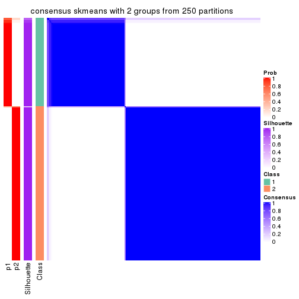</p>

</div>
<div id='tab-ATC-skmeans-consensus-heatmap-2'>
<pre><code class="r">consensus_heatmap(res, k = 3)
</code></pre>

<p>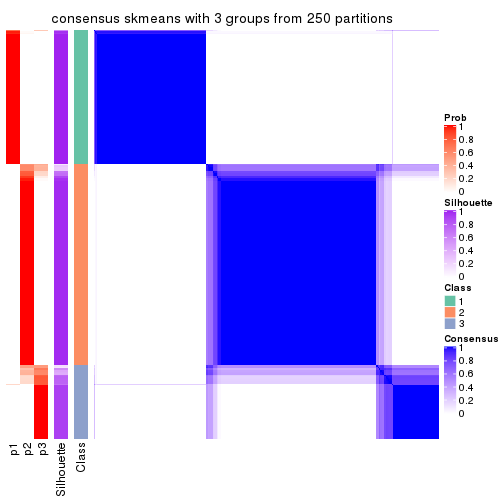</p>

</div>
<div id='tab-ATC-skmeans-consensus-heatmap-3'>
<pre><code class="r">consensus_heatmap(res, k = 4)
</code></pre>

<p>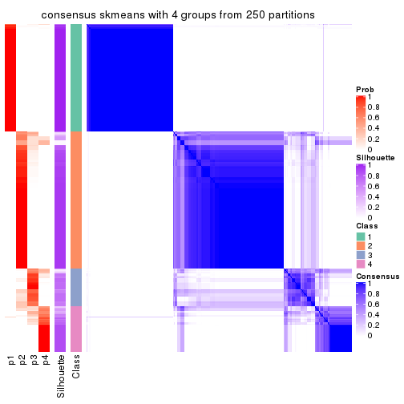</p>

</div>
<div id='tab-ATC-skmeans-consensus-heatmap-4'>
<pre><code class="r">consensus_heatmap(res, k = 5)
</code></pre>

<p>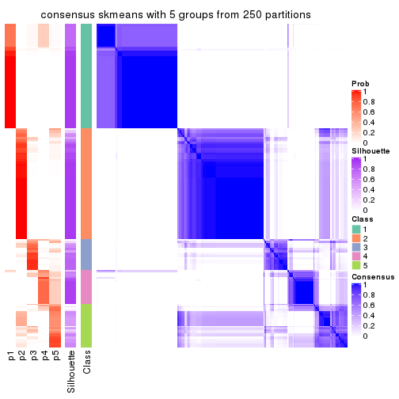</p>

</div>
<div id='tab-ATC-skmeans-consensus-heatmap-5'>
<pre><code class="r">consensus_heatmap(res, k = 6)
</code></pre>

<p>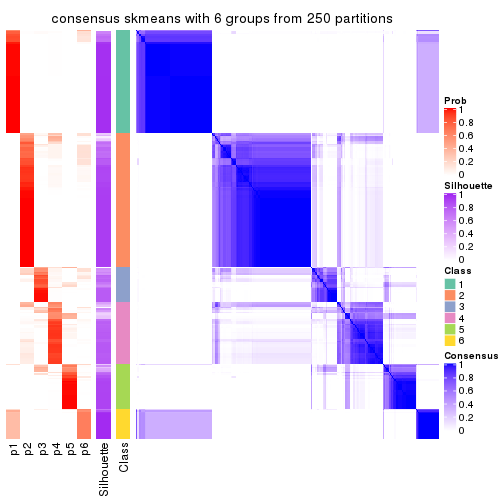</p>

</div>
</div>

Heatmaps for the membership of samples in all partitions to see how consistent they are:


<script>
$( function() {
	$( '#tabs-ATC-skmeans-membership-heatmap' ).tabs();
} );
</script>
<div id='tabs-ATC-skmeans-membership-heatmap'>
<ul>
<li><a href='#tab-ATC-skmeans-membership-heatmap-1'>k = 2</a></li>
<li><a href='#tab-ATC-skmeans-membership-heatmap-2'>k = 3</a></li>
<li><a href='#tab-ATC-skmeans-membership-heatmap-3'>k = 4</a></li>
<li><a href='#tab-ATC-skmeans-membership-heatmap-4'>k = 5</a></li>
<li><a href='#tab-ATC-skmeans-membership-heatmap-5'>k = 6</a></li>
</ul>
<div id='tab-ATC-skmeans-membership-heatmap-1'>
<pre><code class="r">membership_heatmap(res, k = 2)
</code></pre>

<p>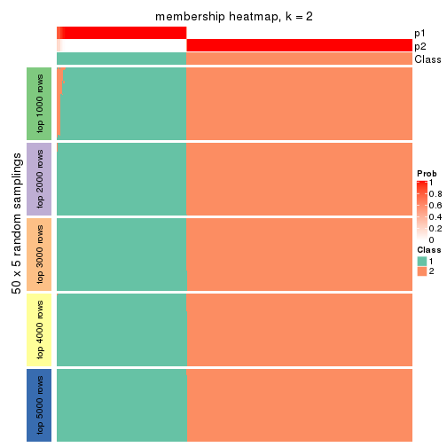</p>

</div>
<div id='tab-ATC-skmeans-membership-heatmap-2'>
<pre><code class="r">membership_heatmap(res, k = 3)
</code></pre>

<p>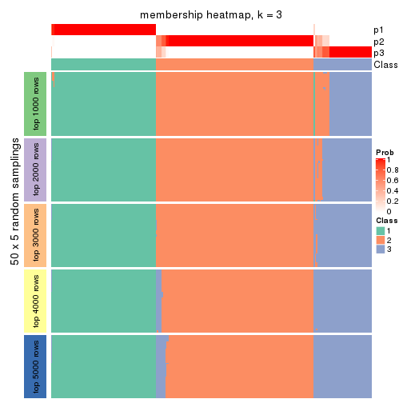</p>

</div>
<div id='tab-ATC-skmeans-membership-heatmap-3'>
<pre><code class="r">membership_heatmap(res, k = 4)
</code></pre>

<p>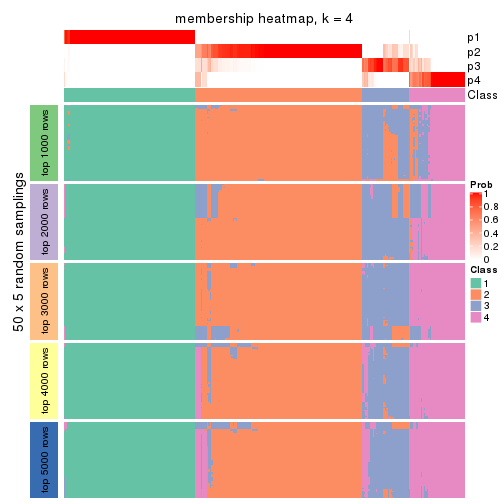</p>

</div>
<div id='tab-ATC-skmeans-membership-heatmap-4'>
<pre><code class="r">membership_heatmap(res, k = 5)
</code></pre>

<p>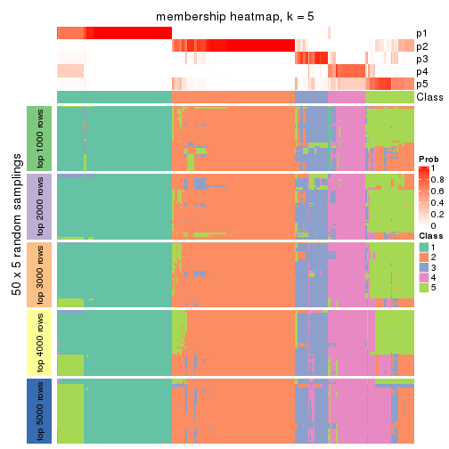</p>

</div>
<div id='tab-ATC-skmeans-membership-heatmap-5'>
<pre><code class="r">membership_heatmap(res, k = 6)
</code></pre>

<p>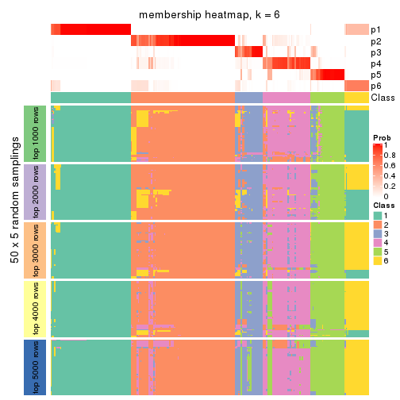</p>

</div>
</div>

As soon as we have had the classes for columns, we can look for signatures
which are significantly different between classes which can be candidate marks
for certain classes. Following are the heatmaps for signatures.


Signature heatmaps where rows are scaled:


<script>
$( function() {
	$( '#tabs-ATC-skmeans-get-signatures' ).tabs();
} );
</script>
<div id='tabs-ATC-skmeans-get-signatures'>
<ul>
<li><a href='#tab-ATC-skmeans-get-signatures-1'>k = 2</a></li>
<li><a href='#tab-ATC-skmeans-get-signatures-2'>k = 3</a></li>
<li><a href='#tab-ATC-skmeans-get-signatures-3'>k = 4</a></li>
<li><a href='#tab-ATC-skmeans-get-signatures-4'>k = 5</a></li>
<li><a href='#tab-ATC-skmeans-get-signatures-5'>k = 6</a></li>
</ul>
<div id='tab-ATC-skmeans-get-signatures-1'>
<pre><code class="r">get_signatures(res, k = 2)
</code></pre>

<p>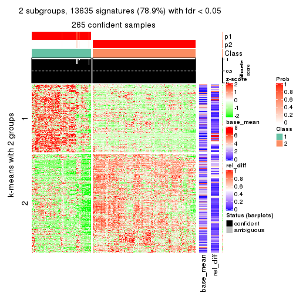</p>

</div>
<div id='tab-ATC-skmeans-get-signatures-2'>
<pre><code class="r">get_signatures(res, k = 3)
</code></pre>

<p>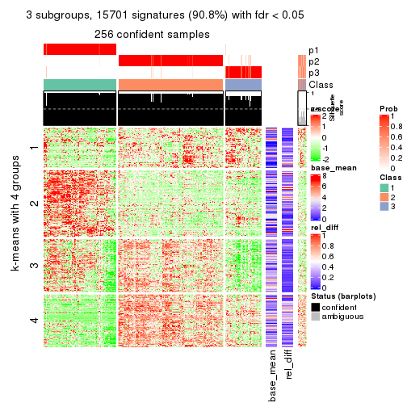</p>

</div>
<div id='tab-ATC-skmeans-get-signatures-3'>
<pre><code class="r">get_signatures(res, k = 4)
</code></pre>

<p>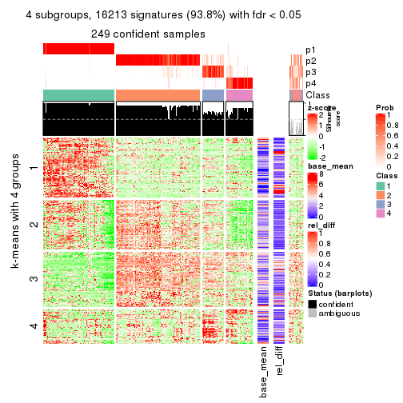</p>

</div>
<div id='tab-ATC-skmeans-get-signatures-4'>
<pre><code class="r">get_signatures(res, k = 5)
</code></pre>

<p>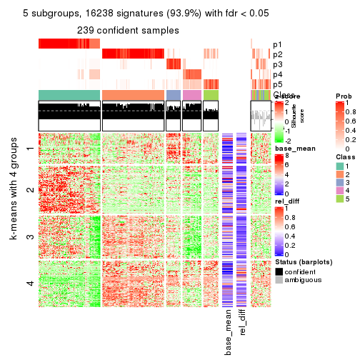</p>

</div>
<div id='tab-ATC-skmeans-get-signatures-5'>
<pre><code class="r">get_signatures(res, k = 6)
</code></pre>

<p>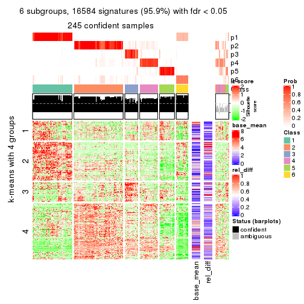</p>

</div>
</div>


Signature heatmaps where rows are not scaled:


<script>
$( function() {
	$( '#tabs-ATC-skmeans-get-signatures-no-scale' ).tabs();
} );
</script>
<div id='tabs-ATC-skmeans-get-signatures-no-scale'>
<ul>
<li><a href='#tab-ATC-skmeans-get-signatures-no-scale-1'>k = 2</a></li>
<li><a href='#tab-ATC-skmeans-get-signatures-no-scale-2'>k = 3</a></li>
<li><a href='#tab-ATC-skmeans-get-signatures-no-scale-3'>k = 4</a></li>
<li><a href='#tab-ATC-skmeans-get-signatures-no-scale-4'>k = 5</a></li>
<li><a href='#tab-ATC-skmeans-get-signatures-no-scale-5'>k = 6</a></li>
</ul>
<div id='tab-ATC-skmeans-get-signatures-no-scale-1'>
<pre><code class="r">get_signatures(res, k = 2, scale_rows = FALSE)
</code></pre>

<p>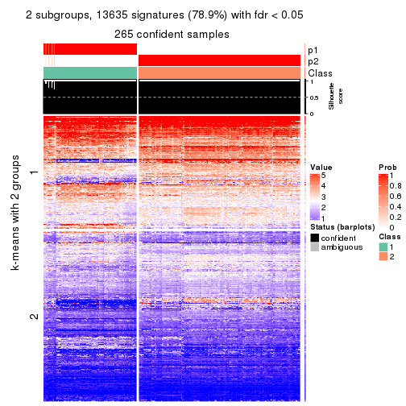</p>

</div>
<div id='tab-ATC-skmeans-get-signatures-no-scale-2'>
<pre><code class="r">get_signatures(res, k = 3, scale_rows = FALSE)
</code></pre>

<p>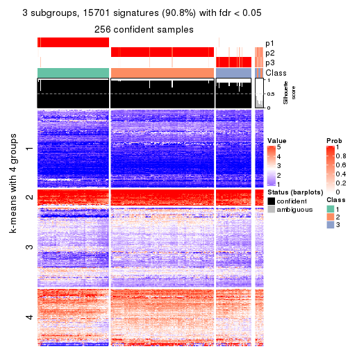</p>

</div>
<div id='tab-ATC-skmeans-get-signatures-no-scale-3'>
<pre><code class="r">get_signatures(res, k = 4, scale_rows = FALSE)
</code></pre>

<p>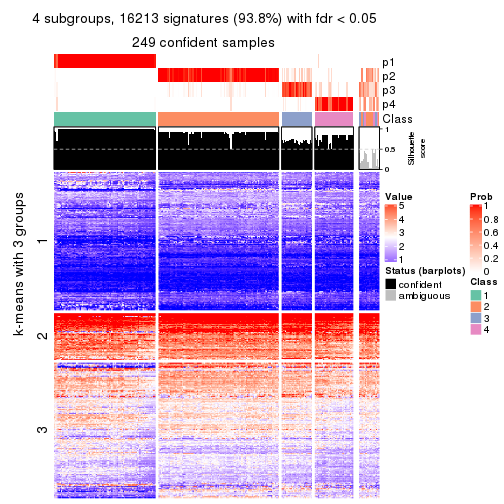</p>

</div>
<div id='tab-ATC-skmeans-get-signatures-no-scale-4'>
<pre><code class="r">get_signatures(res, k = 5, scale_rows = FALSE)
</code></pre>

<p>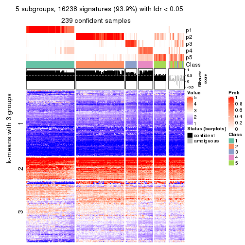</p>

</div>
<div id='tab-ATC-skmeans-get-signatures-no-scale-5'>
<pre><code class="r">get_signatures(res, k = 6, scale_rows = FALSE)
</code></pre>

<p>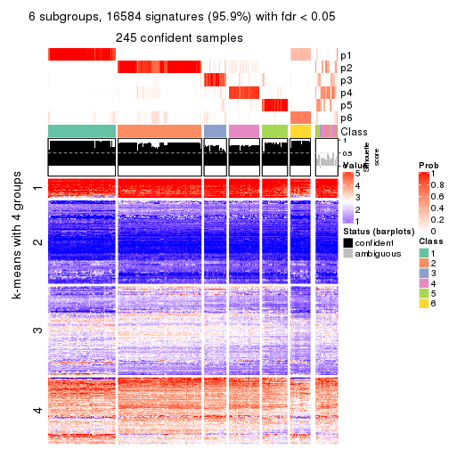</p>

</div>
</div>


Compare the overlap of signatures from different k:

```r
compare_signatures(res)
```

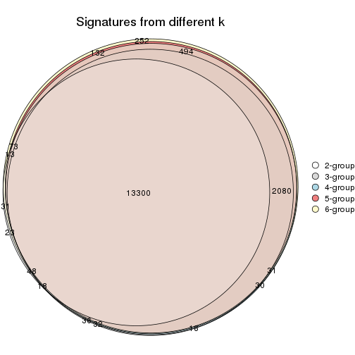

`get_signature()` returns a data frame invisibly. TO get the list of signatures, the function
call should be assigned to a variable explicitly. In following code, if `plot` argument is set
to `FALSE`, no heatmap is plotted while only the differential analysis is performed.

```r
# code only for demonstration
tb = get_signature(res, k = ..., plot = FALSE)
```

An example of the output of `tb` is:

```
#>   which_row         fdr    mean_1    mean_2 scaled_mean_1 scaled_mean_2 km
#> 1        38 0.042760348  8.373488  9.131774    -0.5533452     0.5164555  1
#> 2        40 0.018707592  7.106213  8.469186    -0.6173731     0.5762149  1
#> 3        55 0.019134737 10.221463 11.207825    -0.6159697     0.5749050  1
#> 4        59 0.006059896  5.921854  7.869574    -0.6899429     0.6439467  1
#> 5        60 0.018055526  8.928898 10.211722    -0.6204761     0.5791110  1
#> 6        98 0.009384629 15.714769 14.887706     0.6635654    -0.6193277  2
...
```

The columns in `tb` are:

1. `which_row`: row indices corresponding to the input matrix.
2. `fdr`: FDR for the differential test. 
3. `mean_x`: The mean value in group x.
4. `scaled_mean_x`: The mean value in group x after rows are scaled.
5. `km`: Row groups if k-means clustering is applied to rows.


UMAP plot which shows how samples are separated.


<script>
$( function() {
	$( '#tabs-ATC-skmeans-dimension-reduction' ).tabs();
} );
</script>
<div id='tabs-ATC-skmeans-dimension-reduction'>
<ul>
<li><a href='#tab-ATC-skmeans-dimension-reduction-1'>k = 2</a></li>
<li><a href='#tab-ATC-skmeans-dimension-reduction-2'>k = 3</a></li>
<li><a href='#tab-ATC-skmeans-dimension-reduction-3'>k = 4</a></li>
<li><a href='#tab-ATC-skmeans-dimension-reduction-4'>k = 5</a></li>
<li><a href='#tab-ATC-skmeans-dimension-reduction-5'>k = 6</a></li>
</ul>
<div id='tab-ATC-skmeans-dimension-reduction-1'>
<pre><code class="r">dimension_reduction(res, k = 2, method = &quot;UMAP&quot;)
</code></pre>

<p>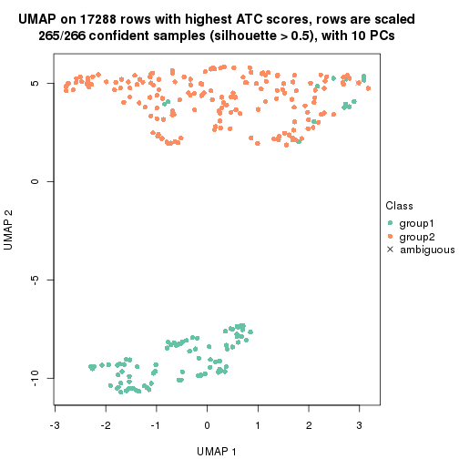</p>

</div>
<div id='tab-ATC-skmeans-dimension-reduction-2'>
<pre><code class="r">dimension_reduction(res, k = 3, method = &quot;UMAP&quot;)
</code></pre>

<p>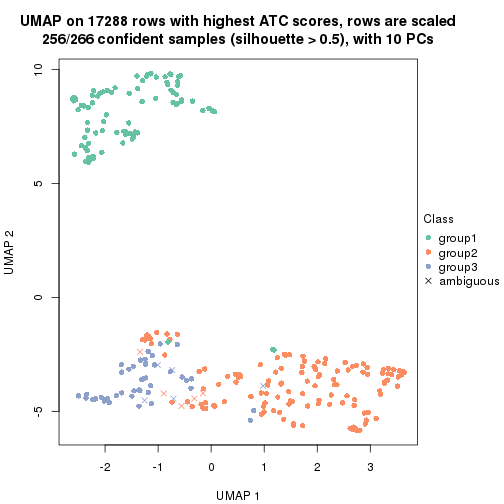</p>

</div>
<div id='tab-ATC-skmeans-dimension-reduction-3'>
<pre><code class="r">dimension_reduction(res, k = 4, method = &quot;UMAP&quot;)
</code></pre>

<p>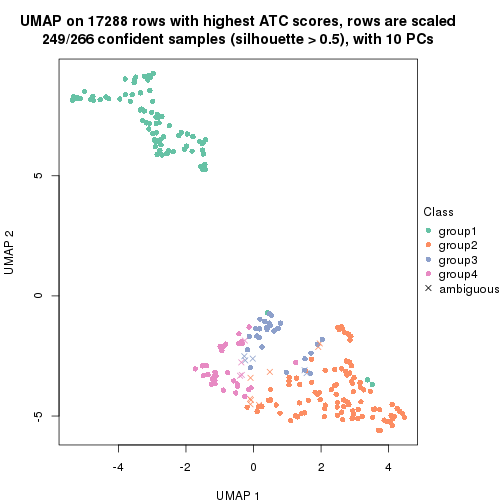</p>

</div>
<div id='tab-ATC-skmeans-dimension-reduction-4'>
<pre><code class="r">dimension_reduction(res, k = 5, method = &quot;UMAP&quot;)
</code></pre>

<p>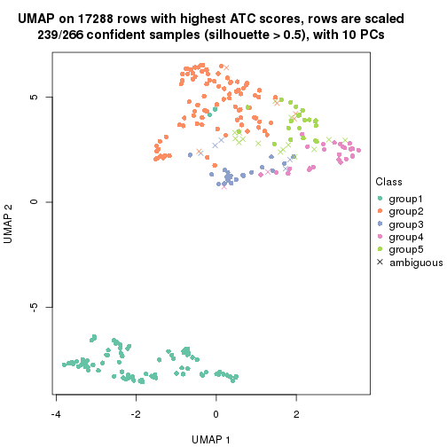</p>

</div>
<div id='tab-ATC-skmeans-dimension-reduction-5'>
<pre><code class="r">dimension_reduction(res, k = 6, method = &quot;UMAP&quot;)
</code></pre>

<p>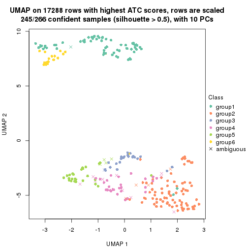</p>

</div>
</div>


Following heatmap shows how subgroups are split when increasing `k`:

```r
collect_classes(res)
```

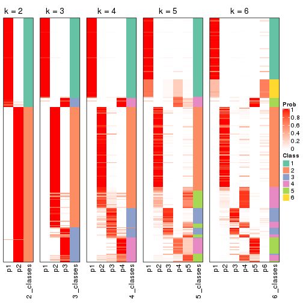


If matrix rows can be associated to genes, consider to use `GO_Enrichment(res,
...)` to perform function enrichment for the signature genes.


 

---------------------------------------------------


### ATC:pam**


The object with results only for a single top-value method and a single partition method 
can be extracted as:

```r
res = res_list["ATC", "pam"]
# you can also extract it by
# res = res_list["ATC:pam"]
```

A summary of `res` and all the functions that can be applied to it:

```r
res
```

```
#> A 'ConsensusPartition' object with k = 2, 3, 4, 5, 6.
#>   On a matrix with 17288 rows and 266 columns.
#>   Top rows (1000, 2000, 3000, 4000, 5000) are extracted by 'ATC' method.
#>   Subgroups are detected by 'pam' method.
#>   Performed in total 1250 partitions by row resampling.
#>   Best k for subgroups seems to be 3.
#> 
#> Following methods can be applied to this 'ConsensusPartition' object:
#>  [1] "cola_report"             "collect_classes"         "collect_plots"          
#>  [4] "collect_stats"           "colnames"                "compare_signatures"     
#>  [7] "consensus_heatmap"       "dimension_reduction"     "functional_enrichment"  
#> [10] "get_anno_col"            "get_anno"                "get_classes"            
#> [13] "get_consensus"           "get_matrix"              "get_membership"         
#> [16] "get_param"               "get_signatures"          "get_stats"              
#> [19] "is_best_k"               "is_stable_k"             "membership_heatmap"     
#> [22] "ncol"                    "nrow"                    "plot_ecdf"              
#> [25] "rownames"                "select_partition_number" "show"                   
#> [28] "suggest_best_k"          "test_to_known_factors"
```

`collect_plots()` function collects all the plots made from `res` for all `k` (number of partitions)
into one single page to provide an easy and fast comparison between different `k`.

```r
collect_plots(res)
```

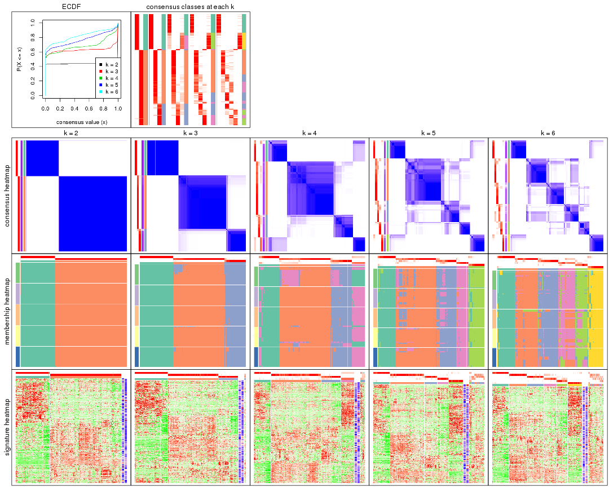

The plots are:

- The first row: a plot of the ECDF (Empirical cumulative distribution
  function) curves of the consensus matrix for each `k` and the heatmap of
  predicted classes for each `k`.
- The second row: heatmaps of the consensus matrix for each `k`.
- The third row: heatmaps of the membership matrix for each `k`.
- The fouth row: heatmaps of the signatures for each `k`.

All the plots in panels can be made by individual functions and they are
plotted later in this section.

`select_partition_number()` produces several plots showing different
statistics for choosing "optimized" `k`. There are following statistics:

- ECDF curves of the consensus matrix for each `k`;
- 1-PAC. [The PAC
  score](https://en.wikipedia.org/wiki/Consensus_clustering#Over-interpretation_potential_of_consensus_clustering)
  measures the proportion of the ambiguous subgrouping.
- Mean silhouette score.
- Concordance. The mean probability of fiting the consensus class ids in all
  partitions.
- Area increased. Denote $A_k$ as the area under the ECDF curve for current
  `k`, the area increased is defined as $A_k - A_{k-1}$.
- Rand index. The percent of pairs of samples that are both in a same cluster
  or both are not in a same cluster in the partition of k and k-1.
- Jaccard index. The ratio of pairs of samples are both in a same cluster in
  the partition of k and k-1 and the pairs of samples are both in a same
  cluster in the partition k or k-1.

The detailed explanations of these statistics can be found in [the cola
vignette](http://bioconductor.org/packages/devel/bioc/vignettes/cola/inst/doc/cola.html#toc_13).

Generally speaking, lower PAC score, higher mean silhouette score or higher
concordance corresponds to better partition. Rand index and Jaccard index
measure how similar the current partition is compared to partition with `k-1`.
If they are too similar, we won't accept `k` is better than `k-1`.

```r
select_partition_number(res)
```

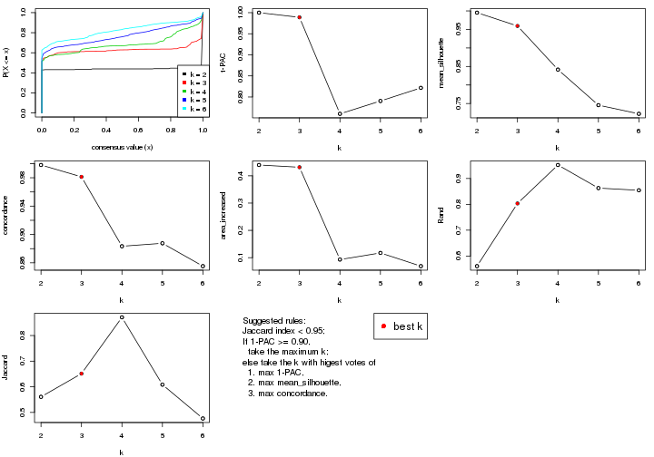

The numeric values for all these statistics can be obtained by `get_stats()`.

```r
get_stats(res)
```

```
#>   k 1-PAC mean_silhouette concordance area_increased  Rand Jaccard
#> 2 2 1.000           0.995       0.998         0.4395 0.561   0.561
#> 3 3 0.989           0.959       0.981         0.4313 0.803   0.651
#> 4 4 0.760           0.842       0.883         0.0931 0.952   0.871
#> 5 5 0.790           0.746       0.888         0.1173 0.863   0.608
#> 6 6 0.822           0.722       0.855         0.0689 0.854   0.476
```

`suggest_best_k()` suggests the best $k$ based on these statistics. The rules are as follows:

- All $k$ with Jaccard index larger than 0.95 are removed because the increase of
  the partition number does not provides enough extra information. If all $k$ are removed,
  the best $k$ is assigned by `NA`.
- For $k$ with 1-PAC larger than 0.9, the maximal $k$ is taken as the "best k". Other $k$ is called "optional k".
- If it does not fit the second rule. The $k$ with the highest vote of highest
  1-PAC, mean silhouette and concordance is taken as the "best k".

```r
suggest_best_k(res)
```

```
#> [1] 3
#> attr(,"optional")
#> [1] 2
```

There is also optional best $k$ = 2 that is worth to check.

Following shows the table of the partitions (You need to click the **show/hide
code output** link to see it). The membership matrix (columns with name `p*`)
is inferred by
[`clue::cl_consensus()`](https://www.rdocumentation.org/link/cl_consensus?package=clue)
function with the `SE` method. Basically the value in the membership matrix
represents the probability to belong to a certain group. The finall class
label for an item is determined with the group with highest probability it
belongs to.

In `get_classes()` function, the entropy is calculated from the membership
matrix and the silhouette score is calculated from the consensus matrix.


<script>
$( function() {
	$( '#tabs-ATC-pam-get-classes' ).tabs();
} );
</script>
<div id='tabs-ATC-pam-get-classes'>
<ul>
<li><a href='#tab-ATC-pam-get-classes-1'>k = 2</a></li>
<li><a href='#tab-ATC-pam-get-classes-2'>k = 3</a></li>
<li><a href='#tab-ATC-pam-get-classes-3'>k = 4</a></li>
<li><a href='#tab-ATC-pam-get-classes-4'>k = 5</a></li>
<li><a href='#tab-ATC-pam-get-classes-5'>k = 6</a></li>
</ul>

<div id='tab-ATC-pam-get-classes-1'>
<p><a id='tab-ATC-pam-get-classes-1-a' style='color:#0366d6' href='#'>show/hide code output</a></p>
<pre><code class="r">cbind(get_classes(res, k = 2), get_membership(res, k = 2))
</code></pre>

<pre><code>#&gt;                                      class entropy silhouette    p1    p2
#&gt; 80D0AF10-1C61-4B67-90C1-7DBF1EF23672     2  0.0000      0.999 0.000 1.000
#&gt; 87117BE1-D328-4972-85DA-6672412D8860     2  0.0000      0.999 0.000 1.000
#&gt; F904C5B6-70BD-4604-8254-79BE23B152DA     1  0.0000      0.996 1.000 0.000
#&gt; 3182DEA1-4239-4613-925A-7E6503766AD6     2  0.0000      0.999 0.000 1.000
#&gt; 55E78EA2-2D9B-481F-8CAB-D36A33088EAE     2  0.0000      0.999 0.000 1.000
#&gt; 86F94264-A6DD-4A97-9191-036F066DD0EF     2  0.0000      0.999 0.000 1.000
#&gt; 09D25417-23B7-4D88-A0EA-F307985FBBBC     2  0.7453      0.729 0.212 0.788
#&gt; C797F12C-40D3-4DB5-B9EF-A6821BBDE4F0     1  0.0000      0.996 1.000 0.000
#&gt; 80275DB0-A226-4B6B-A08F-4ADBEEE1DB01     1  0.0000      0.996 1.000 0.000
#&gt; 27FB653A-9E07-44AD-952E-9E4DE4AB5891     2  0.0000      0.999 0.000 1.000
#&gt; 1A5DB9FC-2ABD-4E1B-B5EF-B1CF5E5F3872     1  0.0000      0.996 1.000 0.000
#&gt; 844E4CCD-D30C-416F-A086-8923711A4E25     2  0.0000      0.999 0.000 1.000
#&gt; EF18318D-3D25-4D65-803A-ED6E62871E7E     1  0.0000      0.996 1.000 0.000
#&gt; 1ACB1BE0-61F6-4243-BBEC-E26A1CF90CA8     1  0.0000      0.996 1.000 0.000
#&gt; 8EF0039B-D758-46AB-BAF7-6A062C7C56BA     1  0.0000      0.996 1.000 0.000
#&gt; 22F4C9D9-663B-4C91-9692-E035A2640BEC     2  0.0000      0.999 0.000 1.000
#&gt; FA1A0BCE-EE0F-4178-B963-62550E344B14     2  0.0000      0.999 0.000 1.000
#&gt; 0B6D0C4E-5AE3-4707-A9FC-12A108E6EC2A     2  0.0000      0.999 0.000 1.000
#&gt; 06FD3123-2AEB-4911-AC4E-E0E64FD5DB52     2  0.0000      0.999 0.000 1.000
#&gt; 235A4492-FF80-4AA5-BC71-DFF65E1C7411     2  0.0000      0.999 0.000 1.000
#&gt; A192C6C0-1443-4493-AFAC-1EE710628ADB     2  0.0000      0.999 0.000 1.000
#&gt; 6FC5B56B-711B-4174-9B06-4E843124AAB6     1  0.0000      0.996 1.000 0.000
#&gt; 7A813F60-A41E-4552-990E-F22287654C1D     2  0.0000      0.999 0.000 1.000
#&gt; 725BBFB5-26F4-4512-9C75-47D013C1E605     1  0.0000      0.996 1.000 0.000
#&gt; 39CC4E82-EBC9-472E-8BE5-6A3AB178449A     2  0.0000      0.999 0.000 1.000
#&gt; 61130DEE-E267-49DF-8B41-7738A06EF738     2  0.0000      0.999 0.000 1.000
#&gt; 117EC12C-B7ED-4E01-B29B-EA542D356EA1     1  0.0000      0.996 1.000 0.000
#&gt; A30FF708-F7A9-41E4-8AD5-20441650FBC9     2  0.0000      0.999 0.000 1.000
#&gt; 53640D52-1167-4A5D-B656-97D32CBA3934     1  0.0000      0.996 1.000 0.000
#&gt; 9E85D76A-DD2A-46D5-BB59-0ED302B6258C     2  0.0000      0.999 0.000 1.000
#&gt; 6F8C6F90-7E3C-4860-91DD-586708DE44AA     1  0.0000      0.996 1.000 0.000
#&gt; E675AEC5-AA9A-4AAA-839C-03E6365822DB     2  0.0000      0.999 0.000 1.000
#&gt; B577DEF7-2F5C-4876-A7C6-F18D5722B8C0     1  0.0000      0.996 1.000 0.000
#&gt; DA8B577E-43E7-49BF-BF94-868E3194F5C9     1  0.0000      0.996 1.000 0.000
#&gt; 3334280B-2A36-4AC7-A021-A76C10E958F0     2  0.0000      0.999 0.000 1.000
#&gt; 5CBDDC90-11EC-4E6E-881E-AA9CCFD40FDB     2  0.0000      0.999 0.000 1.000
#&gt; 8CBBF32A-8349-44F5-A8B8-4CBB1760A464     2  0.0000      0.999 0.000 1.000
#&gt; B9455A9A-136D-4DC2-9F86-0FC74433589D     2  0.0000      0.999 0.000 1.000
#&gt; D7EAE2A7-F9BE-4222-A452-B1F83F99CD50     2  0.0000      0.999 0.000 1.000
#&gt; F803AE18-60C5-4CFE-AAAB-DB33C26A2184     1  0.0000      0.996 1.000 0.000
#&gt; 5DD8CAC7-EC02-43B6-B58E-6D2E22868A3B     2  0.0000      0.999 0.000 1.000
#&gt; EE98E1B4-DFB3-4AEC-8527-E1FD544C9475     1  0.0000      0.996 1.000 0.000
#&gt; 3CE43921-47D5-4394-B9E1-242607775D61     2  0.0000      0.999 0.000 1.000
#&gt; 46986F2B-0B0D-4187-8948-4E91D34B7C49     2  0.0000      0.999 0.000 1.000
#&gt; 5D1D052E-74EF-45A8-9B1A-7CECD13EA43B     2  0.0000      0.999 0.000 1.000
#&gt; 4C821AD9-A5C9-4A9A-9C5D-363B227F8064     2  0.0000      0.999 0.000 1.000
#&gt; 06A4189E-A23B-4AC6-AA74-01955DD7D1E9     2  0.0000      0.999 0.000 1.000
#&gt; FCCDC76F-CB02-4BCD-A616-325F258DDAA4     2  0.0000      0.999 0.000 1.000
#&gt; DAC53B0A-8F35-4EA6-BBCC-4CD1C049E11F     2  0.0000      0.999 0.000 1.000
#&gt; DD4F845B-CAD3-44CB-9D96-3C3F5BA1B72D     1  0.0000      0.996 1.000 0.000
#&gt; D440F004-A4A4-41B6-BED8-805D67BA01C7     2  0.0000      0.999 0.000 1.000
#&gt; A497C423-119F-42FA-BF17-9F6DFD2A5585     2  0.0000      0.999 0.000 1.000
#&gt; 3420E573-DE12-4EF5-B1C0-2FCA904F4F4E     1  0.0000      0.996 1.000 0.000
#&gt; 1AD72157-A254-44B4-BA58-4F30F1AE910E     1  0.0000      0.996 1.000 0.000
#&gt; C1113977-B160-45EE-B061-750F9EA3F33F     2  0.0000      0.999 0.000 1.000
#&gt; 6783AB5B-F07C-447B-BF13-C34485D246D7     2  0.0000      0.999 0.000 1.000
#&gt; 1F553062-26FD-4A7F-B7FB-81184604F423     1  0.0000      0.996 1.000 0.000
#&gt; BE2DCA51-1C21-4598-98A7-F2FB9B2DFCB4     2  0.0000      0.999 0.000 1.000
#&gt; 38941CF3-9C54-4BA4-A005-CC88CA97D504     2  0.0000      0.999 0.000 1.000
#&gt; 51CB675E-E243-4A07-BF4A-580473D26FDA     2  0.0000      0.999 0.000 1.000
#&gt; C7FED0F5-C27A-4405-9232-30BF39362CF7     2  0.0000      0.999 0.000 1.000
#&gt; 2A1E86E8-4713-465F-ACFF-C584864C57A1     2  0.0000      0.999 0.000 1.000
#&gt; B4500785-0FAA-4D4D-8630-43D194BAB004     2  0.0000      0.999 0.000 1.000
#&gt; 3FD52E66-AB76-4079-80DB-281A795D1EC0     2  0.0000      0.999 0.000 1.000
#&gt; EBD355D1-1226-4DFD-AAFF-45D246B64F3C     2  0.0000      0.999 0.000 1.000
#&gt; 5A040A73-CD95-487E-8AEF-9639FE4E2916     2  0.0000      0.999 0.000 1.000
#&gt; CF629C65-585D-476D-B081-3E6E0575FAE3     2  0.0000      0.999 0.000 1.000
#&gt; 0D4202A3-808E-413F-9BF3-9CFCCAE0ED61     2  0.0000      0.999 0.000 1.000
#&gt; 43E715BF-28D9-4B5E-B762-8CD1B69A430E     1  0.0000      0.996 1.000 0.000
#&gt; BFB82BE8-9DAC-4099-8B38-0950308E3EB3     2  0.0000      0.999 0.000 1.000
#&gt; F7CB1825-2303-4DD2-AE1F-7205738EAF1F     1  0.0000      0.996 1.000 0.000
#&gt; FE298483-C42C-4753-BABB-29A9CB1B6312     1  0.0000      0.996 1.000 0.000
#&gt; A98C7561-1B42-4CD6-AE71-924B91FA4C33     2  0.0000      0.999 0.000 1.000
#&gt; 58098F21-7DAB-47DA-9A41-8D20BF3B9257     2  0.0000      0.999 0.000 1.000
#&gt; 18CAF708-20B9-4745-9CB3-37AB6E0B3056     2  0.0000      0.999 0.000 1.000
#&gt; 2C80DD72-C9C7-4AC2-812F-9A31EF02779C     1  0.0000      0.996 1.000 0.000
#&gt; 68A3F13D-319D-4603-A27F-B5DD46FE5C5B     2  0.0000      0.999 0.000 1.000
#&gt; 7EE8F0CE-CDC9-40F9-A1DE-7F8140EC6D13     2  0.0000      0.999 0.000 1.000
#&gt; 39019903-5B9C-4665-BD5F-7CCB19CB55C5     2  0.0000      0.999 0.000 1.000
#&gt; 190EDB27-4CBC-4E9C-9B67-D51FDAB982B7     2  0.0000      0.999 0.000 1.000
#&gt; EB2D95BC-62F8-4669-9308-D37D7FB79E23     2  0.0000      0.999 0.000 1.000
#&gt; A08B85EA-D1E7-4B77-8DEC-36294305B9F7     1  0.0000      0.996 1.000 0.000
#&gt; 130DDFAD-6EF8-4C80-BD9D-88308A6874BC     2  0.0000      0.999 0.000 1.000
#&gt; 7340A5BA-E002-448F-AACC-E7A37DBB79C2     2  0.0000      0.999 0.000 1.000
#&gt; A771F6E3-D266-4FE7-98C6-C40E6A701D59     1  0.0000      0.996 1.000 0.000
#&gt; 015E792C-EC1B-49BF-AB07-D82B20C5989A     2  0.0000      0.999 0.000 1.000
#&gt; BF79E030-47EE-4D08-B910-5685A4BD8B60     2  0.0000      0.999 0.000 1.000
#&gt; FB3C7C9A-2F2D-4DD5-BE47-FAFB072C0FAB     2  0.0000      0.999 0.000 1.000
#&gt; 4E5557BA-10E8-4723-908E-DD04EF6639B2     2  0.0000      0.999 0.000 1.000
#&gt; 8031B550-40A9-4A3A-9F7D-CDC052288BD8     2  0.0000      0.999 0.000 1.000
#&gt; 55299A06-3C1F-45A4-B166-B2C591C0CEE2     2  0.0000      0.999 0.000 1.000
#&gt; EB8D5168-216E-4ABB-8B4E-9E67786CB322     1  0.0000      0.996 1.000 0.000
#&gt; 78BD2D83-9A7F-42E5-BB38-654AA0761A0A     2  0.0000      0.999 0.000 1.000
#&gt; AA2D53E5-D389-4332-9DD5-A736052E48F8     1  0.0000      0.996 1.000 0.000
#&gt; 62945C7A-9313-4FC9-820C-B0AB820B394E     1  0.0000      0.996 1.000 0.000
#&gt; 22746046-2E99-4EE9-97D2-BA2EA499634C     2  0.0000      0.999 0.000 1.000
#&gt; 8671B51B-DCBE-4429-9F01-AF51CAD7014F     2  0.0000      0.999 0.000 1.000
#&gt; E815AB36-5689-4A0D-8E6D-2EAA73406681     1  0.0000      0.996 1.000 0.000
#&gt; A1DACB46-ED52-4E38-B2C8-57256BB22B5E     2  0.0000      0.999 0.000 1.000
#&gt; 4F5498C4-A423-4B3D-AC98-D4E214A57D0E     1  0.0000      0.996 1.000 0.000
#&gt; A7772CCD-FFFF-49DD-86ED-0BAD330EC9B6     2  0.0000      0.999 0.000 1.000
#&gt; E6E3DF78-65B9-4F74-8DA8-E2A6D4EDBEA7     2  0.0000      0.999 0.000 1.000
#&gt; 83286E2D-E708-437A-911A-E6B050273CBD     1  0.0000      0.996 1.000 0.000
#&gt; EC5C7C97-EE8C-405D-A039-D96514B1D414     2  0.0000      0.999 0.000 1.000
#&gt; 3E55223D-6E3D-4027-9819-67E91212531D     1  0.0000      0.996 1.000 0.000
#&gt; 99A036A2-8343-4D06-8047-D84E96CE4C61     2  0.0000      0.999 0.000 1.000
#&gt; CA6CDE6D-92DE-4259-9E58-A373F2D543EA     2  0.0000      0.999 0.000 1.000
#&gt; BF6FA8CC-60C1-413A-B2C6-54CCACBC01D6     1  0.0000      0.996 1.000 0.000
#&gt; E0594CFE-F7B6-4546-B130-30DF6A514B1F     2  0.0000      0.999 0.000 1.000
#&gt; E769E41D-5949-42C5-9594-E563C05ACE52     2  0.0000      0.999 0.000 1.000
#&gt; 01373725-5D3C-4D9C-AABC-911D53E62BCD     2  0.0000      0.999 0.000 1.000
#&gt; 1F39DADD-3655-474E-BA4C-A5BD32C97A8B     1  0.0000      0.996 1.000 0.000
#&gt; AF573EC8-E4EE-4B8F-8199-9817B9FAC67D     1  0.0000      0.996 1.000 0.000
#&gt; 3F022CBC-41C8-4387-A6FB-124C4BCD1AD9     1  0.0000      0.996 1.000 0.000
#&gt; 1CC32ACE-826B-494B-8B89-5BD92327A74D     2  0.0000      0.999 0.000 1.000
#&gt; 22B0BD3B-EE08-4BC7-90B2-01C372A56BA2     2  0.0000      0.999 0.000 1.000
#&gt; 0F3DE9EF-19CC-4D14-9A42-1435DB537F94     2  0.0000      0.999 0.000 1.000
#&gt; 87F8A33F-FBC3-469E-862B-84472F796358     2  0.0000      0.999 0.000 1.000
#&gt; C9F2FA0D-1A9F-40B4-BD9B-CAF1B3F3D5A7     2  0.0000      0.999 0.000 1.000
#&gt; ACFC9F59-78FF-4453-B25F-8834D0EAB54A     2  0.0000      0.999 0.000 1.000
#&gt; B7AC7D5B-14E9-45A7-93B7-226EE508544A     2  0.0000      0.999 0.000 1.000
#&gt; 4491BF17-B168-4E96-8E09-EF1AEC9F5E9D     2  0.0000      0.999 0.000 1.000
#&gt; 557A0811-A3FE-4CF4-A24D-FBB77E7F9139     2  0.0000      0.999 0.000 1.000
#&gt; 6F9C955C-6816-4353-922A-8035B50FACC6     2  0.0000      0.999 0.000 1.000
#&gt; 3E89FB1C-4A7D-43C7-823C-04E3716A7935     2  0.0000      0.999 0.000 1.000
#&gt; 12ABE483-66EF-4237-94C4-0199FAE23FA8     2  0.0000      0.999 0.000 1.000
#&gt; 7535F262-9B96-44F6-988C-4C9EBB3FFCA9     2  0.0000      0.999 0.000 1.000
#&gt; 65C9D28E-303B-40E5-84F0-2507F5457374     2  0.0000      0.999 0.000 1.000
#&gt; FD445384-6BA9-4297-9D9C-12ABA7D645C7     1  0.0000      0.996 1.000 0.000
#&gt; 30D5E255-2AD3-44F3-8983-1B80E4FD3E2D     2  0.0000      0.999 0.000 1.000
#&gt; 3E88EC60-B4A8-4259-8BC8-A234800F6955     2  0.0000      0.999 0.000 1.000
#&gt; ACD73CE8-AFC5-47A0-9383-3CB97F018953     1  0.0000      0.996 1.000 0.000
#&gt; 1AFDC2EA-26A8-44E2-8BCB-F34F7B66F8C8     2  0.0000      0.999 0.000 1.000
#&gt; 9E327BC8-1D20-4AD8-83F7-FB2D13BCA5D0     2  0.0000      0.999 0.000 1.000
#&gt; 85A86B91-4F24-4E77-AE2D-520F8E205EFC     1  0.0000      0.996 1.000 0.000
#&gt; 74868C37-8143-4306-81CA-E45759D146CD     2  0.0000      0.999 0.000 1.000
#&gt; 69AEA0DB-E335-48A0-A398-4FB0D581182A     2  0.0000      0.999 0.000 1.000
#&gt; AE6F8B89-85C2-42B7-8D05-AFDDD4FEFD16     1  0.0000      0.996 1.000 0.000
#&gt; A8A6F09C-9812-4457-9A4B-AD41F97B41A3     2  0.0000      0.999 0.000 1.000
#&gt; 1A09BC4D-EF29-42DD-BB04-A3C264A3032D     1  0.0000      0.996 1.000 0.000
#&gt; E0961A30-A62C-4235-9CF0-A1776827A996     2  0.0000      0.999 0.000 1.000
#&gt; 134D2D90-7B08-4F20-8A3A-C77643FB208F     2  0.0000      0.999 0.000 1.000
#&gt; A77C2DFF-93CF-4CB5-B3C1-81133D7F1A0F     2  0.0000      0.999 0.000 1.000
#&gt; EA2DC457-9C74-4B9C-B3FA-5E72199B24A7     2  0.0000      0.999 0.000 1.000
#&gt; FF34117B-5EE4-4C96-A8A2-2CE6A654CBE5     1  0.0000      0.996 1.000 0.000
#&gt; 75F7B5E2-6559-4B48-A2A4-287C35C559CC     1  0.0000      0.996 1.000 0.000
#&gt; 903BF591-B0AF-4BEE-B625-60B673070344     2  0.0000      0.999 0.000 1.000
#&gt; 9DE1B790-C63C-41C4-9477-CE52A8119C67     2  0.0000      0.999 0.000 1.000
#&gt; 9A28F80A-85F8-40E2-A32B-230EF93B2FA0     2  0.0000      0.999 0.000 1.000
#&gt; 0AA2BDBB-8720-409A-AA72-1F4AA26E7CD8     2  0.0000      0.999 0.000 1.000
#&gt; 5AD49F16-E974-4E5D-B1B6-073ECB73A01D     1  0.0000      0.996 1.000 0.000
#&gt; CB0F961C-527D-4A48-9408-286B26BD9532     1  0.0000      0.996 1.000 0.000
#&gt; 46FF25B6-D01D-4CA7-80B7-CEC2998C34E1     2  0.0000      0.999 0.000 1.000
#&gt; 487CADE1-D699-4A6C-817A-B9A0AB940C61     1  0.0000      0.996 1.000 0.000
#&gt; 4FF6F2D8-F869-4735-A4D1-1A8423153FBC     1  0.0000      0.996 1.000 0.000
#&gt; 6005494F-5D3D-43A3-B3E8-8C91955B2A98     2  0.0000      0.999 0.000 1.000
#&gt; CF10D584-CE32-45A4-A932-E9D5AF12A6A0     1  0.0000      0.996 1.000 0.000
#&gt; E15CE4AB-5646-49C8-9CD6-938457036BB0     2  0.0000      0.999 0.000 1.000
#&gt; 31E28D0B-0E69-4330-82ED-4F1827DC97EA     2  0.0000      0.999 0.000 1.000
#&gt; DBACD3C3-CCB5-4478-BA78-85A0C847CA66     2  0.0000      0.999 0.000 1.000
#&gt; 5A07041C-65EB-4FCD-8940-E90B905061B5     2  0.0000      0.999 0.000 1.000
#&gt; 0EA7C916-FA47-489B-BC98-4D9E7D197628     1  0.0000      0.996 1.000 0.000
#&gt; 30967F75-8499-47FF-ADA4-4DC566013F7B     1  0.0000      0.996 1.000 0.000
#&gt; D2E528FF-AEA2-48D7-A60A-4C3E71EA9073     2  0.0000      0.999 0.000 1.000
#&gt; 22735DCD-215E-48BC-BF44-32BD66F06E39     2  0.0000      0.999 0.000 1.000
#&gt; BC2C3248-7FC6-48BC-96C1-45EA573DE7DC     1  0.0000      0.996 1.000 0.000
#&gt; E72CEBCB-D686-4B12-BCBA-EC8F964330A2     1  0.0000      0.996 1.000 0.000
#&gt; 23C937BB-BA20-4440-B680-914229CC3ADF     1  0.0000      0.996 1.000 0.000
#&gt; 947E99C7-F402-4F1A-A6E9-81BCAAED135A     2  0.0000      0.999 0.000 1.000
#&gt; 02475D11-FC81-4E88-944E-173C32DC3FE7     2  0.0000      0.999 0.000 1.000
#&gt; F972A9AA-9842-4343-A533-A795E65581CE     1  0.0000      0.996 1.000 0.000
#&gt; 05043AAF-3095-4C61-B5C1-EE9AA9082C75     2  0.0000      0.999 0.000 1.000
#&gt; CECF7967-862E-428C-BB42-FEF553FDB3AA     2  0.0000      0.999 0.000 1.000
#&gt; FB0B9483-6302-48C7-BE5B-DA667E00AE2D     2  0.0938      0.987 0.012 0.988
#&gt; 78700FBA-1487-4754-9B30-18837BF7E9FB     1  0.0000      0.996 1.000 0.000
#&gt; 2166F56D-54CE-4F1B-8F07-A4E13E4489E9     1  0.0000      0.996 1.000 0.000
#&gt; 7CD0942E-E39A-43A7-8BAC-F25967864901     2  0.0000      0.999 0.000 1.000
#&gt; 3B00BA2B-7F7D-4825-8F8D-90F04A5DE687     2  0.0000      0.999 0.000 1.000
#&gt; 7465B01D-C05E-4FE0-A9FE-182920EDC489     2  0.0000      0.999 0.000 1.000
#&gt; 88C31A99-F96E-4FC8-8B3D-C1AAA05062D9     1  0.0000      0.996 1.000 0.000
#&gt; 53575575-3303-4F8F-B6A8-B42131CFB4AC     2  0.0000      0.999 0.000 1.000
#&gt; CC8017C7-4128-48DA-8E43-503F63158D85     1  0.0000      0.996 1.000 0.000
#&gt; 88449D2A-2A25-41A4-B91D-C99B58F8ECD9     2  0.0000      0.999 0.000 1.000
#&gt; 46C7DDE5-A2B5-494F-96AE-0B6E2D51B003     1  0.0000      0.996 1.000 0.000
#&gt; 42551D05-5EE5-4F91-93A8-32DA695D9DFA     2  0.0000      0.999 0.000 1.000
#&gt; 0772DA48-3A36-422D-B166-CA1691B782C3     2  0.0000      0.999 0.000 1.000
#&gt; 30346897-EC77-4153-88A2-D14593C8B741     2  0.0000      0.999 0.000 1.000
#&gt; 0F00E267-C748-4A71-8B36-03C410641D88     2  0.0000      0.999 0.000 1.000
#&gt; 4034703A-4DA9-4DDA-9CA9-E80FFE9CCDE6     2  0.0000      0.999 0.000 1.000
#&gt; 393C8A41-CF45-4EA8-AFE3-25A08AB7692A     2  0.0000      0.999 0.000 1.000
#&gt; 3354212D-A07C-435C-8B0C-9A7BAAB624B5     1  0.0000      0.996 1.000 0.000
#&gt; 57E30D4E-ABF7-47DD-92BE-40CE215076B0     1  0.0000      0.996 1.000 0.000
#&gt; 202B4C76-C840-4DB8-953F-AC75A4156FDD     2  0.0000      0.999 0.000 1.000
#&gt; 93A0137B-1F4C-44EE-B959-2AD0CD2DF8B6     1  0.0000      0.996 1.000 0.000
#&gt; C9794DB6-6E8C-4AFD-80EE-61D672A4F6E9     2  0.0000      0.999 0.000 1.000
#&gt; AE4BFE63-F0C0-4624-AD97-4F7FF13E2384     1  0.0000      0.996 1.000 0.000
#&gt; DCF87F27-2B54-42D9-8D28-5DFEE76E2F5B     2  0.0000      0.999 0.000 1.000
#&gt; 2451D405-39FD-4812-958C-23462B66F1F1     2  0.0000      0.999 0.000 1.000
#&gt; E27F5D33-3F68-4CA8-8757-A387C6EAD060     2  0.0000      0.999 0.000 1.000
#&gt; 8BA9928A-5B93-477F-B4A2-D031B714D9AC     1  0.0000      0.996 1.000 0.000
#&gt; 0FAACFF6-B50C-4BED-9824-B7270654F28D     2  0.0000      0.999 0.000 1.000
#&gt; 3366CC3C-2BBA-4CA7-848E-4E16AA70AE7A     2  0.0000      0.999 0.000 1.000
#&gt; 66237056-CA9A-4C90-AF0E-1621FEB71578     2  0.0000      0.999 0.000 1.000
#&gt; C480F1FB-3100-436C-B0F5-DED63B7A580E     2  0.0000      0.999 0.000 1.000
#&gt; A327DE0D-D945-4B42-9B41-A7302CF796EE     2  0.0000      0.999 0.000 1.000
#&gt; E8A6871D-67FB-4306-9454-F5E7CDBA399A     2  0.0000      0.999 0.000 1.000
#&gt; E9A7485B-82B6-4BD2-AFBB-DD0A82D6CDE2     1  0.0000      0.996 1.000 0.000
#&gt; 93B382E4-9C9A-43F5-BD3B-502CC260B886     1  0.0000      0.996 1.000 0.000
#&gt; A2792419-8E16-45FE-A524-17851F34AB9B     2  0.0000      0.999 0.000 1.000
#&gt; 4DED1201-F25C-4F82-BABF-965EFAD7A8E5     2  0.0000      0.999 0.000 1.000
#&gt; F1ACB2DD-E948-4F88-A249-F1BD1977D667     2  0.0000      0.999 0.000 1.000
#&gt; 6CDBA203-8952-421D-A6BF-75652D9F3339     2  0.0000      0.999 0.000 1.000
#&gt; 2D6C5AA7-3B33-48D7-AE0C-77A16B749D13     1  0.0000      0.996 1.000 0.000
#&gt; 3F6B6D95-0720-42A0-AEB3-89FECAE7616A     2  0.0000      0.999 0.000 1.000
#&gt; DED8ACF3-BBD8-46C9-85C9-A9C8F2E2BC0B     1  0.0000      0.996 1.000 0.000
#&gt; 77069279-5A6F-42C0-9AA5-8C939591DFB5     1  0.0000      0.996 1.000 0.000
#&gt; B2D4FCF3-FDF9-41C8-880A-6732CF6222AF     2  0.0000      0.999 0.000 1.000
#&gt; 1CD71A4C-1E49-48EF-AA72-CB3C26B4C087     2  0.0000      0.999 0.000 1.000
#&gt; C364E621-F85C-4B7F-842F-210B8D4DFE3A     2  0.0000      0.999 0.000 1.000
#&gt; 11F1B8CA-07C1-47D2-A3C6-032FFA6A4A64     1  0.0000      0.996 1.000 0.000
#&gt; 153BF804-6DC8-496B-987A-4021A2512211     2  0.0000      0.999 0.000 1.000
#&gt; 5B5029C9-40F5-40D7-A36A-367022AD6A42     2  0.0000      0.999 0.000 1.000
#&gt; 193CCBE6-104F-49B4-BDB2-C82EE36FDAAD     1  0.0000      0.996 1.000 0.000
#&gt; E5D45E53-FCF3-4F01-9B78-6CB1ED0CFE40     2  0.0000      0.999 0.000 1.000
#&gt; 5546A779-21DB-49F9-8C0D-A1E420088084     2  0.0000      0.999 0.000 1.000
#&gt; E14825E0-0DC7-44C2-B265-F54672356838     1  0.0000      0.996 1.000 0.000
#&gt; 8C8C09B9-EC83-45EC-BC4C-0BA92DE60ACB     1  0.0000      0.996 1.000 0.000
#&gt; B388CA82-5BF7-4BDD-8821-4EC0B213121F     2  0.0000      0.999 0.000 1.000
#&gt; A26025AC-9F71-4C07-9135-83593193BBB2     1  0.0000      0.996 1.000 0.000
#&gt; C80E6D4B-AF21-42F0-8E20-6F7D2E99C062     2  0.0000      0.999 0.000 1.000
#&gt; 5AE5D819-A6B1-4761-B7F9-8FFD3C520F31     2  0.0000      0.999 0.000 1.000
#&gt; CAE8097F-A139-4C6E-9E30-35080475FF34     2  0.0000      0.999 0.000 1.000
#&gt; 539C8DE3-6152-4671-B96F-ED6DC6DBD22B     1  0.0000      0.996 1.000 0.000
#&gt; 5D28A8E0-4ECF-43A4-890A-BE968B9A8CB2     2  0.0000      0.999 0.000 1.000
#&gt; 97A80AF8-365E-4756-A2B0-AEB1D8F5F33E     2  0.0000      0.999 0.000 1.000
#&gt; B3527517-E339-46AE-8437-65303C309015     2  0.0000      0.999 0.000 1.000
#&gt; 523E2183-AA20-4749-BD7E-69CD620DD6A3     2  0.0000      0.999 0.000 1.000
#&gt; E553FB92-F181-47B3-9F3D-11DB51DFA3A4     2  0.0000      0.999 0.000 1.000
#&gt; FFE0C4B1-8EEC-484A-AB87-3401B71BD081     2  0.0000      0.999 0.000 1.000
#&gt; 73D6CA4B-9A9E-4E52-96C8-AE7F0CC8B276     2  0.0000      0.999 0.000 1.000
#&gt; 485A8107-DF9A-4BC6-8A72-07FBA93F10F2     1  0.0000      0.996 1.000 0.000
#&gt; 690823D9-B9AA-40EF-8302-4AD88BF89D1C     2  0.0000      0.999 0.000 1.000
#&gt; B4E02660-562F-4EAC-8472-CBBD8A577688     2  0.0000      0.999 0.000 1.000
#&gt; F82D5A60-90F9-4FF4-971E-73F7535FE65A     2  0.0000      0.999 0.000 1.000
#&gt; C48401F7-2D56-4C6F-9896-C5435D1B44BF     2  0.0000      0.999 0.000 1.000
#&gt; 94FC8991-182B-4B00-9A06-A00E8D3BDCFA     1  0.0000      0.996 1.000 0.000
#&gt; FF00E80A-046D-4233-835E-CDF93403EA43     2  0.0000      0.999 0.000 1.000
#&gt; C47A53F6-6479-4AD3-9D18-E4A70BE5F1DC     2  0.0000      0.999 0.000 1.000
#&gt; 3487AE2D-AB1D-4DEF-AC4B-4B0FCAF8D899     2  0.0000      0.999 0.000 1.000
#&gt; 479CD9BB-ECD7-41D5-B1E4-41132FF7FC95     2  0.0000      0.999 0.000 1.000
#&gt; 048ADC6E-8C7E-4875-ACEE-E4787203C078     1  0.0000      0.996 1.000 0.000
#&gt; 25AF81C5-B117-466D-AE9F-DD10BCB6AF2D     2  0.0000      0.999 0.000 1.000
#&gt; 8B1D51D6-0B25-4289-81F0-9F95E0258877     2  0.0000      0.999 0.000 1.000
#&gt; 282D390D-8E4E-4A19-B2B7-A6DB4BB2D46C     1  0.0000      0.996 1.000 0.000
#&gt; BC6B92C1-F425-40C5-9941-539BFF5FE0FE     1  0.8909      0.553 0.692 0.308
#&gt; 899CB9E0-48D0-413D-8566-BC151F146453     1  0.0000      0.996 1.000 0.000
#&gt; 441400A9-1427-45E0-A8B4-EF2A6B7465C2     2  0.0000      0.999 0.000 1.000
#&gt; CF96DDD4-DC0A-4341-BDE6-4DA2CB4978D0     1  0.0000      0.996 1.000 0.000
#&gt; CE91F591-6072-4D29-9495-C78961635969     2  0.0000      0.999 0.000 1.000
#&gt; 84D25635-2A38-4CFB-BFAC-38C007625C42     1  0.0000      0.996 1.000 0.000
#&gt; ABF1AC12-872A-4C3D-A76C-07BC36A4DA5E     1  0.0000      0.996 1.000 0.000
#&gt; B7F7F66F-1AED-4199-81C0-5C7FB0DBF438     2  0.0000      0.999 0.000 1.000
#&gt; BAB786B9-6C20-425D-9886-63A0A092B59B     2  0.0000      0.999 0.000 1.000
#&gt; 735D1DE3-D781-4F89-A395-09974057BBB7     1  0.0000      0.996 1.000 0.000
#&gt; F6D5FBBA-05C4-4340-86D9-1A54181216A2     2  0.0000      0.999 0.000 1.000
#&gt; 79C4E166-4A0D-4811-A2C8-CAE0A5AEED42     2  0.0000      0.999 0.000 1.000
</code></pre>

<script>
$('#tab-ATC-pam-get-classes-1-a').parent().next().next().hide();
$('#tab-ATC-pam-get-classes-1-a').click(function(){
  $('#tab-ATC-pam-get-classes-1-a').parent().next().next().toggle();
  return(false);
});
</script>
</div>

<div id='tab-ATC-pam-get-classes-2'>
<p><a id='tab-ATC-pam-get-classes-2-a' style='color:#0366d6' href='#'>show/hide code output</a></p>
<pre><code class="r">cbind(get_classes(res, k = 3), get_membership(res, k = 3))
</code></pre>

<pre><code>#&gt;                                      class entropy silhouette    p1    p2    p3
#&gt; 80D0AF10-1C61-4B67-90C1-7DBF1EF23672     2  0.0000      0.979 0.000 1.000 0.000
#&gt; 87117BE1-D328-4972-85DA-6672412D8860     2  0.0237      0.978 0.000 0.996 0.004
#&gt; F904C5B6-70BD-4604-8254-79BE23B152DA     1  0.0000      1.000 1.000 0.000 0.000
#&gt; 3182DEA1-4239-4613-925A-7E6503766AD6     2  0.0000      0.979 0.000 1.000 0.000
#&gt; 55E78EA2-2D9B-481F-8CAB-D36A33088EAE     2  0.0000      0.979 0.000 1.000 0.000
#&gt; 86F94264-A6DD-4A97-9191-036F066DD0EF     2  0.0237      0.978 0.000 0.996 0.004
#&gt; 09D25417-23B7-4D88-A0EA-F307985FBBBC     3  0.0000      0.949 0.000 0.000 1.000
#&gt; C797F12C-40D3-4DB5-B9EF-A6821BBDE4F0     1  0.0000      1.000 1.000 0.000 0.000
#&gt; 80275DB0-A226-4B6B-A08F-4ADBEEE1DB01     1  0.0000      1.000 1.000 0.000 0.000
#&gt; 27FB653A-9E07-44AD-952E-9E4DE4AB5891     2  0.4399      0.788 0.000 0.812 0.188
#&gt; 1A5DB9FC-2ABD-4E1B-B5EF-B1CF5E5F3872     1  0.0000      1.000 1.000 0.000 0.000
#&gt; 844E4CCD-D30C-416F-A086-8923711A4E25     3  0.6140      0.337 0.000 0.404 0.596
#&gt; EF18318D-3D25-4D65-803A-ED6E62871E7E     1  0.1289      0.967 0.968 0.000 0.032
#&gt; 1ACB1BE0-61F6-4243-BBEC-E26A1CF90CA8     1  0.0000      1.000 1.000 0.000 0.000
#&gt; 8EF0039B-D758-46AB-BAF7-6A062C7C56BA     1  0.0000      1.000 1.000 0.000 0.000
#&gt; 22F4C9D9-663B-4C91-9692-E035A2640BEC     2  0.0000      0.979 0.000 1.000 0.000
#&gt; FA1A0BCE-EE0F-4178-B963-62550E344B14     2  0.0237      0.978 0.000 0.996 0.004
#&gt; 0B6D0C4E-5AE3-4707-A9FC-12A108E6EC2A     2  0.2959      0.902 0.000 0.900 0.100
#&gt; 06FD3123-2AEB-4911-AC4E-E0E64FD5DB52     2  0.0237      0.978 0.000 0.996 0.004
#&gt; 235A4492-FF80-4AA5-BC71-DFF65E1C7411     2  0.0000      0.979 0.000 1.000 0.000
#&gt; A192C6C0-1443-4493-AFAC-1EE710628ADB     2  0.0237      0.978 0.000 0.996 0.004
#&gt; 6FC5B56B-711B-4174-9B06-4E843124AAB6     1  0.0000      1.000 1.000 0.000 0.000
#&gt; 7A813F60-A41E-4552-990E-F22287654C1D     2  0.0237      0.978 0.000 0.996 0.004
#&gt; 725BBFB5-26F4-4512-9C75-47D013C1E605     1  0.0000      1.000 1.000 0.000 0.000
#&gt; 39CC4E82-EBC9-472E-8BE5-6A3AB178449A     2  0.0000      0.979 0.000 1.000 0.000
#&gt; 61130DEE-E267-49DF-8B41-7738A06EF738     3  0.0000      0.949 0.000 0.000 1.000
#&gt; 117EC12C-B7ED-4E01-B29B-EA542D356EA1     1  0.0000      1.000 1.000 0.000 0.000
#&gt; A30FF708-F7A9-41E4-8AD5-20441650FBC9     2  0.0000      0.979 0.000 1.000 0.000
#&gt; 53640D52-1167-4A5D-B656-97D32CBA3934     1  0.0000      1.000 1.000 0.000 0.000
#&gt; 9E85D76A-DD2A-46D5-BB59-0ED302B6258C     3  0.6274      0.150 0.000 0.456 0.544
#&gt; 6F8C6F90-7E3C-4860-91DD-586708DE44AA     1  0.0000      1.000 1.000 0.000 0.000
#&gt; E675AEC5-AA9A-4AAA-839C-03E6365822DB     3  0.0000      0.949 0.000 0.000 1.000
#&gt; B577DEF7-2F5C-4876-A7C6-F18D5722B8C0     1  0.0000      1.000 1.000 0.000 0.000
#&gt; DA8B577E-43E7-49BF-BF94-868E3194F5C9     1  0.0000      1.000 1.000 0.000 0.000
#&gt; 3334280B-2A36-4AC7-A021-A76C10E958F0     2  0.0000      0.979 0.000 1.000 0.000
#&gt; 5CBDDC90-11EC-4E6E-881E-AA9CCFD40FDB     3  0.0000      0.949 0.000 0.000 1.000
#&gt; 8CBBF32A-8349-44F5-A8B8-4CBB1760A464     2  0.0000      0.979 0.000 1.000 0.000
#&gt; B9455A9A-136D-4DC2-9F86-0FC74433589D     3  0.0000      0.949 0.000 0.000 1.000
#&gt; D7EAE2A7-F9BE-4222-A452-B1F83F99CD50     2  0.1163      0.962 0.000 0.972 0.028
#&gt; F803AE18-60C5-4CFE-AAAB-DB33C26A2184     1  0.0000      1.000 1.000 0.000 0.000
#&gt; 5DD8CAC7-EC02-43B6-B58E-6D2E22868A3B     3  0.2261      0.899 0.000 0.068 0.932
#&gt; EE98E1B4-DFB3-4AEC-8527-E1FD544C9475     1  0.0000      1.000 1.000 0.000 0.000
#&gt; 3CE43921-47D5-4394-B9E1-242607775D61     2  0.0000      0.979 0.000 1.000 0.000
#&gt; 46986F2B-0B0D-4187-8948-4E91D34B7C49     2  0.0000      0.979 0.000 1.000 0.000
#&gt; 5D1D052E-74EF-45A8-9B1A-7CECD13EA43B     3  0.0000      0.949 0.000 0.000 1.000
#&gt; 4C821AD9-A5C9-4A9A-9C5D-363B227F8064     3  0.0000      0.949 0.000 0.000 1.000
#&gt; 06A4189E-A23B-4AC6-AA74-01955DD7D1E9     2  0.0000      0.979 0.000 1.000 0.000
#&gt; FCCDC76F-CB02-4BCD-A616-325F258DDAA4     2  0.0000      0.979 0.000 1.000 0.000
#&gt; DAC53B0A-8F35-4EA6-BBCC-4CD1C049E11F     2  0.2625      0.918 0.000 0.916 0.084
#&gt; DD4F845B-CAD3-44CB-9D96-3C3F5BA1B72D     1  0.0000      1.000 1.000 0.000 0.000
#&gt; D440F004-A4A4-41B6-BED8-805D67BA01C7     2  0.0000      0.979 0.000 1.000 0.000
#&gt; A497C423-119F-42FA-BF17-9F6DFD2A5585     2  0.0000      0.979 0.000 1.000 0.000
#&gt; 3420E573-DE12-4EF5-B1C0-2FCA904F4F4E     1  0.0000      1.000 1.000 0.000 0.000
#&gt; 1AD72157-A254-44B4-BA58-4F30F1AE910E     1  0.0000      1.000 1.000 0.000 0.000
#&gt; C1113977-B160-45EE-B061-750F9EA3F33F     2  0.3879      0.846 0.000 0.848 0.152
#&gt; 6783AB5B-F07C-447B-BF13-C34485D246D7     3  0.0000      0.949 0.000 0.000 1.000
#&gt; 1F553062-26FD-4A7F-B7FB-81184604F423     1  0.0000      1.000 1.000 0.000 0.000
#&gt; BE2DCA51-1C21-4598-98A7-F2FB9B2DFCB4     2  0.2878      0.907 0.000 0.904 0.096
#&gt; 38941CF3-9C54-4BA4-A005-CC88CA97D504     2  0.0000      0.979 0.000 1.000 0.000
#&gt; 51CB675E-E243-4A07-BF4A-580473D26FDA     2  0.0237      0.978 0.000 0.996 0.004
#&gt; C7FED0F5-C27A-4405-9232-30BF39362CF7     2  0.2711      0.915 0.000 0.912 0.088
#&gt; 2A1E86E8-4713-465F-ACFF-C584864C57A1     2  0.0000      0.979 0.000 1.000 0.000
#&gt; B4500785-0FAA-4D4D-8630-43D194BAB004     2  0.0237      0.978 0.000 0.996 0.004
#&gt; 3FD52E66-AB76-4079-80DB-281A795D1EC0     3  0.0000      0.949 0.000 0.000 1.000
#&gt; EBD355D1-1226-4DFD-AAFF-45D246B64F3C     2  0.0000      0.979 0.000 1.000 0.000
#&gt; 5A040A73-CD95-487E-8AEF-9639FE4E2916     2  0.0000      0.979 0.000 1.000 0.000
#&gt; CF629C65-585D-476D-B081-3E6E0575FAE3     3  0.6126      0.354 0.000 0.400 0.600
#&gt; 0D4202A3-808E-413F-9BF3-9CFCCAE0ED61     2  0.0000      0.979 0.000 1.000 0.000
#&gt; 43E715BF-28D9-4B5E-B762-8CD1B69A430E     1  0.0000      1.000 1.000 0.000 0.000
#&gt; BFB82BE8-9DAC-4099-8B38-0950308E3EB3     2  0.0237      0.978 0.000 0.996 0.004
#&gt; F7CB1825-2303-4DD2-AE1F-7205738EAF1F     1  0.0000      1.000 1.000 0.000 0.000
#&gt; FE298483-C42C-4753-BABB-29A9CB1B6312     1  0.0000      1.000 1.000 0.000 0.000
#&gt; A98C7561-1B42-4CD6-AE71-924B91FA4C33     2  0.0237      0.978 0.000 0.996 0.004
#&gt; 58098F21-7DAB-47DA-9A41-8D20BF3B9257     3  0.0000      0.949 0.000 0.000 1.000
#&gt; 18CAF708-20B9-4745-9CB3-37AB6E0B3056     2  0.2537      0.922 0.000 0.920 0.080
#&gt; 2C80DD72-C9C7-4AC2-812F-9A31EF02779C     1  0.0000      1.000 1.000 0.000 0.000
#&gt; 68A3F13D-319D-4603-A27F-B5DD46FE5C5B     2  0.0000      0.979 0.000 1.000 0.000
#&gt; 7EE8F0CE-CDC9-40F9-A1DE-7F8140EC6D13     3  0.0000      0.949 0.000 0.000 1.000
#&gt; 39019903-5B9C-4665-BD5F-7CCB19CB55C5     2  0.0000      0.979 0.000 1.000 0.000
#&gt; 190EDB27-4CBC-4E9C-9B67-D51FDAB982B7     3  0.0000      0.949 0.000 0.000 1.000
#&gt; EB2D95BC-62F8-4669-9308-D37D7FB79E23     2  0.0000      0.979 0.000 1.000 0.000
#&gt; A08B85EA-D1E7-4B77-8DEC-36294305B9F7     1  0.0000      1.000 1.000 0.000 0.000
#&gt; 130DDFAD-6EF8-4C80-BD9D-88308A6874BC     2  0.0237      0.978 0.000 0.996 0.004
#&gt; 7340A5BA-E002-448F-AACC-E7A37DBB79C2     2  0.0000      0.979 0.000 1.000 0.000
#&gt; A771F6E3-D266-4FE7-98C6-C40E6A701D59     1  0.0000      1.000 1.000 0.000 0.000
#&gt; 015E792C-EC1B-49BF-AB07-D82B20C5989A     3  0.2537      0.884 0.000 0.080 0.920
#&gt; BF79E030-47EE-4D08-B910-5685A4BD8B60     2  0.0000      0.979 0.000 1.000 0.000
#&gt; FB3C7C9A-2F2D-4DD5-BE47-FAFB072C0FAB     2  0.0000      0.979 0.000 1.000 0.000
#&gt; 4E5557BA-10E8-4723-908E-DD04EF6639B2     3  0.1643      0.917 0.000 0.044 0.956
#&gt; 8031B550-40A9-4A3A-9F7D-CDC052288BD8     3  0.1529      0.922 0.000 0.040 0.960
#&gt; 55299A06-3C1F-45A4-B166-B2C591C0CEE2     3  0.0000      0.949 0.000 0.000 1.000
#&gt; EB8D5168-216E-4ABB-8B4E-9E67786CB322     1  0.0000      1.000 1.000 0.000 0.000
#&gt; 78BD2D83-9A7F-42E5-BB38-654AA0761A0A     2  0.2537      0.922 0.000 0.920 0.080
#&gt; AA2D53E5-D389-4332-9DD5-A736052E48F8     1  0.0000      1.000 1.000 0.000 0.000
#&gt; 62945C7A-9313-4FC9-820C-B0AB820B394E     1  0.0000      1.000 1.000 0.000 0.000
#&gt; 22746046-2E99-4EE9-97D2-BA2EA499634C     3  0.1529      0.922 0.000 0.040 0.960
#&gt; 8671B51B-DCBE-4429-9F01-AF51CAD7014F     3  0.0000      0.949 0.000 0.000 1.000
#&gt; E815AB36-5689-4A0D-8E6D-2EAA73406681     1  0.0000      1.000 1.000 0.000 0.000
#&gt; A1DACB46-ED52-4E38-B2C8-57256BB22B5E     2  0.0237      0.978 0.000 0.996 0.004
#&gt; 4F5498C4-A423-4B3D-AC98-D4E214A57D0E     1  0.0000      1.000 1.000 0.000 0.000
#&gt; A7772CCD-FFFF-49DD-86ED-0BAD330EC9B6     3  0.0000      0.949 0.000 0.000 1.000
#&gt; E6E3DF78-65B9-4F74-8DA8-E2A6D4EDBEA7     2  0.0000      0.979 0.000 1.000 0.000
#&gt; 83286E2D-E708-437A-911A-E6B050273CBD     1  0.0000      1.000 1.000 0.000 0.000
#&gt; EC5C7C97-EE8C-405D-A039-D96514B1D414     2  0.0000      0.979 0.000 1.000 0.000
#&gt; 3E55223D-6E3D-4027-9819-67E91212531D     1  0.0000      1.000 1.000 0.000 0.000
#&gt; 99A036A2-8343-4D06-8047-D84E96CE4C61     2  0.0424      0.975 0.000 0.992 0.008
#&gt; CA6CDE6D-92DE-4259-9E58-A373F2D543EA     2  0.0237      0.978 0.000 0.996 0.004
#&gt; BF6FA8CC-60C1-413A-B2C6-54CCACBC01D6     1  0.0000      1.000 1.000 0.000 0.000
#&gt; E0594CFE-F7B6-4546-B130-30DF6A514B1F     3  0.0000      0.949 0.000 0.000 1.000
#&gt; E769E41D-5949-42C5-9594-E563C05ACE52     2  0.0000      0.979 0.000 1.000 0.000
#&gt; 01373725-5D3C-4D9C-AABC-911D53E62BCD     3  0.0000      0.949 0.000 0.000 1.000
#&gt; 1F39DADD-3655-474E-BA4C-A5BD32C97A8B     1  0.0000      1.000 1.000 0.000 0.000
#&gt; AF573EC8-E4EE-4B8F-8199-9817B9FAC67D     1  0.0000      1.000 1.000 0.000 0.000
#&gt; 3F022CBC-41C8-4387-A6FB-124C4BCD1AD9     1  0.0000      1.000 1.000 0.000 0.000
#&gt; 1CC32ACE-826B-494B-8B89-5BD92327A74D     2  0.2537      0.922 0.000 0.920 0.080
#&gt; 22B0BD3B-EE08-4BC7-90B2-01C372A56BA2     3  0.1529      0.922 0.000 0.040 0.960
#&gt; 0F3DE9EF-19CC-4D14-9A42-1435DB537F94     3  0.0000      0.949 0.000 0.000 1.000
#&gt; 87F8A33F-FBC3-469E-862B-84472F796358     2  0.0000      0.979 0.000 1.000 0.000
#&gt; C9F2FA0D-1A9F-40B4-BD9B-CAF1B3F3D5A7     2  0.0000      0.979 0.000 1.000 0.000
#&gt; ACFC9F59-78FF-4453-B25F-8834D0EAB54A     3  0.1753      0.916 0.000 0.048 0.952
#&gt; B7AC7D5B-14E9-45A7-93B7-226EE508544A     2  0.0592      0.973 0.000 0.988 0.012
#&gt; 4491BF17-B168-4E96-8E09-EF1AEC9F5E9D     3  0.0000      0.949 0.000 0.000 1.000
#&gt; 557A0811-A3FE-4CF4-A24D-FBB77E7F9139     2  0.0000      0.979 0.000 1.000 0.000
#&gt; 6F9C955C-6816-4353-922A-8035B50FACC6     2  0.0000      0.979 0.000 1.000 0.000
#&gt; 3E89FB1C-4A7D-43C7-823C-04E3716A7935     2  0.3879      0.846 0.000 0.848 0.152
#&gt; 12ABE483-66EF-4237-94C4-0199FAE23FA8     2  0.0000      0.979 0.000 1.000 0.000
#&gt; 7535F262-9B96-44F6-988C-4C9EBB3FFCA9     2  0.0237      0.978 0.000 0.996 0.004
#&gt; 65C9D28E-303B-40E5-84F0-2507F5457374     3  0.0000      0.949 0.000 0.000 1.000
#&gt; FD445384-6BA9-4297-9D9C-12ABA7D645C7     1  0.0000      1.000 1.000 0.000 0.000
#&gt; 30D5E255-2AD3-44F3-8983-1B80E4FD3E2D     2  0.2959      0.906 0.000 0.900 0.100
#&gt; 3E88EC60-B4A8-4259-8BC8-A234800F6955     3  0.0000      0.949 0.000 0.000 1.000
#&gt; ACD73CE8-AFC5-47A0-9383-3CB97F018953     1  0.0000      1.000 1.000 0.000 0.000
#&gt; 1AFDC2EA-26A8-44E2-8BCB-F34F7B66F8C8     3  0.0000      0.949 0.000 0.000 1.000
#&gt; 9E327BC8-1D20-4AD8-83F7-FB2D13BCA5D0     2  0.0237      0.978 0.000 0.996 0.004
#&gt; 85A86B91-4F24-4E77-AE2D-520F8E205EFC     1  0.0000      1.000 1.000 0.000 0.000
#&gt; 74868C37-8143-4306-81CA-E45759D146CD     2  0.0000      0.979 0.000 1.000 0.000
#&gt; 69AEA0DB-E335-48A0-A398-4FB0D581182A     2  0.0000      0.979 0.000 1.000 0.000
#&gt; AE6F8B89-85C2-42B7-8D05-AFDDD4FEFD16     1  0.0000      1.000 1.000 0.000 0.000
#&gt; A8A6F09C-9812-4457-9A4B-AD41F97B41A3     2  0.0592      0.973 0.000 0.988 0.012
#&gt; 1A09BC4D-EF29-42DD-BB04-A3C264A3032D     1  0.0000      1.000 1.000 0.000 0.000
#&gt; E0961A30-A62C-4235-9CF0-A1776827A996     2  0.2711      0.915 0.000 0.912 0.088
#&gt; 134D2D90-7B08-4F20-8A3A-C77643FB208F     2  0.0237      0.978 0.000 0.996 0.004
#&gt; A77C2DFF-93CF-4CB5-B3C1-81133D7F1A0F     3  0.0000      0.949 0.000 0.000 1.000
#&gt; EA2DC457-9C74-4B9C-B3FA-5E72199B24A7     2  0.3752      0.856 0.000 0.856 0.144
#&gt; FF34117B-5EE4-4C96-A8A2-2CE6A654CBE5     1  0.0000      1.000 1.000 0.000 0.000
#&gt; 75F7B5E2-6559-4B48-A2A4-287C35C559CC     1  0.0000      1.000 1.000 0.000 0.000
#&gt; 903BF591-B0AF-4BEE-B625-60B673070344     2  0.0747      0.971 0.000 0.984 0.016
#&gt; 9DE1B790-C63C-41C4-9477-CE52A8119C67     2  0.0000      0.979 0.000 1.000 0.000
#&gt; 9A28F80A-85F8-40E2-A32B-230EF93B2FA0     2  0.0000      0.979 0.000 1.000 0.000
#&gt; 0AA2BDBB-8720-409A-AA72-1F4AA26E7CD8     2  0.0000      0.979 0.000 1.000 0.000
#&gt; 5AD49F16-E974-4E5D-B1B6-073ECB73A01D     3  0.0237      0.945 0.004 0.000 0.996
#&gt; CB0F961C-527D-4A48-9408-286B26BD9532     1  0.0000      1.000 1.000 0.000 0.000
#&gt; 46FF25B6-D01D-4CA7-80B7-CEC2998C34E1     2  0.0000      0.979 0.000 1.000 0.000
#&gt; 487CADE1-D699-4A6C-817A-B9A0AB940C61     1  0.0000      1.000 1.000 0.000 0.000
#&gt; 4FF6F2D8-F869-4735-A4D1-1A8423153FBC     1  0.0000      1.000 1.000 0.000 0.000
#&gt; 6005494F-5D3D-43A3-B3E8-8C91955B2A98     2  0.0000      0.979 0.000 1.000 0.000
#&gt; CF10D584-CE32-45A4-A932-E9D5AF12A6A0     1  0.0000      1.000 1.000 0.000 0.000
#&gt; E15CE4AB-5646-49C8-9CD6-938457036BB0     2  0.0000      0.979 0.000 1.000 0.000
#&gt; 31E28D0B-0E69-4330-82ED-4F1827DC97EA     2  0.0237      0.978 0.000 0.996 0.004
#&gt; DBACD3C3-CCB5-4478-BA78-85A0C847CA66     2  0.0000      0.979 0.000 1.000 0.000
#&gt; 5A07041C-65EB-4FCD-8940-E90B905061B5     2  0.2878      0.906 0.000 0.904 0.096
#&gt; 0EA7C916-FA47-489B-BC98-4D9E7D197628     1  0.0000      1.000 1.000 0.000 0.000
#&gt; 30967F75-8499-47FF-ADA4-4DC566013F7B     1  0.0000      1.000 1.000 0.000 0.000
#&gt; D2E528FF-AEA2-48D7-A60A-4C3E71EA9073     2  0.3879      0.846 0.000 0.848 0.152
#&gt; 22735DCD-215E-48BC-BF44-32BD66F06E39     3  0.0000      0.949 0.000 0.000 1.000
#&gt; BC2C3248-7FC6-48BC-96C1-45EA573DE7DC     1  0.0000      1.000 1.000 0.000 0.000
#&gt; E72CEBCB-D686-4B12-BCBA-EC8F964330A2     1  0.0000      1.000 1.000 0.000 0.000
#&gt; 23C937BB-BA20-4440-B680-914229CC3ADF     1  0.0000      1.000 1.000 0.000 0.000
#&gt; 947E99C7-F402-4F1A-A6E9-81BCAAED135A     2  0.0000      0.979 0.000 1.000 0.000
#&gt; 02475D11-FC81-4E88-944E-173C32DC3FE7     3  0.5254      0.644 0.000 0.264 0.736
#&gt; F972A9AA-9842-4343-A533-A795E65581CE     1  0.0000      1.000 1.000 0.000 0.000
#&gt; 05043AAF-3095-4C61-B5C1-EE9AA9082C75     3  0.0000      0.949 0.000 0.000 1.000
#&gt; CECF7967-862E-428C-BB42-FEF553FDB3AA     2  0.0000      0.979 0.000 1.000 0.000
#&gt; FB0B9483-6302-48C7-BE5B-DA667E00AE2D     3  0.0000      0.949 0.000 0.000 1.000
#&gt; 78700FBA-1487-4754-9B30-18837BF7E9FB     1  0.0000      1.000 1.000 0.000 0.000
#&gt; 2166F56D-54CE-4F1B-8F07-A4E13E4489E9     1  0.0000      1.000 1.000 0.000 0.000
#&gt; 7CD0942E-E39A-43A7-8BAC-F25967864901     2  0.0000      0.979 0.000 1.000 0.000
#&gt; 3B00BA2B-7F7D-4825-8F8D-90F04A5DE687     2  0.0000      0.979 0.000 1.000 0.000
#&gt; 7465B01D-C05E-4FE0-A9FE-182920EDC489     3  0.0000      0.949 0.000 0.000 1.000
#&gt; 88C31A99-F96E-4FC8-8B3D-C1AAA05062D9     1  0.0000      1.000 1.000 0.000 0.000
#&gt; 53575575-3303-4F8F-B6A8-B42131CFB4AC     2  0.0000      0.979 0.000 1.000 0.000
#&gt; CC8017C7-4128-48DA-8E43-503F63158D85     1  0.0000      1.000 1.000 0.000 0.000
#&gt; 88449D2A-2A25-41A4-B91D-C99B58F8ECD9     2  0.0000      0.979 0.000 1.000 0.000
#&gt; 46C7DDE5-A2B5-494F-96AE-0B6E2D51B003     1  0.0000      1.000 1.000 0.000 0.000
#&gt; 42551D05-5EE5-4F91-93A8-32DA695D9DFA     3  0.1529      0.922 0.000 0.040 0.960
#&gt; 0772DA48-3A36-422D-B166-CA1691B782C3     2  0.0000      0.979 0.000 1.000 0.000
#&gt; 30346897-EC77-4153-88A2-D14593C8B741     2  0.1964      0.941 0.000 0.944 0.056
#&gt; 0F00E267-C748-4A71-8B36-03C410641D88     2  0.3038      0.901 0.000 0.896 0.104
#&gt; 4034703A-4DA9-4DDA-9CA9-E80FFE9CCDE6     2  0.0000      0.979 0.000 1.000 0.000
#&gt; 393C8A41-CF45-4EA8-AFE3-25A08AB7692A     2  0.0237      0.978 0.000 0.996 0.004
#&gt; 3354212D-A07C-435C-8B0C-9A7BAAB624B5     1  0.0000      1.000 1.000 0.000 0.000
#&gt; 57E30D4E-ABF7-47DD-92BE-40CE215076B0     1  0.0000      1.000 1.000 0.000 0.000
#&gt; 202B4C76-C840-4DB8-953F-AC75A4156FDD     2  0.0000      0.979 0.000 1.000 0.000
#&gt; 93A0137B-1F4C-44EE-B959-2AD0CD2DF8B6     1  0.0000      1.000 1.000 0.000 0.000
#&gt; C9794DB6-6E8C-4AFD-80EE-61D672A4F6E9     3  0.0000      0.949 0.000 0.000 1.000
#&gt; AE4BFE63-F0C0-4624-AD97-4F7FF13E2384     1  0.0000      1.000 1.000 0.000 0.000
#&gt; DCF87F27-2B54-42D9-8D28-5DFEE76E2F5B     2  0.0237      0.978 0.000 0.996 0.004
#&gt; 2451D405-39FD-4812-958C-23462B66F1F1     3  0.0000      0.949 0.000 0.000 1.000
#&gt; E27F5D33-3F68-4CA8-8757-A387C6EAD060     3  0.0000      0.949 0.000 0.000 1.000
#&gt; 8BA9928A-5B93-477F-B4A2-D031B714D9AC     1  0.0000      1.000 1.000 0.000 0.000
#&gt; 0FAACFF6-B50C-4BED-9824-B7270654F28D     2  0.0000      0.979 0.000 1.000 0.000
#&gt; 3366CC3C-2BBA-4CA7-848E-4E16AA70AE7A     2  0.0000      0.979 0.000 1.000 0.000
#&gt; 66237056-CA9A-4C90-AF0E-1621FEB71578     2  0.0237      0.978 0.000 0.996 0.004
#&gt; C480F1FB-3100-436C-B0F5-DED63B7A580E     2  0.0237      0.978 0.000 0.996 0.004
#&gt; A327DE0D-D945-4B42-9B41-A7302CF796EE     2  0.1163      0.962 0.000 0.972 0.028
#&gt; E8A6871D-67FB-4306-9454-F5E7CDBA399A     2  0.2356      0.929 0.000 0.928 0.072
#&gt; E9A7485B-82B6-4BD2-AFBB-DD0A82D6CDE2     1  0.0000      1.000 1.000 0.000 0.000
#&gt; 93B382E4-9C9A-43F5-BD3B-502CC260B886     1  0.0000      1.000 1.000 0.000 0.000
#&gt; A2792419-8E16-45FE-A524-17851F34AB9B     2  0.2356      0.924 0.000 0.928 0.072
#&gt; 4DED1201-F25C-4F82-BABF-965EFAD7A8E5     2  0.0000      0.979 0.000 1.000 0.000
#&gt; F1ACB2DD-E948-4F88-A249-F1BD1977D667     2  0.1163      0.963 0.000 0.972 0.028
#&gt; 6CDBA203-8952-421D-A6BF-75652D9F3339     3  0.0000      0.949 0.000 0.000 1.000
#&gt; 2D6C5AA7-3B33-48D7-AE0C-77A16B749D13     1  0.0000      1.000 1.000 0.000 0.000
#&gt; 3F6B6D95-0720-42A0-AEB3-89FECAE7616A     2  0.0000      0.979 0.000 1.000 0.000
#&gt; DED8ACF3-BBD8-46C9-85C9-A9C8F2E2BC0B     1  0.0000      1.000 1.000 0.000 0.000
#&gt; 77069279-5A6F-42C0-9AA5-8C939591DFB5     1  0.0000      1.000 1.000 0.000 0.000
#&gt; B2D4FCF3-FDF9-41C8-880A-6732CF6222AF     2  0.2625      0.918 0.000 0.916 0.084
#&gt; 1CD71A4C-1E49-48EF-AA72-CB3C26B4C087     2  0.1289      0.960 0.000 0.968 0.032
#&gt; C364E621-F85C-4B7F-842F-210B8D4DFE3A     2  0.0000      0.979 0.000 1.000 0.000
#&gt; 11F1B8CA-07C1-47D2-A3C6-032FFA6A4A64     1  0.0000      1.000 1.000 0.000 0.000
#&gt; 153BF804-6DC8-496B-987A-4021A2512211     3  0.6244      0.208 0.000 0.440 0.560
#&gt; 5B5029C9-40F5-40D7-A36A-367022AD6A42     2  0.0000      0.979 0.000 1.000 0.000
#&gt; 193CCBE6-104F-49B4-BDB2-C82EE36FDAAD     1  0.0000      1.000 1.000 0.000 0.000
#&gt; E5D45E53-FCF3-4F01-9B78-6CB1ED0CFE40     2  0.0000      0.979 0.000 1.000 0.000
#&gt; 5546A779-21DB-49F9-8C0D-A1E420088084     2  0.0000      0.979 0.000 1.000 0.000
#&gt; E14825E0-0DC7-44C2-B265-F54672356838     1  0.0000      1.000 1.000 0.000 0.000
#&gt; 8C8C09B9-EC83-45EC-BC4C-0BA92DE60ACB     1  0.0000      1.000 1.000 0.000 0.000
#&gt; B388CA82-5BF7-4BDD-8821-4EC0B213121F     3  0.0000      0.949 0.000 0.000 1.000
#&gt; A26025AC-9F71-4C07-9135-83593193BBB2     1  0.0000      1.000 1.000 0.000 0.000
#&gt; C80E6D4B-AF21-42F0-8E20-6F7D2E99C062     2  0.0000      0.979 0.000 1.000 0.000
#&gt; 5AE5D819-A6B1-4761-B7F9-8FFD3C520F31     3  0.0000      0.949 0.000 0.000 1.000
#&gt; CAE8097F-A139-4C6E-9E30-35080475FF34     3  0.0000      0.949 0.000 0.000 1.000
#&gt; 539C8DE3-6152-4671-B96F-ED6DC6DBD22B     1  0.0000      1.000 1.000 0.000 0.000
#&gt; 5D28A8E0-4ECF-43A4-890A-BE968B9A8CB2     2  0.0000      0.979 0.000 1.000 0.000
#&gt; 97A80AF8-365E-4756-A2B0-AEB1D8F5F33E     2  0.2959      0.903 0.000 0.900 0.100
#&gt; B3527517-E339-46AE-8437-65303C309015     3  0.0000      0.949 0.000 0.000 1.000
#&gt; 523E2183-AA20-4749-BD7E-69CD620DD6A3     2  0.0000      0.979 0.000 1.000 0.000
#&gt; E553FB92-F181-47B3-9F3D-11DB51DFA3A4     2  0.2537      0.922 0.000 0.920 0.080
#&gt; FFE0C4B1-8EEC-484A-AB87-3401B71BD081     3  0.0000      0.949 0.000 0.000 1.000
#&gt; 73D6CA4B-9A9E-4E52-96C8-AE7F0CC8B276     2  0.0000      0.979 0.000 1.000 0.000
#&gt; 485A8107-DF9A-4BC6-8A72-07FBA93F10F2     1  0.0000      1.000 1.000 0.000 0.000
#&gt; 690823D9-B9AA-40EF-8302-4AD88BF89D1C     2  0.2448      0.924 0.000 0.924 0.076
#&gt; B4E02660-562F-4EAC-8472-CBBD8A577688     2  0.0237      0.978 0.000 0.996 0.004
#&gt; F82D5A60-90F9-4FF4-971E-73F7535FE65A     3  0.0000      0.949 0.000 0.000 1.000
#&gt; C48401F7-2D56-4C6F-9896-C5435D1B44BF     3  0.0000      0.949 0.000 0.000 1.000
#&gt; 94FC8991-182B-4B00-9A06-A00E8D3BDCFA     1  0.0000      1.000 1.000 0.000 0.000
#&gt; FF00E80A-046D-4233-835E-CDF93403EA43     3  0.0000      0.949 0.000 0.000 1.000
#&gt; C47A53F6-6479-4AD3-9D18-E4A70BE5F1DC     2  0.0000      0.979 0.000 1.000 0.000
#&gt; 3487AE2D-AB1D-4DEF-AC4B-4B0FCAF8D899     2  0.0237      0.978 0.000 0.996 0.004
#&gt; 479CD9BB-ECD7-41D5-B1E4-41132FF7FC95     2  0.0000      0.979 0.000 1.000 0.000
#&gt; 048ADC6E-8C7E-4875-ACEE-E4787203C078     1  0.0000      1.000 1.000 0.000 0.000
#&gt; 25AF81C5-B117-466D-AE9F-DD10BCB6AF2D     2  0.0000      0.979 0.000 1.000 0.000
#&gt; 8B1D51D6-0B25-4289-81F0-9F95E0258877     2  0.0000      0.979 0.000 1.000 0.000
#&gt; 282D390D-8E4E-4A19-B2B7-A6DB4BB2D46C     1  0.0000      1.000 1.000 0.000 0.000
#&gt; BC6B92C1-F425-40C5-9941-539BFF5FE0FE     3  0.0000      0.949 0.000 0.000 1.000
#&gt; 899CB9E0-48D0-413D-8566-BC151F146453     1  0.0000      1.000 1.000 0.000 0.000
#&gt; 441400A9-1427-45E0-A8B4-EF2A6B7465C2     2  0.0000      0.979 0.000 1.000 0.000
#&gt; CF96DDD4-DC0A-4341-BDE6-4DA2CB4978D0     1  0.0000      1.000 1.000 0.000 0.000
#&gt; CE91F591-6072-4D29-9495-C78961635969     2  0.0000      0.979 0.000 1.000 0.000
#&gt; 84D25635-2A38-4CFB-BFAC-38C007625C42     1  0.0000      1.000 1.000 0.000 0.000
#&gt; ABF1AC12-872A-4C3D-A76C-07BC36A4DA5E     1  0.0000      1.000 1.000 0.000 0.000
#&gt; B7F7F66F-1AED-4199-81C0-5C7FB0DBF438     2  0.0000      0.979 0.000 1.000 0.000
#&gt; BAB786B9-6C20-425D-9886-63A0A092B59B     2  0.0237      0.978 0.000 0.996 0.004
#&gt; 735D1DE3-D781-4F89-A395-09974057BBB7     1  0.0000      1.000 1.000 0.000 0.000
#&gt; F6D5FBBA-05C4-4340-86D9-1A54181216A2     2  0.0000      0.979 0.000 1.000 0.000
#&gt; 79C4E166-4A0D-4811-A2C8-CAE0A5AEED42     2  0.0000      0.979 0.000 1.000 0.000
</code></pre>

<script>
$('#tab-ATC-pam-get-classes-2-a').parent().next().next().hide();
$('#tab-ATC-pam-get-classes-2-a').click(function(){
  $('#tab-ATC-pam-get-classes-2-a').parent().next().next().toggle();
  return(false);
});
</script>
</div>

<div id='tab-ATC-pam-get-classes-3'>
<p><a id='tab-ATC-pam-get-classes-3-a' style='color:#0366d6' href='#'>show/hide code output</a></p>
<pre><code class="r">cbind(get_classes(res, k = 4), get_membership(res, k = 4))
</code></pre>

<pre><code>#&gt;                                      class entropy silhouette    p1    p2    p3    p4
#&gt; 80D0AF10-1C61-4B67-90C1-7DBF1EF23672     2  0.3495     0.8794 0.000 0.844 0.016 0.140
#&gt; 87117BE1-D328-4972-85DA-6672412D8860     2  0.0804     0.9190 0.000 0.980 0.008 0.012
#&gt; F904C5B6-70BD-4604-8254-79BE23B152DA     1  0.4996    -0.3384 0.516 0.000 0.000 0.484
#&gt; 3182DEA1-4239-4613-925A-7E6503766AD6     2  0.0592     0.9193 0.000 0.984 0.000 0.016
#&gt; 55E78EA2-2D9B-481F-8CAB-D36A33088EAE     2  0.3219     0.8730 0.000 0.836 0.000 0.164
#&gt; 86F94264-A6DD-4A97-9191-036F066DD0EF     2  0.3219     0.8730 0.000 0.836 0.000 0.164
#&gt; 09D25417-23B7-4D88-A0EA-F307985FBBBC     3  0.0000     0.8576 0.000 0.000 1.000 0.000
#&gt; C797F12C-40D3-4DB5-B9EF-A6821BBDE4F0     1  0.0336     0.8825 0.992 0.000 0.000 0.008
#&gt; 80275DB0-A226-4B6B-A08F-4ADBEEE1DB01     4  0.3942     0.9773 0.236 0.000 0.000 0.764
#&gt; 27FB653A-9E07-44AD-952E-9E4DE4AB5891     2  0.4808     0.7958 0.000 0.736 0.028 0.236
#&gt; 1A5DB9FC-2ABD-4E1B-B5EF-B1CF5E5F3872     1  0.4972    -0.2859 0.544 0.000 0.000 0.456
#&gt; 844E4CCD-D30C-416F-A086-8923711A4E25     3  0.7740     0.2523 0.000 0.348 0.416 0.236
#&gt; EF18318D-3D25-4D65-803A-ED6E62871E7E     1  0.2521     0.8072 0.912 0.000 0.024 0.064
#&gt; 1ACB1BE0-61F6-4243-BBEC-E26A1CF90CA8     1  0.4989    -0.2943 0.528 0.000 0.000 0.472
#&gt; 8EF0039B-D758-46AB-BAF7-6A062C7C56BA     4  0.4382     0.9049 0.296 0.000 0.000 0.704
#&gt; 22F4C9D9-663B-4C91-9692-E035A2640BEC     2  0.0927     0.9179 0.000 0.976 0.016 0.008
#&gt; FA1A0BCE-EE0F-4178-B963-62550E344B14     2  0.1042     0.9170 0.000 0.972 0.020 0.008
#&gt; 0B6D0C4E-5AE3-4707-A9FC-12A108E6EC2A     2  0.3791     0.8497 0.000 0.796 0.004 0.200
#&gt; 06FD3123-2AEB-4911-AC4E-E0E64FD5DB52     2  0.3219     0.8912 0.000 0.868 0.020 0.112
#&gt; 235A4492-FF80-4AA5-BC71-DFF65E1C7411     2  0.0000     0.9193 0.000 1.000 0.000 0.000
#&gt; A192C6C0-1443-4493-AFAC-1EE710628ADB     2  0.0707     0.9166 0.000 0.980 0.020 0.000
#&gt; 6FC5B56B-711B-4174-9B06-4E843124AAB6     1  0.0000     0.8863 1.000 0.000 0.000 0.000
#&gt; 7A813F60-A41E-4552-990E-F22287654C1D     2  0.0707     0.9166 0.000 0.980 0.020 0.000
#&gt; 725BBFB5-26F4-4512-9C75-47D013C1E605     1  0.0000     0.8863 1.000 0.000 0.000 0.000
#&gt; 39CC4E82-EBC9-472E-8BE5-6A3AB178449A     2  0.3486     0.8599 0.000 0.812 0.000 0.188
#&gt; 61130DEE-E267-49DF-8B41-7738A06EF738     3  0.1557     0.8552 0.000 0.000 0.944 0.056
#&gt; 117EC12C-B7ED-4E01-B29B-EA542D356EA1     1  0.0336     0.8825 0.992 0.000 0.000 0.008
#&gt; A30FF708-F7A9-41E4-8AD5-20441650FBC9     2  0.0000     0.9193 0.000 1.000 0.000 0.000
#&gt; 53640D52-1167-4A5D-B656-97D32CBA3934     1  0.0000     0.8863 1.000 0.000 0.000 0.000
#&gt; 9E85D76A-DD2A-46D5-BB59-0ED302B6258C     3  0.4776     0.2947 0.000 0.376 0.624 0.000
#&gt; 6F8C6F90-7E3C-4860-91DD-586708DE44AA     4  0.3942     0.9773 0.236 0.000 0.000 0.764
#&gt; E675AEC5-AA9A-4AAA-839C-03E6365822DB     3  0.0000     0.8576 0.000 0.000 1.000 0.000
#&gt; B577DEF7-2F5C-4876-A7C6-F18D5722B8C0     1  0.2216     0.7976 0.908 0.000 0.000 0.092
#&gt; DA8B577E-43E7-49BF-BF94-868E3194F5C9     4  0.4103     0.9572 0.256 0.000 0.000 0.744
#&gt; 3334280B-2A36-4AC7-A021-A76C10E958F0     2  0.0000     0.9193 0.000 1.000 0.000 0.000
#&gt; 5CBDDC90-11EC-4E6E-881E-AA9CCFD40FDB     3  0.0000     0.8576 0.000 0.000 1.000 0.000
#&gt; 8CBBF32A-8349-44F5-A8B8-4CBB1760A464     2  0.0000     0.9193 0.000 1.000 0.000 0.000
#&gt; B9455A9A-136D-4DC2-9F86-0FC74433589D     3  0.2281     0.8514 0.000 0.000 0.904 0.096
#&gt; D7EAE2A7-F9BE-4222-A452-B1F83F99CD50     2  0.3569     0.8545 0.000 0.804 0.000 0.196
#&gt; F803AE18-60C5-4CFE-AAAB-DB33C26A2184     1  0.0000     0.8863 1.000 0.000 0.000 0.000
#&gt; 5DD8CAC7-EC02-43B6-B58E-6D2E22868A3B     3  0.5235     0.7815 0.000 0.048 0.716 0.236
#&gt; EE98E1B4-DFB3-4AEC-8527-E1FD544C9475     4  0.4776     0.7490 0.376 0.000 0.000 0.624
#&gt; 3CE43921-47D5-4394-B9E1-242607775D61     2  0.0000     0.9193 0.000 1.000 0.000 0.000
#&gt; 46986F2B-0B0D-4187-8948-4E91D34B7C49     2  0.1211     0.9162 0.000 0.960 0.000 0.040
#&gt; 5D1D052E-74EF-45A8-9B1A-7CECD13EA43B     3  0.0000     0.8576 0.000 0.000 1.000 0.000
#&gt; 4C821AD9-A5C9-4A9A-9C5D-363B227F8064     3  0.1302     0.8561 0.000 0.000 0.956 0.044
#&gt; 06A4189E-A23B-4AC6-AA74-01955DD7D1E9     2  0.0000     0.9193 0.000 1.000 0.000 0.000
#&gt; FCCDC76F-CB02-4BCD-A616-325F258DDAA4     2  0.0000     0.9193 0.000 1.000 0.000 0.000
#&gt; DAC53B0A-8F35-4EA6-BBCC-4CD1C049E11F     2  0.3486     0.8233 0.000 0.812 0.188 0.000
#&gt; DD4F845B-CAD3-44CB-9D96-3C3F5BA1B72D     1  0.0000     0.8863 1.000 0.000 0.000 0.000
#&gt; D440F004-A4A4-41B6-BED8-805D67BA01C7     2  0.0000     0.9193 0.000 1.000 0.000 0.000
#&gt; A497C423-119F-42FA-BF17-9F6DFD2A5585     2  0.0000     0.9193 0.000 1.000 0.000 0.000
#&gt; 3420E573-DE12-4EF5-B1C0-2FCA904F4F4E     4  0.3942     0.9773 0.236 0.000 0.000 0.764
#&gt; 1AD72157-A254-44B4-BA58-4F30F1AE910E     4  0.3942     0.9773 0.236 0.000 0.000 0.764
#&gt; C1113977-B160-45EE-B061-750F9EA3F33F     2  0.5312     0.7733 0.000 0.712 0.052 0.236
#&gt; 6783AB5B-F07C-447B-BF13-C34485D246D7     3  0.0000     0.8576 0.000 0.000 1.000 0.000
#&gt; 1F553062-26FD-4A7F-B7FB-81184604F423     1  0.0000     0.8863 1.000 0.000 0.000 0.000
#&gt; BE2DCA51-1C21-4598-98A7-F2FB9B2DFCB4     2  0.3528     0.8193 0.000 0.808 0.192 0.000
#&gt; 38941CF3-9C54-4BA4-A005-CC88CA97D504     2  0.0592     0.9187 0.000 0.984 0.000 0.016
#&gt; 51CB675E-E243-4A07-BF4A-580473D26FDA     2  0.3486     0.8233 0.000 0.812 0.188 0.000
#&gt; C7FED0F5-C27A-4405-9232-30BF39362CF7     2  0.3837     0.7872 0.000 0.776 0.224 0.000
#&gt; 2A1E86E8-4713-465F-ACFF-C584864C57A1     2  0.3219     0.8730 0.000 0.836 0.000 0.164
#&gt; B4500785-0FAA-4D4D-8630-43D194BAB004     2  0.0707     0.9166 0.000 0.980 0.020 0.000
#&gt; 3FD52E66-AB76-4079-80DB-281A795D1EC0     3  0.0000     0.8576 0.000 0.000 1.000 0.000
#&gt; EBD355D1-1226-4DFD-AAFF-45D246B64F3C     2  0.0000     0.9193 0.000 1.000 0.000 0.000
#&gt; 5A040A73-CD95-487E-8AEF-9639FE4E2916     2  0.0000     0.9193 0.000 1.000 0.000 0.000
#&gt; CF629C65-585D-476D-B081-3E6E0575FAE3     3  0.7734     0.2668 0.000 0.344 0.420 0.236
#&gt; 0D4202A3-808E-413F-9BF3-9CFCCAE0ED61     2  0.0000     0.9193 0.000 1.000 0.000 0.000
#&gt; 43E715BF-28D9-4B5E-B762-8CD1B69A430E     1  0.4008     0.5115 0.756 0.000 0.000 0.244
#&gt; BFB82BE8-9DAC-4099-8B38-0950308E3EB3     2  0.1913     0.9129 0.000 0.940 0.020 0.040
#&gt; F7CB1825-2303-4DD2-AE1F-7205738EAF1F     1  0.0000     0.8863 1.000 0.000 0.000 0.000
#&gt; FE298483-C42C-4753-BABB-29A9CB1B6312     1  0.0000     0.8863 1.000 0.000 0.000 0.000
#&gt; A98C7561-1B42-4CD6-AE71-924B91FA4C33     2  0.3942     0.8237 0.000 0.764 0.000 0.236
#&gt; 58098F21-7DAB-47DA-9A41-8D20BF3B9257     3  0.0000     0.8576 0.000 0.000 1.000 0.000
#&gt; 18CAF708-20B9-4745-9CB3-37AB6E0B3056     2  0.3626     0.8257 0.000 0.812 0.184 0.004
#&gt; 2C80DD72-C9C7-4AC2-812F-9A31EF02779C     4  0.3942     0.9773 0.236 0.000 0.000 0.764
#&gt; 68A3F13D-319D-4603-A27F-B5DD46FE5C5B     2  0.0000     0.9193 0.000 1.000 0.000 0.000
#&gt; 7EE8F0CE-CDC9-40F9-A1DE-7F8140EC6D13     3  0.2149     0.8523 0.000 0.000 0.912 0.088
#&gt; 39019903-5B9C-4665-BD5F-7CCB19CB55C5     2  0.0817     0.9181 0.000 0.976 0.000 0.024
#&gt; 190EDB27-4CBC-4E9C-9B67-D51FDAB982B7     3  0.0188     0.8575 0.000 0.000 0.996 0.004
#&gt; EB2D95BC-62F8-4669-9308-D37D7FB79E23     2  0.0000     0.9193 0.000 1.000 0.000 0.000
#&gt; A08B85EA-D1E7-4B77-8DEC-36294305B9F7     1  0.0336     0.8825 0.992 0.000 0.000 0.008
#&gt; 130DDFAD-6EF8-4C80-BD9D-88308A6874BC     2  0.3942     0.8237 0.000 0.764 0.000 0.236
#&gt; 7340A5BA-E002-448F-AACC-E7A37DBB79C2     2  0.0000     0.9193 0.000 1.000 0.000 0.000
#&gt; A771F6E3-D266-4FE7-98C6-C40E6A701D59     1  0.0000     0.8863 1.000 0.000 0.000 0.000
#&gt; 015E792C-EC1B-49BF-AB07-D82B20C5989A     3  0.3542     0.8183 0.000 0.076 0.864 0.060
#&gt; BF79E030-47EE-4D08-B910-5685A4BD8B60     2  0.3219     0.8730 0.000 0.836 0.000 0.164
#&gt; FB3C7C9A-2F2D-4DD5-BE47-FAFB072C0FAB     2  0.0188     0.9195 0.000 0.996 0.000 0.004
#&gt; 4E5557BA-10E8-4723-908E-DD04EF6639B2     3  0.4986     0.7927 0.000 0.044 0.740 0.216
#&gt; 8031B550-40A9-4A3A-9F7D-CDC052288BD8     3  0.5074     0.7877 0.000 0.040 0.724 0.236
#&gt; 55299A06-3C1F-45A4-B166-B2C591C0CEE2     3  0.3942     0.8069 0.000 0.000 0.764 0.236
#&gt; EB8D5168-216E-4ABB-8B4E-9E67786CB322     4  0.3942     0.9773 0.236 0.000 0.000 0.764
#&gt; 78BD2D83-9A7F-42E5-BB38-654AA0761A0A     2  0.3486     0.8599 0.000 0.812 0.000 0.188
#&gt; AA2D53E5-D389-4332-9DD5-A736052E48F8     1  0.0000     0.8863 1.000 0.000 0.000 0.000
#&gt; 62945C7A-9313-4FC9-820C-B0AB820B394E     4  0.3942     0.9773 0.236 0.000 0.000 0.764
#&gt; 22746046-2E99-4EE9-97D2-BA2EA499634C     3  0.5074     0.7877 0.000 0.040 0.724 0.236
#&gt; 8671B51B-DCBE-4429-9F01-AF51CAD7014F     3  0.2149     0.8523 0.000 0.000 0.912 0.088
#&gt; E815AB36-5689-4A0D-8E6D-2EAA73406681     1  0.4989    -0.2951 0.528 0.000 0.000 0.472
#&gt; A1DACB46-ED52-4E38-B2C8-57256BB22B5E     2  0.3108     0.8918 0.000 0.872 0.016 0.112
#&gt; 4F5498C4-A423-4B3D-AC98-D4E214A57D0E     4  0.3942     0.9773 0.236 0.000 0.000 0.764
#&gt; A7772CCD-FFFF-49DD-86ED-0BAD330EC9B6     3  0.0000     0.8576 0.000 0.000 1.000 0.000
#&gt; E6E3DF78-65B9-4F74-8DA8-E2A6D4EDBEA7     2  0.3266     0.8709 0.000 0.832 0.000 0.168
#&gt; 83286E2D-E708-437A-911A-E6B050273CBD     4  0.4008     0.9700 0.244 0.000 0.000 0.756
#&gt; EC5C7C97-EE8C-405D-A039-D96514B1D414     2  0.0000     0.9193 0.000 1.000 0.000 0.000
#&gt; 3E55223D-6E3D-4027-9819-67E91212531D     1  0.0336     0.8825 0.992 0.000 0.000 0.008
#&gt; 99A036A2-8343-4D06-8047-D84E96CE4C61     2  0.3528     0.8571 0.000 0.808 0.000 0.192
#&gt; CA6CDE6D-92DE-4259-9E58-A373F2D543EA     2  0.3052     0.8860 0.000 0.860 0.004 0.136
#&gt; BF6FA8CC-60C1-413A-B2C6-54CCACBC01D6     1  0.4713     0.1864 0.640 0.000 0.000 0.360
#&gt; E0594CFE-F7B6-4546-B130-30DF6A514B1F     3  0.0000     0.8576 0.000 0.000 1.000 0.000
#&gt; E769E41D-5949-42C5-9594-E563C05ACE52     2  0.3219     0.8730 0.000 0.836 0.000 0.164
#&gt; 01373725-5D3C-4D9C-AABC-911D53E62BCD     3  0.3311     0.8321 0.000 0.000 0.828 0.172
#&gt; 1F39DADD-3655-474E-BA4C-A5BD32C97A8B     1  0.4866    -0.0411 0.596 0.000 0.000 0.404
#&gt; AF573EC8-E4EE-4B8F-8199-9817B9FAC67D     4  0.4382     0.9091 0.296 0.000 0.000 0.704
#&gt; 3F022CBC-41C8-4387-A6FB-124C4BCD1AD9     1  0.0000     0.8863 1.000 0.000 0.000 0.000
#&gt; 1CC32ACE-826B-494B-8B89-5BD92327A74D     2  0.3942     0.8237 0.000 0.764 0.000 0.236
#&gt; 22B0BD3B-EE08-4BC7-90B2-01C372A56BA2     3  0.5074     0.7877 0.000 0.040 0.724 0.236
#&gt; 0F3DE9EF-19CC-4D14-9A42-1435DB537F94     3  0.0000     0.8576 0.000 0.000 1.000 0.000
#&gt; 87F8A33F-FBC3-469E-862B-84472F796358     2  0.3219     0.8730 0.000 0.836 0.000 0.164
#&gt; C9F2FA0D-1A9F-40B4-BD9B-CAF1B3F3D5A7     2  0.0000     0.9193 0.000 1.000 0.000 0.000
#&gt; ACFC9F59-78FF-4453-B25F-8834D0EAB54A     3  0.5074     0.7877 0.000 0.040 0.724 0.236
#&gt; B7AC7D5B-14E9-45A7-93B7-226EE508544A     2  0.4008     0.7648 0.000 0.756 0.244 0.000
#&gt; 4491BF17-B168-4E96-8E09-EF1AEC9F5E9D     3  0.3942     0.8069 0.000 0.000 0.764 0.236
#&gt; 557A0811-A3FE-4CF4-A24D-FBB77E7F9139     2  0.3219     0.8730 0.000 0.836 0.000 0.164
#&gt; 6F9C955C-6816-4353-922A-8035B50FACC6     2  0.0000     0.9193 0.000 1.000 0.000 0.000
#&gt; 3E89FB1C-4A7D-43C7-823C-04E3716A7935     2  0.4331     0.7019 0.000 0.712 0.288 0.000
#&gt; 12ABE483-66EF-4237-94C4-0199FAE23FA8     2  0.0000     0.9193 0.000 1.000 0.000 0.000
#&gt; 7535F262-9B96-44F6-988C-4C9EBB3FFCA9     2  0.0707     0.9166 0.000 0.980 0.020 0.000
#&gt; 65C9D28E-303B-40E5-84F0-2507F5457374     3  0.2973     0.8411 0.000 0.000 0.856 0.144
#&gt; FD445384-6BA9-4297-9D9C-12ABA7D645C7     1  0.1118     0.8564 0.964 0.000 0.000 0.036
#&gt; 30D5E255-2AD3-44F3-8983-1B80E4FD3E2D     2  0.5074     0.7876 0.000 0.724 0.040 0.236
#&gt; 3E88EC60-B4A8-4259-8BC8-A234800F6955     3  0.3942     0.8069 0.000 0.000 0.764 0.236
#&gt; ACD73CE8-AFC5-47A0-9383-3CB97F018953     4  0.3942     0.9773 0.236 0.000 0.000 0.764
#&gt; 1AFDC2EA-26A8-44E2-8BCB-F34F7B66F8C8     3  0.0000     0.8576 0.000 0.000 1.000 0.000
#&gt; 9E327BC8-1D20-4AD8-83F7-FB2D13BCA5D0     2  0.3219     0.8730 0.000 0.836 0.000 0.164
#&gt; 85A86B91-4F24-4E77-AE2D-520F8E205EFC     1  0.4985    -0.2805 0.532 0.000 0.000 0.468
#&gt; 74868C37-8143-4306-81CA-E45759D146CD     2  0.1867     0.9081 0.000 0.928 0.000 0.072
#&gt; 69AEA0DB-E335-48A0-A398-4FB0D581182A     2  0.0000     0.9193 0.000 1.000 0.000 0.000
#&gt; AE6F8B89-85C2-42B7-8D05-AFDDD4FEFD16     4  0.3942     0.9773 0.236 0.000 0.000 0.764
#&gt; A8A6F09C-9812-4457-9A4B-AD41F97B41A3     2  0.3427     0.8889 0.000 0.860 0.028 0.112
#&gt; 1A09BC4D-EF29-42DD-BB04-A3C264A3032D     1  0.0000     0.8863 1.000 0.000 0.000 0.000
#&gt; E0961A30-A62C-4235-9CF0-A1776827A996     2  0.4307     0.8635 0.000 0.808 0.048 0.144
#&gt; 134D2D90-7B08-4F20-8A3A-C77643FB208F     2  0.1042     0.9170 0.000 0.972 0.020 0.008
#&gt; A77C2DFF-93CF-4CB5-B3C1-81133D7F1A0F     3  0.0000     0.8576 0.000 0.000 1.000 0.000
#&gt; EA2DC457-9C74-4B9C-B3FA-5E72199B24A7     2  0.4277     0.7143 0.000 0.720 0.280 0.000
#&gt; FF34117B-5EE4-4C96-A8A2-2CE6A654CBE5     4  0.3942     0.9773 0.236 0.000 0.000 0.764
#&gt; 75F7B5E2-6559-4B48-A2A4-287C35C559CC     1  0.0000     0.8863 1.000 0.000 0.000 0.000
#&gt; 903BF591-B0AF-4BEE-B625-60B673070344     2  0.3626     0.8609 0.000 0.812 0.004 0.184
#&gt; 9DE1B790-C63C-41C4-9477-CE52A8119C67     2  0.0000     0.9193 0.000 1.000 0.000 0.000
#&gt; 9A28F80A-85F8-40E2-A32B-230EF93B2FA0     2  0.3942     0.8237 0.000 0.764 0.000 0.236
#&gt; 0AA2BDBB-8720-409A-AA72-1F4AA26E7CD8     2  0.0000     0.9193 0.000 1.000 0.000 0.000
#&gt; 5AD49F16-E974-4E5D-B1B6-073ECB73A01D     3  0.0707     0.8454 0.020 0.000 0.980 0.000
#&gt; CB0F961C-527D-4A48-9408-286B26BD9532     1  0.0000     0.8863 1.000 0.000 0.000 0.000
#&gt; 46FF25B6-D01D-4CA7-80B7-CEC2998C34E1     2  0.0000     0.9193 0.000 1.000 0.000 0.000
#&gt; 487CADE1-D699-4A6C-817A-B9A0AB940C61     4  0.3942     0.9773 0.236 0.000 0.000 0.764
#&gt; 4FF6F2D8-F869-4735-A4D1-1A8423153FBC     4  0.3942     0.9773 0.236 0.000 0.000 0.764
#&gt; 6005494F-5D3D-43A3-B3E8-8C91955B2A98     2  0.1118     0.9167 0.000 0.964 0.000 0.036
#&gt; CF10D584-CE32-45A4-A932-E9D5AF12A6A0     1  0.0000     0.8863 1.000 0.000 0.000 0.000
#&gt; E15CE4AB-5646-49C8-9CD6-938457036BB0     2  0.2081     0.9047 0.000 0.916 0.000 0.084
#&gt; 31E28D0B-0E69-4330-82ED-4F1827DC97EA     2  0.0707     0.9166 0.000 0.980 0.020 0.000
#&gt; DBACD3C3-CCB5-4478-BA78-85A0C847CA66     2  0.0000     0.9193 0.000 1.000 0.000 0.000
#&gt; 5A07041C-65EB-4FCD-8940-E90B905061B5     2  0.3626     0.8600 0.000 0.812 0.004 0.184
#&gt; 0EA7C916-FA47-489B-BC98-4D9E7D197628     4  0.4008     0.9700 0.244 0.000 0.000 0.756
#&gt; 30967F75-8499-47FF-ADA4-4DC566013F7B     1  0.0000     0.8863 1.000 0.000 0.000 0.000
#&gt; D2E528FF-AEA2-48D7-A60A-4C3E71EA9073     2  0.5033     0.8264 0.000 0.760 0.072 0.168
#&gt; 22735DCD-215E-48BC-BF44-32BD66F06E39     3  0.3801     0.8130 0.000 0.000 0.780 0.220
#&gt; BC2C3248-7FC6-48BC-96C1-45EA573DE7DC     1  0.0000     0.8863 1.000 0.000 0.000 0.000
#&gt; E72CEBCB-D686-4B12-BCBA-EC8F964330A2     4  0.3942     0.9773 0.236 0.000 0.000 0.764
#&gt; 23C937BB-BA20-4440-B680-914229CC3ADF     4  0.3942     0.9773 0.236 0.000 0.000 0.764
#&gt; 947E99C7-F402-4F1A-A6E9-81BCAAED135A     2  0.0000     0.9193 0.000 1.000 0.000 0.000
#&gt; 02475D11-FC81-4E88-944E-173C32DC3FE7     3  0.6873     0.5669 0.000 0.252 0.588 0.160
#&gt; F972A9AA-9842-4343-A533-A795E65581CE     1  0.0000     0.8863 1.000 0.000 0.000 0.000
#&gt; 05043AAF-3095-4C61-B5C1-EE9AA9082C75     3  0.0000     0.8576 0.000 0.000 1.000 0.000
#&gt; CECF7967-862E-428C-BB42-FEF553FDB3AA     2  0.0188     0.9190 0.000 0.996 0.004 0.000
#&gt; FB0B9483-6302-48C7-BE5B-DA667E00AE2D     3  0.0000     0.8576 0.000 0.000 1.000 0.000
#&gt; 78700FBA-1487-4754-9B30-18837BF7E9FB     1  0.1867     0.8195 0.928 0.000 0.000 0.072
#&gt; 2166F56D-54CE-4F1B-8F07-A4E13E4489E9     4  0.3942     0.9773 0.236 0.000 0.000 0.764
#&gt; 7CD0942E-E39A-43A7-8BAC-F25967864901     2  0.0000     0.9193 0.000 1.000 0.000 0.000
#&gt; 3B00BA2B-7F7D-4825-8F8D-90F04A5DE687     2  0.0000     0.9193 0.000 1.000 0.000 0.000
#&gt; 7465B01D-C05E-4FE0-A9FE-182920EDC489     3  0.3942     0.8069 0.000 0.000 0.764 0.236
#&gt; 88C31A99-F96E-4FC8-8B3D-C1AAA05062D9     1  0.0000     0.8863 1.000 0.000 0.000 0.000
#&gt; 53575575-3303-4F8F-B6A8-B42131CFB4AC     2  0.0000     0.9193 0.000 1.000 0.000 0.000
#&gt; CC8017C7-4128-48DA-8E43-503F63158D85     1  0.4697     0.1965 0.644 0.000 0.000 0.356
#&gt; 88449D2A-2A25-41A4-B91D-C99B58F8ECD9     2  0.0592     0.9187 0.000 0.984 0.000 0.016
#&gt; 46C7DDE5-A2B5-494F-96AE-0B6E2D51B003     1  0.0000     0.8863 1.000 0.000 0.000 0.000
#&gt; 42551D05-5EE5-4F91-93A8-32DA695D9DFA     3  0.5074     0.7877 0.000 0.040 0.724 0.236
#&gt; 0772DA48-3A36-422D-B166-CA1691B782C3     2  0.0000     0.9193 0.000 1.000 0.000 0.000
#&gt; 30346897-EC77-4153-88A2-D14593C8B741     2  0.3942     0.8237 0.000 0.764 0.000 0.236
#&gt; 0F00E267-C748-4A71-8B36-03C410641D88     2  0.4808     0.7999 0.000 0.736 0.028 0.236
#&gt; 4034703A-4DA9-4DDA-9CA9-E80FFE9CCDE6     2  0.0000     0.9193 0.000 1.000 0.000 0.000
#&gt; 393C8A41-CF45-4EA8-AFE3-25A08AB7692A     2  0.0707     0.9166 0.000 0.980 0.020 0.000
#&gt; 3354212D-A07C-435C-8B0C-9A7BAAB624B5     1  0.0000     0.8863 1.000 0.000 0.000 0.000
#&gt; 57E30D4E-ABF7-47DD-92BE-40CE215076B0     4  0.3942     0.9773 0.236 0.000 0.000 0.764
#&gt; 202B4C76-C840-4DB8-953F-AC75A4156FDD     2  0.0000     0.9193 0.000 1.000 0.000 0.000
#&gt; 93A0137B-1F4C-44EE-B959-2AD0CD2DF8B6     1  0.0000     0.8863 1.000 0.000 0.000 0.000
#&gt; C9794DB6-6E8C-4AFD-80EE-61D672A4F6E9     3  0.0000     0.8576 0.000 0.000 1.000 0.000
#&gt; AE4BFE63-F0C0-4624-AD97-4F7FF13E2384     1  0.0000     0.8863 1.000 0.000 0.000 0.000
#&gt; DCF87F27-2B54-42D9-8D28-5DFEE76E2F5B     2  0.3160     0.8926 0.000 0.872 0.020 0.108
#&gt; 2451D405-39FD-4812-958C-23462B66F1F1     3  0.2081     0.8530 0.000 0.000 0.916 0.084
#&gt; E27F5D33-3F68-4CA8-8757-A387C6EAD060     3  0.3801     0.8130 0.000 0.000 0.780 0.220
#&gt; 8BA9928A-5B93-477F-B4A2-D031B714D9AC     1  0.0336     0.8825 0.992 0.000 0.000 0.008
#&gt; 0FAACFF6-B50C-4BED-9824-B7270654F28D     2  0.0188     0.9194 0.000 0.996 0.000 0.004
#&gt; 3366CC3C-2BBA-4CA7-848E-4E16AA70AE7A     2  0.0000     0.9193 0.000 1.000 0.000 0.000
#&gt; 66237056-CA9A-4C90-AF0E-1621FEB71578     2  0.0895     0.9186 0.000 0.976 0.004 0.020
#&gt; C480F1FB-3100-436C-B0F5-DED63B7A580E     2  0.0895     0.9170 0.000 0.976 0.020 0.004
#&gt; A327DE0D-D945-4B42-9B41-A7302CF796EE     2  0.3942     0.8237 0.000 0.764 0.000 0.236
#&gt; E8A6871D-67FB-4306-9454-F5E7CDBA399A     2  0.3942     0.8237 0.000 0.764 0.000 0.236
#&gt; E9A7485B-82B6-4BD2-AFBB-DD0A82D6CDE2     1  0.0188     0.8843 0.996 0.000 0.000 0.004
#&gt; 93B382E4-9C9A-43F5-BD3B-502CC260B886     4  0.4564     0.8497 0.328 0.000 0.000 0.672
#&gt; A2792419-8E16-45FE-A524-17851F34AB9B     2  0.3024     0.8310 0.000 0.852 0.148 0.000
#&gt; 4DED1201-F25C-4F82-BABF-965EFAD7A8E5     2  0.0000     0.9193 0.000 1.000 0.000 0.000
#&gt; F1ACB2DD-E948-4F88-A249-F1BD1977D667     2  0.3942     0.8237 0.000 0.764 0.000 0.236
#&gt; 6CDBA203-8952-421D-A6BF-75652D9F3339     3  0.0469     0.8579 0.000 0.000 0.988 0.012
#&gt; 2D6C5AA7-3B33-48D7-AE0C-77A16B749D13     1  0.1474     0.8391 0.948 0.000 0.000 0.052
#&gt; 3F6B6D95-0720-42A0-AEB3-89FECAE7616A     2  0.3306     0.8760 0.000 0.840 0.004 0.156
#&gt; DED8ACF3-BBD8-46C9-85C9-A9C8F2E2BC0B     1  0.0000     0.8863 1.000 0.000 0.000 0.000
#&gt; 77069279-5A6F-42C0-9AA5-8C939591DFB5     4  0.3942     0.9773 0.236 0.000 0.000 0.764
#&gt; B2D4FCF3-FDF9-41C8-880A-6732CF6222AF     2  0.4399     0.8228 0.000 0.760 0.016 0.224
#&gt; 1CD71A4C-1E49-48EF-AA72-CB3C26B4C087     2  0.3658     0.8764 0.000 0.836 0.020 0.144
#&gt; C364E621-F85C-4B7F-842F-210B8D4DFE3A     2  0.0000     0.9193 0.000 1.000 0.000 0.000
#&gt; 11F1B8CA-07C1-47D2-A3C6-032FFA6A4A64     4  0.4406     0.8966 0.300 0.000 0.000 0.700
#&gt; 153BF804-6DC8-496B-987A-4021A2512211     3  0.7745     0.1482 0.000 0.372 0.396 0.232
#&gt; 5B5029C9-40F5-40D7-A36A-367022AD6A42     2  0.1302     0.9152 0.000 0.956 0.000 0.044
#&gt; 193CCBE6-104F-49B4-BDB2-C82EE36FDAAD     1  0.0336     0.8825 0.992 0.000 0.000 0.008
#&gt; E5D45E53-FCF3-4F01-9B78-6CB1ED0CFE40     2  0.0000     0.9193 0.000 1.000 0.000 0.000
#&gt; 5546A779-21DB-49F9-8C0D-A1E420088084     2  0.0000     0.9193 0.000 1.000 0.000 0.000
#&gt; E14825E0-0DC7-44C2-B265-F54672356838     4  0.3942     0.9773 0.236 0.000 0.000 0.764
#&gt; 8C8C09B9-EC83-45EC-BC4C-0BA92DE60ACB     1  0.0000     0.8863 1.000 0.000 0.000 0.000
#&gt; B388CA82-5BF7-4BDD-8821-4EC0B213121F     3  0.3942     0.8069 0.000 0.000 0.764 0.236
#&gt; A26025AC-9F71-4C07-9135-83593193BBB2     1  0.0188     0.8843 0.996 0.000 0.000 0.004
#&gt; C80E6D4B-AF21-42F0-8E20-6F7D2E99C062     2  0.0592     0.9174 0.000 0.984 0.016 0.000
#&gt; 5AE5D819-A6B1-4761-B7F9-8FFD3C520F31     3  0.3942     0.8069 0.000 0.000 0.764 0.236
#&gt; CAE8097F-A139-4C6E-9E30-35080475FF34     3  0.0000     0.8576 0.000 0.000 1.000 0.000
#&gt; 539C8DE3-6152-4671-B96F-ED6DC6DBD22B     1  0.0000     0.8863 1.000 0.000 0.000 0.000
#&gt; 5D28A8E0-4ECF-43A4-890A-BE968B9A8CB2     2  0.0000     0.9193 0.000 1.000 0.000 0.000
#&gt; 97A80AF8-365E-4756-A2B0-AEB1D8F5F33E     2  0.3852     0.8598 0.000 0.808 0.012 0.180
#&gt; B3527517-E339-46AE-8437-65303C309015     3  0.0000     0.8576 0.000 0.000 1.000 0.000
#&gt; 523E2183-AA20-4749-BD7E-69CD620DD6A3     2  0.0000     0.9193 0.000 1.000 0.000 0.000
#&gt; E553FB92-F181-47B3-9F3D-11DB51DFA3A4     2  0.4436     0.8282 0.000 0.764 0.020 0.216
#&gt; FFE0C4B1-8EEC-484A-AB87-3401B71BD081     3  0.0000     0.8576 0.000 0.000 1.000 0.000
#&gt; 73D6CA4B-9A9E-4E52-96C8-AE7F0CC8B276     2  0.0000     0.9193 0.000 1.000 0.000 0.000
#&gt; 485A8107-DF9A-4BC6-8A72-07FBA93F10F2     4  0.3942     0.9773 0.236 0.000 0.000 0.764
#&gt; 690823D9-B9AA-40EF-8302-4AD88BF89D1C     2  0.3444     0.8618 0.000 0.816 0.000 0.184
#&gt; B4E02660-562F-4EAC-8472-CBBD8A577688     2  0.0707     0.9166 0.000 0.980 0.020 0.000
#&gt; F82D5A60-90F9-4FF4-971E-73F7535FE65A     3  0.0188     0.8575 0.000 0.000 0.996 0.004
#&gt; C48401F7-2D56-4C6F-9896-C5435D1B44BF     3  0.2081     0.8537 0.000 0.000 0.916 0.084
#&gt; 94FC8991-182B-4B00-9A06-A00E8D3BDCFA     1  0.0000     0.8863 1.000 0.000 0.000 0.000
#&gt; FF00E80A-046D-4233-835E-CDF93403EA43     3  0.0188     0.8575 0.000 0.000 0.996 0.004
#&gt; C47A53F6-6479-4AD3-9D18-E4A70BE5F1DC     2  0.0000     0.9193 0.000 1.000 0.000 0.000
#&gt; 3487AE2D-AB1D-4DEF-AC4B-4B0FCAF8D899     2  0.0707     0.9166 0.000 0.980 0.020 0.000
#&gt; 479CD9BB-ECD7-41D5-B1E4-41132FF7FC95     2  0.0000     0.9193 0.000 1.000 0.000 0.000
#&gt; 048ADC6E-8C7E-4875-ACEE-E4787203C078     4  0.3942     0.9773 0.236 0.000 0.000 0.764
#&gt; 25AF81C5-B117-466D-AE9F-DD10BCB6AF2D     2  0.0000     0.9193 0.000 1.000 0.000 0.000
#&gt; 8B1D51D6-0B25-4289-81F0-9F95E0258877     2  0.0000     0.9193 0.000 1.000 0.000 0.000
#&gt; 282D390D-8E4E-4A19-B2B7-A6DB4BB2D46C     4  0.4134     0.9531 0.260 0.000 0.000 0.740
#&gt; BC6B92C1-F425-40C5-9941-539BFF5FE0FE     3  0.0000     0.8576 0.000 0.000 1.000 0.000
#&gt; 899CB9E0-48D0-413D-8566-BC151F146453     1  0.0000     0.8863 1.000 0.000 0.000 0.000
#&gt; 441400A9-1427-45E0-A8B4-EF2A6B7465C2     2  0.0000     0.9193 0.000 1.000 0.000 0.000
#&gt; CF96DDD4-DC0A-4341-BDE6-4DA2CB4978D0     1  0.0336     0.8825 0.992 0.000 0.000 0.008
#&gt; CE91F591-6072-4D29-9495-C78961635969     2  0.0000     0.9193 0.000 1.000 0.000 0.000
#&gt; 84D25635-2A38-4CFB-BFAC-38C007625C42     4  0.3942     0.9773 0.236 0.000 0.000 0.764
#&gt; ABF1AC12-872A-4C3D-A76C-07BC36A4DA5E     4  0.3942     0.9773 0.236 0.000 0.000 0.764
#&gt; B7F7F66F-1AED-4199-81C0-5C7FB0DBF438     2  0.0000     0.9193 0.000 1.000 0.000 0.000
#&gt; BAB786B9-6C20-425D-9886-63A0A092B59B     2  0.3486     0.8233 0.000 0.812 0.188 0.000
#&gt; 735D1DE3-D781-4F89-A395-09974057BBB7     4  0.3942     0.9773 0.236 0.000 0.000 0.764
#&gt; F6D5FBBA-05C4-4340-86D9-1A54181216A2     2  0.0000     0.9193 0.000 1.000 0.000 0.000
#&gt; 79C4E166-4A0D-4811-A2C8-CAE0A5AEED42     2  0.0000     0.9193 0.000 1.000 0.000 0.000
</code></pre>

<script>
$('#tab-ATC-pam-get-classes-3-a').parent().next().next().hide();
$('#tab-ATC-pam-get-classes-3-a').click(function(){
  $('#tab-ATC-pam-get-classes-3-a').parent().next().next().toggle();
  return(false);
});
</script>
</div>

<div id='tab-ATC-pam-get-classes-4'>
<p><a id='tab-ATC-pam-get-classes-4-a' style='color:#0366d6' href='#'>show/hide code output</a></p>
<pre><code class="r">cbind(get_classes(res, k = 5), get_membership(res, k = 5))
</code></pre>

<pre><code>#&gt;                                      class entropy silhouette    p1    p2    p3    p4    p5
#&gt; 80D0AF10-1C61-4B67-90C1-7DBF1EF23672     2  0.3566     0.7522 0.000 0.812 0.160 0.024 0.004
#&gt; 87117BE1-D328-4972-85DA-6672412D8860     2  0.1830     0.8404 0.000 0.932 0.028 0.040 0.000
#&gt; F904C5B6-70BD-4604-8254-79BE23B152DA     5  0.3857     0.5671 0.312 0.000 0.000 0.000 0.688
#&gt; 3182DEA1-4239-4613-925A-7E6503766AD6     2  0.2690     0.7647 0.000 0.844 0.156 0.000 0.000
#&gt; 55E78EA2-2D9B-481F-8CAB-D36A33088EAE     2  0.4291     0.3070 0.000 0.536 0.464 0.000 0.000
#&gt; 86F94264-A6DD-4A97-9191-036F066DD0EF     2  0.4291     0.3070 0.000 0.536 0.464 0.000 0.000
#&gt; 09D25417-23B7-4D88-A0EA-F307985FBBBC     4  0.0000     0.9083 0.000 0.000 0.000 1.000 0.000
#&gt; C797F12C-40D3-4DB5-B9EF-A6821BBDE4F0     1  0.1197     0.9240 0.952 0.000 0.000 0.000 0.048
#&gt; 80275DB0-A226-4B6B-A08F-4ADBEEE1DB01     5  0.0162     0.9003 0.004 0.000 0.000 0.000 0.996
#&gt; 27FB653A-9E07-44AD-952E-9E4DE4AB5891     3  0.0162     0.7442 0.000 0.000 0.996 0.004 0.000
#&gt; 1A5DB9FC-2ABD-4E1B-B5EF-B1CF5E5F3872     5  0.4302     0.1792 0.480 0.000 0.000 0.000 0.520
#&gt; 844E4CCD-D30C-416F-A086-8923711A4E25     3  0.0404     0.7437 0.000 0.000 0.988 0.012 0.000
#&gt; EF18318D-3D25-4D65-803A-ED6E62871E7E     1  0.1732     0.8834 0.920 0.000 0.000 0.000 0.080
#&gt; 1ACB1BE0-61F6-4243-BBEC-E26A1CF90CA8     5  0.3913     0.5456 0.324 0.000 0.000 0.000 0.676
#&gt; 8EF0039B-D758-46AB-BAF7-6A062C7C56BA     5  0.1544     0.8660 0.068 0.000 0.000 0.000 0.932
#&gt; 22F4C9D9-663B-4C91-9692-E035A2640BEC     2  0.1278     0.8502 0.000 0.960 0.016 0.020 0.004
#&gt; FA1A0BCE-EE0F-4178-B963-62550E344B14     2  0.2074     0.8322 0.000 0.920 0.016 0.060 0.004
#&gt; 0B6D0C4E-5AE3-4707-A9FC-12A108E6EC2A     3  0.3949     0.3185 0.000 0.332 0.668 0.000 0.000
#&gt; 06FD3123-2AEB-4911-AC4E-E0E64FD5DB52     2  0.4025     0.7572 0.000 0.796 0.140 0.060 0.004
#&gt; 235A4492-FF80-4AA5-BC71-DFF65E1C7411     2  0.0000     0.8575 0.000 1.000 0.000 0.000 0.000
#&gt; A192C6C0-1443-4493-AFAC-1EE710628ADB     2  0.1857     0.8333 0.000 0.928 0.008 0.060 0.004
#&gt; 6FC5B56B-711B-4174-9B06-4E843124AAB6     1  0.0000     0.9532 1.000 0.000 0.000 0.000 0.000
#&gt; 7A813F60-A41E-4552-990E-F22287654C1D     2  0.1697     0.8346 0.000 0.932 0.008 0.060 0.000
#&gt; 725BBFB5-26F4-4512-9C75-47D013C1E605     1  0.0000     0.9532 1.000 0.000 0.000 0.000 0.000
#&gt; 39CC4E82-EBC9-472E-8BE5-6A3AB178449A     3  0.3932     0.3240 0.000 0.328 0.672 0.000 0.000
#&gt; 61130DEE-E267-49DF-8B41-7738A06EF738     3  0.4307     0.0890 0.000 0.000 0.504 0.496 0.000
#&gt; 117EC12C-B7ED-4E01-B29B-EA542D356EA1     1  0.1197     0.9240 0.952 0.000 0.000 0.000 0.048
#&gt; A30FF708-F7A9-41E4-8AD5-20441650FBC9     2  0.0000     0.8575 0.000 1.000 0.000 0.000 0.000
#&gt; 53640D52-1167-4A5D-B656-97D32CBA3934     1  0.0000     0.9532 1.000 0.000 0.000 0.000 0.000
#&gt; 9E85D76A-DD2A-46D5-BB59-0ED302B6258C     4  0.1990     0.8385 0.000 0.068 0.008 0.920 0.004
#&gt; 6F8C6F90-7E3C-4860-91DD-586708DE44AA     5  0.0162     0.9003 0.004 0.000 0.000 0.000 0.996
#&gt; E675AEC5-AA9A-4AAA-839C-03E6365822DB     4  0.0000     0.9083 0.000 0.000 0.000 1.000 0.000
#&gt; B577DEF7-2F5C-4876-A7C6-F18D5722B8C0     1  0.3534     0.6362 0.744 0.000 0.000 0.000 0.256
#&gt; DA8B577E-43E7-49BF-BF94-868E3194F5C9     5  0.0794     0.8904 0.028 0.000 0.000 0.000 0.972
#&gt; 3334280B-2A36-4AC7-A021-A76C10E958F0     2  0.3534     0.6372 0.000 0.744 0.256 0.000 0.000
#&gt; 5CBDDC90-11EC-4E6E-881E-AA9CCFD40FDB     4  0.0000     0.9083 0.000 0.000 0.000 1.000 0.000
#&gt; 8CBBF32A-8349-44F5-A8B8-4CBB1760A464     2  0.0000     0.8575 0.000 1.000 0.000 0.000 0.000
#&gt; B9455A9A-136D-4DC2-9F86-0FC74433589D     3  0.4262     0.2440 0.000 0.000 0.560 0.440 0.000
#&gt; D7EAE2A7-F9BE-4222-A452-B1F83F99CD50     3  0.4126     0.2046 0.000 0.380 0.620 0.000 0.000
#&gt; F803AE18-60C5-4CFE-AAAB-DB33C26A2184     1  0.0000     0.9532 1.000 0.000 0.000 0.000 0.000
#&gt; 5DD8CAC7-EC02-43B6-B58E-6D2E22868A3B     3  0.0290     0.7442 0.000 0.000 0.992 0.008 0.000
#&gt; EE98E1B4-DFB3-4AEC-8527-E1FD544C9475     5  0.2732     0.7853 0.160 0.000 0.000 0.000 0.840
#&gt; 3CE43921-47D5-4394-B9E1-242607775D61     2  0.0000     0.8575 0.000 1.000 0.000 0.000 0.000
#&gt; 46986F2B-0B0D-4187-8948-4E91D34B7C49     2  0.1197     0.8451 0.000 0.952 0.048 0.000 0.000
#&gt; 5D1D052E-74EF-45A8-9B1A-7CECD13EA43B     4  0.0451     0.9047 0.000 0.000 0.008 0.988 0.004
#&gt; 4C821AD9-A5C9-4A9A-9C5D-363B227F8064     4  0.4150     0.2701 0.000 0.000 0.388 0.612 0.000
#&gt; 06A4189E-A23B-4AC6-AA74-01955DD7D1E9     2  0.0000     0.8575 0.000 1.000 0.000 0.000 0.000
#&gt; FCCDC76F-CB02-4BCD-A616-325F258DDAA4     2  0.0000     0.8575 0.000 1.000 0.000 0.000 0.000
#&gt; DAC53B0A-8F35-4EA6-BBCC-4CD1C049E11F     2  0.4434     0.4918 0.000 0.640 0.008 0.348 0.004
#&gt; DD4F845B-CAD3-44CB-9D96-3C3F5BA1B72D     1  0.0000     0.9532 1.000 0.000 0.000 0.000 0.000
#&gt; D440F004-A4A4-41B6-BED8-805D67BA01C7     2  0.0162     0.8568 0.000 0.996 0.000 0.000 0.004
#&gt; A497C423-119F-42FA-BF17-9F6DFD2A5585     2  0.0000     0.8575 0.000 1.000 0.000 0.000 0.000
#&gt; 3420E573-DE12-4EF5-B1C0-2FCA904F4F4E     5  0.0162     0.9003 0.004 0.000 0.000 0.000 0.996
#&gt; 1AD72157-A254-44B4-BA58-4F30F1AE910E     5  0.0162     0.9003 0.004 0.000 0.000 0.000 0.996
#&gt; C1113977-B160-45EE-B061-750F9EA3F33F     3  0.2329     0.6831 0.000 0.000 0.876 0.124 0.000
#&gt; 6783AB5B-F07C-447B-BF13-C34485D246D7     4  0.0000     0.9083 0.000 0.000 0.000 1.000 0.000
#&gt; 1F553062-26FD-4A7F-B7FB-81184604F423     1  0.0000     0.9532 1.000 0.000 0.000 0.000 0.000
#&gt; BE2DCA51-1C21-4598-98A7-F2FB9B2DFCB4     2  0.4403     0.5098 0.000 0.648 0.008 0.340 0.004
#&gt; 38941CF3-9C54-4BA4-A005-CC88CA97D504     2  0.2690     0.7747 0.000 0.844 0.156 0.000 0.000
#&gt; 51CB675E-E243-4A07-BF4A-580473D26FDA     2  0.4317     0.5480 0.000 0.668 0.008 0.320 0.004
#&gt; C7FED0F5-C27A-4405-9232-30BF39362CF7     2  0.4800     0.1159 0.000 0.508 0.012 0.476 0.004
#&gt; 2A1E86E8-4713-465F-ACFF-C584864C57A1     2  0.4291     0.3070 0.000 0.536 0.464 0.000 0.000
#&gt; B4500785-0FAA-4D4D-8630-43D194BAB004     2  0.1740     0.8362 0.000 0.932 0.012 0.056 0.000
#&gt; 3FD52E66-AB76-4079-80DB-281A795D1EC0     4  0.0000     0.9083 0.000 0.000 0.000 1.000 0.000
#&gt; EBD355D1-1226-4DFD-AAFF-45D246B64F3C     2  0.3395     0.6645 0.000 0.764 0.236 0.000 0.000
#&gt; 5A040A73-CD95-487E-8AEF-9639FE4E2916     2  0.0000     0.8575 0.000 1.000 0.000 0.000 0.000
#&gt; CF629C65-585D-476D-B081-3E6E0575FAE3     3  0.0404     0.7435 0.000 0.000 0.988 0.012 0.000
#&gt; 0D4202A3-808E-413F-9BF3-9CFCCAE0ED61     2  0.0000     0.8575 0.000 1.000 0.000 0.000 0.000
#&gt; 43E715BF-28D9-4B5E-B762-8CD1B69A430E     1  0.3534     0.6009 0.744 0.000 0.000 0.000 0.256
#&gt; BFB82BE8-9DAC-4099-8B38-0950308E3EB3     2  0.2888     0.8173 0.000 0.880 0.056 0.060 0.004
#&gt; F7CB1825-2303-4DD2-AE1F-7205738EAF1F     1  0.0000     0.9532 1.000 0.000 0.000 0.000 0.000
#&gt; FE298483-C42C-4753-BABB-29A9CB1B6312     1  0.0000     0.9532 1.000 0.000 0.000 0.000 0.000
#&gt; A98C7561-1B42-4CD6-AE71-924B91FA4C33     3  0.0290     0.7431 0.000 0.008 0.992 0.000 0.000
#&gt; 58098F21-7DAB-47DA-9A41-8D20BF3B9257     4  0.0000     0.9083 0.000 0.000 0.000 1.000 0.000
#&gt; 18CAF708-20B9-4745-9CB3-37AB6E0B3056     2  0.4775     0.5539 0.000 0.660 0.032 0.304 0.004
#&gt; 2C80DD72-C9C7-4AC2-812F-9A31EF02779C     5  0.0162     0.9003 0.004 0.000 0.000 0.000 0.996
#&gt; 68A3F13D-319D-4603-A27F-B5DD46FE5C5B     2  0.0000     0.8575 0.000 1.000 0.000 0.000 0.000
#&gt; 7EE8F0CE-CDC9-40F9-A1DE-7F8140EC6D13     3  0.4273     0.2228 0.000 0.000 0.552 0.448 0.000
#&gt; 39019903-5B9C-4665-BD5F-7CCB19CB55C5     2  0.0963     0.8489 0.000 0.964 0.036 0.000 0.000
#&gt; 190EDB27-4CBC-4E9C-9B67-D51FDAB982B7     4  0.0963     0.8770 0.000 0.000 0.036 0.964 0.000
#&gt; EB2D95BC-62F8-4669-9308-D37D7FB79E23     2  0.0000     0.8575 0.000 1.000 0.000 0.000 0.000
#&gt; A08B85EA-D1E7-4B77-8DEC-36294305B9F7     1  0.1197     0.9240 0.952 0.000 0.000 0.000 0.048
#&gt; 130DDFAD-6EF8-4C80-BD9D-88308A6874BC     3  0.0290     0.7431 0.000 0.008 0.992 0.000 0.000
#&gt; 7340A5BA-E002-448F-AACC-E7A37DBB79C2     2  0.0000     0.8575 0.000 1.000 0.000 0.000 0.000
#&gt; A771F6E3-D266-4FE7-98C6-C40E6A701D59     1  0.0000     0.9532 1.000 0.000 0.000 0.000 0.000
#&gt; 015E792C-EC1B-49BF-AB07-D82B20C5989A     3  0.4390     0.2320 0.000 0.000 0.568 0.428 0.004
#&gt; BF79E030-47EE-4D08-B910-5685A4BD8B60     3  0.4249     0.0258 0.000 0.432 0.568 0.000 0.000
#&gt; FB3C7C9A-2F2D-4DD5-BE47-FAFB072C0FAB     2  0.3452     0.6591 0.000 0.756 0.244 0.000 0.000
#&gt; 4E5557BA-10E8-4723-908E-DD04EF6639B2     3  0.1704     0.7134 0.000 0.000 0.928 0.068 0.004
#&gt; 8031B550-40A9-4A3A-9F7D-CDC052288BD8     3  0.0290     0.7442 0.000 0.000 0.992 0.008 0.000
#&gt; 55299A06-3C1F-45A4-B166-B2C591C0CEE2     3  0.1671     0.7174 0.000 0.000 0.924 0.076 0.000
#&gt; EB8D5168-216E-4ABB-8B4E-9E67786CB322     5  0.0162     0.9003 0.004 0.000 0.000 0.000 0.996
#&gt; 78BD2D83-9A7F-42E5-BB38-654AA0761A0A     3  0.4161     0.1293 0.000 0.392 0.608 0.000 0.000
#&gt; AA2D53E5-D389-4332-9DD5-A736052E48F8     1  0.0000     0.9532 1.000 0.000 0.000 0.000 0.000
#&gt; 62945C7A-9313-4FC9-820C-B0AB820B394E     5  0.0162     0.9003 0.004 0.000 0.000 0.000 0.996
#&gt; 22746046-2E99-4EE9-97D2-BA2EA499634C     3  0.0290     0.7442 0.000 0.000 0.992 0.008 0.000
#&gt; 8671B51B-DCBE-4429-9F01-AF51CAD7014F     3  0.4273     0.2228 0.000 0.000 0.552 0.448 0.000
#&gt; E815AB36-5689-4A0D-8E6D-2EAA73406681     5  0.3913     0.5461 0.324 0.000 0.000 0.000 0.676
#&gt; A1DACB46-ED52-4E38-B2C8-57256BB22B5E     2  0.3795     0.7335 0.000 0.788 0.184 0.024 0.004
#&gt; 4F5498C4-A423-4B3D-AC98-D4E214A57D0E     5  0.0162     0.9003 0.004 0.000 0.000 0.000 0.996
#&gt; A7772CCD-FFFF-49DD-86ED-0BAD330EC9B6     4  0.0000     0.9083 0.000 0.000 0.000 1.000 0.000
#&gt; E6E3DF78-65B9-4F74-8DA8-E2A6D4EDBEA7     2  0.4294     0.2962 0.000 0.532 0.468 0.000 0.000
#&gt; 83286E2D-E708-437A-911A-E6B050273CBD     5  0.1197     0.8776 0.048 0.000 0.000 0.000 0.952
#&gt; EC5C7C97-EE8C-405D-A039-D96514B1D414     2  0.0000     0.8575 0.000 1.000 0.000 0.000 0.000
#&gt; 3E55223D-6E3D-4027-9819-67E91212531D     1  0.1197     0.9240 0.952 0.000 0.000 0.000 0.048
#&gt; 99A036A2-8343-4D06-8047-D84E96CE4C61     3  0.4171     0.1544 0.000 0.396 0.604 0.000 0.000
#&gt; CA6CDE6D-92DE-4259-9E58-A373F2D543EA     2  0.4552     0.3032 0.000 0.524 0.468 0.008 0.000
#&gt; BF6FA8CC-60C1-413A-B2C6-54CCACBC01D6     5  0.4287     0.1619 0.460 0.000 0.000 0.000 0.540
#&gt; E0594CFE-F7B6-4546-B130-30DF6A514B1F     4  0.0000     0.9083 0.000 0.000 0.000 1.000 0.000
#&gt; E769E41D-5949-42C5-9594-E563C05ACE52     2  0.4291     0.3070 0.000 0.536 0.464 0.000 0.000
#&gt; 01373725-5D3C-4D9C-AABC-911D53E62BCD     3  0.4030     0.4339 0.000 0.000 0.648 0.352 0.000
#&gt; 1F39DADD-3655-474E-BA4C-A5BD32C97A8B     1  0.4268     0.0616 0.556 0.000 0.000 0.000 0.444
#&gt; AF573EC8-E4EE-4B8F-8199-9817B9FAC67D     5  0.2424     0.8212 0.132 0.000 0.000 0.000 0.868
#&gt; 3F022CBC-41C8-4387-A6FB-124C4BCD1AD9     1  0.0000     0.9532 1.000 0.000 0.000 0.000 0.000
#&gt; 1CC32ACE-826B-494B-8B89-5BD92327A74D     3  0.0000     0.7437 0.000 0.000 1.000 0.000 0.000
#&gt; 22B0BD3B-EE08-4BC7-90B2-01C372A56BA2     3  0.0290     0.7442 0.000 0.000 0.992 0.008 0.000
#&gt; 0F3DE9EF-19CC-4D14-9A42-1435DB537F94     4  0.0162     0.9074 0.000 0.000 0.000 0.996 0.004
#&gt; 87F8A33F-FBC3-469E-862B-84472F796358     2  0.4291     0.3070 0.000 0.536 0.464 0.000 0.000
#&gt; C9F2FA0D-1A9F-40B4-BD9B-CAF1B3F3D5A7     2  0.0000     0.8575 0.000 1.000 0.000 0.000 0.000
#&gt; ACFC9F59-78FF-4453-B25F-8834D0EAB54A     3  0.0290     0.7442 0.000 0.000 0.992 0.008 0.000
#&gt; B7AC7D5B-14E9-45A7-93B7-226EE508544A     4  0.4064     0.5755 0.000 0.272 0.008 0.716 0.004
#&gt; 4491BF17-B168-4E96-8E09-EF1AEC9F5E9D     3  0.2516     0.6792 0.000 0.000 0.860 0.140 0.000
#&gt; 557A0811-A3FE-4CF4-A24D-FBB77E7F9139     2  0.4291     0.3070 0.000 0.536 0.464 0.000 0.000
#&gt; 6F9C955C-6816-4353-922A-8035B50FACC6     2  0.0000     0.8575 0.000 1.000 0.000 0.000 0.000
#&gt; 3E89FB1C-4A7D-43C7-823C-04E3716A7935     4  0.2237     0.8204 0.000 0.084 0.008 0.904 0.004
#&gt; 12ABE483-66EF-4237-94C4-0199FAE23FA8     2  0.0000     0.8575 0.000 1.000 0.000 0.000 0.000
#&gt; 7535F262-9B96-44F6-988C-4C9EBB3FFCA9     2  0.1857     0.8333 0.000 0.928 0.008 0.060 0.004
#&gt; 65C9D28E-303B-40E5-84F0-2507F5457374     3  0.4171     0.3449 0.000 0.000 0.604 0.396 0.000
#&gt; FD445384-6BA9-4297-9D9C-12ABA7D645C7     1  0.0963     0.9282 0.964 0.000 0.000 0.000 0.036
#&gt; 30D5E255-2AD3-44F3-8983-1B80E4FD3E2D     3  0.0000     0.7437 0.000 0.000 1.000 0.000 0.000
#&gt; 3E88EC60-B4A8-4259-8BC8-A234800F6955     3  0.3395     0.5862 0.000 0.000 0.764 0.236 0.000
#&gt; ACD73CE8-AFC5-47A0-9383-3CB97F018953     5  0.0162     0.9003 0.004 0.000 0.000 0.000 0.996
#&gt; 1AFDC2EA-26A8-44E2-8BCB-F34F7B66F8C8     4  0.0451     0.9047 0.000 0.000 0.008 0.988 0.004
#&gt; 9E327BC8-1D20-4AD8-83F7-FB2D13BCA5D0     2  0.3074     0.7335 0.000 0.804 0.196 0.000 0.000
#&gt; 85A86B91-4F24-4E77-AE2D-520F8E205EFC     5  0.3932     0.5384 0.328 0.000 0.000 0.000 0.672
#&gt; 74868C37-8143-4306-81CA-E45759D146CD     2  0.4088     0.4935 0.000 0.632 0.368 0.000 0.000
#&gt; 69AEA0DB-E335-48A0-A398-4FB0D581182A     2  0.0000     0.8575 0.000 1.000 0.000 0.000 0.000
#&gt; AE6F8B89-85C2-42B7-8D05-AFDDD4FEFD16     5  0.0162     0.9003 0.004 0.000 0.000 0.000 0.996
#&gt; A8A6F09C-9812-4457-9A4B-AD41F97B41A3     2  0.4025     0.7572 0.000 0.796 0.140 0.060 0.004
#&gt; 1A09BC4D-EF29-42DD-BB04-A3C264A3032D     1  0.0000     0.9532 1.000 0.000 0.000 0.000 0.000
#&gt; E0961A30-A62C-4235-9CF0-A1776827A996     2  0.5293     0.5986 0.000 0.668 0.236 0.092 0.004
#&gt; 134D2D90-7B08-4F20-8A3A-C77643FB208F     2  0.2074     0.8322 0.000 0.920 0.016 0.060 0.004
#&gt; A77C2DFF-93CF-4CB5-B3C1-81133D7F1A0F     4  0.0451     0.9047 0.000 0.000 0.008 0.988 0.004
#&gt; EA2DC457-9C74-4B9C-B3FA-5E72199B24A7     4  0.4070     0.5926 0.000 0.256 0.012 0.728 0.004
#&gt; FF34117B-5EE4-4C96-A8A2-2CE6A654CBE5     5  0.0162     0.9003 0.004 0.000 0.000 0.000 0.996
#&gt; 75F7B5E2-6559-4B48-A2A4-287C35C559CC     1  0.0000     0.9532 1.000 0.000 0.000 0.000 0.000
#&gt; 903BF591-B0AF-4BEE-B625-60B673070344     2  0.5139     0.4254 0.000 0.576 0.384 0.036 0.004
#&gt; 9DE1B790-C63C-41C4-9477-CE52A8119C67     2  0.0000     0.8575 0.000 1.000 0.000 0.000 0.000
#&gt; 9A28F80A-85F8-40E2-A32B-230EF93B2FA0     3  0.0290     0.7431 0.000 0.008 0.992 0.000 0.000
#&gt; 0AA2BDBB-8720-409A-AA72-1F4AA26E7CD8     2  0.0000     0.8575 0.000 1.000 0.000 0.000 0.000
#&gt; 5AD49F16-E974-4E5D-B1B6-073ECB73A01D     4  0.1626     0.8546 0.044 0.000 0.016 0.940 0.000
#&gt; CB0F961C-527D-4A48-9408-286B26BD9532     1  0.0000     0.9532 1.000 0.000 0.000 0.000 0.000
#&gt; 46FF25B6-D01D-4CA7-80B7-CEC2998C34E1     2  0.0000     0.8575 0.000 1.000 0.000 0.000 0.000
#&gt; 487CADE1-D699-4A6C-817A-B9A0AB940C61     5  0.0162     0.9003 0.004 0.000 0.000 0.000 0.996
#&gt; 4FF6F2D8-F869-4735-A4D1-1A8423153FBC     5  0.0162     0.9003 0.004 0.000 0.000 0.000 0.996
#&gt; 6005494F-5D3D-43A3-B3E8-8C91955B2A98     2  0.3876     0.5711 0.000 0.684 0.316 0.000 0.000
#&gt; CF10D584-CE32-45A4-A932-E9D5AF12A6A0     1  0.0000     0.9532 1.000 0.000 0.000 0.000 0.000
#&gt; E15CE4AB-5646-49C8-9CD6-938457036BB0     2  0.4101     0.4858 0.000 0.628 0.372 0.000 0.000
#&gt; 31E28D0B-0E69-4330-82ED-4F1827DC97EA     2  0.1697     0.8346 0.000 0.932 0.008 0.060 0.000
#&gt; DBACD3C3-CCB5-4478-BA78-85A0C847CA66     2  0.0000     0.8575 0.000 1.000 0.000 0.000 0.000
#&gt; 5A07041C-65EB-4FCD-8940-E90B905061B5     3  0.4227     0.0670 0.000 0.420 0.580 0.000 0.000
#&gt; 0EA7C916-FA47-489B-BC98-4D9E7D197628     5  0.1270     0.8749 0.052 0.000 0.000 0.000 0.948
#&gt; 30967F75-8499-47FF-ADA4-4DC566013F7B     1  0.0000     0.9532 1.000 0.000 0.000 0.000 0.000
#&gt; D2E528FF-AEA2-48D7-A60A-4C3E71EA9073     3  0.5753     0.1534 0.000 0.360 0.552 0.084 0.004
#&gt; 22735DCD-215E-48BC-BF44-32BD66F06E39     3  0.2124     0.7079 0.000 0.000 0.900 0.096 0.004
#&gt; BC2C3248-7FC6-48BC-96C1-45EA573DE7DC     1  0.0000     0.9532 1.000 0.000 0.000 0.000 0.000
#&gt; E72CEBCB-D686-4B12-BCBA-EC8F964330A2     5  0.0162     0.9003 0.004 0.000 0.000 0.000 0.996
#&gt; 23C937BB-BA20-4440-B680-914229CC3ADF     5  0.0162     0.9003 0.004 0.000 0.000 0.000 0.996
#&gt; 947E99C7-F402-4F1A-A6E9-81BCAAED135A     2  0.0000     0.8575 0.000 1.000 0.000 0.000 0.000
#&gt; 02475D11-FC81-4E88-944E-173C32DC3FE7     3  0.2773     0.6567 0.000 0.000 0.836 0.164 0.000
#&gt; F972A9AA-9842-4343-A533-A795E65581CE     1  0.0000     0.9532 1.000 0.000 0.000 0.000 0.000
#&gt; 05043AAF-3095-4C61-B5C1-EE9AA9082C75     4  0.0451     0.9047 0.000 0.000 0.008 0.988 0.004
#&gt; CECF7967-862E-428C-BB42-FEF553FDB3AA     2  0.0324     0.8561 0.000 0.992 0.000 0.004 0.004
#&gt; FB0B9483-6302-48C7-BE5B-DA667E00AE2D     4  0.0000     0.9083 0.000 0.000 0.000 1.000 0.000
#&gt; 78700FBA-1487-4754-9B30-18837BF7E9FB     1  0.3395     0.6692 0.764 0.000 0.000 0.000 0.236
#&gt; 2166F56D-54CE-4F1B-8F07-A4E13E4489E9     5  0.0162     0.9003 0.004 0.000 0.000 0.000 0.996
#&gt; 7CD0942E-E39A-43A7-8BAC-F25967864901     2  0.0880     0.8485 0.000 0.968 0.032 0.000 0.000
#&gt; 3B00BA2B-7F7D-4825-8F8D-90F04A5DE687     2  0.0000     0.8575 0.000 1.000 0.000 0.000 0.000
#&gt; 7465B01D-C05E-4FE0-A9FE-182920EDC489     3  0.3707     0.5327 0.000 0.000 0.716 0.284 0.000
#&gt; 88C31A99-F96E-4FC8-8B3D-C1AAA05062D9     1  0.0000     0.9532 1.000 0.000 0.000 0.000 0.000
#&gt; 53575575-3303-4F8F-B6A8-B42131CFB4AC     2  0.2516     0.7710 0.000 0.860 0.140 0.000 0.000
#&gt; CC8017C7-4128-48DA-8E43-503F63158D85     5  0.4307     0.0636 0.496 0.000 0.000 0.000 0.504
#&gt; 88449D2A-2A25-41A4-B91D-C99B58F8ECD9     2  0.3774     0.5945 0.000 0.704 0.296 0.000 0.000
#&gt; 46C7DDE5-A2B5-494F-96AE-0B6E2D51B003     1  0.0000     0.9532 1.000 0.000 0.000 0.000 0.000
#&gt; 42551D05-5EE5-4F91-93A8-32DA695D9DFA     3  0.0290     0.7442 0.000 0.000 0.992 0.008 0.000
#&gt; 0772DA48-3A36-422D-B166-CA1691B782C3     2  0.0000     0.8575 0.000 1.000 0.000 0.000 0.000
#&gt; 30346897-EC77-4153-88A2-D14593C8B741     3  0.0162     0.7439 0.000 0.004 0.996 0.000 0.000
#&gt; 0F00E267-C748-4A71-8B36-03C410641D88     3  0.0000     0.7437 0.000 0.000 1.000 0.000 0.000
#&gt; 4034703A-4DA9-4DDA-9CA9-E80FFE9CCDE6     2  0.0000     0.8575 0.000 1.000 0.000 0.000 0.000
#&gt; 393C8A41-CF45-4EA8-AFE3-25A08AB7692A     2  0.1857     0.8333 0.000 0.928 0.008 0.060 0.004
#&gt; 3354212D-A07C-435C-8B0C-9A7BAAB624B5     1  0.0000     0.9532 1.000 0.000 0.000 0.000 0.000
#&gt; 57E30D4E-ABF7-47DD-92BE-40CE215076B0     5  0.0162     0.9003 0.004 0.000 0.000 0.000 0.996
#&gt; 202B4C76-C840-4DB8-953F-AC75A4156FDD     2  0.0000     0.8575 0.000 1.000 0.000 0.000 0.000
#&gt; 93A0137B-1F4C-44EE-B959-2AD0CD2DF8B6     1  0.0000     0.9532 1.000 0.000 0.000 0.000 0.000
#&gt; C9794DB6-6E8C-4AFD-80EE-61D672A4F6E9     4  0.0451     0.9047 0.000 0.000 0.008 0.988 0.004
#&gt; AE4BFE63-F0C0-4624-AD97-4F7FF13E2384     1  0.0000     0.9532 1.000 0.000 0.000 0.000 0.000
#&gt; DCF87F27-2B54-42D9-8D28-5DFEE76E2F5B     2  0.4025     0.7576 0.000 0.796 0.140 0.060 0.004
#&gt; 2451D405-39FD-4812-958C-23462B66F1F1     3  0.4283     0.2030 0.000 0.000 0.544 0.456 0.000
#&gt; E27F5D33-3F68-4CA8-8757-A387C6EAD060     3  0.3684     0.5417 0.000 0.000 0.720 0.280 0.000
#&gt; 8BA9928A-5B93-477F-B4A2-D031B714D9AC     1  0.1121     0.9268 0.956 0.000 0.000 0.000 0.044
#&gt; 0FAACFF6-B50C-4BED-9824-B7270654F28D     2  0.3661     0.6132 0.000 0.724 0.276 0.000 0.000
#&gt; 3366CC3C-2BBA-4CA7-848E-4E16AA70AE7A     2  0.0000     0.8575 0.000 1.000 0.000 0.000 0.000
#&gt; 66237056-CA9A-4C90-AF0E-1621FEB71578     2  0.1444     0.8479 0.000 0.948 0.040 0.012 0.000
#&gt; C480F1FB-3100-436C-B0F5-DED63B7A580E     2  0.2074     0.8322 0.000 0.920 0.016 0.060 0.004
#&gt; A327DE0D-D945-4B42-9B41-A7302CF796EE     3  0.0290     0.7431 0.000 0.008 0.992 0.000 0.000
#&gt; E8A6871D-67FB-4306-9454-F5E7CDBA399A     3  0.0000     0.7437 0.000 0.000 1.000 0.000 0.000
#&gt; E9A7485B-82B6-4BD2-AFBB-DD0A82D6CDE2     1  0.0162     0.9511 0.996 0.000 0.000 0.000 0.004
#&gt; 93B382E4-9C9A-43F5-BD3B-502CC260B886     5  0.2020     0.8399 0.100 0.000 0.000 0.000 0.900
#&gt; A2792419-8E16-45FE-A524-17851F34AB9B     4  0.4664     0.2288 0.000 0.436 0.008 0.552 0.004
#&gt; 4DED1201-F25C-4F82-BABF-965EFAD7A8E5     2  0.0000     0.8575 0.000 1.000 0.000 0.000 0.000
#&gt; F1ACB2DD-E948-4F88-A249-F1BD1977D667     3  0.0000     0.7437 0.000 0.000 1.000 0.000 0.000
#&gt; 6CDBA203-8952-421D-A6BF-75652D9F3339     4  0.2068     0.8311 0.000 0.000 0.092 0.904 0.004
#&gt; 2D6C5AA7-3B33-48D7-AE0C-77A16B749D13     1  0.1608     0.8921 0.928 0.000 0.000 0.000 0.072
#&gt; 3F6B6D95-0720-42A0-AEB3-89FECAE7616A     2  0.3160     0.7397 0.000 0.808 0.188 0.004 0.000
#&gt; DED8ACF3-BBD8-46C9-85C9-A9C8F2E2BC0B     1  0.0000     0.9532 1.000 0.000 0.000 0.000 0.000
#&gt; 77069279-5A6F-42C0-9AA5-8C939591DFB5     5  0.0162     0.9003 0.004 0.000 0.000 0.000 0.996
#&gt; B2D4FCF3-FDF9-41C8-880A-6732CF6222AF     3  0.0510     0.7389 0.000 0.000 0.984 0.016 0.000
#&gt; 1CD71A4C-1E49-48EF-AA72-CB3C26B4C087     2  0.4345     0.7240 0.000 0.764 0.172 0.060 0.004
#&gt; C364E621-F85C-4B7F-842F-210B8D4DFE3A     2  0.0000     0.8575 0.000 1.000 0.000 0.000 0.000
#&gt; 11F1B8CA-07C1-47D2-A3C6-032FFA6A4A64     5  0.3366     0.6953 0.232 0.000 0.000 0.000 0.768
#&gt; 153BF804-6DC8-496B-987A-4021A2512211     3  0.1043     0.7273 0.000 0.000 0.960 0.040 0.000
#&gt; 5B5029C9-40F5-40D7-A36A-367022AD6A42     2  0.1341     0.8417 0.000 0.944 0.056 0.000 0.000
#&gt; 193CCBE6-104F-49B4-BDB2-C82EE36FDAAD     1  0.1197     0.9240 0.952 0.000 0.000 0.000 0.048
#&gt; E5D45E53-FCF3-4F01-9B78-6CB1ED0CFE40     2  0.0000     0.8575 0.000 1.000 0.000 0.000 0.000
#&gt; 5546A779-21DB-49F9-8C0D-A1E420088084     2  0.0000     0.8575 0.000 1.000 0.000 0.000 0.000
#&gt; E14825E0-0DC7-44C2-B265-F54672356838     5  0.0510     0.8956 0.016 0.000 0.000 0.000 0.984
#&gt; 8C8C09B9-EC83-45EC-BC4C-0BA92DE60ACB     1  0.0000     0.9532 1.000 0.000 0.000 0.000 0.000
#&gt; B388CA82-5BF7-4BDD-8821-4EC0B213121F     3  0.0290     0.7442 0.000 0.000 0.992 0.008 0.000
#&gt; A26025AC-9F71-4C07-9135-83593193BBB2     1  0.0162     0.9511 0.996 0.000 0.000 0.000 0.004
#&gt; C80E6D4B-AF21-42F0-8E20-6F7D2E99C062     2  0.0703     0.8516 0.000 0.976 0.000 0.024 0.000
#&gt; 5AE5D819-A6B1-4761-B7F9-8FFD3C520F31     3  0.3636     0.5489 0.000 0.000 0.728 0.272 0.000
#&gt; CAE8097F-A139-4C6E-9E30-35080475FF34     4  0.0000     0.9083 0.000 0.000 0.000 1.000 0.000
#&gt; 539C8DE3-6152-4671-B96F-ED6DC6DBD22B     1  0.0000     0.9532 1.000 0.000 0.000 0.000 0.000
#&gt; 5D28A8E0-4ECF-43A4-890A-BE968B9A8CB2     2  0.0000     0.8575 0.000 1.000 0.000 0.000 0.000
#&gt; 97A80AF8-365E-4756-A2B0-AEB1D8F5F33E     3  0.5176     0.1013 0.000 0.380 0.572 0.048 0.000
#&gt; B3527517-E339-46AE-8437-65303C309015     4  0.0000     0.9083 0.000 0.000 0.000 1.000 0.000
#&gt; 523E2183-AA20-4749-BD7E-69CD620DD6A3     2  0.0000     0.8575 0.000 1.000 0.000 0.000 0.000
#&gt; E553FB92-F181-47B3-9F3D-11DB51DFA3A4     3  0.4897     0.4740 0.000 0.252 0.688 0.056 0.004
#&gt; FFE0C4B1-8EEC-484A-AB87-3401B71BD081     4  0.0290     0.9058 0.000 0.000 0.008 0.992 0.000
#&gt; 73D6CA4B-9A9E-4E52-96C8-AE7F0CC8B276     2  0.0000     0.8575 0.000 1.000 0.000 0.000 0.000
#&gt; 485A8107-DF9A-4BC6-8A72-07FBA93F10F2     5  0.0162     0.9003 0.004 0.000 0.000 0.000 0.996
#&gt; 690823D9-B9AA-40EF-8302-4AD88BF89D1C     2  0.3774     0.6048 0.000 0.704 0.296 0.000 0.000
#&gt; B4E02660-562F-4EAC-8472-CBBD8A577688     2  0.1857     0.8333 0.000 0.928 0.008 0.060 0.004
#&gt; F82D5A60-90F9-4FF4-971E-73F7535FE65A     4  0.0963     0.8770 0.000 0.000 0.036 0.964 0.000
#&gt; C48401F7-2D56-4C6F-9896-C5435D1B44BF     3  0.4287     0.1974 0.000 0.000 0.540 0.460 0.000
#&gt; 94FC8991-182B-4B00-9A06-A00E8D3BDCFA     1  0.0000     0.9532 1.000 0.000 0.000 0.000 0.000
#&gt; FF00E80A-046D-4233-835E-CDF93403EA43     4  0.0963     0.8770 0.000 0.000 0.036 0.964 0.000
#&gt; C47A53F6-6479-4AD3-9D18-E4A70BE5F1DC     2  0.0000     0.8575 0.000 1.000 0.000 0.000 0.000
#&gt; 3487AE2D-AB1D-4DEF-AC4B-4B0FCAF8D899     2  0.1857     0.8333 0.000 0.928 0.008 0.060 0.004
#&gt; 479CD9BB-ECD7-41D5-B1E4-41132FF7FC95     2  0.0000     0.8575 0.000 1.000 0.000 0.000 0.000
#&gt; 048ADC6E-8C7E-4875-ACEE-E4787203C078     5  0.0162     0.9003 0.004 0.000 0.000 0.000 0.996
#&gt; 25AF81C5-B117-466D-AE9F-DD10BCB6AF2D     2  0.3305     0.6807 0.000 0.776 0.224 0.000 0.000
#&gt; 8B1D51D6-0B25-4289-81F0-9F95E0258877     2  0.0000     0.8575 0.000 1.000 0.000 0.000 0.000
#&gt; 282D390D-8E4E-4A19-B2B7-A6DB4BB2D46C     5  0.0794     0.8905 0.028 0.000 0.000 0.000 0.972
#&gt; BC6B92C1-F425-40C5-9941-539BFF5FE0FE     4  0.0000     0.9083 0.000 0.000 0.000 1.000 0.000
#&gt; 899CB9E0-48D0-413D-8566-BC151F146453     1  0.0000     0.9532 1.000 0.000 0.000 0.000 0.000
#&gt; 441400A9-1427-45E0-A8B4-EF2A6B7465C2     2  0.0000     0.8575 0.000 1.000 0.000 0.000 0.000
#&gt; CF96DDD4-DC0A-4341-BDE6-4DA2CB4978D0     1  0.1197     0.9240 0.952 0.000 0.000 0.000 0.048
#&gt; CE91F591-6072-4D29-9495-C78961635969     2  0.0000     0.8575 0.000 1.000 0.000 0.000 0.000
#&gt; 84D25635-2A38-4CFB-BFAC-38C007625C42     5  0.0162     0.9003 0.004 0.000 0.000 0.000 0.996
#&gt; ABF1AC12-872A-4C3D-A76C-07BC36A4DA5E     5  0.0162     0.9003 0.004 0.000 0.000 0.000 0.996
#&gt; B7F7F66F-1AED-4199-81C0-5C7FB0DBF438     2  0.0000     0.8575 0.000 1.000 0.000 0.000 0.000
#&gt; BAB786B9-6C20-425D-9886-63A0A092B59B     2  0.3937     0.6582 0.000 0.736 0.008 0.252 0.004
#&gt; 735D1DE3-D781-4F89-A395-09974057BBB7     5  0.0162     0.9003 0.004 0.000 0.000 0.000 0.996
#&gt; F6D5FBBA-05C4-4340-86D9-1A54181216A2     2  0.0000     0.8575 0.000 1.000 0.000 0.000 0.000
#&gt; 79C4E166-4A0D-4811-A2C8-CAE0A5AEED42     2  0.0000     0.8575 0.000 1.000 0.000 0.000 0.000
</code></pre>

<script>
$('#tab-ATC-pam-get-classes-4-a').parent().next().next().hide();
$('#tab-ATC-pam-get-classes-4-a').click(function(){
  $('#tab-ATC-pam-get-classes-4-a').parent().next().next().toggle();
  return(false);
});
</script>
</div>

<div id='tab-ATC-pam-get-classes-5'>
<p><a id='tab-ATC-pam-get-classes-5-a' style='color:#0366d6' href='#'>show/hide code output</a></p>
<pre><code class="r">cbind(get_classes(res, k = 6), get_membership(res, k = 6))
</code></pre>

<pre><code>#&gt;                                      class entropy silhouette    p1    p2    p3    p4    p5    p6
#&gt; 80D0AF10-1C61-4B67-90C1-7DBF1EF23672     4  0.3817     0.4654 0.000 0.432 0.000 0.568 0.000 0.000
#&gt; 87117BE1-D328-4972-85DA-6672412D8860     2  0.5731     0.1897 0.000 0.512 0.276 0.212 0.000 0.000
#&gt; F904C5B6-70BD-4604-8254-79BE23B152DA     6  0.3446     0.5691 0.308 0.000 0.000 0.000 0.000 0.692
#&gt; 3182DEA1-4239-4613-925A-7E6503766AD6     2  0.3969     0.3968 0.000 0.652 0.332 0.016 0.000 0.000
#&gt; 55E78EA2-2D9B-481F-8CAB-D36A33088EAE     3  0.1984     0.8224 0.000 0.032 0.912 0.056 0.000 0.000
#&gt; 86F94264-A6DD-4A97-9191-036F066DD0EF     3  0.1984     0.8224 0.000 0.032 0.912 0.056 0.000 0.000
#&gt; 09D25417-23B7-4D88-A0EA-F307985FBBBC     5  0.0000     0.7931 0.000 0.000 0.000 0.000 1.000 0.000
#&gt; C797F12C-40D3-4DB5-B9EF-A6821BBDE4F0     1  0.1075     0.9239 0.952 0.000 0.000 0.000 0.000 0.048
#&gt; 80275DB0-A226-4B6B-A08F-4ADBEEE1DB01     6  0.0000     0.8927 0.000 0.000 0.000 0.000 0.000 1.000
#&gt; 27FB653A-9E07-44AD-952E-9E4DE4AB5891     3  0.0000     0.8325 0.000 0.000 1.000 0.000 0.000 0.000
#&gt; 1A5DB9FC-2ABD-4E1B-B5EF-B1CF5E5F3872     6  0.3864     0.1713 0.480 0.000 0.000 0.000 0.000 0.520
#&gt; 844E4CCD-D30C-416F-A086-8923711A4E25     3  0.2527     0.6766 0.000 0.000 0.832 0.000 0.168 0.000
#&gt; EF18318D-3D25-4D65-803A-ED6E62871E7E     1  0.1913     0.8763 0.908 0.000 0.000 0.000 0.012 0.080
#&gt; 1ACB1BE0-61F6-4243-BBEC-E26A1CF90CA8     6  0.3499     0.5478 0.320 0.000 0.000 0.000 0.000 0.680
#&gt; 8EF0039B-D758-46AB-BAF7-6A062C7C56BA     6  0.1327     0.8600 0.064 0.000 0.000 0.000 0.000 0.936
#&gt; 22F4C9D9-663B-4C91-9692-E035A2640BEC     4  0.4062     0.4375 0.000 0.440 0.008 0.552 0.000 0.000
#&gt; FA1A0BCE-EE0F-4178-B963-62550E344B14     4  0.3351     0.7072 0.000 0.288 0.000 0.712 0.000 0.000
#&gt; 0B6D0C4E-5AE3-4707-A9FC-12A108E6EC2A     3  0.0363     0.8328 0.000 0.000 0.988 0.012 0.000 0.000
#&gt; 06FD3123-2AEB-4911-AC4E-E0E64FD5DB52     4  0.3351     0.7072 0.000 0.288 0.000 0.712 0.000 0.000
#&gt; 235A4492-FF80-4AA5-BC71-DFF65E1C7411     2  0.0000     0.8434 0.000 1.000 0.000 0.000 0.000 0.000
#&gt; A192C6C0-1443-4493-AFAC-1EE710628ADB     4  0.3351     0.7072 0.000 0.288 0.000 0.712 0.000 0.000
#&gt; 6FC5B56B-711B-4174-9B06-4E843124AAB6     1  0.0000     0.9530 1.000 0.000 0.000 0.000 0.000 0.000
#&gt; 7A813F60-A41E-4552-990E-F22287654C1D     2  0.3869    -0.3111 0.000 0.500 0.000 0.500 0.000 0.000
#&gt; 725BBFB5-26F4-4512-9C75-47D013C1E605     1  0.0000     0.9530 1.000 0.000 0.000 0.000 0.000 0.000
#&gt; 39CC4E82-EBC9-472E-8BE5-6A3AB178449A     3  0.1141     0.8284 0.000 0.000 0.948 0.052 0.000 0.000
#&gt; 61130DEE-E267-49DF-8B41-7738A06EF738     5  0.1802     0.7890 0.000 0.000 0.072 0.012 0.916 0.000
#&gt; 117EC12C-B7ED-4E01-B29B-EA542D356EA1     1  0.1075     0.9239 0.952 0.000 0.000 0.000 0.000 0.048
#&gt; A30FF708-F7A9-41E4-8AD5-20441650FBC9     2  0.0000     0.8434 0.000 1.000 0.000 0.000 0.000 0.000
#&gt; 53640D52-1167-4A5D-B656-97D32CBA3934     1  0.0000     0.9530 1.000 0.000 0.000 0.000 0.000 0.000
#&gt; 9E85D76A-DD2A-46D5-BB59-0ED302B6258C     4  0.1204     0.5456 0.000 0.000 0.000 0.944 0.056 0.000
#&gt; 6F8C6F90-7E3C-4860-91DD-586708DE44AA     6  0.0000     0.8927 0.000 0.000 0.000 0.000 0.000 1.000
#&gt; E675AEC5-AA9A-4AAA-839C-03E6365822DB     5  0.3244     0.7583 0.000 0.000 0.000 0.268 0.732 0.000
#&gt; B577DEF7-2F5C-4876-A7C6-F18D5722B8C0     1  0.3198     0.6304 0.740 0.000 0.000 0.000 0.000 0.260
#&gt; DA8B577E-43E7-49BF-BF94-868E3194F5C9     6  0.0632     0.8827 0.024 0.000 0.000 0.000 0.000 0.976
#&gt; 3334280B-2A36-4AC7-A021-A76C10E958F0     2  0.3351     0.4528 0.000 0.712 0.288 0.000 0.000 0.000
#&gt; 5CBDDC90-11EC-4E6E-881E-AA9CCFD40FDB     5  0.3244     0.7583 0.000 0.000 0.000 0.268 0.732 0.000
#&gt; 8CBBF32A-8349-44F5-A8B8-4CBB1760A464     2  0.1007     0.8253 0.000 0.956 0.000 0.044 0.000 0.000
#&gt; B9455A9A-136D-4DC2-9F86-0FC74433589D     5  0.2199     0.7847 0.000 0.000 0.088 0.020 0.892 0.000
#&gt; D7EAE2A7-F9BE-4222-A452-B1F83F99CD50     3  0.0935     0.8311 0.000 0.032 0.964 0.004 0.000 0.000
#&gt; F803AE18-60C5-4CFE-AAAB-DB33C26A2184     1  0.0000     0.9530 1.000 0.000 0.000 0.000 0.000 0.000
#&gt; 5DD8CAC7-EC02-43B6-B58E-6D2E22868A3B     3  0.0000     0.8325 0.000 0.000 1.000 0.000 0.000 0.000
#&gt; EE98E1B4-DFB3-4AEC-8527-E1FD544C9475     6  0.2416     0.7858 0.156 0.000 0.000 0.000 0.000 0.844
#&gt; 3CE43921-47D5-4394-B9E1-242607775D61     2  0.0000     0.8434 0.000 1.000 0.000 0.000 0.000 0.000
#&gt; 46986F2B-0B0D-4187-8948-4E91D34B7C49     2  0.4764     0.2567 0.000 0.560 0.384 0.056 0.000 0.000
#&gt; 5D1D052E-74EF-45A8-9B1A-7CECD13EA43B     4  0.1910     0.5101 0.000 0.000 0.000 0.892 0.108 0.000
#&gt; 4C821AD9-A5C9-4A9A-9C5D-363B227F8064     5  0.4416     0.7343 0.000 0.000 0.160 0.124 0.716 0.000
#&gt; 06A4189E-A23B-4AC6-AA74-01955DD7D1E9     2  0.0260     0.8418 0.000 0.992 0.000 0.008 0.000 0.000
#&gt; FCCDC76F-CB02-4BCD-A616-325F258DDAA4     2  0.1204     0.8175 0.000 0.944 0.000 0.056 0.000 0.000
#&gt; DAC53B0A-8F35-4EA6-BBCC-4CD1C049E11F     4  0.3855     0.7112 0.000 0.272 0.000 0.704 0.024 0.000
#&gt; DD4F845B-CAD3-44CB-9D96-3C3F5BA1B72D     1  0.0000     0.9530 1.000 0.000 0.000 0.000 0.000 0.000
#&gt; D440F004-A4A4-41B6-BED8-805D67BA01C7     2  0.1714     0.7857 0.000 0.908 0.000 0.092 0.000 0.000
#&gt; A497C423-119F-42FA-BF17-9F6DFD2A5585     2  0.0000     0.8434 0.000 1.000 0.000 0.000 0.000 0.000
#&gt; 3420E573-DE12-4EF5-B1C0-2FCA904F4F4E     6  0.0000     0.8927 0.000 0.000 0.000 0.000 0.000 1.000
#&gt; 1AD72157-A254-44B4-BA58-4F30F1AE910E     6  0.0000     0.8927 0.000 0.000 0.000 0.000 0.000 1.000
#&gt; C1113977-B160-45EE-B061-750F9EA3F33F     3  0.3189     0.6123 0.000 0.000 0.796 0.020 0.184 0.000
#&gt; 6783AB5B-F07C-447B-BF13-C34485D246D7     5  0.3221     0.7584 0.000 0.000 0.000 0.264 0.736 0.000
#&gt; 1F553062-26FD-4A7F-B7FB-81184604F423     1  0.0000     0.9530 1.000 0.000 0.000 0.000 0.000 0.000
#&gt; BE2DCA51-1C21-4598-98A7-F2FB9B2DFCB4     4  0.3897     0.7107 0.000 0.280 0.000 0.696 0.024 0.000
#&gt; 38941CF3-9C54-4BA4-A005-CC88CA97D504     3  0.4806     0.3144 0.000 0.380 0.560 0.060 0.000 0.000
#&gt; 51CB675E-E243-4A07-BF4A-580473D26FDA     4  0.3351     0.7072 0.000 0.288 0.000 0.712 0.000 0.000
#&gt; C7FED0F5-C27A-4405-9232-30BF39362CF7     4  0.3394     0.6710 0.000 0.144 0.000 0.804 0.052 0.000
#&gt; 2A1E86E8-4713-465F-ACFF-C584864C57A1     3  0.1984     0.8224 0.000 0.032 0.912 0.056 0.000 0.000
#&gt; B4500785-0FAA-4D4D-8630-43D194BAB004     2  0.4981    -0.2054 0.000 0.496 0.068 0.436 0.000 0.000
#&gt; 3FD52E66-AB76-4079-80DB-281A795D1EC0     5  0.3244     0.7583 0.000 0.000 0.000 0.268 0.732 0.000
#&gt; EBD355D1-1226-4DFD-AAFF-45D246B64F3C     2  0.3330     0.4618 0.000 0.716 0.284 0.000 0.000 0.000
#&gt; 5A040A73-CD95-487E-8AEF-9639FE4E2916     2  0.0937     0.8283 0.000 0.960 0.000 0.040 0.000 0.000
#&gt; CF629C65-585D-476D-B081-3E6E0575FAE3     3  0.0146     0.8305 0.000 0.000 0.996 0.000 0.004 0.000
#&gt; 0D4202A3-808E-413F-9BF3-9CFCCAE0ED61     2  0.0146     0.8427 0.000 0.996 0.000 0.004 0.000 0.000
#&gt; 43E715BF-28D9-4B5E-B762-8CD1B69A430E     1  0.3175     0.6034 0.744 0.000 0.000 0.000 0.000 0.256
#&gt; BFB82BE8-9DAC-4099-8B38-0950308E3EB3     4  0.3351     0.7072 0.000 0.288 0.000 0.712 0.000 0.000
#&gt; F7CB1825-2303-4DD2-AE1F-7205738EAF1F     1  0.0000     0.9530 1.000 0.000 0.000 0.000 0.000 0.000
#&gt; FE298483-C42C-4753-BABB-29A9CB1B6312     1  0.0000     0.9530 1.000 0.000 0.000 0.000 0.000 0.000
#&gt; A98C7561-1B42-4CD6-AE71-924B91FA4C33     3  0.0000     0.8325 0.000 0.000 1.000 0.000 0.000 0.000
#&gt; 58098F21-7DAB-47DA-9A41-8D20BF3B9257     5  0.3244     0.7583 0.000 0.000 0.000 0.268 0.732 0.000
#&gt; 18CAF708-20B9-4745-9CB3-37AB6E0B3056     4  0.3859     0.7083 0.000 0.288 0.000 0.692 0.020 0.000
#&gt; 2C80DD72-C9C7-4AC2-812F-9A31EF02779C     6  0.0000     0.8927 0.000 0.000 0.000 0.000 0.000 1.000
#&gt; 68A3F13D-319D-4603-A27F-B5DD46FE5C5B     2  0.0713     0.8352 0.000 0.972 0.000 0.028 0.000 0.000
#&gt; 7EE8F0CE-CDC9-40F9-A1DE-7F8140EC6D13     5  0.2199     0.7847 0.000 0.000 0.088 0.020 0.892 0.000
#&gt; 39019903-5B9C-4665-BD5F-7CCB19CB55C5     3  0.4808     0.2070 0.000 0.408 0.536 0.056 0.000 0.000
#&gt; 190EDB27-4CBC-4E9C-9B67-D51FDAB982B7     5  0.0000     0.7931 0.000 0.000 0.000 0.000 1.000 0.000
#&gt; EB2D95BC-62F8-4669-9308-D37D7FB79E23     2  0.0000     0.8434 0.000 1.000 0.000 0.000 0.000 0.000
#&gt; A08B85EA-D1E7-4B77-8DEC-36294305B9F7     1  0.1075     0.9239 0.952 0.000 0.000 0.000 0.000 0.048
#&gt; 130DDFAD-6EF8-4C80-BD9D-88308A6874BC     3  0.0000     0.8325 0.000 0.000 1.000 0.000 0.000 0.000
#&gt; 7340A5BA-E002-448F-AACC-E7A37DBB79C2     2  0.0865     0.8314 0.000 0.964 0.000 0.036 0.000 0.000
#&gt; A771F6E3-D266-4FE7-98C6-C40E6A701D59     1  0.0000     0.9530 1.000 0.000 0.000 0.000 0.000 0.000
#&gt; 015E792C-EC1B-49BF-AB07-D82B20C5989A     4  0.3172     0.5237 0.000 0.000 0.048 0.824 0.128 0.000
#&gt; BF79E030-47EE-4D08-B910-5685A4BD8B60     3  0.1657     0.8268 0.000 0.016 0.928 0.056 0.000 0.000
#&gt; FB3C7C9A-2F2D-4DD5-BE47-FAFB072C0FAB     3  0.4574     0.2179 0.000 0.440 0.524 0.036 0.000 0.000
#&gt; 4E5557BA-10E8-4723-908E-DD04EF6639B2     4  0.5119     0.4066 0.000 0.000 0.264 0.608 0.128 0.000
#&gt; 8031B550-40A9-4A3A-9F7D-CDC052288BD8     3  0.0000     0.8325 0.000 0.000 1.000 0.000 0.000 0.000
#&gt; 55299A06-3C1F-45A4-B166-B2C591C0CEE2     3  0.4118     0.3294 0.000 0.000 0.628 0.020 0.352 0.000
#&gt; EB8D5168-216E-4ABB-8B4E-9E67786CB322     6  0.0000     0.8927 0.000 0.000 0.000 0.000 0.000 1.000
#&gt; 78BD2D83-9A7F-42E5-BB38-654AA0761A0A     3  0.1349     0.8273 0.000 0.004 0.940 0.056 0.000 0.000
#&gt; AA2D53E5-D389-4332-9DD5-A736052E48F8     1  0.0000     0.9530 1.000 0.000 0.000 0.000 0.000 0.000
#&gt; 62945C7A-9313-4FC9-820C-B0AB820B394E     6  0.0000     0.8927 0.000 0.000 0.000 0.000 0.000 1.000
#&gt; 22746046-2E99-4EE9-97D2-BA2EA499634C     3  0.0000     0.8325 0.000 0.000 1.000 0.000 0.000 0.000
#&gt; 8671B51B-DCBE-4429-9F01-AF51CAD7014F     5  0.2199     0.7847 0.000 0.000 0.088 0.020 0.892 0.000
#&gt; E815AB36-5689-4A0D-8E6D-2EAA73406681     6  0.3499     0.5484 0.320 0.000 0.000 0.000 0.000 0.680
#&gt; A1DACB46-ED52-4E38-B2C8-57256BB22B5E     4  0.3765     0.5271 0.000 0.404 0.000 0.596 0.000 0.000
#&gt; 4F5498C4-A423-4B3D-AC98-D4E214A57D0E     6  0.0000     0.8927 0.000 0.000 0.000 0.000 0.000 1.000
#&gt; A7772CCD-FFFF-49DD-86ED-0BAD330EC9B6     5  0.3244     0.7583 0.000 0.000 0.000 0.268 0.732 0.000
#&gt; E6E3DF78-65B9-4F74-8DA8-E2A6D4EDBEA7     3  0.1984     0.8224 0.000 0.032 0.912 0.056 0.000 0.000
#&gt; 83286E2D-E708-437A-911A-E6B050273CBD     6  0.1007     0.8692 0.044 0.000 0.000 0.000 0.000 0.956
#&gt; EC5C7C97-EE8C-405D-A039-D96514B1D414     2  0.0000     0.8434 0.000 1.000 0.000 0.000 0.000 0.000
#&gt; 3E55223D-6E3D-4027-9819-67E91212531D     1  0.1075     0.9239 0.952 0.000 0.000 0.000 0.000 0.048
#&gt; 99A036A2-8343-4D06-8047-D84E96CE4C61     3  0.1856     0.8256 0.000 0.032 0.920 0.048 0.000 0.000
#&gt; CA6CDE6D-92DE-4259-9E58-A373F2D543EA     3  0.1745     0.8265 0.000 0.020 0.924 0.056 0.000 0.000
#&gt; BF6FA8CC-60C1-413A-B2C6-54CCACBC01D6     6  0.3851     0.1553 0.460 0.000 0.000 0.000 0.000 0.540
#&gt; E0594CFE-F7B6-4546-B130-30DF6A514B1F     5  0.3244     0.7583 0.000 0.000 0.000 0.268 0.732 0.000
#&gt; E769E41D-5949-42C5-9594-E563C05ACE52     3  0.1984     0.8224 0.000 0.032 0.912 0.056 0.000 0.000
#&gt; 01373725-5D3C-4D9C-AABC-911D53E62BCD     5  0.4159     0.6895 0.000 0.000 0.176 0.088 0.736 0.000
#&gt; 1F39DADD-3655-474E-BA4C-A5BD32C97A8B     1  0.3833     0.0690 0.556 0.000 0.000 0.000 0.000 0.444
#&gt; AF573EC8-E4EE-4B8F-8199-9817B9FAC67D     6  0.2178     0.8154 0.132 0.000 0.000 0.000 0.000 0.868
#&gt; 3F022CBC-41C8-4387-A6FB-124C4BCD1AD9     1  0.0000     0.9530 1.000 0.000 0.000 0.000 0.000 0.000
#&gt; 1CC32ACE-826B-494B-8B89-5BD92327A74D     3  0.0000     0.8325 0.000 0.000 1.000 0.000 0.000 0.000
#&gt; 22B0BD3B-EE08-4BC7-90B2-01C372A56BA2     3  0.0000     0.8325 0.000 0.000 1.000 0.000 0.000 0.000
#&gt; 0F3DE9EF-19CC-4D14-9A42-1435DB537F94     4  0.3838    -0.3193 0.000 0.000 0.000 0.552 0.448 0.000
#&gt; 87F8A33F-FBC3-469E-862B-84472F796358     3  0.1663     0.8099 0.000 0.088 0.912 0.000 0.000 0.000
#&gt; C9F2FA0D-1A9F-40B4-BD9B-CAF1B3F3D5A7     2  0.0260     0.8418 0.000 0.992 0.000 0.008 0.000 0.000
#&gt; ACFC9F59-78FF-4453-B25F-8834D0EAB54A     3  0.0000     0.8325 0.000 0.000 1.000 0.000 0.000 0.000
#&gt; B7AC7D5B-14E9-45A7-93B7-226EE508544A     4  0.1745     0.5635 0.000 0.020 0.000 0.924 0.056 0.000
#&gt; 4491BF17-B168-4E96-8E09-EF1AEC9F5E9D     5  0.4092     0.4601 0.000 0.000 0.344 0.020 0.636 0.000
#&gt; 557A0811-A3FE-4CF4-A24D-FBB77E7F9139     3  0.1984     0.8224 0.000 0.032 0.912 0.056 0.000 0.000
#&gt; 6F9C955C-6816-4353-922A-8035B50FACC6     2  0.1075     0.8227 0.000 0.952 0.000 0.048 0.000 0.000
#&gt; 3E89FB1C-4A7D-43C7-823C-04E3716A7935     4  0.1204     0.5456 0.000 0.000 0.000 0.944 0.056 0.000
#&gt; 12ABE483-66EF-4237-94C4-0199FAE23FA8     2  0.0260     0.8418 0.000 0.992 0.000 0.008 0.000 0.000
#&gt; 7535F262-9B96-44F6-988C-4C9EBB3FFCA9     4  0.3351     0.7072 0.000 0.288 0.000 0.712 0.000 0.000
#&gt; 65C9D28E-303B-40E5-84F0-2507F5457374     5  0.2199     0.7847 0.000 0.000 0.088 0.020 0.892 0.000
#&gt; FD445384-6BA9-4297-9D9C-12ABA7D645C7     1  0.0865     0.9281 0.964 0.000 0.000 0.000 0.000 0.036
#&gt; 30D5E255-2AD3-44F3-8983-1B80E4FD3E2D     3  0.0000     0.8325 0.000 0.000 1.000 0.000 0.000 0.000
#&gt; 3E88EC60-B4A8-4259-8BC8-A234800F6955     5  0.4228     0.4483 0.000 0.000 0.392 0.020 0.588 0.000
#&gt; ACD73CE8-AFC5-47A0-9383-3CB97F018953     6  0.0000     0.8927 0.000 0.000 0.000 0.000 0.000 1.000
#&gt; 1AFDC2EA-26A8-44E2-8BCB-F34F7B66F8C8     4  0.3847    -0.3452 0.000 0.000 0.000 0.544 0.456 0.000
#&gt; 9E327BC8-1D20-4AD8-83F7-FB2D13BCA5D0     3  0.5064     0.0947 0.000 0.432 0.492 0.076 0.000 0.000
#&gt; 85A86B91-4F24-4E77-AE2D-520F8E205EFC     6  0.3515     0.5407 0.324 0.000 0.000 0.000 0.000 0.676
#&gt; 74868C37-8143-4306-81CA-E45759D146CD     3  0.3499     0.5574 0.000 0.320 0.680 0.000 0.000 0.000
#&gt; 69AEA0DB-E335-48A0-A398-4FB0D581182A     2  0.0713     0.8340 0.000 0.972 0.000 0.028 0.000 0.000
#&gt; AE6F8B89-85C2-42B7-8D05-AFDDD4FEFD16     6  0.0000     0.8927 0.000 0.000 0.000 0.000 0.000 1.000
#&gt; A8A6F09C-9812-4457-9A4B-AD41F97B41A3     4  0.3244     0.7111 0.000 0.268 0.000 0.732 0.000 0.000
#&gt; 1A09BC4D-EF29-42DD-BB04-A3C264A3032D     1  0.0000     0.9530 1.000 0.000 0.000 0.000 0.000 0.000
#&gt; E0961A30-A62C-4235-9CF0-A1776827A996     4  0.3244     0.7111 0.000 0.268 0.000 0.732 0.000 0.000
#&gt; 134D2D90-7B08-4F20-8A3A-C77643FB208F     4  0.3351     0.7072 0.000 0.288 0.000 0.712 0.000 0.000
#&gt; A77C2DFF-93CF-4CB5-B3C1-81133D7F1A0F     4  0.1387     0.5338 0.000 0.000 0.000 0.932 0.068 0.000
#&gt; EA2DC457-9C74-4B9C-B3FA-5E72199B24A7     4  0.1204     0.5456 0.000 0.000 0.000 0.944 0.056 0.000
#&gt; FF34117B-5EE4-4C96-A8A2-2CE6A654CBE5     6  0.0000     0.8927 0.000 0.000 0.000 0.000 0.000 1.000
#&gt; 75F7B5E2-6559-4B48-A2A4-287C35C559CC     1  0.0000     0.9530 1.000 0.000 0.000 0.000 0.000 0.000
#&gt; 903BF591-B0AF-4BEE-B625-60B673070344     4  0.5901     0.4363 0.000 0.256 0.272 0.472 0.000 0.000
#&gt; 9DE1B790-C63C-41C4-9477-CE52A8119C67     2  0.0000     0.8434 0.000 1.000 0.000 0.000 0.000 0.000
#&gt; 9A28F80A-85F8-40E2-A32B-230EF93B2FA0     3  0.0000     0.8325 0.000 0.000 1.000 0.000 0.000 0.000
#&gt; 0AA2BDBB-8720-409A-AA72-1F4AA26E7CD8     2  0.0000     0.8434 0.000 1.000 0.000 0.000 0.000 0.000
#&gt; 5AD49F16-E974-4E5D-B1B6-073ECB73A01D     5  0.0000     0.7931 0.000 0.000 0.000 0.000 1.000 0.000
#&gt; CB0F961C-527D-4A48-9408-286B26BD9532     1  0.0000     0.9530 1.000 0.000 0.000 0.000 0.000 0.000
#&gt; 46FF25B6-D01D-4CA7-80B7-CEC2998C34E1     2  0.0000     0.8434 0.000 1.000 0.000 0.000 0.000 0.000
#&gt; 487CADE1-D699-4A6C-817A-B9A0AB940C61     6  0.0000     0.8927 0.000 0.000 0.000 0.000 0.000 1.000
#&gt; 4FF6F2D8-F869-4735-A4D1-1A8423153FBC     6  0.0000     0.8927 0.000 0.000 0.000 0.000 0.000 1.000
#&gt; 6005494F-5D3D-43A3-B3E8-8C91955B2A98     3  0.3168     0.7652 0.000 0.116 0.828 0.056 0.000 0.000
#&gt; CF10D584-CE32-45A4-A932-E9D5AF12A6A0     1  0.0000     0.9530 1.000 0.000 0.000 0.000 0.000 0.000
#&gt; E15CE4AB-5646-49C8-9CD6-938457036BB0     3  0.3819     0.5560 0.000 0.316 0.672 0.012 0.000 0.000
#&gt; 31E28D0B-0E69-4330-82ED-4F1827DC97EA     4  0.3868     0.2946 0.000 0.496 0.000 0.504 0.000 0.000
#&gt; DBACD3C3-CCB5-4478-BA78-85A0C847CA66     2  0.0260     0.8418 0.000 0.992 0.000 0.008 0.000 0.000
#&gt; 5A07041C-65EB-4FCD-8940-E90B905061B5     3  0.1649     0.8289 0.000 0.032 0.932 0.036 0.000 0.000
#&gt; 0EA7C916-FA47-489B-BC98-4D9E7D197628     6  0.1075     0.8665 0.048 0.000 0.000 0.000 0.000 0.952
#&gt; 30967F75-8499-47FF-ADA4-4DC566013F7B     1  0.0000     0.9530 1.000 0.000 0.000 0.000 0.000 0.000
#&gt; D2E528FF-AEA2-48D7-A60A-4C3E71EA9073     4  0.4453     0.3631 0.000 0.000 0.332 0.624 0.044 0.000
#&gt; 22735DCD-215E-48BC-BF44-32BD66F06E39     4  0.5087     0.2538 0.000 0.000 0.092 0.560 0.348 0.000
#&gt; BC2C3248-7FC6-48BC-96C1-45EA573DE7DC     1  0.0000     0.9530 1.000 0.000 0.000 0.000 0.000 0.000
#&gt; E72CEBCB-D686-4B12-BCBA-EC8F964330A2     6  0.0000     0.8927 0.000 0.000 0.000 0.000 0.000 1.000
#&gt; 23C937BB-BA20-4440-B680-914229CC3ADF     6  0.0000     0.8927 0.000 0.000 0.000 0.000 0.000 1.000
#&gt; 947E99C7-F402-4F1A-A6E9-81BCAAED135A     2  0.0000     0.8434 0.000 1.000 0.000 0.000 0.000 0.000
#&gt; 02475D11-FC81-4E88-944E-173C32DC3FE7     3  0.5012     0.2547 0.000 0.000 0.576 0.088 0.336 0.000
#&gt; F972A9AA-9842-4343-A533-A795E65581CE     1  0.0000     0.9530 1.000 0.000 0.000 0.000 0.000 0.000
#&gt; 05043AAF-3095-4C61-B5C1-EE9AA9082C75     4  0.1204     0.5456 0.000 0.000 0.000 0.944 0.056 0.000
#&gt; CECF7967-862E-428C-BB42-FEF553FDB3AA     2  0.3706     0.1607 0.000 0.620 0.000 0.380 0.000 0.000
#&gt; FB0B9483-6302-48C7-BE5B-DA667E00AE2D     5  0.3244     0.7583 0.000 0.000 0.000 0.268 0.732 0.000
#&gt; 78700FBA-1487-4754-9B30-18837BF7E9FB     1  0.3076     0.6636 0.760 0.000 0.000 0.000 0.000 0.240
#&gt; 2166F56D-54CE-4F1B-8F07-A4E13E4489E9     6  0.0000     0.8927 0.000 0.000 0.000 0.000 0.000 1.000
#&gt; 7CD0942E-E39A-43A7-8BAC-F25967864901     2  0.2260     0.7132 0.000 0.860 0.140 0.000 0.000 0.000
#&gt; 3B00BA2B-7F7D-4825-8F8D-90F04A5DE687     2  0.0000     0.8434 0.000 1.000 0.000 0.000 0.000 0.000
#&gt; 7465B01D-C05E-4FE0-A9FE-182920EDC489     5  0.2199     0.7847 0.000 0.000 0.088 0.020 0.892 0.000
#&gt; 88C31A99-F96E-4FC8-8B3D-C1AAA05062D9     1  0.0000     0.9530 1.000 0.000 0.000 0.000 0.000 0.000
#&gt; 53575575-3303-4F8F-B6A8-B42131CFB4AC     2  0.2531     0.7180 0.000 0.856 0.132 0.012 0.000 0.000
#&gt; CC8017C7-4128-48DA-8E43-503F63158D85     6  0.3868     0.0564 0.496 0.000 0.000 0.000 0.000 0.504
#&gt; 88449D2A-2A25-41A4-B91D-C99B58F8ECD9     3  0.3309     0.6234 0.000 0.280 0.720 0.000 0.000 0.000
#&gt; 46C7DDE5-A2B5-494F-96AE-0B6E2D51B003     1  0.0000     0.9530 1.000 0.000 0.000 0.000 0.000 0.000
#&gt; 42551D05-5EE5-4F91-93A8-32DA695D9DFA     3  0.0000     0.8325 0.000 0.000 1.000 0.000 0.000 0.000
#&gt; 0772DA48-3A36-422D-B166-CA1691B782C3     2  0.1075     0.8227 0.000 0.952 0.000 0.048 0.000 0.000
#&gt; 30346897-EC77-4153-88A2-D14593C8B741     3  0.0000     0.8325 0.000 0.000 1.000 0.000 0.000 0.000
#&gt; 0F00E267-C748-4A71-8B36-03C410641D88     3  0.0000     0.8325 0.000 0.000 1.000 0.000 0.000 0.000
#&gt; 4034703A-4DA9-4DDA-9CA9-E80FFE9CCDE6     2  0.0000     0.8434 0.000 1.000 0.000 0.000 0.000 0.000
#&gt; 393C8A41-CF45-4EA8-AFE3-25A08AB7692A     4  0.3351     0.7072 0.000 0.288 0.000 0.712 0.000 0.000
#&gt; 3354212D-A07C-435C-8B0C-9A7BAAB624B5     1  0.0000     0.9530 1.000 0.000 0.000 0.000 0.000 0.000
#&gt; 57E30D4E-ABF7-47DD-92BE-40CE215076B0     6  0.0000     0.8927 0.000 0.000 0.000 0.000 0.000 1.000
#&gt; 202B4C76-C840-4DB8-953F-AC75A4156FDD     2  0.0000     0.8434 0.000 1.000 0.000 0.000 0.000 0.000
#&gt; 93A0137B-1F4C-44EE-B959-2AD0CD2DF8B6     1  0.0000     0.9530 1.000 0.000 0.000 0.000 0.000 0.000
#&gt; C9794DB6-6E8C-4AFD-80EE-61D672A4F6E9     4  0.1910     0.5101 0.000 0.000 0.000 0.892 0.108 0.000
#&gt; AE4BFE63-F0C0-4624-AD97-4F7FF13E2384     1  0.0000     0.9530 1.000 0.000 0.000 0.000 0.000 0.000
#&gt; DCF87F27-2B54-42D9-8D28-5DFEE76E2F5B     4  0.3351     0.7072 0.000 0.288 0.000 0.712 0.000 0.000
#&gt; 2451D405-39FD-4812-958C-23462B66F1F1     5  0.2199     0.7847 0.000 0.000 0.088 0.020 0.892 0.000
#&gt; E27F5D33-3F68-4CA8-8757-A387C6EAD060     5  0.4653     0.4174 0.000 0.000 0.360 0.052 0.588 0.000
#&gt; 8BA9928A-5B93-477F-B4A2-D031B714D9AC     1  0.1007     0.9267 0.956 0.000 0.000 0.000 0.000 0.044
#&gt; 0FAACFF6-B50C-4BED-9824-B7270654F28D     2  0.3797     0.1457 0.000 0.580 0.420 0.000 0.000 0.000
#&gt; 3366CC3C-2BBA-4CA7-848E-4E16AA70AE7A     2  0.0000     0.8434 0.000 1.000 0.000 0.000 0.000 0.000
#&gt; 66237056-CA9A-4C90-AF0E-1621FEB71578     3  0.4971     0.1374 0.000 0.424 0.508 0.068 0.000 0.000
#&gt; C480F1FB-3100-436C-B0F5-DED63B7A580E     4  0.3351     0.7072 0.000 0.288 0.000 0.712 0.000 0.000
#&gt; A327DE0D-D945-4B42-9B41-A7302CF796EE     3  0.0000     0.8325 0.000 0.000 1.000 0.000 0.000 0.000
#&gt; E8A6871D-67FB-4306-9454-F5E7CDBA399A     3  0.0000     0.8325 0.000 0.000 1.000 0.000 0.000 0.000
#&gt; E9A7485B-82B6-4BD2-AFBB-DD0A82D6CDE2     1  0.0146     0.9509 0.996 0.000 0.000 0.000 0.000 0.004
#&gt; 93B382E4-9C9A-43F5-BD3B-502CC260B886     6  0.1765     0.8364 0.096 0.000 0.000 0.000 0.000 0.904
#&gt; A2792419-8E16-45FE-A524-17851F34AB9B     4  0.1007     0.5551 0.000 0.000 0.000 0.956 0.044 0.000
#&gt; 4DED1201-F25C-4F82-BABF-965EFAD7A8E5     2  0.0713     0.8354 0.000 0.972 0.000 0.028 0.000 0.000
#&gt; F1ACB2DD-E948-4F88-A249-F1BD1977D667     3  0.0000     0.8325 0.000 0.000 1.000 0.000 0.000 0.000
#&gt; 6CDBA203-8952-421D-A6BF-75652D9F3339     4  0.3619     0.4666 0.000 0.000 0.004 0.680 0.316 0.000
#&gt; 2D6C5AA7-3B33-48D7-AE0C-77A16B749D13     1  0.1444     0.8920 0.928 0.000 0.000 0.000 0.000 0.072
#&gt; 3F6B6D95-0720-42A0-AEB3-89FECAE7616A     2  0.5779    -0.2321 0.000 0.432 0.176 0.392 0.000 0.000
#&gt; DED8ACF3-BBD8-46C9-85C9-A9C8F2E2BC0B     1  0.0000     0.9530 1.000 0.000 0.000 0.000 0.000 0.000
#&gt; 77069279-5A6F-42C0-9AA5-8C939591DFB5     6  0.0000     0.8927 0.000 0.000 0.000 0.000 0.000 1.000
#&gt; B2D4FCF3-FDF9-41C8-880A-6732CF6222AF     3  0.3337     0.5607 0.000 0.004 0.736 0.260 0.000 0.000
#&gt; 1CD71A4C-1E49-48EF-AA72-CB3C26B4C087     4  0.3351     0.7072 0.000 0.288 0.000 0.712 0.000 0.000
#&gt; C364E621-F85C-4B7F-842F-210B8D4DFE3A     2  0.1204     0.8175 0.000 0.944 0.000 0.056 0.000 0.000
#&gt; 11F1B8CA-07C1-47D2-A3C6-032FFA6A4A64     6  0.3023     0.6908 0.232 0.000 0.000 0.000 0.000 0.768
#&gt; 153BF804-6DC8-496B-987A-4021A2512211     3  0.2048     0.7679 0.000 0.000 0.880 0.120 0.000 0.000
#&gt; 5B5029C9-40F5-40D7-A36A-367022AD6A42     2  0.4837     0.1072 0.000 0.512 0.432 0.056 0.000 0.000
#&gt; 193CCBE6-104F-49B4-BDB2-C82EE36FDAAD     1  0.1075     0.9239 0.952 0.000 0.000 0.000 0.000 0.048
#&gt; E5D45E53-FCF3-4F01-9B78-6CB1ED0CFE40     2  0.0000     0.8434 0.000 1.000 0.000 0.000 0.000 0.000
#&gt; 5546A779-21DB-49F9-8C0D-A1E420088084     2  0.0000     0.8434 0.000 1.000 0.000 0.000 0.000 0.000
#&gt; E14825E0-0DC7-44C2-B265-F54672356838     6  0.0363     0.8876 0.012 0.000 0.000 0.000 0.000 0.988
#&gt; 8C8C09B9-EC83-45EC-BC4C-0BA92DE60ACB     1  0.0000     0.9530 1.000 0.000 0.000 0.000 0.000 0.000
#&gt; B388CA82-5BF7-4BDD-8821-4EC0B213121F     3  0.0547     0.8222 0.000 0.000 0.980 0.020 0.000 0.000
#&gt; A26025AC-9F71-4C07-9135-83593193BBB2     1  0.0146     0.9509 0.996 0.000 0.000 0.000 0.000 0.004
#&gt; C80E6D4B-AF21-42F0-8E20-6F7D2E99C062     2  0.3695     0.1667 0.000 0.624 0.000 0.376 0.000 0.000
#&gt; 5AE5D819-A6B1-4761-B7F9-8FFD3C520F31     5  0.3432     0.6901 0.000 0.000 0.216 0.020 0.764 0.000
#&gt; CAE8097F-A139-4C6E-9E30-35080475FF34     5  0.3244     0.7583 0.000 0.000 0.000 0.268 0.732 0.000
#&gt; 539C8DE3-6152-4671-B96F-ED6DC6DBD22B     1  0.0000     0.9530 1.000 0.000 0.000 0.000 0.000 0.000
#&gt; 5D28A8E0-4ECF-43A4-890A-BE968B9A8CB2     2  0.0000     0.8434 0.000 1.000 0.000 0.000 0.000 0.000
#&gt; 97A80AF8-365E-4756-A2B0-AEB1D8F5F33E     3  0.1556     0.8196 0.000 0.000 0.920 0.080 0.000 0.000
#&gt; B3527517-E339-46AE-8437-65303C309015     5  0.3244     0.7583 0.000 0.000 0.000 0.268 0.732 0.000
#&gt; 523E2183-AA20-4749-BD7E-69CD620DD6A3     2  0.1141     0.8203 0.000 0.948 0.000 0.052 0.000 0.000
#&gt; E553FB92-F181-47B3-9F3D-11DB51DFA3A4     4  0.4445     0.6915 0.000 0.288 0.056 0.656 0.000 0.000
#&gt; FFE0C4B1-8EEC-484A-AB87-3401B71BD081     5  0.3695     0.6642 0.000 0.000 0.000 0.376 0.624 0.000
#&gt; 73D6CA4B-9A9E-4E52-96C8-AE7F0CC8B276     2  0.0000     0.8434 0.000 1.000 0.000 0.000 0.000 0.000
#&gt; 485A8107-DF9A-4BC6-8A72-07FBA93F10F2     6  0.0000     0.8927 0.000 0.000 0.000 0.000 0.000 1.000
#&gt; 690823D9-B9AA-40EF-8302-4AD88BF89D1C     3  0.4845     0.2190 0.000 0.400 0.540 0.060 0.000 0.000
#&gt; B4E02660-562F-4EAC-8472-CBBD8A577688     4  0.3351     0.7072 0.000 0.288 0.000 0.712 0.000 0.000
#&gt; F82D5A60-90F9-4FF4-971E-73F7535FE65A     5  0.0000     0.7931 0.000 0.000 0.000 0.000 1.000 0.000
#&gt; C48401F7-2D56-4C6F-9896-C5435D1B44BF     5  0.2147     0.7856 0.000 0.000 0.084 0.020 0.896 0.000
#&gt; 94FC8991-182B-4B00-9A06-A00E8D3BDCFA     1  0.0000     0.9530 1.000 0.000 0.000 0.000 0.000 0.000
#&gt; FF00E80A-046D-4233-835E-CDF93403EA43     5  0.0547     0.7912 0.000 0.000 0.000 0.020 0.980 0.000
#&gt; C47A53F6-6479-4AD3-9D18-E4A70BE5F1DC     2  0.1745     0.8066 0.000 0.924 0.020 0.056 0.000 0.000
#&gt; 3487AE2D-AB1D-4DEF-AC4B-4B0FCAF8D899     4  0.3706     0.5665 0.000 0.380 0.000 0.620 0.000 0.000
#&gt; 479CD9BB-ECD7-41D5-B1E4-41132FF7FC95     2  0.0000     0.8434 0.000 1.000 0.000 0.000 0.000 0.000
#&gt; 048ADC6E-8C7E-4875-ACEE-E4787203C078     6  0.0000     0.8927 0.000 0.000 0.000 0.000 0.000 1.000
#&gt; 25AF81C5-B117-466D-AE9F-DD10BCB6AF2D     2  0.3795     0.3029 0.000 0.632 0.364 0.004 0.000 0.000
#&gt; 8B1D51D6-0B25-4289-81F0-9F95E0258877     2  0.0000     0.8434 0.000 1.000 0.000 0.000 0.000 0.000
#&gt; 282D390D-8E4E-4A19-B2B7-A6DB4BB2D46C     6  0.0632     0.8828 0.024 0.000 0.000 0.000 0.000 0.976
#&gt; BC6B92C1-F425-40C5-9941-539BFF5FE0FE     5  0.3244     0.7583 0.000 0.000 0.000 0.268 0.732 0.000
#&gt; 899CB9E0-48D0-413D-8566-BC151F146453     1  0.0000     0.9530 1.000 0.000 0.000 0.000 0.000 0.000
#&gt; 441400A9-1427-45E0-A8B4-EF2A6B7465C2     2  0.0000     0.8434 0.000 1.000 0.000 0.000 0.000 0.000
#&gt; CF96DDD4-DC0A-4341-BDE6-4DA2CB4978D0     1  0.1075     0.9239 0.952 0.000 0.000 0.000 0.000 0.048
#&gt; CE91F591-6072-4D29-9495-C78961635969     2  0.0937     0.8289 0.000 0.960 0.000 0.040 0.000 0.000
#&gt; 84D25635-2A38-4CFB-BFAC-38C007625C42     6  0.0000     0.8927 0.000 0.000 0.000 0.000 0.000 1.000
#&gt; ABF1AC12-872A-4C3D-A76C-07BC36A4DA5E     6  0.0000     0.8927 0.000 0.000 0.000 0.000 0.000 1.000
#&gt; B7F7F66F-1AED-4199-81C0-5C7FB0DBF438     2  0.1204     0.8175 0.000 0.944 0.000 0.056 0.000 0.000
#&gt; BAB786B9-6C20-425D-9886-63A0A092B59B     4  0.3351     0.7072 0.000 0.288 0.000 0.712 0.000 0.000
#&gt; 735D1DE3-D781-4F89-A395-09974057BBB7     6  0.0000     0.8927 0.000 0.000 0.000 0.000 0.000 1.000
#&gt; F6D5FBBA-05C4-4340-86D9-1A54181216A2     2  0.0000     0.8434 0.000 1.000 0.000 0.000 0.000 0.000
#&gt; 79C4E166-4A0D-4811-A2C8-CAE0A5AEED42     2  0.0000     0.8434 0.000 1.000 0.000 0.000 0.000 0.000
</code></pre>

<script>
$('#tab-ATC-pam-get-classes-5-a').parent().next().next().hide();
$('#tab-ATC-pam-get-classes-5-a').click(function(){
  $('#tab-ATC-pam-get-classes-5-a').parent().next().next().toggle();
  return(false);
});
</script>
</div>
</div>

Heatmaps for the consensus matrix. It visualizes the probability of two
samples to be in a same group.


<script>
$( function() {
	$( '#tabs-ATC-pam-consensus-heatmap' ).tabs();
} );
</script>
<div id='tabs-ATC-pam-consensus-heatmap'>
<ul>
<li><a href='#tab-ATC-pam-consensus-heatmap-1'>k = 2</a></li>
<li><a href='#tab-ATC-pam-consensus-heatmap-2'>k = 3</a></li>
<li><a href='#tab-ATC-pam-consensus-heatmap-3'>k = 4</a></li>
<li><a href='#tab-ATC-pam-consensus-heatmap-4'>k = 5</a></li>
<li><a href='#tab-ATC-pam-consensus-heatmap-5'>k = 6</a></li>
</ul>
<div id='tab-ATC-pam-consensus-heatmap-1'>
<pre><code class="r">consensus_heatmap(res, k = 2)
</code></pre>

<p>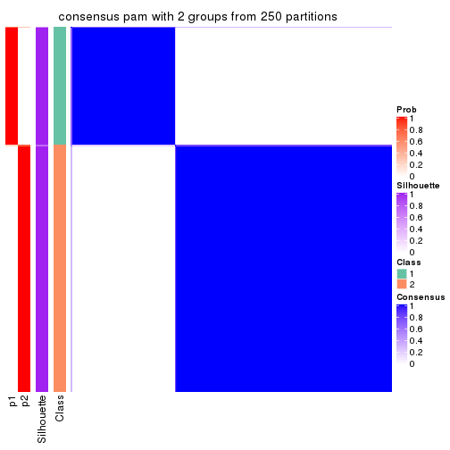</p>

</div>
<div id='tab-ATC-pam-consensus-heatmap-2'>
<pre><code class="r">consensus_heatmap(res, k = 3)
</code></pre>

<p>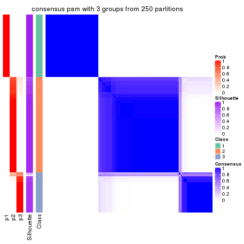</p>

</div>
<div id='tab-ATC-pam-consensus-heatmap-3'>
<pre><code class="r">consensus_heatmap(res, k = 4)
</code></pre>

<p>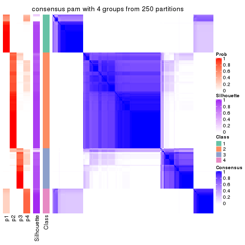</p>

</div>
<div id='tab-ATC-pam-consensus-heatmap-4'>
<pre><code class="r">consensus_heatmap(res, k = 5)
</code></pre>

<p>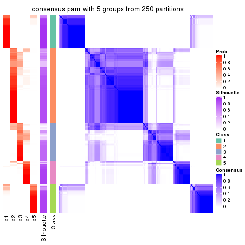</p>

</div>
<div id='tab-ATC-pam-consensus-heatmap-5'>
<pre><code class="r">consensus_heatmap(res, k = 6)
</code></pre>

<p>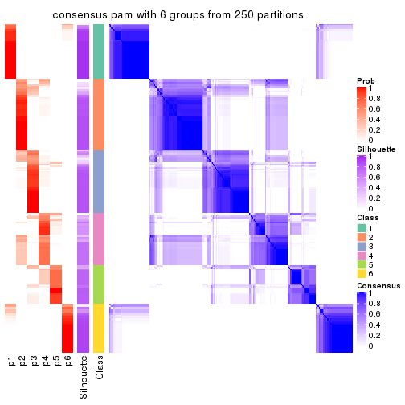</p>

</div>
</div>

Heatmaps for the membership of samples in all partitions to see how consistent they are:


<script>
$( function() {
	$( '#tabs-ATC-pam-membership-heatmap' ).tabs();
} );
</script>
<div id='tabs-ATC-pam-membership-heatmap'>
<ul>
<li><a href='#tab-ATC-pam-membership-heatmap-1'>k = 2</a></li>
<li><a href='#tab-ATC-pam-membership-heatmap-2'>k = 3</a></li>
<li><a href='#tab-ATC-pam-membership-heatmap-3'>k = 4</a></li>
<li><a href='#tab-ATC-pam-membership-heatmap-4'>k = 5</a></li>
<li><a href='#tab-ATC-pam-membership-heatmap-5'>k = 6</a></li>
</ul>
<div id='tab-ATC-pam-membership-heatmap-1'>
<pre><code class="r">membership_heatmap(res, k = 2)
</code></pre>

<p>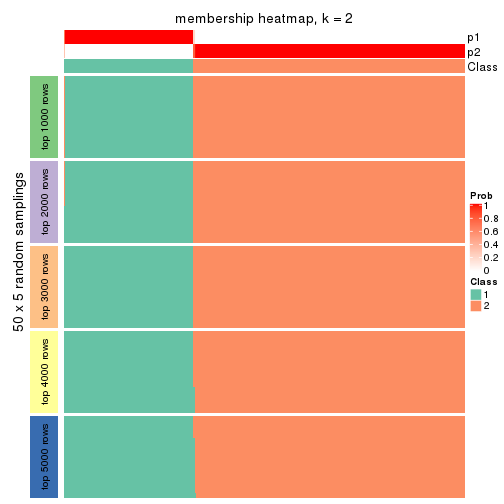</p>

</div>
<div id='tab-ATC-pam-membership-heatmap-2'>
<pre><code class="r">membership_heatmap(res, k = 3)
</code></pre>

<p>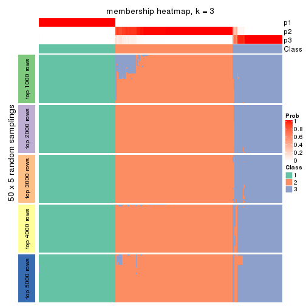</p>

</div>
<div id='tab-ATC-pam-membership-heatmap-3'>
<pre><code class="r">membership_heatmap(res, k = 4)
</code></pre>

<p>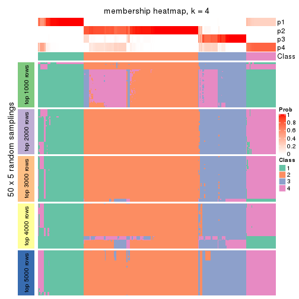</p>

</div>
<div id='tab-ATC-pam-membership-heatmap-4'>
<pre><code class="r">membership_heatmap(res, k = 5)
</code></pre>

<p>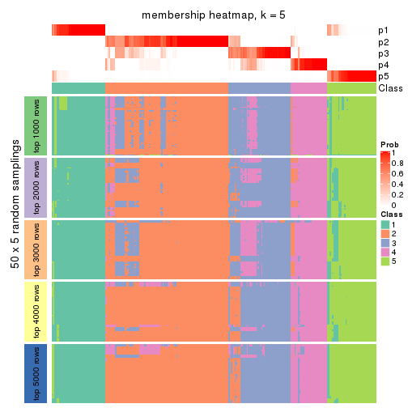</p>

</div>
<div id='tab-ATC-pam-membership-heatmap-5'>
<pre><code class="r">membership_heatmap(res, k = 6)
</code></pre>

<p>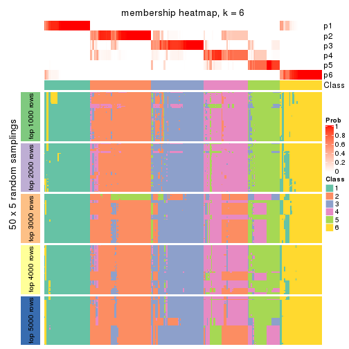</p>

</div>
</div>

As soon as we have had the classes for columns, we can look for signatures
which are significantly different between classes which can be candidate marks
for certain classes. Following are the heatmaps for signatures.


Signature heatmaps where rows are scaled:


<script>
$( function() {
	$( '#tabs-ATC-pam-get-signatures' ).tabs();
} );
</script>
<div id='tabs-ATC-pam-get-signatures'>
<ul>
<li><a href='#tab-ATC-pam-get-signatures-1'>k = 2</a></li>
<li><a href='#tab-ATC-pam-get-signatures-2'>k = 3</a></li>
<li><a href='#tab-ATC-pam-get-signatures-3'>k = 4</a></li>
<li><a href='#tab-ATC-pam-get-signatures-4'>k = 5</a></li>
<li><a href='#tab-ATC-pam-get-signatures-5'>k = 6</a></li>
</ul>
<div id='tab-ATC-pam-get-signatures-1'>
<pre><code class="r">get_signatures(res, k = 2)
</code></pre>

<p>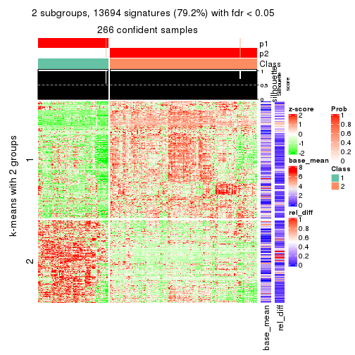</p>

</div>
<div id='tab-ATC-pam-get-signatures-2'>
<pre><code class="r">get_signatures(res, k = 3)
</code></pre>

<p>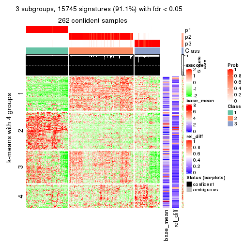</p>

</div>
<div id='tab-ATC-pam-get-signatures-3'>
<pre><code class="r">get_signatures(res, k = 4)
</code></pre>

<p>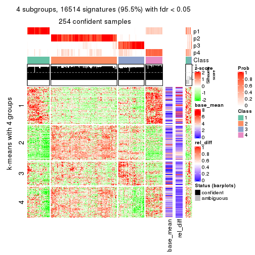</p>

</div>
<div id='tab-ATC-pam-get-signatures-4'>
<pre><code class="r">get_signatures(res, k = 5)
</code></pre>

<p>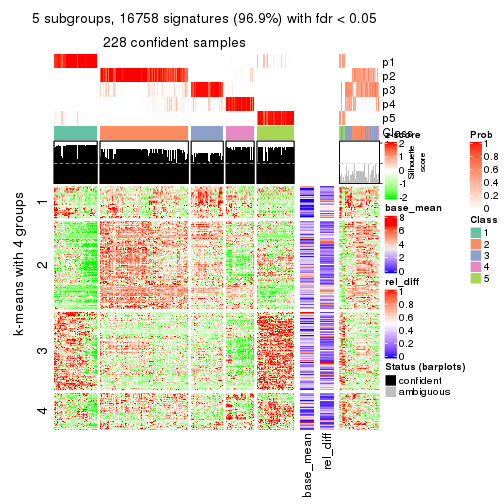</p>

</div>
<div id='tab-ATC-pam-get-signatures-5'>
<pre><code class="r">get_signatures(res, k = 6)
</code></pre>

<p>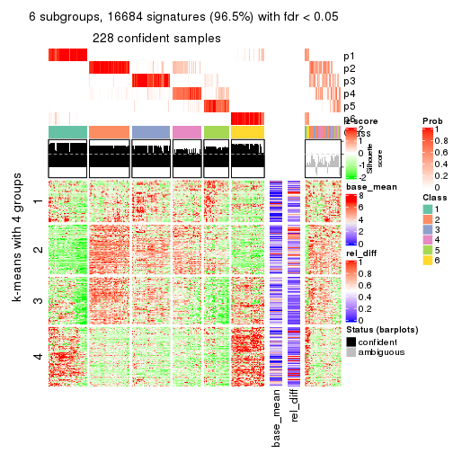</p>

</div>
</div>


Signature heatmaps where rows are not scaled:


<script>
$( function() {
	$( '#tabs-ATC-pam-get-signatures-no-scale' ).tabs();
} );
</script>
<div id='tabs-ATC-pam-get-signatures-no-scale'>
<ul>
<li><a href='#tab-ATC-pam-get-signatures-no-scale-1'>k = 2</a></li>
<li><a href='#tab-ATC-pam-get-signatures-no-scale-2'>k = 3</a></li>
<li><a href='#tab-ATC-pam-get-signatures-no-scale-3'>k = 4</a></li>
<li><a href='#tab-ATC-pam-get-signatures-no-scale-4'>k = 5</a></li>
<li><a href='#tab-ATC-pam-get-signatures-no-scale-5'>k = 6</a></li>
</ul>
<div id='tab-ATC-pam-get-signatures-no-scale-1'>
<pre><code class="r">get_signatures(res, k = 2, scale_rows = FALSE)
</code></pre>

<p>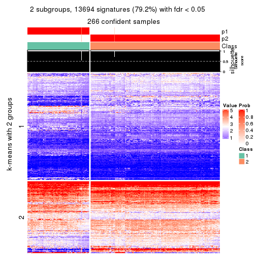</p>

</div>
<div id='tab-ATC-pam-get-signatures-no-scale-2'>
<pre><code class="r">get_signatures(res, k = 3, scale_rows = FALSE)
</code></pre>

<p>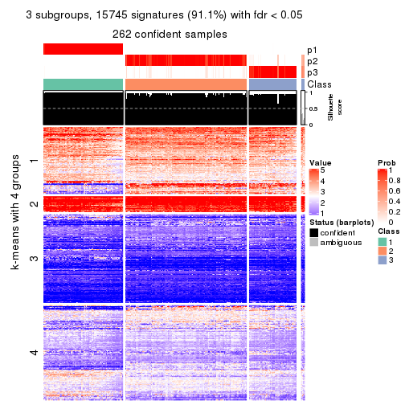</p>

</div>
<div id='tab-ATC-pam-get-signatures-no-scale-3'>
<pre><code class="r">get_signatures(res, k = 4, scale_rows = FALSE)
</code></pre>

<p>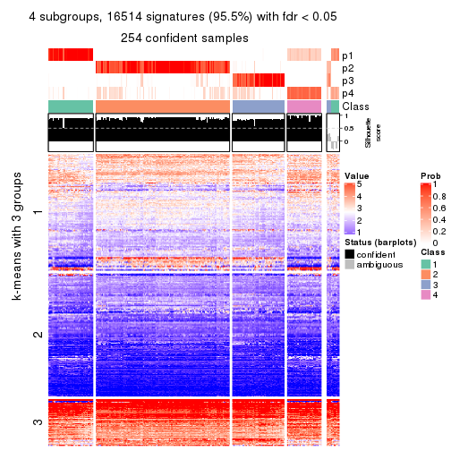</p>

</div>
<div id='tab-ATC-pam-get-signatures-no-scale-4'>
<pre><code class="r">get_signatures(res, k = 5, scale_rows = FALSE)
</code></pre>

<p>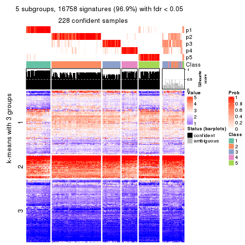</p>

</div>
<div id='tab-ATC-pam-get-signatures-no-scale-5'>
<pre><code class="r">get_signatures(res, k = 6, scale_rows = FALSE)
</code></pre>

<p>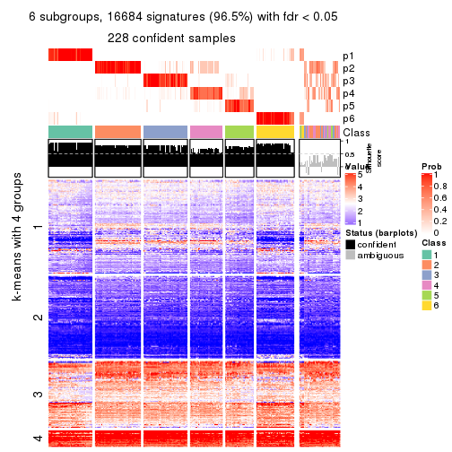</p>

</div>
</div>


Compare the overlap of signatures from different k:

```r
compare_signatures(res)
```

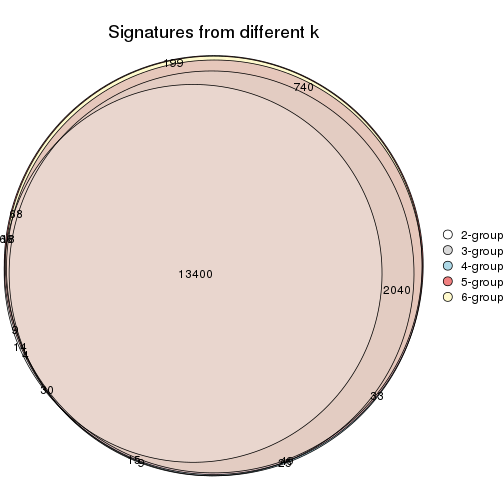

`get_signature()` returns a data frame invisibly. TO get the list of signatures, the function
call should be assigned to a variable explicitly. In following code, if `plot` argument is set
to `FALSE`, no heatmap is plotted while only the differential analysis is performed.

```r
# code only for demonstration
tb = get_signature(res, k = ..., plot = FALSE)
```

An example of the output of `tb` is:

```
#>   which_row         fdr    mean_1    mean_2 scaled_mean_1 scaled_mean_2 km
#> 1        38 0.042760348  8.373488  9.131774    -0.5533452     0.5164555  1
#> 2        40 0.018707592  7.106213  8.469186    -0.6173731     0.5762149  1
#> 3        55 0.019134737 10.221463 11.207825    -0.6159697     0.5749050  1
#> 4        59 0.006059896  5.921854  7.869574    -0.6899429     0.6439467  1
#> 5        60 0.018055526  8.928898 10.211722    -0.6204761     0.5791110  1
#> 6        98 0.009384629 15.714769 14.887706     0.6635654    -0.6193277  2
...
```

The columns in `tb` are:

1. `which_row`: row indices corresponding to the input matrix.
2. `fdr`: FDR for the differential test. 
3. `mean_x`: The mean value in group x.
4. `scaled_mean_x`: The mean value in group x after rows are scaled.
5. `km`: Row groups if k-means clustering is applied to rows.


UMAP plot which shows how samples are separated.


<script>
$( function() {
	$( '#tabs-ATC-pam-dimension-reduction' ).tabs();
} );
</script>
<div id='tabs-ATC-pam-dimension-reduction'>
<ul>
<li><a href='#tab-ATC-pam-dimension-reduction-1'>k = 2</a></li>
<li><a href='#tab-ATC-pam-dimension-reduction-2'>k = 3</a></li>
<li><a href='#tab-ATC-pam-dimension-reduction-3'>k = 4</a></li>
<li><a href='#tab-ATC-pam-dimension-reduction-4'>k = 5</a></li>
<li><a href='#tab-ATC-pam-dimension-reduction-5'>k = 6</a></li>
</ul>
<div id='tab-ATC-pam-dimension-reduction-1'>
<pre><code class="r">dimension_reduction(res, k = 2, method = &quot;UMAP&quot;)
</code></pre>

<p>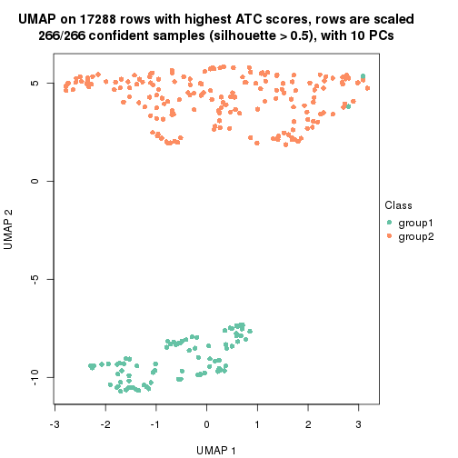</p>

</div>
<div id='tab-ATC-pam-dimension-reduction-2'>
<pre><code class="r">dimension_reduction(res, k = 3, method = &quot;UMAP&quot;)
</code></pre>

<p>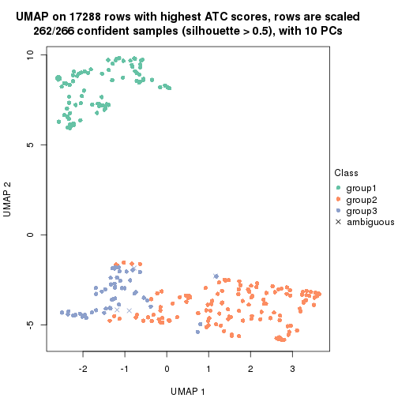</p>

</div>
<div id='tab-ATC-pam-dimension-reduction-3'>
<pre><code class="r">dimension_reduction(res, k = 4, method = &quot;UMAP&quot;)
</code></pre>

<p>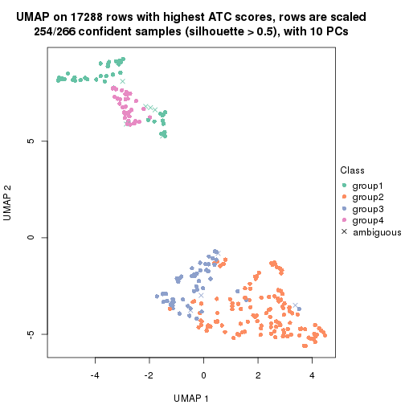</p>

</div>
<div id='tab-ATC-pam-dimension-reduction-4'>
<pre><code class="r">dimension_reduction(res, k = 5, method = &quot;UMAP&quot;)
</code></pre>

<p>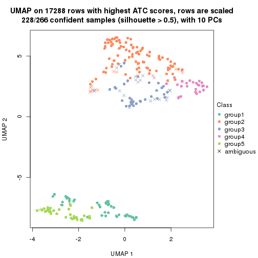</p>

</div>
<div id='tab-ATC-pam-dimension-reduction-5'>
<pre><code class="r">dimension_reduction(res, k = 6, method = &quot;UMAP&quot;)
</code></pre>

<p>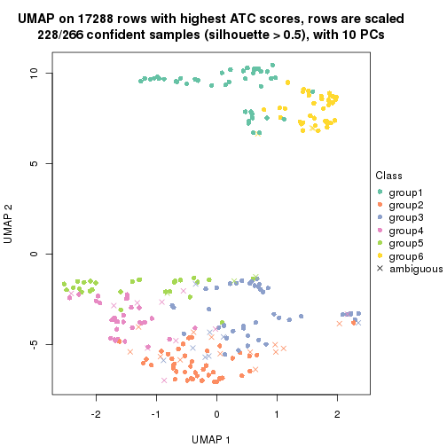</p>

</div>
</div>


Following heatmap shows how subgroups are split when increasing `k`:

```r
collect_classes(res)
```

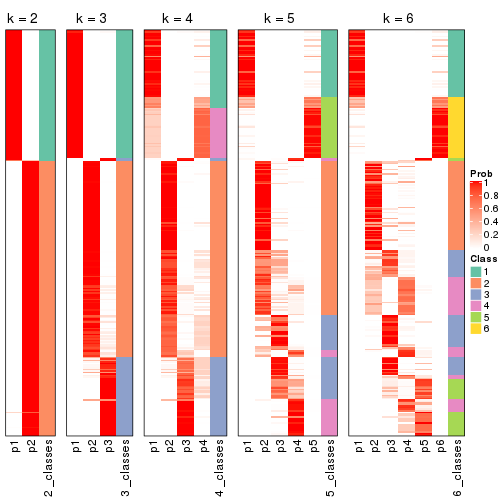


If matrix rows can be associated to genes, consider to use `GO_Enrichment(res,
...)` to perform function enrichment for the signature genes.


 

---------------------------------------------------


### ATC:mclust**


The object with results only for a single top-value method and a single partition method 
can be extracted as:

```r
res = res_list["ATC", "mclust"]
# you can also extract it by
# res = res_list["ATC:mclust"]
```

A summary of `res` and all the functions that can be applied to it:

```r
res
```

```
#> A 'ConsensusPartition' object with k = 2, 3, 4, 5, 6.
#>   On a matrix with 17288 rows and 266 columns.
#>   Top rows (1000, 2000, 3000, 4000, 5000) are extracted by 'ATC' method.
#>   Subgroups are detected by 'mclust' method.
#>   Performed in total 1250 partitions by row resampling.
#>   Best k for subgroups seems to be 2.
#> 
#> Following methods can be applied to this 'ConsensusPartition' object:
#>  [1] "cola_report"             "collect_classes"         "collect_plots"          
#>  [4] "collect_stats"           "colnames"                "compare_signatures"     
#>  [7] "consensus_heatmap"       "dimension_reduction"     "functional_enrichment"  
#> [10] "get_anno_col"            "get_anno"                "get_classes"            
#> [13] "get_consensus"           "get_matrix"              "get_membership"         
#> [16] "get_param"               "get_signatures"          "get_stats"              
#> [19] "is_best_k"               "is_stable_k"             "membership_heatmap"     
#> [22] "ncol"                    "nrow"                    "plot_ecdf"              
#> [25] "rownames"                "select_partition_number" "show"                   
#> [28] "suggest_best_k"          "test_to_known_factors"
```

`collect_plots()` function collects all the plots made from `res` for all `k` (number of partitions)
into one single page to provide an easy and fast comparison between different `k`.

```r
collect_plots(res)
```

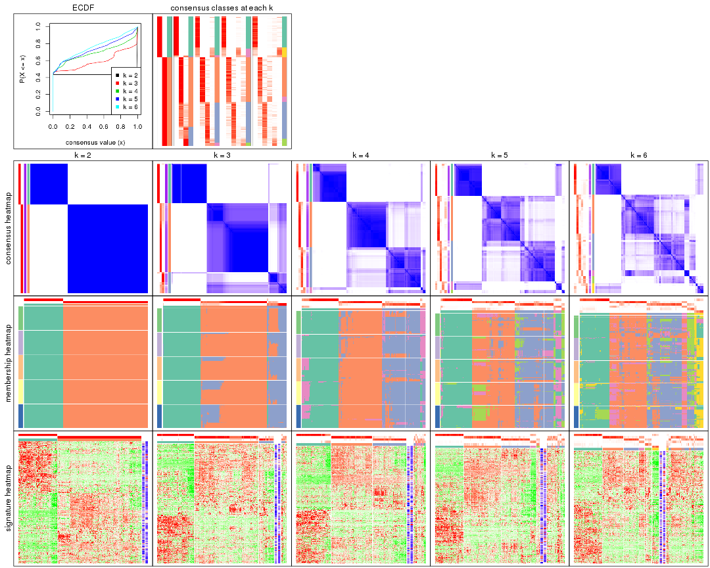

The plots are:

- The first row: a plot of the ECDF (Empirical cumulative distribution
  function) curves of the consensus matrix for each `k` and the heatmap of
  predicted classes for each `k`.
- The second row: heatmaps of the consensus matrix for each `k`.
- The third row: heatmaps of the membership matrix for each `k`.
- The fouth row: heatmaps of the signatures for each `k`.

All the plots in panels can be made by individual functions and they are
plotted later in this section.

`select_partition_number()` produces several plots showing different
statistics for choosing "optimized" `k`. There are following statistics:

- ECDF curves of the consensus matrix for each `k`;
- 1-PAC. [The PAC
  score](https://en.wikipedia.org/wiki/Consensus_clustering#Over-interpretation_potential_of_consensus_clustering)
  measures the proportion of the ambiguous subgrouping.
- Mean silhouette score.
- Concordance. The mean probability of fiting the consensus class ids in all
  partitions.
- Area increased. Denote $A_k$ as the area under the ECDF curve for current
  `k`, the area increased is defined as $A_k - A_{k-1}$.
- Rand index. The percent of pairs of samples that are both in a same cluster
  or both are not in a same cluster in the partition of k and k-1.
- Jaccard index. The ratio of pairs of samples are both in a same cluster in
  the partition of k and k-1 and the pairs of samples are both in a same
  cluster in the partition k or k-1.

The detailed explanations of these statistics can be found in [the cola
vignette](http://bioconductor.org/packages/devel/bioc/vignettes/cola/inst/doc/cola.html#toc_13).

Generally speaking, lower PAC score, higher mean silhouette score or higher
concordance corresponds to better partition. Rand index and Jaccard index
measure how similar the current partition is compared to partition with `k-1`.
If they are too similar, we won't accept `k` is better than `k-1`.

```r
select_partition_number(res)
```

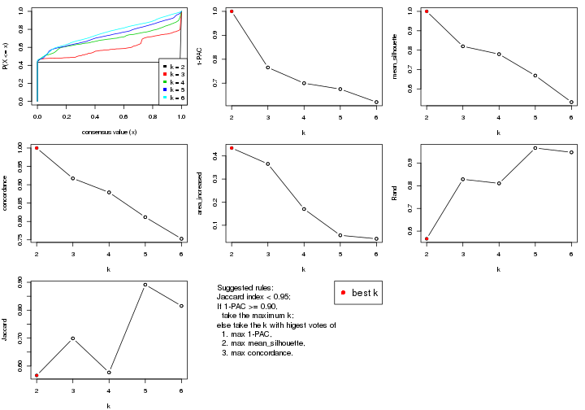

The numeric values for all these statistics can be obtained by `get_stats()`.

```r
get_stats(res)
```

```
#>   k 1-PAC mean_silhouette concordance area_increased  Rand Jaccard
#> 2 2 1.000           1.000       1.000         0.4343 0.566   0.566
#> 3 3 0.766           0.820       0.917         0.3656 0.829   0.699
#> 4 4 0.700           0.779       0.879         0.1702 0.810   0.577
#> 5 5 0.675           0.669       0.812         0.0566 0.966   0.891
#> 6 6 0.621           0.532       0.753         0.0416 0.947   0.815
```

`suggest_best_k()` suggests the best $k$ based on these statistics. The rules are as follows:

- All $k$ with Jaccard index larger than 0.95 are removed because the increase of
  the partition number does not provides enough extra information. If all $k$ are removed,
  the best $k$ is assigned by `NA`.
- For $k$ with 1-PAC larger than 0.9, the maximal $k$ is taken as the "best k". Other $k$ is called "optional k".
- If it does not fit the second rule. The $k$ with the highest vote of highest
  1-PAC, mean silhouette and concordance is taken as the "best k".

```r
suggest_best_k(res)
```

```
#> [1] 2
```


Following shows the table of the partitions (You need to click the **show/hide
code output** link to see it). The membership matrix (columns with name `p*`)
is inferred by
[`clue::cl_consensus()`](https://www.rdocumentation.org/link/cl_consensus?package=clue)
function with the `SE` method. Basically the value in the membership matrix
represents the probability to belong to a certain group. The finall class
label for an item is determined with the group with highest probability it
belongs to.

In `get_classes()` function, the entropy is calculated from the membership
matrix and the silhouette score is calculated from the consensus matrix.


<script>
$( function() {
	$( '#tabs-ATC-mclust-get-classes' ).tabs();
} );
</script>
<div id='tabs-ATC-mclust-get-classes'>
<ul>
<li><a href='#tab-ATC-mclust-get-classes-1'>k = 2</a></li>
<li><a href='#tab-ATC-mclust-get-classes-2'>k = 3</a></li>
<li><a href='#tab-ATC-mclust-get-classes-3'>k = 4</a></li>
<li><a href='#tab-ATC-mclust-get-classes-4'>k = 5</a></li>
<li><a href='#tab-ATC-mclust-get-classes-5'>k = 6</a></li>
</ul>

<div id='tab-ATC-mclust-get-classes-1'>
<p><a id='tab-ATC-mclust-get-classes-1-a' style='color:#0366d6' href='#'>show/hide code output</a></p>
<pre><code class="r">cbind(get_classes(res, k = 2), get_membership(res, k = 2))
</code></pre>

<pre><code>#&gt;                                      class entropy silhouette p1 p2
#&gt; 80D0AF10-1C61-4B67-90C1-7DBF1EF23672     2       0          1  0  1
#&gt; 87117BE1-D328-4972-85DA-6672412D8860     2       0          1  0  1
#&gt; F904C5B6-70BD-4604-8254-79BE23B152DA     1       0          1  1  0
#&gt; 3182DEA1-4239-4613-925A-7E6503766AD6     2       0          1  0  1
#&gt; 55E78EA2-2D9B-481F-8CAB-D36A33088EAE     2       0          1  0  1
#&gt; 86F94264-A6DD-4A97-9191-036F066DD0EF     2       0          1  0  1
#&gt; 09D25417-23B7-4D88-A0EA-F307985FBBBC     2       0          1  0  1
#&gt; C797F12C-40D3-4DB5-B9EF-A6821BBDE4F0     1       0          1  1  0
#&gt; 80275DB0-A226-4B6B-A08F-4ADBEEE1DB01     1       0          1  1  0
#&gt; 27FB653A-9E07-44AD-952E-9E4DE4AB5891     2       0          1  0  1
#&gt; 1A5DB9FC-2ABD-4E1B-B5EF-B1CF5E5F3872     1       0          1  1  0
#&gt; 844E4CCD-D30C-416F-A086-8923711A4E25     2       0          1  0  1
#&gt; EF18318D-3D25-4D65-803A-ED6E62871E7E     1       0          1  1  0
#&gt; 1ACB1BE0-61F6-4243-BBEC-E26A1CF90CA8     1       0          1  1  0
#&gt; 8EF0039B-D758-46AB-BAF7-6A062C7C56BA     1       0          1  1  0
#&gt; 22F4C9D9-663B-4C91-9692-E035A2640BEC     2       0          1  0  1
#&gt; FA1A0BCE-EE0F-4178-B963-62550E344B14     2       0          1  0  1
#&gt; 0B6D0C4E-5AE3-4707-A9FC-12A108E6EC2A     2       0          1  0  1
#&gt; 06FD3123-2AEB-4911-AC4E-E0E64FD5DB52     2       0          1  0  1
#&gt; 235A4492-FF80-4AA5-BC71-DFF65E1C7411     2       0          1  0  1
#&gt; A192C6C0-1443-4493-AFAC-1EE710628ADB     2       0          1  0  1
#&gt; 6FC5B56B-711B-4174-9B06-4E843124AAB6     1       0          1  1  0
#&gt; 7A813F60-A41E-4552-990E-F22287654C1D     2       0          1  0  1
#&gt; 725BBFB5-26F4-4512-9C75-47D013C1E605     1       0          1  1  0
#&gt; 39CC4E82-EBC9-472E-8BE5-6A3AB178449A     2       0          1  0  1
#&gt; 61130DEE-E267-49DF-8B41-7738A06EF738     2       0          1  0  1
#&gt; 117EC12C-B7ED-4E01-B29B-EA542D356EA1     1       0          1  1  0
#&gt; A30FF708-F7A9-41E4-8AD5-20441650FBC9     2       0          1  0  1
#&gt; 53640D52-1167-4A5D-B656-97D32CBA3934     1       0          1  1  0
#&gt; 9E85D76A-DD2A-46D5-BB59-0ED302B6258C     2       0          1  0  1
#&gt; 6F8C6F90-7E3C-4860-91DD-586708DE44AA     1       0          1  1  0
#&gt; E675AEC5-AA9A-4AAA-839C-03E6365822DB     2       0          1  0  1
#&gt; B577DEF7-2F5C-4876-A7C6-F18D5722B8C0     1       0          1  1  0
#&gt; DA8B577E-43E7-49BF-BF94-868E3194F5C9     1       0          1  1  0
#&gt; 3334280B-2A36-4AC7-A021-A76C10E958F0     2       0          1  0  1
#&gt; 5CBDDC90-11EC-4E6E-881E-AA9CCFD40FDB     2       0          1  0  1
#&gt; 8CBBF32A-8349-44F5-A8B8-4CBB1760A464     2       0          1  0  1
#&gt; B9455A9A-136D-4DC2-9F86-0FC74433589D     2       0          1  0  1
#&gt; D7EAE2A7-F9BE-4222-A452-B1F83F99CD50     2       0          1  0  1
#&gt; F803AE18-60C5-4CFE-AAAB-DB33C26A2184     1       0          1  1  0
#&gt; 5DD8CAC7-EC02-43B6-B58E-6D2E22868A3B     2       0          1  0  1
#&gt; EE98E1B4-DFB3-4AEC-8527-E1FD544C9475     1       0          1  1  0
#&gt; 3CE43921-47D5-4394-B9E1-242607775D61     2       0          1  0  1
#&gt; 46986F2B-0B0D-4187-8948-4E91D34B7C49     2       0          1  0  1
#&gt; 5D1D052E-74EF-45A8-9B1A-7CECD13EA43B     2       0          1  0  1
#&gt; 4C821AD9-A5C9-4A9A-9C5D-363B227F8064     2       0          1  0  1
#&gt; 06A4189E-A23B-4AC6-AA74-01955DD7D1E9     2       0          1  0  1
#&gt; FCCDC76F-CB02-4BCD-A616-325F258DDAA4     2       0          1  0  1
#&gt; DAC53B0A-8F35-4EA6-BBCC-4CD1C049E11F     2       0          1  0  1
#&gt; DD4F845B-CAD3-44CB-9D96-3C3F5BA1B72D     1       0          1  1  0
#&gt; D440F004-A4A4-41B6-BED8-805D67BA01C7     2       0          1  0  1
#&gt; A497C423-119F-42FA-BF17-9F6DFD2A5585     2       0          1  0  1
#&gt; 3420E573-DE12-4EF5-B1C0-2FCA904F4F4E     1       0          1  1  0
#&gt; 1AD72157-A254-44B4-BA58-4F30F1AE910E     1       0          1  1  0
#&gt; C1113977-B160-45EE-B061-750F9EA3F33F     2       0          1  0  1
#&gt; 6783AB5B-F07C-447B-BF13-C34485D246D7     2       0          1  0  1
#&gt; 1F553062-26FD-4A7F-B7FB-81184604F423     1       0          1  1  0
#&gt; BE2DCA51-1C21-4598-98A7-F2FB9B2DFCB4     2       0          1  0  1
#&gt; 38941CF3-9C54-4BA4-A005-CC88CA97D504     2       0          1  0  1
#&gt; 51CB675E-E243-4A07-BF4A-580473D26FDA     2       0          1  0  1
#&gt; C7FED0F5-C27A-4405-9232-30BF39362CF7     2       0          1  0  1
#&gt; 2A1E86E8-4713-465F-ACFF-C584864C57A1     2       0          1  0  1
#&gt; B4500785-0FAA-4D4D-8630-43D194BAB004     2       0          1  0  1
#&gt; 3FD52E66-AB76-4079-80DB-281A795D1EC0     2       0          1  0  1
#&gt; EBD355D1-1226-4DFD-AAFF-45D246B64F3C     2       0          1  0  1
#&gt; 5A040A73-CD95-487E-8AEF-9639FE4E2916     2       0          1  0  1
#&gt; CF629C65-585D-476D-B081-3E6E0575FAE3     2       0          1  0  1
#&gt; 0D4202A3-808E-413F-9BF3-9CFCCAE0ED61     2       0          1  0  1
#&gt; 43E715BF-28D9-4B5E-B762-8CD1B69A430E     1       0          1  1  0
#&gt; BFB82BE8-9DAC-4099-8B38-0950308E3EB3     2       0          1  0  1
#&gt; F7CB1825-2303-4DD2-AE1F-7205738EAF1F     1       0          1  1  0
#&gt; FE298483-C42C-4753-BABB-29A9CB1B6312     1       0          1  1  0
#&gt; A98C7561-1B42-4CD6-AE71-924B91FA4C33     2       0          1  0  1
#&gt; 58098F21-7DAB-47DA-9A41-8D20BF3B9257     2       0          1  0  1
#&gt; 18CAF708-20B9-4745-9CB3-37AB6E0B3056     2       0          1  0  1
#&gt; 2C80DD72-C9C7-4AC2-812F-9A31EF02779C     1       0          1  1  0
#&gt; 68A3F13D-319D-4603-A27F-B5DD46FE5C5B     2       0          1  0  1
#&gt; 7EE8F0CE-CDC9-40F9-A1DE-7F8140EC6D13     2       0          1  0  1
#&gt; 39019903-5B9C-4665-BD5F-7CCB19CB55C5     2       0          1  0  1
#&gt; 190EDB27-4CBC-4E9C-9B67-D51FDAB982B7     2       0          1  0  1
#&gt; EB2D95BC-62F8-4669-9308-D37D7FB79E23     2       0          1  0  1
#&gt; A08B85EA-D1E7-4B77-8DEC-36294305B9F7     1       0          1  1  0
#&gt; 130DDFAD-6EF8-4C80-BD9D-88308A6874BC     2       0          1  0  1
#&gt; 7340A5BA-E002-448F-AACC-E7A37DBB79C2     2       0          1  0  1
#&gt; A771F6E3-D266-4FE7-98C6-C40E6A701D59     1       0          1  1  0
#&gt; 015E792C-EC1B-49BF-AB07-D82B20C5989A     2       0          1  0  1
#&gt; BF79E030-47EE-4D08-B910-5685A4BD8B60     2       0          1  0  1
#&gt; FB3C7C9A-2F2D-4DD5-BE47-FAFB072C0FAB     2       0          1  0  1
#&gt; 4E5557BA-10E8-4723-908E-DD04EF6639B2     2       0          1  0  1
#&gt; 8031B550-40A9-4A3A-9F7D-CDC052288BD8     2       0          1  0  1
#&gt; 55299A06-3C1F-45A4-B166-B2C591C0CEE2     2       0          1  0  1
#&gt; EB8D5168-216E-4ABB-8B4E-9E67786CB322     1       0          1  1  0
#&gt; 78BD2D83-9A7F-42E5-BB38-654AA0761A0A     2       0          1  0  1
#&gt; AA2D53E5-D389-4332-9DD5-A736052E48F8     1       0          1  1  0
#&gt; 62945C7A-9313-4FC9-820C-B0AB820B394E     1       0          1  1  0
#&gt; 22746046-2E99-4EE9-97D2-BA2EA499634C     2       0          1  0  1
#&gt; 8671B51B-DCBE-4429-9F01-AF51CAD7014F     2       0          1  0  1
#&gt; E815AB36-5689-4A0D-8E6D-2EAA73406681     1       0          1  1  0
#&gt; A1DACB46-ED52-4E38-B2C8-57256BB22B5E     2       0          1  0  1
#&gt; 4F5498C4-A423-4B3D-AC98-D4E214A57D0E     1       0          1  1  0
#&gt; A7772CCD-FFFF-49DD-86ED-0BAD330EC9B6     2       0          1  0  1
#&gt; E6E3DF78-65B9-4F74-8DA8-E2A6D4EDBEA7     2       0          1  0  1
#&gt; 83286E2D-E708-437A-911A-E6B050273CBD     1       0          1  1  0
#&gt; EC5C7C97-EE8C-405D-A039-D96514B1D414     2       0          1  0  1
#&gt; 3E55223D-6E3D-4027-9819-67E91212531D     1       0          1  1  0
#&gt; 99A036A2-8343-4D06-8047-D84E96CE4C61     2       0          1  0  1
#&gt; CA6CDE6D-92DE-4259-9E58-A373F2D543EA     2       0          1  0  1
#&gt; BF6FA8CC-60C1-413A-B2C6-54CCACBC01D6     1       0          1  1  0
#&gt; E0594CFE-F7B6-4546-B130-30DF6A514B1F     2       0          1  0  1
#&gt; E769E41D-5949-42C5-9594-E563C05ACE52     2       0          1  0  1
#&gt; 01373725-5D3C-4D9C-AABC-911D53E62BCD     2       0          1  0  1
#&gt; 1F39DADD-3655-474E-BA4C-A5BD32C97A8B     1       0          1  1  0
#&gt; AF573EC8-E4EE-4B8F-8199-9817B9FAC67D     1       0          1  1  0
#&gt; 3F022CBC-41C8-4387-A6FB-124C4BCD1AD9     1       0          1  1  0
#&gt; 1CC32ACE-826B-494B-8B89-5BD92327A74D     2       0          1  0  1
#&gt; 22B0BD3B-EE08-4BC7-90B2-01C372A56BA2     2       0          1  0  1
#&gt; 0F3DE9EF-19CC-4D14-9A42-1435DB537F94     2       0          1  0  1
#&gt; 87F8A33F-FBC3-469E-862B-84472F796358     2       0          1  0  1
#&gt; C9F2FA0D-1A9F-40B4-BD9B-CAF1B3F3D5A7     2       0          1  0  1
#&gt; ACFC9F59-78FF-4453-B25F-8834D0EAB54A     2       0          1  0  1
#&gt; B7AC7D5B-14E9-45A7-93B7-226EE508544A     2       0          1  0  1
#&gt; 4491BF17-B168-4E96-8E09-EF1AEC9F5E9D     2       0          1  0  1
#&gt; 557A0811-A3FE-4CF4-A24D-FBB77E7F9139     2       0          1  0  1
#&gt; 6F9C955C-6816-4353-922A-8035B50FACC6     2       0          1  0  1
#&gt; 3E89FB1C-4A7D-43C7-823C-04E3716A7935     2       0          1  0  1
#&gt; 12ABE483-66EF-4237-94C4-0199FAE23FA8     2       0          1  0  1
#&gt; 7535F262-9B96-44F6-988C-4C9EBB3FFCA9     2       0          1  0  1
#&gt; 65C9D28E-303B-40E5-84F0-2507F5457374     2       0          1  0  1
#&gt; FD445384-6BA9-4297-9D9C-12ABA7D645C7     1       0          1  1  0
#&gt; 30D5E255-2AD3-44F3-8983-1B80E4FD3E2D     2       0          1  0  1
#&gt; 3E88EC60-B4A8-4259-8BC8-A234800F6955     2       0          1  0  1
#&gt; ACD73CE8-AFC5-47A0-9383-3CB97F018953     1       0          1  1  0
#&gt; 1AFDC2EA-26A8-44E2-8BCB-F34F7B66F8C8     2       0          1  0  1
#&gt; 9E327BC8-1D20-4AD8-83F7-FB2D13BCA5D0     2       0          1  0  1
#&gt; 85A86B91-4F24-4E77-AE2D-520F8E205EFC     1       0          1  1  0
#&gt; 74868C37-8143-4306-81CA-E45759D146CD     2       0          1  0  1
#&gt; 69AEA0DB-E335-48A0-A398-4FB0D581182A     2       0          1  0  1
#&gt; AE6F8B89-85C2-42B7-8D05-AFDDD4FEFD16     1       0          1  1  0
#&gt; A8A6F09C-9812-4457-9A4B-AD41F97B41A3     2       0          1  0  1
#&gt; 1A09BC4D-EF29-42DD-BB04-A3C264A3032D     1       0          1  1  0
#&gt; E0961A30-A62C-4235-9CF0-A1776827A996     2       0          1  0  1
#&gt; 134D2D90-7B08-4F20-8A3A-C77643FB208F     2       0          1  0  1
#&gt; A77C2DFF-93CF-4CB5-B3C1-81133D7F1A0F     2       0          1  0  1
#&gt; EA2DC457-9C74-4B9C-B3FA-5E72199B24A7     2       0          1  0  1
#&gt; FF34117B-5EE4-4C96-A8A2-2CE6A654CBE5     1       0          1  1  0
#&gt; 75F7B5E2-6559-4B48-A2A4-287C35C559CC     1       0          1  1  0
#&gt; 903BF591-B0AF-4BEE-B625-60B673070344     2       0          1  0  1
#&gt; 9DE1B790-C63C-41C4-9477-CE52A8119C67     2       0          1  0  1
#&gt; 9A28F80A-85F8-40E2-A32B-230EF93B2FA0     2       0          1  0  1
#&gt; 0AA2BDBB-8720-409A-AA72-1F4AA26E7CD8     2       0          1  0  1
#&gt; 5AD49F16-E974-4E5D-B1B6-073ECB73A01D     2       0          1  0  1
#&gt; CB0F961C-527D-4A48-9408-286B26BD9532     1       0          1  1  0
#&gt; 46FF25B6-D01D-4CA7-80B7-CEC2998C34E1     2       0          1  0  1
#&gt; 487CADE1-D699-4A6C-817A-B9A0AB940C61     1       0          1  1  0
#&gt; 4FF6F2D8-F869-4735-A4D1-1A8423153FBC     1       0          1  1  0
#&gt; 6005494F-5D3D-43A3-B3E8-8C91955B2A98     2       0          1  0  1
#&gt; CF10D584-CE32-45A4-A932-E9D5AF12A6A0     1       0          1  1  0
#&gt; E15CE4AB-5646-49C8-9CD6-938457036BB0     2       0          1  0  1
#&gt; 31E28D0B-0E69-4330-82ED-4F1827DC97EA     2       0          1  0  1
#&gt; DBACD3C3-CCB5-4478-BA78-85A0C847CA66     2       0          1  0  1
#&gt; 5A07041C-65EB-4FCD-8940-E90B905061B5     2       0          1  0  1
#&gt; 0EA7C916-FA47-489B-BC98-4D9E7D197628     1       0          1  1  0
#&gt; 30967F75-8499-47FF-ADA4-4DC566013F7B     1       0          1  1  0
#&gt; D2E528FF-AEA2-48D7-A60A-4C3E71EA9073     2       0          1  0  1
#&gt; 22735DCD-215E-48BC-BF44-32BD66F06E39     2       0          1  0  1
#&gt; BC2C3248-7FC6-48BC-96C1-45EA573DE7DC     1       0          1  1  0
#&gt; E72CEBCB-D686-4B12-BCBA-EC8F964330A2     1       0          1  1  0
#&gt; 23C937BB-BA20-4440-B680-914229CC3ADF     1       0          1  1  0
#&gt; 947E99C7-F402-4F1A-A6E9-81BCAAED135A     2       0          1  0  1
#&gt; 02475D11-FC81-4E88-944E-173C32DC3FE7     2       0          1  0  1
#&gt; F972A9AA-9842-4343-A533-A795E65581CE     1       0          1  1  0
#&gt; 05043AAF-3095-4C61-B5C1-EE9AA9082C75     2       0          1  0  1
#&gt; CECF7967-862E-428C-BB42-FEF553FDB3AA     2       0          1  0  1
#&gt; FB0B9483-6302-48C7-BE5B-DA667E00AE2D     2       0          1  0  1
#&gt; 78700FBA-1487-4754-9B30-18837BF7E9FB     1       0          1  1  0
#&gt; 2166F56D-54CE-4F1B-8F07-A4E13E4489E9     1       0          1  1  0
#&gt; 7CD0942E-E39A-43A7-8BAC-F25967864901     2       0          1  0  1
#&gt; 3B00BA2B-7F7D-4825-8F8D-90F04A5DE687     2       0          1  0  1
#&gt; 7465B01D-C05E-4FE0-A9FE-182920EDC489     2       0          1  0  1
#&gt; 88C31A99-F96E-4FC8-8B3D-C1AAA05062D9     1       0          1  1  0
#&gt; 53575575-3303-4F8F-B6A8-B42131CFB4AC     2       0          1  0  1
#&gt; CC8017C7-4128-48DA-8E43-503F63158D85     1       0          1  1  0
#&gt; 88449D2A-2A25-41A4-B91D-C99B58F8ECD9     2       0          1  0  1
#&gt; 46C7DDE5-A2B5-494F-96AE-0B6E2D51B003     1       0          1  1  0
#&gt; 42551D05-5EE5-4F91-93A8-32DA695D9DFA     2       0          1  0  1
#&gt; 0772DA48-3A36-422D-B166-CA1691B782C3     2       0          1  0  1
#&gt; 30346897-EC77-4153-88A2-D14593C8B741     2       0          1  0  1
#&gt; 0F00E267-C748-4A71-8B36-03C410641D88     2       0          1  0  1
#&gt; 4034703A-4DA9-4DDA-9CA9-E80FFE9CCDE6     2       0          1  0  1
#&gt; 393C8A41-CF45-4EA8-AFE3-25A08AB7692A     2       0          1  0  1
#&gt; 3354212D-A07C-435C-8B0C-9A7BAAB624B5     1       0          1  1  0
#&gt; 57E30D4E-ABF7-47DD-92BE-40CE215076B0     1       0          1  1  0
#&gt; 202B4C76-C840-4DB8-953F-AC75A4156FDD     2       0          1  0  1
#&gt; 93A0137B-1F4C-44EE-B959-2AD0CD2DF8B6     1       0          1  1  0
#&gt; C9794DB6-6E8C-4AFD-80EE-61D672A4F6E9     2       0          1  0  1
#&gt; AE4BFE63-F0C0-4624-AD97-4F7FF13E2384     1       0          1  1  0
#&gt; DCF87F27-2B54-42D9-8D28-5DFEE76E2F5B     2       0          1  0  1
#&gt; 2451D405-39FD-4812-958C-23462B66F1F1     2       0          1  0  1
#&gt; E27F5D33-3F68-4CA8-8757-A387C6EAD060     2       0          1  0  1
#&gt; 8BA9928A-5B93-477F-B4A2-D031B714D9AC     1       0          1  1  0
#&gt; 0FAACFF6-B50C-4BED-9824-B7270654F28D     2       0          1  0  1
#&gt; 3366CC3C-2BBA-4CA7-848E-4E16AA70AE7A     2       0          1  0  1
#&gt; 66237056-CA9A-4C90-AF0E-1621FEB71578     2       0          1  0  1
#&gt; C480F1FB-3100-436C-B0F5-DED63B7A580E     2       0          1  0  1
#&gt; A327DE0D-D945-4B42-9B41-A7302CF796EE     2       0          1  0  1
#&gt; E8A6871D-67FB-4306-9454-F5E7CDBA399A     2       0          1  0  1
#&gt; E9A7485B-82B6-4BD2-AFBB-DD0A82D6CDE2     1       0          1  1  0
#&gt; 93B382E4-9C9A-43F5-BD3B-502CC260B886     1       0          1  1  0
#&gt; A2792419-8E16-45FE-A524-17851F34AB9B     2       0          1  0  1
#&gt; 4DED1201-F25C-4F82-BABF-965EFAD7A8E5     2       0          1  0  1
#&gt; F1ACB2DD-E948-4F88-A249-F1BD1977D667     2       0          1  0  1
#&gt; 6CDBA203-8952-421D-A6BF-75652D9F3339     2       0          1  0  1
#&gt; 2D6C5AA7-3B33-48D7-AE0C-77A16B749D13     1       0          1  1  0
#&gt; 3F6B6D95-0720-42A0-AEB3-89FECAE7616A     2       0          1  0  1
#&gt; DED8ACF3-BBD8-46C9-85C9-A9C8F2E2BC0B     1       0          1  1  0
#&gt; 77069279-5A6F-42C0-9AA5-8C939591DFB5     1       0          1  1  0
#&gt; B2D4FCF3-FDF9-41C8-880A-6732CF6222AF     2       0          1  0  1
#&gt; 1CD71A4C-1E49-48EF-AA72-CB3C26B4C087     2       0          1  0  1
#&gt; C364E621-F85C-4B7F-842F-210B8D4DFE3A     2       0          1  0  1
#&gt; 11F1B8CA-07C1-47D2-A3C6-032FFA6A4A64     1       0          1  1  0
#&gt; 153BF804-6DC8-496B-987A-4021A2512211     2       0          1  0  1
#&gt; 5B5029C9-40F5-40D7-A36A-367022AD6A42     2       0          1  0  1
#&gt; 193CCBE6-104F-49B4-BDB2-C82EE36FDAAD     1       0          1  1  0
#&gt; E5D45E53-FCF3-4F01-9B78-6CB1ED0CFE40     2       0          1  0  1
#&gt; 5546A779-21DB-49F9-8C0D-A1E420088084     2       0          1  0  1
#&gt; E14825E0-0DC7-44C2-B265-F54672356838     1       0          1  1  0
#&gt; 8C8C09B9-EC83-45EC-BC4C-0BA92DE60ACB     1       0          1  1  0
#&gt; B388CA82-5BF7-4BDD-8821-4EC0B213121F     2       0          1  0  1
#&gt; A26025AC-9F71-4C07-9135-83593193BBB2     1       0          1  1  0
#&gt; C80E6D4B-AF21-42F0-8E20-6F7D2E99C062     2       0          1  0  1
#&gt; 5AE5D819-A6B1-4761-B7F9-8FFD3C520F31     2       0          1  0  1
#&gt; CAE8097F-A139-4C6E-9E30-35080475FF34     2       0          1  0  1
#&gt; 539C8DE3-6152-4671-B96F-ED6DC6DBD22B     1       0          1  1  0
#&gt; 5D28A8E0-4ECF-43A4-890A-BE968B9A8CB2     2       0          1  0  1
#&gt; 97A80AF8-365E-4756-A2B0-AEB1D8F5F33E     2       0          1  0  1
#&gt; B3527517-E339-46AE-8437-65303C309015     2       0          1  0  1
#&gt; 523E2183-AA20-4749-BD7E-69CD620DD6A3     2       0          1  0  1
#&gt; E553FB92-F181-47B3-9F3D-11DB51DFA3A4     2       0          1  0  1
#&gt; FFE0C4B1-8EEC-484A-AB87-3401B71BD081     2       0          1  0  1
#&gt; 73D6CA4B-9A9E-4E52-96C8-AE7F0CC8B276     2       0          1  0  1
#&gt; 485A8107-DF9A-4BC6-8A72-07FBA93F10F2     1       0          1  1  0
#&gt; 690823D9-B9AA-40EF-8302-4AD88BF89D1C     2       0          1  0  1
#&gt; B4E02660-562F-4EAC-8472-CBBD8A577688     2       0          1  0  1
#&gt; F82D5A60-90F9-4FF4-971E-73F7535FE65A     2       0          1  0  1
#&gt; C48401F7-2D56-4C6F-9896-C5435D1B44BF     2       0          1  0  1
#&gt; 94FC8991-182B-4B00-9A06-A00E8D3BDCFA     1       0          1  1  0
#&gt; FF00E80A-046D-4233-835E-CDF93403EA43     2       0          1  0  1
#&gt; C47A53F6-6479-4AD3-9D18-E4A70BE5F1DC     2       0          1  0  1
#&gt; 3487AE2D-AB1D-4DEF-AC4B-4B0FCAF8D899     2       0          1  0  1
#&gt; 479CD9BB-ECD7-41D5-B1E4-41132FF7FC95     2       0          1  0  1
#&gt; 048ADC6E-8C7E-4875-ACEE-E4787203C078     1       0          1  1  0
#&gt; 25AF81C5-B117-466D-AE9F-DD10BCB6AF2D     2       0          1  0  1
#&gt; 8B1D51D6-0B25-4289-81F0-9F95E0258877     2       0          1  0  1
#&gt; 282D390D-8E4E-4A19-B2B7-A6DB4BB2D46C     1       0          1  1  0
#&gt; BC6B92C1-F425-40C5-9941-539BFF5FE0FE     2       0          1  0  1
#&gt; 899CB9E0-48D0-413D-8566-BC151F146453     1       0          1  1  0
#&gt; 441400A9-1427-45E0-A8B4-EF2A6B7465C2     2       0          1  0  1
#&gt; CF96DDD4-DC0A-4341-BDE6-4DA2CB4978D0     1       0          1  1  0
#&gt; CE91F591-6072-4D29-9495-C78961635969     2       0          1  0  1
#&gt; 84D25635-2A38-4CFB-BFAC-38C007625C42     1       0          1  1  0
#&gt; ABF1AC12-872A-4C3D-A76C-07BC36A4DA5E     1       0          1  1  0
#&gt; B7F7F66F-1AED-4199-81C0-5C7FB0DBF438     2       0          1  0  1
#&gt; BAB786B9-6C20-425D-9886-63A0A092B59B     2       0          1  0  1
#&gt; 735D1DE3-D781-4F89-A395-09974057BBB7     1       0          1  1  0
#&gt; F6D5FBBA-05C4-4340-86D9-1A54181216A2     2       0          1  0  1
#&gt; 79C4E166-4A0D-4811-A2C8-CAE0A5AEED42     2       0          1  0  1
</code></pre>

<script>
$('#tab-ATC-mclust-get-classes-1-a').parent().next().next().hide();
$('#tab-ATC-mclust-get-classes-1-a').click(function(){
  $('#tab-ATC-mclust-get-classes-1-a').parent().next().next().toggle();
  return(false);
});
</script>
</div>

<div id='tab-ATC-mclust-get-classes-2'>
<p><a id='tab-ATC-mclust-get-classes-2-a' style='color:#0366d6' href='#'>show/hide code output</a></p>
<pre><code class="r">cbind(get_classes(res, k = 3), get_membership(res, k = 3))
</code></pre>

<pre><code>#&gt;                                      class entropy silhouette    p1    p2    p3
#&gt; 80D0AF10-1C61-4B67-90C1-7DBF1EF23672     2  0.0000     0.8798 0.000 1.000 0.000
#&gt; 87117BE1-D328-4972-85DA-6672412D8860     2  0.0000     0.8798 0.000 1.000 0.000
#&gt; F904C5B6-70BD-4604-8254-79BE23B152DA     1  0.0000     0.9928 1.000 0.000 0.000
#&gt; 3182DEA1-4239-4613-925A-7E6503766AD6     3  0.5650     0.5449 0.000 0.312 0.688
#&gt; 55E78EA2-2D9B-481F-8CAB-D36A33088EAE     2  0.2959     0.8185 0.000 0.900 0.100
#&gt; 86F94264-A6DD-4A97-9191-036F066DD0EF     2  0.2537     0.8336 0.000 0.920 0.080
#&gt; 09D25417-23B7-4D88-A0EA-F307985FBBBC     3  0.5254     0.6405 0.000 0.264 0.736
#&gt; C797F12C-40D3-4DB5-B9EF-A6821BBDE4F0     1  0.0000     0.9928 1.000 0.000 0.000
#&gt; 80275DB0-A226-4B6B-A08F-4ADBEEE1DB01     1  0.0000     0.9928 1.000 0.000 0.000
#&gt; 27FB653A-9E07-44AD-952E-9E4DE4AB5891     3  0.5882     0.5187 0.000 0.348 0.652
#&gt; 1A5DB9FC-2ABD-4E1B-B5EF-B1CF5E5F3872     3  0.5650     0.2445 0.312 0.000 0.688
#&gt; 844E4CCD-D30C-416F-A086-8923711A4E25     3  0.0000     0.7279 0.000 0.000 1.000
#&gt; EF18318D-3D25-4D65-803A-ED6E62871E7E     3  0.5650     0.2445 0.312 0.000 0.688
#&gt; 1ACB1BE0-61F6-4243-BBEC-E26A1CF90CA8     1  0.0000     0.9928 1.000 0.000 0.000
#&gt; 8EF0039B-D758-46AB-BAF7-6A062C7C56BA     1  0.0000     0.9928 1.000 0.000 0.000
#&gt; 22F4C9D9-663B-4C91-9692-E035A2640BEC     2  0.0000     0.8798 0.000 1.000 0.000
#&gt; FA1A0BCE-EE0F-4178-B963-62550E344B14     2  0.0000     0.8798 0.000 1.000 0.000
#&gt; 0B6D0C4E-5AE3-4707-A9FC-12A108E6EC2A     2  0.5291     0.6416 0.000 0.732 0.268
#&gt; 06FD3123-2AEB-4911-AC4E-E0E64FD5DB52     2  0.4062     0.7573 0.000 0.836 0.164
#&gt; 235A4492-FF80-4AA5-BC71-DFF65E1C7411     2  0.0000     0.8798 0.000 1.000 0.000
#&gt; A192C6C0-1443-4493-AFAC-1EE710628ADB     2  0.0000     0.8798 0.000 1.000 0.000
#&gt; 6FC5B56B-711B-4174-9B06-4E843124AAB6     1  0.0000     0.9928 1.000 0.000 0.000
#&gt; 7A813F60-A41E-4552-990E-F22287654C1D     2  0.0000     0.8798 0.000 1.000 0.000
#&gt; 725BBFB5-26F4-4512-9C75-47D013C1E605     1  0.0000     0.9928 1.000 0.000 0.000
#&gt; 39CC4E82-EBC9-472E-8BE5-6A3AB178449A     2  0.0000     0.8798 0.000 1.000 0.000
#&gt; 61130DEE-E267-49DF-8B41-7738A06EF738     2  0.5363     0.6314 0.000 0.724 0.276
#&gt; 117EC12C-B7ED-4E01-B29B-EA542D356EA1     1  0.0000     0.9928 1.000 0.000 0.000
#&gt; A30FF708-F7A9-41E4-8AD5-20441650FBC9     2  0.0000     0.8798 0.000 1.000 0.000
#&gt; 53640D52-1167-4A5D-B656-97D32CBA3934     1  0.0000     0.9928 1.000 0.000 0.000
#&gt; 9E85D76A-DD2A-46D5-BB59-0ED302B6258C     3  0.1753     0.7287 0.000 0.048 0.952
#&gt; 6F8C6F90-7E3C-4860-91DD-586708DE44AA     1  0.0000     0.9928 1.000 0.000 0.000
#&gt; E675AEC5-AA9A-4AAA-839C-03E6365822DB     3  0.6062     0.5072 0.000 0.384 0.616
#&gt; B577DEF7-2F5C-4876-A7C6-F18D5722B8C0     1  0.5650     0.6230 0.688 0.000 0.312
#&gt; DA8B577E-43E7-49BF-BF94-868E3194F5C9     1  0.0000     0.9928 1.000 0.000 0.000
#&gt; 3334280B-2A36-4AC7-A021-A76C10E958F0     2  0.0000     0.8798 0.000 1.000 0.000
#&gt; 5CBDDC90-11EC-4E6E-881E-AA9CCFD40FDB     3  0.0237     0.7309 0.000 0.004 0.996
#&gt; 8CBBF32A-8349-44F5-A8B8-4CBB1760A464     2  0.0000     0.8798 0.000 1.000 0.000
#&gt; B9455A9A-136D-4DC2-9F86-0FC74433589D     3  0.0000     0.7279 0.000 0.000 1.000
#&gt; D7EAE2A7-F9BE-4222-A452-B1F83F99CD50     3  0.0892     0.7337 0.000 0.020 0.980
#&gt; F803AE18-60C5-4CFE-AAAB-DB33C26A2184     1  0.0000     0.9928 1.000 0.000 0.000
#&gt; 5DD8CAC7-EC02-43B6-B58E-6D2E22868A3B     2  0.5363     0.6314 0.000 0.724 0.276
#&gt; EE98E1B4-DFB3-4AEC-8527-E1FD544C9475     1  0.0000     0.9928 1.000 0.000 0.000
#&gt; 3CE43921-47D5-4394-B9E1-242607775D61     2  0.0000     0.8798 0.000 1.000 0.000
#&gt; 46986F2B-0B0D-4187-8948-4E91D34B7C49     2  0.0000     0.8798 0.000 1.000 0.000
#&gt; 5D1D052E-74EF-45A8-9B1A-7CECD13EA43B     3  0.5859     0.5683 0.000 0.344 0.656
#&gt; 4C821AD9-A5C9-4A9A-9C5D-363B227F8064     2  0.6286     0.0326 0.000 0.536 0.464
#&gt; 06A4189E-A23B-4AC6-AA74-01955DD7D1E9     2  0.0000     0.8798 0.000 1.000 0.000
#&gt; FCCDC76F-CB02-4BCD-A616-325F258DDAA4     2  0.0000     0.8798 0.000 1.000 0.000
#&gt; DAC53B0A-8F35-4EA6-BBCC-4CD1C049E11F     3  0.0592     0.7336 0.000 0.012 0.988
#&gt; DD4F845B-CAD3-44CB-9D96-3C3F5BA1B72D     1  0.0000     0.9928 1.000 0.000 0.000
#&gt; D440F004-A4A4-41B6-BED8-805D67BA01C7     2  0.0000     0.8798 0.000 1.000 0.000
#&gt; A497C423-119F-42FA-BF17-9F6DFD2A5585     2  0.0000     0.8798 0.000 1.000 0.000
#&gt; 3420E573-DE12-4EF5-B1C0-2FCA904F4F4E     1  0.0000     0.9928 1.000 0.000 0.000
#&gt; 1AD72157-A254-44B4-BA58-4F30F1AE910E     1  0.0000     0.9928 1.000 0.000 0.000
#&gt; C1113977-B160-45EE-B061-750F9EA3F33F     2  0.5431     0.6170 0.000 0.716 0.284
#&gt; 6783AB5B-F07C-447B-BF13-C34485D246D7     3  0.6309     0.1187 0.000 0.500 0.500
#&gt; 1F553062-26FD-4A7F-B7FB-81184604F423     1  0.0000     0.9928 1.000 0.000 0.000
#&gt; BE2DCA51-1C21-4598-98A7-F2FB9B2DFCB4     2  0.5363     0.6314 0.000 0.724 0.276
#&gt; 38941CF3-9C54-4BA4-A005-CC88CA97D504     2  0.0000     0.8798 0.000 1.000 0.000
#&gt; 51CB675E-E243-4A07-BF4A-580473D26FDA     2  0.0000     0.8798 0.000 1.000 0.000
#&gt; C7FED0F5-C27A-4405-9232-30BF39362CF7     2  0.4002     0.7669 0.000 0.840 0.160
#&gt; 2A1E86E8-4713-465F-ACFF-C584864C57A1     2  0.2261     0.8420 0.000 0.932 0.068
#&gt; B4500785-0FAA-4D4D-8630-43D194BAB004     2  0.0000     0.8798 0.000 1.000 0.000
#&gt; 3FD52E66-AB76-4079-80DB-281A795D1EC0     3  0.0237     0.7309 0.000 0.004 0.996
#&gt; EBD355D1-1226-4DFD-AAFF-45D246B64F3C     2  0.0000     0.8798 0.000 1.000 0.000
#&gt; 5A040A73-CD95-487E-8AEF-9639FE4E2916     2  0.0000     0.8798 0.000 1.000 0.000
#&gt; CF629C65-585D-476D-B081-3E6E0575FAE3     3  0.0237     0.7289 0.000 0.004 0.996
#&gt; 0D4202A3-808E-413F-9BF3-9CFCCAE0ED61     2  0.0000     0.8798 0.000 1.000 0.000
#&gt; 43E715BF-28D9-4B5E-B762-8CD1B69A430E     1  0.0000     0.9928 1.000 0.000 0.000
#&gt; BFB82BE8-9DAC-4099-8B38-0950308E3EB3     2  0.0000     0.8798 0.000 1.000 0.000
#&gt; F7CB1825-2303-4DD2-AE1F-7205738EAF1F     1  0.0000     0.9928 1.000 0.000 0.000
#&gt; FE298483-C42C-4753-BABB-29A9CB1B6312     1  0.0000     0.9928 1.000 0.000 0.000
#&gt; A98C7561-1B42-4CD6-AE71-924B91FA4C33     2  0.5363     0.6314 0.000 0.724 0.276
#&gt; 58098F21-7DAB-47DA-9A41-8D20BF3B9257     3  0.5785     0.5823 0.000 0.332 0.668
#&gt; 18CAF708-20B9-4745-9CB3-37AB6E0B3056     2  0.1411     0.8629 0.000 0.964 0.036
#&gt; 2C80DD72-C9C7-4AC2-812F-9A31EF02779C     1  0.0000     0.9928 1.000 0.000 0.000
#&gt; 68A3F13D-319D-4603-A27F-B5DD46FE5C5B     2  0.0000     0.8798 0.000 1.000 0.000
#&gt; 7EE8F0CE-CDC9-40F9-A1DE-7F8140EC6D13     3  0.0000     0.7279 0.000 0.000 1.000
#&gt; 39019903-5B9C-4665-BD5F-7CCB19CB55C5     2  0.0000     0.8798 0.000 1.000 0.000
#&gt; 190EDB27-4CBC-4E9C-9B67-D51FDAB982B7     3  0.6026     0.5221 0.000 0.376 0.624
#&gt; EB2D95BC-62F8-4669-9308-D37D7FB79E23     2  0.0000     0.8798 0.000 1.000 0.000
#&gt; A08B85EA-D1E7-4B77-8DEC-36294305B9F7     1  0.5497     0.6535 0.708 0.000 0.292
#&gt; 130DDFAD-6EF8-4C80-BD9D-88308A6874BC     2  0.5363     0.6314 0.000 0.724 0.276
#&gt; 7340A5BA-E002-448F-AACC-E7A37DBB79C2     2  0.0000     0.8798 0.000 1.000 0.000
#&gt; A771F6E3-D266-4FE7-98C6-C40E6A701D59     1  0.0000     0.9928 1.000 0.000 0.000
#&gt; 015E792C-EC1B-49BF-AB07-D82B20C5989A     2  0.5529     0.5940 0.000 0.704 0.296
#&gt; BF79E030-47EE-4D08-B910-5685A4BD8B60     2  0.1860     0.8524 0.000 0.948 0.052
#&gt; FB3C7C9A-2F2D-4DD5-BE47-FAFB072C0FAB     3  0.0424     0.7312 0.000 0.008 0.992
#&gt; 4E5557BA-10E8-4723-908E-DD04EF6639B2     2  0.5363     0.6314 0.000 0.724 0.276
#&gt; 8031B550-40A9-4A3A-9F7D-CDC052288BD8     2  0.5363     0.6314 0.000 0.724 0.276
#&gt; 55299A06-3C1F-45A4-B166-B2C591C0CEE2     2  0.5363     0.6314 0.000 0.724 0.276
#&gt; EB8D5168-216E-4ABB-8B4E-9E67786CB322     1  0.0000     0.9928 1.000 0.000 0.000
#&gt; 78BD2D83-9A7F-42E5-BB38-654AA0761A0A     2  0.0424     0.8766 0.000 0.992 0.008
#&gt; AA2D53E5-D389-4332-9DD5-A736052E48F8     1  0.0000     0.9928 1.000 0.000 0.000
#&gt; 62945C7A-9313-4FC9-820C-B0AB820B394E     1  0.0000     0.9928 1.000 0.000 0.000
#&gt; 22746046-2E99-4EE9-97D2-BA2EA499634C     2  0.5363     0.6314 0.000 0.724 0.276
#&gt; 8671B51B-DCBE-4429-9F01-AF51CAD7014F     2  0.5363     0.6314 0.000 0.724 0.276
#&gt; E815AB36-5689-4A0D-8E6D-2EAA73406681     1  0.0000     0.9928 1.000 0.000 0.000
#&gt; A1DACB46-ED52-4E38-B2C8-57256BB22B5E     2  0.0592     0.8748 0.000 0.988 0.012
#&gt; 4F5498C4-A423-4B3D-AC98-D4E214A57D0E     1  0.0000     0.9928 1.000 0.000 0.000
#&gt; A7772CCD-FFFF-49DD-86ED-0BAD330EC9B6     3  0.6062     0.5072 0.000 0.384 0.616
#&gt; E6E3DF78-65B9-4F74-8DA8-E2A6D4EDBEA7     2  0.4399     0.7381 0.000 0.812 0.188
#&gt; 83286E2D-E708-437A-911A-E6B050273CBD     1  0.0000     0.9928 1.000 0.000 0.000
#&gt; EC5C7C97-EE8C-405D-A039-D96514B1D414     2  0.0000     0.8798 0.000 1.000 0.000
#&gt; 3E55223D-6E3D-4027-9819-67E91212531D     1  0.0000     0.9928 1.000 0.000 0.000
#&gt; 99A036A2-8343-4D06-8047-D84E96CE4C61     2  0.5810     0.5182 0.000 0.664 0.336
#&gt; CA6CDE6D-92DE-4259-9E58-A373F2D543EA     2  0.0000     0.8798 0.000 1.000 0.000
#&gt; BF6FA8CC-60C1-413A-B2C6-54CCACBC01D6     1  0.0000     0.9928 1.000 0.000 0.000
#&gt; E0594CFE-F7B6-4546-B130-30DF6A514B1F     3  0.6111     0.4809 0.000 0.396 0.604
#&gt; E769E41D-5949-42C5-9594-E563C05ACE52     2  0.0237     0.8783 0.000 0.996 0.004
#&gt; 01373725-5D3C-4D9C-AABC-911D53E62BCD     2  0.5363     0.6314 0.000 0.724 0.276
#&gt; 1F39DADD-3655-474E-BA4C-A5BD32C97A8B     1  0.0000     0.9928 1.000 0.000 0.000
#&gt; AF573EC8-E4EE-4B8F-8199-9817B9FAC67D     1  0.0000     0.9928 1.000 0.000 0.000
#&gt; 3F022CBC-41C8-4387-A6FB-124C4BCD1AD9     1  0.0000     0.9928 1.000 0.000 0.000
#&gt; 1CC32ACE-826B-494B-8B89-5BD92327A74D     2  0.5216     0.6525 0.000 0.740 0.260
#&gt; 22B0BD3B-EE08-4BC7-90B2-01C372A56BA2     2  0.5363     0.6314 0.000 0.724 0.276
#&gt; 0F3DE9EF-19CC-4D14-9A42-1435DB537F94     3  0.6062     0.5072 0.000 0.384 0.616
#&gt; 87F8A33F-FBC3-469E-862B-84472F796358     2  0.0000     0.8798 0.000 1.000 0.000
#&gt; C9F2FA0D-1A9F-40B4-BD9B-CAF1B3F3D5A7     2  0.0000     0.8798 0.000 1.000 0.000
#&gt; ACFC9F59-78FF-4453-B25F-8834D0EAB54A     2  0.5363     0.6314 0.000 0.724 0.276
#&gt; B7AC7D5B-14E9-45A7-93B7-226EE508544A     3  0.6140     0.4611 0.000 0.404 0.596
#&gt; 4491BF17-B168-4E96-8E09-EF1AEC9F5E9D     2  0.5465     0.6097 0.000 0.712 0.288
#&gt; 557A0811-A3FE-4CF4-A24D-FBB77E7F9139     2  0.0592     0.8748 0.000 0.988 0.012
#&gt; 6F9C955C-6816-4353-922A-8035B50FACC6     2  0.0000     0.8798 0.000 1.000 0.000
#&gt; 3E89FB1C-4A7D-43C7-823C-04E3716A7935     3  0.5905     0.5580 0.000 0.352 0.648
#&gt; 12ABE483-66EF-4237-94C4-0199FAE23FA8     2  0.0000     0.8798 0.000 1.000 0.000
#&gt; 7535F262-9B96-44F6-988C-4C9EBB3FFCA9     2  0.0000     0.8798 0.000 1.000 0.000
#&gt; 65C9D28E-303B-40E5-84F0-2507F5457374     2  0.5363     0.6314 0.000 0.724 0.276
#&gt; FD445384-6BA9-4297-9D9C-12ABA7D645C7     1  0.0000     0.9928 1.000 0.000 0.000
#&gt; 30D5E255-2AD3-44F3-8983-1B80E4FD3E2D     2  0.2066     0.8471 0.000 0.940 0.060
#&gt; 3E88EC60-B4A8-4259-8BC8-A234800F6955     2  0.5706     0.5423 0.000 0.680 0.320
#&gt; ACD73CE8-AFC5-47A0-9383-3CB97F018953     1  0.0000     0.9928 1.000 0.000 0.000
#&gt; 1AFDC2EA-26A8-44E2-8BCB-F34F7B66F8C8     3  0.6026     0.5219 0.000 0.376 0.624
#&gt; 9E327BC8-1D20-4AD8-83F7-FB2D13BCA5D0     3  0.0237     0.7289 0.000 0.004 0.996
#&gt; 85A86B91-4F24-4E77-AE2D-520F8E205EFC     1  0.0237     0.9895 0.996 0.000 0.004
#&gt; 74868C37-8143-4306-81CA-E45759D146CD     2  0.0000     0.8798 0.000 1.000 0.000
#&gt; 69AEA0DB-E335-48A0-A398-4FB0D581182A     2  0.0000     0.8798 0.000 1.000 0.000
#&gt; AE6F8B89-85C2-42B7-8D05-AFDDD4FEFD16     1  0.0000     0.9928 1.000 0.000 0.000
#&gt; A8A6F09C-9812-4457-9A4B-AD41F97B41A3     2  0.0000     0.8798 0.000 1.000 0.000
#&gt; 1A09BC4D-EF29-42DD-BB04-A3C264A3032D     1  0.0000     0.9928 1.000 0.000 0.000
#&gt; E0961A30-A62C-4235-9CF0-A1776827A996     2  0.0424     0.8766 0.000 0.992 0.008
#&gt; 134D2D90-7B08-4F20-8A3A-C77643FB208F     2  0.0000     0.8798 0.000 1.000 0.000
#&gt; A77C2DFF-93CF-4CB5-B3C1-81133D7F1A0F     3  0.0237     0.7309 0.000 0.004 0.996
#&gt; EA2DC457-9C74-4B9C-B3FA-5E72199B24A7     2  0.5810     0.5037 0.000 0.664 0.336
#&gt; FF34117B-5EE4-4C96-A8A2-2CE6A654CBE5     1  0.0237     0.9895 0.996 0.000 0.004
#&gt; 75F7B5E2-6559-4B48-A2A4-287C35C559CC     1  0.0000     0.9928 1.000 0.000 0.000
#&gt; 903BF591-B0AF-4BEE-B625-60B673070344     2  0.0000     0.8798 0.000 1.000 0.000
#&gt; 9DE1B790-C63C-41C4-9477-CE52A8119C67     2  0.0000     0.8798 0.000 1.000 0.000
#&gt; 9A28F80A-85F8-40E2-A32B-230EF93B2FA0     2  0.5058     0.6736 0.000 0.756 0.244
#&gt; 0AA2BDBB-8720-409A-AA72-1F4AA26E7CD8     2  0.0000     0.8798 0.000 1.000 0.000
#&gt; 5AD49F16-E974-4E5D-B1B6-073ECB73A01D     3  0.0237     0.7309 0.000 0.004 0.996
#&gt; CB0F961C-527D-4A48-9408-286B26BD9532     1  0.0000     0.9928 1.000 0.000 0.000
#&gt; 46FF25B6-D01D-4CA7-80B7-CEC2998C34E1     2  0.0000     0.8798 0.000 1.000 0.000
#&gt; 487CADE1-D699-4A6C-817A-B9A0AB940C61     1  0.0000     0.9928 1.000 0.000 0.000
#&gt; 4FF6F2D8-F869-4735-A4D1-1A8423153FBC     1  0.0000     0.9928 1.000 0.000 0.000
#&gt; 6005494F-5D3D-43A3-B3E8-8C91955B2A98     2  0.0000     0.8798 0.000 1.000 0.000
#&gt; CF10D584-CE32-45A4-A932-E9D5AF12A6A0     1  0.0000     0.9928 1.000 0.000 0.000
#&gt; E15CE4AB-5646-49C8-9CD6-938457036BB0     2  0.0000     0.8798 0.000 1.000 0.000
#&gt; 31E28D0B-0E69-4330-82ED-4F1827DC97EA     2  0.0000     0.8798 0.000 1.000 0.000
#&gt; DBACD3C3-CCB5-4478-BA78-85A0C847CA66     2  0.0000     0.8798 0.000 1.000 0.000
#&gt; 5A07041C-65EB-4FCD-8940-E90B905061B5     3  0.0237     0.7289 0.000 0.004 0.996
#&gt; 0EA7C916-FA47-489B-BC98-4D9E7D197628     1  0.0000     0.9928 1.000 0.000 0.000
#&gt; 30967F75-8499-47FF-ADA4-4DC566013F7B     1  0.0000     0.9928 1.000 0.000 0.000
#&gt; D2E528FF-AEA2-48D7-A60A-4C3E71EA9073     2  0.1289     0.8642 0.000 0.968 0.032
#&gt; 22735DCD-215E-48BC-BF44-32BD66F06E39     2  0.5363     0.6314 0.000 0.724 0.276
#&gt; BC2C3248-7FC6-48BC-96C1-45EA573DE7DC     1  0.0000     0.9928 1.000 0.000 0.000
#&gt; E72CEBCB-D686-4B12-BCBA-EC8F964330A2     1  0.0000     0.9928 1.000 0.000 0.000
#&gt; 23C937BB-BA20-4440-B680-914229CC3ADF     1  0.0000     0.9928 1.000 0.000 0.000
#&gt; 947E99C7-F402-4F1A-A6E9-81BCAAED135A     2  0.0000     0.8798 0.000 1.000 0.000
#&gt; 02475D11-FC81-4E88-944E-173C32DC3FE7     3  0.0237     0.7289 0.000 0.004 0.996
#&gt; F972A9AA-9842-4343-A533-A795E65581CE     1  0.0000     0.9928 1.000 0.000 0.000
#&gt; 05043AAF-3095-4C61-B5C1-EE9AA9082C75     2  0.5591     0.5779 0.000 0.696 0.304
#&gt; CECF7967-862E-428C-BB42-FEF553FDB3AA     2  0.0000     0.8798 0.000 1.000 0.000
#&gt; FB0B9483-6302-48C7-BE5B-DA667E00AE2D     3  0.5785     0.5821 0.000 0.332 0.668
#&gt; 78700FBA-1487-4754-9B30-18837BF7E9FB     1  0.0000     0.9928 1.000 0.000 0.000
#&gt; 2166F56D-54CE-4F1B-8F07-A4E13E4489E9     1  0.0000     0.9928 1.000 0.000 0.000
#&gt; 7CD0942E-E39A-43A7-8BAC-F25967864901     2  0.0000     0.8798 0.000 1.000 0.000
#&gt; 3B00BA2B-7F7D-4825-8F8D-90F04A5DE687     2  0.0000     0.8798 0.000 1.000 0.000
#&gt; 7465B01D-C05E-4FE0-A9FE-182920EDC489     2  0.5363     0.6314 0.000 0.724 0.276
#&gt; 88C31A99-F96E-4FC8-8B3D-C1AAA05062D9     1  0.0000     0.9928 1.000 0.000 0.000
#&gt; 53575575-3303-4F8F-B6A8-B42131CFB4AC     2  0.0592     0.8748 0.000 0.988 0.012
#&gt; CC8017C7-4128-48DA-8E43-503F63158D85     1  0.0000     0.9928 1.000 0.000 0.000
#&gt; 88449D2A-2A25-41A4-B91D-C99B58F8ECD9     2  0.0000     0.8798 0.000 1.000 0.000
#&gt; 46C7DDE5-A2B5-494F-96AE-0B6E2D51B003     1  0.0000     0.9928 1.000 0.000 0.000
#&gt; 42551D05-5EE5-4F91-93A8-32DA695D9DFA     2  0.5363     0.6314 0.000 0.724 0.276
#&gt; 0772DA48-3A36-422D-B166-CA1691B782C3     2  0.0000     0.8798 0.000 1.000 0.000
#&gt; 30346897-EC77-4153-88A2-D14593C8B741     2  0.2261     0.8419 0.000 0.932 0.068
#&gt; 0F00E267-C748-4A71-8B36-03C410641D88     2  0.3482     0.7954 0.000 0.872 0.128
#&gt; 4034703A-4DA9-4DDA-9CA9-E80FFE9CCDE6     2  0.0000     0.8798 0.000 1.000 0.000
#&gt; 393C8A41-CF45-4EA8-AFE3-25A08AB7692A     2  0.0000     0.8798 0.000 1.000 0.000
#&gt; 3354212D-A07C-435C-8B0C-9A7BAAB624B5     1  0.0000     0.9928 1.000 0.000 0.000
#&gt; 57E30D4E-ABF7-47DD-92BE-40CE215076B0     1  0.0000     0.9928 1.000 0.000 0.000
#&gt; 202B4C76-C840-4DB8-953F-AC75A4156FDD     2  0.0000     0.8798 0.000 1.000 0.000
#&gt; 93A0137B-1F4C-44EE-B959-2AD0CD2DF8B6     1  0.0000     0.9928 1.000 0.000 0.000
#&gt; C9794DB6-6E8C-4AFD-80EE-61D672A4F6E9     3  0.5988     0.5349 0.000 0.368 0.632
#&gt; AE4BFE63-F0C0-4624-AD97-4F7FF13E2384     1  0.0000     0.9928 1.000 0.000 0.000
#&gt; DCF87F27-2B54-42D9-8D28-5DFEE76E2F5B     2  0.0000     0.8798 0.000 1.000 0.000
#&gt; 2451D405-39FD-4812-958C-23462B66F1F1     2  0.5363     0.6314 0.000 0.724 0.276
#&gt; E27F5D33-3F68-4CA8-8757-A387C6EAD060     2  0.5363     0.6314 0.000 0.724 0.276
#&gt; 8BA9928A-5B93-477F-B4A2-D031B714D9AC     1  0.0000     0.9928 1.000 0.000 0.000
#&gt; 0FAACFF6-B50C-4BED-9824-B7270654F28D     2  0.0000     0.8798 0.000 1.000 0.000
#&gt; 3366CC3C-2BBA-4CA7-848E-4E16AA70AE7A     2  0.0000     0.8798 0.000 1.000 0.000
#&gt; 66237056-CA9A-4C90-AF0E-1621FEB71578     2  0.0000     0.8798 0.000 1.000 0.000
#&gt; C480F1FB-3100-436C-B0F5-DED63B7A580E     2  0.0000     0.8798 0.000 1.000 0.000
#&gt; A327DE0D-D945-4B42-9B41-A7302CF796EE     2  0.5216     0.6532 0.000 0.740 0.260
#&gt; E8A6871D-67FB-4306-9454-F5E7CDBA399A     2  0.0237     0.8783 0.000 0.996 0.004
#&gt; E9A7485B-82B6-4BD2-AFBB-DD0A82D6CDE2     1  0.0000     0.9928 1.000 0.000 0.000
#&gt; 93B382E4-9C9A-43F5-BD3B-502CC260B886     1  0.0000     0.9928 1.000 0.000 0.000
#&gt; A2792419-8E16-45FE-A524-17851F34AB9B     3  0.6192     0.4201 0.000 0.420 0.580
#&gt; 4DED1201-F25C-4F82-BABF-965EFAD7A8E5     2  0.0000     0.8798 0.000 1.000 0.000
#&gt; F1ACB2DD-E948-4F88-A249-F1BD1977D667     2  0.3752     0.7807 0.000 0.856 0.144
#&gt; 6CDBA203-8952-421D-A6BF-75652D9F3339     2  0.5529     0.5941 0.000 0.704 0.296
#&gt; 2D6C5AA7-3B33-48D7-AE0C-77A16B749D13     3  0.5859     0.1696 0.344 0.000 0.656
#&gt; 3F6B6D95-0720-42A0-AEB3-89FECAE7616A     3  0.0237     0.7289 0.000 0.004 0.996
#&gt; DED8ACF3-BBD8-46C9-85C9-A9C8F2E2BC0B     1  0.0000     0.9928 1.000 0.000 0.000
#&gt; 77069279-5A6F-42C0-9AA5-8C939591DFB5     1  0.0000     0.9928 1.000 0.000 0.000
#&gt; B2D4FCF3-FDF9-41C8-880A-6732CF6222AF     2  0.5016     0.6781 0.000 0.760 0.240
#&gt; 1CD71A4C-1E49-48EF-AA72-CB3C26B4C087     2  0.0000     0.8798 0.000 1.000 0.000
#&gt; C364E621-F85C-4B7F-842F-210B8D4DFE3A     2  0.0000     0.8798 0.000 1.000 0.000
#&gt; 11F1B8CA-07C1-47D2-A3C6-032FFA6A4A64     1  0.0000     0.9928 1.000 0.000 0.000
#&gt; 153BF804-6DC8-496B-987A-4021A2512211     2  0.2625     0.8314 0.000 0.916 0.084
#&gt; 5B5029C9-40F5-40D7-A36A-367022AD6A42     2  0.1163     0.8665 0.000 0.972 0.028
#&gt; 193CCBE6-104F-49B4-BDB2-C82EE36FDAAD     1  0.0000     0.9928 1.000 0.000 0.000
#&gt; E5D45E53-FCF3-4F01-9B78-6CB1ED0CFE40     2  0.0000     0.8798 0.000 1.000 0.000
#&gt; 5546A779-21DB-49F9-8C0D-A1E420088084     2  0.0000     0.8798 0.000 1.000 0.000
#&gt; E14825E0-0DC7-44C2-B265-F54672356838     1  0.0000     0.9928 1.000 0.000 0.000
#&gt; 8C8C09B9-EC83-45EC-BC4C-0BA92DE60ACB     1  0.0000     0.9928 1.000 0.000 0.000
#&gt; B388CA82-5BF7-4BDD-8821-4EC0B213121F     2  0.5363     0.6314 0.000 0.724 0.276
#&gt; A26025AC-9F71-4C07-9135-83593193BBB2     1  0.0000     0.9928 1.000 0.000 0.000
#&gt; C80E6D4B-AF21-42F0-8E20-6F7D2E99C062     2  0.0000     0.8798 0.000 1.000 0.000
#&gt; 5AE5D819-A6B1-4761-B7F9-8FFD3C520F31     2  0.5859     0.4822 0.000 0.656 0.344
#&gt; CAE8097F-A139-4C6E-9E30-35080475FF34     3  0.4842     0.6659 0.000 0.224 0.776
#&gt; 539C8DE3-6152-4671-B96F-ED6DC6DBD22B     1  0.0000     0.9928 1.000 0.000 0.000
#&gt; 5D28A8E0-4ECF-43A4-890A-BE968B9A8CB2     2  0.0000     0.8798 0.000 1.000 0.000
#&gt; 97A80AF8-365E-4756-A2B0-AEB1D8F5F33E     2  0.4452     0.7311 0.000 0.808 0.192
#&gt; B3527517-E339-46AE-8437-65303C309015     3  0.6215     0.3931 0.000 0.428 0.572
#&gt; 523E2183-AA20-4749-BD7E-69CD620DD6A3     2  0.0000     0.8798 0.000 1.000 0.000
#&gt; E553FB92-F181-47B3-9F3D-11DB51DFA3A4     3  0.4291     0.6882 0.000 0.180 0.820
#&gt; FFE0C4B1-8EEC-484A-AB87-3401B71BD081     3  0.6280     0.2848 0.000 0.460 0.540
#&gt; 73D6CA4B-9A9E-4E52-96C8-AE7F0CC8B276     2  0.0000     0.8798 0.000 1.000 0.000
#&gt; 485A8107-DF9A-4BC6-8A72-07FBA93F10F2     1  0.0000     0.9928 1.000 0.000 0.000
#&gt; 690823D9-B9AA-40EF-8302-4AD88BF89D1C     3  0.0237     0.7289 0.000 0.004 0.996
#&gt; B4E02660-562F-4EAC-8472-CBBD8A577688     2  0.0000     0.8798 0.000 1.000 0.000
#&gt; F82D5A60-90F9-4FF4-971E-73F7535FE65A     3  0.6111     0.4809 0.000 0.396 0.604
#&gt; C48401F7-2D56-4C6F-9896-C5435D1B44BF     2  0.5363     0.6314 0.000 0.724 0.276
#&gt; 94FC8991-182B-4B00-9A06-A00E8D3BDCFA     1  0.0000     0.9928 1.000 0.000 0.000
#&gt; FF00E80A-046D-4233-835E-CDF93403EA43     2  0.5810     0.5041 0.000 0.664 0.336
#&gt; C47A53F6-6479-4AD3-9D18-E4A70BE5F1DC     2  0.0000     0.8798 0.000 1.000 0.000
#&gt; 3487AE2D-AB1D-4DEF-AC4B-4B0FCAF8D899     2  0.0000     0.8798 0.000 1.000 0.000
#&gt; 479CD9BB-ECD7-41D5-B1E4-41132FF7FC95     2  0.0000     0.8798 0.000 1.000 0.000
#&gt; 048ADC6E-8C7E-4875-ACEE-E4787203C078     1  0.0000     0.9928 1.000 0.000 0.000
#&gt; 25AF81C5-B117-466D-AE9F-DD10BCB6AF2D     2  0.0000     0.8798 0.000 1.000 0.000
#&gt; 8B1D51D6-0B25-4289-81F0-9F95E0258877     2  0.0000     0.8798 0.000 1.000 0.000
#&gt; 282D390D-8E4E-4A19-B2B7-A6DB4BB2D46C     1  0.0000     0.9928 1.000 0.000 0.000
#&gt; BC6B92C1-F425-40C5-9941-539BFF5FE0FE     3  0.0237     0.7309 0.000 0.004 0.996
#&gt; 899CB9E0-48D0-413D-8566-BC151F146453     1  0.0000     0.9928 1.000 0.000 0.000
#&gt; 441400A9-1427-45E0-A8B4-EF2A6B7465C2     2  0.0000     0.8798 0.000 1.000 0.000
#&gt; CF96DDD4-DC0A-4341-BDE6-4DA2CB4978D0     1  0.0000     0.9928 1.000 0.000 0.000
#&gt; CE91F591-6072-4D29-9495-C78961635969     2  0.0000     0.8798 0.000 1.000 0.000
#&gt; 84D25635-2A38-4CFB-BFAC-38C007625C42     1  0.0000     0.9928 1.000 0.000 0.000
#&gt; ABF1AC12-872A-4C3D-A76C-07BC36A4DA5E     1  0.0000     0.9928 1.000 0.000 0.000
#&gt; B7F7F66F-1AED-4199-81C0-5C7FB0DBF438     2  0.0000     0.8798 0.000 1.000 0.000
#&gt; BAB786B9-6C20-425D-9886-63A0A092B59B     2  0.0424     0.8768 0.000 0.992 0.008
#&gt; 735D1DE3-D781-4F89-A395-09974057BBB7     1  0.0000     0.9928 1.000 0.000 0.000
#&gt; F6D5FBBA-05C4-4340-86D9-1A54181216A2     2  0.0000     0.8798 0.000 1.000 0.000
#&gt; 79C4E166-4A0D-4811-A2C8-CAE0A5AEED42     2  0.0000     0.8798 0.000 1.000 0.000
</code></pre>

<script>
$('#tab-ATC-mclust-get-classes-2-a').parent().next().next().hide();
$('#tab-ATC-mclust-get-classes-2-a').click(function(){
  $('#tab-ATC-mclust-get-classes-2-a').parent().next().next().toggle();
  return(false);
});
</script>
</div>

<div id='tab-ATC-mclust-get-classes-3'>
<p><a id='tab-ATC-mclust-get-classes-3-a' style='color:#0366d6' href='#'>show/hide code output</a></p>
<pre><code class="r">cbind(get_classes(res, k = 4), get_membership(res, k = 4))
</code></pre>

<pre><code>#&gt;                                      class entropy silhouette    p1    p2    p3    p4
#&gt; 80D0AF10-1C61-4B67-90C1-7DBF1EF23672     2  0.0188      0.934 0.000 0.996 0.004 0.000
#&gt; 87117BE1-D328-4972-85DA-6672412D8860     2  0.0592      0.931 0.000 0.984 0.016 0.000
#&gt; F904C5B6-70BD-4604-8254-79BE23B152DA     1  0.0188      0.897 0.996 0.000 0.000 0.004
#&gt; 3182DEA1-4239-4613-925A-7E6503766AD6     3  0.5874      0.654 0.000 0.192 0.696 0.112
#&gt; 55E78EA2-2D9B-481F-8CAB-D36A33088EAE     3  0.5163      0.292 0.000 0.480 0.516 0.004
#&gt; 86F94264-A6DD-4A97-9191-036F066DD0EF     3  0.5060      0.487 0.000 0.412 0.584 0.004
#&gt; 09D25417-23B7-4D88-A0EA-F307985FBBBC     3  0.1489      0.740 0.000 0.004 0.952 0.044
#&gt; C797F12C-40D3-4DB5-B9EF-A6821BBDE4F0     1  0.4790      0.580 0.620 0.000 0.000 0.380
#&gt; 80275DB0-A226-4B6B-A08F-4ADBEEE1DB01     1  0.0336      0.896 0.992 0.000 0.000 0.008
#&gt; 27FB653A-9E07-44AD-952E-9E4DE4AB5891     3  0.4039      0.768 0.000 0.084 0.836 0.080
#&gt; 1A5DB9FC-2ABD-4E1B-B5EF-B1CF5E5F3872     4  0.4920      0.342 0.368 0.000 0.004 0.628
#&gt; 844E4CCD-D30C-416F-A086-8923711A4E25     3  0.5793      0.135 0.000 0.036 0.580 0.384
#&gt; EF18318D-3D25-4D65-803A-ED6E62871E7E     4  0.4920      0.342 0.368 0.000 0.004 0.628
#&gt; 1ACB1BE0-61F6-4243-BBEC-E26A1CF90CA8     1  0.0000      0.897 1.000 0.000 0.000 0.000
#&gt; 8EF0039B-D758-46AB-BAF7-6A062C7C56BA     1  0.0469      0.896 0.988 0.000 0.000 0.012
#&gt; 22F4C9D9-663B-4C91-9692-E035A2640BEC     2  0.0188      0.934 0.000 0.996 0.004 0.000
#&gt; FA1A0BCE-EE0F-4178-B963-62550E344B14     2  0.1022      0.924 0.000 0.968 0.032 0.000
#&gt; 0B6D0C4E-5AE3-4707-A9FC-12A108E6EC2A     3  0.3972      0.749 0.000 0.204 0.788 0.008
#&gt; 06FD3123-2AEB-4911-AC4E-E0E64FD5DB52     2  0.4792      0.549 0.000 0.680 0.312 0.008
#&gt; 235A4492-FF80-4AA5-BC71-DFF65E1C7411     2  0.0469      0.934 0.000 0.988 0.000 0.012
#&gt; A192C6C0-1443-4493-AFAC-1EE710628ADB     2  0.2469      0.865 0.000 0.892 0.108 0.000
#&gt; 6FC5B56B-711B-4174-9B06-4E843124AAB6     1  0.1716      0.861 0.936 0.000 0.000 0.064
#&gt; 7A813F60-A41E-4552-990E-F22287654C1D     2  0.1398      0.919 0.000 0.956 0.040 0.004
#&gt; 725BBFB5-26F4-4512-9C75-47D013C1E605     1  0.0000      0.897 1.000 0.000 0.000 0.000
#&gt; 39CC4E82-EBC9-472E-8BE5-6A3AB178449A     2  0.2647      0.834 0.000 0.880 0.120 0.000
#&gt; 61130DEE-E267-49DF-8B41-7738A06EF738     3  0.3427      0.794 0.000 0.112 0.860 0.028
#&gt; 117EC12C-B7ED-4E01-B29B-EA542D356EA1     1  0.0000      0.897 1.000 0.000 0.000 0.000
#&gt; A30FF708-F7A9-41E4-8AD5-20441650FBC9     2  0.0657      0.935 0.000 0.984 0.004 0.012
#&gt; 53640D52-1167-4A5D-B656-97D32CBA3934     1  0.4804      0.575 0.616 0.000 0.000 0.384
#&gt; 9E85D76A-DD2A-46D5-BB59-0ED302B6258C     3  0.1297      0.748 0.000 0.016 0.964 0.020
#&gt; 6F8C6F90-7E3C-4860-91DD-586708DE44AA     1  0.1389      0.858 0.952 0.000 0.000 0.048
#&gt; E675AEC5-AA9A-4AAA-839C-03E6365822DB     3  0.1042      0.757 0.000 0.020 0.972 0.008
#&gt; B577DEF7-2F5C-4876-A7C6-F18D5722B8C0     4  0.4925      0.204 0.428 0.000 0.000 0.572
#&gt; DA8B577E-43E7-49BF-BF94-868E3194F5C9     1  0.0592      0.895 0.984 0.000 0.000 0.016
#&gt; 3334280B-2A36-4AC7-A021-A76C10E958F0     2  0.0804      0.935 0.000 0.980 0.008 0.012
#&gt; 5CBDDC90-11EC-4E6E-881E-AA9CCFD40FDB     3  0.3266      0.524 0.000 0.000 0.832 0.168
#&gt; 8CBBF32A-8349-44F5-A8B8-4CBB1760A464     2  0.0524      0.935 0.000 0.988 0.008 0.004
#&gt; B9455A9A-136D-4DC2-9F86-0FC74433589D     4  0.5292      0.304 0.000 0.008 0.480 0.512
#&gt; D7EAE2A7-F9BE-4222-A452-B1F83F99CD50     3  0.5235      0.530 0.000 0.048 0.716 0.236
#&gt; F803AE18-60C5-4CFE-AAAB-DB33C26A2184     1  0.4817      0.571 0.612 0.000 0.000 0.388
#&gt; 5DD8CAC7-EC02-43B6-B58E-6D2E22868A3B     3  0.3863      0.786 0.000 0.144 0.828 0.028
#&gt; EE98E1B4-DFB3-4AEC-8527-E1FD544C9475     1  0.0188      0.897 0.996 0.000 0.000 0.004
#&gt; 3CE43921-47D5-4394-B9E1-242607775D61     2  0.0469      0.934 0.000 0.988 0.000 0.012
#&gt; 46986F2B-0B0D-4187-8948-4E91D34B7C49     2  0.3528      0.723 0.000 0.808 0.192 0.000
#&gt; 5D1D052E-74EF-45A8-9B1A-7CECD13EA43B     3  0.1174      0.756 0.000 0.020 0.968 0.012
#&gt; 4C821AD9-A5C9-4A9A-9C5D-363B227F8064     3  0.1635      0.773 0.000 0.044 0.948 0.008
#&gt; 06A4189E-A23B-4AC6-AA74-01955DD7D1E9     2  0.0469      0.934 0.000 0.988 0.000 0.012
#&gt; FCCDC76F-CB02-4BCD-A616-325F258DDAA4     2  0.0000      0.934 0.000 1.000 0.000 0.000
#&gt; DAC53B0A-8F35-4EA6-BBCC-4CD1C049E11F     3  0.2611      0.658 0.000 0.008 0.896 0.096
#&gt; DD4F845B-CAD3-44CB-9D96-3C3F5BA1B72D     1  0.3688      0.742 0.792 0.000 0.000 0.208
#&gt; D440F004-A4A4-41B6-BED8-805D67BA01C7     2  0.0188      0.934 0.000 0.996 0.004 0.000
#&gt; A497C423-119F-42FA-BF17-9F6DFD2A5585     2  0.0657      0.935 0.000 0.984 0.004 0.012
#&gt; 3420E573-DE12-4EF5-B1C0-2FCA904F4F4E     1  0.0336      0.897 0.992 0.000 0.000 0.008
#&gt; 1AD72157-A254-44B4-BA58-4F30F1AE910E     1  0.0336      0.896 0.992 0.000 0.000 0.008
#&gt; C1113977-B160-45EE-B061-750F9EA3F33F     3  0.2999      0.794 0.000 0.132 0.864 0.004
#&gt; 6783AB5B-F07C-447B-BF13-C34485D246D7     3  0.1151      0.760 0.000 0.024 0.968 0.008
#&gt; 1F553062-26FD-4A7F-B7FB-81184604F423     1  0.0000      0.897 1.000 0.000 0.000 0.000
#&gt; BE2DCA51-1C21-4598-98A7-F2FB9B2DFCB4     3  0.2593      0.771 0.000 0.104 0.892 0.004
#&gt; 38941CF3-9C54-4BA4-A005-CC88CA97D504     2  0.0592      0.932 0.000 0.984 0.016 0.000
#&gt; 51CB675E-E243-4A07-BF4A-580473D26FDA     2  0.3074      0.830 0.000 0.848 0.152 0.000
#&gt; C7FED0F5-C27A-4405-9232-30BF39362CF7     2  0.3837      0.745 0.000 0.776 0.224 0.000
#&gt; 2A1E86E8-4713-465F-ACFF-C584864C57A1     3  0.5055      0.546 0.000 0.368 0.624 0.008
#&gt; B4500785-0FAA-4D4D-8630-43D194BAB004     2  0.0592      0.932 0.000 0.984 0.016 0.000
#&gt; 3FD52E66-AB76-4079-80DB-281A795D1EC0     3  0.2469      0.627 0.000 0.000 0.892 0.108
#&gt; EBD355D1-1226-4DFD-AAFF-45D246B64F3C     2  0.0804      0.935 0.000 0.980 0.008 0.012
#&gt; 5A040A73-CD95-487E-8AEF-9639FE4E2916     2  0.0804      0.935 0.000 0.980 0.008 0.012
#&gt; CF629C65-585D-476D-B081-3E6E0575FAE3     4  0.4972      0.441 0.000 0.000 0.456 0.544
#&gt; 0D4202A3-808E-413F-9BF3-9CFCCAE0ED61     2  0.0469      0.934 0.000 0.988 0.000 0.012
#&gt; 43E715BF-28D9-4B5E-B762-8CD1B69A430E     1  0.0188      0.897 0.996 0.000 0.000 0.004
#&gt; BFB82BE8-9DAC-4099-8B38-0950308E3EB3     2  0.0817      0.928 0.000 0.976 0.024 0.000
#&gt; F7CB1825-2303-4DD2-AE1F-7205738EAF1F     1  0.0188      0.897 0.996 0.000 0.000 0.004
#&gt; FE298483-C42C-4753-BABB-29A9CB1B6312     1  0.4790      0.580 0.620 0.000 0.000 0.380
#&gt; A98C7561-1B42-4CD6-AE71-924B91FA4C33     3  0.3913      0.785 0.000 0.148 0.824 0.028
#&gt; 58098F21-7DAB-47DA-9A41-8D20BF3B9257     3  0.1174      0.756 0.000 0.020 0.968 0.012
#&gt; 18CAF708-20B9-4745-9CB3-37AB6E0B3056     2  0.4746      0.439 0.000 0.632 0.368 0.000
#&gt; 2C80DD72-C9C7-4AC2-812F-9A31EF02779C     1  0.0336      0.896 0.992 0.000 0.000 0.008
#&gt; 68A3F13D-319D-4603-A27F-B5DD46FE5C5B     2  0.0469      0.934 0.000 0.988 0.000 0.012
#&gt; 7EE8F0CE-CDC9-40F9-A1DE-7F8140EC6D13     3  0.5290     -0.258 0.000 0.008 0.516 0.476
#&gt; 39019903-5B9C-4665-BD5F-7CCB19CB55C5     2  0.0336      0.933 0.000 0.992 0.008 0.000
#&gt; 190EDB27-4CBC-4E9C-9B67-D51FDAB982B7     3  0.1624      0.759 0.000 0.020 0.952 0.028
#&gt; EB2D95BC-62F8-4669-9308-D37D7FB79E23     2  0.0657      0.935 0.000 0.984 0.004 0.012
#&gt; A08B85EA-D1E7-4B77-8DEC-36294305B9F7     4  0.4898      0.238 0.416 0.000 0.000 0.584
#&gt; 130DDFAD-6EF8-4C80-BD9D-88308A6874BC     3  0.3913      0.785 0.000 0.148 0.824 0.028
#&gt; 7340A5BA-E002-448F-AACC-E7A37DBB79C2     2  0.0657      0.935 0.000 0.984 0.004 0.012
#&gt; A771F6E3-D266-4FE7-98C6-C40E6A701D59     1  0.4941      0.505 0.564 0.000 0.000 0.436
#&gt; 015E792C-EC1B-49BF-AB07-D82B20C5989A     3  0.1807      0.775 0.000 0.052 0.940 0.008
#&gt; BF79E030-47EE-4D08-B910-5685A4BD8B60     3  0.5125      0.516 0.000 0.388 0.604 0.008
#&gt; FB3C7C9A-2F2D-4DD5-BE47-FAFB072C0FAB     3  0.5636      0.343 0.000 0.044 0.648 0.308
#&gt; 4E5557BA-10E8-4723-908E-DD04EF6639B2     3  0.3300      0.789 0.000 0.144 0.848 0.008
#&gt; 8031B550-40A9-4A3A-9F7D-CDC052288BD8     3  0.3707      0.791 0.000 0.132 0.840 0.028
#&gt; 55299A06-3C1F-45A4-B166-B2C591C0CEE2     3  0.3707      0.791 0.000 0.132 0.840 0.028
#&gt; EB8D5168-216E-4ABB-8B4E-9E67786CB322     1  0.0188      0.897 0.996 0.000 0.000 0.004
#&gt; 78BD2D83-9A7F-42E5-BB38-654AA0761A0A     2  0.3907      0.683 0.000 0.768 0.232 0.000
#&gt; AA2D53E5-D389-4332-9DD5-A736052E48F8     1  0.4477      0.648 0.688 0.000 0.000 0.312
#&gt; 62945C7A-9313-4FC9-820C-B0AB820B394E     1  0.0336      0.896 0.992 0.000 0.000 0.008
#&gt; 22746046-2E99-4EE9-97D2-BA2EA499634C     3  0.3863      0.786 0.000 0.144 0.828 0.028
#&gt; 8671B51B-DCBE-4429-9F01-AF51CAD7014F     3  0.3598      0.793 0.000 0.124 0.848 0.028
#&gt; E815AB36-5689-4A0D-8E6D-2EAA73406681     1  0.0188      0.897 0.996 0.000 0.000 0.004
#&gt; A1DACB46-ED52-4E38-B2C8-57256BB22B5E     2  0.5161     -0.164 0.000 0.520 0.476 0.004
#&gt; 4F5498C4-A423-4B3D-AC98-D4E214A57D0E     1  0.0000      0.897 1.000 0.000 0.000 0.000
#&gt; A7772CCD-FFFF-49DD-86ED-0BAD330EC9B6     3  0.1042      0.757 0.000 0.020 0.972 0.008
#&gt; E6E3DF78-65B9-4F74-8DA8-E2A6D4EDBEA7     3  0.4814      0.618 0.000 0.316 0.676 0.008
#&gt; 83286E2D-E708-437A-911A-E6B050273CBD     1  0.0000      0.897 1.000 0.000 0.000 0.000
#&gt; EC5C7C97-EE8C-405D-A039-D96514B1D414     2  0.0524      0.935 0.000 0.988 0.008 0.004
#&gt; 3E55223D-6E3D-4027-9819-67E91212531D     1  0.1867      0.856 0.928 0.000 0.000 0.072
#&gt; 99A036A2-8343-4D06-8047-D84E96CE4C61     3  0.4100      0.779 0.000 0.128 0.824 0.048
#&gt; CA6CDE6D-92DE-4259-9E58-A373F2D543EA     2  0.0817      0.927 0.000 0.976 0.024 0.000
#&gt; BF6FA8CC-60C1-413A-B2C6-54CCACBC01D6     1  0.0469      0.896 0.988 0.000 0.000 0.012
#&gt; E0594CFE-F7B6-4546-B130-30DF6A514B1F     3  0.1042      0.757 0.000 0.020 0.972 0.008
#&gt; E769E41D-5949-42C5-9594-E563C05ACE52     2  0.2466      0.857 0.000 0.900 0.096 0.004
#&gt; 01373725-5D3C-4D9C-AABC-911D53E62BCD     3  0.3598      0.793 0.000 0.124 0.848 0.028
#&gt; 1F39DADD-3655-474E-BA4C-A5BD32C97A8B     1  0.0000      0.897 1.000 0.000 0.000 0.000
#&gt; AF573EC8-E4EE-4B8F-8199-9817B9FAC67D     1  0.0188      0.897 0.996 0.000 0.000 0.004
#&gt; 3F022CBC-41C8-4387-A6FB-124C4BCD1AD9     1  0.0188      0.897 0.996 0.000 0.000 0.004
#&gt; 1CC32ACE-826B-494B-8B89-5BD92327A74D     3  0.4049      0.738 0.000 0.212 0.780 0.008
#&gt; 22B0BD3B-EE08-4BC7-90B2-01C372A56BA2     3  0.3812      0.785 0.000 0.140 0.832 0.028
#&gt; 0F3DE9EF-19CC-4D14-9A42-1435DB537F94     3  0.1174      0.756 0.000 0.020 0.968 0.012
#&gt; 87F8A33F-FBC3-469E-862B-84472F796358     2  0.1743      0.902 0.000 0.940 0.056 0.004
#&gt; C9F2FA0D-1A9F-40B4-BD9B-CAF1B3F3D5A7     2  0.0000      0.934 0.000 1.000 0.000 0.000
#&gt; ACFC9F59-78FF-4453-B25F-8834D0EAB54A     3  0.3863      0.786 0.000 0.144 0.828 0.028
#&gt; B7AC7D5B-14E9-45A7-93B7-226EE508544A     3  0.4426      0.626 0.000 0.092 0.812 0.096
#&gt; 4491BF17-B168-4E96-8E09-EF1AEC9F5E9D     3  0.3962      0.784 0.000 0.124 0.832 0.044
#&gt; 557A0811-A3FE-4CF4-A24D-FBB77E7F9139     2  0.4535      0.518 0.000 0.704 0.292 0.004
#&gt; 6F9C955C-6816-4353-922A-8035B50FACC6     2  0.0657      0.935 0.000 0.984 0.004 0.012
#&gt; 3E89FB1C-4A7D-43C7-823C-04E3716A7935     3  0.1297      0.755 0.000 0.020 0.964 0.016
#&gt; 12ABE483-66EF-4237-94C4-0199FAE23FA8     2  0.0188      0.934 0.000 0.996 0.004 0.000
#&gt; 7535F262-9B96-44F6-988C-4C9EBB3FFCA9     2  0.1867      0.896 0.000 0.928 0.072 0.000
#&gt; 65C9D28E-303B-40E5-84F0-2507F5457374     3  0.3598      0.793 0.000 0.124 0.848 0.028
#&gt; FD445384-6BA9-4297-9D9C-12ABA7D645C7     1  0.4843      0.561 0.604 0.000 0.000 0.396
#&gt; 30D5E255-2AD3-44F3-8983-1B80E4FD3E2D     3  0.4836      0.608 0.000 0.320 0.672 0.008
#&gt; 3E88EC60-B4A8-4259-8BC8-A234800F6955     3  0.4015      0.780 0.000 0.116 0.832 0.052
#&gt; ACD73CE8-AFC5-47A0-9383-3CB97F018953     1  0.0336      0.896 0.992 0.000 0.000 0.008
#&gt; 1AFDC2EA-26A8-44E2-8BCB-F34F7B66F8C8     3  0.1174      0.756 0.000 0.020 0.968 0.012
#&gt; 9E327BC8-1D20-4AD8-83F7-FB2D13BCA5D0     4  0.5165      0.401 0.000 0.004 0.484 0.512
#&gt; 85A86B91-4F24-4E77-AE2D-520F8E205EFC     1  0.0921      0.884 0.972 0.000 0.000 0.028
#&gt; 74868C37-8143-4306-81CA-E45759D146CD     2  0.1022      0.921 0.000 0.968 0.032 0.000
#&gt; 69AEA0DB-E335-48A0-A398-4FB0D581182A     2  0.0376      0.935 0.000 0.992 0.004 0.004
#&gt; AE6F8B89-85C2-42B7-8D05-AFDDD4FEFD16     1  0.0336      0.896 0.992 0.000 0.000 0.008
#&gt; A8A6F09C-9812-4457-9A4B-AD41F97B41A3     2  0.2149      0.889 0.000 0.912 0.088 0.000
#&gt; 1A09BC4D-EF29-42DD-BB04-A3C264A3032D     1  0.0188      0.897 0.996 0.000 0.000 0.004
#&gt; E0961A30-A62C-4235-9CF0-A1776827A996     2  0.3400      0.804 0.000 0.820 0.180 0.000
#&gt; 134D2D90-7B08-4F20-8A3A-C77643FB208F     2  0.0921      0.927 0.000 0.972 0.028 0.000
#&gt; A77C2DFF-93CF-4CB5-B3C1-81133D7F1A0F     3  0.4564      0.170 0.000 0.000 0.672 0.328
#&gt; EA2DC457-9C74-4B9C-B3FA-5E72199B24A7     3  0.2843      0.755 0.000 0.088 0.892 0.020
#&gt; FF34117B-5EE4-4C96-A8A2-2CE6A654CBE5     1  0.0921      0.885 0.972 0.000 0.000 0.028
#&gt; 75F7B5E2-6559-4B48-A2A4-287C35C559CC     1  0.0188      0.897 0.996 0.000 0.000 0.004
#&gt; 903BF591-B0AF-4BEE-B625-60B673070344     2  0.1792      0.905 0.000 0.932 0.068 0.000
#&gt; 9DE1B790-C63C-41C4-9477-CE52A8119C67     2  0.0469      0.934 0.000 0.988 0.000 0.012
#&gt; 9A28F80A-85F8-40E2-A32B-230EF93B2FA0     3  0.4104      0.777 0.000 0.164 0.808 0.028
#&gt; 0AA2BDBB-8720-409A-AA72-1F4AA26E7CD8     2  0.0657      0.935 0.000 0.984 0.004 0.012
#&gt; 5AD49F16-E974-4E5D-B1B6-073ECB73A01D     3  0.3764      0.500 0.000 0.000 0.784 0.216
#&gt; CB0F961C-527D-4A48-9408-286B26BD9532     1  0.0000      0.897 1.000 0.000 0.000 0.000
#&gt; 46FF25B6-D01D-4CA7-80B7-CEC2998C34E1     2  0.0657      0.935 0.000 0.984 0.004 0.012
#&gt; 487CADE1-D699-4A6C-817A-B9A0AB940C61     1  0.0707      0.892 0.980 0.000 0.000 0.020
#&gt; 4FF6F2D8-F869-4735-A4D1-1A8423153FBC     1  0.0469      0.896 0.988 0.000 0.000 0.012
#&gt; 6005494F-5D3D-43A3-B3E8-8C91955B2A98     2  0.0524      0.935 0.000 0.988 0.008 0.004
#&gt; CF10D584-CE32-45A4-A932-E9D5AF12A6A0     1  0.4955      0.492 0.556 0.000 0.000 0.444
#&gt; E15CE4AB-5646-49C8-9CD6-938457036BB0     2  0.3831      0.705 0.000 0.792 0.204 0.004
#&gt; 31E28D0B-0E69-4330-82ED-4F1827DC97EA     2  0.1824      0.905 0.000 0.936 0.060 0.004
#&gt; DBACD3C3-CCB5-4478-BA78-85A0C847CA66     2  0.0336      0.933 0.000 0.992 0.008 0.000
#&gt; 5A07041C-65EB-4FCD-8940-E90B905061B5     4  0.5158      0.427 0.000 0.004 0.472 0.524
#&gt; 0EA7C916-FA47-489B-BC98-4D9E7D197628     1  0.0336      0.896 0.992 0.000 0.000 0.008
#&gt; 30967F75-8499-47FF-ADA4-4DC566013F7B     1  0.0000      0.897 1.000 0.000 0.000 0.000
#&gt; D2E528FF-AEA2-48D7-A60A-4C3E71EA9073     3  0.5080      0.466 0.000 0.420 0.576 0.004
#&gt; 22735DCD-215E-48BC-BF44-32BD66F06E39     3  0.3542      0.794 0.000 0.120 0.852 0.028
#&gt; BC2C3248-7FC6-48BC-96C1-45EA573DE7DC     1  0.4804      0.575 0.616 0.000 0.000 0.384
#&gt; E72CEBCB-D686-4B12-BCBA-EC8F964330A2     1  0.0336      0.896 0.992 0.000 0.000 0.008
#&gt; 23C937BB-BA20-4440-B680-914229CC3ADF     1  0.0188      0.897 0.996 0.000 0.000 0.004
#&gt; 947E99C7-F402-4F1A-A6E9-81BCAAED135A     2  0.0657      0.935 0.000 0.984 0.004 0.012
#&gt; 02475D11-FC81-4E88-944E-173C32DC3FE7     4  0.4977      0.440 0.000 0.000 0.460 0.540
#&gt; F972A9AA-9842-4343-A533-A795E65581CE     1  0.4955      0.492 0.556 0.000 0.000 0.444
#&gt; 05043AAF-3095-4C61-B5C1-EE9AA9082C75     3  0.1151      0.760 0.000 0.024 0.968 0.008
#&gt; CECF7967-862E-428C-BB42-FEF553FDB3AA     2  0.0188      0.934 0.000 0.996 0.004 0.000
#&gt; FB0B9483-6302-48C7-BE5B-DA667E00AE2D     3  0.1042      0.757 0.000 0.020 0.972 0.008
#&gt; 78700FBA-1487-4754-9B30-18837BF7E9FB     1  0.1940      0.853 0.924 0.000 0.000 0.076
#&gt; 2166F56D-54CE-4F1B-8F07-A4E13E4489E9     1  0.0188      0.897 0.996 0.000 0.000 0.004
#&gt; 7CD0942E-E39A-43A7-8BAC-F25967864901     2  0.0657      0.935 0.000 0.984 0.004 0.012
#&gt; 3B00BA2B-7F7D-4825-8F8D-90F04A5DE687     2  0.0657      0.935 0.000 0.984 0.004 0.012
#&gt; 7465B01D-C05E-4FE0-A9FE-182920EDC489     3  0.3598      0.793 0.000 0.124 0.848 0.028
#&gt; 88C31A99-F96E-4FC8-8B3D-C1AAA05062D9     1  0.4941      0.504 0.564 0.000 0.000 0.436
#&gt; 53575575-3303-4F8F-B6A8-B42131CFB4AC     2  0.3208      0.789 0.000 0.848 0.148 0.004
#&gt; CC8017C7-4128-48DA-8E43-503F63158D85     1  0.0469      0.896 0.988 0.000 0.000 0.012
#&gt; 88449D2A-2A25-41A4-B91D-C99B58F8ECD9     2  0.0336      0.933 0.000 0.992 0.008 0.000
#&gt; 46C7DDE5-A2B5-494F-96AE-0B6E2D51B003     1  0.0188      0.897 0.996 0.000 0.000 0.004
#&gt; 42551D05-5EE5-4F91-93A8-32DA695D9DFA     3  0.3812      0.785 0.000 0.140 0.832 0.028
#&gt; 0772DA48-3A36-422D-B166-CA1691B782C3     2  0.0657      0.935 0.000 0.984 0.004 0.012
#&gt; 30346897-EC77-4153-88A2-D14593C8B741     3  0.5055      0.545 0.000 0.368 0.624 0.008
#&gt; 0F00E267-C748-4A71-8B36-03C410641D88     3  0.4635      0.679 0.000 0.268 0.720 0.012
#&gt; 4034703A-4DA9-4DDA-9CA9-E80FFE9CCDE6     2  0.0657      0.935 0.000 0.984 0.004 0.012
#&gt; 393C8A41-CF45-4EA8-AFE3-25A08AB7692A     2  0.1211      0.920 0.000 0.960 0.040 0.000
#&gt; 3354212D-A07C-435C-8B0C-9A7BAAB624B5     1  0.0188      0.897 0.996 0.000 0.000 0.004
#&gt; 57E30D4E-ABF7-47DD-92BE-40CE215076B0     1  0.0336      0.896 0.992 0.000 0.000 0.008
#&gt; 202B4C76-C840-4DB8-953F-AC75A4156FDD     2  0.0469      0.934 0.000 0.988 0.000 0.012
#&gt; 93A0137B-1F4C-44EE-B959-2AD0CD2DF8B6     1  0.4992      0.434 0.524 0.000 0.000 0.476
#&gt; C9794DB6-6E8C-4AFD-80EE-61D672A4F6E9     3  0.1174      0.756 0.000 0.020 0.968 0.012
#&gt; AE4BFE63-F0C0-4624-AD97-4F7FF13E2384     1  0.4817      0.571 0.612 0.000 0.000 0.388
#&gt; DCF87F27-2B54-42D9-8D28-5DFEE76E2F5B     2  0.2589      0.860 0.000 0.884 0.116 0.000
#&gt; 2451D405-39FD-4812-958C-23462B66F1F1     3  0.3598      0.793 0.000 0.124 0.848 0.028
#&gt; E27F5D33-3F68-4CA8-8757-A387C6EAD060     3  0.2988      0.796 0.000 0.112 0.876 0.012
#&gt; 8BA9928A-5B93-477F-B4A2-D031B714D9AC     1  0.0000      0.897 1.000 0.000 0.000 0.000
#&gt; 0FAACFF6-B50C-4BED-9824-B7270654F28D     2  0.0804      0.935 0.000 0.980 0.008 0.012
#&gt; 3366CC3C-2BBA-4CA7-848E-4E16AA70AE7A     2  0.0469      0.934 0.000 0.988 0.000 0.012
#&gt; 66237056-CA9A-4C90-AF0E-1621FEB71578     2  0.0376      0.935 0.000 0.992 0.004 0.004
#&gt; C480F1FB-3100-436C-B0F5-DED63B7A580E     2  0.2081      0.889 0.000 0.916 0.084 0.000
#&gt; A327DE0D-D945-4B42-9B41-A7302CF796EE     3  0.4050      0.775 0.000 0.168 0.808 0.024
#&gt; E8A6871D-67FB-4306-9454-F5E7CDBA399A     2  0.4277      0.566 0.000 0.720 0.280 0.000
#&gt; E9A7485B-82B6-4BD2-AFBB-DD0A82D6CDE2     1  0.0188      0.897 0.996 0.000 0.000 0.004
#&gt; 93B382E4-9C9A-43F5-BD3B-502CC260B886     1  0.0469      0.896 0.988 0.000 0.000 0.012
#&gt; A2792419-8E16-45FE-A524-17851F34AB9B     3  0.3529      0.665 0.000 0.152 0.836 0.012
#&gt; 4DED1201-F25C-4F82-BABF-965EFAD7A8E5     2  0.0524      0.935 0.000 0.988 0.004 0.008
#&gt; F1ACB2DD-E948-4F88-A249-F1BD1977D667     3  0.4567      0.668 0.000 0.276 0.716 0.008
#&gt; 6CDBA203-8952-421D-A6BF-75652D9F3339     3  0.1635      0.773 0.000 0.044 0.948 0.008
#&gt; 2D6C5AA7-3B33-48D7-AE0C-77A16B749D13     4  0.4920      0.342 0.368 0.000 0.004 0.628
#&gt; 3F6B6D95-0720-42A0-AEB3-89FECAE7616A     4  0.5158      0.427 0.000 0.004 0.472 0.524
#&gt; DED8ACF3-BBD8-46C9-85C9-A9C8F2E2BC0B     1  0.4933      0.509 0.568 0.000 0.000 0.432
#&gt; 77069279-5A6F-42C0-9AA5-8C939591DFB5     1  0.0336      0.896 0.992 0.000 0.000 0.008
#&gt; B2D4FCF3-FDF9-41C8-880A-6732CF6222AF     3  0.4008      0.702 0.000 0.244 0.756 0.000
#&gt; 1CD71A4C-1E49-48EF-AA72-CB3C26B4C087     2  0.2589      0.860 0.000 0.884 0.116 0.000
#&gt; C364E621-F85C-4B7F-842F-210B8D4DFE3A     2  0.0657      0.935 0.000 0.984 0.004 0.012
#&gt; 11F1B8CA-07C1-47D2-A3C6-032FFA6A4A64     1  0.0188      0.897 0.996 0.000 0.000 0.004
#&gt; 153BF804-6DC8-496B-987A-4021A2512211     3  0.4252      0.666 0.000 0.252 0.744 0.004
#&gt; 5B5029C9-40F5-40D7-A36A-367022AD6A42     2  0.4990      0.345 0.000 0.640 0.352 0.008
#&gt; 193CCBE6-104F-49B4-BDB2-C82EE36FDAAD     1  0.0469      0.896 0.988 0.000 0.000 0.012
#&gt; E5D45E53-FCF3-4F01-9B78-6CB1ED0CFE40     2  0.0469      0.934 0.000 0.988 0.000 0.012
#&gt; 5546A779-21DB-49F9-8C0D-A1E420088084     2  0.0469      0.934 0.000 0.988 0.000 0.012
#&gt; E14825E0-0DC7-44C2-B265-F54672356838     1  0.0000      0.897 1.000 0.000 0.000 0.000
#&gt; 8C8C09B9-EC83-45EC-BC4C-0BA92DE60ACB     1  0.0188      0.897 0.996 0.000 0.000 0.004
#&gt; B388CA82-5BF7-4BDD-8821-4EC0B213121F     3  0.3812      0.788 0.000 0.140 0.832 0.028
#&gt; A26025AC-9F71-4C07-9135-83593193BBB2     1  0.0188      0.897 0.996 0.000 0.000 0.004
#&gt; C80E6D4B-AF21-42F0-8E20-6F7D2E99C062     2  0.0336      0.933 0.000 0.992 0.008 0.000
#&gt; 5AE5D819-A6B1-4761-B7F9-8FFD3C520F31     3  0.2647      0.795 0.000 0.120 0.880 0.000
#&gt; CAE8097F-A139-4C6E-9E30-35080475FF34     3  0.1297      0.752 0.000 0.016 0.964 0.020
#&gt; 539C8DE3-6152-4671-B96F-ED6DC6DBD22B     1  0.4866      0.551 0.596 0.000 0.000 0.404
#&gt; 5D28A8E0-4ECF-43A4-890A-BE968B9A8CB2     2  0.0469      0.934 0.000 0.988 0.000 0.012
#&gt; 97A80AF8-365E-4756-A2B0-AEB1D8F5F33E     3  0.4194      0.671 0.000 0.228 0.764 0.008
#&gt; B3527517-E339-46AE-8437-65303C309015     3  0.1151      0.760 0.000 0.024 0.968 0.008
#&gt; 523E2183-AA20-4749-BD7E-69CD620DD6A3     2  0.0188      0.934 0.000 0.996 0.000 0.004
#&gt; E553FB92-F181-47B3-9F3D-11DB51DFA3A4     3  0.3117      0.788 0.000 0.092 0.880 0.028
#&gt; FFE0C4B1-8EEC-484A-AB87-3401B71BD081     3  0.1356      0.766 0.000 0.032 0.960 0.008
#&gt; 73D6CA4B-9A9E-4E52-96C8-AE7F0CC8B276     2  0.0469      0.934 0.000 0.988 0.000 0.012
#&gt; 485A8107-DF9A-4BC6-8A72-07FBA93F10F2     1  0.0469      0.896 0.988 0.000 0.000 0.012
#&gt; 690823D9-B9AA-40EF-8302-4AD88BF89D1C     4  0.5163      0.411 0.000 0.004 0.480 0.516
#&gt; B4E02660-562F-4EAC-8472-CBBD8A577688     2  0.2589      0.860 0.000 0.884 0.116 0.000
#&gt; F82D5A60-90F9-4FF4-971E-73F7535FE65A     3  0.1624      0.759 0.000 0.020 0.952 0.028
#&gt; C48401F7-2D56-4C6F-9896-C5435D1B44BF     3  0.2675      0.793 0.000 0.100 0.892 0.008
#&gt; 94FC8991-182B-4B00-9A06-A00E8D3BDCFA     1  0.4790      0.580 0.620 0.000 0.000 0.380
#&gt; FF00E80A-046D-4233-835E-CDF93403EA43     3  0.1854      0.777 0.000 0.048 0.940 0.012
#&gt; C47A53F6-6479-4AD3-9D18-E4A70BE5F1DC     2  0.0188      0.934 0.000 0.996 0.004 0.000
#&gt; 3487AE2D-AB1D-4DEF-AC4B-4B0FCAF8D899     2  0.0469      0.933 0.000 0.988 0.012 0.000
#&gt; 479CD9BB-ECD7-41D5-B1E4-41132FF7FC95     2  0.0469      0.934 0.000 0.988 0.000 0.012
#&gt; 048ADC6E-8C7E-4875-ACEE-E4787203C078     1  0.0000      0.897 1.000 0.000 0.000 0.000
#&gt; 25AF81C5-B117-466D-AE9F-DD10BCB6AF2D     2  0.0672      0.935 0.000 0.984 0.008 0.008
#&gt; 8B1D51D6-0B25-4289-81F0-9F95E0258877     2  0.0657      0.935 0.000 0.984 0.004 0.012
#&gt; 282D390D-8E4E-4A19-B2B7-A6DB4BB2D46C     1  0.0469      0.896 0.988 0.000 0.000 0.012
#&gt; BC6B92C1-F425-40C5-9941-539BFF5FE0FE     3  0.1474      0.695 0.000 0.000 0.948 0.052
#&gt; 899CB9E0-48D0-413D-8566-BC151F146453     1  0.0188      0.897 0.996 0.000 0.000 0.004
#&gt; 441400A9-1427-45E0-A8B4-EF2A6B7465C2     2  0.0469      0.934 0.000 0.988 0.000 0.012
#&gt; CF96DDD4-DC0A-4341-BDE6-4DA2CB4978D0     1  0.0188      0.897 0.996 0.000 0.000 0.004
#&gt; CE91F591-6072-4D29-9495-C78961635969     2  0.0469      0.934 0.000 0.988 0.000 0.012
#&gt; 84D25635-2A38-4CFB-BFAC-38C007625C42     1  0.0188      0.897 0.996 0.000 0.000 0.004
#&gt; ABF1AC12-872A-4C3D-A76C-07BC36A4DA5E     1  0.0469      0.896 0.988 0.000 0.000 0.012
#&gt; B7F7F66F-1AED-4199-81C0-5C7FB0DBF438     2  0.0188      0.934 0.000 0.996 0.004 0.000
#&gt; BAB786B9-6C20-425D-9886-63A0A092B59B     2  0.2814      0.847 0.000 0.868 0.132 0.000
#&gt; 735D1DE3-D781-4F89-A395-09974057BBB7     1  0.0188      0.897 0.996 0.000 0.000 0.004
#&gt; F6D5FBBA-05C4-4340-86D9-1A54181216A2     2  0.0469      0.934 0.000 0.988 0.000 0.012
#&gt; 79C4E166-4A0D-4811-A2C8-CAE0A5AEED42     2  0.0469      0.934 0.000 0.988 0.000 0.012
</code></pre>

<script>
$('#tab-ATC-mclust-get-classes-3-a').parent().next().next().hide();
$('#tab-ATC-mclust-get-classes-3-a').click(function(){
  $('#tab-ATC-mclust-get-classes-3-a').parent().next().next().toggle();
  return(false);
});
</script>
</div>

<div id='tab-ATC-mclust-get-classes-4'>
<p><a id='tab-ATC-mclust-get-classes-4-a' style='color:#0366d6' href='#'>show/hide code output</a></p>
<pre><code class="r">cbind(get_classes(res, k = 5), get_membership(res, k = 5))
</code></pre>

<pre><code>#&gt;                                      class entropy silhouette    p1    p2    p3    p4    p5
#&gt; 80D0AF10-1C61-4B67-90C1-7DBF1EF23672     2  0.0566     0.8042 0.000 0.984 0.012 0.000 0.004
#&gt; 87117BE1-D328-4972-85DA-6672412D8860     2  0.0671     0.8035 0.000 0.980 0.016 0.000 0.004
#&gt; F904C5B6-70BD-4604-8254-79BE23B152DA     1  0.0404     0.9095 0.988 0.000 0.000 0.012 0.000
#&gt; 3182DEA1-4239-4613-925A-7E6503766AD6     3  0.7278    -0.0187 0.000 0.280 0.428 0.028 0.264
#&gt; 55E78EA2-2D9B-481F-8CAB-D36A33088EAE     3  0.5554     0.2579 0.000 0.408 0.528 0.004 0.060
#&gt; 86F94264-A6DD-4A97-9191-036F066DD0EF     3  0.4676     0.3725 0.000 0.392 0.592 0.004 0.012
#&gt; 09D25417-23B7-4D88-A0EA-F307985FBBBC     3  0.4940     0.2723 0.000 0.008 0.724 0.088 0.180
#&gt; C797F12C-40D3-4DB5-B9EF-A6821BBDE4F0     1  0.4249    -0.4068 0.568 0.000 0.000 0.432 0.000
#&gt; 80275DB0-A226-4B6B-A08F-4ADBEEE1DB01     1  0.1216     0.9056 0.960 0.000 0.000 0.020 0.020
#&gt; 27FB653A-9E07-44AD-952E-9E4DE4AB5891     3  0.3622     0.5787 0.000 0.048 0.816 0.000 0.136
#&gt; 1A5DB9FC-2ABD-4E1B-B5EF-B1CF5E5F3872     4  0.7167     0.1690 0.204 0.000 0.028 0.432 0.336
#&gt; 844E4CCD-D30C-416F-A086-8923711A4E25     3  0.6102    -0.5239 0.000 0.016 0.536 0.088 0.360
#&gt; EF18318D-3D25-4D65-803A-ED6E62871E7E     4  0.7167     0.1690 0.204 0.000 0.028 0.432 0.336
#&gt; 1ACB1BE0-61F6-4243-BBEC-E26A1CF90CA8     1  0.0290     0.9098 0.992 0.000 0.000 0.008 0.000
#&gt; 8EF0039B-D758-46AB-BAF7-6A062C7C56BA     1  0.1216     0.9056 0.960 0.000 0.000 0.020 0.020
#&gt; 22F4C9D9-663B-4C91-9692-E035A2640BEC     2  0.0865     0.8022 0.000 0.972 0.024 0.000 0.004
#&gt; FA1A0BCE-EE0F-4178-B963-62550E344B14     2  0.0771     0.8029 0.000 0.976 0.020 0.000 0.004
#&gt; 0B6D0C4E-5AE3-4707-A9FC-12A108E6EC2A     3  0.3387     0.6201 0.000 0.196 0.796 0.004 0.004
#&gt; 06FD3123-2AEB-4911-AC4E-E0E64FD5DB52     2  0.4268     0.3598 0.000 0.648 0.344 0.000 0.008
#&gt; 235A4492-FF80-4AA5-BC71-DFF65E1C7411     2  0.3966     0.7224 0.000 0.664 0.000 0.000 0.336
#&gt; A192C6C0-1443-4493-AFAC-1EE710628ADB     2  0.0794     0.8022 0.000 0.972 0.028 0.000 0.000
#&gt; 6FC5B56B-711B-4174-9B06-4E843124AAB6     1  0.1792     0.8144 0.916 0.000 0.000 0.084 0.000
#&gt; 7A813F60-A41E-4552-990E-F22287654C1D     2  0.0290     0.8052 0.000 0.992 0.008 0.000 0.000
#&gt; 725BBFB5-26F4-4512-9C75-47D013C1E605     1  0.0000     0.9116 1.000 0.000 0.000 0.000 0.000
#&gt; 39CC4E82-EBC9-472E-8BE5-6A3AB178449A     2  0.4552     0.3726 0.000 0.632 0.352 0.004 0.012
#&gt; 61130DEE-E267-49DF-8B41-7738A06EF738     3  0.2102     0.7030 0.000 0.068 0.916 0.004 0.012
#&gt; 117EC12C-B7ED-4E01-B29B-EA542D356EA1     1  0.0000     0.9116 1.000 0.000 0.000 0.000 0.000
#&gt; A30FF708-F7A9-41E4-8AD5-20441650FBC9     2  0.3966     0.7224 0.000 0.664 0.000 0.000 0.336
#&gt; 53640D52-1167-4A5D-B656-97D32CBA3934     4  0.4297     0.6287 0.472 0.000 0.000 0.528 0.000
#&gt; 9E85D76A-DD2A-46D5-BB59-0ED302B6258C     3  0.4462     0.5957 0.000 0.044 0.796 0.060 0.100
#&gt; 6F8C6F90-7E3C-4860-91DD-586708DE44AA     1  0.1544     0.8499 0.932 0.000 0.000 0.068 0.000
#&gt; E675AEC5-AA9A-4AAA-839C-03E6365822DB     3  0.3677     0.6628 0.000 0.044 0.848 0.060 0.048
#&gt; B577DEF7-2F5C-4876-A7C6-F18D5722B8C0     1  0.6819    -0.4445 0.348 0.000 0.000 0.312 0.340
#&gt; DA8B577E-43E7-49BF-BF94-868E3194F5C9     1  0.1310     0.9034 0.956 0.000 0.000 0.024 0.020
#&gt; 3334280B-2A36-4AC7-A021-A76C10E958F0     2  0.4025     0.7364 0.000 0.700 0.008 0.000 0.292
#&gt; 5CBDDC90-11EC-4E6E-881E-AA9CCFD40FDB     3  0.6110    -0.1934 0.000 0.004 0.576 0.160 0.260
#&gt; 8CBBF32A-8349-44F5-A8B8-4CBB1760A464     2  0.1082     0.8075 0.000 0.964 0.008 0.000 0.028
#&gt; B9455A9A-136D-4DC2-9F86-0FC74433589D     5  0.6646     0.7767 0.000 0.000 0.380 0.224 0.396
#&gt; D7EAE2A7-F9BE-4222-A452-B1F83F99CD50     3  0.5277    -0.4726 0.000 0.008 0.524 0.032 0.436
#&gt; F803AE18-60C5-4CFE-AAAB-DB33C26A2184     4  0.4291     0.6398 0.464 0.000 0.000 0.536 0.000
#&gt; 5DD8CAC7-EC02-43B6-B58E-6D2E22868A3B     3  0.2054     0.7004 0.000 0.072 0.916 0.008 0.004
#&gt; EE98E1B4-DFB3-4AEC-8527-E1FD544C9475     1  0.1117     0.9067 0.964 0.000 0.000 0.020 0.016
#&gt; 3CE43921-47D5-4394-B9E1-242607775D61     2  0.3966     0.7224 0.000 0.664 0.000 0.000 0.336
#&gt; 46986F2B-0B0D-4187-8948-4E91D34B7C49     2  0.5860     0.3987 0.000 0.588 0.304 0.008 0.100
#&gt; 5D1D052E-74EF-45A8-9B1A-7CECD13EA43B     3  0.3529     0.6667 0.000 0.052 0.856 0.056 0.036
#&gt; 4C821AD9-A5C9-4A9A-9C5D-363B227F8064     3  0.3812     0.6867 0.000 0.064 0.840 0.052 0.044
#&gt; 06A4189E-A23B-4AC6-AA74-01955DD7D1E9     2  0.3242     0.7735 0.000 0.784 0.000 0.000 0.216
#&gt; FCCDC76F-CB02-4BCD-A616-325F258DDAA4     2  0.3718     0.7674 0.000 0.784 0.016 0.004 0.196
#&gt; DAC53B0A-8F35-4EA6-BBCC-4CD1C049E11F     3  0.4936     0.5204 0.000 0.040 0.756 0.068 0.136
#&gt; DD4F845B-CAD3-44CB-9D96-3C3F5BA1B72D     1  0.2773     0.6339 0.836 0.000 0.000 0.164 0.000
#&gt; D440F004-A4A4-41B6-BED8-805D67BA01C7     2  0.0771     0.8038 0.000 0.976 0.020 0.000 0.004
#&gt; A497C423-119F-42FA-BF17-9F6DFD2A5585     2  0.3966     0.7224 0.000 0.664 0.000 0.000 0.336
#&gt; 3420E573-DE12-4EF5-B1C0-2FCA904F4F4E     1  0.1117     0.9067 0.964 0.000 0.000 0.020 0.016
#&gt; 1AD72157-A254-44B4-BA58-4F30F1AE910E     1  0.1216     0.9056 0.960 0.000 0.000 0.020 0.020
#&gt; C1113977-B160-45EE-B061-750F9EA3F33F     3  0.2289     0.7070 0.000 0.080 0.904 0.004 0.012
#&gt; 6783AB5B-F07C-447B-BF13-C34485D246D7     3  0.3525     0.6661 0.000 0.048 0.856 0.060 0.036
#&gt; 1F553062-26FD-4A7F-B7FB-81184604F423     1  0.0290     0.9098 0.992 0.000 0.000 0.008 0.000
#&gt; BE2DCA51-1C21-4598-98A7-F2FB9B2DFCB4     3  0.3855     0.6821 0.000 0.120 0.816 0.056 0.008
#&gt; 38941CF3-9C54-4BA4-A005-CC88CA97D504     2  0.0566     0.8043 0.000 0.984 0.012 0.000 0.004
#&gt; 51CB675E-E243-4A07-BF4A-580473D26FDA     2  0.3048     0.6938 0.000 0.820 0.176 0.000 0.004
#&gt; C7FED0F5-C27A-4405-9232-30BF39362CF7     2  0.4594     0.2878 0.000 0.624 0.360 0.008 0.008
#&gt; 2A1E86E8-4713-465F-ACFF-C584864C57A1     3  0.5185     0.3693 0.000 0.376 0.580 0.004 0.040
#&gt; B4500785-0FAA-4D4D-8630-43D194BAB004     2  0.0566     0.8043 0.000 0.984 0.012 0.000 0.004
#&gt; 3FD52E66-AB76-4079-80DB-281A795D1EC0     3  0.5902    -0.0584 0.000 0.004 0.608 0.148 0.240
#&gt; EBD355D1-1226-4DFD-AAFF-45D246B64F3C     2  0.3291     0.7985 0.000 0.840 0.040 0.000 0.120
#&gt; 5A040A73-CD95-487E-8AEF-9639FE4E2916     2  0.3957     0.7373 0.000 0.712 0.008 0.000 0.280
#&gt; CF629C65-585D-476D-B081-3E6E0575FAE3     5  0.5815     0.8693 0.000 0.000 0.272 0.136 0.592
#&gt; 0D4202A3-808E-413F-9BF3-9CFCCAE0ED61     2  0.3706     0.7584 0.000 0.756 0.004 0.004 0.236
#&gt; 43E715BF-28D9-4B5E-B762-8CD1B69A430E     1  0.0290     0.9098 0.992 0.000 0.000 0.008 0.000
#&gt; BFB82BE8-9DAC-4099-8B38-0950308E3EB3     2  0.0865     0.8018 0.000 0.972 0.024 0.000 0.004
#&gt; F7CB1825-2303-4DD2-AE1F-7205738EAF1F     1  0.0290     0.9098 0.992 0.000 0.000 0.008 0.000
#&gt; FE298483-C42C-4753-BABB-29A9CB1B6312     4  0.4307     0.5669 0.500 0.000 0.000 0.500 0.000
#&gt; A98C7561-1B42-4CD6-AE71-924B91FA4C33     3  0.1952     0.7013 0.000 0.084 0.912 0.004 0.000
#&gt; 58098F21-7DAB-47DA-9A41-8D20BF3B9257     3  0.3667     0.6549 0.000 0.040 0.848 0.064 0.048
#&gt; 18CAF708-20B9-4745-9CB3-37AB6E0B3056     2  0.4562    -0.2077 0.000 0.496 0.496 0.000 0.008
#&gt; 2C80DD72-C9C7-4AC2-812F-9A31EF02779C     1  0.1216     0.9056 0.960 0.000 0.000 0.020 0.020
#&gt; 68A3F13D-319D-4603-A27F-B5DD46FE5C5B     2  0.3837     0.7380 0.000 0.692 0.000 0.000 0.308
#&gt; 7EE8F0CE-CDC9-40F9-A1DE-7F8140EC6D13     3  0.6564    -0.7667 0.000 0.000 0.420 0.204 0.376
#&gt; 39019903-5B9C-4665-BD5F-7CCB19CB55C5     2  0.1408     0.8049 0.000 0.948 0.008 0.000 0.044
#&gt; 190EDB27-4CBC-4E9C-9B67-D51FDAB982B7     3  0.4536     0.5194 0.000 0.028 0.780 0.060 0.132
#&gt; EB2D95BC-62F8-4669-9308-D37D7FB79E23     2  0.4084     0.7259 0.000 0.668 0.004 0.000 0.328
#&gt; A08B85EA-D1E7-4B77-8DEC-36294305B9F7     4  0.6785     0.3301 0.304 0.000 0.000 0.388 0.308
#&gt; 130DDFAD-6EF8-4C80-BD9D-88308A6874BC     3  0.1952     0.7013 0.000 0.084 0.912 0.004 0.000
#&gt; 7340A5BA-E002-448F-AACC-E7A37DBB79C2     2  0.3689     0.7485 0.000 0.740 0.004 0.000 0.256
#&gt; A771F6E3-D266-4FE7-98C6-C40E6A701D59     4  0.4088     0.7339 0.368 0.000 0.000 0.632 0.000
#&gt; 015E792C-EC1B-49BF-AB07-D82B20C5989A     3  0.3528     0.6944 0.000 0.084 0.848 0.052 0.016
#&gt; BF79E030-47EE-4D08-B910-5685A4BD8B60     3  0.5310     0.1798 0.000 0.448 0.508 0.004 0.040
#&gt; FB3C7C9A-2F2D-4DD5-BE47-FAFB072C0FAB     3  0.5240    -0.3104 0.000 0.004 0.580 0.044 0.372
#&gt; 4E5557BA-10E8-4723-908E-DD04EF6639B2     3  0.1732     0.7050 0.000 0.080 0.920 0.000 0.000
#&gt; 8031B550-40A9-4A3A-9F7D-CDC052288BD8     3  0.1768     0.7038 0.000 0.072 0.924 0.004 0.000
#&gt; 55299A06-3C1F-45A4-B166-B2C591C0CEE2     3  0.1990     0.7003 0.000 0.068 0.920 0.008 0.004
#&gt; EB8D5168-216E-4ABB-8B4E-9E67786CB322     1  0.0290     0.9101 0.992 0.000 0.000 0.008 0.000
#&gt; 78BD2D83-9A7F-42E5-BB38-654AA0761A0A     2  0.4084     0.4099 0.000 0.668 0.328 0.000 0.004
#&gt; AA2D53E5-D389-4332-9DD5-A736052E48F8     1  0.4150    -0.2325 0.612 0.000 0.000 0.388 0.000
#&gt; 62945C7A-9313-4FC9-820C-B0AB820B394E     1  0.1216     0.9056 0.960 0.000 0.000 0.020 0.020
#&gt; 22746046-2E99-4EE9-97D2-BA2EA499634C     3  0.1956     0.7028 0.000 0.076 0.916 0.008 0.000
#&gt; 8671B51B-DCBE-4429-9F01-AF51CAD7014F     3  0.2304     0.7033 0.000 0.068 0.908 0.004 0.020
#&gt; E815AB36-5689-4A0D-8E6D-2EAA73406681     1  0.0451     0.9107 0.988 0.000 0.000 0.008 0.004
#&gt; A1DACB46-ED52-4E38-B2C8-57256BB22B5E     3  0.5148     0.1787 0.000 0.452 0.516 0.008 0.024
#&gt; 4F5498C4-A423-4B3D-AC98-D4E214A57D0E     1  0.0510     0.9077 0.984 0.000 0.000 0.016 0.000
#&gt; A7772CCD-FFFF-49DD-86ED-0BAD330EC9B6     3  0.3518     0.6643 0.000 0.044 0.856 0.064 0.036
#&gt; E6E3DF78-65B9-4F74-8DA8-E2A6D4EDBEA7     3  0.4860     0.4750 0.000 0.292 0.664 0.004 0.040
#&gt; 83286E2D-E708-437A-911A-E6B050273CBD     1  0.0000     0.9116 1.000 0.000 0.000 0.000 0.000
#&gt; EC5C7C97-EE8C-405D-A039-D96514B1D414     2  0.0693     0.8065 0.000 0.980 0.008 0.000 0.012
#&gt; 3E55223D-6E3D-4027-9819-67E91212531D     1  0.2416     0.8147 0.888 0.000 0.000 0.100 0.012
#&gt; 99A036A2-8343-4D06-8047-D84E96CE4C61     3  0.3757     0.6552 0.000 0.088 0.828 0.008 0.076
#&gt; CA6CDE6D-92DE-4259-9E58-A373F2D543EA     2  0.1408     0.7963 0.000 0.948 0.044 0.000 0.008
#&gt; BF6FA8CC-60C1-413A-B2C6-54CCACBC01D6     1  0.1216     0.9056 0.960 0.000 0.000 0.020 0.020
#&gt; E0594CFE-F7B6-4546-B130-30DF6A514B1F     3  0.3455     0.6633 0.000 0.040 0.860 0.060 0.040
#&gt; E769E41D-5949-42C5-9594-E563C05ACE52     2  0.4000     0.7045 0.000 0.788 0.164 0.004 0.044
#&gt; 01373725-5D3C-4D9C-AABC-911D53E62BCD     3  0.1991     0.7063 0.000 0.076 0.916 0.004 0.004
#&gt; 1F39DADD-3655-474E-BA4C-A5BD32C97A8B     1  0.0510     0.9077 0.984 0.000 0.000 0.016 0.000
#&gt; AF573EC8-E4EE-4B8F-8199-9817B9FAC67D     1  0.1216     0.9056 0.960 0.000 0.000 0.020 0.020
#&gt; 3F022CBC-41C8-4387-A6FB-124C4BCD1AD9     1  0.0290     0.9098 0.992 0.000 0.000 0.008 0.000
#&gt; 1CC32ACE-826B-494B-8B89-5BD92327A74D     3  0.2536     0.6830 0.000 0.128 0.868 0.004 0.000
#&gt; 22B0BD3B-EE08-4BC7-90B2-01C372A56BA2     3  0.1990     0.6983 0.000 0.068 0.920 0.008 0.004
#&gt; 0F3DE9EF-19CC-4D14-9A42-1435DB537F94     3  0.3525     0.6661 0.000 0.048 0.856 0.060 0.036
#&gt; 87F8A33F-FBC3-469E-862B-84472F796358     2  0.2522     0.7974 0.000 0.896 0.052 0.000 0.052
#&gt; C9F2FA0D-1A9F-40B4-BD9B-CAF1B3F3D5A7     2  0.4681     0.7316 0.000 0.728 0.064 0.004 0.204
#&gt; ACFC9F59-78FF-4453-B25F-8834D0EAB54A     3  0.1894     0.7014 0.000 0.072 0.920 0.008 0.000
#&gt; B7AC7D5B-14E9-45A7-93B7-226EE508544A     3  0.5265     0.4888 0.000 0.212 0.700 0.060 0.028
#&gt; 4491BF17-B168-4E96-8E09-EF1AEC9F5E9D     3  0.3413     0.6095 0.000 0.052 0.844 0.004 0.100
#&gt; 557A0811-A3FE-4CF4-A24D-FBB77E7F9139     2  0.5185     0.2832 0.000 0.580 0.376 0.004 0.040
#&gt; 6F9C955C-6816-4353-922A-8035B50FACC6     2  0.2763     0.7895 0.000 0.848 0.004 0.000 0.148
#&gt; 3E89FB1C-4A7D-43C7-823C-04E3716A7935     3  0.4004     0.6493 0.000 0.080 0.824 0.068 0.028
#&gt; 12ABE483-66EF-4237-94C4-0199FAE23FA8     2  0.1041     0.8070 0.000 0.964 0.004 0.000 0.032
#&gt; 7535F262-9B96-44F6-988C-4C9EBB3FFCA9     2  0.0771     0.8031 0.000 0.976 0.020 0.000 0.004
#&gt; 65C9D28E-303B-40E5-84F0-2507F5457374     3  0.2172     0.6964 0.000 0.060 0.916 0.004 0.020
#&gt; FD445384-6BA9-4297-9D9C-12ABA7D645C7     4  0.4150     0.7275 0.388 0.000 0.000 0.612 0.000
#&gt; 30D5E255-2AD3-44F3-8983-1B80E4FD3E2D     3  0.3774     0.5105 0.000 0.296 0.704 0.000 0.000
#&gt; 3E88EC60-B4A8-4259-8BC8-A234800F6955     3  0.2681     0.6651 0.000 0.052 0.892 0.004 0.052
#&gt; ACD73CE8-AFC5-47A0-9383-3CB97F018953     1  0.1216     0.9056 0.960 0.000 0.000 0.020 0.020
#&gt; 1AFDC2EA-26A8-44E2-8BCB-F34F7B66F8C8     3  0.3458     0.6671 0.000 0.048 0.860 0.056 0.036
#&gt; 9E327BC8-1D20-4AD8-83F7-FB2D13BCA5D0     5  0.5274     0.8590 0.000 0.000 0.372 0.056 0.572
#&gt; 85A86B91-4F24-4E77-AE2D-520F8E205EFC     1  0.0992     0.8993 0.968 0.000 0.000 0.024 0.008
#&gt; 74868C37-8143-4306-81CA-E45759D146CD     2  0.3449     0.7475 0.000 0.836 0.120 0.004 0.040
#&gt; 69AEA0DB-E335-48A0-A398-4FB0D581182A     2  0.0324     0.8061 0.000 0.992 0.004 0.000 0.004
#&gt; AE6F8B89-85C2-42B7-8D05-AFDDD4FEFD16     1  0.0162     0.9118 0.996 0.000 0.000 0.000 0.004
#&gt; A8A6F09C-9812-4457-9A4B-AD41F97B41A3     2  0.2763     0.7127 0.000 0.848 0.148 0.000 0.004
#&gt; 1A09BC4D-EF29-42DD-BB04-A3C264A3032D     1  0.0290     0.9098 0.992 0.000 0.000 0.008 0.000
#&gt; E0961A30-A62C-4235-9CF0-A1776827A996     2  0.3814     0.5234 0.000 0.720 0.276 0.000 0.004
#&gt; 134D2D90-7B08-4F20-8A3A-C77643FB208F     2  0.1282     0.7944 0.000 0.952 0.044 0.000 0.004
#&gt; A77C2DFF-93CF-4CB5-B3C1-81133D7F1A0F     3  0.6194    -0.5016 0.000 0.000 0.516 0.156 0.328
#&gt; EA2DC457-9C74-4B9C-B3FA-5E72199B24A7     3  0.4774     0.6225 0.000 0.180 0.744 0.056 0.020
#&gt; FF34117B-5EE4-4C96-A8A2-2CE6A654CBE5     1  0.1300     0.9012 0.956 0.000 0.000 0.028 0.016
#&gt; 75F7B5E2-6559-4B48-A2A4-287C35C559CC     1  0.0290     0.9098 0.992 0.000 0.000 0.008 0.000
#&gt; 903BF591-B0AF-4BEE-B625-60B673070344     2  0.3196     0.6532 0.000 0.804 0.192 0.000 0.004
#&gt; 9DE1B790-C63C-41C4-9477-CE52A8119C67     2  0.3966     0.7224 0.000 0.664 0.000 0.000 0.336
#&gt; 9A28F80A-85F8-40E2-A32B-230EF93B2FA0     3  0.3129     0.6546 0.000 0.156 0.832 0.004 0.008
#&gt; 0AA2BDBB-8720-409A-AA72-1F4AA26E7CD8     2  0.2848     0.7852 0.000 0.840 0.004 0.000 0.156
#&gt; 5AD49F16-E974-4E5D-B1B6-073ECB73A01D     3  0.6102    -0.4014 0.000 0.000 0.560 0.176 0.264
#&gt; CB0F961C-527D-4A48-9408-286B26BD9532     1  0.0290     0.9098 0.992 0.000 0.000 0.008 0.000
#&gt; 46FF25B6-D01D-4CA7-80B7-CEC2998C34E1     2  0.3928     0.7304 0.000 0.700 0.004 0.000 0.296
#&gt; 487CADE1-D699-4A6C-817A-B9A0AB940C61     1  0.2079     0.8536 0.916 0.000 0.000 0.064 0.020
#&gt; 4FF6F2D8-F869-4735-A4D1-1A8423153FBC     1  0.1216     0.9056 0.960 0.000 0.000 0.020 0.020
#&gt; 6005494F-5D3D-43A3-B3E8-8C91955B2A98     2  0.0955     0.8066 0.000 0.968 0.004 0.000 0.028
#&gt; CF10D584-CE32-45A4-A932-E9D5AF12A6A0     4  0.4030     0.7303 0.352 0.000 0.000 0.648 0.000
#&gt; E15CE4AB-5646-49C8-9CD6-938457036BB0     2  0.4880     0.4930 0.000 0.660 0.296 0.004 0.040
#&gt; 31E28D0B-0E69-4330-82ED-4F1827DC97EA     2  0.0579     0.8069 0.000 0.984 0.008 0.000 0.008
#&gt; DBACD3C3-CCB5-4478-BA78-85A0C847CA66     2  0.1357     0.8053 0.000 0.948 0.004 0.000 0.048
#&gt; 5A07041C-65EB-4FCD-8940-E90B905061B5     5  0.5519     0.8986 0.000 0.000 0.332 0.084 0.584
#&gt; 0EA7C916-FA47-489B-BC98-4D9E7D197628     1  0.1216     0.9056 0.960 0.000 0.000 0.020 0.020
#&gt; 30967F75-8499-47FF-ADA4-4DC566013F7B     1  0.0290     0.9098 0.992 0.000 0.000 0.008 0.000
#&gt; D2E528FF-AEA2-48D7-A60A-4C3E71EA9073     3  0.4161     0.3954 0.000 0.392 0.608 0.000 0.000
#&gt; 22735DCD-215E-48BC-BF44-32BD66F06E39     3  0.1671     0.7049 0.000 0.076 0.924 0.000 0.000
#&gt; BC2C3248-7FC6-48BC-96C1-45EA573DE7DC     1  0.4291    -0.5038 0.536 0.000 0.000 0.464 0.000
#&gt; E72CEBCB-D686-4B12-BCBA-EC8F964330A2     1  0.1117     0.9067 0.964 0.000 0.000 0.020 0.016
#&gt; 23C937BB-BA20-4440-B680-914229CC3ADF     1  0.0404     0.9095 0.988 0.000 0.000 0.012 0.000
#&gt; 947E99C7-F402-4F1A-A6E9-81BCAAED135A     2  0.3838     0.7354 0.000 0.716 0.004 0.000 0.280
#&gt; 02475D11-FC81-4E88-944E-173C32DC3FE7     5  0.5851     0.8693 0.000 0.000 0.272 0.140 0.588
#&gt; F972A9AA-9842-4343-A533-A795E65581CE     4  0.4088     0.7339 0.368 0.000 0.000 0.632 0.000
#&gt; 05043AAF-3095-4C61-B5C1-EE9AA9082C75     3  0.3538     0.6821 0.000 0.080 0.848 0.056 0.016
#&gt; CECF7967-862E-428C-BB42-FEF553FDB3AA     2  0.0404     0.8051 0.000 0.988 0.012 0.000 0.000
#&gt; FB0B9483-6302-48C7-BE5B-DA667E00AE2D     3  0.3937     0.6418 0.000 0.040 0.832 0.064 0.064
#&gt; 78700FBA-1487-4754-9B30-18837BF7E9FB     1  0.1740     0.8793 0.932 0.000 0.000 0.056 0.012
#&gt; 2166F56D-54CE-4F1B-8F07-A4E13E4489E9     1  0.0000     0.9116 1.000 0.000 0.000 0.000 0.000
#&gt; 7CD0942E-E39A-43A7-8BAC-F25967864901     2  0.1892     0.8066 0.000 0.916 0.004 0.000 0.080
#&gt; 3B00BA2B-7F7D-4825-8F8D-90F04A5DE687     2  0.3932     0.7273 0.000 0.672 0.000 0.000 0.328
#&gt; 7465B01D-C05E-4FE0-A9FE-182920EDC489     3  0.1990     0.7037 0.000 0.068 0.920 0.004 0.008
#&gt; 88C31A99-F96E-4FC8-8B3D-C1AAA05062D9     4  0.4060     0.7329 0.360 0.000 0.000 0.640 0.000
#&gt; 53575575-3303-4F8F-B6A8-B42131CFB4AC     2  0.4186     0.6812 0.000 0.768 0.184 0.004 0.044
#&gt; CC8017C7-4128-48DA-8E43-503F63158D85     1  0.1216     0.9056 0.960 0.000 0.000 0.020 0.020
#&gt; 88449D2A-2A25-41A4-B91D-C99B58F8ECD9     2  0.0579     0.8053 0.000 0.984 0.008 0.000 0.008
#&gt; 46C7DDE5-A2B5-494F-96AE-0B6E2D51B003     1  0.0609     0.9015 0.980 0.000 0.000 0.020 0.000
#&gt; 42551D05-5EE5-4F91-93A8-32DA695D9DFA     3  0.1928     0.7004 0.000 0.072 0.920 0.004 0.004
#&gt; 0772DA48-3A36-422D-B166-CA1691B782C3     2  0.3398     0.7683 0.000 0.780 0.004 0.000 0.216
#&gt; 30346897-EC77-4153-88A2-D14593C8B741     3  0.4333     0.4364 0.000 0.352 0.640 0.004 0.004
#&gt; 0F00E267-C748-4A71-8B36-03C410641D88     3  0.3949     0.5094 0.000 0.300 0.696 0.004 0.000
#&gt; 4034703A-4DA9-4DDA-9CA9-E80FFE9CCDE6     2  0.4211     0.7055 0.000 0.636 0.004 0.000 0.360
#&gt; 393C8A41-CF45-4EA8-AFE3-25A08AB7692A     2  0.0671     0.8035 0.000 0.980 0.016 0.000 0.004
#&gt; 3354212D-A07C-435C-8B0C-9A7BAAB624B5     1  0.0290     0.9098 0.992 0.000 0.000 0.008 0.000
#&gt; 57E30D4E-ABF7-47DD-92BE-40CE215076B0     1  0.1216     0.9056 0.960 0.000 0.000 0.020 0.020
#&gt; 202B4C76-C840-4DB8-953F-AC75A4156FDD     2  0.4029     0.7346 0.000 0.680 0.004 0.000 0.316
#&gt; 93A0137B-1F4C-44EE-B959-2AD0CD2DF8B6     4  0.4206     0.6938 0.288 0.000 0.000 0.696 0.016
#&gt; C9794DB6-6E8C-4AFD-80EE-61D672A4F6E9     3  0.3529     0.6667 0.000 0.052 0.856 0.056 0.036
#&gt; AE4BFE63-F0C0-4624-AD97-4F7FF13E2384     4  0.4235     0.6967 0.424 0.000 0.000 0.576 0.000
#&gt; DCF87F27-2B54-42D9-8D28-5DFEE76E2F5B     2  0.2674     0.7277 0.000 0.856 0.140 0.000 0.004
#&gt; 2451D405-39FD-4812-958C-23462B66F1F1     3  0.2304     0.7033 0.000 0.068 0.908 0.004 0.020
#&gt; E27F5D33-3F68-4CA8-8757-A387C6EAD060     3  0.1892     0.7063 0.000 0.080 0.916 0.004 0.000
#&gt; 8BA9928A-5B93-477F-B4A2-D031B714D9AC     1  0.0162     0.9110 0.996 0.000 0.000 0.004 0.000
#&gt; 0FAACFF6-B50C-4BED-9824-B7270654F28D     2  0.3151     0.7872 0.000 0.864 0.064 0.004 0.068
#&gt; 3366CC3C-2BBA-4CA7-848E-4E16AA70AE7A     2  0.3932     0.7266 0.000 0.672 0.000 0.000 0.328
#&gt; 66237056-CA9A-4C90-AF0E-1621FEB71578     2  0.0451     0.8047 0.000 0.988 0.008 0.000 0.004
#&gt; C480F1FB-3100-436C-B0F5-DED63B7A580E     2  0.1571     0.7881 0.000 0.936 0.060 0.000 0.004
#&gt; A327DE0D-D945-4B42-9B41-A7302CF796EE     3  0.2984     0.6792 0.000 0.124 0.856 0.004 0.016
#&gt; E8A6871D-67FB-4306-9454-F5E7CDBA399A     2  0.4362     0.3389 0.000 0.632 0.360 0.004 0.004
#&gt; E9A7485B-82B6-4BD2-AFBB-DD0A82D6CDE2     1  0.0290     0.9098 0.992 0.000 0.000 0.008 0.000
#&gt; 93B382E4-9C9A-43F5-BD3B-502CC260B886     1  0.1216     0.9056 0.960 0.000 0.000 0.020 0.020
#&gt; A2792419-8E16-45FE-A524-17851F34AB9B     3  0.4769     0.5515 0.000 0.216 0.720 0.056 0.008
#&gt; 4DED1201-F25C-4F82-BABF-965EFAD7A8E5     2  0.1597     0.8064 0.000 0.940 0.012 0.000 0.048
#&gt; F1ACB2DD-E948-4F88-A249-F1BD1977D667     3  0.3086     0.6383 0.000 0.180 0.816 0.004 0.000
#&gt; 6CDBA203-8952-421D-A6BF-75652D9F3339     3  0.3623     0.6925 0.000 0.072 0.848 0.052 0.028
#&gt; 2D6C5AA7-3B33-48D7-AE0C-77A16B749D13     4  0.7109     0.1827 0.208 0.000 0.024 0.436 0.332
#&gt; 3F6B6D95-0720-42A0-AEB3-89FECAE7616A     5  0.5519     0.8986 0.000 0.000 0.332 0.084 0.584
#&gt; DED8ACF3-BBD8-46C9-85C9-A9C8F2E2BC0B     4  0.4171     0.7203 0.396 0.000 0.000 0.604 0.000
#&gt; 77069279-5A6F-42C0-9AA5-8C939591DFB5     1  0.1216     0.9056 0.960 0.000 0.000 0.020 0.020
#&gt; B2D4FCF3-FDF9-41C8-880A-6732CF6222AF     3  0.2921     0.6767 0.000 0.148 0.844 0.004 0.004
#&gt; 1CD71A4C-1E49-48EF-AA72-CB3C26B4C087     2  0.1952     0.7768 0.000 0.912 0.084 0.000 0.004
#&gt; C364E621-F85C-4B7F-842F-210B8D4DFE3A     2  0.2848     0.7866 0.000 0.840 0.004 0.000 0.156
#&gt; 11F1B8CA-07C1-47D2-A3C6-032FFA6A4A64     1  0.0290     0.9098 0.992 0.000 0.000 0.008 0.000
#&gt; 153BF804-6DC8-496B-987A-4021A2512211     3  0.4615     0.6169 0.000 0.220 0.724 0.052 0.004
#&gt; 5B5029C9-40F5-40D7-A36A-367022AD6A42     2  0.6293     0.2378 0.000 0.520 0.340 0.008 0.132
#&gt; 193CCBE6-104F-49B4-BDB2-C82EE36FDAAD     1  0.1399     0.9014 0.952 0.000 0.000 0.028 0.020
#&gt; E5D45E53-FCF3-4F01-9B78-6CB1ED0CFE40     2  0.4047     0.7323 0.000 0.676 0.004 0.000 0.320
#&gt; 5546A779-21DB-49F9-8C0D-A1E420088084     2  0.4118     0.7238 0.000 0.660 0.004 0.000 0.336
#&gt; E14825E0-0DC7-44C2-B265-F54672356838     1  0.0290     0.9098 0.992 0.000 0.000 0.008 0.000
#&gt; 8C8C09B9-EC83-45EC-BC4C-0BA92DE60ACB     1  0.0290     0.9098 0.992 0.000 0.000 0.008 0.000
#&gt; B388CA82-5BF7-4BDD-8821-4EC0B213121F     3  0.1732     0.7042 0.000 0.080 0.920 0.000 0.000
#&gt; A26025AC-9F71-4C07-9135-83593193BBB2     1  0.0404     0.9076 0.988 0.000 0.000 0.012 0.000
#&gt; C80E6D4B-AF21-42F0-8E20-6F7D2E99C062     2  0.0451     0.8047 0.000 0.988 0.008 0.000 0.004
#&gt; 5AE5D819-A6B1-4761-B7F9-8FFD3C520F31     3  0.2522     0.7065 0.000 0.076 0.896 0.004 0.024
#&gt; CAE8097F-A139-4C6E-9E30-35080475FF34     3  0.3498     0.6198 0.000 0.016 0.848 0.092 0.044
#&gt; 539C8DE3-6152-4671-B96F-ED6DC6DBD22B     4  0.4101     0.7330 0.372 0.000 0.000 0.628 0.000
#&gt; 5D28A8E0-4ECF-43A4-890A-BE968B9A8CB2     2  0.4015     0.7149 0.000 0.652 0.000 0.000 0.348
#&gt; 97A80AF8-365E-4756-A2B0-AEB1D8F5F33E     3  0.4716     0.5129 0.000 0.308 0.656 0.036 0.000
#&gt; B3527517-E339-46AE-8437-65303C309015     3  0.3602     0.6724 0.000 0.048 0.852 0.060 0.040
#&gt; 523E2183-AA20-4749-BD7E-69CD620DD6A3     2  0.3366     0.7689 0.000 0.784 0.000 0.004 0.212
#&gt; E553FB92-F181-47B3-9F3D-11DB51DFA3A4     3  0.3834     0.6117 0.000 0.052 0.816 0.008 0.124
#&gt; FFE0C4B1-8EEC-484A-AB87-3401B71BD081     3  0.3729     0.6839 0.000 0.064 0.844 0.056 0.036
#&gt; 73D6CA4B-9A9E-4E52-96C8-AE7F0CC8B276     2  0.3966     0.7224 0.000 0.664 0.000 0.000 0.336
#&gt; 485A8107-DF9A-4BC6-8A72-07FBA93F10F2     1  0.1216     0.9056 0.960 0.000 0.000 0.020 0.020
#&gt; 690823D9-B9AA-40EF-8302-4AD88BF89D1C     5  0.5320     0.8651 0.000 0.000 0.368 0.060 0.572
#&gt; B4E02660-562F-4EAC-8472-CBBD8A577688     2  0.1116     0.8003 0.000 0.964 0.028 0.004 0.004
#&gt; F82D5A60-90F9-4FF4-971E-73F7535FE65A     3  0.3976     0.5874 0.000 0.024 0.824 0.068 0.084
#&gt; C48401F7-2D56-4C6F-9896-C5435D1B44BF     3  0.2977     0.7063 0.000 0.076 0.876 0.040 0.008
#&gt; 94FC8991-182B-4B00-9A06-A00E8D3BDCFA     4  0.4302     0.6131 0.480 0.000 0.000 0.520 0.000
#&gt; FF00E80A-046D-4233-835E-CDF93403EA43     3  0.3432     0.6928 0.000 0.060 0.860 0.052 0.028
#&gt; C47A53F6-6479-4AD3-9D18-E4A70BE5F1DC     2  0.2775     0.7934 0.000 0.884 0.036 0.004 0.076
#&gt; 3487AE2D-AB1D-4DEF-AC4B-4B0FCAF8D899     2  0.0671     0.8035 0.000 0.980 0.016 0.000 0.004
#&gt; 479CD9BB-ECD7-41D5-B1E4-41132FF7FC95     2  0.3966     0.7217 0.000 0.664 0.000 0.000 0.336
#&gt; 048ADC6E-8C7E-4875-ACEE-E4787203C078     1  0.0290     0.9098 0.992 0.000 0.000 0.008 0.000
#&gt; 25AF81C5-B117-466D-AE9F-DD10BCB6AF2D     2  0.1557     0.8087 0.000 0.940 0.008 0.000 0.052
#&gt; 8B1D51D6-0B25-4289-81F0-9F95E0258877     2  0.3949     0.7286 0.000 0.696 0.004 0.000 0.300
#&gt; 282D390D-8E4E-4A19-B2B7-A6DB4BB2D46C     1  0.1216     0.9056 0.960 0.000 0.000 0.020 0.020
#&gt; BC6B92C1-F425-40C5-9941-539BFF5FE0FE     3  0.5778    -0.0117 0.000 0.004 0.620 0.132 0.244
#&gt; 899CB9E0-48D0-413D-8566-BC151F146453     1  0.0290     0.9098 0.992 0.000 0.000 0.008 0.000
#&gt; 441400A9-1427-45E0-A8B4-EF2A6B7465C2     2  0.4084     0.7278 0.000 0.668 0.004 0.000 0.328
#&gt; CF96DDD4-DC0A-4341-BDE6-4DA2CB4978D0     1  0.0771     0.9091 0.976 0.000 0.000 0.020 0.004
#&gt; CE91F591-6072-4D29-9495-C78961635969     2  0.3398     0.7742 0.000 0.780 0.004 0.000 0.216
#&gt; 84D25635-2A38-4CFB-BFAC-38C007625C42     1  0.0404     0.9095 0.988 0.000 0.000 0.012 0.000
#&gt; ABF1AC12-872A-4C3D-A76C-07BC36A4DA5E     1  0.1216     0.9056 0.960 0.000 0.000 0.020 0.020
#&gt; B7F7F66F-1AED-4199-81C0-5C7FB0DBF438     2  0.1831     0.8067 0.000 0.920 0.004 0.000 0.076
#&gt; BAB786B9-6C20-425D-9886-63A0A092B59B     2  0.3718     0.6521 0.000 0.784 0.196 0.016 0.004
#&gt; 735D1DE3-D781-4F89-A395-09974057BBB7     1  0.1012     0.9076 0.968 0.000 0.000 0.020 0.012
#&gt; F6D5FBBA-05C4-4340-86D9-1A54181216A2     2  0.3932     0.7266 0.000 0.672 0.000 0.000 0.328
#&gt; 79C4E166-4A0D-4811-A2C8-CAE0A5AEED42     2  0.4118     0.7238 0.000 0.660 0.004 0.000 0.336
</code></pre>

<script>
$('#tab-ATC-mclust-get-classes-4-a').parent().next().next().hide();
$('#tab-ATC-mclust-get-classes-4-a').click(function(){
  $('#tab-ATC-mclust-get-classes-4-a').parent().next().next().toggle();
  return(false);
});
</script>
</div>

<div id='tab-ATC-mclust-get-classes-5'>
<p><a id='tab-ATC-mclust-get-classes-5-a' style='color:#0366d6' href='#'>show/hide code output</a></p>
<pre><code class="r">cbind(get_classes(res, k = 6), get_membership(res, k = 6))
</code></pre>

<pre><code>#&gt;                                      class entropy silhouette    p1    p2    p3    p4    p5    p6
#&gt; 80D0AF10-1C61-4B67-90C1-7DBF1EF23672     2  0.1297    0.61509 0.000 0.948 0.012 0.040 0.000 0.000
#&gt; 87117BE1-D328-4972-85DA-6672412D8860     2  0.2070    0.60622 0.000 0.908 0.048 0.044 0.000 0.000
#&gt; F904C5B6-70BD-4604-8254-79BE23B152DA     1  0.0972    0.86143 0.964 0.000 0.000 0.008 0.000 0.028
#&gt; 3182DEA1-4239-4613-925A-7E6503766AD6     3  0.6707    0.26612 0.000 0.264 0.440 0.028 0.260 0.008
#&gt; 55E78EA2-2D9B-481F-8CAB-D36A33088EAE     3  0.4636    0.32999 0.000 0.412 0.556 0.008 0.020 0.004
#&gt; 86F94264-A6DD-4A97-9191-036F066DD0EF     3  0.4293    0.38517 0.000 0.396 0.584 0.000 0.016 0.004
#&gt; 09D25417-23B7-4D88-A0EA-F307985FBBBC     3  0.5529   -0.63383 0.000 0.000 0.456 0.132 0.412 0.000
#&gt; C797F12C-40D3-4DB5-B9EF-A6821BBDE4F0     1  0.3868   -0.33891 0.508 0.000 0.000 0.000 0.000 0.492
#&gt; 80275DB0-A226-4B6B-A08F-4ADBEEE1DB01     1  0.2972    0.86419 0.852 0.000 0.000 0.016 0.108 0.024
#&gt; 27FB653A-9E07-44AD-952E-9E4DE4AB5891     3  0.6225    0.17447 0.000 0.092 0.600 0.064 0.224 0.020
#&gt; 1A5DB9FC-2ABD-4E1B-B5EF-B1CF5E5F3872     6  0.6735    0.32778 0.048 0.000 0.000 0.224 0.304 0.424
#&gt; 844E4CCD-D30C-416F-A086-8923711A4E25     5  0.7020    0.60851 0.000 0.040 0.396 0.116 0.400 0.048
#&gt; EF18318D-3D25-4D65-803A-ED6E62871E7E     6  0.6735    0.32778 0.048 0.000 0.000 0.224 0.304 0.424
#&gt; 1ACB1BE0-61F6-4243-BBEC-E26A1CF90CA8     1  0.0146    0.87802 0.996 0.000 0.000 0.000 0.000 0.004
#&gt; 8EF0039B-D758-46AB-BAF7-6A062C7C56BA     1  0.3514    0.85050 0.824 0.000 0.000 0.036 0.108 0.032
#&gt; 22F4C9D9-663B-4C91-9692-E035A2640BEC     2  0.0777    0.60930 0.000 0.972 0.024 0.000 0.000 0.004
#&gt; FA1A0BCE-EE0F-4178-B963-62550E344B14     2  0.1863    0.60781 0.000 0.920 0.044 0.036 0.000 0.000
#&gt; 0B6D0C4E-5AE3-4707-A9FC-12A108E6EC2A     3  0.3877    0.54342 0.000 0.236 0.736 0.012 0.012 0.004
#&gt; 06FD3123-2AEB-4911-AC4E-E0E64FD5DB52     2  0.4688    0.41498 0.000 0.672 0.268 0.036 0.020 0.004
#&gt; 235A4492-FF80-4AA5-BC71-DFF65E1C7411     4  0.4177    0.97782 0.000 0.468 0.012 0.520 0.000 0.000
#&gt; A192C6C0-1443-4493-AFAC-1EE710628ADB     2  0.2265    0.60281 0.000 0.896 0.052 0.052 0.000 0.000
#&gt; 6FC5B56B-711B-4174-9B06-4E843124AAB6     1  0.2631    0.72664 0.820 0.000 0.000 0.000 0.000 0.180
#&gt; 7A813F60-A41E-4552-990E-F22287654C1D     2  0.2457    0.58266 0.000 0.880 0.036 0.084 0.000 0.000
#&gt; 725BBFB5-26F4-4512-9C75-47D013C1E605     1  0.0363    0.87979 0.988 0.000 0.000 0.000 0.000 0.012
#&gt; 39CC4E82-EBC9-472E-8BE5-6A3AB178449A     2  0.3827    0.36007 0.000 0.680 0.308 0.000 0.008 0.004
#&gt; 61130DEE-E267-49DF-8B41-7738A06EF738     3  0.3632    0.55823 0.000 0.068 0.828 0.072 0.028 0.004
#&gt; 117EC12C-B7ED-4E01-B29B-EA542D356EA1     1  0.1867    0.87872 0.924 0.000 0.000 0.004 0.036 0.036
#&gt; A30FF708-F7A9-41E4-8AD5-20441650FBC9     4  0.4177    0.97319 0.000 0.468 0.012 0.520 0.000 0.000
#&gt; 53640D52-1167-4A5D-B656-97D32CBA3934     6  0.3756    0.58853 0.400 0.000 0.000 0.000 0.000 0.600
#&gt; 9E85D76A-DD2A-46D5-BB59-0ED302B6258C     3  0.4885    0.35793 0.000 0.060 0.700 0.044 0.196 0.000
#&gt; 6F8C6F90-7E3C-4860-91DD-586708DE44AA     1  0.1141    0.86582 0.948 0.000 0.000 0.000 0.000 0.052
#&gt; E675AEC5-AA9A-4AAA-839C-03E6365822DB     3  0.4432    0.38067 0.000 0.016 0.744 0.072 0.164 0.004
#&gt; B577DEF7-2F5C-4876-A7C6-F18D5722B8C0     6  0.7139    0.49381 0.164 0.000 0.000 0.124 0.292 0.420
#&gt; DA8B577E-43E7-49BF-BF94-868E3194F5C9     1  0.3907    0.83913 0.800 0.000 0.000 0.036 0.108 0.056
#&gt; 3334280B-2A36-4AC7-A021-A76C10E958F0     2  0.4242   -0.81350 0.000 0.536 0.016 0.448 0.000 0.000
#&gt; 5CBDDC90-11EC-4E6E-881E-AA9CCFD40FDB     5  0.5237    0.69696 0.000 0.000 0.396 0.084 0.516 0.004
#&gt; 8CBBF32A-8349-44F5-A8B8-4CBB1760A464     2  0.0993    0.59115 0.000 0.964 0.012 0.024 0.000 0.000
#&gt; B9455A9A-136D-4DC2-9F86-0FC74433589D     5  0.6912    0.72382 0.000 0.000 0.292 0.156 0.452 0.100
#&gt; D7EAE2A7-F9BE-4222-A452-B1F83F99CD50     3  0.4524   -0.43907 0.000 0.004 0.488 0.016 0.488 0.004
#&gt; F803AE18-60C5-4CFE-AAAB-DB33C26A2184     6  0.3428    0.71227 0.304 0.000 0.000 0.000 0.000 0.696
#&gt; 5DD8CAC7-EC02-43B6-B58E-6D2E22868A3B     3  0.3556    0.56024 0.000 0.096 0.816 0.080 0.004 0.004
#&gt; EE98E1B4-DFB3-4AEC-8527-E1FD544C9475     1  0.2350    0.87308 0.880 0.000 0.000 0.000 0.100 0.020
#&gt; 3CE43921-47D5-4394-B9E1-242607775D61     4  0.4172    0.97730 0.000 0.460 0.012 0.528 0.000 0.000
#&gt; 46986F2B-0B0D-4187-8948-4E91D34B7C49     2  0.4215    0.39942 0.000 0.704 0.260 0.016 0.012 0.008
#&gt; 5D1D052E-74EF-45A8-9B1A-7CECD13EA43B     3  0.4690    0.41148 0.000 0.044 0.736 0.080 0.140 0.000
#&gt; 4C821AD9-A5C9-4A9A-9C5D-363B227F8064     3  0.3771    0.50187 0.000 0.048 0.804 0.028 0.120 0.000
#&gt; 06A4189E-A23B-4AC6-AA74-01955DD7D1E9     2  0.2980    0.32126 0.000 0.808 0.012 0.180 0.000 0.000
#&gt; FCCDC76F-CB02-4BCD-A616-325F258DDAA4     2  0.1500    0.57760 0.000 0.936 0.012 0.052 0.000 0.000
#&gt; DAC53B0A-8F35-4EA6-BBCC-4CD1C049E11F     3  0.5031    0.27517 0.000 0.052 0.668 0.044 0.236 0.000
#&gt; DD4F845B-CAD3-44CB-9D96-3C3F5BA1B72D     1  0.2793    0.68068 0.800 0.000 0.000 0.000 0.000 0.200
#&gt; D440F004-A4A4-41B6-BED8-805D67BA01C7     2  0.1552    0.61669 0.000 0.940 0.020 0.036 0.000 0.004
#&gt; A497C423-119F-42FA-BF17-9F6DFD2A5585     4  0.4175    0.97726 0.000 0.464 0.012 0.524 0.000 0.000
#&gt; 3420E573-DE12-4EF5-B1C0-2FCA904F4F4E     1  0.3003    0.86320 0.852 0.000 0.000 0.016 0.104 0.028
#&gt; 1AD72157-A254-44B4-BA58-4F30F1AE910E     1  0.3217    0.85925 0.840 0.000 0.000 0.028 0.108 0.024
#&gt; C1113977-B160-45EE-B061-750F9EA3F33F     3  0.2889    0.58988 0.000 0.108 0.848 0.000 0.044 0.000
#&gt; 6783AB5B-F07C-447B-BF13-C34485D246D7     3  0.4219    0.45536 0.000 0.040 0.776 0.064 0.120 0.000
#&gt; 1F553062-26FD-4A7F-B7FB-81184604F423     1  0.0146    0.87802 0.996 0.000 0.000 0.000 0.000 0.004
#&gt; BE2DCA51-1C21-4598-98A7-F2FB9B2DFCB4     3  0.4271    0.51012 0.000 0.116 0.772 0.036 0.076 0.000
#&gt; 38941CF3-9C54-4BA4-A005-CC88CA97D504     2  0.1225    0.60814 0.000 0.952 0.012 0.036 0.000 0.000
#&gt; 51CB675E-E243-4A07-BF4A-580473D26FDA     2  0.4157    0.51643 0.000 0.760 0.168 0.056 0.012 0.004
#&gt; C7FED0F5-C27A-4405-9232-30BF39362CF7     2  0.5003    0.37497 0.000 0.628 0.296 0.060 0.012 0.004
#&gt; 2A1E86E8-4713-465F-ACFF-C584864C57A1     3  0.4520    0.36893 0.000 0.392 0.580 0.016 0.008 0.004
#&gt; B4500785-0FAA-4D4D-8630-43D194BAB004     2  0.1575    0.61264 0.000 0.936 0.032 0.032 0.000 0.000
#&gt; 3FD52E66-AB76-4079-80DB-281A795D1EC0     5  0.5248    0.68833 0.000 0.000 0.404 0.084 0.508 0.004
#&gt; EBD355D1-1226-4DFD-AAFF-45D246B64F3C     2  0.2586    0.48739 0.000 0.868 0.032 0.100 0.000 0.000
#&gt; 5A040A73-CD95-487E-8AEF-9639FE4E2916     2  0.4333   -0.82702 0.000 0.512 0.020 0.468 0.000 0.000
#&gt; CF629C65-585D-476D-B081-3E6E0575FAE3     5  0.3449    0.72751 0.000 0.000 0.196 0.008 0.780 0.016
#&gt; 0D4202A3-808E-413F-9BF3-9CFCCAE0ED61     2  0.2982    0.36125 0.000 0.820 0.012 0.164 0.004 0.000
#&gt; 43E715BF-28D9-4B5E-B762-8CD1B69A430E     1  0.0146    0.87802 0.996 0.000 0.000 0.000 0.000 0.004
#&gt; BFB82BE8-9DAC-4099-8B38-0950308E3EB3     2  0.2423    0.60426 0.000 0.896 0.048 0.048 0.004 0.004
#&gt; F7CB1825-2303-4DD2-AE1F-7205738EAF1F     1  0.0000    0.87842 1.000 0.000 0.000 0.000 0.000 0.000
#&gt; FE298483-C42C-4753-BABB-29A9CB1B6312     6  0.3672    0.64726 0.368 0.000 0.000 0.000 0.000 0.632
#&gt; A98C7561-1B42-4CD6-AE71-924B91FA4C33     3  0.3525    0.56300 0.000 0.096 0.816 0.080 0.008 0.000
#&gt; 58098F21-7DAB-47DA-9A41-8D20BF3B9257     3  0.4293    0.41340 0.000 0.024 0.760 0.076 0.140 0.000
#&gt; 18CAF708-20B9-4745-9CB3-37AB6E0B3056     2  0.5534   -0.00801 0.000 0.476 0.436 0.064 0.020 0.004
#&gt; 2C80DD72-C9C7-4AC2-812F-9A31EF02779C     1  0.2269    0.87591 0.896 0.000 0.000 0.012 0.080 0.012
#&gt; 68A3F13D-319D-4603-A27F-B5DD46FE5C5B     2  0.3835   -0.37233 0.000 0.668 0.012 0.320 0.000 0.000
#&gt; 7EE8F0CE-CDC9-40F9-A1DE-7F8140EC6D13     5  0.6922    0.72355 0.000 0.000 0.296 0.156 0.448 0.100
#&gt; 39019903-5B9C-4665-BD5F-7CCB19CB55C5     2  0.0922    0.60352 0.000 0.968 0.024 0.004 0.004 0.000
#&gt; 190EDB27-4CBC-4E9C-9B67-D51FDAB982B7     3  0.5268   -0.35839 0.000 0.000 0.568 0.104 0.324 0.004
#&gt; EB2D95BC-62F8-4669-9308-D37D7FB79E23     2  0.4161   -0.82160 0.000 0.540 0.012 0.448 0.000 0.000
#&gt; A08B85EA-D1E7-4B77-8DEC-36294305B9F7     6  0.7192    0.45566 0.152 0.000 0.000 0.184 0.216 0.448
#&gt; 130DDFAD-6EF8-4C80-BD9D-88308A6874BC     3  0.3477    0.56235 0.000 0.092 0.820 0.080 0.008 0.000
#&gt; 7340A5BA-E002-448F-AACC-E7A37DBB79C2     2  0.3975   -0.66099 0.000 0.600 0.008 0.392 0.000 0.000
#&gt; A771F6E3-D266-4FE7-98C6-C40E6A701D59     6  0.2941    0.75189 0.220 0.000 0.000 0.000 0.000 0.780
#&gt; 015E792C-EC1B-49BF-AB07-D82B20C5989A     3  0.3508    0.53360 0.000 0.060 0.828 0.024 0.088 0.000
#&gt; BF79E030-47EE-4D08-B910-5685A4BD8B60     3  0.4622    0.11637 0.000 0.484 0.488 0.016 0.008 0.004
#&gt; FB3C7C9A-2F2D-4DD5-BE47-FAFB072C0FAB     5  0.4389    0.72751 0.000 0.004 0.380 0.004 0.596 0.016
#&gt; 4E5557BA-10E8-4723-908E-DD04EF6639B2     3  0.2264    0.59763 0.000 0.096 0.888 0.012 0.004 0.000
#&gt; 8031B550-40A9-4A3A-9F7D-CDC052288BD8     3  0.3054    0.56591 0.000 0.076 0.848 0.072 0.000 0.004
#&gt; 55299A06-3C1F-45A4-B166-B2C591C0CEE2     3  0.3303    0.55911 0.000 0.076 0.836 0.080 0.004 0.004
#&gt; EB8D5168-216E-4ABB-8B4E-9E67786CB322     1  0.1718    0.87120 0.932 0.000 0.000 0.008 0.016 0.044
#&gt; 78BD2D83-9A7F-42E5-BB38-654AA0761A0A     2  0.5051    0.25242 0.000 0.560 0.380 0.044 0.012 0.004
#&gt; AA2D53E5-D389-4332-9DD5-A736052E48F8     6  0.3765    0.58214 0.404 0.000 0.000 0.000 0.000 0.596
#&gt; 62945C7A-9313-4FC9-820C-B0AB820B394E     1  0.3210    0.86143 0.840 0.000 0.000 0.020 0.108 0.032
#&gt; 22746046-2E99-4EE9-97D2-BA2EA499634C     3  0.3508    0.56023 0.000 0.092 0.820 0.080 0.004 0.004
#&gt; 8671B51B-DCBE-4429-9F01-AF51CAD7014F     3  0.5175    0.46414 0.000 0.068 0.712 0.104 0.112 0.004
#&gt; E815AB36-5689-4A0D-8E6D-2EAA73406681     1  0.3475    0.85604 0.832 0.000 0.000 0.028 0.084 0.056
#&gt; A1DACB46-ED52-4E38-B2C8-57256BB22B5E     3  0.4580    0.26471 0.000 0.440 0.528 0.000 0.028 0.004
#&gt; 4F5498C4-A423-4B3D-AC98-D4E214A57D0E     1  0.0547    0.87156 0.980 0.000 0.000 0.000 0.000 0.020
#&gt; A7772CCD-FFFF-49DD-86ED-0BAD330EC9B6     3  0.4344    0.44336 0.000 0.032 0.764 0.084 0.120 0.000
#&gt; E6E3DF78-65B9-4F74-8DA8-E2A6D4EDBEA7     3  0.4517    0.44788 0.000 0.360 0.608 0.020 0.008 0.004
#&gt; 83286E2D-E708-437A-911A-E6B050273CBD     1  0.0146    0.87802 0.996 0.000 0.000 0.000 0.000 0.004
#&gt; EC5C7C97-EE8C-405D-A039-D96514B1D414     2  0.0891    0.59358 0.000 0.968 0.008 0.024 0.000 0.000
#&gt; 3E55223D-6E3D-4027-9819-67E91212531D     1  0.4537    0.59822 0.696 0.000 0.000 0.016 0.052 0.236
#&gt; 99A036A2-8343-4D06-8047-D84E96CE4C61     3  0.4037    0.57845 0.000 0.136 0.772 0.004 0.084 0.004
#&gt; CA6CDE6D-92DE-4259-9E58-A373F2D543EA     2  0.1147    0.61024 0.000 0.960 0.028 0.004 0.004 0.004
#&gt; BF6FA8CC-60C1-413A-B2C6-54CCACBC01D6     1  0.3292    0.85801 0.836 0.000 0.000 0.024 0.108 0.032
#&gt; E0594CFE-F7B6-4546-B130-30DF6A514B1F     3  0.4196    0.44273 0.000 0.024 0.772 0.084 0.120 0.000
#&gt; E769E41D-5949-42C5-9594-E563C05ACE52     2  0.2531    0.54804 0.000 0.860 0.128 0.008 0.004 0.000
#&gt; 01373725-5D3C-4D9C-AABC-911D53E62BCD     3  0.2547    0.58960 0.000 0.080 0.880 0.036 0.000 0.004
#&gt; 1F39DADD-3655-474E-BA4C-A5BD32C97A8B     1  0.0458    0.87368 0.984 0.000 0.000 0.000 0.000 0.016
#&gt; AF573EC8-E4EE-4B8F-8199-9817B9FAC67D     1  0.2043    0.87870 0.912 0.000 0.000 0.012 0.064 0.012
#&gt; 3F022CBC-41C8-4387-A6FB-124C4BCD1AD9     1  0.0000    0.87842 1.000 0.000 0.000 0.000 0.000 0.000
#&gt; 1CC32ACE-826B-494B-8B89-5BD92327A74D     3  0.3306    0.57949 0.000 0.184 0.796 0.008 0.008 0.004
#&gt; 22B0BD3B-EE08-4BC7-90B2-01C372A56BA2     3  0.3559    0.55834 0.000 0.092 0.816 0.084 0.004 0.004
#&gt; 0F3DE9EF-19CC-4D14-9A42-1435DB537F94     3  0.4294    0.44713 0.000 0.032 0.768 0.080 0.120 0.000
#&gt; 87F8A33F-FBC3-469E-862B-84472F796358     2  0.1320    0.59605 0.000 0.948 0.036 0.016 0.000 0.000
#&gt; C9F2FA0D-1A9F-40B4-BD9B-CAF1B3F3D5A7     2  0.2402    0.58392 0.000 0.900 0.044 0.044 0.008 0.004
#&gt; ACFC9F59-78FF-4453-B25F-8834D0EAB54A     3  0.3559    0.55834 0.000 0.092 0.816 0.084 0.004 0.004
#&gt; B7AC7D5B-14E9-45A7-93B7-226EE508544A     3  0.5851    0.25175 0.000 0.276 0.580 0.036 0.104 0.004
#&gt; 4491BF17-B168-4E96-8E09-EF1AEC9F5E9D     3  0.6408   -0.16184 0.000 0.088 0.516 0.084 0.308 0.004
#&gt; 557A0811-A3FE-4CF4-A24D-FBB77E7F9139     2  0.4346    0.24580 0.000 0.588 0.392 0.008 0.008 0.004
#&gt; 6F9C955C-6816-4353-922A-8035B50FACC6     2  0.2933    0.20057 0.000 0.796 0.004 0.200 0.000 0.000
#&gt; 3E89FB1C-4A7D-43C7-823C-04E3716A7935     3  0.5264    0.38760 0.000 0.112 0.692 0.064 0.132 0.000
#&gt; 12ABE483-66EF-4237-94C4-0199FAE23FA8     2  0.0820    0.59838 0.000 0.972 0.016 0.012 0.000 0.000
#&gt; 7535F262-9B96-44F6-988C-4C9EBB3FFCA9     2  0.2663    0.59808 0.000 0.884 0.052 0.052 0.008 0.004
#&gt; 65C9D28E-303B-40E5-84F0-2507F5457374     3  0.5295    0.43149 0.000 0.068 0.700 0.104 0.124 0.004
#&gt; FD445384-6BA9-4297-9D9C-12ABA7D645C7     6  0.3076    0.74741 0.240 0.000 0.000 0.000 0.000 0.760
#&gt; 30D5E255-2AD3-44F3-8983-1B80E4FD3E2D     3  0.4204    0.50260 0.000 0.296 0.676 0.012 0.012 0.004
#&gt; 3E88EC60-B4A8-4259-8BC8-A234800F6955     3  0.6317   -0.11754 0.000 0.084 0.536 0.084 0.292 0.004
#&gt; ACD73CE8-AFC5-47A0-9383-3CB97F018953     1  0.2163    0.87575 0.892 0.000 0.000 0.004 0.096 0.008
#&gt; 1AFDC2EA-26A8-44E2-8BCB-F34F7B66F8C8     3  0.4462    0.44880 0.000 0.052 0.760 0.068 0.120 0.000
#&gt; 9E327BC8-1D20-4AD8-83F7-FB2D13BCA5D0     5  0.3894    0.79036 0.000 0.000 0.268 0.020 0.708 0.004
#&gt; 85A86B91-4F24-4E77-AE2D-520F8E205EFC     1  0.4068    0.79272 0.788 0.000 0.000 0.052 0.044 0.116
#&gt; 74868C37-8143-4306-81CA-E45759D146CD     2  0.1888    0.58927 0.000 0.916 0.068 0.012 0.004 0.000
#&gt; 69AEA0DB-E335-48A0-A398-4FB0D581182A     2  0.2053    0.55039 0.000 0.888 0.004 0.108 0.000 0.000
#&gt; AE6F8B89-85C2-42B7-8D05-AFDDD4FEFD16     1  0.0146    0.87802 0.996 0.000 0.000 0.000 0.000 0.004
#&gt; A8A6F09C-9812-4457-9A4B-AD41F97B41A3     2  0.3373    0.57217 0.000 0.828 0.116 0.044 0.008 0.004
#&gt; 1A09BC4D-EF29-42DD-BB04-A3C264A3032D     1  0.0547    0.87031 0.980 0.000 0.000 0.000 0.000 0.020
#&gt; E0961A30-A62C-4235-9CF0-A1776827A996     2  0.4779    0.38308 0.000 0.636 0.304 0.048 0.008 0.004
#&gt; 134D2D90-7B08-4F20-8A3A-C77643FB208F     2  0.2656    0.60106 0.000 0.884 0.060 0.044 0.008 0.004
#&gt; A77C2DFF-93CF-4CB5-B3C1-81133D7F1A0F     5  0.4506    0.76609 0.000 0.000 0.344 0.036 0.616 0.004
#&gt; EA2DC457-9C74-4B9C-B3FA-5E72199B24A7     3  0.5305    0.40535 0.000 0.200 0.672 0.044 0.080 0.004
#&gt; FF34117B-5EE4-4C96-A8A2-2CE6A654CBE5     1  0.4323    0.78669 0.772 0.000 0.000 0.052 0.064 0.112
#&gt; 75F7B5E2-6559-4B48-A2A4-287C35C559CC     1  0.0000    0.87842 1.000 0.000 0.000 0.000 0.000 0.000
#&gt; 903BF591-B0AF-4BEE-B625-60B673070344     2  0.3771    0.54000 0.000 0.788 0.156 0.044 0.008 0.004
#&gt; 9DE1B790-C63C-41C4-9477-CE52A8119C67     4  0.4172    0.97730 0.000 0.460 0.012 0.528 0.000 0.000
#&gt; 9A28F80A-85F8-40E2-A32B-230EF93B2FA0     3  0.4124    0.55601 0.000 0.208 0.740 0.040 0.008 0.004
#&gt; 0AA2BDBB-8720-409A-AA72-1F4AA26E7CD8     2  0.3742   -0.44661 0.000 0.648 0.004 0.348 0.000 0.000
#&gt; 5AD49F16-E974-4E5D-B1B6-073ECB73A01D     5  0.5976    0.69502 0.000 0.000 0.392 0.132 0.456 0.020
#&gt; CB0F961C-527D-4A48-9408-286B26BD9532     1  0.0000    0.87842 1.000 0.000 0.000 0.000 0.000 0.000
#&gt; 46FF25B6-D01D-4CA7-80B7-CEC2998C34E1     4  0.3993    0.97576 0.000 0.476 0.004 0.520 0.000 0.000
#&gt; 487CADE1-D699-4A6C-817A-B9A0AB940C61     1  0.3583    0.84875 0.820 0.000 0.000 0.032 0.108 0.040
#&gt; 4FF6F2D8-F869-4735-A4D1-1A8423153FBC     1  0.3369    0.85484 0.832 0.000 0.000 0.028 0.108 0.032
#&gt; 6005494F-5D3D-43A3-B3E8-8C91955B2A98     2  0.0820    0.59651 0.000 0.972 0.016 0.012 0.000 0.000
#&gt; CF10D584-CE32-45A4-A932-E9D5AF12A6A0     6  0.2854    0.74892 0.208 0.000 0.000 0.000 0.000 0.792
#&gt; E15CE4AB-5646-49C8-9CD6-938457036BB0     2  0.3243    0.46789 0.000 0.780 0.208 0.008 0.004 0.000
#&gt; 31E28D0B-0E69-4330-82ED-4F1827DC97EA     2  0.2250    0.59935 0.000 0.896 0.040 0.064 0.000 0.000
#&gt; DBACD3C3-CCB5-4478-BA78-85A0C847CA66     2  0.1088    0.58946 0.000 0.960 0.016 0.024 0.000 0.000
#&gt; 5A07041C-65EB-4FCD-8940-E90B905061B5     5  0.3872    0.79166 0.000 0.000 0.264 0.020 0.712 0.004
#&gt; 0EA7C916-FA47-489B-BC98-4D9E7D197628     1  0.2517    0.87323 0.876 0.000 0.000 0.008 0.100 0.016
#&gt; 30967F75-8499-47FF-ADA4-4DC566013F7B     1  0.0000    0.87842 1.000 0.000 0.000 0.000 0.000 0.000
#&gt; D2E528FF-AEA2-48D7-A60A-4C3E71EA9073     3  0.4409    0.38557 0.000 0.388 0.588 0.004 0.016 0.004
#&gt; 22735DCD-215E-48BC-BF44-32BD66F06E39     3  0.2112    0.59571 0.000 0.088 0.896 0.016 0.000 0.000
#&gt; BC2C3248-7FC6-48BC-96C1-45EA573DE7DC     6  0.3817    0.52641 0.432 0.000 0.000 0.000 0.000 0.568
#&gt; E72CEBCB-D686-4B12-BCBA-EC8F964330A2     1  0.3305    0.86141 0.836 0.000 0.000 0.020 0.104 0.040
#&gt; 23C937BB-BA20-4440-B680-914229CC3ADF     1  0.0713    0.86718 0.972 0.000 0.000 0.000 0.000 0.028
#&gt; 947E99C7-F402-4F1A-A6E9-81BCAAED135A     2  0.3868   -0.92112 0.000 0.504 0.000 0.496 0.000 0.000
#&gt; 02475D11-FC81-4E88-944E-173C32DC3FE7     5  0.3738    0.77211 0.000 0.000 0.236 0.012 0.740 0.012
#&gt; F972A9AA-9842-4343-A533-A795E65581CE     6  0.2941    0.75189 0.220 0.000 0.000 0.000 0.000 0.780
#&gt; 05043AAF-3095-4C61-B5C1-EE9AA9082C75     3  0.4201    0.48623 0.000 0.076 0.776 0.032 0.116 0.000
#&gt; CECF7967-862E-428C-BB42-FEF553FDB3AA     2  0.1633    0.61239 0.000 0.932 0.024 0.044 0.000 0.000
#&gt; FB0B9483-6302-48C7-BE5B-DA667E00AE2D     3  0.4726    0.29213 0.000 0.020 0.704 0.080 0.196 0.000
#&gt; 78700FBA-1487-4754-9B30-18837BF7E9FB     1  0.3954    0.76273 0.780 0.000 0.000 0.020 0.052 0.148
#&gt; 2166F56D-54CE-4F1B-8F07-A4E13E4489E9     1  0.0000    0.87842 1.000 0.000 0.000 0.000 0.000 0.000
#&gt; 7CD0942E-E39A-43A7-8BAC-F25967864901     2  0.1802    0.52828 0.000 0.916 0.012 0.072 0.000 0.000
#&gt; 3B00BA2B-7F7D-4825-8F8D-90F04A5DE687     2  0.3802   -0.34591 0.000 0.676 0.012 0.312 0.000 0.000
#&gt; 7465B01D-C05E-4FE0-A9FE-182920EDC489     3  0.3812    0.55349 0.000 0.068 0.816 0.080 0.032 0.004
#&gt; 88C31A99-F96E-4FC8-8B3D-C1AAA05062D9     6  0.2912    0.75135 0.216 0.000 0.000 0.000 0.000 0.784
#&gt; 53575575-3303-4F8F-B6A8-B42131CFB4AC     2  0.3053    0.50473 0.000 0.812 0.172 0.012 0.004 0.000
#&gt; CC8017C7-4128-48DA-8E43-503F63158D85     1  0.3443    0.85318 0.828 0.000 0.000 0.032 0.108 0.032
#&gt; 88449D2A-2A25-41A4-B91D-C99B58F8ECD9     2  0.1151    0.61199 0.000 0.956 0.012 0.032 0.000 0.000
#&gt; 46C7DDE5-A2B5-494F-96AE-0B6E2D51B003     1  0.0632    0.87109 0.976 0.000 0.000 0.000 0.000 0.024
#&gt; 42551D05-5EE5-4F91-93A8-32DA695D9DFA     3  0.3559    0.55834 0.000 0.092 0.816 0.084 0.004 0.004
#&gt; 0772DA48-3A36-422D-B166-CA1691B782C3     2  0.3405   -0.18317 0.000 0.724 0.004 0.272 0.000 0.000
#&gt; 30346897-EC77-4153-88A2-D14593C8B741     3  0.4796    0.46622 0.000 0.332 0.616 0.036 0.012 0.004
#&gt; 0F00E267-C748-4A71-8B36-03C410641D88     3  0.4406    0.48792 0.000 0.316 0.648 0.004 0.028 0.004
#&gt; 4034703A-4DA9-4DDA-9CA9-E80FFE9CCDE6     4  0.3995    0.95404 0.000 0.480 0.004 0.516 0.000 0.000
#&gt; 393C8A41-CF45-4EA8-AFE3-25A08AB7692A     2  0.2599    0.60299 0.000 0.888 0.052 0.048 0.008 0.004
#&gt; 3354212D-A07C-435C-8B0C-9A7BAAB624B5     1  0.0000    0.87842 1.000 0.000 0.000 0.000 0.000 0.000
#&gt; 57E30D4E-ABF7-47DD-92BE-40CE215076B0     1  0.3443    0.85258 0.828 0.000 0.000 0.032 0.108 0.032
#&gt; 202B4C76-C840-4DB8-953F-AC75A4156FDD     2  0.4076   -0.67423 0.000 0.592 0.012 0.396 0.000 0.000
#&gt; 93A0137B-1F4C-44EE-B959-2AD0CD2DF8B6     6  0.4078    0.72633 0.180 0.000 0.000 0.004 0.068 0.748
#&gt; C9794DB6-6E8C-4AFD-80EE-61D672A4F6E9     3  0.4715    0.42184 0.000 0.048 0.736 0.080 0.136 0.000
#&gt; AE4BFE63-F0C0-4624-AD97-4F7FF13E2384     6  0.3672    0.63872 0.368 0.000 0.000 0.000 0.000 0.632
#&gt; DCF87F27-2B54-42D9-8D28-5DFEE76E2F5B     2  0.3255    0.57825 0.000 0.840 0.100 0.048 0.008 0.004
#&gt; 2451D405-39FD-4812-958C-23462B66F1F1     3  0.4910    0.49829 0.000 0.068 0.736 0.104 0.088 0.004
#&gt; E27F5D33-3F68-4CA8-8757-A387C6EAD060     3  0.2006    0.59520 0.000 0.080 0.904 0.016 0.000 0.000
#&gt; 8BA9928A-5B93-477F-B4A2-D031B714D9AC     1  0.1644    0.88031 0.932 0.000 0.000 0.000 0.040 0.028
#&gt; 0FAACFF6-B50C-4BED-9824-B7270654F28D     2  0.2058    0.56183 0.000 0.908 0.036 0.056 0.000 0.000
#&gt; 3366CC3C-2BBA-4CA7-848E-4E16AA70AE7A     2  0.4183   -0.90694 0.000 0.508 0.012 0.480 0.000 0.000
#&gt; 66237056-CA9A-4C90-AF0E-1621FEB71578     2  0.1196    0.60898 0.000 0.952 0.008 0.040 0.000 0.000
#&gt; C480F1FB-3100-436C-B0F5-DED63B7A580E     2  0.3158    0.58861 0.000 0.848 0.092 0.048 0.008 0.004
#&gt; A327DE0D-D945-4B42-9B41-A7302CF796EE     3  0.4102    0.56377 0.000 0.188 0.752 0.048 0.008 0.004
#&gt; E8A6871D-67FB-4306-9454-F5E7CDBA399A     2  0.4820    0.14146 0.000 0.532 0.428 0.024 0.012 0.004
#&gt; E9A7485B-82B6-4BD2-AFBB-DD0A82D6CDE2     1  0.0146    0.87802 0.996 0.000 0.000 0.000 0.000 0.004
#&gt; 93B382E4-9C9A-43F5-BD3B-502CC260B886     1  0.3514    0.85050 0.824 0.000 0.000 0.036 0.108 0.032
#&gt; A2792419-8E16-45FE-A524-17851F34AB9B     3  0.5469    0.24858 0.000 0.332 0.572 0.024 0.068 0.004
#&gt; 4DED1201-F25C-4F82-BABF-965EFAD7A8E5     2  0.1088    0.58931 0.000 0.960 0.016 0.024 0.000 0.000
#&gt; F1ACB2DD-E948-4F88-A249-F1BD1977D667     3  0.4444    0.53010 0.000 0.248 0.696 0.044 0.008 0.004
#&gt; 6CDBA203-8952-421D-A6BF-75652D9F3339     3  0.3977    0.51277 0.000 0.064 0.796 0.036 0.104 0.000
#&gt; 2D6C5AA7-3B33-48D7-AE0C-77A16B749D13     6  0.6786    0.35724 0.056 0.000 0.000 0.224 0.284 0.436
#&gt; 3F6B6D95-0720-42A0-AEB3-89FECAE7616A     5  0.3872    0.79166 0.000 0.000 0.264 0.020 0.712 0.004
#&gt; DED8ACF3-BBD8-46C9-85C9-A9C8F2E2BC0B     6  0.2996    0.75144 0.228 0.000 0.000 0.000 0.000 0.772
#&gt; 77069279-5A6F-42C0-9AA5-8C939591DFB5     1  0.3443    0.85258 0.828 0.000 0.000 0.032 0.108 0.032
#&gt; B2D4FCF3-FDF9-41C8-880A-6732CF6222AF     3  0.3562    0.59028 0.000 0.168 0.788 0.000 0.040 0.004
#&gt; 1CD71A4C-1E49-48EF-AA72-CB3C26B4C087     2  0.3501    0.56306 0.000 0.816 0.128 0.044 0.008 0.004
#&gt; C364E621-F85C-4B7F-842F-210B8D4DFE3A     2  0.2595    0.35630 0.000 0.836 0.004 0.160 0.000 0.000
#&gt; 11F1B8CA-07C1-47D2-A3C6-032FFA6A4A64     1  0.0000    0.87842 1.000 0.000 0.000 0.000 0.000 0.000
#&gt; 153BF804-6DC8-496B-987A-4021A2512211     3  0.4521    0.51797 0.000 0.268 0.680 0.012 0.036 0.004
#&gt; 5B5029C9-40F5-40D7-A36A-367022AD6A42     2  0.5593   -0.03464 0.000 0.496 0.416 0.024 0.056 0.008
#&gt; 193CCBE6-104F-49B4-BDB2-C82EE36FDAAD     1  0.3514    0.85050 0.824 0.000 0.000 0.036 0.108 0.032
#&gt; E5D45E53-FCF3-4F01-9B78-6CB1ED0CFE40     2  0.4152   -0.80265 0.000 0.548 0.012 0.440 0.000 0.000
#&gt; 5546A779-21DB-49F9-8C0D-A1E420088084     4  0.4091    0.97906 0.000 0.472 0.008 0.520 0.000 0.000
#&gt; E14825E0-0DC7-44C2-B265-F54672356838     1  0.0146    0.87802 0.996 0.000 0.000 0.000 0.000 0.004
#&gt; 8C8C09B9-EC83-45EC-BC4C-0BA92DE60ACB     1  0.0000    0.87842 1.000 0.000 0.000 0.000 0.000 0.000
#&gt; B388CA82-5BF7-4BDD-8821-4EC0B213121F     3  0.2917    0.58792 0.000 0.104 0.852 0.040 0.000 0.004
#&gt; A26025AC-9F71-4C07-9135-83593193BBB2     1  0.0363    0.87385 0.988 0.000 0.000 0.000 0.000 0.012
#&gt; C80E6D4B-AF21-42F0-8E20-6F7D2E99C062     2  0.1124    0.60883 0.000 0.956 0.008 0.036 0.000 0.000
#&gt; 5AE5D819-A6B1-4761-B7F9-8FFD3C520F31     3  0.3424    0.56858 0.000 0.092 0.812 0.000 0.096 0.000
#&gt; CAE8097F-A139-4C6E-9E30-35080475FF34     3  0.4573    0.41049 0.000 0.044 0.744 0.068 0.144 0.000
#&gt; 539C8DE3-6152-4671-B96F-ED6DC6DBD22B     6  0.2969    0.75145 0.224 0.000 0.000 0.000 0.000 0.776
#&gt; 5D28A8E0-4ECF-43A4-890A-BE968B9A8CB2     4  0.3991    0.97716 0.000 0.472 0.004 0.524 0.000 0.000
#&gt; 97A80AF8-365E-4756-A2B0-AEB1D8F5F33E     3  0.5693    0.42800 0.000 0.332 0.560 0.048 0.056 0.004
#&gt; B3527517-E339-46AE-8437-65303C309015     3  0.4078    0.46733 0.000 0.036 0.784 0.056 0.124 0.000
#&gt; 523E2183-AA20-4749-BD7E-69CD620DD6A3     2  0.2445    0.47442 0.000 0.868 0.008 0.120 0.004 0.000
#&gt; E553FB92-F181-47B3-9F3D-11DB51DFA3A4     3  0.4596    0.46048 0.000 0.096 0.696 0.004 0.204 0.000
#&gt; FFE0C4B1-8EEC-484A-AB87-3401B71BD081     3  0.3845    0.48575 0.000 0.048 0.800 0.032 0.120 0.000
#&gt; 73D6CA4B-9A9E-4E52-96C8-AE7F0CC8B276     4  0.4175    0.97569 0.000 0.464 0.012 0.524 0.000 0.000
#&gt; 485A8107-DF9A-4BC6-8A72-07FBA93F10F2     1  0.3443    0.85258 0.828 0.000 0.000 0.032 0.108 0.032
#&gt; 690823D9-B9AA-40EF-8302-4AD88BF89D1C     5  0.3872    0.79166 0.000 0.000 0.264 0.020 0.712 0.004
#&gt; B4E02660-562F-4EAC-8472-CBBD8A577688     2  0.2950    0.58423 0.000 0.864 0.076 0.048 0.008 0.004
#&gt; F82D5A60-90F9-4FF4-971E-73F7535FE65A     3  0.5540   -0.48725 0.000 0.000 0.520 0.128 0.348 0.004
#&gt; C48401F7-2D56-4C6F-9896-C5435D1B44BF     3  0.1845    0.59414 0.000 0.072 0.916 0.004 0.008 0.000
#&gt; 94FC8991-182B-4B00-9A06-A00E8D3BDCFA     6  0.3774    0.57241 0.408 0.000 0.000 0.000 0.000 0.592
#&gt; FF00E80A-046D-4233-835E-CDF93403EA43     3  0.3566    0.50635 0.000 0.032 0.820 0.024 0.120 0.004
#&gt; C47A53F6-6479-4AD3-9D18-E4A70BE5F1DC     2  0.1492    0.59682 0.000 0.940 0.024 0.036 0.000 0.000
#&gt; 3487AE2D-AB1D-4DEF-AC4B-4B0FCAF8D899     2  0.1934    0.60795 0.000 0.916 0.040 0.044 0.000 0.000
#&gt; 479CD9BB-ECD7-41D5-B1E4-41132FF7FC95     2  0.4057   -0.62307 0.000 0.600 0.012 0.388 0.000 0.000
#&gt; 048ADC6E-8C7E-4875-ACEE-E4787203C078     1  0.0146    0.87802 0.996 0.000 0.000 0.000 0.000 0.004
#&gt; 25AF81C5-B117-466D-AE9F-DD10BCB6AF2D     2  0.1225    0.57441 0.000 0.952 0.012 0.036 0.000 0.000
#&gt; 8B1D51D6-0B25-4289-81F0-9F95E0258877     4  0.3993    0.97576 0.000 0.476 0.004 0.520 0.000 0.000
#&gt; 282D390D-8E4E-4A19-B2B7-A6DB4BB2D46C     1  0.3514    0.85050 0.824 0.000 0.000 0.036 0.108 0.032
#&gt; BC6B92C1-F425-40C5-9941-539BFF5FE0FE     5  0.5188    0.65012 0.000 0.016 0.436 0.052 0.496 0.000
#&gt; 899CB9E0-48D0-413D-8566-BC151F146453     1  0.0260    0.87594 0.992 0.000 0.000 0.000 0.000 0.008
#&gt; 441400A9-1427-45E0-A8B4-EF2A6B7465C2     2  0.4076   -0.84828 0.000 0.540 0.008 0.452 0.000 0.000
#&gt; CF96DDD4-DC0A-4341-BDE6-4DA2CB4978D0     1  0.1950    0.88117 0.912 0.000 0.000 0.000 0.064 0.024
#&gt; CE91F591-6072-4D29-9495-C78961635969     2  0.3052    0.13936 0.000 0.780 0.004 0.216 0.000 0.000
#&gt; 84D25635-2A38-4CFB-BFAC-38C007625C42     1  0.0547    0.87222 0.980 0.000 0.000 0.000 0.000 0.020
#&gt; ABF1AC12-872A-4C3D-A76C-07BC36A4DA5E     1  0.3369    0.85484 0.832 0.000 0.000 0.028 0.108 0.032
#&gt; B7F7F66F-1AED-4199-81C0-5C7FB0DBF438     2  0.0891    0.59022 0.000 0.968 0.008 0.024 0.000 0.000
#&gt; BAB786B9-6C20-425D-9886-63A0A092B59B     2  0.4164    0.50562 0.000 0.756 0.176 0.052 0.012 0.004
#&gt; 735D1DE3-D781-4F89-A395-09974057BBB7     1  0.3366    0.85694 0.832 0.000 0.000 0.016 0.100 0.052
#&gt; F6D5FBBA-05C4-4340-86D9-1A54181216A2     2  0.4047   -0.62859 0.000 0.604 0.012 0.384 0.000 0.000
#&gt; 79C4E166-4A0D-4811-A2C8-CAE0A5AEED42     4  0.3993    0.97576 0.000 0.476 0.004 0.520 0.000 0.000
</code></pre>

<script>
$('#tab-ATC-mclust-get-classes-5-a').parent().next().next().hide();
$('#tab-ATC-mclust-get-classes-5-a').click(function(){
  $('#tab-ATC-mclust-get-classes-5-a').parent().next().next().toggle();
  return(false);
});
</script>
</div>
</div>

Heatmaps for the consensus matrix. It visualizes the probability of two
samples to be in a same group.


<script>
$( function() {
	$( '#tabs-ATC-mclust-consensus-heatmap' ).tabs();
} );
</script>
<div id='tabs-ATC-mclust-consensus-heatmap'>
<ul>
<li><a href='#tab-ATC-mclust-consensus-heatmap-1'>k = 2</a></li>
<li><a href='#tab-ATC-mclust-consensus-heatmap-2'>k = 3</a></li>
<li><a href='#tab-ATC-mclust-consensus-heatmap-3'>k = 4</a></li>
<li><a href='#tab-ATC-mclust-consensus-heatmap-4'>k = 5</a></li>
<li><a href='#tab-ATC-mclust-consensus-heatmap-5'>k = 6</a></li>
</ul>
<div id='tab-ATC-mclust-consensus-heatmap-1'>
<pre><code class="r">consensus_heatmap(res, k = 2)
</code></pre>

<p>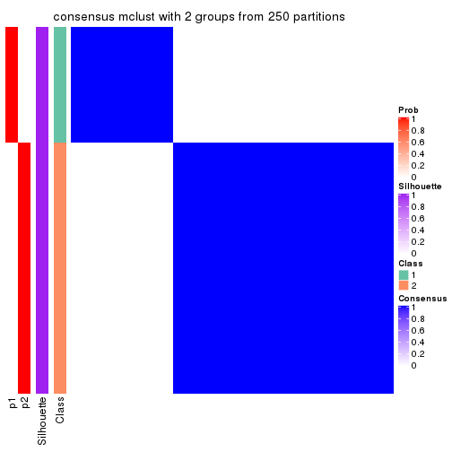</p>

</div>
<div id='tab-ATC-mclust-consensus-heatmap-2'>
<pre><code class="r">consensus_heatmap(res, k = 3)
</code></pre>

<p>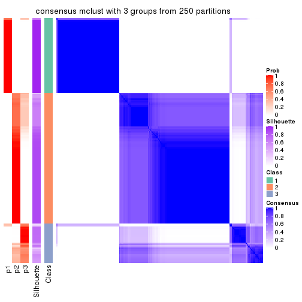</p>

</div>
<div id='tab-ATC-mclust-consensus-heatmap-3'>
<pre><code class="r">consensus_heatmap(res, k = 4)
</code></pre>

<p>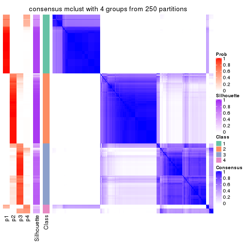</p>

</div>
<div id='tab-ATC-mclust-consensus-heatmap-4'>
<pre><code class="r">consensus_heatmap(res, k = 5)
</code></pre>

<p>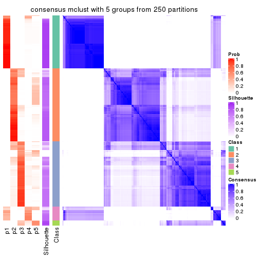</p>

</div>
<div id='tab-ATC-mclust-consensus-heatmap-5'>
<pre><code class="r">consensus_heatmap(res, k = 6)
</code></pre>

<p>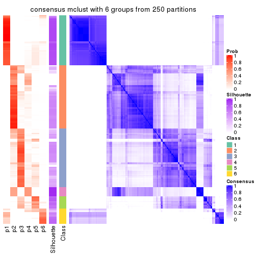</p>

</div>
</div>

Heatmaps for the membership of samples in all partitions to see how consistent they are:


<script>
$( function() {
	$( '#tabs-ATC-mclust-membership-heatmap' ).tabs();
} );
</script>
<div id='tabs-ATC-mclust-membership-heatmap'>
<ul>
<li><a href='#tab-ATC-mclust-membership-heatmap-1'>k = 2</a></li>
<li><a href='#tab-ATC-mclust-membership-heatmap-2'>k = 3</a></li>
<li><a href='#tab-ATC-mclust-membership-heatmap-3'>k = 4</a></li>
<li><a href='#tab-ATC-mclust-membership-heatmap-4'>k = 5</a></li>
<li><a href='#tab-ATC-mclust-membership-heatmap-5'>k = 6</a></li>
</ul>
<div id='tab-ATC-mclust-membership-heatmap-1'>
<pre><code class="r">membership_heatmap(res, k = 2)
</code></pre>

<p></p>

</div>
<div id='tab-ATC-mclust-membership-heatmap-2'>
<pre><code class="r">membership_heatmap(res, k = 3)
</code></pre>

<p>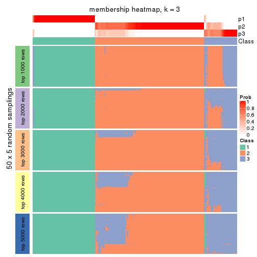</p>

</div>
<div id='tab-ATC-mclust-membership-heatmap-3'>
<pre><code class="r">membership_heatmap(res, k = 4)
</code></pre>

<p>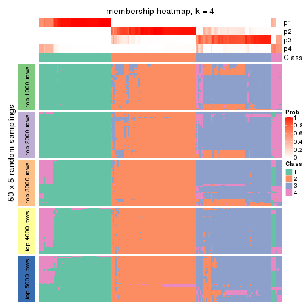</p>

</div>
<div id='tab-ATC-mclust-membership-heatmap-4'>
<pre><code class="r">membership_heatmap(res, k = 5)
</code></pre>

<p>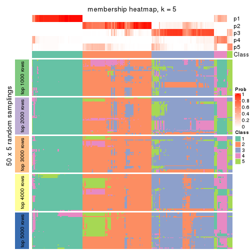</p>

</div>
<div id='tab-ATC-mclust-membership-heatmap-5'>
<pre><code class="r">membership_heatmap(res, k = 6)
</code></pre>

<p>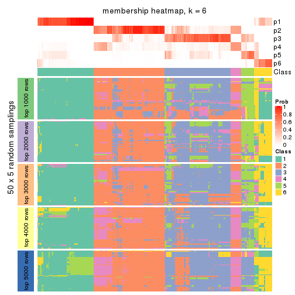</p>

</div>
</div>

As soon as we have had the classes for columns, we can look for signatures
which are significantly different between classes which can be candidate marks
for certain classes. Following are the heatmaps for signatures.


Signature heatmaps where rows are scaled:


<script>
$( function() {
	$( '#tabs-ATC-mclust-get-signatures' ).tabs();
} );
</script>
<div id='tabs-ATC-mclust-get-signatures'>
<ul>
<li><a href='#tab-ATC-mclust-get-signatures-1'>k = 2</a></li>
<li><a href='#tab-ATC-mclust-get-signatures-2'>k = 3</a></li>
<li><a href='#tab-ATC-mclust-get-signatures-3'>k = 4</a></li>
<li><a href='#tab-ATC-mclust-get-signatures-4'>k = 5</a></li>
<li><a href='#tab-ATC-mclust-get-signatures-5'>k = 6</a></li>
</ul>
<div id='tab-ATC-mclust-get-signatures-1'>
<pre><code class="r">get_signatures(res, k = 2)
</code></pre>

<p></p>

</div>
<div id='tab-ATC-mclust-get-signatures-2'>
<pre><code class="r">get_signatures(res, k = 3)
</code></pre>

<p>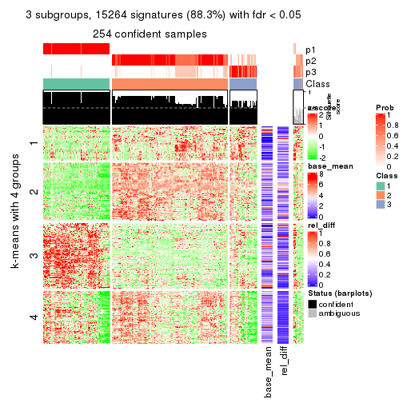</p>

</div>
<div id='tab-ATC-mclust-get-signatures-3'>
<pre><code class="r">get_signatures(res, k = 4)
</code></pre>

<p>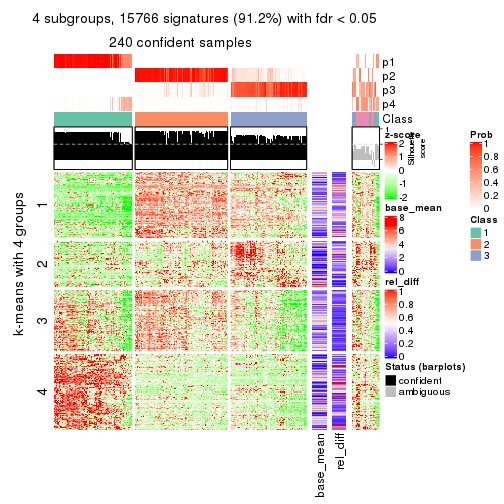</p>

</div>
<div id='tab-ATC-mclust-get-signatures-4'>
<pre><code class="r">get_signatures(res, k = 5)
</code></pre>

<p>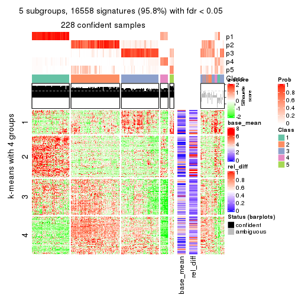</p>

</div>
<div id='tab-ATC-mclust-get-signatures-5'>
<pre><code class="r">get_signatures(res, k = 6)
</code></pre>

<p>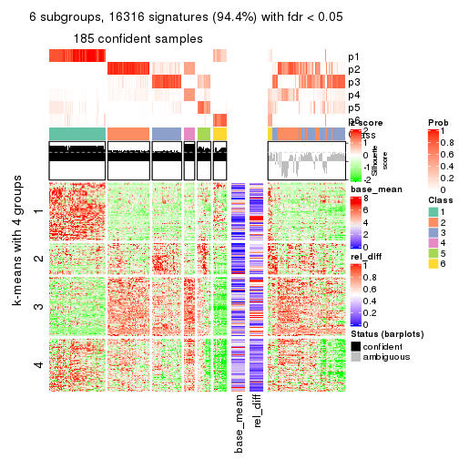</p>

</div>
</div>


Signature heatmaps where rows are not scaled:


<script>
$( function() {
	$( '#tabs-ATC-mclust-get-signatures-no-scale' ).tabs();
} );
</script>
<div id='tabs-ATC-mclust-get-signatures-no-scale'>
<ul>
<li><a href='#tab-ATC-mclust-get-signatures-no-scale-1'>k = 2</a></li>
<li><a href='#tab-ATC-mclust-get-signatures-no-scale-2'>k = 3</a></li>
<li><a href='#tab-ATC-mclust-get-signatures-no-scale-3'>k = 4</a></li>
<li><a href='#tab-ATC-mclust-get-signatures-no-scale-4'>k = 5</a></li>
<li><a href='#tab-ATC-mclust-get-signatures-no-scale-5'>k = 6</a></li>
</ul>
<div id='tab-ATC-mclust-get-signatures-no-scale-1'>
<pre><code class="r">get_signatures(res, k = 2, scale_rows = FALSE)
</code></pre>

<p></p>

</div>
<div id='tab-ATC-mclust-get-signatures-no-scale-2'>
<pre><code class="r">get_signatures(res, k = 3, scale_rows = FALSE)
</code></pre>

<p>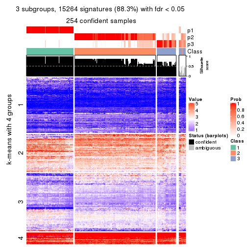</p>

</div>
<div id='tab-ATC-mclust-get-signatures-no-scale-3'>
<pre><code class="r">get_signatures(res, k = 4, scale_rows = FALSE)
</code></pre>

<p>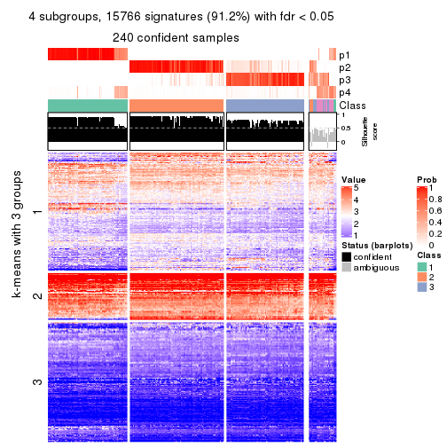</p>

</div>
<div id='tab-ATC-mclust-get-signatures-no-scale-4'>
<pre><code class="r">get_signatures(res, k = 5, scale_rows = FALSE)
</code></pre>

<p>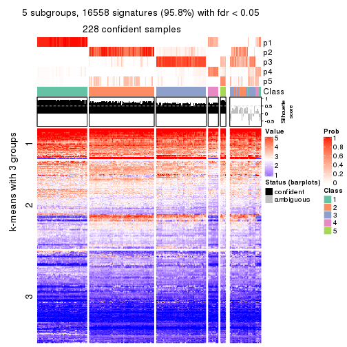</p>

</div>
<div id='tab-ATC-mclust-get-signatures-no-scale-5'>
<pre><code class="r">get_signatures(res, k = 6, scale_rows = FALSE)
</code></pre>

<p>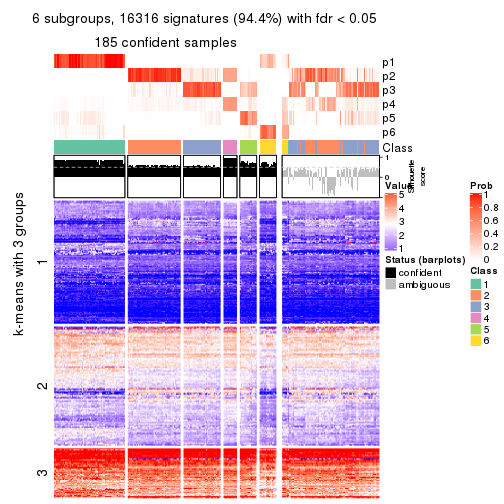</p>

</div>
</div>


Compare the overlap of signatures from different k:

```r
compare_signatures(res)
```

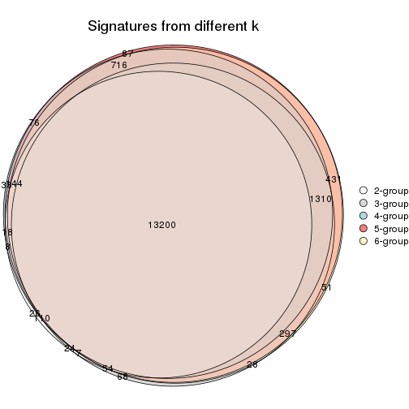

`get_signature()` returns a data frame invisibly. TO get the list of signatures, the function
call should be assigned to a variable explicitly. In following code, if `plot` argument is set
to `FALSE`, no heatmap is plotted while only the differential analysis is performed.

```r
# code only for demonstration
tb = get_signature(res, k = ..., plot = FALSE)
```

An example of the output of `tb` is:

```
#>   which_row         fdr    mean_1    mean_2 scaled_mean_1 scaled_mean_2 km
#> 1        38 0.042760348  8.373488  9.131774    -0.5533452     0.5164555  1
#> 2        40 0.018707592  7.106213  8.469186    -0.6173731     0.5762149  1
#> 3        55 0.019134737 10.221463 11.207825    -0.6159697     0.5749050  1
#> 4        59 0.006059896  5.921854  7.869574    -0.6899429     0.6439467  1
#> 5        60 0.018055526  8.928898 10.211722    -0.6204761     0.5791110  1
#> 6        98 0.009384629 15.714769 14.887706     0.6635654    -0.6193277  2
...
```

The columns in `tb` are:

1. `which_row`: row indices corresponding to the input matrix.
2. `fdr`: FDR for the differential test. 
3. `mean_x`: The mean value in group x.
4. `scaled_mean_x`: The mean value in group x after rows are scaled.
5. `km`: Row groups if k-means clustering is applied to rows.


UMAP plot which shows how samples are separated.


<script>
$( function() {
	$( '#tabs-ATC-mclust-dimension-reduction' ).tabs();
} );
</script>
<div id='tabs-ATC-mclust-dimension-reduction'>
<ul>
<li><a href='#tab-ATC-mclust-dimension-reduction-1'>k = 2</a></li>
<li><a href='#tab-ATC-mclust-dimension-reduction-2'>k = 3</a></li>
<li><a href='#tab-ATC-mclust-dimension-reduction-3'>k = 4</a></li>
<li><a href='#tab-ATC-mclust-dimension-reduction-4'>k = 5</a></li>
<li><a href='#tab-ATC-mclust-dimension-reduction-5'>k = 6</a></li>
</ul>
<div id='tab-ATC-mclust-dimension-reduction-1'>
<pre><code class="r">dimension_reduction(res, k = 2, method = &quot;UMAP&quot;)
</code></pre>

<p>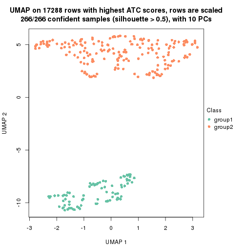</p>

</div>
<div id='tab-ATC-mclust-dimension-reduction-2'>
<pre><code class="r">dimension_reduction(res, k = 3, method = &quot;UMAP&quot;)
</code></pre>

<p>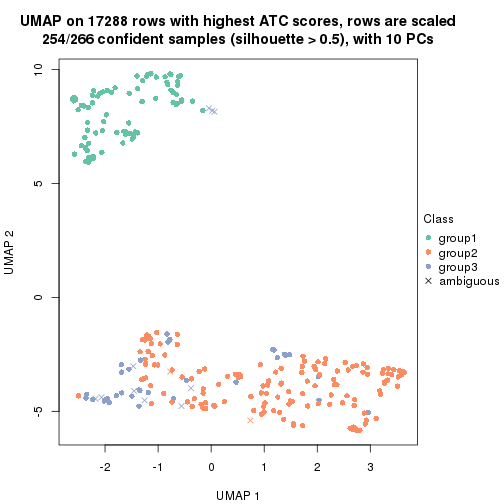</p>

</div>
<div id='tab-ATC-mclust-dimension-reduction-3'>
<pre><code class="r">dimension_reduction(res, k = 4, method = &quot;UMAP&quot;)
</code></pre>

<p>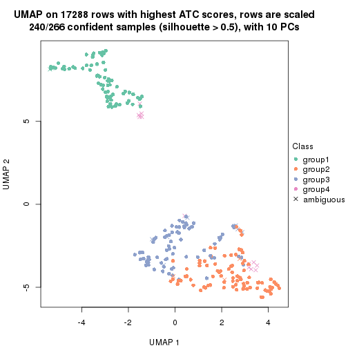</p>

</div>
<div id='tab-ATC-mclust-dimension-reduction-4'>
<pre><code class="r">dimension_reduction(res, k = 5, method = &quot;UMAP&quot;)
</code></pre>

<p>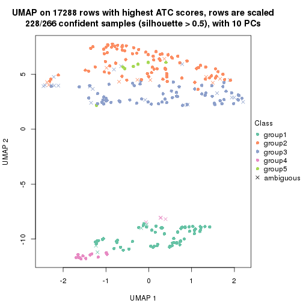</p>

</div>
<div id='tab-ATC-mclust-dimension-reduction-5'>
<pre><code class="r">dimension_reduction(res, k = 6, method = &quot;UMAP&quot;)
</code></pre>

<p>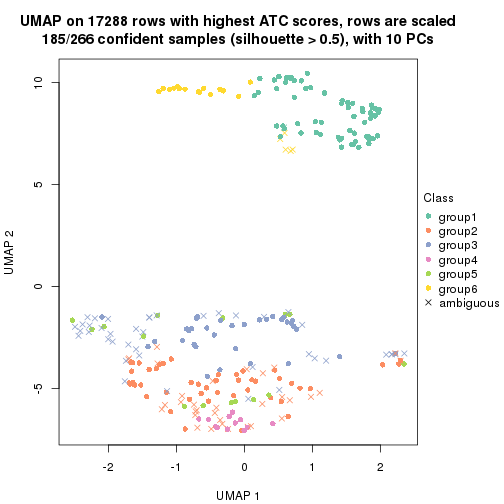</p>

</div>
</div>


Following heatmap shows how subgroups are split when increasing `k`:

```r
collect_classes(res)
```

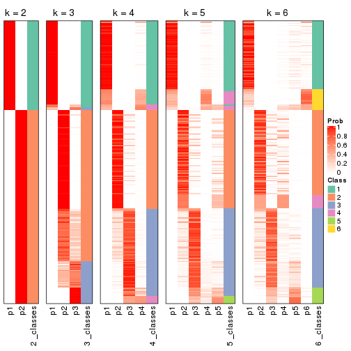


If matrix rows can be associated to genes, consider to use `GO_Enrichment(res,
...)` to perform function enrichment for the signature genes.


 

---------------------------------------------------


### ATC:NMF**


The object with results only for a single top-value method and a single partition method 
can be extracted as:

```r
res = res_list["ATC", "NMF"]
# you can also extract it by
# res = res_list["ATC:NMF"]
```

A summary of `res` and all the functions that can be applied to it:

```r
res
```

```
#> A 'ConsensusPartition' object with k = 2, 3, 4, 5, 6.
#>   On a matrix with 17288 rows and 266 columns.
#>   Top rows (1000, 2000, 3000, 4000, 5000) are extracted by 'ATC' method.
#>   Subgroups are detected by 'NMF' method.
#>   Performed in total 1250 partitions by row resampling.
#>   Best k for subgroups seems to be 2.
#> 
#> Following methods can be applied to this 'ConsensusPartition' object:
#>  [1] "cola_report"             "collect_classes"         "collect_plots"          
#>  [4] "collect_stats"           "colnames"                "compare_signatures"     
#>  [7] "consensus_heatmap"       "dimension_reduction"     "functional_enrichment"  
#> [10] "get_anno_col"            "get_anno"                "get_classes"            
#> [13] "get_consensus"           "get_matrix"              "get_membership"         
#> [16] "get_param"               "get_signatures"          "get_stats"              
#> [19] "is_best_k"               "is_stable_k"             "membership_heatmap"     
#> [22] "ncol"                    "nrow"                    "plot_ecdf"              
#> [25] "rownames"                "select_partition_number" "show"                   
#> [28] "suggest_best_k"          "test_to_known_factors"
```

`collect_plots()` function collects all the plots made from `res` for all `k` (number of partitions)
into one single page to provide an easy and fast comparison between different `k`.

```r
collect_plots(res)
```

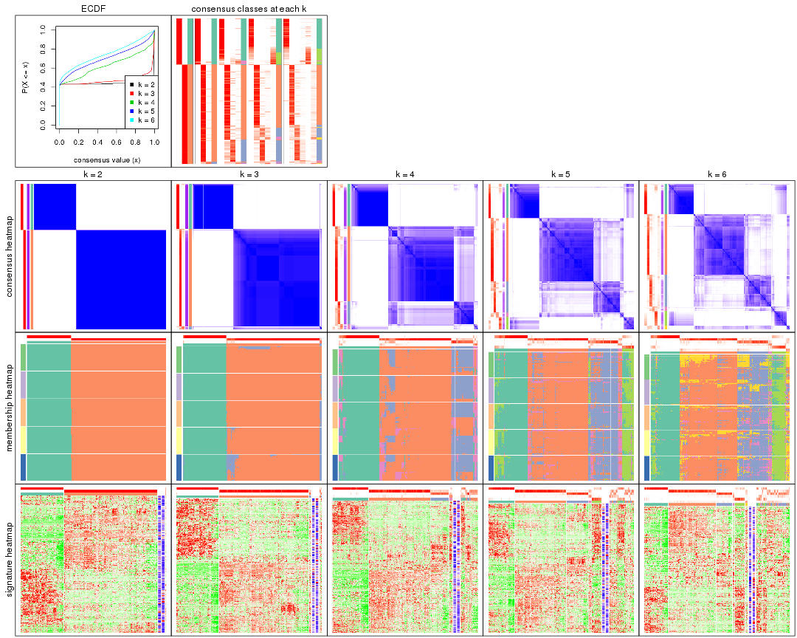

The plots are:

- The first row: a plot of the ECDF (Empirical cumulative distribution
  function) curves of the consensus matrix for each `k` and the heatmap of
  predicted classes for each `k`.
- The second row: heatmaps of the consensus matrix for each `k`.
- The third row: heatmaps of the membership matrix for each `k`.
- The fouth row: heatmaps of the signatures for each `k`.

All the plots in panels can be made by individual functions and they are
plotted later in this section.

`select_partition_number()` produces several plots showing different
statistics for choosing "optimized" `k`. There are following statistics:

- ECDF curves of the consensus matrix for each `k`;
- 1-PAC. [The PAC
  score](https://en.wikipedia.org/wiki/Consensus_clustering#Over-interpretation_potential_of_consensus_clustering)
  measures the proportion of the ambiguous subgrouping.
- Mean silhouette score.
- Concordance. The mean probability of fiting the consensus class ids in all
  partitions.
- Area increased. Denote $A_k$ as the area under the ECDF curve for current
  `k`, the area increased is defined as $A_k - A_{k-1}$.
- Rand index. The percent of pairs of samples that are both in a same cluster
  or both are not in a same cluster in the partition of k and k-1.
- Jaccard index. The ratio of pairs of samples are both in a same cluster in
  the partition of k and k-1 and the pairs of samples are both in a same
  cluster in the partition k or k-1.

The detailed explanations of these statistics can be found in [the cola
vignette](http://bioconductor.org/packages/devel/bioc/vignettes/cola/inst/doc/cola.html#toc_13).

Generally speaking, lower PAC score, higher mean silhouette score or higher
concordance corresponds to better partition. Rand index and Jaccard index
measure how similar the current partition is compared to partition with `k-1`.
If they are too similar, we won't accept `k` is better than `k-1`.

```r
select_partition_number(res)
```

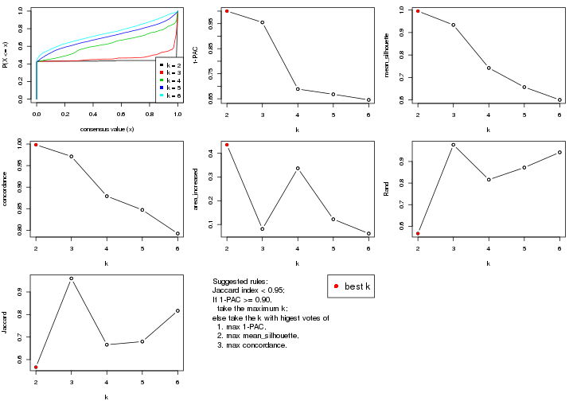

The numeric values for all these statistics can be obtained by `get_stats()`.

```r
get_stats(res)
```

```
#>   k 1-PAC mean_silhouette concordance area_increased  Rand Jaccard
#> 2 2 1.000           0.995       0.998         0.4356 0.566   0.566
#> 3 3 0.955           0.934       0.971         0.0812 0.977   0.960
#> 4 4 0.689           0.742       0.879         0.3366 0.816   0.666
#> 5 5 0.668           0.657       0.847         0.1221 0.872   0.680
#> 6 6 0.646           0.600       0.792         0.0620 0.942   0.817
```

`suggest_best_k()` suggests the best $k$ based on these statistics. The rules are as follows:

- All $k$ with Jaccard index larger than 0.95 are removed because the increase of
  the partition number does not provides enough extra information. If all $k$ are removed,
  the best $k$ is assigned by `NA`.
- For $k$ with 1-PAC larger than 0.9, the maximal $k$ is taken as the "best k". Other $k$ is called "optional k".
- If it does not fit the second rule. The $k$ with the highest vote of highest
  1-PAC, mean silhouette and concordance is taken as the "best k".

```r
suggest_best_k(res)
```

```
#> [1] 2
```


Following shows the table of the partitions (You need to click the **show/hide
code output** link to see it). The membership matrix (columns with name `p*`)
is inferred by
[`clue::cl_consensus()`](https://www.rdocumentation.org/link/cl_consensus?package=clue)
function with the `SE` method. Basically the value in the membership matrix
represents the probability to belong to a certain group. The finall class
label for an item is determined with the group with highest probability it
belongs to.

In `get_classes()` function, the entropy is calculated from the membership
matrix and the silhouette score is calculated from the consensus matrix.


<script>
$( function() {
	$( '#tabs-ATC-NMF-get-classes' ).tabs();
} );
</script>
<div id='tabs-ATC-NMF-get-classes'>
<ul>
<li><a href='#tab-ATC-NMF-get-classes-1'>k = 2</a></li>
<li><a href='#tab-ATC-NMF-get-classes-2'>k = 3</a></li>
<li><a href='#tab-ATC-NMF-get-classes-3'>k = 4</a></li>
<li><a href='#tab-ATC-NMF-get-classes-4'>k = 5</a></li>
<li><a href='#tab-ATC-NMF-get-classes-5'>k = 6</a></li>
</ul>

<div id='tab-ATC-NMF-get-classes-1'>
<p><a id='tab-ATC-NMF-get-classes-1-a' style='color:#0366d6' href='#'>show/hide code output</a></p>
<pre><code class="r">cbind(get_classes(res, k = 2), get_membership(res, k = 2))
</code></pre>

<pre><code>#&gt;                                      class entropy silhouette    p1    p2
#&gt; 80D0AF10-1C61-4B67-90C1-7DBF1EF23672     2  0.0000      0.998 0.000 1.000
#&gt; 87117BE1-D328-4972-85DA-6672412D8860     2  0.0000      0.998 0.000 1.000
#&gt; F904C5B6-70BD-4604-8254-79BE23B152DA     1  0.0000      1.000 1.000 0.000
#&gt; 3182DEA1-4239-4613-925A-7E6503766AD6     2  0.0000      0.998 0.000 1.000
#&gt; 55E78EA2-2D9B-481F-8CAB-D36A33088EAE     2  0.0000      0.998 0.000 1.000
#&gt; 86F94264-A6DD-4A97-9191-036F066DD0EF     2  0.0000      0.998 0.000 1.000
#&gt; 09D25417-23B7-4D88-A0EA-F307985FBBBC     2  0.0000      0.998 0.000 1.000
#&gt; C797F12C-40D3-4DB5-B9EF-A6821BBDE4F0     1  0.0000      1.000 1.000 0.000
#&gt; 80275DB0-A226-4B6B-A08F-4ADBEEE1DB01     1  0.0000      1.000 1.000 0.000
#&gt; 27FB653A-9E07-44AD-952E-9E4DE4AB5891     2  0.0000      0.998 0.000 1.000
#&gt; 1A5DB9FC-2ABD-4E1B-B5EF-B1CF5E5F3872     1  0.0000      1.000 1.000 0.000
#&gt; 844E4CCD-D30C-416F-A086-8923711A4E25     2  0.0000      0.998 0.000 1.000
#&gt; EF18318D-3D25-4D65-803A-ED6E62871E7E     1  0.0000      1.000 1.000 0.000
#&gt; 1ACB1BE0-61F6-4243-BBEC-E26A1CF90CA8     1  0.0000      1.000 1.000 0.000
#&gt; 8EF0039B-D758-46AB-BAF7-6A062C7C56BA     1  0.0000      1.000 1.000 0.000
#&gt; 22F4C9D9-663B-4C91-9692-E035A2640BEC     2  0.0000      0.998 0.000 1.000
#&gt; FA1A0BCE-EE0F-4178-B963-62550E344B14     2  0.0000      0.998 0.000 1.000
#&gt; 0B6D0C4E-5AE3-4707-A9FC-12A108E6EC2A     2  0.0000      0.998 0.000 1.000
#&gt; 06FD3123-2AEB-4911-AC4E-E0E64FD5DB52     2  0.0000      0.998 0.000 1.000
#&gt; 235A4492-FF80-4AA5-BC71-DFF65E1C7411     2  0.0000      0.998 0.000 1.000
#&gt; A192C6C0-1443-4493-AFAC-1EE710628ADB     2  0.0000      0.998 0.000 1.000
#&gt; 6FC5B56B-711B-4174-9B06-4E843124AAB6     1  0.0000      1.000 1.000 0.000
#&gt; 7A813F60-A41E-4552-990E-F22287654C1D     2  0.0000      0.998 0.000 1.000
#&gt; 725BBFB5-26F4-4512-9C75-47D013C1E605     1  0.0000      1.000 1.000 0.000
#&gt; 39CC4E82-EBC9-472E-8BE5-6A3AB178449A     2  0.0000      0.998 0.000 1.000
#&gt; 61130DEE-E267-49DF-8B41-7738A06EF738     2  0.0000      0.998 0.000 1.000
#&gt; 117EC12C-B7ED-4E01-B29B-EA542D356EA1     1  0.0000      1.000 1.000 0.000
#&gt; A30FF708-F7A9-41E4-8AD5-20441650FBC9     2  0.0000      0.998 0.000 1.000
#&gt; 53640D52-1167-4A5D-B656-97D32CBA3934     1  0.0000      1.000 1.000 0.000
#&gt; 9E85D76A-DD2A-46D5-BB59-0ED302B6258C     2  0.0000      0.998 0.000 1.000
#&gt; 6F8C6F90-7E3C-4860-91DD-586708DE44AA     1  0.0000      1.000 1.000 0.000
#&gt; E675AEC5-AA9A-4AAA-839C-03E6365822DB     2  0.0000      0.998 0.000 1.000
#&gt; B577DEF7-2F5C-4876-A7C6-F18D5722B8C0     1  0.0000      1.000 1.000 0.000
#&gt; DA8B577E-43E7-49BF-BF94-868E3194F5C9     1  0.0000      1.000 1.000 0.000
#&gt; 3334280B-2A36-4AC7-A021-A76C10E958F0     2  0.0000      0.998 0.000 1.000
#&gt; 5CBDDC90-11EC-4E6E-881E-AA9CCFD40FDB     2  0.0000      0.998 0.000 1.000
#&gt; 8CBBF32A-8349-44F5-A8B8-4CBB1760A464     2  0.0000      0.998 0.000 1.000
#&gt; B9455A9A-136D-4DC2-9F86-0FC74433589D     2  0.0000      0.998 0.000 1.000
#&gt; D7EAE2A7-F9BE-4222-A452-B1F83F99CD50     2  0.0000      0.998 0.000 1.000
#&gt; F803AE18-60C5-4CFE-AAAB-DB33C26A2184     1  0.0000      1.000 1.000 0.000
#&gt; 5DD8CAC7-EC02-43B6-B58E-6D2E22868A3B     2  0.0000      0.998 0.000 1.000
#&gt; EE98E1B4-DFB3-4AEC-8527-E1FD544C9475     1  0.0000      1.000 1.000 0.000
#&gt; 3CE43921-47D5-4394-B9E1-242607775D61     2  0.0000      0.998 0.000 1.000
#&gt; 46986F2B-0B0D-4187-8948-4E91D34B7C49     2  0.0000      0.998 0.000 1.000
#&gt; 5D1D052E-74EF-45A8-9B1A-7CECD13EA43B     2  0.0000      0.998 0.000 1.000
#&gt; 4C821AD9-A5C9-4A9A-9C5D-363B227F8064     2  0.0000      0.998 0.000 1.000
#&gt; 06A4189E-A23B-4AC6-AA74-01955DD7D1E9     2  0.0000      0.998 0.000 1.000
#&gt; FCCDC76F-CB02-4BCD-A616-325F258DDAA4     2  0.0000      0.998 0.000 1.000
#&gt; DAC53B0A-8F35-4EA6-BBCC-4CD1C049E11F     2  0.0000      0.998 0.000 1.000
#&gt; DD4F845B-CAD3-44CB-9D96-3C3F5BA1B72D     1  0.0000      1.000 1.000 0.000
#&gt; D440F004-A4A4-41B6-BED8-805D67BA01C7     2  0.0000      0.998 0.000 1.000
#&gt; A497C423-119F-42FA-BF17-9F6DFD2A5585     2  0.0000      0.998 0.000 1.000
#&gt; 3420E573-DE12-4EF5-B1C0-2FCA904F4F4E     1  0.0000      1.000 1.000 0.000
#&gt; 1AD72157-A254-44B4-BA58-4F30F1AE910E     1  0.0000      1.000 1.000 0.000
#&gt; C1113977-B160-45EE-B061-750F9EA3F33F     2  0.0000      0.998 0.000 1.000
#&gt; 6783AB5B-F07C-447B-BF13-C34485D246D7     2  0.0000      0.998 0.000 1.000
#&gt; 1F553062-26FD-4A7F-B7FB-81184604F423     1  0.0000      1.000 1.000 0.000
#&gt; BE2DCA51-1C21-4598-98A7-F2FB9B2DFCB4     2  0.0000      0.998 0.000 1.000
#&gt; 38941CF3-9C54-4BA4-A005-CC88CA97D504     2  0.0000      0.998 0.000 1.000
#&gt; 51CB675E-E243-4A07-BF4A-580473D26FDA     2  0.0000      0.998 0.000 1.000
#&gt; C7FED0F5-C27A-4405-9232-30BF39362CF7     2  0.0000      0.998 0.000 1.000
#&gt; 2A1E86E8-4713-465F-ACFF-C584864C57A1     2  0.0000      0.998 0.000 1.000
#&gt; B4500785-0FAA-4D4D-8630-43D194BAB004     2  0.0000      0.998 0.000 1.000
#&gt; 3FD52E66-AB76-4079-80DB-281A795D1EC0     2  0.0000      0.998 0.000 1.000
#&gt; EBD355D1-1226-4DFD-AAFF-45D246B64F3C     2  0.0000      0.998 0.000 1.000
#&gt; 5A040A73-CD95-487E-8AEF-9639FE4E2916     2  0.0000      0.998 0.000 1.000
#&gt; CF629C65-585D-476D-B081-3E6E0575FAE3     2  0.9896      0.214 0.440 0.560
#&gt; 0D4202A3-808E-413F-9BF3-9CFCCAE0ED61     2  0.0000      0.998 0.000 1.000
#&gt; 43E715BF-28D9-4B5E-B762-8CD1B69A430E     1  0.0000      1.000 1.000 0.000
#&gt; BFB82BE8-9DAC-4099-8B38-0950308E3EB3     2  0.0000      0.998 0.000 1.000
#&gt; F7CB1825-2303-4DD2-AE1F-7205738EAF1F     1  0.0000      1.000 1.000 0.000
#&gt; FE298483-C42C-4753-BABB-29A9CB1B6312     1  0.0000      1.000 1.000 0.000
#&gt; A98C7561-1B42-4CD6-AE71-924B91FA4C33     2  0.0000      0.998 0.000 1.000
#&gt; 58098F21-7DAB-47DA-9A41-8D20BF3B9257     2  0.0000      0.998 0.000 1.000
#&gt; 18CAF708-20B9-4745-9CB3-37AB6E0B3056     2  0.0000      0.998 0.000 1.000
#&gt; 2C80DD72-C9C7-4AC2-812F-9A31EF02779C     1  0.0000      1.000 1.000 0.000
#&gt; 68A3F13D-319D-4603-A27F-B5DD46FE5C5B     2  0.0000      0.998 0.000 1.000
#&gt; 7EE8F0CE-CDC9-40F9-A1DE-7F8140EC6D13     2  0.0000      0.998 0.000 1.000
#&gt; 39019903-5B9C-4665-BD5F-7CCB19CB55C5     2  0.0000      0.998 0.000 1.000
#&gt; 190EDB27-4CBC-4E9C-9B67-D51FDAB982B7     2  0.0000      0.998 0.000 1.000
#&gt; EB2D95BC-62F8-4669-9308-D37D7FB79E23     2  0.0000      0.998 0.000 1.000
#&gt; A08B85EA-D1E7-4B77-8DEC-36294305B9F7     1  0.0000      1.000 1.000 0.000
#&gt; 130DDFAD-6EF8-4C80-BD9D-88308A6874BC     2  0.0000      0.998 0.000 1.000
#&gt; 7340A5BA-E002-448F-AACC-E7A37DBB79C2     2  0.0000      0.998 0.000 1.000
#&gt; A771F6E3-D266-4FE7-98C6-C40E6A701D59     1  0.0000      1.000 1.000 0.000
#&gt; 015E792C-EC1B-49BF-AB07-D82B20C5989A     2  0.0000      0.998 0.000 1.000
#&gt; BF79E030-47EE-4D08-B910-5685A4BD8B60     2  0.0000      0.998 0.000 1.000
#&gt; FB3C7C9A-2F2D-4DD5-BE47-FAFB072C0FAB     2  0.0000      0.998 0.000 1.000
#&gt; 4E5557BA-10E8-4723-908E-DD04EF6639B2     2  0.0000      0.998 0.000 1.000
#&gt; 8031B550-40A9-4A3A-9F7D-CDC052288BD8     2  0.0000      0.998 0.000 1.000
#&gt; 55299A06-3C1F-45A4-B166-B2C591C0CEE2     2  0.0000      0.998 0.000 1.000
#&gt; EB8D5168-216E-4ABB-8B4E-9E67786CB322     1  0.0000      1.000 1.000 0.000
#&gt; 78BD2D83-9A7F-42E5-BB38-654AA0761A0A     2  0.0000      0.998 0.000 1.000
#&gt; AA2D53E5-D389-4332-9DD5-A736052E48F8     1  0.0000      1.000 1.000 0.000
#&gt; 62945C7A-9313-4FC9-820C-B0AB820B394E     1  0.0000      1.000 1.000 0.000
#&gt; 22746046-2E99-4EE9-97D2-BA2EA499634C     2  0.0000      0.998 0.000 1.000
#&gt; 8671B51B-DCBE-4429-9F01-AF51CAD7014F     2  0.0000      0.998 0.000 1.000
#&gt; E815AB36-5689-4A0D-8E6D-2EAA73406681     1  0.0000      1.000 1.000 0.000
#&gt; A1DACB46-ED52-4E38-B2C8-57256BB22B5E     2  0.0000      0.998 0.000 1.000
#&gt; 4F5498C4-A423-4B3D-AC98-D4E214A57D0E     1  0.0000      1.000 1.000 0.000
#&gt; A7772CCD-FFFF-49DD-86ED-0BAD330EC9B6     2  0.0000      0.998 0.000 1.000
#&gt; E6E3DF78-65B9-4F74-8DA8-E2A6D4EDBEA7     2  0.0000      0.998 0.000 1.000
#&gt; 83286E2D-E708-437A-911A-E6B050273CBD     1  0.0000      1.000 1.000 0.000
#&gt; EC5C7C97-EE8C-405D-A039-D96514B1D414     2  0.0000      0.998 0.000 1.000
#&gt; 3E55223D-6E3D-4027-9819-67E91212531D     1  0.0000      1.000 1.000 0.000
#&gt; 99A036A2-8343-4D06-8047-D84E96CE4C61     2  0.0000      0.998 0.000 1.000
#&gt; CA6CDE6D-92DE-4259-9E58-A373F2D543EA     2  0.0000      0.998 0.000 1.000
#&gt; BF6FA8CC-60C1-413A-B2C6-54CCACBC01D6     1  0.0000      1.000 1.000 0.000
#&gt; E0594CFE-F7B6-4546-B130-30DF6A514B1F     2  0.0000      0.998 0.000 1.000
#&gt; E769E41D-5949-42C5-9594-E563C05ACE52     2  0.0000      0.998 0.000 1.000
#&gt; 01373725-5D3C-4D9C-AABC-911D53E62BCD     2  0.0000      0.998 0.000 1.000
#&gt; 1F39DADD-3655-474E-BA4C-A5BD32C97A8B     1  0.0000      1.000 1.000 0.000
#&gt; AF573EC8-E4EE-4B8F-8199-9817B9FAC67D     1  0.0000      1.000 1.000 0.000
#&gt; 3F022CBC-41C8-4387-A6FB-124C4BCD1AD9     1  0.0000      1.000 1.000 0.000
#&gt; 1CC32ACE-826B-494B-8B89-5BD92327A74D     2  0.0000      0.998 0.000 1.000
#&gt; 22B0BD3B-EE08-4BC7-90B2-01C372A56BA2     2  0.0000      0.998 0.000 1.000
#&gt; 0F3DE9EF-19CC-4D14-9A42-1435DB537F94     2  0.0000      0.998 0.000 1.000
#&gt; 87F8A33F-FBC3-469E-862B-84472F796358     2  0.0000      0.998 0.000 1.000
#&gt; C9F2FA0D-1A9F-40B4-BD9B-CAF1B3F3D5A7     2  0.0000      0.998 0.000 1.000
#&gt; ACFC9F59-78FF-4453-B25F-8834D0EAB54A     2  0.0000      0.998 0.000 1.000
#&gt; B7AC7D5B-14E9-45A7-93B7-226EE508544A     2  0.0000      0.998 0.000 1.000
#&gt; 4491BF17-B168-4E96-8E09-EF1AEC9F5E9D     2  0.0000      0.998 0.000 1.000
#&gt; 557A0811-A3FE-4CF4-A24D-FBB77E7F9139     2  0.0000      0.998 0.000 1.000
#&gt; 6F9C955C-6816-4353-922A-8035B50FACC6     2  0.0000      0.998 0.000 1.000
#&gt; 3E89FB1C-4A7D-43C7-823C-04E3716A7935     2  0.0000      0.998 0.000 1.000
#&gt; 12ABE483-66EF-4237-94C4-0199FAE23FA8     2  0.0000      0.998 0.000 1.000
#&gt; 7535F262-9B96-44F6-988C-4C9EBB3FFCA9     2  0.0000      0.998 0.000 1.000
#&gt; 65C9D28E-303B-40E5-84F0-2507F5457374     2  0.0000      0.998 0.000 1.000
#&gt; FD445384-6BA9-4297-9D9C-12ABA7D645C7     1  0.0000      1.000 1.000 0.000
#&gt; 30D5E255-2AD3-44F3-8983-1B80E4FD3E2D     2  0.0000      0.998 0.000 1.000
#&gt; 3E88EC60-B4A8-4259-8BC8-A234800F6955     2  0.0000      0.998 0.000 1.000
#&gt; ACD73CE8-AFC5-47A0-9383-3CB97F018953     1  0.0000      1.000 1.000 0.000
#&gt; 1AFDC2EA-26A8-44E2-8BCB-F34F7B66F8C8     2  0.0000      0.998 0.000 1.000
#&gt; 9E327BC8-1D20-4AD8-83F7-FB2D13BCA5D0     2  0.0000      0.998 0.000 1.000
#&gt; 85A86B91-4F24-4E77-AE2D-520F8E205EFC     1  0.0000      1.000 1.000 0.000
#&gt; 74868C37-8143-4306-81CA-E45759D146CD     2  0.0000      0.998 0.000 1.000
#&gt; 69AEA0DB-E335-48A0-A398-4FB0D581182A     2  0.0000      0.998 0.000 1.000
#&gt; AE6F8B89-85C2-42B7-8D05-AFDDD4FEFD16     1  0.0000      1.000 1.000 0.000
#&gt; A8A6F09C-9812-4457-9A4B-AD41F97B41A3     2  0.0000      0.998 0.000 1.000
#&gt; 1A09BC4D-EF29-42DD-BB04-A3C264A3032D     1  0.0000      1.000 1.000 0.000
#&gt; E0961A30-A62C-4235-9CF0-A1776827A996     2  0.0000      0.998 0.000 1.000
#&gt; 134D2D90-7B08-4F20-8A3A-C77643FB208F     2  0.0000      0.998 0.000 1.000
#&gt; A77C2DFF-93CF-4CB5-B3C1-81133D7F1A0F     2  0.0000      0.998 0.000 1.000
#&gt; EA2DC457-9C74-4B9C-B3FA-5E72199B24A7     2  0.0000      0.998 0.000 1.000
#&gt; FF34117B-5EE4-4C96-A8A2-2CE6A654CBE5     1  0.0000      1.000 1.000 0.000
#&gt; 75F7B5E2-6559-4B48-A2A4-287C35C559CC     1  0.0000      1.000 1.000 0.000
#&gt; 903BF591-B0AF-4BEE-B625-60B673070344     2  0.0000      0.998 0.000 1.000
#&gt; 9DE1B790-C63C-41C4-9477-CE52A8119C67     2  0.0000      0.998 0.000 1.000
#&gt; 9A28F80A-85F8-40E2-A32B-230EF93B2FA0     2  0.0000      0.998 0.000 1.000
#&gt; 0AA2BDBB-8720-409A-AA72-1F4AA26E7CD8     2  0.0000      0.998 0.000 1.000
#&gt; 5AD49F16-E974-4E5D-B1B6-073ECB73A01D     2  0.0672      0.990 0.008 0.992
#&gt; CB0F961C-527D-4A48-9408-286B26BD9532     1  0.0000      1.000 1.000 0.000
#&gt; 46FF25B6-D01D-4CA7-80B7-CEC2998C34E1     2  0.0000      0.998 0.000 1.000
#&gt; 487CADE1-D699-4A6C-817A-B9A0AB940C61     1  0.0000      1.000 1.000 0.000
#&gt; 4FF6F2D8-F869-4735-A4D1-1A8423153FBC     1  0.0000      1.000 1.000 0.000
#&gt; 6005494F-5D3D-43A3-B3E8-8C91955B2A98     2  0.0000      0.998 0.000 1.000
#&gt; CF10D584-CE32-45A4-A932-E9D5AF12A6A0     1  0.0000      1.000 1.000 0.000
#&gt; E15CE4AB-5646-49C8-9CD6-938457036BB0     2  0.0000      0.998 0.000 1.000
#&gt; 31E28D0B-0E69-4330-82ED-4F1827DC97EA     2  0.0000      0.998 0.000 1.000
#&gt; DBACD3C3-CCB5-4478-BA78-85A0C847CA66     2  0.0000      0.998 0.000 1.000
#&gt; 5A07041C-65EB-4FCD-8940-E90B905061B5     2  0.0000      0.998 0.000 1.000
#&gt; 0EA7C916-FA47-489B-BC98-4D9E7D197628     1  0.0000      1.000 1.000 0.000
#&gt; 30967F75-8499-47FF-ADA4-4DC566013F7B     1  0.0000      1.000 1.000 0.000
#&gt; D2E528FF-AEA2-48D7-A60A-4C3E71EA9073     2  0.0000      0.998 0.000 1.000
#&gt; 22735DCD-215E-48BC-BF44-32BD66F06E39     2  0.0000      0.998 0.000 1.000
#&gt; BC2C3248-7FC6-48BC-96C1-45EA573DE7DC     1  0.0000      1.000 1.000 0.000
#&gt; E72CEBCB-D686-4B12-BCBA-EC8F964330A2     1  0.0000      1.000 1.000 0.000
#&gt; 23C937BB-BA20-4440-B680-914229CC3ADF     1  0.0000      1.000 1.000 0.000
#&gt; 947E99C7-F402-4F1A-A6E9-81BCAAED135A     2  0.0000      0.998 0.000 1.000
#&gt; 02475D11-FC81-4E88-944E-173C32DC3FE7     2  0.0000      0.998 0.000 1.000
#&gt; F972A9AA-9842-4343-A533-A795E65581CE     1  0.0000      1.000 1.000 0.000
#&gt; 05043AAF-3095-4C61-B5C1-EE9AA9082C75     2  0.0000      0.998 0.000 1.000
#&gt; CECF7967-862E-428C-BB42-FEF553FDB3AA     2  0.0000      0.998 0.000 1.000
#&gt; FB0B9483-6302-48C7-BE5B-DA667E00AE2D     2  0.0000      0.998 0.000 1.000
#&gt; 78700FBA-1487-4754-9B30-18837BF7E9FB     1  0.0000      1.000 1.000 0.000
#&gt; 2166F56D-54CE-4F1B-8F07-A4E13E4489E9     1  0.0000      1.000 1.000 0.000
#&gt; 7CD0942E-E39A-43A7-8BAC-F25967864901     2  0.0000      0.998 0.000 1.000
#&gt; 3B00BA2B-7F7D-4825-8F8D-90F04A5DE687     2  0.0000      0.998 0.000 1.000
#&gt; 7465B01D-C05E-4FE0-A9FE-182920EDC489     2  0.0000      0.998 0.000 1.000
#&gt; 88C31A99-F96E-4FC8-8B3D-C1AAA05062D9     1  0.0000      1.000 1.000 0.000
#&gt; 53575575-3303-4F8F-B6A8-B42131CFB4AC     2  0.0000      0.998 0.000 1.000
#&gt; CC8017C7-4128-48DA-8E43-503F63158D85     1  0.0000      1.000 1.000 0.000
#&gt; 88449D2A-2A25-41A4-B91D-C99B58F8ECD9     2  0.0000      0.998 0.000 1.000
#&gt; 46C7DDE5-A2B5-494F-96AE-0B6E2D51B003     1  0.0000      1.000 1.000 0.000
#&gt; 42551D05-5EE5-4F91-93A8-32DA695D9DFA     2  0.0000      0.998 0.000 1.000
#&gt; 0772DA48-3A36-422D-B166-CA1691B782C3     2  0.0000      0.998 0.000 1.000
#&gt; 30346897-EC77-4153-88A2-D14593C8B741     2  0.0000      0.998 0.000 1.000
#&gt; 0F00E267-C748-4A71-8B36-03C410641D88     2  0.0000      0.998 0.000 1.000
#&gt; 4034703A-4DA9-4DDA-9CA9-E80FFE9CCDE6     2  0.0000      0.998 0.000 1.000
#&gt; 393C8A41-CF45-4EA8-AFE3-25A08AB7692A     2  0.0000      0.998 0.000 1.000
#&gt; 3354212D-A07C-435C-8B0C-9A7BAAB624B5     1  0.0000      1.000 1.000 0.000
#&gt; 57E30D4E-ABF7-47DD-92BE-40CE215076B0     1  0.0000      1.000 1.000 0.000
#&gt; 202B4C76-C840-4DB8-953F-AC75A4156FDD     2  0.0000      0.998 0.000 1.000
#&gt; 93A0137B-1F4C-44EE-B959-2AD0CD2DF8B6     1  0.0000      1.000 1.000 0.000
#&gt; C9794DB6-6E8C-4AFD-80EE-61D672A4F6E9     2  0.0000      0.998 0.000 1.000
#&gt; AE4BFE63-F0C0-4624-AD97-4F7FF13E2384     1  0.0000      1.000 1.000 0.000
#&gt; DCF87F27-2B54-42D9-8D28-5DFEE76E2F5B     2  0.0000      0.998 0.000 1.000
#&gt; 2451D405-39FD-4812-958C-23462B66F1F1     2  0.0000      0.998 0.000 1.000
#&gt; E27F5D33-3F68-4CA8-8757-A387C6EAD060     2  0.0000      0.998 0.000 1.000
#&gt; 8BA9928A-5B93-477F-B4A2-D031B714D9AC     1  0.0000      1.000 1.000 0.000
#&gt; 0FAACFF6-B50C-4BED-9824-B7270654F28D     2  0.0000      0.998 0.000 1.000
#&gt; 3366CC3C-2BBA-4CA7-848E-4E16AA70AE7A     2  0.0000      0.998 0.000 1.000
#&gt; 66237056-CA9A-4C90-AF0E-1621FEB71578     2  0.0000      0.998 0.000 1.000
#&gt; C480F1FB-3100-436C-B0F5-DED63B7A580E     2  0.0000      0.998 0.000 1.000
#&gt; A327DE0D-D945-4B42-9B41-A7302CF796EE     2  0.0000      0.998 0.000 1.000
#&gt; E8A6871D-67FB-4306-9454-F5E7CDBA399A     2  0.0000      0.998 0.000 1.000
#&gt; E9A7485B-82B6-4BD2-AFBB-DD0A82D6CDE2     1  0.0000      1.000 1.000 0.000
#&gt; 93B382E4-9C9A-43F5-BD3B-502CC260B886     1  0.0000      1.000 1.000 0.000
#&gt; A2792419-8E16-45FE-A524-17851F34AB9B     2  0.0000      0.998 0.000 1.000
#&gt; 4DED1201-F25C-4F82-BABF-965EFAD7A8E5     2  0.0000      0.998 0.000 1.000
#&gt; F1ACB2DD-E948-4F88-A249-F1BD1977D667     2  0.0000      0.998 0.000 1.000
#&gt; 6CDBA203-8952-421D-A6BF-75652D9F3339     2  0.0000      0.998 0.000 1.000
#&gt; 2D6C5AA7-3B33-48D7-AE0C-77A16B749D13     1  0.0000      1.000 1.000 0.000
#&gt; 3F6B6D95-0720-42A0-AEB3-89FECAE7616A     2  0.0000      0.998 0.000 1.000
#&gt; DED8ACF3-BBD8-46C9-85C9-A9C8F2E2BC0B     1  0.0000      1.000 1.000 0.000
#&gt; 77069279-5A6F-42C0-9AA5-8C939591DFB5     1  0.0000      1.000 1.000 0.000
#&gt; B2D4FCF3-FDF9-41C8-880A-6732CF6222AF     2  0.0000      0.998 0.000 1.000
#&gt; 1CD71A4C-1E49-48EF-AA72-CB3C26B4C087     2  0.0000      0.998 0.000 1.000
#&gt; C364E621-F85C-4B7F-842F-210B8D4DFE3A     2  0.0000      0.998 0.000 1.000
#&gt; 11F1B8CA-07C1-47D2-A3C6-032FFA6A4A64     1  0.0000      1.000 1.000 0.000
#&gt; 153BF804-6DC8-496B-987A-4021A2512211     2  0.0000      0.998 0.000 1.000
#&gt; 5B5029C9-40F5-40D7-A36A-367022AD6A42     2  0.0000      0.998 0.000 1.000
#&gt; 193CCBE6-104F-49B4-BDB2-C82EE36FDAAD     1  0.0000      1.000 1.000 0.000
#&gt; E5D45E53-FCF3-4F01-9B78-6CB1ED0CFE40     2  0.0000      0.998 0.000 1.000
#&gt; 5546A779-21DB-49F9-8C0D-A1E420088084     2  0.0000      0.998 0.000 1.000
#&gt; E14825E0-0DC7-44C2-B265-F54672356838     1  0.0000      1.000 1.000 0.000
#&gt; 8C8C09B9-EC83-45EC-BC4C-0BA92DE60ACB     1  0.0000      1.000 1.000 0.000
#&gt; B388CA82-5BF7-4BDD-8821-4EC0B213121F     2  0.0000      0.998 0.000 1.000
#&gt; A26025AC-9F71-4C07-9135-83593193BBB2     1  0.0000      1.000 1.000 0.000
#&gt; C80E6D4B-AF21-42F0-8E20-6F7D2E99C062     2  0.0000      0.998 0.000 1.000
#&gt; 5AE5D819-A6B1-4761-B7F9-8FFD3C520F31     2  0.0000      0.998 0.000 1.000
#&gt; CAE8097F-A139-4C6E-9E30-35080475FF34     2  0.0000      0.998 0.000 1.000
#&gt; 539C8DE3-6152-4671-B96F-ED6DC6DBD22B     1  0.0000      1.000 1.000 0.000
#&gt; 5D28A8E0-4ECF-43A4-890A-BE968B9A8CB2     2  0.0000      0.998 0.000 1.000
#&gt; 97A80AF8-365E-4756-A2B0-AEB1D8F5F33E     2  0.0000      0.998 0.000 1.000
#&gt; B3527517-E339-46AE-8437-65303C309015     2  0.0000      0.998 0.000 1.000
#&gt; 523E2183-AA20-4749-BD7E-69CD620DD6A3     2  0.0000      0.998 0.000 1.000
#&gt; E553FB92-F181-47B3-9F3D-11DB51DFA3A4     2  0.0000      0.998 0.000 1.000
#&gt; FFE0C4B1-8EEC-484A-AB87-3401B71BD081     2  0.0000      0.998 0.000 1.000
#&gt; 73D6CA4B-9A9E-4E52-96C8-AE7F0CC8B276     2  0.0000      0.998 0.000 1.000
#&gt; 485A8107-DF9A-4BC6-8A72-07FBA93F10F2     1  0.0000      1.000 1.000 0.000
#&gt; 690823D9-B9AA-40EF-8302-4AD88BF89D1C     2  0.0000      0.998 0.000 1.000
#&gt; B4E02660-562F-4EAC-8472-CBBD8A577688     2  0.0000      0.998 0.000 1.000
#&gt; F82D5A60-90F9-4FF4-971E-73F7535FE65A     2  0.0000      0.998 0.000 1.000
#&gt; C48401F7-2D56-4C6F-9896-C5435D1B44BF     2  0.0000      0.998 0.000 1.000
#&gt; 94FC8991-182B-4B00-9A06-A00E8D3BDCFA     1  0.0000      1.000 1.000 0.000
#&gt; FF00E80A-046D-4233-835E-CDF93403EA43     2  0.0000      0.998 0.000 1.000
#&gt; C47A53F6-6479-4AD3-9D18-E4A70BE5F1DC     2  0.0000      0.998 0.000 1.000
#&gt; 3487AE2D-AB1D-4DEF-AC4B-4B0FCAF8D899     2  0.0000      0.998 0.000 1.000
#&gt; 479CD9BB-ECD7-41D5-B1E4-41132FF7FC95     2  0.0000      0.998 0.000 1.000
#&gt; 048ADC6E-8C7E-4875-ACEE-E4787203C078     1  0.0000      1.000 1.000 0.000
#&gt; 25AF81C5-B117-466D-AE9F-DD10BCB6AF2D     2  0.0000      0.998 0.000 1.000
#&gt; 8B1D51D6-0B25-4289-81F0-9F95E0258877     2  0.0000      0.998 0.000 1.000
#&gt; 282D390D-8E4E-4A19-B2B7-A6DB4BB2D46C     1  0.0000      1.000 1.000 0.000
#&gt; BC6B92C1-F425-40C5-9941-539BFF5FE0FE     2  0.0000      0.998 0.000 1.000
#&gt; 899CB9E0-48D0-413D-8566-BC151F146453     1  0.0000      1.000 1.000 0.000
#&gt; 441400A9-1427-45E0-A8B4-EF2A6B7465C2     2  0.0000      0.998 0.000 1.000
#&gt; CF96DDD4-DC0A-4341-BDE6-4DA2CB4978D0     1  0.0000      1.000 1.000 0.000
#&gt; CE91F591-6072-4D29-9495-C78961635969     2  0.0000      0.998 0.000 1.000
#&gt; 84D25635-2A38-4CFB-BFAC-38C007625C42     1  0.0000      1.000 1.000 0.000
#&gt; ABF1AC12-872A-4C3D-A76C-07BC36A4DA5E     1  0.0000      1.000 1.000 0.000
#&gt; B7F7F66F-1AED-4199-81C0-5C7FB0DBF438     2  0.0000      0.998 0.000 1.000
#&gt; BAB786B9-6C20-425D-9886-63A0A092B59B     2  0.0000      0.998 0.000 1.000
#&gt; 735D1DE3-D781-4F89-A395-09974057BBB7     1  0.0000      1.000 1.000 0.000
#&gt; F6D5FBBA-05C4-4340-86D9-1A54181216A2     2  0.0000      0.998 0.000 1.000
#&gt; 79C4E166-4A0D-4811-A2C8-CAE0A5AEED42     2  0.0000      0.998 0.000 1.000
</code></pre>

<script>
$('#tab-ATC-NMF-get-classes-1-a').parent().next().next().hide();
$('#tab-ATC-NMF-get-classes-1-a').click(function(){
  $('#tab-ATC-NMF-get-classes-1-a').parent().next().next().toggle();
  return(false);
});
</script>
</div>

<div id='tab-ATC-NMF-get-classes-2'>
<p><a id='tab-ATC-NMF-get-classes-2-a' style='color:#0366d6' href='#'>show/hide code output</a></p>
<pre><code class="r">cbind(get_classes(res, k = 3), get_membership(res, k = 3))
</code></pre>

<pre><code>#&gt;                                      class entropy silhouette    p1    p2    p3
#&gt; 80D0AF10-1C61-4B67-90C1-7DBF1EF23672     2  0.0237      0.960 0.000 0.996 0.004
#&gt; 87117BE1-D328-4972-85DA-6672412D8860     2  0.0237      0.960 0.000 0.996 0.004
#&gt; F904C5B6-70BD-4604-8254-79BE23B152DA     1  0.2878      0.886 0.904 0.000 0.096
#&gt; 3182DEA1-4239-4613-925A-7E6503766AD6     3  0.5591      0.747 0.000 0.304 0.696
#&gt; 55E78EA2-2D9B-481F-8CAB-D36A33088EAE     2  0.4654      0.646 0.000 0.792 0.208
#&gt; 86F94264-A6DD-4A97-9191-036F066DD0EF     2  0.2356      0.890 0.000 0.928 0.072
#&gt; 09D25417-23B7-4D88-A0EA-F307985FBBBC     2  0.0892      0.954 0.000 0.980 0.020
#&gt; C797F12C-40D3-4DB5-B9EF-A6821BBDE4F0     1  0.0000      0.990 1.000 0.000 0.000
#&gt; 80275DB0-A226-4B6B-A08F-4ADBEEE1DB01     1  0.0000      0.990 1.000 0.000 0.000
#&gt; 27FB653A-9E07-44AD-952E-9E4DE4AB5891     2  0.4346      0.700 0.000 0.816 0.184
#&gt; 1A5DB9FC-2ABD-4E1B-B5EF-B1CF5E5F3872     1  0.5016      0.719 0.760 0.000 0.240
#&gt; 844E4CCD-D30C-416F-A086-8923711A4E25     3  0.6267      0.534 0.000 0.452 0.548
#&gt; EF18318D-3D25-4D65-803A-ED6E62871E7E     1  0.0592      0.980 0.988 0.000 0.012
#&gt; 1ACB1BE0-61F6-4243-BBEC-E26A1CF90CA8     1  0.0000      0.990 1.000 0.000 0.000
#&gt; 8EF0039B-D758-46AB-BAF7-6A062C7C56BA     1  0.0000      0.990 1.000 0.000 0.000
#&gt; 22F4C9D9-663B-4C91-9692-E035A2640BEC     2  0.0237      0.960 0.000 0.996 0.004
#&gt; FA1A0BCE-EE0F-4178-B963-62550E344B14     2  0.0000      0.960 0.000 1.000 0.000
#&gt; 0B6D0C4E-5AE3-4707-A9FC-12A108E6EC2A     2  0.2165      0.900 0.000 0.936 0.064
#&gt; 06FD3123-2AEB-4911-AC4E-E0E64FD5DB52     2  0.0000      0.960 0.000 1.000 0.000
#&gt; 235A4492-FF80-4AA5-BC71-DFF65E1C7411     2  0.0237      0.960 0.000 0.996 0.004
#&gt; A192C6C0-1443-4493-AFAC-1EE710628ADB     2  0.0000      0.960 0.000 1.000 0.000
#&gt; 6FC5B56B-711B-4174-9B06-4E843124AAB6     1  0.0000      0.990 1.000 0.000 0.000
#&gt; 7A813F60-A41E-4552-990E-F22287654C1D     2  0.0000      0.960 0.000 1.000 0.000
#&gt; 725BBFB5-26F4-4512-9C75-47D013C1E605     1  0.0000      0.990 1.000 0.000 0.000
#&gt; 39CC4E82-EBC9-472E-8BE5-6A3AB178449A     2  0.0237      0.960 0.000 0.996 0.004
#&gt; 61130DEE-E267-49DF-8B41-7738A06EF738     2  0.0892      0.954 0.000 0.980 0.020
#&gt; 117EC12C-B7ED-4E01-B29B-EA542D356EA1     1  0.0000      0.990 1.000 0.000 0.000
#&gt; A30FF708-F7A9-41E4-8AD5-20441650FBC9     2  0.3482      0.805 0.000 0.872 0.128
#&gt; 53640D52-1167-4A5D-B656-97D32CBA3934     1  0.0000      0.990 1.000 0.000 0.000
#&gt; 9E85D76A-DD2A-46D5-BB59-0ED302B6258C     2  0.0747      0.956 0.000 0.984 0.016
#&gt; 6F8C6F90-7E3C-4860-91DD-586708DE44AA     1  0.0000      0.990 1.000 0.000 0.000
#&gt; E675AEC5-AA9A-4AAA-839C-03E6365822DB     2  0.0892      0.954 0.000 0.980 0.020
#&gt; B577DEF7-2F5C-4876-A7C6-F18D5722B8C0     1  0.0000      0.990 1.000 0.000 0.000
#&gt; DA8B577E-43E7-49BF-BF94-868E3194F5C9     1  0.0000      0.990 1.000 0.000 0.000
#&gt; 3334280B-2A36-4AC7-A021-A76C10E958F0     2  0.4605      0.655 0.000 0.796 0.204
#&gt; 5CBDDC90-11EC-4E6E-881E-AA9CCFD40FDB     2  0.0892      0.954 0.000 0.980 0.020
#&gt; 8CBBF32A-8349-44F5-A8B8-4CBB1760A464     2  0.0000      0.960 0.000 1.000 0.000
#&gt; B9455A9A-136D-4DC2-9F86-0FC74433589D     2  0.1129      0.954 0.004 0.976 0.020
#&gt; D7EAE2A7-F9BE-4222-A452-B1F83F99CD50     2  0.0592      0.956 0.000 0.988 0.012
#&gt; F803AE18-60C5-4CFE-AAAB-DB33C26A2184     1  0.0000      0.990 1.000 0.000 0.000
#&gt; 5DD8CAC7-EC02-43B6-B58E-6D2E22868A3B     2  0.0892      0.954 0.000 0.980 0.020
#&gt; EE98E1B4-DFB3-4AEC-8527-E1FD544C9475     1  0.0000      0.990 1.000 0.000 0.000
#&gt; 3CE43921-47D5-4394-B9E1-242607775D61     2  0.0592      0.956 0.000 0.988 0.012
#&gt; 46986F2B-0B0D-4187-8948-4E91D34B7C49     2  0.1964      0.910 0.000 0.944 0.056
#&gt; 5D1D052E-74EF-45A8-9B1A-7CECD13EA43B     2  0.0892      0.954 0.000 0.980 0.020
#&gt; 4C821AD9-A5C9-4A9A-9C5D-363B227F8064     2  0.0000      0.960 0.000 1.000 0.000
#&gt; 06A4189E-A23B-4AC6-AA74-01955DD7D1E9     2  0.4235      0.716 0.000 0.824 0.176
#&gt; FCCDC76F-CB02-4BCD-A616-325F258DDAA4     2  0.0424      0.958 0.000 0.992 0.008
#&gt; DAC53B0A-8F35-4EA6-BBCC-4CD1C049E11F     2  0.0747      0.956 0.000 0.984 0.016
#&gt; DD4F845B-CAD3-44CB-9D96-3C3F5BA1B72D     1  0.0000      0.990 1.000 0.000 0.000
#&gt; D440F004-A4A4-41B6-BED8-805D67BA01C7     2  0.0237      0.960 0.000 0.996 0.004
#&gt; A497C423-119F-42FA-BF17-9F6DFD2A5585     2  0.3482      0.805 0.000 0.872 0.128
#&gt; 3420E573-DE12-4EF5-B1C0-2FCA904F4F4E     1  0.0000      0.990 1.000 0.000 0.000
#&gt; 1AD72157-A254-44B4-BA58-4F30F1AE910E     1  0.0000      0.990 1.000 0.000 0.000
#&gt; C1113977-B160-45EE-B061-750F9EA3F33F     2  0.0237      0.960 0.000 0.996 0.004
#&gt; 6783AB5B-F07C-447B-BF13-C34485D246D7     2  0.0892      0.954 0.000 0.980 0.020
#&gt; 1F553062-26FD-4A7F-B7FB-81184604F423     1  0.0000      0.990 1.000 0.000 0.000
#&gt; BE2DCA51-1C21-4598-98A7-F2FB9B2DFCB4     2  0.0892      0.954 0.000 0.980 0.020
#&gt; 38941CF3-9C54-4BA4-A005-CC88CA97D504     2  0.0000      0.960 0.000 1.000 0.000
#&gt; 51CB675E-E243-4A07-BF4A-580473D26FDA     2  0.0747      0.956 0.000 0.984 0.016
#&gt; C7FED0F5-C27A-4405-9232-30BF39362CF7     2  0.0592      0.958 0.000 0.988 0.012
#&gt; 2A1E86E8-4713-465F-ACFF-C584864C57A1     2  0.0237      0.960 0.000 0.996 0.004
#&gt; B4500785-0FAA-4D4D-8630-43D194BAB004     2  0.0000      0.960 0.000 1.000 0.000
#&gt; 3FD52E66-AB76-4079-80DB-281A795D1EC0     2  0.0892      0.954 0.000 0.980 0.020
#&gt; EBD355D1-1226-4DFD-AAFF-45D246B64F3C     2  0.2066      0.906 0.000 0.940 0.060
#&gt; 5A040A73-CD95-487E-8AEF-9639FE4E2916     2  0.0237      0.960 0.000 0.996 0.004
#&gt; CF629C65-585D-476D-B081-3E6E0575FAE3     2  0.8395     -0.151 0.328 0.568 0.104
#&gt; 0D4202A3-808E-413F-9BF3-9CFCCAE0ED61     2  0.0237      0.960 0.000 0.996 0.004
#&gt; 43E715BF-28D9-4B5E-B762-8CD1B69A430E     1  0.0000      0.990 1.000 0.000 0.000
#&gt; BFB82BE8-9DAC-4099-8B38-0950308E3EB3     2  0.0000      0.960 0.000 1.000 0.000
#&gt; F7CB1825-2303-4DD2-AE1F-7205738EAF1F     1  0.0000      0.990 1.000 0.000 0.000
#&gt; FE298483-C42C-4753-BABB-29A9CB1B6312     1  0.0000      0.990 1.000 0.000 0.000
#&gt; A98C7561-1B42-4CD6-AE71-924B91FA4C33     2  0.0424      0.958 0.000 0.992 0.008
#&gt; 58098F21-7DAB-47DA-9A41-8D20BF3B9257     2  0.0892      0.954 0.000 0.980 0.020
#&gt; 18CAF708-20B9-4745-9CB3-37AB6E0B3056     2  0.0892      0.954 0.000 0.980 0.020
#&gt; 2C80DD72-C9C7-4AC2-812F-9A31EF02779C     1  0.0000      0.990 1.000 0.000 0.000
#&gt; 68A3F13D-319D-4603-A27F-B5DD46FE5C5B     2  0.0424      0.958 0.000 0.992 0.008
#&gt; 7EE8F0CE-CDC9-40F9-A1DE-7F8140EC6D13     2  0.0892      0.954 0.000 0.980 0.020
#&gt; 39019903-5B9C-4665-BD5F-7CCB19CB55C5     2  0.0237      0.960 0.000 0.996 0.004
#&gt; 190EDB27-4CBC-4E9C-9B67-D51FDAB982B7     2  0.0892      0.954 0.000 0.980 0.020
#&gt; EB2D95BC-62F8-4669-9308-D37D7FB79E23     2  0.1529      0.929 0.000 0.960 0.040
#&gt; A08B85EA-D1E7-4B77-8DEC-36294305B9F7     1  0.0000      0.990 1.000 0.000 0.000
#&gt; 130DDFAD-6EF8-4C80-BD9D-88308A6874BC     2  0.0237      0.960 0.000 0.996 0.004
#&gt; 7340A5BA-E002-448F-AACC-E7A37DBB79C2     2  0.0237      0.960 0.000 0.996 0.004
#&gt; A771F6E3-D266-4FE7-98C6-C40E6A701D59     1  0.0000      0.990 1.000 0.000 0.000
#&gt; 015E792C-EC1B-49BF-AB07-D82B20C5989A     2  0.0424      0.959 0.000 0.992 0.008
#&gt; BF79E030-47EE-4D08-B910-5685A4BD8B60     2  0.1163      0.942 0.000 0.972 0.028
#&gt; FB3C7C9A-2F2D-4DD5-BE47-FAFB072C0FAB     3  0.5016      0.742 0.000 0.240 0.760
#&gt; 4E5557BA-10E8-4723-908E-DD04EF6639B2     2  0.0892      0.954 0.000 0.980 0.020
#&gt; 8031B550-40A9-4A3A-9F7D-CDC052288BD8     2  0.0892      0.954 0.000 0.980 0.020
#&gt; 55299A06-3C1F-45A4-B166-B2C591C0CEE2     2  0.0892      0.954 0.000 0.980 0.020
#&gt; EB8D5168-216E-4ABB-8B4E-9E67786CB322     1  0.0000      0.990 1.000 0.000 0.000
#&gt; 78BD2D83-9A7F-42E5-BB38-654AA0761A0A     2  0.0237      0.960 0.000 0.996 0.004
#&gt; AA2D53E5-D389-4332-9DD5-A736052E48F8     1  0.0000      0.990 1.000 0.000 0.000
#&gt; 62945C7A-9313-4FC9-820C-B0AB820B394E     1  0.0000      0.990 1.000 0.000 0.000
#&gt; 22746046-2E99-4EE9-97D2-BA2EA499634C     2  0.0747      0.956 0.000 0.984 0.016
#&gt; 8671B51B-DCBE-4429-9F01-AF51CAD7014F     2  0.0892      0.954 0.000 0.980 0.020
#&gt; E815AB36-5689-4A0D-8E6D-2EAA73406681     1  0.0000      0.990 1.000 0.000 0.000
#&gt; A1DACB46-ED52-4E38-B2C8-57256BB22B5E     2  0.0237      0.960 0.000 0.996 0.004
#&gt; 4F5498C4-A423-4B3D-AC98-D4E214A57D0E     1  0.0000      0.990 1.000 0.000 0.000
#&gt; A7772CCD-FFFF-49DD-86ED-0BAD330EC9B6     2  0.0892      0.954 0.000 0.980 0.020
#&gt; E6E3DF78-65B9-4F74-8DA8-E2A6D4EDBEA7     2  0.0237      0.960 0.000 0.996 0.004
#&gt; 83286E2D-E708-437A-911A-E6B050273CBD     1  0.0000      0.990 1.000 0.000 0.000
#&gt; EC5C7C97-EE8C-405D-A039-D96514B1D414     2  0.0000      0.960 0.000 1.000 0.000
#&gt; 3E55223D-6E3D-4027-9819-67E91212531D     1  0.0000      0.990 1.000 0.000 0.000
#&gt; 99A036A2-8343-4D06-8047-D84E96CE4C61     3  0.6008      0.695 0.000 0.372 0.628
#&gt; CA6CDE6D-92DE-4259-9E58-A373F2D543EA     2  0.0000      0.960 0.000 1.000 0.000
#&gt; BF6FA8CC-60C1-413A-B2C6-54CCACBC01D6     1  0.0000      0.990 1.000 0.000 0.000
#&gt; E0594CFE-F7B6-4546-B130-30DF6A514B1F     2  0.0892      0.954 0.000 0.980 0.020
#&gt; E769E41D-5949-42C5-9594-E563C05ACE52     2  0.0237      0.960 0.000 0.996 0.004
#&gt; 01373725-5D3C-4D9C-AABC-911D53E62BCD     2  0.0892      0.954 0.000 0.980 0.020
#&gt; 1F39DADD-3655-474E-BA4C-A5BD32C97A8B     1  0.0000      0.990 1.000 0.000 0.000
#&gt; AF573EC8-E4EE-4B8F-8199-9817B9FAC67D     1  0.0000      0.990 1.000 0.000 0.000
#&gt; 3F022CBC-41C8-4387-A6FB-124C4BCD1AD9     1  0.0000      0.990 1.000 0.000 0.000
#&gt; 1CC32ACE-826B-494B-8B89-5BD92327A74D     2  0.0424      0.959 0.000 0.992 0.008
#&gt; 22B0BD3B-EE08-4BC7-90B2-01C372A56BA2     2  0.0237      0.960 0.000 0.996 0.004
#&gt; 0F3DE9EF-19CC-4D14-9A42-1435DB537F94     2  0.0892      0.954 0.000 0.980 0.020
#&gt; 87F8A33F-FBC3-469E-862B-84472F796358     2  0.0892      0.949 0.000 0.980 0.020
#&gt; C9F2FA0D-1A9F-40B4-BD9B-CAF1B3F3D5A7     2  0.4974      0.576 0.000 0.764 0.236
#&gt; ACFC9F59-78FF-4453-B25F-8834D0EAB54A     2  0.0237      0.960 0.000 0.996 0.004
#&gt; B7AC7D5B-14E9-45A7-93B7-226EE508544A     2  0.0237      0.960 0.000 0.996 0.004
#&gt; 4491BF17-B168-4E96-8E09-EF1AEC9F5E9D     2  0.0892      0.954 0.000 0.980 0.020
#&gt; 557A0811-A3FE-4CF4-A24D-FBB77E7F9139     2  0.0237      0.960 0.000 0.996 0.004
#&gt; 6F9C955C-6816-4353-922A-8035B50FACC6     2  0.0237      0.960 0.000 0.996 0.004
#&gt; 3E89FB1C-4A7D-43C7-823C-04E3716A7935     2  0.0892      0.954 0.000 0.980 0.020
#&gt; 12ABE483-66EF-4237-94C4-0199FAE23FA8     2  0.0237      0.960 0.000 0.996 0.004
#&gt; 7535F262-9B96-44F6-988C-4C9EBB3FFCA9     2  0.0237      0.960 0.000 0.996 0.004
#&gt; 65C9D28E-303B-40E5-84F0-2507F5457374     2  0.0892      0.954 0.000 0.980 0.020
#&gt; FD445384-6BA9-4297-9D9C-12ABA7D645C7     1  0.0000      0.990 1.000 0.000 0.000
#&gt; 30D5E255-2AD3-44F3-8983-1B80E4FD3E2D     2  0.0237      0.960 0.000 0.996 0.004
#&gt; 3E88EC60-B4A8-4259-8BC8-A234800F6955     2  0.0237      0.960 0.000 0.996 0.004
#&gt; ACD73CE8-AFC5-47A0-9383-3CB97F018953     1  0.0000      0.990 1.000 0.000 0.000
#&gt; 1AFDC2EA-26A8-44E2-8BCB-F34F7B66F8C8     2  0.0892      0.954 0.000 0.980 0.020
#&gt; 9E327BC8-1D20-4AD8-83F7-FB2D13BCA5D0     2  0.0237      0.960 0.000 0.996 0.004
#&gt; 85A86B91-4F24-4E77-AE2D-520F8E205EFC     3  0.5733      0.119 0.324 0.000 0.676
#&gt; 74868C37-8143-4306-81CA-E45759D146CD     2  0.0892      0.949 0.000 0.980 0.020
#&gt; 69AEA0DB-E335-48A0-A398-4FB0D581182A     2  0.0000      0.960 0.000 1.000 0.000
#&gt; AE6F8B89-85C2-42B7-8D05-AFDDD4FEFD16     1  0.0000      0.990 1.000 0.000 0.000
#&gt; A8A6F09C-9812-4457-9A4B-AD41F97B41A3     2  0.0237      0.960 0.000 0.996 0.004
#&gt; 1A09BC4D-EF29-42DD-BB04-A3C264A3032D     1  0.0000      0.990 1.000 0.000 0.000
#&gt; E0961A30-A62C-4235-9CF0-A1776827A996     2  0.0424      0.959 0.000 0.992 0.008
#&gt; 134D2D90-7B08-4F20-8A3A-C77643FB208F     2  0.0000      0.960 0.000 1.000 0.000
#&gt; A77C2DFF-93CF-4CB5-B3C1-81133D7F1A0F     2  0.0892      0.954 0.000 0.980 0.020
#&gt; EA2DC457-9C74-4B9C-B3FA-5E72199B24A7     2  0.0892      0.954 0.000 0.980 0.020
#&gt; FF34117B-5EE4-4C96-A8A2-2CE6A654CBE5     1  0.6260      0.288 0.552 0.000 0.448
#&gt; 75F7B5E2-6559-4B48-A2A4-287C35C559CC     1  0.0000      0.990 1.000 0.000 0.000
#&gt; 903BF591-B0AF-4BEE-B625-60B673070344     2  0.0237      0.960 0.000 0.996 0.004
#&gt; 9DE1B790-C63C-41C4-9477-CE52A8119C67     2  0.3412      0.812 0.000 0.876 0.124
#&gt; 9A28F80A-85F8-40E2-A32B-230EF93B2FA0     2  0.0237      0.960 0.000 0.996 0.004
#&gt; 0AA2BDBB-8720-409A-AA72-1F4AA26E7CD8     2  0.0237      0.960 0.000 0.996 0.004
#&gt; 5AD49F16-E974-4E5D-B1B6-073ECB73A01D     2  0.0892      0.954 0.000 0.980 0.020
#&gt; CB0F961C-527D-4A48-9408-286B26BD9532     1  0.0000      0.990 1.000 0.000 0.000
#&gt; 46FF25B6-D01D-4CA7-80B7-CEC2998C34E1     2  0.0237      0.960 0.000 0.996 0.004
#&gt; 487CADE1-D699-4A6C-817A-B9A0AB940C61     1  0.0000      0.990 1.000 0.000 0.000
#&gt; 4FF6F2D8-F869-4735-A4D1-1A8423153FBC     1  0.0000      0.990 1.000 0.000 0.000
#&gt; 6005494F-5D3D-43A3-B3E8-8C91955B2A98     2  0.0237      0.960 0.000 0.996 0.004
#&gt; CF10D584-CE32-45A4-A932-E9D5AF12A6A0     1  0.0000      0.990 1.000 0.000 0.000
#&gt; E15CE4AB-5646-49C8-9CD6-938457036BB0     2  0.4346      0.700 0.000 0.816 0.184
#&gt; 31E28D0B-0E69-4330-82ED-4F1827DC97EA     2  0.0000      0.960 0.000 1.000 0.000
#&gt; DBACD3C3-CCB5-4478-BA78-85A0C847CA66     2  0.0237      0.960 0.000 0.996 0.004
#&gt; 5A07041C-65EB-4FCD-8940-E90B905061B5     2  0.6244     -0.269 0.000 0.560 0.440
#&gt; 0EA7C916-FA47-489B-BC98-4D9E7D197628     1  0.0000      0.990 1.000 0.000 0.000
#&gt; 30967F75-8499-47FF-ADA4-4DC566013F7B     1  0.0000      0.990 1.000 0.000 0.000
#&gt; D2E528FF-AEA2-48D7-A60A-4C3E71EA9073     2  0.0237      0.960 0.000 0.996 0.004
#&gt; 22735DCD-215E-48BC-BF44-32BD66F06E39     2  0.0892      0.954 0.000 0.980 0.020
#&gt; BC2C3248-7FC6-48BC-96C1-45EA573DE7DC     1  0.0000      0.990 1.000 0.000 0.000
#&gt; E72CEBCB-D686-4B12-BCBA-EC8F964330A2     1  0.0000      0.990 1.000 0.000 0.000
#&gt; 23C937BB-BA20-4440-B680-914229CC3ADF     1  0.0000      0.990 1.000 0.000 0.000
#&gt; 947E99C7-F402-4F1A-A6E9-81BCAAED135A     2  0.0237      0.960 0.000 0.996 0.004
#&gt; 02475D11-FC81-4E88-944E-173C32DC3FE7     2  0.1315      0.950 0.008 0.972 0.020
#&gt; F972A9AA-9842-4343-A533-A795E65581CE     1  0.0000      0.990 1.000 0.000 0.000
#&gt; 05043AAF-3095-4C61-B5C1-EE9AA9082C75     2  0.0892      0.954 0.000 0.980 0.020
#&gt; CECF7967-862E-428C-BB42-FEF553FDB3AA     2  0.0237      0.960 0.000 0.996 0.004
#&gt; FB0B9483-6302-48C7-BE5B-DA667E00AE2D     2  0.0892      0.954 0.000 0.980 0.020
#&gt; 78700FBA-1487-4754-9B30-18837BF7E9FB     1  0.0000      0.990 1.000 0.000 0.000
#&gt; 2166F56D-54CE-4F1B-8F07-A4E13E4489E9     1  0.0000      0.990 1.000 0.000 0.000
#&gt; 7CD0942E-E39A-43A7-8BAC-F25967864901     2  0.0237      0.960 0.000 0.996 0.004
#&gt; 3B00BA2B-7F7D-4825-8F8D-90F04A5DE687     2  0.3482      0.806 0.000 0.872 0.128
#&gt; 7465B01D-C05E-4FE0-A9FE-182920EDC489     2  0.0892      0.954 0.000 0.980 0.020
#&gt; 88C31A99-F96E-4FC8-8B3D-C1AAA05062D9     1  0.0000      0.990 1.000 0.000 0.000
#&gt; 53575575-3303-4F8F-B6A8-B42131CFB4AC     2  0.0424      0.958 0.000 0.992 0.008
#&gt; CC8017C7-4128-48DA-8E43-503F63158D85     1  0.0000      0.990 1.000 0.000 0.000
#&gt; 88449D2A-2A25-41A4-B91D-C99B58F8ECD9     2  0.0237      0.960 0.000 0.996 0.004
#&gt; 46C7DDE5-A2B5-494F-96AE-0B6E2D51B003     1  0.0000      0.990 1.000 0.000 0.000
#&gt; 42551D05-5EE5-4F91-93A8-32DA695D9DFA     2  0.0237      0.960 0.000 0.996 0.004
#&gt; 0772DA48-3A36-422D-B166-CA1691B782C3     2  0.0000      0.960 0.000 1.000 0.000
#&gt; 30346897-EC77-4153-88A2-D14593C8B741     2  0.3192      0.831 0.000 0.888 0.112
#&gt; 0F00E267-C748-4A71-8B36-03C410641D88     2  0.0747      0.953 0.000 0.984 0.016
#&gt; 4034703A-4DA9-4DDA-9CA9-E80FFE9CCDE6     2  0.0237      0.960 0.000 0.996 0.004
#&gt; 393C8A41-CF45-4EA8-AFE3-25A08AB7692A     2  0.0000      0.960 0.000 1.000 0.000
#&gt; 3354212D-A07C-435C-8B0C-9A7BAAB624B5     1  0.0000      0.990 1.000 0.000 0.000
#&gt; 57E30D4E-ABF7-47DD-92BE-40CE215076B0     1  0.0000      0.990 1.000 0.000 0.000
#&gt; 202B4C76-C840-4DB8-953F-AC75A4156FDD     2  0.0592      0.956 0.000 0.988 0.012
#&gt; 93A0137B-1F4C-44EE-B959-2AD0CD2DF8B6     1  0.0000      0.990 1.000 0.000 0.000
#&gt; C9794DB6-6E8C-4AFD-80EE-61D672A4F6E9     2  0.0892      0.954 0.000 0.980 0.020
#&gt; AE4BFE63-F0C0-4624-AD97-4F7FF13E2384     1  0.0000      0.990 1.000 0.000 0.000
#&gt; DCF87F27-2B54-42D9-8D28-5DFEE76E2F5B     2  0.0000      0.960 0.000 1.000 0.000
#&gt; 2451D405-39FD-4812-958C-23462B66F1F1     2  0.0892      0.954 0.000 0.980 0.020
#&gt; E27F5D33-3F68-4CA8-8757-A387C6EAD060     2  0.0892      0.954 0.000 0.980 0.020
#&gt; 8BA9928A-5B93-477F-B4A2-D031B714D9AC     1  0.0000      0.990 1.000 0.000 0.000
#&gt; 0FAACFF6-B50C-4BED-9824-B7270654F28D     2  0.0424      0.958 0.000 0.992 0.008
#&gt; 3366CC3C-2BBA-4CA7-848E-4E16AA70AE7A     2  0.0237      0.960 0.000 0.996 0.004
#&gt; 66237056-CA9A-4C90-AF0E-1621FEB71578     2  0.0237      0.960 0.000 0.996 0.004
#&gt; C480F1FB-3100-436C-B0F5-DED63B7A580E     2  0.0424      0.959 0.000 0.992 0.008
#&gt; A327DE0D-D945-4B42-9B41-A7302CF796EE     2  0.0237      0.960 0.000 0.996 0.004
#&gt; E8A6871D-67FB-4306-9454-F5E7CDBA399A     2  0.0237      0.960 0.000 0.996 0.004
#&gt; E9A7485B-82B6-4BD2-AFBB-DD0A82D6CDE2     1  0.0000      0.990 1.000 0.000 0.000
#&gt; 93B382E4-9C9A-43F5-BD3B-502CC260B886     1  0.0000      0.990 1.000 0.000 0.000
#&gt; A2792419-8E16-45FE-A524-17851F34AB9B     2  0.0892      0.954 0.000 0.980 0.020
#&gt; 4DED1201-F25C-4F82-BABF-965EFAD7A8E5     2  0.3752      0.778 0.000 0.856 0.144
#&gt; F1ACB2DD-E948-4F88-A249-F1BD1977D667     2  0.0237      0.960 0.000 0.996 0.004
#&gt; 6CDBA203-8952-421D-A6BF-75652D9F3339     2  0.0892      0.954 0.000 0.980 0.020
#&gt; 2D6C5AA7-3B33-48D7-AE0C-77A16B749D13     1  0.0000      0.990 1.000 0.000 0.000
#&gt; 3F6B6D95-0720-42A0-AEB3-89FECAE7616A     2  0.0237      0.960 0.000 0.996 0.004
#&gt; DED8ACF3-BBD8-46C9-85C9-A9C8F2E2BC0B     1  0.0000      0.990 1.000 0.000 0.000
#&gt; 77069279-5A6F-42C0-9AA5-8C939591DFB5     1  0.0000      0.990 1.000 0.000 0.000
#&gt; B2D4FCF3-FDF9-41C8-880A-6732CF6222AF     2  0.0424      0.959 0.000 0.992 0.008
#&gt; 1CD71A4C-1E49-48EF-AA72-CB3C26B4C087     2  0.0000      0.960 0.000 1.000 0.000
#&gt; C364E621-F85C-4B7F-842F-210B8D4DFE3A     2  0.0237      0.960 0.000 0.996 0.004
#&gt; 11F1B8CA-07C1-47D2-A3C6-032FFA6A4A64     1  0.0000      0.990 1.000 0.000 0.000
#&gt; 153BF804-6DC8-496B-987A-4021A2512211     2  0.0747      0.956 0.000 0.984 0.016
#&gt; 5B5029C9-40F5-40D7-A36A-367022AD6A42     2  0.5529      0.392 0.000 0.704 0.296
#&gt; 193CCBE6-104F-49B4-BDB2-C82EE36FDAAD     1  0.0000      0.990 1.000 0.000 0.000
#&gt; E5D45E53-FCF3-4F01-9B78-6CB1ED0CFE40     2  0.0424      0.958 0.000 0.992 0.008
#&gt; 5546A779-21DB-49F9-8C0D-A1E420088084     2  0.0237      0.960 0.000 0.996 0.004
#&gt; E14825E0-0DC7-44C2-B265-F54672356838     1  0.0000      0.990 1.000 0.000 0.000
#&gt; 8C8C09B9-EC83-45EC-BC4C-0BA92DE60ACB     1  0.0000      0.990 1.000 0.000 0.000
#&gt; B388CA82-5BF7-4BDD-8821-4EC0B213121F     2  0.0592      0.958 0.000 0.988 0.012
#&gt; A26025AC-9F71-4C07-9135-83593193BBB2     1  0.0000      0.990 1.000 0.000 0.000
#&gt; C80E6D4B-AF21-42F0-8E20-6F7D2E99C062     2  0.0237      0.960 0.000 0.996 0.004
#&gt; 5AE5D819-A6B1-4761-B7F9-8FFD3C520F31     2  0.0892      0.954 0.000 0.980 0.020
#&gt; CAE8097F-A139-4C6E-9E30-35080475FF34     2  0.0892      0.954 0.000 0.980 0.020
#&gt; 539C8DE3-6152-4671-B96F-ED6DC6DBD22B     1  0.0000      0.990 1.000 0.000 0.000
#&gt; 5D28A8E0-4ECF-43A4-890A-BE968B9A8CB2     2  0.0237      0.960 0.000 0.996 0.004
#&gt; 97A80AF8-365E-4756-A2B0-AEB1D8F5F33E     2  0.0237      0.960 0.000 0.996 0.004
#&gt; B3527517-E339-46AE-8437-65303C309015     2  0.0892      0.954 0.000 0.980 0.020
#&gt; 523E2183-AA20-4749-BD7E-69CD620DD6A3     2  0.0237      0.960 0.000 0.996 0.004
#&gt; E553FB92-F181-47B3-9F3D-11DB51DFA3A4     2  0.0000      0.960 0.000 1.000 0.000
#&gt; FFE0C4B1-8EEC-484A-AB87-3401B71BD081     2  0.0892      0.954 0.000 0.980 0.020
#&gt; 73D6CA4B-9A9E-4E52-96C8-AE7F0CC8B276     2  0.0424      0.958 0.000 0.992 0.008
#&gt; 485A8107-DF9A-4BC6-8A72-07FBA93F10F2     1  0.0000      0.990 1.000 0.000 0.000
#&gt; 690823D9-B9AA-40EF-8302-4AD88BF89D1C     2  0.0237      0.960 0.000 0.996 0.004
#&gt; B4E02660-562F-4EAC-8472-CBBD8A577688     2  0.0237      0.960 0.000 0.996 0.004
#&gt; F82D5A60-90F9-4FF4-971E-73F7535FE65A     2  0.0892      0.954 0.000 0.980 0.020
#&gt; C48401F7-2D56-4C6F-9896-C5435D1B44BF     2  0.0892      0.954 0.000 0.980 0.020
#&gt; 94FC8991-182B-4B00-9A06-A00E8D3BDCFA     1  0.0000      0.990 1.000 0.000 0.000
#&gt; FF00E80A-046D-4233-835E-CDF93403EA43     2  0.0892      0.954 0.000 0.980 0.020
#&gt; C47A53F6-6479-4AD3-9D18-E4A70BE5F1DC     2  0.1529      0.929 0.000 0.960 0.040
#&gt; 3487AE2D-AB1D-4DEF-AC4B-4B0FCAF8D899     2  0.0000      0.960 0.000 1.000 0.000
#&gt; 479CD9BB-ECD7-41D5-B1E4-41132FF7FC95     2  0.3482      0.805 0.000 0.872 0.128
#&gt; 048ADC6E-8C7E-4875-ACEE-E4787203C078     1  0.0000      0.990 1.000 0.000 0.000
#&gt; 25AF81C5-B117-466D-AE9F-DD10BCB6AF2D     2  0.0237      0.960 0.000 0.996 0.004
#&gt; 8B1D51D6-0B25-4289-81F0-9F95E0258877     2  0.0237      0.960 0.000 0.996 0.004
#&gt; 282D390D-8E4E-4A19-B2B7-A6DB4BB2D46C     1  0.0000      0.990 1.000 0.000 0.000
#&gt; BC6B92C1-F425-40C5-9941-539BFF5FE0FE     2  0.0892      0.954 0.000 0.980 0.020
#&gt; 899CB9E0-48D0-413D-8566-BC151F146453     1  0.0000      0.990 1.000 0.000 0.000
#&gt; 441400A9-1427-45E0-A8B4-EF2A6B7465C2     2  0.0237      0.960 0.000 0.996 0.004
#&gt; CF96DDD4-DC0A-4341-BDE6-4DA2CB4978D0     1  0.0000      0.990 1.000 0.000 0.000
#&gt; CE91F591-6072-4D29-9495-C78961635969     2  0.0237      0.960 0.000 0.996 0.004
#&gt; 84D25635-2A38-4CFB-BFAC-38C007625C42     1  0.0000      0.990 1.000 0.000 0.000
#&gt; ABF1AC12-872A-4C3D-A76C-07BC36A4DA5E     1  0.0000      0.990 1.000 0.000 0.000
#&gt; B7F7F66F-1AED-4199-81C0-5C7FB0DBF438     2  0.0237      0.960 0.000 0.996 0.004
#&gt; BAB786B9-6C20-425D-9886-63A0A092B59B     2  0.0424      0.959 0.000 0.992 0.008
#&gt; 735D1DE3-D781-4F89-A395-09974057BBB7     1  0.0000      0.990 1.000 0.000 0.000
#&gt; F6D5FBBA-05C4-4340-86D9-1A54181216A2     2  0.1643      0.925 0.000 0.956 0.044
#&gt; 79C4E166-4A0D-4811-A2C8-CAE0A5AEED42     2  0.0237      0.960 0.000 0.996 0.004
</code></pre>

<script>
$('#tab-ATC-NMF-get-classes-2-a').parent().next().next().hide();
$('#tab-ATC-NMF-get-classes-2-a').click(function(){
  $('#tab-ATC-NMF-get-classes-2-a').parent().next().next().toggle();
  return(false);
});
</script>
</div>

<div id='tab-ATC-NMF-get-classes-3'>
<p><a id='tab-ATC-NMF-get-classes-3-a' style='color:#0366d6' href='#'>show/hide code output</a></p>
<pre><code class="r">cbind(get_classes(res, k = 4), get_membership(res, k = 4))
</code></pre>

<pre><code>#&gt;                                      class entropy silhouette    p1    p2    p3    p4
#&gt; 80D0AF10-1C61-4B67-90C1-7DBF1EF23672     2  0.0000     0.8695 0.000 1.000 0.000 0.000
#&gt; 87117BE1-D328-4972-85DA-6672412D8860     2  0.0000     0.8695 0.000 1.000 0.000 0.000
#&gt; F904C5B6-70BD-4604-8254-79BE23B152DA     1  0.4955     0.0933 0.556 0.000 0.000 0.444
#&gt; 3182DEA1-4239-4613-925A-7E6503766AD6     2  0.4866     0.3440 0.000 0.596 0.000 0.404
#&gt; 55E78EA2-2D9B-481F-8CAB-D36A33088EAE     2  0.5308     0.5542 0.000 0.684 0.036 0.280
#&gt; 86F94264-A6DD-4A97-9191-036F066DD0EF     2  0.4959     0.6399 0.000 0.752 0.052 0.196
#&gt; 09D25417-23B7-4D88-A0EA-F307985FBBBC     3  0.4008     0.8328 0.000 0.244 0.756 0.000
#&gt; C797F12C-40D3-4DB5-B9EF-A6821BBDE4F0     1  0.0000     0.9271 1.000 0.000 0.000 0.000
#&gt; 80275DB0-A226-4B6B-A08F-4ADBEEE1DB01     1  0.0000     0.9271 1.000 0.000 0.000 0.000
#&gt; 27FB653A-9E07-44AD-952E-9E4DE4AB5891     3  0.4070     0.3849 0.000 0.044 0.824 0.132
#&gt; 1A5DB9FC-2ABD-4E1B-B5EF-B1CF5E5F3872     4  0.4560     0.5897 0.004 0.000 0.296 0.700
#&gt; 844E4CCD-D30C-416F-A086-8923711A4E25     3  0.4661    -0.2441 0.000 0.000 0.652 0.348
#&gt; EF18318D-3D25-4D65-803A-ED6E62871E7E     4  0.6465     0.6006 0.080 0.000 0.364 0.556
#&gt; 1ACB1BE0-61F6-4243-BBEC-E26A1CF90CA8     1  0.0000     0.9271 1.000 0.000 0.000 0.000
#&gt; 8EF0039B-D758-46AB-BAF7-6A062C7C56BA     1  0.3837     0.6556 0.776 0.000 0.224 0.000
#&gt; 22F4C9D9-663B-4C91-9692-E035A2640BEC     2  0.0188     0.8694 0.000 0.996 0.004 0.000
#&gt; FA1A0BCE-EE0F-4178-B963-62550E344B14     2  0.0188     0.8694 0.000 0.996 0.004 0.000
#&gt; 0B6D0C4E-5AE3-4707-A9FC-12A108E6EC2A     2  0.7279    -0.4335 0.000 0.444 0.408 0.148
#&gt; 06FD3123-2AEB-4911-AC4E-E0E64FD5DB52     2  0.0000     0.8695 0.000 1.000 0.000 0.000
#&gt; 235A4492-FF80-4AA5-BC71-DFF65E1C7411     2  0.1302     0.8481 0.000 0.956 0.000 0.044
#&gt; A192C6C0-1443-4493-AFAC-1EE710628ADB     2  0.0188     0.8694 0.000 0.996 0.004 0.000
#&gt; 6FC5B56B-711B-4174-9B06-4E843124AAB6     1  0.0000     0.9271 1.000 0.000 0.000 0.000
#&gt; 7A813F60-A41E-4552-990E-F22287654C1D     2  0.0188     0.8694 0.000 0.996 0.004 0.000
#&gt; 725BBFB5-26F4-4512-9C75-47D013C1E605     1  0.0000     0.9271 1.000 0.000 0.000 0.000
#&gt; 39CC4E82-EBC9-472E-8BE5-6A3AB178449A     2  0.0188     0.8694 0.000 0.996 0.004 0.000
#&gt; 61130DEE-E267-49DF-8B41-7738A06EF738     3  0.3907     0.8271 0.000 0.232 0.768 0.000
#&gt; 117EC12C-B7ED-4E01-B29B-EA542D356EA1     1  0.0000     0.9271 1.000 0.000 0.000 0.000
#&gt; A30FF708-F7A9-41E4-8AD5-20441650FBC9     2  0.2814     0.7721 0.000 0.868 0.000 0.132
#&gt; 53640D52-1167-4A5D-B656-97D32CBA3934     1  0.0000     0.9271 1.000 0.000 0.000 0.000
#&gt; 9E85D76A-DD2A-46D5-BB59-0ED302B6258C     2  0.0817     0.8593 0.000 0.976 0.024 0.000
#&gt; 6F8C6F90-7E3C-4860-91DD-586708DE44AA     1  0.0000     0.9271 1.000 0.000 0.000 0.000
#&gt; E675AEC5-AA9A-4AAA-839C-03E6365822DB     3  0.4222     0.8396 0.000 0.272 0.728 0.000
#&gt; B577DEF7-2F5C-4876-A7C6-F18D5722B8C0     1  0.0000     0.9271 1.000 0.000 0.000 0.000
#&gt; DA8B577E-43E7-49BF-BF94-868E3194F5C9     1  0.1022     0.8986 0.968 0.000 0.032 0.000
#&gt; 3334280B-2A36-4AC7-A021-A76C10E958F0     2  0.3486     0.7073 0.000 0.812 0.000 0.188
#&gt; 5CBDDC90-11EC-4E6E-881E-AA9CCFD40FDB     2  0.4941    -0.1354 0.000 0.564 0.436 0.000
#&gt; 8CBBF32A-8349-44F5-A8B8-4CBB1760A464     2  0.0188     0.8694 0.000 0.996 0.004 0.000
#&gt; B9455A9A-136D-4DC2-9F86-0FC74433589D     3  0.0469     0.4571 0.000 0.000 0.988 0.012
#&gt; D7EAE2A7-F9BE-4222-A452-B1F83F99CD50     2  0.0895     0.8641 0.000 0.976 0.004 0.020
#&gt; F803AE18-60C5-4CFE-AAAB-DB33C26A2184     1  0.0000     0.9271 1.000 0.000 0.000 0.000
#&gt; 5DD8CAC7-EC02-43B6-B58E-6D2E22868A3B     3  0.4072     0.8367 0.000 0.252 0.748 0.000
#&gt; EE98E1B4-DFB3-4AEC-8527-E1FD544C9475     1  0.0000     0.9271 1.000 0.000 0.000 0.000
#&gt; 3CE43921-47D5-4394-B9E1-242607775D61     2  0.2081     0.8182 0.000 0.916 0.000 0.084
#&gt; 46986F2B-0B0D-4187-8948-4E91D34B7C49     2  0.1302     0.8508 0.000 0.956 0.000 0.044
#&gt; 5D1D052E-74EF-45A8-9B1A-7CECD13EA43B     2  0.4776     0.1321 0.000 0.624 0.376 0.000
#&gt; 4C821AD9-A5C9-4A9A-9C5D-363B227F8064     2  0.0336     0.8680 0.000 0.992 0.008 0.000
#&gt; 06A4189E-A23B-4AC6-AA74-01955DD7D1E9     2  0.3074     0.7506 0.000 0.848 0.000 0.152
#&gt; FCCDC76F-CB02-4BCD-A616-325F258DDAA4     2  0.0469     0.8660 0.000 0.988 0.000 0.012
#&gt; DAC53B0A-8F35-4EA6-BBCC-4CD1C049E11F     2  0.0336     0.8680 0.000 0.992 0.008 0.000
#&gt; DD4F845B-CAD3-44CB-9D96-3C3F5BA1B72D     1  0.0000     0.9271 1.000 0.000 0.000 0.000
#&gt; D440F004-A4A4-41B6-BED8-805D67BA01C7     2  0.0000     0.8695 0.000 1.000 0.000 0.000
#&gt; A497C423-119F-42FA-BF17-9F6DFD2A5585     2  0.2921     0.7635 0.000 0.860 0.000 0.140
#&gt; 3420E573-DE12-4EF5-B1C0-2FCA904F4F4E     1  0.0000     0.9271 1.000 0.000 0.000 0.000
#&gt; 1AD72157-A254-44B4-BA58-4F30F1AE910E     1  0.4955     0.3744 0.648 0.000 0.008 0.344
#&gt; C1113977-B160-45EE-B061-750F9EA3F33F     2  0.2840     0.8130 0.000 0.900 0.056 0.044
#&gt; 6783AB5B-F07C-447B-BF13-C34485D246D7     3  0.4543     0.7977 0.000 0.324 0.676 0.000
#&gt; 1F553062-26FD-4A7F-B7FB-81184604F423     1  0.0000     0.9271 1.000 0.000 0.000 0.000
#&gt; BE2DCA51-1C21-4598-98A7-F2FB9B2DFCB4     2  0.4817     0.0825 0.000 0.612 0.388 0.000
#&gt; 38941CF3-9C54-4BA4-A005-CC88CA97D504     2  0.0188     0.8694 0.000 0.996 0.004 0.000
#&gt; 51CB675E-E243-4A07-BF4A-580473D26FDA     2  0.0817     0.8595 0.000 0.976 0.024 0.000
#&gt; C7FED0F5-C27A-4405-9232-30BF39362CF7     2  0.0336     0.8680 0.000 0.992 0.008 0.000
#&gt; 2A1E86E8-4713-465F-ACFF-C584864C57A1     2  0.5531     0.5721 0.000 0.732 0.140 0.128
#&gt; B4500785-0FAA-4D4D-8630-43D194BAB004     2  0.0188     0.8694 0.000 0.996 0.004 0.000
#&gt; 3FD52E66-AB76-4079-80DB-281A795D1EC0     2  0.4941    -0.1354 0.000 0.564 0.436 0.000
#&gt; EBD355D1-1226-4DFD-AAFF-45D246B64F3C     2  0.1792     0.8382 0.000 0.932 0.000 0.068
#&gt; 5A040A73-CD95-487E-8AEF-9639FE4E2916     2  0.0000     0.8695 0.000 1.000 0.000 0.000
#&gt; CF629C65-585D-476D-B081-3E6E0575FAE3     1  0.7188    -0.0832 0.520 0.344 0.004 0.132
#&gt; 0D4202A3-808E-413F-9BF3-9CFCCAE0ED61     2  0.0592     0.8644 0.000 0.984 0.000 0.016
#&gt; 43E715BF-28D9-4B5E-B762-8CD1B69A430E     1  0.0000     0.9271 1.000 0.000 0.000 0.000
#&gt; BFB82BE8-9DAC-4099-8B38-0950308E3EB3     2  0.0188     0.8694 0.000 0.996 0.004 0.000
#&gt; F7CB1825-2303-4DD2-AE1F-7205738EAF1F     1  0.0000     0.9271 1.000 0.000 0.000 0.000
#&gt; FE298483-C42C-4753-BABB-29A9CB1B6312     1  0.0000     0.9271 1.000 0.000 0.000 0.000
#&gt; A98C7561-1B42-4CD6-AE71-924B91FA4C33     3  0.6440     0.6888 0.000 0.356 0.564 0.080
#&gt; 58098F21-7DAB-47DA-9A41-8D20BF3B9257     2  0.4998    -0.3391 0.000 0.512 0.488 0.000
#&gt; 18CAF708-20B9-4745-9CB3-37AB6E0B3056     2  0.2011     0.8107 0.000 0.920 0.080 0.000
#&gt; 2C80DD72-C9C7-4AC2-812F-9A31EF02779C     1  0.0000     0.9271 1.000 0.000 0.000 0.000
#&gt; 68A3F13D-319D-4603-A27F-B5DD46FE5C5B     2  0.0336     0.8674 0.000 0.992 0.000 0.008
#&gt; 7EE8F0CE-CDC9-40F9-A1DE-7F8140EC6D13     3  0.0469     0.4547 0.000 0.000 0.988 0.012
#&gt; 39019903-5B9C-4665-BD5F-7CCB19CB55C5     2  0.0188     0.8694 0.000 0.996 0.004 0.000
#&gt; 190EDB27-4CBC-4E9C-9B67-D51FDAB982B7     3  0.3907     0.8268 0.000 0.232 0.768 0.000
#&gt; EB2D95BC-62F8-4669-9308-D37D7FB79E23     2  0.2408     0.8001 0.000 0.896 0.000 0.104
#&gt; A08B85EA-D1E7-4B77-8DEC-36294305B9F7     4  0.7756     0.5189 0.296 0.000 0.268 0.436
#&gt; 130DDFAD-6EF8-4C80-BD9D-88308A6874BC     3  0.6277     0.6920 0.000 0.360 0.572 0.068
#&gt; 7340A5BA-E002-448F-AACC-E7A37DBB79C2     2  0.0000     0.8695 0.000 1.000 0.000 0.000
#&gt; A771F6E3-D266-4FE7-98C6-C40E6A701D59     1  0.0000     0.9271 1.000 0.000 0.000 0.000
#&gt; 015E792C-EC1B-49BF-AB07-D82B20C5989A     2  0.0921     0.8565 0.000 0.972 0.028 0.000
#&gt; BF79E030-47EE-4D08-B910-5685A4BD8B60     2  0.2999     0.7722 0.000 0.864 0.004 0.132
#&gt; FB3C7C9A-2F2D-4DD5-BE47-FAFB072C0FAB     4  0.4624     0.2865 0.000 0.340 0.000 0.660
#&gt; 4E5557BA-10E8-4723-908E-DD04EF6639B2     3  0.4382     0.8257 0.000 0.296 0.704 0.000
#&gt; 8031B550-40A9-4A3A-9F7D-CDC052288BD8     3  0.4250     0.8392 0.000 0.276 0.724 0.000
#&gt; 55299A06-3C1F-45A4-B166-B2C591C0CEE2     3  0.3219     0.7628 0.000 0.164 0.836 0.000
#&gt; EB8D5168-216E-4ABB-8B4E-9E67786CB322     1  0.4250     0.5456 0.724 0.000 0.000 0.276
#&gt; 78BD2D83-9A7F-42E5-BB38-654AA0761A0A     2  0.0188     0.8694 0.000 0.996 0.004 0.000
#&gt; AA2D53E5-D389-4332-9DD5-A736052E48F8     1  0.0000     0.9271 1.000 0.000 0.000 0.000
#&gt; 62945C7A-9313-4FC9-820C-B0AB820B394E     1  0.0000     0.9271 1.000 0.000 0.000 0.000
#&gt; 22746046-2E99-4EE9-97D2-BA2EA499634C     3  0.4103     0.8379 0.000 0.256 0.744 0.000
#&gt; 8671B51B-DCBE-4429-9F01-AF51CAD7014F     3  0.2530     0.6877 0.000 0.112 0.888 0.000
#&gt; E815AB36-5689-4A0D-8E6D-2EAA73406681     1  0.4920     0.3187 0.628 0.000 0.004 0.368
#&gt; A1DACB46-ED52-4E38-B2C8-57256BB22B5E     2  0.0188     0.8694 0.000 0.996 0.004 0.000
#&gt; 4F5498C4-A423-4B3D-AC98-D4E214A57D0E     1  0.0000     0.9271 1.000 0.000 0.000 0.000
#&gt; A7772CCD-FFFF-49DD-86ED-0BAD330EC9B6     3  0.4454     0.8155 0.000 0.308 0.692 0.000
#&gt; E6E3DF78-65B9-4F74-8DA8-E2A6D4EDBEA7     2  0.6079    -0.1671 0.000 0.544 0.408 0.048
#&gt; 83286E2D-E708-437A-911A-E6B050273CBD     1  0.0000     0.9271 1.000 0.000 0.000 0.000
#&gt; EC5C7C97-EE8C-405D-A039-D96514B1D414     2  0.0188     0.8694 0.000 0.996 0.004 0.000
#&gt; 3E55223D-6E3D-4027-9819-67E91212531D     1  0.0000     0.9271 1.000 0.000 0.000 0.000
#&gt; 99A036A2-8343-4D06-8047-D84E96CE4C61     4  0.5387     0.1480 0.000 0.400 0.016 0.584
#&gt; CA6CDE6D-92DE-4259-9E58-A373F2D543EA     2  0.0921     0.8563 0.000 0.972 0.028 0.000
#&gt; BF6FA8CC-60C1-413A-B2C6-54CCACBC01D6     1  0.0000     0.9271 1.000 0.000 0.000 0.000
#&gt; E0594CFE-F7B6-4546-B130-30DF6A514B1F     3  0.4250     0.8392 0.000 0.276 0.724 0.000
#&gt; E769E41D-5949-42C5-9594-E563C05ACE52     2  0.0376     0.8691 0.000 0.992 0.004 0.004
#&gt; 01373725-5D3C-4D9C-AABC-911D53E62BCD     3  0.4193     0.8395 0.000 0.268 0.732 0.000
#&gt; 1F39DADD-3655-474E-BA4C-A5BD32C97A8B     1  0.0000     0.9271 1.000 0.000 0.000 0.000
#&gt; AF573EC8-E4EE-4B8F-8199-9817B9FAC67D     1  0.0000     0.9271 1.000 0.000 0.000 0.000
#&gt; 3F022CBC-41C8-4387-A6FB-124C4BCD1AD9     1  0.0000     0.9271 1.000 0.000 0.000 0.000
#&gt; 1CC32ACE-826B-494B-8B89-5BD92327A74D     3  0.4500     0.8069 0.000 0.316 0.684 0.000
#&gt; 22B0BD3B-EE08-4BC7-90B2-01C372A56BA2     3  0.3306     0.7513 0.000 0.156 0.840 0.004
#&gt; 0F3DE9EF-19CC-4D14-9A42-1435DB537F94     3  0.4331     0.8333 0.000 0.288 0.712 0.000
#&gt; 87F8A33F-FBC3-469E-862B-84472F796358     2  0.0817     0.8618 0.000 0.976 0.000 0.024
#&gt; C9F2FA0D-1A9F-40B4-BD9B-CAF1B3F3D5A7     2  0.2216     0.8126 0.000 0.908 0.000 0.092
#&gt; ACFC9F59-78FF-4453-B25F-8834D0EAB54A     3  0.4103     0.8379 0.000 0.256 0.744 0.000
#&gt; B7AC7D5B-14E9-45A7-93B7-226EE508544A     2  0.0188     0.8694 0.000 0.996 0.004 0.000
#&gt; 4491BF17-B168-4E96-8E09-EF1AEC9F5E9D     3  0.0000     0.4731 0.000 0.000 1.000 0.000
#&gt; 557A0811-A3FE-4CF4-A24D-FBB77E7F9139     2  0.1584     0.8514 0.000 0.952 0.012 0.036
#&gt; 6F9C955C-6816-4353-922A-8035B50FACC6     2  0.0000     0.8695 0.000 1.000 0.000 0.000
#&gt; 3E89FB1C-4A7D-43C7-823C-04E3716A7935     2  0.2216     0.7973 0.000 0.908 0.092 0.000
#&gt; 12ABE483-66EF-4237-94C4-0199FAE23FA8     2  0.0000     0.8695 0.000 1.000 0.000 0.000
#&gt; 7535F262-9B96-44F6-988C-4C9EBB3FFCA9     2  0.0188     0.8694 0.000 0.996 0.004 0.000
#&gt; 65C9D28E-303B-40E5-84F0-2507F5457374     3  0.1118     0.5487 0.000 0.036 0.964 0.000
#&gt; FD445384-6BA9-4297-9D9C-12ABA7D645C7     1  0.0000     0.9271 1.000 0.000 0.000 0.000
#&gt; 30D5E255-2AD3-44F3-8983-1B80E4FD3E2D     2  0.4679     0.2460 0.000 0.648 0.352 0.000
#&gt; 3E88EC60-B4A8-4259-8BC8-A234800F6955     3  0.2142     0.5758 0.000 0.056 0.928 0.016
#&gt; ACD73CE8-AFC5-47A0-9383-3CB97F018953     1  0.0000     0.9271 1.000 0.000 0.000 0.000
#&gt; 1AFDC2EA-26A8-44E2-8BCB-F34F7B66F8C8     2  0.4955    -0.1695 0.000 0.556 0.444 0.000
#&gt; 9E327BC8-1D20-4AD8-83F7-FB2D13BCA5D0     2  0.0000     0.8695 0.000 1.000 0.000 0.000
#&gt; 85A86B91-4F24-4E77-AE2D-520F8E205EFC     4  0.4656     0.6564 0.136 0.000 0.072 0.792
#&gt; 74868C37-8143-4306-81CA-E45759D146CD     2  0.1637     0.8437 0.000 0.940 0.000 0.060
#&gt; 69AEA0DB-E335-48A0-A398-4FB0D581182A     2  0.0000     0.8695 0.000 1.000 0.000 0.000
#&gt; AE6F8B89-85C2-42B7-8D05-AFDDD4FEFD16     1  0.0000     0.9271 1.000 0.000 0.000 0.000
#&gt; A8A6F09C-9812-4457-9A4B-AD41F97B41A3     2  0.0336     0.8680 0.000 0.992 0.008 0.000
#&gt; 1A09BC4D-EF29-42DD-BB04-A3C264A3032D     1  0.0000     0.9271 1.000 0.000 0.000 0.000
#&gt; E0961A30-A62C-4235-9CF0-A1776827A996     2  0.2973     0.7269 0.000 0.856 0.144 0.000
#&gt; 134D2D90-7B08-4F20-8A3A-C77643FB208F     2  0.0188     0.8694 0.000 0.996 0.004 0.000
#&gt; A77C2DFF-93CF-4CB5-B3C1-81133D7F1A0F     2  0.3801     0.5952 0.000 0.780 0.220 0.000
#&gt; EA2DC457-9C74-4B9C-B3FA-5E72199B24A7     2  0.2281     0.7936 0.000 0.904 0.096 0.000
#&gt; FF34117B-5EE4-4C96-A8A2-2CE6A654CBE5     4  0.5457     0.6429 0.184 0.000 0.088 0.728
#&gt; 75F7B5E2-6559-4B48-A2A4-287C35C559CC     1  0.0000     0.9271 1.000 0.000 0.000 0.000
#&gt; 903BF591-B0AF-4BEE-B625-60B673070344     2  0.0188     0.8694 0.000 0.996 0.004 0.000
#&gt; 9DE1B790-C63C-41C4-9477-CE52A8119C67     2  0.3123     0.7457 0.000 0.844 0.000 0.156
#&gt; 9A28F80A-85F8-40E2-A32B-230EF93B2FA0     2  0.5550     0.4294 0.000 0.692 0.248 0.060
#&gt; 0AA2BDBB-8720-409A-AA72-1F4AA26E7CD8     2  0.0000     0.8695 0.000 1.000 0.000 0.000
#&gt; 5AD49F16-E974-4E5D-B1B6-073ECB73A01D     3  0.3907     0.8268 0.000 0.232 0.768 0.000
#&gt; CB0F961C-527D-4A48-9408-286B26BD9532     1  0.0000     0.9271 1.000 0.000 0.000 0.000
#&gt; 46FF25B6-D01D-4CA7-80B7-CEC2998C34E1     2  0.0000     0.8695 0.000 1.000 0.000 0.000
#&gt; 487CADE1-D699-4A6C-817A-B9A0AB940C61     1  0.7536    -0.0911 0.492 0.000 0.244 0.264
#&gt; 4FF6F2D8-F869-4735-A4D1-1A8423153FBC     4  0.7426     0.3736 0.376 0.000 0.172 0.452
#&gt; 6005494F-5D3D-43A3-B3E8-8C91955B2A98     2  0.0188     0.8686 0.000 0.996 0.000 0.004
#&gt; CF10D584-CE32-45A4-A932-E9D5AF12A6A0     1  0.0000     0.9271 1.000 0.000 0.000 0.000
#&gt; E15CE4AB-5646-49C8-9CD6-938457036BB0     2  0.3688     0.7068 0.000 0.792 0.000 0.208
#&gt; 31E28D0B-0E69-4330-82ED-4F1827DC97EA     2  0.0188     0.8694 0.000 0.996 0.004 0.000
#&gt; DBACD3C3-CCB5-4478-BA78-85A0C847CA66     2  0.0000     0.8695 0.000 1.000 0.000 0.000
#&gt; 5A07041C-65EB-4FCD-8940-E90B905061B5     2  0.4356     0.5730 0.000 0.708 0.000 0.292
#&gt; 0EA7C916-FA47-489B-BC98-4D9E7D197628     1  0.0000     0.9271 1.000 0.000 0.000 0.000
#&gt; 30967F75-8499-47FF-ADA4-4DC566013F7B     1  0.0000     0.9271 1.000 0.000 0.000 0.000
#&gt; D2E528FF-AEA2-48D7-A60A-4C3E71EA9073     2  0.2334     0.8040 0.000 0.908 0.088 0.004
#&gt; 22735DCD-215E-48BC-BF44-32BD66F06E39     3  0.4304     0.8354 0.000 0.284 0.716 0.000
#&gt; BC2C3248-7FC6-48BC-96C1-45EA573DE7DC     1  0.0000     0.9271 1.000 0.000 0.000 0.000
#&gt; E72CEBCB-D686-4B12-BCBA-EC8F964330A2     1  0.0000     0.9271 1.000 0.000 0.000 0.000
#&gt; 23C937BB-BA20-4440-B680-914229CC3ADF     1  0.0000     0.9271 1.000 0.000 0.000 0.000
#&gt; 947E99C7-F402-4F1A-A6E9-81BCAAED135A     2  0.0336     0.8674 0.000 0.992 0.000 0.008
#&gt; 02475D11-FC81-4E88-944E-173C32DC3FE7     2  0.3852     0.6586 0.180 0.808 0.012 0.000
#&gt; F972A9AA-9842-4343-A533-A795E65581CE     1  0.0000     0.9271 1.000 0.000 0.000 0.000
#&gt; 05043AAF-3095-4C61-B5C1-EE9AA9082C75     2  0.4916    -0.0836 0.000 0.576 0.424 0.000
#&gt; CECF7967-862E-428C-BB42-FEF553FDB3AA     2  0.0188     0.8694 0.000 0.996 0.004 0.000
#&gt; FB0B9483-6302-48C7-BE5B-DA667E00AE2D     3  0.4406     0.8231 0.000 0.300 0.700 0.000
#&gt; 78700FBA-1487-4754-9B30-18837BF7E9FB     1  0.0188     0.9237 0.996 0.000 0.004 0.000
#&gt; 2166F56D-54CE-4F1B-8F07-A4E13E4489E9     1  0.0000     0.9271 1.000 0.000 0.000 0.000
#&gt; 7CD0942E-E39A-43A7-8BAC-F25967864901     2  0.0000     0.8695 0.000 1.000 0.000 0.000
#&gt; 3B00BA2B-7F7D-4825-8F8D-90F04A5DE687     2  0.2408     0.8003 0.000 0.896 0.000 0.104
#&gt; 7465B01D-C05E-4FE0-A9FE-182920EDC489     3  0.4193     0.8396 0.000 0.268 0.732 0.000
#&gt; 88C31A99-F96E-4FC8-8B3D-C1AAA05062D9     1  0.0000     0.9271 1.000 0.000 0.000 0.000
#&gt; 53575575-3303-4F8F-B6A8-B42131CFB4AC     2  0.2197     0.8270 0.000 0.916 0.004 0.080
#&gt; CC8017C7-4128-48DA-8E43-503F63158D85     1  0.0707     0.9095 0.980 0.000 0.020 0.000
#&gt; 88449D2A-2A25-41A4-B91D-C99B58F8ECD9     2  0.0000     0.8695 0.000 1.000 0.000 0.000
#&gt; 46C7DDE5-A2B5-494F-96AE-0B6E2D51B003     1  0.0000     0.9271 1.000 0.000 0.000 0.000
#&gt; 42551D05-5EE5-4F91-93A8-32DA695D9DFA     3  0.3710     0.7915 0.000 0.192 0.804 0.004
#&gt; 0772DA48-3A36-422D-B166-CA1691B782C3     2  0.0188     0.8694 0.000 0.996 0.004 0.000
#&gt; 30346897-EC77-4153-88A2-D14593C8B741     2  0.4959     0.6407 0.000 0.752 0.052 0.196
#&gt; 0F00E267-C748-4A71-8B36-03C410641D88     2  0.2197     0.8254 0.000 0.916 0.004 0.080
#&gt; 4034703A-4DA9-4DDA-9CA9-E80FFE9CCDE6     2  0.0188     0.8686 0.000 0.996 0.000 0.004
#&gt; 393C8A41-CF45-4EA8-AFE3-25A08AB7692A     2  0.0188     0.8694 0.000 0.996 0.004 0.000
#&gt; 3354212D-A07C-435C-8B0C-9A7BAAB624B5     1  0.0000     0.9271 1.000 0.000 0.000 0.000
#&gt; 57E30D4E-ABF7-47DD-92BE-40CE215076B0     1  0.2908     0.8273 0.896 0.000 0.064 0.040
#&gt; 202B4C76-C840-4DB8-953F-AC75A4156FDD     2  0.0592     0.8644 0.000 0.984 0.000 0.016
#&gt; 93A0137B-1F4C-44EE-B959-2AD0CD2DF8B6     1  0.0000     0.9271 1.000 0.000 0.000 0.000
#&gt; C9794DB6-6E8C-4AFD-80EE-61D672A4F6E9     2  0.4985    -0.2657 0.000 0.532 0.468 0.000
#&gt; AE4BFE63-F0C0-4624-AD97-4F7FF13E2384     1  0.0000     0.9271 1.000 0.000 0.000 0.000
#&gt; DCF87F27-2B54-42D9-8D28-5DFEE76E2F5B     2  0.0188     0.8694 0.000 0.996 0.004 0.000
#&gt; 2451D405-39FD-4812-958C-23462B66F1F1     3  0.2921     0.7302 0.000 0.140 0.860 0.000
#&gt; E27F5D33-3F68-4CA8-8757-A387C6EAD060     3  0.4277     0.8377 0.000 0.280 0.720 0.000
#&gt; 8BA9928A-5B93-477F-B4A2-D031B714D9AC     1  0.0000     0.9271 1.000 0.000 0.000 0.000
#&gt; 0FAACFF6-B50C-4BED-9824-B7270654F28D     2  0.0592     0.8663 0.000 0.984 0.000 0.016
#&gt; 3366CC3C-2BBA-4CA7-848E-4E16AA70AE7A     2  0.0188     0.8686 0.000 0.996 0.000 0.004
#&gt; 66237056-CA9A-4C90-AF0E-1621FEB71578     2  0.0000     0.8695 0.000 1.000 0.000 0.000
#&gt; C480F1FB-3100-436C-B0F5-DED63B7A580E     2  0.0336     0.8680 0.000 0.992 0.008 0.000
#&gt; A327DE0D-D945-4B42-9B41-A7302CF796EE     3  0.5277     0.4960 0.000 0.460 0.532 0.008
#&gt; E8A6871D-67FB-4306-9454-F5E7CDBA399A     2  0.0336     0.8680 0.000 0.992 0.008 0.000
#&gt; E9A7485B-82B6-4BD2-AFBB-DD0A82D6CDE2     1  0.0000     0.9271 1.000 0.000 0.000 0.000
#&gt; 93B382E4-9C9A-43F5-BD3B-502CC260B886     1  0.3907     0.6423 0.768 0.000 0.232 0.000
#&gt; A2792419-8E16-45FE-A524-17851F34AB9B     2  0.3837     0.5852 0.000 0.776 0.224 0.000
#&gt; 4DED1201-F25C-4F82-BABF-965EFAD7A8E5     2  0.1940     0.8251 0.000 0.924 0.000 0.076
#&gt; F1ACB2DD-E948-4F88-A249-F1BD1977D667     3  0.4916     0.5993 0.000 0.424 0.576 0.000
#&gt; 6CDBA203-8952-421D-A6BF-75652D9F3339     2  0.4981    -0.2464 0.000 0.536 0.464 0.000
#&gt; 2D6C5AA7-3B33-48D7-AE0C-77A16B749D13     4  0.7486     0.6018 0.228 0.000 0.272 0.500
#&gt; 3F6B6D95-0720-42A0-AEB3-89FECAE7616A     2  0.0000     0.8695 0.000 1.000 0.000 0.000
#&gt; DED8ACF3-BBD8-46C9-85C9-A9C8F2E2BC0B     1  0.0000     0.9271 1.000 0.000 0.000 0.000
#&gt; 77069279-5A6F-42C0-9AA5-8C939591DFB5     1  0.2048     0.8596 0.928 0.000 0.064 0.008
#&gt; B2D4FCF3-FDF9-41C8-880A-6732CF6222AF     2  0.2216     0.7966 0.000 0.908 0.092 0.000
#&gt; 1CD71A4C-1E49-48EF-AA72-CB3C26B4C087     2  0.0188     0.8694 0.000 0.996 0.004 0.000
#&gt; C364E621-F85C-4B7F-842F-210B8D4DFE3A     2  0.0000     0.8695 0.000 1.000 0.000 0.000
#&gt; 11F1B8CA-07C1-47D2-A3C6-032FFA6A4A64     1  0.0000     0.9271 1.000 0.000 0.000 0.000
#&gt; 153BF804-6DC8-496B-987A-4021A2512211     2  0.3873     0.5780 0.000 0.772 0.228 0.000
#&gt; 5B5029C9-40F5-40D7-A36A-367022AD6A42     2  0.3801     0.6930 0.000 0.780 0.000 0.220
#&gt; 193CCBE6-104F-49B4-BDB2-C82EE36FDAAD     1  0.3649     0.6868 0.796 0.000 0.204 0.000
#&gt; E5D45E53-FCF3-4F01-9B78-6CB1ED0CFE40     2  0.0592     0.8644 0.000 0.984 0.000 0.016
#&gt; 5546A779-21DB-49F9-8C0D-A1E420088084     2  0.0336     0.8674 0.000 0.992 0.000 0.008
#&gt; E14825E0-0DC7-44C2-B265-F54672356838     1  0.0000     0.9271 1.000 0.000 0.000 0.000
#&gt; 8C8C09B9-EC83-45EC-BC4C-0BA92DE60ACB     1  0.0000     0.9271 1.000 0.000 0.000 0.000
#&gt; B388CA82-5BF7-4BDD-8821-4EC0B213121F     3  0.4250     0.8392 0.000 0.276 0.724 0.000
#&gt; A26025AC-9F71-4C07-9135-83593193BBB2     1  0.0000     0.9271 1.000 0.000 0.000 0.000
#&gt; C80E6D4B-AF21-42F0-8E20-6F7D2E99C062     2  0.0188     0.8694 0.000 0.996 0.004 0.000
#&gt; 5AE5D819-A6B1-4761-B7F9-8FFD3C520F31     3  0.4605     0.7774 0.000 0.336 0.664 0.000
#&gt; CAE8097F-A139-4C6E-9E30-35080475FF34     2  0.4977    -0.2341 0.000 0.540 0.460 0.000
#&gt; 539C8DE3-6152-4671-B96F-ED6DC6DBD22B     1  0.0000     0.9271 1.000 0.000 0.000 0.000
#&gt; 5D28A8E0-4ECF-43A4-890A-BE968B9A8CB2     2  0.0469     0.8662 0.000 0.988 0.000 0.012
#&gt; 97A80AF8-365E-4756-A2B0-AEB1D8F5F33E     2  0.0188     0.8694 0.000 0.996 0.004 0.000
#&gt; B3527517-E339-46AE-8437-65303C309015     3  0.4277     0.8377 0.000 0.280 0.720 0.000
#&gt; 523E2183-AA20-4749-BD7E-69CD620DD6A3     2  0.0817     0.8607 0.000 0.976 0.000 0.024
#&gt; E553FB92-F181-47B3-9F3D-11DB51DFA3A4     2  0.0336     0.8682 0.000 0.992 0.008 0.000
#&gt; FFE0C4B1-8EEC-484A-AB87-3401B71BD081     2  0.4972    -0.2170 0.000 0.544 0.456 0.000
#&gt; 73D6CA4B-9A9E-4E52-96C8-AE7F0CC8B276     2  0.1637     0.8372 0.000 0.940 0.000 0.060
#&gt; 485A8107-DF9A-4BC6-8A72-07FBA93F10F2     1  0.7380    -0.0210 0.512 0.000 0.200 0.288
#&gt; 690823D9-B9AA-40EF-8302-4AD88BF89D1C     2  0.0188     0.8694 0.000 0.996 0.004 0.000
#&gt; B4E02660-562F-4EAC-8472-CBBD8A577688     2  0.0188     0.8694 0.000 0.996 0.004 0.000
#&gt; F82D5A60-90F9-4FF4-971E-73F7535FE65A     3  0.3801     0.8176 0.000 0.220 0.780 0.000
#&gt; C48401F7-2D56-4C6F-9896-C5435D1B44BF     3  0.4304     0.8357 0.000 0.284 0.716 0.000
#&gt; 94FC8991-182B-4B00-9A06-A00E8D3BDCFA     1  0.0000     0.9271 1.000 0.000 0.000 0.000
#&gt; FF00E80A-046D-4233-835E-CDF93403EA43     3  0.4250     0.8392 0.000 0.276 0.724 0.000
#&gt; C47A53F6-6479-4AD3-9D18-E4A70BE5F1DC     2  0.1867     0.8281 0.000 0.928 0.000 0.072
#&gt; 3487AE2D-AB1D-4DEF-AC4B-4B0FCAF8D899     2  0.0188     0.8694 0.000 0.996 0.004 0.000
#&gt; 479CD9BB-ECD7-41D5-B1E4-41132FF7FC95     2  0.3074     0.7502 0.000 0.848 0.000 0.152
#&gt; 048ADC6E-8C7E-4875-ACEE-E4787203C078     1  0.0000     0.9271 1.000 0.000 0.000 0.000
#&gt; 25AF81C5-B117-466D-AE9F-DD10BCB6AF2D     2  0.0336     0.8674 0.000 0.992 0.000 0.008
#&gt; 8B1D51D6-0B25-4289-81F0-9F95E0258877     2  0.0000     0.8695 0.000 1.000 0.000 0.000
#&gt; 282D390D-8E4E-4A19-B2B7-A6DB4BB2D46C     1  0.3528     0.7062 0.808 0.000 0.192 0.000
#&gt; BC6B92C1-F425-40C5-9941-539BFF5FE0FE     2  0.4948    -0.1520 0.000 0.560 0.440 0.000
#&gt; 899CB9E0-48D0-413D-8566-BC151F146453     1  0.0000     0.9271 1.000 0.000 0.000 0.000
#&gt; 441400A9-1427-45E0-A8B4-EF2A6B7465C2     2  0.0188     0.8686 0.000 0.996 0.000 0.004
#&gt; CF96DDD4-DC0A-4341-BDE6-4DA2CB4978D0     1  0.0000     0.9271 1.000 0.000 0.000 0.000
#&gt; CE91F591-6072-4D29-9495-C78961635969     2  0.0000     0.8695 0.000 1.000 0.000 0.000
#&gt; 84D25635-2A38-4CFB-BFAC-38C007625C42     1  0.0000     0.9271 1.000 0.000 0.000 0.000
#&gt; ABF1AC12-872A-4C3D-A76C-07BC36A4DA5E     1  0.7530    -0.2844 0.436 0.000 0.188 0.376
#&gt; B7F7F66F-1AED-4199-81C0-5C7FB0DBF438     2  0.0000     0.8695 0.000 1.000 0.000 0.000
#&gt; BAB786B9-6C20-425D-9886-63A0A092B59B     2  0.0336     0.8680 0.000 0.992 0.008 0.000
#&gt; 735D1DE3-D781-4F89-A395-09974057BBB7     1  0.0000     0.9271 1.000 0.000 0.000 0.000
#&gt; F6D5FBBA-05C4-4340-86D9-1A54181216A2     2  0.1867     0.8281 0.000 0.928 0.000 0.072
#&gt; 79C4E166-4A0D-4811-A2C8-CAE0A5AEED42     2  0.0592     0.8646 0.000 0.984 0.000 0.016
</code></pre>

<script>
$('#tab-ATC-NMF-get-classes-3-a').parent().next().next().hide();
$('#tab-ATC-NMF-get-classes-3-a').click(function(){
  $('#tab-ATC-NMF-get-classes-3-a').parent().next().next().toggle();
  return(false);
});
</script>
</div>

<div id='tab-ATC-NMF-get-classes-4'>
<p><a id='tab-ATC-NMF-get-classes-4-a' style='color:#0366d6' href='#'>show/hide code output</a></p>
<pre><code class="r">cbind(get_classes(res, k = 5), get_membership(res, k = 5))
</code></pre>

<pre><code>#&gt;                                      class entropy silhouette    p1    p2    p3    p4    p5
#&gt; 80D0AF10-1C61-4B67-90C1-7DBF1EF23672     2  0.0451     0.8322 0.000 0.988 0.004 0.008 0.000
#&gt; 87117BE1-D328-4972-85DA-6672412D8860     2  0.0566     0.8312 0.000 0.984 0.004 0.012 0.000
#&gt; F904C5B6-70BD-4604-8254-79BE23B152DA     1  0.4595     0.5845 0.740 0.000 0.000 0.088 0.172
#&gt; 3182DEA1-4239-4613-925A-7E6503766AD6     4  0.5042     0.5960 0.000 0.460 0.032 0.508 0.000
#&gt; 55E78EA2-2D9B-481F-8CAB-D36A33088EAE     3  0.6461     0.2135 0.000 0.152 0.496 0.344 0.008
#&gt; 86F94264-A6DD-4A97-9191-036F066DD0EF     3  0.5791     0.4517 0.000 0.140 0.600 0.260 0.000
#&gt; 09D25417-23B7-4D88-A0EA-F307985FBBBC     3  0.3375     0.7041 0.000 0.072 0.860 0.020 0.048
#&gt; C797F12C-40D3-4DB5-B9EF-A6821BBDE4F0     1  0.0404     0.8565 0.988 0.000 0.000 0.000 0.012
#&gt; 80275DB0-A226-4B6B-A08F-4ADBEEE1DB01     5  0.4235     0.4910 0.424 0.000 0.000 0.000 0.576
#&gt; 27FB653A-9E07-44AD-952E-9E4DE4AB5891     3  0.2228     0.7070 0.000 0.008 0.916 0.056 0.020
#&gt; 1A5DB9FC-2ABD-4E1B-B5EF-B1CF5E5F3872     5  0.1915     0.6331 0.000 0.000 0.040 0.032 0.928
#&gt; 844E4CCD-D30C-416F-A086-8923711A4E25     3  0.5229     0.5503 0.000 0.004 0.688 0.108 0.200
#&gt; EF18318D-3D25-4D65-803A-ED6E62871E7E     5  0.2074     0.6279 0.000 0.000 0.044 0.036 0.920
#&gt; 1ACB1BE0-61F6-4243-BBEC-E26A1CF90CA8     1  0.0703     0.8506 0.976 0.000 0.000 0.000 0.024
#&gt; 8EF0039B-D758-46AB-BAF7-6A062C7C56BA     5  0.3109     0.7438 0.200 0.000 0.000 0.000 0.800
#&gt; 22F4C9D9-663B-4C91-9692-E035A2640BEC     2  0.0324     0.8332 0.000 0.992 0.004 0.004 0.000
#&gt; FA1A0BCE-EE0F-4178-B963-62550E344B14     2  0.0671     0.8303 0.000 0.980 0.004 0.016 0.000
#&gt; 0B6D0C4E-5AE3-4707-A9FC-12A108E6EC2A     3  0.4121     0.6861 0.000 0.112 0.788 0.100 0.000
#&gt; 06FD3123-2AEB-4911-AC4E-E0E64FD5DB52     2  0.0451     0.8324 0.000 0.988 0.004 0.008 0.000
#&gt; 235A4492-FF80-4AA5-BC71-DFF65E1C7411     2  0.0510     0.8325 0.000 0.984 0.000 0.016 0.000
#&gt; A192C6C0-1443-4493-AFAC-1EE710628ADB     2  0.0898     0.8275 0.000 0.972 0.008 0.020 0.000
#&gt; 6FC5B56B-711B-4174-9B06-4E843124AAB6     1  0.0000     0.8606 1.000 0.000 0.000 0.000 0.000
#&gt; 7A813F60-A41E-4552-990E-F22287654C1D     2  0.0671     0.8303 0.000 0.980 0.004 0.016 0.000
#&gt; 725BBFB5-26F4-4512-9C75-47D013C1E605     1  0.0000     0.8606 1.000 0.000 0.000 0.000 0.000
#&gt; 39CC4E82-EBC9-472E-8BE5-6A3AB178449A     2  0.2928     0.7357 0.000 0.872 0.064 0.064 0.000
#&gt; 61130DEE-E267-49DF-8B41-7738A06EF738     3  0.2564     0.7280 0.000 0.052 0.904 0.020 0.024
#&gt; 117EC12C-B7ED-4E01-B29B-EA542D356EA1     1  0.0162     0.8595 0.996 0.000 0.000 0.000 0.004
#&gt; A30FF708-F7A9-41E4-8AD5-20441650FBC9     2  0.1638     0.8013 0.000 0.932 0.004 0.064 0.000
#&gt; 53640D52-1167-4A5D-B656-97D32CBA3934     1  0.0000     0.8606 1.000 0.000 0.000 0.000 0.000
#&gt; 9E85D76A-DD2A-46D5-BB59-0ED302B6258C     2  0.1310     0.8207 0.000 0.956 0.020 0.024 0.000
#&gt; 6F8C6F90-7E3C-4860-91DD-586708DE44AA     1  0.1300     0.8412 0.956 0.000 0.000 0.016 0.028
#&gt; E675AEC5-AA9A-4AAA-839C-03E6365822DB     3  0.2664     0.7150 0.000 0.092 0.884 0.020 0.004
#&gt; B577DEF7-2F5C-4876-A7C6-F18D5722B8C0     1  0.0162     0.8596 0.996 0.000 0.000 0.000 0.004
#&gt; DA8B577E-43E7-49BF-BF94-868E3194F5C9     5  0.4415     0.5575 0.388 0.000 0.000 0.008 0.604
#&gt; 3334280B-2A36-4AC7-A021-A76C10E958F0     2  0.4824    -0.1829 0.000 0.596 0.028 0.376 0.000
#&gt; 5CBDDC90-11EC-4E6E-881E-AA9CCFD40FDB     2  0.4021     0.5876 0.000 0.764 0.200 0.036 0.000
#&gt; 8CBBF32A-8349-44F5-A8B8-4CBB1760A464     2  0.1579     0.8119 0.000 0.944 0.032 0.024 0.000
#&gt; B9455A9A-136D-4DC2-9F86-0FC74433589D     3  0.5157     0.2414 0.000 0.000 0.520 0.040 0.440
#&gt; D7EAE2A7-F9BE-4222-A452-B1F83F99CD50     2  0.5028     0.1596 0.000 0.668 0.072 0.260 0.000
#&gt; F803AE18-60C5-4CFE-AAAB-DB33C26A2184     1  0.0000     0.8606 1.000 0.000 0.000 0.000 0.000
#&gt; 5DD8CAC7-EC02-43B6-B58E-6D2E22868A3B     3  0.1547     0.7226 0.000 0.016 0.948 0.032 0.004
#&gt; EE98E1B4-DFB3-4AEC-8527-E1FD544C9475     1  0.4256     0.0120 0.564 0.000 0.000 0.000 0.436
#&gt; 3CE43921-47D5-4394-B9E1-242607775D61     2  0.0771     0.8304 0.000 0.976 0.004 0.020 0.000
#&gt; 46986F2B-0B0D-4187-8948-4E91D34B7C49     2  0.1502     0.8100 0.000 0.940 0.004 0.056 0.000
#&gt; 5D1D052E-74EF-45A8-9B1A-7CECD13EA43B     2  0.3573     0.6661 0.000 0.812 0.152 0.036 0.000
#&gt; 4C821AD9-A5C9-4A9A-9C5D-363B227F8064     3  0.5095     0.1261 0.000 0.400 0.560 0.040 0.000
#&gt; 06A4189E-A23B-4AC6-AA74-01955DD7D1E9     2  0.2077     0.7824 0.000 0.908 0.008 0.084 0.000
#&gt; FCCDC76F-CB02-4BCD-A616-325F258DDAA4     2  0.1251     0.8214 0.000 0.956 0.008 0.036 0.000
#&gt; DAC53B0A-8F35-4EA6-BBCC-4CD1C049E11F     2  0.1117     0.8233 0.000 0.964 0.016 0.020 0.000
#&gt; DD4F845B-CAD3-44CB-9D96-3C3F5BA1B72D     1  0.0000     0.8606 1.000 0.000 0.000 0.000 0.000
#&gt; D440F004-A4A4-41B6-BED8-805D67BA01C7     2  0.0798     0.8286 0.000 0.976 0.016 0.008 0.000
#&gt; A497C423-119F-42FA-BF17-9F6DFD2A5585     2  0.1544     0.7990 0.000 0.932 0.000 0.068 0.000
#&gt; 3420E573-DE12-4EF5-B1C0-2FCA904F4F4E     1  0.4306    -0.2512 0.508 0.000 0.000 0.000 0.492
#&gt; 1AD72157-A254-44B4-BA58-4F30F1AE910E     5  0.4009     0.6631 0.312 0.000 0.000 0.004 0.684
#&gt; C1113977-B160-45EE-B061-750F9EA3F33F     2  0.5447    -0.2189 0.000 0.536 0.400 0.064 0.000
#&gt; 6783AB5B-F07C-447B-BF13-C34485D246D7     3  0.4920     0.1790 0.000 0.384 0.584 0.032 0.000
#&gt; 1F553062-26FD-4A7F-B7FB-81184604F423     1  0.0000     0.8606 1.000 0.000 0.000 0.000 0.000
#&gt; BE2DCA51-1C21-4598-98A7-F2FB9B2DFCB4     2  0.3309     0.6977 0.000 0.836 0.128 0.036 0.000
#&gt; 38941CF3-9C54-4BA4-A005-CC88CA97D504     2  0.3192     0.6876 0.000 0.848 0.112 0.040 0.000
#&gt; 51CB675E-E243-4A07-BF4A-580473D26FDA     2  0.2291     0.7865 0.000 0.908 0.056 0.036 0.000
#&gt; C7FED0F5-C27A-4405-9232-30BF39362CF7     2  0.1582     0.8140 0.000 0.944 0.028 0.028 0.000
#&gt; 2A1E86E8-4713-465F-ACFF-C584864C57A1     3  0.5127     0.5626 0.000 0.184 0.692 0.124 0.000
#&gt; B4500785-0FAA-4D4D-8630-43D194BAB004     2  0.0609     0.8345 0.000 0.980 0.000 0.020 0.000
#&gt; 3FD52E66-AB76-4079-80DB-281A795D1EC0     2  0.4119     0.5648 0.000 0.752 0.212 0.036 0.000
#&gt; EBD355D1-1226-4DFD-AAFF-45D246B64F3C     4  0.5044     0.6081 0.000 0.464 0.032 0.504 0.000
#&gt; 5A040A73-CD95-487E-8AEF-9639FE4E2916     2  0.0324     0.8331 0.000 0.992 0.004 0.004 0.000
#&gt; CF629C65-585D-476D-B081-3E6E0575FAE3     1  0.6752     0.2301 0.608 0.176 0.124 0.092 0.000
#&gt; 0D4202A3-808E-413F-9BF3-9CFCCAE0ED61     2  0.0566     0.8318 0.000 0.984 0.004 0.012 0.000
#&gt; 43E715BF-28D9-4B5E-B762-8CD1B69A430E     1  0.0000     0.8606 1.000 0.000 0.000 0.000 0.000
#&gt; BFB82BE8-9DAC-4099-8B38-0950308E3EB3     2  0.0566     0.8314 0.000 0.984 0.004 0.012 0.000
#&gt; F7CB1825-2303-4DD2-AE1F-7205738EAF1F     1  0.0000     0.8606 1.000 0.000 0.000 0.000 0.000
#&gt; FE298483-C42C-4753-BABB-29A9CB1B6312     1  0.0000     0.8606 1.000 0.000 0.000 0.000 0.000
#&gt; A98C7561-1B42-4CD6-AE71-924B91FA4C33     3  0.4551     0.6644 0.000 0.104 0.780 0.096 0.020
#&gt; 58098F21-7DAB-47DA-9A41-8D20BF3B9257     2  0.4677     0.3780 0.000 0.664 0.300 0.036 0.000
#&gt; 18CAF708-20B9-4745-9CB3-37AB6E0B3056     2  0.2491     0.7744 0.000 0.896 0.068 0.036 0.000
#&gt; 2C80DD72-C9C7-4AC2-812F-9A31EF02779C     1  0.3480     0.5824 0.752 0.000 0.000 0.000 0.248
#&gt; 68A3F13D-319D-4603-A27F-B5DD46FE5C5B     2  0.1041     0.8248 0.000 0.964 0.004 0.032 0.000
#&gt; 7EE8F0CE-CDC9-40F9-A1DE-7F8140EC6D13     3  0.4930     0.3695 0.000 0.000 0.580 0.032 0.388
#&gt; 39019903-5B9C-4665-BD5F-7CCB19CB55C5     2  0.1195     0.8249 0.000 0.960 0.028 0.012 0.000
#&gt; 190EDB27-4CBC-4E9C-9B67-D51FDAB982B7     3  0.3481     0.7033 0.000 0.084 0.852 0.020 0.044
#&gt; EB2D95BC-62F8-4669-9308-D37D7FB79E23     2  0.1430     0.8146 0.000 0.944 0.004 0.052 0.000
#&gt; A08B85EA-D1E7-4B77-8DEC-36294305B9F7     5  0.4339     0.6088 0.060 0.000 0.056 0.076 0.808
#&gt; 130DDFAD-6EF8-4C80-BD9D-88308A6874BC     3  0.4718     0.6431 0.000 0.132 0.764 0.084 0.020
#&gt; 7340A5BA-E002-448F-AACC-E7A37DBB79C2     2  0.0162     0.8335 0.000 0.996 0.000 0.004 0.000
#&gt; A771F6E3-D266-4FE7-98C6-C40E6A701D59     1  0.0000     0.8606 1.000 0.000 0.000 0.000 0.000
#&gt; 015E792C-EC1B-49BF-AB07-D82B20C5989A     2  0.2189     0.7848 0.000 0.904 0.084 0.012 0.000
#&gt; BF79E030-47EE-4D08-B910-5685A4BD8B60     3  0.6752    -0.2705 0.000 0.316 0.404 0.280 0.000
#&gt; FB3C7C9A-2F2D-4DD5-BE47-FAFB072C0FAB     4  0.3973     0.2768 0.000 0.080 0.036 0.828 0.056
#&gt; 4E5557BA-10E8-4723-908E-DD04EF6639B2     3  0.2367     0.7296 0.000 0.072 0.904 0.020 0.004
#&gt; 8031B550-40A9-4A3A-9F7D-CDC052288BD8     3  0.1992     0.7354 0.000 0.044 0.924 0.032 0.000
#&gt; 55299A06-3C1F-45A4-B166-B2C591C0CEE2     3  0.1547     0.7324 0.000 0.032 0.948 0.016 0.004
#&gt; EB8D5168-216E-4ABB-8B4E-9E67786CB322     1  0.4657     0.4634 0.668 0.000 0.000 0.036 0.296
#&gt; 78BD2D83-9A7F-42E5-BB38-654AA0761A0A     2  0.1281     0.8192 0.000 0.956 0.032 0.012 0.000
#&gt; AA2D53E5-D389-4332-9DD5-A736052E48F8     1  0.0000     0.8606 1.000 0.000 0.000 0.000 0.000
#&gt; 62945C7A-9313-4FC9-820C-B0AB820B394E     1  0.4219     0.0819 0.584 0.000 0.000 0.000 0.416
#&gt; 22746046-2E99-4EE9-97D2-BA2EA499634C     3  0.2067     0.7266 0.000 0.028 0.928 0.032 0.012
#&gt; 8671B51B-DCBE-4429-9F01-AF51CAD7014F     3  0.1186     0.7184 0.000 0.008 0.964 0.020 0.008
#&gt; E815AB36-5689-4A0D-8E6D-2EAA73406681     1  0.5006     0.3105 0.624 0.000 0.000 0.048 0.328
#&gt; A1DACB46-ED52-4E38-B2C8-57256BB22B5E     2  0.1918     0.7999 0.000 0.928 0.036 0.036 0.000
#&gt; 4F5498C4-A423-4B3D-AC98-D4E214A57D0E     1  0.1121     0.8383 0.956 0.000 0.000 0.000 0.044
#&gt; A7772CCD-FFFF-49DD-86ED-0BAD330EC9B6     3  0.4541     0.4096 0.000 0.288 0.680 0.032 0.000
#&gt; E6E3DF78-65B9-4F74-8DA8-E2A6D4EDBEA7     3  0.4054     0.6722 0.000 0.140 0.788 0.072 0.000
#&gt; 83286E2D-E708-437A-911A-E6B050273CBD     1  0.1043     0.8405 0.960 0.000 0.000 0.000 0.040
#&gt; EC5C7C97-EE8C-405D-A039-D96514B1D414     2  0.0566     0.8312 0.000 0.984 0.004 0.012 0.000
#&gt; 3E55223D-6E3D-4027-9819-67E91212531D     1  0.1043     0.8409 0.960 0.000 0.000 0.000 0.040
#&gt; 99A036A2-8343-4D06-8047-D84E96CE4C61     4  0.6760     0.6586 0.000 0.312 0.116 0.528 0.044
#&gt; CA6CDE6D-92DE-4259-9E58-A373F2D543EA     2  0.5165    -0.2272 0.000 0.512 0.448 0.040 0.000
#&gt; BF6FA8CC-60C1-413A-B2C6-54CCACBC01D6     1  0.4304    -0.2561 0.516 0.000 0.000 0.000 0.484
#&gt; E0594CFE-F7B6-4546-B130-30DF6A514B1F     3  0.3146     0.6815 0.000 0.128 0.844 0.028 0.000
#&gt; E769E41D-5949-42C5-9594-E563C05ACE52     3  0.6721    -0.1888 0.000 0.304 0.420 0.276 0.000
#&gt; 01373725-5D3C-4D9C-AABC-911D53E62BCD     3  0.1525     0.7365 0.000 0.036 0.948 0.012 0.004
#&gt; 1F39DADD-3655-474E-BA4C-A5BD32C97A8B     1  0.0703     0.8501 0.976 0.000 0.000 0.000 0.024
#&gt; AF573EC8-E4EE-4B8F-8199-9817B9FAC67D     1  0.3707     0.4992 0.716 0.000 0.000 0.000 0.284
#&gt; 3F022CBC-41C8-4387-A6FB-124C4BCD1AD9     1  0.0000     0.8606 1.000 0.000 0.000 0.000 0.000
#&gt; 1CC32ACE-826B-494B-8B89-5BD92327A74D     3  0.2969     0.7133 0.000 0.128 0.852 0.020 0.000
#&gt; 22B0BD3B-EE08-4BC7-90B2-01C372A56BA2     3  0.2511     0.7183 0.000 0.024 0.908 0.044 0.024
#&gt; 0F3DE9EF-19CC-4D14-9A42-1435DB537F94     2  0.5114     0.1123 0.000 0.560 0.404 0.032 0.004
#&gt; 87F8A33F-FBC3-469E-862B-84472F796358     2  0.5622    -0.5460 0.000 0.508 0.076 0.416 0.000
#&gt; C9F2FA0D-1A9F-40B4-BD9B-CAF1B3F3D5A7     2  0.1430     0.8095 0.000 0.944 0.004 0.052 0.000
#&gt; ACFC9F59-78FF-4453-B25F-8834D0EAB54A     3  0.1728     0.7244 0.000 0.020 0.940 0.036 0.004
#&gt; B7AC7D5B-14E9-45A7-93B7-226EE508544A     2  0.1117     0.8233 0.000 0.964 0.016 0.020 0.000
#&gt; 4491BF17-B168-4E96-8E09-EF1AEC9F5E9D     3  0.3779     0.5993 0.000 0.000 0.776 0.024 0.200
#&gt; 557A0811-A3FE-4CF4-A24D-FBB77E7F9139     3  0.6174     0.2887 0.000 0.236 0.556 0.208 0.000
#&gt; 6F9C955C-6816-4353-922A-8035B50FACC6     2  0.0566     0.8312 0.000 0.984 0.004 0.012 0.000
#&gt; 3E89FB1C-4A7D-43C7-823C-04E3716A7935     2  0.2291     0.7847 0.000 0.908 0.056 0.036 0.000
#&gt; 12ABE483-66EF-4237-94C4-0199FAE23FA8     2  0.1211     0.8278 0.000 0.960 0.016 0.024 0.000
#&gt; 7535F262-9B96-44F6-988C-4C9EBB3FFCA9     2  0.1018     0.8251 0.000 0.968 0.016 0.016 0.000
#&gt; 65C9D28E-303B-40E5-84F0-2507F5457374     3  0.1461     0.7101 0.000 0.004 0.952 0.016 0.028
#&gt; FD445384-6BA9-4297-9D9C-12ABA7D645C7     1  0.0000     0.8606 1.000 0.000 0.000 0.000 0.000
#&gt; 30D5E255-2AD3-44F3-8983-1B80E4FD3E2D     3  0.3432     0.6939 0.000 0.132 0.828 0.040 0.000
#&gt; 3E88EC60-B4A8-4259-8BC8-A234800F6955     3  0.2321     0.7077 0.000 0.008 0.912 0.056 0.024
#&gt; ACD73CE8-AFC5-47A0-9383-3CB97F018953     5  0.4294     0.3364 0.468 0.000 0.000 0.000 0.532
#&gt; 1AFDC2EA-26A8-44E2-8BCB-F34F7B66F8C8     2  0.4949     0.1466 0.000 0.572 0.396 0.032 0.000
#&gt; 9E327BC8-1D20-4AD8-83F7-FB2D13BCA5D0     2  0.0451     0.8337 0.000 0.988 0.004 0.008 0.000
#&gt; 85A86B91-4F24-4E77-AE2D-520F8E205EFC     5  0.6398     0.2700 0.108 0.000 0.016 0.436 0.440
#&gt; 74868C37-8143-4306-81CA-E45759D146CD     4  0.5601     0.6451 0.000 0.448 0.072 0.480 0.000
#&gt; 69AEA0DB-E335-48A0-A398-4FB0D581182A     2  0.0404     0.8335 0.000 0.988 0.000 0.012 0.000
#&gt; AE6F8B89-85C2-42B7-8D05-AFDDD4FEFD16     1  0.2329     0.7707 0.876 0.000 0.000 0.000 0.124
#&gt; A8A6F09C-9812-4457-9A4B-AD41F97B41A3     2  0.1082     0.8323 0.000 0.964 0.028 0.008 0.000
#&gt; 1A09BC4D-EF29-42DD-BB04-A3C264A3032D     1  0.0000     0.8606 1.000 0.000 0.000 0.000 0.000
#&gt; E0961A30-A62C-4235-9CF0-A1776827A996     2  0.2554     0.7687 0.000 0.892 0.072 0.036 0.000
#&gt; 134D2D90-7B08-4F20-8A3A-C77643FB208F     2  0.0671     0.8303 0.000 0.980 0.004 0.016 0.000
#&gt; A77C2DFF-93CF-4CB5-B3C1-81133D7F1A0F     2  0.2793     0.7505 0.000 0.876 0.088 0.036 0.000
#&gt; EA2DC457-9C74-4B9C-B3FA-5E72199B24A7     2  0.2409     0.7769 0.000 0.900 0.068 0.032 0.000
#&gt; FF34117B-5EE4-4C96-A8A2-2CE6A654CBE5     5  0.4637     0.6866 0.100 0.000 0.000 0.160 0.740
#&gt; 75F7B5E2-6559-4B48-A2A4-287C35C559CC     1  0.0000     0.8606 1.000 0.000 0.000 0.000 0.000
#&gt; 903BF591-B0AF-4BEE-B625-60B673070344     2  0.1018     0.8267 0.000 0.968 0.016 0.016 0.000
#&gt; 9DE1B790-C63C-41C4-9477-CE52A8119C67     2  0.1831     0.7906 0.000 0.920 0.004 0.076 0.000
#&gt; 9A28F80A-85F8-40E2-A32B-230EF93B2FA0     3  0.4674     0.5064 0.000 0.232 0.708 0.060 0.000
#&gt; 0AA2BDBB-8720-409A-AA72-1F4AA26E7CD8     2  0.0566     0.8312 0.000 0.984 0.004 0.012 0.000
#&gt; 5AD49F16-E974-4E5D-B1B6-073ECB73A01D     3  0.2769     0.7202 0.000 0.064 0.892 0.020 0.024
#&gt; CB0F961C-527D-4A48-9408-286B26BD9532     1  0.0671     0.8536 0.980 0.000 0.000 0.004 0.016
#&gt; 46FF25B6-D01D-4CA7-80B7-CEC2998C34E1     2  0.0290     0.8340 0.000 0.992 0.000 0.008 0.000
#&gt; 487CADE1-D699-4A6C-817A-B9A0AB940C61     5  0.2074     0.7366 0.104 0.000 0.000 0.000 0.896
#&gt; 4FF6F2D8-F869-4735-A4D1-1A8423153FBC     5  0.3449     0.7461 0.164 0.000 0.000 0.024 0.812
#&gt; 6005494F-5D3D-43A3-B3E8-8C91955B2A98     2  0.3551     0.6477 0.000 0.820 0.044 0.136 0.000
#&gt; CF10D584-CE32-45A4-A932-E9D5AF12A6A0     1  0.0000     0.8606 1.000 0.000 0.000 0.000 0.000
#&gt; E15CE4AB-5646-49C8-9CD6-938457036BB0     4  0.5901     0.6632 0.000 0.300 0.132 0.568 0.000
#&gt; 31E28D0B-0E69-4330-82ED-4F1827DC97EA     2  0.1216     0.8221 0.000 0.960 0.020 0.020 0.000
#&gt; DBACD3C3-CCB5-4478-BA78-85A0C847CA66     2  0.1597     0.8120 0.000 0.940 0.012 0.048 0.000
#&gt; 5A07041C-65EB-4FCD-8940-E90B905061B5     2  0.4722    -0.1618 0.000 0.608 0.024 0.368 0.000
#&gt; 0EA7C916-FA47-489B-BC98-4D9E7D197628     1  0.4147     0.4144 0.676 0.000 0.000 0.008 0.316
#&gt; 30967F75-8499-47FF-ADA4-4DC566013F7B     1  0.0000     0.8606 1.000 0.000 0.000 0.000 0.000
#&gt; D2E528FF-AEA2-48D7-A60A-4C3E71EA9073     3  0.5215     0.2248 0.000 0.372 0.576 0.052 0.000
#&gt; 22735DCD-215E-48BC-BF44-32BD66F06E39     3  0.1809     0.7350 0.000 0.060 0.928 0.012 0.000
#&gt; BC2C3248-7FC6-48BC-96C1-45EA573DE7DC     1  0.0000     0.8606 1.000 0.000 0.000 0.000 0.000
#&gt; E72CEBCB-D686-4B12-BCBA-EC8F964330A2     1  0.4470     0.2574 0.616 0.000 0.000 0.012 0.372
#&gt; 23C937BB-BA20-4440-B680-914229CC3ADF     1  0.1670     0.8278 0.936 0.000 0.000 0.012 0.052
#&gt; 947E99C7-F402-4F1A-A6E9-81BCAAED135A     2  0.0290     0.8326 0.000 0.992 0.000 0.008 0.000
#&gt; 02475D11-FC81-4E88-944E-173C32DC3FE7     2  0.4830    -0.0724 0.420 0.560 0.016 0.004 0.000
#&gt; F972A9AA-9842-4343-A533-A795E65581CE     1  0.0000     0.8606 1.000 0.000 0.000 0.000 0.000
#&gt; 05043AAF-3095-4C61-B5C1-EE9AA9082C75     2  0.3531     0.6695 0.000 0.816 0.148 0.036 0.000
#&gt; CECF7967-862E-428C-BB42-FEF553FDB3AA     2  0.0451     0.8324 0.000 0.988 0.004 0.008 0.000
#&gt; FB0B9483-6302-48C7-BE5B-DA667E00AE2D     3  0.2110     0.7300 0.000 0.072 0.912 0.016 0.000
#&gt; 78700FBA-1487-4754-9B30-18837BF7E9FB     5  0.4101     0.5906 0.372 0.000 0.000 0.000 0.628
#&gt; 2166F56D-54CE-4F1B-8F07-A4E13E4489E9     1  0.2648     0.7370 0.848 0.000 0.000 0.000 0.152
#&gt; 7CD0942E-E39A-43A7-8BAC-F25967864901     2  0.1211     0.8212 0.000 0.960 0.024 0.016 0.000
#&gt; 3B00BA2B-7F7D-4825-8F8D-90F04A5DE687     2  0.1270     0.8135 0.000 0.948 0.000 0.052 0.000
#&gt; 7465B01D-C05E-4FE0-A9FE-182920EDC489     3  0.1862     0.7380 0.000 0.048 0.932 0.016 0.004
#&gt; 88C31A99-F96E-4FC8-8B3D-C1AAA05062D9     1  0.0000     0.8606 1.000 0.000 0.000 0.000 0.000
#&gt; 53575575-3303-4F8F-B6A8-B42131CFB4AC     4  0.6746     0.2653 0.000 0.264 0.344 0.392 0.000
#&gt; CC8017C7-4128-48DA-8E43-503F63158D85     5  0.4268     0.4461 0.444 0.000 0.000 0.000 0.556
#&gt; 88449D2A-2A25-41A4-B91D-C99B58F8ECD9     2  0.4696     0.4500 0.000 0.736 0.108 0.156 0.000
#&gt; 46C7DDE5-A2B5-494F-96AE-0B6E2D51B003     1  0.0000     0.8606 1.000 0.000 0.000 0.000 0.000
#&gt; 42551D05-5EE5-4F91-93A8-32DA695D9DFA     3  0.2564     0.7165 0.000 0.024 0.904 0.052 0.020
#&gt; 0772DA48-3A36-422D-B166-CA1691B782C3     2  0.0404     0.8328 0.000 0.988 0.000 0.012 0.000
#&gt; 30346897-EC77-4153-88A2-D14593C8B741     3  0.5104     0.5503 0.000 0.192 0.692 0.116 0.000
#&gt; 0F00E267-C748-4A71-8B36-03C410641D88     3  0.6700    -0.1295 0.000 0.256 0.420 0.324 0.000
#&gt; 4034703A-4DA9-4DDA-9CA9-E80FFE9CCDE6     2  0.0510     0.8324 0.000 0.984 0.000 0.016 0.000
#&gt; 393C8A41-CF45-4EA8-AFE3-25A08AB7692A     2  0.0566     0.8314 0.000 0.984 0.004 0.012 0.000
#&gt; 3354212D-A07C-435C-8B0C-9A7BAAB624B5     1  0.0000     0.8606 1.000 0.000 0.000 0.000 0.000
#&gt; 57E30D4E-ABF7-47DD-92BE-40CE215076B0     5  0.3814     0.7110 0.276 0.000 0.000 0.004 0.720
#&gt; 202B4C76-C840-4DB8-953F-AC75A4156FDD     2  0.1597     0.8117 0.000 0.940 0.012 0.048 0.000
#&gt; 93A0137B-1F4C-44EE-B959-2AD0CD2DF8B6     1  0.0000     0.8606 1.000 0.000 0.000 0.000 0.000
#&gt; C9794DB6-6E8C-4AFD-80EE-61D672A4F6E9     2  0.4325     0.5102 0.000 0.724 0.240 0.036 0.000
#&gt; AE4BFE63-F0C0-4624-AD97-4F7FF13E2384     1  0.0000     0.8606 1.000 0.000 0.000 0.000 0.000
#&gt; DCF87F27-2B54-42D9-8D28-5DFEE76E2F5B     2  0.0671     0.8303 0.000 0.980 0.004 0.016 0.000
#&gt; 2451D405-39FD-4812-958C-23462B66F1F1     3  0.1483     0.7193 0.000 0.012 0.952 0.028 0.008
#&gt; E27F5D33-3F68-4CA8-8757-A387C6EAD060     3  0.1764     0.7355 0.000 0.064 0.928 0.008 0.000
#&gt; 8BA9928A-5B93-477F-B4A2-D031B714D9AC     1  0.0510     0.8551 0.984 0.000 0.000 0.000 0.016
#&gt; 0FAACFF6-B50C-4BED-9824-B7270654F28D     4  0.5607     0.7228 0.000 0.380 0.080 0.540 0.000
#&gt; 3366CC3C-2BBA-4CA7-848E-4E16AA70AE7A     2  0.0566     0.8312 0.000 0.984 0.004 0.012 0.000
#&gt; 66237056-CA9A-4C90-AF0E-1621FEB71578     2  0.0566     0.8312 0.000 0.984 0.004 0.012 0.000
#&gt; C480F1FB-3100-436C-B0F5-DED63B7A580E     2  0.1310     0.8203 0.000 0.956 0.020 0.024 0.000
#&gt; A327DE0D-D945-4B42-9B41-A7302CF796EE     3  0.4555     0.5745 0.000 0.196 0.740 0.060 0.004
#&gt; E8A6871D-67FB-4306-9454-F5E7CDBA399A     3  0.5173    -0.0617 0.000 0.460 0.500 0.040 0.000
#&gt; E9A7485B-82B6-4BD2-AFBB-DD0A82D6CDE2     1  0.0000     0.8606 1.000 0.000 0.000 0.000 0.000
#&gt; 93B382E4-9C9A-43F5-BD3B-502CC260B886     5  0.3508     0.7270 0.252 0.000 0.000 0.000 0.748
#&gt; A2792419-8E16-45FE-A524-17851F34AB9B     2  0.3977     0.5976 0.000 0.764 0.204 0.032 0.000
#&gt; 4DED1201-F25C-4F82-BABF-965EFAD7A8E5     2  0.3732     0.5617 0.000 0.792 0.032 0.176 0.000
#&gt; F1ACB2DD-E948-4F88-A249-F1BD1977D667     3  0.3184     0.7123 0.000 0.100 0.852 0.048 0.000
#&gt; 6CDBA203-8952-421D-A6BF-75652D9F3339     2  0.3536     0.6634 0.000 0.812 0.156 0.032 0.000
#&gt; 2D6C5AA7-3B33-48D7-AE0C-77A16B749D13     5  0.0798     0.6521 0.000 0.000 0.008 0.016 0.976
#&gt; 3F6B6D95-0720-42A0-AEB3-89FECAE7616A     2  0.0324     0.8331 0.000 0.992 0.004 0.004 0.000
#&gt; DED8ACF3-BBD8-46C9-85C9-A9C8F2E2BC0B     1  0.3336     0.6024 0.772 0.000 0.000 0.000 0.228
#&gt; 77069279-5A6F-42C0-9AA5-8C939591DFB5     5  0.3561     0.7247 0.260 0.000 0.000 0.000 0.740
#&gt; B2D4FCF3-FDF9-41C8-880A-6732CF6222AF     2  0.2653     0.7559 0.000 0.880 0.096 0.024 0.000
#&gt; 1CD71A4C-1E49-48EF-AA72-CB3C26B4C087     2  0.1216     0.8221 0.000 0.960 0.020 0.020 0.000
#&gt; C364E621-F85C-4B7F-842F-210B8D4DFE3A     2  0.0324     0.8331 0.000 0.992 0.004 0.004 0.000
#&gt; 11F1B8CA-07C1-47D2-A3C6-032FFA6A4A64     1  0.0162     0.8595 0.996 0.000 0.000 0.000 0.004
#&gt; 153BF804-6DC8-496B-987A-4021A2512211     3  0.4734     0.2447 0.000 0.372 0.604 0.024 0.000
#&gt; 5B5029C9-40F5-40D7-A36A-367022AD6A42     2  0.4537    -0.2543 0.000 0.592 0.012 0.396 0.000
#&gt; 193CCBE6-104F-49B4-BDB2-C82EE36FDAAD     5  0.4088     0.6183 0.368 0.000 0.000 0.000 0.632
#&gt; E5D45E53-FCF3-4F01-9B78-6CB1ED0CFE40     2  0.2270     0.7767 0.000 0.904 0.020 0.076 0.000
#&gt; 5546A779-21DB-49F9-8C0D-A1E420088084     2  0.0451     0.8319 0.000 0.988 0.004 0.008 0.000
#&gt; E14825E0-0DC7-44C2-B265-F54672356838     1  0.0703     0.8505 0.976 0.000 0.000 0.000 0.024
#&gt; 8C8C09B9-EC83-45EC-BC4C-0BA92DE60ACB     1  0.0162     0.8587 0.996 0.000 0.000 0.004 0.000
#&gt; B388CA82-5BF7-4BDD-8821-4EC0B213121F     3  0.3624     0.6879 0.000 0.112 0.836 0.032 0.020
#&gt; A26025AC-9F71-4C07-9135-83593193BBB2     1  0.0000     0.8606 1.000 0.000 0.000 0.000 0.000
#&gt; C80E6D4B-AF21-42F0-8E20-6F7D2E99C062     2  0.2359     0.7750 0.000 0.904 0.060 0.036 0.000
#&gt; 5AE5D819-A6B1-4761-B7F9-8FFD3C520F31     3  0.2570     0.7320 0.000 0.084 0.888 0.028 0.000
#&gt; CAE8097F-A139-4C6E-9E30-35080475FF34     2  0.4820     0.3059 0.000 0.632 0.332 0.036 0.000
#&gt; 539C8DE3-6152-4671-B96F-ED6DC6DBD22B     1  0.0000     0.8606 1.000 0.000 0.000 0.000 0.000
#&gt; 5D28A8E0-4ECF-43A4-890A-BE968B9A8CB2     2  0.0451     0.8319 0.000 0.988 0.004 0.008 0.000
#&gt; 97A80AF8-365E-4756-A2B0-AEB1D8F5F33E     2  0.3110     0.7136 0.000 0.860 0.080 0.060 0.000
#&gt; B3527517-E339-46AE-8437-65303C309015     3  0.2069     0.7321 0.000 0.076 0.912 0.012 0.000
#&gt; 523E2183-AA20-4749-BD7E-69CD620DD6A3     2  0.0290     0.8326 0.000 0.992 0.000 0.008 0.000
#&gt; E553FB92-F181-47B3-9F3D-11DB51DFA3A4     2  0.3977     0.5279 0.000 0.764 0.204 0.032 0.000
#&gt; FFE0C4B1-8EEC-484A-AB87-3401B71BD081     2  0.4475     0.4346 0.000 0.692 0.276 0.032 0.000
#&gt; 73D6CA4B-9A9E-4E52-96C8-AE7F0CC8B276     2  0.0865     0.8295 0.000 0.972 0.004 0.024 0.000
#&gt; 485A8107-DF9A-4BC6-8A72-07FBA93F10F2     5  0.2929     0.7483 0.152 0.000 0.000 0.008 0.840
#&gt; 690823D9-B9AA-40EF-8302-4AD88BF89D1C     2  0.0566     0.8314 0.000 0.984 0.004 0.012 0.000
#&gt; B4E02660-562F-4EAC-8472-CBBD8A577688     2  0.1117     0.8233 0.000 0.964 0.016 0.020 0.000
#&gt; F82D5A60-90F9-4FF4-971E-73F7535FE65A     3  0.2897     0.7168 0.000 0.052 0.888 0.020 0.040
#&gt; C48401F7-2D56-4C6F-9896-C5435D1B44BF     3  0.4184     0.4060 0.000 0.284 0.700 0.016 0.000
#&gt; 94FC8991-182B-4B00-9A06-A00E8D3BDCFA     1  0.0000     0.8606 1.000 0.000 0.000 0.000 0.000
#&gt; FF00E80A-046D-4233-835E-CDF93403EA43     3  0.1670     0.7376 0.000 0.052 0.936 0.012 0.000
#&gt; C47A53F6-6479-4AD3-9D18-E4A70BE5F1DC     2  0.1628     0.8108 0.000 0.936 0.008 0.056 0.000
#&gt; 3487AE2D-AB1D-4DEF-AC4B-4B0FCAF8D899     2  0.0566     0.8314 0.000 0.984 0.004 0.012 0.000
#&gt; 479CD9BB-ECD7-41D5-B1E4-41132FF7FC95     2  0.1908     0.7823 0.000 0.908 0.000 0.092 0.000
#&gt; 048ADC6E-8C7E-4875-ACEE-E4787203C078     1  0.2612     0.7672 0.868 0.000 0.000 0.008 0.124
#&gt; 25AF81C5-B117-466D-AE9F-DD10BCB6AF2D     2  0.4955     0.2380 0.000 0.680 0.072 0.248 0.000
#&gt; 8B1D51D6-0B25-4289-81F0-9F95E0258877     2  0.0290     0.8326 0.000 0.992 0.000 0.008 0.000
#&gt; 282D390D-8E4E-4A19-B2B7-A6DB4BB2D46C     5  0.3636     0.7158 0.272 0.000 0.000 0.000 0.728
#&gt; BC6B92C1-F425-40C5-9941-539BFF5FE0FE     2  0.4269     0.5275 0.000 0.732 0.232 0.036 0.000
#&gt; 899CB9E0-48D0-413D-8566-BC151F146453     1  0.0000     0.8606 1.000 0.000 0.000 0.000 0.000
#&gt; 441400A9-1427-45E0-A8B4-EF2A6B7465C2     2  0.0290     0.8326 0.000 0.992 0.000 0.008 0.000
#&gt; CF96DDD4-DC0A-4341-BDE6-4DA2CB4978D0     1  0.3636     0.5114 0.728 0.000 0.000 0.000 0.272
#&gt; CE91F591-6072-4D29-9495-C78961635969     2  0.0324     0.8334 0.000 0.992 0.004 0.004 0.000
#&gt; 84D25635-2A38-4CFB-BFAC-38C007625C42     1  0.3318     0.6813 0.800 0.000 0.000 0.008 0.192
#&gt; ABF1AC12-872A-4C3D-A76C-07BC36A4DA5E     5  0.2519     0.7379 0.100 0.000 0.000 0.016 0.884
#&gt; B7F7F66F-1AED-4199-81C0-5C7FB0DBF438     2  0.0671     0.8339 0.000 0.980 0.004 0.016 0.000
#&gt; BAB786B9-6C20-425D-9886-63A0A092B59B     2  0.1310     0.8208 0.000 0.956 0.024 0.020 0.000
#&gt; 735D1DE3-D781-4F89-A395-09974057BBB7     1  0.4489     0.0583 0.572 0.000 0.000 0.008 0.420
#&gt; F6D5FBBA-05C4-4340-86D9-1A54181216A2     2  0.1430     0.8152 0.000 0.944 0.004 0.052 0.000
#&gt; 79C4E166-4A0D-4811-A2C8-CAE0A5AEED42     2  0.0404     0.8334 0.000 0.988 0.000 0.012 0.000
</code></pre>

<script>
$('#tab-ATC-NMF-get-classes-4-a').parent().next().next().hide();
$('#tab-ATC-NMF-get-classes-4-a').click(function(){
  $('#tab-ATC-NMF-get-classes-4-a').parent().next().next().toggle();
  return(false);
});
</script>
</div>

<div id='tab-ATC-NMF-get-classes-5'>
<p><a id='tab-ATC-NMF-get-classes-5-a' style='color:#0366d6' href='#'>show/hide code output</a></p>
<pre><code class="r">cbind(get_classes(res, k = 6), get_membership(res, k = 6))
</code></pre>

<pre><code>#&gt;                                      class entropy silhouette    p1    p2    p3    p4    p5    p6
#&gt; 80D0AF10-1C61-4B67-90C1-7DBF1EF23672     2  0.1668     0.7873 0.000 0.928 0.004 0.008 0.000 0.060
#&gt; 87117BE1-D328-4972-85DA-6672412D8860     2  0.1958     0.7739 0.000 0.896 0.004 0.000 0.000 0.100
#&gt; F904C5B6-70BD-4604-8254-79BE23B152DA     1  0.6331     0.3560 0.584 0.000 0.000 0.128 0.132 0.156
#&gt; 3182DEA1-4239-4613-925A-7E6503766AD6     2  0.5534     0.1868 0.000 0.564 0.036 0.068 0.000 0.332
#&gt; 55E78EA2-2D9B-481F-8CAB-D36A33088EAE     3  0.6062     0.3795 0.000 0.068 0.596 0.088 0.008 0.240
#&gt; 86F94264-A6DD-4A97-9191-036F066DD0EF     3  0.5410     0.4682 0.000 0.072 0.668 0.060 0.004 0.196
#&gt; 09D25417-23B7-4D88-A0EA-F307985FBBBC     3  0.3360     0.5318 0.000 0.016 0.804 0.168 0.004 0.008
#&gt; C797F12C-40D3-4DB5-B9EF-A6821BBDE4F0     1  0.0260     0.8681 0.992 0.000 0.000 0.000 0.008 0.000
#&gt; 80275DB0-A226-4B6B-A08F-4ADBEEE1DB01     5  0.3163     0.7417 0.232 0.000 0.000 0.004 0.764 0.000
#&gt; 27FB653A-9E07-44AD-952E-9E4DE4AB5891     3  0.3453     0.6241 0.000 0.012 0.824 0.100 0.000 0.064
#&gt; 1A5DB9FC-2ABD-4E1B-B5EF-B1CF5E5F3872     5  0.3843    -0.1918 0.000 0.000 0.000 0.452 0.548 0.000
#&gt; 844E4CCD-D30C-416F-A086-8923711A4E25     4  0.5876     0.5090 0.000 0.000 0.316 0.536 0.120 0.028
#&gt; EF18318D-3D25-4D65-803A-ED6E62871E7E     5  0.3756    -0.0855 0.000 0.000 0.000 0.400 0.600 0.000
#&gt; 1ACB1BE0-61F6-4243-BBEC-E26A1CF90CA8     1  0.0777     0.8578 0.972 0.000 0.000 0.004 0.024 0.000
#&gt; 8EF0039B-D758-46AB-BAF7-6A062C7C56BA     5  0.2020     0.6883 0.096 0.000 0.000 0.008 0.896 0.000
#&gt; 22F4C9D9-663B-4C91-9692-E035A2640BEC     2  0.1219     0.7968 0.000 0.948 0.000 0.004 0.000 0.048
#&gt; FA1A0BCE-EE0F-4178-B963-62550E344B14     2  0.2216     0.7907 0.000 0.908 0.016 0.024 0.000 0.052
#&gt; 0B6D0C4E-5AE3-4707-A9FC-12A108E6EC2A     3  0.4132     0.5478 0.000 0.056 0.772 0.028 0.000 0.144
#&gt; 06FD3123-2AEB-4911-AC4E-E0E64FD5DB52     2  0.1075     0.7887 0.000 0.952 0.000 0.000 0.000 0.048
#&gt; 235A4492-FF80-4AA5-BC71-DFF65E1C7411     2  0.1501     0.7843 0.000 0.924 0.000 0.000 0.000 0.076
#&gt; A192C6C0-1443-4493-AFAC-1EE710628ADB     2  0.1644     0.7774 0.000 0.920 0.000 0.004 0.000 0.076
#&gt; 6FC5B56B-711B-4174-9B06-4E843124AAB6     1  0.0291     0.8674 0.992 0.000 0.000 0.004 0.000 0.004
#&gt; 7A813F60-A41E-4552-990E-F22287654C1D     2  0.1320     0.7933 0.000 0.948 0.000 0.016 0.000 0.036
#&gt; 725BBFB5-26F4-4512-9C75-47D013C1E605     1  0.0146     0.8671 0.996 0.000 0.000 0.000 0.000 0.004
#&gt; 39CC4E82-EBC9-472E-8BE5-6A3AB178449A     2  0.5849     0.0758 0.000 0.568 0.252 0.024 0.000 0.156
#&gt; 61130DEE-E267-49DF-8B41-7738A06EF738     3  0.2531     0.5733 0.000 0.000 0.856 0.132 0.000 0.012
#&gt; 117EC12C-B7ED-4E01-B29B-EA542D356EA1     1  0.0260     0.8680 0.992 0.000 0.000 0.000 0.008 0.000
#&gt; A30FF708-F7A9-41E4-8AD5-20441650FBC9     2  0.1141     0.7936 0.000 0.948 0.000 0.000 0.000 0.052
#&gt; 53640D52-1167-4A5D-B656-97D32CBA3934     1  0.0291     0.8685 0.992 0.000 0.000 0.004 0.004 0.000
#&gt; 9E85D76A-DD2A-46D5-BB59-0ED302B6258C     2  0.1858     0.7742 0.000 0.912 0.000 0.012 0.000 0.076
#&gt; 6F8C6F90-7E3C-4860-91DD-586708DE44AA     1  0.3920     0.7203 0.800 0.000 0.000 0.060 0.104 0.036
#&gt; E675AEC5-AA9A-4AAA-839C-03E6365822DB     3  0.2933     0.5723 0.000 0.016 0.844 0.128 0.000 0.012
#&gt; B577DEF7-2F5C-4876-A7C6-F18D5722B8C0     1  0.0146     0.8685 0.996 0.000 0.000 0.000 0.004 0.000
#&gt; DA8B577E-43E7-49BF-BF94-868E3194F5C9     5  0.3523     0.7362 0.180 0.000 0.000 0.040 0.780 0.000
#&gt; 3334280B-2A36-4AC7-A021-A76C10E958F0     2  0.5614    -0.3677 0.000 0.448 0.092 0.016 0.000 0.444
#&gt; 5CBDDC90-11EC-4E6E-881E-AA9CCFD40FDB     2  0.4823     0.5434 0.000 0.684 0.232 0.036 0.000 0.048
#&gt; 8CBBF32A-8349-44F5-A8B8-4CBB1760A464     2  0.4460     0.5891 0.000 0.736 0.112 0.012 0.000 0.140
#&gt; B9455A9A-136D-4DC2-9F86-0FC74433589D     4  0.5427     0.6281 0.000 0.000 0.180 0.620 0.188 0.012
#&gt; D7EAE2A7-F9BE-4222-A452-B1F83F99CD50     2  0.5880     0.2580 0.000 0.612 0.164 0.052 0.000 0.172
#&gt; F803AE18-60C5-4CFE-AAAB-DB33C26A2184     1  0.0000     0.8684 1.000 0.000 0.000 0.000 0.000 0.000
#&gt; 5DD8CAC7-EC02-43B6-B58E-6D2E22868A3B     3  0.2848     0.6089 0.000 0.004 0.856 0.104 0.000 0.036
#&gt; EE98E1B4-DFB3-4AEC-8527-E1FD544C9475     5  0.3717     0.5657 0.384 0.000 0.000 0.000 0.616 0.000
#&gt; 3CE43921-47D5-4394-B9E1-242607775D61     2  0.1141     0.7901 0.000 0.948 0.000 0.000 0.000 0.052
#&gt; 46986F2B-0B0D-4187-8948-4E91D34B7C49     2  0.1349     0.7921 0.000 0.940 0.000 0.004 0.000 0.056
#&gt; 5D1D052E-74EF-45A8-9B1A-7CECD13EA43B     2  0.4478     0.6352 0.000 0.748 0.148 0.036 0.000 0.068
#&gt; 4C821AD9-A5C9-4A9A-9C5D-363B227F8064     3  0.5690     0.2722 0.000 0.172 0.636 0.052 0.000 0.140
#&gt; 06A4189E-A23B-4AC6-AA74-01955DD7D1E9     2  0.1812     0.7827 0.000 0.912 0.000 0.008 0.000 0.080
#&gt; FCCDC76F-CB02-4BCD-A616-325F258DDAA4     2  0.2547     0.7576 0.000 0.868 0.004 0.016 0.000 0.112
#&gt; DAC53B0A-8F35-4EA6-BBCC-4CD1C049E11F     2  0.2094     0.7700 0.000 0.900 0.000 0.020 0.000 0.080
#&gt; DD4F845B-CAD3-44CB-9D96-3C3F5BA1B72D     1  0.0000     0.8684 1.000 0.000 0.000 0.000 0.000 0.000
#&gt; D440F004-A4A4-41B6-BED8-805D67BA01C7     2  0.2058     0.7762 0.000 0.908 0.008 0.012 0.000 0.072
#&gt; A497C423-119F-42FA-BF17-9F6DFD2A5585     2  0.2118     0.7702 0.000 0.888 0.000 0.008 0.000 0.104
#&gt; 3420E573-DE12-4EF5-B1C0-2FCA904F4F4E     5  0.3547     0.6607 0.332 0.000 0.000 0.000 0.668 0.000
#&gt; 1AD72157-A254-44B4-BA58-4F30F1AE910E     5  0.2946     0.7392 0.184 0.000 0.000 0.004 0.808 0.004
#&gt; C1113977-B160-45EE-B061-750F9EA3F33F     2  0.7066    -0.2627 0.000 0.464 0.208 0.204 0.000 0.124
#&gt; 6783AB5B-F07C-447B-BF13-C34485D246D7     3  0.5153     0.4274 0.000 0.132 0.692 0.144 0.004 0.028
#&gt; 1F553062-26FD-4A7F-B7FB-81184604F423     1  0.0291     0.8661 0.992 0.000 0.000 0.004 0.000 0.004
#&gt; BE2DCA51-1C21-4598-98A7-F2FB9B2DFCB4     2  0.3880     0.7092 0.000 0.804 0.088 0.032 0.000 0.076
#&gt; 38941CF3-9C54-4BA4-A005-CC88CA97D504     3  0.6064    -0.3015 0.000 0.384 0.456 0.024 0.000 0.136
#&gt; 51CB675E-E243-4A07-BF4A-580473D26FDA     2  0.3365     0.7392 0.000 0.840 0.040 0.036 0.000 0.084
#&gt; C7FED0F5-C27A-4405-9232-30BF39362CF7     2  0.2169     0.7723 0.000 0.900 0.012 0.008 0.000 0.080
#&gt; 2A1E86E8-4713-465F-ACFF-C584864C57A1     3  0.4647     0.4942 0.000 0.076 0.724 0.028 0.000 0.172
#&gt; B4500785-0FAA-4D4D-8630-43D194BAB004     2  0.1226     0.7966 0.000 0.952 0.004 0.004 0.000 0.040
#&gt; 3FD52E66-AB76-4079-80DB-281A795D1EC0     2  0.5008     0.5347 0.000 0.676 0.224 0.040 0.000 0.060
#&gt; EBD355D1-1226-4DFD-AAFF-45D246B64F3C     6  0.5183     0.6274 0.000 0.256 0.140 0.000 0.000 0.604
#&gt; 5A040A73-CD95-487E-8AEF-9639FE4E2916     2  0.0937     0.7926 0.000 0.960 0.000 0.000 0.000 0.040
#&gt; CF629C65-585D-476D-B081-3E6E0575FAE3     1  0.7504    -0.0781 0.492 0.068 0.228 0.104 0.000 0.108
#&gt; 0D4202A3-808E-413F-9BF3-9CFCCAE0ED61     2  0.1075     0.7917 0.000 0.952 0.000 0.000 0.000 0.048
#&gt; 43E715BF-28D9-4B5E-B762-8CD1B69A430E     1  0.0291     0.8674 0.992 0.000 0.000 0.004 0.000 0.004
#&gt; BFB82BE8-9DAC-4099-8B38-0950308E3EB3     2  0.1327     0.7837 0.000 0.936 0.000 0.000 0.000 0.064
#&gt; F7CB1825-2303-4DD2-AE1F-7205738EAF1F     1  0.0146     0.8684 0.996 0.000 0.000 0.004 0.000 0.000
#&gt; FE298483-C42C-4753-BABB-29A9CB1B6312     1  0.0291     0.8685 0.992 0.000 0.000 0.004 0.004 0.000
#&gt; A98C7561-1B42-4CD6-AE71-924B91FA4C33     3  0.5364     0.4771 0.000 0.044 0.664 0.184 0.000 0.108
#&gt; 58098F21-7DAB-47DA-9A41-8D20BF3B9257     2  0.5882     0.0807 0.000 0.492 0.388 0.060 0.000 0.060
#&gt; 18CAF708-20B9-4745-9CB3-37AB6E0B3056     2  0.3298     0.7441 0.000 0.844 0.060 0.024 0.000 0.072
#&gt; 2C80DD72-C9C7-4AC2-812F-9A31EF02779C     1  0.3830     0.2217 0.620 0.000 0.000 0.004 0.376 0.000
#&gt; 68A3F13D-319D-4603-A27F-B5DD46FE5C5B     2  0.1333     0.7928 0.000 0.944 0.000 0.008 0.000 0.048
#&gt; 7EE8F0CE-CDC9-40F9-A1DE-7F8140EC6D13     4  0.5649     0.6228 0.000 0.000 0.228 0.536 0.236 0.000
#&gt; 39019903-5B9C-4665-BD5F-7CCB19CB55C5     2  0.3211     0.7298 0.000 0.848 0.056 0.020 0.000 0.076
#&gt; 190EDB27-4CBC-4E9C-9B67-D51FDAB982B7     3  0.4197     0.4747 0.000 0.024 0.752 0.192 0.020 0.012
#&gt; EB2D95BC-62F8-4669-9308-D37D7FB79E23     2  0.1327     0.7898 0.000 0.936 0.000 0.000 0.000 0.064
#&gt; A08B85EA-D1E7-4B77-8DEC-36294305B9F7     4  0.3937     0.3182 0.000 0.000 0.000 0.572 0.424 0.004
#&gt; 130DDFAD-6EF8-4C80-BD9D-88308A6874BC     3  0.5468     0.4621 0.000 0.056 0.660 0.180 0.000 0.104
#&gt; 7340A5BA-E002-448F-AACC-E7A37DBB79C2     2  0.1267     0.7864 0.000 0.940 0.000 0.000 0.000 0.060
#&gt; A771F6E3-D266-4FE7-98C6-C40E6A701D59     1  0.0146     0.8685 0.996 0.000 0.000 0.000 0.004 0.000
#&gt; 015E792C-EC1B-49BF-AB07-D82B20C5989A     2  0.4436     0.6260 0.000 0.740 0.152 0.016 0.000 0.092
#&gt; BF79E030-47EE-4D08-B910-5685A4BD8B60     3  0.7540    -0.4156 0.000 0.228 0.368 0.196 0.000 0.208
#&gt; FB3C7C9A-2F2D-4DD5-BE47-FAFB072C0FAB     6  0.5565     0.0838 0.000 0.052 0.104 0.080 0.056 0.708
#&gt; 4E5557BA-10E8-4723-908E-DD04EF6639B2     3  0.2262     0.6003 0.000 0.016 0.896 0.080 0.000 0.008
#&gt; 8031B550-40A9-4A3A-9F7D-CDC052288BD8     3  0.2537     0.6108 0.000 0.000 0.872 0.096 0.000 0.032
#&gt; 55299A06-3C1F-45A4-B166-B2C591C0CEE2     3  0.1745     0.6163 0.000 0.000 0.920 0.068 0.000 0.012
#&gt; EB8D5168-216E-4ABB-8B4E-9E67786CB322     5  0.6294     0.4369 0.360 0.000 0.000 0.048 0.468 0.124
#&gt; 78BD2D83-9A7F-42E5-BB38-654AA0761A0A     2  0.4596     0.5397 0.000 0.728 0.132 0.016 0.000 0.124
#&gt; AA2D53E5-D389-4332-9DD5-A736052E48F8     1  0.0146     0.8671 0.996 0.000 0.000 0.000 0.000 0.004
#&gt; 62945C7A-9313-4FC9-820C-B0AB820B394E     5  0.3944     0.4648 0.428 0.000 0.000 0.004 0.568 0.000
#&gt; 22746046-2E99-4EE9-97D2-BA2EA499634C     3  0.3254     0.5909 0.000 0.000 0.816 0.136 0.000 0.048
#&gt; 8671B51B-DCBE-4429-9F01-AF51CAD7014F     3  0.2494     0.5924 0.000 0.000 0.864 0.120 0.000 0.016
#&gt; E815AB36-5689-4A0D-8E6D-2EAA73406681     1  0.6229     0.1413 0.532 0.000 0.000 0.172 0.256 0.040
#&gt; A1DACB46-ED52-4E38-B2C8-57256BB22B5E     2  0.3173     0.7582 0.000 0.848 0.024 0.036 0.000 0.092
#&gt; 4F5498C4-A423-4B3D-AC98-D4E214A57D0E     1  0.2056     0.8101 0.904 0.000 0.000 0.012 0.080 0.004
#&gt; A7772CCD-FFFF-49DD-86ED-0BAD330EC9B6     3  0.5558     0.3335 0.000 0.192 0.644 0.116 0.000 0.048
#&gt; E6E3DF78-65B9-4F74-8DA8-E2A6D4EDBEA7     3  0.4420     0.5347 0.000 0.072 0.756 0.036 0.000 0.136
#&gt; 83286E2D-E708-437A-911A-E6B050273CBD     1  0.2100     0.7785 0.884 0.000 0.000 0.004 0.112 0.000
#&gt; EC5C7C97-EE8C-405D-A039-D96514B1D414     2  0.1500     0.7875 0.000 0.936 0.012 0.000 0.000 0.052
#&gt; 3E55223D-6E3D-4027-9819-67E91212531D     1  0.1075     0.8410 0.952 0.000 0.000 0.000 0.048 0.000
#&gt; 99A036A2-8343-4D06-8047-D84E96CE4C61     4  0.7218    -0.1709 0.000 0.176 0.148 0.492 0.012 0.172
#&gt; CA6CDE6D-92DE-4259-9E58-A373F2D543EA     3  0.5762     0.0650 0.000 0.232 0.600 0.036 0.000 0.132
#&gt; BF6FA8CC-60C1-413A-B2C6-54CCACBC01D6     5  0.3742     0.6386 0.348 0.000 0.000 0.004 0.648 0.000
#&gt; E0594CFE-F7B6-4546-B130-30DF6A514B1F     3  0.3316     0.5669 0.000 0.024 0.828 0.124 0.000 0.024
#&gt; E769E41D-5949-42C5-9594-E563C05ACE52     3  0.5512     0.4201 0.000 0.088 0.644 0.056 0.000 0.212
#&gt; 01373725-5D3C-4D9C-AABC-911D53E62BCD     3  0.2764     0.6186 0.000 0.008 0.864 0.100 0.000 0.028
#&gt; 1F39DADD-3655-474E-BA4C-A5BD32C97A8B     1  0.0405     0.8663 0.988 0.000 0.000 0.008 0.000 0.004
#&gt; AF573EC8-E4EE-4B8F-8199-9817B9FAC67D     1  0.3923     0.0562 0.580 0.000 0.000 0.004 0.416 0.000
#&gt; 3F022CBC-41C8-4387-A6FB-124C4BCD1AD9     1  0.0000     0.8684 1.000 0.000 0.000 0.000 0.000 0.000
#&gt; 1CC32ACE-826B-494B-8B89-5BD92327A74D     3  0.2934     0.6188 0.000 0.024 0.868 0.064 0.000 0.044
#&gt; 22B0BD3B-EE08-4BC7-90B2-01C372A56BA2     3  0.4462     0.5302 0.000 0.020 0.728 0.188 0.000 0.064
#&gt; 0F3DE9EF-19CC-4D14-9A42-1435DB537F94     3  0.6584    -0.0462 0.000 0.360 0.440 0.148 0.004 0.048
#&gt; 87F8A33F-FBC3-469E-862B-84472F796358     2  0.6658    -0.4366 0.000 0.432 0.196 0.048 0.000 0.324
#&gt; C9F2FA0D-1A9F-40B4-BD9B-CAF1B3F3D5A7     2  0.1285     0.7956 0.000 0.944 0.000 0.004 0.000 0.052
#&gt; ACFC9F59-78FF-4453-B25F-8834D0EAB54A     3  0.3835     0.5856 0.000 0.016 0.796 0.116 0.000 0.072
#&gt; B7AC7D5B-14E9-45A7-93B7-226EE508544A     2  0.2265     0.7685 0.000 0.896 0.004 0.024 0.000 0.076
#&gt; 4491BF17-B168-4E96-8E09-EF1AEC9F5E9D     4  0.5390     0.4179 0.000 0.000 0.400 0.508 0.080 0.012
#&gt; 557A0811-A3FE-4CF4-A24D-FBB77E7F9139     3  0.5067     0.4805 0.000 0.084 0.700 0.052 0.000 0.164
#&gt; 6F9C955C-6816-4353-922A-8035B50FACC6     2  0.1141     0.7908 0.000 0.948 0.000 0.000 0.000 0.052
#&gt; 3E89FB1C-4A7D-43C7-823C-04E3716A7935     2  0.3475     0.7297 0.000 0.832 0.056 0.028 0.000 0.084
#&gt; 12ABE483-66EF-4237-94C4-0199FAE23FA8     2  0.1845     0.7897 0.000 0.916 0.004 0.008 0.000 0.072
#&gt; 7535F262-9B96-44F6-988C-4C9EBB3FFCA9     2  0.1644     0.7777 0.000 0.920 0.000 0.004 0.000 0.076
#&gt; 65C9D28E-303B-40E5-84F0-2507F5457374     3  0.2653     0.5608 0.000 0.000 0.844 0.144 0.000 0.012
#&gt; FD445384-6BA9-4297-9D9C-12ABA7D645C7     1  0.0692     0.8609 0.976 0.000 0.000 0.004 0.020 0.000
#&gt; 30D5E255-2AD3-44F3-8983-1B80E4FD3E2D     3  0.4054     0.5756 0.000 0.044 0.792 0.060 0.000 0.104
#&gt; 3E88EC60-B4A8-4259-8BC8-A234800F6955     3  0.5144     0.3969 0.000 0.020 0.640 0.268 0.004 0.068
#&gt; ACD73CE8-AFC5-47A0-9383-3CB97F018953     5  0.3547     0.6918 0.300 0.000 0.000 0.004 0.696 0.000
#&gt; 1AFDC2EA-26A8-44E2-8BCB-F34F7B66F8C8     3  0.6243     0.0793 0.000 0.300 0.524 0.116 0.000 0.060
#&gt; 9E327BC8-1D20-4AD8-83F7-FB2D13BCA5D0     2  0.1701     0.7954 0.000 0.920 0.000 0.008 0.000 0.072
#&gt; 85A86B91-4F24-4E77-AE2D-520F8E205EFC     4  0.6794     0.3852 0.072 0.000 0.000 0.460 0.280 0.188
#&gt; 74868C37-8143-4306-81CA-E45759D146CD     6  0.6601     0.5968 0.000 0.336 0.180 0.048 0.000 0.436
#&gt; 69AEA0DB-E335-48A0-A398-4FB0D581182A     2  0.0632     0.7958 0.000 0.976 0.000 0.000 0.000 0.024
#&gt; AE6F8B89-85C2-42B7-8D05-AFDDD4FEFD16     1  0.3384     0.6120 0.760 0.000 0.000 0.008 0.228 0.004
#&gt; A8A6F09C-9812-4457-9A4B-AD41F97B41A3     2  0.2415     0.7898 0.000 0.888 0.016 0.012 0.000 0.084
#&gt; 1A09BC4D-EF29-42DD-BB04-A3C264A3032D     1  0.0000     0.8684 1.000 0.000 0.000 0.000 0.000 0.000
#&gt; E0961A30-A62C-4235-9CF0-A1776827A996     2  0.4006     0.7017 0.000 0.792 0.096 0.028 0.000 0.084
#&gt; 134D2D90-7B08-4F20-8A3A-C77643FB208F     2  0.2545     0.7731 0.000 0.888 0.020 0.024 0.000 0.068
#&gt; A77C2DFF-93CF-4CB5-B3C1-81133D7F1A0F     2  0.3339     0.7455 0.008 0.848 0.048 0.020 0.000 0.076
#&gt; EA2DC457-9C74-4B9C-B3FA-5E72199B24A7     2  0.4053     0.6951 0.000 0.788 0.100 0.028 0.000 0.084
#&gt; FF34117B-5EE4-4C96-A8A2-2CE6A654CBE5     5  0.4308     0.4788 0.032 0.000 0.000 0.088 0.768 0.112
#&gt; 75F7B5E2-6559-4B48-A2A4-287C35C559CC     1  0.0291     0.8685 0.992 0.000 0.000 0.004 0.004 0.000
#&gt; 903BF591-B0AF-4BEE-B625-60B673070344     2  0.3670     0.6779 0.000 0.808 0.080 0.012 0.000 0.100
#&gt; 9DE1B790-C63C-41C4-9477-CE52A8119C67     2  0.2212     0.7642 0.000 0.880 0.000 0.008 0.000 0.112
#&gt; 9A28F80A-85F8-40E2-A32B-230EF93B2FA0     3  0.5730     0.3803 0.000 0.112 0.652 0.104 0.000 0.132
#&gt; 0AA2BDBB-8720-409A-AA72-1F4AA26E7CD8     2  0.1686     0.7831 0.000 0.924 0.012 0.000 0.000 0.064
#&gt; 5AD49F16-E974-4E5D-B1B6-073ECB73A01D     3  0.3300     0.5380 0.000 0.020 0.816 0.152 0.004 0.008
#&gt; CB0F961C-527D-4A48-9408-286B26BD9532     1  0.1155     0.8438 0.956 0.000 0.000 0.036 0.004 0.004
#&gt; 46FF25B6-D01D-4CA7-80B7-CEC2998C34E1     2  0.0935     0.7938 0.000 0.964 0.000 0.004 0.000 0.032
#&gt; 487CADE1-D699-4A6C-817A-B9A0AB940C61     5  0.1572     0.5979 0.028 0.000 0.000 0.036 0.936 0.000
#&gt; 4FF6F2D8-F869-4735-A4D1-1A8423153FBC     5  0.2455     0.6831 0.080 0.000 0.000 0.016 0.888 0.016
#&gt; 6005494F-5D3D-43A3-B3E8-8C91955B2A98     2  0.5687     0.1921 0.000 0.592 0.160 0.020 0.000 0.228
#&gt; CF10D584-CE32-45A4-A932-E9D5AF12A6A0     1  0.0146     0.8685 0.996 0.000 0.000 0.000 0.004 0.000
#&gt; E15CE4AB-5646-49C8-9CD6-938457036BB0     6  0.5777     0.3627 0.000 0.124 0.348 0.016 0.000 0.512
#&gt; 31E28D0B-0E69-4330-82ED-4F1827DC97EA     2  0.3129     0.7549 0.000 0.852 0.032 0.028 0.000 0.088
#&gt; DBACD3C3-CCB5-4478-BA78-85A0C847CA66     2  0.3196     0.7285 0.000 0.832 0.020 0.020 0.000 0.128
#&gt; 5A07041C-65EB-4FCD-8940-E90B905061B5     2  0.5431     0.5014 0.000 0.672 0.060 0.120 0.000 0.148
#&gt; 0EA7C916-FA47-489B-BC98-4D9E7D197628     1  0.4471    -0.2182 0.500 0.000 0.000 0.028 0.472 0.000
#&gt; 30967F75-8499-47FF-ADA4-4DC566013F7B     1  0.0146     0.8671 0.996 0.000 0.000 0.000 0.000 0.004
#&gt; D2E528FF-AEA2-48D7-A60A-4C3E71EA9073     3  0.5226     0.4997 0.000 0.080 0.700 0.100 0.000 0.120
#&gt; 22735DCD-215E-48BC-BF44-32BD66F06E39     3  0.0603     0.6257 0.000 0.000 0.980 0.016 0.000 0.004
#&gt; BC2C3248-7FC6-48BC-96C1-45EA573DE7DC     1  0.0291     0.8685 0.992 0.000 0.000 0.004 0.004 0.000
#&gt; E72CEBCB-D686-4B12-BCBA-EC8F964330A2     5  0.4542     0.4411 0.412 0.000 0.000 0.028 0.556 0.004
#&gt; 23C937BB-BA20-4440-B680-914229CC3ADF     1  0.3714     0.7266 0.808 0.000 0.000 0.052 0.116 0.024
#&gt; 947E99C7-F402-4F1A-A6E9-81BCAAED135A     2  0.1958     0.7721 0.000 0.896 0.000 0.004 0.000 0.100
#&gt; 02475D11-FC81-4E88-944E-173C32DC3FE7     2  0.5475     0.3203 0.304 0.596 0.036 0.004 0.000 0.060
#&gt; F972A9AA-9842-4343-A533-A795E65581CE     1  0.0146     0.8685 0.996 0.000 0.000 0.000 0.004 0.000
#&gt; 05043AAF-3095-4C61-B5C1-EE9AA9082C75     2  0.4170     0.6646 0.000 0.768 0.144 0.024 0.000 0.064
#&gt; CECF7967-862E-428C-BB42-FEF553FDB3AA     2  0.1444     0.7804 0.000 0.928 0.000 0.000 0.000 0.072
#&gt; FB0B9483-6302-48C7-BE5B-DA667E00AE2D     3  0.1895     0.6164 0.000 0.000 0.912 0.072 0.000 0.016
#&gt; 78700FBA-1487-4754-9B30-18837BF7E9FB     5  0.3050     0.7408 0.236 0.000 0.000 0.000 0.764 0.000
#&gt; 2166F56D-54CE-4F1B-8F07-A4E13E4489E9     1  0.3476     0.5477 0.732 0.000 0.000 0.004 0.260 0.004
#&gt; 7CD0942E-E39A-43A7-8BAC-F25967864901     2  0.2918     0.7469 0.000 0.864 0.032 0.020 0.000 0.084
#&gt; 3B00BA2B-7F7D-4825-8F8D-90F04A5DE687     2  0.1556     0.7842 0.000 0.920 0.000 0.000 0.000 0.080
#&gt; 7465B01D-C05E-4FE0-A9FE-182920EDC489     3  0.2121     0.6051 0.000 0.000 0.892 0.096 0.000 0.012
#&gt; 88C31A99-F96E-4FC8-8B3D-C1AAA05062D9     1  0.0146     0.8685 0.996 0.000 0.000 0.000 0.004 0.000
#&gt; 53575575-3303-4F8F-B6A8-B42131CFB4AC     3  0.5834    -0.0654 0.000 0.104 0.464 0.016 0.004 0.412
#&gt; CC8017C7-4128-48DA-8E43-503F63158D85     5  0.3608     0.7242 0.272 0.000 0.000 0.012 0.716 0.000
#&gt; 88449D2A-2A25-41A4-B91D-C99B58F8ECD9     6  0.6405     0.5650 0.000 0.328 0.300 0.012 0.000 0.360
#&gt; 46C7DDE5-A2B5-494F-96AE-0B6E2D51B003     1  0.0291     0.8685 0.992 0.000 0.000 0.004 0.004 0.000
#&gt; 42551D05-5EE5-4F91-93A8-32DA695D9DFA     3  0.4455     0.5499 0.000 0.024 0.740 0.164 0.000 0.072
#&gt; 0772DA48-3A36-422D-B166-CA1691B782C3     2  0.2063     0.7877 0.000 0.912 0.008 0.020 0.000 0.060
#&gt; 30346897-EC77-4153-88A2-D14593C8B741     3  0.5586     0.4131 0.000 0.088 0.660 0.092 0.000 0.160
#&gt; 0F00E267-C748-4A71-8B36-03C410641D88     3  0.5330     0.2552 0.000 0.088 0.588 0.016 0.000 0.308
#&gt; 4034703A-4DA9-4DDA-9CA9-E80FFE9CCDE6     2  0.2588     0.7530 0.000 0.860 0.012 0.004 0.000 0.124
#&gt; 393C8A41-CF45-4EA8-AFE3-25A08AB7692A     2  0.1387     0.7818 0.000 0.932 0.000 0.000 0.000 0.068
#&gt; 3354212D-A07C-435C-8B0C-9A7BAAB624B5     1  0.0146     0.8671 0.996 0.000 0.000 0.000 0.000 0.004
#&gt; 57E30D4E-ABF7-47DD-92BE-40CE215076B0     5  0.2558     0.7363 0.156 0.000 0.000 0.000 0.840 0.004
#&gt; 202B4C76-C840-4DB8-953F-AC75A4156FDD     2  0.3318     0.7210 0.000 0.820 0.020 0.020 0.000 0.140
#&gt; 93A0137B-1F4C-44EE-B959-2AD0CD2DF8B6     1  0.0146     0.8685 0.996 0.000 0.000 0.000 0.004 0.000
#&gt; C9794DB6-6E8C-4AFD-80EE-61D672A4F6E9     2  0.5216     0.5333 0.000 0.672 0.204 0.052 0.000 0.072
#&gt; AE4BFE63-F0C0-4624-AD97-4F7FF13E2384     1  0.0146     0.8685 0.996 0.000 0.000 0.000 0.004 0.000
#&gt; DCF87F27-2B54-42D9-8D28-5DFEE76E2F5B     2  0.1528     0.7944 0.000 0.936 0.000 0.016 0.000 0.048
#&gt; 2451D405-39FD-4812-958C-23462B66F1F1     3  0.2118     0.5988 0.000 0.000 0.888 0.104 0.000 0.008
#&gt; E27F5D33-3F68-4CA8-8757-A387C6EAD060     3  0.1838     0.6164 0.000 0.000 0.916 0.068 0.000 0.016
#&gt; 8BA9928A-5B93-477F-B4A2-D031B714D9AC     1  0.0937     0.8479 0.960 0.000 0.000 0.000 0.040 0.000
#&gt; 0FAACFF6-B50C-4BED-9824-B7270654F28D     6  0.6618     0.6171 0.000 0.220 0.264 0.048 0.000 0.468
#&gt; 3366CC3C-2BBA-4CA7-848E-4E16AA70AE7A     2  0.1970     0.7767 0.000 0.900 0.000 0.008 0.000 0.092
#&gt; 66237056-CA9A-4C90-AF0E-1621FEB71578     2  0.2060     0.7717 0.000 0.900 0.016 0.000 0.000 0.084
#&gt; C480F1FB-3100-436C-B0F5-DED63B7A580E     2  0.1588     0.7805 0.000 0.924 0.000 0.004 0.000 0.072
#&gt; A327DE0D-D945-4B42-9B41-A7302CF796EE     3  0.5468     0.4583 0.000 0.072 0.672 0.148 0.000 0.108
#&gt; E8A6871D-67FB-4306-9454-F5E7CDBA399A     3  0.6037    -0.0460 0.000 0.252 0.568 0.048 0.000 0.132
#&gt; E9A7485B-82B6-4BD2-AFBB-DD0A82D6CDE2     1  0.0146     0.8684 0.996 0.000 0.000 0.004 0.000 0.000
#&gt; 93B382E4-9C9A-43F5-BD3B-502CC260B886     5  0.2234     0.7186 0.124 0.000 0.000 0.004 0.872 0.000
#&gt; A2792419-8E16-45FE-A524-17851F34AB9B     3  0.6026    -0.1145 0.000 0.404 0.464 0.056 0.000 0.076
#&gt; 4DED1201-F25C-4F82-BABF-965EFAD7A8E5     2  0.4059     0.6956 0.000 0.784 0.036 0.052 0.000 0.128
#&gt; F1ACB2DD-E948-4F88-A249-F1BD1977D667     3  0.4117     0.5665 0.000 0.048 0.788 0.060 0.000 0.104
#&gt; 6CDBA203-8952-421D-A6BF-75652D9F3339     2  0.3783     0.6902 0.000 0.792 0.136 0.012 0.000 0.060
#&gt; 2D6C5AA7-3B33-48D7-AE0C-77A16B749D13     5  0.2762     0.3821 0.000 0.000 0.000 0.196 0.804 0.000
#&gt; 3F6B6D95-0720-42A0-AEB3-89FECAE7616A     2  0.1387     0.7903 0.000 0.932 0.000 0.000 0.000 0.068
#&gt; DED8ACF3-BBD8-46C9-85C9-A9C8F2E2BC0B     1  0.3592     0.3086 0.656 0.000 0.000 0.000 0.344 0.000
#&gt; 77069279-5A6F-42C0-9AA5-8C939591DFB5     5  0.2340     0.7325 0.148 0.000 0.000 0.000 0.852 0.000
#&gt; B2D4FCF3-FDF9-41C8-880A-6732CF6222AF     2  0.4317     0.6537 0.000 0.752 0.144 0.016 0.000 0.088
#&gt; 1CD71A4C-1E49-48EF-AA72-CB3C26B4C087     2  0.2570     0.7687 0.000 0.884 0.016 0.024 0.000 0.076
#&gt; C364E621-F85C-4B7F-842F-210B8D4DFE3A     2  0.1007     0.7945 0.000 0.956 0.000 0.000 0.000 0.044
#&gt; 11F1B8CA-07C1-47D2-A3C6-032FFA6A4A64     1  0.0146     0.8684 0.996 0.000 0.000 0.004 0.000 0.000
#&gt; 153BF804-6DC8-496B-987A-4021A2512211     3  0.4976     0.3918 0.000 0.160 0.708 0.048 0.000 0.084
#&gt; 5B5029C9-40F5-40D7-A36A-367022AD6A42     2  0.4262     0.6334 0.000 0.740 0.020 0.048 0.000 0.192
#&gt; 193CCBE6-104F-49B4-BDB2-C82EE36FDAAD     5  0.4254     0.6833 0.272 0.000 0.000 0.048 0.680 0.000
#&gt; E5D45E53-FCF3-4F01-9B78-6CB1ED0CFE40     2  0.3823     0.6386 0.000 0.760 0.044 0.004 0.000 0.192
#&gt; 5546A779-21DB-49F9-8C0D-A1E420088084     2  0.1387     0.7865 0.000 0.932 0.000 0.000 0.000 0.068
#&gt; E14825E0-0DC7-44C2-B265-F54672356838     1  0.1644     0.8161 0.920 0.000 0.000 0.004 0.076 0.000
#&gt; 8C8C09B9-EC83-45EC-BC4C-0BA92DE60ACB     1  0.0748     0.8562 0.976 0.000 0.000 0.016 0.004 0.004
#&gt; B388CA82-5BF7-4BDD-8821-4EC0B213121F     3  0.5004     0.2948 0.000 0.020 0.612 0.316 0.000 0.052
#&gt; A26025AC-9F71-4C07-9135-83593193BBB2     1  0.0291     0.8674 0.992 0.000 0.000 0.004 0.000 0.004
#&gt; C80E6D4B-AF21-42F0-8E20-6F7D2E99C062     2  0.6713    -0.4270 0.000 0.416 0.312 0.044 0.000 0.228
#&gt; 5AE5D819-A6B1-4761-B7F9-8FFD3C520F31     3  0.3901     0.5852 0.000 0.036 0.804 0.084 0.000 0.076
#&gt; CAE8097F-A139-4C6E-9E30-35080475FF34     2  0.5806     0.0242 0.000 0.476 0.412 0.064 0.000 0.048
#&gt; 539C8DE3-6152-4671-B96F-ED6DC6DBD22B     1  0.0146     0.8685 0.996 0.000 0.000 0.000 0.004 0.000
#&gt; 5D28A8E0-4ECF-43A4-890A-BE968B9A8CB2     2  0.1908     0.7746 0.000 0.900 0.000 0.004 0.000 0.096
#&gt; 97A80AF8-365E-4756-A2B0-AEB1D8F5F33E     2  0.5642     0.3048 0.000 0.632 0.176 0.040 0.000 0.152
#&gt; B3527517-E339-46AE-8437-65303C309015     3  0.2266     0.6004 0.000 0.000 0.880 0.108 0.000 0.012
#&gt; 523E2183-AA20-4749-BD7E-69CD620DD6A3     2  0.1349     0.7952 0.000 0.940 0.000 0.004 0.000 0.056
#&gt; E553FB92-F181-47B3-9F3D-11DB51DFA3A4     2  0.5669     0.2084 0.000 0.604 0.256 0.044 0.000 0.096
#&gt; FFE0C4B1-8EEC-484A-AB87-3401B71BD081     2  0.5250     0.4976 0.000 0.644 0.248 0.040 0.000 0.068
#&gt; 73D6CA4B-9A9E-4E52-96C8-AE7F0CC8B276     2  0.1327     0.7881 0.000 0.936 0.000 0.000 0.000 0.064
#&gt; 485A8107-DF9A-4BC6-8A72-07FBA93F10F2     5  0.1858     0.6951 0.092 0.000 0.000 0.000 0.904 0.004
#&gt; 690823D9-B9AA-40EF-8302-4AD88BF89D1C     2  0.1444     0.7837 0.000 0.928 0.000 0.000 0.000 0.072
#&gt; B4E02660-562F-4EAC-8472-CBBD8A577688     2  0.1701     0.7773 0.000 0.920 0.000 0.008 0.000 0.072
#&gt; F82D5A60-90F9-4FF4-971E-73F7535FE65A     3  0.3447     0.5177 0.000 0.012 0.796 0.176 0.008 0.008
#&gt; C48401F7-2D56-4C6F-9896-C5435D1B44BF     3  0.5694     0.3145 0.000 0.144 0.636 0.168 0.000 0.052
#&gt; 94FC8991-182B-4B00-9A06-A00E8D3BDCFA     1  0.0146     0.8685 0.996 0.000 0.000 0.000 0.004 0.000
#&gt; FF00E80A-046D-4233-835E-CDF93403EA43     3  0.1320     0.6294 0.000 0.000 0.948 0.036 0.000 0.016
#&gt; C47A53F6-6479-4AD3-9D18-E4A70BE5F1DC     2  0.3018     0.7254 0.000 0.816 0.004 0.012 0.000 0.168
#&gt; 3487AE2D-AB1D-4DEF-AC4B-4B0FCAF8D899     2  0.1267     0.7852 0.000 0.940 0.000 0.000 0.000 0.060
#&gt; 479CD9BB-ECD7-41D5-B1E4-41132FF7FC95     2  0.3673     0.6125 0.000 0.736 0.004 0.016 0.000 0.244
#&gt; 048ADC6E-8C7E-4875-ACEE-E4787203C078     1  0.3956     0.5571 0.716 0.000 0.000 0.028 0.252 0.004
#&gt; 25AF81C5-B117-466D-AE9F-DD10BCB6AF2D     6  0.6499     0.6016 0.000 0.224 0.228 0.048 0.000 0.500
#&gt; 8B1D51D6-0B25-4289-81F0-9F95E0258877     2  0.0547     0.7956 0.000 0.980 0.000 0.000 0.000 0.020
#&gt; 282D390D-8E4E-4A19-B2B7-A6DB4BB2D46C     5  0.2389     0.7184 0.128 0.000 0.000 0.008 0.864 0.000
#&gt; BC6B92C1-F425-40C5-9941-539BFF5FE0FE     2  0.5321     0.4604 0.000 0.636 0.252 0.040 0.000 0.072
#&gt; 899CB9E0-48D0-413D-8566-BC151F146453     1  0.0000     0.8684 1.000 0.000 0.000 0.000 0.000 0.000
#&gt; 441400A9-1427-45E0-A8B4-EF2A6B7465C2     2  0.1007     0.7934 0.000 0.956 0.000 0.000 0.000 0.044
#&gt; CF96DDD4-DC0A-4341-BDE6-4DA2CB4978D0     1  0.3747     0.1226 0.604 0.000 0.000 0.000 0.396 0.000
#&gt; CE91F591-6072-4D29-9495-C78961635969     2  0.0713     0.7950 0.000 0.972 0.000 0.000 0.000 0.028
#&gt; 84D25635-2A38-4CFB-BFAC-38C007625C42     1  0.5182     0.2579 0.584 0.000 0.000 0.044 0.340 0.032
#&gt; ABF1AC12-872A-4C3D-A76C-07BC36A4DA5E     5  0.1226     0.6284 0.040 0.000 0.000 0.004 0.952 0.004
#&gt; B7F7F66F-1AED-4199-81C0-5C7FB0DBF438     2  0.1152     0.7962 0.000 0.952 0.000 0.004 0.000 0.044
#&gt; BAB786B9-6C20-425D-9886-63A0A092B59B     2  0.1858     0.7742 0.000 0.912 0.000 0.012 0.000 0.076
#&gt; 735D1DE3-D781-4F89-A395-09974057BBB7     5  0.4167     0.5753 0.368 0.000 0.000 0.020 0.612 0.000
#&gt; F6D5FBBA-05C4-4340-86D9-1A54181216A2     2  0.2544     0.7538 0.000 0.864 0.004 0.012 0.000 0.120
#&gt; 79C4E166-4A0D-4811-A2C8-CAE0A5AEED42     2  0.1531     0.7902 0.000 0.928 0.000 0.004 0.000 0.068
</code></pre>

<script>
$('#tab-ATC-NMF-get-classes-5-a').parent().next().next().hide();
$('#tab-ATC-NMF-get-classes-5-a').click(function(){
  $('#tab-ATC-NMF-get-classes-5-a').parent().next().next().toggle();
  return(false);
});
</script>
</div>
</div>

Heatmaps for the consensus matrix. It visualizes the probability of two
samples to be in a same group.


<script>
$( function() {
	$( '#tabs-ATC-NMF-consensus-heatmap' ).tabs();
} );
</script>
<div id='tabs-ATC-NMF-consensus-heatmap'>
<ul>
<li><a href='#tab-ATC-NMF-consensus-heatmap-1'>k = 2</a></li>
<li><a href='#tab-ATC-NMF-consensus-heatmap-2'>k = 3</a></li>
<li><a href='#tab-ATC-NMF-consensus-heatmap-3'>k = 4</a></li>
<li><a href='#tab-ATC-NMF-consensus-heatmap-4'>k = 5</a></li>
<li><a href='#tab-ATC-NMF-consensus-heatmap-5'>k = 6</a></li>
</ul>
<div id='tab-ATC-NMF-consensus-heatmap-1'>
<pre><code class="r">consensus_heatmap(res, k = 2)
</code></pre>

<p>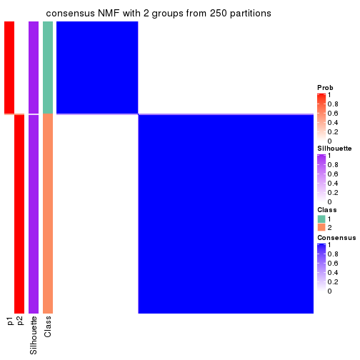</p>

</div>
<div id='tab-ATC-NMF-consensus-heatmap-2'>
<pre><code class="r">consensus_heatmap(res, k = 3)
</code></pre>

<p>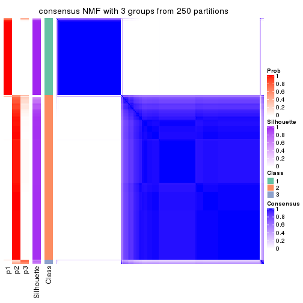</p>

</div>
<div id='tab-ATC-NMF-consensus-heatmap-3'>
<pre><code class="r">consensus_heatmap(res, k = 4)
</code></pre>

<p>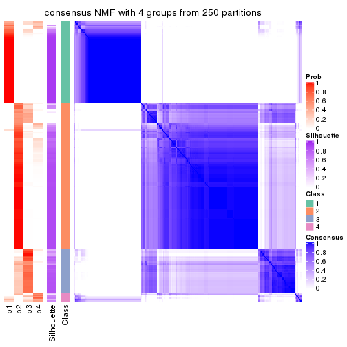</p>

</div>
<div id='tab-ATC-NMF-consensus-heatmap-4'>
<pre><code class="r">consensus_heatmap(res, k = 5)
</code></pre>

<p>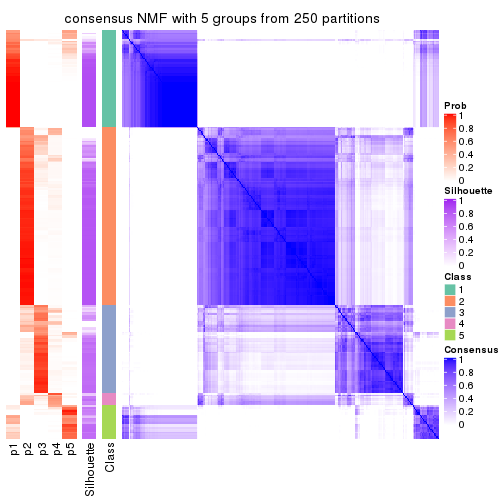</p>

</div>
<div id='tab-ATC-NMF-consensus-heatmap-5'>
<pre><code class="r">consensus_heatmap(res, k = 6)
</code></pre>

<p>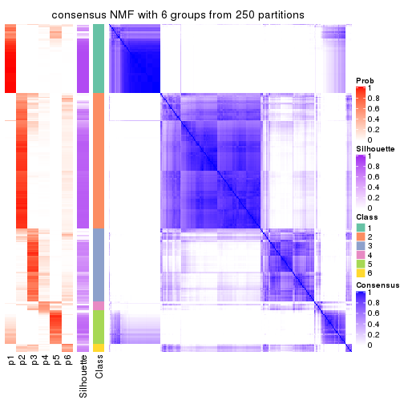</p>

</div>
</div>

Heatmaps for the membership of samples in all partitions to see how consistent they are:


<script>
$( function() {
	$( '#tabs-ATC-NMF-membership-heatmap' ).tabs();
} );
</script>
<div id='tabs-ATC-NMF-membership-heatmap'>
<ul>
<li><a href='#tab-ATC-NMF-membership-heatmap-1'>k = 2</a></li>
<li><a href='#tab-ATC-NMF-membership-heatmap-2'>k = 3</a></li>
<li><a href='#tab-ATC-NMF-membership-heatmap-3'>k = 4</a></li>
<li><a href='#tab-ATC-NMF-membership-heatmap-4'>k = 5</a></li>
<li><a href='#tab-ATC-NMF-membership-heatmap-5'>k = 6</a></li>
</ul>
<div id='tab-ATC-NMF-membership-heatmap-1'>
<pre><code class="r">membership_heatmap(res, k = 2)
</code></pre>

<p>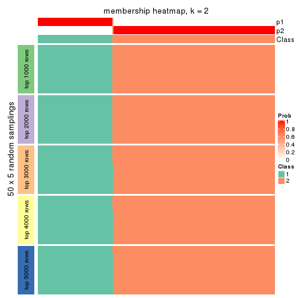</p>

</div>
<div id='tab-ATC-NMF-membership-heatmap-2'>
<pre><code class="r">membership_heatmap(res, k = 3)
</code></pre>

<p>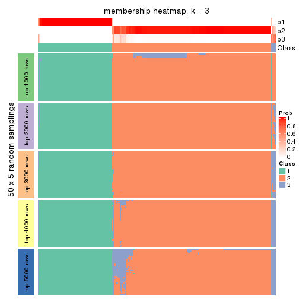</p>

</div>
<div id='tab-ATC-NMF-membership-heatmap-3'>
<pre><code class="r">membership_heatmap(res, k = 4)
</code></pre>

<p>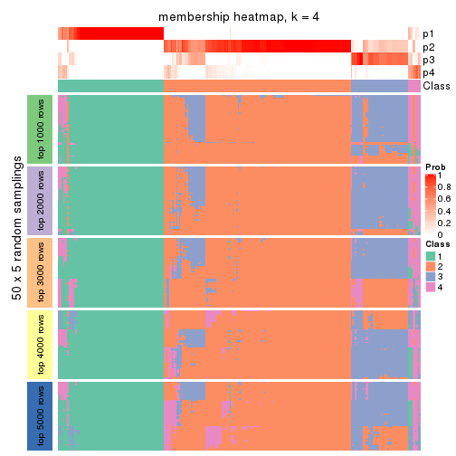</p>

</div>
<div id='tab-ATC-NMF-membership-heatmap-4'>
<pre><code class="r">membership_heatmap(res, k = 5)
</code></pre>

<p>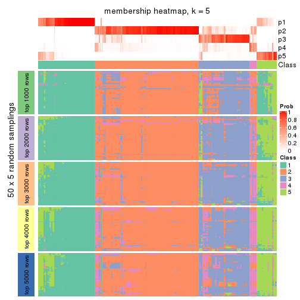</p>

</div>
<div id='tab-ATC-NMF-membership-heatmap-5'>
<pre><code class="r">membership_heatmap(res, k = 6)
</code></pre>

<p>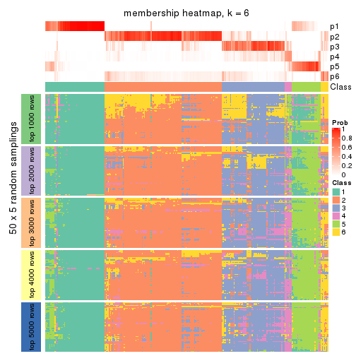</p>

</div>
</div>

As soon as we have had the classes for columns, we can look for signatures
which are significantly different between classes which can be candidate marks
for certain classes. Following are the heatmaps for signatures.


Signature heatmaps where rows are scaled:


<script>
$( function() {
	$( '#tabs-ATC-NMF-get-signatures' ).tabs();
} );
</script>
<div id='tabs-ATC-NMF-get-signatures'>
<ul>
<li><a href='#tab-ATC-NMF-get-signatures-1'>k = 2</a></li>
<li><a href='#tab-ATC-NMF-get-signatures-2'>k = 3</a></li>
<li><a href='#tab-ATC-NMF-get-signatures-3'>k = 4</a></li>
<li><a href='#tab-ATC-NMF-get-signatures-4'>k = 5</a></li>
<li><a href='#tab-ATC-NMF-get-signatures-5'>k = 6</a></li>
</ul>
<div id='tab-ATC-NMF-get-signatures-1'>
<pre><code class="r">get_signatures(res, k = 2)
</code></pre>

<p>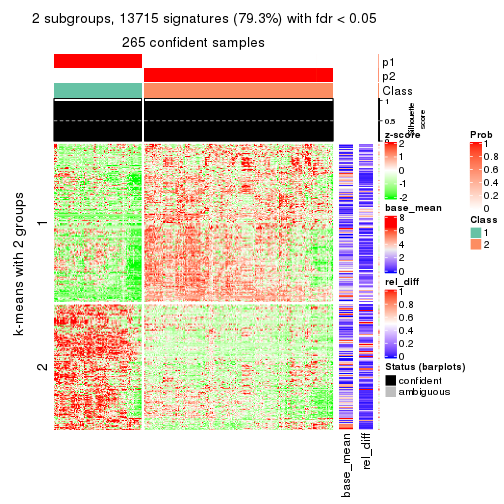</p>

</div>
<div id='tab-ATC-NMF-get-signatures-2'>
<pre><code class="r">get_signatures(res, k = 3)
</code></pre>

<p>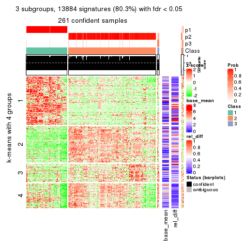</p>

</div>
<div id='tab-ATC-NMF-get-signatures-3'>
<pre><code class="r">get_signatures(res, k = 4)
</code></pre>

<p>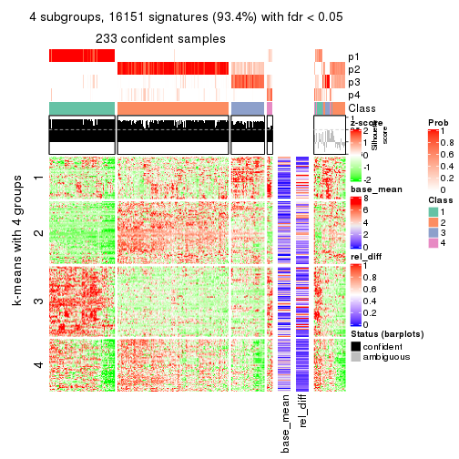</p>

</div>
<div id='tab-ATC-NMF-get-signatures-4'>
<pre><code class="r">get_signatures(res, k = 5)
</code></pre>

<p>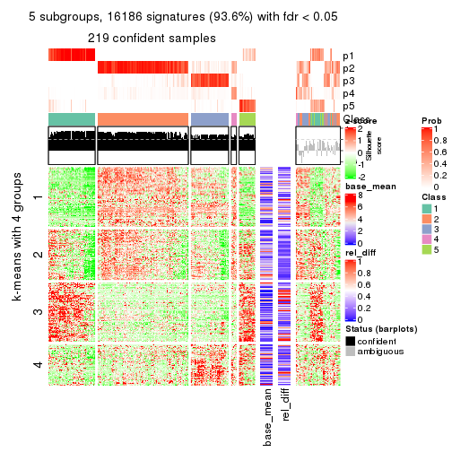</p>

</div>
<div id='tab-ATC-NMF-get-signatures-5'>
<pre><code class="r">get_signatures(res, k = 6)
</code></pre>

<p>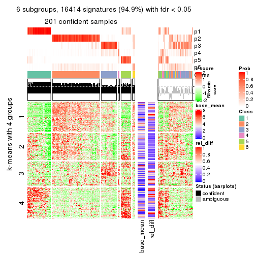</p>

</div>
</div>


Signature heatmaps where rows are not scaled:


<script>
$( function() {
	$( '#tabs-ATC-NMF-get-signatures-no-scale' ).tabs();
} );
</script>
<div id='tabs-ATC-NMF-get-signatures-no-scale'>
<ul>
<li><a href='#tab-ATC-NMF-get-signatures-no-scale-1'>k = 2</a></li>
<li><a href='#tab-ATC-NMF-get-signatures-no-scale-2'>k = 3</a></li>
<li><a href='#tab-ATC-NMF-get-signatures-no-scale-3'>k = 4</a></li>
<li><a href='#tab-ATC-NMF-get-signatures-no-scale-4'>k = 5</a></li>
<li><a href='#tab-ATC-NMF-get-signatures-no-scale-5'>k = 6</a></li>
</ul>
<div id='tab-ATC-NMF-get-signatures-no-scale-1'>
<pre><code class="r">get_signatures(res, k = 2, scale_rows = FALSE)
</code></pre>

<p>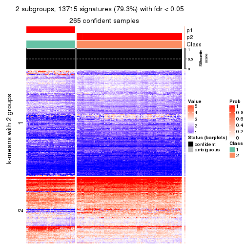</p>

</div>
<div id='tab-ATC-NMF-get-signatures-no-scale-2'>
<pre><code class="r">get_signatures(res, k = 3, scale_rows = FALSE)
</code></pre>

<p>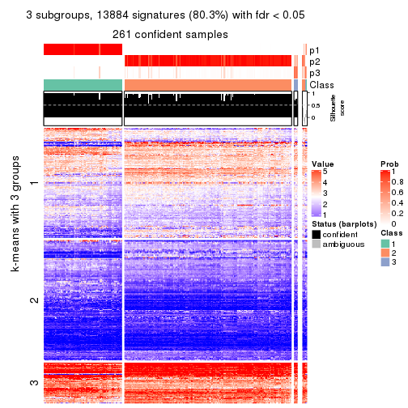</p>

</div>
<div id='tab-ATC-NMF-get-signatures-no-scale-3'>
<pre><code class="r">get_signatures(res, k = 4, scale_rows = FALSE)
</code></pre>

<p>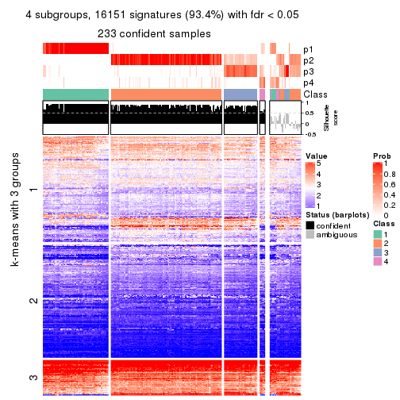</p>

</div>
<div id='tab-ATC-NMF-get-signatures-no-scale-4'>
<pre><code class="r">get_signatures(res, k = 5, scale_rows = FALSE)
</code></pre>

<p>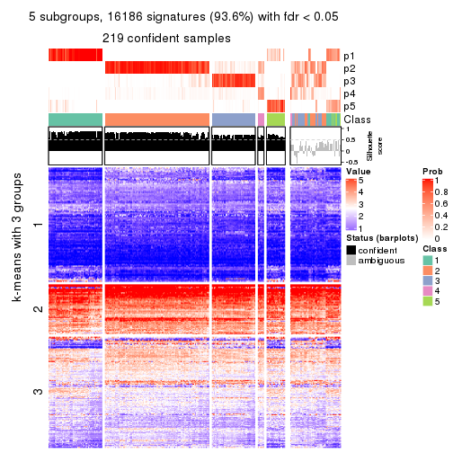</p>

</div>
<div id='tab-ATC-NMF-get-signatures-no-scale-5'>
<pre><code class="r">get_signatures(res, k = 6, scale_rows = FALSE)
</code></pre>

<p>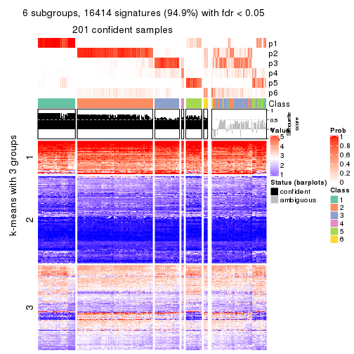</p>

</div>
</div>


Compare the overlap of signatures from different k:

```r
compare_signatures(res)
```

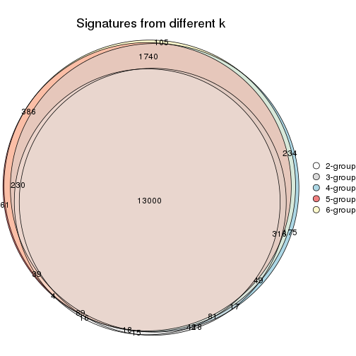

`get_signature()` returns a data frame invisibly. TO get the list of signatures, the function
call should be assigned to a variable explicitly. In following code, if `plot` argument is set
to `FALSE`, no heatmap is plotted while only the differential analysis is performed.

```r
# code only for demonstration
tb = get_signature(res, k = ..., plot = FALSE)
```

An example of the output of `tb` is:

```
#>   which_row         fdr    mean_1    mean_2 scaled_mean_1 scaled_mean_2 km
#> 1        38 0.042760348  8.373488  9.131774    -0.5533452     0.5164555  1
#> 2        40 0.018707592  7.106213  8.469186    -0.6173731     0.5762149  1
#> 3        55 0.019134737 10.221463 11.207825    -0.6159697     0.5749050  1
#> 4        59 0.006059896  5.921854  7.869574    -0.6899429     0.6439467  1
#> 5        60 0.018055526  8.928898 10.211722    -0.6204761     0.5791110  1
#> 6        98 0.009384629 15.714769 14.887706     0.6635654    -0.6193277  2
...
```

The columns in `tb` are:

1. `which_row`: row indices corresponding to the input matrix.
2. `fdr`: FDR for the differential test. 
3. `mean_x`: The mean value in group x.
4. `scaled_mean_x`: The mean value in group x after rows are scaled.
5. `km`: Row groups if k-means clustering is applied to rows.


UMAP plot which shows how samples are separated.


<script>
$( function() {
	$( '#tabs-ATC-NMF-dimension-reduction' ).tabs();
} );
</script>
<div id='tabs-ATC-NMF-dimension-reduction'>
<ul>
<li><a href='#tab-ATC-NMF-dimension-reduction-1'>k = 2</a></li>
<li><a href='#tab-ATC-NMF-dimension-reduction-2'>k = 3</a></li>
<li><a href='#tab-ATC-NMF-dimension-reduction-3'>k = 4</a></li>
<li><a href='#tab-ATC-NMF-dimension-reduction-4'>k = 5</a></li>
<li><a href='#tab-ATC-NMF-dimension-reduction-5'>k = 6</a></li>
</ul>
<div id='tab-ATC-NMF-dimension-reduction-1'>
<pre><code class="r">dimension_reduction(res, k = 2, method = &quot;UMAP&quot;)
</code></pre>

<p>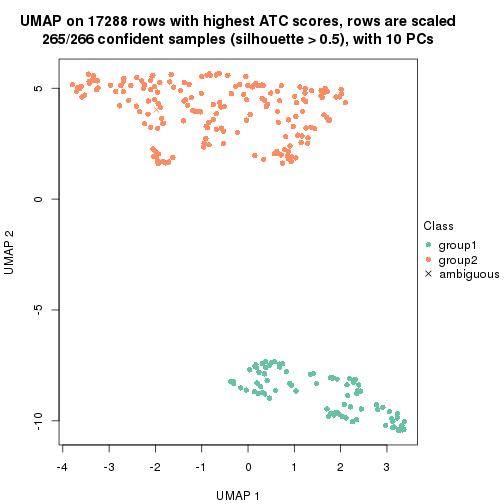</p>

</div>
<div id='tab-ATC-NMF-dimension-reduction-2'>
<pre><code class="r">dimension_reduction(res, k = 3, method = &quot;UMAP&quot;)
</code></pre>

<p>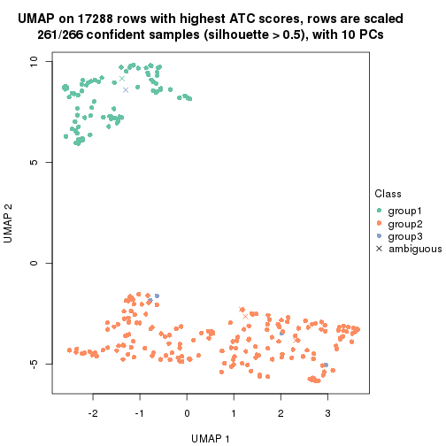</p>

</div>
<div id='tab-ATC-NMF-dimension-reduction-3'>
<pre><code class="r">dimension_reduction(res, k = 4, method = &quot;UMAP&quot;)
</code></pre>

<p>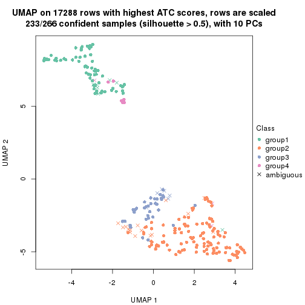</p>

</div>
<div id='tab-ATC-NMF-dimension-reduction-4'>
<pre><code class="r">dimension_reduction(res, k = 5, method = &quot;UMAP&quot;)
</code></pre>

<p>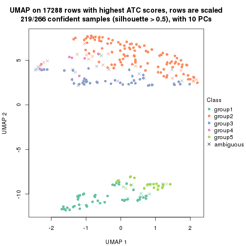</p>

</div>
<div id='tab-ATC-NMF-dimension-reduction-5'>
<pre><code class="r">dimension_reduction(res, k = 6, method = &quot;UMAP&quot;)
</code></pre>

<p>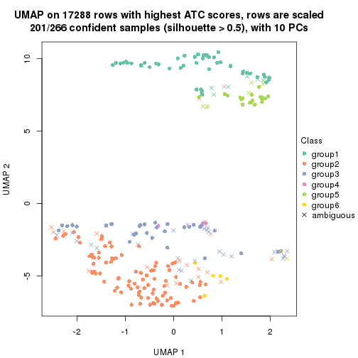</p>

</div>
</div>


Following heatmap shows how subgroups are split when increasing `k`:

```r
collect_classes(res)
```

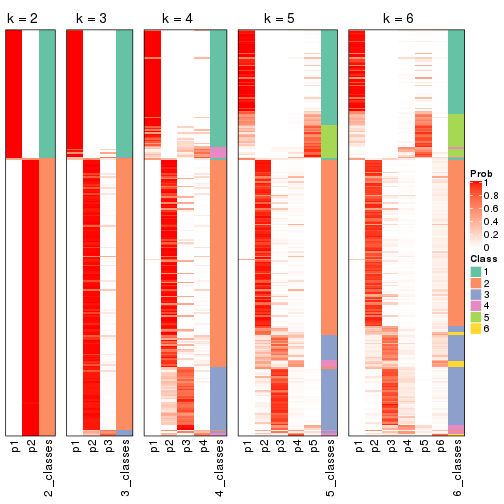


If matrix rows can be associated to genes, consider to use `GO_Enrichment(res,
...)` to perform function enrichment for the signature genes.


 

## Session info


```r
sessionInfo()
```

```
#> R version 3.6.0 (2019-04-26)
#> Platform: x86_64-pc-linux-gnu (64-bit)
#> Running under: CentOS Linux 7 (Core)
#> 
#> Matrix products: default
#> BLAS:   /usr/lib64/libblas.so.3.4.2
#> LAPACK: /usr/lib64/liblapack.so.3.4.2
#> 
#> locale:
#>  [1] LC_CTYPE=en_GB.UTF-8       LC_NUMERIC=C               LC_TIME=en_GB.UTF-8       
#>  [4] LC_COLLATE=en_GB.UTF-8     LC_MONETARY=en_GB.UTF-8    LC_MESSAGES=en_GB.UTF-8   
#>  [7] LC_PAPER=en_GB.UTF-8       LC_NAME=C                  LC_ADDRESS=C              
#> [10] LC_TELEPHONE=C             LC_MEASUREMENT=en_GB.UTF-8 LC_IDENTIFICATION=C       
#> 
#> attached base packages:
#>  [1] grid      parallel  stats4    stats     graphics  grDevices utils     datasets  methods  
#> [10] base     
#> 
#> other attached packages:
#>  [1] genefilter_1.66.0           ComplexHeatmap_2.1.1        markdown_1.1               
#>  [4] knitr_1.26                  cola_1.3.2                  SummarizedExperiment_1.14.1
#>  [7] DelayedArray_0.10.0         BiocParallel_1.18.1         matrixStats_0.55.0         
#> [10] Biobase_2.44.0              GenomicRanges_1.36.1        GenomeInfoDb_1.20.0        
#> [13] IRanges_2.18.3              S4Vectors_0.22.1            BiocGenerics_0.30.0        
#> [16] GetoptLong_0.1.7           
#> 
#> loaded via a namespace (and not attached):
#>  [1] bitops_1.0-6           bit64_0.9-7            doParallel_1.0.15      RColorBrewer_1.1-2    
#>  [5] httr_1.4.1             backports_1.1.5        tools_3.6.0            R6_2.4.1              
#>  [9] DBI_1.0.0              lazyeval_0.2.2         colorspace_1.4-1       withr_2.1.2           
#> [13] tidyselect_0.2.5       gridExtra_2.3          bit_1.1-14             compiler_3.6.0        
#> [17] xml2_1.2.2             microbenchmark_1.4-7   pkgmaker_0.28          slam_0.1-46           
#> [21] scales_1.1.0           NMF_0.23.6             stringr_1.4.0          digest_0.6.23         
#> [25] XVector_0.24.0         pkgconfig_2.0.3        bibtex_0.4.2           highr_0.8             
#> [29] rlang_0.4.2            GlobalOptions_0.1.1    RSQLite_2.1.2          impute_1.58.0         
#> [33] shape_1.4.4            mclust_5.4.5           dendextend_1.12.0      dplyr_0.8.3           
#> [37] RCurl_1.95-4.12        magrittr_1.5           GenomeInfoDbData_1.2.1 Matrix_1.2-17         
#> [41] Rcpp_1.0.3             munsell_0.5.0          viridis_0.5.1          lifecycle_0.1.0       
#> [45] stringi_1.4.3          zlibbioc_1.30.0        plyr_1.8.4             blob_1.2.0            
#> [49] crayon_1.3.4           lattice_0.20-38        splines_3.6.0          annotate_1.62.0       
#> [53] circlize_0.4.9         zeallot_0.1.0          pillar_1.4.2           rjson_0.2.20          
#> [57] rngtools_1.4           reshape2_1.4.3         codetools_0.2-16       XML_3.98-1.20         
#> [61] glue_1.3.1             evaluate_0.14          vctrs_0.2.0            png_0.1-7             
#> [65] foreach_1.4.7          polyclip_1.10-0        gtable_0.3.0           purrr_0.3.3           
#> [69] clue_0.3-57            assertthat_0.2.1       ggplot2_3.2.1          xfun_0.11             
#> [73] gridBase_0.4-7         eulerr_6.0.0           xtable_1.8-4           skmeans_0.2-11        
#> [77] survival_2.44-1.1      viridisLite_0.3.0      tibble_2.1.3           iterators_1.0.12      
#> [81] memoise_1.1.0          AnnotationDbi_1.46.1   registry_0.5-1         GTF_0.0.1             
#> [85] cluster_2.1.0          brew_1.0-6
```


